<!--yml

类别: 未分类

日期: 2024-09-06 19:34:25

-->

# [2402.15490] 深度学习中的卷积综述：应用、挑战和未来趋势

> 来源：[`ar5iv.labs.arxiv.org/html/2402.15490`](https://ar5iv.labs.arxiv.org/html/2402.15490)

# 深度学习中的卷积综述：应用、挑战和未来趋势

Abolfazl Younesi1, Mohsen Ansari1, MohammadAmin Fazli1, Alireza Ejlali1, Muhammad Shafique2 和 Jörg Henkel3 A. Younesi、M. Ansari、A. Ejlali 和 M. A. Fazli 现为伊朗德黑兰谢里夫理工大学计算机工程系的成员。电子邮件：{abolfazl.yunesi, ansari, ejlali, fazli}@sharif.edu。M. Shafique 现为阿布扎比纽约大学计算机工程系的成员。电子邮件：muhammad.shafique@nyu.edu。J. Henkel 现为德国卡尔斯鲁厄理工学院的成员。电子邮件：henkel@kit.edu。

###### 摘要

在今天的数字时代，卷积神经网络（CNN），作为深度学习（DL）的一个子集，被广泛用于各种计算机视觉任务，如图像分类、目标检测和图像分割。为了满足特定需求和要求，设计了许多不同类型的 CNN，包括 1D、2D 和 3D CNN，以及扩张卷积、分组卷积、注意力卷积和深度卷积等。每种类型的 CNN 具有其独特的结构和特性，使其适用于特定任务。深入了解这些不同类型的 CNN 并进行比较分析对于理解它们的优缺点至关重要。此外，研究每种 CNN 的性能、限制和实际应用可以帮助未来开发新的改进架构。我们还从不同的角度探讨了研究人员用于研究或开发的平台和框架。此外，我们还研究了 CNN 的主要研究领域，如 6D 视觉、生成模型和元学习。这篇综述论文全面检查和比较了各种 CNN 架构，突出它们的架构差异，并强调它们各自的优点、缺点、应用、挑战和未来趋势。

###### 关键词：

深度学习，DNN，CNN，机器学习，视觉变换器，GAN，注意力机制，计算机视觉，LLM，大型语言模型，Transformer，扩张卷积，深度卷积，NAS，NAT，目标检测，6D 视觉，视觉语言模型

## I 引言

在今天的世界里，随着技术的不断进步，深度学习（DL）已成为我们生活中的一个重要组成部分[1]。从像 Siri 和 Alexa 这样的语音助手到社交媒体平台上的个性化推荐，DL 算法不断在幕后工作，以理解我们的偏好并使我们的生活更轻松[2]。随着技术的进步，DL 也被应用于医疗保健、金融和交通等各个领域，彻底改变了我们对这些行业的处理方式[3, 4, 5]。随着 DL 领域的研究和开发不断进展，我们可以期待更多创新应用，进一步提升我们的日常生活。DL 引领了人工智能的变革时代，使机器能够整合大量数据集并做出明智的预测[6][8]。CNN 的开发在深度学习的重大进展中受到了关注。它们在一些领域产生了影响，包括生成式 AI、医学图像检查、物体识别[9]和异常检测[10]。CNN 作为前馈神经网络，将卷积操作集成到其架构中[7][11]。这些操作使 CNN 能够巧妙地捕捉复杂的空间和层次模式，使其特别适合图像分析任务[12]。

然而，CNN 在训练和部署过程中经常受到计算复杂性的困扰，特别是在资源受限的设备如手机和可穿戴设备上运行时[12][13]。

表 I：现有调查的比较；+* 表示有条件考虑

| 参考文献 | 年份 | 包含研究数量 | 研究问题和目标 | 分类 | 数据集 | 挑战 | 模拟器比较 | 评估 |
| --- | --- | --- | --- | --- | --- | --- | --- | --- |
| [117] | 2023 | 210 | - | +* | - | - | + | - |
| [118] | 2021 | 343 | - | + | + | + | + | - |
| [119] | 2022 | 202 | - | + | - | + | - | + |
| [120] | 2020 | 243 | - | +* | + | +* | - | - |
| 我们的调查 | 2024 | 465 | + | + | + | + | + | + |

加强卷积神经网络（CNNs）能源效率的主要途径有两个：采用轻量级 CNN 架构：这些架构经过精心设计，以在不妨碍准确性的情况下实现计算效率。例如，MobileNet 系列 CNN 经过精细调整，专为移动设备设计，并在各种图像分类应用中展示了最先进的准确性[13]。

拥抱压缩技术：这些方法有助于减少 CNN 模型的大小，从而减少设备之间的数据传输量。一个值得注意的例子是 TensorFlow Lite 框架，它提供了一套针对移动设备的 CNN 模型压缩技术[14]。

轻量级 CNN 架构与压缩技术的融合显著提高了 CNN 的能效。在资源受限的设备上训练和部署 CNN 变得可行，从而为在医疗、农业和环境监测等各种应用中使用 CNN 开辟了新的机会[12][16]。

不同的卷积技术如何满足各种人工智能应用的需求。卷积在现代深度学习架构中发挥了基础性作用，尤其是在处理以网格状结构组织的数据时（如图像、音频信号和序列数据）尤其重要[23]。卷积操作包括将一个小滤波器（也称为内核）在输入数据上移动，进行逐元素乘法和聚合。这个过程从输入数据中提取出关键特征[24]。卷积的主要意义在于它们能够有效地捕捉数据中的局部模式和空间关系。这种定位特性使得卷积特别适合于图像识别等任务，因为可以基于对象的局部结构来识别物体。此外，卷积引入了参数共享，从而显著减少了可训练参数的数量，导致模型更加高效和可扩展[25]。现有的调查：以前关于 CNN 架构的调查论文，如[118]和[120]，提供了对某一时期流行架构的良好概述。然而，它们缺乏明确的研究问题和目标、评估和基于设计模式的挑战。它们主要按时间顺序讨论了架构。

早期的调查如[119]和[120]着重于解释核心 CNN 组件和流行架构直到某一年。这些调查也缺乏研究问题和目标、数据集分析以及未涵盖的大型视觉模型、大型语言模型等特殊分类的完整概述，并且缺乏多点视角来解决挑战。

以前的工作讨论了 CNN 某些特定概念和应用中的挑战，但没有广泛涵盖新型 CNN 架构中的内在分类。因此，这促使我们撰写了一篇调查论文，旨在通过提出一个分类法，以清晰地根据内在设计模式而不是发布日期来分类 CNN 架构，从而填补前人工作的空白。

我们专注于 2012 年以来的架构创新，并比早期的综述更深入地讨论了最新的发展。讨论最新的趋势和挑战为研究人员提供了更新的视角。

对 CNN 的历史、分类、应用和挑战的全面调查是加速这一领域研究进展所必需的。

在这篇论文中，我们寻求解答的关键问题包括：

+   •

    诸如 ResNet、Inception 和 MobileNet 等最先进的 CNN 模型在目标硬件上的表现如何，与受限基准相比如何？对准确性、延迟和内存使用的影响是什么？

+   •

    剪枝、量化、蒸馏和架构设计等技术如何在保持预测质量的同时最大限度地减少模型大小和计算复杂性？

+   •

    结合不同技术的多阶段优化方法与单一方法相比如何？我们能否在准确性、延迟和内存之间实现更好的折中？

+   •

    对于像嵌入式视觉这样的目标应用，考虑到其独特的约束和规格，优化 CNN 模型的基准测试、调优和部署的最佳实践是什么？

+   •

    哪些剪枝和量化技术最适合我们的目标应用和硬件？与基准相比如何？

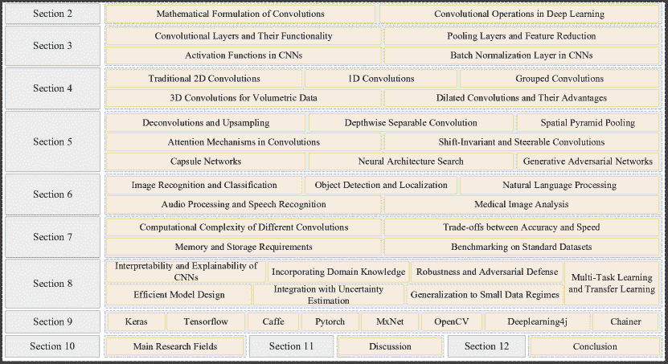

图 1：表示论文的逐节结构，为展示研究结果提供了一个清晰且有组织的框架。

我们的综述对深度学习和计算机视觉社区做出了几个关键贡献：

+   •

    分析多种现有的 CNN：这项调查提供了对各种用于计算机视觉应用的深度学习模型和算法的全面而详细的分析。

+   •

    比较具有各种参数和架构的 CNN 模型：综述提供了性能和效率折中的见解。

+   •

    确定不同 CNN 模型的优缺点：帮助研究人员选择最适合其特定应用的模型。

+   •

    综述突出了深度学习和计算机视觉领域进一步改进的挑战和未来方向。

+   •

    探索神经网络架构的趋势：强调了这些进展的实际应用和令人兴奋的性质。

+   •

    对主要研究领域的全面概述：涵盖了研究人员积极追求的主要研究领域。

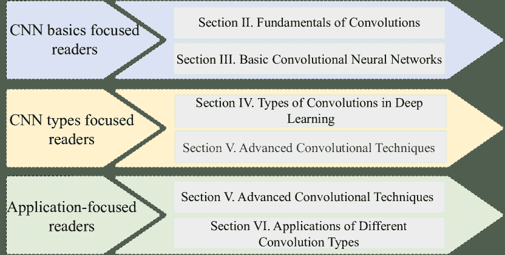

图 2：一个基于文本的视觉阅读地图，帮助个人导航和理解论文内容。

我们的综述论文的其余部分如下（见图 1）：论文的第二部分将**深入**卷积的基础知识，阐明它们的数学公式、操作机制以及它们在神经网络结构中的作用。第三部分描述了 CNN 的基本部分。在第四部分，将涵盖 2D 卷积、用于序列数据的 1D 卷积以及用于体积数据的 3D 卷积。论文第五部分将调查近年来出现的先进卷积技术。这将包括上采样的转置卷积、用于效率的深度可分卷积、空间金字塔池化以及卷积中的注意机制。第六部分将突出不同卷积类型在现实世界中的应用，展示它们在图像识别、目标检测、自然语言处理、音频处理和医学图像分析中的实用性。在第七部分，我们讨论了 CNN 的未来趋势和一些未解问题。第八部分涉及 CNN 的性能考虑。在第九部分，我们将讨论研究人员和开发者常用的平台，在第十部分讨论流行或趋势的研究领域，然后在第十一部分进行讨论。在第八部分结束时，读者将深入理解卷积在深度学习中的重要性，图 2 表示读者地图，以可视化文本中的信息流。它展示了各部分之间的连接，帮助读者理解根据需求选择的部分的整体结构。

## II 卷积的基础知识

卷积构成了处理网格结构数据（如图像、视频和时间序列数据）的关键数学操作的基础[26]。最初用于信号处理，卷积用于分析和处理信号[27]。在深度学习中，卷积作为强大的特征提取器，使神经网络能够高效地从原始数据中学习[26][27]。卷积的本质是将一个小滤波器，通常称为内核，滑过输入数据。在每个滑动操作的位置，内核与相应的输入值进行逐元素乘法[28]。通过这一过程，捕捉数据中的局部模式和关系，使模型能够获取诸如边缘、纹理和形状等重要特征。

### II-A 卷积的数学公式

-   从数学上讲，二维卷积在输入矩阵（通常代表图像）和内核之间可以表示如下：

|  | $\text{Output}(i,j)=\sum_{(x,y)}\text{Input}(x,y)\cdot\text{Kernel}(i-x,j-y)$ |  | (1) |
| --- | --- | --- | --- |

-   在这里，Output 表示结果特征图，而 Input 表示输入矩阵。内核，通常是一个小的方阵，定义了卷积滤波器的权重。卷积操作通过在输入矩阵上滑动内核来进行，在每个位置，按元素的乘法和求和会按照公式[29]进行计算。对于一维卷积，数学公式类似，内核在一维序列（如时间序列或文本数据）上滑动[30]。

### -   II-B 卷积操作在深度学习中的应用

-   卷积操作构成了 CNN 的核心，CNN 是一种广泛用于各种计算机视觉应用的高度突出的深度学习模型。CNN 中，卷积通常集成到被称为卷积层的特定层中[31]。这些层由多个滤波器组成，每个滤波器负责检测输入数据中的不同模式[139, 140, 141, 142, 143, 144, 145, 146]。在训练阶段，模型通过反向传播和梯度下降的过程来学习卷积滤波器的最优权重，从而使模型能够自动识别数据中的有意义模式。

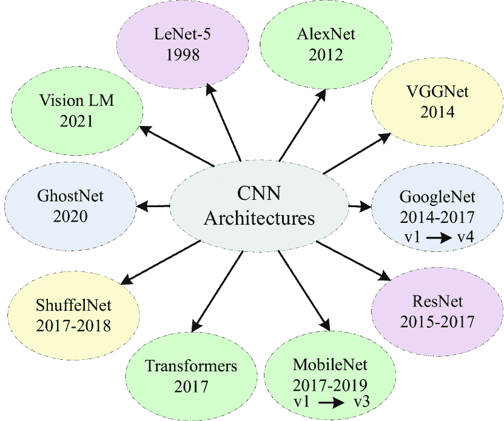

-   图 3：1998 到 2023 年 CNN 架构的图示表示

-   此外，CNN 架构（参见图 3 和图 4）通常在卷积层后加入池化层。由于池化层的存在，通过卷积生成的特征图会被降采样，从而减少计算复杂度。常见的池化技术包括最大池化和平均池化，我们将在第 3\. B 节中讨论这些技术。

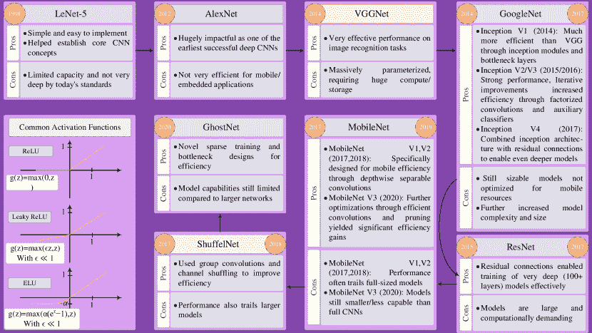

-   图 4：1998-2020 年 CNN 架构的流程及其优缺点，表示每个 CNN 模型在特定应用中的效率

### -   II-C 小波变换

小波是一个重要的数学工具，广泛应用于信号处理和计算机图形学等领域。小波本质上依赖卷积来分析函数或连续时间信号[104]。通过将目标函数与不同尺度的小波基函数进行卷积，小波能够以不同的分辨率表示数据[109]。

小波分析使用小的波动，称为小波，作为基函数，而不是傅里叶分析中使用的正弦和余弦函数[105]。小波的优势在于能够在时间和频率上局部分析数据的属性，而不是全局分析。这使得它们非常适合于边缘检测、噪声去除和纹理识别等任务。小波基函数也可以适应被分析的输入信号或数据[105][106]。

CNNs 自然适用于小波分析，因为它们固有地使用卷积操作[107][108]。在训练过程中，CNNs 内的卷积滤波器可以学习类似小波的基函数，以有意义地表示在多个分辨率下的输入数据分布。通过采用小波基函数，CNNs 通过梯度下降和反向传播获得数据模式的高效多尺度表示[108][109]。

小波的一个关键特性是其将信号分解为不同频率成分的能力，高频对应于详细信息，低频对应于整体趋势[108]。单层小波分解将原始信号分解为近似系数和细节系数。近似系数包含低频信息，而细节系数包含高频或详细信息[109]。

CNNs 可以利用小波的多分辨率分解特性，通过卷积在每个层级学习小波滤波器[108, 109, 110]。每个层级的输出成为下一个层级的输入，滤波器在去除粗略信息后提取更详细的特征。这种卷积学习适应的小波基函数使 CNNs 能够在不同尺度上分层捕捉模式，从而提高数据表示能力[110]。

在各种图像处理和计算机视觉任务中，CNN 中使用卷积小波已显示出有希望的结果。对于去噪、超分辨率和纹理合成等应用，配备了学习的小波滤波器的 CNN 在有效表示视觉数据的关键多尺度特征方面达到了最先进的性能[110、111、112、113]。卷积小波在与传统卷积滤波器结合时，也有助于分割、检测和分类[109]。总之，小波为多尺度分析提供了强大的工具，CNN 可以通过其固有的卷积操作学习局部基函数来利用这一点。

## III 基本卷积神经网络

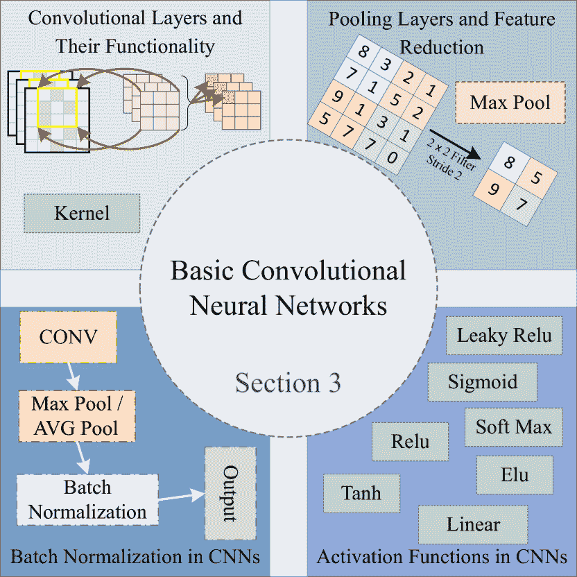

图 5：第三部分的图形表示

CNN 架构通常包括一个初始输入层，接着是几个关键组件，包括卷积层、池化层和全连接层。这种有序结构允许通过一系列层对原始数据（如图像）进行系统处理，从而提取相关特征并促进预测。

卷积层在此架构中占据中心位置，因为它们使用可学习的滤波器来处理输入数据。此操作对于检测各种模式和特征至关重要，从而增强了网络对底层数据的理解能力。在卷积层之后，池化层发挥作用，对前一层的输出进行下采样。此下采样过程减少了空间维度，同时保留了关键的信息。通过关注最重要的细节，这些层有助于平移不变性，这在图像识别等应用中尤其有价值，因为对象位置可能会有所变化。

在表 II 中，呈现了基本 CNN 的核心组件的全面概述（还请参见图 5），包括卷积层、池化层和激活函数。该表提供了关于它们各自目的、功能、对输入大小的依赖、参数、特征图、平移不变性、计算效率、输出大小、在 CNN 结构中的作用以及对模型性能的影响的深刻见解。分析这些方面可以深入了解对 CNN 的效果和性能有贡献的元素，使其成为该领域的研究人员和实践者的宝贵参考。

### III-A 深度学习的背景

深度学习，作为机器学习的一个重要形式，涵盖了使用由多个层组成的神经网络获取数据的分层表示 [17]。深受人脑错综复杂的工作方式的启发，在那里神经元参与处理和传递信息以形成世界的复杂描述，DL 模型，也被称为深度神经网络，在从原始数据中吸收分层特征方面展示出了非凡的能力。这种出色的能力使它们能够辨别错综复杂的模式，并在预测中取得显著的精度 [18]。

表 II：基本卷积神经网络的不同方面

| 方面 | 卷积层 | 池化层 | 激活函数 | 批量归一化 |
| --- | --- | --- | --- | --- |
| 目的 | 特征提取 | 特征减少 | 引入非线性 | 训练稳定性 |
| \hdashline 功能性 | 检测模式和纹理 | 对特征图进行下采样 | 添加非线性 | 规范化激活 |
| \hdashline 输入大小依赖性 | 取决于输入维度 | 减少空间维度 | 独立于输入 | 取决于输入大小 |
| \hdashline 参数 | 可学习的权重（卷积核） | 无参数 | 无参数 |

&#124; 可学习的比例调整 & &#124;

&#124; 位移参数 &#124;

|

| \hdashline 特征图 | 产生特征图 | 没有特征图 | 没有特征图 | 没有特征图 |
| --- | --- | --- | --- | --- |
| \hdashline 平移不变性 | 并非固有不变 | 引入一些不变性 | 独立于输入 | 没有平移不变性 |
| \hdashline 计算效率 | 计算密集型 |

&#124; 减少计算 &#124;

&#124; 复杂度 &#124;

| 低计算成本 | 增强训练稳定性 |
| --- | --- |
| \hdashline 输出大小 |

&#124; 可能或可能不 &#124;

&#124; 匹配输入大小 &#124;

| 减小的大小 | 保持不变 | 保持不变 |
| --- | --- | --- |

| \hdashline

&#124; 在 CNN 中的作用 &#124;

&#124; 体系结构 &#124;

| 中央组件 |
| --- |

&#124; 介于 &#124;

&#124; 卷积 &#124;

|

&#124; 启用学习 &#124;

&#124; 复杂关系 &#124;

|

&#124; 改善收敛性， &#124;

&#124; 调优难度 &#124;

|

| \hdashline

&#124; 对 &#124;

&#124; 模型性能 &#124;

|

&#124; 显著 &#124;

&#124; 影响性能 &#124;

|

&#124; 影响模型 &#124;

&#124; 效率 &#124;

|

&#124; 对于 &#124;

&#124; 学习 &#124;

|

&#124; 显著 &#124;

&#124; 影响性能 &#124;

|

| \hdashline 可解释性 | 低 | 低 | 低 | 正常 |
| --- | --- | --- | --- | --- |
| \hdashline 训练复杂性 | 高 | 低 | 低 | 正常 |
| \hdashline 内存使用 | 正常 | 低 | 低 | 正常 |

深度学习的根源可以追溯到 20 世纪 40 年代关于人工神经网络的初期努力。然而，真正的复兴和显著成果出现在 80 年代和 90 年代，为其在 21 世纪的显著复兴铺平了道路 [19]。推动这一复兴的关键因素包括计算能力的进步、大量数据集的可用性以及高效训练算法的出现，特别是反向传播算法，它在这一过程中发挥了关键作用 [20]。通过利用这些进展，深度学习模型获得了处理和分析大量数据的能力，从而能够解读复杂模式并做出准确预测。

强大硬件和复杂算法的融合引领了各个领域的显著成就。计算机视觉（CV）、自然语言处理（NLP）和语音识别（SR）等领域，通过深度学习的变革性力量，取得了显著进展 [73]。随着这一动态学科的发展和进步，它克服更困难问题并推动各行业创新的能力越来越清晰。

### III-B 卷积神经网络简介

卷积神经网络（CNNs），作为一种具有影响力的深度学习模型，已成为深度学习领域中一种卓越且广泛使用的算法 [21]。CNNs 的特点在于其进行卷积计算的能力和在复杂结构上高效运行的能力。这一特性使得 CNNs 在图像分析和特征提取方面取得了显著突破，使其能够识别和有效分类图像中的特征。此外，CNNs 被称为位移不变的人工神经网络，这一命名强调了它们根据输入信息的层次结构进行分类的能力 [22]。

CNN 的层次结构使其能够以平移不变的方式处理和提取输入数据中的特征[22]。这意味着 CNN 可以熟练地识别和分类图像中的物体，无论它们的位置或方向如何。这一平移不变属性的实现是通过应用卷积层来完成的，这些卷积层采用滑动窗口的方式使用滤波器。这些滤波器能够在不同空间尺度上检测特定模式或特征，从而使网络能够捕捉局部和全局信息。因此，CNN 在从图像中提取有意义的特征方面表现出极高的能力，这促进了包括目标检测、图像识别甚至图像生成在内的广泛应用[74]。

### III-C 卷积层及其功能

每个卷积层包含多个滤波器，也称为卷积核，这些滤波器是滑过输入数据的小窗口[32]。在训练阶段，这些滤波器的权重被学习，它们作为特征提取器，识别输入中存在的特定模式、边缘和纹理[33]。当滤波器在输入数据上移动时，它们生成强调数据中重要部分的特征图，这些部分被称为兴趣区域（ROI）。这些图显示了输入中具体模式变得活跃的地方，帮助 CNN 识别对后续任务如分类或检测至关重要的显著特征[34]。

例如，在一个训练用于识别猫的图像的 CNN 中，滤波器可能学习识别毛发、胡须和耳朵的模式。当滤波器在猫的图像上卷积时，它们生成突出这些特定感兴趣区域的特征图。这些特征图显示了这些猫特有模式的激活，并有助于准确地将图像分类为包含猫。

### III-D 池化层与特征减少

在卷积层之后，池化层被引入以减少特征图的空间维度，从而降低网络的计算复杂性[35]。在 CNN 中，最常用的池化技术是最大池化和平均池化[37]。

最大池化涉及从特征图的小区域中选择最大值，而平均池化计算平均值。池化有两个主要优势：首先，它有效地减少了网络中的参数数量，从而提高了计算效率。其次，它引入了一定程度的平移不变性，意味着输入数据中的小幅空间平移不会对池化结果产生显著影响。这一特性增强了卷积神经网络（CNN）对输入数据变化的泛化能力。

例如，在图像分类应用中，经过若干卷积层和激活层之后，可以使用池化层来下采样特征图。这种下采样减少了特征的空间分辨率，使处理更具计算效率，并减少了过拟合的风险。此外，由于池化计算的是最大值或平均值，它能够捕捉图像中的主要特征，而不受其精确位置的影响，使网络对物体位置或方向的轻微变化更具鲁棒性。

### III-E CNN 中的激活函数

激活函数在 CNN 中扮演着重要角色，因为它们被应用于每个神经元的输出，引入非线性，从而促进输入数据与其对应特征之间复杂关系的学习。在 CNN 中，一些常用的激活函数包括整流线性单元（ReLU）[36]，它将负值设为零，而正值保持不变。像 Leaky ReLU [36] 和 Parametric ReLU [39] 等变体也被广泛使用。激活函数的选择至关重要，因为它直接影响网络的学习能力和预测准确性。通过引入非线性，激活函数使 CNN 能够建模复杂的模式和决策边界，从而提高其在各种任务中的性能。

例如，在图像分类应用中，ReLU 激活函数已被证明能有效去除负像素值并强调正像素值，从而使 CNN 能够识别重要特征并学习判别模式。这使得 CNN 能够准确分类图像中的不同对象，比如正确识别图像中是否包含猫或狗。

### III-F CNN 中的批量归一化

批量归一化是一种有助于稳定和加速 CNN 训练的技术 [78]。它通过使用每个小批量的均值和方差对每层的激活值进行中心化和缩放，从而规范化激活值。这个过程减少了内部协变量偏移，使优化过程更加平滑，并允许使用更高的学习率。

通过规范化激活值，批量归一化允许使用更激进的学习率，这导致了更快的收敛和改进的模型泛化。此外，它还充当了正则化器，减少了对其他正则化技术（如 dropout）的需求。

总体而言，批量归一化已成为 CNN 架构中的标准组件，有助于加快训练速度、提高模型性能，并简化超参数调优。它的广泛应用显著促进了现代 CNN 在各种计算机视觉（CV）和自然语言处理（NLP）应用中的成功。例如，在图像分类应用中，批量归一化通过对每个小批量的输入进行归一化来帮助减少过拟合。这确保了网络能够学习到稳健的特征，并避免依赖于输入数据中的特定像素值或噪声。因此，模型变得更加通用，并在未见过的数据上表现更好。

## 深度学习中的卷积类型

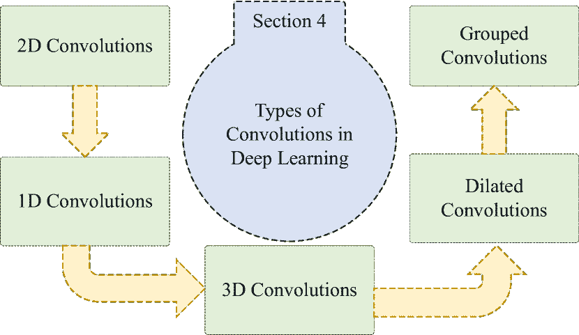

图 6：第四部分结构概览

在这一节中，我们的目标是全面探讨在深度学习模型中常用的不同卷积方法（参见图 6）。表 LABEL:tab:Characteristics 提供了这些卷积类型的简明概述，提供了输入数据类型、维度、感受野、计算成本、主要应用场景、内存消耗、并行化能力、时间信息的考虑以及计算效率等重要信息。

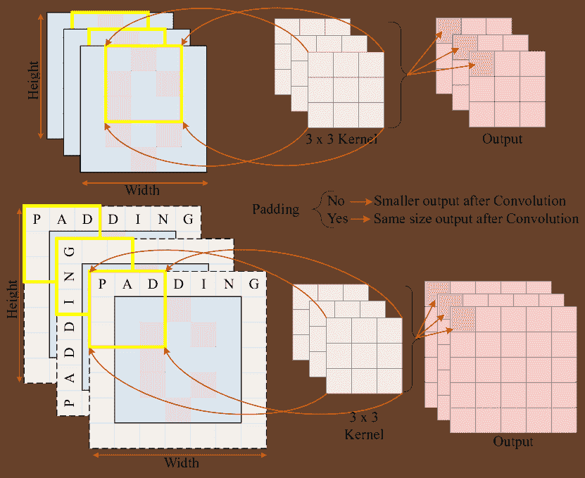

图 7：CNN 的基本结构。a) 代表没有填充的 CNN，这会导致输出图像变小。b) 代表没有填充的 CNN，输出图像与输入图像大小相同

需要强调的是，选择适当的卷积类型取决于特定任务和数据集。例如，在处理各种数据类型（如图像或文本）时，可能需要采用不同的卷积类型来有效捕捉相关特征。此外，对于实时应用或资源有限的环境，考虑每种卷积类型的计算效率变得尤为重要。

表 III：比较提供了不同卷积类型的特征和功能概述

| 卷积类型 | 2D 卷积 | 1D 卷积 | 3D 卷积 | 膨胀卷积 | 分组卷积 |
| --- | --- | --- | --- | --- | --- |
| 输入数据类型 | 图像 |

&#124; 序列数据 &#124;

&#124; （例如，文本） &#124;

|

&#124; 体积数据 &#124;

&#124; （例如，视频） &#124;

| 图像 | 图像 |
| --- | --- |
| \hdashline 维度 | 2D | 1D | 3D | 1D, 2D | 2D |
| \hdashline 感受野 | 局部 | 局部 | 体积 | 局部 | 局部 |
| \hdashline 计算成本 | 中等 | 低 | 高 | 低 | 高 |
| \hdashline 主要应用场景 |

&#124; 图像识别， &#124;

&#124; 目标检测 &#124;

|

&#124; 文本分类， &#124;

&#124; 情感分析 &#124;

|

&#124; 语义分割, &#124;

&#124; 3D 医学成像 &#124;

|

&#124; 图像滤波, &#124;

&#124; 图像生成 &#124;

|

&#124; 大规模 &#124;

&#124; CNN 架构 &#124;

|

| \hdashline 内存消耗 | 中等 | 低 | 高 | 低 | 低 |
| --- | --- | --- | --- | --- | --- |
| \hdashline 并行 | 有限 | 有限 | 有限 | 有限 | 高 |

| \hdashline

&#124; 时间使用 &#124;

&#124; 信息 &#124;

| 不适用 |
| --- |

&#124; 捕捉时间 &#124;

&#124; 模式 &#124;

|

&#124; 捕捉空间 &#124;

&#124; 时间模式 &#124;

| 不适用 | 不适用 |
| --- | --- |

| \hdashline

&#124; 计算 &#124;

&#124; 效率 &#124;

| 中等 | 高 | 中等 | 高 | 高 |
| --- | --- | --- | --- | --- |

### IV-A 2D 卷积

2D 卷积（见图 7）作为 CNN 的基础元素，特别是与计算机视觉（CV）相关的应用中。它们主要用于处理二维数据，例如可以表示为像素网格的图像。在此卷积操作中，2D 核在输入图像上滑动，从而捕捉局部模式并提取相关特征 [27]。2D 卷积的主要应用在于图像识别，其中模型学习识别关键模式，包括边缘、纹理和对象组件，从而促进高层次的识别应用 [40]。

2D 卷积在图像识别之外的多个领域中也得到了应用，包括信号处理、计算机视觉（CV）和自然语言处理（NLP）。CNNs 完全改变了计算机视觉处理过程，如对象检测、图像分割和面部识别。通过使用 2D 卷积，CNNs 可以更准确、更高效地分析图像中存在的空间关系和层次结构。当学习到的滤波器在输入图像上滑动时，CNN 可以学习在图像中找到和定位不同的对象，例如在对象检测任务中。这有助于网络在复杂场景中准确检测对象，因为它可以识别各种尺寸的重要模式。

此外，通过使用 2D 卷积分析面部特征，CNN 还可以学习对面部进行分类和比较。这使得能够创建像访问控制和身份验证这样的系统。

### IV-B 一维卷积用于序列数据

一维（1D）卷积（见图 8）专门设计用于处理时间序列、音频信号和自然语言等序列数据。与二维卷积不同，1D 卷积操作在单一线性上，能够检测随时间发展的模式[41]。在自然语言处理领域，1D 卷积广泛用于文本分类和情感分析等任务。它们帮助模型识别词序列中的复杂模式，并理解这些词之间的关系[42]。

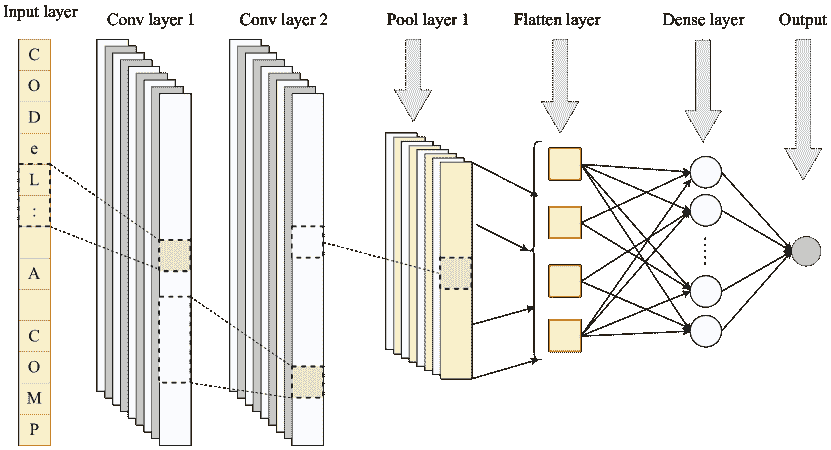

图 8：简单的一维（1D）卷积神经网络的概览，包含两个卷积层

一维卷积也已成功应用于音频信号处理，如超分辨率（SR）和音乐分析。通过分析音频信号的时间模式，这些模型可以提取出有意义的特征，从而捕捉声音的基本结构和特征。这在如说话人识别和情感识别等应用中尤为有效，其中音频数据的序列特性至关重要。

例如，在说话人识别中，1D 卷积可以分析个体声音的序列模式，并学习将特定模式与特定说话人关联起来。这使得模型能够准确识别和区分音频录音中的不同说话人。在情感识别中，1D 卷积可以分析音频信号中音高、音调和强度的时间变化，以分类说话人的情感状态，如快乐、悲伤或愤怒。这有助于检测和理解通过语音传达的潜在情感，适用于客户情感分析、虚拟助手和心理健康监测等各种应用。

### IV-C 体积数据的 3D 卷积

三维（3D）卷积专门设计用于处理体积数据，如 3D 医学图像或视频数据[43]。3D 卷积具备同时处理空间和时间维度的能力，从而捕捉所有三个维度中的复杂模式和独特特征。在医学成像中，3D 卷积对于寻找肿瘤的位置至关重要。模型利用 3D 医学扫描来识别重要的空间及周围细节，帮助准确定位和描述肿瘤[44][45]。

3D 卷积的应用已经超越了肿瘤，还用于各种医学影像任务，如提取身体不同部位、发现问题和分类疾病。这种方法使模型能够查看医学扫描的整个体积，而不仅仅是个别部分，并考虑不同切片在空间中的关系。这种全面的方法使模型能够有效捕捉目标器官或异常的整体结构，从而提高诊断准确性和患者预后。

例如，在肿瘤分割中，可以使用 3D 卷积分析一系列连续的医学扫描，以识别肿瘤的大小和位置，帮助医生跟踪其生长并规划针对性的治疗。这有助于提高肿瘤识别的准确性和效率，从而改善患者预后。

除了处理原始医学图像和视频外，3D 卷积还可以通过体素化处理点云数据[101]。由于点云将 3D 几何表示为无连接的无序点集，常见的方法是首先将连续的 3D 空间离散化为称为体素的规则体积网格。每个体素被分配一个特征向量，例如体素内点的数量或聚合的点属性。

对点云进行体素化允许直接应用现有的 3D 卷积核操作。早期的工作将空间域划分为粗略的体素，并对每个体素中的点特征进行最大池化[101]。更先进的方法利用稀疏卷积对细粒度体素进行处理，或使用膨胀卷积核控制感受野的大小。还探讨了多尺度体素以捕捉局部和全局点特征[126][127]。

在 3D 卷积和池化之后，提取的体素特征可以解码回原始点云域，以进行后续的 3D 全连接或 Transformer 层[130]。体素表示作为一个高效的中介，不仅保持了 CNN 所需的空间结构，还允许点的可变密度[128][129][130]。这种两阶段的体素化方法使得 3D CNNs 对点云进行端到端训练成为可能。

### IV-D 膨胀卷积及其优势

膨胀卷积（见图 9），也称为扩张卷积，是传统卷积的一个变体，它在卷积核元素之间引入间隙（膨胀）。这种间隙使得在不增加参数数量的情况下扩大感受野，从而使膨胀卷积在计算上更为高效[46]。

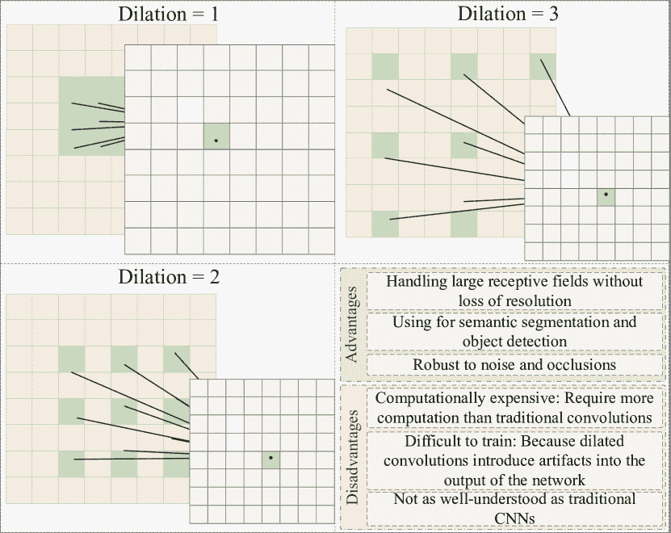

图 9：具有 3 x 3 核大小的多膨胀率膨胀卷积[74]

膨胀卷积在诸如语义分割等应用中发挥作用，它使模型能够捕捉更广泛的上下文信息，而不影响计算效率[47]。

在语义分割应用中，膨胀卷积特别有用，因为它们使模型能够捕捉更广泛的上下文信息。通过在卷积核元素之间引入间隙，膨胀卷积增加了感受野，而不会增加更多的参数。这意味着模型可以理解图像中每个像素或对象的周围上下文，而不会牺牲计算效率。这在语义分割等应用中尤为重要，因为准确识别和分类图像中的对象至关重要。

### IV-E 提高效率的分组卷积

分组卷积（见图 10）涉及将卷积层的输入和输出通道分成若干组。在每组内，执行独立的卷积操作，然后将其连接以生成最终输出。这种技术显著降低了计算成本和内存消耗，同时促进了模型的并行性[48]。分组卷积在大规模 CNN 架构中被广泛使用，以减少训练时间并增强 DL 模型的可扩展性[49]。

除了降低计算成本和内存消耗外，分组卷积还提供了其他优点。主要优点之一是提高了模型的并行性，从而更好地利用并行计算资源。这在大型 CNN 架构中尤为重要，因为训练时间可能成为瓶颈。通过将输入和输出通道分成组，卷积可以并行执行，从而加快整个训练过程。此外，分组卷积增强了 DL 模型的可扩展性，使处理更大数据集和更复杂应用变得更加容易。

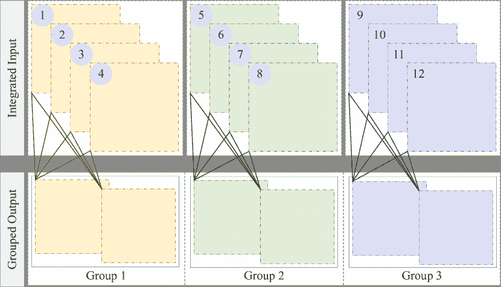

图 10：分组卷积涉及将卷积层的通道分成 3 组

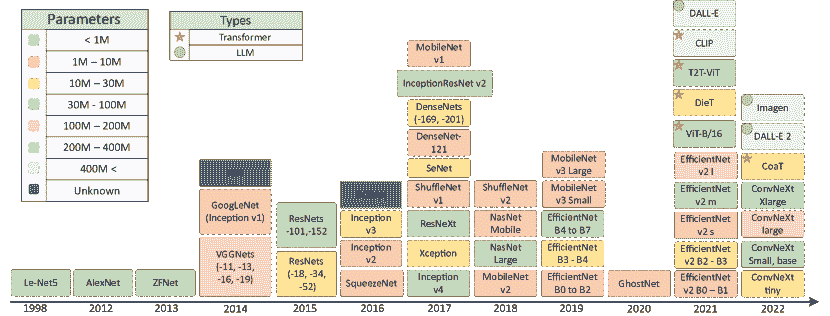

图 11：高级卷积技术的详细概述

例如，在图像分类应用中，大规模 CNN 架构如 ResNet 可以通过使用组卷积受益于模型并行性。通过将输入和输出通道分成多个组，可以在多个 GPU 或分布式系统上并行训练模型的不同子集。这不仅减少了训练时间，还允许更好的资源利用，最终提高了深度学习模型的可扩展性，以处理更大的数据集和更复杂的图像识别应用。

总之，深度学习提供了一系列多样化的卷积技术，以适应不同的数据类型和应用。从用于图像识别的 2D 卷积到用于序列数据的 1D 卷积，再到用于体积数据的 3D 卷积，每种卷积类型都有其独特的优势。此外，膨胀卷积和组卷积作为高效的替代方案，解决了深度学习模型中的特定挑战。了解这些卷积类型的特性和应用，使研究人员和从业者能够设计出高效且有效的模型，以满足各种应用的需求。

### IV-F CNN 架构的演变

自从 CNN 的早期起源以来，CNN 架构在过去十年中迅速演变（见图 11） [49]，以提高性能和效率 [51]。一些关键的发展包括：

+   •

    Inception 模块（2014） - Inception 架构引入了具有多个滤波器尺寸的卷积块，以捕捉不同尺度的特征 [52]。这提高了准确性和计算效率。

+   •

    ResNets（2015） - 残差网络通过跳过多个层的快捷连接来训练更深的 CNN [53]。它们减少了非常深层模型中的退化问题。

+   •

    DenseNets（2016） - 这些网络将每一层连接到所有后续层，以实现最大的信息流动和特征重用。这减少了参数的数量 [54]。

+   •

    MobileNets（2017） - 专门为移动应用设计，它们使用深度可分离卷积来最小化模型大小和延迟 [55]。

+   •

    EfficientNets（2019） - 通过系统地调整网络维度，这些网络实现了更好的效率与准确性之间的权衡 [55]。

CNN 架构的演变（见图 11）对它们在视觉应用中的广泛采用至关重要。

## V 高级卷积技术

本节详细介绍了先进的卷积技术（参见图 12）。这些技术的清晰和有用的总结可以在表 IV 中找到。通过审阅此表，读者可以更好地理解最先进的卷积技术及其潜在用途。

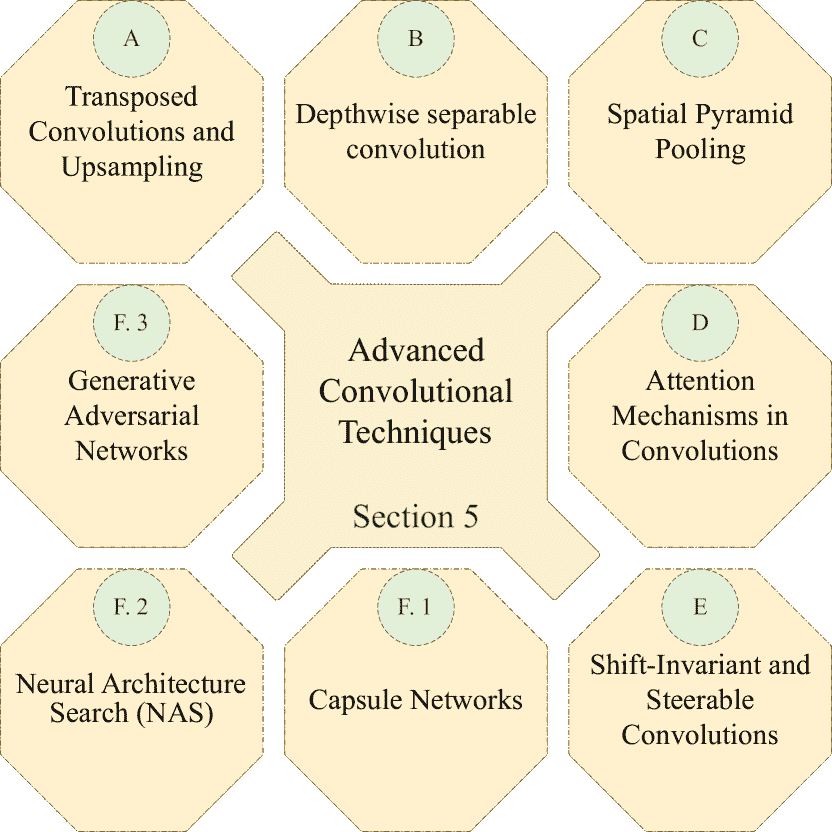

图 12: 基于发布时间和参数量及其类型的 CNN 趋势

### V-A 转置卷积和上采样

转置卷积——也称为去卷积或分数步幅卷积——是用于上采样特征图的复杂方法 [57]。与传统卷积不同，转置卷积增加特征图的大小，使模型能够从低分辨率输入重建高分辨率表示 [58]。传统卷积减少空间维度。在图像分割 [59]、图像创建 [60] 和图像到图像的转换 [61] 等过程中，它们是必不可少的。转置卷积使用填充和步幅值来调节上采样过程，并利用可学习参数选择输出大小。

转置卷积可能会在生成的特征图中产生伪影或棋盘图案，因为感受野重叠。为了防止这种情况，使用步幅、填充和膨胀来控制输出分辨率并减少这些伪影。在图像生成领域，转置卷积用于将低分辨率图像上采样为高分辨率图像。为了确保生成的图像没有伪影或棋盘图案，会调整步幅、填充和膨胀来控制输出分辨率并提升生成图像的质量。

表 IV: 比较提供了不同卷积类型的特征和功能概览 - 第一部分

| 卷积技术 | 转置卷积 | DSC | SPP | 注意机制 | 移位不变 |
| --- | --- | --- | --- | --- | --- |
| 目的 | 上采样 | 参数减少 |

&#124; 处理变化 &#124;

&#124; 输入尺寸 &#124;

|

&#124; 关注相关 &#124;

&#124; 特点 &#124;

| 不变性 |
| --- |
| 参数 | 可学习 | 可学习 | 无参数 | 可学习 | 可学习 |
| 计算成本 | 高 | 低 | 低 | 普通 | 高 |
| 参数效率 | 低 | 高 | 高 | 低 | 普通 |
| 上采样 | 是 | 否 | 否 | 否 | 否 |
| 空间处理 | 空间不变 | 空间不变 | 可变区域 | 空间不变 | 空间不变 |

|

&#124; 长程 &#124;

&#124; 依赖关系 &#124;

| 否 | 否 | 否 | 是 | 否 |
| --- | --- | --- | --- | --- |
| 翻译不变性 | 是 | 是 | 是 | 是 | 是 |
| 旋转不变性 | 否 | 否 | 否 | 否 | 否 |
| 可解释性 | 低 | 低 | 低 | 低 | 低 |
| 模型大小 | 大 | 小 | 小 | 小 | 大 |
| 多功能性 | 普通 | 高 | 高 | 高 | 普通 |
| 实际应用 |

&#124; 图像分割, &#124;

&#124; 图像超分辨率, &#124;

&#124; 图像生成 &#124;

|

&#124; 移动视觉应用, &#124;

&#124; 实时目标检测 &#124;

|

&#124; 图像分类, &#124;

&#124; 目标检测, &#124;

&#124; 语义分割 &#124;

|

&#124; 图像描述, &#124;

&#124; 视觉问答 &#124;

|

&#124; 图像识别, &#124;

&#124; 目标检测, &#124;

&#124; 图像滤波 &#124;

|

表 V: 比较表概述了不同卷积类型的特性和功能 - 第二部分

| 卷积技术 | 可调卷积 | 胶囊网络 | NAS | GAN | VIT |
| --- | --- | --- | --- | --- | --- |
| 目的 | 效率与不变性 | 不变性 | 效率 | 合成 | 长程依赖 |
| 参数 | 可学习 | 可学习胶囊 | 架构搜索 | 可学习 | 可学习 |
| 计算成本 | 低 | 高 | 高 | 高 | 更高 |
| 参数效率 | 高 | 普通 | 高 | 低 | 普通 |
| 上采样 | 否 | 否 | 否 | 否 | 否 |
| 空间处理 | 空间不变 | 空间不变 | 空间可变 | 空间不变 | 空间不变 |
| 长程依赖 | 否 | 否 | 否 | 否 | 是 |
| 翻译不变性 | 是 | 是 | 是 | 否 | 是 |
| 旋转不变性 | 是 | 是 | 否 | 否 | 是 |
| 可解释性 | 低 | 低 | 低 | 低 | 高 |
| 模型大小 | 普通 | 普通 | 大 | 大 | 大 |
| 多功能性 | 低 | 低 | 低 | 低 | 高 |
| 实际应用 |

&#124; 图像滤波, &#124;

&#124; 边缘检测, &#124;

&#124; 模式识别 &#124;

|

&#124; 目标识别, &#124;

&#124; 图像分割, &#124;

&#124; 医学成像 &#124;

|

&#124; 自定义 CNN 架构, &#124;

&#124; 资源受限设备 &#124;

|

&#124; 图像合成, &#124;

&#124; 风格迁移, &#124;

&#124; 数据增强 &#124;

|

&#124; 图像识别, NLP, &#124;

&#124; 多样化任务 &#124;

|

### V-B 深度可分离卷积（DSC）

深度可分离卷积（见图 13 的紫色框）是传统卷积的高效替代方案，尤其是在资源受限的环境中 [62][63]。它们将卷积过程分为两个步骤（见图 13），即深度卷积 [64] 和逐点卷积 [65] [276, 277, 278, 279]。深度卷积对每个输入通道应用一个单独的卷积核，独立捕捉每个通道的空间模式。逐点卷积则使用 1x1 卷积来结合来自深度卷积步骤的输出通道，有效地聚合信息 [66]。深度可分离卷积显著减少了参数数量和计算量，同时保持模型性能，使其在移动和嵌入式应用中非常受欢迎 [67]。

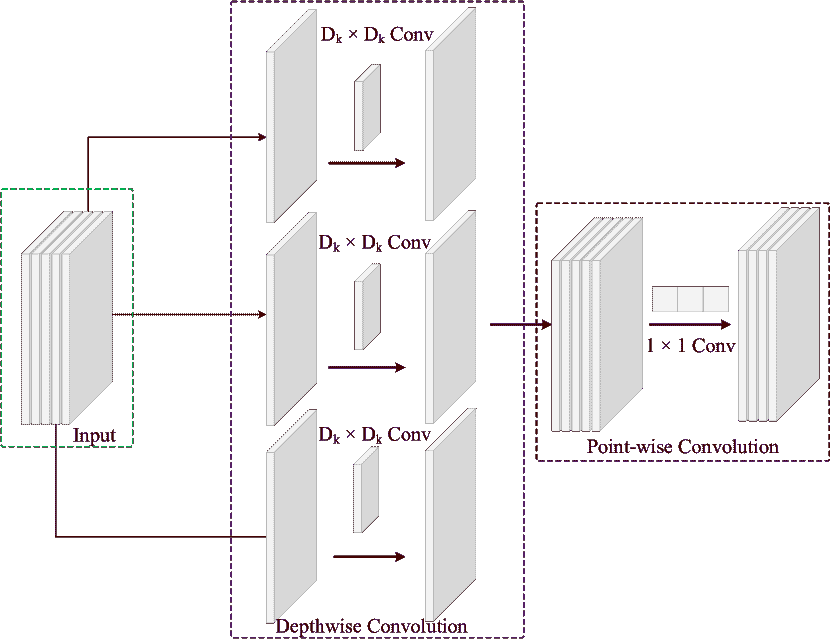

图 13：紫色框表示深度卷积，红色框表示逐点卷积（逐点卷积中使用了 1x1 卷积）

通过将空间滤波与跨通道滤波解耦，深度卷积实现了更高的计算效率，适合资源受限的环境。MobileNet 和 Xception 是使用深度卷积来减小模型大小和提高推理速度而不显著影响性能的流行 CNN 架构。

### V-C 空间金字塔池化（SPP）

空间金字塔池化（SPP）是一种处理 CNN 输入不同尺寸和长宽比的技术 [68][280, 281, 282, 283, 284, 285]。它将输入特征图划分为不同的感兴趣区域，并对每个区域独立应用最大池化或平均池化。然后将得到的池化特征连接起来，形成一个固定长度的表示，并输入到全连接层进行进一步处理。SPP 使 CNN 能够接受不同尺寸的输入图像，并生成一致的特征图，这使得它在物体检测和图像分割应用中非常有用 [69]。

### V-D 卷积中的注意力机制

卷积中的注意力机制使模型能够关注输入的相关部分，在特征提取过程中强调特定区域[70]。这些机制根据不同空间位置的重要性分配权重。自注意力机制[70]，如变换器中使用的那样，已被适应用于卷积中。它们使网络能够捕捉长距离依赖和上下文，改善模型识别复杂模式和关系的能力。

### V-E 变换不变和可引导卷积

变换不变卷积旨在对输入数据中的小幅平移不敏感[71] [286, 287, 288]。它们确保所学特征在输入图像中物体的位置变化时保持一致。这一属性对于对象检测应用至关重要，因为对象在图像中的位置可能会变化[27]。可引导卷积是可以旋转到不同角度的滤波器，使模型能够以方向不变的方式学习方向敏感特征[289, 290, 291]。这些卷积通常用于诸如文本识别等应用，其中文本的方向可能会有所变化。

### V-F 最近的进展和创新

#### V-F1 胶囊网络

**胶囊网络**由**Geoffrey Hinton**及其团队引入，是 CNN 的革命性进展[75]。它们旨在解决传统 CNN 的局限性，特别是在处理空间层次结构和视点变化方面[292, 293, 294, 295, 296, 297, 298]。**胶囊网络**使用胶囊作为基本单元，这些胶囊是代表实体各种属性的神经元组，如姿态、变形和部分。

**胶囊网络**提供了动态路由机制，以在胶囊之间路由信息，使其能更有效地建模复杂的层次关系。这使得网络能够识别具有不同姿态和外观的对象，使**胶囊网络**对变换和遮挡具有更强的鲁棒性。

#### V-F2 卷积神经架构搜索

神经架构搜索（NAS）是一种自动化设计 CNN 架构的方法[76][81]。NAS 利用搜索算法和神经网络来发现在特定应用中表现良好的架构，而不是依赖于人工设计的架构[76]。这种技术促成了最先进的 CNN 的发展，其性能超越了手工设计的模型[299, 300, 301, 302, 303, 304, 305, 306, 307, 308, 309]。

卷积的 NAS 涉及探索各种卷积设计，包括不同的卷积核大小、深度和连接模式[82]。它在验证集上评估每个架构，通过进化或优化过程，识别出表现最佳的架构。

在自动驾驶车辆导航的场景中，卷积神经网络架构搜索（NAS）可以用于设计一个最佳的卷积神经网络架构，专门针对处理和分析车辆传感器收集的各种视觉数据。通过探索不同的卷积设计，如变化的卷积核大小、深度和连接模式，NAS 可以识别出最有效的架构，以准确实时地检测物体和识别道路标志。这将最终提高车辆的自主导航能力，并根据其视觉感知做出明智的决策。

#### V-F3 生成对抗网络

生成对抗网络（GANs）是一类用于生成应用的深度学习模型，如图像合成、风格迁移和数据增强[310, 311, 312, 313, 314, 315, 316]。GANs 利用卷积神经网络（CNNs）作为关键组件来建模生成器和判别器（见图 14）[77][83][84]。生成器是一个 CNN，用于生成新的样本，如真实的图像，而判别器是另一个 CNN，旨在区分真实样本和虚假样本[77]。这些网络以对抗的方式进行训练，其中生成器的目标是生成能欺骗判别器的样本，而判别器的目标是变得更擅长区分真实样本和虚假样本[71][84]。

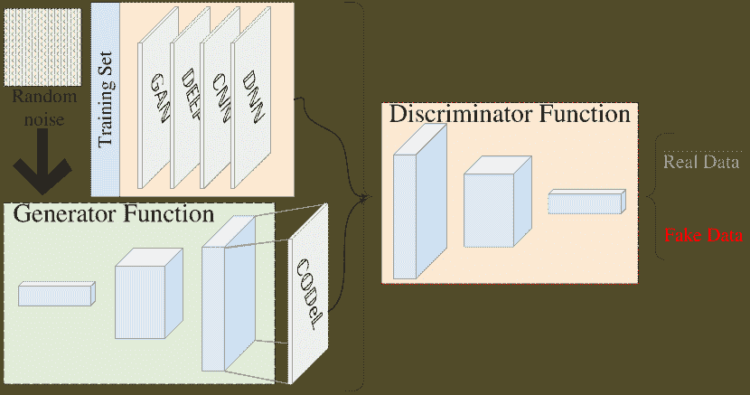

图 14：一个简单的 GAN 架构，用于检测生成器生成的真实和虚假数据

使用卷积的 GANs 彻底改变了图像生成领域，并在生成高质量图像和逼真纹理方面取得了令人印象深刻的成果[266, 267, 268, 269, 270, 271, 272, 273, 274, 275]。它们也已扩展到其他领域，如自然语言处理、音频生成和视频合成。该技术还被应用于医学成像领域，其中 GANs 被用于生成高分辨率和准确的诊断图像。此外，GANs 在数据增强领域表现出令人期待的成果，能够生成合成数据，以增加训练数据集的大小和多样性，从而提升机器学习模型的性能。

例如，在图像生成领域，卷积网络的 GANs 被用于创建虚构景观的逼真图像。生成器网络创建视觉上令人信服的图像，而判别器网络则学习识别这些生成图像中的任何缺陷或不一致，从而促使生成器改进其输出。这种对抗训练过程最终导致生成高质量和逼真的图像，这些图像与真实照片难以区分。

### V-G Vision Transformers 和自注意力机制

通过使用自注意力机制[85]，Vision Transformers[244, 245, 246, 247, 248, 249, 250, 251, 252, 253, 254, 255, 256, 257, 258, 259, 260, 261, 262, 263, 264, 265]代表了从传统计算机视觉架构向前发展的重要演变步骤[86, 87]。与以往主要依赖卷积滤波器处理视觉输入不同，它们将图像分割成称为“补丁”的离散有限部分[87]。每个补丁关注并提取来自摄影场景不同局部区域的特征。这种将图像划分为离散补丁的方式在概念上与大多数以往方法的操作有着显著的差异。

总之，先进的卷积技术显著扩展了 CNN 的能力，并彻底改变了计算机视觉、图像合成和自然语言处理等领域。从用于上采样的转置卷积到处理空间层次结构的胶囊网络，这些创新提升了 CNN 的效率、鲁棒性和表现力，使其成为广泛应用的强大工具。此外，最近的进展，如 NAS 和 GANs，继续推动深度学习领域的发展，并对未来进一步突破充满希望。

## VI 不同卷积类型的应用

本节提供了不同卷积类型广泛应用的详细概述（见图 15）。表 VI 提供了这些应用的简要而全面的概述。各种类型的卷积在多种背景下使用，展示了 CNN 的灵活性和强大功能。卷积技术使机器能够理解和互动复杂数据，促进了多个领域的进步，提升了我们的日常生活。示例包括图像识别、物体检测、NLP 和医学图像分析。

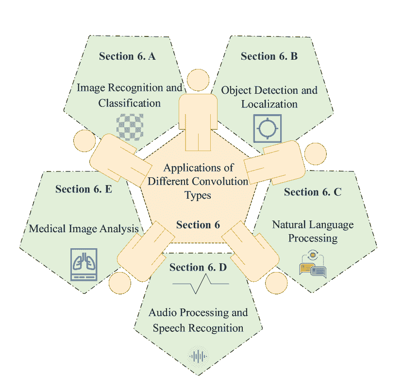

图 15：我们在第 VI 节中讨论的 CNN 技术的应用

### VI-A 图像识别与分类

CNN 有许多用途，包括图像识别与分类。传统的二维卷积在这些应用中尤为有用。它们使深度学习模型能够准确地将图像分类为不同的组，并从图像中学习关键特征。网络的卷积层识别边缘、纹理和形状。池化层在保持分类所需的数据的同时，减少了图像的大小。图像识别与分类用于各种任务，包括光学字符识别 (OCR) [203, 204, 205, 206, 207, 208, 209, 210, 211]，不同动物种类的分类，以及手写数字的识别 [88]。在像 ImageNet 这样的比赛中，CNN 展示了令人印象深刻的结果，展示了它们处理广泛图像分类的能力 [89]。

表 VI：紧凑的表格突出显示了每种卷积类型的主要应用

| 卷积类型 | 传统 2D 卷积 | 1D 卷积 | 3D 卷积 | 膨胀卷积 | 分组卷积 |
| --- | --- | --- | --- | --- | --- |
| 图像识别 | 图像分类 | 时间序列分析 | 行为识别 | 图像分割 | 实时识别 |
| \hdashline 目标检测 | 目标检测 | 事件检测 | 3D 目标检测 | 语义分割 | 高效检测 |
| \hdashlineNLP | 情感分析 | 文本分类 | 文本蕴含 |

&#124; 层次结构 &#124;

&#124; 文档分类 &#124;

| 参数减少 |
| --- |
| \hdashlineASPR |

&#124; 语音活动 &#124;

&#124; 检测 &#124;

| 语音识别 |
| --- |

&#124; 环境声音 &#124;

&#124; 分类 &#124;

|

&#124; 鲁棒语音 &#124;

&#124; 识别 &#124;

|

&#124; 低延迟 &#124;

&#124; 语音识别 &#124;

|

| \hdashline 医学图像分析 | 肿瘤分割 | ECG 信号处理 |
| --- | --- | --- |

&#124; 脑肿瘤 &#124;

&#124; 分割 &#124;

|

&#124; 增强图像 &#124;

&#124; 分割 &#124;

| 更快的医学分析 |
| --- |

### VI-B 目标检测与定位

在目标检测过程中，必须定位和识别图像中的多个对象[90]。在这一应用中，传统的 2D 卷积和 3D 卷积都是至关重要的[178, 179, 180, 181, 182, 183, 184, 185, 186, 187, 188, 189, 190, 191]。虽然 3D 卷积用于视频目标检测，但 2D 卷积用于处理单独的图像帧。得益于区域提议机制和基于锚点的方法，CNN 能够在不同的尺度和纵横比下检测对象[192, 193, 194, 195, 196, 197, 198, 199, 200, 201, 202]。

通过使用池化层和卷积滑动窗口，可以实现对对象边界框的精确定位。机器人技术、监控技术和自动驾驶车辆都使用目标检测来更好地理解和与周围环境互动[91][92]。

### VI-C 自然语言处理

对于顺序数据，如文本处理和情感分析，自然语言处理（NLP）使用 1D 卷积。1D 卷积用于 NLP 应用中，以提取句子中的相关模式和关系，使模型能够理解语义意义和上下文 [212, 213, 214, 215, 216]。情感分析用于理解客户意见，命名实体识别用于从文本中提取特定信息，以及文本分类用于分类新闻文章或产品评论，都是使用 1D 卷积的 NLP 应用示例。机器翻译和文本摘要等应用已经受益于 CNN 和递归神经网络（RNN）的成功整合。

### VI-D 音频处理和语音识别

音频处理和语音识别（APSR）受益于 1D 卷积，这些卷积分析和处理如语音信号或音频波形等顺序音频数据 [217, 218, 219, 220, 221, 222, 223]。通过提取时间模式和声学特征，CNN 能够学习识别口语单词并将音频转录为文本。语音识别系统，通常基于卷积神经网络和递归神经网络，使得像 Siri 和 Google Assistant 这样的语音助手能够理解并回应用户命令。

### VI-E 医学图像分析

医学图像分析涉及对医学图像的检查和解释，如 MRI 扫描、CT 扫描和 X 光 [92][224, 225, 226, 227, 228, 229, 230, 231, 232, 233, 234, 235, 236, 237, 238, 239, 240, 241]。在这一领域中，3D 卷积和膨胀卷积被广泛使用。3D 卷积处理体积医学数据，使 CNN 能够提取空间和上下文信息，用于肿瘤分割、器官定位和疾病分类等应用 [92][93]。膨胀卷积增强了医学图像中的特征提取和语义分割，能够精确识别异常组织和结构。卷积类型在医学图像分析中的应用已显著推动了医疗保健的发展，帮助医生进行诊断和治疗计划。

## VII CNN 的未来趋势

CNNs 继续成为研究的热门话题，并在各种计算机视觉应用中取得了显著的成功。随着技术的发展和深度学习技术的日益复杂，CNN 领域的未来趋势和未解研究问题也在不断涌现。

调查能够以更少的参数和计算资源实现可比性能的更有效架构是 CNN 研究中的一个未来趋势。如何使 CNN 更具可解释性是另一个未解答的研究问题，因为 CNN 决策背后的推理由于这些系统的内部复杂性而常常难以理解。另一个未来研究的重要领域是寻找增强 CNN 并使其更不易受到恶意攻击的方法。

一个活跃的研究领域致力于设计高效的 CNN 架构，以优化边缘计算和移动计算。随着计算机视觉（CV）从数据中心转向摄像头、智能手机和网络边缘的物联网，模型需要在延迟、内存和功耗的严格限制下运行。包括网络剪枝、紧凑算子、知识蒸馏和自适应量化在内的技术有助于推导出适合这些低资源场景的轻量级 CNN 变体 [121]。对效率的关注也与提升 CNN 可解释性的工作相关联。

尽管今天的复杂 CNN 实现了最高的准确率，但其决策过程仍然理解不足。对显著性映射、激活聚类、模块化 CNN 和其他解释性方法的研究旨在揭示“黑箱”并解决可靠性、偏见和问责等问题，这些问题在像医疗保健这样的安全关键领域尤为重要。新的 CNN 模块类型还旨在通过引入灵活的自注意力和捕捉非欧几里得结构来扩展这些模型的表示能力。

一个特别引人注目的方向是解决大规模视觉多模态（LVM）挑战，这在扩展 CNN 能力的工作基础上进行。融合多种视觉媒体与语言、音频和其他输入的大型数据集呈现出前所未有的复杂性。然而，它们也提供了前所未有的机会来发展通用、全面的多感官场景理解模型。

### VII-A CNN 的可解释性和解释性

CNN 的可解释性和解释性是一个重要的开放研究问题。随着 CNN 的深度和复杂性增加，理解这些模型的决策过程变得更加困难。特别是在像医疗保健和自动驾驶系统等关键应用中，研究人员正在探讨解释和解释 CNN 预测的方法。为了增加对基于 CNN 系统的信任和可靠性，诸如注意力可视化、显著性图和归因方法等方法试图揭示输入的哪些区域对模型的结论贡献最大。

### VII-B 融入领域知识

将领域知识融入 CNN 架构是另一个重要的研究方向。虽然 CNN 已表现出卓越的泛化能力，但它们可能未能充分利用特定领域的特征。研究重点是开发能够有效利用领域知识或约束的架构，如医学成像中的基于物理的先验或机器人中的几何约束，以提高性能并减少数据需求。

### VII-C 鲁棒性与对抗防御

提高卷积神经网络（CNN）对对抗性攻击的鲁棒性仍然是一个重大挑战。对抗性攻击涉及向输入中添加精心设计的扰动，导致 CNN 模型做出错误预测。研究人员正在探索对抗性防御技术，如对抗性训练、鲁棒优化和输入变换，以增强 CNN 对这些攻击的抵御能力。

### VII-D 高效模型设计

在资源有限的设备上使用 CNN 时，如智能手机和边缘设备，计算、内存和功耗的效率非常重要[242, 243]。未来的 CNN 研究趋势将包括创建轻量级架构、知识蒸馏方法和有效的模型压缩技术，以减小模型大小并提高推理速度，同时保持准确性。

表 VII：剪枝技术比较

| 技术 | 稀疏类型 | 剪枝粒度 | 硬件友好 | 准确性影响 | 压缩比 | 迭代训练 | 是否需要重新训练 |
| --- | --- | --- | --- | --- | --- | --- | --- |
| 量纲剪枝 | 非结构化 | 权重级别 | 否 | 中等 | 2-10 倍 | 是 | 否 |
| 滤波器剪枝 | 通道级别 | 滤波器级别 | 是 | 低 | 5-10 倍 | 否 | 是 |
| 块剪枝 | 块级别 | 块级别 | 是 | 低 | 2-5 倍 | 否 | 是 |
| 网络精简 | 通道级别 | 通道级别 | 是 | 低 | 2-5 倍 | 是 | 是 |
| 彩票剪枝 | 非结构化 | 权重级别 | 否 | 低 | 2-10 倍 | 是 | 是 |
| 迭代量纲 | 非结构化 | 权重级别 | 否 | 中等 | 2-5 倍 | 是 | 否 |
| 初始剪枝 | 通道级别 | 滤波器级别 | 是 | 低 | 5-10 倍 | 否 | 否 |
| 一次性剪枝 | 通道级别 | 滤波器级别 | 是 | 低 | 5-10 倍 | 否 | 否 |

模型压缩技术在设计适合在资源受限的边缘设备上部署的高效深度学习模型中发挥了关键作用。已经提出了多种方法（见表 VII）来减少模型大小和计算量，而不会显著影响预测性能。网络剪枝和量化是两种广泛使用的压缩方法[102][103]。

修剪技术旨在通过移除冗余连接来稀疏化神经网络，对功能的影响最小 [121]。早期方法依赖于无结构的修剪，其中连接仅基于其大小或重要性排名被置为零。然而，这种任意修剪导致了非标准的稀疏矩阵，从而阻碍了硬件加速。最近的结构化修剪技术则引入了通道级、滤波器级或块级稀疏性，以生成适合高效实现的紧凑模型 [121, 122, 123, 124]。

表 VIII：量化技术比较

| 技术 | 量化级别 | 位宽 | 硬件友好 | 准确性影响 | 压缩比 | 迭代训练 | 需要校准 |
| --- | --- | --- | --- | --- | --- | --- | --- |
| 权重量化 | 权重值 | 8 位 | 是 | 低 | 高达 8 倍 | 否 | 是 |

|

&#124; 激活 &#124;

&#124; 量化 &#124;

| 激活 | 8 位 | 是 | 低 | 高达 8 倍 | 否 | 是 |
| --- | --- | --- | --- | --- | --- | --- |
| 张量量化 | 张量 | 4-8 位 | 是 | 低 | 高达 32 倍 | 否 | 是 |
| 张量分解 | 张量 | 4 位 | 是 | 中等 | 高达 32 倍 | 否 | 否 |
| 霍夫曼编码 | 权重 | 可变 | 否 | 低 | 高达 10 倍 | 否 | 否 |
| 对数量化 | 激活 | 1 位 | 是 | 低 | 高达 16 倍 | 否 | 否 |
| BNN 量化 |

&#124; 权重/ &#124;

&#124; 激活 &#124;

| 1 位 | 是 | 高 | 高达 32 倍 | 是 | 是 |
| --- | --- | --- | --- | --- | --- |

|

&#124; 浮点数 &#124;

&#124; 量化 &#124;

|

&#124; 权重/ &#124;

&#124; 激活 &#124;

| 16 位 | 是 | 低 | 高达 2 倍 | 否 | 否 |
| --- | --- | --- | --- | --- | --- |

滤波器修剪指的是移除整个卷积滤波器，从而实现通道级稀疏性 [116][123]。研究表明，VGG16 中的高达 90%的滤波器可以被移除而不会降低准确性。一种方法，称为“初始化时修剪”，在训练开始时移除具有最低总和值的滤波器。另一种方法，“一次性修剪”，基于滤波器的一阶泰勒展开一次性修剪滤波器。这些滤波器级修剪方法导致各层之间的稀疏性均匀，并将计算减少了约 5 倍。

另一种结构化方法是修剪连接块，而不是单个权重 [124]。例如，在“块级修剪”中，从 ResNet50 的块 1、2 和 3 中移除了一些卷积块，从而减少计算量而无需重新训练。块结构确保了布局稀疏性，保持了原始卷积块的形状，以便硬件友好。网络瘦身是一种通道修剪方法，它在训练过程中强制执行 L1 范数正则化，以逐渐移除重要性分数较低的通道。

在非结构化变体中，基于幅度的剪枝移除低于阈值的权重，而迭代幅度剪枝则在基于动态阈值的权重更新和剪枝之间交替进行 [121][125]。这些方法在整个架构中保持稀疏性，但会引入非零填充权重。彩票票据假设实验表明，密集的随机初始化子网络如果单独训练，可以达到其原始网络的准确性。

除了剪枝，量化是压缩模型的另一种有效技术（参见表格 VIII）。权重和激活量化方法将权重/激活映射到一组小的离散值，从而减少表示所需的比特数 [114][115]。例如，8 位量化可以将模型大小减少 4 倍，而不会导致许多架构的准确性损失。基于张量分解的量化通过将权重张量分解为低秩近似进一步压缩模型。

一些近期的研究结合了多种压缩方法在多阶段管道中。例如，一个实例联合采用权重量化、剪枝和霍夫曼编码在 ResNet50 上实现了超过 10 倍的压缩，同时准确性略有下降。另一个使用了一个两阶段管道，包括基于过滤的剪枝和量化，以设计高效的 MobileNet 变体。这些复合方法在准确性和效率的权衡上优于单一技术。

总结来说，网络剪枝和量化为设计紧凑的边缘和移动应用模型提供了有希望的途径。尽管早期的方法依赖于非结构化稀疏，最近的技术则引入了结构以适应硬件友好性。展望未来，对模型压缩的持续研究是推动深度学习在各种资源受限环境中广泛应用的关键。

### VII-E 多任务学习与迁移学习

CNNs 很适合用于多任务学习，其中一个模型被训练以同时执行多个相关的任务[162, 163, 164, 165, 166, 167, 168, 169, 170, 171, 172, 173, 174, 175, 176, 177]。随着研究人员探索利用跨应用的共享表示来减少每个任务所需的大量标记数据，并通过将一个任务中学到的知识转移到另一个任务中来增强泛化能力，这一需求正在减少[147, 148, 149, 150, 151, 152, 153, 154, 155, 156, 157, 158, 159, 160, 161]。

### VII-F 与不确定性估计的集成

理解模型的不确定性对安全关键应用至关重要。将不确定性估计集成到 CNN 中将允许模型量化其预测的信心并防止代价高昂的错误，这是一个开放的研究领域。为了改进 CNN 中的不确定性度量，研究人员正在研究贝叶斯神经网络（BNNs）、基于 dropout 的不确定性估计和贝叶斯优化技术。

### VII-G 小数据集的泛化

在 CNN 研究领域，一个常见的问题是对小数据集的泛化，其中标记的训练数据很难获得。本质上，利用来自相关应用或领域的数据，像迁移学习、少样本学习和元学习这样的技术致力于提高 CNN 从稀疏数据中学习的能力。

### VII-H 语言模型和多模态 LLMs 的演变

最近时期，大型语言模型（LLMs）在自然语言处理领域经历了急剧的进展。诸如 BERT、GPT-3 和 PaLM 这样的原型在语言理解和生成方面表现出色，这得益于在大量文本语料库上进行的自监督预训练[85]。随着 LLMs 在规模和范围上的扩展，除了文本之外，整合额外的模态是一个新兴的研究领域。多模态 LLMs 努力在一个单一的模型架构中融合语言、视觉和其他感官输入。它们有潜力通过同时学习不同数据类型的表示来获得对世界的更全面的理解[96]。一个重大挑战是如何有效地融合 CNN 在计算机视觉方面的优势和变压器架构在语言建模方面的优势。

一种策略是采用双流架构，使用不同的 CNN 和变换器编码器通过共注意力变换器层进行交互[97]。CNN 从图像中提取视觉特征，提供可以指导语言生成和理解的上下文信息。变换器架构建模文本的语义和语法。它们的交互使得能够基于图像内容生成标题或为文本查询检索相关图像。另一种方法是将 CNN 直接整合进变换器架构中，作为与文本标记编码器一起工作的视觉标记编码器[98]。图像块的 CNN 投影被附加到文本标记嵌入上，作为变换器层的输入。这种统一架构允许对视觉和语言任务的参数进行端到端的优化。自监督预训练对于多模态大语言模型在下游任务调优之前学习有效的联合表示仍然至关重要。预测模态之间关联的对比学习目标已被证明非常有效[99]。在大规模图像-文本对数据集上预训练的模型在多模态任务中展示了强大的零样本迁移性能。

随着多模态大语言模型规模的扩大，高效结合不同卷积类型和注意力机制将变得至关重要。紧凑的卷积神经网络（CNN）架构可能有助于降低计算成本。稀疏注意力和内存压缩技术可以帮助提高可扩展性。

## VIII 性能和效率考虑

在 CNN 中考虑性能和效率（参见图 17-20）对于开发高性能和资源高效的模型至关重要。通过分析计算复杂度、准确性和速度之间的权衡、内存要求以及在标准数据集上的基准测试，研究人员可以就优化其 CNN 架构以适应各种应用和部署场景做出明智的决策。

### VIII-A 不同卷积的计算复杂度

不同卷积技术的计算复杂度（参见表格 IX）是设计 CNN 时需要考虑的关键方面。它指的是对输入数据执行卷积操作所需的计算量。计算复杂度受多种因素的影响，包括输入数据的大小、卷积滤波器的大小和特征图中的通道数量。

传统卷积层，如标准卷积和深度可分卷积，通常具有比其他技术更高的计算复杂性。这是因为它们涉及大量的卷积操作，特别是在处理高分辨率图像或复杂数据时。另一方面，点卷积和转置卷积等技术往往具有较低的计算复杂性，使它们更适合某些资源受限的应用。

理解不同卷积类型的计算复杂性对于优化 CNN 的性能至关重要。通过选择与可用计算资源相匹配的卷积技术，研究人员可以构建高效的模型，在准确性和速度之间达到良好的平衡。

如图 17 至 19 所示，Adam 优化器在准确性和损失指标方面表现良好，如关键观察点①至⑥所示。总体而言，使用 VGG、ResNet 和 LeNet 等 CNN 技术提高了准确性并降低了损失。

同样，如图 20 所示，并基于关键观察点①、②和③，Adam 优化器的 CPU 使用量明显低于其他五种优化器 - RMSprop、Adamax、Adagrad、SGD 和 Nadam。这一观察结果在使用 LeNet-5、VGG16 和 ResNet-50 时都成立。此外，Adam 优化器的内存使用量也在最低范围内（见关键观察点④）。

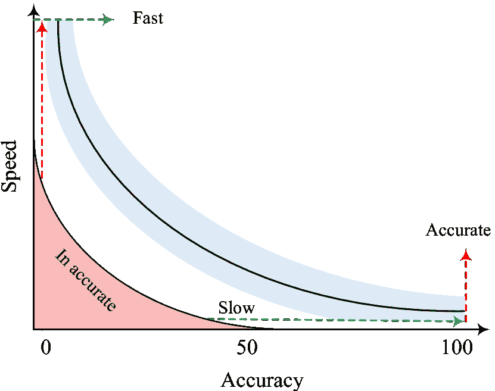

图 16：深度学习模型在准确性和速度之间的权衡曲线 [75]

表 IX：在 Cifar-10 数据集上，使用 7 种优化器对 LeNet-5、VGG16 和 ResNet-50 的比较，CU：CPU 利用率，MU：内存利用率

| 优化器类型 | CNN 模型 | 准确率 | 损失 | CU | MU |
| --- | --- | --- | --- | --- | --- |
|  | LeNet-5 | 0.547 | 1.277 | 71 | 50.7 |
|  | VGG16 | 0.87 | 0.776 | 57 | 55.7 |
| SGD | ResNet-50 | 0.789 | 1.1212 | 63 | 53.4 |
|  | LeNet-5 | 0.629 | 1.153 | 46.2 | 44.4 |
|  | VGG16 | 0.805 | 0.821 | 54.2 | 51.4 |
| Adam | ResNet-50 | 0.760 | 1.016 | 60.5 | 51.9 |
|  | LeNet-5 | 0.624 | 1.22 | 58.3 | 57.6 |
|  | VGG16 | 0.776 | 1.109 | 61.1 | 63.5 |
| NAdam | ResNet-50 | 0.789 | 0.89 | 66.4 | 57.8 |
|  | LeNet-5 | 0.605 | 1.288 | 50.3 | 42.9 |
|  | VGG16 | 0.755 | 22.286 | 61.2 | 49.7 |
| RSMProp | ResNet-50 | 0.78 | 1.151 | 61.7 | 49.4 |
|  | LeNet-5 | 0.603 | 1.132 | 69.8 | 56.7 |
|  | VGG16 | 0.8506 | 0.885 | 55.8 | 64.2 |
| Adamax | ResNet-50 | 0.8123 | 1.002 | 62.1 | 56.1 |
|  | LeNet-5 | 0.412 | 1.65 | 67.6 | 44.4 |
|  | VGG16 | 0.822 | 0.708 | 55.3 | 50.3 |
| AdaGrad | ResNet-50 | 0.75 | 0.999 | 62.4 | 50.6 |

### VIII-B 准确性和速度之间的权衡

设计 CNN 的一个关键挑战是平衡模型的准确性和推断速度（见图 16）。随着卷积层复杂特征的捕捉增加，推断时间也会增加。另一方面，使用更简单的卷积技术可能会导致准确性降低。网络的深度和宽度、参数数量、卷积技术的选择以及模型部署的硬件都会影响准确性和速度之间的权衡。对于实时应用或资源受限环境，可能需要牺牲一些准确性来获得更快的推断速度。

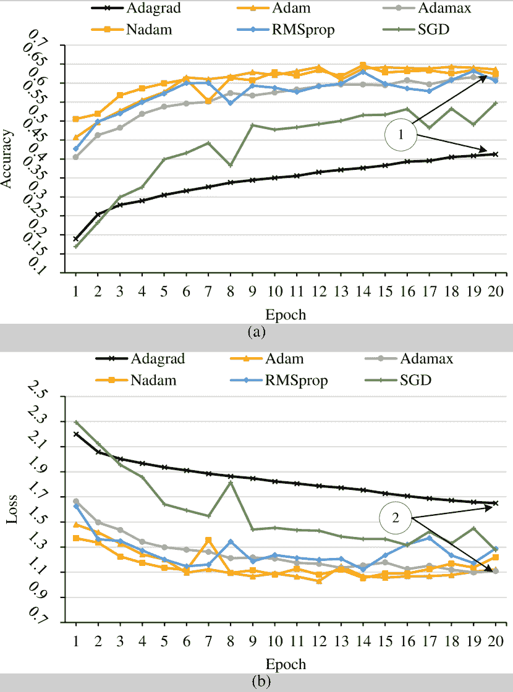

图 17：LeNet-5 在 Cifar-10 数据集上的各种优化器比较。a) 表示 LeNet-5 结构的准确性，b) 表示 LeNet-5 结构的损失

模型修剪、量化和低秩近似通常被研究人员用来减小模型尺寸（见第 VII -¿ 子章节 D）并提高推断速度，而不显著影响准确性。此外，基于注意力的卷积和其他优先考虑输入重要区域的技术可以用来将计算工作重点放在最需要的地方，进一步提高准确性和速度的平衡。

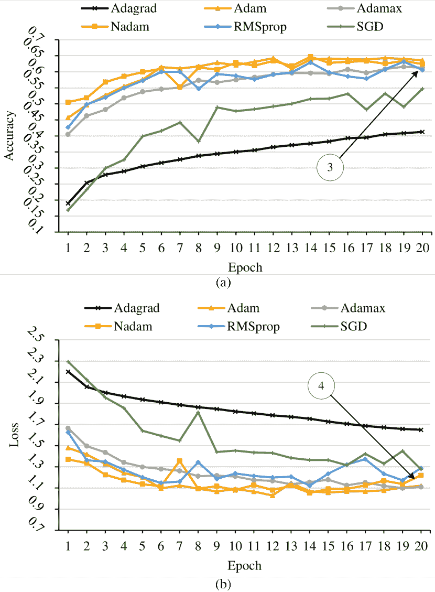

图 18：VGG16 在 Cifar-10 数据集上的各种优化器比较。a) 表示 VGG16 结构的准确性，b) 表示不同范围优化器下 VGG16 结构的损失

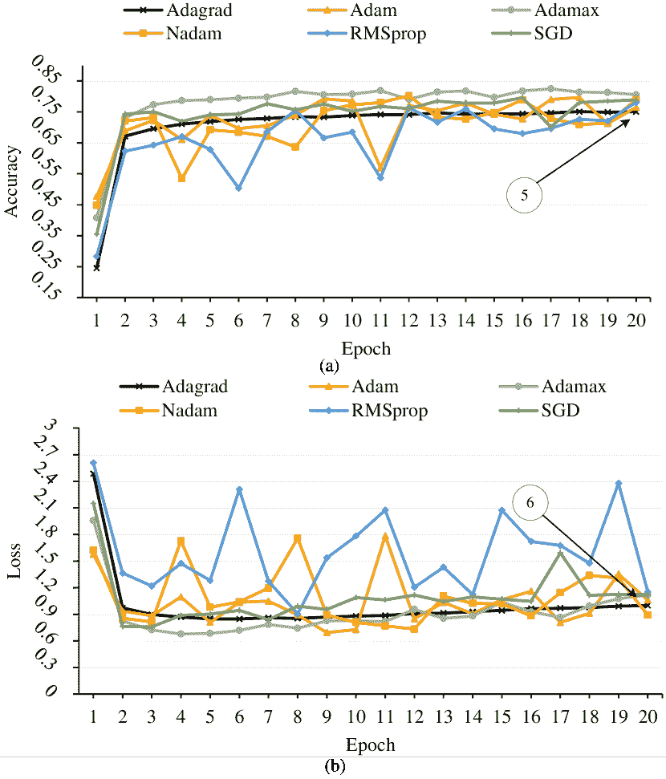

图 19：ResNet-50 在 Cifar-10 数据集上的各种优化器比较。a) 表示 ResNet-50 结构的准确性，b) 表示 ResNet-50 结构的损失

### VIII-C 内存和存储要求

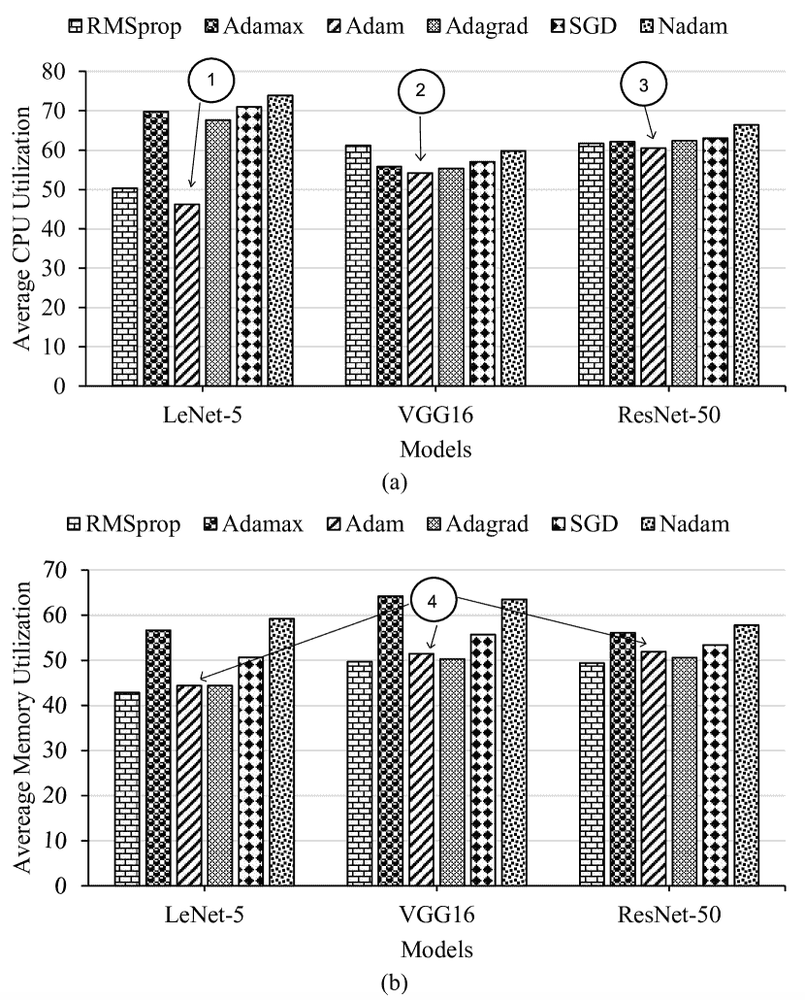

图 20：每个模型所使用的 CPU 和内存利用率。a) LeNet-5、VGG16 和 ResNet-50 使用六种优化器的平均 CPU 利用率（更好的价值识别取决于使用情况），b) LeNet-5、VGG16 和 ResNet-50 使用六种优化器的平均内存利用率（更好的价值识别取决于使用情况）

内存和存储需求是深度学习中的关键考虑因素，特别是在将模型部署到边缘设备或资源有限的云环境时。卷积模型，特别是那些具有大量层和参数的模型，在训练和推理过程中可能需要大量的内存和存储资源。

传统卷积层通常具有较高的内存需求，因为在反向传播期间需要存储中间特征图和梯度。深度可分离卷积和点卷积可以通过减少参数数量和中间特征图来减少内存使用。内存高效的 CNN 设计涉及使用较小的批量大小、采用混合精度训练以及优化推理过程中的内存使用等策略。此外，模型压缩技术，如知识蒸馏和模型量化，可以显著减少模型的大小，而不会显著影响性能。

### VIII-D 在标准数据集上的基准测试

在标准数据集上对卷积技术进行基准测试是评估其性能和效率的重要步骤。标准数据集，例如用于图像识别的 ImageNet [95] 或用于物体检测的 COCO [94]，提供了公平比较不同模型和技术的共同基础。通过基准测试卷积技术，研究人员可以客观地评估其在各种应用中的有效性，并将其性能与最先进的模型进行比较。基准测试考虑了准确率、推理速度、内存使用和能效等指标，从而允许对模型进行全面评估。

基准测试帮助深度学习社区识别不同卷积技术的优缺点，为改进和进步铺平道路。它还帮助从业者选择最适合他们特定用例和在性能与效率之间权衡的卷积技术。

## IX 框架和库

本节将概述一些用于开发深度学习应用的流行平台（参见表 X）。我们将从其架构、编程模型、支持的硬件和关键特性等方面比较这些框架。选择正确的工具对深度学习成功至关重要。这就是为什么探索框架能力对于研究人员和工程师来说是关键的原因。

表 X：现有流行框架和库的比较

| 方面 | Caffe | TensorFlow | Keras | PyTorch | OpenCV | Deeplearning4j | MXNet | Chainer |
| --- | --- | --- | --- | --- | --- | --- | --- | --- |
| 发布年份 | 2013 | 2015 | 2015 | 2016 | 1999 | 2014 | 2015 | 2015 |

|

&#124; 编程 &#124;

&#124; 语言 &#124;

| C++/Python | Python, C++ | Python | Python | C++, Python, Java | Java, Scala |
| --- | --- | --- | --- | --- | --- |

&#124; Python, C++, R, &#124;

&#124; Scala, Perl, Julia &#124;

| Python |
| --- |
| 许可证 | BSD 3-Clause | Apache 2.0 | MIT | BSD 3-Clause | BSD 3-Clause | Apache 2.0 | Apache 2.0 | MIT |
| 模型定义 | 分层 | 图形化 |

&#124; 顺序和 &#124;

&#124; 函数式 &#124;

|

&#124; 动态 &#124;

&#124; 计算图 &#124;

| 不适用 |
| --- |

&#124; 顺序、计算 &#124;

&#124; 图 &#124;

| 符号式 |
| --- |

&#124; 命令式和 &#124;

&#124; 声明式 &#124;

|

| 易用性 | 中等 | 中等 | 高 | 高 | 低 | 中等 | 中等 | 高 |
| --- | --- | --- | --- | --- | --- | --- | --- | --- |
| 速度 | 快 | 快 | 中等 | 快 | 非常快 | 快 | 快 | 快 |

|

&#124; 对 &#124;

&#124; 计算机视觉 &#124;

| 非常好 | 优秀 | 好 | 优秀 | 优秀（库） | 好 | 好 | 好 |
| --- | --- | --- | --- | --- | --- | --- | --- |
| 关注 |

&#124; 研究 &#124;

&#124; 原型设计 &#124;

|

&#124; 生产和 &#124;

&#124; 研究 &#124;

|

&#124; 用户友好 &#124;

&#124; 研究 &#124;

|

&#124; 研究 &#124;

&#124; 原型设计 &#124;

|

&#124; 传统 &#124;

&#124; 算法 &#124;

|

&#124; 企业级 &#124;

&#124; 生产 &#124;

|

&#124; 分布式训练 &#124;

&#124; 大规模 &#124;

|

&#124; 直观的高级 &#124;

&#124; 研究用 API &#124;

|

| 分布式训练 | 否 | 是 | 否 | 否 | 否 | 是 | 是 | 否 |
| --- | --- | --- | --- | --- | --- | --- | --- | --- |

|

&#124; 模型 &#124;

&#124; 部署 &#124;

| 否 | 是 | 是 | 是 | 否 | 是 | 是 | 有限 |
| --- | --- | --- | --- | --- | --- | --- | --- |

|

&#124; 硬件 &#124;

&#124; 支持 &#124;

| CPU, GPU | CPU, GPU, TPU | CPU, GPU | CPU, GPU, TPU | CPU, GPU | CPU, GPU |
| --- | --- | --- | --- | --- | --- |

&#124; CPU, GPU, &#124;

&#124; TensorFlow &#124;

| CPU, GPU |
| --- |

|

&#124; 文档 &#124;

&#124; 质量 &#124;

| 好 | 优秀 | 好 | 优秀 | 优秀 | 好 | 好 | 好 |
| --- | --- | --- | --- | --- | --- | --- | --- |

|

&#124; 社区 &#124;

&#124; 支持 &#124;

| 有限 | 非常活跃 | 非常活跃 | 非常活跃 | 非常活跃 | 活跃 | 活跃 | 活跃 |
| --- | --- | --- | --- | --- | --- | --- | --- |

表 X 提供了几种流行的深度学习框架和库的比较。它评估了关键方面，如发布年份、支持的编程语言、许可证类型、模型定义方法、易用性、速度以及每个框架的重点或优势。

### IX-A Caffe

Caffe 是最早和最具影响力的深度学习框架之一，专门为计算机视觉任务开发 [131]。由伯克利视觉与学习中心（BVLC）于 2013 年发布，Caffe 使卷积神经网络的训练变得更快、更容易。它拥有易于使用的 C++/Python 接口，并且设计注重速度和模块化。Caffe 采用了分层结构，大大简化了模型定义和训练。这有助于推动更广泛的应用，使研究人员能够快速迭代视觉模型。虽然近年来开发进展有所减缓，但 Caffe 为计算机视觉研究奠定了重要基础，仍在使用中。

### IX-B TensorFlow

TensorFlow 是一个由谷歌开发的端到端开源机器学习平台 [132]。虽然它并不严格是一个计算机视觉库，但它已成为构建和训练复杂深度学习模型最流行和功能最全的框架之一。TensorFlow 对计算机视觉提供了出色的支持，包括预训练模型、图像加载和预处理工具、目标检测 API 等。它的灵活性使其适用于从图像分类到语义分割的各种应用。TensorFlow 还可以在 CPU 和 GPU 上无缝工作，并且可以轻松部署到生产环境中。

### IX-C Keras

Keras 是一个高层次的深度学习 API，它运行在流行的框架如 TensorFlow 和 CNTK 之上 [133]。Keras 的开发重点在于用户友好性、模块化和扩展性。它提供了出色的抽象和工具，能够快速开发和评估深度学习模型。在计算机视觉（CV）领域，Keras 配备了用于实时数据增强的 ImageDataGenerator 以及像 VGG16 这样的预定义模型。它还支持流行的 CV 任务，如图像分割、目标检测和特征提取，通过便捷的 API 实现。Keras 的简洁性使得它对开发者非常友好。

### IX-D PyTorch

PyTorch 是一个由 Facebook 的 AI 研究实验室（FAIR）开发的开源深度学习平台 [134]。近年来，它已成为 TensorFlow 的主要替代品，特别是在计算机视觉和自然语言处理应用中。PyTorch 强调动态神经网络，并与 MATLAB 和 Numpy 有相似之处。这使得它具有直观的、符合 Python 风格的接口，非常适合计算机视觉原型设计和实验。PyTorch 还支持 GPU/TPU 训练以及生产部署。它拥有一个不断增长的第三方库和社区支持生态系统。像 Keras 一样，PyTorch 也与常见的计算机视觉任务和数据集紧密集成。

### IX-E OpenCV

OpenCV（开源计算机视觉库）是一个流行的计算机视觉和机器学习软件库 [135]。尽管它并非专门为深度学习设计，但 OpenCV 包含许多传统的计算机视觉算法和丰富的图像处理功能。这些功能包括图像滤波、形态学操作、特征检测和提取、物体分割、以及人脸和手势识别等。OpenCV 与深度学习框架集成，并常用于较简单的计算机视觉任务或作为将数据输入神经网络之前的预处理步骤。

### IX-F MXNet

MXNet 是一个灵活、高效且可扩展的深度学习框架 [136]。类似于 TensorFlow，它支持多种编程语言和硬件环境。MXNet 在分布式训练方面表现突出，支持在数百个 GPU 上训练包含数十亿参数的模型。它还包括用于计算机视觉的算法，如图像识别、物体检测和语义分割。总体而言，MXNet 在灵活性、性能和易用性之间取得了良好的平衡，使其适用于大规模的计算机视觉问题。

### IX-G Chainer

Chainer 是由日本的 preferred networks 创建的开源深度学习框架 [137]。它提供了类似于 Keras 的直接神经网络抽象，具有命令式和声明式模型定义。Chainer 专注于直观的高层 API 与底层性能相结合。它包括图像加载、增强、预训练模型和模型导出等计算机视觉功能。Chainer 支持 GPU 和多 GPU 训练与部署。总体而言，它为计算机视觉开发提供了一个高效且富有成效的环境。

### IX-H Deeplearning4j

Deeplearning4j（Dl4j）于 2014 年推出，是一个用于 Java 和 Scala 的开源深度学习库 [138]。它支持在 GPU 和 CPU 上进行大规模分布式训练。对于计算机视觉任务，Deeplearning4j 提供了图像加载、预训练模型、从 Keras 和 ONNX 导入模型以及用于动态模型构建的 samediff 等工具。Deeplearning4j 专注于生产就绪的部署，具有模型服务、在线预测和通过 Android 或 iOS 应用进行设备端推理等功能。

总体而言，这些库和框架代表了通过深度学习转变计算机视觉的开源工具的前沿。每个工具在灵活性、性能、易用性和支持特性之间提供了不同的优势和权衡。随着计算机视觉任务的不断发展，我们可以期待这些项目进一步融入最先进的研究，同时通过改进的工具和抽象降低开发门槛。计算机视觉必将继续成为深度学习创新的重要应用领域，无论在研究还是行业中。

## X 主要研究领域

### X-A 图像分类

图像分类是 CNNs 最早的成功之一。开创性的 AlexNet 在 2012 年的 ImageNet 挑战中通过大幅改进之前的技术，达到了破纪录的结果。如今，最先进的 CNNs 在图像分类中通常能在标准数据集上实现与人类水平相当或更高的准确性。像 ResNet、Inception、Xception 和 EfficientNets 这样的架构优化了参数、层连接和计算，以超人类的性能水平分类成千上万的物体类别 [52, 53, 56, 276]。除了静态图像，视频分类 CNNs 还提取时空特征以识别复杂的活动和事件。

### X-B 目标检测

目标检测是另一个主要的 CV 应用，严重依赖于卷积建模。像 Faster R-CNN 这样的两阶段检测器和像 YOLO 这样的单阶段检测器利用区域提议网络和通过先验训练的锚框来同时定位和分类图像中的物体 [317, 318, 319, 320, 321, 322, 323, 324, 325, 326, 327, 328, 329, 330, 331]。最近的研究进一步优化了速度和准确性，使实时目标检测成为可能，适用于亿级参数的模型。像移动目标检测这样的技术通过设计轻量级的 CNN 背骨和优化设备上的推理功能来解决嵌入式限制 [332]。

### X-C 图像分割

语义分割任务需要对图像内容进行密集的像素级标记。FCN 和 U-Net CNN 采用跳跃连接和编码器-解码器镜像来保持跨分辨率的空间信息 [333, 334, 335, 336, 337, 338, 339, 340, 341, 342, 343, 344, 345, 346, 347, 348]。PSPNet 和 DeepLab 引入了金字塔空间池化模块以捕捉多尺度的上下文信息 [349]。GANs 和条件随机场进一步精细化来自 CNNs 的粗略分割。医学成像的进展也应用分割 CNNs 来理解器官结构、定位病变，并辅助诊断。

### X-D 视觉变换器

视觉变换器也成为传统 CNNs 在计算机视觉任务中的一种引人注目的替代方案。受到语言模型成功的启发，视觉变换器将图像划分为离散的补丁，这些补丁通过自注意力机制进行嵌入和处理。这使得它们能够比 CNNs 更有效地捕捉长距离依赖和多尺度上下文信息。像 ViT、DeiT 和 Visual BERT 等模型在经过大规模数据集预训练后，在图像分类等任务中展示了最先进的结果 [350, 351, 352, 353, 354, 355, 356, 357]。目前的研究集中在优化变换器在实时计算机视觉应用中的效率。

### X-E 一次性/少样本/零样本学习

一次性学习和少样本学习旨在解决标注训练示例有限带来的挑战。通过度量学习和原型网络，这些网络从广泛的基础类中学习稳健的表示，模型能够有效地从仅有的一个或几个示例中识别新概念而不会发生灾难性遗忘 [358, 359, 360, 361, 362, 363, 364, 365, 366, 367, 368, 369, 370, 371, 372]。这为计算机视觉打开了新的长尾和增量学习范式。匹配网络和原型网络通过有效比较测试样本与基础类的原型表示，从有限的暴露中进行泛化。

零样本学习作为一个有前景的领域出现，其中 CNNs 想象超越标注数据限制的可能性 [373, 374, 375, 376, 377]。像属性或语义关系这样的描述符引入了促进在没有示例情况下泛化的归纳偏差。SAE、DeViSE 和当代模型通过对齐在辅助描述符下的已见和未见类别之间的嵌入来转移知识。知识图谱还通过实体和关系建模提供结构性归纳偏差。

### X-F 弱监督学习

弱监督学习技术还帮助减少对劳动密集型标注的依赖 [378, 379, 380, 381, 382, 383]。模型可以通过图像级标签或边界框对象位置等较弱的输入信号进行端到端训练，而不是显式的像素级分割图。多实例学习方法将图像区域与每个标签对应进行聚类，以迭代精炼局部预测。期望最大化（EM）和多实例学习共同推断标签并识别区分区域，从而使从更便宜的弱监督形式中进行训练成为可能。

### X-G 自监督/无监督学习

自监督学习在计算机视觉中也受到了极大关注，通过利用大量未标记的视觉数据进行预训练[384, 385, 386, 387, 388, 389, 390, 391, 392, 393]。像预测图像旋转、解决拼图谜题或计数像素颜色这样的预置任务使模型能够学习适用于下游任务的丰富视觉表示。最近的对比自监督模型，如 SimCLR、SwAV 和 MoCo 表明，无标记的预训练在各种视觉基准测试中能够与或超过监督预训练，从而实现更具数据效率的微调或转移到新问题。

### X-H 终身/持续学习

终身学习和持续学习旨在模拟开放世界场景，在这些场景中模型学习终身，面对非静态数据分布[51]。模型在面对新的类别或现有类别定义的变化时必须避免灾难性遗忘，而无需再次访问历史数据[394, 395, 396, 397, 398, 399, 400, 401, 402, 403]。弹性权重巩固和增量时刻匹配正则化在容纳新任务的同时保持知识。目前的研究探索了面向任务的架构、双存储系统以及模拟记忆重构的重播缓冲区，从而对终身视觉学习进行建模。

### X-I 视觉语言模型

视觉语言模型（VLMs）也出现在自然语言处理和计算机视觉的交叉领域，通过将语言基于视觉背景进行落地。模型通过注意力融合多模态输入，并生成依赖于图像的标题，或根据语言背景定位和描述视觉实体。像 CLIP、ALIGN 和 Oscar 这样的大型预训练模型展示了令人兴奋的能力，如零样本分类、问答和视觉对话，在教育、辅助技术等领域具有潜在应用。

### X-J 医学图像分析

医学成像体现了深度学习与领域专家之间协作的必要性。在体积扫描中分割器官、在成像模式中定位异常以及对患者进行纵向追踪，所有这些都利用了 3D/2D CNN[404, 405, 406, 407, 408, 409, 410, 411, 412, 413, 414, 415, 416, 417, 418]。先进的模型通过强制平滑以及在预测中保留边缘和表面，利用解剖学先验。自监督进一步使得从非私人数据中进行预训练成为可能，然后微调目标任务。在这里，模型解释尤其重要，以确保临床医生的信任[410, 411, 412, 413]。除了诊断，CNN 还可以模拟新视角以辅助外科手术规划。效率对于设备上的部署以及辅助缺乏基础设施的服务不足人群也非常重要。

### X-K 视频理解

除了图像之外，视频理解在建模连续帧间的时空关系方面面临独特的挑战。C3D 和 I3D CNN 直接从视频体积中学习 3D 卷积。视频字幕生成和动作识别中的先进技术融合了语言模型和注意力机制，以共同推理视觉内容和语言语义。自监督学习从大规模未标记的视频库中也成为了在微调下游任务之前的一个有前景的预训练范式。

### X-L 多任务学习

多任务学习旨在通过在多个相关任务上共同训练 CNN 来提高泛化能力，使用共享表示。这在众多应用中已经证明了成功，通过利用共性同时减轻了单个任务有限数据的过拟合[419, 420, 421, 422]。例如，YOLO 在进行物体检测的同时，也训练其他辅助预测如分割和计数。

多任务 CNN 在低数据条件下优于独立模型（见第 VII -¿ 子章节 G。）通过借用相关问题的统计力量。密集字幕生成同时定位物体并描述场景。一个单独的网络预测关键点、法线和语义部分分割。更深层的任务从为更通用的浅层任务学习的表示中受益匪浅。

通过相关的辅助目标逐步扩展到新的问题空间也防止了灾难性遗忘。自监督预训练建立了在下游任务中广泛有用的特征，包括那些没有标注的任务。测量和最大化多任务架构中的模块化还可以减少领域间的干扰。

技术如多粒度、多层次和异构多任务学习进一步设计多样的目标，以逐步细化在不同粒度级别捕获的语义[423, 424, 425, 426]。任务关系从独立、互相改善的合作到完全共享利用相同表示。设计得当，多任务 CNN 能够提供最先进的性能，同时提高泛化能力、效率和现实世界的适用性。

多任务模型将 CNN 与语言等其他模态结合。对于图像描述，CNN-RNN 融合将生成的文本与视觉上下文对接。对于检索，排名损失训练 CNN-LSTM 编码器将语义对齐的视觉-文本对映射到相近的嵌入。多模态的自监督预训练在巨大的未标记多媒体集合中证明了其通过自监督对齐领域的高度效用。

### X-M 6D 视觉

6D 视觉旨在直接从单目 RGB 图像中恢复完整的 6D 姿态（3D 位置、3D 方向）。由于将 3D 场景投影到 2D 图像时丢失了深度信息，这是一项具有挑战性的任务[427, 428, 429, 430, 431, 432]。早期的工作依赖于 CAD 模型和缺乏照片现实主义的合成数据，而较新的方法则利用大量真实训练数据。

CNN 基础的回归网络通常用于将图像作为输入，并直接预测 6D 姿态值。PoseCNN 展示了如果在真实数据上端到端训练，这可以实现与基于模型的回归相媲美的精度。由于目标分布的复杂性和多模态性质，确保在不同姿态下预测一致的损失（如重投影或角度）是有益的。

迭代细化方法首先检测对象，然后基于 2D-3D 对应关系迭代更新姿态估计。DeepIM 预测形状系数并使用 PnP 进行细化。DPOD 结合深度特征和几何约束，在 RANSAC 框架中进行操作。密集表示也通过独立推理对象部分提供帮助。

多视角和 RGB-D 传感器提供了额外的线索来利用。MVD 通过为每个视角训练独立的网络并融合结果来帮助约束问题。使用 RGB 和深度作为输入，Depth-PoseNet 可以将 2D 预测提升到 3D 空间。多任务模型联合预测边界框、关键点和姿态，准确度接近基于标记的动作捕捉。

### X-N 神经架构搜索

神经架构搜索（NAS）旨在利用进化和强化学习的力量自动设计神经网络。NAS 方法直接在目标数据集和任务上演变架构，而不是依赖人工专家费力地设计 CNN 架构。这导致了在没有人工设计选择的情况下开发出的最先进的视觉模型[433, 434, 435, 436, 437, 438, 439, 440]。

早期的 NAS 工作探讨了由单元、操作和它们之间的连接定义的各种搜索空间。结合像剪枝、在演化过程中在子模型之间共享权重等概念，帮助将搜索扩展到更大的空间[295, 299]。性能预测器通过引导搜索到有前景的区域进一步减少了成本。新方法为特定领域演变了过滤器、激活函数和批归一化层。

最近的努力演变了整个部分或块，扩展了适用的搜索空间。单路径一体化方法极大地加快了搜索速度而不妥协质量。ProxylessNAS 直接在目标设备上找到高效的移动架构。NAS 方法还发现了适用于超越计算机视觉问题的非 CNN 模型。

一旦确定了最佳架构，可以从头开始训练这些架构，以进一步提高搜索过程中预测的代理准确率。晚期演化还增强了最初确定的架构，同时架构参数本身也可能会演变。总体而言，NAS 技术在面对多样的数据、约束或目标时，不断推动视觉任务的最新技术。

### X-O 神经架构变换器

神经架构变换器（NAT）用自注意力替代了 CNN 的固定拓扑，将卷积滤波替换为轴向自注意力[436, 441]。这种增加的灵活性允许建模对视觉任务如分割至关重要的长距离像素依赖。Vil-BERT 引入了一个多阶段的训练程序，使预训练模型能够学习视觉表示以及自然语言任务。

早期的工作将输入图像分成均匀的补丁，由注意力层独立处理。更复杂的设计旨在通过层次化的补丁划分更好地捕捉视觉局部性。旋转位置嵌入和注意力模式有助于编码平移等变性。像 CoAtNet 这样的架构将块级联，增加分辨率，提高了准确性和可解释性。

多尺度视觉变换器（MViT）在混合模型中融入了先前的卷积归纳偏置，利用注意力和翻译等变性带来了共同的好处。将视觉变换器与卷积网络结合，特别有利于利用解剖学先验进行医学图像分割。Swin 变换器引入了一个位移窗口机制，以在更高分辨率的特征图上局部集中计算。

尽管仍然是一个新兴方向，神经网络架构变换器通过将自注意力的全部普遍性应用于视觉问题，开启了计算机视觉的新路径。它们的持续发展肯定会通过解锁新的表征能力对未来的计算机视觉研究产生影响。与 NAS 一起，它们有望通过数据驱动的发现直接在更广泛的算法搜索空间内推动边界。

### X-P 生成模型

生成模型在计算机视觉领域取得了重大进展，采用了 GANs 和扩散模型等技术[442, 443, 444]。GANs 将生成器网络与鉴别器网络配对进行对抗训练。这驱使生成器合成越来越真实的假图像，从而欺骗鉴别器。

GANs 在生成与真实图像几乎无法区分的照片方面取得了令人印象深刻的成果。应用包括图像到图像的翻译、超分辨率以及操控图像属性如风格[444, 445, 446, 447]。然而，GAN 训练仍然难以稳定。模式崩溃等问题需要精心设计架构和超参数选择。

扩散模型提供了一种备受欢迎的生成框架。它们利用去噪扩散概率模型（DDPMs），在将数据逐渐添加高斯噪声后，再反向处理[442, 443, 444, 447, 448, 449]。在生成过程中，模型向空白画布中添加噪声，然后迭代地预测去噪后的输出。这个扩散过程证明比对抗训练更稳定。

从 DDPM 进行采样遵循祖先采样方法，根据先前去噪输出的条件回归噪音。像基于得分的采样这样的先进技术通过最大化模型的密度而不是遵循祖先噪音进一步提高样本质量。生成扩散模型（GDMs）还特别为生成最大化去噪得分目标[449]。

扩散模型已被证明在各种数据集中合成清晰、详细的图像方面非常有效。像 DALL-E 2 和 DALL-E 3 这样的大规模视觉扩散模型（LVMs）展示了从文本提示生成图像的无与伦比的能力，甚至可以融合语言和视觉回答关于合成图像的琐事问题。

通过生成合成训练数据，生成模型还可以通过数据增强受益于下游分类、检测和分割任务。随着生成扩散模型的不断进步，它们必定会在从图像编辑到通过计算实验进行科学发现的 CV 领域建立新的前沿。

### X-Q 元学习

元学习，也被称为学会学习，旨在开发能够仅使用少量训练样例就能快速适应新任务和环境的模型。通过在元训练阶段在各种相关任务上学习关于学习本身的归纳偏见来实现这一目标。然后在元测试时间在新颖任务上利用这些偏见[450, 451]。

在 CV 领域，元学习使 CNN 能够通过快速适应超越有限标记样例的限制。模型无关元学习（MAML）训练初始模型参数，使得少量梯度步骤可以微调成为新任务。这学习了高效的参数初始化，而不是针对特定任务的解决方案[450, 451, 452, 453, 454, 455, 456, 457]。

基于度量的方法使用原型来表示类，总结独立于任务的跨/内类关系[450, 451, 452]。匹配网络将新的示例与原型进行比较，通过学习的度量空间相似性提供快速适应。Meta-Dataset 整合了许多少样本图像分类数据集，在这个具有挑战性的零/少样本范式上推动了最新技术和评估协议[450, 451, 452, 457]。

自监督的辅助任务，如预测、旋转和上下文建模，当与监督的元学习目标一起使用时，会进一步增强泛化能力。时间集成模型通过从生成网络中聚合不同的预测，提升对噪声和异常值的鲁棒性。强化元学习成功地仅通过少量示范训练视觉运动控制策略。

### X-R 联邦学习

联邦学习（FL）使得在去中心化的边缘设备上进行分布式训练成为可能，无需交换私人用户数据如图像、视频或医疗扫描。它旨在通过协调的本地更新，协作学习一个适应非 IID 用户分布的共享全球模型。由于对数据隐私和安全性的日益关注，这一范式引起了越来越多的兴趣。

FL 通过一个迭代过程训练一个集中式的 CNN 模型，其中设备下载最新的参数，贡献计算过的局部数据分片的更新，然后推送权重回服务器。参数服务器聚合更新以全球性地改进模型。一个关键挑战来自于非 IID 数据分布、设备和不可靠的网络连接的异质性。FedVision 直接在分段的客户端视频上应用 FL 进行对象检测。

个性化、多任务和元学习等技术有助于解决 FL 中的统计异质性。持续学习方面防止在传播轮次中人口变化时的灾难性遗忘。差分隐私算法和安全聚合方案确保了在协作更新中的强隐私性，使 FL 在严格的隐私约束下，超越视觉应用到像医疗保健这样的敏感领域。

## XI 讨论

通过这次详尽的调查，我们系统地探索了近年来在各个应用领域变得越来越流行的各种 CNN 变体。我们在讨论部分的目标是总结我们对文献评估的最重要发现，并提供对该研究领域发展和前景的重要问题的分析视角。

卷积层非常适合网格状数据类型，如图像，因为它们在捕捉空间关系和提取层次模式方面表现出了很高的能力。在 CNN 的核心，通常用于计算机视觉任务如对象识别和图像分类的，仍然是传统的 2D 卷积。然而，随着领域的发展，出现了额外的专门卷积方法，以更有效地处理不同的数据模式。其中，1D 卷积在时间序列分析和自然语言处理等序列数据领域有着显著的应用。它们捕捉时间依赖性的能力使得在各种语言和音频处理问题上取得了最先进的准确度。同样，3D 卷积使 CNN 能够通过考虑空间和时间维度，有效地对体积医学图像和视频输入进行建模。

尽管基本的卷积变种如 2D 和 3D 卷积仍然推动着许多顶级模型，但更高效的变体也已经被开发出来。膨胀卷积利用膨胀来扩展感受野而不损失分辨率，从而帮助完成高层次的语义任务，如分割。分组卷积提供了一种将卷积分解以显著减少计算和内存使用的方法，使得大型深度架构成为可能。然而，与标准卷积相比，它们在高级分析中的表示能力可能仍然有限。深度可分离卷积，如在 MobileNets 中使用的，通过其按通道分解的特性，在嵌入式和移动设备上部署高效 CNN 取得了巨大的成功。

除了新型卷积设计外，该领域还在不断创新地融合来自平行研究领域的概念。例如，视觉变换器模型通过引入注意力机制完全替代卷积构建块，特别是在大数据集上取得了强劲的结果。像胶囊网络这样的技术旨在通过特征向量之间的动态路由来克服 CNN 的局限性。生成模型如 Pix2Pix 采用卷积解码器从语义图或草图中生成高保真图像。自监督学习的进展提供了替代的预训练范式，绕过了对大量注释数据集的需求。

深度学习技术的进一步结合似乎有望产生富有成效的协同效应。例如，将注意力机制融入卷积流程中，可能会赋予它们两种方法的优点。此外，自监督机制可能有助于无监督地发现适合特定领域的可解释卷积滤波器。尽管取得了显著成就，但在鲁棒性、稀疏数据情境、模型可解释性和可信度方面仍然存在开放挑战。未来的进展依赖于学术界和工业界的紧密合作，以定义现实世界的需求并扩大深度学习对社会的积极影响。

一些卷积类型由于其灵活性和适应性，已被证明比其他类型更持久。虽然 LeNet 无疑在早期发挥了重要的开创性作用，但近年来的架构通过原则性的网络设计和优化更好地捕捉了数据的固有特性。与此同时，创新在各个方面持续进行，暗示尚未出现单一的解决方案。成功依赖于根据特定情境明智地结合创新，而不是完全替代现有的范式。

一个充满希望的前景设想了核心 CNN 构建模块的持续优化及其与自监督学习、注意力机制和生成模型中的新算法概念的和谐结合。总之，本综述突出了卷积神经网络迄今为止的显著进展及其在深度学习不断演变的领域中未来的广阔未实现潜力。

## XII 结论

在对深度学习中不同卷积类型的综合研究中，我们获得了对这些技术多样化应用和优势的宝贵见解。CNN 在各种领域，如图像识别和自然语言处理，已经被证明非常有效。我们在多个方面比较了各种类型的 CNN，使我们能够理解它们在特定任务中的独特特性和优势。总体而言，这项研究强调了卷积在深度学习中的重要性及其在人工智能领域未来进步和改进的潜力。此外，研究结果表明，CNN 的多功能性使其适用于除传统计算机视觉任务之外的各种应用。此外，研究还强调了进一步研究和开发以优化和改进这些技术以适应特定领域和任务的重要性。

## 致谢

本研究部分得到了 NYUAD 人工智能与机器人中心（CAIR）的资助，该中心由 Tamkeen 资助，属于 NYUAD 研究院奖项 CG010。该研究还部分得到了项目“eDLAuto：一个用于自主系统中节能嵌入式深度学习的自动化框架”的资助，该项目由 NYUAD 研究提升基金（REF）资助。

## 参考文献

+   [1] I. H. Sarker，”深度学习：技术、分类、应用和研究方向的全面概述，” SN 计算机科学，第 2 卷，第 6 期，2021 年 8 月，doi: 10.1007/s42979-021-00815-1。

+   [2] G. Hong, A. Folcarelli, J. Less, C. Wang, N. Erbasi 和 S. Lin，”语音助手与癌症筛查：Alexa、Siri、Google Assistant 和 Cortana 的比较，” 家庭医学年鉴，第 19 卷，第 5 期，第 447–449 页，2021 年 9 月，doi: 10.1370/afm.2713。

+   [3] A. Kumar, S. Gadag 和 U. Y. Nayak，”新时代的开始：人工智能在医疗中的应用，” 高级制药公告，第 11 卷，第 3 期，第 414–425 页，2020 年 7 月，doi: 10.34172/apb.2021.049。

+   [4] J. B. Heaton 和 N. Polson，”金融领域的深度学习：深度投资组合，” SSRN 电子期刊，2016 年，doi: 10.2139/ssrn.2838013。

+   [5] M. Veres 和 M. Moussa，”智能交通系统中的深度学习：新兴趋势调查，” IEEE 智能交通系统汇刊，第 21 卷，第 8 期，第 3152-3168 页，2020 年 8 月，doi: 10.1109/TITS.2019.2929020。

+   [6] M. Ghaderzadeh 和 F. Asadi，”深度学习在 COVID-19 检测和诊断中的应用：系统评估，” 医疗工程杂志，第 2021 卷，第 1-10 页，2021 年 3 月，doi: 10.1155/2021/6677314。

+   [7] I. Goodfellow, Y. Bengio 和 A. Courville，”深度学习，” MIT 出版社，2016 年。

+   [8] J. Schmidhuber，”神经网络中的深度学习：概述，” 神经网络，第 61 卷，第 85–117 页，2015 年。

+   [9] N. K. Logothetis 和 D. L. Sheinberg，”视觉对象识别，” 1996 年 3 月。

+   [10] H. Zhou 等，”一种用于医疗废物分类的深度学习方法，” 2022 年 2 月。

+   [11] S. Yang 和 J. Anjie，”基于深度学习的油气储层空间识别，” 2021 年 1 月。

+   [12] D. Jimenez-Carretero 等，”Tox_(R)CNN: 基于深度学习的细胞核分析工具用于药物毒性筛选，” PLoS 计算生物学，第 14 卷，第 11 期，第 e1006238 页，2018 年 11 月，doi: 10.1371/journal.pcbi.1006238。

+   [13] A. G. Howard 等，”Mobilenets: 高效的卷积神经网络用于移动视觉应用，” arXiv 预印本 arXiv:1704.04861，2017 年。

+   [14] TensorFlow Lite. https://www.tensorflow.org/lite/

+   [15] R. Kavuluru，”一种端到端的深度学习架构用于提取受遗传突变影响的蛋白质–蛋白质相互作用，” 2018 年 1 月。

+   [16] A. Kamilaris 和 F. X. Prenafeta-Boldú，”卷积神经网络在农业中的应用综述，” 农业科学杂志，第 156 卷，第 3 期，第 312–322 页，2018 年 4 月，doi: 10.1017/s0021859618000436。

+   [17] S. Klos 和 J. Patalas-Maliszewska，”工业 4.0 智能生产监督模型，” 2022 年 5 月。

+   [18] R. Nakajo, S. Murata, H. Arie 和 T. Ogata，”通过深度神经网络的序列到序列模仿学习获得视点变换和动作映射，” 2018 年 7 月。

+   [19] V. D. Veksler, B. E. Hoffman 和 N. Buchler，“符号深度网络：一种心理学启发的轻量级高效深度学习方法，” *认知科学专题*，2021 年 10 月。

+   [20] C. Xue 等，“使用深度学习在声音录音中检测痴呆：一项弗雷明汉心脏研究，” 2021 年 8 月。

+   [21] C. Lai 等，“卷积神经网络和数字相机图像在白内障检测中的应用，” 2022 年 3 月。

+   [22] H. Ahmed 和 M. Kashmola，“一种用于检测皮肤癌的卷积神经网络提议架构，” *Iaes 国际人工智能期刊*（Ij-Ai），第 11 卷，第 2 期，第 485 页，2022 年 6 月，doi: 10.11591/ijai.v11.i2.pp485-493。

+   [23] X. Jiang, L. Teng 和 L. Teng，“一种基于多尺度卷积的高斯-拉普拉斯算子用于舞蹈动作图像增强，” 2018 年 7 月。

+   [24] S. Shuai, Y. Zhou 和 X. Song，“一种用于噪声样本训练的卷积神经网络的随机最大池化策略，” *计算机通信与控制国际期刊*，第 15 卷，第 1 期，2020 年 2 月，doi: 10.15837/ijccc.2020.1.3712。

+   [25] Y. Zhang, J. Hou, Q. Wang, A. Hou 和 Y. Liu，“迁移学习和特征融合算法在提高早发性卵巢衰竭识别与预测效率中的应用，” 2022 年 3 月。

+   [26] A. Younesi, R. Afrouzian 和 Y. Seyfari，“一种基于卷积神经网络的迁移学习方法用于口罩检测，” *高级信号处理杂志*，第 5 卷，第 1 期，2021 年 1 月，doi: 10.22034/jasp.2022.48447.1167。

+   [27] H. M. Jalajamony, H. M. Jalajamony 和 R. E. Fernandez，“基于深度学习的介电泳力估计，” *微型机械*，第 13 卷，第 1 期，第 41 页，2021 年 12 月，doi: 10.3390/mi13010041。

+   [28] W. Liang, H. Zhang, G. Zhang 和 H. Cao，“使用深度卷积神经网络进行稻瘟病识别，” 2019 年 2 月。

+   [29] G. Yang, X. Liang, S. Deng 和 X. D. Chen，“基于多模态神经网络算法的教学模型主成分研究，” 2022 年 6 月。

+   [30] J. Rong, Y. Chen 和 J. Yang，“用于篮球视频中的运动特征分析和抛物线弯度预测的 CNN-LSTM 混合模型，” 2021 年 9 月。

+   [31] A. Tiwari, M. Silver 和 A. Karnieli，“一种自动识别古代农业水收集系统的深度学习方法，” 2023 年 4 月。

+   [32] I. Ahmed, B. T. Hammad 和 N. Jamil，“基于手工和机器制作特征的图像拷贝-移动伪造检测算法的比较分析，” *印度尼西亚电气工程与计算机科学杂志*，第 22 卷，第 2 期，第 1177 页，2021 年 5 月，doi: 10.11591/ijeecs.v22.i2.pp1177-1190。

+   [33] E. Setyati, S. Az, S. A. Hudiono 和 F. Kurniawan，“基于 CNN 的面部识别系统用于唐氏综合症和威廉姆氏综合症患者，” *知识工程与数据科学*，第 4 卷，第 2 期，第 138 页，2021 年 12 月，doi: 10.17977/um018v4i22021p138-144。

+   [34] G. Hu, K. Wang 和 L. Liu，《基于深度可分离卷积神经网络的水下声学目标识别》，*Sensors*，第 21 卷，第 4 期，页码 1429，2021 年 2 月，doi: 10.3390/s21041429。

+   [35] Z. Jiang, Z. Dong, L. Wang 和 W. Jiang，《基于 ViT-CNN 集成模型的急性淋巴细胞白血病诊断方法》，2021 年 8 月。

+   [36] L. Wang, W. Zhou, Q. Chang, J. Chen 和 X. Zhou，《基于短期 RR 间期的充血性心力衰竭深度集成检测》，*IEEE Access*，第 7 卷，页码 69559-69574，2019 年 1 月，doi: 10.1109/access.2019.2912226。

+   [37] A. Zafar 等人，《卷积神经网络的池化方法比较》，*Applied Sciences*，第 12 卷，第 17 期，页码 8643，2022 年 1 月，doi: 10.3390/app12178643。

+   [38] J. Zhu, J. Jang-Jaccard 和 P. A. Watters，《带有批量归一化层的多损失 Siamese 神经网络用于恶意软件检测》，2020 年 1 月。

+   [39] A. Maniatopoulos 和 N. Mitianoudis，《可学习的漏斗 ReLU（LeLeLU）：一种替代的精度优化激活函数》，2021 年 12 月。

+   [40] *《深入探讨整流器：超越人类水平……》*，arxiv.org，（访问日期：2023 年 7 月 18 日）。

+   [41] L. E. V. Dyck, R. Kwitt, S. J. Denzler 和 W. R. Gruber，《人类与深度卷积神经网络的目标识别比较——眼动追踪研究》，*Frontiers in Neuroscience*，第 15 卷，2021 年 10 月，doi: 10.3389/fnins.2021.750639。

+   [42] Z. Wu, Y. Guo, W. Lin, S. Yu 和 Y. Ji，《一种加权深度表示学习模型用于网络物理系统中不平衡故障诊断》，*Sensors*，第 18 卷，第 4 期，页码 1096，2018 年 4 月，doi: 10.3390/s18041096。

+   [43] H. Xia, C. Ding 和 Y. Liu，《基于自注意力和字符级嵌入的情感分析模型》，*IEEE Access*，第 8 卷，页码 184614-184620，2020 年 1 月，doi: 10.1109/access.2020.3029694。

+   [44] Z. Zhao, X. Xie, W. Liu 和 Q. Pan，《用于视频压缩感知的混合 3D 卷积网络》，2020 年 1 月。

+   [45] Z. Liu 等人，《基于深度学习的脑肿瘤分割：综述》，2022 年 7 月。

+   [46] H. Chen 等人，《基于深度 3D 卷积神经网络的大规模视频检索的监督视频哈希方法》，*Sensors*，第 21 卷，第 9 期，页码 3094，2021 年 4 月，doi: 10.3390/s21093094。

+   [47] G. Li, S. Jiang, I. Yun 和 J. Kim，《用于城市场景实时语义分割的深度非对称瓶颈与逐点聚合解码器》，*IEEE Access*，第 8 卷，页码 27495-27506，2020 年 1 月，doi: 10.1109/access.2020.2971760。

+   [48] Z. Lu 等人，《通过膨胀残差网络的快速单图像超分辨率》，2019 年 1 月。

+   [49] R. Kolaghassi, M. K. Al-Hares 和 K. Sirlantzis，《下肢机器人系统步态分析和预测中智能算法的系统综述》，2021 年 1 月。

+   [50] M. Capra, B. Bussolino, A. Marchisio, G. Masera, M. Martina 和 M. Shafique, “加速深度神经网络的硬件和软件优化：当前趋势、挑战及未来发展概述，” *IEEE Access*，第 8 卷，第 225134-225180 页，2020 年，doi: 10.1109/ACCESS.2020.3039858。

+   [51] K. Shaheen, M. A. Hanif, O. Hasan 和 M. Shafique, “面向真实世界自主系统的持续学习：算法、挑战和框架，” *Journal of Intelligent & Robotic Systems*，第 105 卷，第 1 期，2022 年 4 月，doi: 1007/s10846-022-01603-6。

+   [52] C. Szegedy 等, “通过卷积深入发展，” *CVPR 2015*。

+   [53] K. He 等, “用于图像识别的深度残差学习，” *CVPR 2016*。

+   [54] G. Huang 等, “密集连接卷积网络，” *CVPR 2017*。

+   [55] A. Howard 等, “MobileNets：用于移动视觉应用的高效 CNN，” *arXiv 2017*。

+   [56] M. Tan 和 Q. Le, “EfficientNet：重新思考 CNN 模型扩展，” *ICML 2019*。

+   [57] B. Jin, L. Cruz 和 N. Goncalves, “深度面部诊断：从面部识别到面部诊断的深度迁移学习，” *IEEE Access*，第 8 卷，第 123649-123661 页，2020 年 1 月，doi: 10.1109/access.2020.3005687。

+   [58] Y. Yang, D. Kim 和 B. H. Oh, “用于联合深度图上采样的深度卷积网格扭曲网络，” 2020 年 1 月。

+   [59] P. Lang, X. Fu, C. Feng, J. Dong, R. Qin 和 M. Martorella, “LW-CMDANet：一种新型的注意力网络用于 SAR 自动目标识别，” *IEEE Journal of Selected Topics in Applied Earth Observations and Remote Sensing*，第 15 卷，第 6615-6630 页，2022 年 1 月，doi: 10.1109/jstars.2022.3195074。

+   [60] L. Li, J. Wang 和 X. Li, “基于 K-Means 算法的机器学习智能投资效率分析，” *IEEE Access*，第 8 卷，第 147463-147470 页，2020 年 1 月，doi: 10.1109/access.2020.3011366。

+   [61] H. Tomosada, T. Kudo, T. Fujisawa 和 M. Ikehara, “基于 GAN 的图像去模糊，使用定制数据集的 DCT 损失，” 2021 年 1 月。

+   [62] T. Wang *et al.*, “预训练是图像到图像翻译所需的一切，” 2022 年 5 月。

+   [63] B. Kaddar, H. Fizazi, M. Hernandez-Cabronero, V. Sanchez 和 J. Serra-Sagrista, “DivNet：通过多级层次结构设计实现高效卷积神经网络，” 2021 年 1 月。

+   [64] R. Yu 和 J. Sun, “学习基于多项式的可分卷积用于 3D 点云分析，” 2021 年 6 月。

+   [65] A. Kara, “基于深度学习的混合预测方法用于机器设备的退化预测，” *Sakarya University Journal of Computer and Information Sciences*，第 4 卷，第 2 期，第 216-226 页，2021 年 8 月，doi: 10.35377/saucis.04.02.912154。

+   [66] X. Zhang, J. Zhou, W. Sun 和 S. K. Jha, “基于迁移学习的轻量级 CNN 用于 COVID-19 诊断，” *Computers Materials & Continua*，第 72 卷，第 1 期，第 1123-1137 页，2022 年 1 月，doi: 10.32604/cmc.2022.024589。

+   [67] F. Sultonov, J. Park, S. Yun, D. Lim 和 J. Kang, “Mixer U-Net：一种改进的无人机影像自动道路提取方法，” 2022 年 2 月。

+   [68] J. Shao, C. Qu, J. Li 和 S. Peng，“基于视觉注意力的轻量级卷积神经网络用于 SAR 图像目标分类，” *传感器*，第 18 卷，第 9 期，第 3039 页，2018 年 9 月，doi: 10.3390/s18093039。

+   [69] D. AL-Alimi, Y. Shao, R. Feng, M. A. A. Al-qaness, T. Seppänen 和 S. Kim，“基于浅层-深层特征提取的多尺度地理空间对象检测，” *遥感*，第 11 卷，第 21 期，第 2525 页，2019 年 10 月，doi: 10.3390/rs11212525。

+   [70] X. Yang, A. Chen, G. Zhou, W. Chen, Y. Gao 和 R. Jiang，“基于 ISC-MRCNN 和 APS-DCCNN 的植物叶片图像实例分割与分类方法，”2020 年 1 月。

+   [71] Q. Liu *等*，“基于混合注意力的残差网络用于全色锐化，” *遥感*，第 13 卷，第 10 期，第 1962 页，2021 年 5 月，doi: 10.3390/rs13101962。

+   [72] A. Ju 和 Z. Wang，“基于视觉机制的卷积块注意力模块用于机器人图像边缘检测，” *Icst 可扩展信息系统交易*，第 172214 页，2018 年 7 月，doi: 10.4108/eai.19-11-2021.172214。

+   [73] M. Alam, M. D. Samad, L. Vidyaratne, A. Glandon 和 K. M. Iftekharuddin，“深度神经网络在语音和视觉系统中的调查，” *神经计算*，第 417 卷，第 302–321 页，2020 年 12 月。

+   [74] Q. Zhang, X. Wang, Y. Wu, H. Zhou 和 S.-C. Zhu，“可解释的 CNN 用于对象分类，”第 43 卷，第 10 期，第 3416–3431 页，2021 年 10 月。

+   [75] M. Kwabena Patrick, A. Felix Adekoya, A. Abra Mighty 和 B. Y. Edward，“胶囊网络 – 综述，” *国王沙乌地大学计算机与信息科学期刊*，2019 年 9 月，doi: 10.1016/j.jksuci.2019.09.014。

+   [76] C. White *等*，“神经架构搜索：来自 1000 篇论文的见解，”2023 年 1 月，doi: 10.48550/arxiv.2301.08727。

+   [77] I. J. Goodfellow *等*，“生成对抗网络，” *arXiv (康奈尔大学)*，2014 年 6 月，doi: 10.48550/arxiv.1406.2661。

+   [78] X. Yuan, Z. Feng, M. Norton 和 X. Li，“广义批归一化：加速深度神经网络的探索，” *AAAI 人工智能会议论文集*，第 33 卷，第 1682–1689 页，2019 年 7 月，doi: 10.1609/aaai.v33i01.33011682。

+   [79] Y. Wang, G. Wang, C. Chen 和 Z. Pan，“用于图像去噪的多尺度膨胀卷积卷积神经网络，” *多媒体工具与应用*，2019 年 2 月，doi: 10.1007/s11042-019-7377-y。

+   [80] J. Huang *等*，“现代卷积对象检测器的速度/准确性权衡，” *arXiv (康奈尔大学)*，2016 年 11 月，doi: 10.48550/arxiv.1611.10012。

+   [81] H. Zhu, H. Zhang 和 Y. Jin，“从联邦学习到联邦神经架构搜索：综述，” *复杂与智能系统*，2021 年 1 月，doi: 10.1007/s40747-020-00247-z。

+   [82] O. N. Oyelade 和 A. E. Ezugwu，“基于生物启发的神经架构搜索卷积神经网络用于乳腺癌检测的组织病理图像，” *科学报告*，第 11 卷，第 1 期，2021 年 10 月，doi: 10.1038/s41598-021-98978-7。

+   [83] F. Zhan, H. Zhu 和 S. Lu，“用于图像合成的空间融合 GAN，” 2019 年 6 月，doi: 10.1109/cvpr.2019.00377。

+   [84] A. Singh *et al.*，“神经风格迁移：批判性综述，” *IEEE Access*，第 9 卷，第 131583–131613 页，2021 年，doi: 10.1109/access.2021.3112996。

+   [85] A. Vaswani *et al.*，“注意力即是你所需，” *arXiv.org*，2017 年 12 月 5 日。

+   [86] K. Han *et al.*，“视觉变换器综述，” *IEEE Transactions on Pattern Analysis and Machine Intelligence*，第 45 卷，第 1 期，第 87-110 页，2023 年 1 月 1 日，doi: 10.1109/TPAMI.2022.3152247。

+   [87] A. Khan *et al.*，“视觉变换器及其基于 CNN-变换器的变体综述，” *arXiv.org*，2023 年 8 月 8 日。

+   [88] J. Memon, M. Sami, R. A. Khan 和 M. Uddin，“手写光学字符识别（OCR）：全面的系统文献综述（SLR），” *IEEE Access*，第 8 卷，第 142642-142668 页，2020 年，doi: 10.1109/ACCESS.2020.3012542。

+   [89] Tal Ridnik, E. Ben-Baruch, A. Noy 和 Lihi Zelnik-Manor，“ImageNet-21K 大规模预训练，” *arXiv (Cornell University)*，2021 年 4 月。

+   [90] M. Hnewa 和 H. Radha，“自主车辆在雨天条件下的目标检测：前沿和新兴技术综述，” *IEEE Signal Processing Magazine*，第 38 卷，第 1 期，第 53-67 页，2021 年 1 月，doi: 10.1109/MSP.2020.2984801。

+   [91] M. Elhoseny, “多目标检测与跟踪（MODT）机器学习模型用于实时视频监控系统，” *Circuits, Systems, and Signal Processing*，2019 年 8 月，doi: 10.1007/s00034-019-01234-7。

+   [92] S. Thakur 和 A. Kumar，“基于 X 射线和 CT 扫描的 COVID-19 自动检测与分类，使用卷积神经网络（CNN），” *Biomedical Signal Processing and Control*，第 69 卷，第 102920 页，2021 年 8 月，doi: 10.1016/j.bspc.2021.102920。

+   [93] F. Ramzan, M. U. G. Khan, S. Iqbal, T. Saba 和 A. Rehman，“利用 3D 卷积神经网络对 MRI 扫描的脑区进行体积分割，” *IEEE Access*，第 8 卷，第 103697-103709 页，2020 年，doi: 10.1109/ACCESS.2020.2998901。

+   [94] T.-Y. Lin *et al.*，“Microsoft COCO：上下文中的常见对象，” *arXiv (Cornell University)*，2014 年 5 月，doi: 10.48550/arxiv.1405.0312。

+   [95] J. Deng *et al.*，“ImageNet：大规模分层图像数据库，” *2009 IEEE Conference on Computer Vision and Pattern Recognition*，美国佛罗里达州迈阿密，2009 年，第 248-255 页，doi: 10.1109/CVPR.2009.5206848。

+   [96] Y. Li *et al.*，“统一的多模态变换器用于联合视频-语言建模，” 2021 年。

+   [97] H. Tan 和 M. Bansal，“LXMERT：从变换器中学习跨模态编码器表示，” 2019 年。

+   [98] A. Radford *et al.*，“从自然语言监督中学习可转移的视觉模型，” 2021 年。

+   [99] J.-B. Alayrac *et al.*，“自监督多模态通用网络，” 2022 年。

+   [100] G. O. Young，“工业塑料的合成结构，”收录于《塑料》，第 3 卷，Hexadromicon 聚合物，J. Peters 主编，第二版。美国纽约：McGraw-Hill，1964 年，pp. 15-64。 [在线]. 可用网址: http://www.bookref.com。

+   [101] Y. Zhou 和 Oncel Tuzel，“VoxelNet：基于点云的 3D 目标检测的端到端学习，”2017 年 11 月，doi: 10.48550/arxiv.1711.06396。

+   [102] Y. He 和 L. Xiao，“深度卷积神经网络的结构化剪枝：综述，”《IEEE 模式分析与机器智能汇刊》，doi: 10.1109/TPAMI.2023.3334614。

+   [103] I. Oguntola, S. Olubeko 和 C. Sweeney，“SlimNets：深度模型压缩与加速的探索，”2018 IEEE 高性能极限计算会议（HPEC），美国马萨诸塞州沃尔瑟姆，2018 年，pp. 1-6，doi: 10.1109/HPEC.2018.8547604。

+   [104] T. Guo, T. Zhang, E. Lim, M. López-Benítez, F. Ma 和 L. Yu，“小波分析及其应用综述：挑战与机遇，”《IEEE Access》，第 10 卷，pp. 58869-58903，2022 年，doi: 10.1109/ACCESS.2022.3179517。

+   [105] G. Othman 和 D. Q. Zeebaree，“离散小波变换在图像处理中的应用：综述”，jscdm，第 1 卷，第 2 期，pp. 31–43，2020 年 12 月。

+   [106] A. Saxena, A. Khanna 和 D. Gupta，“情感识别和检测方法：全面调查，”《人工智能与系统杂志》，第 2 卷，第 1 期，pp. 53–79，2020 年，doi: 10.33969/ais.2020.21005。

+   [107] T. Williams 和 R. Li，“使用小波变换和卷积神经网络的高级图像分类，”2016 年第 15 届 IEEE 国际机器学习与应用会议（ICMLA），美国加州安纳海姆，2016 年，pp. 233-239，doi: 10.1109/ICMLA.2016.0046。

+   [108] P. Liu, H. Zhang, W. Lian 和 W. Zuo，“多层次小波卷积神经网络，”《IEEE Access》，第 7 卷，pp. 74973-74985，2019 年，doi: 10.1109/ACCESS.2019.2921451。

+   [109] S. Fujieda, K. Takayama 和 T. Hachisuka，“小波卷积神经网络，”arXiv.org，2018 年 5 月 20 日。 https://arxiv.org/abs/1805.08620（访问日期：2023 年 11 月 8 日）。

+   [110] W. Zhang 等，“一种基于小波的非对称卷积网络用于单幅图像超分辨率，”《IEEE Access》，第 9 卷，pp. 28976-28986，2021 年，doi: 10.1109/ACCESS.2021.3058648。

+   [111] Y. Wu, P. Qian 和 X. Zhang，“基于两级小波的卷积神经网络用于图像去模糊，”《IEEE Access》，第 9 卷，pp. 45853-45863，2021 年，doi: 10.1109/ACCESS.2021.3067055。

+   [112] Z. Tao, T. Wei 和 J. Li，“小波多层注意力胶囊网络用于纹理分类，”《IEEE 信号处理快报》，第 28 卷，pp. 1215-1219，2021 年，doi: 10.1109/LSP.2021.3088052。

+   [113] M. C. Kim, J. H. Park 和 M. H. Sunwoo，“使用小波注意力进行多级特征提取以实现深度联合去马赛克和去噪，”《IEEE Access》，第 10 卷，pp. 77099-77109，2022 年，doi: 10.1109/ACCESS.2022.3192451。

+   [114] Z. Xie, Z. Wen, J. Liu, Z. Liu, X. Wu 和 M. Tan, “深度迁移量化，” 计算机科学讲义，页 625–642，2020 年 1 月，doi: https://doi.org/10.1007/978-3-030-58598-3_37。

+   [115] H. Li 等, “硬样本在零样本量化中的重要性，” 2023 年 6 月，doi: 10.1109/cvpr52729.2023.02339。

+   [116] M. Lin 等, “HRank: 使用高阶特征图的滤波器剪枝，” 2020 年 6 月，doi: 10.1109/cvpr42600.2020.00160。

+   [117] Moez Krichen, “卷积神经网络：一项调查，” Computers，卷 12，第 8 期，页 151–151，2023 年 7 月，doi: 10.3390/computers12080151。

+   [118] L. Alzubaidi 等, “深度学习综述：概念、CNN 架构、挑战、应用、未来方向，” Journal of Big Data，卷 8，第 1 期，2021 年 3 月，doi: 10.1186/s40537-021-00444-8。

+   [119] Z. Li, F. Liu, W. Yang, S. Peng 和 J. Zhou, “卷积神经网络调查：分析、应用与前景，” 发表在 IEEE Transactions on Neural Networks and Learning Systems，卷 33，第 12 期，页 6999-7019，2022 年 12 月，doi: 10.1109/TNNLS.2021.3084827。

+   [120] A. Khan, A. Sohail, U. Zahoora 和 A. S. Qureshi, “深度卷积神经网络的近期架构调查，” Artificial Intelligence Review，卷 53，2020 年 4 月，doi: 10.1007/s10462-020-09825-6。

+   [121] S. Xu, A. Huang, L. Chen 和 B. Zhang, “卷积神经网络剪枝：一项调查，” 2020 第 39 届中国控制会议（CCC），中国沈阳，2020 年，页 7458-7463，doi: 10.23919/CCC50068.2020.9189610。

+   [122] Y. He 和 L. Xiao, “深度卷积神经网络的结构化剪枝：一项调查，” 发表在 IEEE Transactions on Pattern Analysis and Machine Intelligence，doi: 10.1109/TPAMI.2023.3334614。

+   [123] U. Kulkarni, S. S. Hallad, A. Patil, T. Bhujannavar, S. Kulkarni 和 S. M. Meena, “深度神经网络优化的滤波器剪枝技术调查，” 2022 第六届 I-SMAC 国际会议（社交、移动、分析与云中的物联网）（I-SMAC），尼泊尔达朗，2022 年，页 610-617，doi: 10.1109/I-SMAC55078.2022.9987264。

+   [124] S. Vadera 和 S. Ameen, “深度神经网络的剪枝方法，” 发表在 IEEE Access，卷 10，页 63280-63300，2022 年，doi: 10.1109/ACCESS.2022.3182659。

+   [125] A. R. Aswani, C. R 和 A. P. James, “在变异感知忆阻交叉条形神经网络中进行非结构化权重剪枝，” 2022 IEEE 国际电路与系统研讨会（ISCAS），美国德克萨斯州奥斯汀，2022 年，页 3458-3462，doi: 10.1109/ISCAS48785.2022.9937284。

+   [126] A. Liang, H. Zhang, H. Hua 和 W. Chen, “是丢弃还是选择：从可解释的角度减少扰动特征对点云分类的负面影响，” 发表在 IEEE Access，卷 11，页 36184-36202，2023 年，doi: 10.1109/ACCESS.2023.3266340。

+   [127] Y. Peng 等, “稀疏到密集的多编码器未结构化点云形状补全，” 发表在 IEEE Access，卷 8，页 30969-30978，2020 年，doi: 10.1109/ACCESS.2020.2973003。

+   [128] A. Zhang, S. Li, J. Wu, S. Li 和 B. Zhang，“探索从不同数据形式中提取语义信息在 3D 点云语义分割中的应用，” 载于 IEEE Access，第 11 卷，第 61929-61949 页，2023 年，doi: 10.1109/ACCESS.2023.3287940。

+   [129] Y. Wang, X. Tang 和 C. Yue，“增强局部图语义特征用于 3D 点云分类和分割，” 载于 IEEE Access，第 10 卷，第 74620-74628 页，2022 年，doi: 10.1109/ACCESS.2022.3190966。

+   [130] J. Zeng, D. Wang 和 P. Chen，“点云处理中的变换器调查：更新概述，” 载于 IEEE Access，第 10 卷，第 86510-86527 页，2022 年，doi: 10.1109/ACCESS.2022.3198999。

+   [131] “Caffe — 深度学习框架，” Berkeleyvision.org，2012\. https://caffe.berkeleyvision.org/

+   [132] PyTorch，“PyTorch，” Pytorch.org，2023\. https://pytorch.org/

+   [133] TensorFlow，“TensorFlow，” TensorFlow，2019\. https://www.tensorflow.org/

+   [134] Keras，“首页 - Keras 文档，” Keras.io，2019\. https://keras.io/

+   [135] OpenCV，“OpenCV 库，” Opencv.org，2019\. https://opencv.org/

+   [136] “apache/mxnet，” GitHub，2024 年 1 月 9 日\. https://github.com/apache/mxnet（访问于 2024 年 1 月 9 日）。

+   [137] “Chainer：一个灵活的神经网络框架，” Chainer。 https://chainer.org/

+   [138] “Eclipse DeepLearning4J，” deeplearning4j.konduit.ai。 https://deeplearning4j.konduit.ai/

+   [139] F. Ullah, I. Ullah, R. U. Khan, S. Khan, K. Khan 和 G. Pau，“从传统到深度集成方法的高光谱图像分类：全面调查，” 载于 IEEE Journal of Selected Topics in Applied Earth Observations and Remote Sensing，doi: 10.1109/JSTARS.2024.3353551。

+   [140] V. A. Ashwath, O. K. Sikha 和 R. Benitez，“TS-CNN：一种三层自解释 CNN 用于多区域医学图像分类，” 载于 IEEE Access，第 11 卷，第 78402-78418 页，2023 年，doi: 10.1109/ACCESS.2023.3299850。

+   [141] X. He 和 Y. Chen，“使用空间变换网络优化 CNN 基于高光谱图像分类的输入，” 载于 IEEE Geoscience and Remote Sensing Letters，第 16 卷，第 12 期，第 1884-1888 页，2019 年 12 月，doi: 10.1109/LGRS.2019.2911322。

+   [142] Y. Pei, Y. Huang, Q. Zou, X. Zhang 和 S. Wang，“图像退化及退化去除对基于 CNN 的图像分类的影响，” 载于 IEEE Transactions on Pattern Analysis and Machine Intelligence，第 43 卷，第 4 期，第 1239-1253 页，2021 年 4 月 1 日，doi: 10.1109/TPAMI.2019.2950923。

+   [143] L. Song 等，“一种深度多模态 CNN 用于多实例多标签图像分类，” 载于 IEEE Transactions on Image Processing，第 27 卷，第 12 期，第 6025-6038 页，2018 年 12 月，doi: 10.1109/TIP.2018.2864920。

+   [144] C. Shi, L. Fang 和 H. Shen，“具有类别驱动损失的卷积神经网络用于多尺度 VHR 遥感图像分类，” 载于 IEEE Access，第 8 卷，第 149162-149175 页，2020 年，doi: 10.1109/ACCESS.2020.3014975。

+   [145] D. Wang, J. Zhang, B. Du, L. Zhang 和 D. Tao, ”DCN-T：用于高光谱图像分类的双上下文网络与变换器，” 见《IEEE 图像处理汇刊》，第 32 卷，pp. 2536-2551，2023 年，doi: 10.1109/TIP.2023.3270104。

+   [146] S. Khan, M. Sajjad, T. Hussain, A. Ullah 和 A. S. Imran, ”关于传统机器学习和深度学习模型在血液涂片图像中白细胞分类的综述，” 见《IEEE Access》，第 9 卷，pp. 10657-10673，2021 年，doi: 10.1109/ACCESS.2020.3048172。

+   [147] S. A. H. Minoofam, A. Bastanfard 和 M. R. Keyvanpour, ”TRCLA：一种减少负迁移的迁移学习方法用于细胞学习自动机，” 见《IEEE 神经网络与学习系统汇刊》，第 34 卷，第 5 期，pp. 2480-2489，2023 年 5 月，doi: 10.1109/TNNLS.2021.3106705。

+   [148] J. Hao, ”基于深度学习的医学图像分析与可解释的迁移学习，” 2023 国际计算机工程与远程学习会议（CEDL），中国上海，2023 年，pp. 106-109，doi: 10.1109/CEDL60560.2023.00029。

+   [149] L. Shao, F. Zhu 和 X. Li, ”视觉分类的迁移学习：一项综述，” 见《IEEE 神经网络与学习系统汇刊》，第 26 卷，第 5 期，pp. 1019-1034，2015 年 5 月，doi: 10.1109/TNNLS.2014.2330900。

+   [150] E. Chalmers, E. B. Contreras, B. Robertson, A. Luczak 和 A. Gruber, ”学习预测后果作为强化学习中的知识迁移方法，” 见《IEEE 神经网络与学习系统汇刊》，第 29 卷，第 6 期，pp. 2259-2270，2018 年 6 月，doi: 10.1109/TNNLS.2017.2690910。

+   [151] T. V. Phan, S. Sultana, T. G. Nguyen 和 T. Bauschert, ”$Q$ - TRANSFER：一种用于网络中高效深度迁移学习的新框架，” 2020 国际人工智能与信息通信会议（ICAIIC），日本福冈，2020 年，pp. 146-151，doi: 10.1109/ICAIIC48513.2020.9065240。

+   [152] T. T. Chungath, A. M. Nambiar 和 A. Mittal, ”基于迁移学习和少样本学习的深度神经网络模型用于水下声纳图像分类，” 见《IEEE 海洋工程期刊》，doi: 10.1109/JOE.2022.3221127。

+   [153] A. M. Nagib, H. Abou-zeid 和 H. S. Hassanein, ”基于深度强化学习的 O-RAN 切片安全加速：一种混合迁移学习方法，” 见《IEEE 选择性通讯领域期刊》，doi: 10.1109/JSAC.2023.3336191。

+   [154] M. Biehler, Y. Sun, S. Kode, J. Li 和 J. Shi, ”PLURAL：通过对比学习与增强进行的 3D 点云迁移学习，” 见《IEEE 自动化科学与工程汇刊》，doi: 10.1109/TASE.2023.3345807。

+   [155] H. Li, Z. Wang, C. Lan, P. Wu 和 N. Zeng, ”一种基于多策略自适应选择的非归纳迁移学习的新型动态多目标优化算法，” 见《IEEE 神经网络与学习系统汇刊》，doi: 10.1109/TNNLS.2023.3295461。

+   [156] H. Chen, H. Luo, B. Huang, B. Jiang 和 O. Kaynak，”基于转移学习的智能故障诊断设计：综述、洞察和观点，” 发表在 IEEE Transactions on Neural Networks and Learning Systems，doi: 10.1109/TNNLS.2023.3290974。

+   [157] H. S. Mputu, A. Abdel-Mawgood, A. Shimada 和 M. S. Sayed，”基于转移学习特征提取和机器学习算法分类器的番茄质量分类，” 发表在 IEEE Access，doi: 10.1109/ACCESS.2024.3352745。

+   [158] T. Zhou 等，”基于联盟模式分解的合作多智能体转移学习，” 发表在 IEEE Transactions on Games，doi: 10.1109/TG.2023.3272386。

+   [159] L. He, Q. Wei, M. Gong, X. Yang 和 J. Wei，”基于转移学习的质心定位方法用于文物，” 发表在 IEEE Access，doi: 10.1109/ACCESS.2023.3349017。

+   [160] M. S. Azari, F. Flammini, S. Santini 和 M. Caporuscio，”关于工业 4.0 中预测性维护的转移学习的系统文献综述，” 发表在 IEEE Access，卷 11，第 12887-12910 页，2023 年，doi: 10.1109/ACCESS.2023.3239784。

+   [161] D. Onita，”基于转移学习技术的主动学习用于文本分类，” 发表在 IEEE Access，卷 11，第 28751-28761 页，2023 年，doi: 10.1109/ACCESS.2023.3260771。

+   [162] Q. Li 等，”一种基于多任务学习的生物医学实体关系提取方法，” 2018 IEEE 国际生物信息学与生物医学会议（BIBM），西班牙马德里，2018 年，第 680-682 页，doi: 10.1109/BIBM.2018.8621284。

+   [163] H. Li 和 J. Qi，”一种基于多任务学习和数据增强的姿态估计算法，” 2023 年第八届国际信息系统工程会议（ICISE），中国大连，2023 年，第 358-361 页，doi: 10.1109/ICISE60366.2023.00082。

+   [164] N. Jin, J. Wu, X. Ma, K. Yan 和 Y. Mo，”基于多尺度 CNN 和 LSTM 的多任务学习模型用于情感分类，” 发表在 IEEE Access，卷 8，第 77060-77072 页，2020 年，doi: 10.1109/ACCESS.2020.2989428。

+   [165] S. Liu, F. Yang, F. Kang 和 J. Yang，”一种用于弱监督声音事件检测的多任务学习方法，” 2022 IEEE 国际声学、语音与信号处理会议（ICASSP），新加坡，新加坡，2022 年，第 8802-8806 页，doi: 10.1109/ICASSP43922.2022.9746947。

+   [166] X. Ouyang 等，”基于 3D-CNN 和 LSTM 的多任务学习架构用于动作识别，” 发表在 IEEE Access，卷 7，第 40757-40770 页，2019 年，doi: 10.1109/ACCESS.2019.2906654。

+   [167] L. Yunxiang 和 Z. Kexin，”基于多任务学习的高效语音情感识别设计，” 发表在 IEEE Access，卷 11，第 5528-5537 页，2023 年，doi: 10.1109/ACCESS.2023.3237268。

+   [168] Q. Zhou 和 Q. Zhao，”通过学习代表任务的灵活集群多任务学习，” 发表在 IEEE Transactions on Pattern Analysis and Machine Intelligence，卷 38，第 2 期，第 266-278 页，2016 年 2 月 1 日，doi: 10.1109/TPAMI.2015.2452911。

+   [169] Y. Yan, E. Ricci, R. Subramanian, G. Liu, O. Lanz 和 N. Sebe, “一种用于目标运动下头部姿态估计的多任务学习框架，” 发表在 IEEE 模式分析与机器智能汇刊，卷 38，第 6 期，页码 1070-1083，2016 年 6 月 1 日，doi: 10.1109/TPAMI.2015.2477843。

+   [170] A. -A. Liu, Y. -T. Su, W. -Z. Nie 和 M. Kankanhalli, “分层聚类多任务学习用于联合人体动作分组和识别，” 发表在 IEEE 模式分析与机器智能汇刊，卷 39，第 1 期，页码 102-114，2017 年 1 月 1 日，doi: 10.1109/TPAMI.2016.2537337。

+   [171] Q. Chen, W. Liu 和 X. Yu, “一种视角感知的多任务学习框架用于细粒度车辆识别，” 发表在 IEEE Access，卷 8，页码 171912-171923，2020 年，doi: 10.1109/ACCESS.2020.3024658。

+   [172] G. Buroni, B. Lebichot 和 G. Bontempi, “AST-MTL：一种基于注意力的多任务学习策略用于交通预测，” 发表在 IEEE Access，卷 9，页码 77359-77370，2021 年，doi: 10.1109/ACCESS.2021.3083412。

+   [173] C. Ding, Z. Lu, S. Wang, R. Cheng 和 V. N. Boddeti, “通过非学习原语的显式任务路由来缓解多任务学习中的任务干扰，” 2023 IEEE/CVF 计算机视觉与模式识别会议（CVPR），加拿大不列颠哥伦比亚省温哥华，2023 年，页码 7756-7765，doi: 10.1109/CVPR52729.2023.00749。

+   [174] W. Choi 和 S. Im, “用于多任务学习的动态神经网络在多样网络拓扑中的搜索，” 2023 IEEE/CVF 计算机视觉与模式识别会议（CVPR），加拿大不列颠哥伦比亚省温哥华，2023 年，页码 3779-3788，doi: 10.1109/CVPR52729.2023.00368。

+   [175] R. Ranjan, V. M. Patel 和 R. Chellappa, “HyperFace：一个深度多任务学习框架用于人脸检测、地标定位、姿态估计和性别识别，” 发表在 IEEE 模式分析与机器智能汇刊，卷 41，第 1 期，页码 121-135，2019 年 1 月 1 日，doi: 10.1109/TPAMI.2017.2781233。

+   [176] H. Han, A. K. Jain, F. Wang, S. Shan 和 X. Chen, “异质人脸属性估计：一种深度多任务学习方法，” 发表在 IEEE 模式分析与机器智能汇刊，卷 40，第 11 期，页码 2597-2609，2018 年 11 月 1 日，doi: 10.1109/TPAMI.2017.2738004。

+   [177] G. He, Y. Huo, M. He, H. Zhang 和 J. Fan, “一种新颖的正交性损失用于深度层次多任务学习，” 发表在 IEEE Access，卷 8，页码 67735-67744，2020 年，doi: 10.1109/ACCESS.2020.2985991。

+   [178] Z. -Q. Zhao, P. Zheng, S. -T. Xu 和 X. Wu, “深度学习的物体检测：综述，” 发表在 IEEE 神经网络与学习系统汇刊，卷 30，第 11 期，页码 3212-3232，2019 年 11 月，doi: 10.1109/TNNLS.2018.2876865。

+   [179] K. He, G. Gkioxari, P. Dollár 和 R. Girshick, “Mask R-CNN，” 发表在 IEEE 模式分析与机器智能汇刊，卷 42，第 2 期，页码 386-397，2020 年 2 月 1 日，doi: 10.1109/TPAMI.2018.2844175。

+   [180] R. Girshick, J. Donahue, T. Darrell 和 J. Malik，"基于区域的卷积网络用于准确的目标检测与分割"，发表于《IEEE Transactions on Pattern Analysis and Machine Intelligence》，第 38 卷，第 1 期，第 142-158 页，2016 年 1 月 1 日，doi: 10.1109/TPAMI.2015.2437384。

+   [181] S. -H. Gao, M. -M. Cheng, K. Zhao, X. -Y. Zhang, M. -H. Yang 和 P. Torr，"Res2Net：一种新的多尺度骨干网络架构"，发表于《IEEE Transactions on Pattern Analysis and Machine Intelligence》，第 43 卷，第 2 期，第 652-662 页，2021 年 2 月 1 日，doi: 10.1109/TPAMI.2019.2938758。

+   [182] Z. Wu, J. Wen, Y. Xu, J. Yang, X. Li 和 D. Zhang，"增强空间特征学习用于弱监督目标检测"，发表于《IEEE Transactions on Neural Networks and Learning Systems》，第 35 卷，第 1 期，第 961-972 页，2024 年 1 月，doi: 10.1109/TNNLS.2022.3178180。

+   [183] L. Jiao 等，"基于深度学习的目标检测综述"，发表于《IEEE Access》，第 7 卷，第 128837-128868 页，2019 年，doi: 10.1109/ACCESS.2019.2939201。

+   [184] J. Kang, S. Tariq, H. Oh 和 S. S. Woo，"基于深度学习的目标检测方法及其数据集概述"，发表于《IEEE Access》，第 10 卷，第 20118-20134 页，2022 年，doi: 10.1109/ACCESS.2022.3149052。

+   [185] S. Hoque, M. Y. Arafat, S. Xu, A. Maiti 和 Y. Wei，"基于深度学习的 3D 目标检测与 6D 姿态估计的综合评述"，发表于《IEEE Access》，第 9 卷，第 143746-143770 页，2021 年，doi: 10.1109/ACCESS.2021.3114399。

+   [186] Y. -L. Li 和 S. Wang，"HAR-Net：单阶段目标检测的混合注意力联合学习"，发表于《IEEE Transactions on Image Processing》，第 29 卷，第 3092-3103 页，2020 年，doi: 10.1109/TIP.2019.2957850。

+   [187] Z. Yuan, X. Song, L. Bai, Z. Wang 和 W. Ouyang，"基于时间通道变换器的 3D 激光雷达视频目标检测用于自动驾驶"，发表于《IEEE Transactions on Circuits and Systems for Video Technology》，第 32 卷，第 4 期，第 2068-2078 页，2022 年 4 月，doi: 10.1109/TCSVT.2021.3082763。

+   [188] H. Ibrahem, A. D. A. Salem 和 H. -S. Kang，"实时弱监督目标检测使用特征中心定位"，发表于《IEEE Access》，第 9 卷，第 38742-38756 页，2021 年，doi: 10.1109/ACCESS.2021.3064372。

+   [189] A. B. Amjoud 和 M. Amrouch，"使用深度学习、CNN 和视觉变换器的目标检测：综述"，发表于《IEEE Access》，第 11 卷，第 35479-35516 页，2023 年，doi: 10.1109/ACCESS.2023.3266093。

+   [190] H. Wang, Q. Wang, H. Zhang, Q. Hu 和 W. Zuo，"CrabNet：全任务特定特征学习用于单阶段目标检测"，发表于《IEEE Transactions on Image Processing》，第 31 卷，第 2962-2974 页，2022 年，doi: 10.1109/TIP.2022.3162099。

+   [191] T. Gao, H. Pan 和 H. Gao，"基于单目相机的 3D 目标检测与序列特征关联及深度提示增强"，发表于《IEEE Transactions on Intelligent Vehicles》，第 7 卷，第 2 期，第 240-250 页，2022 年 6 月，doi: 10.1109/TIV.2022.3143954。

+   [192] Z. Zhang 和 T. D. Bui，"基于注意力的弱监督目标定位选择策略"，2020 年第 25 届国际模式识别大会（ICPR），意大利米兰，2021 年，第 10305-10311 页，doi: 10.1109/ICPR48806.2021.9412173。

+   [193] J. Wei, Q. Wang, Z. Li, S. Wang, S. K. Zhou 和 S. Cui，"浅层特征对弱监督目标定位的重要性"，2021 IEEE/CVF 计算机视觉与模式识别会议（CVPR），美国田纳西州纳什维尔，2021 年，第 5989-5997 页，doi: 10.1109/CVPR46437.2021.00593。

+   [194] L. Zhu, Q. She, Q. Chen, Y. You, B. Wang 和 Y. Lu，"将弱监督目标定位视为领域适应"，2022 IEEE/CVF 计算机视觉与模式识别会议（CVPR），美国路易斯安那州新奥尔良，2022 年，第 14617-14626 页，doi: 10.1109/CVPR52688.2022.01423。

+   [195] W. Gao 等，"TS-CAM: 用于弱监督目标定位的令牌语义耦合注意力图"，2021 IEEE/CVF 国际计算机视觉会议（ICCV），加拿大魁北克省蒙特利尔，2021 年，第 2866-2875 页，doi: 10.1109/ICCV48922.2021.00288。

+   [196] X. Pan 等，"揭示结构保持对弱监督目标定位的潜力"，2021 IEEE/CVF 计算机视觉与模式识别会议（CVPR），美国田纳西州纳什维尔，2021 年，第 11637-11646 页，doi: 10.1109/CVPR46437.2021.01147。

+   [197] G. Guo, J. Han, F. Wan 和 D. Zhang，"增强弱监督目标定位的学习容忍度"，2021 IEEE/CVF 计算机视觉与模式识别会议（CVPR），美国田纳西州纳什维尔，2021 年，第 7399-7408 页，doi: 10.1109/CVPR46437.2021.00732。

+   [198] J. Xie, C. Luo, X. Zhu, Z. Jin, W. Lu 和 L. Shen，"弱监督目标定位中基于低级特征的激活图的在线优化"，2021 IEEE/CVF 国际计算机视觉会议（ICCV），加拿大魁北克省蒙特利尔，2021 年，第 132-141 页，doi: 10.1109/ICCV48922.2021.00020。

+   [199] J. Xu 等，"CREAM: 通过类别重新激活映射进行弱监督目标定位"，2022 IEEE/CVF 计算机视觉与模式识别会议（CVPR），美国路易斯安那州新奥尔良，2022 年，第 9427-9436 页，doi: 10.1109/CVPR52688.2022.00922。

+   [200] Z. Min, B. Zhuang, S. Schulter, B. Liu, E. Dunn 和 M. Chandraker，"NeurOCS: 用于单目 3D 目标定位的神经 NOCS 监督"，2023 IEEE/CVF 计算机视觉与模式识别会议（CVPR），加拿大不列颠哥伦比亚省温哥华，2023 年，第 21404-21414 页，doi: 10.1109/CVPR52729.2023.02050。

+   [201] X. Yu 等，"在单个粗略点监督下的目标定位"，2022 IEEE/CVF 计算机视觉与模式识别会议（CVPR），美国路易斯安那州新奥尔良，2022 年，第 4858-4867 页，doi: 10.1109/CVPR52688.2022.00482。

+   [202] V. Gaudillière, L. Pauly, A. Rathinam, A. G. Sanchez, M. A. Musallam 和 D. Aouada，“使用高斯隐式占用函数进行 3D 感知对象定位，”2023 年 IEEE/RSJ 智能机器人与系统国际会议（IROS），美国密歇根州底特律，2023 年，第 5858-5863 页，doi: 10.1109/IROS55552.2023.10342399。

+   [203] Gang Lv, Y. Sun, Fudong Nian, M. Zhu, W. Tang 和 Z. Hu，“COME：Clip-OCR 和 Master ObjEct 用于文本图像标题生成，”Image and Vision Computing，第 136 卷，第 104751–104751 页，2023 年 8 月，doi: 10.1016/j.imavis.2023.104751。

+   [204] M. R. Gupta, N. P. Jacobson 和 E. K. Garcia，“OCR 二值化和图像预处理用于历史文献检索，”Pattern Recognition，第 40 卷，第 2 期，第 389–397 页，2007 年 2 月，doi: 10.1016/j.patcog.2006.04.043。

+   [205] I. Bazzi, R. Schwartz 和 J. Makhoul，“用于英语和阿拉伯语的全字体开放词汇 OCR 系统，”发表于 IEEE Transactions on Pattern Analysis and Machine Intelligence，第 21 卷，第 6 期，第 495-504 页，1999 年 6 月，doi: 10.1109/34.771314。

+   [206] Jaehwa Park, V. Govindaraju 和 S. N. Srihari，“分层特征空间中的 OCR，”发表于 IEEE Transactions on Pattern Analysis and Machine Intelligence，第 22 卷，第 4 期，第 400-407 页，2000 年 4 月，doi: 10.1109/34.845383。

+   [207] J. Memon, M. Sami, R. A. Khan 和 M. Uddin，“手写光学字符识别（OCR）：全面的系统文献综述（SLR），”发表于 IEEE Access，第 8 卷，第 142642-142668 页，2020 年，doi: 10.1109/ACCESS.2020.3012542。

+   [208] G. Nagy, S. Seth 和 K. Einspahr，“通过词匹配解码替代密码，并应用于 OCR，”发表于 IEEE Transactions on Pattern Analysis and Machine Intelligence，第 PAMI-9 卷，第 5 期，第 710-715 页，1987 年 9 月，doi: 10.1109/TPAMI.1987.4767969。

+   [209] Agung Yuwono Sugiyono, Kendricko Adrio, K. Tanuwijaya 和 Kristien Margi Suryaningrum，“使用 OCR Tesseract 从车辆登记牌中提取信息，”Procedia Computer Science，第 227 卷，第 932–938 页，2023 年 1 月，doi: 10.1016/j.procs.2023.10.600。

+   [210] C. C. Paglinawan, M. Hannah M. Caliolio 和 J. B. Frias，“使用 YOLOv4 和 Tesseract OCR 的医学分类，”2023 年第 15 届计算机与自动化工程国际会议（ICCAE），澳大利亚悉尼，2023 年，第 260-263 页，doi: 10.1109/ICCAE56788.2023.10111387。

+   [211] T. Thapliyal, S. Bhatt, V. Rawat 和 S. Maurya，“使用 YOLOv5 模型和 Tesseract OCR 引擎的自动车牌识别（ALPR），”2023 年第 一届电气、电子与计算智能领域国际会议（ICAEECI），印度 Tiruchengode，2023 年，第 1-5 页，doi: 10.1109/ICAEECI58247.2023.10370919。

+   [212] S. K. Ladi, G. K. Panda, R. Dash 和 P. K. Ladi，“采用 3D、2D 和深度可分离 1D 卷积的高光谱图像分类开创性方法”，2022 IEEE 第二届国际可持续能源、信号处理与网络安全研讨会 (iSSSC)，印度奥里萨邦古努普尔，2022 年，第 1-6 页，doi: 10.1109/iSSSC56467.2022.10051566。

+   [213] K. J. Han, R. Prieto 和 T. Ma，“使用多流自注意力与膨胀 1D 卷积的最先进语音识别”，2019 IEEE 自动语音识别与理解研讨会 (ASRU)，新加坡，2019 年，第 54-61 页，doi: 10.1109/ASRU46091.2019.9003730。

+   [214] S. Kiranyaz, T. Ince, O. Abdeljaber, O. Avci 和 M. Gabbouj，“用于信号处理应用的 1-D 卷积神经网络”，ICASSP 2019 - 2019 IEEE 国际声学、语音与信号处理会议 (ICASSP)，英国布赖顿，2019 年，第 8360-8364 页，doi: 10.1109/ICASSP.2019.8682194。

+   [215] W. Huang 和 G. Liu，“基于端到端 MCHA-BERT 的层次化文本分类”，2021 IEEE 第三届国际信息与计算技术前沿会议 (ICFTIC)，美国南卡罗来纳州格林维尔，2021 年，第 301-306 页，doi: 10.1109/ICFTIC54370.2021.9647279。

+   [216] J. Abdelnour, J. Rouat 和 G. Salvi，“NAAQA: 一种用于声学问答的神经架构”，发表于《IEEE 模式分析与机器智能学报》，第 45 卷，第 4 期，第 4997-5009 页，2023 年 4 月 1 日，doi: 10.1109/TPAMI.2022.3194311。

+   [217] J. Rämö 和 V. Välimäki，“高阶图形均衡器在音频处理中的优化”，发表于《IEEE 信号处理快报》，第 21 卷，第 3 期，第 301-305 页，2014 年 3 月，doi: 10.1109/LSP.2014.2301557。

+   [218] Y. Yamazaki, C. Premachandra 和 C. J. Perea，“基于音频处理的人类检测在灾难现场与无人机”，发表于《IEEE Access》，第 8 卷，第 101398-101405 页，2020 年，doi: 10.1109/ACCESS.2020.2998776。

+   [219] K. Kumar, R. Pandey, S. S. Bhattacharjee 和 N. V. George，“用于音频信号处理的指数双曲余弦鲁棒自适应滤波器”，发表于《IEEE 信号处理快报》，第 28 卷，第 1410-1414 页，2021 年，doi: 10.1109/LSP.2021.3093862。

+   [220] D. Comminiello, M. Scarpiniti, R. Parisi 和 A. Uncini，“频域自适应滤波：从实数到超复数信号处理”，ICASSP 2019 - 2019 IEEE 国际声学、语音与信号处理会议 (ICASSP)，英国布赖顿，2019 年，第 7745-7749 页，doi: 10.1109/ICASSP.2019.8683403。

+   [221] W. Fan, K. Chen, J. Lu 和 J. Tao，“对欠建模频域卡尔曼滤波器的有效改进”，发表于《IEEE 信号处理快报》，第 26 卷，第 2 期，第 342-346 页，2019 年 2 月，doi: 10.1109/LSP.2019.2890965。

+   [222] É. Bavu, A. Ramamonjy, H. Pujol 和 A. Garcia，“Timescalenet: 一种用于原始音频识别的多分辨率方法”，ICASSP 2019 - 2019 IEEE 国际声学、语音与信号处理会议 (ICASSP)，英国布莱顿，2019 年，页码 5686-5690，doi: 10.1109/ICASSP.2019.8682378。

+   [223] Ç. Bilen, A. Ozerov 和 P. Pérez，“利用非负张量分解解决时域音频反问题”，发表于 IEEE 信号处理学报，第 66 卷，第 21 期，页码 5604-5617，2018 年 11 月 1 日，doi: 10.1109/TSP.2018.2869113。

+   [224] W. Cai, L. Xie, W. Yang, Y. Li, Y. Gao 和 T. Wang，“DFTNet: 用于弱监督医学图像分割的双路径特征转移网络”，发表于 IEEE/ACM 计算生物学与生物信息学学报，第 20 卷，第 4 期，页码 2530-2540，2023 年 7 月-8 月，doi: 10.1109/TCBB.2022.3198284。

+   [225] X. Dai, T. Ma, H. Cai 和 Y. Wen，“用于多模态医学图像配准的无监督分层翻译模型”，ICASSP 2022 - 2022 IEEE 国际声学、语音与信号处理会议 (ICASSP)，新加坡，新加坡，2022 年，页码 1261-1265，doi: 10.1109/ICASSP43922.2022.9746324。

+   [226] L. Xie, W. Cai 和 Y. Gao，“DMCGNet: 一种用于医学图像分割的新型网络，具有密集自我模仿和通道分组机制”，发表于 IEEE 生物医学与健康信息学期刊，第 26 卷，第 10 期，页码 5013-5024，2022 年 10 月，doi: 10.1109/JBHI.2022.3192277。

+   [227] Z. Gu 等人，“CE-Net: 用于 2D 医学图像分割的上下文编码器网络”，发表于 IEEE 医学影像学期刊，第 38 卷，第 10 期，页码 2281-2292，2019 年 10 月，doi: 10.1109/TMI.2019.2903562。

+   [228] X. Bing, W. Zhang, L. Zheng 和 Y. Zhang，“使用改进的生成对抗网络进行医学图像超分辨率”，发表于 IEEE Access，第 7 卷，页码 145030-145038，2019 年，doi: 10.1109/ACCESS.2019.2944862。

+   [229] M. Z. Khan, M. K. Gajendran, Y. Lee 和 M. A. Khan，“医学图像语义分割的深度神经架构: 综述”，发表于 IEEE Access，第 9 卷，页码 83002-83024，2021 年，doi: 10.1109/ACCESS.2021.3086530。

+   [230] J. Duan, S. Mao, J. Jin, Z. Zhou, L. Chen 和 C. L. P. Chen，“一种基于遗传算法优化的方法，用于具有超像素分割的区域多模态医学图像融合”，发表于 IEEE Access，第 9 卷，页码 96353-96366，2021 年，doi: 10.1109/ACCESS.2021.3094972。

+   [231] Y. Weng, T. Zhou, Y. Li 和 X. Qiu，“NAS-Unet: 用于医学图像分割的神经架构搜索”，发表于 IEEE Access，第 7 卷，页码 44247-44257，2019 年，doi: 10.1109/ACCESS.2019.2908991。

+   [232] C. You, Y. Zhou, R. Zhao, L. Staib 和 J. S. Duncan，“SimCVD: 用于半监督医学图像分割的简单对比体素级表示蒸馏”，发表于 IEEE 医学影像学期刊，第 41 卷，第 9 期，页码 2228-2237，2022 年 9 月，doi: 10.1109/TMI.2022.3161829。

+   [233] N. Wang 等, ”MISSU：通过自我蒸馏的 TransUNet 进行 3D 医学图像分割，” 发表在 IEEE 医学成像期刊，卷 42，第 9 期，页码 2740-2750，2023 年 9 月，doi: 10.1109/TMI.2023.3264433。

+   [234] Y. Zhao, K. Lu, J. Xue, S. Wang 和 J. Lu, ”基于体素稳定性和可靠性约束的半监督医学图像分割，” 发表在 IEEE 生物医学与健康信息学期刊，卷 27，第 8 期，页码 3912-3923，2023 年 8 月，doi: 10.1109/JBHI.2023.3273609。

+   [235] L. Wang, J. Zhang, Y. Liu, J. Mi 和 J. Zhang, ”基于 Gabor 表示结合的多模态医学图像融合：多 CNN 和模糊神经网络，” 发表在 IEEE Access，卷 9，页码 67634-67647，2021 年，doi: 10.1109/ACCESS.2021.3075953。

+   [236] N. Hilmizen, A. Bustamam 和 D. Sarwinda, ”用于诊断 COVID-19 肺炎的多模态深度学习：胸部 CT 扫描和 X 光图像，” 2020 第三届信息技术与智能系统研究国际研讨会（ISRITI），日惹，印度尼西亚，2020 年，页码 26-31，doi: 10.1109/ISRITI51436.2020.9315478。

+   [237] T. Anwar 和 S. Zakir, ”基于深度学习的 COVID-19 胸部 CT 扫描图像诊断，” 2020 IEEE 第 23 届国际多主题会议（INMIC），巴哈瓦尔布尔，巴基斯坦，2020 年，页码 1-5，doi: 10.1109/INMIC50486.2020.9318212。

+   [238] Y. F. Riti, H. A. Nugroho, S. Wibirama, B. Windarta 和 L. Choridah, ”用于 CT 扫描肺部图像的病变边缘特征分类的特征提取，” 2016 第一次国际信息技术、信息系统和电气工程会议（ICITISEE），日惹，印度尼西亚，2016 年，页码 54-58，doi: 10.1109/ICITISEE.2016.7803047。

+   [239] A. Seum, A. H. Raj, S. Sakib 和 T. Hossain, ”基于 CNN 转移学习分类算法与分割技术的 COVID-19 检测比较研究，” 2020 第 11 届国际电气与计算机工程会议（ICECE），达卡，孟加拉国，2020 年，页码 234-237，doi: 10.1109/ICECE51571.2020.9393129。

+   [240] N. Vani 和 D. Vinod, ”基于随机森林算法与 K-均值算法的比较分析：使用新型 CT 扫描与 MRI 扫描识别脑肿瘤异常，” 2022 国际技术与安全商业分析会议（ICBATS），迪拜，阿拉伯联合酋长国，2022 年，页码 1-6，doi: 10.1109/ICBATS54253.2022.9759036。

+   [241] A. Hoque, A. K. M. A. Farabi, F. Ahmed 和 M. Z. Islam, ”基于 CT 扫描图像的肺癌自动检测，” 2020 IEEE 第 10 区研讨会（TENSYMP），达卡，孟加拉国，2020 年，页码 1030-1033，doi: 10.1109/TENSYMP50017.2020.9230861。

+   [242] W. Cao 等, ”基于 CNN 的绿色物联网应用智能安全监控，” 发表在 China Communications，卷 18，第 1 期，页码 108-119，2021 年 1 月，doi: 10.23919/JCC.2021.01.010。

+   [243] J. Xu, W. Zhou, Z. Fu, H. Zhang 和 L. Li, “绿色深度学习综述，” arXiv（康奈尔大学），2021 年 11 月，doi: 10.48550/arxiv.2111.05193。

+   [244] Y. Rao, Z. Liu, W. Zhao, J. Zhou 和 J. Lu，"动态空间稀疏化：用于高效视觉变换器和卷积神经网络"，发表于 IEEE Transactions on Pattern Analysis and Machine Intelligence，第 45 卷，第 9 期，第 10883-10897 页，2023 年 9 月 1 日，doi: 10.1109/TPAMI.2023.3263826。

+   [245] Z. Li, M. Chen, J. Xiao 和 Q. Gu，"PSAQ-ViT V2：面向准确和通用的数据无关量化的视觉变换器"，发表于 IEEE Transactions on Neural Networks and Learning Systems，doi: 10.1109/TNNLS.2023.3301007。

+   [246] R. Garcia-Martin 和 R. Sanchez-Reillo，"用于静脉生物识别的视觉变换器"，发表于 IEEE Access，第 11 卷，第 22060-22080 页，2023 年，doi: 10.1109/ACCESS.2023.3252009。

+   [247] K. L. Ong, C. P. Lee, H. S. Lim, K. M. Lim 和 A. Alqahtani，"Mel-MViTv2：结合梅尔频谱图和改进的多尺度视觉变换器的增强语音情感识别"，发表于 IEEE Access，第 11 卷，第 108571-108579 页，2023 年，doi: 10.1109/ACCESS.2023.3321122。

+   [248] L. Meng 等人，"AdaViT：用于高效图像识别的自适应视觉变换器"，2022 IEEE/CVF 计算机视觉与模式识别会议 (CVPR)，美国新奥尔良，2022 年，第 12299-12308 页，doi: 10.1109/CVPR52688.2022.01199。

+   [249] J. Liu, X. Huang, J. Zheng, Y. Liu 和 H. Li，"MixMAE：用于高效预训练层次化视觉变换器的混合和遮蔽自编码器"，2023 IEEE/CVF 计算机视觉与模式识别会议 (CVPR)，加拿大温哥华，2023 年，第 6252-6261 页，doi: 10.1109/CVPR52729.2023.00605。

+   [250] J. -N. Chen, S. Sun, J. He, P. Torr, A. Yuille 和 S. Bai，"TransMix：面向视觉变换器的混合注意机制"，2022 IEEE/CVF 计算机视觉与模式识别会议 (CVPR)，美国新奥尔良，2022 年，第 12125-12134 页，doi: 10.1109/CVPR52688.2022.01182。

+   [251] J. -N. Chen, S. Sun, J. He, P. Torr, A. Yuille 和 S. Bai，"TransMix：面向视觉变换器的混合注意机制"，2022 IEEE/CVF 计算机视觉与模式识别会议 (CVPR)，美国新奥尔良，2022 年，第 12125-12134 页，doi: 10.1109/CVPR52688.2022.01182。

+   [252] Y. Tang 等人，"Patch Slimming：用于高效视觉变换器的补丁瘦身"，2022 IEEE/CVF 计算机视觉与模式识别会议 (CVPR)，美国新奥尔良，2022 年，第 12155-12164 页，doi: 10.1109/CVPR52688.2022.01185。

+   [253] A. Hatamizadeh 等人，"GradViT：视觉变换器的梯度反演"，2022 IEEE/CVF 计算机视觉与模式识别会议 (CVPR)，美国新奥尔良，2022 年，第 10011-10020 页，doi: 10.1109/CVPR52688.2022.00978。

+   [254] Y. He 等人，"BiViT：极度压缩的二值视觉变换器"，2023 IEEE/CVF 国际计算机视觉会议 (ICCV)，法国巴黎，2023 年，第 5628-5640 页，doi: 10.1109/ICCV51070.2023.00520。

+   [255] Y. Li 等人，"重新思考视觉变换器的 MobileNet 尺寸和速度"，2023 IEEE/CVF 国际计算机视觉会议 (ICCV)，法国巴黎，2023 年，第 16843-16854 页，doi: 10.1109/ICCV51070.2023.01549。

+   [256] 孙涛, 张超, 季燕和胡志伟, "MSnet: 用于远程监督关系抽取的多头自注意网络," 发表于《IEEE Access》，第 7 卷，第 54472-54482 页，2019 年，doi: 10.1109/ACCESS.2019.2913316。

+   [257] 谢志，郑刚，苗力和黄伟, "STGL-GCN:用于人体动作识别的全局和局部自注意力图卷积网络的时空混合," 发表于《IEEE Access》，第 11 卷，第 16526-16532 页，2023 年，doi: 10.1109/ACCESS.2023.3246127。

+   [258] 张陈信，张玉莲和高晓瑜, "用于词义消歧的多头自注意力门控扩张卷积神经网络," 发表于《IEEE Access》，第 11 卷，第 14202-14210 页，2023 年，doi: 10.1109/ACCESS.2023.3243574。

+   [259] 赵凯, 郭伟, 秦峰和王晓, "D3-SACNN: 使用自注意力卷积网络进行 DGA 域检测," 发表于《IEEE Access》，第 10 卷，第 69250-69263 页，2022 年，doi: 10.1109/ACCESS.2021.3127913。

+   [260] 张峰, 潘啊和高根高, "FsaNet:用于语义分割的频率自注意," 发表于《IEEE Transactions on Image Processing》，第 32 卷，第 4757-4772 页，2023 年，doi: 10.1109/TIP.2023.3305090。

+   [261] B. Kelenyi 和 L. Tamas, "D3GATTEN: 使用自注意力进行稠密三维几何特征提取和姿态估计," 发表于《IEEE Access》，第 11 卷，第 7947-7958 页，2023 年，doi: 10.1109/ACCESS.2023.3238901。

+   [262] 王勇，谢阳，季旭，刘征和刘鑫, "RacPixGAN:一种基于残差模块、多头自注意力机制和 CLIP 损失的增强版素描到人脸综合 GAN," 2023 年第 4 届电子通信和人工智能国际会议(ICECAI)，中国广州，2023 年，第 336-342 页，doi: 10.1109/ICECAI58670.2023.10176715。

+   [263] C. Yang 等, "增强自注意力的轻量 Vision Transformer," 2022 年 IEEE/CVF 计算机视觉和模式识别会议(CVPR)，美国新奥尔良，2022 年，第 11988-11998 页，doi: 10.1109/CVPR52688.2022.01169。

+   [264] 朴树和崔英守, "使用扩张窗口变换器进行图像超分辨率," 发表于《IEEE Access》，第 11 卷，第 60028-60039 页，2023 年，doi: 10.1109/ACCESS.2023.3284539。

+   [265] 王飞, 王欣, 吕丹, 周亮和石光, "可分离自注意力机制用于点云局部和全局特征建模," 发表于《IEEE Access》，第 10 卷，第 129823-129831 页，2022 年，doi: 10.1109/ACCESS.2022.3228044。

+   [266] S. Lamba, A. Baliyan 和 V. Kukreja, "基于 GAN 的图像增强用于判断稻谷叶病分类中 CNN 性能的提升," 2022 年第 2 届印度大尼达先进计算和创新技术国际会议(ICACITE)，印度大尼达，2022 年，第 2054-2059 页，doi: 10.1109/ICACITE53722.2022.9823799。

+   [267] B. Sandhiya, R. Priyatharshini, B. Ramya, S. Monish 和 G. R. Sai Raja, "使用 GAN 和更快的区域-CNN 进行脑肿瘤的重建、识别和分类," 2021 年第 3 届信号处理与通讯国际会议(ICPSC)，印度哥印拜陀，2021 年，第 238-242 页，doi: 10.1109/ICSPC51351.2021.9451747。

+   [268] N. Sasipriyaa, P. Natesan, R. S. Mohana, P. Arvindkumar, R. S. Arwin Prakadis 和 K. Aswin Surya, “使用 VAE-GAN 和 CNN 识别手写的离线泰米尔字符,” 2023 年国际计算机通信与信息学大会 (ICCCI), 印度科印巴托尔, 2023 年, 第 1-7 页, doi: 10.1109/ICCCI56745.2023.10128520.

+   [269] S. K. Singh, M. H. Anisi, S. Clough, T. Blyth 和 D. Jarchi, “基于 CNN-BiLSTM 的 GAN 用于多变量时间序列数据的异常检测,” 2023 年第 24 届数字信号处理国际会议 (DSP), 希腊罗德岛, 2023 年, 第 1-4 页, doi: 10.1109/DSP58604.2023.10167937.

+   [270] Y. Fu, T. Sun, X. Jiang, K. Xu 和 P. He, “基于双通道 CNN 网络的鲁棒 GAN 人脸检测,” 2019 年第 12 届国际图像与信号处理、生物医学工程与信息学大会 (CISP-BMEI), 中国苏州, 2019 年, 第 1-5 页, doi: 10.1109/CISP-BMEI48845.2019.8965991.

+   [271] A. Akram, N. Wang, X. Gao 和 J. Li, “将 GAN 与 CNN 结合用于人脸素描合成,” 2018 年 IEEE 第四届计算机与通信国际会议 (ICCC), 中国成都, 2018 年, 第 1483-1487 页, doi: 10.1109/CompComm.2018.8780648.

+   [272] C. -H. Rhee 和 C. H. Lee, “通过 GAN 指导 CNN 从单幅图像中估计基于物理的反射参数,” 发表在《IEEE Access》, 第 10 卷，第 13259-13269 页, 2022 年, doi: 10.1109/ACCESS.2022.3147483.

+   [273] C. Mao, L. Huang, Y. Xiao, F. He 和 Y. Liu, “基于 CN-GAN 和 CNN 的 SAR 图像目标识别在复杂环境中的应用,” 发表在《IEEE Access》, 第 9 卷，第 39608-39617 页, 2021 年, doi: 10.1109/ACCESS.2021.3064362.

+   [274] J. Wang, M. Xu, X. Deng, L. Shen 和 Y. Song, “MW-GAN+ 用于压缩视频的感知质量增强,” 发表在《IEEE Transactions on Circuits and Systems for Video Technology》, 第 32 卷，第 7 期，第 4224-4237 页, 2022 年 7 月, doi: 10.1109/TCSVT.2021.3128275.

+   [275] L. Wei, S. Zhang, W. Gao 和 Q. Tian, “人员转移 GAN 桥接领域差距以实现人员重新识别,” 2018 年 IEEE/CVF 计算机视觉与模式识别会议, 美国犹他州盐湖城, 2018 年, 第 79-88 页, doi: 10.1109/CVPR.2018.00016.

+   [276] F. Chollet, “Xception: 使用深度可分离卷积的深度学习,” 2017 年 IEEE 计算机视觉与模式识别会议 (CVPR), 美国夏威夷檀香山, 2017 年, 第 1800-1807 页, doi: 10.1109/CVPR.2017.195.

+   [277] S. Ma, W. Liu, W. Cai, Z. Shang 和 G. Liu, “基于深度可分离卷积的轻量级深度残差 CNN 用于旋转机械故障诊断,” 发表在《IEEE Access》, 第 7 卷，第 57023-57036 页, 2019 年, doi: 10.1109/ACCESS.2019.2912072.

+   [278] D. Haase 和 M. Amthor, “重新思考深度可分离卷积：内核间相关性如何改善 MobileNets,” 2020 年 IEEE/CVF 计算机视觉与模式识别会议 (CVPR), 美国华盛顿州西雅图, 2020 年, 第 14588-14597 页, doi: 10.1109/CVPR42600.2020.01461.

+   [279] A. Batool 和 Y. -C. Byun，“基于深度可分离卷积的轻量级 EfficientNetB3 模型用于增强白血病白细胞图像的分类，”发表于《IEEE Access》，第 11 卷，第 37203-37215 页，2023 年，doi: 10.1109/ACCESS.2023.3266511。

+   [280] N. A. Mohamed, M. A. Zulkifley 和 S. R. Abdani，“用于 MobileNet 的空间金字塔池化与空洞卷积，”2020 年 IEEE 学生研究与发展会议（SCOReD），马来西亚峇株巴辖，2020 年，第 333-336 页，doi: 10.1109/SCOReD50371.2020.9250928。

+   [281] S. Sriram, R. Vinayakumar, V. Sowmya, M. Alazab 和 K. P. Soman，“基于多尺度学习的恶意软件变体检测使用空间金字塔池化网络，”IEEE INFOCOM 2020 - IEEE 计算机通信研讨会（INFOCOM WKSHPS），加拿大安大略省多伦多，2020 年，第 740-745 页，doi: 10.1109/INFOCOMWKSHPS50562.2020.9162661。

+   [282] K. He, X. Zhang, S. Ren 和 J. Sun，“深度卷积网络中的空间金字塔池化用于视觉识别，”发表于《IEEE 模式分析与机器智能汇刊》，第 37 卷，第 9 期，第 1904-1916 页，2015 年 9 月 1 日，doi: 10.1109/TPAMI.2015.2389824。

+   [283] E. Prasetyo, N. Suciati 和 C. Fatichah，“Yolov4-tiny 和空间金字塔池化用于检测鱼的头部和尾部，”2021 年国际人工智能与计算机科学技术会议（ICAICST），印度尼西亚，日惹，2021 年，第 157-161 页，doi: 10.1109/ICAICST53116.2021.9497822。

+   [284] Y. Tian, F. Chen, H. Wang 和 S. Zhang，“基于 Lite Reduced Atrous Spatial Pyramid Pooling 模块组的实时语义分割网络，”2020 年第五届国际控制、机器人与网络会议（CRC），中国武汉，2020 年，第 139-143 页，doi: 10.1109/CRC51253.2020.9253492。

+   [285] A. Qayyum, I. Ahmad, W. Mumtaz, M. O. Alassafi, R. Alghamdi 和 M. Mazher，“使用集成有 3D-Atrous Spatial Pyramid Pooling 模块的混合密集网络进行自动分割的计算机断层扫描（CT）成像，”发表于《IEEE Access》，第 8 卷，第 169794-169803 页，2020 年，doi: 10.1109/ACCESS.2020.3024277。

+   [286] Chi-Man Pun 和 Moon-Chuen Lee，“提取移位不变小波特征用于分类不同尺寸的图像，”发表于《IEEE 模式分析与机器智能汇刊》，第 26 卷，第 9 期，第 1228-1233 页，2004 年 9 月，doi: 10.1109/TPAMI.2004.67。

+   [287] L. Liang 和 H. Liu，“具有线性相位单滤波器的双树余弦调制滤波器组：一种替代的移位不变和方向选择性变换，”发表于《IEEE 图像处理汇刊》，第 22 卷，第 12 期，第 5168-5180 页，2013 年 12 月，doi: 10.1109/TIP.2013.2283146。

+   [288] L. -D. Kuang, Q. -H. Lin, X. -F. Gong, F. Cong, Y. -P. Wang 和 V. D. Calhoun，“具有相位稀疏约束的复值多主体 fMRI 数据的移位不变典型多元分解，”发表于《IEEE 医学影像学汇刊》，第 39 卷，第 4 期，第 844-853 页，2020 年 4 月，doi: 10.1109/TMI.2019.2936046。

+   [289] G. Papari, P. Campisi 和 N. Petkov，"用于可转动滤波的新型傅里叶特征函数"，发表于 IEEE 图像处理汇刊，卷 21，第 6 期，第 2931-2943 页，2012 年 6 月，doi: 10.1109/TIP.2011.2179060。

+   [290] T. Zhao 和 T. Blu，"傅里叶-阿尔冈德表示：可转动模式的最佳基底"，发表于 IEEE 图像处理汇刊，卷 29，第 6357-6371 页，2020 年，doi: 10.1109/TIP.2020.2990483。

+   [291] A. Depeursinge, Z. Püspöki, J. P. Ward 和 M. Unser，"可转动小波机器 (SWM)：学习用于纹理分类的移动帧"，发表于 IEEE 图像处理汇刊，卷 26，第 4 期，第 1626-1636 页，2017 年 4 月，doi: 10.1109/TIP.2017.2655438。

+   [292] A. M. Alhassan 和 W. M. N. W. Zainon，"带有模糊 C-有序均值 (BAFCOM) 聚类分割和增强型胶囊网络 (ECN) 的脑癌 MRI 图像分类"，发表于 IEEE Access，卷 8，第 201741-201751 页，2020 年，doi: 10.1109/ACCESS.2020.3035803。

+   [293] P. Haridas, G. Chennupati, N. Santhi, P. Romero 和 S. Eidenbenz，"通过图卷积和胶囊网络进行代码特征化"，发表于 IEEE Access，卷 8，第 136307-136315 页，2020 年，doi: 10.1109/ACCESS.2020.3011909。

+   [294] B. Kakillioglu, A. Ren, Y. Wang 和 S. Velipasalar，"用于对象分类的 3D 胶囊网络与权重剪枝"，发表于 IEEE Access，卷 8，第 27393-27405 页，2020 年，doi: 10.1109/ACCESS.2020.2971950。

+   [295] A. Marchisio, V. Mrazek, A. Massa, B. Bussolino, M. Martina 和 M. Shafique，"RoHNAS：一种用于对抗性鲁棒性和卷积及胶囊网络硬件效率的联合优化神经架构搜索框架"，发表于 IEEE Access，卷 10，第 109043-109055 页，2022 年，doi: 10.1109/ACCESS.2022.3214312。

+   [296] Y. Zhao, T. Birdal, H. Deng 和 F. Tombari，"3D 点胶囊网络"，2019 IEEE/CVF 计算机视觉与模式识别会议 (CVPR)，美国加州长滩，2019 年，第 1009-1018 页，doi: 10.1109/CVPR.2019.00110。

+   [297] M. -H. Ha 和 O. T. -C. Chen，"使用胶囊网络和基于骨架的注意力进行动作识别的深度神经网络"，发表于 IEEE Access，卷 9，第 6164-6178 页，2021 年，doi: 10.1109/ACCESS.2020.3048741。

+   [298] J. Rajasegaran, V. Jayasundara, S. Jayasekara, H. Jayasekara, S. Seneviratne 和 R. Rodrigo，"DeepCaps：利用胶囊网络更深入"，2019 IEEE/CVF 计算机视觉与模式识别会议 (CVPR)，美国加州长滩，2019 年，第 10717-10725 页，doi: 10.1109/CVPR.2019.01098。

+   [299] Z. Yan, X. Dai, P. Zhang, Y. Tian, B. Wu 和 M. Feiszli，"FP-NAS：快速概率神经架构搜索"，2021 IEEE/CVF 计算机视觉与模式识别会议 (CVPR)，美国田纳西州纳什维尔，2021 年，第 15134-15143 页，doi: 10.1109/CVPR46437.2021.01489。

+   [300] M. Zhang, H. Li, S. Pan, X. Chang 和 S. Su，”通过多样性最大化克服一-shot NAS 中的多模型遗忘，” 2020 IEEE/CVF 计算机视觉与模式识别大会 (CVPR)，美国华盛顿州西雅图，2020，页码 7806-7815，doi: 10.1109/CVPR42600.2020.00783。

+   [301] X. Li 等，”通过抑制后验衰减来改进一-shot NAS，” 2020 IEEE/CVF 计算机视觉与模式识别大会 (CVPR)，美国华盛顿州西雅图，2020，页码 13833-13842，doi: 10.1109/CVPR42600.2020.01385。

+   [302] Z. Li, T. Xi, J. Deng, G. Zhang, S. Wen 和 R. He，”GP-NAS: 基于高斯过程的神经架构搜索，” 2020 IEEE/CVF 计算机视觉与模式识别大会 (CVPR)，美国华盛顿州西雅图，2020，页码 11930-11939，doi: 10.1109/CVPR42600.2020.01195。

+   [303] C. Jiang, H. Xu, W. Zhang, X. Liang 和 Z. Li，”SP-NAS: 面向目标检测的串行到并行骨干搜索，” 2020 IEEE/CVF 计算机视觉与模式识别大会 (CVPR)，美国华盛顿州西雅图，2020，页码 11860-11869，doi: 10.1109/CVPR42600.2020.01188。

+   [304] Y. Gao, H. Bai, Z. Jie, J. Ma, K. Jia 和 W. Liu，”MTL-NAS: 面向通用多任务学习的任务无关神经架构搜索，” 2020 IEEE/CVF 计算机视觉与模式识别大会 (CVPR)，美国华盛顿州西雅图，2020，页码 11540-11549，doi: 10.1109/CVPR42600.2020.01156。

+   [305] Y. Liu, Y. Sun, B. Xue, M. Zhang, G. G. Yen 和 K. C. Tan，”进化神经架构搜索综述，” 发表在 IEEE 神经网络与学习系统汇刊，第 34 卷，第 2 期，页码 550-570，2023 年 2 月，doi: 10.1109/TNNLS.2021.3100554。

+   [306] K. T. Chitty-Venkata, M. Emani, V. Vishwanath 和 A. K. Somani，”神经架构搜索基准：洞察与综述，” 发表在 IEEE Access，第 11 卷，页码 25217-25236，2023，doi: 10.1109/ACCESS.2023.3253818。

+   [307] Y. Weng, T. Zhou, L. Liu 和 C. Xia，”不同场景下的图像分类自动卷积神经架构搜索，” 发表在 IEEE Access，第 7 卷，页码 38495-38506，2019，doi: 10.1109/ACCESS.2019.2906369。

+   [308] X. Zheng 等，”MIGO-NAS: 面向快速和通用神经架构搜索，” 发表在 IEEE 模式分析与机器智能汇刊，第 43 卷，第 9 期，页码 2936-2952，2021 年 9 月 1 日，doi: 10.1109/TPAMI.2021.3065138。

+   [309] C. Wei, C. Niu, Y. Tang, Y. Wang, H. Hu 和 J. Liang，”NPENAS: 基于神经预测器的神经架构搜索演化，” 发表在 IEEE 神经网络与学习系统汇刊，第 34 卷，第 11 期，页码 8441-8455，2023 年 11 月，doi: 10.1109/TNNLS.2022.3151160。

+   [310] Y. Li, S. Tang, R. Zhang, Y. Zhang, J. Li 和 S. Yan，”非对称 GAN 用于无配对图像到图像转换，” 发表在 IEEE 图像处理汇刊，第 28 卷，第 12 期，页码 5881-5896，2019 年 12 月，doi: 10.1109/TIP.2019.2922854。

+   [311] C. D. Prakash 和 L. J. Karam，“它 GAN 能做得更好：基于 GAN 的图像对象检测”，发表于 IEEE 图像处理汇刊，卷 30，第 9220-9230 页，2021 年，doi: 10.1109/TIP.2021.3124155。

+   [312] Y. Huang, F. Zheng, R. Cong, W. Huang, M. R. Scott 和 L. Shao，“MCMT-GAN：用于 3D 脑部图像合成的多任务一致模态可转移 GAN”，发表于 IEEE 图像处理汇刊，卷 29，第 8187-8198 页，2020 年，doi: 10.1109/TIP.2020.3011557。

+   [313] T. Chen, Y. Zhang, X. Huo, S. Wu, Y. Xu 和 H. S. Wong，“SphericGAN：用于细粒度图像合成的半监督超球面生成对抗网络”，2022 IEEE/CVF 计算机视觉与模式识别会议（CVPR），美国新奥尔良，2022 年，第 9991-10000 页，doi: 10.1109/CVPR52688.2022.00976。

+   [314] Z. Liu 等人，“通过区域 GAN 反演进行细粒度面部交换”，2023 IEEE/CVF 计算机视觉与模式识别会议（CVPR），加拿大温哥华，2023 年，第 8578-8587 页，doi: 10.1109/CVPR52729.2023.00829。

+   [315] Y. Dong, W. Tan, D. Tao, L. Zheng 和 X. Li，“CartoonLossGAN：学习图像的表面和着色以实现卡通化”，发表于 IEEE 图像处理汇刊，卷 31，第 485-498 页，2022 年，doi: 10.1109/TIP.2021.3130539。

+   [316] Z. Pan, W. Yu, X. Yi, A. Khan, F. Yuan 和 Y. Zheng，“生成对抗网络（GAN）的最新进展：一项综述”，发表于 IEEE Access，卷 7，第 36322-36333 页，2019 年，doi: 10.1109/ACCESS.2019.2905015。

+   [317] S. Ren, K. He, R. Girshick 和 J. Sun，“Faster R-CNN：基于区域提议网络的实时目标检测”，arXiv（康奈尔大学），2015 年 6 月，doi: 10.48550/arxiv.1506.01497。

+   [318] R. Joseph, Divvala Santosh, G. Ross 和 F. Ali，“你只看一次：统一的实时目标检测”，arXiv（康奈尔大学），2016 年 1 月，doi: 10.48550/arxiv.1506.02640。

+   [319] J. Terven, D.-M. Córdova-Esparza 和 J.-A. Romero-González，“计算机视觉中 YOLO 架构的全面回顾：从 YOLOv1 到 YOLOv8 和 YOLO-NAS”，机器学习与知识提取，卷 5，第 4 期，第 1680-1716 页，2023 年 12 月，doi: 10.3390/make5040083。

+   [320] Y. Lu, L. Zhang 和 W. Xie，“YOLO-compact：一种高效的 YOLO 网络用于单类别实时目标检测”，2020 中国控制与决策会议（CCDC），中国合肥，2020 年，第 1931-1936 页，doi: 10.1109/CCDC49329.2020.9164580。

+   [321] T. -H. Wu, T. -W. Wang 和 Y. -Q. Liu，“基于改进的 Yolo v5 网络的实时车辆及距离检测”，2021 第三届世界人工智能研讨会（WSAI），中国广州，2021 年，第 24-28 页，doi: 10.1109/WSAI51899.2021.9486316。

+   [322] H. Yu, Y. Li 和 D. Zhang，“改进的 YOLO v3 小规模船只目标检测算法”，2021 第六届智能电网与电气自动化国际会议（ICSGEA），中国昆明，2021 年，第 560-563 页，doi: 10.1109/ICSGEA53208.2021.00132。

+   [323] W. Lan, J. Dang, Y. Wang 和 S. Wang，”基于 YOLO 网络模型的行人检测，” 2018 IEEE 机械电子与自动化国际会议（ICMA），中国长春，2018 年，页码 1547-1551，doi: 10.1109/ICMA.2018.8484698。

+   [324] J. -H. Kim, N. Kim 和 C. S. Won，”基于 Yolo-V8 的高速无人机检测，” ICASSP 2023 - 2023 IEEE 国际声学、语音与信号处理大会（ICASSP），希腊罗德岛，2023 年，页码 1-2，doi: 10.1109/ICASSP49357.2023.10095516。

+   [325] Z. Li, Z. Liu 和 X. Wang，”基于 YOLO-v8 的微型无人机实时行人检测，” 2023 第二届国际机器学习、云计算与智能挖掘大会（MLCCIM），中国九寨沟，2023 年，页码 250-255，doi: 10.1109/MLCCIM60412.2023.00042。

+   [326] N. Madhasu 和 S. D. Pande，”Chrometect GAYO：使用 PIX2PIX 和 YOLOV8 的分类与着色，” 2023 第七届国际计算系统与可持续解决方案信息技术大会（CSITSS），印度班加罗尔，2023 年，页码 1-6，doi: 10.1109/CSITSS60515.2023.10384657。

+   [327] Y. Wang, H. Wang 和 Z. Xin，”基于 YOLO-V7 的钢带表面缺陷高效检测模型，” 载于 IEEE Access，卷 10，页码 133936-133944，2022 年，doi: 10.1109/ACCESS.2022.3230894。

+   [328] F. Fang, L. Li, H. Zhu 和 J. -H. Lim，”将 Faster R-CNN 与模型驱动的聚类结合用于长条形物体检测，” 载于 IEEE 图像处理汇刊，卷 29，页码 2052-2065，2020 年，doi: 10.1109/TIP.2019.2947792。

+   [329] X. Chen 等人，”通过 3D Faster R-CNN 实现快速准确的颅面标志检测，” 载于 IEEE 医学成像汇刊，卷 40，第 12 期，页码 3867-3878，2021 年 12 月，doi: 10.1109/TMI.2021.3099509。

+   [330] S. -L. Chen 等人，”利用 Faster R-CNN 检测牙科全景 X 光影像中的各种牙科状况，” 载于 IEEE Access，卷 11，页码 127388-127401，2023 年，doi: 10.1109/ACCESS.2023.3332269。

+   [331] F. Selamet, S. Cakar 和 M. Kotan，”通过自适应融合 Faster R-CNN 和 Shape From Shading 实现金属部件缺陷区域的自动检测与分类，” 载于 IEEE Access，卷 10，页码 126030-126038，2022 年，doi: 10.1109/ACCESS.2022.3224037。

+   [332] A. Omid-Zohoor, C. Young, D. Ta 和 B. Murmann，”面向始终在线的移动物体检测：嵌入式 HOG 特征提取的能量与性能权衡，” 载于 IEEE 视听技术电路与系统汇刊，卷 28，第 5 期，页码 1102-1115，2018 年 5 月，doi: 10.1109/TCSVT.2017.2653187。

+   [333] Y. Guo 和 B. Yang，”交通场景中的语义分割方法综述，” 2022 国际机器学习、云计算与智能挖掘大会（MLCCIM），中国厦门，2022 年，页码 452-457，doi: 10.1109/MLCCIM55934.2022.00083。

+   [334] X. Xu, S. Huang 和 H. Lai， ”利用类别感知上下文信息的轻量级语义分割网络，” 发表在 IEEE Access，第 11 卷，第 144722-144734 页，2023 年，doi: 10.1109/ACCESS.2023.3345790。

+   [335] S. Abdigapporov, S. Miraliev, V. Kakani 和 H. Kim， ”用于自动驾驶的联合多类别目标检测和语义分割，” 发表在 IEEE Access，第 11 卷，第 37637-37649 页，2023 年，doi: 10.1109/ACCESS.2023.3266284。

+   [336] Y. Zheng, Y. Xu, S. Qiu, W. Li, G. Zhong 和 M. Sarem， ”基于非对称和抗打包模式表示模型的 RGB-D 图像新型语义分割算法，” 发表在 IEEE Access，第 11 卷，第 36290-36299 页，2023 年，doi: 10.1109/ACCESS.2023.3266251。

+   [337] Z. Cao 等， ”Meta-Seg：用于多类别少样本语义分割的广义元学习框架，” 发表在 IEEE Access，第 7 卷，第 166109-166121 页，2019 年，doi: 10.1109/ACCESS.2019.2953465。

+   [338] F. S. Saleh, M. S. Aliakbarian, M. Salzmann, L. Petersson, J. M. Alvarez 和 S. Gould， ”在弱监督语义分割中融入网络内建先验，” 发表在 IEEE Transactions on Pattern Analysis and Machine Intelligence，第 40 卷，第 6 期，第 1382-1396 页，2018 年 6 月 1 日，doi: 10.1109/TPAMI.2017.2713785。

+   [339] P. Anilkumar 等， ”用于航空图像语义分割的自适应 DeepLabv3+ 及改进的金鹰优化算法，” 发表在 IEEE Access，第 11 卷，第 106688-106705 页，2023 年，doi: 10.1109/ACCESS.2023.3318867。

+   [340] W. Zhou, J. Liu, J. Lei, L. Yu 和 J. -N. Hwang， ”GMNet：用于 RGB-热图城市场景语义分割的分级特征多标签学习网络，” 发表在 IEEE Transactions on Image Processing，第 30 卷，第 7790-7802 页，2021 年，doi: 10.1109/TIP.2021.3109518。

+   [341] A. Sohail, N. A. Nawaz, A. A. Shah, S. Rasheed, S. Ilyas 和 M. K. Ehsan， ”关于机器学习和深度学习方法用于语义分割的系统文献综述，” 发表在 IEEE Access，第 10 卷，第 134557-134570 页，2022 年，doi: 10.1109/ACCESS.2022.3230983。

+   [342] W. Ji 等， ”多光谱视频语义分割：基准数据集和基线，” 2023 年 IEEE/CVF 计算机视觉与模式识别会议（CVPR），加拿大温哥华，2023 年，第 1094-1104 页，doi: 10.1109/CVPR52729.2023.00112。

+   [343] J. Zhang, X. Zhao, Z. Chen 和 Z. Lu， ”基于深度学习的点云语义分割综述，” 发表在 IEEE Access，第 7 卷，第 179118-179133 页，2019 年，doi: 10.1109/ACCESS.2019.2958671。

+   [344] B. Woo 和 M. Lee， ”2D U-Net 和 3D U-Net 在脑 MR 图像上的组织分割性能比较，” 2021 年电子信息与通信国际会议（ICEIC），韩国济州，2021 年，第 1-4 页，doi: 10.1109/ICEIC51217.2021.9369797。

+   [345] P. Harsh, R. Chakraborty, S. Tripathi 和 K. Sharma， ”用于牙科图像分割的 Attention U-Net 架构，” 2021 年智能技术国际会议（CONIT），印度赫布利，2021 年，第 1-5 页，doi: 10.1109/CONIT51480.2021.9498422。

+   [346] G. B. Kande 等，“MSR U-Net: 一种改进的 U-Net 模型用于视网膜血管分割，”发表于 IEEE Access，第 12 卷，第 534-551 页，2024 年，doi: 10.1109/ACCESS.2023.3347196。

+   [347] N. Siddique, S. Paheding, C. P. Elkin 和 V. Devabhaktuni，“U-Net 及其变体在医学图像分割中的应用：理论与应用综述，”发表于 IEEE Access，第 9 卷，第 82031-82057 页，2021 年，doi: 10.1109/ACCESS.2021.3086020。

+   [348] Y. -J. Huang 等，“HL-FCN: 混合损失引导的 FCN 用于结直肠癌分割，”2018 IEEE 第 15 届生物医学成像国际研讨会 (ISBI 2018)，美国华盛顿特区，2018 年，第 195-198 页，doi: 10.1109/ISBI.2018.8363553。

+   [349] H. Zhao, J. Shi, X. Qi, X. Wang 和 J. Jia，“金字塔场景解析网络，”arXiv.org，2017 年 4 月 27 日。

+   [350] H. Tang，“基于 Roberta 和 Vit 模型的视觉问答系统，”2022 年国际图像处理、计算机视觉和机器学习会议 (ICICML)，中国西安，2022 年，第 258-261 页，doi: 10.1109/ICICML57342.2022.10009711。

+   [351] F. Bao 等，“所有都值得一提：一种用于扩散模型的 ViT 骨干网，”2023 IEEE/CVF 计算机视觉与模式识别会议 (CVPR)，加拿大温哥华，2023 年，第 22669-22679 页，doi: 10.1109/CVPR52729.2023.02171。

+   [352] Z. Li 和 Q. Gu，“I-ViT: 高效视觉变换器推理的整数量化，”2023 IEEE/CVF 计算机视觉国际会议 (ICCV)，法国巴黎，2023 年，第 17019-17029 页，doi: 10.1109/ICCV51070.2023.01565。

+   [353] H. Dong, C. Chen, J. Wang, F. Shen 和 Y. Pang，“ViT-SAPS: 细节感知变换器用于机械装配语义分割，”发表于 IEEE Access，第 11 卷，第 41467-41479 页，2023 年，doi: 10.1109/ACCESS.2023.3270807。

+   [354] L. Zou, Z. Huang, N. Gu 和 G. Wang，“6D-ViT: 基于变换器的实例表示学习进行类别级 6D 物体姿势估计，”发表于 IEEE Transactions on Image Processing，第 31 卷，第 6907-6921 页，2022 年，doi: 10.1109/TIP.2022.3216980。

+   [355] H. Bao, L. Dong 和 F. Wei，“BEiT: 图像变换器的 BERT 预训练，”arXiv（康奈尔大学），2021 年 6 月，doi: 10.48550/arxiv.2106.08254。

+   [356] K. Han, A. Xiao, E. Wu, J. Guo, C. Xu 和 Y. Wang，“变换器中的变换器，”arXiv（康奈尔大学），2021 年 2 月，doi: 10.48550/arxiv.2103.00112。

+   [357] S. Mehta 和 M. Rastegari，“MobileViT: 轻量级、通用且适用于移动设备的视觉变换器，”arXiv（康奈尔大学），2021 年 10 月，doi: 10.48550/arxiv.2110.02178。

+   [358] Z. Hu, Z. Gan, W. Li, J. Z. Wen, D. Zhou 和 X. Wang，“带噪声机制的两阶段模型无关元学习用于一次性模仿，”发表于 IEEE Access，第 8 卷，第 182720-182730 页，2020 年，doi: 10.1109/ACCESS.2020.3029220。

+   [359] L. Xie, Y. Yang, Z. Fu 和 S. M. Naqvi, “基于交叉注意力机制和动态时间规整的单次医学动作识别,” ICASSP 2023 - 2023 IEEE 国际声学, 语音与信号处理会议 (ICASSP), 希腊罗德岛, 2023, pp. 1-5, doi: 10.1109/ICASSP49357.2023.10097186。

+   [360] C. Huang, Y. Dang, P. Chen, X. Yang 和 K. -T. Cheng, “单次模仿无人机拍摄人体动作视频,” 见于 IEEE Transactions on Pattern Analysis and Machine Intelligence, vol. 44, no. 9, pp. 5335-5348, 2022 年 9 月 1 日, doi: 10.1109/TPAMI.2021.3067359。

+   [361] S. K. Biswas 和 P. Milanfar, “基于拉普拉斯对象和快速矩阵余弦相似性的单次检测,” 见于 IEEE Transactions on Pattern Analysis and Machine Intelligence, vol. 38, no. 3, pp. 546-562, 2016 年 3 月 1 日, doi: 10.1109/TPAMI.2015.2453950。

+   [362] S. -. Y. Huang 和 W. -. Ta Chu, “通过生成进行搜索: 灵活高效的单次 NAS 与架构生成器,” 2021 IEEE/CVF 计算机视觉与模式识别会议 (CVPR), 美国田纳西州纳什维尔, 2021, pp. 983-992, doi: 10.1109/CVPR46437.2021.00104。

+   [363] Y. Chen, T. Huang, Y. Niu, X. Ke 和 Y. Lin, “姿态引导的空间对齐和关键帧选择用于单次视频人重识别,” 见于 IEEE Access, vol. 7, pp. 78991-79004, 2019, doi: 10.1109/ACCESS.2019.2922679。

+   [364] S. K. Roy, P. Kar, M. E. Paoletti, J. M. Haut, R. Pastor-Vargas 和 A. Robles-Gómez, “SiCoDeF² Net: 孪生卷积解卷积特征融合网络用于单次分类,” 见于 IEEE Access, vol. 9, pp. 118419-118434, 2021, doi: 10.1109/ACCESS.2021.3107626。

+   [365] Y. Song, T. Wang, Subrota Kumar Mondal 和 Jyoti Prakash Sahoo, “少样本学习的综合调查: 发展, 应用, 挑战和机遇,” arXiv (康奈尔大学), 2022 年 5 月, doi: 10.48550/arxiv.2205.06743。

+   [366] Y. Wang, Q. Yao, J. Kwok 和 L. M. Ni, “从少量示例中泛化: 少样本学习综述,” arXiv.org, 2020 年 3 月 29 日。

+   [367] W. Wang, V. W. Zheng, H. Yu 和 C. Miao, “零样本学习综述,” ACM Transactions on Intelligent Systems and Technology, vol. 10, no. 2, pp. 1–37, 2019 年 1 月, doi: 10.1145/3293318。

+   [368] R. Xu 等, “GCT: 图协同训练用于半监督少样本学习,” 见于 IEEE Transactions on Circuits and Systems for Video Technology, vol. 32, no. 12, pp. 8674-8687, 2022 年 12 月, doi: 10.1109/TCSVT.2022.3196550。

+   [369] G. Cheng, C. Lang 和 J. Han, “全面原型激活用于少样本分割,” 见于 IEEE Transactions on Pattern Analysis and Machine Intelligence, vol. 45, no. 4, pp. 4650-4666, 2023 年 4 月 1 日, doi: 10.1109/TPAMI.2022.3193587。

+   [370] L. Zhu 和 Y. Yang, “标签独立记忆用于半监督少样本视频分类,” 见于 IEEE Transactions on Pattern Analysis and Machine Intelligence, vol. 44, no. 1, pp. 273-285, 2022 年 1 月 1 日, doi: 10.1109/TPAMI.2020.3007511。

+   [371] Z. Yang, C. Zhang, R. Li, Y. Xu 和 G. Lin，”通过知识继承的高效少样本物体检测，”发表于 IEEE 图像处理汇刊，第 32 卷，第 321-334 页，2023 年，doi: 10.1109/TIP.2022.3228162。

+   [372] Z. Tian, H. Zhao, M. Shu, Z. Yang, R. Li 和 J. Jia，”基于先验引导的特征增强网络用于少样本分割，”发表于 IEEE 模式分析与机器智能汇刊，第 44 卷，第 2 期，第 1050-1065 页，2022 年 2 月 1 日，doi: 10.1109/TPAMI.2020.3013717。

+   [373] C. Yan, X. Chang, M. Luo, H. Liu, X. Zhang 和 Q. Zheng，”语义引导的对比网络用于零样本物体检测，”发表于 IEEE 模式分析与机器智能汇刊，doi: 10.1109/TPAMI.2021.3140070。

+   [374] S. Chen 等人，”GNDAN: 图导航双重注意力网络用于零样本学习，”发表于 IEEE 神经网络与学习系统汇刊，doi: 10.1109/TNNLS.2022.3155602。

+   [375] P. Ma, Z. He, W. Ran 和 H. Lu，”多标签零样本学习的可迁移生成框架，”发表于 IEEE 视频技术电路与系统汇刊，doi: 10.1109/TCSVT.2023.3324648。

+   [376] L. Feng 和 C. Zhao，”用于广义零样本学习的迁移增量，”发表于 IEEE 神经网络与学习系统汇刊，第 32 卷，第 6 期，第 2506-2520 页，2021 年 6 月，doi: 10.1109/TNNLS.2020.3006322。

+   [377] Y. Fu, T. M. Hospedales, T. Xiang 和 S. Gong，”传导性多视图零样本学习，”发表于 IEEE 模式分析与机器智能汇刊，第 37 卷，第 11 期，第 2332-2345 页，2015 年 11 月 1 日，doi: 10.1109/TPAMI.2015.2408354。

+   [378] C. Gong, J. Yang, J. You 和 M. Sugiyama，”具有保证效率的中心点估计：一个用于弱监督学习的一般框架，”发表于 IEEE 模式分析与机器智能汇刊，第 44 卷，第 6 期，第 2841-2855 页，2022 年 6 月 1 日，doi: 10.1109/TPAMI.2020.3044997。

+   [379] D. Ienco, Y. J. E. Gbodjo, R. Gaetano 和 R. Interdonato，”基于注意力的 CNN 的弱监督学习用于卫星图像时间序列的土地覆盖映射，”发表于 IEEE Access，第 8 卷，第 179547-179560 页，2020 年，doi: 10.1109/ACCESS.2020.3024133。

+   [380] J. Han, Y. Yang, D. Zhang, D. Huang, D. Xu 和 F. De La Torre，”类别特定三维物体形状的弱监督学习，”发表于 IEEE 模式分析与机器智能汇刊，第 43 卷，第 4 期，第 1423-1437 页，2021 年 4 月 1 日，doi: 10.1109/TPAMI.2019.2949562。

+   [381] Y. Feng, L. Wang 和 M. Zhang，”用于语义分割的深度卷积神经网络的弱监督学习，”发表于 IEEE Access，第 7 卷，第 91009-91018 页，2019 年，doi: 10.1109/ACCESS.2019.2926972。

+   [382] A. Prest, C. Schmid 和 V. Ferrari，”人类与物体之间互动的弱监督学习，”发表于 IEEE 模式分析与机器智能汇刊，第 34 卷，第 3 期，第 601-614 页，2012 年 3 月，doi: 10.1109/TPAMI.2011.158。

+   [383] R. Cong 等，“通过混合标签进行显著目标检测的弱监督学习框架”，发表于《IEEE 视频技术电路与系统汇刊》，第 33 卷，第 2 期，页码 534-548，2023 年 2 月，doi: 10.1109/TCSVT.2022.3205182。

+   [384] X. Zhou, A. Sun, Y. Liu, J. Zhang 和 C. Miao，“SelfCF：一个简单的自监督协同过滤框架”，发表于《ACM 推荐系统汇刊》，2023 年 4 月，doi: 10.1145/3591469。

+   [385] L. Tian, Z. Tu, D. Zhang, J. Liu, B. Li 和 J. Yuan，“基于 CNN 的非局部滤波的光流无监督学习”，发表于《IEEE 图像处理汇刊》，第 29 卷，页码 8429-8442，2020 年，doi: 10.1109/TIP.2020.3013168。

+   [386] Y. A. D. Djilali, T. Krishna, K. McGuinness 和 N. E. O’Connor，“用无监督学习重新思考 360° 图像视觉注意建模”，2021 IEEE/CVF 国际计算机视觉会议（ICCV），加拿大魁北克省蒙特利尔，2021 年，页码 15394-15404，doi: 10.1109/ICCV48922.2021.01513。

+   [387] J. Xu, Z. Zhang 和 X. Hu，“从 GANs 中提取语义知识的无监督学习”，发表于《IEEE 模式分析与机器智能汇刊》，第 45 卷，第 8 期，页码 9654-9668，2023 年 8 月，doi: 10.1109/TPAMI.2023.3262140。

+   [388] Y. Shan, H. S. Sawhney 和 R. Kumar，“用于非重叠摄像头之间车辆匹配的无监督学习的判别边缘度量”，发表于《IEEE 模式分析与机器智能汇刊》，第 30 卷，第 4 期，页码 700-711，2008 年 4 月，doi: 10.1109/TPAMI.2007.70728。

+   [389] W. Kim, A. Kanezaki 和 M. Tanaka，“基于可微特征聚类的图像分割无监督学习”，发表于《IEEE 图像处理汇刊》，第 29 卷，页码 8055-8068，2020 年，doi: 10.1109/TIP.2020.3011269。

+   [390] K. Song, J. Xie, S. Zhang 和 Z. Luo，“用于自监督视觉表示学习的多模态在线知识蒸馏”，2023 IEEE/CVF 计算机视觉与模式识别会议（CVPR），加拿大不列颠哥伦比亚省温哥华，2023 年，页码 11848-11857，doi: 10.1109/CVPR52729.2023.01140。

+   [391] S. Zare 和 H. Van Nguyen，“通过外推损失函数评估和改进对比自监督学习中的领域不变性”，发表于《IEEE Access》，第 11 卷，页码 137758-137768，2023 年，doi: 10.1109/ACCESS.2023.3339775。

+   [392] R. Li, C. Zhang, G. Lin, Z. Wang 和 C. Shen，“RigidFlow：通过局部刚性先验在点云上进行自监督场景流学习”，2022 IEEE/CVF 计算机视觉与模式识别会议（CVPR），美国路易斯安那州新奥尔良，2022 年，页码 16938-16947，doi: 10.1109/CVPR52688.2022.01645。

+   [393] F. D. Pup 和 M. Atzori，“自监督学习在生物医学信号中的应用：综述”，发表于《IEEE Access》，第 11 卷，页码 144180-144203，2023 年，doi: 10.1109/ACCESS.2023.3344531。

+   [394] L. Wang, X. Zhang, H. Su 和 J. Zhu，“持续学习的全面调查：理论、方法与应用”，arXiv.org，2023 年 6 月 10 日。 https://arxiv.org/abs/2302.00487（访问于 2023 年 9 月 4 日）。

+   [395] J. He 和 F. Zhu， “在无监督持续学习中的分布外检测，” 2022 IEEE/CVF 计算机视觉与模式识别研讨会 (CVPRW)，美国路易斯安那州新奥尔良，2022 年，页码 3849-3854，doi: 10.1109/CVPRW56347.2022.00430。

+   [396] B. Kwon 和 T. Kim， “面向视频监控入侵检测的在线持续学习架构，” 见 IEEE Access，卷 10，页码 89732-89744，2022 年，doi: 10.1109/ACCESS.2022.3201139。

+   [397] Z. Cai, O. Sener 和 V. Koltun， “具有自然分布变化的在线持续学习：基于视觉数据的实证研究，” 2021 IEEE/CVF 计算机视觉国际会议 (ICCV)，加拿大蒙特利尔，2021 年，页码 8261-8270，doi: 10.1109/ICCV48922.2021.00817。

+   [398] Y. Zhao, D. Saxena 和 J. Cao， “AdaptCL：应对序列数据集异质性的自适应持续学习，” 见 IEEE 神经网络与学习系统汇刊，doi: 10.1109/TNNLS.2023.3341841。

+   [399] X. Li 和 W. Wang， “GopGAN：具有持续学习的梯度正交投影生成对抗网络，” 见 IEEE 神经网络与学习系统汇刊，卷 34，第 1 期，页码 215-227，2023 年 1 月，doi: 10.1109/TNNLS.2021.3093319。

+   [400] M. De Lange 等， “持续学习调查：在分类任务中挑战遗忘，” 见 IEEE 模式分析与机器智能汇刊，卷 44，第 7 期，页码 3366-3385，2022 年 7 月 1 日，doi: 10.1109/TPAMI.2021.3057446。

+   [401] L. Wang, B. Lei, Q. Li, H. Su, J. Zhu 和 Y. Zhong， “Triple-Memory Networks：一种脑启发的持续学习方法，” 见 IEEE 神经网络与学习系统汇刊，卷 33，第 5 期，页码 1925-1934，2022 年 5 月，doi: 10.1109/TNNLS.2021.3111019。

+   [402] M. Xue, H. Zhang, J. Song 和 M. Song， “ViT 支持的持续学习中的元注意力，” 2022 IEEE/CVF 计算机视觉与模式识别会议 (CVPR)，美国路易斯安那州新奥尔良，2022 年，页码 150-159，doi: 10.1109/CVPR52688.2022.00025。

+   [403] X. Wang, L. Yao, X. Wang, H. -Y. Paik 和 S. Wang， “基于神经过程的元持续学习中的不确定性估计，” 见 IEEE 神经网络与学习系统汇刊，卷 34，第 10 期，页码 6887-6897，2023 年 10 月，doi: 10.1109/TNNLS.2022.3215633。

+   [404] B. Sistaninejhad, H. Rasi, 和 P. Nayeri，“关于深度学习在医学图像分析中的综述论文，” 计算与数学医学方法，卷 2023，页 e7091301，2023 年 5 月，doi: 10.1155/2023/7091301。

+   [405] Giorgos Papanastasiou, $\text{Ni}\kappa\text{o}\lambda\alpha\text{o}\varsigma\ \Delta\text{i}\kappa\alpha\text{i}\text{o}\varsigma$, J. Huang, C. Wang, 和 G. Yang， “在医学图像分析中注意力是否是你所需要的全部？一项综述，” arXiv (康奈尔大学)，2023 年 7 月，doi: 10.48550/arxiv.2307.12775。

+   [406] Z. M. C. Baum、Y. Hu 和 D. C. Barratt，“用于交互式医学图像配准的元学习初始化方法，”发表于《IEEE 医学成像》, 第 42 卷，第 3 期，页码 823-833，2023 年 3 月，doi: 10.1109/TMI.2022.3218147。

+   [407] M. T. Irshad 和 H. U. Rehman，“基于梯度指针的自适应多模态医学图像融合，”发表于《IEEE Access》, 第 9 卷，页码 22662-22670，2021 年，doi: 10.1109/ACCESS.2021.3054843。

+   [408] J. S. Duncan 和 N. Ayache，“医学图像分析：二十年来的进展与未来挑战，”发表于《IEEE 模式分析与机器智能》, 第 22 卷，第 1 期，页码 85-106，2000 年 1 月，doi: 10.1109/34.824822。

+   [409] J. Ker、L. Wang、J. Rao 和 T. Lim，“深度学习在医学图像分析中的应用，”发表于《IEEE Access》, 第 6 卷，页码 9375-9389，2018 年，doi: 10.1109/ACCESS.2017.2788044。

+   [410] G. Litjens 等，“深度学习在医学图像分析中的应用综述，”《医学图像分析》，第 42 卷，页码 60-88，2017 年 12 月，doi: 10.1016/j.media.2017.07.005。

+   [411] S. M. Anwar、M. Majid、A. Qayyum、M. Awais、M. Alnowami 和 M. K. Khan，“使用卷积神经网络的医学图像分析：综述，”《医学系统杂志》，第 42 卷，第 11 期，2018 年 10 月，doi: 10.1007/s10916-018-1088-1。

+   [412] D. Shen、G. Wu 和 H.-I. Suk，“深度学习在医学图像分析中的应用，”《生物医学工程年鉴》，第 19 卷，第 1 期，页码 221-248，2017 年 6 月，doi: 10.1146/annurev-bioeng-071516-044442。

+   [413] J. Jiang、P. Trundle 和 J. Ren，“基于人工神经网络的医学图像分析，”《计算医学成像与图形》, 第 34 卷，第 8 期，页码 617-631，2010 年 12 月，doi: 10.1016/j.compmedimag.2010.07.003。

+   [414] Z. Gu 等，“CE-Net：用于 2D 医学图像分割的上下文编码网络，”发表于《IEEE 医学成像》, 第 38 卷，第 10 期，页码 2281-2292，2019 年 10 月，doi: 10.1109/TMI.2019.2903562。

+   [415] M. Z. Khan、M. K. Gajendran、Y. Lee 和 M. A. Khan，“医学图像语义分割的深度神经网络架构：综述，”发表于《IEEE Access》, 第 9 卷，页码 83002-83024，2021 年，doi: 10.1109/ACCESS.2021.3086530。

+   [416] J. Duan、S. Mao、J. Jin、Z. Zhou、L. Chen 和 C. L. P. Chen，“一种新颖的基于遗传算法的优化方法用于区域多模态医学图像融合与超像素分割，”发表于《IEEE Access》, 第 9 卷，页码 96353-96366，2021 年，doi: 10.1109/ACCESS.2021.3094972。

+   [417] C. You、Y. Zhou、R. Zhao、L. Staib 和 J. S. Duncan，“SimCVD：简单对比体素级表示蒸馏用于半监督医学图像分割，”发表于《IEEE 医学成像》, 第 41 卷，第 9 期，页码 2228-2237，2022 年 9 月，doi: 10.1109/TMI.2022.3161829。

+   [418] S. Ye、T. Wang、M. Ding 和 X. Zhang，“F-DARTS：基于视网膜差异化架构搜索的多模态医学图像融合，”发表于《IEEE 医学成像》, 第 42 卷，第 11 期，页码 3348-3361，2023 年 11 月，doi: 10.1109/TMI.2023.3283517。

+   [419] S. Liu, E. Johns 和 A. J. Davison， “端到端多任务学习与注意力机制，” 2019 年 IEEE/CVF 计算机视觉与模式识别会议（CVPR），美国加利福尼亚州长滩，2019 年，pp. 1871-1880，doi: 10.1109/CVPR.2019.00197。

+   [420] Y. Zhang 和 Q. Yang，“关于多任务学习的调查，” 发表在 IEEE 知识与数据工程学报，卷 34，第 12 期，pp. 5586-5609，2022 年 12 月 1 日，doi: 10.1109/TKDE.2021.3070203。

+   [421] I. Misra, A. Shrivastava, A. Gupta 和 M. Hebert， “多任务学习的交叉缝合网络，” 2016 年 IEEE 计算机视觉与模式识别会议（CVPR），美国内华达州拉斯维加斯，2016 年，pp. 3994-4003，doi: 10.1109/CVPR.2016.433。

+   [422] S. Vandenhende, S. Georgoulis, W. Van Gansbeke, M. Proesmans, D. Dai 和 L. Van Gool，“密集预测任务的多任务学习：综述，” 发表在 IEEE 模式分析与机器智能学报，卷 44，第 7 期，pp. 3614-3633，2022 年 7 月 1 日，doi: 10.1109/TPAMI.2021.3054719。

+   [423] F. Zhao, Y. Li, L. Bai, Z. Tian 和 X. Wang， “半监督多粒度 CNN 用于文本分类：在人车交互中的应用，” 发表在 IEEE Access，卷 8，pp. 68000-68012，2020 年，doi: 10.1109/ACCESS.2020.2985098。

+   [424] H. Chen, Y. Wang 和 Q. Hu，“多粒度正则化重新平衡用于类别增量学习，” 发表在 IEEE 知识与数据工程学报，卷 35，第 7 期，pp. 7263-7277，2023 年 7 月 1 日，doi: 10.1109/TKDE.2022.3188335。

+   [425] K. Niu, Y. Huang, W. Ouyang 和 L. Wang，“通过多粒度图像-文本对齐提高基于描述的人物再识别，” 发表在 IEEE 图像处理学报，卷 29，pp. 5542-5556，2020 年，doi: 10.1109/TIP.2020.2984883。

+   [426] J. -F. Hu, W. -S. Zheng, J. Lai 和 J. Zhang，“共同学习异质特征用于 RGB-D 活动识别，” 发表在 IEEE 模式分析与机器智能学报，卷 39，第 11 期，pp. 2186-2200，2017 年 11 月 1 日，doi: 10.1109/TPAMI.2016.2640292。

+   [427] C. Sahin, G. Garcia-Hernando, J. Sock 和 T.-K. Kim，“物体姿态恢复综述：从 3D 边界框检测器到完整的 6D 姿态估计器，” 发表在《图像与视觉计算》，卷 96，p. 103898，2020 年 4 月，doi: https://doi.org/10.1016/j.imavis.2020.103898。

+   [428] T. Hodaň, D. Baráth 和 J. Matas， “EPOS: 估计具有对称性的物体的 6D 姿态，” 2020 年 IEEE/CVF 计算机视觉与模式识别会议（CVPR），美国华盛顿州西雅图，2020 年，pp. 11700-11709，doi: 10.1109/CVPR42600.2020.01172。

+   [429] W. Kehl, F. Manhardt, F. Tombari, S. Ilic 和 N. Navab， “SSD-6D: 让基于 RGB 的 3D 检测和 6D 姿态估计再度辉煌，” 2017 年 IEEE 国际计算机视觉会议（ICCV），意大利威尼斯，2017 年，pp. 1530-1538，doi: 10.1109/ICCV.2017.169。

+   [430] T. Vaudrey, A. Wedel, C. Rabe, J. Klappstein 和 R. Klette，“移动物体分割的评估：比较 6D 视觉和单目运动约束”，2008 年第 23 届国际图像与视觉计算新西兰会议，基督城，新西兰，2008 年，第 1-6 页，doi: 10.1109/IVCNZ.2008.4762126。

+   [431] Z. He, W. Feng, X. Zhao 和 Y. Lv，“物体的 6D 姿态估计：最新技术和挑战”，应用科学，第 11 卷，第 1 期，第 228 页，2021 年 1 月，doi: 10.3390/app11010228。

+   [432] Y. Li, G. Wang, X. Ji, Y. Xiang 和 D. Fox，“DeepIM: 深度迭代匹配用于 6D 姿态估计”，国际计算机视觉杂志，第 128 卷，第 3 期，第 657–678 页，2019 年 11 月，doi: 10.1007/s11263-019-01250-9。

+   [433] T. Elsken, Jan Hendrik Metzen 和 F. Hutter，“神经架构搜索：综述”，arXiv（康奈尔大学），第 20 卷，第 55 期，第 1–21 页，2019 年 1 月。

+   [434] J. Mellor, J. Turner, A. Storkey 和 E. J. Crowley，“无训练的神经架构搜索”，arXiv（康奈尔大学），2020 年 6 月。

+   [435] L. Sekanina，“神经架构搜索与硬件加速器共同搜索：综述”，IEEE Access，第 9 卷，第 151337–151362 页，2021 年，doi: 10.1109/access.2021.3126685。

+   [436] K. T. Chitty-Venkata, M. Emani, V. Vishwanath 和 A. K. Somani，“变压器的神经架构搜索：综述”，发表于 IEEE Access，第 10 卷，第 108374-108412 页，2022 年，doi: 10.1109/ACCESS.2022.3212767。

+   [437] K. G. Mills 等，“通过深度确定性采样探索神经架构搜索空间”，发表于 IEEE Access，第 9 卷，第 110962-110974 页，2021 年，doi: 10.1109/ACCESS.2021.3101975。

+   [438] Z. Ding, Y. Chen, N. Li, D. Zhao, Z. Sun 和 C. L. P. Chen，“BNAS: 使用广泛可扩展架构的高效神经架构搜索”，发表于 IEEE Transactions on Neural Networks and Learning Systems，第 33 卷，第 9 期，第 5004-5018 页，2022 年 9 月，doi: 10.1109/TNNLS.2021.3067028。

+   [439] Z. Ma, Z. Zhou, Y. Liu, Y. Lei 和 H. Yan，"Auto-ORVNet: 3D 形状分类的方向增强体积神经架构搜索"，发表于 IEEE Access，第 8 卷，第 12942-12954 页，2020 年，doi: 10.1109/ACCESS.2019.2961715。

+   [440] X. Zhang, Z. Huang, N. Wang, S. Xiang 和 C. Pan，“你只搜索一次：通过直接稀疏优化的单次神经架构搜索”，发表于 IEEE Transactions on Pattern Analysis and Machine Intelligence，第 43 卷，第 9 期，第 2891-2904 页，2021 年 9 月 1 日，doi: 10.1109/TPAMI.2020.3020300。

+   [441] Y. Guo 等，“通过神经架构转换器实现准确紧凑的架构”，发表于 IEEE Transactions on Pattern Analysis and Machine Intelligence，第 44 卷，第 10 期，第 6501-6516 页，2022 年 10 月 1 日，doi: 10.1109/TPAMI.2021.3086914。

+   [442] H. Cao, C. Tan, Z. Gao, G. Chen, P. Heng 和 S. Z. Li，“生成扩散模型综述”，arXiv（康奈尔大学），2022 年 9 月，doi: 10.48550/arxiv.2209.02646。

+   [443] W. Mao, B. Han 和 Z. Wang，《Sketchffusion：基于草图的扩散模型图像编辑》，2023 IEEE 国际图像处理会议（ICIP），马来西亚吉隆坡，2023 年，第 790-794 页，doi: 10.1109/ICIP49359.2023.10222365。

+   [444] X. P. Ooi 和 C. Seng Chan，《LLDE：利用扩散模型增强低光照图像》，2023 IEEE 国际图像处理会议（ICIP），马来西亚吉隆坡，2023 年，第 1305-1309 页，doi: 10.1109/ICIP49359.2023.10222446。

+   [445] T. Roque 等，《基于 DCE-MRI 的 3D 反应扩散模型用于固体肿瘤生长》，发表于 IEEE Transactions on Medical Imaging，卷 37，第 3 期，第 724-732 页，2018 年 3 月，doi: 10.1109/TMI.2017.2779811。

+   [446] T. Roque 等，《基于 DCE-MRI 的 3D 反应扩散模型用于固体肿瘤生长》，发表于 IEEE Transactions on Medical Imaging，卷 37，第 3 期，第 724-732 页，2018 年 3 月，doi: 10.1109/TMI.2017.2779811。

+   [447] D. Kim, E. Lee, D. Yoo 和 H. Lee，《使用文本到图像扩散模型的细粒度人类头发分割》，发表于 IEEE Access，doi: 10.1109/ACCESS.2024.3355542。

+   [448] A. Karnewar, A. Vedaldi, D. Novotny 和 N. J. Mitra，《HOLODIFFUSION：使用 2D 图像训练 3D 扩散模型》，2023 IEEE/CVF 计算机视觉与模式识别会议（CVPR），加拿大温哥华，2023 年，第 18423-18433 页，doi: 10.1109/CVPR52729.2023.01767。

+   [449] W. Ran, W. Yuan 和 R. Shibasaki，《使用去噪扩散概率模型的少样本深度补全》，2023 IEEE/CVF 计算机视觉与模式识别会议研讨会（CVPRW），加拿大温哥华，2023 年，第 6559-6567 页，doi: 10.1109/CVPRW59228.2023.00697。

+   [450] T. Hospedales, A. Antoniou, P. Micaelli 和 A. Storkey，《神经网络中的元学习：综述》，发表于 IEEE Transactions on Pattern Analysis and Machine Intelligence，卷 44，第 9 期，第 5149-5169 页，2022 年 9 月 1 日，doi: 10.1109/TPAMI.2021.3079209。

+   [451] I. Khan, X. Zhang, M. Rehman 和 R. Ali，《分类器选择的元学习文献综述与实证研究》，发表于 IEEE Access，卷 8，第 10262-10281 页，2020 年，doi: 10.1109/ACCESS.2020.2964726。

+   [452] P. Zhang, C. Liu, X. Chang, Y. Li 和 M. Li，《基于度量的元学习模型用于少样本 PolSAR 图像地形分类》，2021 CIE 国际雷达会议（Radar），中国海南海口，2021 年，第 2529-2533 页，doi: 10.1109/Radar53847.2021.10027883。

+   [453] X. Zhang, D. Meng, H. Gouk 和 T. Hospedales，《用于现实世界少样本识别的浅层贝叶斯元学习》，2021 IEEE/CVF 计算机视觉国际会议（ICCV），加拿大蒙特利尔，2021 年，第 631-640 页，doi: 10.1109/ICCV48922.2021.00069。

+   [454] K. Gao, B. Liu, X. Yu 和 A. Yu，《带多视图约束的无监督元学习用于高光谱图像小样本分类》，发表于 IEEE Transactions on Image Processing，卷 31，第 3449-3462 页，2022 年，doi: 10.1109/TIP.2022.3169689。

+   [455] H. Cho, Y. Cho, J. Yu 和 J. Kim, ”基于优化的元学习的视频相机失真感知 3D 人体姿态估计,” 2021 年 IEEE/CVF 国际计算机视觉大会（ICCV），加拿大魁北克蒙特利尔, pp. 11149-11158, doi: 10.1109/ICCV48922.2021.01098.

+   [456] L. Zhang, Z. Liu, W. Zhang 和 D. Zhang, ”基于风格不确定性的自主化元学习用于泛化人员重识别,” in 《IEEE 图像处理学刊》，第 32 卷，pp. 2107-2119, 2023 年, doi: 10.1109/TIP.2023.3263112.

+   [457] H. Coskun 等，”领域特定的假设和元学习用于少样本第一人称行为识别,” in 《IEEE 模式分析与机器智能学刊》，第 45 卷，第 6 期，pp. 6659-6673, 2023 年 6 月 1 日, doi: 10.1109/TPAMI.2021.3058606.

+   [458] Y. Deng, T. Han 和 N. Ansari, “FedVision：边缘计算中的联邦视频分析,” in 《IEEE 计算机协会开放学刊》，第 1 卷，pp. 62-72, 2020 年, doi: 10.1109/OJCS.2020.2996184.

+   [459] K. Doshi 和 Y. Yilmaz, ”基于变压器的联邦学习的隐私保护视频理解,” 2023 年 IEEE 可信与安全计算（DSC）大会，美国佛罗里达州坦帕, pp. 1-8, doi: 10.1109/DSC61021.2023.10354099.

+   [460] Y. Liu 等，“联邦学习实施的安全监控视觉对象检测,” 《AI 杂志》，第 42 卷，第 2 期，pp. 19–27, 2021 年 10 月, doi: 10.1609/aimag.v42i2.15095. 

+   [461] Y. Liu 等，“FedVision: 由联合学习提供动力的在线视觉对象检测平台,” in 《AAAI 人工智能大会论文集》，第 34 卷，第 08 期，pp. 13172–13179, 2020 年 4 月, doi: 10.1609/aaai.v34i08.7021.

+   [462] K. Zhou 和 Xin Eric Wang, “FedVLN：隐私保护的联邦视觉与语言导航,” arXiv (康奈尔大学)，2022 年 3 月, doi: 10.48550/arxiv.2203.14936.

+   [463] H. Li, K. Yin, X. Ji, Y. Liu, T. Huang 和 G. Yin, ”基于联邦学习的改进 YOLOV3 监控设备对象检测方法,” 2022 年第四届数据驱动复杂系统优化国际会议（DOCS）, 中国成都, pp. 1-6, doi: 10.1109/DOCS55193.2022.9967481.

+   [464] M. Alazab, S. P. RM, P. M, P. K. R. Maddikunta, T. R. Gadekallu 和 Q. -V. Pham, ”联邦学习用于网络安全：概念，挑战和未来方向,” in 《IEEE 工业信息学刊》，第 18 卷，第 5 期，pp. 3501-3509, 2022 年 5 月, doi: 10.1109/TII.2021.3119038.

+   [465] P. K. Mandal, Carter De Leo, 和 C. Hurley, “水平联邦计算机视觉,” arXiv (康奈尔大学)，2023 年 12 月, doi: 10.48550/arxiv.2401.00390.

| ![[未标题图像]](img/ac14f5baae3653fe8d2a513f332d2931.png) | Abolfazl Younesi 于 2021 年获得了伊朗塔布里兹大学计算机工程学士学位。他目前在 Sharif University of Technology（SUT）攻读计算机工程硕士学位，自 2021 年 10 月以来。他目前是 Sharif University of Technology 计算机工程系嵌入式系统研究实验室（ESR-LAB）的成员。他的研究兴趣包括物联网（IoT）和网络物理系统（CPS）、低功耗设计、机器学习和计算机视觉。 |
| --- | --- |
| ![[未标题图像]](img/01164c65ef5a2b63f5742725459f9797.png) | Mohsen Ansari 于 2021 年获得了伊朗德黑兰的 Sharif University of Technology 计算机工程博士学位。他目前是 Sharif University of Technology 的计算机工程助理教授。他曾于 2019 至 2021 年在德国卡尔斯鲁厄理工学院（KIT）的嵌入式系统（CES）主席担任访问研究员。他的研究兴趣包括网络物理系统、嵌入式机器学习、边缘、雾计算和云计算，以及 CPS 的热设计和低功耗设计。 |
| ![[未标题图像]](img/dca3ea20497b602fe404bad5820db6df.png) | MohammadAmin Fazli 于 2009 年获得了伊朗德黑兰 Sharif University of Technology 的硬件工程学士学位，2011 年和 2015 年分别获得了软件工程硕士和博士学位。他目前是 Sharif University of Technology 的助理教授，同时也是智能信息解决方案中心的研发主管。他目前的研究兴趣包括博弈论、组合优化、计算商业与经济学、图论与组合学、复杂网络和动态系统。 |
| ![[未标题图像]](img/c023ba39b014f151e794963e9f1a81df.png) | Alireza Ejlali 于 2006 年获得了伊朗 Sharif University of Technology 的计算机工程博士学位，目前是该校计算机工程系的副教授。2005 至 2006 年期间，他曾是英国南安普顿大学电子系统设计组的访问研究员。他目前是 Sharif University of Technology 计算机工程系嵌入式系统研究实验室的主任。他的研究兴趣包括低功耗设计、实时和容错嵌入式系统。 |
| ![[未标注图像]](img/9f84fb5f5f8a635efb69ea0a53b4acce.png) | Muhammad Shafique（IEEE 高级会员）于 2011 年在卡尔斯鲁厄理工学院获得计算机科学博士学位。他曾在 2016 年 10 月至 2020 年 8 月期间担任奥地利维也纳工业大学计算机工程学院的全职教授。自 2020 年 9 月以来，他在阿布扎比纽约大学工程学院工作，并且是 NYU Tandon School of Engineering 的全球网络教员，位于纽约布鲁克林。他的研究兴趣包括脑启发计算的系统级设计、AI/机器学习硬件、可穿戴设备、自动化系统、能源高效和稳健计算、物联网和智能网络物理系统。Shafique 博士获得了 2015 年 ACM/SIGDA 杰出新教师奖、2020、2022 和 2023 年 AI 2000 芯片技术最具影响力学者奖、六枚金牌以及多个最佳论文奖和提名。他在多个重要场合做过几次主题演讲、讲座和教程，并组织过特别会议。他曾担任多个会议的程序委员会主席、总主席、分会主席和程序委员会成员。 |
| ![[未标注图像]](img/67acb84df6d491c378695937997f4373.png) | Jörg Henkel（IEEE Fellow）获得了布伦瑞克技术大学的文凭和博士学位（以优异成绩）。他目前是卡尔斯鲁厄理工学院（KIT）嵌入式系统讲席教授。在此之前，他曾是 NEC Laboratories, Princeton, NJ, USA 的研究员。他的研究兴趣包括嵌入式硬件/软件系统的协同设计，特别是电力安全和嵌入式机器学习方法。他是 IEEE CEDA 的出版副主席和 ACM 的院士。他曾作为总主席主持过多个会议，包括 ICCAD 和 ESWeek，并且目前是 DAC'60 的总主席。他还担任多个领先会议和期刊的指导委员会主席/成员，专注于嵌入式和网络物理系统。他协调了 DFG 计划 SPP 1500 “可靠嵌入式系统”，并且是 DFG TR89 “侵入式计算”协作研究中心的现场协调员。他是 IEEE 计算机协会德国分会的主席。在他的职业生涯中，他曾获得六项最佳论文奖，包括 ICCAD、ESWeek 和 DATE 等。他曾连续两届担任 ACM Transactions on Embedded Computing Systems 和 IEEE Design & Test 杂志的主编。 |
