<!--yml

类别：未分类

日期：2024-09-06 19:34:18

-->

# [2402.17695] 计算机辅助设计中的几何深度学习：综述

> 来源：[`ar5iv.labs.arxiv.org/html/2402.17695`](https://ar5iv.labs.arxiv.org/html/2402.17695)

# 计算机辅助设计中的几何深度学习：综述

Negar Heidari 和 Alexandros Iosifidis，丹麦奥胡斯大学电气与计算机工程系

电子邮件：{negar.heidari, ai}@ece.au.dk

###### 摘要

几何深度学习技术已成为计算机辅助设计（CAD）领域的变革力量，有潜力彻底改变设计师和工程师处理和提升设计过程的方式。通过利用基于机器学习的方法，CAD 设计师可以优化工作流程，节省时间和精力，同时做出更明智的决策，并创造出既创新又实用的设计。处理由几何数据表示的 CAD 设计并分析其编码特征的能力使得能够识别各种 CAD 模型之间的相似性，提出替代设计和改进方案，甚至生成新的设计备选方案。本综述全面概述了计算机辅助设计中基于学习的方法，涵盖了各种类别，包括相似性分析与检索、2D 和 3D CAD 模型合成，以及从点云生成 CAD。除此之外，还提供了基准数据集及其特征的完整列表，并附上了推动该领域研究的开源代码。最后的讨论深入探讨了该领域的挑战，并提出了未来在这一快速发展的领域中的潜在研究方向。

###### 关键词：

几何深度学习，机器学习，图神经网络，计算机辅助设计，自动化 CAD 设计，2D-3D 形状建模

## 引言

深度学习已经彻底改变了不同领域的数据处理，这些领域涵盖了从欧几里得空间中的网格结构数据（如图像、视频、文本）到具有复杂关系的图形结构数据。几何深度学习（GDL）包括了广泛的神经网络架构，从卷积神经网络（CNNs）、图神经网络（GNNs）、递归神经网络（RNNs）到变换器网络，这些网络在学习过程中将对数据的几何理解（如对称性和不变性）作为归纳偏差进行编码[1]。在过去的十年中，GDL 方法，包括 CNNs、GNNs、RNNs 和变换器网络，在来自计算机视觉、自然语言处理、计算机图形学和生物信息学的各种任务中取得了显著进展。然而，GDL 方法在复杂的参数化计算机辅助设计（CAD）数据上的应用仍然很少被研究。边界表示（B-Rep），作为 CAD 模型的一种基本数据格式，编码了 CAD 模型中的高度参数化细节，可以用于学习这些模型的复杂几何特征。尽管 GDL 方法在分析网格[2、3]、体素[4、5、6]和点云[7、8]数据格式中的 3D 形状方面取得了相当大的成功，但直接从 B-Rep 数据中提取特征表示仍面临挑战。将 B-Rep 数据转换为传统格式如三角网格不仅计算开销大，而且还会导致信息丢失[9]。因此，直接从 B-Rep 数据中学习特征表示变得至关重要，以确保高效捕捉 CAD 模型中最具代表性的几何特征，以便后续分析而不增加大量计算和内存使用的负担。

最近，利用 GDL 方法学习 CAD 模型结构和促进设计过程的研究兴趣显著增加。虽然传统的机器学习和深度学习方法已被探索用于 CAD 分类和聚类任务[10、11、12]，这些方法主要集中在基于体积、边界框、面积、密度、质量、主轴等物理特征学习特征表示，或直接在其他 3D 数据格式（如点云）上进行工作，而忽略了 B-Rep。因此，它们通常难以捕捉 CAD 模型中嵌入的简洁几何属性。

随着 GDL 方法的不断发展，它们预计将在塑造未来的 CAD 设计中发挥关键作用。近年来，更先进的 GDL 方法如 GNNs 和 (Graph) Transformer Networks 展现了在学习嵌入 CAD 模型中的复杂几何特征方面的巨大潜力，特别是从 B-Rep 数据中获取这些特征，无论其物理特征如何 [9, 13, 14, 10, 15, 16]。这些学习到的特征表示用于各种目的，例如重建 CAD 模型 [17, 15, 16]、确定 CAD 实体之间的连接 [18, 19]，以及自动完成未完成的 CAD 模型 [20, 21, 22, 23]。这些基于学习的方法的总体目标是提高 CAD 设计过程的自动化水平。通过减轻专家进行重复性和耗时任务（如草图绘制和制图）的需求，这些方法有可能使设计师专注于设计过程中的更具创造性的方面。通过分析历史设计数据、提取几何特征和辨识类似 CAD 模型的有价值的见解，这些方法可以促进 CAD 模型在新产品中的重复使用。这不仅通过防止冗余设计节省了时间和资源，还通过根据特定参数和目标生成设计替代方案，帮助设计师进行定制。此外，对能够逆向工程模型并根据初步概念草图中得出的简洁参数生成多样化设计选项的 CAD 工具的需求不断增长。基于 GDL 的方法在满足这一需求方面取得了一些进展 [24, 22]。然而，在这一领域引入机器学习方法并非没有挑战。一个主要挑战是 B-Rep 格式中标注 CAD 数据集的稀缺。与图像、视频或文本等其他数据格式不同，收集 CAD 模型复杂且耗时，通常需要熟练工程师的专业知识。此外，这些数据集通常是专有的，公众无法访问。另一方面，标注 CAD 数据集，尤其是机械物体，要求具有 substantial 领域知识。鉴于没有大规模标注数据集的情况下训练深度学习方法是不切实际的，最近的研究工作也通过提供基准 CAD 数据集做出了宝贵的贡献。

由于这一领域仍在发展中，未来的研究和发展空间巨大，许多挑战需要探索和解决。根据我们所知，我们的调查是该快速发展领域的首个全面回顾，旨在提供对近期进展、挑战和贡献的深入探讨。图 1 展示了调查的结构，并突出了在该领域中详细审查的最具代表性的方法。在我们展开这项调查时，我们的目标是为希望导航 GDL 和 CAD 动态交集的研究人员和从业者提供指导性资源。该调查旨在提供：

+   •

    对用于 CAD 数据分析的最先进 GDL 方法的全面回顾。这涵盖了各种类别，包括相似性分析、分类和检索，以及分割，还包括 2D 和 3D CAD 模型的合成。此外，调查还探讨了从点云等替代数据表示生成 CAD 模型的技术。

+   •

    对于这一领域研究进展至关重要的基准 CAD 数据集的详细概述，附带了在推动可实现结果的边界方面起到了关键作用的开源代码。

+   •

    深入讨论了该领域中仍然存在的挑战，并通过评估现有方法的局限性，提出了未来的研究方向。

{forest}

for tree= font=, grow’=0, child anchor=west, parent anchor=south, anchor=west, calign=first, edge path= [draw, \forestoptionedge] (!u.south west) +(15pt,0) —- (.child anchor) \forestoptionedge label; , before typesetting nodes= if n=1 insert before=[,phantom] , fit=band, before computing xy=l=25pt, s sep=15pt, draw, inner sep=5pt, rounded corners, CAD analysis with GDL [Representation Learning on CAD [CAD Classification and Retrieval [[9, 13]] CAD Segmentation [[9, 14, 25]] CAD Assembly [[19, 18]] ] CAD Construction with Generative Deep Learning [Engineering 2D Sketch Generation [[20, 21, 26, 27, 23]] 3D CAD Generation [3D CAD Generation from Sketch [[24, 22, 28]] 3D CAD Command Generation [[29, 30, 17, 31]] 3D CAD Generation with Direct B-rep synthesis [[15, 16]] 3D CAD Generation from Point Cloud [[32, 33, 34]] ] ] ]

图 1：调查中审查的最具代表性方法的分类及结构。

## II 背景

### II-A 计算机辅助设计 (CAD)

计算机辅助设计（CAD）是一种制造技术，它彻底改变了工程师、建筑师、设计师和其他专业人员创建和可视化设计的方式 [35]。CAD 过程涉及使用专门的软件在构建之前数字化地设计、修改、分析和优化 2D 图纸和 3D 模型。工程图涉及使用图形符号，如点、线、曲线、平面和形状，它从图形形式中详细描述了任何组件。工业中广泛使用的 CAD 软件选项有很多，适用于不同的目的。

#### II-A1 CAD 工具和 Python API

举一些最受欢迎的软件选项，AutoCAD [36] 和 Fusion 360 [37]（基于云的软件）为各种行业提供 2D/3D 设计工具。SolidWorks [38] 和 CATIA [39] 提供机械、航空航天和汽车行业的参数化建模和仿真。OnShape [40]（基于云的软件）和 Creo [41] 提供 3D 参数化设计和仿真。TinkerCAD [42] 是一个免费的基于 Web 的 CAD 设计工具，主要用于初学者和教育目的。

对于 CAD 解析和开发，有几个 Python API 可用，提供了处理 CAD 数据、创建 3D 模型、可视化 CAD 模型以及执行各种相关操作的工具和库。举几个最受欢迎的 Python API 的例子，PythonOCC [43] 提供了一个开源的 3D 建模和 CAD 库，基于 OpenCASCADE 技术（OCCT）[44]，这是一个用于 CAD 的强大几何内核和建模框架。PythonOCC 为 OpenCASCADE C++库提供了 Python 绑定，允许开发人员使用 Python 来创建、操作、可视化和分析 3D 几何和 CAD 模型。OCCWL [45] 最近作为一个简单、轻量的 Python 化包装器围绕 PythonOCC 发布。CADQuery [46] 是一个用于脚本编写 3D CAD 模型的 Python 库，也建立在 OpenCASCADE 几何内核之上。

另一个强大的 3D 几何建模内核是 Parasolid [47]，它提供了一套用于创建、操作、可视化和分析 3D 实体模型的功能和方法。然而，与 OpenCASCADE 不同，Parasolid 不是开源的，软件开发人员需要授权才能将其功能集成到 CAD 应用程序中。

#### II-A2 CAD 设计中的术语

边界表示（B-Rep）是 CAD 中用于表示复杂三维模型及其几何属性的基本建模技术。它通过表面、曲线、点及其在三维空间中的拓扑关系的特征，促进了三维实体的准确和一致的设计、修改、操作、分析和表示。在表 I ‣ II Background ‣ Geometric Deep Learning for Computer-Aided Design: A Survey") 中，我们介绍了 CAD 设计的基本术语，这对理解该领域的概念和方法至关重要。然而，根据所使用的行业和不同的设计软件应用，可能会存在更多专业术语和概念，这些术语和概念在这里没有涵盖。为了保持本文的一致性，我们将在后续章节讨论的所有方法和数据集上使用这些术语。 |

| 术语 | 描述 |
| --- | --- |
| 模型 | 在 CAD 软件中创建的现实世界对象或系统的二维或三维表示。 |
| B-Rep | 边界表示，一种数据格式，用于通过表示对象的拓扑组件（如表面、边缘、顶点及其之间的关系）来几何描述对象。 |
| 草图 | 对象的二维绘图，作为创建三维模型的基础，由线条、曲线和其他基本几何形状构成。 |
| 拉伸 | 一种 CAD 操作，通过沿特定维度扩展二维绘图来创建三维模型。 |
| 原语 | 基本的二维/三维几何形状，作为更复杂设计的基础。对于二维草图，原语包括点、线、弧线、圆、椭圆和多边形。对于三维形状，原语包括立方体、球体、圆柱体、圆锥体。 |
| 约束 | 在二维/三维设计中，原语之间的几何关系，如共点、切线、垂直。 |
| 点 | 基本几何实体，表示空间中的特定位置，具有三维坐标 X、Y、Z。 |
| 线 | 在三维空间中连接两点的直线路径。 |
| 圆 | 由其中心和半径定义的封闭曲线。 |
| 弧线 | 一个弯曲的线段，作为圆或椭圆的一部分，通过中心、起点和终点定义。 |
| 循环 | 形成表面边界的封闭曲线序列。 |
| 轮廓 | 由一组连接的曲线组成的封闭循环。 |
| 面 | 由轮廓界定的二维表面。 |
| 边 | 由两点界定的曲线段，定义面边界。 |
| 壳体 | 一组连接的面，具有连接的边界和点。 |
| 体/部件 | 通过挤出一个面创建的三维形状。 |
| 实体 | 用作设计对象的构建块的三维形状。 |
| 组件 | 包含一个或多个体（零件）的装配构建块。 |
| 装配体 | 由连接的部件（或零件）组成的集合，用于创建一个更大的对象。 |
| 关节 | 由坐标和轴定义的连接，用于将部件组装在一起。 |
| 拓扑 | 3D 模型中点、曲线、面和其他几何组件的结构。 |
| 线框 | 3D B-Rep 模型的视觉表示，仅用线条和曲线展示对象的结构。也称为 3D 对象的骨架表示。 |
| 渲染 | 可视化 CAD 模型以模拟其现实世界外观的过程。 |
| 表面法线 | 在特定点垂直于表面的单位向量。 |

表 I：CAD 设计术语。对不同研究工作和 CAD 平台中广泛使用的术语进行总结。

| 类型 | 描述 | 格式 |
| --- | --- | --- |
| STEP | 原始参数化 B-Rep 格式，包含 CAD 模型的拓扑和几何信息的明确描述。 | .txt, .step, .smt |
| STL | 标准镶嵌语言，描述带有三角面（网格）的对象 3D 表面的格式。 | .stl |
| Obj | 描述使用三角网格的 3D 表面几何的格式。 | .obj |
| 统计信息 | CAD 模型的统计信息。 | .yml, .txt |
| 特性 | 对表面和曲线属性的描述，并参考离散三角网格表示的相应顶点和面。 | .yml |
| 图像 | 通过渲染过程生成的对象可视化。 | .png |
| PCD | 点云数据，表示 3D 模型结构的 3D 空间中的点集合。 | .ASC, .PTX, .OBJ |

表 II：不同文件格式及其相应描述的总结。每个 CAD 数据集至少提供一种这些数据格式，以用于不同的目的。

### II-B 几何深度学习（GDL）

几何深度学习（GDL）作为人工智能（AI）的一个特殊且基础的分支，扩展了深度学习方法，从常规的欧几里得数据到复杂的几何结构数据[1]。尽管传统的深度学习方法通过处理常规的欧几里得数据结构（如音频、文本、图像和视频）在不同应用领域取得了重大进展，GDL 则专门用于处理和提取不规则结构数据中的复杂空间和拓扑特征，如 3D 形状、网格、点云和图形。这些由 GDL 处理的不规则数据结构可以是欧几里得的或非欧几里得的，具体取决于上下文和它们所具有的几何属性。GDL 在 CAD 领域获得了显著的研究关注，因为它能够学习复杂的几何特征并促进工程师和设计师的设计过程。

图神经网络（GNNs）[48, 49] 是最受欢迎的 GDL 方法之一，擅长处理图结构数据。GNNs 在各种任务中取得了显著进展，这些任务来自不同的应用领域，如计算机视觉 [50, 51, 52]、生物化学模式识别 [53, 54] 和金融数据分析 [55]。GNNs 提供了一种专门的方式来建模复杂的 CAD 几何结构，这些结构在 B-Rep 中被编码为图形，通过节点和边表示 3D 形状的拓扑和几何。GNN 模型可以有效地捕捉图（B-Reps）中固有的拓扑结构、连通性和属性，并通过考虑局部和全球上下文进行分层分析，这与 B-Rep 模型的复杂结构相一致。GNNs 还能够通过图形提取和传播几何特征，捕捉形状和曲率的微妙方面，并利用现有 B-Rep 模型的数据驱动见解，促进诸如固体和/或草图分割 [14, 9, 56]、形状重建和生成 [16, 20]、形状分析和检索 [13, 9] 等任务。通过将 B-Rep 表示为图，并利用 GNN 的能力捕捉其拓扑结构、连通性和几何，设计师和工程师可以以更高的精度和效率分析、优化和创建复杂的 3D 模型。

让我们更详细地解释一下 B-Rep 模型如何表示为图。在 B-Rep 的背景下，图的节点可以表示点、线和面，并且附有几何坐标、线段长度、曲率、面面积和表面法线等属性。图中的边表示节点之间的连接。对于 B-Rep，这些连接表示约束，如点、线、面等原语之间的邻接、切线或重合关系。GNN 方法嵌入每个节点的特征，创建捕捉几何属性的节点表示，这些表示聚合来自相邻节点的信息。在 B-Rep 背景下，这模拟了几何属性如何通过相邻的点、线、曲线和面流动。通过特征聚合，该方法通过将节点自身的特征与邻居的信息结合来更新每个节点的表示。这一步骤捕捉了邻近几何的影响。GNN 的核心操作是图卷积，它结合了对邻居节点融合信息应用的非线性函数。在多层 GNN 中，图卷积操作捕捉多跳邻近特征，从而允许进行分层分析。对于 B-Rep，这一操作有助于捕捉原语之间的分层关系。为了获得 B-Rep 模型的全局表示，GNN 可以采用全局池化，将整个图的信息总结为一个特征向量。图 2 ‣ II Background ‣ Geometric Deep Learning for Computer-Aided Design: A Survey")、3 显示了一个 3D 形状和一个 2D 草图被表示为图的示例。

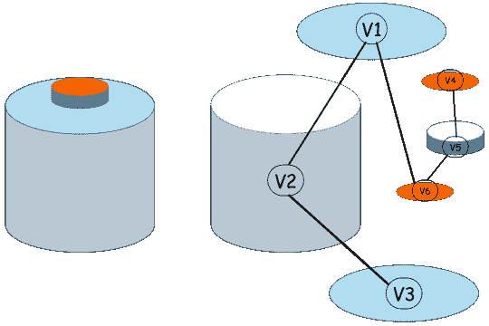

图 2：一个 3D 实体被表示为图的示例，其中实体原语如曲线和表面被表示为图节点，它们之间的邻接关系被表示为图边。

最流行的 GNN 架构，即图卷积网络 (GCNs) [57, 58, 59] 和图自编码器 (GAEs) [60]，分别用于图的（半）监督和无监督学习，用于不同的图分析任务，如节点/图分类和图重建/生成。随着 GNN 基于方法的不断发展，它们预计将在塑造 CAD 设计的未来中发挥关键作用。在接下来的部分中，我们将深入探讨该领域当前的最先进方法和挑战。

## III 数据集

大型数据集合在提升深度学习模型的性能方面发挥着关键作用，特别是当这些模型应用于来自不同领域的问题时。收集这些大型数据集，通常包括图像、视频、音频、文本等格式，并通过社交媒体等不同平台进行分发，极大地加速了深度学习在计算机视觉和自然语言处理领域的进展。GDL（几何深度学习）在诸如 3D 形状分析、形状重建和构建几何特征描述符等任务中提供了优势。然而，创建和注释高质量的 3D 几何数据需要相当高的领域知识，以及工程和设计技能。收集这些数据集也具有挑战性，原因包括对专有权和所有权的担忧，以及可用来源之间的数据一致性和兼容性不足。

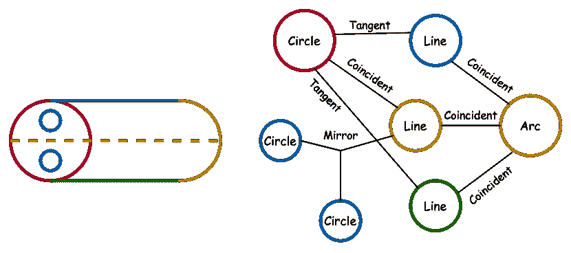

图 3：一个简单的二维草图示例，被表示为图，其中草图原语如曲线（圆形、弧形、直线等）被建模为图节点，这些原语之间的约束则以图边的形式展示。SketchGraphs [20] 数据集包含了这样的二维草图，以图的形式进行建模。

表 III 提供了现有数据集及其属性的总结。有关每个数据集的详细信息在与每个数据集相关的方法部分中提供。表 II ‣ II Background ‣ Geometric Deep Learning for Computer-Aided Design: A Survey") 介绍了不同的 CAD 数据格式及其相应的描述。现有的常用 3D CAD 数据集主要提供 3D 形状分割、分类和检索所需的网格几何 [61, 62, 63, 5, 64]，人体网格配准 [65]，2D/3D 形状对齐 [66] 和 3D 场景分类、语义分割及物体检测 [67, 68]。工程形状数据集如 ESB [69]、MCB [70]、AAD [71]、FeatureNet [72] 和 CADNet [73] 也提供了带有网格几何的标注数据，用于机械形状分类和分割。这些数据集的主要限制是缺乏通常称为边界表示（B-Rep）的曲线和表面的参数化及拓扑特征。这些 B-Rep 特征对于进行参数化 CAD 形状分析至关重要。最近，推出了几种不同规模和属性的几何 B-Rep 数据集，以推动 CAD 设计中的 GDL 进展。FabWave [74] 是一个包含 $5,373$ 个 3D 形状的集合，标注有 $52$ 种机械部件类别，包括齿轮和支架，而 Traceparts [75] 是一个小型集合，包含 $600$ 个由不同公司生产的 CAD 模型，分为 $6$ 个类别（每个类别 $100$ 个 CAD 模型），包括螺丝、螺母和铰链，可用于 3D 形状分类。MFCAD [76] 是一个合成的 3D 分割数据集，包含 $15,488$ 个带有 16 类标注面的形状，可用于 CAD 形状中的参数化面分割。

在 GDL 的各种任务推进以及深度学习模型的有效训练中，需要大量的参数化 CAD 数据集合。现有的含有 B-Rep 数据的参数化 CAD 数据集在规模上有限，无法满足这些需求。为了解决这一不足，最近引入了三个大型数据集：ABC [77]、Fusion 360 Gallery [30]和 SketchGraphs [20]，它们为该领域的研究提供了宝贵的资源。ABC [77] 是第一个大规模的、真实世界的、手工设计的数据集，拥有超过 $1$ 百万高质量的 3D CAD 模型，涵盖了广泛的对象类型。每个 CAD 模型由一组精确参数化的曲线和表面组成，提供了用于锐利几何特征表示、补丁分割、解析微分测量和形状重建过程的准确参考点。ABC 数据集中的 CAD 模型通过 Onshape [40] 提供的公开访问接口进行编译和收集，并开发了一个开源几何处理管道，用于处理和准备 ABC 数据集中的 CAD 模型，以便深度学习方法使用。

训练机器学习模型以促进 CAD 构建和合成可以显著减少设计过程所需的时间和精力，从而使设计师受益。与 CAD（重）构建相关的任务的一个基本需求是了解 CAD 模型的设计方式以及如何解读数据集中提供的构建信息。ABC 数据集中的构建历史信息只能通过查询具有有限文档说明的专有格式 Onshape API 来检索，这使得在该数据集上开发 CAD（重）构建方法变得具有挑战性。SketchGraphs 数据集旨在填补这一空白，提供了来自 Onshape API 的 $15$ 百万个人设计的真实世界 CAD 模型的 2D 草图集合。2D 草图代表几何原语（如线条和弧线）以及它们之间的约束（如重合和切线），可以看作是 3D 形状参数化构建的基础，每个 2D 草图被呈现为几何约束图，其中节点表示 2D 原语，边是节点之间的几何约束 (3)。SketchGraphs 数据集可以用于自动化设计过程的各种应用，如通过预测草图构建操作序列自动完成草图绘制，或与设计师交互地建议下一步操作，以及自动约束应用，其中方法是预测草图中几何原语之间的一组约束。其他潜在应用包括从图像中推断 CAD，其中方法接收一个嘈杂的 2D 绘图图像，并推断其设计步骤以生成相应的参数化 CAD 模型，以及学习草图中编码的语义表示。数据集还附带了一个开源 Python 管道，用于数据处理和深度学习框架的准备。²²2https://github.com/PrincetonLIPS/SketchGraphs 类似于 SketchGraphs，自由手绘 2D 草图数据集如 [78, 79, 80] 也已被引入，以通过提供草图构建序列来解决这一挑战。

Fusion 360 Gallery [30] 最近由 Autodesk 推出，作为首个以人为设计的 3D CAD 数据集和环境，包含用于程序化 CAD 构建的 3D 操作序列。Fusion 360 Gallery 数据集配备了一个名为 Fusion 360 Gym 的开源 Python 环境，用于处理和准备 CAD 操作以用于机器学习方法。该数据集包含用户使用 Autodesk Fusion 360 CAD 软件生成的 2D 和 3D 几何 CAD 数据，并收集到 Autodesk 在线画廊中。为实现不同学习目标，如 CAD 重建 [30]、CAD 分割 [14] 和 CAD 装配 [18]，基于 Fusion 360 Gallery 中总计 $20,000$ 个真实世界设计创建了若干数据集。

| 数据集 | #模型 | B-Rep | 网格 | 草图 | #类别 | 应用 |
| --- | --- | --- | --- | --- | --- | --- |
| ShapeNet [62] | 3M+ | $\times$ | ✓ | $\times$ | 3,135 | 分类 |
| ModelNet [5] | 12,311 | $\times$ | ✓ | $\times$ | 40 | 分类 |
| PartNet [64] | 26,671 | $\times$ | ✓ | $\times$ | 24 | 分类，分割 |
| PrincetonSB [61] | 6,670 | $\times$ | ✓ | $\times$ | 92 | 分类 |
| AAD [71] | 180 | $\times$ | ✓ | $\times$ | 9 | 分类 |
| ESB [69] | 867 | $\times$ | ✓ | $\times$ | 45 | 分类 |
| Thingi10k [63] | 10,000 | $\times$ | ✓ | $\times$ | 2,011 | 分类 |
| FeatureNet [72] | 23,995 | $\times$ | ✓ | $\times$ | 24 | 分类 |
| MCB [70] | 58,696 | $\times$ | ✓ | $\times$ | 68 | 分类 |
| CADNet [73] | 3,317 | $\times$ | ✓ | $\times$ | 43 | 分类 |
| FABWave [74] | 5,373 | ✓ | ✓ | $\times$ | 52 | 分类 |
| Traceparts [75] | 600 | ✓ | ✓ | $\times$ | 6 | 分类 |
| SolidLetters [9] | 96,000 | ✓ | $\times$ | $\times$ | 26 | 分类 |
| MFCAD [76] | 15,488 | ✓ | $\times$ | $\times$ | 16 | 分割 |
| MFCAD++ [81] | 59,655 | ✓ | $\times$ | $\times$ | 25 | 分割 |
| Fusion 360 Segmentation [14] | 35,680 | ✓ | ✓ | $\times$ | 8 | 分割 |
| CC3D-Ops | 37,000 | ✓ | ✓ | $\times$ | - | 分割 |
| Fusion 360 Assembly [18] | 154,468 | ✓ | ✓ | $\times$ | $-$ | 联合预测 |
| AutoMate [19] | 3M+ | ✓ | ✓ | $\times$ | $-$ | 联合预测 |
| ABC [77] | 1M+ | ✓ | ✓ | $\times$ | $-$ | 重建 |
| Fusion 360 Reconstruction [30] | 8,625 | ✓ | ✓ | $\times$ | $-$ | 重建 |
| SketchGraphs [20] | 15M+ | $\times$ | $\times$ | ✓ | $-$ | 重建 |
| CAD as Language [27] | 4.7M+ | $\times$ | $\times$ | ✓ | $-$ | 重建 |
| Sketch2CAD [24] | 50,000 | $\times$ | $\times$ | ✓ | $-$ | 重建 |
| CAD2Sketch [28] | 6000 | $\times$ | $\times$ | ✓ | $-$ | 重建 |
| DeepCAD [17] | 178,238 | ✓ | $\times$ | $\times$ | $-$ | 重建 |
| PVar [15] | 120,000 | ✓ | $\times$ | $\times$ | 60 | 重建、分类 |
| CADParser [16] | 40,000 | ✓ | $\times$ | $\times$ | $-$ | 重建 |
| Free2CAD [22] | 82,000 | ✓ | $\times$ | ✓ | $-$ | 重建 |

表 III：现有的常见对象和机械 CAD 数据集及其属性概述。对于每个数据集，报告了 CAD 模型数量、表示格式如 B-Reps、Mesh、Sketch 以及它们被注释的不同任务，如分割、分类和 CAD 重建。表格的前 4 行显示了用于 3D 形状分类的常见对象数据集。其余行列出了为 CAD 分析创建的机械对象数据集。

## IV CAD 表示学习

研究广泛的数据仓库并揭示数据中的隐藏特征，以便进行相似性分析和形状检索，已经成为机器学习和人工智能领域的一个活跃研究方向。这一概念在 CAD 数据中的重要性也不容忽视。基于机器学习的 CAD 模型相似性分析可以通过对设计进行分类和检索类似的 CAD 模型作为设计替代方案，来有效促进设计过程。研究表明，大约 40% 的新 CAD 设计可以基于 CAD 仓库中的现有设计构建，至少 75% 的设计过程利用现有知识来设计新的 CAD 模型 [82]。从 CAD 数据中学习并从大量几何 CAD 形状中提取特征对于 CAD 检索和相似性分析至关重要，这涉及使用各种机器学习和深度学习方法，从 B-Rep 数据中提取几何属性，以评估 CAD 模型对之间的相似性。

这个过程的第一步是根据特定的分析目标选择 CAD 模型的几何、拓扑、功能和其他属性的子集，将其表示为适合的格式，例如数值向量、矩阵、张量或图形，以供深度学习方法处理。然而，由于连续的非欧几里得几何特征和离散的拓扑属性共存，表示 B-Rep 数据具有挑战性，使其难以适应常规结构化格式，如张量或固定长度编码。每种前沿方法在这一主题中的关键贡献是引入了一种将 B-Rep 数据编码或标记化为适合所采用深度学习架构的格式的方法，以满足其特定应用的需求。深度学习方法将这些表示作为输入，学习对 CAD 模型进行分类、聚类、分割或重建，考虑手头的注释。然而，由于 B-Rep 格式中可用的注释 CAD 数据稀缺，机器学习和深度学习方法在 CAD 模型中的应用非常少见。与几何 CAD 模型如 ShapeNet [62]相比，许多参数化 CAD 数据集由于设计数据的专有性质而未公开发布。

尽管最近发布了一些包含机械部件的 B-Rep 格式小型注释数据集用于机器学习研究[75]，但大多数大规模公共数据库，如 ABC，仍主要是未标记的。此外，手动注释 B-Rep 数据的过程不仅需要工程专业知识，而且非常耗时且成本高昂，因此成为一个重要限制。因此，深度学习方法如无监督学习和自监督学习，在这种情况下与传统的监督学习方法一起变得尤为重要。基于内在数据特征学习特征表示，无需外部注释或专家知识，对于克服注释 CAD 数据的稀缺性极为有利。在本节中，我们介绍了采用 GDL 从 CAD B-Reps 中提取特征表示的现有研究工作。这些方法以监督、自监督或无监督的方式进行，适用于分类、分割、相似性分析与检索、组装预测等各种任务。

### IV-A CAD 分类与检索

设计用于在 B-Rep 装配体中对 3D 组件进行分类的方法对于各种应用非常重要，例如在不同装配体中重用类似的 CAD 组件、形状推荐和替代建议、以及产品复杂性估算，特别是在具有显著不同几何形状的 3D CAD 模型处于同一类别并共享相似拓扑结构时。首批被提议直接在 3D CAD 模型的 B-Rep 数据格式上工作的深度学习方法之一是 UV-Net [9]。UV-Net 通过使用邻接图来建模拓扑结构，并基于曲线和表面的 U 和 V 参数域以规则网格格式建模几何形状，从而提出了一种连贯的 B-Rep 数据图表示方法。该工作的主要贡献之一是从 B-Rep 数据中提取关键的几何和拓扑特征，并将复杂的 B-Rep 数据转化为网格数据结构，以供深度学习模型用于诸如 B-Rep 分类和检索等不同任务。为了从 B-Rep 数据生成网格结构的特征表示，该方法通过以固定步长进行表面采样，将每个 3D 表面转换为规则的 2D 网格。类似地，它将每条实体曲线转换为 1D 网格。得到的 1D/2D 网格映射称为 UV-网格。表面 2D 网格中的每个采样点在 $7$ 个通道中传递三个不同的值：a) 3D 绝对点位置，以 $xyz$ 在 UV 坐标系统中表示，b) 3D 绝对表面法线，以及 c) 修剪掩码，其中 $1$ 和 $0$ 分别表示可见区域和修剪区域的样本。对于曲线 1D 网格中的采样点，编码包括绝对点 UV 坐标，并且可以选择性地包含单位切向量。

如图 4 所示，UV-Net 模型架构包括 CNN 和 GCN 层，首先从代表曲线和表面的 1D 和 2D 网格中提取特征，然后捕捉作为图表示的 3D 形状的拓扑结构，并使用层次图卷积层进行编码。1D 曲线和 2D 表面 UV 网格通过 1D 和 2D 卷积及池化层进行处理，同时卷积层的权重在 B-Rep 中的所有曲线和表面之间共享，以使其具有置换不变性。CNN 卷积层从表面和曲线中导出的$64$维特征向量作为面邻接图$\mathcal{G}(\mathcal{V},\mathcal{E})$中的节点和边特征，其中图节点集合$\mathcal{V}$表示 B-Rep 中的面（表面），边集合$\mathcal{E}$表示面之间的连接。随后，这个图被引入多层 GCN 中，图卷积层在图中传播这些特征，从而捕捉形状中固有的局部和全局结构。

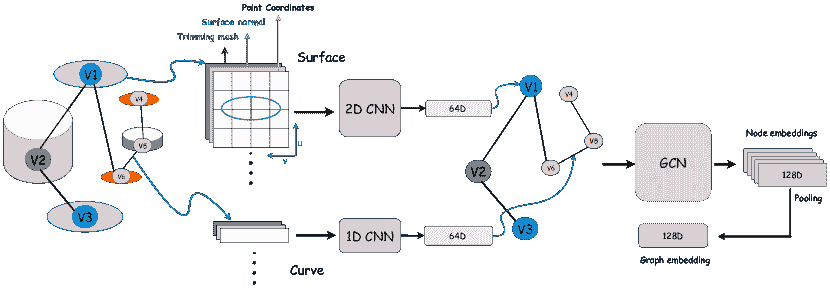

图 4：UV-Net 模型架构的示意图[9]。模型以 B-Rep 数据为输入，生成表面和连接曲线的网格结构特征。这些 UV 网格映射通过 CNN 和 GCN 架构进一步处理，以学习整体图及其单个节点的特征嵌入。

UV-Net 编码器被用作监督和自监督学习的骨干网络，分别用于标记和未标记的数据集。在 CAD 分类任务中，UV-Net 编码器后接一个 2 层分类网络，将学习到的特征映射到类别，模型在$3$个注释数据集上以端到端的方式进行训练，这些数据集是 SolidLetters [9]、FabWave [74] 和 FeatureNet [72]。SolidLetters 是当前最大的人造 3D B-Rep 数据集，具有几何和拓扑的巨大变异，用于分类任务。它包含$96,000$个 3D 形状，代表$26$个英文字母（a-z），具有不同的字体和尺寸。

对于 CAD 检索，前提是缺乏标注数据，因此 UV-Net 编码器需要以自监督的方式进行训练。这导致使用专为自监督训练设计的深度学习模型，如图对比学习（GCL）[83]或图自编码器（GAE）[60]。在将 UV-Net 编码器训练为自监督模型时，GCL 被用来对面邻接图进行变换，并为每个 B-Rep 样本创建正对。这些变换可以通过多种方式进行，例如以均匀概率随机删除节点或边，或提取图中的随机节点及其 n-hop 邻居。假设每个 B-Rep 及其变换版本是正对，UV-Net 编码器提取每对的形状嵌入作为$\{h_{i},h_{j}\}$，并通过一个具有 ReLU 激活的 3 层非线性投影头将这些嵌入转换为潜在向量$z_{i}$和$z_{j}$。对于一个包含$N$个 B-Rep 样本的批次，计算每个样本及其对应正对的潜在向量。整个模型以端到端的方式进行训练，目标是将每个样本的嵌入向量拉近其正对。同时，模型还将剩余的$2(N-1)$个 B-Rep 视为负例，旨在将它们进一步推离正对。通过这一过程，模型学习捕捉数据中的内在特征和模式，而无需标注示例。它本质上利用数据自身的关系，通过变换或增强生成有意义的表示。这使得对比学习成为一种自监督学习方法，特别适用于获取标注数据具有挑战性或不切实际的场景。为了检索相似的 CAD 模型，模型在像 ABC 这样的未标记数据集上进行训练。随后，使用来自测试集的随机样本的嵌入作为查询，并计算它们在 UV-Net 形状嵌入空间中的 k 近邻。

同样，[13]中提出的方法利用几何学作为自我监督的手段，将其应用扩展到少样本学习中。具体而言，该方法涉及训练一个编码器-解码器结构来光栅化局部 CAD 几何图形，以 CAD B-Reps 作为输入，生成表面光栅化图像作为输出。B-Reps 通过显式定义的表面和隐式定义的边界逐块组装。因此，该方法的编码器采用了[19]中提出的 SB-GCN 的层次消息传递架构，以有效捕捉边界特征来编码 B-Rep 面。解码器则通过同时解码显式表面参数化和隐式表面边界来重建面。通过这种方法自我监督学习得到的嵌入作为后续监督学习任务的输入特征，包括在 FabWave 数据集上的 CAD 分类。值得注意的是，在有非常有限的标注数据（从几十到几百个例子）情况下，该方法在利用较小的训练集时超越了以往的监督方法。这突显了可微分 CAD 光栅化器在学习复杂 3D 几何特征方面的有效性。

### IV-B CAD 分割

CAD 分割涉及将以 B-Rep 格式表示的几何实体模型分解为其各个组成部分，包括面和边。CAD 分割在检索 CAD 参数特征历史、加工特征识别、计算机辅助工程（CAE）和计算机辅助工艺规划（CAPP）中具有应用。这尤其令人感兴趣，因为它有助于自动化 CAD 设计和分析中的几个繁琐手动任务，特别是当用户需要根据制造过程反复选择面和/或边的组作为建模或制造操作的输入时 [84, 85, 76]。然而，由于缺乏先进的深度学习方法和大型注释数据集，CAD 分割的进展一直受到阻碍。MFCAD [76] 是第一个合成分割数据集，包含 $15,488$ 个具有平面面的 3D CAD 模型，每个模型标注有 $16$ 种加工特征，如倒角、三角形凹槽、通孔等。图 5 显示了该数据集的一些示例。

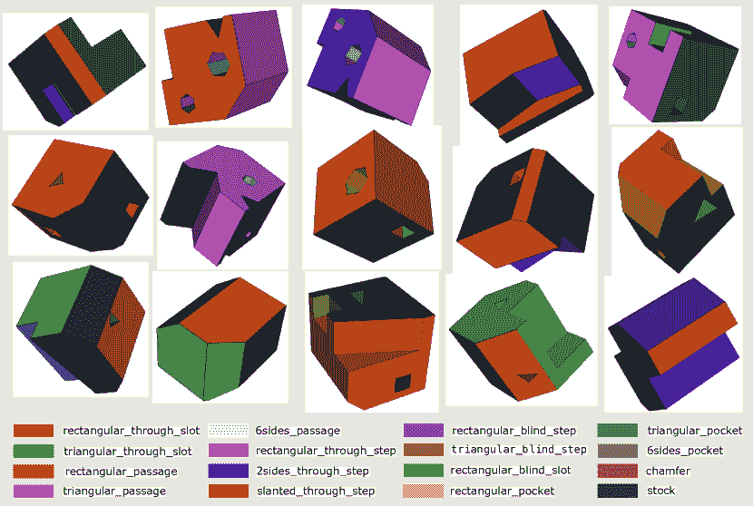

图 5: 来自 MFCAD 数据集的制造驱动分割示例。每个实心面被标注为$16$种加工特征 [76]。

CAD 分割任务可以被框架化为一个节点分类问题，其中每个 3D 实体表示为一个面邻接图。图中的节点对应于 B-Rep 面，然后将这些节点分类为不同的加工特征类别。CADNet [81] 是第一个提出这种方法的算法之一，它将 B-Rep 实体表示为一个图，编码面几何和拓扑结构，并利用一种称为层次 CADNet 的层次图卷积网络将图节点（或实体面）分类为不同的加工特征。为了评估，该方法不仅利用了 MFCAD 数据集，还创建并发布了扩展版本的数据集 MFCAD++，该数据集包含 $59,655$ 个 CAD 模型，具有 $3$ 到 $10$ 种加工特征，包括平面和非平面面。UV-Net 方法，如前面部分介绍的，也以相同的方式解决了 CAD 分割问题，利用监督方式在 MFCAD 数据集上训练其编码器。然而，将 B-Rep 转换为面邻接图会导致一些关于相邻实体的相对拓扑位置的信息丢失。此外，基于 UV 坐标构建的图表示缺乏对平移和旋转的不变性。

BRepNet [14] 是第一个专门为 B-Rep 分割设计的基于深度学习的方法，值得注意的是，它在网络中并未引入任何坐标信息。它直接在 B-Rep 面和边上操作，利用从其拓扑关系中派生的紧凑信息进行 B-Rep 分割。BRepNet 方法的动机源于 CNNs 中用于图像处理的卷积操作。在这一操作中，局部特征通过在网格数据上滑动一个称为滤波器或核的小窗口来聚合，执行滤波器与重叠网格单元之间的逐元素乘法，然后对结果进行池化。这个概念扩展到 B-Reps，允许在数据结构中相对于每个 coedge 精确定位一组面、边和 coedge。Coedge 是一个双向链表的有向边，表示 B-Rep 实体的邻近结构。每个 coedge 还保留关于其父面和边、邻居（配对）coedge 以及指向面周围循环中的下一个和前一个 coedge 的指针的信息。图 6 说明了一个拓扑示例，该示例通过从给定的 coedge（红色）到其一些邻接实体（如配对的 coedge、下一个和前一个 coedge、面和边）的一系列行走进行遍历。

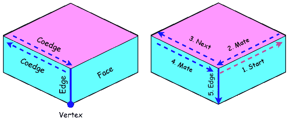

图 6: （左）固体的拓扑可以定义为一组面、边、共边、顶点实体，并且可以通过一系列路径进行遍历。（右）拓扑可以通过从起始实体（红色）开始的一系列路径进行遍历。路径可以是边、面、下一个、上一个和配对。例如，这里起始实体是红色共边，随后是配对、下一个、配对、边路径[14]。

关于共边周围几何特征的信息，包括面和边的类型、面面积、边的凸度和长度以及共边方向，被编码为独热向量并按照预定顺序连接形成面、边和共边的特征矩阵$X^{f}$、$X^{e}$、$X^{c}$。这些矩阵随后被传入神经网络，通过矩阵/向量乘法执行卷积操作，以识别每个共边周围的模式。此外，BRepNet 的性能在从 Fusion 360 Gallery 发布的分割数据集上进行评估，这是第一个包含真实 3D 设计的分割数据集。正如表 III 所示，该数据集包含$35,680$个 3D 形状，每个形状都标注了$8$种建模操作类型，用于创建模型中的面。图 7 展示了来自该数据集的一些示例。

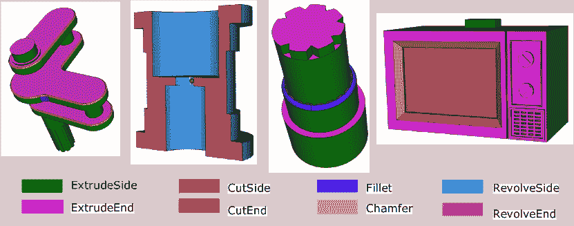

图 7: 来自 Fusion 360 Gallery 数据集的构建基础分割标注示例。每个固体面都标记了其构建中使用的操作[14]。

在[13]中提出的自监督方法，也在一个分割任务上进行了评估，方法是首先在 Fusion 360 Gallery 分割数据集中的$27,450$个零件子集上进行网络预训练。此预训练以自监督方式进行，不利用面注释。随后，预训练的网络在监督方式下进行微调，仅暴露给有限数量的注释零件，以展示该方法在 Fusion 360 和 MFCAD 数据集上的少样本设置中的性能。CADOps-Net [25] 从 CAD 分割方法如 UV-Net [9] 和 BRepNet [14]中获得灵感，这些方法将 B-Reps 分割成基于其关联 CAD 操作的不同面，并提出了一种神经网络架构，该架构将 3D 形状的 B-Rep 数据作为输入，学习将其分解为各种操作步骤及其对应类型。此外，它引入了 CC3D-Ops 数据集，包含$37,000$个 CAD 模型，标注了每个面的 CAD 操作类型和构建步骤³³3https://cvi2.uni.lu/cc3d-ops/。

### IV-C CAD 装配

我们周围遇到的物理对象主要是由 CAD 设计师通过 CAD 软件设计并对齐多个较小且简单的部件构建而成的复杂组件。CAD 中部件的细致配对是一个繁琐的手动过程，消耗了设计师约三分之一的时间[19]。它涉及到部件之间的精确定位及其相对运动的指定。因此，优化这一过程对提高 CAD 系统的效率至关重要。近年来，许多研究利用深度学习方法探讨了这个问题[86, 87, 88, 89, 90, 91, 92, 93]，以简化部件装配，并为诸如机器人装配[94]、CAD 装配综合[95]、部件运动预测[96]、机器人设计优化[97]以及 CAD 装配中的相似性分析[98]等各种应用开辟了新的途径。然而，所有这些方法都使用了诸如网格、点云和体素网格等非参数化数据结构。因此，它们利用了为这些数据结构量身定制的 GDL 方法，如 DGCNN [99]、PCPNet [100]、PointNet [8]和 PointNet++ [8]来学习表面表示。这些方法主要采用自上而下的方法来预测一组部件在全局坐标系统中的绝对姿态。然而，这种方法不支持部件的参数化变化以修改装配或建模自由度，并且当部件无法完全对齐时可能会导致失败。此外，这些方法严重依赖于像 PartNet [64]这样的标注数据集，该数据集仅提供网格格式的数据。

一种依赖于成对约束并利用 B-Rep 数据中可用的连接或接触信息的自下而上的部件配对方法，可以解决这个问题，而无需对数据集进行类别标注。然而，当前的 B-Rep 数据集如 ABC [77]和 Fusion 360 Gallery [30]缺乏 CAD 装配的配对基准，使其不适合用于训练装配预测模型。AutoMate [19]和 JoinABLe [18]是最近提出的仅有的两个工作，它们采用了自下而上的学习方法，以局部配对部件形成装配。此外，它们还发布了与其方法一起的 B-Rep 数据集，为训练模型提供了配对基准。

#### IV-C1 AutoMate [19]

Automate 是在这一领域中首个专注于通过操作参数化 B-Rep 数据格式进行 CAD 装配的工作。此外，这项工作引入了首个大型的 CAD 装配 B-Rep 格式数据集，包含配合基准，用于促进该领域未来的研究。AutoMate 数据集由从 OnShape API 收集的公开 CAD 设计组成，包含 $92,529$ 个独特的装配，每个装配的平均大小为 $12$ 个配合，以及 $541,635$ 个独特的配合。在这项工作中，配合意味着通过基于 B-Rep 拓扑定义的配对约束对齐两个部件。这些配对约束被称为配合或接头，它们决定了装配中部件的相对姿态和自由度 (DOF)。两个部件可以通过各种拓扑实体进行配合，例如面、边和顶点。因此，学习不同层次上多个拓扑实体的特征表示对于解决 CAD 装配问题的复杂性至关重要。与以前的 CAD 表示学习方法（如 BRepNet [14] 和 UV-Net [9]）通过构建面邻接图来捕捉 B-Rep 的同质结构并专注于学习面实体的特征表示不同，AutoMate [19] 采取了不同的方法。它旨在通过捕捉异质 B-Rep 结构来学习面、环、边和顶点的表示。这是通过引入结构化 B-Rep 图卷积网络 (SB-GCN) 架构实现的，该架构是一个消息传递网络，旨在学习 B-Rep 的异质图表示。

SB-GCN 以异构图作为输入，其中面 F、边 E、顶点 V 和环 L 作为图节点，它们之间的有向二分连接集表示图的边。具体来说，B-Rep 顶点和边之间的关系由 V:E 和其转置 E:V 表示。类似地，E:L 和 L:E 表示 B-Rep 边和环之间的关系，而 L:F 和 F:L 则表示面和环之间的连接。此外，几何上相邻的面之间存在无向关系（meta-path），用 F:F 表示。每个节点都与一个参数化几何函数相关，该函数被编码为一维热编码特征向量。网络利用结构化卷积生成所有图节点的输出特征向量。不同节点类型的邻接结构在不同网络层中按有序层级捕获。初始三层按自下而上的顺序捕获 B-Rep 层次中的关系：顶点到边、边到环、环到面。随后，接下来的 $k$ 层集中于捕获面之间的元关系。最后三层则逆转节点关系：面到环、环到边、边到顶点。网络使用两个不同的输出头对配合位置和类型进行预测。配合位置预测头评估与选定面的两个配合部件相邻的配合坐标系（MCFs）对。而配合类型预测头则预测这一对 MCFs 应如何配合。这通过将特征分类为七种不同的配合类别进行，即紧固、旋转、平面、滑块、圆柱、平行、球体、插销槽。该模型在来自 AutoMate 数据集的 $180,102$ 个配合上进行训练，并作为扩展集成到 Onshape CAD 系统中。这一集成通过在 CAD 设计过程中为零件对提供配合建议来帮助设计师。

#### IV-C2 JoinABLe [18]

Joinable 是一种最近的方法，它采用自下而上的方式，通过配对约束来预测部件之间的接头（或配合）。与 AutoMate 依赖用户对部件表面进行选择以排序和推荐多个配合解决方案不同，JoinABLe 在不受预定义表面限制的情况下自动识别部件之间的接头，并且不需要用户的任何帮助。Fusion 360 Gallery Assembly 数据集与 JoinABLe 方法同时推出并提供，用于训练和评估 JoinABLe 模型。该数据集包含两组相互关联的数据：Assembly 和 Joint。这些数据集来自于在 Autodesk 在线画廊中公开访问的用户设计的 CAD 模型。Assembly 数据包括 $8,251$ 个组件，总计 $154,468$ 个单独的部件，以及相应的接触面、孔、接头和相关的图结构。Joint 数据包括 $23,029$ 个不同的部件，其中包含 $32,148$ 个接头。JoinABLe 是使用从 Fusion 360 Gallery Assembly-Joint 数据集中提取的接头信息进行训练的。Assembly 数据集 [18] 是一个设计子集，其中每个 CAD 模型由多个部件组成。在 CAD 设计的背景下，每个组件或 3D 形状都是多个部件的集合，这些部件结合在一起，一组组件可以形成一个 CAD 设计或 3D 对象。

两个部分通过它们的关节轴对齐，每个部分都有一个特定的方向。每个部分上的关节轴可以定义在一个面或边实体上，具有一个原点和一个方向向量。例如，在一个圆形表面实体上，原点是圆心，方向向量是法向量。这些关节轴的信息针对部分对提供在 Fusion 360 Gallery Assembly-Joint 数据集中，这是 Fusion 360 Gallery Assembly 数据集的一个子集，用作训练关节预测深度学习模型的真实数据。该数据集包含 23,029 个部件，以及它们之间 $32,148$ 个关节。如图 8 所示，给定两个部件，JoinABLe 被设计用来预测它们之间的参数化关节，包括关节轴预测（两个部件上的原点和方向向量）和关节姿态预测。为此，每个部件被建模为一个图 $\mathcal{G}(\mathcal{V},\mathcal{E})$，其中 B-Rep 面和边作为图节点，它们的邻接关系作为图边。B-Rep 面被编码为 one-hot 特征向量，表示诸如平面和圆柱等表面类型，并带有一个标志指示表面是否相对于面反转。类似地，B-Rep 边的 one-hot 向量包括曲线特征，如直线和圆，曲线长度，以及一个标志表示曲线是否相对于边反转。这些 one-hot 向量作为图节点特征。

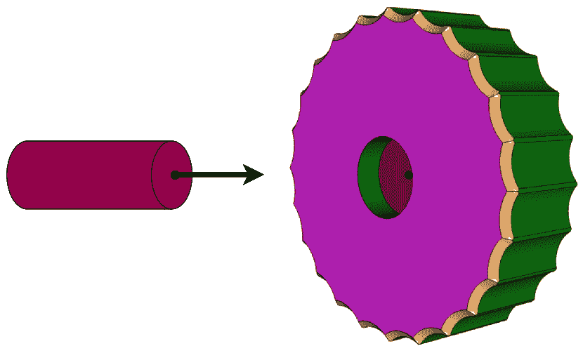

图 8：一个示例，展示了如何在 Fusion 360 Assembly-Joint 数据集中定义部件（固体）之间的关节。给定一对部件，JoinABLe 根据真实数据定义的关节预测它们之间的关节轴和姿态 [18]。

对于由图 $G_{1}$ 和 $G_{2}$ 表示的两个部分，其中分别有 $N$ 和 $M$ 个节点，联合图 $G_{j}$ 被构建以展示两个图之间的连接。 $G_{j}$ 中的连接信息可以表示为一个 $N\times M$ 维的二进制矩阵。与 Joint 数据集中提供的真实联合对齐，仅一个矩阵元素表示两个部分之间的联合应设置为 $1$，其余元素保持 $0$。JoinABLe 模型旨在找到那个唯一的正元素，它包含三个主要组件：编码器、联合轴预测和联合姿态预测。编码器采用 Siamese 风格架构，具有两个独立的 MLP 分支。一个分支专注于学习表示 B-Rep 面片的节点特征，而另一个分支则专注于学习表示 B-Rep 边缘的节点特征。每部分中面片和边缘的学习嵌入随后被连接以形成相应图的节点嵌入。这些节点嵌入随后输入到 Graph Attention Network v2 (GATv2) [101]，通过消息传递捕获每个图内的局部邻域结构。

联合轴预测被制定为一个连接预测任务，旨在通过连接两个节点来预测图 $G_{1}$ 和 $G_{2}$ 之间的连接。这涉及在联合图 $G_{j}$ 上进行边卷积，联合图 $G_{j}$ 展示了两个图之间的连接，并使用编码器在先前步骤中学习的节点特征进行更新。假设 $h_{v}$ 和 $h_{u}$ 分别表示 $G_{1}$ 和 $G_{2}$ 中两个节点 $v$ 和 $u$ 的学习特征，边卷积用于学习两个图中两个节点之间的连接，如下所示：

|  | $h_{uv}=\Phi(h_{u}\oplus h_{v}),$ |  | (1) |
| --- | --- | --- | --- |

其中 $\Phi(\cdot)$ 是一个 3 层 MLP，应用于 $h_{u}$ 和 $h_{v}$ 的连接特征。紧接着，在边卷积之后，应用 softmax 函数来归一化特征并预测 $G_{j}$ 中节点之间最可能的连接。在预测联合轴以对齐两个部分之后，姿态预测头采用神经引导的搜索方法，通过前 k 个联合轴预测进行迭代。作为补充工作，JoinABLe 还提出了使用单独的部分和从 Assembly 数据集中获得的部件对序列来组装多部分设计。然而，在实际应用中，这种明确定义的组装序列和相应的组装图可能无法提供给网络使用。此外，任何组装步骤中的错位可能导致整体组装不正确。因此，建议对于大型复杂组装，可能更有效的方式是结合自上而下和自下而上的方法。

在 CAD 装配问题中，通常会出现两个主要问题：如何选择要连接（或配合）的零件对，以及如何将它们组装起来 [102]。前一个问题可以通过利用相似性分析和检索方法来识别合适的零件对来解决。而 AutoMate 和 JoinAble 则集中于通过学习装配过程中配合两个零件的过程来回答后一个问题。

## V 生成式深度学习的 CAD 构建

利用生成式深度学习进行 CAD 构建涉及利用先进的 GDL 方法自动生成或协助创建参数化 CAD 模型。这些方法可以以多种方式支持设计师，从而简化设计过程。这包括生成或自动完成草图，以及根据设计草图生成 CAD 操作以构建 3D 模型。在这一部分，我们将这些方法分为五个不同的组：1) 关注 2D 草图的方法，旨在自动化 2D 空间中的草图绘制过程，作为开发 3D CAD 模型之前的初步步骤，2) 针对给定模型草图的 3D CAD 模型重建方法，3) 生成 CAD 构建序列的方法，特别关注草图和拉伸操作，用于 CAD 构建，4) 直接进行 B-Rep 合成以生成 3D CAD 模型的方法，以及 5) 从点云数据生成 3D CAD 模型的方法。

### V-A 工程 2D 草图生成用于 CAD

工程 2D 草图构成了 3D CAD 设计的基础。这些 2D 草图由一组几何基元组成，例如顶点、直线、弧和圆，以及它们的相应参数（例如半径、长度和坐标），并且在基元之间施加显式约束（例如垂直、正交、重合、平行、对称和相等），这些约束决定了它们的最终配置。这些 2D 草图可以被拉伸以生成 3D 设计。合成参数化的 2D 草图并学习它们编码的关系结构可以节省设计师在设计复杂工程草图时的大量时间和精力。然而，在这方面利用深度学习方法需要大规模的 2D 工程草图数据集。现有的大规模数据集大多提供了常见物体的手绘草图，如家具、汽车等。QuickDraw 数据集 [103] 是从 Quick, Draw! 在线游戏 [104] 收集的，而 Sketchy 数据集 [79] 是自然图像与其相应矢量草图的配对集合。这些草图数据集基于草图的矢量图像，而不是其底层参数化关系几何。为了利用深度学习模型推理参数化 CAD 草图并推断其设计步骤，需要一个大规模的参数化 CAD 草图数据集。

#### V-A1 SketchGraphs [20]

在这方面引入的第一个数据集是 SketchGraphs，这是一个来自 Onshape 平台的 $15$ 万个现实世界 2D CAD 草图的集合 [40]，每个草图都被表示为一个几何约束图，其中节点是几何原件，边缘表示设计师施加的几何关系。数据集还发布了一个开源的数据处理管道，以促进该领域的进一步研究。⁴⁴4https://github.com/PrincetonLIPS/SketchGraphs SketchGraphs 不仅提供了草图的基础参数几何，还提供了几何原件及其之间约束的真实构建操作。因此，它可以用于训练深度学习模型，以便用于不同的生成应用，从而促进设计过程。一个可以作为 CAD 软件高级功能的应用是：给定手绘草图或物体的噪声扫描，自动构建参数化的 CAD 模型。SketchGraphs 处理管道可以用于生成草图的噪声渲染图。通过这种方式，可以创建一个大规模数据集，包含配对的几何草图及其噪声渲染图像，以训练深度学习模型来预测给定手绘图像的设计步骤。然后，通过挤出设计的 2D 草图，可以获得模型的 3D 设计。在 [20] 中，提出了一种自回归模型，该模型利用 SketchGraphs 数据集进行两个用例：1）Autoconstrain，即通过生成原件之间的约束来条件性地完成草图，给定未约束的几何，2）Generative modeling，即通过生成构建操作来自动完成部分设计的草图，以添加下一个原件及其之间的约束。尽管大多数 CAD 软件都有内置的约束求解器可用于设计过程，但这些生成方法在软件上传了未约束的草图作为绘图扫描时非常有用，设计师需要找出草图原件之间的约束和/或完成草图。这个问题与约束编程中的程序合成或归纳相似。SketchGraphs 数据集及其生成方法可以作为未来这方面工作的良好基准。以下是对这两种生成用例的更详细描述。

设想一个由多重超图 $\mathcal{G=(V,E)}$ 表示的草图，其中节点 $\mathcal{V}$ 表示原始对象，边 $\mathcal{E}$ 表示它们之间的约束。在这个图中，每条边可能连接一个或多个节点，并且多个边可能共享相同的连接节点集。单节点的边被标示为自环，表示一个单一约束（例如长度）对于一个单一原始对象（例如直线），而超边则作用于三个或更多节点（例如，将一个原始对象作为对称轴时，施加在两个原始对象上的镜像约束）。图 3 中展示了一个草图图的示例。每个约束都通过其类型进行标识，每个原始对象则通过其类型及其参数进行标识（不同的原始对象可能有不同数量的参数）。对于自动约束任务，所有图节点（原始对象）都已给定，模型以监督方式进行训练，以预测图边的顺序，考虑到数据集中约束的实际顺序。这个问题可以视为图链接预测的一个示例 [105]，它预测图节点之间的诱发关系。从第一个构建步骤开始，模型首先预测哪个节点应该连接到当前节点，然后在这两个相邻节点之间创建一个链接（边）。接着，它预测这条边（约束）的类型。对于生成建模任务，该任务通过生成新的原始对象（节点）和它们之间的约束（边）来自动完成一个部分完成的草图（图），原始对象仅通过其类型表示（原始对象的参数被忽略），约束则通过其类型及其数值或分类参数表示。例如，如果两个原始对象之间的约束是距离，则其参数可以是表示两个原始对象之间欧几里得距离的标量值。然而，虽然该模型预测了约束的类型和参数，但它仅预测原始对象的类型，而不是它们的参数，并且原始对象的初始坐标可能不符合草图和约束。因此，草图中原始对象坐标的最终配置需要由 CAD 软件的内置几何约束求解器来确定。这个问题在下一步提出的 2D 草图生成工作中得到解决，即 CurveGen-TurtleGen [21]，该工作在 V-A2 中介绍。

#### V-A2 CurveGen-TurtleGen [21]

如之前在 V-A1 中讨论的那样，SketchGraphs 中的生成模型依赖于 CAD 软件内置的草图约束求解器来设置生成草图的最终配置。这个问题由两个生成模型 CurveGen 和 TurtleGen 解决，它们在几何坐标中隐式编码约束信息，从而不依赖于草图约束求解器。这项工作中，原始类型简单地限制为线条、曲线和圆圈，因为它们是 2D 草图中最常见的基本图形，并且认为草图中原始图形之间的约束应该以几何原始图形能够形成封闭轮廓循环的方式进行定义。在这方面，该方法为工程草图提出了两种不同的表示：CurveGen 使用的 Sketch Hypergraph 表示法和 TurtleGen 使用的 Turtle Graphics 表示法。在 Sketch Hypergraph 表示法中，草图表示为一个超图 $\mathcal{G}=(\mathcal{V},\mathcal{E})$，其中一组顶点 $\mathcal{V}=\left\{\nu_{1},\nu_{2},...,\nu_{n}\right\}$ 及其对应的 2D 坐标 $\nu_{i}=(x_{i},y_{i})$ 被编码为图节点，而 $\mathcal{E}$ 表示一组超边，这些超边连接两个或更多的顶点以形成不同的原始图形。原始图形类型由超边的基数定义。例如，原始线条由两个连接的顶点构成，弧由三个连接的顶点构成，圆可以看作是四个连接的顶点。图 9 展示了一个由$12$个顶点和$9$条超边组成的简单草图示例。

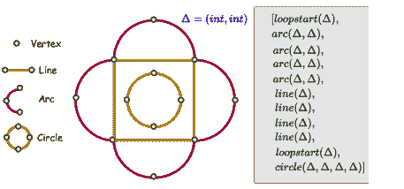

图 9：插图展示了一个由$12$个顶点和$9$条类型为线条、圆圈和弧的超边组成的基本草图。在右侧，展示了一系列渲染该草图的命令，遵循[21]提出的语法。每条线连接$2$个顶点，用 $\Delta$ 表示，每条弧由经过$3$个顶点定义，而圆则通过$4$个顶点。值得注意的是，在每个循环中，每个实体的起始点与序列中前一个实体的终点重合。

这种表示法被 CurveGen 使用，它是一个基于 PolyGen 的自回归 Transformer [106]。PolyGen 是一种自回归生成方法，用于利用 Transformer 架构生成 3D 网格，能够捕捉长程依赖。网格顶点由 Transformer 无条件建模，网格面则通过 Transformer 和指针网络的组合以网格顶点为条件建模 [107]。与 PolyGen 类似，CurveGen 也直接生成草图超图表示，首先生成用于绘制曲线的图顶点 $\mathcal{V}$，然后基于生成的顶点生成图超边 $\mathcal{E}$，具体如下：

|  | $p(\mathcal{G})=p(\mathcal{E} \mid \mathcal{V})p(\mathcal{V}).$ |  | (2) |
| --- | --- | --- | --- |

通过这种方式，网络预测每个原始图形的精确坐标，而原始图形的类型则隐式地编码在超边中，这些超边将顶点组合在一起形成不同类型的原始图形。因此，这种方法不依赖于任何约束求解器来找到最终的原始图形配置。通过获得草图曲线的精确坐标，可以在后处理步骤中自动获得它们之间的约束。然而，隐式推断约束使得在软件中编辑草图变得更加困难。例如，如果设计师想要改变原始图形之间的某个约束，比如距离的尺度，这种变化不会在整个草图和原始图形中传播，因为原始图形的精确位置在某种程度上是固定的。在 Turtle Graphics 表示中，草图由一系列绘图命令组成，如“笔落下”、“笔绘制”和“笔抬起”，这些命令可以执行以在超图表示中形成工程草图。TurtleGen 网络是一个自回归的 Transformer 模型，生成一系列绘图命令，迭代地绘制一系列封闭的循环，形成工程草图。通过这种方式，每个草图被表示为一个循环序列，每个循环由一个 LoopStart 命令组成，该命令提起笔，将其移动到指定位置，放下，然后开始绘制由 Draw 命令指定的参数曲线。在图 9 中，展示了一个简单的草图及其对应的命令序列。该草图包含 $2$ 个循环和 $9$ 个 Draw 命令，包括弧线、直线和圆类型。初始循环从位置 $\Delta=(int,int)$ 开始，包括 $4$ 个弧线。每个弧线从前一个弧线的终点开始，经过 $2$ 个额外的顶点。这个循环过渡成 $4$ 条直线。第一条直线从最后一个弧线结束的地方开始，再经过一个顶点，这个模式在随后的直线中重复。第二个循环是一个圆形，从另一个位置 $\Delta$ 开始，经过 $3$ 个额外的顶点。CurveGen 和 TurtleGen 已在 SketchGraphs 数据集上进行了评估，显示出比 SketchGraphs 中提出的生成模型更优越的性能。有关模型架构、训练和评估设置的更多细节，请参见 [21]。

#### V-A3 SketchGen [26]

与 CurveGen-TurtleGen 并行的，SketchGen 是一种基于 PolyGen [106] 和指针网络 [107] 提出的自回归生成方法。与 PolyGen 不同，SketchGen 旨在捕捉草图中原始数据和约束的异质性，其中每种原始数据和约束可能具有不同数量的参数，每种参数类型不同，因此具有不同大小的表示。输入序列表示的选择对 Transformers 的性能有很大影响，将异质的草图约束图转换为合适的标记序列是相当具有挑战性的。一种简单的解决方案是将所有原始数据和约束的表示填充为相同的大小。然而，这种技术对于复杂的草图既低效又不准确。SketchGen 提出了一个具有简单语法的语言，以有效描述异质的约束图。针对 CAD 草图提出的语言使用形式化语法对约束和原始数据参数进行编码。用于编码原始数据类型和参数的终结符为 $\left\{\Lambda,\Omega,\tau,\kappa,x,y,u,v,a,b\right\}$，用于约束的为 $\left\{\Lambda,\nu,\lambda,\mu,\Omega\right\}$。新的原始数据或约束序列的开始和结束分别用 $\Lambda$ 和 $\Omega$ 标记。原始数据类型用 $\tau$ 表示，$\nu$ 显示约束类型。$\kappa,x,y,u,v,a,b$ 显示每个原始数据的具体参数，如坐标和方向。$\lambda$ 和 $\mu$ 是表示约束的具体参数，分别指示约束的原始数据参考和约束所针对的原始数据部分。这种形式化语言使得能够区分不同的原始数据或约束类型及其各自的参数。例如，线段原始数据的序列为 $\Lambda,\tau,\kappa,x,y,u,v,a,b,\Omega$，以 $\Lambda$ 开始，接着是原始数据类型 $\tau$ = line，构造指示符 $\kappa$，起点坐标 $x$ 和 $y$，线段方向 $u$ 和 $v$，线段范围 $a$，$b$，最后以 $\Omega$ 结束。平行约束的序列为 $\Lambda,\nu,\lambda_{1},\mu_{1},\lambda_{2},\mu_{2},\Omega$，以 $\Lambda$ 开始，接着是约束类型 $\nu$ = parallelism，第一个原始数据的参考 $\lambda_{1}$，第一个原始数据的部分 $\mu_{1}$，第二个原始数据的参考 $\lambda_{2}$，第二个原始数据的部分 $\mu_{2}$，最后以 $\Omega$ 结束。这样，每个标记 $q_{i}$（符号序列）表示一个原始数据或约束，每个草图 $Q$ 表示为一个标记序列。与 PolyGen 和 CurveGen-TurtleGen 相似，如 Eq. (2) 中所述，SketchGen 的生成模型也被分解为两个部分，首先生成原始数据 $p(\mathcal{P})$，然后生成基于原始数据的约束 $p(\mathcal{C}|\mathcal{P})p(\mathcal{P})$。

|  | $p(\mathcal{S})=p(\mathcal{C}&#124;\mathcal{P})p(\mathcal{P}).$ |  | (3) |
| --- | --- | --- | --- |

因此，生成网络通过两个自回归 Transformer 来学习约束草图的分布，一个用于原始生成，另一个用于条件约束生成。草图被解析为一系列令牌，首先遍历所有原始对象，并使用上述语言序列表达它们。随后，类似的过程应用于表示草图中的所有约束。如图 10 所示，原始生成器网络的输入是由 $\Lambda$ 分隔的原始令牌序列，例如 $\Lambda,\tau_{1},\kappa_{1},x_{1},y_{1},u_{1},v_{1},a_{1},b_{1},\Lambda,\tau_{2},\kappa_{2},x_{2},y_{2},...,\Omega$，而约束生成器的输入是由 $\Lambda$ 分隔的约束令牌序列，例如 $\Lambda,\nu_{1},\lambda_{11},\mu_{11},\lambda_{12},\mu_{12},\Lambda,\nu_{2},\lambda_{21},....\Omega$。

所有原始和约束参数首先被量化，然后通过嵌入层映射以形成网络的输入特征向量。序列中令牌的位置信息也通过添加到每个嵌入向量的位置信息编码来捕获。生成的令牌序列随后被输入到 Transformer 架构中以生成原始对象和约束。约束生成网络不仅接收用于约束的嵌入和位置编码令牌作为输入，还接收表示在前一步生成的原始对象的嵌入和位置编码令牌序列，以生成基于原始对象的约束。类似于 [20]，该模型在 SketchGraphs 数据集上进行评估，任务包括给定草图原始对象的约束预测以及从头开始生成完整草图，通过顺序生成原始对象和约束。最终生成的草图需要通过约束求解器进行正则化，以去除由于量化草图参数而可能导致的潜在错误。

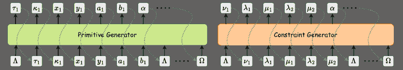

图 10：SketchGen 生成方法的简单示意图，包括用于原始对象和约束生成的两个生成网络。在每次生成步骤中，网络基于输入和之前生成的令牌生成下一个令牌。新原始对象或约束序列的开始和结束分别由 $\Lambda$ 和 $\Omega$ 表示。图中展示了一个线性原始对象和一个平行约束的参数作为示例。有关模型结构的更多细节，请参见原始论文 [26]。

#### V-A4 CAD 作为语言 [27]

与 CurveGen-TurtleGen 和 SketchGen 并行，CAD 作为语言是另一种基于 PolyGen [106] 的自回归 Transformer 方法，用于 2D 草图生成。与 CurveGen-TurtleGen 仅预测隐式约束的原始参数且独立于约束求解器不同，CAD 作为语言和 SketchGen 方法生成原始体和约束，但依赖于内置的约束求解器来获得草图的最终配置。然而，SketchGen 通过两个独立的 Transformer 网络生成原始体和约束，并且不支持原始体和约束标记的任意排序。在 SketchGen 中，草图被解析为一系列标记，首先遍历所有原始体，然后遍历所有约束。而 CAD 作为语言的方法不仅处理原始体和约束的任意排序，而且通过一个 Transformer 网络生成原始体和约束。与所有先前在 SketchGraphs 数据集上评估的草图生成方法不同，CAD 作为语言在来自 OnShape 平台的超过 $4.7$ 百万个草图的新数据集上评估了其生成方法，从而避免了 SketchGraphs 数据集中的数据冗余问题。该数据集及相应处理流程在 Github 上公开可用。⁵⁵5https://github.com/google-deepmind/deepmind-research/tree/master/cadl

CAD 作为语言使用了一种方法，通过 Protocol Buffers (PB) [108] 来描述结构化对象，这种方法在表示复杂对象的精确结构方面比 JSON 格式更高效、更灵活。在这种格式中，每个草图被描述为一个 PB 消息。类似于其他基于 Transformer 的方法，处理流程中的第一步也是最重要的一步是将草图解析为一系列的标记。在这种方法中，每个草图（或 PB 消息）被表示为一系列的三元组 $(d_{i},c_{i},f_{i})$，其中每个三元组的索引 $i$ 表示一个标记。每个标记（三元组）仅表示草图中原始对象或约束的一个组件（类型或参数），其中 $d_{i}$ 是一个离散值，表示它所指代的对象类型、实体类型（原始体、约束等），$c_{i}$ 是一个连续值，表示对应实体的参数值。在每个时刻，$d_{i}$ 或 $c_{i}$ 之一是激活的并获得一个值，另一个被设为零。$f_{i}$ 是一个布尔标志，指定重复标记的结束（例如，包含实体的对象的结束）。11 显示了分别指定线和点原始体的标记示例。

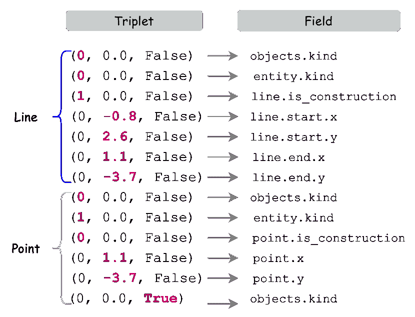

图 11：使用[27]提出的语言结构描述一个简单的草图，包括一条线和其一端的一个点。每个三元组的活动元素（左侧）用粗体红色标出，每个三元组对应的对象字段显示在右侧。

正如这个例子所示，第一个三元组（objects.kind）总是与 token 所指的对象类型相关。第二个三元组中的值取决于第一个三元组中指定的对象类型。正如这个例子中，$d_{1}=0$表明这个 token 序列是关于创建一个原始体（如一条线），因此第二个三元组指定了原始体的类型（entity.kind），其中$0$表示线，$1$表示点。序列中的下一个三元组指定了与第二个三元组中识别出的原始体相关的具体参数。例如，线原始体通过起点和终点定义，而点原始体（也在线原始体中重复）则通过$x$，$y$坐标定义。

为了解释这些三元组（tokens），CAD 作为语言的方法还提出了一个自定义解释器，该解释器接收一系列 tokens 作为输入，每个 token 代表一个草图组件（可以是实体类型、参数或任何其他设计步骤），并将其转换为有效的 PB 消息。该解释器设计成能够处理任意顺序的 tokens，并确保所有的 token 序列都能转换为有效的 PB 消息（草图）。这个解释器引导 Transformer 网络完成草图生成过程。Transformer 网络接收一系列 tokens 作为输入，并在每个时间步骤输出一个原始值，该值传递给解释器以推断该值对应的三元组。这个三元组是 PB 消息的一部分，构成最终草图。当解释器推断出输出值时，它将其解释传递回 Transformer，以指导它生成下一个值。因此，这种方法为解析草图为 tokens 并解释它们所提出的结构，使其能够通过一个 Transformer 网络生成每个草图组件（原始体和约束），同时处理不同顺序的输入 tokens。该方法还探索并评估了提出的 Transformer 模型的一个条件变体，其中它以草图的输入图像为条件。

#### V-A5 VITRUVION [23]

这种方法是最新提出的自回归生成模型，用于草图生成。与 SketchGen 和 CAD as Language 类似，VITROVION 也自回归地生成原语和约束。然而，这种方法在某种程度上更类似于 SketchGen，因为原语和约束是通过训练两个不同的 Transformer 网络独立生成的。与之前的方法相比，这种方法的主要贡献是将模型条件化于各种上下文，例如手绘草图。这一贡献是朝着 CAD 软件中非常期待的功能迈出的一步，即在给定手绘图或其噪声扫描的情况下，反向工程一个机械部件。根据手绘图或噪声图像生成参数化原语和约束可以节省大量的设计时间和精力。

与前述方法类似，VITROVION 是 PolyGen 的一种泛化 [106]。它通过首先生成原语 $\mathcal{P}$，然后生成以原语为条件的约束 $\mathcal{C}$ 来生成草图的概率分布。然而，在这种方法中，原语的生成是可选地以图像为条件的，如下所示：

|  | $p(\mathcal{P},\mathcal{C}&#124;I)=p(\mathcal{C}&#124;\mathcal{P})p(\mathcal{P}&#124;\mathcal{I}),$ |  | (4) |
| --- | --- | --- | --- |

其中 $\mathcal{I}$ 是一个上下文，例如手绘草图图像。然而，这种方法中的约束建模仅支持具有一个或两个参考原语的约束，而不支持连接多个原语的超边，如 CurveGen-TurtleGen 方法所示。生成模型在 SketchGraphs 数据集上进行训练和评估，用于自动约束、自动补全和条件草图合成任务。如 V-A1 中解释，在自动约束应用中，网络在一组可用的原语上生成约束，而在自动补全任务中，不完整的草图通过生成原语和约束来完成。在这两种情况下，约束生成网络都以生成的原语为条件，而这些原语可能是不完美的。VITROVION 通过将其条件化于注入噪声的原语来增加约束生成网络的鲁棒性。最终的原语和约束参数通过标准约束求解器进行调整。对于图像条件的草图合成，模型根据手绘草图的光栅图像推断原语。在这方面，使用基于 Vision Transformer [109] 架构的编码器网络来获得图像补丁的嵌入，原语生成网络然后跨注意这些补丁嵌入以预测草图原语。这个想法基于 PolyGen 在图像条件网格生成中的类似想法。

该方法通过将每个原始图形和约束表示为三个令牌的元组：值、ID、位置，来对草图进行标记化。值令牌有两个部分，一个表示原始图形或约束的类型，另一个表示该原始图形或约束的相关参数的数值。ID 令牌表示值令牌指定的参数类型，而位置令牌表示该 ID 和值令牌所属的原始图形或约束的有序索引。原始图形的排序依据 SketchGraphs 数据集中所示的设计步骤，而约束的排序则依据其对应的参考原始图形的排序。

### V-B 3D CAD 从草图生成

#### V-B1 Sketch2CAD [24]

首个在上下文中通过交互式草图进行顺序 3D CAD 建模的工作是 Sketch2CAD。该工作是一个基于学习的交互式建模系统，通过将用户输入的草图解释为一系列参数化的 3D CAD 操作来统一 CAD 建模和草图绘制。给定一个现有的不完整的 3D 形状以及用户在其上添加的输入草图，Sketch2CAD 首先获取草图局部上下文的法线图和深度图，这些图像被引入 CAD 操作员分类和分割网络。分类由 CNN 网络完成，该网络预测创建对应输入草图所需的 CAD 操作类型。它的输入是三个图像的拼接，每个图像大小为 $256\times 256$，即表示草图像素的二值值草图图、以及通过特定视角渲染形状的法线图和深度图。需要注意的是，该方法仅支持四种最常用的 CAD 操作，即挤出、加法/减法、倒角、扫描。根据预测的操作类型，通过特定的分割网络对操作员的参数进行回归。例如，对于预测的扫描操作员，训练了一个 SweepNet 来推断相应的参数。四个分割网络都具有 U-Net 结构，包括一个编码器和两个解码器，一个生成草图的基础面的概率图，另一个生成相应的曲线分割图。分割后是一个优化过程，用于拟合操作参数。

识别操作的参数化特性为近似输入笔画提供了强大的正则化，并允许用户通过调整和回归参数来细化结果。建模系统还包括标准的 CAD 建模功能，如自动对齐和自动补全。系统的输出是一系列准备好供下游 CAD 工具处理的 CAD 指令。由于没有配对的草图和 3D CAD 建模操作序列的数据集，Sketch2CAD 引入了一个合成数据集，其中包含 40,000 个形状用于训练，10,000 个形状用于测试，包含逐步的 CAD 操作序列及其相应的草图图像渲染。数据集、代码和视觉示例是公开的。⁶⁶6https://geometry.cs.ucl.ac.uk/projects/2020/sketch2cad/

#### V-B2 Free2CAD [22]

Sketch2CAD 的主要挑战之一是它一次只能处理一个 CAD 操作，这意味着它假设在每一步中，用户绘制的形状只对应一个 CAD 操作。它要求用户按顺序、逐部分绘制草图，以便可以将其分解为有意义的 CAD 操作。为了解决这一限制，提出了 Free2CAD。这是第一个基于草图的建模方法，用户可以输入复杂 3D 形状的完整绘图，而无需掌握如何将此草图分解为 CAD 操作的专家知识或遵循特定的绘图策略和系统操作。

Free2CAD 是一个序列到序列的 Transformer 网络，它接收用户绘制的描绘 3D 形状的笔画序列作为输入，处理和分析这些笔画，以生成一系列有效的 CAD 操作命令，这些命令可以被执行以创建 CAD 模型。该方法的主要贡献在于自动分组草图笔画，并为每组笔画生成参数化的 CAD 操作，依据前面迭代中重建的组。该方法包括两个阶段，即笔画分组阶段和操作重建阶段。在笔画分组阶段，首先通过专门设计的 Transformer 编码器网络将每个草图笔画嵌入为一个标记，然后由 Transformer 解码器网络处理这些标记，生成输入标记的组概率。通过这种方式，可能构成形状特定部分的草图笔画会被分组在一起。与笔画分组阶段最相关的工作是 SketchGNN [56] 方法，该方法提出了一种图神经网络方法用于自由手绘草图的语义分割。接下来，在操作重建阶段，候选组被转换为几何原始体及其对应参数，依赖于现有几何上下文。该步骤之后是几何拟合和分组修正，然后将更新后的组作为几何上下文传递给下一次迭代。在这个过程中结束时，得到所需的 CAD 形状和 CAD 命令序列。该方法还扩展到处理长笔画序列，通过滑动窗口方案逐步输出复杂形状的 CAD 模型。

与 Sketch2CAD [24] 类似，Free2CAD 也提供了一个大规模的合成数据集，包括 $82,000$ 对 CAD 建模操作序列及其对应的渲染草图，这些草图根据其对应的 CAD 命令进行了分割。该方法的代码和数据集是公开可用的 ⁷⁷7https://geometry.cs.ucl.ac.uk/projects/2022/free2cad/。Free2CAD 在其生成的数据集以及 Fusion 360 数据集上的评估结果展示了其在处理不同用户绘图和生成 CAD 命令方面的高性能，这些命令在 CAD 工具中执行时能够生成理想的 3D 形状。

#### V-B3 CAD2Sketch [28]

与旨在通过交互建模系统促进非专业用户设计过程的 Sketch2CAD 不同，CAD2Sketch 旨在帮助专业工业设计师。正如其名所示，CAD2Sketch 是一种致力于从 CAD 模型合成概念草图的方法。概念草图是 CAD 建模中的初步阶段，设计师在这一阶段将对 3D 对象的心理构思从粗略轮廓细化到复杂细节，通常使用大量的构造线。一个简单的概念草图的例子展示在 12 中，左侧为该草图的原始版本，右侧则为其精细化版本。

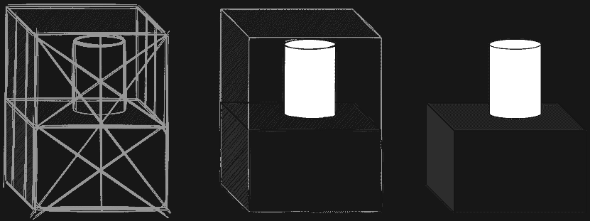

图 12：展示了一个用于创建 3D 形状的概念草图（左）。这些草图的示例可以在 CAD2Sketch 数据集中找到[28]。经过概念草图的精细化处理后，最终的手绘模型草图就完成了（右）。这样的精细化草图在 Sketch2CAD 数据集中也可以找到[24]。

值得注意的是，概念草图反映了设计师思维中的详细步骤，类似于 CAD 建模的各个阶段，而 Sketch2CAD 数据集中的草图通常只呈现最终的手绘草图，而没有这些详细的辅助构造线。CAD2Sketch 通过提出将 CAD B-Rep 数据转换为概念草图的方法，推出了一个大规模的合成概念草图数据集。CAD2Sketch 通过引入一种将 CAD B-Rep 数据转换为概念草图的方法，建立了一个大规模的合成概念草图数据集。该数据集可与 OpenSketch [80] 数据集相媲美，后者拥有 $400$ 张由各种专家设计师制作的真实概念草图。然而，CAD2Sketch 旨在弥合合成数据和真实数据之间的差距，使神经网络能够在概念草图上进行训练。CAD2Sketch 方法最初为 CAD 序列中的每个操作生成构造线。为了避免使草图被过多的线条淹没，通过解决一个二进制优化问题来选择这些线条的子集。随后，调整每条线的透明度和形状，以实现与真实概念草图的视觉相似性。CAD2Sketch 生成的合成概念草图与 OpenSketch 中的真实配对草图非常相似，以至于即使是设计师也很难区分 [28]。CAD2Sketch 还生成了大量配对草图和法线贴图，用于训练神经网络从概念草图推断法线贴图。数据集中包含大约 $6,000$ 张配对概念草图和法线贴图。训练后的神经网络在 ABC 数据集的 $108$ 个 CAD 序列的测试集上的泛化能力得到了令人鼓舞的结果。然而，值得注意的是，由于 OpenSketch 数据集的规模相对较小，这种方法的评估仅限于少量真实草图。此外，CAD2Sketch 方法建立在现有大规模 CAD 数据集的 CAD 序列上，限制于由草图和挤出操作组成的序列。

### V-C 3D CAD 命令生成

尽管以往的方法已经引入了用于 3D CAD 重建的合成数据集，但缺乏一个标准化的人类设计的 3D CAD 模型集合，并保留 CAD 命令序列，这是一个限制。类似于 SketchGraphs 数据集在 2D 草图合成领域的宝贵贡献，一个经过策划的人类设计的 3D CAD 模型数据集，并保留 CAD 命令序列，将极大地促进研究和实际方法的开发。Fusion 360 重建数据集[30]填补了这一空白，作为第一个人类设计的数据集，包含$8,625$个使用 Sketch 和 Extrude CAD 操作序列构建的 CAD 模型。这个数据集配备了一个称为 Fusion 360 Gym 的环境，能够执行这些 CAD 操作。每个 CAD 模型被表示为一种领域特定语言（DSL）程序，这是一种状态语言，用作 Fusion 360 Python API 的简化封装。这种语言跟踪当前构建中的几何图形，并通过一系列草图和挤出命令进行迭代更新。数据和相应的代码可以公开访问⁸⁸8https://github.com/AutodeskAILab/Fusion360GalleryDataset/blob/master/docs/reconstruction.md。该数据集通过训练和评估一种基于机器学习的方法来进行基准测试，该方法具有神经引导的搜索，用于从指定几何体进行程序化 CAD 重建。这种方法首先训练一个策略，该策略被实例化为消息传递网络（MPN）[110, 111]，其具有原始的状态和动作编码。这种训练通过模仿学习进行，从真实构建序列中获得见解。在随后的推断阶段，该方法结合了搜索机制，利用学习到的神经策略与 Fusion 360 Gym 环境进行迭代互动，直到识别出精确的 CAD 程序。然而，这种方法的一个限制是它假设 2D 几何图形已给出，方法仅预测要挤出的草图及其在每次迭代中的范围。随后，这个数据集被生成方法用于处理未提供几何体的情况，需要使用 Sketch 和 Extrude 操作从头合成整个 3D 模型。

作为通过神经引导搜索推断 CAD 建模构建顺序的另一个努力，[29]中提出了一种方法，其中每个 CAD 模型的 B-Rep 数据以区域图的形式表达，其中固体区域构成区域，表面贴片（曲线）形成边缘。然后将这种表示引入 GCN，以便进行特征学习，随后采用一种搜索方法来推导出能够真实再现该区域图的 CAD 操作序列。然而，以上两种方法都没有利用生成方法来生成 CAD 操作。在本小节中，将介绍该领域最新的生成方法。

#### V-C1 DeepCAD [17]

第一个用于创建 3D CAD 命令的生成深度学习模型是 DeepCAD。鉴于 CAD 操作和 B-Rep 数据的顺序性和不规则性，选择一组固定的最常用 CAD 操作并将其组织成一个统一的结构，以供生成神经网络使用是至关重要的。受到早期为 2D CAD 分析和草图生成设计的生成技术（如 CurveGen-TurtleGen、SketchGen、CAD as Language 和 VITROVION，详见 V-A")的启发，DeepCAD 采用类似的方法，将 CAD 操作类比于自然语言。它引入了一个生成的 Transformer 网络用于自编码 CAD 操作。值得注意的是，DeepCAD 不同于以往的生成方法，它采用了前馈 Transformer 结构，而不是通常在此类上下文中使用的自回归 Transformer。此外，DeepCAD 构建并发布了一个大规模的数据集，包含$178,238$个来自 OnShape 库的 CAD 模型，这些模型是通过 Sketch 和 Extrude 操作生成的，并附有各自的 CAD 构建序列。该数据集的规模超过了包含大约$8,000$个设计的 Fusion 360 Gallery 数据集。DeepCAD 数据集中设计数量的显著增加提高了其训练生成网络的适用性。

在 DeepCAD 中建议的标准化结构下，CAD 命令被详细列出，提供了其类型、参数和顺序索引的信息。Sketch 命令包括线、弧和圆等曲线类型以及各自的参数。同时，Extrude 命令表示一系列挤压操作，包括单面、对称、双面挤压以及布尔操作（如新体、连接、切割或交集）。这些操作用于将修改后的形状与之前构建的形式整合。一个 CAD 模型 $M$ 表示为一系列曲线命令构建的草图，并与挤压命令交织在一起。表示每个 CAD 模型的 CAD 命令总数固定为 $60$，对于命令序列较短的 CAD 模型，采用填充方式使用空命令以适应这一固定长度结构。每个命令被编码为一个 $16$ 维向量，表示所有命令的参数集合。如果某个命令的特定参数不适用，则统一设置为 $1$。如图 13 所示，自动编码器网络将 CAD 命令序列作为输入，通过 Transformer 编码器转换为潜在空间，然后解码潜在向量以重建一系列 CAD 命令。生成的 CAD 命令可以导入 CAD 软件中进行最终用户编辑。

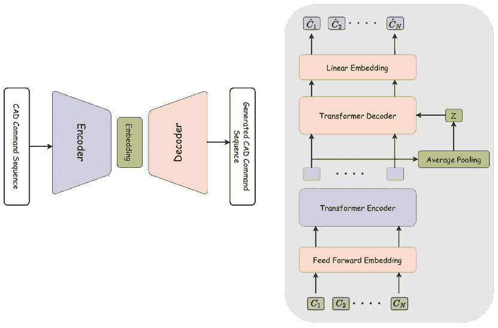

图 13：DeepCAD 模型架构的示意图 [17]。模型在左侧展示，为一种以无监督方式训练的 Transformer 自动编码器网络。它将 CAD 命令序列作为输入，并重建这些命令。右侧展示了这个自动编码器的详细结构，其中 $\left\{C_{1},C_{2},...,C_{N}\right\}$ 代表输入的 CAD 命令序列，而 $\left\{C_{1},C_{2},...,C_{N}\right\}$ 为重建的命令。

DeepCAD 的性能在两个任务上进行了评估：CAD 模型自编码和随机 CAD 模型生成。一旦自编码器网络被训练用于重建 CAD 命令，就会采用潜在-GAN 技术 [112] 来训练生成器和鉴别器。生成器通过接收从多变量高斯分布中采样的随机向量来生成潜在向量 $z$。然后，可以将该潜在向量引入到训练好的 Transformer 解码器中，以生成 CAD 模型命令。他们的实验还表明，在 DeepCAD 数据集上预训练的模型在应用于 Fusion 360 数据集时展现出了良好的泛化能力。值得注意的是，这两个数据集来自不同的来源，即 OnShape 和 Autodesk Fusion 360。

DeepCAD 生成模型的应用进一步体现在将 3D 点云数据转换为 CAD 模型。在这种情况下，生成自编码器和 PointNet++ 编码器 [8] 同时进行训练，以将 CAD 模型编码为来自 CAD 命令序列和相应点云数据的相同潜在向量 $z$。在推断过程中，预训练的 PointNet++ [8] 编码器将点云数据嵌入到潜在向量 $z$ 中，随后将其输入到预训练的 DeepCAD 自编码器的生成解码器中，以生成 CAD 命令序列。

#### V-C2 SkexGen [31]

尽管 DeepCAD 在生成多样化形状方面取得了进展，但用户对生成设计的控制仍然是一个持续的挑战。允许用户对输出进行影响并定制设计以满足特定要求将对实际应用大有裨益。对此挑战，SkexGen 提出了一个新颖的自回归 Transformer 网络，该网络有三个独立的编码器，分别捕捉 CAD 命令序列中的拓扑、几何和挤出变化。这种方法使得用户能够对模型的拓扑和几何形状进行更有效和明确的控制，从而在更广泛的相关设计搜索空间内进行探索，进而生成更加逼真和多样化的 CAD 模型。

受到 CurveGen-TurtleGen [21] 和 DeepCAD [17] 方法的启发，SkexGen 中的 CAD 模型通过具有草图和挤出构建序列的原语层次结构来表示。在这个层次结构中，3D 模型由 3D 实体组成，每个实体被定义为一个挤出的草图。一个草图由一组面组成，每个面代表一个由循环包围的 2D 表面。循环由一个或多个曲线形成，包括直线、弧线或圆弧，曲线代表了层次结构的基本层级。因此，CAD 模型使用五种类型的标记编码以输入到 Transformer：1）拓扑标记，表示曲线类型，2）几何标记，指定沿曲线的 2D 坐标，3）原语结束标记，4）挤出标记，指示挤出和布尔操作的参数，以及 5）序列结束标记。SkexGen 引入的自回归 Transformer 网络由两个独立的分支组成，每个分支分别训练：1）Sketch 分支由两个不同的编码器组成，专注于学习草图中的拓扑和几何变化。此外，使用一个解码器，接收拼接的拓扑和几何编码代码本作为输入，并自回归预测草图子序列。2）“Extrude”分支包括一个编码器和解码器，专门用于学习挤出和布尔操作的变化。此外，网络末尾还配置了一个额外的自回归解码器，负责学习几何、拓扑和挤出代码本的有效组合，从而生成 CAD 构建序列。额外的自回归解码器在顶部学习几何、拓扑和挤出代码本的有效组合作为 CAD 构建序列。这种复杂的标记化和多层次网络架构使得对拓扑和几何的控制更为细致和全面，从而通过有效捕捉各种设计方面来生成 CAD 模型。

由于 SkexGen 能够独立编码和生成 Sketch 和 Extrude 命令序列，这种方法非常灵活，适用于 2D 草图生成和 3D CAD 生成任务。评估结果突显了它在生成比 CurveGen-TurtleGen [21] 和 DeepCAD [17] 方法更复杂设计方面的高效性。特别是，SkexGen 在支持多步骤 Sketch 和 Extrude 序列方面表现出色，而 DeepCAD 主要生成单步骤结果。

### V-D 3D CAD 生成与直接 B-Rep 合成

#### V-D1 SolidGen [15]

通过生成 CAD 命令或直接 B-Rep 合成来创建 3D CAD 设计具有一系列优缺点。之前介绍的生成方法，例如 Fusion 360 Reconstruction、DeepCAD 和 SkexGen，都有一个共同的目标，即通过生成一系列 3D CAD 操作或命令来制作 3D CAD 模型。这些命令随后由 CAD 工具中的实体建模内核处理，以恢复最终的 B-Rep 格式的 CAD 设计。生成 CAD 命令，相较于直接创建 B-Rep，提供了几个优势。将 CAD 命令转换为 B-Rep 格式是可行的，而反向过程则更具挑战性，因为不同的命令序列可能会导致相同的 B-Rep 结果。此外，CAD 命令更具人类可解释性，允许用户通过在 CAD 工具中处理这些命令来编辑设计以满足各种应用。然而，训练用于这些任务的模型需要大规模的 CAD 数据集，这些数据集保留了 CAD 建模操作的历史。因此，像 DeepCAD（包含约 190,000 个模型）和 Fusion 360 Reconstruction（约 8,000 个模型）这样的数据集专门为此目的构建。相比之下，该领域的大多数大规模数据集，例如 ABC（包含超过 1 百万模型），仅提供 B-Rep 数据，而没有存储 CAD 建模操作的序列。尽管生成 CAD 命令提供了更多的灵活性、互操作性和用户控制，但另一种策略是直接合成 B-Rep。这种方法在利用现有的大规模数据集时可能会有所裨益。此外，直接 B-Rep 合成允许支持更复杂的曲线和表面来创建 3D 形状。这与 CAD 命令生成方法形成对比，后者仅限于使用 Sketch 和 Extrude 命令构建的 CAD 模型，并且支持的曲线类型列表有限。

SolidGen [15] 引入了一种直接 B-Rep 合成的方法，消除了对 CAD 命令序列历史的需求。这种方法利用了指针网络 [107] 和自回归 Transformer 网络来学习 B-Rep 拓扑，并逐步预测顶点、边和面。与 SolidGen 并行进行的 [113] 工作则侧重于在给定单一 2D 线条图的情况下，在 B-Rep 数据中进行 3D 面识别。该方法借鉴了指针网络的灵感，采用了自回归 Transformer 网络来识别 2D 线条图中的边缘环，并逐个预测与 3D 设计中的实际平面和圆柱面对应的共同边索引。然而，SolidGen 被认为是一种更有优势的方法。它不仅限于边缘环识别，还能合成 3D 形状的完整 B-Rep 数据。此外，它支持设计中所有类型面的表示，提供了一个更全面和多样化的解决方案。SolidGen 还引入了索引边界表示（Indexed B-Rep），将 B-Rep 表示为适合神经网络使用的数字数组。这个索引 B-Rep 将 B-Rep 顶点、边和面组织成一个明确的层次结构，以捕捉几何和拓扑关系。在这种层次结构中，边 $\mathcal{E}$ 被表示为指向顶点 $\mathcal{V}$ 的索引列表，每个面 $\mathcal{F}$ 中的每一项表示指向边 $\mathcal{E}$ 的索引列表。所提出的自回归网络通过训练三个不同的 Transformer 网络来逐步预测 B-Rep 标记，分别用于生成顶点、边和面。形式上，它的目标是学习 B-Rep $\mathcal{B}$ 的联合分布：

|  | $p(\mathcal{B})=p(\mathcal{V},\mathcal{E},\mathcal{F}),$ |  | (5) |
| --- | --- | --- | --- |

分解为：

|  | $p(\mathcal{B})=p(\mathcal{F}\mid\mathcal{E},\mathcal{V})p(\mathcal{E}\mid\mathcal{V})p(\mathcal{V}).$ |  | (6) |
| --- | --- | --- | --- |

这种结构还允许在外部上下文$c$（例如类别标签、图像和体素）上进行分布的条件化：

|  | $p(\mathcal{B})=p(\mathcal{F}\mid\mathcal{E},\mathcal{V},c)p(\mathcal{E}\mid\mathcal{V},c)p(\mathcal{V}\mid c).$ |  | (7) |
| --- | --- | --- | --- |

训练后，生成一个索引化的 B-Rep 涉及对顶点、以顶点为条件的边以及以边和顶点为条件的面进行采样。随后，获得的索引化 B-Rep 可以通过后处理步骤转换为实际的 B-Rep。为了更全面地了解这些过程，感兴趣的读者可以参考原始论文[15]。该方法的有效性通过改进版的 DeepCAD 数据集进行评估。此外，SolidGen 引入了参数化变化（PVar）数据集，专门用于评估模型在类别条件生成任务中的表现。该合成数据集包含$120,000$个 CAD 模型，分布在$60$个类别中。

#### V-D2 CADParser [16]

与 SolidGen 配套，CADParser 被引入用于预测给定 B-Rep CAD 模型的 CAD 命令序列。与之前通常使用合成 CAD 数据集或依赖于仅使用两个操作（即草图和挤压）创建的 CAD 模型的数据集（如 DeepCAD 和 Fusion 360 重建）不同，CADParser 引入了一个包含$40,000$个 CAD 模型的综合数据集。这些模型涵盖了更广泛的 CAD 操作，包括草图、挤压、旋转、倒角和斜角。与之前仅限于两种操作的数据集相比，该数据集提供了一个包含五种不同类型 CAD 操作的更为多样化的 CAD 模型集合。该数据集中的每个 CAD 模型都附有 B-Rep 数据及其相应的构建命令序列。

CADParser 还引入了一种深度神经网络架构，称为深度解析器，旨在预测每个 B-Rep 模型的 CAD 构建顺序。受到 UV-Net 和 BRepNet 的启发，这两者在第 IV 节中被讨论作为 B-Rep 数据表示学习的开创性方法，CADParser 将每个 CAD 模型视为一个图 $\mathcal{G}=(\mathcal{V},\mathcal{E})$，其中节点代表模型的面、边和共边，$\mathcal{E}$ 表示图节点之间的连接。BRepNet 架构作为图编码器的骨干网络，将节点特征和构建的邻接矩阵作为输入，通过图卷积和拓扑遍历提取图的局部和全局特征。同时，构建 CAD 模型的 CAD 命令序列 $S=(C_{1},C_{2},...,C_{n})$ 被编码为特征向量。这些特征向量与图编码的全局和局部特征相结合，并输入到 Transformer 解码器中，以自回归的方式预测下一个命令序列。与之前的方法类似，CAD 命令通过将每个命令 $C_{i}$ 表示为命令类型 $t_{i}$ 和命令参数 $p_{i}$ 的元组进行标记化。$t_{i}$ 被编码为一个 $12$ 维的独热向量，表示 $12$ 种不同的命令类型，每次一个，而 $p_{i}$ 是一个 $257$ 维的向量。该向量表示命令的量化 $256$ 维参数向量和一个 $1$ 维的索引，指示该命令是否用于对应的 CAD 模型。所有 CAD 模型的 CAD 命令序列长度固定为 $32$，以简化处理，对于每个 CAD 模型，未使用的命令由索引 $-1$ 表示。Transformer 解码器有两个独立的输出分支，分别用于预测 CAD 命令类型 $t_{i}$ 和参数 $p_{i}$ 向量。有关模型架构和训练过程的更多细节，请参见 [16]。这项工作的贡献代表了通过整合各种 CAD 命令生成更多样化的 CAD 模型的一个进步。

### V-E 从点云生成 3D CAD

正如在现有 3D CAD 生成模型的概述中所强调的，CAD 形状的逆向工程主要通过利用 CAD 草图、B-Rep 数据或 CAD 命令序列作为输入的方法来探索。这些方法在重建和生成 CAD 模型方面已经取得了有希望的进展。然而，同样重要的是从替代的原始几何数据模态（如点云）生成 CAD 数据。这一考虑也与 DeepCAD 方法所概述的未来工作相一致。能够将多样的数据表示无缝转换为 CAD 模型为实际应用开辟了新的途径，弥合了不同数据模态之间的差距，并扩展了 CAD 技术的实用性。这在需要物理对象的新变体或在没有相应 CAD 模型的情况下修复机械对象的情境中尤为重要。在这些情况下，通常的过程是使用 3D 传感器扫描对象，生成点云。随后，获取的点云数据需要被分解成几何原始体的集合，如曲线或表面，以供 CAD 软件解释。传统的三步程序[114]涉及将点云转换为网格，通过参数化表面解释它以创建一个固体（B-Rep），然后推断一个 CAD 程序。近期在点云拟合原始体方面的进展[115, 116, 117]已经成功绕过了将点云转换为网格的初步步骤。然而，这些方法的一个显著限制是它们依赖于有限的固定和不相交的原始体，这对后续步骤中的形状编辑构成了挑战。为解决这一问题，最近提出的 Point2Cyl [32]方法将问题框架定义为挤出圆柱体分解任务，利用神经网络预测每个点的挤出实例、表面法线以及基座/圆筒成员。这些几何代理可以通过可微分和封闭形式的公式来估计挤出参数。在此方法中，挤出圆柱体被视为一个基本原始体，表示一个挤出的 2D 草图，其参数包括挤出轴、中心、草图和草图比例，这些参数可以用来表示 3D CAD 模型。术语“基座”和“圆筒”用来表示挤出圆柱体的特定表面，分别表示挤出圆柱体的底面/顶面和平面表面。图 14 展示了一个通过将圆形作为基准 2D 草图进行挤出而获得的挤出圆柱体示例。

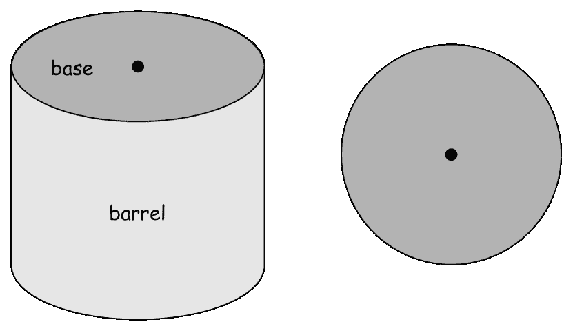

图 14：一个挤出圆柱体的示例。这里的 2D 草图是一个圆（右），它被挤出以形成挤出圆柱体（左）[32]。

Point2Cyl 利用 PointNet++ [8] 学习点云特征嵌入，然后将其传递到两个不同的全连接网络中，用于点云分割成挤出圆柱体、基座/桶和表面法线预测。该方法在 Fusion Gallery 和 DeepCAD 数据集上进行了评估，超越了基线并展示了其在重建和形状编辑方面的有效性。该方法的代码公开可用。⁹⁹9point2cyl.github.io

然而，需要注意的是，这种方法在处理输入数据没有噪声或失真的情况下能力有限。从噪声点云数据中重建棱柱形 3D 形状的锐利边缘和表面是一项具有挑战性的任务，因为点云本质上只能提供 3D 形状的近似表示。特别是当处理通过低成本扫描仪获取的点云时，这一挑战尤为突出，其中形状中的任何失真或不规则性可能会在表面重建过程中通过平滑处理得到解决。Lambourne 等人[33] 提出了一个方法，与 Point2Cyl 同时提出，解决了在提供近似圆滑（平滑）点云的情况下，重建锐利棱柱形状的挑战。这种方法引入了一个可微分的流程，通过体素重建目标形状，同时提取几何参数。一个自编码器网络被训练来处理表示为体素网格的带符号距离函数，该函数通过将密集点云转换为带符号距离函数的方法获得[118, 119]。编码器生成一个嵌入向量，解码器进一步将形状分解为 2D 轮廓图像和 1D 包络数组。在推理过程中，通过搜索 2D 受限草图库生成 CAD 数据，挤出这些草图，并通过布尔运算将它们组合起来，构建最终的 CAD 模型。对 ABC 数据集的评估表明，该方法在目标形状的逼近程度上优于 DeepCAD 方法。

与之前的两个工作并行，ComplexGen [34] 引入了一种新的方法，ComplexNet，用于直接从点云生成 B-Rep 数据。这种方法将重建任务重新定义为几何基元及其相互连接的整体检测，这些都被封装在链复杂结构中。ComplexNet 作为一种神经网络架构，利用稀疏 CNN 来嵌入点云特征，并使用三路径 Transformer 解码器生成三组不同的几何基元及其相互关系，这些关系定义为邻接矩阵。随后，一个全局优化步骤将预测的概率结构细化为确定的 B-Rep 链复杂结构，同时考虑结构有效性约束和几何细化。在 ABC 数据集上进行的大量实验展示了这种方法在生成结构完整且准确的 CAD B-Rep 模型方面的有效性。

## VI 讨论与未来工作

尽管几何深度学习（GDL）方法在分析 CAD 模型和自动化设计过程的不同层面上取得了显著进展，但该领域仍面临一些挑战。在这一部分，讨论了这些挑战，并提出了应对这些挑战的潜在未来研究方向。

限量注释的 B-Rep 数据：尽管近年来发布了几种大规模的 CAD 数据集，这些数据集包含 B-Rep 格式以及传统的 3D 数据格式，但对用于监督学习的方法的注释数据集仍然有相当大的需求。用于 CAD 模型分类的注释数据集仍然很有限，缺乏进行全面分析所需的多样性和复杂性。虽然针对常见物体 CAD 形状（如 ShapeNet [62]）的大规模注释数据集存在，但这些数据集仅以网格格式提供。因此，将知识从常见物体数据集转移到机械数据集时，只能使用网格或点云数据，而不是 B-Rep。另一方面，注释机械 CAD 模型具有挑战性，需要领域知识的专业性来识别机械物体的类型、功能或其他属性。由于不同工业中对这些物体使用不同的术语，专家注释中的不一致性可能会出现。类似的挑战也存在于 CAD 分割数据集中，这些数据集对不同的面进行注释。如表 III 所示，相关的注释数据集数量较少，注释类型各异，例如不同面的制造方式或用于构建每个面的 CAD 操作。这些数据集在其表面类型中缺乏共享类别，使得使用迁移学习或领域泛化方法将学习到的特征从一个数据集转移到另一个数据集变得困难。这个领域需要更大规模的数据集，例如扩展 MFCAD 数据集的 MFCAD++，以及不同类型的注释。收集提供多种数据格式（包括网格、点云和 B-Rep）的大规模 CAD 数据集，涵盖各种复杂性的 CAD 模型，并对不同任务进行注释，例如 CAD 分类和分割，将显著推动该领域未来的研究和发展。

对复杂 CAD 装配体的分析：现有对 CAD 装配体的分析工作主要集中在如何连接简单部件（固体），预测连接的坐标和方向。未来的研究方向可以考虑如何分层装配多个固体，以构建更复杂的 CAD 模型，或者如何连接两个包含多个部件（固体）的子装配体，以形成更大的装配体。然而，现有的数据集并未为此类应用进行标注，因为不同部件之间的接头在 B-Rep 数据中默认情况下并未明确指定。AutoMate 和 Fusion 360 Assembly-Joint 数据集分别为其对应的方法进行了标注[19, 18]。分析复杂 CAD 装配体的另一个开放问题是将每个装配体分割成不同级别的构建块（子装配体或部件（固体））。学习如何在考虑所有连接、复杂性、功能、材料等因素的情况下，将一个部件替换为库中的另一个部件，将极大地有利于自动化 CAD 模型的定制过程。为此目标标注数据集也是必要的。

B-Rep 数据的表示学习：在 B-Rep 数据上训练深度学习模型的初步且最重要的一步是创建适合深度学习架构的数值特征表示。许多用于 CAD 分类和分割的方法，尤其是基于 UV-Net 的方法，使用 UV 网格采样。然而，UV 网格特征缺乏置换不变性。换句话说，当 CAD 固体被表示为一个面邻接图时，图中节点的排列对于深度学习模型识别图结构及其与其他图（或 CAD 固体）的相似性至关重要，而两个节点排列不同的图仍可能在一起相似。因此，探索 B-Rep 图的各种不变性和将其数据以结构化格式表示的替代方法，同时考虑固体面和边的相对方向，对未来的研究充满了希望。

无监督和自监督方法：鉴于 CAD 中注释数据的短缺，有很大潜力提升自监督和/或无监督方法，利用像 ABC 这样的规模大数据集。例如，UV-Net 利用图对比学习（GCL）进行自监督学习，[13]探讨了形状光栅化从数据中获得自监督以训练自编码器，并使用解码器进行其他监督任务。在 CAD 数据中研究各种自监督形式以训练自编码器或图自编码器将是非常有趣的。研究和评估 GCL 方法中不同的图形变换，以了解 B-Rep 图的局部和全局结构，并保持各种不变性，是未来研究的重要方向。此外，关注变分自编码器在 B-Rep 数据上的直接合成，从与现有形状相同的分布中生成有意义的新形状，将增强相似性分析和 CAD 检索。

CAD 生成和 B-Rep 合成：当前的 CAD 命令生成方法通常关注于有限的一组操作，如 Sketch 和 Extrude，这限制了生成的 CAD 模型的复杂性和多样性。值得注意的是，某些方法（如 DeepCAD [17]）不能保证所有生成的 CAD 命令序列都会产生拓扑有效的 CAD 模型，特别是在长命令序列的复杂模型中。因此，未来的研究方向之一是扩展生成方法，以涵盖更广泛的 CAD 操作，如 fillet 和 chamfer，从而生成用于更复杂 CAD 形状的命令序列。此外，直接关注合成 B-Rep 数据而不依赖于 CAD 命令序列的方法，如 SolidGen [15] 和 CADParser [16]，标志着一个有前景的方向。尽管有这些进展，但在这一领域仍有创造性和改进的空间。另一个未来研究的方向是扩展生成方法，从其他 3D 数据格式（如 mesh、voxel 和 point cloud）生成 CAD 构建操作或 B-Rep 合成。最近在将点云转换为 CAD 模型方面的进展（在第 V-E 节中描述）为跨不同数据领域传递知识提供了可能性。此外，从噪声扫描或手绘草图生成 3D CAD 模型在 CAD 工具中需求很高，并具有显著的改进潜力。尽管在这个领域已经引入了一些方法，但缺乏配对的草图和 B-Rep 数据集使得目前训练监督学习方法不可行。例如，SketchGraphs 的草图和 ABC 数据集中的 3D 模型均来自 Onshape 存储库。然而，这两个数据集中的 2D 和 3D 模型并未配对。收集这样的配对数据集将极大地促进未来的研究。

可重复性：在这一领域，一个显著的挑战在于重复和比较不同方法的实验结果。由于缺乏大规模注释的基准数据集，每个用于机器学习基础的计算机辅助设计（CAD）分析的方法都要么引入一个针对特定任务的新注释 CAD 数据集，要么修改并注释一个大规模数据集的一部分以进行评估。训练于这些较小数据集上的监督方法通常表现出高性能，几乎没有改进的空间。此外，由于每种方法都是在针对其特定任务调整的数据集上进行基准测试的，结果比较变得复杂。例如，在[13]中，当分析在 Fusion 360 分割数据集的一个子集上评估的不同方法的结果时，不清楚每种方法使用了数据集的哪一部分进行评估。当研究人员没有发布其预处理数据或没有提供明确的预处理说明时，重复不同方法的结果并进行性能比较变得尤其具有挑战性。另一个重复研究结果的障碍是代码对不可开源的 CAD 内核的依赖。例如，重复 AutoMate [19]的结果需要安装 Parasolid 内核，这通常只有工业开发人员和公司才能访问。这种有限的可用性使独立的学术研究人员难以利用并在此类研究工作基础上进行开发。虽然依赖于开源 OpenCASCADE 内核的代码更为可访问，但该领域的许多方法要么在训练过程中通过 CAD 工具使用约束求解器，要么在某种程度上依赖于 CAD 工具内核，从而需要获取和许可至少一种 CAD 软件。为了解决这些问题，强烈建议研究人员为其发布的代码提供全面的文档，详细说明数据预处理设置，并提供足够的信息关于实验设置和代码依赖。这种透明度可以显著促进该领域未来的研究工作。

## VII 结论

开发和训练几何深度学习（GDL）模型以学习和推理 CAD 设计有望彻底改变设计工作流程，提高效率。然而，将基于机器学习的方法扩展到复杂的参数数据，如 B-Rep，是一个关键且具有挑战性的任务。本调查提供了针对 CAD 数据分析的 GDL 方法的全面综述。它详细解释、比较和总结了两个主要类别：1) CAD 表示学习，包括用于 CAD 分类、分割、装配和检索的监督和自监督方法，2) CAD 生成，涉及用于 2D 和 3D CAD 构建的生成方法。此外，还介绍了基准数据集和开源代码。调查的最后讨论了该快速发展的领域中的挑战，并提出了未来研究的潜在方向。

## 致谢

本论文结果的研究得到了 Thomas B. Thriges 基金会和 Industriens 基金会的资助，作为 AI 支持的模块化设计与实施项目的一部分。

## 参考文献

+   [1] M. M. Bronstein, J. Bruna, T. Cohen, 和 P. Veličković, “几何深度学习：网格、群组、图形、测地线和测量，” *arXiv 预印本 arXiv:2104.13478*，2021 年。

+   [2] E. Kalogerakis, M. Averkiou, S. Maji, 和 S. Chaudhuri, “用投影卷积网络进行 3D 形状分割，” 发表在 *IEEE 计算机视觉与模式识别会议*，2017 年。

+   [3] Y. Feng, Y. Feng, H. You, X. Zhao, 和 Y. Gao, “Meshnet: 用于 3D 形状表示的网格神经网络，” 发表在 *AAAI 人工智能会议*，2019 年。

+   [4] D. Maturana 和 S. Scherer, “Voxnet: 一种用于实时物体识别的 3D 卷积神经网络，” 发表在 *IEEE 国际智能机器人与系统会议（IROS）*，2015 年。

+   [5] Z. Wu, S. Song, A. Khosla, F. Yu, L. Zhang, X. Tang, 和 J. Xiao, “3d shapenets: 深度体积形状表示，” 发表在 *IEEE 计算机视觉与模式识别会议*，2015 年。

+   [6] C. Wang, M. Cheng, F. Sohel, M. Bennamoun, 和 J. Li, “Normalnet: 一种用于 3D 物体分类和检索的体素基 CNN，” *Neurocomputing*, vol. 323, pp. 139–147, 2019 年。

+   [7] T. Le 和 Y. Duan, “Pointgrid: 用于 3D 形状理解的深度网络，” 发表在 *IEEE 计算机视觉与模式识别会议*，2018 年。

+   [8] C. R. Qi, H. Su, K. Mo, 和 L. J. Guibas, “Pointnet: 基于点集的深度学习用于 3D 分类和分割，” 发表在 *IEEE 计算机视觉与模式识别会议*，2017 年。

+   [9] P. K. Jayaraman, A. Sanghi, J. G. Lambourne, K. D. Willis, T. Davies, H. Shayani, 和 N. Morris, “Uv-net: 从边界表示中学习，” 发表在 *IEEE 计算机视觉与模式识别会议*，2021 年。

+   [10] C. Krahe, A. Bräunche, A. Jacob, N. Stricker 和 G. Lanza, “用于自动化产品设计的深度学习，” *CIRP 设计会议*，2020 年。

+   [11] C. Krahe, M. Marinov, T. Schmutz, Y. Hermann, M. Bonny, M. May 和 G. Lanza, “基于 AI 的几何相似性搜索支持工程设计中的组件重用，” *CIRP 设计会议*，2022 年。

+   [12] D. Machalica 和 M. Matyjewski, “利用机器学习进行 CAD 模型聚类，” *机械工程档案*，第 66 卷，第 2 期，2019 年。

+   [13] B. T. Jones, M. Hu, M. Kodnongbua, V. G. Kim 和 A. Schulz, “用于 CAD 的自监督表示学习，” 见 *IEEE 计算机视觉与模式识别会议*，2023 年。

+   [14] J. G. Lambourne, K. D. Willis, P. K. Jayaraman, A. Sanghi, P. Meltzer 和 H. Shayani, “Brepnet: 一个用于实体模型的拓扑信息传递系统，” 见 *IEEE 计算机视觉与模式识别会议*，2021 年。

+   [15] P. K. Jayaraman, J. G. Lambourne, N. Desai, K. D. D. Willis, A. Sanghi 和 N. J. W. Morris, “Solidgen: 一种用于直接 B-rep 合成的自回归模型，” *机器学习研究汇刊*，2023 年。

+   [16] S. Zhou, T. Tang 和 B. Zhou, “Cadparser: 一种用于 B-rep CAD 的序列建模学习方法，” 见 *国际人工智能联合会议*，2023 年。

+   [17] R. Wu, C. Xiao 和 C. Zheng, “Deepcad: 一种用于计算机辅助设计模型的深度生成网络，” 见 *IEEE 国际计算机视觉会议*，2021 年。

+   [18] K. D. Willis, P. K. Jayaraman, H. Chu, Y. Tian, Y. Li, D. Grandi, A. Sanghi, L. Tran, J. G. Lambourne 和 A. Solar-Lezama *等*， “Joinable: 学习参数化 CAD 接头的自下而上的组装，” 见 *IEEE 计算机视觉与模式识别会议*，2022 年。

+   [19] B. Jones, D. Hildreth, D. Chen, I. Baran, V. G. Kim 和 A. Schulz, “Automate: 用于自动配对 CAD 装配的数据库和学习方法，” *ACM 图形学汇刊 (TOG)*，第 40 卷，第 6 期，页码 1–18，2021 年。

+   [20] A. Seff, Y. Ovadia, W. Zhou 和 R. P. Adams, “Sketchgraphs: 一个用于建模计算机辅助设计中的关系几何的大规模数据集，” *arXiv 预印本 arXiv:2007.08506*，2020 年。

+   [21] K. D. Willis, P. K. Jayaraman, J. G. Lambourne, H. Chu 和 Y. Pu, “用于计算机辅助设计的工程草图生成，” 见 *IEEE 计算机视觉与模式识别会议*，2021 年。

+   [22] C. Li, H. Pan, A. Bousseau 和 N. J. Mitra, “Free2cad: 将自由手绘图转换为 CAD 命令，” *ACM 图形学汇刊 (TOG)*，第 41 卷，第 4 期，页码 1–16，2022 年。

+   [23] A. Seff, W. Zhou, N. Richardson 和 R. P. Adams, “Vitruvion: 一种参数化 CAD 草图的生成模型，” 见 *国际学习表示会议，ICLR*，2022 年。

+   [24] C. Li, H. Pan, A. Bousseau 和 N. J. Mitra, “Sketch2cad: 通过上下文草图进行顺序 CAD 建模，” *ACM 图形学汇刊 (TOG)*，第 39 卷，第 6 期，页码 1–14，2020 年。

+   [25] E. Dupont, K. Cherenkova, A. Kacem, S. A. Ali, I. Arzhannikov, G. Gusev, 和 D. Aouada, “Cadops-net: 从边界表示中联合学习 CAD 操作类型和步骤”，发表于*International Conference on 3D Vision (3DV)*，IEEE，2022 年。

+   [26] W. Para, S. Bhat, P. Guerrero, T. Kelly, N. Mitra, L. J. Guibas, 和 P. Wonka, “Sketchgen: 生成约束 CAD 草图”，*Advances in Neural Information Processing Systems*，第 34 卷，页码 5077–5088，2021 年。

+   [27] Y. Ganin, S. Bartunov, Y. Li, E. Keller, 和 S. Saliceti, “计算机辅助设计作为语言”，*Advances in Neural Information Processing Systems*，第 34 卷，页码 5885–5897，2021 年。

+   [28] F. Hähnlein, C. Li, N. J. Mitra, 和 A. Bousseau, “Cad2sketch: 从 CAD 序列生成概念草图”，*ACM Transactions on Graphics (TOG)*，第 41 卷，第 6 期，页码 1–18，2022 年。

+   [29] X. Xu, W. Peng, C.-Y. Cheng, K. D. Willis, 和 D. Ritchie, “使用区域图推断 CAD 建模序列”，发表于*IEEE Conference on Computer Vision and Pattern Recognition*，2021 年。

+   [30] K. D. Willis, Y. Pu, J. Luo, H. Chu, T. Du, J. G. Lambourne, A. Solar-Lezama, 和 W. Matusik, “Fusion 360 画廊: 用于从人类设计序列进行程序化 CAD 构建的数据集和环境”，*ACM Transactions on Graphics (TOG)*，第 40 卷，第 4 期，页码 1–24，2021 年。

+   [31] X. Xu, K. D. D. Willis, J. G. Lambourne, C. Cheng, P. K. Jayaraman, 和 Y. Furukawa, “Skexgen: 使用解耦的代码本自回归生成 CAD 构建序列”，发表于*International Conference on Machine Learning*，2022 年。

+   [32] M. A. Uy, Y.-Y. Chang, M. Sung, P. Goel, J. G. Lambourne, T. Birdal, 和 L. J. Guibas, “Point2cyl: 从点云到挤出圆柱的 3D 对象逆向工程”，发表于*IEEE Conference on Computer Vision and Pattern Recognition*，2022 年。

+   [33] J. G. Lambourne, K. Willis, P. K. Jayaraman, L. Zhang, A. Sanghi, 和 K. R. Malekshan, “从圆形体素模型重建可编辑棱柱体 CAD”，发表于*SIGGRAPH Asia 2022 Conference Papers*，2022 年。

+   [34] H. Guo, S. Liu, H. Pan, Y. Liu, X. Tong, 和 B. Guo, “Complexgen: 通过 B-REP 链复合体生成进行 CAD 重建”，*ACM Transactions on Graphics (TOG)*，第 41 卷，第 4 期，页码 1–18，2022 年。

+   [35] M. Groover 和 E. Zimmers, *CAD/CAM: 计算机辅助设计与制造*。Pearson Education，1983 年。

+   [36] Autodesk, “Autocad”，1982 年。[在线]。可用链接：[`www.autodesk.com/products/autocad/overview?term=1-YEAR&tab=subscription`](https://www.autodesk.com/products/autocad/overview?term=1-YEAR&tab=subscription)

+   [37] ——, “Fusion 360”，2013 年。[在线]。可用链接：[`www.autodesk.com/products/fusion-360/overview?term=1-YEAR&tab=subscription`](https://www.autodesk.com/products/fusion-360/overview?term=1-YEAR&tab=subscription)

+   [38] Dassault Systèmes, “Solidworks”，1995 年。[在线]。可用链接：[`www.3ds.com/products/solidworks`](https://www.3ds.com/products/solidworks)

+   [39] ——, “Catia,” 1977\. [在线]. 可用链接: [`www.3ds.com/products-services/catia/`](https://www.3ds.com/products-services/catia/)

+   [40] PTC, “Onshape,” 2015\. [在线]. 可用链接: [`www.onshape.com/en/`](https://www.onshape.com/en/)

+   [41] ——, “Creo,” 2011\. [在线]. 可用链接: [`www.ptc.com/en/products/creo`](https://www.ptc.com/en/products/creo)

+   [42] Kai Backman, Mikko Mononen, “Tinkercad,” 2011\. [在线]. 可用链接: [`www.tinkercad.com`](https://www.tinkercad.com)

+   [43] Thomas Paviot, “pythonocc-core,” 2022\. [在线]. 可用链接: [`doi.org/10.5281/zenodo.3605364`](https://doi.org/10.5281/zenodo.3605364)

+   [44] “Opencascade 技术 (occt),” 2002\. [在线]. 可用链接: [`github.com/AutodeskAILab/occwl`](https://github.com/AutodeskAILab/occwl)

+   [45] Pradeep Kumar Jayaraman, Joseph Lambourne, “Occwl,” 2023\. [在线]. 可用链接: [`dev.opencascade.org`](https://dev.opencascade.org)

+   [46] “Cadquery,” 2019\. [在线]. 可用链接: [`github.com/CadQuery/cadquery/tree/master`](https://github.com/CadQuery/cadquery/tree/master)

+   [47] “Parasolid,” 1980\. [在线]. 可用链接: [`www.plm.automation.siemens.com/global/en/products/plm-components/parasolid.html`](https://www.plm.automation.siemens.com/global/en/products/plm-components/parasolid.html)

+   [48] F. Scarselli, M. Gori, A. C. Tsoi, M. Hagenbuchner 和 G. Monfardini, “图神经网络模型,” *IEEE 神经网络学报*, 第 20 卷, 第 1 期, 第 61–80 页, 2008.

+   [49] Z. Wu, S. Pan, F. Chen, G. Long, C. Zhang 和 S. Y. Philip, “关于图神经网络的综合调查,” *IEEE 神经网络与学习系统学报*, 第 32 卷, 第 1 期, 第 4–24 页, 2020.

+   [50] N. Heidari 和 A. Iosifidis, “用于高效骨架基础人体动作识别的时间注意力增强图卷积网络,” 发表在*国际模式识别大会 (ICPR)*。IEEE, 2021.

+   [51] ——, “用于骨架基础人体动作识别的渐进时空图卷积网络,” 发表在*IEEE 国际声学、语音和信号处理大会 (ICASSP)*, 2021.

+   [52] L. Hedegaard, N. Heidari 和 A. Iosifidis, “持续的时空图卷积网络,” *模式识别*, 第 140 卷, 第 109528 页, 2023.

+   [53] E. Mansimov, O. Mahmood, S. Kang 和 K. Cho, “使用深度生成图神经网络进行分子几何预测,” *科学报告*, 第 9 卷, 第 1 期, 第 20381 页, 2019.

+   [54] Y. Wang, J. Wang, Z. Cao 和 A. Barati Farimani, “通过图神经网络的分子对比学习表示,” *自然机器智能*, 第 4 卷, 第 3 期, 第 279–287 页, 2022.

+   [55] K. Baltakys, M. Baltakienė, N. Heidari, A. Iosifidis 和 J. Kanniainen, “预测社会连接投资者的交易行为: 具有市场监控含义的图神经网络方法,” *专家系统应用*, 第 228 卷, 第 120285 页, 2023.

+   [56] L. Yang, J. Zhuang, H. Fu, X. Wei, K. Zhou, 和 Y. Zheng，“SketchGNN：使用图神经网络进行语义草图分割”，*ACM 图形学交易*（TOG），第 40 卷，第 3 期，页码 1–13，2021。

+   [57] T. N. Kipf 和 M. Welling，“图卷积网络的半监督分类”，在*国际学习表征会议*，2017。

+   [58] N. Heidari 和 A. Iosifidis，“用于半监督节点分类的渐进图卷积网络”，*IEEE Access*，第 9 卷，页码 81,957–81,968，2021。

+   [59] N. Heidari, L. Hedegaard, 和 A. Iosifidis，“图卷积网络”，收录于*机器人感知与认知的深度学习*。Elsevier，2022，页码 71–99。

+   [60] Y. Li, O. Vinyals, C. Dyer, R. Pascanu, 和 P. Battaglia，“学习深度生成图模型”，*arXiv 预印本 arXiv:1803.03324*，2018。

+   [61] P. Shilane, P. Min, M. Kazhdan, 和 T. Funkhouser，“普林斯顿形状基准”，在*形状建模应用会议录，2004*。IEEE，2004，页码 167–178。

+   [62] A. X. Chang, T. Funkhouser, L. Guibas, P. Hanrahan, Q. Huang, Z. Li, S. Savarese, M. Savva, S. Song, H. Su *等*，“Shapenet：一个信息丰富的 3D 模型库”，*arXiv 预印本 arXiv:1512.03012*，2015。

+   [63] Q. Zhou 和 A. Jacobson，“Thingi10k：一个包含 10,000 个 3D 打印模型的数据集”，*arXiv 预印本 arXiv:1605.04797*，2016。

+   [64] K. Mo, S. Zhu, A. X. Chang, L. Yi, S. Tripathi, L. J. Guibas, 和 H. Su，“Partnet：一个大规模的细粒度和层次化部件级 3D 对象理解基准”，在*IEEE 计算机视觉与模式识别会议*，2019。

+   [65] F. Bogo, J. Romero, G. Pons-Moll, 和 M. J. Black，“动态 Faust：注册运动中的人体”，在*IEEE 计算机视觉与模式识别会议*，2017，页码 6233–6242。

+   [66] M. Aubry, D. Maturana, A. A. Efros, B. C. Russell, 和 J. Sivic，“观察 3D 椅子：基于示例的 2D-3D 对齐，使用大型 CAD 模型数据集”，在*IEEE 计算机视觉与模式识别会议*，2014，页码 3762–3769。

+   [67] S. Song, S. P. Lichtenberg, 和 J. Xiao，“Sun RGB-D：一个 RGB-D 场景理解基准套件”，在*IEEE 计算机视觉与模式识别会议*，2015。

+   [68] A. Dai, A. X. Chang, M. Savva, M. Halber, T. Funkhouser, 和 M. Nießner，“ScanNet：丰富注释的室内场景 3D 重建”，在*IEEE 计算机视觉与模式识别会议*，2017。

+   [69] S. Jayanti, Y. Kalyanaraman, N. Iyer, 和 K. Ramani，“为 CAD 模型开发工程形状基准”，*计算机辅助设计*，第 38 卷，第 9 期，页码 939–953，2006。

+   [70] S. Kim, H.-g. Chi, X. Hu, Q. Huang, 和 K. Ramani，“一个大规模注释的机械部件基准，用于分类和检索任务，结合深度神经网络”，在*欧洲计算机视觉大会*。Springer，2020。

+   [71] D. Bespalov, C. Y. Ip, W. C. Regli, 和 J. Shaffer, “cad 搜索技术的基准测试，” 见 *ACM symposium on Solid and physical modeling*，2005 年。

+   [72] Z. Zhang, P. Jaiswal, 和 R. Rai, “Featurenet：基于 3d 卷积神经网络的加工特征识别，” *Computer-Aided Design*，第 101 卷，页码 12–22，2018 年。

+   [73] B. Manda, P. Bhaskare, 和 R. Muthuganapathy, “一种卷积神经网络方法用于工程模型分类，” *IEEE Access*，第 9 卷，页码 22 711–22 723，2021 年。

+   [74] A. Angrish, B. Craver, 和 B. Starly, “‘fabsearch’：基于 3d cad 模型的制造服务搜索引擎，” *Journal of Computing and Information Science in Engineering*，第 19 卷，第 4 期，页码 041006，2019 年。

+   [75] L. Mandelli 和 S. Berretti, “基于图神经网络的 3d cad 模型分类：一种基于 step 格式的新方法，” *arXiv 预印本 arXiv:2210.16815*，2022 年。

+   [76] W. Cao, T. Robinson, Y. Hua, F. Boussuge, A. R. Colligan, 和 W. Pan, “用于加工特征识别的 3d cad 模型的图表示与深度学习，” 见 *International Design Engineering Technical Conferences and Computers and Information in Engineering Conference*，2020 年。

+   [77] S. Koch, A. Matveev, Z. Jiang, F. Williams, A. Artemov, E. Burnaev, M. Alexa, D. Zorin, 和 D. Panozzo, “ABC：一个用于几何深度学习的大型 cad 模型数据集，” 见 *IEEE Conference on Computer Vision and Pattern Recognition*，2019 年。

+   [78] M. Eitz, J. Hays, 和 M. Alexa, “人类如何勾画物体？” *ACM Transactions on Graphics (TOG)*，第 31 卷，第 4 期，页码 1–10，2012 年。

+   [79] P. Sangkloy, N. Burnell, C. Ham, 和 J. Hays, “Sketchy 数据库：学习检索画得不好的兔子，” *ACM Transactions on Graphics (TOG)*，第 35 卷，第 4 期，页码 1–12，2016 年。

+   [80] Y. Gryaditskaya, M. Sypesteyn, J. W. Hoftijzer, S. C. Pont, F. Durand, 和 A. Bousseau, “Opensketch：一个丰富注释的产品设计草图数据集。” *ACM Transactions on Graphics (TOG)*，第 38 卷，第 6 期，页码 232–1，2019 年。

+   [81] A. R. Colligan, T. T. Robinson, D. C. Nolan, Y. Hua, 和 W. Cao, “层次化 cadnet：从 b-reps 学习以识别加工特征，” *Computer-Aided Design*，第 147 卷，页码 103226，2022 年。

+   [82] T. G. Gunn, “设计与制造的机械化，” *Scientific American*，第 247 卷，第 3 期，页码 114–131，1982 年。

+   [83] Y. You, T. Chen, Y. Sui, T. Chen, Z. Wang, 和 Y. Shen, “具有增强的图对比学习，” *Advances in Neural Information Processing Systems*，第 33 卷，页码 5812–5823，2020 年。

+   [84] M. Al-Wswasi, A. Ivanov, 和 H. Makatsoris, “智能自动计算机辅助工艺规划 (acapp) 技术的综述，” *The International Journal of Advanced Manufacturing Technology*，第 97 卷，页码 809–832，2018 年。

+   [85] Y. Shi, Y. Zhang, K. Xia, 和 R. Harik, “特征识别技术的批判性回顾，” *Computer-Aided Design and Applications*，第 17 卷，第 5 期，页码 861–899，2020 年。

+   [86] G. Zhan, Q. Fan, K. Mo, L. Shao, B. Chen, L. J. Guibas, H. Dong *等*, “通过动态图学习生成 3D 部件装配，” *神经信息处理系统进展*, 第 33 卷, 页码 6315–6326, 2020。

+   [87] H. Lin, M. Averkiou, E. Kalogerakis, B. Kovacs, S. Ranade, V. Kim, S. Chaudhuri, 和 K. Bala, “为 3D 形状学习材料感知局部描述符，” 发表在 *国际 3D 视觉会议 (3DV)*。IEEE, 2018。

+   [88] K. Mo, P. Guerrero, L. Yi, H. Su, P. Wonka, N. Mitra, 和 L. J. Guibas, “Structurenet: 用于 3D 形状生成的分层图网络，” *ACM 图形学汇刊 (TOG)*, 第 38 卷，第 6 期, 页码 242:1–242:19, 2019。

+   [89] R. K. Jones, T. Barton, X. Xu, K. Wang, E. Jiang, P. Guerrero, N. J. Mitra, 和 D. Ritchie, “Shapeassembly: 学习生成 3D 形状结构合成的程序，” *ACM 图形学汇刊 (TOG)*, 第 39 卷，第 6 期, 页码 1–20, 2020。

+   [90] Z. Wu, X. Wang, D. Lin, D. Lischinski, D. Cohen-Or, 和 H. Huang, “Sagnet: 结构感知生成网络用于 3D 形状建模，” *ACM 图形学汇刊 (TOG)*, 第 38 卷，第 4 期, 页码 1–14, 2019。

+   [91] K. Yin, Z. Chen, S. Chaudhuri, M. Fisher, V. G. Kim, 和 H. Zhang, “Coalesce: 通过学习合成连接进行组件装配，” 发表在 *国际 3D 视觉会议 (3DV)*。IEEE, 2020。

+   [92] C. Zhu, K. Xu, S. Chaudhuri, R. Yi, 和 H. Zhang, “Scores: 具有递归子结构先验的形状组合，” *ACM 图形学汇刊 (TOG)*, 第 37 卷，第 6 期, 页码 1–14, 2018。

+   [93] A. N. Harish, R. Nagar, 和 S. Raman, “Rgl-net: 用于渐进部件装配的递归图学习框架，” 发表在 *IEEE 冬季计算机视觉应用会议 (WACV)*, 2022。

+   [94] Y. Lee, E. S. Hu, 和 J. J. Lim, “宜家家具装配环境用于长期复杂操控任务，” 发表在 *IEEE 国际机器人与自动化会议 (ICRA)*。IEEE, 2021。

+   [95] M. Sung, H. Su, V. G. Kim, S. Chaudhuri, 和 L. Guibas, “Complementme: 用于 3D 建模的弱监督组件建议，” *ACM 图形学汇刊 (TOG)*, 第 36 卷，第 6 期, 页码 1–12, 2017。

+   [96] X. Wang, B. Zhou, Y. Shi, X. Chen, Q. Zhao, 和 K. Xu, “Shape2motion: 从 3D 形状中联合分析运动部件和属性，” 发表在 *IEEE 计算机视觉与模式识别会议*，2019。

+   [97] A. Zhao, J. Xu, M. Konaković-Luković, J. Hughes, A. Spielberg, D. Rus, 和 W. Matusik, “Robogrammar: 用于地形优化机器人设计的图语法，” *ACM 图形学汇刊 (TOG)*, 第 39 卷，第 6 期, 页码 1–16, 2020。

+   [98] F. Boussuge, C. M. Tierney, T. T. Robinson, 和 C. G. Armstrong, “张量分解在 CAD 装配模型相似性分析中的应用，” 发表在 *国际网格化圆桌会议和用户论坛*，第 1 卷, 2019。

+   [99] Y. Wang, Y. Sun, Z. Liu, S. E. Sarma, M. M. Bronstein, 和 J. M. Solomon, “用于点云学习的动态图 CNN，” *ACM 图形学汇刊 (TOG)*, 第 38 卷，第 5 期, 页码 1–12, 2019。

+   [100] P. Guerrero, Y. Kleiman, M. Ovsjanikov, 和 N. J. Mitra, “Pcpnet 从原始点云中学习局部形状特征，” 在 *计算机图形学论坛*，第 37 卷，第 2 期。Wiley 在线图书馆，2018 年，页码 75–85。

+   [101] S. Brody, U. Alon, 和 E. Yahav, “图注意力网络的关注程度如何？” 在 *国际学习表征会议，ICLR*，2022 年。

+   [102] T. Funkhouser, M. Kazhdan, P. Shilane, P. Min, W. Kiefer, A. Tal, S. Rusinkiewicz, 和 D. Dobkin, “通过实例建模，” *ACM 图形学学报（TOG）*，第 23 卷，第 3 期，页码 652–663，2004 年。

+   [103] D. Ha 和 D. Eck, “草图绘制的神经表征，” 在 *国际学习表征会议，ICLR*，2018 年。

+   [104] J. Jongejan, H. Rowley, T. Kawashima, J. Kim, 和 N. Fox-Gieg, “快速绘制！-ai 实验，” *加州山景城，访问时间为 2 月*，第 17 卷，第 2018 期，第 4 页，2016 年。

+   [105] M. Zhang 和 Y. Chen, “基于图神经网络的链路预测，” *神经信息处理系统的进展*，第 31 卷，2018 年。

+   [106] C. Nash, Y. Ganin, S. A. Eslami, 和 P. Battaglia, “Polygen：一种自回归生成模型的三维网格，” 在 *国际机器学习会议*。PMLR，2020 年。

+   [107] O. Vinyals, M. Fortunato, 和 N. Jaitly, “指针网络，” *神经信息处理系统的进展*，第 28 卷，2015 年。

+   [108] K. Varda, “协议缓冲区：谷歌的数据交换格式，” *谷歌开源博客，最早可追溯至 7 月*，第 72 卷，第 23 页，2008 年。

+   [109] A. Dosovitskiy, L. Beyer, A. Kolesnikov, D. Weissenborn, X. Zhai, T. Unterthiner, M. Dehghani, M. Minderer, G. Heigold, S. Gelly, J. Uszkoreit, 和 N. Houlsby, “一张图片价值 16x16 个词：大规模图像识别的变换器，” 在 *国际学习表征会议，ICLR*，2021 年。

+   [110] D. K. Duvenaud, D. Maclaurin, J. Iparraguirre, R. Bombarell, T. Hirzel, A. Aspuru-Guzik, 和 R. P. Adams, “用于学习分子指纹的图卷积网络，” *神经信息处理系统的进展*，第 28 卷，2015 年。

+   [111] J. Gilmer, S. S. Schoenholz, P. F. Riley, O. Vinyals, 和 G. E. Dahl, “量子化学的神经消息传递，” 在 *国际机器学习会议*。PMLR，2017 年。

+   [112] P. Achlioptas, O. Diamanti, I. Mitliagkas, 和 L. Guibas, “学习三维点云的表征和生成模型，” 在 *国际机器学习会议*。PMLR，2018 年。

+   [113] K. Wang, J. Zheng, 和 Z. Zhou, “在流形对象的二维线框投影中的神经人脸识别，” 在 *IEEE 计算机视觉与模式识别会议*，2022 年。

+   [114] P. Benkő 和 T. Várady, “传统工程对象平滑点区域的分割方法，” *计算机辅助设计*，第 36 卷，第 6 期，页码 511–523，2004 年。

+   [115] T. Birdal, B. Busam, N. Navab, S. Ilic, 和 P. Sturm, “在点云中使用新型最小二次拟合进行通用原始体检测，” *IEEE 模式分析与机器智能汇刊*，第 42 卷，第 6 期，第 1333–1347 页，2019 年。

+   [116] L. Li, M. Sung, A. Dubrovina, L. Yi, 和 L. J. Guibas, “对三维点云进行几何原始体的监督拟合，” 见 *IEEE 计算机视觉与模式识别会议*，2019 年。

+   [117] C. Sommer, Y. Sun, E. Bylow, 和 D. Cremers, “Primitect: 快速连续霍夫投票用于原始体检测，” 见 *国际机器人与自动化会议（ICRA）*。 IEEE，2020 年。

+   [118] J. A. Bærentzen, “从三角网格中稳健生成有符号距离场，” 见 *国际体积图形研讨会*。 IEEE，2005 年。

+   [119] M. Sanchez, O. Fryazinov, 和 A. Pasko, “对多边形网格的连续有符号距离的高效评估，” 见 *计算机图形学春季会议*，2012 年。
