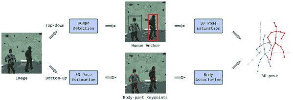

关键词：

中国广东深圳中山大学电子与通信工程学院

我们还在几个公开可用的数据集上提供了比较结果，以及有见地的观察和鼓舞人心的未来研究方向。可以在[`github.com/liuyangme/SOTA-3DHPE-HMR`](https://github.com/liuyangme/SOTA-3DHPE-HMR)找到定期更新的项目页面。

人类是各种社会活动的主要参与者，使得 AI 具有对人类的理解对于社会的发展至关重要。因此，有许多以人类为中心的任务成为研究的焦点。其中，3D 人体姿势估计（HPE）和人体网格恢复（HMR）代表了计算机视觉领域中的重要任务，用于解释人类在复杂的现实环境中的状态和行为。

# 3D 人体姿势估计和网格恢复的深度学习：一项调查

> 杨柳，邱长振，张志勇

# 分类：未分类

我们提供了关于 3D 人体姿势估计的深度学习方法的全面覆盖，包括单人和多人方法，以及人体网格恢复，涵盖了基于显式模型和隐式表示的方法。

###### 人体姿势估计，3D 人体姿势，人体网格恢复，人体重建，深度学习，文献调查^†^†期刊：模式识别

[3D 人体姿势估计](https://ar5iv.labs.arxiv.org/html/2402.18844)和网格恢复已经在许多领域引起了广泛的研究兴趣，例如计算机视觉、自动驾驶和机器人技术。最近，关于 3D 人体姿势估计和网格恢复的深度学习蓬勃发展，提出了许多方法来解决这一领域的不同问题。在这篇论文中，为了激励未来的研究，我们通过深入研究超过 200 篇参考文献，对过去五年来深度学习方法在这一领域取得的最新进展进行了全面的回顾。

###### 1 引言

日期：2024 年 9 月 6 日 19:34:15

## 来源：[`ar5iv.labs.arxiv.org/html/2402.18844`](https://ar5iv.labs.arxiv.org/html/2402.18844)

### [2402.18844] 3D 人体姿势估计和网格恢复的深度学习：一项调查

摘要

3D 人体姿态估计可以准确预测三维空间中人体关键点的坐标。与其二维对应方法相比，这种方法提供了更全面和准确的空间信息，从而促进了对复杂人体行为的更好理解，在更高级的计算机视觉应用中具有重要意义 [1, 2, 3]。人体网格恢复重建了一个三维数字模型，该模型捕捉了形状 [4, 5]、手势 [6]、服装 [7, 8] 和面部表情 [9] 等细节，从而提供了对人类与物理世界互动的直接洞察。3D 姿态估计和网格恢复具有广泛的应用，如安全监控 [10]、人机交互 [11]、自动驾驶 [12, 13] 和虚拟现实 [14]。

随着深度学习技术的进步，3D 人体姿态估计和网格恢复近年来受到了越来越多的关注。3D 姿态估计已经从关注单个人体演变为涵盖多个个体，并且数据输入更加多样化。在人体网格恢复方面，数据输入和细节捕捉方面都有了进展。显式模型参数的增加允许对人体进行更细致的表示，而参数类型的扩展则促进了更细腻表面的表现。随着隐式渲染的进步及其在人体网格恢复中的应用，更多灵活的身体表示得以实现。然而，3D 姿态估计和网格恢复仍面临显著挑战，如多人场景、自遮挡问题和详细的身体重建。因此，系统而全面地回顾 3D 人体姿态估计和网格恢复的最新进展是至关重要的。

### 1.2 本调查的范围

在过去的五年里，关于 3D 人体姿态估计和网格恢复的综述文章已经很多。这些综述 [15, 16] 主要集中于二维和三维姿态估计，但对 HMR 相关文献关注较少。调查 [17] 提供了一份专门致力于网格恢复的详尽综述，重点关注基于显式模型的方法。调查 [18] 明确集中于使用隐式渲染技术的网格恢复；然而，它未能提供关于最新隐式渲染方法和系统在 3D 姿态估计和网格恢复中的全面概述。这些综述仅边际地探讨了 3D 姿态估计和网格恢复技术，却鲜少深入探讨它们在其他计算机视觉任务中的应用和未来挑战。

*本综述主要集中在 3D 人体姿态估计和人体网格恢复的深度学习方法上。考虑了单人和多人场景中的 3D 姿态估计。在人体网格恢复方面，系统地回顾了基于显式和隐式模型的技术。如图 1 所示，我们的综述全面涵盖了主流计算机视觉会议和期刊中的最新前沿出版物（2019-2023）。*

图 1: 深度学习在 3D 人体姿态估计和网格恢复中的最新研究。

本工作的主要贡献与现有文献相比可以总结如下：

(1) 据我们所知，本综述可能是首个全面覆盖 3D 人体姿态估计的深度学习方法的综述，包括单人和多人方法，以及人体网格恢复，涵盖了基于显式模型和隐式表示的方法。

(2) 与现有综述不同，我们没有忽视隐式表示在方法中的作用，特别是在隐式渲染的快速进展下。这种方法可以生成详细的输出，包括具有表情、动作和其他细节的着装人物，这些都是实现逼真效果所必需的。

(3) 本文全面回顾了 3D 姿态估计和网格恢复领域中深度学习的最新进展，为读者提供了前沿方法的详细概述。此外，本文探讨了这些进展如何贡献于其他计算机视觉任务，并深入研究了该领域中的挑战。

本文的结构如下：第二部分介绍了广泛使用的人体传感器类型和表示方法。第三部分概述了深度学习在 3D 人体姿态估计和网格恢复中的应用。第四部分调查了现有的单人和多人 3D 姿态估计方法。第五部分回顾了人体网格恢复的方法，包括基于模板和无模板的方法。第六部分介绍了各自任务的评估指标和数据集。此外，第七部分讨论了应用及其对其他计算机视觉任务的影响。最后，第八部分总结了论文。此外，我们还维护一个定期更新的项目页面，可通过以下链接访问：[`github.com/liuyangme/SOTA-3DHPE-HMR`](https://github.com/liuyangme/SOTA-3DHPE-HMR)。

## 2 背景

### 2.1 用于 3D HPE 和 HMR 的传感器

可以用于 3D 人体姿态估计和网格恢复的传感器种类繁多，主要分为主动传感器和被动传感器。

#### 2.1.1 主动传感器

主动传感器通过发射一组信号并通过检测其反射来进行操作，例如带有反射标记的动作捕捉（MoCap）系统 [19]、触觉传感 [20]、飞行时间（ToF）相机 [21, 22] 和射频（RF）技术 [23, 24]。MoCap 和触觉设备仅适用于合作目标。主动相机通常不能在户外使用，并且同时使用多个主动设备可能会导致相互干扰。因此，这些设备的应用场景有限。

#### 2.1.2 被动传感器

被动传感器在测量过程中不会主动发射任何信号；相反，它们依赖于来自物体或自然来源的信号，包括惯性测量单元（IMUs）[25, 26] 和图像传感器 [27, 28]。其中，RGB 图像传感器特别值得注意，因为它们简单、易用、适应各种环境，并能够捕捉高分辨率的彩色图像。此外，多个 RGB 图像传感器可以组合成多视图系统 [29, 30, 31]。

在这项调查中，考虑到 RGB 图像传感器的广泛适用性和文章的长度限制，我们专注于使用 RGB 图像传感器进行 3D 人体姿态估计和网格恢复。

### 2.2 人体表示

3D 姿态估计器和网格重建器可以从之前描述的传感器输入生成相应的结果。3D 人体姿态估计的输出包含详细描述人体位置和关节方向的 3D 坐标，表示每个关节（例如头部、颈部、肩膀、肘部、膝盖）的空间位置，骨架则映射了关节之间的连接。通常，这些坐标以全球坐标系统或相对于摄像头坐标系统的形式表示。常用的关键点树结构用来说明人体姿态，其中树的节点表示关节，边缘表示关节之间的连接。

然而，基于骨架的人体姿态表示方法并未提供身体表面的详细信息。人体网格恢复的输出通常是一个 3D 身体模型，它包括对身体形状和表面细节的全面描述，提供了更丰富的表示。统计模型广泛应用于人体网格表示，例如 SCAPE [32] 和 SMPL [33]。SMPL 是一个可学习的皮肤顶点模型，将人体表示为具有拓扑结构的 3D 网格。身体的姿态和形状由姿态参数$\theta$和形状参数$\beta$描述。姿态参数控制关节角度和全局姿势，形状参数决定身体的形状。有几个基于 SMPL 的模型扩展了表示能力，例如带有手部表示的 MANO 模型（SMPL+H）[34] 和带有面部表示的 FLAME 模型[35]。SMPL-X [36] 是一个综合模型，通过结合 FLAME 头部模型[35]和 MANO 手部模型[34]，同时捕捉人体、面部和手部。H4D [37] 通过在 SMPL 模型的基础上建立动态人体形状和姿态，扩展了其能力，加入了时间维度。除了上述显式模型表示，近年来还出现了基于隐式模型的方法，通过非参数模型提供了更灵活的人体表示。例如，为了应对以前表示模型的局限性，郑等人[38] 设计了参数模型条件隐式表示（PaMIR），它利用 2D 图像特征图和相应的 SMPL 特征体积生成隐式表面表示。

## 3 深度学习在 3D HPE 和 HMR 中的概述

图 2：用于 3D HPE 和 HMR 的深度学习基本框架。

本节提供了用于 3D 人体姿态估计和网格恢复的深度学习框架的概述。如图 2 所示，基于深度学习的系统包括四个组件。首先，从各种传感器（如 RGB 图像、深度图像、RF 信号、IMU 等）收集数据。其次，输入数据通过深度学习模型进行处理，该模型通常由编码器和解码器组成。编码器从输入数据中提取表征特征，例如使用 ResNet [39]或 HRNet [40]等架构获得的特征。解码器可以基于 MLP（多层感知机）[41]或 Transformer [42]等框架，然后输出身体的 3D 姿态和重建模型。这种结构使模型能够高效地处理和转换复杂的输入数据，生成详细且准确的人体姿态和网格的 3D 表示。第三，在模型学习过程中可以选择各种学习方法。除了完全监督学习，还可以采用弱监督学习 [43, 44]、无监督学习 [45, 46] 和少样本学习 [47, 48] 等方法，以减轻数据依赖。为了减少模型大小，可以应用知识蒸馏 [49, 50]、模型剪枝 [51] 和参数量化 [52] 等技术。此外，还可以结合元学习 [53] 和强化学习 [54] 等方法，使模型能够适应不同的场景和数据约束。最后，深度学习模型输出 3D 人体姿态估计和网格恢复的结果。这些结果可以以多种形式表示，包括关键点 [55, 56]、网格 [33, 34, 57] 和体素 [58, 59, 8]。这些表示有助于全面理解人体的三维结构。在接下来的部分中，我们将深入探讨 3D 人体姿态估计和网格恢复的具体细节，对每个方面进行分类和详细阐述。

## 4 3D 人体姿态估计

3D 人体姿势估计通过预测身体关键点的深度信息提供更准确的姿势，但比 2D 姿势估计要具挑战性得多。3D 姿势估计可以根据目标数量分为单人估计和多人估计。由于深度学习技术的快速发展，单人 3D 姿势估计取得了迅速进展，但仍面临许多挑战，如效率和某些身体部位的不可见性。多人估计在拥挤场景中更具挑战性，因为存在身体和场景之间的互动和遮挡。在本节中，我们将详细探讨这一领域的研究进展，并将其分为两类。表 1 总结了所有具有代表性的方法。

表 1：3D 人体姿势估计概述。

| 动机 | 方法 |
| --- | --- |
| 单人 | 在图像中 | 解决深度模糊 | $\bullet$ 光学感知：VI-HC [60], Ray3D [61] |
| $\bullet$ 适当的特征表示：HEMlets [62] |
| 解决身体结构理解 | $\bullet$ 关节感知：JRAN [63] |
| $\bullet$ 四肢感知：Wu 等 [64], 深度语法网络 [65] |
| $\bullet$ 方向关键点：Fisch 等 [66] |
| $\bullet$ 基于图的：Liu 等 [67], LCN [68], Modulated-GCN [69], Skeletal-GNN [70], HopFIR [71], RS-Net [55] |
| 解决遮挡问题 | $\bullet$ 可学习三角测量 [72] |
| $\bullet$ RPSM [73] |
| $\bullet$ 轻量级多视角 [74] |
| $\bullet$ AdaFuse [75] |
| $\bullet$ Bartol 等 [76] |
| $\bullet$ 3D 姿势一致性 [77] |
| $\bullet$ 概率三角测量模块 [29] |
| 解决数据缺乏 | $\bullet$ 无监督学习：Kudo 等 [78], Chen 等 [79], ElePose [80] |
| $\bullet$ 自监督学习：EpipolarPose [81], Wang 等 [82], MRP-Net [83], PoseTriplet [54] |
| $\bullet$ 弱监督学习：Hua 等 [84], CameraPose [43] |
| $\bullet$ 迁移学习：Adaptpose [85] |
| 在视频中 | 解决单帧限制 | $\bullet$ VideoPose3D [86] |
| $\bullet$ PoseFormer [87] |
| $\bullet$ UniPose+ [88] |
| $\bullet$ MHFormer [89] |
| $\bullet$ MixSTE [90] |
| $\bullet$ Honari 等 [91] |
| $\bullet$ HSTFormer [92] |
| $\bullet$ STCFormer [93] |
| 解决实时问题 | $\bullet$ 时间稀疏采样：Einfalt 等人 [19] |
| $\bullet$ 时空稀疏采样：MixSynthFormer [94] |
| 解决身体结构理解 | $\bullet$ 运动损失：Wang 等人 [95] |
| $\bullet$ 人体关节亲和性：DG-Net [96] |
| $\bullet$ 解剖学感知：Chen 等人 [97] |
| $\bullet$ 部分感知注意力：Xue 等人 [98] |
| 解决遮挡问题 | $\bullet$ 光流一致性约束：Cheng 等人 [99] |
| $\bullet$ 多视角：MTF-Transformer [30] |
| 解决数据缺乏 | $\bullet$ 无监督学习：Yu 等人 [100] |
| $\bullet$ 弱监督学习：Chen 等人 [101] |
| $\bullet$ 半监督学习：MCSS [102] |
| $\bullet$ 自监督学习：Kundu 等人 [103], P-STMO [104] |
| $\bullet$ 元学习：Cho 等人 [53] |
| $\bullet$ 数据增强：PoseAug [105], Zhang 等人 [106] |
| 多人 | 自上而下 | 解决实时问题 | $\bullet$ 多视角：Chen 等人 [107] |
| $\bullet$ 全身：AlphaPose [108] |
| 解决表示限制 | $\bullet$ VoxelTrack [2] |
| 解决遮挡问题 | $\bullet$ Wu 等人 [109] |
| 解决数据缺乏 | $\bullet$ 单次拍摄：PandaNet [48] |
| $\bullet$ 光学感知：Moon 等人 [110] |
| 自下而上 | 解决实时问题 | $\bullet$ Fabbri 等人 [111] |
| 解决监督限制 | $\bullet$ HMOR [112] |
| 解决数据缺乏 | $\bullet$ 单次拍摄：SMAP [113], Benzine 等人 [114] |
| 解决遮挡问题 | $\bullet$ Mehta 等人 [115] |
| $\bullet$ LCR-Net++ [116] |
| 其他 | 单阶段 | $\bullet$ Jin 等人 [117] |
| 自上而下 + 自下而上 | $\bullet$ Cheng 等人 [118] |

### 4.1 单人 3D 姿态估计

如图 3 所示，单人 3D 姿态估计主要分为直接估计方法和 2D 到 3D 提升方法。直接方法通过预测器直接从输入中估计 3D 人体姿态，而 2D 到 3D 提升方法则首先在 2D 空间中检测人体关键点的坐标，然后将这些 2D 关键点提升到 3D 空间坐标。

(a) 直接估计方法

(b) 2D 到 3D 提升方法

图 3: 典型的单人 3D 人体姿态估计。 (a) 直接估计方法; (b) 2D 到 3D 提升方法。

#### 4.1.1 单人图像中的 3D 姿态估计

解决深度歧义。如图 4(a)所示，不同的 3D 姿态坐标投影到 2D 图像上可能会给出相同的结果，导致问题不适定。这个问题可以通过利用光的传播特性和相机成像原理来解决。为了解决这个不适定问题，Wei 等人[60]提出了一个视角不变的框架，以调节视点多样性的影响。视角不变的层次校正（VI-HC）网络在提出的框架中预测 3D 姿态的细化，并具有视角一致性约束。此外，一个视角不变的判别网络在基础网络生成初步估计后实现了高级约束。基于光线的 3D（Ray3D）绝对估计方法[61]可以将输入从像素空间转换为 3D 归一化光线。另一个有助于解决此问题的方法是学习更合适的特征表示。以部分为中心的 HEatMap 三重体（HEMlets）框架[62]利用三个关节热图来表示末端关节的相对深度信息，这填补了 2D 位置与 3D 人体姿态之间的差距。

(a) 深度歧义

(b) 基于图的表示

(c) 转移学习

图 4: (a) 深度歧义; (b) 人体的基于图的表示; (c) 转移学习。

解决身体结构理解问题。与其他计算机视觉任务不同，身体的独特结构可以提供约束或先验信息，以提高姿态估计性能。在关节关系感知网络（JRAN）[63]中，设计了一个双重注意模块，以生成整体和局部特征注意块权重。肢体姿态感知网络[64]利用运动约束和轨迹信息来防止错误沿人体结构积累。姿态语法在[65]中学习了一个 2D-3D 映射函数，使输入的 2D 姿态可以转换到 3D 空间，并将人体结构的三个方面（运动学、对称性、运动协调性）整合到双向递归神经网络（RNN）中。基于方向关键点的方法[66]使用虚拟标记生成足够的信息，以通过简单的后处理准确推断旋转。

图神经网络（GNN）是一种定义在图数据结构上的卷积网络。典型的神经网络难以处理图结构数据，如身体结构信息。然而，如果使用基于图的学习方法，这个挑战可以更容易地解决，如图中的 Fig.4(b)所示。刘等人[67] 提出了一个特征增强网络，其中特征通过卷积层学习，并通过图形化 ConvLSTM 增强，以感知不同身体部位之间的图形长短期依赖关系。局部连接网络（LCN）[68] 利用专用滤波器的分配，而不是将其共享用于不同的关节。调制图卷积网络（Modulated-GCN）[69] 包括权重和亲和力调制，分别用于学习不同身体关节的调制向量和调整图结构。曾等人[70] 设计了一个骨架 GNN 学习框架，以解决 3D 人体姿态估计中的深度歧义和自遮挡问题。在这个框架中，提出的跳跃感知分层通道挤压融合层被设计用来从邻近节点中提取相关信息。高阶正则分裂图网络（RS-Net）[55] 使用多跳邻域捕捉身体关节之间的长距离依赖关系。它为不同的身体关节学习不同的调制向量，并将调制矩阵添加到相应的骨架邻接矩阵中。翟等人[71] 利用注意机制进行组内关节细化，以发现潜在的关节协同，探索关节之间的潜在协同效应。

解决遮挡问题。人体的部分遮挡，包括自遮挡和其他遮挡（如物体遮挡和多人遮挡），在各种场景中都很常见。遮挡可能会干扰姿态估计，从而导致错误姿态的预测。通过多视角方法解决遮挡问题是有效的，其中在一个视角中不可见的遮挡姿态可能在多视角系统中的其他视角中可见。因此，基于多视角的方法可以通过跨视角框架推断提供更可靠的结果。在实践中，Iskakov 等人[72]结合了代数三角测量和体积三角测量，从多视角 2D 图像中进行 3D 姿态估计。前者方法基于带有置信度权重的可微分代数三角测量，而后者方法则利用来自中间 2D 骨干特征图的体积聚合。多视角几何先验已被纳入[73]，该方法结合了两个步骤：首先，通过视角融合预测多视角 RGB 图像中的 2D 姿态，其次，利用所提出的递归图像结构模型（RPSM）从先前预测的多视角 2D 姿态中恢复 3D 姿态。为了提高多视角 3D 姿态估计的实时性能，Remelli 等人[74]设计了一个轻量级框架，具有可微分的直接线性变换（DLT）层。自适应多视角融合[75]通过确定遮挡视角和可见视角之间的点对应关系来增强遮挡视角中的特征。为了解决多视角估计的泛化问题，Bartol 等人[76]提出了一种用于姿态三角测量的随机学习框架。Luvizon 等人[77]有效整合了 2D 注释数据和 3D 姿态，设计了一种共识感知方法，通过不同的连贯估计优化来自未校准图像的多视角姿态，最大程度地消除了对内在参数的尺度因子的依赖。嵌入到 3D 姿态估计框架中的概率三角测量模块[29]可以将多视角方法扩展到未校准场景。它使用概率分布对相机姿态进行建模，并通过 2D 特征迭代更新，替代传统的通过相机姿态更新，从而消除了对相机校准的依赖。

解决数据缺乏问题。近年来，随着多样且高效的特征表示的发展以及端到端训练模式的出现，深度学习模型在 3D 人体姿态估计中的准确性得到了显著提升。然而，这些模型的一个重要限制是它们依赖于完全监督的训练，需要大量昂贵且劳动密集的标注 3D 数据，这些数据主要来自室内场景。解决这一挑战需要探索超越完全监督学习的替代训练策略，例如无监督、半监督和少样本学习方法。

无监督学习通常专注于从未标注的训练数据中学习特征，而不是特定任务，并通过挖掘数据的内在特征来发现样本之间的关系。首个工作[78]可以通过对抗学习预测 3D 人体姿态，而无需任何 3D 数据集，该对抗学习基于生成对抗网络，通过无监督训练实现。方法[79]利用几何自监督，在训练过程中随机重新投影从恢复的 3D 骨架中获取的 2D 姿态相机视角，从而在升高-重新投影-升高过程中形成自一致性损失。Elepose [80]利用随机投影，通过在 2D 姿态的线性子空间上使用归一化流来估计可能性。此外，Elepose 还学习相机角度的分布，以减少对训练数据集中相机旋转先验的依赖。

自监督学习是无监督学习的一个分支，其中模型可以从未标注的训练数据中自我学习，并通过前置任务在未标注数据上获得表示模型。在实际执行中，EpipolarPose [81]在没有任何 3D 真实数据或相机外部参数的情况下训练 3D 姿态估计器，通过多视角图像预测 2D 姿态，并通过极几何获得 3D 姿态和相机几何。王等人 [82] 设计了一种简单而有效的自监督修正机制，通过学习人体姿态的所有内在结构来进行 3D 人体姿态估计，这一机制分为两个部分：2D 到 3D 姿态转换和 3D 到 2D 姿态投影。MRP-Net [83] 将自监督的 3D 人体姿态估计重新表述为无监督领域适应问题，其中包括无模型的关节定位和基于模型的参数回归。为了减少对指导学习的一致性损失的依赖，与以前的工作不同，方法[54]通过提出的自增强双环学习框架生成 2D-3D 姿态对以增强监督。

一个弱监督模型，其特征在于仅依赖于弱标签，通常面临在有限或不精确指导下执行复杂任务的挑战。尽管缺乏通常在完全监督场景中所需的详细注释，这些模型仍能得出有意义的见解，利用模糊或信息量较少的标签来推断数据中的复杂模式和关系。这种在最小监督下操作的能力使得它们在获取全面标注数据不切实际或昂贵时特别有用。在实际应用中，Hua 等人 [84] 提出了一个弱监督方法，该方法首先通过三角测量将 2D 关键点提升为两个视角中的粗略 3D 姿态，然后通过采用空间配置和视角间相关性来细化 3D 姿态。Yang 等人 [43] 设计了一个弱监督框架，利用投影关系仅根据已知相机参数的 2D 姿态注释来估计 3D 姿态。

迁移学习使得模型参数可以从源领域转移到目标领域，从而允许我们与新模型共享学习到的模型参数，如图 4(c)所示。这种方法加快了速度并优化了效率，消除了从零开始学习的需要，这在大多数网络中是常见的。例如，Adaptpose [85] 是一个端到端的跨数据集适配 3D 人类姿态估计预测器，它通过迁移学习在有限数据应用中实现。

#### 4.1.2 视频中的单人 3D 姿态估计

随着硬件的发展，图像数据通常在视频中获得和处理。视频帧数据可以提供比单帧图像更连续的信息，通过时空域对人类姿态进行序列预测。此外，还可以从视频中提取光流和场景流信息，从多模态数据中预测 3D 人类姿态 [119, 56]。

解决单帧限制。使用视频中的连续图像帧可以捕捉动态变化和时间信息。通过分析这些信息，深度学习模型可以提取运动特征和时空关系，从而有效提高 3D 人体姿态估计的效果。Pavllo 等人 [86] 提出了一个针对视频的 3D 人体姿态估计方法，该方法通过在 2D 关键点轨迹上应用膨胀卷积提取时间线索，并设计了一种具有反向投影的半监督方法来提高性能。PoseFormer [87] 作为一种基于空间-时间变换器的框架，通过分析每帧中的人体关节关系及其跨帧的时间相关性来预测 3D 身体姿态。基于之前的工作 [120]，unipose+ [88] 利用多尺度特征表示来增强框架主干中的特征提取器。该框架利用跨尺度的上下文信息和高斯热图调制的关节定位来提高解码器的估计精度。

此外，Multi-Hypothesis transFormer (MHFormer) [89] 在一个三阶段框架中学习具有多种可能姿态假设的时空表示。在 Mixed Spatio-Temporal Encoder (MixSTE) 框架 [90] 中，时间变换器块学习每个关节的时间运动及其关节间的空间相关性。Honari 等人 [91] 提出了一个利用对比自监督 (CSS) 学习的无监督特征提取方法，以从视频中提取时间信息。扩展这一研究方向，Hierarchical Spatial-Temporal Transformers (HSTFormer) [92] 同时利用不同层次上关节的时空相关性，这在研究具有多层融合的分层变换器编码器中开创了先河。最近，Spatio-Temporal Criss-cross (STC) 注意力块 [93] 将相关性学习分解为空间和时间，以减少关节间亲和矩阵的计算成本。

解决实时问题。然而，尽管各种方法提高了 3D 姿态估计的性能，但它们也在基于视频的估计中引入了新的问题和挑战。例如，连续的视频帧增加了相当大的计算成本，这对系统的处理效率构成了挑战，并使实时处理变得更加困难。为了减少总计算复杂性，Einfalt 等人 [19] 设计了一种基于变换器的方案，通过在变换器块内进行时间上采样，从时间稀疏的 2D 姿态序列中提升密集的 3D 姿态。Sun 等人 [94] 通过时空稀疏采样减少了变换器中注意力计算的复杂性，使得在计算受限的平台上能够估计视频序列中的 3D 人体姿态。

解决身体结构理解问题。与此同时，视频提供的连续运动信息促使研究人员将视频与人体运动学结合。Wang 等人 [95] 设计了一种运动损失函数，该函数计算预测的关键点轨迹与真实关键点轨迹之间的运动模式差异，同时采用运动编码，这是一种简单而有效的关键点运动表示方法，用于视频中的 3D 人体姿态估计。动态图网络（DG-Net）[96] 动态确定人体关节亲和性，并通过视频中的时空关节关系自适应地预测人体姿态。为了解决直接回归 3D 关节位置的不足，Chen 等人 [97] 提出了一个基于解剖学的估计框架。该基于人体骨架解剖学的框架包括一个骨头方向预测网络和一个骨头长度预测网络，并有效地利用骨头特征弥合 2D 关键点与 3D 关节之间的差距。Xue 等人 [98] 设计了一个部分感知的时间注意模块，能够单独提取每个部分的时间依赖性。

解决遮挡问题。为了解决遮挡问题，基于视频的 3D 人体姿态估计采用了多视角方法，并利用视频帧之间输入的连续性来预测被遮挡的身体部分。Cheng 等人 [99] 提出了一个遮挡感知模型，该模型利用估计的 2D 关键点置信度热图和光流一致性约束，以生成遮挡场景中的更完整 3D 姿态。此外，多视角和时间融合变换器（MTF-Transformer）[30] 在未标定场景中融合多视角序列，用于视频中的 3D 人体姿态估计。为了减少对相机标定的依赖，该框架通过相对注意机制推断视角对之间的关系。

解决数据缺乏问题。人类动作本质上是连续的，因此基于视频的姿态估计对于深入理解至关重要。与 3D 标注静态图像相比，高质量的标注 3D 视频相对稀缺。然而，互联网充斥着大量未标记的视频数据，这些数据用于学习目的具有重要意义。因此，基于视频的 3D 人体姿态估计以减轻数据依赖性是必不可少的。在实践中，Yu 等人[100]将无监督的 3D 姿态估计过程分为两个子任务：尺度估计模块和姿态提升模块。尺度估计模块优化 2D 输入姿态，而姿态提升模块将优化后的 2D 姿态映射到其 3D 对应物。在弱监督方法中，Chen 等人[101]提出了一种弱监督方法，采用视图合成框架和几何感知表示。在该框架中，该方法利用 2D 关键点进行监督，并通过将一个视角的人体姿态合成到另一个视角，学习视角之间共享的 3D 表示。半监督学习只利用部分标记的数据，包括大量未标记的数据和少量标记的数据。在这种情况下，Mitra 等人[102]提出了一种多视角一致的半监督方法，该方法可以从未标注、未校准但同步的多视角视频中回归 3D 人体姿态。在自监督方法中，Kundu 等人[103]利用身体骨架的先验知识，并通过部位引导的人体图像合成解开固有的变异因素。同样，Shan 等人[104]在空间和时间域中随机遮挡身体关节，以更好地捕捉空间和时间依赖性。元学习（也称为“学习如何学习”）是一个算法根据经验优化其学习策略的过程。它涉及在各种学习任务上训练模型，使其能够更高效地使用较少的数据样本学习新任务。Cho 等人[53]提出了一种基于优化的元学习算法用于 3D 人体姿态估计。该算法可以通过在模型训练期间从未失真 2D 关键点生成合成失真数据，适应任意的相机畸变。除了改变学习监督方法，数据增强也是增加数据量和提高模型泛化性能的实际方法。PoseAug [105]在区分模块控制增强姿态的可行性前提下，调整姿态、身体形状和视角等几何因素以进行模型学习。Zhang 等人[106]在线生成更多样化和具有挑战性的姿态。

### 4.2 多人 3D 姿态估计

如图 5 所示，多人 3D 姿态估计可以分为两大类：自下而上的方法（估计 + 关联）和自上而下的方法（检测 + 估计）。自上而下的方法采用两阶段的流程，首先在输入图像中检测每个人，然后在之前检测到的边界框中提取每个人的关键点。自下而上的方法则在一个阶段中检测所有关键点，并随后将它们与各自的人进行关联。例如，Cheng 等人 [118] 将自上而下和自下而上的方法结合在多人姿态估计中，相互补充对方的不足。自上而下的方法对潜在的错误边界框具有鲁棒性，而自下而上的网络在处理尺度变化时更具鲁棒性。最后，从自上而下和自下而上的网络估计的 3D 姿态被输入到一个集成网络中，以获得最终的 3D 姿态。一些单阶段的方法和方法结合了上述两种方法。与主流的多人 3D 人体姿态估计两阶段解决方案不同，Jin 等人 [117] 引入了一种单阶段方法。这种方法通过提出的解耦表示在图像平面上表达 2D 姿态和 3D 体实例的深度信息，并通过提取 2D 姿态特征并实现深度回归来预测实例的尺度信息。

图 5：典型的多人 3D 姿态估计。

#### 4.2.1 自上而下的方法

在自顶向下的方法中，AlphaPose [108] 预测包括面部、身体、手部和脚部的全身多人的 3D 姿态。在提出的框架中，对称积分关键点回归模块实现了快速而精确的定位，参数化姿态非极大值抑制模块有助于消除冗余的人体检测，姿态感知身份嵌入模块实现了联合姿态估计和跟踪。为了在多人 3D 姿态估计中获得更好的实时性能，Chen 等人 [107] 提出了一个从视频中实时获得的多视角时间一致性方法，该方法将 2D 输入直接与三维空间中的 3D 姿态匹配，并在 12 个摄像头设置上实现了超过 150 FPS（每秒帧数），在 28 个摄像头设置上实现了 34 FPS。此外，选择适当的表示可以有效提高多人姿态估计结果。例如，Zhang 等人 [2] 使用了体素表示来预测多人 3D 姿态和跟踪，其中提出的体素表示可以确定每个体素是否包含特定的身体关节。在多人场景中，遮挡问题可能比单人场景更为严重和复杂。为了解决这一挑战，Wu 等人 [109] 利用图神经网络提升多人人物、多视角 3D 姿态估计的信息传递效率。多视角匹配图模块在网络中关联粗略的视角姿态，而中心精细化图模块进一步优化结果。单次学习使用远少于通常所需的监督学习数据来训练模型，旨在提高效果。PandaNet [48] 作为一种基于锚点的模型引入了一种姿态感知的锚点选择策略，以丢弃模糊的锚点。Moon 等人 [110] 提出了一个自顶向下的、相机距离感知的方法来进行多人 3D 姿态估计，而不依赖于真实信息。

#### 4.2.2 自底向上的方法

MubyNet [121] 是一种典型的自下而上、多任务的多人人体 3D 姿态估计方法，它允许对所有组件参数进行训练。在轻量级自上而下框架的研究中，Fabbri 等人 [111] 利用高分辨率体积热图来提高估计性能，并设计了一个可以压缩表示大小的体积热图自编码器。设计更好的监督方法也可能有效，Wang 等人 [112] 引入了一种新的监督方法，称为层次化多人人体序数关系（HMOR），使用单目相机设计了一个综合的顶层模型来学习这些序数关系，通过粗到精的架构提高了人体深度估计的准确性。在单次学习的自上而下估计中，Mehta 等人 [115] 通过其提出的单次框架中的抗遮挡姿态图，在强遮挡下推断全身姿态。Zhen 等人 [113] 设计了一个单次、自下而上的框架，通过利用整个图像中的深度相关线索来估计多人的绝对位置。在他们之前的工作 [48] 之后，Benzine 等人 [114] 提出了一个单次 3D 人体姿态估计方法，该方法无需边界框即可预测多人人体 3D 姿态。该方法扩展了堆叠的沙漏网络 [122] 以处理多人人体情况。为了应对遮挡问题，LCR-Net++ [116] 集成了相邻的姿态假设，以预测多人的 2D 和 3D 姿态，而无需在一个人部分遮挡或被图像边界截断时近似初始人体定位。

### 3D 姿态估计总结

单人 3D 姿态估计的研究主要关注上述一些关键问题。虽然该领域已有不少值得称道的研究，但挑战尚未完全解决，仍需更全面的研究。与基于图像的方法相比，利用基于视频的方法被明确视为未来发展的轨迹。多人人体 3D 姿态估计中采用的方法必须根据具体情况量身定制。目前流行的技术可以分为两种主要方法，每种方法都有其固有的局限性。自上而下的方法高度依赖于人体检测，容易受到检测不准确的影响，往往在多人环境中导致姿态估计不可靠。相反，自下而上的方法独立于人体检测，因此不会受到错误的影响，但在同时准确处理场景中的所有个体时面临挑战，特别是对小规模人物的检测。与计算机视觉领域的其他领域一致，单阶段、端到端的方法代表了该领域的未来方向。

## 5 3D 人体网格恢复

人体网格恢复可以根据其表示模型分为两类：基于模板（参数化）的方法和无模板（非参数化）的方法，如图 6 所示。基于模板的人体网格恢复通过估计模型的参数来重建预定义的模型（如 SCAPE [32]，SMPL [33]）。相比之下，无模板的人体网格恢复直接从输入数据中预测 3D 身体，而无需依赖预定义模型。参数化方法由于模板的先验知识可能比非参数化方法更为稳健，但即使在扩展更多参数如 SMPL+H [34] 和 SMPL+X [57] 时，它们的灵活性和细节也固有限制。人体网格恢复是数字化人体的关键技术，由于几何纹理和颜色变化的复杂性，在计算机视觉和计算机图形学中面临重大挑战。此外，人体网格恢复面临与 3D 姿态估计类似的挑战，包括环境干扰、多人体场景和遮挡问题。在本节中，我们将介绍基于这些类别和挑战的主要方法，并在表 2 中提供综合总结。

(a) 基于模板的人体网格恢复

(b) 无模板的人体网格恢复

图 6：典型的人体网格恢复。 (a) 基于模板的人体网格恢复方法；(b) 无模板的人体网格恢复方法。

表 2：人体网格恢复概述。

| 主要思想 | 方法 |
| --- | --- |
| 基于模板 | 裸露 | 多模态方法 | $\bullet$ 混合标注：Rong 等人 [123] |
| $\bullet$ 光流：DTS-VIBE [124] |
| $\bullet$ 轮廓：LASOR [125] |
| $\bullet$ 裁剪图像和边界框：CLIFF [126] |
| 利用注意力机制 | $\bullet$ 部分驱动注意力：PARE [127] |
| $\bullet$ 图注意力：Mesh Graphormer [128] |
| $\bullet$ 时空注意力：MPS-Net [129]，PSVT [130] |
| $\bullet$ 高效架构：FastMETRO [131]，Xue 等人 [132] |
| $\bullet$ 端到端结构：METRO [133] |
| 利用时间信息 | $\bullet$ 时间编码特征：Kanazawa 等人 [134] |
| $\bullet$ 自注意力时间：VIBE [135] |
| $\bullet$ 时间一致性：TCMR [136] |
| $\bullet$ 多级时空注意力：MAED [137] |
| $\bullet$ 时间嵌入实时流：TePose [138] |
| $\bullet$ 短期和长期时间相关性：GLoT [139] |
| 多视角方法 | $\bullet$ 置信度感知多数投票机制：Dong 等 [140] |
| $\bullet$ 基于概率的多视角：Sengupta 等 [141] |
| $\bullet$ 动态物理几何一致性：Huang 等 [31] |
| $\bullet$ 跨视角融合：Zhuo 等 [142] |
| 提升效率 | $\bullet$ 稀疏约束公式：SCOPE [143] |
| $\bullet$ 单阶段模型：BMP [144] |
| $\bullet$ 处理热图输入：HeatER [145] |
| $\bullet$ 去除冗余标记：TORE [146] |
| 开发多种表示 | $\bullet$ 纹理图：TexturePose [147] |
| $\bullet$ UV 图：Zhang 等 [148]，DecoMR [149]，Zhang 等 [150] |
| $\bullet$ 热图：Sun 等 [151]，3DCrowdNet [152] |
| $\bullet$ 统一表示：DSTformer [153] |
| 利用结构信息 | $\bullet$ 基于部分：holopose [154] |
| $\bullet$ 骨架解缠：Sun 等 [155] |
| $\bullet$ 混合逆运动学：HybrIK [156]，NIKI [157] |
| $\bullet$ 不确定性感知：Lee 等 [158] |
| $\bullet$ 动作树结构：Sengupta 等 [159] |
| $\bullet$ 运动链：SGRE [160] |
| 选择合适的学习策略 | $\bullet$ 自我提升：SPIN [161]，ReFit [162]，You 等 [4] |
| $\bullet$ 新颖损失：Zanfir 等 [44]，Jiang 等 [163] |
| $\bullet$ 无监督学习：Madadi 等 [164]，Yu 等 [46] |
| $\bullet$ 双层次在线自适应：Guan 等 [165] |
| $\bullet$ 单次：Pose2UV [166] |
| $\bullet$ 对比学习：JOTR [167] |
| $\bullet$ 领域自适应：Nam 等 [168] |
| 详细 | 带衣物 | $\bullet$ Alldieck 等 [169] |
| $\bullet$ 多服装网络（MGN） [170] |
| $\bullet$ 纹理图：Tex2Shape [171] |
| $\bullet$ 分层服装表示：BCNet [172] |
| $\bullet$ 时间跨度：H4D [37] |
| 带手部 | $\bullet$ 语言先验：SGNify [173] |
| $\bullet$ 双手交互：[174] |
| $\bullet$ 手部与物体交互：[175] |
| 全身 | $\bullet$ PROX [176] |
| $\bullet$ ExPose [177] |
| $\bullet$ FrankMocap [178] |
| $\bullet$ PIXIE [179] |
| $\bullet$ Moon 等 [180] |
| $\bullet$ PyMAF [181] |
| $\bullet$ OSX [182] |
| $\bullet$ HybrIK-X [183] |
| 无模板 | 基于回归 | $\bullet$ FACSIMILE [184], PeeledHuman [185], GTA [186], NSF [187] |
| 基于优化的可微分 | $\bullet$ DiffPhy [188], AG3D [189] |
| 隐式表示 | $\bullet$ PIFu [190], PIFuHD [191] |
| $\bullet$ 规范空间：ARCH [192], ARCH++ [193], CAR [194] |
| $\bullet$ 几何先验：GeoPIFu [195] |
| $\bullet$ 新颖表征：彭等人 [196], 3DNBF [197] |
| 神经辐射场 | $\bullet$ 体积变形方案 [198] |
| $\bullet$ ActorsNeRF [47] |
| 扩散模型 | $\bullet$ HMDiff [199] |
| 隐式 + 显式 | $\bullet$ HMD [200], IP-Net [201], PaMIR [38], 朱等人 [202], ICON [203], ECON [204], DELTA [9], GETAvatar [205] |
| Diffusion + 显式 | $\bullet$ DINAR [206] |
| NeRF + 显式 | $\bullet$ TransHuman [207] |
| 高斯点图 + 显式 | $\bullet$ 可动态的 3D 高斯 [208] |

### 5.1 基于模板的人体网格恢复

#### 5.1.1 裸体人体恢复

多模态方法。人体网格恢复的多模态性通过结合各种数据的模态，如 RGB 图像、深度信息和光流，发挥潜力。整合不同模态的数据可以显著增强网格恢复的稳健性和精度。Rong 等人 [123] 提出了一种混合注释方法和一种混合训练策略，用于人体网格恢复，以降低注释成本，有效利用各种异质注释类型，包括 3D 和 2D 注释，身体部位分割和密集对应关系。深度双流视频推理用于人体姿势和形状估计（DTS-VIBE）[124]方法重新定义了任务作为一个多模态问题，将 RGB 数据与光流合并，以实现更可靠的估计，并解决来自 RGB 视频的时间不一致性。LASOR [125] 通过合成具有遮挡感知的轮廓和场景中的 2D 关键点数据，估计 3D 姿势和形状，用于解决人与人之间的遮挡问题。CLIFF [126] 利用预训练阶段的裁剪图像和边界框信息作为输入，以增强相机坐标系中全局旋转估计的准确性。

利用注意力机制。Transformer [209] 作为自注意力模型在自然语言处理（NLP）领域取得了显著成功 [210] [211]。随后，Vision Transformer (ViT) [42] 在计算机视觉领域也取得了类似的成功 [41] [212]，目前许多基于 Transformer 的方法正被应用于网格恢复。注意力机制用于放大神经网络中某些部分的重要性。为了解决部分遮挡问题，Part Attention REgressor (PARE) [127] 利用从分割掩膜中得出的身体部位之间的关系，促使网络增强对遮挡身体部位的预测。Mesh Graphormer [128] 利用 GCNN 强化的 Transformer 来估计 3D 网格顶点和身体关节，同时使用 GCNN 推断基于预先存在网格拓扑的邻近顶点之间的交互。该架构有效地将基于图的网络与 Transformer 的注意力机制结合起来，实现了局部和全局交互的建模。MPS-Net [129] 采用运动连续性注意力来捕捉时间一致性。该方法利用层次化的注意力特征机制，更有效地结合来自时间上相邻表示的特征。FastMETRO [131] 基于身体三角网格的拓扑结构利用自注意力机制来处理非相邻顶点，以减少内存开销并加速推理速度。Xue 等 [132] 提出了一个可学习的采样模块，用于人类网格恢复，以减少固有的深度歧义。该模块通过生成关节自适应标记来聚合全局信息，利用输入图像中的非局部信息。METRO [133] 是一个用于端到端人类网格恢复的网格 Transformer，其中编码器捕获顶点和关节之间的交互，解码器输出 3D 关节坐标和网格结构。Qiu 等 [130] 提出了一个基于 Transformer 的端到端方法，用于视频中的多人体网格恢复。该方法利用时空编码器提取全局特征，然后通过时空姿态和形状解码器来预测人体姿态和网格。

利用时间信息。随着视频技术的进步，从相邻帧中提取时间信息的视频人类网格恢复方法展示了更大的潜力。为了更准确有效地学习人体的 3D 动态，Kanazawa 等人[134] 提出了一个从视频中生成平滑 3D 网格的框架。该框架还通过时间编码图像特征来预测过去和未来的 3D 动作。Body pose and shape Estimation 的 Video Inference（VIBE）[135] 通过基于自注意力机制的时间网络和对抗训练来估计运动学上合理的运动序列，而不需要任何真实的 3D 标签。为了减少对当前帧中静态特征的依赖，解决了先前基于时间的方法的一个限制，Choi 等人[136] 开发了时间一致网格恢复（TCMR）系统。该系统利用时间信息以确保一致性，并通过结合过去和未来帧的数据有效恢复平滑的 3D 人类动作。多级注意力编码解码器（MAED）网络[137] 通过其多级注意力机制捕捉包括空间-时间和人体关节层次在内的多个层次的关系。Wang 等人[138] 提出了专门为实时流媒体视频量身定制的时间嵌入 3D 人体姿态和形状估计（TePose）方法。他们设计了一个用于对抗训练的运动鉴别器，通过一个多尺度空间-时间图卷积网络，利用没有 3D 标签的数据集。此外，他们采用了序列数据加载策略，以适应实时流媒体特有的从头到尾的数据处理需求。为了有效平衡短期和长期时间相关性的学习，Global-to-Local Transformer（GLoT）[139] 从结构上解耦了长期和短期相关性的建模。

多视角方法。Dong 等人[140] 设计了一个实用的多视角框架，该框架通过自信感知的多数投票机制将多视角图像中的 2D 观察数据合并成一个统一的 3D 表示，用于单个实例。Sengupta 等人[141] 提出了一个基于概率的多视角方法，无需特定目标姿态、视角或图像序列中的背景条件等约束。Huang 等人[31] 提出了一个动态物理-几何一致性的方法用于多人人物的多视角网格恢复。该方法整合了运动先验、外部相机参数和人类网格数据，以减轻噪声人类语义数据的影响。Zhuo 等人[142] 提出了一个交叉视角融合方法，通过实现更精细的 3D 中间表示并缓解不同视角间的不一致性来预测脚部姿态。

提升效率。保持出色的性能同时使用轻量级模型和低计算成本是至关重要且具有挑战性的，特别是在可穿戴设备、电力受限系统和边缘计算等应用中。SCOPE [143] 利用 2D 和 3D 关键点高效计算高斯-牛顿方向用于人体网格恢复。该方法利用了固有的稀疏性，并采用了稀疏约束公式，实现了超过 30 FPS 的实时性能。为了实现单阶段多人的人体网格恢复模型，Body Meshes as Points (BMP) [144] 将多个人表示为点，并将每个点与单一身体网格关联，从而显著提高了效率和性能。HeatER [145] 直接处理热图输入，以减少内存和计算成本。Dou 等人 [146] 设计了一种高效的变换器用于人体网格恢复，通过去除冗余的标记来降低模型复杂性和计算成本。

发展多种表示形式。稳定且有效的特征表示对提升深度学习算法在人体网格恢复中的能力至关重要，因为它能够有效地从复杂的输入数据中提取有意义的模式。基于图像纹理在各帧之间保持不变的假设，TexturePose [147] 利用身体在不同帧中的外观一致性。它通过纹理一致性损失来测量每帧的纹理图。DenseRaC [213] 生成一个像素到表面对应关系图，以优化参数化的人体姿态和形状的估计。张等人 [148] 通过使用身体部位的密集对应关系建立了 2D 像素与 3D 顶点之间的联系，有效地解决了相关问题。他们提出的 DaNet 模型专注于学习 2D 到 3D 的映射，而 PartDrop 策略确保模型更多地关注互补的身体部位和相邻的位置信息。为了解决图像特征与 3D 网格之间缺乏密集对应关系的问题，DecoMR [149] 通过在 UV 空间中建立像素到表面的密集对应关系图来恢复人体网格。张等人 [150] 设计了一个双分支网络，该网络利用部分 UV 图来表示被物体遮挡的人体，有效地将该图转换为对 3D 人体形状的估计。孙等人 [151] 提出了一个以身体中心为引导的表示方法，该方法预测身体中心热图和网格参数图。这种方法在像素级别描述 3D 身体网格，从而实现了一阶段的多人体 3D 网格回归。3DCrowdNet [152] 采用基于关节的回归器从其他特征中隔离目标特征，以恢复拥挤场景中的多人体网格，它利用了拥挤场景鲁棒的图像特征热图，而不是边界框内的完整特征图。双流时空变换器（DSTformer） [153] 提取骨骼关节之间的长距离时空关系，以有效捕捉来自大规模和异质视频数据的统一人体运动表示，适用于以人为中心的任务，如人体网格恢复。

利用结构信息。身体的结构信息在人体网格恢复中充当独特的先验知识，增强了对身体关系的理解。此外，加入额外的物理约束，这些约束描述了各种身体结构之间的相互关系，可以显著提高性能。Holopose [154] 采用基于部件的多任务回归网络来估计 2D、3D 和密集姿态，从而估计 3D 人体表面。Sun 等人 [155] 提出了一个从单张图像和单目视频中恢复人体网格的端到端方法。该方法采用骨架解缠技术来减少解耦的复杂性，并结合了时间一致性，有效捕捉了短期和长期的时间线索。Hybrid Inverse Kinematics (HybrIK) [156] 从 3D 关节计算摆动旋转，并使用网络通过扭转和摆动分解来预测扭转旋转。该方法可以应对非线性挑战和在从 3D 姿态中进行网格估计时图像与模型之间的错位问题。在他们的后续工作中，Li 等人 [157] 设计了 NIKI，这是一种能够从正向和逆向过程学习的模型，使用可逆网络。为了应对非线性映射和关节位置漂移问题，Lee 等人 [158] 引入了一种不确定性感知的方法来恢复人体网格，利用来自 2D 姿态的信息解决 2D 中固有的模糊性。Sengupta 等人 [159] 提出了一种概率方法来规避不适定问题，该方法将人体的运动学树结构与 SMPL 参数的高斯分布结合在一起。该方法然后预测 3D 关节旋转矩阵的层次矩阵-费舍尔分布。SGRE [160] 直接估计关节的全局旋转矩阵，以避免在人体网格恢复中的运动链中误差累积。

选择适当的学习策略。SPIN [161] 通过自我改进的神经网络将初始估计优化例程融入训练循环中，可以将身体网格估计拟合到 2D 关节上。Zanfir 等人 [44] 开发了一种方法，集成了运动学潜在归一化流表示和具有结构化、可微分的语义身体部位对齐损失函数的动态模型，旨在增强半监督和自监督的 3D 人体姿势和形状估计。Jiang 等人 [163] 引入了两个新颖的损失函数用于从单张图像中恢复多人网格：基于距离场的碰撞损失，惩罚构建图形之间的交叉，以及深度排序感知损失，解决遮挡问题并促进目标的准确深度排序。Madadi 等人 [164] 提出了一个无监督的去噪自编码网络，有效地利用稀疏运动捕捉数据恢复不可见的地标。为了应对无监督人体网格恢复任务中的姿势失败和形状模糊问题，Yu 等人 [46] 设计了一种策略，将任务解耦为无监督的 3D 姿势估计，并利用运动学先验知识。双层在线适应（BOA） [214] 采用双层优化来协调 2D 和时序约束之间的冲突，用于领域外流媒体视频中的人体网格恢复。在他们的后续工作中，动态双层在线适应（DBOA） [165] 集成了时间约束，以弥补缺少 3D 注释的问题。Huang 等人 [166] 开发了 Pose2UV，一种单次人类网格恢复方法，能够使用深度 UV 先验在遮挡下提取目标特征。JOTR [167] 融合了 2D 和 3D 特征，并通过基于 Transformer 的对比学习框架对 3D 特征进行监督。ReFit [162] 通过反馈更新循环机制重新投影关键点并优化人类模型。You 等人 [4] 提出了一个用于人类网格恢复的共演化方法，该方法利用 3D 姿势作为中介。该方法将过程分为两个不同的阶段：首先，从视频中估计 3D 人体姿势，然后根据估计的 3D 姿势回归网格顶点，并结合时间图像特征。为了弥合训练数据和测试数据之间的差距，CycleAdapt [168] 提出了一个领域适应方法，包括一个网格重建网络和一个运动去噪网络，从而实现更有效的适应。

#### 5.1.2 详细的人体恢复

基于模型的人体网格恢复结果适中，但仍缺乏详细的身体表示；对裸参数化模型的扩展现已允许对各种身体部位和细节，包括衣物 [172, 37]、手部 [34]、面部 [35]以及整个身体 [36]，进行参数化描述，详细内容在第 2.2 节中讨论。

**Alldieck**等人[169]估计了 SMPL 模型的参数，包括衣物和头发，从 1 到 8 帧的单目视频中提取数据。**Bhatnagar**等人[170]开发了 Multi-Garment Network (MGN)，以在 SMPL 模型的基础上重建身体形状和衣物层次。**Tex2Shape** [171]将人体网格回归问题转换为图像到图像的估计任务。具体来说，它预测可见区域的部分纹理图，然后重建身体形状，添加到可见和遮挡部分的细节。**BCNet** [172] 在 SMPL 模型上具有分层的衣物表示，并创新性地将衣物的蒙皮权重与身体网格解耦。**Jiang**等人[37]提出了一种方法，利用时间跨度、SMPL 的形状和初始姿势参数以及编码运动和辅助信息的潜在代码。这种方法通过利用可见区域的纹理图来促进详细身体形状的恢复，包括可见和遮挡部分。

**Forte**等人[173]提出了 SGNify，一个从手语视频中捕捉手势、面部表情和身体动作的模型。它采用语言学先验和对 3D 手势的约束，有效地解决了孤立手势中的歧义。此外，Two-Hands [174]和 Hand-Object [175]之间的关系有效地重建了手部的细节。

整体身体。为了解决 3D 人体网格与 3D 场景之间的不一致性，Hassan 等人[176] 提出了一个名为 Proximal Relationships with Object eXclusion（PROX）的方法来进行人体全身和场景恢复。EXpressive POse and Shape rEgression（ExPose）框架[177]采用了基于身体的注意力机制，并采用回归方法进行整体的表达性身体重建，以缓解基于优化的方法中的局部最优问题。FrankMocap[178]通过独立运行面部、手部和身体的 3D 网格恢复回归，并通过集成模块将输出结果结合起来。PIXIE[179]利用 SMPL-X 共享形状空间将身体、面部和手部的独立估计整合在一起。Moon 等人[180]开发了一个名为 Hand4Whole 的端到端框架，用于全身人体网格恢复，该框架采用关节特征进行 3D 关节旋转，以提高 3D 手部预测的准确性。Zhang 等人[181]提升了 PyMAF 框架[215]，开发了 PyMAF-X，以详细重建全身模型。这一进展旨在通过采用特征金字塔方法和优化网格-图像对齐参数来解决回归基于的一阶段人体网格恢复方法中的对齐问题。OSX[182]采用了一个简单而有效的组件感知变换器，包括一个全局身体编码器和一个局部面部/手部解码器，而不是为每个部分单独设置网络。Li 等人[183]扩展了 HybrIK[156]框架，提出了 HybrIK-X，这是一种基于混合分析-神经逆向运动学框架的一阶段模型，用于恢复具有细节的全面身体网格。

### 5.2 无模板人体恢复

无模板的人体网格恢复方法，如神经网络回归模型、基于可微渲染的优化模型、隐式表示模型、神经辐射场（NeRF）和高斯溅射，展示了比基于模板的方法更强的灵活性，能够描绘更丰富的细节。

（a）NeRF

（b）3D 高斯溅射

图 7：（a）NeRF；（b）3D 高斯溅射。

基于回归的人体网格恢复绕过了模板模型固有的局限性和偏差，直接输出无模板的 3D 人体模型。这种方法允许更动态和灵活的模型生成，能够捕捉更多样的人体形状和姿态。FACSIMILE (FAX) 利用图像翻译网络直接在原始图像分辨率下恢复几何形状，绕过了通过表示间接输出的需求。Jinka 等人 [185] 提出了一个针对自遮挡场景的鲁棒形状表示，该方法使用剥离的 RGB 和深度图编码人体，在训练和推理过程中显著提升了准确性和效率。Neural Surface Fields (NSF) [187] 在基础表面上建模连续且灵活的位移场，用于从单目深度恢复 3D 穿衣人体网格。这种方法适应于具有不同分辨率和拓扑的基础表面，无需在推理过程中重新训练。Zhang 等人 [186] 推出了用于穿衣化身重建的全局相关 3D 解耦 Transformer (GTA)，该模型使用编码器捕捉全局相关的图像特征，并使用交叉注意力解耦三平面特征。

基于优化的可微渲染通过最小化渲染误差将渲染过程整合到优化方法中。AG3D [189] 通过采用整体 3D 生成器并将几何线索以预测的 2D 法线图形式融入其中，捕捉身体及松散衣物的形状和变形。Gärtner 等人 [188] 设计了 DiffPhy，这是一种可微物理基础模型，它结合了具有解剖关节限制的物理上合理的身体表示，显著提升了人体恢复的性能和鲁棒性。

隐式表示并不直接表示对象的几何数据，如顶点或网格，而是通过函数定义空间中的某点是否属于对象。隐式表示的优势在于其能够紧凑且灵活地表示复杂的形状，包括具有复杂拓扑或不连续性的形状。因此，它们在人体重建中取得了令人印象深刻的成果。Saito 等人 [190] 提出了像素对齐隐式函数（PIFu），这是一种隐式表示，将 2D 图像的像素与 3D 对象对齐，并设计了一个端到端深度学习框架，用于从单张图像推断 3D 表面和纹理。PIFu 首次将隐式表示应用于人体网格恢复，使得可以在衣物中重建人体的几何细节。随后，PIFuHD [191] 将 PIFu 的工作扩展到 4K 分辨率图像，进一步增强了细节。Huang 等人 [192] 通过创建语义空间和语义变形场设计了可动画重建的穿衣人类（ARCH）方法。He 等人 [193] 引入了 ARCH++，一个具有跨空间一致性的共同监督框架，该框架在姿态空间和标准空间中联合估计占据情况。他们将隐式表示的人体网格恢复问题从姿态空间转换到标准空间进行处理。然而，这种方法的局限性在于它严重依赖于准确的姿态估计，而且基于蒙皮权重的衣物表现细节仍缺乏足够的自然性。GeoPIFu [195] 使用包含几何先验的结构感知 3D U-Net 学习潜在体素特征。为了解决在视图极其稀疏时表示学习中的病态问题，Peng 等人 [196] 开发了一种新的人体表示。这种表示假设在不同帧学习到的神经表示共享锚定到可变形网格的潜在编码。穿衣化身重建（CAR）方法 [194] 采用基于学习的隐式模型，初步形成标准空间中的一般形状，然后通过预测姿态空间中的非刚性优化变形来细化表面细节。3D 觉知神经身体拟合（3DNBF） [197] 通过使用高斯椭球核的体积人体表示解决了遮挡和 2D-3D 模糊性的问题。

如图 7(a)所示，神经辐射场（Neural Radiance Fields）[216] 基于隐式表示的原理，使用神经网络来学习场景的连续体积密度和颜色分布，从而能够从任意视角生成高质量的 3D 模型。Gao 等人[198] 采用了一种结合经典神经辐射场（NeRF）和体积变形方案的特殊表示方法，使得能够恢复在训练过程中未见过的新视角和姿态。Mu 等人[47] 介绍了 ActorsNeRF，这是一种基于 NeRF 的人体表示方法，通过在 2 级经典空间中进行参数共享来编码类别级先验，从而从少量单目图像中恢复人体网格。

扩散模型基于一系列扩散过程，通过添加随机噪声对原始数据进行变换，然后逐渐去除这些噪声，以通过反向过程生成新数据。人类网格扩散（HMDiff）[199] 将网格重建视为一种反向扩散过程，将输入特定的分布信息融入扩散过程中，并引入先验知识以简化任务。

基于隐式表示的方法可以恢复自由形式的几何形状，但它们可能过于依赖精确的姿势或在新颖姿势或衣物的情况下生成不令人满意的形状。为了在这些场景中提高鲁棒性，现有的工作采用显式体模型来约束隐式方法中的网格重建。研究人员希望一种结合隐式和显式方法的方案，基于粗略体网格的几何形状来精细化并生成详细的人体模型。层次化网格变形（HMD）[200]利用来自身体关节、轮廓和每像素着色信息的约束，将参数化模型的鲁棒性与自由形式 3D 变形的灵活性相结合。Bhatnagar 等人[201]引入了一种隐式部件网络（IP-Net），用于预测详细的人体表面，包括穿衣人的 3D 表面、内部身体表面以及参数化体模型。参数化模型条件隐式表示（PaMIR）[38]将参数化体模型与自由形式深度隐式函数结合，通过正则化提高泛化能力。Zhu 等人[202]利用了“投影-预测-变形”策略，通过关节、轮廓和着色信息的监督来精细化由人体恢复方法生成的 SMPL 模型。ICON [203]使用 SMPL 模型生成稳定的粗略人体网格，然后渲染前后身体法线，这些法线提供了丰富的纹理细节，并与原始图像结合。最后，将身体的法线、衣物法线和签名距离函数（SDF）信息输入隐式 MLP 以获得最终结果。随后，Xiu 等人提出了 ECON [204]，它通过在法线整合的优化方程中使用 SMPL-X 深度作为软几何约束，整合法线估计、法线整合和形状完成。它致力于在法线整合过程中保持与邻近表面的连贯性。Feng 等人[9]提出了 Disentangled Avatars（DELTA），这是一种用混合显式-隐式 3D 表示表示人的模型。GETAvatar [205]直接生成显式纹理 3D 人体网格。GETAvatar 通过显式表面建模创建了一个关节 3D 人体表示，利用 3D 扫描数据的 2D 法线图增强其逼真的表面细节，并使用基于光栅化的渲染器进行表面渲染。神经头像的扩散修复（DINAR）[206]将神经纹理与 SMPL-X 体模型结合，采用潜在扩散模型恢复已见和未见区域的纹理，然后将这些纹理整合到基础 SMPL-X 网格上。TransHuman [207]利用变换器将 SMPL 模型投影到规范空间，并将每个输出令牌与一个可变形辐射场关联。该场编码观测空间中的查询点，并进一步用于整合来自参考图像的细粒度信息。高斯点渲染[217]是一种处理和渲染点云的技术，使用高斯函数为每个点创建影响范围，从而在二维图像中产生更平滑和自然的表示，如图 7(b)所示。它在 SLAM（同时定位与地图构建）[218]、生成性人体建模[219]、动态场景重建[220]和多模态生成[221]中取得了良好的结果。基于高斯点渲染的重建需要初始点云输入，这对从图像输入恢复人体网格提出了挑战。然而，显式模型可以提供初始点，作为使高斯点渲染从 RGB 输入恢复人体网格成为可能的垫脚石。可动画的 3D 高斯[208]通过将 3D 高斯扩展到动态人体场景，从输入图像和姿势中学习人体头像。在提出的框架中，他们在规范空间中建模一组皮肤化的 3D 高斯及相应的骨架，并根据输入姿势将 3D 高斯变形到姿势空间。

### 5.3 人体网格恢复总结

本章提供了利用显式和隐式模型的人体网格恢复的综合回顾。显式模型在稳健地重建人体网格方面表现突出，但通常在捕捉细节方面有所不足，因此出现了许多针对更高细节准确度的扩展。相对而言，基于隐式的人体网格恢复往往缺乏稳定性，但因其灵活性和适应性而著称。因此，多个研究探讨了将隐式模型与显式模型结合起来，以发挥各自的优势。人体网格恢复中灵活性与鲁棒性之间的权衡代表了一个关键且持久的研究领域。

## 6 评估

### 6.1 评估指标

有许多评估指标可以公平地衡量深度模型在人体姿态估计中的表现，以下提供了一些关键评估指标。

平均每个关节位置误差（MPJPE）被广泛用于评估三维人体姿态估计的准确性，通过计算预测关节坐标与真实坐标之间的 L2 距离。将第 $j$ 个关节的估计坐标记作 $p_{j}^{*}$，真实坐标记作 $p_{j}$。骨架中第 $j$ 个关节的 MPJPE 可以计算为：

|  | $MPJPE=\frac{1}{N}\sum_{j=1}^{N}{\left\&#124;p_{j}-p_{j}^{*}\right\&#124;_{2}}$ |  | (1) |
| --- | --- | --- | --- |

其中骨架包含 $N$ 个关节，与之前在二维中用像素量化误差不同，三维中的关节坐标是以毫米（mm）为单位进行测量和报告的。

平均每个关节角度误差（MPJAE）量化了估计关节与真实关节之间的角度差异。函数 $r_{j}^{*}$ 返回第 $j$ 个关节的估计角度，而函数 $r_{j}$ 返回真实角度。MPJAE 在三维空间中计算如下：

|  | $MPJAE=\frac{1}{3N}\sum_{j=1}^{3N}{\left&#124;\left(r_{j}-r_{j}^{*}\right)\mathrm{mod}\pm 180\right&#124;}$ |  | (2) |
| --- | --- | --- | --- |

平均每个关节定位误差（MPJLE）是一种比 MPJPE 和 MPJAE 更具感知性和鲁棒性的评估指标[222]。它允许通过感知阈值 $t$ 调整容忍水平：

|  | $MPJLE=\frac{1}{N}\sum_{j=1}^{N}{\mathds{1}_{\left\&#124;l_{j}-l_{j}^{*}\right\&#124;_{2}\geq t}}$ |  | (3) |
| --- | --- | --- | --- |

其中 $l(\cdot)$ 表示关节定位。

MPJPE、MPJAE 和 MPJLE 有各种修改版本，包括 Procrustes 对齐（PA-）MPJPE、MPJAE、MPJLE 和标准化（N-）MPJPE、MPJAE、MPJLE。前者指的是 Procrustes 对齐度量，而后者指的是标准化度量。此外，一些 2D 度量可适应于 3D，例如 3D 关键点百分比（3D PCK）和 3D 曲线下面积（3D AUC）。PCK [223] 测量预测关键点与真实关键点之间的距离，如果这个距离小于预定义的阈值，则认为关键点是正确的。AUC 表示在阈值变化时，PCK 阈值曲线下的总面积。

平均每顶点位置误差（MPVPE）是一种用于评估人体网格重建的指标，通过计算预测网格点与真实网格点之间的 L2 距离来评估。在一些已发表的文章中，MPVPE 也被称为顶点到顶点（V2V）误差和每顶点误差（PVE）。

### 6.2 数据集

数据集在开发基于深度学习的人体姿态估计和网格恢复中至关重要。研究人员开发了许多数据集来训练模型，并促进不同方法之间的公平比较。在这一部分，我们介绍了近年来相关数据集的详细信息。这些数据集的总结，包括 3D 姿态和 3D 网格的信息，见表 3。

表 3：主流数据集概述。

| 数据集 | 类型 | 数据 | 总帧数 | 特征 | 下载链接 |
| --- | --- | --- | --- | --- | --- |
| Human3.6M [222] | 3D/网格 | 视频 | 3.6M | 多视角 | [网站](http://vision.imar.ro/human3.6m/description.php) |
| 3DPW [224] | 3D/网格 | 视频 | 51K | 多人 | [网站](https://virtualhumans.mpi-inf.mpg.de/3DPW/) |
| MPI-INF-3DPH [225] | 2D/3D | 视频 | 2K | 野外 | [网站](https://vcai.mpi-inf.mpg.de/3dhp-dataset/) |
| HumanEva [226] | 3D | 视频 | 40K | 多视角 | [网站](http://humaneva.is.tue.mpg.de/) |
| CMU-Panoptic [227] | 3D | 视频 | 1.5M | 多视角/多人 | [网站](https://domedb.perception.cs.cmu.edu/) |
| MuCo-3DHP [115] | 3D | 图像 | 8K | 多人/遮挡场景 | [网站](https://vcai.mpi-inf.mpg.de/projects/SingleShotMultiPerson/) |
| SURREAL [228] | 2D/3D/网格 | 视频 | 6.0M | 合成模型 | [网站](https://www.di.ens.fr/willow/research/surreal/data/) |
| 3DOH50K [150] | 2D/3D/网格 | 图像 | 51K | 物体遮挡 | [网站](https://www.yangangwang.com/#me) |
| 3DCP [229] | 网格 | 网格 | 190 | 接触 | [网站](https://tuch.is.tue.mpg.de/) |
| AMASS [230] | 网格 | 动作 | 11K | 软组织动态 | [网站](https://amass.is.tue.mpg.de/) |
| DensePose [231] | 网格 | 图像 | 50K | 多人 | [网站](http://densepose.org/) |
| UP-3D [232] | 3D/网格 | 图像 | 8K | 体育场景 | [网站](https://files.is.tuebingen.mpg.de/classner/up/) |
| THuman2.0 [233] | 网格 | 图像 | 7K | 有纹理的表面 | [网站](https://github.com/ytrock/THuman2.0-Dataset) |

Human3.6M 数据集 [222] 是在 3D 人体姿态估计评估中使用最广泛的数据集。它包含了通过 RGB 和 ToF 摄像头从不同视角捕获的 360 万姿态数据。此外，该数据集还包括高分辨率的 3D 扫描体网格数据，对人体感知系统的进展起着关键作用。表 4 展示了在 Human3.6M 数据集上最先进的 3D 人体姿态估计方法的性能。

表 4：Human3.6M [222] 上的 3D 姿态估计方法比较。

| 方法 | 年份 | 发表刊物 | 亮点 | MPJPE$\downarrow$ | PMPJPE$\downarrow$ | 代码 |
| --- | --- | --- | --- | --- | --- | --- |
| Graformer [234] | 2022 | CVPR’22 | 基于图的变换器 | 35.2 | - | [代码](https://github.com/Graformer/GraFormer) |
| GLA-GCN [235] | 2023 | ICCV’23 | 自适应 GCN | 34.4 | 37.8 | [代码](https://github.com/bruceyo/GLA-GCN) |
| PoseDA [45] | 2023 | arXiv’23 | 领域适应 | 49.4 | 34.2 | [代码](https://github.com/rese1f/PoseDA) |
| GFPose [236] | 2023 | CVPR’23 | 梯度场 | 35.6 | 30.5 | [代码](https://sites.google.com/view/gfpose/) |
| TP-LSTMs [237] | 2022 | TPAMI’22 | 姿态相似度度量 | 40.5 | 31.8 | - |
| FTCM [119] | 2023 | TCSVT’23 | 频率-时间协作 | 28.1 | - | [代码](https://github.com/zhenhuat/FTCM) |
| VideoPose3D [86] | 2019 | CVPR’19 | 半监督 | 46.8 | 36.5 | [代码](https://github.com/facebookresearch/VideoPose3D) |
| PoseFormer [87] | 2021 | ICCV’21 | 时空变换器 | 44.3 | 34.6 | [代码](https://github.com/zczcwh/PoseFormer) |
| STCFormer [93] | 2023 | CVPR’23 | 时空变换器 | 40.5 | 31.8 | [代码](https://github.com/zhenhuat/STCFormer) |
| 3Dpose_ssl [82] | 2020 | TPAMI’20 | 自监督 | 63.6 | 63.7 | [代码](https://github.com/chanyn/3Dpose_ssl) |
| MTF-Transformer [30] | 2022 | TPAMI’22 | 多视角时间融合 | 26.2 | - | [代码](https://github.com/lelexx/MTF-Transformer) |
| AdaptPose [85] | 2022 | CVPR’22 | 跨数据集 | 42.5 | 34.0 | [代码](https://github.com/mgholamikn/AdaptPose) |
| 3D-HPE-PAA [98] | 2022 | TIP’22 | 部分感知注意力 | 43.1 | 33.7 | [代码](https://github.com/thuxyz19/3D-HPE-PAA) |
| DeciWatch [238] | 2022 | ECCV’22 | 高效框架 | 52.8 | - | [代码](https://github.com/cure-lab/DeciWatch) |
| Diffpose [239] | 2023 | CVPR’23 | 姿态精炼 | 36.9 | 28.7 | [代码](https://gongjia0208.github.io/Diffpose/) |
| Elepose [80] | 2022 | CVPR’22 | 无监督 | - | 36.7 | [代码](https://github.com/bastianwandt/ElePose) |
| Uplift and Upsample [19] | 2023 | CVPR’23 | 高效变换器 | 48.1 | 37.6 | [代码](https://github.com/goldbricklemon/uplift-upsample-3dhpe) |
| RS-Net [55] | 2023 | TIP’23 | 正则分割图网络 | 48.6 | 38.9 | [代码](https://github.com/nies14/RS-Net) |
| HSTFormer [92] | 2023 | arXiv’23 | 空间时间变换器 | 42.7 | 33.7 | [代码](https://github.com/qianxiaoye825/HSTFormer) |
| PoseFormerV2 [56] | 2023 | CVPR’23 | 频率域 | 45.2 | 35.6 | [代码](https://github.com/QitaoZhao/PoseFormerV2) |
| DiffPose [240] | 2023 | ICCV’23 | 扩散模型 | 42.9 | 30.8 | [代码](https://github.com/bastianwandt/DiffPose/) |

MPI-INF-3DPH 数据集 [225] 提供了超过 2000 段视频，涵盖了户外场景中 13 个关键点的关节注释，适用于 2D 和 3D 人体姿态估计。地面真实数据是通过多摄像头配置和无标记运动捕捉系统获得的，代表了从传统的标记式运动捕捉系统转变的过程。表格 5 展示了在 3DPH 数据集上最先进方法的表现。

表格 5: MPI-INF-3DPH [225] 数据集上的 3D 姿态估计方法比较。

| 方法 | 年份 | 出版物 | 亮点 | MPJPE$\downarrow$ | PCK$\uparrow$ | AUC$\uparrow$ | 代码 |
| --- | --- | --- | --- | --- | --- | --- | --- |
| HSTFormer [92] | 2023 | arXiv’23 | 空间时间变换器 | 28.3 | 98.0 | 78.6 | [代码](https://github.com/qianxiaoye825/HSTFormer) |
| PoseFormerV2 [56] | 2023 | CVPR’23 | 频率域 | 27.8 | 97.9 | 78.8 | [代码](https://github.com/QitaoZhao/PoseFormerV2) |
| Uplift and Upsample [19] | 2023 | CVPR’23 | 高效变换器 | 46.9 | 95.4 | 67.6 | [代码](https://github.com/goldbricklemon/uplift-upsample-3dhpe) |
| RS-Net [55] | 2023 | TIP’23 | 正则分割图网络 | - | 85.6 | 53.2 | [代码](https://github.com/nies14/RS-Net) |
| Diffpose [239] | 2023 | CVPR’23 | 姿态精炼 | 29.1 | 98.0 | 75.9 | [代码](https://gongjia0208.github.io/Diffpose/) |
| FTCM [119] | 2023 | TCSVT’23 | 频率时间协作 | 31.2 | 97.9 | 79.8 | [代码](https://github.com/zhenhuat/FTCM) |
| STCFormer [93] | 2023 | CVPR’23 | 空间时间变换器 | 23.1 | 98.7 | 83.9 | [代码](https://github.com/zhenhuat/STCFormer) |
| PoseDA [45] | 2023 | arXiv’23 | 域适应 | 61.3 | 92.0 | 62.5 | [代码](https://github.com/rese1f/PoseDA) |
| TP-LSTMs [237] | 2022 | TPAMI’22 | 姿态相似度度量 | 48.8 | 82.6 | 81.3 | - |
| AdaptPose [85] | 2022 | CVPR’22 | 跨数据集 | 77.2 | 88.4 | 54.2 | [代码](https://github.com/mgholamikn/AdaptPose) |
| 3D-HPE-PAA [98] | 2022 | TIP’22 | 部分关注注意力 | 69.4 | 90.3 | 57.8 | [代码](https://github.com/thuxyz19/3D-HPE-PAA) |
| Elepose [80] | 2022 | CVPR’22 | 无监督 | 54.0 | 86.0 | 50.1 | [代码](https://github.com/bastianwandt/ElePose) |

3DPW 数据集 [224] 捕捉了 51,000 个单视角视频序列，并配有 IMU 数据。这些视频使用手持摄像机录制，IMU 数据帮助将 2D 姿态与其 3D 对应物关联起来。3DPW 脱颖而出，成为近年来多人的野外场景 3D 姿态估计的基准数据集。表格 6 显示了最先进的人体网格恢复方法在 Human3.6M 和 3DPW 数据集上的表现。

表 6：Human3.6M [222] 和 3DPW [224] 上人体网格恢复方法的比较。

| 方法 | 发表 | 亮点 | Human3.6M | 3DPW | 代码 |
| --- | --- | --- | --- | --- | --- |
| MPJPE$\downarrow$ | PA-MPJPE$\downarrow$ | MPJPE$\downarrow$ | PA-MPJPE$\downarrow$ | PVE$\downarrow$ |
| --- | --- | --- | --- | --- |
| VirtualMarker [241] | CVPR’23 | 新型中间表示 | 47.3 | 32.0 | 67.5 | 41.3 | 77.9 | [代码](https://github.com/ShirleyMaxx/VirtualMarker) |
| NIKI [157] | CVPR’23 | 逆向运动学 | - | - | 71.3 | 40.6 | 86.6 | [代码](https://github.com/Jeff-sjtu/NIKI) |
| TORE [146] | ICCV’23 | 高效变换器 | 59.6 | 36.4 | 72.3 | 44.4 | 88.2 | [代码](https://frank-zy-dou.github.io/projects/Tore/index.html) |
| JOTR [167] | ICCV’23 | 对比学习 | - | - | 76.4 | 48.7 | 92.6 | [代码](https://github.com/xljh0520/JOTR) |
| HMDiff [199] | ICCV’23 | 反向扩散处理 | 49.3 | 32.4 | 72.7 | 44.5 | 82.4 | [代码](https://gongjia0208.github.io/HMDiff/) |
| ReFit [162] | ICCV’23 | 循环拟合网络 | 48.4 | 32.2 | 65.8 | 41.0 | - | [代码](https://github.com/yufu-wang/ReFit) |
| PyMAF-X [181] | TPAMI’23 | 基于回归的一阶段全身 | - | - | 74.2 | 45.3 | 87.0 | [代码](https://www.liuyebin.com/pymaf-x/) |
| PointHMR [242] | CVPR’23 | 顶点相关特征提取 | 48.3 | 32.9 | 73.9 | 44.9 | 85.5 | - |
| PLIKS [243] | CVPR’23 | 逆向运动学 | 47.0 | 34.5 | 60.5 | 38.5 | 73.3 | [代码](https://github.com/karShetty/PLIKS) |
| ProPose [244] | CVPR’23 | 学习分析后验概率 | 45.7 | 29.1 | 68.3 | 40.6 | 79.4 | [Code](https://github.com/NetEase-GameAI/ProPose) |
| POTTER [245] | CVPR’23 | 池化注意力变换器 | 56.5 | 35.1 | 75.0 | 44.8 | 87.4 | [Code](https://github.com/zczcwh/POTTER) |
| PoseExaminer [246] | ICCV’23 | 分布外自动化测试 | - | - | 74.5 | 46.5 | 88.6 | [Code](https://github.com/qihao067/PoseExaminer) |
| MotionBERT [153] | ICCV’23 | 预训练的人类表示 | 43.1 | 27.8 | 68.8 | 40.6 | 79.4 | [Code](https://motionbert.github.io/) |
| 3DNBF [197] | ICCV’23 | 基于分析的合成方法 | - | - | 88.8 | 53.3 | - | [Code](https://github.com/edz-o/3DNBF) |
| FastMETRO [131] | ECCV’22 | 高效架构 | 52.2 | 33.7 | 73.5 | 44.6 | 84.1 | [Code](https://github.com/postech-ami/FastMETRO) |
| CLIFF [126] | ECCV’22 | 多模态输入 | 47.1 | 32.7 | 69.0 | 43.0 | 81.2 | [Code](https://github.com/huawei-noah/noah-research/tree/master/CLIFF) |
| PARE [127] | ICCV’21 | 部分驱动的注意力 | - | - | 74.5 | 46.5 | 88.6 | [Code](https://pare.is.tue.mpg.de/) |
| Graphormer [128] | ICCV’21 | GCNN 增强的变换器 | 51.2 | 34.5 | 74.7 | 45.6 | 87.7 | [Code](https://github.com/microsoft/MeshGraphormer) |
| PSVT [130] | CVPR’23 | 时空编码器 | - | - | 73.1 | 43.5 | 84.0 | - |
| GLoT [139] | CVPR’23 | 短期和长期时间相关性 | 67.0 | 46.3 | 80.7 | 50.6 | 96.3 | [Code](https://github.com/sxl142/GLoT) |
| MPS-Net [129] | CVPR’23 | 时间上相邻的表示 | 69.4 | 47.4 | 91.6 | 54.0 | 109.6 | [Code](https://mps-net.github.io/MPS-Net/) |
| MAED [137] | ICCV’21 | 多级注意力 | 56.4 | 38.7 | 79.1 | 45.7 | 92.6 | [Code](https://github.com/ziniuwan/maed) |
| Lee et al. [158] | ICCV’21 | 不确定性感知 | 58.4 | 38.4 | 92.8 | 52.2 | 106.1 | - |
| TCMR [136] | CVPR’21 | 时间一致性 | 62.3 | 41.1 | 95.0 | 55.8 | 111.3 | - |
| VIBE [135] | CVPR’20 | 自注意力时间网络 | 65.6 | 41.4 | 82.9 | 51.9 | 99.1 | [Code](https://github.com/mkocabas/VIBE) |
| ImpHMR [247] | CVPR’23 | 在 3D 空间中隐式想象人物 | - | - | 74.3 | 45.4 | 87.1 | - |
| SGRE [160] | ICCV’23 | 顺序全局旋转估计 | - | - | 78.4 | 49.6 | 93.3 | [Code](https://github.com/kennethwdk/SGRE) |
| PMCE [4] | ICCV’23 | 姿态与网格共同演进网络 | 53.5 | 37.7 | 69.5 | 46.7 | 84.8 | [Code](https://github.com/kasvii/PMCE) |

HumanEva 数据集 [226] 是一个多视角 3D 人体姿态估计数据集，包括两个版本：HumanEva-I 和 HumanEva-II。在 HumanEva-I 中，数据集包括约 40,000 张从前面、左侧和右侧（RGB）以及四个角落（Mono）摄像机捕获的多视角视频帧。此外，HumanEva-II 包含约 2,460 张帧，使用四个摄像机在每个角落进行录制。

CMU-Panoptic 数据集 [227, 248] 包括 65 个帧序列，约 5.5 小时的录像，和 150 万个 3D 注释姿态。通过一个配备 511 个校准摄像头和 10 个 RGB-D 传感器的大规模多视角系统记录，该数据集对于通过多视角几何学开发弱监督方法至关重要。这些方法解决了传统计算机视觉技术中常见的遮挡问题。

Multiperson Composited 3D Human Pose (MuCo-3DHP) 数据集 [115] 作为一个大规模、多人的遮挡训练集用于 3D 人体姿态估计。MuCo-3DHP 中的帧通过合成和增强方案从 MPI-INF-3DPH 数据集中生成。

SURREAL 数据集 [228] 是一个包含 600 万 RGB 视频帧的大型合成人体数据集。它提供了一系列准确的注释，包括深度、身体部位、光流、2D/3D 姿态和表面。在 SURREAL 数据集中，图像展现了纹理、视角和姿态的变化，身体模型基于 SMPL 参数，这是一个广泛认可的网格表示标准。

3DOH50K 数据集 [150] 提供了从六个不同视点在真实世界环境中获得的 51,600 张图像，主要特点是物体遮挡。每张图像都标注有地面真实的 2D 和 3D 姿态、SMPL 参数以及分割掩码。用于训练人体估计和重建模型，3DOH50K 数据集在遮挡场景中表现出色。

3DCP 数据集 [229] 代表了一个 3D 人体网格数据集，来源于 AMASS [230]。它包含 190 个自接触网格，涉及六名受试者（三名男性和三名女性），每个网格均使用 SMPL-X 参数化模板建模。

AMASS 数据集 [230] 组成了一个全面而多样化的人体运动数据集，涵盖了 300 名受试者的 11,000 多个运动，总时长超过 40 小时。运动数据配有用于骨架和网格表示的 SMPL 参数，来源于使用 15 个光学标记的基于标记的 MoCap 系统。

DensePose 数据集 [231] 特征包括 50,000 张手动标注的真实图像，包含从 COCO [249] 数据集中提取的 500 万对图像到表面的对应关系。该数据集对于密集人体姿态估计的训练以及检测和分割任务都非常重要。

UP-3D 数据集 [232] 是一个专门用于 3D 人体姿态和形状估计的数据集，具有广泛的运动场景注释。UP-3D 包含大约 8,000 张来自 LSP 和 MPII 数据集的图像。此外，每张 UP-3D 中的图像都附有一个元数据文件，指示 3D 拟合的质量（中等或高）。

THuman 数据集 [233] 由 3D 真实世界人体网格数据集构成。它包含 7,000 张 RGBD 图像，每张图像都具有通过 Kinect 相机获得的纹理表面网格。包括带有详细纹理的表面网格以及对齐的 SMPL 模型预计将显著增强并激发未来的人体网格重建研究。

## 7 种应用

在本节中，我们回顾了有关人体姿态估计和网格恢复的相关工作，适用于一些流行应用。

动作重新定向：人体动作重新定向可以将人类动作转移到演员身上。使用姿态估计消除了对动作捕捉系统的需求，实现了图像到图像的转换。因此，3D 人体姿态估计对重新定向至关重要。最近，基于 3D 人体姿态估计的重新定向工作显著增加[250, 251, 252]。还设计了端到端方法和相关数据集[253]。此外，还开发了在自然场景中的无监督方法[254]，这些方法通过标准化操作和导出正则化实现。除了身体重新定向，面部重新定向[255, 256]也获得了重视，其中面部表情的复杂性提供了演员情感和心理状态的细致描绘。

动作识别：动作识别利用算法从图像或视频中识别和分析人体运动。源自 3D 人体姿态估计和重建的结果在解读三维背景下的人体运动动态中发挥着至关重要的作用，从而将这些动作转化为可操作的行为洞察[257, 258, 1, 259]。此外，这些进展可以显著提高动作识别的效率[260]。通过多任务学习和特征共享，还可以在同一框架下处理姿态估计和动作识别[261]。

安全监控：在公共场所或关键设施的视频监控系统中，行人跟踪和重新识别是关键任务。结合人类姿态估计，**人类跟踪**用于监控和分析行人流动、跟踪特定目标，以及跟踪和分析空间中的人类行为。这种方法对于在复杂场景中跟踪人类非常有益[262, 263, 264, 265]。考虑到这些系统中单个摄像头的受限视角，重新识别可以在不同摄像头视角中识别和跟踪同一个人。人类姿态估计显著有助于提升这一重新识别[10]。

SLAM：SLAM 通过收集来自环境的传感器数据来精确估计其位置，使用诸如相机和 LiDAR 等技术。它同时构建或完善环境地图，便于在陌生区域进行自我定位和地图创建。与传统的 SLAM 系统主要关注物体不同，近期的进展将重点转向将人类纳入环境上下文。值得注意的是，Dai 等人[266]展示了在室内环境中 3D 人类轨迹重建的重要性，提升了室内导航能力。此外，Kocabas 等人[267]创新性地将人类运动先验融入 SLAM，有效地将人类姿态估计与场景分析结合起来。

自动驾驶：在机器人导航和自动驾驶车辆应用中，估计人类姿态使这些系统能够更好地理解人类行为和意图。这种理解促进了更智能的决策和互动。Zheng 等人[12]提出了一种多模态方法，利用 RGB 图像上的 2D 标签作为 3D 人类姿态估计的弱监督，用于自动驾驶车辆环境。Wang 等人[13]开发了一个综合框架，从真实驾驶场景中学习物理上合理的人类动态，有效地弥合了实际与模拟人类行为在安全关键应用中的差距。

人机交互：人机交互涉及人类与计算机之间的双向通信，其中计算机准确解释人体姿态的关键需求尤为突出。Liu 等人 [11] 通过提出非对称关系感知表示学习来推进这一领域，用于工业人机交互中的头部姿态估计，这利用了有效的洛伦兹分布学习方案。在增强现实（AR）系统中，人类姿态估计的准确性显著提升了虚拟物体与现实环境之间的交互质量，促进了人类与虚拟实体之间更自然的互动。在这种背景下，Weng 等人 [14] 开发了一种新方法和应用，用于在 AR 中从单张照片动画化人体对象。

## 8 个挑战和结论

在这项调查中，我们提供了关于近期基于深度学习的 3D 人体姿态估计和网格恢复方法的现代概述。我们涵盖了这些方法的全面分类和性能比较，并进一步指出了一些有前景的研究方向，希望能够推动该领域的进展。

大模型。大模型在语言 [268, 269] 和基础计算机视觉任务，如分割 [270] 和跟踪 [271] 中的有效性已得到广泛认可，效果相当显著。此外，尽管在人本计算机视觉任务 [272] 方面的研究蓬勃发展，但 3D 任务领域仍需进一步调查。此外，大模型的发展不仅构成了一个重要的研究领域，而且探索其有效利用也提出了重大的挑战和实际意义。探索将姿态估计与大语言模型 [273] 融合，以及将大型视觉模型与姿态估计相结合也是有意义的。

更详细的重建。目前，基于模型的显式方法，如 SMPL [33] 和 SMPL-X [57]，尚未满足人们对细节的期望。另一方面，隐式表示方法 [190, 192, 195] 以及渲染技术，如 NeRF [198, 47] 和 Gaussian Splatting [208]，能够捕捉细微的细节，但在姿态估计方面缺乏足够的鲁棒性。弥合鲁棒姿态估计与表面细节之间的差距仍然是一个巨大的挑战，需要计算机视觉和计算机图形学研究人员的协作努力。

拥挤和遮挡挑战。在开放世界场景中，拥挤和遮挡现象普遍存在，并且它们代表了目标检测领域长期存在的挑战。目前，自上而下的方法依赖于目标检测，使这些问题不可避免。虽然自下而上的策略可能规避目标检测，但在关键点组装方面面临严峻挑战。

速度。速度是在实际部署算法时必须考虑的一个重要方面。尽管大多数当前研究论文报告了在 GPU 上实现实时性能，但广泛的应用需要在边缘计算平台上，特别是在智能手机中的 ARM 处理器上进行实时和高效处理。ARM 处理器和 GPU 之间的性能差异显著，突显了优化速度的巨大价值。

## 参考文献

+   [1] H. Duan, Y. Zhao, K. Chen, D. Lin, B. Dai, 重新审视基于骨架的动作识别，见：IEEE/CVF 计算机视觉与模式识别会议论文集，2022 年，第 2969–2978 页。

+   [2] Y. Zhang, C. Wang, X. Wang, W. Liu, W. Zeng, Voxeltrack：野外多人体 3D 姿态估计与跟踪，IEEE 模式分析与机器智能汇刊 45 (2) (2022) 2613–2626。

+   [3] Y. Zhu, H. Shuai, G. Liu, Q. Liu, 多层空间–时间激发图网络用于基于骨架的动作识别，IEEE 图像处理汇刊 32 (2022) 496–508。

+   [4] Y. You, H. Liu, T. Wang, W. Li, R. Ding, X. Li, 姿态和网格的共同进化用于从视频中进行 3D 人体估计，见：IEEE/CVF 国际计算机视觉会议论文集，2023 年，第 14963–14973 页。

+   [5] S. Tripathi, L. Müller, C.-H. P. Huang, O. Taheri, M. J. Black, D. Tzionas, 通过直观物理学进行 3D 人体姿态估计，见：IEEE/CVF 计算机视觉与模式识别会议论文集，2023 年，第 4713–4725 页。

+   [6] Z. Fan, M. Parelli, M. E. Kadoglou, M. Kocabas, X. Chen, M. J. Black, O. Hilliges, Hold：从视频中进行类别无关的 3D 交互手和物体重建，arXiv 预印本 arXiv:2311.18448 (2023)。

+   [7] L. Dai, L. Ma, S. Qian, H. Liu, Z. Liu, H. Xiong, Cloth2body：从 2D 服装生成 3D 人体网格，见：IEEE/CVF 国际计算机视觉会议论文集，2023 年，第 15007–15017 页。

+   [8] S. Tang, G. Wang, Q. Ran, L. Li, L. Shen, P. Tan, 高分辨率体积重建用于穿衣人类，ACM 图形学汇刊 42 (5) (2023) 1–15。

+   [9] Y. Feng, W. Liu, T. Bolkart, J. Yang, M. Pollefeys, M. J. Black, 学习具有混合 3D 表示的解耦头像，arXiv 预印本 arXiv:2309.06441 (2023)。

+   [10] P. Wang, Z. Zhao, F. Su, X. Zu, N. V. Boulgouris, Horeid：深度高阶映射增强姿态对齐以进行人物再识别，IEEE 图像处理汇刊 30 (2021) 2908–2922。

+   [11] H. Liu, T. Liu, Z. Zhang, A. K. Sangaiah, B. Yang, Y. Li, Arhpe: 用于工业人机交互中的头部姿态估计的非对称关系感知表示学习, 《IEEE 工业信息学交易》18 (10) (2022) 7107–7117.

+   [12] J. Zheng, X. Shi, A. Gorban, J. Mao, Y. Song, C. R. Qi, T. Liu, V. Chari, A. Cornman, Y. Zhou, 等, 在自动驾驶中使用 2D 弱监督进行多模态 3D 人体姿态估计, 见: 《IEEE/CVF 计算机视觉与模式识别大会论文集》，2022 年，pp. 4478–4487.

+   [13] J. Wang, Y. Yuan, Z. Luo, K. Xie, D. Lin, U. Iqbal, S. Fidler, S. Khamis, 在自动驾驶场景中学习人类动态, 见: 《IEEE/CVF 国际计算机视觉大会论文集》，2023 年，pp. 20796–20806.

+   [14] C.-Y. Weng, B. Curless, I. Kemelmacher-Shlizerman, Photo wake-up: 从单张照片生成 3D 角色动画, 见: 《IEEE/CVF 计算机视觉与模式识别会议论文集》，2019 年，pp. 5908–5917.

+   [15] W. Liu, Q. Bao, Y. Sun, T. Mei, 单目 2D 和 3D 人体姿态估计的最新进展: 深度学习视角, 《ACM 计算机调查》55 (4) (2022) 1–41.

+   [16] C. Zheng, W. Wu, C. Chen, T. Yang, S. Zhu, J. Shen, N. Kehtarnavaz, M. Shah, 基于深度学习的人体姿态估计: 综述, 《ACM 计算机调查》56 (1) (2023) 1–37.

+   [17] Y. Tian, H. Zhang, Y. Liu, L. Wang, 从单目图像恢复 3D 人体网格: 综述, 《IEEE 模式分析与机器智能交易》 (2023).

+   [18] L. Chen, S. Peng, X. Zhou, 朝向高效且照片级真实感的 3D 人体重建: 简要综述, 《视觉信息学》5 (4) (2021) 11–19.

+   [19] M. Einfalt, K. Ludwig, R. Lienhart, Uplift and upsample: 使用提升变换器进行高效 3D 人体姿态估计, 见: 《IEEE/CVF 冬季计算机视觉应用会议论文集》，2023 年，pp. 2903–2913.

+   [20] Y. Luo, Y. Li, M. Foshey, W. Shou, P. Sharma, T. Palacios, A. Torralba, W. Matusik, Intelligent carpet: 从触觉信号推断 3D 人体姿态, 见: 《IEEE/CVF 计算机视觉与模式识别会议论文集》，2021 年，pp. 11255–11265.

+   [21] A. Ruget, M. Tyler, G. Mora Martín, S. Scholes, F. Zhu, I. Gyongy, B. Hearn, S. McLaughlin, A. Halimi, J. Leach, Pixels2pose: 超分辨率飞行时间成像用于 3D 姿态估计, 《科学进展》8 (48) (2022) eade0123.

+   [22] R. Pandey, A. Tkach, S. Yang, P. Pidlypenskyi, J. Taylor, R. Martin-Brualla, A. Tagliasacchi, G. Papandreou, P. Davidson, C. Keskin, 等, 使用单个 RGBD 相机进行人体体积捕捉，通过半参数学习, 见: 《IEEE/CVF 计算机视觉与模式识别大会论文集》，2019 年，pp. 9709–9718.

+   [23] Y. Ren, Z. Wang, Y. Wang, S. Tan, Y. Chen, J. Yang, Gopose: 利用 WiFi 进行 3D 人体姿态估计, 《ACM 互动、移动、可穿戴和无处不在技术会议论文集》6 (2) (2022) 1–25.

+   [24] T. Li, L. Fan, Y. Yuan, D. Katabi, 使用无线电信号进行人体感知的无监督学习，发表于：IEEE/CVF 冬季计算机视觉应用会议论文集，2022，第 3288–3297 页。

+   [25] J. L. Ponton, H. Yun, A. Aristidou, C. Andujar, N. Pelechano, Sparseposer：实时全身运动重建从稀疏数据，ACM 计算机图形学汇刊 43 (1) (2023) 1–14。

+   [26] F. Huang, A. Zeng, M. Liu, Q. Lai, Q. Xu, Deepfuse：一个感知 IMU 的网络用于实时 3D 人体姿态估计，发表于：IEEE/CVF 冬季计算机视觉应用会议论文集，2020，第 429–438 页。

+   [27] S. Zou, X. Zuo, S. Wang, Y. Qian, C. Guo, L. Cheng, 从单偏振图像中估计人体姿态和形状，IEEE 多媒体汇刊（2022）。

+   [28] L. Xu, W. Xu, V. Golyanik, M. Habermann, L. Fang, C. Theobalt, Eventcap：使用事件相机单目捕捉高速人体动作，发表于：IEEE/CVF 计算机视觉与模式识别会议论文集，2020，第 4968–4978 页。

+   [29] B. Jiang, L. Hu, S. Xia, 概率三角测量用于未校准多视角 3D 人体姿态估计，发表于：IEEE/CVF 国际计算机视觉会议论文集，2023，第 14850–14860 页。

+   [30] H. Shuai, L. Wu, Q. Liu, 自适应多视角和时间融合变换器用于 3D 人体姿态估计，IEEE 模式分析与机器智能汇刊 45 (4) (2022) 4122–4135。

+   [31] B. Huang, Y. Shu, T. Zhang, Y. Wang, 从未校准的多视角摄像机中动态恢复多人体网格，发表于：2021 年国际 3D 视觉会议（3DV），IEEE，2021，第 710–720 页。

+   [32] D. Anguelov, P. Srinivasan, D. Koller, S. Thrun, J. Rodgers, J. Davis, Scape：形状补全与人物动画，发表于：ACM SIGGRAPH 2005 论文集，2005，第 408–416 页。

+   [33] M. Loper, N. Mahmood, J. Romero, G. Pons-Moll, M. J. Black, SMPL：一个带皮肤的多人体线性模型，ACM 计算机图形学汇刊（TOG）34 (6) (2015) 1–16。

+   [34] J. Romero, D. Tzionas, M. J. Black, 具身手部：建模和捕捉手部与身体，arXiv 预印本 arXiv:2201.02610 (2022)。

+   [35] T. Li, T. Bolkart, M. J. Black, H. Li, J. Romero, 从 4D 扫描中学习面部形状和表情模型，ACM 计算机图形学汇刊 36 (6) (2017) 194–1。

+   [36] G. Pavlakos, V. Choutas, N. Ghorbani, T. Bolkart, A. A. Osman, D. Tzionas, M. J. Black, 表达性体捕捉：从单幅图像中获取 3D 手部、面部和身体，发表于：IEEE/CVF 计算机视觉与模式识别会议论文集，2019，第 10975–10985 页。

+   [37] B. Jiang, Y. Zhang, X. Wei, X. Xue, Y. Fu, H4D：通过学习神经组合表示进行人体 4D 建模，发表于：IEEE/CVF 计算机视觉与模式识别会议论文集，2022，第 19355–19365 页。

+   [38] Z. Zheng, T. Yu, Y. Liu, Q. Dai, Pamir: 参数化模型条件隐式表示用于基于图像的人类重建，IEEE 模式分析与机器智能学报 44 (6) (2021) 3170–3184。

+   [39] K. He, X. Zhang, S. Ren, J. Sun, 深度残差学习用于图像识别，见：IEEE 计算机视觉与模式识别会议论文集，2016 年，第 770–778 页。

+   [40] J. Wang, K. Sun, T. Cheng, B. Jiang, C. Deng, Y. Zhao, D. Liu, Y. Mu, M. Tan, X. Wang, 等, 深度高分辨率表示学习用于视觉识别，IEEE 模式分析与机器智能学报 43 (10) (2020) 3349–3364。

+   [41] I. O. Tolstikhin, N. Houlsby, A. Kolesnikov, L. Beyer, X. Zhai, T. Unterthiner, J. Yung, A. Steiner, D. Keysers, J. Uszkoreit, 等, Mlp-mixer: 一种全 MLP 架构用于视觉，神经信息处理系统进展 34 (2021) 24261–24272。

+   [42] A. Dosovitskiy, L. Beyer, A. Kolesnikov, D. Weissenborn, X. Zhai, T. Unterthiner, M. Dehghani, M. Minderer, G. Heigold, S. Gelly, 等, 一张图片价值 16x16 个词：用于大规模图像识别的 Transformers，arXiv 预印本 arXiv:2010.11929 (2020)。

+   [43] C.-Y. Yang, J. Luo, L. Xia, Y. Sun, N. Qiao, K. Zhang, Z. Jiang, J.-N. Hwang, C.-H. Kuo, Camerapose: 通过利用野外 2D 标注进行弱监督单目 3D 人类姿态估计，见：IEEE/CVF 冬季计算机视觉应用会议论文集，2023 年，第 2924–2933 页。

+   [44] A. Zanfir, E. G. Bazavan, H. Xu, W. T. Freeman, R. Sukthankar, C. Sminchisescu, 弱监督 3D 人类姿态与形状重建与归一化流，见：计算机视觉–ECCV 2020: 第 16 届欧洲会议，英国格拉斯哥，2020 年 8 月 23–28 日，论文集，第 VI 部分 16，Springer，2020 年，第 465–481 页。

+   [45] W. Chai, Z. Jiang, J.-N. Hwang, G. Wang, 全球适应遇上局部泛化：无监督领域适应用于 3D 人类姿态估计，arXiv 预印本 arXiv:2303.16456 (2023)。

+   [46] Z. Yu, J. Wang, J. Xu, B. Ni, C. Zhao, M. Wang, W. Zhang, Skeleton2mesh: 运动学先验注入的无监督人类网格恢复，见：IEEE/CVF 国际计算机视觉会议论文集，2021 年，第 8619–8629 页。

+   [47] J. Mu, S. Sang, N. Vasconcelos, X. Wang, Actorsnerf: 可动画的少样本人类渲染与可泛化的 nerfs，arXiv 预印本 arXiv:2304.14401 (2023)。

+   [48] A. Benzine, F. Chabot, B. Luvison, Q. C. Pham, C. Achard, Pandanet: 基于锚点的单次多人物 3D 姿态估计，见：IEEE/CVF 计算机视觉与模式识别会议论文集，2020 年，第 6856–6865 页。

+   [49] Z. Yang, A. Zeng, C. Yuan, Y. Li, 有效的全身姿态估计与两阶段蒸馏，见：IEEE/CVF 国际计算机视觉会议论文集，2023 年，第 4210–4220 页。

+   [50] S. Tripathi, S. Ranade, A. Tyagi, A. Agrawal, Posenet3d: 通过知识蒸馏学习时间一致的 3D 人体姿态，发表于：2020 年国际 3D 视觉会议（3DV），IEEE，2020 年，第 311–321 页。

+   [51] H. Liu, C. Ren, 一种基于膨胀卷积的有效 3D 人体姿态估计方法，发表于：2019 IEEE 国际机器人与生物仿真会议（ROBIO），IEEE，2019 年，第 2327–2331 页。

+   [52] S. Choi, S. Choi, C. Kim, Mobilehumanpose: 面向移动设备的实时 3D 人体姿态估计，发表于：IEEE/CVF 计算机视觉与模式识别会议论文集，2021 年，第 2328–2338 页。

+   [53] H. Cho, Y. Cho, J. Yu, J. Kim, 基于优化的元学习的相机畸变感知 3D 人体姿态估计，发表于：IEEE/CVF 国际计算机视觉会议论文集，2021 年，第 11169–11178 页。

+   [54] K. Gong, B. Li, J. Zhang, T. Wang, J. Huang, M. B. Mi, J. Feng, X. Wang, Posetriplet: 在自我监督下共同进化的 3D 人体姿态估计、模仿和幻觉，发表于：IEEE/CVF 计算机视觉与模式识别会议论文集，2022 年，第 11017–11027 页。

+   [55] M. T. Hassan, A. B. Hamza, 正则分割图网络用于 3D 人体姿态估计，IEEE 图像处理汇刊（2023）。

+   [56] Q. Zhao, C. Zheng, M. Liu, P. Wang, C. Chen, Poseformerv2: 探索频域以实现高效且鲁棒的 3D 人体姿态估计，发表于：IEEE/CVF 计算机视觉与模式识别会议论文集，2023 年，第 8877–8886 页。

+   [57] Z. Cai, W. Yin, A. Zeng, C. Wei, Q. Sun, Y. Wang, H. E. Pang, H. Mei, M. Zhang, L. Zhang, 等，Smpler-x: 扩展表现力的人体姿态和形状估计，arXiv 预印本 arXiv:2309.17448（2023）。

+   [58] R. Li, Y. Xiu, S. Saito, Z. Huang, K. Olszewski, H. Li, 单目实时体积性能捕捉，发表于：计算机视觉–ECCV 2020：第 16 届欧洲会议，英国格拉斯哥，2020 年 8 月 23–28 日，论文集，第 XXIII 卷，第 16 篇，Springer，2020 年，第 49–67 页。

+   [59] H. Onizuka, Z. Hayirci, D. Thomas, A. Sugimoto, H. Uchiyama, R.-i. Taniguchi, Tetratsdf: 从单张图像中通过四面体外壳进行 3D 人体重建，发表于：IEEE/CVF 计算机视觉与模式识别会议论文集，2020 年，第 6011–6020 页。

+   [60] G. Wei, C. Lan, W. Zeng, Z. Chen, 视图不变的 3D 人体姿态估计，IEEE 图像处理汇刊 30 (12) (2019) 4601–4610。

+   [61] Y. Zhan, F. Li, R. Weng, W. Choi, Ray3d: 基于光线的 3D 人体姿态估计用于单目绝对 3D 定位，发表于：IEEE/CVF 计算机视觉与模式识别会议论文集，2022 年，第 13116–13125 页。

+   [62] K. Zhou, X. Han, N. Jiang, K. Jia, J. Lu, Hemlets posh: 学习以部件为中心的热图三元组用于 3D 人体姿态和形状估计，IEEE 模式分析与机器智能汇刊 44 (6) (2021) 3000–3014。

+   [63] X. Zheng, X. Chen, X. Lu, 一个联合关系感知的神经网络用于单幅图像的 3D 人体姿态估计，IEEE 图像处理学报 29 (2020) 4747–4758。

+   [64] L. Wu, Z. Yu, Y. Liu, Q. Liu, 肢体姿态感知网络用于单目 3D 姿态估计，IEEE 图像处理学报 31 (2021) 906–917。

+   [65] Y. Xu, W. Wang, T. Liu, X. Liu, J. Xie, S.-C. Zhu, 通过姿态语法和数据增强进行单目 3D 姿态估计，IEEE 计算机图像分析与机器智能学报 44 (10) (2021) 6327–6344。

+   [66] M. Fisch, R. Clark, 6D 人体姿态估计的方向关键点，IEEE 计算机图像分析与机器智能学报 44 (12) (2021) 10145–10158。

+   [67] J. Liu, H. Ding, A. Shahroudy, L.-Y. Duan, X. Jiang, G. Wang, A. C. Kot, 特征增强网络用于 3D 姿态估计，IEEE 计算机图像分析与机器智能学报 42 (2) (2019) 494–501。

+   [68] H. Ci, X. Ma, C. Wang, Y. Wang, 局部连接网络用于单目 3D 人体姿态估计，IEEE 计算机图像分析与机器智能学报 44 (3) (2020) 1429–1442。

+   [69] Z. Zou, W. Tang, 调制图卷积网络用于 3D 人体姿态估计，见：IEEE/CVF 国际计算机视觉会议论文集，2021，页 11477–11487。

+   [70] A. Zeng, X. Sun, L. Yang, N. Zhao, M. Liu, Q. Xu, 学习骨架图神经网络用于困难的 3D 姿态估计，见：IEEE/CVF 国际计算机视觉会议论文集，2021，页 11436–11445。

+   [71] K. Zhai, Q. Nie, B. Ouyang, X. Li, S. Yang, Hopfir: 基于跳跃的图变换器与组内联合精化用于 3D 人体姿态估计，arXiv 预印本 arXiv:2302.14581 (2023)。

+   [72] K. Iskakov, E. Burkov, V. Lempitsky, Y. Malkov, 可学习的人体姿态三角化，见：IEEE/CVF 国际计算机视觉会议论文集，2019，页 7718–7727。

+   [73] H. Qiu, C. Wang, J. Wang, N. Wang, W. Zeng, 交叉视角融合用于 3D 人体姿态估计，见：IEEE/CVF 国际计算机视觉会议论文集，2019，页 4342–4351。

+   [74] E. Remelli, S. Han, S. Honari, P. Fua, R. Wang, 轻量级多视角 3D 姿态估计通过相机解耦表示，见：IEEE/CVF 计算机视觉与模式识别会议论文集，2020，页 6040–6049。

+   [75] Z. Zhang, C. Wang, W. Qiu, W. Qin, W. Zeng, Adafuse: 自适应多视角融合用于准确的人体姿态估计，国际计算机视觉学报 129 (2021) 703–718。

+   [76] K. Bartol, D. Bojanić, T. Petković, T. Pribanić, 可推广的人体姿态三角化，见：IEEE/CVF 计算机视觉与模式识别会议论文集，2022，页 11028–11037。

+   [77] D. C. Luvizon, D. Picard, H. Tabia, 基于共识的优化用于相机坐标中的 3D 人体姿态估计，国际计算机视觉学报 130 (3) (2022) 869–882。

+   [78] Y. Kudo, K. Ogaki, Y. Matsui, Y. Odagiri, 从 2D 关节位置中进行无监督对抗学习的 3D 人体姿态，arXiv 预印本 arXiv:1803.08244 (2018)。

+   [79] C.-H. Chen, A. Tyagi, A. Agrawal, D. Drover, R. Mv, S. Stojanov, J. M. Rehg, 使用几何自监督的无监督 3D 姿态估计，见：IEEE/CVF 计算机视觉与模式识别会议论文集，2019 年，第 5714–5724 页。

+   [80] B. Wandt, J. J. Little, H. Rhodin, Elepose: 通过预测相机高度并在 2D 姿态上学习归一化流进行无监督的 3D 人体姿态估计，见：IEEE/CVF 计算机视觉与模式识别会议论文集，2022 年，第 6635–6645 页。

+   [81] M. Kocabas, S. Karagoz, E. Akbas, 使用多视角几何的自监督 3D 人体姿态学习，见：IEEE/CVF 计算机视觉与模式识别会议论文集，2019 年，第 1077–1086 页。

+   [82] K. Wang, L. Lin, C. Jiang, C. Qian, P. Wei, 具有自监督学习的 3D 人体姿态机器，IEEE 模式分析与机器智能汇刊 42 (5) (2019) 1069–1082。

+   [83] J. N. Kundu, S. Seth, P. YM, V. Jampani, A. Chakraborty, R. V. Babu, 具有不确定性意识的自监督 3D 人体姿态估计适配，见：IEEE/CVF 计算机视觉与模式识别会议论文集，2022 年，第 20448–20459 页。

+   [84] G. Hua, H. Liu, W. Li, Q. Zhang, R. Ding, X. Xu, 使用交叉视图 U 形图卷积网络的弱监督 3D 人体姿态估计，IEEE 多媒体汇刊 (2022)。

+   [85] M. Gholami, B. Wandt, H. Rhodin, R. Ward, Z. J. Wang, Adaptpose: 通过可学习的运动生成进行跨数据集适配的 3D 人体姿态估计，见：IEEE/CVF 计算机视觉与模式识别会议论文集，2022 年，第 13075–13085 页。

+   [86] D. Pavllo, C. Feichtenhofer, D. Grangier, M. Auli, 使用时间卷积和半监督训练进行视频中的 3D 人体姿态估计，见：IEEE/CVF 计算机视觉与模式识别会议论文集，2019 年，第 7753–7762 页。

+   [87] C. Zheng, S. Zhu, M. Mendieta, T. Yang, C. Chen, Z. Ding, 使用空间和时间变换器进行 3D 人体姿态估计，见：IEEE/CVF 国际计算机视觉会议论文集，2021 年，第 11656–11665 页。

+   [88] B. Artacho, A. Savakis, Unipose+: 用于图像和视频中的 2D 和 3D 人体姿态估计的统一框架，IEEE 模式分析与机器智能汇刊 44 (12) (2021) 9641–9653。

+   [89] W. Li, H. Liu, H. Tang, P. Wang, L. Van Gool, Mhformer: 多假设变换器用于 3D 人体姿态估计，见：IEEE/CVF 计算机视觉与模式识别会议论文集，2022 年，第 13147–13156 页。

+   [90] J. Zhang, Z. Tu, J. Yang, Y. Chen, J. Yuan, Mixste: Seq2seq 混合时空编码器用于视频中的 3D 人体姿态估计，见：IEEE/CVF 计算机视觉与模式识别会议论文集，2022 年，第 13232–13242 页。

+   [91] S. Honari, V. Constantin, H. Rhodin, M. Salzmann, P. Fua, 单目视频中的时间表示学习用于 3D 人体姿态估计，《IEEE 模式分析与机器智能学报》 (2022)。

+   [92] X. Qian, Y. Tang, N. Zhang, M. Han, J. Xiao, M.-C. Huang, R.-S. Lin, Hstformer: 用于 3D 人体姿态估计的分层时空变换器，arXiv 预印本 arXiv:2301.07322 (2023)。

+   [93] Z. Tang, Z. Qiu, Y. Hao, R. Hong, T. Yao, 具有时空交叉注意力的 3D 人体姿态估计，发表于：IEEE/CVF 计算机视觉与模式识别会议论文集，2023 年，pp. 4790–4799。

+   [94] Y. Sun, A. W. Dougherty, Z. Zhang, Y. K. Choi, C. Wu, Mixsynthformer: 一种具有混合合成自注意力的变换器编码器结构，用于高效的人体姿态估计，发表于：IEEE/CVF 国际计算机视觉大会论文集，2023 年，pp. 14884–14893。

+   [95] J. Wang, S. Yan, Y. Xiong, D. Lin, 动作引导的 3D 姿态估计来自视频，发表于：计算机视觉–ECCV 2020: 第 16 届欧洲会议，英国格拉斯哥，2020 年 8 月 23–28 日，论文集，第十三部分，Springer，2020 年，pp. 764–780。

+   [96] J. Zhang, Y. Wang, Z. Zhou, T. Luan, Z. Wang, Y. Qiao, 学习动态人体关节亲和力以进行视频中的 3D 姿态估计，《IEEE 图像处理学报》30 (2021) 7914–7925。

+   [97] T. Chen, C. Fang, X. Shen, Y. Zhu, Z. Chen, J. Luo, 具有骨基姿态分解的解剖感知 3D 人体姿态估计，《IEEE 电路与系统视频技术学报》32 (1) (2021) 198–209。

+   [98] Y. Xue, J. Chen, X. Gu, H. Ma, H. Ma, 通过部件感知注意力提升单目 3D 人体姿态估计，《IEEE 图像处理学报》31 (2022) 4278–4291。

+   [99] Y. Cheng, B. Yang, B. Wang, W. Yan, R. T. Tan, 针对视频中 3D 人体姿态估计的遮挡感知网络，发表于：IEEE/CVF 国际计算机视觉大会论文集，2019 年，pp. 723–732。

+   [100] Z. Yu, B. Ni, J. Xu, J. Wang, C. Zhao, W. Zhang, 旨在缓解无监督单目 3D 人体姿态估计的建模歧义，发表于：IEEE/CVF 国际计算机视觉大会论文集，2021 年，pp. 8651–8660。

+   [101] X. Chen, K.-Y. Lin, W. Liu, C. Qian, L. Lin, 弱监督几何感知表示的发现用于 3D 人体姿态估计，发表于：IEEE/CVF 计算机视觉与模式识别会议论文集，2019 年，pp. 10895–10904。

+   [102] R. Mitra, N. B. Gundavarapu, A. Sharma, A. Jain, 多视角一致的半监督学习用于 3D 人体姿态估计，发表于：IEEE/CVF 计算机视觉与模式识别会议论文集，2020 年，pp. 6907–6916。

+   [103] J. N. Kundu, S. Seth, V. Jampani, M. Rakesh, R. V. Babu, A. Chakraborty, 自监督 3D 人体姿态估计通过部件引导的新颖图像合成，发表于：IEEE/CVF 计算机视觉与模式识别会议论文集，2020 年，pp. 6152–6162。

+   [104] W. Shan, Z. Liu, X. Zhang, S. Wang, S. Ma, W. Gao, P-stmo: 预训练的空间时间多对一模型用于 3D 人体姿态估计, 见: Computer Vision–ECCV 2022: 第 17 届欧洲会议, 以色列特拉维夫, 2022 年 10 月 23–27 日, 论文集, 第 V 部分, Springer, 2022, 第 461–478 页。

+   [105] K. Gong, J. Zhang, J. Feng, Poseaug: 用于 3D 人体姿态估计的可微姿态增强框架, 见: IEEE/CVF 计算机视觉与模式识别会议论文集, 2021, 第 8575–8584 页。

+   [106] J. Zhang, K. Gong, X. Wang, J. Feng, 学习增强姿态用于图像和视频中的 3D 人体姿态估计, IEEE Transactions on Pattern Analysis and Machine Intelligence (2023)。

+   [107] L. Chen, H. Ai, R. Chen, Z. Zhuang, S. Liu, 超过 100 fps 的多人体 3D 姿态估计的跨视角跟踪, 见: IEEE/CVF 计算机视觉与模式识别会议论文集, 2020, 第 3279–3288 页。

+   [108] H.-S. Fang, J. Li, H. Tang, C. Xu, H. Zhu, Y. Xiu, Y.-L. Li, C. Lu, Alphapose: 实时全身区域多人的姿态估计与跟踪, IEEE Transactions on Pattern Analysis and Machine Intelligence (2022)。

+   [109] S. Wu, S. Jin, W. Liu, L. Bai, C. Qian, D. Liu, W. Ouyang, 基于图的 3D 多人人物姿态估计使用多视角图像, 见: IEEE/CVF 国际计算机视觉会议论文集, 2021, 第 11148–11157 页。

+   [110] G. Moon, J. Y. Chang, K. M. Lee, 相机距离感知的自上而下方法用于从单张 RGB 图像中进行 3D 多人人体姿态估计, 见: IEEE/CVF 国际计算机视觉会议论文集, 2019, 第 10133–10142 页。

+   [111] M. Fabbri, F. Lanzi, S. Calderara, S. Alletto, R. Cucchiara, 用于多人 3D 姿态估计的压缩体积热图, 见: IEEE/CVF 计算机视觉与模式识别会议论文集, 2020, 第 7204–7213 页。

+   [112] C. Wang, J. Li, W. Liu, C. Qian, C. Lu, Hmor: 用于单目多人人体 3D 姿态估计的分层多人人体序关系, 见: Computer Vision–ECCV 2020: 第 16 届欧洲会议, 英国格拉斯哥, 2020 年 8 月 23–28 日, 论文集, 第 III 部分 16, Springer, 2020, 第 242–259 页。

+   [113] J. Zhen, Q. Fang, J. Sun, W. Liu, W. Jiang, H. Bao, X. Zhou, Smap: 单次拍摄多人的绝对 3D 姿态估计, 见: Computer Vision–ECCV 2020: 第 16 届欧洲会议, 英国格拉斯哥, 2020 年 8 月 23–28 日, 论文集, 第 XV 部分 16, Springer, 2020, 第 550–566 页。

+   [114] A. Benzine, B. Luvison, Q. C. Pham, C. Achard, 单次拍摄复杂图像中的 3D 多人人物姿态估计, Pattern Recognition 112 (2021) 107534。

+   [115] D. Mehta, O. Sotnychenko, F. Mueller, W. Xu, S. Sridhar, G. Pons-Moll, C. Theobalt, 单次拍摄多人的 3D 姿态估计来自单目 RGB, 见: 2018 年国际 3D 视觉会议 (3DV), IEEE, 2018, 第 120–130 页。

+   [116] G. Rogez, P. Weinzaepfel, C. Schmid, Lcr-net++：自然图像中的多人物 2D 和 3D 姿态检测，《IEEE 模式分析与机器智能学报》第 42 卷（5）（2019 年）第 1146–1161 页。

+   [117] L. Jin, C. Xu, X. Wang, Y. Xiao, Y. Guo, X. Nie, J. Zhao, 单阶段足够：多人绝对 3D 姿态估计，收录于：IEEE/CVF 计算机视觉与模式识别会议论文集，2022 年，第 13086–13095 页。

+   [118] Y. Cheng, B. Wang, R. T. Tan, 基于双网络的 3D 多人物体姿态估计，《IEEE 模式分析与机器智能学报》第 45 卷（2）（2022 年）第 1636–1651 页。

+   [119] Z. Tang, Y. Hao, J. Li, R. Hong, Ftcm：用于高效 3D 人类姿态估计的频率-时间协作模块，《IEEE 视频技术电路与系统学报》（2023 年）。

+   [120] B. Artacho, A. Savakis, Unipose：单幅图像和视频中的统一人体姿态估计，收录于：IEEE/CVF 计算机视觉与模式识别会议论文集，2020 年，第 7035–7044 页。

+   [121] A. Zanfir, E. Marinoiu, M. Zanfir, A.-I. Popa, C. Sminchisescu, 用于自然图像中多人的集成 3D 传感的深度网络，《神经信息处理系统进展》第 31 卷（2018 年）。

+   [122] A. Newell, K. Yang, J. Deng, 用于人体姿态估计的堆叠沙漏网络，收录于：计算机视觉–ECCV 2016：第 14 届欧洲会议，阿姆斯特丹，荷兰，2016 年 10 月 11-14 日，论文集，第八部分，Springer，2016 年，第 483–499 页。

+   [123] Y. Rong, Z. Liu, C. Li, K. Cao, C. C. Loy, 深入探讨用于野外 3D 人类恢复的混合注释，收录于：IEEE/CVF 国际计算机视觉会议论文集，2019 年，第 5340–5348 页。

+   [124] Z. Li, B. Xu, H. Huang, C. Lu, Y. Guo, 用于人体姿态和形状估计的深度双流视频推断，收录于：IEEE/CVF 冬季计算机视觉应用会议论文集，2022 年，第 430–439 页。

+   [125] K. Yang, R. Gu, M. Wang, M. Toyoura, G. Xu, Lasor：通过合成遮挡感知数据和神经网格渲染学习精确的 3D 人类姿态和形状，《IEEE 图像处理学报》第 31 卷（2022 年）第 1938–1948 页。

+   [126] Z. Li, J. Liu, Z. Zhang, S. Xu, Y. Yan, Cliff：将完整帧中的位置信息融入人体姿态和形状估计，收录于：计算机视觉–ECCV 2022：第 17 届欧洲会议，特拉维夫，以色列，2022 年 10 月 23–27 日，论文集，第五部分，Springer，2022 年，第 590–606 页。

+   [127] M. Kocabas, C.-H. P. Huang, O. Hilliges, M. J. Black, Pare：用于 3D 人体估计的部分注意回归器，收录于：IEEE/CVF 国际计算机视觉会议论文集，2021 年，第 11127–11137 页。

+   [128] K. Lin, L. Wang, Z. Liu, Mesh graphormer，收录于：IEEE/CVF 国际计算机视觉会议论文集，2021 年，第 12939–12948 页。

+   [129] W.-L. Wei, J.-C. Lin, T.-L. Liu, H.-Y. M. Liao, 捕捉动态中的人类: 从单目视频中进行时间注意的 3D 人体姿态和形状估计, 载于: IEEE/CVF 计算机视觉与模式识别会议论文集, 2022 年, 第 13211–13220 页。

+   [130] Z. Qiu, Q. Yang, J. Wang, H. Feng, J. Han, E. Ding, C. Xu, D. Fu, J. Wang, PSVT: 基于渐进视频变换器的端到端多人人体 3D 姿态与形状估计, 载于: IEEE/CVF 计算机视觉与模式识别会议论文集, 2023 年, 第 21254–21263 页。

+   [131] J. Cho, K. Youwang, T.-H. Oh, 基于变换器的解耦模态交叉注意力用于 3D 人体网格恢复, 载于: 计算机视觉–ECCV 2022: 第 17 届欧洲会议, 特拉维夫, 以色列, 2022 年 10 月 23–27 日, 论文集, 第一部分, 施普林格, 2022 年, 第 342–359 页。

+   [132] Y. Xue, J. Chen, Y. Zhang, C. Yu, H. Ma, H. Ma, 通过学习采样联合自适应标记进行 3D 人体网格重建, 载于: 第 30 届 ACM 国际多媒体会议论文集, 2022 年, 第 6765–6773 页。

+   [133] K. Lin, L. Wang, Z. Liu, 基于变换器的端到端人体姿态和网格重建, 载于: IEEE/CVF 计算机视觉与模式识别会议论文集, 2021 年, 第 1954–1963 页。

+   [134] A. Kanazawa, J. Y. Zhang, P. Felsen, J. Malik, 从视频中学习 3D 人体动态, 载于: IEEE/CVF 计算机视觉与模式识别会议论文集, 2019 年, 第 5614–5623 页。

+   [135] M. Kocabas, N. Athanasiou, M. J. Black, VIBE: 用于人体姿态和形状估计的视频推断, 载于: IEEE/CVF 计算机视觉与模式识别会议论文集, 2020 年, 第 5253–5263 页。

+   [136] H. Choi, G. Moon, J. Y. Chang, K. M. Lee, 超越静态特征的时间一致性 3D 人体姿态和形状估计, 载于: IEEE/CVF 计算机视觉与模式识别会议论文集, 2021 年, 第 1964–1973 页。

+   [137] Z. Wan, Z. Li, M. Tian, J. Liu, S. Yi, H. Li, 具有多层次注意力的编码器-解码器用于 3D 人体形状和姿态估计, 载于: IEEE/CVF 国际计算机视觉会议论文集, 2021 年, 第 13033–13042 页。

+   [138] Z. Wang, S. Ostadabbas, 实时流中的时间嵌入 3D 人体姿态和形状估计, arXiv 预印本 arXiv:2207.12537 (2022)。

+   [139] X. Shen, Z. Yang, X. Wang, J. Ma, C. Zhou, Y. Yang, 基于视频的 3D 人体姿态和形状的全局到局部建模, 载于: IEEE/CVF 计算机视觉与模式识别会议论文集, 2023 年, 第 8887–8896 页。

+   [140] Z. Dong, J. Song, X. Chen, C. Guo, O. Hilliges, 形状感知的多视角图像中的多人姿态估计, 载于: IEEE/CVF 国际计算机视觉会议论文集, 2021 年, 第 11158–11168 页。

+   [141] A. Sengupta, I. Budvytis, R. Cipolla, 从多个无约束的真实图像中进行概率性三维人体形状和姿态估计，载于：IEEE/CVF 计算机视觉与模式识别会议论文集，2021 年，第 16094–16104 页。

+   [142] L. Zhuo, J. Cao, Q. Wang, B. Zhang, L. Bo, 通过跨视角融合和脚部稳定实现稳定的人体姿态估计，载于：IEEE/CVF 计算机视觉与模式识别会议论文集，2023 年，第 650–659 页。

+   [143] T. Fan, K. V. Alwala, D. Xiang, W. Xu, T. Murphey, M. Mukadam, 复兴三维人体姿态和形状估计的优化：一种稀疏约束的公式，载于：IEEE/CVF 国际计算机视觉会议论文集，2021 年，第 11457–11466 页。

+   [144] J. Zhang, D. Yu, J. H. Liew, X. Nie, J. Feng, 身体网格作为点，载于：IEEE/CVF 计算机视觉与模式识别会议论文集，2021 年，第 546–556 页。

+   [145] C. Zheng, M. Mendieta, T. Yang, C. Chen, Heater：一种高效统一的人体重建网络，通过基于热图的变换器，arXiv 预印本 arXiv:2205.15448 (2022)。

+   [146] Z. Dou, Q. Wu, C. Lin, Z. Cao, Q. Wu, W. Wan, T. Komura, W. Wang, Tore：用于高效人体网格恢复的 Token 减少方法，载于：IEEE/CVF 国际计算机视觉会议论文集，2023 年，第 15143–15155 页。

+   [147] G. Pavlakos, N. Kolotouros, K. Daniilidis, Texturepose：通过纹理一致性监督人体网格估计，载于：IEEE/CVF 国际计算机视觉会议论文集，2019 年，第 803–812 页。

+   [148] H. Zhang, J. Cao, G. Lu, W. Ouyang, Z. Sun, 从密集的身体部位学习三维人体形状和姿态，《IEEE 模式分析与机器智能汇刊》44(5) (2020) 2610–2627。

+   [149] W. Zeng, W. Ouyang, P. Luo, W. Liu, X. Wang, 带有密集对应的三维人体网格回归，载于：IEEE/CVF 计算机视觉与模式识别会议论文集，2020 年，第 7054–7063 页。

+   [150] T. Zhang, B. Huang, Y. Wang, 从单一彩色图像中估计物体遮挡的人体形状和姿态，载于：IEEE/CVF 计算机视觉与模式识别会议论文集，2020 年，第 7376–7385 页。

+   [151] Y. Sun, Q. Bao, W. Liu, Y. Fu, M. J. Black, T. Mei, 单目单阶段回归多个三维人物，载于：IEEE/CVF 国际计算机视觉会议论文集，2021 年，第 11179–11188 页。

+   [152] H. Choi, G. Moon, J. Park, K. M. Lee, 学习从真实世界拥挤场景中估计鲁棒的三维人体网格，载于：IEEE/CVF 计算机视觉与模式识别会议论文集，2022 年，第 1475–1484 页。

+   [153] W. Zhu, X. Ma, Z. Liu, L. Liu, W. Wu, Y. Wang, Motionbert：学习人体运动表示的统一视角，载于：IEEE/CVF 国际计算机视觉会议论文集，2023 年，第 15085–15099 页。

+   [154] R. A. Guler, I. Kokkinos: Holopose: 野外环境下的整体 3D 人体重建，发表于：IEEE/CVF 计算机视觉与模式识别会议论文集，2019 年，第 10884–10894 页。

+   [155] Y. Sun, Y. Ye, W. Liu, W. Gao, Y. Fu, T. Mei: 通过骨架解耦表示从单目图像中恢复人体网格，发表于：IEEE/CVF 国际计算机视觉会议论文集，2019 年，第 5349–5358 页。

+   [156] J. Li, C. Xu, Z. Chen, S. Bian, L. Yang, C. Lu: Hybrik: 一种用于 3D 人体姿态和形状估计的混合分析-神经逆运动学解决方案，发表于：IEEE/CVF 计算机视觉与模式识别会议论文集，2021 年，第 3383–3393 页。

+   [157] J. Li, S. Bian, Q. Liu, J. Tang, F. Wang, C. Lu, Niki: 使用可逆神经网络进行 3D 人体姿态和形状估计的神经逆运动学，发表于：IEEE/CVF 计算机视觉与模式识别会议论文集，2023 年，第 12933–12942 页。

+   [158] G.-H. Lee, S.-W. Lee: 通过学习基于部件的 3D 动态进行不确定性感知的人体网格恢复，发表于：IEEE/CVF 国际计算机视觉会议论文集，2021 年，第 12375–12384 页。

+   [159] A. Sengupta, I. Budvytis, R. Cipolla: 从图像中估计 3D 人体形状和姿态的分层运动学概率分布，发表于：IEEE/CVF 国际计算机视觉会议论文集，2021 年，第 11219–11229 页。

+   [160] D. Wang, S. Zhang: 具有顺序全局旋转估计的 3D 人体网格恢复，发表于：IEEE/CVF 国际计算机视觉会议论文集，2023 年，第 14953–14962 页。

+   [161] N. Kolotouros, G. Pavlakos, M. J. Black, K. Daniilidis: 通过模型拟合学习重建 3D 人体姿态和形状，发表于：IEEE/CVF 国际计算机视觉会议论文集，2019 年，第 2252–2261 页。

+   [162] Y. Wang, K. Daniilidis: Refit: 用于 3D 人体恢复的递归拟合网络，发表于：IEEE/CVF 国际计算机视觉会议论文集，2023 年，第 14644–14654 页。

+   [163] W. Jiang, N. Kolotouros, G. Pavlakos, X. Zhou, K. Daniilidis: 从单张图像中一致性重建多个人体，发表于：IEEE/CVF 计算机视觉与模式识别会议论文集，2020 年，第 5579–5588 页。

+   [164] M. Madadi, H. Bertiche, S. Escalera: 从稀疏标记点进行深度无监督 3D 人体重建，国际计算机视觉杂志 129（8）（2021）2499–2512。

+   [165] S. Guan, J. Xu, M. Z. He, Y. Wang, B. Ni, X. Yang: 通过动态双层在线适应进行领域外人体网格重建，IEEE 模式分析与机器智能学报 45（4）（2022）5070–5086。

+   [166] B. Huang, T. Zhang, Y. Wang: Pose2uv: 采用深度 UV 先验的单次多人体网格恢复，IEEE 图像处理学报 31（2022）4679–4692。

+   [167] J. Li, Z. Yang, X. Wang, J. Ma, C. Zhou, Y. Yang, Jotr：用于遮挡人体网格恢复的 3D 联合对比学习，见：IEEE/CVF 计算机视觉国际会议论文集，2023，页码 9110–9121。

+   [168] H. Nam, D. S. Jung, Y. Oh, K. M. Lee, 基于单目视频的 3D 人体网格重建的循环测试时间自适应，见：IEEE/CVF 计算机视觉国际会议论文集，2023，页码 14829–14839。

+   [169] T. Alldieck, M. Magnor, B. L. Bhatnagar, C. Theobalt, G. Pons-Moll, 学习从单 RGB 相机重建穿着衣物的人，见：IEEE/CVF 计算机视觉与模式识别会议论文集，2019，页码 1175–1186。

+   [170] B. L. Bhatnagar, G. Tiwari, C. Theobalt, G. Pons-Moll, Multi-garment net：从图像中学习给 3D 人物穿衣，见：IEEE/CVF 计算机视觉国际会议论文集，2019，页码 5420–5430。

+   [171] T. Alldieck, G. Pons-Moll, C. Theobalt, M. Magnor, Tex2shape：从单幅图像中获取详细的全身几何形状，见：IEEE/CVF 计算机视觉国际会议论文集，2019，页码 2293–2303。

+   [172] B. Jiang, J. Zhang, Y. Hong, J. Luo, L. Liu, H. Bao, Bcnet：从单幅图像中学习身体和衣物形状，见：计算机视觉–ECCV 2020：第 16 届欧洲会议，英国格拉斯哥，2020 年 8 月 23–28 日，论文集，第 XX 部分 16，施普林格，2020，页码 18–35。

+   [173] M.-P. Forte, P. Kulits, C.-H. P. Huang, V. Choutas, D. Tzionas, K. J. Kuchenbecker, M. J. Black, 使用语言先验从视频中重建手语头像，见：IEEE/CVF 计算机视觉与模式识别会议论文集，2023，页码 12791–12801。

+   [174] B. Zhang, Y. Wang, X. Deng, Y. Zhang, P. Tan, C. Ma, H. Wang, 从单幅彩色图像中交互式地重建双手 3D 姿态和形状，见：IEEE/CVF 计算机视觉国际会议论文集，2021，页码 11354–11363。

+   [175] Y. Chen, Z. Tu, D. Kang, R. Chen, L. Bao, Z. Zhang, J. Yuan, 从单幅图像中通过跨分支特征融合进行联合手-物体 3D 重建，IEEE 图像处理汇刊 30 (2021) 4008–4021。

+   [176] M. Hassan, V. Choutas, D. Tzionas, M. J. Black, 通过 3D 场景约束解决 3D 人体姿态歧义，见：IEEE/CVF 计算机视觉国际会议论文集，2019，页码 2282–2292。

+   [177] V. Choutas, G. Pavlakos, T. Bolkart, D. Tzionas, M. J. Black, 通过身体驱动的注意力进行单目表情体重建，见：计算机视觉–ECCV 2020：第 16 届欧洲会议，英国格拉斯哥，2020 年 8 月 23–28 日，论文集，第 X 部分 16，施普林格，2020，页码 20–40。

+   [178] Y. Rong, T. Shiratori, H. Joo, Frankmocap：通过回归和集成的单目 3D 全身姿态估计系统，见：IEEE/CVF 计算机视觉国际会议论文集，2021，页码 1749–1759。

+   [179] Y. Feng, V. Choutas, T. Bolkart, D. Tzionas, M. J. Black, 使用调节的表达体的协作回归，发表于：2021 年国际 3D 视觉会议（3DV），IEEE，2021，第 792–804 页。

+   [180] G. Moon, H. Choi, K. M. Lee, 精确的 3D 手部姿势估计用于全身 3D 人类网格估计，发表于：IEEE/CVF 计算机视觉与模式识别会议论文集，2022，第 2308–2317 页。

+   [181] H. Zhang, Y. Tian, Y. Zhang, M. Li, L. An, Z. Sun, Y. Liu, Pymaf-x: 从单目图像中进行良对齐全身模型回归，IEEE 模式分析与机器智能汇刊（2023）。

+   [182] J. Lin, A. Zeng, H. Wang, L. Zhang, Y. Li, 一阶段 3D 全身网格恢复与组件感知变换器，发表于：IEEE/CVF 计算机视觉与模式识别会议论文集，2023，第 21159–21168 页。

+   [183] J. Li, S. Bian, C. Xu, Z. Chen, L. Yang, C. Lu, Hybrik-x: 用于全身网格恢复的混合分析-神经逆向运动学，arXiv 预印本 arXiv:2304.05690（2023）。

+   [184] D. Smith, M. Loper, X. Hu, P. Mavroidis, J. Romero, Facsimile: 从图像中快速且准确地扫描，少于一秒钟，发表于：IEEE/CVF 国际计算机视觉会议论文集，2019，第 5330–5339 页。

+   [185] S. S. Jinka, R. Chacko, A. Sharma, P. Narayanan, Peeledhuman: 纹理 3D 人体重建的鲁棒形状表示，发表于：2020 年国际 3D 视觉会议（3DV），IEEE，2020，第 879–888 页。

+   [186] Z. Zhang, L. Sun, Z. Yang, L. Chen, Y. Yang, 全球相关 3D 解耦变换器用于穿衣虚拟形象重建，arXiv 预印本 arXiv:2309.13524（2023）。

+   [187] Y. Xue, B. L. Bhatnagar, R. Marin, N. Sarafianos, Y. Xu, G. Pons-Moll, T. Tung, Nsf: 从单目深度中进行人类建模的神经表面场，发表于：IEEE/CVF 国际计算机视觉会议论文集，2023，第 15049–15060 页。

+   [188] E. Gärtner, M. Andriluka, E. Coumans, C. Sminchisescu, 可微分动态用于关节 3D 人体运动重建，发表于：IEEE/CVF 计算机视觉与模式识别会议论文集，2022，第 13190–13200 页。

+   [189] Z. Dong, X. Chen, J. Yang, M. J. Black, O. Hilliges, A. Geiger, Ag3d: 从 2D 图像集合中学习生成 3D 虚拟形象，arXiv 预印本 arXiv:2305.02312（2023）。

+   [190] S. Saito, Z. Huang, R. Natsume, S. Morishima, A. Kanazawa, H. Li, Pifu: 高分辨率穿衣人像数字化的像素对齐隐式函数，发表于：IEEE/CVF 国际计算机视觉会议论文集，2019，第 2304–2314 页。

+   [191] S. Saito, T. Simon, J. Saragih, H. Joo, Pifuhd: 高分辨率 3D 人体数字化的多层次像素对齐隐式函数，发表于：IEEE/CVF 计算机视觉与模式识别会议论文集，2020，第 84–93 页。

+   [192] Z. Huang, Y. Xu, C. Lassner, H. Li, T. Tung, Arch：可动画化的穿衣人重建，载于：IEEE/CVF 计算机视觉与模式识别大会论文集，2020，页 3093–3102。

+   [193] T. He, Y. Xu, S. Saito, S. Soatto, T. Tung, Arch++：动画准备的穿衣人重建回顾，载于：IEEE/CVF 国际计算机视觉大会论文集，2021，页 11046–11056。

+   [194] T. Liao, X. Zhang, Y. Xiu, H. Yi, X. Liu, G.-J. Qi, Y. Zhang, X. Wang, X. Zhu, Z. Lei, 从单张图像中高保真地重建穿衣虚拟人，载于：IEEE/CVF 计算机视觉与模式识别大会论文集，2023，页 8662–8672。

+   [195] T. He, J. Collomosse, H. Jin, S. Soatto, Geo-pifu：几何和像素对齐的隐式函数用于单视图人类重建，《神经信息处理系统进展》第 33 卷（2020）9276–9287。

+   [196] S. Peng, Y. Zhang, Y. Xu, Q. Wang, Q. Shuai, H. Bao, X. Zhou, Neural body：具有结构化潜在编码的隐式神经表示用于动态人类的新视角合成，载于：IEEE/CVF 计算机视觉与模式识别大会论文集，2021，页 9054–9063。

+   [197] Y. Zhang, P. Ji, A. Wang, J. Mei, A. Kortylewski, A. Yuille, 3d-aware 神经体适应于遮挡鲁棒的 3d 人类姿态估计，载于：IEEE/CVF 国际计算机视觉大会论文集，2023，页 9399–9410。

+   [198] X. Gao, J. Yang, J. Kim, S. Peng, Z. Liu, X. Tong, Mps-nerf：从多视图图像中通用的 3d 人类渲染，《IEEE 模式分析与机器智能汇刊》（2022）。

+   [199] L. G. Foo, J. Gong, H. Rahmani, J. Liu, 分布对齐扩散用于人类网格恢复，载于：IEEE/CVF 国际计算机视觉大会论文集，2023，页 9221–9232。

+   [200] H. Zhu, X. Zuo, S. Wang, X. Cao, R. Yang, 通过层次网格变形从单张图像中详细估计人类形状，载于：IEEE/CVF 计算机视觉与模式识别大会论文集，2019，页 4491–4500。

+   [201] B. L. Bhatnagar, C. Sminchisescu, C. Theobalt, G. Pons-Moll, 结合隐式函数学习和参数模型进行 3d 人类重建，载于：计算机视觉–ECCV 2020：第 16 届欧洲会议，英国格拉斯哥，2020 年 8 月 23–28 日，论文集，第 II 卷 16，Springer，2020，页 311–329。

+   [202] H. Zhu, X. Zuo, H. Yang, S. Wang, X. Cao, R. Yang, 从单张图像中详细恢复虚拟人，《IEEE 模式分析与机器智能汇刊》44 卷（11）（2021）7363–7379。

+   [203] Y. Xiu, J. Yang, D. Tzionas, M. J. Black, Icon：从法线中获得的隐式穿衣人，载于：2022 IEEE/CVF 计算机视觉与模式识别大会（CVPR），IEEE，2022，页 13286–13296。

+   [204] Y. Xiu, J. Yang, X. Cao, D. Tzionas, M. J. Black, Econ：通过法线积分优化的显式穿衣人，载于：IEEE/CVF 计算机视觉与模式识别大会论文集，2023，页 512–523。

+   [205] X. Zhang, J. Zhang, R. Chacko, H. Xu, G. Song, Y. Yang, J. Feng, Getavatar: 用于可动画人类化身的生成纹理网格，收录于：IEEE/CVF 国际计算机视觉会议论文集，2023 年，页码 2273–2282。

+   [206] D. Svitov, D. Gudkov, R. Bashirov, V. Lempitsky, Dinar: 用于一次性人类化身的神经纹理扩散修复，收录于：IEEE/CVF 国际计算机视觉会议论文集，2023 年，页码 7062–7072。

+   [207] X. Pan, Z. Yang, J. Ma, C. Zhou, Y. Yang, Transhuman: 基于变换器的人类表示用于通用神经人类渲染，收录于：IEEE/CVF 国际计算机视觉会议论文集，2023 年，页码 3544–3555。

+   [208] Y. Liu, X. Huang, M. Qin, Q. Lin, H. Wang, Animatable 3d gaussian: 多人人物化身的快速高质量重建，arXiv 预印本 arXiv:2311.16482 (2023)。

+   [209] A. Vaswani, N. Shazeer, N. Parmar, J. Uszkoreit, L. Jones, A. N. Gomez, Ł. Kaiser, I. Polosukhin, 注意力即一切，你所需要的，神经信息处理系统进展 30 (2017)。

+   [210] J. Devlin, M.-W. Chang, K. Lee, K. Toutanova, Bert: 深度双向变换器的预训练用于语言理解，arXiv 预印本 arXiv:1810.04805 (2018)。

+   [211] T. Brown, B. Mann, N. Ryder, M. Subbiah, J. D. Kaplan, P. Dhariwal, A. Neelakantan, P. Shyam, G. Sastry, A. Askell, 等，语言模型是少样本学习者，神经信息处理系统进展 33 (2020) 1877–1901。

+   [212] Z. Liu, Y. Lin, Y. Cao, H. Hu, Y. Wei, Z. Zhang, S. Lin, B. Guo, Swin transformer: 使用偏移窗口的分层视觉变换器，收录于：IEEE/CVF 国际计算机视觉会议论文集，2021 年，页码 10012–10022。

+   [213] Y. Xu, S.-C. Zhu, T. Tung, Denserac: 通过密集渲染和比较进行联合 3D 姿态和形状估计，收录于：IEEE/CVF 国际计算机视觉会议论文集，2019 年，页码 7760–7770。

+   [214] S. Guan, J. Xu, Y. Wang, B. Ni, X. Yang, 针对域外人类网格重建的双层次在线适应，收录于：IEEE/CVF 计算机视觉与模式识别会议论文集，2021 年，页码 10472–10481。

+   [215] H. Zhang, Y. Tian, X. Zhou, W. Ouyang, Y. Liu, L. Wang, Z. Sun, Pymaf: 带有金字塔网格对齐反馈循环的 3D 人类姿态和形状回归，收录于：IEEE/CVF 国际计算机视觉会议论文集，2021 年，页码 11446–11456。

+   [216] B. Mildenhall, P. P. Srinivasan, M. Tancik, J. T. Barron, R. Ramamoorthi, R. Ng, Nerf: 将场景表示为神经辐射场以进行视图合成，ACM 通讯 65 (1) (2021) 99–106。

+   [217] B. Kerbl, G. Kopanas, T. Leimkühler, G. Drettakis, 实时辐射场渲染的 3D 高斯溅射，ACM 图形学事务 42 (4) (2023)。

+   [218] C. Yan, D. Qu, D. Wang, D. Xu, Z. Wang, B. Zhao, X. Li, Gs-slam: 使用 3D 高斯溅射的密集视觉 SLAM，arXiv 预印本 arXiv:2311.11700 (2023)。

+   [219] X. Liu, X. Zhan, J. Tang, Y. Shan, G. Zeng, D. Lin, X. Liu, Z. Liu, Humangaussian: 基于文本驱动的 3D 人类生成与高斯溅射，arXiv 预印本 arXiv:2311.17061 (2023)。

+   [220] G. Wu, T. Yi, J. Fang, L. Xie, X. Zhang, W. Wei, W. Liu, Q. Tian, X. Wang, 4d 高斯溅射用于实时动态场景渲染，arXiv 预印本 arXiv:2310.08528 (2023)。

+   [221] Z. Chen, F. Wang, H. Liu, 基于高斯溅射的文本到 3D，arXiv 预印本 arXiv:2309.16585 (2023)。

+   [222] C. Ionescu, D. Papava, V. Olaru, C. Sminchisescu, Human3.6M: 自然环境中大规模数据集和预测方法用于 3D 人类感知，IEEE 模式分析与机器智能学报 36 (7) (2014) 1325–1339。 [doi:10.1109/TPAMI.2013.248](https://doi.org/10.1109/TPAMI.2013.248)。

+   [223] Y. Yang, D. Ramanan, 具有灵活部件混合的关节人类检测，IEEE 模式分析与机器智能学报 35 (12) (2013) 2878–2890。 [doi:10.1109/TPAMI.2012.261](https://doi.org/10.1109/TPAMI.2012.261)。

+   [224] T. Von Marcard, R. Henschel, M. J. Black, B. Rosenhahn, G. Pons-Moll, 使用 IMUs 和移动摄像机恢复野外准确的 3D 人类姿态，见于：欧洲计算机视觉会议（ECCV）论文集，2018 年，页码 601–617。

+   [225] D. Mehta, H. Rhodin, D. Casas, P. Fua, O. Sotnychenko, W. Xu, C. Theobalt, 在野外使用改进的 CNN 监督进行单目 3D 人类姿态估计，见于：2017 年国际 3D 视觉会议（3DV），IEEE，2017 年，页码 506–516。

+   [226] L. Sigal, A. O. Balan, M. J. Black, Humaneva: 同步视频和运动捕捉数据集及基线算法，用于评估关节人类运动，计算机视觉国际期刊 87 (1-2) (2010) 4。

+   [227] H. Joo, H. Liu, L. Tan, L. Gui, B. Nabbe, I. Matthews, T. Kanade, S. Nobuhara, Y. Sheikh, Panoptic studio: 一种大规模多视角社交运动捕捉系统，见于：IEEE 国际计算机视觉会议（ICCV）论文集，2015 年。

+   [228] G. Varol, J. Romero, X. Martin, N. Mahmood, M. J. Black, I. Laptev, C. Schmid, 从合成的人类中学习，见于：IEEE 计算机视觉与模式识别会议论文集，2017 年，页码 109–117。

+   [229] L. Muller, A. A. Osman, S. Tang, C.-H. P. Huang, M. J. Black, 关于自我接触和人类姿态，见于：IEEE/CVF 计算机视觉与模式识别会议论文集，2021 年，页码 9990–9999。

+   [230] N. Mahmood, N. Ghorbani, N. F. Troje, G. Pons-Moll, M. J. Black, Amass: 运动捕捉数据存档作为表面形状，见于：IEEE/CVF 国际计算机视觉会议论文集，2019 年，页码 5442–5451。

+   [231] R. A. Güler, N. Neverova, I. Kokkinos, Densepose: 野外密集人类姿态估计，见于：IEEE 计算机视觉与模式识别会议论文集，2018 年，页码 7297–7306。

+   [232] C. Lassner, J. Romero, M. Kiefel, F. Bogo, M. J. Black, P. V. Gehler, 联合人群：在 3D 和 2D 人体表征之间闭环，见：2017 年 IEEE 计算机视觉与模式识别大会论文集，第 6050–6059 页。

+   [233] Z. Zheng, T. Yu, Y. Wei, Q. Dai, Y. Liu, Deephuman: 从单张图像进行 3D 人体重建，见：2019 年 IEEE/CVF 国际计算机视觉大会论文集，第 7739–7749 页。

+   [234] W. Zhao, W. Wang, Y. Tian, Graformer: 用于 3D 姿态估计的图形导向变换器，见：2022 年 IEEE/CVF 计算机视觉与模式识别大会论文集，第 20438–20447 页。

+   [235] B. X. Yu, Z. Zhang, Y. Liu, S.-h. Zhong, Y. Liu, C. W. Chen, Gla-gcn: 一种用于单目视频中 3D 人体姿态估计的全局-局部自适应图卷积网络，见：2023 年 IEEE/CVF 国际计算机视觉大会论文集，第 8818–8829 页。

+   [236] H. Ci, M. Wu, W. Zhu, X. Ma, H. Dong, F. Zhong, Y. Wang, Gfpose: 利用梯度场学习 3D 人体姿态先验，见：2023 年 IEEE/CVF 计算机视觉与模式识别大会论文集，第 4800–4810 页。

+   [237] K. Lee, W. Kim, S. Lee, 从人体姿态相似性度量到 3D 人体姿态估计器：时间传播 LSTM 网络，IEEE 计算机视觉与模式识别学报 45 (2) (2022) 1781–1797。

+   [238] A. Zeng, X. Ju, L. Yang, R. Gao, X. Zhu, B. Dai, Q. Xu, Deciwatch: 一个用于 10$\times$ 高效 2D 和 3D 姿态估计的简单基线，见：欧洲计算机视觉大会，Springer，2022，第 607–624 页。

+   [239] J. Gong, L. G. Foo, Z. Fan, Q. Ke, H. Rahmani, J. Liu, Diffpose: 更可靠的 3D 姿态估计，见：2023 年 IEEE/CVF 计算机视觉与模式识别大会论文集，第 13041–13051 页。

+   [240] K. Holmquist, B. Wandt, Diffpose: 使用扩散模型的多假设人体姿态估计，见：2023 年 IEEE/CVF 国际计算机视觉大会论文集，第 15977–15987 页。

+   [241] X. Ma, J. Su, C. Wang, W. Zhu, Y. Wang, 从虚拟标记器进行 3D 人体网格估计，见：2023 年 IEEE/CVF 计算机视觉与模式识别大会论文集，第 534–543 页。

+   [242] J. Kim, M.-G. Gwon, H. Park, H. Kwon, G.-M. Um, W. Kim, 采样至关重要：点导向 3D 人体网格重建，见：2023 年 IEEE/CVF 计算机视觉与模式识别大会论文集，第 12880–12889 页。

+   [243] K. Shetty, A. Birkhold, S. Jaganathan, N. Strobel, M. Kowarschik, A. Maier, B. Egger, Pliks: 一种用于 3D 人体估计的伪线性逆向运动学求解器，见：2023 年 IEEE/CVF 计算机视觉与模式识别大会论文集，第 574–584 页。

+   [244] Q. Fang, K. Chen, Y. Fan, Q. Shuai, J. Li, W. Zhang, 学习用于人体网格恢复的解析后验概率，见：2023 年 IEEE/CVF 计算机视觉与模式识别大会论文集，第 8781–8791 页。

+   [245] C. Zheng, X. Liu, G.-J. Qi, C. Chen, Potter：用于高效人类网格恢复的池化注意力变换器，见于《IEEE/CVF 计算机视觉与模式识别会议论文集》，2023 年，第 1611–1620 页。

+   [246] Q. Liu, A. Kortylewski, A. L. Yuille, Poseexaminer：人类姿态和形状估计中的分布外鲁棒性自动测试，见于《IEEE/CVF 计算机视觉与模式识别会议论文集》，2023 年，第 672–681 页。

+   [247] H. Cho, Y. Cho, J. Ahn, J. Kim, 利用从未见视角的一致性进行隐式 3D 人类网格恢复，见于《IEEE/CVF 计算机视觉与模式识别会议论文集》，2023 年，第 21148–21158 页。

+   [248] T. Simon, H. Joo, I. Matthews, Y. Sheikh, 单图像中的手部关键点检测，采用多视图自举方法，见于《IEEE 计算机视觉与模式识别会议论文集》，2017 年，第 1145–1153 页。

+   [249] T.-Y. Lin, M. Maire, S. Belongie, J. Hays, P. Perona, D. Ramanan, P. Dollár, C. L. Zitnick, Microsoft coco：上下文中的常见对象，见于《计算机视觉–ECCV 2014：第 13 届欧洲会议》，瑞士苏黎世，2014 年 9 月 6-12 日，论文集，第 V 部分 13，第 740–755 页，Springer，2014 年。

+   [250] K. Aberman, P. Li, D. Lischinski, O. Sorkine-Hornung, D. Cohen-Or, B. Chen, 针对深度动作重新定位的骨架感知网络，《ACM 图形学交易》 (TOG) 39 (4) (2020) 62–1。

+   [251] Z. Yang, W. Zhu, W. Wu, C. Qian, Q. Zhou, B. Zhou, C. C. Loy, Transmomo：基于不变性的无监督视频动作重新定位，见于《IEEE/CVF 计算机视觉与模式识别会议论文集》，2020 年，第 5306–5315 页。

+   [252] W.-Y. Yu, L.-M. Po, R. C. Cheung, Y. Zhao, Y. Xue, K. Li, 双向可变形运动调制用于基于视频的人类姿态转移，见于《IEEE/CVF 国际计算机视觉会议论文集》，2023 年，第 7502–7512 页。

+   [253] T. L. Gomes, R. Martins, J. Ferreira, R. Azevedo, G. Torres, E. R. Nascimento, 一种形状感知的重新定位方法，用于单目视频中的人类动作和外观转移，《计算机视觉国际杂志》129 (7) (2021) 2057–2075。

+   [254] W. Zhu, Z. Yang, Z. Di, W. Wu, Y. Wang, C. C. Loy, Mocanet：通过标准化网络进行野外动作重新定位，见于《AAAI 人工智能会议论文集》，第 36 卷，2022 年，第 3617–3625 页。

+   [255] L. Mo, H. Li, C. Zou, Y. Zhang, M. Yang, Y. Yang, M. Tan, 面向准确的面部动作重新定位，采用身份一致和表情排他性约束，见于《AAAI 人工智能会议论文集》，第 36 卷，2022 年，第 1981–1989 页。

+   [256] X. Chen, M. Mihajlovic, S. Wang, S. Prokudin, S. Tang, Morphable diffusion：用于单图像头像创建的 3D 一致扩散，arXiv 预印本 arXiv:2401.04728 (2024)。

+   [257] H. Yang, D. Yan, L. Zhang, Y. Sun, D. Li, S. J. Maybank, 针对骨架的动作识别的反馈图卷积网络，《IEEE 图像处理汇刊》31 (2021) 164–175。

+   [258] V. Mazzia, S. Angarano, F. Salvetti, F. Angelini, M. Chiaberge, Action transformer: 一种自注意力模型用于短时间姿态基础的人类动作识别，《模式识别》124 (2022) 108487。

+   [259] Z. Lu, H. Wang, Z. Chang, G. Yang, H. P. Shum, 基于骨架的动作识别的硬性无盒对抗攻击与骨架运动信息梯度，在：IEEE/CVF 国际计算机视觉会议论文集，2023 年，页 4597–4606。

+   [260] C. Bian, W. Feng, L. Wan, S. Wang, 结构知识蒸馏用于高效的骨架动作识别，《IEEE 图像处理汇刊》30 (2021) 2963–2976。

+   [261] D. C. Luvizon, D. Picard, H. Tabia, 实时三维人类姿态估计与动作识别的多任务深度学习，《IEEE 模式分析与机器智能汇刊》43 (8) (2020) 2752–2764。

+   [262] Q. Bao, W. Liu, Y. Cheng, B. Zhou, T. Mei, 姿态引导的基于检测的跟踪：鲁棒的多人物姿态跟踪，《IEEE 多媒体汇刊》23 (2020) 161–175。

+   [263] N. D. Reddy, L. Guigues, L. Pishchulin, J. Eledath, S. G. Narasimhan, Tessetrack：端到端可学习的多人物关节三维姿态跟踪，在：IEEE/CVF 计算机视觉与模式识别会议论文集，2021 年，页 15190–15200。

+   [264] S. Goel, G. Pavlakos, J. Rajasegaran, A. Kanazawa, J. Malik, Humans in 4d：用变换器重建和跟踪人类，arXiv 预印本 arXiv:2305.20091 (2023)。

+   [265] Y. Sun, Q. Bao, W. Liu, T. Mei, M. J. Black, Trace：在三维环境中使用动态相机的五维时间回归， 在：IEEE/CVF 计算机视觉与模式识别会议论文集，2023 年，页 8856–8866。

+   [266] Y. Dai, C. Wen, H. Wu, Y. Guo, L. Chen, C. Wang, 基于监控摄像头视频和点云的室内三维人类轨迹重建，《IEEE 视频技术电路与系统汇刊》32 (4) (2021) 2482–2495。

+   [267] M. Kocabas, Y. Yuan, P. Molchanov, Y. Guo, M. J. Black, O. Hilliges, J. Kautz, U. Iqbal, Pace：从实际视频中估计人类和相机运动，arXiv 预印本 arXiv:2310.13768 (2023)。

+   [268] R. Anil, A. M. Dai, O. Firat, M. Johnson, D. Lepikhin, A. Passos, S. Shakeri, E. Taropa, P. Bailey, Z. Chen, 等，Palm 2 技术报告，arXiv 预印本 arXiv:2305.10403 (2023)。

+   [269] J. Achiam, S. Adler, S. Agarwal, L. Ahmad, I. Akkaya, F. L. Aleman, D. Almeida, J. Altenschmidt, S. Altman, S. Anadkat, 等，GPT-4 技术报告，arXiv 预印本 arXiv:2303.08774 (2023)。

+   [270] A. Kirillov, E. Mintun, N. Ravi, H. Mao, C. Rolland, L. Gustafson, T. Xiao, S. Whitehead, A. C. Berg, W.-Y. Lo, 等，Segment anything，arXiv 预印本 arXiv:2304.02643 (2023)。

+   [271] J. Yang, M. Gao, Z. Li, S. Gao, F. Wang, F. Zheng, 追踪一切：**Segment Anything** 遇见视频，arXiv 预印本 arXiv:2304.11968 (2023)。

+   [272] Y. Ci, Y. Wang, M. Chen, S. Tang, L. Bai, F. Zhu, R. Zhao, F. Yu, D. Qi, W. Ouyang, **Unihcp**：一种用于以人为本的感知的统一模型，收录于：IEEE/CVF 计算机视觉与模式识别会议论文集，2023 年，页码 17840–17852。

+   [273] Y. Feng, J. Lin, S. K. Dwivedi, Y. Sun, P. Patel, M. J. Black, **Posegpt**：关于 3D 人体姿态的对话，arXiv 预印本 arXiv:2311.18836 (2023)。
