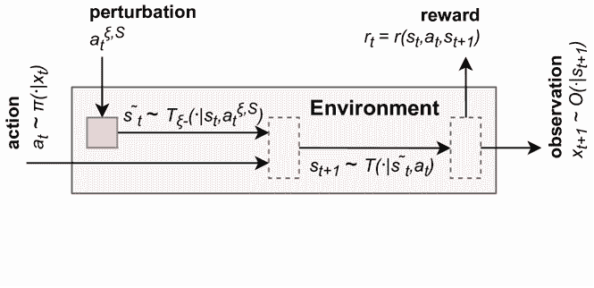
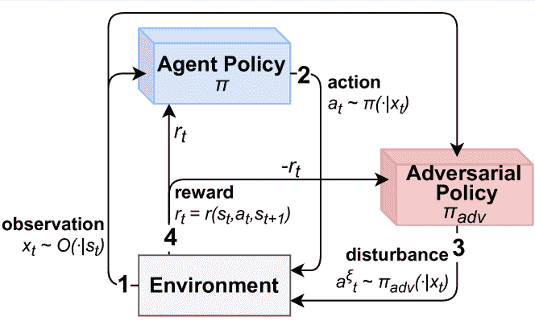

<!--yml

category: 未分类

date: 2024-09-06 19:34:11

-->

# [2403.00420] 通过对抗攻击和训练提高深度强化学习的鲁棒性：综述

> 来源：[`ar5iv.labs.arxiv.org/html/2403.00420`](https://ar5iv.labs.arxiv.org/html/2403.00420)

\equalcont

这些作者对本工作做出了同等贡献。

\equalcont

这些作者对本工作做出了同等贡献。

1]\orgnameIRT SystemX, \orgaddress\cityPalaiseau, \postcode91120, \countryFrance

2]\orgdivMLIA, ISIR, \orgnameSorbonne Université, \orgaddress\cityParis, \postcode75005, \countryFrance

3]\orgnamePolytechnique Montréal, \orgaddress\cityMontréal, \postcode6079, \stateQuébec, \countryCanada

4]\orgnameSafran Tech, \orgaddress\cityChâteaufort, \postcode78117, \countryFrance

5]\orgdivLERIA, \orgnameUniversité d’Angers, \orgaddress\cityAngers, \postcode49000, \countryFrance

# 通过对抗攻击和训练提高深度强化学习的鲁棒性：综述

\fnmLucas \surSchott    \fnmJoséphine \surDelas    \fnmHatem \surHajri    \fnmElies \surGherbi    \fnmReda \surYaich    \fnmNora \surBoulahia-Cuppens    \fnmFrederic \surCuppens    \fnmSylvain \surLamprier  [ [ [ [

###### 摘要

深度强化学习（DRL）是一种用于训练在各种复杂环境中自主代理的方法。尽管在已知环境中表现显著，但它对条件的微小变化仍然敏感，这引发了对其在实际应用中可靠性的担忧。为了提高可用性，DRL 必须展现出可信性和鲁棒性。提高 DRL 对未知条件变化的鲁棒性的一种方法是通过对抗训练，通过对环境动态进行适当的对抗攻击来训练代理。针对这一关键问题，我们的工作对现代对抗攻击方法进行了深入分析，系统地对其进行分类，并比较了它们的目标和操作机制。这种分类为了解对抗攻击如何有效评估 DRL 代理的韧性提供了详细的见解，从而为增强其鲁棒性铺平了道路。

###### keywords:

深度强化学习、鲁棒性、对抗攻击、对抗训练

## 1 Introduction

深度强化学习（DRL）的出现标志着在各个领域的重大转变，包括游戏 [[1、2、3]、自主机器人 [4]、自动驾驶 [5] 和能源管理 [6]。通过将强化学习（RL）与深度神经网络（DNN）结合，DRL 能够利用高维连续观察和奖励来训练神经策略，而无需监督的示例轨迹。

虽然深度强化学习（DRL）在知名的受控环境中取得了显著的成果，但它在确保在各种条件变化和现实世界扰动中保持稳健性能时也面临挑战。它特别难以弥合现实差距 [7, 8]，通常 DRL 智能体是在模拟环境中训练的，而这些模拟环境仍然是对现实世界的模仿，导致训练智能体在模拟环境中的性能与转移到现实世界应用后的性能之间存在差距。即使不尝试弥合现实差距，智能体在某些条件下也可以先进行训练，之后部署时条件可能已发生变化。这就提出了稳健性的问题，即智能体在部署过程中，尽管环境条件发生轻微变化或出现小的扰动，仍能保持性能的能力。

此外，产生输入扰动和环境动态扰动的对抗攻击的出现，这些攻击故意设计以误导神经网络决策，在强化学习中带来了独特的挑战 [9, 10]，并可能是解决 RL 中稳健性问题的关键，需进一步探索和理解。

本次调查旨在解决这些关键问题。它通过呈现一个全面的框架来理解 DRL 智能体稳健性的概念，重点关注关键问题。它涵盖了对扰动输入和环境动态扰动的稳健性。此外，它引入了一个新的分类系统，将影响稳健性的每种扰动组织到一个统一的模型中。它还提供了关于稳健 DRL 智能体对抗方法的现有文献综述，并在提出的分类体系中对现有方法进行分类。目标是提供对各种对抗技术的深入理解，包括它们的优缺点，以及它们对 DRL 智能体的性能、稳健性和泛化能力的影响。

历史上，对抗样本的主要关注点一直是监督学习领域 [11]。虽然尝试将这一范围扩展到强化学习（RL），但这些尝试主要集中在对抗规避方法和稳健性导向的分类上 [12, 9]。为了弥合这一差距，我们的工作引入了一个以稳健性为中心的 DRL 对抗方法研究。

本工作的关键贡献包括：

+   •

    形式化 DRL 中稳健性的概念。

+   •

    为 DRL 中的对抗攻击开发分类法和分类体系。

+   •

    评审现有的对抗攻击，并使用我们提出的分类体系进行特征化。

+   •

    评审对抗攻击如何用于提高 DRL 智能体的稳健性。

调查的结构组织如下：第二部分介绍了 RL 和 DNN 的安全影响，以及分析 RL 鲁棒性的数学先决条件。第三部分介绍了 DRL 鲁棒性概念的形式化。第四部分提供了一个分类攻击方法的分类法，如图 1 所示。5.1 节和 5.2 节分别探讨了观察和动态修改攻击。最后，第六部分专注于应用对抗性攻击和对抗性训练的策略。

图 1：文献中描述的对抗攻击的分类，详见第五部分，以及本调查的 4 节中介绍的分类法。

## 2 背景

### 2.1 强化学习

强化学习（RL）专注于动态环境中的决策制定[13]。RL 代理通过与环境进行交互来学习：他们采取行动，并以数字奖励的形式获得反馈。RL 代理的目标是学习策略，即从状态到动作的映射，以最大化随时间累积的预期奖励。

#### 2.1.1 部分可观察马尔可夫决策过程

马尔可夫决策过程（MDP）是用于建模代理与环境在离散时间步长上交互的数学框架。在大多数实际应用中，代理可能无法访问完整的环境状态，而是接收部分观察。这种情况被称为部分可观察马尔可夫决策过程（POMDP），它是 MDP 框架的一种泛化，由元组$\Omega=(S,A,T,R,X,O)$来表示，其中：

+   •

    $S$ 是环境中的状态集，

+   •

    $A$ 是代理可执行的动作集，

+   •

    $T:S\times S\times A\rightarrow[0,1]$ 是随机转移函数，其中 $T(s_{+}\mid s,a)$ 表示在状态 $s$ 和动作 $a$ 下转移到状态 $s_{+}$ 的概率，

+   •

    $R:S\times A\times S\rightarrow\mathbb{R}$ 是奖励函数。$R(s,a,s_{+})$ 是代理在状态 $s$ 执行动作 $a$ 并转移到状态 $s_{+}$ 时获得的奖励，

+   •

    $X$ 是代理感知的观察集合，

+   •

    $O:S\times X\rightarrow[0,1]$ 是观察函数，其中 $O(x\mid s)$ 表示在状态 $s$ 下观察到 $x$ 的概率。

环境中的一步由 POMDP $\Omega$ 表示，表示为转移 $(s_{t},x_{t},a_{t},s_{t+1})$，其中 $s_{t}$ 表示状态，$x_{t}$ 表示该状态的观察，$a_{t}$ 表示代理执行的动作，$s_{t+1}$ 表示转移后的下一个状态。在本文中，我们将使用 POMDP 框架作为通用模型，尽管某些环境可以描述为 MDPs。

#### 2.1.2 强化学习基础

在强化学习中，目标是学习一个策略 $\pi:A\times S\rightarrow[0,1]$，其中 $\pi(a\mid s)$ 表示在状态 $s$ 下选择动作 $a$ 的概率。因此，最优策略 $\pi^{*}$ 最大化期望的累计折扣奖励：

|  | $\pi^{*}=\arg\max_{\pi}\mathbb{E}_{\tau\sim\pi^{\Omega}}[R(\tau)]$ |  |
| --- | --- | --- |

with

|  | $R(\tau)=\sum_{t=0}^{\lvert\tau\rvert}\gamma^{t}R(s_{t},a_{t},s_{t+1})$ |  |
| --- | --- | --- |

其中 $\tau=(s_{0},a_{0},s_{1},...,s_{|\tau|})$ 是从通过执行策略 $\pi$ 在环境 $\Omega$ 中获得的轨迹分布 $\pi^{\Omega}$ 中采样得到的。折扣因子 $\gamma$ 范围从 0 到 1，权衡未来奖励的重要性。

定义最优性的一个重要标准是状态价值函数，记作 $V^{\pi}:S\rightarrow\mathbb{R}$。对于状态 $s$，值 $V^{\pi}(s)$ 表示从 $s$ 开始并随后遵循策略 $\pi$ 的期望累计折扣奖励。这可以正式表示为：

|  | $V^{\pi}(s)=\mathbb{E}_{\tau\sim\pi^{\Omega}}[R(\tau)\mid s_{0}=s]$ |  | (1) |
| --- | --- | --- | --- |

它可以用贝尔曼方程递归表示：

|  | $\begin{gathered}V^{\pi}(s)=\\ \scalebox{0.95}{$\displaystyle\sum_{a}\pi(a\mid s)\sum_{s_{+}}T(s_{+}\mid s,a)\Big{(}R(s,a,s_{+})+\gamma V^{\pi}(s_{+})\Big{)}$}\end{gathered}$ |  |
| --- | --- | --- |

最后，状态-动作价值函数 $Q^{\pi}:S\times A\rightarrow R$ 在许多算法中作为 $V^{\pi}$ 的替代。状态 $s$ 和动作 $a$ 的 Q 值函数是从 $s$ 开始，执行 $a$ 并随后按照 $\pi$ 行动的期望累计折扣奖励：

|  | $Q^{\pi}(s,a)=\mathbb{E}_{\tau\sim\pi^{\Omega}}[R(\tau)\mid s_{0}=s,a_{0}=a]$ |  | (2) |
| --- | --- | --- | --- |

它可以用方程递归表示：

|  | $\begin{gathered}Q^{\pi}(s,a)=\\ \scalebox{0.95}{$\displaystyle\sum_{s_{+}}T(s_{+}\mid s,a)\Big{(}R(s,a,s_{+})+\gamma\sum_{a_{+}}\pi(a_{+}\mid s_{+})\big{[}Q^{\pi}(s_{+},a_{+})\big{]}\Big{)}$}\end{gathered}$ |  |
| --- | --- | --- |

在部分可观测马尔可夫决策过程（POMDP）环境中，由于状态无法被代理直接观测，通常基于观察历史（即，$x_{0:t}$ 在步骤 $t$）来制定策略和价值函数，而不是系统的真实状态（即，$s_{t}$）。为了简化符号，我们在以下内容中考虑仅用最后一次观察作为输入（即，$x_{t}$）定义的策略和价值函数，尽管下面展示的每种方法都可以扩展到利用完整观察历史的方法。更具体地，我们在以下内容中考虑定义为 $\pi:A\times X\rightarrow[0;1]$ 的策略和定义为 $Q:A\times X\rightarrow\mathbb{R}$ 的行动价值函数。图 2 展示了带有策略函数 $\pi$ 的代理与 POMDP 环境交互的流程图。

图 2：带有策略函数 $\pi$ 的代理与 POMDP 环境交互的流程图

### 2.2 神经网络与深度强化学习

为了解决大输入空间中的复杂强化学习（RL）问题并实现泛化，RL 方法与 DNNs 结合使用。

#### 2.2.1 深度神经网络（DNNs）

神经网络是一个由互连的节点（神经元）组成的系统，用于处理和传输信号。深度神经网络（DNNs）是利用多个神经元层的模型，具有不同程度的架构复杂性，用于分析复杂的数据模式。训练过程涉及调整神经元之间的权重参数，以减少网络预测与实际结果之间的误差（称为损失函数），通常采用受随机梯度下降（SGD）启发的算法。这种训练优化了网络准确识别和响应输入数据的能力。在这种背景下，给定输入 $x$、标签 $y$、学习率 $\alpha$ 和损失函数 $\mathcal{L}$，模型 $f_{\theta}$ 参数 $\theta$ 的更新规则表示为：

|  | $\theta=\theta-\alpha\cdot\nabla_{\theta}\mathcal{L}(f_{\theta}(x),y)$ |  |
| --- | --- | --- |

#### 2.2.2 深度强化学习（DRL）

DRL 将 RL 的原则与 DNN 的能力结合起来。DRL 的核心概念是使用 DNN 构建一个策略$\pi$。这可以通过近似 Q 函数（如方程 (2）），V 函数（如方程 (1）），或通过直接从经验中推断策略来实现。有几个流行的 DRL 算法，每个算法都有其特定的优缺点，有些更适合特定的上下文，如离散或连续动作空间，或取决于是否可以在策略内或策略外训练 DNN。基本的 DRL 算法是 PG [14]、DQN [15] 和 DDPG [16]，但最有效的现代算法是 Rainbow [17]、PPO [18]、SAC [19] 或 TQC [20]，具体取决于上下文。

### 2.3 DNN 中的安全挑战

DNN 是现在用于众多实际应用的强大工具。然而，它们复杂且高度非线性的结构使得它们难以控制，逐渐引发了对其可靠性的担忧。对抗性机器学习最近出现，通过对其输入进行攻击以修改结果，从而展示 DNN 的脆弱性。NIST 的国家网络安全卓越中心（NCCE） [21] 和其欧洲对口机构 ETSI 标准 [22]，提供了框架以研究这些对抗性方法的术语和本体。

#### 2.3.1 对抗性机器学习

对抗性攻击最初是为了利用 DNN 中的漏洞，威胁其隐私、可用性或完整性 [23]。如果“对抗性攻击”这个术语暗示了恶意意图，需要注意的是，这些方法也可以被模型的拥有者用来提高其性能并评估其脆弱性。实际上，对抗性机器学习旨在分析潜在攻击者的能力，理解其攻击的影响，并开发能够抵御这些安全威胁的机器学习算法。对手可能在学习阶段通过毒化训练数据进行攻击，或在推理阶段通过修改输入来规避决策。在本文中，我们考虑已训练模型的鲁棒性，以及利用对抗性样本作为训练阶段的防御方法，以提高推理阶段的鲁棒性，因此我们重点讨论模型对规避方法的鲁棒性。

#### 2.3.2 对抗性示例 [21]

DNN 输入空间的高维度不可避免地导致了盲点和对小扰动的高度敏感。在受限的分类领域中，对抗样本是稍微修改的数据实例，经过精心设计以欺骗模型使其错误分类，同时保持未被检测。计算技术包括从昂贵的手工修改[24]到由复杂算法生成的扰动，但对抗样本生成的基本目标仍然很简单，可以总结为公式 (3)：给定原始实例 $x$，找到相对于选择的度量 $||.||$ 的最接近示例 $x^{\prime}$，使得模型的函数 $f_{\theta}$ 改变其输出。

|  | $\min_{x^{\prime}}&#124;&#124;x-x^{\prime}&#124;&#124;\quad 满足\quad f_{\theta}(x)\neq f_{\theta}(x^{\prime})$ |  | (3) |
| --- | --- | --- | --- |

针对监督分类问题存在多种扰动方法，具体取决于对抗者的目标和模型的限制。这些方法及其防御策略的全面概述可以在[11]中找到。

### 2.4 DRL 中的安全挑战

DRL 使得代理能够通过与环境互动来学习复杂行为。然而，这种互动引入了独特的安全挑战，这些挑战在传统深度学习环境中并未完全遇到。DRL 的动态特性，加上长期战略决策的必要性，使得 DRL 系统面临一系列安全威胁，这些威胁可能会破坏其学习过程、决策完整性和整体有效性。这些挑战在对抗性环境中更为严重，在这种环境中，攻击者可以操纵环境或代理的感知，以引发错误的学习或决策。解决这些挑战对于在安全敏感应用中部署 DRL 至关重要。

#### 2.4.1 安全 RL 控制

在 RL 中制定安全控制挑战[25]结合了控制理论和强化学习领域的见解，旨在优化一个解决方案，该方案在实现任务的同时平衡严格的安全标准。该方法的核心包含三个关键要素：在代理模型中封装的动态系统行为、通过成本函数表达的控制任务的目标或目标，以及解决方案必须遵守的一组安全约束。目标是制定一个能够产生必要动作的策略或控制器，以将系统引导到其目标，同时严格遵守预定义的安全协议。

#### 2.4.2 现实差距、现实世界扰动和泛化

现实差距 [7, 8] 指的是 DRL 代理的模拟训练环境与它们在真实应用中遇到的复杂、不可预测条件之间的差异。这种差异不仅挑战了代理在不同背景下的泛化能力，还构成了严重的安全漏洞。现实世界的扰动——环境中的意外变化——可能导致 DRL 代理性能下降或完全错误的行为，特别是当这些代理面对与其训练条件略有不同的情境时。这些扰动可能自然产生，也可能是敌对地设计的，旨在利用这些泛化弱点并引发失败。解决现实差距，从而提高代理的有效泛化能力，并保护它们免受自然和对抗性扰动，是在需要高安全性和强大决策能力的环境中安全可靠地部署 DRL 系统的关键。

#### 2.4.3 鲁棒 RL 控制

鲁棒 RL 控制通过将不确定性因素（如参数变化和外部干扰）融入系统动态，推出了一个先进的 RL 框架 [26]。这种方法将优化重点转向最小化最大可能损失，实质上是准备系统有效处理最坏情况。它通过一种最小-最大优化策略来实现，目标是找到一个最小化最大预期成本的控制策略。

|  | $\min_{\pi}\max_{\delta\in\Delta}J(\pi,\delta)$ |  |
| --- | --- | --- |

$J(\pi,\delta)$ 代表当策略 $\pi$ 遭遇对手引入的扰动 $\delta$ 时的预期成本（或损失）。集合 $\Delta$ 定义了允许的扰动或干扰。

这种方法确保了控制系统在面对不可预测的变化或不利条件时仍然保持有效和可靠，从而提高了其在不确定环境中的鲁棒性和弹性。这个增强鲁棒控制的框架可以参与政策在条件变化下的泛化，从而帮助弥合现实差距并克服真实世界的扰动。

#### 2.4.4 DRL 的对抗攻击

如果对抗攻击最初是为了监督图像分类模型而发展起来的，它们同样被证明对 DRL 代理也有效。[27] 首次揭示了 DQN 对对抗扰动的脆弱性，这一说法很快得到了进一步研究的支持 [23]。此外，RL 框架提供了比简单适应监督方法更多的对抗可能性。实际上，POMDP 的各种组件（如观察或过渡函数）可以通过可能成为评论入口点的各种元素（观察、状态、动作）来发现脆弱性，而 DRL 的长期依赖性则带来了复杂的安全挑战。另一方面，这种更高的对抗余地使得新防御策略成为可能，从而提升代理的鲁棒性。本调查探讨了如何利用 RL 中的对抗攻击生成扰动，以产生对鲁棒 RL 控制至关重要的最坏情况场景。

## 3 正式化与范围

对抗示例的存在对 DRL 代理构成了重大威胁，特别是在错误预测可能产生严重后果的应用中，如自动驾驶或医疗诊断。开发能够防御对抗攻击并弥合现实差距的鲁棒 DRL 算法是该领域一个重要且活跃的研究领域。

本调查旨在识别和评估在策略训练过程中使用对抗示例如何提高代理的鲁棒性。更具体地，我们讨论了各种类型的对抗生成策略在帮助预测现实差距方面的能力，现实差距指的是训练环境（例如模拟器）与部署环境（可能包括对抗生成的扰动或其他扰动）之间的差异。

### 3.1 RL 中的鲁棒性问题

一般来说，我们感兴趣的是以下优化问题：

|  | $\pi^{*}=\arg\max_{\pi}\mathbb{E}_{\Omega\sim\Phi(\Omega&#124;\pi)}\mathbb{E}_{\tau\sim\pi^{\Omega}(\tau)}[R(\tau)]$ |  |
| --- | --- | --- |

其中 $\Phi$ 对应于在部署时代理可能遇到的环境分布（无论它是否在测试时对 $\pi$ 进行对抗考虑），$\pi^{\Omega}(\tau)$ 是使用策略 $\pi$ 和来自 $\Omega$ 的动态的轨迹分布，$R(\tau)$ 是在 $\tau$ 中收集的累积奖励。虽然这一表述暗示了元强化学习，但在我们的设置中，$\Phi(\Omega|\pi)$ 在训练时是未知的。训练设置由一个唯一的 MDP 组成，在该 MDP 上可以学习策略，这在许多应用中通常是情况。

给定一个独特的训练 POMDP $\Omega$，我们感兴趣的鲁棒性问题可以通过修改分布 $\Phi(\phi|\pi)$ 来重新表述：

|  | $\pi^{*}=\arg\max_{\pi}\mathbb{E}_{\phi\sim\Phi(\phi&#124;\pi)}\mathbb{E}_{\tau\sim\pi^{\phi,{\Omega}}(\tau)}[R(\tau)]$ |  |
| --- | --- | --- |

其中$\pi^{\phi,\Omega}$是使用策略$\pi$在$\phi(\Omega)$上的轨迹分布，代表着被$\phi$改变的 MDP $\Omega$。一般来说，我们可以设定$\phi$为一个可以改变$\Omega$的任何组件的函数，如$\phi(\Omega)=(\phi_{S}(S^{\Omega}),\phi_{A}(A^{\Omega}),\phi_{T}(T^{\Omega}),\phi_{R}(R^{\Omega}),\phi_{X}(X^{\Omega}),\phi_{O}(O^{\Omega}))$。在下文中并且也在[28]中讨论过，虽然$\phi$可以同时影响任何这些组件，我们特别关注两个关键的鲁棒性组件：

+   •

    观察值改变：$\phi_{O}$表示$\Omega$的观察函数的改变。在相应的改变环境$\widetilde{\Omega}=(S^{\Omega},A^{\Omega},T^{\Omega},R^{\Omega},X^{\Omega},\phi_{O}(O^{\Omega}))$中，从状态$s\in S^{\Omega}$获得的观察能与在$\Omega$中不同。这可能是由于敌对攻击者扰乱传感器信号以诱发故障，真实世界的观察能力可能与模拟中的不同，或者甚至是一些传感器的意外故障。这些扰动只会影响$\pi$的感知，对环境中真实的内部状态没有任何影响。在轨迹$\tau$的特定步骤$t$发生这样的改变，只会影响$\tau$的未来，如果它在$t$处对策略决策产生改变。

+   •

    动力学改变：$\phi_{T}$表示$\Omega$的转移函数的改变。在相应的改变环境$\widetilde{\Omega}=(S^{\Omega},A^{\Omega},\phi_{T}(T^{\Omega}),R^{\Omega},X^{\Omega},O^{\Omega})$中，动力学被修改，使得行动的效果不同于在$\Omega$中的完全相同。这可能是由于敌对攻击者修改环境的组件以诱发故障，来自真实世界物理的情况可能与训练模拟器中的不同，或者来自外部事件，可能引发意外情况。动力学改变通过修改转移函数$T$在任何步骤$t$产生的结果状态$s_{t+1}$来影响轨迹。即使是在轨迹的单个特定步骤$t$上定位，它们也会影响其整个未来。

在这项工作中，我们并未明确讨论其他组件（$S$、$A$、$R$ 和 $X$）的变化，因为这些通常涉及不同的问题领域。$\phi_{S}$（或 $\phi_{A}$）表示状态（或行动）集合的改变，其中状态（或行动）可以在 $S^{\Omega}$（或 $A^{\Omega}$）中被移除或引入。$\phi_{X}$ 表示对观察支持 $X^{\Omega}$ 的改变。虽然某些动态 $\phi_{T}$ 或观察 $\phi_{O}$ 的扰动可能导致智能体达到训练中未曾考虑的新状态或观察（这对应于隐式的 $\phi_{S}$ 或 $\phi_{X}$ 扰动），但 $\phi_{S}$、$\phi_{A}$ 和 $\phi_{X}$ 都对应于支持的转变，涉及静态的领域外问题，而这些问题在本工作中我们并未特别关注。$\phi_{R}$ 表示奖励函数的改变，这在使用中不会导致稳健性问题，因为奖励函数仅在训练过程中使用。

### 3.2 针对鲁棒强化学习的对抗攻击

根据分布鲁棒优化（DRO）原则[29]，可以通过考虑一些不确定性集合 ${\cal R}$ 中的最坏情况来预期未知的分布变化。在我们的鲁棒强化学习设置中，这归结为以下的最大最小优化问题：

|  | $\pi^{*}=\arg\max_{\pi}\min_{\tilde{\Phi}\in{\cal R}}\mathbb{E}_{\phi\sim\tilde{\Phi}(\phi&#124;\pi)}\mathbb{E}_{\tau\sim\pi^{\phi,{\Omega}}(\tau)}[R(\tau)]$ |  | (4) |
| --- | --- | --- | --- |

其中，${\cal R}$ 是一个扰动分布的集合。如同在监督回归问题的 DRO 文献中所知，${\cal R}$ 的形状对相应的最优决策系统有着强烈的影响。在我们的强化学习设置中，增加集合 ${\cal R}$ 允许的差异水平，迫使得到的策略 $\pi$ 在更广泛的环境条件下同时进行表现。虽然这有助于对环境变化进行更好的泛化，但也意味着如果集合 $\cal R$ 的扰动水平不受合理限制，则需要处理各种高度不现实的场景。对于极其大的集合 ${\cal R}$，策略 $\pi$ 预计对任何可能的环境都同样有效，最终收敛到一个平凡的均匀策略，该策略为 $S^{\Omega}$ 中的任何状态分配相等的行动概率。因此，$\cal R$ 的形状需要得到控制，以找到泛化与有效性之间的准确权衡。这是通过设置受限的扰动支持来完成的。

在我们的设定中，处理定义在 $\Omega$ 完全支持上的最坏情况扰动在大多数实际应用中是高度不可解的。在这项调查中，我们更关注对抗性训练，该训练利用攻击者智能体 $\xi$ 的同步优化，该智能体对主角 $\pi$ 达到的情境产生扰动，通过对环境 $\Omega$ 允许的对抗性动作 $A_{\xi}^{\Omega}$ 进行操作。

|  | $\displaystyle\pi^{*}=\arg\max_{\pi}\mathbb{E}_{\tau\sim\pi^{\xi^{*},\Omega}(\tau)}[R(\tau)]$ |  |
| --- | --- | --- |
|  | $\displaystyle s.t.\qquad\xi^{*}=\arg\min_{\xi}\Delta^{\pi,\Omega}(\xi)$ |  |

其中 $\Delta^{\pi,\Omega}(\xi)$ 代表对抗性智能体在给定策略 $\pi$ 和训练环境 $\Omega$ 下的优化目标，其范围从不利的奖励函数到发散度度量（参见 4.3），而 $\pi^{\xi,\Omega}(\tau)$ 对应于在对抗性智能体 $\xi$ 动态修改的部分可观测马尔可夫决策过程（POMDP）中，策略 $\pi$ 下轨迹的概率，给定一组动作 $A_{\xi}^{\Omega}=(A_{\xi,X}^{\Omega},A_{\xi,A}^{\Omega},A_{\xi,S}^{\Omega},A_{\xi,T}^{\Omega},A_{\xi,S+}^{\Omega})$。对抗者 $\xi$ 的动作 $a^{\xi}_{t}=(a^{\xi,X}_{t},a^{\xi,A}_{t},a^{\xi,S}_{t},a^{\xi,T}_{t},a^{\xi,S+}_{t})$ 可以针对 $\Omega$ 中轨迹的任何转移 $\tau_{t}=(s_{t},x_{t},a_{t},s_{t+1})$ 的任何元素。虽然对 $x_{t}$ 的任何扰动会引起观测函数 $O^{\Omega}$ 的变化，但对 $s_{t}$、$a_{t}$ 或 $s_{t+1}$ 的任何扰动都会引起转移函数 $T^{\Omega}$ 的变化（无论是直接的，通过其内部动态，还是间接的，通过修改其输入或输出）。

在这种设置下，任何轨迹都被组成一个对抗性增强的转移序列 $\widetilde{\tau}_{t}=(s_{t},x_{t},a_{t},a^{\xi}_{t},x^{\prime}_{t},a^{\prime}_{t},\widetilde{s}_{t},\widetilde{x}_{t},\widetilde{s}_{t+1},\widetilde{x}_{t+1},s_{t+1})$，其中元素 $x^{\prime}_{t}$（即 $a^{\prime}_{t}$）代表对抗动作 $a^{\xi,X}_{t}$（即 $a^{\xi,A}_{t}$）在步骤 $t$ 上应用后产生的扰动观察（即行动）。$\widetilde{s}_{t}$（即 $\widetilde{s}_{t+1}$）代表在步骤 $t$ 应用对抗动作 $a^{\xi,S}_{t}$（即 $a^{\xi,T}_{t}$）前（即在过渡函数中）产生的中间状态，而 $\widetilde{x}_{t}$（即 $\widetilde{x}_{t+1}$）是该状态的观察。最后，$s_{t+1}$ 代表在过渡函数应用后的最终下一个状态，其观察为 $x_{t+1}$。对抗性动作的支持和范围定义了在相应不确定性集合 ${\cal R}$ 中允许的扰动水平，从 (4)，对结果策略 $\pi$ 的泛化/准确性权衡产生影响。当主角代理 $\pi$ 从 $x_{t}$ 行动，并且 $a_{t}\sim\pi(\cdot|x_{t})$ 时，以下我们考虑一般情况下对抗者 $\xi$ 从 $s_{t}$、$x_{t}$ 和 $a_{t}$ 行动，即 $\xi:S^{\Omega}\times X^{\Omega}\times A^{\Omega}\times A_{\xi}^{\Omega}\rightarrow[0;1]$ 其中 $a^{\xi}_{t}\sim\xi(\cdot|s_{t},x_{t},a_{t})$。通过这样做，我们考虑对抗者 $\xi$ 具有环境、观察和行动的完整知识，尽管这可以很容易地限制为仅从部分信息中行动的对抗性策略 $\xi$。

## 4 深度强化学习的对抗性攻击分类

我们对 RL 代理的对抗性攻击进行了系统分析，重点关注其目的和应用。为了更好地理解可用的方法及其特性，我们提出了 DRL 的对抗性攻击分类。这一分类用于对之前在图 1 和后面描述于表 1 中展示的对抗性攻击进行分类。本节讨论了鲁棒 RL 的对抗性方法的不同组成部分，然后在下一节中展开主要方法。

### 4.1 受扰动的元素

对抗性攻击是一种方法，使用对抗性行动 $a^{\xi}_{t}\in A_{\xi}^{\Omega}$ 由对抗代理 $\xi$ 在步骤 $t$ 发出，以在代理的轨迹中产生模拟扰动。根据攻击类型，行动 $a^{\xi}_{t}$ 可以直接扰动不同的元素：

##### 观测 $x_{t}$

通过一个扰动函数 $O^{\xi}:X^{\Omega}\times X^{\Omega}\times A_{\xi,X}^{\Omega}\rightarrow[0;1]$，其中 $x^{\prime}_{t}\sim O^{\xi}(\cdot|x_{t},a^{\xi,X}_{t})$。

##### 行动 $a_{t}$

通过一个扰动函数 $A^{\xi}:A^{\Omega}\times A^{\Omega}\times A_{\xi,A}^{\Omega}\rightarrow[0;1]$，其中 $a^{\prime}_{t}\sim A^{\xi}(\cdot|a_{t},a^{\xi,A}_{t})$。

##### 当前状态 $s_{t}$（过渡前）

通过一个额外的过渡函数 $T_{\xi-}^{\Omega}:S^{\Omega}\times S^{\Omega}\times A_{\xi,S}^{\Omega}\rightarrow[0;1]$，其中 $\widetilde{s}_{t}\sim T_{\xi-}^{\Omega}(\cdot|s_{t},a^{\xi,S}_{t})$ 在代理的决策 $a_{t}$ 做出之后以及环境的主要过渡函数应用之前被应用。

##### 过渡函数 $T^{\Omega}$

通过一个对抗性增强的过渡函数 $T_{\xi}^{\Omega}:S^{\Omega}\times S^{\Omega}\times A^{\Omega}\times A_{\xi,T}^{\Omega}\rightarrow[0;1]$，其中 $\widetilde{s}_{t+1}\sim T_{\xi}^{\Omega}(\cdot|s_{t},a_{t},a^{\xi,T}_{t})$ 被用作环境的主要过渡函数 $T^{\Omega}$ 的替代。

##### 下一个状态 $s_{t+1}$（过渡后）

通过一个额外的过渡函数 $T_{\xi+}^{\Omega}:S^{\Omega}\times S^{\Omega}\times A_{\xi,S+}^{\Omega}\rightarrow[0;1]$，其中 $s_{t+1}\sim T_{\xi+}^{\Omega}(\cdot|s_{t+1},a^{\xi,S+}_{t})$ 在环境的主要过渡函数之后以及代理的下一个决策 $a_{t+1}$ 做出之前被应用。

对前两类元素（观测和行动）的扰动只需修改一个向量，该向量将作为另一个函数的输入，因此在任何环境中实现起来都很容易。对后三类元素（状态、过渡函数和下一个状态）的扰动则更为复杂，需要修改环境本身，要么通过能够用额外的过渡函数修改状态，要么通过将对抗行动的效果纳入主要过渡函数本身。

在这里及之后，我们使用术语“扰动”来表示通过对抗性行动 $a^{\xi}_{t}$ 直接修改某个元素。例如，直接扰动观测 $x_{t}$，扰动状态 $s_{t}$，扰动行动 $a_{t}$。我们不使用“扰动”一词来指代间接修改，例如，通过直接扰动观测 $x_{t}$，代理选择的行动 $a_{t}$ 可能会被修改，这种新行动不能被视为扰动的行动，而是由代理的策略 $\pi$ 应用在扰动观测 $x^{\prime}_{t}$ 上所产生的结果。

在下文中，我们使用“扰动”一词来表示以下元素之一的任何扰动：动作、状态、转移函数或下一个状态。更一般地，"扰动"一词用于表示那些改变环境动态的扰动。

### 4.2 改变的 POMDP 组件

根据前一节讨论的两种主要类型的扰动 $\phi$，方法分类的主要方向涉及对 POMDP 的影响，这些影响来自对手代理在训练 $\pi$ 过程中发出的动作。根据前一节定义的对抗元素，我们独立指定每种可能的扰动，以讨论每种具体的对抗影响对 POMDP 的影响。

在这里以及以下内容中，我们使用“改变”一词来表示从代理的角度修改 POMDP 的一个组件。例如，添加一个扰动观察的对抗攻击，是从代理的角度改变 POMDP 的观察函数 $O^{\Omega}$。或者，添加一个扰动动作、状态、转移函数或下一个状态的对抗攻击，是从代理的角度改变 POMDP 的转移函数 $T^{\Omega}$（环境动态）。

#### 4.2.1 观察函数 $O^{\Omega}$ 的改变

第一种组件改变类型是 POMDP 的观察函数 $O^{\Omega}$ 的改变。直接受到监督机器学习中对抗攻击的启发，许多方法旨在修改主角代理 $\pi$ 感知到的输入。原理是修改代理的输入向量，这可以例如对应于物理代理的传感器输出，如自动驾驶车辆。观察在代理做出任何决策之前被扰动，因此代理接收到的是扰动后的观察，可能被欺骗。

更正式地，在观察攻击的设置中，对手 $\xi$ 通过特定的扰动函数 $O^{\xi}(x^{\prime}_{t}|x_{t},a^{\xi,X}_{t})$ 对观察 $x_{t}$ 进行扰动，生成扰动后的观察 $x^{\prime}_{t}$，然后将其作为输入提供给 $\pi$，这一过程在第 4.1 节中介绍。

在这种情况下，$\xi$ 可以被视为一个对手代理，它通过发出对抗性动作 $a^{\xi,X}_{t}\sim\xi(\cdot|s_{t},x_{t})$ 并且 $a^{\xi,X}_{t}\in A^{\Omega}_{\xi,X}$，给定一个 POMDP 定义为 $\Omega^{\pi}=(S^{\Omega},A_{\xi,X}^{\Omega},T^{\pi,\Omega},R_{\xi}^{\Omega},X^{\Omega},O^{\Omega})$，其中采样 $s_{t+1}\sim T^{\pi,\Omega}(\cdot|s_{t},a^{\xi,X}_{t})$ 是在四个步骤中执行的，如算法 1 所示。

算法 1 $s_{t+1}\sim T^{\pi,\Omega}(\cdot|s_{t},a^{\xi,X}_{t})$

1: 输入 $s_{t},a^{\xi,X}_{t}$ $\triangleright$ 状态和对抗性动作 2: 采样 $x_{t}\sim O^{\Omega}(\cdot|s_{t})$ $\triangleright$ 观察 3: 采样 $x^{\prime}_{t}\sim O^{\xi}(\cdot|x_{t},a^{\xi,X}_{t})$ $\triangleright$ 扰动后的观察 4: 采样 $a_{t}\sim\pi(\cdot|x^{\prime}_{t})$ $\triangleright$ 代理动作 5: 采样 $s_{t+1}\sim T^{\Omega}(\cdot|s_{t},a_{t})$ $\triangleright$ 转移后的下一个状态 6: 返回 $s_{t+1}$

相反，代理 $\pi$ 在一个修改后的 POMDP $\Omega^{\xi}=(S^{\Omega},A^{\Omega},T^{\Omega},R^{\Omega},X^{\Omega},O^{\xi,\Omega})$ 上行动，其中输入观察 $x^{\prime}_{t}\sim O^{\xi,\Omega}(\cdot|s_{t})$ 是在三个步骤中执行的，如算法 2 所示。

算法 2 $x^{\prime}_{t}\sim O^{\xi,\Omega}(\cdot|s_{t})$

1: 输入 $s_{t}$ $\triangleright$ 状态 2: 采样 $x_{t}\sim O^{\Omega}(\cdot|s_{t})$ $\triangleright$ 观察 3: 采样 $a^{\xi,X}_{t}\sim\xi(\cdot|s_{t},x_{t})$ $\triangleright$ 对抗性动作 4: 采样 $x^{\prime}_{t}\sim O^{\xi}(\cdot|x_{t},a^{\xi,X}_{t})$ $\triangleright$ 扰动后的观察 5: 返回 $x^{\prime}_{t}$

图 3 展示了一个流程图，说明了观察扰动如何融入 POMDP。

图 3: 观察扰动的流程图

接下来，给定过去的 $\tilde{\tau}_{0:t-1}$，对抗性增强转移 $\tilde{\tau}_{t}=(s_{t},x_{t},a_{t},a^{\xi}_{t},x^{\prime}_{t},a^{\prime}_{t},\widetilde{s}_{t},\widetilde{x}_{t},\widetilde{s}_{t+1},\widetilde{x}_{t+1},s_{t+1})$ 的概率为：

|  | $\pi^{\xi,\Omega}(\tau_{t}&#124;s_{t})=O^{\Omega}(x_{t}&#124;s_{t})\xi(a^{\xi,X}_{t}&#124;s_{t},x_{t})O^{\xi}(x^{\prime}_{t}&#124;x_{t},a^{\xi,X}_{t})\pi(a_{t}&#124;x^{\prime}_{t})\delta_{a_{t}}(a^{\prime}_{t})\\ \delta_{s_{t}}(\widetilde{s}_{t})O^{\Omega}(\widetilde{x}_{t}&#124;\widetilde{s}_{t})T^{\Omega}(\widetilde{s}_{t+1}&#124;\widetilde{s}_{t},a^{\prime}_{t})O^{\Omega}(\widetilde{x}_{t+1}&#124;s_{t+1})\delta_{\widetilde{s}_{t+1}}(s_{t+1})$ |  |
| --- | --- | --- |

其中$\delta_{x}$表示一个以$x$为中心的 Dirac 分布。

#### 4.2.2 过渡函数$T^{\Omega}$的修改（环境动态）

另一种组件修改类型是修改 POMDP 的过渡函数$T^{\Omega}$（改变环境的动态）。原则是修改主角在环境中的动作效果。例如，这可以包括移动或修改环境中一些物理对象的行为，如在自动驾驶模拟器中修改某些车辆的位置或速度，或修改主角的动作对环境的影响方式（例如，通过放大或反转动作）。

通过发出对环境$\Omega$允许的对抗性动作$A^{\Omega}_{\xi}$，使用特定的对抗性函数$A^{\xi}$、$T_{\xi-}^{\Omega}$、$T_{\xi}^{\Omega}$或$T_{\xi+}^{\Omega}$，为主角动作创建一个修改后的过渡函数$T^{\xi,\Omega}$。在这种设置中，可以考虑四种类型的对抗者：

##### 过渡扰动

在这种设置中，过程从代理处于初始状态开始。代理随后选择一个动作，并将其应用于环境。这应导致根据环境的过渡函数过渡到一个新状态。然而，这个过渡函数被扰动，有效地改变了环境的动态。结果是与如果过渡函数没有被扰动时所得到的不同的新状态。

例如，在自动驾驶车辆的背景下，车辆可能会根据现有的交通情况（状态）决定换道（动作）。由于这个动作导致了过渡，周围车辆的行为被不可预测地修改（扰动过渡）。因此，车辆会出现在一个与所选动作通常结果不同的新交通配置（下一个状态）中。

这个过程通过直接改变环境固有的过渡函数，引入环境动态的变异性。

更正式地说，敌对者 $\xi$ 通过修改过渡函数本身来诱导一个改变后的下一个状态 $s^{\prime}_{t+1}$，将其替换为第 4.1 节中介绍的扰动过渡函数 $T_{\xi}^{\Omega}(s_{t+1}|(s_{t},a_{t}),a^{\xi,T}_{t})$。在这种情况下，$\xi$ 可以视为一个通过发出敌对动作 $a^{\xi,T}_{t}\sim\xi(\cdot|s_{t},x_{t},a_{t})$ 的代理，给定 POMDP 中的 $\pi$，定义为：$\Omega^{\pi}=((S^{\Omega},A^{\Omega}),A^{\Omega}_{\xi,T},T^{\pi,\Omega},R_{\xi}^{\Omega},X^{\Omega},O^{\Omega})$，其中采样 $(s_{t+1},a_{t+1})\sim T^{\pi,\Omega}(\cdot|(s_{t},a_{t}),a^{\xi,T}_{t})$ 分三步进行，如算法 3 的改变 ‣ 4.2 改变的 POMDP 组件 ‣ 4 强敌攻击的分类 ‣ 通过强敌攻击和训练实现稳健的深度强化学习：综述") 所示。

算法 3 $(s_{t+1},a_{t+1})\sim T^{\pi,\Omega}(\cdot|(s_{t},a_{t}),a^{\xi,T}_{t})$

1: 输入 $s_{t},a_{t},a^{\xi,T}_{t}$ $\triangleright$ 状态、代理动作和敌对动作 2: 采样 $s_{t+1}\sim T_{\xi}^{\Omega}(\cdot|s_{t},a_{t},a^{\xi,T}_{t})$ $\triangleright$ 扰动后的下一个状态 3: 采样 $x_{t+1}\sim O^{\Omega}(\cdot|s_{t+1})$ $\triangleright$ 下一个观测 4: 采样 $a_{t+1}\sim\pi(\cdot|x_{t+1})$ $\triangleright$ 下一个代理动作 5: 返回 $s_{t+1}$，$a_{t+1}$

图 4 的改变 ‣ 4.2 改变的 POMDP 组件 ‣ 4 强敌攻击的分类 ‣ 通过强敌攻击和训练实现稳健的深度强化学习：综述") 展示了一个流程图，说明了过渡扰动如何融入 POMDP。

图 4：过渡函数扰动的流程图

##### 当前状态扰动

在这种设置下，过程从代理在初始状态开始。然后，代理选择一个在环境中应用的动作。然而，在应用该动作之前，当前状态会受到扰动。这种扰动改变了初始状态，导致在修改后的状态中应用所选动作。在这个扰动状态中应用动作会导致一个过渡，生成一个根据环境的过渡函数的新后续状态。

例如，考虑一个自主车辆根据当前交通状况（状态）决定变道（动作）。在执行此操作之前，交通状况会被改变（扰动状态），例如通过调整附近车辆的位置。因此，当车辆执行变道时，它是在调整后的交通情境中进行的，导致不同于原始状态的交通配置（下一状态）。

这个过程在不直接修改环境转移函数的情况下，引入了环境动态的变异性。

更正式地，敌对者 $\xi$ 通过在转移函数之前扰动状态，诱导一个变化后的下一状态 $s^{\prime}_{t+1}$，这一过程使用了在第 4.1 节中引入的先前转移函数 $T_{\xi-}^{\Omega}(\widetilde{s}_{t}|s_{t},a^{\xi,S}_{t})$。在这种情况下，$\xi$ 可以视为一个代理，按照 POMDP 的定义发出对抗动作 $a^{\xi,S}_{t}\sim\xi(\cdot|s_{t},x_{t},a_{t})$，其中 $\pi$ 的 POMDP 定义为：$\Omega^{\pi}=((S^{\Omega},A^{\Omega}),A^{\Omega}_{\xi,S},T^{\pi,\Omega},R_{\xi}^{\Omega},X^{\Omega},O^{\Omega})$，其中采样 $(s_{t+1},a_{t+1})\sim T^{\pi,\Omega}(\cdot|(s_{t},a_{t}),a^{\xi,S}_{t})$ 分四步进行，如算法 4 所示。

算法 4 $(s_{t+1},a_{t+1})\sim T^{\pi,\Omega}(\cdot|(s_{t},a_{t}),a^{\xi,S}_{t})$

1: 输入 $s_{t},a_{t},a^{\xi,S}_{t}$ $\triangleright$ 状态、代理动作和对抗者动作 2: 采样 $\widetilde{s}_{t}\sim T_{\xi-}^{\Omega}(\cdot|s_{t},a^{\xi,S}_{t})$ $\triangleright$ 扰动状态 3: 采样 $s_{t+1}\sim T^{\Omega}(\cdot|\widetilde{s}_{t},a_{t})$ $\triangleright$ 转移后的下一状态 4: 采样 $x_{t+1}\sim O^{\Omega}(\cdot|s_{t+1})$ $\triangleright$ 下一观察 5: 采样 $a_{t+1}\sim\pi(\cdot|x_{t+1})$ $\triangleright$ 下一代理动作 6: 返回 $s_{t+1}$，$a_{t+1}$

图 5 展示了一个流程图，说明了当前状态扰动如何融入到 POMDP 中。

图 5：当前状态扰动的流程图

##### 下一状态扰动

在这种情况下，过程从代理处于初始状态开始。代理选择一个动作，然后在环境中应用该动作。这导致根据环境的过渡函数转移到一个新的后续状态。然而，在代理选择下一个动作之前，这个新状态会被扰动。

例如，在自动驾驶汽车的情况下，汽车可能会根据当前的交通配置（状态）选择变道（动作）。动作执行后，汽车会发现自己处于新的交通配置（下一个状态）。在选择下一个动作之前，这个新状态会被扰动，例如，通过改变周围车辆的位置。这意味着汽车现在面临的是一个经过修改的交通配置（扰动后的下一个状态），它必须从中决定下一步行动。

这一过程为环境的动态引入了变异性，而无需直接修改环境的过渡函数。

扰动当前状态和扰动下一个状态的关键区别在于代理对其情况的意识。在当前状态扰动中，代理在选择动作时对其精确状态缺乏真实知识，因为该状态在动作应用前刚刚被修改。然而，在下一个状态扰动中，代理在选择动作时对其当前状态具有完全的意识。

更正式地说，对手 $\xi$ 通过在过渡函数之后扰动状态，从而产生一个被改变的下一个状态 $s^{\prime}_{t+1}$，这一过程由在第 4.1 节中引入的后验过渡函数 $T_{\xi+}^{\Omega}(\widetilde{s}_{t+1}|s_{t+1},a^{\xi,S+}_{t})$ 实现。在这种情况下，$\xi$ 可以视为一个通过发出对抗性动作 $a^{\xi,S+}_{t}\sim\xi(\cdot|s_{t},x_{t})$ 进行操作的代理，给定在 POMDP 中定义的 $\pi$：$\Omega^{\pi}=(S^{\Omega},A^{\Omega}_{\xi,S+},T^{\pi,\Omega},R_{\xi}^{\Omega},X^{\Omega},O^{\Omega})$，其中对 $s_{t+1}\sim T^{\pi,\Omega}(\cdot|s_{t},a^{\xi,S+}_{t})$ 的采样是通过三个步骤完成的，如算法 5 ‣ 4.2 Altered POMDP Component ‣ 4 Taxonomy of Adversarial Attacks of DRL ‣ Robust Deep Reinforcement Learning Through Adversarial Attacks and Training : A Survey") 所示。

算法 5 $s_{t+1}\sim T^{\pi,\Omega}(\cdot|s_{t},a^{\xi,S+}_{t})$

1: 输入 $s_{t},a^{\xi,S+}_{t}$ $\triangleright$ 状态，敌对动作 2: 采样 $\widetilde{s}_{t}\sim T_{\xi+}^{\Omega}(\cdot|s_{t},a^{\xi,S+}_{t})$ $\triangleright$ 扰动状态 3: 采样 $\widetilde{x}_{t}\sim O^{\Omega}(\cdot|\widetilde{s}_{t})$ $\triangleright$ 观察 4: 采样 $a_{t}\sim\pi(\cdot|x_{t})$ $\triangleright$ 代理动作 5: 采样 $s_{t+1}\sim T^{\Omega}(\cdot|\widetilde{s}_{t},a_{t})$ $\triangleright$ 转移后的下一个状态 6: 返回 $s_{t+1}$

图 6 ‣ 4.2 Altered POMDP Component ‣ 4 Taxonomy of Adversarial Attacks of DRL ‣ Robust Deep Reinforcement Learning Through Adversarial Attacks and Training : A Survey")展示了一个流程图，说明了下一个状态扰动如何融入 POMDP 中。

图 6: 下一个状态的扰动流程图

##### 动作扰动

在这种设置下，过程从代理处于初始状态开始。代理选择一个动作，该动作旨在应用于环境中。然而，在此动作可以应用之前，它会经历一次扰动，导致产生一个扰动后的动作。然后应用这个扰动后的动作，按照环境的过渡函数，导致状态转移到一个新的状态。

例如，考虑一个自主车辆，它决定根据当前交通配置以角度 $\alpha$（动作）进行转向。在转向动作执行之前，它会被扰动，因此实际施加到车辆上的转向角度变为 $\alpha+\epsilon$（扰动动作）。结果，车辆转移到一个新的交通配置（下一个状态），反映了扰动转向动作的结果。

这个过程在环境的动态中引入了变异，而无需直接修改环境的过渡函数或环境状态。然而，这种修改动态的方法虽然引入了变异，但仅限于动作扰动的范围，限制了潜在动态变化的多样性。

更正式地，敌对者 $\xi$ 通过扰动代理决定的动作 $a_{t}\sim\pi(\cdot|x_{t})$ 来引起一个改变后的下一个状态 $s^{\prime}_{t+1}$，使用在 4.1 节中介绍的特定扰动函数 $A^{\xi}(a^{\prime}_{t}|a_{t},a^{\xi,A}_{t})$。

在这种情况下，$\xi$ 可以视为一个通过发出对抗性动作 $a^{\xi,A}_{t}\sim\xi(\cdot|s_{t},x_{t},a_{t})$ 行动的代理，给定 $\pi$ 在定义为：$\Omega^{\pi}=\big{(}(S^{\Omega},A^{\Omega}),A^{\Omega}_{\xi,A},T^{\pi,\Omega},R_{\xi}^{\Omega},X^{\Omega},O^{\Omega}\big{)}$ 的 POMDP 中，其中采样 $(s_{t+1},a_{t+1})\sim T^{\pi,\Omega}(\cdot|(s_{t},a_{t}),a^{\xi,A}_{t})$ 执行了四步，如算法 6 ‣ 4.2 Altered POMDP Component ‣ 4 Taxonomy of Adversarial Attacks of DRL ‣ Robust Deep Reinforcement Learning Through Adversarial Attacks and Training : A Survey") 所示。

算法 6 $(s_{t+1},a_{t+1})\sim T^{\pi,\Omega}(\cdot|(s_{t},a_{t}),a^{\xi,A}_{t})$

1: 输入 $s_{t},a_{t},a^{\xi,A}_{t}$ $\triangleright$ 状态、代理动作和对抗动作

图 7 ‣ 4.2 Altered POMDP Component ‣ 4 Taxonomy of Adversarial Attacks of DRL ‣ Robust Deep Reinforcement Learning Through Adversarial Attacks and Training : A Survey") 展示了一个流程图，说明了动作扰动如何融入 POMDP。

图 7: 动作扰动的流程图

反向地，我们可以通过将四种可能的攻击类型结合在一个示例中，来汇集主角代理 $\pi$ 的观点，记为对手 $\xi_{A}$、$\xi_{S-}$、$\xi_{T}$ 和 $\xi_{S+}$。代理 $\pi$ 在一个修改过的 POMDP $\Omega^{\xi}=(S^{\Omega},A^{\Omega},T^{\xi,\Omega},R^{\Omega},X^{\Omega},O^{\Omega})$ 上操作，其中 $s_{t+1}\sim T^{\xi,\Omega}(\cdot|s_{t},a_{t})$ 执行了十一步，如算法 7 ‣ 4.2 Altered POMDP Component ‣ 4 Taxonomy of Adversarial Attacks of DRL ‣ Robust Deep Reinforcement Learning Through Adversarial Attacks and Training : A Survey") 所示。

算法 7 $s_{t+1}\sim T^{\xi,\Omega}(\cdot|s_{t},a_{t})$

1: 输入 $s_{t},a_{t}$ $\triangleright$ 状态和代理动作 2: 采样 $x_{t}\sim O^{\Omega}(\cdot|s_{t})$ $\triangleright$ 观测 3: 采样 $a^{\xi,A}_{t}\sim\xi_{A}(\cdot|s_{t},x_{t},a_{t})$ $\triangleright$ 敌对动作 A4: 采样 $a^{\xi,S}_{t}\sim\xi_{T-}(\cdot|s_{t},x_{t},a_{t})$ $\triangleright$ 敌对动作 S5: 采样 $a^{\prime}_{t}\sim A^{\xi}(\cdot|a_{t},a^{\xi,A}_{t})$ $\triangleright$ 扰动动作 6: 采样 $\widetilde{s}_{t}\sim T_{\xi-}^{\Omega}(\cdot|s_{t},a^{\xi,S}_{t})$ $\triangleright$ 扰动状态 7: 采样 $\widetilde{x}_{t}\sim O^{\Omega}(\cdot|\widetilde{s}_{t})$ $\triangleright$ 扰动状态的观测 8: 采样 $a^{\xi,T}_{t}\sim\xi_{T}(\cdot|\widetilde{s}_{t},\widetilde{x}_{t},a^{\prime}_{t})$ $\triangleright$ 敌对动作 T9: 采样 $\widetilde{s}_{t+1}\sim T_{\xi}^{\Omega}(\cdot|\widetilde{s}_{t},a^{\prime}_{t},a^{\xi,T}_{t})$ $\triangleright$ 扰动转移后的下一个状态 10: 采样 $\widetilde{x}_{t+1}\sim O^{\Omega}(\cdot|\widetilde{s}_{t+1})$ $\triangleright$ 下一个状态的观测 11: 采样 $a^{\xi,S+}_{t}\sim\xi_{T+}(\cdot|\widetilde{s}_{t+1},\widetilde{x}_{t+1})$ $\triangleright$ 敌对动作 S+12: 采样 $s_{t+1}\sim T_{\xi+}^{\Omega}(\cdot|\widetilde{s}_{t+1},a^{\xi,S+}_{t})$ $\triangleright$ 扰动下一个状态 13: 返回 $s_{t+1}$

接下来，给定过去的$\tilde{\tau}_{0:t-1}$，对敌对增强转移$\tilde{\tau}_{t}=(s_{t},x_{t},a_{t},a^{\xi}_{t},x^{\prime}_{t},a^{\prime}_{t},\widetilde{s}_{t},\widetilde{x}_{t},\widetilde{s}_{t+1},\widetilde{x}_{t+1},s_{t+1})$的概率由下式给出：

|  | <math alttext="\pi^{\xi,\Omega}(\tilde{\tau}_{t}&#124;s_{t})=O^{\Omega}(x_{t}&#124;s_{t})\delta_{x_{t}}(x^{\prime}_{t})\pi(a_{t}&#124;x^{\prime}_{t})\xi_{A}(a^{\xi,A}_{t}&#124;s_{t},x_{t},a_{t})A^{\xi}(a^{\prime}_{t}&#124;a_{t},a^{\xi,A}_{t})\\ \xi_{S-}(a^{\xi,S}_{t}&#124;s_{t},x_{t},a_{t})T_{\xi-}^{\Omega}(\widetilde{s}_{t}&#124;s_{t},a^{\xi,S}_{t})O^{\Omega}(\widetilde{x}_{t}&#124;\widetilde{s}_{t})\xi_{T}(a^{\xi,T}_{t}&#124;\widetilde{s}_{t},\widetilde{x}_{t},a^{\prime}_{t})T_{\xi}^{\Omega}(\widetilde{s}_{t+1}&#124;\widetilde{s}_{t},a^{\prime}_{t},a^{\xi,T}_{t})\\

\(O^{\Omega}(\widetilde{x}_{t+1} \mid \widetilde{s}_{t+1}) \xi_{S+}(a^{\xi,S+}_{t} \mid \widetilde{s}_{t+1}, \widetilde{x}_{t+1}) T_{\xi+}^{\Omega}(s_{t+1} \mid \widetilde{s}_{t+1}, a^{\xi,S+}_{t})\)

在所有设置中，奖励函数 $R^{\Omega}$ 和 $R_{\xi}^{\Omega}$ 定义在环境转移 $(s_{t},a_{t},s_{t+1})$ 上。

### 4.3 对抗目标

强化学习中的对抗攻击是策略性地设计用来破坏代理行为或环境动态的特定方面。一般来说，它们旨在阻止代理采取最优行动，但攻击的目标和方法各不相同。即使任何对抗攻击的一般目标是降低代理的表现，实现这一目标的方法可以主要有不同的目标函数，以实现特定的表现降低。

#### 4.3.1 偏离策略

主要目标是使代理偏离其初始的、通常是最优的策略。我们可以使策略偏离，使其与原始策略分歧：在这种情况下，对抗者 $\xi$ 的设计旨在最大化代理在给定扰动观测 $x^{\prime}$ 和原始观测 $x$ 的策略对中的期望损失，这通常称为非定向攻击。或者，我们也可以使策略偏离，使其趋向于一个目标策略：在这种情况下，对抗者 $\xi$ 的设计旨在最小化代理在给定扰动观测 $x^{\prime}$ 和另一策略 $g$ 在原始观测 $x$ 下的期望损失，这通常称为定向攻击。

对于改变观测函数的对抗攻击，假设以下简写符号：$\>\mathbb{E}_{x}=\mathbb{E}_{x\sim X}$；$\>\mathbb{E}_{a}=\mathbb{E}_{a^{\xi}\sim\xi(\cdot|x)}$；$\>\mathbb{E}_{x^{\prime}}=\mathbb{E}_{x^{\prime}\sim O^{\xi}(\cdot|x,a^{\xi}),||x^{\prime}-x||<\varepsilon}$，非定向攻击（策略分歧）的目标函数是：

|  | $\xi^{*}=\arg\max_{\xi}\mathbb{E}_{x}\mathbb{E}_{a}\mathbb{E}_{x^{\prime}}\Big{[}\>\mathcal{L}\big{(}\,\pi(x^{\prime}),\pi(x)\,\big{)}\>\Big{]}$ |  |
| --- | --- | --- |

定向攻击（策略收敛）的目标函数是：

|  | $\xi^{*}=\arg\min_{\xi}\mathbb{E}_{x}\mathbb{E}_{a}\mathbb{E}_{x^{\prime}}\Big{[}\>\mathcal{L}\big{(}\,\pi(x^{\prime}),g(x)\,\big{)}\>\Big{]}$ |  |
| --- | --- | --- |

这些公式寻求最优对抗策略 $\xi^{*}$，该策略最大化（或最小化）期望损失 $\mathcal{L}$，该损失是对原始观测 $x$ 的分布、根据对抗者策略的动作 $a^{\xi}$ 和由改变后的观测函数 $O^{\xi}$ 产生的扰动观测 $x^{\prime}$ 计算的，且受限于观测的扰动小于 $\varepsilon$ 的条件。损失 $\mathcal{L}$ 测量了在扰动观测 $\pi(x^{\prime})$ 上的策略输出与在原始观测 $\pi(x)$ 上的策略输出之间的差异（或目标策略在原始观测 $g(x)$ 上的输出）。

对于那些改变环境动态的对抗性攻击，假设以下简写符号：$\mathbb{E}_{s,a}=\mathbb{E}_{(s,a)\sim(S,A)}$；$\>\mathbb{E}_{x}=\mathbb{E}_{x\sim O^{\Omega}(\cdot|s)}$；$\>\mathbb{E}_{a^{\xi}}=\mathbb{E}_{a^{\xi}\sim\xi(\cdot|x)}$；$\>\mathbb{E}_{s_{t+1}}=\mathbb{E}_{s_{t+1}\sim T^{\Omega}(\cdot|s,a)}$；$\>\mathbb{E}_{x_{t+1}}=\mathbb{E}_{x_{t+1}\sim O(\cdot|s_{t+1})}$；$\>\mathbb{E}_{\widetilde{s}_{t+1}}=\mathbb{E}_{\widetilde{s}_{t+1}\sim T^{\xi,\Omega}(\cdot|s,a),||\widetilde{s}_{t+1}-s_{t+1}||<\varepsilon}$；$\>\mathbb{E}_{\widetilde{x}_{t+1}}=\mathbb{E}_{\widetilde{x}_{t+1}\sim O(\cdot|\widetilde{s}_{t+1})}$，对于未定向攻击（策略分歧）的目标函数为：

|  | $\xi^{*}=\arg\max_{\xi}\mathbb{E}_{s,a}\mathbb{E}_{x}\mathbb{E}_{a^{\xi}}\mathbb{E}_{s_{t+1}}\mathbb{E}_{x_{t+1}}\mathbb{E}_{\widetilde{s}_{t+1}}\mathbb{E}_{\widetilde{x}_{t+1}}\Big{[}\>\mathcal{L}\big{(}\pi(\widetilde{x}_{t+1}),\pi(x_{t+1})\big{)}\>\Big{]}$ |  |
| --- | --- | --- |

针对有目标攻击（策略收敛）的目标函数为：

|  | $\xi^{*}=\arg\min_{\xi}\mathbb{E}_{s,a}\mathbb{E}_{x}\mathbb{E}_{a^{\xi}}\mathbb{E}_{s_{t+1}}\mathbb{E}_{x_{t+1}}\mathbb{E}_{\widetilde{s}_{t+1}}\mathbb{E}_{\widetilde{x}_{t+1}}\Big{[}\>\mathcal{L}\big{(}\pi(\widetilde{x}_{t+1}),g(x_{t+1})\big{)}\>\Big{]}$ |  |
| --- | --- | --- |

这里，$\xi^{*}$ 是最优对抗策略，旨在最大化（或最小化）期望损失，考虑到改变后的状态动态和由此产生的观察结果，并且满足状态扰动小于 $\varepsilon$ 的约束。期望值是对原始状态 $s$ 及其观察 $x$、对抗性动作 $a^{\xi}$、由修改过的转移函数 $T^{\xi,\Omega}$ 得到的扰动状态 $\widetilde{s}_{t+1}$ 和扰动状态 $\widetilde{x}_{t+1}$ 的观察结果的分布进行的。损失 $\mathcal{L}$ 测量策略对扰动后状态观察的输出 $\pi(\widetilde{x}_{t+1})$ 和策略对原始未扰动状态观察的输出 $\pi(x_{t+1})$（或目标策略对原始未扰动状态观察的输出 $g(x_{t+1})$）之间的差异。

即使这些攻击的目标可能是降低智能体的表现，这些攻击本身也是设计用来最大化策略的分歧（或收敛），有效地导致策略在操控环境动态和观察的基础上产生显著不同的行动或决策。

#### 4.3.2 奖励最小化

相比之下，一些对抗性攻击则专注于将智能体引导到不利的状态或决策，从而最小化智能体获得的总期望奖励。这些攻击通常是有针对性的，通过改变奖励获取来寻求减少智能体行为的有效性或效率。

在这种攻击中，优化的目标函数，在相关的扰动约束条件下为：

|  | $\xi^{*}=\arg\min_{\xi}\mathbb{E}_{\widetilde{\tau}\sim\pi^{\xi,\Omega}(\widetilde{\tau})}\Big{[}R(\tau)\Big{]}\\ \footnotesize{\widetilde{\tau}\text{ subject to }&#124;&#124;x^{\prime}-x&#124;&#124;<\varepsilon\text{ or }&#124;&#124;\widetilde{s}_{t+1}-s_{t+1}&#124;&#124;<\varepsilon}$ |  |
| --- | --- | --- |

这里，$\xi^{*}$ 代表旨在最小化代理的总期望奖励的对抗策略。期望是对根据对手在环境 $\Omega$ 中扰动的策略 $\pi$ 采样的轨迹 $\tau$ 进行的。函数 $R(\tau)$ 计算每个轨迹的折扣奖励总和，对手的目标是通过干预来最小化这一数量，同时遵守对扰动的指定约束。对于改变观察的攻击，扰动后的观察 $x^{\prime}$ 和原始观察 $x$ 之间的差异被约束为 $||x^{\prime}-x||<\varepsilon$。类似地，对于改变环境动态的攻击，状态的扰动被约束为 $||\widetilde{s}_{t+1}-s_{t+1}||<\varepsilon$。

实际操作中，验证 $||\widetilde{s}_{t+1}-s_{t+1}||<\varepsilon$ 是困难的，因为一旦转移函数应用并得到下一个状态，在大多数可用的仿真环境中，无法用其他输入重新进行转移以获取备用下一个状态，进而进行比较。因此，实际验证的约束往往是 $||a^{\xi}_{t}||<\varepsilon$，这使得很难比较不同的动态攻击，这些攻击没有改变相同的元素 $s_{t}$、$a_{t}$、$T^{\Omega}$ 或 $s_{t+1}$。

#### 4.3.3 其他

一些方法有其他目标，例如将代理引导到特定的目标状态。目标是最小化当前状态与目标状态之间的距离。还可能存在其他特定的目标。

### 4.4 知识要求

在针对 DRL 代理的对抗攻击领域中，对手对代理的知识程度和性质显著影响攻击的策略和有效性。广义上，这些可以分为白盒攻击和黑盒攻击，每种方法都有其自身的策略、挑战和考虑因素。

#### 4.4.1 白盒攻击

在这种情况下，对手对代理的架构、参数和训练数据有完全的了解。这种情况代表了最知情的攻击类型，对手可以访问代理的所有内部工作，包括其策略、价值函数，甚至可能包括环境模型。

$-$ 策略和模型访问：对手知道智能体的确切策略和决策过程。这包括访问策略的参数、算法类型和架构。在基于模型的 RL 中，攻击者可能还知道转移动态和奖励函数。

$-$ 优化和扰动：拥有完全知识的攻击者可以制定精确而强有力的扰动，以最大化行为偏离或最小化奖励。他们可以计算出优化攻击策略所需的精确梯度或其他相关信息。

$-$ 挑战和影响：虽然白盒攻击代表了一个理想化的具有最大知识的场景，但它们提供了一个全面的框架来测试智能体的鲁棒性。通过模拟智能体可能面临的最极端条件，开发者可以识别并强化潜在的漏洞，从而形成不仅有效而且能够抵御各种场景的策略，包括意外的环境变化。这种方法在安全关键应用中尤其有价值，因为确保系统在所有可能干扰下的可靠性至关重要。

#### 4.4.2 黑盒

在这种情况下，对手对智能体的内部运作知识有限或没有了解。他们可能不知道具体的策略、参数或 RL 智能体的架构。相反，他们必须依赖可观察到的行为或输出信息来推断并制定攻击策略。

$-$ 观察推断：攻击者观察智能体的动作，并可能观察到一些状态转移方面的信息，以推断模式、弱点或预测未来动作。这个过程通常涉及使用不同的输入探测智能体并分析输出。

$-$ 替代模型和可转移性：攻击者可能训练一个替代模型来近似智能体的行为或策略。如果攻击在替代模型上成功，那么它也可能对目标智能体有效，尤其是当两者在类似的环境或任务中训练时。

$-$ 挑战和影响：使用黑盒方法来增强鲁棒性并不直接涉及对手意图的现实性，而是关于为各种不确定条件和环境变化做好准备。这些方法鼓励开发通用防御机制，提高智能体的适应性和鲁棒性。尽管对手的心态可能不反映典型的操作挑战，但黑盒方法的多样性和不可预测性有助于确保 RL 系统不仅能抵御潜在的对手，还能应对动态和不确定环境中可能出现的各种非对手问题。

无论是白盒还是黑盒攻击范式，在对抗策略的研究和开发中都扮演着关键角色。它们帮助研究人员和从业者理解威胁的范围，并制定更强大的算法和防御措施。通过考虑这些不同的知识场景，可以更好地准备 RL 代理应对或恢复各种现实应用中的对抗攻击。

### 4.5 方法分类

本节描述了在制定对抗攻击时使用的各种方法，每种方法都有其独特的策略和理论基础。主要分为基于直接优化的方法和对抗策略学习方法。

#### 4.5.1 基于直接优化的方法

它们专注于直接操控模型的输入或参数以引发不良行为。这些方法根据梯度信息的可用性和使用情况分为一阶和零阶技术。

##### 一阶优化方法（白盒）：梯度攻击

它们利用模型的梯度信息来生成对抗样本，有效地针对模型的弱点。梯度攻击在模型内部信息可访问的白盒场景中很常见，并且非常强大。

##### 零阶优化方法（黑盒）

或无导数的方法，优化对抗目标而无需梯度信息，使其适用于黑盒场景。技术包括模拟退火、遗传算法和随机搜索。

#### 4.5.2 基于对抗策略学习的方法

这些方法涉及训练一个独立的模型或策略来生成对抗攻击。对抗模型通过与目标系统的交互学习最优攻击策略，通常使用 RL 技术。训练对抗策略（AP）时使用优化方法，也可以分为一阶和零阶方法，但与直接优化方法不同，优化用于训练对手，而不是直接生成扰动。基于对抗策略学习的方法可以分为两类：

##### 经典对抗策略

无论是通过 RL 还是其他方法学习的，只需对代理的模型进行黑盒访问，因为它们自身的策略已经足够。

##### 增强对抗策略

通过 RL 或其他方法学习的，训练或推理阶段要么增强了对代理模型的白盒访问，要么在对抗策略之外添加了一些直接优化方法以提高性能。

在接下来的章节中，我们将使用这一分类法作为框架来审视最近关于 DRL 的对抗样本研究。章节 5.1 关注输入空间扰动，章节 5.2 关注环境空间扰动。

## 5 对抗攻击

在本节中，我们对当前文献中记录的现代对抗攻击进行了全面的回顾，采用层次化的树状结构（参见图 1）。回顾首先根据在 POMDP 中引发的变化类型对这些攻击进行分类：观察变化或动态变化。接着，分类考虑了驱动这些攻击的基本目标，这些目标可以是偏离策略或最小化奖励。最后，分类关注所采用的计算方法：直接优化（第一阶或零阶）或对抗策略学习。对于分类树中的每种方法，我们将提供详细描述，并确保始终包括以下关键信息：扰动支持的性质（是否为观察、状态、动作或转移函数），执行攻击所需的模型知识水平（白盒或黑盒），以及与方法相关的任何特定约束或潜在局限性。

### 5.1 观察变化攻击

本节深入分析了针对 RL 代理的观察篡改攻击。这些攻击特别是在 POMDP 框架中修改观察函数。这些方法在模拟代理的传感器错误方面至关重要，产生代理感知观察与实际底层状态之间的差异。这些技术在代理的训练阶段尤其有益，提高了其对在实际部署场景中可能遇到的观察差异的抗干扰能力。观察篡改攻击为给定观察$x$生成一个扰动$a^{\xi,X}_{\epsilon}$，导致一个扰动观察$x^{\prime}=x+a^{\xi,X}_{\epsilon}$。扰动$a^{\xi,X}_{\epsilon}$被限制在指定范数$p\in{L_{1},L_{2},\ldots,L_{\infty}}$的$\epsilon$-球内。这个约束可以通过计算$a^{\xi,X}_{\epsilon}=\dfrac{\epsilon}{||a^{\xi,X}||_{p}}\cdot a^{\xi,X}$从任意扰动$a^{\xi,X}$中实现。或者，在$L_{0}$ $\epsilon$-球的背景下，$a^{\xi,X}_{\epsilon}$通过将$a^{\xi,X}$的前$\epsilon$大值设置为 1，并将所有其他值设置为 0 来定义。

#### 5.1.1 偏离策略

在观察的对抗攻击领域，大多数方法主要集中在优化策略的偏离上。这些方法通过制作一个扰动观察$x^{\prime}$来替代原始观察$x$来运行。因此，策略$\pi$生成了不同的输出$\pi(x^{\prime})\neq\pi(x)$。在无目标场景中，目标是最大化与原始策略的偏差；这通过最大化对扰动观察和原始观察上策略输出之间的特定损失函数来实现，形式为$\arg\max_{x^{\prime}}L(\pi(x^{\prime}),\pi(x))$。相反，在目标攻击中，目标是引导策略朝向特定行为。这通过最小化扰动观察上策略输出与原始观察上的目标策略$g$之间的定义损失来实现，表达为$\arg\min_{x^{\prime}}L(\pi(x^{\prime}),g(x))$。虽然这些优化函数的主要关注点是策略的偏离，但这通常导致代理获得的奖励相应减少。尽管理论上可以使用对抗策略学习方法创建旨在偏离策略的观察攻击，但实际中主要使用的仍是直接优化方法。

直接优化方法指的是直接通过优化方法计算对抗扰动的技术。这些方法包括梯度下降、进化方法、随机优化等。它们特别有效于生成扰动，旨在改变策略的行为。这些方法的一个关键优势是可以直接应用于给定的代理模型，无需大量的先验知识或初步计算。然而，需要注意的是，这些方法中的一些可能需要大量的计算资源来进行每次扰动计算。

##### 一阶优化方法：梯度攻击（白盒）

这些方法最初在监督分类的背景下引入。它们利用被攻击模型的梯度来计算给定输入 $x$ 的扰动 $a^{\xi,X}$，从而构造一个扰动后的输入 $x^{\prime}$。因此，这些方法需要对被攻击的模型进行白盒访问。在监督分类领域，它们通常使用通用公式来定义：

|  | $x^{\prime}=x+a^{\xi,X}\quad\text{with}\quad a^{\xi,X}=\varepsilon\times\ldots\nabla_{x}L\big{(}f(x),y\big{)}\ldots$ |  |
| --- | --- | --- |

在这里，$\varepsilon$ 代表扰动的幅度，$f(x)$ 是模型输出，$y$ 表示未指定目标攻击的真实标签或指定目标攻击的目标类别，而 $L$ 是损失函数（通常与训练中使用的相同，但并不一定）。术语 $\nabla_{x}L$ 表示损失函数 $L$ 对输入 $x$ 的梯度，\say… 表示可以对这个核心方程应用额外的操作，以将更新函数量身定制为特定的优化问题。当适应于 RL 时，公式本质上保持不变，只是 $f(x)$ 被替换为 $\pi(x)$，即智能体的策略函数的输出。在这个背景下，$y$ 不再表示真实标签，而是未指定目标攻击的当前动作 $a$，或指定目标攻击的目标动作。存在许多梯度攻击方法，其中最著名的是 FGSM 及其扩展（BIM、PGD、C&W、DeepFool 等），以及 JSMA 及其扩展（XSMA、VFGA 等）。所有这些方法最初是为监督分类设计的，但也适用于 RL。它们的主要目标是通过生成对抗性观测来偏离智能体的策略。由于它们旨在围绕给定观测生成最小扰动，因此通常适用于具有连续观测空间的智能体和环境，如图像、特征向量和信号。这些攻击采用一阶优化方法，因为它们直接利用模型梯度提供的方向，从而将其归类为白盒方法，这需要对智能体模型的架构有完整的了解以获得梯度。这些方法可以以未指定目标的方式应用，通过最大化所选动作与自身之间的损失，或者以指定目标的方式应用，通过最小化所选动作与特定目标动作之间的损失。

$-$ FGSM [31] 是一种快速计算方法，用于生成有效的扰动观测，其形式为 $x^{\prime}=x+\varepsilon\cdot a^{\xi,X}$，其中 $a^{\xi,X}=\text{sign}\big{(}\nabla_{x}L(f(x),y)\big{)}$。在某些情况下，可能更偏好一种变体，其形式为 $a^{\xi,X}=\nabla_{x}L\big{(}f(x),y\big{)}$。

$-$ BIM [31] 和 PGD [32] 是 FGSM 的迭代版本，BIM 只是多次应用 FGSM 并采取小步，而 PGD 则更为精细，每次迭代后将对抗样本投影回可行集合。它们需要更多的计算，因为它们是迭代方法，计算梯度多次以生成更精确的对抗观测。

$-$ DeepFool [33] 是一种迭代方法。在每次迭代中，它线性化分类器在当前输入周围的决策边界，然后计算扰动以穿越这个线性化的边界。

$-$ C&W [34] 是一种试图在确保扰动输入被分类为特定目标类别的同时最小化扰动的方法。

这些方法可以应用于任何代理，无论其动作空间的类型（离散或连续）。

$-$ JSMA [35] 是另一种梯度攻击。它比 FGSM 计算上更昂贵，因为它是一个迭代方法，需要对每个输出计算雅可比矩阵的多个迭代来制作扰动。它逐像素应用扰动，使其特别适合$L_{0}$有界扰动。

$-$ XSMA [36]、VFGA [37] 是基于 JSMA 的方法，改进了其有效性。

这些方法已在未针对性地应用于强化学习中 [27, 23]，适用于各种类型的环境，也在有针对性地应用于 [38]。

图 8 ‣ 5.1.1 Deviate Policy ‣ 5.1 Observation Alteration Attacks ‣ 5 Adversarial Attacks ‣ Robust Deep Reinforcement Learning Through Adversarial Attacks and Training : A Survey")展示了在强化学习框架中利用梯度攻击进行观察扰动的整合和应用。

图 8：梯度观察攻击：对抗攻击拦截观察$x_{t}$，通过反向传播神经网络中损失的梯度计算扰动$a^{\xi,X}_{t}$，此扰动用于制作扰动观察$x^{\prime}_{t}$，并将其发送给代理。

##### 零阶优化方法（黑箱）

它们代表了一类直接对观察进行的对抗攻击。与依赖梯度计算的方法不同，这些攻击使用不依赖梯度信息的优化技术来生成扰动。其主要目标是通过生成扰动观察来改变代理的策略。

这些方法采用各种搜索技术，如随机搜索、元启发式优化或无直接计算的梯度估计方法。它们在黑箱设置中操作，攻击者仅访问模型的输入和输出，而没有代理的任何内部知识。

Square Attack [39] 是一种在$\epsilon$-球内进行随机搜索以发现对抗样本的方法。尽管由于需要进行有效扰动发现的迭代次数而计算上较为昂贵，但这种方法适用于任何连续观察空间，包括特征向量、图像和信号，以及离散和连续动作空间。

有限差分 [40, 28] 提供了一种通过查询智能体模型进行梯度估计的技术，无需白盒访问。然后利用这个估计的梯度来制造扰动观察。此方法需要对大小为 N 的输入查询神经网络 $2\times N$ 次。

图 9 展示了在 RL 框架中整合和应用零阶优化方法以制造观察扰动的表示。

图 9：零阶优化观察攻击：对抗攻击拦截观察 $x_{t}$，通过接口查询智能体 $\pi$ 的神经网络，计算扰动 $a^{\xi,X}_{t}$ 并应用零阶优化算法以最大化损失，这个扰动用于制造扰动观察 $x^{\prime}_{t}$，然后发送给智能体。

#### 5.1.2 最小化奖励

已开发出几种方法，专门旨在对观察结果施加扰动，从而直接最小化智能体获得的奖励。这些方法生成对观察 $x^{\prime}$ 施加扰动 $a^{\xi,X}$ 的对抗性动作 $a^{\xi}$，从而替代原始观察 $x$。结果，策略 $\pi$ 会产生不同的输出 $\pi(x^{\prime})\neq\pi(x)$，导致奖励降低的恶劣情况。

大多数这些方法属于对抗策略学习基础的方法。正如 [41] 指出，学习一个最优的对手以扰动观察相当于从其视角学习一个新 POMDP 中的最优策略，如 4.2.1 中所描述。这些方法的有效性主要归功于它们能够利用环境的序列特性和对未来奖励的预期，从而帮助开发有效的对抗策略。相比之下，直接优化方法通常不用于此目的，因为它们往往难以捕捉环境的序列动态及其对未来奖励的影响。

对抗策略学习方法涉及训练一个对抗性代理，该代理最初学习生成扰动，然后利用这些知识在推理过程中产生扰动。这些方法通常使用对抗策略从观察值$x$生成扰动$a^{\xi,X}$，从而创建一个扰动后的观察值$x^{\prime}$。这些方法在作为攻击部署之前需要一个训练阶段，使得初期计算开销较大。然而，一旦训练完成，这些策略可以直接应用于生成扰动，计算成本在攻击场景中显著降低。在代理和对手同时训练的情况下，这些方法类似于生成对抗网络（GAN）中使用的技术。在这种设置下，代理不仅学习执行其任务，还变得对对手生成的扰动具有鲁棒性。同时，对手也在不断提升其生成更有效扰动的能力，以阻碍代理的任务表现。这种共同学习的方法提升了代理和对抗策略的适应性和有效性。

##### 经典对抗策略（黑箱）

这些方法使用经过训练的对抗性强化学习智能体来创建观察扰动。这些方法作为黑盒攻击，尤其在推理过程中，不需要全面了解智能体模型就可以产生扰动。相反，它们在训练阶段的唯一要求是能够根据各种输入查询模型的输出。在随后的攻击阶段，已经训练好的对抗性智能体不再需要额外的信息，除了其自身的策略模型参数。要发起攻击，智能体只需通过其策略进行前向传播，生成一个导致扰动观察的扰动。遵循这一原则的方法包括强化学习策略的最优攻击 OARLP [42, 43] 和状态对抗 SA-MDP [44]。ATLA [45] 也使用这一原则，但更侧重于如何在对抗训练中有效使用它，这在第 7.1 节中进一步讨论。对抗者可以使用与智能体相同的观察，或通过附加数据来增强其输入，例如基于原始观察的智能体动作。这种方法具有很高的灵活性，适用于各种观察空间，包括表格数据、特征向量、图像和信号，适合离散和连续动作空间。由于本质上是黑盒的，这些方法仅需智能体模型在给定输入下的输出，而不需要来自智能体模型的进一步信息。

图 10 展示了在强化学习框架中，如何将对抗性策略应用于构建观察扰动的整合和应用。

图 10：经典对抗性策略观察攻击：对抗性策略截取观察 $x_{t}$，通过其神经网络的前向传播计算扰动 $a^{\xi,X}_{t}$，该扰动用于构造扰动观察 $x^{\prime}_{t}$，然后将其发送给智能体。与智能体相反的奖励被发送到对抗性策略进行训练。

##### 增强的对抗性策略（白盒）

对抗性策略也可以通过特定的白盒技术来增强，这些技术可以提高其性能，使其更有效。

对抗性变换网络（ATN）方法，如[46, 47]所示，表明训练对抗策略也可以利用智能体模型的梯度。在这种方法中，通过将智能体的损失通过其输入（即对抗者的输出）进行反向传播来训练对抗者，然后更新对抗者的参数。这种技术有效地训练对抗者生成对抗智能体倾向的扰动。在训练过程中，该方法被认为是白盒方法，因为它依赖于智能体模型的梯度。然而，在推理时，它作为黑盒方法运行，因为仅训练后的策略即可用于操作。这些方法高度适应性，适用于任何类型的观察空间，包括表格、特征向量、图像和信号，以及离散和连续动作空间。

在 RL 框架中，增强对抗性策略 ATN 在制造观察扰动中的集成和应用的表示如图 11 ‣ 5.1.2 Minimize Reward ‣ 5.1 Observation Alteration Attacks ‣ 5 Adversarial Attacks ‣ Robust Deep Reinforcement Learning Through Adversarial Attacks and Training : A Survey")所示。

图 11：对抗性变换网络 ATN 观察攻击：对抗策略拦截观察 $x_{t}$，通过在其神经网络中进行前向传播计算扰动 $a^{\xi,X}_{t}$，该扰动用于制造扰动观察 $x^{\prime}_{t}$，并发送给智能体。相反的奖励被发送给智能体，智能体将损失反向传播到其输入，然后该损失在对抗策略网络中反向传播进行训练。

另一种增强型对抗策略方法是 PA-AD [48]，该方法分两步进行攻击：首先，一个基于 RL 的对抗者，即导演对抗者，给出策略空间中所需的扰动方向，然后这个方向作为目标提供给演员对抗者，演员对抗者是一个直接优化方法，用于计算观察空间中的扰动，以使代理选择对抗者希望的动作。导演对抗者通过获取与代理相反的奖励进行 RL 训练，从而改善其给演员对抗者的方向。演员对抗者无法学习，它只是通过优化演员给出的方向来应用直接优化算法。图 12 ‣ 5.1.2 Minimize Reward ‣ 5.1 Observation Alteration Attacks ‣ 5 Adversarial Attacks ‣ Robust Deep Reinforcement Learning Through Adversarial Attacks and Training : A Survey") 展示了在 RL 框架中增强型对抗策略 PA-AD 在制造观察扰动的集成和应用。

图 12：PA-AD 观察攻击：对抗策略拦截观察 $x_{t}$，导演对抗者通过在其神经网络中的前向传播计算策略空间中的一个方向，演员对抗者通过直接优化计算扰动 $a^{\xi,X}_{t}$，该扰动用于制造一个扰动观察 $x^{\prime}_{t}$，然后将其发送给代理。与代理相反的奖励被发送给导演对抗者进行训练。

### 5.2 动态改变

本节介绍了针对 RL 代理的动态改变攻击的分析，这些方法会改变 POMDP 的转移函数，它们对于模拟部署环境与训练环境的动态不匹配非常有用，并且可以在代理的训练过程中应用，以提高其对环境动态不可预测变化的鲁棒性。它们的目标是通过在某个状态 $t$ 产生扰动 $a^{\xi}$ 来改变转移函数，其中当前状态为 $s_{t}$。这种扰动 $a^{\xi}$ 应用于转移函数的任何元素，将导致一个不同于原始下一个状态 $s_{t+1}$ 的替代下一个状态 $\widetilde{s}_{t+1}$。为了实现这个目标，攻击可以：

$-$ 计算一个扰动 $a^{\xi,S}$ 以制造一个扰动状态 $\widetilde{s}_{t}=s_{t}+a^{\xi,S}$。

$-$ 计算一个扰动 $a^{\xi,A}$ 以制造一个扰动动作 $a^{\prime}_{t}=a+a^{\xi,A}$。

$-$ 计算一个扰动 $a^{\xi,T}$ 以直接改变转移函数 $T^{\Omega}$，从而引发替代的下一状态 $T^{\Omega}_{\xi}(\widetilde{s}_{t+1}|...,a^{\xi,T}$)。

$-$ 计算一个扰动 $a^{\xi,S+}$ 以构造一个扰动后的下一状态 $\widetilde{s}_{t+1}=s_{t+1}+a^{\xi,S+}$。

如在图 5 的改变 ‣ 4.2 改变的 POMDP 组件 ‣ 4 强敌对攻击的分类 ‣ 通过敌对攻击和训练实现鲁棒深度强化学习：综述") 7 的改变 ‣ 4.2 改变的 POMDP 组件 ‣ 4 强敌对攻击的分类 ‣ 通过敌对攻击和训练实现鲁棒深度强化学习：综述") 4 的改变 ‣ 4.2 改变的 POMDP 组件 ‣ 4 强敌对攻击的分类 ‣ 通过敌对攻击和训练实现鲁棒深度强化学习：综述") 6 的改变 ‣ 4.2 改变的 POMDP 组件 ‣ 4 强敌对攻击的分类 ‣ 通过敌对攻击和训练实现鲁棒深度强化学习：综述") 在第 4.2.2 的改变 ‣ 4.2 改变的 POMDP 组件 ‣ 4 强敌对攻击的分类 ‣ 通过敌对攻击和训练实现鲁棒深度强化学习：综述") 节中已展示。所有这些方法都会导致替代的下一状态 $\widetilde{s}_{t+1}$。理论上，这些攻击所产生的扰动量应当以原始下一状态与未改变状态的距离来度量，给定一个范数 $L_{p}$，即 $||s_{t+1}-\widetilde{s}_{t+1}||_{p}$。但由于重新计算环境的转移函数通常很困难，实际上往往只测量直接扰动元素的差异：无论是 $||s_{t}-\widetilde{s}_{t}||_{p}$、$||a_{t}-a^{\prime}_{t}||_{p}$、$||a^{\xi,T}||_{p}$，还是 $||\widetilde{s}_{t+1}-s_{t+1}||_{p}$，具体取决于攻击类型，从而使得在不同类型攻击之间比较扰动幅度变得困难，因为这些攻击扰动的元素可能不同。

修改过渡与修改观察是完全不同的方法。本节中开发的方法假设环境模拟物理、现实生活中的设置：扰动更加受限，排除了基于梯度的方法，其对代理的影响现在是间接的。在本节中，我们首先讨论通过改变过渡来最小化代理获得的奖励的方法，然后讨论旨在偏离代理策略的方法。

#### 5.2.1 最小化奖励

某些方法专门设计用于修改环境的动态，旨在减少代理所获得的奖励。这些方法通过生成对抗性动作 $a^{\xi}$ 来实现这一点，该动作导致一个被改变的后续状态 $\widetilde{s}_{t+1}$，与原始的下一个状态 $s_{t+1}$ 偏离。因此，代理在下一个步骤中发现自己处于一个不利的情况 $\widetilde{s}_{t+1}$，可能会导致即时或未来奖励的减少。这些方法大多数属于对抗性策略学习方法，因为它们非常适合利用环境的序列性质和对未来奖励的预期，从而有助于开发有效的对抗性策略。

对抗性策略涉及一种方法，其中一个对抗性代理被训练以生成扰动。最初，这个代理学习如何生成这些扰动，一旦训练完成，它可以在推理过程中有效地生成这些扰动。通常，这些方法利用对抗性策略来创建对抗性动作 $a^{\xi}$，旨在改变环境的过渡。这些方法的训练必须在部署攻击之前完成，这使得初期阶段计算上要求很高。然而，一旦训练阶段结束，对抗性策略可以直接用于在攻击场景中以显著降低的计算成本生成扰动。在这种设置下，主要代理学习执行其任务，同时也变得对对抗者的扰动具有一定的抗性。同时，对抗性代理则不断提高其生成更有效扰动的技能，以妨碍主要代理的任务执行。

##### 经典对抗性策略（黑箱）

他们利用一种对抗性强化学习（RL）代理，该代理经过训练以生成对抗性动作，从而修改环境中的过渡。主要作为黑箱攻击运作，尤其是在推理阶段，这些方法不需要对代理的模型进行全面理解就可以产生扰动。相反，在训练阶段，它们的主要需求是能够查询模型并获取各种输入的输出。一旦对抗性代理完成训练，除了自身策略模型的参数外，不需要额外的信息。在攻击阶段，生成扰动只需通过对抗策略执行一次前向传递，以创建一个扰动的观察。遵循这种方法的示例包括鲁棒对抗强化学习（RARL）[49]，以及其进展，如风险厌恶（RA-RARL）[50]，和半竞争（SC-RARL）[51]。这些方法展示了在强化学习上下文中应用对抗策略进行有效黑箱攻击的实例。FSP [52, 53] 也使用这种方法，但其重点更在于如何在对抗训练中有效使用，详细讨论见第 7.1 节。这些方法被引入为向扩展版的过渡函数 $T_{\xi}^{\Omega}$ 添加对抗性动作，在强化学习上下文中添加过渡扰动的表示见图 13 ‣ 5.2.1 Minimize Reward ‣ 5.2 Dynamic Alteration ‣ 5 Adversarial Attacks ‣ Robust Deep Reinforcement Learning Through Adversarial Attacks and Training : A Survey")。扰动如图 4 ‣ 4.2 Altered POMDP Component ‣ 4 Taxonomy of Adversarial Attacks of DRL ‣ Robust Deep Reinforcement Learning Through Adversarial Attacks and Training : A Survey")所示，已添加到环境中。这些方法还可以用来生成对状态 $s_{t}$、下一个状态 $s_{t+1}$ 和动作 $a_{t}$ 的扰动，如图 5 ‣ 4.2 Altered POMDP Component ‣ 4 Taxonomy of Adversarial Attacks of DRL ‣ Robust Deep Reinforcement Learning Through Adversarial Attacks and Training : A Survey") 6 ‣ 4.2 Altered POMDP Component ‣ 4 Taxonomy of Adversarial Attacks of DRL ‣ Robust Deep Reinforcement Learning Through Adversarial Attacks and Training : A Survey") 7 ‣ 4.2 Altered POMDP Component ‣ 4 Taxonomy of Adversarial Attacks of DRL ‣ Robust Deep Reinforcement Learning Through Adversarial Attacks and Training : A Survey")第 4.2.2 节所示。这些方法遵循与其他对抗策略方法相同的原则，目标是训练一种对抗性策略以生成扰动，但特别针对动作空间，如图 7 ‣ 4.2 Altered POMDP Component ‣ 4 Taxonomy of Adversarial Attacks of DRL ‣ Robust Deep Reinforcement Learning Through Adversarial Attacks and Training : A Survey")所示。这些方法非常灵活，可以应用于任何观察空间（表格、特征向量、图像、信号）和动作空间（离散或连续）。直接在过渡函数或状态中添加扰动时，需要环境中有可激活的杠杆供对抗性策略添加扰动，这种约束在扰动动作时不会存在，因为动作本身已经是杠杆，但扰动动作的攻击可能在扰动动态方面的手段较少，较之于扰动状态或过渡的方法。图 13 ‣ 5.2.1 Minimize Reward ‣ 5.2 Dynamic Alteration ‣ 5 Adversarial Attacks ‣ Robust Deep Reinforcement Learning Through Adversarial Attacks and Training : A Survey")展示了在强化学习上下文中整合和使用对抗策略攻击以添加过渡扰动的表示。

图 13：经典对抗策略动态攻击：代理和对手获得环境的观察值$x_{t}$。代理选择应用的动作$a_{t}$，对手选择施加的扰动$a^{\xi}_{t}$来改变动态。环境的步进函数运行时考虑了代理动作$a_{t}$和对抗动作$a^{\xi}_{t}$。与代理相反的奖励被发送到对抗策略进行训练。

其他研究如 APDRL [55]、A-MCTS [56]、APT [57]和 ICMCTS-BR [58]已经使用了对抗策略或对抗代理的概念，但更多地是在真实的双人游戏的背景下，其中一个代理学习执行任务，另一个对抗代理学习使代理失败。与之前讨论的方法如 RARL 的关键区别在于这里的环境本身是一个双人游戏。代理和对手总是存在，这与之前讨论的方法如 RARL 中原始设置为一个代理单独学习执行任务，对手来挑战代理并使其提升性能有所不同。因此，这些研究中呈现的方法与 RARL 非常相似，具有一些更具体的特点，即使它们没有在单个代理的鲁棒性背景下呈现，它们也可以在此设置中适应和使用。

##### 增强对抗策略（白盒）

另一种可能性是通过代理的内部状态（如潜在空间等）来增强对手观察到的信息。这由 White-Box Adversarial Policy WB-AP [59]完成，该方法与 RARL 非常相似，只是对手可以白盒访问代理的内部数据。这提高了扰动的攻击效果，因为对手可以学习将扰动适应于被攻击代理的内部状态。该方法是白盒的，因为它需要访问代理的内部状态。它可以应用于任何观察和动作空间。图 14 ‣ 5.2.1 Minimize Reward ‣ 5.2 Dynamic Alteration ‣ 5 Adversarial Attacks ‣ Robust Deep Reinforcement Learning Through Adversarial Attacks and Training : A Survey")展示了在 RL 背景下添加转移扰动的对抗策略攻击的集成和使用。

图 14：白盒对抗策略动态攻击：智能体获得环境观察 $x_{t}$ 并选择要应用的动作 $a_{t}$。对手获取观察和智能体的一些白盒内部状态，并选择扰动 $a^{\xi}_{t}$ 以改变动态。环境的步进函数运行时结合了智能体的动作 $a_{t}$ 和对抗动作 $a^{\xi}_{t}$。与智能体相对的奖励被发送到对抗策略进行训练。

##### 直接优化方法

这些方法使用直接优化生成对环境转换进行干扰的对抗性动作 $a^{\xi}$。与对抗策略不同，这些方法在攻击中不需要事先训练。尽管如此，它们在攻击中可能更需要计算，因为每次扰动时都需要解决一个优化问题，而不是在对抗策略的神经网络中进行前向传递。

##### 一阶优化方法：梯度攻击（白盒）

MAS、LAS [60, 61] 是通过施加扰动 $a^{\xi,A}$ 修改智能体的动作 $a$，使扰动后的动作 $a^{\prime}=a+a^{\xi,A}$ 不如原始动作 $a$ 有效。这种方法仅适用于具有执行动作的 actor 网络和评估观察-动作元组的 Q-critic 网络的 RL 智能体。该方法通过计算相对于动作 $a^{\xi,A}=\epsilon\nabla_{a}Q(x_{t},a_{t})$ 的 Q-值梯度，对 Q-Critic 网络进行梯度攻击，以通过扰动动作来最小化 Q-值。LAS 是 MAS 方法的扩展，通过计算扰动在未来状态序列中应用，以改善攻击的长期影响。这需要特定的条件，例如有可回报序列的环境，因为智能体必须能够在使用预计算步骤来设计扰动后的特定状态下重置。MAS 攻击在 RL 上下文中的集成和使用方案见图 15 ‣ 5.2.1 Minimize Reward ‣ 5.2 Dynamic Alteration ‣ 5 Adversarial Attacks ‣ Robust Deep Reinforcement Learning Through Adversarial Attacks and Training : A Survey")。

图 15：MAS 动态攻击于动作：代理和对抗攻击获取环境的观察 $x_{t}$。代理选择要应用的动作 $a_{t}$，对抗攻击计算代理 Q-Critic 网络副本相对于动作 $a_{t}$ 的梯度，这个梯度作为扰动 $a^{\xi,A}_{t}$ 添加到动作 $a^{\prime}_{t}=a_{t}+a^{\xi,A}_{t}$ 中。环境的步进函数从扰动状态 $\widetilde{s}_{t}$ 开始运行，使用代理的动作 $a_{t}$。

基于值-批评网络 EACN 的环境攻击 [62] 是一种应用梯度攻击来计算扰动观察 $x^{\prime}$，然后用其构造扰动状态 $\widetilde{s}$ 的方法。一般思路是利用批评网络的梯度知识来逐步增加训练过程中的任务复杂性。在步骤 $t$，状态 $s$ 和观察 $x=O(s)$ 下，EACN 计算值-批评网络 $V$ 输入的梯度，以最小化输出值。值-批评网络评估给定代理策略的环境的值函数。因此，该方法生成一个扰动输入 $x^{\prime}$，使得 $V(x^{\prime})<V(x)$，然后用这个扰动输入创建一个扰动状态 $\widetilde{s}$，使得 $x^{\prime}=O(\widetilde{s})$。然后代理对状态的估计值低于没有扰动时的值 $V(O(\widetilde{s}))<V(O(s))$。该攻击可以在过渡函数之前或之后应用。该方法要求使用 PPO 算法中的值-批评网络，但可以通过在结果策略上添加值-批评网络的训练来考虑任何其他 RL 方法。

EACN 的主要优点在于避免训练对抗策略。但它的适用性不如对抗策略广泛，因为它需要观察和可用扰动之间的一一对应关系，扰动是通过观察的梯度计算得到的。因此，EACN 大多数情况下只适用于观察空间是特征空间且特征可修改的环境。该方法适用于具有任何动作空间（离散或连续）的代理。图 16 ‣ 5.2.1 Minimize Reward ‣ 5.2 Dynamic Alteration ‣ 5 Adversarial Attacks ‣ Robust Deep Reinforcement Learning Through Adversarial Attacks and Training : A Survey") 显示了 EACN 梯度方法在 RL 环境中的动态攻击的集成和使用方案。

图 16：基于评论网络 EACN 的环境攻击动态攻击：代理和对抗攻击获取环境的观察$x_{t}$。代理选择要应用的动作$a_{t}$，同时对抗攻击在代理的价值-评论网络的副本中计算损失的梯度，这个梯度作为扰动$a^{\xi,S}_{t}$被添加到状态$\widetilde{s}_{t}=s_{t}+a^{\xi,S}_{t}$中。环境的步进函数从扰动状态$\widetilde{s}_{t}$开始运行，使用代理动作$a_{t}$。

还有一些其他方法被提出，例如在网格世界环境中生成扰动。这些方法包括 WBA [63]，它通过分析 Q 表来工作，和 CDG [64]，它通过分析网格上 Q 网络的梯度来工作。但这些方法在网格中增加了新的障碍，从而改变了状态集。而我们对环境扰动的定义依赖于动态变化，通过扰动转移函数，而这些方法并非如此。

#### 5.2.2 偏离策略

某些方法旨在改变转移，并产生优化的扰动以偏离代理的策略。通过生成对抗性动作$a^{\xi}$，这将诱导一个替代的下一状态$\widetilde{s}_{t+1}$来替代原始的下一状态$s_{t+1}$。代理将在下一步被置于一个应该改变它最初选择的动作的状态$\widetilde{s}_{t+1}$中。

##### 一阶优化方法：梯度攻击（白盒）

基于 Actor 网络的环境攻击 EAAN [62]。在步骤 $t$ 中，状态 $s$ 和观察 $x=O(s)$，EAAN 用于计算模型输入的损失梯度，以生成扰动输入 $x^{\prime}$，使得 $\pi(x^{\prime})\neq\pi(x)$，然后使用这个扰动输入创建具有属性 $x^{\prime}=O(\widetilde{s})$ 的扰动状态 $\widetilde{s}$。然后，代理在这个步骤中选择的动作与没有扰动时的选择不同，即 $\pi(O(\widetilde{s}))\neq\pi(O(s))$。这种攻击可以在过渡函数之前或之后应用。EACN，这种方法的灵活性略逊于对抗策略，因为除了在环境中有可激活的杠杆以添加扰动外，这些杠杆还需要与作为代理输入的观察之间具有一对一的对应关系。因此，EAAN 大多数情况下仅适用于观察空间是特征空间且具有可修改特征的环境。该方法适用于任何动作空间（离散或连续）。EAAN 梯度方法在 RL 上下文中动态攻击的整合和使用方案与 EACN 完全相同，如图 16 ‣ 5.2.1 最小化奖励 ‣ 5.2 动态改变 ‣ 5 对抗攻击 ‣ 通过对抗攻击和训练进行稳健的深度强化学习：综述") 所示，唯一的区别在于 EAAN 的梯度计算在 Actor 网络 $\pi$ 上，而不是在值-评论员网络 $V$ 上。

#### 5.2.3 其他目标

##### 基于经典对抗策略学习的方法

环境搜索攻击 ESA : [28] 训练对手来扰动环境转移模型 $M$，通过基于扰动状态与原始状态之间的距离的对抗奖励：目标是对 $M$ 进行小幅度的更改，但引发完全不同的扰动状态。ESA 在 RL 上下文中动态攻击的整合和使用方案与对抗策略的方案完全相同，如图 13 ‣ 5.2.1 最小化奖励 ‣ 5.2 动态改变 ‣ 5 对抗攻击 ‣ 通过对抗攻击和训练进行稳健的深度强化学习：综述") 所示，唯一的区别在于 ESA 中对手获得的奖励不是代理的奖励的相反，而是基于状态距离的奖励。

|

&#124; 组件 &#124;

&#124; 改变 &#124;

| 目标 | 分类 |
| --- | --- |

&#124; 扰动 &#124;

&#124; 元素 &#124;

|

&#124; 模型 &#124;

&#124; 知识 &#124;

|  | 方法 |
| --- | --- |
| 观察改变见 5.1 | 偏离策略 | 梯度攻击见 5.1.1 | 观察 $x$ | 白盒 |  | FGSM [65] |
|  | BIM [31] |
|  | PGD [32] |
|  | DeepFool [33] |
|  | C&W [34] |
|  | JSMA [35] |
|  | XSMA [36] |
|  | VFGA [37] |
| 零阶优化攻击见 5.1.1 | 观察 $x$ | 黑盒 |  | FD [40, 28] SA [39] |
| 最小化奖励 | 对抗策略见 5.1.2 | 观察 $x$ | 黑盒 |  | OARLP [42, 43] |
|  | SA-MDP [44] |
| 白盒 |  | ATN [46, 47] |
|  | PA-AD [48] |
| 动态改变见 5.2 | 最小化奖励 | 对抗策略见 5.2.1 | 转移 $T^{\Omega}$ 状态 $s$ 或 动作 $a$ | 黑盒 |  | RARL [49] |
|  | RA-RARL [50] |
|  | SC-RARL [51] |
|  | A-MCTS [56] |
|  | APT [57] |
|  | ICMCTS-BR [58] |
| 白盒 |  | WB-AP [59] |
| 动作 $a$ | 黑盒 |  | PR-MDP [54] |
| 梯度攻击见 5.2.1 | 动作 $a$ | 白盒 |  | MAS, LAS [60, 61] |
| 状态 $s$ | 白盒 |  | EACN [62] |
| 偏差策略 | 梯度攻击见 5.2.2 | 状态 $s$ | 白箱 |  | EAAN [62] |
| 其他目标 | 对抗策略见 5.2.3 | 状态 $s$ | 黑箱 |  | ESA [28] |

表 1: 对强化学习对抗攻击方法的特征与约束：第五部分内容的总结

## 6 攻击策略

对抗攻击可以以多种方式使用，并且可以有各种方法来应用它们。对抗攻击通常伴随着特定的应用策略。在这一节中，我们将探讨各种策略如何应用于对抗攻击。

### 6.1 在黑箱场景中使用白箱攻击的策略

一些策略在对目标代理了解有限的场景中利用白箱攻击方法（即黑箱场景）。这类技术，如模仿学习，通常涉及在没有完全访问目标系统架构或训练数据的情况下理解或近似目标系统的内部机制。这种方法特别具有挑战性，因为它要求对手基于有限的可观察输出或效果对目标的行为做出准确的猜测或近似。AEPI 策略 [66] 旨在针对对目标系统了解有限的黑箱环境。它使用来自演示的深度 Q 学习（DQfD）来模仿受害者的 Q 函数，从而应用白箱对抗攻击。RS 策略 [44] 旨在不依赖于受害者 Q 函数的准确性。RS 侧重于学习受害者策略的 Q 函数，然后应用任何白箱对抗攻击。

### 6.2 时机和隐秘性策略

一些策略以攻击的时机和保持隐秘性为特点。这些策略旨在最小化被检测的风险，同时最大化影响，通常通过仔细选择攻击的时机或微妙地改变代理行为来实现。这种方法在避免被检测的场景中尤其重要，无论是为了攻击的成功还是为了在不触发警报的情况下研究系统的脆弱性。

K&S [67] 和战略时机攻击 STA [68] 都集中于扰动的时机。[67] 发现，通过改变 FGSM 扰动注入的频率可以在降低计算成本的同时保持效果。类似地，STA 使用偏好度量来确定发起扰动的最佳时机，仅针对 25% 的状态。

加权多数算法 WMA [69] 和关键点及对抗攻击 CPA 和 AA [70] 进一步引入了更复杂的时机策略。WMA 使用实时计算来选择攻击的最敏感时间框架，而 CPA 和 AA 专注于识别注入的关键时刻，预测下一个环境状态或使用对抗代理来决定时机。

静态奖励影响图 SRIMA [71] 和简约攻击 MA [72] 强调效率和隐蔽性。SRIMA 方法仅选择最具影响力的特征进行扰动，从而减少梯度计算成本，适合于时间受限的环境。MA 通过仅改变少量状态特征和时间框架，将隐蔽性推至极限，使受害者难以检测到攻击。

迷人攻击 EA [68] 是一种使用模型预测未来状态的策略，该模型基于应用的动作预测未来状态，然后根据可能的未来状态，应用对抗攻击以针对导致目标状态的动作。

### 6.3 实时和资源受限场景的策略

一些策略在效率和速度上得到了优化，使其适合于实时应用或资源受限的场景。通用攻击通过创建对不同输入或状态广泛有效的扰动，成为这一类别的关键部分。这些技术在计算能力有限或需要迅速做出决策的环境中非常有价值，例如某些游戏或实时决策应用中。

在输入空间对抗样本中，通用方法在处理时间受限的环境时尤其引人注目：状态无关的扰动是离线计算的，因此可以实现非常小延迟的在线注入。这些扰动本质上是短期的，但可能会控制受害者的策略，因此通常与对抗策略相结合。

CopyCAT [73] 使用的附加掩码 $\delta_{a}$ 是为每个动作 $a$ 离线计算的，最大化在一组预收集的观察 $(o^{k}_{t})_{k,t}$ 上的期望 $\pi(a,o^{k}_{t}+\delta_{a})$。一旦计算出每个掩码，选择的扰动可以应用于最后的观察 $o_{t}$，使代理遵循任何目标策略。作者没有专注于如何计算这种策略，但之前在综述中已经描述了现有的技术 [74]。实验在 Atari 游戏上进行，CopyCAT 比 FGSM 的有针对性版本提供了更好的结果。

通用对抗扰动 UAP-S，UAP-O [75] 灵感来源于已知的基于深度学习的通用方法 UAP [76]。对抗者首先收集一组观察到的状态 $D_{train}$ 并对其进行清理，仅保留对回合具有关键影响的状态。然后，使用 UAP 算法 [76] 计算唯一的附加掩码。在 Atari 游戏的情况下，其中一个状态 $s_{t}$ 由多个连续观察 ${o_{t-N+1},...,o_{t}}$ 组成，扰动可以是状态无关的（UAP-S），即对所有状态唯一但对状态内每个 $o_{i}$ 不同，或者观察无关的（UAP-O），即对所有观察唯一。实验显示这两种方法（UAP-S 更具优势）在三种不同的 Atari 游戏中的 DQN、PPO 和 A2C 代理上都取得了有希望的结果。作者表明 SA-MDP 方法 [44] 对这些攻击的缓解不够充分，并引入了一种有效的检测技术称为 $AD^{3}$。

DAP [74] 解耦对抗策略攻击也是通用的，尽管该论文更侧重于对抗策略方面。在这里，每个附加掩码 $\delta_{a,a^{\prime}}$ 特定于受害者的初始动作 $a$ 以及目标动作 $a^{\prime}$。然后，状态被使用受害者的策略和解耦策略分类到正确的 $(a,a^{\prime})$ 类别中，如果切换策略允许，将指定的掩码添加到观察中。

| 分类 | 策略 |
| --- | --- |
| 在黑箱场景中的白箱攻击见 6.1 | AEPI [66] RS [44] |
| 时机与隐蔽性见 6.2 | K&S [67] |
| STA [68] |
| WMA [69] |
| CPA, AA [70] |
| SRIMA [71] |
| MA [72] |
| EA [68] |
| 实时和资源约束场景方法见 6.3 | CopyCAT [73] |
| UAP-S / O [75, 76] |
| DAP [74] |
| \botrule |  |

表 2：对抗攻击策略：第六部分内容总结

## 7 对抗性与鲁棒性训练

### 7.1 对抗训练的鲁棒性策略

对抗训练在强化学习（RL）中是一种旨在提高 RL 智能体对对抗性攻击的鲁棒性的技术。对抗训练的一般原理包括在训练阶段反复将智能体暴露于对抗性示例或扰动。这一过程类似于对智能体进行免疫，以应对它可能在现实世界或更复杂环境中遇到的潜在攻击。这种方法在概念上类似于鲁棒控制的原则[77]，其重点是确保控制系统在面对不确定性和外部干扰时保持稳定性和性能。在 RL 中，对抗训练可以采取各种形式，但核心思想是一致的：RL 智能体不仅接受来自环境交互的正常经验，还接受经过对抗性扰动修改的经验[10]。这些扰动通常使用类似于对抗攻击的方法生成——例如，通过改变智能体的观察或修改环境的动态。通过在这种对抗性挑战的环境中进行训练，RL 智能体学会即使面对操控的输入或改变的状态转移时，也能有效地执行任务。这使得智能体更具鲁棒性，并且在部署后对潜在的对抗性操控不那么敏感。正如 3.2 中详细介绍的，训练过程通常涉及一种类似于最小-最大游戏的方式，即试图最小化对手可能造成的最大损失。这种方法反映了鲁棒控制在准备系统应对最坏情况和不确定性（如系统动态的变化或外部噪声）方面的重点。RL 中的对抗训练也可以与监督学习中的生成对抗网络（GANs）相关联，在监督学习中，模型被训练以抵御试图生成样本来欺骗模型的对手。在 RL 背景下，这种方法不仅帮助智能体优化其任务策略，还增强了其对意外变化或对抗性策略的防御能力，从而提高了其整体性能和可靠性。任何对抗攻击方法都可以用于对抗训练，但某些方法比其他方法更能提高智能体的鲁棒性。特定的攻击应用策略可以用于更好地提高鲁棒性。

接下来描述了可以应用的不同对抗训练策略：

#### 7.1.1 初始对抗训练

这包括训练一个对手与一个代理直到收敛，然后对抗性地训练代理使其变得鲁棒。这项技术对基于对抗策略的对抗攻击效果很好，如使用 RARL 方法所做的那样[49]。

#### 7.1.2 连续对抗训练

这包括训练对手达到收敛，然后同时共同训练对手和代理。

+   –

    这种对抗训练方法用于基于直接优化的攻击技术，如代理梯度或零阶方法。由于攻击基于代理的策略，因此攻击会自动重新适应新的策略，例如，梯度攻击会自动计算代理策略的新参数上的梯度。

+   –

    然而，对于基于对抗策略的攻击技术，这项技术的实用性较低，因为很难保持对抗策略的有效性，因为代理和对抗策略是同时学习的，一个代理可能比另一个学习得更快，从而使整个过程的有效性降低。因此，对于对抗策略，之前的交替训练方法更为可取。

#### 7.1.3 交替对抗训练

这包括交替训练一个对手和一个代理直到收敛，然后再训练代理对抗这个对手直到收敛。并重复这个代理和对手的收敛循环。这项技术对基于对抗策略的对抗攻击效果很好，如使用 ATLA 方法所做的那样[45]。

#### 7.1.4 虚拟自我对弈

FSP [52, 53]是一种在对抗训练期间应用对抗策略攻击以最大化代理鲁棒性的策略。对抗训练在代理和对手之间交替进行，直到收敛。其理念是，在代理训练阶段，并不是总是应用完全有效的攻击，而是有时应用随机或平均的干扰。这一策略增强了 RARL [49]，以提高其对对抗性训练策略的泛化效果。

### 7.2 其他鲁棒性策略

利用对抗训练以获得更鲁棒和可靠的 DRL 算法是对抗对抗攻击的最常用防御措施，现有的各种方法适用于每个特定的用例。然而，[78]提出的问题仍然存在：大量可能的对抗输入使得设计一个唯一且自适应的防御方法不太可能。因此，将设计特定的对抗训练方法与更经典的防御措施结合起来是一个有趣的思路，可以在模型构建过程的每个阶段实施对策，以保护 DRL 模型免受恶意行为。

首先，防御方可以在设计阶段专注于选择代理策略的鲁棒网络架构。[79] 研究了网络架构对模型鲁棒性的影响，表明在相同参数预算下，一些架构配置比其他配置更具鲁棒性。此外，作者还表明，减少深层的容量也能提高鲁棒性。虽然他们的研究集中在监督模型上，但这些发现可以扩展到深度强化学习。鲁棒架构还可以通过防御蒸馏 [80] 来实现，即训练一个较小的学生网络来模仿一个较大的教师网络的类别概率输出，从而得到一个更轻的网络并具有更多的正则化。蒸馏已被证明对深度强化学习 [81] 有效，[82] 研究了不同情境下蒸馏方法的相关性。观测的变化自动将任何 MDP 转换为 POMDP，因为观测不再是确定性的，已显示对于 POMDP，递归架构可以提高策略的表现 [83]，因此防御观测变化的递归策略也可能有用 [45]。

为了提高鲁棒性，防御方还可以通过噪声训练奖励[84, 85]来改善正则化。或者通过噪声动作[30]来增加探索。

最坏情况感知鲁棒强化学习 WocaR-RL [86] 是一种在不进行攻击的情况下提高对观测扰动鲁棒性的方法。它仅适用于对观测的对抗攻击，通过在观测周围构建一个$\epsilon$-球，并通过神经网络的凸松弛计算代理的动作$\hat{A}$的上下界来实现。然后基于$Q(x_{t},\hat{a}_{t})$学习最坏攻击动作值网络$\underline{Q}(x_{t},a_{t})$，并训练代理以最大化最坏攻击动作值$\underline{Q}(x_{t},a_{t})$。

一些其他方法通过定义过渡函数的分布来提高鲁棒性，方法 RAMU [87] 设计了一种架构，使得能够在过渡函数分布上学习策略。

最后，在测试阶段增加安全层的经典方法是对抗性检测：识别修改过的观察结果以进行去噪或删除。检测可以通过继任者表示[88]，或使用单独训练的模型[89]。对抗性检测在监督学习中是一种广泛应用的技术[90，91]，但在 RL 背景下却受到限制：环境空间的扰动会产生合法（尽管不太可能）的观察结果，因此非常难以检测。此外[92] 还表明，检测方法通常不太通用，且容易受到攻击方法微小变化的影响。

DRL 算法的防御方法范围广泛，每种方法都有其优缺点。结合多种方法可以涵盖对抗威胁的不同方面，但被告必须记住，单纯堆叠防御层并不一定能提高鲁棒性[93]：每种方法都必须根据具体情况进行仔细分析和选择。

## 8 讨论

### 8.1 当前问题

强化学习的对抗性方法是一个近期但迅速发展的研究领域。我们在工具和文献中遇到了一些不足，解决这些问题将大大有助于未来的使用和研究。

#### 8.1.1 一致性

计算基于 RL 的对抗性示例的新方法定期发布，现有的恶意或防御技术的数量和种类不断增加。每篇论文都涉及对抗 RL 的特定方面，但新方法在已有技术中的定位往往不明确，通常缺乏更全面的视角。我们旨在通过引入一个准确清晰的分类法并将现有方法映射到其中，来解决对通用框架分类的需求。采用类似的结构来展示未来的工作将大大提高该领域的一致性和清晰度。这同样适用于实验中使用的指标和评估。

#### 8.1.2 代码可用性

持续研究的关键要素是可重复性。确实，一个方法的有效性在很大程度上依赖于其与最先进技术的比较。然而，由于一些文章未提供对应的代码来重复其实验，复现现有方法成为了研究人员一项繁琐的工作，有时结果不可靠。因此，我们希望强调公开代码的重要性，以便充分利用已发布的工作并进一步推进该领域。

#### 8.1.3 常见工具和方法论

比较各种现有方法的性能是具有挑战性的。文章中使用的度量标准可能会因作者的目标、威胁模型和选择的 RL 环境而异。即使度量标准相似，结果也取决于所选择的 RL 算法及其超参数。为了正确评估方法的效率，需要一个标准化的方法：[94]提出了用于 RL 鲁棒性评估的方法，还有一些其他特定用途的方法可以参考[95, 96]。从更广泛的角度来看，作者可以遵循一个简单的经验法则：使用开源且经过同行评审的工具包，这些工具包提供了 RL 算法（Stable-baselines3 [97]、Tianshou [98]）、攻击方法（面向 DRL 的[99]或非 DRL 的[100]）以及鲁棒训练算法[101]的可靠实现。

### 8.2 未解决的挑战

本调查也是一个机会，突显未来需要探索的主要研究方向。

#### 8.2.1 可解释性

在 RL 中，对抗行为的鲁棒性和脆弱性的问题归结为可信赖人工智能的问题。为深入理解 RL 决策过程并提高其透明度，开发了可解释的强化学习（XLR）技术[102, 103]。最近的工作集中于可解释性与机器学习的鲁棒性之间的相关性[104]，将这些概念扩展到 DRL 可能会在两个领域取得显著进展。

#### 8.2.2 攻击可行性

另一个有趣的关于深度学习（DL）算法，尤其是深度强化学习（DRL）鲁棒性的线索是对对抗样本实际应用性的研究。现在已经认可，一个全能、全知的对手可以欺骗几乎任何模型：然而，强化学习（RL）环境通常模拟具有物理约束的现实情况。最近关于对抗样本与这些约束兼容性的研究显示出在防御 DL 模型方面的有希望的结果[105]。对基于 RL 的对抗方法的可行性进行深入研究可能有助于提高通用鲁棒模型的挑战。

## 9 结论

本调查提供了对 RL 中鲁棒性挑战及各种对抗训练方法的广泛审查。我们的工作突出了 RL 智能体在对抗攻击下对动态和观察变化的易感性，强调了在可靠性和安全性至关重要的现实世界场景中的应用存在的显著差距。

我们提出了一种新颖的对抗性攻击分类法，根据攻击对 RL 环境中的动态和观察的影响进行分类。这一分类系统不仅有助于理解这些攻击的性质，还为研究人员和从业人员在识别适当的对抗性训练策略时提供了指导，以应对特定类型的脆弱性。

我们对 RL 中鲁棒性问题的形式化，从分布鲁棒优化原理中汲取灵感，提供了未来研究的基础框架。通过在受控不确定性集内考虑最坏情况，我们可以开发出不仅对已知对抗攻击鲁棒，而且能够处理现实环境中意外变化的 RL 智能体。

本综述中对对抗性训练策略的探讨强调了在训练阶段模拟现实对抗条件的重要性。通过这样做，RL 智能体可以更好地为现实操作中的复杂性和不确定性做好准备，从而实现更可靠和有效的性能。

总之，虽然我们的工作揭示了 DRL 中对抗性方法的现状及其在增强智能体鲁棒性方面的作用，但也为进一步探索打开了大门。未来的研究应关注于改进对抗性训练技术、探索新的攻击形式以及随着领域的发展扩展分类法。此外，还需要开发更复杂的模型，以平衡鲁棒性和性能效率之间的权衡。随着 DRL 的不断发展，追求鲁棒、可靠和安全的自主智能体仍然是一个关键目标，确保其在各种现实应用中的适用性和可信度。

\bmhead

致谢 本研究得到了法国政府在\sayFrance 2030 计划下的支持，作为 SystemX 技术研究所 Confiance.ai 计划的一部分。

## 参考文献

+   \bibcommenthead

+   Mnih 等人[2015] Mnih, V., Kavukcuoglu, K., Silver, D., Rusu, A.A., Veness, J., Bellemare, M.G., Graves, A., Riedmiller, M., Fidjeland, A.K., Ostrovski, G., Petersen, S., Beattie, C., Sadik, A., Antonoglou, I., King, H., Kumaran, D., Wierstra, D., Legg, S., Hassabis, D.: 通过深度强化学习实现人类水平的控制。自然 (2015)。访问日期 2023-02-13

+   Silver 等人[2016] Silver, D., Huang, A., Maddison, C.J., Guez, A., Sifre, L., Driessche, G., Schrittwieser, J., Antonoglou, I., Panneershelvam, V., Lanctot, M., Dieleman, S., Grewe, D., Nham, J., Kalchbrenner, N., Sutskever, I., Lillicrap, T., Leach, M., Kavukcuoglu, K., Graepel, T., Hassabis, D.: 利用深度神经网络和树搜索掌握围棋。自然 (2016)。访问日期 2023-02-13

+   Vinyals 等人[2019] Vinyals, O., Babuschkin, I., Czarnecki, W.M., Mathieu, M., Dudzik, A., Chung, J., Choi, D.H., Powell, R., Ewalds, T., Georgiev, P., Oh, J., Horgan, D., Kroiss, M., Danihelka, I., Huang, A., Sifre, L., Cai, T., Agapiou, J.P., Jaderberg, M., Vezhnevets, A.S., Leblond, R., Pohlen, T., Dalibard, V., Budden, D., Sulsky, Y., Molloy, J., Paine, T.L., Gulcehre, C., Wang, Z., Pfaff, T., Wu, Y., Ring, R., Yogatama, D., Wünsch, D., McKinney, K., Smith, O., Schaul, T., Lillicrap, T., Kavukcuoglu, K., Hassabis, D., Apps, C., Silver, D.: 使用多智能体强化学习在《星际争霸 II》中达到大师级别。自然（2019）。访问日期 2023-02-13

+   Levine 等人[2016] Levine, S., Finn, C., Darrell, T., Abbeel, P.: 深度视觉运动策略的端到端训练。arXiv（2016）。[`arxiv.org/abs/1504.00702`](http://arxiv.org/abs/1504.00702) 访问日期 2023-02-13

+   Kiran 等人[2021] Kiran, B.R., Sobh, I., Talpaert, V., Mannion, P., Sallab, A.A.A., Yogamani, S., Pérez, P.: 用于自动驾驶的深度强化学习：综述。arXiv（2021）。[`arxiv.org/abs/2002.00444`](http://arxiv.org/abs/2002.00444) 访问日期 2023-02-13

+   Zhang 等人[2018] Zhang, D., Han, X., Deng, C.: 深度学习与强化学习在智能电网中的研究与实践综述。CSEE 电力与能源系统学报（2018）

+   Höfer 等人[2020] Höfer, S., Bekris, K., Handa, A., Gamboa, J.C., Golemo, F., Mozifian, M., Atkeson, C., Fox, D., Goldberg, K., Leonard, J., 等人：关于机器人领域的 sim2real 转移的观点：r: Ss 2020 研讨会总结。arXiv 预印本 arXiv:2012.03806（2020）

+   Collins 等人[2019] Collins, J., Howard, D., Leitner, J.: 量化机器人操作任务中的现实差距。在：2019 年国际机器人与自动化会议（ICRA），第 6706–6712 页（2019）。IEEE

+   Ilahi 等人[2022] Ilahi, I., Usama, M., Qadir, J., Janjua, M.U., Al-Fuqaha, A., Hoang, D.T., Niyato, D.: 对深度强化学习的对抗攻击的挑战与对策。IEEE 人工智能学报（2022）

+   Moos 等人[2022] Moos, J., Hansel, K., Abdulsamad, H., Stark, S., Clever, D., Peters, J.: 稳健的强化学习：基础与近期进展的综述。机器学习与知识提取 4(1)，276–315（2022）

+   Yuan 等人[2019] Yuan, X., He, P., Zhu, Q., Li, X.: 对抗样本：深度学习中的攻击与防御。IEEE 神经网络与学习系统学报（2019）。访问日期 2022-10-12

+   Chen 等人[2019] Chen, T., Liu, J., Xiang, Y., Niu, W., Tong, E., Han, Z.: 强化学习中的对抗攻击与防御——来自人工智能安全视角。网络安全（2019）。访问日期 2022-10-12

+   Sutton 和 Barto[1998] Sutton, R.S., Barto, A.G.: 强化学习，第二版：导论。MIT 出版社，？？？（1998）

+   Williams [1992] Williams, R.J.: 用于连接主动式强化学习的简单统计梯度跟随算法。机器学习（1992）。2023-02-22 访问

+   Mnih 等 [2013] Mnih, V., Kavukcuoglu, K., Silver, D., Graves, A., Antonoglou, I., Wierstra, D., Riedmiller, M.: 用深度强化学习玩 Atari。arXiv（2013）。[`arxiv.org/abs/1312.5602`](http://arxiv.org/abs/1312.5602) 访问 2022-11-10

+   Lillicrap 等 [2015] Lillicrap, T.P., Hunt, J.J., Pritzel, A., Heess, N., Erez, T., Tassa, Y., Silver, D., Wierstra, D.: 用深度强化学习进行连续控制。arXiv 预印本 arXiv:1509.02971 （2015）

+   Hessel 等 [2018] Hessel, M., Modayil, J., Van Hasselt, H., Schaul, T., Ostrovski, G., Dabney, W., Horgan, D., Piot, B., Azar, M., Silver, D.: 彩虹：结合深度强化学习的改进。在：AAAI 人工智能大会论文集（2018）

+   Schulman 等 [2017] Schulman, J., Wolski, F., Dhariwal, P., Radford, A., Klimov, O.: 近端策略优化算法。arXiv（2017）。[`arxiv.org/abs/1707.06347`](http://arxiv.org/abs/1707.06347) 访问 2022-11-10

+   Haarnoja 等 [2018] Haarnoja, T., Zhou, A., Abbeel, P., Levine, S.: 软演员-评论者：以随机剧作者最大熵深度强化学习为基础的离线学习。在：国际机器学习会议（2018）。PMLR

+   Kuznetsov 等 [2020] Kuznetsov, A., Shvechikov, P., Grishin, A., Vetrov, D.: 利用截断的连续分布分位数评论控制过高的估计偏差。在：国际机器学习会议（2020）。PMLR

+   Vassilev 等 [2024] Vassilev, A., Oprea, A., Fordyce, A., Andersen, H.: 对抗机器学习：攻击和减轻的分类与术语（2024）

+   [22]  Dahmen-Lhuissier, S.: ETSI - 最佳安全标准 | ETSI 安全标准。[`www.etsi.org/technologies/securing-artificial-intelligence`](https://www.etsi.org/technologies/securing-artificial-intelligence) 访问 2022-12-02

+   Huang 等 [2017] Huang, S., Papernot, N., Goodfellow, I., Duan, Y., Abbeel, P.: 对神经网络策略的敌对攻击。arXiv（2017）。[`arxiv.org/abs/1702.02284`](http://arxiv.org/abs/1702.02284) 访问 2022-11-22

+   Barreno 等 [2010] Barreno, M., Nelson, B., Joseph, A.D., Tygar, J.D.: 机器学习的安全性。机器学习（2010）。2022-11-10 访问

+   Brunke 等 [2022] Brunke, L., Greeff, M., Hall, A.W., Yuan, Z., Zhou, S., Panerati, J., Schoellig, A.P.: 机器人领域的安全学习：从基于学习的控制到安全强化学习。控制、机器人和自主系统年度综述 5, 411-444（2022）

+   Morimoto 和 Doya [2005] Morimoto, J., Doya, K.: 强化学习的稳健性。神经计算 17（2），335-359（2005）

+   Behzadan 和 Munir [2017] Behzadan, V., Munir, A.: 深度强化学习对策略诱导攻击的脆弱性。载于：Perner, P.（编）模式识别中的机器学习与数据挖掘。Springer，???（2017）

+   Pan 等 [2022] Pan, X., Xiao, C., He, W., Yang, S., Peng, J., Sun, M., Yi, J., Yang, Z., Liu, M., Li, B., Song, D.: 深度强化学习中的攻击特征。arXiv（2022）。[`arxiv.org/abs/1907.09470`](http://arxiv.org/abs/1907.09470) 访问时间：2022-11-23

+   Rahimian 和 Mehrotra [2019] Rahimian, H., Mehrotra, S.: 分布鲁棒优化：综述。arXiv 预印本 arXiv:1908.05659（2019）

+   Hollenstein 等 [2022] Hollenstein, J., Auddy, S., Saveriano, M., Renaudo, E., Piater, J.: 离策略深度强化学习中的动作噪声：对探索和性能的影响。arXiv（2022）。[`arxiv.org/abs/2206.03787`](http://arxiv.org/abs/2206.03787) 访问时间：2023-01-23

+   Kurakin 等 [2017] Kurakin, A., Goodfellow, I., Bengio, S.: 物理世界中的对抗样本。arXiv（2017）。[`arxiv.org/abs/1607.02533`](http://arxiv.org/abs/1607.02533) 访问时间：2022-12-05

+   Madry 等 [2017] Madry, A., Makelov, A., Schmidt, L., Tsipras, D., Vladu, A.: 朝着对抗攻击鲁棒的深度学习模型发展。arXiv 预印本 arXiv:1706.06083（2017）

+   Moosavi-Dezfooli 等 [2016] Moosavi-Dezfooli, S.-M., Fawzi, A., Frossard, P.: Deepfool: 一种简单而准确的欺骗深度神经网络的方法。载于：IEEE 计算机视觉与模式识别会议论文集，第 2574–2582 页（2016）

+   Carlini 和 Wagner [2017] Carlini, N., Wagner, D.: 评估神经网络鲁棒性的方法。载于：2017 IEEE 安全与隐私研讨会（SP）（2017）

+   Papernot 等 [2016] Papernot, N., McDaniel, P., Jha, S., Fredrikson, M., Celik, Z.B., Swami, A.: 深度学习在对抗设置中的局限性。载于：2016 IEEE 欧洲安全与隐私研讨会（EuroS&P）（2016）

+   Césaire 等 [2021] Césaire, M., Schott, L., Hajri, H., Lamprier, S., Gallinari, P.: 随机稀疏对抗攻击。载于：2021 IEEE 第 33 届国际人工智能工具会议（ICTAI），第 1247–1254 页（2021）。IEEE

+   Hajri 等 [2022] Hajri, H., Cesaire, M., Schott, L., Lamprier, S., Gallinari, P.: 带有随机噪声的神经对抗攻击。国际人工智能工具期刊（2022）

+   Pattanaik 等 [2017] Pattanaik, A., Tang, Z., Liu, S., Bommannan, G., Chowdhary, G.: 具有对抗攻击的鲁棒深度强化学习。arXiv（2017）。[`arxiv.org/abs/1712.03632`](http://arxiv.org/abs/1712.03632) 访问时间：2022-11-15

+   Andriushchenko 等 [2020] Andriushchenko, M., Croce, F., Flammarion, N., Hein, M.: Square attack: 一种通过随机搜索的查询高效黑箱对抗攻击。载于：欧洲计算机视觉大会，第 484–501 页（2020）。Springer

+   Bhagoji 等 [2017] Bhagoji, A.N., He, W., Li, B., Song, D.: 探索黑箱攻击深度神经网络的空间。arXiv 预印本 arXiv:1712.09491 (2017)

+   Zhang 等 [2020] Zhang, H., Chen, H., Xiao, C., Li, B., Liu, M., Boning, D., Hsieh, C.-J.: 针对状态观察的对抗性扰动的鲁棒深度强化学习。神经信息处理系统进展 33, 21024–21037 (2020)

+   Russo 和 Proutiere [2019] Russo, A., Proutiere, A.: 对强化学习策略的*最优*攻击。arXiv (2019)。[`arxiv.org/abs/1907.13548`](http://arxiv.org/abs/1907.13548) 访问时间 2022-10-17

+   Russo 和 Proutiere [2021] Russo, A., Proutiere, A.: 朝着对强化学习策略的*最优*攻击前进。在：2021 年美国控制会议 (ACC) (2021)

+   Zhang 等 [2020] Zhang, H., Chen, H., Xiao, C., Li, B., Liu, M., Boning, D., Hsieh, C.-J.: 针对状态观察的对抗性扰动的鲁棒深度强化学习。在：神经信息处理系统进展。Curran Associates, Inc., ??? (2020)。[`proceedings.neurips.cc/paper/2020/hash/f0eb6568ea114ba6e293f903c34d7488-Abstract.html`](https://proceedings.neurips.cc/paper/2020/hash/f0eb6568ea114ba6e293f903c34d7488-Abstract.html) 访问时间 2022-11-15

+   Zhang 等 [2021] Zhang, H., Chen, H., Boning, D., Hsieh, C.-J.: 基于学习的*最优*对手的状态观察鲁棒强化学习。arXiv 预印本 arXiv:2101.08452 (2021)

+   Tretschk 等 [2018] Tretschk, E., Oh, S.J., Fritz, M.: 对代理的顺序攻击以实现长期对抗性目标。arXiv (2018)。[`arxiv.org/abs/1805.12487`](http://arxiv.org/abs/1805.12487) 访问时间 2022-10-17

+   Baluja 和 Fischer [2018] Baluja, S., Fischer, I.: 学习攻击：对抗性变换网络。人工智能协会会议论文集 (2018)。访问时间 2022-10-17

+   Sun 等 [2022] Sun, Y., Zheng, R., Liang, Y., Huang, F.: 谁是最强的敌人？朝着深度强化学习中的*最优*和*高效*规避攻击前进。国际学习表征会议 (ICLR) (2022)

+   Pinto 等 [2017] Pinto, L., Davidson, J., Sukthankar, R., Gupta, A.: 鲁棒对抗性强化学习。在：第 34 届国际机器学习会议论文集。PMLR, ??? (2017)。[`proceedings.mlr.press/v70/pinto17a.html`](https://proceedings.mlr.press/v70/pinto17a.html) 访问时间 2022-10-18

+   Pan 等 [2019] Pan, X., Seita, D., Gao, Y., Canny, J.: 风险厌恶的鲁棒对抗性强化学习。在：2019 年国际机器人与自动化会议 (ICRA) (2019)

+   Ma 等 [2018] Ma, X., Driggs-Campbell, K., Kochenderfer, M.J.: 通过对抗性强化学习提高自动驾驶控制的鲁棒性和安全性。在：2018 年 IEEE 智能车辆研讨会 (IV) (2018)。IEEE

+   Heinrich 等 [2015] Heinrich, J., Lanctot, M., Silver, D.: 广泛形式游戏中的虚构自我对弈。发表于：国际机器学习会议 (2015)。PMLR

+   Heinrich 和 Silver [2016] Heinrich, J., Silver, D.: 从自我对弈中学习深度强化学习。arXiv 预印本 arXiv:1603.01121 (2016)

+   Tessler 等 [2019] Tessler, C., Efroni, Y., Mannor, S.: 动作鲁棒强化学习及其在连续控制中的应用。发表于：第 36 届国际机器学习会议。PMLR, ??? (2019)。[`proceedings.mlr.press/v97/tessler19a.html`](https://proceedings.mlr.press/v97/tessler19a.html) 访问时间 2022-10-24

+   Gleave 等 [2021] Gleave, A., Dennis, M., Wild, C., Kant, N., Levine, S., Russell, S.: 对抗策略：攻击深度强化学习。arXiv (2021)。[`arxiv.org/abs/1905.10615`](http://arxiv.org/abs/1905.10615) 访问时间 2022-11-09

+   Wang 等 [2022] Wang, T.T., Gleave, A., Belrose, N., Tseng, T., Miller, J., Dennis, M.D., Duan, Y., Pogrebniak, V., Levine, S., Russell, S.: 对抗策略击败专业级围棋 AI。arXiv (2022)。[`arxiv.org/abs/2211.00241`](http://arxiv.org/abs/2211.00241) 访问时间 2022-11-23

+   Wu 等 [2021] Wu, X., Guo, W., Wei, H., Xing, X.: 针对深度强化学习的对抗策略训练。发表于：第 30 届 USENIX 安全研讨会 (USENIX Security 21) (2021)

+   Timbers 等 [2022] Timbers, F., Bard, N., Lockhart, E., Lanctot, M., Schmid, M., Burch, N., Schrittwieser, J., Hubert, T., Bowling, M.: 近似可利用性：学习最佳回应。发表于：国际联合人工智能会议 (IJCAI) (2022)

+   Casper 等 [2022] Casper, S., Killian, T., Kreiman, G., Hadfield-Menell, D.: 带有心灵读取的红队攻击：针对强化学习代理的白盒对抗策略。arXiv 预印本 arXiv:2209.02167 (2022)

+   Lee 等 [2020] Lee, X.Y., Ghadai, S., Tan, K.L., Hegde, C., Sarkar, S.: 对深度强化学习代理的时空约束动作空间攻击。发表于：AAAI 人工智能会议论文集，第 34 卷，第 4577–4584 页 (2020)

+   Tan 等 [2020] Tan, K.L., Esfandiari, Y., Lee, X.Y., Sarkar, S., 等.: 通过动作空间对抗训练来增强强化学习代理的鲁棒性。发表于：2020 美国控制会议 (ACC)，第 3959–3964 页 (2020)。IEEE

+   Schott 等 [2022] Schott, L., Hajri, H., Lamprier, S.: 提高深度强化学习代理的鲁棒性：基于评估网络的环境攻击。发表于：2022 国际联合神经网络会议 (IJCNN) (2022)。[`arxiv.org/abs/2104.03154`](http://arxiv.org/abs/2104.03154) 访问时间 2022-11-08

+   Bai 等 [2018] Bai, X., Niu, W., Liu, J., Gao, X., Xiang, Y., Liu, J.: 针对 DQN 路径规划训练中的白盒 Q 表变化的对抗样本构造。发表于：2018 IEEE 第三届网络空间数据科学国际会议 (DSC) (2018)

+   Chen 等 [2018] Chen, T., Niu, W., Xiang, Y., Bai, X., Liu, J., Han, Z., Li, G.: 基于梯度带的对抗训练用于 A3C 路径寻找的通用攻击免疫。arXiv (2018). [`arxiv.org/abs/1807.06752`](http://arxiv.org/abs/1807.06752) 访问时间 2022-10-20

+   Goodfellow 等 [2015] Goodfellow, I.J., Shlens, J., Szegedy, C.: 解释和利用对抗样本。arXiv (2015). [`arxiv.org/abs/1412.6572`](http://arxiv.org/abs/1412.6572) 访问时间 2022-12-05

+   Behzadan 和 Hsu [2019] Behzadan, V., Hsu, W.: 策略模仿的对抗性利用。arXiv (2019). [`arxiv.org/abs/1906.01121`](http://arxiv.org/abs/1906.01121) 访问时间 2022-10-17

+   Kos 和 Song [2017] Kos, J., Song, D.: 深入研究对深度策略的对抗攻击。arXiv (2017). [`arxiv.org/abs/1705.06452`](http://arxiv.org/abs/1705.06452) 访问时间 2022-11-22

+   Lin 等 [2019] Lin, Y.-C., Hong, Z.-W., Liao, Y.-H., Shih, M.-L., Liu, M.-Y., Sun, M.: 针对深度强化学习代理的对抗攻击策略。arXiv (2019). [`arxiv.org/abs/1703.06748`](http://arxiv.org/abs/1703.06748) 访问时间 2022-10-14

+   Yang 等 [2020] Yang, C.-H.H., Qi, J., Chen, P.-Y., Ouyang, Y., Hung, I.-T.D., Lee, C.-H., Ma, X.: 增强的对抗性战略时机攻击针对深度强化学习。在: ICASSP 2020 - 2020 IEEE 国际声学、语音与信号处理会议 (ICASSP) (2020). [`arxiv.org/abs/2002.09027`](http://arxiv.org/abs/2002.09027) 访问时间 2022-10-17

+   Sun 等 [2020] Sun, J., Zhang, T., Xie, X., Ma, L., Zheng, Y., Chen, K., Liu, Y.: 隐蔽且高效的针对深度强化学习的对抗攻击。arXiv (2020). [`arxiv.org/abs/2005.07099`](http://arxiv.org/abs/2005.07099) 访问时间 2022-11-22

+   Chan 等 [2020] Chan, P.P.K., Wang, Y., Yeung, D.S.: 针对深度强化学习的静态奖励影响图的对抗攻击。在: 第 15 届 ACM 亚洲计算机与通信安全会议论文集。计算机协会，??? (2020). [`doi.org/10.1145/3320269.3384715`](https://doi.org/10.1145/3320269.3384715) 访问时间 2022-11-22

+   Qu 等 [2021] Qu, X., Sun, Z., Ong, Y.-S., Gupta, A., Wei, P.: 最小化攻击：欺骗深度强化学习策略所需的最小成本。IEEE Transactions on Cognitive and Developmental Systems (2021)

+   Hussenot 等 [2020] Hussenot, L., Geist, M., Pietquin, O.: CopyCAT：通过恒定攻击控制神经策略。arXiv (2020). [`arxiv.org/abs/1905.12282`](http://arxiv.org/abs/1905.12282) 访问时间 2022-10-20

+   Mo 等 [2022] Mo, K., Tang, W., Li, J., Yuan, X.: 通过解耦对抗策略攻击深度强化学习。IEEE Transactions on Dependable and Secure Computing (2022)

+   Tekgul 等 [2022] Tekgul, B.G.A., Wang, S., Marchal, S., Asokan, N.: 针对深度强化学习策略的实时对抗扰动：攻击与防御。arXiv（2022 年）。[`arxiv.org/abs/2106.08746`](http://arxiv.org/abs/2106.08746) 访问日期 2022-10-24

+   Moosavi-Dezfooli 等 [2017] Moosavi-Dezfooli, S.-M., Fawzi, A., Fawzi, O., Frossard, P.: 通用对抗扰动。arXiv（2017 年）。[`arxiv.org/abs/1610.08401`](http://arxiv.org/abs/1610.08401) 访问日期 2023-01-12

+   Dorato [1987] Dorato, P.: 鲁棒控制的历史回顾。IEEE 控制系统杂志 7(2)，44-47（1987 年）

+   Wu [2017] Wu, D.J.: 攻击机器学习比防御更容易吗？（2017 年）。[`cleverhans.io/security/privacy/ml/2017/02/15/why-attacking-machine-learning-is-easier-than-defending-it.html`](http://cleverhans.io/security/privacy/ml/2017/02/15/why-attacking-machine-learning-is-easier-than-defending-it.html) 访问日期 2023-01-23

+   Huang 等 [2021] Huang, H., Wang, Y., Erfani, S., Gu, Q., Bailey, J., Ma, X.: 探索对抗性鲁棒深度神经网络的结构成分。载于：神经信息处理系统进展。Curran Associates, Inc., ???（2021 年）。[`proceedings.neurips.cc/paper/2021/hash/2bd7f907b7f5b6bbd91822c0c7b835f6-Abstract.html`](https://proceedings.neurips.cc/paper/2021/hash/2bd7f907b7f5b6bbd91822c0c7b835f6-Abstract.html) 访问日期 2023-01-23

+   Papernot 等 [2016] Papernot, N., McDaniel, P., Wu, X., Jha, S., Swami, A.: 作为对抗性扰动防御的蒸馏方法。arXiv（2016 年）。[`arxiv.org/abs/1511.04508`](http://arxiv.org/abs/1511.04508) 访问日期 2023-02-14

+   Rusu 等 [2016] Rusu, A.A., Colmenarejo, S.G., Gulcehre, C., Desjardins, G., Kirkpatrick, J., Pascanu, R., Mnih, V., Kavukcuoglu, K., Hadsell, R.: 策略蒸馏。arXiv（2016 年）。[`arxiv.org/abs/1511.06295`](http://arxiv.org/abs/1511.06295) 访问日期 2023-01-23

+   Czarnecki 等 [2019] Czarnecki, W.M., Pascanu, R., Osindero, S., Jayakumar, S., Swirszcz, G., Jaderberg, M.: 策略蒸馏。载于：第二十二届国际人工智能与统计会议论文集。PMLR，???（2019 年）。[`proceedings.mlr.press/v89/czarnecki19a.html`](https://proceedings.mlr.press/v89/czarnecki19a.html) 访问日期 2023-01-23

+   Wierstra 等 [2007] Wierstra, D., Foerster, A., Peters, J., Schmidhuber, J.: 使用递归策略梯度解决深度记忆 pomdp。载于：人工神经网络–ICANN 2007：第 17 届国际会议，葡萄牙波尔图，2007 年 9 月 9-13 日，论文集，第十七部分，第 697-706 页（2007 年）。施普林格

+   Kumar [2019] Kumar, A.: 在有噪声奖励的情况下提升强化学习模型性能。论文（2019 年 4 月）。[`repositories.lib.utexas.edu/handle/2152/75758`](https://repositories.lib.utexas.edu/handle/2152/75758) 访问日期 2023-01-23

+   Wang 等 [2020] Wang, J., Liu, Y., Li, B.: 具有扰动奖励的强化学习。arXiv (2020)。 [`arxiv.org/abs/1810.01032`](http://arxiv.org/abs/1810.01032) 访问日期 2023-01-23

+   Liang 等 [2022] Liang, Y., Sun, Y., Zheng, R., Huang, F.: 高效的对抗训练无需攻击：最坏情况感知的鲁棒强化学习。神经信息处理系统进展 35, 22547–22561 (2022)

+   Queeney 和 Benosman [2023] Queeney, J., Benosman, M.: 面向分布鲁棒安全强化学习的风险厌恶模型不确定性。arXiv 预印本 arXiv:2301.12593 (2023)

+   Lin 等 [2017] Lin, Y.-C., Liu, M.-Y., Sun, M., Huang, J.-B.: 通过视觉预见检测神经网络策略上的对抗攻击。arXiv (2017)。 [`arxiv.org/abs/1710.00814`](http://arxiv.org/abs/1710.00814) 访问日期 2023-01-23

+   Hickling 等 [2022] Hickling, T., Aouf, N., Spencer, P.: 基于可解释的深度强化学习的鲁棒对抗攻击检测用于无人机导航与规划。arXiv (2022)。 [`arxiv.org/abs/2206.02670`](http://arxiv.org/abs/2206.02670) 访问日期 2023-01-23

+   Metzen 等 [2017] Metzen, J.H., Genewein, T., Fischer, V., Bischoff, B.: 关于检测对抗性扰动。arXiv (2017)。 [`arxiv.org/abs/1702.04267`](http://arxiv.org/abs/1702.04267) 访问日期 2023-01-23

+   Pang 等 [2018] Pang, T., Du, C., Dong, Y., Zhu, J.: 朝着对抗样本的鲁棒检测迈进。在：神经信息处理系统进展。Curran Associates, Inc., ??? (2018)。 [`proceedings.neurips.cc/paper/2018/hash/e0f7a4d0ef9b84b83b693bbf3feb8e6e-Abstract.html`](https://proceedings.neurips.cc/paper/2018/hash/e0f7a4d0ef9b84b83b693bbf3feb8e6e-Abstract.html) 访问日期 2023-01-23

+   Carlini 和 Wagner [2017] Carlini, N., Wagner, D.: 对抗样本并不容易被检测到：绕过十种检测方法。arXiv (2017)。 [`arxiv.org/abs/1705.07263`](http://arxiv.org/abs/1705.07263) 访问日期 2023-02-15

+   He 等 [2017] He, W., Wei, J., Chen, X., Carlini, N., Song, D.: 对抗样本防御：弱防御的集成并不强。 In: 第 11 届 USENIX 进攻技术研讨会 (WOOT 17) (2017)

+   Behzadan 和 Hsu [2019] Behzadan, V., Hsu, W.: 基于强化学习的深度强化学习策略的对抗弹性和鲁棒性基准测试方法。arXiv (2019)。 [`arxiv.org/abs/1906.01110`](http://arxiv.org/abs/1906.01110) 访问日期 2023-01-26

+   Behzadan 和 Munir [2018] Behzadan, V., Munir, A.: 用于基准测试自主车辆碰撞规避机制的对抗性强化学习框架。arXiv (2018)。 [`arxiv.org/abs/1806.01368`](http://arxiv.org/abs/1806.01368) 访问日期 2023-01-26

+   Behzadan 和 Hsu [2019] Behzadan, V., Hsu, W.: 深度强化学习策略的水印序列触发器。arXiv (2019)。 [`arxiv.org/abs/1906.01126`](http://arxiv.org/abs/1906.01126) 访问日期 2023-01-26

+   Raffin 等人 [2021] Raffin, A., Hill, A., Gleave, A., Kanervisto, A., Ernestus, M., Dormann, N.: Stable-baselines3: 可靠的强化学习实现。机器学习研究期刊 (2021)。访问日期 2023-01-26

+   Weng 等人 [2022] Weng, J., Chen, H., Yan, D., You, K., Duburcq, A., Zhang, M., Su, Y., Su, H., Zhu, J.: Tianshou：一个高度模块化的深度强化学习库。arXiv (2022)。[`arxiv.org/abs/2107.14171`](http://arxiv.org/abs/2107.14171) 访问日期 2023-01-26

+   Behzadan 和 Munir [2017] Behzadan, V., Munir, A.: 什么没有击垮深度强化学习，就让它变得更强。arXiv (2017)。[`arxiv.org/abs/1712.09344`](http://arxiv.org/abs/1712.09344) 访问日期 2023-01-26

+   Papernot 等人 [2018] Papernot, N., Faghri, F., Carlini, N., Goodfellow, I., Feinman, R., Kurakin, A., Xie, C., Sharma, Y., Brown, T., Roy, A., Matyasko, A., Behzadan, V., Hambardzumyan, K., Zhang, Z., Juang, Y.-L., Li, Z., Sheatsley, R., Garg, A., Uesato, J., Gierke, W., Dong, Y., Berthelot, D., Hendricks, P., Rauber, J., Long, R., McDaniel, P.: CleverHans v2.1.0 对抗性示例库技术报告。arXiv (2018)。[`arxiv.org/abs/1610.00768`](http://arxiv.org/abs/1610.00768) 访问日期 2023-01-26

+   Yuan 等人 [2022] Yuan, Z., Hall, A.W., Zhou, S., Brunke, L., Greeff, M., Panerati, J., Schoellig, A.P.: safe-control-gym：一个统一的安全学习控制和机器人强化学习基准套件。arXiv (2022)。[`arxiv.org/abs/2109.06325`](http://arxiv.org/abs/2109.06325) 访问日期 2023-01-26

+   Heuillet 等人 [2021] Heuillet, A., Couthouis, F., Díaz-Rodríguez, N.: 深度强化学习中的解释性。知识基础系统 (2021)。访问日期 2023-01-27

+   Vouros [2022] Vouros, G.A.: 可解释的深度强化学习：现状与挑战。ACM 计算机调查 (2022)。访问日期 2023-01-27

+   Datta 等人 [2021] Datta, A., Fredrikson, M., Leino, K., Lu, K., Sen, S., Wang, Z.: 机器学习的可解释性和稳健性：紧密相连。收录于第 27 届 ACM SIGKDD 知识发现与数据挖掘会议论文集。计算机协会，??? (2021)。[`doi.org/10.1145/3447548.3470806`](https://doi.org/10.1145/3447548.3470806) 访问日期 2023-01-27

+   Sun 等人 [2018] Sun, L., Tan, M., Zhou, Z.: 实用对抗性示例攻击的综述。网络安全 (2018)。访问日期 2023-01-27
