<!--yml

类别：未分类

日期：2024-09-06 19:34:06

-->

# [2403.01255] 使用先进深度学习方法的自动语音识别：一项调查

> 来源：[`ar5iv.labs.arxiv.org/html/2403.01255`](https://ar5iv.labs.arxiv.org/html/2403.01255)

[orcid=0000-0002-9532-2453] \cormark[1] \credit 概念化；方法论；数据整理；资源；调查；可视化；撰写初稿；撰写、审阅和编辑

[orcid=0000-0002-6353-0215] \credit 概念化；方法论；资源；调查；撰写初稿；撰写、审阅和编辑

[orcid=0000-0001-8904-5587] \credit 概念化；方法论；资源；调查；撰写初稿；撰写、审阅和编辑

# 使用先进深度学习方法的自动语音识别：一项调查

Hamza Kheddar kheddar.hamza@univ-medea.dz    Mustapha Hemis hemismustapha@yahoo.fr    Yassine Himeur yhimeur@ud.ac.ae LSEA 实验室，电气工程系，梅迪亚大学，26000，阿尔及利亚 LCPTS 实验室，霍阿里·布梅迪恩科技大学（USTHB），P.O. Box 32, El-Alia, Bab-Ezzouar, Algiers 16111, 阿尔及利亚。 迪拜大学工程与信息技术学院，迪拜，阿联酋

###### 摘要

深度学习（DL）的最新进展给自动语音识别（ASR）带来了重大挑战。ASR 依赖于大量的训练数据集，包括机密数据，并且需要大量的计算和存储资源。启用自适应系统可以提高 ASR 在动态环境中的性能。DL 技术假设训练和测试数据来源于相同的领域，这并不总是正确的。先进的 DL 技术，如深度迁移学习（DTL）、联邦学习（FL）和强化学习（RL），解决了这些问题。DTL 允许使用小而相关的数据集来实现高性能模型，FL 允许在不拥有数据集的情况下对机密数据进行训练，RL 优化动态环境中的决策制定，从而降低计算成本。

本调查提供了关于基于 DTL、FL 和 RL 的 ASR 框架的全面回顾，旨在提供对最新发展的见解，并帮助研究人员和专业人士了解当前的挑战。此外，变换器作为一种先进的深度学习技术，在提出的 ASR 框架中被广泛使用，本调查考虑了它们在捕捉输入 ASR 序列中广泛依赖关系的能力。本文首先介绍了 DTL、FL、RL 和变换器的背景，然后采用精心设计的分类法概述了前沿技术（SOTA）方法。随后，进行了关键分析，以识别每个框架的优缺点。此外，呈现了一项比较研究，以突出现有的挑战，为未来的研究机会铺平道路。

###### 关键词：

自动语音识别 \sep 深度迁移学习 \sep 变换器 \sep 联邦学习 \sep 强化学习

## 1 引言

### 1.1 初步

人工智能 (AI)的进步显著改善了人机交互 (HMI)，特别是将语音转换为可执行动作的技术。自动语音识别 (ASR)成为 HMI 的领先通信技术，被公司和服务提供商广泛用于通过聊天机器人和数字助理等 AI 平台促进互动。口语是这些互动的核心，这强调了在为 ASR 量身定制的 AI 系统中需要复杂的语音处理。ASR 技术包括对（i）声学、词汇和句法方面的分析；以及（ii）语义理解的处理。声学模型 (AM)处理包括语音编码 [1]、增强 [2] 和源分离 [3]，以及通过隐写术 [4、5、6] 和水印 [7、8、9] 保护语音。这些组件对音频分析至关重要。另一方面，语义模型 (SM)，通常在文献中称为语言模型 (LM)处理，涉及所有自然语言处理 (NLP)技术。这一 AI 分支旨在教会计算机理解和解释人类语言，为音乐信息检索 [10]、声音文件组织 [11]、音频标记以及事件检测 (ED) [12]、将语音转换为文本及其反向 [13]、检测仇恨言论 [14] 和网络欺凌 [15] 等应用提供基础。跨领域应用 NLP 使 AI 模型能够有效理解和回应人类输入，揭示了各个领域广泛的研究前景。

## 缩写

AI

人工智能

AM

声学模型

APT

音频金字塔变换器

ASR

自动语音识别

AST

音频频谱图变换器

AT

音频标记

CAFT

客户端自适应联邦训练

CER

字符错误率

CNN

卷积神经网络

CS

代码切换

CTC

连接时序分类

CV

计算机视觉

DA

领域适应

DL

深度学习

DRL

深度强化学习

DTL

深度迁移学习

ED

事件检测

FCF

特征相关性融合

FedNST

联邦嘈杂学生训练

FL

联邦学习

FR

形式识别

人机交互

人机交互

HMM

隐马尔可夫模型

LM

语言模型

LPC

线性预测编码

LSTM

长短期记忆

mAP

平均精度

MFCC

Mel 频率倒谱系数

MHSA

多头自注意力

ML

机器学习

NLP

自然语言处理

NT

负迁移

PESQ

语音质量感知评估

RER

相对误差率

RL

强化学习

RNN

循环神经网络

RTF

实时因子

S2S

序列到序列

S2S

序列到序列

SD

源领域

SER

语音情感识别

SM

语义模型

SNR

信噪比

SOTA

最先进的

SS

语音安全

SSAST

自监督音频谱图 transformer

SWBD

switchboard

TD

目标领域

TNR

真负率

TPR

真正率

TRUNet

transformer-recurrent-U 网络

WER

词错误率

WSJ

华尔街日报

GAN

生成对抗网络

MTL

多任务学习

FMTL

联邦多任务学习

DSLM

领域特定语言建模

LLM

大型语言模型

DDQN

双深度 Q 网络

AC

actor-critic

SARSA

状态–动作–奖励–状态–动作

DDPG

深度确定性策略梯度

最近在 ASR 领域的进展，主要得益于深度学习（DL）方法的演变。已开发出广泛的 DL 模型，表现出显著改进，超越了以往的 SOTA 成就[16, 17]。变换器作为这些 DL 方法中的一项重要创新，已成为推进各种 NLP 任务的基石，包括 ASR。最初为 NLP 中的序列到序列（S2S）应用而构思，其成功主要归因于其在识别长距离依赖关系和复杂模式方面的高效性。变换器模型的一个标志性特点是其使用注意力机制，该机制在预测任务中精确地关注输入序列的特定部分。该机制在 ASR 中尤其有效，促进了上下文细节和声学信号之间关系的详细建模，对于准确的转录至关重要。利用自注意力和并行处理的模型，如 Transformer Transducer、Conformer 和 ESPnet，在 ASR 任务中取得了领先的表现。它们在各种语言中的鲁棒性进一步强调了它们适应广泛语言特征和声学变异的能力，使变换器成为增强 ASR 系统的极具潜力的选择，超越了传统模型的局限。

深度学习及其变体在自动语音识别中的整合带来了实质性的挑战，特别是在其自然人机交互应用方面。尽管深度学习有众多优势，但也面临各种障碍。深度学习模型的固有复杂性，源于它们需要大量训练数据以达到高性能，这需要大量的计算和存储资源[18]。此外，自动语音识别中数据稀缺的问题反映了有效利用复杂深度学习算法所需的训练数据量不足[19]。注释数据的不足进一步使基于深度学习的自动语音识别模型的开发变得更加复杂。此外，假设训练和测试数据集来自相同领域，具有相同的特征空间和分布特性，通常是不切实际的。这种不匹配挑战了深度学习模型在实际环境中的部署[20]。因此，当面临有限的训练数据集或训练和测试环境之间的数据分布不一致时，深度学习模型的性能可能会受到影响[21]。这些挑战突显了在自动语音识别系统中充分发挥深度学习能力的关键需要适应性方法和改进的数据管理方法。

为了解决现有挑战，提高自动语音识别系统的鲁棒性和灵活性，已经引入了新型深度学习方法。这些方法包括深度迁移学习 (DTL)、深度强化学习 (DRL)和联邦学习 (FL)，这些方法共同旨在克服知识转移相关的困难，提高模型的泛化能力，并优化训练过程。这些创新方法显著扩展了传统深度学习框架在自动语音识别领域的操作范围。

图 1 突出显示了语音处理中的关键领域，说明了 DTL、DRL 和 FL 的应用。因此，ASR、语音增强（SE）、仇恨言论检测（HSD）和语音安全（SS）领域密切相关。ASR 为 HSD 任务提供声学参数，而 HSD 任务则为 ASR 提供语义细节。此外，ASR 还可以在 SS 领域作为隐写分析过程来验证语音的完整性[4, 22]。此外，ASR 和 SE 可以互相提供性能反馈。

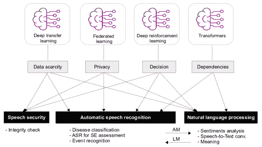

图 1: 语音处理中的关键领域汇总，其中 DTL、DRL、FL 和 transformers 可以应用。

### 1.2 论文贡献

本文对 2016 年至 2023 年间的先进深度学习方法中的现代框架进行了广泛的探讨。这些方法包括 DTL、DRL、FL 和 Transformers，均在 ASR 的背景下进行讨论。据作者所知，迄今为止尚未有研究论文深入探讨并批判性评估上述先进深度学习基础的 ASR 的贡献。

最近几年，已经发表了大量的综述论文，以评估 ASR 模型的各个方面。这些综述中有些集中于特定语言，如葡萄牙语[23]、印度语[24]、土耳其语[25]、阿拉伯语[26]和声调语言（包括亚洲、印欧和非洲语言）[27]。此外，Abushariah 等人的综述强调了双语 ASR[28]。在非特定语言的综述方面，ASR 的具体领域也被关注，包括使用有限词汇的 ASR[29]、儿童 ASR[30]、错误检测与纠正[31]以及无监督 ASR[32]。还提出了集中于神经网络[33]和深度神经网络[34]的系统评审。在另一项综合综述中，Malik 等人[35]讨论了多种特征提取方法，SOTA 分类模型以及一些深度学习方法。最近，作者们提出了一项以 DTL 为 ASR 的综述[36]。表 1 展示了与其他现有 ASR 综述/调查相比，所提出 ASR 综述的主要贡献总结。

本综述文章相比于之前的 ASR 综述提供了若干重要的改进和补充。首先，它整合了同时使用 ASR 和先进 DL 方法的研究，提供了它们交汇处的全面概述。其次，它提供了所有考虑的方法的性能评估结果。第三，它包含了 ASR 模型中使用的指标和数据集的评审。此外，它解决了当前面临的挑战，并因此提出了未来的方向。本文的主要贡献可以总结如下：

+   •

    介绍先进 DL 技术的背景，包括 DTL、DRL、FL 和 transformers。描述用于验证 ASR 方法的评估指标和数据集。

+   •

    引入一个明确的分类法，将 ASR 方法按照 AM 和 LM 的领域进行分类。

+   •

    确定基于先进 DL 的 ASR 中的挑战和不足之处。

+   •

    提出未来方向，以提升基于先进 DL 的 ASR 解决方案的性能，并预测该领域的潜在进展。

表 1：所提出的贡献与其他 ASR 综述的比较。勾选标记（✓）表示特定领域已被覆盖，而叉号（✗）表示特定领域未被覆盖。

| 参考文献 | 年份 | 调查/综述描述 | 先进的深度学习方法 | 性能 | 指标 | 数据集 | 当前 | 未来 |
| --- | --- | --- | --- | --- | --- | --- | --- | --- |
|  |  |  | DRL | FL | TL | 迁移 | 评估 |  | 综述 | 挑战/差距 | 方向 |
| [31] | 2018 | 错误检测和纠正的 ASR 综述 | ✗ | ✗ | ✗ | ✗ | ✗ | ✓ | ✗ | ✗ | ✗ |
| [34] | 2019 | 基于深度学习的语音识别系统性综述 | ✗ | ✗ | ✗ | ✗ | ✗ | ✗ | ✗ | ✗ | ✗ |
| [24] | 2020 | 印地语 ASR 调查 | ✗ | ✗ | ✗ | ✗ | ✗ | ✗ | ✓ | ✗ | ✓ |
| [23] | 2020 | 葡萄牙语 ASR 调查 | ✗ | ✗ | ✗ | ✗ | ✗ | ✗ | ✓ | ✓ | ✓ |
| [25] | 2020 | 土耳其语言 ASR 调查 | ✗ | ✗ | ✗ | ✗ | ✓ | ✗ | ✓ | ✗ | ✗ |
| [35] | 2021 | ASR 调查 | ✗ | ✗ | ✗ | ✗ | ✗ | ✗ | ✗ | ✓ | ✓ |
| [27] | 2021 | 语调语言的 ASR 调查 | ✗ | ✗ | ✗ | ✗ | ✓ | ✗ | ✓ | ✓ | ✓ |
| [32] | 2022 | 无监督 ASR 综述 | ✗ | ✗ | ✗ | ✗ | ✓ | ✗ | ✗ | ✓ | ✗ |
| [30] | 2022 | 儿童 ASR 系统性综述 | ✗ | ✗ | ✗ | ✗ | ✗ | ✗ | ✓ | ✗ | ✗ |
| [29] | 2022 | 有限词汇的 ASR 调查 | ✓ | ✗ | ✗ | ✗ | ✗ | ✗ | ✗ | ✗ | ✓ |
| [26] | 2022 | 阿拉伯语 ASR 系统性综述 | ✗ | ✗ | ✗ | ✗ | ✓ | ✗ | ✗ | ✓ | ✓ |
| [28] | 2022 | 双语 ASR 综述 | ✗ | ✗ | ✗ | ✗ | ✓ | ✗ | ✓ | ✓ | ✗ |
| [33] | 2023 | 神经网络技术的 ASR 调查 | ✗ | ✗ | ✓ | ✗ | ✓ | ✓ | ✓ | ✓ | ✗ |
| [36] | 2023 | 基于 DTL 的 ASR 综述 | ✗ | ✗ | ✓ | ✗ | ✓ | ✓ | ✓ | ✓ | ✓ |
| 我们 | 2024 | 关于先进深度学习技术的 ASR 综述 | ✓ | ✓ | ✓ | ✓ | ✓ | ✓ | ✓ | ✓ | ✓ |

### 1.3 综述方法论

本部分阐述了综述的方法论，包括搜索策略和研究选择。包括标准，如关键词对齐、创新性和影响力以及独特性，都被详细说明，这些共同影响了论文质量评估协议的制定。为了定位和汇编现有的先进深度学习 ASR 研究，在知名的出版数据库中进行了全面的搜索，这些数据库以托管顶级科学研究文章而著称。探索涵盖了 Scopus 和 Web of Science。关键词从初步参考文献集中提取并组织。通过“主题聚类”，这些出版物根据“摘要”、“标题”和“作者关键词”中的关键词进行排序。此过程的结果形成了以下查询：

参考文献=从“摘要” || “标题”|| “作者关键词”选择（论文，其中关键词= (ASR || NLP) & (DTL || DRL || FL || Transformers)）。

符号 || 和 & 分别表示逻辑运算 OR 和 AND。对出版物的评估考虑了 ASR 中的创新水平、研究质量以及所呈现的贡献和发现。本综述仅涵盖了 2016 年至 2023 年间发表的研究贡献。

### 1.4 论文结构

本论文分为六个部分。当前部分介绍了论文。第 1.3 节提供了关于 AM 和 LM 的背景信息，并回顾了在 ASR 中使用的评价指标和数据集。接下来，第四部分深入探讨了利用先进 DL 方法（包括 Transformers）、DTL、FL 和 DRL 的最新 ASR 进展。第五部分和第六部分分别讨论了关于先进 DL 基础的 ASR 的现有挑战和未来方向。最后，第七部分总结了论文的关键发现。

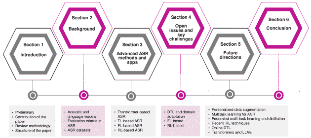

图 2：调查路线图：导航论文部分和子部分的指南。

表[t!] 文献获取数据库。待修改 数据库 研究文章 会议论文 书籍章节 总计 ACM 5 1 – 6 Elsevier 26 – – 26 Springer 23 – 10 33 IEEE 39 28 – 67 其他 44 29 – 70

## 2 语音识别中 DTL 技术的概述

### 2.1 现有 DTL 技术的分类

至今，还没有标准化和全面的技术来将 DTL 分类为不同类别。然而，DTL 算法可以根据知识的传递方式、时间和方式分为几种类型：

(a) 传递了什么知识？询问哪些知识特征可以跨领域或任务进行传递。有些信息特定于某些领域或任务，而其他知识则在不同领域之间共享，并可以帮助提高目标任务或领域的表现。根据这个定义，DTL 可以是基于特征、基于实例、基于关系或基于模型的。

(b) 知识是如何传递的？询问需要实施哪些学习算法来传递知识。

(c) 知识何时转移？探讨在何时以及在什么情况下应或不应转移知识。

此外，研究人员提出了分类法来对基于 DTL 的 ASR 技术进行分类。例如，Niu 等人[21]提出了一个包含两个层次的分类法。第一个层次包括基于源领域和目标领域的标注数据的可用性和数据模态的四个子组。这些子组包括归纳式 DTL、转导式 DTL、跨模态 DTL 和无监督 DTL[80]。表 2 提供了这些可能性的总结。此外，第一个层次的每个子组还可以进一步细分为四种不同的学习类型：实例学习、特征学习、参数学习和关系学习。

表 2：DTL 的可能性。其中标记（$\varsubsetneq$）表示领域/任务不同但相关，($\exists!$)表示存在唯一的领域/任务，而($\cong$)表示领域、任务或空间不总是相等的。

|  | 领域 | 任务 | 数学性质 | 子类别/用途 |
| --- | --- | --- | --- | --- |
| 传统的机器学习/深度学习 | $\mathbb{D}_{S}=\mathbb{D}_{T}$ | $\mathbb{T}_{S}=\mathbb{T}_{T}$ | $X_{S}\neq X_{T}$, $Y_{S}=Y_{T}$ | 使用$X_{S}$数据库训练的 ASR 模型用于识别$X_{T}$数据库。 |
| 归纳式 DTL | $\mathbb{D}_{S}\cong\mathbb{D}_{T}$ | $\mathbb{T}_{S}\neq\mathbb{T}_{T}$ | $X_{S}\neq X_{T}$, $Y_{S}\exists,Y_{T}\exists$ | 如果$Y_{S}\exists$，则 DTL 是多任务学习。如果$Y_{S}\nexists$，则 DTL 是自学学习，因此$\chi_{S}\cong\chi_{T}$。 |

| 转导式 DTL | $\mathbb{D}_{S}\neq\mathbb{D}_{T}$ | $\mathbb{T}_{S}=\mathbb{T}_{T}$ | $P(X_{S})\neq P(X_{T})$, $Y_{S}\exists,Y_{T}\nexists$ |

$\chi_{S}=\chi_{T}$ | 当$\chi_{S}=\chi_{T}$时，DTL 与 DA 有关。如果$\mathbb{D}_{T}\exists!$且$\mathbb{T}_{T}\exists!$，DTL 用于样本选择偏差或协变量偏移。 |

| 跨模态 DTL | $\mathbb{D}_{S}\neq\mathbb{D}_{T}$ | $\mathbb{T}_{S}\neq\mathbb{T}_{T}$ | $P(Y_{S}/X_{S})\neq P(Y_{T}/X_{T})$, $Y_{S}\neq Y_{T}$, $\chi_{S}\neq\chi_{T}$ | 例如，$\mathbb{D}_{S}$的$X_{S}$数据集是语音数据，而$\mathbb{D}_{T}$的$X_{T}$数据集是文本数据。 |
| --- | --- | --- | --- | --- |
| 无监督 DTL | $\mathbb{D}_{S}\varsubsetneq\mathbb{D}_{T}$ | $\mathbb{T}_{S}\varsubsetneq\mathbb{T}_{T}$ | $Y_{S}\nexists,Y_{T}\nexists$ | 用于聚类、降维和密度估计等的 DTL。 |

归纳 DTL 与经典 ML 相比，经典 ML 可以作为 DTL 比较的参考，并且鉴于目标任务 $\mathbb{T}_{T}$ 与源任务 $\mathbb{T}_{S}$ 不同，归纳 DTL 的目标是增强目标预测函数 $\mathbb{F}_{T}$ 在 TD 中，如前述于子节 LABEL:sub12。然而，SD $\mathbb{D}_{S}$ 和 TD $\mathbb{D}_{T}$ 可能不总是相同的（表 2）。归纳 DTL 可以根据是否有标记或未标记的数据，类似于以下两种情况进行说明：

(a) 多任务 DTL：SD 拥有一个庞大的标记数据库（$X_{S}$ 标记 $Y_{S}$），这是一种多任务学习的独特形式。然而，通过多任务方法，许多任务 $(T_{1},T_{2},\dots,T_{n})$ 会同时（并行）学习，包括源活动和目标活动（任务）。

(b) 顺序 DTL：（通常称为自学学习）数据集在 SD 中未标记（$X_{S}$ 未标记 $Y_{S}$），但在目标领域中标签可用（$X_{T}$ 标记 $Y_{T}$）。顺序学习是一种 DL 系统，可以在两个步骤中实现分类目的。第一步是特征表示迁移，从大量未标记数据集中学习，第二阶段是将此学到的表示应用于标记数据以完成分类任务。因此，顺序 DTL 是一种顺序学习多个活动（任务）的方法。源领域和目标领域之间的间隔可能不同。例如，假设我们有一个预训练模型 $M$，并考虑将 DTL 应用到多个任务 $(T_{1},T_{2},\dots,T_{n})$。我们在每个时间步骤 $t$ 学习一个特定的任务 $\mathbb{T}_{T}$，这比多任务学习要慢。然而，当不是所有任务在训练期间都存在时，这可能是有益的。顺序 DTL 进一步分为几种类型 [alyafeai2020survey]：

+   1-

    微调：原理是学习一个新的函数 $\mathbb{F}_{T}$，该函数通过使用 $M$ 将参数 $\mathbb{F}_{T}(W_{S})=W_{T}$ 转换，给定一个预训练模型 $M_{S}$，其权重为 $W_{S}$，以及目标任务 $\mathbb{T}_{T}$，其权重为 $W_{T}$。设置可以在所有层中调整，或者仅在某些层中（图 3 (a)）。每层的学习率可以是不同的（区分微调）。可以向大多数任务添加一组新的参数 $K$，使得 $\mathbb{F}_{T}(W_{T},K)=W_{S}\circ K$。

+   2-

    适配器模块: 给定一个预先训练的模型$M_{S}$并输出$W_{S}$，对于目标任务$\mathbb{T}_{T}$。适配器模块旨在启动不同的参数集$K$，这个集合比$W_{S}$要少得多，即，$K\ll W_{S}$。$K$和$W_{S}$必须能够分解成更紧凑的模块，即$W_{S}=\{w\}_{n}$和$K=\{k\}_{n}$。适配器模块允许学习以下新函数$\mathbb{F}_{T}$:

    |  | $\mathbb{F}_{T}(K,W_{S})=k_{1}^{\prime}\circ w_{1}\circ\dots k_{n}^{\prime}\circ w_{n}.$ |  | (1) |
    | --- | --- | --- | --- |

    根据方程 1，在适应过程中，原始权重集合$W_{S}=\{w\}_{n}$保持不变，但权重集合$K$变为$K^{\prime}=\{k^{\prime}\}_{n}$，适应域的原理如图 3 (b)所示。

+   3-

    基于特征: 仅对学习概念和表示感兴趣，例如，单词，字符，短语或段落嵌入$E$。基于模型$M$的$E$的集合保持不变，即，$\mathbb{F}_{T}(W_{S},E)=E\circ W^{\prime}$，其中$W^{\prime}$被微调。例如，研究人员已经将生成对抗网络(GAN)的原理应用到 DTL 中，生成器将特征从 SD 和 TD 发送到鉴别器，鉴别器确定特征的来源并将结果反馈给生成器，直到它们无法再被区分。在这个过程中，GAN 获得了两个域的共同属性，如图 3 (c)所示。

+   4-

    零-shot: 是所有方法中最简单的。假设参数$W_{S}$无法修改或向预先训练的模型$M_{S}$添加$K$作为新参数使用$W_{S}。举个例子，在零-shot 中没有训练技术来优化或学习新参数。

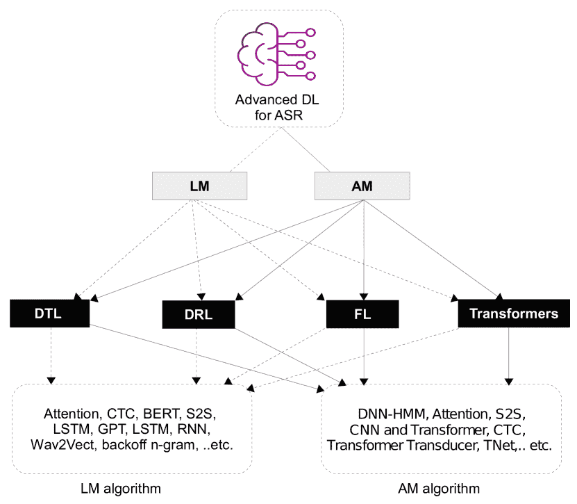

图 3: 结构：(a) 微调 、(b) DA 和 (c) 基于 DTL 的 GAN。

#### 2.1.1 迁移 DTL

与传统 ML 相比（可作为 DTL 比较的参考），并且考虑到 TDs $\mathbb{D}_{T}$与 SDs $\mathbb{D}_{S}$不同。SD 具有一个标记数据集（$X_{S}$带有$Y_{S}$的标记），而 TD 没有标记数据集，源任务和目标任务相同（表 2）。归纳 DTL 的目标是通过$\mathbb{D}_{S}$和$\mathbb{T}_{T}$中的知识构建目标预测函数$\mathbb{F}_{T}$。此外，归纳 DTL 环境可以根据源领域和目标领域之间的不同条件进一步分类为两类：

(a) 领域适应（DA）：不同领域间的特征空间$\chi_{S}$和$\chi_{T}$是相同的，但输入数据集的边际概率分布不同，即$P(Y_{S}/X_{S})\neq P(Y_{T}/X_{T})$。例如，可能在$\mathbb{D}_{S}$中对度假村的主题进行评估，并用于训练$\mathbb{D}_{T}$中餐馆的模型。当$\mathbb{T}_{T}$具有明显不同的分布或标记数据稀缺时，DA 通常最为有效。

(b) 跨模态 DTL：也称为口语领域的跨语言 DTL，大多数 DTL 方法或多或少需要在$\mathbb{D}_{S}$和$\mathbb{D}_{T}$之间建立特征空间或标签空间的连接。换句话说，DTL 仅在源数据和目标数据处于相同模态时发生，例如视频、语音或文本。与所有其他 DTL 方法相比，跨语言 DTL 是 DTL 中最复杂的问题之一。假设源和目标领域的特征空间完全不同（$\chi_{S}\neq\chi_{T}$），如语音到图像、图像到文本和文本到语音。此外，源领域$Y_{S}$和目标领域$Y_{T}$的标签空间可能不同（$Y_{S}\neq Y_{T}$）。

(c) 无监督 DTL：旨在利用$\mathbb{D}_{S}$和$\mathbb{T}_{S}$中的知识来增强目标预测函数$\mathbb{F}_{T}$在$\mathbb{D}_{T}$中的学习，其中$\mathbb{T}_{S}$与$\mathbb{T}_{T}$不同但相关，且$Y_{S}$和$Y_{T}$不可见，给定一个包含学习任务$\mathbb{T}_{S}$的源数据集$\mathbb{D}_{S}$、一个目标数据集$\mathbb{D}_{T}$和一个匹配的学习任务$\mathbb{T}_{T}$（$\mathbb{D}_{S}$与$\mathbb{D}_{T}$不同但相关）。

#### 2.1.2 对抗性 DTL

与上述 DTL 方法相比，对抗学习[wang2020transfer]有助于学习更具可转移性和区分性的表示。在[ganin2016domain]的工作中，首次引入了领域对抗神经网络（DANN）。核心思想是在网络中使用领域对抗损失，而不是使用预定义的距离函数，如最大均值差异（MMD）。这极大地帮助网络学习更有区分性的数据。许多研究都使用了领域对抗训练，导致了 DANN 思想的出现[bousmalis2016domain, chen2019joint, long2017deep, zhang2018collaborative]。之前的所有工作都忽略了对抗 TL 中边际和条件分布的不同影响，而在[wang2020transfer]中，提出的方案，名为动态分布对齐（DDA），可以动态评估每个分布的重要性。

## 3 背景

### 3.1 声学模型和语言模型

AM 负责捕捉不同语音单元的声音特征。这涉及从音频波形中生成特征向量序列的统计量。可以使用各种技术，例如线性预测编码 (LPC)，倒谱分析，滤波器组分析，梅尔频率倒谱系数，小波分析和其他技术来提取这些特征[37]。在处理阶段，一个解码器（搜索算法）使用声学词典和 LM 来创建假设的单词或音素。可以在图 4 中看到整个过程的图解。

\Acp

LM 提供单词序列的概率，这对 ASR 系统来预测句子中后续单词的可能性至关重要[38]。针对特定领域的 LM 是在目标领域的文本数据上训练的，以捕捉其独特的词汇和语法结构[39]。对于 n-gram 模型，这涉及计算给定前$n-1$个单词的条件概率[40]：

|  | $P(w_{n}&#124;w_{n-1},w_{n-2},\ldots,w_{n-(n-1)})=\frac{C(w_{n-(n-1)},\ldots,w_{n})}{C(w_{n-(n-1)},\ldots,w_{n-1})}$ |  | (2) |
| --- | --- | --- | --- |

在 ASR 的背景下，LM 通过提供语言环境来补充 AM。AM 和 LM 的综合概率有助于在解码过程中确定给定音频输入的最可能转录。在 ASR 系统中经常使用的 LM 是回退 n-gram 模型。

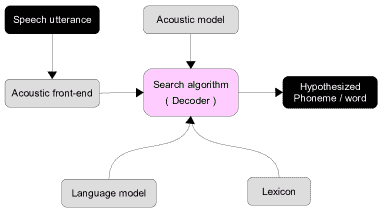

图 4：说明端到端的 ASR 框架。

### 3.2 ASR 中的评估标准

为了评估 ASR 技术的有效性和适用性，研究人员采用了多种方法。其中一些包括成熟的 DL 指标，如准确率、F1-score、召回率（灵敏度或真正率 (TPR))、精确度（也称为阳性预测值）和特异性（通常称为真阴性率 (TNR)) [41]。这些指标作为实验结果的关键评估标准，在[42、43、44]等研究中得到了证明。此外，还有 ASR 特定的指标，这些指标在表 3 中有详细说明。

|

表 3：评估 ASR 方法所使用指标的概览。

|  |  |
| --- | --- |
| 指标 | 公式 | 描述 |
| WER | $\displaystyle\mathrm{\frac{S+D+I}{N}=\frac{S+D+I}{H+S+D}}.$ | 词错误率 (WER)作为一种常用的指标来评估自动语音识别(ASR)的性能。它通过确定错误识别的词与处理的总词数之间的比例来计算[45、17、46]。在给定的背景下，$\mathrm{I,D,S,H}$ 和 $\mathrm{N}$ 表示插入、删除、替换、命中和输入词的数量。与 WER 相反，字符错误率 (CER)被采用，同时遵循相同的评估原则。 |
| PESQ 和 MOS-LQO | $\displaystyle\mathrm{MOS-LQO}=0.999+\frac{4.999-0.999}{1+e^{-1.4945.PESQ+4.6607}}$ | PESQ 作为评估语音感知质量的客观技术[47]。评估过程中涉及将数值评分分配在-0.5 到 4.5 的范围内。此外，可以在 MOS 和 PESQ 评分之间建立相关性，从而产生一种新的评估指标，称为均值意见评分-听觉质量客观（MOS-LQO），也被称为 PESQ Rec.862.1。[22] |
| RTF | $\displaystyle\mathrm{RTF=\frac{\text{Total Processing Time}}{\text{Total Duration}}}$ | \Ac RTF 作为评估 ASR 系统处理时间成本的标准指标。它表示处理一秒语音所需的平均处理时间。 |
| RER | $\displaystyle\frac{(E_{\text{baseline}}-E_{\text{proposed}})}{E_{\text{baseline}}}\times 100\%$ | 相对误差率 (RER) 表达了提议的深度学习模型相较于基线的百分比误差率。 $E_{\text{baseline}}$ 是基线模型的误差率。 $E_{\text{proposed}}$ 是提议模型或方法的误差率。 |
| D | $\displaystyle\frac{\sum_{i=1}^{n}\Big{(}1-\frac{\sum_{j=1}^{n}a_{ij}\cdot&#124;i-j&#124;}{\max(&#124;i-1&#124;,&#124;i-2&#124;,\ldots,&#124;i-n&#124;)}\Big{)}}{n}\hskip 28.45274pt$ | 注意力矩阵的对角中心性（D）定义为所有行中心性的均值。 其中 $j$ 代表每列的索引，$n$ 表示输入序列的长度，$a_{ij}$ 表示输入序列中第 $i$ 个和第 $j$ 个元素之间的注意力权重，$&#124;i-j&#124;$ 表示输入序列中第 $i$ 个和第 $j$ 个元素之间的距离 [48]。 |

### 3.3 ASR 数据集

文献中已使用各种数据集来进行不同的 ASR 任务。 表 4 展示了用于 DTL 基础的 ASR 应用的数据集选择及其各自特征。 需要注意的是，该表主要包括公开访问的存储库。此外，还值得提及的是，某些数据集随着时间的推移经历了多次更新和改进，从而提升了其发展水平。

表 4：用于高级深度学习（DL）基础的自动语音识别（ASR）应用的公开数据集列表

默认使用的数据集 ASR 任务 特点 LibriSpeech [49, 50, 51] 训练和评估语音识别系统。该集合包括 1000 小时的语音录音，采样率为 16 kHz，来源于 LibriVox 项目中的有声读物。DCASE [52, 53] 识别声学环境和检测声音出现。包括 8 个粗略级别和 23 个精细级别的城市声音类别，数据收集于 2020 年的纽约市，使用 50 个声学传感器。WSJ [48] 声学场景和声音事件语料库 包括 81 小时精心整理的朗读语音训练数据。SWBD [48] 对话电话语音语料库 是一个综合性的集合，包含 260 小时的对话电话语音训练数据。AISHELL [54, 55, 56] 中文普通话语音语料库 400 名来自不同中文口音地区的参与者，在安静的室内空间使用高保真麦克风录制，后期降采样至 16kHz。CHIME3 [57] 用于现实世界环境中的远程麦克风的语音识别。包括约 342 小时的英语语音带有噪声的转录和 50 小时的噪声环境录音。Google-SC [57] 具有有限词汇范围的语音命令。该数据集包含 105,829 条 35 个词汇的 1 秒语音记录，按频率分类。每条语音记录以 1 秒的 WAVE 格式文件存储，具有 16 位单声道和 16KHz 采样率。涉及 2,618 名说话者。AURORA4 [57] 比较前端在大词汇量识别性能上的表现。Aurora-4 是从 WSJ 语料库衍生的语音识别数据集，提供四种条件（清晰、通道、噪声、通道+噪声），有两种麦克风类型和六种噪声类型，每套数据总计 4,620 条语音记录。Car-env [57] 车辆环境声音 是来自韩国的数据集，涵盖 100 小时的车辆录音。包括简短的命令，每条命令平均 1.6 个词。HKUST [50, 56] 将普通话语音分类为标准和口音类型。包括大约 149 小时的普通话电话对话。AudioSet [51] 音频事件识别 包括 1,789,621 段每段 10 秒的音频（总计 4,971 小时）。包括至少 100 个实例，分为 632 个音频类别，但仅有 485 个音频事件类别被明确识别。AWIC-19 [58] 阿拉伯语词汇识别 包括 770 条录音，包含孤立的阿拉伯语单词。TED2 [59] 英语 ASR 语料库 该数据集首次提供于 2012 年 5 月，用于训练，包括 118 小时 4 分钟 48 秒的训练数据，来自 666 名说话者，包含约 170 万个单词。

## 4 高级 ASR 方法和应用

传统的统计语言模型，如回退 n-gram 语言模型，因其简单性和可靠性被广泛使用。然而，利用注意力模型的双向编码器表示（BERT）相比于单向语言模型表现出了更好的上下文理解，如 Devlin 等人的研究所示[60]。

在声学模型方面，基于深度学习的模型如深度神经网络-隐马尔可夫模型（DNN-HMM）和连接时序分类（CTC）取得了显著进展。DNN-HMM 模型在自动语音识别研究中得到了广泛研究，而 CTC 是一种端到端的训练方法，不需要预对齐，只需输入和输出序列。S2S 模型在解决自动语音识别任务时也取得了成功，且不使用语言模型或发音词典，如 Chiu 等人所述[61]。

自动语音识别系统在某些情况下常面临性能下降，这是由于“一种模型适用所有”方法所致。此外，缺乏多样化和充足的训练数据会影响声学模型的表现。为了克服这些限制，提高自动语音识别系统的弹性和灵活性，先进的深度学习方法如深度迁移学习及其子领域领域适应（DA）、深度强化学习和联邦学习已出现。这些创新方法集体解决了关于知识转移、模型泛化和训练效果的问题，提供了扩展传统深度学习模型能力的补救措施。因此，许多研究集中在通过应用上述算法来增强现有的自动语音识别系统。图 5 提供了当前最先进技术深度学习驱动的自动语音识别及其在声学模型和语言模型中的最有用的相关方案的概述。

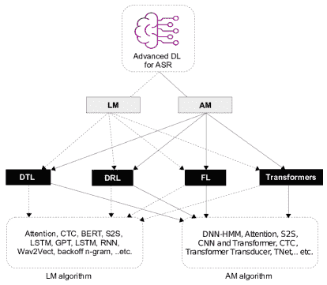

图 5：先进的深度学习驱动的自动语音识别算法及其常用模型概述。

### 4.1 基于 Transformer 的自动语音识别

Transformer 作为一个杰出的深度学习模型，被广泛应用在各个领域，包括 NLP、计算机视觉（CV）、语音处理。最初是作为 S2S 模型用于机器翻译，它已经发展到在各个领域都有应用。Transformer 极大依赖于自注意力机制，使其能够捕捉输入序列中的广泛依赖。标准的 Transformer 模型包含了查询-键-值（QKV）注意力机制。在这种设置下，给定查询的矩阵表示$\mathbf{Q}\in\mathbb{R}^{N\times D_{k}}$，键的$\mathbf{K}\in\mathbb{R}^{M\times D_{k}}$，以及值的$\mathbf{V}\in\mathbb{R}^{M\times D_{v}}$，缩放的点积注意力定义如下：

|  | $\text{注意力}(\mathbf{Q},\mathbf{K},\mathbf{V})=\text{softmax}\left(\frac{\mathbf{Q}\mathbf{K}^{T}}{\sqrt{D_{k}}}\right)\mathbf{V}$ |  |
| --- | --- | --- |

这里，$N$和$M$表示查询和键（或值）的长度，而$D_{k}$和$D_{v}$表示键（或查询）和值的维度。softmax 操作逐行应用于矩阵$\mathbf{A}$。在 Transformer 架构中，基于查询来源和键-值对的三种注意力机制存在：

+   •

    自注意力：在 Transformer 编码器中，查询$\mathbf{Q}$、键$\mathbf{K}$和值$\mathbf{V}$都等于前一层的输出，用 Eq. (2)表示为$\mathbf{X}$。

+   •

    掩码自注意力：在 Transformer 解码器中，自注意力受到限制，允许每个位置的查询只能关注到该位置及之前的键-值对。这是通过在注意力矩阵$\hat{\mathbf{A}}=\exp\left(\frac{\mathbf{Q}\mathbf{K}^{T}}{\sqrt{D_{k}}}\right)$进行规范化之前，实现一个掩码函数来实现的，其中非法位置通过设定$\hat{A}_{ij}=-\infty$（如果$i<j$）来屏蔽掉。这种自注意力通常称为自回归或因果关注。

+   •

    交叉注意力：在交叉关注中，查询源自前一层（解码器）的结果，而键和值源自编码器的输出。

在 ASR 领域的许多研究都引入了基于 Transformer 的方法，包括声学和语言领域。在接下来的小节中，我们将深入探讨每个类别中几种尖端技术的全面审查和详细分析。

表 5：基于变压器的 ASR 中一些提出的工作总结。符号($\uparrow$)表示结果增加，而($\downarrow$)表示结果减少。在多种情景下进行了研究的情况下，只提及了最佳表现的结果。

| 参考 | 基于 | 语音识别任务 | 变压器 | AM/LM | 度量标准结果 |
| --- | --- | --- | --- | --- | --- |
| [55] | CNN | 解决了混合代码问题 | 多头注意力 | LM | RER= 10.2% |
| [56] | VGGnet | 压缩 ASR 参数并加快推理时间 | 低秩多头注意力 | AM | CER= 13.09% |
| [57] | DNN-HMM | 改进 ASR | 注意力 | AM | RER= 4.7%$\downarrow$ |
| [62] | Emformer | 大规模 ASR | 注意力 | AM | RERR= 26% |
| [63] | TRUNet | 声音源分离 | TNet | AM | PESQ= 0.22$\uparrow$ |
| [64] | MHSA | 提高语音/ASR | D²Net | AM | PESQ= 0.96$\uparrow$ |
| [58] | HMM | 改进 ASR | 声学编码器 | AM | Acc= 96% |
| [65] | RNN-T | 声学重新评分场景 | Transformer-Transducer | AM | Acc= 8%$\uparrow$ |
| [66] | CTC | ASR、ST、声学 ED | 一体化 | AM | WER=0.3%$\uparrow$ |
| [67] | CNN | 低延迟、减少帧率且支持流式传输的语音识别 | Transformer-Transducer | AM | WER= 3.6% |
| [68] | CTC 对齐 | 在标记级别检索声学嵌入以改善 ASR | 注意力 | AM | 51.2x RTF$\uparrow$ WER= 2.3% |
| [69] | RNN-LSTM | 提高端到端 ASR 的效率 | 注意力 | LM | CER=1.98% |
| [59] | CTC 对齐 | 提升端到端 ASR 的性能 | 自回归 Transformer | AM | RTF= 0.0134 WER= 2.7% |

#### 4.1.1 声学领域

研究[57]揭示了 Transformer 模型在输入稀疏性方面比卷积神经网络（CNN）更易受影响。作者分析了性能下降，归因于 Transformer 的结构特性。此外，他们引入了一种新颖的正则化方法，以增强 Transformer 对输入稀疏性的韧性。这种方法通过强制对齐中的静音标签信息直接调节注意力权重，具有不需要额外模块训练和过度计算的优点。

论文[50]解决了 Transformer 基础的端到端建模在 ASR 任务中的一个限制，即来自多个输入流的中间特征可能缺乏多样性。提出的解决方案引入了一个多级声学特征提取框架，结合浅层和深层流，以捕获分类的传统特征和具有多样性的说话人不变深层特征。一个基于特征相关性的融合（FCF）策略被用来结合频率和时间域的中间特征，在将这些特征输入到 Transformer 编码解码模块之前，关联并合并这些特征。

提议的掩码自编码音频谱图变换器（MAE-AST）仅在未掩码的标记上操作[51]，并使用一个大型编码器。它将掩码标记与编码器输出嵌入连接在一起，并将其输入到一个浅层解码器中。下游任务的微调仅涉及使用编码器，去除了解码器的重建层。MAE-AST 相比于自监督音频谱图变换器（SSAST）模型，在语音和音频分类方面表现出显著的改进。针对高掩码比率的问题，该方法实现了 3$\times$的加速和 2$\times$的内存使用减少。在下游任务中，该方法始终优于 SSAST。为了识别各种声音类型，Bai 等人[52]引入了 SE-Trans，这是一种用于环境声音识别的跨任务模型，涵盖了声学场景分类、城市声音标记和异常声音检测。SE-Trans 利用注意力机制和变换器编码器模块，学习声学特征中的通道级关系和时间依赖性。该模型包含 FMix 数据增强模块，通过从随机采样的复杂矩阵中创建二进制掩码，并应用低通滤波器。SE-Trans 在 ESR 任务中表现出色，通过对 DCASE 挑战数据库的评估证明了其在环境声音识别中的鲁棒性和多样性。

自动音频字幕生成（AAC）涉及为音频录音生成文本描述，涵盖声音事件、声学场景和事件关系。目前的 AAC 系统通常采用编码器-解码器架构，解码器根据提取的音频特征制作字幕。Chen 等人在其论文[53]中介绍了一种新方法，通过利用从音频片段中提取的多层次信息来增强字幕生成。所提方法包括一个具有多层次特征提取（通道注意力、空间注意力）的 CNN 编码器，一个专门用于预测关键词以生成单词级指导信息的模块，以及变换器解码器。图 6 展示了包含这三种模块的总体架构。结果显示，在各种指标上取得了显著改善，在交叉熵训练阶段达到了 SOTA 性能。

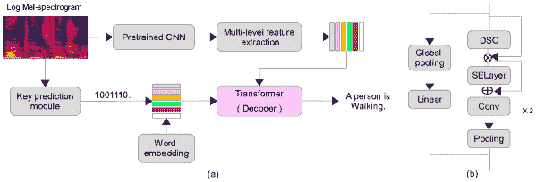

图 6：基于 CNN 的变换器用于自动音频字幕生成[53]。

对抗音频涉及操控声音以欺骗或危害机器学习 (ML)系统，利用音频识别模型中的漏洞。[70, 71]中的工作旨在使用变换器对抗对抗噪声。[70]中的作者使用了定制的视觉变换器来识别具有挑战性的声学条件下的语音区域。为了增强适应性，他们在变换器中加入了一个增广模块作为额外的头，集成了低通和带通滤波器。实验结果表明，使用低通滤波器的增广视觉架构在语音检测中达到了高达 85.2%的 F1 分数，超越了基线视觉变换器的 81.2% F1 分数。然而，在[71]中，作者提出了一种使用基于注意力的变换器机制来识别对抗音频的对抗检测框架。谱图特征在输入到变换器编码器之前被分段并与位置性信息集成，在嘈杂环境、黑盒攻击和白盒攻击等多种条件下实现了 96.5%的准确率。

论文[72]介绍了一种并行路径变换器模型，以解决语音分离任务中的计算成本挑战。该模型使用改进的前馈网络和变换器模块，通过在块内和块间的变换器采用并行处理策略。这使得语音信号的局部和全局建模可以并行进行，从而通过捕捉短期和长期依赖关系来提高整体系统性能。

混合 ASR 方法概述了将神经网络方法整合到先进的连续语音识别系统中的技术的构思和执行。这一整合基于隐马尔可夫模型，旨在提升其整体性能。王等人[73]引入并评估了基于变换器的 AMs 用于混合语音识别。这种方法结合了多种位置嵌入方法和迭代损失以训练深度变换器。该方法在 Librispeech 基准测试中表现优越，建议的基于变换器的 AM 比最佳混合结果高出 19%到 26%，相较于标准 n-gram LM。

\Ac

在[63]中提出的 TRUNet 代表了一种创新的端到端多通道混响声音源分离方法。该模型结合了递归-U 网络，直接从输入光谱估计多通道滤波器，从而利用声音源分离中的空间和光谱-时间多样性。在图 7 中，框图展示了 TRUNet 的 transformer 结构。transformer 网络（TNet）包括三种变体：（i）TNet–Cat，将多通道光谱连接起来，作为单一输入。这种方法允许直接利用通道间的空间信息。（ii）TNet–RealImag，分别利用两个独立的 transformer 堆栈处理实部和虚部。查询和键从多通道光谱中计算出来。然而，这种方法可能无法完全利用空间信息，如相位差异。（iii）TNet–MagPhase，类似于 TNet–RealImag，但使用光谱幅度和光谱相位而不是实部和虚部。这种变体在从复值光谱中提取空间信息方面表现更优，使用 TRUNet-MagPhase 结构时能获得最大程度的声音源分离性能提升。

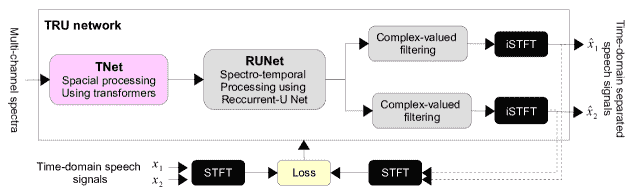

图 7：基于 Transformer 的源分离方案示例 [63]。

最近，双路径网络在许多语音处理任务中，如语音分离和语音增强，表现出了有效的结果。鉴于此，王科及其同事将 transformer 融入双路径网络结构中，提出了一种名为双阶段 Transformer 基于神经网络（TSTNN）的时域语音增强模型。该模型显著提升了语音增强的性能 [74]。一些研究发现表明，点积自注意力可能对 transformer 模型并非必不可少。类似地，论文 [64] 介绍了 D²Net，一种用于复杂声学环境中挑战性单通道混合语音的去噪和去混响网络。D²Net 结合了用于特征提取和融合的双分支编码器（TBE），以及具有局部密集合成注意力（LDSA）的全球-局部双路径 transformer（GLDPT），以增强局部信息感知。

gong 等人[75]提出的研究探讨了基于自注意力的神经网络，如音频谱图 Transformer（AST），用于音频任务。它引入了一种自监督框架，提高了 AST 在 ASR、说话人识别等各种语音分类任务上的性能，提升幅度达 60.9%，减少了对标注数据的依赖。这一方法标志着音频自监督学习的开创性努力。同样，[76]中提出了一种新颖的增强记忆自注意力方法，解决了 Transformer 基于声学建模在流媒体应用中的局限性，在基准数据集上相对误差减少超过 15%。

Shareef 等人[58]提出了一种用于阿拉伯 ASR 系统的协作训练方法，针对言语障碍儿童的声学编码器，在输出序列中的音素对齐上实现了 10%的相对准确性提升。开创性地识别言语障碍儿童的阿拉伯语。类似地，在[77]中，针对设备上的 ASR 协作训练不同规模的声学编码器提高了效率并减少了冗余。通过使用带有辅助任务的共蒸馏，协作训练在 LibriSpeech 语料库上实现了高达 11%的相对 WER 提升。

在 ASR 的背景下，换能器模型将输入序列（声学特征）映射到输出序列（转录）。与传统的 S2S 模型不同，换能器可以更高效地处理可变长度的输入和输出序列。研究[65]探讨了 Transformer 换能器基于 ASR 中的注意力掩蔽，比较了固定掩蔽与分块掩蔽在准确性和延迟方面的表现。作者声称，在声学重新评分场景中，可变掩蔽是可行的选择。同样，为了使 Transformer 适应流媒体 ASR，[67]中的作者采用了换能器框架用于可流式对齐。使用带有交错卷积层的单向 Transformer 进行音频编码，他们对未来上下文进行建模，并逐渐下采样输入以减少计算成本，同时限制历史上下文长度。

接下来，文献[66]介绍了一种基于 Transformer 架构的全功能 AM，结合了 CTC 以确保顺序排列并利用时间细节。它同时解决了 ASR、音频标记（AT）和声学 ED 的问题。该模型表现出卓越的性能，展示了其在综合声学场景转录中的适用性。

Winata 等人 [56] 提出了一个内存高效的 Transformer 架构用于端到端语音识别。与基线相比，它显著减少了参数，提升了训练速度超过 50%，推理时间提高了 1.35$\times$。实验表明其具有更好的泛化能力、更低的错误率，并超越了现有方案，无需外部语言或声学模型。对设备上的 ASR 系统的需求不断增长，引发了对模型压缩的兴趣。

#### 4.1.2 语言领域

自注意力模型，如 Transformers，在语音识别中表现优异，并揭示了一个重要的模式。由于上层自注意力层被前馈层替代，类似于 [48] 中的 CLDNN 架构，对 wall street journal (WSJ) 和 switchboard (SWBD) 数据集的实验显示没有性能下降，并有小幅提升。提出的新指标——注意力矩阵对角性——表明从下到上的编码器自注意力层中对角性增加。作者得出结论：当下层捕获了足够的上下文信息时，训练上层编码器层时不再需要全球视图。Hrinchuk 等人 [49] 的研究提出了一种高效的后处理模型，用于基于 Transformer 的编码器-解码器架构，初始化为预训练的 BERT 模型 [36] 的权重。该模型有效地优化了 ASR 输出，通过广泛的数据增强和预训练权重初始化等策略显示了显著的性能提升。在 LibriSpeech 基准数据集上，观察到 WERs 的显著减少，特别是在更嘈杂的评估数据集部分，超越了基线模型，并接近 Transformer-XL 神经语言模型的 6-gram 再评分性能。

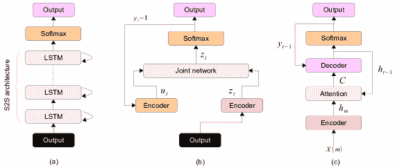

图 8: 一些端到端模型：基本 CTC、RNN-Transducer 和注意力架构 [78]。

\Ac

CTC 是一种常用于 S2S 任务的架构和原理（图 8），例如 ASR。它通过引入空白符号并允许输入和输出序列之间的可变长度对齐，从而实现无对齐训练。在训练过程中，模型学习将输入序列与目标序列对齐，空白符号则考虑了多个可能的对齐。 CTC 在具有可变长度输出的任务中特别有效，使其非常适合像语音识别这样的应用，因为口语的持续时间可能有所不同。图 8（a）展示了 CTC 的操作原理和组件。后者已在许多 ASR 方案中使用，例如，Deng 等人[54]提出了创新的预训练 Transformer S2S ASR 架构，该架构结合了自监督预训练技术，实现了全面的端到端 ASR。通过采用混合 CTC/注意力模型，它最大化了预训练 AM 和 LM 的潜力。引入 CTC 分支有助于训练过程中编码器的收敛，并在光束搜索中考虑所有潜在的时间边界。编码器以 wav2vec2.0 为起始，并且引入了一种 one-cross 解码器（OCD）减少对声学表征的依赖，实现了与预训练 DistilGPT2 的初始化，并克服了对声学特征条件的限制。

\Ac

代码切换（CS）发生在说话者在单个句子或跨句子之间切换两种或多种语言的单词时。Zhou 等人 [55] 介绍了一种多编码器-解码器 Transformer，用于代码切换（CS）问题。该方法采用了特定语言的编码器和注意力机制，以增强声学表示，这些编码器和机制在单语数据上进行预训练，以解决有限的 CS 训练数据问题。Hadwan 等人 [69] 的研究采用了基于注意力的编码器-解码器 Transformer，以增强阿拉伯语的端到端 ASR，重点关注古兰经朗读。所提模型结合了多头注意力机制和 Mel 频谱滤波器进行特征提取。为了构建语言模型（LM），使用了递归神经网络（RNN）和长短期记忆（LSTM）技术，训练了基于 n-gram 单词的 LM。该研究引入了一个新数据集，并取得了具有低字符错误率的最新技术水平（SOTA）结果。

### 4.2 基于迁移学习（TL）的 ASR

总体而言，DTL 包括在特定领域（或任务）上训练一个深度学习（DL）模型，然后将获得的知识转移到新的、类似的领域（或任务）。接下来，我们将介绍一些理解 DTL 原则在自动语音识别（ASR）应用中的关键定义。

\Ac

DTL 指的是一种 DL 范式，在这种范式中，从在一个领域或任务上预训练的模型（源模型）获得的知识被用来提升目标模型在不同但相关领域或任务上的表现。在这个上下文中，“领域”指的是特定的数据分布，而“任务”代表一个学习目标。\AcDA 在 DTL 中涉及将一个在$D_{S}$上训练的模型适应到目标领域。当两个领域之间的数据分布存在差异时，这一点尤为重要。微调是一种将预训练模型在任务特定数据上进一步训练以改善其在相关任务上表现的技术。跨领域学习将迁移学习扩展到源领域和目标领域不同的场景。零样本学习涉及训练一个模型识别训练数据中不存在的类别。归纳 DTL 旨在通过训练一个模型来同时处理多种任务和领域，从而在领域间推广知识[36, 79, 80]。这些技术提升了 DL 模型在各种应用中的通用性和适应性。图 9 展示了 DTL 技术的原理。表 6 总结了在 AM 和 LM 领域中使用的最新 DTL 基于的 ASR 技术。

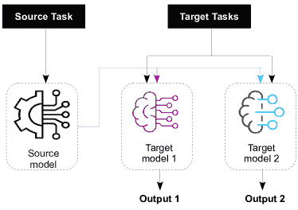

图 9：深度迁移学习原理。

#### 4.2.1 声学领域

Schneider 等人 [81] 探索了使用 wav2vec 模型对大规模无标注音频数据进行无监督预训练的语音识别方法。所学习的表示通过噪声对比二元分类优化的简单 CNN 增强了 AM 训练。在 [82] 中，提出了一种源过滤器扭曲数据增强策略，以提高儿童语音 ASR 的鲁棒性。作者使用 XLS-R wav2vec 2.0 模型构建了一个端到端的声学模型，该模型在大量跨语言的成人语音语料库上以自监督方式进行预训练。[83] 中提出的工作引入了一个多方言声学模型，采用软参数共享的多任务学习，这是一个归纳 DTL 子类别，嵌入在 Transformer 架构中。辅助的交叉注意力有助于方言 ID 识别，提供方言信息。自适应交叉熵损失自动平衡了多任务学习。实验结果表明，与各种单任务和多任务模型相比，在多方言语音识别和方言 ID 识别任务上显著降低了错误率。同样，在计算机视觉领域，像 ConvNeXt 这样的 CNNs 模型已超越了前沿的 Transformer，部分原因是深度可分离卷积（DSC）的集成。DSC 近似于常规卷积，提升了 CNNs 在时间和内存使用上的效率而不影响准确性——在某些情况下，甚至提高了准确性。研究 [84] 将 DSC 引入到预训练音频模型家族中，用于在 AudioSet 上进行音频分类（目标任务），展示了在平衡准确性和模型大小方面的优势。Xin 等人 [85] 引入了一种带有四个分支的注意力树结构的音频金字塔 Transformer，以减少细粒度音频频谱处理中的计算复杂性。它提出了一种 DA 迁移学习方法，用于弱监督声音事件检测，这是 ASR 的一个子领域，通过对齐帧和片段域之间的特征分布，利用 DA 检测损失来提高定位性能。

#### 4.2.2 语言领域

该方法论基于 BERT 模型的使用 [86]，涉及预训练语言模型，并在各种下游任务中展示了改进的性能。针对语言模型的 DTL 方法，特别是在语音识别领域中，称为 LM 适应。这些方法旨在弥合源分布 $\mathbb{D}_{S}$ 和目标分布 $\mathbb{D}_{T}$ 之间的差距。Song 等人 [87] 提出了一个新颖的学习重评分（L2RS）方法，该方法依赖于两个主要组件：（i）利用来自 SOTA NLP 模型（如 BERT）的多样化文本数据，以及（ii）自动确定其权重以重新评分 ASR 系统的 N-best 列表。

最近，S2S 模型的进展显示了在训练单语 ASR 系统方面的良好前景。CTC 和编码器-解码器模型是端到端 ASR 的两种流行架构。此外，这些架构在多任务混合方法中的联合训练也得到了探索，展示了整体性能的提升。例如，图 8 (a) 所示的架构包括 S2S 层。S2S 的编码器网络由一系列生成嵌入向量的 RNNs 组成，而 RNN 解码器利用这些向量生成最终结果。RNN 还受益于之前的预测（$P_{i},i=0,\dots,n$），提高了后续预测的准确性。接下来，一种新颖的基于 TL 的方法已被提出以增强端到端语音识别，其创新在于通过多语言训练和多任务学习在两个层面上应用 DTL。初始阶段利用非负矩阵分解（NMF），而非瓶颈层，以及多语言训练进行高级特征提取。随后的阶段在这些特征上应用联合 CTC-注意力模型，其中 CTC 被转移到目标注意力模型。该方案在 TIMIT 上表现出色，但需要在高资源数据上进行测试。标准端到端训练仍需进一步优化。此外，结合 AM 和 LM 方法具有增强或构建有效 DTL 基于 ASR 模型的潜力，如 [46, 89, 90, 91, 92, 93] 所示。

表 6：在当代前沿框架中，为不同任务采用了各种预训练模型。这些框架使用不同的 DTL 方法，并通过特定指标评估其效果。符号 ($\uparrow$) 表示结果增加，而 ($\downarrow$) 表示结果减少。在检查多个场景时，仅提及表现最佳的结果。

| 方案 | 基于 | 语音识别任务 ($\mathbb{T}_{T}$) | AM/LM | 适应 | 结果及指标 |
| --- | --- | --- | --- | --- | --- |
| [84] | ConvNeXt-Tiny | 音频分类 | AM | DA | mAP= 0.471 |
| [85] | APT | 声音事件检测 | AM | DA | F1= 79.6% |
| [49] | BERT (Jasper) | 语音转文本 | LM | TL | WER= 14% |
| [54] | DistilGPT2 | 改进 ASR | 两者 | 微调 | CER= 4.6% |
| [93] | XLRS Wave2vec | 提升低资源语言的 ASR | 两者 | 微调 | 5.6% WER $\downarrow$ |
| [82] | XLRS Wave2vec | 改进儿童语音的 ASR | AM | TL | WER = 4.86% |
| [90] | S2S | 说话人适应 | 两者 | 特征归一化。 | 25.0% WER$\downarrow$ |
| [83] | Transformer | 多方言模型帮助有效识别多种语音方言 | AM | 多任务学习 | 准确率= 100% |
| [94] | S2S | 提升现有多语言 S2S 模型。 | LM | DTL | 4% CER $\downarrow$ 6% WER |
| [95] | PaSST | 音频标记和事件检测 | AM | 微调 | F1= 64.85% |
| [81] | Wav2vec | WSJ 数据语音 | AM | 仿射变换。 | 36% WER$\downarrow$ |
| [96] | ARoBERT | 口语理解 | LM | 微调 | F1-score=92.56% |

缩写词：Transformer (T)

### 4.3 基于 FL 的 ASR

\Ac

FL 革新了 AI 模型训练，通过实现协作而无需共享敏感训练数据。传统的集中式方法正在向去中心化模型演变，其中 ML 算法在边缘设备上（如手机、笔记本电脑或私人服务器）进行协作训练 [97]。FL 的数学公式侧重于在多个设备或节点（客户端）上训练一个单一的全局模型，同时保持数据本地化。其目标是最小化一个全局损失函数，该函数通常是所有客户端上的本地损失函数的加权和。标准的 FL 问题可以表述为：

|  | $\min_{\theta}F(\theta)=\min_{\theta}\sum_{k=1}^{K}\frac{n_{k}}{N}F_{k}(\theta)$ |  | (3) |
| --- | --- | --- | --- |

在这种情况下，$\theta$表示待学习的全局模型参数，$K$代表客户端的总数，$n_{k}$表示客户端$k$的数据样本数量，$N=\sum_{k=1}^{K}n_{k}$代表所有客户端的数据样本总数，$F_{k}(\theta)$表示在客户端$k$数据上计算的本地损失函数。在 FL 中，目标是找到使全局损失函数$F(\theta)$最小化的全局模型参数$\theta$，这是所有参与客户端本地损失函数的聚合。这个过程通常涉及使用如联邦平均（FedAvg）等算法对模型参数进行迭代更新，其中客户端根据本地数据计算梯度或更新，并将这些更新发送到中央服务器。然后，服务器聚合这些更新以改善全局模型。

+   •

    横向联邦学习（HFL）：在 HFL 中，客户端使用各自的数据集训练一个共享的全局模型，这些数据集具有相同的特征空间但不同的样本空间。每个客户端利用本地 AI 模型，其更新由中央服务器聚合，而不暴露原始数据。HFL 训练过程包括：（1）初始化，（2）本地训练，（3）梯度加密，（4）安全聚合，以及（5）全局模型参数更新。目标函数在所有参与方的数据集上最小化全局损失[97]。

+   •

    纵向联邦学习（VFL）：VFL 在具有相同样本空间但不同特征空间的数据集上训练模型。通过实体数据对齐（EDA）和加密模型训练（EMT），VFL 允许客户端在不共享原始数据的情况下协同训练模型。训练过程与 HFL 相同[97]。

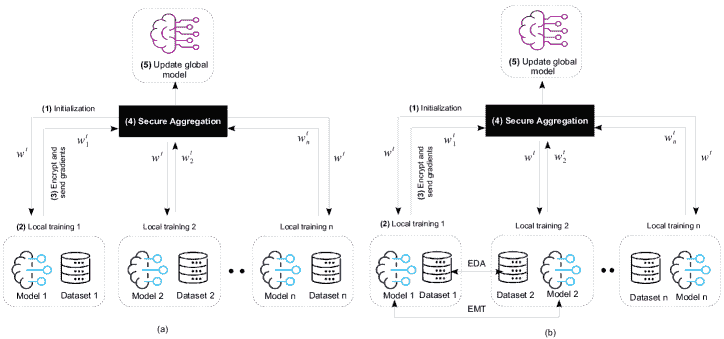

图 10：联邦学习原理：（a）横向 FL，（b）纵向 FL。

FL 提出了人工智能培训的范式转变，推动协作并尊重数据隐私。 HFL 和 VFL 的工作原理如图 10 所示，它们适用于各种数据分布场景，为分散和安全的 ML 提供了灵活的解决方案。这些 FL 框架的应用涵盖了不同的领域，承诺提高模型的准确性和隐私保护。在[98]中介绍了第一个引入 FL 在 ASR 中的工作。作者介绍了一个易于泛化的 FL 平台，该平台结合了分层优化和梯度选择算法，以增强训练时间和 SR 性能。Guliani 等人[99]提出了一种策略，以补偿非独立和同分布（non-IID）的数据在联邦式训练的 ASR 系统中。提出的策略涉及随机客户数据抽样，导致成本-质量的权衡。Zhu 等人[100]还在个性化的 FL 中针对非 IID 场景中的基于 ASR 的 FL 进行了介绍。他们提出了两种方法：调整基于 FL 的个性化层以用于 ASR，包括用于个性化模型的本地层，并提出了分离的联邦学习（DecoupleFL）。DecoupleFL 通过将计算负担转移到服务器来减少客户端上的计算。此外，它传输安全的高级特征，而不是模型参数，特别适用于大型模型的通信成本。在[101]中，作者提出了一种客户端自适应的联邦训练方案，以减轻在训练 ASR 模型时数据的异质性。Nguyen 等人[102]使用 FL 训练了一个基于自我监督预训练的 wav2vec 2.0 模型的 ASR 模型。Yang 等人[103]提出了一种分散式特征提取方法在联邦学习中。此方法建立在量子 CNN（QCNN）之上，由用于特征提取的量子电路编码器和基于 RNN 的端对端 AM 组成。该框架利用量子学习进步来保护模型，避免隐私泄露攻击。Gao 等人[104]在具有异构数据分布的客户端端的具有挑战性和现实性的 ASR 联合实验设置中进行了研究。他们的实证研究集中在基于注意力的 S2S 端到端（E2E）ASR 模型上，评估了三种聚合加权策略：标准 FedAvg，基于损失的聚合以及一种新颖的基于 WER 的聚合。表 7 总结了最新的 FL 基础 ASR 技术。

表 7：近期提出的基于 FL 的 ASR 工作总结。所有方案均建议用于 AM。符号($\uparrow$)表示结果增加，而($\downarrow$)表示结果减少。在多个场景被考察的情况下，仅提及表现最佳的结果。

| 方案 | 基于 | 语音识别任务 | FL 技术 | 指标和结果 |
| --- | --- | --- | --- | --- |
| [98] | S2S | 提升 ASR | FedAvg | WER = 6% |
| [99] | 端到端 RNN-T | 在非 IDD 数据上的 ASR | FedAvg | WER= |
| [100] | CNN+Transformer 提取器 | 在非 IDD 数据上的 ASR | DecoupleFL | 与 FedAvg 相比 WER 下降 2.3-3.4%$\downarrow$ |
| [101] | LSTM | 在非 IDD 数据上的 ASR | CAFT | WER = 15.13% |
| [102] | wav2vec 2.0 | 提升 ASR | FedAvg | WER= 10.92% EER= 5-20% |
| [103] | QCNN 和 RNN | 提升 ASR 中的隐私保护 | VFL | 准确率 = 95.12% |
| [104] | S2S | 在异质数据分布上的 ASR | FedAvg | WER= 19.98-23.86% |
| [105] | S2S | 在私有和未标记用户数据上的 ASR | FedNST | WER= 22.5% |
| [106] | Wav2vec 2.0 和 Whisper | 儿童剥削环境中的 ASR 和 KWS | FedAvg | WER = 11-25% |
| [107] | Kaldi 和回退 n-gram | 提升 ASR 中的隐私保护 | 合并模型 | WER= 17.7% |
| [108] | TDNN | 提升 ASR 中的隐私保护 | 聚合 | EER = 1-2%。 |
| [109] | 非流式和流式 Conformer | 减少客户端 ASR 模型大小 | Federated Dropout | 客户端模型大小下降 6-22%$\downarrow$；WER 下降 34-3%$\downarrow$ |

### 4.4 基于 RL 的 ASR

\Ac

RL 是一个 ML 范式，其中一个智能体通过与环境交互来学习最佳决策。智能体以奖励或惩罚的形式获得反馈，调整其行为以通过试错过程最大化累积奖励。强化学习（RL）涉及几个关键概念，如下所述：环境模型，作为上下文动态的表示；状态(s)，表示智能体感知的当前情况；观察(o)，智能体直接感知的状态的子集；行动(a)，智能体对环境做出的决策；策略($\pi$)，描述智能体如何将环境条件转化为行动；智能体，根据当前状态和过去经验做出决策的实体；奖励，环境根据状态-行动交互分配给智能体的数值。图 11 展示了 RL 的原理。

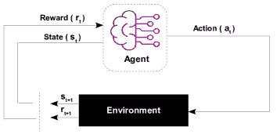

图 11：RL 原理。

马尔可夫决策过程（MDP）是动态和随机决策的基本框架，其特点包括状态空间 $S$、动作空间 $\mathbb{A}$、转移概率 $\mathbb{P}$ 和奖励函数 $R$。MDP 的主要目标是识别一个最优策略 $\pi^{*}$，以最大化预期的折现总奖励，表达为 $\pi^{*}=\max_{\pi}\mathbb{E}_{\pi}[\sum_{t=0}^{T}\gamma^{t}r_{t}(s_{t},\pi(s_{t}))]$，其中 $\gamma$ 是折扣因子。MDP 广泛应用于解决动态无线环境中智能系统的不确定性问题，包括频谱管理、认知无线电和无线安全。

在 ASR 领域，RL 主要被提出来解决训练和测试阶段之间的不一致。已经确定了导致潜在性能下降的两个主要不一致：1）传统使用的交叉熵标准在训练期间最大化对数似然，而性能是通过 WER 而不是对数似然来评估的；2）教师强迫法在训练期间依赖于地面真相，意味着模型在测试之前从未遇到自己的预测。RL 通过弥合训练和测试阶段之间的差距来解决这些不一致。已经提出了几种基于 RL 的 ASR 方法[110, 111, 112, 113, 114, 115, 116, 117, 118, 119]。例如，在[110]中，作者介绍了一种基于 RL 的优化方法，用于 S2SASR 任务，称为自临界序列训练（SCST）。这种方法可以被概念化为一个序贯决策模型，如图 12 所示。整个编码器-解码器神经网络被视为代理。在每个时间步$t$，当前状态$s_{t}$由声学特征$x_{t}$和上一次预测$Y_{t-1}$连接而成。输出标记作为行动，更新生成的假设序列。SCST 使用与 WER 相关的奖励函数关联训练损失和 WER，通过将每个标记生成步骤的奖励$r_{t}$与地面真相序列$Y^{*}$进行比较来计算奖励。SCST 使用测试时间波束搜索算法对假设进行抽样以进行奖励标准化，对表现优于当前测试时间系统的高奖励假设分配正权重，对低奖励假设分配负权重。该框架在图 12 中有所说明。

在 ASR 中，RL 主要被提出来解决训练和测试阶段之间的不匹配。已经确定了导致潜在性能下降的两个主要不匹配：1）通常使用的交叉熵标准在训练期间最大化对数似然，而性能是通过 WER 而不是对数似然来评估的；2）教师强迫法在训练期间依赖于地面真相，意味着模型在测试之前从未遇到自己的预测。RL 弥合了训练和测试阶段之间的差距，解决了这些不匹配。

一些基于强化学习的 ASR 方法已被提出[110, 111, 112, 113, 114, 115, 116, 117, 118, 119]。例如，在[110]中，作者提出了一种基于强化学习的优化方法，称为自我批判序列训练（SCST），用于 S2S ASR 任务。这可以被视为一个序列决策模型，如图 12 所示。整个编码器-解码器神经网络可以被视为一个智能体。在每个时间步$t$，声学特征$x_{t}$和之前的$Y_{t-1}$预测被连接成当前状态$s_{t}$。输出的令牌是更新生成的假设序列的动作。通过与真实序列$Y^{*}$进行比较，计算出该时间步的奖励$r_{t}$。SCST 通过与 WER 相关的奖励函数将训练损失和 WER 关联起来，这考虑了每个令牌生成步骤的中间奖励。此外，SCST 利用测试时间的束搜索算法采样一组假设进行奖励归一化。因此，超越当前测试系统的高奖励假设会被赋予正权重，而低奖励假设会被赋予负权重。

整个编码器-解码器神经网络被视为一个智能体。在每个时间步$t$，当前状态$s_{t}$通过将声学特征$x_{t}$和之前的预测$Y_{t-1}$连接而成。输出的令牌作为动作，更新生成的假设序列。SCST 通过与真实序列$Y^{*}$进行比较，在每个令牌生成步骤中计算奖励$r_{t}$，将训练损失和 WER 通过与 WER 相关的奖励函数关联起来。SCST 使用测试时间的束搜索算法来采样假设进行奖励归一化，为超越当前测试系统的高奖励假设分配正权重，为低奖励假设分配负权重。该框架在图 12 中进行了说明。

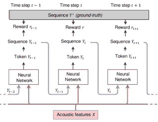

图 12：SCST 序列决策模型的 ASR [110]。

在 [111] 中，作者开发了一个用于语音识别系统的 RL 框架，采用策略梯度方法。他们在这个框架中引入了一种 RL 方法，通过假设选择整合用户反馈。Tjandra 等人 [112, 113] 也利用策略梯度 RL 来训练一个 S2SASR 模型。在 [114] 中，作者构建了一个通用的基于 RL 的 AutoML 系统。该系统自动优化每层压缩比，以适应由多个 LSTM 层组成的 SOTA 基于注意力的端到端 ASR 模型。该工作的压缩方法是奇异值分解（SVD）低秩矩阵分解。作者通过结合迭代压缩和基于 AutoML 的秩搜索改进了这种方法，实现了超过 5 倍的 ASR 压缩，而没有降低 WER [115]。Shen 等人 [116] 建议利用 RL 来优化基于识别结果的语音增强模型，旨在直接提升 ASR 性能。基于 AutoML 的低秩分解（LRF）实现了最高 3.7×的加速。在此基础上，Mehrotra 等人在他们的工作 [115] 中提出了一种迭代的基于 AutoML 的 LRF，采用 RL 进行迭代搜索，实现了超过 5×的压缩而不降低 WERs，推动了 ASR。表 8 总结了最近基于 RL 的 ASR 技术。

表 8：总结了最近提出的基于 RL 的 ASR 工作。符号 ($\uparrow$) 表示结果增加，而 ($\downarrow$) 表示结果减少。在多种情境被考察的情况下，仅提及表现最佳的结果。

| 方案 | 基于模型的 | ASR 任务 | RL 技术 | 指标和结果 |
| --- | --- | --- | --- | --- |
| [110] | S2S Conformer | 改善 ASR | 策略梯度 | 8.7%-7.8% WER $\downarrow$ 相较于基线模型 |
| [111] | DNN-HMM | 改善 AM 的 ASR | 策略梯度 | WER=23.82-25.43% |
| [112] | S2S | 改善 AM 的 ASR | 策略梯度 | CER=6.10% |
| [113] | S2S | 改善 AM 的 ASR | 策略梯度 | CER=6.10% |
| [114] | 端到端编码器-注意力-解码器 | 改善 AM 的 ASR 模型压缩 | 策略梯度 | 最高 $\sim$3x 压缩；WER=8.06% |
| [115] | 端到端编码器-注意力-解码器 | 改善 AM 的 ASR 模型压缩 | 策略梯度 | 最高 $\sim$5x 压缩；WER=8.19% |
| [116] | CD-DNN-HMM AM & SRI LM | 用于 AM 和 LM 的 ASR 语音增强 | Q-learning | 5 和 0 dB SNR 条件下 CER 降低 12.40% 和 19.23% |
| [117] | LSTM | 改善对话状态跟踪的 ASR | DQN | 准确率 3.1% 提升 |
| [118] | S2S | 改善 AM 的 ASR | 策略梯度 | CER=8.7% |
| [119] | Wav2vec 2.0 | 改善 AM 的 ASR | 策略梯度 | WER 降低 4% |

对于声学模型（AMs）的 DTL，ASR 中常用的两种深度学习基 AM 是端到端模型和层叠深度神经网络-隐马尔可夫模型（DNN-HMM）模型。DNN 组件负责从声学信号中提取高层特征，如 MFCC 和 HMM 词汇序列。这些特征随后被解码成转录本。DNN 将声学特征作为输入，并产生依赖上下文的词汇单元（三音素），这些词汇单元用作下游 HMM 组件的输入。

相比之下，端到端模型是一种基于 DNN 的技术，直接将声学特征（特征）作为输入，并输出识别率，无需像 DNN 和 HMM 这样的单独组件。图 13 中展示了一个典型的语音识别端到端框架。该框架中的神经网络从输入特征中生成嵌入，然后通过一系列递归层。这些递归层根据先前和当前的输入信息分析模式，以产生最终输出。网络使用 CTC 损失 [mridha2021study] 通过反向传播进行训练。关于领域迁移学习（DTL），AMs 常用三种主要策略。

图 13：基于 DTL 的 ASR 端到端源模型示例 [mridha2021study]。

#### 4.4.1 基于特征归一化的 DTL

线性变换的概念是通过线性映射过程对语音特征进行归一化。这涉及向现有网络中添加转换网络或层。转换网络是适应神经网络的有效方法。通常，最后一层隐藏层被设计为瓶颈，通过使用较少的神经元来减少需要调整的参数数量。图 14 说明了这种架构。转换网络可以是线性输入网络或线性输出网络。

图 14：在 DTL 中的变换基础涉及估计连接到虚线矩形内的权重，同时保持其他权重不变。在单任务 DTL 的情况下，如图（a）所示应用特征归一化。对于多任务 DTL，特征归一化也会执行，如图（b）所示。

假设最后的隐藏网络（LHN）作为特征提取器，输出层作为判别源模型（$M_{S}$），那么输出层中线性变换矩阵$W_{L}$的权重对应于目标模型$M_{T}$的参数。$M_{T}$的表示可以表示为如下[huang2015maximum]：

|  | $\mathrm{M_{T}=softmax(W_{L}M_{S})}.$ |  | (4) |
| --- | --- | --- | --- |

$M_{S}$中最后一个隐藏层的激活可以作为$M_{T}$中隐藏层的提取特征表示。使用变换矩阵$W_{LHN}$变换模型参数以生成一组适应后的模型参数，相当于在现有最后隐藏层之后加入扩展的最后隐藏层[huang2015maximum]：

|  | $\mathrm{M_{T}=softmax(W_{LHN}W_{L}M_{S})}.$ |  | (5) |
| --- | --- | --- | --- |

一些 ASR 研究利用了线性变换策略以提高性能。例如，[elaraby2016deep]中，作者旨在增强一个计算机辅助语言学习者（CAPL）系统，用于教授阿拉伯语发音规则。他们实施了各种改进，包括说话者自适应训练（SAT）、集成混合 DNN-HMM 模型、将混合 DNN 与最小语音错误（MPE）相结合，并在测试期间使用基于语法的解码图。另一项研究[mimura2016joint]采用了多目标学习方法来优化去噪自动编码器（DAE）的输出和 DNN 的输入。DAE 在第一阶段进行了训练，以减少传递到 DNN 的输入相关错误。然后，DAE 和 DNN 的统一网络被微调用于电话状态 ASR，并在 DAE 上应用了输入语音增强的附加目标。此外，在[ma2017approaches]中，引入了一个适应层用于微调，并将非线性融入，以学习比 softmax 层中的线性变换更复杂的函数。在微调过程中，调整了 cluster softmax 和 NNadapt 层，而其他层保持不变。表 6 提供了使用线性变换技术的其他方案的总结，以及其性能细节。

#### 4.4.2 DTL 的保守训练

保守训练方法通常用于 ASR 中的口音适配。这是一种高效的方法，仅需要有限的语音数据即可实现令人满意的结果。然而，它可能会导致参数过多，从而扰乱模型的结构。为了解决这个问题，KL 散度（KLD）被广泛应用于 DNN 基于的 DTL 算法中。KLD 正则化为深度学习训练提供了数学框架，旨在最小化损失，并使源模型 $M_{S}$ 和目标模型 $M_{T}$ 的输出分布更加相似。KL 散度防止了过拟合，并有助于保持适应后的 $M_{T}$ 靠近 $M_{S}$ 的领域 [89, 90]。在具有 KLD 正则化的基于模型的 DTL 中，假设在源领域和目标领域训练 DNN 的损失函数分别是 $\mathbb{D}_{S}$ 和 $\mathbb{D}_{T}$，则保守方法可以数学上总结如下 [89, 90]：

|  | $\mathbb{D}_{T}^{KLD}=(1-\rho)\mathbb{D}_{S}+\frac{\rho}{N}\sum P_{S}(x_{T}/x_{T})logP_{T}(y_{T}/x_{T}),$ |  | (6) |
| --- | --- | --- | --- |

在基于 DTL 的 ASR 的背景下，使用带有 KLD 正则化的保守训练方法来构建目标 AM。这种方法涉及在来自目标领域 $\mathbb{D}_{T}$ 的语音样本上训练 DNN，表示为 ($x_{T},y_{T}$)，其中 $N$ 表示 $\mathbb{D}_{T}$ 中的语音样本数量。超参数 $\rho$ 控制从源领域 $\mathbb{D}_{S}$ 的转移比例。在 [89] 中可以找到一个应用此 DTL 基于 ASR 的保守训练和 KLD 正则化的方法的示例，用于构建目标 AM。此外，在 [90] 中，KLD 和 LHN 技术都被用于利用预训练的 seq2seq ASR 模型进行说话人适配。表 6 总结了其他采用保守训练的技术及其对应的性能细节。

#### 4.4.3 基于子空间的 DTL

基于子空间的 DTL 方法在 ASR（自动语音识别）中利用无监督技术，如 PCA、SVD 和 NMF 进行数据维度减少。这些技术旨在识别能够捕获关键信息的模型参数或变换的子空间。PCA 将高维数据映射到低维子空间，同时保持相关性并最大化方差。SVD 与 PCA 类似，通过选择特定数量的奇异值来压缩网络。然而，SVD 在权重矩阵中引入了非线性，这可能在构建线性投影层时导致信息丢失。NMF 算法需要至少一个非负矩阵，并将目标矩阵表示为基础矩阵列的加权和，这使得 NMF 比 SVD 和 PCA 更具可解释性。在研究[88]中，采用了 NMF 的一个变体——凸非负矩阵分解（CNMF）来提取高层次特征。随后，通过多语言训练和多任务学习，将 DTL 应用于高层次和低层次特征。这些技术相比于最先进的 ASR 研究，显著提高了性能。使用子空间技术及其各自性能细节的其他研究可以在表 6 中找到。

在离散数据收集的情况下，使用生成概率模型，如潜在狄利克雷分配（LDA）。通常，LDA 是一个具有三层的层次贝叶斯模型，其中集合中的每个项目被表示为一组基础主题的有限混合。每个主题又被建模为主题概率的无限混合。为了捕获词语之间的关系并为特定文档创建语言模型，已利用基于主题模型的技术，如 LDA，如[歌 2019 主题]中所述。在[hentschel2018feature]中展示的工作中，LDA 特征通过包含权重矩阵和偏置向量的线性层进行变换。这些变换后的特征随后被用作 LHN（局部隐藏节点）在网络的训练和评估中的输入。

#### 4.4.4 基于 NNLM 的 DTL

神经网络语言模型（NN-LMs）通常在各种任务的自动语音识别（ASR）中优于基于计数的语言模型（LM）。具体来说，当应用于 N-best 重评分时，NN-LMs 实现了 WER，如在[hentschel2018feature](https://example.org)中提到的。将 NN-LMs 适应于新领域是一个研究挑战，目前的方法可以归类为模型基础的或特征基础的适应。在特征基础的适应中，辅助特征被纳入 NN-LM 的输入，而模型基础的适应涉及微调和调整网络层。[91]的作者提出了一种基于递归神经网络的语言模型（RNN-LM）方法，探索了这两种适应类型。作为一个说明性的例子，图 15（a）和（b）详细说明了该研究中采用的基于 RNN 的 DTL。此外，[92]的作者建议了一种用于 ASR 中 LM 修改的基于 DNN 的模型，采用了分解时间延迟神经网络（TDNN-F）。具体而言，TDNN-F 模型使用交叉熵和无晶格最大互信息目标函数（LF-MMI）的组合进行训练。TDNN-F 在英语儿童语音识别中的有效性在[92]中得到了证明。

图 15：不同适应技术的基于 DTL 的 RNNLM，其中词汇外（OOV）节点表示不属于指定词汇表的输入词，但可以包含在输入中。同样，词汇短缺（OOS）节点也可以包含在输出中：（a）具有 LHN 适应层的 RNNLM。（b）具有特征基础适应层的 RNNLM。

基于 LSTM 的 DTL 通常，尽管有尝试在文档级别进行训练，但 ASR 中使用的 NNLM 模型仍然是在句子级语料库上训练的。这是由于多种因素，例如，更长的上下文可能与传统 ASR 系统中增强下一词预测无关。在许多对话情况下，收集代表扩展会话上下文的训练数据也很困难。在有利的场景中，长跨度模型变得越来越常见。长跨度模型可能有助于诸如对话和会议的转录、人际沟通以及通过语音生成文档等场景 [parthasarathy2019long]。LSTM 模型被广泛使用，其架构非常适合变长序列。因此，它们可以在不使用 n-gram 近似的情况下利用极端的长距离依赖。例如，通过使用相同的上下文，文献 [tuske2018investigation] 中的作者展示了深度 4-gram LSTM 比大 interpolated count 模型表现更好，回退和光滑效果显著提高。在另一个例子中，共享编码器的核心部分使用了 BLSTM [94]。

跨领域 ASR

#### 4.4.5 跨语言 DTL

跨语言 DTL 是跨模态 DTL 的一个特定应用。它作为一种常用的方法，通过利用在其他语言上训练的模型来构建低资源语言的 ASR 模型。这种方法基于一个假设，即音素特征可以跨语言共享。此外，通用 ASR 模型可以使用 DTL 技术适应特定的狭域。为了应对数据稀疏问题，文献 [liu2019investigation] 探索了多种知识迁移方法，借助高资源语言。这些方法包括 DTL 和微调，其中一个训练良好的神经网络初始化 LHN 的参数。渐进神经网络（Prognets）也被研究，因为它们对遗忘效应具有抗性，并且由于网络架构中的横向连接而在知识迁移方面表现出色。此外，还探索了跨语言 DNN 的应用，其中提取瓶颈特征以增强 ASR 系统的有效性。最近涉及跨语言 DTL 的 ASR 方法及其各自性能总结在表 6 和 9 中。

表 9：近期基于 ASR 的跨语言 DTL 技术的总结。其中标记（$\uparrow$）和（$\downarrow$）分别表示改进和减少。如果一个指标有多个场景，只有最佳结果被提及。

| 方案 | 基于模型 | ASR 任务（$\mathbb{T}_{T}$） | 特点 | 性能 |
| --- | --- | --- | --- | --- |
| [yusuf2019low] | EDML | 执行 DTL 的框架，减少词汇外术语的影响。 | 例句查询任务 | 74% TWV$\uparrow$ |
| [liu2019investigation] | Prognets | 通过利用高资源语言克服数据稀疏问题，提高 ASR 方案质量。 | 微调 LHN 适应 | 38.6% WER$\downarrow$ |
| [feng2019low] | FNN 和 CNN 架构 | 使用印欧语系语音样本来提高对非洲语言的识别。 | 使用 PLP 系数进行微调 | 2.1% EER$\downarrow$ |
| [sahraeian2018cross] | DNN | 使用加权平均方案来组合集成的组成部分，组合权重经过训练以最小化交叉熵目标函数。 | 权重插值 | 7.7% WER$\downarrow$ |
| [wilkinson2020semi] | CNN-GMM-HMM | 全自动分割，五语言代码切换语音的半监督 ASR 系统训练 | 半监督 | 1.1% WER$\downarrow$ |

#### 4.4.6 基于 DTL 的情感识别 ASR：

结合语言信息和声学数据已被证明能够提高语音情感识别（SER）的准确性。因此，将这两种系统结合起来可以提升 ASR 系统处理情感语音的能力，并为 SER 系统提供语言输入。图 16 展示了一个混合 ASR-SER 系统 [fayek2016deep]，其中一个声谱图被输入到共享卷积层中，然后经过专门的层，这些层具有共享级别以促进两个系统之间的交互。这种整合允许在处理情感语音和利用语言特征方面表现得更好。

图 16：语言-副语言混合系统 [fayek2016deep]。（a）ASR-SER 混合系统。（b）基于 DTL 的 ASR-SER 混合系统示例。

在[tits2018asr](https://example.org)中提出的方法利用了语音到文本系统的内部表示，通过使用 DTL 探索情感价值/唤醒度与不同模态之间的关系。语音到文本或 ASR 系统学习将音频语音信号映射到其对应的转录文本。通过采用 DTL，所提出的方法可以利用从 ASR 任务中学习到的特征来估计情感价值和唤醒度。这种方法的优势在于将大规模的语音数据集与转录文本结合起来，同时还可以使用带有情感维度的小数据集。类似地，[ananthram2020multi](https://example.org)的工作通过使用 crema-D 多模态情感数据集和标准标签聚类，对基于 TDNN 的说话人识别模型进行微调，以进行情感检测。通过微调模型，作者旨在提高其情感检测性能。[boateng2020speech](https://example.org)的研究集中于从具有极端正面和负面评分的音频片段以及音频结束部分提取特征。他们采用了峰值-结束规则和 DTL 方法来提取声学特征。作者利用了一个名为 YAMNet 的预训练 CNN 语音模型和一个线性 SVM 来对合作伙伴的情感价值进行二分类。

#### 4.4.7 跨语料库情感识别（CC-SER）

在语音情感识别（SER）的背景下，通常假设训练和测试领域中的语音样本是在相同条件下录制的。然而，在现实场景中，语音数据常常来自不同的环境或设备，从而导致领域间的不一致，进而影响识别性能。为了解决这个问题，研究人员最近研究了跨语料库情感识别（CC-SER）的问题，并探索了各种 DTL 模型。

例如，[song2019transfer](https://example.org)提出了一种转移线性子空间学习（TLSL）方案，以开发一个 CC-SER 框架。这种方法有助于为源领域和目标领域学习共享特征空间。不同语料库之间的相似性使用最近邻图算法来估计。此外，还设计了一种特征分组方法，将情感特征划分为高可转移部分（HTP）和低可转移部分（LTP）。

在[liu2018unsupervised]中考察的无监督 CC-SER 情况下，只有训练数据被标注。作者引入了一种领域自适应子空间学习（DoSL）技术，以学习一个投影矩阵，将源领域和目标领域的语音数据从初始领域转换到标记领域。这使得在标记源领域数据上训练的分类器能够有效地预测未标记目标领域数据的情感状态。此外，[liu2021transfer]通过引入转移子空间学习（TRaSL）对基于 DoSL 的 CC-SER 方法进行了改进。在[luo2019cross]的另一项研究中，提出了一种使用非负矩阵分解（NMF）的半监督 CC-SER 方法。这种方法将训练语料库标签纳入 NMF，并寻求一个潜在的低秩特征空间，在该空间中，可以同时最小化两个语料库之间的条件和边际分布的差异。

进一步的，[zhang2019transfer] 提出了一个转移稀疏判别子空间学习（TSDSL）方法，以发现多个语料库之间的共享特征子空间。这通过结合$\ell_{2,1}$-范数惩罚和判别学习实现，促进了在各语料库中识别最具判别性的特征。同样，[luo2020nonnegative] 介绍了一种基于非负矩阵分解的转移子空间学习（NMFTSL）方案。其目标是最小化共同子空间中边际分布和条件分布之间的距离。这些距离通过最大均值差异（MMD）准则进行估计。在[zhang2021cross]中，采用了联合转移子空间学习和回归（JTSLR）技术。它使用判别 MMD 作为差异度量来学习潜在子空间，然后在潜在子空间中使用回归函数建模特征和注释之间的关系。通过利用标签图来增强从源领域（SD）数据到目标领域（TD）数据的知识转移。同样，[chen2019target] 提出了一个针对 CC-SER 的目标适应子空间学习（TaSL）方法。其目标是找到一个投影子空间，以实现从特征中更准确地回归标签。这有效地弥合了 TD 和 SD 之间的特征分布差距。投影矩阵通过将$\ell_{1}$-范数和$\ell_{2,1}$-范数惩罚项与其他正则化项结合来优化。此外，[zhao2021cross] 使用稀疏子空间转移学习（SSTL）来开发 CC-SER 技术。它通过判别子空间学习学习一个稳健的共同子空间投影，并通过基于$\ell_{2,1}$-范数的稀疏重建将知识从源语料库转移到目标语料库。目标样本被适当地表示为 SD 数据的线性组合。另一方面，[braunschweiler2021study] 研究了跨语料库数据补全和数据增强对 SER 模型性能的影响。研究集中在六个情感语音语料库上，考虑了单一和多个说话者以及情感风格（自然、诱发和表演）的变化。

### 4.5 基于对抗学习的自动语音识别

在许多情况下，源模型使用多语言训练进行训练，在多种语言中都有丰富的语音数据[88, 94]。多语言训练包括共享隐藏层（SHL）和不同语言的语言特定层或分类器层。源模型的 SHL 作为特征转换器，将语言特定的特征转换为共同特征空间[liu2019investigation]。然而，常见特征空间中可能存在语言依赖特征，这阻碍了有效的跨语言知识转移。为了解决这个问题，采用了语言对抗训练。对抗训练有助于创建一个语言不变的特征空间。一旦源模型准备好，前$n$个 SHL 可以转移到未知语言的目标模型中。在[yi2018language]中，作者提出了语言对抗迁移学习作为解决因共享特征可能包含不必要的语言依赖信息而导致目标模型性能下降的方案。图 17 展示了建议的语言对抗迁移学习方法[yi2018language]的架构。源模型，也称为对抗 SHL 模型，显示在左侧，而目标模型则显示在右侧。SHL 模型中存在额外的语言判别器。全连接层表示为 FC。梯度反转层（GRL）确保语言判别器的特征分布在所有语言中尽可能相似。语言判别器的输出标签指示语言。

图 17：提出的模型架构语言对抗迁移学习的示例，用于有限 ASR 资源[yi2018language]。Senones 指的是特征簇的名称，代表相似的声学状态/事件。

为了提高低资源场景中自动语音识别（ASR）的效果，[kumar2021exploration] 探索了半监督训练和语言对抗迁移学习的结合。研究[yi2020adversarial]建议利用对抗迁移学习来改善标点预测性能。具体而言，采用预训练的 BERT 模型将双向表示转移到标点预测模型中。所提出的方法应用于 ASR 任务作为目标任务。表 10 总结了近期涉及 ASR 对抗迁移学习的研究成果。

表 10：近期基于 ASR 的对抗性语言迁移技术的总结。标记（$\uparrow$）和（$\downarrow$）分别表示改进和减少。如果在一个指标上进行了多个场景的测试，仅提及最佳结果。

| 方案 | 基于模型 | ASR 任务（$\mathbb{T}_{T}$） | 特征 | 性能 |
| --- | --- | --- | --- | --- |
| [kumar2021exploration] | 对抗性 SHL 模式（SincNet-CNN-LiGRU） | 使用三种印度语言（印地语、马拉地语和孟加拉语）跨语言提高印地语 ASR | 半监督 | WER=5.5%（25.65% WER $\downarrow$） |
| [yi2018language] | SHL 模型 | 改善低资源 ASR 的性能 | 跨语言 | 10.1% WER $\downarrow$ |
| [yi2020adversarial] | BERT | 改善标点预测的性能 | 多任务 | 9.4% F1-score $\uparrow$ |

### 4.6 基于 DTL 的医学诊断 ASR

基于 DTL 的 ASR 在医学领域取得了重大进展，特别是在疾病的早期检测方面。这些进展已在各种医学领域得到观察，如表 11 所列。

#### 4.6.1 心音分类

心音的组成包括各种元素。第一个（S1）和第二个（S2）心音被认为是正常的，而第三个（S3）和第四个（S4）心音通常与杂音有关，射血点击声通常指示某些疾病或异常。Koike 等人[koike2020audio]提出了一种基于概率音频神经网络（PANNs）的新颖 DTL 方法，该方法通过在大规模音频数据集上预训练模型来对心音进行分类。另一种心音分类的方法由 Boulares 等人[boulares2020transfer]提出。他们的方法利用 DTL 在 Pascal 公共数据集上进行，没有任何去噪或清理程序，以建立实验基准。主要目标是提供一组实验结果，以作为未来基于心音图（PCG）的心血管疾病（CVD）识别研究的起点。该方案解决了缺乏 CVD 识别基准和分类结果客观可比性不足的问题，这些结果往往差异显著。

#### 4.6.2 帕金森病检测

帕金森病（PD）是一种逐渐恶化的神经退行性疾病，具有全球影响。准确诊断 PD 对改善日常活动和延长患者生命至关重要。然而，由于症状和疾病进展的变化，预测症状变化及其对患者生活的影响是具有挑战性的。传统的 PD 检测方法通常是手动的，需要专业知识。语言障碍和萎缩是超过 90% PD 患者的常见早期症状，表现为声音音量减少、单调而快速的语速，以及最终的听不清。Karaman 等人 [43] 提出了一个使用基于 DTL 的 ASR 的鲁棒自动化 PD 检测方法，其中如 SqueezeNet1_1、ResNet101 和 DenseNet161 等预训练模型经过微调和重新训练。该方案在 PD 检测中显示了有希望的结果。为了解决 PD 语音数据稀缺和受试者之间分布不一致的问题，Li 等人 [42] 引入了一种称为两步稀疏迁移学习（TSTL）的两步无监督 DTL 算法。该算法有助于从大量未标记的语音数据中提取有用信息，调整训练集和测试集的分布，同时保留原始样本结构。Qing 等人 [45] 提出的另一种策略涉及使用预训练的长短期记忆（LSTM）神经网络模型增强 Parkinson’s 患者的 ASR。为减少过拟合和降低 WER，该方案采用了频谱图掩蔽数据增强技术。

#### 4.6.3 其他医学诊断

在基于语音的抑郁症预测领域，Harati 等人 [harati2021speech] 提出了一个利用轻量级编码器并仅传递编码器权重的 DTL 方法。这种方法简化了抑郁症预测的运行时模型。对于患有言语障碍的个体，Xiong 等人 [xiong2020source] 开发了一种改进的 DTL 框架，用于鲁棒的个性化语音识别模型。他们通过神经网络权重适配将 CNN-TDNN-F ASR AM 调整到目标言语障碍发言者上。在言语障碍识别的背景下，Takashima 等人 [takashima2019knowledge] 提出了一个方法，从不同数据集中转移两种类型的知识：正常语音的语言依赖特征和言语障碍语音的语言独立特征。他们集中在患有发音障碍的日本人身上。此外，Sertolli 等人 [sertolli2021representation] 提出了一个新颖的特征表示方法，用于健康状态识别，使用了端到端的基于 DTL 的 ASR 框架。他们利用 ASR DNN 作为特征提取器，结合多种特征表示方法，使用紧凑双线性池化（CBP），并采用优化的 RNN 分类器进行推断。

表 11：基于 DTL 的 ASR 技术在医疗诊断中的总结，其中标记（$\uparrow$）和（$\downarrow$）分别表示提升和减少。如果在一个度量中进行了多个场景，只提及最佳结果。

| 方案 | 基于模型的 | ASR 任务（$\mathbb{T}_{T}$）$\uparrow$ | DTL 类型 | 性能 |
| --- | --- | --- | --- | --- |
| [43] | DenseNet-161 | PD 检测 | 微调 | 准确率= 91.17% |
| [42] | 基于 TSTL 的 CSC&SF | PD 语音诊断 | 无监督 | 准确率= 97.50% |
| [45] | 提出的四层 | PD 语音 | 微调 | 13.5% WER$\downarrow$ |
| [koike2020audio] | PANN CNN14 | 心音分类 | 微调 | UAR= 89.7% |
| [boulares2020transfer] | InceptionResNet-v2 | 基于 PCG 的 CVD 分类 | 微调 | 准确率= 0.89% |
| [harati2021speech] | EH-AC | 抑郁预测 | LHN（编码器权重） | 27% AUC $\uparrow$ |
| [xiong2020source] | CNN-TDNN-F | 构音障碍语音 | 神经权重适配器 | 11.6% WER$\downarrow$ |
| [takashima2019knowledge] | LAS | 构音障碍语音 | 多语言 | 45.9% PER$\downarrow$ |
| [sertolli2021representation] | Wav2Letter 和 DeepSpeech | 健康状态分类 | 传导性 | UAR= 73.0% (提升 8.6%) |

### 4.7 基于 DTL 的 ASR 攻击与安全

对抗样本是通过对有效音频文件或语音特征引入小的扰动或噪声来创建的，以操控或欺骗 ASR 系统。这些扰动虽然通常对人耳系统不可察觉，可能被 ASR 模型视为背景噪声，但仍会导致输入的正确或错误分类。例如，通过对语音“在静止点，那里的舞蹈”引入轻微扰动，ASR 系统可能会产生错误的转录“在尾点，那里的紧张感”[hu2019adversarial]。攻击 ASR 系统的概念在于这些模型对对抗样本的脆弱性，这促使语音研究人员探索这些样本的创建。通过生成用于时间或频率域不同语音表示的对抗样本，这些样本捕捉了各种语音特征，并可以作为神经网络的输入，研究人员可以操控 ASR 性能，无论是提升还是降低。DTL 在实现可转移性方面发挥了关键作用，即为攻击源模型而制作的对抗样本也可以有效攻击分类相同类型数据的目标模型。在这种情况下，对基于 DTL 的 ASR 模型的对抗攻击可以分为两组，如图 18 所示。

图 18：基于 DTL 的 ASR 方案中的可能对抗攻击。

#### 4.7.1 积极对抗攻击

涉及各种旨在增强或确保当前 ASR 系统有效性的技术，这些方法努力提高声学模型的鲁棒性和性能。在 [sun2018training] 中，作者提出了一种将自然数据与对抗数据结合以训练具有鲁棒性的声学模型的方法。具体来说，他们专注于利用 MFCC 特征，并采用基于梯度的方法生成对抗 MFCC 特征，考虑到网络模型和每个小批量的输入参数。通过应用师生训练概念，神经网络使用自然数据和生成的对抗数据进行训练。通过在 CHiME-4 和 Aurora-4 任务上进行实验，利用定制的卷积神经网络（CNN）验证了所提出方法的有效性。

#### 4.7.2 消极对抗攻击

涉及各种旨在削弱或破坏现有 ASR 系统有效性的技术，这些方法对声学模型的性能和鲁棒性构成潜在威胁。在 [abdullah2021hear] 中，作者提出了一种利用 Google (Phone) 模型作为源模型的框架，并研究了对抗攻击对目标模型（DeepSpeech 1）的影响。这些对抗攻击被应用于音频波形，特别是在信号分解和阈值处理之后，处理后的输入被输入到 ASR 源模型中。根据 [hu2019adversarial]，对抗攻击模型可以根据对手的目标、知识和背景分为两种类型，如图 18 所示：

+   •

    对手知识：分为两种类型：白盒攻击，假设对手对 $M_{T}$ 有完全的知识，包括其架构、训练权重和参数；和黑盒攻击，假设对手无法访问 $M_{T}$，仅知道其输出，如同普通用户。

+   •

    对抗特性：分为两种类型：非定向攻击，旨在使对抗样本的 $M_{T}$ 预测任何不正确的类别，唯一目标是破坏 ASR 算法；和定向攻击，旨在欺骗 $M_{T}$ 将对抗样本分配给攻击者选择的特定类别，对 ASR 方案施加特定指令。

接下来，表 12 展示了基于 DTL 的对抗模型在现有工作中的总结。

表 12：近期基于 DTL 的 ASR 对抗攻击的总结。标记（$\uparrow$）和（$\downarrow$）分别表示改进和减少。

| 方案 | 基于模型 | ASR 任务 ($\mathbb{T}_{T}$) | 目标对象 | 对手知识 | 对抗特异性 | 性能 |
| --- | --- | --- | --- | --- | --- | --- |
| [sun2018training] | Aurora-4 | 提升 | MFCC | 白盒 | 定向 | 23% WER $\downarrow$ |
| [schonherr2018adversarial] | DNN-HMM (Kaldi) | 提升 | 波形 | 白盒 | 定向 | 准确率=98% |
| [zelasko2021adversarial] | DeepSpeech | 欺骗 | 波形 | 白盒 | 定向 | 4-5% WER$\uparrow$ |
| [subramanian2020study] | VGG13 | 欺骗（密集 Mel） | Mel 谱图 | 白盒 | 非定向 | SNR=29.06 dB |
| [carlini2018audio] | DeepSpeech | 欺骗（语音到文本） | 波形 | 白盒 | 定向 | 攻击成功率=100% |
| [abdullah2021hear] | Google (电话) | 欺骗（Deep-Speech 1） | 波形 | 黑盒 | 非定向 | 攻击成功率=87% |
| [kwon2019selective] | DeepSpeech | 欺骗（DeepSpeech 受害者） | Mel 频率倒谱系数 | 白盒 | 定向 | 攻击成功率=91.67% |

### 4.8 基于 DTL 的 ASR 在其他应用中的使用

基于 DTL 的 ASR 已应用于多个领域。在 Boes 等人的工作中[12]，DTL 被探索用于音频标记和声音事件检测任务，其中将预训练的听觉和视觉特征结合到使用特征融合的基准系统中。Arora 等人[arora2017study]利用 DTL 解决音频事件检测的标注数据库不足问题。Wang 等人[wang2020cross]提出了一种使用 DTL 的环境适应技术，用于深度语音增强模型。Chen 等人[chen2018transfer]使用 DTL 在可穿戴设备上评估自然日常情况下的社交语音。Wu 等人[wu2020self]研究了自监督预训练语音用于语音翻译，而 Zhu 等人[zhu2021conwst]提出了一种自监督双向蒸馏系统，用于低资源语音翻译。DTL 在说话人验证领域被 Hong 等人[hong2017transfer]用于辨别学习，并在 Lu 等人[lu2021detection]的工作中用于分类不同物种的海洋哺乳动物声音，使用 DTL 和预训练的 AlexNet 模型。最后，Azizah 等人[azizah2020hierarchical]使用层次化 DTL 进行多语言文本到语音合成，利用 DNNs 处理低资源语言。

## 5 开放问题和关键挑战

将先进技术如 DTL、FL 和 RL 集成到 ASR 系统中带来了激动人心的机会，但也面临着一系列挑战。本节将深入探讨每种方法相关的独特挑战，强调需要关注和创新的关键领域。

### 5.1 DTL 和领域适应

本节讨论了与 DTL 和 DA 在语音识别中相关的挑战和概念，包括分布转移、特征空间适应、标签分布转移、灾难性遗忘、领域不变特征学习、样本选择偏差和超参数优化。

当将一个在某个领域（源领域）训练的模型应用到另一个领域（目标领域）时，通常会发生分布偏移，这被称为领域偏移。形式上，如果 $P_{S}(X,Y)$ 和 $P_{T}(X,Y)$ 分别表示源领域和目标领域中特征 $X$ 和标签 $Y$ 的联合分布，当 $P_{S}(X,Y)\neq P_{T}(X,Y)$ 时，就会出现挑战。为了解决这个问题，技术重点在于学习特征空间的转换，以最小化源领域和目标领域分布之间的差异。这涉及到寻找一个映射函数 $f:X\rightarrow Z$，其中 $Z$ 是一个潜在空间，在这个空间中，变换后的特征 $f(X_{S})$ 和 $f(X_{T})$ 的分布更加相似，这种相似性通过最大均值差异（MMD）等度量进行量化。标签分布偏移发生在标签的分布 ($P_{S}(Y)$ 与 $P_{T}(Y)$) 不同，即使特征分布对齐。这会带来挑战，特别是在目标领域中类的表示不足时。数学上解决这一问题涉及调整模型或学习过程，可能通过根据类分布估计重新加权损失函数来实现。灾难性遗忘是在对新领域进行微调时的一个风险，此时模型可能会丧失对原始任务的性能。平衡损失函数（源领域的 $L_{S}$ 和目标领域的 $L_{T}$）至关重要，通常由超参数 $\lambda$ 加权以控制其重要性。领域不变特征学习旨在学习跨领域不变的特征，同时保持预测能力。它涉及优化特征提取器 $f$ 和预测器 $g$ 以最小化 $D_{S}$ 损失 $L_{S}$ 和领域差异（例如，MMD）。样本选择偏差问题发生在选择 DA 样本时，影响适应策略的有效性。数学上，解决这一偏差涉及加权或选择样本以最小化偏差，通常使用重要性采样或重新加权技术。超参数优化在 DA 中至关重要，其中超参数（例如 $\lambda$）的选择对性能有显著影响。找到最佳超参数通常涉及使用网格搜索、随机搜索或贝叶斯优化等技术，在验证集上解决复杂的优化问题。

MMD²[f(X_S), f(X_T)] = ∥1nS∑_i=1^n_Sϕ(x_S_i) - 1nT∑_j=1^n_Tϕ(x_T_j)∥²

其中 $\phi(\cdot)$ 表示映射到再生核希尔伯特空间（RKHS），$n_{S}$ 和 $n_{T}$ 分别是源领域和目标领域的样本数量。

此外，DTL 在 ASR 中的统一性因不同研究中使用的数学公式多样而面临挑战。尽管已经采取措施统一定义和公式，但仍需进一步工作以实现对 DTL 的一致理解。与基于图像的处理相比，基于语音的 DTL 处理面临挑战，因为源数据库和目标数据库之间可能由于语言、说话者、年龄组、民族和声学环境等因素而存在潜在的不匹配。CTC 方法虽然有前景，但由于假设帧独立性而受到限制。跨语言 DTL 的挑战包括从多个来源中融入语言特征和整合不同层次的知识，同时考虑语言差异。最后，计算负担在 DTL 和 DA 过程中仍然是一个重大挑战。领域间的知识转移可能会产生额外的计算成本，特别是考虑到 DTL 技术中深度架构所需的大量计算资源。

### 5.2 基于 FL 的方法

联邦学习（FL）在自动语音识别（ASR）系统中具有显著的潜力，特别是在增强隐私和个性化方面。然而，将这种技术应用于 ASR 也带来了一系列挑战。通常，在 FL 中，数据本质上是去中心化的，并且可能在设备之间有显著的差异。这种语音数据的异质性——由于口音、方言、语言和背景噪音的差异——可能使得训练一个在所有节点上表现良好的模型变得具有挑战性。在这些条件下，确保 ASR 模型的鲁棒性和泛化能力是一项复杂的任务。此外，FL 需要中央服务器与设备之间定期通信以更新模型。对于 ASR 系统而言，模型可能非常庞大，这可能导致大量的通信开销。优化这些更新的效率，尤其是在移动设备上，包括带宽使用和能源消耗，是一个重大挑战。此外，尽管 FL 旨在通过不共享原始数据来增强隐私，但仍然存在隐私挑战。例如，从模型更新中推断敏感信息是可能的。确保这些更新不会泄露用户语音数据的私人信息是一个关键问题，需要采用诸如差分隐私或安全多方计算等复杂的隐私保护技术。

此外，FL 的一个优势是能够根据本地数据个性化模型。然而，在具有不同语音模式的多样化生态系统中，平衡个性化与通用有效模型的需求是一项挑战。实现这一平衡而不损害模型的整体性能或个性化收益是一个关键挑战。未来，FL 系统需要管理参与训练过程的数千或数百万台设备。可扩展性问题，包括管理如此大且可能不可靠的设备网络中的更新，确保一致的模型改进，以及处理设备加入或离开网络，是重大技术难题。最后，在 FL 中，数据在设备上的分布通常是非独立同分布（non-IID）的。这意味着一个设备上的语音数据可能与另一个设备上的数据差异很大，这导致在训练一个在所有设备上都能很好地泛化的模型时面临挑战。克服由非 IID 数据引入的偏差是 FL 在 ASR 中的一个主要挑战。

### 5.3 基于 RL

在 ASR 系统中使用 RL 提供了有前景的改进途径，但也带来了若干挑战。特别是，将 RL 应用于 ASR 的主要挑战之一是稀疏和延迟奖励的问题。在许多 ASR 任务中，系统在处理冗长的语音序列后才收到反馈（奖励或惩罚），这使得难以将奖励归因于特定的动作或决策。这种延迟使得学习过程复杂化，因为模型很难识别哪些动作导致了成功的结果。此外，平衡探索，即尝试新动作以发现其效果，与利用，即使用已知动作以获得最佳结果，是 RL 中的一个关键挑战。在 ASR 的背景下，这意味着系统必须在遵循已知语音模式和探索新模式或解释之间取得平衡。过度强调探索可能导致不准确的转录，而过度利用则可能阻止模型适应新的发言者或口音。此外，RL 模型通常需要大量的交互数据才能有效学习。在 ASR 中，获取大量标记的语音数据，尤其是带有用户反馈的数据，可能既具有挑战性又昂贵。此外，RL 算法可能样本效率低，意味着它们需要大量数据才能开始表现良好，这可能是实际应用中的瓶颈。

未来，大多数自动语音识别（ASR）系统都是基于监督学习技术构建的，这些技术依赖于大量标注数据。将强化学习（RL）集成到这些系统中会面临技术挑战，因为这需要一种不同的训练范式，重点在于从用户交互和反馈中学习，而不是从静态数据集中学习。此外，在 ASR 中使用 RL 通常涉及收集和分析用户反馈和交互，以改进模型。这引发了关于用户隐私和数据安全的担忧，因为敏感信息可能会被无意中捕获并用于训练。确保数据的安全处理并遵守隐私法规是一个重要的挑战。

设计一个适当的奖励函数以准确反映 ASR 中的期望结果是一项挑战。奖励函数必须捕捉语音识别的细微差别，例如准确性、自然性和用户满意度，这些往往难以量化。设计不良的奖励函数可能导致次优的学习结果或意外行为。此外，ASR 系统被应用于各种环境中，从安静的办公室到嘈杂的街道。RL 模型需要适应这些不同的条件，但训练它们以处理如此多样化的环境可能很复杂。环境的变异性要求模型能够在不同的声学条件下良好地进行泛化，这仍然是 RL 基础的 ASR 系统面临的挑战。

## 6 未来方向

### 6.1 针对言语障碍患者和老年人的个性化数据增强

尽管 ASR 技术已取得显著进展，特别是在识别典型的语音模式方面，但它们仍然难以准确识别来自言语障碍患者或老年人的语音[120]。由于这些群体常常伴随行动能力限制，收集来自这些群体的大规模数据集非常具有挑战性。在这种背景下，个性化数据增强起着至关重要的作用[121, 122]。个性化数据增强根据这些群体特有的语音模式和挑战调整训练过程。言语障碍，一种运动性言语障碍，以及自然衰老过程，可能导致与通常用于训练 ASR 系统的规范模型偏离的语音，从而使得准确识别变得困难[123]。个性化数据增强将更广泛的语音变化引入训练数据集中，包括特定于言语障碍患者或老年人的变化。这可以包括语速、音高、发音和清晰度的变化。通过在这些增强数据集上训练，ASR 系统可以学习识别和准确转录具有这些特征的语音[124]。此外，这有助于 ASR 模型更好地推广到来自言语障碍患者或老年人的未见语音示例。这种增强的泛化能力对于系统在现实世界中遇到各种语音变化至关重要。未来，个性化数据增强可以采用针对言语障碍患者或老年人需求的特定技术，例如模拟词语模糊、变化语速或引入背景噪音[125]，这些通常对这些群体具有挑战性[126]。像音高扰动、时间拉伸和添加噪音这样的技术可以更准确地模拟这些用户的现实条件。一个典型的例子在[127]中提出，其中提出了一种利用依赖说话者的生成对抗网络的独特方法。

### 6.2 ASR 的多任务学习

\Ac

MTL 通过利用多个学习任务之间的固有相关性来提高 ASR 系统的性能，从而改善主要 ASR 任务的泛化能力。这种方法允许 ASR 模型学习共享表示，捕捉不同但相关任务中的潜在模式，从而带来几个关键好处[128]。通常，MTL 鼓励 ASR 系统学习在多个任务中都有效的表示。这可以导致更强健的特征提取，因为模型不仅仅为语音转录而优化，还为其他相关任务，如说话人识别或情感识别优化。这种共享学习过程有助于捕捉更广泛的语音特征，从而提高 ASR 系统处理多样化语音输入的能力。进一步说，通过同时学习相关任务，MTL 充当了一种正则化形式，减少了对主要 ASR 任务过拟合的风险。这是因为模型必须找到一个在所有任务上表现良好的解决方案，防止它过度依赖于主要任务训练数据中的噪声或特定性。此外，学习与主要 ASR 任务并行的辅助任务可以提高模型的泛化能力。例如，学习识别说话人或语言可以提供额外的上下文线索，帮助 ASR 系统更好地理解和转录模糊的音频信号。

此外，MTL 可以通过利用更多数据可能可用的辅助任务，更有效地使用现有数据。在 ASR 标注数据有限的情况下，结合更多数据丰富的额外任务可以帮助改善学习过程和 ASR 系统的性能。此外，MTL 允许 ASR 系统更好地处理语音中的声学变异性，例如口音、方言或嘈杂环境，通过结合直接或间接促使模型学习对这些变化不变特征的任务。最后但同样重要的是，现代的 ASR 系统通常采用可以从端到端学习策略中受益的 DL 架构。MTL 自然融入这一范式，允许在单一模型架构中共同优化多个目标。这可以简化训练过程，并减少对单独训练模型或手工特征的需求。

### 6.3 联邦多任务学习与 ASR 的蒸馏

\Ac

FMTL 通过允许每个客户端学习一个针对其特定任务的个性化模型，同时仍从与其他客户端的协作中受益，扩展了 FL 的概念。这种方法认识到客户端数据分布和任务的异质性。从数学上讲，与 FL（公式 3）相比，联邦多任务学习（FMTL）可以表示为：

|  | $\min_{\theta_{1},\theta_{2},...,\theta_{K}}\sum_{k=1}^{K}F_{k}(\theta_{k})+\lambda R(\theta_{1},\theta_{2},...,\theta_{K})$ |  | (7) |
| --- | --- | --- | --- |

与 FL 不同，$R(\theta_{1},\theta_{2},...,\theta_{K})$ 是一个正则化项，它鼓励不同任务的模型参数之间存在某种形式的相似性或共享，促进客户端之间的协作。$\lambda$ 是一个正则化系数，用于平衡拟合本地数据和与其他客户端协作之间的权衡。FMTL 为每个客户端具有任务特定的模型参数 $\theta_{k}$，而 FL 中只有一个全局模型参数 $\theta$。

在这方面，FMTL 提供了一种有前景的方法来改进 ASR 系统，同时提高隐私和安全措施。这个学习范式通过允许在分布式设备或节点上同时训练多个任务而无需共享原始数据[129]，扩展了传统的 FL 模型。FMTL 利用来自广泛设备和用户的数据，每个用户可能提供独特的语音数据、口音、方言和噪声条件。这种多样性有助于训练更强大的 ASR 模型，这些模型可以在各种语音模式和环境中表现良好[130]。通过同时学习多个任务，FMTL 可以将 ASR 模型个性化到个人用户或特定群体，而不会影响模型的总体性能[131]。这对于具有独特语音模式的用户，诸如有口音或言语障碍的人，尤其有益。此外，FMTL 鼓励开发能够高效处理多任务的紧凑模型。对于 ASR 系统来说，这意味着一个模型可能同时进行语音识别、说话人识别甚至情感检测，从而减少对客户端设备的计算开销[132]。

另一方面，在 FMTL 中，原始数据保留在用户的设备上，不需要共享或转移到中央服务器。这本质上减少了数据泄露和未经授权访问的风险，因为敏感的语音数据不会集中 [133]。此外，FMTL 可以与差分隐私技术结合使用，进一步匿名化从设备发送到中央服务器的模型更新。这确保了共享的信息不会泄露关于数据或用户的敏感细节，从而增强隐私保护 [134]。接下来，FMTL 中的聚合过程可以使用加密技术来保护，确保聚合的模型更新不能追溯到单个用户。这个安全的聚合过程在允许集体学习的同时保护用户隐私 [135]。最后，通过从广泛的任务和用户中聚合模型更新，FMTL 可以提高系统对恶意数据中毒攻击的鲁棒性。输入的多样性有助于稀释任何旨在破坏模型的对抗性数据的影响。

端到端 ASR 模型 继续开发和优化端到端深度学习模型，这些模型直接将语音输入映射到文本输出，而无需中间表示（如语音转录）[mamyrbayev2023hybrid]。模型如 Transformer 和 Conformer 架构能够捕捉语音中的长程依赖，对于提高 ASR 的准确性和效率具有很大前景 [liu2023sfa]。具体来说，ASR 中的端到端模型旨在使用单一神经网络架构将语音输入直接转换为文本输出。这通过绕过传统的声学、发音和语言建模阶段简化了 ASR 流水线 [yang2023attention]。

一个端到端的 ASR 模型将语音特征的输入序列 $X=(x_{1},x_{2},\ldots,x_{T})$ 映射到标记的输出序列 $Y=(y_{1},y_{2},\ldots,y_{N})$。模型函数 $f$ 带有参数 $\theta$，旨在最小化预测序列与真实值之间的差异。常用的两个损失函数是 [almadhor2023e2e]：

+   •

    CTC 损失：连接时序分类（CTC）引入了一个“空白”标记来对齐序列。CTC 损失定义为：

    |  | $\mathcal{L}_{\text{CTC}}(\theta)=-\sum_{(X,Y)\in\mathcal{D}}\log P(Y\mid X;\theta)$ |  |
    | --- | --- | --- |

    其中 $\mathcal{D}$ 是数据集，而 $P(Y|X;\theta)$ 是序列概率。

+   •

    基于注意力的 Seq2Seq 损失：这使用了带有注意力机制的编码器-解码器架构来预测每个标记。损失是负对数似然：

    |  | $\mathcal{L}_{\text{Seq2Seq}}(\theta)=-\sum_{(X,Y)\in\mathcal{D}}\log P(Y\mid X;\theta)$ |  |
    | --- | --- | --- |

此外，模型架构可以描述如下：

+   •

    循环神经网络（RNNs），包括用于时间依赖性的长短期记忆（LSTM）网络 [vander2023using]。

+   •

    卷积神经网络（CNNs）用于捕捉语音特征中的局部模式。

+   •

    Transformer 模型利用自注意力机制进行并行处理和优越性能 [wang2022optimizing]。

基于梯度的方法，如随机梯度下降（SGD）或 Adam 被用来最小化损失函数，优化模型参数 $\theta$ 以改善语音到文本的映射。然而，端到端模型面临数据稀缺、计算资源需求以及整合外部语言模型以改进语言学表现等挑战 [qu2023emphasizing]。

### 6.4 领域特定语言建模

\Ac

DSLM 代表了在 ASR 领域的重要进展，特别是当系统越来越多地服务于医疗、法律或客户服务等专业领域时 [jia2023deep, li2023prompting]。 \AcpLM 提供词序列的概率，这对于 ASR 系统预测句子中后续词的可能性至关重要 [38]。领域特定的 LM 通过在目标领域的文本数据上进行训练，以捕捉其独特的词汇和语法结构 [39]。对于 n-gram 模型，这涉及计算给定前 $n-1$ 个词的条件概率 [40]：

|  | $P(w_{n}&#124;w_{n-1},w_{n-2},\ldots,w_{n-(n-1)})=\frac{C(w_{n-(n-1)},\ldots,w_{n})}{C(w_{n-(n-1)},\ldots,w_{n-1})}$ |  | (8) |
| --- | --- | --- | --- |

此外，数据增强在基于 ASR 的 DA 中扮演着关键角色。通常，领域特定的 ASR 数据增强涉及通过改变现有录音或使用文本到语音（TTS）系统从领域特定文本生成新的音频样本来生成合成训练样本。在数学上，增强技术可以包括时间拉伸、音高变化、添加噪声或模拟房间声学，每种技术都表示为对原始音频信号 $x(t)$ 应用的变换 $T$：

|  | $x^{\prime}(t)=T(x(t);\phi)$ |  | (9) |
| --- | --- | --- | --- |

其中 $\phi$ 表示变换的参数。接下来，应用正则化技术以防止对领域特定数据的过拟合，确保模型保持泛化能力。正则化技术如 dropout、L1/L2 正则化或弹性网涉及在损失函数中添加项或修改优化过程以惩罚大权重或复杂模型。例如，L2 正则化添加的惩罚等于系数的平方：

|  | $L^{\prime}(D;\theta)=L(D;\theta)+\lambda\&#124;\theta\&#124;^{2}$ |  | (10) |
| --- | --- | --- | --- |

其中 $\lambda$ 是正则化参数。

尽管 DSLM 提供了显著的好处，但仍面临挑战，如小众领域的数据稀缺、需要持续更新模型以跟上语言使用的变化，以及在医疗和金融等敏感领域确保隐私和安全。通过创新的模型训练、数据增强和隐私保护技术来应对这些挑战，对于领域特定的 ASR 系统的发展至关重要。

隐私保护 随着 ML、DL 和 DTL 的进步，ASR 系统变得更加实用和可扩展。然而，这些系统也引入了严重的隐私问题，因为语音数据中包含大量敏感的声学和文本信息。

尽管开源和离线 ASR 系统可以减轻隐私风险，但在线 DTL-based 系统可能会加剧这些威胁。此外，离线和开源 ASR 系统的转录性能通常低于基于云的 ASR 系统，特别是在实际场景中 [ahmed2020preech]。在这种情况下，$D_{S}$ 数据可能包含需要保护的敏感信息。因此，在知识从 源领域 (SD) 转移到 目标领域 (TD) 的过程中，保护用户隐私成为一个关键问题。

为应对这一挑战，未来的研究应重点关注整合有效的安全和隐私保护策略。例如，利用区块链技术的去中心化 DTL 方法 [ul2020decentralized, wang2021enabling] 和联邦 DTL 方法 [zhang2021federated, maurya2021federated]。这些方法旨在确保 DTL-based ASR 系统中的隐私保护知识转移。

### 6.5 DTL 模型的解释

尽管 DTL-based ASR 模型取得了成功，但通常被认为是缺乏可解释性的“黑箱”系统。这种缺乏可解释性的问题引发了对其决策可信度和重复性的怀疑，因此解释其预测背后的推理显得尤为重要。可解释和可理解的 ML/DL 领域在包括语音处理在内的各种应用中越来越受到关注。

一些研究探讨了 DTL 模型的可解释性。在一项研究 [ramakrishnan2016towards] 中，设计了一个代理来解释其如何利用先前的常识学习新任务，旨在增强用户对系统结果的信任和接受度。另一项研究 [kim2019the] 在 DTL 算法中定义了可解释特征，并研究了任务中 SD 和 TD 之间的关系，重点关注预训练 DTL 模型的可解释性。

Lee 等人的研究[lee2021interpretable]引入了一种知识蒸馏方法，该方法基于 PCA 生成了可解释的嵌入过程（IEP）知识，并使用消息传递神经网络将其转移到学生网络中。该方法通过多任务学习增强了可解释性，同时保持了准确性。此外，Carr 等人提出了一种可解释的分阶段 TL（iSTL）方案，用于小样本量的光学相干断层扫描（OCT）图像的准确和可解释的分类[carr2021interpretable]。iSTL 在未见数据上优于 DTL 技术，利用临床特征进行预测，并提供了可解释的注意力图。

深入研究 FL 框架中的 FL 蒸馏技术（优化模型大小）是必要的。这项探索涉及研究在确保性能不受影响的情况下有效压缩神经 ASR 模型的方法，特别是针对具有存储和计算限制的边缘设备。必须调查在减少模型大小的同时保持性能指标如 WER 的权衡。制定在联邦学习环境中缩小模型并保持满意性能水平的策略至关重要。

### 6.6 最近的 RL 技术用于 ASR

探索增量 DRL 方法[136, 137, 138]在基于 DRL 的 ASR 系统中的应用，可能会非常有趣。这种方法涉及模型不断从新获得的数据中学习，并随着时间的推移动态调整其 ASR 功能。通过增量更新知识库，模型可以提高性能而无需完全重新训练，从而实现 ASR 系统的持续增强。这一能力不仅促进了语音识别能力的更大弹性和适应性，还为实时适应变化条件的场景（如噪声环境或变化的说话口音）提供了潜在的应用。此外，增量 RL 可能会更有效地利用计算资源，因为模型只需专注于从新数据中学习，而不是重新处理整个数据集。在这一领域的进一步研究可能会解锁 ASR 系统进化和改进的新可能性，*最终*提高其在各种现实世界环境中的可用性和有效性。

尽管已经提出了一些基于**RL**的**ASR**方案，但将**RL**技术应用于提升**ASR**方法的情况仍然相当稀缺。虽然策略梯度和 Q 学习被广泛应用，但**RL**领域包括各种子类别，如 双重深度 Q 网络 (DDQN)、演员-评论员 (AC)、深度确定性策略梯度 (DDPG) 等 [139]，这些子类别有望通过创新方法推动**ASR**的发展。鼓励研究人员深入探讨这些多样化的基于 DRL 的方法，以进一步丰富**ASR**领域的**AM**和**LM**。

### 6.7 在线 DTL

在线**DTL**结合了**TL**和在线学习的原理以及深度神经网络，使模型能够实时适应新的任务或数据分布。这种方法在数据顺序到达的动态环境中非常有用。 DL 模型，特别是深度神经网络（DNNs），通过优化权重$\theta$来最小化损失函数$L$，该函数测量预测输出$\hat{y}$与真实输出$y$之间的差异：$\theta^{*}=\arg\min_{\theta}L(D;\theta)$。另一方面，**TL**通过将知识从相关源任务转移到新的目标任务来提高学习，将在$D_{S}$上预训练的模型$\theta_{S}$适应到$D_{T}$上：$\theta_{T}^{*}=\arg\min_{\theta}L(D_{T};\theta_{T})$。在这方面，在线学习在新数据$(x_{t},y_{t})$到达时逐步更新模型：

|  | $\theta_{t+1}=\theta_{t}-\alpha_{t}\nabla_{\theta}L(y_{t},f(x_{t};\theta_{t}))$ |  | (11) |
| --- | --- | --- | --- |

其中$\alpha_{t}$是学习率，$\nabla_{\theta}L$是损失函数相对于$\theta$的梯度。接下来，在线**TL**将这些概念整合在一起，以持续适应新的任务或数据流，通常涉及特征提取、微调、模型适应和持续学习等技术。在每个时间步骤$t$的适应过程可以视为$\theta_{t+1}^{*}=\arg\min_{\theta}L(D_{T_{t}};\theta_{T_{t}})$。其中$D_{T_{t}}$表示时间$t$时可用的数据，包括新的目标领域数据。

在线 DTL 的方法为此问题提供了前瞻性的解决方案。特别是，$D_{S}$和$D_{T}$之间的类别分布和特征表示的差异加剧了在线 DTL 的复杂性[140]。为了应对上述复杂性，在线 DTL 被细分为两种主要方法。第一种，被称为同质在线 DTL，基于两个领域之间的统一特征空间。相反，异质在线 DTL 承认每个领域固有的不同特征空间[141]。对异质在线 DTL 挑战的一个典型解决方案包括利用未标记的共现实例在$D_{S}$和$D_{T}$之间建立连接桥梁，促进知识转移的前奏[142]。进一步讨论，增强极端学习机的在线 DTL 引入了一种新框架[143]。为了解决$D_{T}$中数据有限的问题，应用了基于浅层神经网络嵌入的传输学习滞后（TLL）技术。这种方法确保了知识转移的连续性，尽管特征集会发生波动。

### 6.8 基于变压器和 LLM 的 ASR

\Acp

LLM 和变压器代表了 AI 的前沿，训练于跨越文本、语音、图像和多模态输入等各种领域的大型数据集。尽管对 ASR 进行了广泛的研究，现有的 SOTA 方法往往缺乏将先进的 AI 技术如 DRL 和 FL 整合到 AM 和 LM 领域中的能力。例如，基于 DTL 的\AcLLM 在 ASR 任务中展现出显著潜力，特别是在 LM 和 AM 组件方面。将 TL 技术纳入大型语言模型（LLM）有助于将来自广泛预训练任务的知识转移，以提升 ASR 的有效性。在 AM 方面，微调 LLM 可以利用从预训练模型中获得的对样本声学数据的洞察。这使得 AM 组件能够理解声学特征如声谱图或梅尔频率倒谱系数（MFCCs），并利用预训练知识来提高语音识别的准确性。通过微调，模型可以调整和专门化于特定数据集或声学领域，从而提升 ASR 性能。

同样，基于 DTL 的 LLM 的 LM 方面可以通过利用 TL 来增强 ASR。在大量文本语料上进行预训练的 LLM 赋予其广泛的语言表示，帮助解决各种语言挑战。微调使其能够适应特定语言特征，提高转录准确性和语境适切性。AM 和 LM 的微调都可以从 DA 中受益，通过整合目标领域数据来调整模型，减少领域不匹配，提高效果和泛化能力。利用 LLM 进行客观的 ASR 测试和 MOS 评估涉及编制多样化的数据集，微调 LLM，并将其集成到 ASR 系统中。像 CER 和皮尔逊相关系数这样的评估指标衡量系统性能，指导进一步的微调迭代，以获得更好的结果。这一迭代过程确保了 ASR 系统的持续改进和准确的 MOS 评分生成。邀请研究人员探索这些空白，推动将更先进的 AI 技术如 DRL 和 FL 融入基于变换器的 AM 和 LM 领域。此外，还需要进一步研究专门针对 LM 领域的变换器和基于 DTL 的 ASR 方案。填补这些空白将有助于在各种应用中开发更强大、更有效的语言模型。

## 7 结论

总之，深度学习的最新进展带来了 ASR 的挑战和机遇。传统的 ASR 系统需要大量训练数据集，通常包含机密信息，并消耗大量计算资源。然而，对在动态环境中表现良好的自适应系统的需求推动了先进深度学习技术的发展，如 DTL、FL 和 DRL，以及所有变体技术。这些先进技术解决了与 DA 相关的问题、隐私保护和动态决策，从而提高了 ASR 性能并降低了计算成本。

本调查提供了对基于 DTL、FL 和 RL 的 ASR 框架的全面回顾，提供了对最新发展的见解，并帮助研究人员和专业人士理解当前的挑战。此外，还探讨了变压器的集成，这些强大的 DL 模型能够捕捉 ASR 序列中的复杂依赖关系。通过呈现结构化分类法和进行关键分析，本文阐明了现有框架的优势和劣势，并突出了持续存在的挑战。未来，仍需进一步研究以克服这些挑战，发挥先进 DL 技术在 ASR 中的全部潜力。未来的工作应集中在改进现有方法、解决 FL 中的隐私问题、改进 RL 算法以优化 ASR，并探索利用变压器实现更高效准确的语音识别的创新方法。通过继续在各学科之间进行创新和合作，我们可以推动 ASR 技术的边界，并实现其在医疗、通信和无障碍等领域的变革性影响。

## 参考文献

+   [1] H. Haneche, A. Ouahabi, B. Boudraa, 用于移动通信的压缩感知语音编码方案，电路、系统与信号处理（2021）1–21。

+   [2] D. Michelsanti, Z.-H. Tan, S.-X. Zhang, Y. Xu, M. Yu, D. Yu, J. Jensen, 基于深度学习的音频-视觉语音增强与分离综述，IEEE/ACM 音频、语音与语言处理汇刊（2021）。

+   [3] Y. Luo, C. Han, N. Mesgarani, 基于上下文编解码器的轻量级源分离组通信，IEEE/ACM 音频、语音与语言处理汇刊 29 (2021) 1752–1761。

+   [4] H. Kheddar, M. Bouzid, D. Megías, 基于音高和傅里叶幅度的隐写术用于隐藏 2.4 kbps MELP 比特流，IET 信号处理 13 (3) (2019) 396–407。

+   [5] H. Kheddar, A. C. Mazari, G. H. Ilk, 基于双重近似的 AMR 编码中的 LSFS 参数语音隐写术，见：2022 年第七届国际图像与信号处理及其应用会议（ISPA），IEEE，2022，第 1–8 页。

+   [6] H. Kheddar, D. Megias, M. Bouzid, 基于傅里叶幅度的隐写术用于隐藏 2.4 kbps MELP 秘密语音，见：2018 年应用智能系统国际会议（ICASS），IEEE，2018，第 1–5 页。

+   [7] H. Yassine, B. Bachir, K. Aziz, 一种安全且高鲁棒性的音频水印系统用于版权保护，国际计算机应用杂志 53 (17) (2012) 33–39。

+   [8] M. Yamni, H. Karmouni, M. Sayyouri, H. Qjidaa, 高效的数字音频/语音信号水印算法，数字信号处理 120 (2022) 103251。

+   [9] H. Chen, B. D. Rouhani, F. Koushanfar, Specmark: 用于语音识别系统 IP 保护的光谱水印框架，见：INTERSPEECH，2020，第 2312–2316 页。

+   [10] M. Olivieri, R. Malvermi, M. Pezzoli, M. Zanoni, S. Gonzalez, F. Antonacci, A. Sarti, 音频信息检索与音乐声学，IEEE 仪器与测量杂志 24 (7) (2021) 10–20。

+   [11] E. Wold, T. Blum, D. Keislar, J. Wheaten, 基于内容的音频分类、搜索和检索，IEEE 多媒体 3 (3) (1996) 27–36。

+   [12] W. Boes 等，音视频转移学习用于音频标记和声音事件检测，国际语音通信会议论文集 2021 (2021)。

+   [13] Y. Tang, J. Pino, C. Wang, X. Ma, D. Genzel, 一种通用的多任务学习框架，用于利用文本数据进行语音到文本任务，载于：ICASSP 2021-2021 IEEE 国际声学、语音与信号处理会议（ICASSP），IEEE，2021 年，第 6209–6213 页。

+   [14] F. M. Plaza-del Arco, M. D. Molina-González, L. A. Ureña-López, M. T. Martín-Valdivia, 比较用于西班牙语仇恨言论检测的预训练语言模型，专家系统与应用 166 (2021) 114120。

+   [15] A. C. Mazari, H. Kheddar, 基于深度学习的阿尔及利亚方言数据集分析：针对仇恨言论、攻击性语言和网络欺凌，计算与数字系统国际杂志 (2023)。

+   [16] D. Meghraoui, B. Boudraa, T. Merazi, P. G. Vilda, 一种新颖的病理语音检测预处理技术：应用于帕金森病发音，生物医学信号处理与控制 68 (2021) 102604。

+   [17] Y.-Y. Lin, W.-Z. Zheng, W. C. Chu, J.-Y. Han, Y.-H. Hung, G.-M. Ho, C.-Y. Chang, Y.-H. Lai, 基于深度学习技术的言语命令控制系统，用于失语症患者的识别，应用科学 11 (6) (2021) 2477。

+   [18] Y. Kumar, S. Gupta, W. Singh, 一种新颖的深度迁移学习模型用于不同环境中的鸟鸣声识别，软计算 26 (3) (2022) 1003–1023。

+   [19] S. Padi, S. O. Sadjadi, R. D. Sriram, D. Manocha, 通过迁移学习和谱图增强提高语音情感识别，载于：2021 年国际多模态交互会议论文集，2021 年，第 645–652 页。

+   [20] Y. Himeur, M. Elnour, F. Fadli, N. Meskin, I. Petri, Y. Rezgui, F. Bensaali, A. Amra, 面向可持续智能城市的下一代能源系统：迁移学习的作用，可持续城市与社会 (2022) 1–35。

+   [21] S. Niu, Y. Liu, J. Wang, H. Song, 迁移学习十年回顾 (2010–2020)，IEEE 人工智能学报 1 (2) (2020) 151–166。

+   [22] H. Kheddar, D. Megías, 高容量语音隐写术用于 g723.1 编码器，基于量化线谱对插值和 CNN 自动编码，应用智能 (2022) 1–19。

+   [23] T. A. de Lima, M. Da Costa-Abreu, 关于葡萄牙语及其变体的自动语音识别系统的调查，计算机语音与语言 62 (2020) 101055。

+   [24] A. Singh, V. Kadyan, M. Kumar, N. Bassan, Asroil: 对印度语言自动语音识别的全面调查，人工智能评论 53 (2020) 3673–3704。

+   [25] R. S. Arslan, N. BARIŞÇI, 土耳其自动语音识别的详细调查，土耳其电气工程与计算机科学杂志 28（6）（2020）3253–3269。

+   [26] A. Dhouib, A. Othman, O. El Ghoul, M. K. Khribi, A. Al Sinani, 阿拉伯语自动语音识别：系统文献综述，应用科学 12（17）（2022）8898。

+   [27] J. Kaur, A. Singh, V. Kadyan, 音调语言的自动语音识别系统：最新进展综述，计算方法工程档案 28（2021）1039–1068。

+   [28] A. A. Abushariah, H.-N. Ting, M. B. P. Mustafa, A. S. M. Khairuddin, M. A. Abushariah, T.-P. Tan, 双语自动语音识别：综述、分类和开放挑战，IEEE Access（2022）。

+   [29] J. L. K. E. Fendji, D. C. Tala, B. O. Yenke, M. Atemkeng, 使用有限词汇的自动语音识别：综述，应用人工智能 36（1）（2022）2095039。

+   [30] V. Bhardwaj, M. T. Ben Othman, V. Kukreja, Y. Belkhier, M. Bajaj, B. S. Goud, A. U. Rehman, M. Shafiq, H. Hamam, 面向儿童的自动语音识别（ASR）系统：系统文献综述，应用科学 12（9）（2022）4419。

+   [31] R. Errattahi, A. El Hannani, H. Ouahmane, 自动语音识别错误检测与修正：综述，Procedia 计算机科学 128（2018）32–37。

+   [32] H. Aldarmaki, A. Ullah, S. Ram, N. Zaki, 无监督自动语音识别：综述，语音通信 139（2022）76–91。

+   [33] A. S. Dhanjal, W. Singh, 基于神经网络的自动语音识别全面综述，多媒体工具与应用（2023）1–46。

+   [34] A. B. Nassif, I. Shahin, I. Attili, M. Azzeh, K. Shaalan, 使用深度神经网络的语音识别：系统综述，IEEE Access 7（2019）19143–19165。

+   [35] M. Malik, M. K. Malik, K. Mehmood, I. Makhdoom, 自动语音识别：综述，多媒体工具与应用 80（6）（2021）9411–9457。

+   [36] H. Kheddar, Y. Himeur, S. Al-Maadeed, A. Amira, F. Bensaali, 深度迁移学习在自动语音识别中的应用：迈向更好的泛化，知识基础系统 277（2023）110851。

+   [37] F. Filippidou, L. Moussiades, IBM、谷歌和 WIT 自动语音识别系统的基准测试，见：IFIP 国际人工智能应用与创新会议，Springer，2020，第 73–82 页。

+   [38] M. Suzuki, H. Sakaji, M. Hirano, K. Izumi, 构建和分析用于金融文本挖掘的领域特定语言模型，信息处理与管理 60（2）（2023）103194。

+   [39] C.-H. H. Yang, Y. Gu, Y.-C. Liu, S. Ghosh, I. Bulyko, A. Stolcke, 使用大语言模型和任务激活提示进行生成式语音识别错误修正，见：2023 IEEE 自动语音识别与理解研讨会（ASRU），IEEE，2023，第 1–8 页。

+   [40] Z. Dong, Q. Ding, W. Zhai, M. Zhou, 基于领域特定数据集和置信决策网络的语音识别方法，传感器 23（13）（2023）6036。

+   [41] H. Kheddar, Y. Himeur, A. I. Awad, 用于工业控制网络入侵检测的深度迁移学习：全面综述，《网络与计算机应用杂志》220（2023）103760。

+   [42] Y. Li, X. Zhang, P. Wang, X. Zhang, Y. Liu, 对用于帕金森病语音诊断的无监督两步稀疏迁移学习算法的见解，《神经计算与应用》（2021）1–18。

+   [43] O. Karaman, H. Çakın, A. Alhudhaif, K. Polat, 基于语音信号的鲁棒自动化帕金森病检测与迁移学习，《专家系统应用》178（2021）115013。

+   [44] R. A. Ramadan, 使用深度学习方法检测音视频语音识别中的对抗攻击，《语音技术国际期刊》（2021）1–7。

+   [45] Q. Yu, Y. Ma, Y. Li, 利用迁移学习技术增强帕金森病患者的语音识别，《上海交通大学学报（理工版）》 （2021）1–9。

+   [46] Y. Bai, J. Yi, J. Tao, Z. Tian, Z. Wen, S. Zhang, 通过非自回归模型和 BERT 的跨模态知识迁移实现快速端到端语音识别，《IEEE/ACM 音频、语音与语言处理汇刊》29（2021）1897–1911。

+   [47] I.-T. Recommendation, 语音质量的感知评估（pesq）：一种用于窄带电话网络和语音编解码器的端到端语音质量评估的客观方法，Rec. ITU-T P. 862（2001）。

+   [48] S. Zhang, E. Loweimi, P. Bell, S. Renals, 关于自注意力在变换器自动语音识别中的有效性，载于：2021 IEEE 语音语言技术研讨会（SLT），IEEE，2021 年，页码 89–96。

+   [49] O. Hrinchuk, M. Popova, B. Ginsburg, 使用变换器序列到序列模型纠正自动语音识别，在：Icassp 2020-2020 IEEE 国际声学、语音与信号处理会议（icassp），IEEE，2020 年，页码 7074–7078。

+   [50] J. Li, R. Su, X. Xie, N. Yan, L. Wang, 基于变换器的端到端语音识别的多级声学特征提取框架，arXiv 预印本 arXiv:2108.07980（2021）。

+   [51] A. Baade, P. Peng, D. Harwath, Mae-ast：掩蔽自编码音频谱图变换器，arXiv 预印本 arXiv:2203.16691（2022）。

+   [52] J. Bai, J. Chen, M. Wang, M. S. Ayub, Q. Yan, 基于挤压与激励以及变换器的跨任务模型用于环境声音识别，《IEEE 认知与发展系统汇刊》（2022）。

+   [53] K. Chen, J. Wang, F. Deng, X. Wang, icnn-transformer：一种改进的 CNN-变换器，具有通道-空间注意力和关键字预测，用于自动音频描述，载于：INTERSPEECH，2022 年，页码 4167–4171。

+   [54] K. Deng, S. Cao, Y. Zhang, L. Ma, 通过预训练的声学和语言模型改进混合 CTC/注意力端到端语音识别，载于：2021 IEEE 自动语音识别与理解研讨会（ASRU），IEEE，2021 年，页码 76–82。

+   [55] X. Zhou, E. Yılmaz, Y. Long, Y. Li, H. Li, 《用于代码切换语音识别的多编码器-解码器变压器》，arXiv 预印本 arXiv:2006.10414（2020）。

+   [56] G. I. Winata, S. Cahyawijaya, Z. Lin, Z. Liu, P. Fung, 《使用低秩变压器的轻量级高效端到端语音识别》，收录于：ICASSP 2020-2020 IEEE 国际声学、语音与信号处理会议（ICASSP），IEEE，2020，第 6144–6148 页。

+   [57] M.-H. Lee, S.-E. Lee, J.-S. Seong, J.-H. Chang, H. Kwon, C. Park, 《通过惩罚注意力权重对变压器基础声学模型进行正则化以实现鲁棒的语音识别》，收录于：国际语音通信协会年会论文集，INTERSPEECH，卷 2022，国际语音通信协会，2022，第 56–60 页。

+   [58] S. R. Shareef, Y. F. Mohammed, 《用于识别受损儿童语音的声学编码器的协作训练》，收录于：2022 年第五届理学院国际信息技术趋势大会（CSCTIT），IEEE，2022，第 79–85 页。

+   [59] R. Fan, W. Chu, P. Chang, A. Alwan, 《基于 CTC 对齐的非自回归变压器用于端到端自动语音识别》，IEEE/ACM 音频、语音与语言处理交易，31（2023）1436–1448。

+   [60] J. Devlin, M.-W. Chang, K. Lee, K. Toutanova, 《Bert：用于语言理解的深度双向变压器的预训练》（2019）。[arXiv:1810.04805](http://arxiv.org/abs/1810.04805)。

+   [61] C.-C. Chiu, T. N. Sainath, Y. Wu, R. Prabhavalkar, P. Nguyen, Z. Chen, A. Kannan, R. J. Weiss, K. Rao, E. Gonina, 等， 《基于序列到序列模型的最先进语音识别》，收录于：2018 IEEE 国际声学、语音与信号处理会议（ICASSP），IEEE，2018，第 4774–4778 页。

+   [62] Y. Wang, Y. Shi, F. Zhang, C. Wu, J. Chan, C.-F. Yeh, A. Xiao, 《变压器在行动：基于变压器的声学模型在大规模语音识别应用中的比较研究》，收录于：ICASSP 2021-2021 IEEE 国际声学、语音与信号处理会议（ICASSP），IEEE，2021，第 6778–6782 页。

+   [63] A. Aroudi, S. Uhlich, M. F. Font, 《Trunet：用于多通道混响声音源分离的变压器-递归-U 网络》，arXiv 预印本 arXiv:2110.04047（2021）。

+   [64] L. Wang, W. Wei, Y. Chen, Y. Hu, 《D 2 net：一种基于双分支编码器和双路径变压器的去噪和去混响网络》，收录于：2022 亚太信号与信息处理协会年会与会议（APSIPA ASC），IEEE，2022，第 1649–1654 页。

+   [65] P. Swietojanski, S. Braun, D. Can, T. F. Da Silva, A. Ghoshal, T. Hori, R. Hsiao, H. Mason, E. McDermott, H. Silovsky, 等， 《可配置变压器转换器语音识别的可变注意力掩蔽》，收录于：ICASSP 2023-2023 IEEE 国际声学、语音与信号处理会议（ICASSP），IEEE，2023，第 1–5 页。

+   [66] N. Moritz, G. Wichern, T. Hori, J. Le Roux, 《全能变换器：统一语音识别、音频标记和事件检测》，收录于：INTERSPEECH，2020，第 3112–3116 页。

+   [67] W. Huang, W. Hu, Y. T. Yeung, X. Chen, 《Conv-transformer 转导器：低延迟、低帧率、可流式处理的端到端语音识别》，arXiv 预印本 arXiv:2008.05750 (2020)。

+   [68] R. Fan, W. Chu, P. Chang, J. Xiao, 《Cass-nat: 基于 CTC 对齐的单步非自回归变换器用于语音识别》，收录于：ICASSP 2021-2021 IEEE 国际声学、语音和信号处理会议（ICASSP），IEEE，2021，第 5889–5893 页。

+   [69] M. Hadwan, H. A. Alsayadi, S. AL-Hagree, 《一种用于古兰经朗读者的端到端基于变换器的自动语音识别》，Computers, Materials & Continua 74 (2) (2023)。

+   [70] L. Smietanka, T. Maka, 《用于恶劣声学条件下语音检测的增强变换器》，收录于：2023 年信号处理：算法、架构、安排与应用会议（SPA），IEEE，2023，第 14–18 页。

+   [71] Y. Li, D. Luo, 《基于变换器的对抗音频检测方法》，收录于：2022 年国际机器学习与智能系统工程会议（MLISE），IEEE，2022，第 77–82 页。

+   [72] C. Wang, M. Jia, Y. Zhang, L. Li, 《用于时间域单通道语音分离的并行路径变换器网络》，收录于：2023 年国际网络物理社会智能会议（ICCSI），IEEE，2023，第 509–514 页。

+   [73] Y. Wang, A. Mohamed, D. Le, C. Liu, A. Xiao, J. Mahadeokar, H. Huang, A. Tjandra, X. Zhang, F. Zhang, 等，《基于变换器的混合语音识别声学建模》，收录于：ICASSP 2020-2020 IEEE 国际声学、语音和信号处理会议（ICASSP），IEEE，2020，第 6874–6878 页。

+   [74] K. Wang, B. He, W.-P. Zhu, 《Tstnn: 基于两阶段变换器的神经网络用于时间域语音增强》，收录于：ICASSP 2021-2021 IEEE 国际声学、语音和信号处理会议（ICASSP），IEEE，2021，第 7098–7102 页。

+   [75] Y. Gong, C.-I. Lai, Y.-A. Chung, J. Glass, 《Ssast: 自监督音频谱图变换器》，收录于：AAAI 人工智能会议论文集，第 36 卷，2022，第 10699–10709 页。

+   [76] C. Wu, Y. Wang, Y. Shi, C.-F. Yeh, F. Zhang, 《基于自注意力和增强记忆的流式变换器声学模型》，arXiv 预印本 arXiv:2005.08042 (2020)。

+   [77] V. Nagaraja, Y. Shi, G. Venkatesh, O. Kalinli, M. L. Seltzer, V. Chandra, 《声学编码器的协同训练用于语音识别》，arXiv 预印本 arXiv:2106.08960 (2021)。

+   [78] G. Ahmed, A. A. Lawaye, T. A. Mir, P. Rana, 《朝着开发基于注意力的端到端自动语音识别》，收录于：国际创新计算与通信会议，Springer，2023，第 147–161 页。

+   [79] Y. Himeur, S. Al-Maadeed, H. Kheddar, N. Al-Maadeed, K. Abualsaud, A. Mohamed, T. Khattab, 使用深度迁移学习和深度领域适应的视频监控：迈向更好的泛化，工程人工智能应用 119 (2023) 105698。

+   [80] H. Kheddar, M. Hemis, Y. Himeur, D. Megías, A. Amira, 针对多样数据类型的深度学习隐写分析：综述，arXiv 预印本 arXiv:2308.04522 (2023)。

+   [81] S. Schneider, A. Baevski, R. Collobert, M. Auli, wav2vec：用于语音识别的无监督预训练，arXiv 预印本 arXiv:1904.05862 (2019)。

+   [82] J. Thienpondt, K. Demuynck, 具有变换器和源滤波器变形的稳健低资源儿童语音 ASR 的迁移学习，arXiv 预印本 arXiv:2206.09396 (2022)。

+   [83] Z. Dan, Y. Zhao, X. Bi, L. Wu, Q. Ji, 具有自适应交叉熵损失的多任务变换器用于多方言语音识别，熵 24 (10) (2022) 1429。

+   [84] T. Pellegrini, I. Khalfaoui-Hassani, E. Labbé, T. Masquelier, 将 convnext 模型适应于 AudioSet 上的音频分类，arXiv 预印本 arXiv:2306.00830 (2023)。

+   [85] Y. Xin, D. Yang, Y. Zou, 具有领域适应的音频金字塔变换器用于弱监督声音事件检测和音频分类，见：Proc. Interspeech 2022, 2022，第 1546–1550 页。

+   [86] J. Devlin, M.-W. Chang, K. Lee, K. Toutanova, Bert：用于语言理解的深度双向变换器预训练，arXiv 预印本 arXiv:1810.04805 (2018)。

+   [87] Y. Song, D. Jiang, X. Zhao, Q. Xu, R. C.-W. Wong, L. Fan, Q. Yang, L2rs：一种用于自动语音识别的学习重评分机制，arXiv 预印本 arXiv:1910.11496 (2019)。

+   [88] C.-X. Qin, D. Qu, L.-H. Zhang, 借助迁移学习实现端到端语音识别，EURASIP 音频、语音与音乐处理期刊 2018 (1) (2018) 1–9。

+   [89] D. Jiang, C. Tan, J. Peng, C. Chen, X. Wu, W. Zhao, Y. Song, Y. Tong, C. Liu, Q. Xu, 等人，符合 GDPR 的语音识别生态系统，采用迁移学习、联邦学习和进化学习，ACM 智能系统与技术事务 (TIST) 12 (3) (2021) 1–19。

+   [90] F. Weninger, J. Andrés-Ferrer, X. Li, P. Zhan, 听、关注、拼写和适应：说话人适应的序列到序列 ASR，arXiv 预印本 arXiv:1907.04916 (2019)。

+   [91] S. Deena, M. Hasan, M. Doulaty, O. Saz, T. Hain, 多体裁广播语音识别和对齐的递归神经网络语言模型适应，IEEE/ACM 音频、语音与语言处理事务 27 (3) (2018) 572–582。

+   [92] S.-I. Ng, W. Liu, Z. Peng, S. Feng, H.-P. Huang, O. Scharenborg, T. Lee, cuhk-tudelft 系统在 SLT 2021 儿童语音识别挑战中的应用，arXiv 预印本 arXiv:2011.06239 (2020)。

+   [93] K. Manohar, G. G. Menon, A. Abraham, R. Rajan, A. Jayan, 使用预训练的多语言变换器自动识别连续的马拉雅拉姆语语音，见：2023 国际智能系统通信、物联网与安全会议（ICISCoIS），IEEE，2023，第 671–675 页。

+   [94] J. Cho, M. K. Baskar, R. Li, M. Wiesner, S. H. Mallidi, N. Yalta, M. Karafiat, S. Watanabe, T. Hori, 多语言序列到序列语音识别：架构、迁移学习和语言建模，见：2018 IEEE 语音语言技术研讨会（SLT），IEEE，2018，第 521–527 页。

+   [95] K. Li, Y. Song, I. McLoughlin, L. Liu, J. Li, L.-R. Dai, 通过任务感知适配器微调音频谱图变换器用于声音事件检测。

+   [96] C. Wang, S. Dai, Y. Wang, F. Yang, M. Qiu, K. Chen, W. Zhou, J. Huang, Arobert：用于口语理解的自动语音识别鲁棒预训练语言模型，IEEE/ACM 音频、语音与语言处理交易（2022）。

+   [97] Y. Himeur, I. Varlamis, H. Kheddar, A. Amira, S. Atalla, Y. Singh, F. Bensaali, W. Mansoor, 联邦学习用于计算机视觉，arXiv 预印本 arXiv:2308.13558（2023）。

+   [98] D. Dimitriadis, R. G. Ken’ichi Kumatani, R. Gmyr, Y. Gaur, S. E. Eskimez, 用于训练声学模型的联邦方法，见：Interspeech，2020，第 981–985 页。

+   [99] D. Guliani, F. Beaufays, G. Motta, 使用联邦学习训练语音识别模型：一个质量/成本框架，见：ICASSP 2021-2021 IEEE 国际声学、语音与信号处理会议（ICASSP），IEEE，2021，第 3080–3084 页。

+   [100] H. Zhu, J. Wang, G. Cheng, P. Zhang, Y. Yan, 针对非独立同分布数据的解耦联邦学习用于自动语音识别，arXiv 预印本 arXiv:2206.09102（2022）。

+   [101] X. Cui, S. Lu, B. Kingsbury, 联邦声学建模用于自动语音识别，见：ICASSP 2021-2021 IEEE 国际声学、语音与信号处理会议（ICASSP），IEEE，2021，第 6748–6752 页。

+   [102] T. Nguyen, S. Mdhaffar, N. Tomashenko, J.-F. Bonastre, Y. Estève, 基于 wav2vec 2.0 的联邦学习，用于自动语音识别，见：ICASSP 2023-2023 IEEE 国际声学、语音与信号处理会议（ICASSP），IEEE，2023，第 1–5 页。

+   [103] C.-H. H. Yang, J. Qi, S. Y.-C. Chen, P.-Y. Chen, S. M. Siniscalchi, X. Ma, C.-H. Lee, 使用量子卷积神经网络去中心化特征提取用于自动语音识别，见：ICASSP 2021-2021 IEEE 国际声学、语音与信号处理会议（ICASSP），IEEE，2021，第 6523–6527 页。

+   [104] Y. Gao, T. Parcollet, S. Zaiem, J. Fernandez-Marques, P. P. de Gusmao, D. J. Beutel, N. D. Lane, 基于联邦声学模型的端到端语音识别，见：ICASSP 2022-2022 IEEE 国际声学、语音与信号处理会议（ICASSP），IEEE，2022，第 7227–7231 页。

+   [105] H. Mehmood, A. Dobrowolska, K. Saravanan, M. Ozay, Fednst：用于自动语音识别的联邦噪声学生训练，arXiv 预印本 arXiv:2206.02797（2022）。

+   [106] J. C. Vásquez-Correa, A. Álvarez Muniain, 应用于儿童剥削的法医学的新型语音识别系统：Wav2vec2.0 与 whisper，Sensors 23 (4) (2023) 1843。

+   [107] C. Tan, D. Jiang, H. Mo, J. Peng, Y. Tong, W. Zhao, C. Chen, R. Lian, Y. Song, Q. Xu, 联邦声学模型优化用于自动语音识别，在：高级应用数据库系统：第 25 届国际会议，DASFAA 2020，韩国济州，2020 年 9 月 24–27 日，论文集，第三部分 25，Springer，2020，页码 771–774。

+   [108] N. Tomashenko, S. Mdhaffar, M. Tommasi, Y. Estève, J.-F. Bonastre, 在联邦学习框架下的自动语音识别声学模型的隐私攻击，在：ICASSP 2022-2022 IEEE 国际声学、语音和信号处理会议（ICASSP），IEEE，2022，页码 6972–6976。

+   [109] D. Guliani, L. Zhou, C. Ryu, T.-J. Yang, H. Zhang, Y. Xiao, F. Beaufays, G. Motta, 通过联邦 dropout 实现设备上的语音识别模型训练，在：ICASSP 2022-2022 IEEE 国际声学、语音和信号处理会议（ICASSP），IEEE，2022，页码 8757–8761。

+   [110] C. Chen, Y. Hu, N. Hou, X. Qi, H. Zou, E. S. Chng, 自动语音识别的自我批判序列训练，在：ICASSP 2022-2022 IEEE 国际声学、语音和信号处理会议（ICASSP），IEEE，2022，页码 3688–3692。

+   [111] T. Kala, T. Shinozaki, 基于策略梯度和假设选择的语音识别系统强化学习，在：2018 IEEE 国际声学、语音和信号处理会议（ICASSP），IEEE，2018，页码 5759–5763。

+   [112] A. Tjandra, S. Sakti, S. Nakamura, 通过强化学习优化序列到序列的自动语音识别，在：2018 IEEE 国际声学、语音和信号处理会议（ICASSP），IEEE，2018，页码 5829–5833。

+   [113] A. Tjandra, S. Sakti, S. Nakamura, 基于强化学习的端到端语音识别序列训练，IEEE Access 7 (2019) 79758–79769。

+   [114] Ł. Dudziak, M. S. Abdelfattah, R. Vipperla, S. Laskaridis, N. D. Lane, Shrinkml：使用强化学习的端到端自动语音识别模型压缩，arXiv 预印本 arXiv:1907.03540 (2019)。

+   [115] A. Mehrotra, Ł. Dudziak, J. Yeo, Y.-y. Lee, R. Vipperla, M. S. Abdelfattah, S. Bhattacharya, S. Ishtiaq, A. G. C. Ramos, S. Lee 等，使用自动机器学习的端到端自动语音识别模型的迭代压缩，arXiv 预印本 arXiv:2008.02897 (2020)。

+   [116] Y.-L. Shen, C.-Y. Huang, S.-S. Wang, Y. Tsao, H.-M. Wang, T.-S. Chi, 基于强化学习的语音增强以实现稳健的语音识别，在：ICASSP 2019-2019 IEEE 国际声学、语音和信号处理会议（ICASSP），IEEE，2019，页码 6750–6754。

+   [117] R. T.-H. Tsai, C.-H. Chen, C.-K. Wu, Y.-C. Hsiao, H.-y. Lee, 使用深度 Q 网络从 n-best 语音识别假设中选择候选者以增强对话状态跟踪，见：ICASSP 2019-2019 IEEE 国际声学、语音与信号处理会议（ICASSP），IEEE，2019，第 7375–7379 页。

+   [118] H. Chung, H.-B. Jeon, J. G. Park, 使用强化学习的序列到序列语音识别的半监督训练，见：2020 年国际联合神经网络会议（IJCNN），IEEE，2020，第 1–6 页。

+   [119] Z. Chen, W. Zhang, 使用强化学习的端到端语音识别，见：第八届电子技术与信息科学国际会议（ICETIS 2023），第 12715 卷，SPIE，2023，第 392–398 页。

+   [120] A. Hamza, D. Addou, H. Kheddar, 自动检测和分类构音障碍严重程度的机器学习方法，见：2023 年第 2 届国际电子、能源与测量会议（IC2EM），第 1 卷，IEEE，2023，第 1–6 页。

+   [121] S. Feng, B. M. Halpern, O. Kudina, O. Scharenborg, 迈向包容性的自动语音识别，《计算机语音与语言》84（2024）101567。

+   [122] Z. Zhou, J. Chen, N. Wang, L. Li, D. Wang, 用于鲁棒说话人验证的对抗数据增强，arXiv 预印本 arXiv:2402.02699（2024）。

+   [123] Adastreamlite：移动设备上的环境自适应流媒体语音识别，《ACM 互动、移动、可穿戴与普适技术会议论文集》7（4）（2024）1–29。

+   [124] J. H. Yeo, M. Kim, J. Choi, D. H. Kim, Y. M. Ro, AKVSR：通过压缩预训练模型的音频知识实现音频知识增强的视觉语音识别，《IEEE 多媒体学报》（2024）。

+   [125] N. Djeffal, D. Addou, H. Kheddar, S. A. Selouani, 噪声鲁棒语音识别：LSTM 和 CNN 方法的比较分析，见：2023 年第 2 届国际电子、能源与测量会议（IC2EM），第 1 卷，IEEE，2023，第 1–6 页。

+   [126] Q. Zhao, L. Yang, N. Lyu, 基于深度卷积递归神经网络的数据增强驱动压力检测模型，《专家系统应用》238（2024）122056。

+   [127] Z. Jin, M. Geng, J. Deng, T. Wang, S. Hu, G. Li, X. Liu, 针对构音障碍和老年语音识别的个性化对抗数据增强，《IEEE/ACM 音频、语音与语言处理汇刊》（2023）。

+   [128] A. Brack, E. Entrup, M. Stamatakis, P. Buschermöhle, A. Hoppe, R. Ewerth, 使用跨领域多任务学习进行研究论文中的顺序句子分类，《国际数字图书馆期刊》（2024）1–24。

+   [129] H. Zhang, M. Tao, Y. Shi, X. Bi, K. B. Letaief, 在无线网络中使用非平稳和异质数据的联邦多任务学习，《IEEE 无线通信学报》（2023）。

+   [130] A. Singh, S. Chandrasekar, T. Sen, S. Saha, 使用图注意力网络的联邦多任务学习用于投诉识别，《IEEE 人工智能汇刊》(2023)。

+   [131] X. Jiang, J. Zhang, L. Zhang, Fedradar: 基于雷达的医疗物联网的联邦多任务迁移学习，《IEEE 网络与服务管理汇刊》(2023)。

+   [132] B. Azadi, M. Haslgrübler, B. Anzengruber-Tanase, G. Sopidis, A. Ferscha, 使用多任务学习的鲁棒特征表示用于人类活动识别，《传感器》24(2) (2024) 681。

+   [133] J. Ji, Z. Shu, H. Li, K. X. Lai, M. Lu, G. Jiang, W. Wang, Y. Zheng, X. Jiang, 基于边缘计算的知识蒸馏和多任务学习用于局部放电识别，《IEEE 仪器与测量汇刊》(2024)。

+   [134] R. Šajina, N. Tanković, I. Ipšić, 使用仅编码器的变换器模型的多任务对等学习，《未来计算机系统》152 (2024) 170–178。

+   [135] C. Ye, H. Zheng, Z. Hu, M. Zheng, Pfedsa: 基于相似性意识的个性化联邦多任务学习，发表于：2023 年 IEEE 国际并行与分布式处理研讨会 (IPDPS)，IEEE，2023，第 480–488 页。

+   [136] Z. Wang, C. Chen, D. Dong, 基于在线贝叶斯推断的终身增量强化学习，《IEEE 神经网络与学习系统汇刊》33(8) (2021) 4003–4016。

+   [137] J. Wang, J. Cao, S. Wang, Z. Yao, W. Li, Irda: 动态资源分配的增量强化学习，《IEEE 大数据汇刊》8(3) (2020) 770–783。

+   [138] Z. Wang, C. Chen, H.-X. Li, D. Dong, T.-J. Tarn, 使用优先化扫掠的增量强化学习用于动态环境，《IEEE/ASME 机电一体化汇刊》24(2) (2019) 621–632。

+   [139] A. Gueriani, H. Kheddar, A. C. Mazari, 面向物联网的入侵检测的深度强化学习：综述，发表于：2023 年第 2 届国际电子、能源与测量会议 (IC2EM)，第 1 卷，IEEE，2023，第 1–7 页。

+   [140] P. Zhao, S. C. Hoi, J. Wang, B. Li, 在线迁移学习，《人工智能》216 (2014) 76–102。

+   [141] Q. Wu, H. Wu, X. Zhou, M. Tan, Y. Xu, Y. Yan, T. Hao, 基于多个同质或异质来源的在线迁移学习，《IEEE 知识与数据工程汇刊》29(7) (2017) 1494–1507。

+   [142] H. Wu, Y. Yan, Y. Ye, H. Min, M. K. Ng, Q. Wu, 基于知识转移的在线异质迁移学习，《ACM 智能系统与技术汇刊》（TIST）10(3) (2019) 1–19。

+   [143] R. Alasbahi, X. Zheng, 一种基于极限学习机的在线迁移学习框架用于自动化信用评分，《IEEE Access》10 (2022) 46697–46716。 [doi:10.1109/ACCESS.2022.3171569](https://doi.org/10.1109/ACCESS.2022.3171569)。
