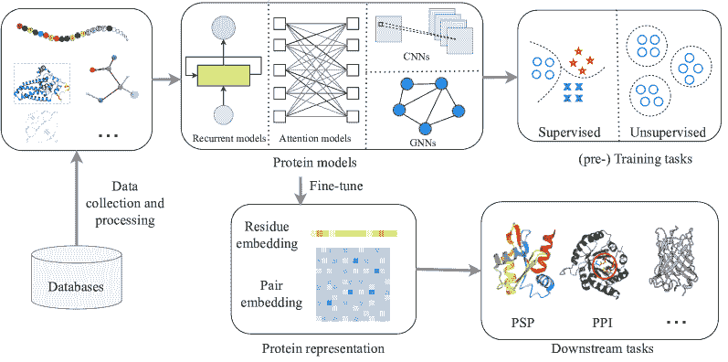

<!--yml

category: 未分类

date: 2024-09-06 19:34:00

-->

# [2403.05314] 深度学习在蛋白质科学中的进展：一项综合调查

> 来源：[`ar5iv.labs.arxiv.org/html/2403.05314`](https://ar5iv.labs.arxiv.org/html/2403.05314)

\useunder

\ul \ArticleTypeREVIEW \Year2022 \Month \Vol \No \DOI \ArtNo \ReceiveDate \ReviseDate \AcceptDate \OnlineDate

Title keyword 5 for citation Title for citation Title for citation

Stan.ZQ.Li@westlake.edu.cn

\AuthorMark

Hu B Z, et al

\AuthorCitation

Hu B Z, et al

# 深度学习在蛋白质科学中的进展：一项综合调查

Bozhen HU    Cheng TAN    Lirong WU    Jiangbin ZHENG    Jun XIA    Zhangyang GAO    Zicheng LIU    Fandi WU    Guijun ZHANG    Stan Z. LI 浙江大学，杭州 310058，中国 西湖大学工程学院人工智能部，杭州 310030，中国 腾讯 AI 实验室，深圳 518054，中国 浙江工业大学，杭州 310014，中国

###### 摘要

蛋白质表示学习在理解蛋白质的结构和功能中扮演着关键角色，这些蛋白质是涉及各种生物过程的重要生物分子。近年来，深度学习因其从大规模蛋白质数据中学习复杂模式和表示的能力而成为蛋白质建模的强大工具。本综合调查旨在概述最近在蛋白质科学中应用的深度学习技术的进展。调查从介绍基于深度学习的蛋白质模型的发展开始，并强调蛋白质表示学习在药物发现、蛋白质工程和功能注释中的重要性。接着，调查深入探讨了深度学习的基础知识，包括卷积神经网络、递归神经网络、注意力模型和图神经网络在建模蛋白质序列、结构和功能中的应用，并探索了这些技术如何用于提取有意义的特征和捕捉蛋白质数据中的复杂关系。随后，调查介绍了深度学习在蛋白质领域的各种应用，包括蛋白质结构预测、蛋白质-蛋白质相互作用预测、蛋白质功能预测等。此外，它还突出了这些深度学习技术的挑战和局限性，并讨论了克服这些挑战的潜在解决方案和未来方向。这一综合调查为感兴趣于利用深度学习技术的蛋白质领域研究人员和从业者提供了宝贵的资源。它是研究人员理解蛋白质科学、开发强大蛋白质模型并解决实际问题的实用指南。通过整合最新的进展并讨论潜在的改进途径，这篇综述为蛋白质研究的持续进展做出了贡献，并为该领域未来的突破铺平了道路。

###### keywords:

蛋白质表示学习、结构预测、序列与结构、功能、图神经网络

## 1 引言

蛋白质是生命的主力军，在从治疗到材料的广泛应用中发挥着至关重要的作用。它们由二十种不同的基本化学构件（称为氨基酸）构建，这些氨基酸折叠成复杂的三维（3D）结构，这些结构决定了它们的功能并协调细胞的生物过程[1]。蛋白质建模是生物信息学和计算生物学中的一个重要领域，旨在理解蛋白质的结构、功能和相互作用。随着深度学习技术的快速进步，该领域的影响显著，提高了预测的准确性，并促进了生物研究各个领域的突破[2]。

蛋白质结构决定了它们与其他分子的相互作用及其执行特定任务的能力。然而，从氨基酸序列预测蛋白质结构是具有挑战性的，因为蛋白质序列中的微小扰动可以极大地改变蛋白质的形状，甚至使其失去功能，并且多肽是灵活的，可以折叠成大量不同的形状[3, 4]。确定蛋白质结构的一种方法是使用实验性方法，包括 X 射线晶体学、核磁共振（NMR）光谱[5]和冷冻电镜（cryo-EM）[6]。不幸的是，实验室结构确定方法成本高昂，不能用于所有蛋白质。因此，蛋白质序列的数量远远超过了可用的结构和注释[7]。例如，蛋白质数据银行（PDB）中大约有 190K（千）个结构[8]，而 UniParc 中则有超过 500M（百万）个序列[9]，并且在 ProteinKG25 中只有大约 5M Gene Ontology（GO）术语三元组[10]，其中包括约 600K 蛋白质和 50K 属性术语。

图 1：应用于蛋白质的深度学习模型的通用框架，用于各种应用的蛋白质表示学习。

近年来，越来越多的人开始关注将深度学习技术应用于蛋白质研究。研究人员已经认识到深度学习模型在学习复杂模式和从大规模蛋白质数据中提取有意义特征方面的潜力，这些数据包括蛋白质序列、结构、功能和相互作用的信息。一个特别活跃的研究领域是蛋白质表示学习（PRL），该领域从自然语言处理（NLP）中采用的方法中汲取灵感，旨在学习可以用于各种下游任务的表示[11]。然而，蛋白质研究中的一个主要挑战是标记数据的稀缺。标记蛋白质通常需要耗时且资源密集的实验室实验，这使得获得足够的标记数据以训练深度学习模型变得困难。为了解决这个问题，研究人员采用了类似于 NLP 中采用的预训练和微调范式。这种方法包括在预训练任务上对模型进行预训练，从中获取关于蛋白质数据的知识，然后在具有较少标记数据的下游任务上对模型进行微调。在预训练阶段，通常采用自监督学习方法来学习蛋白质表示。一种流行的预训练任务是预测掩码标记，其中模型被训练以根据周围的序列重建损坏的标记。一些著名的预训练蛋白质编码器已经被开发出来，包括 ProtTrans[12]、ESM 模型[13, 14]和 GearNet[15]。这些预训练模型在各种蛋白质任务中表现出了其有效性，并且推动了蛋白质研究的发展。图 1 展示了用于各种任务的深度学习蛋白质模型的全面流程。

深度学习模型在各种应用中被广泛使用，如蛋白质结构预测（PSP）、性质预测和蛋白质设计。其中一个关键挑战是从蛋白质序列中预测其三维结构。传统的计算方法主要采用两种方法：（a）关注物理相互作用或（b）进化原则[16]。 (a) 基于物理的 Approach 模拟氨基酸链的折叠过程，使用分子动力学或基于力场势能的片段组装。这种方法强调物理相互作用，以形成具有最低自由能状态的稳定三维结构。然而，由于分子模拟的计算复杂性、片段组装的有限准确性以及准确建模蛋白质物理的难度，将这种方法应用于中等大小的蛋白质是非常具有挑战性的[17, 18]。 (b) 另一方面，最近在蛋白质测序方面的进展导致了大量可用的蛋白质序列[19, 20]，使得生成同源蛋白质的多序列比对（MSAs）成为可能。随着这些大规模数据集的可用性和深度学习模型的发展，基于进化的模型，如 AlphaFold2（AF2）[16] 和最近的研究[21, 22, 23, 24] 在 PSP 中取得了显著成功。随着研究人员继续探索这些模型的潜力，他们现在正专注于开发更深层的模型，以解决尚未解决的更具挑战性的问题。

在接下来的章节中，我们提供了定义、常用术语以及在蛋白质研究中应用的各种深度学习架构的解释。这些架构包括卷积神经网络（CNNs）、递归神经网络（RNNs）、变换器模型和图神经网络（GNNs）。尽管深度学习模型在蛋白质研究领域的应用越来越广泛，但仍然需要对这一快速发展的领域进行系统的总结。现有的蛋白质研究相关调查主要集中在生物学应用上[25, 26, 27]，而未深入探讨其他重要方面，如比较不同的预训练蛋白质模型。我们探讨了这些架构如何被调整用于蛋白质模型，总结和对比了用于学习蛋白质序列、结构和功能的模型架构。此外，还讨论了优化用于蛋白质相关任务的模型，如 PSP、蛋白质-蛋白质相互作用（PPI）预测和蛋白质属性预测，并突出了其创新和差异。此外，还提供了一系列资源，包括深度蛋白质方法、预训练数据库和论文列表¹¹1[`github.com/bozhenhhu/A-Review-of-pLMs-and-Methods-for-Protein-Structure-Prediction`](https://github.com/bozhenhhu/A-Review-of-pLMs-and-Methods-for-Protein-Structure-Prediction)²²2[`github.com/LirongWu/awesome-protein-representation-learning`](https://github.com/LirongWu/awesome-protein-representation-learning)。最后，本调查介绍了现有方法的局限性和未解决的问题，并提出了可能的未来研究方向。图 2 展示了本文的组织结构概述。

图 2：本文组织结构的总体示意图。

据我们所知，这是首次针对蛋白质的大规模预训练模型及其关联、对比和发展的全面调查。我们的目标是帮助蛋白质和人工智能（AI）领域的研究人员开发更合适的算法，并解决重要、具有挑战性和紧迫的问题。

## 2 定义、符号和术语

### 2.1 数学定义

氨基酸序列可以折叠成一个稳定的三维结构，这可以用三维图表示为 $G=(\mathcal{V},\mathcal{E},X,E)$，其中 $\mathcal{V}=\{v_{i}\}_{i=1,\ldots,n}$ 和 $\mathcal{E}=\left\{\varepsilon_{ij}\right\}_{i,j=1,\ldots,n}$ 分别表示具有 $n$ 个残基的顶点集和边集，而 $\mathcal{P}=\{P_{i}\}_{i=1,\ldots,n}$ 是位置矩阵的集合，其中 $P_{i}\in\mathbb{R}^{k_{i}\times 3}$ 表示节点 $v_{i}$ 的位置矩阵。我们将每个氨基酸视为蛋白质的图节点，那么 $k_{i}$ 取决于第 $i$ 个氨基酸中的原子数量。节点和边的特征矩阵分别是 $X=[\bm{x}_{i}]_{i=1,\ldots,n}$ 和 $E=[\bm{e}_{ij}]_{i,j=1,\ldots,n}$，节点和边的特征向量分别是 $\bm{x}_{i}\in\mathbb{R}^{d_{1}}$ 和 $\bm{e}_{ij}\in\mathbb{R}^{d_{2}}$，$d_{1}$ 和 $d_{2}$ 是初始特征维度。蛋白质图表示学习的目标是为每个蛋白质形成一组低维嵌入 $\bm{z}$，然后将其应用于各种下游任务。

图 3：四种不同水平的蛋白质结构 [28, 29]。

### 2.2 符号和术语

• 序列/初级结构：肽链或蛋白质中氨基酸的线性序列[30]。任何多肽的序列都从单胺（N-末端）到羧酸（C-末端）[31]（参见图 3）。 • 次级结构（SS）：蛋白质局部片段的 3D 形态。两种最常见的次级结构元素是$\alpha$-螺旋（H）和$\beta$-链（E）；3 态 SS 包括 H、E、C（卷曲区）；8 种精细状态包括螺旋的三种类型（G 表示$3_{10}$-螺旋，H 表示$\alpha$-螺旋，I 表示$\pi$-螺旋），链的两种类型（E 表示$\beta$-链和 B 表示$\beta$-桥），以及卷曲的三种类型（T 表示$\beta$-转角，S 表示高曲率环，L 表示不规则）[32]。 • 第三级结构：其多肽链及其组成原子的 3D 排列。 • 四级结构：多亚单位蛋白质中亚单位的 3D 排列[33]。 • 多重序列比对（MSA）：三条或更多生物序列（蛋白质或核酸）比对的结果。 • 序列同源性：序列（蛋白质或核酸）之间的生物学同源性[34]。MSA 假设所有对齐的序列可能共享可识别的进化同源性[35]，用于指示每个序列中哪些区域是同源的。 • 共进化：两个实体的进化变化之间的相互依赖[36]在所有生物学层面上都发挥着重要作用，这在蛋白质残基之间显而易见（见图 7(a)）。 • 模板：蛋白质的同源 3D 结构。 • 联系图：一个二维二进制矩阵，表示蛋白质在距离阈值内的残基-残基接触[37]。 • 蛋白质结构预测（PSP）：从氨基酸序列预测蛋白质的 3D 结构。 • 孤儿蛋白质：没有任何可检测同源性的蛋白质[38]（同源蛋白质的 MSA 不可用）。 • 抗体：由免疫系统产生的 Y 形蛋白质，用于检测和中和有害物质，如病毒和致病菌。 • 核糖核酸（RNA）：一种在转录、翻译和基因调控等各种生物学角色中必不可少的聚合物，通常是单链的。 • 蛋白质复合体：与两个或更多多肽链相关的四级结构形式。 • 蛋白质构象：其组成原子的空间排列决定了整体形状[39]。 • 蛋白质能量函数：蛋白质折叠成 3D 结构的方式使其达到低能量状态。蛋白质-能量函数用于通过最小化能量值来指导 PSP。 • 基因本体（GO）：GO 是一个广泛使用的生物信息学资源，提供标准化的词汇来描述基因和基因产物的功能、过程和细胞位置，将生物学知识组织为三个主要领域：分子功能（MF）、细胞组成（CC）和生物过程（BP）。 • 蒙特卡罗方法：一种计算数学算法，通过重复随机采样来估计不确定事件的可能结果。 • 监督学习：利用标记的输入-输出对来学习一种能够准确分类数据或预测结果的函数。 • 无监督学习：模型在没有标记数据集的情况下进行训练，并鼓励从给定数据中发现隐藏的模式和见解。 • 自然语言处理（NLP）：计算机程序处理、分析和理解文本和口头语言的能力，类似于人类的处理方式。 • 语言模型（LM）：一种统计模型，用于预测给定语言中一系列单词的概率。 • 嵌入：嵌入是一种低维、学习的连续向量表示离散变量，你可以将高维和实值向量（单词或句子）转换为此表示[40]。 • 卷积神经网络（CNNs）：一种神经网络类别，通过卷积操作捕捉局部信息。 • 循环神经网络（RNNs）：一种神经网络类别，其中节点之间的连接形成一个沿时间序列的有向或无向图。 • 注意力模型：一种神经网络架构，能够将计算集中在输入或记忆的特定部分[41]。 • 图神经网络（GNNs）：一种深度学习模型，专门设计用于处理图结构数据。 • 迁移学习：一种机器学习方法，其中为一个任务开发的模型被重用于解决不同但相关的任务[42, 43]，主要包括预训练和微调两个主要活动。 • 预训练：一种 AI 策略，指使用一个任务训练模型，以帮助其形成可以用于其他任务的参数。 • 微调：一种方法，利用预训练神经网络的权重来初始化在相同领域中训练的新模型。 • 自回归语言模型：一种前馈模型，根据上下文从一组词预测未来的词[44]。 • 掩码语言模型：一种语言模型掩盖句子中的一些单词，并预测应该用哪些单词来替代这些掩盖词。 • 双向语言模型：一种语言模型，学习预测过去和未来方向上的下一个标记的概率[45]。 • 多任务学习：一种机器学习范式，同时解决多个任务，同时利用任务之间的共性和差异[46]。 • 序列到序列（Seq2Seq）：一种机器学习方法，将一个领域的序列转换为另一个领域的序列。 • 知识蒸馏：将知识从大型模型或模型集合转移到单一小型模型的过程[47]。 • 多模态学习：通过结合来自多种模态的信息来训练模型[48, 49]。 • 残差神经网络：一种神经网络，使用跳过连接或快捷方式跳过一些层，例如深度残差网络 ResNet[50]。

## 3. 蛋白建模中的基础神经网络

本节首先介绍了基本的深度学习架构，分为四个主要类别：CNNs, RNNs, attention mechanisms, 和 GNNs。特别强调了像 transformers [51] 和 message passing mechanisms 这样的 attention 模型。随后，概述了两种经常使用的 LMs，Bidirectional encoder representations from transformers (BERT) [52] 和 Generative pre-trained transformer (GPT) [53, 54, 55]。这些基础神经网络通常被用来构建蛋白质研究领域中的复杂模型的构件。

### 3.1 卷积神经网络

CNNs 是一种深度学习算法，彻底改变了计算机视觉领域 [56]。受到人脑视觉皮层的启发 [57]，CNNs 特别擅长分析和提取图像和其他类似网格的数据中的特征。

CNNs 背后的关键思想是使用卷积层，它们对输入数据应用滤波器或核以提取局部模式。这些滤波器是小矩阵，它们在输入数据上滑动，进行逐元素乘法和求和以产生特征图 [58]。卷积是一个数学运算，涉及两个函数的乘积的积分，其中一个函数是反转并移位的。在深度学习的背景下，两个函数的卷积可以表示为$f$和$g$，如下所示：

|  | $\text{ 卷积: }(f*g)(t)=\int_{\tau\in\Omega}g(\tau)f(t+\tau)d\tau\text{, }$ |  | (1) |
| --- | --- | --- | --- |

这里，$\Omega$表示给定空间中的一个邻域。在深度学习应用中，$f(t)$通常表示位置$t$处的特征，表示为$f(t)=f_{t}\in\mathbb{R}^{d_{1}\times 1}$，其中$d_{1}$是输入特征通道的数量。另一方面，$g(\tau)\in\mathbb{R}^{d\times d_{1}}$通常被实现为参数化的核函数，其中$d$表示输出特征通道的数量 [59]。

通过堆叠多个卷积层，CNN 可以从输入数据中学习越来越复杂和抽象的特征。除了卷积层外，CNN 通常还包括池化层，这些层减少特征图的空间维度，同时保留最重要的信息。池化有助于使网络对输入数据的变化更加稳健，并减少计算复杂性。CNN 还在网络的末端包含全连接层，这些层基于提取的特征执行分类或回归任务。图 4 展示了深度 CNN 的框架。CNN 的多功能性和有效性使其成为深度学习领域的基本工具，并在各个领域的重大进展中做出了贡献。

图 4：CNN 的插图。

### 3.2 循环神经网络与长短期记忆

语言模型的第一个例子由安德烈·马尔可夫研究，他在 1913 年提出了马尔可夫链[60, 61]。此后，一些机器学习方法，特别是隐马尔可夫模型及其变体，已被描述并应用为许多领域的基本工具，包括生物序列[62]。目标是恢复一个不立即可观察到的数据序列[63, 64, 65]。

自 2010 年代以来，神经网络在各种自然语言处理任务中开始产生卓越的结果[66]。RNN 允许将先前的输出作为输入，同时具有隐藏状态以展示时间动态行为。因此，RNN 可以利用其内部状态处理可变长度的输入序列，这在自然语言处理任务中非常有用和适用[67]。最近，谷歌 DeepMind 推出了 Hawk，一种具有门控线性递归的 RNN，以及 Griffin，一种将门控线性递归与局部注意力机制混合的混合模型[68]，这些模型在训练过程中具有与变压器相匹配的硬件效率[51]。

(a) RNNs

(b) LSTM 单元

图 5：RNN 和 LSTM 的图解说明。

RNN 通常如图 5a 所示。在每个时间步 $t$，输入 $x_{t}\in\mathbb{R}^{d_{1}}$、隐藏状态 $h_{t}\in\mathbb{R}^{d}$ 和输出状态向量 $o_{t}\in\mathbb{R}^{d}$，其中上标 $d_{1}$ 和 $d$ 分别表示输入特征的数量和隐藏单元的数量，按如下公式构造：

|  | $\displaystyle h_{t}$ | $\displaystyle=g\left(W_{x}x_{t}+W_{h}h_{t-1}+b_{h}\right)$ |  | (2) |
| --- | --- | --- | --- | --- |
|  | $\displaystyle o_{t}$ | $\displaystyle=g\left(W_{y}h_{t}+b_{y}\right)$ |  | (3) |

其中 $W_{x}\in\mathbb{R}^{d\times d_{1}}$、$W_{h}\in\mathbb{R}^{d\times d}$ 和 $W_{y}\in\mathbb{R}^{d\times d}$ 是与递归层中输入、隐藏和输出向量相关的权重，$b_{h}\in\mathbb{R}^{d}$、$b_{y}\in\mathbb{R}^{d}$ 是共享的偏置，$g(\cdot)$ 是激活函数。

为了解决训练传统 RNN 时可能遇到的梯度消失问题 [69]，开发了 LSTM 网络来处理数据序列。它们在学习长期依赖性方面表现出卓越的能力 [70]，并有多种应用，如时间序列预测 [71]、蛋白质同源性检测 [72]、药物设计 [73] 等。与标准 LSTM 不同，双向 LSTM（BiLSTM）添加了另一层 LSTM，反转信息流的方向。这意味着它能够利用来自两侧的信息，并且也是建模序列中单词和短语之间顺序依赖关系的强大工具 [74]。

LSTM 架构旨在提供一个能够持续更多时间步的短期记忆，如图 5b 所示，$\mathrm{Sigmoid}(\cdot)$ 和 $\mathrm{tanh}(\cdot)$ 分别表示 sigmoid 层和 tanh 层。LSTM 中的遗忘门层决定了在时间步 $t$ 时要从单元状态中丢弃哪些信息，$x_{t}\in\mathbb{R}^{d_{1}}$、$h_{t}\in(-1,1)^{d}$ 和 $f_{t}\in(0,1)^{d}$ 是输入、隐藏状态向量和遗忘门的激活向量。

|  | $f_{t}=\mathrm{Sigmoid}(W_{f}x_{t}+U_{f}h_{t-1}+b_{f})$ |  | (4) |
| --- | --- | --- | --- |

然后，输入门层决定哪些值应该被更新，tanh 层创建一个新的候选值向量，$\tilde{C}_{t}\in(-1,1)^{d}$，可以被添加到状态中，$i_{t}\in(0,1)^{d}$ 是输入门的激活向量。

|  | $\displaystyle i_{t}$ | $\displaystyle=\mathrm{Sigmoid}(W_{i}x_{t}+U_{i}h_{t-1}+b_{i})$ |  | (5) |
| --- | --- | --- | --- | --- |
|  | $\displaystyle\tilde{C}_{t}$ | $\displaystyle=\tanh(W_{c}x_{t}+U_{c}h_{t-1}+b_{c})$ |  | (6) |

接下来，我们将旧状态 $C_{t-1}\in\mathbb{R}^{d}$ 和新候选值 $\tilde{C}_{t}\in(-1,1)^{d}$ 结合起来，以创建对新状态 $C_{t}\in\mathbb{R}^{d}$ 的更新。

|  | $C_{t}=f_{t}\odot C_{t-1}+i_{t}\odot\tilde{C}_{t}$ |  | (7) |
| --- | --- | --- | --- |

最终，输出门层决定要输出细胞状态的哪些部分，$o_{t}\in(0,1)^{d}$。

|  | $\displaystyle o_{t}$ | $\displaystyle=\mathrm{Sigmoid}(W_{o}x_{t}+U_{o}h_{t-1}+b_{o})$ |  | (8) |
| --- | --- | --- | --- | --- |
|  | $\displaystyle h_{t}$ | $\displaystyle=o_{t}\odot\tanh\left(C_{t}\right)$ |  | (9) |

其中 $\{W_{f},W_{i},W_{c},W_{o}\}\in\mathbb{R}^{d\times d_{1}},\{U_{f},U_{i},U_{c},U_{o}\}\in\mathbb{R}^{d\times d}$ 和 $\{b_{f},b_{i},b_{c},b_{o}\}\in\mathbb{R}^{d}$ 是 LSTM 单元中的权重矩阵和偏置向量参数，$\odot$ 表示逐点乘法。

### 3.3 注意力机制与 Transformer

传统的序列到序列（Seq2Seq）模型通常使用 RNNs 或 LSTMs 作为编码器和解码器 [75] 来处理序列并提取特征用于各种任务。然而，这些模型存在一些限制，比如 RNNs 或 LSTMs 的最终状态需要保持整个输入序列的信息，这可能导致信息丢失。为了克服这些限制，引入了注意力机制 [76, 77]，这些机制可以分为两类，本地注意力和全局注意力（参见图 6a）。它们允许模型专注于与当前任务相关的输入序列的特定部分。注意力机制的基本思想是根据输入序列的不同元素与当前输出序列生成步骤的相关性分配权重。注意力机制最初应用于机器翻译 [76] 并逐渐取代了传统的 RNNs 和 LSTMs。

(a) 注意力机制

(b) Transformer

图 6：注意力机制和 Transformer 架构的图示解释。

模型中的注意力层可以访问所有先前的状态，并通过为这些状态分配权重来学习它们的重要性。2017 年，Google Brain 引入了 Transformer 架构 [51]，该架构完全消除了递归和卷积。这一突破导致了诸如 BERT 和 GPT 的预训练模型的开发，这些模型在大规模语言数据集上进行训练。与 RNNs 不同，如图 6b 所示，Transformer 使用 $N$ 层堆叠的自注意力层同时处理整个输入，既用于编码器也用于解码器。每一层由一个多头注意力模块组成，后跟一个具有残差连接和归一化的前馈模块。Transformer 中使用的基本注意力机制称为“缩放点积注意力”，其操作如下：

|  | $\operatorname{Att}(Q,K,V)=\operatorname{Softmax}\left(\frac{QK^{T}}{\sqrt{d}}\right)V$ |  | (10) |
| --- | --- | --- | --- |

其中 $Q,K,V\in\mathbb{R}^{l\times d}$ 是查询、键和值序列中 $l$ 个单词的 $d$ 维向量表示。多头注意力机制使模型能够并行关注不同的表示子空间。多头注意力模块可以定义如下：

|  | $\displaystyle\operatorname{MultiHead}\left(Q,K,V\right)$ | $\displaystyle=\mathrm{Concat}\left(\mathrm{head}_{1},\ldots,\mathrm{head}_{h}\right)W^{O}$ |  |
| --- | --- | --- | --- |
|  | $\displaystyle\mathrm{where}\ \mathrm{head}_{i}$ | $\displaystyle=\mathrm{Att}\left(QW_{i}^{Q},KW_{i}^{K},VW_{i}^{V}\right)$ |  |

其中，投影是参数矩阵 $W_{i}^{Q}\in\mathbb{R}^{d\times d_{i}},W_{i}^{K}\in\mathbb{R}^{d\times d_{i}},W_{i}^{V}\in\mathbb{R}^{d\times d_{i}}$ 和 $W^{O}\in\mathbb{R}^{hd_{i}\times d},d_{i}=d/h$，有 $h$ 个并行的注意力层或头。此外，Transformer 架构还包括位置-wise 前馈网络，这些网络由两个线性变换和一个中间的 ReLU 激活组成。位置编码也被添加到编码器和解码器堆栈底部的嵌入中，以纳入序列的顺序。

### 3.4 图神经网络

与操作在网格状数据结构（如图像或序列）上的传统神经网络不同，GNNs 专门设计用于处理表示为图的数据。在图中，数据实体被表示为节点，而这些实体之间的关系通过边来捕捉。这种灵活而富有表现力的表示使 GNNs 非常适合广泛的应用，包括社交网络分析 [78]、推荐系统 [79]、药物发现 [80] 和知识图谱推理 [81]。

GNN 的关键思想是通过从邻近节点聚合信息来学习节点表示。这通过一系列消息传递步骤来实现，其中每个节点通过结合来自其邻居的信息来更新其表示。通过在图中迭代地传播和更新信息，GNN 能够捕捉数据中的复杂依赖关系和模式。给定一个如 Subsection 2.1 中所示的蛋白质 3D 图 $G=(\mathcal{V},\mathcal{E},X,E)$，一个消息传递层可以表示为：

|  | $\bm{h}_{i}=\phi\left(\bm{x}_{i},\bigoplus_{v_{j}\in\mathcal{N}(v_{i})}\psi\left(\bm{x}_{i},\bm{x}_{j},\bm{e}_{ij}\right)\right)$ |  | (11) |
| --- | --- | --- | --- |

其中 $\bigoplus$ 是一个排列不变的聚合操作符（例如，逐元素求和），$\phi(\cdot)$ 和 $\psi(\cdot)$ 分别表示更新函数和消息函数，而 $\mathcal{N}(v_{i})$ 表示节点 $v_{i}$ 的邻居。

GNN 模型的变体，包括 **GCN** [82], **GAT** [83] 和 **GraphSAGE** [84]，在聚合策略、注意机制和传播规则上有所不同，但它们都共享通过消息传递机制学习节点表示的基本思想。GNN 具有捕捉局部和全局信息的能力，为理解图结构数据提供了一个强大的框架。

### 3.5 语言模型

为了有效训练可以利用有限的人类标注数据存储特定任务知识的深度神经模型，迁移学习的方法被广泛采用。这涉及到一个两步过程：预训练和微调 [77, 85, 43]。

近年来，预训练语言模型（LMs）的发展取得了显著进展，这些模型在自然语言处理（NLP）和计算机视觉等多个领域得到了广泛应用。在这些模型中，变压器架构已经成为自然语言理解和生成的标准神经架构。特别是，**BERT**和**GPT**是两个具有里程碑意义的模型，为大规模预训练语言模型开辟了新天地。**GPT** [53] 旨在优化预训练过程中的自回归语言建模。它利用变压器来建模每个单词的条件概率，使其在预测序列中的下一个标记方面表现出色。另一方面，**BERT** [52] 采用多层双向变压器编码器作为其架构。在预训练阶段，BERT 利用下一个句子预测和掩蔽语言建模策略来理解句子关系并捕获上下文信息。

随着 GPT 和 BERT 的引入，研究人员提出了众多改进和变体。其中一个显著的趋势是模型规模和数据集规模的增加[86, 87]。大型变压器模型已经成为自然语言处理（NLP）的事实标准，由于缩放法则的驱动，控制过拟合、模型规模和数据集规模之间的关系[88, 89]。2022 年 11 月，OpenAI 发布了 ChatGPT[90]，因其理解人类语言、回答问题、编写代码甚至生成小说的能力而引起了广泛关注。它是大型预训练语言模型最成功的应用之一。此外，随着预训练语言模型在各个领域表现出其有效性和效率，它们逐渐扩展到金融、计算机视觉和生物医学等领域[91, 92, 93, 94, 95]。

## 4 蛋白质基础

本节*深入探讨*了蛋白质的基本方面，探索它们与人类语言、物理化学属性、结构几何以及生物学见解的复杂联系。讨论旨在揭示那些有助于全面理解蛋白质及其在各种背景下作用的**基础元素**。

### 4.1 蛋白质与语言

语言模型（LMs）越来越多地被用于分析大规模蛋白质序列数据库，以获取嵌入[96, 97, 98]。这一趋势的一个重要原因是人类语言和蛋白质之间的共同特征。例如，两者都表现出层次化的组织[66, 99]，其中蛋白质结构的四个不同层次（如图 3 所示）可以类比为人类语言中的字母、单词、句子和文本。这种类比说明了蛋白质和语言由可以重用和重新排列的模块化元素组成。此外，蛋白质折叠的原理，如氨基酸的亲水性和疏水性、最小挫折原则[100]，以及蛋白质的折叠漏斗景观[101]，与语言学中的语言语法有一定的相似性。

图 7：蛋白质与语言的比较。(a) 对齐中的一个蛋白质的 MSA 和残基接触之间的关系。共演变的位置以红色和浅蓝色突出显示。这些位置中发生变化的残基以蓝色显示。给定这样的 MSA，可以推断出统计上发现的两个残基之间的相关性，即这些序列位置在空间上相邻，即它们是接触的[102, 36, 103]。(b) 一个语法复杂的句子包含远距离依赖关系（以**粗体**显示）。

图 7(a) 展示了基于 MSA 的蛋白质中残基接触的统计推断。它突出了两个残基之间的远程依赖关系，它们在序列中可能距离很远，但在空间上很近，表明共演变。人类语言中也观察到类似的远距离依赖现象。图 7(b) 提供了一个语言语法规则的示例，该规则要求远离的单词之间的一致性[104]。这些相似性表明，自然语言处理（NLP）中的成功方法可以应用于分析蛋白质数据。然而，重要的是要注意，尽管存在这些共享特征，但蛋白质与人类语言是不同的。例如，训练语言模型通常需要大量的语料库，这需要标记化，即将文本拆分为单独的标记或直接使用单词作为标记。这有助于计算目的，并理想地与 NLP 的语言学目标一致[105, 106, 97, 98, 107]。相比之下，蛋白质标记化方法仍处于初步阶段，尚无明确且具有生物学意义的算法。

### 4.2 蛋白质的物理化学性质

蛋白质的物理化学性质指的是由其化学和物理性质决定的蛋白质特性和行为，这些特性在蛋白质的结构、稳定性、功能和相互作用中发挥着至关重要的作用。只有当环境适合蛋白质的物理化学性质时，它才能保持活性并发挥其作用 [108]。理解蛋白质的物理化学性质对于开发新型蛋白质药物至关重要。蛋白质的一些物理化学特征类似于氨基酸，包括两性电离点、等电点、颜色反应、盐反应等。然而，在分子量、高分子行为、变性等性质方面，蛋白质和氨基酸也存在差异。一些研究利用与氨基酸相关的物理化学性质，深入了解每种氨基酸的生化特性 [109, 110]。这些特性包括立体参数、疏水性、体积、极化性、等电点、螺旋概率和片层概率。

通过 HIGH-PPI [111]，已经计算并可视化了这些特性在残基水平上的重要性。他们发现，等电点、极性和氢键受体功能等特性在蛋白质-蛋白质相互作用界面中发挥作用。通过分析在从模型中删除每个单独特征维度前后的评估分数变化，他们确定了拓扑极性表面积和辛醇-水分配系数是 PPI 界面特征表征的主要特征。

### 4.3 模体、区域和结构域

模式、区域和结构域通常作为额外信息用于训练深度学习模型。模式是指在多个蛋白质或核酸中发现的短的、保守的序列模式或结构特征。它代表了一个功能性或结构性单元，通常与特定的生物学活动相关[112]。模式可以作为标志来识别潜在的配体、底物或其他相互作用分子的结合位点。另一方面，“区域”一词指的是序列中的特定兴趣区域。相比之下，结构域是指蛋白质或核酸序列中的独立单元，无论在结构上还是功能上[113]。结构域可以折叠成稳定的三维结构，并且通常执行特定的功能。图 8 展示了蛋白质领域中的各种数据类别，并提供了模式、区域和结构域的示例。Hu 等人[114]收集了多个数据集，包括 1364 类模式、3383 类结构域和 10628 类区域。需要注意的是，这些类别呈长尾分布。因此，在处理与蛋白质相关的任务时，必须考虑蛋白质数据的多模态特性和长尾效应。

图 8：蛋白质的多模态数据集概述[114]，包括序列、结构、GO 术语、区域、结构域和模式。

### 4.4 蛋白质结构几何

Wang 等人[115]强调了有效利用多层次结构信息对准确预测蛋白质功能的重要性，四个不同的层次在图 3 中展示。他们建议在预训练阶段结合 PPI 任务，以捕捉四级结构信息。除了考虑蛋白质结构的多个层次外，深度学习模型还可以利用层级关系来处理三级结构信息。例如，ProNet[116]专注于对具有三维结构的蛋白质进行不同层次的表征学习，如氨基酸、骨架或全原子层次。在氨基酸层次，ProNet 考虑了结构的 $\mathrm{C}_{\alpha}$ 位置。在骨架层次，它包含了所有骨架原子（$\mathrm{C}_{\alpha},\mathrm{C},\mathrm{N},\mathrm{O}$）的信息。最后，在全原子层次，ProNet 处理骨架和侧链原子的坐标。

(a)

(b)

图 9：蛋白质结构几何 [119]。(a) 局部坐标系统，$P_{i,\mathrm{C}_{\alpha}}$ 是残基 $i$ 中 $\mathrm{C}_{\alpha}$ 的坐标。(b) 残基间几何，包括距离 ($d_{ij,\mathrm{C}_{\beta}}$)、三个二面角 ($\omega_{ij},\theta_{ij},\theta_{ji}$) 和两个平面角 ($\varphi_{ij},\varphi_{ji}$)。

#### 局部坐标系统

局部信息特征源自局部坐标系统 (LCS) [117]，如图 9a 所示，定义为：

|  | $\bm{Q}_{i}=[\bm{b_{i}}\quad\bm{n_{i}}\quad\bm{b_{i}}\times\bm{n_{i}}]$ |  | (12) |
| --- | --- | --- | --- |

其中 $\bm{u}_{i}=\frac{{P}_{i,\mathrm{C}\alpha}-{P}_{i-1,\mathrm{C}\alpha}}{\left\|{P}_{i,\mathrm{C}\alpha}-{P}_{i-1,\mathrm{C}\alpha}\right\|},\bm{b_{i}}=\frac{\bm{u}_{i}-\bm{u}_{i+1}}{\left\|\bm{u}_{i}-\bm{u}_{i+1}\right\|},\bm{n}_{i}=\frac{\bm{u}_{i}\times\bm{u}_{i+1}}{\left\|\bm{u}_{i}\times\bm{u}_{i+1}\right\|}$，$\bm{b_{i}}$ 是角度的负平分线，角度由射线 ($P_{i-1,\mathrm{C}_{\alpha}}-P_{i,\mathrm{C}_{\alpha}}$) 和 ($P_{i+1,\mathrm{C}_{\alpha}}-P_{i,\mathrm{C}_{\alpha}}$) 形成，${P}_{i,\mathrm{C}\alpha}$ 代表节点 $v_{i}$ 中原子 $\mathrm{C}_{\alpha}$ 的坐标，$\left\|\cdot\right\|$ 表示 $l^{2}$-范数。可以清楚地看到，LCS 在氨基酸级别定义。空间边特征 $\bm{e}_{ij}^{(1)}$ 可以通过 LCS 考虑距离、方向和取向来获得，

|  | $\bm{e}_{ij}^{(1)}=\mathrm{Concat}(\left\&#124;d_{ij,\mathrm{C}\alpha}\right\&#124;,\bm{Q}_{i}^{T}\cdot\frac{d_{ij,\mathrm{C}\alpha}}{\left\&#124;d_{ij,\mathrm{C}\alpha}\right\&#124;},\bm{Q}_{i}^{T}\cdot\bm{Q}_{j})$ |  | (13) |
| --- | --- | --- | --- |

其中 $\cdot$ 是矩阵乘法，$d_{ij,\mathrm{C}\alpha}={P}_{i,\mathrm{C}\alpha}-{P}_{j,\mathrm{C}\alpha}$。该实现能够在氨基酸级别获得完整的表示；例如我们有 $\bm{Q}_{i}$，LCS $\bm{Q}_{j}$ 可以通过 $\bm{e}_{ij}^{(1)}$ 容易获得。因此，LCS 被广泛应用于蛋白质设计、抗体设计以及 PRL [117, 118, 119]。

#### trRosetta 残基间几何

我们介绍了 trRosetta 中的相对旋转和距离[120]，包括距离（$d_{ij,\mathrm{C}_{\beta}}$），三个二面角（$\omega_{ij},\theta_{ij},\theta_{ji}$）和两个平面角（$\varphi_{ij},\varphi_{ji}$），如图 9b 所示，其中 $d_{ij,\mathrm{C}_{\beta}}=d_{ji,\mathrm{C}_{\beta}},\omega_{ij}=\omega_{ji}$，但 $\theta$ 和 $\varphi$ 的值取决于残基的顺序。这些残基间的几何结构定义了两个残基的骨架原子的相对位置的所有细节[120]，因为 $\mathrm{N}_{i}-\mathrm{C}_{\alpha i}$ 和 $\mathrm{C}_{\alpha i}-\mathrm{C}_{i}$ 的扭转角度不会影响它们的位置。因此，这六种几何结构对于骨架级别的氨基酸在半径图中是完整的，这些图在 PSP 和蛋白质模型质量评估中常被使用[120, 121, 122, 123, 124]。这些残基间几何结构可以得到边缘特征 $\bm{e}_{ij}^{(2)}$，它包含了任何两个相邻氨基酸之间的相对空间信息。

|  | $\bm{e}_{ij}^{(2)}=\mathrm{Concat}(d_{ij,\mathrm{C}_{\beta}},(\sin\wedge\cos)(\omega_{ij},\theta_{ij},\varphi_{ij}))$ |  | (14) |
| --- | --- | --- | --- |

图 10：显示了特征性骨架键长、角度和扭转角度（$\Psi_{i},\Phi_{i},\Omega_{i}$）的多肽链。平面肽基团以灰色阴影区域表示，表明肽平面与从 3D 位置计算的几何平面不同[119]。

#### 骨架扭转角

肽键由于共振效应表现出部分双键特性[125]，这表明组成该键的三个非氢原子是共面的，如图 10 所示，由于共面特性，键的自由旋转受到限制。$\mathrm{N}_{i}-\mathrm{C}_{\alpha i}$ 和 $\mathrm{C}_{\alpha i}-\mathrm{C}_{i}$ 键是多肽骨架基本重复单元中的两个键。这些单键允许不受限制的旋转，直到被侧链立体限制[126, 127]。基于这些刚性键长和角度，可以确定骨架原子的坐标，剩余的骨架扭转角度为$\Phi_{i},\Psi_{i},\Omega_{i}$。围绕$\mathrm{C}-\mathrm{N}$肽键的 omega 扭转角通常限制在接近$180^{\circ}$（反式），但在少数情况下可以接近$0^{\circ}$（顺式）。除了图 10 中展示的键长和角度外，所有氢键长测量约为 1 Å。

#### 欧拉角

与 trRosetta 的残基几何结构不同，Wang 等人[116] 提出了使用欧拉角来捕捉两个主链平面之间的旋转。与这种蛋白质设计方法[117]不同，ProNet[116] 将氨基酸 $i$ 的局部坐标系定义为 $\bm{y}_{i}=\bm{r}_{i}^{\mathrm{N}}-\bm{r}_{i}^{\mathrm{C}_{\alpha}},\bm{t}_{i}=\bm{r}_{i}^{\mathrm{C}}-\bm{r}_{i}^{\mathrm{C}_{\alpha}}$ 和 $\bm{z}_{i}=\bm{t}_{i}\times\bm{y}_{i},\bm{x}_{i}=\bm{y}_{i}\times\bm{z}_{i}$，其中 $\bm{r}_{i}$ 代表蛋白质中第 $i$ 个氨基酸的位置矢量，该坐标系如图 11(a) 所示。两个主链坐标系之间的三个欧拉角 $\tau_{ij}^{1},\tau_{ij}^{2}$ 和 $\tau_{ij}^{3}$ 可以如图 11(b) 所示进行计算，其中 $\bm{n}=\bm{z}_{i}\times\bm{z}_{j}$ 是两个平面的交线。$\tau_{ij}^{1}$ 是 $\bm{n}$ 和 $\bm{x}_{i}$ 之间的有向角，$\tau_{ij}^{2}$ 是 $\bm{z}_{i}$ 和 $\bm{z}_{j}$ 之间的角度，而 $\tau_{ij}^{3}$ 是从 $\bm{n}$ 到 $\bm{x}_{j}$ 的角度。这两个氨基酸 $i$ 和 $j$ 之间的相对旋转可以通过这三个欧拉角来确定[116]。

图 11：欧拉角的示意图[116]。(a) 氨基酸的主链坐标系。(b) 氨基酸 $i$ 和 $j$ 之间主链坐标系的三个欧拉角。

总结来说，主链的扭转角 $\Phi_{i},\Psi_{i},\Omega_{i}$，trRosetta 的残基几何结构和欧拉角是在主链层面定义的，而 LCS 是在氨基酸层面定义的。在考虑所有原子的位置时，参照 AF2 的实现[16]，前四个扭转角 $\chi_{1},\chi_{2},\chi_{3},\chi_{4}$ 通常被考虑用于侧链原子，因为只有氨基酸精氨酸有五个侧链扭转角，第五个角接近 0 [116]。

### 4.5 结构性质

蛋白质可以通过平移和旋转在 3D 空间中移动。这些性质，例如平移和旋转不变性，提升了模型在不同蛋白质相关任务中的准确性、可靠性和实用性。一个例子是 GVP-GNN[128]，它可以处理标量特征和向量，从而能够在节点和边上包含详细的几何信息，而不会将其过度简化为可能无法完全代表复杂几何的标量值。

#### 不变性与等变性

我们研究了保持任意两点之间距离不变的仿射变换，这在欧几里得空间中被称为等距群 SE(3)。这个群被称为对称群，包括 3D 平移和 3D 旋转群 SO(3) [129, 130]。

SE(3) 的 $4\times 4$ 实矩阵的集合如下所示：

|  | <math   alttext="\left[\begin{array}[]{cc}R&amp;\mathbf{t}\\ 0&amp;1\end{array}\right]=\left[\begin{array}[]{cccc}r_{11}&amp;r_{12}&amp;r_{13}&amp;t_{1}\\

r_{21}&amp;r_{22}&amp;r_{23}&amp;t_{2}\\

r_{31}&amp;r_{32}&amp;r_{33}&amp;t_{3}\\

\left[\begin{array}[]{cc}R&\mathbf{t}\\ 0&1\end{array}\right]=\left[\begin{array}[]{cccc}r_{11}&r_{12}&r_{13}&t_{1}\\ r_{21}&r_{22}&r_{23}&t_{2}\\ r_{31}&r_{32}&r_{33}&t_{3}\\ 0&0&0&1\end{array}\right]。

其中$R\in\mathrm{SO(3)}$和$\mathbf{t}\in\mathbb{R}^{3}$，SO(3)是三维旋转群。$R$满足$R^{T}R=I$和$\mathrm{det}(R)=1$。

给定函数$f:\mathbb{R}^{d}\to\mathbb{R}^{d^{\prime}}$，假设给定对称群$G$作用于$\mathbb{R}^{d}$和$\mathbb{R}^{d^{\prime}}$，如果$f$满足以下条件，则称$f$是 G-等变的：

|  | $f(T_{g}\bm{x})=S_{g}f(\bm{x}),\ \forall\bm{x}\in\mathbb{R}^{d},g\in G$ |  | (16) |
| --- | --- | --- | --- |

在这里，$T_{g}$和$S_{g}$表示变换。对于 SE(3)群，当$d^{{}^{\prime}}=1$且$f$的输出是标量时，我们有

|  | $f(T_{g}\bm{x})=f(\bm{x}),\ \forall\bm{x}\in\mathbb{R}^{d},g\in G$ |  | (17) |
| --- | --- | --- | --- |

因此$f$是 SE(3)-不变的 [131]。

通过保持结构几何中的 SE(3)-等变性，蛋白质模型展现了识别和解释蛋白质结构的能力，无论在三维空间中的变换如何。这使得它们能够从各种蛋白质结构中学习，并将这些知识无缝应用于预测新蛋白质的功能。泛化的关键能力在 PSP 和蛋白质设计中扮演着重要角色 [132]。值得注意的是，许多蛋白质具有对称特性，如重复的模体或对称域。SE(3)-等变模型能够有效捕捉和利用这些对称特性，从而增强对蛋白质结构和功能的理解 [133]。

#### 完整几何

如果对于两个三维图形$G^{1}=(\mathcal{V},\mathcal{E},\mathcal{P}^{1})$和$G^{2}=(\mathcal{V},\mathcal{E},\mathcal{P}^{2})$，存在$T_{g}\in\mathrm{SE(3)}$使得表示，

|  | $\mathcal{F}(G^{1})=\mathcal{F}(G^{2})\Longleftrightarrow P_{i}^{1}=T_{g}(P_{i}^{2}),\ \mathrm{for}\ i=1,\dots n$ |  | (18) |
| --- | --- | --- | --- |

操作$T_{g}$不会改变三维图形的三维构型 [134, 135, 116]。$\mathcal{P}=\{P_{i}\}_{i=1,\ldots,n}$是位置矩阵的集合，$\mathcal{F}(G)\Longleftrightarrow\mathcal{P}$，意味着位置可以生成几何表示，也可以从中恢复。

全局完备性增强了应用于蛋白质结构数据的统计分析的鲁棒性。具有 SE(3)等价的蛋白质共享相同的三维构型，但可能在方向和位置上有所不同。为了辨别不同的构象，必须全面建模整个蛋白质结构。仅关注局部区域会忽略由于远处微小构象变化而产生的重大远程效应 [119]。

图 12：具有生物学知识的蛋白质示例。 (a) ProteinKG25 中的子图，包括蛋白质、GO 术语和关系 [10]。黄色节点为蛋白质，蓝色节点为带有生物学描述的 GO 实体。 (b) 蛋白质属性描述示例，包括蛋白质名称、功能文本、亚细胞位置和相似性 [136]。

### 4.6 生物学知识

生物学知识可以增强基于深度学习的蛋白质模型，以理解蛋白质的结构-功能关系，并在生物信息学中启用各种应用。张等人 [10] 构建了 ProteinKG25，它提供了与蛋白质序列对齐的大规模生物学知识事实，如图 12(a) 所示。这些属性和关系术语使用自然语言描述，提取自 GO³³3[`www.uniprot.org/uniprotkb`](https://www.uniprot.org/uniprotkb)，这是全球最大的基因及基因产物（例如蛋白质）功能信息来源。为了增强蛋白质序列的功能文本描述，徐等人 [136] 从四个领域描述蛋白质：蛋白质名称、功能、细胞内位置和蛋白质所属的家族（参见图 12(b)）。

## 5 个基于深度学习的蛋白质模型

在本节中，我们总结了一些常用的深度学习模型，用于处理蛋白质数据，包括序列、结构、功能或它们的混合。

### 5.1 蛋白质语言模型

由于蛋白质和人类语言之间固有的相似性，蛋白质序列（以氨基酸字母字符串表示）自然适合于语言模型（LMs）。语言模型能够捕捉这些氨基酸之间的复杂依赖关系 [99]。因此，蛋白质语言模型已成为学习蛋白质序列的有前途的方法，能够处理单序列和多序列比对（MSAs）作为输入。

#### 单序列

首先，我们介绍主要以单一序列作为输入的方法。早期的深度学习方法通常使用 CNN、LSTM 或其组合[137, 138, 139]，来预测蛋白质的结构特征和属性。这些方法的例子包括 DeepPrime2Sec [140]、SPOT-1D-Single [141]。此外，变分自编码器（VAE）[142, 143]也被用于学习蛋白质内部位置之间的交互。给定蛋白质序列数据$X$和潜在变量$Z$，蛋白质 VAE 模型的目标是学习联合概率$p(X,Z)=p(Z)p(X|Z)$。然而，从观测数据计算$p(Z|X)$需要评估每个数据点的证据项：

|  | $p(X)=\int p(X\mid Z)p(Z)d_{Z}$ |  | (19) |
| --- | --- | --- | --- |

直接计算这个积分是不可行的。因此，VAE 模型通常采用证据下界（ELBO）[142]来近似$p(X)$。

表 1：ProtTrans 中使用的语言模型[12]

模型 网络 预训练任务 $\#$参数 备注 BERT [52] Transformer 掩码语言建模 340M 一种常用的语言模型，用于预测掩码标记 ALBERT [146] BERT 掩码语言建模 223M BERT 的轻量版 Transformer-XL [147] Transformer 自回归语言建模 257M 能够学习超过固定长度的依赖关系 XLNet [87] BERT 自回归语言建模 340M 更多训练数据，结合了 Transformer-XL 的思想 ELECTRA [148] BERT 替换标记检测 335M 用于标记检测 T5 [149] Transformer 掩码语言建模 11B 一种文本到文本的迁移学习框架 • 所有示例均报告其公开系列中的最大模型。网络优先显示高层骨干模型，如果它们用于初始化参数。$\#$参数表示参数数量；M，百万；B，十亿。

其次，已经探讨了在缺乏结构性或进化数据的情况下对蛋白质语言模型进行预训练的方法。Alley 等人[105]采用乘性长短期记忆（mLSTM）[144]将任意蛋白质序列浓缩为固定长度的向量。值得注意的是，TAPE[145]通过自监督预训练及在五个生物学相关任务上的后续评估，推出了蛋白质模型的基准测试，包括 LSTM、Transformer、ResNet 等。Elnaggar 等人[12]成功训练了六个语言模型（BERT[52]、ALBERT[146]、Transformer-XL[147]、XLNet[87]、ELECTRA[148]和 T5[149]，如表 1 所示，这些模型在涵盖了惊人的 3930 亿氨基酸的蛋白质序列上进行了训练，利用了大量计算资源（5616 个 GPU 和一个 TPU Pod）。另一方面，ESM-1b[14]则由一个深度 Transformer 架构（如图 13(a)所示）和掩码策略组成，以构建包含整个序列上下文信息的复杂表示。ProtTrans[12]和 ESM-1b 的结果表明，大规模的蛋白质语言模型即使在没有明确利用显著的进化信息的情况下，也具备学习蛋白质基本语法的能力。在大型数据库和训练资源的支持下，研究人员开始通过构建十亿级模型来探索蛋白质语言模型的边界[166、169、13]。例如，ProGen2[166]展示了大型蛋白质语言模型能够生成有效序列库，扩展了自然蛋白质的序列和结构空间，结果表明模型的规模可以继续扩大。此外，具有高达 150 亿（billion）可训练参数的大规模蛋白质语言模型 ESM-2[13]在 PSP 任务上取得了令人印象深刻的结果，在验证困惑度和 TM-score[175]方面超过了较小的 ESM 模型。Chen 等人提出了一种统一的蛋白质语言模型 xTrimoPGLM[170]，用于同时处理蛋白质理解和生成任务，该模型涉及 1000 亿参数和 1 万亿训练标记。这些预训练的大规模蛋白质语言模型展示了它们在各种与蛋白质相关任务上的有效性。预训练蛋白质语言模型和结构模型的总结列在表 2 中。

图 13：ESM-1b 和 MSA Transformer 的核心模块。

表 2：代表性预训练蛋白质语言模型和结构模型列表

模型和仓库 输入网络 $\#$嵌入 $\#$参数 预训练任务 预训练数据集 年份 [UniRep](https://github.com/churchlab/Unirep) [105] Seq mLSTM [144] 1900 18.2M 下一氨基酸预测 UniRef50 2019 [TAPE](https://github.com/songlab-cal/tape) [145] Seq LSTM, Transformer, ResNet - 38M 掩码语言建模 Pfam 2019 下一氨基酸预测 [SeqVec](https://github.com/Rostlab/SeqVec) [150] Seq ELMo (LSTM) [151] 1024 93.6M 下一氨基酸预测 UniRef50 2019 [UDSMProt](https://github.com/nstrodt/UDSMProt) [152] Seq LSTM 400 24M 下一氨基酸预测 Swiss-Prot 2020 [CPCProt](https://github.com/amyxlu/CPCProt) [153] Seq GRU [154], LSTM 1024, 2048 1.7M 对比预测编码 Pfam 2020 [MuPIPR](https://github.com/guangyu-zhou/MuPIPR) [155] Seq GRU, LSTM 64 - 下一氨基酸预测 STRING [156] 2020 配体预测 [157] MSA Transformer - - 对齐概况预测 Pfam 2020 PRoBERTa [158] Seq Transformer 768 44M 掩码语言建模 Swiss-Prot 2020 [ESM-1b](https://github.com/facebookresearch/esm) [14] Seq Transformer 1280 650M 掩码语言建模 UniParc 2021 [ProtTXL](https://github.com/agemagician/ProtTrans) [12] Seq Transformer-XL 1024 562M 掩码语言建模 BFD100, UniRef100 2021 [ProtBert](https://github.com/agemagician/ProtTrans) [12] Seq BERT 1024 420M 掩码语言建模 BFD100, UniRef100 2021 [ProtXLNet](https://github.com/agemagician/ProtTrans) [12] Seq XLNet 1024 409M 掩码语言建模 UniRef100 2021 [ProtAlbert](https://github.com/agemagician/ProtTrans) [12] Seq ALBERT 4096 224M 掩码语言建模 UniRef100 2021 [ProtElectra](https://github.com/agemagician/ProtTrans) [12] Seq ELECTRA 1024 420M 掩码语言建模 UniRef100 2021 [ProtT5](https://github.com/agemagician/ProtTrans) [12] Seq T5 1024 11B 掩码语言建模 UniRef50, BFD100 2021 PMLM [159] Seq Transformer 1280 715M 掩码语言建模 UniRef50 2021 [MSA Transformer](https://github.com/facebookresearch/esm) [160] MSA Transformer 768 100M 掩码语言建模 UniRef50, UniClust30 2021 [ProteinLM](https://github.com/THUDM/ProteinLM) [161] Seq BERT - 3B 掩码语言建模 Pfam 2021 [PLUS-RNN](https://github.com/seonwoo-min/PLUS) [162] Seq RNN 2024 59M 掩码语言建模 Pfam 2021 同家族预测 [CARP](https://github.com/microsoft/protein-sequence-models) [163] Seq CNN 1280 640M 掩码语言建模 UniRef50 2022 [AminoBERT](https://github.com/aqlaboratory/rgn2) [22] Seq Transformer 3072 - 掩码语言建模 UniParc 2022 [OmegaPLM](https://github.com/HeliXonProtein/OmegaFold) [164] Seq GAU [165] 1280 670M 掩码语言建模 UniRef50 2022 跨越和序列掩码 [ProGen2](https://github.com/salesforce/progen) [166] Seq Transformer 4096 6.4B 掩码语言建模 UniRef90, BFD30, BFD90 2022 [ProtGPT2](https://huggingface.co/nferruz/ProtGPT2) [167] Seq GPT-2 [168] 1280 738M 下一氨基酸预测 UniRef50 2022 [RITA](https://github.com/lightonai/RITA) [169] Seq GPT-3 [55] 2048 1.2B 下一氨基酸预测 UniRef100 2022 [ESM-2](https://github.com/facebookresearch/esm) [13] Seq Transformer 5120 15B 掩码语言建模 UniRef50 2022 xTrimoPGLM [170] Seq Transformer 10240 100B 掩码语言建模 Uniref90 2023 跨越标记预测 ColAbFoldDB [ReprogBERT](https://github.com/IBM/ReprogBERT) [171] Seq BERT 768 110M 掩码语言建模 英文维基百科 2023 BookCorpus [PoET](https://github.com/OpenProteinAI/PoET) [172] MSA Transformer 1024 201M 下一氨基酸预测 UniRef50 2023 [CELL-E2](https://bohuanglab.github.io/CELL-E_2/) [173] Seq Transformer 480 35M 掩码语言建模 人类蛋白质图谱 [174] 2023 GraphMS [187] 结构 GCN - - 多视图对比 NeoDTI [188] 2021 CRL [189] 结构 IEConv [186] 2048 36.6M 多视图对比 PDB 2022 STEPS [190] 结构 GNN 1280 - 距离和二面角预测 PDB 2022 • 示例报告了其公共系列中最大的模型。Seq：序列，Struct：结构。$\#$嵌入表示嵌入维度；$\#$参数，网络的参数数量；M，百万；B，十亿。一些模型链接到 GitHub 仓库。

#### MSA 序列

如图 7 所示，从 MSA 序列推断残基接触图一直是计算生物学中长期实践的方法 [176]。在早期阶段，由于没有开发大型蛋白 LM 从单个序列中提取隐含的共进化信息，这种方法一直被依赖。可以明显看出，额外信息，如 MSA，可以增强蛋白质嵌入。MSA Transformer [160] 将基于 transformer 的 LM 扩展为处理一组序列作为输入，通过交替关注行和列进行，如图 13(b) 所示。与当代蛋白质 LM 相比，MSA Transformer 的内部表示使得高质量的无监督结构学习只需较少的参数。此外，AF2 [16] 已利用行向和列向的自注意力机制捕捉 MSA 表示中丰富的信息。

### 5.2 蛋白质结构模型

蛋白质结构包含极其宝贵的信息，可用于理解生物过程，并促进重要干预措施，例如基于结构特征开发的药物或针对基因的有针对性修饰 [16]。除了基于序列的编码器外，还开发了基于结构的编码器，以利用蛋白质的 3D 结构信息。

(a) 距离图

(b) 接触图

图 14: 由 MapPred [178] 可视化的蛋白质距离和接触图示例。

#### 不变几何

首先，我们介绍距离图和接触图的建模方法。蛋白质的距离图，也称为残基-残基距离图，是一种图形表示，显示了蛋白质结构中一对氨基酸残基之间的距离。它提供了有关蛋白质内残基空间接近度的宝贵信息。通常，距离图是基于$\mathrm{C}_{\alpha}$原子的位置信息计算的，表示为$d_{ij,\mathrm{C}\alpha}={P}_{i,\mathrm{C}\alpha}-{P}_{j,\mathrm{C}\alpha}$，其中${P}_{i,\mathrm{C}\alpha}$表示第$i$个残基中$\mathrm{C}_{\alpha}$的三维位置。从距离图中，可以通过为每个元素分配一个值来表示两个原子之间的距离，从而推导出接触图。在实际操作中，如果同一蛋白质的两个残基（或氨基酸）$i$和$j$的欧几里得距离低于特定的阈值，通常设置为 8 Å [177]，则认为它们在接触中。距离图和接触图的示例可以在图 14 中看到。卷积神经网络（CNN），如 ResNet，通常用于处理这些特征图 [179]，生成更准确的图 [180]或蛋白质嵌入。此外，3D CNN 已被用于识别蛋白质表面的交互模式 [181]。值得注意的是，这些特征图通常与蛋白质序列结合使用，以提供补充信息。例如，ProSE [46]通过残基-残基接触损失以及序列掩码损失来整合结构监督，从而更好地捕捉蛋白质的语义组织，提升蛋白质功能预测的准确性。此外，最近提出的 Struct2GO 模型 [182]将蛋白质的三维结构转换为蛋白质接触图，并利用氨基酸级别的嵌入作为节点表示，从而提高了蛋白质功能预测的准确性。

除了距离和接触图，还有其他不变特征可以用于捕捉蛋白质的几何属性。这些特征包括主链扭转角、trRosetta 残基间几何以及欧拉角等，详细描述见第 4.4 节。实现分子几何中的 SE(3)群对称性的简单方法是通过不变建模。不变建模专注于捕捉仅不变特征或类型 0 特征[131]。这些类型 0 特征在旋转和平移下保持不变。为了建模氨基酸之间的几何关系，通常采用 GNN，包括 GCN [82, 183, 184]、GAT [83]和 GraphSAGE [84]等方法。为了将蛋白质结构表示为图，1D 和 2D 特征被用作节点和边特征，如边特征$\bm{e}_{ij}^{(1)}$和$\bm{e}_{ij}^{(2)}$。

在蛋白质研究领域，有三种常见的图构建方法：顺序图、半径图和$k$-最近邻（$k$NN）图[15]。这里，给定图$G=(\mathcal{V},\mathcal{E},X,E)$，其中顶点和边集分别为$\mathcal{V}=\{v_{i}\}_{i=1,\ldots,n}$和$\mathcal{E}=\left\{\varepsilon_{ij}\right\}_{i,j=1,\ldots,n}$，顺序图是基于序列定义的。如果$\left\|i-j\right\|<l_{seq}$，则存在一条边$\varepsilon_{ij}$，其中$l_{seq}$是一个超参数。对于半径图，如果$\left\|d_{ij,\mathrm{C}\alpha}\right\|<r$，则节点$v_{i}$和$v_{j}$之间存在一条边，其中$r$是预定义的半径。$k$NN 图将每个节点连接到其$k$个最近邻，$k$通常设置为 30[119, 185]。这些图构建方法的示意图见图 15。

图 15：具有顺序边、半径边和$k$NN 边的关系蛋白质残基图。

为了有效利用这些不变几何特征，Hermosilla 等人[186] 引入了蛋白质卷积和池化技术，通过结合节点和原子之间的内在和外在距离来捕捉蛋白质的一级、二级和三级结构。此外，Wang 等人[116] 引入了完整的几何表示和完整的信息传递方案，覆盖了氨基酸、主链和全原子级别的蛋白质几何形状。在子节 4.5 中，我们提供了完整几何形状的定义，这通常指可以生成几何表示并可以从中恢复的 3D 位置。这些表示被认为是完整的。通过将完整的几何表示纳入常用的信息传递框架（方程 11），可以实现完整的信息传递方案[134, 135, 116]。

#### 等变几何

不变建模仅捕捉类型 0 特征，尽管蛋白质可以自然地表示为图形，但由于面临显著挑战，它仍未被充分探索。例如，提取和保存多级旋转和位移等变信息以及有效利用输入空间表示以捕捉空间维度上的复杂几何形状是具有挑战性的。因此，高阶粒子包括像坐标和分子构象中的力等类型 1 特征是重要的[131]。一种将等变信息传递范式嵌入现有 GNNs 的方法已经被开发[191]，如 GBPNet [192]，展现了在保持等变性方面的卓越多功能性。AtomRefine[193] 使用 SE(3) 等变图变换网络来细化蛋白质结构，其中 SE(3) 变换网络中的每个块都由一个等变的 GCN 注意力块组成。具体来说，jing 等人[128] 引入了几何向量感知机（GVP），并在全局坐标系统下直接操作标量和向量特征（参见图 16）。

我们在小节 4.5 中介绍了不变性和等变性的定义。在这里，我们介绍了应用于蛋白质的等变 GNN（EGNNs [194])的机制。我们将 3D 图表示为 $G=(\mathcal{V},\mathcal{E},X,E)$，$P_{i,\mathrm{C}_{\alpha}}$ 是节点 $v_{i}$ 中 $\mathrm{C}_{\alpha}$ 的位置，坐标嵌入 $\mathcal{P}_{\mathrm{C}_{\alpha}}^{(l)}=\{P_{i,\mathrm{C}_{\alpha}}^{(l)}\}_{i=1,\ldots,n}$。节点和边的嵌入分别为 $H^{(l)}=[\bm{h}_{i}^{(l)}]_{i=1,\ldots,n}$ 和 $E=[\bm{e}_{ij}]_{i,j=1,\ldots,n}$，$H^{(0)}=X$，以下方程可以定义第 $l$ 层等变信息传递层：

|  | $\displaystyle\bm{m}_{ij}$ | $\displaystyle=\psi_{e}\left(\bm{h}_{i}^{l},\bm{h}_{j}^{l},\left\|P_{i,\mathrm{C}_{\alpha}}^{l}-P_{j,\mathrm{C}_{\alpha}}^{l}\right\|,e_{ij}\right)$ |  | (20) |
| --- | --- | --- | --- | --- |
|  | $\displaystyle P_{i,\mathrm{C}_{\alpha}}^{l+1}$ | $\displaystyle=P_{i,\mathrm{C}_{\alpha}}^{l}+C\sum_{v_{j}\in\mathcal{N}(v_{i})}\left(P_{i,\mathrm{C}_{\alpha}}^{l}-P_{j,\mathrm{C}_{\alpha}}^{l}\right)\psi_{x}\left(\bm{m}_{ij}\right)$ |  |
|  | $\displaystyle\bm{m}_{i}$ | $\displaystyle=\sum_{v_{j}\in\mathcal{N}(v_{i})}\bm{m}_{ij}$ |  |
|  | $\displaystyle\bm{h}_{i}^{l+1}$ | $\displaystyle=\phi\left(\bm{h}_{i}^{l},\bm{m}_{i}\right)$ |  |

这里，$C$ 是一个常数，$\psi_{e}$ 和 $\psi_{x}$ 是消息函数，$\phi$ 是更新函数。坐标嵌入 $\mathcal{P}_{\mathrm{C}_{\alpha}}^{(l)}$ 通过所有相对邻居差异 $(P_{i,\mathrm{C}_{\alpha}}^{l}-P_{j,\mathrm{C}_{\alpha}}^{l})$ 的加权和进行更新。坐标嵌入也用于通过 $l^{2}$-范数 ($\left\|\cdot\right\|$) 更新不变节点嵌入。这些操作保持了 GNN 中的等变性。

图 16：GVP-GNN 中几何向量感知器的示意图 [128]。FC：全连接层中的线性权重。

表 3：代表性预训练蛋白质多模态模型列表

模型和库输入网络 $\#$嵌入 $\#$参数 预训练任务 预训练数据集 年份 [SSA](https://github.com/tbepler/protein-sequence-embedding-iclr2019) [195] 序列, 结构 BiLSTM 100, 512 - 接触和相似性预测 Pfam, SCOP 2019 [LM-GVP](https://github.com/aws-samples/lm-gvp) [196] 序列, 结构 ProtBert, GVP 1024 420M - UniRef100 2021 [DeepFRI](https://github.com/flatironinstitute/DeepFRI) [197] 序列, 结构 LSTM, GCN 512 6.2M GO 术语预测 Pfam 2021 HJRSS [198] 序列, 结构 SE(3) Transformer 128 16M 掩蔽语言和图建模 trRosetta2 [199] 2021 [GraSR](https://github.com/chunqiux/GraSR) [200] 序列, 结构 LSTM, GCN 32 - 动量对比 [202] SCOPe 2022 [CPAC](https://github.com/Shen-Lab/CPAC) [203] 序列, 结构 RNN, GAT 128 - 掩蔽语言和图建模 Pfam 2022 [MIF-ST](https://github.com/microsoft/protein-sequence-models) [204] 序列, 结构 CNN, GNN 256 640M 掩蔽语言建模 UniRef50 2022 PeTriBERT [293] 序列, 结构 BERT 3072 40M 下一氨基酸预测 AlphaFoldDB 2022 [GearNet](https://github.com/DeepGraphLearning/GearNet) [15] 序列, 结构 GNN 512 42M 距离、角度和残基类型预测 AlphaFoldDB 2022 多视角对比 [ESM-GearNet](https://github.com/DeepGraphLearning/SiamDiff) [205] 序列, 结构 ESM, GearNet 512 692M 距离、角度和残基类型预测 AlphaFoldDB 2023 多视角对比, SiamDiff [206] [SaProt](https://github.com/SaProt/SaProt) [207] 序列, 结构 ESM-2 1280 650M 掩蔽语言建模 AlphaFoldDB, PDB 2023 [ProGen](https://github.com/lucidrains/progen) [208] 序列, 功能 Transformer 1028 1.2B 下一氨基酸预测 Uniparc, UniProtKB, Swiss-Prot 2020 Pfam, TrEMBL, NCBI [209] [ProteinBERT](https://github.com/nadavbra/protein_bert) [210] 序列, 功能 Transformer 512 16M 掩蔽语言建模 UniRef90 2021 [OntoProtein](https://github.com/zjunlp/OntoProtein) [10] 序列, 功能 ProtBert, BERT 1024 - 掩蔽语言建模 ProteinKG25 [10] 2022 嵌入对比 [KeAP](https://github.com/RL4M/KeAP) [211] 序列, 功能 BERT, PubMedBERT [213] 1024 520M 掩蔽语言建模 ProteinKG25 2023 [ProtST](https://github.com/DeepGraphLearning/ProtST) [136] 序列, 功能 ProtBert, ESM, PubMedBERT 1024 750M 掩蔽语言建模 ProtDescribe [136] 2023 [MASSA](https://github.com/SIAT-code/MASSA) [114] 序列, 结构 ESM-MSA, GVP-GNN - - 掩蔽语言建模 UniProtKB, Swiss-Prot 2023 功能 Transformer, GraphGO AlphaFoldDB, RCSB PDB [214] ProteinINR [212] 序列, 结构 ESM-1b, GearNet - - 多视角对比 20 物种, 2024 表面 Transformer Swiss-Prot • 示例报告了其公开系列中最大的模型。 序列：序列，结构：结构，功能：功能。 $\#$嵌入指的是嵌入的维度；$\#$参数，网络的参数数量；M，百万；B，十亿。一些模型与 GitHub 仓库链接。

表 4：蛋白质数据库信息

数据集 $\#$蛋白质 磁盘空间 描述 链接 UniProtKB/Swiss-Prot [9] 500K 0.59GB 知识库 [`www.uniprot.org/uniprotkb?query=*`](https://www.uniprot.org/uniprotkb?query=*) UniProtKB/TrEMBL [9] 229M 146GB 知识库 [`www.uniprot.org/uniprotkb?query=*`](https://www.uniprot.org/uniprotkb?query=*) UniRef100 [215] 314M 76.9GB 序列簇 [`www.uniprot.org/uniref?query=*`](https://www.uniprot.org/uniref?query=*) UniRef90 [215] 150M 34GB 90$\%$ 同源 [`www.uniprot.org/uniref?query=*`](https://www.uniprot.org/uniref?query=*) UniRef50 [215] 53M 10.3GB 50$\%$ 同源 [`www.uniprot.org/uniref?query=*`](https://www.uniprot.org/uniref?query=*) UniParc [9] 528M 106GB 序列 [`www.uniprot.org/uniparc?query=*`](https://www.uniprot.org/uniparc?query=*) PDB [8] 180K 50GB 3D 结构 [`www.wwpdb.org/ftp/pdb-ftp-sites`](https://www.wwpdb.org/ftp/pdb-ftp-sites) CATH4.3 [216] - 1073MB 层次分类 [`www.cathdb.info/`](https://www.cathdb.info/) BFD [217] 2500M 272GB 序列轮廓 [`bfd.mmseqs.com/`](https://bfd.mmseqs.com/) Pfam [218] 47M 14.1GB 蛋白质家族 [`www.ebi.ac.uk/interpro/entry/pfam/`](https://www.ebi.ac.uk/interpro/entry/pfam/) AlphaFoldDB [219] 214M 23 TB 预测 3D 结构 [`alphafold.ebi.ac.uk/`](https://alphafold.ebi.ac.uk/) ESM Metagenomic Atlas [13] 772M - 预测宏基因组蛋白质结构 [`esmatlas.com/`](https://esmatlas.com/) ColAbFoldDB [170] 950M - 各种宏基因组数据库的融合 [`colabfold.mmseqs.com/`](https://colabfold.mmseqs.com/) ProteinKG25 [10] 5.6M 147MB 带有 GO 的知识图谱数据集 [`drive.google.com/file/d/1iTC2-zbvYZCDhWM_wxRufCvV6vvPk8HR`](https://drive.google.com/file/d/1iTC2-zbvYZCDhWM_wxRufCvV6vvPk8HR) Uniclust30 [220] - 6.6GB 聚类蛋白质序列 [`uniclust.mmseqs.com/`](https://uniclust.mmseqs.com/) SCOP [221] - - 结构分类 [`scop.mrc-lmb.cam.ac.uk/`](http://scop.mrc-lmb.cam.ac.uk/) SCOPe [222] - 86MB SCOP 的扩展版本 [`scop.berkeley.edu`](http://scop.berkeley.edu) OpenProteinSet [223] 16M - 多序列比对 [`dagshub.com/datasets/openproteinset/`](https://dagshub.com/datasets/openproteinset/) • K，千；M，百万，磁盘空间以 GB 或 TB 计（以文本形式压缩存储），数据估算受压缩格式的影响。

### 5.3 蛋白质多模态方法

如小节 4.3 所述，蛋白质数据包含各种类型的信息，如序列、结构、GO 注释、基序、区域、结构域等。为了全面了解蛋白质，考虑和整合这些多模态信息源至关重要。

#### 序列-结构建模

近年来，对序列-结构共建模方法的关注不断增加，这些方法旨在捕捉蛋白质序列和结构之间的复杂关系。这些方法不是将蛋白质序列和结构视为独立的实体，而是利用来自这两个领域的互补信息来提高建模性能。

一种流行的方法是使用预训练的蛋白质语言模型（LMs），例如 ESM-1b 和 ProtTrans，来获取序列的嵌入。例如，SPOT-1D-LM [224, 225] 和 BIB [226] 使用预训练的 LMs 生成用于接触图预测和生物序列设计的嵌入。为了将结构信息纳入蛋白质 LMs，LM-GVP [196] 提出了一个新颖的微调程序，该程序通过 GVP 显式地注入来自复杂结构信息的归纳偏差。这种方法通过同时考虑序列和结构信息，增强了蛋白质 LMs 的表征能力，从而在下游任务中提升了性能。另一种方法，GearNet [15]，通过结合不同类型的序列或结构边缘，来同时编码顺序和空间信息。它执行节点级和边缘级的消息传递，使其能够捕捉蛋白质序列和结构中的局部和全局依赖关系。这种全面建模方法在各种应用中显示出良好的结果。Foldseek [227] 使用 VQ-VAE [228] 模型将蛋白质结构编码为信息性标记。这些标记结合了残基和三维几何特征，有效地表示了主链和三级结构。通过将蛋白质结构表示为这些新型标记的序列，Foldseek 无缝地将像 BERT 和 GPT 这样的基础模型集成在一起，以同时处理蛋白质序列和结构，SaProt [207] 也是这种集成的一个例子，它结合了这些标记，使用通用的蛋白质 LMs。在没有使用结构信息作为输入的情况下，Bepler 和 Berger [46] 进行了结构监督的多任务学习，与单任务相比，获得了更为优化的嵌入空间。

#### 序列-功能建模

蛋白质序列-功能建模是一个致力于理解蛋白质序列与其功能属性之间复杂关系的研究领域。GO 注释提供了关于蛋白质功能的宝贵结构化信息，使研究人员能够系统地分析和比较不同物种和实验研究中的蛋白质功能[229]。功能信息通常源自先前的生物学知识，这些知识可以轻松地融入到句子中，如图 12 所示。因此，蛋白质序列和功能的研究通常是并行进行的，其中常常使用语言模型（LMs）。该领域一个显著的模型是 ProteinBERT [210]，它通过两个相互连接的 BERT-like 编码器对蛋白质序列和 GO 注释进行预训练。通过利用大规模生物知识数据集，ProteinKG25 [10]、OntoProtein [10] 则专注于重建掩码氨基酸，同时最小化蛋白质的上下文表示和相关知识术语之间的嵌入距离。相比之下，KeAP [211] 旨在比 OntoProtein 更加细致地探索蛋白质与知识之间的关系。

(a)

(b)

图 17：不同蛋白质模式的示意图。 (a) 计算包含域 $i$ 的蛋白质具有 GO $j$ 功能的条件概率的方法，见 DomainPFP [230]。 (b) 分子动力学轨迹中不同时间步的蛋白质表面，见[232]。

#### 多样化模式建模

有一些模型利用深度学习技术来结合多种模态，从而实现对蛋白质结构、功能和动态的更全面理解。例如，MASSA [114] 是一个先进的多模态深度学习框架，旨在结合蛋白质序列、结构和功能注释。它使用五个特定的预训练目标来提升其性能，包括掩蔽氨基酸和 GO，基序、结构域和区域的定位捕获。另一方面，Domain-PFP [230] 利用自监督协议来推导蛋白质结构域的功能一致表示。它通过学习域-GO 的共现和关联来实现这一点，计算域和 GO 术语的概率，如图 17a 所示，从而改善了对结构域功能的理解。BiDock [231] 是一个强大的刚性对接模型，有效地整合了 MSA 和结构信息。通过使用跨模态变换器进行双层优化，BiDock 提高了蛋白质对接预测的准确性。为了捕捉蛋白质的动态，Sun 等人 [232] 专注于使用隐式神经网络来表示蛋白质表面。这种方法特别适用于建模蛋白质的动态形状，蛋白质通常表现出复杂和多样的构象，如图 17b 所示。代表性的预训练蛋白质多模态模型列在表 3 中，相应的常用数据集在表 4 中呈现。

### 5.4 蛋白质表示学习的预训练方法评估

在本节中，我们列举了各种类型的深度蛋白质模型，特别关注在不同场景中常用的 PRL 方法。评估包括对四种不同下游任务应用的几种广泛使用的预训练 PRL 方法：（a）蛋白质折叠分类，（b）酶反应分类，（c）GO 术语预测，以及（d）酶委员会（EC）编号预测。

对于蛋白质折叠分类（a），我们遵循了 Hermosilla 等人提出的方法论[186]。该数据集[222]包含 16,712 个蛋白质，分布在 1,195 个折叠类别中，提供了三个测试集：Fold（训练过程中排除来自同一超家族的蛋白质）、SuperFamily（训练过程中排除来自同一家族的蛋白质）和 Family（训练集中包括来自同一家族的蛋白质）。酶反应分类（b）被视为基于酶催化反应的蛋白质功能预测任务，这些反应由四级酶委员会编号[233]定义。该数据集由 Hermosilla 等人汇编[186]，包括 29,215 个训练蛋白质、2,562 个验证蛋白质和 5,651 个测试蛋白质。对于 GO 术语预测（c），目标是预测给定蛋白质是否应标注特定的 GO 术语。GO 术语预测数据集包括 29,898/3,322/3,415 个用于训练/验证/测试的蛋白质。在 EC 编号预测（d）中，目标是预测 538 个第三和第四层级的 EC 编号，遵循 DeepFRI 的方法[197]。训练/验证/测试数据集总共包含 15,550/1,729/1,919 个蛋白质。对于 GO 术语和 EC 编号预测，测试集仅包括序列相似度不超过 95%的 PDB 链[59]。类似的设置也在 LM-GVP[196]、GearNet[15]、ProtST[136]等中使用。这些结果分别呈现在表 5 和表 6 中。

我们可以看到，蛋白质多模态建模方法，如 GearNet[15]、SaProt[207]和 ESM-GearNet-INR-MC[212]，在各种任务中始终表现出优越的结果，展示了利用序列和结构信息的有效性。这突显了在蛋白质建模中整合序列和结构信息的有效性。值得注意的是，具有更多可训练参数的方法，如 ESM-1b 和 ProtBERT-BFD，表现出具有竞争力的性能，强调了模型复杂性在特定场景中的重要性。这些观察结果突显了预训练数据集和模型架构选择在各个方面取得优越性能中的关键作用。

表 5：折叠分类和酶反应分类的准确率（$\%$）。最佳结果以**粗体**显示。

方法 输入 参数 预训练 折叠分类 酶数据集（使用） 折叠 超家族 家族 反应 ESM-1b [14] 序列 650M UniRef50 (24M) 26.8 60.1 97.8 83.1 ProtBert-BFD [12] 序列 420M BFD (2.1B) 26.6 55.8 97.6 72.2 IEConv [186] 结构 36.6M PDB (180K) 50.3 80.6 99.7 88.1 DeepFRI [197] 序列, 结构 6.2M Pfam (10M) 15.3 20.6 73.2 63.3 GearNet (Multiview Contras) [15] 序列, 结构 42M AlphaFoldDB (805K) 54.1 80.5 99.9 87.5 GearNet (Residue Type Prediction) [15] 序列, 结构 42M AlphaFoldDB (805K) 48.8 71.0 99.4 86.6 GearNet (Distance Prediction) [15] 序列, 结构 42M AlphaFoldDB (805K) 50.9 73.5 99.4 87.5 GearNet (Angle Prediction) [15] 序列, 结构 42M AlphaFoldDB (805K) 56.5 76.3 99.6 86.8 GearNet (Dihedral Prediction) [15] 序列, 结构 42M AlphaFoldDB (805K) 51.8 77.8 99.6 87.0 • 序列：序列，结构：结构，功能：功能。参数，表示可训练参数的数量（B：十亿；M：百万；K：千）。这里使用的数据集不超过表 4 中报告的大小。

表 6：$\mathrm{F}_{\mathrm{max}}$ [15] 在 GO 术语预测和 EC 编号预测中的表现。最佳结果以**粗体**显示。

方法 输入 参数 预训练 GO EC 数据集（使用） BP MF CC ESM-1b [14] 序列 650M UniRef50 (24M) 0.470 0.657 0.488 0.864 ProtBERT-BFD [12] 序列 420M BFD (2.1B) 0.279 0.456 0.408 0.838 ESM-2 [13] 序列 650M UniRef50 (24M) 0.472 0.662 0.472 0.874 IEConv [186] 结构 36.6M PDB (180K) 0.468 0.661 0.516 - DeepFRI [197] 序列, 结构 6.2M Pfam (10M) 0.399 0.465 0.460 0.631 LM-GVP [196] 序列, 结构 420M UniRef100 (216M) 0.417 0.545 0.527 0.664 GearNet (Multiview Contrast) [15] 序列, 结构 42M AlphaFoldDB (805K) 0.490 0.654 0.488 0.874 GearNet (Residue Type Prediction) [15] 序列, 结构 42M AlphaFoldDB (805K) 0.430 0.604 0.465 0.843 GearNet (Distance Prediction) [15] 序列, 结构 42M AlphaFoldDB (805K) 0.448 0.616 0.464 0.839 GearNet (Angle Prediction) [15] 序列, 结构 42M AlphaFoldDB (805K) 0.458 0.625 0.473 0.853 GearNet (Dihedral Prediction) [15] 序列, 结构 42M AlphaFoldDB (805K) 0.458 0.626 0.465 0.859 ESM-GearNet [205] 序列, 结构 692M AlphaFoldDB (805K) 0.488 0.681 0.464 0.890 SaProt [207] 序列, 结构 650M AlphaFoldDB (805K) 0.356 0.678 0.414 0.884 KeAP [211] 序列, 功能 520M ProteinKG25 (5M) 0.466 0.659 0.470 0.845 ProtST-ESM-1b [136] 序列, 功能 759M ProtDescribe (553K) 0.480 0.661 0.488 0.878 ProtST-ESM-2 [136] 序列, 功能 759M ProtDescribe (553K) 0.482 0.668 0.487 0.878 ESM-GearNet-INR-MC [212] 序列, 结构, 表面 - Swiss-Prot 0.518 0.683 0.504 0.896 • 序列: sequence, 结构: Structure, 功能: Function。参数表示可训练参数的数量（B: 亿; M: 百万; K: 千）。这里使用的数据集不超过表格 4 中报告的大小。

## 6 预文本任务

在预训练过程中，模型会接触大量未标记的数据，以便在对特定下游任务进行微调之前学习一般性表征。预文本任务通常被设计用来促使模型从输入数据中学习有用的特征或模式。因此，预文本任务指的是机器学习模型在预训练阶段作为一部分进行训练的特定目标或任务。我们在表格 1-表格 3 中列出了预文本任务。

### 6.1 自监督预文本任务

自监督的预训练任务利用现有的训练数据作为监督信号，从而消除了对额外标注的需求 [234]。

#### 预测预训练任务

预测方法的目标是直接从数据中生成信息标签，然后利用这些标签作为监督，以建立和管理数据与其对应标签之间的关系。

正如我们在小节 3.5 中所述，GPT 的开发旨在提升自回归语言建模在预训练阶段的表现。正式地，给定一个无监督的符号语料库 $\mathcal{X}=\left\{x_{0},x_{1},\ldots,x_{n},x_{n+1}\right\}$，GPT 使用标准语言建模目标来最大化似然：

|  | $\mathcal{L}_{next}(\mathcal{X})=\sum_{i=1}^{n+1}\log P\left(x_{i}\mid x_{i-k},\ldots,x_{i-1};\Theta_{P}\right)$ |  | (21) |
| --- | --- | --- | --- |

这里，$k$ 代表上下文窗口的大小，条件概率 $P$ 是通过具有参数 $\Theta_{P}$ 的网络解码器建模的。下一个符号预测是自回归语言建模的一个基本方面。该模型通过估计词汇表上的概率分布并选择最可能的下一个符号来学习生成连贯且有意义的序列。

对于 BERT 中的掩码语言建模，正式地，给定一个符号语料库 $\mathcal{X}=\left\{x_{0},x_{1},\ldots,x_{n},x_{n+1}\right\}$，BERT 通过以下方式最大化似然：

|  | $\mathcal{L}_{masked}(\mathcal{X})=\textstyle\sum_{x\in\text{mask}(\mathcal{X})}\log P(x\mid\tilde{\mathcal{X}};\Theta_{P})$ |  | (22) |
| --- | --- | --- | --- |

$\text{mask}(\mathcal{X})$ 表示被掩码的符号，$\tilde{\mathcal{X}}$ 是在 $\mathcal{X}$ 中掩码某些符号后的结果，概率 $P$ 是由具有参数 $\Theta_{P}$ 的 transformer 编码器建模的。

双向语言建模是基于前面和后面的符号来建模一个符号的概率。正式地，给定一个符号语料库 $\mathcal{X}=\left\{x_{0},x_{1},\ldots,x_{n},x_{n+1}\right\}$，$k$ 是上下文窗口的大小，$x_{i}$ 表示序列中的第 $i$ 个符号：

|  | $\mathcal{L}_{bi}(\mathcal{X})=\sum_{i=1}^{n+1}\left[\log P(x_{i}\mid x_{i-k},\ldots,x_{i-1};\Theta_{P})+\log P(x_{i}\mid x_{i+1},\ldots,x_{i+k};\Theta_{P})\right]$ |  | (23) |
| --- | --- | --- | --- |

图 18：语言建模方法的示意图，包括自回归、掩码和双向语言建模策略 [46]。

PMLM [159] 建议建模一对掩蔽氨基酸的可能性，而不是预测单个氨基酸的可能性。此外，在 OmegaPLM [164] 的训练中使用了跨度掩蔽和顺序掩蔽策略。对于跨度掩蔽，跨度长度从 Poisson 分布中采样，并限制在 5 和 8 之间，蛋白质序列根据跨度长度进行连续掩蔽。对于顺序掩蔽，蛋白质序列被掩蔽在前半部分或后半部分。此外，xTrimoPGLM [170] 采用了两种类型的预训练目标，每种目标都有其特定的指示标记，以确保理解能力和生成能力。一个是预测随机掩蔽的标记，另一个是预测跨度标记，即以自回归方式恢复短跨度。

类似于掩蔽语言建模方法，这些方法涉及掩蔽和预测标记，也有针对 GNN 的预测前置任务，特别是在蛋白质分析的背景下。在这些任务中，伪标签来源于蛋白质特征。例如，Chen 等人[190] 使用 GNN 模型，以掩蔽蛋白质结构作为输入，并旨在重建成对残基距离和二面角。这些掩蔽的蛋白质特征通常包括 $\mathrm{C}_{\alpha}$ 距离、主链二面角和残基类型，如表 3 [15, 190] 所示。

#### 对比前置任务

对比前置任务涉及通过对比相似和不同的例子来训练模型以学习有意义的表示。Hermosilla 等人[189] 提出了用于蛋白质结构的对比学习，解决了注释数据集有限的挑战。多视角对比学习旨在从同一数据的多个视角中学习有意义的表示。例如，GearNet [15] 对齐了来自同一蛋白质不同视角的表示，同时最小化了与不同蛋白质表示之间的相似性（多视角对比）。蛋白质的多样视角是通过各种数据增强策略生成的，例如序列裁剪和随机边缘掩蔽。在 GraSR [200] 的动量对比方面，有两个基于 GNN 的编码器，分别表示为 $f_{q}$ 和 $f_{k}$，它们分别以查询蛋白质和关键蛋白质作为输入。这些蛋白质具有相似的结构，并被视为正对。$f_{q}$ 和 $f_{k}$ 共享相同的架构，但具有不同的参数集（$\theta_{q}$ 和 $\theta_{k}$）。$\theta_{q}$ 通过反向传播进行更新，而 $\theta_{k}$ 则使用以下公式进行更新：

|  | $\theta_{k}\leftarrow m\theta_{k}+(1-m)\theta_{q}$ |  | (24) |
| --- | --- | --- | --- |

这里，$m\in(0,1]$ 是一个动量系数。ProteinINR [212] 采用持续预训练方法 [201] 来有效建模各种模态下的嵌入。具体而言，序列数据通过序列编码器进行初步预训练，生成的编码作为后续结构编码器阶段的输入。这个结构编码器然后在表面数据上进行预训练，利用这一阶段的权重作为进一步关注结构细节的预训练的基础权重。该过程的最后阶段是通过多视角对比学习方法对结构编码器进行额外的预训练。

### 6.2 监督预文本任务

在预训练阶段，通常会使用监督式预文本任务来提供辅助信息，并引导模型学习增强的表示。Min 等人 [162] 引入了一种特定于蛋白质的预文本任务，称为同家族预测，其中模型被训练以预测给定的一对蛋白质是否属于同一蛋白质家族。这个任务帮助模型学习有意义的蛋白质表示。此外，Bepler 和 Berger [46] 利用一个掩码语言建模目标，表示为 $\mathcal{L}_{masked}$，用于对序列进行训练。他们通过采用序列嵌入的双线性投影来预测内部残基接触，该过程通过真实接触的负对数似然来测量。他们还引入了一个结构相似性预测损失，以将结构信息纳入语言模型。然而，Wu 等人 [235] 认为并非所有外部知识对下游任务都有益。仔细选择适当的任务以避免任务干扰是至关重要的，特别是在处理多样化任务时。任务干扰是一个常见问题，需要加以考虑 [115]。

## 7 个下游任务

在蛋白质分析领域，有几个下游任务旨在从蛋白质数据中提取有价值的信息和见解。这些任务在理解蛋白质的结构、功能、相互作用及其在各种生物过程中的意义方面发挥着关键作用，包括 PSP、蛋白质属性预测和蛋白质工程与设计等。

### 7.1 蛋白质结构预测

结构特征可以分为 1D 和 2D 表示。1D 特征包括各种方面，如二级结构、溶剂可及性、扭转角、接触密度等。另一方面，2D 特征包括接触图和距离图。例如，RaptorX-Contact[236] 利用两个深度残差神经网络整合序列和进化耦合信息，以预测接触图。这种方法显著提升了接触预测性能。除了接触图和距离图，Yang 等人[120]、Li 和 Xu[237] 还专注于使用 ResNet 网络研究原子间距离和残基间取向。他们利用预测的均值和偏差来构建 3D 结构模型，借助 PyRosetta 提供的约束条件。

尽管在拥有来自 AF2 的高度准确的 3D 结构数据的情况下，预测结构特征可能没有显著的实际价值，但它在多个方面仍然具有相关性和实用性。从一个角度来看，预测结构特征可以作为评估和比较各种提议方法结果的参考[238]。此外，这些预测可以通过揭示额外的蛋白质语法和模式，促进对蛋白质序列、结构和功能之间关系的探索。例如，DeepHomo[239] 专注于预测跨同源寡聚体蛋白质界面的蛋白质残基-残基接触。通过整合多个信息源并去除潜在的噪声，DeepHomo 旨在深入了解蛋白质复合物中的复杂相互作用。另一个例子是 Geoformer[164]，它通过改进接触预测来解决三角不一致的问题。

高精度模型 AF2 [16]的引入显著影响了端到端模型在 PSP 中的发展。如图 19 所示，AF2 由一个编码器和一个解码器组成。AF2 的核心模块是 Evoformer（编码器），它利用了一种轴向注意力的变体，包括行-wise 门控自注意力和列-wise 门控自注意力，以处理 MSA 表示。为了确保嵌入空间的一致性，设计了三角乘法更新和三角自注意力块。前者结合了图边缘中每个三角形的信息，而后者在图节点周围进行自注意力。结构模块（解码器）由八层共享权重的层组成。它以 Evoformer 的对接和第一行 MSA 表示作为输入。每一层使用欧几里得变换更新单一表示和骨架框架。结构模块包括不变点注意力（IPA）模块，这是一种作用于一组框架的注意力形式，并且在全局欧几里得变换下保持不变。另一个显著的 PSP 方法，RoseTTAFold [240]是一个三轨模型，具有促进 1D、2D 和 3D 层级信息流动的注意力层。它由七个模块组成。MSA 特征通过行和列的注意力进行处理，结果特征通过外积进行聚合，以更新对接特征，这些特征通过轴向注意力进一步细化。MSA 特征还根据对接特征派生的注意力图进行更新，这些图与真实接触图具有良好的一致性。使用学习到的 MSA 和对接特征作为节点和边缘嵌入构建的全连接图，通过图变换器来估计初始 3D 结构。根据当前结构派生的新注意力图被用来更新 MSA 特征。最后，基于更新后的 MSA 和对接特征，3D 坐标通过 SE(3)-Transformer [129]进行细化。

图 19：AF2 和单序列结构预测方法的示意架构比较。

然而，AF2 和 RosettaFold 在预测具有低或没有进化信息的蛋白质结构时可能面临挑战，例如孤立蛋白质[241]。在这种情况下，OmegaFold[164]利用语言模型从单一序列中获取残基和配对嵌入。这些嵌入随后被输入 Geoformer，以对孤立蛋白质进行准确预测。ESMFold[13]通过训练大规模蛋白质语言模型（ESM-2）来解决这一问题，以学习更多的结构和功能属性，从而替代显式的 MSA，如图 19 所示，这可以减少训练资源和时间。因此，ESMFold 实现了比 AF2 快 60 倍的推断速度。

在蛋白质结构预测（PSP）领域的显著成功引发了对各种相关领域的研究，包括蛋白质-肽结合体识别[242]，抗体结构预测[243]，蛋白质复合物结构预测[244]，245]，RNA 结构预测[246]，以及蛋白质构象预测[247]等。PSP 的代表性方法在图 20 中进行了总结。

{森林}

对于树=生长=东，反向=true，锚点=基部西，父锚点=东，子锚点=西，基部=中，字体=，矩形，绘制=黑色，圆角，左对齐，最小宽度=2.5em，最小高度=1.2em，s sep=6pt，内 xsep=3pt，内 ysep=1pt，，其中级别=1 文本宽度=4.5em，其中级别=2 文本宽度=6em，字体=，其中级别=3 字体=，其中级别=4 字体=，其中级别=5 字体=，[应用，边缘，[结构预测，文本宽度=7em，边缘，[蛋白质，文本宽度=5.8em，边缘，[ [RGN](https://github.com/aqlaboratory/rgn) [248]，[AF2](https://github.com/deepmind/alphafold) [16]，[RoseTTAFold](https://github.com/RosettaCommons/RoseTTAFold) [240]，[EigenFold](https://github.com/bjing2016/EigenFold) [262]，

[ESMFold](https://github.com/facebookresearch/esm) [13]，[OmegaFold](https://github.com/HeliXonProtein/OmegaFold) [164]，DMPfold2[263]，RFAA[264]，文本宽度=22.2em，边缘] 抗体，文本宽度=5.8em，边缘 [ EquiFold [[255]，[IgFold](https://github.com/Graylab/IgFold) [243]，文本宽度=22.2em，边缘] [复杂，文本宽度=5.8em，边缘 [[AlphaFold-Multimer](https://github.com/deepmind/alphafold) [244]，ColAttn[257]，GAPN[258]，

[RoseTTAFoldNA](https://github.com/uw-ipd/RoseTTAFold2NA) [259]、BiDock [286]、PromptMSP [287]，文本宽度=22.2em，边缘] [RNA，文本宽度=5.8em，边缘 [ [E2Efold-3D](https://github.com/RFOLD/RhoFold) [246]，文本宽度=22.2em，边缘] ] [构象，文本宽度=5.8em，边缘 [ [SPEACH_AF](https://github.com/RSvan/SPEACH_AF) [247]、[Atom Transformer](https://github.com/facebookresearch/protein-ebm) [249]，

MultiSFold [250]、DiffMD [251]、Str2Str [252]，文本宽度=22.2em，边缘] ] 折叠路径，文本宽度=5.8em，边缘 [ PAthreader [[253]、Pathfinder [254]，文本宽度=22.2em，边缘] ] 精细化，文本宽度=5.8em，边缘 [ EquiFold [[255]、DeepACCNet [256]、GNNRefine [185]、

ATOMRefine [193]，文本宽度=22.2em，边缘] ] 评估，文本宽度=5.8em，边缘 [ QDistance [[122]、DeepUMQA [124]，文本宽度=22.2em，边缘] ] ] 设计，文本宽度=7em，边缘，[MSA 生成，文本宽度=5.8em，边缘 [ EvoGen [[260]、[MSA-Augmenter](https://github.com/lezhang7/MSA-Augmentor) [261]、[PoET](https://github.com/OpenProteinAI/PoET) [281]，文本宽度=22.2em，边缘] ] [蛋白质设计，文本宽度=5.8em，边缘，[ [PiFold](https://github.com/A4Bio/PiFold) [118]、[PROTSEED](https://github.com/sokrypton/ColabDesign) [270]、LM-DESIGN [271]、[Genie](https://github.com/aqlaboratory/genie) [272]

[IsEM-Pro](https://github.com/JocelynSong/IsEM-Pro) [273]，[FrameDiff](https://github.com/jasonkyuyim/se3_diffusion) [274]，[GraDe_IF](https://github.com/ykiiiiii/GraDe_IF) [282]，NOS [289]，text width=22.2em，edge] ] [抗体设计，text width=5.8em，edge，[ [dyMEAN](https://github.com/THUNLP-MT/dyMEAN) [275]，[AbODE](https://github.com/yogeshverma1998/AbODE_) [276]，AntiDesigner [277]，HTP [278]，text width=22.2em，edge] ] [DNA/RNA，text width=5.8em，edge，[ [BIB](https://github.com/GGchen1997/BIB-ICML2023-Submission) [279]，RDesign [280]，text width=22.2em，edge] ] [蛋白质口袋，text width=5.8em，edge，[ [FAIR](https://github.com/zaixizhang/FAIR?tab=readme-ov-file) [288]，RFdiffusionAA [264]，text width=22.2em，edge] ] ] 属性预测，text width=7em，edge，[子结构，text width=5.8em，edge，[ RaptorX-Contact [[236]，DeepDist [266]，text width=22.2em，edge] ] 功能，text width=5.8em，edge，[ RaptorX-Property [[265]，Domain-PFP [230]，Struct2GO [182]，text width=22.2em，edge] ] [突变效应，text width=5.8em，edge，[ [HotProtein](https://github.com/VITA-Group/HotProtein) [267]，SidechainDiff [268]，[RDE](https://github.com/luost26/RDE-PPI) [269]，

[Mutate Everything](https://github.com/jozhang97/MutateEverything) [290]，Tranception [299]，PPIRef [300]，text width=22.2em，edge] ] [Interaction，text width=5.8em，edge，[ [FABind](https://github.com/qizhipei/fabind) [283]，NERE DSM [284]，MAPE-PPI [285]，text width=22.2em，edge] ] ] ]

图 20：不同蛋白质应用的代表性方法分类。模型名称链接到官方 GitHub 或服务器页面。

### 7.2 蛋白质设计

蛋白质设计是一个研究领域，专注于工程化和创建具有特定结构和功能的新型蛋白质。它涉及修改现有的蛋白质或设计全新的蛋白质以执行所需的任务，如酶催化、药物结合、分子传感或基于蛋白质的材料。近年来，通过应用深度学习技术，在蛋白质设计领域取得了重大进展。我们将主要工作分为三类。

第一种方法涉及在大规模序列数据集上对模型进行预训练。预训练的模型可以用于生成与该蛋白质家族共享序列特征的新型同源序列，这被称为 MSA 生成，用于提高模型预测结构的能力[260]。ProGen [208]则在一组蛋白质特性（如功能或与特定生物体的关联）条件下进行序列训练，以生成所需的序列。

另一个关键问题是设计能够折叠成期望结构的蛋白质序列，即基于结构的蛋白质设计[118, 117, 128, 271, 272, 282, 291, 292, 293, 294, 295, 296]。形式上，就是要找到氨基酸序列 $\mathcal{S}=\{s_{i}\}_{i=1,\ldots,n}$ 能够折叠成期望的结构 $\mathcal{P}=\{P_{i}\}_{i=1,\ldots,n}$，其中 $P_{i}\in\mathbb{R}^{1\times 3}$，$n$ 是残基数量，而自然蛋白质由 20 种氨基酸组成。这是要学习一个具有函数 $f_{\theta}$ 的深度网络：

|  | $\mathcal{F}_{\theta}:\mathcal{P}\mapsto\mathcal{S}$ |  | (25) |
| --- | --- | --- | --- |

还有一些工作[291]结合了 3D 结构编码器和 1D 序列解码器，其中蛋白质序列是以自回归方式生成的：

|  | $p(S\mid\mathcal{P};\theta)=\prod_{i=1}^{n}p\left(s_{i}\mid s_{<i},\mathcal{P};\theta\right)$ |  | (26) |
| --- | --- | --- | --- |

第三，生成满足指定结构或功能特性的全新蛋白质是 de novo 蛋白质设计的任务[273, 274, 297, 298]。例如，为了设计具有所需生物功能的蛋白质序列，如高适应性，Song 等人[273]开发了一种蒙特卡洛期望最大化方法，以学习一个潜在的生成模型，并通过来自单独学习的马尔可夫随机场的组合结构特征进行增强。PROTSEED [270] 基于上下文特征作为输入，学习氨基酸类型和具有$n$个残基的蛋白质的 3D 构象的联合生成，以鼓励设计的蛋白质具有所需的结构特性。这些上下文特征可以是二级结构注释、残基间的二进制接触特征等。

除了蛋白质序列和结构设计之外，一些研究还专注于抗体和 DNA 序列的设计[275, 279]。该领域一个关键而具有挑战性的任务是设计蛋白质口袋，即蛋白质与配体结合的腔体区域[288]。口袋对分子识别至关重要，并在蛋白质功能中发挥关键作用。有效的口袋设计可以实现对所需配体的选择性和亲和力的控制。

### 7.3 蛋白质属性预测

蛋白质属性预测旨在预测蛋白质的各种属性和特征，如溶剂可及性、功能、亚细胞定位、适应性等。结构属性，如二级结构和接触图，在其他任务中也很有用[237]。对于功能预测，有一组 PRL 方法可以推断生化、细胞、系统或表型功能[15, 59]。许多蛋白质含有内源性荧光氨基酸，如色氨酸和酪氨酸。突变可以改变这些残基的微环境，并改变激发时的发射荧光[145]。稳定性景观预测估计突变对蛋白质结构总体热力学稳定性的影响。稳定性通过$\Delta\mathrm{G}$来量化，即折叠态和未折叠态之间的吉布斯自由能变化。破坏关键相互作用的突变可能会不利地破坏天然状态[145, 302, 299, 301]，导致蛋白质属性的变化。因此，已经开发了模型来评估突变对 PPI 识别的影响[268, 269, 303]。蛋白质适应性景观指的是基因型（例如，氨基酸序列）和表型（例如，蛋白质功能）之间的映射，这是一种相当广泛的概念。学习蛋白质适应性景观的模型预计在预测突变效果方面会有效[303]。

## 8 讨论：见解与未来展望

基于对基础深度学习技术、蛋白质基础、蛋白质模型架构、预任务和下游应用的全面回顾，我们旨在提供对蛋白质模型的更深入视角。

#### 朝着可推广的大规模生物模型迈进

尽管像 ChatGPT [90]这样的突破在多个领域取得了显著成功，但仍需开发针对生物数据的大规模模型，包括蛋白质、DNA、RNA、抗体、酶等，以解决现有的挑战。Roney 和 Ovchinnikov [304]发现，AlphaFold 已学会了准确的生物物理能量函数，并且可以利用共进化信息识别低能量构象 [305]。然而，一些研究表明，AlphaFold 可能无法可靠地预测突变对蛋白质的影响 [306, 307, 308]。在结构基础任务上的表现并不能直接转移到其他预测问题上[302, 166]。数据驱动的方法吸引了更多关注，但尚未出现一种通用的最优模型架构或前置任务来适用于所有数据类型和下游应用。持续的努力是必要的，以开发出兼具物理和数据科学的多功能、可扩展且可解释的模型，以全面应对不同背景下的生物分子建模和设计 [92]。

#### 个案分析

随着蛋白质序列数据库的不断扩展，目前已包含数百万条记录，蛋白质模型的规模也相应增长，参数数量达到数十亿（例如，ESM-2 [13]和 xTrimoPGLM [170]）。然而，训练如此庞大的深度学习模型目前仅限于拥有大量计算资源的大型公司。例如，DeepMind 利用 128 个 TPU v3 核心训练 AF2 一个星期。这些要求对学术研究团队从头学习蛋白质表示提出了挑战，同时也引发了环境可持续性的关注。鉴于这些限制，增加对有针对性的问题中心公式的关注可能是明智的。适当的模型架构和自监督学习方案应与数据集特性和应用目标匹配。这需要仔细审视设计选择，取决于可用输入和预期的预测效用。此外，大型预训练模型的巨大潜力在特定问题背景下有效利用的角度仍未得到充分探索。

#### 扩展多模态表示学习

ESM-2 [13] 分析表明，对于高进化深度的模型，性能很快达到饱和，而在较低深度下，大型模型的收益持续增加。这表明，适当地结合生物和物理先验信息、MSAs 等附加模态可以减少模型规模并改善指标。如表 6 所示，将序列与结构或功能数据结合到像 LM-GVP、GearNet 和 ProtST-ESM-2 这样的模型中，相较于仅使用 ESM-2 有所改善。对多模态表示学习的更广泛探索是必要的 [46]。

#### **可解释性**

蛋白质和语言有相似之处，但也存在关键差异，如前所述。大多数深度学习模型目前缺乏可解释性，阻碍了对蛋白质折叠机制的深入了解。像 AlphaFold 这样的模型无法提供分子相互作用和化学原理的详细表征，而这些对于机制研究和基于结构的药物设计至关重要。揭示蛋白质的类似语法规则的可解释模型将有助于影响力巨大的生物医学应用。因此，构思针对蛋白质数据细微差别的方法学是一个紧迫的优先事项。能够捕捉折叠动态和功能性构象变化的可视化工具可以强有力地满足这些需求，使研究人员能够直观地遍历蛋白质的原子轨迹。这种分子记录将指导发现的原理在材料和治疗创新中的应用。

#### *跨领域的实用性*

如图 20 所示，研究人员在解决更复杂的挑战方面取得了进展，例如从单个序列预测结构、建模复杂组装、阐明折叠机制和表征蛋白质-配体相互作用[164, 13, 259, 283]。由于突变可能引发遗传性疾病，建模其功能效应能够提供序列约束如何影响结构的见解。因此，准确预测稳健的结构和突变影响至关重要[268, 269]。药物设计代表了一个有前景的领域，有助于快速且经济地发现化合物。近年来，AI 驱动的方法在从大量库中识别候选分子以结合特定口袋方面取得了创新[309, 310, 311]。更进一步，生成具有理想属性（如稳定性）的增强型分布外序列仍然是一个引人入胜的前景[312, 313]。对于具备湿实验室能力的团队来说，计算预测与实验的协同组合为深度学习与生物学交界处的各种问题提供了有力支持。

#### 统一基准和评估协议

在新兴工作的涌入中，比较评估常常受到数据集、架构、指标和其他评估因素不一致的阻碍。为了实现健康的进展，迫切需要在任务之间建立标准化的基准测试协议。统一的框架可以实现公平的性能分析，整合零散的努力，明确模型能力，从而提炼集体进展[234]。考虑到数据泄露、偏见和伦理等因素，一些研究组开发了适合其需求的新数据集[314]；另一方面，构建严格、可靠和公平的基准仍然是评估模型和推动有影响力的方法的关键。像 TAPE [145]、ProteinGym [303]、ProteinShake [315]、PEER [316]、ProteinInvBench [317] 和 ProteinWorkshop [318] 等倡议，展示了全面基准测试在推动创新中的重要作用。此外，蛋白质结构预测的关键评估（CASP）实验作为评估领域内最新进展的关键平台，自 2022 年 12 月中旬已进行了 15 次。来自世界各地的研究组参与 CASP，以客观测试他们的结构预测方法。通过分类不同的主题，如质量评估、领域边界预测和蛋白质复合物结构预测，CASP 参与者可以识别已取得的进展，并突出未来最值得集中精力的方向。

#### 蛋白质结构预测在后 AF2 时代

AF2 标志着蛋白质结构预测的重大进展，但仍然有改进的机会。可以采用几种关键策略来完善传统的 AF2 模型。这些策略包括多样化方法或扩展数据库以生成更全面的 MSA，优化模板的使用，以及将从 AF2 模型中得出的距离和约束与其他方法进行整合 [27]。值得注意的是，像接触、距离和氢键网络这样的空间约束已被纳入 I-TASSER [319]中，以预测全长蛋白质结构，取得了优异的表现。在 CASP15 中，服务器组的顶尖模型的表现接近甚至在某些情况下超越了人类组。这表明，AI 模型已经达到了能够有效吸收和应用领域内人类知识的阶段。然而，当对人类蛋白组进行基准测试时，仅有 36%的残基落在其最高准确度层级 [320]。尽管约 35%的 AF2 预测与实验结构相媲美，但在提升覆盖范围方面仍面临挑战，在 CASP15 中至少有 40 个团队在准确度上超越了 AF2。虽然过去两三年中尚未出现完全取代 AF2 的模型，但其揭示了一些局限性。例如，AF2 在多域蛋白质上的预测准确度不如在单域蛋白质上的准确度 [27]。解决多域蛋白质所带来的挑战，包括蛋白质复合体、多种构象状态和折叠途径，可能是蛋白质结构预测领域的重要研究方向，尽管已有一些研究尝试解决这些问题，如图 20 所示。

#### **大型语言模型在蛋白质研究中的边界**

大型语言模型（LLMs），如 ChatGPT [90]，在自然语言处理（NLP）中占主导地位 [55, 52]。DeepMind 的首席执行官兼联合创始人 Demis Hassabis 曾表示，生物学可以被看作是一个信息处理系统，尽管是一个非常复杂和动态的系统，就像数学成为物理的正确描述语言一样，生物学可能会成为应用于人工智能的完美类型体制。就像语法规则会出现在训练 LLM 处理语言样本上一样，进化所决定的限制将会出现在系统对蛋白质样本的训练中。LLMs 基本上分为两大家族，BERT 和 GPT，它们有不同的训练目标和处理方法，正如我们上述所述 [168]。基于这两个基础模型，在蛋白质中提出了不同的 LLMs，如 ProtGPT2 [167]，ESM-2 [13]和 ProtChatGPT [321]等。研究人员尝试了一系列 LLM 的规模，并发现了一些有趣的事实，例如，当资源增加时，ESM-2 [13]模型能够获得更好的结果，但目前尚不清楚它何时会达到最大值 [322]。探索 LLMs 在蛋白质中的边界将是有趣的。

## 9 结论

本文系统地概述了相关术语、符号、网络体系结构和蛋白质基础知识，涵盖了 CNNs，LSTMs，GNNs，LMs，物理化学性质，序列模式和结构区域等。阐明了语言和蛋白质领域之间的联系，例证了模型跨应用的效用。通过全面的文献调查，审查了当前蛋白质模型，分析了体系结构设计、自监督目标、训练数据和下游使用情况。讨论了局限性和有前途的方向，涵盖了多模态学习、模型可解释性和知识整合等方面。总的来说，这项调查旨在引导机器学习和生物学研究人员面对培育下一代创新的开放挑战。通过总结进展和展望，我们希望在确定有益进展的同时，开辟有成效的道路，推动蛋白质建模和设计的进展，阐明分子机制，并将见解转化为科学和社会的功能应用。

## 参考文献

+   [1] Pleiss J, Fischer M, Peiker M, 等. 脂肪酶工程数据库: 理解和利用序列-结构-功能关系. 分子催化 B: 酶类, 2000, 10: 491-508

+   [2] Gromiha M M. 蛋白质生物信息学: 从序列到功能. 学术出版社, 2010

+   [3] Kryshtafovych A, Schwede B, Topf M, 等. 蛋白质结构预测方法的临界评估（CASP）-第 13 轮. 蛋白质: 结构，功能和生物信息学, 2019, 87: 1011–1020

+   [4] Senior A W，Evans R，Jumper J，等。使用深度学习的势能改进蛋白质结构预测。Nature，2020，577: 706–710

+   [5] Ikeya T，Güntert P，Ito Y。活细胞中的蛋白质结构确定。International Journal of Molecular Sciences，2019，20: 2442

+   [6] Gauto D F，Estrozi L F，Schwieters C D，等。集成 NMR 和冷冻电子显微镜的原子分辨率结构确定半兆道尔酶复合物。Nature，2019，10: 1-12

+   [7] Ashburner M，Ball C A，Blake J A，等。基因本体：生物学统一工具。Nature genetics，2000，25: 25-9

+   [8] 蛋白质数据银行：3D 大分子结构数据的全球唯一档案。Nucleic Acids Research，2019，47: D520–D528

+   [9] UniProt Consortium。关于 2013 年 Universal Protein Resource (UniProt)活动的更新。Nucleic Acids Research，2013，41: D43-D47

+   [10] 张宁，毕智，梁晓，等。Ontoprotein：利用基因本体嵌入进行蛋白质预训练。arXiv，2022 年 1 月

+   [11] Unsal S，Atas H，Albayrak M，等。通过语言模型学习蛋白质的功能特性。Nature Machine Intelligence，2022，4: 227-45

+   [12] Elnaggar A，Heinzinger M，Dallago C，等。Prottrans：通过自监督深度学习和高性能计算破解生命密码。IEEE Transactions on Pattern Analysis and Machine Intelligence，2021

+   [13] Lin Z，Akin H，Rao R，等。进化规模的蛋白质序列语言模型实现准确的结构预测。bioRxiv，2022

+   [14] Rives A，Meier J，Sercu T，等。通过将无监督学习扩展到 2.5 亿个蛋白质序列，生物学结构和功能逐渐显现。见：美国国家科学院学报，2021 年，118

+   [15] 张志，徐明，贾马斯，等。通过几何结构预训练进行蛋白质表示学习。arXiv，2022 年 3 月

+   [16] Jumper J M，Evans R O，Pritzel A，等。使用 AlphaFold 进行高精度蛋白质结构预测。Nature，2021，596: 583-589

+   [17] AlQuraishi M。端到端可微分的蛋白质结构学习。Cell systems，2019，292–301

+   [18] Susanty M，Rajab T E，Hertadi R。使用深度学习的蛋白质结构预测综述。见：BIO Web of Conferences，2021 年，41

+   [19] Ma B，Johnson R。de novo 测序和同源搜索。Molecular & Cellular Proteomics，2012，11: 2

+   [20] Ma B。Novor：实时肽 de novo 测序软件。Journal of the American Society for Mass Spectrometry，2015，26: 1885-1894

+   [21] Zheng W，Li Y，Zhang C，等。使用深度学习的距离和氢键约束进行蛋白质结构预测。Proteins: Structure, Function, and Bioinformatics，2021，89: 1734-1751

+   [22] Chowdhury R，Bouatta N，Biswas S，等。使用语言模型和深度学习进行单序列蛋白质结构预测。Nature Biotechnology，2022，40: 1617-1623

+   [23] Wu F，Xu J。基于模板的深度蛋白质结构预测。PLoS computational biology，2021，17(5): e1008954

+   [24] Wu F, Jing X, Luo X. 等. 使用模板和序列嵌入提高蛋白质结构预测。生物信息学，2023，39: btac723

+   [25] Iuchi H, Matsutani T, Yamada K, 等. 生物序列分析中的表示学习应用。计算与结构生物技术杂志，2021，19: 3198-3208

+   [26] Hu L, Wang X, Huang Y A, 等. 预测蛋白质–蛋白质相互作用的计算模型综述。生物信息学简报，2021，22: bbab036

+   [27] Peng C X, Liang F, Xia Y H, 等. 蛋白质结构预测的近期进展与挑战。化学信息与建模杂志，2023

+   [28] Ihm Y. 蛋白质结构预测的线程方法：对 TNF 样分子、Rev 蛋白和蛋白质激酶的研究。爱荷华州立大学，2004

+   [29] Patel M, Shah H. 使用支持向量机（svms）预测蛋白质二级结构。载：国际机器智能与研究进展会议，IEEE，2013\. 594-598

+   [30] Sanger F. 蛋白质中氨基酸的排列。蛋白质化学进展，1952，7: 1-67

+   [31] Hao X H, Zhang G J, Zhou X G. 使用多亚群体差分进化的构象空间采样方法进行新蛋白质结构预测。IEEE 纳米生物科学学报，2017，16: 618-33

+   [32] Wang S, Peng J, Ma J, 等. 使用深度卷积神经场预测蛋白质二级结构。科学报告，2016，6: 1-11

+   [33] Chou K C, Cai Y D. 通过伪氨基酸组成预测蛋白质四级结构。蛋白质：结构、功能与生物信息学，2003，53: 282–289

+   [34] Koonin E V. 正交基因、旁系基因与进化基因组学。遗传学年鉴，2005，39: 309–338

+   [35] Wang Y, Wu H, Cai Y. 蛋白质聚类的序列比对方法基准研究。BMC 生物信息学，2018，19: 95–104

+   [36] Ochoa D, Pazos F. 蛋白质共同进化的实际方面。细胞与发育生物学前沿，2014，2: 14

+   [37] Emerson I A, Amala A. 蛋白质接触图：蛋白质三维结构的二值描述。物理学 A：统计力学及其应用，2017，465: 782-91

+   [38] Basile W, Sachenkova O, Light S, 等. 高 GC 含量导致孤儿蛋白具有内在的无序性。PLoS 计算生物学，2017，13: 3

+   [39] Blackstock J C. 生物化学指南。Butterworth-Heinemann，2014

+   [40] Li S, Chua T S, Zhu J, 等. 生成主题嵌入：文档的连续表示。载：第 54 届计算语言学协会年会论文集，2016\. 666–675

+   [41] Lin Z, Feng M, Santos C N, 等. 结构化自注意句子嵌入。arXiv，2017 年 3 月

+   [42] Weiss K, Khoshgoftaar T M, Wang D. 转移学习综述。大数据杂志，2016，3: 1-40

+   [43] Pan S J, Yang Q. 转移学习综述。IEEE 知识与数据工程学报，2010，22: 1345-1359

+   [44] Bond-Taylor S, Leach A, Long Y, 等. 深度生成建模：变分自编码器、生成对抗网络、归一化流、基于能量的模型和自回归模型的比较综述. arXiv, 2021 年 3 月

+   [45] Jahan M S, Khan H U, Akbar S, 等. 双向语言建模：系统文献综述. 科学编程, 2021

+   [46] Bepler T, Berger B. 学习蛋白质语言：进化、结构与功能. 细胞系统, 2021, 12: 654-669

+   [47] Gou J, Yu B, Maybank SJ, 等. 知识蒸馏：综述. 国际计算机视觉杂志, 2021, 129: 1789-1819

+   [48] Skocaj D, Leonardis A, Kruijff GJ. 跨模态学习. 学习科学百科全书, 2012, 861-864

+   [49] Wang H, Zhang J, Chen Y, 等. 通过跨模态随机网络预测的带不确定性感知的多模态学习. arxiv, 2022 年 7 月

+   [50] He K, Zhang X, Ren S, 等. 深度残差网络中的身份映射. 见：计算机视觉欧洲会议, Springer, Cham, 2016. 630-645

+   [51] Vaswani A, Shazeer N, Parmar N, 等. 注意力机制是你所需要的一切. 神经信息处理系统进展. 2017, 30

+   [52] Devlin J, Chang M W, Lee K, 等. Bert：深度双向变换器的预训练用于语言理解. arxiv, 2018 年 10 月

+   [53] Radford A, Narasimhan K, Salimans T, 等. 通过生成预训练改善语言理解. 2018

+   [54] Radford A, Wu J, Child R, 等. 语言模型是无监督的多任务学习者. OpenAI 博客. 2019, 1: 9

+   [55] Brown T, Mann B, Ryder N, 等. 语言模型是少样本学习者. 神经信息处理系统进展, 2020, 33: 1877-1901

+   [56] Lindsay, G W. 卷积神经网络作为视觉系统的模型：过去、现在和未来. 认知神经科学杂志, 2021, 33: 2017-2031

+   [57] Kriegeskorte N. 深度神经网络：用于建模生物视觉和大脑信息处理的新框架. 视觉科学年鉴, 2015, 1: 417-446

+   [58] Chartrand G, Cheng P M, Vorontsov E, 等. 深度学习：放射科医生的入门指南. 放射学, 2017, 37: 2113-2131

+   [59] Fan H, Wang Z, Yang Y, 等. 用于蛋白质几何序列建模的连续-离散卷积. 见：第十一届国际学习表征会议, 2022

+   [60] Hayes B. 马尔可夫链中的首个链接. 美国科学家, 2013, 101: 252

+   [61] Li H. 语言模型：过去、现在与未来. ACM 通讯, 2022, 65: 56-63

+   [62] Bishop M, Thompson E A. DNA 序列的最大似然比对. 分子生物学杂志, 1986, 190: 159–165

+   [63] Chiu J T, Rush A M. 扩展隐藏马尔可夫语言模型. arxiv, 2020 年 11 月

+   [64] Stigler J, Ziegler F, Gieseke A, 等. 单一钙调蛋白分子的复杂折叠网络. 科学, 2011, 334: 512–516

+   [65] Wong K C, Chan T M, Peng C, 等. 使用置信传播的 DNA 基序阐明. 核酸研究, 2013, 41: e153–e153

+   [66] Ferruz N, Höcker B, 使用语言模型的可控蛋白质设计。Nature Machine Intelligence, 2022, 1-12

+   [67] AGMLS F, Bunke R, Schmiduber J。一种新颖的连接主义系统，用于改进无约束手写识别。IEEE Transactions on Pattern Analysis Machine Intelligence, 2009, 31: 5

+   [68] De S, Smith S L, Fernando A 等人。Griffin: 结合门控线性递归和局部注意力以提高语言模型效率。arxiv, 2024 年 2 月

+   [69] Hochreiter S。动态神经网络的研究。Diploma, 慕尼黑工业大学, 1991, 91: 1

+   [70] Lample G, Ballesteros M, Subramanian S 等人。用于命名实体识别的神经网络架构。arxiv, 2016 年 3 月

+   [71] Schmidhuber J, Wierstra D, Gomez F J。Evolino：用于序列预测的混合神经进化/最优线性搜索。在：第 19 届国际联合人工智能会议（IJCAI）论文集，2005 年

+   [72] Hochreiter S, Heusel M, Obermayer K。快速基于模型的蛋白质同源检测，无需对齐。Bioinformatics, 2007, 23: 1728–1736

+   [73] Gupta A, Müller A T, Huisman B J 等人。用于新药设计的生成递归网络。Molecular informatics, 2018, 37: 1700111

+   [74] Ma C, Dai G, Zhou J。基于时间序列分析和 LSTM_BILSTM 方法的城市道路段短期交通流预测。IEEE Transactions on Intelligent Transportation Systems, 2021

+   [75] Radford A, Jozefowicz R, Sutskever I。学习生成评论和发现情感。arxiv, 2017 年 4 月

+   [76] Bahdanau D, Cho K, Bengio Y。通过联合学习对齐和翻译进行神经机器翻译。arxiv, 2014 年 9 月

+   [77] Han X, Zhang Z, Ding N 等人。预训练模型：过去、现在和未来。AI Open, 2021, 2: 225-50

+   [78] Tan Q, Liu N, Hu X。社交网络分析的深度表示学习。Frontiers in Big Data, 2019, 2: 2

+   [79] Wu S, Sun F, Zhang W 等人。推荐系统中的图神经网络：综述。ACM Computing Surveys, 2022, 55: 1-37

+   [80] Deng J, Yang Z, Ojima I 等人。人工智能在药物发现中的应用与技术。Briefings in Bioinformatics, 2022, 23: bbab430

+   [81] Fensel D, Şimşek U, Angele K 等人。简介：什么是知识图谱？。知识图谱，Springer, Cham, 2020, 1-10

+   [82] Kipf T N, Welling M。图卷积网络的半监督分类。arxiv, 2016 年 9 月

+   [83] Veličković P, Cucurull G, Casanova A 等人。图注意力网络。arxiv, 2017 年 10 月

+   [84] Oh J, Cho K, Bruna J。通过数据驱动的节点采样提升 GraphSAGE。arxiv, 2019 年 4 月

+   [85] Thrun S, Pratt L。学习学习：简介和概述。在：《学习学习》，1998 年。3-17

+   [86] Liu Y, Ott M, Goyal N 等人。RoBERTa：一种强健优化的 BERT 预训练方法。arxiv, 2019 年 7 月

+   [87] Yang Z, Dai Z, Yang Y 等人。XLNet：用于语言理解的广义自回归预训练。神经信息处理系统进展。2019, 32

+   [88] Kaplan J, McCandlish S, Henighan T, 等. 神经语言模型的尺度定律。arxiv，2020 年 1 月

+   [89] Hoffmann J, Borgeaud S, Mensch A, 等. 训练计算优化的大型语言模型。arxiv，2022 年 3 月

+   [90] Perlman AM. OpenAI 助手对法律服务和社会的影响。可在 SSRN 获取。2022 年

+   [91] Araci D. Finbert：使用预训练语言模型的金融情感分析。arxiv，2019 年 8 月

+   [92] Wang B, Xie Q, Pei J, 等. 生物医学领域中的预训练语言模型：系统综述。arxiv，2021 年 10 月

+   [93] Bengio Y, Ducharme R, Vincent P. 一种神经概率语言模型。神经信息处理系统进展，2000 年，13

+   [94] Mikolov T, Chen K, Corrado G S, 等. 向量空间中词表示的高效估计。在：国际学习表征会议，2013 年

+   [95] Lee J, Yoon W, Kim S, 等. Biobert：用于生物医学文本挖掘的预训练生物医学语言表示模型。生物信息学，2020 年，36: 1234–1240

+   [96] Young T, Hazarika D, Poria S, 等. 基于深度学习的自然语言处理的最新趋势。IEEE 计算智能杂志，2018 年，13: 55-75

+   [97] Yang K K, Wu Z, Bedbrook C N, 等. 用于机器学习的学习型蛋白质嵌入。生物信息学，2018 年，34: 2642-2648

+   [98] Asgari E, Mofrad M R. 生物序列的连续分布表示用于深度蛋白组学和基因组学。PloS one，2015 年，10: 11

+   [99] Ofer D, Brandes N, Linial M. 蛋白质的语言：自然语言处理、机器学习与蛋白质序列。计算与结构生物技术杂志，2021 年，19:1750-1758

+   [100] Bryngelson J D, Onuchic J N, Socci N D, 等. 蛋白质折叠的漏斗、路径和能量景观：综合分析。蛋白质：结构、功能与生物信息学，1995 年，21: 167-95

+   [101] Leopold P E, Montal M, Onuchic J N. 蛋白质折叠漏斗：一种序列-结构关系的动力学方法。在：美国国家科学院院刊，1992 年，8721–8725

+   [102] Zerihun MB, Schug A. 通过共进化分析进行生物分子结构预测：统计框架指南。在：NIC 研讨会，2018 年。FZJ-2018-02966

+   [103] Vorberg S. 用于蛋白质残基-残基接触预测的贝叶斯统计方法。博士论文，lmu，2017 年

+   [104] Choshen L, Abend O. 自动提取神经机器翻译中非局部现象的挑战集。arxiv，2019 年 9 月

+   [105] Alley EC, Khimulya G, Biswas S, 等. 基于序列的深度表示学习的统一理性蛋白质工程。自然方法，2019 年，16: 1315-1322

+   [106] Madani A, Krause B, Greene ER, 等. 深度神经语言建模实现跨家族的功能性蛋白质生成。bioRxiv，2021 年

+   [107] Ofer D, Brandes N, Linial M. 蛋白质的语言：自然语言处理、机器学习与蛋白质序列。计算与结构生物技术杂志，2021 年，19: 1750-1758

+   [108] Jia J, Liu Z, Xiao X 等. 通过将物理化学性质和静态小波变换纳入伪氨基酸组成来识别蛋白质-蛋白质结合位点。生物分子结构与动态杂志，2016，34：1946-1961

+   [109] Xu G, Wang Q, Ma J. OPUS-Rota4：一种基于梯度的蛋白质侧链建模框架，辅以深度学习预测器。生物信息学简报，23：bbab529

+   [110] Hanson J, Paliwal K, Litfin T 等. 通过使用预测接触图和递归及残差卷积神经网络集成来改进蛋白质二级结构、骨架角度、溶剂可接触性和接触数的预测。生物信息学，2019，35：2403–2410

+   [111] Gao Z, Jiang C, Zhang J 等. 针对蛋白质–蛋白质相互作用的分层图学习。自然通讯，2023，14：1093

+   [112] Johansson M U. 使用 DeepView/Swiss-PdbViewer 定义和搜索结构基序。BMC 生物信息学，2012，13：173

+   [113] Xu D, Nussinov R. 蛋白质中的有利结构域大小。折叠与设计，1998，3：11–7

+   [114] Hu F, Hu Y, Zhang W 等. 用于量化生化下游任务可转移性的多模态蛋白质表示框架。先进科学，2023，2301223

+   [115] Wang Z, Zhang Q, Shuang-Wei H U 等. 通过提示学习进行多级蛋白质结构预训练。第十一届国际学习表征会议，2022

+   [116] Wang L, Liu H, Liu Y 等. 通过完整的 3D 图网络学习层次化蛋白质表示。第十一届国际学习表征会议，2022

+   [117] Ingraham J, Garg V, Barzilay R 等. 基于图的蛋白质设计的生成模型。神经信息处理系统进展，2019，32

+   [118] Gao Z, Tan C, Li S Z. PiFold：朝向有效和高效的蛋白质逆折叠。ICLR，2023

+   [119] Hu B, Tan C, Xia J 等. 通过深度耦合序列和结构学习完整的蛋白质表示。bioRxiv，2023

+   [120] Yang J, Anishchenko I, Park H 等. 使用预测的残基间方向改进蛋白质结构预测。美国国家科学院院刊会议录，2019

+   [121] Du Z, Su H, Wang W 等. trRosetta 服务器用于快速准确的蛋白质结构预测。自然协议，2021，16：5634-5651

+   [122] Ye L, Wu P, Peng Z 等. 利用预测的残基间距离改进模型质量估计。生物信息学，2021，37：3752-3759

+   [123] Tischer D, Lisanza S, Wang J 等. 使用深度学习设计呈现不连续功能位点的蛋白质。bioRxiv，2020

+   [124] Guo S S, Liu J, Zhou X G 等. DeepUMQA：基于超快形状识别的蛋白质模型质量评估，采用深度学习。生物信息学，2022，38：1895-1903

+   [125] Gross E H, Meienhofer J. 肽键. 肽键形成的主要方法: 肽的分析、合成、生物学, 2014 年, 1: 1

+   [126] Nelson D L, Lehninger A L, Cox M M. Lehninger 生物化学原理. Macmillan. 2008 年

+   [127] Vollhardt K P C, Schore N E. 有机化学: 结构与功能. Macmillan. 2003 年

+   [128] Jing B, Eismann S, Suriana P 等人. 通过几何向量感知器学习蛋白质结构. arxiv, 2020 年 9 月

+   [129] Fuchs F, Worrall D, Fischer V 等人. Se (3)-变换器: 3D 旋转平移等变注意力网络. 神经信息处理系统进展, 2020 年, 33: 1970-1981

+   [130] Du W, Zhang H, Du Y 等人. SE (3) 等变图神经网络与完整局部框架. 在: 国际机器学习会议, 2022 年. 5583–5608

+   [131] Liu S, Du W, Li Y 等人. 面向分子、蛋白质和晶体材料的对称性信息几何表示. arxiv, 2023 年 6 月

+   [132] Liu D, Chen S, Zheng S 等人. SE (3) 等价图注意力网络作为蛋白质侧链构象的能量模型. bioRxiv, 2022 年

+   [133] Krapp L F, Abriata L A, Cortés Rodriguez F 等人. PeSTo: 无参数几何深度学习用于准确预测蛋白质结合界面. 自然通讯, 2023 年, 14: 2175

+   [134] Liu Y, Wang L, Liu M 等人. 用于 3D 分子图的球面消息传递. 在: 国际学习表征会议, 2021 年

+   [135] Wang L, Liu Y, Lin Y 等人. ComENet: 面向 3D 分子图的完整且高效的消息传递. arxiv, 2022 年 6 月

+   [136] Xu M, Yuan X, Miret S 等人. Protst: 蛋白质序列和生物医学文本的多模态学习. arxiv, 2023 年 1 月

+   [137] Klausen M S, Jespersen M C, Nielsen H 等人. Netsurfp-2.0: 通过集成深度学习提高蛋白质结构特征预测. 蛋白质, 2018 年

+   [138] Heffernan R, Paliwal K, Lyons J 等人. 基于单序列的蛋白质二级结构和溶剂可及性的深度学习预测. 计算化学杂志, 2018 年, 39: 2210-2216

+   [139] Almagro Armenteros J J, Johansen A R, Winther O 等人. 生物序列的语言建模–策划的数据集和基线. bioRxiv, 2020 年

+   [140] Asgari E, Poerner N, McHardy A C 等人. Deepprime2sec: 基于深度学习的蛋白质二级结构预测. bioRxiv, 2019 年

+   [141] Singh J, Litfin T, Paliwal K 等人. SPOT-1D-Single: 使用大型训练集和集成深度学习提高基于单序列的蛋白质二级结构、主链角度、溶剂可及性和半球暴露预测. 生物信息学, 2021 年, 37:3464-3472

+   [142] Sinai S, Kelsic E, Church G M 等人. 蛋白质序列的变分自编码. arxiv, 2017 年 12 月

+   [143] Ding X, Zou Z, Brooks III C L. 使用潜在空间模型解码蛋白质进化和适应性景观. 自然通讯, 2019 年, 10: 5644

+   [144] Krause B, Lu L, Murray I, 等. 用于序列建模的乘法 LSTM. arxiv, 2016 年 9 月

+   [145] Rao R, Bhattacharya N, Thomas N, 等. 使用 TAPE 评估蛋白质迁移学习. 神经信息处理系统进展, 2019 年, 32

+   [146] Lan Z, Chen M, Goodman S, 等. Albert: 一种轻量级 BERT 用于自监督语言表示学习. arxiv, 2019 年 9 月

+   [147] Dai Z, Yang Z, Yang Y, 等. Transformer-xl: 超越固定长度上下文的注意力语言模型. arxiv, 2019 年 1 月

+   [148] Clark K, Luong M T, Le Q V, 等. Electra: 作为鉴别器而非生成器的文本编码器预训练. arxiv, 2020 年 3 月

+   [149] Raffel C, Shazeer N, Roberts A, 等. 探索使用统一文本到文本变换器的迁移学习极限. 机器学习研究期刊, 2020 年, 21: 1–67

+   [150] Heinzinger M, Elnaggar A, Wang Y, 等. 模拟生命语言-深度学习蛋白质序列. bioRxiv, 2019 年

+   [151] Peters ME, Neumann M, Iyyer M, 等. 深度上下文化词表示. 北美计算语言学协会年会, 2018 年

+   [152] Strodthoff N, Wagner P, Wenzel M, 等. UDSMProt: 用于蛋白质分类的通用深度序列模型. 生物信息学, 2020 年, 36: 2401–2409

+   [153] Lu A X, Zhang H, Ghassemi M, 等. 通过互信息最大化的自监督对比学习蛋白质表示. bioRxiv, 2020 年

+   [154] Dey R, Salem F M. 门控递归单元(GRU)神经网络的门控变体. 在：2017 年 IEEE 第 60 届国际中西部电路与系统研讨会(MWSCAS), IEEE, 2017 年. 1597-1600

+   [155] Zhou G, Chen M, Ju C J, 等. 使用深度上下文化表示学习对蛋白质-蛋白质相互作用的突变效应估计. NAR 基因组学与生物信息学, 2020 年, 2: lqaa015

+   [156] Szklarczyk D, Gable A L, Lyon D, 等. STRING v11: 增加覆盖的蛋白质-蛋白质关联网络，支持基因组范围实验数据集中的功能发现. 核酸研究, 2019 年, 47: D607-D613

+   [157] Sturmfels P, Vig J, Madani A, 等. 侧标预测：一种基于对齐的预训练任务用于蛋白质序列模型. arxiv, 2020 年 12 月

+   [158] Nambiar A, Heflin M, Liu S, 等. 转变生命语言：用于蛋白质预测任务的变换器神经网络. 在：第 11 届 ACM 国际生物信息学、计算生物学与健康信息学会议论文集, 2020 年. 1-8

+   [159] He L, Zhang S, Wu L, 等. 通过配对掩码语言模型进行预训练的共进化蛋白质表示. arxiv, 2021 年 10 月

+   [160] Rao R M, Liu J, Verkuil R, 等. Msa transformer. 在：国际机器学习会议, 2021 年. 8844-8856

+   [161] Xiao Y, Qiu J, Li Z, 等. 使用大规模预训练语言模型建模蛋白质. arxiv, 2021 年 8 月

+   [162] Min S，Park S，Kim S，等。利用结构信息对深度双向蛋白质序列表示进行预训练。IEEE Access，2021，9：123912-123926

+   [163] Yang K K，Fusi N，Lu A X。卷积在蛋白质序列预训练中与 Transformer 相竞争。bioRxiv，2022

+   [164] 吴睿，丁飞，王睿，等。基于原始序列的高分辨率 de novo 结构预测。bioRxiv，2022

+   [165] 华伟，戴子，刘辉，等。线性时间下的 Transformer 质量。在：国际机器学习会议，PMLR，2022\. 9099-9117

+   [166] Nijkamp E，Ruffolo J，Weinstein E N，等。ProGen2：探索蛋白质语言模型的边界。arxiv，2022 年 6 月

+   [167] Ferruz N，Schmidt S，Höcker B。一种用于蛋白质设计的深度无监督语言模型。bioRxiv，2022

+   [168] Radford A，吴静，Child R，等。语言模型是无监督的多任务学习者。OpenAI 博客，2019，1：9

+   [169] Hesslow D，Zanichelli N，Notin P，等。Rita：关于扩展生成蛋白质序列模型的研究。arxiv，2022 年 5 月

+   [170] 陈博，程晓，耿雅，等。xTrimoPGLM：解读蛋白质语言的统一 100B 规模预训练 Transformer。bioRxiv，2023

+   [171] Melnyk I，Chenthamarakshan V，陈培玉，等。重新编程预训练语言模型以填充抗体序列。在：国际机器学习会议，PMLR，2023\. 24398-24419

+   [172] Truong T F，Bepler T。PoET：作为序列的序列的蛋白质家族生成模型。arxiv，2023 年 6 月

+   [173] Emaad K，尹胜石，Aaron A，等。CELL-E2：用双向文本到图像 Transformer 将蛋白质翻译为图像再翻译回来。在：第 37 届神经信息处理系统会议，2023

+   [174] Andreas D，Cecilia L。人类蛋白质图谱：健康与疾病中人类蛋白质组的空间定位。蛋白质科学，2021，30：218–233

+   [175] 张宇，Skolnick J。Tm-align：一种基于 tm-score 的蛋白质结构比对算法。核酸研究，2005

+   [176] Thomas J，Ramakrishnan N，Bailey-Kellogg C。蛋白质家族中残基耦合的图模型。在：第 5 届国际生物信息学研讨会论文集，2005\. 12-20

+   [177] Vassura M，Margara L，Di Lena P，等。从蛋白质接触图重建三维结构。IEEE/ACM 计算生物学与生物信息学交易，2008，5：357–367

+   [178] 吴琦，彭志，Anishchenko I，等。利用宏基因组序列数据和残差神经网络进行蛋白质接触预测。生物信息学，2020，36：41-48

+   [179] Derevyanko G，Grudinin S，Bengio Y，等。用于蛋白质折叠质量评估的深度卷积网络。生物信息学，2018，34：4046-4053

+   [180] Maddhuri Venkata Subramaniya S R，Terashi G，Jain A，等。利用生成对抗网络改进结构预测的蛋白质接触图精炼。生物信息学，2021，37：3168-3174

+   [181] Sverrisson F, Feydy J, Correia B E 等. 蛋白质表面的快速端到端学习. 见: IEEE/CVF 计算机视觉与模式识别大会论文集, 2021\. 15272-15281

+   [182] Jiao P, Wang B, Wang X 等. Struct2GO: 基于图池化算法和 AlphaFold2 结构信息的蛋白质功能预测. Bioinformatics, 2023, 39: btad637

+   [183] Gelman S, Fahlberg S A, Heinzelman P 等. 利用深度突变扫描数据学习蛋白质序列-功能关系的神经网络. Proceedings of the National Academy of Sciences, 2021, 118: e2104878118

+   [184] Xia T, Ku W S. 蛋白质结构预测中的几何图表示学习. 见: 第 27 届 ACM SIGKDD 知识发现与数据挖掘大会论文集, 2021

+   [185] Jing X, Xu J. 使用深度图神经网络的快速有效蛋白质模型细化. Nature computational science, 2021, 1: 462-469

+   [186] Hermosilla P, Schäfer M, Lang M 等. 用于 3D 蛋白质结构学习的内在-外在卷积和池化. 见: ICLR, 2021

+   [187] Cheng S, Zhang L, Jin B 等. GraphMS: 使用图表示学习和子结构的药物靶点预测. Appl. Sci. 2021, 11: 3239

+   [188] Wan F, Hong L, Xiao A 等. NeoDTI: 神经集成来自异质网络的邻居信息以发现新的药物-靶点相互作用. Bioinformatics, 2019, 35: 104-111

+   [189] Hermosilla P, Ropinski T. 用于 3D 蛋白质结构的对比表示学习. arxiv, 2022 年 5 月

+   [190] Chen C, Zhou J, Wang F 等. 结构感知的蛋白质自监督学习. arxiv, 2022 年 4 月

+   [191] Li J, Luo S, Deng C. 用于蛋白质结构表示学习的定向权重神经网络. arxiv, 2022 年 1 月

+   [192] Aykent S, Xia T. Gbpnet: 蛋白质结构上的通用几何表示学习. 见: 第 28 届 ACM SIGKDD 知识发现与数据挖掘大会论文集, 2022\. 4-14

+   [193] Wu T, Cheng J. 使用全原子图表示和 SE (3)-等变图神经网络的原子蛋白质结构细化. bioRxiv, 2022

+   [194] Satorras V G, Hoogeboom E, Welling M. E (n) 等变图神经网络. 见: 国际机器学习大会. PMLR, 2021\. 9323-9332

+   [195] Bepler T, Berger B. 使用结构信息学习蛋白质序列嵌入. arxiv, 2019 年 2 月

+   [196] Wang Z, Combs S A, Brand R 等. LM-GVP: 一种可泛化的深度学习框架，用于从序列和结构中预测蛋白质属性. bioRxiv, 2021

+   [197] Gligorijević V, Renfrew P D, Kosciolek T 等. 基于结构的蛋白质功能预测使用图卷积网络. Nature communications, 2021, 12: 3168

+   [198] Mansoor S, Baek M, Madan U 等. 朝着更通用的蛋白质设计嵌入: 利用序列和结构的联合表示. bioRxiv, 2021

+   [199] Anishchenko I, Baek M, Park H 等。使用深度学习和 Rosetta 在 CASP14 中预测和优化蛋白质三级结构。蛋白质：结构、功能与生物信息学，2021，89：1722-1733

+   [200] Xia C, Feng S H, Xia Y 等。通过有效的对比图神经网络进行快速蛋白质结构比较。PLoS 计算生物学，2022，18：e1009986

+   [201] Ke Z, Shao Y, Lin H 等。语言模型的持续预训练。发表于：ICLR，2023

+   [202] He K, Fan H, Wu Y 等。动量对比用于无监督视觉表示学习。发表于：IEEE/CVF 计算机视觉与模式识别会议论文集，2020

+   [203] You Y, Shen Y。跨模态和自监督蛋白质嵌入用于化合物-蛋白质亲和力和接触预测。生物信息学，2022，38：ii68-ii74

+   [204] Yang K K, Zanichelli N, Yeh H。通过序列迁移进行掩蔽反折叠的蛋白质表示学习。bioRxiv，2022

+   [205] Zhang, Z, Wang C, Xu, M 等。蛋白质序列和结构的联合表示学习的系统研究。arxiv，2023 年 3 月

+   [206] Zhang Z, Xu M, Lozano A 等。通过孪生序列-结构扩散轨迹预测的蛋白质编码器预训练。发表于：神经信息处理系统年会，2023

+   [207] Su J, Han C, Zhou Y 等。SaProt：具有结构感知词汇的蛋白质语言建模。bioRxiv，2023

+   [208] Madani A, McCann B, Naik N 等。Progen：用于蛋白质生成的语言建模。arxiv，2020 年 4 月

+   [209] Federhen, S. NCBI 分类数据库。核酸研究，2012，40：D136–D143

+   [210] Brandes N, Ofer D, Peleg Y 等。ProteinBERT：一种通用的蛋白质序列和功能深度学习模型。生物信息学，2022，38：2102-10

+   [211] Zhou H Y, Fu Y, Zhang Z 等。通过知识增强的主结构建模进行蛋白质表示学习。bioRxiv，2023

+   [212] Lee Y, Yu H, Lee J 等。预训练序列、结构和表面特征用于全面的蛋白质表示学习。发表于：ICLR，2024

+   [213] Gu Y, Tinn R, Cheng H 等。用于生物医学自然语言处理的领域特定语言模型预训练。ACM 计算医疗事务，2022：1–23

+   [214] Rose P W, Prlić A, Altunkaya A 等。RCSB 蛋白质数据银行：蛋白质、基因和 3D 结构信息的综合视图。核酸研究，2016：gkw1000

+   [215] Suzek B E, Wang Y, Huang H 等。UniRef 簇：改进序列相似性搜索的全面且可扩展的替代方案。生物信息学，2015，31：926-932

+   [216] Orengo C A, Michie A D, Jones S 等。CATH——蛋白质结构域的分级分类。结构，1997，5：1093-1109

+   [217] Steinegger M, Söding J。线性时间内对庞大蛋白质序列集进行聚类。自然通讯，2018，9：1-8

+   [218] El-Gebali S, Mistry J, Bateman A 等. 2019 年 Pfam 蛋白质家族数据库。核酸研究，2019 年，47：D427-D432

+   [219] Varadi M, Anyango S, Deshpande M 等. AlphaFold 蛋白质结构数据库：用高精度模型大规模扩展蛋白质序列空间的结构覆盖。核酸研究，2022 年，50：D439-D444

+   [220] Mirdita M, Von Den Driesch L, Galiez C 等. Uniclust 数据库：聚类和深入注释的蛋白质序列与比对。核酸研究，2017 年，45：D170-D176

+   [221] Lo Conte L, Ailey B, Hubbard T J 等. SCOP：蛋白质结构分类数据库。核酸研究，2000 年，28：257-259

+   [222] Chandonia J M, Fox N K, Brenner S E. SCOPe：蛋白质结构分类中的手动编目和伪影去除—扩展数据库。分子生物学杂志，2017 年，429：348-355

+   [223] Ahdritz G, Bouatta N, Kadyan S 等. OpenProteinSet: 大规模结构生物学的训练数据。arxiv，2023 年 8 月

+   [224] Singh J, Paliwal K, Litfin T 等. 在不进行对齐的情况下实现基于对齐-谱的蛋白质二级和三级结构属性预测准确性。科学报告，2022 年，12：1-9

+   [225] Singh J, Litfin T, Singh J 等. SPOT-Contact-Single: 使用 Transformer 语言模型改进基于单序列的蛋白质接触图预测。bioRxiv，2021 年

+   [226] Chen C, Zhang Y, Liu X 等. 面向离线模型的双向学习生物序列设计。OpenProteinSet：大规模结构生物学的训练数据，2023 年 1 月

+   [227] van Kempen M, Kim S S, Tumescheit C 等. 使用 Foldseek 快速准确地搜索蛋白质结构。自然生物技术，2023 年，1-4

+   [228] Oord A, Vinyals O 等. 神经离散表示学习。神经信息处理系统进展，2017 年，30

+   [229] Hu B, Tan C, Wu L R 等. 蛋白质序列、结构和功能的多模态蒸馏。arxiv，2023 年

+   [230] Ibtehaz N, Kagaya Y 等. Domain-PFP 通过功能感知的领域嵌入表示实现蛋白质功能预测。通讯生物学，2023 年，6，1103

+   [231] Wang R, Sun Y, Luo Y 等. 通过双层优化将多模态信息注入刚性蛋白质对接中。在：第 37 届神经信息处理系统会议，2023 年

+   [232] Sun D, Huang H, Li Y 等. DSR：作为隐式神经网络的动态表面表示用于蛋白质。在：第 37 届神经信息处理系统会议，2023 年

+   [233] Omelchenko M V, Galperin M Y, Wolf Y I 等. 非同源等功能酶：酶进化中替代解决方案的系统分析。生物学直报，2010 年，5：1-20

+   [234] Wu L, Huang Y, Lin H 等. 蛋白质表示学习调查：回顾与展望。arxiv，2022 年 1 月

+   [235] Liu W, Zhou P, Zhao Z, 等. K-bert：通过知识图谱实现语言表示。见：AAAI 人工智能会议论文集，2020，2901-2908

+   [236] Wang S, Sun S, Li Z, 等. 通过超深学习模型准确的 de novo 蛋白质接触图预测。PLoS 计算生物学，2017，13: e1005324

+   [237] Li J, Xu J. 基于深度学习的蛋白质结构预测的实值距离预测研究。生物信息学，2021，37:3197-3203

+   [238] Hu B, Zang Z, Tan C, 等. 蛋白质表示学习的深度流形变换。ICASSP，2024

+   [239] Yan Y, Huang S Y. 对于同源寡聚蛋白质复合体，准确预测蛋白质间残基-残基接触。生物信息学简报，2021，22: bbab038

+   [240] Baek M, DiMaio F, Anishchenko I, 等. 使用三轨神经网络准确预测蛋白质结构和相互作用。科学，2021，373: 871-876

+   [241] Jing X, Wu F, Luo X, 等. RaptorX-Single：通过整合蛋白质语言模型进行单序列蛋白质结构预测。bioRxiv，2023

+   [242] Chang L, Perez A. AlphaFold 编码了识别高亲和力肽结合体的原则。bioRxiv，2022

+   [243] Ruffolo J A, Gray J J. 基于深度学习的大规模自然抗体集的快速、准确抗体结构预测。生物物理学杂志，2022

+   [244] Evans R, O’Neill M, Pritzel A, 等. 使用 AlphaFold-Multimer 进行蛋白质复合体预测。bioRxiv，2022

+   [245] Bryant P, Pozzati G, Elofsson A. 使用 alphafold2 和扩展的多序列比对改进蛋白质-蛋白质相互作用预测。bioRxiv，2021

+   [246] Shen T, Hu Z, Peng Z, 等. E2Efold-3D：用于准确的 de novo RNA 3D 结构预测的端到端深度学习方法。arxiv，2022 年 7 月

+   [247] Stein RA, Mchaourab HS. SPEACH_AF：使用 Alphafold2 对蛋白质集合和构象异质性进行采样。PLOS 计算生物学，2022，18: e1010483

+   [248] AlQuraishi M. 蛋白质结构的端到端可微分学习。细胞系统，2019，8: 292-301

+   [249] Du Y, Meier J, Ma J, 等. 基于能量的原子分辨率蛋白质构象模型。arxiv，2020 年 4 月

+   [250] Hou M, Jin S, Cui X, 等. 使用多目标进化算法预测蛋白质的多种构象。bioRxiv，2023

+   [251] Wu F, Li S Z. DIFFMD：一种用于分子动力学模拟的几何扩散模型。见：AAAI 人工智能会议论文集，2023，37: 5321-5329

+   [252] Lu J, Zhong B, Zhang Z, 等. Str2Str：一种基于评分的零样本蛋白质构象采样框架。见：ICLR，2024

+   [253] Zhao K, Xia Y, Zhang F, 等. 基于远程同源体识别的蛋白质结构和折叠途径预测，使用 PAthreader。通讯生物学，2023，6: 243

+   [254] Huang Z, Cui X, Xia Y, 等. Pathfinder：基于构象采样的蛋白质折叠途径预测。bioRxiv，2023

+   [255] 李静赫，Yadollahpour P，Watkins A，等。Equifold：一种新型粗粒度结构表示的蛋白质结构预测。bioRxiv，2022

+   [256] 平沼直，朴豪，白孟，等。通过深度学习指导的精确性估计改进蛋白质结构优化。自然通讯，2021，12：1-11

+   [257] 陈博，谢泽，徐杰，邱静，叶泽，唐军。通过蛋白质语言模型改进蛋白质复合物预测。bioRxiv，2022

+   [258] 冯涛，高震，游俊，等。用于建模蛋白质复合物的深度强化学习。在：ICLR，2024

+   [259] 白孟，McHugh R，Anishchenko I，等。使用 RoseTTAFoldNA 准确预测核酸和蛋白质-核酸复合物。bioRxiv，2022

+   [260] 张杰，刘松，陈明，等。准确折叠景观的少样本学习用于蛋白质结构预测。arxiv，2022 年 8 月

+   [261] 张磊，陈佳，沈涛，等。通过多序列比对生成提升蛋白质三级结构预测。arxiv，2023 年 6 月

+   [262] 荆博，Erives E，Pao-Huang P，等。EigenFold：基于扩散模型的生成蛋白质结构预测。arxiv，2023 年 4 月

+   [263] Kandathil S M，Greener J G，Lau A M，等。超快的端到端蛋白质结构预测实现了对未表征蛋白质的高通量探索。国家科学院院刊，2022，119：e2113348119

+   [264] 克里希纳 R，王杰，Ahern W，等。使用 RoseTTAFold All-Atom 的广义生物分子建模和设计。bioRxiv，2023

+   [265] 王思，李伟，刘松，等。RaptorX-Property：一种用于蛋白质结构属性预测的网页服务器。核酸研究，2016，44：W430-W435

+   [266] 吴天，郭卓，侯军，等。DeepDist：基于深度残差卷积网络的真实值残基间距预测。BMC 生物信息学，2021，22：1-17

+   [267] 陈涛，龚晨，Diaz D J，等。HotProtein：用于蛋白质热稳定性预测和编辑的新框架。在：ICLR，2023

+   [268] 刘松，朱婷，任敏，等。通过侧链扩散概率模型预测突变对蛋白质-蛋白质结合的影响。在：NeurIPS，2023

+   [269] 罗思，苏颖，吴泽，等。Rotamer Density Estimator 是一种无监督学习器，用于研究突变对蛋白质-蛋白质相互作用的影响。在：ICLR，2023

+   [270] 石川，王超，陆骏，等。蛋白质序列和结构的协同设计与等变转换。在：ICLR，2023

+   [271] 郑志，邓勇，薛栋，等。结构信息语言模型是蛋白质设计师。在：ICML，2023

+   [272] 林永，AlQuraishi M。通过等变扩散定向残基云生成新颖的、可设计的、多样化的蛋白质结构。在：ICML，2023

+   [273] 宋志，李雷。用于蛋白质序列设计的重要性加权期望最大化。在：ICML，2023

+   [274] 尹杰，Tripple B L，Bortoli V D，等。SE(3)扩散模型及其在蛋白质骨架生成中的应用。在：ICML，2023

+   [275] 孔晓，黄伟，刘洋，等。端到端全原子抗体设计。在：ICML，2023

+   [276] Verma Y, Heinonen M, Garg V, 等. AbODE：使用结合 ODE 的从头抗体设计。发表于：ICML, 2023

+   [277] Tan C, Gao Z, Li S Z. Cross-Gate MLP 与蛋白质复合体不变嵌入是一个单次抗体设计器。arxiv, 2023 年 5 月

+   [278] Wu F, Li S Z. 一种用于抗体结构-序列共设计的分层训练范式。arxiv, 2023 年 11 月

+   [279] Chen C, Zhang Y, Liu X, 等. 离线模型基础生物序列设计的双向学习。发表于：ICML, 2023

+   [280] Tan, Zhang Y, Gao Z, 等. RDesign：基于三级结构的 RNA 设计的分层数据高效表示学习。发表于：ICLR, 2024

+   [281] Truong Jr T F, Bepler T. PoET：一种作为序列-序列生成模型的蛋白质家族。发表于：NeurIPS, 2023

+   [282] Yi K, Zhou B, Shen Y, 等. 逆蛋白质折叠的图去噪扩散。发表于：NeurIPS, 2023

+   [283] Pei Q, Gao K, Wu L, 等. FABind：快速准确的蛋白质-配体结合。发表于：NeurIPS, 2023

+   [284] Jin W, Sarzikova S, Chen X, 等. 通过神经欧拉旋转方程进行无监督蛋白质-配体结合能预测。发表于：NeurIPS, 2023

+   [285] Wu L, Tian Y, Huang Y, 等. MAPE-PPI：通过微环境感知蛋白质嵌入实现有效且高效的蛋白质-蛋白质相互作用预测。发表于：ICLR, 2024

+   [286] Wang R, Sun Y, Luo Y, 等. 通过双层优化将多模态信息注入刚性蛋白质对接。发表于：NeurIPS, 2023

+   [287] Gao Z, Sun X, Liu Z, 等. 通过提示学习预测蛋白质多聚体结构。发表于：ICLR, 2024

+   [288] Zhang Z, Lu Z, Hao Z, 等. 通过迭代优化进行全原子蛋白质口袋设计。发表于：NeurIPS, 2023

+   [289] Gruver N, Stanton S, Frey N, 等. 具有引导离散扩散的蛋白质设计。发表于：NeurIPS, 2023

+   [290] Zhang J O, Diaz D J, Klivans A R, 等. 预测蛋白质在百万个突变下的稳定性。发表于：NeurIPS, 2023

+   [291] Hsu C, Verkuil R, Liu J, 等. 从数百万个预测结构中学习逆折叠。发表于：国际机器学习会议, 2022。8946-8970

+   [292] Cao Y, Das P, Chenthamarakshan V, 等. Fold2seq：一种基于序列（1d）-折叠（3d）嵌入的蛋白质设计生成模型。发表于：国际机器学习会议, 2021。1261-1271

+   [293] Dumortier B, Liutkus A, Carré C, 等. PeTriBERT：通过三维编码增强 BERT，用于逆蛋白质折叠和设计。bioRxiv, 2022

+   [294] Dauparas J, Anishchenko I, Bennett N, 等. 使用 ProteinMPNN 的鲁棒深度学习蛋白质序列设计。科学, 2022, 378: 49-56

+   [295] Gao Z, Tan C, Li S Z. AlphaDesign：一种图形蛋白质设计方法及在 AlphaFoldDB 上的基准测试。arxiv, 2022 年 2 月

+   [296] Tan C, Gao Z Y, Xia J, 等. 全球背景下的生成式新蛋白质设计。arxiv, 2022 年 4 月

+   [297] Korendovych I V, DeGrado W F. 从头蛋白质设计的回顾。生物物理学季刊, 2020, 53, e3

+   [298] 毛伟, 孙志, 朱敏, 等. 使用几何向量场网络进行 de novo 蛋白质设计. 载于：ICLR, 2024

+   [299] 诺廷 P, 迪亚斯 M, 弗雷泽 J, 等. Tranception: 使用自回归变换器和推理时检索进行蛋白质适应性预测. 载于：国际机器学习会议, 2022. 16990-17017

+   [300] 布舒耶夫 A, 布舒耶夫 R, 库巴 P, 等. 学习设计具有增强泛化能力的蛋白质-蛋白质相互作用. 载于：ICLR, 2024

+   [301] 梅耶尔 J, 饶睿 R, 维尔基尔 R, 等. 语言模型使零样本预测突变对蛋白质功能的影响成为可能. 神经信息处理系统进展, 2021, 34:29287-303

+   [302] 胡敏, 袁丰, 杨克凯, 等. 探索基于进化的&-free 蛋白质语言模型作为蛋白质功能预测器. arxiv, 2022 年 6 月

+   [303] 诺廷 P, 科拉施 A W, 里特 D, 等. ProteinGym: 蛋白质设计和适应性预测的大规模基准测试. 载于：NeurIPS, 2023

+   [304] 罗尼 JP, 奥夫奇尼科夫 S. 使用 AlphaFold 进行蛋白质模型准确性的最先进估计. bioRxiv, 2022

+   [305] 罗尼 J. AlphaFold 中基于物理的推理的证据及应用. 博士论文, 2022

+   [306] 阿克德尔 M, 皮雷斯 D E, 帕尔多 E P, 等. 结构生物学社区对 alphafold2 应用的评估. 自然结构与分子生物学, 2022

+   [307] 帕克 M A, 马尔基耶娃 K A, 诺维科娃 M S, 等. 使用 alphafold 预测单突变对蛋白质稳定性和功能的影响. bioRxiv, 2021

+   [308] 布埃尔 G R, 沃尔特斯 K J. AlphaFold2 能否预测错义突变对结构的影响？. 自然结构与分子生物学, 2022, 29: 1-2

+   [309] 郑磊, 李燕, 陈硕, 等. 使用准视觉问答系统预测药物-蛋白质相互作用. 自然机器智能, 2023, 2: 134–140

+   [310] 张志, 刘琦. 学习亚口袋原型以进行可推广的基于结构的药物设计. 载于：ICML, 2023

+   [311] 高斌, 强博, 谭辉, 等. DrugCLIP: 用于虚拟筛选的对比蛋白-分子表示学习. 载于：NeurIPS, 2023

+   [312] 帕德马库马 V, 庞荣义, 何浩, 等. 通过迭代细化的外推控制序列生成. 载于：ICML, 2023

+   [313] 李晟, 乔俊, 黄盛杰. 利用基于评分的分布外生成探索化学空间. 载于：ICML, 2023

+   [314] 阿赫德里茨 G, 布阿塔 N, 卡迪安 S, 等. OpenProteinSet: 大规模结构生物学训练数据. 载于：NeurIPS, 2023

+   [315] 库切拉 T, 奥利弗 C, 陈东, 等. ProteinShake: 为蛋白质结构的深度学习构建数据集和基准. 载于：NeurIPS, 2023

+   [316] 徐明, 张志, 陆杰, 等. PEER: 一个全面且多任务的蛋白质序列理解基准. arxiv, 2022 年 6 月

+   [317] 高志, 谭聪, 张艳, 等. ProteinInvBench: 在多样任务、模型和度量上的蛋白质逆折叠基准测试. 载于：NeurIPS, 2023

+   [318] 贾马斯布 A R, 莫赫德 A, 张志, 等. 评估蛋白质结构宇宙上的表示学习. 载于：ICLR, 2024

+   [319] Roy A, Kucukural A, Zhang Y。I-TASSER：一个用于自动蛋白质结构和功能预测的统一平台。《自然协议》，2010，5: 725-738

+   [320] Tunyasuvunakool K, Adler J, Wu Z 等。人类蛋白质组的高度准确蛋白质结构预测。《自然》，2021，596: 590-596

+   [321] 正在作为会议论文审稿中，ICLR 2024\. ProtChatGPT：利用大语言模型理解蛋白质，2023

+   [322] Lin Z, Akin H, Rao R 等。利用语言模型进行原子级蛋白质结构的进化尺度预测。《科学》，2023，379: 1123-1130
