<!--yml

类别：未分类

日期：2024-09-06 19:33:52

-->

# [2403.12431] 深度学习框架中的几何约束：综述

> 来源：[`ar5iv.labs.arxiv.org/html/2403.12431`](https://ar5iv.labs.arxiv.org/html/2403.12431)

# 深度学习框架中的几何约束：综述

Vibhas K Vats, David J Crandall

印第安纳大学布卢明顿

{vkvats, djcran}@iu.edu

###### 摘要

立体摄影测量是一种新兴的场景理解技术。它的起源可以追溯到至少 1800 年代，当时人们首次开始研究利用照片测量世界的物理属性。从那时起，已经探索了数千种方法。经典的立体几何技术建立在使用几何学定义场景和相机几何约束的基础上，然后求解非线性方程系统。更近期的工作采用了完全不同的方法，使用端到端的深度学习，而没有尝试明确建模几何。在这篇综述中，我们探讨了几何基础和深度学习基础框架的重叠。我们比较和对比了集成到深度学习框架中的几何约束，用于深度估计或其他密切相关的问题。我们提出了一种新的分类法，用于现代深度学习框架中常见的几何约束。我们还提出了有见地的观察和潜在的未来研究方向。

*关键字* 深度估计  $\cdot$ 单目  $\cdot$ 立体  $\cdot$ 多视角立体  $\cdot$ 几何约束  $\cdot$ 立体摄影测量  $\cdot$ 场景理解  $\cdot$ 自监督深度估计  $\cdot$ 光度一致性  $\cdot$ 光滑性  $\cdot$ 几何表示  $\cdot$ 结构一致性

## 1 介绍

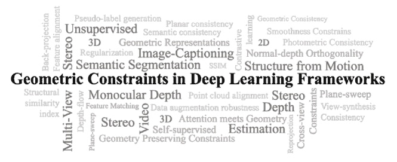

图 1：调查论文中涵盖的几何约束概念概述。我们讨论了在深度学习基础的深度估计和其他密切相关框架中使用的几何约束。

传统的立体或多视角立体（MVS）深度估计方法依赖于解决视图间的光度和几何一致性约束，以实现一致的深度估计[1, 2, 3, 4, 5, 6, 7, 8]。随着深度学习框架[9]的飞速发展，如卷积神经网络（CNNs）[10]、递归神经网络（RNNs）[11]和视觉变换器（ViTs）[12]，它们可以提取深层的局部和高级特征，光度和几何一致性约束的需求显著减少，特别是在监督深度估计方法中。更深的特征显著改善了特征匹配，从而大幅提升了深度估计[13, 14, 15, 16]。几何约束的应用仍然局限于平面扫描算法[17]，这是大多数监督立体和 MVS 方法的主要形式。

在典型的监督立体或 MVS 深度估计框架中，平面扫描算法用于创建一个匹配（成本）体积，然后根据度量进行聚合。聚合后的体积——成本体积，接着使用 3D-CNN 或 RNN 进行正则化，以产生一致的估计。无监督/自监督深度估计方法中缺乏地面真值，这限制了这种自由度。光度和几何一致性约束仍然是无监督框架的关键部分[18, 19, 20, 21, 22]。一些其他密切相关的问题，如运动重建[23, 24]、视频深度估计[25, 26]、语义分割[27, 28, 29, 18]和单目深度估计[30, 31]，也应用了各种几何约束以获得一致的结果。在本次调查中，我们专注于所有在深度学习框架中集成光度或几何约束的方法，并且与深度估计问题密切相关。图 1 展示了在本次调查中涵盖的几何约束及其相关问题。我们讨论了所有这些概念的理论和数学公式，并提供了精心制作的分类法，参见图 2。

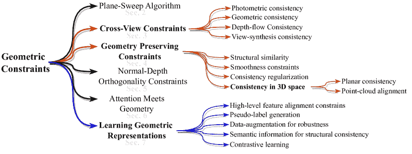

图 2：我们当前在基于深度学习的深度估计和密切相关框架中使用的几何约束分类法。

在本文中，我们将重点放在不同问题中使用的几何约束概念，这些问题涉及深度估计或与深度估计问题紧密相关。我们仅讨论所用的具体概念及其与立体视觉或 MVS 深度估计框架的相关性。本文分为$8$个部分组织。自第二部分开始，我们讨论我们分类法中展示的几何约束的广泛分类，如图 2 所示。在大多数部分中，我们首先描述覆盖大多数方法的最常见数学公式，然后描述具体方法对其进行的不同修改。第二部分描述了传统的平面扫描算法及其变体。第三部分重点介绍所有使用备用视图进行一致性约束的几何约束（交叉视图一致性）。第四部分深入探讨强制参考图像与目标图像之间结构一致性的几何约束，以保持场景的结构完整性。第五部分重点关注深度与表面法线之间的正交关系，以指导几何一致性。第六部分讨论几何约束在注意力机制中的整合，第七部分介绍在深度神经网络中强制几何表示学习的方法。我们在第八部分中提出我们的结论。

## 2 平面扫描算法

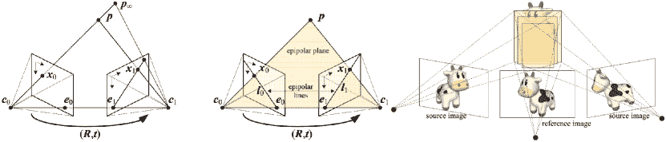

图 3：极几何，左：对应于一条光线的极线段（图自[8]），中：对应的极线集合及其极面（图自[8]），$R$、$t$ 是旋转和位移参数，$l_{i}$ 是极线段。右：平面扫描算法的示意图（图自[32]）

立体摄影测量是通过利用从不同位置拍摄的两个或多个对象图像的测量来估计对象上点的 3D 坐标的过程 [33]。这涉及到立体匹配，其中使用两个或多个图像来找到图像中的匹配像素，并将其 2D 位置转换为 3D 深度 [8]。找到匹配像素的过程基于立体匹配的几何学（极几何），即计算一个图像中的像素可能出现在另一个图像中的范围。在本节中，我们首先讨论两个校正图像的极几何，然后描述一种通用的重采样算法，平面扫掠，用于执行具有任意相机配置的多图像立体匹配。

图 3（左）显示了一个图像中的像素$x_{0}$如何投影到另一个图像中的极线段。该线段由$p_{\infty}$—原始视线的投影和$c_{0}$—原始相机中心在第二个相机中的投影（称为极点$e_{1}$）界定。第二个图像中极线的投影回到第一个图像中，给我们另一个由对应极点$e_{0}$界定的线段。这两个线段扩展到无穷大，给我们一对对应的极线，图 3（中），这是通过两个相机中心$c_{0}$和$c_{1}$的两个图像平面、极平面的交集。$p$是感兴趣的点 [6, 7]。

多图像立体重建是从多个重叠图像中恢复 3D 场景结构的过程，已知内参($K$)和外参($E$)相机参数 [17]。更准确地说，源图像被投影到参考相机棱锥的前向平面中，并分析这些图像的光度一致性，见图 3（右）。这个过程通常被称为平面扫掠方法 [17, 34, 35, 32]。

平面扫描方法基于这样一个前提：多个图像特征视线交叉的空间区域很可能是观察场景特征的 3D 位置。在该方法中，一个分成单元的平面沿着垂直于平面的线 [17] 扫描空间体积，垂直于参考相机视锥体，如图 3（右图）所示。在平面沿扫描路径的每个位置，交叉视线的数量被统计。通过将每个源图像的特征反投影到扫描平面上，并记录落在反投影点位置某个阈值范围内的特征来完成这一过程。具有最大统计量的单元被假设为 3D 场景特征的位置，对于深度图像，选择相应的深度假设 [32, 17]。

平面扫描方法可以直接估计视差（用于立体视觉）或深度值（用于多视角立体），但现代基于深度学习的框架使用它来创建与每个源图像和参考图像对应的匹配体积。匹配体积基于某种度量聚合，以创建成本体积。成本体积然后通过 3D-CNN [13, 14, 16, 15] 或 RNN [36, 37] 进行正则化。用于成本体积聚合的度量可以因方法而异。例如，Huang 等人 [38] 计算参考图像与邻近源图像之间的成对匹配成本，并通过最大池化融合它们。MVSNet [13], R-MVSNet [36] 和 CasMVSNet [14] 计算所有编码特征在每个扫描平面上的方差，并使用 3D-U-Net [39] 进行正则化。TransMVSNet [15] 计算基于相似度的成本体积进行正则化。Yang 等人 [40] 在多阶段 MVS 框架中重复使用前一阶段的成本体积以及当前阶段的部分成本体积。他们在成本体积创建中创建了一个金字塔结构。

平面扫描通常假设表面为前平行，这会导致在涉及斜面（如城市场景）时匹配模糊[41]。Gallup 等人[41]建议执行多次平面扫描，每次平面扫描旨在处理具有特定法向量的平面表面。该方法分三步进行：首先，通过分析通过稀疏运动结构获得的 3D 点来识别地面和立面平面的表面法向量。然后，对每个表面法向量应用平面扫描，从而在最终深度图中为每个像素生成多个深度假设。最后，根据成本或通过多标签图割方法[5, 42, 43]选择每个像素的最佳深度/法向组合。

## 3 跨视图约束

跨视图约束应用于具有多个视图的场景。它可以应用于立体（每个场景两个视图）和 MVS（每个场景`$N>2$`视图）框架，通过将一个视图（参考或源视图）投影到另一个视图，或反之。投影到另一个视图后，可以利用各种约束，如光度一致性、深度流一致性和视图合成一致性。另一种利用跨视图约束的方法是使用前向-后向重投影，其中一个视图被投影到另一个视图，然后回投影到第一个视图，以检查场景的几何一致性。在本节中，我们讨论所有在端到端深度学习框架中使用跨视图一致性约束的方法。

### 3.1 光度一致性

光度一致性最小化真实图像和从其他视图合成图像之间的差异。在 MVS 中，真实图像和合成图像分别表示为参考视图（`$I_{ref}$`）和源视图（`$I_{src}$`），在立体问题中则为左视图（`$I_{L}$`）和右视图（`$I_{R}$`）或反之。对于视频深度估计，下一帧（`$I_{+}$`）与当前帧（`$I_{0}$`）进行比较。合成图像通过内参（`$K$`）和外参（`$E$`）参数被变换到真实图像视图中。这一变换过程将真实图像和合成图像带入同一相机视图中。光度损失按公式 1- 3 计算。在这里，我们使用与 MVS 问题公式相关的符号。

光度损失的两个主要变种是像素光度损失和梯度光度损失。顾名思义，像素光度损失是这些图像的像素值之间的比较，而梯度光度损失是这些图像的梯度之间的比较。有时，像素光度损失和梯度光度损失会结合在一起，形成一种更鲁棒的光度损失形式，称为鲁棒光度损失。公式 1、2 和 3 展示了 MVS 方法的像素、梯度和鲁棒光度损失的公式。

|  | $\displaystyle\mathcal{L}_{photo_{pixel}}$ | $\displaystyle=\frac{&#124;&#124;(I_{ref}-\hat{I}_{src\rightarrow ref})\odot M&#124;&#124;_{l_{i}}}{&#124;&#124;M&#124;&#124;_{1}}$ |  | (1) |
| --- | --- | --- | --- | --- |
|  | $\displaystyle\mathcal{L}_{photo_{grad}}$ | $\displaystyle=\frac{&#124;&#124;(\triangledown I_{ref}-\triangledown\hat{I}_{src\rightarrow ref})\odot M&#124;&#124;_{l_{i}}}{&#124;&#124;M&#124;&#124;_{1}}$ |  | (2) |
|  | $\displaystyle\mathcal{L}_{photo_{robust}}$ | $\displaystyle=\lambda_{1}.\mathcal{L}_{photo_{pixel}}+\lambda_{2}.\mathcal{L}_{photo_{grad}}$ |  | (3) |

在这里，$l_{i}$ 表示 $L_{1}$ 或 $L_{2}$ 范数，$M$ 表示掩膜，而 $\lambda_{1},\lambda_{2}$ 分别表示像素和梯度光度损失的缩放因子。$\odot$ 表示逐像素相乘。

公式 1、2 和 3 的公式化方法可能有所不同，取决于选择的视图进行变形。大多数方法 [44, 45, 46, 22, 47, 48] 将源视图变形为参考视图，称为源-参考变形，如公式 1、2 和 3 所示。但有些方法将参考视图变形为源视图（参考-源变形）以估计光度损失 [49]，在公式 1、2 和 3 中用 ref 替换 src 以及 vice-versa 以生成这样的公式。其他方法如 [50] 使用基于补丁的光度一致性来估计光度损失。我们将在接下来的几段中突出所有这些光度一致性公式的变体。

我们从像素光度损失及其变体开始。Mallick 等人 [44] 使用参考视图和源视图之间的像素光度损失公式，以在自监督 MVS 管道的自适应学习方法中强制几何一致性。赵等人 [45] 在自监督单目深度估计问题中使用类似的像素光度损失公式，以促进跨视图的几何一致性。徐等人 [51] 使用了一种稍有不同的像素光度损失公式，该公式基于一个视图中的像素在另一个视图中找到有效像素的条件，用于半监督 MVS 管道。以下方程表示这一公式

|  | $\mathcal{L}_{photo_{pixel}}=\frac{\Phi(1\leq\hat{p}_{i}\leq[H,W])&#124;&#124;I_{ref}(p_{i})-\hat{I}_{src\rightarrow ref}(p_{i})&#124;&#124;_{L_{2}}}{\Phi(1\leq\hat{p}_{i}\leq[H,W])}$ |  | (4) |
| --- | --- | --- | --- |

其中，$p_{i}$表示每个像素，$\Phi(1\leq\hat{p}_{i}\leq[H,W])$表示当前像素$p_{i}$是否能在其他源视图中找到一个有效像素$\hat{p}_{i}$。$H,W$分别表示图像的高度和宽度。

Li 等人[49]使用了略微不同的像素光度损失公式，通过将参考视图变形到源视图，而不是将源视图变形到参考视图，来计算参考-源深度图之间的$L_{1}$距离。

|  | $\mathcal{L}_{photo_{pixel}}=\frac{1}{N-1}\sum^{N}_{i=1}&#124;I_{src_{i}}-\hat{I}_{ref\rightarrow src_{i}}&#124;$ |  | (5) |
| --- | --- | --- | --- |

其中$N$是源视图的总数。

所有上述方法使用逐像素的变形操作来估计光度误差。Yu 等人[52]提出了基于补丁的关键点提取变形方法。它使用来自 Direct Sparse Odometry (DSO) [53] 的点选择策略，并在每个点$P_{i}$的局部窗口上定义一个支持域$\Omega(P_{i})$。然后在每个支持域$\Omega(P_{i})$上估计光度误差，而不是单一的点。这被称为补丁光度一致性。Dong 和 Yao [50] 采用了类似的方法来估计补丁光度误差。与[52]使用 DSO 提取关键点不同，它使用每个像素作为关键点。它定义了一个以像素$P$为中心的$m^{2}$大小的方形补丁为$\Omega(P)$。局部补丁$\Omega(P)$很小，因此可以视为平面[52]，并假设该补丁与中心像素具有相同的深度。该补丁从源视图变形到参考视图，并估计像素值之间的$L_{1}$差异，作为$\mathcal{L}_{photo_{patch}}$，表示为

|  | $\mathcal{L}_{photo_{patch}}=\frac{1}{N-1}\sum^{N}_{i=1}&#124;I_{ref}-\hat{I}_{src\rightarrow ref}&#124;\odot M_{ref}$ |  | (6) |
| --- | --- | --- | --- |

其中$N$表示源视图的数量，$M_{ref}$表示参考视图掩码。$\odot$表示逐元素乘法操作。

尽管像素光度一致性在跨视角实现更好的几何一致性方面得到了广泛应用，但其性能容易受到光照条件变化的影响。光照条件的变化使得强制执行像素级一致性变得困难，但图像梯度对这些变化更具不变性。许多方法在像素光度损失的基础上同时采用梯度光度损失。由于梯度项的加入使得光度损失更为鲁棒，因此称为鲁棒光度损失。像[46、22、47、48、18]这样的 MVS 方法在端到端训练过程中使用这种公式，即公式 3。$\lambda_{1}$ 和 $\lambda_{2}$ 是公式 3 中的可调超参数。

尽管大多数提到的 MVS 方法使用的是非对称管道——仅使用参考和源 RGB 图像来估计参考深度图，但 Dai 等人[54]使用了对称管道进行 MVS，即网络同时预测所有视角的深度图。通过每个视角一个的 $N$ 个深度估计，该方法使用每对视角之间的光度一致性的双向计算，称为视角一致性损失。他们不使用用于视角一致性的鲁棒公式。

### 3.2 几何一致性

就像光度一致性一样，几何一致性也涉及到通过投影进行的视角一致性检查。对于光度一致性，一个视角，无论是参考视角还是源视角，都被扭曲到另一个视角以计算一致性误差。几何一致性使用前向-后向重投影（FBR）来估计误差。FBR 包括一系列对参考视角的投影以估计几何误差，见算法 1。首先，我们将参考图像（$I_{r}$）投影到源视角（$I_{r\rightarrow s}$），然后，我们将投影后的参考视角 $I_{r\rightarrow s}$ 重新映射以生成 $I_{s_{remap}}$，最后，我们将 $I_{s_{remap}}$ 反投影到参考视角以获得 $I_{r\rightleftarrows s}$。接着，将 $I_{r\rightleftarrows s}$ 与原始的 $I_{r}$ 进行比较，以估计光度误差。

输入：$I_{r},c_{s},I_{s},c_{s}$$K_{r},E_{r}\leftarrow c_{r}$; $K_{s},E_{s}\leftarrow c_{s}$$I_{(r\rightarrow s)}\leftarrow K_{s}\cdot E_{s}\cdot E_{r}^{-1}\cdot K_{r}^{-1}\cdot I_{r}$ $\triangleright$ 投影$X_{I_{(r\rightarrow s)}},Y_{I_{(r\rightarrow s)}}\leftarrow I_{(r\rightarrow s)}$$I_{s_{remap}}\leftarrow REMAP(I_{s},X_{I_{(r\rightarrow s)}},Y_{I_{(r\rightarrow s)}})$ $\triangleright$ 重新映射$I_{r\rightleftarrows s}\leftarrow K_{r}\cdot E_{r}\cdot E_{s}^{-1}\cdot K_{s}^{-1}\cdot I_{s_{remap}}$ $\triangleright$ 反投影

算法 1 前向后向重投影（FBR）

Dong 和 Yao [50] 通过在像素域中应用 FBR 来使用跨视图几何一致性，进行无监督 MVS 流程。一旦完成 FBR 步骤，实际像素值在原始参考图像 $I_{r}$ 和反投影参考图像 $I_{r\rightleftarrows s}$ 之间用于检查深度估计的几何一致性。它减少了参考视图和源视图之间的匹配歧义。以下方程展示了其数学公式

|  | $\mathcal{L}_{geometric}=\frac{1}{N}\sum^{N}_{i=1}\left | I_{ref}-\hat{I}^{i}_{ref\rightleftarrows src}\right | \odot M_{ref}$ |  | (7) |
| --- | --- | --- | --- | --- | --- |

其中 $N$ 表示源视图的数量，$M_{ref}$ 表示参考视图掩模。$\odot$ 是逐元素乘法操作。有时，

几何一致性可以使用反投影的概念扩展到相机的 3D 坐标 [55, 23]。Chen 等人 [23] 将这种修改后的几何一致性应用于 3D 空间，用于视频深度估计问题，称为 3D 几何一致性。对于给定的源图像像素 $P_{src}$ 和对应的参考图像像素 $P_{ref}$，它们的 3D 坐标通过反投影获得。然后估计相同 3D 点的估计值之间的不一致性，并将其作为惩罚。损失值表示来自两个视图的预测的 3D 差异。[55] 使用类似的公式来克服自监督单目深度估计框架中光度损失的缺陷。

### 3.3 跨视图深度流一致性

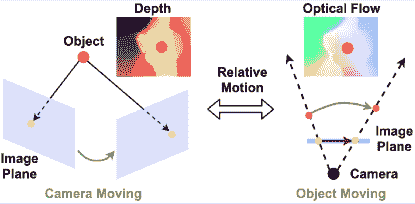

图 4：Depth2Flow 模块的直观图。移动相机的相对运动可以视为一个移动物体与静止相机来估计光流。图来自 [46]

深度流估计通常用于光流问题[56, 57]。但是，也可以通过从估计深度图以及输入的 RGB 图像估算流并进行比较来轻松地应用于 MVS 问题。Xu 等人[46]提出了一种新的流深度一致性损失，以规范深度图前景中的模糊监督。流深度一致性损失的估计需要 MVS 方法的两个模块，RGB2Flow 和 Depth2Flow。顾名思义，Depth2Flow 模块将估计的深度图转换为参考和任意源视图之间的虚拟光流，RGB2Flow 模块使用[56]从相应的参考源对预测出光流。预测的两个流应该是彼此一致的。

##### Depth2Flow 模块

在 MVS 系统中，摄像机围绕物体移动以收集多角度图像。如果考虑物体和摄像机之间的相对运动，摄像机可以被认为是固定的，而物体可以被认为是朝着几乎静止的摄像机运动，参见图 4。这种虚拟运动可以表示为密集的 3D 光流，并且应该与真实 MVS 系统中的 3D 对应一致。像素$p_{i}$的虚拟流可以定义为

|  | $\hat{F}_{r\rightarrow s}=Norm[K_{s}.E_{s}(K_{r}.T_{r})^{-1}I_{r}(p_{i})]-p_{i}$ |  | (8) |
| --- | --- | --- | --- |

##### RGB2Flow 模块

要从 RGB 输入图像中估算光流，可以利用预训练模型。Xu 等人[46]使用[56]来估计前向光流$F_{r\rightarrow s}$和后向光流$F_{s\rightarrow r}$。所有参考视图和源视图组合的双视图配对都产生$F_{r\rightarrow s}$和$F_{s\rightarrow r$。

为了估算流深度一致性损失，我们检查$F_{r\rightarrow s}$和$F_{s\rightarrow r}$与虚拟流$\hat{F}_{r\rightarrow s}$的一致性。为了有效学习，遮挡部分使用遮罩$M_{r\rightarrow s}$掩盖。误差被给出为

|  | $\displaystyle M_{r\rightarrow s}$ | $\displaystyle=\{&#124;F_{r\rightarrow s}+F_{s\rightarrow r}&#124;>\epsilon\}$ |  | (9) |
| --- | --- | --- | --- | --- |
|  | $\displaystyle\mathcal{L}_{flow}$ | $\displaystyle=\sum^{HW}_{i=1}\genfrac{}{}{0.0pt}{}{min}{2\leq s_{j}\leq V}\frac{&#124;&#124;F_{r\rightarrow s_{j}}(p_{i})-\hat{F}_{r\rightarrow s_{j}}(p_{i}).M(p_{i})&#124;&#124;_{2}}{\sum^{HW}_{i=1}M_{r\rightarrow s_{j}}(p_{i})}$ |  | (10) |

其中 $\epsilon$ 是设定为 0.5 的阈值，$H$ 和 $W$ 是图像的高度和宽度。不是对所有源视图的 $F_{r\rightarrow s}$ 和 $\hat{F}_{r\rightarrow s}$ 之间的差异进行平均，而是对每个像素估计最小误差，见公式 10。Godard 等人[58]引入了最小误差计算来拒绝深度估计中的遮挡像素。Depth2Flow 和 RGB2Flow 两个模块都是完全可微的，并且可以用于端到端训练设置。

陈等人[59]在多视角立体视觉框架中使用点流信息来优化估计的深度图。通过使用输入图像和前一阶段估计的深度图中提取的特征，他们生成了一个特征增强的点云，并利用点流模块学习深度残差以优化之前估计的深度图。点流模块通过观察所有视角的邻近点，沿参考相机方向估计点到真实表面的位移。

### 3.4 视图合成一致性

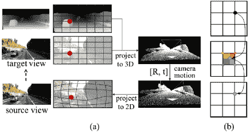

图 5：（a）展示了使用 RGB 图像及其深度图的视图合成步骤。（b）展示了调整像素空间值的双线性插值步骤。R 和 t 是旋转和位移参数。图像重用自[20]

大多数单目、立体和多视角深度估计框架使用真实深度作为监督信号。尽管这些框架可能在管道中利用额外的源视图图像，但它们总是仅估计一个深度图，即参考视图深度图。仅估计一个深度图可能无法提供足够的几何信息以保证一致的估计。为了解决这个问题，许多方法[31, 20, 49, 54]合成额外的视图（见图 5），无论是深度图还是 RGB 图像（通常称为目标视图），使用相机参数和参考视图信息。这些额外的视图在训练框架中提供了额外的几何一致性信息。在这一节中，我们讨论了在深度估计框架中利用视图合成的方法。

Bauer 等人 [31] 在单目深度估计框架中使用视图合成。他们在一系列操作中应用两个网络，深度网络（DepNet）和合成网络（SynNet），以通过视图合成来强制实施几何约束。首先，RGB 输入（源视图）被用于 DepNet 生成相应的深度估计。估计的深度图被投影到目标视图上，然后使用 SynNet 填补目标视图中的空洞。最后，合成的 RGB 目标视图被用作 DepNet 的输入，以估计其深度图。这确保了 DepNet 学会对源视图和合成的目标视图进行几何一致的深度估计。他们使用 $L_{1}$ 损失来强制一致性。

Yang 等人 [20] 也合成 RGB 目标视图，以提高视频深度估计中的几何一致性。通过源视图 ($I_{s}$) 和目标视图 ($I_{t}$) 之间的像素匹配对，他们使用源视图、相机参数和双线性插值 [19] 合成目标视图 $\hat{I}_{s}$。为了处理遮挡和物体移动，在损失计算过程中应用了一个解释性掩码 ($M_{s}$)，其公式为

|  | $\mathcal{L}_{ViewSynthesis}=\sum^{S}_{s=1}\|I_{t}-\hat{I}_{s}\|\odot M_{s}$ |  | (11) |
| --- | --- | --- | --- |

其中 $s$ 是源视图。

通常，MVS 方法对成本体积进行正则化，并使用多个源视图来估计参考视图的深度图。Li 等人 [49] 认为，仅从成本体积中估计参考视图深度图，MVS 方法会低效利用成本体积中存在的信息。他们提出了一个合理的模块，通过将参考视图中不同深度假设下的像素投影到源视图中，来合成源深度。他们使用鲁棒的光度一致性（参见 3.1）来估计视图合成损失。

Dai 等人 [54] 使用 MVS 管道中的参考视图深度图合成源视图深度图，以实现额外的几何一致性。对于每对参考视图-源视图，他们计算双向误差，即 $\mathcal{L}_{r\rightarrow s}$ 和 $\mathcal{L}_{s\rightarrow r}$，以及 $\mathcal{L}_{smooth_{\triangledown}}$ 和 $\mathcal{L}_{smooth_{\triangledown^{2}}$（第 4.2 节），以估计 $\mathcal{L}_{ViewSynthesis}$。他们使用了稳健的光度一致性损失公式（第 3.1 节）来估计 $\mathcal{L}_{r\rightarrow s}$ 和 $\mathcal{L}_{s\rightarrow r}$，并在损失中加入结构相似性（SSIM）误差项（第 4.1 节）。

|  | $\displaystyle\mathcal{L}_{ViewSynthesis}^{r\rightarrow s}$ | $\displaystyle=(\mathcal{L}_{r\rightarrow s}+\mathcal{L}_{s\rightarrow r})+(\mathcal{L}^{r}_{smooth_{\triangledown}}+\mathcal{L}^{r}_{smooth_{\triangledown^{2}}})$ |  | (12) |
| --- | --- | --- | --- | --- |
|  | $\displaystyle\mathcal{L}_{r\rightarrow s}$ | $\displaystyle=\mathcal{L}_{photo_{robust}}+\mathcal{L}^{r}_{SSIM}$ |  | (13) |
|  | $\displaystyle\mathcal{L}_{s\rightarrow r}$ | $\displaystyle=\mathcal{L}_{photo_{robust}}+\mathcal{L}^{s}_{SSIM}$ |  | (14) |

其中 $r,s$ 是参考视图和源视图。我们在第四部分中描述了其他损失项。

## 4 几何保持约束

除了利用跨视图一致性约束之外，还有不同的方法来强制执行深度估计管道中的结构一致性。在本节中，我们讨论了所有利用替代方法来强制执行几何约束的方法。我们将这些方法分为四个更广泛的类别，即结构相似性指数测量（SSIM）、边缘感知平滑约束、一致性正则化和平面一致性。我们详细讨论了这些方法，并突出了在其管道中利用这些方法的研究工作。

### 4.1 结构相似性指数测量

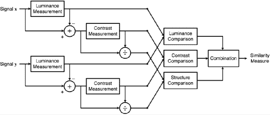

图 6: 如 [60] 所描述的 SSIM 测量系统。图表重用自 [60]

客观图像质量指标大致分为三类，根据失真图像（原始或参考）的可用性进行分类。当完整的参考图像已知时，度量被称为全参考；当参考图像不可用时，称为无参考；当部分可用时，称为减少参考。Eskicioglu 和 Fisher[61]讨论了几种这样的图像质量度量及其性能。

结构相似性指数测量（SSIM）是一种全参考图像质量评估技术[60]。它的评估是基于参考图像和噪音图像之间结构信息的退化而进行的。具体而言，它比较了已经归一化为亮度和对比度的像素强度的局部模式。表面的亮度是其照明和反射的乘积，但物体的结构独立于照明。SSIM 分离了照明的影响以分析图像中的结构信息。

王等人[60]将结构信息定义为代表图像中物体结构信息的属性，独立于平均亮度和对比度。如图 6 所示，假设有两个对齐的非负信号（图像），X 和 Y，其中一个被假定为参考质量，我们可以用 SSIM 对第二个信号进行定量测量。结构相似性测量考虑了三个分开的任务：亮度、对比度和结构[60]。

|  |  | $\displaystyle\mu_{x}=\frac{1}{N}\sum^{N}_{i=1}x_{i};\mu_{y}=\frac{1}{N}\sum^{N}_{i=1}y_{i}$ |  | (15) |
| --- | --- | --- | --- | --- |
|  |  | $\displaystyle\sigma_{x}=(\frac{1}{N-1}\sum^{N}_{i=1}(x_{i}-\mu_{x})^{2})^{\frac{1}{2}};\sigma_{y}=(\frac{1}{N-1}\sum^{N}_{i=1}(y_{i}-\mu_{y})^{2})^{\frac{1}{2}}$ |  | (16) |
|  |  | $\displaystyle\sigma_{xy}=\frac{1}{N-1}\sum^{N}_{i=1}(x_{i}-\mu_{x})(y_{i}-\mu_{y})$ |  | (17) |

SSIM 公式在公式 18 中给出，它是上述三个组件的缩放乘积。亮度比较函数 $l(X,Y)$ 是均值强度 $\mu_{x}$ 和 $\mu_{y}$ 的函数，如公式 19 所示。对比度比较 $c(X,Y)$ 是 $\sigma_{x}$ 和 $\sigma_{y}$ 的函数，如公式 20 所示，结构比较度量 $s(X,Y)$ 是相关系数 $\sigma_{xy}$、$\sigma_{x}$ 和 $\sigma_{y}$ 的函数，如公式 21 所示。$L$ 是像素值的动态范围（灰度图像为 255）。信号的均值、标准差和相关系数是通过公式 15、 16 和 17 计算的。$N$ 是图像中像素的总数。

|  | $\displaystyle SSIM(X,Y)$ | $\displaystyle=[l(X,Y)]^{\alpha}.[c(X,Y)]^{\beta}.[s(X,Y)]^{\gamma};\alpha>0,\beta>0,\gamma>0$ |  | (18) |
| --- | --- | --- | --- | --- |
|  | $\displaystyle l(X,Y)$ | $\displaystyle=\frac{2\mu_{x}\mu_{y}+c_{1}}{\mu_{x}^{2}+\mu_{y}^{2}+c_{1}};c_{1}=(K_{1}L)^{2},K_{1}\ll 1$ |  | (19) |
|  | $\displaystyle c(X,Y)$ | $\displaystyle=\frac{2\sigma_{x}\sigma_{y}+c_{2}}{\sigma^{2}_{x}+\sigma^{2}_{y}+c_{2}};c_{2}=(K_{2}L)^{2},K_{2}\ll 1$ |  | (20) |
|  | $\displaystyle s(X,Y)$ | $\displaystyle=\frac{\sigma_{xy}+c_{3}}{\sigma_{x}\sigma_{y}+c_{3}},c_{3}=\frac{c_{2}}{2}$ |  | (21) |

SSIM 指数应该在局部而非全局应用，原因如下。首先，图像统计特征在空间上高度非平稳。其次，图像失真可能是空间变异的。第三，局部质量测量通过提供图像的空间变化质量图，能更好地反映质量退化的信息。

Wang 等人 [60] 为相同领域中的两个信号定义了 $SSIM$ 指数，即它可以估计两个 RGB 或灰度图像之间，或两个深度图之间，或两个补丁之间的结构相似性。在一个端到端框架中，我们在最小化损失时，希望最大化 $SSIM$ 以获得更好的结果。由于 $SSIM$ 的上界为 $1$，我们可以改为最小化 $1-SSIM$。该公式的一般形式为

|  | $\mathcal{L}_{SSIM}=\frac{1}{N}\sum^{N}_{i=1}\frac{1-SSIM(X,Y)}{K}\odot M$ |  | (22) |
| --- | --- | --- | --- |

在一个端到端的深度估计框架中，其中 $N$ 是源视图的数量，$X$ 和 $Y$ 是两个需要比较的信号，最好在相同的领域中。$M$ 是处理遮挡的掩码，而 $K$ 是一个常数。

Zhao 等人 [62] 在图像恢复问题中使用这种公式，不使用掩码且 $K=1$。它使用标准差为 $\sigma_{G}$ 的高斯滤波器计算均值和标准差（Eqs. 15、16 和 17）。$\sigma_{G}$ 的选择会影响处理结果的质量。$\sigma_{G}$ 较小值时，网络丧失保留局部结构的能力，图像中会出现伪影；而 $\sigma_{G}$ 较大时，网络会保留边缘周围的噪声。Zhao 等人 [62] 提出了 SSIM 的多尺度公式（MS-SSIM），其中所有 $\sigma_{G}$ 变化的结果相乘在一起。

本质上，MS-SSIM 和 SSIM 对亮度变化或颜色偏移不是特别敏感。然而，它们保留了高频区域的对比度。另一方面，$L_{1}$ 损失保留了颜色和亮度——无论局部结构如何，误差的加权是相同的——但对比度的影响不同。为了最佳效果，Zhao 等人 [62] 将这两个项 $\mathcal{L}^{mix}_{SSIM}$ 结合如下

|  | $\mathcal{L}^{mix}_{SSIM}=\alpha.\mathcal{L}_{SSIM}+(1-\alpha).\mathcal{L}^{l_{i}}$ |  | (23) |
| --- | --- | --- | --- |

其中，$\alpha$ 是一个可调的超参数，而 $l_{i}$ 是 $L_{1}$ 或 $L_{2}$ 范数。

Mallick 等人 [44] 在一个自监督 MVS 框架中使用了最简单形式的 $\mathcal{L}_{SSIM}$（公式 22），其中没有掩模 $M$，$X=I_{ref}$，$Y=\hat{I}_{src}$ 和 $K=1$。Huang 等人 [22] 在无监督 MVS 框架中使用了 $\mathcal{L}_{SSIM}$（公式 22），其中 $X=I_{ref}$，$Y=\hat{I}_{src}$ 和 $K=2$。Mahjourian 等人 [25] 也在无监督 MVS 框架中使用了它，$K=1$（公式 22），$c_{1}={0.01}^{2}$ 和 $c_{2}={0.03}^{2}$（公式 19 和 20）。Khot 等人 [48] 在一个无监督 MVS 框架中使用了与 [25] 相同的公式。Li 等人 [49] 使用了双向计算，前向 ($\mathcal{L}^{forward}_{SSIM}$) 与 $X=I_{ref}$，$Y=\hat{I}_{src}$（源视图投影到参考视图），以及后向 ($\mathcal{L}^{backward}_{SSIM}$) 与 $X=\hat{I}_{ref}$，$Y=I_{src}$（参考视图投影到源视图），没有掩模 $M$ 和 $K=1$，公式 22。最终的 $\mathcal{L}_{SSIM}=\mathcal{L}^{forward}_{SSIM}+\mathcal{L}^{backward}_{SSIM}$

如前所述，$\mathcal{L}_{SSIM}$ 通常与均匀加权的损失函数如 $L_{1}$ 和 $L_{2}$ 结合，以选择单个损失项中的最佳。组合公式如公式 23 所示。Dai 等人 [54] 和 Yu 等人 [52] 在 MVS 框架中使用了 $\alpha=0.85$ 的公式 23。该公式在单目深度估计问题中得到了广泛应用。像 [63, 64] 这样的单目方法使用公式 23，其中 $\alpha=0.85$，目标和新颖视图合成的深度图作为 $X$ 和 $Y$。Godard 等人 [26] 使用 $\mathcal{L}^{mix}_{SSIM}$ (公式 23) 在输入 RGB 图像和重建的新视图 RGB 图像之间，以 $\alpha=0.85$ 强化结构相似性。Zhao 等人 [65] 在对称领域适应、从真实到合成和从合成到真实的过程中，应用公式 23 来强化结构相似性，以应对从一个领域到另一个领域的过渡。

Chen 等人 [23] 使用了 $\mathcal{L}^{mix}_{SSIM}$，公式 23，稍作修改以使其在光流估计问题中适应性强。对于无法用全局刚性运动解释的场景结构，通过仅更新紧密解释位移的配置的通道参数来适应更灵活的光流估计。它表现为光流与刚性运动位移之间的最小误差，其公式为

|  | $L^{adaptive}_{SSIM}=min\{\mathcal{L}^{mix}_{SSIM_{flow}},\mathcal{L}^{mix}_{SSIM_{rigid}}\}$ |  | (24) |
| --- | --- | --- | --- |

在公式 23 中，使用了 $\alpha=0.85$。我们在这里只讨论 $\mathcal{L}^{mix}_{SSIM}$ 的公式，其他光流相关细节请参考 [23]。

### 4.2 边缘感知平滑约束

平滑性约束起源于光流估计问题。最初由 Uras 等人应用于从两幅图像中估计一致的光流[66]。Brox 等人[67]在光流框架下进一步解释了这一概念，提出了三种假设，即灰度值恒定假设、梯度恒定假设和光滑性假设。

|  | $\displaystyle I(x,y,t)$ | $\displaystyle=I(x+u,y+v,t+1)$ |  | (25) |
| --- | --- | --- | --- | --- |
|  | $\displaystyle\triangledown I(x,y,t)$ | $\displaystyle=\triangledown I(x+u,y+v,t+1)$ |  | (26) |
|  | $\displaystyle E_{smooth}(u,v)$ | $\displaystyle=\int\psi(&#124;\triangledown u&#124;^{2}+&#124;\triangledown v&#124;^{2})dx$ |  | (27) |

自光流估计问题开始以来，假设在给定的光照条件下，像素的灰度值在位移时不会变化，见方程 25[67]。但在自然场景中亮度总是变化。因此，允许灰度值的小幅变化被认为是有用的，但找到一个在灰度值变化下相对不变的标准，即在位移下假设梯度恒定，见方程 26。这引入了第三个假设，即流场的平滑性。尽管假设在场景中物体的边界处存在不连续性，但可以在流场中假设分段光滑性[67]。为了在流估计中实现这种光滑性，对流场施加了惩罚，如方程 27 所示。

在光流框架中，假设物体在固定相机下运动，而在 MVS 框架中，假设物体是固定的，且相机相对于固定点移动。物体的相对运动可以被视为一个移动的相机，将其看作 MVS 问题，见图 4。在这个假设下，平滑性约束可以应用于深度估计问题。最初，深度估计框架中仅使用了第一阶平滑性约束 [27, 19, 26, 64, 25, 52]。在 Yang 等人 [20] 使用第二阶平滑性约束进行正则化后，第二阶平滑性约束与第一阶平滑性约束结合在后续工作中使用 [54, 22, 50, 68]。

|  | $\displaystyle\mathcal{L}_{smooth_{\triangledown}}$ | $\displaystyle=\sum&#124;&#124;\partial_{x}\hat{D}&#124;&#124;.e^{-&#124;&#124;\partial_{x}I&#124;&#124;}+&#124;&#124;\partial_{y}\hat{D}&#124;&#124;.e^{-&#124;&#124;\partial_{y}I&#124;&#124;}$ |  | (28) |
| --- | --- | --- | --- | --- |
|  | $\displaystyle\mathcal{L}_{smooth_{\triangledown^{2}}}$ | $\displaystyle=\sum&#124;&#124;\partial^{2}_{x}\hat{D}&#124;&#124;.e^{-&#124;&#124;\partial^{2}_{x}I&#124;&#124;}+&#124;&#124;\partial^{2}_{y}\hat{D}&#124;&#124;.e^{-&#124;&#124;\partial^{2}_{y}I&#124;&#124;}$ |  | (29) |
|  | $\displaystyle\mathcal{L}_{smooth}$ | $\displaystyle=\alpha.\mathcal{L}_{smooth_{\triangledown}}+\beta.\mathcal{L}_{smooth_{\triangledown^{2}}}$ |  | (30) |

在深度估计框架中，平滑性约束应用于输入图像 $(I)$ 的梯度和估计的深度图 $(\hat{D})$ 之间。方程 28 和 29 代表了第一阶 $(\mathcal{L}_{smooth_{\triangledown}})$ 和第二阶 $(\mathcal{L}_{smooth_{\triangledown^{2}}})$ 平滑性约束。方程 30 显示了结合 $\alpha>0$ 和 $\beta>0$ 作为缩放因子的公式。

Garg 等人[19]使用**一阶**形式和$L_{2}$范数作为正则化项以实现平滑性。Mahjourian 等人[25]在单目视频深度估计问题中使用**一阶**形式。**一阶**平滑约束在自监督/无监督 MVS 框架中被广泛使用[49, 52, 47, 48, 44]。Zhao 等人[65]在其用于单目深度估计的对称域适应中在两个领域中都使用**一阶**约束。其他单目深度估计方法[26, 64, 69, 63]也应用了**一阶**平滑约束，如 Eq. 28 所定义。

Yang 等人[20]仅使用二阶形式，参见 Eq. 29，作为单目视频深度估计框架中的正则化项。由此学习到的经验，近年来的 MVS 框架结合了**一阶**和**二阶**形式[22, 54, 50]，如 Eq. 30 所示。受到[26]和[69]的启发，Yang 等人[68]在单目内窥镜问题中应用了组合的边缘感知平滑约束，参见 Eq. 30。所有这些方法在 Eq. 30 中使用了$\alpha=\beta=1$。

### 4.3 一致性正则化

基于深度学习的框架本质上存在过度参数化问题。应对这一问题的最有效方法之一是对损失函数进行正则化。光度一致性，参见 3.1，在像素级强制几何一致性，但对光照条件的变化高度敏感。许多 MVS 方法采用不同的一致性正则化技术来有效处理这一问题[20, 19, 51]。

如在第 4.2 节中讨论的，通常使用一阶和二阶梯度来完成这项任务[20, 19]。Garg 等人[19]认为，在场景的同质区域中，光度损失信息不足，这导致多个变形生成类似的视差结果。它对视差不连续性使用$L_{2}$正则化（公式 31）作为先验。它还建议使用[67, 70]中使用的其他鲁棒惩罚函数作为替代正则化项。Yang 等人[20]使用具有$L_{1}$范数的深度二阶梯度的空间平滑惩罚，公式 32。当图像梯度不存在时，它鼓励深度值在平面表面上对齐。

Xu 等人[51]在半监督 MVS 方法中应用了一致性正则化。所提出的正则化最小化了增强$(\hat{PV})$和未增强$(PV)$样本预测分布之间的 Kullback-Leibler（KL）散度。在$K$深度假设下，大小为$H\times W\times K$的概率体积$PV$被分成$K$类$HW$对数值。公式 33 展示了正则化器的公式，其中$p_{i}$表示一个像素坐标。

|  | $\displaystyle\mathcal{L}_{\triangledown}$ | $\displaystyle=&#124;&#124;\triangledown\hat{D}&#124;&#124;^{2}$ |  | (31) |
| --- | --- | --- | --- | --- |
|  | $\displaystyle\mathcal{L}_{\triangledown^{2}}$ | $\displaystyle=\sum_{d\in x,y}&#124;\triangledown^{2}_{d}\hat{D}&#124;.e^{-\alpha&#124;\triangledown I&#124;};\alpha>0$ |  | (32) |
|  | $\displaystyle\mathcal{L}_{KL}$ | $\displaystyle=\frac{1}{HW}\sum^{HW}_{i=1}KL(PV_{p_{i}},\hat{PV}_{p_{i}})$ |  | (33) |

### 4.4 三维空间中的结构一致性

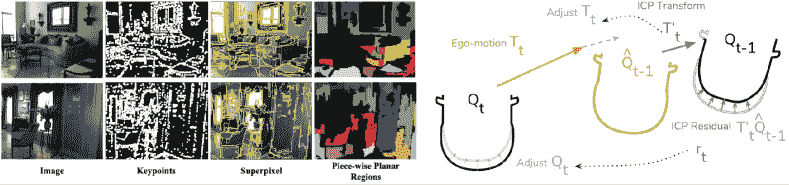

图 7：左侧：输入图像示例，其对应的关键点、超像素和从大超像素中获得的逐片平面区域（图自[52]）。右侧：点云匹配过程及汽车俯视图的近似梯度（图自[25]）。

结构一致性不限于二维图像平面，它可以很容易地扩展到相机三维空间或三维点云。在这一部分，我们讨论了两种方法 [52, 25]，这些方法在三维空间中利用结构一致性，并结合其他几何约束在端到端框架中进行应用。

#### 4.4.1 平面一致性

平面一致性 [52] 基于这样一个假设：在室内场景中，大多数同质颜色区域都是平面区域，并且可以假设这些区域的深度是连续的。提取这些分段平面区域的过程分为三步。给定一幅输入图像 $I$，首先，提取关键点。然后，使用输入图像中的关键点来提取超像素。最后，使用分割算法应用贪婪方法对低梯度区域进行分割，以产生更多的平面区域。提取关键点和超像素的方法有很多种，[52] 使用了直接稀疏视觉里程计 [53] 来提取关键点，以及 Felzenszwalb 超像素分割 [71] 来进行超像素和平面区域的分割。

图 7 左侧图像展示了在两个室内场景中获取平面区域的步骤。对于一幅图像 $I$，在提取超像素后，应用一个阈值，仅保留像素数大于 $1000$ 的区域。假设大多数平面区域占据较大的像素区域。使用提取的超像素 $SPP_{m}$ 及其对应的深度 $D(p_{n})$，我们首先将所有点 $p_{n}$ 反向投影到三维空间 ($p^{3D}_{n}$)，见 Eq 34。利用 $SPP_{m}$ 的平面参数 $A_{m}$，在三维空间中定义该平面，见 Eq. 35。$A_{m}$ 通过两个矩阵计算得出，$Y_{m}=[1,...,1]^{T}$ 和 $P_{n}=[p^{3D}_{1},...,p^{3D}_{n}]$，如 Eq. 36 所示，其中 $E$ 是单位矩阵，$\epsilon$ 是数值稳定性因子。通过平面参数，可以为所有超像素中的每个像素检索拟合的平面深度，以估计平面损失 $\mathcal{L}_{planar}$，见 Eq. 38

|  | $\displaystyle p^{3D}_{n}$ | $\displaystyle=D(p_{n})K^{-1}p_{n},p_{n}\subseteq SPP_{m}$ |  | (34) |
| --- | --- | --- | --- | --- |
|  | $\displaystyle A^{T}_{m}p^{3D}_{n}$ | $\displaystyle=1$ |  | (35) |
|  | $\displaystyle P_{n}A_{m}$ | $\displaystyle=Y_{m};A_{m}=(P^{T}_{n}P_{n}+\epsilon E)^{-1}P^{T}_{n}Y_{m}$ |  | (36) |
|  | $\displaystyle D^{\prime}(p_{n})$ | $\displaystyle=(A^{T}_{m}K^{-1}p_{n})^{-1}$ |  | (37) |
|  | $\displaystyle\mathcal{L}_{planar}$ | $\displaystyle=\sum^{M}_{m=1}\sum^{N}_{n=1}&#124;D(p_{n})-D^{\prime}(p_{n})&#124;$ |  | (38) |

#### 4.4.2 点云对齐

Mahjourian 等人[25]使用另一种方法对齐视频深度估计流程中的两个连续帧的 3D 点云($Q_{t-1},Q_{t}$)。它直接比较与各自帧相关的估计点云($\hat{Q}_{t-1}$和$\hat{Q}_{t}$)，即使用众所周知的刚性配准方法，将$\hat{Q}_{t-1}$与$Q_{t-1}$或$\hat{Q}_{t}$与$Q_{t}$进行比较，采用迭代最近点（ICP）[72, 73, 74]，计算一个变换以最小化两个点云之间的点对点距离。它在计算 3D 点之间的对应关系和两个点云之间的最佳配准变换之间交替进行。每次迭代时，它会重新计算与上一迭代的变换应用的对应关系。

ICP 不可微分，但其梯度可以通过算法中计算的产品近似，从而允许反向传播。它以两个点云$A$和$B$为输入，并生成两个输出。第一个是最佳配准变换$T^{\prime}$，它最小化了$A$和$B$中变换点之间的距离，第二个是残差$r^{ij}$，公式 39，它反映了 ICP 最小化后的对应点之间的残差距离。损失$\mathcal{L}_{3DAlignment}$如公式 40 给出。

|  | $\displaystyle r^{ij}$ | $\displaystyle=A^{ij}-T^{\prime-1}.B^{c(ij)}$ |  | (39) |
| --- | --- | --- | --- | --- |
|  | $\displaystyle\mathcal{L}_{3DAlignment}$ | $\displaystyle=&#124;&#124;T^{\prime}-I&#124;&#124;_{1}+&#124;&#124;r&#124;&#124;_{1};I=1$ |  | (40) |

对于视频的每一帧$t$，如果估计的对齐不完美，ICP 算法会生成一个变换$T^{\prime}_{t}$和$r_{t}$，这些可以用来调整估计向初始对齐[25]。图 7 的右侧显示了对齐损失的步骤。

## 5 法线-深度正交约束

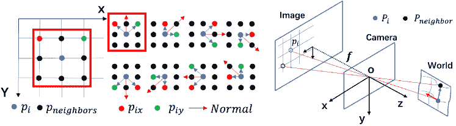

图 8：左侧：从深度估计法线。右侧：从法线估计深度。图源自 [22]

表面法线是场景 3D 点云的一个重要“局部”特征，它可以提供有前景的 3D 几何线索来估计几何上一致的深度图。在 3D 世界坐标系中，同一平面上两个像素之间的向量应该与它们的法线方向正交。强制实施法线-深度正交约束有助于改善 3D 空间中的深度估计 [75, 27, 20]。

##### 深度到法线：

给定深度 $D_{i}$，为了估计每个中央像素 $p_{i}$ 的法线，如图 8（左侧）所示，我们需要考虑邻近像素 $p_{neighbors}$。图 8（左侧）显示了 $8$ 个邻居的常规，以计算中央像素的法线。两个邻居 $p_{ix}$ 和 $p_{iy}$ 从 $p_{neighbors}$ 中选择，以每个中央像素 $p_{i}$ 的深度值 $D_{i}$ 和相机内参 $K$ 来估计法线 $\tilde{N_{i}}$。首先，我们在 3D 空间中投影深度，然后使用向量 $\overrightarrow{P_{i}P_{ix}}$ 和 $\overrightarrow{P_{i}P_{iy}}$ 之间的叉积来估计法线，如公式 42 所示。对于每个中央像素，利用 $8$ 个这样的法线估计 $\tilde{N_{i}}$，我们使用公式 43 计算最终的法线 $N_{i}$，即所有估计值的平均值。

|  | $\displaystyle P_{i}$ | $\displaystyle=K^{-1}D_{i}p_{i}$ |  | (41) |
| --- | --- | --- | --- | --- |
|  | $\displaystyle\tilde{N_{i}}$ | $\displaystyle=\overrightarrow{P_{i}P_{ix}}\times\overrightarrow{P_{i}P_{iy}}$ |  | (42) |
|  | $\displaystyle N_{i}$ | $\displaystyle=\frac{1}{8}\sum^{8}_{i=1}(\tilde{N_{i}})$ |  | (43) |

##### 法线与深度：

许多方法[22, 20, 76] 使用法线到深度的估计来通过正交关系来优化深度值 $D_{i}$。对于每个像素 $p_{i}(x_{i},y_{i})$，每个邻域 $p_{neighbor}$ 的深度需要被优化。对应的 3D 点为 $P_{i}$ 和 $P_{neighbor}$，以及中心像素 $P_{i}$ 的法线 $\overrightarrow{N_{i}}(n_{x},n_{y},n_{z})$。$P_{i}$ 的深度为 $D_{i}$，$P_{neighbor}$ 的深度为 $D_{neighbor}$。利用正交关系 $\overrightarrow{N_{i}}\perp\overrightarrow{P_{i}P_{neighbor}}$，我们可以写出方程 44。通过来自八个邻域的深度估计，我们需要一种方法来加权这些值，以考虑一些边缘或不规则表面上的法线不连续性。通常，权重 $w_{i}$ 是从参考图像 $I_{i}$ 中推断出来的，使得深度更符合几何一致性。$w_{i}$ 的值取决于 $p_{i}$ 和 $p_{neighbor}$ 之间的梯度，方程 45。梯度的值越大，优化后的深度的可靠性就越低。给定八个邻域，最终优化的深度 $\tilde{D}_{neighbor}$ 是八个不同方向的加权和，如方程 46 [22] 所示。这是 3D 空间中正则化的结果，提升了估计深度图的准确性和连续性。

|  | <math   alttext="\displaystyle[K^{-1}D_{i}p_{i}-K^{-1}D_{neighbor}P_{neighbor}]\begin{bmatrix}n_{x}\\ n_{y}\\

n_{z}\\

\end{bmatrix}" display="inline"><semantics ><mrow ><mrow  ><mo stretchy="false"  >[</mo><mrow ><mrow ><msup  ><mi >K</mi><mrow ><mo >−</mo><mn >1</mn></mrow></msup><mo lspace="0em" rspace="0em" >​</mo><msub ><mi  >D</mi><mi >i</mi></msub><mo lspace="0em" rspace="0em"  >​</mo><msub ><mi >p</mi><mi >i</mi></msub></mrow><mo >−</mo><mrow  ><msup ><mi >K</mi><mrow ><mo  >−</mo><mn >1</mn></mrow></msup><mo lspace="0em" rspace="0em"  >​</mo><msub ><mi >D</mi><mrow ><mi  >n</mi><mo lspace="0em" rspace="0em"  >​</mo><mi >e</mi><mo lspace="0em" rspace="0em"  >​</mo><mi >i</mi><mo lspace="0em" rspace="0em"  >​</mo><mi >g</mi><mo lspace="0em" rspace="0em"  >​</mo><mi >h</mi><mo lspace="0em" rspace="0em"  >​</mo><mi >b</mi><mo lspace="0em" rspace="0em"  >​</mo><mi >o</mi><mo lspace="0em" rspace="0em"  >​</mo><mi >r</mi></mrow></msub><mo lspace="0em" rspace="0em"  >​</mo><msub ><mi >P</mi><mrow ><mi  >n</mi><mo lspace="0em" rspace="0em"  >​</mo><mi >e</mi><mo lspace="0em" rspace="0em"  >​</mo><mi >i</mi><mo lspace="0em" rspace="0em"  >​</mo><mi >g</mi><mo lspace="0em" rspace="0em"  >​</mo><mi >h</mi><mo lspace="0em" rspace="0em"  >​</mo><mi >b</mi><mo lspace="0em" rspace="0em"  >​</mo><mi >o</mi><mo lspace="0em" rspace="0em"  >​</mo><mi >r</mi></mrow></msub></mrow></mrow><mo stretchy="false"  >]</mo></mrow><mo lspace="0em" rspace="0em"  >​</mo><mrow ><mo >[</mo><mtable rowspacing="0pt" ><mtr  ><mtd ><msub ><mi  >n</mi><mi >x</mi></msub></mtd></mtr><mtr ><mtd ><msub  ><mi >n</mi><mi >y</mi></msub></mtd></mtr><mtr ><mtd ><msub  ><mi >n</mi><mi >z</mi></msub></mtd></mtr></mtable><mo >]</mo></mrow></mrow><annotation-xml encoding="MathML-Content" ><apply  ><apply ><csymbol cd="latexml" >delimited-[]</csymbol><apply ><apply  ><apply ><csymbol cd="ambiguous" >superscript</csymbol><ci >𝐾</ci><apply ><cn type="integer" >1</cn></apply></apply><apply ><csymbol cd="ambiguous" >subscript</csymbol><ci >𝐷</ci><ci >𝑖</ci></apply><apply ><csymbol cd="ambiguous" >subscript</csymbol><ci >𝑝</ci><ci >𝑖</ci></apply></apply><apply ><apply ><csymbol cd="ambiguous" >superscript</csymbol><ci >𝐾</ci><apply ><cn type="integer" >1</cn></apply></apply><apply ><csymbol cd="ambiguous" >subscript</csymbol><ci >𝐷</ci><apply ><ci  >𝑛</ci><ci >𝑒</ci><ci >𝑖</ci><ci >𝑔</ci><ci >ℎ</ci><ci >𝑏</ci><ci >𝑜</ci><ci >𝑟</ci></apply></apply><apply ><csymbol cd="ambiguous" >subscript</csymbol><ci >𝑃</ci><apply ><ci >𝑛</ci><ci >𝑒</ci><ci >𝑖</ci><ci >𝑔</ci><ci >ℎ</ci><ci >𝑏</ci><ci >𝑜</ci><ci >𝑟</ci></apply></apply></apply></apply></apply><apply ><csymbol cd="latexml" >matrix</csymbol><matrix ><matrixrow  ><apply ><csymbol cd="ambiguous" >subscript</csymbol><ci >𝑛</ci><ci >𝑥</ci></apply></matrixrow><matrixrow ><apply ><csymbol cd="ambiguous" >subscript</csymbol><ci >𝑛</ci><ci >𝑦</ci></apply></matrixrow><matrixrow ><apply  ><csymbol cd="ambiguous"  >subscript</csymbol><ci >𝑛</ci><ci >𝑧</ci></apply></matrixrow></matrix></apply></apply></annotation-xml><annotation encoding="application/x-tex" >\displaystyle[K^{-1}D_{i}p_{i}-K^{-1}D_{neighbor}P_{neighbor}]\begin{bmatrix}n_{x}\\ n_{y}\\ n_{z}\\ \end{bmatrix}</annotation></semantics></math> | $\displaystyle=0$ |  | (44) |

|  | $\displaystyle w_{i}$ | $\displaystyle=e^{-\alpha\mid\triangledown I_{i}\mid}$ |  | (45) |
| --- | --- | --- | --- | --- |
|  | $\displaystyle\tilde{D}_{neighbor}$ | $\displaystyle=\sum^{8}_{i=1}\frac{w_{i}}{\sum^{8}_{i=1}w_{i}}D_{neighbor}$ |  | (46) |

Yang 等人 [20] 使用与方程 44、45 和 46 中所示的类似公式来强制在无监督视频深度估计问题中的几何一致性。Wang 等人 [75] 使用正交兼容性原理来确保落在同一平面上的两个像素的法线方向的一致性。Eigen 和 Fergus [27] 使用单个多尺度卷积神经网络（CNN）来估计深度、表面法线和语义标注。对于每个像素的表面法线估计，他们预测每个像素的 $x,y$ 和 $z$ 组件 [77]，并使用元素级别的损失比较和点积，如方程 47 中所示，其中 $N$ 是有效像素，$n$ 和 $\hat{n}$ 是每个像素的真实法线和预测法线。

|  | $\mathcal{L}_{normal}=-\frac{1}{N}\sum_{i}\hat{n}_{i}.n_{i}$ |  | (47) |
| --- | --- | --- | --- |

Qi 等人 [78] 也使用深度到法线和法线到深度的网络来规范三维空间中的深度估计，参考 [79]，但他们不使用基于 8 邻域的计算。相反，他们使用基于距离的邻域像素选择，定义如下：

|  | $N_{i}=\{(x_{j},y_{j},z_{j})\mid\mid u_{i}-u_{j}\mid<\beta,\mid v_{i}-v_{j}\mid<\beta,\mid z_{i}-z_{j}\mid<\gamma z_{i}\}$ |  | (48) |
| --- | --- | --- | --- |

其中，$u_{i},v_{i}$ 是二维坐标，$(x_{i},y_{i},z_{i})$ 是三维坐标，$\beta$ 和 $\gamma$ 是控制$x-y$平面和深度轴方向邻域大小的超参数。他们在端到端深度学习框架中使用地面真实法线和估计法线之间的$L_{2}$范数作为损失$\mathcal{L}_{normal}$。

Hu 等人 [69] 使用真实深度和估计的深度图梯度来测量它们的表面法线之间的角度，公式 49 和 50。损失 $\mathcal{L}_{normal}$ 根据公式 51 进行估计，其中 $\langle.,.\rangle$ 表示向量的内积。该损失对小的深度结构敏感 [69]。Yang 等人 [68] 使用相同的方法来估计单目深度估计问题中的法线，用于内窥镜应用。

|  | $\displaystyle n^{\hat{d}}_{i}$ | $\displaystyle=[-\triangledown_{x}\hat{d}_{i},-\triangledown_{y}\hat{d}_{i},1]^{T}$ |  | (49) |
| --- | --- | --- | --- | --- |
|  | $\displaystyle n^{d}_{i}$ | $\displaystyle=[-\triangledown_{x}d_{i},-\triangledown_{y}d_{i},1]^{T}$ |  | (50) |
|  | $\displaystyle\mathcal{L}_{normal}$ | $\displaystyle=\frac{1}{N}\sum^{N}_{i=1}\left(1-\frac{\langle n^{\hat{d}}_{i},n^{d}_{i}\rangle}{\sqrt{\langle n^{\hat{d}}_{i},n^{\hat{d}}_{i}\rangle}\sqrt{\langle n^{d}_{i},n^{d}_{i}\rangle}}\right)$ |  | (51) |

在深度估计框架中估计法线有几个优点，比如，它在学习过程中提供了对法线的明确理解，它提供了估计深度和真实值之间的高阶交互，并且它还提供了将额外操作（例如，Manhattan 假设）集成到法线上的灵活性 [20]。它也有一些缺点，例如，它容易受到真实深度图或估计深度图中的噪声影响，并且它仅考虑局部信息进行估计，这可能与全局结构不一致。

|  | $\mathcal{L}_{Normal_{robust}}=\frac{1}{N}\left(\sum^{N}_{i=1}&#124;&#124;\hat{n}-n_{i}&#124;&#124;_{1}\right)$ |  | (52) |
| --- | --- | --- | --- |

为了在 3D 空间中施加强健的高阶几何监督，Yin 等人[76] 提出了虚拟法线（VN）估计。VN 可以在更大范围内建立 3D 几何连接。为了估计 VN，从深度图中采样$N$组点，每组三个点。所选点必须是非共线的。这三个点建立一个平面，并估计相应的法线。类似地，地面真实法线$(n_{i})$被估计并与对应于估计深度图的法线$(\hat{n}_{i})$进行比较，如方程 52 所示。Naderi 等人[30] 在单目深度估计问题中使用了类似的公式，以施加高阶强健几何约束进行深度估计。

##### 普通深度联合学习方法：

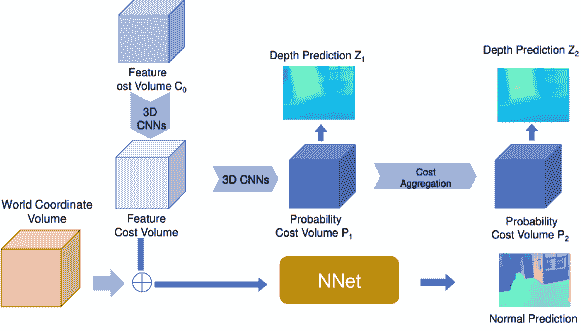

图 9：法线-深度联合学习方法。深度和法线使用相同的特征代价体积进行估计[80]。上图是 Kusupati 等人[80]略微修改的版本，仅展示联合估计设置。

Kusupati 等人[80] 开发了一种法线辅助深度估计算法，该算法将多视角法线估计和多视角深度估计过程结合起来。它利用特征代价体积来估计深度图和法线。代价体积提供了更好的结构表示，以便在图像特征上进行更好的学习，从而估计底层表面法线。具体来说，Kusupati 等人[80] 使用 3D-CNNs 估计两个深度图$Z_{1}$和$Z_{2}$，见图 9，并利用一个 7 层的 CNN（NNet，图 9）来估计法线。世界坐标体积与初始特征体积连接，以提供特征切片作为 NNet 的输入。NNet 预测每个特征切片的法线，随后取平均得到最终的法线图。

## 6 注意力与几何的结合

Dosovitski 等人 [12] 在视觉领域引入了一种具有自注意力机制的变换器。它可以通过动态调整其在图像内的注意力来学习长距离的全局上下文表示。注意力模块的输入通常被称为查询（Q）、键（K）和值（V）。Q 根据注意力权重从 V 中检索信息，方程 53 中，$\mathcal{A}(.)$ 是一个生成相似度分数作为特征嵌入聚合的注意力权重的函数。

立体或多视图深度估计方法的性能取决于在参考图像和源图像之间找到密集的对应关系。最近，Sun 等人 [81] 表明，使用自注意力和交叉注意力的变换器模型提取的特征比使用卷积神经网络提取的特征能显著改善对应关系。这些注意力机制旨在关注上下文信息，而非基于几何的信息。近期，一些方法已修改这些注意力机制，以在计算注意力权重时考虑几何信息 [82, 30, 83, 84]。在本节中，我们将探讨这些方法及其将几何信息纳入注意力的方式。

|  | $\displaystyle Attention(Q,K,V)$ | $\displaystyle=\mathcal{A}(Q,K)V$ |  | (53) |
| --- | --- | --- | --- | --- |
|  | $\displaystyle p_{i}=K^{-1}(d_{i}.C_{i});p_{j}$ | $\displaystyle=K^{-1}(d_{j}.C_{j})$ |  | (54) |
|  | $\displaystyle\mathcal{A}^{spatial}_{i,j}$ | $\displaystyle=exp\left(-\frac{&#124;&#124;P_{i}-P_{j}&#124;&#124;_{2}}{\sigma}\right)$ |  | (55) |
|  | $\displaystyle\mathcal{A}^{temporal}_{i,j}$ | $\displaystyle=Softmax_{j}(F^{q^{T}}_{i}F^{k}_{j})$ |  | (56) |

Ruhkamp 等人[82] 使用几何来指导空间-时间注意力，以指导自监督单目深度估计方法从视频中提取。他们通过利用粗略预测的初始深度估计，提出了一种具有 3D 空间感知的空间注意力层。通过已知的内在相机参数 K 和一对坐标 ($C_{i},C_{j}$) 以及它们的深度估计 $(d_{i},d_{j})$，他们使用方程 54 将深度值反投影到 3D 空间中。然后，根据方程 55 计算 3D 空间感知的空间注意力，其中 $P_{i},P_{j}$ 被视为 K 和 Q。通过方程 56 估计时间注意力以进行聚合。空间-时间注意力模型的独特公式可以显式地将几何上有意义和空间上连贯的特征关联起来，以实现密集匹配[82]。

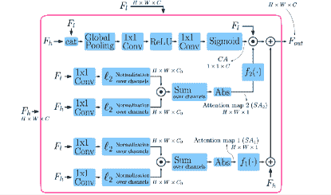

图 10：自适应几何注意力。图像重用自[30]

Naderi 等人[30] 提出了用于单目深度估计问题的自适应几何注意力（AGA），采用编码器-解码器架构。他们在解码步骤中应用 AGA 模块，利用低级 $(F_{L})$ 和高级 $(F_{h})$ 特征。图 10 展示了计算 AGA 的过程。图 10 的第一行操作展示了计算通道注意力 $(\mathcal{CA})$ 的步骤，生成 $1\times 1\times C$ 形状的注意力图，并与 $F_{l}$ 相乘。其余的两行计算展示了两个空间注意力 $(\mathcal{SA})$ 的计算，相当于方程 57。最终的聚合特征输出 $(F_{o}ut)$ 使用方程 60 进行估计，其中 $\mathcal{SA}_{1}$ 被加上，$\mathcal{SA}_{2}$ 与 $F_{L}$ 相乘。引入 $f_{1}(.)$ 和 $f_{2}(.)$ 来增强对 $F_{l}$ 和 $F_{h}$ 之间任何非零相关性的敏感性，方程 58 是没有增强敏感性的，而方程 59 展示了增强敏感性的注意力图的公式。

|  | $\displaystyle\mathcal{SA}_{i}$ | $\displaystyle=&#124;Cosine_{similarity}(E_{l,i},E_{h,i})&#124;,i=1,2$ |  | (57) |
| --- | --- | --- | --- | --- |
|  | $\displaystyle f(\mathcal{SA})$ | $\displaystyle=\mathcal{SA}$ |  | (58) |
|  | $\displaystyle f(\mathcal{SA})$ | $\displaystyle=\mathcal{SA}.\,exp(\mathcal{SA})$ |  | (59) |
|  | $\displaystyle F_{out}$ | $\displaystyle=[f_{1}(\mathcal{SA}_{1})+f_{2}(\mathcal{SA}_{2})\times\mathcal{CA}]\times F_{l}+F_{h}$ |  | (60) |

Zhu 等人 [83] 在 MVS 流程中使用了两种类型的变换器模块来提取几何感知特征，即全局上下文变换器模块和 3D 几何变换器模块。全局上下文变换器模块提取 3D 一致的参考特征 $(T_{r})$，然后将其作为输入传递给 3D 几何变换器模块，以促进跨视图注意力。$(T_{r})$ 被用来生成 K 和 V，以增强参考视图和源视图特征之间的交互，从而获得密集的对应关系。

Guo 等人 [84] 为图像标注任务使用了几何感知的注意力机制。与上述其他方法不同的是，他们并没有修改注意力机制本身，而是添加了一个偏置项，使得特征提取倾向于特定内容。他们的注意力模块与 [12] 相似，除了在分数 $E$ 计算中添加的偏置项，公式 61，其中 $G_{ij}$ 是两个对象 $i$ 和 $j$ 之间的相对几何特征。分数 $E$ 中有两个项，左边是基于内容的权重，右边是几何偏置。他们提出了三种不同的几何偏置应用方式。内容无关偏置（公式 62）假设静态几何偏置，即相同的几何偏置应用于所有 K-Q 对。查询依赖偏置根据查询的类型提供几何信息（63），键依赖偏置根据键中存在的线索提供几何信息（公式 64）。

|  | $\displaystyle E$ | $\displaystyle=QK^{T}+\phi(Q^{\prime},K^{\prime},G)$ |  | (61) |
| --- | --- | --- | --- | --- |
|  | $\displaystyle\phi^{independent}_{ij}$ | $\displaystyle=ReLU(w^{T}_{g}G_{ij})$ |  | (62) |
|  | $\displaystyle\phi^{query}_{ij}$ | $\displaystyle=Q^{{}^{\prime}T}_{g}G_{ij}$ |  | (63) |
|  | $\displaystyle\phi^{key}_{ij}$ | $\displaystyle=K^{{}^{\prime}T}_{g}G_{ij}$ |  | (64) |

## 7 学习几何表示

除了利用直接的方法来强制几何约束或提供几何指导，或利用深度和法线之间的正交关系外，还有一些间接的方法来学习几何和结构上连贯的表示。例如，与低层语义信息的特征相比，高层语义信息的特征更可能保留对象的结构一致性。基于几何一致性生成伪标签可以用于自我监督，使用合适的数据增强技术可以学习到更稳健的特征表示，附加对象的语义分割信息或使用共同分割也可以提供对象结构一致性的适当线索。对比学习通过正负对可以引导模型学习更好的表示，这些表示在几何上更清晰且一致。我们将在本节中讨论所有这些方法。

### 7.1 高层特征对齐约束

在基于深度学习的深度估计框架中，提取特征的质量直接影响深度估计的质量。提取特征的质量差可能会严重影响局部以及全局的结构模式。解决这一问题的一种方法是通过辅助预训练网络提供更好的表示来指导提取的特征。虽然深度估计管道中的集成特征提取网络能够学习有用的特征，但与像 VGG [85]、Inception [86]、ResNet [87]等明确设计用于学习深层高层表示的网络相比，它在学习高层表示方面仍然有所不足。为了强制执行特征对齐约束，Johnson 等人[88]提出了两种损失函数：特征重建损失和风格重建损失。

特征重建损失，公式 66，鼓励模型在网络的各个阶段生成与目标特征相似的源特征[88]。对于早期层次，最小化特征重建损失可以改善局部视觉以及结构模式，而对于高层次，最小化它可以改善整体结构模式[88]。特征重建损失未能保留颜色和纹理，这由风格重建损失[88]来处理。

|  | $\displaystyle\mathcal{L}_{feature}$ | $\displaystyle=&#124;&#124;F_{target}-F_{source}&#124;&#124;_{L_{i}}$ |  | (66) |
| --- | --- | --- | --- | --- |
|  | $\displaystyle\mathcal{L}_{feature}$ | $\displaystyle=\frac{1}{N}\sum\left(F_{ref}-\hat{F}_{src}\right).M_{ref}$ |  | (67) |

方程 66 展示了特征重建损失的广义公式，其中 $F_{target}$ 是目标特征，$F_{source}$ 是源特征，$L_{i}$ 表示 $L_{1}$ 或 $L_{2}$ 范数。Huang 等人 [22] 采用了类似的公式，称为特征级损失，用于无监督的 MVS 框架。利用预训练的 VGG-16 网络，在层 8、15 和 22 提取高层语义丰富的特征，用于参考图像 $(F_{ref})$ 和源图像 $(F_{src})$。源图像的特征通过相机参数被变换到参考视图 $(\hat{F}_{src})$，并用于特征重建损失，如方程 67 所示。$M$ 是参考视图掩码，用于处理遮挡，$N$ 是源视图图像的数量。Dong 等人 [50] 使用了类似的公式，并从第 $8$ 层和第 $15$ 层提取特征。

应用特征对齐损失有助于模型提取用于深度估计的高层次语义丰富特征，它还可以用于生成几何一致且符合风格的新 RGB 图像，然后将其作为输入传递给深度估计网络。Zhao 等人 [65] 和 Xu 等人 [51] 使用这种方法生成几何上一致并接近原始数据分布的合成输入图像。

Zhao 等人 [65] 生成合成 RGB 图像时，在最终图像分辨率下应用特征重建和风格重建损失。他们学习从源到目标的双向翻译器 $G_{s2t}$ 和从目标到源的 $G_{t2s}$，以弥合源领域（合成）$X_{s}$ 和目标领域（真实）$X_{t}$ 之间的差距。具体而言，图像 $x_{s}$ 被顺序输入到 $G_{s2t}$ 和 $G_{t2s}$ 生成对 $x_{s}$ 的重建，$x_{t}$ 也同样处理。然后，将这些与原始输入进行比较，如下所示：

|  | $\mathcal{L}_{Feature_{cycle}}=&#124;&#124;G_{t2s}(G_{s2t}(x_{s}))-x_{s}&#124;&#124;_{1}+&#124;&#124;G_{s2t}(G_{t2s}(x_{t}))-x_{t}&#124;&#124;_{1}$ |  | (68) |
| --- | --- | --- | --- |

虽然赵等人[65]在 RGB 图像级别应用$\mathcal{L}_{feature_{cycle}}$，但徐等人[51]在半监督 MVS 框架中使用特征和风格重建损失。他们使用一个几何保留模块，通过标记的真实图像生成符合几何和风格的 RGB 图像。他们使用几何保留模块生成未标记的 RGB 图像，这些图像随后作为输入用于深度图估计。几何保留模块包括一个具有两个分支的空间传播网络（SPN）——传播网络和引导网络。标记的图像$(I_{l})$被用作引导网络的输入，以生成替代视图的 RGB 图像$(I_{g})$。该 RGB 图像用作深度估计管道的输入，以生成相应的深度图$D_{g}$。然后将$D_{g}$扭曲到原始视图（$\hat{D}_{g}$）以与真实深度图$D_{l}$进行比较。公式 69 显示了[51]中使用的损失函数的公式。在这种设置下，他们使用标记的图像生成几何符合的替代视图未标记图像，并在深度估计管道中使用这些图像，而无需创建新的标记数据。

|  | $\mathcal{L}_{feature_{style}}=&#124;&#124;D_{l}-\hat{D}_{g}&#124;&#124;^{2}_{2}$ |  | (69) |
| --- | --- | --- | --- |

### 7.2 使用跨视图一致性的伪标签生成

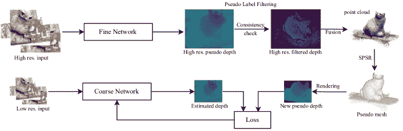

图 11：[21]的伪标签生成方法。SPSR 是筛选的泊松表面重建方法[89]。图灵感来源于[21]

在自监督多视图立体视觉（MVS）框架中，应用几何约束的一种有效方法是生成伪标签。生成伪标签需要应用视图一致性约束，这促使 MVS 框架在训练和评估期间保持几何一致性[21，47]。由于模型通过自监督进行学习，这也有助于解决收集多视角真实数据的挑战。在这一部分，我们讨论了生成自监督伪标签的三种方法：来自高分辨率训练图像的标签[21]、稀疏伪标签生成[47]和半稠密伪标签生成[47]。

杨等人[21]在四个步骤中应用伪标签学习。首先，他们基于光度一致性估计深度图，参见第 3.1 节，使用一个粗网络（低分辨率网络）。有了初始伪标签后，他们应用了两步迭代自训练来优化这些伪标签，见图 11。他们利用精细网络（高分辨率网络）来优化初始粗伪标签，利用来自高分辨率图像的更多区分特征。精细网络估计高分辨率标签，然后通过交叉视图深度一致性检查来过滤这些标签，参见第三部分，利用深度重投影误差来测量伪标签一致性。最后，来自$N$个不同视角的高分辨率过滤伪标签通过多视角融合方法融合，生成场景的更完整点云。然后渲染点云生成交叉视图几何一致的新伪标签，以指导粗网络深度估计管道。

刘等人[47]使用了两种几何先验引导的伪标签生成方法：稀疏伪标签和半稠密伪标签。对于稀疏标签生成，他们使用一个预训练的运动结构框架（SfM）[90]生成稀疏点云。然后将这些稀疏点云投影以生成稀疏深度伪标签。由于稀疏点云只能提供非常有限的监督，他们使用传统的 MVS 框架，利用几何和光度一致性来估计初步深度图，比如 COLMAP[91]。初步深度图经过交叉视图几何一致性检查过程以消除任何离群点。这种过滤后的深度图随后被用作学习的最终伪标签。

### 7.3 数据增强用于几何鲁棒性

深度学习框架在拥有更多数据时总能表现得更好[92]，但收集用于立体或多视角立体（MVS）设置的数据是一项困难的任务。将数据增强应用于这些框架自然是有意义的，但实施起来并不容易。增强图像中的自然色彩波动、遮挡和几何失真干扰了图像的色彩恒定性，影响了有效特征匹配，从而影响整个深度估计管道的性能[18]。由于这些限制，数据增强在有监督[15, 13, 14]或无监督[48, 54, 22] MVS 方法中很少被应用。

牢记这些限制，Garg 等人 [19] 在无监督立体深度估计问题中使用了三种数据增强技术。他们使用了颜色变化——通过因子 $c\in[0.9,1.1]$ 对颜色通道进行标量乘法，缩放和裁剪——将输入图像按 $2\times$ 因子缩放，然后随机裁剪以匹配原始输入大小，以及左右翻转——将左右图像水平翻转并交换以获得新的训练对。这三种简单的增强方法导致数据量增加了 $8\times$，并改善了深度估计中物体边缘的定位。

|  | $\mathcal{L}_{augmentation}=\frac{1}{M}\sum&#124;&#124;\hat{D}_{aug}-\hat{D}_{non-aug}&#124;&#124;_{2}\odot M_{non-aug}$ |  | (70) |
| --- | --- | --- | --- |

Xu 等人 [18] 提出了将数据增强作为正则化技术。与其优化使用真实深度估计的常规损失函数，他们提出通过对比数据增强深度估计与非增强深度估计来实现数据增强一致性损失。具体来说，给定同一视角的非增强输入图像 $I_{non-aug}$ 和增强输入图像 $I_{aug}$，最小化估计的增强 ($\hat{D}_{aug}$) 和非增强 ($\hat{D}_{non-aug}$) 深度图之间的差异。公式 70 显示了数据增强一致性损失 $\mathcal{L}_{augmentation}$ 的数学公式，该公式在 [18] 中使用。其中 $M_{non-aug}$ 表示数据增强变换下的未遮挡掩膜。Xu 等人 [18] 通过随机生成二进制裁剪掩膜来模拟多视图情况下的遮挡幻觉，从而进行交视遮挡增强。掩膜随后被投影到其他视图中，以遮挡源视图中对应的区域。他们还使用了伽玛校正来调整图像的亮度，随机颜色抖动、随机模糊和随机噪声添加到输入图像中。所有这些数据增强方法都不会影响相机参数。在 Sec. TODO 中，我们展示了一组潜在的转换，这些转换可以用于数据增强而不影响 MVS 框架中的相机参数。

### 7.4 结构一致性的语义信息

人类可以通过利用更多的线索，如前景和背景的全球感知、相对缩放和单个对象的语义一致性，在模糊区域有效地执行立体光测量。基于深度学习的框架，操作在颜色恒常性假设上[18]，通常提供比传统多视角立体算法更优越的性能，但两种方法在无特征区域或任何具有不同光照条件、反射或噪声、颜色恒常性歧义的区域都无效。在这些区域直接应用几何和光度约束没有帮助，但高级语义分割线索可以帮助这些模型。在给定场景中的语义分割线索可以提供抽象匹配线索，也可以作为深度估计的结构先验[18]。在本节中，我们深入探讨了在其管道中包含语义线索的深度估计方法。

受到 Cheng 等人[24] 的启发，他们结合语义分割信息以从视频中学习光流，Yang 等人[29] 将语义特征嵌入并将语义线索正规化为损失项，以改进立体问题中的视差学习。语义特征嵌入是三种特征的串联：左图像特征、左-右关联特征和左图像语义特征。除了图像和关联特征外，语义特征提供了对无特征区域的更一致的表示，这有助于解决视差问题。他们还通过将右图像分割图变形到左视图并与左图像分割地面真值进行比较来正规化语义线索损失项。最小化语义线索损失项在端到端学习过程中提高了其一致性。Dovesi 等人[28] 也在粗到细的设计中使用语义分割网络，并在立体匹配问题中利用额外的信息。

另一种利用语义信息实现几何和结构一致性的方法是通过共分割。共分割方法旨在预测图像集合中公共对象的前景像素[93]。受 Casser 等人[94] 的启发，后者将共分割应用于无监督单目深度自运动学习问题，Xu 等人[18] 将共分割应用于多视角对，以挖掘共同的语义。他们采用非负矩阵分解 (NMF) [95] 来挖掘多视图图像中的共同语义簇。在学习过程中，NMF 被应用于预训练层的激活值[96]，以找到图像之间的语义对应关系。有关 NMF 的更多细节，请参见 Ding 等人[95]。共分割图的连贯性可以通过将其变形到其他视角来扩展。语义一致性损失按像素交叉熵损失计算，公式如下：

|  | $\mathcal{L}_{semantic}=-\sum^{N}_{i=2}\left[\frac{1}{&#124;&#124;M_{i}&#124;&#124;_{1}}\sum^{HW}_{j=1}f(S_{j})log(\hat{s}_{i,j})M_{i,j}\right]$ |  | (71) |
| --- | --- | --- | --- |

其中 $f(S_{j})=onehot(arg\,max(S_{j}))$ 和 $M_{i}$ 是二值掩膜，表示从第 $i^{th}$ 视角到参考视角的有效像素。

### 7.5 使用对比损失进行几何表示学习

对比学习[97]通过对正样本对施加吸引力，对负样本对施加排斥力来学习对象表示[98]。这种表示学习形式在深度估计问题中尚未深入探索。目前只有少数研究工作使用对比学习进行深度估计[99, 100, 98]。Fan 等人[100]利用对比学习更多地关注深度分布，并通过采用非重叠窗口的对比学习方法来改善整体深度估计过程。Lee 等人[99]使用对比学习来解开相机和对象的运动。虽然这些方法使用对比学习来估计深度图，但没有一个方法利用对比学习来促进对象的几何表示。

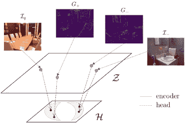

图 12：对比学习方法以促进几何表示。图像重用自[98]

Shim 和 Kim [98] 专注于使用对比学习进行深度估计问题的几何表示学习。他们利用 Sobel 核心和 Canny 边缘二值掩模 [101] 生成图像的梯度场作为正负对，请参见图 12。为了估计输入图像对 $\mathcal{I}_{q}$（查询图像）和 $\mathcal{I}_{-}$（其他图像）的梯度场 $G$（正例用 $+$，负例用 $-$），他们修改了 Canny 检测器，以提取主导梯度的大小及其位置，并根据边缘主导性调整梯度场。所采用的过程可以数学上公式化，如公式 72 所示，其中 $||E||$ 和 $B_{Canny}$ 表示 Sobel 操作符的梯度大小和 Canny 检测器的二值掩模。$\odot$ 是逐元素乘法。

|  | <math   alttext="\begin{split}\mathcal{I}&amp;\in\mathbb{R}^{h\times w},\triangledown\mathcal{I}_{x},\triangledown\mathcal{I}_{y}\in\mathbb{R}^{h\times w},\\ &#124;&#124;E&#124;&#124;&amp;=\sqrt{\mathcal{I}^{2}_{x}+\mathcal{I}^{2}_{y}},\\

$\mathcal{I} \in \mathbb{R}^{h \times w}, \nabla \mathcal{I}_{x}, \nabla \mathcal{I}_{

网络通过对比损失进行预训练，以学习图像的几何表示$\mathcal{Z}$。这个学习到的表示进一步通过一个具有 ReLU 非线性激活的 2 层全连接网络压缩到特征空间$\mathcal{H}$。正负对的投影潜在向量$h$用于估计对比损失。

## 8 结论

深度学习技术的工具性进展极大地推动了深度估计框架的发展。它使得从输入图像中提取高层次表示成为可能，从而增强了立体匹配。然而，这也限制了在学习过程中建模显式光度和几何约束的使用。大多数监督立体视觉和 MVS 方法侧重于更好的特征提取和通过注意机制增强特征匹配，但将平面扫描算法作为唯一的几何约束。它们在学习过程中大多依赖于地面真相的质量来学习几何和结构一致性。在这篇综述中，我们全面回顾了深度估计中的几何概念及其密切相关的领域，这些领域可以与深度学习框架结合，以在学习过程中强制实施几何和结构一致性。显式建模几何约束以及监督信号可以在深度估计框架中强制进行结构推理、遮挡推理和视图间一致性。我们相信这篇综述将为读者和研究人员提供一个很好的参考，以探索在深度学习框架中集成几何约束。

## 参考文献

+   [1] 古川泰和让·庞斯. 精确、密集且鲁棒的多视图立体视觉. 《IEEE 模式分析与机器智能学报》，32:1362–1376，2010 年。

+   [2] 西尔瓦诺·加利亚尼、卡特琳·拉辛格和孔拉德·辛德勒. 通过表面法线扩散进行大规模并行多视图立体视觉. 见于 2015 年 IEEE 国际计算机视觉会议（ICCV），第 873–881 页，2015 年。

+   [3] 恩金·托拉、克里斯托夫·斯特雷查和帕斯卡尔·弗亚. 高效的大规模多视图立体视觉用于超高分辨率图像集. 《机器视觉与应用》，23，2011 年 9 月。

+   [4] 约翰内斯·L·舍恩贝格、恩梁·郑、扬·迈克尔·弗拉姆和马克·波莱费斯. 针对无结构多视图立体视觉的逐像素视图选择. 见于巴斯蒂安·莱布、吉里·马塔斯、尼库·塞贝和马克斯·韦林主编的《计算机视觉 – ECCV 2016》，第 501–518 页，尚，2016 年。斯普林格国际出版公司。

+   [5] 尤里·博伊科夫、奥尔加·维克斯勒和拉敏·扎比赫. 通过图割进行快速近似能量最小化. 《IEEE 模式分析与机器智能学报》，23:1222–1239，2001 年。

+   [6] 理查德·哈特利和安德鲁·齐瑟曼. 《计算机视觉中的多视图几何学》。剑桥大学出版社，2003 年。

+   [7] 阮光全和 OD·福热拉斯. 多图像的几何学. MIT 出版社，波士顿，2(3):4–5，2001 年。

+   [8] 理查德·斯泽利斯基。计算机视觉：算法与应用。Springer Nature，2022 年。

+   [9] 杨·勒库恩、约书亚·本吉奥和杰弗里·辛顿。深度学习。《自然》，521(7553):436–444，2015 年。

+   [10] 杨·勒库恩、约书亚·本吉奥等。用于图像、语音和时间序列的卷积网络。《大脑理论与神经网络手册》，3361(10):1995，1995 年。

+   [11] 潘卡吉·马尔霍特拉、洛维克什·维格、戈塔姆·什罗夫、普尼特·阿格瓦尔等。用于时间序列异常检测的长短期记忆网络。发表于 Esann，第 2015 卷，页面 89，2015 年。

+   [12] 阿列克谢·多索维茨基、卢卡斯·贝耶、亚历山大·科列斯尼科夫、迪尔克·魏森博恩、肖华·翟、托马斯·安特尔蒂纳、穆斯塔法·德赫赫尼、马蒂亚斯·门德尔、乔治·海戈尔德、希尔万·吉利等。图像值 16x16 个单词：大规模图像识别的变压器。arXiv 预印本 arXiv:2010.11929，2020 年。

+   [13] 姚瑶、罗子欣、李诗伟、方天和全龙。MVSNet：非结构化多视图立体的深度推断。发表于欧洲计算机视觉会议 (ECCV) 论文集，页面 767–783，2018 年。

+   [14] 顾晓东、范志文、朱思瑜、戴作卓、谭飞通和谭平。高分辨率多视图立体和立体匹配的级联代价体。发表于 IEEE/CVF 计算机视觉与模式识别会议论文集，页面 2495–2504，2020 年。

+   [15] 丁逸康、袁文韬、朱青田、张浩天、刘向月、王元江和刘潇。Transmvsnet: 基于变压器的全球上下文感知多视图立体网络。发表于 IEEE/CVF 计算机视觉与模式识别会议论文集，页面 8585–8594，2022 年。

+   [16] 亚历克斯·肯德尔、哈伊克·马尔蒂罗斯扬、苏米特罗·达斯古普塔、彼得·亨利、瑞安·肯尼迪、亚伯拉罕·巴赫拉赫和亚当·布赖。深度立体回归的几何与上下文端到端学习。发表于 IEEE 国际计算机视觉会议论文集，页面 66–75，2017 年。

+   [17] 罗伯特·T·柯林斯。基于空间扫掠的真实多图像匹配方法。发表于 CVPR IEEE 计算机学会计算机视觉与模式识别会议论文集，页面 358–363。IEEE，1996 年。

+   [18] 徐洪斌、周志鹏、游巧、康文雄和吴秋霞。自监督多视图立体通过有效的共同分割和数据增强。发表于 AAAI 人工智能会议论文集，第 35 卷，页面 3030–3038，2021 年。

+   [19] 拉维·加尔格、维贾伊·库马尔·BG、古斯塔沃·卡内罗和伊恩·里德。用于单视图深度估计的无监督 CNN：几何的拯救。发表于计算机视觉–ECCV 2016：第十四届欧洲会议，荷兰阿姆斯特丹，2016 年 10 月 11-14 日，论文集，第八部分 14，页面 740–756。Springer，2016 年。

+   [20] 杨振恒、王鹏、徐伟、赵亮和拉马坎特·内瓦蒂亚。基于边缘感知深度-法线一致性的几何无监督学习。arXiv 预印本 arXiv:1711.03665，2017 年。

+   [21] Jiayu Yang, Jose M Alvarez 和 Miaomiao Liu. 多视角立体的深度推断自监督学习。载于《IEEE/CVF 计算机视觉与模式识别会议论文集》，页码 7526–7534，2021 年。

+   [22] Baichuan Huang, Hongwei Yi, Can Huang, Yijia He, Jingbin Liu 和 Xiao Liu. M3vsnet: 无监督多度量多视角立体网络。载于 2021 年 IEEE 国际图像处理会议（ICIP），页码 3163–3167。IEEE，2021 年。

+   [23] Yuhua Chen, Cordelia Schmid 和 Cristian Sminchisescu. 使用几何约束进行自监督学习的单目视频：连接光流、深度和相机。载于《IEEE/CVF 国际计算机视觉会议论文集》，页码 7063–7072，2019 年。

+   [24] Jingchun Cheng, Yi-Hsuan Tsai, Shengjin Wang 和 Ming-Hsuan Yang. Segflow: 视频对象分割与光流的联合学习。载于《IEEE 国际计算机视觉会议论文集》，页码 686–695，2017 年。

+   [25] Reza Mahjourian, Martin Wicke 和 Anelia Angelova. 使用三维几何约束从单目视频中进行无监督深度和自我运动学习。载于《IEEE 计算机视觉与模式识别会议论文集》，页码 5667–5675，2018 年。

+   [26] Clément Godard, Oisin Mac Aodha 和 Gabriel J Brostow. 带有左右一致性的无监督单目深度估计。载于《IEEE 计算机视觉与模式识别会议论文集》，页码 270–279，2017 年。

+   [27] David Eigen 和 Rob Fergus. 使用共同的多尺度卷积架构预测深度、表面法线和语义标签。载于《IEEE 国际计算机视觉会议论文集》，页码 2650–2658，2015 年。

+   [28] Pier Luigi Dovesi, Matteo Poggi, Lorenzo Andraghetti, Miquel Martí, Hedvig Kjellström, Alessandro Pieropan 和 Stefano Mattoccia. 实时语义立体匹配。载于 2020 年 IEEE 国际机器人与自动化会议（ICRA），页码 10780–10787。IEEE，2020 年。

+   [29] Guorun Yang, Hengshuang Zhao, Jianping Shi, Zhidong Deng 和 Jiaya Jia. Segstereo: 利用语义信息进行视差估计。载于欧洲计算机视觉会议（ECCV），页码 636–651，2018 年。

+   [30] Taher Naderi, Amir Sadovnik, Jason Hayward 和 Hairong Qi. 带有自适应几何注意力的单目深度估计。载于《IEEE/CVF 冬季计算机视觉应用会议论文集》，页码 944–954，2022 年。

+   [31] Zuria Bauer, Zuoyue Li, Sergio Orts-Escolano, Miguel Cazorla, Marc Pollefeys 和 Martin R Oswald. Nvs-monodepth: 通过新颖视图合成改善单目深度预测。载于 2021 年国际 3D 视觉会议（3DV），页码 848–858。IEEE，2021 年。

+   [32] Qingtian Zhu, Chen Min, Zizhuang Wei, Yisong Chen 和 Guoping Wang. 通过平面扫描的深度学习多视角立体：综述。arXiv 预印本 arXiv:2106.15328，2021 年。

+   [33] N.A. 维基百科条目：摄影测量。载于维基百科，访问时间：2023-10-12。

+   [34] Richard Szeliski 和 Polina Golland. 透明度和抠图的立体匹配. 在第六届国际计算机视觉会议 (IEEE Cat. No. 98CH36271), 页 517–524\. IEEE, 1998.

+   [35] Hideo Saito 和 Takeo Kanade. 从大量图像中在投影网格空间进行形状重建. 在第 1999 年 IEEE 计算机学会计算机视觉与模式识别会议论文集中 (Cat. No PR00149), 第二卷, 页 49–54\. IEEE, 1999.

+   [36] Yao Yao, Zixin Luo, Shiwei Li, Tianwei Shen, Tian Fang, 和 Long Quan. 高分辨率多视角立体深度推断的递归 mvsnet. 计算机视觉与模式识别会议 (CVPR), 2019.

+   [37] Bo Peng, Eric Alcaide, Quentin Anthony, Alon Albalak, Samuel Arcadinho, Huanqi Cao, Xin Cheng, Michael Chung, Matteo Grella, Kranthi Kiran GV, 等. Rwkv: 为变换器时代重新发明 rnn. arXiv 预印本 arXiv:2305.13048, 2023.

+   [38] Po-Han Huang, Kevin Matzen, Johannes Kopf, Narendra Ahuja, 和 Jia-Bin Huang. Deepmvs: 学习多视角立体视觉. 在 IEEE 计算机视觉与模式识别会议论文集中，页 2821–2830, 2018.

+   [39] Olaf Ronneberger, Philipp Fischer, 和 Thomas Brox. U-net: 用于生物医学图像分割的卷积网络. 在医学图像计算与计算机辅助干预–MICCAI 2015: 第 18 届国际会议, 慕尼黑, 德国, 2015 年 10 月 5-9 日, 论文集, 第三部分 18, 页 234–241\. Springer, 2015.

+   [40] Jiayu Yang, Wei Mao, Jose M Alvarez, 和 Miaomiao Liu. 基于成本体积金字塔的多视角立体深度推断. 在 IEEE/CVF 计算机视觉与模式识别会议论文集中，页 4877–4886, 2020.

+   [41] David Gallup, Jan-Michael Frahm, Philippos Mordohai, Qingxiong Yang, 和 Marc Pollefeys. 实时平面扫掠立体视觉与多扫掠方向. 在 2007 IEEE 计算机视觉与模式识别会议, 页 1–8\. IEEE, 2007.

+   [42] Dorothy M Greig, Bruce T Porteous, 和 Allan H Seheult. 二值图像的精确最大后验估计. 《皇家统计学会 B 系列：统计方法论》, 51:271–279, 1989.

+   [43] Christopher M Bishop 和 Nasser M Nasrabadi. 模式识别与机器学习, 第 4 卷. Springer, 2006.

+   [44] Arijit Mallick, Jörg Stückler, 和 Hendrik Lensch. 通过自我监督学习适应多视角立体视觉. arXiv 预印本 arXiv:2009.13278, 2020.

+   [45] Haimei Zhao, Jing Zhang, Zhuo Chen, Bo Yuan, 和 Dacheng Tao. 自我监督单目深度估计中的稳健跨视图一致性. arXiv 预印本 arXiv:2209.08747, 2022.

+   [46] Hongbin Xu, Zhipeng Zhou, Yali Wang, Wenxiong Kang, Baigui Sun, Hao Li, 和 Yu Qiao. 探索自我监督多视角立体视觉中的不确定性. 在 IEEE/CVF 国际计算机视觉会议论文集中，页 6078–6087, 2021.

+   [47] 利曼·刘、丰浩·张、万娟·苏、宇航·齐和文炳·陶。几何先验引导的自监督多视角立体学习。遥感，15(8):2109，2023 年。

+   [48] 特贾斯·科特、舒布汉·阿格拉瓦尔、舒布汉·图尔西亚尼、克里斯托弗·梅尔茨、西蒙·卢西和马歇尔·赫伯特。通过鲁棒光度一致性学习无监督多视角立体视觉。arXiv 预印本 arXiv:1905.02706，2019 年。

+   [49] 静良·李、郑达·卢、义群·王、英·王和军·肖。Ds-mvsnet：通过深度合成的无监督多视角立体视觉。载于第 30 届 ACM 国际多媒体会议论文集，第 5593–5601 页，2022 年。

+   [50] 浩南·董和剑·姚。Patchmvsnet：用于弱纹理表面重建的补丁级无监督多视角立体视觉。arXiv 预印本 arXiv:2203.02156，2022 年。

+   [51] 鸿斌·徐、志鹏·周、伟涛·陈、百贵·孙、浩·李和文雄·康。半监督深度多视角立体视觉。arXiv 预印本 arXiv:2207.11699，2022 年。

+   [52] 泽浩·余、雷·金和胜华·高。P 2 net：用于无监督室内深度估计的补丁匹配和平面正则化。载于欧洲计算机视觉会议论文集，第 206–222 页。Springer，2020 年。

+   [53] 雅各布·恩格尔、弗拉德伦·科尔顿和丹尼尔·克雷默斯。直接稀疏视觉里程计。IEEE 模式分析与机器智能汇刊，40(3):611–625，2018 年。

+   [54] 雨超·戴、志东·朱、志博·饶和博·李。Mvs2：具有多视角对称的深度无监督多视角立体视觉。载于 2019 年国际 3D 视觉会议（3DV）论文集，第 1–8 页。IEEE，2019 年。

+   [55] 舒·陈、郑东·蒲、向·范和贝极·邹。修复自监督单目深度估计中的光度损失缺陷。IEEE 电路与系统视频技术汇刊，32(3):1328–1338，2021 年。

+   [56] 梁刘、江宁·张、瑞飞·贺、勇·刘、亚彪·王、英·泰、东浩·罗、程杰·王、吉林·李和飞跃·黄。类比学习：来自变换的可靠监督用于无监督光流估计。载于 2020 IEEE/CVF 计算机视觉与模式识别会议（CVPR），第 6488–6497 页，2020 年。

+   [57] 西蒙·迈斯特、俊华·赫和斯特凡·罗斯。Unflow：具有双向普查损失的无监督光流学习。载于 AAAI 人工智能会议论文集，第 32 卷，2018 年。

+   [58] 克莱门特·戈达、奥辛·麦克·奥达、迈克尔·弗曼和加布里埃尔·J·布罗斯托。深入探讨自监督单目深度估计。载于 IEEE/CVF 国际计算机视觉会议论文集，第 3828–3838 页，2019 年。

+   [59] 瑞·陈、松芳·韩、静·徐和浩·苏。基于点的多视角立体网络。载于 IEEE/CVF 国际计算机视觉会议论文集，第 1538–1547 页，2019 年。

+   [60] 周·王、艾伦·C·博维克、哈米德·R·谢赫和埃罗·P·西蒙切利。图像质量评估：从错误可见性到结构相似性。IEEE 图像处理汇刊，13(4):600–612，2004 年。

+   [61] A.M. 埃斯基乔格鲁和 P.S. 菲舍尔。图像质量测量及其性能。IEEE 通信学报，43(12)：2959–2965，1995 年。

+   [62] 赵航、奥拉齐奥·加洛、伊乌里·弗罗西奥和简·考茨。图像处理神经网络的损失函数。arXiv 预印本 arXiv:1511.08861，2015 年。

+   [63] 王凯轩、陈耀、郭恒凯、温林富和沈少杰。单目深度估计的几何预训练。在 2020 年 IEEE 国际机器人与自动化会议（ICRA）上，第 4782–4788 页。IEEE，2020 年。

+   [64] 尹志超和石建平。Geonet：密集深度、光流和相机姿态的无监督学习。在 IEEE 计算机视觉与模式识别会议（CVPR）论文集中，2018 年 6 月。

+   [65] 赵姗姗、傅欢、龚名名和陶大成。面向单目深度估计的几何感知对称领域适应。在 IEEE/CVF 计算机视觉与模式识别会议论文集中，第 9788–9798 页，2019 年。

+   [66] 塞尔吉奥·乌拉斯、费德里科·吉奥罗西、亚历山德罗·维里和文森特·托雷。运动感知的计算方法。生物控制论，60：79–87，1988 年。

+   [67] 托马斯·布罗克斯、安德烈斯·布鲁恩、尼尔斯·帕彭贝格和约阿希姆·维克特。基于变形理论的高精度光流估计。在计算机视觉-ECCV 2004：第 8 届欧洲计算机视觉会议，捷克布拉格，2004 年 5 月 11-14 日。论文集，第 IV 部分，第 8 卷，第 25–36 页。施普林格，2004 年。

+   [68] 杨永明、邵舒伟、杨涛、王鹏、杨卓和吴承栋。用于单目内窥镜深度估计的几何感知深度网络。人工智能工程应用，122：105989，2023 年。

+   [69] 胡俊杰、梅特·奥扎伊、张燕和冈田高行。重新审视单幅图像深度估计：朝着更高分辨率的地图与准确的物体边界前进。在 2019 年 IEEE 计算机视觉应用冬季会议（WACV）上，第 1043–1051 页，2019 年。

+   [70] 克里斯托弗·扎克、托马斯·波克和霍斯特·比绍夫。基于对偶性的实时 TV-L1 光流方法。在模式识别：第 29 届 DAGM 研讨会，德国海德堡，2007 年 9 月 12-14 日。论文集 29，第 214–223 页。施普林格，2007 年。

+   [71] Pedro F. 菲尔岑斯瓦尔布和丹尼尔 P. 胡滕洛赫。基于图的高效图像分割。国际计算机视觉杂志，59：167–181，2004 年。

+   [72] Paul J. 贝斯尔和尼尔 D. 麦凯。3-D 形状注册方法。在传感器融合 IV：控制范式和数据结构，第 1611 卷，第 586–606 页。SPIE，1992 年。

+   [73] Y. 陈和 G. 美迪奥尼。通过注册多个深度图像进行对象建模。在 1991 年 IEEE 国际机器人与自动化会议论文集中，第 2724–2729 页，第 3 卷，1991 年。

+   [74] S. 鲁辛基维奇和 M. 利沃伊。ICP 算法的高效变体。在第三届国际 3-D 数字成像与建模会议论文集中，第 145–152 页，2001 年。

+   [75] Peng Wang、Xiaohui Shen、Bryan Russell、Scott Cohen、Brian Price 和 Alan L Yuille。Surge：从单幅图像中表面正则化几何估计。收录于《神经信息处理系统进展》，第 29 卷，2016 年。

+   [76] Wei Yin、Yifan Liu、Chunhua Shen 和 Youliang Yan。强化虚拟法线的几何约束以进行深度预测。收录于《IEEE/CVF 国际计算机视觉会议论文集》，第 5684–5693 页，2019 年。

+   [77] Nathan Silberman、Derek Hoiem、Pushmeet Kohli 和 Rob Fergus。室内分割与基于 RGBD 图像的支持推断。收录于《计算机视觉–ECCV 2012：第 12 届欧洲计算机视觉会议，意大利佛罗伦萨，2012 年 10 月 7-13 日，会议论文集，第五部分 12》，第 746–760 页。Springer，2012 年。

+   [78] Xiaojuan Qi、Renjie Liao、Zhengzhe Liu、Raquel Urtasun 和 Jiaya Jia。GeoNet：用于联合深度和表面法线估计的几何神经网络。收录于《IEEE 计算机视觉与模式识别会议论文集》，第 283–291 页，2018 年。

+   [79] David F Fouhey、Abhinav Gupta 和 Martial Hebert。基于数据的三维原语用于单幅图像理解。收录于《IEEE 国际计算机视觉会议论文集》，第 3392–3399 页，2013 年。

+   [80] Uday Kusupati、Shuo Cheng、Rui Chen 和 Hao Su。法线辅助的立体深度估计。收录于《IEEE/CVF 计算机视觉与模式识别会议论文集》，第 2189–2199 页，2020 年。

+   [81] Jiaming Sun、Zehong Shen、Yuang Wang、Hujun Bao 和 Xiaowei Zhou。Loftr：基于变换器的无检测器局部特征匹配。收录于《IEEE/CVF 计算机视觉与模式识别会议论文集》，第 8922–8931 页，2021 年。

+   [82] Patrick Ruhkamp、Daoyi Gao、Hanzhi Chen、Nassir Navab 和 Beniamin Busam。注意力遇到几何：几何引导的时空注意力用于一致的自监督单目深度估计。收录于《2021 国际三维视觉会议（3DV）》，第 837–847 页。IEEE，2021 年。

+   [83] Jie Zhu、Bo Peng、Wanqing Li、Haifeng Shen、Zhe Zhang 和 Jianjun Lei。具有变换器的多视角立体视觉。arXiv 预印本 arXiv:2112.00336，2021 年。

+   [84] Longteng Guo、Jing Liu、Xinxin Zhu、Peng Yao、Shichen Lu 和 Hanqing Lu。用于图像描述的归一化和几何感知自注意网络。收录于《IEEE/CVF 计算机视觉与模式识别会议论文集》，第 10327–10336 页，2020 年。

+   [85] Karen Simonyan 和 Andrew Zisserman。用于大规模图像识别的非常深度卷积网络。arXiv 预印本 arXiv:1409.1556，2014 年。

+   [86] Christian Szegedy、Sergey Ioffe、Vincent Vanhoucke 和 Alexander Alemi。Inception-v4、Inception-ResNet 以及残差连接对学习的影响。收录于《AAAI 人工智能会议论文集》，第 31 卷，2017 年。

+   [87] Kaiming He、Xiangyu Zhang、Shaoqing Ren 和 Jian Sun。用于图像识别的深度残差学习。收录于《IEEE 计算机视觉与模式识别会议论文集》，第 770–778 页，2016 年。

+   [88] Justin Johnson, Alexandre Alahi 和 Li Fei-Fei. 实时风格迁移和超分辨率的感知损失. 在计算机视觉–ECCV 2016：第 14 届欧洲会议, 荷兰阿姆斯特丹, 2016 年 10 月 11-14 日, 论文集, 第二部分 14, 第 694–711 页\. Springer, 2016.

+   [89] Michael Kazhdan 和 Hugues Hoppe. 屏幕化泊松表面重建. ACM 图形学交易 (ToG), 32(3):1–13, 2013.

+   [90] Johannes L Schonberger 和 Jan-Michael Frahm. 运动结构重访. 在 IEEE 计算机视觉与模式识别会议论文集中, 第 4104–4113 页, 2016.

+   [91] Johannes L Schönberger, Enliang Zheng, Jan-Michael Frahm 和 Marc Pollefeys. 用于非结构化多视图立体的逐像素视图选择. 在计算机视觉–ECCV 2016：第 14 届欧洲会议, 荷兰阿姆斯特丹, 2016 年 10 月 11-14 日, 论文集, 第三部分 14, 第 501–518 页\. Springer, 2016.

+   [92] Connor Shorten 和 Taghi M Khoshgoftaar. 深度学习图像数据增强的调查. 大数据杂志, 6(1):1–48, 2019.

+   [93] Armand Joulin, Francis Bach 和 Jean Ponce. 多类别共同分割. 在 2012 年 IEEE 计算机视觉与模式识别会议中, 第 542–549 页\. IEEE, 2012.

+   [94] Vincent Casser, Soeren Pirk, Reza Mahjourian 和 Anelia Angelova. 使用结构和语义的无监督单目深度和自我运动学习. 在 IEEE/CVF 计算机视觉与模式识别会议研讨会论文集中, 第 0–0 页, 2019.

+   [95] Chris Ding, Xiaofeng He 和 Horst D Simon. 非负矩阵分解与谱聚类的等效性. 在 2005 年 SIAM 国际数据挖掘会议论文集中, 第 606–610 页\. SIAM, 2005.

+   [96] Edo Collins, Radhakrishna Achanta 和 Sabine Susstrunk. 用于概念发现的深度特征分解. 在欧洲计算机视觉会议（ECCV）论文集中, 第 336–352 页, 2018.

+   [97] Raia Hadsell, Sumit Chopra 和 Yann LeCun. 通过学习不变映射进行降维. 在 2006 年 IEEE 计算机学会计算机视觉与模式识别会议（CVPR'06）, 第 2 卷, 第 1735–1742 页\. IEEE, 2006.

+   [98] Dongseok Shim 和 H Jin Kim. 通过梯度场和对比损失学习数据高效的几何表示用于深度估计. 在 2021 年 IEEE 国际机器人与自动化会议（ICRA）论文集中, 第 13634–13640 页\. IEEE, 2021.

+   [99] Seokju Lee, Francois Rameau, Fei Pan 和 In So Kweon. 用于联合深度和运动场估计的注意力和对比学习. 在 IEEE/CVF 国际计算机视觉会议论文集中, 第 4862–4871 页, 2021.

+   [100] Rizhao Fan, Matteo Poggi 和 Stefano Mattoccia. 用于深度预测的对比学习. 在 IEEE/CVF 计算机视觉与模式识别会议论文集中, 第 3225–3236 页, 2023.

+   [101] 约翰·坎尼。边缘检测的计算方法。IEEE 模式分析与机器智能交易，6：679-698，1986。
