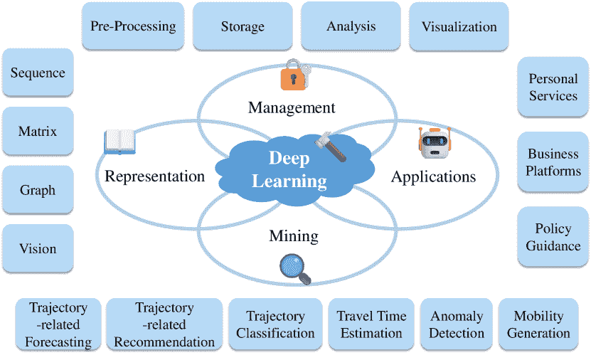
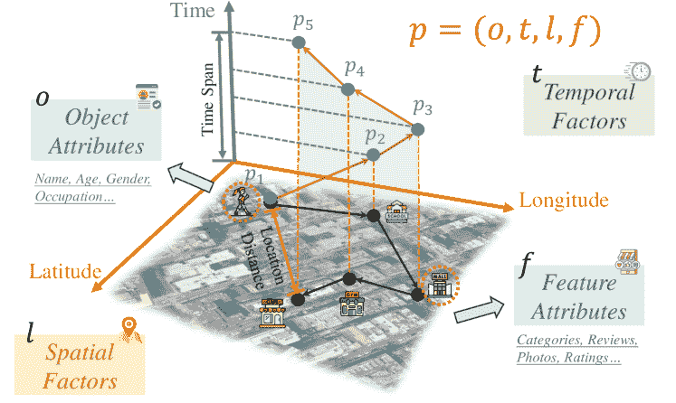
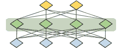
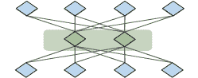
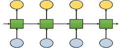
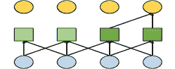
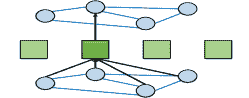
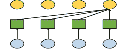

<!--yml

类别：未分类

日期：2024-09-06 19:33:48

-->

# [2403.14151] 轨迹数据管理和挖掘的深度学习：综述及未来展望

> 来源：[`ar5iv.labs.arxiv.org/html/2403.14151`](https://ar5iv.labs.arxiv.org/html/2403.14151)

# 《轨迹数据管理的深度学习》

和挖掘：综述及未来展望

xxx xxx xxx xxx xxx    Wei Chen, Yuxuan Liang${}^{{\dagger}}$, Yuanshao Zhu, Yanchuan Chang, Kang Luo, Haomin Wen, Lei Li, Yanwei Yu,

Qingsong Wen, Chao Chen, Kai Zheng, Yunjun Gao, Xiaofang Zhou, Yu Zheng, W. Chen, Y.X Liang, Y.S Zhu, H.M Wen, 和 L. Li 现为香港科技大学（广州）成员，位于中国广州。电子邮件：onedeanxxx@gmail.com。Y.C Chang 现为澳大利亚墨尔本大学成员。K. Luo 和 Y.J Gao 现为浙江大学成员，位于中国杭州。Y.W Yu 现为中国海洋大学成员，位于中国青岛。Q.S Wen 现为美国松鼠 AI 成员。C. Chen 现为重庆大学成员，位于中国重庆。K. Zheng 现为中国电子科技大学成员，位于中国成都。X.F Zhou 现为香港科技大学成员，位于香港特别行政区。Y. Zheng 现为京东智能城市研究所成员，京东科技，位于中国北京。Y.X Liang 为通讯作者。电子邮件：yuxliang@outlook.com。

###### 摘要

轨迹计算是一个重要领域，涵盖轨迹数据管理和挖掘，因其在位置服务、城市交通和公共安全等各种实际应用中的关键作用而受到广泛关注。传统方法侧重于简单的时空特征，面临复杂计算、有限扩展性和对现实世界复杂性适应不足等挑战。本文对深度学习在轨迹计算（DL4Traj）中的发展和最新进展进行了全面回顾。我们首先定义轨迹数据，并简要概述了广泛使用的深度学习模型。系统地探讨了深度学习在轨迹管理（预处理、存储、分析和可视化）和挖掘（轨迹相关预测、轨迹相关推荐、轨迹分类、旅行时间估计、异常检测和移动生成）中的应用。值得注意的是，我们总结了在大型语言模型（LLMs）方面的最新进展，这些进展有可能增强轨迹计算。此外，我们总结了应用场景、公共数据集和工具包。最后，我们概述了 DL4Traj 研究中的当前挑战，并提出了未来方向。相关论文和开源资源已汇总并持续更新，详见：[DL4Traj Repo](https://github.com/yoshall/Awesome-Trajectory-Computing)。

###### 关键词：

轨迹数据挖掘，轨迹数据管理，深度学习，时空数据挖掘，城市计算

项目页面：[`github.com/yoshall/Awesome-Trajectory-Computing`](https://github.com/yoshall/Awesome-Trajectory-Computing)

## 1 引言

自古以来，人类不断尝试研究运动学，受微观和宏观物体轨迹运动的基本规律驱动 [newton1687philosophiae, einstein1913entwurf, brockmann2006scaling, simini2012universal]。轨迹的研究可以追溯到 20 世纪 60 年代。研究人员采用各种标记方法来跟踪动物的运动轨迹，首次发现运动行为模式具有地理特征和正态性等模式 [sanderson1966study]。到 20 世纪末，随着全球定位系统（GPS）和地理信息系统技术的快速发展，长期、高精度、高效率地跟踪空间运动轨迹成为可能。这包括志愿者定位数据、配备 GPS 的旅行轨迹、移动终端定位以及通信记录 [zheng2010geolife, liu2012understanding]。这些进展推动了轨迹研究作为一个学科的兴起，广泛应用于智能交通 [ma2013t, zhang2023online, xie2024travelplanner]、公共安全 [gao2017identifying, zhou2018trajectory, chen2023trajectory]和商业服务 [zou2017innovative, wu2023lade, wen2023survey]等领域。

图 1：轨迹计算概述。

表 I：本研究与其他相关调查在数据格式（即序列 (S)、矩阵 (M)、图 (G)和视觉 (V)）、相关技术（即传统方法 (TM)、深度学习 (DL)和大语言模型 LLM）、管理任务（即预处理 (P)、存储 (S)、分析 (A)和可视化 (V)）以及挖掘任务（即预测 (F)、分类 (C)、推荐 (R)、估计 (E)、生成 (G)和检测 (D)）之间的比较。还包括下游应用程序数量和公开数据集的数量。此外，✓ 表示内容已涵盖，✗ 表示内容未涵盖，$\color[rgb]{0.35546875,0.609375,0.8359375}\definecolor[named]{pgfstrokecolor}{rgb}{0.35546875,0.609375,0.8359375}{\bm{\sim}}$ 表示内容部分涵盖。

| 调查 | 年份 | 格式 | 技术 | 管理 | 挖掘 | 应用数量 | 公开数据集数量 |
| --- | --- | --- | --- | --- | --- | --- | --- |
| S | M | G | V | TM | DL | LLM | P | S | A | V | F | R | C | E | G | D |
| Zheng 等 [zheng2015trajectory] | 2015 | ✓ | ✓ | ✓ | ✗ | ✓ | ✗ | ✗ | ✓ | ✓ | ✓ | ✗ | ✗ | ✓ | ✓ | ✓ | ✗ | ✓ | 6 | 10 |
| Feng 等人 [feng2016survey] | 2016 | ✓ | ✗ | ✓ | ✗ | ✓ | ✗ | ✗ | ✓ | ✓ | ✓ | ✗ | $\color[rgb]{0.35546875,0.609375,0.8359375}{\bm{\sim}}$ | $\color[rgb]{0.35546875,0.609375,0.8359375}{\bm{\sim}}$ | $\color[rgb]{0.35546875,0.609375,0.8359375}{\bm{\sim}}$ | ✗ | ✗ | ✗ | 6 | ✗ |
| Mazimpaka 等人 [mazimpaka2016trajectory] | 2016 | ✓ | ✓ | ✓ | ✗ | ✓ | ✗ | ✗ | ✗ | ✗ | $\color[rgb]{0.35546875,0.609375,0.8359375}\definecolor[named]{pgfstrokecolor}{rgb}{0.35546875,0.609375,0.8359375}{\bm{\sim}}$ | ✗ | ✓ | ✓ | ✓ | ✗ | ✗ | ✓ | 13 | ✗ |
| Bian 等人 [bian2018survey] | 2018 | ✓ | ✓ | ✗ | ✓ | ✓ | ✓ | ✗ | $\color[rgb]{0.35546875,0.609375,0.8359375}\definecolor[named]{pgfstrokecolor}{rgb}{0.35546875,0.609375,0.8359375}{\bm{\sim}}$ | ✗ | ✓ | ✗ | ✗ | ✗ | ✗ | ✗ | ✗ | ✗ | 7 | ✗ |
| Bian 等人 [bian2019trajectory] | 2019 | ✓ | ✓ | ✗ | ✓ | ✓ | ✓ | ✗ | $\color[rgb]{0.35546875,0.609375,0.8359375}{\bm{\sim}}$ | ✗ | ✓ | ✗ | ✗ | ✗ | ✓ | ✗ | ✗ | ✗ | 7 | 6 |
| Koolwal 等人 [koolwal2020comprehensive] | 2020 | ✓ | ✓ | ✓ | ✗ | ✓ | ✓ | ✗ | ✓ | ✗ | ✓ | ✗ | ✓ | $\color[rgb]{0.35546875,0.609375,0.8359375}\definecolor[named]{pgfstrokecolor}{rgb}{0.35546875,0.609375,0.8359375}{\bm{\sim}}$ | $\color[rgb]{0.35546875,0.609375,0.8359375}\definecolor[named]{pgfstrokecolor}{rgb}{0.35546875,0.609375,0.8359375}{\bm{\sim}}$ | ✗ | ✗ | ✗ | 9 | 18 |
| Wang 等人 [wang2021survey] | 2021 | ✓ | ✓ | ✓ | ✗ | ✓ | ✓ | ✗ | ✓ | ✓ | ✓ | ✗ | ✓ | $\color[rgb]{0.35546875,0.609375,0.8359375}\definecolor[named]{pgfstrokecolor}{rgb}{0.35546875,0.609375,0.8359375}{\bm{\sim}}$ | ✓ | ✓ | $\color[rgb]{0.35546875,0.609375,0.8359375}\definecolor[named]{pgfstrokecolor}{rgb}{0.35546875,0.609375,0.8359375}{\bm{\sim}}$ | $\color[rgb]{0.35546875,0.609375,0.8359375}{\bm{\sim}}$ | 13 | 20 |
| Luca 等人 [luca2021survey] | 2021 | ✓ | ✓ | ✓ | ✗ | ✓ | ✓ | ✗ | ✗ | ✗ | ✗ | ✗ | ✓ | ✗ | ✗ | ✗ | ✓ | ✗ | 7 | 18 |
| Aghababa 等人 [pourmahmood2022classifying] | 2022 | ✓ | ✗ | ✗ | ✓ | ✓ | ✓ | ✗ | ✓ | ✗ | ✗ | ✗ | ✗ | ✗ | ✓ | ✗ | ✗ | ✗ | ✗ | 6 |
| Shaygan 等人 [shaygan2022traffic] | 2022 | ✓ | ✓ | ✓ | ✗ | ✓ | ✓ | ✗ | ✓ | ✓ | ✗ | ✗ | ✓ | ✗ | ✗ | ✓ | ✗ | ✓ | 6 | 18 |
| Duarte 等人 [duarte2023benchmark] | 2023 | ✓ | ✗ | ✗ | ✗ | ✓ | ✓ | ✗ | ✗ | ✗ | ✗ | ✗ | ✗ | ✗ | ✗ | ✗ | ✗ | ✓ | ✗ | 4 |
| Hu 等人 [hu2023spatio] | 2023 | ✓ | ✓ | ✓ | ✗ | ✓ | ✓ | ✗ | $\color[rgb]{0.35546875,0.609375,0.8359375}\definecolor[named]{pgfstrokecolor}{rgb}{0.35546875,0.609375,0.8359375}{\bm{\sim}}$ | $\color[rgb]{0.35546875,0.609375,0.8359375}\definecolor[named]{pgfstrokecolor}{rgb}{0.35546875,0.609375,0.8359375}{\bm{\sim}}$ | ✓ | ✗ | ✗ | ✗ | ✗ | ✗ | ✗ | ✗ | ✗ | 4 |
| Chang et al. [chang2023trajectory] | 2023 | ✓ | ✗ | ✓ | ✓ | ✓ | ✓ | ✗ | ✗ | ✗ | ✓ | ✗ | ✗ | ✗ | ✗ | ✗ | ✗ | ✗ | ✗ | 5 |
| Graser et al. [graser2024mobilitydl] | 2024 | ✓ | ✓ | ✓ | ✓ | ✗ | ✓ | ✗ | ✗ | ✗ | ✗ | ✗ | ✓ | ✗ | ✓ | $\color[rgb]{0.35546875,0.609375,0.8359375}\definecolor[named]{pgfstrokecolor}{rgb}{0.35546875,0.609375,0.8359375}{\bm{\sim}}$ | ✓ | ✓ | 8 | 17 |
| 本调查 | 2024 | ✓ | ✓ | ✓ | ✓ | ✓ | ✓ | ✓ | ✓ | ✓ | ✓ | ✓ | ✓ | ✓ | ✓ | ✓ | ✓ | ✓ | 15 | 38 |

然而，有效管理和挖掘大量高度精炼的轨迹记录和定量时空分布数据提出了一个迫切需要解决的挑战。在过去的二十年里，许多技术被提出用于处理、管理、分析和挖掘轨迹数据 [zheng2008understanding, zheng2009mining, zheng2011computing]，这推动了轨迹计算的综合框架和理论的发展。这包括轨迹计算分析的全过程细分，涵盖轨迹预处理、轨迹索引和检索、轨迹模式挖掘、不确定性建模等。这些过程通常是松散耦合的，为不同阶段开发了许多高效算法。例如，在轨迹预处理中，开发了一系列技术，如地图匹配和停留点检测 [zheng2011computing]。在轨迹检索和索引方面，开发了一系列技术，包括相似性链接、区域查询、语义查询等 [shang2017trajectory, wang2021survey]。尽管取得了这些进展，仍然存在以下挑战：1）缺乏统一性。传统的轨迹分析和处理问题需要使用不同的工具，如基于规则的工具和概率工具，结合问题场景，使问题建模过程难以统一。2）复杂性。原始轨迹数据通常包含复杂的时空异质性和自相关性，使得通过特征工程和简单的专家手动规则设计难以捕捉其内在特征。3）适应性。传统的轨迹技术在处理大量数据时通常面临维度诅咒，并且通常难以适应新的应用场景。

近年来，我们见证了深度学习在各个领域的快速崛起，[lecun2015deep]，这归功于其卓越的端到端建模和学习能力。更令人惊讶的是，深度学习技术的应用范围已超越了传统的数据类型，如图像、音频和文本序列，扩展到空间和时间域中更一般或不规则的数据，[wang2019deep]。其中，轨迹数据最具代表性，涵盖了空间、时间和语义的多个维度。因此，利用深度学习的强大能力，研究人员已开始重塑轨迹数据计算框架中的各种关键组件，包括高效的轨迹数据管理，[wang2021survey]，有效的轨迹数据挖掘，[luca2021survey]，以及各种新颖的轨迹数据下游应用，[duarte2023benchmark]。具体来说，通过丰富的神经网络架构和学习范式，传统问题被无缝地转化为学习任务。此外，通过融入空间统计学、几何学和地理学等领域的专家先验知识，这些模型能够有效捕捉时空轨迹中的复杂模式，促进各种新应用的发展。在图 1 中，我们提供了轨迹数据深度学习的概述。

相关调查。尽管越来越多的研究采用深度学习方法来处理各种轨迹计算任务，但现有的调查通常关注于有限范围内的特定视角，没有调查全面总结深度学习在轨迹数据应用中的演变和进展。例如，若干研究分别探讨了轨迹管理的各个方面，如聚类分析[bian2018survey, aparna2022spatio]、相似性测量[hu2023spatio]和隐私保护[jin2022survey]。同样，某些研究独立地关注了轨迹数据挖掘的元素，包括位置预测[koolwal2020comprehensive, jiang2018survey]、位置推荐[safavi2022toward]和到达时间估计[reich2019survey, wen2023survey]。然而，它们的探索不仅局限于特定场景，而且仅部分提及了深度学习技术。此外，考虑到轨迹数据是重要的时空数据类型，并且是智能交通分析的基础，许多调查已经阐明了深度学习在时空数据挖掘[wang2020deep, jin2023large, gao2022generative]和智能交通[veres2019deep, yuan2021survey]中的相关问题和应用，但对轨迹内容的覆盖有限。最近，[graser2024mobilitydl]和[luca2021survey]提供了一项关注于应用深度学习模型进行轨迹数据挖掘的调查，但完全忽视了轨迹数据管理的内容。此外，一系列关于基础模型[jin2023spatio]的最新工作已经重塑了深度学习社区，例如大语言模型(LLMs)[achiam2023gpt, jin2024position]。一些研究目前正在将它们与轨迹任务结合，但尚未出现相关的综述。上述事实突显了进行全面综述的必要性。表 I 总结了我们与其他类似调查之间的区别。

我们的贡献。为了填补现有文献中的空白，本研究提供了对当前轨迹计算深度学习研究状态的系统性和最新的综述。我们的贡献总结如下：

+   •

    首次系统性综述。根据我们的了解，这是首次系统性综述，全面回顾了轨迹计算领域深度学习的最新进展。我们不仅提供了该领域最广泛的研究范围，还展示了最深刻的进展，为读者提供了对该主题的全面和最新的理解。

+   •

    统一且结构化的分类法。我们提出了一种统一且结构化的分类法，将现有的深度学习在轨迹计算中的话题分为三部分。在第一部分，我们详细阐述了轨迹数据的形式，涵盖了不同文献中发现的所有形式的轨迹。在第二和第三部分，我们确定了轨迹管理和轨迹挖掘中常见的各种研究任务。在最后一部分，我们展示了其在各个领域的实际应用和解决方案，强调了其功能多样性和实际意义。这种结构化分类可以帮助读者充分理解这一领域的连贯路线图。

+   •

    综合资源收集。在本文中，我们启动了 DL4Traj 项目，精心整理了迄今为止最全面的轨迹相关数据集和资源集合。我们已经开源了这个不断更新的资源库，旨在帮助来自不同领域的个人，包括研究人员、工程师和城市规划师。该资源库包含了关于轨迹数据挖掘和管理的深度学习方法及基础模型的专业论文列表。它还集成了多种类型的数据集，包括 GPS、签到、模拟和相关统计信息。

+   •

    未来方向与机会。值得注意的是，深度学习最近进入了大型基础模型的时代，LLMs 就是一个代表性的例子。由于它们新兴的知识智能，最近开始席卷整个研究界。一些轨迹挖掘任务也通过结合 LLMs 进行了重塑。本文中，我们还结合并分析了一些该领域的近期工作。此外，我们还概述了其他几个潜在的未来研究方向，并提供了可以指导和激发轨迹计算领域未来方向的见解和建议。

论文组织结构。其余部分的组织如下：第二部分提供了基本定义、多样的数据格式、轨迹属性分析和深度学习的背景知识。在第 LABEL:sec:tax 节，介绍了轨迹计算的深度学习分类法，详细内容将在第 LABEL:sec:task 节中讨论。第 LABEL:sec:app 节概述了众多应用场景和资源。第 LABEL:sec:future 节勾勒了未来研究的有前景的方向。最后，我们在第 LABEL:sec:conclusion 节中总结了本次调查。

## 2 初步

### 2.1 定义和符号

###### 定义 1（时空点）

一个时空点 $p$ 是形式为 $(o,t,l,f)$ 的独特实体，其中表示移动对象 $o$ 在地理坐标系统下于时间戳 $t$ 访问位置 $l$，并带有一个可选的记录属性特征 $f$。

###### 定义 2（轨迹）

一般化轨迹 $T$ 由一系列按时间顺序排列的时空点序列 $(p_{1},p_{2},...,p_{n})$ 组成，表示地理空间中移动物体生成的运动信息。

图 2：轨迹示意图。

基于时空点的基本属性，轨迹可以扩展成多种形式。首先，就对象属性而言，我们可以将其分为个体轨迹，表示个体运动的准连续跟踪数据，以及群体轨迹，表示在观察期间一组个体的运动，通常汇总为边缘/节点、网格或移动图中的兴趣点 (POI)。其次，关于时间属性，我们可以根据采样频率的维度从稀疏轨迹（例如，用户旅行期间的签到数据）到密集轨迹（例如，配备 GPS 跟踪系统的车辆运动路径）推导出一系列轨迹。第三，关于位置属性，我们可以通过将坐标映射到空间嵌入来生成轨迹，也称为原始轨迹，从而离散化地理空间系统。新生成的离散化令牌序列称为单元轨迹。此外，由具有属性特征的令牌组成的轨迹被称为语义轨迹。所有上述轨迹属性的关系如图 2 所示。

### 2.2 轨迹数据的独特属性

轨迹数据展现了理解时空运动和预测城市移动模式所需的独特特性。以下属性突显了轨迹数据的复杂性和丰富性。

+   •

    时空依赖性。轨迹数据可以视为一系列随时间变化的空间位置。这些序列揭示了反映每个移动物体时空转移模式和旅行意图的高层次模式。这些模式对于分析运动行为和预测移动性至关重要。

+   •

    个性化。轨迹数据源自特定个人或实体，固有地包含个性化特征。这些特征揭示了对象的偏好和移动习惯，因此准确建模这些个性化特征至关重要。这样可以显著提高各种微观交通行为预测任务的精度。

+   •

    不规则性。轨迹的不规则性主要源于采样设备的限制或数据压缩的必要性。这种特性意味着模型在训练期间通常缺乏足够的监督信息，例如，缺少两地之间的详细路径信息会导致预测任务的性能下降。因此，在稀疏轨迹数据中准确预测运动是一个重大挑战。

这些属性每一个都增加了处理轨迹数据的复杂性，要求使用复杂的建模技术来准确解读和预测城市计算环境中的移动模式。

### 2.3 从轨迹到其他格式

原始轨迹数据可以根据不同的神经网络架构进行适应性格式化，提高其在各种下游任务中的实用性。

###### 定义 3（矩阵）

对于给定的城市，我们可以根据纬度和经度将其划分为多个 ($N_{1}\times N_{2}$) 网格。每个网格代表城市中的一个不同区域。因此，轨迹可以表示为连续的网格标识符序列。对于轨迹的起点、终点和出发时间，我们可以构建任意时间的起点-终点（OD）矩阵 $\mathcal{M}\in\mathbb{R}^{N_{1}\times N_{2}}$，其中每个元素表示特定网格中的流入和流出。

###### 定义 4（图）

一个城市的道路网络可以转化为一个有向道路图 $\mathcal{G}=(\mathcal{V},\mathcal{A})$，其中 $\mathcal{V}$ 表示网络中的道路，而 $\mathcal{A}$ 表示道路段之间的连通性。因此，只有当道路 $i$ 和 $j$ 可以直接连接时，$\mathcal{A}_{ij}=1$。在这种设置下，可以基于轨迹经过的道路段提取出轨迹作为一系列道路。

###### 定义 5（图像）

栅格图像，表示为 $\mathcal{I}\in\mathbb{R}^{H\times W\times C}$，由排列在网格中的像素组成。每个像素具有特定的语义和位置，从而形成整个图像。因此，轨迹可以自然地转化为栅格图像。一种简单直观的方法是将整个地图视为二进制图像，其中轨迹经过的像素设置为 1，而未经过的像素设置为 0。有效的栅格化主要考虑轨迹的形状、速度和方向，这在文献中已有广泛研究 [endo2016classifying, yang2020detecting]。

轨迹也可以表示为其他视觉形式，例如将其转换为鸟瞰图。然而，这种数据类型与计算机视觉关系更密切，在轨迹数据挖掘和管理社区中的关注较少。因此，我们在此不包括这种纯视觉形式。

### 2.4 深度学习的背景知识

在这里，我们介绍了用于轨迹建模的基本神经网络构建模块和高级学习范式。

学习构建模块。 $i$) 全连接网络 (FCs) [hornik1989multilayer] 由一系列层组成，其中所有神经元都与下一层的神经元相连接 (见图 3a)。FC 通常使用非线性激活函数来映射输出，使其能够作为通用近似器。它们通常用于建模外部因素，如天气条件或公共事件。 $ii$) 自编码器 (AEs) [pinaya2020autoencoders] 是具有编码器和解码器的神经网络，旨在最小化输入特征的重建误差。原始 AE 结构通常使用 FC 层进行编码和解码 (见图 3b)。AEs 常用于压缩和提取道路网络和轨迹中的一般特征。 $iii$) 循环神经网络 (RNNs) [salehinejad2017recent] 有效处理序列数据，捕捉轨迹序列中的时间过渡模式 (见图 3c)。RNN 由一个输入层、一个或多个循环隐藏层和一个输出层组成，适合建模轨迹数据中的序列依赖关系。RNN 的流行变体包括长短期记忆 (LSTM) 和门控循环单元 (GRU) 网络。 $iv$) 卷积神经网络 (CNNs) [khan2020survey] 以交替的卷积层和池化层为特征 (见图 3d)，通过将轨迹数据转换为栅格图像或修改卷积核和池化层以适应轨迹数据类型来适应轨迹计算。它们在捕捉层次模式方面表现出色，特别是在使用 OD 矩阵进行交通流预测等任务中。 $v$) 图神经网络 (GNNs) [zhang2019graph] 在图结构数据上执行卷积，利用图中节点和邻居的信息进行高效学习 (见图 3e)。GNNs 常用于捕捉道路网络数据中的空间依赖性。 $vi$) 注意力机制 [bahdanau2014neural] 对输入序列中不同位置的信息分配不同的权重，从而更有效地捕捉输入之间的关系。Transformer [vaswani2017attention] 模型将注意力机制扩展到序列到序列的架构 (见图 3f)，因其效果显著而受到广泛关注。

(a) 全连接层（FCs）

(b) 自编码器（AEs）

(c) 循环神经网络（RNNs）

(d) 卷积神经网络（CNNs）

(e) 图神经网络（GNNs）

(f) 变换器（Transformer）

图 3：深度学习构建块。

\e@ch@ck\float@count\e@alloc@chardef\e@alloc@chardef\float@count
