<!--yml

类别：未分类

日期：2024-09-06 19:33:45

-->

# [2403.17561] 深度学习与最前沿应用的调查

> 来源：[`ar5iv.labs.arxiv.org/html/2403.17561`](https://ar5iv.labs.arxiv.org/html/2403.17561)

[type=editor, orcid=0000-0002-3300-3270]

\cormark

[1]

\fnmark

[1]

\credit

本研究的概念化，写作 - 原始草稿，写作 - 审阅与编辑，资金获取

1]组织机构=马来西亚槟城大学计算机科学学院，邮政编码=11800，省=槟城，国家=马来西亚

[type=editor, orcid=0000-0001-5155-9304]

\fnmark

[2]

\credit

写作 - 原始草稿

2]组织机构=阿德库莱·阿贾辛大学计算机科学系，城市=阿昆巴-阿科科，邮政编码=P.M.B 001，省=翁多州，国家=尼日利亚

\cortext

[cor1]通讯作者

# 深度学习与最前沿应用的调查

Mohd Halim Mohd Noor halimnoor@usm.my     Ayokunle Olalekan Ige ayo.ige@aaua.edu.ng [

###### 摘要

深度学习，作为人工智能的一个分支，是一种计算模型，它使用多个相互连接的单元（神经元）层来直接从原始输入数据中学习复杂的模式和表示。凭借这一学习能力，深度学习已成为解决复杂问题的强大工具，并且是许多开创性技术和创新的核心驱动力。构建深度学习模型是一项具有挑战性的任务，因为算法的复杂性和现实世界问题的动态特性。虽然已有一些研究回顾了深度学习的概念和应用，但这些研究主要集中在深度学习模型类型和卷积神经网络架构上，对深度学习模型的最前沿状态及其在解决不同领域复杂问题中的应用覆盖有限。因此，本研究旨在全面回顾计算机视觉、自然语言处理、时间序列分析和普适计算中的最前沿深度学习模型。我们突出展示模型的关键特征及其在解决各领域问题中的有效性。此外，本研究还介绍了深度学习的基本原理、各种深度学习模型类型及显著的卷积神经网络架构。最后，讨论了深度学习研究中的挑战和未来方向，为未来研究者提供更广泛的视角。

###### 关键词：

深度学习 \sep 卷积神经网络 \sep 计算机视觉 \sep 自然语言处理 \sep 时间序列分析\sep 普适计算

## 1 引言

深度学习在许多行业和研究领域中引发了革命。深度学习的应用可以在医疗保健 Shamshirband 等人（[2021）、智能制造 Wang 等人（2018b）、机器人技术 Pierson 和 Gashler（2017）、网络安全 Dixit 和 Silakari（2021）等领域找到，解决了疾病诊断、异常检测、物体检测和恶意软件攻击检测等挑战性和复杂的问题。深度学习是机器学习的一个子集，它通过人工神经网络从数据中学习。人工神经网络是一种模仿人脑工作原理的计算模型。这些计算模型由一个接收输入数据的输入层、多层处理层（用于学习数据的表示）以及产生模型输出的输出层组成。

在深度学习（DL）重新成为研究趋势之前，模式识别任务涉及将原始输入数据（例如图像的像素值）转换为特征向量，以表示数据的内部表示。特征向量可以被机器学习模型用来检测或分类数据中的模式。这个过程需要特征工程和相当的领域知识来设计合适的特征表示。通过深度学习，这一繁琐的过程可以自动完成，在每个处理层（称为隐藏层）中，以层级方式学习或提取输入数据的内部表示。第一层学习基本的原始特征，如边缘、点、线等。第二层通过识别边缘、点和线的组合来学习模式或图案，随后的层将这些图案组合起来，生成与输入数据对应的更复杂的特征。这一特征学习过程在隐藏层的序列中进行，直到最终产生预测结果。

近年来进行了一些研究来讨论深度学习的概念和应用，具体见表 1。这些研究涉及或关注了深度学习的多个方面，如深度学习模型的类型、学习方法和策略、卷积神经网络（CNN）架构、深度学习的应用和挑战。在 Dong 等人 (2021) 的研究中，作者介绍了深度学习的基本原理，并突出了不同类型的深度学习模型，如卷积神经网络、自编码器和生成对抗网络。随后，讨论了深度学习在各个领域的应用，并提出了一些与深度学习应用相关的挑战。另一项综述由 Talaei Khoei 等人 (2023) 提供，全面分析了监督式、无监督式和强化学习方法，并比较了在线学习、联邦学习和迁移学习等不同学习策略。最后，讨论了深度学习的当前挑战和未来方向。

在 Alzubaidi 等人 (2021) 的研究中，作者提供了对计算机视觉任务中常用的 CNN 架构的全面综述，突出了它们的主要特性和优势。随后，讨论了深度学习在医学成像中的应用及其面临的挑战。在 Alom 等人 (2019) 的类似综述中，重点介绍了不同的监督式和无监督式深度学习模型，并对流行的 CNN 架构进行了比较和讨论。在另一项由 Pouyanfar 等人 (2018) 进行的综述中，作者专注于深度学习在计算机视觉、自然语言处理以及语音和音频处理中的应用。同时也讨论了不同类型的深度学习模型。在 Sarker (2021) 的研究中，作者关注于不同类型的深度学习模型，并总结了深度学习在各个领域的应用。

尽管现有的深度学习综述提供了宝贵的见解，但深度学习应用的不断增加以及当前研究中的局限性促使我们深入探讨这一主题。一般来说，据我们了解，没有综述论文专注于最前沿应用中的新兴趋势以及深度学习的当前挑战。此外，这些综述未讨论问题以及深度学习如何通过突出模型中的关键特征和组件来解决这些问题。此外，大多数综述要么忽略，要么仅提供对深度学习基础知识的最小覆盖，这对理解最先进的模型至关重要。本文的主要目的是呈现深度学习的最重要方面，使其易于为广泛的受众所理解，并帮助研究人员和从业者在各个领域利用其能力解决复杂问题。具体而言，我们介绍了深度学习的基础知识和各种深度学习模型，包括流行的深度学习架构。然后，我们讨论了深度学习在最前沿应用中的进展，突出模型的关键特征及其解决问题的方法。最后，我们讨论了深度学习面临的挑战和未来的研究方向。

表 1：相关工作的总结。

| 参考文献 | 重点 | 未覆盖的概念 |
| --- | --- | --- |
| Dong 等 (2021) | 简要回顾了深度学习网络的基础知识，并讨论了不同类型的神经网络、深度学习应用及挑战。 | 缺乏对 CNN 架构的分析，以及对深度学习基础知识的覆盖有限。 |
| Talaei Khoei 等 (2023) | 讨论了学习方法（监督学习、无监督学习和强化学习）、学习策略和深度学习挑战 | 缺乏深度学习基础知识、CNN 架构和深度学习应用的内容。 |
| Alzubaidi 等 (2021) | 讨论了不同类型的深度学习网络、CNN 基础和架构、深度学习挑战及医学成像应用 | 对深度学习应用如自然语言处理和时间序列分析讨论有限。 |
| Alom 等 (2019) | 简要回顾了神经网络的基础知识，并讨论了不同类型的深度学习网络、CNN 架构和应用。 | 对深度学习应用的讨论有限，没有讨论深度学习挑战。 |
| Pouyanfar 等 (2018) | 讨论了不同类型的深度学习网络及其应用和挑战 | 缺乏对 CNN 架构的分析，以及对深度学习基础知识的覆盖有限。 |
| Sarker (2021) | 讨论了不同类型的深度学习网络，并总结了深度学习应用 | 缺乏深度学习基础知识、CNN 架构分析，以及对深度学习应用的讨论有限。 |

本文的其余部分组织如下：第二部分描述了深度学习的基础，包括层和注意机制、激活函数、模型优化和损失函数以及正则化方法。第三部分介绍了深度学习模型的类型，包括 CNN 架构。第四部分讨论了深度学习的最新应用。第五部分讨论了深度学习领域的挑战和未来方向。第六部分给出了结论。

## 2 深度学习基础

本节描述了诸如层类型、激活函数、训练算法和正则化方法等基础概念，以提供对推动深度学习领域发展的基本原理的全面理解。

### 2.1 层

深度学习模型的特点是具有多个隐藏层。隐藏层负责从输入数据中学习和提取复杂特征。一个隐藏层由任意数量的神经元组成，这些神经元作为神经网络的基本构建块，如图 1 所示。一个神经元包含任意数量的输入，每个输入都与一个权重相关联，该权重控制信息在前向传递过程中的流动。信息流动或前向传递包括加权输入的求和计算，然后将变换函数应用于加权和。考虑在层 $l$ 上的神经元 $z_{i}$，它接收一个输入向量 $a_{j}^{(}l-1)$，神经元的计算定义为

$z_{i}^{l}=\sum_{j=0}^{d}w_{i,j}^{l-1}\cdot a_{j}^{l-1}$

$a_{i}^{l}=g(z_{i}^{l})$

其中 $w_{ij}$ 是连接输入到神经元的权重集合，g 是变换函数，也称为激活函数。一个隐藏层，其中每个神经元都连接到前一层的所有神经元，称为全连接层。

图 1：神经元的图示表示。

深度学习的关键之处在于其能够从输入数据中自动提取层次化特征。这种自动特征提取是通过两个专门的层进行的，分别是卷积层和池化层。在卷积层中，每个神经元只与输入数据的一个局部区域相连，并且权重在输入数据中共享。权重共享不仅显著减少了神经网络的参数数量，而且还允许网络在输入的不同空间位置学习相同的特征（LeCun et al.，2015）。图 2 展示了一个卷积层在由$9\times 9$像素组成的二维图像上应用了$3\times 3$的滤波器。该层通过将滤波器在整个输入像素上移动来卷积输入数据，生成一组称为特征图（feature map）的输出值。卷积层$l$的计算定义为

$z_{i,j,d}^{l}=\sum_{m=0}^{k_{1}}\sum_{n=0}^{k_{2}}w_{m,n,d}^{l-1}\cdot a_{i+m,j+n,d}^{l-1}$

$a_{i,j,d}^{l}=g(z_{i,j,d}^{l})$

这里，$w_{m,n,d}$表示$k_{1}\times k_{2}$滤波器的权重，$a_{i,j,d}^{l-1}$是输入像素。

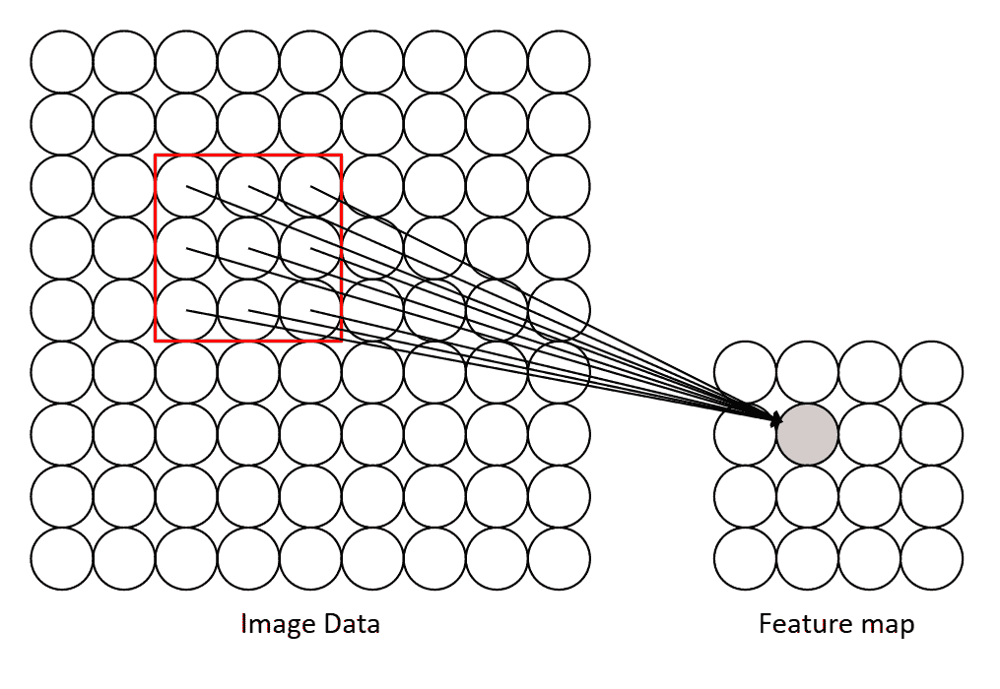

图 2：神经元与输入数据的局部区域相连。

在连续的卷积层之后常常应用池化层，逐渐降低特征图的空间维度。空间降维通过计算特征图中的局部区域的摘要来实现。常用的两种池化操作是计算局部区域的最大值和平均值。这样既减少了参数数量，又提供了平移不变的特征（LeCun et al.，2015）。

### 2.2 注意机制

在模式识别中一个重要的概念是根据其重要性来关注和忽略输入数据的某些部分。这是因为并非所有输入的各个部分在进行预测时都具有相同的重要性。某些特征与输出之间存在较强的关联性，而其他特征则不太相关。在卷积层中，所有提取的特征都被一视同仁，没有考虑输入数据不同部分的重要性差异。为了解决这个限制，引入了注意机制（attention mechanism），该机制可以动态地分配不同特征的重要性（权重）。这种灵活性使得深度学习模型能够优先考虑输入数据中更相关的方面，增强其捕捉精确预测所需的复杂依赖关系的能力。给定输入数据$x$，处理重要输入组件的过程如下所示：

$A=f(g(x),x)$

其中 $g$ 是一个复合函数，执行一系列操作以生成注意力或权重，$f$ 应用生成的注意力 $g(x)$ 到输入 $x$ 上，即 $f=g(x)x$。

例如，压缩-激励（SE）注意力通过五个连续的操作生成注意力 Hu 等人 (2019)。首先，输入通过全局平均池化进行向量化。然后，该向量传递给两个全连接层，第一个层使用 ReLU 激活，第二个层使用 sigmoid 激活。SE 注意力在通道注意力方面是一个先驱。注意力模块为特征图的通道分配不同的权重。SE 注意力存在计算成本高和使用全局平均可能导致空间级别信息丢失的问题。已经做出了若干努力来改进 SE 注意力。GSoP 注意力对特征图进行 $1\times 1$ 卷积以减少通道数量，然后计算成对通道相关性，并用其生成权重 Gao 等人 (2018)。ECA 注意力用 1d 卷积替代了全连接层，以减少参数数量和计算成本 Wang 等人 (2020a)。

时间注意力是一种关注序列数据中特定时间步的注意力模块，例如时间序列和视频（图像序列）。在视频处理如识别人类动作时，时间注意力用于关注不同时间点上的关键帧，这些帧包含预测正在进行的活动所需的重要信息。时间自适应模块（TAM）是一种时间注意力，可以关注数据的短期（局部）信息和全局上下文信息 Liu et al. (2021b)。复合函数包括用于生成注意力权重的局部分支和用于生成通道级自适应核的全局分支。首先，输入特征图通过全局平均池化进行压缩，以降低计算成本。随后，局部分支执行两次一维卷积操作，第一次卷积使用 ReLU，第二次卷积使用 sigmoid 激活函数以生成局部权重。然后，局部权重与特征图相乘。同时，全局分支由两层全连接层组成，第一层使用 ReLU，第二层采用 softmax 函数以生成自适应核（权重）。自注意力是一种时间注意力，最初为机器翻译提出，以使深度学习模型能够关注序列中不同的词相对于其他词 Vaswani et al. (2023)。注意力模块已成为各种自然语言处理应用中的基本构建块。为了生成注意力权重，输入（词嵌入）通过线性投影转换以计算查询、键和值。然后，计算查询和键之间的点积，结果通过键的大小的平方根进行归一化。最后，通过应用 softmax 函数获得注意力权重。自注意力是 Transformer 架构的基本构建块，Transformer 是自然语言处理中的关键深度学习模型。

空间注意力关注输入数据的特定区域或空间位置，使得深度学习模型能够选择性地强调和忽略某些特征。在计算机视觉的背景下，空间注意力在捕捉图像中的空间关系和上下文以实现准确预测方面至关重要。注意力门是一种空间注意力，可以识别并关注显著区域，并抑制不重要区域的特征响应。复合函数包括 ReLU 激活，随后是 $1\times 1$ 卷积，以将特征图的通道维度减少到单一特征图。最后，应用 sigmoid 函数到特征图上以生成注意力权重 Oktay 等人（2018）。标准 Transformer 中的自注意力由于其固有的序列处理性质，对图像数据处理效果不佳，缺乏捕捉空间依赖和局部模式的能力。为了解决这个限制，Vision Transformer (ViT) 将图像视作一系列不重叠的块。类似的计算流程被用来生成注意力权重，这些块的序列通过线性投影来计算查询、键和值 Dosovitskiy 等人（2021）。相同的操作用于生成注意力权重。自注意力由于其二次复杂度在处理图像数据时计算成本高。为了减少复杂度，采用了两个与输入数据独立的可学习线性层作为键和值向量 Guo 等人（2023）。

### 2.3 激活函数

激活函数的作用是将加权和转换为更易分类的形式。这对于深度学习模型的学习行为至关重要，它在模型的输入和输出之间生成非线性关系。激活函数结合多个隐藏层使神经网络能够近似高度复杂的非线性函数。神经网络中可以使用多种激活函数，部分函数如图 3 和图 5 所示。图中展示了三种流行激活函数的图示。Sigmoid 是一个经典的激活函数示例，广泛用于逻辑回归。Sigmoid 激活函数将加权和映射到 0 和 1 的范围内，这个值可以用于分类。双曲正切是另一种流行的有界激活函数，它产生的输出在 -1 和 1 之间。双曲正切具有更强的梯度，因此神经网络训练通常比 sigmoid 更快收敛 LeCun 等人 (2012)。多年来，sigmoid 和双曲正切一直是常用的激活函数。然而，这些激活函数存在梯度消失问题，阻碍了多层深度神经网络的高效训练 Hochreiter 等人 (2001)。

研究表明，具有无界激活函数的神经网络具有通用逼近特性，并减少了梯度消失问题。在过去几年中，提出了许多无界激活函数用于神经网络，其中 softplus Dugas 等人 (2000) 和整流线性单元（ReLU） Glorot 等人 (2011) 激活函数是值得注意的例子。这些激活函数，特别是 ReLU，在提高深度学习模型的训练和性能方面起到了关键作用。由于其计算效率和解决梯度消失问题的有效性，ReLU 成为了深度学习模型的基石。从那时起，提出了几种 ReLU 的变体，包括 Leaky ReLU Maas 等人 (2013)、sigmoid 线性单元 Misra (2020) 和指数线性单元 Clevert 等人 (2016)，每种变体在构建基于深度学习的应用中都提供了独特的优势。

图 3：Sigmoid 激活函数。

图 4：双曲正切激活函数。

图 5：整流线性单元激活函数。

### 2.4 参数学习和损失函数

深度学习模型的权重（参数）是通过一种称为梯度下降的优化算法进行优化的。然而，需要注意的是，梯度下降是一种通用算法，可以用于解决各种优化问题。通常，梯度下降通过迭代更新权重来找到最佳权重，从而使权重在训练集的所有实例中产生最小的预测误差。预测误差由损失函数量化。对于分类问题，常用的损失函数是负对数似然损失或交叉熵损失，而平方损失和绝对损失则用于回归问题 Wang et al. (2022)。权重更新定义为

$w_{i,j}^{l}=w_{i,j}^{l}-\alpha\nabla_{w_{i,j}}$

其中 $\alpha$ 是称为学习率的超参数，而 $\nabla_{w_{i,j}}$ 是损失函数 $J$ 关于权重 $\frac{\partial J}{\partial w_{i,j}^{l}}$ 的梯度或导数。

梯度可以在训练集的所有实例上计算，这种方法称为批量梯度下降。然而，这种方法可能无法保证收敛到最佳解，因为每次权重更新的梯度都是相同的。另一种方法是基于单个实例进行权重更新，但这种方法会导致梯度噪声较大，并且由于频繁的权重更新而变得计算上较为密集。更常用的方法是对一组训练实例进行权重更新，这称为小批量梯度下降。这种方法在提供较少噪声的梯度和更稳定的训练过程之间达到了平衡。

为了提高梯度下降的效率，已经做了几项努力。其中一个早期的努力是将过去的变化率纳入权重更新中，以加速深度学习模型的训练，这种算法被称为带动量的梯度下降 Qian (1999)。另一个努力是通过根据特征的出现情况调整学习率来改善训练收敛性 Duchi et al. (2011)。一个较新的工作则利用自适应学习率和动量来提高深度学习模型的训练效率和收敛性 Kingma 和 Ba (2017)。

### 2.5 正则化方法

正则化方法用于防止深度学习模型的过拟合，并提高其泛化性能。早期停止是一种方法，它通过持续监控验证误差来检测训练过程中过拟合的开始。如果验证误差在训练过程中开始增加，而训练误差在下降，则模型被认为是过拟合。然而，由于固有的随机性和噪声数据的存在，检测深度学习模型训练过程中的过拟合开始是具有挑战性的。可以考虑几种停止标准，例如使用阈值检查（平均）验证误差的减少是否显著，并计算验证误差的连续增加次数 Prechelt (2012)。

Dropout 是一种正则化方法，通过在训练过程中以预定义的丢弃概率（dropout rate）随机关闭隐藏层中的一些神经元 Srivastava 等 (2014)。Dropout 使得训练和评估了指数多的不同深度学习模型。丢弃率是一个超参数，需要仔细调整以平衡正则化和模型容量。建议了不同范围的丢弃率。原作者建议的丢弃率在 0.5 和 0.8 之间 Srivastava 等 (2014)，而其他人推荐的丢弃率较低，在 0.1 和 0.3 之间 Park 和 Kwak (2017)。此外，由于训练数据量的指数增加，也建议了较低的丢弃率 Liu 等 (2023b)。

参数范数惩罚是一种正则化方法，它将包含网络权重的惩罚项添加到损失函数中。在训练过程中，惩罚项会抑制较大的权重值，从而约束模型的容量并减少过拟合的可能性。常见的惩罚项包括 $L^{1}$ 范数惩罚 Tibshirani (1996)，$L^{2}$ 范数惩罚，也称为权重衰减，以及 $L^{1}$ 和 $L^{2}$ 的组合 Zou 和 Hastie (2005)。提出了一种自适应权重衰减方法，允许动态调整每个权重的正则化强度 Nakamura 和 Hong (2019)。

尽管迷你批量梯度下降有其优势，但每个迷你批量可能包含来自不同分布的数据。此外，每次权重更新后数据分布可能发生变化，这可能会减慢训练过程。批量归一化通过对每个迷你批量的神经元输入进行归一化来解决这个问题 Ioffe 和 Szegedy (2015)。另一种方法是对神经元进行归一化，而不是对迷你批量进行，这种方法被称为层归一化 Ba 等 (2016)。层归一化适用于递归神经网络，并克服了对迷你批量大小的依赖。

## 3 种深度学习

深度学习模型可以分为深度监督学习和深度无监督学习。

### 3.1 深度监督学习

深度监督模型使用标记数据集进行训练。这些模型的学习过程涉及通过损失函数计算预测误差，并利用误差迭代调整权重，直到预测误差最小化。在深度监督模型中，确定了三种重要的模型，即多层感知器、卷积神经网络和递归神经网络。

多层感知器是一种神经网络模型，其输入层和输出层之间堆叠有一个或多个隐藏的全连接层，如图 6 所示。隐藏层的宽度（神经元的数量）和网络的深度（层数）影响模型学习数据模式的能力。具体而言，宽度决定了模型学习复杂特征的能力，而深度则使模型能够学习数据的层次表示。然而，研究表明，具有单一隐藏层的多层感知器可以近似任何连续函数 Cybenko (1989)，Hornik 等 (1989)。多层感知器在从医疗保健到金融等各个行业和应用中都非常有效 Widrow 等 (1994)。然而，多层感知器要求输入数据以一维格式结构化，例如表格数据，这使得它不太适用于图像、文本和语音等非结构化数据。为了利用多层感知器处理非结构化数据，需要进行特征提取或转换为结构化数据。

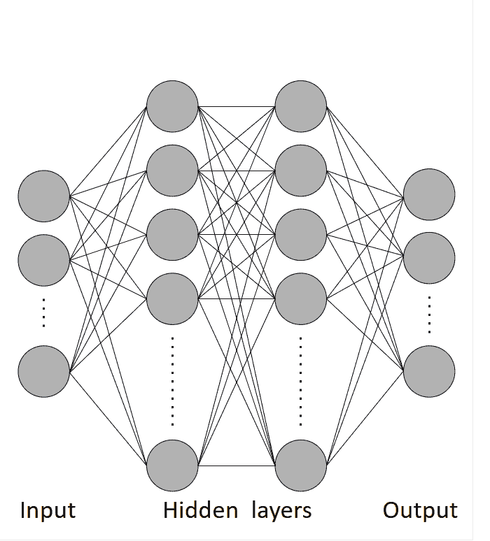

图 6：一个全连接神经网络。

循环神经网络是一种通过使用递归连接来利用序列信息和记忆的神经网络模型，使其能够有效地处理时间序列、文本、语音和其他序列模式的数据。如图 7 所示，循环神经网络的特点是递归连接，这使得网络能够回溯并使用来自前一个时间步的内部状态到下一个时间步。内部状态由一组权重参数化，这些权重在数据序列中是共享的。循环神经网络的训练面临梯度消失的问题，因为在长序列数据上梯度传播的挑战。为了克服梯度消失的问题，引入了循环神经网络的变体，例如长短期记忆（LSTM）Hochreiter 和 Schmidhuber（1997）和门控递归记忆（GRU）Cho 等（2014）。改进后的循环神经网络引入了记忆单元和门控机制，以保留和丢弃每个时间步的信息，从而在长序列中实现更有效的学习依赖。网络架构可以使用全连接层和卷积层来构建 Shi 等（2015）。

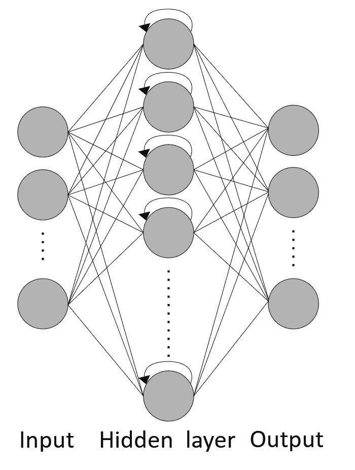

图 7：具有递归连接的神经网络。

卷积神经网络（CNN）是一种通过使用卷积层来保持和利用数据中的空间局部信息的神经网络模型。图 8 展示了卷积神经网络的典型架构，包括卷积层、池化层和全连接层。卷积层和池化层交替堆叠，以分层方式自动提取显著特征。提取的特征随后输入全连接层以预测输出。最终的特征图需要在输入全连接层之前转换为一维向量，这可以通过展平特征图来完成。CNN 架构在提高预测性能方面至关重要，因为它旨在高效提取输入数据的特征表示，从而实现更准确和鲁棒的模式识别。在过去十年中，提出了几种 CNN 架构，改进的重点是增强特征学习能力，并解决如梯度消失和特征重用减少等挑战。

图 8：一个包含卷积和池化层的神经网络，随后是全连接层。

AlexNet 是最早获得广泛认可和成功的 CNN 模型之一，标志着计算机视觉任务深度学习领域的一个重要成就 Krizhevsky 等人 (2012)。该模型由五个卷积层组成，在第一个和第二个卷积层后执行最大池化操作，然后是三个全连接层。第一和第二个卷积层使用 11×11 和 5×5 的滤波器尺寸，剩余卷积层使用 $3\times 3$ 的滤波器尺寸。ReLU 激活函数用于缓解梯度消失。

VGG-16 通过添加更多卷积层来改进 CNN 架构，特别是多达 19 层，以从输入数据中捕捉更复杂的特征表示，之后是三个全连接层 Simonyan 和 Zisserman (2015)。使用 ReLU 激活函数来减少梯度消失。与 AlexNet 不同，所有卷积层均使用小的固定滤波器尺寸 $3\times 3$，并且在两到三层卷积层堆叠后添加了最大池化层。这种配置使模型能够提取更具判别性的特征，并减少了参数数量。

ZFNet 是一个经典的 CNN 模型，其架构原理与 AlexNet 相似，具有五个卷积层，其中第一个和第二个卷积层后面跟有最大池化层，然后是三个全连接层 Zeiler 和 Fergus (2013)。主要区别在于卷积层使用了更小的滤波器尺寸和步幅，以及对特征图进行对比度归一化，这使得模型能够捕捉到更好的特征，从而提升整体性能。

Network-in-network 引入了两个创新概念以增强模型性能 Lin 等人 (2014)。第一个是引入了一个卷积层块，包括 k×k 卷积，之后是两个 $1\times 1$ 卷积操作。点卷积类似于在特征图上应用多层感知机，使模型能够近似更抽象的特征表示。在前述模型中，最终的特征图通过展平操作向量化，由全连接层进行分类。Network-in-network 模型则计算每个特征图的空间平均值，将结果向量送入 softmax 函数进行分类。这种方法是无参数的，显著减少了参数数量。

GoogleNet 利用视觉数据可以在不同尺度下表示的事实，通过引入一个由多个具有不同滤波器尺寸的卷积管道组成的模块，Szegedy 等人 (2014)。这个被称为 inception 的模块利用三种核大小（$5\times 5$、$3\times 3$、$1\times 1$）来捕捉不同分辨率尺度的空间和通道信息，如图 9 所示。这种配置能够更有效地从输入数据中提取细粒度和粗粒度的信息。模型架构在较高层使用 inception 模块，而传统的卷积和最大池化块则用于提取原始和基本特征。Inception 模块相互堆叠，偶尔进行最大池化操作，以减少特征图的空间分辨率。GoogleNet 使用全局平均池化来将最终的特征图向量化，然后传递给全连接层进行分类。

图 9: Inception 模块。

增加层数可以提升模型性能，尤其是解决复杂任务。然而，训练一个非常深的神经网络是具有挑战性的，因为梯度消失问题，即用于更新网络的梯度在从输出层反向传播到早期层时变得微不足道或极小。一个叫做 Highway Network 的模型通过引入一个门控机制来调节层之间的信息流，从而克服了这个问题，使信息能够从早期层流向后期层，Srivastava 等人 (2015)。因此，这不仅缓解了梯度消失问题，还使基于梯度的训练更具可操作性，使得训练深达 100 层的神经网络成为可能。

高速公路网络的门控机制增加了调节信息流的参数数量。ResNet 是一种 CNN 架构，包含残差（跳跃）连接，使信息可以绕过某些层，从而缓解消失梯度问题 He 等人（2015）。ResNet 架构堆叠了残差块，其中包括两个或三个卷积层，配有批量归一化和 ReLU，以及一个跳跃连接，该连接将输入添加到最终卷积层的输出，如图 10 所示。如果输入维度与残差输出维度不匹配，残差连接将通过线性投影来匹配维度。与高速公路网络的门控机制相比，残差连接是无参数的，因此不会增加额外的计算成本。此外，连接从未关闭，因此所有信息始终通过层。这一创新概念使得训练非常深的神经网络成为可能，网络深度可达 152 层。

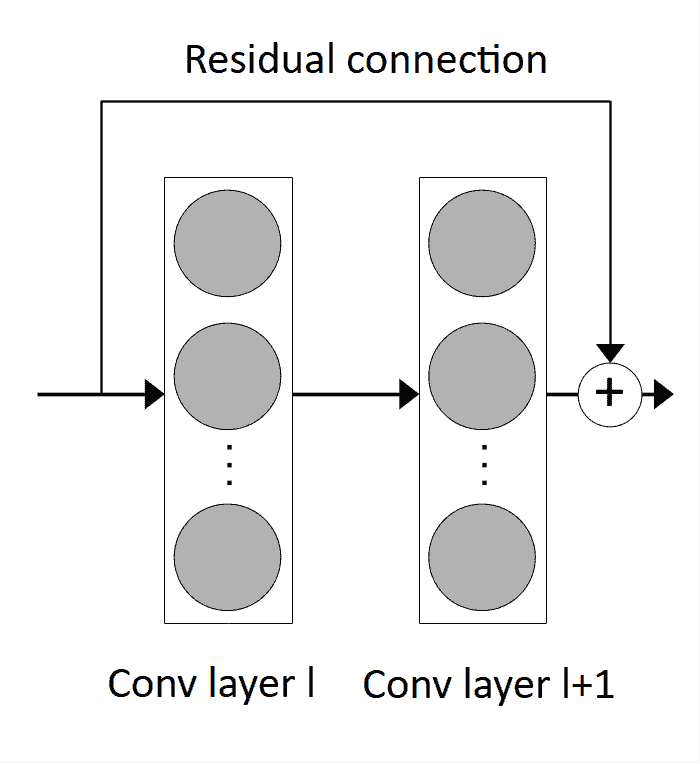

图 10：残差连接。

DenseNet 是另一种克服消失梯度问题的 CNN 架构。DenseNet 采用与 ResNet 和高速公路网络相同的方法，利用跳跃连接允许信息从早期层流向后期层。然而，DenseNet 更进一步，引入了一个密集块，该块由多个卷积函数（层）组成，每个卷积函数执行批量归一化，随后是 ReLU 和 $3\times 3$ 卷积。密集块中的每个卷积层接收来自所有前置层的特征图，因此该连接称为密集连接 Huang 等人（2017）。如图 11 所示，这种配置最大化了信息流并保持了网络的前馈特性。由于特征图数量的增加，密集块可能变得计算成本高昂。为了减少计算成本，使用了一个称为过渡块的 $1\times 1$ 卷积层，配有批量归一化和最大池化层，以减少特征图的空间维度。模型架构将这些密集块和过渡块集成在一起，交替堆叠。网络深度可以达到 264 层。

图 11：密集块。

尽管 ResNet 中的跳跃连接有效缓解了梯度消失问题，但随着网络变得更深，出现了一个新的挑战，即特征重用的减少。特征重用减少指的是在后续层中，之前学习到的特征图的效果逐渐减弱，从而影响最终的预测。WideResNet 是一种基于 ResNet 的 CNN 架构，旨在缓解特征重用减少的问题。WideResNet 不是通过加深网络，而是通过将通道数量增加$k$因子来加宽网络 Zagoruyko 和 Komodakis (2017)。增加的宽度使模型能够捕捉到更多样的特征，从而增强了其学习输入数据中复杂关系的能力。

ResNext 通过捕捉输入数据的更高效和多样的特征来解决特征重用减少的问题。ResNext 引入了一个基数的概念，这一概念大致基于图 12 中展示的 Inception 模块。基数指的是独立且相同路径的数量，每条路径对输入数据进行变换，沿通道维度划分 Xie 等 (2017)。换句话说，ResNext 通过这种基数路径来并行化特征提取，从而增强特征学习，而不仅仅依赖于增加模型的深度。在提议的架构中，每个路径配置类似于 ResNet 的残差块。然后，将每个路径的输出聚合以形成输入数据的全面而多样的表示。跳跃连接用于缓解梯度消失问题。WideResNet 是一种基于 ResNet 的 CNN 架构，旨在缓解特征重用减少的问题。WideResNet 不是通过加深网络，而是通过将通道数量增加$k$因子来加宽网络 Zagoruyko 和 Komodakis (2017)。增加的宽度使模型能够捕捉到更多样的特征，从而增强了其学习输入数据中复杂关系的能力。

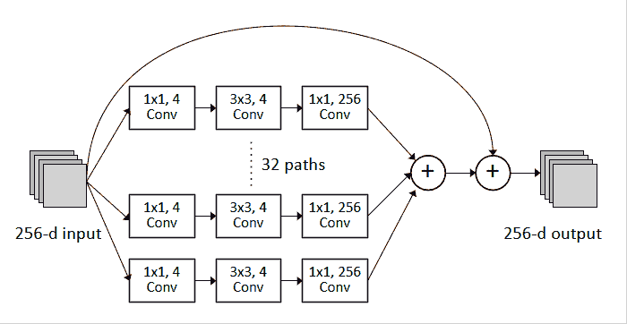

图 12：一个基数块。

### 3.2 深度无监督学习

深度无监督模型使用未标记的数据集进行训练。这些模型的学习过程涉及通过损失函数计算预测误差，并利用误差迭代调整权重，直到预测误差最小化。在深度监督模型中，有三个重要的模型被识别出来，即多层感知机、卷积神经网络和递归神经网络。

限制玻尔兹曼机是一种生成神经网络模型，它根据一组输入学习概率分布。该模型由一个可见（输入）层和一个隐藏层组成，连接具有对称权重，如图 13 所示。输入层表示输入数据，每个节点对应一个特征或变量，而隐藏层学习输入数据的抽象表示。限制玻尔兹曼机模型使用对比散度进行训练，这是一种基于梯度下降修改形式的算法，利用基于采样的方法来估计梯度 Hinton (2012)。它在解决组合问题如降维、协同过滤和主题建模方面取得了成功。

图 13：限制玻尔兹曼机。

深度信念网络可以看作是限制玻尔兹曼机的堆叠，包括一个可见层和多个隐藏层 Hinton et al. (2006)，如图 14 所示。深度信念网络有两个训练阶段。初始阶段称为预训练，其中网络逐层训练，每一层作为后续层的预训练层。这种序列学习使得隐藏层能够学习数据的复杂层次特征表示。第二阶段称为微调，此时深度信念网络模型可以通过监督进一步训练，以执行分类和回归等任务 Hinton (2009)。

图 14：深度信念网络。

自编码器是一种生成神经网络模型，它学习将输入数据编码为压缩表示，然后从该表示中重建原始数据。编码输入数据的层称为编码器，而负责重建的层则称为解码器，如图 15 所示。编码的数据（隐藏层）表示输入数据的抽象特征，也称为潜在空间或编码。可以从自编码器中移除解码器，创建一个独立模型，用于数据压缩和维度降低 Romero et al. (2017), Li et al. (2020c)。解码器也可以用预测层替换，用于分类任务 Mohd Noor (2021)。网络架构可以使用全连接层和卷积层构建 Li et al. (2023)。

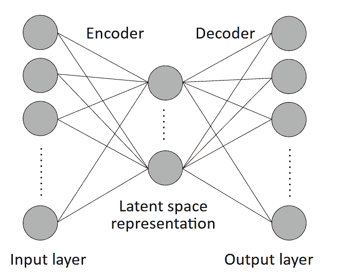

图 15: 一个自编码器。

为了提高自编码器捕获更好特征表示的能力，已经引入了几种自编码器变体。一些引入了惩罚项到损失函数中，如稀疏惩罚（稀疏自编码器）Ng 和其他人 (2011)，以鼓励稀疏表示，以及雅可比 Frobenius 范数（收缩自编码器）Rifai et al. (2011)，以在编码特征表示时对输入数据中的小而不重要的变化不那么敏感。其他的则训练自编码器从带噪声的损坏数据中恢复原始数据 Vincent et al. (2008)。一种改进的去噪自编码器，称为边际去噪自编码器，已经被提出，它通过添加一个与编码层相关的项来边际化噪声 Chen et al. (2012)。变分自编码器是自编码器的一种变体，具有类似的结构，即编码器、潜在空间和解码器。尽管有相似之处，变分自编码器学习的是输入数据在潜在空间中的概率分布 Kingma 和 Welling (2013)，而不是学习固定编码。该模型可以通过从学习到的概率分布中采样来生成数据。网络架构可以通过堆叠多个全连接层和卷积层来构建。

生成对抗网络（GAN）是另一种生成神经网络模型，旨在生成与原始训练集的分布紧密相符的数据。该模型由两个不同的神经网络组成，即生成器和鉴别器，如图 16 所示。生成器学习模仿训练集的分布，给定一个噪声向量，能够有效地超越鉴别器。在训练期间，鉴别器则被训练以区分来自训练集的真实数据和生成器生成的合成数据 Goodfellow 等人 (2014)。这种网络间的复杂动态推动了一个迭代学习过程，其中生成器不断完善其生成与真实数据相似的合成数据的能力，而鉴别器则提升其区分真实与虚假数据的能力。

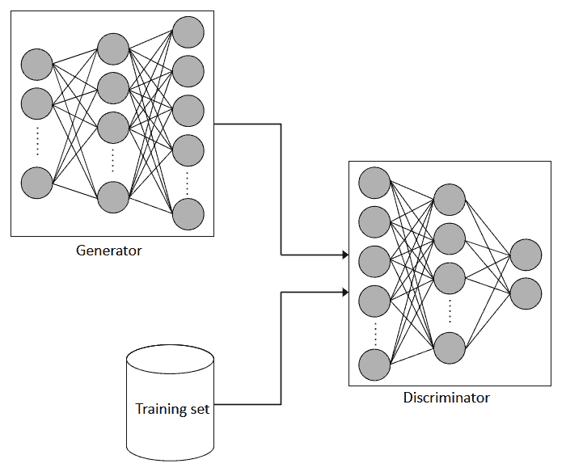

图 16：生成对抗网络。

该模型可以通过向生成器和鉴别器提供标签来扩展，称为条件 GAN，该模型能够生成 1000 个图像类别 Odena 等人 (2017)。条件 GAN 需要一个标记数据集，这可能限制了其应用。InfoGAN 类似于条件 GAN，但标签被潜在编码替代，这使得模型能够以无监督的方式进行训练 Chen 等人 (2016)。GAN 经常遭遇模式崩溃，即模型只能生成单一或少量的输出。Wasserstein GAN 通过利用 Wasserstein 损失函数来改进训练，该函数衡量真实数据与合成数据分布之间的差异 Weng (2019)。ProGAN 通过逐步增长生成器和鉴别器来解决 GAN 的训练不稳定性。其理念是模型逐渐扩大，从最简单的形式开始，随着训练的进展，问题的复杂性逐渐增加 Karras 等人 (2018)。StyleGAN 利用渐进 GAN 的方法和神经风格迁移来提高生成数据的质量 Karras 等人 (2019)。该模型的特点是独立操作风格和内容，使其能够生成多样化风格和高质量的数据。

## 深度学习的应用

正如前一节所讨论的，深度学习的应用范围从计算机视觉 Tan 等（2020a）、自然语言处理 Otter 等（2021）、医疗健康 Esteva 等（2019）、机器人技术 Soori 等（2023）、教育 Hernández-Blanco 等（2019）以及许多其他领域。本节介绍了深度学习在多个领域的应用。

### 4.1 计算机视觉

计算机视觉是人工智能中的一个重要领域。它是一个研究领域，专注于使计算机能够获取、分析和解释视觉输入，从而得出有意义的信息。这些视觉输入可以有多种形式，如数字图像、图像序列或视频和点云，这些输入的来源可以是相机、LiDaR、医疗扫描仪等。深度学习，特别是 CNN 模型，已广泛应用于现实世界的计算机视觉任务，包括图像分类、物体检测和图像分割。本节讨论了近年来深度学习模型取得的最新进展。

#### 4.1.1 图像分类

图像分类是计算机视觉中的一项基础任务，涉及将图像根据视觉内容分类到预定义的类别中。图像分类的目标是使计算机或机器能够区分图像中的物体，类似于人类如何解读视觉信息。图像分类在机器人、制造业和医疗保健等各种应用中都是一个关键组件。LeNet-5，1998 年推出，是最早成功训练以分类手写数字的卷积神经网络之一。该模型经历了一系列改进，包括使用 tanh 和平均池化，增强了提取层次特征的能力，*最终*提高了整体性能。该模型架构包括两个卷积层，每个卷积层后面跟一个平均池化层，然后是两个全连接层，包括输出层 Lecun 等（1998）。从那时起，基于 LeNet-5 的众多 CNN 模型被提出用于图像分类 Simard 等（2003）；Matsugu 等（2003），但最重要的是 2012 年的 AlexNet，它在深度学习中取得了变革性的突破。AlexNet 被认为是第一个具有大量参数的 CNN 模型，它显著提升了在非常大数据集（ImageNet）上的图像分类性能。该模型在 ILSVRC 2012 中获得第一名，将测试错误率比前一年提高了近 10% Krizhevsky 等（2012）。随后，在 ILSVRC 比赛中介绍了许多重要的 CNN 模型，包括 ZFNet、VGG16、GoogleNet、ResNet 和 ResNext。总体而言，研究集中在增加层数、解决梯度消失问题和特征重用的减少上。

图像分类研究不断发展，重点是解决关键挑战以提高分类性能。一个显著的趋势是损失函数的制定，以解决诸如忽视已分类实例和类别标签分布不平衡等问题。在某项研究中，引入了一个附加项到交叉熵损失中，以奖励正确分类的实例。这种公式鼓励模型在关注分类错误的实例时，也要关注已分类正确的实例（Zhao et al. (2022)）。另一项研究提出了使用泰勒级数展开的非对称多项式损失函数。该损失函数允许训练时选择性地优先考虑正实例的贡献，以缓解负类和正类之间的不平衡问题（Huang et al. (2023b)）。非对称多项式损失需要大量参数进行微调，可能导致过拟合。通过引入一个乘法项来控制负梯度的贡献，并使其对参数优化的敏感度降低，制定了一种鲁棒的非对称损失（Park et al. (2023)）。结合多个深度学习模型通过利用各个模型的多样化优势来提高整体性能。然而，由于超参数众多，确定最佳组合并非易事。一种直接的方法是采用加权和规则（Nanni et al. (2023)）。为了增强整体性能，名为贪婪模型的算法基于验证准确性添加模型（Wortsman et al. (2022)）。最终的预测是通过平均值产生的。多对称集合框架通过利用对比学习来改善多样化深度学习模型的构建（Loh et al. (2023)）。然后，根据其验证准确性，依次组合这些多样化的模型。

视觉变换器（ViT）提供了一种替代卷积神经网络（CNN）的方案，后者长期以来一直是图像分类的主导架构，通过利用自注意力机制实现可扩展的表示学习。尽管其有效性，ViT 对超参数优化非常敏感，并且在较小的数据集上表现不佳 Xiao 等人（2021）。此外，ViT 缺乏利用局部空间特征的能力，而这正是卷积神经网络固有的 Wu 等人（2021）。因此，许多研究尝试将卷积层整合到 ViT 架构中，以提升其性能和鲁棒性。特别是，conformer 是一种具有两个分支的网络架构：CNN 分支和变换器分支，分别提取局部和全局特征 Peng 等人（2023）。两个分支通过两个 $1\times 1$ 卷积和上采样或下采样操作的“桥梁”连接，允许分支共享其特征并增强特征表示。两个分支的输出预测被结合起来生成最终预测。名为 MaxViT 的混合架构结合了卷积网络和视觉变换器，以解决自注意力机制在大输入尺寸下训练模型时缺乏可扩展性的问题 Tu 等人（2022）。改进后的视觉变换器由两个模块组成，其中第一个模块关注于非重叠图像块中的局部特征，而全局特征则通过处理稀疏且均匀的像素网格来关注。变换器与一个卷积层块堆叠在一起，以提取局部空间特征。MaxViT 的架构如图 17 所示。另一项研究提出了一种卷积变换器网络，将深度卷积块引入 ViT Ma 等人（2024）。这一配置使模型能够利用卷积网络提取局部空间特征，同时 ViT 关注提取的局部特征以聚焦相关信息，从而增强模型捕捉复杂模式和关系的能力。

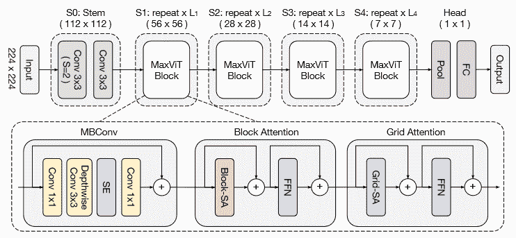

图 17：MaxViT Tu 等人（2022）的架构。

#### 4.1.2 目标检测

深度学习在显著提升目标检测性能的最前沿技术中发挥了重要作用。基于区域的 CNN（R-CNN）是目标检测中的首次突破，它将 CNN 与选择性区域提议相结合（Girshick et al. (2014)）。区域提议是候选的边界框，作为输入图像中潜在兴趣区域（目标），CNN 用于从这些区域提议中提取特征并进行分类以进行目标检测。一个改进模型，名为 Fast R-CNN，引入了两个预测分支：目标分类和边界框回归，这提高了目标检测的整体性能（Girshick (2015)）。然而，R-CNN 和 Fast R-CNN 模型计算开销大且速度慢，因此在实时应用中实际上不可行。为解决此问题，Fast R-CNN 与区域提议网络集成，称为 Faster R-CNN（Ren et al. (2015)）。区域提议网络（RPN）用于高效生成目标检测的区域提议。RPN 接收输入图像并输出一组矩形对象提议，每个提议都有一个置信度分数以指示目标存在的可能性。为此，RPN 引入了锚框的概念，即在卷积网络生成的特征图上定义多个不同纵横比的边界框。这些锚框随后在特征图上回归以定位目标，从而提高了 Faster R-CNN 的速度和有效性。Faster R-CNN 的训练分为两个阶段。首先，预训练 RPN 以生成区域提议，然后使用 RPN 生成的区域提议训练 Fast R-CNN 以进行目标检测。负责提取 Faster R-CNN 特征的骨干网络可以是 ZFNet 或 VGG16。

在两阶段目标检测器中，首先生成区域提议，然后用于目标检测。这种两阶段过程计算密集，对于实时目标检测应用是不切实际的。You Only Look Once 或 YOLO 提出了通过在神经网络的单次前向传递中直接预测边界框和对象的置信度得分来进行一阶段检测 Redmon et al. (2016)。这种单次传递的架构显著降低了计算复杂度，使 YOLO 适用于实时目标检测应用。在 YOLO 中，输入图像被划分为 S×S 网格，每个网格单元负责检测单元中的对象。具体而言，每个网格单元预测多个边界框和相关对象的置信度得分，从而实现对整个图像的同时目标检测。后续的改进如 YOLOv3 Redmon 和 Farhadi (2018) 和 YOLOv4 Bochkovskiy et al. (2020) 提高了模型的能力和准确性。Single Shot Multibox Detector (SSD) 是另一种一阶段检测器，旨在解决实时目标检测的问题 Liu et al. (2016)。SSD 还消除了区域提议生成，直接预测边界框和置信度得分，从而降低计算复杂度。为了提高整体性能，SSD 从不同级别的特征图中产生预测，使得可以检测输入图像中不同尺寸的对象。

在目标检测问题中，一个常见的问题是前景类与背景类的极度不平衡。为了解决这个问题，RetinaNet 引入了一种基于交叉熵的损失函数，称为焦点损失（focal loss）。焦点损失减少了对易于分类对象的损失贡献，使得模型训练能够集中在难以分类的对象上 Lin et al. (2020)。RetinaNet 采用了 Feature Pyramid Network (FPN) Lin et al. (2017a)，以 ResNet 作为提取特征图的主干网络。FPN 是一种具有金字塔结构的网络架构，可以高效地捕捉多尺度特征表示，从而促进各种尺寸的目标检测。为了进一步提高整体性能，EfficientDet 引入了双向 FPN，这种网络结构结合了多层特征融合，以更好地捕捉多尺度特征表示 Tan et al. (2020b)。此外，该模型利用 EfficientNet Tan 和 Le (2019) 作为主干网络，以实现计算效率与准确性之间的平衡。

物体检测性能依赖于一个称为非极大值抑制（NMS）的后处理步骤，以消除重复检测并选择最相关的边界框。具体而言，NMS 根据置信度分数对所有检测框进行排序，选择具有最高分数的框，并丢弃与所选框有显著重叠的其他框。这个过程会在剩余的检测框上重复进行。然而，由于置信度分数与物体定位质量之间的不一致，NMS 保留了置信度分数高但定位差的边界框，同时丢弃了置信度分数低但更准确的预测。为了缓解这一限制，soft-NMS 不再丢弃重叠显著的邻近框，而是应用高斯函数来降低它们的置信度分数（Bodla et al. 2017）。这个方法的思想是逐渐降低邻近边界框的分数，而不是直接丢弃它们，降低的幅度根据与所选框的重叠程度来决定。这种方法使抑制过程更加平滑，保留了定位更好的边界框。自适应 NMS 引入了一种自适应阈值来抑制边界框（Liu et al. 2019a）。该算法根据所选框与其他边界框的重叠程度动态调整阈值。

检测变换器（DeTR）是一个端到端可训练的目标检测模型，利用变换器架构消除了对手工制作组件的需求，例如锚点框和非极大值抑制 Carion et al. (2020)。变换器的自注意力机制捕捉了图像的全局上下文和不同部分之间的关系，使其能够定位目标并去除重复预测。该模型通过一组损失函数进行训练，执行预测对象和真实对象之间的二分匹配。DeTR 使用 ResNet 作为骨干网络。尽管 DeTR 在简化和改进目标检测任务方面取得了成功，但由于依赖于变换器的自注意力机制，缺乏多尺度特征表示，DeTR 在检测小物体时表现不佳且训练时间较长。为了缓解这一限制，Deformable DeTR 引入了一个多尺度可变形注意力模块，能够有效捕捉不同尺度的特征表示 Zhu et al. (2020)。此外，该注意力模块利用了可变形卷积，使模型能够适应空间变化并捕捉输入数据中的更多信息特征。Dynamic DeTR 通过利用基于可变形卷积的 FPN 学习多尺度特征表示来解决相同的问题 Dai et al. (2021)。此外，该模型用基于卷积的编码器替代了变换器编码器，以关注各种空间特征和通道。这一修改使模型能够有效检测小物体，并在训练期间更快收敛。dynamic DeTR 的架构如图 18 所示。提出了一种称为 Teach-DeTR 的训练方案，以提高 DeTR 的整体性能 Huang et al. (2023a)。该训练方案在训练过程中利用其他目标检测模型预测的边界框，通过计算目标查询与预测框之间的一对一匹配损失。

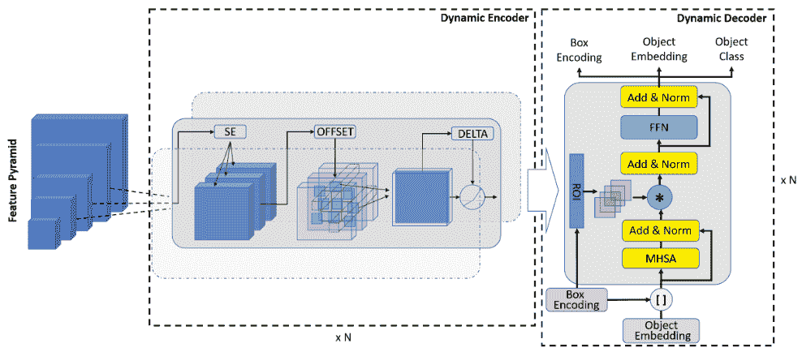

图 18: dynamic DeTR 的架构 Dai et al. (2021)。

#### 4.1.3 图像分割

图像分割是另一个深度学习产生重要影响的任务之一。最早的图像分割深度学习模型之一是完全卷积网络 Long 等人 (2015)。完全卷积网络只包含卷积层，它接受任意大小的输入，并生成相同大小的预测分割图。作者采用了 AlexNet、VGG16 和 GoogleNet，将它们的全连接层替换为卷积层，并添加了一个 1×1 卷积层，随后进行双线性上采样以匹配输入的大小。该模型被认为是图像分割领域的重要里程碑，展示了深度学习在端到端训练的语义分割中的可行性。反卷积网络是另一个流行的语义分割深度学习模型 Noh 等人 (2015)。该模型架构由两个部分组成：编码器和解码器。编码器接受输入图像，并使用卷积层生成特征图。特征图被送到由上采样和反卷积层组成的解码器中，以预测分割图。SegNet 是另一个用于语义分割的编码器-解码器模型 Badrinarayanan 等人 (2017)。编码器是一个卷积（使用 ReLU）和最大池化块的序列，类似于卷积神经网络。解码器由上采样层组成，这些上采样层利用在编码器阶段生成的记忆池化索引对输入进行上采样，以及没有非线性的卷积层。编码器通过一系列卷积和池化层逐步减少输入数据的分辨率，同时提取抽象特征。这一过程导致细粒度信息的丢失，从而降低了分割的整体性能。LinkNet 通过将编码器生成的几个阶段的特征图传递给解码器，从而减少了信息丢失，缓解了这一限制 Chaurasia 和 Culurciello (2017)。LinkNet 的模型架构类似于 SegNet，但使用 ResNet 作为编码器。

尽管 Faster R-CNN 是一个在目标检测任务中具有重要意义的方法，但它已经扩展到执行实例分割任务。其中一种扩展是 Mask R-CNN，它基于 Faster R-CNN，引入了一个额外的分支用于预测分割掩膜 He 等人 (2017)。与 Faster R-CNN 相似，Mask R-CNN 利用 RPN 生成区域建议，然后应用兴趣区域对齐从建议的区域中提取更准确的特征。Mask R-CNN 不利用多尺度特征表示，这可能会降低分割的整体性能。为了解决这一限制，Path Aggregation Network (PANet) 结合了 FPN，并引入了一个自下而上的路径，以促进低级信息的传播 Liu 等人 (2018)。该路径将前一阶段的特征图作为输入，并执行 3×3 卷积，步幅为 2，以减少特征图的空间大小。生成的特征图随后通过横向连接与 FPN 的特征图融合。该模型采用了与 Mask R-CNN 相同的三个分支。MaskLab 是一个基于 Faster R-CNN 的实例分割模型，包括目标检测、分割和实例（对象）中心方向预测分支 Chen 等人 (2018)。方向预测提供了有用的信息来区分相同语义标签的实例，使模型能够进一步优化实例分割结果。

注意力机制已经被集成到分割模型中，以学习每个像素位置的多尺度特征权重。一个多阶段上下文精炼网络引入了一个上下文注意力精炼模块，该模块由两个部分组成：上下文特征提取和上下文特征精炼 Liu 等人 (2023a)。上下文特征提取捕获局部和全局上下文信息，融合这些上下文信息并将其传递给上下文特征精炼，同时上下文特征精炼去除冗余信息，生成精炼的特征表示，从而提高上下文信息的利用率。上下文注意力被添加到编码器和解码器之间的跳跃连接中。手工特征通常被自动特征提取的卷积网络所取代。然而，有人认为手工特征中嵌入的可解释性和领域特定知识可以提供有价值的见解。为此，引入了基于协方差统计的注意力模块来建模输入图像的局部和全局上下文之间的依赖关系 Liu 等人 (2022)。引入了两种类型的注意力：空间协方差注意力关注空间分布，而通道协方差注意力关注重要的通道。此外，协方差注意力不需要特征形状转换，因此显著降低了模型的空间和时间复杂度。

卷积层使用局部感受野处理输入数据，这对于利用空间模式和层次特征可能很有效，但可能难以捕捉整个图像的全局关系。ViT 已被用来缓解这一问题，在语义分割中 Strudel 等人 (2021)。具体来说，输入图像被划分为若干补丁，并作为输入提供给变换器，以捕捉补丁之间的全局关系，从而显著提高分割图的预测。全球上下文 ViT 旨在解决 ViT 无法利用局部空间特征的问题 Hatamizadeh 等人 (2023)。如图 19 所示，变换器由局部和全局自注意力模块组成。全局自注意力的作用是从不同的图像区域捕捉全局上下文信息，而局部自注意力则捕捉短距离信息。多尺度特征表示对于准确的语义分割至关重要。然而，变换器通常在不考虑适当（最佳）尺度的情况下组合特征，从而影响分割精度。变换器尺度门是一个旨在解决基于补丁查询对之间的相关性选择适当尺度问题的模块 Huang 等人 (2023a)。变换器将注意力（相关性）图作为输入，计算每个图像补丁的多尺度特征的权重，从而使模型能够自适应地选择每个补丁的最佳尺度。

图 19：全球上下文 ViT 的架构 Hatamizadeh 等人 (2023)。

#### 4.1.4 图像生成

图像生成是指基于输入文本创建图像的过程。通常，这项任务可以分为三个阶段。第一阶段是从输入文本中提取特征，接着生成图像，最后控制图像生成过程以确保输出符合特定的标准和约束。本节重点关注第二阶段（图像生成）的深度学习模型的发展进展，因为它直接影响生成图像的质量。变分自编码器是最早能够生成图像的深度学习模型之一 Kingma 和 Welling (2013)。变分自编码器通过捕捉训练数据的潜在（高斯）分布来学习生成数据。在生成过程中，分布参数被采样并传递给解码器以生成输出图像。虽然生成的图像模糊且不令人满意，但在图像生成任务中显示了很大的潜力。生成对抗网络（GAN）的引入显著提高了生成图像的质量。GAN 由两个连接的神经网络组成，一个生成器和一个鉴别器，它们以竞争的方式同时训练 Goodfellow 等人 (2014)。生成器学习生成逼真的图像以欺骗鉴别器，而鉴别器学习区分虚假图像和真实图像。生成的图像较少模糊，更加逼真。为了提高其可用性和整体性能，提出了几个增强模型，如 CGAN Odena 等人 (2017)，它允许我们指定要生成的图像，以及深度卷积 GAN (DCGAN) Radford 等人 (2015)，它提供了更稳定的图像生成结构。DCGAN 是许多后续 GAN 改进的基础。

StackGAN 将图像生成过程分为两个阶段 Zhang et al. (2017)。第一阶段通过使用随机噪声向量创建基本形状、颜色和背景布局来生成低分辨率图像。第二阶段完成图像的细节并生成高分辨率的真实感图像。StackGAN++ 是 StackGAN 的增强模型，其中包含多个共享参数的生成器，用于生成多尺度图像 Zhang et al. (2018a)。这些生成器具有渐进的目标，中间生成器生成不同大小的图像，而最深的生成器生成真实感图像。HDGAN 是一种生成模型，具有单流生成器和在中间层具有层次嵌套判别器 Zhang et al. (2018b)。这些层与判别器相连，生成多尺度图像。较低分辨率的输出用于学习语义图像结构，而较高分辨率的输出用于学习图像的细节。StackGAN 在第一阶段严重依赖于生成图像的质量。DM-GAN 结合了用于图像细化的记忆网络，以应对第一阶段生成的糟糕图像 Zhu et al. (2019b)。记忆网络动态选择与生成图像相关的词汇，然后细化细节以生成更好的真实感图像。

AttnGAN 是第一个将注意力机制融入到多个生成器中，以关注与生成图像相关的词汇的模型 Xu et al. (2018)。为此，除了将整个句子编码为全局句子向量外，文本编码器还将每个词编码为词向量，如图 20 所示。然后，图像向量用于在多阶段生成器的每个阶段使用注意力模块关注词向量。此外，AttnGAN 引入了一个损失函数来计算生成的图像与相关句子之间的相似性，从而提高图像生成的性能。类似的工作是 ResFPA-GAN，其中模型将注意力模块融入到多个生成器中 Sun et al. (2019)。具体而言，提出了一种特征金字塔注意力模块，以捕捉高语义信息并融合多尺度特征，从而提升模型的整体性能。DualAttn-GAN 通过将视觉注意力模块引入以关注空间和通道维度上的重要特征，从而改进了 AttnGAN Cai et al. (2019)。这使得模型能够更好地理解和捕捉输入句子的上下文以及图像的细节，从而生成更真实的图像。

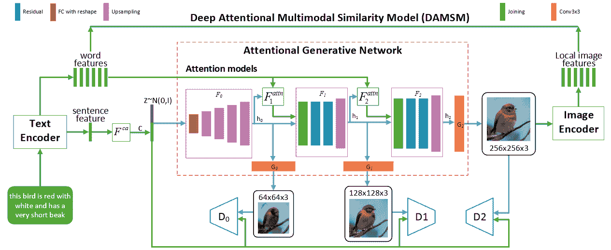

图 20：AttnGAN Xu 等人的架构 (2018)。

尽管多阶段生成器通过利用多尺度表示来提升图像生成性能，但生成的图像可能包含模糊的形状和粗糙的特征。DF-GAN 用一个具有残差连接的单阶段深度生成器替代了多阶段生成器，并采用了带有铰链损失的训练方法 Tao 等人 (2022)。此外，DF-GAN 在判别器上引入了一种正则化策略，对匹配文本的真实图像施加梯度惩罚，使模型能够生成更多与文本匹配的图像。DMF-GAN 是对 DF-GAN 的改进，融入了三个新颖的组件，旨在利用输入文本与生成图像之间的语义一致性 Yang 等人 (2024)。第一个组件是递归语义融合模块，它建模了融合块之间的长程依赖关系。第二个组件是多头注意力模块，放置在生成器的末端，以利用词汇特征，迫使生成器生成基于相关词汇的图像。最后一个组件是词级判别器，它为生成器提供了细粒度的反馈，促进了学习过程，提高了生成图像的整体质量。图 21 显示了 DMF-GAN 的架构。图像生成的过程涉及在网络最初阶段向生成器输入噪声向量。然而，随着生成器的深入，噪声效应可能会减弱，影响图像生成结果的多样性。为了解决这个问题，DE-GAN 在单阶段生成器中加入了双重注入模块 Jiang 等人 (2024)。双重注入模块由两个文本融合层和一个噪声广播操作组成。文本融合层将句子嵌入与输入特征图融合，使用全连接层。然后将噪声注入输出特征图中，以保持生成过程中的随机性，从而提高模型的多样性和泛化能力。

图 21：DMF-GAN Yang 等人的架构 (2024)。

### 4.2 时间序列与普适计算

泛在计算，通常被称为无处不在的计算，是将计算机技术集成到日常物品和环境中的过程，使其变得智能化、联网，并能够彼此通信以提供改进的服务和功能 Weiser ([1991)]。根据 He 等人 He et al. (2020b)，泛在计算在该领域的作用首要体现在它提供了将计算服务分配到人们工作环境的能力，从而促进了信任、隐私和身份。泛在计算应用的例子包括具有连接电器的智能家居、监测健康和健身的可穿戴设备、具有交通管理传感器网络的智能城市，以及利用物联网（IoT）进行监控和控制的工业应用。一般而言，泛在计算中互联设备的持续互动通常会产生时间序列数据，这些数据捕捉了各种参数随时间的演变。

例如，医疗传感器，如心电图（ECG）和脑电图（EEG），生成包含关键诊断信息的时间序列数据，深度学习可以利用这些数据检测异常、预测疾病，并以更高的准确性分类医疗状况。此外，诸如加速度计、磁力计和陀螺仪等设备可以用于捕捉人类活动信号，这些信号通常表现为状态变化的时间序列 Ige and Noor ([2022)]。在传统的机器学习中，特征如均值、方差等在进行人类活动分类之前需要从状态变化的时间序列中手动提取。然而，深度学习模型可以自动提取特征 Mohd Noor ([2021)]。此外，在涉及时间序列数据的其他领域，如金融，深度学习在股票价格预测 Singh and Srivastava ([2017)]、欺诈检测 Zhang et al. ([2021)] 和算法交易 Lei et al. ([2020)] 等方面发挥了重要作用。一般而言，深度学习网络擅长捕捉时间序列数据中的复杂时间关系，从而实现更精确的预测和改进的决策。基于此，多个深度学习模型已被应用于各个时间序列和泛在计算领域的特征学习。

#### 4.2.1 人类活动识别

人类活动识别（HAR）在多个领域中有广泛的应用，包括智能视频监控、环境家庭监测、视频存储和检索、智能人机界面和身份识别等。它包括各种研究领域，如视频中的人类检测、人体姿态估计、跟踪人类以及分析和理解时间序列数据 Zhang et al. (2019a)。尽管视觉基础的 HAR 有了进步，但仍存在固有的局限性。一般来说，视觉基础的方法严重依赖摄像系统，这些系统可能具有受限的视角，或受到光照条件、遮挡和复杂背景的影响 Ige and Noor (2022)。此外，视觉基础的 HAR 在识别超出摄像机范围或视觉上类似的动作时面临挑战。

可穿戴传感器提供了一种有前途的替代方案来克服这些限制。通过直接从个人那里捕捉数据，可穿戴传感器提供了关于人类活动更全面和准确的信息。 从可穿戴传感器获得的信号通常代表反映活动状态变化的时间序列数据。 深度学习模型可以有效地从这些信号中学习，从而实现对人类活动的强健和准确的识别。此外，可穿戴传感器具有机动性优势，使得在各种环境和情况中进行活动识别成为可能，而这些环境和情况中基于视觉的系统可能不切实际或效果不佳 Dang et al. (2020)。一般而言，可穿戴传感器信号的时间序列特性为深度学习模型在高精度和高可靠性地识别人类活动提供了绝佳的机会。

一些研究人员提出了使用 CNN、RNN 和混合模型进行基于深度学习的可穿戴传感器 HAR 特征学习。例如，通过使用二维 CNN (Conv2D)，如 Gao 等 (2021a)、Gupta (2021) 和 Erdaş 和 Güney (2021) 等研究人员，尽管数据具有时间序列特性，但仍开发了用于可穿戴传感器 HAR 的深度学习模型。这通常通过将来自可穿戴传感器的时间序列信号视为 2D 图像并适当重塑它们来实现。为了达到这一点，研究人员通常将每个时间序列信号组织成矩阵格式，一轴为时间，另一轴为传感器维度，然后创建伪图像表示，从而将矩阵输入 Conv2D 层进行特征提取。Conv2D 层擅长捕捉图像中的空间模式和关系，通过将时间序列数据视为图像，这些层可以学习有助于活动识别的相关空间特征。Conv2D 过滤器在时间和传感器维度上执行卷积操作，使网络能够识别可能表明特定活动的模式和特征。

尽管 Conv2D 能有效捕捉数据中的空间依赖关系，但它往往难以捕捉时间序列数据中固有的时间依赖关系。由于 Conv2D 以网格状的方式处理数据，它未能充分利用时间序列的顺序特性，可能导致在可穿戴传感器 HAR 任务中特征提取效果不佳。因此，最近的 HAR 架构采用了一维 CNN (Conv1D) 和其他 RNN 来进行自动特征提取。Conv1D 层专门设计用于捕捉顺序数据中的时间依赖关系。它们直接对时间序列数据进行操作，而不将其重塑为 2D 格式，从而更有效地捕捉时间模式。Conv1D 层更适合从时间序列数据中提取特征，因此是可穿戴传感器 HAR 的更自然选择 Mohd Noor (2021)。

例如，Ragab 等人 (2020) 提出了一个随机搜索 Conv1D 模型，并评估了该模型在 UCI-HAR 数据集上的表现。结果显示，该模型在对数据集中六项活动进行分类时，达到了 95.40% 的识别准确率。然而，由于数据集中某些活动的动态性质，该模型表现出较长的训练时间。为了解决这个问题，Banjarey 等人 (2022) 提出了在 Conv1D 层中使用不同的卷积核尺寸，以识别各种活动，包括坐、站、走、睡、读和倾斜。此外，还堆叠了一些 Conv1D 层，以简化神经网络训练的时间优化过程。此外，一些研究人员提出了将机器学习算法与 Conv1D 结合使用的模型，如 Shuvo 等人 (2020) 所示。他们的工作提出了一个两阶段学习过程，通过使用随机森林将活动分类为静态和动态，以改善 HAR，然后使用支持向量机识别每个静态活动，并使用 Conv1D 识别动态活动。结果表明，该方法在 UCI-HAR 数据集上达到了 97.71% 的准确率。

随着这些进展，几位研究人员进一步探讨了具有各种修改的 Conv1D 架构，以增强活动识别系统中的特征学习。例如，Han 等人 (2022) 开发了一种双流 CNN 架构作为插拔式模块，以编码来自不同感受野大小的传感器时间序列的上下文信息。该模块被集成到现有的深度模型中进行 HAR，而无需额外的计算成本。对 OPPORTUNITY、PAMAP2、UCI-HAR 和 USC-HAD 数据集的实验表明，该模块提高了特征学习能力。Ige 和 Noor (2023) 报告中的类似研究提出了 WSense 模块，以解决滑动窗口分割大小无论如何都会导致特征学习质量差异的问题，并在 PAMAP2 和 WISDM 数据集上进行了实验。结果表明，通过将 WSense 模块插入 Conv1D 架构中，可以从可穿戴传感器数据中学习到改进的活动特征，以进行人类活动识别。

类似地，一些研究人员还提出了在 HAR 中使用独立 RNN 的方法，以及 Conv1D 架构与 RNN（如 LSTMs Deep 和 Zheng（2019），BiLSTMs Luwe 等（2022）；Shi 等（2023），以及 BiGRUs Imran 等（2023）的混合体，以充分利用 CNN 和 RNN 的特征学习能力。例如，Nafea 等人 Nafea 等（2021）利用 Bi-LSTM 和 Conv1D，并使用不同大小的核学习各种分辨率下的特征。通过堆叠卷积层和 Bi-LSTM 层提取人体活动特征，然后包括一个平铺层和一个全连接层进行后续分类。然而，该模型在提取动态活动的优质特性方面存在问题，而在静态活动方面则没有出现这种问题。为了解决这些问题，一些研究工作在基于 Conv1D 的架构中结合注意力机制，以改善从可穿戴传感器获得的时间序列信号中动态和复杂活动的特征学习。例如，Khan 和 Ahmad Khan 和 Ahmad（2021

图 22：Khan 和 Ahmad（2021）的多头 CNN 模型架构。

#### 4.2.2 语音识别

语言作为人类交流的主要方式，已经吸引了研究人员超过五十年的关注，特别是自人工智能 Nassif 等人（2019）问世以来。从最早期理解和复制人类语言复杂性的尝试，到利用前沿技术的现代进展，对准确且高效的语言识别系统的追求一直不懈。近年来，深度学习技术的出现彻底改变了语言识别领域。深度学习在处理和提取大量数据中的复杂模式方面展示了无与伦比的成功。当应用于语言识别领域时，深度学习通过直接从原始音频信号中学习复杂特征，超越了传统方法，绕过了手工特征和复杂的预处理管道的需要。这一范式转变显著推动了语言识别技术的前沿，使系统能够在各种语言、口音和环境条件下实现前所未有的准确性和鲁棒性。一般来说，深度学习已被扩展到语言识别的其他重要应用中，如说话人识别 Tirumala 和 Shahamiri（2016）；Ye 和 Yang（2021），情感识别 Khalil 等人（2019），语言识别 Singh 等人（2021），口音识别 Jiao 等人（2016），年龄识别 Sánchez-Hevia 等人（2022）和性别识别 Alnuaim 等人（2022），等等。

在深度学习被应用于语音识别之前，传统语音识别系统的基础是使用高斯混合模型（GMMs），这些模型通常与隐马尔可夫模型（HMMs）结合，以表示语音信号 Srivastava 和 Pandey (2022)。这是因为语音信号可以被视为一个短期平稳信号。每个 HMM 使用高斯混合来建模声音波的谱表示。然而，它们在建模非线性或接近非线性的函数时被认为是统计效率低的 Padmanabhan 和 Premkumar (2015)；Nassif 等 (2019)。这是因为 HMM 依赖于一组预定义的状态和转移概率，对基础数据的线性和稳态性做出假设。虽然 HMM 在建模语音的某些方面时适用，但当任务是表示语音信号中复杂的非线性和变异性时，HMM 往往力不从心。语音本质上表现出非线性和动态特征，如语调、节奏和语音变异等，这些特征对传统统计模型如 HMM 的简化假设提出了挑战。换句话说，GMM-HMM 方法在捕捉语音中的复杂声学模式和长期依赖性方面存在局限性 Mukhamadiyev 等 (2022)。

最近，CNN 和 RNN 被用于自动语音识别，以考虑更长或可变的时间窗口进行上下文信息提取 Lu 等 (2020)。通常，CNN 非常适合捕捉数据中的局部模式和层次特征，使其在建模语音中的声学特征时非常有效。通过直接从原始语音信号中学习特征，CNN 绕过了传统 GMM-HMM 系统中使用的手工特征的需求。此外，CNN 可以捕捉数据中的长期依赖性，这对于理解语音的上下文至关重要。同样，RNN 在一个处理层次中探索扩展的时间上下文信息以进行特征提取和建模也是合适的选择。

基于此，几位研究人员提出了同时使用 CNN 和 RNN 变体来进行

然而，RNN 架构按顺序处理输入序列，这限制了它们有效捕捉全局上下文信息的能力。因此，它们可能难以理解口语表达的整体上下文，从而导致转录准确性降低，特别是在需要超越局部依赖的任务中。此外，大多数 CNN 和 RNN 自动语音识别系统由独立训练的声学、发音和语言建模组件组成。通常，声学模型从现有模型启动，该模型用于对齐，以便训练识别上下文相关（CD）状态或音素。发音模型由专家语言学家策划，将声学模型产生的音素序列映射到单词序列中。因此，自动语音识别中正在提出 Sequence-to-Sequence（Seq2Seq）模型，以在单一系统中联合训练声学、发音和语言建模组件 Prabhavalkar 等人 (2017)。Seq2Seq 方法在自动语音识别中是一类模型，旨在将输入的声学特征序列（如语音谱图或 Mel 频率倒谱系数）直接转录为表示识别语音的字符或单词序列。文献中探索了多种序列到序列模型，包括递归神经网络变换器（RNN-T）Graves (2012)、听、关注和拼写（LAS）Chan 等人 (2015)、神经变换器 Jaitly 等人 (2016)、单调对齐 Raffel 等人 (2017) 和递归神经对齐器（RNA）Sak 等人 (2017)。

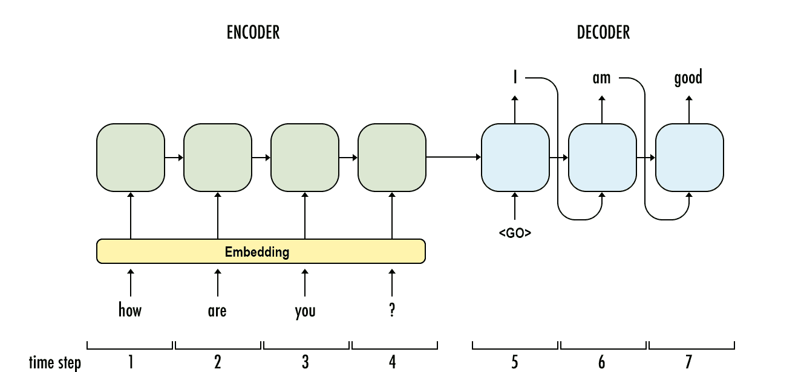

图 23: 序列到序列

如图 23 所示，编码器组件接收声学特征的输入序列，并将其处理以创建一个固定维度的表示，通常称为上下文向量。该表示捕获了输入序列中的关键信息，并作为生成输出序列的基础。解码器组件接收编码器生成的上下文向量并生成输出序列。在自动语音识别（ASR）中，这个输出序列由表示识别语音的字符或单词组成。解码器通常实现为递归神经网络（RNN），如长短期记忆（LSTM）或门控递归单元（GRU）网络，或者它可能是基于变换器的架构。在训练过程中，模型通过最小化适当的损失函数（如交叉熵损失）来学习将输入序列映射到其对应的输出序列。这通常通过时间反向传播（BPTT）或教师强制等技术完成，其中模型被训练以预测给定先前标记的输出序列中的下一个标记。之后，训练好的模型用于转录未见的语音输入。编码器处理输入序列以生成上下文向量，然后将其输入到解码器中以生成输出序列。在某些情况下，可能会使用束搜索 Szűcs 和 Huszti (2019); Li 等 (2018) 或其他解码策略来提高生成输出的质量。

在 Chiu 等人（2018）的研究中，作者探索了对其 LAS 序列到序列模型的各种结构和优化增强，取得了显著的性能提升。他们引入了多种结构改进，包括使用词片模型而非字素模型，以及采用多头注意力架构，该架构优于常用的单头注意力机制。此外，他们还研究了优化技术，如同步训练、计划采样、标签平滑和最小词错误率优化，这些技术均表现出准确率的提升。作者展示了使用单向 LSTM 编码器进行流式识别的实验结果。在 12,500 小时的语音搜索任务中，他们观察到所提出的改动使词错误率（WER）从 9.2% 降至 5.6%，而最佳传统系统的 WER 为 6.7%。此外，在听写任务中，他们的模型取得了 4.1% 的 WER，而传统系统为 5%。类似地，Prabhavalkar 等人（2017）研究了多种自动语音识别的序列到序列方法。这些方法包括 RNN 变换器（RNN-T）、基于注意力的模型、一种增强 RNN-T 的注意力模型以及直接输出字素序列的连接时序分类（CTC）训练系统。根据他们的研究，序列到序列的方法在大规模训练数据上可以与最先进的技术竞争。尽管深度学习在语音识别领域已达到最先进水平，但仍需关注语音到语音翻译领域。这是因为目前基于深度学习的语音到语音翻译系统通常通过逐句翻译来操作，而忽略了前句的上下文信息。尽管关于上下文理解的研究已进行多年，但在其实用性和处理效率方面仍面临挑战，因为翻译通常依赖于周围的词语来提供上下文。

#### 4.2.3 心电图（ECG）分类

心脏或血管相关的疾病统称为心血管疾病（CVD）（刘等，2021a）。根据美国心脏协会 2023 年的统计数据，CVD 已经成为全球首要的死亡原因。在 2020 年，全球因 CVD 死亡的人数达到了 190.5 万，比 2010 年增长了 18.71%，预计到 2030 年这一数字将上升到 2360 万（曹等，2023）。CVD 引起的血栓和血管堵塞可能导致心肌梗塞、中风甚至死亡（刘等，2021a）。通常，早期诊断已被证明能够降低 CVD 的死亡率，而心电图（ECG）信号在诊断各种心脏异常和监测心脏健康方面发挥了关键作用。然而，ECG 信号具有高噪声和高复杂性的特点，使得使用传统方法识别某些疾病既耗时又费力。传统方法繁琐且需要医疗专家的专业知识。在过去几十年里，通过采用计算机化 ECG 识别技术，心脏病专家在长期 ECG 记录分类任务中获得了显著的便利。在此期间，特征提取方法主要依赖于手动技术，包括波形函数（Llamedo 和 Martínez，2011）、基于小波的特征（Mathews 等，2018）、ECG 形态（朱等，2019）、厄尔密多项式（Desai 等，2021）以及 ECG 形态的 Karhunen-Loeve 展开（Crippa 等，2015）等。这些提取的特征随后通过各种机器学习算法进行分类。

最近，深度学习的出现彻底改变了该领域，使得可以直接从 ECG 信号中自动学习特征。这一进展在自动 ECG 分类领域具有重要的前景，为临床医生提供了快速准确诊断的工具。基于此，已经提出了几种深度学习架构用于 ECG 信号的特征学习。例如，Acharya 等人 (2017) 开发了一个 9 层 CNN 模型来自动识别 ECG 信号中的五类心跳。类似的模型也在 Baloglu 等人 (2019) 中开发。然而，ECG 信号的长度通常会有显著变化，因为它们可能包含不同数量的心跳。CNN 通常需要固定长度的输入，这可能需要进行诸如填充或截断的预处理步骤，从而可能丢失重要的时间信息。因此，几个架构在 ECG 分类中利用了 RNN，如 Singh 等人 (2018)、Prabhakararao 和 Dandapat (2020) 和 Wang 等人 (2023b) 等。尽管 RNN 能够处理序列数据，但它们在有效捕捉局部模式或短期依赖方面也存在局限性。在 ECG 信号中，局部特征如特定波形或间隔对于分类可能至关重要。因此，近期的工作提出了结合 CNN 和 RNN 优势的混合模型，以克服这些局限性，如 Sowmya 和 Jose (2022) 中所示。

Rai 等人 (2022) 的研究开发了一个混合 CNN-LSTM 网络，用于评估最佳心肌梗塞检测模型，使用 ECG 信号。作者在 PTB 诊断数据库 (PTBDB) 和 MIT-BIH 心律失常数据库 (MITDB) 中实验了 123,998 个 ECG 心跳，结果表明，通过结合 CNN 和 LSTM 的能力，可以实现改进的分类准确性。此外，在 Banerjee 等人 (2020) 中，开发了一种 CNN 架构来提取 ECG 信号中的形态特征。为了确定心率变异性的程度，还设计了一个复合结构，使用 LSTM 和一组手动创建的统计特征。随后，建立了一个混合 CNN-LSTM 架构，利用这两个独立的生物标志物来分类心血管动脉疾病，并在两个不同的数据集上进行了实验。第一个是使用便宜的 ECG 传感器收集的部分噪声的内部数据集，另一个是取自 MIMIC II 波形数据集的语料库。该工作中提出的混合模型分别实现了 88% 和 93% 的整体分类准确率，超过了单一架构的性能。

Kusuma 和 Jothi (2022) 提出了一种基于深度 CNN 和 LSTM 架构的自动诊断方法，用于从 ECG 信号中识别充血性心力衰竭（CHF）。具体来说，CNN 被用来提取深层特征，而 LSTM 被用来利用提取的特征以实现 CHF 检测目标。该模型使用实时 ECG 信号数据集进行了测试，结果显示 AUC 为 99.9%，灵敏度为 99.31%，特异性为 99.28%，F-Score 为 98.94%，准确率为 99.52%。然而，由于 ECG 信号的长度可能由于记录时间或患者状况的不同而有所变化，LSTM 能够处理变长序列，但传统的 CNN 通常需要固定长度的输入。因此，在混合模型中有效融合这些特征可能具有挑战性。此外，混合 CNN-RNN 模型在处理长 ECG 序列或大数据集时可能会计算密集。为此，最近的研究工作提议使用注意力机制，通过使模型能够选择性地关注信息特征，从而减少计算负担，将计算资源集中在最需要的地方。同样，注意力机制可以使模型关注 ECG 信号中有信息的片段，无论其长度如何，从而允许对变长序列进行更灵活的处理。

一些研究人员在独立和混合架构中利用了注意力机制以提高性能。例如，在 Chun-Yen 等人 Chen 等人 (2022a) 的工作中，CNN 层被用来提取主要特征，同时包含 LSTM 和注意力以增强模型的特征学习能力。在 12 导联 KMUH ECG 数据集上的实验显示，该模型在分类正常和异常 ECG 信号方面的识别率较高，相较于没有注意力机制的混合模型。Wang 等人 Wang 等人 (2021) 提出了一个 33 层 CNN 架构，具有非局部卷积块注意力模块（NCBAM）。为了提取空间和通道信息，预处理过的 ECG 信号首先被输入到 CNN 架构中。非局部注意力进一步捕捉了代表性特征在空间和通道轴上的长距离依赖关系。类似地，Zhang 等人 (2020a) 提出了基于时空注意力的卷积递归神经网络（STA-CRNN），旨在集中处理空间和时间维度的代表性特征。STA-CRNN 由 CNN 子网络、时空注意力模块和 RNN 子网络组成，根据研究结果，STA-CRNN 模型能够将八种不同形式的心律失常和正常节律进行分类，平均 F1 分数为 0.835。

将混合深度学习模型与注意力机制结合用于 ECG 特征学习是一种有前途的方法，已有文献表明其在 ECG 特征学习中展现了潜力。未来的研究可以进一步探索半监督和自监督学习技术，以利用大量未标记的 ECG 数据。这可能涉及使用自监督学习目标在大规模未标记数据集上进行预训练模型。此外，深度学习模型已被用于生成合成 ECG 信号，以增强真实信号，正如 Zhu 等人（2019a）所示，他们开发了一个 GAN 模型来生成与现有临床数据相对应的 ECG 信号。GAN 模型使用了两层 BiLSTM 网络作为生成器，CNN 作为判别器，并使用 MIT-BIH 数据集中的 48 个不同用户的 ECG 记录进行训练。作者将他们的模型与递归神经网络自编码器（RNN-AE）模型和递归神经网络变分自编码器（RNN-VAE）模型进行了比较，结果表明他们的模型在其损失函数收敛到零的速度上最快。未来的研究还可以将注意力机制融入混合 GAN 架构中，以提高生成信号的质量。同样，实时检测心脏疾病至关重要，未来的工作可以开发高效的算法以实现 ECG 数据的实时处理。这可能涉及优化现有架构和利用硬件加速技术，以便在资源受限的设备如可穿戴传感器和植入设备上实现实时推断。

#### 4.2.4 脑电图（EEG）分类

三维头皮表面电极读数提供了一种动态时间序列，称为脑电图（EEG）信号 Schirrmeister 等 (2017)。从 EEG 获得的脑波可以有效地描绘出人类的心理和病理状态。人脑被公认为是一个令人着迷且极其复杂的结构。包括功能性磁共振成像（fMRI）、近红外光谱（NIRS）、脑电图（EEG）和功能性近红外光谱（fNIR）在内的众多脑信号已被收集并用于研究大脑 Gao 等 (2021b)。由于 EEG 具有非侵入性、经济实惠、易于获得和优良的时间分辨率等特点，它已成为最常用的方法。然而，EEG 信号的信噪比低，这意味着没有任务相关信息的来源通常对 EEG 信号的影响比有任务相关信息的来源更强。这些特点使得对 EEG 数据进行端到端的特征学习变得更加具有挑战性 Schirrmeister 等 (2017)。基于此，已在多个领域采用了几种方法来改进 EEG 信号的特征提取，包括运动想象 Ang 和 Guan (2017)、焦虑症 Shen 等 (2022)、癫痫发作检测 Boonyakitanont 等 (2020)、睡眠模式分析和失调检测 Sharma 等 (2021); Vaquerizo-Villar 等 (2023)，以及阿尔茨海默病检测 Modir 等 (2023)，还有许多其他领域。

EEG 运动想象（MI）是一种用于研究与运动想象相关的大脑活动的技术。它涉及通过放置在头皮上的电极记录大脑生成的电活动。MI 任务通常包括想象执行特定的运动动作，如移动手或脚，而不实际执行这些动作，并且已被用于智能医疗应用，如中风后康复和移动辅助机器人等 Altaheri 等人 (2023)。在深度学习出现之前，运动想象 EEG 数据在使用传统机器学习技术进行分类之前会经过多个步骤。预处理、特征提取和分类是传统方法处理 MI-EEG 信号时通常采取的三个主要阶段。预处理包括多个操作，包括信号过滤（选择最有价值的频率范围用于 MI 任务）、通道选择（识别用于 MI 任务的最有价值的 EEG 通道）、信号归一化（在时间轴上归一化每个 EEG 通道）以及伪影去除（从 MI-EEG 信号中去除噪声）。独立成分分析（ICA）是去除伪影时最常用的技术 Brunner 等人 (2007); Delorme 等人 (2007); Jafarifarmand 和 Badamchizadeh (2019)。与传统方法相比，深度学习架构可以自动从原始 MI-EEG 数据中提取复杂特征，而无需繁琐的特征提取和预处理。基于此，已经提出了几种用于 MI-EEG 特征学习的深度学习架构，如 Zhang 等人 (2019b)、Kumar 等人 (2016) 和 Tibrewal 等人 (2022) 等。例如，Schirrmeister 等人 (2017) 使用三种具有不同架构的 CNN 对 MI-EEG 信号进行分类，卷积层的数量从两层到五层深的 ConvNet，再到三十一层的残差网络。

在 Dai 等人（2019）的研究中，作者提出了一种将变分自编码器与 CNN 架构结合用于分类 MI-EEG 信号的方法。VAE 解码器被用来拟合 EEG 信号的高斯分布，同时将 EEG 信号的时间、频率和通道信息结合起来，以创建输入的全新表示，所提出的 CNN-VAE 方法针对输入进行了优化。实验表明，通过结合这两种深度学习架构，学习到的特征得到了改进，从而在 BCI Competition IV 数据集 2b 上达到了较高的分类性能。Li 等人（2017）采用了最优小波包变换（OWPT）来生成 MI-EEG 信号的特征向量。这些向量随后被用于训练 LSTM 网络，并在 BCI Competition 2003 数据集 III 上表现出令人满意的性能。然而，该模型的结构过于复杂。为了解决这个问题，Feng 等人（2020a）引入了一种将连续小波变换（CWT）与简化卷积神经网络相结合的技术，以提高识别 MI-EEG 信号的准确性。通过使用 CWT，MI-EEG 信号被转换为时频图像表示。随后，这些图像表示被输入到 SCNN 中进行特征提取和分类。对 BCI Competition IV 数据集 2b 的实验表明，平均而言，九个受试者的分类准确率达到了 83.2%。然而，由于处理时频图像表示，模型的计算复杂性较高。使用 CWT 将 MI-EEG 信号转换为时频图像需要大量的计算资源。

Hwang 等人（2023）引入了一种基于长短期记忆（LSTM）的分类框架，以提高从 EEG 中分类四类运动想象信号的准确性。作者使用滑动窗口技术捕捉时间变化的 EEG 信号数据，并采用基于重叠带的滤波器组公共空间模式（FBCSP）方法提取特定于受试者的空间特征。对 BCI 竞赛 IV 数据集 2a 的实验表明，他们的模型实现了 97%的平均准确率，相较于现有方法也有所提升。此外，在阿尔茨海默病的分类中，赵等人（2015）使用深度学习网络分析 EEG 数据。该深度学习模型在一个包含 15 名临床确诊阿尔茨海默病患者和 15 名健康个体的数据集上进行了评估，结果表明改进的特征已被学习，并与传统方法进行了比较。这促使了深度学习在阿尔茨海默病检测中的应用，正如 Xia 等人（2023）所示，作者使用 CNN 诊断阿尔茨海默病。为了应对深度学习模型在阿尔茨海默病检测中面临的有限数据和过拟合挑战，作者探索了使用重叠滑动窗口来增强从 100 名受试者（包括 49 名 AD 患者、37 名轻度认知障碍患者和 14 名健康对照）收集的 EEG 数据。在组装增强数据集后，使用了修改版的深度金字塔卷积神经网络（DPCNN）来分类增强的 EEG 信号。在癫痫检测方面，Hermawan 等人（2024）开发了三种深度学习架构（CNN、LSTM 和混合 CNN-LSTM），每种模型都因其在处理 EEG 数据复杂特征中的有效性而被选择。每种架构都有不同的优势，CNN 在空间特征提取上表现出色，LSTM 在捕捉时间动态上表现优异，而混合模型则结合了这些优点。CNN 模型由 31 层组成，在第一个基准数据集上达到了 91%的最高准确率，在第二个数据集上使用 30 秒阈值达到了 82%的准确率，这一阈值被选为其临床意义。

在 Abdulwahhab 等人的研究中，Abdulwahhab 等人（2024）使用脑电图（EEG）波的时间-频率图像和原始 EEG 波作为 CNN 和 LSTM 模型的输入元素。采用了两种信号处理方法，即短时傅里叶变换（STFT）和连续小波变换（CWT），生成了尺寸分别为 77 × 75 和 32 × 32 的谱图和小波图。实验结果显示，在使用 CWT 小波图进行 CNN 输入时，Bonn 大学数据集的检测准确率为 99.57%和 99.26%，而使用 STFT 谱图进行 CNN 输入时，CHB-MIT 数据集的准确率为 99.57%和 97.12%。类似地，在情感识别中，多个深度学习模型已经利用 EEG 信号。例如，在 Pandey 和 Seeja（2022）的研究中，提出了一种独立于受试者的情感识别模型，该模型利用变分模态分解（VMD）进行特征提取，并使用 DNN 作为分类器。与基准 DEAP 数据集的比较评估表明，该方法在从 EEG 信号中进行独立于受试者的情感识别方面，比其他技术表现更优。此外，一些研究者还将 EEG 信号与面部表情和语音结合用于情感识别，如 Hassouneh 等人（2020）、Pan 等人（2023）和 Wang 等人（2023c）等。然而，EEG 信号在个体之间可能存在显著差异，这使得在不同受试者之间推广模型变得具有挑战性。未来的模型可以探索适应或个性化模型的方法，以应对个体间的差异，并提高对个体受试者的性能。此外，EEG 电极仅覆盖大脑表面的一部分，导致神经活动的覆盖范围有限。深度学习模型可以研究从未观测的大脑区域推断活动的策略，或整合来自多种模态的信息，以提供更全面的覆盖。这些领域仍然可以进一步探索。

#### 4.2.5 财务

过去几十年中，金融领域的计算智能一直是学术界和金融部门的热门话题（Ozbayoglu 等，2020）。深度学习，尤其是 RNN 模型，由于其处理序列数据的能力，已在金融领域获得显著关注，因为金融数据通常表现出序列依赖性，如股票价格的时间序列数据或历史交易数据。在金融行业内，研究人员已开发出用于股票市场预测的深度学习模型（Singh 和 Srivastava，2017）、算法交易（Lei 等，2020）、信用风险评估（Shen 等，2021）、投资组合配置（Wang 等，2020b）、资产定价（Chen 等，2024）和衍生品市场（Ahnouch 等，2023）等，这些模型旨在提供实时操作解决方案。在汇率预测方面，Sun 等（2020）开发了一种名为 LSTM-B 的集成深度学习技术，通过将集成学习算法与长短期记忆（LSTM）神经网络相结合，以提高汇率交易的盈利能力并生成准确的汇率预测结果。与以前的方法相比，作者的估计在评估美元（USD）与四种主要货币：GBP、JPY、EUR 和 CNY 之间的潜在金融盈利性时证明更为准确。

Abedin 等人（2021）提出了一种 Bi-LSTM-BR 技术，该技术将 Bagging Ridge (BR) 回归与 Bi-LSTM 结合作为基础回归器。使用 Bi-LSTM BR 预测了 21 种货币对美元的疫情前和疫情期间的汇率，实验表明，该方法优于如 DT 和 SVM 等机器学习算法。然而，汇率数据可能会嘈杂且受到非平稳性的影响，这可能会给预测建模带来挑战。虽然 bagging 技术可以在一定程度上减轻噪声的影响，但它们可能难以捕捉数据分布中的长期趋势或突然变化，从而导致次优性能。为了解决这个问题，Wang 等人（2023a）提出了一种考虑有监督和无监督深度表示特征以增强随机子空间的前瞻性汇率预测方法。SUDF-RS 技术中的两个关键阶段是特征提取和模型构建。首先，LSTM 和深度置信网络分别提取有监督和无监督的深度表示特征。为了生成高质量的特征子集，创建了一种改进的随机子空间方法，该方法整合了基于随机森林的特征加权机制。然后，使用每个特征子集训练匹配基础学习器，并通过平均每个基础学习器的结果来生成最终结果。对 EUR/USD、GBP/USD 和 USD/JPY 的实验表明，该模型实现了更高的准确性。

在股票市场预测中，文献中提出了几种深度学习架构。例如，Nikou 等人 (2019) 进行了一个比较研究，比较了 ANN、SVR、RF 和 LSTM 模型。与研究中讨论的其他模型相比，LSTM 模型在预测 iShares MSCI 英国的收盘价格方面表现优于其他模型。同样，利用股票市场历史数据和金融新闻，Cai 等人 (2018) 使用 CNN 和 LSTM 预测方法生成了七个预测模型。这七个模型随后根据集成学习方法被组合成一个单一的集成模型，以创建一个聚合模型。然而，所有模型的预测准确性都较低。Gudelek 等人 (2017) 提出了一个 CNN 模型，该模型使用滑动窗口技术，通过捕捉窗口范围内的每日快照来创建图片。该模型具有 72% 的准确率，能够预测第二天的价格，并且可以产生 5 倍的初始资本。在 Eapen 等人 (2019) 的研究中，提出了一个 CNN 和 Bi-LSTM 模型，具有多个管道，利用 SVM 回归模型在 S&P 500 Grand Challenge 数据集上进行预测，结果显示预测性能比基准模型提高了超过 6%。如上所述，深度学习在金融领域各个领域无疑已实现了最先进的性能。然而，由于金融研究的敏感性，未来的工作可以集中在提高深度学习模型在金融预测中的可解释性。研究人员应探索解释模型预测的技术，以提高对模型决策的信任和理解，这对金融领域的采纳至关重要。

### 4.3 自然语言处理

自然语言处理（NLP）是人工智能的一个领域，涉及使计算机处理、分析和解释人类语言以提取有用信息。一些常见的 NLP 任务包括机器翻译、文本分类和文本生成。深度学习已广泛应用于解决实际的 NLP 问题。本节介绍了近年来为 NLP 设计的深度学习模型的最新进展。

#### 4.3.1 文本分类

文本分类，也称为文本归类，是一个涉及根据内容将预定义的类别或标签分配给一段文本的任务。这个任务在各种应用中很常见，如文档分类、情感分析和垃圾邮件过滤。在过去几十年中，已经提出了许多深度学习模型用于文本分类，多层感知机是最早用于文档分类的架构之一 Calvo 和 Ceccatto (2000); Yu 等 (2008)。该模型通常具有一个隐藏层，层中单元的数量介于 15 和 150 之间。文本数据本质上是顺序的，因为它由按特定顺序排列的一系列单词和符号组成。这一特性使得 RNN 及其变体特别适合处理和分析文本数据。在 Arevian (2007) 中，使用具有两个隐藏层（每层 6 个单元）的 RNN 将新闻文档分类为八类。一项研究调查了 RNN 的变体，即 LSTM 和 GRU，用于文本分类 Huang 和 Feng (2020)。模型的输入是固定长度的单词序列。输入序列还被切分成固定长度的子序列，并传递给独立模型以实现并行化。卷积层可以提取局部特征，使模型能够利用文本数据中的层次时间信息。Wang 等 (2019) 提出了一个卷积和 LSTM 架构的混合模型用于文本分类。两个并行卷积层用于从词嵌入中提取特征，随后是最大池化层以减少特征维度。然后，将减少的特征连接在一起，并传递给 LSTM 进行预测。

尽管 CNN 和 RNN 在文本分类任务中提供了出色的结果，但这些模型缺乏根据词汇的重要性和上下文来关注特定词汇的能力。为了解决这个问题，注意力机制被引入模型中，以关注重要特征，从而提高文本分类的准确性。在刘和郭（2019）中，引入了两个注意力模块，以捕捉由双向 LSTM 提取的特征序列的上下文信息。第一个注意力模块关注序列的正向，而第二个注意力模块则关注反向序列。卷积层用于双向 LSTM 之前，从词嵌入中提取特征。注意力模块需要使用基于 RNN 的架构，如 LSTM 和 GRU 进行顺序处理，这可能导致信息丢失和表示失真，特别是在长序列中。此外，注意力模块关注输入序列与目标之间的序列间关系，而忽略了序列内部的关系或词汇之间的依赖性。在林等（2017b）中，深度学习模型集成了自注意力，以捕捉序列中特征之间的内部关系。在自注意力模块关注特征序列计算注意力权重之前，利用多层双向 LSTM 从词嵌入中提取特征序列。为了进一步提高整体性能，李等（2020b）引入了一个由三个输入管道组成的多通道特征。每个管道将词向量与从输入序列中得出的特征向量（如词的位置、词性和词依赖解析）连接。输入管道连接到双向 LSTM，然后是一个自注意力模块，以学习序列中特征之间的依赖关系。

Transformer 是一种深度学习架构，它使用自注意力机制来转换序列数据，从而捕捉长程依赖关系和复杂模式。该架构是各种先进深度学习模型的基础，其中双向编码器表示的变换器，通常被称为 BERT，是利用 Transformer 在大规模文本数据上进行预训练的一个例子 Devlin et al. (2018)。BERT 是一个双向 Transformer 编码器，设计用于各种 NLP 任务，能够捕捉输入序列中前后词语的上下文信息。为了提高 BERT 的整体性能，已经进行了若干改进，例如 ALBERT Lan et al. (2019)、RoBERTa Liu et al. (2019b) 和 DeBERTa He et al. (2020a)。这些改进主要集中在优化预训练方法上，例如动态掩码训练实例、使用句块进行训练以及用两个向量表示每个输入词语，包括词语的内容和位置。大多数最近的研究工作利用 BERT 及其变体来捕捉输入序列的有效特征表示。在 Rodrawangpai 和 Daungjaiboon (2022) 中，BERT 及其变体被用来捕捉输入标记的长程依赖关系。然后，这些特征会传递给一个层归一化和一个带有 dropout 的线性全连接层进行分类。类似的工作在 Murfi et al. (2024) 中也有报道，其中 BERT 被用来提取特征，提取的特征随后被传递给一个卷积和递归神经网络的混合模型。传统的机器学习算法被用来分类 BERT 提取的特征 Hao et al. (2023)。研究表明，机器学习算法可以有效地利用 BERT 提取的丰富上下文特征来进行下游分类任务。

在文本分类中，文本标签有助于捕捉与分类相关的词汇。标签嵌入注意力模型是最早尝试在同一潜在空间中联合学习标签和词嵌入并使用余弦相似度测量标签与词汇之间兼容性的尝试之一 Wang et al. (2018a)。联合嵌入使模型能够捕捉更有效的文本表示，从而提高模型的整体性能。LANTRN 是一种深度学习模型，利用 BERT 提取的标签嵌入和实体信息，例如人名和组织名，用于文本分类 Yan et al. (2023)。实体识别模块基于双向 LSTM 和条件随机场层计算每个实体标签中每个词的概率。该模型引入了标签嵌入双向注意力来学习标记-标签和序列-标签对的注意力权重。此外，引入了变换器以学习多个短文本序列的局部短期依赖关系和输入序列的长期依赖关系。方面指的是文本中实体的特定属性，融入这一信息能增强模型对文本细微差别的理解。BERT-MSL 是一种具有方面感知增强的多语义深度学习模型，具有四个输入管道：左序列、右序列、全局序列和方面目标 Zhu et al. (2023)。方面感知增强模块提取 BERT 提取的特征，并进行平均池化，然后进行线性变换。接着，输出与局部和全局语义学习模块产生的输出连接在一起。连接的特征然后通过多头注意力机制共同用于文本分类。图 24 显示了 BERT-MSL 的架构。

图 24：BERT-MSL 的架构 Zhu et al. (2023).

#### 4.3.2 神经机器翻译

神经机器翻译（NMT）是指将文本从一种语言自动翻译成另一种语言的过程。已经提出了众多深度学习模型用于 NMT，这些模型可以分为基于 RNN 的模型和基于 CNN 的模型。第一个成功的基于 RNN 的模型之一是编码器-解码器模型（Cho 等，2014；Sutskever 等，2014）。该模型由两个连接的子网络（编码器和解码器）组成，用于建模翻译过程，如图 25 所示。编码器逐字读取源句子并生成一个固定长度的上下文向量（最终隐藏状态）。这一过程被称为源句子编码，如图中所示。给定上下文向量，解码器逐字生成目标句子（翻译）。这种翻译建模可以看作是通过中间上下文向量在语义空间中将源句子映射到目标句子的过程。上下文向量表示输入序列语义意义的摘要，提供了一个压缩表示，捕捉了源句子的精髓。然而，压缩过程有时可能导致信息丢失，特别是序列中的早期信息。双向 RNN 可以通过反向建模序列来缓解信息丢失的问题。然而，这个问题仍然存在，特别是在输入是长序列的情况下。

图 25：编码器-解码器的架构（Stahlberg，2020）。

注意力机制的引入是为了解决学习长输入序列的问题（Bahdanau et al. (2014)）。通过在每个时间步预测目标序列时关注输入序列中的不同单词，注意力机制缓解了这一问题。与标准的编码器-解码器模型不同，注意力从编码器和解码器的隐藏状态以及源和目标之间的对齐中推导上下文向量。这一机制使模型能够集中于重要的单词，从而提高了翻译的整体准确性。几种对齐评分函数被提出用于计算注意力权重。其中一些流行的函数包括加法（Bahdanau et al. (2014)）、点积、基于位置的（Luong et al. (2015)）和缩放点积（Vaswani et al. (2023)）。注意力权重通过关注编码器的整个隐藏状态来计算。这种注意力，也被称为全局注意力，计算开销较大。局部注意力则关注隐藏状态的子集，从而降低计算成本（Luong et al. (2015)）。谷歌神经机器翻译是一个流行的编码器-解码器模型，配备有注意力机制，显著提高了机器翻译的准确性（Wu et al. (2016)）。如图 26 所示，该模型由多层 LSTM 组成，具有八个编码器和解码器层，并且解码器的底层与编码器的顶层之间存在注意力连接。此外，为了处理难以预测的单词，一个单词会被分词为子词，例如，feud 被分解为 fe 和 ud，这使模型能够更好地对新词和不常见词进行泛化。一年后，自注意力机制的提出显著提高了机器翻译的整体准确性（Vaswani et al. (2023)）。自注意力，也称为内在注意力，使深度学习模型能够捕捉输入单词之间的依赖关系。自注意力机制是变换器模型的基本构建块，该模型自此成为自然语言处理及其他领域的基石。

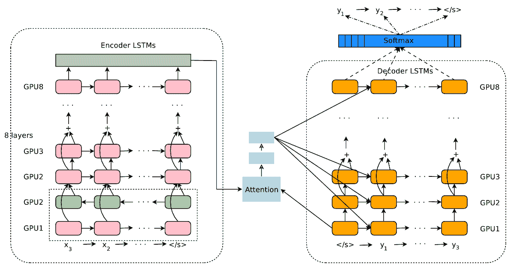

图 26：谷歌神经机器翻译的架构（Wu et al. (2016)）。

尽管变换器（transformer）取得了成功，但模型在捕捉人类语言的细微差别方面仍显不足，并且在需要深入理解上下文的任务中表现不佳。这在涉及正式语体、口语化以及可能在目标语言中没有直接对应的细微文化参考时尤其具有挑战性，可能导致翻译不准确或丧失原意。将当前源句与前面的（上下文）句子连接起来并将整个输入喂入变换器是将上下文纳入输入序列的一种方法 Lupo 等人 (2023)。该模型被训练预测包括上下文翻译的翻译句子。在推断时，仅考虑翻译，而上下文翻译被丢弃。此外，该方法对句子位置和段落偏移位置进行编码，以提高当前句子和上下文句子之间的区分。在 Rippeth 等人 (2023) 中，源句前加上了文档摘要以对输入句子进行上下文化。摘要是一组突出词，代表文档的本质，解决翻译中的歧义问题。一项研究旨在确定聚合上下文特征的最佳技术 Wu 等人 (2022)。研究了三种技术，即连接模式、平面模式和层次模式，实验结果显示连接模式取得了最佳结果。在 Kim 等人 (2023) 中，介绍了一种训练方法，以训练深度学习机器翻译模型生成包含敬语的翻译。该训练方法使用敬语分类器指示目标句中的敬语上下文，以指导模型关注相关的标记。与其他研究通过连接包含上下文特征不同，该训练方法为敬语分类器指示的上下文标记分配权重。这使得模型能够生成更准确的包含敬语的翻译。最后，变换器的性能依赖于大规模的训练数据。然而，对于绝大多数语言，仅存在有限的训练数据。为了解决这个问题，最近的研究引入了浅层变换器架构 Gezmu 和 Nürnberger (2022)，探讨了超参数微调的效果 Araabi 和 Monz (2020)，利用单语语料库来增强双语数据集以进行模型训练 Li 等人 (2024)，并利用视觉输入作为翻译任务的上下文信息 Meetei 等人 (2023)。

#### 4.3.3 文本生成

文本生成指的是根据给定的输入创建文本的过程，输入可以是文本、图像、图表、表格或甚至表格数据。由于输入形式多样，文本生成具有广泛的应用，包括创意写作、图像描述和音乐生成。本节重点讨论在文本到文本生成任务中的进展，例如问答、对话生成和文本摘要。递归神经网络及其变体在文本生成任务中发挥了重要作用，因为它们对顺序数据建模能力很强。关于问答的早期研究之一基于 RNN 编码器-解码器模型，其中编码器接收问题嵌入并使用双向 LSTM 处理，解码器则生成相应的答案 Nie 等人 (2017)。此外，为了防止语义丢失并使模型专注于输入序列中的重要词语，应用了卷积操作到词嵌入上，然后使用注意力机制来关注卷积操作的输出。类似的工作在 Yin 等人 (2015) 中报道，其中引入了基于知识的模块来计算问题与知识库中相关事实之间的相关性评分。这改善了解码器生成的文本（答案）。另一个工作在 Li 等人 (2016) 中描述，其中一个用于对话生成的编码器-解码器模型通过强化学习进行优化。该模型首先以监督学习的方式进行训练，然后使用策略梯度方法进行改进，以多样化响应。问答句中的模糊内容是文本生成中的一个挑战，可能导致不正确和不确定的回应。跨句上下文感知的双向模型引入了一个并行注意力模块，以计算句子级别的共注意力权重，考虑问题和答案中的关系和相似性 Wu 等人 (2020)。

变换器已被用于文本生成任务。提出了一种增量变换器编码器，以增量方式对历史对话序列进行编码 Li et al. (2019b)。解码器是一个基于审议网络的双通道解码器，用于生成下一句。第一通道关注对话的上下文连贯性，而第二通道则对第一通道的输出进行细化。BERT 和 ALBERT 已被用作问题回答任务的预训练模型 Alrowili 和 Vijay-Shanker (2021)。研究发现，模型的表现对初始权重的随机分配特别敏感，尤其是在小数据集上 Alrowili 和 Vijay-Shanker (2022)。T-BERTSum 是基于 BERT 的模型，旨在解决长文本依赖问题，并在文本摘要中利用潜在话题映射 Ma et al. (2021)。该模型整合了一个神经话题模块以推断话题并指导摘要，使用变换器网络捕捉长程依赖，并结合了多层 LSTM 进行信息过滤。利用领域知识对于减少深度学习模型与文本语料库之间的语义差距至关重要。KeBioSum 是一个知识注入框架，将领域知识注入到预训练的 BERT 模型中，用于文本摘要 Xie et al. (2022)。在该框架中，从领域知识中检测并提取相关信息，生成句子的标签序列。然后使用判别性和生成性训练方法训练文本摘要模型，将知识注入到模型中。

## 5 挑战与未来方向

#### 5.0.1 可用性和质量

建立和使用深度学习模型面临多个挑战。深度学习的训练需要大量实例（示例）才能实现高准确性和泛化能力 Munappy 等人 (2022)。此外，深度神经网络的复杂性可能导致过拟合，即模型在训练数据上表现良好，但在新出现的数据上无法泛化。这种现象通常发生在模型训练的数据不足时，这突显了多样化和广泛数据集的重要性。然而，数据收集和注释是耗时的，通常需要领域专家、专业培训和标准化 Luca 等人 (2022)。此外，这一过程容易出错，并有可能引入偏差到数据集中，从而显著影响训练模型的性能。解决这一问题的一种方法是迁移学习。迁移学习涉及使用一个在大数据集上训练的深度学习模型（称为预训练模型）来解决特定任务（使用小数据集） Zhuang 等人 (2020)。预训练模型作为模型训练的基础，通过微调预训练模型的权重并将其适应于新的预测任务。这种方法有助于缓解目标领域训练数据的不足。此外，迁移学习减少了训练模型所需的计算资源，并帮助更快地收敛。

另一种可以解决数据不足的方法是数据增强。数据增强是一种方便的方法，通过对现有实例进行转换函数处理而不改变标签来增加实例数量 Mumuni 和 Mumuni (2022)。在计算机视觉领域，图像转换如旋转、平移和裁剪。然而，重要的是要考虑转换的输出，因为结果可能无法代表实际数据。例如，翻转或给信号添加噪声可能会引入失真或改变信号的特征（趋势、季节性和周期变化）。因此，必须仔细考虑以确保生成的实例仍能准确地代表数据中存在的潜在模式。数据增强还可以通过生成合成数据来补充训练集。合成数据是人工创建的数据，虽然类似于真实数据，但使用统计方法或深度生成模型生成 Hu 等人 (2023)；Murtaza 等人 (2023)。生成的数据可以补充那些多样性较少、有限的数据集，为模型提供更多的学习例子。然而，生成能够准确反映现实数据特征的合成数据是具有挑战性的。必须仔细考虑所使用的模型和参数选择，以确保合成数据是现实的，并且能代表真实世界的数据。

#### 5.0.2 可解释性和解释性

可解释性和可解释性对于建立信任以及理解预测模型如何做出决策至关重要，尤其是在医疗保健和医学图像分析等高风险应用中（Tonekaboni et al. (2019)）。然而，随着深度学习模型变得越来越复杂，具有多个层次、子网络和大量参数，这些模型通常被视为“黑箱”，难以解释其决策过程。因此，研究人员必须关注那些提供深入了解深度学习模型如何进行预测及其决策如何受到输入数据影响的方法，使其更加透明和可信。已经提出了许多解释和说明深度学习模型决策的方法，这些方法可以分为可视化（特征归因）、模型蒸馏和内在（自我解释）。可视化方法涉及使用科学可视化工具，如显著性图或热图，通过突出输入和预测之间的关联程度来表达解释（Tjoa et al. (2023)）。热图识别影响模型预测的输入特征的显著性。可视化方法简单直观，可以应用于表格数据和图像数据。此外，它还可以用于识别和调试深度学习模型中的问题，从而提高性能和鲁棒性。

模型蒸馏是一种通过使用训练集来拟合更简单的模型，以近似复杂模型的方法。这个简单模型通常是通过更简单或可解释的算法构建的，如线性回归、决策树或基于规则的方法 Li 和 Shen (2024)。在这种方法中，简单模型被训练成类似于复杂模型的预测行为。然后，简单模型可以作为解释复杂模型的代理模型或替代模型。模型蒸馏可以与可视化一起使用，以进一步增强复杂模型的可解释性 Termritthikun 等人 (2023)。模型蒸馏寻求对那些从未设计为可解释的模型的解释。理想情况下，深度学习模型预测的解释应作为模型输出的一部分，或者可以从模型的架构中推导出来。这是因为内在模型不仅可以学习输入与输出之间的映射，还可以生成对预测的解释，这些解释忠实于模型的行为。注意力机制是这一方法的关键，它提供了一种注意力权重，可以用来解释模型为何做出特定决策 Xiong 等人 (2022)。另一种内在方法是训练模型同时执行预测任务和生成其预测解释 Fernandes 等人 (2023)。这种“附加任务”可以是文本解释或嵌入预测语义意义的模型原型。然而，内在方法更难应用，因为用户需要额外的知识和对模型架构及内部机制的理解。

#### 5.0.3 伦理与公平

深度学习模型越来越多地被应用于高风险决策中，包括招聘 Freire 和 de Castro（2021）、刑事司法 Dass 等（2023）和信用评分 Gicić等（2023）。深度学习系统有几个优势，与人类不同，机器能够快速且一致地处理大量数据和应用。然而，深度学习系统存在着因训练数据中存在的偏见而导致不公平和不公正的风险。为缓解这一问题，已做出了许多努力，这些努力可以分为建模偏见检测和建模偏见缓解两类。建模偏见检测是指识别和量化预测模型中可能存在的偏见的过程。这一方法包括使用统计分析、公平性指标、反事实测试和人工审查来检测模型中的偏见。例如，基于可视化的方法如归因图被用来指示哪些区域对预测具有重要意义 Schaaf 等（2021）。这反过来可以用来使用诸如相关性质量准确度、相关性排名准确度或扰动曲线下的面积（AOPC）等指标来检测和量化偏见。在 Giloni 等（2022）中，提出了两个模块来估计预测模型中的偏见。第一个模块利用一个无监督的深度神经网络和一个自定义的损失函数来生成输入数据的隐藏表示，称为偏见向量，从而揭示每个特征的潜在偏见。第二个模块将这些偏见向量结合成一个单一向量，代表每个特征的偏见估计，通过使用绝对平均操作来聚合它们。偏见缓解是指减少预测模型中偏见的过程，这可以分为三个阶段。第一阶段通过修改训练数据来对抗偏见，无论是重新标记标签还是扰动特征值 Iosifidis 等（2019）；Kehrenberg 等（2020）。第二阶段在模型训练过程中通过向损失函数中应用正则化项来解决偏见，以惩罚歧视。在 Jain 等（2023）中，引入了一种基于偏见平等分数（BPS）的损失函数，用于测量不同子群体之间统计度量（如准确性）的相似度。BPS 项被添加到损失函数中作为对原始预测任务的正则化。最后阶段在预测模型成功训练后缓解偏见。这个阶段应用后处理方法如强化学习来获得一个更公平的模型 Yang 等（2023）。例如，检测少数类的行为会获得奖励，以防止对多数类的偏见。这使得模型在不同的患者人群中具有良好的泛化能力。

#### 5.0.4 轻量级深度学习模型

尽管深度学习架构在各种计算机视觉任务中已实现了最先进的成果，但它们通常具有大量的模型参数 Ige 和 Mohd Noor (2023)。深度学习网络的架构和复杂性决定了模型参数的数量。网络越深，模型参数的数量就越大。然而，具有大量参数的深度学习模型在部署到终端设备时常常面临限制。例如，通过使用 3D-CNN 分析视频数据来开发的用于安全监控的深度学习模型，在将这些模型部署到资源有限的系统如智能手机或小型物联网设备时可能会遇到部署问题。对于具有大量参数的深度学习模型，模型训练和推理需要大量的处理能力。随着参数数量的增加，计算复杂性也增加，导致模型训练时间更长，硬件需求更多。此外，大的参数规模也意味着增加的内存需求，从而限制了它们在终端设备上的部署。这是因为这些终端设备通常有电池、处理器或内存容量的限制。为了解决这些挑战，开发复杂但轻量的架构以实现最先进的性能而只需少量模型参数是重要的。这些轻量级模型的特点是能够在减轻计算复杂性和内存需求的同时提供具有竞争力的性能，使其非常适合部署在资源受限的设备上。一种方法是开发新型的轻量级即插即用模块，这些模块可以插入到少层的深度学习架构中，以改善特征学习而不增加额外的模型复杂性。其他方法可以涉及利用模型压缩技术来减少深度学习模型的大小和计算复杂性。研究人员可以专注于改进剪枝方法 Li 等 (2019a)，这种方法可以识别并消除冗余的参数或连接，从而在不影响性能的情况下减少模型的占用空间。此外，量化技术 Yang 等 (2019) 可以进一步探索，以减少权重和激活的精度，从而实现低内存需求的高效表示。此外，知识蒸馏技术 Stanton 等 (2021) 可以进一步研究，以促进从复杂的教师模型到简单的学生模型的知识转移，从而实现紧凑而有效的表示。这些领域仍然开放于进一步的贡献。

#### 5.0.5 对抗攻击与防御

对抗攻击和深度学习中的防御机制是一个关键的研究与开发领域，特别是随着深度学习模型越来越多地融入各种应用。对抗攻击涉及故意操纵输入数据，以误导或欺骗深度学习模型，导致错误的预测或行为（Akhtar 和 Mian (2018)）。Szegedy 等人 (2013) 首次识别出深度神经网络在图像分类中这一引人注目的缺陷。他们展示了即使在高精度的情况下，深度学习模型也意外地容易受到对抗攻击，这些攻击表现为对人类视觉系统几乎不可见的微小图像变化。这样的攻击可能会彻底改变神经网络分类器对图像的预测。此外，这样的模型可能对错误的预测表现出高度的自信，这对于在医疗或安全等领域部署的深度学习模型来说，可能是灾难性的。在生成模型中，一些研究探讨了对抗攻击如何影响自编码器和生成对抗网络（GANs），如在 Tabacof 等人 (2016) 的研究中，介绍了一种操控输入图像的方法，以欺骗变分自编码器重建完全不同的图像。近年来，对抗攻击研究的重点是图像，但研究表明，对抗攻击并不限于图像数据；它们也可以影响其他类型的数据，如文本、信号、音频和视频（Zhang 等人 (2020b); Jiang 等人 (2019); Esmaeilpour 等人 (2019)）。未来的研究可以专注于探索这些领域中的对抗攻击，并开发量身定制的防御机制。同时，研究人员可以进一步探讨对抗攻击在实际场景中的影响，如自动驾驶汽车、医疗成像和网络安全。理解这些应用中对抗攻击的潜在影响可以为开发更为稳健和安全的系统提供指导。

## 6 结论

深度学习已经成为各种尖端应用中的主流数据驱动方法。其重要性在于其能够彻底改变许多研究和行业的各个方面，并解决曾经难以克服的复杂问题。已经发布了大量关于深度学习的调查，回顾了概念、模型架构和应用。然而，这些研究并未讨论深度学习在尖端应用中的新兴趋势，也未强调模型中的重要特征和元素。本文提供了深度学习的结构化和全面的调查，重点关注计算机视觉、自然语言处理、时间序列分析和普适计算等尖端应用中的最新趋势和进展。调查探讨了现代深度学习模型中的关键元素和特征，突出其在应对各领域复杂挑战中的重要性。此外，本文还对深度学习基础进行了全面回顾，这对于理解现代深度学习模型的核心原理至关重要。调查最后讨论了深度学习中的关键挑战和未来方向。

## 致谢

本工作部分得到了马来西亚高等教育部基础研究资助计划的支持，项目代码：FRGS/1/2023/ICT02/USM/02/2。

## 竞争利益声明

作者声明，他们没有已知的财务竞争利益或个人关系，这些可能会影响本文报告的工作。

## 数据可用性

本文中描述的研究未使用任何数据。

\printcredits

## 参考文献

+   Abdulwahhab 等人（2024）Abdulwahhab, A.H., Abdulaal, A.H., Thary Al-Ghrairi, A.H., Mohammed, A.A., Valizadeh, M., 2024. 基于深度学习技术的脑电信号分析用于癫痫发作检测。Chaos, Solitons and Fractals 181, 114700. URL: [`www.sciencedirect.com/science/article/pii/S0960077924002522`](https://www.sciencedirect.com/science/article/pii/S0960077924002522), doi:`doi.org/10.1016/j.chaos.2024.114700`。

+   Abedin 等人（2021）Abedin, M.Z., Moon, M.H., Hassan, M.K., Hajek, P., 2021. 基于深度学习的汇率预测在 COVID-19 大流行期间的表现。运筹学年刊, 1–52。

+   Acharya 等人（2017）Acharya, U.R., Oh, S.L., Hagiwara, Y., Tan, J.H., Adam, M., Gertych, A., San Tan, R., 2017. 一个深度卷积神经网络模型用于心跳分类。生物医学计算机 89, 389–396。

+   Ahnouch 等人（2023）Ahnouch, M., Elaachak, L., Ghadi, A., 2023. 财务衍生品中的模型风险及深度学习的变革性影响：系统评审，见于《国际智慧城市应用会议论文集》，Springer 出版社。第 155–165 页。

+   Akhtar 和 Mian（2018）Akhtar, N., Mian, A., 2018. 深度学习在计算机视觉中的对抗攻击威胁：调查。IEEE Access 6, 14410–14430. doi:10.1109/ACCESS.2018.2807385。

+   Alnuaim 等人（2022）Alnuaim, A.A., Zakariah, M., Shashidhar, C., Hatamleh, W.A., Tarazi, H., Shukla, P.K., Ratna, R., 2022. 基于深度神经网络和 resnet50 的说话人性别识别。Wireless Communications and Mobile Computing 2022, 1–13。

+   Alom 等人（2019）Alom, M.Z., Taha, T.M., Yakopcic, C., Westberg, S., Sidike, P., Nasrin, M.S., Hasan, M., Van Essen, B.C., Awwal, A.A., Asari, V.K., 2019. 深度学习理论和架构的最前沿调查。electronics 8, 292。出版商：Multidisciplinary Digital Publishing Institute。

+   Alrowili 和 Vijay-Shanker（2021）Alrowili, S., Vijay-Shanker, K., 2021. BioM-transformers：使用 BERT、ALBERT 和 ELECTRA 构建大型生物医学语言模型，见：第 20 届生物医学语言处理研讨会论文集，第 221–227 页。

+   Alrowili 和 Vijay-Shanker（2022）Alrowili, S., Vijay-Shanker, K., 2022. 在 BioASQ10B 挑战中使用 BioM-Transformers 探索生物医学问答：发现与技术，见：CLEF（工作笔记），第 222–234 页。

+   Altaheri 等人（2023）Altaheri, H., Muhammad, G., Alsulaiman, M., Amin, S.U., Altuwaijri, G.A., Abdul, W., Bencherif, M.A., Faisal, M., 2023. 用于电生理图（eeg）运动意象（mi）信号分类的深度学习技术：综述。Neural Computing and Applications 35, 14681–14722。

+   Alzubaidi 等人（2021）Alzubaidi, L., Zhang, J., Humaidi, A.J., Al-Dujaili, A., Duan, Y., Al-Shamma, O., Santamaría, J., Fadhel, M.A., Al-Amidie, M., Farhan, L., 2021. 深度学习综述：概念、CNN 架构、挑战、应用及未来方向。Journal of big Data 8, 1–74。出版商：Springer。

+   Ang 和 Guan（2017）Ang, K.K., Guan, C., 2017. 基于 EEG 的策略检测运动意象用于控制和康复。IEEE Transactions on Neural Systems and Rehabilitation Engineering 25, 392–401. doi:10.1109/TNSRE.2016.2646763。

+   Araabi 和 Monz（2020）Araabi, A., Monz, C., 2020. 针对低资源神经机器翻译优化 Transformer，见：Scott, D., Bel, N., Zong, C.（主编），第 28 届国际计算语言学会议论文集，国际计算语言学委员会，西班牙巴塞罗那（在线）。第 3429–3435 页。URL: [`aclanthology.org/2020.coling-main.304`](https://aclanthology.org/2020.coling-main.304)，doi:10.18653/v1/2020.coling-main.304。

+   Arevian (2007) Arevian, G., 2007. 用于稳健的现实世界文本分类的递归神经网络，发表于：IEEE/WIC/ACM 国际网页智能会议 (WI’07)，第 326–329 页。网址：[`ieeexplore.ieee.org/abstract/document/4427112`](https://ieeexplore.ieee.org/abstract/document/4427112)，doi：10.1109/WI.2007.126。

+   Ba et al. (2016) Ba, J., Kiros, J., Hinton, G.E., 2016. 层归一化。ArXiv 网址：[`www.semanticscholar.org/paper/Layer-Normalization-Ba-Kiros/97fb4e3d45bb098e27e0071448b6152217bd35a5`](https://www.semanticscholar.org/paper/Layer-Normalization-Ba-Kiros/97fb4e3d45bb098e27e0071448b6152217bd35a5)。

+   Badrinarayanan et al. (2017) Badrinarayanan, V., Kendall, A., Cipolla, R., 2017. Segnet：一种用于图像分割的深度卷积编码器-解码器架构。IEEE 模式分析与机器智能期刊 39, 2481–2495。出版社：IEEE。

+   Bahdanau et al. (2014) Bahdanau, D., Cho, K., Bengio, Y., 2014. 通过联合学习对齐和翻译进行神经机器翻译。arXiv 预印本 arXiv:1409.0473。

+   Baloglu et al. (2019) Baloglu, U.B., Talo, M., Yildirim, O., San Tan, R., Acharya, U.R., 2019. 利用多导联 ECG 信号和深度 CNN 进行心肌梗死分类。模式识别快报 122, 23–30。

+   Banerjee et al. (2020) Banerjee, R., Ghose, A., Muthana Mandana, K., 2020. 一种用于检测冠状动脉疾病的混合 cnn-lstm 架构，发表于：2020 年国际神经网络联合会议 (IJCNN)，第 1–8 页。doi：10.1109/IJCNN48605.2020.9207044。

+   Banjarey et al. (2022) Banjarey, K., Sahu, S.P., Dewangan, D.K., 2022. 使用 1d 卷积神经网络进行人类活动识别，发表于：情感分析与深度学习：ICSADL 2021 论文集，Springer，第 691–702 页。

+   Bochkovskiy et al. (2020) Bochkovskiy, A., Wang, C.Y., Liao, H.Y.M., 2020. Yolov4：最佳的目标检测速度和准确性。arXiv 预印本 arXiv:2004.10934。

+   Bodla et al. (2017) Bodla, N., Singh, B., Chellappa, R., Davis, L.S., 2017. Soft-NMS—用一行代码改进目标检测，发表于：IEEE 国际计算机视觉会议论文集，第 5561–5569 页。

+   Boonyakitanont et al. (2020) Boonyakitanont, P., Lek-Uthai, A., Chomtho, K., Songsiri, J., 2020. 癫痫发作检测中的特征提取与性能评估综述。生物医学信号处理与控制 57, 101702。

+   Brunner et al. (2007) Brunner, C., Naeem, M., Leeb, R., Graimann, B., Pfurtscheller, G., 2007. 在四类运动意象脑电数据中使用独立成分分析的空间滤波和优化成分选择。模式识别快报 28, 957–964。

+   Cai 等 (2018) Cai, S., Feng, X., Deng, Z., Ming, Z., Shan, Z., 2018. 基于 CNN 和 LSTM 的金融新闻量化与股票市场预测研究，见于：智能计算与通信：第三届国际会议，SmartCom 2018，东京，日本，2018 年 12 月 10–12 日，会议录 3，Springer. 页码 366–375。

+   Cai 等 (2019) Cai, Y., Wang, X., Yu, Z., Li, F., Xu, P., Li, Y., Li, L., 2019. Dualattn-GAN：具有双重注意力生成对抗网络的文本到图像合成。IEEE Access 7, 183706–183716。网址：[`ieeexplore.ieee.org/document/8930532?denied=`](https://ieeexplore.ieee.org/document/8930532?denied=)，doi：10.1109/ACCESS.2019.2958864。会议名称：IEEE Access。

+   Calvo 和 Ceccatto (2000) Calvo, R.A., Ceccatto, H.A., 2000. 智能文档分类。智能数据分析 4, 411–420。网址：[`content.iospress.com/articles/intelligent-data-analysis/ida00028`](https://content.iospress.com/articles/intelligent-data-analysis/ida00028)，doi：10.3233/IDA-2000-4503。出版商：IOS Press。

+   Carion 等 (2020) Carion, N., Massa, F., Synnaeve, G., Usunier, N., Kirillov, A., Zagoruyko, S., 2020. 基于变换器的端到端目标检测，见于：Vedaldi, A., Bischof, H., Brox, T., Frahm, J.M. (编)，计算机视觉 – ECCV 2020，Springer 国际出版，Cham. 页码 213–229。doi：10.1007/978-3-030-58452-8_13。

+   Chan 等 (2015) Chan, W., Jaitly, N., Le, Q.V., Vinyals, O., 2015. 听、关注与拼写。arXiv 预印本 arXiv:1508.01211。

+   Chaurasia 和 Culurciello (2017) Chaurasia, A., Culurciello, E., 2017. Linknet: 利用编码器表示进行高效语义分割，见于：2017 IEEE 视觉通信与图像处理（VCIP），IEEE. 页码 1–4。

+   Chen 等 (2022a) Chen, C.Y., Lin, Y.T., Lee, S.J., Tsai, W.C., Huang, T.C., Liu, Y.H., Cheng, M.C., Dai, C.Y., 2022a. 基于 1D 深度学习网络的自动化 ECG 分类。方法 202, 127–135。网址：[`www.sciencedirect.com/science/article/pii/S1046202321001134`](https://www.sciencedirect.com/science/article/pii/S1046202321001134)，doi：`doi.org/10.1016/j.ymeth.2021.04.021`。机器学习方法用于生物医学图像和信号处理：近期进展。

+   Chen 等 (2022b) Chen, D., Yongchareon, S., Lai, E.M.K., Yu, J., Sheng, Q.Z., Li, Y., 2022b. 基于双向 GRU 的变换器用于多居民环境中的非侵入式传感器活动识别。IEEE 物联网杂志 9, 23716–23727。

+   Chen 等 (2024) Chen, L., Pelger, M., Zhu, J., 2024. 资产定价中的深度学习。管理科学 70, 714–750。

+   Chen 等 (2018) Chen, L.C., Hermans, A., Papandreou, G., Schroff, F., Wang, P., Adam, H., 2018. MaskLab：通过细化目标检测与语义和方向特征进行实例分割，在：IEEE 计算机视觉与模式识别会议，第 4013–4022 页。

+   Chen 等 (2012) Chen, M., Xu, Z., Weinberger, K.Q., Sha, F., 2012. 用于领域适应的边际去噪自编码器，在：第 29 届国际机器学习大会，Omnipress, Madison, WI, USA，第 1627–1634 页。

+   Chen 等 (2016) Chen, X., Duan, Y., Houthooft, R., Schulman, J., Sutskever, I., Abbeel, P., 2016. InfoGAN：通过信息最大化生成对抗网络的可解释表示学习。URL: [`arxiv.org/abs/1606.03657`](http://arxiv.org/abs/1606.03657)，doi:10.48550/arXiv.1606.03657。arXiv:1606.03657 [cs, stat] 版本: 1。

+   Chiu 等 (2018) Chiu, C.C., Sainath, T.N., Wu, Y., Prabhavalkar, R., Nguyen, P., Chen, Z., Kannan, A., Weiss, R.J., Rao, K., Gonina, E., Jaitly, N., Li, B., Chorowski, J., Bacchiani, M., 2018. 先进的语音识别与序列到序列模型，在：2018 IEEE 国际声学、语音与信号处理会议 (ICASSP)，第 4774–4778 页。doi:10.1109/ICASSP.2018.8462105。

+   Cho 等 (2014) Cho, K., van Merriënboer, B., Gulcehre, C., Bahdanau, D., Bougares, F., Schwenk, H., Bengio, Y., 2014. 使用 RNN 编码器–解码器进行短语表示学习用于统计机器翻译，在：Moschitti, A., Pang, B., Daelemans, W. (编辑)，2014 年自然语言处理实证方法会议 (EMNLP) 论文集，计算语言学协会，多哈，卡塔尔，第 1724–1734 页。URL: [`aclanthology.org/D14-1179`](https://aclanthology.org/D14-1179)，doi:10.3115/v1/D14-1179。

+   Clevert 等 (2016) Clevert, D.A., Unterthiner, T., Hochreiter, S., 2016. 通过指数线性单元 (ELUs) 实现快速而准确的深度网络学习。URL: [`arxiv.org/abs/1511.07289`](http://arxiv.org/abs/1511.07289)，doi:10.48550/arXiv.1511.07289。arXiv:1511.07289 [cs]。

+   Crippa 等 (2015) Crippa, P., Curzi, A., Falaschetti, L., Turchetti, C., 等，2015. 基于卡尔霍嫩-洛埃夫变换的高斯混合模型的多类心电图节拍分类。国际模拟系统科学与技术杂志 16, 2–1。

+   Cybenko (1989) Cybenko, G., 1989. 通过对称函数的叠加进行逼近。控制、信号与系统数学 2, 303–314。URL: [`doi.org/10.1007/BF02551274`](https://doi.org/10.1007/BF02551274)，doi:10.1007/BF02551274。

+   Dai 等 (2019) Dai, M., Zheng, D., Na, R., Wang, S., Zhang, S., 2019. 使用新型深度学习框架的脑电图运动想象分类。传感器 19, 551。

+   Dai 等（2021）Dai, X., Chen, Y., Yang, J., Zhang, P., Yuan, L., Zhang, L., 2021. 动态 DETR：具有动态注意力的端到端目标检测，第 2988–2997 页。网址：[`openaccess.thecvf.com/content/ICCV2021/html/Dai_Dynamic_DETR_End-to-End_Object_Detection_With_Dynamic_Attention_ICCV_2021_paper.html?ref=https://githubhelp.com`](https://openaccess.thecvf.com/content/ICCV2021/html/Dai_Dynamic_DETR_End-to-End_Object_Detection_With_Dynamic_Attention_ICCV_2021_paper.html?ref=https://githubhelp.com)。

+   Dang 等（2020）Dang, L.M., Min, K., Wang, H., Piran, M.J., Lee, C.H., Moon, H., 2020. 基于传感器和视觉的人类活动识别：全面综述。模式识别 108, 107561。

+   Dass 等（2023）Dass, R.K., Petersen, N., Omori, M., Lave, T.R., Visser, U., 2023. 识别刑事司法中的种族不平等：朝着一种公平的深度学习方法生成和解释种族类别。AI 与社会 38, 897–918。出版商：Springer。

+   Deep 和 Zheng（2019）Deep, S., Zheng, X., 2019. 具有 CNN 和 LSTM 架构的混合模型用于智能手机传感器数据上的人类活动识别，见于：2019 年第 20 届国际并行与分布计算、应用与技术会议（PDCAT），IEEE. 第 259–264 页。

+   Delorme 等（2007）Delorme, A., Sejnowski, T., Makeig, S., 2007. 使用高阶统计量和独立成分分析增强 EEG 数据中伪影的检测。神经影像 34, 1443–1449。

+   Desai 等（2021）Desai, M.P., Caffarena, G., Jevtic, R., Márquez, D.G., Otero, A., 2021. 使用 Hermite 多项式的低延迟、低功耗 FPGA 实现 ECG 信号特征提取。电子学 10, 2324。

+   Devlin 等（2018）Devlin, J., Chang, M.W., Lee, K., Toutanova, K., 2018. BERT：用于语言理解的深度双向变换器的预训练。arXiv 预印本 arXiv:1810.04805。

+   Dixit 和 Silakari（2021）Dixit, P., Silakari, S., 2021. 用于网络安全应用的深度学习算法：技术和现状综述。计算机科学评论 39, 100317。网址：[`www.sciencedirect.com/science/article/pii/S1574013720304172`](https://www.sciencedirect.com/science/article/pii/S1574013720304172)，doi:10.1016/j.cosrev.2020.100317。

+   Dong 等（2021）Dong, S., Wang, P., Abbas, K., 2021. 深度学习及其应用的综述。计算机科学评论 40, 100379。出版商：Elsevier。

+   Dosovitskiy 等（2021）Dosovitskiy, A., Beyer, L., Kolesnikov, A., Weissenborn, D., Zhai, X., Unterthiner, T., Dehghani, M., Minderer, M., Heigold, G., Gelly, S., Uszkoreit, J., Houlsby, N., 2021. 一张图片值 16x16 个词：用于大规模图像识别的变换器。网址：[`arxiv.org/abs/2010.11929`](http://arxiv.org/abs/2010.11929)，doi:10.48550/arXiv.2010.11929。arXiv:2010.11929 [cs]。

+   Dua 等人 (2023) Dua, N., Singh, S.N., Semwal, V.B., Challa, S.K., 2023. 受启发的 CNN-GRU 混合网络用于人类活动识别。多媒体工具与应用 82, 5369–5403。

+   Duchi 等人 (2011) Duchi, J., Hazan, E., Singer, Y., 2011. 用于在线学习和随机优化的自适应子梯度方法。机器学习研究期刊 12, 2121–2159。网址: [`jmlr.org/papers/v12/duchi11a.html`](http://jmlr.org/papers/v12/duchi11a.html)。

+   Dugas 等人 (2000) Dugas, C., Bengio, Y., Bélisle, F., Nadeau, C., Garcia, R., 2000. 通过引入二阶功能知识改进期权定价，见：神经信息处理系统进展，MIT Press。网址: [`papers.nips.cc/paper_files/paper/2000/hash/44968aece94f667e4095002d140b5896-Abstract.html`](https://papers.nips.cc/paper_files/paper/2000/hash/44968aece94f667e4095002d140b5896-Abstract.html)。

+   Eapen 等人 (2019) Eapen, J., Bein, D., Verma, A., 2019. 具有 CNN 和双向 LSTM 的新型深度学习模型用于改进股票市场指数预测，见：2019 IEEE 第九届年度计算与通信研讨会暨会议 (CCWC)，IEEE。第 0264–0270 页。

+   Erdaş 和 Güney (2021) Erdaş, Ç.B., Güney, S., 2021. 使用不同深度学习方法进行可穿戴传感器的人类活动识别。神经处理信件 53, 1795–1809。

+   Esmaeilpour 等人 (2019) Esmaeilpour, M., Cardinal, P., Koerich, A.L., 2019. 一种用于保护音频分类免受对抗性攻击的鲁棒方法。IEEE 信息取证与安全期刊 15, 2147–2159。

+   Esteva 等人 (2019) Esteva, A., Robicquet, A., Ramsundar, B., Kuleshov, V., DePristo, M., Chou, K., Cui, C., Corrado, G., Thrun, S., Dean, J., 2019. 医疗保健中的深度学习指南。自然医学 25, 24–29。

+   Fernandes 等人 (2023) Fernandes, L., Fernandes, J.N., Calado, M., Pinto, J.R., Cerqueira, R., Cardoso, J.S., 2023. 面向端到端目标检测的内在可解释性。IEEE Access 出版商：IEEE。

+   Freire 和 de Castro (2021) Freire, M.N., de Castro, L.N., 2021. 电子招聘推荐系统：系统评审。知识与信息系统 63, 1–20。出版商：Springer。

+   Gao 等人 (2021a) Gao, W., Zhang, L., Teng, Q., He, J., Wu, H., 2021a. Danhar: 用于多模态人类活动识别的双重注意力网络，使用可穿戴传感器。应用软计算 111, 107728。

+   Gao 等人 (2021b) Gao, Z., Dang, W., Wang, X., Hong, X., Hou, L., Ma, K., Perc, M., 2021b. 复杂网络和深度学习用于 EEG 信号分析。认知神经动力学 15, 369–388。

+   Gao 等人 (2018) Gao, Z., Xie, J., Wang, Q., Li, P., 2018. 全球二阶池化卷积网络。网址: [`arxiv.org/abs/1811.12006`](http://arxiv.org/abs/1811.12006)，doi:10.48550/arXiv.1811.12006。arXiv:1811.12006 [cs] 版本: 2。

+   Gezmu 和 Nürnberger (2022) Gezmu, A.M., Nürnberger, A., 2022. 用于低资源神经机器翻译的 Transformers，见：ICAART (1)，pp. 459–466。

+   Gicić 等 (2023) Gicić, A., Donko, D., Subasi, A., 2023. 使用深度学习方法的智能信用评分。并发与计算：实践与经验 35, e7637。

+   Giloni 等 (2022) Giloni, A., Grolman, E., Hagemann, T., Fromm, R., Fischer, S., Elovici, Y., Shabtai, A., 2022. BENN: 使用深度神经网络的偏差估计。IEEE 神经网络与学习系统汇刊：IEEE。

+   Girshick (2015) Girshick, R., 2015. 快速 R-CNN，见：2015 IEEE 国际计算机视觉大会 (ICCV)，pp. 1440–1448。URL: [`ieeexplore.ieee.org/document/7410526`](https://ieeexplore.ieee.org/document/7410526)，doi:10.1109/ICCV.2015.169。iSSN: 2380-7504。

+   Girshick 等 (2014) Girshick, R., Donahue, J., Darrell, T., Malik, J., 2014. 准确目标检测和语义分割的丰富特征层次，pp. 580–587。URL: [`openaccess.thecvf.com/content_cvpr_2014/html/Girshick_Rich_Feature_Hierarchies_2014_CVPR_paper.html`](https://openaccess.thecvf.com/content_cvpr_2014/html/Girshick_Rich_Feature_Hierarchies_2014_CVPR_paper.html)。

+   Glorot 等 (2011) Glorot, X., Bordes, A., Bengio, Y., 2011. 深度稀疏修正神经网络，见：第十四届人工智能与统计国际会议论文集，JMLR 工作坊和会议论文集。pp. 315–323。URL: [`proceedings.mlr.press/v15/glorot11a.html`](https://proceedings.mlr.press/v15/glorot11a.html)。iSSN: 1938-7228。

+   Goodfellow 等 (2014) Goodfellow, I., Pouget-Abadie, J., Mirza, M., Xu, B., Warde-Farley, D., Ozair, S., Courville, A., Bengio, Y., 2014. 生成对抗网络。神经信息处理系统进展 27。

+   Graves (2012) Graves, A., 2012. 使用递归神经网络的序列转导。arXiv 预印本 arXiv:1211.3711。

+   Gudelek 等 (2017) Gudelek, M.U., Boluk, S.A., Ozbayoglu, A.M., 2017. 基于深度学习的股票交易模型，使用 2-D CNN 趋势检测，见：2017 IEEE 计算智能研讨会系列 (SSCI)，IEEE。pp. 1–8。

+   Guo 等 (2023) Guo, M.H., Liu, Z.N., Mu, T.J., Hu, S.M., 2023. 超越自注意力：用于视觉任务的外部注意力，采用两个线性层。IEEE 模式分析与机器智能汇刊 45, 5436–5447。URL: [`ieeexplore.ieee.org/document/9912362`](https://ieeexplore.ieee.org/document/9912362)，doi:10.1109/TPAMI.2022.3211006。会议名称：IEEE 模式分析与机器智能汇刊。

+   Gupta (2021) Gupta, S., 2021. 基于深度学习的人体活动识别（HAR），使用可穿戴传感器数据。国际信息管理数据洞察期刊 1, 100046。

+   Han 等（2022）Han, C., Zhang, L., Tang, Y., Huang, W., Min, F., He, J., 2022. 利用异构卷积神经网络的可穿戴传感器进行人类活动识别。专家系统与应用 198, 116764。

+   Hao 等（2023）Hao, S., Zhang, P., Liu, S., Wang, Y., 2023. 基于 BERT–SVM 模型的官方文件文本情感识别与分析方法。神经计算与应用 35, 24621–24632。网址：[`doi.org/10.1007/s00521-023-08226-4`](https://doi.org/10.1007/s00521-023-08226-4)，doi：10.1007/s00521-023-08226-4。

+   Hassouneh 等（2020）Hassouneh, A., Mutawa, A., Murugappan, M., 2020. 基于机器学习和深度神经网络方法的实时情感识别系统的开发。医学信息学解锁 20, 100372。

+   Hatamizadeh 等（2023）Hatamizadeh, A., Yin, H., Heinrich, G., Kautz, J., Molchanov, P., 2023. 全球上下文视觉变换器，发表于：国际机器学习会议，PMLR，第 12633–12646 页。

+   He 等（2017）He, K., Gkioxari, G., Dollár, P., Girshick, R., 2017. Mask R-CNN，发表于：IEEE 国际计算机视觉会议论文集，第 2961–2969 页。

+   He 等（2015）He, K., Zhang, X., Ren, S., Sun, J., 2015. 深度残差学习用于图像识别。网址：[`arxiv.org/abs/1512.03385`](http://arxiv.org/abs/1512.03385)，doi：10.48550/arXiv.1512.03385。arXiv:1512.03385 [cs]。

+   He 等（2020a）He, P., Liu, X., Gao, J., Chen, W., 2020a. DeBERTa：解码增强的 BERT 与解耦注意力。arXiv 预印本 arXiv:2006.03654。

+   He 等（2020b）He, Y., Nazir, S., Nie, B., Khan, S., Zhang, J., 2020b. 基于 LSTM 分类模型的高效深度学习可信模型开发用于普适计算。复杂性 2020, 1–6。

+   Hema 和 Garcia Marquez（2023）Hema, C., Garcia Marquez, F.P., 2023. 使用 CNN 和深度学习技术进行情感语音识别。应用声学 211, 109492。网址：[`www.sciencedirect.com/science/article/pii/S0003682X23002906`](https://www.sciencedirect.com/science/article/pii/S0003682X23002906)，doi：`doi.org/10.1016/j.apacoust.2023.109492`。

+   Hermawan 等（2024）Hermawan, A.T., Zaeni, I.A.E., Wibawa, A.P., Gunawan, G., Hendrawan, W.H., Kristian, Y., 2024. 一种多重表示的深度学习方法用于癫痫发作检测。机器人与控制杂志 (JRC) 5, 187–204。

+   Hernández-Blanco 等（2019）Hernández-Blanco, A., Herrera-Flores, B., Tomás, D., Navarro-Colorado, B., 等，2019. 深度学习方法在教育数据挖掘中的系统性综述。复杂性 2019。

+   Hinton（2009）Hinton, G.E., 2009. 深度信念网络。Scholarpedia 4, 5947。网址：[`www.scholarpedia.org/article/Deep_belief_networks`](http://www.scholarpedia.org/article/Deep_belief_networks)，doi:10.4249/scholarpedia.5947。

+   Hinton（2012）Hinton, G.E., 2012. 限制玻尔兹曼机训练实用指南，见：Montavon, G., Orr, G.B., Müller, K.R.（编），《神经网络：实用技巧：第二版》。施普林格出版社，柏林，海德堡。计算机科学讲义，页码 599–619。网址：[`doi.org/10.1007/978-3-642-35289-8_32`](https://doi.org/10.1007/978-3-642-35289-8_32)，doi:10.1007/978-3-642-35289-8_32。

+   Hinton 等人（2006）Hinton, G.E., Osindero, S., Teh, Y.W., 2006. 深度信念网络的快速学习算法。神经计算 18, 1527–1554。网址：[`doi.org/10.1162/neco.2006.18.7.1527`](https://doi.org/10.1162/neco.2006.18.7.1527)，doi:10.1162/neco.2006.18.7.1527。

+   Hochreiter 等人（2001）Hochreiter, S., Bengio, Y., Frasconi, P., Schmidhuber, J., 其他人，2001. 循环网络中的梯度流：学习长期依赖的难度，见：动态递归网络的实地指南。动态递归神经网络的实地指南。IEEE 出版社。

+   Hochreiter 和 Schmidhuber（1997）Hochreiter, S., Schmidhuber, J., 1997. 长短期记忆。神经计算 9, 1735–1780。网址：[`doi.org/10.1162/neco.1997.9.8.1735`](https://doi.org/10.1162/neco.1997.9.8.1735)，doi:10.1162/neco.1997.9.8.1735。

+   Hornik 等人（1989）Hornik, K., Stinchcombe, M., White, H., 1989. 多层前馈网络是通用近似器。神经网络 2, 359–366。网址：[`www.sciencedirect.com/science/article/pii/0893608089900208`](https://www.sciencedirect.com/science/article/pii/0893608089900208)，doi:10.1016/0893-6080(89)90020-890020-8)。

+   Hu 等人（2023）Hu, C., Sun, Z., Li, C., Zhang, Y., Xing, C., 2023. 物联网中的时间序列数据生成调查。传感器 23, 6976。网址：[`www.mdpi.com/1424-8220/23/15/6976`](https://www.mdpi.com/1424-8220/23/15/6976)，doi:10.3390/s23156976。期号：15 出版社：多学科数字出版机构。

+   Hu 等人（2019）Hu, J., Shen, L., Albanie, S., Sun, G., Wu, E., 2019. 压缩与激励网络。网址：[`arxiv.org/abs/1709.01507`](http://arxiv.org/abs/1709.01507)，doi:10.48550/arXiv.1709.01507。arXiv:1709.01507 [cs] 版本：4。

+   Huang 等人（2017）Huang, G., Liu, Z., Van Der Maaten, L., Weinberger, K.Q., 2017. 稠密连接卷积网络，见：IEEE 计算机视觉与模式识别会议论文集，页码 4700–4708。

+   Huang 和 Feng (2020) Huang, J., Feng, Y., 2020. 自然语言处理中的递归神经网络优化，发表于 2019 年第 8 届国际计算与模式识别会议，计算机协会，美国纽约。第 39–45 页。网址: [`dl.acm.org/doi/10.1145/3373509.3373573`](https://dl.acm.org/doi/10.1145/3373509.3373573)，doi:10.1145/3373509.3373573。

+   Huang 等 (2023a) Huang, L., Lu, K., Song, G., Wang, L., Liu, S., Liu, Y., Li, H., 2023a. Teach-DETR: 用教师改进 DETR 的训练。IEEE 模式分析与机器智能学报 45, 15759–15771。网址: [`ieeexplore.ieee.org/document/10264211`](https://ieeexplore.ieee.org/document/10264211)，doi:10.1109/TPAMI.2023.3319387。会议名称: IEEE 模式分析与机器智能学报。

+   Huang 等 (2023b) Huang, Y., Qi, J., Wang, X., Lin, Z., 2023b. 多标签分类的非对称多项式损失，发表于 ICASSP 2023-2023 IEEE 国际声学、语音和信号处理会议 (ICASSP)，IEEE。第 1–5 页。

+   Hwang 等 (2023) Hwang, J., Park, S., Chi, J., 2023. 使用重叠滑动窗口和深度学习模型改进多类运动想象 EEG 分类。Electronics 12. 网址: [`www.mdpi.com/2079-9292/12/5/1186`](https://www.mdpi.com/2079-9292/12/5/1186)，doi:10.3390/electronics12051186。

+   Ige 和 Mohd Noor (2023) Ige, A.O., Mohd Noor, M.H., 2023. 一种具有注意力机制的深度局部-时间架构，用于轻量级人类活动识别。Applied Soft Computing 149, 110954。网址: [`www.sciencedirect.com/science/article/pii/S1568494623009729`](https://www.sciencedirect.com/science/article/pii/S1568494623009729)，doi:`doi.org/10.1016/j.asoc.2023.110954`。

+   Ige 和 Noor (2022) Ige, A.O., Noor, M.H.M., 2022. 基于可穿戴传感器的活动识别的无监督学习调查。Applied Soft Computing, 109363。

+   Ige 和 Noor (2023) Ige, A.O., Noor, M.H.M., 2023. Wsense: 一种用于轻量级人类活动识别的强健特征学习模块。arXiv 预印本 arXiv:2303.17845。

+   Imran 等 (2023) Imran, H.A., Riaz, Q., Hussain, M., Tahir, H., Arshad, R., 2023. 智能可穿戴传感器和 CNN-BiGRU 模型：人类活动识别的强大组合。IEEE 传感器期刊。

+   Ioffe 和 Szegedy (2015) Ioffe, S., Szegedy, C., 2015. 批量归一化：通过减少内部协变量偏移来加速深度网络训练，发表于第 32 届国际机器学习会议 - 第 37 卷，JMLR.org，法国里尔。第 448–456 页。

+   Iosifidis 等人（2019）Iosifidis, V., Tran, T.N.H., Ntoutsi, E., 2019. 在流分类中增强公平性的干预措施，见：数据库与专家系统应用：第 30 届国际会议，DEXA 2019，奥地利林茨，2019 年 8 月 26–29 日，论文集，第 I 部分 30, Springer。页 261–276。

+   Jafarifarmand 和 Badamchizadeh（2019）Jafarifarmand, A., Badamchizadeh, M.A., 2019. 在实际的脑–机接口控制的车辆中处理脑电图伪影。IEEE《神经系统与康复工程学报》27, 1200–1208。

+   Jain 等人（2023）Jain, B., Huber, M., Elmasri, R., 2023. 使用基于偏差平衡分数的损失函数正则化提高预测公平性。《国际 FLAIRS 会议论文集》36。URL: [`journals.flvc.org/FLAIRS/article/view/133311`](https://journals.flvc.org/FLAIRS/article/view/133311), doi:10.32473/flairs.36.133311。

+   Jaitly 等人（2016）Jaitly, N., Le, Q.V., Vinyals, O., Sutskever, I., Sussillo, D., Bengio, S., 2016. 使用部分条件的在线序列到序列模型。《神经信息处理系统进展》29。

+   Jiang 等人（2024）Jiang, B., Zeng, W., Yang, C., Wang, R., Zhang, B., 2024. DE-GAN：具有双重和高效融合模型的文本到图像合成。《多媒体工具与应用》83, 23839–23852。URL: [`doi.org/10.1007/s11042-023-16377-8`](https://doi.org/10.1007/s11042-023-16377-8), doi:10.1007/s11042-023-16377-8。

+   Jiang 等人（2019）Jiang, L., Ma, X., Chen, S., Bailey, J., Jiang, Y.G., 2019. 对视频识别模型的黑盒对抗攻击，见：第 27 届 ACM 国际多媒体会议论文集，页 864–872。

+   Jiao 等人（2016）Jiao, Y., Tu, M., Berisha, V., Liss, J.M., 2016. 通过结合深度神经网络和在长短期特征上训练的递归神经网络进行口音识别，见：Interspeech，页 2388–2392。

+   Karras 等人（2018）Karras, T., Aila, T., Laine, S., Lehtinen, J., 2018. 《GAN 的渐进生长以提高质量、稳定性和变异性》。URL: [`arxiv.org/abs/1710.10196`](http://arxiv.org/abs/1710.10196), doi:10.48550/arXiv.1710.10196. arXiv:1710.10196 [cs, stat] 版本: 3。

+   Karras 等人（2019）Karras, T., Laine, S., Aila, T., 2019. 一种基于风格的生成对抗网络生成器架构。URL: [`arxiv.org/abs/1812.04948`](http://arxiv.org/abs/1812.04948), doi:10.48550/arXiv.1812.04948. arXiv:1812.04948 [cs, stat] 版本: 3。

+   Kehrenberg 等人（2020）Kehrenberg, T., Chen, Z., Quadrianto, N., 2020. 通过平衡目标标签来调整公平性。《人工智能前沿》3, 33。出版商：Frontiers Media SA。

+   Khalil 等人 (2019) Khalil, R.A., Jones, E., Babar, M.I., Jan, T., Zafar, M.H., Alhussain, T., 2019. 使用深度学习技术的语音情感识别: 综述. IEEE Access 7, 117327–117345. doi:10.1109/ACCESS.2019.2936124.

+   Khan 和 Ahmad (2021) Khan, Z.N., Ahmad, J., 2021. 基于注意力的多头卷积神经网络用于人类活动识别. 应用软计算 110, 107671.

+   Kim 等人 (2023) Kim, D., Baek, Y., Yang, S., Choo, J., 2023. 通过利用上下文信息迈向形式感知的神经机器翻译, 在: 计算语言学协会年会：EMNLP 2023, 页码 7384–7392.

+   Kingma 和 Ba (2017) Kingma, D.P., Ba, J., 2017. Adam: 一种随机优化方法. URL: [`arxiv.org/abs/1412.6980`](http://arxiv.org/abs/1412.6980), doi:10.48550/arXiv.1412.6980. arXiv:1412.6980 [cs].

+   Kingma 和 Welling (2013) Kingma, D.P., Welling, M., 2013. 自编码变分贝叶斯. arXiv 预印本 arXiv:1312.6114.

+   Krizhevsky 等人 (2012) Krizhevsky, A., Sutskever, I., Hinton, G.E., 2012. 使用深度卷积神经网络进行 ImageNet 分类, 在: 神经信息处理系统进展, Curran Associates, Inc. URL: [`proceedings.neurips.cc/paper_files/paper/2012/hash/c399862d3b9d6b76c8436e924a68c45b-Abstract.html`](https://proceedings.neurips.cc/paper_files/paper/2012/hash/c399862d3b9d6b76c8436e924a68c45b-Abstract.html).

+   Kumar 等人 (2016) Kumar, S., Sharma, A., Mamun, K., Tsunoda, T., 2016. 一种用于运动意象 EEG 信号分类的深度学习方法, 在: 2016 第三届亚太世界计算机科学与工程大会 (APWC on CSE), IEEE. 页码 34–39.

+   Kusuma 和 Jothi (2022) Kusuma, S., Jothi, K., 2022. 基于 ECG 信号的充血性心力衰竭自动诊断，使用深度 CNN 和 LSTM 架构. 生物控制与生物医学工程 42, 247–257.

+   Lan 等人 (2019) Lan, Z., Chen, M., Goodman, S., Gimpel, K., Sharma, P., Soricut, R., 2019. ALBERT: 一种用于自监督学习语言表示的轻量 BERT. arXiv 预印本 arXiv:1909.11942.

+   LeCun 等人 (2015) LeCun, Y., Bengio, Y., Hinton, G., 2015. 深度学习. 自然 521, 436–444. URL: [`www.nature.com/articles/nature14539`](https://www.nature.com/articles/nature14539), doi:10.1038/nature14539. 编号: 7553 出版社: Nature Publishing Group.

+   Lecun 等人 (1998) Lecun, Y., Bottou, L., Bengio, Y., Haffner, P., 1998. 基于梯度的学习应用于文档识别. IEEE 会议记录 86, 2278–2324. URL: [`ieeexplore.ieee.org/document/726791`](https://ieeexplore.ieee.org/document/726791), doi:10.1109/5.726791. 会议名称: IEEE 会议记录.

+   LeCun 等（2012）LeCun, Y.A., Bottou, L., Orr, G.B., Müller, K.R., 2012. 高效的 BackProp，见：Montavon, G., Orr, G.B., Müller, K.R.（编），《神经网络：实用技巧：第二版》。Springer, Berlin, Heidelberg。计算机科学讲义，第 9–48 页。网址：[`doi.org/10.1007/978-3-642-35289-8_3`](https://doi.org/10.1007/978-3-642-35289-8_3)，doi：10.1007/978-3-642-35289-8_3。

+   Lei 等（2020）Lei, Y., Peng, Q., Shen, Y., 2020. 算法交易中的深度学习：增强 MACD 策略，见：2020 年第六届计算与人工智能国际会议论文集，第 51–57 页。

+   Li 等（2024）Li, B., Weng, Y., Xia, F., Deng, H., 2024. 为低资源语言提供更好的中文中心神经机器翻译。计算机语音与语言 84, 101566。出版社：Elsevier。

+   Li 等（2020a）Li, F., He, F., Wang, F., Zhang, D., Xia, Y., Li, X., 2020a. 基于深度学习的运动意象脑电信号的简化卷积神经网络分类算法。应用科学 10, 1605。

+   Li 等（2016）Li, J., Monroe, W., Ritter, A., Galley, M., Gao, J., Jurafsky, D., 2016. 用于对话生成的深度强化学习。arXiv 预印本 arXiv:1606.01541。

+   Li 等（2019a）Li, L., Zhu, J., Sun, M.T., 2019a. 基于深度学习的方法用于修剪深度神经网络，见：2019 年 IEEE 国际多媒体与扩展研讨会（ICMEW），第 312–317 页。doi：10.1109/ICMEW.2019.00-68。

+   Li 等（2017）Li, M., Zhu, W., Zhang, M., Sun, Y., Wang, Z., 2017. 基于最优小波包和 LSTM 的递归神经网络的新颖识别方法，见：2017 年 IEEE 国际机电一体化与自动化会议（ICMA），第 584–589 页。doi：10.1109/ICMA.2017.8015882。

+   Li 等（2023）Li, P., Pei, Y., Li, J., 2023. 自动编码器在深度学习中的设计与应用综述。应用软计算 138, 110176。网址：[`www.sciencedirect.com/science/article/pii/S1568494623001941`](https://www.sciencedirect.com/science/article/pii/S1568494623001941)，doi：10.1016/j.asoc.2023.110176。

+   Li 等（2020b）Li, W., Qi, F., Tang, M., Yu, Z., 2020b. 带有自注意力机制和多通道特征的双向 LSTM 用于情感分类。神经计算 387, 63–77。网址：[`www.sciencedirect.com/science/article/pii/S0925231220300254`](https://www.sciencedirect.com/science/article/pii/S0925231220300254)，doi：10.1016/j.neucom.2020.01.006。

+   Li 和 Shen（2024）Li, X., Shen, Q., 2024. 基于知识蒸馏的可解释疾病诊断混合框架。专家系统与应用 238, 121844。出版社：Elsevier。

+   Li et al. (2020c) Li, X., Zhang, T., Zhao, X., Yi, Z., 2020c. 引导自动编码器用于行人特征的降维。Applied Intelligence 50, 4557–4567. URL: [`doi.org/10.1007/s10489-020-01813-1`](https://doi.org/10.1007/s10489-020-01813-1)，doi:10.1007/s10489-020-01813-1。

+   Li et al. (2018) Li, Z., Cai, J., He, S., Zhao, H., 2018. Seq2seq 依赖解析，见: 第 27 届国际计算语言学会议论文集，第 3203–3214 页。

+   Li et al. (2019b) Li, Z., Niu, C., Meng, F., Feng, Y., Li, Q., Zhou, J., 2019b. 带有深思解码器的增量变换器用于文档基础对话。arXiv 预印本 arXiv:1907.08854。

+   Lin et al. (2014) Lin, M., Chen, Q., Yan, S., 2014. 网络中的网络。URL: [`arxiv.org/abs/1312.4400`](http://arxiv.org/abs/1312.4400)，doi:10.48550/arXiv.1312.4400。arXiv:1312.4400 [cs] 版本: 3。

+   Lin et al. (2017a) Lin, T.Y., Dollár, P., Girshick, R., He, K., Hariharan, B., Belongie, S., 2017a. 用于目标检测的特征金字塔网络，见: IEEE 计算机视觉与模式识别会议论文集，第 2117–2125 页。

+   Lin et al. (2020) Lin, T.Y., Goyal, P., Girshick, R., He, K., Dollár, P., 2020. 用于密集目标检测的焦点损失。IEEE 交易模式分析与机器智能 42, 318–327. URL: [`ieeexplore.ieee.org/document/8417976`](https://ieeexplore.ieee.org/document/8417976)，doi:10.1109/TPAMI.2018.2858826。会议名称: IEEE 交易模式分析与机器智能。

+   Lin et al. (2017b) Lin, Z., Feng, M., Santos, C.N.d., Yu, M., Xiang, B., Zhou, B., Bengio, Y., 2017b. 结构化自注意句子嵌入。arXiv 预印本 arXiv:1703.03130。

+   Liu and Guo (2019) Liu, G., Guo, J., 2019. 带有注意机制和卷积层的双向 LSTM 用于文本分类。Neurocomputing 337, 325–338. URL: [`www.sciencedirect.com/science/article/pii/S0925231219301067`](https://www.sciencedirect.com/science/article/pii/S0925231219301067)，doi:10.1016/j.neucom.2019.01.078。

+   Liu et al. (2023a) Liu, Q., Dong, Y., Li, X., 2023a. 多阶段上下文精炼网络用于语义分割。Neurocomputing 535, 53–63. URL: [`www.sciencedirect.com/science/article/pii/S0925231223002254`](https://www.sciencedirect.com/science/article/pii/S0925231223002254)，doi:10.1016/j.neucom.2023.03.006。

+   Liu et al. (2019a) Liu, S., Huang, D., Wang, Y., 2019a. 自适应 NMS: 在人群中精炼行人检测，见: IEEE/CVF 计算机视觉与模式识别会议论文集，第 6459–6468 页。

+   Liu 等人（2018）Liu, S., Qi, L., Qin, H., Shi, J., Jia, J., 2018. 实例分割的路径聚合网络，见：IEEE 计算机视觉与模式识别会议论文集，页码 8759–8768。

+   Liu 等人（2016）Liu, W., Anguelov, D., Erhan, D., Szegedy, C., Reed, S., Fu, C.Y., Berg, A.C., 2016. SSD：单次检测多框检测器，见：Leibe, B., Matas, J., Sebe, N., Welling, M.（编辑），计算机视觉 – ECCV 2016，Springer 国际出版，Cham. 页码 21–37。doi：10.1007/978-3-319-46448-0_2。

+   Liu 等人（2021a）Liu, X., Wang, H., Li, Z., Qin, L., 2021a. 深度学习在心电图诊断中的应用：综述。知识基础系统 227, 107187。网址：[`www.sciencedirect.com/science/article/pii/S0950705121004494`](https://www.sciencedirect.com/science/article/pii/S0950705121004494)，doi：`doi.org/10.1016/j.knosys.2021.107187`。

+   Liu 等人（2022）Liu, Y., Chen, Y., Lasang, P., Sun, Q., 2022. 用于语义分割的协方差注意力。IEEE 模式分析与机器智能学报 44, 1805–1818。网址：[`ieeexplore.ieee.org/document/9206128`](https://ieeexplore.ieee.org/document/9206128)，doi：10.1109/TPAMI.2020.3026069。会议名称：IEEE 模式分析与机器智能学报。

+   Liu 等人（2019b）Liu, Y., Ott, M., Goyal, N., Du, J., Joshi, M., Chen, D., Levy, O., Lewis, M., Zettlemoyer, L., Stoyanov, V., 2019b. RoBERTa：一种稳健优化的 BERT 预训练方法。arXiv 预印本 arXiv:1907.11692。

+   Liu 等人（2021b）Liu, Z., Wang, L., Wu, W., Qian, C., Lu, T., 2021b. TAM：用于视频识别的时间自适应模块。网址：[`arxiv.org/abs/2005.06803`](http://arxiv.org/abs/2005.06803)，doi：10.48550/arXiv.2005.06803。arXiv:2005.06803 [cs]。

+   Liu 等人（2023b）Liu, Z., Xu, Z., Jin, J., Shen, Z., Darrell, T., 2023b. Dropout 减少欠拟合，见：第 40 届国际机器学习会议论文集，JMLR.org，檀香山，夏威夷，美国。页码 22233–22248。

+   Llamedo 和 Martínez（2011）Llamedo, M., Martínez, J.P., 2011. 使用特征选择驱动的数据库泛化标准进行心跳分类。IEEE 生物医学工程学报 58, 616–625。doi：10.1109/TBME.2010.2068048。

+   Loh 等人（2023）Loh, C., Han, S., Sudalairaj, S., Dangovski, R., Xu, K., Wenzel, F., Soljacic, M., Srivastava, A., 2023. 多重对称集：通过对立对称性提高多样性和泛化能力。arXiv 预印本 arXiv:2303.02484。

+   Long 等人（2015）Long, J., Shelhamer, E., Darrell, T., 2015. 用于语义分割的全卷积网络，见：IEEE 计算机视觉与模式识别会议论文集，页码 3431–3440。

+   Lu 等（2020）Lu, X., Li, S., Fujimoto, M., 2020. 自动语音识别。语音到语音翻译，第 21–38 页。

+   Luca 等（2022）Luca, A.R., Ursuleanu, T.F., Gheorghe, L., Grigorovici, R., Iancu, S., Hlusneac, M., Grigorovici, A., 2022. 数据质量、类型和量对深度学习模型在医学图像分析中的影响。医学信息解锁 29，100911。网址：[`www.sciencedirect.com/science/article/pii/S2352914822000612`](https://www.sciencedirect.com/science/article/pii/S2352914822000612)，doi:[10.1016/j.imu.2022.100911](https://doi.org/10.1016/j.imu.2022.100911)。

+   Luong 等（2015）Luong, M.T., Pham, H., Manning, C.D., 2015. 基于注意力的神经机器翻译的有效方法。arXiv 预印本 arXiv:1508.04025。

+   Lupo 等（2023）Lupo, L., Dinarelli, M., Besacier, L., 2023. 在上下文感知神经机器翻译中通过连接编码句子位置。arXiv 预印本 arXiv:2302.06459。

+   Luwe 等（2022）Luwe, Y.J., Lee, C.P., Lim, K.M., 2022. 基于可穿戴传感器的混合深度学习模型人类活动识别，见：信息学，MDPI，第 56 页。

+   Ma 等（2021）Ma, T., Pan, Q., Rong, H., Qian, Y., Tian, Y., Al-Nabhan, N., 2021. T-BERTSum: 基于 BERT 的主题感知文本摘要。IEEE 计算社会系统学报 9，879–890。出版商：IEEE。

+   Ma 等（2024）Ma, Y., Wang, R., Zong, M., Ji, W., Wang, Y., Ye, B., 2024. 用于细粒度动作识别的卷积变换器网络。神经计算 569，127027。网址：[`www.sciencedirect.com/science/article/pii/S0925231223011505`](https://www.sciencedirect.com/science/article/pii/S0925231223011505)，doi:[10.1016/j.neucom.2023.127027](https://doi.org/10.1016/j.neucom.2023.127027)。

+   Maas 等（2013）Maas, A.L., Hannun, A.Y., Ng, A.Y., 等人，2013。整流非线性改进神经网络声学模型，见：ICML 会议，亚特兰大，GA，第 3 页。第 1 期。

+   Mathews 等（2018）Mathews, S.M., Kambhamettu, C., Barner, K.E., 2018. 一种深度学习在单导联心电图分类中的新应用。计算机生物医学杂志 99，53–62。网址：[`www.sciencedirect.com/science/article/pii/S0010482518301264`](https://www.sciencedirect.com/science/article/pii/S0010482518301264)，doi:[`doi.org/10.1016/j.compbiomed.2018.05.013`](https://doi.org/10.1016/j.compbiomed.2018.05.013)。

+   Matsugu 等（2003）Matsugu, M., Mori, K., Mitari, Y., Kaneda, Y., 2003. 使用卷积神经网络进行具有鲁棒面部检测的主体独立面部表情识别。神经网络 16，555–559。doi:[10.1016/S0893-6080(03)00115-1](https://doi.org/10.1016/S0893-6080(03)00115-1)。

+   Meetei 等（2023）Meetei, L.S., Singh, A., Singh, T.D., Bandyopadhyay, S., 2023. 视频中的提示是否有助于在低资源环境下处理机器翻译系统中的稀有词？自然语言处理期刊 3，100016。出版商：Elsevier。

+   Misra (2020) Misra, D., 2020. Mish：一种自我正则化的非单调激活函数。网址: [`arxiv.org/abs/1908.08681`](http://arxiv.org/abs/1908.08681), doi:10.48550/arXiv.1908.08681。arXiv:1908.08681 [cs, stat]。

+   Modir 等 (2023) Modir, A., Shamekhi, S., Ghaderyan, P., 2023. 一项系统性回顾与方法分析：基于 EEG 的阿尔茨海默病生物标志物。《测量》，113274。

+   Mohd Noor (2021) Mohd Noor, M.H., 2021. 使用卷积去噪自编码器进行活动识别的特征学习。《神经计算与应用》33, 10909–10922。网址: [`doi.org/10.1007/s00521-020-05638-4`](https://doi.org/10.1007/s00521-020-05638-4), doi:10.1007/s00521-020-05638-4。

+   Mukhamadiyev 等 (2022) Mukhamadiyev, A., Khujayarov, I., Djuraev, O., Cho, J., 2022. 基于深度学习方法的乌兹别克语自动语音识别。《传感器》22, 3683。doi:`doi.org/10.3390/s22103683`。

+   Mumuni 和 Mumuni (2022) Mumuni, A., Mumuni, F., 2022. 数据增强：现代方法的综合调查。《Array》16, 100258。网址: [`www.sciencedirect.com/science/article/pii/S2590005622000911`](https://www.sciencedirect.com/science/article/pii/S2590005622000911), doi:10.1016/j.array.2022.100258。

+   Munappy 等 (2022) Munappy, A.R., Bosch, J., Olsson, H.H., Arpteg, A., Brinne, B., 2022. 生产质量深度学习模型的数据管理：挑战与解决方案。《系统与软件期刊》191, 111359。网址: [`www.sciencedirect.com/science/article/pii/S0164121222000905`](https://www.sciencedirect.com/science/article/pii/S0164121222000905), doi:10.1016/j.jss.2022.111359。

+   Murfi 等 (2024) Murfi, H., Syamsyuriani, Gowandi, T., Ardaneswari, G., Nurrohmah, S., 2024. 基于 BERT 的卷积神经网络和递归神经网络组合用于印度尼西亚情感分析。《应用软计算》151, 111112。网址: [`www.sciencedirect.com/science/article/pii/S1568494623011304`](https://www.sciencedirect.com/science/article/pii/S1568494623011304), doi:10.1016/j.asoc.2023.111112。

+   Murtaza 等 (2023) Murtaza, H., Ahmed, M., Khan, N.F., Murtaza, G., Zafar, S., Bano, A., 2023. 合成数据生成：医疗领域的最新进展。《计算机科学评论》48, 100546。网址: [`www.sciencedirect.com/science/article/pii/S1574013723000138`](https://www.sciencedirect.com/science/article/pii/S1574013723000138), doi:10.1016/j.cosrev.2023.100546。

+   Nafea 等 (2021) Nafea, O., Abdul, W., Muhammad, G., Alsulaiman, M., 2021. 基于传感器的人体活动识别与时空深度学习。《传感器》21, 2141。

+   Nakamura 和 Hong（2019）Nakamura, K., Hong, B.W., 2019. 深度神经网络的自适应权重衰减。IEEE Access 7, 118857–118865。网址：[`ieeexplore.ieee.org/document/8811458`](https://ieeexplore.ieee.org/document/8811458)，doi：10.1109/ACCESS.2019.2937139。会议名称：IEEE Access。

+   Nanni 等（2023）Nanni, L., Loreggia, A., Barcellona, L., Ghidoni, S., 2023. 构建深度网络集成：卷积网络与变换器。IEEE Access 11, 124962–124974。网址：[`ieeexplore.ieee.org/document/10309107`](https://ieeexplore.ieee.org/document/10309107)，doi：10.1109/ACCESS.2023.3330442。会议名称：IEEE Access。

+   Nassif 等（2019）Nassif, A.B., Shahin, I., Attili, I., Azzeh, M., Shaalan, K., 2019. 基于深度神经网络的语音识别：系统性综述。IEEE Access 7, 19143–19165。doi：10.1109/ACCESS.2019.2896880。

+   Ng 等（2011）Ng, A., 其他，2011. 稀疏自编码器。CS294A 讲义 72, 1–19。

+   Nie 等（2017）Nie, Y.p., Han, Y., Huang, J.m., Jiao, B., Li, A.p., 2017. 基于注意力的编码-解码模型用于问答中的答案选择。Frontiers of Information Technology & Electronic Engineering 18, 535–544。出版商：Springer。

+   Nikou 等（2019）Nikou, M., Mansourfar, G., Bagherzadeh, J., 2019. 使用深度学习算法进行股票价格预测及其与机器学习算法的比较。Intelligent Systems in Accounting, Finance and Management 26, 164–174。

+   Noh 等（2015）Noh, H., Hong, S., Han, B., 2015. 用于语义分割的解卷积网络学习，见：IEEE 国际计算机视觉会议论文集，第 1520–1528 页。

+   Odena 等（2017）Odena, A., Olah, C., Shlens, J., 2017. 具有辅助分类器生成对抗网络的条件图像合成，见：国际机器学习会议，PMLR，第 2642–2651 页。

+   Oktay 等（2018）Oktay, O., Schlemper, J., Folgoc, L.L., Lee, M., Heinrich, M., Misawa, K., Mori, K., McDonagh, S., Hammerla, N.Y., Kainz, B., Glocker, B., Rueckert, D., 2018. 注意力 U-Net：学习如何定位胰腺。网址：[`arxiv.org/abs/1804.03999`](http://arxiv.org/abs/1804.03999)，doi：10.48550/arXiv.1804.03999。arXiv:1804.03999 [cs]。

+   Otter 等（2021）Otter, D.W., Medina, J.R., Kalita, J.K., 2021. 深度学习在自然语言处理中的应用综述。IEEE Transactions on Neural Networks and Learning Systems 32, 604–624。doi：10.1109/TNNLS.2020.2979670。

+   Ozbayoglu 等（2020）Ozbayoglu, A.M., Gudelek, M.U., Sezer, O.B., 2020. 金融应用中的深度学习：综述。Applied Soft Computing 93, 106384。

+   Padmanabhan 和 Premkumar (2015) Padmanabhan, J., Premkumar, M.J.J., 2015. 自动语音识别中的机器学习：一项调查。IETE 技术评论 32, 240–251. doi:10.1080/02564602.2015.1010611。

+   Pan 等 (2023) Pan, J., Fang, W., Zhang, Z., Chen, B., Zhang, Z., Wang, S., 2023. 基于面部表情、语音和脑电图的多模态情感识别。IEEE 医学与生物工程开放期刊 , 1–8. doi:10.1109/OJEMB.2023.3240280。

+   Pandey 和 Seeja (2022) Pandey, P., Seeja, K., 2022. 基于 VMD 和深度学习的无关主体情感识别。沙特国王大学计算机与信息科学学报 34, 1730–1738. URL: [`www.sciencedirect.com/science/article/pii/S1319157819309991`](https://www.sciencedirect.com/science/article/pii/S1319157819309991), doi:`doi.org/10.1016/j.jksuci.2019.11.003`。

+   Park 和 Kwak (2017) Park, S., Kwak, N., 2017. 卷积神经网络中 Dropout 效果分析，见：Lai, S.H., Lepetit, V., Nishino, K., Sato, Y. (编)，计算机视觉 – ACCV 2016, Springer International Publishing, Cham. pp. 189–204. doi:10.1007/978-3-319-54184-6_12。

+   Park 等 (2023) Park, W., Park, I., Kim, S., Ryu, J., 2023. 针对多标签长尾学习的稳健非对称损失，pp. 2711–2720. URL: [`openaccess.thecvf.com/content/ICCV2023W/CVAMD/html/Park_Robust_Asymmetric_Loss_for_Multi-Label_Long-Tailed_Learning_ICCVW_2023_paper.html`](https://openaccess.thecvf.com/content/ICCV2023W/CVAMD/html/Park_Robust_Asymmetric_Loss_for_Multi-Label_Long-Tailed_Learning_ICCVW_2023_paper.html)。

+   Peng 等 (2023) Peng, Z., Guo, Z., Huang, W., Wang, Y., Xie, L., Jiao, J., Tian, Q., Ye, Q., 2023. Conformer: 局部特征耦合全球表示用于识别和检测。IEEE 计算机学会模式分析与机器智能学报 45, 9454–9468. URL: [`ieeexplore.ieee.org/document/10040235`](https://ieeexplore.ieee.org/document/10040235), doi:10.1109/TPAMI.2023.3243048. 会议名称: IEEE Transactions on Pattern Analysis and Machine Intelligence。

+   Pierson 和 Gashler (2017) Pierson, H.A., Gashler, M.S., 2017. 机器人领域的深度学习：近期研究综述。Advanced Robotics 31, 821–835. URL: [`doi.org/10.1080/01691864.2017.1365009`](https://doi.org/10.1080/01691864.2017.1365009), doi:10.1080/01691864.2017.1365009. 出版社: Taylor & Francis _eprint: https://doi.org/10.1080/01691864.2017.1365009_。

+   Pouyanfar 等人 (2018) Pouyanfar, S., Sadiq, S., Yan, Y., Tian, H., Tao, Y., Reyes, M.P., Shyu, M.L., Chen, S.C., Iyengar, S.S., 2018. 深度学习调查：算法、技术和应用. ACM 计算机调查 (CSUR) 51, 1–36. 出版社: ACM 纽约, NY, USA。

+   Prabhakararao 和 Dandapat (2020) Prabhakararao, E., Dandapat, S., 2020. 基于注意力的 RNN 网络融合 12 导联 ECG 和临床特征以提高心肌梗塞诊断准确性. IEEE 信号处理快报 27, 2029–2033。

+   Prabhavalkar 等人 (2017) Prabhavalkar, R., Rao, K., Sainath, T.N., Li, B., Johnson, L., Jaitly, N., 2017. 语音识别的序列到序列模型比较., 在: Interspeech, 第 939–943 页。

+   Prechelt (2012) Prechelt, L., 2012. 提前停止——但什么时候？, 在: Montavon, G., Orr, G.B., Müller, K.R. (编), 神经网络：实用技巧：第二版. Springer, Berlin, Heidelberg. 计算机科学讲义, 第 53–67 页。网址: [`doi.org/10.1007/978-3-642-35289-8_5`](https://doi.org/10.1007/978-3-642-35289-8_5), doi:10.1007/978-3-642-35289-8_5。

+   Qian (1999) Qian, N., 1999. 梯度下降学习算法中的动量项. 神经网络 12, 145–151。网址: [`www.sciencedirect.com/science/article/pii/S0893608098001166`](https://www.sciencedirect.com/science/article/pii/S0893608098001166), doi:10.1016/S0893-6080(98)00116-600116-6)。

+   Radford 等人 (2015) Radford, A., Metz, L., Chintala, S., 2015. 使用深度卷积生成对抗网络进行无监督表示学习. arXiv 预印本 arXiv:1511.06434。

+   Raffel 等人 (2017) Raffel, C., Luong, M.T., Liu, P.J., Weiss, R.J., Eck, D., 2017. 通过强制单调对齐实现在线和线性时间注意力, 在: 国际机器学习会议, PMLR. 第 2837–2846 页。

+   Ragab 等人 (2020) Ragab, M.G., Abdulkadir, S.J., Aziz, N., 2020. 用于人类活动识别的一维 CNN 随机搜索, 在: 2020 年国际计算智能会议 (ICCI), IEEE. 第 86–91 页。

+   Rai 和 Chatterjee (2022) Rai, H.M., Chatterjee, K., 2022. 用于自动检测心肌梗塞的混合 CNN-LSTM 深度学习模型和集成技术, 应用智能 52, 5366–5384。

+   Redmon 等人 (2016) Redmon, J., Divvala, S., Girshick, R., Farhadi, A., 2016. 你只看一次：统一的实时目标检测, 第 779–788 页。网址: [`www.cv-foundation.org/openaccess/content_cvpr_2016/html/Redmon_You_Only_Look_CVPR_2016_paper.html`](https://www.cv-foundation.org/openaccess/content_cvpr_2016/html/Redmon_You_Only_Look_CVPR_2016_paper.html)。

+   Redmon 和 Farhadi (2018) Redmon, J., Farhadi, A., 2018. Yolov3：一种渐进改进. arXiv 预印本 arXiv:1804.02767。

+   Ren 等（2015）Ren, S., He, K., Girshick, R., Sun, J., 2015. Faster R-CNN：利用区域提议网络实现实时目标检测，载于：神经信息处理系统进展，Curran Associates, Inc. 网址: [`proceedings.neurips.cc/paper_files/paper/2015/hash/14bfa6bb14875e45bba028a21ed38046-Abstract.html`](https://proceedings.neurips.cc/paper_files/paper/2015/hash/14bfa6bb14875e45bba028a21ed38046-Abstract.html)。

+   Rifai 等（2011）Rifai, S., Mesnil, G., Vincent, P., Muller, X., Bengio, Y., Dauphin, Y., Glorot, X., 2011. 高阶收缩自编码器，载于：Gunopulos, D., Hofmann, T., Malerba, D., Vazirgiannis, M. (编辑)，《机器学习与数据库中的知识发现》，Springer, Berlin, Heidelberg。页 645–660。doi: 10.1007/978-3-642-23783-6_41。

+   Rippeth 等（2023）Rippeth, E., Carpuat, M., Duh, K., Post, M., 2023. 利用显著文档上下文改善神经机器翻译中的词义消歧。arXiv 预印本 arXiv:2311.15507。

+   Rodrawangpai 和 Daungjaiboon（2022）Rodrawangpai, B., Daungjaiboon, W., 2022. 通过变换器和层归一化提高文本分类。《应用机器学习》10, 100403。网址: [`www.sciencedirect.com/science/article/pii/S2666827022000792`](https://www.sciencedirect.com/science/article/pii/S2666827022000792), doi: 10.1016/j.mlwa.2022.100403。

+   Romero 等（2017）Romero, J., Olson, J.P., Aspuru-Guzik, A., 2017. 用于量子数据高效压缩的量子自编码器。《量子科学与技术》2, 045001。网址: [`dx.doi.org/10.1088/2058-9565/aa8072`](https://dx.doi.org/10.1088/2058-9565/aa8072), doi: 10.1088/2058-9565/aa8072。出版商: IOP Publishing。

+   Sak 等（2017）Sak, H., Shannon, M., Rao, K., Beaufays, F., 2017. 循环神经对齐器：一种用于序列到序列映射的编码器-解码器神经网络模型，载于：国际语音通讯会议，页 1298–1302。

+   Sánchez-Hevia 等（2022）Sánchez-Hevia, H.A., Gil-Pita, R., Utrilla-Manso, M., Rosa-Zurera, M., 2022. 从语音中通过时间卷积神经网络进行年龄组分类和性别识别。《多媒体工具与应用》81, 3535–3552。

+   Sarker（2021）Sarker, I.H., 2021. 深度学习：技术、分类、应用及研究方向的综合概述。《SN 计算机科学》2, 420。出版商: Springer。

+   Schaaf 等（2021）Schaaf, N., de Mitri, O., Kim, H.B., Windberger, A., Huber, M.F., 2021. 实现图像分类偏差测量，载于：人工神经网络与机器学习–ICANN 2021：第 30 届国际人工神经网络会议，斯洛伐克布拉迪斯拉发，2021 年 9 月 14–17 日，会议论文集，第 III 部分 30, Springer。页 433–445。

+   Schirrmeister 等人（2017）Schirrmeister, R.T., Springenberg, J.T., Fiederer, L.D.J., Glasstetter, M., Eggensperger, K., Tangermann, M., Hutter, F., Burgard, W., Ball, T., 2017. 使用卷积神经网络进行 EEG 解码和可视化的深度学习。人脑图谱 38, 5391–5420。网址: [`onlinelibrary.wiley.com/doi/abs/10.1002/hbm.23730`](https://onlinelibrary.wiley.com/doi/abs/10.1002/hbm.23730), doi:`doi.org/10.1002/hbm.23730`。

+   Shamshirband 等人（2021）Shamshirband, S., Fathi, M., Dehzangi, A., Chronopoulos, A.T., Alinejad-Rokny, H., 2021. 关于医疗系统中深度学习方法的综述：分类、挑战和开放问题。生物医学信息学杂志 113, 103627。网址: [`www.sciencedirect.com/science/article/pii/S1532046420302550`](https://www.sciencedirect.com/science/article/pii/S1532046420302550), doi:10.1016/j.jbi.2020.103627。

+   Sharma 等人（2021）Sharma, M., Tiwari, J., Patel, V., Acharya, U.R., 2021. 使用三重带通滤波器和集成机器学习技术自动识别睡眠障碍类型，基于 EEG 信号。电子学 10, 1531。

+   Shen 等人（2021）Shen, F., Zhao, X., Kou, G., Alsaadi, F.E., 2021. 一种新的深度学习集成信用风险评估模型，改进了合成少数类过采样技术。应用软计算 98, 106852。

+   Shen 等人（2022）Shen, Z., Li, G., Fang, J., Zhong, H., Wang, J., Sun, Y., Shen, X., 2022. 患有广泛性焦虑障碍的患者中异常的多维 EEG 特征：基于机器学习的分析框架。传感器 22, 5420。

+   Shewalkar 等人（2019）Shewalkar, A., Nyavanandi, D., Ludwig, S.A., 2019. 应用于语音识别的深度神经网络性能评估：Rnn, lstm 和 gru。人工智能与软计算研究杂志 9, 235–245。

+   Shi 等人（2023）Shi, L.F., Liu, Z.Y., Zhou, K.J., Shi, Y., Jing, X., 2023. 使用多模态惯性传感器的步态识别新型深度学习网络。传感器 23, 849。

+   Shi 等人（2015）Shi, X., Chen, Z., Wang, H., Yeung, D.Y., Wong, W.k., Woo, W.c., 2015. 卷积 LSTM 网络：一种用于降水实时预报的机器学习方法。网址: [`arxiv.org/abs/1506.04214`](http://arxiv.org/abs/1506.04214), doi:10.48550/arXiv.1506.04214。arXiv:1506.04214 [cs] 版本: 2。

+   Shuvo 等人（2020）Shuvo, M.M.H., Ahmed, N., Nouduri, K., Palaniappan, K., 2020. 一种用于人类活动识别的混合方法，结合支持向量机和 1D 卷积神经网络，见：2020 IEEE 应用图像模式识别研讨会 (AIPR), IEEE。第 1–5 页。

+   Simard et al. (2003) Simard, P., Steinkraus, D., Platt, J., 2003. 应用于视觉文档分析的卷积神经网络最佳实践，见：第七届国际文档分析与识别会议，2003 年。论文集，第 958–963 页。URL: [`ieeexplore.ieee.org/document/1227801`](https://ieeexplore.ieee.org/document/1227801)，doi:10.1109/ICDAR.2003.1227801。

+   Simonyan 和 Zisserman (2015) Simonyan, K., Zisserman, A., 2015. 用于大规模图像识别的非常深的卷积网络。URL: [`arxiv.org/abs/1409.1556`](http://arxiv.org/abs/1409.1556)，doi:10.48550/arXiv.1409.1556。arXiv:1409.1556 [cs] 版本: 6。

+   Singh et al. (2021) Singh, G., Sharma, S., Kumar, V., Kaur, M., Baz, M., Masud, M., et al., 2021. 使用深度学习的语音语言识别。Computational Intelligence and Neuroscience 2021。

+   Singh 和 Srivastava (2017) Singh, R., Srivastava, S., 2017. 利用深度学习进行股票预测。Multimedia Tools and Applications 76, 18569–18584。

+   Singh et al. (2018) Singh, S., Pandey, S.K., Pawar, U., Janghel, R.R., 2018. 使用递归神经网络进行心电图心律失常分类。Procedia computer science 132, 1290–1297。

+   Soori et al. (2023) Soori, M., Arezoo, B., Dastres, R., 2023. 高级机器人技术中的人工智能、机器学习和深度学习，综述。Cognitive Robotics。

+   Sowmya 和 Jose (2022) Sowmya, S., Jose, D., 2022. 对心电图信号的思考和使用 CNN-LSTM 深度学习模型进行心律失常信号分类。Measurement: Sensors 24, 100558。

+   Srivastava et al. (2014) Srivastava, N., Hinton, G., Krizhevsky, A., Sutskever, I., Salakhutdinov, R., 2014. Dropout: 防止神经网络过拟合的简单方法。Journal of Machine Learning Research 15, 1929–1958。URL: [`jmlr.org/papers/v15/srivastava14a.html`](http://jmlr.org/papers/v15/srivastava14a.html)。

+   Srivastava 和 Pandey (2022) Srivastava, R., Pandey, D., 2022. 使用 HMM 和软计算的语音识别。Materials Today: Proceedings 51, 1878–1883。doi:`doi.org/10.1016/j.matpr.2021.10.097`。

+   Srivastava et al. (2015) Srivastava, R.K., Greff, K., Schmidhuber, J., 2015. 高速公路网络。URL: [`arxiv.org/abs/1505.00387`](http://arxiv.org/abs/1505.00387)，doi:10.48550/arXiv.1505.00387。arXiv:1505.00387 [cs]。

+   Stahlberg (2020) Stahlberg, F., 2020. 神经机器翻译：综述。Journal of Artificial Intelligence Research 69, 343–418。

+   Stanton 等（2021）Stanton, S., Izmailov, P., Kirichenko, P., Alemi, A.A., Wilson, A.G., 2021. 知识蒸馏真的有效吗？，发表于：Ranzato, M., Beygelzimer, A., Dauphin, Y., Liang, P., Vaughan, J.W.（编），神经信息处理系统进展，Curran Associates, Inc. 第 6906–6919 页。网址：[`proceedings.neurips.cc/paper_files/paper/2021/file/376c6b9ff3bedbbea56751a84fffc10c-Paper.pdf`](https://proceedings.neurips.cc/paper_files/paper/2021/file/376c6b9ff3bedbbea56751a84fffc10c-Paper.pdf)。

+   Strudel 等（2021）Strudel, R., Garcia, R., Laptev, I., Schmid, C., 2021. Segmenter：用于语义分割的 Transformer，发表于：IEEE/CVF 国际计算机视觉会议论文集，第 7262–7272 页。

+   Sun 等（2019）Sun, J., Zhou, Y., Zhang, B., 2019. ResFPA-GAN：基于残差块特征金字塔注意力的文本到图像合成，发表于：2019 IEEE 国际先进机器人及其社会影响会议 (ARSO)，IEEE，第 317–322 页。

+   Sun 等（2020）Sun, S., Wang, S., Wei, Y., 2020. 一种新的集成深度学习方法用于汇率预测和交易。先进工程信息学 46, 101160。网址：[`www.sciencedirect.com/science/article/pii/S1474034620301312`](https://www.sciencedirect.com/science/article/pii/S1474034620301312)，doi:`doi.org/10.1016/j.aei.2020.101160`。

+   Sutskever 等（2014）Sutskever, I., Vinyals, O., Le, Q.V., 2014. 使用神经网络的序列到序列学习。神经信息处理系统进展 27。

+   Szegedy 等（2014）Szegedy, C., Liu, W., Jia, Y., Sermanet, P., Reed, S., Anguelov, D., Erhan, D., Vanhoucke, V., Rabinovich, A., 2014. 更深入的卷积。网址：[`arxiv.org/abs/1409.4842`](http://arxiv.org/abs/1409.4842)，doi:10.48550/arXiv.1409.4842。arXiv:1409.4842 [cs] 版本：1。

+   Szegedy 等（2013）Szegedy, C., Zaremba, W., Sutskever, I., Bruna, J., Erhan, D., Goodfellow, I., Fergus, R., 2013. 神经网络的有趣特性。arXiv 预印本 arXiv:1312.6199。

+   Szűcs 和 Huszti（2019）Szűcs, G., Huszti, D., 2019. 基于双向编码器和束搜索解码器的 LSTM 摘要生成 Seq2seq 深度学习方法，发表于：2019 IEEE 第 17 届国际智能系统与信息学研讨会 (SISY)，第 221–226 页。doi:10.1109/SISY47553.2019.9111502。

+   Tabacof 等（2016）Tabacof, P., Tavares, J., Valle, E., 2016. 用于变分自编码器的对抗图像。arXiv 预印本 arXiv:1612.00155。

+   Talaei Khoei 等（2023）Talaei Khoei, T., Ould Slimane, H., Kaabouch, N., 2023. 深度学习：系统综述、模型、挑战和研究方向。神经计算与应用 35, 23103–23124。出版商：Springer。

+   Tan 和 Le（2019）Tan, M., Le, Q., 2019. EfficientNet：重新思考卷积神经网络的模型缩放，发表于：国际机器学习会议，PMLR。页码 6105–6114。

+   Tan 等（2020a）Tan, M., Pang, R., Le, Q.V., 2020a. Efficientdet：可扩展且高效的目标检测，发表于：IEEE/CVF 计算机视觉与模式识别会议（CVPR）论文集。

+   Tan 等（2020b）Tan, M., Pang, R., Le, Q.V., 2020b. Efficientdet: 可扩展且高效的目标检测，发表于：IEEE/CVF 计算机视觉与模式识别会议论文集，页码 10781–10790。

+   Tao 等（2022）Tao, M., Tang, H., Wu, F., Jing, X.Y., Bao, B.K., Xu, C., 2022. DF-GAN：一种简单而有效的文本到图像合成基线，发表于：IEEE/CVF 计算机视觉与模式识别会议论文集，页码 16515–16525。

+   Termritthikun 等（2023）Termritthikun, C., Umer, A., Suwanwimolkul, S., Xia, F., Lee, I., 2023. 可解释的知识蒸馏用于设备上的胸部 X 光分类。《IEEE/ACM 计算生物学与生物信息学交易》出版商：IEEE。

+   Tibrewal 等（2022）Tibrewal, N., Leeuwis, N., Alimardani, M., 2022. 使用深度学习进行运动意象脑电图分类，提高了效率低下的脑机接口用户的表现。《PLOS ONE》17, e0268880。

+   Tibshirani（1996）Tibshirani, R., 1996. 通过 Lasso 进行回归收缩和选择。《皇家统计学会杂志》B 系列（方法论）58, 267–288。网址：[`www.jstor.org/stable/2346178`](https://www.jstor.org/stable/2346178)。出版商：[皇家统计学会，Wiley]。

+   Tirumala 和 Shahamiri（2016）Tirumala, S.S., Shahamiri, S.R., 2016. 深度学习在说话人识别中的方法综述，发表于：第八届国际信号处理系统会议论文集，计算机机械协会，纽约，NY，美国。页码 142–147。网址：[`doi.org/10.1145/3015166.3015210`](https://doi.org/10.1145/3015166.3015210)，doi：10.1145/3015166.3015210。

+   Tjoa 等（2023）Tjoa, E., Khok, H.J., Chouhan, T., Guan, C., 2023. 通过可解释的显著性图增强深度学习分类器的信心。《神经计算》562, 126825。出版商：Elsevier。

+   Tonekaboni 等（2019）Tonekaboni, S., Joshi, S., McCradden, M.D., Goldenberg, A., 2019. 临床医生的需求：将可解释的机器学习与临床终端使用相结合，发表于：医疗保健会议的机器学习，PMLR。页码 359–380。

+   Tsao 等（2023）Tsao, C.W., Aday, A.W., Almarzooq, Z.I., Anderson, C.A., Arora, P., Avery, C.L., Baker-Smith, C.M., Beaton, A.Z., Boehme, A.K., Buxton, A.E., 等，2023. 心脏病和中风统计—2023 更新：来自美国心脏协会的报告。循环 147, e93–e621。

+   Tu et al. (2022) Tu, Z., Talebi, H., Zhang, H., Yang, F., Milanfar, P., Bovik, A., Li, Y., 2022. MaxViT: 多轴视觉变换器，见：Avidan, S., Brostow, G., Cissé, M., Farinella, G.M., Hassner, T.（编辑），计算机视觉 – ECCV 2022，Springer Nature Switzerland, Cham。第 459–479 页。doi:[10.1007/978-3-031-20053-3_27](https://doi.org/10.1007/978-3-031-20053-3_27)。

+   Vaquerizo-Villar et al. (2023) Vaquerizo-Villar, F., Gutiérrez-Tobal, G.C., Calvo, E., Álvarez, D., Kheirandish-Gozal, L., Del Campo, F., Gozal, D., Hornero, R., 2023. 一种可解释的深度学习模型，用于阶段性评估儿童的睡眠状态并提出新的与 EEG 相关的睡眠呼吸暂停模式。生物医学计算机 165, 107419。

+   Vaswani et al. (2023) Vaswani, A., Shazeer, N., Parmar, N., Uszkoreit, J., Jones, L., Gomez, A.N., Kaiser, L., Polosukhin, I., 2023. 注意力即你所需。网址: [`arxiv.org/abs/1706.03762`](http://arxiv.org/abs/1706.03762)，doi:[10.48550/arXiv.1706.03762](https://doi.org/10.48550/arXiv.1706.03762)。arXiv:1706.03762 [cs]。

+   Vincent et al. (2008) Vincent, P., Larochelle, H., Bengio, Y., Manzagol, P.A., 2008. 利用去噪自编码器提取和组合鲁棒特征，见：第 25 届国际机器学习大会论文集，美国计算机协会，纽约，NY，USA。第 1096–1103 页。网址: [`doi.org/10.1145/1390156.1390294`](https://doi.org/10.1145/1390156.1390294)，doi:[10.1145/1390156.1390294](https://doi.org/10.1145/1390156.1390294)。

+   Wang et al. (2018a) Wang, G., Li, C., Wang, W., Zhang, Y., Shen, D., Zhang, X., Henao, R., Carin, L., 2018a. 词汇和标签的联合嵌入用于文本分类。arXiv 预印本 arXiv:1805.04174。

+   Wang et al. (2023a) Wang, G., Ma, J., Wang, Y., Tao, T., Ren, G., Zhu, H., 2023a. Sudf-rs：一种新的外汇预测方法，考虑了监督和无监督深度表示特征的互补性。应用专家系统 214, 119152。网址: [`www.sciencedirect.com/science/article/pii/S0957417422021704`](https://www.sciencedirect.com/science/article/pii/S0957417422021704)，doi:[`doi.org/10.1016/j.eswa.2022.119152`](https://doi.org/10.1016/j.eswa.2022.119152)。

+   Wang et al. (2018b) Wang, J., Ma, Y., Zhang, L., Gao, R.X., Wu, D., 2018b. 智能制造中的深度学习：方法与应用。制造系统期刊 48, 144–156。网址: [`www.sciencedirect.com/science/article/pii/S0278612518300037`](https://www.sciencedirect.com/science/article/pii/S0278612518300037)，doi:[10.1016/j.jmsy.2018.01.003](https://doi.org/10.1016/j.jmsy.2018.01.003)。

+   Wang et al. (2021) Wang, J., Qiao, X., Liu, C., Wang, X., Liu, Y., Yao, L., Zhang, H., 2021. 使用非局部卷积块注意力模块的自动心电图分类。生物医学计算方法与程序 203, 106006。

+   Wang 等 (2023b) Wang, M., Rahardja, S., Fränti, P., Rahardja, S., 2023b. 基于单导联 ECG 记录的模型，用于端到端识别心房颤动的双路径 RNN。《生物医学信号处理与控制》79，104067。

+   Wang 等 (2022) Wang, Q., Ma, Y., Zhao, K., Tian, Y., 2022. 机器学习中损失函数的全面调查。《数据科学年刊》9，187–212。网址：[`doi.org/10.1007/s40745-020-00253-5`](https://doi.org/10.1007/s40745-020-00253-5)，doi：10.1007/s40745-020-00253-5。

+   Wang 等 (2020a) Wang, Q., Wu, B., Zhu, P., Li, P., Zuo, W., Hu, Q., 2020a. ECA-Net：深度卷积神经网络的高效通道注意力。网址：[`arxiv.org/abs/1910.03151`](http://arxiv.org/abs/1910.03151)，doi：10.48550/arXiv.1910.03151。arXiv:1910.03151 [cs]。

+   Wang 等 (2019) Wang, R., Li, Z., Cao, J., Chen, T., Wang, L., 2019. 用于文本分类的卷积递归神经网络，见：2019 年国际联合神经网络会议 (IJCNN)，第 1–6 页。网址：[`ieeexplore.ieee.org/document/8852406`](https://ieeexplore.ieee.org/document/8852406)，doi：10.1109/IJCNN.2019.8852406。ISSN: 2161-4407。

+   Wang 等 (2023c) Wang, S., Qu, J., Zhang, Y., Zhang, Y., 2023c. 基于 EEG 信号和面部表情的多模态情感识别。《IEEE Access》11，33061–33068。

+   Wang 等 (2020b) Wang, W., Li, W., Zhang, N., Liu, K., 2020b. 基于深度学习的长期金融数据预选择组合形成。《专家系统与应用》143，113042。

+   Weiser (1991) Weiser, M., 1991. 21 世纪的计算机。《科学美国人》265，94–105。

+   Weng (2019) Weng, L., 2019. 从 GAN 到 WGAN。网址：[`arxiv.org/abs/1904.08994`](http://arxiv.org/abs/1904.08994)，doi：10.48550/arXiv.1904.08994。arXiv:1904.08994 [cs, stat]。

+   Widrow 等 (1994) Widrow, B., Rumelhart, D.E., Lehr, M.A., 1994. 神经网络：在工业、商业和科学中的应用。《ACM 通讯》37，93–105。网址：[`dl.acm.org/doi/10.1145/175247.175257`](https://dl.acm.org/doi/10.1145/175247.175257)，doi：10.1145/175247.175257。

+   Wortsman 等 (2022) Wortsman, M., Ilharco, G., Gadre, S.Y., Roelofs, R., Gontijo-Lopes, R., Morcos, A.S., Namkoong, H., Farhadi, A., Carmon, Y., Kornblith, S., 其他人, 2022. 模型汤：多个微调模型的权重平均提高了准确性而不增加推理时间，见：国际机器学习会议，PMLR。第 23965–23998 页。

+   Wu et al. (2021) Wu, H., Xiao, B., Codella, N., Liu, M., Dai, X., Yuan, L., Zhang, L., 2021. CvT: 将卷积引入视觉变换器，收录于：2021 IEEE/CVF 国际计算机视觉大会（ICCV），第 22–31 页。网址：[`ieeexplore.ieee.org/document/9710031?denied=`](https://ieeexplore.ieee.org/document/9710031?denied=)，doi:10.1109/ICCV48922.2021.00009。iSSN: 2380-7504。

+   Wu et al. (2020) Wu, J., Mu, T., Thiyagalingam, J., Goulermas, J.Y., 2020. 基于生成语言模型的互动句子感知表示构建用于社区问答。神经计算 389, 93–107。出版社：Elsevier。

+   Wu et al. (2022) Wu, X., Xia, Y., Zhu, J., Wu, L., Xie, S., Qin, T., 2022. BERT 在上下文感知神经机器翻译中的研究。机器学习 111, 917–935。出版社：Springer。

+   Wu et al. (2016) Wu, Y., Schuster, M., Chen, Z., Le, Q.V., Norouzi, M., Macherey, W., Krikun, M., Cao, Y., Gao, Q., Macherey, K., 等，2016. Google 的神经机器翻译系统：弥合人类与机器翻译之间的差距。arXiv 预印本 arXiv:1609.08144。

+   Xia et al. (2023) Xia, W., Zhang, R., Zhang, X., Usman, M., 2023. 基于 EEG 信号的深度金字塔 CNN 诊断阿尔茨海默病的新方法。Heliyon 9。

+   Xiao et al. (2021) Xiao, T., Singh, M., Mintun, E., Darrell, T., Dollár, P., Girshick, R., 2021. 早期卷积帮助变换器更好地“看见”。神经信息处理系统进展 34, 30392–30400。

+   Xie et al. (2022) Xie, Q., Bishop, J.A., Tiwari, P., Ananiadou, S., 2022. 具有领域知识的预训练语言模型用于生物医学抽取摘要。知识基础系统 252, 109460。出版社：Elsevier。

+   Xie et al. (2017) Xie, S., Girshick, R., Dollár, P., Tu, Z., He, K., 2017. 深度神经网络的聚合残差变换。网址：[`arxiv.org/abs/1611.05431`](http://arxiv.org/abs/1611.05431)，doi:10.48550/arXiv.1611.05431。arXiv:1611.05431 [cs]。

+   Xiong et al. (2022) Xiong, W., Xiong, Z., Cui, Y., 2022. 一种可解释的注意力网络用于基于遥感图像的细粒度船舶分类。IEEE 地球科学与遥感汇刊 60, 1–14。网址：[`ieeexplore.ieee.org/abstract/document/9741720`](https://ieeexplore.ieee.org/abstract/document/9741720)，doi:10.1109/TGRS.2022.3162195。会议名称：IEEE 地球科学与遥感汇刊。

+   Xu et al. (2018) Xu, T., Zhang, P., Huang, Q., Zhang, H., Gan, Z., Huang, X., He, X., 2018. AttnGAN: 基于注意力生成对抗网络的细粒度文本到图像生成，收录于：IEEE 计算机视觉与模式识别会议论文集，第 1316–1324 页。

+   Yan 等（2023）Yan, Y., Liu, F., Zhuang, X., Ju, J., 2023. 基于注意力机制的 R-Transformer_bilstm 模型用于多标签文本分类。《神经处理信件》55, 1293–1316。网址：[`doi.org/10.1007/s11063-022-10938-y`](https://doi.org/10.1007/s11063-022-10938-y)，doi:10.1007/s11063-022-10938-y。

+   Yang 等（2024）Yang, B., Xiang, X., Kong, W., Zhang, J., Peng, Y., 2024. DMF-GAN：用于文本到图像合成的深度多模态融合生成对抗网络。《IEEE 多媒体学报》，1–13。网址：[`ieeexplore.ieee.org/document/10413630`](https://ieeexplore.ieee.org/document/10413630)，doi:10.1109/TMM.2024.3358086。会议名称：**IEEE 多媒体学报**。

+   Yang 等（2019）Yang, J., Shen, X., Xing, J., Tian, X., Li, H., Deng, B., Huang, J., Hua, X.s., 2019. 量化网络，见：**IEEE/CVF 计算机视觉与模式识别会议论文集**。

+   Yang 等（2023）Yang, J., Soltan, A.A., Eyre, D.W., Clifton, D.A., 2023. 基于深度强化学习的临床机器学习中的算法公平性和偏见缓解。《自然机器智能》5, 884–894。出版商：**自然出版集团 UK 伦敦**。

+   Ye 和 Yang（2021）Ye, F., Yang, J., 2021. 用于说话人识别的深度神经网络模型。《应用科学》11。网址：[`www.mdpi.com/2076-3417/11/8/3603`](https://www.mdpi.com/2076-3417/11/8/3603)，doi:10.3390/app11083603。

+   Yin 等（2015）Yin, J., Jiang, X., Lu, Z., Shang, L., Li, H., Li, X., 2015. 神经生成问答。arXiv 预印本 arXiv:1512.01337。

+   Yu 等（2008）Yu, B., Xu, Z.b., Li, C.h., 2008. 基于神经网络的文本分类的潜在语义分析。《知识系统》21, 900–904。网址：[`www.sciencedirect.com/science/article/pii/S0950705108000993`](https://www.sciencedirect.com/science/article/pii/S0950705108000993)，doi:10.1016/j.knosys.2008.03.045。

+   Zagoruyko 和 Komodakis（2017）Zagoruyko, S., Komodakis, N., 2017. 宽残差网络。网址：[`arxiv.org/abs/1605.07146`](http://arxiv.org/abs/1605.07146)，doi:10.48550/arXiv.1605.07146。arXiv:1605.07146 [cs] 版本：4。

+   Zeiler 和 Fergus（2013）Zeiler, M.D., Fergus, R., 2013. 可视化和理解卷积网络。网址：[`arxiv.org/abs/1311.2901`](http://arxiv.org/abs/1311.2901)，doi:10.48550/arXiv.1311.2901。arXiv:1311.2901 [cs] 版本：3。

+   Zhang 等（2017）Zhang, H., Xu, T., Li, H., Zhang, S., Wang, X., Huang, X., Metaxas, D.N., 2017. StackGAN：基于堆叠生成对抗网络的文本到照片级真实图像合成，见：**IEEE 国际计算机视觉会议论文集**，第 5907–5915 页。

+   Zhang 等人 (2018a) Zhang, H., Xu, T., Li, H., Zhang, S., Wang, X., Huang, X., Metaxas, D.N., 2018a. StackGAN++: 通过堆叠生成对抗网络实现真实感图像合成。IEEE 模式分析与机器智能学报 41, 1947–1962. 出版社: IEEE。

+   Zhang 等人 (2019a) Zhang, H.B., Zhang, Y.X., Zhong, B., Lei, Q., Yang, L., Du, J.X., Chen, D.S., 2019a. 基于视觉的人类动作识别方法的综合调查。传感器 19, 1005。

+   Zhang 等人 (2020a) Zhang, J., Liu, A., Gao, M., Chen, X., Zhang, X., Chen, X., 2020a. 基于 ECG 的多类心律失常检测使用时空注意力卷积递归神经网络。医学人工智能 106, 101856。

+   Zhang 等人 (2019b) Zhang, R., Zong, Q., Dou, L., Zhao, X., 2019b. 一种用于四类运动意象分类的新型混合深度学习方案。神经工程学报 16, 066004。

+   Zhang 等人 (2020b) Zhang, W.E., Sheng, Q.Z., Alhazmi, A., Li, C., 2020b. 自然语言处理中的深度学习模型对抗攻击: 一项综述。ACM 智能系统与技术学报 (TIST) 11, 1–41。

+   Zhang 等人 (2021) Zhang, X., Han, Y., Xu, W., Wang, Q., 2021. Hoba: 一种用于信用卡欺诈检测的深度学习架构的新型特征工程方法。信息科学 557, 302–316。

+   Zhang 等人 (2018b) Zhang, Z., Xie, Y., Yang, L., 2018b. 使用层次嵌套对抗网络的摄影文本到图像合成, 在: IEEE 计算机视觉与模式识别会议论文集, 第 6199–6208 页。

+   Zhao 等人 (2022) Zhao, G., Yang, W., Ren, X., Li, L., Wu, Y., Sun, X., 2022. 在深度神经网络分类中，对分类良好的示例的低估, 在: AAAI 人工智能会议论文集, 第 9180–9189 页。期号: 8。

+   Zhao 和 He (2015) Zhao, Y., He, L., 2015. 深度学习在阿尔茨海默病 EEG 诊断中的应用, 在: 计算机视觉-ACCV 2014 工作坊: 新加坡, 新加坡, 2014 年 11 月 1-2 日, 修订选择论文, 第 I 部分 12, Springer. 第 340–353 页。

+   Zhu 等人 (2019a) Zhu, F., Ye, F., Fu, Y., Liu, Q., Shen, B., 2019a. 使用双向 LSTM-CNN 生成对抗网络的心电图生成。科学报告 9, 6734。

+   Zhu 等人 (2019b) Zhu, M., Pan, P., Chen, W., Yang, Y., 2019b. DM-GAN: 用于文本到图像合成的动态记忆生成对抗网络, 在: IEEE/CVF 计算机视觉与模式识别会议论文集, 第 5802–5810 页。

+   Zhu 等人 (2019) Zhu, W., Chen, X., Wang, Y., Wang, L., 2019. 基于 ECG 形态和段特征分析的心律失常识别与分类。IEEE/ACM 计算生物学与生物信息学学报 16, 131–138. doi:10.1109/TCBB.2018.2846611。

+   Zhu 等（2020）Zhu, X., Su, W., Lu, L., Li, B., Wang, X., Dai, J., 2020. 可变形 DETR：用于端到端物体检测的可变形变换器。arXiv 预印本 arXiv:2010.04159。

+   Zhu 等（2023）Zhu, X., Zhu, Y., Zhang, L., Chen, Y., 2023. 基于 BERT 的多语义学习模型及其对方面情感分类的方面感知增强。应用智能 53, 4609–4623。网址：[`doi.org/10.1007/s10489-022-03702-1`](https://doi.org/10.1007/s10489-022-03702-1)，doi：10.1007/s10489-022-03702-1。

+   Zhuang 等（2020）Zhuang, F., Qi, Z., Duan, K., Xi, D., Zhu, Y., Zhu, H., Xiong, H., He, Q., 2020. 关于迁移学习的综合调查。IEEE 109, 43–76。出版商：IEEE。

+   Zou 和 Hastie（2005）Zou, H., Hastie, T., 2005. 通过弹性网的正则化和变量选择。皇家统计学会 B 系列期刊：统计方法 67, 301–320。网址：[`doi.org/10.1111/j.1467-9868.2005.00503.x`](https://doi.org/10.1111/j.1467-9868.2005.00503.x)，doi：10.1111/j.1467-9868.2005.00503.x。
