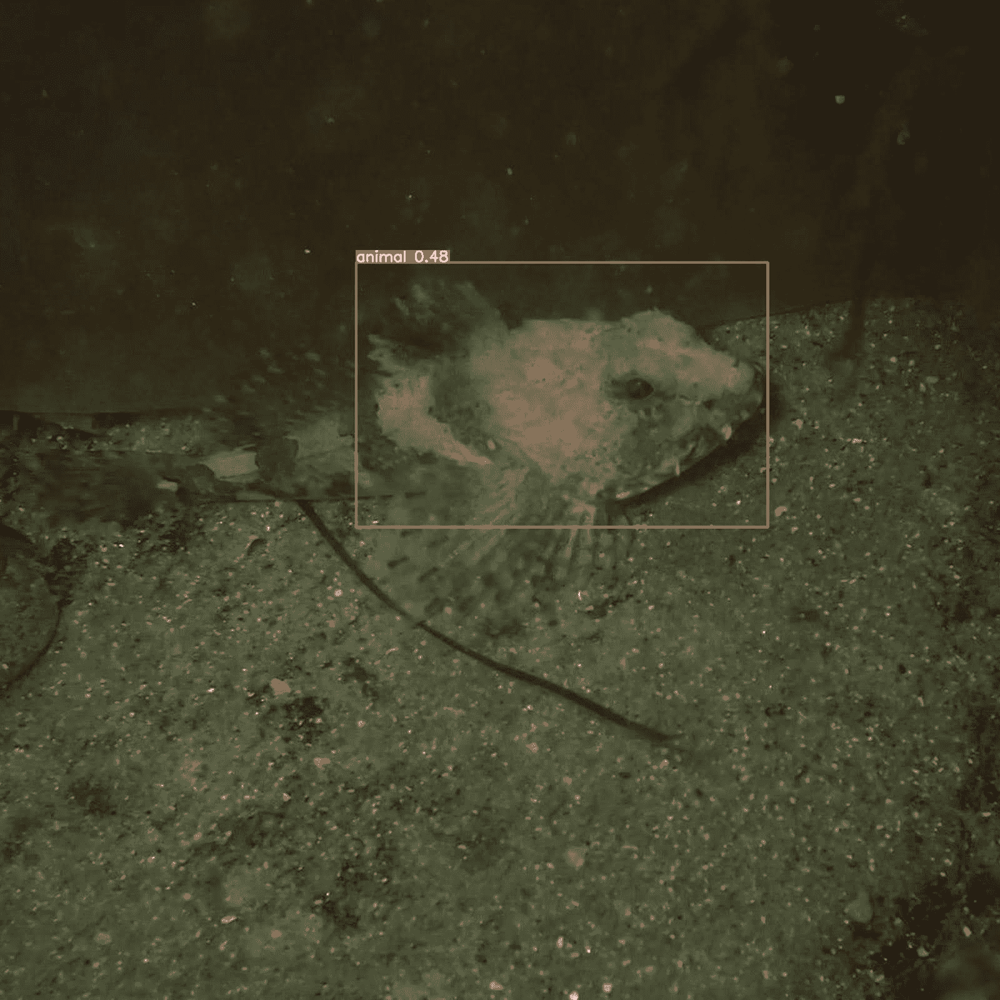
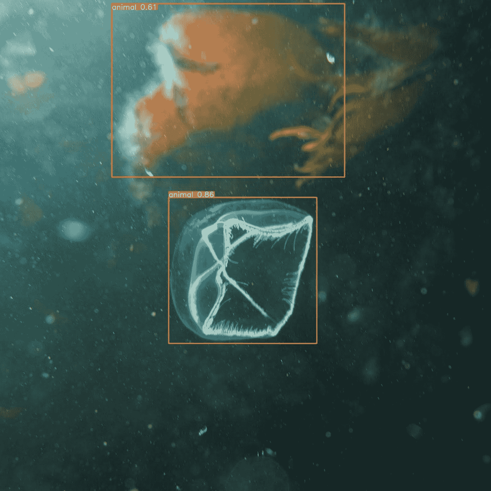
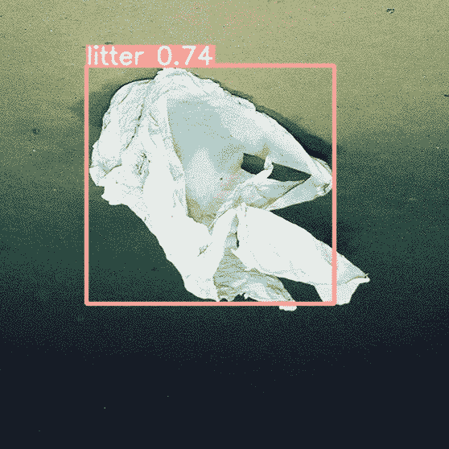
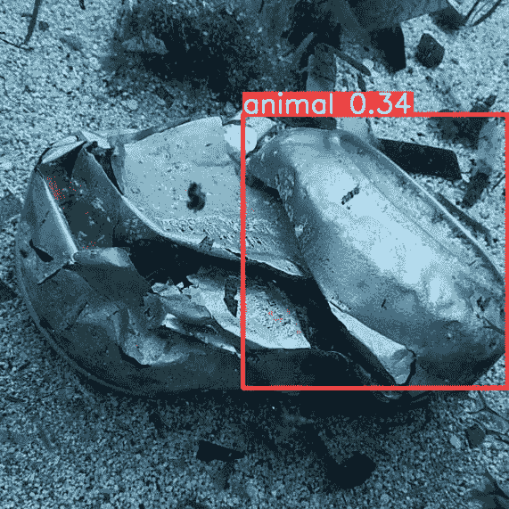

<!--yml

category: 未分类

日期: 2024-09-06 19:33:40

-->

# [2403.18067] 深度学习在跟踪和检测海洋垃圾中的前沿应用：一项调查。

> 来源：[`ar5iv.labs.arxiv.org/html/2403.18067`](https://ar5iv.labs.arxiv.org/html/2403.18067)

# 深度学习在跟踪和检测海洋垃圾中的前沿应用：一项调查。

Zoe Moorton¹¹脚注标记: 1 Dr Zeyneb Kurt²²脚注标记: 2 Dr Wai Lok Woo³³脚注标记: 3 计算机与信息科学系，诺森比亚大学，纽卡斯尔，英国 zoemoorton@gmail.com

###### 摘要

深度学习技术在海洋垃圾问题中的研究已约有 20 年，但大多数研究在过去五年中迅速发展。我们提供了对 28 个最新且重要的深度学习在海洋垃圾中的应用的深入、最新的总结和分析。

通过交叉参考研究论文的结果，YOLO 系列在物体检测方面显著优于所有其他方法，但许多受人尊敬的贡献者一致认为，目前尚未为机器学习提供一个全面的水下垃圾数据库。使用我们整理和标记的小型数据集，我们在二分类任务上测试了 YOLOv5，发现准确率较低且假阳性率较高，这突显了全面数据库的重要性。

我们在这项调查中总结了 40 多项未来的研究建议和待解决的挑战。

###### 关键词:

海洋垃圾，人工智能，物体检测，遥感，数据采集^†^†期刊: ArXiv

## 1 引言

到目前为止，处理海洋垃圾问题的最常见方法是对浮动垃圾进行物体检测，并通过遥感进行跟踪。

在本文中，作者使用了合成垃圾、人为垃圾、废物或垃圾等术语，这些术语都旨在具有相同的定义。简而言之，这些物品是由人类处理并进入了大多数水体系统。正如 Watanabe 等人[2019]解释的那样，海洋环境的背景比陆地更复杂且变数更多。

尽管我们主要关注海洋垃圾，但这项研究还探索了一些在其他水体如河流中使用的技术。还值得注意的是，这项调查仅涵盖宏观尺寸及以上的垃圾，这意味着小于 5 毫米的物体未被包括在内。

### 1.1 背景

海洋环境中的垃圾急剧增加，这对海洋生物、环境甚至人类健康造成了破坏性的影响。有大量文献记录了合成垃圾对海洋生态系统的直接影响。

海洋环境中的生物经常被发现缠绕在网具和其他材料中；或被发现误把垃圾当作猎物或玩具，从而吞食有毒物质 McAdam, [2017]。实际上，Kühn 和 van Franeker [2020] 对海洋生物吞食垃圾的定量概述发现，超过 700 种物种确认吃塑料。此外，Stelfox 等人 [2016] 对鬼网的回顾证实，直到出版时，已有超过 40 种物种被记录在鬼渔具中缠绕。NOAA [2023a] 将鬼渔具定义为“任何丢弃、丢失或遗弃的海洋环境中的渔具。这些渔具继续捕捞和困住动物，缠绕并可能杀死海洋生物，覆盖栖息地，并对航行构成威胁。”不幸的是，由于被困动物迅速沉入或被掠食者吞食，我们无法检测或公平估计被缠绕动物的数量 Sharma and Chatterjee, [2017]，Allen et al., [2012]，Laist, [1997]，Quayle, [1992]，因此，迄今为止报告的数据只能是规模的一部分。

经常被误认为猎物或在觅食习性中被消耗 NOAA, [2023b]，这使得许多生物将碎片混淆为食物并不难理解；一些研究甚至观察到，由于其体积，微塑料类似于浮游植物 Boerger et al., [2010]，而由于其质地，塑料袋被海龟误认为是水母 Bugoni et al., [2001]，Tomás et al., [2002]。

吞食海洋垃圾会导致致命后果 Wright et al., [2013]，Pawar et al., [2016]，因为塑料碎片会吸收有毒物质，并且高度污染有 PCB（多氯联苯）、聚丙烯、聚乙烯、聚苯乙烯、重金属和其他有害物质 Mato et al., [2001]。这些物质会渗透到消费者体内 Talsness et al., [2009]，毒害海洋生物，造成包括生殖紊乱、激素变化、疾病风险增加或最常见的；胃肠道阻塞，导致饥饿和死亡 Ryan et al., [1988]，Lee et al., [2001]，Oberdörster and Cheek, [2001]，Derraik, [2002]，Rahman and Brazel, [2004]，Plot and Georges, [2011]。

*最终*，塑料垃圾最终会沉到海底，可能会在那里停留数百年 Goldberg, [1997]。这对其下方和周围的生物造成影响，因为它窒息并阻挡了珊瑚和软沉积物的光线，这对海洋生态系统至关重要 Chiappone et al., [2005]。

手动清理海岸线的工作已经开始进行；例如，职业潜水员协会（PADI）“对抗垃圾”计划的潜水员[PADI]自 2011 年以来已经报告从潜水中收集了 307,000 公斤垃圾。这意味着每月收集了令人印象深刻的 2,132 公斤垃圾。不幸的是，这种方法存在问题，因为潜水是一种昂贵且危险的方式，垃圾收集有时需要特殊培训，但最显著的是手工劳动的速度无法跟上垃圾的快速涌入——美国国家海洋和大气管理局（NOAA）[2022]估计每月有大约 666,666 吨塑料进入海洋（每年约 8 百万公吨）。这进一步证明了为什么自动化和人工智能是高效清除全球水体中合成垃圾的最佳机会。

### 1.2 塑料的崛起

几乎一个世纪以来，我们已经意识到塑料垃圾所造成的广泛影响，但仍未成功解决这一难题。

在 1930 年代，Moore 等人[2001]的研究发现，一小部分北方毛皮海豹的脖子、肩膀和……鳍周围被发现了“各种物体”。在 1960 年代至 1970 年代，研究海鸟觅食生态的生物学家开始注意到它们的饮食中出现了塑料，同时各种海洋生物也被发现被塑料垃圾缠绕。进行浮游生物和底栖生物调查的科学家们在大西洋和太平洋的样本中发现了前所未有的塑料颗粒科尔曼和韦赫尔，[1984]。

大约四十年前，Fowler[1987] 发现缠绕现象与 1960 年代北太平洋和白令海捕鱼活动的快速增加相关联。这时，塑料材料开始被广泛用于制作拖网和包装带。

在 1970 年代，塑料污染被发现于英国工业化海岸、靠近新西兰奥克兰的地区以及地中海的大量漂浮物中。塑料颗粒在美国、葡萄牙、哥伦比亚、黎巴嫩以及诸如阿留申群岛和加拉帕戈斯群岛等偏远地区的沿海地区被发现。海洋资源监测、评估与预测计划（MARMAP）的成员在开放海域，特别是萨格拉索海，发现了大量原料塑料科尔曼和韦赫尔，[1984]。

在 80 年代后期，塑料摄入被观察到在各种海洋动物中，包括海鸟、鱼类、海龟和鲸鱼。观察到塑料碎片导致海洋动物如海鸥和海毛皮的缠绕和死亡的现象开始被发现，Day 和 Fairbanks [1980] 的综合研究确定了海鸟误将塑料当作自然猎物而食用，并发现鸟类的繁殖能力显著下降。

### 1.3 塑料循环

硬壳动物、海带 Eriksson et al., [2013] 和浮游生物 Moore et al., [2001] 在其系统中发现了纳米塑料。这些动物处于食物链的最底层。这些是过滤喂养者的主要食物来源，不幸的是，每年还有数十万只因被丢弃的渔具而死亡 Laist, [1997]。鲸鱼对浮游植物群体至关重要；这些微小生物单独消耗了大约“370 亿公吨的二氧化碳，相当于生产的二氧化碳的 40%”——相当于 17 万亿棵树或四个亚马逊雨林 Chami et al., [2019]，此外还贡献了全球大气中 50%的氧气。

由于塑料通过食物链和水体传递；McAdam [2017] 表示，目前没有未受影响的水域，这种情况甚至扩展到盐沼 Viehman et al., [2011]。

鉴于此，多项研究证实了通过鱼类和海鲜摄入微塑料（$<$5mm 的人造聚合物颗粒）是一种流行病 Daniel et al., [2020] Danopoulos et al., [2020] Daniel et al., [2021] Lai et al., [2022] Dong et al., [2023]。随着降解，形成了纳米塑料（$<$1$\upmu$m 直径） Alimi et al., [2018]。最近的研究 Leslie et al., [2022] 在参与者的血液样本中发现了四种类型的人造聚合物（纳米塑料），包括：聚对苯二甲酸乙二醇酯（PET）、聚乙烯（PE）、苯乙烯聚合物和聚甲基丙烯酸甲酯（PMMA）。研究人员对这可能对人类生命造成的不良健康影响仍不自信 Smith et al., [2018]。

在 2015 年，研究人员预测到 2025 年，海洋中将有超过 2.5 亿吨塑料 Jambeck et al., [2015]。由于紫外线辐射、摩擦和波浪作用，塑料会分解成微塑料和纳米塑料，导致大约 5.25 万亿塑料颗粒仅在海面上污染 Alimi et al., [2018]。由于其尺寸和不规则性质，这些塑料将很难分类和检测。

在这项调查时，Eriksen 等人 2023 的一项最新研究估计在 2019 年，海洋中存在“82–358 万亿个塑料颗粒（均值 = 171 万亿个塑料颗粒，主要是微塑料，总重 1.1–4.9 百万吨（均值 = 2.3 百万吨）”。

因此，海洋系统暴露于大量（且不断增加的）塑料，包括微塑料和纳米塑料，呼吁利用先进的人工智能方法进行垃圾识别。

## 2 人工智能在海洋垃圾中的简要历史

直到 2018 年，针对水下环境和海洋垃圾的人工智能几乎没有研究。本节简要概述了 2018 年前传统人工智能和机器学习模型在海洋垃圾中的应用。

### 2.1 时间线

在 2002 年，Foresti 和 Gentili [2002] 使用自主水下车辆（AUV）获取的水下图像开发了一种用于物体识别的层次神经树分类器（HNTC）。HNTC 包含宏像素和一个神经树，将每个区域分类到不同的物体类别中。结果显示，在最终图像中的分类性能保持不变，由于几何效应，边缘附近需要分类的像素数量较多，因此方法稍显缓慢。总体而言，所提出的方法在自主水下车辆获取的水下图像中的物体识别表现出有前景的结果。

当年晚些时候，Boulinguez 和 Quinquis [2002] 使用从参数声纳收集的声学数据来分类埋藏物体。该研究提出了两种选择关键参数以表征三维目标形状的方法：使用三维物体的二维投影的方法和使用完整三维信息与创建的模型进行比较的方法。结果显示，所提出的使用决策融合的三维模式识别提高了分类率，但作者建议进一步研究以收集数据，以帮助在实际环境中比较方法。

Toal 等人 [2002] 描述了一种智能视觉系统的发展，该系统用于自主水下车辆（AUV）的水下拍摄和检查任务，使用了两个模块的组合：视频标记系统（VMS）和目标跟踪系统（TTS）。标记系统使用不同的方法来识别视频片段中有趣的部分，并丢弃那些只显示水背景的片段。研究人员开发了一种自适应视觉程序选择器，根据环境构建最佳特征向量。结果显示，VMS 在检测视频片段中的有趣事件方面取得了成功，自适应视觉程序选择器能够根据环境构建最佳特征向量。

两年后，Walther 等人 [2004] 开发了一种自动化系统，用于检测和跟踪来自远程操作水下机器人（ROVs）的水下视频流中的物体。研究人员使用了 ROVs 的视频数据，并实施了选择性注意算法来预选显著目标以启动跟踪。所使用的 AI 采用了基于显著性的注意系统和物体识别系统。结果表明，该系统能够成功检测和跟踪水下视频流中的物体。

2006 年，Mitra 等人 [2006] 使用 Lidar 返回数据来检测和分类水下物体。他们比较了不同的 AI 技术，包括使用多层感知器（MLP）和分层径向基函数（HRBF）的并行神经网络、基于支持向量机（SVM）的信息提取（IE）、贝叶斯和二次分类器，以及单层人工神经网络（ANN）结构。结果发现，使用 MLP 的并行神经网络架构具有最高的预测准确率。所提出的系统实现了 98.9% 的总体准确率。他们得出结论，基于 SVM 的 IE 与并行神经网络架构在检测和区分所需类别方面效率高。

同年，Cayirci 等人 [2006] 专注于使用数据挖掘技术进行水下目标的检测和分类。使用的数据基于目标周围的环境磁场和声学条件。使用的 AI 算法包括单一规则（OneR）、朴素贝叶斯和 J48 决策树模型。结论是 J48 具有最高的正确分类率（92%）和精确度。OneR 的分类率为 61%，朴素贝叶斯为 84%。

Balas 等人 [2006] 使用了来自英国威尔士 49 个海滩进行的 157 次垃圾调查的数据，开发了一种人工智能模型用于预测垃圾类别和等级。他们使用了多层感知器（MLP）和模糊系统作为 AI 技术。神经网络子模型能够根据特定威尔士海滩的一般垃圾数据预测七类垃圾，而模糊系统子模型则能够考虑用语言描述的定性数据，如分发给海滩使用者的问卷。使用这两种 AI 技术，对威尔士海滩一般垃圾的七类垃圾数量的总体预测被认为是令人满意的。作者总结说，当需要快速可靠地估算垃圾类别和等级以进行海滩管理研究时，他们的 AI 模型可以节省现场工作量。

### 2.2 其他海洋应用的深度学习

尽管与海洋垃圾无关，但本节考虑了一些值得注意的研究，我们认为这些研究可能为该领域的研究人员提供方法论上的见解。

2004 年，Beaufort 和 Dollfus [2004] 更新了人工神经网络 (ANN) 系统 ‘Système de Reconnaissance Automatique de Cocco-lithes (SYRACO)’，以更准确地自动识别和计数沉积样本中的钙化片。由于计数样本的复杂性和人为错误，他们通过使用数字化的沉积样本图像来改进自动化过程，并使用来自不同物种的钙化片集合来训练 ANN。SYRACO 的新版本在一个集合集中测试，并以六个操作实现了 91% 的正确识别率。研究人员得出结论，更新版本是一种在不受控制的环境中提高对象识别和计数效率的稳健方法，即沉积样本中的钙化片。作者表示的一个限制是，如果数据集中某个类别的样本不足，则“来自更丰富类别的样本扩散可能会导致显著的统计偏差”，强调了平衡分类的重要性。

Hurtos 等人 [2013] 的研究旨在开发一种使用前视声纳自动检测水下链环的算法。作者们传达了实时声纳数据中可用文献的不足。他们收集了三个数据集，并且需要增强数据，因为与原始原始文件相比，准确性显著下降。他们的方法表明，尽管数据的分辨率较低，准确性仍然“相当好”。结论是，所提出的方法在实时运行方面具有很高的潜力，并且可以用于水下链环检测以及清理。他们阐明了他们的方法假设链环大致平放的认识，虽然他们声称这可能是一个限制，但进一步探索水下声纳数据可能会带来好处。

Gordan 等人[2006] 专注于提高对彩色水下图像中物体识别的能力，因为这些数据往往因环境条件而难以分析。为此，作者使用了 SVM 分类器。数据来源于水坝墙面的图像，目的是定位已知尺寸的圆形物体（压力均衡开口）。提出的架构涉及从感兴趣区域中提取像素特征，该区域大致与物体的大小相符。在分类阶段，水下图像被分解为部分重叠的基本感兴趣区域，并通过 SVM 根据形状描述符（圆度）对模式进行分类。这个形状描述符用于将物体分类为感兴趣物体或非感兴趣物体，通过简单的阈值比较。结果显示，提出的架构减少了假接受率和假拒绝率。该研究的一个局限性可能是研究人员仅选择了五张图像，并将其扩展为 255 张图像的数据库，因此，观察该方法在新数据集上的结果将是有趣的。

这些方法具有探索和适应用于检测水下碎片的潜力。例如，像 SYRACO 这样的技术提供了检测和评估复杂生物和合成结构的机会，而这些结构往往容易使人出错。声呐在检测水下基本金属物体时可能会展现出有趣的应用机会——特别是在较深的深度，其中光照条件使得图像采集和物体检测变得困难。作者确实指出，由于声呐帧不能检测点特征，因此在光学图像如视频和照片上，声呐方法可能不可靠。然而，我们质疑是否简单且结构良好的物体仍值得进一步研究。同时，在海洋视频（特别是深海）上使用 SVM 分类器可能有助于解决由低图像质量、低光照以及微观结构上的折射和反射光引起的回波问题。

## 3 深度学习技术在海洋碎片识别中的应用

为了应对海洋环境中不断增长的碎片堆积问题，研究人员已经开始采用更先进的人工智能技术，方法多种多样。一个流行的选择是通过遥感技术来实现，数据可以通过无人机或卫星收集。遥感技术对追踪漂浮碎片如何随着洋流积聚或移动产生了积极影响。

另外，一些研究人员直接在海洋表面或水下应用目标检测方法。在接下来的几个部分，我们将按时间顺序整理研究论文，以便读者更容易分析数据并参考特定论文。

### 3.1 遥感

在智利的奇洛埃，人为海洋废物（AMD）已经成为一个严重问题。研究人员 Acuña-Ruz 等人[2018]尝试通过使用三种不同的分类方法来检测海滩上的废物，即支持向量机（SVM）、随机森林（RF）和线性判别分析（LDA）。通过使用这三种模型，研究人员创建了一个用于卫星图像中海洋废物分类的预测模型，从而可以比较并选择最适合特定任务的模型。他们使用三种模型也有助于降低过拟合风险，以保持在新数据上的强性能。SVM 在卫星图像中进行废物分类时表现最强，整体准确率为 80%，与地面实测数据验证一致。它成功检测到了海滩上的膨胀聚苯乙烯和其他塑料混合物，空间分辨率在 0.3 米到 1.2 米之间，误差较低。RF 和 LDA 模型也表现相当不错，准确率分别为 77% 和 70%。由于风化过程，作者发现废物的光谱特征变化很大；例如，聚苯乙烯的反射率增加了 30%。

Jakovljevic 等人[2020]的研究目的是开发一种有效的浮动塑料映射方法。研究分为两部分，首先他们使用无人机图像绘制塑料分布图，在第二部分，他们部署了网具以收集垃圾。作者成功地使用语义分割像素分类方法，通过 ResUNet50 扩展检测和绘制水体中的塑料。他们发现，即使在浅水区，该模型也表现良好，在他们搜索的三类塑料中，平均 F1 分数为 0.89。作者确实指出，他们同意 Ji 等人[2015]的研究，后者阐述了平衡训练集的重要性，因为在这一研究中，Jakovljevic 等人[2020]发现混合像素会被误认为是主要类别。作者继续进行他们的研究，使用网具在河流上游收集垃圾。他们推测，年均网具能收集约 10,000 立方米的材料，其中包括木材（60%）、塑料包装（35%）和“其他”废物（5%）。这可能突显了教学分类系统的重要性，以识别木材类型和其他可能被冲下河流但最终可能降解的有机物质。

Savastano 等人[2021] 使用合成孔径雷达 (SAR) 来检测巴利阿里群岛的塑料海洋碎片。该研究在一个标记为塑料或非塑料的像素数据集上训练 AI 模型，使用了三种不同的监督分类器：RF、SVM 和高斯朴素贝叶斯（GNB）。作者没有对 SVM 或 RF 模型做出任何结论性评论，但讨论了在视觉检查中，GNB 在未标记图像上的表现最好，并且 GNB 产生的假阳性较少。然而，当应用于验证数据集时，GNB 在标记区域的平衡准确率最低，为 0.68，而 RF 和 SVM 达到了 0.86。实验的相互矛盾和不确定结果表明，进一步研究最合适的模型可能会有益，也许应用可解释的方法可以确定假阳性水平的原因，并提供改进结果的机会。

在一种同时跟踪和检测碎片的混合方法中，Kikaki 等人[2022] 提出了一种方法，展示了两个弱监督的语义分割任务：RF 和 U-Net。RF 模型使用从灰度共现矩阵 (GLCM) 中提取的输入特征的光谱签名（光谱指数、像素、纹理特征）。为了将 Sentinel-2 多光谱图像作为输入，作者使用了一个 U-Net 模型，该模型输出一个二值掩模，能够指示是否存在碎片。为了测试他们的基准数据集，Kikaki 等人[2022] 达到了高准确度，并得出结论，MARIDA 数据集是开发和评估 ML 算法的宝贵资源，特别是在使用 Sentinel-2 遥感时。他们的 RF 模型总体准确率为 93%，F1 分数为 0.68，而 U-Net CNN 的高准确率为 91%，F1 分数为 0.60。模型的性能在各类之间有所不同，但对于海洋碎片类别的结果非常出色。使用一个类别来代表所有漂浮碎片可能会导致识别问题，因为这一分类表示了广泛的结构和对象。值得一提的是，U-Net 对海洋碎片的精确度-召回率平均分为 0.7，而 RF 的最佳表现版本为 0.92。

Sannigrahi 等人 [2022] 开发了一种非线性核归一化植被指数 (kNDVI)，用于检测海洋中的漂浮塑料。他们建立了两个机器学习模型：SVM 和 RF。SVM 方法使用了径向基函数 (RBF) 核，但作者得出结论认为 RF 产生了更有前景的结果，准确度更高，错误更少，分类塑料像素时的不确定性也更低。RF 模型中，作者使用了四个遥感光谱指数：漂浮碎片指数 (FDI)、归一化植被指数 (NDVI)、塑料指数 (PI) 和 (如上所述) kNDVI。研究还进行了超参数调优，如树木数量、每个节点的分裂、成本因子和支持向量数量，以优化其性能。作者指出，轻微风化的塑料物体可能导致机器学习结果波动，特别是因为塑料根据厚度、颜色或降解程度反射光线的方式不同。尽管如此，他们的 RF 模型在两个实际测试地点——贝鲁特和卡拉布里亚——仍然达到了 88% 和 94% 的准确率。他们总结道，遥感和机器学习技术是检测海洋垃圾的可行组合。根据他们的研究，未来的研究应考虑塑料和其他垃圾随时间降解的方式，因为这可能会影响分类和跟踪结果。

### 3.2 分类与目标检测

Fulton 等人 [2019] 评估了四种流行算法：Tiny-YOLO、Faster-RCNN（使用 Inceptionv2）、YOLOv2 和 SSD（单次检测器，使用 MobileNetv2）以实时比较海洋垃圾——特别是塑料的检测结果。作者发现这四种模型在他们的图像数据集上表现良好。他们的结果还在 NVIDIA GTX GPU 1080、NVIDIA Jetson GPU TX2 和 Intel™ i3-6100U CPU 上进行了比较，以评估实时性能，发现每台机器上每个模型的帧率（fps）有所不同。Faster-RCNN 在准确性方面超越了其他模型，mAP 为 81%。作者评论说，他们认为 Tiny-YOLO 和 YOLOv2 在速度和准确性之间有更好的平衡；它们的 mAP 分别为 31.6%和 47.9%，但当考虑到塑料检测的平均精度时，它们的表现更为合理，70.3%和 82.3%的准确率相比 Faster-RCNN 的 83.3%显得更为可行，特别是 Tiny-YOLO 在使用 1080 GPU 时速度明显更快，达到了 205 帧每秒，而 Faster-RCNN 为 18.75 帧每秒。最后，SSD 在检测方面得分最低；塑料类别的 mAP 为 67.4%，精度得分为 69.8%。在使用 GPU 时 SSD 速度最慢，但在 CPU 上运行时表现优于其他模型，这对于低功耗 AUV 来说最为合适。因此，那些处理能力和时间有限的人可能会选择 SSD 作为高效模型，尽管其结果会被 Faster-RCNN 超越。

渡边等人 [2019] 探索了使用无人机、自动化水下机器人及其他自主机器人来创建高时空分辨率的海洋监测系统。在这项研究中，他们使用了 YOLOv3 算法进行海洋环境中的物体检测。使用这一架构，他们发现能够几乎实时地检测物体。在对水下海洋生物进行测试时，他们的模型达到了 69.6%的 mAP，而水下海洋垃圾的 mAP 为 77.2%。然而，这项研究是在视觉处理单元（VPU）上进行的，因此他们认为还需要在各种 CPU 和 GPU 上进行测试。

Kylili 等人 [2019] 需要几千张图像来优化他们算法的参数。在进行训练、测试和验证时，他们需要不同的图像集。他们进行了 50 个训练周期，并取得了极其准确的结果。训练集的准确率约为 100%，损失约为 1%；测试集的准确率约为 99%，损失约为 4%；验证集的准确率达到了 86%。

Visual Geometry Group-16 (VGG16) 模型利用了迁移学习，因为它在 ImageNet 上进行了预训练。一个类激活图突出了模型分类时图像中的区域，这帮助作者验证了他们的结果。

不幸的是，虽然难以测量；Ferries [2023] 估计漂浮的垃圾仅占预计海洋垃圾总量的 15%。因此，关于漂浮垃圾的研究可能无法产生预期的影响。作者特别关注了结果的可信度（这是大多数作者在本调查中忽略的主题），通过强化结果并附上损失百分比，同时通过使用三种不同的情景来改变模型的结构。

通过将瓶颈（BM）技术应用于 VGG16，Kylili 等人 [2020] 能够将他们在塞浦路斯海岸线检测漂浮垃圾的验证准确率提高到 90%，因为他们扩大了数据集和类别数量。他们发现，即使从低分辨率图像中，VGG16 也能准确识别海洋垃圾。作者特别指出数据增强在扩展数据集方面的重要性，此外，他们认为这项研究可以成功用于监控和管理海洋垃圾。在结论中，他们建议实时应用 YOLOv3 对视频数据进行分析。

他们继续了 Kylili 等人，[2021] 的工作，通过在六个不同的塞浦路斯海滩收集岸样，并使用 YOLOv5 和 YOLACT++ 对图像中的垃圾进行分类和定位。通过这项研究，他们得出结论，塞浦路斯海滩上大约散布着 66,000 个塑料物品。他们还发现，大多数垃圾的尺寸范围从 10cm 到 30cm - 这可能提供了未来研究人员所需参数的合理表示。总结他们的发现；他们确定了“在短时间内智能地 [监控] 大面积区域垃圾”的重要性，以及这对海洋垃圾解决方案的关键贡献。

作者继续研究通过检测和追踪的深度学习方法来处理垃圾，Teng 等人 [2022] 的研究中，首先使用质心追踪技术追踪数据以估计垃圾的丰度和追踪物体。他们在预训练的 YOLOv5 模型上使用 MSCOCO 数据集实现了 72% 的平均精度，并获得了 89% 的分类准确率。Teng 等人 [2022] 提出他们的方法可以作为一种比人工调查更具成本效益的估算垃圾数量的方法。他们认为他们的发现可以整合到其他数字应用程序或其他远程调查方法中，这可能会提高其性能。作者还建议该方法有能力将当前的技术在准确绘制海洋塑料方面提升到更成功的结果，这最终将帮助人类制定更有效的策略，以应对水体内的任何保护工作。

在一项扫描大面积海面研究中，de Vries 等人 [2021] 比较了 Faster R-CNN（FRCNN）和 YOLOv5 在其自行收集的数据集上的结果；他们发现尽管 FRCNN 使用了 COCO 数据集的迁移学习 Lin et al., [2014]，YOLOv5 在检测小物体方面表现更好（YOLOv5: 0.15m，FRCNN: 0.35m）。作者声明“最小物体的检测是不规则的”。为了进一步提高结果的可靠性，他们建议使用并行数据集；此外，作者还表示需要收集更多的影像。因此，他们将其研究视为一种方法论提案，而非研究结果 - 尽管有关预测准确性的一些细节将有助于其他模型的比较。然而，他们的工作确实强调了海底物体尺寸范围的关键方面 - 这是研究人员在收集和分类数据时需要密切观察的现象。

Deng 等人 [2021] 的研究重点是海洋垃圾检测和实例分割任务。作者通过在特征金字塔网络中引入扩张卷积、空间-通道注意机制和重新评分分支，制作了 Mask R-CNN 的强化版本。他们能够提升特征提取能力，并将实例分割的准确性提高到 mAP50 59.2% - 比在 TrashCan 数据集上训练的标准 Mask R-CNN 提高了 2.5%。使用了三种其他算法进行结果比较，结果表现较差：实例分割中的 55.9%（SOLO）和 57.1%（CondInst）。在物体检测中，他们的 mAP50 达到了 65.2%，具有改进的横向连接 - 比原始结构提高了 9.5%，再次超越了竞争模型如 Faster-RCNN（55.4%）、Retina-NET（57.3%）和 FC0S（60.4%）。他们的研究特别强调了强化现有模型的重要性，尤其是在如海洋垃圾这样专门且广泛的领域中，以及模型持续进化对深度学习发展的重要性。该模型的缺点是其重量，使得实时检测能力受限，但作者表示有意开发一个优化的轻量版本。

Hipolito 等人 [2021] 研究了使用 YOLOv3 算法进行深度迁移学习，以检测水下海洋塑料碎片。研究人员利用了一个非常小的 Trash-ICRA19 数据集样本进行深度学习系统的训练。该研究实现了高训练和验证准确性，mAP 值为 98.15%。作者声明他们的样本量较小 - 为了得出确凿的结果，他们的观察结果在一定程度上是合理的，但作者似乎没有解释为何忽略完整数据集以获取较小的样本量。如果他们使用了完整的 Trash-ICRA19 数据集，那么对于 8,580 张图像的二分类数据集，这项研究的数据集将比我们在此综述中评估的约三分之二的其他论文的数据集更大。

Xue 等人 [2021a] 和 Xue 等人 [2021b] 在同一年发表了两项研究，开发了增强的分类方法用于识别和分类深海碎片。在一项研究 Xue et al., [2021a] 中，他们提出了一种称为 Shuffle-Xception 的新型网络模型。它使用深度可分离卷积、混洗操作和快捷连接的混合组合，以增强网络的分类性能。作者将 Shuffle-Xception 与 ResNetv2-34、ResNetV2-152、MobileNet、LeNet 和 Xception 进行了比较。在所有七个类别中，他们发现 Shuffle-Xception 的 F1 分数较高，并且精度平均得分达到 95%，这表明 Shuffle-Xception 是进行深海碎片分类的一个合适选择，特别是在考虑到对象的多样性及其对检测模型的影响时。在他们的另一项出版物 Xue et al., [2021b] 中，作者提出了一种称为 ResNet50-YOLOV3 的单阶段网络；与其他检测网络相比，其结果在准确性和速度上均优于其他网络，平均精度均值（mAP）为 83%。

Moorton 等人 [2022] 比较了 VGG-16 算法和他们自己定制的卷积模型在相同数据集上的表现。定制的 CNN 由三个卷积层和 32 个节点组成，没有密集层，而 VGG-16 模型使用了 ImageNet 迁移学习权重。因此，VGG-16 的准确率为 95%，而 CNN 模型的准确率为 89%，不过作者指出需要一个更多样化的大型数据库。

在探索表面下碎片的过程中，Sánchez-Ferrer 等人[2022] 制作了一个适合训练机器学习模型的水下数据集。为了测试他们数据库的结果，他们选择了 Mask R-CNN，因为其在图像中检测和分割对象的能力较强。模型的超参数经过优化以提高性能。置信度接受阈值从 70% 修改为 50%，这使得模型有偏向于过高估计。作者表达了对水下数据环境条件剧烈变化的担忧，并指出很难代表水下数据中的渐进退化。他们在两个水下视频上测试了他们的模型；一个是在受控的鱼缸环境中，另一个是在真实的海床中。他们发现后者的复杂性对结果产生了负面影响，因此建议数据集应包含更多的多样性。

此外，研究人员发现了类别之间的混淆，例如“方形罐”、“篮子”和“金属碎片”。这些分类容易被框架误解。此外，他们发现一些类别，如“鞋子”，由于代表性不足，显示出较高的混淆率，突显了平衡数据集的重要性。研究还总结了在包含多个目标的图像中存在误报错误，并且算法偏向于选择最简单的选项。他们认为这是由于对象标签错误以及完整对象不可见（部分屏幕外或重叠）。

模型表现相当不错，mAP 为 60%，但作者承认 CleanSet 数据集的规模有限，未包含足够的碎片形状和颜色变异，并且仅在受控环境中积累。

使用 Mask R-CNN，Sánchez-Ferrer 等人[2023] 使用了稍微调整过类别的相同数据集来提升识别性能。该研究旨在探索可以应用于自动化车辆的增强技术——为此，他们通过数据增强来强化数据集，并得出合成数据能够提升整体目标检测性能，相较于仅使用真实数据，并实现了 63.5%（实例）和 65.2%（材料）的 mAP。然而，研究论文指出应探索其他数据生成方法，以实现更准确的真实碎片目标检测。

Zhou et al. [2023] 旨在通过开发一种名为 YOLOTrashCan 的目标检测网络，解决小规模和遮挡的海洋垃圾挑战。YOLOTrashCan 由两个主要组件组成：一个增强特征提取的骨干网络和一个结合不同尺度特征的特征融合网络，以提高检测准确性。作者发现他们的模型在 TrashCan-Instance 数据集上获得了 65.01%的检测准确率（他们的 Material 数据集结果稍低，为 55.66%）。他们还成功将网络大小减少了 30MB，使其成为一个更高效的实际应用模型（例如清理海洋垃圾）。

同年，使用相同数据集；Liu 和 Zhou [2023] 发表了他们的研究成果，他们提出了一种通过将骨干网络替换为 MobileNet 并引入注意机制来过滤关键特征，从而修改 YOLOv5s 以进行海洋垃圾检测的方案。他们的结果发现，相较于原始 YOLOv5 模型，他们实现了 4.5%的 mAP 提升，达到了 67%的 mAP，同时满足了实时检测的要求。有趣的是，该模型优于 YOLOTrashCan Zhou et al., [2023]，这可能不仅指的是模型类型，也可能指的是作者在此研究中应用的分类增加。

从现有的海洋垃圾检测研究比较来看，结果普遍积极，平均精度分数很高。下一节简要探讨了类似的河流垃圾研究以及为何在我们的调查论文中进行审查。

### 3.3 深度学习在河流垃圾识别中的应用

解决河流垃圾的问题非常重要，因为估计有超过 88-95%的塑料输入海洋来源于仅十个河流系统。Schmidt et al., [2017]，Jakovljevic et al., [2020]。解决海洋垃圾的一部分问题是防止其首先进入，因此，解决这个问题的一个重要贡献是拦截河流垃圾。

van Lieshout 等人 [2020] 使用深度学习开发了一种监测河流中塑料垃圾的方法。他们在研究中使用了两个不同的 CNN，以应对研究的不同方面，因为他们希望改进现有的塑料垃圾监测方法。为了实现分割，他们使用了 Faster R-CNN。然而，为了检测，他们将预训练的 Inception v2（在 COCO 上）应用于分割阶段的输出。这有助于检测图像中包含塑料的区域。作者记录了他们为提高精度分数所做的每一次更改。首先，他们展示了数据增强应用的效果。在没有数据增强的情况下，他们通过添加翻转方法将原本 59.4% 的分数提升到 63%。随后，他们将优化器从 Momentum 更改为 Adam，发现精度提高到了 65.7%。最后，作者将学习率从固定改为自适应，这使他们的总体精度分数达到了 68.7%——比最初的分数提高了 9.3%。

作者发现，这项研究受到数据位置多样性的影响。为了将他们的方法与实际情况对比，他们使用人工计数器来监控他们的方法，并发现他们的技术得到了类似的结果。人工标注的可靠性可能不稳定，这可能会降低监控性能，因为人工标注了数据中的 280,000 多个对象。

在两个不同地点进行；老挝和泰国。Maharjan et al. [2022] 提出了一个使用自主无人车通过获取地理参考正射影像并结合深度学习来检测河流塑料的方法。他们创建了两个独立的河流浮塑数据库，并在 YOLO 家族的四种不同算法上进行了训练和测试；YOLOv2、YOLOv3、YOLOv4 和 YOLOv5。为了稳健地测试差异，作者比较了准确性、时间和计算资源的结果。有趣的是，他们发现明亮、刚性塑料获得了最高的准确性，而被沉积物覆盖的垃圾结果较差；“填满沙子和泥土的塑料或受阴影影响的结果被忽略”。他们还揭示了在浅水区，水的可见性使得检测变得困难。应考虑从 UAV 和卫星等高度收集的数据的气象条件，以最小化温度和风速的影响。总体而言，作者建议在良好的天气条件下进行数据采集，以获得高质量数据。由于不同层次的水下数据在光吸收和反射上的差异，作者建议结合高光谱传感器来帮助区分塑料和其他材料。由于 83% 的 mAP 和尺寸，他们得出结论，预训练的 YOLOv5s 模型表现最佳。作者发布了一架 Phantom 4 无人机，配备 4K 分辨率相机，以样本距离约 0.82 厘米来评估塑料监测方法。

### 3.4 替代应用

目前，3DCNNs 在这个领域的应用仅限于遥感海冰图像分类 Han et al., [2020]。由于海冰分类所需的专业知识以及手动标记的限制，本论文旨在解决小样本量的问题。称为 SE-CNN-SVM 的方法使用混合网络从高光谱图像中提取特征，并将其应用于全连接层和 softmax 层进行分类，集成了 squeeze 和 excitation (SE) 块以及支持向量机 (SVM) 分类器。结果优于多种经典方法，包括随机森林、决策树、朴素贝叶斯和 k-最近邻；尤其在使用小样本条件下表现尤为突出。

尽管这项研究基于漂浮的碎片而非海洋环境，但 Fetisov 和 Chubarenko, [2021] 的工作证明了该研究仍然值得探索，因为他们能够通过决策树、未指定的 ANN（人工神经网络）以及一些地理知识（琥珀沉积物冲刷）确定西风将碎片带到了加里宁格勒的库利科沃的萨姆比亚半岛。这项研究的例子可以帮助我们追踪哪些潮汐正在携带碎片，如果我们能够追踪源头，我们就可以实施稳健的方法来防止碎片流入海洋，并且可能还会更好地了解我们可能检测到的碎片类型。作者得出结论，他们的数据量不足以训练 ANN，但强调了这些预测的优点，特别是在预测沿海地区的急流方面，因为他们认为这可能与海洋冲刷现象相吻合。

作者 Chang 等人 [2020] 尝试解决济州岛日益严重的海洋垃圾问题，以生产一个清洁海岸探测器。他们增强了数据以成功分类他们的图像，他们认为这就是 Xception 模型表现良好的原因，因为训练集的得分为 97.73%。该应用旨在向游客提供海岸清洁率信息，以促进可持续旅游——因为 80% 的旅游活动与沿海地区相关，是许多国家的经济命脉（世界资源研究所，2021）；他们减少海洋废物的努力应考虑到旅游和经济保护。

### 3.5 计算成本与性能

为了进一步了解一些模型的速度和性能，研究人员披露他们使用的硬件非常重要。一些作者已经分享了这些信息，在本节中，我们展示了一些研究人员在表格 LABEL:table:_1 中提供的规格，以便读者可以通过更直观的方式研究元数据。

表格 1：最新计算机视觉模型的模型、性能、样本量和硬件使用的比较。

| 参考文献 | 模型 | 数据 | 结果 | 硬件 |
| --- | --- | --- | --- | --- |
| Acuña-Ruz 等人 [2018] | SVM & RF & LDA | 144 样本 | SVM:80%, RF:77%, LDA:70% | APOGEE ® (PS300) 的 VNIR 范围和 ASD Inc. (TS4) 的 VNIR-SWIR 范围 |
| Kylili 等人 [2019] | VGG-16 | 12,000 张图像 | 验证准确率 86% | 配备 NVIDIA (Quadro K4200) 显卡的 Intel Xeon (CPU 2.40 GHz) 处理器 |
| Fulton 等人 [2019] | TinyYOLO, YOLOv2, SSD, Faster RCNN | 5,720 张图像 | Faster RCNN mAP: 81% | GPU (NVIDIA GTX 1080); 嵌入式 GPU (NVIDIA Jetson TX2); CPU (Intel i3-6100U) |
| Watanabe 等人 [2019] | YOLOv3 | 189（碎片）8,036（生物） | mAP 海洋生物 69.6% 碎片 77.2% | Intel® CoreTM i7-7800X CPU 350 GHz, 64 位, 40-GB RAM, GPU Nvidia GTX 1080, CUDA 9.0, cuDNN 7.0.3, 和操作系统 Ubuntu 16.04 |
| Chang 等人 [2020] | XCeption | 3,880 图像 | 训练集准确率 97.73% | - |
| Jakovljevic 等人 [2020] | ResUNet50 扩展 UNet | 3 个数据集: 328; 434; 1,846 图像 | F1 分数平均 0.89 | 配备 RGB 相机的 DJI Mavic pro |
| Kylili 等人 [2020] | VGG16 | 1,600 原始; 32,000 图像 | 90% 验证准确率 | 配备 Intel® Xeon® 机器的 Intel CPU Core E5-2630 v3（2.40 GHz）具有 48.0 GB 内存（RAM）和 NVIDIA Quadro K4200 显卡，时钟频率为 784 MHz，具有 28.6 GB 内存 |
| Panwar 等人 [2020] | RetinaNet（Resnet50 主干 & FPN） | 369 图像 | mAP 81% | - |
| van Lieshout 等人 [2020] | Faster R-CNN 和 Inception v2 | 原始 1,272 jpg | 精确度: 68.7 | - |
| Han 等人 [2020] | SE-CNN-SVM | 3,190 样本 | 97.42% | Intel Core i5-4590，3.30 GHz 和 Nvidia GeForce GT 705 |
| Savastano 等人 [2021] | RF; SVM; GNB | 8,395 像素 1,794 塑料像素 | 平衡准确率: 0.86;0.86;0.68 | - |
| Kylili 等人 [2021] | YOLOV5 & YOLACT++ | 1,650 图像 | AP 92.4%; 69.6% | NVIDIA® Tesla® K80 图形处理单元（GPU） |
| Xue 等人 [2021b] | ResNet50-YOLOv3 | 10,000 图像 | mAP 83.4% | GeForce GTX 1080Ti GPU，容量 11 GB |
| Deng 等人 [2021] | Mask RCNN | 7,212 图像 | mAP 59.2%; 65.2% | Ubuntu18.04. Intel(R) Xeon(R)Silver 4110 CPU @2.10GHz. GeForce RTX 2080Ti. CUDA 10.2. |
| Xue 等人 [2021a] | Shuffle-Xception | 13,914 图像 | 95% 平均精确度 | GeForce GTX 1080Ti GPU 和配备 Intel(R) Xeon(R) W-2133 CPU 3.60 GHz，31.7 GB RAM |
| Hipolito 等人 [2021] | YOLOv3 | 300 图像 | mAP 98.15% | - |
| Fetisov 和 Chubarenko [2021] | ANN | 25 个案例 | - | - |
| de Vries 等人 [2021] | Faster R-CNN-Ultralytics YOLOv5 | 18,589 图像 | - | GoPro Hero 6 Black |
| Teng 等人 [2022] | YOLOv5 | 2,050 图像 | mAP 89.4% | NVIDIA® Tesla® K4 GPU 来自 Google Colab |
| Maharjan 等人 [2022] | YOLOv2; YOLOv3; YOLOv4; YOLOv5s | $>$500 瓷砖 | mAP 77%; 81%; 83%; 83% | (1) Anaconda with Jupyter 运行在一台配备 Intel® CoreTM i7-10750H CPU @2.60 GHz, 16GB RAM 和 NVIDIA GeForce RTX 2060 GPU 6 GB GPU RAM 的个人计算机上，(2) Google Co-laboratory Pro。个人计算机用于 YOLOv3 和 YOLOv5，而 Google Colaboratory Pro 用于 YOLOv2 和 YOLOv4 |
| Sannigrahi 等人 [2022] | SVM & RF | 27 个 Sentinel-2A/B 场景 | 88% & 94% 准确率 | - |
| Moorton 等 [2022] | VGG-16 & 自定义 | 1,744 张图像 | CNN 89% 和 VGG-16 95% 的准确率 | Dell Inspiron i7-7700HQ CPU 2.8GHz, 16GB RAM, 64 位系统，配备 Nvidia GeForce GTX 显卡，运行 Windows 10 |
| Kikaki 等 [2022] | 随机森林模型 (RF) 和 U-Net 架构 | 1,381 个补丁；3,399 个海洋垃圾像素 | 92%；70%准确率 | - |
| Sánchez-Ferrer 等 [2022] | Mask R-CNN | 1,223 张图像 | mAP 60% | 配备 16 GB RAM 的 Intel(R) Core(TM) i7-8700 CPU @ 3.20 GHz，配备 6 GB GDDR6 显卡的 NVIDIA GeForce RTX 2070，使用 cuDNN 库 |
| Sánchez-Ferrer 等 [2023] | Mask R-CNN | 1,223 张图像 | mAP 实例 63.5%；材料 65.2% | - |
| 刘和周 [2023] | 修改后的 YOLOv5 | 7,212 张图像 | mAP 67% | 配备 NVIDIA GeForce RTX 2090Ti GPU 的 Intel(R) Xeon(R) Silver 4210R CPU@2.20GHz |
| 周等 [2023] | YOLOTrash-Can | 7,212 张图像 | mAP 58.66%；65.01% | AMD Ryzen 7 3700X，Nvidia TITAN RTX 24 GB，和 48G RAM |

## 4 数据获取

各种海洋垃圾研究的结论显示了一个共同的建议，即研究人员和科学家们声明目前没有一个公共数据库来巩固他们的结果。因此，本部分调查探讨了过去五年中科学家们用于数据收集、增强、标注和分类的各种方法。

JEDI (JAMSTEC 深海图像电子库) 数据集将在本节中提到几次。它是 JAMSTEC（日本海洋地球科学与技术机构）数据收集的一部分，在许多研究中广受欢迎，因为迄今为止它是最全面的开放访问海洋垃圾和生物多样性水下视频集合 JAMSTEC., [2009]。这些深海照片和视频是从日本海岸附近的潜艇上拍摄的，条件各异。然而，这个数据库的缺点是它可用于多种用途，而不仅仅是机器学习。因此，数据清理的工作量很大——一些图像或视频包含 ROV 系统的部分，质量不总是达到计算机视觉的质量标准，数据需要适当标注。因此，这个数据集没有被包含在 4.1 基准数据库中，而是在这里提到。

在检测 Acuña-Ruz 等人 2018 所描述的海滩上的碎片时，他们使用了一种有趣的数据收集方法，包括实地调查、实验室分析和卫星数据。为了生成一个地面真实数据集，以及一个用于创建分类预测模型的数据集；实地调查收集了 144 个不同的宏塑料和有机材料样本。所有样本都经过了特征分析、标记，并在可能的情况下进行了地理参考。这些样本随后被移至实验室进行分析。在实验室内，团队使用高光谱传感器观察了收集样本的光谱特征。对于每一类，研究人员从场景中选择了 90 个像素来开发一个监督分类预测模型，该模型按照 70:30 的比例进行拆分。另一个数据集包括分辨率为 0.31 米的卫星影像，用于分类他们观察到的海滩上的碎片。由于大气对卫星影像的影响（如天气），作者们使用了 DigitalGlobe 来纠正这些影响。

de Vries 等人 2021 使用附在船上的 GoPro 相机收集了 4,000 张图像。他们应用了随机转换，包括“沿 X 和 Y 轴的图像剪切；放大/缩小；任意角度的旋转；切割图像以产生不同的尺度；平移；随机曝光和对比度[以及]数字值(DN)的乘法”。这导致了一个包含 15,227 张图像的数据集。对于这样一个大型数据库，他们寻找了一个名为 Zooniverse 的在线标注平台 Zooniverse, [2023]，作者选择将数据分类为三类：硬塑料、渔网和绳索——这些数据通过 VGG 标注器进行清理，并且他们谨慎地只标注了明显可辨识的碎片。之后，数据被合并为一个“碎片”类别，因为作者声称这提高了检测精度。为了减少假阳性检测，他们还包括了 3,362 张没有任何碎片的海洋照片，这些照片展示了各种海洋状态；这使得他们的训练集达到 18,589 张图像，验证集为 739 张，此外，额外的数据也作为质量控制的一种手段。

J-EDI 被 Fulton 等人[2019]用于研究，他们从视频数据中收集了 5,720 张图像，并使用 LabelImg 软件进行了标注。他们的数据集 Trash-ICRA19 Fulton et al., [2020]被分为包括塑料、ROV（包含所有故意放置的合成物体）和生物三类，其测试集包含 820 张图像。由于海洋垃圾的种类繁多，他们选择专注于塑料，因为它是目前海洋中最有害的材料。尽管获取这些数据很困难，他们的数据集——他们描述为接近现实世界——考虑了高标准的环境变化，包括光照条件、过度生长、腐烂状态和遮挡。

使用 GoPro Hero 6 和在日本海岸潜水，Watanabe 等人[2019]记录了 12 米深处 6 米的能见度，并注意到当时天气多云，以收集水下漂浮碎片的图像。他们还使用了三台摄像机来拍摄海滩上的碎片，并从 Google Open Images 下载了图像。对于海洋生物多样性和碎片检测，他们使用了不同的检测模型：针对三类鱼类、海龟和水母；他们使用了 6,908 张图像进行训练，1,127 张图像用于测试，比例大约为 86:14。用于碎片检测的神经网络将数据划分为塑料瓶、塑料袋、漂流木和其他碎片；由于缺乏大量水下数据，此模型用 189 张图像进行训练，仅用 37 张图像进行测试——这个比例（80:20）较好，但仍有偏差的空间，因此数据集对碎片检测来说过于小巧。

与前述工作类似，Chang 等人[2020]制作的数据集较小，不足以提供计算机视觉训练所需的信息。然而，他们的数据收集方法是选择并下载了 194 张 Google 图像，并将其分为“干净”和“污染”海滩的二元分类。由于数据库较小，去除重叠的无关文件后，作者标记了 97 张训练图像，并在验证集中使用了 20 张图像。为了测试模型，他们使用了剩余的 10 张图像，将整体数据库定为 127 张图像。

在湖泊巴尔卡纳的两个地点；Crna Rijeka 和 Vrbas 河，作者 Jakovljevic 等人[2020]收集了高分辨率正射影像数据。使用配备 RGB 摄像头的 DJI Mavic Pro，进行了六次在 12-90 米高度的 AUV 调查。为了将图像预处理成更高质量，作者使用了从结构光照算法（SfM）。最常分析的漂浮碎片是三种塑料：OPS、尼龙和 PET。作者能够追踪漂浮塑料，这可能对监测海洋中碎片的轨迹有益。

在训练河流塑料监测数据集时；van Lieshout 等人 [2020] 通过相机捕捉了浮在河面上的物体的数据集。作者使用这些数据训练了一个 CNN，该 CNN 将图像组织为塑料或非塑料的二分类。为了收集数据；他们录制了 26 天的河流漂浮碎片视频，从中提取了 1,272 张 JPEG 图像以创建河流图像数据集。这些图像来自五个不同的地点。为了创建漂浮塑料数据集；他们将数据上传至 Zooniverse Zooniverse, [2023]，由公民科学家标注，之后进行必要的检查和更正。在标注的 280,832 个物体中，14,968 个箱子是漂浮的塑料。这些数据被划分为二分类，并进一步分为五个子集，分别对应他们拍摄视频的地点。

Marine & Carbon Lab 是尼科西亚大学的一个组织，该组织在检测海洋碎片领域共同进行了多项研究，并能够在 ImageNet 上预训练 VGG16 模型，然后继续使用他们自己以前整理的漂浮海洋碎片数据集以及一些来自非营利组织 Algalita (https://algalita.org/) 的捐赠图像来训练模型。在他们的 2019 年研究中，漂浮碎片的三个类别：塑料瓶、塑料桶、塑料吸管，每类包含 250 张图像；然而，数据增强（如缩放、旋转、移动和翻转）将这些数量增加到每类 4,000 张图像。数据集随后被分为 3,200 张训练图像和 800 张测试图像。次年，Kylili 等人 [2020] 将他们的数据分为八个类别；其中六个为合成碎片，包括‘塑料瓶’、‘塑料桶’、‘塑料袋’、‘渔网’、‘塑料吸管’和‘食品包装’。此外，他们选择了‘飞鱼’类和‘其他’类别。每个类别包含 200 张图像，利用数据增强，他们将每张图像处理 25 次，以创建 4,000 张图像的类别和总计 32,000 张图像的数据集；这些类别随后按 80:20 的比例分为测试集和训练集。

在这项研究之后，团队与另一位研究人员进一步发展了他们的研究。Teng 等人 [2022] 收集了一个包含 2,050 个视频的数据库，分为九类：塑料瓶、塑料桶、塑料袋、渔网、塑料吸管、食品包装、鱼类、铝罐和香烟头。数据来源于 ImageNet 和 Algalita，但他们的 YOLOv5 模型是在 MSCOCO 上预训练的。为了标注数据库，作者使用了 YOLO_mark 和 Make-Sense 工具 Skalski, [2019]，这些工具用于手动绘制地面真实边界框。作者声明他们的数据可应要求提供。

Hipolito 等人 [2021] 从 Trash-ICRA19 数据集 Fulton 等人 [2020] 获得了他们的数据。作者收集了 300 张图像的小样本，按 80:20 的比例分割，并将该数据集重新标记为 Non-Bio，以保持为单一分类系统。Hipolito 等人 [2021] 声称原始数据集包含两个分类；生物和非生物，每类 4,290 张图像，总计 8,580 张图像，然而在撰写本文时，我们发现相同的数据集当前包含 5,700 张图像，分类为三大类，而原始论文引用的 Fulton 等人 [2020] 说明为 5,720 张图像。我们不能确定这是否是引用错误，还是原始数据集已经以某种方式进行了调整，例如采用了进一步的数据清理和/或数据增强技术。

在这两项研究中；Xue 等人 [2021a] 和 Xue 等人 [2021b] 从日本海洋地球科学技术机构（JAMSTEC）提供的水下开源数据集中收集了相对类似的数据库。作者从存档的录像中提取了他们所需的适当帧，每帧中只有一个物体，使用 'LabelImg' Tzutalin, [2015] 对他们的数据集进行了标记，数据集命名为 3-D 数据集（不要与三维混淆）；这特定的数据集合包含了 10,000 张图像 Xue 等人, [2021b] - 他们的另一项研究包含了 13,914 张 Xue 等人, [2021a]。这两个数据库被组织成七个类别：布料、渔网和绳子；玻璃；橡胶；塑料；自然垃圾和金属 - 尽管训练集很全面；但 Xue 等人 [2021a] 的类别不平衡，从最小样本量：1,825（自然垃圾），到最大：2,234（渔网和绳子）。DDI 数据集被分为三个子集；70% 训练，15% 验证和 15% 测试。

尽管论文中没有具体说明收集的数据量；Maharjan 等人 [2022] 使用了 YOLOLabel 工具来记录他们所收集的每张河流垃圾图像中每一块塑料的边界框；这导致对每条河流的 500 张图像进行了标注。标记的物体随后被分类为塑料或非塑料的二元组。

通过联系全球各种组织和潜水学校，Moorton 等人 [2022] 能够收集并标记了一个包含 1,644 张水下图像的小型数据库，并进行了增强和 100 张测试图像。该数据集在光照和环境因素上表现出多样性，涵盖了丰富的生物多样性以及合成 debris，但数据集被分为一个二元系统，包括动物（代表所有生物多样性）和垃圾，并且没有按标准的 80:20 训练/测试比例进行划分 - 作者发现，由于他们的数据集，模型在区分水母和塑料袋或包装方面犯了与海龟相似的错误。该数据集可根据请求从作者处获取。

Sannigrahi 等人 [2022] 从两个来源收集了他们的数据。对于原位塑料位置，他们从希腊的 Topouzelis 等人 [2019] 和 Topouzelis 等人 [2020]，以及塞浦路斯的 Themistocleous 等人 [2020] 收集了数据，时间跨度为 2018、2019 和 2021 年。使用三类分类方案，将数据分为塑料物体、自然 debris（木材）和海水。后来，作者还进行了第四类以检测混合物体 - 既有塑料也有木材。遥感能够使用 FDI 手动检测浮动物体。为了收集他们的多光谱图像，他们使用了 Copernis Open Access Hub ESA, [2023] 的数据；该数据库用于遥感分析。他们收集了 27 个 Sentinel-2A/B 场景，并使用了欧洲航天局的软件 Sentinel Application Platform 进行了处理。

Sánchez-Ferrer 等人 [2023] 基于 CleanSea 数据集继续他们的工作，他们收集了 1,223 张图像，分为十七类，包括：塑料袋、毛巾、罐子、手套、包装、篮子、瓶子、管道、渔网、金属垃圾、塑料垃圾、方罐、绳索、轮胎、保险杠、鞋子、木材。数据集按照 80:20 的比例进行组织，并进行了 10% 的验证。他们选择了数据增强来提升结果。增强方法展示了随机应用于每张图像的多种转换方法，所使用的方法包括“水平翻转、镜像效果、高斯模糊、对比度调整、亮度修改、尺度变化、平移、图像旋转和图像剪切”，随机应用是一种直观的防止过拟合的方法。通过数据增强，结果显著提升。

刘和周 [2023] 使用了一个包含 7,212 张图像的数据集，这些图像来自 TrashCan-Instance，并将数据分为 50 个类别（论文中没有详细说明）；尽管个别分类没有具体说明，作者将这些类别描述为垃圾的水下观测、ROV 以及各种植物和动物。如此大量的分类在这个严重欠缺的研究领域中是一个令人兴奋的进展；然而，假设类别是平衡的，这意味着每个类别只有大约 144 张图像。因此，这仍然不足以用于计算机视觉训练。尽管论文中未明确描述这一点，但可以更详细地评估由洪等人 [2020] 生成的 TrashCan-Instance 数据集。

总结本节内容；数据增强在生成结果中发挥了重要作用，根据方法论结论，我们知道使用增强技术可以生成更大的数据集，这些数据集不太可能出现过拟合或偏倚。不幸的是，数据和分类中足够的数据量仍然限制了可用的研究，导致结果不确定和可疑。

尽管许多研究人员提供了他们所使用影像的示例，但除非在各自的部分中另有说明；据我们了解，大多数研究论文没有提供其数据的访问权限，或者我们未能找到它们。因此，在该领域仍存在公开数据可用性的空白。

### 4.1 基准数据库

本节简要概述了研究人员收集的水下垃圾影像的一些基准数据库。

Kikaki 等人 [2022] 生成了一个多光谱的 Sentinel-2 卫星数据库，称为海洋垃圾档案（MARIDA）。MARIDA 旨在生成适合的标注数据集，为任何希望构建或评估海洋垃圾检测机器学习算法的人提供基准。研究人员考虑了地理上多样化的数据的重要性，并利用包括海面垃圾、生物多样性、船只、云层和水状态在内的十一种不同类别来构建数据集。该数据集按 50:25:25 的比例分为训练集、测试集和验证集。通过旋转和水平翻转进一步扩展数据集，使整体数据集数量达到 1,381 个补丁，其中包括 837,357 个标注像素，其中 3,399 个为海洋垃圾。独特的是，他们的数据集能够区分共存的各种海洋特征，例如龙胆藻微藻、船只、泡沫和其他天然有机材料。作者通过邀请三位专家对数据集进行标注，并制定了标注者一致性协议以规范标注，重点关注标注规范。

TACO（上下文中的垃圾标注用于垃圾检测）由 Proença 和 Simões[2020]制作，是一个收集城市垃圾标注图像的开源数据库。Panwar 等人[2020]通过制作数据集 AquaVision，将该数据库的一部分用于海洋垃圾检测，AquaVision 包含了 369 张来自 TACO 的水下标注图像。AquaVision 的作者将图像分类为四类：玻璃；金属；纸张；塑料。尽管样本量较小，作者仍获得了 81%的 mAP，即使在更多随机图像上测试也是如此。作者声称小数据集提供了“更高效的结果”，然而由于样本量小和类别有限，测试模型和数据在更大规模上处理更复杂任务的表现，如避免塑料和水母之间的误识别，将是很有趣的。

数据集 TrashCan 由 Zhou 等人[2023]使用，是由 Hong 等人[2020]从 JAMSTEC 视频中提取的，作者收集了 7,212 张水下 RGB 静态图像。TrashCan 数据集分为两个部分：Instance 和 TrashCan-Material。Material 包含十六个类别，如 animal_crab、plant、trash_fabric，完整列表见表 2。Instance 数据集包含相同的类别，但去除了‘trash_’子类别，并将其更改为包含二十二个分类的更细分类列表，详见表 2 的‘TrashCan-Instance’部分。从比较这些列表可以看出，Instance 数据集更深入地描述了其垃圾类别，最终这可能是其性能优于 Material 集的原因。Instance 集也被用于 Deng 等人，[2021]的研究中，以改进其在目标检测和实例分割中的 Mask R-CNN 模型。他们还应用了数据增强技术，如图像旋转和裁剪，以确保有效特征提取，但总体集数未披露。

表 2：TrashCan 数据集分类

| TrashCan-Material | TrashCan-Instance |
| --- | --- |
| animal_crab | trash_metal | animal_crab | trash_can |
| animal_eel | trash_paper | animal_eel | trash_clothing |
| animal_etc | trash_plastic | animal_etc | trash_container |
| animal_fish | trash_rubber | animal_fish | trash_cup |
| animal_shells | trash_wood | animal_shells | trash_net |
| animal_starfish |  | animal_starfish | trash_pipe |
| plant |  | plant | trash_rope |
| rov |  | rov | trash_snack_wrapper |
| trash_etc |  | trash_bag | trash_tarp |
| 垃圾 _ 布料 |  | 垃圾 _ 瓶子 | 垃圾 _ 未知实例 |
| 垃圾 _ 渔具 |  | 垃圾 _ 树枝 | 垃圾 _ 残骸 |

这项研究的作者使用了 6,065 张图像进行实例类别的训练，其中 1,147 张用于验证集。在他们的材料类别独立数据集中，训练集由 6,008 张图像组成，验证集由 1,204 张图像组成。作者认为这提供了对海洋垃圾及其他存在对象的全面表示。他们指出，许多海洋垃圾类别在物体属性上存在相似性，但未披露这些类别具体是什么。

另一个基准海洋垃圾数据集由 Sánchez-Ferrer 等人制作[2022]。CleanSea 数据集由沉没的垃圾组成，主要来自日本海洋地球科学与技术（JAMSTEC）的数据，这些数据通过潜水艇在日本进行视频录制和拍摄。从 JAMSTEC 中，Sánchez-Ferrer 等人[2022]选择了 1,223 张图像，这些图像通过目标的边界框和轮廓进行了标注，并被组织为 19 类垃圾，随后在 Mask RCNN 模型上进行了测试。

尽管有一些尝试对漂浮或水下海洋垃圾场景进行图像数据库的整理和使用，但公开可用的资源仍然过于单一且规模较小，无法产生研究人员所期望的结果。因此，整理和提供一个开放给所有研究人员的基准数据集将解决这个领域中深度学习最常见的障碍之一。

## 5 调查概述与结论

要将这篇调查论文中审阅的所有文献的元数据进行汇总，可以使用补充表 1 来交叉参考模型性能、数据量、分类组别甚至硬件，以更准确地确定哪些结果产生了最可靠的结果。

在现有的研究中，我们观察到无论是水下还是沿海沙滩，海洋垃圾的数据可用性都严重不足。因此，我们决定测试一个小数据集是否仍能在我们观察到的最成功检测方法上产生可靠的结果。

图 1：最高准确度测试结果。图 A 和 B（上排）：动物。图 C 和 D（下排）：垃圾。

YOLOv5 与高平均精度有很强的相关性。因此，我们决定在我们的简单数据集上测试 YOLOv5，直接比较结果，因为它是前几章中相关文献中突出的最重要的方法之一（从 Singla [2021] 获取的 Git）。我们的数据集仅是一个包含 140 张测试图像的小型二分类集合（每个类别 70 张，80:20 的验证划分）。我们选择了垃圾和动物的二分类，因为这两种分类在调查中最为流行，我们希望尽可能接近地表示。我们使用了批量大小为 16、32 和 64 的数据，并使用了 50、100 和 150 的训练轮次。最佳的参数设置为批量大小 32 和轮次 50，但我们发现 YOLOv5 无法准确检测这两种分类；存在许多假阳性和假阴性，且大多数包含物体（如塑料袋）的图像完全无法检测到。

由于数据集有限，我们决定增加数据量并尝试重新训练 YOLOv5，以检查其是否更有用。不幸的是，即使使用了显著更大的数据集，包括 1,093 张训练图像、269 张验证图像和 30 张全新的测试图像（包含 38 种物体，每个类别的两个示例图像见图 1]，van Lieshout 等，[2020]，Zhou 等，[2023]特别是对于水下垃圾，这使得创建一个大型数据库显得很有意义。甚至可以考虑使用多个数据库，因为在这一研究领域的限制较多。

de Vries 等 [2021] 的研究试图对 YOLOv5 和 Faster RCNN 进行比较，但作者决定他们的数据集还不够大；获得大量图像并训练作者推荐的方法将是有益的。各模型在检测垃圾时都产生了高的平均精度分数，因此进行比较将提供有价值的见解。

此外，将这些物体检测结果与在同一数据集上表现良好的分类方法（如 VGG-16 和 ShuffleXception）进行比较，将是一个有意义的研究，以确定哪种计算机视觉方法更适合海洋垃圾检测。

除了图像可用性的增加，研究人员如 van Lieshout 等 [2020]、Hipolito 等 [2021]、Maharjan 等 [2022] 和 Zhou 等 [2023] 指出，图像的多样性也未达到足够高的标准。他们的建议包括多样化天气条件、位置和水中的能见度。一些作者要求在更高准确度的基础上提供更优的条件，但为了提供一个在多种条件下都能有效工作的 AI 框架，或许数据库应该包含更多具有挑战性的数据，以增强模型的鲁棒性。

随着垃圾数量和多样性问题的不断增加，数据集中也应该包含更多的类别，以扩大模型的复杂性。

Jakovljevic 等人 [2020] 发现他们在河流中捕获的约 60% 的碎片是木材产品或类似物；确保分类系统也包括木材材料可能会提高当前模型的准确性。我们认为，训练河流分类模型以识别木材类型将极为有益，以避免检测错误，同时，如果算法应用于自动化形式，收集木材不必成为优先任务，因为木材大多是天然且可生物降解的，但这也有助于消除珍贵资源。考虑到这一点，可能有害的制造木材或带有涂层的木材可能是值得探索的分类领域。van Lieshout 等人 [2020] 建议未来的研究应监测人工标注的可靠性；提高我们分类数据的精度。

在探索使用 SAR 检测碎片的研究中，Savastano 等人 [2021] 强调了在 AI 训练中使用可靠的地面真实数据集的重要性。他们建议研究人员通过关注在多样化地点使用原位验证的地面真实数据来尝试增强地面数据。

de Vries 等人 [2021] 发现他们的方法目前无法填补从 50cm 到 5cm 的碎片空白，因为碎片尺寸过小无法被检测。由于大多数塑料随着时间的推移会继续降解，他们建议未来在这一领域开展更多研究。Liu 和 Zhou [2023] 也强调了小物体检测的重要性；他们建议改进网络结构或甚至探索其他技术。

关于宏观塑料的应用 AI 的文献丰富，但可以探索微塑料和纳米塑料的综述研究。这是一个极其复杂的挑战，需要一个复杂的检测系统，数据可能需要在显微镜下收集，也许可以将类别分为颜色或材料属性。

此外，应考虑任何尺寸的碎片的状况，在证明更亮和更坚固的塑料片表现良好之后，我们如何解决水下碎片的颜色和纹理降解问题以及对自然元素的暴露？此外，观察在部分或完全被沉积物或野生动植物覆盖的碎片中的检测结果将是有趣的。根据 Sánchez-Ferrer 等人 [2022] 的研究，探索能够在一个框架内检测多个物体或能够探索部分隐藏物体的研究将具有价值。

Sánchez-Ferrer 等人 [2023] 提出了大量未来工作的建议，例如升级合成数据生成，以更好地模拟真实的海洋条件。他们建议考虑以下几个方面：“物体整合、尺度策略和深度模拟”。其次，他们推荐领域适应以减少对标注数据的需求。他们还建议探索使用 GAN（生成对抗网络）来生成合成数据，Fulton 等人 [2019] 也对此表示了兴趣。最后，基于他们的结论，他们推荐更深入地探索真实数据和合成数据的整合，潜在地研究优化合成数据的比例，以提升模型的整体性能。

### 6.2 监测碎片

各种遥感应用可以进一步修改，以进行长期监测系统，这可能有助于防止垃圾进入大水体。此外，评估漂浮垃圾的时间动态及其与环境因素的互动可能对垃圾在水流和天气条件下的行为进行有价值的分析。牛津大学的研究，Vogt-Vincent 等人 [2023] 能够通过拉格朗日轨迹追踪垃圾的陆地和海洋来源，发现塞舌尔群岛的一些漂浮塑料被认为可以旅行长达六个月到两年。因此，利用机器学习方法跟踪这些物品的来源可能会很有趣，有助于减少初始的不当废物处理。

如 Teng 等人 [2022] 所建议的，公民科学家的贡献可能有助于重塑对海洋垃圾的估计和跟踪。目前有针对休闲和专业潜水员的方法，他们完成了 PADI 反垃圾潜水课程，并记录任何来自水肺潜水的数据收集。

### 6.3 增强技术

这一领域的增强技术对于解决海洋垃圾问题至关重要，因为它提供了可能的洞察力，帮助我们将检测和跟踪方法应用于现实世界的场景。

Watanabe 等人[2019]提出了多种传感器和数据融合技术，以革新海洋环境中的物体检测。Maharjan 等人[2022]建议使用高光谱传感器，在光谱特性由于自然磨损和降解而发生变化时，能够更清晰地识别塑料；他们还建议使用多光谱传感器来检测更小的碎片。同年，Sánchez-Ferrer 等人[2022]建议未来的研究可以探索其他类型的数据，如声纳或激光雷达，以提高海洋垃圾的检测和识别。Kylili 等人[2020]建议开发一个自主图像采集系统，能够实时收集海洋垃圾的影像，Watanabe 等人[2019]还推荐使用群体控制技术来监控和检测海洋垃圾，包括无人机、水下车辆、摄像头和卫星观测。他们建议使用强化学习来最优控制多台机器人。

大多数研究论文没有解决如何在使用新方法进行清理时，保护脆弱的水下生态系统的问题，正如 Fulton 等人[2019]所提到的，“意外移除植物或动物等生物实体可能会破坏我们希望保护的生态系统”。作者特别关注环境安全，因为他们的研究基于其模型在机器人技术上的应用。他们将模型应用于 NVIDIA TM Jetson TX2，该设备足够小以适配 AUV，并且在电力消耗上产生最小的热量。他们的团队表示计划在不久的将来使用他们的 Aqua AUV Sattar 等人，[2008]进行实时物体检测。

尽管有这些有前景的工作，我们认为将深度学习方法应用于自动化仍然是一个未被充分探索的领域。Hipolito 等人[2021]也简要强调了测试和实施这种集成的潜在应用。Kasparavičiūtė等人[2019]探索了使用遗传编程（这种方法允许系统自我学习）进行塑料物体检索的路径规划解决方案。他们将此应用于一种能够潜入水下的 AUV，并使用多种传感器来检测塑料。然而，他们也登记了包括排除区、安全与回滚、现实路径规划、电池消耗以及系统整体改进等在内的众多挑战。Fulton 等人[2019]还表达了自动化的挑战，包括“导航、探索和操作策略的开发”。

然而，在完成这次审查后，我们认为，为了开始将机器学习应用于垃圾收集的自动化，研究人员必须首先建立一个更加深入的数据库，并考虑检测和映射算法中的许多研究空白。

Acuña-Ruz 等人 [2018] 建议利用他们在海滩海洋垃圾研究中的结果，他们将三种算法（RF、SVM 和 LDA）结合起来，创建了一个海滩清理的环境管理策略以及其他有关海滩垃圾的决策程序。他们特别强调了进一步发展人工智能方法和高光谱传感器，以利用卫星影像对海洋垃圾进行分类。

在实际场景中测试任何模型之前，创建代表所有类别的现实模拟可能是有益的，模拟中引入新的垃圾类型，以监测模型的表现和行为。

### 6.4 深度学习方法

这项研究的下一步可能是审查和比较当前可用的最强算法（Faster R-CNN、YOLOv3、YOLOv4 和 YOLOv5）在海洋垃圾检测中的表现。这将有可能将性能最佳的模型发展成混合选项。

为了避免卷积神经网络（CNNs）可能产生的自然偏差；可以进一步探索与 CNNs 结合使用的变换器；为了达到强大的性能，它们将需要一个大型数据库和强大的计算资源。Bazi 等人 [2021]、Carion 等人 [2020]、Liu 等人 [2021] 和 Touvron 等人 [2021] 的积极研究表明这种组合具有强大的结果，但在海洋垃圾中的变换器 CNN 混合体研究仍然很少。

Kikaki 等人 [2022] 在测试他们的基准数据集 MARIDA 时建议了几种方向。作者提议探索在更先进的机器学习模型上训练他们的数据集，或调查模型在数据集上的迁移能力到其他区域和传感器。作者还强调了开发追踪和预测海洋垃圾的方法的重要性；特别是在海洋循环模型中，以便研究人员能更好地理解海洋垃圾的传播方式。

Sannigrahi 等人 [2022] 建议将训练数据分开，并利用多目标检测模型区分有机漂浮垃圾和塑料漂浮物。然而，正如上面所提到的，这仍然需要一个反映更多多样性的更大数据集，并扩展数据获取的区域。

Zhou 等人 [2023] 强调了使用扩张并行模块（DPMs）开发高性能且低规模网络作为一个有前景的方向 - 特别是在一阶段小物体检测网络中，以超越网络性能。

Liu 和 Zhou[2023]建议探索实时部署，特别是对其优化的 YOLOv5 模型；包括在不同硬件应用上测试模型，以验证其在现实世界场景中的实用性。

还值得一提的是，包括 Xue 等人[2021b]、Zhou 等人[2023]和 Liu 与 Zhou[2023]在内的一些研究者建议针对海洋垃圾识别特别增强 CNN 的性能，例如探索不同的骨干网络、引入额外的注意机制以及整合其他技术以提升模型性能。

### 6.5 评价指标

评价指标用于评估模型的结果，这为研究人员提供了对模型表现的更好洞察。Sánchez-Ferrer 等人[2022]简要提到，通过平均精度评估模型可能无法完全捕捉模型的表现，因此，包括多样的评价指标在每个训练的模型中可能会有所裨益。Watanabe 等人[2019]建议对不同硬件选项上的各种深度网络结构进行定量性能评估。

基于文献综述和结果，过去五年深度学习在解决海洋垃圾问题上取得了显著进展，然而，为了取得重大突破，该领域的研究人员仍面临着大量新颖挑战的漫长征程。

## 致谢

关于生成性人工智能和 AI 辅助技术在写作过程中的声明：在准备本工作期间，作者使用了[ChatGPT-4]以便[寻找有效的同义词和提升写作质量]。在使用该工具/服务后，作者对内容进行了审查和编辑，并对出版物的内容承担全部责任。

## 附录 A

在 Google Scholar 中搜索了“深度学习海洋垃圾”或“深度学习海洋宏观垃圾”。在 IEEE 中，我们搜索了“深度学习海洋垃圾”。

我们已检查参考文献。本调查论文中排除的论文要么是在 2018 年之前，要么是研究微小或纳米垃圾检测的。同时值得一提的是，还有一个名为 JeDI 的数据库“水母数据库计划”，可能与 JEDI“JAMSTEC 深海图像电子图书馆”容易混淆。一些海洋景观研究人员可能会使用 JeDI 来跟踪水母种群。[Condon and Lucas,]。

## 附录

表 1 所有分析论文的元数据比较，来源于“第三部分 深度学习技术”中的海洋垃圾识别。

## 参考文献

+   Acuña-Ruz 等 [2018] Acuña-Ruz, T., Uribe, D., Taylor, R., Amézquita, L., Guzmán, M.C., Merrill, J., Martínez, P., Voisin, L., B., C.M., 2018. 海滩上的人为海洋垃圾：用于遥感应用的光谱特征。环境遥感 217. doi:[10.1016/j.rse.2018.08.008](http://dx.doi.org/10.1016/j.rse.2018.08.008)。

+   Alimi 等 [2018] Alimi, O.S., Budarz, J.F., Hernandez, L.M., Tufenkji, N., 2018. 水生环境中的微塑料和纳米塑料：聚集、沉积和增强污染物运输。doi:[10.1021/acs.est.7b05559](http://dx.doi.org/10.1021/acs.est.7b05559)。

+   Allen 等 [2012] Allen, R., Jarvis, D., Sayer, S., Mills, C., 2012. 在英国康沃尔一个休息点灰海豹的缠绕。海洋污染公报 64, 2815–2819. doi:[10.1016/j.marpolbul.2012.09.005](http://dx.doi.org/10.1016/j.marpolbul.2012.09.005)。

+   Balas 等 [2006] Balas, C.E., Williams, A.T., Ergin, A., Koc, M.L., 2006. 使用多层神经网络对威尔士海滩的垃圾进行分类。URL: [`www.jstor.org/stable/25743008?seq=1&cid=pdf-`](https://www.jstor.org/stable/25743008?seq=1&cid=pdf-)。

+   Bazi 等 [2021] Bazi, Y., Bashmal, L., Rahhal, M.M.A., Dayil, R.A., Ajlan, N.A., 2021. 用于遥感图像分类的视觉变换器。遥感 13, 1–20. doi:[10.3390/rs13030516](http://dx.doi.org/10.3390/rs13030516)。

+   Beaufort 和 Dollfus [2004] Beaufort, L., Dollfus, D., 2004. 通过动态神经网络自动识别钙质叶片。海洋显微古生物学 51, 57–73. doi:[10.1016/j.marmicro.2003.09.003](http://dx.doi.org/10.1016/j.marmicro.2003.09.003)。

+   Boerger 等 [2010] Boerger, C.M., Lattin, G.L., Moore, S.L., Moore, C.J., 2010. 北太平洋中部旋涡中的浮游食性鱼类塑料摄入。海洋污染公报 60, 2275–2278. URL: [`www.sciencedirect.com/science/article/pii/S0025326X10003814`](https://www.sciencedirect.com/science/article/pii/S0025326X10003814), doi:[`doi.org/10.1016/j.marpolbul.2010.08.007`](http://dx.doi.org/https://doi.org/10.1016/j.marpolbul.2010.08.007)。

+   Boulinguez 和 Quinquis [2002] Boulinguez, D., Quinquis, A., 2002. 3D 水下物体识别。IEEE 海洋工程期刊 27, 814–829. doi:[10.1109/JOE.2002.805097](http://dx.doi.org/10.1109/JOE.2002.805097)。

+   Bugoni 等 [2001] Bugoni, L., Krause, L., Petry, M.V., 2001. 南巴西海龟的海洋垃圾和人为影响。海洋污染公报 42, 1330–1334. URL: [`www.sciencedirect.com/science/article/pii/S0025326X01001473`](https://www.sciencedirect.com/science/article/pii/S0025326X01001473), doi:[`doi.org/10.1016/S0025-326X(01)00147-3`](http://dx.doi.org/https://doi.org/10.1016/S0025-326X(01)00147-3)。

+   Carion et al. [2020] Carion, N., Massa, F., Synnaeve, G., Usunier, N., Kirillov, A., Zagoruyko, S., 2020. 端到端对象检测与变压器 URL: [`arxiv.org/abs/2005.12872`](http://arxiv.org/abs/2005.12872)。

+   Cayirci et al. [2006] Cayirci, E., Tezcan, H., Dogan, Y., Coskun, V., 2006. 水下监测系统的无线传感器网络。自组网 4, 431–446. doi:[10.1016/j.adhoc.2004.10.008](http://dx.doi.org/10.1016/j.adhoc.2004.10.008)。

+   Chami et al. [2019] Chami, R., Cosimano, T.F., Fullenkamp, C., Oztosun, S., 2019. 大自然应对气候变化的解决方案：保护鲸鱼的策略可以限制温室气体和全球变暖。金融与发展 0056, A011. URL: [`www.elibrary.imf.org/view/journals/022/0056/004/article-A011-en.xml`](https://www.elibrary.imf.org/view/journals/022/0056/004/article-A011-en.xml), doi:[10.5089/9781498316880.022.A011](http://dx.doi.org/10.5089/9781498316880.022.A011)。

+   Chang et al. [2020] Chang, M., Yuan, Y., Yue, Q., Mincheol, H., 2020. 用于旅游服务分布的’干净海岸探测器’的 CNN 图像分类分析。种子科学与技术 18, 15–26. doi:[10.15722/jds.17.12.20201.15](http://dx.doi.org/10.15722/jds.17.12.20201.15)。

+   Chiappone et al. [2005] Chiappone, M., Dienes, H., Swanson, D.W., Miller, S.L., 2005. 失落渔具对佛罗里达群岛国家海洋保护区珊瑚礁附生无脊椎动物的影响。生物保护 121, 221–230. doi:[10.1016/j.biocon.2004.04.023](http://dx.doi.org/10.1016/j.biocon.2004.04.023)。

+   Coleman and Wehle [1984] Coleman, B.F., Wehle, D.H.S., 1984. 塑料污染：全球海洋问题。

+   [16] Condon, R., Lucas, C., . Jedi: 海蜇数据库计划。

+   Daniel et al. [2020] Daniel, D.B., Ashraf, P.M., Thomas, S.N., 2020. 微塑料在印度喀拉拉邦售卖的可食用和不可食用的远洋鱼体内。环境污染 266. doi:[10.1016/j.envpol.2020.115365](http://dx.doi.org/10.1016/j.envpol.2020.115365)。

+   Daniel et al. [2021] Daniel, D.B., Ashraf, P.M., Thomas, S.N., Thomson, K.T., 2021. 微塑料在售卖的可食用贝类体内。化学圈 264. doi:[10.1016/j.chemosphere.2020.128554](http://dx.doi.org/10.1016/j.chemosphere.2020.128554)。

+   Danopoulos et al. [2020] Danopoulos, E., Jenner, L.C., Twiddy, M., Rotchell, J.M., 2020. 针对人类消费的海鲜的微塑料污染：系统评价与荟萃分析。doi:[10.1289/EHP7171](http://dx.doi.org/10.1289/EHP7171)。

+   Day and Fairbanks [1980] Day, B.H.R., Fairbanks, B., 1980. 阿拉斯加海洋鸟类塑料污染的发生及特征。

+   Deng et al. [2021] Deng, H., Ergu, D., Liu, F., Ma, B., Cai, Y., 2021. 基于复杂海洋环境的自动垃圾检测嵌入算法。传感器 21. doi:[10.3390/s21196391](http://dx.doi.org/10.3390/s21196391)。

+   Derraik [2002] Derraik, B., 2002. 塑料垃圾对海洋环境的污染：综述。网址: www.elsevier.com/locate/marpolbul。

+   Dong et al. [2023] Dong, X., Liu, X., Hou, Q., Wang, Z., 2023. 从自然环境到动物组织：微塑料（纳米塑料）迁移和危害研究综述。doi:[10.1016/j.scitotenv.2022.158686](http://dx.doi.org/10.1016/j.scitotenv.2022.158686)。

+   Eriksen et al. [2023] Eriksen, M., Cowger, W., Erdle, L.M., Coffin, S., Villarrubia-Gómez, P., Moore, C.J., Carpenter, E.J., Day, R.H., Thiel, M., Wilcox, C., 2023. 不断增长的塑料雾，目前估计全球海洋中漂浮着超过 170 万亿个塑料颗粒——需要紧急解决方案。PLoS ONE 18。doi:[10.1371/journal.pone.0281596](http://dx.doi.org/10.1371/journal.pone.0281596)。

+   Eriksson et al. [2013] Eriksson, C., Burton, H., Fitch, S., Schulz, M., van den Hoff, J., 2013. 南极亚岛屿海滩上的海洋垃圾每日积累率。海洋污染公报 66。doi:[10.1016/j.marpolbul.2012.08.026](http://dx.doi.org/10.1016/j.marpolbul.2012.08.026)。

+   ESA [2023] ESA, E.S.A., 2023. 哥白尼开放访问中心。网址: [`scihub.copernicus.eu/`](https://scihub.copernicus.eu/)。

+   Ferries [2023] Ferries, C., 2023. 2023 年海洋与海洋污染统计与事实。

+   Fetisov and Chubarenko [2021] Fetisov, S., Chubarenko, I., 2021. 海洋垃圾的风暴冲刷：开发预测它们的神经网络。Pollutants 1。doi:[10.3390/pollutants1030013](http://dx.doi.org/10.3390/pollutants1030013)。

+   Foresti and Gentili [2002] Foresti, G.L., Gentili, S., 2002. 一种用于水下环境中物体识别的层级分类系统。

+   Fowler [1987] Fowler, C.W., 1987. 海洋垃圾与北方海狗：一个案例研究。海洋污染公报 18。doi:[10.1016/S0025-326X(87)80020-6](http://dx.doi.org/10.1016/S0025-326X(87)80020-6)。

+   Fulton et al. [2019] Fulton, M., Hong, J., Islam, M.J., Sattar, J., 2019. 使用深度视觉检测模型进行海洋垃圾的机器人检测，页码 5752–5758。doi:[10.1109/ICRA.2019.8793975](http://dx.doi.org/10.1109/ICRA.2019.8793975)。

+   Fulton et al. [2020] Fulton, M., Hong, J., Sattar, J., 2020. Trash-icra19：一个标注了边界框的水下垃圾数据集。网址: [`conservancy.umn.edu/handle/11299/214366`](https://conservancy.umn.edu/handle/11299/214366)。

+   Goldberg [1997] Goldberg, E.D., 1997. 塑化海底：概述。环境技术（英国）18, 195–201。doi:[10.1080/09593331808616527](http://dx.doi.org/10.1080/09593331808616527)。

+   Gordan et al. [2006] Gordan, M., Dancea, O., Stoian, I., Georgakis, A., Tsatos, O., 2006. 一种基于支持向量机的新架构，用于彩色水下图像中的物体识别，通过形状描述符进行分类改进。

+   Han 等 [2020] Han, Y., Wei, C., Zhou, R., Hong, Z., Zhang, Y., Yang, S., 2020. 结合 3d-cnn 和 squeeze-and-excitation 网络进行遥感海冰图像分类。Mathematical Problems in Engineering 2020。doi:[10.1155/2020/8065396](http://dx.doi.org/10.1155/2020/8065396)。

+   Hipolito 等 [2021] Hipolito, J.C., Alon, A.S., Amorado, R.V., Fernando, M.G.Z., Chavez, P.I.C.D., 2021. 使用增强的低样本数据集进行水下海洋塑料垃圾检测的机器视觉系统：一种深度迁移学习方法，电气和电子工程师协会出版。第 82–86 页。doi:[10.1109/SCOReD53546.2021.9652703](http://dx.doi.org/10.1109/SCOReD53546.2021.9652703)。

+   Hong 等 [2020] Hong, J., Fulton, M.S., Sattar, J., 2020. Trashcan 1.0：垃圾观察的实例分割标注数据集。URL: [`doi.org/10.13020/g1gx-y834`](https://doi.org/10.13020/g1gx-y834)。

+   Hurtos 等 [2013] Hurtos, N., Palomeras, N., Nagappa, S., Salvi, J., 2013. 使用前视声纳自动检测水下链环。doi:[10.1109/OCEANS-Bergen.2013.6608106](http://dx.doi.org/10.1109/OCEANS-Bergen.2013.6608106)。

+   Jakovljevic 等 [2020] Jakovljevic, G., Govedarica, M., Alvarez-Taboada, F., 2020. 基于无人机 (UAV) 数据的自动塑料映射深度学习模型。Remote Sensing 12。doi:[10.3390/RS12091515](http://dx.doi.org/10.3390/RS12091515)。

+   Jambeck 等 [2015] Jambeck, J.R., Geyer, R., Wilcox, C., Siegler, T.R., Perryman, M., Andrady, A., Narayan, R., Law, K.L., 2015. 从陆地到海洋的塑料废物输入。Science 347。doi:[10.1126/science.1260352](http://dx.doi.org/10.1126/science.1260352)。

+   JAMSTEC. [2009] JAMSTEC., 2009. Jamstec OFES（地球模拟器的海洋通用环流模型）数据集。

+   Ji 等 [2015] Ji, L., Gong, P., Geng, X., Zhao, Y., 2015. 提高 30 米分辨率从 GLC 产品中提取的水面覆盖类型的准确性。Remote Sensing 7, 13507–13527。doi:[10.3390/rs71013507](http://dx.doi.org/10.3390/rs71013507)。

+   Kasparavičiūtė 等 [2019] Kasparavičiūtė, G., Nielsen, S.A., Boruah, D., Nordin, P., Dancu, A., 2019. 塑料抓取器：使用遗传编程进行塑料物体检索的水下自主车辆仿真，Springer International Publishing。第 527–533 页。

+   Kikaki 等 [2022] Kikaki, K., Kakogeorgiou, I., Mikeli, P., Raitsos, D.E., Karantzalos, K., 2022. Marida: 基于 Sentinel-2 遥感数据的海洋垃圾检测基准。PLoS ONE 17。doi:[10.1371/journal.pone.0262247](http://dx.doi.org/10.1371/journal.pone.0262247)。

+   Kylili 等 [2021] Kylili, K., Artusi, A., Hadjistassou, C., 2021. 估算海洋环境中塑料垃圾流行率的新范式。Marine Pollution Bulletin 173。doi:[10.1016/j.marpolbul.2021.113127](http://dx.doi.org/10.1016/j.marpolbul.2021.113127)。

+   Kylili 等 [2020] Kylili, K., Hadjistassou, C., Artusi, A., 2020. 一种在海岸线和海洋中识别塑料的智能方法。环境科学与污染研究 27。doi:[10.1007/s11356-020-10105-7](http://dx.doi.org/10.1007/s11356-020-10105-7)。

+   Kylili 等 [2019] Kylili, K., Kyriakides, I., Artusi, A., Hadjistassou, C., 2019. 使用深度学习方法识别漂浮的塑料海洋垃圾。环境科学与污染研究 26。doi:[10.1007/s11356-019-05148-4](http://dx.doi.org/10.1007/s11356-019-05148-4)。

+   Kühn 和 van Franeker [2020] Kühn, S., van Franeker, J.A., 2020. 海洋大型动物摄取海洋垃圾的定量概述。doi:[10.1016/j.marpolbul.2019.110858](http://dx.doi.org/10.1016/j.marpolbul.2019.110858)。

+   Lai 等 [2022] Lai, H., Liu, X., Qu, M., 2022. 纳米塑料与人类健康：危害识别与生物界面。doi:[10.3390/nano12081298](http://dx.doi.org/10.3390/nano12081298)。

+   Laist [1997] Laist, D.W., 1997. 海洋垃圾的影响：海洋生物被海洋垃圾缠绕的情况及包含缠绕和摄取记录的物种综合列表。doi:[10.1007/978-1-4613-8486-1_10](http://dx.doi.org/10.1007/978-1-4613-8486-1_10)。

+   Lee 等 [2001] Lee, K.T., Tanabe, S., Koh, C.H., 2001. 韩国京畿湾及周边地区沉积物中的多氯联苯（pcbs）污染。海洋污染公报 42, 273–279。doi:[10.1016/S0025-326X(00)00124-7](http://dx.doi.org/10.1016/S0025-326X(00)00124-7)。

+   Leslie 等 [2022] Leslie, H.A., van Velzen, M.J., Brandsma, S.H., Vethaak, A.D., Garcia-Vallejo, J.J., Lamoree, M.H., 2022. 发现并量化人血中的塑料颗粒污染。环境国际 163。doi:[10.1016/j.envint.2022.107199](http://dx.doi.org/10.1016/j.envint.2022.107199)。

+   van Lieshout 等 [2020] van Lieshout, C., van Oeveren, K., van Emmerik, T., Postma, E., 2020. 使用深度学习和摄像头进行自动化河流塑料监测。地球与空间科学 7。doi:[10.1029/2019EA000960](http://dx.doi.org/10.1029/2019EA000960)。

+   Lin 等 [2014] Lin, T.Y., Maire, M., Belongie, S., Hays, J., Perona, P., Ramanan, D., Dollár, P., Zitnick, C.L., 2014. Microsoft coco：上下文中的常见物体，施普林格国际出版公司。pp. 740–755。

+   Liu 和 Zhou [2023] Liu, J., Zhou, Y., 2023. 基于改进的 yolov5 的海洋垃圾检测模型，电气与电子工程师协会。pp. 725–728。doi:[10.1109/NNICE58320.2023.10105682](http://dx.doi.org/10.1109/NNICE58320.2023.10105682)。

+   Liu 等 [2021] Liu, Z., Lin, Y., Cao, Y., Hu, H., Wei, Y., Zhang, Z., Lin, S., Guo, B., 2021. Swin transformer：使用移位窗口的分层视觉变换器。网址：[`arxiv.org/abs/2103.14030`](http://arxiv.org/abs/2103.14030)。

+   Maharjan 等人 [2022] Maharjan, N., Miyazaki, H., Pati, B.M., Dailey, M.N., Shrestha, S., Nakamura, T., 2022. 使用无人机传感器数据和深度学习检测河流中的塑料。遥感 14. doi:[10.3390/rs14133049](http://dx.doi.org/10.3390/rs14133049).

+   Mato 等人 [2001] Mato, Y., Isobe, T., Takada, H., Kanehiro, H., Ohtake, C., Kaminuma, T., 2001. 塑料树脂颗粒作为海洋环境中有毒化学物质的运输媒介。环境科学与技术 35. doi:[10.1021/es0010498](http://dx.doi.org/10.1021/es0010498).

+   McAdam [2017] McAdam, R., 2017. 海洋中的塑料：有多少？意义 14. doi:[10.1111/j.1740-9713.2017.01072.x](http://dx.doi.org/10.1111/j.1740-9713.2017.01072.x).

+   Mitra 等人 [2006] Mitra, V., Wang, C.J., Banerjee, S., 2006. 使用基于神经支持向量机的架构进行水下物体的激光雷达检测。IEEE 神经网络汇刊 17, 717–731. doi:[10.1109/TNN.2006.873279](http://dx.doi.org/10.1109/TNN.2006.873279).

+   Moore 等人 [2001] Moore, C.J., Moore, S.L., Leecaster, M.K., Weisberg, S.B., 2001. 北太平洋中央旋转流中塑料和浮游生物的比较。海洋污染公报 42. doi:[10.1016/S0025-326X(01)00114-X](http://dx.doi.org/10.1016/S0025-326X(01)00114-X).

+   Moorton 等人 [2022] Moorton, Z., Kurt, Z., Woo, W.L., 2022. 使用深度学习是否是一种合适的方法来定位海洋中的碎片而不伤害水生生物？海洋污染公报 181. doi:[10.1016/j.marpolbul.2022.113853](http://dx.doi.org/10.1016/j.marpolbul.2022.113853).

+   NOAA [2022] NOAA, 2022. 海洋中的塑料指南。URL: [`oceanservice.noaa.gov/hazards/marinedebris/plastics-in-the-ocean.html`](https://oceanservice.noaa.gov/hazards/marinedebris/plastics-in-the-ocean.html).

+   NOAA [2023a] NOAA, 2023a. 什么是幽灵捕捞？URL: [`oceanservice.noaa.gov/facts/ghostfishing.html#:~:text=Derelict%20fishing%20gear%2C%20sometimes%20referred,as%20a%20hazard%20to%20navigation.`](https://oceanservice.noaa.gov/facts/ghostfishing.html#:~:text=Derelict%20fishing%20gear%2C%20sometimes%20referred,as%20a%20hazard%20to%20navigation.)

+   NOAA [2023b] NOAA, 2023b. 微塑料。URL: [`marinedebris.noaa.gov/what-marine-debris/microplastics`](https://marinedebris.noaa.gov/what-marine-debris/microplastics).

+   Oberdörster 和 Cheek [2001] Oberdörster, E., Cheek, A.O., 2001. 海滩上的性别弯曲者：海洋和河口生物的内分泌干扰。doi:[10.1002/etc.5620200103](http://dx.doi.org/10.1002/etc.5620200103).

+   [67] PADI. Aware:海洋垃圾计划。

+   Panwar 等人 [2020] Panwar, H., Gupta, P.K., Siddiqui, M.K., Morales-Menendez, R., Bhardwaj, P., Sharma, S., Sarker, I.H., 2020. Aquavision：利用深度迁移学习自动检测水体中的废物。化学与环境工程案例研究 2. doi:[10.1016/j.cscee.2020.100026](http://dx.doi.org/10.1016/j.cscee.2020.100026).

+   Pawar 等人 [2016] Pawar, P., Shirgaonkar, S., affiliations, R., 2016. 塑料海洋垃圾：来源、分布及对沿海和海洋生物多样性的影响。PENCIL 生物科学出版物（海洋学）。3(1): 40-54\. (ISSN: 2408-5561). 3, 40–54。

+   Plot 和 Georges [2011] Plot, V., Georges, J.Y., 2011. 法属圭亚那一个筑巢的棱皮龟中的塑料垃圾。龟类保护与生物学 9, 267–270。doi:[10.2744/CCB-0857.1](http://dx.doi.org/10.2744/CCB-0857.1)。

+   Proença 和 Simões [2020] Proença, P.F., Simões, P., 2020. Taco: 上下文中的垃圾注释以进行垃圾检测。URL: [`arxiv.org/abs/2003.06975`](http://arxiv.org/abs/2003.06975)。

+   Quayle [1992] Quayle, D.V., 1992. 海洋环境中的塑料：问题与解决方案。化学与生态学 6, 69–78。URL: [`doi.org/10.1080/02757549208035263`](https://doi.org/10.1080/02757549208035263)，doi:[10.1080/02757549208035263](http://dx.doi.org/10.1080/02757549208035263)。

+   Rahman 和 Brazel [2004] Rahman, M., Brazel, C.S., 2004. 塑化剂市场：传统塑化剂的评估及应对新挑战的研究趋势。doi:[10.1016/j.progpolymsci.2004.10.001](http://dx.doi.org/10.1016/j.progpolymsci.2004.10.001)。

+   Ryan 等人 [1988] Ryan, P.G., Connell, A.D., Gardner, B.D., 1988. 海鸟中的塑料摄取和 PCBs：是否存在关系？海洋污染公报 19, 174–176。URL: [`www.sciencedirect.com/science/article/pii/0025326X88906741`](https://www.sciencedirect.com/science/article/pii/0025326X88906741)，doi:[`doi.org/10.1016/0025-326X(88)90674-1`](http://dx.doi.org/https://doi.org/10.1016/0025-326X(88)90674-1)。

+   Sannigrahi 等人 [2022] Sannigrahi, S., Basu, B., Basu, A.S., Pilla, F., 2022. 使用 Sentinel-2 图像和机器学习模型开发自动化海洋漂浮塑料检测系统。海洋污染公报 178。doi:[10.1016/j.marpolbul.2022.113527](http://dx.doi.org/10.1016/j.marpolbul.2022.113527)。

+   Sattar 等人 [2008] Sattar, J., Dudek, G., Chiu, O., Rekleitis, I., Giguère, P., Mills, A., Plamondon, N., Prahacs, C., Girdhar, Y., Nahon, M., Lobos, J.P., 2008. 赋能水下机器人自主能力，pp. 3628 – 3634。doi:[10.1109/IROS.2008.4651158](http://dx.doi.org/10.1109/IROS.2008.4651158)。

+   Savastano 等人 [2021] Savastano, S., Cester, I., Perpinyá, M., Romero, L., 2021. 使用人工智能对 SAR 图像中的海洋垃圾进行自动检测的初步方法。doi:[10.1109/IGARSS47720.2021.9737038](http://dx.doi.org/10.1109/IGARSS47720.2021.9737038)。

+   Schmidt 等人 [2017] Schmidt, C., Krauth, T., Wagner, S., 2017. 河流将塑料垃圾输出到海洋。环境科学与技术 51, 12246–12253。doi:[10.1021/acs.est.7b02368](http://dx.doi.org/10.1021/acs.est.7b02368)。

+   Sharma 和 Chatterjee [2017] Sharma, S., Chatterjee, S., 2017. 微塑料污染，海洋生态系统和人类健康的威胁：简短综述。环境科学与污染研究 24。doi: [10.1007/s11356-017-9910-8](http://dx.doi.org/10.1007/s11356-017-9910-8)。

+   Singla [2021] Singla, A., 2021. Yolov5。网址: [`github.com/AarohiSingla/yolov5`](https://github.com/AarohiSingla/yolov5)。

+   Skalski [2019] Skalski, P., 2019. Make Sense。网址: [`github.com/SkalskiP/make-sense/`](https://github.com/SkalskiP/make-sense/)。

+   Smith 等人 [2018] Smith, M., Love, D.C., Rochman, C.M., Neff, R.A., 2018. 海鲜中的微塑料及其对人类健康的影响。doi: [10.1007/s40572-018-0206-z](http://dx.doi.org/10.1007/s40572-018-0206-z)。

+   Stelfox 等人 [2016] Stelfox, M., Hudgins, J., Sweet, M., 2016. 对海洋哺乳动物、爬行动物和软骨鱼类的幽灵渔具缠绕问题的回顾。doi: [10.1016/j.marpolbul.2016.06.034](http://dx.doi.org/10.1016/j.marpolbul.2016.06.034)。

+   Sánchez-Ferrer 等人 [2022] Sánchez-Ferrer, A., Gallego, A.J., Valero-Mas, J.J., Calvo-Zaragoza, J., 2022. CleanSea 数据集：用于水下垃圾检测和识别的基准语料库。doi: [10.1007/978-3-031-04881-4_49](http://dx.doi.org/10.1007/978-3-031-04881-4_49)。

+   Sánchez-Ferrer 等人 [2023] Sánchez-Ferrer, A., Valero-Mas, J.J., Gallego, A.J., Calvo-Zaragoza, J., 2023. 基于目标检测的海洋垃圾定位与识别实验研究。模式识别快报 168, 154–161。doi: [10.1016/j.patrec.2022.12.019](http://dx.doi.org/10.1016/j.patrec.2022.12.019)。

+   Talsness 等人 [2009] Talsness, C.E., Andrade, A.J., Kuriyama, S.N., Taylor, J.A., Saal, F.S., 2009. 塑料的成分：在动物中的实验研究及其对人类健康的相关性。doi: [10.1098/rstb.2008.0281](http://dx.doi.org/10.1098/rstb.2008.0281)。

+   Teng 等人 [2022] Teng, C., Kylili, K., Hadjistassou, C., 2022. 利用深度学习从视频画面估算海洋垃圾的丰度。海洋污染公报 183。doi: [10.1016/j.marpolbul.2022.114049](http://dx.doi.org/10.1016/j.marpolbul.2022.114049)。

+   Themistocleous 等人 [2020] Themistocleous, K., Papoutsa, C., Michaelides, S., Hadjimitsis, D., 2020. 利用 Sentinel-2 图像从太空探测漂浮塑料垃圾。遥感 12。doi: [10.3390/RS12162648](http://dx.doi.org/10.3390/RS12162648)。

+   Toal 等人 [2002] Toal, D.J.F., Arrabales, R., Toal, D., Flanagan, C., 2002. 一种用于自主水下车辆的视频标记系统。网址: [`www.researchgate.net/publication/267819192`](https://www.researchgate.net/publication/267819192)。

+   Tomás 等人 [2002] Tomás, J., Guitart, R., Mateo, R., Raga, J., 2002. 西地中海地区绿海龟 Caretta caretta 的海洋垃圾摄入。海洋污染公报 44, 211–216。doi: [10.1016/S0025-326X(01)00236-3](http://dx.doi.org/10.1016/S0025-326X(01)00236-3)。

+   Topouzelis 等人 [2020] Topouzelis, K., Papageorgiou, D., Karagaitanakis, A., Papakonstantinou, A., Ballesteros, M.A., 2020. **利用 Sentinel-2 和无人机系统对海洋表面人工漂浮塑料目标的遥感（2019 年塑料垃圾项目）**。Remote Sensing 12。doi: [10.3390/rs12122013](http://dx.doi.org/10.3390/rs12122013).

+   Topouzelis 等人 [2019] Topouzelis, K., Papakonstantinou, A., Garaba, S.P., 2019. **从卫星和无人机系统检测漂浮塑料（2018 年塑料垃圾项目）**。International Journal of Applied Earth Observation and Geoinformation 79。doi: [10.1016/j.jag.2019.03.011](http://dx.doi.org/10.1016/j.jag.2019.03.011).

+   Touvron 等人 [2021] Touvron, H., Cord, M., Douze, M., Massa, F., Sablayrolles, A., Jégou, H., 2021. **训练数据高效的图像变换器及通过注意力进行蒸馏**。

+   Tzutalin [2015] Tzutalin, 2015. **Labelimg**。网址: [`github.com/tzutalin/labelImg`](https://github.com/tzutalin/labelImg).

+   Viehman 等人 [2011] Viehman, S., Pluym, J.L.V., Schellinger, J., 2011. **北卡罗来纳盐沼中的海洋垃圾特征**。Marine Pollution Bulletin 62。doi: [10.1016/j.marpolbul.2011.09.010](http://dx.doi.org/10.1016/j.marpolbul.2011.09.010).

+   Vogt-Vincent 等人 [2023] Vogt-Vincent, N.S., Burt, A.J., Kaplan, D.M., Mitarai, S., Turnbull, L.A., Johnson, H.L., 2023. **塞舌尔及其他西印度洋偏远岛屿的海洋垃圾来源**。Marine Pollution Bulletin 187, 114497。网址: [`www.sciencedirect.com/science/article/pii/S0025326X22011791`](https://www.sciencedirect.com/science/article/pii/S0025326X22011791), doi: [`doi.org/10.1016/j.marpolbul.2022.114497`](http://dx.doi.org/https://doi.org/10.1016/j.marpolbul.2022.114497).

+   de Vries 等人 [2021] de Vries, R., Egger, M., Mani, T., Lebreton, L., 2021. **利用船基光学数据和人工智能量化海上漂浮塑料垃圾**。Remote Sensing 13。doi: [10.3390/rs13173401](http://dx.doi.org/10.3390/rs13173401).

+   Walther 等人 [2004] Walther, D., Edgington, D.R., Koch, C., 2004. **水下视频中物体的检测与跟踪**。

+   Watanabe 等人 [2019] Watanabe, J.I., Shao, Y., Miura, N., 2019. **水下和空中监测海洋生态系统及垃圾**。Journal of Applied Remote Sensing 13, 1。doi: [10.1117/1.jrs.13.044509](http://dx.doi.org/10.1117/1.jrs.13.044509).

+   Wright 等人 [2013] Wright, S.L., Thompson, R.C., Galloway, T.S., 2013. **微塑料对海洋生物的物理影响：综述**。doi: [10.1016/j.envpol.2013.02.031](http://dx.doi.org/10.1016/j.envpol.2013.02.031).

+   Xue 等人 [2021b] Xue, B., Huang, B., Chen, G., Li, H., Wei, W., 2021b. **利用深度卷积神经网络进行深海垃圾识别**。IEEE Journal of Selected Topics in Applied Earth Observations and Remote Sensing 14, 8909–8921。doi: [10.1109/JSTARS.2021.3107853](http://dx.doi.org/10.1109/JSTARS.2021.3107853).

+   薛等人 [2021a] 薛斌，黄斌，魏伟，陈刚，李宏，赵娜，张赫，2021a。一种高效的深海垃圾检测方法，利用深度神经网络。IEEE 应用地球观测与遥感精选主题杂志 14，12348–12360。doi：[10.1109/JSTARS.2021.3130238](http://dx.doi.org/10.1109/JSTARS.2021.3130238)。

+   周等人 [2023] 周伟，郑飞，尹刚，庞雅，易俊，2023。Yolotrashcan：一种深度学习海洋垃圾检测网络。IEEE 仪器与测量学报 72。doi：[10.1109/TIM.2022.3225044](http://dx.doi.org/10.1109/TIM.2022.3225044)。

+   Zooniverse [2023] Zooniverse，2023。Zooniverse。网址：[`www.zooniverse.org/`](https://www.zooniverse.org/)。

## 7 作者声明

#### 佐伊·穆尔顿

概念化，方法论，正式分析，调查，资源，软件，验证，数据整理，撰写 - 原始草稿，可视化

#### 泽伊内布·库尔特博士

验证，撰写 - 审核和编辑，监督

#### 胡伟乐博士

撰写 - 审核和编辑，监督

## 8 致谢

再次感谢以下人员，他们通过慷慨提供数据使这项研究成为可能。

+   1.

    玛利亚·奥斯卡松

+   2.

    梅拉妮·伯格曼博士，阿尔弗雷德·韦格纳研究所赫尔穆兹极地与海洋研究中心

+   3.

    米娜·扎赫欧，维京潜水有限公司

+   4.

    尼克·艾默里，第五点潜水。

+   5.

    菲利普·罗宾逊，Ay Nik 社区潜水员。

+   6.

    感谢那些提供图像的潜水社区。

我还要感谢 JAMSTEC 和 Pexels 提供公开数据库，从中我获得了大量数据。感谢 Ya’el Seid-Green，NOAA 海洋垃圾项目，她再次为我提供了宝贵的见解，以及 Laura Anthony、Elizabeth Duncan 和 Heather Coleman，NOAA 联邦，感谢她们的所有帮助。
