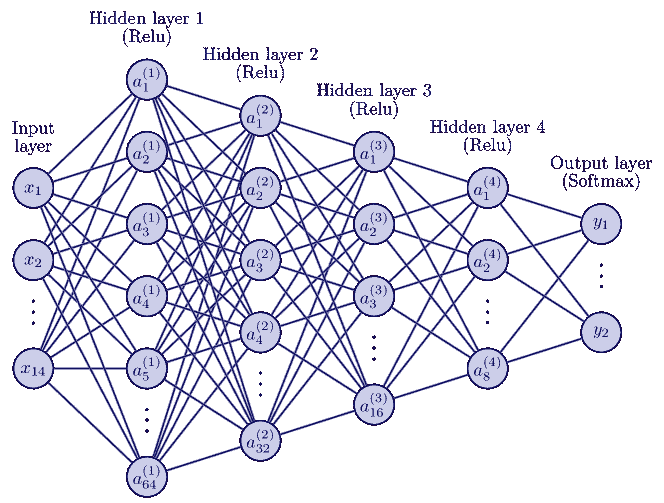
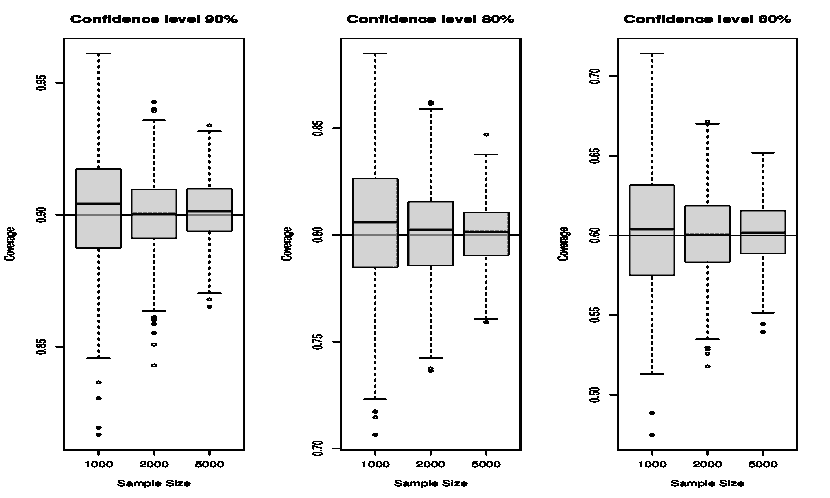
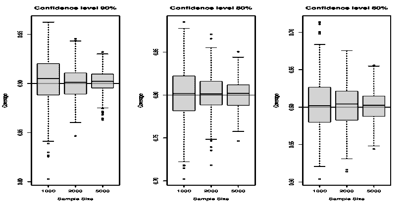
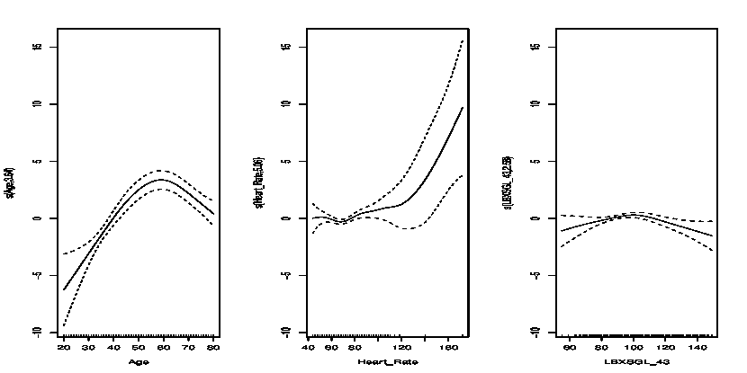

<!--yml

category: 未分类

date: 2024-09-06 19:33:36

-->

# [2403.19752] 深度学习框架与调查数据的不确定性量化：评估和预测美国人群糖尿病风险

> 来源：[`ar5iv.labs.arxiv.org/html/2403.19752`](https://ar5iv.labs.arxiv.org/html/2403.19752)

# 深度学习框架与调查数据的不确定性量化：评估和预测美国人群糖尿病风险

Marcos Matabuena 通讯作者。电子邮件: mmatabuena@hsph.harvard.edu 生物统计学系，哈佛大学 Juan C. Vidal 圣地亚哥大学 Rahul Ghosal 流行病学与生物统计学系，南卡罗来纳大学 Jukka-Pekka Onnela 生物统计学系，哈佛大学

###### 摘要

复杂的调查设计在许多医学队列中被广泛采用。在这种情况下，开发能够反映研究设计独特特征的具体预测风险评分模型至关重要。这种方法是最小化结果中潜在选择性偏差的关键。本文的目标是：（i）提出一种通用的回归和分类预测框架，使用神经网络（NN）建模，将调查权重纳入估计过程中；（ii）介绍一种针对复杂调查设计数据的模型预测不确定性量化算法；（iii）应用此方法开发稳健的风险评分模型，以评估美国人群糖尿病的风险，利用 NHANES 2011-2014 队列的数据。我们的估计量的理论性质旨在确保最小的偏差和统计一致性，从而确保我们的模型提供可靠的预测并为糖尿病研究贡献新的科学见解。尽管聚焦于糖尿病，但该 NN 预测框架可以适应于创建用于各种疾病和医学队列的临床模型。本文使用的软件和数据在 GitHub 上公开提供。

关键词: 调查数据；神经网络；不确定性量化；符合预测；NHANES 数据

## 1 引言

尽管在数据从业者中并非主要关注点，但实验设计在解决当前生物医学重复性危机中至关重要[5, 1, 28]。其重要性由罗纳德·费舍尔的开创性工作所强调，并在现代统计学的发展中显而易见[36]。在医学研究中，实验设计对于塑造支持新药和临床治疗开发及验证的研究至关重要，特别是在随机临床试验中[30]。除了这些试验外，像 NHANES（国家健康和营养检查调查）这样的全国代表性研究中的抽样方法深刻影响了临床风险评分模型的泛化能力[24, 25]。

NHANES 是一个设计精良的研究，因其可靠性和全面的数据收集而闻名，监测美国的疾病流行情况和健康习惯。与其他临床研究，如英国生物库，参与者自愿参加，选择偏倚普遍[31, 6]，NHANES 采用了多阶段复杂设计，从美国的随机样本中抽取数据。该方法包括不同的层级，如州和城市，并结合后分层技术以减少非响应者的影响，提高代表性，并改进估计器的效率。

这一复杂程序确保了准确的结论，并通过在不同时间段进行的各种代谢和生理测试来提高对变化的监测。NHANES 是一个基准研究，但统计分析的成功在很大程度上依赖于采用适应其实验设计的方法。

在生物医学研究中，开发风险评估评分对于医疗保健规划至关重要，特别是在公共卫生领域[23, 17, 34]。这些评分估计特定疾病的发病可能性，对于识别高风险个体至关重要[10]。基于这些评估，可以实施医疗保健策略，如量身定制的后续跟踪、定期检查和非侵入性干预，从而减少健康成本，提高人口健康水平[13, 32, 29]。

然而，使用观察数据构建特定疾病的风险评分容易出现选择偏倚[6]，这对结果的普遍性构成挑战。这一问题在糖尿病研究中尤为明显[26]，风险评分的预测能力有所不同，受到不同人群遗传、人口统计学特征和实验设计质量的影响。实际挑战，如成本和技术限制，往往阻碍了随机抽样。

为了克服这些挑战，研究人员经常使用多阶段调查设计，如 NHANES 所示。这种方法涉及在不同层级进行研究，针对不同的子人群。尽管这种方法很普遍，但将特定调查设计与机器学习模型和调查权重估计结合的情况仍然有限。此外，这些模型的推断统计面临固有的问题。

为了弥合这一差距，并可能影响生物医学研究中的临床结论（请参见表格 1 的 NHANES 案例），我们提出了一种新颖的神经网络框架，用于在这种背景下进行预测，结合了基于一致性预测技术的不确定性量化。我们应用这些方法来开发可靠的糖尿病风险评分，用于检测美国人群中的糖尿病。

| 方面 | 不使用正确 NHANES 调查权重的影响 |
| --- | --- |
| 估计偏差 | 偏倚的统计结果，误代表某些群体 |
| 代表性丧失 | 结果未能反映美国民用非机构化人口的情况 |
| 政策决策 | 潜在的误导性公共卫生政策和资源分配 |
| 统计不准确 | 错误的标准误差、置信区间和 p 值 |
| 伦理考虑 | 由于少数群体的比例失衡而产生的伦理问题 |

表 1：不使用调查权重对 NHANES 数据分析的影响

### 1.1 糖尿病研究案例

糖尿病是一个重大的公共卫生挑战，目前影响了大约 12%的美国人口。一个值得关注的问题，尤其是 2 型糖尿病，是高比例的未诊断病例。CDC 在 2020 年报告称，美国约 21%的糖尿病病例未被发现[9]。我们最近的研究表明，这一比例可能更高[16]。

久坐生活方式的流行，尤其是在发达国家，导致糖尿病病例的预测增加令人担忧。目前全球约有 9.3%的人口受到影响，预计到 2030 年将增加到 10.2%，到 2045 年将增加到 10.9%。这一上升趋势凸显了实施有效公共卫生策略的迫切需要。

糖尿病的经济影响巨大，美国的总成本估计为 4129 亿美元，包括 3066 亿美元的直接医疗费用和 1063 亿美元的间接费用[29]。糖尿病的负担不仅仅体现在财务成本上，还显著影响了寿命和生活质量，主要由于晚期诊断和血糖控制不良。这些问题常常导致严重的并发症，包括心血管问题。

迫切需要基于数据驱动的方法来开发新的精准医学策略。这些策略可以包括开发新的筛查方法和根据来自可穿戴设备和电子记录设备的动态信息开处方治疗。

在糖尿病的诊断中，通常涉及生物标志物，如糖化血红蛋白（A1C）和空腹血浆葡萄糖（FPG）。虽然 FPG 测试成本效益高，但 A1C 测试作为糖尿病的主要生物标志物，更为昂贵且复杂。尽管 A1C 测试被广泛使用，特别是在非高风险群体中，但它仍然面临显著挑战。包括美国糖尿病协会（ADA）在内的医学指南建议使用 A1C 和 FPG 测试，以及口服葡萄糖耐量测试，特别是在妊娠糖尿病的情况下，以进行全面评估。

在疾病诊断和筛查领域，统计和机器学习模型利用临床变量作为识别高风险个体的工具显示出前景。这些预测模型可以有效地对患者进行分层，使个性化临床方法与精准医疗相一致。然而，它们的预测能力在不同患者群体和现实世界应用中有限的样本量中可能有所不同，这对准确确定患者的葡萄糖状态提出了挑战。

在本文中，我们通过利用 2011-2014 年国家健康和营养调查（NHANES）的数据来应对这些挑战。鉴于调查设计的复杂性和这一领域非参数模型的相对稀缺性，我们引入了新型神经网络估计量。这些估计量旨在确保在预测任务中的通用逼近能力。此外，我们基于符合推理技术为调查数据开发了新的不确定性量化框架，提高了我们量化这些模型预测极限的能力。这种全面的方法旨在提高糖尿病预测模型的精度和适用性。

### 1.2 神经网络模型和机器学习模型在调查数据中的应用

在调查数据分析中应用非参数回归模型是一个相对未被充分探索的领域，如[21]所示。传统方法，如 Nadaraya-Watson 估计量[15]和局部多项式回归，已被提出，但对大量预测变量非常敏感。最近，文献中推荐了一些机器学习算法，如神经网络和随机森林，作为经典回归算法的非参数替代方法。然而，它们在复杂调查设计领域，如调查数据中的推断和预测任务的泛化尚未被提出。据我们所知，最接近的提案是[25]提出的用于功能性和分布性数据分析应用的核岭回归模型。

本文的目标是弥补文献中的这一空白，提出一个通用的神经网络（NN）框架，用于分类和回归模型、点预测和调查数据的不确定性量化。

鉴于非线性生物数据的常见性，神经网络的普遍性质很有前景，加上它们在高维设置中相比其他估计器的稳健性，作为潜在的替代方案。从生物医学应用的角度来看，新颖的神经网络预测框架为科学界提供了开发新的、通用的疾病风险评分的机会，这些评分由于将不确定性量化纳入模型输出预测而值得信赖。

## 贡献总结

本文的贡献总结如下：

+   •

    神经网络模型用于调查数据：我们的论文介绍了一种神经网络模型作为复杂调查数据估计器的新应用，重点开发了像 NHANES 这样的队列中的风险评分。

+   •

    预测不确定性量化：我们提出了一种通过使用符合推断技术来量化预测不确定性的方法，特别是针对复杂调查数据中的固有挑战进行适应。尽管交换性假设被违反，且无法维持非渐近保证，但算法仍然保持一致。

+   •

    多功能框架：我们的框架在回归和分类设置中都能运行。在回归中，我们专注于条件均值估计，而在分类中，我们探索分位数回归以开发调查符合预测算法。这种方法解决了文献中关于分位数回归和非线性回归算法与调查数据相关的空白（见 [12])。

+   •

    糖尿病应用分析：我们在糖尿病的背景下探索了不同复杂性和经济成本的模型。我们的分析比较了在亚群体中检测糖尿病的性能，提供了预测能力与经济成本之间的细致权衡分析。我们提倡为特定患者群体提供经济上可行且检测准确性增强的模型。

+   •

    患者表型识别：我们应用了新颖的不确定性预测框架来识别与高预测不确定性相关的患者表型，为根据预期模型不确定性对患者进行分层提供了可解释的规则。

## 论文大纲

本文的结构组织如下：第二部分介绍了我们专门为调查数据设计的新型神经网络模型，并提出了在此背景下量化不确定性的方法。在第三部分，我们在一个二分类框架内展示了一个模拟研究。该节验证了我们的模型，并检查了其实际性能，特别关注于神经网络分类和不确定性量化。第四部分详细介绍了一个糖尿病案例研究，应用了第二部分讨论的算法，并分析了获得的结果。第五部分讨论了我们研究的方法论贡献，我们模型在生物医学科学领域的广泛适用性，以及我们利用 NHANES 数据集所得结果的影响。该节还涉及了我们科学糖尿病应用的局限性，并提出了未来研究的潜在方向。

## 2 方法论

### 2.1 模型估计：调查神经网络模型

假设我们观察到一个随机样本 $\mathcal{D}_{n}=\{(X_{i},Y_{i})\sim P\}^{n}_{i=1}$，这个样本是从一个大小为 $n$ 的有限总体 $\mathcal{M}$ 中按照特定的调查设计抽取的。对于每个单位 $i$ $(i=1,\dots,n)$，我们关联一个权重 $w_{i}$，表示第 $i$ 个样本单位所代表的总体单位数量。在本文中，我们假设 $w_{i}=1/\pi_{i}$，其中 $\pi_{i}$ 是在某种概率抽样设计下选择第 $i$ 个单位的概率。对于最终权重的推导 $w_{i}$，在我们的科学应用中，我们考虑特定的后分层校正，以补偿 NHANES 设计中的非响应者（有关 NHANES 设计的具体细节请参见 [NHANES 设计](https://wwwn.cdc.gov/nchs/nhanes/tutorials/weighting.aspx)）。

为了不失一般性，我们假设每个预测变量 $X_{i}\in\mathbb{R}^{p}$，响应变量 $Y_{i}\in\{1,\dots,K\}$ 表示多类别分类问题中的 $K$ 个不同类别，或者在回归建模的情况下，响应变量是连续标量生物标志物，即每个 $Y_{i}\in\mathbb{R}$。对于新预测回归算法的实际应用，我们只需修改特定的损失函数 $\ell$ 以拟合模型或其他。

深度神经网络 [11]（DNNs）使用一系列简单非线性函数的组合来建模非线性。具体地，我们可以写为，

|  | $h^{(L)}=g^{(L)}\,\circ\,g^{(L-1)}\,\circ\,\dots\,\circ\,g^{(1)},$ |  |
| --- | --- | --- |

其中 $\circ$ 表示两个函数的组合，$L$ 是神经网络的隐藏层数量（或深度），且 $h^{(0)}=x$。我们可以递归地定义 $h^{(l)}=g^{(l)}\left(h^{(l-1)}\right)$ 对于所有 $l=1,2,\dots L$。前馈神经网络是定义为

|  | $h^{(l)}=g^{(l)}\left(h^{(l-1)}\right)=\sigma\left(\omega^{(l)}h^{(l-1)}+b^{(l)}\right),$ |  | (1) |
| --- | --- | --- | --- |

其中 $\omega^{(l)}$ 和 $b^{(l)}$ 分别是与第 $l$ 层相关的权重矩阵和截距，对于 $l=1,\cdots,L,$。这里，$\sigma(\cdot)$ 是逐元素应用的激活函数。本文中，我们使用流行的 ReLU 函数，如下所示

|  | $\sigma(z_{j})=\max(z_{j},0),$ |  | (2) |
| --- | --- | --- | --- |

其中 $z$ 向量的 $j$-坐标。

给定最终隐藏层 $h^{(L)}$ 的输出和一个标签 $y$，我们旨在最小化损失函数以获得模型参数。在本文中，我们采用加权交叉熵损失函数，将调查权重纳入估计过程。参数集 $\theta$ 通过解决以下优化问题来获得：

|  | $\widehat{\theta}=\arg\min_{\theta}\sum_{i=1}^{n}w_{i}\cdot\ell(Y_{i},\log f(X_{i};\theta))=\arg\min_{\theta}\sum_{i=1}^{n}\sum_{k=1}^{K}\mathbb{I}\{Y_{i}=k\}\cdot w_{i}\cdot\log f_{k}(X_{i};\theta),$ |  | (3) |
| --- | --- | --- | --- |

其中 $\theta=\{\omega^{(l)},b^{(l)}\mid 1\leq l\leq L+1\}$ 表示模型参数集，包括每层 $l$ 直到层 $L+1$ 的权重 $\omega^{(l)}$ 和偏置 $b^{(l)}$。这里，$w_{i}$ 表示观测值 $i$ 的调查权重，$\ell(\cdot,\cdot)$ 是比较预测值和实际值的损失函数，并且

|  | $f_{k}(x;\theta)=\frac{\exp(z_{k})}{\sum_{j=1}^{K}\exp(z_{j})},\hskip 5.69046pt\forall k\in\{1,\dots,K\},\text{ where }z=\sigma(\omega^{(L+1)}h^{(L)}+b^{(L+1)})\in\mathbb{R}^{K}.$ |  | (4) |
| --- | --- | --- | --- |

在调查数据分析的文献中，从业者通常使用加权型估计量以获得可靠的估计。一个常见的策略是将损失函数与霍维茨-汤普森估计量结合。这种方法根据被抽样单位的选择概率赋予其权重。这种方法常用于有效地获得最小化方差并确保无偏特性的估计量。同样，使用代表性权重可以确保统计一致性。

图 1：本文考虑的神经网络架构。

### 2.2 神经网络的计算细节

在我们的科学应用中，我们关注于一个二分类问题，即区分两类：i) 糖尿病和 ii) 非糖尿病。我们的方法使用一个深度为$L$的神经网络架构，每层有两个层级。神经网络架构的抽象表示可以在图 4 中找到。为了微调模型并选择最佳架构，我们将数据集$\mathcal{D}_{n}$划分为三个不相交的子集：训练集（$\mathcal{D}_{\text{train}}$）、架构选择集（$\mathcal{D}_{\text{architecture}}$）和测试集（$\mathcal{D}_{\text{test}}$），其比例分别为 50%、30%和 20%。我们采用交叉验证策略，重复模型评估过程$10$次，以确保模型在各种指标上的性能经过了稳健的验证。

对于每个主题$i$，我们将算法预测的标签表示为$\widehat{Y}_{i}$，糖尿病的估计概率表示为$\widehat{p}_{i}=\mathbb{P}(Y_{i}=1\mid X=X_{i})$。我们将$D$定义为糖尿病患者的索引集合，将$ND$定义为非糖尿病患者。考虑的性能指标详细见表 2。

为了优化模型参数，我们使用带有 Adam 算法的随机梯度下降（SGD），利用其自适应学习率的特性。这一优化过程通过 PyTorch 计算框架的自动微分能力得以实现。

表 2：二分类的性能指标与调查权重

| 指标 | 公式 | 描述 |
| --- | --- | --- |
| AUC | $\sum_{i\in D}\sum_{j\in ND}w_{i}w_{j}\left(\frac{1}{\sum_{i\in D}\sum_{j\in ND}w_{i}w_{j}}\right)k(\hat{p}_{i},\hat{p}_{j})$ | 加权分类性能度量 |
| ACC | $\frac{TP+TN}{TP+TN+FP+FN}$ | 正确分类实例的比例 |
| REC | $\frac{TP}{TP+FN}$ | 灵敏度或真实正例率 |
| PREC | $\frac{TP}{TP+FP}$ | 精确度或正预测值 |
| $F_{1}$ | $\frac{2\cdot\text{PREC}\cdot\text{REC}}{\text{PREC}+\text{REC}}$ | 精确度和召回率的调和平均值 |
| 交叉熵 | $-\sum_{i}w_{i}\left[y_{i}\log(\hat{p}_{i})+(1-y_{i})\log(1-\hat{p}_{i})\right]$ | 预测标签与实际标签之间的加权对数损失 |

### 2.3 基于符合预测的调查数据不确定性量化

#### 2.3.1 关于符合预测和不确定性量化的背景

在医学研究中，由于个体患者之间的巨大变异性，在各种预测任务中存在相当大的不确定性 [13, 3]。虽然这种不确定性常常被负面看待，但在不同的临床情况下，它可以有助于支持决策 [13]。首先，它有助于理解临床预测模型的局限性。其次，对患者结果的不确定性可能导致新药物治疗或干预策略的发展，提供新的治疗途径。第三，不确定性可以指导医疗规划；对于病情不可预测的患者，可以安排更频繁的常规检查。最后，量化个体患者的不确定性对识别异常行为至关重要，并有助于估算医疗资源需求。这些方面都强调了在实践中融入不确定性量化的重要性。

这里，令 $(X_{1},Y_{1}),\ldots,(X_{n},Y_{n})$ 为至少可交换的随机样本。我们专注于扩展这个框架，提出一种基于符合预测的新算法来推导不确定性度量。现在我们提供具有标量响应的回归模型的基本基础。

s

考虑序列 $\mathcal{D}_{n}=\{(X_{i},Y_{i})\}^{n}_{i=1}$ i.i.d. 随机变量。给定一个新的 i.i.d 随机对 $(X_{n+1},Y_{n+1})$ 相对于 $\mathcal{D}_{n}$，符合预测，如 [33] 所述，提供了一系列全面的算法，用于独立于所使用的回归算法构建预测区间。

让我们考虑一个回归算法

|  | $\mathcal{A}:\bigcup_{n\geq 0}(\mathcal{X}\times\mathbb{R})^{n}\rightarrow\{\textnormal{可测函数 }\widetilde{m}:\mathcal{X}\rightarrow\mathbb{R}\},$ |  |
| --- | --- | --- |

它将包含任意数量对 $(X_{i},Y_{i})$ 的数据集映射到拟合的回归函数 $\widetilde{m}$。算法 $\mathcal{A}$ 需要对数据点进行对称处理，即，

|  | $\mathcal{A}\big{(}(x_{\pi(1)},y_{\pi(1)}),\dots,(x_{\pi(n)},y_{\pi(n)})\big{)}=\mathcal{A}\big{(}(x_{1},y_{1}),\dots,(x_{n},y_{n})\big{)}$ |  | (5) |
| --- | --- | --- | --- |

对所有 $n\geq 1$，所有排列 $\pi$ 在 $[n]=\{1,\dots,n\}$ 上，以及所有 $\{(x_{i},y_{i})\}_{i=1}^{n}$。接下来，对每个 $y\in\mathbb{R}$，令

|  | $\widetilde{m}^{y}=\mathcal{A}\big{(}(X_{1},Y_{1}),\dots,(X_{n},Y_{n}),(X,y)\big{)}$ |  |
| --- | --- | --- |

表示训练好的模型，拟合到训练数据以及一个假设的测试点 $(X_{n+1},y)$，并令

|  | $R^{y}_{i}=\begin{cases} | Y_{i}-\widetilde{m}^{y}(X_{i}) | ,&i=1,\dots,n,\\ | y-\widetilde{m}^{y}(X_{n+1}) | ,&i=n+1.\end{cases}$ |  | (6) |
| --- | --- | --- | --- | --- | --- | --- | --- |

$X$ 的预测区间定义为

|  | $\widetilde{C}^{\alpha}(X;\mathcal{D}_{n})=\left\{y\in\mathbb{R}\ :\ R^{y}_{n+1}\leq\textnormal{quant}_{1-\alpha}\left(\sum_{i=1}^{n+1}\frac{1}{n+1}\cdot\delta_{R^{y}_{i}}\right)\right\},$ |  | (7) |
| --- | --- | --- | --- |

其中 $\textnormal{quant}_{1-\alpha}\left(\sum_{i=1}^{n+1}\frac{1}{n+1}\cdot\delta_{R^{y}_{i}}\right)$ 表示对经验分布 $\sum_{i=1}^{n+1}\frac{1}{n+1}\cdot\delta_{R^{y}_{i}}$ 应用的 $1-\alpha$ 次量化算子。

完整的符合方法被认为可以在目标水平 $1-\alpha$ 上保证分布无关的预测覆盖率：

###### 定理 1  (完整的符合预测 [33])。

如果数据点 $(X_{1},Y_{1}),\dots,(X_{n},Y_{n}),(X,Y)$ 是独立同分布的（或更一般地，可交换的），并且算法对输入数据点进行对称处理，如 (5)，那么在 (7) 定义的完整符合预测集满足

|  | $\mathbb{P}(Y_{n+1}\in\widetilde{C}^{\alpha}(X_{n+1};\mathcal{D}_{n}))\geq 1-\alpha.$ |  |
| --- | --- | --- |

相同的结果也适用于分割符合方法，这些方法涉及在 $\mathcal{D}_{\text{train}}$ 上估计回归函数，并在 $\mathcal{D}_{\text{test}}$ 上估计量化。

符合推断（包括分割和完整）最初是以“非符合性分数” $\widehat{S}(X_{i},Y_{i})$ 的形式提出的，其中 $\widehat{S}$ 是一个拟合的函数，用来衡量数据点 $(X_{i},Y_{i})$ 相对于训练数据集 $\mathcal{D}_{train}$ 的不寻常程度。为了简化，目前我们只介绍了最常用的非符合性分数，即拟合模型的残差。

|  | $\widehat{S}(X_{i},Y_{i}):= | Y_{i}-\widetilde{m}(X_{i}) | ,$ |  | (8) |
| --- | --- | --- | --- | --- | --- |

其中 $\widetilde{m}$ 是预训练的回归函数，例如用 $\mathcal{D}_{train}$ 的随机元素估计。

#### 2.3.2 NHANES 研究设计

**国家健康和营养调查**（NHANES）采用了复杂的多阶段概率抽样设计，以准确反映美国民用非机构化人口。这个方法框架对于确保数据集中多样化人口特征的代表性至关重要，这对于流行病学和营养监测是必不可少的。

选择过程以**主要抽样单元**（PSUs）开始，这些单元通常包括县或连续县的组，通过与大小成比例的概率方法选择。这种方法保证了对美国人口的地理代表性样本。然后将 PSUs 细分为更小的部分，使得可以在特定地点进行有针对性的抽样。这些部分中的家庭被系统地抽样，个体根据年龄、性别和种族/民族等人口学标准进行选择。这种分层允许对各种人口群体进行分析。

然而，状态之间固有的异质性，包括民族构成、社会经济状况和健康结果的变化，挑战了 NHANES 中数据的可交换性假设。这种变异性需要仔细的统计考虑，特别是在应用一致性推断算法时，这些算法依赖于可交换性和 i.i.d.假设的原则，以提供非渐近保证。

#### 2.3.3 **一致性预测**、**概念漂移**和**调查数据**算法

由于讨论了 NHANES 实验设计，我们将关注数据$(X_{i},Y_{i}),i=1,\ldots,n+1$不再是可交换的设置。我们的主要关注点将是观察数据的设置，根据

|  | $\displaystyle(X_{i},Y_{i})\stackrel{{\scriptstyle\text{i.i.d.}}}{{\sim}}P=P_{X}\times P_{Y | X},i=1,\ldots,n,$ |  | (5) |
| --- | --- | --- | --- | --- |
|  | $\displaystyle(X_{n+1},Y_{n+1})\sim\widetilde{P}=\widetilde{P}_{X}\times P_{Y | X},\text{independently.}$ |  |

请注意，假设$Y|X$的条件分布在训练数据和测试数据中是相同的。这种设置通常被称为协变量偏移。然后，如果我们知道测试与训练协变量似然的比率，$\frac{\mathrm{d}\widetilde{P}_{X}}{\mathrm{d}P_{X}}$，我们仍然可以执行一致性推断的修改版本，使用经过适当加权的非一致性评分的经验分布的分位数。

在协变量转移的情况下，即训练集和测试集中的协变量分布 $P_{X}$ 和 $\widetilde{P}_{X}$ 不同时，我们现在对每个非一致性分数 $V_{i}^{(x,y)}$（测量 $Z_{i}=(X_{i},Y_{i})$ 与其他点的一致性）进行加权，权重为与似然比 $w(X_{i})=\frac{\mathrm{d}\widetilde{P}_{X}(X_{i})}{\mathrm{d}P_{X}(X_{i})}$ 成比例的概率。因此，我们将不再关注经验分布 $\frac{1}{n+1}\sum_{i=1}^{n}\delta_{V_{i}^{(x,y)}}+\frac{1}{n+1}\delta_{\infty}$，如定理 1 中所示，而是关注加权版本

|  | $\sum_{i=1}^{n}p_{i}^{w}(x)\delta_{V_{i}^{(x,y)}}+p_{n+1}^{w}(x)\delta_{\infty}$ |  |
| --- | --- | --- |

权重定义为

|  | $p_{i}^{w}(x)=\frac{w(X_{i})}{\sum_{j=1}^{n}w(X_{j})+w(x)},i=1,\ldots,n,\quad\text{和}\quad p_{n+1}^{w}(x)=\frac{w(x)}{\sum_{j=1}^{n}w(X_{j})+w(x)}.$ |  | (6) |
| --- | --- | --- | --- |

###### 定理 2.

假设数据来自模型 (5)。假设 $\widetilde{P}_{X}$ 对 $P_{X}$ 是绝对连续的，并记 $w=\frac{\mathrm{d}\widetilde{P}_{X}}{\mathrm{d}P_{X}}$。对于任何分数函数 $\mathcal{S}$，和任何 $\alpha\in(0,1)$，定义对于 $x\in\mathbb{R}^{d}$，

|  | $\widehat{C}_{n}(x)=\left\{y\in\mathbb{R}:V_{n+1}^{(x,y)}\leq\operatorname{Quantile}\left(1-\alpha;\sum_{i=1}^{n}p_{i}^{w}(x)\delta_{V_{i}^{(x,y)}}+p_{n+1}^{w}(x)\delta_{\infty}\right)\right\}.$ |  | (7) |
| --- | --- | --- | --- |

其中 $V_{i}^{(x,y)},i=1,\ldots,n+1$ 的定义如 (3) 所示，$p_{i}^{w},i=1,\ldots,n+1$ 的定义如 (6) 所示。那么 $\widehat{C}_{n}$ 满足

|  | $\mathbb{P}\left\{Y_{n+1}\in\widehat{C}_{n}(X_{n+1})\right\}\geq 1-\alpha.$ |  |
| --- | --- | --- |

为了分类目的，我们专注于基于概念漂移一致性原则的分位数分类算法 [8]。算法 2.3.3 包含了算法的核心步骤，不同于第一个一致性算法，我们提出了一种算法，其中非一致性分数基于交叉熵的分位数回归。

拆分调查一致性分位数分类（CQC）输入：样本 $\{\left(X_{i},Y_{i}\right)\}_{i=1}^{n},$ 指标集 $\mathcal{I}_{1},\mathcal{I}_{2},\mathcal{I}_{3}\subset\{1,\dots,n\},$ 拟合算法 $\mathcal{A},$ 分位数函数 $\mathcal{Q},$ 和期望的置信水平 $\alpha$。

1.  1.

    估计分数值 $\widehat{s}_{i}$ 为 $\widehat{s}_{i}=\sum_{k=1}^{K}1\{Y_{i}=k\}w_{i}\log f_{k}(X_{i};\theta),$ 对于 $i\in\mathcal{I}_{1}$。

1.  2.

    通过拟合分位数函数

    |  | $\widehat{q}_{\alpha}\in\arg\min_{q\in\mathcal{Q}}\left\{\frac{1}{ | \mathcal{I}_{2} | }\sum_{i\in\mathcal{I}_{2}}w_{i}\rho_{\alpha}(\hat{s}_{i}-q(X_{i}))\right\},$ |  | (9) |
    | --- | --- | --- | --- | --- | --- |

    其中$\rho_{\alpha}=(1-\alpha)[-t]+\alpha[t].$

1.  3.

    通过计算非符合性分数$S_{i}=\widehat{q}_{\alpha}(X_{i})-\widehat{s}_{i},$并定义

    |  | $Q_{1-\alpha}(S,\mathcal{I}_{3}):=\left1+\frac{1}{n_{3}}\right\text{ 使用调查权重的}\{S_{i}\}_{i\in\mathcal{I}_{3}}\text{经验分位数,}$ |  | (10) |
    | --- | --- | --- | --- |

    并返回预测区域函数

    |  | $\widehat{C}_{n,1-\alpha}(x):=\{k\in\{1,\dots,K\}&#124;\widehat{s}(x,k)\geq\widehat{q}_{\alpha}(x)-Q_{1-\alpha}(S,\mathcal{I}_{3})\}.$ |  | (11) |
    | --- | --- | --- | --- |

#### 2.3.4 超越交换性的符合性预测

在一篇最近的论文中，提出了一种针对不可交换数据的更一般的符合性方法[4]。我们介绍了关键思想，以说明它们在我们的 NHANES 调查中的应用。

覆盖差距是我们分析中的一个关键概念，表示由于非交换性而导致的覆盖差异。它定义为：

|  | $\text{覆盖差距}=(1-\alpha)-\mathbb{P}\left\{Y_{n+1}\in\widehat{C}_{n}(X_{n+1})\right\},$ |  |
| --- | --- | --- |

因为在交换性条件下，该方法保证了以$1-\alpha$的概率进行覆盖。为了提供结果的非正式预览，我们使用$Z_{i}=(X_{i},Y_{i})$表示第$i$个数据点，并且

|  | $Z=(Z_{1},\ldots,Z_{n+1})$ |  |
| --- | --- | --- |

表示完整的（训练和测试）数据序列。令$Z^{i}$表示在将测试点$(X_{n+1},Y_{n+1})$与第$i$个训练点$(X_{i},Y_{i})$交换后得到的序列：

|  | $Z^{i}=(Z_{1},\ldots,Z_{i-1},Z_{n+1},Z_{i+1},\ldots,Z_{n},Z_{i}).$ |  |
| --- | --- | --- |

为了增强鲁棒性，我们的方法将引入权重：令$w_{i}\in[0,1]$表示在数据点$i$上指定的权重。我们将展示覆盖差距可以被限制为

|  | $\text{覆盖差距}\leq\frac{\sum_{i=1}^{n}w_{i}\cdot\mathrm{d}_{\mathrm{TV}}(Z,Z^{i})}{1+\sum_{i=1}^{n}w_{i}},$ |  |
| --- | --- | --- |

其中$\mathrm{d}_{\mathrm{TV}}$表示分布之间的总变差距离。

实际中，引入调查权重时，覆盖差距的差异取决于总变差距离$\mathrm{d}_{\mathrm{TV}}(Z,Z^{i})$。由于调查权重是固定的，这种差异最终取决于关于交换性假设的部分样本内的方差。在我们的 NHANES 案例研究中，我们进行经验验证以评估我们算法的覆盖差距的程度。如果不确定性量化的算法表现出渐近一致性，则随着$n$的增长，差异会减少。

:

### 2.4 渐近 NN 结果

根据[14]，我们介绍了经验过程框架，我们利用 NN 在调查数据中的性质。

设 $U_{N}\equiv\{1,\ldots,N\}$，且 $\mathcal{S}_{N}\equiv\left\{\left\{s_{1},\ldots,s_{n}\right\}:n\leq N,s_{i}\in\right.$ $\left.U_{N},s_{i}\neq s_{j},\forall i\neq j\right\}$ 是 $U_{N}$ 的子集集合。我们采用超总体框架。设 $\left\{\left(Y_{i},Z_{i}\right)\in\mathcal{Y}\times\mathcal{Z}\right\}_{i=1}^{N}$ 是定义在概率空间 $\left(\mathcal{X},\mathcal{A},\mathbb{P}_{(Y,Z)}\right)$ 上的 i.i.d. 超总体样本，其中 $Y^{(N)}\equiv\left(Y_{1},\ldots,Y_{N}\right)$ 是感兴趣的向量，而 $Z^{(N)}\equiv\left(Z_{1},\ldots,Z_{N}\right)$ 是辅助向量。一个抽样设计是一个函数 $\mathfrak{p}:\mathcal{S}_{N}\times\mathcal{Z}^{\otimes N}\rightarrow[0,1]$，使得

(1) 对于所有 $s\in\mathcal{S}_{N},z^{(N)}\mapsto\mathfrak{p}\left(s,z^{(N)}\right)$ 是可测的，

(2) 对于所有 $z^{(N)}\in\mathcal{Z}^{\otimes N},s\mapsto\mathfrak{p}\left(s,z^{(N)}\right)$ 是一个概率测度。

我们工作的概率空间包括超总体和设计空间，是相同的乘积空间 $\left(\mathcal{S}_{N}\times\mathcal{X},\sigma\left(\mathcal{S}_{N}\right)\times\mathcal{A},\mathbb{P}\right)$。为了读者的方便，这里包括了构造：概率测度 $\mathbb{P}$ 通过对所有矩形的限制唯一确定：对于任何 $(s,E)\in\mathcal{S}_{N}\times\mathcal{A}$（注意 $\mathcal{S}_{N}$ 是一个有限集合），

|  | $\mathbb{P}(s\times E)\equiv\int_{E}\mathfrak{p}\left(s,z^{(N)}(\omega)\right)\mathrm{d}\mathbb{P}_{(Y,Z)}(\omega)\equiv\int_{E}\mathbb{P}_{d}(s,\omega)\mathrm{d}\mathbb{P}_{(Y,Z)}(\omega)$ |  | (2.1) |
| --- | --- | --- | --- |

我们还使用 $P$ 来表示 $Y$ 的边际法则，以便于符号书写。

给定 $\left(Y^{(N)},Z^{(N)}\right)$ 和一个抽样设计 $\mathfrak{p}$，设 $\left\{\xi_{i}\right\}_{i=1}^{N}\subset[0,1]$ 是在 $\left(\mathcal{S}_{N}\times\mathcal{X},\sigma\left(\mathcal{S}_{N}\right)\times\mathcal{A},\mathbb{P}\right)$ 上定义的随机变量，其中 $\pi_{i}\equiv\pi_{i}\left(Z^{(N)}\right)\equiv\mathbb{E}\left[\xi_{i}\mid Z^{(N)}\right]$。我们进一步假设 $\left\{\xi_{i}\right\}_{i=1}^{N}$ 在 $Z^{(N)}$ 条件下与 $Y^{(N)}$ 独立。通常我们取 $\xi_{i}\equiv\mathbf{1}_{i\in s}$，其中 $s\sim\mathfrak{p}$，作为指示变量，表示第 $i$ 个样本 $Y_{i}$ 是否被观察到（在这种情况下 $\pi_{i}\left(Z^{(N)}\right)=$ $\sum_{s\in\mathcal{S}_{N}:i\in s}\mathfrak{p}\left(s,Z^{(N)}\right)$），但我们并不要求这种结构是先验的。$\pi_{i}$ 通常被称为一阶包含概率，而 $\pi_{ij}\equiv$ $\pi_{ij}\left(Z^{(N)}\right)\equiv\mathbb{E}\left[\xi_{i}\xi_{j}\mid Z^{(N)}\right]$ 是二阶包含概率。

我们将 Horvitz-Thompson 经验测度和经验过程定义如下：对于 $\left\{\pi_{i}\right\},\left\{\xi_{i}\right\},\left\{Y_{i}\right\}$ 如上所述，

|  | $\mathbb{P}_{N}^{\pi}(f)\equiv\frac{1}{N}\sum_{i=1}^{N}\frac{\xi_{i}}{\pi_{i}}f\left(Y_{i}\right),\quad f\in\mathcal{F}$ |  |
| --- | --- | --- |

以及相关的 Horvitz-Thompson 经验过程

|  | $\mathbb{G}_{N}^{\pi}(f)\equiv\sqrt{N}\left(\mathbb{P}_{N}^{\pi}-P\right)(f),\quad f\in\mathcal{F}$ |  |
| --- | --- | --- |

此种经验过程的名称可追溯至[18]，其中$\mathbb{P}_{N}^{\pi}(Y)$被用作总体均值$P(Y)$的估计量。通常的经验测度和经验过程（即对于所有$i=1,\ldots,N$，都有$\xi_{i}/\pi_{i}\equiv 1$）将分别用$\mathbb{P}_{N},\mathbb{G}_{N}$表示。

假设 A。考虑关于抽样设计$\mathfrak{p}$的以下条件：

(A1) $\min_{1\leq i\leq N}\pi_{i}\geq\pi_{0}>0$。

$(\mathrm{A}2-\mathrm{LLN})\frac{1}{N}\sum_{i=1}^{N}\left(\frac{\xi_{i}}{\pi_{i}}-1\right)=\mathfrak{o}_{\mathbf{P}}(1)$。

(A2-CLT) $\frac{1}{\sqrt{N}}\sum_{i=1}^{N}\left(\frac{\xi_{i}}{\pi_{i}}-1\right)=\mathcal{O}_{\mathbf{P}}(1)$。

现在，我们提出关键定理[14]，这些是 NN 调查理论的要素。

###### 定理 3 (格利文科—坎特利定理)。

[14]. 假设(A1)和(A2) $LLN$成立。如果$\mathcal{F}$是$P$-格利文科—坎特利，则

|  | $\sup_{f\in\mathcal{F}}\left | \left(\mathbb{P}_{N}^{\pi}-P\right)(f)\right | =o_{P}(1)$. |  |
| --- | --- | --- | --- | --- |

###### 定理 4 (Donsker 定理)。

[14]. 假设(A1)和(A2-CLT)成立。进一步假设：

+   (D1)

    $\mathbb{G}_{N}^{\pi}$有限维收敛到紧致的高斯过程$\mathbb{G}^{\pi}$。

+   (D2)

    $\mathcal{F}$是$P$-Donsker。

然后，

|  | $\mathbb{G}_{N}^{\pi}\rightsquigarrow\mathbb{G}^{\pi}\text{ in }\ell^{\infty}(\mathcal{F})$. |  |
| --- | --- | --- |

###### 定理 5。

考虑一个利用 ReLU 激活函数的神经网络架构。让损失函数$\ell(\cdot,\cdot)$从加权交叉熵函数、分位损失，或均方误差函数中选择。根据规定的假设 A1-A3，这种架构保证产生模型参数的一致估计。而且，参数表现出渐近正态性，这是归因于对所选损失函数定义的经验过程所应用的不变原理所产生的性质。

###### 证明。

详见附录。 ∎

###### 定理 6。

对于置信度水平$\alpha\in(0,1)$，不确定性量化算法的性能可能不满足覆盖率$\mathbb{P}(Y_{n+1}\in\widehat{C}^{\alpha}(X_{n+1};\mathcal{D}_{n}))\geq 1-\alpha$的非渐近特性要求。然而，它在边际和条件覆盖方面实现了渐近一致性。这意味着，随着样本量趋向无穷大，算法的覆盖概率对于任何固定的置信水平$\alpha\in(0,1)$，都接近名义水平，

|  | $\lim_{n\to\infty}\left | (1-\alpha)-\mathbb{P}\left(Y_{n+1}\in\widehat{C}_{n}\left(X_{n+1},\mathcal{D}_{n}\right)\right)\right | =0,\quad\text{in probability}.$ |  |
| --- | --- | --- | --- | --- |

###### 证明。

见附录。∎

## 3 模拟研究

我们进行了一项模拟研究，采用了基于两个不同生成模型的二元回归的两阶段簇抽样设计，其中 $Y\in\{0,1\}$。在这两个例子中，预测变量 $X=(X_{1},\dots,X_{10})^{\top}\in\mathbb{R}^{10}\sim\mathcal{N}_{m}(\mu,\Sigma)$，其中 $\mathcal{N}_{m}(\mu,\Sigma)$ 表示具有均值 $\mu$ 和协方差矩阵 $\Sigma$ 的 $m$ 维多元正态分布。为了简单起见，我们设置 $\mu=(0)_{1\times 10}$ 和 $\Sigma=\mathcal{I}_{10\times 10}$，分别表示一个所有元素均为零的 10 维向量和单位矩阵。

条件分布函数 $Y|X\sim Ber(\pi(X))$ 遵循伯努利分布，其中概率参数 $\pi(X)\in[0,1]$ 由不同的函数形式指定。在本文中，我们考虑了两种不同的生成模型：

+   a)

    $\pi(X)=\frac{1}{1+\exp(-3+\sum_{i=1}^{10}X_{i})}$

+   b)

    $\pi(X)=\frac{1}{1+\exp(-2+\sum_{i=1}^{3}X_{i}+\prod_{i=7}^{10}X_{i})}$

调查模拟的实验设计包含了关于簇的层级结构的假设。在第一阶段设计中，簇代表阶段和区域，假设各阶段和区域之间选择概率的独立性。在第二阶段，簇代表城市，我们再次假设每个城市选择概率的独立性。

此外，我们假设每个州的选择概率为 $4/5$，在第 $i$ 个州内，存在一个可变数量 $n_{i}$ 的城市。每个州内的每个城市都有相等的选择概率，具体为 $1/n_{i}$。抽样机制和患者选择概率 $w_{r}$ 的推导是使用 R 语言中的 survey 包实现的。

对于每个生成模型 (a) 和 (b)，我们重复实验设计 500 次，即 $b=1,\dots,B=500$，样本大小在 $N\in\{5000,10000,20000\}$ 之间变化。性能标准包括诸如 i) AUC；ii) 准确率；iii) 召回率；iv) 精确率；v) F1 分数；vi) 交叉熵。结果以不同模拟的 $mean\pm sd$ 形式呈现在表 3 中。观察到在固定样本大小 $N$ 和不同性能指标下结果的一致性。通常，随着样本大小 $N$ 的增加，准确率提高，误差减少，从而导致结果更加稳定，标准差减小。场景 (a) 的准确率较低，因为两个类别之间的分隔较少，但尽管使用了神经算法进行修改的调查设计，估计量仍然是可靠的，并随着 $N$ 的增加而收敛到真实值。

|  | 场景 a) | 场景 b) |
| --- | --- | --- |
|  | $N=5000$ | $N=10000$ | $N=20000$ | $N=5000$ | $N=10000$ | $N=20000$ |
| --- | --- | --- | --- | --- | --- | --- |
| AUC | $0.932\pm 0.007$ | $0.9334\pm 0.0054$ | $0.93379\pm 0.0037$ | $0.9993\pm 0.0036$ | $0.999674\pm 0.0001$ | $0.9998\pm 0.000764$ |
| 准确率 | $0.894\pm 0.0087$ | $0.898\pm 0.0055$ | $0.900\pm 0.003$ | $0.9762\pm 0.0068$ | $0.96227\pm 0.01137$ | $0.96963\pm 0.008$ |
| 召回率 | $0.706\pm 0.034$ | $0.719\pm 0.023$ | $0.7725\pm 0.0163$ | $0.952\pm 0.0150$ | $0.96227\pm 0.11342$ | $0.96963\pm 0.008$ |
| 精确率 | $0.875\pm 0.019$ | $0.877\pm 0.012$ | $0.878\pm 0.007$ | $0.976\pm 0.012$ | $0.9859\pm 0.0081$ | $0.991\pm 0.005$ |
| F1 分数 | $0.773\pm 0.025$ | $0.783\pm 0.0015$ | $0.7881\pm 0.010$ | $0.962\pm 0.106$ | $0.972\pm 0.00771$ | $0.979\pm 0.0049$ |
| 交叉熵 | $1.262\pm 0.0136$ | $1.200\pm 0.092$ | $1.174\pm 0.062$ | $0.259\pm 0.082$ | $0.204\pm 0.612$ | $0.163\pm 0.043$ |

表 3：不同样本大小 $N\in\{5000,10000,20000\}$ 下场景 (a) 和 (b) 的模拟结果总结。报告了以下性能指标的均值和标准差：i) 曲线下面积（AUC）；ii) 准确率；iii) 召回率；iv) 精确率；v) F1 分数；vi) 交叉熵。

### 3.1 不确定性量化

在调查数据的符合预测背景下，我们利用模拟场景(a)和(b)中的生成模型。然而，我们的重点转向基于不同置信水平$\alpha=0.95,0.9,0.8$的边际覆盖评估模型性能。具体来说，我们通过量化概率指标$\mathbb{P}(Y\in\widehat{C}^{\alpha}(X))$来评估独立随机样本$\mathcal{D}_{\text{test}}$，该样本包含$N=5000$个数据点，并在多个模拟$b=1,\dots,B$中进行评估。这些模拟练习的结果在图 2 和图 3 中分别展示。

我们的发现确认了符合预测的非渐近特性，表明$\mathbb{P}(Y\in\widehat{C}^{\alpha}(X))\geq\alpha$。这一观察结果与我们的实验设计一致，该设计将数据条件设置为在各个簇中可交换。值得注意的是，箱线图展示了样本量$N$增加时趋向名义值的收敛趋势。此外，箱线图中的变异性减小，表明在这些特定的模拟示例中模型表现稳定可靠。

图 2：生成模型 a)的符合模拟练习结果

图 3：生成模型 b)的符合模拟练习结果

## 4 NHANES 糖尿病研究案例

### 4.1 文献综述：预测糖尿病风险模型的预测模型

在对糖尿病风险进行分层的过程中，诸如芬兰（FINDRISC）[22]和德国（GDRS）[27]的糖尿病评分在十多年前被开发出来。这些评分利用逻辑回归预测在十年内发生糖尿病的概率，或者使用像 Cox 回归这样的生存模型来预测糖尿病发病时间。它们结合了易于获取的变量，如年龄、性别、人体测量、生活方式、家族史和药物使用。

最近，几种机器学习方法被提出用于从健康或前糖尿病状态预测糖尿病的发展，显示出有希望的表现[35, 7]。然而，这些研究虽然包含了大量受试者，但基于观察数据，通常排除只有部分数据的受试者。因此，在应用这些结果进行决策时应谨慎。

我们的建模策略与以往的方法不同，因为我们旨在基于当前特征预测患者是否在某一固定时间点患有糖尿病。从统计角度来看，这种方法具有优势，允许增加病例数量，并减轻与之前近似相关的不平衡问题。此外，与以往模型不同，我们将调查抽样机制引入模型，从而能够对美国人群的预测得出可靠且可推广的结论。

### 4.2 NHANES 2011-2014 数据

我们的研究数据来源于 2011-2014 年的国家健康和营养检查调查（NHANES）[20]。NHANES 是一个全面的项目，旨在为美国的平民非机构化人群提供各种健康和营养统计数据。

数据收集过程包括访谈和体检。访谈捕捉个人层面的 demographic、健康和营养信息，而体检则包括身体测量，如血压、牙科检查，以及采集血液和尿液样本进行实验室测试。我们的分析涵盖了一组 5011 名年龄在 10 到 80 岁之间的老年人。

在我们的研究中，我们考虑了多种因素，如年龄（既作为分类变量也作为连续变量）、种族、性别、癌症或糖尿病诊断（分类变量）、血压、握力综合测量、身体质量指数（BMI）以及生化标志物，包括胆固醇和甘油三酯（作为连续变量处理）。

种族变量的编码如下：1=墨西哥裔美国人；2=其他西班牙裔；3=非西班牙裔白人；4=非西班牙裔黑人；5=非西班牙裔亚裔；6=其他种族，包括多种族类别。我们模型中使用的变量的全面列表见表 4。

表 4：糖尿病和非糖尿病患者的临床特征

| 变量 | 糖尿病 (32%) | 非糖尿病 (68%) |
| --- | --- | --- |
| 年龄 | $54.1\pm 15.2$ | $44.8\pm 16.2$ |
| 身高 | $88.3\pm 22.5$ | $80.8\pm 19.3$ |
| 体重 | $169.1\pm 10.1$ | $169.4\pm 9.6$ |
| BMI | $30.8\pm 7.13$ | $28.08\pm 6.16$ |
| 腰围 | $96.9\pm 14.9$ | $105.6\pm 16.8$ |
| 舒张压 | $71.1\pm 12.2$ | $70.9\pm 11.2$ |
| 收缩压 | $126.0\pm 16.5$ | $119.2\pm 15.5$ |
| 脉搏 | $73.7\pm 12.1$ | $71.5\pm 11.36$ |
| 胆固醇 (mmol/L) | $5.0\pm 1.1$ | $4.98\pm 1.0$ |
| 甘油三酯 (mmol/L) | $2.09\pm 1.7$ | $1.55\pm 1.06$ |
| 性别 男性 | $47\%$ | $50\%$ |
| 葡萄糖 (mg/dL) | $123\pm 48$ | $89\pm 10$ |
| 糖化血红蛋白 % | $6.22\pm 1.35$ | $5.33\pm 0.35$ |

### 4.3 糖尿病定义

在我们涉及 5011 名患者的分析中，每位患者均按其相应的调查权重$w_{i}$ ($i=1,\dots,N=5011$)加权，我们将糖尿病的诊断状态定义为二元变量，用“1”表示糖尿病存在，用“0”表示糖尿病不存在。

根据美国糖尿病协会（ADA）指定的 2 型糖尿病诊断标准如下[2]：

1.  1.

    空腹血浆葡萄糖 (FPG) 水平为 126 mg/dL（7.0 mmol/L）或更高，或

1.  2.

    血红蛋白 A1c (HbA1c) 水平为 6.5%（48 mmol/mol）或更高。

1.  3.

    由医疗专业人员之前诊断为糖尿病。

利用这个定义和相应标记的结果，我们采用了一系列复杂度不同的模型，这些模型在经济成本和实验室测试方面各具特点。

### 4.4 模型性能结果

在我们的研究中，我们详细评估了七个糖尿病预测模型，重点比较了它们在关键指标上的表现，如曲线下面积（AUC）、准确率、召回率、精确度、F1 分数和交叉熵。我们还考虑了部署每个模型的成本影响。最初的模型，特别是模型 1 至 4，逐步纳入了更多临床变量，从基本的 demographic 信息开始，扩展到包括胆固醇和甘油三酯等生理和代谢标记。引入代谢标记的模型 4 在性能上显著提升，AUC 达到了 0.74，准确率为 67%。这一改进突显了包括代谢指标在内以增强模型诊断能力的价值。

更深入地探讨细节，模型 5 在预测准确性上有了实质性进步，AUC 达到了 0.832，准确率为 73.9%，精确度为 77.4%。该模型通过纳入糖化血红蛋白这一关键糖尿病标记，显著提升了性能，突显了选择相关临床变量以提高模型效能的战略重要性。

模型 7，我们最先进的配置，展示了所有评估指标中最高的性能水平，其 AUC 达到了 0.92，准确率为 81%，精确度为 78.6%。模型 7 的成功可以归因于其综合集成了广泛的临床变量，这些变量经过精心挑选，以捕捉糖尿病的复杂性质。对各模型相关成本的分析揭示了模型复杂性与运营成本之间的明显联系，尽管模型 7 是最昂贵的选项，但其精确度仍然突出。

我们的研究突显了变量选择在提高糖尿病模型预测能力中的关键作用。从模型 1 到模型 7 的显著性能提升，特别是在更高级模型中纳入了更多临床变量，提倡一种深思熟虑和知情的变量选择方法。这种策略不仅最大化了预测的准确性，还强调了在临床环境中平衡增强的预测能力与成本和实施的实际考虑的必要性。本研究的结果鼓励在开发糖尿病预测模型时采取深思熟虑的方法，优先考虑精心选择变量，以实现准确性、成本效益和临床实用性的最佳平衡。

| 变量 | 模型 1 | 模型 2 | 模型 3 | 模型 4 |
| --- | --- | --- | --- | --- |
| 变量 1 | 年龄 | 身高 | 年龄 | 年龄 |
| 变量 2 | 性别 | 体重 | 身高 | 身高 |
| 变量 3 |  | BMI | 体重 | 体重 |
| 变量 4 |  | 腰围 | BMI | BMI |
| 变量 5 |  | 舒张压 | 腰围 | 腰围 |
| 变量 6 |  | 收缩压 | 舒张压 | 舒张压 |
| 变量 7 |  | 脉搏 | 收缩压 | 收缩压 |
| 变量 8 |  |  | 脉搏 | 脉搏 |
| 变量 9 |  |  | 性别 | 胆固醇 |
| 变量 10 |  |  |  | 三酸甘油脂 |
| 变量 11 |  |  |  | 性别 |
| 成本模型 | 0 | 0 | 0 | 0.5 |
| AUC | 0.66 | 0.68 | 0.72 | 0.74 |
| 准确率 | 0.595 | 0.63 | 0.6 | 0.67 |
| 召回率 | 0.08 | 0.35 | 0.51 | 0.52 |
| 精确度 | 0.334 | 0.60 | 0.60 | 0.62 |
| F1 分数 | 0.123 | 0.43 | 0.54 | 0.56 |
| 交叉熵 | 6.144 | 4.32 | 3.28 | 3.15 |
| 表 | [2981, 97, 1600, 122] | [2638, 440, 1137, 585] | [2486, 592, 940, 782] | [2523, 555, 900, 822] |

表 5：模型 1 到 4 的性能指标和模型比较。该表包括各种临床变量、AUC、准确率、召回率、精确度、F1 分数、成本模型、交叉熵和混淆矩阵等指标。

| 变量 | 模型 5 | 模型 6 | 模型 7 |
| --- | --- | --- | --- |
| 变量 1 | 年龄 | 年龄 | 年龄 |
| 变量 2 | 身高 | 身高 | 身高 |
| 变量 3 | 体重 | 体重 | 体重 |
| 变量 4 | BMI | BMI | BMI |
| 变量 5 | 腰围 | 腰围 | 腰围 |
| 变量 6 | 舒张压 | 舒张压 | 舒张压 |
| 变量 7 | 收缩压 | 收缩压 | 收缩压 |
| 变量 8 | 脉搏 | 脉搏 | 脉搏 |
| 变量 9 | 胆固醇 | 胆固醇 | 胆固醇 |
| 变量 10 | 三酸甘油脂 | 三酸甘油脂 | 三酸甘油脂 |
| 变量 11 | 性别 | 性别 | 性别 |
| 变量 12 | 糖化血红蛋白 | 葡萄糖 | 葡萄糖 |
| 变量 13 |  |  | 糖化血红蛋白 |
| 成本模型 | 4.5 | 2.1 | 6.1 |
| AUC | 0.832 | 0.84 | 0.92 |
| 准确率 | 0.739 | 0.766 | 0.81 |
| 召回率 | 0.526 | 0.612 | 0.739 |
| 精确度 | 0.774 | 0.777 | 0.786 |
| F1 分数 | 0.613 | 0.675 | 0.761 |
| 交叉熵 | 3.15 | 2.6 | 1.64 |
| 表格 | [2809, 269, 838, 884] | [2784, 294, 810, 912] | [2732, 346, 492, 1230] |

表 6：模型 5 到 7 的性能指标和模型比较。表格继续列出了各种临床变量，指标包括 AUC、准确率、召回率、精确度、F1 分数、成本模型、交叉熵和混淆矩阵。

### 4.5 不确定性量化

现在，我们专注于应用在算法 2.3.3 中提出的新不确定性量化算法，基于合规推断。为了理解不确定性如何根据患者特征演变，我们对数据集中的每个患者估算糖尿病类别 '1' 的评分函数 $\widehat{s}(X_{1},1)$。这是通过使用空腹血浆葡萄糖 (FPG)、心率和年龄作为预测变量的加性生成模型完成的（见图 4）。特别是，观察到最大的不确定性出现在 60 岁以上的患者中，这些患者具有较高的心率，并且葡萄糖水平在糖尿病前期范围内，即 $100<\text{glucose}<125\text{mg/dL}$。对于 60 岁以上的患者，不确定性会减少，这也适用于正常血糖的患者或那些根据 FPG 值显示出明显糖尿病模式的患者。总体而言，年轻的心率较低和空腹血糖水平较低的个体是模型判别能力较高的患者，基于年轻健康个体。在糖尿病前期个体的情况下，特别是老年人和心率较高者，不确定性显著增加，因此建议进行更多常规医学检查。

图 4：协变量效应预测评分函数，使用新的合规预测算法进行估计

## 5 讨论

本文介绍了一种基于神经网络模型的新预测框架，该框架在不同复杂样本设计（如分层设计、伯努利采样和最大熵采样）中结合了自动不确定性量化预测输出步骤。利用经验过程理论，我们建立了渐近理论，确保了回归函数的普遍一致性以及神经网络参数的渐近正态性。对于在某些可交换条件下的不确定性算法，我们建立了非渐近保证，同时通过所有回归函数的普遍一致性确保预测区域的一致性。

通过在分类设置中进行的各种模拟场景，我们展示了这些方法在有限样本量下的有效行为以及它们在点估计和预测输出不确定性量化方面的一致性特征。

在具体的临床应用中，我们利用 NHANES 2011-2014 的数据预测糖尿病风险，探索了不同复杂性和经济成本的模型。从公共卫生的角度来看，这些结果具有重要意义，因为它们能够通过不同复杂性和医疗资源的模型量化糖尿病风险，提供不同的效能。尽管某些模型较为简单，但在不同的患者亚群体中仍然有效，帮助筛查糖尿病风险。不确定性量化分析显示，年龄、心率升高以及糖尿病前期的基线血糖值会增加模型预测的不确定性。在整体预测能力方面，即使使用主要诊断标准，由于患者可能有正常的血糖值但之前已被诊断为糖尿病，经典分类性能可能无法实现。在一个未测量实验室变量的模型中，总体 AUC 为 0.74，与传统糖尿病评分相当，但考虑了体测和心脏变量与基本患者特征的结合。最近，发表在《自然数字医学》杂志上的一篇评论[26]强调了糖尿病评分结果的不一致性，这归因于队列的观察性质和实验设计的局限性，这也是我们在引言中提到的可重复性危机的原因。我们的模型提供了人群的可重复性。未来的数据分析步骤包括创建患者的不确定性表型，或利用可解释的临床规则分析模型区分能力高的患者亚型，例如基于 AUC 的 ROC 分析。对于不确定性大或预测能力低的患者，这在建立个性化跟踪、寻找替代测量策略或将纵向信息纳入模型中可能至关重要。

从方法论的角度来看，尽管有大量关于经典回归模型的文献，机器学习的应用仍然很少。我们提出了首个基于神经网络的通用方法论，同时引入了量化不确定性和提供分位数预测的度量。代码和分析可在 GitHub 上获得，鼓励采用能够通过调查提高精确公共卫生和传统流行病学结果的模型。例如，NHANES 记录了超过 50,000 项新的临床研究，突显了为从业人员提供可靠数据分析工具以得出具有普遍意义结论的必要性。

对于未来的工作，我们建议扩展这里使用的方法，例如应用于时间事件分析或开发特定技术以处理协变量函数，或创建新的诊断测试，通过条件 ROC 曲线分析[19]评估如 NHANES 等调查队列中的预测能力。

总之，我们的工作提供了基于神经网络的强大且成熟的预测框架，适用于调查设计，并通过 GitHub 公开提供这些易于获取的方法。这些方法对科学社区在直接分析数据和解决特定科学建模问题方面具有重要价值。

## 参考文献

+   [1] Gary An。可重复性危机、分母问题和多尺度建模的科学角色。《数学生物学通报》，80(12):3071–3080, 2018。

+   [2] 美国糖尿病协会。2. 糖尿病的分类和诊断：糖尿病医疗护理标准—2020。《糖尿病护理》，43(补充 _1):S14–S31, 2020。

+   [3] Christopher RS Banerji, Tapabrata Chakraborti, Chris Harbron 和 Ben D MacArthur。临床 AI 工具必须传达每个个体患者的预测不确定性。《自然医学》，29(12):2996–2998, 2023。

+   [4] Rina Foygel Barber, Emmanuel J Candes, Aaditya Ramdas 和 Ryan J Tibshirani。超越交换性的符合预测。《arXiv 预印本》arXiv:2202.13415, 2022。

+   [5] C Glenn Begley 和 John PA Ioannidis。科学中的可重复性：提高基础和临床前研究的标准。《循环研究》，116(1):116–126, 2015。

+   [6] Valerie Bradley 和 Thomas E Nichols。解决 UK Biobank 神经影像队列中的选择偏倚。《MedRxiv》，页面 2022–01, 2022。

+   [7] Avivit Cahn, Avi Shoshan, Tal Sagiv, Rachel Yesharim, Ran Goshen, Shalev Varda 和 Itamar Raz。预测从前糖尿病到糖尿病的进展：机器学习模型的开发和验证。《糖尿病代谢。研究与评论》，36(2):e3252, 2020。

+   [8] Maxime Cauchois, Suyash Gupta 和 John C Duchi。了解你所知道的：在多类别和多标签预测中的有效和验证的置信集。《机器学习研究期刊》，22:81–1, 2021。

+   [9] Prevention CDC. 国家糖尿病统计报告：2020 年美国糖尿病及其负担的估计。亚特兰大, GA: 美国卫生与公众服务部, 2020。

+   [10] Björn Dahlöf. 心血管疾病风险因素：流行病学与风险评估。美国心脏病学杂志, 105(1):3A–9A, 2010。

+   [11] Jianqing Fan, Cong Ma, 和 Yiqiao Zhong. 深度学习的选择性概述。统计科学：数学统计学会的评论期刊, 36(2):264, 2021。

+   [12] Raphael A Fraser, Stuart R Lipsitz, Debajyoti Sinha, 和 Garrett M Fitzmaurice. 关于复杂调查的中位回归的说明。生物统计学, 23(4):1074–1082, 10 2021。

+   [13] Ziad Akram Ali Hammouri, Pablo Rodríguez Mier, Paulo Félix, Mohammad Ali Mansournia, Fernando Huelin, Martí Casals, 和 Marcos Matabuena. 医学科学中的不确定性量化：下一步的重要进展。气管炎档案, 59(11):760–761, 2023。

+   [14] Qiyang Han 和 Jon A. Wellner. 复杂抽样设计：统一极限定理及其应用。统计年鉴, 49(1):459 – 485, 2021。

+   [15] Torsten Harms 和 Pierre Duchesne. 针对复杂调查数据设计的核非参数回归。统计学, 72:111–138, 2010。

+   [16] Geronimo Heilmann, Sandra Trenkamp, Clara Möser, Maria Bombrich, Martin Schön, Iryna Yurchenko, Klaus Strassburger, Marcos Matabuena Rodríguez, Oana-Patricia Zaharia, Volker Burkart, 等。钠氟化物-柠檬酸血浆中的精确葡萄糖测量影响糖尿病和前糖尿病的流行率估计。临床化学与实验室医学（CCLM）, (0), 2023。

+   [17] Klaus Hoeyer. 数据作为承诺：通过个性化医学重新配置丹麦公共卫生。科学社会学, 49(4):531–555, 2019。

+   [18] Daniel G Horvitz 和 Donovan J Thompson. 从有限总体中无替代抽样的推广。美国统计协会杂志, 47(260):663–685, 1952。

+   [19] Holly Janes 和 Margaret S Pepe. 使用协变量调整的 ROC 曲线调整分类准确性的协变量效应。2006。

+   [20] Clifford Leroy Johnson, Sylvia M Dohrmann, Vicki L Burt, 和 Leyla Kheradmand Mohadjer. 国家健康与营养检查调查：样本设计，2011-2014。编号 2014。美国卫生与公众服务部，疾病控制与预防中心, 2014。

+   [21] Thomas Lumley 和 Alastair Scott. 拟合回归模型于调查数据。统计科学, 页码 265–278, 2017。

+   [22] K Makrilakis, S Liatis, S Grammatikou, D Perrea, C Stathi, P Tsiligros, 和 N Katsilambros. 对芬兰糖尿病风险评分（findrisc）问卷在希腊筛查未诊断的 2 型糖尿病、糖代谢异常和代谢综合症的有效性验证。糖尿病与代谢, 37(2):144–151, 2011。

+   [23] Laurie T Martin, Teague Ruder, José J Escarce, Bonnie Ghosh-Dastidar, Daniel Sherman, Marc Elliott, Chloe E Bird, Allen Fremont, Charles Gasper, Arthur Culbert 等. 健康素养预测模型的开发。Journal of General Internal Medicine, 24:1211–1216, 2009.

+   [24] Marcos Matabuena, Paulo Félix, Ziad Akram Ali Hammouri, Jorge Mota, 和 Borja del Pozo Cruz. 老年人的身体活动表型和死亡率：NHANES 加速度计数据的全新分布数据分析。Aging Clinical and Experimental Research, 34(12):3107–3114, 2022.

+   [25] Marcos Matabuena 和 Alexander Petersen. 使用非参数调查回归模型对 NHANES 数据库中的加速度计数据进行分布数据分析。Journal of the Royal Statistical Society Series C: Applied Statistics, 72(2):294–313, 2023.

+   [26] Farida Mohsen, Hamada RH Al-Absi, Noha A Yousri, Nady El Hajj, 和 Zubair Shah. 基于人工智能的糖尿病风险预测方法的范围审查。npj Digital Medicine, 6(1):197, 2023.

+   [27] Kristin Mühlenbruch, Rebecca Paprott, Hans-Georg Joost, Heiner Boeing, Christin Heidemann, 和 Matthias B Schulze. 德国糖尿病风险评分（GDRS）临床版本的推导和外部验证，包括 HbA1c 测量。BMJ Open Diabetes Research and Care, 6(1):e000524, 2018.

+   [28] Marcus R Munafò, Chris Chambers, Alexandra Collins, Laura Fortunato, 和 Malcolm Macleod. 可重复性辩论是一个机会，而不是危机。BMC Research Notes, 15(1):43, 2022.

+   [29] Emily D Parker, Janice Lin, Troy Mahoney, Nwanneamaka Ume, Grace Yang, Robert A Gabbay, Nuha A ElSayed, 和 Raveendhara R Bannuru. 2022 年美国糖尿病的经济成本。Diabetes Care, 47(1):26–43, 2024.

+   [30] David S Robertson, Kim May Lee, Boryana C López-Kolkovska, 和 Sofía S Villar. 临床试验中的响应自适应随机化：从神话到实践考虑。Statistical Science: A Review Journal of the Institute of Mathematical Statistics, 38(2):185, 2023.

+   [31] James M Swanson. 英国生物库和选择偏倚。The Lancet, 380(9837):110, 2012.

+   [32] Clare Turnbull, Helen V Firth, Andrew OM Wilkie, William Newman, F Lucy Raymond, Ian Tomlinson, Robin Lachmann, Caroline F Wright, Sarah Wordsworth, Angela George 等. 人群筛查需要有力证据——基因组学也不例外。The Lancet, 403(10426):583–586, 2024.

+   [33] Vladimir Vovk, Alexander Gammerman, 和 Glenn Shafer. 随机世界中的算法学习，第 29 卷。Springer, 2005.

+   [34] Timothy L Wiemken 和 Robert R Kelley. 机器学习在流行病学和健康结果研究中的应用。Annu Rev Public Health, 41(1):21–36, 2020.

+   [35] Yang Wu, Haofei Hu, Jinlin Cai, Runtian Chen, Xin Zuo, Heng Cheng, 和 Dewen Yan. 预测中国成年人 3 年糖尿病发生风险的机器学习。Frontiers in Public Health, 9, 2021.

+   [36] Frank Yates. Ronald Fisher 爵士和实验设计。Biometrics, 20(2):307–321, 1964.
