<!--yml

category: 未分类

date: 2024-09-06 19:33:33

-->

# [2404.00340] 深度强化学习在自动驾驶车辆路径规划和控制中的应用综述

> 来源：[`ar5iv.labs.arxiv.org/html/2404.00340`](https://ar5iv.labs.arxiv.org/html/2404.00340)

# 深度强化学习在自动驾驶车辆路径规划和控制中的应用综述

陈一扬¹²，贾超¹³，蔡云瑞¹²，闵通¹，苏博^(1∗)

¹中国北方人工智能与创新研究院，北京，100072，中国

²清华大学精密仪器系，北京，中国

³清华大学自动化系，北京，中国

Email: chenyy22@mails.tsinghua.edu.cn

###### 摘要

数据驱动应用与控制系统的结合在近期的自动驾驶汽车研究中发挥了关键作用。本文提供了有关深度强化学习（DRL）在自动驾驶车辆路径规划和控制领域的最新文献的结构化综述。它汇集了一系列 DRL 方法和算法及其在该领域的应用，特别关注它们在轨迹规划和动态控制中的作用。在此综述中，我们*深入探讨*了 DRL 技术在该领域的应用成果。通过总结这些文献，我们突出潜在挑战，旨在提供对从事相关领域研究的学者可能有帮助的见解。

*K*eywords 深度强化学习（DRL）  $\cdot$ 自动驾驶车辆  $\cdot$ 路径规划  $\cdot$ 汽车控制  $\cdot$ 路径跟踪

## 1 引言

随着自动驾驶技术的迅速进步，其在减轻驾驶员负担、提高交通效率、降低能耗和改善道路安全方面的潜力越来越被认可[1]。目前，自动驾驶车辆控制技术的进步主要来自于先进驾驶辅助系统（ADAS）的整合，包括自适应巡航控制（ACC）、车道保持辅助系统和车道偏离警告技术，这些技术已在各种商用电动汽车中得到应用。诸如谷歌的 Waymo 和百度的 Apollo 等项目已向商业运营迈进，实现了自动驾驶能力，并在指定区域推出了无人驾驶车辆租赁服务。

自主车辆的控制框架从根本上包括三个层级：感知、规划和控制，图 1 [2] 展示了自主驾驶系统的全面架构。感知层负责准确感知和处理测量数据，以产生可靠的状态估计，这对于精确定位和环境识别至关重要。规划层专注于任务规划、行为规划和路径规划，确保车辆能够在复杂环境中做出明智的决策。控制层则集中于保持车辆稳定性，并严格遵循预定轨迹。感知和预测的成功在很大程度上归功于近年来机器视觉领域的重大进展。然而，规划和控制部分依赖于开发者为层级控制器设定参数，并通过仿真和现场测试进行微调，这是一种传统方法，存在明显的局限性，尤其是在参数调整和适应新环境方面，表现为既耗时又低效。此外，由于驾驶过程的高度非线性特征，依赖于车辆模型线性化或其他代数解决方案的控制策略在实施和扩展性方面面临挑战[3]。

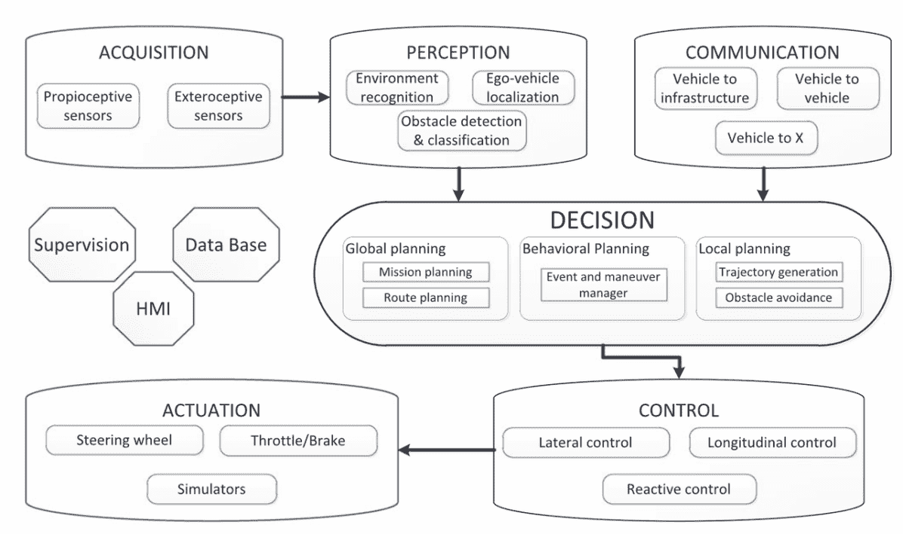

图 1：自动化车辆的控制架构[2]。

强化学习（RL）基于马尔可夫决策过程（MDP），使得可以在奖励和惩罚系统的响应下持续执行动作。将强化学习与深度学习结合，称为深度强化学习（DRL），标志着控制系统学习框架的前沿。深度强化学习（DRL）擅长从复杂的数据集中近似高度非线性函数，解决了自主驾驶各个子领域中的复杂控制挑战，如行为决策、能源管理和交通流量控制。在行为决策领域，高级规划和行为预测采用深度强化学习（DRL）和深度逆向强化学习来在动态和不确定的环境中进行导航和决策[4]。此外，将多智能体 DRL 应用于交通流量的管理和优化，为解决和缓解交通拥堵问题提供了一个有前景的途径，从而提高了整体交通效率。这种 DRL 的创新应用不仅凸显了其多样性，还展示了其在协调复杂交通动态中的潜力，为创建更高效的交通系统铺平了道路[5]。

在运动规划和控制领域，驾驶环境的动态性和不确定性要求采取复杂的策略，这些策略能够适应实时变化，同时确保最佳路径选择。深度强化学习（DRL）的整合已被证明能够有效应对这些复杂性，通过持续的环境学习提供不断演变的解决方案[6, 7, 8]。例如，在基于随机马尔可夫决策过程（MDP）的自动驾驶车辆规划问题中，DRL 促进了车辆与环境之间互动的模拟，学习超车和跟车等最佳策略。这种方法同时考虑了车辆的状态、目的地和潜在障碍，从而确保路径规划的准确性和乘客的舒适度。尽管深度强化学习（DRL）具有显著优势，但从稀疏的高维传感器输入中有效学习并确保实际驾驶场景中的安全性和鲁棒性仍然面临挑战。

本文重点讨论自动驾驶中的局部路径规划和运动控制，通过收集、评估和综合相关文献，检视强化学习（RL）和深度强化学习（DRL）的优点及现状，以突出重要成就和新兴研究方向。同时，通过细致分析，本研究旨在阐明 RL 在自动驾驶技术进步中的关键作用，特别是在精确轨迹规划和控制领域，同时识别当前领域内未解决的问题和潜在的研究方向。

为了确定本研究的关键文献，使用了如图 2 所示的系统评价程序。最初，通过在 Web of Science 数据库、LLM 工具和词嵌入技术上的关键词主题搜索，进行了初步筛选，保留了大约 500 篇将强化学习（RL）与自动驾驶轨迹控制相结合的文章。随后，基于每篇文章的摘要进行了初步分类，保留了与轨迹规划和运动控制相关的文章，将数量减少到 180 篇。在选定的 180 篇文章中，进行了全面的全文审查，选出了 45 篇最新且相关的文章。在本综述文章中，根据这 45 篇文章总结了 RL 在轨迹规划和控制应用中的最新进展。此外，还纳入了 50 篇以上的参考文献，以涵盖最先进的 RL 方法并描述与自动驾驶轨迹规划和控制相关的问题。

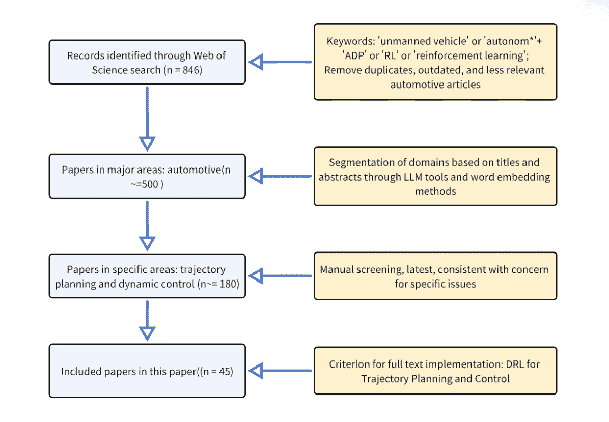

图 2：本综述论文中筛选和选择文献的方法。

本文的第二章将简明扼要地介绍主流的强化学习方法及其在各种自动驾驶挑战中的适用性。第三章将深入探讨轨迹规划问题，包括现有方法的挑战，并详细说明针对特定场景的强化学习方法的应用。第四章探讨横向和纵向控制挑战，以及强化学习在解决这些问题中的实施。第五章介绍了最近流行的端到端方法，其中强化学习智能体将路径规划与运动控制整合在一起。最后，将提供对当前文献中 DRL 方法的总结和讨论，突出 DRL 在轨迹规划和运动控制子领域进一步应用的挑战和潜在未来研究方向。

## 2 自动驾驶中的 DRL 概述

### 2.1 强化学习算法简介

RL 是机器学习的一个子集，其中智能体通过在环境中执行行动来学习决策，以实现指定目标。RL 的核心在于智能体与其环境之间的互动，这一过程通过试错法来实现。智能体通过奖励获得反馈，引导其采取优化长期奖励积累的策略。这种学习范式的特点在于其专注于学习最佳行动选择策略，而不需要预定义的环境模型，使其特别适合于复杂和动态不确定的应用，如自动驾驶。

在自动驾驶的背景下，特别是关于运动规划和控制方面，马尔可夫决策过程（MDP）提供了一个建模决策过程的基础框架。MDP 由其状态、行动、转移概率和奖励组成。状态可以包含广泛的信息，包括车辆的当前速度、位置、方向以及周围环境条件，如与其他车辆的距离。行动指的是车辆可以执行的全面操作集合，如加速、制动或在不同角度转弯。MDP 框架假设未来状态仅依赖于当前状态和行动，遵循马尔可夫性质。这一假设简化了基于历史数据整体预测未来场景的复杂性。

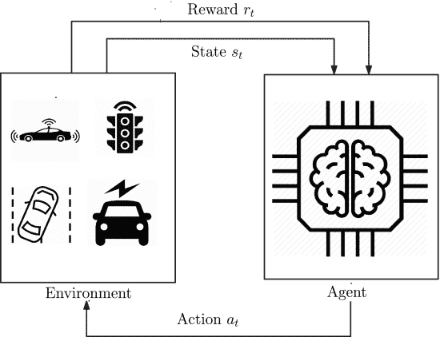

图 3：RL 循环中的 MDP[5]。

奖励函数在强化学习（RL）中发挥着关键作用，因为它通过激励那些引导达到期望结果的行为直接影响代理的行为。在自动驾驶的背景下，奖励函数可以被设计为优先考虑安全、效率以及遵守交通规则等方面。例如，可以为保持与其他车辆的安全距离、在规定时间内到达目的地或减少燃料消耗等行为分配奖励。相反，对于如超速或偏离计划路线等被认为危险的行为，可能会施加惩罚。在自主驾驶应用领域，状态转移函数或 MDP 中的环境并非完全陌生。这涉及到对车辆动力学和运动学以及周围道路条件的建模。鉴于实际驾驶条件的不可预测性，这可能非常复杂，导致许多 RL 方法选择不考虑具体的车辆模型，从而采用无模型的方法。

近似动态规划（ADP）是强化学习（RL）中一个基本概念，其中探索被整合到动态规划（DP）中，以识别解决大状态或动作空间问题的近似最优策略，其中精确解法在计算上不可行。通过对价值函数或策略的近似，ADP 方法可以为自动驾驶中遇到的复杂挑战提供可扩展的解决方案。这些方法在优化控制策略和运动规划算法时尤为宝贵，特别是在精确的状态转移动态未知或过于复杂以至于无法显式建模的情况下。

在无模型深度强化学习（DRL）中，最常见的分类方法区分了基于价值的方法和基于策略的方法。深度 Q 学习（DQN）将深度学习与 Q 学习结合，采用深度神经网络来近似 Q 函数，评估当前状态下不同行为的价值。这种方法使得 DQN 能够管理具有高维状态空间的环境，包括视频游戏和自动驾驶模拟器。DQN 的实现涉及从环境交互中收集和利用数据来训练神经网络，其中经验回放和目标网络作为关键的稳定元素。DQN 处理复杂决策过程的能力使其非常适合在动态和视觉丰富的环境中应用。

对基础 DQN 架构的增强，包括 Double DQN、Dueling DQN 和目标网络的采用，已经改善了与训练收敛相关的挑战。三种常见的改进如下：Double DQN 通过将动作选择与 Q 值评估解耦来减少过高估计偏差。Dueling DQN 通过区分状态值和动作优势估计来增强动作评估，从而提供对动作影响的更详细理解。目标网络通过调节 Q 值更新的速度来提高训练的稳定性，从而减少学习动态中的波动。

策略学习方法通过实现状态到动作的直接映射，使智能体能够为给定状态确定动作的概率分布，这与基于价值的学习方法通过间接选择动作以最大化预期回报的方式不同。策略梯度（PG）是策略学习中的一种基础方法，旨在通过优化策略网络参数来提高预期回报。这种方法特别适用于连续动作空间或高维场景，例如机器人控制和复杂决策任务。策略梯度通过直接修改策略参数来促进学习，以增加有益动作的概率并减少有害动作的概率。

高级策略学习算法，如近端策略优化（PPO）[9] 和信赖域策略优化（TRPO）[10]，旨在解决策略梯度方法在实际应用中面临的稳定性和效率挑战。PPO 通过限制策略更新的幅度来增强训练过程的稳定性，而 TRPO 通过在优化过程中引入信赖域来保证更新不会过度发散。这些技术提供了有效更新策略的手段，同时保持学习的稳定性，特别适用于需要对策略更新步骤进行细致控制的应用场景。

基于价值的方法在大动作空间内生成有效动作时面临挑战，并且策略网络的训练不易适应时序差分和经验重放方法，导致收敛困难。Actor-Critic 方法结合了策略学习和价值学习，由两个模型组成：Actor 负责生成动作，Critic 负责评估这些动作的价值。该架构旨在利用价值学习的优势来指导策略学习，从而提高学习过程的方向性和效率。Actor-Critic 方法在处理部分可观察或高维状态空间的问题时表现出明显的优势。

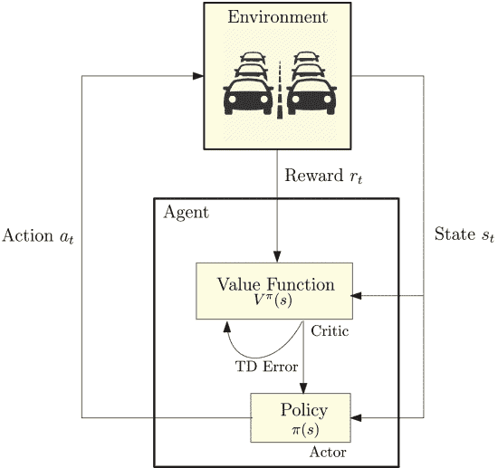

图 4：Actor Critic 方法[5]。

对 Actor-Critic 方法的增强包括深度确定性策略梯度（DDPG）[11]、双延迟 DDPG（TD3）[12] 和软 Actor-Critic（SAC）。DDPG 适用于连续动作空间，结合了深度学习和策略梯度方法的优点。“确定性”策略的应用显著提高了训练过程中的采样效率，更有效地引导了网络的梯度更新轨迹。TD3 通过整合双重网络结构和延迟更新机制来减轻过度估计偏差，而 SAC 通过熵正则化促进代理在状态空间的更广泛探索，从而提高学习的稳定性和鲁棒性。

在连续控制领域，强化学习面临着高质量样本稀缺的重大挑战，显著增加了训练的复杂性。一种有效的策略是采用经验回放机制[13]，使算法能够在训练过程中多次存储和重用遇到的转移（包括状态、动作、奖励和新状态）。这种方法显著提升了样本利用效率，减少了学习过程的方差，并允许对非连续经验进行批量更新。在此基础上，基于演示的深度 Q 学习（DQfD）[14] 进一步扩展了经验回放的应用范围，不仅重新利用由代理自身生成的经验，还特别引入了从专家演示中学习的机制。DQfD 通过将时间差分更新与专家动作的监督分类相结合，显著加快了学习速度，即使在演示数据有限的情况下也能有效学习。此外，通过优先回放机制，DQfD 能够在学习过程中自适应地调整演示数据与自生成数据之间的使用比例。

一种加速训练的创新方法是最初基于现有数据构建一个策略，通过对策略网络的监督学习进行，然后通过强化学习进一步优化和提升这个策略[15]。这种方法利用监督学习快速启动学习过程，并通过强化学习进行策略优化，从而提高学习轨迹的效率。它特别适合于数据标注充足的情境，能够迅速达到更高的性能水平。

超越无模型强化学习，基于模型的强化学习显著提高了训练效率[16]。基于模型的强化学习融合了控制理论和强化学习的观点，利用引入或拟合的环境模型来预测状态转移，从而在仿真环境中实现更精确的网络参数更新。从控制的角度看，神经网络用于拟合动态模型（未知模型校准），获取状态转移函数，并为复杂的控制任务提供名义控制策略。从强化学习的角度看，政策更新是通过拟合的环境模型直接进行的，利用模拟器生成的数据优化目标，以提高解决效率并减少对真实环境交互的需求。模型驱动的强化学习面临的主要挑战是模型不准确可能会引入数据偏差，尤其是随着时间的推移，累积误差可能会显著降低性能。为解决这一问题，当前开发了如模型价值扩展（MVE）等改进方法，通过限制模型预测的步长来减少累积误差[17]。此外，还在研究结合无模型强化学习方法的策略，以利用其直接从环境反馈中学习的优势，缓解模型不准确对学习过程的影响，提高模型驱动的强化学习的稳定性和效率[18]。

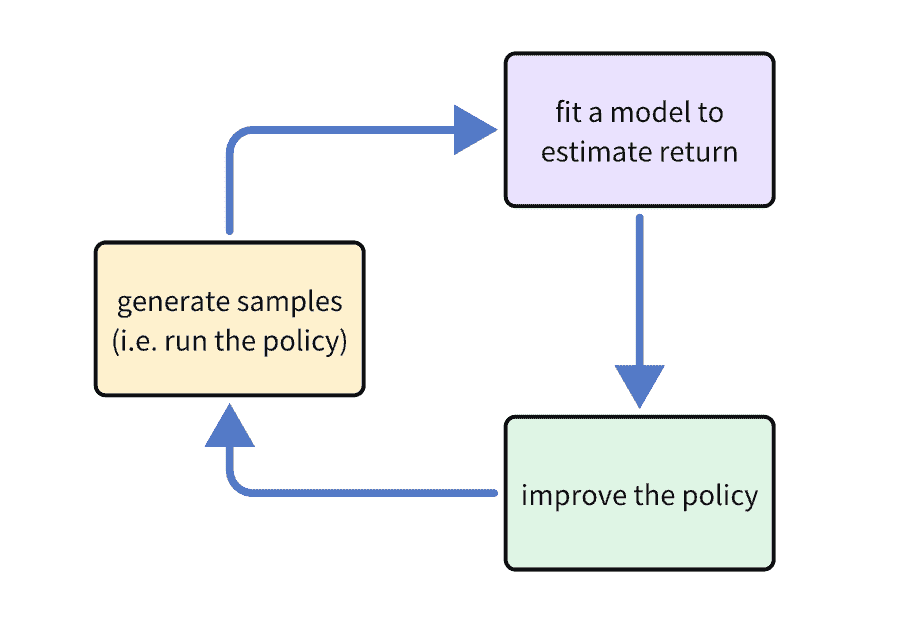

图 5: 基于模型的强化学习

### 2.2 基于强化学习的自动驾驶研究综述

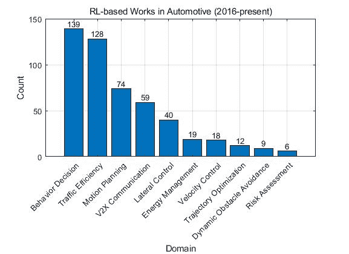

图 6: 基于强化学习的自动驾驶工作。

在自动驾驶领域，强化学习（RL）的应用正在迅速扩展，涵盖从高层决策到具体运动控制的多个领域。对 2016 年后的文献进行分析表明，强化学习在自动驾驶的各个子领域取得了显著的研究进展。特别是在行为决策（139 篇论文）、交通效率（128 篇论文）、运动规划（包括 74 篇关于运动规划的论文、12 篇关于轨迹优化的论文和 9 篇关于动态障碍物避让的论文）、车联网（V2X）通信（59 篇论文）和控制（包括 20 篇关于横向控制的论文、18 篇关于纵向控制的论文和 19 篇关于能量管理的论文）领域，论文数量突显了这些领域的研究重点和重要性。这说明了强化学习技术在解读和提升自动驾驶系统中复杂交互、决策过程和控制策略中的关键作用。

强化学习能够通过探索和利用机制在未知或动态变化的环境中学习最佳策略，某些脱离策略的方法允许在线更新。鉴于道路条件、交通流量和周围车辆行为的瞬时变化，自主驾驶系统必须能够持续学习和适应新情况。例如，在行为决策和交通效率领域，强化学习可以帮助自主驾驶系统评估复杂情境中的各种潜在行动，选择最佳行动方案以提升安全性和流畅性。在多智能体系统应用的背景下，强化学习为如车联网（V2X）通信和交通流量控制等领域的研究揭示了新的视角。通过多智能体强化学习，车辆之间的通信和协调可以得到优化，从而提高整个交通系统的效率和安全性。这种能力在高度互动的场景中尤为重要，如交叉口和拥挤的道路，在这些情况下，多辆车必须做出联合决策以避免冲突并优化交通流量。

在对 45 篇近期选定论文的分析中，观察到强化学习算法在自主驾驶的各个子领域中被广泛应用。在路径规划挑战中，SAC、PPO、TD3、DQN 和 DDPG 等算法被频繁使用，展示了它们在这一子领域的强大适应性。在控制挑战方面，特别是在横向、纵向和综合横向-纵向控制任务中，DDPG 算法的应用尤为广泛。同时，基于模型的深度强化学习和自适应动态规划在这些背景下也显示出了其有效性。在端到端控制领域，由于端到端控制并不完全依赖于强化学习，算法的应用较为分散，这反映了在将感知与行动输出整合的复杂系统中对多种算法的需求。

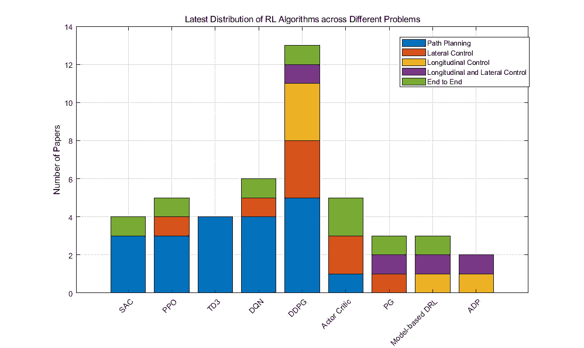

图 7：特定强化学习算法在轨迹规划、横向控制、纵向控制和端到端控制子问题中的应用。

自动驾驶系统在各种子领域中遇到多种复杂挑战，这些挑战的性质决定了 RL 算法的选择多样性。在路径规划中，动态性和不确定性的显著特征使得能够平衡探索与稳定性的 SAC 和 PPO 算法尤为重要。这些算法能够有效地在变化的道路条件下导航最佳路径，同时保持学习过程中的稳定性。DDPG 通过其确定性策略，为连续控制问题提供明确的梯度信号，并在训练阶段减少方差，从而在平滑加速和精确转向等连续控制挑战中展现出卓越的性能。端到端控制中的挑战在于有效地将高维感知数据转换为即时的行动决策。这需要不仅能有效学习策略的算法，还能处理来自不同传感器的大量输入并制定复杂的行动序列。

## 3 DRL 用于轨迹规划

在自动驾驶系统中，轨迹规划至关重要，确保车辆可以安全、高效地从当前位置过渡到目的地。本章将**深入探讨**轨迹规划问题，特别是**强调**RL 方法在解决这一挑战中的应用。

### 3.1 轨迹规划中的挑战

在自动驾驶系统中的轨迹规划面临的首要挑战是生成平滑的路径，这些路径必须遵守初始和最终条件以及一系列约束。此外，算法还必须应对静态和动态障碍物避免任务，预测未来车辆轨迹，并在动态环境中追踪任意目标时避免碰撞。涵盖从复杂环境中的全局到局部路径规划的主流方法包括随机搜索和采样、曲线插值以及数值优化[19]。随机搜索和采样方法，特别是快速探索随机树（RRT）算法，提供了一种在复杂地形中识别可行路径的有效手段。通过对配置或状态空间进行随机采样并检查其连通性，这些策略促进了在高维空间中的快速规划。

RRT 生成的路径可能会不连续且略显粗糙；然而，RRT*算法通过时间框架优化显著提升路径的最优性，迅速为复杂驾驶条件提供解决方案。为了应对采样方法生成路径的不连续性，采用曲线插值技术来生成平滑轨迹。考虑到诸如车辆动力学、可行性和舒适性等变量，这些技术根据道路条件进行适应，通过预定义节点生成新的数据点，以确保轨迹连续性并满足运动约束。螺旋曲线、多项式曲线和贝塞尔曲线是常用的方法，能够持续提供高质量的解决方案。然而，在全局路径规划的背景下，尽管可以优化路径并考虑道路和车辆的限制，但实时障碍物处理可能会变得相当耗时。

在动态变化的环境和约束条件下，数值优化方法展现出其独特的优势。通过设计目标函数并进行最小化或最大化，这种方法全面考虑了车辆动力学、环境数据和约束，以寻求最优的控制策略和路径。目标函数的精细设计对数值优化的成功至关重要，在强化学习的背景下，这被转化为奖励函数，引导算法学习最优的路径规划策略。

动态规划（DP）和二次规划（QP）是数值优化领域内的两种常见解决方法。DP 利用贝尔曼最优性原则，从终点向回迭代工作以确定最优路径，理论上能够识别全局最优解。然而，其计算复杂度随着问题规模的增加而显著上升。二次规划在模型预测控制（MPC）中应用，将目标函数设为一系列预测期内状态方程的平方和，强调了解决方案的实时性和效率。这使其更适用于连续空间和动态环境中的问题。此方法主要通过内点法或活动集方法进行求解，有效管理约束并确保控制策略能够实时更新，以适应动态变化。

数值优化方法在生成轨迹方面的灵活性和适应性使得路径规划能够直接响应实时的车辆状态和环境变化。这允许在路径和控制决策中进行动态调整，同时考虑到与道路、车辆和其他道路使用者相关的约束。因此，选择合适的优化策略和算法，以及精心设计目标函数，对于提升自动驾驶系统的性能至关重要。目前主流解决方案面临的两个主要挑战是：首先，车辆模型可能未知或不准确，影响解决方案的准确性；其次，计算效率问题。特别是，当处理连续或高分辨率空间时，DP 方法的计算负荷会急剧增加，导致解决过程异常耗时。虽然 MPC 通过将目标函数配置为二次形式并采用 QP 来减轻复杂性，但在需要高达 100Hz 或更高频率的实时路径规划场景中，QP 仍然需要高度优化的算法和硬件加速以满足实时标准。

### 3.2 实施 DRL 进行轨迹规划

在自动驾驶轨迹规划领域，尽管模型预测控制（MPC）和动态规划（DP）方法在众多场景中展示了其效率和准确性，但它们在面对环境不确定性、模型不准确性和计算资源限制时，其适应性和灵活性受到限制。相比之下，深度强化学习（DRL）通过其出色的环境适应性和动态学习特性显著增强了规划灵活性。它通过价值或策略网络生成轨迹，摒弃了对预定路径点的依赖，而是基于环境状态和目标进行动态决策。关于轨迹规划挑战，DRL 作为一种有前景的替代方案出现。我们将 DRL 在这一领域的具体应用研究汇总在表 1 中，突出显示了所涉及的场景、使用的 RL 方法和所采取的实验方法。

在强化学习（RL）应用于自主驾驶轨迹生成中，设计适当的状态（State）和动作（Action）至关重要，这使得算法能够有效地学习并生成优化的轨迹。Leurent 等人的调查[20]综合了自主驾驶研究中各种状态和动作的表示方法。状态的设计应包括车辆当前的运动状态（例如位置、速度、加速度和航向角）、环境信息（例如道路状况、交通标志和周围车辆的状态），以及目标信息（例如目的地位置或计划轨迹），以全面描述车辆与环境的互动。此外，还应考虑车道信息、路径曲率、车辆的过去和未来轨迹、纵向信息如碰撞时间（TTC），以及场景信息如交通规则和交通灯的位置。原始传感器数据（例如相机图像、激光雷达、雷达）提供了更详细的上下文信息，而简化的抽象数据（例如 2D 鸟瞰图）则减少了状态空间的复杂性。

动作设计可能包括车辆控制操作，如转向和速度调整，旨在生成轨迹，或者将轨迹简化为一系列参数的表达，其中动作是那些定义轨迹的参数。状态和动作的设计必须不仅封装足够的信息以指导决策，还需保持效率和可操作性，确保 RL 算法能够实时且精确地在复杂的自主驾驶环境中生成安全高效的轨迹。

制定有效的奖励函数对于成功应用强化学习（RL）于自动驾驶轨迹规划至关重要。奖励函数必须全面考虑多个方面，包括轨迹的安全性、平稳性和速度一致性，涵盖诸如向目标的行驶距离、车辆速度、保持静止、避免与其他道路用户或场景物体碰撞、避免在人行道上违规、保持车道内、在避免极端加速、刹车或转弯时维持舒适性和稳定性，以及遵守交通法规。奖励函数的设计还包括高级技术，如奖励塑形[21]，通过提供额外的、精心设计的奖励，鼓励优化过程朝着最佳策略演变。奖励还可以通过逆强化学习（IRL）[22]基于专家演示来推导。在没有明确的奖励塑形和专家演示的情况下，代理可以利用内在奖励或动机来评估其动作的质量。

在配置奖励函数时，确保奖励不会过于稀疏是至关重要的，这样可以让代理从每个动作中获得有用的反馈。适当地设置奖励元素的权重，以平衡轨迹规划目标，包括安全性、效率和舒适性，同样重要。对于涉及城市道路网络和交叉口的场景，奖励函数应考虑复杂交通环境中的车辆行为，鼓励代理遵守交通规则，并优化通过交叉口的路径。在紧急避险场景中，特别需要强调保持安全距离和避免碰撞，激励代理采取预防措施。此外，奖励函数的设计必须考虑环境的动态变化和多辆车之间的互动，确保代理能够在变化的环境中做出适应性选择，从而显著提升轨迹规划的鲁棒性和灵活性。

虽然强化学习（RL）为自主驾驶中的轨迹规划提出了创新的解决方案，但其应用面临许多挑战。最初，与传统的模型预测控制（MPC）不同，RL 不依赖于精确的环境模型，这在模型不准确或完全缺失时尤为有利。然而，RL 必须克服计算资源的限制以及环境不确定性和动态变化带来的挑战，因此需要具备实时适应和更新能力的算法。此外，将 RL 应用于自主驾驶轨迹规划的主要挑战之一在于设计一种能有效平衡多个目标的奖励结构，并确保解决方案的通用性和适应性。具体而言，处理紧急情况的能力有限，大多数方法倾向于追求符合特定规则的解决方案，而未能充分应对紧急情况；数据预处理和对大量数据的依赖加剧了实时响应的挑战，尤其是在紧急情况下。这些挑战需要通过创新的 RL 方法和策略来克服，以实现复杂交通场景中的高效和安全的轨迹规划。

### 3.3 近期深度强化学习在轨迹规划中的应用

表 1：基于深度强化学习的轨迹规划比较

| 应用场景 | 工作 | 算法 | 实验 | 优势 |
| --- | --- | --- | --- | --- |
| 十字路口 | [23] | SAC | 定制模拟器 | 强化学习与计算机视觉的结合 |
| 十字路口 | [24] | PPO | Flow 框架 | 完全自主的交叉口交通改善 |
| 十字路口 | [25] | TD3 | SUMO 和 CARLA | 多任务交叉口导航的安全性和效率 |
| 十字路口 | [26] | DQN | 定制模拟器 | 燃料消耗减少 |
| 城市道路 | [27] | DDPG | CARLA | 无保护左转的成功 |
| 城市道路 | [28] | DQN | CARLA | 短训练时间 |
| 城市道路 | [29] | TD3 | CARLA 和 ROS | 改进的收敛性和稳定性 |
| 城市道路 | 297 | TD3 | CARLA | 面向对象避让的层次方法 |
| 城市道路 | [30] | 双重 DQN | 定制模拟器 | 电动车能耗降低 |
| 窄车道 | [31] | TD3 | CARLA | 预训练网络的即时解决方案 |
| 窄车道 | [32] | Actor Critic | 定制模拟器及校园中的真实世界 | 具有协商意识的运动规划 |
| 高速公路 | [33] | SAC | MATLAB | 高速公路上的安全性和效率提升 |
| 赛车 | [34] | 模糊深度强化学习 | DeepRacer | 可解释的模糊深度强化学习 |
| 赛车 | [35] | TRPO&PPO | F1Tenth | 高速赛车的残差策略学习 |
| 赛车 | [36] | SAC | CARLA | 处理极限情况的控制方法结合 |
| 无特定场景 | [37] | DDPG | 定制模拟器与校园中的实际世界 | 基于神经网络的实时运动规划 |
| 无特定场景 | [38] | DDPG | ZalaZone 上的实际案例 | 最优车辆轨迹学习 |
| 无特定场景 | [39] | DDPG | 数值验证 | 使用 Lyapunov 函数的稳定性评估 |
| 未知动态环境 | [40] | 对抗双重 DQN | ROS 和 Gazebo | APF-D3QNPER 以实现更好的泛化 |
| 越野环境 | [41] | DDPG | ARL Unity | 越野环境中的隐蔽导航 |

DRL 已经展示了它在针对特定场景的应用中提供解决方案的能力。路径规划挑战与特定应用环境密切相关，例如交叉口、人流密集区域以及复杂交通流的城市环境。这些场景的独特特性对奖励函数的设计和实验验证至关重要。专注于这些场景使研究人员能够更准确地模拟现实世界的挑战，从而制定有效的 DRL 策略。

在交叉口的背景下，深度强化学习在解决路径规划挑战方面展示了显著潜力。交叉口场景中固有的复杂性主要来源于动态交通流、多车互动以及行人的存在，这些都显著增加了路径规划的挑战。对此，多个研究采用了不同的 DRL 策略来缓解。例如，Yudin 等人[23]通过将强化学习与计算机视觉结合的创新方法，训练了用于模拟自动驾驶车辆的智能代理。利用从空中摄影获得的交叉口的全面视觉信息，他们自动检测了所有道路使用者的相对位置，并探索了通过卷积神经网络估计车辆方向角的可行性。通过应用现代和有效的强化学习方法，如 Soft Actor Critic 和 Rainbow，学习过程的收敛通过利用获得的附加特征得到了加速。刘宇琪等人[25]提出了一个配备社会注意模块的多任务安全强化学习框架，旨在提高与其他交通参与者互动时的安全性和效率。社会注意模块关注于协商车辆的状态，安全层被纳入多任务强化学习框架中，以确保安全协商。

在城市道路网络中，复杂性由于交通条件的突然变化和动态障碍物的存在而加剧，这给车辆安全带来了重大挑战。Zhou Weitao 等人[124]集中于城市道路网络中未受保护的左转这一极具挑战性的任务。利用 DDPG 算法和 CARLA 模拟器，他们引入了一种创新的轨迹规划方法。该方法不仅考虑了动态生成的轨迹动作，还通过与固定策略轨迹动作的加权融合提高了适应性和安全性。这种方法在随机和具有挑战性的测试场景中表现出色，实现了在 250 个交叉口自动导航的 94.4%的成功率。Wang Zhitao 等人[32]采用演员-评论家方法，在专有模拟器中开发了一个考虑协商的运动规划框架。该框架在确保车辆安全和流畅的同时，考虑了其他交通参与者的需求，巧妙地适应了城市交通的复杂性，并在校园道路上进行了真实车辆验证。

此外，复杂环境对强化学习提出的最大挑战是实现训练收敛的难度。Clemmons J.及其团队[28]通过应用各种优化的 DQN 算法显著减少了训练时间，提高了学习效率，较现有的大多数基于图像的方法有了显著改进。Gao L.等人[29]利用 Twin Delayed DDPG (TD3)算法提高了 DDPG 网络的训练效果，证实了该模型在 CARLA 和 ROS 环境中的收敛速度和稳定性。Cheng Yanqiu 等人[51]集中于混合交通流中的纵向轨迹规划，采用 Adam 优化器加速训练。通过将车辆轨迹分割为具有恒定加速/减速的部分，同时最小化假设，他们避免了在复杂解空间中对状态和动作的枚举，从而提高了模型训练和推理的效率。同时，Zhang Ruiqi 等人[35]在 F1Tenth 环境中利用 TRPO 和 PPO 算法，展示了在高速自动驾驶场景中，残差策略学习方法对网络训练的效率提升。

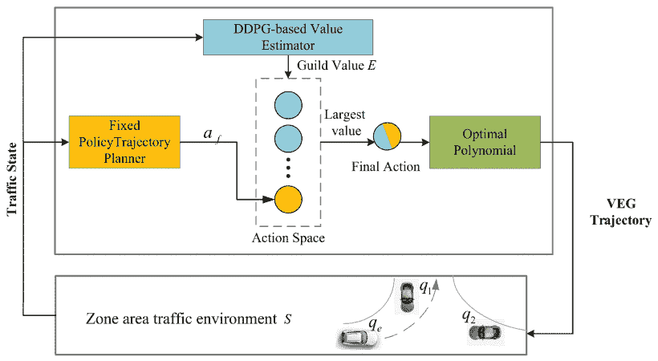

图 8：价值估计公会（VEG）最优轨迹规划器的框架，这是一种将 RL 与基于规则的控制器结果相结合的方法[27]

在具有车道分隔、高速驾驶和车道变换操作的场景中，决策的即时性变得越来越关键。Feher Arpad 等人[31] 利用 Twin Delayed DDPG 算法开发了一个预训练神经网络和轨迹生成算法，在 CARLA 仿真器内能够在 `1 millisecond` 内提供解决方案。这显著超越了传统的动态模型和基于规则的方法如 DP 或 MPC，使其特别适用于动态轨迹生成任务。通过将超车过程的曲线分解为一系列线段，他们大大简化了问题的复杂性，提高了解决方案的实时性和适用性。然而，确保在不同道路条件和湿滑表面下输出结果的稳定性仍然是一个挑战。

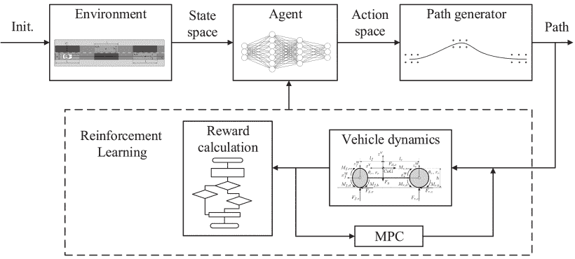

图 9：代理设计中使用的训练和控制循环。曲线被分成八部分，使得代理能够从单个动作输出中快速生成轨迹[31]。

目前，现有的轨迹生成方法基于动态模型和规则。因此，将强化学习集成到这些传统方法的一部分以增强性能是一个有效的策略。Zhang Mei 等人[33] 使用 SAC 算法在 MATLAB 环境中实现了更安全、更高效的路径规划解决方案。通过优化多项式曲线插值过程中的关键参数，他们的方法在三车道和四车道场景中保持了最高的成功率，展示了如何通过适当调整驾驶策略来提高安全性，面对越来越复杂的交通条件。Bautista-Montesano 等人[34] 利用强化学习技术在 DeepRacer 平台上增强了模糊逻辑控制，建立了一种可解释的模糊深度强化学习方法，为自动驾驶车辆提供了创新的解决方案。Hou 等人[36] 提出了一个新型控制器，结合了传统的基于模型的控制、无模型的强化学习和专家知识。该控制器在极端车辆操控边界条件下展示了卓越的策略和适应性，证实了其在各种复杂轨道条件下的优越性和可扩展性。

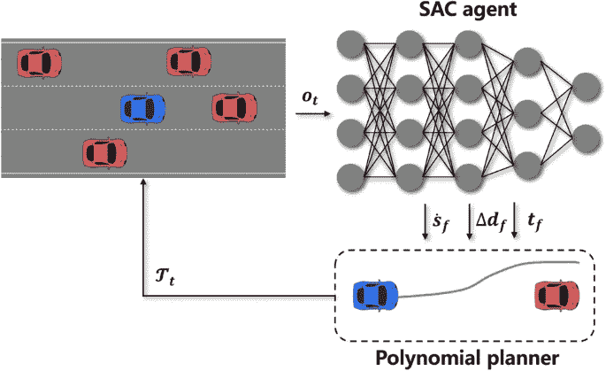

图 10：将少量机器学习融入传统解决方案的典型方法，其中代理通过曲线插值方法生成轨迹的一些关键参数[33]。

此外，在自动驾驶路径规划研究领域，深度强化学习的环境探索属性使其应用超越了特定的驾驶场景。现有研究涵盖了广泛的范围，从真实世界的驾驶环境到未知的动态环境，甚至是越野条件。在两项研究中，Feher Arpad 等人[37][38] 通过 DDPG 算法开发了一个基于神经网络的实时运动规划器，并将其过渡到校园环境和 ZalaZone 汽车测试场的现实测试中，突显了 DRL 在制定安全可靠轨迹中的潜力。Cabezas-Olivenza Mireya 等人[39] 进行了数值验证，使用 DDPG 算法通过 Lyapunov 函数评估了 DDPG 训练的代理的导航稳定性，探讨了 DRL 在维持导航稳定性方面的有效性。Hu Hui 等人[40] 在 ROS 和 Gazebo 环境中验证了由 Dueling Double DQN 生成的单一网络在不同场景下的卓越泛化能力，以及其在收敛速度、损失值和路径规划持续时间方面的优越性能。在越野环境中，Hossain J. 等人[41] 采用 DRL 确保隐蔽导航，同时实现低成本轨迹，展示了 DRL 在应对复杂地形和未知障碍物方面的潜力。

## 4 DRL 在车辆控制中的应用

车辆控制的输出直接连接到特定的执行器，构成了自动驾驶框架中与物理世界的最终连接。本章将深入探讨运动控制中的挑战，并阐明 RL 方法在解决这些问题中的应用。

### 4.1 路径追踪和速度控制中的挑战

在自动驾驶系统中，精确的运动控制对于实现安全可靠的导航至关重要。车辆运动控制通常可以分为两个主要组成部分：横向控制和纵向控制。横向控制的核心目标是路径追踪，旨在确保车辆准确遵循预设的路径，无论这些路径是直线还是复杂曲线。实现这一目标的传统方法包括首先识别和建模车辆的动态行为，选择重要的动态变量，并根据物理法则和真实车辆测试数据制定相应的状态方程。在这些基础上，设计控制器以实时动态调整车辆的驾驶状态，确保关键动态变量保持在指定范围内[42]，从而跟随目标路径。

例如，当前车辆方向与期望方向之间的偏航角差异可以作为跟踪的动态变量，因为我们可以通过操控车轮转向来调节偏航角。利用诸如前视、修正前视或基于动态模型的未来行为预测等方法，我们可以确定当前和期望偏航角之间的差异。随后，可以通过控制转向、牵引制动和其他控制质量方面来实现轨迹跟踪。

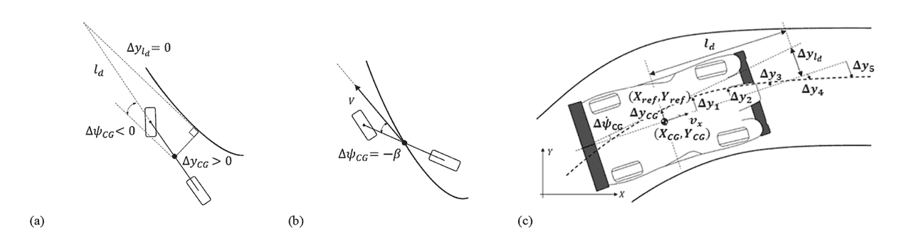

图 11：通过跟随偏航角$\Psi$ [42] 实现轨迹跟踪，（b）基于修正后的前视误差，（c）通过动态模型推导。

在自动驾驶车辆控制领域，速度跟踪是一项重大挑战，旨在保持或调整车辆速度以符合预定的速度曲线。这一任务对于最小化行程时间和确保车辆动态稳定性至关重要，有助于防止因速度过快而导致的翻车或滑移。精确控制速度的复杂性源于车辆的动态行为，包括轮胎与路面之间的非线性互动以及由于速度和转向角度变化而引起的动态变化。

根据一项综述[2]，在 2015 年至 2021 年间，模型预测控制（MPC）成为路径跟踪控制研究领域的主导方法，占已发表论文的约 50%。MPC 技术能够解决多变量问题，考虑状态和控制动作的约束，并预测系统的未来行为。其他方法，如线性二次调节器（LQR）、无模型控制（MFC）和非线性模型预测控制（NLMPC），通过采用不同的策略来应对路径跟踪和速度控制挑战。然而，这些方法面临一个共同挑战：在确保控制精度的同时，调和模型简化与现实世界复杂性之间的差异。在高速驾驶和复杂道路条件下，控制策略的设计和实施尤为复杂，需要使用更复杂的模型和算法来适应这些变化。

构建一个准确的车辆动态模型是一个极其复杂的工作，需要综合考虑各种因素。这些因素包括路面与轮胎之间的复杂相互作用、车辆速度变化引起的动态特性变化以及横向和纵向动态之间的相互依赖。为了简化这个问题，同时保持一定的准确性，通常采用简化模型，包括运动学模型和动态自行车模型。这些模型会进行线性化，便于在设计控制策略时进行更简单的分析和实施。然而，当车辆以高速度行驶或遇到复杂的道路条件时，这些简化模型可能无法充分捕捉车辆的真实行为。在这种情况下，需要更复杂的模型，如 Pacejka 的魔术公式轮胎模型，以提高控制策略的精度。

目前基于动态模型的控制策略面临几个重大挑战：首先，它们需要精确的系统模型，但由于不同的车辆具有不同的参数，这要求进行大量的参数校准。其次，在某些特定的道路段，如需要较高横向加速度的大弯道，系统可能会出现问题。此外，这些系统中的决策通常依赖于基于规则的定义，导致开发中的复杂性、主观人为因素的引入以及确保全面覆盖的挑战。

为了应对这些复杂的挑战，无模型的、数据驱动的方法提供了一个新解决方案。与传统的基于精确定义车辆动态模型的控制策略不同，数据驱动的方法使车辆能够根据实际驾驶数据学习和优化其控制策略。基于模型的 DRL 应用同样展示了巨大的潜力。这种方法有效地缩小了理论模型与实际车辆动态之间的差距。它不仅涵盖了车辆动态的理论模型，还融合了车辆在实际驾驶场景中表现出的动态行为，这些行为通常会受到许多不可预测的环境因素的影响。

### 4.2 实施 DRL 以增强车辆控制

实施使用 DRL 的增强车辆控制，使得 RL 算法能够通过持续的训练过程逐步掌握调整车辆转向、加速和刹车的策略。这种方法的优势在于它不依赖标记数据集，从而促进了代理在新场景中的强泛化能力。训练目标是实现近乎最佳的轨迹和速度跟踪，同时保持车辆的动态稳定性。在学习过程中，车辆会动态调整其状态以跟随指定轨迹，优化过境时间，同时确保不超出动态稳定性的边界。

在 MDP 中建模车辆运动控制问题时，状态空间类似于轨迹规划中使用的状态空间，涵盖了车辆位置、速度、加速度、车轮转角、环境数据以及目的地位置或规划轨迹等关键因素。区别在于控制对状态动态性的需求更高，因此这些信息主要以简化和抽象的形式使用。

代理的动作空间由控制命令输出组成，通常包括对车轮转角的修改、加速或减速调整、刹车和离合器换挡等离散执行器。大多数控制命令是连续值，因此动作空间的维度非常大。为了减少复杂性，可以使用专门针对离散动作空间的 DRL 算法（如 DQN）。在这里，可以通过将连续执行器范围分段为相等的区间来离散化动作空间[43]。选择执行器区间的数量涉及在平滑控制与动作选择成本之间的权衡。使用 DRL 算法直接学习管理连续值执行器的策略（如 DDPG），或通过时间抽象选项框架简化动作选择过程也是可行的。

奖励函数的设计必须包含多个目标，包括车辆稳定性、高效驾驶和安全避障。到达目标位置或维持稳定性会获得正奖励，而碰撞或偏离预定路径等行为则会受到负奖励。RL 面临计算资源限制、环境不确定性和动态变化等挑战，需要实时调整和更新。虽然强化学习为自动驾驶控制提供了创新的解决方案，但其应用过程充满了许多挑战。

RL 不依赖于精确的环境模型，这在模型不精确或缺失时是一大优势。然而，当能够进行准确建模且需要可解释和易于修改的控制实现时，RL 不如传统方法。提高 RL 可修改性的一种方法是主要利用现有框架，同时整合 RL 的适应性和动态更新能力[34, 44]，使得在问题发生或识别紧急约束的情况下能够独立于 RL 的输出动作进行操作。在可解释性方面，可以尝试使用网络或模型逆向确定 RL 输出动作和输入状态之间的关系，从而尝试合理化代理所采取的意外行动[45]。

### 4.3 最近的 DRL 在车辆控制中的应用

表 2: 基于 DRL 的车辆控制比较

| 问题 | 工作 | 算法 | 实验 | 优势 |
| --- | --- | --- | --- | --- |
| 路径跟踪 | [46] | DQN 和 DDPG | CARLA | 实现过程的清晰度和 DDPG 性能 |
| 路径跟踪 | [47] | DQN | Paramics | 公交车量增加下的旅行时间一致性 |
| 路径跟踪 | [44] | Actor Critic | 驾驶模拟器硬件 | 自适应 PID 权重调整 |
| 路径跟踪 | [48] | Actor Critic | 驾驶模拟器硬件 | SRL-TR2 用于轨迹跟踪 |
| 路径跟踪 | [49] | PPO | 数值仿真 | PPO2-Stanley 用于车辆跟踪和安全 |
| 路径跟踪 | [50] | DDPG | CARLA | 路径跟踪效率的 DCN-DDPG |
| 车道跟踪 | [51] | DDPG | TORCS | 车道跟踪的 DCPER-DDPG |
| 横向控制 | [52] | 基于模型的 DRL | 数值仿真 | 基于模型的 DRL 用于横向控制 |
| 横向控制 | [53] | PG | 自定义模拟器 | 蒙特卡洛树搜索以减少策略网络的复杂性 |
| 速度控制 | [54] | DDPG | MATLAB | DDPG 多目标：增强的安全性、效率和舒适性，与 MPC 对比 |
| 速度控制 | [55] | 基于模型的 DDPG | Unity | 基于模型的 DDPG 用于高速自主 |
| 纵向控制 | [45] | DDPG | 数值仿真 | 可解释的 RL 以提高决策清晰度 |
| 集成控制 | [56] | ADP | 数值仿真 | 两阶段数据驱动策略迭代 |
| 集成控制 | [57] | CNN 自注意力和 RL 方法 | SUMO | 与 CNN 自注意力的联合优化 |
| 集成控制 | [58] | DDPG | 数值仿真 | DDPG 增强的 LADRC 用于 3 自由度车辆 |

在解决路径跟踪和车道保持挑战方面，最近的研究通过在多个实验平台（如 CARLA、Paramics 和 TORCS）上采用多种 RL 算法（包括 DQN、DDPG、Actor Critic 和 PPO）取得了显著进展。这些研究结果不仅强调了 RL 算法在管理复杂动态系统中的效率和适应性，还为提升自主车辆的性能优化和安全性提供了新的视角和解决方案。

提升模型在各种场景下的泛化能力，特别是在复杂城市交通环境中的有效控制，需要全面应用多样化的模拟环境、安全探索机制、模型无关的控制策略以及实时自适应调整方法。通过在像 CARLA 和 Paramics 这样的模拟平台上进行广泛实验，Perez-Gil 等人[46]和 Gao 等人[47]展示了在实际应用中降低风险和增强算法适应性的策略。Hu、Fu 和 Wen[52]将 Dyna 风格算法与来自鲁棒控制屏障函数（CBF）的动作相结合，并使用高斯过程（GP）模型来提高样本效率，促进在不确定环境中的有效学习，同时确保安全。Wang、Zheng、Sun[48]通过将 ADRC 与 DDPG 相结合，不仅利用了 ADRC 的模型无关特性来估计和补偿不确定性和外部干扰，还通过 DDPG 优化的策略实现了控制参数的实时自适应调整，从而进一步提高了在变化环境中的泛化能力和执行效率。

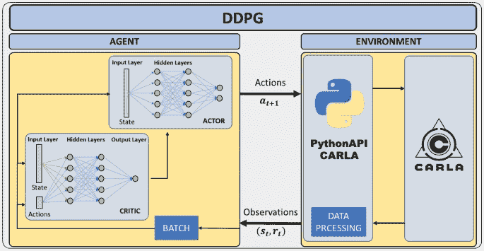

图 12：基于 DDPG 的 DRL 控制器架构[46]

对于需要更高精度控制的任务，且不妨碍安全和稳定性的情况下，无模型方法的效果很少超越基于精确模型的方法，这表明基于模型的 RL 可能具有更大的优势。Chen 等人[54] 通过配置安全、效率和舒适性的奖励组合来确定粗糙表面的速度控制奖励，随后使用基于 DDPG 训练的速度控制模型来促进安全、高效和舒适的车辆跟随行为。他们报告称，经过训练的网络在速度、加速度和间隙距离方面的整体指标低于 MPC 控制。然而，他们的 MPC 方法没有公开时间步长，且目标函数仅将所有权重分配为 1，表明还有改进空间。此外，所使用的模型是从运动学模型推断的，而没有详细说明运动学过程[59]。尽管有比较研究，但无模型 RL 方法可实现的控制精度上限仍是一个需要进一步探讨的方面。

另一方面，Hartmann 等人[55] 设计了一种基于模型的 DRL 方法，针对时间最优速度控制问题，制定了时间最优速度控制策略，并使用数值解法来预测和缓解可能导致车辆不稳定的情况。这一方法在 Unity 环境中得到了验证，证明其与动力学模型的契合度高，在经过五分钟的训练后超越了单一模型的预测。此外，与无模型方法相比，它取得了更优的控制结果。同样，Cui 等人[56] 采用数据驱动的方法，增强了基于动态模型的动态规划的推导过程。自适应动态规划（ADP）的实施提高了不同路面上的轨迹跟踪精度。

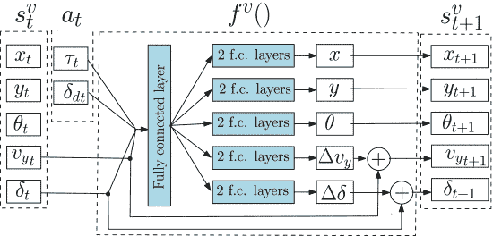

图 13：利用一个适度简单的网络来近似状态转移函数[55]。

在高曲率段或紧急障碍物回避场景中，路径曲率的显著变化对保持路径跟踪精度提出了重大挑战。He 等人[51]的方法通过对深度确定性策略梯度（DDPG）算法的改进，包括集成双重评论网络和优先经验回放机制，提高了算法在高曲率和复杂道路条件下的稳定性和准确性。在模拟环境中融入大量高曲率和复杂道路场景，使得这种方法不仅可以预防轨迹跟踪失败，还可以确保较高的跟踪精度。改进的 DDPG 算法不仅提高了车道跟踪性能，还增强了模型对各种驾驶条件的适应性。Luo 等人[49]实现了一种混合控制策略，将机器人 Stanley 轨迹跟踪算法与深度强化学习（DRL）技术结合。利用 Stanley 算法高效的路径跟踪能力以及 DRL 的自学习和适应性特征，这种策略不仅提高了跟踪准确性，还无缝集成了避碰能力，从而在紧急情况下实现安全控制。

在车辆控制的背景下，动作空间通常是连续的，这需要更复杂的网络来实现更精细的控制，这一因素常常使训练收敛变得复杂。许多研究集中于加速收敛速度和提高训练过程中的收敛稳定性。Yao 等人[50]和 He 等人[51]通过引入双重评论网络和优先经验回放机制改进了 DDPG 算法，解决了原始算法中的许多缺陷，从而提高了训练效率和准确性；Kovari 等人[53]，采用类似 Alpha Go 的方法，结合了蒙特卡罗树搜索与短期奖励策略网络。这种方法需要在策略网络的训练过程中仅关注即时奖励，从而大大减少了网络的复杂性和计算需求，促进了快速收敛和实时操作。为了解决 Q 学习训练复杂性与动作空间粒度之间的对立，[60]在细粒度离散动作空间的框架上应用了 Double DQN 方法，并融入了真实世界的驾驶数据。这种方法模拟了真实世界的通勤体验，便于在模拟环境中验证设计的车辆速度控制系统。

正如前文所述，面对管理多个底盘控制子系统及其潜在子系统之间的冲突所固有的复杂性，深度强化学习（DRL）有望促进集成运动控制。这包括协调转向、牵引和制动执行器的输出，以有效解决横向、纵向和姿态控制问题。Cui 等人[56] 引入了一种双相数据驱动策略迭代算法，旨在实现自主车辆的最佳纵向和横向控制。该算法确保了稳定收敛到一个次优控制器解决方案，特别是独立于跟随车辆动力学，这一声明通过数值模拟得到了证实。Hu 等人[52] 利用基于模型的深度强化学习（DRL）来实现从零开始的实际条件下的学习，从而实现了实际部署。这显示了 DRL 在自主车辆控制场景中的实际适用性和显著适应性。Chen 等人[57] 利用 CNN、 自注意力网络和深度强化学习方法实现了感知、决策和运动控制的联合优化。在 SUMO 模拟环境中验证了该研究，强调了集成优化控制策略的潜力。Wang 等人[58] 展示了一种 DDPG 增强的线性主动扰动拒绝控制（LADRC）控制器，应用于三自由度（3-DOF）自主车辆，证明了其对不确定性的显著适应性以及通过深度强化学习实现的实时参数调整所带来的增强控制性能。尽管强化学习（RL）在整合控制各子问题方面已有一定应用，但必须承认，对于诸如 ABS 和 ESP 等关键安全控制子系统，RL 的近期替代仍然具有挑战性，因为其时间和经验验证不足。

考虑到从模拟环境中训练的模型向实际环境的过渡，将车辆运动控制直接关联到物理领域，需要在使用数据驱动方法时采取谨慎的方法，因为这些方法的可解释性有限。王等人[48] 设计了一个实用的框架，利用了一个演员-评论家模型。在安全约束的支持下，他们开发了一个基于 RL 的轨迹跟踪系统，并随后将该系统实施为全尺寸车辆的横向控制器。他们的方法的核心是使用一个轻量级适配器来建立模拟环境和现实世界之间的映射。这一策略在驾驶模拟硬件上进行了验证，积极测试了模型在实际驾驶情况下的有效性，从而促进了从模拟框架到实际应用的平滑过渡。

## 5 通过深度强化学习的集成运动规划与控制

人类驾驶的过程本质上是一个端到端的系统。虽然驾驶员的大脑可能会处理一些中间结果，例如预测其他道路使用者的行为、选择驾驶操作以及局部轨迹规划，但这些过程缺乏分层决策控制的显式接口。人类几乎完全依靠视觉线索来驾驶车辆。端到端的监督学习方法旨在通过将输入传感器数据直接映射到车辆控制命令，来模拟人类视觉依赖的驾驶方式。

### 5.1 自主驾驶的端到端深度强化学习方法

在车辆控制领域的端到端应用展示了它们在有效实现明确定义目标方面的能力。[61] 使用了强化学习（RL）进行无人机控制，利用由两层多层感知器构成的策略网络进行局部路径规划和运动控制。这种方法直接集中于使无人机穿越特定点，跳过了详细路径轨迹的生成。这种方法实现了超高速控制，超越了顶级人类参赛者在空中竞赛中的表现。此外，这项研究还通过最优控制技术探索了无人机控制；然而，RL 优于最优控制的关键原因在于其能够“提供更好的优化目标”，即直接效果的实现。

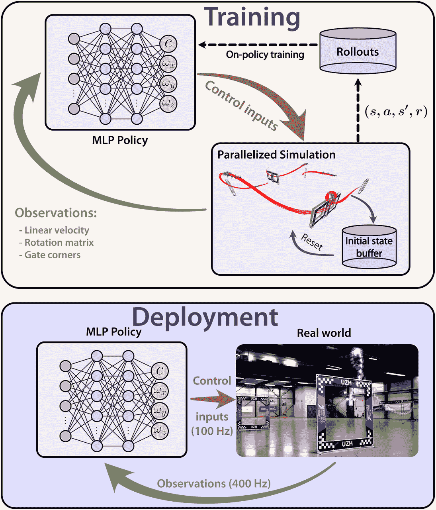

图 14：无人机竞赛中的端到端控制方法[61]。

除了直接与控制机制相关的目标之外，现有研究已阐明决策、规划和执行之间复杂的相互作用如何促进增强的控制性能。陈等人[57] 参与了自主车辆三个关键组成部分——感知、决策和运动控制的联合学习与优化，这是当前自主驾驶研究中常被忽视的一个方面。他们采用了深度强化学习（DRL）方法，特别是通过开发一种新颖的状态表示机制。该机制通过注意力和卷积神经网络（CNN）层处理传感器数据，从而提升了自主驾驶策略的整体效能。传感器数据最初通过注意力层进行处理，关注于提取关键的局部信息，随后通过 CNN 层处理，以纳入全球信息的全面视角，从而实现了更优的表示。决策制定和运动控制的协同学习考虑了这些模块之间的共生关系，以制定更有效的自主驾驶策略，这一主张在 SUMO 模拟环境中得到了验证。

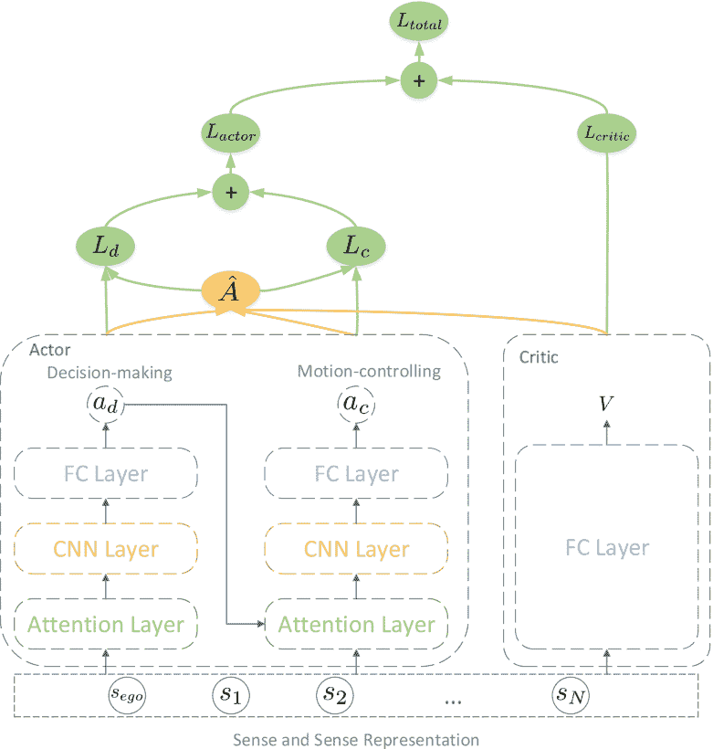

图 15：整体系统架构巧妙地处理感知数据以改善控制[57]。

实现端到端控制的策略涉及利用监督学习，利用大量传感器和控制输出数据。长短期记忆网络（LSTM）特别适用于复杂的序列预测任务，因为它们在处理长序列数据、识别长期依赖关系以及避免梯度消失或爆炸问题方面表现出色，这一能力在众多端到端应用中得到了体现。L. Chen 等人引入了一种创新的运动规划框架，称为“并行规划”，将人工交通场景与深度学习模型相结合。该框架使自主车辆能够 assimilate 环境提示，并以类似于人类驾驶员的方式灵活应对紧急情况，从而提高了自主驾驶的安全性和复杂性。S, N.F.等人揭示了一种基于 LSTM 的端到端模型，专门用于自主车辆并入高速公路的应用。该研究采用驾驶模拟器硬件进行训练和评估阶段，利用专家驾驶员数据指导 LSTM 网络在高速度合并操作中准确且安全地执行任务。

大规模模型的出现促使研究人员更倾向于开发在广泛数据集上训练的日益复杂的模型。在在线应用中，端到端网络能够直接从传感器输出中推导出必要的驾驶动作，从而提高决策控制的连贯性和即时性。然而，这种方法并非没有显著缺点。首先，自动驾驶任务中状态空间的巨大维度需要以指数级的体量来获取数据，从而对大规模数据集的需求十分迫切。目前可用的开源数据集，包括 Waymo Open [62]、Oxford Robotcar [63]、ApolloScape [64]、Udacity [65] 和 ETH Pedestrian [66]，主要提供与环境感知、物体检测和跟踪相关的数据，但并未直接提供驾驶行为注释。此外，鉴于这一策略固有地依赖于神经网络在数据点上的泛化能力，其安全保障在面对新颖或少见的数据实例时变得难以验证。

### 5.2 驾驶自动化中端到端 DRL 的实现

表 3: 深度强化学习在自动驾驶中的应用

| 工作 | RL 算法 | 实验 | 优点 |
| --- | --- | --- | --- |
| [67] | PPO | CARLA | PPO 与 GAE，野外环境 |
| [68] | PG | 现实世界 | 现实世界政策转移的 VISTA |
| [69] | SAC | 现实世界 | SESR 提升 Sim2Real 的可解释性 |
| [70] | LSTM | 驾驶模拟器硬件 | LSTM 用于高速公路合流 |
| [71] | A3C | 自定义模拟器和校园内现实世界 | A3C 用于自动车道变换 |
| [72] | 基于模型的 RL | 自定义模拟器和现实世界 | IDC 框架，现实世界，优化控制卓越 |

与基于监督学习的端到端控制方法相比，强化学习 (RL) 具有在模拟环境中收集数据的能力，从而在各种环境中加速训练。Amini 等人[68] 和 Chung 等人[69]的研究揭示了端到端 RL 技术在自动驾驶应用中的有效性。利用 VISTA 数据驱动的模拟器，Amini 等人巧妙地将通过 RL 优化的策略转移到真实驾驶环境中，成功应对了陌生道路和复杂的近碰撞情境，展示了端到端 RL 策略在复杂导航任务中的增强鲁棒性。这证实了在模拟器中培养的策略能够有效地推广到真实世界的道路，能够处理前所未见的场景和复杂的困境，从而揭示了使用 RL 进行有效感知和稳健操作的潜力。同时，Chung 等人提出的 SESR 方法，通过类别解耦的潜在编码，不仅增强了端到端自动驾驶系统的可解释性，还显著缓解了模拟到现实 (Sim2Real) 分布偏移问题，进一步验证了端到端 RL 方法在真实环境中的成功应用及其对控制策略改进的贡献。

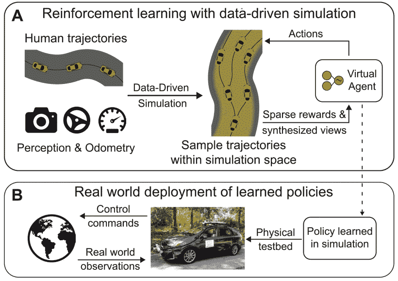

图 16：端到端方法的部署过程。 (A) 以通过监督学习进行预训练开始，随后在 VISTA 模拟器中经历 RL 优化 (B) 转到真实世界中的部署[68]。

类似于轨迹规划的努力，现代端到端强化学习（RL）技术通常局限于特定场景。这一限制主要源于状态和奖励函数设计依赖于特定场景，即使在单一任务中也存在复杂性，并需要大量手动微调。针对车道变换问题，Zhou 等人[71]尝试了一种基于异步优势演员-评论家（A3C）的端到端 RL 框架，通过多线程设置提高了探索效率，并通过加权平均方法确保了稳定收敛。Wang 等人[67]在 CARLA 模拟平台上实施了车道保持功能，利用图像作为输入并将其转换为转向动作和加速输出。一种基于近端策略优化（PPO）算法的开创性端到端深度强化学习模型，专门用于自主导航越野无人地面车辆（UGV）。该模型融合了 PPO 提供的各种功能，包括梯度计算、目标函数和修正机制，针对特定应用场景进行了调整，并在模拟环境中优于软演员-评论家（SAC）方法。此外，该模型利用广义优势估计（GAE）算法减少训练变异性，简化超参数优化过程，使其在高维状态特征的场景中表现出色。

在另一项调查中，由 Y Guan 引入的集成决策与控制（IDC）框架展示了一种基于模型的强化学习方法，该方法与最优控制技术无缝协同。这种方法巧妙地解决了传统策略常遇到的精准模型获取和高计算复杂度的现实应用挑战。在精心训练的车辆拟合模型基础上，该技术将驾驶任务分为静态路径规划和动态最优跟踪。在计算速度需求适中的情况下，它采用最优控制策略来制定静态可行路径，而实际执行则依赖于策略网络进行路径选择和遵循。该方法在模拟环境中经过验证，涵盖了四车道高速公路和交叉口，之后代理转向现实世界的应用，展现了卓越的在线计算效率和广泛的适用性。

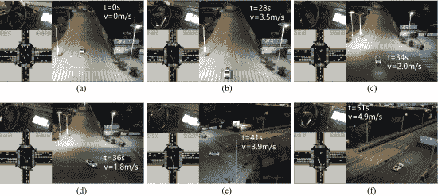

图 17：设计的 IDC 框架的实际测试。(a) 停车等待绿灯。(b) 加速进入交叉口。(c) 减速以防碰撞并改变路线。(d) 加速以选择更安全的路径。(e) 确定并沿设定路线行驶。(f) 成功通过交叉口。[72]

## 6 挑战与未来方向

### 6.1 提升训练的稳定性和收敛性

在自主车辆规划和控制领域，强化学习模型训练的稳定性和收敛性是一个关键挑战。提高模型复杂性旨在增强对复杂场景的适应能力和泛化能力；然而，这同时也提高了对大量高质量训练样本的需求，增加了学习过程中的复杂性。训练方案的改进主要集中在两个方面：样本质量和算法优化。

在自主驾驶和机器人控制等领域，积累高质量训练样本面临着与延迟、奖励稀缺以及在广阔状态空间中观察结果分布不均等相关的难题。特别是当获得宝贵的见解成本过高或充满风险时，样本效率成为一个显著问题。目前，许多研究集中在改进训练样本获取的方法上。这包括通过向训练样本中引入噪声来提升训练质量的研究[73]，以及通过定义 Bellman Eluder 维度来提高样本效率的研究[74]。这些方法共同致力于优化样本使用，以提高训练效率。

与此同时，许多强化学习算法的改进旨在增强稳定性并加快训练的收敛速度。例如，Soft Actor-Critic 算法在策略优化中引入了熵正则化，以调节探索与利用之间的平衡。与此同时，Twin Delayed Deep Deterministic policy gradient（TD3）算法通过结合双重价值网络和策略平滑方法来减轻估计偏差和过度估计问题。此外，基于模型的 RL 方法通过开发环境模型和利用关于动态环境变化的预测来提高训练的稳定性和加速训练过程。

利用预训练和迁移学习策略可以显著减轻获取真实世界道路数据相关的挑战和成本，同时加快模型的收敛速度。此外，精心设计的奖励函数可以缓解与稀疏奖励相关的问题，重新校准奖励的大小，并增强奖励的一致性和可解释性，为训练阶段提供稳定而有效的方向。最近的研究探讨了离线强化学习在通用代理预训练中的应用。值得注意的是，将离线强化学习扩展到利用现有静态数据集训练价值函数的方法，展示了其快速适应新任务和加速新任务变体在线学习的能力[75]。

### 6.2 解决可比性问题

在深度强化学习应用研究领域，比较不同方法及其在各种仿真环境中的性能结果是研究过程中的一个关键方面。然而，深度强化学习在很大程度上依赖于代码执行的质量和超参数的精细调整。如果代码存在缺陷或超参数配置不当，理论上有效的算法可能会在实际部署场景中失败。本文直接讨论了超参数调整、代码优化和各种优化策略的结合，最终在 Atari 游戏中实现了远超其他 DQN 方法的性能。

深度强化学习的训练过程面临许多不确定性，包括环境变化、初始化方法、行动选择机制和经验回放策略。随机种子的变化也会显著影响结果的质量和收敛的效果。由于这些深度强化学习的固有属性，直接比较不同模型面临着巨大的挑战。此外，模型在不同测试平台上的表现比较深受数据的固有属性影响，包括分布异质性、规模和质量。在缺乏统一评估标准和基准测试的情况下，此类比较可能会导致误导性的结论。

系统化的超参数搜索方法，包括网格搜索、随机搜索和贝叶斯优化，以及在训练过程中保持激活规模一致性的参数化策略，如µTransfer 技术，显著减少了手动调整中的随意性和主观性。这反过来又促进了超参数优化和网络架构制定的标准化。在对端到端越野驾驶任务的研究中，Wang 等人[67]利用广义优势估计（GAE）算法来减少 PPO 训练的波动性，并简化超参数调优过程，相较于 SAC 方法获得了更优的整体回报。他们进一步假设，这一优势可能归因于 GAE 在 PPO 超参数优化中的更高效能。

研究强化学习（RL）的训练和验证框架有助于在不同方法之间进行公平的比较。整合标准化的评估程序和性能指标，并在开源场景库中进行基准测试，确保了不同方法在相同条件下进行对比，从而培养了统一的评估框架。公开实验配置、代码实现和超参数设置的详细信息，以及采用标准化的数据报告格式，有助于其他研究人员复制和验证实验结果，从而增强比较分析的透明性和可靠性。

除了并列各种深度强化学习（DRL）算法外，许多文章还将其网络结果与已建立的控制方法进行基准对比，如动态规划（DP）和模型预测控制（MPC）。这些比较旨在展示 DRL 在特定任务中超越传统控制策略的能力，为 DRL 在现实世界应用场景中的广泛部署提供关键证据。然而，必须承认，在车辆控制领域，设计和执行如 MPC 这样的控制方法面临着相当大的挑战。尽管一些研究通过数值模拟或开发模拟环境进行探索，但尚未彻底验证已建立控制策略的潜力。这类比较经常忽视不同方法实施条件的差异，可能导致不公平的评估结果。因此，建议此类研究应提升成熟控制方法在基准测试中的实施质量，或寻求车辆控制领域从业者的参与，以确保这些比较的公平性和准确性。

### 6.3  缩小仿真与现实世界的差距

从模拟到现实世界环境的过渡是深度强化学习（DRL）中的一个动态研究领域，模拟作为广泛、准确标注和经济可行的数据库。通过对特征和像素维度的领域适应，OpenAI[76]在 GYM 环境中熟练地训练了一个机器人臂，使其能够在现实世界中执行抓取操作，而无需额外的现实世界训练。这一努力依赖于领域随机化策略，即在模拟训练环境中引入随机性，以涵盖潜在的现实世界场景，从而缩小模拟环境与实际环境之间的差距。在自动驾驶领域，研究涉及在具有模拟到现实[77]转换图像的环境中训练 A3C 代理，随后评估其在现实世界驾驶数据集上的表现。

然而，从模拟环境过渡到现实世界构成了 DRL 在自动驾驶应用领域面临的主要挑战之一。虽然模拟环境提供了一个安全且可控的学习背景，但现实世界的复杂性和不可预测性远远超过了模拟环境。为了确保模型在真实道路条件下的性能和稳定性，必须采用一系列有针对性的技术方法和策略。关键在于提高模拟模型的真实度，需要基于准确的 GIS 和实时交通数据创建模拟环境，并结合使用复杂的传感器数据对环境动态进行细致建模。

转移策略的有效性深刻依赖于数据处理所采用的质量和方法。最佳训练数据集应涵盖广泛的驾驶场景，如恶劣天气条件、不同交通配置和各种紧急情况，以确认模型对现实世界复杂性的适应能力。同时，处理数据的不确定性以及协调来自不同来源和频率的数据集对于确认模拟训练的有效性至关重要。

相反，虽然我们当前对泛化的研究主要集中于对不同场景的适应能力，但还必须关注代理与不同硬件的接口能力，从而增强代理与其“身体”的整合。将复杂的代理应用于实际物理领域为体现智能领域提供了许多参考方法。这种适用性不仅限于自动驾驶车辆，还扩展到包括工业无人车辆和配备移动平台的机器人等领域，代表了一个具有重要价值的研究方向。

除了模型和数据的准备，实际部署还需要考虑伦理、安全和法规合规性，使得真实世界测试成为一个复杂的任务。增强仿真环境的验证能力是一个可行的解决方案。最近的研究[78]通过密集深度强化学习（D2RL）技术解决了安全验证的瓶颈。智能测试环境的采用和对抗性操作的研究提高了自动驾驶技术在复杂现实世界中的韧性和可靠性。

### 6.4 提高计算效率和实时处理能力

在模型评估阶段，评估模型的准确性至关重要，但同样重要的是评估其实时性能——特别是模型的响应时间和处理速度是否满足自动驾驶的实时需求，尤其是在引入像 Transformer 这样复杂的架构时。为了克服这一挑战，模型优化技术的应用——如模型剪枝、量化和知识蒸馏——是提升计算效率和实时处理能力的关键策略。通过降低模型的复杂性和计算需求，这些技术能够加速推理过程。此外，轻量级网络结构的设计和硬件加速技术的利用——如 GPU 和 TPU——也是提升自动驾驶系统实时性能的有效措施。

模型部署是一个关键阶段，涉及将模型从开发环境（如 Python）转移到实际应用（如 C++推理框架）的挑战。包括 TensorRT、OpenVINO 和 TVM 在内的主流推理框架旨在优化模型在特定硬件平台上的执行效率，促进模型转换和部署。尽管这些框架有助于在车辆计算平台上高效运行模型，但部署过程仍需应对性能差异、环境兼容性、实时需求和资源限制等挑战。必须采用全面的策略，以确保模型不仅符合自动驾驶的严格实时标准，还能在资源受限的环境中稳定运行。

### 6.5 安全

在[79]中，概述了两种训练符合安全标准的智能体的方法：在决策过程中加入安全层或修改优化标准。在 DRL 应用于自动驾驶的领域中，安全层通过实时监控潜在风险并在检测到可能违反安全约束时进行干预，从而确保操作安全。安全层作为系统的一个组成部分，不仅持续监控和评估潜在的安全风险，还根据需要纠正或替代策略以避免危险场景。例如，Gu 等人[80]详细介绍了一种基于状态的方法来增强自动驾驶的安全性，通过将动态目标设定与通过分层强化学习的自适应安全约束结合，显著提高了复杂高速公路环境中的性能和安全性。

在监督学习中，细致地调整输入数据是提高模型输出精度的有效方法。在强化学习中，实施硬性约束以限制智能体进行危险行为可能会导致奖励稀疏问题，从而使学习过程的收敛变得复杂。对此，通过对输入数据进行预处理间接限制智能体的输出可能是一种可行的方法，而不是直接限制其行动选择。通过特征工程和状态过滤技术可以识别出导致危险行为的状态元素。这一策略的基本原则是优化输入数据，以引导智能体远离潜在的危险或多余的行为，同时不影响智能体对环境的深入探索。需要注意的是，过度限制输入可能会减少智能体的探索能力。因此，可以在智能体的预训练阶段或当训练达到一定阈值时采用间接限制输出的方法。这涉及预处理输入数据以引导智能体避免危险或不希望出现的行为，从而协调安全性和探索能力的需求。

## 7 结论

本文提供了对近期文献的全面回顾，探讨了深度强化学习在无人驾驶车辆路径规划和控制中的应用。文档概述了 DRL 在交叉口管理、城市道路导航和高速公路驾驶等具体情境中的应用，并详细讨论了这些技术如何应对关键的自动驾驶挑战，如动态障碍物检测、对交通条件的适应性以及环境泛化。尽管这些领域内已有成熟的例子，但 DRL 的引入显著提升了自动驾驶系统的操作效率和决策优化。

对各种 DRL 方法在自动驾驶关键子领域的应用进行了分析，包括路径规划、车辆控制和端到端控制。在路径规划任务中，SAC、PPO、TD3、DQN 和 DDPG 展现了卓越的能力，特别是在需要动态适应和复杂决策过程的场景中。对于控制任务，由于其明确的梯度信号和在处理连续控制挑战中的高样本效率，DDPG 已被广泛使用。基于模型的 DRL 和 ADP 在需要准确动态建模和控制的长途控制任务中展现了其价值。端到端控制以其复杂性为特征，通常与自注意力机制、最优控制策略和基于模型的 RL 等技术一起使用。这些综合技术有效应对了端到端学习相关的挑战。

随着硬件计算能力的提升和算法的优化，DRL 在自动驾驶中的应用将会扩大，同时神经网络架构也会变得越来越复杂。讨论中强调了提高可比性、稳定性、泛化能力以及部署后车辆推断效率的挑战，并指出了在实际应用中的过渡和在突发情况下确保安全的重要性。为了充分展示 DRL 在自动驾驶中的效能，需要开发更高效、稳定的训练方法、更精确的环境模拟技术和更严格的安全规范。这些技术进步和实际应用的结合有潜力实现更智能、更安全、更高效的自动驾驶车辆。

## 致谢

本工作是 xxxx。此研究部分得到 xxxxx 的资助。

## 参考文献

+   [1] E. Yurtsever, J. Lambert, A. Carballo, 等. 自动驾驶调查：常见实践和新兴技术。IEEE Access, 8:58443–58469, 2020.

+   [2] Pietro Stano, Umberto Montanaro, Davide Tavernini, Manuela Tufo, Giovanni Fiengo, Luigi Novella, 和 Aldo Sorniotti. 自动化道路车辆的模型预测路径跟踪控制：综述。控制年鉴，55:194–236，2023 年。

+   [3] Antonio Artuñedo, Marcos Moreno-Gonzalez, 和 Jorge Villagra. 自主车辆的横向控制：比较评估。控制年鉴，57:100910，2024 年。

+   [4] Changxi You, Jianbo Lu, Dimitar Filev, 和 Panagiotis Tsiotras. 使用强化学习和深度逆强化学习进行自主车辆的高级规划。机器人与自主系统，114:1–18，2019 年。

+   [5] Ammar Haydari 和 Yasin Yılmaz. 智能交通系统中的深度强化学习：综述。IEEE 智能交通系统汇刊，23(1):11–32，2020 年。

+   [6] S. Aradi. 深度强化学习在自主车辆运动规划中的综述。IEEE 智能交通系统汇刊，23(2):740–759，2020 年。

+   [7] Laurene Claussmann, Marc Revilloud, Dominique Gruyer, 和 Sébastien Glaser. 高速公路自主驾驶的运动规划综述。IEEE 智能交通系统汇刊，21(5):1826–1848，2019 年。

+   [8] Sampo Kuutti, Richard Bowden, Yaochu Jin, Phil Barber, 和 Saber Fallah. 深度学习在自主车辆控制中的应用综述。IEEE 智能交通系统汇刊，22(2):712–733，2020 年。

+   [9] John Schulman, Filip Wolski, Prafulla Dhariwal, Alec Radford, 和 Oleg Klimov. 近端策略优化算法。arXiv 预印本 arXiv:1707.06347，2017 年。

+   [10] John Schulman, Sergey Levine, Pieter Abbeel, Michael Jordan, 和 Philipp Moritz. 信任区域策略优化。在国际机器学习会议上，页码 1889–1897。PMLR，2015 年。

+   [11] Timothy P Lillicrap, Jonathan J Hunt, Alexander Pritzel, Nicolas Heess, Tom Erez, Yuval Tassa, David Silver, 和 Daan Wierstra. 使用深度强化学习进行连续控制。arXiv 预印本 arXiv:1509.02971，2015 年。

+   [12] Stephen Dankwa 和 Wenfeng Zheng. 双重延迟 DDPG：一种用于建模智能机器人代理连续运动的深度强化学习技术。在第三届国际视觉、图像和信号处理会议论文集中，页码 1–5，2019 年。

+   [13] Tom Schaul, John Quan, Ioannis Antonoglou, 和 David Silver. 优先经验回放。arXiv 预印本 arXiv:1511.05952，2015 年。

+   [14] Todd Hester, Matej Vecerik, Olivier Pietquin, Marc Lanctot, Tom Schaul, Bilal Piot, Dan Horgan, John Quan, Andrew Sendonaris, Ian Osband 等. 从演示中学习深度 Q 学习。在 AAAI 人工智能会议论文集中，卷 32，2018 年。

+   [15] Xiaoqin Zhang 和 Huimin Ma. 通过专家演示进行深度演员-评论家强化学习算法的预训练。arXiv 预印本 arXiv:1801.10459，2018 年。

+   [16] 卢卡斯·凯瑟尔、穆罕默德·巴巴伊扎德、皮奥特·米洛斯、布拉泽·奥辛斯基、罗伊·H·坎贝尔、孔拉德·切赫科夫斯基、杜米特鲁·厄尔汉、切尔西·芬、皮奥特·科扎科夫斯基、谢尔盖·莱文等。基于模型的强化学习用于雅达利。arXiv 预印本 arXiv:1903.00374，2019 年。

+   [17] 弗拉基米尔·费因贝格、阿尔文·万、伊昂·斯托伊卡、迈克尔·I·乔丹、约瑟夫·E·冈萨雷斯和谢尔盖·莱文。基于模型的价值估计用于高效的无模型强化学习。arXiv 预印本 arXiv:1803.00101，2018 年。

+   [18] 石翔顾、蒂莫西·利利克拉普、伊利亚·苏茨克维尔和谢尔盖·莱文。带模型加速的连续深度 Q 学习。在国际机器学习会议论文集中，页 2829–2838。PMLR，2016 年。

+   [19] 大卫·冈萨雷斯、约书亚·佩雷斯、维森特·米拉内斯和法兹·纳沙希比。自动驾驶车辆的运动规划技术综述。IEEE 智能交通系统学报，17(4):1135–1145，2015 年。

+   [20] 爱德华·勒朗。自主驾驶的状态-动作表示综述。2018 年。

+   [21] 安德鲁·Y·吴、大石原田和斯图尔特·拉塞尔。奖励变换下的策略不变性：理论及其在奖励塑造中的应用。在 Icml，卷 99，页 278–287，1999 年。

+   [22] 皮特·阿贝尔和安德鲁·Y·吴。通过逆向强化学习的学徒学习。在第 21 届国际机器学习会议论文集中，页 1，2004 年。

+   [23] D. A. 尤丁、A. 斯克林尼克、A. 克里什托皮克、I. 贝尔金和 A. I. 帕诺夫。用于自动驾驶车辆路径规划任务中的深度神经网络物体检测。光学记忆与神经网络，28(4):283–295，2019 年。

+   [24] 杜奎昂·陈和尚勋·贝。通过深度强化学习框架的近端策略优化，用于非信号交叉口的多个自主车辆。应用科学-巴塞尔，10(16)，2020 年。

+   [25] 刘玉琪、高银凤、张奇超、丁大伟和赵东宾。用于密集交通中交叉口导航的多任务安全强化学习。富兰克林学报-工程与应用数学，360(17):13737–13760，2023 年。

+   [26] 陈艳秋、胡献标、陈宽敏、余新联和罗玉龙。基于深度强化学习方法的混合交通流中连接与自动驾驶车辆的在线纵向轨迹规划。智能交通系统学报，27(3):396–410，2023 年。

+   [27] 周伟涛、姜坤、曹中、邓南山和杨垫格。将深度强化学习与最优轨迹规划器结合用于自动驾驶。在 2020 年 IEEE 第 23 届国际智能交通系统大会（ITSC）中，2020 年。

+   [28] J. 克莱蒙斯和 Y.-F. 金。基于强化学习的自主车辆引导。在 2023 年第 24 届质量电子设计国际研讨会（ISQED）中，页 1–6，2023 年。

+   [29] L. Gao, Y. Wu, L. Wang, L. Wang, J. Zhang, 和 K. Li. 基于动态窗口方法的端到端自动驾驶车辆导航控制方法。在 2023 年 IEEE 第六届国际电气与能源会议（CIEEC）中，第 4472–4476 页，2023 年。

+   [30] Tawfiq M. Aljohani, Ahmed Ebrahim, 和 Osama Mohammed. 基于深度强化学习和马尔可夫链模型的电动汽车能耗最小化的实时元数据驱动路由优化。电力系统研究，192，2021 年。

+   [31] Arpad Feher, Szilard Aradi, 和 Tamas Becsi. 使用强化学习和模型预测控制的层次化规避路径规划。IEEE Access，8:187470–187482，2020 年。

+   [32] Zhitao Wang, Yuzheng Zhuang, Qiang Gu, Dong Chen, Hongbo Zhang, 和 Wulong Liu. 基于强化学习的自适应协商运动规划用于自动驾驶车辆。在 2021 年 IEEE/RSJ 国际智能机器人与系统会议（IROS）中，第 4532–4537 页，2021 年。

+   [33] Mei Zhang, Kai Chen, 和 Jinhui Zhu. 一种基于深度强化学习与混合动作的高效规划方法，用于高速公路自动驾驶。国际机器学习与网络期刊，14(10):3483–3499，2023 年。

+   [34] Rolando Bautista-Montesano, Rogelio Bustamante-Bello, 和 Ricardo A. Ramirez-Mendoza. 使用模糊强化学习的可解释导航系统。国际互动设计与制造期刊 - IJIDeM，14(4):1411–1428，2020 年。

+   [35] Ruiqi Zhang, Jing Hou, Guang Chen, Zhijun Li, Jianxiao Chen, 和 Alois Knoll. 残差策略学习促进了高效的无模型自主赛车。IEEE 机器人与自动化快报，7(4):11625–11632，2022 年。

+   [36] Xiaohui Hou, Junzhi Zhang, Chengkun He, Yuan Ji, Junfeng Zhang, 和 Jinheng Han. 使用残差强化学习进行的处理极限下的自主驾驶。先进工程信息学，54，2022 年。

+   [37] Arpad Feher, Szilard Aradi, Ferenc Hegedus, Tamas Becsi, 和 Peter Gaspar. 用于车辆运动规划的混合 ddpg 方法。在 ICINCO: 第 16 届控制、自动化和机器人信息学国际会议论文集中，第 1 卷，第 422–429 页，2019 年。

+   [38] Arpad Feher, Szilard Aradi, Tamas Becsi, Peter Gaspar, 和 Zsolt Szalay. 基于 ddpg 的车辆轨迹规划器的验证性测试。在 2020 年欧洲控制会议（ECC 2020）中，第 332–337 页，2020 年。

+   [39] Mireya Cabezas-Olivenza, Ekaitz Zulueta, Ander Sanchez-Chica, Unai Fernandez-Gamiz, 和 Adrian Teso-Fz-Betono. 基于深度确定性策略梯度的自动驾驶车辆导航稳定性分析。数学，11(1)，2023 年。

+   [40] Hui Hu, Yuge Wang, Wenjie Tong, Jiao Zhao, 和 Yulei Gu. 基于深度强化学习的未知动态环境中的自动驾驶路径规划。应用科学-巴塞尔，13(18)，2023 年。

+   [41] J. Hossain, A.-Z. Faridee, N. Roy, A. Basak, 和 D.E. Asher. Covernav：基于深度强化学习的非结构化户外环境中的跟随导航规划。发表于 2023 IEEE 国际自主计算与自组织系统会议（ACSOS），第 127–132 页，2023 年。

+   [42] Victor Mazzilli, Stefano De Pinto, Leonardo Pascali, Michele Contrino, Francesco Bottiglione, Giacomo Mantriota, Patrick Gruber, 和 Aldo Sorniotti. 集成底盘控制：分类、分析和未来趋势。《控制年鉴》，51:172–205，2021 年。

+   [43] Charles Desjardins 和 Brahim Chaib-Draa. 合作自适应巡航控制：一种强化学习方法。《IEEE 智能交通系统汇刊》，12(4):1248–1260，2011 年。

+   [44] Jichang Ma, Hui Xie, Kang Song, 和 Hao Liu. 基于强化学习的智能车辆自优化路径跟踪控制器。《对称性-巴塞尔》，14(1)，2022 年。

+   [45] Roman Liessner, Jan Dohmen, 和 Marco Wiering. 可解释的强化学习用于纵向控制。发表于 ICAART：第 13 届国际代理与人工智能会议论文集 - 第 2 卷，第 874–881 页，2021 年。

+   [46] Oscar Perez-Gil, Rafael Barea, Elena Lopez-Guillen, Luis M. Bergasa, Carlos Gomez-Huelamo, Rodrigo Gutierrez, 和 Alejandro Diaz-Diaz. 基于深度强化学习的自动驾驶车辆控制在 carla 中的应用。《多媒体工具与应用》，81(3):3553–3576，2022 年。

+   [47] Weinan Gao, Jingqin Gao, Kaan Ozbay, 和 Zhong-Ping Jiang. 基于强化学习的合作自适应巡航控制在林肯隧道走廊中的应用，具有时间变化的拓扑。《IEEE 智能交通系统汇刊》，20(10):3796–3805，2019 年。

+   [48] Chengyu Wang, Luhan Wang, Zhaoming Lu, Xinghe Chu, Zhengrui Shi, Jiayin Deng, Tianyang Su, Guochu Shou, 和 Xiangming Wen. 基于安全强化学习的轨迹跟踪器框架。《IEEE 智能交通系统汇刊》，24(6):5765–5780，2023 年。

+   [49] Z. Luo, J. Zhou, 和 G. Wen. 基于深度强化学习的无人驾驶车辆跟踪控制与安全保障。发表于 2022 年第 13 届亚洲控制会议（ASCC），第 1893–1898 页，2022 年。

+   [50] Jialing Yao 和 Zhen Ge. 基于 DDPG 算法的无人驾驶车辆路径跟踪控制策略。《传感器》，22(20)，2022 年。

+   [51] Rui He, Haipeng Lv, Sumin Zhang, Dong Zhang, 和 Hang Zhang. 基于改进 DDPG 算法的车道跟随方法。《传感器》，21(14)，2021 年。

+   [52] Yifan Hu, Junjie Fu, 和 Guanghui Wen. 基于模型加速的安全强化学习在不确定自动驾驶车辆的模型参考轨迹跟踪中的应用。《IEEE 智能车辆汇刊》，8(3):2332–2344，2023 年。

+   [53] Balint Kovari, Ferenc Hegedus, 和 Tamas Becsi. 设计一种基于强化学习的车道保持规划代理，用于自动驾驶车辆。《应用科学-巴塞尔》，10(20)，2020 年。

+   [54] Jing Chen, Cong Zhao, Shengchuan Jiang, Xinyuan Zhang, Zhongxin Li, 和 Yuchuan Du. 基于合作车辆基础设施系统的安全、高效、舒适的自动驾驶。《国际环境研究与公共卫生期刊》，20(1)，2023 年。

+   [55] Gabriel Hartmann, Zvi Shiller, 和 Amos Azaria. 基于模型的强化学习用于时间最优速度控制。IEEE 机器人与自动化快报，5(4):6185–6192，2020 年。

+   [56] Leilei Cui, Kaan Ozbay, 和 Zhong-Ping Jiang. 基于强化学习的自动驾驶车辆纵向与横向控制的结合。在 2021 美国控制会议（ACC），页码 1929–1934，2021 年。

+   [57] Longquan Chen, Ying He, Qiang Wang, Weike Pan, 和 Zhong Ming. 自动驾驶车辆的感知、决策和运动控制的联合优化：一种深度强化学习方法。IEEE 车辆技术汇刊，71(5):4642–4654，2022 年。

+   [58] Y. Wang, C. Zheng, M. Sun, Z. Chen, 和 Q. Sun. 基于强化学习的自适应控制用于结合横向和纵向动态的自动驾驶。在 2023 IEEE 第十二届数据驱动控制与学习系统会议（DDCLS），页码 840–845，2023 年。

+   [59] Meixin Zhu, Yinhai Wang, Ziyuan Pu, Jingyun Hu, Xuesong Wang, 和 Ruimin Ke. 基于强化学习的安全、高效、舒适的速度控制用于自动驾驶。运输研究 C 部分：新兴技术，117:102662，2020 年。

+   [60] Yi Zhang, Ping Sun, Yuhan Yin, Lin Lin, 和 Xuesong Wang. 基于深度强化学习的类人自动驾驶车辆速度控制与双重 Q 学习。在 2018 IEEE 智能车辆研讨会（IV），页码 1251–1256。IEEE，2018 年。

+   [61] Yunlong Song, Angel Romero, Matthias Müller, Vladlen Koltun, 和 Davide Scaramuzza. 在自动驾驶竞速中达到极限：最优控制与强化学习的比较。科学机器人，8(82):eadg1462，2023 年。

+   [62] W LLC. Waymo 开放数据集：一个自动驾驶数据集，2019 年。

+   [63] Will Maddern, Geoffrey Pascoe, Chris Linegar, 和 Paul Newman. 1 年，1000 公里：牛津机器人车数据集。《国际机器人研究期刊》，36(1):3–15，2017 年。

+   [64] Xinyu Huang, Peng Wang, Xinjing Cheng, Dingfu Zhou, Qichuan Geng, 和 Ruigang Yang. 用于自动驾驶的 Apolloscape 开放数据集及其应用。IEEE 模式分析与机器智能汇刊，42(10):2702–2719，2019 年。

+   [65] Ry Rivard. Udacity 项目处于“暂停”状态。《高等教育内部》，18，2013 年。

+   [66] Shuyang Du, Haoli Guo, 和 Andrew Simpson. 基于图像识别的自驾车转向角预测。arXiv 预印本 arXiv:1912.05440，2019 年。

+   [67] Yiquan Wang, Jingguo Wang, Yu Yang, Zhaodong Li, 和 Xijun Zhao. 基于近端策略优化算法的端到端深度强化学习模型用于越野车的自动驾驶。在国际无人系统大会，页码 2692–2704。Springer，2022 年。

+   [68] Alexander Amini, Igor Gilitschenski, Jacob Phillips, Julia Moseyko, Rohan Banerjee, Sertac Karaman 和 Daniela Rus. 从数据驱动的仿真中学习稳健的控制策略以实现端到端的自动驾驶。《IEEE 机器人与自动化快报》，5(2):1143–1150，2020 年。

+   [69] Seung-Hwan Chung, Seung-Hyun Kong, Sangjae Cho 和 I. Made Aswin Nahrendra. 基于 RL 的端到端自动驾驶的分段编码。在 2022 年 IEEE 智能车辆研讨会（IV）上，第 1290–1296 页，2022 年。

+   [70] N.F. S, S. Naeemi, S.H. Shamchi 和 A. Nahvi. 使用 LSTM 神经网络的自动高速公路并入。在 2023 年第 11 届 RSI 国际机器人与机电一体化会议（ICRoM）上，第 574–579 页，2023 年。

+   [71] C. Zhou, M. Liao, L. Jiao 和 F. Tao. 基于 A3C 算法的自动驾驶车辆车道变换决策控制。在认知系统与信息处理：第八届国际会议，ICCSIP 2023，修订精选论文中。《计算机与信息科学通讯》，第 1918 卷，第 217–229 页，2024 年。

+   [72] Yang Guan, Yangang Ren, Qi Sun, Shengbo Eben Li, Haitong Ma, Jingliang Duan, Yifan Dai 和 Bo Cheng. 综合决策与控制：迈向可解释和计算高效的驾驶智能。《IEEE 网络学报》，53(2):859–873，2022 年。

+   [73] Onno Eberhard, Jakob Hollenstein, Cristina Pinneri 和 Georg Martius. 粉红噪声就够了：深度强化学习中的有色噪声探索。在第十一届国际学习表征会议上，2022 年。

+   [74] Chi Jin, Qinghua Liu 和 Sobhan Miryoosefi. Bellman 逃逸维度：新的丰富 RL 问题类别和样本高效算法。《神经信息处理系统进展》，34:13406–13418，2021 年。

+   [75] Girolamo Macaluso, Alessandro Sestini 和 Andrew D Bagdanov. 小数据集，大收益：通过基于模型的增强离线预训练来提升强化学习。在计算机科学与数学论坛，第 9 卷，第 4 页。MDPI，2024 年。

+   [76] OpenAI: Marcin Andrychowicz, Bowen Baker, Maciek Chociej, Rafal Jozefowicz, Bob McGrew, Jakub Pachocki, Arthur Petron, Matthias Plappert, Glenn Powell, Alex Ray 等人. 学习灵巧的手部操作。《国际机器人研究期刊》，39(1):3–20，2020 年。

+   [77] Xinlei Pan, Yurong You, Ziyan Wang 和 Cewu Lu. 从虚拟到现实的强化学习用于自动驾驶。arXiv 预印本 arXiv:1704.03952，2017 年。

+   [78] Shuo Feng, Haowei Sun, Xintao Yan, Haojie Zhu, Zhengxia Zou, Shengyin Shen 和 Henry X Liu. 用于自动驾驶车辆安全验证的密集强化学习。《自然》，615(7953):620–627，2023 年。

+   [79] Javier Garcıa 和 Fernando Fernández. 关于安全强化学习的综合调查。《机器学习研究期刊》，16(1):1437–1480，2015 年。

+   [80] 祖青·顾、灵平·高、海通·马、胜博·李、斯法·郑、魏静和君博·陈。通过直接层次强化学习提高自动驾驶的安全状态方法。IEEE 智能交通系统学报，24(9)：9966–9983，2023 年。
