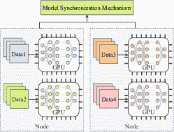

<!--yml

类别: 未分类

日期: 2024-09-06 19:33:29

-->

# [2404.06114] 通信高效的大规模分布式深度学习：全面调查

> 来源：[`ar5iv.labs.arxiv.org/html/2404.06114`](https://ar5iv.labs.arxiv.org/html/2404.06114)

# 通信高效的大规模分布式深度学习：全面调查

**Feng Liang**、**Zhen Zhang**、**Haifeng Lu**、**Victor C. M. Leung**、**Yanyi Guo**^∗，**Xiping Hu**^∗ ^∗ 通讯作者。**Feng Liang** 和 **Xiping Hu** 供职于 a) 人工智能研究所，深圳 MSU-BIT 大学，深圳 518000，中国，以及 b) 粤港澳情感智能与普适计算联合实验室，深圳 MSU-BIT 大学，深圳 518107，中国。（电子邮件: {fliang, huxp}@smbu.edu.cn）**Zhen Zhang** 和 **Haifeng Lu** 供职于 a) 甘肃省可穿戴计算重点实验室，信息科学与工程学院，兰州大学，甘肃 730000，中国，以及 b) 粤港澳情感智能与普适计算联合实验室，深圳 MSU-BIT 大学，深圳 518107，中国。（电子邮件: {zhangzhen19, luhf18}@lzu.edu.cn）**Victor C. M. Leung** 供职于 a) 人工智能研究所，深圳 MSU-BIT 大学，深圳 518000，中国，以及 b) 电气与计算机工程系，英属哥伦比亚大学，加拿大温哥华。（电子邮件: vleung@ieee.org）**Yanyi Guo** 供职于 a) 前沿跨学科研究所，深圳 MSU-BIT 大学，深圳 518000，中国，以及 b) 机械与电气工程学院，北京理工大学，北京 10081，中国。（电子邮件: guoyy@smbu.edu.cn）

###### 摘要

随着深度学习领域中数据集、模型和设备数量的快速增长，大规模分布式深度学习受到了越来越多的关注。与传统的分布式深度学习相比，大规模场景带来了新的挑战，包括容错能力、算法和基础设施的可扩展性以及数据集、模型和资源的异质性。由于在分布式训练和推理过程中模型的密集同步以及跨 GPU 和计算节点的数据共享，通信效率成为在大规模环境中实现高性能的瓶颈。本文回顾了 2018 年至 2023 年间在大规模分布式深度学习中实现高效通信的算法和技术的文献，涵盖了算法、框架和基础设施等各个层面。具体来说，我们首先介绍了在大规模分布式训练中，模型同步和通信数据压缩的高效算法。接下来，我们介绍了与资源分配和任务调度相关的高效策略，这些策略用于分布式训练和推理。之后，我们呈现了现代通信基础设施的最新技术，包括 GPU 互连、可编程网络设备、集体通信协议和通信拓扑。我们讨论这些主题时，重点考察了通信开销在大规模和异质性环境中的影响。最后，我们通过对大规模语言模型分布式训练的案例研究，展示了如何在实际案例中应用这些技术。本文旨在为研究人员提供对大规模分布式深度学习当前状况的全面了解，并揭示未来在该领域中通信高效解决方案的有前景的研究方向。

###### 索引词：

通信效率、分布式深度学习、可扩展性、联邦学习、异质性、LLM、大模型、大规模、流水线并行。

## I 介绍

由于 GPU 计算能力的快速提升[1]和基础人工神经网络模型如 ResNet[2]和 Transformer[3]的发展，深度学习（DL）在过去十年里已成为各个领域的最先进方法。这些领域包括自然语言处理（NLP）[4, 5]、多媒体处理[6, 7]、生物医学工程[8, 9]以及自动驾驶解决方案[10, 11]。传统的 DL 模型及其训练数据集可以在单个 GPU 或服务器节点上运行，而无需 GPU 间或节点间的通信。然而，随着数据集和 DL 模型规模的增加，单独的 GPU 或节点无法高效处理 DL 任务，因此出现了分布式 DL 技术。

分布式 DL 已成为应对人工智能复杂场景中挑战的最先进解决方案。分布式 DL 涉及在一个或多个计算节点上的多个 CPU 或 GPU 上进行深度神经网络（DNN）模型的训练或推断，以处理大规模训练数据集和广泛的学习模型。分布式 DL 的好处有三方面。首先，分布式 DL 提高了在大数据集上的训练并行性，并优化了超参数调整。例如，许多应用于遥感领域的 DL 模型[12, 13]需要处理大量的高分辨率多媒体数据，以提高分类准确性。为了增强训练并行性，可以将数据集分布到多个节点，每个节点独立训练模型，并通过特定的同步机制共享其工作成果。其次，分布式 DL 促进了大规模人工神经网络模型的训练和推断。特别是，要训练一个具有数十亿参数的大型语言模型（LLM）[14]，需要大量的 GPU 和节点协同工作，以容纳整个模型并进行分布式数据的并行训练，从而实现快速收敛。第三，物联网（IoT）和车联网（IoV）的发展导致了需要使用分布式 DL 的复杂场景。分布式 DL 通过利用服务器、网络基础设施和终端设备的计算和通信能力，使 IoT 和 IoV 解决方案[15]能够做出智能决策。

通信与分布式深度学习（DL）是密切交织的主题，形成了彼此核心功能的 integral 组成部分。一方面，分布式深度学习已经成为解决和优化各种通信问题的突出技术。随着通信设备和网络流量的激增，分布式深度学习为包括流量分析、路由和网络资源管理在内的任务提供了一种实时且灵活的方法，涵盖了无线通信、物联网（IoT）和网络安全等多种通信领域。这种方法固有的分布式特性也有助于增强鲁棒性和容错能力，从而确保在动态环境中的可靠通信。另一方面，高效的通信技术在实现高性能的分布式深度学习方面发挥着关键作用。鉴于分布式深度学习的协作和协调驱动特性，通信渗透到该领域的几乎所有方面，并且是其驱动力。旨在优化高性能分布式深度学习的技术主要属于高效通信技术的范畴。由于这种相互依赖，某一领域的进展会显著影响另一领域的能力。虽然前者，即探索用于通信的分布式深度学习，已经在许多研究中得到了广泛探讨[16, 17, 18, 19, 20]，但本文战略性地强调了后者，即通信在分布式深度学习中的作用，以便进行重点讨论。

高效的通信对于在不同层级上实现分布式深度学习的高性能至关重要。1) 在算法层面上，分布式训练期间的模型同步涉及密集的 GPU 之间和节点之间的通信，以确保模型的一致性和收敛性能[21]。优化通信频率和流量，以减少通信开销，可以帮助模型更快地收敛，显著减少训练时间。2) 在框架层面上，通信资源的低利用率和任务调度不良会导致通信流量拥堵和分布式深度学习中的滞后问题[22]。通过充分利用通信资源、平衡计算资源和通信资源的分配以及重叠计算和通信任务以防止通信阻塞，可以大幅提升分布式深度学习的性能。3) 在基础设施层面上，低性能的通信链路、设备、协议和拓扑会削弱高性能计算单元的能力，并容易成为分布式深度学习整体系统的瓶颈[23]。一个高性能且具成本效益的解决方案可以最大化整个分布式深度学习系统的计算和通信能力[24]。在各种环境中解决这些不同层级的通信挑战，对于实现高性能的分布式深度学习至关重要。

最近，系统中计算和通信设备的数量不断增加，导致了大规模分布式深度学习（DL）的出现，并为此带来了额外的挑战。第一个挑战涉及算法复杂性。在大规模分布式深度学习中，设备数量和工作负载的增加引入了额外的计算和通信开销。用于模型同步和通信数据压缩的高效算法，必须能够线性扩展，否则，大规模分布式深度学习可能带来更多开销而非收益。同时，考虑到分布式深度学习算法的优化解决方案搜索空间可能随规模呈指数级增长，设计适用于大规模分布式深度学习的最优算法会变得更加具有挑战性。第二个挑战涉及异质性。在大规模分布式深度学习中，异质性在多个方面普遍存在，包括数据分布、模型规范以及计算和通信设备的地理位置和资源容量。异质性不仅降低了分布式深度学习的收敛性能，还影响了通信效率，并且通过资源利用不足和滞后问题使情况更为严重。异质因素进一步增加了设计通信高效的分布式深度学习算法的算法复杂性。第三个挑战涉及大模型。相比于以前的规模，大模型的尺寸已呈指数级增长。大规模分布式训练大模型在理论和实践上都引发了对收敛性能、训练效率及计算和通信资源成本等各种因素的担忧。鉴于设备数量的增加和所需训练时间的延长，故障容忍在大模型训练中变得比传统的中型模型训练更为重要。

随着大规模分布式深度学习的快速发展，迫切需要对旨在赋能通信、计算机科学和人工智能领域的研究人员理解这一领域关键研究问题并做出有价值贡献的通信高效大规模分布式深度学习技术进行全面的调查。现有的分布式深度学习调查确实对通信在各个层级作为瓶颈表示了关切。然而，它们缺乏对大规模场景中通信问题及解决方案的系统性和全面的研究。

本文回顾了 2018 年至 2023 年期间关于通信效率技术的文献，这些技术在大型分布式深度学习（DL）的各个层面上运行，包括算法、框架和基础设施层面。为了全面了解特定主题的发展历史，可能会包括 2018 年前的一些里程碑式的工作。本文涵盖的主题包括模型同步和通信数据压缩算法、资源分配和任务调度策略以及通信基础设施。这些主题的讨论重点关注两个维度：1）解决通信瓶颈如何提升分布式深度学习的性能；2）它们在大规模环境中的高性能表现。我们还总结了每个主题的经验教训，以强调未来高性能大规模分布式深度学习的研究方向。在本文的最后，我们对大规模分布式训练 LLM 进行案例研究，以探讨这些通信效率解决方案在实际案例中的应用。

表 I: 相关调查的比较

|   参考 | 年份 | 通信效率同步 | 通信数据压缩 | 通信效率资源分配 | 通信效率任务调度 | 通信基础设施 | 边缘-云异质性 | 大规模分布式 DL | 大模型的分布式训练 |
| --- | --- | --- | --- | --- | --- | --- | --- | --- | --- |
|   [25] | 2020 | ✓ | ✓ |  |  |  |  |  |  |
| [26] | 2019 | ✓ | ✓ |  | ✓ |  |  |  |  |
| [27] | 2020 | ✓ | ✓ |  | ✓ | ✓ |  | ✓ |  |
| [28] | 2016 | ✓ |  |  | ✓ |  |  | ✓ |  |
| [29] | 2021 | ✓ | ✓ |  | ✓ | ✓ |  |  |  |
| [30] | 2023 | ✓ | ✓ |  | ✓ |  |  |  |  |
| [31] | 2023 | ✓ | ✓ | ✓ |  |  |  |  |  |
| [32] | 2023 | ✓ | ✓ |  | ✓ |  |  |  |  |
| [33] | 2019 | ✓ |  |  |  | ✓ | ✓ | ✓ |  |
| [34] | 2019 | ✓ | ✓ | ✓ |  |  | ✓ | ✓ |  |
| [35] | 2020 | ✓ | ✓ |  | ✓ |  | ✓ | ✓ |  |
| [36] | 2020 | ✓ | ✓ |  |  |  | ✓ |  |  |
| [37] | 2021 | ✓ | ✓ | ✓ |  |  | ✓ |  |  |
| [38] | 2021 | ✓ | ✓ |  |  | ✓ | ✓ |  |  |
| [39] | 2022 | ✓ | ✓ |  |  |  | ✓ |  |  |
| [40] | 2022 | ✓ | ✓ |  |  |  | ✓ | ✓ |  |
| [41] | 2022 |  | ✓ |  |  | ✓ | ✓ | ✓ |  |
|   我们的 | - | ✓ | ✓ | ✓ | ✓ | ✓ | ✓ | ✓ | ✓ |
|   |  |  |  |  |  |  |  |  |  |

### I-A 相关调查

表 I 将我们的调研与其他相关调研在各个主题上的比较展示出来。空白单元格表示对应调研中对该主题的覆盖不足。现有调研从不同角度探讨分布式深度学习，但未彻底解决大规模设置中的关键方面，尤其是通信在处理大量数据、模型、设备和基础设施中的关键作用。它们通常没有充分探讨在大规模设置中分布式深度学习生态系统不同层级的算法和基础设施的可扩展性。

通常，现有关于分布式深度学习的调研在大规模设置中存在以下缺陷：

+   •

    关于异质性。很少有调研在讨论分布式深度学习中通信优化技术时，强调异质性的影响，包括模型同步和模型压缩以便通信。数据、模型、设备和基础设施中的异质性问题在现代分布式深度学习场景中普遍存在，尤其是在大规模分布式深度学习中。

+   •

    关于资源分配。现有调研缺乏对通信高效资源分配策略的深入研究。在拥有大量服务器和设备的多租户环境中，以及用于通信的网络基础设施中，优化计算和通信资源的分配以提高资源利用率，对于大规模分布式深度学习的性能至关重要。

+   •

    关于通信基础设施。很少有调研研究大规模分布式深度学习中的高效通信基础设施。通信基础设施，包括互连、网络设备、集体通信库和网络拓扑，对于高性能大规模分布式深度学习至关重要。这些通信基础设施技术的快速发展值得及时关注和跟进。

+   •

    关于大模型。现有调研缺乏对大模型分布式深度学习的关注。鉴于极大规模基础模型在自然语言处理等领域的成功，有必要研究在大模型场景下分布式深度学习的各种技术。

具体而言，几项调查[25, 26, 27]从不同角度集中讨论了分布式深度学习。特别地，Verbraeken 等人[25]提供了关于分布式深度学习算法和框架的综述。Ben-Nun 和 Hoefler[26]分析了并行和分布式深度学习架构和模型的并发性。Mayer 和 Jocobsen[27]关注于使分布式训练可扩展的并行化方法，并涉及了如分布式资源和多租户管理等多种话题。然而，这些调查在讨论分布式深度学习生态系统时，并未充分强调通信作为关键瓶颈的重要性。

几项调查[28, 29, 30, 31, 32]已在不同层面上涉及分布式深度学习中的通信话题。特别地，Xing 等人[28]提供了关于在集群中分布深度学习算法的策略和原则的调查，旨在提高节点间的通信效率。Ouyang 等人[29]关注于通过算法层面的优化减少网络通信流量，并通过网络层面的优化加速网络通信速度的通信策略。Yu 等人[30]和 Cao 等人[31]进一步总结并分类了分布式深度学习的通信优化策略，如通信频率降低和通信数据压缩，主要集中在算法层面。此外，Cao 等人[31]还探索了用于提高分布式深度学习通信效率的无线资源管理策略和博弈论方法。Tang 等人[32]对分布式深度学习中应用于架构和应用层面的高效通信技术进行了调查。该调查采用的展示结构与本文部分相似，重点关注通信同步、系统架构、压缩技术和计算与通信任务的并行性等话题。然而，它在讨论这些话题时并未涉及异质性问题的影响和相关技术的可扩展性，也忽视了大规模分布式深度学习中的一些重要话题，如资源分配和通信基础设施。

一些调查研究了特定分布式深度学习范式中的通信挑战，包括基于云边的[33, 34, 35, 36, 37, 38]，基于 P2P 的[39]，以及混合型[40, 41]范式。值得注意的是，关注边缘计算范式的调查覆盖了通信高效技术的不同方面，包括边缘特定架构[33, 34]、算法[35, 36, 37]和基础设施[38]。

为填补现有分布式深度学习调查中的空白，本文特别调查了大规模场景中的通信高效技术。具体来说，本文重点关注：

+   •

    在异构环境下的通信高效分布式深度学习算法。我们重点讨论数据、模型和资源的异质性对各种优化和压缩算法的影响，讨论如何在这种背景下提高通信性能。

+   •

    资源分配和任务调度策略，旨在充分利用计算和通信资源，提高大规模设置中的分布式深度学习吞吐量。我们探索了大规模分布式训练和推断的各种资源分配策略，考虑了框架和容器层次。我们还研究了各种任务调度策略，以重叠计算和通信任务，旨在利用多样的异构资源和工作负载，提高分布式训练和推断的吞吐量。

+   •

    高性能通信的现代通信基础设施。我们研究不同层次上的各种先进通信基础设施技术，包括 GPU 互连、可编程网络设备、集体通信接口和通信拓扑。

+   •

    大规模分布式深度学习中大规模基础深度学习模型的各种技术案例研究。我们通过问答方式讨论将这些通信高效技术应用于实际案例中的 LLM 分布式训练。此案例研究帮助研究人员识别在大规模和异构环境中进行大模型训练的实际、高性能和具有成本效益的解决方案。

图 1：调查组织结构

### I-B 调查组织

图 1 概述了本调查中其余部分的详细组织。第 II 节提供了关于分布式深度学习的基础知识。第 III 节和第 IV 节分别介绍了在大规模分布式深度学习中的模型同步和数据压缩的高效通信算法。第 V 节考察了大规模分布式训练和推断中的各种高效通信资源分配和任务调度策略。第 VI 节介绍了针对大规模深度学习集群中高性能通信的不同系统层面的通信基础设施技术。第 VII 节以大型基础深度学习模型的分布式训练作为案例研究，并在第 VIII 节总结了本调查。 

表 II：常见缩略语列表

|   缩略语 | 描述 |
| --- | --- |
|   AIMD | 加法增量乘法递减 |
| CNN | 卷积神经网络 |
| DL | 深度学习 |
| DLRM | 深度学习推荐模型 |
| DNN | 深度神经网络 |
| FL | 联邦学习 |
| FPGA | 现场可编程门阵列 |
| GPU | 图形处理单元 |
| GRU | 门控递归单元 |
| IID | 独立同分布 |
| INA | 网络内聚合 |
| IoT | 物联网 |
| IoV | 车联网 |
| LARS | 分层自适应学习率缩放 |
| LLM | 大型语言模型 |
| LSTM | 长短期记忆 |
| MPI | 消息传递接口 |
| MPS | 多进程共享 |
| NCCL | NVIDIA 集体通信库 |
| NIC | 网络接口卡 |
| NLP | 自然语言处理 |
| PaaS | 平台即服务 |
| PCIe | 外设组件互连快速通道 |
| PS | 参数服务器 |
| P2P | 点对点 |
| RNN | 递归神经网络 |
| SGD | 随机梯度下降 |
| SiP | 硅光子 |
| SLO | 服务级目标 |
|   |   |

## II 深度学习和分布式深度学习的基础

在这一部分，我们介绍了深度学习和分布式深度学习的基础。表 II 包含了本调查中使用的常见缩略语。

### II-A 深度学习

深度学习（DL）是机器学习的一个子领域，利用深度人工神经网络，也称为深度神经网络（DNN），以层次化的方式从训练数据中提取复杂模式。训练后的 DNN 能够识别/预测未见数据中的模式。DL 已在多个领域中得到应用，包括 NLP [4]、计算机视觉 [6] 和生物医学工程 [9]。

(a) 全连接 DNN

(b) CNN

(c) RNN

图 2：深度学习常见的人工神经网络模型

#### II-A1 DL 模型

DNN 由多个隐藏层组成。每一层包含神经元，这些神经元通常由非线性函数激活。根据层内及层间神经元之间的连接，可以有多种类型的 DNN 模型。在本调查中，当提及模型或 DL 模型时，我们指的是 DNN，除非上下文另有说明。图 2 展示了三种基本的 DNN 模型：全连接 DNN、卷积神经网络（CNN）和递归神经网络（RNN）。

$\bullet$ 全连接 DNN：全连接 DNN，也称为前馈神经网络，构成了一个密集的网络，包括一个输入层、若干个隐藏层和一个输出层，如图 2a 所示。前一层的神经元与后一层的所有神经元连接，每个连接都有一个可学习的权重参数，表示连接的强度。这种架构使全连接 DNN 能够捕捉数据中的复杂关系，广泛应用于分类 [42]、回归 [43] 和特征表示嵌入 [44] 等任务。

$\bullet$ CNN：CNN 是一种用于特征提取和分类的广泛应用模型，主要针对图像和视频数据设计。如图 2b 所示，CNN 除了输入层和输出层，还包括一系列卷积层和池化层用于特征提取，然后是用于分类的全连接（FC）层。与将权重参数分配给每个神经元连接的全连接层不同，卷积层通过使用多个卷积核（或滤波器）显著减少权重参数的数量，每个卷积核都包含用于特征提取的共享权重。卷积层的特征提取过程通过卷积操作得到增强，其中卷积核遍历图像的感受野，通过加权求和和非线性激活函数提取新特征。池化层通常使用最大池化或平均池化函数，对卷积层中的数据进行下采样，以减少特征维度并缓解过拟合问题。CNN 在各种计算机视觉任务中得到了广泛应用，包括图像分类 [45]、语义分割 [46] 和目标检测 [47]。

$\bullet$ RNN：RNN 是一种处理序列数据（如时间序列数据、自然语言和语音音频）的深度学习模型，如图 2c 所示。RNN 的一般架构包括隐藏单元，这些单元捕获并传播从输入序列到后续隐藏单元的时间上下文。它会持续更新，并利用基于当前输入和先前时间上下文的时间上下文来进行预测。为了解决捕获长期时间依赖关系的挑战，开发了两种常见的 RNN 变体，即长短期记忆网络（LSTM）和门控循环单元（GRU），它们在建模这些依赖关系和有效降低计算复杂性之间提供了权衡。RNN 的常见应用包括时间序列预测 [48]、自然语言处理 [49] 和自动规划 [50]。

#### II-A2 训练与推理

深度学习模型的训练是优化其参数以最小化训练数据集上的预测误差的过程，误差由指定的损失函数或目标函数确定。损失函数可以是凸的或非凸的，从而导致凸优化或非凸优化问题。训练可以分解为两个关键过程：前向传播和反向传播。在前向传播过程中，训练数据被传递到模型的输入层，通过使用当前模型参数将数据传递通过网络来计算输出预测。在反向传播过程中，根据损失函数计算预测误差和梯度，并以反向方式迭代更新可训练参数，从而优化模型以达到最小损失。常见的反向传播优化器包括小批量随机梯度下降（SGD）[51]，带动量的 SGD [52]，Adagrad [53] 和 Adam [54]。训练过程通常在多个周期内对训练数据批次进行迭代操作，直到模型收敛。当训练误差稳定在预定义的误差范围内，且额外训练不会进一步降低误差时，模型被认为已经收敛。完成训练过程后，深度学习模型中的权重参数被学习并固定。训练过程完成后，通常会有一个验证过程，用于验证训练模型的性能，提供调整超参数和重新训练模型以获得更好性能的信息。

推断过程将未见过的数据通过训练好的深度学习模型进行预测。根据应用的具体要求，结果预测可以从输出层提取，或从中间隐藏层的预测潜在表示中提取。例如，在网络流量分析的背景下，可以训练一个端到端的深度神经网络模型直接分类流量类型[55]。或者，基于流量数据训练的编码器-解码器模型可以利用编码器生成的潜在表示进行后续任务，如攻击检测[56]。

在训练或推断过程中，与深度学习模型特定部分相关的计算任务通常在本调查中被称为深度学习任务，当在上下文中不需要区分训练任务和推断任务时。

(a) 残差块

(b) Transformer 块

图 3：深度神经网络的基本块

#### II-A3 基本神经网络块

深度学习模型在深度和规模上经历了指数增长，有些模型包含数千个神经层 [57] 或数百亿个参数 [14]。然而，模型复杂性的增长引入了各种挑战，包括梯度消失问题 [58] 以及与训练和推断效率相关的问题。为了克服这些挑战，某些神经网络结构被开发为构建能够有效捕获复杂模式的各种 DNN 模型的基本模块。在实践中，通过将这些基本模块堆叠在一起，可以轻松构建 DNN 模型。图 3 展示了两种广为认可的基本神经网络块，即残差 [2] 和 Transformer [3] 块。

$\bullet$ Residual: 残差块，如图 3a 所示，具有一个快捷连接，经过多个层后，将身份输入添加到其映射中。快捷连接促进数据在多个层之间的顺畅流动，确保重要的梯度更新能够有效传播回更浅的层。因此，残差块有效解决了梯度消失问题，在非常深的模型中实现了高效训练。

$\bullet$ Transformer: Transformer 块是在处理顺序数据学习任务中深度学习模型中的普遍选择，比如 NLP 问题。它采用由编码器和解码器组成的自动编码器架构，如图 3b 所示。Transformer 块受益于自注意机制，将数据与上下文对齐，并使数据关注上下文中的重要部分。这种机制可以并行计算，使得与先前的 RNN 架构（如 LSTM 和 GRU）相比，训练 Transformer 块所需的时间更少。这有利于构建和训练大型深度学习模型，特别是为各种 NLP 任务提供基础模型的 LLMs [59, 14]。

### II-B 分布式深度学习并行模式

在分布式深度学习中，数据、模型以及训练或推理任务被分配到单个计算节点或集群中的多个处理单元（通常是深度学习上下文中的 GPU）。在分布式环境中训练深度神经网络模型涉及到计算集群内的密集计算和通信，因此分布式训练成为了重点研究领域。在分布式训练过程中，利用可用 GPU 和节点的计算能力可以增强训练并行性，从而提高效率。此外，这还使得能够成功完成涉及大量数据或模型的训练任务，这些数据或模型超出了单个 GPU 或节点的容量。分布式训练需要在 GPU 和节点之间进行大量的模型参数或梯度交换，而通信过程通常成为性能瓶颈。至关重要的是，为模型同步、资源管理、任务调度和基础设施设计高效通信的算法是使分布式训练成为大规模分布式深度学习任务的多功能解决方案的关键。

(a) 数据并行

(b) 模型并行

(c) 流水线并行

图 4：分布式深度学习的并行模式

分布式深度学习中的各种分区策略导致三种流行的并行模式，如图 4 所示：数据并行（图 4a），模型并行（图 4b），以及流水线并行（图 4c")。

#### II-B1 数据并行

在这种模式下，整个训练数据集被分割成若干份，然后分配到集群中的多个 GPU 上[60]，旨在提高训练并行度并缩短训练时间。DL 模型在每个 GPU 上进行复制，每个 GPU 训练一个结构相同的本地模型，专注于数据集的特定部分。在分布式训练过程中，这些本地模型通过特定的模型同步机制共享知识，以更新全局模型。分布式训练的收敛速度与同步机制的通信效率有关，需要考虑通信模式和基础网络设施等因素。此外，它还受到模型计算与同步通信性能之间权衡的显著影响，包括通信频率和在 GPU 及计算节点之间传输的数据量等因素。

(a) 集中式

(b) 去中心化

图 5: 分布式 SGD

分布式 SGD 是一种广泛使用的模型同步机制，用于数据并行背景下的分布式训练。图 5 展示了两种常见的分布式 SGD 架构：基于参数服务器的集中式 SGD 和基于 gossip 的去中心化 SGD。在具有参数服务器（PS）[61]和多个工作节点的集中式 SGD 中，来自本地工作节点的 SGD 更新被传输到参数服务器，无论是同步还是异步，以确定最新的参数。随后，这些更新的参数被发送回工作节点，用于本地模型更新。在没有中央 PS 的去中心化 SGD 中，工作节点通过 gossip 方式或通过多个参数服务器的分层结构与其他工作节点同步其模型。

#### II-B2 模型并行

当整个深度学习模型超出单个 GPU 或节点的容量时，模型并行模式 [62] 采用一种特定的模型分割策略，将模型分为多个神经网络块，或称为子模型。 然后，这些子模型在集群中的多个 GPU 上分布，并通过连接维持前向传播和反向传播的数据通信。 这使得数据和梯度能够在整个模型之间 GPU 和节点之间无缝流动，非常类似于在统一的黑匣子 GPU 中运行训练和推断过程。 此并行模式引入了几个重要的通信注意事项。 首先，需要优化 DL 模型的分割，以最小化通信开销。 另外，建立一个有效的策略来定位子模型是至关重要的，以确保在子模型依赖性方面有优化的通信模式。

#### II-B3 流水线并行

管道并行模式通过减少模型并行模式中子模型依赖的复杂性并阻止计算资源处于空闲状态，进一步增强了 DL 任务的并行性[63, 64, 65]。 在此模式下，分布式培训任务被逐层分解为多个子任务，并且它们的完成取决于先前的层。 用于处理子任务的关联子模型分布在 GPU 集群中。 因此，当多批数据以管道方式流经所有子模型时，每个子模型同时由不同的批次训练。 此模式特别适用于边缘计算、物联网和智能物联网领域，设备具有异构计算和通信能力来处理各种分布式 DL 子任务。

实际上，这些并行模式可以组合[66]，以应对具有大型模型结构的复杂 DL 任务，例如，我们将在第 VII 节中探索的 LLMs 案例研究。

(a) 集群/云

(b) 边缘/联邦

(c) 点对点

图 6：典型的分布式 DL 范式

### II-C 分布式 DL 范式

我们介绍了主流的分布式 DL 范式，讨论了它们的特征、研究挑战和应用。根据通信模式、训练和推断的局部性以及硬件平台，我们将这些范式分为三种类型：基于集群/云、基于边缘和基于对等网络（P2P）。图 6 展示了每种范式，实线箭头表示节点间通信，虚线箭头表示节点内通信。

#### II-C1 基于集群/云的集中式分布式 DL

图 6a 所示的基于集群的范式，是集中式分布式 DL 的传统扩展解决方案。通过本地网络互联的计算服务器集群，提供了超越单台计算服务器的训练和推断计算能力。终端设备（如桌面计算机）将集群视为一个统一的实体，通过统一的网络接口访问其计算资源，而无需关心集群内的通信机制。集群由四个关键模块组成：资源管理器、数据存储管理器、任务调度器和计算框架。资源管理器负责集群中的计算资源（如 GPU、CPU 和内存）和网络通信资源（如网络拓扑和带宽）的管理，并将其分配给 DL 任务。数据存储管理器以分布式方式分区和管理大量的训练和测试数据，考虑存储资源和网络拓扑等因素，以确保数据的可用性、效率和可靠性。任务调度器将 DL 任务拆解成不同粒度，并在集群内进行调度，考虑资源消耗、数据局部性、工作负载和任务特性，以提高并行性和容错能力。计算框架实现内核和 API，以利用资源管理器分配的可用资源高效运行分布式 DL 算法。该范式通常用于加速模型训练[67]、适应大型模型[62]和促进超参数调整[68]。在这种情况下，高效的资源管理和任务调度策略至关重要，旨在最大化计算和通信资源的利用率以及任务执行的并行性。这种优化对于在该领域实现高性能至关重要。

基于云的分布式深度学习范式可以被视为集群基础范式的扩展，如图 6a 所示。云服务提供商将集群基础的分布式深度学习平台封装成平台即服务（PaaS）产品，并以按需付费的方式提供分布式深度学习服务。终端设备按实际使用的资源收费，包括训练数据的存储、训练和推理的计算资源以及网络通信的流量。与集群基础范式相比，基于云的范式具有三方面的优势：虚拟化、弹性和实用性。首先，云采用包括资源隔离和网络虚拟化在内的虚拟化技术，以促进云中多个租户之间计算和通信资源的共享，从而降低租户的资源成本。其次，云可以根据运行时学习工作负载弹性调整资源容量。这使得分布式深度学习平台可以扩展到更大规模以处理更大的模型和峰值工作负载，或者在不需要时收缩以节省资源。第三，云通常提供更多用于管理和监控数据、模型、资源和任务的实用工具。例如，AWS SageMaker [69] 提供可视化和模型版本控制工具，用于快速微调分布式深度学习模型。基于云的范式在各种行业的企业解决方案中得到了广泛应用，如图像和视频智能 [70]、医疗诊断 [71] 和云制造 [72, 73]。

#### II-C2 基于边缘的分布式深度学习与联邦学习

随着物联网（IoT）和车联网（IoV）技术的快速发展，基于边缘的分布式深度学习（DL）范式应运而生。与基于集群/云的范式相比，基于边缘的范式采用了层次化架构，其中包含一个额外的边缘层，用于连接集群/云和异构终端设备（如图 6b 所示）。这一范式的关键思想是将训练和推断能力接近数据，以提高分布式深度学习的效率和延迟。终端设备，如移动设备和车辆，通常具有有限的存储和计算能力，以及不稳定的无线网络连接，但需要实时数据采集和深度学习推断结果。由于通信延迟较高，云范式可能不是这种实时任务的理想解决方案。边缘层将边缘服务器放置在接近终端设备的位置，以高效地扩展终端设备的存储、训练和推断能力。基于边缘的范式广泛应用于需要高资源效率和低延迟的场景，如增强现实/虚拟现实[74]、智能交通系统[75]和智能工业与制造[76]。

联邦学习（FL）最近成为一个快速增长的研究主题，主要利用基于边缘的范式在协作深度学习中的能力。为了在多个参与方协作训练全球模型时保持隐私和数据安全，每个参与方在其边缘服务器上用本地数据训练模型，并仅分享梯度，避免与其他方和中央集群共享原始数据。FL 在多个领域找到应用，特别关注多个参与方之间的隐私和数据安全问题，包括医疗保健[77, 78]、金融[79]和自动驾驶[80]。然而，FL 的特点是 1）地理位置、计算和通信能力的异质性，2）模型结构的异质性，以及 3）各方内部非独立同分布（non-IID）数据的异质性。这些异质性对实现高性能 FL 构成了重大挑战。

#### II-C3 P2P 基础的去中心化分布式深度学习

基于 P2P 的分布式深度学习范式（如图 6c 所示）利用去中心化网络进行协作式深度学习模型训练。与遵循层间通信模式的上述范式不同，基于 P2P 的分布式深度学习范式以每层之间的对等通信为特征。对等体通过以闲聊方式交换学习信息（如数据、模型、参数或梯度）来协作完成训练任务。由于其去中心化的性质，P2P 基础的范式预计将展示出可扩展性和容错性。在该范式的设计和实现中，解决隐私保护、数据完整性和模型安全性的问题至关重要。它在去中心化交易系统 [81]、自动驾驶车辆的群体智能 [82]和移动机器人系统 [83]中找到应用。

还有混合分布式深度学习范式，这些是将上述范式结合起来用于复杂深度学习场景的混合架构 [84]。在混合范式中，通信可以发生在相邻层之间、跳过层之间，或在每层内部的对等体之间。它利用了集群和云的计算能力，同时通过边缘保持低延迟，并通过基于 P2P 的组件确保隐私和网络鲁棒性。

表 III：大规模分布式深度学习的通信高效模型同步算法研究

|                                                  类别 | 策略与参考文献 | 年份 | 亮点 |
| --- | --- | --- | --- |
|   分布式 SGD 变种 (III-A) | 同步 (III-A1) | OSP [85] | 2023 | 将不重要的梯度同步与下一次迭代的计算重叠。 |
| 异步 (III-A2) | Downpour SGD [86] | 2012 | 使用独立工作者和 PS 分片的异步方法。 |
| PS+ [87] | 2022 | 在推送最新的本地更新之前，急切地拉取全球模型。 |
| 过时同步 (III-A3) | SSP [88] | 2013 | 在有限的过时界限内允许异步模型同步。 |
| 自适应修订 [89] | 2014 | 在过时 SGD 中自适应学习率以获得最小遗憾界限。 |
|  | R²P [90] | 2019 | 工作节点按照固定的轮询顺序同步，并通过自适应小批量大小避免网络争用。 |
|  | HSP [91] | 2022 | 工作节点按照固定的轮询顺序进行同步，并在同步模式和过时模式之间切换。 |
| 自适应本地 (III-A4) | EASGD [92] | 2015 | 迭代增加同步频率。 |
| AdaComm [93] | 2019 | 首先低频同步以快速收敛，随后高频同步以降低误差。 |
|  | 后本地 [94] | 2020 | 将大批量本地 SGD 作为第二阶段；在不同基础设施级别的层次化本地 SGD。 |
|  | SlowMo [95] | 2020 | 带动量更新的本地 SGD。 |
| 事件触发本地 (III-A4) | LAG [96] | 2018 | 当累积的参数变化小于当前参数变化时触发同步。 |
| DETSGRAD [97] | 2020 | 当 PS 中当前参数变化大于阈值时触发同步。 |
|  | FSP [98] | 2023 | 将损失拟合到经验性的两阶段模式中，并在第一阶段结束时触发同步。 |
| 去中心化 (III-A5) | D-PSGD [99] | 2017 | 理论上和实验上展示了去中心化 SGD 在收敛方面具有线性加速性能。 |
| D² [100] | 2018 | 基于参数和梯度之间的差异来聚合梯度，以处理异质数据。 |
| 混合 (III-A6) | GSSP [101] | 2022 | 将性能相似的工作节点聚集到多个组中；组内使用滞后 SGD，组间使用去中心化 SGD。 |
| A2S [102] | 2022 | 对快速工作节点使用滞后 SGD，对慢速工作节点使用异步 SGD。 |
|  | ASHL [103] | 2023 | 在早期阶段使用异步本地 SGD 以加速收敛，在晚期阶段使用滞后 SGD 以保持模型一致性。 |
|   保证 | 本地 (III-B1) | [104, 105, 106, 107, 108, 109, 110, 111] | 2018-2021 | 本地 SGD 的收敛保证，涉及工作节点数量、本地更新迭代次数、总迭代次数等。 |
| 异步 (III-B2) | [112, 113, 114, 115, 116] | 2020-2022 | 异步 SGD 的收敛保证，涉及梯度延迟、梯度噪声、静态点等。 |
|   异构 FL (III-C) | 随机工作节点 (III-C1) | FedAvg [117] | 2017 | 在每次同步轮次中随机选择一部分工作节点。 |
| NetMax [118] | 2021 | 在去中心化 SGD 中优化选择对等节点的概率，以适应网络带宽状态。 |
| 模型拆解 (III-C2) | ASTW_FedAvg [21] | 2020 | 比深层网络更频繁地同步浅层网络。 |
| APF [119] | 2021 | 使用 AIMD 冻结周期来冻结稳定参数。 |
|  | APF# [120] | 2023 | 通过以一定概率冻结不稳定的参数来实现激进的 APF。 |
|  | YOGA [121] | 2023 | 基于数据差异和带宽选择特定层和对等节点，以进行去中心化 SGD 的同步。 |
| FL 定制聚合 (III-C3) | FedProx [122] | 2020 | 找到局部参数以不精确地最小化局部损失和局部更新的幅度。 |
| FedNova [123] | 2020 | 将全局梯度计算为随机选择工作节点的标准化局部梯度的加权缩放和。 |
|  | CGA [124] | 2021 | 通过在每个工作节点训练本地模型和邻居模型来解决去中心化 SGD 中的非 IID 数据问题。 |
|  | AsyNG [125] | 2023 | 通过根据损失差异和模型过时程度选择适当的邻居来解决去中心化 SGD 中的非 IID 数据问题。 |
| 层次聚合 (III-C4) | 两级 [126] | 2019 | 一个全局聚合器生成子聚合器以维护成员身份和加密聚合。 |
| FedCH [127] | 2023 | 在两级聚合中优化工作节点分配，以在资源和时间约束下最小化损失。 |
|  | TT-HF [128] | 2021 | 针对边缘内的去中心化 SGD 和跨边缘的本地 SGD 调整学习率和同步频率。 |
|  | Moshoit SGD [129] | 2021 | 在网络不稳定的环境中，通过迭代将对等节点配对为不同组以进行去中心化 SGD。 |
| 自适应训练 (III-C5) | 自适应 FL [130] | 2019 | 优化同步频率以最小化具有异质资源约束的错误。 |
| FedLamp [131] | 2023 | 联合优化同步频率和压缩比，以满足收敛性和资源约束。 |
|  | AdaSFL [132] | 2023 | 联合优化同步频率和小批量大小，以满足收敛性和资源约束。 |
|  | AAFL [133] | 2023 | 通过深度强化学习在带宽和收敛约束下优化同步频率。 |
|  | FAST [134] | 2023 | 优化同步频率和数据采样，同时考虑资源和时间约束。 |
|  | AMBLE [135] | 2022 | 针对快慢工作者的不同学习率、小批量大小和同步频率进行经验研究。 |
| 反学习 (III-C6) | FL 反学习 [136] | 2022 | 对非静态数据分布进行高效反学习。 |
|   |  |  |  |  |

## III 通信高效的模型同步

分布式 SGD 是在分布式训练 DNN 模型中用于模型同步的最先进算法。不同分布式 SGD 算法的性能主要与通信效率和模型一致性之间的权衡有关。本节首先介绍各种分布式 SGD 算法。随后，我们对分布式 SGD 的收敛保证进行理论分析。此外，我们讨论了在大规模联邦学习环境中分布式 SGD 算法，其中异质性主导了研究重点。最后，我们总结了从现有文献中获得的关键经验，以指导未来在大规模分布式深度学习中实现高性能模型同步的努力。表 III 提供了相关研究的总结。

(a) 同步 SGD

(b) 异步 SGD

(c) 过时的 SGD

(d) 本地 SGD

图 7：分布式 SGD 的典型变体

### III-A 同步、异步及其他分布式 SGD

本小节介绍了各种分布式 SGD 算法的优化，包括同步、异步、过时、本地、去中心化和混合 SGD 算法。图 7 说明了一些典型的分布式 SGD 算法。

#### III-A1 同步 SGD

在完全同步的 SGD 中，也称为小批量分布式 SGD，每次梯度迭代都作为一次同步轮次（参见图 7a）。在每次梯度迭代中，工作节点从 PS 中获取最新的模型参数，PS 基于所有工作节点的梯度更新全局模型，从而使所有工作节点中的模型更加一致，并且训练进度更加确定和协调。然而，由于任何工作节点上的训练过程在所有其他工作节点同步到相同进度之前被阻塞，这种严格的一致步伐策略引入了显著的通信开销，例如因滞后的工作节点造成的空闲时间。一些工作，例如重叠同步并行（OSP）[85]，引入了计算和通信重叠的技术，旨在缓解完全同步 SGD 的阻塞通信开销。OSP 将同步 SGD 的同步通信分为两个阶段，一个是针对重要梯度的前导同步阶段，另一个是针对不重要梯度的后继阶段。它使得后继通信阶段能够与下一个训练迭代的前向传播和反向传播计算重叠。然而，由于存在严格的一致性约束，阻塞通信开销在同步 SGD 中无法完全消除。这促使了对放松一致性约束的分布式 SGD 算法的众多变体的探索。

#### III-A2 异步 SGD

在大规模分布式深度学习中，当许多异构工作节点参与同步时，同步 SGD 的通信开销的影响可能会很具挑战性。异步 SGD 通过允许工作节点独立于其他工作节点同步其模型到 PS，从而解决了阻塞通信开销的问题（参见图 7b）。与同步 SGD 相比，异步 SGD 消除了同步阻塞时间，更适合在异构环境中进行大规模分布式训练。为了提升异步 SGD 在大数据上的表现，Downpour SGD [86]，一种用于数据并行训练的完全异步 SGD 算法，采用了中心化 PS 的多个分片，每个分片负责存储和应用 SGD 更新到全局模型参数的一部分。Downpour SGD 在两个方面是异步的：工作节点中的模型副本相互独立，这是异步 SGD 的常见形式，而 PS 分片也相互独立。实验验证表明，Downpour SGD 能有效利用网络带宽，并使用 Adagrad 优化器稳定非凸目标的波动参数。

高效的异步 SGD 通过优化计算和通信并行性的 PS 得到支持。PS+ [87]通过解耦梯度推送和随后的参数拉取操作来加速异步 SGD，使得工作节点即使在推送最新的本地梯度之前，也能够提前从 PS 中拉取全局参数进行下一次梯度迭代。这种提前拉取策略在每个同步轮次中重叠计算和通信负载，尽管它引入了额外的模型过时。然而，通过对全局学习率进行延迟自适应策略可以减轻过时的影响，在训练过程中当过时变大时动态调整学习率。

#### III-A3 过时的同步 SGD

然而，异步 SGD 会导致不同工人之间的模型过时，导致工人之间的模型一致性降低，从而在训练过程中可能会引发振荡。过时同步 SGD 是一类分布式 SGD 变体，它在有界模型过时的范围内放宽了工人之间的模型一致性（见图 7c）。这种模型一致性与通信开销之间的权衡旨在改善同步性能。在过时同步并行（SSP） [88] 中，PS 维护历史模型参数和梯度，使工人能够检索到一个有界数量同步间隔之前的历史全局模型。因此，较快的工人可以在每次同步轮次中不必等待较慢的工人。他们使用最新的更新模型，只要较慢的工人没有落后超过有界间隔。确保理论收敛保证，有界的过时性减少了工人之间的同步等待时间，并导致比完全同步 SGD 更快的收敛速度。为了限制模型过时的影响，AdaptiveRevision [89] 在周期性同步轮次之间适当地并有效地调整学习率用于梯度更新。这种调整最小化了遗憾界限，该界限是基于实际模型参数与最优模型参数之间的差异定义的。

在与 PS（参数服务器）以一致的节奏同步模型时，可能会导致同步 SGD 中的雷鸣般的群体问题，从而在 PS 带宽中引发网络争用。为了解决这一网络争用问题，R²P [90] 和 HSP [91] 引入了类似的过时同步 SGD 方案，其中工人以固定的轮询顺序更新模型到 PS。因此，这可以最小化 PS 网络带宽中的争用，并且工人中的模型被均匀地错开，表明模型过时是有界的。此外，为了在异构计算集群中高效利用计算资源，R²P 动态地为较快的工人分配较大的小批量大小，使他们在其他工人轮到与 PS 同步时保持忙碌。相比之下，HSP 允许工人根据资源利用状态在同步模式和过时模式之间切换。

#### III-A4 本地 SGD

上述的同步和异步 SGD 算法需要工人和参数服务器之间频繁的通信，导致了显著的通信开销，尤其是在大规模集群中。为了减少大规模分布式训练中的通信频率，提出了一种替代的模型同步算法，称为局部分布式 SGD 或局部 SGD。局部 SGD 允许工人在多个迭代中更新本地模型，并且仅定期与参数服务器同步模型，以保持最新的全局模型（图 7d）。除了对同步开销的关注，允许工人进行本地更新还意味着在分布式 SGD 中可能会更多地探索局部最优解的存在，潜在地导致更好的优化结果。局部 SGD 的一般形式可以通过四个参数来表征：同步或异步的同步模式、每次同步轮次中进行更新的工人比例、每次同步轮次中的本地梯度更新迭代次数（对应于同步频率），以及每次本地迭代中使用的本地小批量大小和学习率。

$\bullet$ 自适应局部 SGD：各种局部 SGD 算法在每次同步轮次中使用所有工作节点，并且在同步频率和小批量大小的设置上采用自适应方法，无论是同步还是异步。在异步 Elastic Averaging SGD (EASGD) [92]中，每个工作节点的同步频率由本地维护的时钟控制，该时钟在每次本地更新迭代后递增。PS 以移动平均的方式更新全局模型，并进行每次来自工作节点的同步。异步 EASGD 的稳定性在理论上得到保证，实验结果表明其收敛速度明显快于 Downpour SGD。通过探索不同数量的本地更新迭代与墙钟时间的权衡，AdaComm [93]会随着时间的推移调整本地更新迭代次数，以在给定的墙钟时间内最小化优化误差。AdaComm 为局部 SGD 收敛建议了一种关于同步频率的最佳策略：初期进行不频繁的同步可以减少通信延迟并提高初始收敛速度；随着时间的推移逐渐增加同步频率有助于实现更低的优化误差。Lin 等人 [94]提出了两种局部 SGD 变体：Post-local SGD，旨在达到高泛化性，以及 Hierarchical Local SGD，旨在优化计算与通信之间的权衡。大批量分布式 SGD 在训练速度上具有优势，但通常不如局部 SGD 泛化性能好 [137]。Post-local SGD 通过在标准小批量分布式 SGD 的初始阶段后，添加大批量局部 SGD 作为第二训练阶段，从而缩小了这种泛化差距。初始阶段可以视为调优学习率的热身阶段。Hierarchical Local SGD 在包括 GPU、计算节点、机架甚至数据中心的层级系统中的每一层上采用局部 SGD 作为内循环。这种层级方法限制了每层内部的模型同步强度，并减轻了不同层之间的通信开销。SlowMo [95]是局部 SGD 的一个基于动量的变体，其中 PS 中的全局模型通过带有局部更新动量的 SGD 进行更新。实验结果表明，基于动量的局部 SGD 收敛速度更快，泛化能力优于普通局部 SGD。

$\bullet$ 事件触发的局部 SGD：异步局部 SGD 算法的一类是事件触发的 SGD。这类算法的代表作包括 Lazily Aggregated Gradient (LAG) [96] 和 Distributed Event-Triggered Stochastic GRAdient Descent (DETSGRAD) [97]，其模型同步由梯度的特定条件触发。只有在局部或全局模型的梯度发生显著变化时，工人和参数服务器才会同步模型。在 LAG 的情况下，当特定时间段内的累计参数变化小于 PS 中最近的参数变化或工人中的梯度变化时，会在 PS 或工人中触发同步。理论上，LAG 被证明对平滑且强凸的、凸的或非凸的目标函数收敛。在 DETSGRAD 的情况下，当当前参数变化超过一个阈值（该阈值随着训练迭代的增加而减小）时，PS 中会满足触发条件。DETSGRAD 的收敛性在一系列非凸目标函数的假设下得到了证明。与基于梯度变化的同步触发不同，Flexible Synchronous Parallel (FSP) [98] 使用基于优化增益的触发条件。这基于一个经验观察，即相对于目标函数的损失变化可以分为两个阶段，其中前一阶段的损失下降速度线性更快。FSP 将局部 SGD 过程的损失模式拟合到这种两阶段模式中，并将这两个阶段之间的屏障识别为模型同步的最佳时刻，因为在后一阶段进一步的局部模型同步会带来较差的优化增益。FSP 为平滑且强凸目标函数提供了收敛保证，且具有 Lipschitz 连续的梯度。

#### III-A5 去中心化 SGD

上述提到的分布式 SGD 算法是集中式方法，具有中央 PS。这种集中式设置在大规模分布式深度学习环境中容易出现交通堵塞和单点故障。去中心化 SGD 通过在模型同步过程中消除中央 PS 来解决这一瓶颈，并通常依赖于工作节点之间的基于闲聊的通信。为了探索去中心化 SGD 相对于集中式 SGD 的优势，Lian 等人[99]进行了这两种方法收敛性能的理论和实验比较。结果表明，去中心化 SGD 的收敛效果与集中式 SGD 一样有效，但在任何单点的最大通信成本方面优于集中式 SGD。据我们所知，这是首次对去中心化 SGD 关于工作节点数量的线性加速性能进行理论分析的研究。然而，这一结果假设了工作节点之间的数据分布相似，其对异构数据的鲁棒性仍然未知。通过调查去中心化 SGD 在工作节点之间数据变异的收敛性能，D²[100]被提出作为去中心化 SGD 的一个变体，其中用于聚合的共享参数是基于局部参数之间的差异和连续迭代梯度之间的差异来计算的。这种参数更新策略为去中心化 SGD 提供了理论上改进的收敛速度，特别是在处理工作节点之间的异构数据时，假设梯度是 Lipschitz 连续和方差有界的。

#### III-A6 处理滞后问题的混合 SGD

在异构的大规模分布式深度学习中，滞后工作节点的问题被加剧，影响了同步和异步 SGD。显著滞后的工作节点可能会阻碍同步 SGD 中的同步过程，并在异步 SGD 中导致模型过时。为了解决滞后问题，一些研究采用了混合 SGD 方法。

通过在训练过程中识别滞后者并将工作者组织成不同的模型同步策略组，可以减轻滞后问题。分组陈旧同步并行 (GSSP) [101] 将性能相似的工作者分为特定组，并实施不同的组内和组间模型同步策略。在每个组内，工作者使用组内 PS 应用陈旧同步 SGD，而每个组则使用异步 gossip 方法与其他组同步其模型。因此，GSSP 在组内同步过程中减轻了滞后者的问题，并通过组间同步改善了收敛性能。相比之下，A2S [102] 对快慢工作者应用不同的模型同步策略。这些组是基于维持 PS 中工作者的同步速度来识别的，快工作者和慢工作者动态地分为同步组和异步组。快工作者使用带有放宽适应性同步屏障的同步 SGD，类似于陈旧同步 SGD。相比之下，慢工作者使用异步 SGD。这种方法通过陈旧同步 SGD 限制模型的过时，并通过异步 SGD 缓解滞后者造成的通信延迟。这些分组 SGD 方法的收敛性能在理论和实验上都得到了保证。

一些研究通过在不同的训练阶段实施各种模型同步策略来解决滞后问题。为了加速异质环境下的分布式训练，ASHL [103] 将训练过程分为粗粒度和细粒度阶段，这取决于全局损失是否超过预定义的阈值。在粗粒度阶段，即模型需要迅速收敛到某种程度时，ASHL 采用异步本地 SGD 来减少通信频率和等待时间，以实现更快的收敛；在细粒度阶段，即模型需要被细化以增强收敛界限时，ASHL 采用带有界限过时的同步 SGD 来确保模型的一致性。两个阶段中每个工作者的同步频率通过分析工作者的更新速度来确定，旨在使快慢工作者的同步速度大致一致。

表 IV：本地 SGD 的收敛分析比较

|   参考文献 | 收敛速度 | 同步轮次 (R) | 设置 |
| --- | --- | --- | --- |
|   Zhou 和 Cong (2018) [104] | $\mathcal{O}(\frac{1}{\sqrt{NT}})$ | $\Omega(T)$ | 非凸；Lipschitz 连续梯度 |
| Stich (2019) [105] | $\mathcal{O}(\frac{G^{2}}{NT})$ | $\Omega(N^{\frac{1}{2}}T^{\frac{1}{2}})$ | 有界梯度；强凸 |
| Yu 等 (2019) [106] | $\mathcal{O}(\frac{G^{2}}{\sqrt{NT}})$ | $\Omega(N^{\frac{3}{4}}T^{\frac{3}{4}})$ | 有界梯度；非凸 |
| Haddadpour 等人 (2019) [107] | $\mathcal{O}(\frac{1}{NT})$ | $\Omega(N^{\frac{1}{3}}T^{\frac{1}{3}})$ | 在 PL 条件下非凸 |
| Yu 和 Jin (2019) [108] | $\mathcal{O}(\frac{1}{NT})$ | $\Omega(logT)$ | 增加小批量大小；在 PL 条件下非凸 |
| Woodworth 等人 (2020) [109] | $\mathcal{O}(\frac{1}{\sqrt{NT}}+\frac{1}{\sqrt[3]{TR}})$ | $\Omega(N\times poly(logT))$ | 凸 |
| Spiridonoff 等人 (2021) [110] | $\mathcal{O}(\frac{1}{NT})$ | $\Omega(N)$ | 平滑且在 PL 条件下强凸 |
| Wang 和 Joshi (2021) [111] | $\mathcal{O}(\frac{1}{\sqrt{NT}})$ | $\Omega(N^{\frac{3}{2}}T^{\frac{1}{2}})$ | 非凸 |
|   |  |  |  |

+   •

    收敛速率，优化目标与平均模型和小批量 SGD 的差异期望值：$\mathbb{E}[f(\bar{x}_{T})-f(x^{\ast})]$，其中 $f$ 是目标函数，$x_{t}$ 是经过 $t$ 次局部 SGD 更新迭代后的局部模型，$x^{\ast}$ 是最优模型；

+   •

    $G$，梯度的 L2 范数的均匀上界；

+   •

    $N$，工作者的数量；

+   •

    $T$，每个工作者的 SGD 更新迭代总数。

### III-B 分布式 SGD 的收敛保证

许多研究分析了不同分布式 SGD 算法在各种优化目标下的理论收敛保证。这些分析的两个主要方向集中在局部 SGD 和异步 SGD，

#### III-B1 局部 SGD 的收敛性

这些研究的很大一部分集中在局部 SGD 上。这些工作在各种优化目标设置下形式化局部 SGD，研究有关工作者数量（$N$）、每次同步轮次内的局部更新迭代次数、每个工作者的整个更新迭代次数（$T$）以及小批量大小的收敛性能。因此，它们证明了局部 SGD 相比于其他分布式 SGD 算法在大规模分布式深度学习中的可扩展性优势。表 IV 展示了局部 SGD 在各种目标设置下的分析结果对比。

这些分析提供了关于收敛速度和同步轮次的界限。Zhou 和 Cong [104] 分析了在不同学习率和小批量大小设置下，局部 SGD 对于具有 Lipschitz 连续梯度的非凸目标的收敛性。分析显示，局部 SGD 允许更大的学习率，这在大规模分布式深度学习的大批量训练中是一种常见做法，并且比异步 SGD 更高效地扩展。Stich [105] 证明了同步和异步局部 SGD 算法具有相同的收敛速度，但相比于同步 SGD 对于强凸目标，减少了同步轮次，减少因子为局部梯度更新数量的平方根。假设梯度的 L2 范数有一个统一的上界，局部 SGD 可以相对于工人数和小批量大小线性加速。Yu 等人 [106] 在具有与 [105] 相同的有界梯度假设下，确保了非凸目标的收敛性。然而，收敛速度未被证明相对于工人数线性加速。去除这一有界梯度假设，Haddadpour 等人 [107] 和 Yu 与 Jin [108] 强化了 [106] 的分析。他们提供了比之前分析更紧的收敛速度和同步轮次界限，并在 Polyak-Łojasiewicz (PL) 条件 [138] 下证明了非凸目标的线性加速，该条件可以视为非凸优化中强凸性的推广。相比于 [107]，其同步轮次的渐近下界为 $\Omega(N^{\frac{1}{3}}T^{\frac{1}{3}})$，[108] 的分析提供了局部 SGD 在动态增加小批量大小下的更紧界限 $\Omega(log(T))$，这暗示了扩展局部 SGD 的有前景的方向。Woodworth 等人 [109] 专注于通过理论分析比较小批量分布式 SGD 和局部 SGD 的收敛性。与小批量分布式 SGD 相比，局部 SGD 对于二次目标表现出更优的收敛性能。然而，对于一般的凸目标，局部 SGD 在工人数较多时比小批量分布式 SGD 收敛更好，但在小批量大小较大时表现较差。

一些研究调查了本地 SGD 的极端情况，即一次性平均。这种方法在分布式训练过程的最后只使用非常少的同步轮次，甚至只有一次。在 PL 条件下的平滑和强凸问题中，Spiridonoff et al. (2021) [110] 表明，一次性平均可以在 $\Omega(N)$ 次同步轮次中收敛，无论梯度迭代总数 $T$。这一发现表明，一次性平均有可能应用于大型模型，通常需要大量训练迭代。

一些研究集中于建立本地 SGD 收敛性分析的统一框架。Wang 和 Joshi [111] 提出了一个名为 Cooperative SGD 的统一框架，以设计变体并分析本地 SGD 的收敛性能，通过引入各种模型平均协议并调整本地更新次数，显著扩展了设计空间。Cooperative SGD 显示了 vanilla 本地 SGD、EASGD [92] 和去中心化本地 SGD 都是这个统一框架中的特例。利用这个统一框架的收敛性分析，Cooperative SGD 为 EASGD 在非凸目标函数下提供了第一个收敛保证，适用于 IID 和非 IID 数据。

表 V：异步 SGD 收敛性分析比较

|   参考文献 | 同步迭代 | 设置 |
| --- | --- | --- |
|   Stich 和 Karimireddy (2020) [112] | $\Omega(\frac{\sigma^{2}}{\epsilon^{2}}+\frac{\tau_{max}}{\epsilon})$ | 一般准凸和平滑非凸 |
| Aviv et al. (2021) [113] | $\Omega(\frac{\sigma^{2}}{\epsilon^{2}}+\frac{\tau_{avg}}{\epsilon})$ | 强凸；延迟自适应学习率 |
| Cohen et al. (2021) [114] | $\Omega(\frac{\sigma^{2}}{\epsilon^{4}}+\frac{\tau_{avg}}{\epsilon^{2}})$ | 平滑非凸 |
| Koloskova et al. (2022) [115] | $\Omega(\frac{\sigma^{2}}{\epsilon^{2}}+\frac{\tau_{avg}}{\epsilon})$ | 平滑非凸；延迟自适应学习率 |
| Mishchenko et al. (2022) [116] | $\Omega(\frac{\sigma^{2}}{\epsilon^{2}}+\frac{\tau_{avg}}{\epsilon})$ | 非凸、凸或强凸；Lipschitz 连续梯度； |
|  |  | 延迟自适应学习率 |
|   |  |  |

+   •

    $\tau_{max}$，最大同步延迟；

+   •

    $\tau_{avg}$，平均同步延迟；

+   •

    $\sigma^{2}$，工人在梯度方差上的上界；

+   •

    $\epsilon$，近似静态点，限制了平方梯度范数。

#### III-B2 异步 SGD 的收敛性

一些研究为异步 SGD 提供了理论收敛保证，强调了与梯度延迟相关的同步迭代界限、梯度噪声的上界以及训练终止的近似稳定点。表格 V 展示了各种异步 SGD 算法分析结果的比较。

Stich 和 Karimireddy [112] 对涉及梯度压缩和误差反馈的异步 SGD 进行了收敛性分析，其机制将在第 IV 节中介绍，并在模型中纳入了有界梯度噪声，适用于一般的拟凸和光滑非凸目标。同步迭代的复杂性按最大同步延迟线性有界，指示最大模型陈旧性。然而，这些发现缺乏在异质环境中的鲁棒性，其中最大延迟可能远超平均延迟。Aviv 等人 [113] 引入了一种延迟自适应学习率方案用于异步 SGD。较小的学习率分配给延迟较大的更新，提供了一个与平均同步延迟成比例的更紧的同步迭代界限，而不是最大延迟。然而，结果仅限于强凸问题，并且证明很大程度上依赖于对延迟方差上界的假设，该方差可能与最大延迟密切相关。相比之下，Cohen 等人 [114] 专注于光滑的非凸目标，并提出了一个与平均同步延迟成比例的同步迭代界限。然而，这种分析在每一步需要两倍的通信轮次，并依赖于超参数的适当调整。在 [113] 中消除对延迟方差上界的假设，以及在 [114] 中的超参数调整，Koloskova 等人 [115] 应用了另一种延迟自适应学习率方案，达到了与 [113] 相同的同步迭代界限。Mishchenko 等人 [116] 采用分析技术，实现了类似于 [115] 的收敛保证，但覆盖了更广泛的优化问题，假设梯度是 Lipschitz 连续的，包括非凸、凸和强凸问题。

### III-C 模型同步在联邦学习中的应用

在联邦学习（FL）领域，模型同步面临额外的挑战。首先，最重要的是，参与的工作者数量庞大，涵盖各种类型的设备，表现出在地理位置、计算和通信资源能力、模型结构和目标以及数据分布上的异质性。其次，参与同步的工作者的成员资格可能是动态和不稳定的。第三，隐私和数据安全问题也引起了关注。这些挑战已经通过许多研究得到了解决，这些研究采用了不同方向的方法。

#### III-C1 随机选择的工作者

为了减少 FL 中众多异质工作者之间的通信开销，FedAvg [117] 在每轮本地 SGD 的同步中仅随机选择部分工作者。在去中心化 SGD 的背景下，NetMax [118] 使每个工作者可以基于精细调整的概率随机选择一个同行进行模型同步。所有工作者的最佳选择概率由网络监控器推导，旨在最小化总的收敛时间，以适应网络带宽容量和利用状态。虽然随机选择工作者的方法已成为 FL 中分布式 SGD 的前沿实践，但它并未解决非独立同分布（non-IID）数据和异质模型等其他异质性问题。这一局限性促使了对这一主题的一系列研究，重点关注不同的策略以应对 FL 中的异质性，其中一些是 FedAvg 的变体。

#### III-C2 拆解模型

一类变体[21, 119, 120, 121] 区分模型组件并间歇性地同步特定组件，从而为不同组件提供不同的同步频率，并提升大模型的通信效率。利用深度神经网络模型的浅层捕捉一般特征，而深层获取特定数据集的特有特征的观察，ASTW_FedAvg [21] 使浅层比深层更频繁地同步，并在某些同步轮次中排除深层。这种方法改进了针对异质数据集的 FedAvg；然而，所谓的浅层和深层的粗略划分是经验性的，并不具备鲁棒性。利用观察到的许多参数在模型达到最终收敛之前会稳定的现象，自适应参数冻结（APF）[119] 引入了按参数冻结的方案。在该方案中，特定的稳定局部参数在本地前向和反向传播迭代中被固定，并在指定的时间段内排除在同步之外。参数冻结的时间段不是基于对模型收敛行为的先验知识来预设的。而是根据先前冻结的参数在后续迭代中的稳定性，以加性增加乘法减少（AIMD）方式动态调整。然而，经验观察[139] 表明，即使在模型达到收敛时，一些参数仍然不稳定，尤其是在过度参数化的大模型情况下。这种不稳定性削弱了这些参数冻结的能力，并减少了 APF 中的通信开销。APF# 和 APF++ [120] 扩展了 APF，以通过采用更激进的参数冻结方法来解决过度参数化大模型中的抖动问题。在 APF#中，不稳定参数有一定概率被冻结一轮，而在更加激进的 APF++中，冻结的概率和轮次数量随着时间的推移而增加。

然而，这些细粒度的分布式 SGD 算法可能计算开销较大。APF 及其扩展提供了对模型一致性和通信开销之间权衡的精确控制。然而，维持参数级别的冻结期引入了内存和计算开销，复杂度与模型大小成线性关系。这表明在大规模模型中需要谨慎考虑这些方法。为了实现 FL 的高效且细粒度的 SGD，YOGA [121] 采用了基于等级的分层梯度聚合方法。YOGA 为层和同伴分配等级，使用贪婪算法选择性地聚合来自层和同伴的梯度。层根据其学习速度和差异性进行排名，有效识别每层的重要性。同伴则根据数据分布的差异性和可用带宽进行排名，解决了 FL 中的非 IID 数据和异质资源容量问题。

#### III-C3 量身定制的 FL 聚合策略

一些研究专注于[122, 123, 124, 125] 多样化的聚合策略，以确定局部和全局参数，解决 FL 环境中数据和资源异质性相关的挑战。FedProx [122] 类似于 FedAvg，提出了一种在工作节点之间的新局部更新策略。FedProx 并不是通过 SGD 更新局部参数，而是通过不完全的方法确定最小化局部接近目标的局部参数，这限制了局部更新的幅度，以缓解由于数据异质性引起的模型不一致性。处理资源异质性涉及在每个工作节点中调整局部参数的不完全水平。该调整与局部迭代次数相关，并减少了每个工作节点在同步轮次中的计算和通信开销。然而，FedProx 中找到这些不完全局部参数的计算依然复杂，妨碍了其在大规模 FL 中的收敛速度。FedNova [123] 通过处理因局部更新次数和非 IID 数据中的异质性导致的不一致局部目标来解决此问题。全局模型的梯度通过对随机选择的工作节点的归一化局部梯度的加权总和来计算。这些权重作为每个工作节点独特的灵活超参数，尺度与每个工作节点中的局部更新迭代次数相关。尺度的一个说明性例子是局部更新迭代次数的加权总和。

与上述集中式 SGD 研究不同，一些研究通过去中心化 SGD 方法来解决 FL 的异质性问题。交叉梯度聚合（CGA）[124]通过在模型聚合过程中计算所谓的交叉梯度来处理非 IID 数据。除了通过在每个工作节点上训练本地模型来计算本地梯度外，每个工作节点还会检索邻近的模型并推导交叉梯度，这些交叉梯度是通过邻近模型使用该工作节点的本地数据计算的。这些本地梯度和交叉梯度随后通过二次规划投影到聚合梯度中，并通过带有动量的 SGD 更新到每个模型中。CGA 在许多其他去中心化 SGD 算法中表现出优越的性能，特别是在非 IID 数据的情况下。另一方面，AsyNG [125]通过动态选择适当的邻居进行 P2P 模型同步来处理非 IID 数据。邻居的选择依赖于基于优先级的算法，其中邻居的优先级由与工作节点相比的损失差异和训练迭代间隙决定。邻居在存在较大的损失差异和较小的训练迭代间隙时被认为更适合同步。

#### III-C4 分层梯度聚合

一些研究[126, 127, 128, 129]集中于将工作节点聚类成组进行梯度聚合，类似于[101, 102]，但考虑了 FL 中的异质性问题。为了解决成员和数据安全问题，Bonawitz 等人[126]提出了一种基于 FedAvg 的两级分层聚合方案，该方案采用加密计算在 FL 中众多移动设备之间进行模型同步。该方案使用一个全球聚合器，能够生成多个子聚合器，每个子聚合器负责在一个设备子集内进行成员维护和模型同步。该方案采用了安全聚合协议[140]，在逻辑上不可篡改的第三方进行模型聚合。这确保了加密模型更新，防止模型暴露给不可信的设备和云服务提供商。为了优化分层 SGD 的拓扑结构，FedCH [127]提出了一种两级梯度聚合架构，由特定数量的组组成。每个组通过本地 SGD 从组内不同的工作节点聚合梯度。此外，还有一个全球参数服务器（PS）通过异步 SGD 从不同组中聚合梯度。FedCH 旨在确定工作节点到组的最佳分配，即集群拓扑，以在考虑资源和时间预算约束的情况下最小化训练损失。

与以上集中式 SGD 分组方法相比，某些研究聚焦于去中心化 SGD，其中每个组使用基于 gossip 的梯度聚合。TT-HF [128] 研究了无线边缘设备中的联邦学习（FL），其中边缘设备在功能上自然作为同一组的工作节点。工作节点应用局部 SGD，通过 gossip 在边缘内不定期地同步模型，并通过全局参数服务器（PS）在不同边缘之间不定期地同步模型。基于对这种同步策略的收敛分析，TT-HF 在边缘和全局范围内自适应地调整学习率和同步频率，以实现延迟、模型准确性和能耗之间的最佳权衡。为了减轻参与工作节点不断加入、离开和失败对收敛性的影响，Moshoit SGD [129] 在每次同步轮次中将它们分成不同的组进行梯度聚合。这确保了任何一对工作节点在连续轮次中不会被分到同一组。Moshoit SGD 旨在用于云计算和边缘计算环境中的分布式深度学习（DL），适用于不可靠的设备和不稳定的网络。理论和实验均证明，在这些环境中，它比完全基于 gossip 的方法更有效。

#### III-C5 自适应超参数调整

各种研究[130, 131, 132, 133, 134, 135] 通过关注分布式 SGD 的超参数调整，如同步频率、小批量大小、学习率和数据采样策略，来解决 FL 中的异构数据和资源问题。Wang 等人[130]最初分析了局部 SGD 的收敛界限，纳入了非 IID 数据。基于这一分析，他们提出了一种具有自适应同步频率的局部 SGD 算法，旨在优化异构资源约束下的优化误差，这在基于边缘的分布式 DL 范式中很常见。FedLamp[131]和 AdaSFL[132]采用了类似[130]的方法，根据异构资源约束自适应地确定最优同步频率。不同之处在于，FedLamp 在第 IV 节中详细说明，联合优化同步频率和数据压缩比例，旨在减少训练时间，同时考虑收敛性和资源约束。相对而言，AdaSFL 在相同约束下联合优化同步频率和小批量大小，以实现相同的目标。在自适应异步联邦学习（AAFL）[133]中，通过经验驱动的深度强化学习算法自适应地确定每轮同步中的本地更新数量，最小化工人在带宽预算和收敛性能约束下的最大本地累计训练时间。

最近，几项研究集中于基于每个工人的采样数据重建数据，以应对 FL 中的非 IID 异构数据挑战。例如，FAST[134]开发了一种在线学习算法，能够联合优化每个设备上的同步频率和数据采样，以在资源和时间预算内最小化全局训练损失。该在线算法可以在每次迭代中动态提供优化的数据采样结果，而无需预先了解每个工人上的数据分布。

除了上述基于优化的方法，还有经验方法。在 AMBLE[135]中，学习率、小批量大小和同步频率同时调整，以便在异质工作者中进行本地更新，采用经验策略。AMBLE 为工作者制定了本地更新时间，赋予更快的工作者更大的本地更新迭代次数和小批量大小。然后，学习率根据自适应同步频率和小批量大小线性调整。AMBLE 在 IDD 和非 IDD 场景下均显示出比 FedAvg 更优的实验预测结果。

#### III-C6 随时间遗忘的能力

一些研究[136]集中于 FL 在时间方向上的异质性，这与在空间方向上观察到的异质性不同。在增量训练期间，模型保留之前学到的知识并获取新信息，数据分布可能随时间而非平稳。模型必须在重新训练过程中学习遗忘旧知识以获得新知识；这种遗忘能力被称为“去学习”。然而，去学习 FL 模型是具有挑战性的，因为训练数据不会与中央 PS 服务器共享。针对 FL 中的去学习问题，刘等人[136]提出了一种节省时间和能源的重新训练方法。他们利用一阶泰勒展开来逼近目标，并使用对角经验费舍尔信息矩阵[141]来逼近准牛顿法中的逆赫希矩阵。这种快速重新训练方法允许不同的 FL 参与方在去学习过程中高效协作而无需共享数据，从而彻底清除已训练 FL 模型中的数据样本。

### III-D 朝向通信高效的大规模模型同步的经验教训

在本节中，我们总结了开发用于大规模分布式 DL 中模型同步的通信高效算法的经验教训。这些见解引发了许多有趣的研究话题。

$\bullet$ 瓶颈在于通信开销，采用大批量训练可以加速大规模分布式深度学习。在处理大数据集和模型时，利用许多强大工作节点的大规模分布式深度学习，使用显著大于传统方法的迷你批量大小可以减少通信开销并加速训练。由于分布式 SGD 已被证明在各种优化设置下相对于工作节点的数量展现出线性收敛加速，大批量训练可以充分发挥大规模集群中高并行性提供的计算能力。然而，大批量训练也带来了需要关注的挑战，包括增加的内存需求、模型泛化能力的潜在下降以及更复杂的超参数调整需求。例如，提出了一种感知陈旧性的学习率，以在不同训练阶段自适应地调整不同模型的学习率，旨在协调大批量分布式训练中各工作节点的模型一致性。

$\bullet$ 异质性是不可避免的，分布式 SGD 必须动态适应异质环境。在大规模分布式深度学习中，各种形式的异质性是不可避免的。为了获得最佳性能，分布式 SGD 应调整其超参数以匹配数据、模型、资源甚至这些因素的时间动态特征。对新型自适应分布式 SGD 算法的理论收敛保证分析可以遵循现有文献中提出的分析框架，将某些超参数作为固定变量，同时保持其他变量动态。该方法面临的挑战包括高效地描述这些特征、开发有效的算法以在动态训练环境中搜索最优解，并确保在各种负载下，包括那些具有非 IID 和非平稳数据集的负载下的鲁棒性。在 FL 场景中，环境特征的隔离和不透明性进一步加剧了寻求实际解决方案的复杂性。

$\bullet$ 拖延者带来障碍，而分层 SGD 可以有效缓解由异构设备资源引起的拖延者问题。在拥有大量异构设备的分布式深度学习场景中，设备可以根据其资源能力、本地性和数据特征被分组。分层 SGD 对不同组和不同层级应用不同的模型同步策略，可以将拖延者的影响降到最低。然而，这种策略也面临待解决的挑战。例如，制定最佳的聚类拓扑、平衡工作负载和确保组间及层级间的模型一致性具有复杂性。此外，该策略必须在整个训练过程中对动态设备成员具有适应性。 

表 VI：大规模分布式深度学习的通信高效压缩技术研究

|                                                 分类 | 策略&参考文献 | 年份 | 亮点 |
| --- | --- | --- | --- |
|   量化（IV-A） | 错误反馈（IV-A1） | 1-bit SGD [142] | 2014 | 分布式深度学习中的首次量化，将梯度减少到 1 位并加入错误反馈。 |
| SignSGD [143] | 2018 | 基于工人之间的多数投票将梯度量化为 1 位符号。 |
|  | EF-SignSGD [144] | 2019 | 带有错误反馈的 SignSGD。 |
|  | 1-bit Adam [145] | 2021 | 对 Adam 优化器应用带有错误反馈的 1 位量化。 |
| 随机（IV-A2） | Gupta 等人 [146] | 2015 | 随机舍入到 16 位计算。 |
| DoReFa-Net [147] | 2016 | 在均匀分布中引入噪声以补偿量化误差。 |
|  | QNN [148] | 2017 | 基于硬 Sigmoid 概率函数的随机二值量化。 |
|  | ZipML [149] | 2017 | 基于通过双重采样得出的经验分布的随机量化。 |
|  | NaturalComp [150] | 2022 | 随机地将梯度舍入到上下最接近的 2 的幂。 |
|  | Suresh et al. [151] | 2017 | 对旋转梯度进行量化，并乘以随机旋转矩阵，消除梯度分布假设。 |
| 矩阵分解 (IV-A3) | ATOMO [152] | 2018 | 对梯度应用逐项或奇异值分解（SVD）。 |
| PowerSGD [153] | 2019 | 应用两个低秩矩阵高效地分解和组合梯度。 |
|  | Vogels et al. [154] | 2020 | 增加 rank 1 的幂迭代次数，以增强 PowerSGD 对高阶量化逼近的能力。 |
|  | PCA-AWFL [155] | 2023 | 利用主成分分析来减少无线 FL 场景中的上行梯度。 |
| 保证 (IV-A4) | [156, 157, 158, 159, 160, 161, 162] | 2017-2022 | 量化的理论收敛保证的分析，涉及量化水平。 |
| FL 的量化 (IV-A5) | AQG [163] | 2022 | 自适应量化水平；跳过稳定的量化梯度，并放大与设备掉线相关的某些量化梯度。 |
| AdaGQ [164] | 2023 | 每次训练迭代中对每个设备进行自适应量化水平调整。 |
|   稀疏化 (IV-B) | 阈值 (IV-B1) | Strom [165] | 2015 | 第一个用于深度学习的稀疏化方法，选择超出固定阈值的梯度，并计算这些梯度与阈值的残差。 |
|  | top-$k$ [166] | 2017 | top-$k$稀疏化，丢弃大量梯度。 |
|  | Mem-SGD [167] | 2018 | 使用误差反馈进行分布式 SGD 的稀疏化。 |
|  | DGC [168] | 2018 | 带有动量修正、局部梯度裁剪、动量因子掩蔽和动量 SGD 的预热训练的 top-$k$稀疏化。 |
|  | EGC [169] | 2021 | 基于每层梯度箱的熵确定的逐层阈值的稀疏化。 |
|  | MIPD [170] | 2022 | 基于每层梯度 L2 范数确定的逐层阈值的稀疏化。 |
| 扩展性考虑 (IV-B2) | Global top-$k$ [171] | 2019 | 选择所有工作节点中的部分全局最大梯度，并以层次化方式聚合稀疏化梯度。 |
| ScaleCom [172] | 2020 | 工作者轮流成为主工作节点，并使用其本地 top-$k$选择索引进行所有其他工作节点的选择。 |
|  | SIDCo [173] | 2021 | 采样并将梯度匹配到某些启发式分布，其最佳稀疏化阈值通过经验确定。 |
|  | MSTopK [174] | 2021 | 使用二分搜索高效确定近似稀疏化阈值。 |
|  | Ok-Topk [175] | 2022 | 带有自适应阈值的全局 top-$k$。 |
|  | JointSpar [176] | 2022 | 基于概率分布丢弃某些层。 |
| 保证 (IV-B3) | [177, 178, 179, 180] | 2018-2021 | 关于稀疏化水平的理论收敛保证的分析。 |
| 通信-计算权衡 (IV-B4) | OMGS-SGD [181] | 2020 | 优化逐层聚合 top-$k$稀疏化的调度，以重叠通信与计算。 |
| DRAGONN [182] | 2022 | 当通信收益超过计算开销时应用稀疏化。 |
| FL 中的稀疏化 (IV-B5) | STC [183] | 2020 | top-$k$稀疏化和三值量化用于 FL 中的双向通信数据压缩。 |
|  | GossipFL [184] | 2022 | 基于带宽感知矩阵的八卦式同步稀疏梯度。 |
|  | QSFL [185] | 2022 | 工人级稀疏化和模型级稀疏化。 |
|  | FAB-top-$k$ [186] | 2020 | 在工人之间公平稀疏的约束下优化稀疏化水平，以最小化训练时间。 |
|  | FedDD [187] | 2023 | 在异构资源、数据和模型的约束下，优化稀疏化水平以最小化训练时间。 |
|   Others (IV-C) | Combined methods (IV-C1) | [165, 166, 188, 179, 170] | 2015-2022 | 依次应用稀疏化和量化。 |
| Guarantee (IV-C2) | [189, 190, 191] | 2018-2022 | 分析量化和稀疏化组合的理论收敛保证。 |
| Sparsification with encoding (IV-C3) | 3LC [192] | 2019 | 将稀疏化和量化与无损编码算法相结合。 |
| DFS [193] | 2023 | 将稀疏化的梯度块编码为零压缩格式，用于双向通信。 |
| Residual (IV-C4) | ResFed [194] | 2023 | 基于更新模型序列差异的残差压缩，用于双向通信。 |
| 自编码器 (IV-C5) | LGC [195] | 2021 | 对稀疏化梯度的公共组件进行自编码。 |
|   |  |  |  |  |

## IV 通信高效数据压缩

压缩数据，包括模型参数和梯度，可以有效减少分布式训练和推理过程中跨工作节点和参数服务器的通信开销。这个过程涉及两个关键的权衡：计算与通信之间的平衡，以及准确性与工作负载之间的平衡。前者期望为压缩分配计算资源可以显著提升通信性能，从而提高整体效率。这要求压缩算法在计算上具有高效性。后者则期望减少通信开销或训练和推理时间，而不显著影响模型收敛性能和预测准确性。正如表 VI 所列，大规模分布式深度学习的通信数据压缩技术主要分为以下几类：梯度量化、梯度稀疏化和其他。图 8 展示了这些压缩技术的一个示例。

本节回顾了这些类别中的现有工作，特别关注在大规模场景中将通信高效的数据压缩技术应用于分布式深度学习。我们还总结了这些工作的经验教训，以指导未来的大规模分布式深度学习中的高性能通信数据压缩技术。

图 8：将各种通信数据压缩技术应用于分布式深度学习数据的示例

### IV-A 梯度量化

梯度量化 [196]，或量化，是一种在分布式训练中使用的有损压缩技术，特别是在分布式 SGD 的数据并行训练中。跨集群交换高精度梯度并迭代更新模型会大量消耗计算和通信资源。量化方法将原本以 32 位或 64 位浮点数表示的数据（通常是梯度）减少到具有更少位数的低精度值。这有助于减轻大规模分布式深度学习的计算和通信开销。

各种量化方法主要在于使用的位数和数据舍入策略的不同。量化梯度的常见位数，也称为量化水平，包括 16 [146]、9 [150]、8 [197]、2 [158]、1 [143]，或者可变长度 [151]。典型的数据舍入策略包括带有误差反馈的确定性舍入、随机舍入和矩阵分解。本小节首先介绍按各种数据舍入策略分类的量化方法，随后对量化的收敛性能进行理论分析，最后讨论在大规模和异构环境下将量化应用于联邦学习（FL）的特殊考虑。

#### IV-A1 确定性量化与误差反馈

一些量化方法利用确定性函数将模型参数或梯度减少为低精度值。1 位 SGD 方法 [142] 被认为是第一个具有误差反馈或误差补偿的量化方法，适用于分布式深度学习（DL）。1 位 SGD 通过使用 0 的恒定量化阈值，将 32 位梯度压缩为每个值一个比特。为了保持模型的准确性，其误差反馈机制确保了之前的量化误差在后续的小批量梯度量化中得到反映。类似地，SignSGD [143] 仅传输梯度的 1 位符号。它采用多数投票策略在参数服务器（PS）中聚合这些梯度符号，然后再广播回工作节点。SignSGD 在处理非凸问题时展示了高效的收敛，使用了 SGD 及带动量的 SGD 优化器，特别是当梯度的密度与随机性和曲率相当或更大时。然而，Karimireddy 等人 [144] 表明 SignSGD 在某些凸问题中可能无法收敛或由于符号量化的偏差性质表现出较差的泛化能力。为了解决这个偏差，他们引入了 EF-SignSGD，将类似于 1 位 SGD 的误差反馈机制融入到 SignSGD 中。这一修改使得模型的收敛速度与 SGD 一样快，并且相比 SignSGD 表现出更优的泛化能力。

在应用于大模型时，带有误差反馈的量化需要调整。尽管误差反馈可以补偿 SGD 和带动量的 SGD 的累计梯度误差，但它不能解决 Adam 优化器中的非线性梯度误差。Adam 优化器广泛用于基于 Transformer 的模型，如 Bert [5] 和 LLMs [14]。为了克服 Adam 优化器量化中的这一限制，1-bit Adam [145] 利用 Adam 的方差在分布式训练的早期阶段保持稳定的观察结果。它将分布式训练过程分为两个阶段：Adam 预热和动量量化。预热阶段采用原始 Adam 进行几个 epoch。随后，Adam 的方差项变得固定，动量量化阶段使用带动量的 SGD 优化器，应用 1-bit 量化与误差反馈。

没有随机化的情况下，确定性量化方法计算起来很容易。然而，偏差量化误差被普遍认为是大多数确定性方法中的一个常见问题。为了减轻量化偏差，误差反馈机制是一种方法；然而，许多研究的重点是随机量化方法，以解决这个问题。

#### IV-A2 随机量化

随机量化方法通常对数据进行分布假设，并使用随机函数来确保量化梯度作为对原始梯度的无偏近似。据我们所知，Gupta 等人[146] 是首个将随机舍入方案引入梯度量化的人，这种方法将分布式训练压缩为 16 位定点计算。将浮点值舍入为特定定点值的可能性与这两个值的接近程度成正比。确定性和随机方法也可以结合使用。DoReFa-Net [147] 确定性地量化 CNN 模型参数和激活值，同时随机量化梯度。在量化梯度时，DoReFa-Net 以均匀分布引入梯度噪声，以补偿量化误差。然而，假设这些方法中的随机函数中的梯度误差服从均匀分布，可能无法完全消除量化偏差。

为了应对梯度误差的均匀分布假设的局限性，一些研究选择了替代分布以确保量化的无偏性。QNN [148] 也将梯度量化为二进制值，类似于 [142]，但它基于硬 sigmoid 概率函数。这种随机二值化方法被验证能显著减少训练时间和内存消耗，而不会影响模型预测的准确性。ZipML [149] 使用通过双重采样策略得到的梯度经验分布，以最小化线性模型中的随机量化方差。然而，其在非线性模型上的表现尚未得到充分研究。Natural Compression [150] 随机地将梯度四舍五入到最接近的二的幂，无论是向上还是向下。相较之下，Suresh 等人 [151] 提出了一个随机旋转量化方法，该方法对数据分布没有假设。该方法生成一个随机旋转矩阵来旋转梯度，并对旋转后的结果进行量化，从而在原始梯度和量化梯度之间产生较低的均方误差 (MSE)。为了进一步减少 MSE，采用了一种可变长度编码方法，将量化数据编码为可变长度格式。

#### IV-A3 矩阵分解量化

最近，一些研究提出将量化应用于梯度的分解矩阵。ATOMO [152] 对梯度应用逐项或奇异值分解（SVD），然后对分解结果进行稀疏化处理。ATOMO 是一种无偏的压缩方案，代表了 QSGD [156] 和 TernGrad [158] 的广义版本。然而，迭代地推导 SVD 是计算上昂贵的。为了解决这个问题，PowerSGD [153] 使用了一种基于幂迭代的低秩

#### IV-A4 量化的收敛性保证

通过量化进行的低精度计算可能会降低深度学习模型的收敛性能，从而减少预测准确性。因此，在确保理论收敛性能保证的同时，最小化通信成本成为量化方法的主要关注点。Alistarh 等人 [156] 分析了精度与量化方差之间的权衡的紧 bounds，并提出了 QSGD，一系列随机梯度量化算法。QSGD 提供了收敛速率的理论保证，并对梯度精度设定了界限。与 QSGD 一致，Konečnỳ 和 Richtárik [157] 通过一系列随机量化方法研究了通信成本与均方误差 (MSE) 之间的权衡。这些方法在变量大小或固定大小编码以及密集或稀疏通信协议方面有所不同。这项研究提供了与各种通信成本相关的量化 MSE 界限。Wen 等人 [158] 从梯度的统计界限角度进一步证明了收敛性。基于这一收敛分析，他们提出了 QSGD 的一个特例，称为 TernGrad，它将梯度随机映射到三个值：正、零和负。工人和参数服务器 (PS) 同步这些三值及一个梯度标量。随后，该标量在每个工人中乘以三值，生成实际梯度用于更新模型。ECQ-SGD [159] 进一步将误差反馈机制与随机梯度量化结合起来，与没有误差反馈的随机量化方法（如 QSGD）相比，确保了在最坏情况下误差的更紧界限。NUQSGD [160] 提供了比 QSGD 更严格的通信成本与量化方差之间的权衡界限。这一改进通过将 QSGD 中的均匀量化方案替换为无偏非均匀对数方案实现。

在追求自适应量化方面，Faghri 等人 [161] 建议根据数据分布的运行时统计信息动态调整不同迭代中的量化水平。IntSGD [162] 使用自适应缩放因子在随机将梯度量化为整数值之前对梯度进行乘法操作。这些值随后通过缩放因子的倒数进行缩放回，以便用于模型更新。这个缩放因子是通过模型参数的移动平均进行校准的，从而提高了量化的计算效率。理论和实证证明显示，这些自适应方法提供了比非自适应方法更紧的方差和精度界限。

#### IV-A5 联邦学习中的梯度量化

最近，涌现的研究聚焦于 FL 中的梯度量化，提出了独特的挑战。首先，FL 中计算设备的异质性和数据的非 IID 性放大了不偏量化的挑战。其次，在 FL 训练过程中，渐变的范数变化，固定的量化水平无法保证在整个训练过程中最小化通信成本。第三，确保 FL 中设备的可靠性具有挑战性，频繁的设备掉线是一个重要问题。为了解决这些挑战，Mao 等人[163] 提出了增强自适应量化渐变（Augmented AQG）。增强 AQG 使设备跳过传输慢变化的量化梯度，解决了异质性问题。它在训练过程中自适应确定量化水平，以达到最小的通信成本，并适当放大某些量化梯度，以减轻潜在的设备掉线问题。另一方面，AdaGQ [164] 解决了 FL 中各种边缘设备上波动的渐变范数问题。它采用自适应量化方法，允许每个设备在每个训练迭代中决定自己适合的量化水平。这两种方法在处理非 IID 数据时改善了分布式训练性能。

### IV-B 渐变稀疏化

渐变稀疏化，或者稀疏化，是另一种与梯度量化正交的通信数据压缩机制，在分布式训练中特别是数据并行训练中的分布式 SGD 中使用。稀疏化利用了在反向传播期间已知的渐变稀疏性观察，当更新模型参数时，渐变呈现出正偏斜性，其中许多渐变接近零或微不足道。它涉及丢弃不太重要的梯度，并使更重要的梯度稀疏化，旨在减少分布式训练中的通信成本。通常，稀疏数据被编码为索引和值对，可以进行额外的量化和压缩。

在这一小节中，我们介绍了各种稀疏化方法，考虑了它们的可扩展性问题，提供了收敛保证的理论分析，并且研究了计算和通信之间的权衡。此外，我们还讨论了在大规模和异构设置中在高性能联邦学习中进行稀疏化的优化。

#### IV-B1 带阈值的稀疏化

据我们所知，Strom [165] 首次引入了用于分布式训练的梯度稀疏化方法。该方法仅选择绝对值高于固定阈值的梯度，并发送通过这些梯度与阈值之间的差异计算出的稀疏残差值。这个阈值代表了稀疏化水平，指示了稀疏化后的稀疏程度。由于在实际操作中很难确定合适的固定阈值，Aji 和 Heafield [166] 提出了一种称为 top-$k$ 稀疏化的方法，即丢弃大部分（例如 99%）值较小的梯度。类似于量化误差，稀疏化在迭代训练过程中也会累积梯度误差。Mem-SGD [167] 将误差反馈机制纳入稀疏化，以补偿稀疏化误差，从而避免误差爆炸。然而，这些方法是为 SGD 设计的，如果应用于具有动量的 SGD（这是标准 SGD 的普遍替代品），可能会导致显著的梯度误差。为了确保在应用于具有动量的 SGD 时稀疏化的收敛性能，DGC [168] 在 top-$k$ 稀疏化基础上利用了其他四种技术：动量修正、局部梯度裁剪 [200]、动量因子掩蔽 [201] 和预热训练。动量修正技术稀疏化动量项而不是梯度，以保持具有动量的 SGD 中的累积折扣因子。此外，DGC 应用局部梯度裁剪，通过限制梯度的上限来防止梯度爆炸。它利用动量因子掩蔽来解决陈旧问题，防止对陈旧梯度应用动量。此外，预热训练通过在早期阶段使用较小的学习率和较少的梯度稀疏性来加速训练。

然而，上述的 top-$k$ 稀疏化方法在识别梯度的重要性方面存在局限性。首先，阈值是根据整个深度神经网络模型的梯度分布确定的，这是一个粗略的度量，因为模型不同层的梯度可能遵循不同的分布。此外，梯度的大小可能并不是梯度重要性的最佳衡量标准。针对这些局限性，EGC[169]采用了逐层阈值，由每一层的梯度分布熵确定，表示该层的重要性。相比之下，MIPD[170]自适应确定了不同层的逐层稀疏化阈值，并采用逐层 L2 范数作为梯度重要性的指标。这些更精细的方法来确定稀疏化阈值预期将包含在一个小范围内的聚合稀疏化误差，并保持预测准确性；然而，为每一层在每一次训练迭代中校准阈值增加了计算复杂度，可能加剧可伸缩性问题。

#### IV-B2 稀疏化的可伸缩性考虑

基于阈值的稀疏化方法在大规模集群中应用时可能会遇到可伸缩性问题，主要有三个原因。首先，局部的 top-$k$ 方法要求每个工作节点选择一定比例的梯度，导致累积梯度体积随着工作节点数量呈线性增长，并且在大型集群中变得不可忽视。其次，频繁确定 top-$k$ 稀疏化的动态阈值会带来计算开销，这妨碍了其在大型深度神经网络模型中的应用。第三，随着大型模型的大批量训练[202]在大型集群中变得常见，诸如迭代中的逐层自适应学习率缩放（LARS）[203, 204]等问题给梯度稀疏化带来了新的挑战；然而，目前缺乏证据表明这些稀疏化方法在这种场景下表现良好。

针对大梯度体积的第一个问题，Shi 等人 [171] 提出了全球 top-$k$ 稀疏化方法，以降低大型集群环境中的通信成本。该方法在所有工作节点中选择一部分全球最大梯度，并通过分层聚合策略进行同步。值得注意的是，与早期的 top-$k$ 稀疏化方法相比，该方法在扩展效率上表现出显著改进。另一个相关的发展是 ScaleCom [172]，它利用了稀疏化误差分布在工作节点之间相似的观察。ScaleCom 采用了循环局部 top-$k$（CLT-k）方法，其中工作节点轮流作为主节点，利用其局部 top-$k$ 选择索引来选择所有其他工作节点的梯度。CLT-k 的计算是可交换的，确保了所有 reduce 实现的效率。

针对计算开销的第二个问题，SIDCo [173] 采用了一个启发式方法，即 DNN 梯度可以通过三种代表性的稀疏分布进行近似。这些启发式分布的阈值可以在指定的压缩比下有效确定。SIDCo 重点对梯度进行采样，并将其匹配到其中一种分布，从而自然地获得稀疏化的阈值。另一方面，MSTopK [174] 引入了一种近似 top-$k$ 稀疏化方法，通过二分查找来有效确定近似稀疏化阈值。类似于 [171]，Ok-Topk [175] 也采用了全球 top-$k$ 方法，但仅在每几次迭代后更新一次阈值，而不是每次迭代都更新，从而进一步降低阈值计算开销。这种周期性策略的原理源于经验观察，即梯度在多个连续训练迭代中变化非常缓慢。此外，专门针对稀疏数据的集体通信库增强了分布式训练过程中稀疏梯度的集体操作，详见第 VI-C3 节。

为了应对大批量训练中 LARS 带来的第三个问题，即不同模型层中的学习率比例不同，ScaleCom 额外对累积的稀疏化误差进行低通滤波，以适应由于学习率缩放引起的快速模型变化和大量梯度噪声。ScaleCom 的可扩展性得到了保证，因为其稀疏化性能与工作者数量和每个工作者的批量大小无关。为了降低大批量训练中的计算成本，JointSpar [176] 通过联合稀疏化梯度计算和通信来避免对那些被认为会被丢弃的梯度进行冗余计算。JointSpar 首先逐层将梯度分解成梯度块，然后根据设定在梯度块上的概率分布决定丢弃哪些梯度块，其中每个元素表示丢弃特定梯度块的概率。JointSpar 避免了这些被丢弃的块的计算和通信。JointSpar 在理论上和实验中都证明了其在使用 LARS 的大批量训练中的收敛性能。

#### IV-B3 稀疏化的收敛保证

类似于量化，稀疏化中存在收敛性和通信之间的权衡。通信性能与稀疏化压缩比，即稀疏化水平相关。上述稀疏化方法的收敛性性能由商品云基础设施上的实验结果支持，但许多方法缺乏理论保障。为了开发具有理论收敛保障的稀疏化方法，GSpar [177] 采用了一种随机方法，通过概率丢弃梯度并放大剩余梯度以确保无偏稀疏化。这些概率被校准以最小化稀疏化后的通信成本，同时遵守特定的梯度误差方差约束。Alistarh 等人 [178] 提供了 top-$k$ 稀疏化的首个收敛性理论分析。通过给出收敛速率的非平凡上界，该分析证明了 top-$k$ 稀疏化方法为分布式 SGD 提供了收敛性保障，无论是对凸训练目标还是非凸训练目标。Wang 等人 [179] 分析了 top-$k$ 稀疏化在压缩比方面的收敛性能。他们提出了一种基于快速傅里叶变换（FFT）的 top-$k$ 稀疏化方法，利用 FFT 将梯度转换到频域，并根据一个收敛绑定的压缩比丢弃低能量梯度。与以前的梯度量化和 top-$k$ 稀疏化方法相比，该基于 FFT 的方法重建梯度的分布更接近于稀疏化前的原始梯度，表明该方法保留了更多相关信息。

当局部或全局 top-$k$ 稀疏化方法在不同训练迭代中应用常量阈值时，它们会导致次优的收敛性或通信性能。为了在不同训练迭代中存在变化的阈值时保证收敛性能，Sahu 等人 [180] 提出了一个具有通信约束的自适应 top-$k$ 稀疏化方法。鉴于整个训练的通信预算，该方法为每次迭代自适应选择阈值，目标是最小化整个训练的累积稀疏化误差。理论分析表明，该方法对凸优化和非凸优化目标都能收敛。

#### IV-B4 通信-计算权衡优化

除了对收敛性的担忧外，还有对稀疏化引入的计算开销的担忧，例如稀疏化梯度的额外编码和同步开销。为了解决梯度稀疏化中的计算与通信之间的权衡，OMGS-SGD [181] 将 top-$k$ 稀疏化定义为一个优化问题，即调度一组层级聚合任务来处理稀疏化梯度。这些不同梯度层的任务涉及计算和通信阶段，并可以在管道中调度，使得早期任务的通信阶段可以与后续任务的计算阶段重叠。OMGS-SGD 寻找层级梯度聚合的最佳调度，旨在最小化训练时间。从分析的角度来看，DRAGONN [182] 选择性地实现稀疏化，仅在估计的通信时间节省超过与稀疏化相关的计算开销时才激活它。DRAGONN 还通过使用高效的哈希算法来获取超过阈值的梯度，从而最小化稀疏化计算开销，而不是依赖于其他稀疏化方法广泛采用的基于掩码（例如 Hadamard 乘积）的选择算法。

#### IV-B5 FL 中的稀疏化

类似于量化，FL 中的计算设备异质性、非 IID 数据和通信模式的挑战在梯度稀疏化中也存在。为应对 FL 中的异质性，已经开发了许多梯度稀疏化方法。STC[183]代表了在 FL 中解决双向通信数据压缩的开创性工作。当许多研究集中于工人到服务器方向的梯度量化时，STC 采用 top-$k$稀疏化和三值量化来压缩工人到服务器的上传和服务器到工人的下载的通信。关注 FL 中带宽和通信模式的异质性，GossipFL[184]利用带宽感知的 gossip 矩阵来指导一个对等工人与另一个对等工人同步稀疏梯度的方式，该模式基于 gossip 的 P2P 通信模式。这个 gossip 矩阵是根据对等工人之间的带宽信息设计的，以实现高带宽通信，因此在同步中需要很少的通信时间。关于 FL 中工人之间梯度贡献的异质性，QSFL[185]采用了两级梯度稀疏化方法：工人级稀疏化用于工人到服务器的通信，模型级稀疏化用于服务器到工人的通信。在工人级别，QSFL 选择合格的工人将梯度上传到 PS 服务器，考虑到工人对损失的贡献以及本地工人模型与全局服务器模型之间的相关性。在模型级别，QSFL 将全局同步模型划分为多个部分，并将每个部分发送给一个合格的工人。这种工人级稀疏化被认为是 FL 场景中工人模型可以异质的独特方法，与用于同质模型同步的标准张量级[166]或层级[176]稀疏化方法不同。

为了应对 FL 中计算与通信之间的权衡，Han 等人[186]提出了一种公平感知的双向 top-$k$（FAB-top-$k$）稀疏化方法，该方法将稀疏化公式化为在线学习算法。此方法确定最佳稀疏化水平以最小化整体训练时间，考虑因素包括估计的导数符号、可调整的搜索区间以及工人之间稀疏性的公平性，从而解决非 IID 数据问题。类似地，FedDD[187]将 FL 中的稀疏化公式化为一个凸优化问题，以找到最优的稀疏化水平来最小化整体训练时间，考虑设备计算资源、数据分布和质量以及模型规模和结构的异质性。

### IV-C 其他梯度压缩技术

其他梯度压缩技术主要包括量化与稀疏化的结合、稀疏化与压缩编码方法的集成、残差压缩以及自编码器压缩。本小节介绍了这些技术的最新进展，并对一些混合压缩方法的收敛保证进行了分析。

#### IV-C1 量化与稀疏化的结合

梯度稀疏化通常与其他正交压缩技术结合使用，例如梯度量化。在 [165, 166]中，稀疏化的梯度分别使用 1 位 [142]和 2 位量化进行量化，以进一步降低通信成本。类似地，RedSync [188]采用带有二进制搜索阈值的梯度稀疏化，与 [174]类似，并且使用 1 位量化，与 [142]类似。在 [179]中，经过基于 FFT 的稀疏化后，稀疏化的梯度频率数据被打包成一个密集向量，另附有一个状态向量，指示索引位置。密集向量进一步通过基于范围的量化方法进行量化，该方法将 32 位 IEEE-754 格式的数据转换为匹配原始格式的低精度格式，且位数受到训练收敛要求的限制。在 [170]中，在逐层稀疏化之后，MIPD 进一步应用了基于逐层梯度分布的量化，旨在减少基于整个模型梯度分布的聚合近似误差。

#### IV-C2 量化与稀疏化结合的收敛保证

理论分析用于展示稀疏化与量化相结合的收敛性能。PQASGD [189] 提出了稀疏化与量化的一种特殊结合形式，其中量化梯度的同步仅在周期性地触发，而不是迭代地触发。这种周期性同步可以被看作是对训练迭代的稀疏化，而不是对模型的稀疏化，如前所述。因此，PAQSGD 可以被视为量化和迭代稀疏化的结合。理论上，这种结合已被证明以与所有工作节点的总小批量大小和每周期内的迭代次数的乘积的平方根成反比的速率收敛，表明它可以随着工作节点数量的增加而线性扩展。类似于 PAQSGD，Qsparse-local-SGD [190] 也周期性地同步梯度。不同之处在于，在同步间隔的本地计算中，每个工作节点还会依次经历普通的梯度稀疏化和量化，同时保持一个用于组合误差补偿的本地误差记忆。Qsparse-local-SGD 已被理论证明在固定学习率下对平滑非凸目标和在衰减学习率下对平滑凸目标收敛。为了适应性地调整组合方法的压缩水平以满足收敛保证，AC-SGD [191] 共同优化量化和稀疏化水平，以最小化梯度方差，考虑包括通信预算、梯度范数和剩余迭代次数等因素。这种共同优化的压缩水平保证了非凸和二次目标的收敛。

#### IV-C3 结合稀疏化与压缩编码

梯度稀疏化通常还会与高效编码算法结合。为了最大化压缩比，已经引入的 STC [183] 和 3LC [192] 将稀疏化和量化与无损编码算法结合起来。3LC 首先使用稀疏度乘数将梯度量化为三值，这个稀疏度乘数表示将梯度舍入为零（三值之一）的阈值。然后，它使用基于 3⁵ 的无损编码将每五个三值压缩成一个字节表示，随后再进行另一种无损的零运行长度编码 [205] 以缩短连续的相同字节序列。DFS [193] 将稀疏化后的梯度动态地分段为数据块，并将其编码为零压缩格式，以实现模型同步的双向通信。由于压缩复杂性的增加，为分布式 SGD 设计集成各种有损和无损压缩技术的算法需要在计算和通信性能之间进行谨慎权衡。必须确保压缩所提供的通信收益超过其计算开销。

#### IV-C4 残差压缩

一些用于分布式训练的压缩技术采用基于残差的方法。这种方法利用了一个启发式，即在特定时间段内，从更新模型和预测模型之间的差异计算出的残差包含比梯度更密集的信息。ResFed [194] 通过记忆模型轨迹来预测本地迭代中的模型，模型轨迹由多个训练更新中的一系列更新模型组成，然后推导出残差。它通过稀疏化和量化等压缩方法在工作节点和参数服务器之间传输残差。这种基于残差的压缩用于上传和下载通信，使其适用于带宽受限的联邦学习场景。基于残差的稀疏化和量化可以视为梯度稀疏化和量化的一种广义版本，因为当预测模型设置为最后更新的模型时，残差本质上变成了梯度。

#### IV-C5 自编码器压缩

一些梯度压缩方法采用 DNN 自编码器来编码梯度。通过利用梯度在分布式训练过程中在不同工作节点之间共享相似性的观察[172]，LGC [195] 从概念上将梯度值分解为两个组成部分：共同组件和创新组件，分别表示使得一个工作节点的梯度与其他工作节点的梯度相似或不同的部分。创新组件通过具有非常激进的稀疏化率（例如，0.001%）的稀疏梯度来捕获。共同组件通过将 0.1% 稀疏化的梯度输入到一个轻量级自编码器的编码器部分生成，该自编码器在分布式训练的早期阶段已被训练用于提取不同工作节点梯度之间的相似性。在梯度同步过程中，工作节点和 PS 服务器交换创新和编码后的共同组件，这些组件高度紧凑，以便快速通信，并且可以通过轻量级自编码器的解码器部分高效解码。

### IV-D 经验教训：面向通信效率的大规模深度学习压缩

在本节中，我们探讨了在开发面向通信效率的大规模分布式深度学习压缩算法过程中学到的经验教训，并突出了该领域未来研究中潜在的研究问题。

$\bullet$ 环境复杂且动态，环境感知的自适应压缩可以在不同的环境设置中优化通信开销。压缩比可以基于不同的环境信息动态调整，包括但不限于数据分布、模型架构和通信拓扑。然而，这些因素的多样性和异质性对发现有效的方法、找到最佳解决方案和提供实时适应提出了挑战。

$\bullet$ 梯度的重要性各不相同，对梯度重要性的更精细评估可以改善大模型分布式深度学习中的收敛性和通信性能。在具有不同组件学习特性的巨大模型中，对梯度重要性的粗略标准可能无法捕捉到对模型更新重要的信息。利用不同策略以边、工作节点、模型组件或甚至模型层的粒度来校准梯度重要性，可以在最小通信开销下优化收敛性能。然而，细粒度的压缩会带来较高的计算开销。主要挑战在于找到计算开销和通信开销之间的平衡。

$\bullet$ 各种压缩方法可以相互兼容，混合和分层压缩方法可以协作以显著减少通信开销。对于大规模分布式 DL，可以利用多种有损和无损压缩算法的组合，以优化模型同步的不同层级的通信。这种混合和分层方法在某些优化设置下在理论上保证了收敛性能。然而，缺乏详细的研究来探讨混合和分层方法中每个组件对整体收敛和通信性能的具体贡献。这种方法通常依赖于不同压缩技术的经验组合，由于搜索空间庞大，实现最佳组合具有挑战性。

图 9：大规模分布式 DL 中资源管理和任务调度机制的示意图

## V 大规模资源分配和任务调度

本节介绍了大规模高性能分布式深度学习（DL）的资源分配和任务调度策略。这些策略通常集成在集群级和分布式 DL 级框架中。图 9 展示了在集群内进行的大规模分布式 DL 的资源分配和任务调度机制的流程。该流程包括六个主要步骤。首先，对于一个分布式 DL 作业队列，任务调度器基于各种工作负载特性（如资源利用状态和工作进展）进行作业分析。第二，资源管理器根据作业的特性分析分配集群内的 GPU 和网络资源。这些资源可以以物理或虚拟的形式存在，虚拟资源可以封装在虚拟机或容器中。第三，作业级调度根据资源约束和作业性能估计确定作业执行优先级。第四，任务管道级调度将作业分解为子任务，并将它们分配到可用资源上进行子任务的管道执行，旨在增加任务并行性并重叠计算和通信负载。第五，网络流级调度通过考虑网络流的关系和依赖性来优化多个子任务的协流。第六，调度后的作业、任务管道和网络流在集群内分配的 GPU 和网络资源上高效运行。

在本节中，我们首先介绍了旨在实现分布式深度学习中计算和通信资源高效利用的大规模 GPU 管理。然后，我们介绍了任务调度以重叠分布式深度学习的计算和通信任务，从而增加并行性。在讨论这些策略时，我们重点关注它们在大规模环境中的应用，以及异构资源能力和任务工作负载。最后，我们总结了一些从这些策略中获得的经验教训，以帮助揭示这一领域有前景的研究方向。 |

表 VII: 大规模分布式深度学习的资源分配策略研究 |

|                                                  分类 | 技术与参考 | 年份 | 亮点 |
| --- | --- | --- | --- |
|   培训 (V-A1) | GPU 共享。重点: (1) 生产集群; (2) 上下文切换; (3) 性能估计; (4) 弹性; (5) 超参数调优 | Gandiva [206] | 2018 | (1) 利用深度学习工作负载的配置文件提高深度学习模型训练的效率和 GPU 集群中的延迟。 |
| AntMan [207] | 2020 | (1) 引入集群调度器和动态扩展机制的共同设计。 |
|  | FGD [208] | 2023 | (1) 在运行时监控深度学习作业的个体评估函数，以便弹性地进行位置决策和资源分配。 |
|  | TGS [209] | 2023 | (1) 设计自适应速率控制和透明统一内存机制。 |
|  | Salus [210] | 2019 | (2) 实现多个深度学习应用之间的细粒度 GPU 共享。 |
|  | PipeSwitch [211] | 2020 | (2) 利用深度学习应用的配置文件实现毫秒级的上下文切换。 |
|  | Optimus [212] | 2018 | (3) 估算深度学习任务剩余执行时间并设计基于边际增益的分配算法。 |
|  | Harmony [213] | 2019 | (3) 以最小化干扰和最大化性能的方式放置训练作业。 |
|  | Horus [214] | 2021 | (3) 提出了一种数据驱动的方法来预测异构深度学习任务的 GPU 利用率。 |
|  | Pollux [215] | 2021 | (4) 将系统吞吐量与统计效率相结合，并引入良品率的公式。 |
|  | Zico [216] | 2021 | (4) 通过跟踪训练任务的计算进度来监控单个深度学习作业的内存使用模式。 |
|  | AFS [217] | 2021 | (4) 处理未来任务需要基于当前共享计算的主动准备。 |
|  | FlowCon [218] | 2023 | (4) 通过打包任务来最小化 GPU 碎片化的增长。 |
|  | Fluid [219] | 2021 | (5) 采用水填充方法加速超参数优化过程。 |
|  | Titan [220] | 2022 | (5) 将多个微调工作负载合并为一个，以提高资源利用率。 |
|  | DISC [221] | 2022 | (5) 利用自适应缩放调整 GPU 时间片的大小，并将 GPU 时间片的动态分配形式化为一个优化问题。 |
|  | Hydro [222] | 2023 | (5) 通过将超参数调优工作负载与支持流水线的大模型训练任务交替进行，扩展资源。 |
| 网络带宽共享。粒度： (1) 任务； (2) 梯度块； (3) 共同流 | Liquid [223] | 2021 | (1) 提出智能集群网络高效调度方法，适用于即时和批处理模式。 |
| Prophet [224] | 2021 | (2) 利用监测的网络带宽和配置的梯度时间间隔预测梯度块中的梯度数量。 |
|  | Parrot [225] | 2020 | (3) 使用线性规划（LP）解决方案推导加权带宽缩放策略，以最小化通信阶段的时间成本。 |
|   推理 (V-A2) | 空间共享 | GSLICE [226] | 2020 | 开发自学习和自适应 GPU 资源分配及批处理方案。 |
| iGniter [227] | 2022 | 利用推理性能模型计算适当的批量大小和分配的 GPU 资源下限。 |
|  | SLO-aware [228] | 2022 | 根据自动缩放决策将推理请求分配给已部署的函数。 |
| 时间共享 | Nexus [229] | 2019 | 应用启发式方法选择请求。 |
| INFaaS [230] | 2021 | 识别由共享硬件资源造成的共置干扰。 |
|  | Cocktail [231] | 2022 | 构建利用重要性采样技术的分布式加权自动缩放策略。 |
| 混合共享 | Gpulet [232] | 2022 | 允许异质 ML 模型以最具成本效益的方式映射到多个 gpulet 上。 |
| FaST-GShare [233] | 2023 | 引入 FaST-Manager 以限制和隔离时空资源。 |
|   |  |  |  |  |

### V-A 资源管理

根据深度学习的不同阶段，我们将不同的资源管理技术分类应用于训练和推理阶段。表格 VII 提供了在大规模分布式深度学习领域中相关计算和通信资源管理技术的总结。

#### V-A1 分布式训练的资源管理

分布式深度学习的训练过程需要大量的计算能力、GPU 内存和 GPU 之间的网络通信带宽。因此，GPU 和网络带宽共享是我们讨论的重点。

$\bullet$ GPU 共享：虽然 GPU 在分布式深度学习中得到了广泛应用，但在生产集群中普遍存在低利用率的问题。记录到的低 GPU 利用率通常在 25%到 50%以下[234, 235, 236, 237, 208, 238]。在大规模分布式计算环境中，这一问题尤为值得关注。为了解决这一问题，已开发出多种分布式技术，以使深度学习任务能够高效地在众多设备上运行[239]。

GPU 共享技术通过虚拟化利用部分资源，提供了一种可行的策略来缓解大规模分布式深度学习中的低 GPU 利用率问题。NVIDIA 被公认为领先的 GPU 供应商，其推出的多进程共享（MPS）[240]提供了一种操作系统级虚拟化解决方案。然而，其实施需要特定应用的专业知识，以定义资源限制以确保性能隔离。此外，MPS 与多种深度学习框架不兼容。为了解决 MPS 的性能隔离问题，另一项 NVIDIA 技术——多实例 GPU（MIG）[241]，允许将 GPU 划分为多个独立的实例，每个实例具有专用资源。然而，MIG 仅适用于某些规格的 GPU（例如 A100 和 H100），并主要支持粗粒度的资源共享。

已提出一些全面的解决方案来应对大规模分布式深度学习生产集群的复杂特征。**Gandiva** [206] 利用分布式深度学习任务的配置文件，并通过三种主要方式解决 GPU 利用不足的问题。最初，**Gandiva** 允许在超负荷时，新进任务与现有任务共享 GPU 的时间。然后，它允许时间切片的任务迁移到其他 GPU。最后，它支持弹性 GPU 容量，在空闲时增加 GPU 数量，并在负载动态增长时减少 GPU 数量，从而有效利用空闲 GPU。**Gandiva** 的性能在微软的生产集群上得到了验证。**AntMan** [207] 是阿里巴巴用于分布式深度学习集群的生产解决方案。它从硬件、集群调度和任务行为三个方面分析了分布式深度学习集群中 GPU 利用不足的原因。**AntMan** 通过利用分布式训练任务的资源需求波动配置，结合动态扩展机制，对集群调度器和分布式深度学习框架进行共同设计，在任务执行过程中对 GPU 资源进行动态扩展。这种方法在大规模集群中确保了任务的服务级别目标（SLOs），同时通过机会性调度提升集群利用率。利用阿里巴巴生产跟踪的分析，**Fragmentation Gradient Descent (FGD)** [208] 解决了大集群中严重的 GPU 碎片化问题。**FGD** 通过任务打包来最小化 GPU 碎片化的增长，以实现最大化的 GPU 分配率。**TGS** [209] 在容器的生产集群中为分布式深度学习任务提供了透明的 GPU 共享。**TGS** 解决了应用程序配置知识缺乏和在共享 GPU 资源时潜在的 GPU 内存过度分配的问题。**TGS** 通过自适应监控和控制每个容器向 GPU 发送 GPU 内核的速率，来应对第一个挑战，旨在最大化机会性任务的速率，同时不影响生产任务的速率。**TGS** 通过 CUDA 统一内存分配 [242] 将 GPU 内存和主机内存统一在一个地址空间中，解决了第二个挑战，这种方法实现了性能隔离和 GPU 内存分配的透明性。机会性任务的过度分配内存会自动迁移到主机内存中，从而确保生产任务的性能。

一些研究使用快速上下文切换来改善 GPU 利用率。**Salus** [210] 通过灵活的调度策略实现了精细粒度的 GPU 共享，暴露了两种 GPU 共享原语：快速作业切换和内存共享。前者实现了对当前活跃深度学习作业的快速抢占和高效时间共享，而后者则将较小的分布式深度学习任务打包在同一设备上，以确保高内存利用率并防止内存碎片化。相比之下，**PipeSwitch** [211] 支持分布式深度学习作业的任务管道的快速上下文切换。**PipeSwitch** 通过模型感知分组来优化上下文切换开销，并主动分配 GPU 内存。模型感知分组的目标是最小化在上下文切换期间将模型在 CPU 和 GPU 之间传输的开销。对待激活工作者的 GPU 内存的主动分配加快了上下文切换的速度。为防止作业干扰，**PipeSwitch** 强制进行进程级隔离，为每个活跃的工作任务初始化一个新的单独进程。

一些研究采用性能估计引导的方法来增强 GPU 资源分配。这些方法中的性能估计方法和性能目标可能会有所不同。**Optimus** [212] 引入了一种基于边际收益的动态分配算法，估算分布式深度学习任务的剩余执行时间。在这种贪婪策略中，作业的边际收益越大，资源分配就越高。**Harmony** [213] 使用深度强化学习算法，将分布式深度学习作业放置在分配的 GPU 资源上，以实现最小干扰和最短训练时间。对未见过的放置的学习奖励由历史分配样本引导。**Horus** [214] 构建了一个模型，以预测异构分布式深度学习任务的 GPU 利用率，基于计算图特征。它将 GPU 利用率确定为做出最佳放置决策的通用代理指标。

弹性训练，即动态扩展和缩减资源容量，是提高资源利用率和降低云环境下分布式深度学习成本的重要策略。一些研究集中在 GPU 内存粒度的弹性资源上。Pollux [215] 动态调整分布式深度学习作业可用的 GPU 资源，旨在最大化集群内的整体训练良品率。为了提高 GPU 内存共享的效率，Zico [216] 通过跟踪训练过程中的计算进度来监控单个分布式深度学习作业的内存使用模式。基于这种监控，Zico 自动分配和回收内存，确保不超出内存预算。AFS [217] 指出，处理未来作业需要基于当前的共享计算主动准备资源。当资源调度器预计未来资源争夺将很激烈时，它会为长期作业分配更多资源；否则，为短期作业分配更多资源。相比之下，一些研究集中在弹性容器资源上。例如，FlowCon [218] 引入了一种基于增长效率和动态资源配置的容器放置策略，用于在运行时弹性分配和撤回资源。

一些研究探讨了在分布式深度学习集群中改进资源利用率的策略。Fluid [219] 是一个分布式深度学习超参数调优执行引擎，它将超参数调优过程抽象为一系列试验组。它采用水填充方法加快超参数调优过程，从而提高资源利用率。Titan [220] 采用了不同的方法，将多个微调工作负载合并为一个，以期提高资源利用率。由于多个微调工作负载通常共享相同的模型参数，这种合并特别有利。DISC [221] 利用自适应缩放在运行时调整超参数调优作业所占的 GPU 时间片的大小。这种对每个超参数调优作业的 GPU 时间片的动态分配是基于其在推断准确性上可能带来的急剧提升。Hydro [222] 通过结合异质感知分配策略解决了集群范围内的资源利用和调优效率问题。这种方法通过将超参数调优工作负载与启用管道的大模型训练任务交错，从而扩展了超参数调优工作负载的资源。通过有效利用每个节点上由于微批次的前向和后向处理之间的间隔所产生的空闲时间，Hydro 提高了大规模分布式深度学习集群的整体资源利用率和调优效率。

$\bullet$ 网络带宽共享：在大规模分布式环境中，网络带宽是决定分布式训练效率的另一个重要因素。网络带宽共享的重点可以在不同的粒度上，包括作业和任务、梯度块和网络共同流。

一些研究专注于以作业和任务的粒度优化网络带宽共享。Liquid [223] 提出了一个计算和通信资源估计算法以及一个网络高效的作业调度策略用于分布式训练作业。资源估计算法建模了分布式训练作业的资源需求，包括 GPU 计算能力、GPU 内存和网络带宽需求。作业调度策略将分布式训练作业分配到计算节点和容器的集群中，找到满足估计的计算和通信资源需求的最佳作业放置解决方案，并在容器间展现较少的 GPU 片段和网络通信成本。

一些研究专注于以梯度块（gradient blocks）的粒度进行网络带宽共享。例如，Prophet [224] 基于分析时间间隔将梯度块分组，并以网络带宽和梯度块的网络传输顺序建模分布式训练时间。基于此模型，Prophet 寻找梯度块网络传输的最佳顺序，旨在最小化分布式训练时间。这种梯度块传输的最佳顺序优化了梯度块之间的网络带宽共享以及网络传输与 GPU 计算之间的重叠。

一些研究专注于以共同流（coflows）的粒度进行网络带宽共享。例如，Parrot [225] 将分布式训练作业的通信模式视为一系列依赖的共同流，并根据每个共同流承载的信息量估计分布式训练作业的剩余处理时间。Parrot 为集群内并发作业的活跃共同流分配网络带宽，从而优先最小化剩余处理时间较短的作业的共同流的有效完成时间。

#### V-A2 分布式推断的资源管理

与适用于长期离线工作负载的分布式训练相比，分布式推断需要实时执行，并对延迟和准确性有更严格的要求。这种需求差异要求开发新的资源管理解决方案，以有效应对推断工作负载的不同特性。在分布式推断过程中，GPU 共享是各种资源分配方法的重点，这些方法可以分为两个主要类别：空间共享和时间共享。在多个分布式深度学习作业的背景下，GPU 的空间共享涉及 GPU 空间分区的共享，而时间共享涉及整个 GPU 计算时间片的共享。混合方法结合了这两类技术。

$\bullet$ 空间共享：许多现有工作利用 GPU 的空间共享来优化分布式推断任务的性能。GSLICE [226] 引入了一个推断系统，通过系统地进行空间 GPU 复用，实现了安全高效的 GPU 共享。它利用 MPS [240]，一个具有虚拟化功能的 GPU 空间复用框架，来处理各种推断请求。iGniter [227] 采用了一个推断性能模型来计算合适的批量大小和分配的 GPU 资源的下界。随后，它通过贪婪方法分配每个推断工作负载的 GPU 资源，以确定可以实现最小性能干扰的放置 GPU 设备。SLO-aware ML 推断框架 [228] 在云中设计了一种资源自动扩展策略，利用丰富且精确的工作负载特定指标，特别考虑了 GPU 计算能力的异质性。这种有效且弹性的资源管理确保了在云中满足不同推断工作负载的 SLO。

$\bullet$ 时间共享：最近为特定分布式推理系统设计的时间共享方法在 GPU 利用率方面取得了改进，特别是在多个租户共享的云环境中。Nexus [229] 采用启发式方法选择请求以在同一 GPU 上共同放置。最初，它确定最适合的批量大小以满足现有推理工作负载的吞吐量和 SLO 要求。随后，Nexus 以最佳适配方式识别单个 GPU 的所有可能组合，以最大化利用率而不违反延迟要求。关注于云中的推理服务，INFaaS [230] 解决了因共享硬件资源而产生的共存干扰问题。它通过工作负载迁移或虚拟机级别的扩展，将可用资源分配给受到干扰的实例，旨在通过 GPU 共享降低成本，同时通过虚拟机级别的扩展满足延迟要求。Cocktail [231] 根据预测的工作负载和这些模型的流行程度，自动并主动地扩展云中各种推理模型的虚拟机资源。这种方法提高了分布式深度学习推理系统中资源分配的效率，支持特定的推理模型集。

$\bullet$ 混合共享：一些研究探讨了混合 GPU 共享方法，考虑了空间和时间共享。Gpulet [232] 通过将物理 GPU 分割成虚拟 GPU 的抽象，支持 GPU 的空间共享。给定分配的虚拟 GPU 资源，Gpulet 通过调度多个租户的推理作业的批量大小来支持时间共享，旨在保证 SLO。此混合设计使得对多个异构深度学习模型的推理进行成本效益的云资源分配成为可能。FaST-GShare [233] 利用 GPU 的空间和时间共享，以最大化在 Function-as-a-Service 无服务器架构中的推理功能吞吐量。它基于对功能吞吐量和资源分配的分析，支持云中推理资源的自动扩展，最大化 GPU 利用率，同时确保 SLO。

表 VIII：大规模分布式深度学习任务调度策略研究

|            类别 | 技术及参考文献 | 年份 | 亮点 |
| --- | --- | --- | --- |
|   训练调度 (V-B) | 效率：任务级调度 (V-B1) | Amaral et al. [243] | 2017 | 提出了一种新的拓扑感知负载放置策略，用于在多 GPU 系统上调度深度学习（DL）任务。 |
| Tiresias [244] | 2019 | 使用 LAS 算法根据服务优先级来调度任务，服务被定义为请求的 GPU 资源与执行时间的乘积。 |
|  | FfDL [245] | 2019 | 利用行业实践中的操作经验来平衡可靠性、可扩展性、弹性和效率。 |
|  | Philly [246] | 2019 | 将调度器日志与单个任务的日志相关联，并对帮调度和地方性约束对排队延迟和任务运行时间的影响进行深入分析。 |
|  | E-LAS [247] | 2020 | 使用针对分布式训练任务的实时纪元进度率以及从时域和空间域获取的服务，来指导调度决策。 |
|  | SMD [248] | 2021 | 允许多个任务竞争通信带宽。 |
|  | OSDL [249] | 2022 | 设计涉及 OCS 和 EPS 的网络中的任务放置和调度算法。 |
|  | Sched² [250] | 2019 | 使用深度强化学习（DRL）来执行智能的地方性感知调度以处理分布式学习任务（DLT）。 |
|  | MLFS [251] | 2020 | 利用启发式调度方法中的数据来训练 DRL 模型，并使用该训练好的 DRL 模型自动进行任务调度决策。 |
| 效率：任务流水线级调度 (V-B1) | PipeDream [252] | 2019 | 自动将 DNN 层在工作节点之间分配，以平衡负载并减少通信。 |
| GPipe [253] | 2019 | 采用创新的批量拆分流水线算法，当模型在多个加速器上分布时，能实现接近线性的收敛加速。 |
|  | Piper [66] | 2021 | 在单层内部利用张量并行化技术显著减少搜索空间。 |
|  | Chimera [63] | 2021 | 整合双向流水线以高效训练大规模模型，在流水线效率、内存成本和收敛友好性之间找到最佳平衡。 |
|  | AutoPipe [64] | 2022 | 引入一种自动实现平衡分区和减少启动开销的方法。 |
|  | OOO BackProp [65] | 2022 | 利用梯度计算依赖关系重新排序管道执行，从而最大化 GPU 资源利用率。 |
|  | DeAR [254] | 2023 | 解决启动延迟和次优训练性能的问题。 |
|  | HetPipe [255] | 2020 | 提出了一种将 PMP 与 DP 集成的 DNN 训练系统。 |
| 效率：网络流级调度 (V-B1) | JPAS [256] | 2020 | 使用简单的贪心机制来周期性地排序所有 DDL 作业。 |
| Geryon [257] | 2020 | 使用具有不同优先级的多个流来传输不同紧急级别的参数。 |
|  | TensorExpress [258] | 2020 | 使每个交换机能够根据优先级通过多个队列传输张量包。 |
|  | Beamer [259] | 2021 | 通过在调度方法中考虑阶段信息来减少 SCT。 |
|  | Tereis [260] | 2023 | 探索在数据传输期间利用闲置 GPU 计算资源。 |
|  | Mercury [261] | 2023 | 处理数据包粒度问题，将优先级调度转移到传输层。 |
| 成本效益 (V-B2) | Cynthia [262] | 2019 | 提供可预测的分布式训练性能，并减少训练预算。 |
| FC² [263] | 2019 | 一种调度器，为具有 PS 的分布式训练任务推荐成本效益高的云资源分配。 |
|  | Jahani [264] | 2019 | 将调度过程建模为 MILP 问题，以全球性地降低租赁成本，同时保持作业延迟。 |
|  | GPOEO [265] | 2022 | 在 GPU 数据中心节省电力，并使用定制的调度器来协调作业。 |
|  | STS [266] | 2023 | 利用早期终止的概率分布，并在作业执行过程中调整资源分配，以最小化预期能源成本。 |
| 截止时间保证 (V-B3) | GENIE [267] | 2020 | 提出一种基于轻量级分析的预测模型，以估计各种 DL 工作负载的处理速率和响应延迟。 |
| Chronus [268] | 2021 | 为 SLO 作业提供截止时间保证，并最大化最佳努力作业的性能。 |
|  | Hydra [269] | 2023 | 采用一种采样方法，利用 DL 作业固有的迭代周期性，以在异构 GPU 上准确估计作业完成时间。 |
|   推理调度 (V-C) | 效率 (V-C1) | Sniper [270] | 2022 | 使用基于神经网络相似度 (NNS) 的非侵入性性能表征网络来准确预测 DNN 的推理时间。 |
| AutoDeep [271] | 2020 | 利用贝叶斯优化和深度强化学习在有限的搜索时间内自适应地发现最佳的云配置和设备位置。 |
|  | Clipper [272] | 2017 | 观察相应的准确性和延迟反馈，以选择使用最佳努力搜索方法。 |
| 吞吐能力 (V-C2) | Rafiki [273] | 2018 | 使用实用的 AIMD 算法来调整推理批处理大小。 |
| Nanily [274] | 2019 | 推导出相应的批处理大小，以使推理执行时间等于或接近最大剩余时间。 |
|  | RRL [275] | 2019 | 专注于优化不同层次的并行配置。 |
|  | Morphling [276] | 2021 | 通过采样少量配置并使用这些配置找到最佳方案来适应新的推理服务。 |
|   |   |   |   |   |

### V-B 训练-任务调度

在具有复杂网络连接的大规模 GPU 集群中，有效地调度分布式深度学习工作负载对于确保任务执行的高性能、硬件利用的最优化以及实现各种调度目标至关重要。 分布式深度学习的训练和推理阶段被广泛认为是特别资源密集型的[239]。 以下小节分别研究了训练和推理工作负载上的任务调度策略，重点是提供高效的通信或重叠计算和通信，以实现大规模分布式深度学习的整体效率。

由于模型的分布式训练可能消耗大量的计算和通信资源，因此高效的任务调度策略对训练工作负载至关重要。调度的性能目标可以包括效率、成本效益和截止日期保证，而粒度级别可以在作业、任务管道和网络流量上。 在本节中，我们调查了具有各种性能目标和粒度级别的大规模分布式训练的任务调度。表 VIII 总结了相关文献。

#### V-B1 效率

效率是分布式训练调度中最关键的性能目标之一[239]。 本小节根据不同的调度粒度级别对任务调度策略进行了分类，包括作业、任务管道和网络流量。

$\bullet$ 作业级调度是最常见且有效的调度方法之一，重点是重新排序作业的优先级[244, 245]。Amaral 等人[243]引入了一种新颖的拓扑感知工作负载放置策略，旨在为多 GPU 系统上的分布式深度学习作业进行调度。该策略高效地满足工作负载需求，同时最小化干扰。在此基础上，Tiresias [244] 从经典的多级反馈队列 (MLFQ) 算法[277]中汲取灵感，开发了一种优先级离散化方法，以缓解频繁抢占相关的问题。概念化的最少服务 (LAS) 算法根据服务水平（由请求的 GPU 资源和执行时间的乘积量化）来优先处理作业。由 IBM 开发的开源调度平台 FfDL [245] 融入了来自行业实践的操作见解，以在可靠性和可扩展性之间取得平衡，同时保持弹性、灵活性和效率。在相关研究中，Philly [246] 通过将调度器日志与单个作业的日志进行关联，全面分析了集体调度和位置约束对排队延迟和作业运行时间的影响。根据这项分析的见解，Philly 主张放宽位置约束以提高作业时间效率。E-LAS [247] 的目标是减少分布式训练作业的平均完成时间，转而不依赖于作业运行时间估算或先前知识。相反，它利用特定于分布式训练作业的实时纪元进度率，结合源于时间和空间域的服务指标来指导调度决策。这种创新方法使 E-LAS 超越了 Tiresias 的效率。此外，SMD [248] 提出了一个资源调度分析模型，该模型适用于多个作业争夺通信带宽的情况。该模型将调度问题视为一个具有 bin-packing 约束的非凸整数非线性规划问题，并引入了一种 $\epsilon$-近似算法，称为比率和多维背包分解，用于解决该问题。OSDL [249] 设计并提出了用于涉及光路交换 (OCS) 和电路包交换 (EPS) 的网络中的作业放置和调度的算法。仿真结果表明，OSDL 在性能上超越了多种成熟的调度方法。

许多调度方法已经结合了机器学习技术，特别是深度强化学习（DRL），以提高任务调度的效率。 Sched² [250] 采用 DRL 以智能的局部感知方法调度分布式训练任务。 这种方法能够全面理解任务的局部敏感性和集群的碎片化情况，贯穿整个学习堆栈。 通过这种增强的感知，DRL 模型动态而自适应地调整其调度决策，有效地响应各个任务的不同局部敏感性以及集群碎片化状态的变化。 MLFS [251] 使用启发式调度方法的数据来训练 DRL 模型，随后利用该模型自主做出关于任务调度的明智决策。

$\bullet$ 任务级流水线调度专注于管理流水线架构中任务的顺序处理，特别是对于大型分布式训练作业和大模型。它在预定义的顺序中，专业地协调数据和任务在各个阶段或过程中的流动。通过确保每个任务高效执行并遵循指定的顺序，调度器优化了整个流水线的性能。例如，PipeDream [252] 引入了一个将批间流水线技术融入批内并行性的系统。这种方法通过将计算与通信重叠并在可能时最小化通信，从而提升了并行训练吞吐量。此外，PipeDream 自动将 DNN 层分配给工作者，以平衡工作负载并减少通信。为了满足高效且任务独立的模型并行需求，GPipe [253] 作为一个流水线并行库出现。它支持将任何可描述为层序列的网络进行扩展。GPipe 采用创新的批拆分和流水线算法，当模型分布在多个加速器上时，实现了几乎线性的收敛加速。这种方法提供了将各种 DNN 模型高效扩展到巨大规模的灵活性。Piper [66] 旨在在多个加速器之间最优地划分 DNN 计算图，同时结合各种并行模式和优化。作为一种基于两级动态规划的高效优化算法，Piper 利用单层内的张量并行化显著减少了搜索空间。Chimera [63] 整合了双向流水线，以高效训练大规模模型，在流水线效率、内存成本和收敛友好性之间达成了最佳平衡。AutoPipe [64] 引入了一种自动实现平衡分区和减少启动开销的方法。它包括一个用于快速自动生成平衡流水线分区方案的规划器和一个根据规划器结果调整微批次的微批次切割器，以最小化流水线启动开销。Out-Of-Order (OOO) BackProp [65] 利用梯度计算依赖关系重新排序流水线执行，以最大化 GPU 资源利用率。在数据并行训练中，OOO 重新排序梯度计算的顺序，以优化计算与参数通信之间的重叠。在流水线并行训练中，它优先处理关键梯度计算，以最小化流水线停顿。DeAR [254] 提出了将全还原原语解耦为两个连续操作的方法，从而在没有额外通信的情况下实现反向传播和前向计算。这种方法解决了启动延迟和训练性能亚优化的问题。对于异构流水线，HetPipe [255] 提出了一个将流水线模型并行 (PMP) 与数据并行 (DP) 集成的 DNN 训练系统。在这个系统中，提出了一种波同步并行方法，以支持虚拟工作者的 PMP 和 DP。

$\bullet$ 网络流级调度有效地管理网络带宽，减少延迟，并确保与分布式 DL 任务相关的网络流的资源高效利用。通过巧妙地平衡这些关键因素，调度器显著提升了网络操作的性能和可靠性。JPAS [256] 实现了一个简单的贪婪机制，以周期性地组织所有分布式训练任务。这种方法使每台主机能够根据既定的任务顺序优先处理其网络流，将流调度和速率分配的任务委托给底层的优先级启用网络。Geryon [257] 采用多个具有不同优先级的流来传输不同紧急级别的参数。这种方法有效地协调了多个参数服务器，并优先处理整个网络结构中的紧急参数传输。为了解决网络中的延迟问题，如排队延迟，TensorExpress [258] 使每个交换机能够根据优先级使用多个队列传输张量包。这种方法确保高优先级的数据包得到有效处理，以最小化延迟。Beamer [259] 通过在其调度方法中考虑阶段信息，专注于减少阶段完成时间（SCT）。它提出了一种阶段感知的共同流调度方法，以最小化平均 SCT。Tereis [260] 探索了在数据传输期间利用闲置的 GPU 计算资源。它预测分布式 DL 任务及其对应的数据传输时间，从而允许在同一 GPU 上同时打包两个任务。这确保了一个任务在另一个任务完成数据传输之前完成。Mercury [261] 创新地将优先级调度转移到传输层，关注数据包粒度。在这个系统中，Mercury 缓冲区中优先级最高的数据包首先被传输。此外，Mercury 在传输层加入了即时聚合，支持梯度推送和拉取操作的完全重叠。这种方法不仅简化了数据流，还最大化了网络资源利用的效率。

#### V-B2 成本效益

成本效益调度的主要目标是最小化运营成本，同时确保分布式训练的最佳性能。它在资源利用、能量消耗和货币支出之间实现平衡。在训练阶段，成本效率成为调度训练负载的重要目标。**Cynthia** [262] 提供了可预测的分布式训练性能，同时减少了训练预算。该调度器识别最优的资源类型，并有效维持训练吞吐量，从而最小化货币成本。**FC²** [263]，类似于 Cynthia，是一个推荐成本效益云资源分配的调度器，专用于分布式训练任务中的参数服务器。它优先考虑预算内带宽最大的实例，以规避通信瓶颈。此外，它引入了一种名为**Scale-Opt**的启发式方法来确定工作实例，确保作业吞吐量，并最大化成本节省。**Jahani** [264] 将不同数量 GPU 的计算节点视为独立的虚拟机。调度过程被建模为一个混合整数线性规划（MILP）问题，旨在全球范围内降低租赁成本，同时保持作业延迟。**GPOEO** [265] 为训练工作负载实现了显著的电力节省。它可以轻松集成到 GPU 数据中心中，利用定制的调度器来管理作业编排。**STS** [266] 从云服务提供商运营数据中心的角度优化了分布式训练作业的调度。它利用早期作业终止的概率分布在作业执行期间调整资源分配，旨在最小化预期的能源成本。

#### V-B3 截止日期保证

与前述调度方法不同，保证截止时间的调度方法专注于确保作业在指定截止时间之前完成。这种方法对那些时间至关重要的任务至关重要。GENIE [267]，一个开创性的截止时间感知调度器，用于分布式训练工作负载，探索了影响分布式深度学习任务性能的关键因素。它引入了一个基于轻量级分析的预测模型，使得能够准确估算各种分布式深度学习工作负载的处理速度和响应延迟。然而，GENIE 的一个显著局限性是无法同时处理包括截止时间敏感任务和尽力而为任务的混合工作负载[239]。Chronus [268]，一个端到端调度系统，通过保证截止时间来满足 SLO，同时还提高了尽力而为任务的性能。这种双重聚焦策略使得 Chronus 能够管理各种工作负载需求。在这些发展基础上，Hydra [269]作为一个动态多面向的调度器，能够应对各种调度挑战，包括遵守截止时间和减少作业完成时间。Hydra 引入了一种创新的采样方法，利用分布式深度学习作业中固有的迭代周期性。这种技术允许在异构 GPU 环境中精确估算作业完成时间，从而提高了各种分布式深度学习工作负载的调度效率和效果。

### V-C 推理调度

随着基于分布式深度学习的应用越来越多地以在线服务的形式渗透到我们的日常生活中，大规模推理工作负载在 GPU 上的管理和调度变得至关重要。这些推理作业不同于前面提到的资源密集型和长期训练工作负载，具有独特的特征和需求。因此，它们需要针对其特定需求的创新调度解决方案[239, 278]。与前一节的方法相一致，本节将各种调度策略进行分类，重点关注两个主要目标：效率和吞吐量。这种分类有助于全面理解推理调度中采用的不同方法，并突出其在提升分布式推理工作负载整体性能方面的重要性。

#### V-C1 效率

与训练阶段不同，训练阶段通常专注于最大化准确性和模型鲁棒性，而推理阶段主要强调减少延迟和成本。

为了保持令人满意的延迟，推断调度器被设计为在响应请求密度时主动扩展资源，并在作业级别上战略性地重新排序执行顺序。Sniper [270] 作为一个自我更新的云-边缘协作推断调度系统，突出时间意识。它采用基于神经网络相似性的非侵入性性能表征网络，准确预测深度神经网络的推断时间。该系统成功实现了吞吐量的稳定增加，证明了其在动态云-边缘环境中优化调度过程的有效性。

实际上，成本效率是推断阶段的另一个重要因素，这促使一些调度器采用各种机制来实现成本效益。AutoDeep [271] 力图自动化实时在线深度神经网络推断的云部署，重点在于在保持可接受的低延迟的同时，尽可能减少成本。为了实现这一目标，AutoDeep 利用贝叶斯优化结合深度强化学习。这种创新方法使得能够自适应地发现最佳的云配置和设备布置，显著减少所需的搜索时间。通过这种方法，AutoDeep 高效地平衡了深度神经网络推断工作负载中的运营成本和延迟之间的权衡。

与此同时，延迟和成本被认为是系统设计中的相互依赖因素。如果解决方案设计不够精细，改善一个方面可能会无意中损害另一个方面。这种相互作用促使研究人员开发出在这些目标之间取得平衡的调度系统。Clipper [272] 引入了一种创新的模型选择抽象，支持单模型选择和模型集成选择。该系统在所有模型上进行推断，并整合其结果。Clipper 持续监控准确性和延迟反馈，采用尽力而为的搜索方法根据这些参数优化模型选择。

#### V-C2 吞吐能力

吞吐能力代表了调度推断工作负载的另一个关键目标。通常，调度系统通过战略性批处理执行和配置调整来优化吞吐量。

对推断进行批处理被认为是一种提高利用率和减少系统开销的有效方法 [239]。近来，各种调度程序已经采用了启发式方法来优化批处理大小以获得最佳性能。例如，Rafiki [273] 使用了实用的加法增加-乘法减少（AIMD）算法来动态调整推断批处理大小。该方法允许对不同的工作负载条件作出响应性调整。Nanily [274] 通过计算请求的最大剩余时间来确定批处理大小的上限。这个时间是通过将可用资源的最小等待时间从剩余时间中减去得到的。然后，它计算一个适当的批处理大小，使得推断执行时间等于或接近这个最大剩余时间。

除了前面提到的方法之外，某些调度程序使用端到端的配置调优来增强系统的吞吐量。RRL [275] 强调在各个层次上优化并行配置，包括请求级别的并行性和请求内部的并行性。这些优化在减少整体系统延迟和提高吞吐量方面起到了重要作用。而 Morphling [276] 则提供了一个快速且接近最优的自动配置框架，专门设计用于云原生模型服务。该框架通过对一组有限的配置进行采样，然后利用元模型来识别最优配置，以适应新的推断服务。这种策略使得 Morphling 能够在保持高系统性能的同时，快速高效地适应不同的服务需求。

### V-D 向大规模资源分配和任务调度的经验教训

在本节中，我们讨论了为大规模分布式深度学习设计资源分配和任务调度策略的一些经验教训。这些经验教训有助于揭示未来研究的有前途的方向。

$\bullet$细粒度和弹性的 GPU 内存和带宽共享策略对于提高 GPU 利用率至关重要。传统的 GPU 分配方法通常将单个分布式深度学习任务分配给一个独占的 GPU，这可能导致极低的利用率。全面探索在大规模集群中运行在异构 GPU 网络上的多样化分布式训练和推断工作负载的资源分配优化是必要的。GPU 共享策略应考虑各种重要因素，包括性能隔离、弹性分配、计算和通信资源分配的编排和资源碎片化。

$\bullet$ 高性能大规模分布式深度学习需要高效的 GPU 和网络资源分配的协调。网络资源的分配常常被忽视，可能成为分布式深度学习中资源利用效率的瓶颈。许多分布式深度学习的资源分配策略集中于解决计算问题，如低利用率、负载不平衡和长排队延迟。然而，随着集群规模的增大，GPU 网络连接的复杂性呈指数级增长，如果未能考虑高效的网络资源分配，可能会导致大规模分布式深度学习的作业执行性能显著降低。高效的网络带宽分配策略可以缓解通信争用。充分利用 GPU 和网络带宽资源将提升大规模分布式训练和推理的整体性能。

$\bullet$ 这些框架级策略可以与分布式深度学习算法的优化进行协调，以满足分布式训练和推理的共同及独特需求。分配和调度效率对分布式训练和推理都很重要。分布式训练的独特性能目标的例子包括促进公平性和提高训练吞吐量。相比之下，分布式推理则需要实现低延迟并确保服务水平协议（SLO）。高效的分布式深度学习是高效资源分配和任务调度策略的协调结果。为了应对大数据集、大规模集群和大型模型带来的复杂挑战，分布式深度学习还需要协调这些策略和现代分布式深度学习算法，以开发适用于各种大规模场景的更高效、更有效、更全面的分布式深度学习解决方案。

表 IX：大规模分布式深度学习的通信高效基础设施研究

|                                                  分类 | 技术与参考文献 | 年份 | 亮点 |
| --- | --- | --- | --- |
|   GPU 互连 (VI-A) | 节点内 (VI-A1) | PCIe [279] | - | 用于 GPU 之间高速串行通信的有线点对点链接。 |
| NVLink [280] | - | 基于有线网状网络的直接 GPU 到 GPU 互连。 |
| 节点间 (VI-A2) | GPUDirect-RDMA [281] | - | 通过 PCIe 在集群内节点之间直接访问 GPU 内存。 |
| NVSwitch [280] | - | 跨多个节点的全到全 GPU 通信。 |
|   可编程网络设备 (VI-B) | 交换机 (VI-B1) | SwitchML [282] | 2021 | 资源：在机架内重复使用固定大小的内存池用于 INA。 |
| ATP [283] | 2021 | 资源：为多个训练作业在到达时动态分配内存。 |
|  | INAlloc [284] | 2023 | 资源：一个额外的交换机内存管理器，用于管理多个作业的交换机内存分配。 |
|  | GRID [285] | 2023 | 路由：基于随机取整的梯度路由与 INA 结合，以最大化在资源限制下的梯度发送速率。 |
|  | GOAT [286] | 2023 | 路由：将模型划分为子模型，并找到最佳的子模型梯度路由以最小化通信开销。 |
|  | PANAMA [287] | 2021 | 拥塞：多个聚合树用于分散梯度流量并确保多个作业之间的公平性。 |
|  | A²TP [288] | 2023 | 拥塞：两个拥塞窗口用于对交换机资源和链路带宽进行独立的拥塞控制。 |
|  | NetReduce [289] | 2023 | 拥塞：传输透明的梯度 INA，重用传输层的拥塞控制。 |
| SmartNIC (VI-B2) | Guo et al. [290] | 2023 | 用于推荐模型的多级智能网卡缓存和计算系统。 |
| FCsN [291] | 2022 | 将分布式推理作业的控制逻辑、调度和计算卸载到 SmartNICs。 |
|   集合通信 (VI-C) | 接口 (VI-C1) | [292, 293, 294] | - | 用于通过 GPU 互连进行梯度计算和通信的点对点和集合通信接口。 |
| NCCL [295] | - | 一个高带宽和低延迟的集合通信库，专为 NVLink 量身定制。 |
|  | MSCCLang [296] | 2023 | 一个统一的框架，用于编写自定义集合通信算法。 |
| 异构网络 (VI-C2) | BlueConnect [297] | 2019 | 在对称拓扑中将 allreduce 分解为多个 reduce-scatter 和 all-gather 原语。 |
| Blink [298] | 2020 | 利用打包跨度树在非对称拓扑中将 allreduce 分解，以实现最佳带宽利用。 |
|  | Plink [299] | 2020 | 通过探测网络以捕捉物理网络拓扑和带宽信息，从而优化集合通信。 |
| 稀疏数据 (VI-C3) | SparcML [300] | 2019 | 支持稀疏数据流和稀疏到密集的切换，以实现最小的集合通信成本。 |
| OmniReduce [301] | 2021 | 将稀疏数据分割成块，以增加非零块的 INA 并行性。 |
|  | Ok-Topk [175] | 2022 | 根据连续缓冲区大小，在工作节点之间平衡稀疏集合通信开销。 |
|  | CommLib [174] | 2021 | 一种层次化聚合和缓存方案，用于稀疏集合通信，以充分利用 GPU 带宽并减少 I/O。 |
|  | DeepReduce [302] | 2021 | 解耦稀疏数据的索引和值以应用不同的压缩算法。 |
| 综合（VI-C4） | SCCL [303] | 2021 | 在带宽受限的网络拓扑下，综合延迟和带宽最优的集体实现。 |
| TACCL [304] | 2023 | 通过将问题分解为两个独立的子问题（路由和调度），有效地综合异构多机架网络的集体算法。 |
|   拓扑（VI-D） | 固定的（VI-D1） | BML [305] | 2020 | 用于完全分布式数据并行训练的 BCube 拓扑。 |
| HammingMesh [306] | 2022 | 通过经济实惠的 PCB 网格互连提供本地连接，通过稀疏连接的交换机提供全球连接。 |
| 可配置的（VI-D2） | SiP-ML [307] | 2021 | 商业实惠的全连通和基于环形的拓扑，支持 SiP 接口。 |
| TopoOpt [308] | 2023 | 离线排列环形全规约拓扑以优化多 NIC 节点的拓扑。 |
|   |  |  |  |  |

图 10：一个用于大规模分布式深度学习的环形拓扑，配备了 GPU 互连、可编程网络接口卡和交换机

## VI 大规模通信基础设施

本节介绍了大规模分布式深度学习的高性能通信基础设施，包括 GPU 互连、可编程网络设备、集体通信协议和通信拓扑。表 IX 总结了这些主题的相关技术和研究。我们通过一些在该领域的经验教训来总结本节内容。图 10 展示了一个带有高带宽节点内和节点间 GPU 互连的 Torus [309] 拓扑示例，以及可编程网络设备。基于高性能通信连接和拓扑构建高效的集体通信，增强了大规模分布式深度学习的能力。

### VI-A GPU 互连

节点内部及节点间的 GPU 通信通过高速 GPU 互连显著加速[310, 311]。

#### VI-A1 节点内

在扩展方案中，外围组件互连快速通道（PCIe）[279]和 NVLink [280] 是节点内 GPU 之间通信的主要数据链路协议。PCIe 作为一种高速度串行通信接口，通过有线点对点连接在 GPU 之间传输数据。它支持每个 GPU 高达 16 条通道，PCIe 7.0 版本的每个 GPU 最大带宽为 242 GBps。NVLink 是一种基于有线网状网络的直接 GPU 对 GPU 互连。它比 PCIe 实现了显著更高的吞吐量，支持每个 GPU 高达 18 条链路，并为 NVLink 4.0 版本的每个 GPU 提供最大 900 GBps 带宽。这种提升的带宽增强了 GPU 之间通信的速度和效率，使 NVLink 在需要大量 GPU 数据交换的场景中尤为有利。

#### VI-A2 节点间

在扩展方案中，通过 GPUDirect-RDMA [281] 和 NVSwitch [280] 技术可以实现高速节点间 GPU 互连的可扩展性。GPUDirect-RDMA 通过 PCIe 实现节点间直接 GPU 内存访问，从而避免了通过 CPU 的不必要的内存拷贝。NVSwitch 通过支持跨多个节点的全对全 GPU 通信，扩展了 NVLink 的能力。NVSwitch 可以支持多达 256 个 GPU 的超大 GPU 服务器集群，提供惊人的 57.6 TBps 全对全带宽，并支持具有数万亿参数的大型深度学习模型。

### VI-B 可编程网络设备

可编程网络设备，包括可编程开关和网络接口卡（NICs），促进了软硬件共同设计，以提高分布式深度学习算法的通信效率。

#### VI-B1 可编程开关

最近，人们对利用可编程开关来执行网络内聚合（INA） [312] 以进行梯度的 allreduce 操作产生了越来越大的兴趣，旨在减轻分布式训练期间的网络流量。在这一领域的关键考虑因素包括开关资源利用 [282, 283, 284]、梯度路由 [285, 286] 和拥塞控制 [287, 288, 289]。

$\bullet$ 开关资源利用：在开关中实现梯度的 INA 受到有限开关内存的显著限制。SwitchML [282] 采用固定大小的内存池来汇总机架开关内所有 reduce 通信中的梯度。内存池的重用机制使 SwitchML 能够在计算和存储能力有限的开关中容纳流式梯度。然而，SwitchML 在应对具有更复杂拓扑和工作负载的实际场景（如多个深度学习租户共享的多机架集群）时仍显不足。这限制了它在多个机架中处理多个训练任务的扩展性。ATP [283] 在 SwitchML 的基础上进行扩展，以提升在多机架环境下处理多个训练任务的 INA，通过高效地在并发运行的训练任务之间共享有限的开关资源来实现。ATP 采用去中心化的内存分配机制，在梯度包到达开关时动态分配内存空间。与 SwitchML 进行机架开关内全部梯度汇总相比，可能在资源争用激烈时遇到网络带宽利用不足的问题，ATP 采用尽力而为的方法发送梯度进行汇总。为了进一步提升集群中开关资源的有效利用，INAlloc [284] 引入了额外的开关内存管理层。该层使分布式训练任务调度器能够优化开关上物理内存的管理，从而改善任务完成时间。

$\bullet$ 梯度路由：优化的梯度路由算法为多机架环境中的 INA 带来了好处，包括改善负载均衡、缓解带宽瓶颈以及优化交换机资源的利用。然而，SwitchML 和 ATP 中的梯度路由路径是固定的且未优化。为解决这个问题，GRID [285]提出了一种基于随机舍入的梯度路由算法，旨在最大化在资源约束下工人的梯度发送速率。GOAT [286]引入了一种类似的方法，侧重于最小化工人、交换机和 PS 之间的网络通信开销。该方法首先将深度学习模型划分为子模型，然后利用基于背包的随机舍入算法来确定负责聚合特定子模型梯度的交换机。

$\bullet$ 拥塞控制：由于在分布式训练的 INA 的传输层中缺乏端到端字节流抽象，传统的传输层拥塞控制策略，如 DCTCP [313]和 pFabric [314]，不易应用。许多现有的 INA 方法选择实施自己的简单拥塞控制策略。例如，SwitchML 实现了基本的重传超时和自时钟机制，而 ATP 利用了显式拥塞通知（ECN）标志和加法增量乘法减少（AIMD）机制，类似于 TCP。然而，这些简化的拥塞控制实现通常在大规模共享集群场景中无法优化多个作业的性能，或往往将交换机资源和链路带宽资源的拥塞控制耦合在一起。为解决前者问题，PANAMA [287]采用多个聚合树来分散流量，从而缓解拥塞热点，并确保多个作业之间网络资源的公平共享。为解决后者问题，A²TP [288]采用两个拥塞窗口来独立控制交换机资源和链路带宽资源的拥塞。将 INA 与传输层解耦提供了在此背景下解决拥塞控制问题的另一个方向。NetReduce [289]通过保持交换机中的数据包数据量不变来保留端到端的抽象连接。因此，梯度的 INA 变得对传输透明，允许重用传输层的高级拥塞控制策略，如 RoCEv2 [315]。

#### VI-B2 可编程 NICs

基于商用现场可编程门阵列（FPGA-based）的 SmartNICs [316, 317] 可以作为计算资源，将领域特定任务从 GPU 中卸载，同时减轻分布式训练和推理场景中的网络通信开销。郭等人[290] 开发了一种异构 SmartNIC 系统，以解决深度学习推荐模型（DLRMs）分布式训练中固有的通信、内存和计算瓶颈。为了应对在 DLRMs 中交换大量嵌入表的全对全通信挑战，该系统引入了一种远程缓存机制，将频繁使用的远程嵌入查找结果缓存在 SmartNIC 上，从而减少了前馈过程中的通信开销。该系统进一步集成了本地缓存和 SmartNIC 内计算机制，以访问本地嵌入表并在 SmartNIC 内执行不规则计算，从而无需 GPU 干预。这些机制有效缓解了 GPU 的内存带宽负担和内核启动开销，优化了 DLRMs 的分布式训练过程中的前馈和反向传播处理。另一方面，FCsN [291] 通过将控制逻辑、系统调度、网络通信和神经网络内核计算卸载到 SmartNICs 上，增强了分布式推理，消除了 CPU 干预。战略性地卸载最大化了分布式推理过程中计算与网络通信的重叠，实现了以行速率进行的无冲突流式神经网络内核执行。

### VI-C GPU 间集体通信

GPU 之间的集体通信效率在决定分布式深度学习的整体性能中起着关键作用。我们从四个维度介绍这个话题：集体通信库、异构网络优化、稀疏梯度优化以及综合方法。

#### VI-C1 集体通信库

集体通信库，如消息传递接口（MPI）[292]、Gloo [293] 和 Horovod [294]，提供了方便的编程接口用于点对点和集体通信，以便在 GPU 互连上交换梯度。专为 NVIDIA GPU 量身定制的 NVIDIA 集体通信库（NCCL）[295] 旨在与 MPI 兼容，并优化了在 PCIe 和 NVLink 上的多 GPU 和多节点互连的高带宽和低延迟。除了点对点通信外，NCCL 还支持各种集体通信原语，包括但不限于 allgather、allreduce 和 broadcast。微软的 MSCCLang [296] 提供了一个统一的库，用于编写自定义的集体通信算法，这些算法可以编译成 NCCL 内置原语。这使得在各种网络环境中实现高性能的自定义集体通信成为可能。然而，这些集体通信库缺乏对异构网络环境和稀疏梯度场景的本地优化。

#### VI-C2 异构网络中的集体通信

通过充分利用异构网络中的网络带宽，可以提高集体通信的性能。BlueConnect [297] 通过利用集群中通信带宽的层次拓扑信息，将 allreduce 操作分解为一系列 reduce-scatter 和 all-gather 原语。结果是，它最小化了异构网络中分布式训练的通信开销，并且优于 NCCL。然而，BlueConnect 限于对称拓扑。Blink [298] 通过采用打包跨度树来进一步考虑非对称拓扑和异构链路，优化了在存在拓扑异质性时高链路带宽的利用。在具有不透明网络拓扑的云网络环境中，Plink [299] 通过探测网络来捕获物理网络拓扑以及带宽/延迟约束，然后利用这些信息优化数据中心网络中的集体通信。

#### VI-C3 稀疏梯度的集体通信

梯度稀疏性是许多分布式深度学习模型中普遍且显著的特征，将稀疏梯度视为密集数据进行集合通信可能导致通信带宽的浪费。不幸的是，大多数现有的集合通信库主要针对密集数据通信设计，缺乏对稀疏数据的原生支持，包括稀疏数据表示和通信流中的聚合考虑。针对这一限制，SparcML [300] 原生支持以索引-值对表示的流式稀疏数据，并设计了一种高效的稀疏-稀疏和稀疏-密集求和方法。稀疏表示可以切换为密集表示，以确保集合通信中的最小通信成本。为了增加稀疏数据聚合的并行性，OmniReduce [301] 引入了一种流式聚合机制，将稀疏数据划分为块，并实现了对包含非零值的块的高 INA 并行性，从而有效减少通信开销，最大限度地利用通信带宽。集群内键值对集合操作的不平衡工作负载导致稀疏梯度的性能瓶颈。为了处理顶级$k$稀疏梯度的工作负载不平衡 allreduce 操作，Ok-Topk [175] 基于所有工作节点上的连续缓冲区大小信息生成了一种工作负载平衡方案。这种工作负载平衡方法使稀疏梯度的集合通信更加可扩展，同时额外的通信开销也被严格控制。

云环境和联邦学习环境的异质性对稀疏数据的集合通信提出了新的挑战。对于 GPU 集群中节点内部互连较快而节点间互连较慢的云环境，CommLib [174] 采用了分层通信架构来聚合顶级$k$稀疏梯度，从而更好地利用节点内部和节点间的 GPU 带宽。它还引入了多级数据缓存方案，以减少公共云上的 I/O。在计算和通信资源受限且地理位置分散的联邦学习环境中，集合通信操作的数据量是一个关键性能因素。为了压缩联邦学习环境中的稀疏梯度，DeepReduce [302] 将稀疏梯度的索引和值解耦为两个集合，以便每个集合可以独立应用针对其类型优化的压缩器。具体来说，DeepReduce 引入了一种基于布隆过滤器的索引压缩器和一种基于曲线拟合的值压缩器，与传统的键值对表示相比，显著减少了梯度体积。

#### VI-C4 合成最佳集合通信

最近，出现了一种合成方法的上升趋势，旨在为分布式深度学习设计集体通信算法。考虑到 GPU 和边缘的带宽限制，SCCL[303] 从头合成帕累托有效的延迟和带宽最优集体实现。然而，SCCL 缺乏对多机架网络环境的考虑，阻碍了其在大规模 GPU 集群中的扩展性。为了解决这一扩展性问题，TACCL[304] 增强了多机架网络中异构链路的合成器。一方面，它使用包含逻辑网络拓扑和交换机超边政策的信息的通信草图作为合成器输入。另一方面，TACCL 采用启发式方法，将问题分解为路由和调度两个独立步骤。这种划分显著减少了搜索空间，为大规模 GPU 集群中的集体通信提供了实际的合成解决方案。

### VI-D 通信拓扑

增强通信拓扑对于充分利用大规模集群在分布式深度学习中的计算和通信能力至关重要。传统的数据中心高性能计算拓扑可以用于合理规模的分布式深度学习[318]，包括固定拓扑如 Fat-tree[319]、BCube[320]、Jellyfish[321]和 DCell[322]，以及可重构拓扑如 Helios[323]、c-Through[324]和 OSA[325]。然而，这些拓扑主要设计用于电气和光学网络，并在处理分布式深度学习场景中固有的全对全通信模式时遇到带宽和成本相关的挑战，涉及到数百甚至上千个 GPU[23, 236]。最近，提出了若干种通信拓扑，针对这些挑战考虑了分布式深度学习的通信模式和 GPU 互连的高带宽。

#### VI-D1 固定拓扑

为了利用每个计算节点的多个 NIC 的优势，并提供可扩展和容错的以太网及商品设备网络，BML[305] 在 BCube 拓扑之上引入了一种完全分布式的梯度同步算法。然而，它仅针对数据并行训练进行了优化。

为了解决 BML 的限制，并追求一种既具有高带宽又经济高效的通信拓扑，用于涉及数据和模型并行的大规模分布式训练，HammingMesh [306]结合了 Fat-tree 和 Torus [309]的概念。这导致了一种具有本地和全球连接的二维拓扑。本地连接通过利用经济实惠的印刷电路板网状（PCB-mesh）互连来确保高本地带宽，而全球连接则通过使用少量稀疏连接的交换机来连接行和列中的网格，从而建立全球网络。

#### VI-D2 可重构拓扑

分布式训练的迭代特性要求在可重构拓扑中具有高带宽和低重配置延迟。为了应对这些挑战，SiP-ML [307]提出了两种由硅光子（SiP）接口驱动的拓扑结构：SiP-OCS 和 SiP-Ring。SiP-OCS 采用全连接拓扑，使用商业上可用的光电路交换机提供高带宽，通过 Tbps SiP 接口将 GPU 连接到所有交换机。SiP-Ring 采用无交换机的环形拓扑，通过使用嵌入在 SiP 接口中的微环谐振器来最小化重配置延迟。另一方面，TopoOpt[308]采用离线方法，通过从一组计算节点中进行环形全规约排列的探索（每个计算节点配备多个 NIC），找到最佳通信拓扑，并重新配置交换机以实现这一目标拓扑。TopoOpt 旨在共同优化网络拓扑和并行策略，以高效地进行大规模全规约操作，无论是在数据还是模型并行模式下。通过采用交替优化，TopoOpt 战略性地缩小了共同优化目标的搜索空间，确保提供充足带宽的网络拓扑和在模型并行传输中只需少量跳数的并行策略。

### VI-E 高性能大规模通信基础设施的经验教训

我们讨论了本节中引入的现有技术的一些经验教训，帮助研究人员致力于大规模分布式深度学习的高性能通信基础设施。

$\bullet$ 高性能通信在经济上成本高昂，经济实惠的设备和具有最佳成本效益的拓扑结构更为实际。追求最高性能而不顾成本的最终目标只适用于一些专业案例。在大多数情况下，我们的目标是在计算和通信资源的预算内实现最佳训练吞吐量。最佳解决方案需要一种共同设计，涉及采用具有高通信吞吐量的经济高效通信设备和拓扑结构，并在总体训练吞吐量上平衡计算和通信能力。

$\bullet$ INA 是高效的，协同设计通信基础设施和算法可以减少通信开销并提高调度效率。许多现代通信设备也具备不可忽视的计算能力。通过深入了解大规模分布式深度学习中的模型同步特性，设计一个包含网络内计算以减少通信流量的解决方案，并在包、流或协流级别实施高效的传输调度以提高通信吞吐量是可行的。这种解决方案的挑战包括 INA 的拥塞控制策略、设备间的工作负载平衡、多种分布式深度学习任务和租户间的公平性，以及分布式深度学习流量和其他网络流量的干扰隔离。

$\bullet$ 异构网络和稀疏数据普遍存在，因此集体通信协议应针对这些场景进行精细调整。集体通信实现应考虑网络链路带宽的异质性、网络设备的计算能力和拓扑结构，以减少通信开销并增强工作负载平衡，尤其是在大规模集群中。鉴于大型深度学习模型中数据稀疏的广泛存在，在异构网络上实现高效的集体通信对于稀疏数据至关重要。实现这种高效的集体通信算法面临挑战，包括发现底层网络的真实状态、在复杂网络中高效路由和调度梯度聚合，以及设计适用于专用高性能互连的兼容库。

## VII 大规模分布式训练大模型：LLM 的案例研究

最近，LLM[59, 14, 326, 327, 328]在各种自然语言处理应用中成功使用。它们还引发了为领域特定应用[329, 330]开发超大规模基础模型的趋势，涉及通信、计算机科学和人工智能等多个领域。由于超大规模基础模型可能包含数十亿个参数，训练需要数百个 GPU 和数十天的时间，因此这些模型的大规模分布式训练面临比传统分布式深度学习更为严峻的挑战。通过检查训练 LLM 的案例，研究人员可以探究如何在实际场景中应用那些高效的通信技术，从而识别出实现大规模分布式深度学习高性能的更多内在和实际的研究挑战。

本节通过检查[331, 332, 333, 334, 335, 336, 337, 338]中的实际案例，讨论 LLMs 分布式训练的实际方面。目标是重新审视本文早期介绍的关键主题，并提供从相关实践中得出的见解。此外，还讨论了在通信领域中大规模基础模型使用的未来趋势。报告采用问答风格。

### VII-A 模型同步

$\bullet$ 数据并行训练对于 LLMs 是否能够高效通信？仅仅依靠数据并行训练对具有慢 GPU 互连的 LLMs 并不是一个好的选择，但在高性能互连下是可以接受的。根据[336]，在数据并行模型同步中，传输数据的体积可能会使通信时间主导训练时间，并且几乎没有机会与计算时间重叠。例如，在数据并行模式下，在 100 个 GPU 上训练一个 1000 亿参数的模型，每次模型同步中传输的数据体积可以达到 10 万亿参数。使用 1000 Mbps 带宽的慢互连时，一个同步回合的时间为 1600 秒，这完全不可接受。但对于例如 NVLink 这种具有 900 GBps 点对点带宽的非常快速互连，同步时间减少到仅 0.22 秒，如果通过本地 SGD 减少同步频率，几乎可以忽略不计。

### VII-B 通信数据压缩

$\bullet$ 通信数据压缩对 LLMs 的影响是什么？尽管应用简单的量化和稀疏化算法可以减少 LLM 的通信开销和训练时间，但自适应和精细化压缩方法的效果仍未充分探索。根据 SWARM[336]，在之前的例子中，1000 亿参数的 16 位精度可以减少到 8 位，从而使模型同步的通信体积和时间仅为原始值的一半。相反，自适应和精细化压缩算法可能会给 LLMs 引入显著的额外决策和计算开销。考虑到这种复杂性，当我们将这些算法应用于 LLMs 的分布式训练时，应谨慎对待。计算与通信之间的权衡变得更加关键，需要在大模型场景中进一步探索。

$\bullet$ 混合通信-数据压缩算法能否在大型语言模型（LLMs）上有效运行？我们可以利用混合通信-数据压缩算法来大幅降低慢速网络上的通信开销。例如，CocktailSGD [335] 在训练一个具有 200 亿参数的 LLM 时，采用了随机稀疏化、top-$k$ 稀疏化和梯度量化的混合方法，尽管压缩率达到了 117$\times$，但与在高性能数据中心网络上训练相比，仅稍慢。

### VII-C 资源分配与任务调度

$\bullet$ 管道并行性对 LLM 训练有多重要？管道并行性对 LLM 训练至关重要。如 [331] 所示，通过减少通信量和管道清空期间的工作者空闲时间，启发式管道并行在超过 3000 个 GPU 上的万亿规模 LLM 中表现出色。与层切分并行相比，多层切分管道并行仅通信层末激活和梯度，这在 22 亿参数的例子中通信量可以小 300$times$ [333]。在 LLM 训练中，常常使用所谓的 3D 并行化 [334]，将数据、管道和层切分并行化相结合，以最大化训练吞吐量。

$\bullet$ 如何在异构和低带宽网络上高效调度 LLM 训练任务？即使在不稳定的工作设备下，利用容错管道和在工作者之间重新分配任务，LLMs 也可以在异构和低带宽网络上高效训练。SWARM 并行化 [336] 通过采用去中心化的模型并行化来随机化容错管道，并在管道阶段之间动态地重新平衡工作者，解决了工作者之间的不稳定链接问题。使用随机化的容错管道允许一个管道阶段的工作者在不同的迭代中与下一个管道阶段的随机工作者建立连接。这种方法使得在下一次迭代中可以将任务从断开连接的工作者重新分配到同一群体中的其他工作者，从而容忍管道中的工作者失败，确保任务执行的连续性。动态平衡策略允许工作者在管道阶段之间切换，以平衡不同阶段的吞吐量，适用于动态成员和不稳定工作者的情况。

$\bullet$ 对于 LLM 训练，容错调度有多重要？鉴于 LLM 训练过程中涉及大量工作者且训练时间较长，确保容错性对高效调度至关重要。设备或网络的频繁故障可能会阻碍训练过程，降低收敛性能，并且需要重复重新启动失败的任务和管道。SWARM 并行性 [336] 考虑了不稳定工作者的动态成员资格，以实现高效的管道调度。根据 Oobleck [337]，可以通过快速使用管道副本和模板来恢复失败的管道。我们可以实例化一些逻辑上等效的管道副本，这些副本拥有复制的模型状态。此外，我们定义管道模板，包括关于工作者数量和管道阶段的信息，以及阶段到 GPU 的映射。一旦发生管道失败，可以基于管道模板和副本瞬时恢复新的管道。

$\bullet$ 我们能否利用去中心化网络中的 GPU 资源进行 LLM 训练？LLM 可以在去中心化、异构和低带宽的网络中，通过优化的数据和模型分区方案以及管道调度进行训练。根据 [332]，全球范围内存在众多闲置的 GPU 集群，可以集体用于 LLM 训练。我们可以将整个模型划分为子模型，利用成本模型根据这些子模型的分区制定数据和管道并行的通信成本，并以最小化该成本为目标对子模型进行分区。例如，当训练 GPT-3 [59]时，具有 13 亿参数，该调度策略可以在全球 8 个区域的云环境中实现约 4$\times$的加速，并且仅比具有 100$\times$更快网络的集中式数据中心解决方案慢 1.7-3.5$\times$。

### VII-D 通信基础设施

$\bullet$ 我们如何构建具有成本效益的 LLM 训练通信基础设施？当我们在分布式 DL 的各个层面采用优化技术时，商业通信基础设施可以具有成本效益。高性能的专用通信基础设施，如配备 NVLink 互连的 NVIDIA A100，通常用于高性能 LLM 训练。然而，考虑到经济成本，许多研究人员还使用包括数据中心网络、去中心化云基础设施和其他低带宽网络在内的商业网络。当数据、模型和管道并行模式相结合，并应用通信数据压缩、资源分配和任务调度的优化算法时，商业通信基础设施也可以在成本方面实现与一些专用基础设施相媲美的性能。

### VII-E 大型基础模型在通信中的应用

$\bullet$ 大型基础模型在通信领域的未来趋势是什么？大型基础模型可以通过丰富的通信领域特定知识进行训练，以生成针对物联网、无线网络和网络安全等各种主题的优化策略。我们在此将这些模型称为大型通信模型。在工业物联网（IoT）的背景下，大型通信模型可以在移动边缘计算（MEC）集群中有效利用，以自主生成通信和调度策略的优化代码[338]。在无线网络的背景下，具有处理多模态数据的能力，大型通信模型可以对无线传感器网络（WSN）进行复杂的数据分析，基于非结构化的移动网络日志、无线电信号和多媒体数据，这些是其他模型难以处理的[16]。利用丰富的领域知识，大型通信模型还可以用于改进各种通信优化任务的解决方案，如路由、网络资源分配和无线电控制。在网络安全的背景下，特别是在互联网、WSN 和物联网主题中，大型通信模型可以用于检测异常、入侵和分布式拒绝服务（DDoS）攻击[18]。它们还可以检测僵尸网络攻击，并生成反爬虫保护的验证策略。总体而言，大型通信模型具有在各种通信主题中扩展应用的良好潜力，提高现有技术的性能，并创新新的解决方案来应对当代挑战。

## VIII 结论

本文调查了在涉及大量设备、大数据和大模型的大规模场景下，高性能分布式深度学习（DL）的算法、框架和基础设施层面的通信效率技术，其中异质性和可扩展性是主要的研究关注点。我们涵盖了各种主题，包括分布式模型同步、通信数据压缩、资源分配、任务调度，以及通信互连、设备、协议和拓扑结构。在讨论过程中，我们强调了在大规模环境中应用这些技术的利弊。我们展示了每个主题的有前景的未来研究趋势。此外，展示了一个关于大语言模型分布式训练的案例研究，以说明这些通信效率技术在现实世界场景中的实际应用。

## 参考文献

+   [1] A. Coates, B. Huval, T. Wang, D. Wu, B. Catanzaro, 和 N. Andrew，“使用商用高性能计算系统的深度学习，”在*国际机器学习会议*上。 PMLR, 2013, 第 1337–1345 页。

+   [2] K. He, X. Zhang, S. Ren, 和 J. Sun，“用于图像识别的深度残差学习，” 在 *IEEE 计算机视觉与模式识别会议论文集*，2016 年，页码 770–778。

+   [3] A. Vaswani, N. Shazeer, N. Parmar, J. Uszkoreit, L. Jones, A. N. Gomez, Ł. Kaiser, 和 I. Polosukhin，“注意力机制就是你所需要的，” *神经信息处理系统进展*，第 30 卷，2017 年。

+   [4] D. Bahdanau, K. H. Cho, 和 Y. Bengio，“通过联合学习对齐和翻译的神经机器翻译，” 在 *第三届国际学习表征会议，ICLR 2015*，2015 年。

+   [5] J. D. M.-W. C. Kenton 和 L. K. Toutanova，“Bert：用于语言理解的深度双向变换器预训练，” 在 *NAACL-HLT 会议论文集*，2019 年，页码 4171–4186。

+   [6] A. Dosovitskiy, L. Beyer, A. Kolesnikov, D. Weissenborn, X. Zhai, T. Unterthiner, M. Dehghani, M. Minderer, G. Heigold, S. Gelly *等*，“一张图像胜过 16x16 个单词：大规模图像识别的变换器，” 在 *国际学习表征会议*，2020 年。

+   [7] A. Baevski, Y. Zhou, A. Mohamed, 和 M. Auli，“wav2vec 2.0：自监督学习语音表示的框架，” *神经信息处理系统进展*，第 33 卷，页码 12 449–12 460，2020 年。

+   [8] T. Hollon, C. Jiang, A. Chowdury, M. Nasir-Moin, A. Kondepudi, A. Aabedi, A. Adapa, W. Al-Holou, J. Heth, O. Sagher *等*，“基于人工智能的弥漫性胶质瘤分子分类，使用快速无标签光学成像，” *自然医学*，第 29 卷，第 4 期，页码 828–832，2023 年。

+   [9] A. H. Thieme, Y. Zheng, G. Machiraju, C. Sadee, M. Mittermaier, M. Gertler, J. L. Salinas, K. Srinivasan, P. Gyawali, F. Carrillo-Perez *等*，“深度学习算法用于分类由 mpox 病毒感染引起的皮肤病变，” *自然医学*，第 29 卷，第 3 期，页码 738–747，2023 年。

+   [10] C. Yan, J. Qin, Q. Liu, Q. Ma, 和 Y. Kang，“无地图导航与安全增强的模仿学习，” *IEEE 工业电子学报*，第 70 卷，第 7 期，页码 7073–7081，2022 年。

+   [11] K. Lee, D. Isele, E. A. Theodorou, 和 S. Bae，“通过深度逆强化学习进行 MPC 的时空成本图推断，” *IEEE 机器人与自动化信函*，第 7 卷，第 2 期，页码 3194–3201，2022 年。

+   [12] M. Aspri, G. Tsagkatakis, 和 P. Tsakalides，“用于多模态土地覆盖分类的深度学习模型的分布式训练和推断，” *遥感*，第 12 卷，第 17 期，页码 2670，2020 年。

+   [13] J. M. Haut, M. E. Paoletti, S. Moreno-Álvarez, J. Plaza, J.-A. Rico-Gallego, 和 A. Plaza，“用于遥感数据解释的分布式深度学习，” *IEEE 期刊*，第 109 卷，第 8 期，页码 1320–1349，2021 年。

+   [14] R. Thoppilan, D. De Freitas, J. Hall, N. Shazeer, A. Kulshreshtha, H.-T. Cheng, A. Jin, T. Bos, L. Baker, Y. Du *等*，“Lamda：对话应用的语言模型，” *arXiv 预印本 arXiv:2201.08239*，2022 年。

+   [15] T.-C. Chiu, Y.-Y. Shih, A.-C. Pang, C.-S. Wang, W. Weng, 和 C.-T. Chou，“针对 AIoT 服务平台的半监督分布式学习与非独立同分布数据，” *IEEE 物联网期刊*，第 7 卷，第 10 期，第 9266–9277 页，2020 年。

+   [16] C. Zhang, P. Patras, 和 H. Haddadi，“移动和无线网络中的深度学习：综述，” *IEEE 通信调查与教程*，第 21 卷，第 3 期，第 2224–2287 页，2019 年。

+   [17] N. C. Luong, D. T. Hoang, S. Gong, D. Niyato, P. Wang, Y.-C. Liang, 和 D. I. Kim，“深度强化学习在通信与网络中的应用：综述，” *IEEE 通信调查与教程*，第 21 卷，第 4 期，第 3133–3174 页，2019 年。

+   [18] E. Rodríguez, B. Otero, N. Gutiérrez, 和 R. Canal，“针对移动网络中的网络安全的深度学习技术综述，” *IEEE 通信调查与教程*，第 23 卷，第 3 期，第 1920–1955 页，2021 年。

+   [19] M. A. Al-Garadi, A. Mohamed, A. K. Al-Ali, X. Du, I. Ali, 和 M. Guizani，“针对物联网（iot）安全的机器学习与深度学习方法综述，” *IEEE 通信调查与教程*，第 22 卷，第 3 期，第 1646–1685 页，2020 年。

+   [20] E. Baccour, N. Mhaisen, A. A. Abdellatif, A. Erbad, A. Mohamed, M. Hamdi, 和 M. Guizani，“针对物联网应用的普适人工智能：资源高效分布式人工智能综述，” *IEEE 通信调查与教程*，第 24 卷，第 4 期，第 2366–2418 页，2022 年。

+   [21] Y. Chen, X. Sun, 和 Y. Jin，“基于层级异步模型更新和时间加权聚合的通信高效联邦深度学习，” *IEEE 神经网络与学习系统汇刊*，第 31 卷，第 10 期，第 4229–4238 页，2020 年。

+   [22] Z. Yang, M. Chen, W. Saad, C. S. Hong, 和 M. Shikh-Bahaei，“无线通信网络中的节能联邦学习，” *IEEE 无线通信汇刊*，第 20 卷，第 3 期，第 1935–1949 页，2020 年。

+   [23] S. Wang, D. Li, J. Geng, Y. Gu, 和 Y. Cheng，“网络拓扑对分布式机器学习性能的影响：理论分析与实际因素，” 收录于 *IEEE INFOCOM 2019-IEEE 计算机通信会议*。IEEE，2019 年，第 1729–1737 页。

+   [24] J. Xue, Y. Miao, C. Chen, M. Wu, L. Zhang, 和 L. Zhou，“基于 RDMA 的快速分布式深度学习，” 收录于 *第十四届 EuroSys 会议论文集 2019*，2019 年，第 1–14 页。

+   [25] J. Verbraeken, M. Wolting, J. Katzy, J. Kloppenburg, T. Verbelen, 和 J. S. Rellermeyer，“分布式机器学习综述，” *Acm 计算机调查（csur）*，第 53 卷，第 2 期，第 1–33 页，2020 年。

+   [26] T. Ben-Nun 和 T. Hoefler，“揭示并行与分布式深度学习的神秘面纱：深入的并发分析，” *ACM 计算机调查（CSUR）*，第 52 卷，第 4 期，第 1–43 页，2019 年。

+   [27] R. Mayer 和 H.-A. Jacobsen，“在分布式基础设施上进行可扩展深度学习：挑战、技术与工具，” *ACM 计算机调查（CSUR）*，第 53 卷，第 1 期，第 1–37 页，2020 年。

+   [28] E. P. Xing, Q. Ho, P. Xie, 和 D. Wei，“大数据上的分布式机器学习策略与原则，” *Engineering*，第 2 卷，第 2 期，页码 179–195，2016 年。

+   [29] S. Ouyang, D. Dong, Y. Xu, 和 L. Xiao，“分布式深度神经网络训练的通信优化策略：综述，” *Journal of Parallel and Distributed Computing*，第 149 卷，页码 52–65，2021 年。

+   [30] E. Yu, D. Dong, 和 X. Liao，“分布式深度学习系统的通信优化算法：综述，” *IEEE Transactions on Parallel and Distributed Systems*，第 34 卷，第 12 期，页码 3294–3308，2023 年。

+   [31] X. Cao, T. Başar, S. Diggavi, Y. C. Eldar, K. B. Letaief, H. V. Poor, 和 J. Zhang，“通信高效的分布式学习：概述，” *IEEE journal on selected areas in communications*，2023 年。

+   [32] Z. Tang, S. Shi, X. Chu, W. Wang, 和 B. Li，“通信高效的分布式深度学习：综合综述，” *arXiv preprint arXiv:2003.06307*，2023 年。

+   [33] J. Park, S. Samarakoon, M. Bennis, 和 M. Debbah，“边缘的无线网络智能，” *Proceedings of the IEEE*，第 107 卷，第 11 期，页码 2204–2239，2019 年。

+   [34] Z. Zhou, X. Chen, E. Li, L. Zeng, K. Luo, 和 J. Zhang，“边缘智能：用边缘计算铺平人工智能的最后一公里，” *Proceedings of the IEEE*，第 107 卷，第 8 期，页码 1738–1762，2019 年。

+   [35] Y. Shi, K. Yang, T. Jiang, J. Zhang, 和 K. B. Letaief，“通信高效的边缘 AI：算法与系统，” *IEEE Communications Surveys & Tutorials*，第 22 卷，第 4 期，页码 2167–2191，2020 年。

+   [36] S. Deng, H. Zhao, W. Fang, J. Yin, S. Dustdar, 和 A. Y. Zomaya，“边缘智能：边缘计算与人工智能的汇流，” *IEEE Internet of Things Journal*，第 7 卷，第 8 期，页码 7457–7469，2020 年。

+   [37] M. Chen, N. Shlezinger, H. V. Poor, Y. C. Eldar, 和 S. Cui，“通信高效的联邦学习，” *Proceedings of the National Academy of Sciences*，第 118 卷，第 17 期，页码 e2024789118，2021 年。

+   [38] M. S. Murshed, C. Murphy, D. Hou, N. Khan, G. Ananthanarayanan, 和 F. Hussain，“网络边缘的机器学习：综述，” *ACM Computing Surveys (CSUR)*，第 54 卷，第 8 期，页码 1–37，2021 年。

+   [39] J. Liu, J. Huang, Y. Zhou, X. Li, S. Ji, H. Xiong, 和 D. Dou，“从分布式机器学习到联邦学习：综述，” *Knowledge and Information Systems*，第 64 卷，第 4 期，页码 885–917，2022 年。

+   [40] S. Duan, D. Wang, J. Ren, F. Lyu, Y. Zhang, H. Wu, 和 X. Shen，“由端边云计算赋能的分布式人工智能：综述，” *IEEE Communications Surveys & Tutorials*，2022 年。

+   [41] J. Yao, S. Zhang, Y. Yao, F. Wang, J. Ma, J. Zhang, Y. Chu, L. Ji, K. Jia, T. Shen *等*，“边缘云极化与协作：人工智能的全面综述，” *IEEE Transactions on Knowledge and Data Engineering*，第 35 卷，第 7 期，页码 6866–6886，2022 年。

+   [42] Y. E. Sagduyu, S. Ulukus, 和 A. Yener, “面向任务的下一代通信: 端到端深度学习和 AI 安全方面，” *IEEE 无线通信*, 第 30 卷，第 3 期, 页码 52–60, 2023 年。

+   [43] P. Saikia, S. Biswas, K. Singh, 和 C.-P. Li, “使用 DNN 的 GSM 基带全双工通信中的信号检测，” *IEEE 车载技术汇刊*, 第 72 卷，第 2 期, 页码 2661–2666, 2022 年。

+   [44] P. Ferrand, A. Decurninge, 和 M. Guillaud, “基于 DNN 的通道估计定位: 特征设计和实验结果，” 收录于 *GLOBECOM 2020-2020 IEEE 全球通信大会*。IEEE, 2020 年, 页码 1–6。

+   [45] I. Amerini, C.-T. Li, 和 R. Caldelli, “通过 CNN 的图像分类进行社交网络识别，” *IEEE Access*, 第 7 卷, 页码 35,264–35,273, 2019 年。

+   [46] C. Zhang, W. Jiang, Y. Zhang, W. Wang, Q. Zhao, 和 C. Wang, “用于语义分割的 Transformer 和 CNN 混合深度神经网络,” *IEEE 地球科学与遥感汇刊*, 第 60 卷, 页码 1–20, 2022 年。

+   [47] R. Bi, J. Xiong, Y. Tian, Q. Li, 和 K.-K. R. Choo, “实现轻量级和隐私保护的面向连接自动驾驶车辆的目标检测，” *IEEE 物联网杂志*, 第 10 卷，第 3 期, 页码 2314–2329, 2022 年。

+   [48] Y. Hua, Z. Zhao, R. Li, X. Chen, Z. Liu, 和 H. Zhang, “使用长短期记忆的深度学习进行时间序列预测，” *IEEE 通信杂志*, 第 57 卷，第 6 期, 页码 114–119, 2019 年。

+   [49] Q. Feng, D. He, Z. Liu, H. Wang, 和 K.-K. R. Choo, “Securenlp: 一个多方隐私保护自然语言处理系统,” *IEEE 信息取证与安全汇刊*, 第 15 卷, 页码 3709–3721, 2020 年。

+   [50] B. Say, “具有学习神经网络过渡模型的统一规划框架，” 收录于 *AAAI 人工智能大会论文集*, 第 35 卷，第 6 期, 2021 年, 页码 5016–5024。

+   [51] M. Li, T. Zhang, Y. Chen, 和 A. J. Smola, “用于随机优化的高效小批量训练，” 收录于 *第 20 届 ACM SIGKDD 国际知识发现与数据挖掘会议论文集*, 2014 年, 页码 661–670。

+   [52] I. Sutskever, J. Martens, G. Dahl, 和 G. Hinton, “深度学习中初始化和动量的重要性，” 收录于 *第 30 届国际机器学习会议论文集*, 第 28 卷，第 3 期。亚特兰大, Georgia, USA: PMLR, 2013 年 6 月 17–19 日, 页码 1139–1147。

+   [53] J. Duchi, E. Hazan, 和 Y. Singer, “用于在线学习和随机优化的自适应子梯度方法。” *机器学习研究杂志*, 第 12 卷，第 7 期, 2011 年。

+   [54] D. P. Kingma 和 J. Ba, “Adam: 一种随机优化方法，” 收录于 *第 3 届国际学习表示会议, ICLR 2015, 圣地亚哥, CA, USA, 2015 年 5 月 7-9 日, 会议论文集*, 2015 年。

+   [55] M. Lotfollahi, M. Jafari Siavoshani, R. Shirali Hossein Zade 和 M. Saberian，“Deep Packet：一种基于深度学习的加密流量分类新方法，”*软计算*，第 24 卷，第 3 期，第 1999–2012 页，2020 年。

+   [56] L. Vu, Q. U. Nguyen, D. N. Nguyen, D. T. Hoang, E. Dutkiewicz *等*，“为物联网异常检测学习潜在表示，”*IEEE 网络学报*，第 52 卷，第 5 期，第 3769–3782 页，2020 年。

+   [57] G. Li, M. Müller, B. Ghanem 和 V. Koltun，“训练 1000 层的图神经网络，”发表于*国际机器学习会议*。PMLR，2021 年，第 6437–6449 页。

+   [58] B. Hanin，“哪些神经网络架构会导致梯度爆炸和消失？”*神经信息处理系统进展*，第 31 卷，2018 年。

+   [59] T. Brown, B. Mann, N. Ryder, M. Subbiah, J. D. Kaplan, P. Dhariwal, A. Neelakantan, P. Shyam, G. Sastry, A. Askell *等*，“语言模型是少样本学习者，”*神经信息处理系统进展*，第 33 卷，第 1877–1901 页，2020 年。

+   [60] S. Li, Y. Zhao, R. Varma, O. Salpekar, P. Noordhuis, T. Li, A. Paszke, J. Smith, B. Vaughan, P. Damania 和 S. Chintala，“PyTorch 分布式：加速数据并行训练的经验，”*VLDB 会议录*，第 13 卷，第 12 期，第 3005–3018 页，2020 年 8 月。

+   [61] M. Li, D. G. Andersen, A. J. Smola 和 K. Yu，“通过参数服务器进行通信高效的分布式机器学习，”发表于*神经信息处理系统进展*，第 27 卷，2014 年，第 19–27 页。

+   [62] A. N. Gomez, O. Key, K. Perlin, S. Gou, N. Frosst, J. Dean 和 Y. Gal，“互锁反向传播：改进深度模型并行性，”*机器学习研究*，第 23 卷，第 1 期，2022 年 1 月。

+   [63] S. Li 和 T. Hoefler，“Chimera：通过双向管道高效训练大规模神经网络，”发表于*国际高性能计算、网络、存储和分析会议论文集*，2021 年，第 1–14 页。

+   [64] W. Liu, Z. Lai, S. Li, Y. Duan, K. Ge 和 D. Li，“Autopipe：一种具有平衡分区和微批处理切片的快速管道并行方法，”发表于*2022 IEEE 国际集群计算会议 (CLUSTER)*。IEEE，2022 年，第 301–312 页。

+   [65] H. Oh, J. Lee, H. Kim 和 J. Seo，“无序反向传播：一种有效的深度学习调度技术，”发表于*第十七届欧洲计算机系统会议论文集*，2022 年，第 435–452 页。

+   [66] J. M. Tarnawski, D. Narayanan 和 A. Phanishayee，“Piper：用于 DNN 并行化的多维规划器，”*神经信息处理系统进展*，第 34 卷，第 24,829–24,840 页，2021 年。

+   [67] C. Unger, Z. Jia, W. Wu, S. Lin, M. Baines, C. E. Q. Narvaez, V. Ramakrishnaiah, N. Prajapati, P. McCormick, J. Mohd-Yusof *等*，“Unity：通过代数变换和并行化的联合优化加速 DNN 训练，”发表于*第 16 届 USENIX 操作系统设计与实现研讨会 (OSDI 22)*，2022 年，第 267–284 页。

+   [68] J. Zhou, Q. Shi, Y. Ding, L. Wang, L. Li, 和 F. Zhu，"Anttune：一个高效的分布式超参数优化系统，适用于大规模数据"，在*高级应用数据库系统国际会议*，Springer，2023 年，第 477–489 页。

+   [69] A. V. Joshi 和 A. V. Joshi，"亚马逊的机器学习工具包：Sagemaker"，*机器学习与人工智能*，第 233–243 页，2020 年。

+   [70] W. Ma, T. Zhou, J. Qin, X. Xiang, Y. Tan, 和 Z. Cai，"一种基于深度学习的隐私保护内容检索方法，应用于云计算"，*专家系统与应用*，第 203 卷，第 117508 页，2022 年。

+   [71] F. Desai, D. Chowdhury, R. Kaur, M. Peeters, R. C. Arya, G. S. Wander, S. S. Gill, 和 R. Buyya，"Healthcloud：一个通过机器学习和云计算监控心脏病患者健康状况的系统"，*物联网*，第 17 卷，第 100485 页，2022 年。

+   [72] X. Wang, L. Zhang, Y. Liu, C. Zhao, 和 K. Wang，"通过注意力机制和深度强化学习解决云制造中的任务调度问题"，*制造系统期刊*，第 65 卷，第 452–468 页，2022 年。

+   [73] L. Zhang, C. Yang, Y. Yan, 和 Y. Hu，"基于深度强化学习的云制造分布式实时调度"，*IEEE 工业信息学事务*，第 18 卷，第 12 期，第 8999–9007 页，2022 年。

+   [74] M. Xu, W. C. Ng, W. Y. B. Lim, J. Kang, Z. Xiong, D. Niyato, Q. Yang, X. S. Shen, 和 C. Miao，"全面探索实现边缘驱动的元宇宙：愿景、支持技术与挑战"，*IEEE 通信调查与教程*，2022 年。

+   [75] P. Arthurs, L. Gillam, P. Krause, N. Wang, K. Halder, 和 A. Mouzakitis，"智能交通系统和连接车辆的边缘云计算分类与调查"，*IEEE 智能交通系统事务*，第 23 卷，第 7 期，第 6206–6221 页，2022 年。

+   [76] Y. Wu, B. Yang, D. Zhu, Q. Liu, C. Li, C. Chen, 和 X. Guan，"传输还是预测：一种高效的工业数据传输方案，结合深度学习和云边协作"，*IEEE 工业信息学事务*，第 19 卷，第 11 期，第 11 322–11 332 页，2023 年。

+   [77] Q. Wu, X. Chen, Z. Zhou, 和 J. Zhang，"Fedhome：基于云-边缘的个性化联合学习，用于家庭健康监测"，*IEEE 移动计算事务*，第 21 卷，第 8 期，第 2818–2832 页，2022 年。

+   [78] J. A. Alzubi, O. A. Alzubi, A. Singh, 和 M. Ramachandran，"基于云-物联网的电子健康记录隐私保护，采用 CNN 和区块链支持的联合学习"，*IEEE 工业信息学事务*，第 19 卷，第 1 期，第 1080–1087 页，2023 年。

+   [79] D. C. Nguyen, M. Ding, Q.-V. Pham, P. N. Pathirana, L. B. Le, A. Seneviratne, J. Li, D. Niyato, 和 H. V. Poor，"联合学习与区块链在边缘计算中的结合：机会与挑战"，*IEEE 物联网期刊*，第 8 卷，第 16 期，第 12 806–12 825 页，2021 年。

+   [80] Y. 李, X. 陶, X. 张, J. 刘, 和 J. 许, “用于自主驾驶的隐私保护联邦学习,” *IEEE 智能交通系统学报*, 卷 23, 第 7 期, 页 8423–8434, 2022 年。

+   [81] O. 布阿希尔, M. 阿洛凯利, Ö. 厄兹卡萨普, 和 F. 阿里, “Federatedgrids: 联邦学习和区块链辅助的 P2P 能量共享,” *IEEE 绿色通信与网络学报*, 卷 6, 第 1 期, 页 424–436, 2022 年。

+   [82] S. 巴特拉, Z. 黄, A. 佩特连科, T. 库马尔, A. 莫尔查诺夫, 和 G. S. 苏赫特梅, “通过端到端深度强化学习对四旋翼蜂群的去中心化控制,” 在 *第五届机器人学习会议论文集*, 卷 164. PMLR, 2022 年 11 月 8–11 日, 页 576–586。

+   [83] X. 周, W. 梁, K. I.-K. 王, Z. 燕, L. T. 杨, W. 魏, J. 马, 和 Q. 金, “用于隐私保护和韧性的移动机器人系统的去中心化 P2P 联邦学习,” *IEEE 无线通信*, 卷 30, 第 2 期, 页 82–89, 2023 年。

+   [84] D. 刘, X. 陈, Z. 周, 和 Q. 凌, “Hiertrain: 移动边缘云计算中的混合并行加速层次边缘 AI 学习,” *IEEE 开放通信学会期刊*, 卷 1, 页 634–645, 2020 年。

+   [85] Z. 陈, L. 石, X. 刘, J. 李, S. 刘, 和 Y. 许, “Osp: 通过两阶段同步提升分布式模型训练,” 在 *第 52 届国际并行处理会议论文集*, 纽约, NY, USA, 2023 年, 页 102–111。

+   [86] J. 丁, G. 科拉多, R. 蒙加, K. 陈, M. 德文, M. 毛, M. a. 兰扎托, A. 西尼奥, P. 塔克, K. 杨, Q. 乐, 和 A. 吴, “大规模分布式深度网络,” 在 *神经信息处理系统进展*, 卷 25, 2012 年, 页 1223–1231。

+   [87] A.-L. 金, W. 许, S. 郭, B. 胡, 和 K. 杨, “Ps+: 一种简单而有效的参数服务器快速训练框架,” *IEEE 并行与分布式系统学报*, 卷 33, 第 12 期, 页 4625–4637, 2022 年。

+   [88] Q. 霍, J. 西帕尔, H. 崔, S. 李, J. K. 金, P. B. 吉本斯, G. A. 吉布森, G. 甘杰, 和 E. P. 星, “通过过时的同步并行参数服务器实现更有效的分布式 ML,” 在 *神经信息处理系统进展*, 卷 26, 2013 年, 页 1223–1231。

+   [89] B. 麦克马汉 和 M. 斯特里特, “适应性分布式在线学习的延迟容忍算法,” 在 *神经信息处理系统进展*, 卷 27, 2014 年, 页 2915–2923。

+   [90] C. 陈, W. 王, 和 B. 李, “轮询同步: 缓解参数服务器中的通信瓶颈,” 在 *IEEE INFOCOM 2019-IEEE 计算机通信会议*. IEEE, 2019 年, 页 532–540。

+   [91] Y. 李, J. 黄, Z. 李, S. 周, W. 江, 和 J. 王, “Hsp: 混合同步并行加速分布式深度学习,” 在 *第 51 届国际并行处理会议论文集*, 纽约, NY, USA, 2022 年, 页 1–11。

+   [92] S. Zhang, A. E. Choromanska 和 Y. LeCun, “使用弹性平均 SGD 进行深度学习，”发表于*神经信息处理系统进展*，第 28 卷，2015 年，页 685–693。

+   [93] J. Wang 和 G. Joshi, “自适应通信策略以实现本地更新 SGD 中的最佳误差-运行时间权衡，”发表于*机器学习与系统会议论文集*，第 1 卷，2019 年，页 212–229。

+   [94] T. Lin, S. U. Stich, K. K. Patel 和 M. Jaggi, “不要使用大型小批量，使用本地 SGD，”发表于*国际学习表征会议*，2020 年。

+   [95] J. Wang, V. Tantia, N. Ballas 和 M. Rabbat, “Slowmo: 通过慢动量改进通信效率的分布式 SGD，”发表于*国际学习表征会议*，2020 年。

+   [96] T. Chen, G. Giannakis, T. Sun 和 W. Yin, “Lag: 懒惰聚合梯度以提高通信效率的分布式学习，”*神经信息处理系统进展*，第 31 卷，页 5055–5065，2018 年。

+   [97] J. George 和 P. Gurram, “具有事件触发通信的分布式随机梯度下降，”发表于*人工智能领域的 AAAI 会议论文集*，第 34 卷，第 05 期，2020 年，页 7169–7178。

+   [98] Z. Wang, Y. Tu, N. Wang, L. Gao, J. Nie, Z. Wei, Y. Gu 和 G. Yu, “Fsp: 迈向用于分布式机器学习的灵活同步并行框架，”*IEEE 并行与分布式系统学报*，第 34 卷，第 2 期，页 687–703，2023 年。

+   [99] X. Lian, C. Zhang, H. Zhang, C.-J. Hsieh, W. Zhang 和 J. Liu, “去中心化算法能否超越中心化算法？去中心化并行随机梯度下降的案例研究，”发表于*神经信息处理系统进展*，第 30 卷，2017 年，页 5330–5340。

+   [100] H. Tang, X. Lian, M. Yan, C. Zhang 和 J. Liu, “D²: 在去中心化数据上进行去中心化训练，”发表于*国际机器学习会议*。PMLR，2018 年，页 4848–4856。

+   [101] H. Sun, Z. Gui, S. Guo, Q. Qi, J. Wang 和 J. Liao, “Gssp: 通过分组同步消除异构集群中分布式深度学习的拖延者，”*IEEE 云计算学报*，第 10 卷，第 4 期，页 2637–2648，2022 年。

+   [102] M. Tan, W.-X. Liu, J. Luo, H. Chen 和 Z.-Z. Guo, “用于分布式机器学习的自适应同步策略，”*智能系统国际期刊*，第 37 卷，第 12 期，页 11 713–11 741，2022 年。

+   [103] Z. Shen, Q. Tang, T. Zhou, Y. Zhang, Z. Jia, D. Yu, Z. Zhang 和 B. Li, “Ashl: 一种适应性多阶段分布式深度学习训练方案，用于异质环境，”*IEEE 计算机学报*，页 1–14，2023 年。

+   [104] F. Zhou 和 G. Cong, “关于 k 步平均随机梯度下降算法在非凸优化中的收敛性质，”发表于*第 27 届国际联合人工智能会议论文集*，2018 年，页 3219–3227。

+   [105] S. U. Stich，“本地 SGD 收敛快且通信少”，发表在*ICLR 2019-国际学习表征会议*，2019 年。

+   [106] H. Yu, S. Yang 和 S. Zhu，“具有更快收敛和更少通信的并行重启 SGD：揭示为什么模型平均对深度学习有效”，系列 AAAI’19/IAAI’19/EAAI’19，AAAI Press，2019 年。

+   [107] F. Haddadpour, M. M. Kamani, M. Mahdavi 和 V. Cadambe，“周期性平均的本地 SGD：更紧的分析和自适应同步”，发表在*《神经信息处理系统进展》*，第 32 卷，2019 年，页码 11 082–11 094。

+   [108] H. Yu 和 R. Jin，“关于具有动态批量大小的并行 SGD 的计算与通信复杂性，用于随机非凸优化”，发表在*《第 36 届国际机器学习大会论文集》*，第 97 卷，PMLR，2019 年 6 月 9–15 日，页码 7174–7183。

+   [109] B. Woodworth, K. K. Patel, S. Stich, Z. Dai, B. Bullins, B. Mcmahan, O. Shamir 和 N. Srebro，“本地 SGD 是否优于小批量 SGD？” 发表在*《第 37 届国际机器学习大会论文集》*，第 119 卷，PMLR，2020 年 7 月 13–18 日，页码 10 334–10 343。

+   [110] A. Spiridonoff, A. Olshevsky 和 Y. Paschalidis，“通信高效的 SGD：从本地 SGD 到一次性平均”，发表在*《神经信息处理系统进展》*，第 34 卷，2021 年，页码 24 313–24 326。

+   [111] J. Wang 和 G. Joshi，“合作 SGD：本地更新 SGD 算法设计与分析的统一框架”，第 22 卷，第 1 期，2021 年 1 月。

+   [112] S. U. Stich 和 S. P. Karimireddy，“误差反馈框架：延迟梯度和压缩更新下的 SGD 更好速率”，*《机器学习研究杂志》*，第 21 卷，第 1 期，页码 9613–9648，2020 年。

+   [113] R. Z. Aviv, I. Hakimi, A. Schuster 和 K. Y. Levy，“异步分布式学习：在没有先验知识的情况下适应梯度延迟”，发表在*《第 38 届国际机器学习大会论文集》*，第 139 卷，PMLR，2021 年 7 月 18–24 日，页码 436–445。

+   [114] A. Cohen, A. Daniely, Y. Drori, T. Koren 和 M. Schain，“对任意延迟鲁棒的异步随机优化”，*《神经信息处理系统进展》*，第 34 卷，页码 9024–9035，2021 年。

+   [115] A. Koloskova, S. U. Stich 和 M. Jaggi，“更锋利的异步 SGD 收敛保证用于分布式和联邦学习”，*《神经信息处理系统进展》*，第 35 卷，页码 17 202–17 215，2022 年。

+   [116] K. Mishchenko, F. Bach, M. Even 和 B. E. Woodworth，“异步 SGD 在任意延迟下优于小批量 SGD”，*《神经信息处理系统进展》*，第 35 卷，页码 420–433，2022 年。

+   [117] B. McMahan, E. Moore, D. Ramage, S. Hampson 和 B. A. y Arcas，“从分散数据中学习深度网络的通信高效性”，发表在*《人工智能与统计》*，PMLR，2017 年，页码 1273–1282。

+   [118] P. Zhou, Q. Lin, D. Loghin, B. C. Ooi, Y. Wu, 和 H. Yu, “在异质网络上的通信高效去中心化机器学习，” 在 *2021 IEEE 第 37 届数据工程国际会议（ICDE）*，2021 年，第 384–395 页。

+   [119] C. Chen, H. Xu, W. Wang, B. Li, B. Li, L. Chen, 和 G. Zhang, “具有自适应参数冻结的通信高效联合学习，” 在 *2021 IEEE 第 41 届国际分布式计算系统会议（ICDCS）*，2021 年，第 1–11 页。

+   [120] ——, “仅同步不成熟参数：通过自适应冻结参数实现通信高效联合学习，” *IEEE 并行与分布式系统学报*，第 1–18 页，2023 年。

+   [121] J. Liu, J. Liu, H. Xu, Y. Liao, Z. Wang, 和 Q. Ma, “Yoga：用于去中心化联合学习的自适应分层模型聚合，” *IEEE/ACM 网络学报*，2023 年。

+   [122] T. Li, A. K. Sahu, M. Zaheer, M. Sanjabi, A. Talwalkar, 和 V. Smith, “异质网络中的联合优化，” 在 *机器学习与系统会议论文集*，第 2 卷，2020 年，第 429–450 页。

+   [123] J. Wang, Q. Liu, H. Liang, G. Joshi, 和 H. V. Poor, “解决异质联合优化中的目标不一致性问题，” *神经信息处理系统进展*，第 33 卷，第 7611–7623 页，2020 年。

+   [124] Y. Esfandiari, S. Y. Tan, Z. Jiang, A. Balu, E. Herron, C. Hegde, 和 S. Sarkar, “用于去中心化学习的跨梯度聚合来自非独立同分布数据，” 在 *第 38 届国际机器学习大会论文集*，第 139 卷。 PMLR，2021 年 7 月 18–24 日，第 3036–3046 页。

+   [125] M. Chen, Y. Xu, H. Xu, 和 L. Huang, “增强异质设备上非独立同分布数据的去中心化联合学习，” 在 *2023 IEEE 第 39 届数据工程国际会议（ICDE）*，2023 年，第 2289–2302 页。

+   [126] K. Bonawitz, H. Eichner, W. Grieskamp, D. Huba, A. Ingerman, V. Ivanov, C. Kiddon, J. Konečný, S. Mazzocchi, B. McMahan, T. Van Overveldt, D. Petrou, D. Ramage, 和 J. Roselander, “迈向大规模联合学习：系统设计，” 在 *机器学习与系统会议论文集*，第 1 卷，2019 年，第 374–388 页。

+   [127] Z. Wang, H. Xu, J. Liu, Y. Xu, H. Huang, 和 Y. Zhao, “通过集群构建和分层聚合加速联合学习，” *IEEE 移动计算学报*，第 22 卷，第 7 期，第 3805–3822 页，2023 年。

+   [128] F. P.-C. Lin, S. Hosseinalipour, S. S. Azam, C. G. Brinton, 和 N. Michelusi, “具有协作 d2d 本地模型聚合的半去中心化联合学习，” *IEEE 选择通信领域期刊*，第 39 卷，第 12 期，第 3851–3869 页，2021 年。

+   [129] M. Ryabinin, E. Gorbunov, V. Plokhotnyuk, 和 G. Pekhimenko, “Moshpit sgd：在异质不可靠设备上的通信高效去中心化训练，” 在 *神经信息处理系统进展*，第 34 卷，2021 年，第 18 195–18 211 页。

+   [130] S. Wang, T. Tuor, T. Salonidis, K. K. Leung, C. Makaya, T. He, 和 K. Chan，“资源受限边缘计算系统中的自适应联邦学习，”*IEEE 通信选择领域杂志*，第 37 卷，第 6 期，第 1205–1221 页，2019 年。

+   [131] Y. Xu, Y. Liao, H. Xu, Z. Ma, L. Wang, 和 J. Liu，“高效联邦学习的本地更新和模型压缩的自适应控制，”*IEEE 移动计算学报*，第 22 卷，第 10 期，第 5675–5689 页，2023 年。

+   [132] Y. Liao, Y. Xu, H. Xu, Z. Yao, L. Wang, 和 C. Qiao，“在边缘计算中通过数据和模型并行加速联邦学习，”*IEEE/ACM 网络学报*，第 1–15 页，2023 年。

+   [133]

+   [134] Z. Wang, H. Xu, Y. Xu, Z. Jiang, J. Liu, 和 S. Chen，“Fast: 通过自适应数据采样和本地训练提升联邦学习，”*IEEE 并行与分布式系统学报*，第 1–15 页，2023 年。

+   [135] J. Park, D. Yoon, S. Yeo, 和 S. Oh，“Amble: 为异构设备调整小批量和本地周期的联邦学习，”*并行与分布式计算杂志*，第 170 卷，第 13–23 页，2022 年。

+   [136] Y. Liu, L. Xu, X. Yuan, C. Wang, 和 B. Li，“联邦学习中的被遗忘权：一种高效的快速再训练实现，”发表于*IEEE INFOCOM 2022 - IEEE 计算机通信会议*，2022 年，第 1749–1758 页。

+   [137] C. J. Shallue, J. Lee, J. Antognini, J. Sohl-Dickstein, R. Frostig, 和 G. E. Dahl，“测量数据并行性对神经网络训练的影响，”*机器学习研究杂志*，第 20 卷，第 112 期，第 1–49 页，2019 年。

+   [138] H. Karimi, J. Nutini, 和 M. Schmidt，“在 Polyak-Łojasiewicz 条件下梯度和近端梯度方法的线性收敛性，”发表于*机器学习与数据库中的知识发现*，2016 年，第 795–811 页。

+   [139] B. Neyshabur, Z. Li, S. Bhojanapalli, Y. LeCun, 和 N. Srebro，“过度参数化在神经网络泛化中的作用，”发表于*国际学习表征会议*，2019 年。

+   [140] K. Bonawitz, V. Ivanov, B. Kreuter, A. Marcedone, H. B. McMahan, S. Patel, D. Ramage, A. Segal, 和 K. Seth，“隐私保护机器学习的实用安全聚合，”发表于*2017 年 ACM SIGSAC 计算机与通信安全会议论文集*，纽约，NY，美国，2017 年，第 1175–1191 页。

+   [141] Z. Yao, A. Gholami, S. Shen, M. Mustafa, K. Keutzer, 和 M. Mahoney，“Adahessian: 一种用于机器学习的自适应二阶优化器，”发表于*AAAI 人工智能会议论文集*，第 35 卷，第 12 期，2021 年，第 10 665–10 673 页。

+   [142] F. Seide, H. Fu, J. Droppo, G. Li, 和 D. Yu，“1-bit 随机梯度下降及其在数据并行分布式语音 DNN 训练中的应用，”发表于*国际语音通信协会第十五届年会*，2014 年。

+   [143] J. Bernstein, Y.-X. Wang, K. Azizzadenesheli, 和 A. Anandkumar, “signsgd：用于非凸问题的压缩优化，”见 *国际机器学习会议*。PMLR, 2018, 第 560–569 页。

+   [144] S. P. Karimireddy, Q. Rebjock, S. Stich, 和 M. Jaggi, “错误反馈修正 signsgd 及其他梯度压缩方案，”见 *国际机器学习会议*。PMLR, 2019, 第 3252–3261 页。

+   [145] H. Tang, S. Gan, A. A. Awan, S. Rajbhandari, C. Li, X. Lian, J. Liu, C. Zhang, 和 Y. He, “1-bit adam：具有 Adam 收敛速度的大规模训练的通信效率，”见 *第 38 届国际机器学习会议论文集*，第 139 卷。PMLR, 2021 年 7 月 18–24 日，第 10,118–10,129 页。

+   [146] S. Gupta, A. Agrawal, K. Gopalakrishnan, 和 P. Narayanan, “有限数字精度下的深度学习，”见 *国际机器学习会议*。PMLR, 2015, 第 1737–1746 页。

+   [147] S. Zhou, Y. Wu, Z. Ni, X. Zhou, H. Wen, 和 Y. Zou, “Dorefa-net：用低位宽梯度训练低位宽卷积神经网络，” *arXiv 预印本 arXiv:1606.06160*，2016 年。

+   [148] I. Hubara, M. Courbariaux, D. Soudry, R. El-Yaniv, 和 Y. Bengio, “量化神经网络：用低精度权重和激活训练神经网络，” *机器学习研究期刊*，第 18 卷，第 1 期，第 6869–6898 页，2017 年。

+   [149] H. Zhang, J. Li, K. Kara, D. Alistarh, J. Liu, 和 C. Zhang, “Zipml：用端到端低精度和一点深度学习训练线性模型，”见 *国际机器学习会议*。PMLR, 2017, 第 4035–4043 页。

+   [150] S. Horvóth, C.-Y. Ho, L. Horvath, A. N. Sahu, M. Canini, 和 P. Richtárik, “用于分布式深度学习的自然压缩，”见 *数学与科学机器学习*。PMLR, 2022, 第 129–141 页。

+   [151] A. T. Suresh, X. Y. Felix, S. Kumar, 和 H. B. McMahan, “有限通信下的分布式均值估计，”见 *国际机器学习会议*。PMLR, 2017, 第 3329–3337 页。

+   [152] H. Wang, S. Sievert, S. Liu, Z. Charles, D. Papailiopoulos, 和 S. Wright, “Atomo：通过原子稀疏化进行通信高效学习，” *神经信息处理系统进展*，第 31 卷，2018 年。

+   [153] T. Vogels, S. P. Karimireddy, 和 M. Jaggi, “Powersgd：分布式优化的实际低秩梯度压缩，” *神经信息处理系统进展*，第 32 卷，2019 年。

+   [154] ——, “去中心化深度学习中的实际低秩通信压缩，” *神经信息处理系统进展*，第 33 卷，第 14,171–14,181 页，2020 年。

+   [155] Y. Dong, L. Wang, J. Wang, X. Hu, H. Zhang, F. R. Yu, 和 V. C. M. Leung, “通过 Nesterov 动量和分布式主成分分析加速无线联邦学习，” *IEEE 无线通信汇刊*，第 1–1 页，2023 年。

+   [156] D. Alistarh, D. Grubic, J. Li, R. Tomioka, 和 M. Vojnovic，“Qsgd：通过梯度量化和编码实现通信高效的 sgd，” *神经信息处理系统进展*，第 30 卷，2017 年。

+   [157] J. Konečnỳ 和 P. Richtárik，“随机分布式均值估计：准确性与通信，” *应用数学与统计前沿*，第 4 卷，第 62 页，2018 年。

+   [158] W. Wen, C. Xu, F. Yan, C. Wu, Y. Wang, Y. Chen, 和 H. Li，“Terngrad：三值梯度以减少分布式深度学习中的通信，” *神经信息处理系统进展*，第 30 卷，2017 年。

+   [159] J. Wu, W. Huang, J. Huang, 和 T. Zhang，“误差补偿量化 sgd 及其在大规模分布式优化中的应用，” 在 *国际机器学习会议*。 PMLR，2018 年，第 5325–5333 页。

+   [160] A. Ramezani-Kebrya, F. Faghri, I. Markov, V. Aksenov, D. Alistarh, 和 D. M. Roy，“Nuqsgd：通过非均匀量化证明通信高效的数据并行 sgd，” *机器学习研究杂志*，第 22 卷，第 1 期，2021 年 1 月。

+   [161] F. Faghri, I. Tabrizian, I. Markov, D. Alistarh, D. M. Roy, 和 A. Ramezani-Kebrya，“数据并行 sgd 的自适应梯度量化，” *神经信息处理系统进展*，第 33 卷，第 3174–3185 页，2020 年。

+   [162] K. Mishchenko, B. Wang, D. Kovalev, 和 P. Richtárik，“IntSGD：自适应无浮点压缩的随机梯度，” 在 *国际学习表征会议*，2022 年。

+   [163] Y. Mao, Z. Zhao, G. Yan, Y. Liu, T. Lan, L. Song, 和 W. Ding，“具有自适应量化的通信高效联邦学习，” *ACM 智能系统与技术交易*，第 13 卷，第 4 期，第 1–26 页，2022 年。

+   [164] H. Liu, F. He, 和 G. Cao，“基于自适应梯度量化的异构边缘设备通信高效联邦学习，” 在 *IEEE INFOCOM 2023-IEEE 计算机通信会议*。 IEEE，2023 年，第 1–10 页。

+   [165] N. Ström，“使用商品 gpu 云计算的可扩展分布式 dnn 训练，” 在 *Interspeech 2015*，2015 年。

+   [166] A. F. Aji 和 K. Heafield，“用于分布式梯度下降的稀疏通信，” 在 *2017 年自然语言处理实证方法会议论文集*，2017 年，第 440–445 页。

+   [167] S. U. Stich, J.-B. Cordonnier, 和 M. Jaggi，“带有内存的稀疏化 sgd，” 在 *神经信息处理系统进展*，第 31 卷。 Curran Associates, Inc.，2018 年。

+   [168] Y. Lin, S. Han, H. Mao, Y. Wang, 和 B. Dally，“深度梯度压缩：减少分布式训练的通信带宽，” 在 *国际学习表征会议*，2018 年。

+   [169] D. Xiao, Y. Mei, D. Kuang, M. Chen, B. Guo, 和 W. Wu，“Egc：基于熵的梯度压缩用于分布式深度学习，” *信息科学*，第 548 卷，第 118–134 页，2021 年。

+   [170] Z. Zhang 和 C. Wang，“Mipd: 一种用于分布式深度神经网络训练的自适应梯度稀疏化框架，”*IEEE 并行与分布式系统汇刊*，第 33 卷，第 11 期，第 3053–3066 页，2022 年。

+   [171] S. Shi, Q. Wang, K. Zhao, Z. Tang, Y. Wang, X. Huang 和 X. Chu，“一种带有全局 Top-k 稀疏化的分布式同步 SGD 算法，用于低带宽网络，”发表于*2019 年 IEEE 第 39 届分布式计算系统国际会议（ICDCS）*，2019 年，第 2238–2247 页。

+   [172] C.-Y. Chen, J. Ni, S. Lu, X. Cui, P.-Y. Chen, X. Sun, N. Wang, S. Venkataramani, V. V. Srinivasan, W. Zhang *等*，“Scalecom: 可扩展稀疏化梯度压缩用于通信高效的分布式训练，”*神经信息处理系统进展*，第 33 卷，第 13,551–13,563 页，2020 年。

+   [173] A. M Abdelmoniem, A. Elzanaty, M.-S. Alouini 和 M. Canini，“一种高效的基于统计的梯度压缩技术用于分布式训练系统，”*机器学习与系统会议录*，第 3 卷，第 297–322 页，2021 年。

+   [174] S. Shi, X. Zhou, S. Song, X. Wang, Z. Zhu, X. Huang, X. Jiang, F. Zhou, Z. Guo, L. Xie *等*，“面向公共云集群的可扩展深度学习分布式训练，”*机器学习与系统会议录*，第 3 卷，第 401–412 页，2021 年。

+   [175] S. Li 和 T. Hoefler，“近优的稀疏 AllReduce 用于分布式深度学习，”发表于*第 27 届 ACM SIGPLAN 并行编程原理与实践研讨会会议录*，2022 年，第 135–149 页。

+   [176] R. Liu 和 B. Mozafari，“大批量优化的通信高效分布式学习，”发表于*国际机器学习会议*。PMLR，2022，第 13,925–13,946 页。

+   [177] J. Wangni, J. Wang, J. Liu 和 T. Zhang，“用于通信高效分布式优化的梯度稀疏化，”*神经信息处理系统进展*，第 31 卷，2018 年。

+   [178] D. Alistarh, T. Hoefler, M. Johansson, N. Konstantinov, S. Khirirat 和 C. Renggli，“稀疏梯度方法的收敛性，”*神经信息处理系统进展*，第 31 卷，2018 年。

+   [179] L. Wang, W. Wu, J. Zhang, H. Liu, G. Bosilca, M. Herlihy 和 R. Fonseca，“基于 FFT 的梯度稀疏化用于深度神经网络的分布式训练，”发表于*第 29 届高性能并行与分布式计算国际研讨会会议录*，2020 年，第 113–124 页。

+   [180] A. Sahu, A. Dutta, A. M. Abdelmoniem, T. Banerjee, M. Canini 和 P. Kalnis，“重新思考梯度稀疏化为总误差最小化，”发表于*神经信息处理系统进展*，第 34 卷，2021 年，第 8133–8146 页。

+   [181] S. Shi, Q. Wang, X. Chu, B. Li, Y. Qin, R. Liu 和 X. Zhao，“在 GPU 上使用合并梯度稀疏化的通信高效分布式深度学习，”发表于*IEEE INFOCOM 2020-IEEE 计算机通信会议*。IEEE，2020，第 406–415 页。

+   [182] Z. Wang, Z. Xu, X. Wu, A. Shrivastava, 和 T. S. E. Ng，“DRAGONN: 分布式随机近似神经网络梯度，” 收录于 *第 39 届国际机器学习大会论文集*，第 162 卷。 PMLR，2022 年 7 月 17–23 日，第 23 274–23 291 页。

+   [183] F. Sattler, S. Wiedemann, K.-R. Müller, 和 W. Samek，“来自非独立同分布数据的鲁棒且通信高效的联邦学习，” *IEEE 神经网络与学习系统汇刊*，第 31 卷，第 9 期，第 3400–3413 页，2020 年。

+   [184] Z. Tang, S. Shi, B. Li, 和 X. Chu，“Gossipfl: 具有稀疏化和自适应通信的去中心化联邦学习框架，” *IEEE 并行与分布式系统汇刊*，第 34 卷，第 3 期，第 909–922 页，2022 年。

+   [185] L. Yi, W. Gang, 和 L. Xiaoguang，“QSFL: 联邦学习的双层上行通信优化框架，” 收录于 *第 39 届国际机器学习大会论文集*，第 162 卷。 PMLR，2022 年 7 月 17–23 日，第 25 501–25 513 页。

+   [186] P. Han, S. Wang, 和 K. K. Leung，“高效联邦学习的自适应梯度稀疏化：一种在线学习方法，” 收录于 *2020 IEEE 第 40 届分布式计算系统国际会议 (ICDCS)*。 IEEE，2020 年，第 300–310 页。

+   [187] Z. Feng, X. Chen, Q. Wu, W. Wu, X. Zhang, 和 Q. Huang，“Feddd: 迈向通信高效的联邦学习，具有差分参数丢弃，” *IEEE 移动计算汇刊*，第 1–18 页，2023 年。

+   [188] J. Fang, H. Fu, G. Yang, 和 C.-J. Hsieh，“Redsync: 减少分布式深度学习训练系统的同步带宽，” *并行与分布式计算杂志*，第 133 卷，第 30–39 页，2019 年。

+   [189] P. Jiang 和 G. Agrawal，“稀疏和量化通信的分布式深度学习的线性加速分析，” *神经信息处理系统进展*，第 31 卷，2018 年。

+   [190] D. Basu, D. Data, C. Karakus, 和 S. Diggavi，“Qsparse-local-sgd: 具有量化、稀疏化和本地计算的分布式 sgd，” *神经信息处理系统进展*，第 32 卷，2019 年。

+   [191] G. Yan, T. Li, S.-L. Huang, T. Lan, 和 L. Song，“Ac-sgd: 自适应压缩的 sgd，用于通信高效的分布式学习，” *IEEE 选定领域通信杂志*，第 40 卷，第 9 期，第 2678–2693 页，2022 年。

+   [192] H. Lim, D. G. Andersen, 和 M. Kaminsky，“3lc: 轻量级且有效的分布式机器学习流量压缩，” *机器学习与系统会议论文集*，第 1 卷，第 53–64 页，2019 年。

+   [193] C. Yang, Y. Zhao, G. Zhao, 和 H. Xu，“Dfs: 分布式机器学习中高效通信的联合数据格式化和稀疏化，” *计算机网络*，第 229 卷，第 109777 页，2023 年。

+   [194] R. Song, L. Zhou, L. Lyu, A. Festag, 和 A. Knoll，“Resfed: 具有深度压缩残差的通信高效联邦学习，” *IEEE 物联网杂志*，第 1–1 页，2023 年。

+   [195] L. Abrahamyan, Y. Chen, G. Bekoulis, 和 N. Deligiannis，"用于分布式深度学习的学习梯度压缩"，*IEEE 神经网络与学习系统汇刊*，第 33 卷，第 12 期，第 7330–7344 页，2021 年。

+   [196] Z. Wang, M. Wen, Y. Xu, Y. Zhou, J. H. Wang, 和 L. Zhang，"分布式深度学习中的通信压缩技术：综述"，*系统架构期刊*，第 102927 页，2023 年。

+   [197] R. Banner, I. Hubara, E. Hoffer, 和 D. Soudry，"8 位神经网络训练的可扩展方法"，在*神经信息处理系统进展*上，第 31 卷。Curran Associates, Inc.，2018 年。

+   [198] G. Stewart 和 J. Miller，"计算矩阵特征向量的同步迭代方法"，*数值分析专题 II*，第 2 卷，1975 年。

+   [199] S. Gunasekar, J. Lee, D. Soudry, 和 N. Srebro，"从优化几何学角度描述隐式偏差"，在*国际机器学习会议*上。PMLR，2018 年，第 1832–1841 页。

+   [200] R. Pascanu, T. Mikolov, 和 Y. Bengio，"递归神经网络训练的难度"，在*国际机器学习会议*上。Pmlr，2013 年，第 1310–1318 页。

+   [201] I. Mitliagkas, C. Zhang, S. Hadjis, 和 C. Ré，"异步产生动量，应用于深度学习"，在*2016 年第 54 届 Allerton 通信、控制与计算会议（Allerton）*上。IEEE，2016 年，第 997–1004 页。

+   [202] P. Goyal, P. Dollár, R. Girshick, P. Noordhuis, L. Wesolowski, A. Kyrola, A. Tulloch, Y. Jia, 和 K. He，"准确的大批量 SGD：1 小时内训练 ImageNet"，*arXiv 预印本 arXiv:1706.02677*，2017 年。

+   [203] Y. You, I. Gitman, 和 B. Ginsburg，"将 SGD 批量大小扩展到 32k 用于 ImageNet 训练"，*arXiv 预印本 arXiv:1708.03888*，第 6 卷，第 12 期，第 6 页，2017 年。

+   [204] Y. You, J. Li, S. Reddi, J. Hseu, S. Kumar, S. Bhojanapalli, X. Song, J. Demmel, K. Keutzer, 和 C.-J. Hsieh，"深度学习的大批量优化：在 76 分钟内训练 BERT"，*arXiv 预印本 arXiv:1904.00962*，2019 年。

+   [205] A. H. Robinson 和 C. Cherry，"原型电视带宽压缩方案的结果"，*IEEE 汇刊*，第 55 卷，第 3 期，第 356–364 页，1967 年。

+   [206] W. Xiao, R. Bhardwaj, R. Ramjee, M. Sivathanu, N. Kwatra, Z. Han, P. Patel, X. Peng, H. Zhao, Q. Zhang *等*，"Gandiva：深度学习的自省集群调度"，在*第 13 届 USENIX 操作系统设计与实现研讨会（OSDI 18）*上，2018 年，第 595–610 页。

+   [207] W. Xiao, S. Ren, Y. Li, Y. Zhang, P. Hou, Z. Li, Y. Feng, W. Lin, 和 Y. Jia，"Antman：用于深度学习的 GPU 集群动态扩展"，在*第 14 届 USENIX 操作系统设计与实现研讨会（OSDI 20）*上，2020 年，第 533–548 页。

+   [208] Q. Weng, L. Yang, Y. Yu, W. Wang, X. Tang, G. Yang, 和 L. Zhang，"警惕碎片化：用碎片化梯度下降调度 GPU 共享工作负载"，在*2023 年 USENIX 年度技术会议（USENIX ATC 23）*上，2023 年，第 995–1008 页。

+   [209] B. Wu, Z. Zhang, Z. Bai, X. Liu, 和 X. Jin, “容器云中透明的 GPU 共享以支持深度学习工作负载，”在 *第 20 届 USENIX 网络系统设计与实现研讨会（NSDI 23）*，2023 年，页码 69–85。

+   [210] P. Yu 和 M. Chowdhury, “Salus: 深度学习应用的细粒度 GPU 共享原语，”在 *第 3 届 MLSsys 会议论文集*，2020 年，页码 1–14。

+   [211] Z. Bai, Z. Zhang, Y. Zhu, 和 X. Jin, “Pipeswitch: 深度学习应用中的快速管道上下文切换，”在 *第 14 届 USENIX 操作系统设计与实现研讨会（OSDI 20）*，2020 年，页码 499–514。

+   [212] Y. Peng, Y. Bao, Y. Chen, C. Wu, 和 C. Guo, “Optimus: 深度学习集群中的高效动态资源调度器，”在 *第十三届 EuroSys 会议论文集*，2018 年，页码 1–14。

+   [213] Y. Bao, Y. Peng, 和 C. Wu, “基于深度学习的分布式机器学习集群中的作业调度，”在 *IEEE INFOCOM 2019 - IEEE 计算机通信会议*，2019 年，页码 505–513。

+   [214] G. Yeung, D. Borowiec, R. Yang, A. Friday, R. Harper, 和 P. Garraghan, “Horus: 在深度学习系统中的干扰感知和基于预测的调度，” *IEEE 并行与分布式系统汇刊*，第 33 卷，第 1 期，页码 88–100，2021 年。

+   [215] A. Qiao, S. K. Choe, S. J. Subramanya, W. Neiswanger, Q. Ho, H. Zhang, G. R. Ganger, 和 E. P. Xing, “Pollux: 协同适应性集群调度以优化深度学习的吞吐量，”在 *第 15 届 USENIX 操作系统设计与实现研讨会（OSDI 21）*，2021 年 7 月，页码 1–18。

+   [216] G. Lim, J. Ahn, W. Xiao, Y. Kwon, 和 M. Jeon, “Zico: 高效的 GPU 内存共享以支持并发 DNN 训练，”在 *2021 年 USENIX 年会技术会议（USENIX ATC 21）*，2021 年 7 月，页码 161–175。

+   [217] C. Hwang, T. Kim, S. Kim, J. Shin, 和 K. Park, “分布式深度学习中的弹性资源共享，”在 *第 18 届 USENIX 网络系统设计与实现研讨会（NSDI 21）*，2021 年，页码 721–739。

+   [218] Y. Mao, V. Sharma, W. Zheng, L. Cheng, Q. Guan, 和 A. Li, “容器集群中深度学习应用的弹性资源管理，” *IEEE 云计算汇刊*，第 11 卷，第 2 期，页码 2204–2216，2023 年。

+   [219] P. Yu, J. Liu, 和 M. Chowdhury, “Fluid: 资源感知超参数调优引擎，”在 *机器学习与系统会议论文集*，第 3 卷，2021 年，页码 502–516。

+   [220] W. Gao, P. Sun, Y. Wen, 和 T. Zhang, “Titan: 基础模型微调工作负载的调度器，”在 *第 13 届云计算研讨会论文集*，2022 年，页码 348–354。

+   [221] L. Liu, J. Yu, 和 Z. Ding, “云环境中超参数调优的自适应和高效 GPU 时间共享，”在 *第 51 届国际并行处理会议论文集*，2022 年，页码 1–11。

+   [222] Q. Hu, Z. Ye, M. Zhang, Q. Chen, P. Sun, Y. Wen, 和 T. Zhang, “Hydro: 数据中心中的基于替代模型的超参数调优服务，” 见于 *第 17 届 USENIX 操作系统设计与实现研讨会（OSDI 23）*，2023 年，第 757–777 页。

+   [223] R. Gu, Y. Chen, S. Liu, H. Dai, G. Chen, K. Zhang, Y. Che, 和 Y. Huang, “Liquid: 深度学习作业在分布式 GPU 集群上的智能资源估算与网络高效调度，” *IEEE 并行与分布式系统学报*，第 33 卷，第 11 期，第 2808–2820 页，2022 年。

+   [224] Z. Zhang, Q. Qi, R. Shang, L. Chen, 和 F. Xu, “Prophet: 通过可预测通信调度加速分布式 DNN 训练，” 见于 *第 50 届国际并行处理会议论文集*，2021 年，第 1–11 页。

+   [225] W. Li, S. Chen, K. Li, H. Qi, R. Xu, 和 S. Zhang, “面向协同流的机器学习集群的高效在线调度，” *IEEE 云计算学报*，第 10 卷，第 4 期，第 2564–2579 页，2020 年。

+   [226] A. Dhakal, S. G. Kulkarni, 和 K. Ramakrishnan, “Gslice: 控制 GPU 空间共享的可扩展推断平台，” 见于 *第 11 届 ACM 云计算研讨会论文集*，2020 年，第 492–506 页。

+   [227] F. Xu, J. Xu, J. Chen, L. Chen, R. Shang, Z. Zhou, 和 F. Liu, “Igniter: 具有干扰感知的 GPU 资源配置，以实现云中可预测的 DNN 推断，” *IEEE 并行与分布式系统学报*，第 34 卷，第 3 期，第 812–827 页，2022 年。

+   [228] J. Cho, D. Zad Tootaghaj, L. Cao, 和 P. Sharma, “基于 SLA 的异构加速器云计算中的机器学习推断框架，” *机器学习与系统会议论文集*，第 4 卷，第 20–32 页，2022 年。

+   [229] H. Shen, L. Chen, Y. Jin, L. Zhao, B. Kong, M. Philipose, A. Krishnamurthy, 和 R. Sundaram, “Nexus: 一种加速 DNN 视频分析的 GPU 集群引擎，” 见于 *第 27 届 ACM 操作系统原理研讨会论文集*，2019 年，第 322–337 页。

+   [230] F. Romero, Q. Li, N. J. Yadwadkar, 和 C. Kozyrakis, “Infaas: 自动化无模型推断服务，” 见于 *2021 年 USENIX 年度技术会议（USENIX ATC 21）*，2021 年，第 397–411 页。

+   [231] J. R. Gunasekaran, C. S. Mishra, P. Thinakaran, B. Sharma, M. T. Kandemir, 和 C. R. Das, “Cocktail: 用于云中模型服务的多维优化，” 见于 *第 19 届 USENIX 网络系统设计与实现研讨会（NSDI 22）*，2022 年，第 1041–1057 页。

+   [232] S. Choi, S. Lee, Y. Kim, J. Park, Y. Kwon, 和 J. Huh, “在多 GPU 服务器上通过时空共享服务异构机器学习模型，” 见于 *2022 年 USENIX 年度技术会议（USENIX ATC 22）*，2022 年，第 199–216 页。

+   [233] J. Gu, Y. Zhu, P. Wang, M. Chadha, 和 M. Gerndt, “Fast-gshare: 在无服务器计算中实现深度学习推断的高效时空 GPU 共享，” 见于 *第 52 届国际并行处理会议论文集*，2023 年，第 635–644 页。

+   [234] D. Narayanan, K. Santhanam, F. Kazhamiaka, A. Phanishayee, 和 M. Zaharia，“深度学习工作负载的异构感知集群调度策略，”发表于*第 14 届 USENIX 操作系统设计与实现研讨会 (OSDI 20)*，2020 年，第 481–498 页。

+   [235] Q. Hu, P. Sun, S. Yan, Y. Wen, 和 T. Zhang，“大规模 GPU 数据中心中的深度学习工作负载特征及预测，”发表于*国际高性能计算、网络、存储与分析会议论文集*，2021 年，第 1–15 页。

+   [236] Q. Weng, W. Xiao, Y. Yu, W. Wang, C. Wang, J. He, Y. Li, L. Zhang, W. Lin, 和 Y. Ding，“野外的 MLaaS：大规模异构 GPU 集群中的工作负载分析与调度，”发表于*第 19 届 USENIX 网络系统设计与实现研讨会 (NSDI 22)*，2022 年，第 945–960 页。

+   [237] J. Li, H. Xu, Y. Zhu, Z. Liu, C. Guo, 和 C. Wang，“Lyra: 用于深度学习集群的弹性调度，”发表于*第十八届欧洲计算机系统会议论文集*，2023 年，第 835–850 页。

+   [238] R. Cheng, C. Cai, S. Yilmaz, R. Mitra, M. Bag, M. Ghosh, 和 T. Xu，“面向大规模分布式训练的 GPU 内存效率，”发表于*2023 年 ACM 云计算研讨会论文集*，2023 年，第 281–297 页。

+   [239] Z. Ye, W. Gao, Q. Hu, P. Sun, X. Wang, Y. Luo, T. Zhang, 和 Y. Wen，“GPU 数据中心中的深度学习工作负载调度：综述，”*ACM 计算机调查*，第 56 卷，第 6 期，第 1–38 页，2024 年。

+   [240] “Nvidia 多进程服务，”2024 年。[在线]。可用：[`docs.nvidia.com/deploy/pdf/CUDA_Multi_Process_Service_Overview.pdf`](https://docs.nvidia.com/deploy/pdf/CUDA_Multi_Process_Service_Overview.pdf)

+   [241] “Nvidia 多实例 GPU。”2024 年。[在线]。可用：[`www.nvidia.com/en-us/technologies/multi-instance-gpu/`](https://www.nvidia.com/en-us/technologies/multi-instance-gpu/)

+   [242] “CUDA 的统一内存，”2024 年。[在线]。可用：[`developer.nvidia.com/blog/unified-memory-cuda-beginners/`](https://developer.nvidia.com/blog/unified-memory-cuda-beginners/)

+   [243] M. Amaral, J. Polo, D. Carrera, S. Seelam, 和 M. Steinder，“云环境中学习工作负载的拓扑感知 GPU 调度，”发表于*国际高性能计算、网络、存储与分析会议论文集*，2017 年，第 1–12 页。

+   [244] J. Gu, M. Chowdhury, K. Shin, Y. Zhu, M. Jeon, J. Qian, H. Liu, 和 C. Guo，“Tiresias: 一个用于分布式深度学习的 GPU 集群管理器，”*网络系统设计与实现*，第 485–500 页，2019 年 1 月。

+   [245] K. R. Jayaram, V. Muthusamy, P. Dube, V. Ishakian, C. Wang, B. Herta, S. Boag, D. Arroyo, A. Tantawi, A. Verma, F. Pollok, 和 R. Khalaf，“Ffdl: 一个灵活的多租户深度学习平台。”发表于*第 20 届国际中间件会议论文集*，2019 年 12 月，第 82–95 页。

+   [246] M. Jeon, S. Venkataraman, A. Phanishayee, J. Qian, W. Xiao, 和 F. Yang，“大规模多租户 GPU 集群的 DNN 训练负载分析”，发表于 *2019 USENIX 年度技术会议 (USENIX ATC 19)*，2019 年，第 947–960 页。

+   [247] A. Sultana, L. Chen, F. Xu, 和 X. Yuan，“E-las：设计与分析面向分布式深度学习集群的时间完成无关调度”，发表于 *第 49 届国际并行处理大会 - ICPP*，2020 年 8 月，第 1–11 页。

+   [248] M. Yu, C. Wu, B. Ji, 和 J. Liu，“用于 DNN 资源调度的比率和多维背包分解”，发表于 *IEEE INFOCOM 2021 - IEEE 计算机通信会议*，2021 年 5 月，第 1–10 页。

+   [249] C. Wang, N. Yoshikane, F. Balasis, 和 T. Tsuritani，“Osdl：支持分布式深度学习的专用光学切片配置”，*计算机网络*，第 214 卷，第 109191 页，2022 年。

+   [250] Y. Luan, X. Chen, H. Zhao, Z. Yang, 和 Y. Dai，“Sched²：通过深度强化学习调度深度学习训练”，发表于 *2019 IEEE 全球通信会议 (GLOBECOM)*。IEEE，2019 年，第 1–7 页。

+   [251] H. Wang, Z. Liu, 和 H. Shen，“大规模机器学习集群的作业调度”，发表于 *第 16 届国际网络实验与技术会议论文集*，2020 年 11 月，第 108–120 页。

+   [252] D. Narayanan, A. Harlap, A. Phanishayee, V. Seshadri, N. R. Devanur, G. R. Ganger, P. B. Gibbons, 和 M. Zaharia，“Pipedream：DNN 训练的通用管道并行性”，发表于 *第 27 届 ACM 操作系统原理研讨会论文集*，2019 年，第 1–15 页。

+   [253] Y. Huang, Y. Cheng, A. Bapna, O. Firat, D. Chen, M. Chen, H. Lee, J. Ngiam, Q. V. Le, Y. Wu *等*，“Gpipe：利用管道并行性高效训练巨型神经网络”，*神经信息处理系统进展*，第 32 卷，2019 年。

+   [254] L. Zhang, S. Shi, X. Chu, W. Wang, B. Li, 和 C. Liu，“Dear：通过细粒度全规约管道加速分布式深度学习”，发表于 *2023 IEEE 第 43 届国际分布式计算系统会议 (ICDCS)*。IEEE，2023 年，第 142–153 页。

+   [255] J. H. Park, G. Yun, M. Y. Chang, N. T. Nguyen, S. Lee, J. Choi, S. H. Noh, 和 Y.-r. Choi，“Hetpipe：通过管道模型并行性和数据并行性的结合，在（弱）异构 GPU 集群上实现大规模 DNN 训练”，发表于 *2020 USENIX 年度技术会议 (USENIX ATC 20)*，2020 年，第 307–321 页。

+   [256] P. Zhou, X. He, S. Luo, H. Yu, 和 G. Sun，“Jpas：面向深度学习集群的作业进度感知流调度”，*网络与计算机应用期刊*，第 102590 页，2020 年 5 月。

+   [257] S. Wang, D. Li, 和 J. Geng，“Geryon：通过网络级流调度加速分布式 CNN 训练”，发表于 *IEEE INFOCOM 2020-IEEE 计算机通信会议*。IEEE，2020 年，第 1678–1687 页。

+   [258] M. Kang, G. Yang, Y. Yoo, 和 C. Yoo，“Tensorexpress：分布式深度学习的网络内通信调度，”在 *2020 IEEE 第十三届国际云计算会议 (CLOUD)*。 IEEE，2020 年，第 25–27 页。

+   [259] Y. He, W. Cai, P. Zhou, G. Sun, S. Luo, H. Yu, 和 M. Guizani，“Beamer：阶段感知的共流调度以加速深度学习集群中的超参数调整，” *IEEE 网络与服务管理汇刊*，第 19 卷，第 2 期，第 1083–1097 页，2021 年。

+   [260] C. Chen, S. Wang, Y. Chen, 和 J. Han，“Tereis：深度学习系统中的基于包的调度，”在 *2022 IEEE 第二十八届国际并行与分布式系统会议 (ICPADS)*。 IEEE，2023 年，第 867–874 页。

+   [261] Q. Duan, C. Peng, Z. Wang, Y. Xu, S. Liu, J. Wu, 和 J. C. Lui，“通过传输层调度加速分布式 DNN 训练，” *IEEE 并行与分布式系统汇刊*，第 34 卷，第 5 期，第 1650–1666 页，2023 年。

+   [262] H. Zheng, F. Xu, L. Chen, Z. Zhou, 和 F. Liu，“Cynthia：可预测分布式深度神经网络训练的成本效益云资源配置，”在 *第 48 届国际并行处理会议会议录*，2019 年，第 1–11 页。

+   [263] N. B. D. Ta，“$fc^{2}$：基于云的集群配置用于分布式机器学习，” *集群计算*，第 1299–1315 页，2019 年 12 月。

+   [264] A. Jahani, M. Lattuada, M. Ciavotta, D. Ardagna, E. Amaldi, 和 L. Zhang，“优化云端按需 GPU 以用于深度学习应用培训，”在 *2019 第四届国际计算、通信与安全会议 (ICCCS)*，2019 年 10 月。

+   [265] F. Wang, W. Zhang, S. Lai, M. Hao, 和 Z. Wang，“机器学习训练负载的动态 GPU 能源优化，” *IEEE 并行与分布式系统汇刊*，第 1–1 页，2022 年 1 月。

+   [266] F. Filippini, J. Anselmi, D. Ardagna, 和 B. Gaujal，“用于 GPU 系统中的 AI 训练任务调度的随机方法，” *IEEE 云计算汇刊*，第 1–17 页，2023 年。

+   [267] Z. Chen, W. Quan, M. Wen, J. Fang, J. Yu, C. Zhang, 和 L. Luo，“深度学习研发平台：在 GPU 集群上具有 QoS 保证的特性化和调度，” *IEEE 并行与分布式系统汇刊*，第 31 卷，第 1 期，第 34–50 页，2020 年。

+   [268] W. Gao, Z. Ye, P. Sun, Y. Wen, 和 T. Zhang，“Chronus：一个新颖的截止时间感知调度器用于深度学习训练任务，”在 *ACM 云计算研讨会会议录*，2021 年，第 609–623 页。

+   [269] Z. Yang, H. Wu, Y. Xu, Y. Wu, H. Zhong, 和 W. Zhang，“Hydra：针对异构 GPU 上深度学习任务的截止时间感知和效率导向调度，” *IEEE 计算机汇刊*，第 72 卷，第 8 期，第 2224–2236 页，2023 年。

+   [270] W. Liu, J. Geng, Z. Zhu, J. Cao, 和 Z. Lian，“Sniper：云边协作推理调度与神经网络相似性建模，”在 *第 59 届 ACM/IEEE 设计自动化会议会议录*，DAC ’22 系列，美国纽约，2022 年，第 505–510 页。

+   [271] Y. Li, Z. Han, Q. Zhang, Z. Li, 和 H. Tan, “自动化云部署用于实时在线服务的深度学习推理，”发表于*IEEE INFOCOM 2020-IEEE 计算机通信会议*。IEEE，2020 年，第 1668–1677 页。

+   [272] D. Crankshaw, X. Wang, G. Zhou, M. J. Franklin, J. E. Gonzalez, 和 I. Stoica, “Clipper: 一个低延迟在线预测服务系统，”发表于*第 14 届 USENIX 网络系统设计与实现研讨会（NSDI 17）*，2017 年，第 613–627 页。

+   [273] W. Wang, J. Gao, M. Zhang, S. Wang, G. Chen, T. K. Ng, B. C. Ooi, J. Shao, 和 M. Reyad, “Rafiki，” *VLDB 基金会会议录*，第 128–140 页，2018 年 10 月。

+   [274] X. Tang, P. Wang, Q. Liu, W. Wang, 和 J. Han, “Nanily: 一种面向云中 DNN 推理工作负载的 QoS 感知调度，”发表于*2019 IEEE 第 21 届高性能计算与通信国际会议；IEEE 第 17 届智能城市国际会议；IEEE 第 5 届数据科学与系统国际会议（HPCC/SmartCity/DSS）*，2019 年 8 月。

+   [275] H. Qin, S. Zawad, Y. Zhou, L. Yang, D. Zhao, 和 F. Yan, “Swift 机器学习模型服务调度：基于区域的强化学习方法，”发表于*国际高性能计算、网络、存储与分析会议论文集*，2019 年，第 1–23 页。

+   [276] L. Wang, L. Yang, Y. Yu, W. Wang, B. Li, X. Sun, J. He, 和 L. Zhang, “Morphling: 快速、接近最优的云原生模型服务自动配置，”发表于*ACM 云计算研讨会论文集*，2021 年，第 639–653 页。

+   [277] M. Chowdhury 和 I. Stoica, “在没有先验知识的情况下高效的 coflow 调度，” *ACM SIGCOMM 计算机通信评论*，第 45 卷，第 4 期，第 393–406 页，2015 年。

+   [278] S. Tang, Y. Yu, H. Wang, G. Wang, W. Chen, Z. Xu, S. Guo, 和 W. Gao, “计算与网络融合中的调度技术调查，” *IEEE 通讯调查与教程*，2023 年。

+   [279] A. Nukada, “多 GPU 系统中的 allreduce 操作性能优化，”发表于*2021 IEEE 国际大数据会议（Big Data）*。IEEE，2021 年，第 3107–3112 页。

+   [280] (2024) Nvlink 和 nvswitch. [在线]. 访问网址: [`www.nvidia.com/en-us/data-center/nvlink/`](https://www.nvidia.com/en-us/data-center/nvlink/)

+   [281] (2024) Gpudirect rdma. [在线]. 访问网址: [`developer.nvidia.com/gpudirect`](https://developer.nvidia.com/gpudirect)

+   [282] A. Sapio, M. Canini, C.-Y. Ho, J. Nelson, P. Kalnis, C. Kim, A. Krishnamurthy, M. Moshref, D. Ports, 和 P. Richtárik, “通过网络内聚合扩展分布式机器学习，”发表于*第 18 届 USENIX 网络系统设计与实现研讨会（NSDI 21）*，2021 年，第 785–808 页。

+   [283] C. Lao, Y. Le, K. Mahajan, Y. Chen, W. Wu, A. Akella, 和 M. Swift, “Atp: 多租户学习的网络内聚合，”发表于*第 18 届 USENIX 网络系统设计与实现研讨会（NSDI 21）*，2021 年，第 741–761 页。

+   [284] B. 赵, C. 刘, J. 董, Z. 曹, W. 聂, 和 W. 吴, “通过网络内聚合启用分布式训练的交换机内存管理,” *IEEE INFOCOM 2023-IEEE 计算机通信会议*. IEEE, 2023, 第 1–10 页。

+   [285] J. 方, G. 赵, H. 徐, C. 吴, 和 Z. 于, “Grid: 用于分布式训练的梯度路由与网络内聚合,” *IEEE/ACM 网络事务*, 2023。

+   [286] J. 方, G. 赵, H. 徐, Z. 于, B. 申, 和 L. 谢, “Goat: 用于分布式训练的梯度调度与协作网络内聚合,” *2023 IEEE/ACM 第 31 届质量服务国际研讨会 (IWQoS)*. IEEE, 2023, 第 1–10 页。

+   [287] N. 盖巴拉, M. 戈巴迪, 和 P. 科斯塔, “用于共享机器学习集群的网络内聚合,” *机器学习与系统会议论文集*, 第 3 卷, 第 829–844 页, 2021。

+   [288] Z. 李, J. 黄, Y. 李, A. 徐, S. 周, J. 刘, 和 J. 王, “A2tp: 适用于多租户学习的聚合器感知网络内聚合,” *第十八届欧洲计算机系统会议论文集*, 2023, 第 639–653 页。

+   [289] S. 刘, Q. 王, J. 张, W. 吴, Q. 林, Y. 刘, M. 徐, M. 卡尼尼, R. C. 张, 和 J. 赫, “用于分布式训练的网络内聚合与传输透明度,” *第 28 届 ACM 国际编程语言和操作系统体系结构支持会议论文集, 第 3 卷*, 2023, 第 376–391 页。

+   [290] A. 郭, Y. 郝, C. 吴, P. 哈吉, Z. 潘, M. 西, D. 陶, A. 李, M. 赫博特, 和 T. 耿, “异构智能网卡系统的软件硬件协同设计用于推荐模型推理和训练,” *第 37 届国际超级计算会议论文集*, 2023, 第 336–347 页。

+   [291] A. 郭, T. 耿, Y. 张, P. 哈吉, C. 吴, C. 谭, Y. 林, A. 李, 和 M. 赫博特, “用于 FPGA 中心智能网卡的神经网络推理框架,” *2022 年第 32 届现场可编程逻辑与应用国际会议 (FPL)*. IEEE, 2022, 第 01–08 页。

+   [292] (2024) Open mpi. [在线]. 可用: [`www.open-mpi.org/`](https://www.open-mpi.org/)

+   [293] (2024) Facebook gloo. [在线]. 可用: [`github.com/facebookincubator/gloo`](https://github.com/facebookincubator/gloo)

+   [294] (2024) Horovod. [在线]. 可用: [`horovod.readthedocs.io/en/stable/`](https://horovod.readthedocs.io/en/stable/)

+   [295] (2024) Nccl. [在线]. 可用: [`developer.nvidia.com/nccl`](https://developer.nvidia.com/nccl)

+   [296] M. 考恩, S. 马列基, M. 穆苏瓦提, O. 萨里基维, 和 Y. 熊, “Mscclang: 微软集体通信语言,” *第 28 届 ACM 国际编程语言和操作系统体系结构支持会议论文集, 第 2 卷*, 2023, 第 502–514 页。

+   [297] M. 楚, U. 芬克勒, D. 孔, 和 H. 亨特, “Blueconnect: 在异构网络层次结构上解构全归约以进行深度学习,” *机器学习与系统会议论文集*, 第 1 卷, 第 241–251 页, 2019。

+   [298] G. Wang, S. Venkataraman, A. Phanishayee, N. Devanur, J. Thelin, 和 I. Stoica，“Blink: 快速且通用的分布式 ML 集体操作，”在 *机器学习与系统会议论文集*，第 2 卷，2020 年，第 172–186 页。

+   [299] L. Luo, P. West, J. Nelson, A. Krishnamurthy, 和 L. Ceze，“Plink: 发现并利用局部性以加速公共云上的分布式训练，”*机器学习与系统会议论文集*，第 2 卷，第 82–97 页，2020 年。

+   [300] C. Renggli, S. Ashkboos, M. Aghagolzadeh, D. Alistarh, 和 T. Hoefler，“Sparcml: 高性能稀疏通信用于机器学习，”在 *国际高性能计算、网络、存储与分析会议论文集*，2019 年，第 1–15 页。

+   [301] J. Fei, C.-Y. Ho, A. N. Sahu, M. Canini, 和 A. Sapio，“高效的稀疏集体通信及其在加速分布式深度学习中的应用，”在 *2021 ACM SIGCOMM 2021 会议论文集*，2021 年，第 676–691 页。

+   [302] H. Xu, K. Kostopoulou, A. Dutta, X. Li, A. Ntoulas, 和 P. Kalnis，“Deepreduce: 联邦深度学习的稀疏张量通信框架，”在 *神经信息处理系统进展*，第 34 卷，2021 年，第 21,150–21,163 页。

+   [303] Z. Cai, Z. Liu, S. Maleki, M. Musuvathi, T. Mytkowicz, J. Nelson, 和 O. Saarikivi，“合成最佳集体算法，”在 *第 26 届 ACM SIGPLAN 并行编程原则与实践研讨会论文集*，2021 年，第 62–75 页。

+   [304] A. Shah, V. Chidambaram, M. Cowan, S. Maleki, M. Musuvathi, T. Mytkowicz, J. Nelson, O. Saarikivi, 和 R. Singh，“TACCL: 使用通信草图指导集体算法合成，”在 *第 20 届 USENIX 网络系统设计与实施研讨会（NSDI 23）*。波士顿，MA: USENIX 协会，2023 年 4 月，第 593–612 页。

+   [305] S. Wang, D. Li, Y. Cheng, J. Geng, Y. Wang, S. Wang, S. Xia, 和 J. Wu，“一个可扩展的高性能容错网络架构用于分布式机器学习，”*IEEE/ACM 网络学报*，第 28 卷，第 4 期，第 1752–1764 页，2020 年。

+   [306] T. Hoefler, T. Bonato, D. De Sensi, S. Di Girolamo, S. Li, M. Heddes, J. Belk, D. Goel, M. Castro, 和 S. Scott，“Hammingmesh: 大规模深度学习的网络拓扑，”在 *SC22: 高性能计算、网络、存储与分析国际会议*。IEEE，2022 年，第 1–18 页。

+   [307] M. Khani, M. Ghobadi, M. Alizadeh, Z. Zhu, M. Glick, K. Bergman, A. Vahdat, B. Klenk, 和 E. Ebrahimi，“Sip-ml: 高带宽光网络互连用于机器学习训练，”在 *2021 ACM SIGCOMM 2021 会议论文集*，2021 年，第 657–675 页。

+   [308] W. Wang, M. Khazraee, Z. Zhong, M. Ghobadi, Z. Jia, D. Mudigere, Y. Zhang, 和 A. Kewitsch，“Topoopt: 联合优化网络拓扑和并行策略以支持分布式训练任务，”在 *第 20 届 USENIX 网络系统设计与实施研讨会（NSDI 23）*，2023 年，第 739–767 页。

+   [309] N. R. 阿迪格，M. A. 布鲁姆里奇，D. 陈，P. 科特乌斯，A. 加拉，M. E. 吉安帕帕，P. 海德贝格，S. 辛格，B. D. 斯坦马赫-布罗尔和 T. 塔肯*等*，"蓝基因/ L 花环互连网络，" *IBM 研究与发展杂志*，卷 49，号 2.3，页码 265–276，2005 年。

+   [310] A. 李，S. L. 宋，J. 陈，J. 李，X. 刘，N. R. 塔伦特和 K. J. 巴克尔，"评估现代 GPU 互连：PCIe，NVLink，NV-SLI，NVSwitch 和 GPUDirect，" *IEEE 并行与分布式系统交易*，卷 31，号 1，页码 94–110，2019 年。

+   [311] S. M. 纳巴维内贾德，M. 巴哈鲁，K.-C. 陈，M. 帕莱西，T. 科格尔和 M. 埃布拉西米，"用于深度神经网络加速器的高效互连网络概述，" *IEEE 电路与系统新兴主题杂志*，卷 10，号 3，页码 268–282，2020 年。

+   [312] A. 冯，D. 董，F. 雷，J. 马，E. 于和 R. 王，"数据中心网络中的网络内聚：一项调查，" *计算机通信*，卷 198，页码 63–76，2023 年。

+   [313] M. 阿里扎德，A. 格林伯格，D. A. 马尔兹，J. 帕迪耶，P. 帕特尔，B. 普拉巴卡，S. 森古普塔和 M. 斯里德哈兰，"数据中心 TCP（DCTCP），" 在*ACM SIGCOMM 2010 年会议论文集*，2010 年，页码 63–74。

+   [314] M. 阿里扎德，S. 杨，M. 沙利夫，S. 卡蒂，N. 麦克尼尔，B. 普拉巴卡和 S. 申克，"pfabric：数据中心传输的最小近乎最佳解，" *ACM SIGCOMM 计算机通信评论*，卷 43，号 4，页码 435–446，2013 年。

+   [315] N. 舍尔滕，F. 斯坦因特，A. 舒尔特和 B. 施塔贝纳克，"ROCEv2 远程 DMA 协议用于网络附加硬件加速器的高吞吐量、资源高效的实现，" 在*2020 国际可编程序技术会议（ICFPT）*。 IEEE，2020 年，页码 241–249。

+   [316] (2024) Nvidia ConnectX SmartNIC. [在线]. 可访问：[`www.nvidia.com/en-us/networking/ethernet-adapters/`](https://www.nvidia.com/en-us/networking/ethernet-adapters/)

+   [317] (2024) Intel IPU. [在线]. 可访问：[`www.intel.com/content/www/us/en/products/details/network-io/ipu.html`](https://www.intel.com/content/www/us/en/products/details/network-io/ipu.html)

+   [318] L. 刘，P. 周，G. 孙，X. 陈，T. 吴，H. 于和 M. Guizani，"分布式机器学习中的拓扑结构：全面调查，建议和未来方向，" *神经计算*，页码 127009，2023 年。

+   [319] M. Al-Fares, A. Loukissas 和 A. Vahdat，"可扩展的通用数据中心网络架构，" *ACM SIGCOMM 计算机通信评论*，卷 38，号 4，页码 63–74，2008 年。

+   [320] C. 郭，G. 路，D. 李，H. 吴，X. 张，Y. 史，C. 田，Y. 张和 S. 卢，"Bcube：面向模块化数据中心的高性能、服务器中心化网络架构，" 在*2009 年 ACM SIGCOMM 会议论文集*，2009 年，页码 63–74。

+   [321] A. 辛格拉，C.-Y. 洪，L. 波帕和 P. B. 戈德弗雷，"Jellyfish：随机地网络数据中心，" 在*第 9 届 USENIX 网络系统设计与实施研讨会（NSDI 12）*，2012 年，页码 225–238。

+   [322] C. Guo, H. Wu, K. Tan, L. Shi, Y. Zhang, 和 S. Lu，“Dcell: 一种可扩展且容错的数据中心网络结构，” 收录于 *ACM SIGCOMM 2008 年数据通信会议论文集*，2008 年，页 75–86。

+   [323] N. Farrington, G. Porter, S. Radhakrishnan, H. H. Bazzaz, V. Subramanya, Y. Fainman, G. Papen, 和 A. Vahdat，“Helios: 一种用于模块化数据中心的混合电气/光学交换架构，” 收录于 *ACM SIGCOMM 2010 年会议论文集*，2010 年，页 339–350。

+   [324] G. Wang, D. G. Andersen, M. Kaminsky, K. Papagiannaki, T. E. Ng, M. Kozuch, 和 M. Ryan，“c-through: 数据中心中的部分时间光学，” 收录于 *ACM SIGCOMM 2010 年会议论文集*，2010 年，页 327–338。

+   [325] K. Chen, A. Singla, A. Singh, K. Ramachandran, L. Xu, Y. Zhang, X. Wen, 和 Y. Chen，“Osa: 一种具有前所未有灵活性的光学切换架构，用于数据中心网络，” *IEEE/ACM 网络事务*，第 22 卷，第 2 期，页 498–511，2013 年。

+   [326] H. Touvron, T. Lavril, G. Izacard, X. Martinet, M.-A. Lachaux, T. Lacroix, B. Rozière, N. Goyal, E. Hambro, F. Azhar *等*，“Llama: 开放且高效的基础语言模型，” *arXiv 预印本 arXiv:2302.13971*，2023 年。

+   [327] H. Touvron, L. Martin, K. Stone, P. Albert, A. Almahairi, Y. Babaei, N. Bashlykov, S. Batra, P. Bhargava, S. Bhosale *等*，“Llama 2: 开放基础和微调聊天模型，” *arXiv 预印本 arXiv:2307.09288*，2023 年。

+   [328] A. Chowdhery, S. Narang, J. Devlin, M. Bosma, G. Mishra, A. Roberts, P. Barham, H. W. Chung, C. Sutton, S. Gehrmann, P. Schuh, K. Shi, S. Tsvyashchenko, J. Maynez, A. Rao, P. Barnes, Y. Tay, N. Shazeer, V. Prabhakaran, E. Reif, N. Du, B. Hutchinson, R. Pope, J. Bradbury, J. Austin, M. Isard, G. Gur-Ari, P. Yin, T. Duke, A. Levskaya, S. Ghemawat, S. Dev, H. Michalewski, X. Garcia, V. Misra, K. Robinson, L. Fedus, D. Zhou, D. Ippolito, D. Luan, H. Lim, B. Zoph, A. Spiridonov, R. Sepassi, D. Dohan, S. Agrawal, M. Omernick, A. M. Dai, T. S. Pillai, M. Pellat, A. Lewkowycz, E. Moreira, R. Child, O. Polozov, K. Lee, Z. Zhou, X. Wang, B. Saeta, M. Diaz, O. Firat, M. Catasta, J. Wei, K. Meier-Hellstern, D. Eck, J. Dean, S. Petrov, 和 N. Fiedel，“Palm: 通过路径扩展语言建模，” *机器学习研究期刊*，第 24 卷，第 240 期，页 1–113，2023 年。

+   [329] E. Nijkamp, B. Pang, H. Hayashi, L. Tu, H. Wang, Y. Zhou, S. Savarese, 和 C. Xiong，“Codegen: 一种用于代码的开放大型语言模型，具有多轮程序合成，” 收录于 *第十一届国际学习表征会议*，2023 年。

+   [330] S. Wu, O. Irsoy, S. Lu, V. Dabravolski, M. Dredze, S. Gehrmann, P. Kambadur, D. Rosenberg, 和 G. Mann，“Bloomberggpt: 一种用于金融的大型语言模型，” *arXiv 预印本 arXiv:2303.17564*，2023 年。

+   [331] D. Narayanan, M. Shoeybi, J. Casper, P. LeGresley, M. Patwary, V. Korthikanti, D. Vainbrand, P. Kashinkunti, J. Bernauer, B. Catanzaro *等*，“在 GPU 集群上使用 Megatron-LM 进行高效的大规模语言模型训练”，载于 *国际高性能计算、网络、存储和分析会议论文集*，2021 年，第 1–15 页。

+   [332] B. Yuan, Y. He, J. Davis, T. Zhang, T. Dao, B. Chen, P. S. Liang, C. Re, 和 C. Zhang，“在异构环境中去中心化训练基础模型”，*神经信息处理系统进展*，第 35 卷，第 25 464–25 477 页，2022 年。

+   [333] S. Athlur, N. Saran, M. Sivathanu, R. Ramjee, 和 N. Kwatra，“Varuna：可扩展、低成本的大规模深度学习模型训练”，载于 *第十七届欧洲计算机系统会议论文集*，美国纽约，2022 年，第 472–487 页。

+   [334] S. Smith, M. Patwary, B. Norick, P. LeGresley, S. Rajbhandari, J. Casper, Z. Liu, S. Prabhumoye, G. Zerveas, V. Korthikanti *等*，“使用 DeepSpeed 和 Megatron 训练 Megatron-Turing NLG 530B，一个大规模生成语言模型”，*arXiv 预印本 arXiv:2201.11990*，2022 年。

+   [335] J. Wang, Y. Lu, B. Yuan, B. Chen, P. Liang, C. De Sa, C. Re, 和 C. Zhang，“CocktailSGD：在 500Mbps 网络上微调基础模型”，载于 *第 40 届国际机器学习大会论文集*，第 202 卷。 PMLR，2023 年 7 月 23–29 日，第 36 058–36 076 页。

+   [336] M. Ryabinin, T. Dettmers, M. Diskin, 和 A. Borzunov，“Swarm 并行性：训练大型模型的通信效率可能出乎意料”，载于 *第 40 届国际机器学习大会论文集*。 JMLR，2023 年。

+   [337] I. Jang, Z. Yang, Z. Zhang, X. Jin, 和 M. Chowdhury，“Oobleck：使用管道模板进行大模型的弹性分布式训练”，载于 *第 29 届操作系统原理研讨会论文集*，美国纽约，2023 年，第 382–395 页。

+   [338] Y. Shen, J. Shao, X. Zhang, Z. Lin, H. Pan, D. Li, J. Zhang, 和 K. B. Letaief，“大型语言模型赋能的自主边缘 AI 用于连接智能”，*IEEE 通讯杂志*，第 1–7 页，2024 年。

| ![[未标注的图片]](img/0bc11e175fe17e7b57b9294560a83db2.png) | Feng Liang（IEEE 会员）获得了香港大学计算机科学博士学位。他曾是华为的高级研究工程师和九峰科技有限公司的首席技术官，目前是深圳 MSU-BIT 大学的副教授。他的研究兴趣包括广泛的分布式计算领域，如分布式数据库和计算系统、分布式机器学习以及生物信息学的交叉研究。他在包括 IEEE TPDS、IEEE TNSM、信息科学、HPDC、IPDPS 和 ACSAC 在内的顶级期刊上发表了论文。 |
| --- | --- |
| ![[未标注图片]](img/90794743754d90640cb7754bf0504ae5.png) | 珍·张目前在中国兰州大学信息科学与工程学院甘肃省可穿戴计算重点实验室攻读博士学位，同时还是中国深圳 MSU-BIT 大学的客座学生。他的研究兴趣包括情感计算、行人再识别和深度学习。 |
| ![[未标注图片]](img/dde7d6f205a3f731a44a9ead4f6a4323.png) | 海峰·陆于 2021 年获得中国兰州大学信息科学与工程学院的硕士学位。他目前在中国兰州大学信息科学与工程学院甘肃省可穿戴计算重点实验室攻读博士学位，同时还是中国深圳 MSU-BIT 大学的客座学生。他的研究兴趣包括情感计算和机器学习。 |
| ![[未标注图片]](img/dacad7a7089a56831b7f72c998c3760e.png) | Victor C. M. Leung（IEEE 终身会员）目前是中国深圳大学计算机科学与软件工程的杰出教授。他还担任加拿大不列颠哥伦比亚大学（UBC）电气与计算机工程荣誉教授及无线网络与移动系统实验室主任。他的研究兴趣包括无线网络和移动系统，并在这些领域发表了大量论文。他是加拿大皇家学会、加拿大工程院以及加拿大工程学会的院士。他曾获得 1977 年 APEBC 金奖、1977–1981 年 NSERC 研究生奖学金、IEEE 温哥华分会百年奖、2011 年 UBC Killam 研究奖、2017 年加拿大电信研究奖、2018 年 IEEE TCGCC 杰出技术成就奖以及 2018 年 ACM MSWiM Reginald Fessenden 奖。他合著的论文曾获 2017 年 IEEE ComSoc Fred W. Ellersick 奖、2017 年 IEEE 系统期刊最佳论文奖、2018 年 IEEE CSIM 最佳期刊论文奖和 2019 年 IEEE TCGCC 最佳期刊论文奖。他还担任 IEEE 绿色通信与网络、IEEE 云计算、IEEE Access、IEEE Network 及其他几本期刊的编辑委员会成员。他被列入当前 Clarivate Analytics 的“高被引研究者”名单。 |
| ![[未标注图片]](img/4202586ff654c13edfe925fecf17d421.png) | 燕依·郭获得了北京理工大学安全系统工程的博士学位。他曾在 BIT 担任副教授，目前是深圳 MSU-BIT 大学的高级研究员。他的研究兴趣主要集中在安全建模和评估领域。 |
| ![[未标注的图片]](img/36af73c0c2bfe8679f4954cc106e2468.png) | Xiping Hu（IEEE 会员）获得了加拿大不列颠哥伦比亚大学的博士学位。他目前是北京理工大学和中国深圳 MSU-BIT 大学的教授。他在著名会议和期刊上发表和展示了超过 150 篇论文，如 IEEE TPAMI/TMC/TPDS/TIP/JSAC、IEEE COMST、ACM MobiCom/MM/SIGIR/WWW、AAAI 和 IJCAI。他曾担任 IEEE TCSS 的副编辑，以及 IEEE IoT Journal 和 IEEE TASE 等期刊的主编。他作为首席研究员获得了多个关键国家研究项目。他是香港 Bravolol Ltd.的联合创始人兼首席技术官，该公司是一家领先的语言学习移动应用公司，拥有超过 1 亿用户，并被列为全球第二大语言教育平台。他的研究领域包括移动网络物理系统、群体感知和情感计算。 |
