<!--yml

类别: 未分类

日期: 2024-09-06 19:33:22

-->

# [2404.07236] 资源受限环境下的轻量级深度学习：综述

> 来源：[`ar5iv.labs.arxiv.org/html/2404.07236`](https://ar5iv.labs.arxiv.org/html/2404.07236)

# 资源受限环境下的轻量级深度学习：综述

Hou-I Liu k39967.c@nycu.edu.tw [0000-0002-2101-2997](https://orcid.org/0000-0002-2101-2997 "ORCID identifier") 国立阳明交通大学电子与电气工程系，新竹，台湾，ROC300，Marco Galindo marcodavidg@gmail.com 国立阳明交通大学电气工程与计算机科学系，新竹，台湾，ROC300，Hongxia Xie 吉林大学计算机科学与技术学院，教育部符号计算与知识工程重点实验室，吉林大学，长春，中国，130000 hongxiaxie.ee08@nycu.edu.tw，Lai-Kuan Wong lkwong@mmu.edu.my 多媒体大学计算与信息学院，赛城，马来西亚，63100，Hong-Han Shuai 国立阳明交通大学电子与电气工程系，新竹，台湾，ROC300 hhshuai@nycu.edu.tw，Yung-Hui Li 鸿海研究院，台北，台湾，ROC114 yunghui.li@foxconn.com 和 Wen-Huang Cheng 国立台湾大学计算机科学与信息工程系，台北，台湾，ROC106 wenhuang@csie.ntu.edu.tw(2022)

###### 摘要。

在过去的十年里，深度学习在自然语言处理、计算机视觉和生物医学信号处理等人工智能各个领域占据了主导地位。尽管模型的准确性取得了显著提高，但在轻量级设备上部署这些模型，如手机和微控制器，由于资源有限而受到限制。在本综述中，我们提供了针对这些设备的全面设计指导，详细介绍了轻量级模型的精细设计、压缩方法和硬件加速策略。本研究的主要目标是探索在不妥协模型准确性的情况下绕过硬件限制的方法和概念。此外，我们还探讨了未来轻量级深度学习的两个重要方向：TinyML 和大语言模型的部署技术。尽管这些方向无疑具有潜力，但也面临着重大挑战，鼓励对未探索领域进行研究。

轻量级模型，高效变换器，模型压缩，量化，tinyML，大型语言模型^†^†版权：acmcopyright^†^†期刊年份：2022^†^†doi: XXXXXXX.XXXXXXX^†^†书名：Woodstock ’18: ACM Symposium on Neural Gaze Detection, June 03–05, 2018, Woodstock, NY^†^†价格：15.00^†^†isbn: 978-1-4503-XXXX-X/18/06^†^†ccs: 计算方法 神经网络^†^†ccs: 计算方法 人工智能^†^†ccs: 计算方法 计算机视觉^†^†ccs: 计算方法 模型压缩^†^†ccs: 计算机系统组织 嵌入式系统^†^†ccs: 软件及其工程 软件设计^†^†ccs: 软件及其工程 软件设计技术

## 1\. 引言

近年来，神经网络（NNs）的重要性急剧上升，其应用渗透到日常生活的各个方面，并扩展到支持复杂任务中（Hidayati et al., 2020；Xie et al., 2023；Chen et al., 2021b）。然而，自 2012 年 AlexNet（Krizhevsky et al., 2012）发布以来，创建更深、更复杂的网络以提高准确性已成为一种主流趋势。例如，Model Soups（Wortsman et al., 2022）在 ImageNet 数据集上取得了显著的准确性，但其参数超过 18.43 亿。同样，GPT-4（Bastian, 2023）在自然语言处理（NLP）基准测试中表现出色，尽管其参数高达惊人的 1.76 万亿。值得注意的是，Amodei 等人（Amodei 和 Hernandez, 2018）指出，深度学习（DL）的计算需求急剧增加，从 2012 年到 2018 年增长了约 30 万倍。这种规模的急剧增加为本文探讨的挑战和发展奠定了基础。

与此同时，绿色人工智能（Schwartz 等人，2020；Talwalkar，2020）在过去几年中成为一个突出的关注点，因其重型深度学习模型由于高额的 GPU 和训练时间需求，被标记为不适用，这可能导致环境恶化。Strubell 等人（Strubell 等人，2019）对在多 GPU 上训练的语言模型的碳足迹进行了广泛分析。同时，轻量级设备因其多功能应用和便携性而受到越来越多的关注。根据 Sinha（Sinha，2023），2022 年连接的物联网设备数量增长了 18%，达到 144 亿，并预计到 2027 年将增加至 290 亿。自 2016 年以来生产了超过 2 亿部 iPhone，证明了这一日益增长的需求。另一方面，边缘设备相比移动设备提供了更高的自动化和能效，特别是超低成本的微控制器（MCU）在起搏器和额头温度计等设备中的应用（Dubey 等人，2019）。

针对上述实际需求，近年来涌现出大量研究，重点关注轻量级建模、模型压缩和加速技术。年度移动人工智能（MAI）研讨会连续在 CVPR 2021-2023（MAI，2021，2022，2023）期间举行，主要强调在资源受限的设备上部署深度学习模型，如 ARM Mali GPU 和 Raspberry Pi 4。此外，在 ICCV 2019、ICCV 2021 和 ECCV 2022 举办的图像处理进展（AIM）研讨会（AIM，2022）围绕移动设备上的图像/视频处理、恢复和增强组织了挑战。

从我们的研究中，我们发现分析高效、轻量级模型开发的最有效方法，从设计阶段到部署阶段，需要将三大关键要素融入流程中：神经网络架构设计、压缩方法和轻量级深度学习模型的硬件加速。之前的调查（Gou 等人，2021；Gupta 和 Agrawal，2022；Rokh 等人，2023；Berthelier 等人，2021；Liang 等人，2021b）通常关注流程中的特定方面，例如仅讨论量化方法，提供对这些细节的深入见解。然而，这些调查可能无法提供对整个过程的全面视角，可能忽略了重要的替代方法和技术。相反，我们的调查涵盖了轻量级架构、压缩方法和硬件加速算法。

### 1.1. 神经网络设计

在本文的第一部分，即第二部分中，我们研究了经典的轻量级架构，并将它们分类为系列，以提高清晰度。这些架构中的一些通过引入创新的卷积块取得了显著的进展。例如，深度可分离卷积 (Chollet, 2017)优先考虑高精度和降低计算需求。Sandler 等人 (Sandler et al., 2018)引入了倒残差瓶颈，以增强梯度传播。其他架构，如 ShuffleNet (Zhang et al., 2018c)，能够开发出优化的卷积操作，该操作应用了组卷积 (Krizhevsky et al., 2012)以实现并行设计，并通过洗牌操作进一步提高数据组之间的可迁移性。ShiftNet (Wu et al., 2018)在没有参数或浮点运算（FLOPs）的情况下实现了传统卷积的等效效果。AdderNet (Chen et al., 2020b)用加法操作替代了乘法操作，大大降低了计算需求。

需要注意的是，参数和 FLOPs（浮点运算次数）与推理时间并不总是具有一致的相关性。早期的轻量级架构，如 SqueezeNet (Iandola et al., 2017)和 MobileNet (Howard et al., 2017)，旨在减少参数和 FLOPs。然而，这种减少往往会增加内存访问成本（MAC） (Ma et al., 2018)，导致推理速度变慢。因此，我们的目标是通过提供更全面和有洞察力的评估，来推动轻量级模型的应用。

### 1.2\. 神经网络压缩

除了轻量级架构设计，章节 3 提到了一些可以应用于压缩给定架构的高效算法。例如，量化方法 (Yao et al., 2021; Liu et al., 2021b; Hubara et al., 2016) 旨在减少数据所需的存储，通常通过用 8 位或 16 位数字甚至二进制值替代 32 位浮点数来表示数据。剪枝算法 (Frankle and Carbin, 2019; Guo et al., 2016; Lee et al., 2019) 在其最简单的形式下，从模型中删除参数，以消除网络中的不必要冗余。然而，更复杂的算法可能会从网络中移除整个通道或过滤器 (He et al., 2019a; Liu et al., 2019a)。知识蒸馏（KD）技术 (Hinton et al., 2015; Gou et al., 2021) 探讨了将知识从一个称为“教师”的模型转移到另一个称为“学生”的模型的概念。教师代表一个具有所需知识的大型预训练模型，而学生则表示一个未经过训练的小型模型，负责从教师那里提取知识。然而，随着方法的发展，一些算法 (Yuan et al., 2020; An et al., 2022) 修改了方法，通过两次使用相同的网络，消除了额外教师模型的需求。随着这些压缩方法的进展，常常可以观察到两种或更多技术的结合，例如在同一模型中融合剪枝和量化方法。

此外，我们还讨论了神经结构搜索（NAS）算法，这是一组旨在自动化模型创建过程并减少人工干预的技术。这些算法自主地在定义的搜索空间内（如网络深度和过滤器设置）寻找最优因素。该领域的研究主要集中在优化搜索空间的定义、遍历和评估，以在不消耗过多时间和资源的情况下实现高准确率。

### 1.3\. 神经网络部署

在第四部分中，我们探讨了针对深度学习应用的流行硬件加速器的现状，包括图形处理单元（GPUs）、现场可编程门阵列（FPGAs）和张量处理单元（TPUs）。此外，我们描述了各种数据流类型（Chen et al., 2014a; Jouppi et al., 2017; Guo et al., 2017; Lin and Chang, 2017），并深入研究了数据局部性优化方法（Mezdour et al., 2023; Zhang et al., 2015; Stoutchinin et al., 2019），探索了支撑深度学习工作流程中高效处理的复杂技术。叙述还进一步展开，讨论了为加速深度学习过程而量身定制的流行深度学习库（Abadi et al., 2016; Paszke et al., 2019; Chen et al., 2016）。本综述涵盖了在优化硬件加速器利用方面发挥关键作用的多样化工具和框架。此外，我们还调查了共同设计的解决方案（Wang et al., 2020b; Parashar et al., 2017; Cho et al., 2021），在加速深度学习中实现优化和整体结果需要仔细考虑硬件架构和压缩方法。

### 1.4\. 挑战与未来工作

最后，在第五部分中，我们展开了对新兴 TinyML 技术的探索，这些技术旨在在超低功耗设备（如 MCUs）上执行深度学习模型，这些设备通常消耗不到 1 mW 的功率。此外，我们的论文深入探讨了大型语言模型（LLMs）的复杂性，由于其巨大的模型规模，这些模型在资源有限的设备上部署面临挑战。作为计算机视觉中的有前途的途径，将这些方法部署到边缘设备上对于广泛应用至关重要。

### 1.5\. 贡献

本论文旨在以简单但准确的方式描述如何利用轻量级架构、压缩方法和硬件技术在资源受限的设备上实现准确的模型。我们的主要贡献总结如下：

1.  (1)

    之前的调查仅简要提及了一小部分关于轻量级架构的工作。我们将轻量级架构组织成系列，例如将 MobileNetV1-V3 和 MobileNeXt 归入 MobileNet 系列，并提供了轻量级架构从起源到现在的发展历史。

1.  (2)

    为了涵盖整个轻量级深度学习应用，我们还讨论了压缩和硬件加速方法。与许多其他调查未能明确建立这些技术之间的联系不同，我们的调查提供了对每个领域的全面概述，提供了对它们相互关系的深入理解。

1.  (3)

    作为轻量级深度学习前沿进展的一部分，我们回顾了目前的挑战并探索了未来的工作。首先，我们探讨了 TinyML，这是一种新兴的方法，旨在将深度学习模型部署在资源极其受限的设备上。随后，我们研究了利用边缘设备上大规模语言模型（LLMs）的各种现代举措，这是轻量级深度学习领域中的一个有前景的方向。

## 2. 轻量级架构设计

为了便于读者理解，我们首先介绍了轻量级架构的基础知识，包括估算神经网络计算成本的一般指标以及广泛使用的模型压缩机制。接下来，我们概述了轻量级卷积神经网络（CNN）架构，并按系列划分章节，如 ShuffleNet 和 MobileNet 系列，按照时间顺序反映轻量级设计的演变及其效率优势。此外，我们讨论了高效的变换器，这提供了一个有前景的模型能力，同时保持轻量级架构。

### 2.1. 轻量级架构的前知识

#### 2.1.1. 深度学习模型的评估指标

在深度学习中，模型压缩的三种最常用指标是浮点运算（FLOPs）、乘加运算（MACs）和内存访问成本（MAC）。FLOPs 是模型在浮点数上执行的算术操作的数量，包括加法、减法、乘法和除法（Asperti et al., 2021）。类似于 FLOPs，MACs 也表示浮点运算的总数；然而，MACs 将加法和乘法视为等效操作，而 FLOPs 则区分这两者（Getzner et al., 2023）。因此，FLOPs $\approx$ 2$\times$MACs。另一方面，MAC 表示神经网络的内存占用量，相当于 RAM 使用（Ma et al., 2018）。设$H$和$W$为卷积层的输入和输出特征图的空间大小，$C_{in}$为输入通道数，$C_{out}$为输出通道数，$k$为卷积核大小，

| (1) |  | $\displaystyle MAC=H\cdot W(C_{in}+C_{out})+k\cdot k(C_{in}\times C_{out}).$ |  |
| --- | --- | --- | --- |

具体来说，方程 1 的第一项和第二项描述了特定卷积层的特征图和权重的内存占用。

此外，最广泛使用的模型推理速度度量指标是吞吐量和延迟。吞吐量指的是在指定时间内可以处理的数据量或执行的任务数量。在推理过程中，吞吐量通过每秒推理次数来衡量。延迟是指从输入数据到达系统到输出数据生成之间的时间间隔，可以用每次推理的秒数来表示。吞吐量和延迟之间的关系可以直接推导，详细公式见(Sze 等，2020)。

#### 2.1.2\. 点卷积

点卷积，也称为$1\times 1$卷积，首次在 Inception 模块中引入（Szegedy 等，2015）。Inception 模块在瓶颈处插入点卷积，以获得更深层的特征，同时减少 FLOP 数。得益于点卷积对通道维度调整的适应性，Inception 系列的工作应运而生（Szegedy 等，2016，2017；Chollet，2017）。显著的是，点卷积直接影响模型的计算时间和架构的信息丰富性。

#### 2.1.3\. 分组卷积

分组卷积的概念由 AlexNet 提出（Krizhevsky 等，2012）。分组卷积旨在将特征图的通道划分为多个组，并分别对每个组进行卷积。这一过程有助于将计算复杂度降低$N$倍，其中$N$表示组的数量。

然而，组卷积仍然存在几个缺点。首先，组分配是固定的，这限制了组之间的信息流动，不可避免地损害性能。其次，组卷积会额外消耗 MAC，特别是当组的数量很大时，导致推断时间更长。为了解决第一个问题，ShuffleNet（Zhang 等人，2018c）共享组特征以获得更深的通道信息。CondenseNet（Huang 等人，2018）通过使用学习到的组卷积（LGCs）逐步修剪不重要的连接。几种方法（Wang 等人，2019；Zhang 等人，2019a）尝试改进原始的 LGC，以学习更好的最优组结构。此外，动态组卷积 (DGC)（Su 等人，2020）通过一个显著性生成器突出显示输入通道的重要性，然后使用通道选择器自适应地分配组。

#### 2.1.4\. 深度可分离卷积

深度可分离卷积的思想是在 Xception（Chollet，2017）中提出的，它是 Inception 系列的高级版本（Szegedy 等人，2016 ，2017）。深度可分离卷积由深度卷积和逐点卷积组成。根据 MAC，这是一种节省计算但耗时的操作。为了解决这个问题，Tan 等人（Tan 和 Le，2019b）将多个内核大小聚合成一个单独的深度卷积，并使用 AutoML（He 等人，2021）进行导航搜索空间。

### 2.2\. 轻量级卷积神经网络架构

#### 2.2.1\. SqueezeNet 系列

SqueezeNet 系列 （Iandola 等人，2017；Gholami 等人，2018）是早期应用的一个例子，使用逐点卷积来减少参数。SqueezeNet（Iandola 等人，2017）提出了火模块，它由挤压层和扩展层构成。挤压层由逐点卷积组成。它首先将特征挤压到较低的维度，然后通过扩展层进行传递，将卷积操作分为逐点卷积和 3×3 卷积。为了解决梯度消失问题和降低计算成本，SqueezeNext（Gholami 等人，2018）保留了 ResNet（He 等人，2016）中的快捷连接概念，并将 3×3 的卷积核分解为两个低秩卷积核，大小分别为 3×1 和 1×3。这种增强的设计将卷积核的参数从 $k^{2}$ 减少到 $2k$，从而解决了使用深度可分离卷积的低效问题。与 AlexNet（Krizhevsky 等人，2012）相比，SqueezeNet 和 SqueezeNext 分别将参数减少了 50 倍和 112 倍，同时保持了 AlexNet 在 ImageNet 数据集上的准确性水平。

#### 2.2.2\. ShuffleNet 系列

ShuffleNet 系列 (Zhang et al., 2018c; Ma et al., 2018) 的主要目的是提升组卷积的性能和深度可分卷积的内存效率。经过组卷积后，每个组的输出特征形成一个独立的通道，性能受到影响，因为通道之间的信息未被共享。为了解决这一限制，ShuffleNet (Zhang et al., 2018c) 在 1$\times$1 组卷积之后应用了通道洗牌机制，以促进组间信息的交换，从而使特征能够保持更多的全局信息通道。

ShuffleNetV2 (Ma et al., 2018) 研究了设计一个内存高效且轻量化模型的四个实用指南，以避免严重的 MAC 问题。首先，相等的输入和输出维度意味着较小的 MAC。其次，当组很大时，MAC 会很大，特别是对于深度可分卷积。第三，最好避免设计像 Inception 系列 (Szegedy et al., 2015, 2016, 2017) 这样的宽网络，因为网络碎片可能导致较大的 MAC。最后，由于网络中的逐元素操作需要额外的计算，避免这种操作是高效的。由于它仅占少量的 FLOPs，但会增加 MAC，这一点常被忽视，例如在深度可分卷积中。

#### 2.2.3\. CondenseNet 系列

由于快捷连接有效地防止了梯度消失问题 (He et al., 2016)，一些研究，如 DenseNet (Huang et al., 2017) 和 CondenseNet 系列 (Huang et al., 2018; Yang et al., 2021a)，尝试基于快捷连接优化神经网络结构。DenseNet (Huang et al., 2017) 用稠密连接替代了快捷连接，从而改善了瓶颈中的梯度流。虽然稠密连接提高了准确性，但 CondenseNet (Huang et al., 2018) 观察到，远离层的连接幅度会呈指数衰减，导致其变得沉重且缓慢。为此，CondenseNet 利用学习的组卷积 (LGCs) 逐步剪枝连接。在训练之前，滤波器被分成 G 个相同大小的组。设 $C_{in}$ 为输入通道数，$C_{out}$ 为输出通道数，$F_{ij}^{g}$ 表示包括第 $j$ 个输入和第 $i$ 个输出在组 $g\in G$ 内的核权重。第 $j$ 个输入特征图对滤波器组 $g$ 的重要性通过在组内所有输出之间权重的绝对值的平均值计算，即 $\sum_{i=1}^{\frac{C_{out}}{G}}{|F_{ij}^{g}|}$，其中 $F^{g}$ 中列的小 L1-范数值可以通过将其置零来移除。组内的结构稀疏性可以通过应用组套索正则化器 (Yuan and Lin, 2006) 来评估。

| (2) |  | $r=\sum_{g=1}^{G}\sum_{j=1}^{C_{in}}\sqrt{\sum_{i=1}^{\frac{C_{out}}{G}}{F_{ij}^{g}}^{2}}.$ |  |
| --- | --- | --- | --- |

通过使用 Eq. 2，对不重要特征的连接（由小稀疏值表示）将被移除，从而实现有效的剪枝。

最近，CondenseNetV2 (Yang et al., 2021a) 指出，固定的连接模式限制了特征重用的机会。为了解决这一限制，CondenseNetV2 旨在通过一种新颖的稀疏特征重新激活模块重新激活过时的特征。在 CondenseNetV2 中，每个块内的权重连接在训练过程中进行学习，而 CondenseNet 则在剪枝后固定模型的权重连接。因此，这种方法通过利用潜在连接带来了性能提升。

图 1 展示了图形比较，突出了 DenseNet、CondenseNet 和 CondenseNetV2 之间的架构差异。在 DenseNet 中，块内层之间的权重是全连接的，其中一层的权重与所有其他层的权重相连（实线箭头）。为了提高网络的效率，CondenseNet 使用 LGCs 来修剪权重连接（灰色虚线箭头），修剪后，每个块的连接保持固定，例如，Block 1 和 Block 2 中的连接是相同的。CondenseNetV2 提出了一个稀疏特征重新激活机制，以在训练过程中自动学习连接的权重。从图 1 中，我们可以观察到，在 CondenseNetV2 的 Block 2 中，Block 1 中的两个被修剪的连接被重新激活，同时 Block 1 中的另外两个先前活跃的连接被移除，展示了 CondenseNetV2 的动态特性。

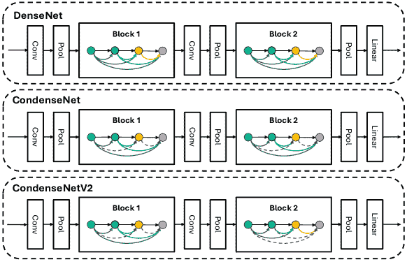

图 1\. DenseNet、CondenseNet 和 CondenseNetV2 的比较。活跃的权重连接用实色箭头表示，被修剪的权重连接用灰色虚线箭头表示。

#### 2.2.4\. MobileNet 系列

这一系列 (Howard 等人，2017；Sandler 等人，2018；Howard 等人，2019；Zhou 等人，2020) 包括了可以在 IoT 设备上部署的显著 CNN 模型。基于 VGG (Simonyan 和 Zisserman，2015) 架构，MobileNet (Howard 等人，2017) 采用深度可分离卷积来创建高效的模型，这表明其在广泛任务和应用中的表现显著更快。发现 ReLU 激活可能导致低维特征的严重信息丢失，MobileNetV2 (Sandler 等人，2018) 用线性组合替代了残差瓶颈中的 ReLU 激活，以减少信息丢失。此外，MobileNetV2 引入了倒置残差块，其中通道数首先增加，然后在残差瓶颈中恢复，提高了准确性。还添加了快捷连接 (He 等人，2016) 以增强梯度传播。

NetAdapt (Yang et al., 2018) 通过逐层优化来简化网络，并在有限的硬件资源下实现高精度。基于此，MobileNetV3 (Howard et al., 2019) 利用平台感知 NAS (Tan et al., 2019a) 来优化块级结构，并在瓶颈结构中实现 SENet (Hu et al., 2018)（通道注意模块），从而实现更好的准确性。为了减少 MAC 并建立量化友好的网络，将 ReLU 替换为 H-swish 激活。作为倒残差块的替代方案，MobileNeXt (Zhou et al., 2020) 通过翻转倒残差块开发了沙漏块，以增强更宽架构的传输，因为更宽的层可能导致更多的梯度混淆，使得模型训练更加困难。

#### 2.2.5\. 基于位移的系列

CNN 由于大量的乘法和加法运算而计算成本高。ShiftNet (Wu et al., 2018) 首先将空间卷积替换为组位移卷积。与标准卷积不同，位移卷积仅对特征图执行位移操作，并对那些偏移区域应用填充。与乘法运算相比，位移卷积可以实现零参数和 FLOPs，从而大幅减少它们的数量。

一些研究试图基于位移卷积层提高性能。例如，Jeon et al. (Jeon and Kim, 2018) 提出了一个主动位移层，使得位移可学习，而不是启发式分配。Chen et al. (Chen et al., 2019a) 指出，由于位移数量是固定的，实现它们需要大量的试错，这限制了网络的功能。因此，他们提出了一个稀疏位移层，以消除无意义的内存移动。非位移通道保持不变。图 2 比较了这三种位移操作。

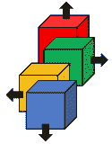

(a) 组位移

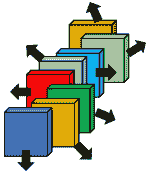

(b) 主动位移

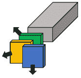

(c) 稀疏位移

图 2\. 基于位移的卷积变体 (Chen et al., 2019a)。

AddressNet (He et al., 2019b) 观察到较少的参数或计算量（FLOPs）并不总是直接导致推理时间的减少，即使是移位卷积的零参数和零 FLOPs (Wu et al., 2018)。为了优化基于 GPU 的机器的速度，AddressNet 将通道洗牌 (Zhang et al., 2018c) 改为通道移位，因为通道洗牌会产生额外的内存空间和耗时的排列，进一步消除冗余方向。类似于 AdderNet (Chen et al., 2020b)，DeepShift (Elhoushi et al., 2021) 仅使用加法运算，使用位移和符号翻转代替所有乘法，显著减少了操作时间和能量消耗。

#### 2.2.6\. 基于加法的系列

乘法和加法运算构成了许多卷积操作，从而导致额外的计算。AdderNet (Chen et al., 2020b) 尝试专门使用加法，通过使用 L1 范数距离作为滤波器与特征图之间的响应标准。这种操作被称为绝对差异累积 (Um et al., 2021)，它加速了网络，并允许重用计算结果以减少能量消耗。

You et al. (You et al., 2020) 引入了 ShiftAddnet，更关注硬件效率。ShiftAddnet 提出了一个新的性能比较指标，即表达能力，指的是模型在类似硬件条件下实现的准确性。实验结果表明，基于移位的网络 (Wu et al., 2018; Jeon and Kim, 2018; Chen et al., 2019a; He et al., 2019b; Elhoushi et al., 2021) 提供了更高的硬件效率，但其表达能力低于基于乘法的网络。相反，完全加法网络 (Chen et al., 2020b) 效率较低，因为使用重复的加法代替乘法，尽管它可以实现更好的准确性。因此，ShiftAddnet 结合了位移 (Elhoushi et al., 2021) 的优势和加法网络 (Chen et al., 2020b) 的效率，在两个 IoT 数据集：FlatCam (Tan et al., 2019b) 和 Head Pose (Viet et al., 2021) 上取得了最先进的结果。

#### 2.2.7\. EfficientNet 系列

几乎所有网络都尝试通过调整深度、宽度和分辨率来提高性能。要实现最佳性能和轻量级组合，选择正确的组合至关重要。EfficientNet (Tan 和 Le, 2019a) 提出了一个简单的网格搜索算法，复合缩放，以寻找缩放因子（深度、宽度和分辨率），以较低的计算成本实现准确性。EffectiveNetV2 (Tan 和 Le, 2021) 提出了一个训练感知的 NAS 以找到准确性 $A$、训练速度 $S$ 和参数 $P$ 的良好权衡。它使用一个简单的加权乘积作为搜索奖励，$A\cdot S^{w}\cdot P^{v}$，其中 $w=-0.07$ 和 $v=-0.05$ 是经验确定的，用于平衡权衡。为了解决深度卷积的低效问题，EfficientNetV2 在其架构设计中用 Fused-MBConv (Gupta 和 Akin, 2020) 替代了阶段 1-3 的 MBConv (Sandler 等人, 2018)，在准确性、参数和 FLOPs 方面提供了更好的性能和权衡。此外，为了获得更强健的网络，EfficientNetV2 在训练过程中选择了自适应正则化，因为对不同分辨率的图像使用相同的正则化项是低效的。

#### 2.2.8\. 讨论与总结

表 1 比较了轻量级 CNN 架构在 ImageNet 数据集上的性能。水平线将不同系列的模型分开。从表中我们可以观察到，没有一种适用于所有情况的架构。通常，这是在准确性和效率之间的权衡。例如，AddressNet-20 在牺牲准确性的情况下最大化效率。相反，EfficientNet 系列中最准确的变体通常是效率最低的。根据这一分析，我们提供了选择合适模型和硬件的建议。

如何选择合适的轻量级模型和兼容的硬件？第一个关键步骤是检查轻量级模型的规格和硬件兼容性。例如，深度可分离卷积对 MAC 和 RAM 有较高要求。因此，必须在考虑 RAM 和存储容量的硬件上使用网络。为此，Fan 等人 (Fan et al., 2021) 重新设计了深度可分离卷积和通道洗牌模块，以便在 FPGA 上对硬件友好。此外，为了最小化推理时间并支持在小型目标设备上部署，可以通过将乘法操作替换为移位或加法操作来有效减少总参数和 MACs/FLOPs。因此，ShiftNet 或 AdderNet 系列可能是不错的选择，因为它们需要更小的参数和 MACs。在这两个系列中，AddressNet-20 的性能最佳。对于具有较多存储的目标设备，如手机或 GPU，建议使用更高准确性的模型以获得更好的用户体验。因此，可以考虑 EfficientNetV2-L，因为它实现了最高的 Top-1 准确性。然而，值得注意的是，EfficientNet 系列的参数和 MACs 的消耗不成比例地高，这限制了其在低端设备上的应用。另一种实现更好权衡模型的方法是应用基本的压缩方法，如剪枝、量化和 NAS (Chen et al., 2019b; Tan et al., 2019a) (参见第三部分) 来调整架构。这可以是减少 MACs/FLOPs、参数和推理时间的有效技术。

一些轻量级方法，如 SqueezeNet 和 ShuffleNet，由于缺乏定制化设计，可能无法充分发挥 GPU 加速性能 (Um et al., 2021)。此外，如果对网络应用剪枝，如 CondenseNet 系列，网络结构可能会不规则，从而导致目标设备无法支持它。在这种情况下，平行计算需要专门设计的计算硬件。幸运的是，可以设计定制硬件以适应轻量级模型。例如，Um 等人 (Um et al., 2021) 指出 CIM 与 AdderNet 不兼容，因为它无法预测绝对差异的细节，也不能重用计算结果。因此，他们设计了一种新型 ADA-CIM 处理器，提供低成本的符号预测和更高的能效。

表 1\. 轻量级 CNN 架构在 ImageNet 数据集上的比较。请注意，我们使用**粗体**来强调具有最佳准确性、最少参数和最低 MACs 的模型，并将相应的值也用*下划线*标出以增强可读性。

| 模型 | Top-1 | Top-5 | 参数 (M) | MACs (G) |
| --- | --- | --- | --- | --- |
| AlexNet (Krizhevsky et al., 2012) | 57.1 | 80.3 | 60.9 | 0.725 |
| ResNet-50 (He et al., 2016) | 76.0 | 93.0 | 26.0 | 4.100 |
| SqueezeNet (Iandola et al., 2017) | 57.5 | 80.3 | 1.2 | 0.837 |
| SqueezeNext (Gholami et al., 2018) | 59.1 | 82.6 | 0.7 | 0.282 |
| ShuffleNetV1-1.5 (Zhang et al., 2018c) | 71.5 | - | 3.4 | 0.292 |
| ShuffleNetV2-1.5 (Ma et al., 2018) | 72.6 | 90.6 | 3.5 | 0.299 |
| 1.0-MobileNetV1 (Howard et al., 2017) | 70.6 | - | 4.2 | 0.569 |
| MobileNetV2-1.4 (Sandler et al., 2018) | 74.7 | - | 6.9 | 0.585 |
| MobileV3-S (Howard et al., 2019) | 67.4 | - | 2.5 | 0.056 |
| MobileV3-L (Howard et al., 2019) | 75.2 | - | 5.4 | 0.219 |
| MobileNeXt-1.0 (Zhou et al., 2020) | 74.0 | - | 3.4 | 0.300 |
| ShiftResNet-20 (Wu et al., 2018) | 68.6 | - | 0.2 | 0.046 |
| ShiftResNet-56 (Wu et al., 2018) | 72.1 | - | 0.6 | 0.102 |
| ShiftNet-A (Wu et al., 2018) | 70.1 | 89.7 | 4.1 | 1.400 |
| ShiftNet-B (Wu et al., 2018) | 61.2 | 83.6 | 1.1 | 0.371 |
| FE-Net-1.0 (Chen et al., 2019a) | 72.9 | - | 3.7 | 0.301 |
| FE-Net-1.37 (Chen et al., 2019a) | 75.0 | - | 5.9 | 0.563 |
| AddressNet-20 (He et al., 2019b) | 68.7 | - | 0.1 | 0.022 |
| AddressNet-44 (He et al., 2019b) | 73.3 | - | 0.2 | 0.053 |
| AdderNet-Resnet18 (Chen et al., 2020b) | 67.0 | 87.6 | 3.6 | - |
| AdderNet-Resnet50 (Chen et al., 2020b) | 74.9 | 91.7 | 7.7 | - |
| DenseNet-169 (Huang et al., 2017) | 76.2 | 93.2 | 14.0 | 3.500 |
| DenseNet-264 (Huang et al., 2017) | 77.9 | 93.9 | 34.0 | 6.000 |
| CondenseNet (Huang et al., 2018) | 71.0 | 90.0 | 2.9 | 0.274 |
| CondenseV2-A (Yang et al., 2021a) | 64.4 | 84.5 | 2.0 | 0.046 |
| CondenseV2-B (Yang et al., 2021a) | 71.9 | 90.3 | 3.6 | 0.146 |
| EfficientNet-B1 (Tan and Le, 2019a) | 79.2 | 94.5 | 7.8 | 0.700 |
| EfficientNet-B7 (Tan and Le, 2019a) | 84.4 | 97.1 | 66.0 | 37.000 |
| EfficientNet-X-B7 (Li et al., 2021) | 84.7 | - | 73.0 | 91.000 |
| EfficientNetV2-S (Tan and Le, 2021) | 83.9 | - | 24.0 | 8.800 |
| EfficientNetV2-M (Tan and Le, 2021) | 85.1 | - | 55.0 | 24.000 |
| EfficientNetV2-L (Tan and Le, 2021) | 85.7 | - | 121.0 | 53.000 |

### 2.3\. Transformer-based Series

变换器模型在自然语言处理（Vaswani 等，2017）中被广泛应用，并且最近在计算机视觉任务中获得了令人满意的结果（Liu 等，2021a，2022；Zhang 等，2023a）。图 3 显示了典型视觉变换器的架构。变换器因需要大量的参数和高 MAC 以维持其性能而显著地存在一个缺陷，这导致训练和推理阶段需要大量时间，特别是当输入序列较长时。此外，变换器内部的计算和网络结构比 CNN 更加复杂。大量的 FLOPs 和参数使得实际推理和硬件部署变得更加困难。为了弥合变换器与实际应用之间的差距，接下来的子节将讨论高效的变换器。

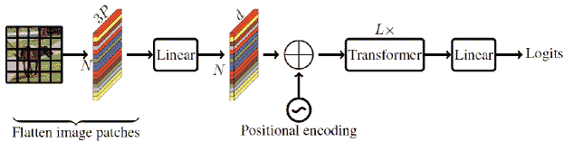

图 3\. 标准视觉变换器，其中 $P=h\times w$，$h$ 和 $w$ 分别表示图像的高度和宽度。$N$ 是图像块的数量，$L$ 是变换器块的数量，$d$ 是维度（Mehta 和 Rastegari，2022）。

#### 2.3.1\. 轻量级注意力模块

为了应对自注意力层中的大量 MAC 和巨大的计算需求，Long-Short Range Attention (LSRA) (Wu et al., 2020) 被提出，用于分别提取全局和局部特征，从而减轻前馈网络 (FFN) 中的注意力计算。Child et al. (Child et al., 2019) 有效地利用步幅和固定操作来形成稀疏连接矩阵。Linformer (Wang et al., 2020a) 通过线性投影将自注意力分解为几个低秩矩阵，将自注意力的复杂度从 $N^{2}$ 降低到 $N$，其中 $N$ 表示序列长度。Choromanski et al. (Choromanski et al., 2021) 提出了基于 FAVOR+ (fast attention with positive orthogonal random features) 方法的线性自注意力机制，以构建近似的 softmax 操作。FAVOR+ 能够以低估计方差对自注意力进行无偏估计，从而减少空间和时间复杂度。Reformer (Kitaev et al., 2020) 利用局部敏感哈希替代注意力中的点积操作，将计算需求直接从 $N^{2}$ 降低到 $Nlog(N)$，允许考虑更长的序列输入。此外，Reformer 采用了一种反向残差层 (Gomez et al., 2017)，通过 $L$ 倍 (层数) 节省 GPU 内存。与传统的残差不同，反向残差层不需要在每一层存储激活数据。这些高效变压器的复杂性如表 2 所示。

此外，变换器堆叠了许多前馈网络（FFNs）以获得更好的特征集成。具体来说，FFN 是一系列线性变换，由于其密集的连接需要大量的计算。为了解决这个问题，Mehta 等人（Mehta et al., 2018）引入了分组线性变换（GLTs），它结合了分组卷积的概念，使得变换器块更加轻量化。面对来自分组卷积的相同缺点（如第 2.1.3 节所述），层次分组变换（HGT）（Mehta et al., 2020）旨在使用拆分层和跳跃连接操作来增强组之间的信息流。DeLighT（Mehta et al., 2021）利用 GLTs 来拓宽和加深特征维度，从而使得可以使用单头注意力而不是多头注意力。这项技术将注意力操作中的计算成本从 $d_{m}N^{2}$ 降低到 $d_{o}N^{2}$，其中 $d_{m}$ 和 $d_{o}$ 分别是输入维度和输出维度。

表 2\. Efficient Transformers 的复杂度（Wang et al., 2020a）。

| 模型 | 每层复杂度 | 顺序操作 |
| --- | --- | --- |
| Transformer（Vaswani et al., 2017） | $O(N\textsuperscript{2})$ | $O(N)$ |
| Sparse Transformer（Child et al., 2019） | $O(N\sqrt{N})$ | $O(1)$ |
| Linformer（Wang et al., 2020a） | $O(N)$ | $O(1)$ |
| Reformer（Kitaev et al., 2020） | $O(Nlog(N))$ | $O(log(N))$ |

#### 2.3.2\. 令牌稀疏

Vision transformer（ViT）（Dosovitskiy et al., 2021）是最早将变换器应用于解决图像分类任务的工作。它首先将图像分割成若干补丁并将其展平，然后作为嵌入序列输入变换器架构。由于 ImageNet 中图像的分辨率为 224x224，它们的令牌相比于其他分辨率较小的数据集（如 CIFAR-10 和 CIFAR-100（32x32））需要显著更多的计算。

为了解决这个问题，T2T-ViT（Yuan et al., 2021）观察到，变换器中的图像分割导致令牌之间局部关系的丧失，因为令牌之间没有重叠。因此，他们采用软展开技术将周围的空间令牌组合成高维流形，从而实现较小的 MLP 大小并提高内存效率。

对 transformers 的广泛研究（Naseer et al., 2021）表明，transformers 对补丁丢失具有鲁棒性，当补丁遭受失真或遮挡时，准确性仅有轻微下降。DynamicViT（Rao et al., 2021）在 transformer 块之间集成了一个预测模块，以屏蔽不太重要的标记。预测模块是一个范围在（0,1）之间的二元决策掩码，用于衡量标记的重要性。EViT（Liang et al., 2021a）从类别标记和其他标记中计算注意力分数，并保留前 K 个标记，表示与预测的正相关性最高。A-ViT（Yin et al., 2022）根据输入图像的复杂性自适应地改变不同深度的标记数量，以减少 ViT 的推理时间。

#### 2.3.3 轻量级混合模型

由于注意力机制固有的长程依赖特性，transformer 网络在准确性上优于 CNN。然而，transformer 网络缺乏强大的归纳偏置（Dai et al., 2021a; Graham et al., 2021; Liu et al., 2021a），这使得训练变得困难，需要额外的数据增强和严格的正则化来保持性能（Touvron et al., 2021）。另一方面，CNN 基于滑动窗口提取特征，产生更强的归纳偏置，使得模型更易训练且具有更好的泛化能力。有趣的是，CNN 和 transformer 网络的结合（Wu et al., 2021; Srinivas et al., 2021; d’Ascoli et al., 2021; Xiao et al., 2021）产生了多功能且强大的模型。由于混合模型具有许多参数，DeiT（Touvron et al., 2021）应用了 KD，并在参数相当的情况下实现了比 CNN 更高的准确性和更低的延迟。为了提高数据效率和简化模型复杂度，学生模型 ViT 模型添加了一个蒸馏标记，以洞察基于 CNN 的教师模型的归纳偏置。MobileViT（Mehta and Rastegari, 2022）指出，由于仍然笨重，transformer-based 网络在类似参数下表现不如 CNN 网络。MobileViT 采用 MobileNetV2（Sandler et al., 2018）作为 CNN 骨干网，以获得归纳偏置，并将 MobileNetV2 中的 MBconv 块替换为具有展开和折叠操作的 MobileViT 块，这可以像 transformer 一样计算长程依赖性。类似地，MobileFormer（Chen et al., 2022a）设计了一个由 CNN 和 transformer 组成的并行结构来实现特征融合。归纳偏置和捕捉全局特征的能力通过双向交叉注意力来实现。

#### 2.3.4 讨论与总结

近期的 transformer 模型关注于更轻量且更强大的架构。从表 3 可以明显看出，许多近期的 transformer，如 T2T-ViT（Yuan 等，2021）和 DymViT-LVit（Rao 等，2021），在准确率上表现更高，参数更少，FLOPS 更低，相较于原始的 ViT 和基于 ResNet 的 CNN。具体而言，我们将讨论分为 3 个小节，并用**粗体**标题。

VIT & KD transformer。受到（Hinton 等，2015）的启发，几篇论文（Touvron 等，2021；Lin 等，2022a；Chen 等，2021a）将 KD 应用于将基于 CNN 的教师模型的归纳偏差蒸馏到基于 transformer 的学生模型中。例如，DeiT-B（Touvron 等，2021）架构的设计整合了一个基于 CNN 的教师模型，一个 RegNetY-16G（Radosavovic 等，2020）和一个基于 transformer 的学生模型，ViT-B（Dosovitskiy 等，2021）。结果显示，DeiT-B 在 Top-1 准确率方面优于所有模型，达到了 84.5% 的准确率。尽管它们具有更强的能力，但基于 transformer 的学生模型需要较大的网络来保持其性能，因为它们比 CNN 模型更难以收敛（Dai 等，2021a）。

VIT 与 CNN 混合 Transformer。为了克服基于 KD 的 Transformer 模型的不足，混合模型（Dai 等， 2021a；Mehta 和 Rastegari， 2022；Chen 等， 2022a）在网络中同时使用卷积层和 Transformer 层。通过这样做，它们能够获得更强的归纳偏置，从而在训练过程中实现更好的收敛。因此，混合模型通常具有较少的 FLOPs 和参数。例如，Mobile-Former-96M（Chen 等， 2022a）实现了 0.096G 的最低 FLOPs，而 MobileViT-XS（Mehta 和 Rastegari， 2022）则拥有最低的参数，即 2.3 M。这些混合模型极为轻量，但有时，效率的提升是以准确性为代价的，从表 2 的性能可以看出。例如，MobileVit-XS 的总参数大约是其对等模型 MobileViT-S 的一半，但其准确率下降了 3.6%。另一个值得注意的观察是，尽管 Mobile-Former-96M 实现了最低的 FLOPS，但其参数大小翻了一倍，准确率比 MobileVit-XS 低 2.0%。这表明 FLOPs 和总参数之间并不总是存在相关性，降低 FLOPs 对准确率的影响似乎大于降低参数。

VIT 与 Token 稀疏 Transformer。另一系列高效的 Transformer（Yuan 等， 2021；Rao 等， 2021；Naseer 等， 2021；Liang 等， 2021a；Yin 等， 2022）旨在通过 Token 稀疏有效地修剪 Transformer 结构。从结果来看，基于 Token 稀疏的模型在参数和 FLOPs 更少的情况下实现了具有竞争力的准确性。值得注意的是，EViT-DeiT-S (k=0.7)（Liang 等， 2021a）可以达到最高的吞吐量，每秒 5408 张图像。因此，对于更快的 Transformer 模型，例如实现实时系统，将 Token 聚合成更小的数量可能提供了一个有前景的解决方案。

由于其竞争力的准确性和轻量设计（Kang 等， 2023；Luo 等， 2022），轻量级 Transformer 模型在边缘 AI 和移动 AI 等广泛应用中越来越受欢迎；有关高效 Transformer 的更多细节可以参考（Han 等， 2023；Tay 等， 2021）。

表 3\. 对比轻量级 Transformer 模型在 ImageNet 数据集上的表现。我们使用**粗体**来强调参数最少、吞吐量最高、FLOPs 最低和准确率最好的模型，相应的数值也进行了*下划线*标注，以提高可读性。

| 类别 | 模型 |
| --- | --- |

&#124; 图像 &#124;

&#124; （大小） &#124;

| 参数（M） |
| --- |

&#124; Throughput &#124;

&#124; (image/s) &#124;

| FLOPs(G) |
| --- |

&#124; ImageNet &#124;

&#124; Top-1 &#124;

|

| CNN | ResNet50 (He et al., 2016) | 224$\times$224 | 25.5 | - | 4.13 | 76.2 |
| --- | --- | --- | --- | --- | --- | --- |
| ResNet101 (He et al., 2016) | 224$\times$224 | 44.6 | - | 7.9 | 77.4 |
| ResNet152 (He et al., 2016) | 224$\times$224 | 60.2 | - | 11.0 | 78.3 |
| RegNetY-16GF (Radosavovic et al., 2020) | 224$\times$224 | 84.0 | 334.7 | - | 82.9 |
| ViT | ViT-B/16 (Dosovitskiy et al., 2021) | 384$\times$384 | 86.6 | 85.9 | 17.6 | 77.9 |
| ViT-L/16 (Dosovitskiy et al., 2021) | 384$\times$384 | 307.0 | 27.3 | 63.6 | 76.5 |
| ViT & KD | DeiT-Ti (Touvron et al., 2021) | 224$\times$224 | 5.0 | 2536.5 | - | 72.2 |
| DeiT-Ti (Touvron et al., 2021) | 224$\times$224 | 6.0 | 2529.5 | - | 74.5 |
| DeiT-S (Touvron et al., 2021) | 224$\times$224 | 22.0 | 936.2 | 4.6 | 81.2 |
| DeiT-B (Touvron et al., 2021) | 224$\times$224 | 87.0 | 290.9 | 17.6 | 83.4 |
| DeiT-B (Touvron et al., 2021) | 384$\times$384 | 87.0 | 85.8 | 17.6 | 84.5 |
| ViT & Token Sparsing | T2T-ViT-14 (Yuan et al., 2021) | 224$\times$224 | 21.5 | - | 5.2 | 81.5 |
| T2T-ViT-14 (Yuan et al., 2021) | 384$\times$384 | 21.5 | - | 17.1 | 83.3 |
| T2T-ViT-19 (Yuan et al., 2021) | 224$\times$224 | 39.2 | - | 8.9 | 81.9 |
| DymViT-LViT-S/0.5 (Rao et al., 2021) | 224$\times$224 | 26.9 | - | 3.7 | 82.0 |
| DymViT-LViT-M/0.7 (Rao et al., 2021) | 224$\times$224 | 57.1 | - | 8.5 | 83.8 |
| EViT-DeiT-S (k=0.5) (Liang et al., 2021a) | 224$\times$224 | 22.0 | 4385 | 3.0 | 79.5 |
| EViT-DeiT-S (k=0.7) (Liang et al., 2021a) | 224$\times$224 | 22.0 | 5408 | 2.3 | 78.5 |
| EViT-LViT-S (k=0.5) (Liang et al., 2021a) | 224$\times$224 | 26.2 | 3603 | 3.9 | 82.5 |
| EViT-LViT-S (k=0.7) (Liang et al., 2021a) | 224$\times$224 | 26.2 | 2954 | 4.7 | 83.0 |
| A-ViT-T (Yin et al., 2022) | 224$\times$224 | 5.0 | 3400 | 0.8 | 71.0 |
| A-ViT-S (Yin et al., 2022) | 224$\times$224 | 22.0 | 1100 | 3.6 | 78.6 |
| ViT & CNN (混合模型) | Mobile-Former-96M (Chen et al., 2022a) | 224$\times$224 | 4.6 | - | 0.096 | 72.8 |
| Mobile-Former-29 (Chen et al., 2022a) | 224$\times$224 | 11.4 | - | 0.294 | 77.9 |
| Mobile-Former-508M (Chen et al., 2022a) | 224$\times$224 | 14.0 | - | 0.508 | 79.3 |
| MobileViT-XS (Mehta and Rastegari, 2022) | 224$\times$224 | 2.3 | - | 0.7 | 74.8 |
| MobileViT-S (Mehta and Rastegari, 2022) | 224$\times$224 | 5.6 | - | - | 78.4 |

## 3\. 模型压缩的基本方法

在这一部分，我们探讨了近年来流行的压缩方法及其随时间的改进。这些技术包括剪枝（LeCun 等，1989；Hassibi 等，1993；Frankle 和 Carbin，2019；He 等，2019a；Hu 等，2023）、量化（Dong 等，2019；Faghri 等，2020；Hubara 等，2016）、知识蒸馏（Hinton 等，2015；Gou 等，2021；Zhang 等，2018b）和神经架构搜索（Liu 等，2019b；Wu 等，2019），这些方法被广泛采用以设计高效的模型。我们进一步详细探讨了每种方法，提供了源自其独特特征的深入见解。

### 3.1\. 剪枝

深度学习模型通常包含大量可学习参数，需要广泛的训练。剪枝方法旨在通过移除冗余权重来压缩和加速神经网络。这些剪枝方法可以分为无结构剪枝和结构剪枝。

#### 3.1.1\. 无结构剪枝

无结构剪枝旨在识别和消除网络中的单个权重，无论其位置如何。这种方法对权重修剪不施加任何限制或规则。具体而言，被移除权重的节点不会从网络中物理移除；相反，权重被设置为零。由于这一操作会导致大量的零乘法，模型可以显著压缩，从而加快推理速度。如图 4（左）所示，无结构剪枝可能导致剪枝后的网络具有不规则的结构。早期的剪枝工作，如 Optimal Brain Damage（LeCun 等，1989）和 Optimal Brain Surgeon（Hassibi 等，1993），利用二阶导数和 Hessian 矩阵来评估网络中权重的重要性，并随后进行剪枝。尽管这些方法表现出色，但它们需要大量的计算能力。

为此，Dong 等（Dong 等，2017）引入了一种限制二阶导数计算的方法。这种方法不需要对所有参数计算 Hessian 矩阵；而是专注于模型的特定层。同样，Frankle 等（Frankle 和 Carbin，2019）提出了彩票票据假设，他们试图找到更易管理和剪枝的子网络，同时保持与原始网络相当的性能。在他们的方法中，他们剪枝节点，随后恢复未触及节点的原始预训练初始化值，并重复这一过程，直到达到一定的稀疏水平。

然而，当在网络尚未收敛的训练过程中剪枝权重时，非结构化剪枝可能会显著降低准确性。不幸的是，被剪枝的连接无法恢复。为了解决这一限制，Guo 等（Guo 等，2016）引入了一种拼接算法，能够恢复在任何时候被发现重要的先前删除的连接。此外，Namhoon 等（Lee 等，2019）提出了一种单次网络剪枝方法，其中他们在训练开始之前对网络进行剪枝。他们并不是在训练后分析模型的最终权重，而是检查损失函数对初始化期间方差缩放的响应。这种创新的方法允许在训练之前对网络进行一次剪枝，提供了一种更便捷有效的剪枝方法。

#### 3.1.2\. 结构化剪枝

结构化剪枝方法从预训练网络中去除剪枝的组件，并保留其常规结构，如图 4（右图）所示。常见的结构化剪枝方法包括滤波器剪枝（He 等， 2019a，2018，2020；Zhang 和 Freris，2023）和通道剪枝（He 等， 2017；Peng 等，2019；Hu 等，2023）。

1) 过滤器剪枝。大多数剪枝方法依赖于“较小的范数更不重要”标准，这涉及到剪枝网络中范数值较低的过滤器（Li et al., 2017; Ye et al., 2018）。然而，He et al.（He et al., 2019a）指出了这种基于标准的方法的局限性。他们提出了一种新颖的技术，通过计算同一层内过滤器的几何中位数来进行剪枝。这样，他们剪枝那些贡献最可替代的过滤器，而不是那些相对贡献较少的过滤器。基于标准的剪枝方法往往由于固定的剪枝阈值而降低模型容量。为了解决这个问题，He et al.（He et al., 2020）引入了可学习的剪枝阈值，通过可微分的标准采样器对每一层进行阈值调整，这些阈值可以在训练过程中更新。此外，Zhang et al.（Zhang and Freris, 2023）提出了一种基于损失对阈值值敏感性的自适应剪枝阈值。

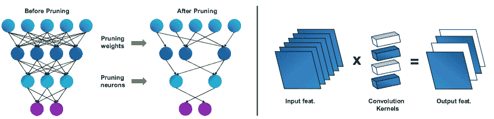

图 4. 剪枝方法的示意图：非结构化剪枝（左），结构化剪枝（右）。剪枝的组件以白色显示。注意剪枝组件输出维度的变化。

2) 通道剪枝。通道剪枝是另一种有效的减少 FLOPs 和推理时间的方法，补充了过滤器剪枝。He et al.（He et al., 2017）首先通过评估 L1 范数来实施通道剪枝，重点在于去除冗余通道。Peng et al.（Peng et al., 2019）采取了不同的方法，通过使用 Hessian 矩阵来建模通道间依赖关系，并使用序列二次规划选择通道。对于更复杂的模块，如组卷积和深度卷积，Liu et al.（Liu et al., 2021c）引入了层分组机制，以自动搜索耦合通道。这些通道的重要性基于 Fisher 信息进行计算。CATRO（Hu et al., 2023）利用特征空间的区分来评估多个通道的联合影响，同时巩固保留通道的逐层影响。

#### 3.1.3. 剪枝方法的比较

表 4 显示了各种结构剪枝方法的剪枝后准确率和相应的剪枝 FLOPs。尽管人们可能最初认为表现最好的方法剪枝了最多的 FLOPs，但实际上，我们通常认为“最好”的是那些在剪枝 FLOPs 和准确率降低之间有效平衡权衡的方法。例如，尽管 GFP 获得了最高的剪枝准确率，但它的剪枝 FLOPs 减少仅限于 50.6%。相比之下，ASTER 删除了最多的 FLOPs，但其剪枝准确率并没有名列前茅。总结起来，滤波器和通道剪枝方法能够有效降低 FLOPs 而保持类似的准确率。我们主张选择与当前网络架构无缝集成且易于实现的剪枝方法。例如，如果网络特征图具有一千多个通道但只使用了少量滤波器，那么选择通道剪枝会更有益处。

表 4. 在 ImageNet 数据集上使用 ResNet50 对不同剪枝方法进行比较。以剪枝 FLOPs 最高的方法为标记。

| 类型 | 方法（30%） | 基线（%） | 剪枝准确率（%） | 剪枝 FLOPs（%） |
| --- | --- | --- | --- | --- |
| - | ResNet50 | 76.15 | - | - |
| 滤波器 | SFP (He et al., 2018) | 76.15 | 74.61 (-1.54) | 41.8 |
| FPGM (He et al., 2019a) | 76.15 | 75.59 (-0.56) | 42.2 |
| LFPC (He et al., 2020) | 76.15 | 74.46 (-1.69) | 60.8 |
| ASTER (Zhang and Freris, 2023) | 76.15 | 75.27 (-0.88) | 63.2 |
| 通道 | CCP (Peng et al., 2019) | 76.15 | 75.50 (-0.65) | 48.8 |
| GFP (Liu et al., 2021c) | 76.79 | 76.42 (-0.37) | 50.6 |
| SCP (Kang and Han, 2020) | 75.89 | 74.20 (-1.69) | 54.3 |
| CATRO (Hu et al., 2023) | 75.98 | 75.84 (-0.14) | 45.8 |

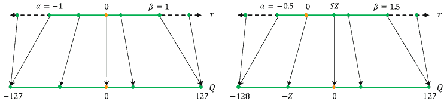

图 5. 对称（左）和非对称（右）量化表示（Gholami et al., 2022）。注意，r 表示实际值，S 表示实值的缩放因子，Z 表示整数零点。

### 3.2\. 量化

剪枝是一种高效的模型压缩方法。然而，在剪枝之后，剩余的权重通常以全精度的 32 位浮点数（float32）存储，仍然需要大量内存。为了解决这个问题，量化（Gray and Neuhoff, 1998）成为一种可取的解决方案，量化是一种允许以减少位精度表示参数的技术。具体来说，量化通过一个校准过程将权重和激活映射到有限的数集，通过对称或非对称表示来确定潜在值。如图 5 所示，两种方法定义了一个范围 [$\alpha$, $\beta$]，在对称量化中，- $\alpha$ = $\beta$，而在非对称量化中，- $\alpha \neq \beta$。

该范围的校准，如 Gholami 等人（Gholami et al., 2022）所述，分为动态校准和静态校准两类。动态校准准确但计算开销大，因为它为每个特征图计算 $[\alpha,\beta]$。静态校准则计算开销较小，因为它基于几次迭代后的典型值计算范围，尽管精度较低。动态和静态校准对于优化量化过程都是至关重要的。

量化理论从不同角度被应用于神经网络。例如，Gupta 等人（Gupta et al., 2015）在模型训练过程中引入了固定点数，以增强算法的噪声容忍度。他们还采用了随机舍入作为替代最近舍入策略的方法，以抵消固定点数的不利影响。在另一种方法中，Faghri 等人（Faghri et al., 2020）提出了两种自适应量化方法，分别是自适应水平量化（ALQ）和自适应乘法器量化（AMQ），这两种方法在训练过程中并行更新其压缩方法，以自适应地量化数据并行随机梯度下降中的梯度。这种适应旨在减少处理器之间的通信成本。最后，Wang 等人（Wang et al., 2022a）将量化问题视为一个可微分的查找操作。他们在训练过程中联合优化了网络和相关表格。

#### 3.2.1\. 半精度和混合精度训练

混合精度训练涉及使用较低精度的值，同时保留关键数据的全精度值（Micikevicius et al., 2018）。例如，在一系列重要的工作中，HAWQ（Dong et al., 2019）实现了一种基于模型 Hessian 的自动方法，以确定权重值的最佳混合精度设置。随后，HAWQ-V2 模型（Dong et al., 2020）引入了对激活值的混合精度量化。HAWQ-V3 模型（Yao et al., 2021）通过关注仅整数量化进一步改进了这一点。有趣的是，Liu 等人（Liu et al., 2021b）介绍了一种利用多个低位向量的线性组合来近似全精度向量的方法。这种方法通过变化向量的数量来近似不同的权重，实现了具有单一精度级别的“混合精度训练”。

#### 3.2.2\. 使用更少位的量化

在 Banner 等人的早期工作（Banner et al., 2018）中，NN 所有层中权重、激活和大多数梯度流的量化使用 8 位精度，通过将传统的批量归一化替换为范围批量归一化层来实现。Wang 等人（Wang et al., 2018）提出的另一种技术允许矩阵和卷积操作也使用 8 位数字。此外，还有一些方法使用三元值对 NN 进行量化。在 Liu 等人的重要工作中，TWN（Liu et al., 2023）成功地将权重约束为+1、0 和-1 值，实现了模型的 16 倍压缩。这一思想在 TTQ（Zhu et al., 2017）中得到扩展，其中正负权重使用两个不同的可学习尺度$w_{1}$和$w_{2}$，从而产生可能的值$-w_{1}$、$0$和$w_{2}$。

更具攻击性的方法试图通过实施 NN 二值化进一步降低量化级别。该方法使用二进制值代替浮点或整数值，以实现更快的计算、更低的内存使用和减少的功耗。Courbariaux 等人的开创性工作（Hubara et al., 2016）通过将权重和激活限制为+1 或-1 来对网络进行二值化，通过评估实际值的符号来确定最终值。这项工作的变体包括如 XNOR-Net（Rastegari et al., 2016）和最小二乘法（Pouransari et al., 2020）等拓扑，这些方法在二值卷积后引入了额外的激活层。

#### 3.2.3\. 量化感知训练（QAT）

在量化研究的早期阶段，一种普遍的方法是首先训练一个未经量化的模型，然后应用量化过程，接着重新训练或微调模型以实现可接受的准确度。这种方法被称为后训练量化（PTQ），证明它是一种有效的策略，可以实现显著的压缩，特别是当预训练模型具有足够的表示能力时。PTQ 的成功在于其能够平衡压缩收益和保持令人满意的模型准确度，使其成为模型优化和部署中的关键技术。然而，量化是一个有损过程，可能导致模型准确度显著下降。为了解决这一问题，Jacob 等人（Jacob et al., 2018）提出了 QAT，一种在模型训练阶段计算推理时间量化误差的技术，使模型能够意识到这些误差并进行相应调整。这一过程通过称为 FakeQuant 的过程来模拟推理时间误差。

对核心 QAT 技术的改进已经通过引入可学习的裁剪标量（Choi et al., 2018）进行探索。在最近的发展中，Sakr 等人（Sakr et al., 2022）通过识别最小化 MSE 的裁剪标量并实现 4 位量化，达到了最先进的性能。

#### 3.2.4\. 量化方法比较

表 5 比较了在 ImageNet 数据集上量化方法的性能，强调了压缩与准确度损失之间的权衡。值得注意的是，旨在实现 32 倍压缩和加速的二值化网络显示出显著的准确度下降。另一方面，4 位量化的方法（除了(Liu et al., 2021b)）导致的准确度损失较小，因此可以成为量化的良好精度选择。然而，由于量化和反量化等附加操作，理论上的压缩和加速期望可能与实际结果不符。这可能解释了为什么一些研究选择不深入分析量化模型的大小，尽管(Liu et al., 2021b)提供了这样的分析，并成功实现了模型大小大约减少 8 倍（42.56 MB 到 5.37 MB）。

表 5\. 比较了使用不同精度水平量化 ResNet18 在 ImageNet 数据集上的几种量化方法。

| 方法 | 初始准确度 (%) | 量化准确度 (%) | 精度 |
| --- | --- | --- | --- |
| QIL (Jung et al., 2019) | 70.2 | 70.1 (-0.1) | 4-bit |
| (Liu et al., 2021b) | 69.8 | 61.7 (-8.1) | 4-bit |
| LLT (Wang et al., 2022a) | 69.8 | 70.4 (+0.6) | 4-bit |
| LLT (Wang 等，2022a) | 69.8 | 69.5 (-0.3) | 3-bit |
| HAWQ-V3 (Yao 等，2021) | 71.5 | 68.5 (-3.0) | MP |
| TWN (Liu 等，2023) | 65.4 | 61.8 (-3.6) | 2-bit |
| TTQ (Zhu 等，2017) | 69.6 | 66.6 (-3.0) | 2-bit |
| XNOR-Net (Rastegari 等，2016) | 69.3 | 51.2 (-18.1) | 1-bit |
| 最小二乘法（Pouransari 等，2020） | 69.6 | 63.4 (-6.2) | 1-bit |

### 3.3\. 知识蒸馏（KD）

KD 是一种模型压缩技术，旨在将知识从大型网络转移到较小的网络（Hinton 等，2015；Gou 等，2021）。其最简单的形式如图 6 ‣ 3\. Fundamental methods in model compression ‣ Lightweight Deep Learning for Resource-Constrained Environments: A Survey")(a)所示，其中较大的模型称为教师，较小的模型称为学生。在 Hinton 等提出的方法（Hinton 等，2015）中，教师模型首先被训练以生成软标签。然后，学生模型的训练利用真实标签和教师在相同数据上的预测。这种组合使学生能够使用更少的参数达到与教师相当的性能。

KD 算法可以分为三种类型：离线、在线和自蒸馏，如图 6 ‣ 3\. Fundamental methods in model compression ‣ Lightweight Deep Learning for Resource-Constrained Environments: A Survey")所示。主要区别在于教师的定义和训练策略。例如，在离线蒸馏中，教师和学生的训练过程是顺序进行的，而在在线蒸馏中，教师可以在学生训练的同时继续或启动训练。另一方面，在自蒸馏中，学生成为自己的教师。

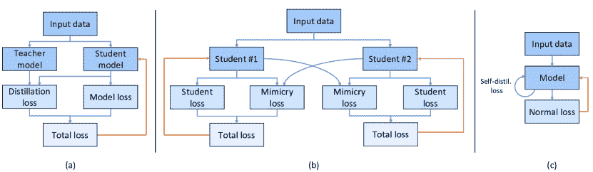

图 6\. (a) 离线蒸馏（Hinton 等，2015）。(b) 在线蒸馏（Zhang 等，2018b）。(c) 自蒸馏（Zhang 等，2019b）。我们用橙色线条表示梯度更新。

#### 3.3.1\. 离线蒸馏

早期的大多数 KD 研究属于离线蒸馏的范畴。在离线蒸馏中，需要一个预训练的教师模型，如 vanilla KD（Hinton 等，2015）的情况。虽然离线蒸馏相对容易实现，但它不可避免地需要花费时间和计算资源来首先训练一个大型教师模型。

为了增强 KD 算法，已经探索了各种方法，包括引入对比损失（Tian et al., 2020）以及最小化模型之间的最大均值差异（Huang and Wang, 2019）。教师模型和学生模型之间的显著尺寸差异可能会影响结果，因此 Zhao et al.（Zhao et al., 2022）通过解耦目标类和非目标类的影响重新定义了 logit 蒸馏。Lin et al.（Lin et al., 2022b）通过动态蒸馏教师特征的每个像素到学生特征的所有空间位置来解决 KD 中的语义信息差距，并由 transformer 的相似性度量指导。

最近，SimKD（Chen et al., 2022b）提出了一种简单的蒸馏方法，重用教师的分类器，并用 L2 损失对齐中间特征。SemCKD（Chen et al., 2021c）通过特征嵌入进行学生学习，保持教师网络中间层的特征相似性。

#### 3.3.2. 在线蒸馏

当获取一个预训练的大型教师模型不可行时，离线蒸馏可能会遇到问题，这使得许多之前提到的方法无法使用。在线蒸馏引入了一种端到端的训练策略，通过同时训练教师和学生网络来克服这一限制，挑战了“单一大型教师”的传统观念（Zhang et al., 2018b; Guo et al., 2020; Li et al., 2023）。

Deep Mutual Learning（DML）算法（Zhang et al., 2018b）消除了 KD 过程对预训练教师的需求，如图 6 ‣ 3. Fundamental methods in model compression ‣ Lightweight Deep Learning for Resource-Constrained Environments: A Survey")(b)所示。相反，这种方法倡导同时学习一组网络，每个网络在其损失函数中包含其他网络的预测。这一变化使得组中的所有网络都能从彼此的知识中受益，即使是那些足够大的网络，它们在传统的 KD 过程中充当了教师。这些大型网络可以通过其他未训练的小型网络提取的知识来提升其结果。这一方法的进一步改进已经在（Guo et al., 2020; Li et al., 2023）中提出。在线蒸馏技术还可以融入对抗性概念。Zhang et al.（Zhang et al., 2021）提出了一种对抗性共蒸馏方法，该方法利用生成对抗网络（GANs）探索“分歧样本”以增强知识转移。

此外，在线蒸馏在需要生成伪标签的数据场景中表现出显著的效果。广泛采用的均值教师框架（Tarvainen and Valpola, 2017）引入了使用两个相同结构模型的概念；具体而言，教师模型与学生模型具有相同的结构。主要思想是通过学生权重的指数移动平均（EMA）来更新教师的权重。在各种无监督上下文中（Deng et al., 2021; Yu et al., 2022），这一原则被用来创建伪标签以通过监督损失训练学生。值得注意的是，教师模型做出的每一个预测都可以看作是当前和过去学生模型迭代的集合，使其本质上更加稳健和稳定。

#### 3.3.3\. 自蒸馏

如图 6 ‣ 3\. Fundamental methods in model compression ‣ Lightweight Deep Learning for Resource-Constrained Environments: A Survey")(c)所示，自蒸馏技术涉及 KD 过程，其中一个模型从自身中提取知识。在这种情况下，在训练过程中，单个模型同时作为教师和学生。该蒸馏方法的策略包括使用在不同时期保存的相同模型（Yang et al., 2019）以及利用不同模型层进行自我指导（Yuan et al., 2020; Hou et al., 2019）。

张等人（Zhang et al., 2019b）首创了从模型的深层到浅层的自蒸馏。他们的创新通过消除对额外网络的需求，改进了结果并减少了训练时间。类似地，侯等人（Hou et al., 2019）通过注意力图利用深层的知识迁移。杨等人（Yang et al., 2019）使用之前迭代的权重进行知识蒸馏，而不是使用模型的深层。金等人（Kim et al., 2021）通过复杂的渐进框架提升了自蒸馏，融入了适应性梯度重新缩放以进行困难样本挖掘。

在一项重要的研究中，袁等人（Yuan et al., 2020）通过引入无教师知识蒸馏（Tf-KD）挑战了传统知识蒸馏（KD）的基础。他们探讨了 KD 与标签平滑正则化（LSR）技术之间复杂的关系，并建议在面对强大的教师模型时，采用自我训练或手动设计的正则化项以提高学生模型的准确性。此外，自蒸馏方法已成功应用于领域适应任务（Yoon et al., 2022; Sultana et al., 2022）。

表 6\. 在 CIFAR-100 数据集上评估的 KD 方法。↑ 表示相较于基线的改进。注意：在线蒸馏方法中的一对准确率表示蒸馏后的教师和学生模型的表现。

| 方法论 | 算法 | 教师（基线） | 学生（基线） | 改进的准确率 |
| --- | --- | --- | --- | --- |
| 离线蒸馏 | SimKD (Chen et al., 2022b) | ResNet32 (79.42) | ResNet8 (73.09) | 78.08 (4.99 ↑) |
| SemCKD (Chen et al., 2021c) | ResNet32 (79.42) | ResNet8 (73.09) | 76.23 (3.14 ↑) |
| SRRL (Yang et al., 2021c) | ResNet32 (79.42) | ResNet8 (73.09) | 75.39 (2.30 ↑) |
| SemCKD (Chen et al., 2021c) | ResNet32 (79.42) | WRN-40-2 (76.35) | 79.29 (2.94 ↑) |
| 在线蒸馏 | DML (Zhang et al., 2018b) | WRN-28-10 (78.69) | WRN-28-10 (78.69) | 80.28, 80.08 (1.39 ↑) |
| DML (Zhang et al., 2018b) | WRN-28-10 (78.69) | ResNet32 (68.99) | 78.96, 70.73 (1.74 ↑) |
| FFSD (Li et al., 2023) | ResNet56 (71.55) | ResNet32 (69.96) | 75.78, 74.85 (4.90 ↑) |
| KDCL (Guo et al., 2020) | WRN-16-2 (72.20) | ResNet32 (69.90) | 75.50, 74.30 (4.40 ↑) |
| 自蒸馏 | SD (Yang et al., 2019) | – | ResNet32 (68.39) | 71.29 (2.90↑) |
| Tf-KD (Yuan et al., 2020) | – | ResNet18 (75.87) | 77.10 (1.23↑) |
| PS-KD (Kim et al., 2021) | – | ResNet18 (75.82) | 79.18 (3.36↑) |
| Tf-KD (Yuan et al., 2020) | – | ShuffleNetV2 (70.34) | 72.23 (1.89↑) |

#### 3.3.4\. KD 方法比较

表 6 ‣ 3\. Fundamental methods in model compression ‣ Lightweight Deep Learning for Resource-Constrained Environments: A Survey") 比较了几种蒸馏方法，并分析了它们在 CIFAR-100 数据集上的结果。这些发现挑战了离线蒸馏方法已经过时且过于简单的观念。例如，SimKD 最近在以 ResNet32 作为教师和 ResNet8 作为学生的情况下取得了最先进的表现。此外，我们的分析展示了在线蒸馏的有效性，展示了即使在指导一个准确率显著较低的学生的情况下，教师也可以提升自己的表现。值得注意的是，即使与最初准确度低近 10%（78.69% 降至 68.99%）的 ResNet32 配对，WRN-28-10 仍然取得了 0.27%（78.69% 至 78.96%）的提升。此外，自我蒸馏作为一种有前景的策略，只需一个模型，例如通过 PS-KD 方法的 ResNet18 实现了 3.36% 的提升，尽管未超过其他方法的改进。为解决这一限制，建议将自我蒸馏与其他形式的蒸馏或压缩方法结合，以提高性能。最终，方法间的比较非常困难，因为性能在很大程度上依赖于实施细节。因此，我们倡导采用更容易实施且与当前开发目标最为逻辑契合的策略。

### 3.4\. 神经架构搜索（NAS）

尽管深度学习技术在许多任务中表现出色，但确实需要大量人类专业知识来找到性能和复杂性之间的最佳平衡。优化模型可能非常具有挑战性，因为涉及到的超参数、网络层、硬件设备等选择众多。

针对这一挑战，自动化机器学习（AutoML）正在被广泛研究，其目标是自动构建机器学习系统，而不需要大量机器学习专业知识和人工干预（He 等，2021）。目前已经存在一些成熟的 AutoML 工具，例如 Auto-WEKA（Kotthoff 等，2019）和 Auto-sklearn（Feurer 等，2019）。在本文中，我们主要关注 NAS，它是 AutoML 的一个关键部分。NAS 的基本概念概述如下：

+   •

    搜索空间：搜索空间包括超参数的所有可能组合，例如内核大小、通道大小、卷积步幅、深度等。更大的搜索空间覆盖更广泛的可能性，从而增加发现高准确度模型的可能性。然而，庞大的搜索空间可能导致更长的搜索时间。

+   •

    搜索算法：这指的是用于在搜索空间中找到最佳组合的算法。常见的策略包括随机搜索、网格搜索、强化学习（RL） (Zoph and Le, 2017; Tan et al., 2019a)、进化算法（EA） (Real et al., 2017; Xue et al., 2023)和梯度优化 (Liu et al., 2019b; Wu et al., 2019)。高效的搜索策略可以显著减少搜索时间，尤其是在广泛的搜索空间中。

+   •

    性能评估策略：这定义了选择神经架构的标准，该架构在所有通过 NAS 生成的模型中最大化特定的性能指标。性能指标，如分类任务中的 Top-1 或 Top-5 分数，以及目标检测中的平均精度（AP）或 F1 分数，反映了超参数组合对给定任务的适用性。

在本节中，我们探讨了 NAS 领域的各种方法，包括基于 RL 的 NAS、基于 EA 的 NAS、基于梯度的 NAS 及其他相关工作，这些方法都基于不同的搜索算法。

#### 3.4.1\. 基于 RL 的 NAS

在采用 RL 进行 NAS 的开创性工作中，Zoph 等人 (Zoph and Le, 2017)利用一个递归神经网络（RNN）控制器（称为代理）生成用于构建子网络（环境）的候选超参数。子网络随后根据诸如准确率和 AP 等指标获得分数（奖励）。RNN 控制器根据奖励自行更新，并迭代地优化子网络的超参数。详细过程见图 7。随后，MnasNet (Tan et al., 2019a)考虑了延迟，并利用 RL 识别在延迟和性能之间平衡的帕累托最优解。这种方法还引入了分解的分层搜索空间，将 CNN 组织成预定义的块，并探索每个块内的不同连接和操作。

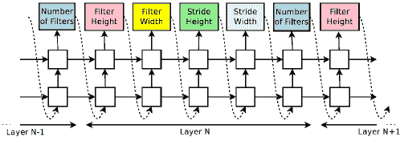

图 7\. 使用 RL 的 NAS (Zoph and Le, 2017)。

#### 3.4.2\. 基于 EA 的 NAS

为了提升模型性能，Real 等人（Real 等人，2017）引入了一种基于 EA 的 NAS 方法。这种方法不断进化模型架构。进化过程从工人生成一组初始模型开始，这些模型形成了所谓的种群。在进化步骤中，从种群中随机选择两个模型，并评估它们在验证集上的准确性。表现较差的模型从种群中移除，而表现较好的模型成为父模型。在变异步骤中，父模型被复制，生成两个相同的副本。其中一个副本被重新引入种群，而另一个副本经历变异以创建一个新的模型，称为子模型。随后，工人训练并评估子模型的性能，然后将其重新加入种群。这个过程反复进行，导致种群中的模型不断改进。

然而，当处理广泛的搜索空间时，大规模种群中的随机搜索方法可能非常低效。为了解决这一问题，Sun 等人（Sun 等人，2020）开发了一种编码机制，将 CNN 特征映射到数值值。这通过将 CNN 架构作为输入到随机森林中，加速了进化过程。最近，Xue 等人（Xue 等人，2023）提出了一种队列机制来减少种群，并结合交叉和变异操作来增强子网络的多样性。

#### 3.4.3\. 基于梯度的 NAS

基于梯度的 NAS 的核心概念涉及将离散的搜索空间转化为连续的，从而使得可以应用梯度下降技术自动发现最佳模型架构。在每次训练后推断延迟对于提议的 NAS 网络效率低，尤其对于资源有限的研究机构。此外，在制定硬件感知的 NAS 方法时，使用基于梯度的 NAS 方法被认为更为合适。

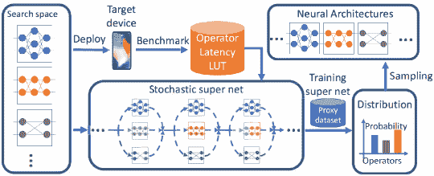

图 8\. FBNet 中的 DNAS 流程（Wu 等人，2019）。

DARTS (Liu et al., 2019b) 提出了一个基于梯度下降的高效架构搜索算法，避免了黑箱搜索问题。它将结构参数从离散转换为连续，使其可微分。因此，DARTS 提供了准确、高效且可微分的 NAS。受到 MnasNet (Tan et al., 2019a)、DARTS (Liu et al., 2019b) 和 NetAdaptV1 (Yang et al., 2018) 等工作的启发，FBNet (Wu et al., 2019) 是通过可微分 NAS (DNAS) 流水线发现的一个硬件感知 NAS 突破，如图 8 ‣ 3\. Fundamental methods in model compression ‣ Lightweight Deep Learning for Resource-Constrained Environments: A Survey") 所示。在 FBNet 中，设计了九个不同的模块，并使用了 22 层来构建一个随机超网络，该网络通过随机梯度下降 (SGD) 进行优化。此外，FBNet 设计了逐层搜索空间，使每一层可以选择不同的模块。为了减少具有较低延迟的逐层搜索空间，还采用了延迟查找表，并将一个考虑延迟的损失项纳入到整体损失函数中，其形式为：

| (3) |  | $L(a,w_{a})=CE(a,w_{a})\cdot\alpha\log(LAT(a))^{\beta}.$ |  |
| --- | --- | --- | --- |

其中 $a$ 和 $w_{a}$ 表示特定设备的网络架构和网络参数，而 $CE$ 代表交叉熵损失。$LAT$ 代表在目标设备上架构的延迟，通过查找表确定。参数 $\alpha$ 和 $\beta$ 分别表示整体损失函数和延迟项的幅度。有关 FBNet 的更多详细信息和相关工作，请参见 (Wan et al., 2020; Dai et al., 2021b)。

#### 3.4.4\. 其他 NAS 相关工作

许多其他 NAS 算法也已被提出。例如，Symbolic DNN-Tuner (Fraccaroli et al., 2022) 引入了一个自动化的软件系统，用于根据每次网络训练后的概率符号规则确定最佳调优操作。该系统包括一个数据处理模块、搜索空间探索模块和贝叶斯优化模块。控制模块负责管理训练过程并决定调优操作。除了在广泛的搜索空间中找到最佳组合外，测试提出的组合网络也非常耗时。每次在目标设备上测量整个模型的延迟可能效率极低。

为了应对这一问题，NetAdaptV1 （Yang 等，2018）采用了一种自适应算法，考虑了能耗和内存使用，使其能更现实地响应硬件限制。该方法涉及创建一个层级查找表，如图 9 所示，简化了对预训练网络的搜索复杂性。在此设置中，每层的延迟被预先测量，并构建查找表以记录基于层结构的延迟。例如，如图 9 所示，第 1 层由 3 个通道和 4 个滤波器组成，测得的延迟为 6 毫秒，第 2 层由 4 个通道和 6 个滤波器组成，测得的延迟为 4 毫秒。总延迟计算为各层延迟之和，得到总延迟为 10 毫秒（6 + 4）。

向前推进，NetAdaptV2 （Yang 等，2021b）引入了通道级跳过连接（CBCs），它将深度和层宽结合在原始搜索空间中，以提高训练和测试的效率。此外，Abdelfattah 等（Abdelfattah 等，2021）利用了初始化修剪（Lee 等，2019）并整合了六个零成本代理用于 NAS 提案评分。这一创新方法只需一个小批量数据和一次前向/反向传播过程，而无需完全训练，从而使 NAS 过程更加高效。

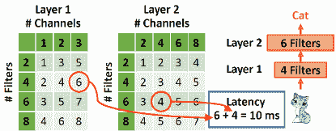

图 9\. 层级查找表 （Yang 等，2018）。

### 3.5\. 讨论与总结

本节总结了前述关于模型压缩的讨论。此外，它提供了有价值的实践技巧和指导，旨在为相关背景下的有效实施和应用提供可操作的见解。

剪枝。尽管非结构化剪枝方法（LeCun 等，1989；Frankle 和 Carbin，2019）在参数减少方面取得了显著进展，但其不规则的结构经常会与硬件加速器兼容性存在问题。因此，结构化剪枝（He 等，2019a，2018；Hu 等，2023）作为一种更可取的替代方案出现，主要是由于其规则的结构。值得注意的是，现代深度学习框架，如 PyTorch 和 TensorFlow，已经集成了内置功能，便于顺利实现结构化剪枝。这种简化的集成提升了结构化剪枝技术应用的便捷性和效率。

量化。在考虑量化时，所选技术取决于模型将要部署的硬件环境。硬件规格发挥着关键作用，将量化从一个可选的优化转变为一个必不可少的要求。例如，特定的 MCU 或边缘 TPU 仅支持整数操作，使得完整的整数量化对于模型实现至关重要。TensorFlow Lite (TF-Lite)（Google，2023）有效地满足了这一需求，将模型大小减少了最多四倍，并显著加速了推理速度，提升了三倍以上。在低功耗 CPU 的硬件中，通常推荐使用 8 位整数量化策略，因为 CPU 在处理整数操作时表现出卓越的计算效率，而非浮点值。值得注意的是，在使用 16 位浮点量化时，数值在 CPU 执行期间会被重新量化回 32 位浮点表示。有关硬件对量化的支持和辅助库的深入分析，请参见（Liang 等，2021b）。

知识蒸馏。KD 技术通过利用其他模型的洞察力显著增强了神经网络。在实际应用中，当训练大型模型可行时，可以有效地利用离线 KD 过程（Hinton 等，2015）。另一方面，在线蒸馏作为一种有前途的解决方案脱颖而出。例如，DML 过程（Zhang 等，2018b）在没有预训练教师模型的情况下显示出了显著的效果，使其能够适应使用多个小模型的多 GPU 训练。在标记数据稀缺或标签噪声的情况下，均值教师框架作为一种有价值且有效的解决方案脱颖而出。此外，自蒸馏和 KD 的持续进展（Lin 等，2022b；Zhao 等，2022）为探索提供了诸多可能性，并为教师和学生网络的定义提供了不同的选项。

NAS。虽然基于 RL 的 NAS (Tan et al., 2019a) 和基于 EA 的 NAS (Sun et al., 2020) 都展示了其实现令人印象深刻的准确性的能力，但需要注意的是，它们的训练要求大量的资源和时间，通常需要数天或数周，并涉及数百个 GPU。这种资源密集型的特性导致了这些领域研究数量的相对下降。因此，当面临 GPU 限制时，可以考虑像 DARTS (Liu et al., 2019b) 和 FBNet (Wu et al., 2019) 这样的基于梯度的算法，这些算法引入了搜索空间的连续性，从而显著减少了训练时间。另一种选择是“once for all” NAS (Cai et al., 2020a)，它将广泛的网络优化为针对不同目标设备的子网络。然而，如果计算资源充足，基于 RL 和 EA 的 NAS 方法仍然是可行的选项，并且它们相比基于梯度的 NAS (Ren et al., 2021) 也提供了更优的性能。此外，当内存占用、能源消耗和延迟是关键考虑因素时，像 FBNet (Wu et al., 2019)、NetAdapt (Yang et al., 2018) 和 NetAdaptV2 (Yang et al., 2021b) 等研究引入的硬件感知 NAS 概念可能特别相关。

结论。总之，模型压缩方法各有其优缺点。量化是一种相对简单但在许多情况下被证明有效的压缩技术。首先，需要将选定的量化方法与浮点或整数值的具体硬件要求匹配。在硬件条件允许的情况下，通常从 16 位浮点量化开始是一个明智的初步步骤。如果需要更大程度的模型压缩，有两个可行的选项。首先，模型剪枝提供了一种有效的解决方案，可以显著减少冗余的网络参数，同时保持性能完整性。这在处理资源受限的环境时特别有价值。其次，KD 框架在有大量未标记数据的情况下尤为有效，如自主驾驶等应用场景中经常遇到的情况。特别是均值教师结构是从未标记数据生成伪标签的有用工具，能够有效地将这些额外信息纳入训练，提升整体模型性能。最后，NAS 也可以考虑，尤其是在图像分类等任务中，它可以发现适合特定要求的最优网络架构。这些方法的选择应根据任务的具体需求和可用的计算资源来指导。

## 4\. 深度学习模型的硬件加速

随着 GPU 技术的进步，深度学习（DL）已成为人工智能技术的前沿。深度学习模型，如卷积神经网络（CNN），计算密集型，因此硬件加速变得至关重要，以使深度学习应用变得可行和实用。在这一部分，我们将概述深度学习模型的主要硬件加速器。接着，我们介绍典型的数据流和数据局部性优化技术，以及广泛使用的深度学习库。最后，我们讨论采用软件/硬件共设计方法的算法。

### 4.1\. 硬件架构

深度学习模型的硬件加速器包括一系列选项，包括基于时序架构的 GPU 和 CPU 以及根植于空间架构的 FPGA 和 ASIC。硬件加速器的基本组件是算术逻辑单元（ALU）、控制单元和局部存储单元（缓存单元）。在时序架构中，控制单元和局部存储单元是集中的，处理元素（PEs）只包含 ALU。数据从集中式内存顺序访问到 PEs，PEs 之间没有交互（Capra et al., 2020）。相比之下，空间架构包括配备了控制单元、ALU 和局部存储（寄存器文件）的 PEs。这允许独立的数据处理和 PEs 之间的直接通信。

#### 4.1.1\. 时序架构

时序架构通常用于通用平台，如 CPU 和 GPU，分别优化为处理串行任务和并行任务。

中央处理单元（CPU）。CPU 将输入数据处理成可用的信息输出，通过串行计算执行计算。最近的一种基于 CPU 的加速技术 SLIDE（Chen et al., 2020a），利用 C++ OpenMP 结合智能随机算法与多核并行性和工作负载优化，证明在 CPU 上使用智能算法可以比使用 NVIDIA-V100 GPU 实现更好的速度。

图形处理单元（GPU）。GPU 设计用于并行计算。它们的架构可能由数千个核心组成。因此，GPU 擅长并行计算，使其能够同时处理多个指令，极大地提高了处理简单和重复计算任务的效率。鉴于深度学习模型通常涉及大量的矩阵加法和乘法运算，GPU 已成为深度学习发展的主要加速器。它们的并行处理能力使其在加速深度学习任务中发挥了重要作用。

#### 4.1.2\. 空间架构

通过利用处理元素（PEs），空间架构（通常见于 FPGA 和应用专用集成电路（ASICs））减少了对外部内存的重复和冗余访问，从而降低了能耗。

FPGAs。FPGAs 由可编程逻辑块和逻辑门组成，能够执行计算。由于其可重新编程的特性，它们能够有效加速各种深度学习结构，并更好地支持剪枝方法。此外，FPGAs 可以直接实现算法，无需解码和解释过程。为了提升使用 FPGAs 的 AI 应用，Qi 等（Qi 等，2022）强调了并行计算的关键概念，并展示了如何在 FPGAs 中实现这些概念。Roggen 等（Roggen 等，2022）成功在 FPGA 平台上实现了数字信号处理（DSP）算法，如滤波有限脉冲响应滤波器，从而改善了对可穿戴计算的支持。有关 FPGA AI 应用的更多参考，请查阅（Nechi 等，2023; Seng 等，2021）。

ASICs。定制化的 ASICs 针对特定电子系统，相较于 FPGAs 在速度、更低的功耗和更高的吞吐量方面表现更优。TPUs 是专为 AI 应用设计的突出 ASICs（Jouppi 等，2017），在高效执行矩阵运算方面表现出色，这在深度学习计算中尤为重要，尤其是广泛的矩阵乘法。在最近的发展中，新推出的 TPU-v3 可以通过 2-D 环形网络连接 1024 个 TPU 芯片（Kumar 等，2019）。这一创新提高了并行性，并通过空间分区和权重更新共享机制，允许在更多的 TPU-v3 加速器核心上执行。超级计算机 TPU-v4（Jouppi 等，2023）通过将 TPU 芯片数量增加到 4096 进一步提升了性能。TPU-v4 还引入了光学电路开关（OCSes），这些开关可以动态重组其互连拓扑，以提高可扩展性、可访问性和利用率。因此，TPU-v4 在性能/瓦特上提高了 2.7 倍，并且相较于 TPU-v3 速度提升了十倍。

#### 4.1.3。CNN 加速器的讨论

CPUs 通常不适合训练和推断典型的 DL 模型，因为 FLOPs 性能较低。 GPU 可以支持成千上万个核心的并行计算，在并行计算方面表现出色，并被广泛应用于各种人工智能应用。但是，GPU 以高功耗而闻名，使其不适用于边缘设备和物联网应用。另一方面，FPGA 和 ASIC 为边缘 AI 应用提供了更节能的加速选项。在 FPGA 和 ASIC 之间的选择通常取决于具体要求。对于需要快速开发或批量生产的 AI 产品，更倾向于选择 FPGA。而对于大规模生产的 AI 产品，尤其是高度成熟或定制的产品，ASIC 更为合适。对于预算充裕的项目，TPU 可能是顶级选择。TPU 具有卓越的计算能力，使其非常适合处理具有大批量数据的广泛模型，例如 GPT-4 (OpenAI, 2023)和 LLaMA (Touvron et al., 2023a)，显著缩短了训练和推断时间。

### 4.2\. 数据流和数据本地化优化

CNN 的计算复杂性和数据存储需求对计算性能和能源效率构成重大挑战。这些挑战在具有有限内存的较小设备中尤为突出，包括受限的芯片上缓冲区（SRAM）和片外存储器（DRAM）。为了解决这些问题，优化数据流对增强内存和能源效率至关重要。深度模型的数据流过程通常包括三个主要步骤。首先，DL 模型存储在片外存储器中，通常称为外部存储器。其次，当需要卷积内核时，它们会从芯片上的缓冲区中获取。最后，使用 PE 执行乘加运算。

#### 4.2.1\. 数据流类型

基于其应用，DL 模型的硬件加速器具有不同类型的数据流，可分为类似流水线的数据流 (Li et al., 2016; Lin and Chang, 2017)、类似 DaDianNao 的数据流 (Luo et al., 2016; Chen et al., 2014b)、类似 Systolic-array 的数据流 (Jouppi et al., 2017; Wei et al., 2017; Zhang et al., 2018a)以及类似流式的数据流 (Du et al., 2017; Guo et al., 2017)。

类流水线数据流。在这种数据流中，输入像素（特征图的像素）被传递给各个 PE，模型的权重（表示模型参数）固定在每个 PE 上。值得注意的是，部分和随后被转发到下一个 PE。这种方法提供了显著的并行性，便于多个阶段同时处理数据，从而提高计算效率。然而，任务是顺序执行的，每个阶段依赖于前一个阶段的完成，这可能导致延迟增加。

类 DaDianNao 数据流。在这种数据流中，每个 PE 可以像神经元一样工作，以类似于 NN 的方式处理输入像素。具体而言，输入像素被路由到每个 PE，模型的权重嵌入在每个 PE 中。计算出的部分和随后通过累加器树进行聚合。这种数据流可以适应不同的内核大小，使其能够处理复杂且不规则的模型结构。然而，这种数据流方法能耗高，因模型复杂性要求大量硬件资源。

类膨胀数组数据流。这种数据流将输入像素和权重依次传递到 PE，PE 链接以提高计算效率。随后，使用累加器树聚合部分和。这种数据流方法优化了硬件资源的利用，提升了整体硬件效率，并减轻了大设计中的时序问题。然而，为 CNN 寻找合适的映射到膨胀数组上可能具有挑战性。

类流式数据流。在这种数据流中，输入像素不断地传送到下一个 PE，不会暂停或需要中间存储，权重在每个 PE 上是固定的。随后，累加器树累积部分和。这种数据流特别适合流式数据，如音频和视频处理，因为其高吞吐量和低延迟。然而，要求阶段间复杂操作或依赖于先前结果的应用可能需要额外的处理和设计。图 10 比较了数据流类型。

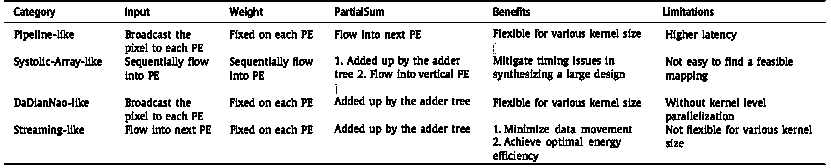

图 10\. 数据流类型比较（Hsu 等，2020）。PE 代表处理元素。

#### 4.2.2\. 数据局部性优化

CNNs 提供了卓越的性能，具有高吞吐量和能耗特征。然而，它们的性能可能受到有限的片上内存的限制。因此，有效的局部性优化机制至关重要。数据局部性优化专注于制定数据流调度，以最大化数据重用利用率并最小化数据移动。一种常见的方法是应用循环变换技术，如循环展开、循环分块和循环交互，以优化 NN 部署。这些技术有助于最大化硬件利用率并最小化内存流量，从而解决片上内存限制的问题。

循环展开（Booshehri 等，2013；Huang 和 Leng，1999）是一种将循环迭代扩展为多个顺序指令的方法。该技术显著减少了 CNN 中的循环迭代次数，从而加快了 CNN 操作并通过增加并行化提高了硬件利用率。然而，需要注意的是，循环展开可能导致代码膨胀、内存使用增加以及存储需求提高，特别是对于较大的 CNN 模型。

循环分块（Qiu 等，2016；Zhang 等，2015；Stoutchinin 等，2019）涉及将输入数据划分为多个块，以便进行并行计算，从而加速 CNN。例如，原始输入数据的大小为 $224\times 224\times 3$，可以被划分为大小为 $112\times 112\times 3$ 的较小块。这些较小的块被顺序处理，以缓解缓冲区加载和内存限制。此技术有效适应有限的片上内存，并显著提升缓存局部性。然而，对于现代加速器，如 GPU，其内存访问模式已经优化以实现高吞吐量，循环分块可能会增加额外的复杂性，而性能提升不明显。

循环交互（Mezdour 等，2023；Xu 等，2023）涉及改变嵌套循环内循环的顺序，目的是提高数据局部性并提取并行性。具体而言，循环的顺序被优化，以使外层循环的每次迭代利用相同的缓存行，从而减少内存访问。循环交互还可以通过增加加法和乘法等操作符的使用来加速 CNN 模型。值得注意的是，一些算法具有复杂的内在属性和特殊的循环顺序含义。因此，改变循环顺序可能会产生无意义的结果并降低性能。

在本节中，我们介绍了典型的数据流类型，并概述了各种数据局部性优化机制。更多深入的细节可以在（Fu 等，2023；Wolf 和 Lam，1991）中找到。

### 4.3\. 深度学习库

为了方便深度学习模型的部署，使用提供高级 API 的深度学习库以简化复杂神经网络的实现、设计和训练也是至关重要的。我们介绍了几种支持 GPU 加速和自动梯度系统的流行深度学习库。

TensorFlow（Abadi 等，2016）支持静态和动态图，允许用户选择最适合的模式。借助这种灵活性，TensorFlow 支持自定义深度学习模型的研究和开发。此外，TensorFlow 还提供了广泛的 API 以便于深度学习模型的实现。例如，TensorFlow 模型可以转换为 TensorFlow-Lite（TF-Lite）（David 等，2021）模型，这是一种较小、更高效的机器学习模型格式，可在移动和边缘设备上运行。

PyTorch（Paszke 等，2019）是一个以其在创建复杂模型和对神经网络进行细节调整方面的显著能力而闻名的框架，使其成为研究界的首选。其简洁性、用户友好性和直观性使其成为原型设计深度学习模型的首选工具。然而，其 API 在某些部署相关的场景中存在一些限制，这可能会限制其在某些实际场景中的应用。

MXNet（Chen 等，2016）是一个为实现 CNN 提供优化构建模块的库。它特别针对 Intel 处理器，提供对 Intel CPU 和 GPU 上的 CNN 的矢量化和多线程支持。此外，MXNet 框架还提供了多种语言的接口，包括 Python、Scala、Java、Clojure 和 R，方便跨领域深度学习开发者使用。

NVIDIA 一直处于 GPU 硬件和软件优化的前沿。cuDNN（Chetlur 等，2014）是一个专门为深度学习网络设计的高度优化库，为 DNN 相关任务提供加速。除了 cuDNN，NVIDIA 还提供了一系列包含在 CUDA-X（NVIDIA，2023）中的深度学习库。另一个 NVIDIA 库 TensorRT（Vanholder，2016）通过应用层和张量融合、内核自动调优以及动态张量内存优化来优化在 NVIDIA GPU 上的推理。

每种深度学习库都有其独特的优势，并针对特定的使用场景，为从业人员提供了最适合其项目的选择。为了解决深度学习库之间的互操作性挑战，微软和 Facebook 推出了开放神经网络交换（ONNX）（Foundation，2017），这是一个用于机器学习互操作性的开放标准。通过 ONNX，使用不同库创建的模型可以轻松共享和执行。例如，可以将 PyTorch 模型转换为 TensorFlow 格式，然后在 Android 设备上运行，从而避免了模型重新训练的需要。

### 4.4. 硬件架构的共同设计

在深度学习（DL）中，仅依赖软件技术的加速解决方案主要受到通用处理器固有能力的限制，可能难以充分利用为特定 DL 任务设计的专用硬件特性。相反，仅使用硬件的解决方案可能在灵活性和适应性方面面临限制，因为专用硬件通常针对特定任务或架构进行定制，使得在没有硬件修改的情况下更新或适应新的 DL 模型变得困难。这突显了在资源受限环境中共同设计硬件和软件方法的价值，采用整体优化策略。这种方法包括优化 DL 算法、优化和压缩模型、高效内存管理、软件内核实现和硬件架构设计。本节讨论了采用整体方法解决与不规则内存访问相关的挑战，增强由于压缩方法导致的稀疏处理，以及在 NAS 算法中探索改进解决方案。

在第三部分中，我们强调许多神经网络（NN）连接可以在不显著降低准确度的情况下有效地进行修剪。然而，在这样的模型中，只有一部分 NN 的权重是活动的，它们的位置是不规则或不连续的。尤其是在使用像 GPU 或 TPU 这样的硬件加速器时，高效访问这些权重可能会面临挑战，因为权重位置的不规则性。为了解决这个问题，早期的方法如 Cambricon-X（Zhang 等，2016）使用零权重连接来进行 MAC 操作，并利用稀疏索引访问所需的权重。然而，不规则的非零权重分布带来了索引开销、PE 不平衡和内存访问低效等问题。后来的进展，如 Cambricon-S（Zhou 等，2018），通过软件/硬件集成强制实施滤波器稀疏性的规则性，从而提高了效率。

Sparse-YOLO（Wang et al., 2020b）引入了一种专门的稀疏卷积单元，旨在处理量化值和由非结构化剪枝技术导致的稀疏性。Cho et al.（Cho et al., 2021）提出了一种用于量化二进制神经网络的加速技术。这种方法利用了一组 PEs，每个 PE 负责计算特定特征图的输出，实现了特征图间的并行处理。此外，优化剪枝后稀疏权重的存储也已被探索。Han et al.（Han et al., 2016）展示了这些稀疏权重可以被压缩，从而将内存访问带宽减少了约 20%-30%。SCNN（Parashar et al., 2017）使用输入静态数据流处理其压缩格式的卷积层。这涉及将压缩权重和激活值传输到乘法器数组，然后通过散射网络添加散布的部分和。

在 NAS 领域，除了之前讨论的针对特定硬件平台的硬件感知 NAS 方法，还有一些最初保持硬件无关的共同设计解决方案。这些共同设计的系统在 NAS 过程中无缝集成硬件优化，确保硬件和 DNN 模型的同时优化。硬件设置可以与 DNN 架构一起通过相同的算法进行探索（Zhou et al., 2021; Choi et al., 2021; Li et al., 2020），或者通过外部搜索算法进行探索（Sekanina, 2021; Lin et al., 2020b）。

如图 11(a)所示，最直接的硬件和软件设置共同搜索方法涉及创建 CNN 和加速器对，并评估最终模型的性能。可以选择在每次测试新的对时训练 CNN，或者遵循 Chen 等人（Chen et al., 2020c）的方法，其中使用超网络直接生成 DDN 的权重，并在一次模型测试中评估准确性。图 11(b)展示了 Lin 等人（Lin et al., 2020b）采用的另一种策略，其中硬件优化算法将候选 CNN 作为输入，并优化硬件加速器以实现特定目标。网络仅在找到可行的硬件配置后才会进行训练和评估。如果没有找到合适的硬件设置，网络将保持未训练状态，直到找到可行的配置。该策略避免了训练 CNN，这是共同设计过程中的最复杂阶段。

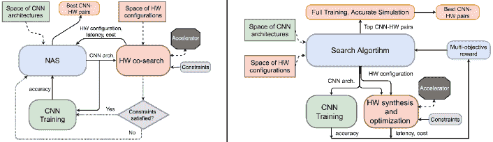

图 11\. 实现 NAS 和硬件共同设计的两种不同方法（Sekanina, 2021）。

总结而言，算法的共同设计显著提高了压缩和计算效率。然而，这些方法本质上并非易事，需要深入探讨软件和硬件技术。

## 5\. 挑战与未来工作

在本次调研中，我们探讨了轻量级模型、压缩方法和硬件加速的复杂领域，展示了它们在广泛应用中的先进技术能力。然而，在资源受限的环境中部署这些模型仍然面临着重大挑战。本节致力于揭示 TinyML 和 LLMs 在加速和应用深度学习模型方面的新技术，重点关注那些需要进一步研究的未解决问题。

### 5.1\. TinyML

TinyML 是一项新兴技术，它使深度学习算法能够在功耗低于 1mW 的超低端物联网设备上运行。然而，极其受限的硬件环境使得设计和开发 TinyML 模型变得具有挑战性。低端物联网设备主要使用微控制器（MCU），因为与中央处理器（CPU）和图形处理器（GPU）相比，MCU 成本更为高效。然而，MCU 库，如 CMSIS-NN（Lai 等，2018）和 TinyEngine（Lin 等，2020a），往往依赖于特定平台，而不像 GPU 库如 PyTorch 和 TensorFlow 提供跨平台支持。因此，TinyML 的设计重点更多地倾向于专用应用，而非促进通用研究，这可能会阻碍整体研究进展的速度。

基于 MCU 的库。由于 TinyML 中的资源受限环境，基于 MCU 的库通常是为特定用例设计的。例如，CMSIS-NN（Lai 等，2018），作为在 ARM Cortex-M 设备上开发的基于 MCU 的库的开创性工作，提出了一种高效的内核，分为 NNfunctions 和 NNsupportfunctions。NNfunctions 执行网络中的主要功能，如卷积、池化和激活。NNsupportfunctions 包含数据转换和激活表。CMIX-NN（Capotondi 等，2020）提出了一种开源的混合和低精度工具，可以将模型的权重和激活量化为 8、4 和 2 位。MCUNet（Lin 等，2020a）提供了一个针对商业可用 MCU 的深度学习实现的协同设计框架。该框架包括 TinyNAS，用于高效地搜索最准确和最轻量的模型。此外，它利用了 TinyEngine，该引擎包含基于代码生成的编译和就地深度卷积，有效地解决了峰值内存限制。展望未来，MCUNetV2（Lin 等，2021）引入了一种基于补丁的推理机制，仅在特征图的小空间区域上操作，进一步减少了峰值内存使用。MicroNet（Banbury 等，2021）采用可微分 NAS（DNAS）来寻找操作次数较少的高效模型，并支持开源平台 Tensorflow Lite Micro（TFLM）。MicroNet 在所有 TinyMLperf 行业标准基准任务中取得了最先进的成果，即视觉唤醒词、谷歌语音命令和异常检测。

TinyML 的快速发展受到什么阻碍？尽管 TinyML 取得了进展，但其增长受到若干固有关键限制的制约，包括资源约束、硬件和软件的异质性以及数据集的缺乏（Ray，2022）。极端的资源限制，如极小的 SRAM 和不足 1 MB 的闪存，给在边缘设备上设计和部署 TinyML 模型带来了挑战。此外，由于硬件异质性和缺乏框架兼容性，目前的 TinyML 解决方案需要针对每个单独设备进行调整，这使得 TinyML 算法的大规模部署变得复杂。而且，现有的数据集可能不适用于 TinyML 架构，因为数据可能与边缘设备外部传感器的数据生成特征不对应。需要一套标准的数据集来训练 TinyML 模型，以推进有效 TinyML 系统的发展。在大规模部署到物联网和边缘设备之前，这些开放的研究挑战需要解决。

### 5.2\. 构建轻量级的大型语言模型

在过去两年中，大型语言模型（LLMs）在各种任务中始终展现出卓越的表现（Anil et al., 2023；Touvron et al., 2023b；Ye et al., 2023）。LLMs 在实际应用中具有重要潜力，特别是在与人类监督相结合时。例如，它们可以作为自主代理的副驾驶，或提供灵感和建议。然而，这些模型通常具有亿级参数。部署这些模型进行推理通常需要 GPU 级硬件和数十 GB 的内存，这对日常 LLM 的使用提出了重大挑战。例如，Tao et al.（Tao et al., 2022）发现，由于同质化的词嵌入和变化的权重分布，量化生成预训练语言模型非常困难。因此，将大型、资源密集型的 LLM 模型转化为适合在资源有限的移动设备上部署的紧凑版本，已成为未来研究的一个重要方向。

世界知名企业在 LLM 部署方面取得了显著进展。2023 年，高通展示了在移动设备上独立执行文本到图像模型 Stable Diffusion（Rombach 等，2022）和图像到图像模型 ControlNet（Zhang 等，2023b），从而加速了大型模型向边缘计算环境的部署。谷歌还推出了其最新通用大模型 PaLM 2（Anil 等，2023）的多个版本，其中包括针对移动平台量身定制的轻量级变体。这一发展为将大型模型从基于云的系统迁移到边缘设备创造了新的机会。然而，某些大型模型仍需数 GB 的物理存储和运行时内存。因此，努力的方向是实现小于 1GB 的内存占用（Ray，2022），这表明这一领域仍需大量工作。本节概述了一些在资源受限环境中简化 LLM 实施的关键举措。

#### 5.2.1\. 无需重新训练的剪枝

最近，大量工作将常见的深度学习量化和剪枝技术应用于构建轻量级 LLM。一些方法（Yu 等，2023；Wu 等，2023）侧重于实现量化，其中数值精度大幅降低。SparseGPT（Frantar 和 Alistarh，2023）首次展示了大规模生成预训练变换器（GPT）模型可以在一步中剪枝到至少 50%的稀疏性，且无需后续的重新训练，且精度损失最小。随后，引入了专门设计用于在预训练 LLM 中引入稀疏性的 Wanda（基于权重和激活的剪枝）（Sun 等，2023）。Wanda 剪枝权重的最小幅度，无需重新训练或权重更新。剪枝后的 LLM 可以直接使用，提高了其实用性。值得注意的是，Wanda 超越了已建立的幅度剪枝基准，并与涉及广泛权重更新的最新方法有效竞争。这些工作为未来设计不需要重新训练的 LLM 剪枝方法设立了重要里程碑。

#### 5.2.2\. 模型设计

从模型设计的角度来看，我们可以从一开始就创建轻量级的 LLMs，专注于减少模型参数的数量。在这一努力中，一个有前景的途径是提示调整（prompt tuning），它旨在优化 LLMs 的性能，同时保持效率和模型规模。在这一背景下，一个值得注意的方法是视觉提示调整（Visual Prompt Tuning, VPT）（Jia et al., 2022），它作为一个高效且有效的替代方案，与在视觉相关任务中使用的大规模 Transformer 模型的全面微调相比，展现了优势。VPT 在输入空间中引入了不到 1%的可训练参数，同时保持了模型骨干的完整性。另一个值得注意的贡献是 CALIP（Guo et al., 2023），它引入了无参数的注意机制，以促进视觉和文本特征之间的有效互动和沟通。它产生了文本感知的图像特征和视觉引导的文本特征，有助于开发更为简化和高效的视觉语言模型。在不久的将来，推进轻量级 LLM 设计的一个有前景的途径是开发自适应微调策略。这些策略将动态调整模型的架构和参数，以符合特定任务的要求。这种适应性确保了模型能够优化其在特定应用中的性能，而不会产生不必要的参数膨胀。

#### 5.2.3\. 构建轻量级扩散模型

近年来，基于去噪扩散的生成模型，特别是基于评分的方法（Ho et al., 2020; Song et al., 2021），在创建多样化和真实的数据方面取得了显著进展。然而，扩散模型推理阶段转移到边缘设备上面临着重大挑战。推理阶段逆转了转换过程，从高斯噪声生成真实数据，这通常被称为去噪过程。此外，当这些模型被压缩以减少其占用空间和计算需求时，可能会严重影响图像质量。压缩过程可能需要简化、近似，甚至移除模型的关键组件，这可能会不利于模型从高斯噪声中准确重建数据。因此，在资源受限的情况下开发扩散模型时，平衡模型大小减少与保持高质量图像生成之间的关键问题成为了一个严峻的挑战。

在最近的一项工作中，Shang 等人（Shang et al., 2023）将后训练量化（Cai et al., 2020b）引入了扩散模型加速领域。当以无训练的方式应用时，这种量化方法表现出提升去噪过程效率的能力，同时减少了扩散模型权重的存储需求，这是加速扩散模型的关键组成部分。然而，在该领域仍然有许多改进的机会，以实现高质量与轻量级模型解决方案之间的权衡。

#### 5.2.4\. Vision Transformers (ViTs) 的部署

尽管轻量级 ViTs 的普及度不断增加，但在硬件受限环境中部署 ViT 仍然是一个持续关注的问题。根据 (Wang et al., 2022b)，ViT 在移动设备上的推理延迟和能耗比 CNN 模型高出多达 40 倍。因此，未经修改的移动设备无法支持 ViTs 的推理。ViTs 中的自注意力操作需要计算图像补丁之间的成对关系，而计算量随着补丁数量的增加呈二次增长。此外，FFN 层的计算比注意力层更为耗时 (Wang et al., 2022b)。通过去除多余的注意力头和 FFN 层，DeiT-Tiny 可以将延迟减少 23.2%，而准确度损失几乎可以忽略不计，仅为 0.75%。

一些工作为嵌入式系统（如 FPGA）设计了 NLP 模型 (Ham et al., 2020, 2021; Wang et al., 2021)。最近，DiVIT (Li et al., 2022) 和 VAQF (Sun et al., 2022) 提出了 ViTs 的硬件-软件协同设计解决方案。DiVIT 提出了在算法层面利用补丁局部性的 delta 补丁编码和新型差分注意力。在 DiVIT 中，通过使用节省位的技术设计差分注意力处理引擎阵列，可以以较少的计算量计算 delta 并与差分数据流进行通信。此外，指数操作使用查找表执行，无需额外计算且硬件开销最小。VAQF 首次将二值化引入 ViTs，这可以用于 FPGA 映射和量化训练。具体来说，VAQF 可以根据目标帧率生成所需的量化精度和加速器描述，用于直接的软件和硬件实现。

为了在资源受限的设备上实现 Vision Transformers (ViTs) 的无缝部署，我们强调了两个潜在的未来方向：

1) 算法优化。除了第 2.3 节中描述的高效 ViT 模型设计外，还应考虑 ViTs 的瓶颈。例如，由于 MatMul 操作会导致 ViTs 的瓶颈，这些操作可以被加速或减少（Wang et al., 2022b）。此外，还可以考虑整数量化和操作符融合的改进。

2) 硬件可用性。与大多数移动设备和 AI 加速器上广泛支持的 CNNs 不同，ViTs 没有专门的硬件支持。例如，ViT 无法在移动 GPU 和 Intel NCS2 VPU 上运行。根据我们的发现，一些重要的操作符在特定硬件上不被支持。具体来说，在移动 GPU 上，连接操作符在 TFLiteGPUDelegate 中需要 4 维输入张量，但 ViTs 中的张量是 3 维的。另一方面，Intel VPU 不支持 LayerNorm，而 LayerNorm 存在于 transformers 的架构中，但在 CNN 中并不常见。因此，ViTs 在资源受限设备上的硬件支持需要进一步研究。

## 6\. 结论

最近，计算机视觉应用越来越重视能源节约、减少碳足迹和成本效益，突显了轻量级模型的重要性，尤其是在边缘 AI 的背景下。本文对轻量级深度学习（DL）进行了全面的考察，探讨了诸如 MobileNet 和 Efficient transformer 变体等显著模型，以及优化这些模型的常见策略，包括剪枝、量化、知识蒸馏和神经架构搜索。除了详细解释这些方法外，我们还提供了定制轻量级模型的实用指导，通过分析其各自的优缺点提供了清晰的认识。

此外，我们讨论了 DL 模型的硬件加速，*深入探讨*了硬件架构、不同的数据流类型和数据局部性优化技术，以及 DL 库，以增强对加速训练和推理过程的理解。这项研究揭示了硬件和软件（Co-design）之间的复杂相互作用，从硬件角度提供了加速训练和推理过程的见解。最后，我们展望未来，认识到轻量级 DL 模型在 TinyML 和 LLM 技术中的应用面临的挑战，这些挑战要求在这些不断发展的领域中探索创造性的解决方案。

## 7\. 致谢

本研究部分由台湾国家科学技术委员会资助，资助编号 NSTC-112-2628-E-002-033-MY4、NSTC-112-2634-F-002-002-MBK 和 NSTC-112-2218-E-A49-023，并且在一定程度上（项目编号：112UA10019）由国立阳明交通大学产业学合作及技能人才培训法框架下的共创平台资助，来自教育部（MOE）及台湾的产业合作伙伴。

## 参考文献

+   （1）

+   Abadi 等人（2016）M. Abadi, P. Barham, J. Chen, Z. Chen, A. Davis, J. Dean, M. Devin, S. Ghemawat, G. Irving, M. Isard 等人。2016。TensorFlow：一个大规模机器学习系统。在 *OSDI*。265–283。

+   Abdelfattah 等人（2021）M. S. Abdelfattah, A. Mehrotra, Ł. Dudziak 和 N. D. Lane。2021。轻量级 NAS 的零成本代理。（2021）。

+   AIM（2022）AIM。2022。*与 ECCV 2022 一同举行的图像处理进展研讨会*。检索于 2023 年 11 月 2 日，来自 [`data.vision.ee.ethz.ch/cvl/aim22/`](https://data.vision.ee.ethz.ch/cvl/aim22/)

+   Amodei 和 Hernandez（2018）D. Amodei 和 D. Hernandez。2018。*AI 和计算*。检索于 2023 年 11 月 2 日，来自 [`openai.com/blog/ai-and-compute`](https://openai.com/blog/ai-and-compute)

+   An 等人（2022）S. An, Q. Liao, Z. Lu 和 J.-H. Xue。2022。通过自注意力和自蒸馏实现高效语义分割。*T-ITS* 23, 9（2022），15256–15266。

+   Anil 等人（2023）R. Anil, A. M. Dai, O. Firat, M. Johnson, D. Lepikhin, A. Passos, S. Shakeri, E. Taropa, P. Bailey, Z. Chen 等人。2023。PaLM 2 技术报告。*arXiv 预印本 arXiv:2305.10403*（2023）。

+   Asperti 等人（2021）A. Asperti, D. Evangelista 和 M. Marzolla。2021。沿输入维度剖析 FLOPs 用于 GreenAI 成本估算。在 *LOD*。86–100。

+   Banbury 等人（2021）C. Banbury, C. Zhou, I. Fedorov, R. Matas, U. Thakker, D. Gope, V. Janapa Reddi, M. Mattina 和 P. Whatmough。2021。MicroNets：用于在商品微控制器上部署 TinyML 应用的神经网络架构。*MLSys* 3（2021）。

+   Banner 等人（2018）R. Banner, I. Hubara, E. Hoffer 和 D. Soudry。2018。8 位神经网络训练的可扩展方法。*NIPS* 31（2018）。

+   Bastian（2023）M. Bastian。2023。*GPT-4 拥有超过一万亿个参数 - 报告*。检索于 2024 年 3 月 1 日，来自 [`the-decoder.com/gpt-4-has-a-trillion-parameters/`](https://the-decoder.com/gpt-4-has-a-trillion-parameters/)

+   Berthelier 等人（2021）A. Berthelier, T. Chateau, S. Duffner, C. Garcia 和 C. Blanc。2021。嵌入式系统的深度模型压缩与架构优化：综述。*JSPS* 93, 8（2021），863–878。

+   Booshehri 等人（2013）M. Booshehri, A. Malekpour 和 P. Luksch。2013。改进的循环展开方法。*IJCSIS* 11, 5（2013），73–76。

+   Cai 等人（2020a）H. Cai, C. Gan, T. Wang, Z. Zhang 和 S. Han。2020a。Once-for-All：训练一个网络并将其专门化以实现高效部署。在 *ICLR*。

+   Cai 等（2020b）Y. Cai，Z. 姚，Z. 董，A. Gholami，M. W. Mahoney 和 K. Keutzer。2020b。《ZeroQ：一种新颖的零样本量化框架》。在*CVPR*。13169–13178。

+   Capotondi 等（2020）A. Capotondi，M. Rusci，M. Fariselli 和 L. Benini。2020。《CMix-NN：适用于内存受限边缘设备的混合低精度 CNN 库》。《TCAS-II》67，5（2020），871–875。

+   Capra 等（2020）M. Capra，B. Bussolino，A. Marchisio，G. Masera，M. Martina 和 M. Shafique。2020。《加速深度神经网络的硬件和软件优化：当前趋势、挑战和未来的道路》。《IEEE Access》8（2020），225134–225180。

+   陈等（2020a）B. 陈，T. Medini，J. Farwell，C. Tai，A. Shrivastava 等。2020a。《SLIDE：为大规模深度学习系统辩护智能算法而非硬件加速》。*MLSys* 2（2020），291–306。

+   陈等（2021b）C.-Y. 陈，L. 罗，P.-J. 黄，H.-H. 帅和 W.-H. 程。2021b。《Fashionmirror：具有顺序模板姿势的共同注意力特征重映射虚拟试穿》。在*ICCV*。13809–13818。

+   陈等（2022b）D. 陈，J.-P. Mei，H. 张，C. 王，Y. 凤和 C. 陈。2022b。《使用重复教师分类器的知识蒸馏》。在*CVPR*。11933–11942。

+   陈等（2021c）D. 陈，J.-P. Mei，Y. 张，C. 王，Z. 王，Y. 凤和 C. 陈。2021c。《跨层蒸馏与语义校准》。在*AAAI*，第 35 卷，7028–7036。

+   陈等（2020b）H. 陈，Y. 王，C. 徐，B. 石，C. 徐，Q. 田和 C. 徐。2020b。《AdderNet：我们在深度学习中真的需要乘法吗？》。在*CVPR*会议上。

+   陈等（2021a）P. 陈，S. 刘，H. 赵和 J. 贾。2021a。《通过知识回顾蒸馏知识》。在*CVPR*。5008–5017。

+   陈等（2014a）T. 陈，Z. 杜，N. 孙，J. 王，C. 吴，Y. 陈和 O. Temam。2014a。《DianNao：用于普及机器学习的小型高吞吐量加速器》。《ACM SIGARCH Computer Architecture News》42，1（2014），269–284。

+   陈等（2016）T. 陈，M. 李，Y. 李，M. 林，N. 王，M. 王，T. 肖，B. 徐，C. 张和 Z. 张。2016。《MXNet：用于异构分布式系统的灵活高效机器学习库》。*NIPSW*。

+   陈等（2020c）W. 陈，Y. 王，S. 杨，C. 刘和 L. 张。2020c。《你只需搜索一次：用于单阶段 DNN/加速器共设计的快速自动化框架》。在*DATE*。1283–1286。

+   陈等（2019a）W. 陈，D. 谢，Y. 张和 S. 蒲。2019a。《你需要的只是几个移位：为图像分类设计高效卷积神经网络》。在*CVPR*。7241–7250。

+   陈等（2022a）Y. 陈，X. 戴，D. 陈，M. 刘，X. 董，L. 袁和 Z. 刘。2022a。《Mobile-Former：连接 MobileNet 和 Transformer》。在*CVPR*。5270–5279。

+   陈等（2014b）Y. 陈，T. 罗，S. 刘，S. 张，L. 贺，J. 王，L. 李，T. 陈，Z. 徐，N. 孙等。2014b。《DaDianNao：一台机器学习超级计算机》。在*MICRO*。609–622。

+   陈等（2019b）Y. 陈、T. 杨、X. 张、G. 孟、C. 潘 和 J. 孙。2019b。Detnas：对象检测中的神经网络架构搜索。*NIPS* 1, 2（2019），4–1。

+   Chetlur 等（2014）S. Chetlur、C. Woolley、P. Vandermersch、J. Cohen、J. Tran、B. Catanzaro 和 E. Shelhamer。2014。cuDNN：深度学习的高效原语。*arXiv 预印本 arXiv:1410.0759*（2014）。

+   Child 等（2019）R. Child、S. Gray、A. Radford 和 I. Sutskever。2019。使用稀疏变换器生成长序列。*arXiv 预印本 arXiv:1904.10509*（2019）。

+   Cho 等（2021）J. Cho、Y. Jung、S. Lee 和 Y. Jung。2021。具有自适应并行方案的可重构二进制神经网络加速器。*Electronics* 10, 3（2021），230。

+   Choi 等（2018）J. Choi、Z. Wang、S. Venkataramani、P. I.-J. Chuang、V. Srinivasan 和 K. Gopalakrishnan。2018。Pact：用于量化神经网络的参数化剪裁激活。*arXiv 预印本 arXiv:1805.06085*（2018）。

+   Choi 等（2021）K. Choi、D. Hong、H. Yoon、J. Yu、Y. Kim 和 J. Lee。2021。Dance：可微分加速器/网络共同探索。见 *DAC*。

+   Chollet（2017）F. Chollet。2017。Xception：使用深度可分卷积的深度学习。见 *CVPR*。1251–1258。

+   Choromanski 等（2021）K. Choromanski、V. Likhosherstov、D. Dohan、X. Song、A. Gane、T. Sarlos、P. Hawkins、J. Davis、A. Mohiuddin、L. Kaiser 等。2021。用表演者重新思考注意力。见 *ICLR*。

+   Dai 等（2021b）X. Dai、A. Wan、P. Zhang、B. Wu、Z. He、Z. Wei、K. Chen、Y. Tian、M. Yu、P. Vajda 等。2021b。Fbnetv3：使用预测器预训练的联合架构-配方搜索。见 *CVPR*。16276–16285。

+   Dai 等（2021a）Z. Dai、H. Liu、Q. V. Le 和 M. Tan。2021a。CoAtNet：将卷积与注意力结合以适应所有数据规模。*NIPS* 34（2021），3965–3977。

+   David 等（2021）R. David、J. Duke、A. Jain、V. Janapa Reddi、N. Jeffries、J. Li、N. Kreeger、I. Nappier、M. Natraj、T. Wang、P. Warden 和 R. Rhodes。2021。TensorFlow Lite Micro：针对 TinyML 系统的嵌入式机器学习。见 *MLSys*，第 3 卷，800–811。

+   Deng 等（2021）J. Deng、W. Li、Y. Chen 和 L. Duan。2021。无偏均值教师用于跨域对象检测。见 *CVPR*。4091–4101。

+   Dong 等（2017）X. Dong、S. Chen 和 S. Pan。2017。通过逐层最优脑外科医生学习修剪深度神经网络。*NIPS* 30（2017）。

+   Dong 等（2020）Z. Dong、Z. Yao、D. Arfeen、A. Gholami、M. W. Mahoney 和 K. Keutzer。2020。Hawq-v2：Hessian 相关的跟踪加权神经网络量化。*NIPS* 33（2020），18518–18529。

+   Dong 等（2019）Z. Dong、Z. Yao、A. Gholami、M. W. Mahoney 和 K. Keutzer。2019。Hawq：具有混合精度的神经网络的 Hessian 相关量化。见 *ICCV*。293–302。

+   Dosovitskiy 等（2021）A. Dosovitskiy、L. Beyer、A. Kolesnikov、D. Weissenborn、X. Zhai、T. Unterthiner、M. Dehghani、M. Minderer、G. Heigold、S. Gelly、J. Uszkoreit 和 N. Houlsby。2021。图像的价值是 16x16 个单词：用于大规模图像识别的变换器。见 *ICLR*。

+   Du 等 (2017) L. Du, Y. Du, Y. Li, J. Su, Y.-C. Kuan, C.-C. Liu, 和 M.-C. F. Chang. 2017. 一种可重配置的流式深度卷积神经网络加速器，用于物联网。*TCAS-I* 65, 1 (2017), 198–208.

+   Dubey 等 (2019) S. Dubey, V. K. Soni, B. K. Dubey, 等. 2019. 微控制器在生产线中的应用：安全与控制。*IJRAR* 6, 1 (2019), 107–111.

+   d’Ascoli 等 (2021) S. d’Ascoli, H. Touvron, M. L. Leavitt, A. S. Morcos, G. Biroli, 和 L. Sagun. 2021. Convit：通过软卷积归纳偏差改进视觉变换器。发表于 *ICML*。2286–2296.

+   Elhoushi 等 (2021) M. Elhoushi, Z. Chen, F. Shafiq, Y. H. Tian, 和 J. Y. Li. 2021. Deepshift：朝向无乘法神经网络。发表于 *CVPR*。2359–2368.

+   Faghri 等 (2020) F. Faghri, I. Tabrizian, I. Markov, D. Alistarh, D. M. Roy, 和 A. Ramezani-Kebrya. 2020. 数据并行 SGD 的自适应梯度量化。*NIPS* 33 (2020), 3174–3185.

+   Fan 等 (2021) Z. Fan, W. Hu, H. Guo, F. Liu, 和 D. Xu. 2021. 硬件与算法的协同优化：在 ShuffleNet V2 中进行点卷积和通道洗牌的优化。发表于 *SMC*。3212–3217.

+   Feurer 等 (2019) M. Feurer, A. Klein, K. Eggensperger, J. T. Springenberg, M. Blum, 和 F. Hutter. 2019. Auto-sklearn：高效且稳健的自动化机器学习。在 *自动化机器学习* 中。113–134.

+   Foundation (2017) L. Foundation. 2017. *ONNX*。检索日期：2023 年 11 月 2 日，网址 [`onnx.ai/`](https://onnx.ai/)

+   Fraccaroli 等 (2022) M. Fraccaroli, E. Lamma, 和 F. Riguzzi. 2022. Symbolic DNN-tuner. *机器学习* (2022), 1–26.

+   Frankle 和 Carbin (2019) J. Frankle 和 M. Carbin. 2019. 彩票票假设：寻找稀疏的、可训练的神经网络。*ICLR*.

+   Frantar 和 Alistarh (2023) E. Frantar 和 D. Alistarh. 2023. SparseGPT：大规模语言模型可以一次性准确修剪。*arXiv 预印本 arXiv:2301.00774* (2023).

+   Fu 等 (2023) Z. Fu, M. He, Z. Tang, 和 Y. Zhang. 2023. 在 Spark 计算环境中通过执行器分配优化数据局部性。*ComSIS* 20, 1 (2023), 491–512.

+   Getzner 等 (2023) J. Getzner, B. Charpentier, 和 S. Günnemann. 2023. 准确性并非唯一重要的指标：估算深度学习模型的能耗。发表于 *ICLR*.

+   Gholami 等 (2022) A. Gholami, S. Kim, Z. Dong, Z. Yao, M. W. Mahoney, 和 K. Keutzer. 2022. 高效神经网络推理的量化方法综述。 (2022), 291–326.

+   Gholami 等 (2018) A. Gholami, K. Kwon, B. Wu, Z. Tai, X. Yue, P. Jin, S. Zhao, 和 K. Keutzer. 2018. SqueezeNext：面向硬件的神经网络设计。在 *CVPRW* 中。1638–1647.

+   Gomez 等 (2017) A. N. Gomez, M. Ren, R. Urtasun, 和 R. B. Grosse. 2017. 可逆残差网络：无需存储激活的反向传播。*NIPS* 30 (2017).

+   Google (2023) Google. 2023. *后训练量化 — TensorFlow Lite*. 于 2023 年 11 月 2 日从[`www.tensorflow.org/lite/performance/post_training_quantization`](https://www.tensorflow.org/lite/performance/post_training_quantization)检索

+   苟等（2021）J. Gou, B. Yu, S. J. Maybank, 和 D. Tao. 2021. 知识蒸馏：一项调查。*IJCV* 129, 6 (2021), 1789–1819.

+   Graham 等（2021）B. Graham, A. El-Nouby, H. Touvron, P. Stock, A. Joulin, H. Jégou, 和 M. Douze. 2021. LeViT：一个穿着 ConvNet 外衣的视觉变压器，用于更快的推断。在 *ICCV* 中。12259–12269.

+   Gray 和 Neuhoff（1998）R. M. Gray 和 D. L. Neuhoff. 1998. 量化。*TIT* 44, 6 (1998), 2325–2383.

+   郭等（2017）K. Guo, L. Sui, J. Qiu, J. Yu, J. Wang, S. Yao, S. Han, Y. Wang, 和 H. Yang. 2017. Angel-eye：用于将 CNN 映射到嵌入式 FPGA 的完整设计流程。*TCAD* 37, 1 (2017), 35–47.

+   郭等（2020）Q. Guo, X. Wang, Y. Wu, Z. Yu, D. Liang, X. Hu, 和 P. Luo. 2020. 在 *CVPR* 中通过协作学习进行在线知识蒸馏。11020–11029.

+   郭等（2016）Y. Guo, A. Yao, 和 Y. Chen. 2016. 用于高效 DNN 的动态网络手术。*NIPS* 29 (2016).

+   郭等（2023）Z. Guo, R. Zhang, L. Qiu, X. Ma, X. Miao, X. He, 和 B. Cui. 2023. CALIP：无需参数的增强 Clip 的零-shot 注意力。在 *AAAI*, Vol. 37\. 746–754.

+   Gupta 和 Agrawal（2022）M. Gupta 和 P. Agrawal. 2022. 对文本的深度学习模型进行压缩：一项调查。*TKDD* 16, 4 (2022), 1–55.

+   Gupta 等（2015）S. Gupta, A. Agrawal, K. Gopalakrishnan, 和 P. Narayanan. 2015. 有限数值精度下的深度学习。(2015), 1737–1746.

+   Gupta 和 Akin（2020）S. Gupta 和 B. Akin. 2020. 使用 AutoML 进行加速器感知神经网络设计。  *MLSysW* (2020).

+   Ham 等（2020）T. J. Ham, S. J. Jung, S. Kim, Y. H. Oh, Y. Park, Y. Song, J.-H. Park, S. Lee, K. Park, J. W. Lee, 等。 2020. A^ 3：通过近似加速神经网络中的注意机制。在 *HPCA* 中。328–341.

+   Ham 等（2021）T. J. Ham, Y. Lee, S. H. Seo, S. Kim, H. Choi, S. J. Jung, 和 J. W. Lee. 2021. ELSA：用于神经网络中高效、轻量级自我注意机制的硬件-软件协同设计。在 *ISCA* 中。692–705.

+   韩等（2023）K. Han, Y. Wang, H. Chen, X. Chen, J. Guo, Z. Liu, Y. Tang, A. Xiao, C. Xu, Y. Xu, Z. Yang, Y. Zhang, 和 D. Tao. 2023. 有关 Vision Transformer 的调查。*TPAMI* 45, 1 (2023), 87–110.

+   韩等（2016）S. Han, H. Mao, 和 W. J. Dally. 2016. 深度压缩：通过修剪、训练后量化和哈夫曼编码压缩深度神经网络。在 *ICLR* 中。

+   Hassibi 等（1993）B. Hassibi, D. G. Stork, 和 G. J. Wolff. 1993. 最优脑外科医生和通用网络修剪。在 *ICNN* 中。293–299.

+   He 等（2016）K. He, X. Zhang, S. Ren, 和 J. Sun. 2016. 图像识别的深度残差学习。在 *CVPR* 中。770–778.

+   He et al. (2021) X. He, K. Zhao, 和 X. Chu. 2021. AutoML: 最先进技术的综述。*Knowledge-Based Systems* 212 (2021), 106622。

+   He et al. (2020) Y. He, Y. Ding, P. Liu, L. Zhu, H. Zhang, 和 Y. Yang. 2020. 为深度卷积神经网络加速学习滤波器剪枝标准。发表于 *CVPR*。2006–2015。

+   He et al. (2018) Y. He, G. Kang, X. Dong, Y. Fu, 和 Y. Yang. 2018. 通过软滤波器剪枝加速深度卷积神经网络。*IJCAI* (2018), 2234–2240。

+   He et al. (2019a) Y. He, P. Liu, Z. Wang, Z. Hu, 和 Y. Yang. 2019a. 通过几何中位数的滤波器剪枝用于深度卷积神经网络加速。发表于 *CVPR*。4340–4349。

+   He et al. (2019b) Y. He, X. Liu, H. Zhong, 和 Y. Ma. 2019b. AddressNet: 基于移位的原语用于高效的卷积神经网络。发表于 *WACV*。1213–1222。

+   He et al. (2017) Y. He, X. Zhang, 和 J. Sun. 2017. 通道剪枝用于加速非常深的神经网络。发表于 *CVPR*。1389–1397。

+   Hidayati et al. (2020) S. C. Hidayati, T. W. Goh, J.-S. G. Chan, C.-C. Hsu, J. See, L.-K. Wong, K.-L. Hua, Y. Tsao, 和 W.-H. Cheng. 2020. 时尚穿搭：通过服装风格和身体形状的联合深度嵌入学习风格。*TMM* 23 (2020), 365–377。

+   Hinton et al. (2015) G. Hinton, O. Vinyals, 和 J. Dean. 2015. 蒸馏神经网络中的知识。*arXiv 预印本 arXiv:1503.02531* (2015)。

+   Ho et al. (2020) J. Ho, A. Jain, 和 P. Abbeel. 2020. 去噪扩散概率模型。*NIPS* 33 (2020), 6840–6851。

+   Hou et al. (2019) Y. Hou, Z. Ma, C. Liu, 和 C. C. Loy. 2019. 通过自注意力蒸馏学习轻量级车道检测 CNN。发表于 *ICCV*。1013–1021。

+   Howard et al. (2019) A. Howard, M. Sandler, G. Chu, L.-C. Chen, B. Chen, M. Tan, W. Wang, Y. Zhu, R. Pang, V. Vasudevan, 等. 2019. 寻找 mobilenetv3。发表于 *ICCV*。1314–1324。

+   Howard et al. (2017) A. G. Howard, M. Zhu, B. Chen, D. Kalenichenko, W. Wang, T. Weyand, M. Andreetto, 和 H. Adam. 2017. MobileNets: 适用于移动视觉应用的高效卷积神经网络。*arXiv 预印本 arXiv:1704.04861* (2017)。

+   Hsu et al. (2020) L.-C. Hsu, C.-T. Chiu, K.-T. Lin, H.-H. Chou, 和 Y.-Y. Pu. 2020. ESSA: 一种节能的位串行流深卷积神经网络加速器。*JSA* 111 (2020), 101831。

+   Hu et al. (2018) J. Hu, L. Shen, 和 G. Sun. 2018. 挤压与激励网络。发表于 *CVPR*。7132–7141。

+   Hu et al. (2023) W. Hu, Z. Che, N. Liu, M. Li, J. Tang, C. Zhang, 和 J. Wang. 2023. CATRO: 通过类感知跟踪比优化的通道剪枝。*TNNLS* (2023), 1–13。

+   Huang et al. (2018) G. Huang, S. Liu, L. Van der Maaten, 和 K. Q. Weinberger. 2018. CondenseNet: 使用学习到的组卷积的高效 DenseNet。发表于 *CVPR*。2752–2761。

+   Huang et al. (2017) G. Huang, Z. Liu, L. Van Der Maaten, 和 K. Q. Weinberger. 2017. 密集连接的卷积网络。发表于 *CVPR*。4700–4708。

+   Huang 和 Leng（1999）J.-C. Huang 和 T. Leng。1999。广义循环展开：一种程序加速的方法。在 *ASSET*。244–248。

+   Huang 和 Wang（2019）Z. Huang 和 N. Wang。2019。像你喜欢的那样：通过神经元选择性转移进行知识蒸馏。在 *ICLR*。

+   Hubara 等人（2016）I. Hubara、M. Courbariaux、D. Soudry、R. El-Yaniv 和 Y. Bengio。2016。二值化神经网络。在 *NIPS*。4114–4122。

+   Iandola 等人（2017）F. N. Iandola、S. Han、M. W. Moskewicz、K. Ashraf、W. J. Dally 和 K. Keutzer。2017。SqueezeNet：具有 50 倍更少参数和小于 0.5 MB 模型大小的 AlexNet 级别准确度。在 *ICLR*。

+   Jacob 等人（2018）B. Jacob、S. Kligys、B. Chen、M. Zhu、M. Tang、A. Howard、H. Adam 和 D. Kalenichenko。2018。用于高效整数算术推理的神经网络量化与训练。（2018），2704–2713。

+   Jeon 和 Kim（2018）Y. Jeon 和 J. Kim。2018。通过卷积的解构构建快速网络。*NIPS* 31（2018）。

+   Jia 等人（2022）M. Jia、L. Tang、B.-C. Chen、C. Cardie、S. Belongie、B. Hariharan 和 S.-N. Lim。2022。视觉提示调整。在 *ECCV*。709–727。

+   Jouppi 等人（2023）N. Jouppi、G. Kurian、S. Li、P. Ma、R. Nagarajan、L. Nai、N. Patil、S. Subramanian、A. Swing、B. Towles 等人。2023。TPU v4：一个光学可重构的机器学习超级计算机，具有嵌入硬件支持。在 *ISCA*。1–14。

+   Jouppi 等人（2017）N. P. Jouppi、C. Young、N. Patil、D. Patterson、G. Agrawal、R. Bajwa、S. Bates、S. Bhatia、N. Boden、A. Borchers 等人。2017。张量处理单元的数据中心性能分析。在 *ISCA*。1–12。

+   Jung 等人（2019）S. Jung、C. Son、S. Lee、J. Son、J.-J. Han、Y. Kwak、S. J. Hwang 和 C. Choi。2019。通过优化量化间隔与任务损失来学习量化深度网络。在 *CVPR*。4350–4359。

+   Kang 等人（2023）B. Kang、X. Chen、D. Wang、H. Peng 和 H. Lu。2023。探索轻量级层次化视觉变换器以实现高效视觉跟踪。在 *ICCV*。9612–9621。

+   Kang 和 Han（2020）M. Kang 和 B. Han。2020。使用可微掩码的操作感知软通道剪枝。在 *ICML*。7021–7032。

+   Kim 等人（2021）K. Kim、B. Ji、D. Yoon 和 S. Hwang。2021。通过逐步细化目标进行自知识蒸馏。在 *ICCV*。6567–6576。

+   Kitaev 等人（2020）N. Kitaev、Ł. Kaiser 和 A. Levskaya。2020。Reformer：高效的变换器。在 *ICLR*。

+   Kotthoff 等人（2019）L. Kotthoff、C. Thornton、H. H. Hoos、F. Hutter 和 K. Leyton-Brown。2019。Auto-WEKA：WEKA 中的自动模型选择和超参数优化。在 *Automated Machine Learning*。81–95。

+   Krizhevsky 等人（2012）A. Krizhevsky、I. Sutskever 和 G. E. Hinton。2012。使用深度卷积神经网络进行图像分类。*NIPS* 25（2012），1097–1105。

+   Kumar 等人 (2019) S. Kumar, V. Bitorff, D. Chen, C. Chou, B. Hechtman, H. Lee, N. Kumar, P. Mattson, S. Wang, T. Wang 等人. 2019. 在 Google TPU-v3 节点上扩展 MLPerf-0.6 模型。*arXiv preprint arXiv:1909.09756* (2019)。

+   Lai 等人 (2018) L. Lai, N. Suda, 和 V. Chandra. 2018. CMSIS-NN: 针对 ARM Cortex-M CPU 的高效神经网络内核。*arXiv preprint arXiv:1801.06601* (2018)。

+   LeCun 等人 (1989) Y. LeCun, J. Denker, 和 S. Solla. 1989. 最优脑损伤。*NIPS* 2 (1989)。

+   Lee 等人 (2019) N. Lee, T. Ajanthan, 和 P. H. Torr. 2019. Snip: 基于连接敏感性的单次网络剪枝。*ICLR*。

+   Li 等人 (2017) H. Li, A. Kadav, I. Durdanovic, H. Samet, 和 H. P. Graf. 2017. 用于高效 ConvNets 的滤波器剪枝。发表于 *ICLR*。

+   Li 等人 (2016) N. Li, S. Takaki, Y. Tomiokay, 和 H. Kitazawa. 2016. 基于 FPGA 的深度卷积神经网络的多阶段数据流实现用于高速目标识别。发表于 *SSIAI*。165–168。

+   Li 等人 (2023) S. Li, M. Lin, Y. Wang, Y. Wu, Y. Tian, L. Shao, 和 R. Ji. 2023. 通过在线知识蒸馏提炼强大的学生模型。*TNNLS* 34, 11 (2023), 8743–8752。

+   Li 等人 (2021) S. Li, M. Tan, R. Pang, A. Li, L. Cheng, Q. V. Le, 和 N. P. Jouppi. 2021. 在数据中心加速器上寻找快速模型家族。发表于 *CVPR*。8085–8095。

+   Li 等人 (2020) Y. Li, C. Hao, X. Zhang, X. Liu, Y. Chen, J. Xiong, W.-m. Hwu, 和 D. Chen. 2020. EDD: 高效的可微分 DNN 结构与实现协同搜索用于嵌入式 AI 解决方案。发表于 *DAC*。1–6。

+   Li 等人 (2022) Y. Li, Y. Hu, F. Wu, 和 K. Li. 2022. DiVIT: 视觉变换器中差分注意力的算法与架构共同设计。*JSA* (2022), 102520。

+   Liang 等人 (2021b) T. Liang, J. Glossner, L. Wang, S. Shi, 和 X. Zhang. 2021b. 深度神经网络加速的剪枝与量化：综述。*Neurocomputing* 461 (2021), 370–403。

+   Liang 等人 (2021a) Y. Liang, G. Chongjian, Z. Tong, Y. Song, J. Wang, 和 P. Xie. 2021a. EViT: 通过 Token 重组加速 Vision Transformers。发表于 *ICLR*。

+   Lin 等人 (2021) J. Lin, W.-M. Chen, H. Cai, C. Gan, 和 S. Han. 2021. MCUNetV2: 记忆高效的基于补丁的微型深度学习推理。发表于 *NIPS*。

+   Lin 等人 (2020a) J. Lin, W.-M. Chen, Y. Lin, C. Gan, S. Han 等人. 2020a. MCUNet: 在 IoT 设备上的微型深度学习。*NIPS* 33 (2020), 11711–11722。

+   Lin 等人 (2022a) S. Lin, H. Xie, B. Wang, K. Yu, X. Chang, X. Liang, 和 G. Wang. 2022a. 通过目标感知变换器进行知识蒸馏。发表于 *CVPR*。10915–10924。

+   Lin 等人 (2022b) S. Lin, H. Xie, B. Wang, K. Yu, X. Chang, X. Liang, 和 G. Wang. 2022b. 通过目标感知变换器进行知识蒸馏。发表于 *CVPR*。10915–10924。

+   Lin 等人 (2020b) Y. Lin, D. Hafdi, K. Wang, Z. Liu, 和 S. Han. 2020b. 神经硬件架构搜索。*NIPSWS* (2020)。

+   Lin and Chang (2017) Y.-J. Lin and T. S. Chang. 2017. 卷积神经网络的数据和硬件高效设计。*TCAS-I* 65, 5 (2017), 1642–1651。

+   Liu et al. (2023) B. Liu, F. Li, X. Wang, B. Zhang, and J. Yan. 2023. 三值权重网络。见*ICASSP*。1–5。

+   Liu et al. (2019b) H. Liu, K. Simonyan, and Y. Yang. 2019b. DARTS：可微分架构搜索。（2019）。

+   Liu et al. (2021c) L. Liu, S. Zhang, Z. Kuang, A. Zhou, J.-H. Xue, X. Wang, Y. Chen, W. Yang, Q. Liao, and W. Zhang. 2021c. 用于实际网络压缩的群体 Fisher 剪枝。见*ICML*。

+   Liu et al. (2021b) X. Liu, M. Ye, D. Zhou, and Q. Liu. 2021b. 多点后训练量化：无混合精度的混合精度。见*AAAI*，第 35 卷。8697–8705。

+   Liu et al. (2022) Z. Liu, H. Hu, Y. Lin, Z. Yao, Z. Xie, Y. Wei, J. Ning, Y. Cao, Z. Zhang, L. Dong, F. Wei, and B. Guo. 2022. Swin Transformer V2：扩展容量与分辨率。见*CVPR*。12009–12019。

+   Liu et al. (2021a) Z. Liu, Y. Lin, Y. Cao, H. Hu, Y. Wei, Z. Zhang, S. Lin, and B. Guo. 2021a. Swin 变压器：使用位移窗口的层次视觉变压器。见*ICCV*。10012–10022。

+   Liu et al. (2019a) Z. Liu, H. Mu, X. Zhang, Z. Guo, X. Yang, K.-T. Cheng, and J. Sun. 2019a. 元剪枝：用于自动神经网络通道剪枝的元学习。见*ICCV*。3296–3305。

+   Luo et al. (2022) G. Luo, Y. Zhou, X. Sun, Y. Wang, L. Cao, Y. Wu, F. Huang, and R. Ji. 2022. 通过组级变换实现轻量化变压器用于视觉与语言任务。*TIP* 31 (2022), 3386–3398。

+   Luo et al. (2016) T. Luo, S. Liu, L. Li, Y. Wang, S. Zhang, T. Chen, Z. Xu, O. Temam, and Y. Chen. 2016. DaDianNao：一个神经网络超级计算机。*IEEE TC* 66, 1 (2016), 73–88。

+   Ma et al. (2018) N. Ma, X. Zhang, H.-T. Zheng, and J. Sun. 2018. ShuffleNet V2：高效 CNN 架构设计的实际指南。见*ECCV*。116–131。

+   MAI (2021) MAI. 2021. *2021 年移动 AI 研讨会*。检索于 2023 年 11 月 2 日，网址为 [`ai-benchmark.com/workshops/mai/2021/#challenges`](https://ai-benchmark.com/workshops/mai/2021/#challenges)。

+   MAI (2022) MAI. 2022. *2022 年移动 AI 研讨会*。检索于 2023 年 11 月 2 日，网址为 [`ai-benchmark.com/workshops/mai/2022/#challenges`](https://ai-benchmark.com/workshops/mai/2022/#challenges)。

+   MAI (2023) MAI. 2023. *2023 年移动 AI 研讨会*。检索于 2023 年 11 月 2 日，网址为 [`ai-benchmark.com/workshops/mai/2023/#challenges`](https://ai-benchmark.com/workshops/mai/2023/#challenges)。

+   Mehta et al. (2021) S. Mehta, M. Ghazvininejad, S. Iyer, L. Zettlemoyer, and H. Hajishirzi. 2021. Delight：非常深且轻量化的变压器。见*ICLR*。

+   Mehta et al. (2018) S. Mehta, R. Koncel-Kedziorski, M. Rastegari, and H. Hajishirzi. 2018. 用于语言建模的金字塔递归单元。见*EMNLP*。

+   Mehta et al. (2020) S. Mehta, R. Koncel-Kedziorski, M. Rastegari, and H. Hajishirzi. 2020. Define：用于神经序列建模的深度因子化输入标记嵌入。见*ICLR*。

+   Mehta 和 Rastegari (2022) S. Mehta 和 M. Rastegari. 2022. Mobilevit: 轻量级、通用型和移动友好的视觉变换器. 在 *ICLR*.

+   Mezdour et al. (2023) L. Mezdour, K. Kadem, M. Merouani, A. S. Haichour, S. Amarasinghe, 和 R. Baghdadi. 2023. 用于循环交换的深度学习模型. 在 *ACM SIGPLAN CC*. 50–60.

+   Micikevicius et al. (2018) P. Micikevicius, S. Narang, J. Alben, G. Diamos, E. Elsen, D. Garcia, B. Ginsburg, M. Houston, O. Kuchaiev, G. Venkatesh, 和 H. Wu. 2018. 混合精度训练. (2018).

+   Naseer et al. (2021) M. M. Naseer, K. Ranasinghe, S. H. Khan, M. Hayat, F. Shahbaz Khan, 和 M.-H. Yang. 2021. 视觉变换器的有趣特性. *NIPS* 34 (2021).

+   Nechi et al. (2023) A. Nechi, L. Groth, S. Mulhem, F. Merchant, R. Buchty, 和 M. Berekovic. 2023. 基于 FPGA 的深度学习推理加速器：我们现在处于何处？ *TRETS* 16, 4 (2023), 1–32.

+   NVIDIA (2023) NVIDIA. 2023. *NVIDIA CUDA-X: GPU 加速库*. 取自 2023 年 11 月 2 日 [`developer.nvidia.com/gpu-accelerated-libraries`](https://developer.nvidia.com/gpu-accelerated-libraries)

+   OpenAI (2023) OpenAI. 2023. GPT-4 技术报告. (2023).

+   Parashar et al. (2017) A. Parashar, M. Rhu, A. Mukkara, A. Puglielli, R. Venkatesan, B. Khailany, J. Emer, S. W. Keckler, 和 W. J. Dally. 2017. SCNN: 用于压缩稀疏卷积神经网络的加速器. *ACM SIGARCH 计算机架构新闻* 45, 2 (2017), 27–40.

+   Paszke et al. (2019) A. Paszke, S. Gross, F. Massa, A. Lerer, J. Bradbury, G. Chanan, T. Killeen, Z. Lin, N. Gimelshein, L. Antiga, 等. 2019. Pytorch: 一种命令式风格的高性能深度学习库. *NIPS* 32 (2019).

+   Peng et al. (2019) H. Peng, J. Wu, S. Chen, 和 J. Huang. 2019. 深度网络的协同通道剪枝. 在 *ICML*. 5113–5122.

+   Pouransari et al. (2020) H. Pouransari, Z. Tu, 和 O. Tuzel. 2020. 神经网络的最小二乘二进制量化. 在 *CVPRW*. 698–699.

+   Qi et al. (2022) Z. Qi, W. Chen, R. A. Naqvi, 和 K. Siddique. 2022. 设计深度学习硬件加速器和效率评估. *计算智能与神经科学* 2022 (2022).

+   Qiu et al. (2016) J. Qiu, J. Wang, S. Yao, K. Guo, B. Li, E. Zhou, J. Yu, T. Tang, N. Xu, S. Song, 等. 2016. 利用嵌入 FPGA 平台深入研究卷积神经网络. 在 *ACM FPGA*. 26–35.

+   Radosavovic et al. (2020) I. Radosavovic, R. P. Kosaraju, R. Girshick, K. He, 和 P. Dollár. 2020. 设计网络设计空间. 在 *CVPR*. 10428–10436.

+   Rao et al. (2021) Y. Rao, W. Zhao, B. Liu, J. Lu, J. Zhou, 和 C.-J. Hsieh. 2021. Dynamicvit: 具有动态令牌稀疏化的高效视觉变换器. *NIPS* 34 (2021), 13937–13949.

+   Rastegari et al. (2016) M. Rastegari, V. Ordonez, J. Redmon, 和 A. Farhadi. 2016. XNOR-Net: 使用二进制卷积神经网络进行 Imagenet 分类. 在 *ECCV*. 525–542.

+   Ray（2022）P. P. Ray. 2022. *TinyML 综述：前沿技术与展望*。*King Saud University 计算机与信息科学学报* 34, 4 (2022), 1595–1623。

+   Real 等人（2017）E. Real, S. Moore, A. Selle, S. Saxena, Y. L. Suematsu, J. Tan, Q. V. Le, 和 A. Kurakin. 2017. *大规模图像分类器进化*。发表于 *ICML*。2902–2911。

+   Ren 等人（2021）P. Ren, Y. Xiao, X. Chang, P.-Y. Huang, Z. Li, X. Chen, 和 X. Wang. 2021. 《神经架构搜索的全面调查：挑战与解决方案》。*CSUR* 54, 4 (2021), 1–34。

+   Roggen 等人（2022）D. Roggen, R. Cobden, A. Pouryazdan, 和 M. Zeeshan. 2022. *用于加速 DSP 和 AI 应用的可穿戴 FPGA 平台*。发表于 *PerComW*。66–69。

+   Rokh 等人（2023）B. Rokh, A. Azarpeyvand, 和 A. Khanteymoori. 2023. *关于图像分类中深度神经网络模型量化的全面调查*。*TIST* 14, 6 (2023), 1–50。

+   Rombach 等人（2022）R. Rombach, A. Blattmann, D. Lorenz, P. Esser, 和 B. Ommer. 2022. *使用潜在扩散模型进行高分辨率图像合成*。发表于 *CVPR*。10684–10695。

+   Sakr 等人（2022）C. Sakr, S. Dai, R. Venkatesan, B. Zimmer, W. Dally, 和 B. Khailany. 2022. *改进量化感知训练的最优裁剪与幅度感知微分*。发表于 *ICML*。19123–19138。

+   Sandler 等人（2018）M. Sandler, A. Howard, M. Zhu, A. Zhmoginov, 和 L.-C. Chen. 2018. *Mobilenetv2：反向残差和线性瓶颈*。发表于 *CVPR*。4510–4520。

+   Schwartz 等人（2020）R. Schwartz, J. Dodge, N. A. Smith, 和 O. Etzioni. 2020. 《绿色人工智能》。*CACM* 63, 12 (2020), 54–63。

+   Sekanina（2021）L. Sekanina. 2021. *神经架构搜索与硬件加速器共同搜索：综述*。*IEEE Access* 9 (2021), 151337–151362。

+   Seng 等人（2021）K. P. Seng, P. J. Lee, 和 L. M. Ang. 2021. *FPGA 上的嵌入式智能：调查、应用和挑战*。*Electronics* 10, 8 (2021), 895。

+   Shang 等人（2023）Y. Shang, Z. Yuan, B. Xie, B. Wu, 和 Y. Yan. 2023. *扩散模型的训练后量化*。发表于 *CVPR*。1972–1981。

+   Simonyan 和 Zisserman（2015）K. Simonyan 和 A. Zisserman. 2015. *用于大规模图像识别的非常深的卷积网络*。发表于 *ICLR*。

+   Sinha（2023）S. Sinha. 2023. *2023 年物联网状态：全球连接的物联网设备数量增长 16%达到 167 亿台*。2023 年 11 月 2 日取自 [`iot-analytics.com/number-connected-iot-devices/`](https://iot-analytics.com/number-connected-iot-devices/)

+   Song 等人（2021）Y. Song, J. Sohl-Dickstein, D. P. Kingma, A. Kumar, S. Ermon, 和 B. Poole. 2021. *通过随机微分方程进行基于评分的生成建模*。发表于 *ICLR*。

+   Srinivas 等人（2021）A. Srinivas, T.-Y. Lin, N. Parmar, J. Shlens, P. Abbeel, 和 A. Vaswani. 2021. *用于视觉识别的瓶颈变压器*。发表于 *CVPR*。16519–16529。

+   Stoutchinin 等人（2019）A. Stoutchinin, F. Conti, 和 L. Benini. 2019. *优化调度 CNN 卷积以实现高效的内存访问*。*arXiv 预印本 arXiv:1902.01492* (2019)。

+   Strubell et al. (2019) E. Strubell, A. Ganesh, and A. McCallum. 2019. 深度学习在自然语言处理中的能源与政策考虑。*ACL*。

+   Su et al. (2020) Z. Su, L. Fang, W. Kang, D. Hu, M. Pietikäinen, and L. Liu. 2020. 动态组卷积加速卷积神经网络。在 *ECCV*。138–155。

+   Sultana et al. (2022) M. Sultana, M. Naseer, M. H. Khan, S. Khan, and F. S. Khan. 2022. 用于领域泛化的自蒸馏视觉变换器。在 *ACCV*。3068–3085。

+   Sun et al. (2023) M. Sun, Z. Liu, A. Bair, and J. Z. Kolter. 2023. 一种简单有效的大型语言模型剪枝方法。*arXiv 预印本 arXiv:2306.11695* (2023)。

+   Sun et al. (2022) M. Sun, H. Ma, G. Kang, Y. Jiang, T. Chen, X. Ma, Z. Wang, and Y. Wang. 2022. VAQF: 完全自动的软件-硬件共同设计框架，用于低位视觉变换器。*arXiv 预印本 arXiv:2201.06618* (2022)。

+   Sun et al. (2020) Y. Sun, H. Wang, B. Xue, Y. Jin, G. G. Yen, and M. Zhang. 2020. 使用端到端基于随机森林的性能预测器的代理辅助进化深度学习。*TEVC* 24, 2 (2020), 350–364。

+   Sze et al. (2020) V. Sze, Y.-H. Chen, T.-J. Yang, and J. S. Emer. 2020. 如何评估深度神经网络处理器：Tops/w（单独）被认为有害。*SSC-M* 12, 3 (2020), 28–41。

+   Szegedy et al. (2017) C. Szegedy, S. Ioffe, V. Vanhoucke, and A. A. Alemi. 2017. Inception-v4、inception-resnet 以及残差连接对学习的影响。在 *AAAI*。

+   Szegedy et al. (2015) C. Szegedy, W. Liu, Y. Jia, P. Sermanet, S. Reed, D. Anguelov, D. Erhan, V. Vanhoucke, and A. Rabinovich. 2015. 通过卷积深入。在 *CVPR*。1–9。

+   Szegedy et al. (2016) C. Szegedy, V. Vanhoucke, S. Ioffe, J. Shlens, and Z. Wojna. 2016. 重新思考计算机视觉的 inception 架构。在 *CVPR*。2818–2826。

+   Talwalkar (2020) A. Talwalkar. 2020. *推动能源高效的“绿色 AI”*。2023 年 11 月 2 日获取自 [`spectrum.ieee.org/energy-efficient-green-ai-strategies`](https://spectrum.ieee.org/energy-efficient-green-ai-strategies)

+   Tan et al. (2019b) J. Tan, L. Niu, J. K. Adams, V. Boominathan, J. T. Robinson, R. G. Baraniuk, and A. Veeraraghavan. 2019b. 使用无镜头相机的人脸检测与验证。*TCI* 5, 2 (2019), 180–194。

+   Tan et al. (2019a) M. Tan, B. Chen, R. Pang, V. Vasudevan, M. Sandler, A. Howard, and Q. V. Le. 2019a. MnasNet: 面向平台的移动神经网络架构搜索。在 *CVPR*。2820–2828。

+   Tan and Le (2019a) M. Tan and Q. Le. 2019a. EfficientNet: 重新思考卷积神经网络的模型扩展。在 *ICML*。6105–6114。

+   Tan and Le (2021) M. Tan and Q. Le. 2021. EfficientNetV2: 更小的模型和更快的训练。在 *ICML*。10096–10106。

+   Tan and Le (2019b) M. Tan and Q. V. Le. 2019b. MixConv: 混合深度卷积核。（2019）。

+   Tao et al. (2022) C. Tao, L. Hou, W. Zhang, L. Shang, X. Jiang, Q. Liu, P. Luo, 和 N. Wong. 2022. 通过量化压缩生成预训练语言模型. 载于 *ACL*.

+   Tarvainen and Valpola (2017) A. Tarvainen 和 H. Valpola. 2017. 平均教师是更好的榜样：权重平均一致性目标改善半监督深度学习结果. 载于 *NIPS*, 第 30 卷.

+   Tay et al. (2021) Y. Tay, M. Dehghani, D. Bahri, 和 D. Metzler. 2021. 高效的变换器：一项调查. *CSUR* 54, 4 (2021), 1–41.

+   Tian et al. (2020) Y. Tian, D. Krishnan, 和 P. Isola. 2020. 对比表示蒸馏. (2020).

+   Touvron et al. (2021) H. Touvron, M. Cord, M. Douze, F. Massa, A. Sablayrolles, 和 H. Jégou. 2021. 通过注意力训练数据高效的图像变换器与蒸馏. 载于 *ICML*. 10347–10357.

+   Touvron et al. (2023a) H. Touvron, T. Lavril, G. Izacard, X. Martinet, M.-A. Lachaux, T. Lacroix, B. Rozière, N. Goyal, E. Hambro, F. Azhar, 等. 2023a. Llama: 开放且高效的基础语言模型. *arXiv preprint arXiv:2302.13971* (2023).

+   Touvron et al. (2023b) H. Touvron, L. Martin, K. Stone, P. Albert, A. Almahairi, Y. Babaei, N. Bashlykov, S. Batra, P. Bhargava, S. Bhosale, 等. 2023b. Llama 2: 开放的基础和微调的聊天模型. *arXiv preprint arXiv:2307.09288* (2023).

+   Um et al. (2021) S. Um, S. Kim, S. Kim, 和 H.-J. Yoo. 2021. 一种 43.1 tops/w 能效的绝对差异累积操作的内存计算，具有计算重用. *TCAS-II* 68, 5 (2021), 1605–1609.

+   Vanholder (2016) H. Vanholder. 2016. 使用 tensorrt 的高效推理. 载于 *GPU Technology Conference*, 第 1 卷.

+   Vaswani et al. (2017) A. Vaswani, N. Shazeer, N. Parmar, J. Uszkoreit, L. Jones, A. N. Gomez, Ł. Kaiser, 和 I. Polosukhin. 2017. Attention is all you need. *NIPS* 30 (2017).

+   Viet et al. (2021) L. N. Viet, T. N. Dinh, D. T. Minh, H. N. Viet, 和 Q. L. Tran. 2021. UET-Headpose: 基于传感器的顶视头部姿态数据集. 载于 *KSE*. 1–7.

+   Wan et al. (2020) A. Wan, X. Dai, P. Zhang, Z. He, Y. Tian, S. Xie, B. Wu, M. Yu, T. Xu, K. Chen, 等. 2020. Fbnetv2: 空间和通道维度的可微分神经架构搜索. 载于 *CVPR*. 12965–12974.

+   Wang et al. (2021) H. Wang, Z. Zhang, 和 S. Han. 2021. Spatten: 高效的稀疏注意力架构，具有级联令牌和头部剪枝. 载于 *HPCA*. 97–110.

+   Wang et al. (2022a) L. Wang, X. Dong, Y. Wang, L. Liu, W. An, 和 Y. Guo. 2022a. 用于神经网络量化的可学习查找表. 载于 *CVPR*. 12423–12433.

+   Wang et al. (2018) N. Wang, J. Choi, D. Brand, C.-Y. Chen, 和 K. Gopalakrishnan. 2018. 使用 8 位浮点数训练深度神经网络. 载于 *NIPS*. 7686–7695.

+   Wang et al. (2020a) S. Wang, B. Z. Li, M. Khabsa, H. Fang, 和 H. Ma. 2020a. Linformer: 线性复杂度的自注意力. *arXiv preprint arXiv:2006.04768* (2020).

+   王等（2019）X. 王，M. 刊，S. 单，和 X. 陈。2019 年。完全可学习的组卷积加速深度神经网络。在*CVPR*。9049–9058。

+   王等（2022b）X. 王，L. L. 张，Y. 王，和 M. 杨。2022b。面向高效视觉变换器推理：移动设备上变换器的初步研究。在*WMCSA*。1–7。

+   王等（2020b）Z. 王，K. 许，S. 吴，L. 刘，L. 刘，和 D. 王。2020b。Sparse-YOLO：YOLOv2 的 FPGA 加速器的硬件/软件协同设计。在*IEEE Access* 8（2020），116569–116585。

+   魏等（2017）X. 魏，C. H. 余，P. 张，Y. 陈，Y. 王，H. 胡，Y. 梁，和 J. 孔。2017 年。用于 FPGA 上高吞吐量 CNN 推理的自动化 systolic array 架构合成。在*DAC*。1–6。

+   狼和蓝姆（1991）M. E. 狼和 M. S. 蓝姆。1991 年。一个数据局部性优化算法。在*PLDI*。30–44。

+   沃茨曼等（2022）M. 沃茨曼，G. 伊尔哈科，S. Y. 加德，R. 罗伊洛夫斯，R. 冯提霍-洛佩斯，A. S. 莫尔科斯，H. 南孔，A. 法尔哈迪，Y. 卡门，S. 科恩布利斯，等。2022 年。模型浓汤：平均多个微调模型的权重提高了准确性而不增加推理时间。（2022 年），23965–23998。

+   吴等（2019）B. 吴，X. 戴，P. 张，Y. 王，F. 孙，Y. 吴，Y. 田，P. 瓦伊达，Y. 贾，和 K. 克茨特。2019 年。FBNet: 通过可微分神经架构搜索的硬件感知高效 ConvNet 设计。在*CVPR*。10734–10742。

+   吴等（2018）B. 吴，A. 万，X. 岳，P. 金，S. 赵，N. 哥尔曼，A. 赫拉米贾德，J. 冯冈，和 K. 克茨特。2018 年。Shift：一个零浮点，零参数的空间卷积替代方案。在*CVPR*。9127–9135。

+   吴等（2021）H. 吴，B. 肖，N. 科德拉，M. 刘，X. 戴，L. 袁，和 L. 张。2021 年。Cvt: 将卷积引入视觉变换器。在*ICCV*。22–31。

+   吴等（2023）X. 吴，C. 李，R. Y. 阿米纳巴迪，Z. 姚，和 Y. 赫。2023 年。理解 INT4 量化在变换器模型中的作用：延迟加速、可组合性和失败案例。*arXiv 预印本 arXiv:2301.12017*（2023）。

+   吴等（2020）Z. 吴，Z. 刘，J. 林，Y. 林，和 S. 韩。2020 年。长短期注意力的轻量级变换器。在*ICLR*。

+   肖等（2021）T. 肖，P. 道拉，M. 辛格，E. 明顿，T. 达雷尔，和 R. 吉尔希克。2021 年。早期卷积帮助变换器更好地理解。在*NIPS* 34（2021）。

+   谢等（2023）H. 谢，M.-X. 李，T.-J. 陈，H.-J. 陈，H.-I. 刘，H.-H. 帅，和 W.-H. 程。2023 年。最重要的人员引导的双分支跨补丁注意力用于群体情感识别。在*ICCV*。20598–20608。

+   许等（2023）R. 许，E. H.-M. 沙，Q. 朱戈，Y. 宋，和 H. 王。2023 年。循环交换和切片用于多维循环以最小化 NVM 上的写操作。在*JSA* 135（2023），102799。

+   薛等（2023）Y. 薛，C. 陈，和 A. 斯沃维克。2023 年。基于多目标进化算法的神经架构搜索与概率堆栈。在*TEVC* 27，4（2023）。

+   Yang et al. (2019) C. Yang, L. Xie, C. Su, 和 A. L. Yuille. 2019. 快照蒸馏：一代中的师生优化。在*CVPR*。2859–2868。

+   Yang et al. (2021c) J. Yang, B. Martinez, A. Bulat, G. Tzimiropoulos 等。2021c. 通过 softmax 回归表示学习进行知识蒸馏。在*ICLR*。

+   Yang et al. (2021a) L. Yang, H. Jiang, R. Cai, Y. Wang, S. Song, G. Huang, 和 Q. Tian. 2021a. Condensenet v2：用于深度网络的稀疏特征重激活。在*CVPR*。3569–3578。

+   Yang et al. (2018) T.-J. Yang, A. Howard, B. Chen, X. Zhang, A. Go, M. Sandler, V. Sze, 和 H. Adam. 2018. Netadapt：面向移动应用的系统感知神经网络适配。在*ECCV*。285–300。

+   Yang et al. (2021b) T.-J. Yang, Y.-L. Liao, 和 V. Sze. 2021b. Netadaptv2：通过快速超级网络训练和架构优化进行高效神经架构搜索。在*CVPR*。2402–2411。

+   Yao et al. (2021) Z. Yao, Z. Dong, Z. Zheng, A. Gholami, J. Yu, E. Tan, L. Wang, Q. Huang, Y. Wang, M. Mahoney 等。2021. Hawq-v3：双重神经网络量化。在*ICML*。11875–11886。

+   Ye et al. (2023) J. Ye, X. Chen, N. Xu, C. Zu, Z. Shao, S. Liu, Y. Cui, Z. Zhou, C. Gong, Y. Shen 等。2023. GPT-3 和 GPT-3.5 系列模型的综合能力分析。*arXiv 预印本 arXiv:2303.10420*（2023）。

+   Ye et al. (2018) J. Ye, X. Lu, Z. Lin, 和 J. Z. Wang. 2018. 重新思考卷积层通道修剪中的较小范数较少信息假设。在*ICLR*。

+   Yin et al. (2022) H. Yin, A. Vahdat, J. Alvarez, A. Mallya, J. Kautz, 和 P. Molchanov. 2022. AdaViT：用于高效视觉变换器的自适应 Token。（2022），10809–10818。

+   Yoon et al. (2022) J. Yoon, D. Kang, 和 M. Cho. 2022. 通过样本到样本自蒸馏的半监督领域适应。在*WACV*。1978–1987。

+   You et al. (2020) H. You, X. Chen, Y. Zhang, C. Li, S. Li, Z. Liu, Z. Wang, 和 Y. Lin. 2020. ShiftAddNet：一种硬件启发的深度网络。*NIPS* 33（2020），2771–2783。

+   Yu et al. (2023) C. Yu, T. Chen, 和 Z. Gan. 2023. 通过 GPU 友好的稀疏性和量化增强基于 Transformer 的语言模型。在*ACL*。218–235。

+   Yu et al. (2022) J. Yu, J. Liu, X. Wei, H. Zhou, Y. Nakata, D. Gudovskiy, T. Okuno, J. Li, K. Keutzer, 和 S. Zhang. 2022. 通过 mean-teacher transformer 进行跨领域目标检测。在*ECCV*。

+   Yuan et al. (2021) L. Yuan, Y. Chen, T. Wang, W. Yu, Y. Shi, Z. Jiang, F. E. Tay, J. Feng, 和 S. Yan. 2021. Tokens-to-Token ViT：从头开始在 ImageNet 上训练视觉变换器。在*ICCV*。558–567。

+   Yuan et al. (2020) L. Yuan, F. E. Tay, G. Li, T. Wang, and J. Feng. 2020. 通过标签平滑正则化重新审视知识蒸馏。在*CVPR*。3903–3911。

+   Yuan and Lin (2006) M. Yuan 和 Y. Lin. 2006. 分组变量回归中的模型选择与估计。*J. R. Stat. Soc. B* 68, 1 (2006), 49–67。

+   张等（2015）C. 张，P. 李，G. 孙，Y. 关，B. 肖和 J. 宗。2015 年。优化基于 FPGA 的加速器设计以用于深度卷积神经网络。在 *ACM FPGA*。161–170。

+   张等（2018a）C. 张，G. 孙，Z. 方，P. 周，P. 潘和 J. 宗。2018a 年。Caffeine：朝着统一表示和加速深度卷积神经网络的方向前进。*TCAD* 38，第 11 期（2018），2072–2085。

+   张等（2021）H. 张，Z. 胡，W. 秦，M. 徐和 M. 王。2021 年。用于图像识别的对抗协同蒸馏学习。*Pattern Recognition* 111（2021），107659。

+   张等（2023a）H. 张，F. 李，S. 刘，L. 张，H. 苏，J. 朱，L. M. 倪和 H.-Y. 舒姆。2023a 年。DINO：具有改进去噪锚点的 DETR 端到端目标检测。在 *ICLR*。

+   张等（2023b）L. 张，A. Rao 和 M. 阿格拉瓦尔。2023b 年。为文本到图像扩散模型添加条件控制。在 *ICCV*。3836–3847。

+   张等（2019b）L. 张，J. 宋，A. 高，J. 陈，C. 包和 K. 马。2019b 年。做你自己的老师：通过自我蒸馏提升卷积神经网络的性能。在 *ICCV*。3713–3722。

+   张等（2016）S. 张，Z. 杜，L. 张，H. 蓝，S. 刘，L. 李，Q. 郭，T. 陈和 Y. 陈。2016 年。Cambricon-X：一种用于稀疏神经网络的加速器。在 *MICRO*。1–12。

+   张等（2018c）X. 张，X. 周，M. 林和 J. 孙。2018c 年。ShuffleNet：一种极其高效的移动设备卷积神经网络。在 *CVPR*。6848–6856。

+   张和弗雷里斯（2023）Y. 张和 N. M. 弗雷里斯。2023 年。通过敏感度反馈进行自适应滤波器剪枝。*TNNLS*（2023），1–13。

+   张等（2018b）Y. 张，T. 项，T. M. 霍斯佩戴和 H. 陆。2018b 年。深度互学习。在 *CVPR*。4320–4328。

+   张等（2019a）Z. 张，J. 李，W. 肖，Z. 彭，R. 张，X. 王和 P. 罗。2019a 年。通过可分组卷积神经网络学习可微分的组通道。在 *ICCV*。3542–3551。

+   赵等（2022）B. 赵，Q. 崔，R. 宋，Y. 邱和 J. 梁。2022 年。解耦知识蒸馏。在 *CVPR*。11953–11962。

+   周等（2020）D. 周，Q. 侯，Y. 陈，J. 冯和 S. 闫。2020 年。重新思考瓶颈结构以提高移动网络设计的效率。在 *ECCV*。680–697。

+   周等（2018）X. 周，Z. 杜，Q. 郭，S. 刘，C. 刘，C. 王，X. 周，L. 李，T. 陈和 Y. 陈。2018 年。Cambricon-S：通过协作的软件/硬件方法解决稀疏神经网络中的不规则性。在 *MICRO*。15–28。

+   周等（2021）Y. 周，X. 董，B. 阿金，M. 谭，D. 彭，T. 孟，A. 雅兹丹巴赫，D. 黄，R. 纳拉亚纳斯瓦米和 J. 劳登。2021 年。重新思考神经架构与硬件加速器的协同设计。*arXiv preprint arXiv:2102.08619*（2021）。

+   朱等（2017）C. 朱，S. 韩，H. 毛和 W. J. 达利。2017 年。训练的三值量化。在 *ICLR*。

+   佐普和乐（2017）B. 佐普和 Q. V. 乐。2017 年。利用强化学习进行神经架构搜索。*ICLR*（2017）。
