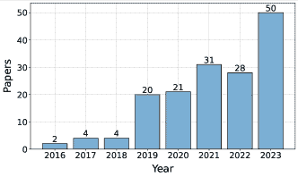
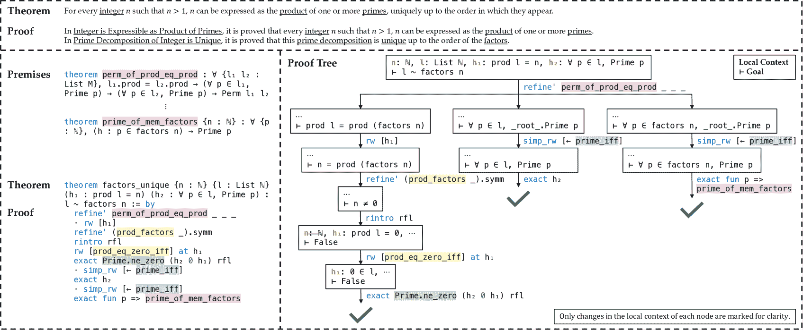

<!--yml

category: 未分类

日期：2024-09-06 19:33:18

-->

# [2404.09939] 关于定理证明的深度学习调查

> 来源：[`ar5iv.labs.arxiv.org/html/2404.09939`](https://ar5iv.labs.arxiv.org/html/2404.09939)

\forestset

direction switch/.style= forked edges, for tree= calign=last, edge+=thick, font=, , where level=1minimum width=13em, where level¡=2draw=red, where level¿=1folder, grow’=0, ,

# 关于定理证明的深度学习调查

Zhaoyu Li¹, Jialiang Sun¹, Logan Murphy¹, Qidong Su¹, Zenan Li², Xian Zhang³

Kaiyu Yang⁴, Xujie Si¹

¹多伦多大学, ²南京大学, ³微软亚洲研究院, ⁴加州理工学院

[`github.com/zhaoyu-li/DL4TP`](https://github.com/zhaoyu-li/DL4TP)

###### 摘要

定理证明是数学的一个基本方面，涵盖了从数学语言中的非正式推理到正式系统中的严格推导。近年来，深度学习的发展，特别是大语言模型的出现，引发了大量研究探索这些技术以提升定理证明过程。本文呈现了一项开创性的关于定理证明的深度学习的综合调查，提供了 i) 对现有方法的全面回顾，包括自动形式化、前提选择、证明步骤生成和证明搜索等任务；ii) 对现有数据集和数据生成策略的细致总结；iii) 对评估指标和最先进技术性能的详细分析；iv) 对持续挑战和未来研究方向的批判性讨论。我们的调查旨在作为定理证明中深度学习方法的基础参考，力图推动这一快速发展的领域的进一步研究。

## 1 引言

证明定理是数学的基石。自公元前 300 年左右欧几里得时代以来，人们通过自然语言和数学符号的结合来构建定理和证明，并通过手动检查仔细评估其正确性。在 1950 年代，随着计算机辅助证明的探索（Davis, 1957; Davis & Putnam, 1960），发生了一次范式转变，其中机器自动应用推理规则来证明断言。这些创新为后来的交互式定理证明器（Bruijn, de, 1970; Milner, 1972）的发展奠定了基础，使人们能够通过与这些系统交互来构建更复杂的定理和证明。在这些进展的基础上，后来的研究将定理证明的范围扩展到了数学之外，将其应用于软件验证（Schumann, 2001）和硬件设计（Kern & Greenstreet, 1999）等各种实际应用。

图 1：近年来关于定理证明的深度学习论文。

探索基于学习的方法进行定理证明一直是一个长期的研究重点，追溯到 1990 年代（Suttner & Ertel，1990；Denzinger et al.，1999）。近年来深度学习的发展，特别是大型语言模型（LLMs）的演变，再次激发了对这一领域的研究兴趣。如图 1 所示，关于定理证明的深度学习论文的数量从 2016 年的约 2 篇增长到 2023 年的 50 篇。然而，尽管增长如此显著，该领域特征上任务、方法、数据集和评估范围广泛，缺乏一个统一的框架来理解真正的进展程度，并指出潜在的挑战和未来的工作方向。

在本文中，我们对超过 170 篇关于定理证明的深度学习研究论文进行了全面的综述，旨在系统地描绘当前的研究现状，并突出关键进展。我们首先介绍定理证明的非正式和正式设置的背景（§2）。随后，我们深入探讨这一领域的任务和方法的细节（§3），包括自动形式化、前提选择、证明步骤生成、证明搜索等任务。我们还回顾了定理证明的数据集（§4），包括手动策划的和合成生成的数据集。此外，我们评估了现有方法中使用的指标并评估其性能（§5）。接下来，我们讨论了当前面临的挑战，并总结未来的方向（§6）。

## 2 背景

在这一节中，我们回顾非正式和正式定理证明的基本概念。图 2 展示了这两种设置的示例。

图 2：上：在[ProofWiki](https://proofwiki.org/wiki/Fundamental_Theorem_of_Arithmetic)中对算术基本定理的非正式声明和证明。下左：在 Lean 4 的 mathlib 库（mathlib Community，2020）中对同一定理的正式声明和证明。下右：在 Lean 4 中说明正式证明过程的相应证明树。非正式和正式证明中使用的参考文献和前提分别用下划线和颜色标出。

### 2.1 非正式定理证明

非正式定理证明涉及通过直观推理和自然语言解释，在现有知识的基础上建立数学声明的真理。这类似于人们在日常数学中学习和证明定理的方式。例如，为了证明图 2（顶部）中的算术基本定理，需要理解基本概念如质数，并可能应用已建立的结果来得出结论。尽管非正式定理证明普遍存在，但随着数学的发展，理论和证明趋向于更加复杂，使得验证其正确性变得越来越困难。

### 2.2 正式定理证明

正式定理证明以机器可验证的格式表示定理和证明，通过严格的逻辑规则确保其正确性。该领域大致可以分为两种范式：自动定理证明（ATP）和互动定理证明（ITP）。

ATP 旨在完全自动地验证正式声明。基于饱和度的定理证明器，包括 E（Schulz，2002）和 Vampire（Kovács & Voronkov，2013），主要在一阶逻辑（FOL）上运作，从一组公理中自主生成逻辑结果，直到得出证明或反驳，或达到计算极限。同样，几何 ATP 系统如 GEX（Chou et al.，2000）通过迭代应用推理规则来证明几何问题。其他方法，如基于表格的方法，如 leanCoP（Otten & Bibel，2003）和基于实例化的方法，如 iProver（Korovin，2008），使用其他形式的证明演算来进行证明构建。尽管这些 ATP 系统设计精巧，但固有的广泛搜索空间往往限制了它们在更复杂问题中的实用性。

在交互式定理证明（ITP）中，人类通过与*证明助手*（如 Isabelle（Paulson, 1994）、HOL Light（Harrison, 1996）、Coq（Barras et al., 1999）和 Lean（Moura & Ullrich, 2021）等）互动来协作证明定理。这些证明助手通常使用户能够在高阶逻辑中形式化定理，并提供一种语言来构建可验证的证明。如图 2（左下角）所示，在 Lean 中证明一个定理（初始目标）时，可以使用*策略*如 refine’和 rw 作为证明步骤。应用一个策略要么完成目标，要么将其分解为更简单的子目标，当没有进一步的目标时，证明即为完成。在证明当前目标时，可以将局部上下文中的假设和环境中之前证明的前提作为策略参数。例如，前提 perm_of_prod_eq_prod 被用作 refine’的参数。证明过程可以建模为证明树，每个节点是一个带有目标及其局部上下文的证明状态，每个边是一个策略，如图 2（右下角）所示。利用证明助手，研究人员成功形式化并证明了标志性的定理，如四色定理（Gonthier, 2008）和开普勒猜想（Hales et al., 2017），并验证了关键软件的正确性，如 seL4 微内核（Klein et al., 2009）和 CompCert C 编译器（Leroy et al., 2016）。然而，值得注意的是，这些项目花费了数年的博士研究时间，需要大量的劳动和专业知识。

## 3 任务与方法

深度学习的出现为定理证明的领域开辟了新的途径，无论是增强还是替代了过程中涉及的传统组件。本节将现有的深度学习方法分类和总结为 5 个任务：自动形式化、前提选择、证明步骤生成、证明搜索以及其他。

### 3.1 自动形式化

自动形式化旨在将非正式的定理和证明自动转换为机器可验证的格式。这个任务因其挑战性而闻名，要求对非正式和正式数学的语义有深刻理解（Kaliszyk et al., 2014; 2015）。尽管如此，自动形式化的成功有望促进数学论文的验证，并为通用推理引擎铺平道路（Szegedy, 2020）。

Wang 等（2018；2020）首次探索了使用深度学习模型进行自动形式化。他们受到神经机器翻译中的序列到序列模型（Sutskever 等，2014；Cho 等，2014）的启发，实验了各种编码器-解码器框架（Luong 等，2017；Lample 等，2018；Lample & Conneau，2019）以将 LaTeX 编写的数学文本转换为 Mizar 语言（Rudnicki，1992）。后续研究（Bansal & Szegedy，2020；Cunningham 等，2022）利用类似的神经架构处理 HOL Light 和 Coq。

最近，大型语言模型（LLMs）及其上下文学习能力（Brown 等，2020）为自动形式化提供了新的机遇。Wu 等（2022）；Agrawal 等（2022）；Gadgil 等（2022）研究了使用 PaLM（Chowdhery 等，2023）和 Codex（Chen 等，2021）通过少量示例提示将数学问题翻译成 Isabelle 和 Lean 的自动形式化前景。一些研究人员（Jiang 等，2023b；Patel 等，2023；Zhao 等，2023；Xin 等，2024）提出了更结构化的自动形式化方法：例如，DSP（Jiang 等，2023b）利用 Minerva（Lewkowycz 等，2022）起草非正式证明并将其映射到正式草图中，使用 ATP 系统填补证明草图中的缺失细节。Zhao 等（2023）通过子目标证明和提示选择分别改进了 DSP 中的非正式证明和正式草图。此外，一些研究（Azerbayev 等，2023；Jiang 等，2023a；Azerbayev 等，2024；Shao 等，2024；Ying 等，2024）集中于在大规模数据集上训练 LLMs，包括非正式和正式数学数据，以评估其在自动形式化中的表现。近期研究（Liu 等，2023；Ye 等，2023；Zhou 等，2024a；Huang 等，2024）还探讨了某些下游任务中的自动形式化：例如，SAT-LM（Ye 等，2023）使用 LLMs 对自然语言问题进行形式化，并通过 ATP 系统解决多个推理任务。DTV（Zhou 等，2024a）利用自动形式化来巩固 LLM 推理，形式化 LLM 生成的答案，并使用 ATP 工具进行验证。除了这些努力，Wu 等（2022）；Azerbayev 等（2023）；Jiang 等（2023a）探索了像 Codex 和 GPT-4（Achiam 等，2023）这样的高级 LLMs 用于非正式化，即将正式声明翻译成自然语言。

### 3.2 前提选择

在给定大量之前证明过的引理的情况下，前提选择是检索那些可以对成功证明作出贡献的有用引理。这在数学研究和 ATP/ITP 系统中是一个持久的挑战（Kühlwein 等，2012；Alama 等，2014）。

重要的研究成果（Irving 等，2016；Kaliszyk 等，2017）将前提选择建模为二分类任务，使用包括卷积神经网络（CNNs）、递归神经网络（RNNs）和混合模型在内的各种神经网络对定理和前提进行嵌入。这些嵌入随后被组合以输入到一个逻辑层，以预测它们的相关性。后续的研究（Kucik & Korovin，2018；Bansal 等，2019；Piotrowski & Urban，2020a；Proroković 等，2021；Szegedy 等，2021）通过使用更好的特征表示或更复杂的架构如 Wavenet（Van Den Oord 等，2016）和 Transformer（Vaswani 等，2017）扩展了之前的框架。

鉴于数学公式固有的结构化特性，一系列研究（Wang 等，2017；Peng & Ma，2017；Olšák 等，2019；Goertzel & Urban，2019；Crouse 等，2019；Paliwal 等，2020；Rawson & Reger，2020；Liu 等，2022a；Goertzel 等，2022；Holden & Korovin，2023；Jakubüv 等，2023）将形式声明解析为树或有向无环图，并利用树结构神经网络（Tai 等，2015）或图神经网络（GNNs）（Duvenaud 等，2015；Veličković 等，2018；Xu 等，2019）进行编码。例如，FormulaNet（Wang 等，2017）提出了一种保留边顺序信息的图嵌入方法。Olšák 等（2019）介绍了一种 GNN 框架，捕捉了 FOL 公式中的多个逻辑不变性。Paliwal 等（2020）进行了综合实验，以评估 HOL Light 中公式图表示的各种设计。后续工作（Li 等，2021b；Lin 等，2021）探索了图对比学习（Oord 等，2018；Chen 等，2020），以训练 GNNs 进行前提选择。此外，Ferreira & Freitas（2020b）；Bauer 等（2023）通过将定理和前提表示为节点，将它们的依赖关系表示为边，构建了一个大语料库上的依赖图，利用 GNNs 预测节点之间的链接以进行前提选择。

随着预训练语言模型的进步，一些研究 (Ferreira & Freitas, 2020a; Welleck et al., 2021) 对 BERT (Devlin et al., 2019)-类模型进行了微调，以将自然语言陈述嵌入向量中，并使用线性分类器层选择前提。后来的工作 (Ferreira & Freitas, 2021; Tran et al., 2022; Trust et al., 2022; Dastgheib & Asgari, 2022; Yeh et al., 2023; Yang et al., 2023) 利用不同的预训练模型 (Liu et al., 2019; Song et al., 2020; Xue et al., 2022) 进行编码，并基于多个相似性度量来检索非正式/正式前提。Han et al. (2021) 还探索了使用对比目标 (Oord et al., 2018) 在大型非正式数学语料库上进行微调，而 PACT (Han et al., 2022) 则使用自回归目标进行正式前提选择。此外，一些研究 (Kovriguina et al., 2022; Tworkowski et al., 2022; Mikuła et al., 2024) 设计了第二阶段来重新排序选定的前提子集，从而实现更准确的选择。

### 3.3 证明步骤生成

证明步骤生成是定理证明的核心问题，其目标是预测一个或多个步骤以建立定理的证明。这个任务也指的是 ITP 中的策略预测，已在基于策略的 ATP 系统 (hammers) (Böhme & Nipkow, 2010; Blanchette et al., 2016; Czajka & Kaliszyk, 2018) 中得到了广泛研究。

一系列研究 (Whalen, 2016; Huang et al., 2019; Bansal et al., 2019; Paliwal et al., 2020; Sanchez-Stern et al., 2020; Wu et al., 2021b; Rute et al., 2024) 将策略预测视为分类问题，并使用不同的神经网络来预测策略及其参数。例如，Gamepad (Huang et al., 2019) 使用 TreeLSTM (Tai et al., 2015) 来编码证明状态，并为策略和参数预测使用两个不同的线性层。Proverbot9001 (Sanchez-Stern et al., 2020) 分别使用前馈神经网络和 RNN 来预测策略及其参数。除了这些工作之外，ASTactic (Yang & Deng, 2019) 提出了一个解码器，该解码器将策略生成作为一个程序，并使用 RNN 基于预定义的上下文无关文法来控制生成。后来的研究 (First et al., 2020; First & Brun, 2022; Sanchez-Stern et al., 2023) 通过结合先前的证明脚本、组合多种模型以及建模定理标识符来改进 ASTactic。

后续的进展（Polu & Sutskever, 2020; Polu et al., 2023; Han et al., 2022; Jiang et al., 2021; Zhang et al., 2023a; Yeh et al., 2023; Xiong et al., 2023; Welleck & Saha, 2023; Vishwakarma & Mishra, 2023; Gloeckle et al., 2023; First et al., 2023) 将战术预测形式化为语言建模。具体来说，GPT-$f$（Polu & Sutskever, 2020）首先应用条件语言建模目标来训练仅解码器的 Transformers，以生成格式为 GOAL <GOAL> PROOFSTEP <PROOFSTEP><EOT>的证明步骤。Baldur（First et al., 2023）应用类似的目标来一次性生成或修复整个证明。一些研究（Szegedy et al., 2021; Tworkowski et al., 2022; Welleck et al., 2022; Jiang et al., 2022; Yang et al., 2023）还将战术预测与前提选择联合训练。例如，NaturalProver（Welleck et al., 2022）训练 GPT-3（Brown et al., 2020）进行受限解码，以鼓励在证明步骤中使用检索的参考资料。Thor（Jiang et al., 2022）添加了一个<hammer>标记以学习何时调用 ATP 工具（Böhme & Nipkow, 2010）进行前提选择，以简化证明。在几何领域，Chen et al.（2022）；Liang et al.（2023a）；Trinh et al.（2024）；He et al.（2024）遵循相同的范式，自回归地生成每一步的证明序列。值得注意的是，AlphaGeometry（Trinh et al., 2024）训练仅解码器的 Transformer 来预测国际数学奥林匹克（IMO）几何问题的辅助构造。除了在证明数据上进行训练外，Azerbayev et al.（2024）；Shao et al.（2024）；Ying et al.（2024）还在广泛的数学通用语料库上训练 LLMs，并评估它们生成形式证明的能力。

最近的探索（Zhang et al., 2023b; Yousefzadeh & Cao, 2023; Scheidt, 2023; Frieder et al., 2023a; c; b; Zhang et al., 2024; Poulsen et al., 2024）还研究了几种提示方法在各个领域的高级 LLMs 的证明生成。替代性工作（Jiang et al., 2023b; Zhao et al., 2023; Zheng et al., 2023; Xin et al., 2024）利用自动形式化在结构化管道中生成非正式问题的形式证明。

### 3.4 证明搜索

证明搜索旨在系统地遍历潜在证明路径的广阔领域，为给定定理在形式系统中构建有效的证明树。这不仅是 ATP 中的一个长期研究重点（Urban 等，2011；Kaliszyk & Urban，2015a；Jakubüv & Urban，2017），而且是基于策略的模型在 ITP 中完成证明的关键过程。

一项研究线程在现有成功的证明路径上以监督的方式训练深度学习模型，以指导 ATP 系统中的搜索。具体而言，大量的研究工作（Loos 等，2017；Chvalovskỳ等，2019；Jakubüv & Urban，2019；Aygün 等，2020；Jakubüv 等，2020；Suda，2021b；Chvalovskỳ等，2021；Goertzel 等，2021；Suda，2021a；Firoiu 等，2021；Aygün 等，2022；Goertzel 等，2022；Jakubüv 等，2023；Bártek & Suda，2023）利用 RNNs、GNNs 或混合模型进行饱和证明器中的子句选择。Piepenbrock 等（2022b）；Chvalovskỳ等（2023）和 Piotrowski & Urban（2020b）分别集中于指导实例化和连接表。某些研究（Rawson & Reger，2019；Olšák 等，2019；Rawson & Reger，2021；Zombori 等，2021b）进一步将监督训练的模型作为策略或价值网络来指导蒙特卡洛树搜索（MCTS）或 A*搜索，涵盖各种 ATP 系统。此外，另一方向的研究（Kusumoto 等，2018；Fawzi 等，2019；Abdelaziz 等，2020；Zombori 等，2021a；Crouse 等，2021；Piepenbrock 等，2021；2022a；Liu 等，2022b；Abdelaziz 等，2022；Fokoue 等，2023；McKeown & Sutcliffe，2023；Shminke，2023）将证明搜索建模为马尔可夫决策过程，并应用深度强化学习来训练和指导证明搜索。例如，TRAIL（Crouse 等，2021）使用策略梯度（Sutton 等，1999）在饱和证明器中训练基于注意力的动作策略，而 Fawzi 等（2019）应用深度 Q 学习（Mnih 等，2013）来指导半代数证明系统（Lovász & Schrijver，1991）中推理规则的选择。

大多数基于策略的模型在 ITPs 中使用束搜索，通过广度优先（Bansal 等，2019）、深度优先（Yang & Deng，2019）或最佳优先启发式（Polu & Sutskever，2020）来对每一步进行多个策略预测，遍历搜索空间。特别地，GPT-$f$（Polu & Sutskever，2020）和 FMSCL（Polu 等，2023）训练语言模型，以结果和证明规模目标作为价值函数，执行最佳优先搜索。除了这些方法，Whalen（2016）；Mo 等（2020）；Gauthier（2020）；Wu 等（2021a）；Gauthier（2021）；Lample 等（2022）；Wang 等（2023a）；Brandfonbrener 等（2024）结合了 MCTS 或使用强化学习来训练和指导搜索过程。例如，HTPS（Lample 等，2022）采用了类似 AlphaZero（Silver 等，2018）的方法进行在线训练，而 DT-Solver（Wang 等，2023a）通过动态树采样和证明级别价值函数改进了 MCTS。此外，COPRA（Thakur 等，2023）实现了一种语言代理方法，利用 GPT-4 基于证明历史进行回溯搜索。

### 3.5 其他任务

除了之前概述的主要任务外，我们简要列出了一些与定理证明相关或有助于定理证明的其他预测任务。一些研究（Urban & Jakubüv，2020；Piotrowski & Urban，2020b；Rabe 等，2021；Johansson & Smallbone，2023）探讨了自动猜想。Lee 等（2020）；Wu & Wu（2021）研究了在潜在空间中证明定理。IsarStep（Li 等，2021a）在给定周围证明的情况下预测中间命题。Skip-tree（Rabe 等，2021）和 PACT（Han 等，2022）通过掩盖各种证明项提出了几个自监督任务，用于训练语言模型。LIME（Wu 等，2021c）构建了三个推理任务，用于演绎、归纳和推测。最近，Li 等（2023）提出了将证明与来自大数据库的定理声明进行匹配，REFACTOR（Zhou 等，2024b）预测从证明中提取定理。

## 4 数据集

本节将定理证明的数据集分类和总结为两类：i) 从现有语料库中提取或手动策划的数据集，以及 ii) 使用合成生成或增强方法的数据集。这些数据集的概述见图 3。

### 4.1 数据收集

我们首先回顾非正式数据集。NL-PS (Ferreira & Freitas, 2020a) 首先构建了一个来自 [ProofWiki](https://proofwiki.org) 的自然语言前提选择数据集。类似地，NaturalProofs (Welleck et al., 2021) 进一步融合了来自 [Stacks](https://stacks.math.columbia.edu/) 和教科书的数据，形成了一个大约包含 25k 示例的数据集。根据此数据集改编，NaturalProofs-Gen (Welleck et al., 2022) 包含大约 14.5k 个用于非正式证明生成的定理。此外，MATcH (Li et al., 2023) 构建了超过 180k 个陈述-证明对用于匹配，使用了 [MREC corpus](https://mir.fi.muni.cz/MREC/)。

对于正式数据集，一系列努力集中在从既有的正式库和验证项目中提取和清理定理和证明。 Coq 的著名数据集包括 Gamepad (Huang et al., 2019)、CoqGym (Yang & Deng, 2019) 和 PRISM (Reichel et al., 2023)，其中 CoqGym 从 123 个项目中构建了一个包含 71k 证明的数据集。对于 Isabelle，像 IsarStep (Li et al., 2021a)、PISA (Jiang et al., 2021) 和 Magnushammer (Mikuła et al., 2024) 的数据集是基于 [Archive of Formal Proofs](https://www.isa-afp.org/) 和 [Isabelle Standard Library](https://isabelle.in.tum.de/library/)，其中 PISA 提取了 183K 个定理和 2.16M 个证明步骤。LeanStep (Han et al., 2022)、LeanDojo (Yang et al., 2023) 和 MLFMF (Bauer et al., 2023) 在 Lean 中利用了 mathlib 库 (mathlib Community, 2020)。特别是，LeanDojo 从 mathlib 中提取了超过 98k 个定理和证明及 130k 个前提。其他证明助手的数据集包括 HolStep (Kaliszyk et al., 2017) 和 HOList (Bansal et al., 2019) 用于 HOL Light，MPTP2078 (Alama et al., 2014)、Mizar40 (Kaliszyk & Urban, 2015b) 和 M2K (Kaliszyk et al., 2018) 用于 Mizar 等。除了从现有项目中提取数据之外，还有一些工作手动标注或形式化自然语言中的问题。特别是，MiniF2F (Zheng et al., 2022) 手动形式化了 488 个奥林匹克级问题，涵盖 4 个证明系统，并将它们均分为验证集和测试集。FIMO (Liu et al., 2023) 和 ProofNet (Azerbayev et al., 2023) 在 Lean 中形式化了 IMO 和本科级问题的定理陈述。对于其他领域，TRIGO (Xiong et al., 2023) 旨在形式化三角形化简问题，而 UniGeo (Chen et al., 2022) 和 FormalGeo (Zhang et al., 2023c) 注释了几何证明问题的证明步骤。

另一方面，大量近期研究利用包含数十亿标记的规模庞大的在线语料库，这些语料库包括非正式和正式的数学数据，以构建可能有助于定理证明的预训练数据集。这些数据集包括 WebMath (Han et al., 2022)，Proof-Pile (Azerbayev et al., 2023)，InternLM-Math (Ying et al., 2024)等。

{森林}

分叉边缘，树=生长=东，反向=true，锚点=基线西，父锚点=东，子锚点=西，基点=左，字体=，矩形，描边=黑色，圆角，左对齐，最小宽度=2.5em，边缘+=黑色，线宽=0.5pt，s sep=3pt，内部 xsep=1.9pt，内部 ysep=1.9pt，线宽=0.5pt，ver/.style=旋转=90，子锚点=北，父锚点=南，锚点=中心，，当级别=0 时文本宽度=2.2em，字体=，，当级别=1 时文本宽度=4.4em，字体=，，当级别=2 时文本宽度=3.8em，字体=，，当级别=3 时文本宽度=38.6em，字体=，， 数据集 [数据收集 [自然

语言 [例如，NL-PS (Ferreira & Freitas, [2020a)，NaturalProofs (Welleck et al., 2021)，NaturalProofs-Gen (Welleck et al., 2022)，MATcH (Li et al., 2023)]] Coq [例如，GamePad (Huang et al., [2019)，CoqGym (Yang & Deng, 2019)，PRISM (Reichel et al., 2023)]] Isabelle [例如，IsarStep (Li et al., [2021a)，PISA (Jiang et al., 2021)，MiniF2F (Zheng et al., 2022)，Magnushammer (Mikuła et al., 2024)]] Lean [例如，LeanStep (Han et al., [2022)，MiniF2F (Zheng et al., 2022)，FIMO (Liu et al., 2023)，TRIGO (Xiong et al., 2023),

ProofNet (Azerbayev et al., 2023)，LeanDojo (Yang et al., 2023)，MLFMF (Bauer et al., 2023)]] HOL Light [例如，HolStep (Kaliszyk et al., [2017)，HOList (Bansal et al., 2019)，MiniF2F (Zheng et al., 2022)]] Mizar [例如，MPTP2078 (Alama et al., [2014)，Mizar40 (Kaliszyk & Urban, 2015b)，M2K (Kaliszyk et al., 2018)]] 几何 [例如，UniGeo (Chen et al., [2022)，FormalGeo (Zhang et al., 2023c)]] 其他

语言 [例如，Holophrasm (Whalen, [2016)，TPTP (Sutcliffe, 2017)，TacticToe (Gauthier et al., 2020)，MLFMF (Bauer et al., 2023)]] 预训练

语料库 [例如，WebMath (Polu & Sutskever, [2020)，Proof-Pile (Azerbayev et al., 2023)，MathPile (Wang et al., 2023b)，OpenWebMath (Paster et al., 2024)，

Proof-Pile-v2 (Azerbayev et al., 2024)，DeepSeekMath (Shao et al., 2024)，InternLM-Math (Ying et al., 2024)]] ] 数据生成 [基于规则

生成器 [例如，INT (Wu et al., [2021b), MetaGen (Wang & Deng, 2020), LIME (Wu et al., 2021c), FwdP (Firoiu et al., 2021)

AutoTrig (Liu et al., 2022b), TRIGO-gen (Xiong et al., 2023), GeomVerse (Kazemi et al., 2023), AlphaGeometry (Trinh et al., 2024)]] 迭代

增强 [例如，DeepHOL (Bansal et al., [2019), GPT-$f$ (Polu & Sutskever, 2020), FMSCL (Polu et al., 2023), HER (Aygün et al., 2022)]] 引理

发现 [例如，LEGO-Prover (Xin et al., [2024), REFACTOR (Zhou et al., 2024b)]] 其他

方法 [例如，MMA (Jiang et al., [2023a), MUSTARD (Huang et al., 2024)]] ] ]

图 3：定理证明中的数据集分类。

### 4.2 数据生成

除了利用现有项目，研究人员还研究了新证明数据的生成。一系列工作 (Wu et al., 2021b; c; Firoiu et al., 2021; Liu et al., 2022b; Xiong et al., 2023; Kazemi et al., 2023; Trinh et al., 2024) 开发了基于规则的生成器，通过从预定义集合中迭代采样推理规则和公理来生成定理和证明。这种生成过程使得可以手动控制难度。例如，INT (Wu et al., 2021b) 生成具有不同证明长度的不等式定理，而 GeomVerse (Kazemi et al., 2023) 针对具有 5 个难度维度的几何问题。MetaGen (Wang & Deng, 2020) 进一步训练了一个神经生成器来合成类似于人类编写的定理。

替代方法转向通过固定定理但新生成的证明来迭代增强训练数据集。一系列工作 (Bansal et al., 2019; Polu & Sutskever, 2020; Polu et al., 2023) 采用了专家迭代的理念 (Silver et al., 2018)，该方法重复应用训练过的证明器于现有定理，并将成功的证明路径作为新的数据点来进一步训练证明器。Aygün et al. (2022) 进一步提出将事后经验重放 (Aygün et al., 2022) 适应于 FOL 证明器，这通过将先前未成功的证明轨迹视为期望的结果来利用这些轨迹。同时，一系列强化学习方法也可以被视为这一类别。

另外，一些研究致力于生成中间的有用引理。REFACTOR（Zhou et al., 2024b）训练 GNN 从证明中提取引理，这些引理可以用来简化其他定理的证明。LEGO-Prover（Xin et al., 2024）提示 GPT-4 生成定理证明的子目标引理，并通过证明或检索这些引理来完成定理的证明。新证明的引理会被添加到一个不断增长的库中以供将来使用。尽管生成的猜想可能不正确，关于猜想的研究仍然与这一领域相关。

此外，一些近期的方法利用自动（非）形式化进行数据生成。使用 GPT-4，MMA（Jiang et al., 2023a）将《形式化证明档案》和 mathlib 中的所有定理语句进行非形式化，而 MUSTARD（Huang et al., 2024）则从种子概念中合成问题，制作非形式化证明，并将其翻译成 Lean 以验证正确性。

## 5 评估

在本节中，我们重点关注深度学习方法在定理证明中的评估，分析每个任务的关键指标和最先进的性能。

自动形式化。自动形式化的评估主要依赖于手动检查非形式化和形式化语句之间的等价性。通过这种评估，近期的研究（Wu et al., 2022; Azerbayev et al., 2023）表明，最先进的 LLMs 在少量提示下能够正确形式化 25% 和 13% 的高中和本科水平的问题，显示了自动形式化的挑战。此外，两项研究还揭示 LLMs 在非形式化中的效果明显更高，准确率分别达到约 76% 和 62%。尽管在形式化语句上取得了适度成功，但后续研究（Jiang et al., 2023b; Zhao et al., 2023; Xin et al., 2024）揭示了在模块化流程中自动形式化非形式化中间目标以证明定理的价值。

前提选择。检索指标被广泛用作前提选择的评估指标。例如，k 处的召回率（R@k）衡量的是在前 k 个选择中正确使用的前提的比例，而平均倒排排名（MRR）计算的是第一个正确选择的前提的平均倒排排名。基于 Transformer 编码器的密集段落检索（DPR）（Karpukhin 等，2020）显著提高了传统方法的性能，展示了对未见数据的卓越泛化能力。例如，ReProver（Yang 等，2023）在 LeanDojo 基准上对训练中未见前提的检索达到 R@10 的 27.6% 和 MRR 的 0.24，而 BM25（Robertson 等，2009）则达到 R@10 的 15.5% 和 MRR 的 0.14。此外，基于 DPR 的检索器 Magnushammer（Mikuła 等，2024）在用于选择 Thor 证明器（Jiang 等，2022）的前提时优于符号方法 Sledgehammer（Böhme & Nipkow，2010），在 PISA 数据集上的定理证明成功率从 57% 提升到 71%，在 MiniF2F-valid 数据集上的成功率从 28.3% 提升到 36.9%。

定理证明。证明步骤生成、证明搜索以及自动形式化和前提选择的支持效果可以通过它们在测试集中的定理证明成功率来综合评估。最近的研究（Zheng 等，2023；Xin 等，2024）表明，使用像 GPT-4 这样的最先进 LLM 在结构化框架中的表现比使用最佳优先搜索的基于策略的模型更为出色。例如，LEGO-Prover（Xin 等，2024）在 MiniF2F 的有效集和测试集上的准确率分别为 57.0% 和 50.0%，而之前最佳的模型 Thor（Jiang 等，2022）通过专家迭代训练（Wu 等，2022）的准确率为 37.3% 和 35.2%。此外，基于深度学习的证明搜索可以进一步提高 ITP/ATP 系统的性能。HTPS（Lample 等，2022）通过在线训练在 MiniF2F-valid 上达到了 58.6% 的累积成功率，并在 MiniF2F-test 上通过 64 次搜索尝试达到了 41.0% 的成功率。此外，基于强化学习的 ATP 证明器 NIAGRA（Fokoue 等，2023）在 MPTP2078 数据集上超越了 E（Schulz，2002）和 Vampire（Kovács & Voronkov，2013）。

注意事项。与定理证明相关的任务可能难以评估。对于自动形式化，人工评估成本高，而自动化指标不准确。例如，编译率只评估语法正确性，而 BLEU 分数（Papineni 等，2002）在形式化过程中处理语义相似但与真实情况不完全一致的内容时表现不佳。对于前提选择，指标依赖于在真实证明中使用的前提，因此可能忽略其他有效的前提，这些前提可以用于与真实证明不同的替代正确证明，从而导致假阴性。最后，定理证明的评估因各种实验设置而复杂化（§ 6.1）。

## 6 讨论

### 6.1 挑战

尽管取得了显著进展，但深度学习在定理证明方面仍面临许多挑战，包括数据稀缺、评估协议不统一和人机互动。

数据稀缺。形式证明数据量虽然在增长，但仍远远落后于其他 LLM 成功的领域，例如代码生成。最大的 Isabelle 证明语料库，Formal Proofs Archive，目前包含 250K 个证明。Lean 的 mathlib 包含 140K 个证明。这些数据量对于小型模型（例如，数十亿参数）来说是相当的，但对于拥有数百亿参数的模型则不够。虽然基于规则的生成器可以提供一些帮助，但生成数据的复杂性和质量通常无法与人工编写的匹配。此外，由于难以获得对齐的非正式-正式对，自动形式化的数据更加稀缺。

评估。与传统的深度学习任务（如分类）相比，全面评估定理证明者的性能要困难得多。首先，不同证明助手之间的结果不可比较。即使 MiniF2F 在多个证明助手中可用，由于证明自动化（例如，Isabelle 有 Sledgehammer（Böhme & Nipkow，2010），而 Lean 没有）的影响往往超过了深度学习模型之间的差异。其次，评估过程中的资源限制（例如，时间、尝试次数）可能会影响性能和不同方法的相对排名。与时间限制相比，尝试次数更有利于较大的模型，如 LLMs。相比之下，实时应用中的紧迫时间限制可能更倾向于简单但快速的模型。在没有特定应用背景的情况下，不清楚哪个评估设置最合理。尽管已有初步努力（Rute 等，2024），但我们作为一个社区仍然缺乏对这种权衡的系统性理解。

人工智能与人类的互动。定理证明的一个动机是协助人类数学家（Castelvecchi, 2021；Sørensen et al., 2021）。然而，现有的研究却意外地导致了很少有对他们有用的工具。目前的方法是按照标准深度学习协议进行评估：在 Python 程序中运行神经网络或查询大语言模型，测试证明器在数据集上的表现，并计算成功证明的百分比。这种做法与数学家的需求不匹配。首先，数学家需要一个可以在证明助手中轻松调用的工具。其次，该工具必须在消费级 CPU 上低延迟运行。第三，数学家更关心的是证明器是否能帮助他们解决具体的定理，而不是性能指标。这些定理通常超出训练分布，并对证明器在其他领域的推广提出挑战。尽管已经做出初步努力开发面向用户的工具（Song et al., 2023；Welleck & Saha, 2023），但在改善用户体验和探索其他形式的互动方面仍有大量空间，这需要深度学习研究人员和数学家之间的密切合作（Collins et al., 2023）。

### 6.2 未来方向

将深度学习，特别是大语言模型（LLMs），与形式数学结合，为提升人工智能的数学能力提供了一个有前景的途径，并可能对各个学科产生重大影响。我们通过列举一些我们特别感兴趣的未来方向来结束我们的调查论文，展望这些新兴领域的重大进展：

推测。除了仅仅证明定理之外，数学家们总是会探索某个领域中的理论，识别潜在的问题结构，并提出新的猜想。这些围绕猜想的探索活动对数学家来说是不可或缺的，但目前在人工智能中仍然有限（Urban & Jakubüv, 2020；Johansson & Smallbone, 2023）。通过使人工智能能够进行推测，它可以自主探索数学空间。此外，当与定理证明结合时，这种探索可以用于发现新的数学知识。推测的直接应用是生成有用的定理和证明，这可以缓解定理证明中固有的数据稀缺问题。

验证代码生成。随着 AI 编码助手如 GitHub Copilot 的普及，验证 LLM 生成的代码变得越来越重要。证明助手，特别是 Coq，已被广泛用于软件验证（Leroy et al.，2016）。因此，本文调查的定理证明方法可能在生成验证代码中发挥作用。在这个领域有大量问题值得探索。例如，可以提示 LLMs 合成归纳循环不变式（Kamath et al.，2023）或生成如 Dafny（Sun et al.，2023）等适合验证的语言中的程序。

数学教育。民主化数学教育的一个障碍是缺乏合格的导师来为学生提供反馈（Liang et al.，2023b）。正式数学可以通过提供一个环境来减轻这个问题，使学生能够探索并获得自动且可靠的反馈。AI 在引导学生这一过程中展现了潜力。例如，Kevin Buzzard 报告称，Lean Copilot 可以帮助证明他本科课程中的多个定理，并回答关于 Lean Zulip 的问题（Buzzard，2024）。为了进一步将 AI 驱动的正式辅导整合到主流教育中，非正式化也是必要的，以使这些正式证明对不熟悉正式语言的学生可访问。展望未来，我们相信 LLMs 和定理证明可以在各种 STEM 课程中带来智能辅导员。

## 参考文献

+   Abdelaziz et al. (2020) Ibrahim Abdelaziz, Veronika Thost, Maxwell Crouse, 和 Achille Fokoue。第一阶逻辑中公式嵌入的实验研究。*arXiv 预印本 arXiv:2002.00423*，2020 年。

+   Abdelaziz et al. (2022) Ibrahim Abdelaziz, Maxwell Crouse, Bassem Makni, Vernon Austel, Cristina Cornelio, Shajith Ikbal, Pavan Kapanipathi, Ndivhuwo Makondo, Kavitha Srinivas, Michael Witbrock, 等人。学习引导基于饱和的定理证明器。*IEEE 模式分析与机器智能学报*，2022 年。

+   Achiam et al. (2023) Josh Achiam, Steven Adler, Sandhini Agarwal, Lama Ahmad, Ilge Akkaya, Florencia Leoni Aleman, Diogo Almeida, Janko Altenschmidt, Sam Altman, Shyamal Anadkat, 等人。GPT-4 技术报告。*arXiv 预印本 arXiv:2303.08774*，2023 年。

+   Agrawal et al. (2022) Ayush Agrawal, Siddhartha Gadgil, Navin Goyal, Ashvni Narayanan, 和 Anand Tadipatri。使用大型语言模型的数学形式化助手。*arXiv 预印本 arXiv:2211.07524*，2022 年。

+   Alama et al. (2014) Jesse Alama, Tom Heskes, Daniel Kühlwein, Evgeni Tsivtsivadze, 和 Josef Urban。通过语料库分析和核方法进行数学前提选择。*自动推理学报*，2014 年。

+   Aygün et al. (2020) 埃塞尔·阿尤根、扎法拉利·艾哈迈德、安基特·安纳德、弗拉德·菲罗伊、泽维尔·格洛罗、洛朗·奥尔索、多伊娜·普雷库普和希布尔·穆拉德。从合成定理中学习证明。*arXiv 预印本 arXiv:2006.11259*，2020 年。

+   Aygün et al. (2022) 埃塞尔·阿尤根、安基特·安纳德、洛朗·奥尔索、泽维尔·格洛罗、斯蒂芬·M·麦卡利尔、弗拉德·菲罗伊、雷·M·张、多伊娜·普雷库普和希布尔·穆拉德。使用增量学习和后见经验回放证明定理。见于 *第 39 届国际机器学习大会论文集*，2022 年。

+   Azerbayev et al. (2023) 张吉尔·阿泽尔巴耶夫、巴尔托什·皮奥特罗夫斯基、海莉·舍尔科普夫、爱德华·W·艾尔斯、德拉戈米尔·拉德夫和杰里米·阿维戈德。ProofNet: 自动形式化和形式证明本科水平的数学。*arXiv 预印本 arXiv:2302.12433*，2023 年。

+   Azerbayev et al. (2024) 张吉尔·阿泽尔巴耶夫、海莉·舍尔科普夫、基兰·帕斯特、马尔科·多斯·桑托斯、斯蒂芬·麦卡利尔、阿尔伯特·Q·姜、贾·邓、斯特拉·比德曼和肖恩·维莱克。Llemma: 一个开放的数学语言模型。见于 *第十二届国际学习表征会议*，2024 年。

+   Bansal & Szegedy (2020) 克什提吉·班萨尔和克里斯蒂安·塞格迪。学习形式数学与非形式数学之间的对齐。见于 *第五届人工智能与定理证明会议*，2020 年。

+   Bansal et al. (2019) 克什提吉·班萨尔、萨拉赫·M·卢斯、马库斯·诺曼·拉比、克里斯蒂安·塞格迪和斯图尔特·威尔科克斯。HOList: 用于高阶逻辑定理证明的机器学习环境。见于 *第 36 届国际机器学习大会论文集*，2019 年。

+   Barras et al. (1999) 布鲁诺·巴拉斯、塞缪尔·布廷、克里斯蒂娜·科尔内斯、朱迪凯尔·库朗、扬·科斯科伊、大卫·德拉耶、丹尼尔·德·罗格劳德、让-克里斯托夫·菲利亚特、爱德华多·吉门内斯、雨果·赫尔贝林等。Coq 证明助手参考手册。*INRIA*，1999 年。

+   Bártek & Suda (2023) 菲利普·巴尔特克和马丁·苏达。这个符号应该重多少？一个 GNN 建议的子句选择。见于 *第 24 届国际编程逻辑、人工智能和推理会议论文集*，2023 年。

+   Bauer et al. (2023) 安德烈·鲍尔、马特杰·佩特科维奇和柳普科·托多罗夫斯基。MLFMF: 用于数学形式化的机器学习数据集。见于 *第 37 届神经信息处理系统大会数据集与基准跟踪*，2023 年。

+   Blanchette et al. (2016) 贾斯敏·克里斯蒂安·布兰切特、切扎里·卡利斯齐克、劳伦斯·C·保尔森和约瑟夫·厄尔班。朝着 QED 前进。*形式化推理期刊*，2016 年。

+   Böhme & Nipkow (2010) 萨沙·贝默和托比亚斯·尼普科。Sledgehammer: 最终审判。见于 *第五届国际联合自动推理会议论文集*，2010 年。

+   Brandfonbrener et al. (2024) 大卫·布兰德丰布伦、锡比·拉贾、塔伦·普拉萨德、克洛伊·劳里奇、贾南·杨、西蒙·亨尼格、威廉·E·伯德、罗伯特·津科夫和纳达·阿敏。使用大型语言模型和蒙特卡洛树搜索进行经过验证的多步骤合成。*arXiv 预印本 arXiv:2402.08147*，2024 年。

+   Brown 等人 (2020) Tom Brown, Benjamin Mann, Nick Ryder, Melanie Subbiah, Jared D Kaplan, Prafulla Dhariwal, Arvind Neelakantan, Pranav Shyam, Girish Sastry, Amanda Askell 等人。语言模型是少样本学习者。见于 *第 34 届国际神经信息处理系统大会论文集*，2020。

+   Bruijn, de (1970) N.G. Bruijn, de。数学语言 AUTOMATH，它的使用及其一些扩展。见于 *自动证明研讨会论文集*，1970。

+   Buzzard (2024) Kevin Buzzard。2024 年的 Lean。 [`xenaproject.wordpress.com/2024/01/20/lean-in-2024/`](https://xenaproject.wordpress.com/2024/01/20/lean-in-2024/)，2024。

+   Castelvecchi (2021) Davide Castelvecchi。数学家欢迎计算机辅助证明的“宏大统一”理论。*自然*，2021。

+   Chen 等人 (2022) Jiaqi Chen, Tong Li, Jinghui Qin, Pan Lu, Liang Lin, Chongyu Chen 和 Xiaodan Liang。UniGeo：通过重新表述数学表达统一几何逻辑推理。见于 *2022 年自然语言处理经验方法会议论文集*，2022。

+   Chen 等人 (2021) Mark Chen, Jerry Tworek, Heewoo Jun, Qiming Yuan, Henrique Ponde de Oliveira Pinto, Jared Kaplan, Harri Edwards, Yuri Burda, Nicholas Joseph, Greg Brockman 等人。评估基于代码训练的大型语言模型。*arXiv 预印本 arXiv:2107.03374*，2021。

+   Chen 等人 (2020) Ting Chen, Simon Kornblith, Mohammad Norouzi 和 Geoffrey Hinton。视觉表示对比学习的简单框架。见于 *第 37 届国际机器学习大会论文集*，2020。

+   Cho 等人 (2014) Kyunghyun Cho, Bart Van Merriënboer, Caglar Gulcehre, Dzmitry Bahdanau, Fethi Bougares, Holger Schwenk 和 Yoshua Bengio。使用 RNN 编码器-解码器学习短语表示用于统计机器翻译。见于 *2014 年自然语言处理经验方法会议论文集*，2014。

+   Chou 等人 (2000) Shang-Ching Chou, Xiao-Shan Gao 和 Jing-Zhong Zhang。基于演绎数据库的方法进行自动几何定理证明和发现。*自动推理期刊*，2000。

+   Chowdhery 等人 (2023) Aakanksha Chowdhery, Sharan Narang, Jacob Devlin, Maarten Bosma, Gaurav Mishra, Adam Roberts, Paul Barham, Hyung Won Chung, Charles Sutton, Sebastian Gehrmann 等人。PaLM：通过路径扩展语言建模。*机器学习研究期刊*，2023。

+   Chvalovskỳ 等人 (2019) Karel Chvalovskỳ, Jan Jakubüv, Martin Suda 和 Josef Urban。ENIGMA-NG：高效的神经和梯度提升推理指导。见于 *第 27 届自动推理国际会议*，2019。

+   Chvalovskỳ 等人 (2021) Karel Chvalovskỳ, Jan Jakubüv, Miroslav Olšák 和 Josef Urban。学习定理证明组件。见于 *第 30 届自动推理与解析表格及相关方法国际会议*，2021。

+   Chvalovskỳ et al. (2023) 卡雷尔·赫瓦洛夫斯基、康斯坦丁·科罗文、杰勒·皮彭布罗克 和 约瑟夫·厄尔班。通过图神经网络引导实例化证明器。在 *第 24 届逻辑编程、人工智能与推理国际会议论文集*，2023 年。

+   Collins et al. (2023) 凯瑟琳·M·柯林斯、阿尔伯特·Q·姜、西蒙·弗里德、利昂内尔·黄、米里·齐尔卡、乌曼·巴特、托马斯·卢卡谢维奇、余怀·吴、乔舒亚·B·特南鲍姆、威廉·哈特 等人。通过交互评估语言模型在数学领域的表现。*arXiv 预印本 arXiv:2306.01694*，2023 年。

+   Crouse et al. (2019) 麦克斯韦·克劳斯、易卜拉欣·阿卜杜拉齐兹、克里斯蒂娜·科尔内利奥、维罗尼卡·托斯特、林飞·吴、肯尼斯·福布斯 和 阿基尔·福库。通过子图池化改进图神经网络对逻辑公式的表示。*arXiv 预印本 arXiv:1911.06904*，2019 年。

+   Crouse et al. (2021) 麦克斯韦·克劳斯、易卜拉欣·阿卜杜拉齐兹、巴塞姆·马克尼、斯宾塞·怀特黑德、克里斯蒂娜·科尔内利奥、帕万·卡帕尼帕西、卡维塔·斯里尼瓦斯、维罗尼卡·托斯特、迈克尔·维特布罗克 和 阿基尔·福库。一种深度强化学习方法用于一阶逻辑定理证明。在 *第三十五届 AAAI 人工智能大会论文集*，2021 年。

+   Cunningham et al. (2022) 加雷特·坎宁安、拉兹万·C·布内斯库 和 大卫·朱德斯。迈向数学和代码正确性的自动形式化：初步证明的实验。在 *第 1 届数学自然语言处理研讨会* 论文集，2022 年。

+   Czajka & Kaliszyk (2018) 卢卡什·察伊卡 和 塞扎里·卡利希克。Coq 的 Hammer：依赖类型理论的自动化。*自动推理期刊*，2018 年。

+   Dastgheib & Asgari (2022) 多拉托萨达特·达斯特赫伊布 和 埃赫桑丁·阿斯加里。基于关键词的自然语言前提选择用于自动数学陈述证明。在 *TextGraphs-16: 基于图的方法在自然语言处理中的应用* 论文集，2022 年。

+   Davis (1957) 马丁·戴维斯。一个用于 Presburger 算法的计算机程序。*符号计算 1*，1957 年。

+   Davis & Putnam (1960) 马丁·戴维斯 和 希拉里·普特南。量化理论的计算程序。*ACM 期刊*，1960 年。

+   Denzinger et al. (1999) 约尔格·登青格、马蒂亚斯·福克斯、克里斯托夫·戈勒 和 斯特凡·舒尔茨。从以前的证明经验中学习：综述。*技术报告*，1999 年。

+   Devlin et al. (2019) 雅各布·德夫林、明伟·张、肯顿·李 和 克里斯蒂娜·托塔诺瓦。BERT：用于语言理解的深度双向变换器的预训练。在 *2019 年北美计算语言学协会会议：人类语言技术* 论文集，2019 年。

+   Duvenaud et al. (2015) 大卫·K·杜文诺德、道格·麦克劳林、豪尔赫·伊帕拉吉雷、拉斐尔·博姆巴雷尔、蒂莫西·赫尔泽尔、阿兰·阿斯普鲁-古兹克 和 瑞安·P·亚当斯。用于学习分子指纹的图上的卷积网络。在 *第 28 届国际神经信息处理系统大会论文集*，2015 年。

+   Fawzi 等人 (2019) **Alhussein Fawzi**、**Mateusz Malinowski**、**Hamza Fawzi** 和 **Omar Fawzi**。学习动态多项式证明。发表于 *第 33 届国际神经信息处理系统会议论文集*，2019。

+   Ferreira & Freitas (2020a) **Deborah Ferreira** 和 **André Freitas**。自然语言前提选择：为数学文本寻找支持陈述。发表于 *第十二届语言资源与评估会议论文集*，2020a。

+   Ferreira & Freitas (2020b) **Deborah Ferreira** 和 **André Freitas**。自然语言数学文本中的前提选择。发表于 *第 58 届计算语言学协会年会论文集*，2020b。

+   Ferreira & Freitas (2021) **Deborah Ferreira** 和 **André Freitas**。STAR：跨模态 [STA]tement [R]epresentation 用于选择相关数学前提。发表于 *第 16 届欧洲计算语言学协会会议论文集*，2021。

+   Firoiu 等人 (2021) **Vlad Firoiu**、**Eser Aygun**、**Ankit Anand**、**Zafarali Ahmed**、**Xavier Glorot**、**Laurent Orseau**、**Lei Zhang**、**Doina Precup** 和 **Shibl Mourad**。从合成数据中训练一阶定理证明器。发表于 *第 9 届国际学习表征会议数学推理研讨会*，2021。

+   First & Brun (2022) **Emily First** 和 **Yuriy Brun**。基于多样性驱动的自动形式验证。发表于 *第 44 届国际软件工程会议论文集*，2022。

+   First 等人 (2020) **Emily First**、**Yuriy Brun** 和 **Arjun Guha**。TacTok：语义感知的证明合成。*ACM 编程语言期刊论文集*，2020。

+   First 等人 (2023) **Emily First**、**Markus Rabe**、**Talia Ringer** 和 **Yuriy Brun**。Baldur：基于大型语言模型的全证明生成与修复。发表于 *第 31 届 ACM 欧洲联合软件工程会议与软件工程基础研讨会*，2023。

+   Fokoue 等人 (2023) **Achille Fokoue**、**Ibrahim Abdelaziz**、**Maxwell Crouse**、**Shajith Ikbal**、**Akihiro Kishimoto**、**Guilherme Lima**、**Ndivhuwo Makondo** 和 **Radu Marinescu**。一种基于高效名称不变图神经表示的自动定理证明集成方法。发表于 *第三十二届国际人工智能联合会议论文集*，2023。

+   Frieder 等人 (2023a) **Simon Frieder**、**Julius Berner**、**Philipp Petersen** 和 **Thomas Lukasiewicz**。为数学家设计的大型语言模型。*arXiv 预印本 arXiv:2312.04556*，2023a。

+   Frieder 等人 (2023b) **Simon Frieder**、**Luca Pinchetti**、**Alexis Chevalier**、**Ryan-Rhys Griffiths**、**Tommaso Salvatori**、**Thomas Lukasiewicz**、**Philipp Christian Petersen** 和 **Julius Berner**。ChatGPT 的数学能力。发表于 *第三十七届神经信息处理系统会议数据集与基准轨道*，2023b。

+   Frieder et al. (2023c) Simon Frieder, Martin Trimmel, Rashid Alawadhi 和 Klaus Gy。LLM 与 ITP。在 *第三十七届神经信息处理系统会议 MATH-AI 研讨会*，2023 年。

+   Gadgil et al. (2022) Siddhartha Gadgil, Anand Rao Tadipatri, Ayush Agrawal, Ashvni Narayanan 和 Navin Goyal。利用大型语言模型自动化定理陈述的形式化。在 *第三十六届神经信息处理系统会议 MATH-AI 研讨会*，2022 年。

+   Gauthier (2020) Thibault Gauthier。用于高阶逻辑中函数合成的深度强化学习。在 *第 23 届国际编程逻辑、人工智能与推理会议论文集*，2020 年。

+   Gauthier (2021) Thibault Gauthier。战术搜索的可学习证明可能性。在 *第九届国际符号计算与软件科学研讨会论文集*，2021 年。

+   Gauthier et al. (2020) Thibault Gauthier, Cezary Kaliszyk 和 Josef Urban。TacticToe：通过策略学习证明。 *自动推理杂志*，2020 年。

+   Gloeckle et al. (2023) Fabian Gloeckle, Baptiste Roziere, Amaury Hayat 和 Gabriel Synnaeve。温度缩放的大型语言模型用于 Lean 证明步骤预测。在 *第三十七届神经信息处理系统会议 MATH-AI 研讨会*，2023 年。

+   Goertzel & Urban (2019) Zarathustra Goertzel 和 Josef Urban。通过图神经网络的引理有效性。在 *第四届人工智能与定理证明会议*，2019 年。

+   Goertzel et al. (2021) Zarathustra A Goertzel, Karel Chvalovskỳ, Jan Jakubüv, Miroslav Olšák 和 Josef Urban。快速与慢速的 ENIGMAs 以及父母指导。在 *第十三届结合系统前沿国际研讨会*，2021 年。

+   Goertzel et al. (2022) Zarathustra A Goertzel, Jan Jakubüv, Cezary Kaliszyk, Miroslav Olšák, Jelle Piepenbrock 和 Josef Urban。Isabelle ENIGMA。在 *第十三届国际互动定理证明会议*，2022 年。

+   Gonthier (2008) Georges Gonthier。四色定理：形式化证明的工程。在 *第八届亚洲计算数学研讨会*，2008 年。

+   Hales et al. (2017) Thomas Hales, Mark Adams, Gertrud Bauer, Tat Dat Dang, John Harrison, Hoang Le Truong, Cezary Kaliszyk, Victor Magron, Sean McLaughlin, Tat Thang Nguyen 等。开普勒猜想的形式化证明。在 *数学论坛，Pi*，2017 年。

+   Han et al. (2021) Jesse Michael Han, Tao Xu, Stanislas Polu, Arvind Neelakantan 和 Alec Radford。生成语言模型的对比微调用于非正式前提选择。在 *第六届人工智能与定理证明会议*，2021 年。

+   Han et al. (2022) Jesse Michael Han, Jason Rute, Yuhuai Wu, Edward W Ayers 和 Stanislas Polu。用于定理证明的语言模型的证明文档协同训练。在 *第十届国际学习表示会议*，2022 年。

+   Harrison (1996) John Harrison。HOL Light：教程介绍。在 *国际计算机辅助设计中的形式化方法会议*，1996 年。

+   He 等（2024）Yiming He, Jia Zou, Xiaokai Zhang, Na Zhu, 和 Tuo Leng. **FGeo-TP**：一种增强语言模型的几何问题求解器。*arXiv 预印本 arXiv:2402.09047*，2024 年。

+   Holden & Korovin（2023）Edvard K Holden 和 Konstantin Korovin. 图序列学习用于前提选择。见于*第 8 届人工智能与定理证明会议*，2023 年。

+   Huang 等（2019）Daniel Huang, Prafulla Dhariwal, Dawn Song, 和 Ilya Sutskever. **GamePad**：一个用于定理证明的学习环境。见于*第七届国际学习表征会议*，2019 年。

+   Huang 等（2024）Yinya Huang, Xiaohan Lin, Zhengying Liu, Qingxing Cao, Huajian Xin, Haiming Wang, Zhenguo Li, Linqi Song, 和 Xiaodan Liang. **MUSTARD**：掌握定理与证明数据的一致合成。见于*第十二届国际学习表征会议*，2024 年。

+   Irving 等（2016）Geoffrey Irving, Christian Szegedy, Alexander A Alemi, Niklas Eén, François Chollet, 和 Josef Urban. **DeepMath** - 深度序列模型用于前提选择。见于*第 30 届国际神经信息处理系统会议论文集*，2016 年。

+   Jakubüv & Urban（2017）Jan Jakubüv 和 Josef Urban. **ENIGMA**：基于学习的高效推理引导机器。见于*第 10 届国际智能计算数学会议*，2017 年。

+   Jakubüv & Urban（2019）Jan Jakubüv 和 Josef Urban. 通过学习子句引导来**敲击**Mizar。见于*第 10 届国际交互定理证明会议*，2019 年。

+   Jakubüv 等（2020）Jan Jakubüv, Karel Chvalovskỳ, Miroslav Olšák, Bartosz Piotrowski, Martin Suda, 和 Josef Urban. **ENIGMA**匿名：符号独立推理引导机器（系统描述）。见于*第 10 届国际自动推理联合会议论文集*，2020 年。

+   Jakubüv 等（2023）Jan Jakubüv, Karel Chvalovskỳ, Zarathustra Goertzel, Cezary Kaliszyk, Mirek Olšák, Bartosz Piotrowski, Stephan Schulz, Martin Suda, 和 Josef Urban. **MizAR 60** for **Mizar 50**。见于*第 14 届国际交互定理证明会议*，2023 年。

+   Jiang 等（2023a）Albert Q Jiang, Wenda Li, 和 Mateja Jamnik. 多语言数学自动形式化。*arXiv 预印本 arXiv:2311.03755*，2023 年 a。

+   Jiang 等（2023b）Albert Q Jiang, Sean Welleck, Jin Peng Zhou, Wenda Li, Jiacheng Liu, Mateja Jamnik, Timothée Lacroix, Yuhuai Wu, 和 Guillaume Lample. 起草、草图与证明：通过非正式证明指导形式化定理证明者。见于*第十一届国际学习表征会议*，2023 年 b。

+   Jiang 等（2021）Albert Qiaochu Jiang, Wenda Li, Jesse Michael Han, 和 Yuhuai Wu. **LISA**：Isabelle 证明的语言模型。见于*第 6 届人工智能与定理证明会议*，2021 年。

+   Jiang 等人（2022）**Albert Qiaochu Jiang**、**Wenda Li**、**Szymon Tworkowski**、**Konrad Czechowski**、**Tomasz Odrzygóźdź**、**Piotr Miłoś**、**Yuhuai Wu** 和 **Mateja Jamnik**。Thor：运用锤子整合语言模型和自动定理证明器。在 *第 36 届神经信息处理系统国际会议论文集*，2022 年。

+   Johansson & Smallbone（2023）**Moa Johansson** 和 **Nicholas Smallbone**。使用大型语言模型探索数学猜想。在 *第 17 届神经-符号学习与推理国际研讨会*，2023 年。

+   Kaliszyk & Urban（2015a）**Cezary Kaliszyk** 和 **Josef Urban**。FEMaLeCoP：相当高效的机器学习连接证明器。在 *第 20 届逻辑编程、人工智能与推理国际会议论文集*，2015a 年。

+   Kaliszyk & Urban（2015b）**Cezary Kaliszyk** 和 **Josef Urban**。MizAR 40 for Mizar 40。*自动推理杂志*，2015b 年。

+   Kaliszyk 等人（2014）**Cezary Kaliszyk**、**Josef Urban**、**Jiří Vyskočil** 和 **Herman Geuvers**。开发基于语料库的非正式与正式数学之间的翻译方法：项目描述。在 *国际智能计算数学会议*，2014 年。

+   Kaliszyk 等人（2015）**Cezary Kaliszyk**、**Josef Urban** 和 **Jiří Vyskočil**。在对齐语料库上学习解析（粗糙的钻石）。在 *第六届国际交互定理证明会议*，2015 年。

+   Kaliszyk 等人（2017）**Cezary Kaliszyk**、**François Chollet** 和 **Christian Szegedy**。HolStep：用于高阶逻辑定理证明的机器学习数据集。在 *第五届国际学习表征会议*，2017 年。

+   Kaliszyk 等人（2018）**Cezary Kaliszyk**、**Josef Urban**、**Henryk Michalewski** 和 **Miroslav Olšák**。定理证明的强化学习。在 *第 32 届神经信息处理系统国际会议论文集*，2018 年。

+   Kamath 等人（2023）**Adharsh Kamath**、**Aditya Senthilnathan**、**Saikat Chakraborty**、**Pantazis Deligiannis**、**Shuvendu K Lahiri**、**Akash Lal**、**Aseem Rastogi**、**Subhajit Roy** 和 **Rahul Sharma**。使用大型语言模型寻找归纳循环不变式。*arXiv 预印本 arXiv:2311.07948*，2023 年。

+   Karpukhin 等人（2020）**Vladimir Karpukhin**、**Barlas Oğuz**、**Sewon Min**、**Patrick Lewis**、**Ledell Wu**、**Sergey Edunov**、**Danqi Chen** 和 **Wen-tau Yih**。开放领域问答的密集段落检索。在 *2020 年自然语言处理实证方法会议论文集*，2020 年。

+   Kazemi 等人（2023）**Mehran Kazemi**、**Hamidreza Alvari**、**Ankit Anand**、**Jialin Wu**、**Xi Chen** 和 **Radu Soricut**。GeomVerse：大型模型在几何推理中的系统评估。*arXiv 预印本 arXiv:2312.12241*，2023 年。

+   Kern & Greenstreet（1999）**Christoph Kern** 和 **Mark R Greenstreet**。硬件设计中的形式化验证：综述。*ACM 电子系统设计自动化期刊*，1999 年。

+   Klein et al. (2009) Gerwin Klein, Kevin Elphinstone, Gernot Heiser, June Andronick, David Cock, Philip Derrin, Dhammika Elkaduwe, Kai Engelhardt, Rafal Kolanski, Michael Norrish 等。seL4: 操作系统内核的形式化验证。在 *ACM SIGOPS 第 22 届操作系统原理研讨会论文集*，2009 年。

+   Korovin (2008) Konstantin Korovin。iProver–一个基于实例的命题逻辑定理证明器（系统描述）。在 *第四届国际自动推理联合会议论文集*，2008 年。

+   Kovács & Voronkov (2013) Laura Kovács 和 Andrei Voronkov。一阶定理证明和 Vampire。在 *计算机辅助验证国际会议*，2013 年。

+   Kovriguina et al. (2022) Liubov Kovriguina, Roman Teucher 和 Robert Wardenga。TextGraphs-16 自然语言前提选择任务：使用生成语言模型进行零样本前提选择。在 *TextGraphs-16: 基于图的方法在自然语言处理中的应用论文集*，2022 年。

+   Kucik & Korovin (2018) Andrzej Stanisław Kucik 和 Konstantin Korovin。神经网络和特征分布表示的前提选择。*arXiv 预印本 arXiv:1807.10268*，2018 年。

+   Kühlwein et al. (2012) Daniel Kühlwein, Twan van Laarhoven, Evgeni Tsivtsivadze, Josef Urban 和 Tom Heskes。大规模理论数学的前提选择技术概述和评估。在 *第六届国际自动推理联合会议论文集*，2012 年。

+   Kusumoto et al. (2018) Mitsuru Kusumoto, Keisuke Yahata 和 Masahiro Sakai。通过深度强化学习进行直觉主义命题逻辑的自动定理证明。*arXiv 预印本 arXiv:1811.00796*，2018 年。

+   Lample & Conneau (2019) Guillaume Lample 和 Alexis Conneau。跨语言模型预训练。在 *第 33 届国际神经信息处理系统会议论文集*，2019 年。

+   Lample et al. (2018) Guillaume Lample, Myle Ott, Alexis Conneau, Ludovic Denoyer 和 Marc’Aurelio Ranzato。基于短语和神经网络的无监督机器翻译。在 *2018 年自然语言处理经验方法会议论文集*，2018 年。

+   Lample et al. (2022) Guillaume Lample, Timothee Lacroix, Marie-Anne Lachaux, Aurelien Rodriguez, Amaury Hayat, Thibaut Lavril, Gabriel Ebner 和 Xavier Martinet。用于神经定理证明的超树证明搜索。在 *第 36 届国际神经信息处理系统会议论文集*，2022 年。

+   Lee et al. (2020) Dennis Lee, Christian Szegedy, Markus N Rabe, Sarah M Loos 和 Kshitij Bansal。潜在空间中的数学推理。在 *第八届国际学习表征会议*，2020 年。

+   Leroy et al. (2016) Xavier Leroy, Sandrine Blazy, Daniel Kästner, Bernhard Schommer, Markus Pister 和 Christian Ferdinand。CompCert–一个形式化验证的优化编译器。在 *第八届欧洲嵌入式实时软件与系统大会论文集*，2016 年。

+   Lewkowycz et al. (2022) Aitor Lewkowycz, Anders Andreassen, David Dohan, Ethan Dyer, Henryk Michalewski, Vinay Ramasesh, Ambrose Slone, Cem Anil, Imanol Schlag, Theo Gutman-Solo 等。利用语言模型解决定量推理问题。*第 36 届国际神经信息处理系统会议论文集*，2022 年。

+   Li et al. (2023) Weixian Waylon Li, Yftah Ziser, Maximin Coavoux, 和 Shay B Cohen。BERT 不是计数器：学习匹配数学陈述与证明。发表于*第 17 届欧洲计算语言学协会会议论文集*，2023 年。

+   Li et al. (2021a) Wenda Li, Lei Yu, Yuhuai Wu, 和 Lawrence C Paulson。IsarStep：一个高水平数学推理基准。发表于*第九届国际表示学习会议*，2021a。

+   Li et al. (2021b) Zhaoyu Li, Binghong Chen, 和 Xujie Si。图对比预训练以有效的定理推理。*第 38 届国际机器学习会议自监督学习与推理与感知研讨会*，2021b。

+   Liang et al. (2023a) Zhenwen Liang, Tianyu Yang, Jipeng Zhang, 和 Xiangliang Zhang。UniMath：一个基础且多模态的数学推理器。发表于*2023 年自然语言处理实证方法会议论文集*，2023a。

+   Liang et al. (2023b) Zhenwen Liang, Wenhao Yu, Tanmay Rajpurohit, Peter Clark, Xiangliang Zhang, 和 Ashwin Kalyan。让 GPT 成为数学辅导员：通过定制化练习生成教学数学问题求解器。发表于*2023 年自然语言处理实证方法会议论文集*，2023b。

+   Lin et al. (2021) Qika Lin, Jun Liu, Lingling Zhang, Yudai Pan, Xin Hu, Fangzhi Xu, 和 Hongwei Zeng。用于逻辑公式嵌入的对比图表示。*IEEE 知识与数据工程交易*，2021 年。

+   Liu et al. (2023) Chengwu Liu, Jianhao Shen, Huajian Xin, Zhengying Liu, Ye Yuan, Haiming Wang, Wei Ju, Chuanyang Zheng, Yichun Yin, Lin Li 等。FIMO：一个用于自动定理证明的挑战性正式数据集。*arXiv 预印本 arXiv:2309.04295*，2023 年。

+   Liu et al. (2022a) Qinghua Liu, Yang Xu, 和 Xingxing He。注意力递归跨图神经网络用于选择前提。*国际机器学习与网络学期刊*，2022a。

+   Liu et al. (2019) Yinhan Liu, Myle Ott, Naman Goyal, Jingfei Du, Mandar Joshi, Danqi Chen, Omer Levy, Mike Lewis, Luke Zettlemoyer, 和 Veselin Stoyanov。RoBERTa：一种强健优化的 BERT 预训练方法。*arXiv 预印本 arXiv:1907.11692*，2019 年。

+   Liu et al. (2022b) Zhou Liu, Yujun Li, Zhengying Liu, Lin Li, 和 Zhenguo Li。学习证明三角恒等式。*arXiv 预印本 arXiv:2207.06679*，2022b。

+   Loos et al. (2017) Sarah Loos, Geoffrey Irving, Christian Szegedy, 和 Cezary Kaliszyk。深度网络引导的证明搜索。发表于*第 21 届国际编程逻辑、人工智能和推理会议论文集*，2017 年。

+   Lovász & Schrijver (1991) László Lovász 和 Alexander Schrijver。矩阵和集合函数的锥体及 0–1 优化。*SIAM 优化期刊*，1991 年。

+   Luong et al. (2017) Minh-Thang Luong, Eugene Brevdo 和 Rui Zhao。神经机器翻译（seq2seq）教程。*https://github.com/tensorflow/nmt*，2017 年。

+   mathlib Community (2020) mathlib 社区。Lean 数学库。在*第九届 ACM SIGPLAN 国际认证程序与证明会议*，2020 年。

+   McKeown & Sutcliffe (2023) Jack McKeown 和 Geoff Sutcliffe。用于引导 E 定理证明器的强化学习。在*第 36 届国际佛罗里达人工智能研究学会会议论文集*，2023 年。

+   Mikuła et al. (2024) Maciej Mikuła, Szymon Antoniak, Szymon Tworkowski, Albert Qiaochu Jiang, Jin Peng Zhou, Christian Szegedy, Łukasz Kuciński, Piotr Miłoś 和 Yuhuai Wu。Magnushammer: 基于 Transformer 的前提选择方法。在*第十二届国际学习表征会议*，2024 年。

+   Milner (1972) Robin Milner。Scott 逻辑在可计算函数中的实现和应用。在*ACM 会议关于程序断言证明*，1972 年。

+   Mnih et al. (2013) Volodymyr Mnih, Koray Kavukcuoglu, David Silver, Alex Graves, Ioannis Antonoglou, Daan Wierstra 和 Martin Riedmiller。使用深度强化学习玩 Atari 游戏。*arXiv 预印本 arXiv:1312.5602*，2013 年。

+   Mo et al. (2020) Guangshuai Mo, Yan Xiong, Wenchao Huang 和 Lu Ma。通过与证明助手的动态策略互动进行自动定理证明。在*第六届国际大数据计算与通信会议*，2020 年。

+   Moura & Ullrich (2021) Leonardo de Moura 和 Sebastian Ullrich。Lean 4 定理证明器和编程语言。在*第 28 届国际自动推理会议*，2021 年。

+   Olšák et al. (2019) Miroslav Olšák, Cezary Kaliszyk 和 Josef Urban。用于自动推理的属性不变嵌入。在*第 24 届欧洲人工智能会议*，2019 年。

+   Oord et al. (2018) Aaron van den Oord, Yazhe Li 和 Oriol Vinyals。使用对比预测编码进行表征学习。*arXiv 预印本 arXiv:1807.03748*，2018 年。

+   Otten & Bibel (2003) Jens Otten 和 Wolfgang Bibel。leanCoP: 基于连接的 Lean 定理证明。在*符号计算期刊*，2003 年。

+   Paliwal et al. (2020) Aditya Paliwal, Sarah Loos, Markus Rabe, Kshitij Bansal 和 Christian Szegedy。高阶逻辑和定理证明的图表示。在*第三十四届 AAAI 人工智能会议论文集*，2020 年。

+   Papineni et al. (2002) Kishore Papineni, Salim Roukos, Todd Ward 和 Wei-Jing Zhu。BLEU: 一种机器翻译自动评价方法。在*第 40 届计算语言学协会年会论文集*，2002 年。

+   Paster 等（2024）Keiran Paster, Marco Dos Santos, Zhangir Azerbayev, 和 Jimmy Ba。OpenWebMath：一个高质量数学网页文本的开放数据集。在*第十二届国际学习表征会议*，2024。

+   Patel 等（2023）Nilay Patel, Jeffrey Flanigan, 和 Rahul Saha。自动形式化的新方法。*arXiv 预印本 arXiv:2310.07957*，2023。

+   Paulson（1994）Lawrence C Paulson。*Isabelle: A Generic Theorem Prover*。Springer，1994。

+   Peng & Ma（2017）Kebin Peng 和 Dianfu Ma。用于自动定理证明的树状结构 cnn。在*第 24 届神经信息处理国际会议*，2017。

+   Piepenbrock 等（2021）Jelle Piepenbrock, Tom Heskes, Mikoláš Janota, 和 Josef Urban。学习方程定理证明。在*第六届人工智能与定理证明会议*，2021。

+   Piepenbrock 等（2022a）Jelle Piepenbrock, Tom Heskes, Mikoláš Janota, 和 Josef Urban。利用神经重写指导自动定理证明。在*第十一届国际自动推理联合会议论文集*，2022a。

+   Piepenbrock 等（2022b）Jelle Piepenbrock, Josef Urban, Konstantin Korovin, Miroslav Olšák, Tom Heskes, 和 Mikolaš Janota。机器学习与 Herbrand 宇宙的结合。*arXiv 预印本 arXiv:2210.03590*，2022b。

+   Piotrowski & Urban（2020a）Bartosz Piotrowski 和 Josef Urban。通过递归神经网络进行有状态前提选择。在*第 23 届国际逻辑编程、人工智能和推理会议论文集*，2020a。

+   Piotrowski & Urban（2020b）Bartosz Piotrowski 和 Josef Urban。通过递归神经网络指导连接表中的推理。在*第十三届智能计算数学国际会议*，2020b。

+   Polu & Sutskever（2020）Stanislas Polu 和 Ilya Sutskever。用于自动定理证明的生成语言建模。*arXiv 预印本 arXiv:2009.03393*，2020。

+   Polu 等（2023）Stanislas Polu, Jesse Michael Han, Kunhao Zheng, Mantas Baksys, Igor Babuschkin, 和 Ilya Sutskever。形式化数学陈述课程学习。在*第十一届国际学习表征会议*，2023。

+   Poulsen 等（2024）Seth Poulsen, Sami Sarsa, James Prather, Juho Leinonen, Brett A Becker, Arto Hellas, Paul Denny, 和 Brent N Reeves。使用大型语言模型解决证明块问题。在*第 55 届 ACM 计算机科学教育技术研讨会论文集*，2024。

+   Proroković等（2021）Krsto Proroković, Michael Wand, 和 Jürgen Schmidhuber。利用变换器改进有状态前提选择。在*第十四届智能计算数学国际会议*，2021。

+   Rabe 等（2021）Markus N Rabe, Dennis Lee, Kshitij Bansal, 和 Christian Szegedy。通过自监督跳树训练进行数学推理。在*第九届国际学习表征会议*，2021。

+   Rawson & Reger (2019) Michael Rawson 和 Giles Reger. 一种神经引导的并行定理证明器。发表于*第 12 届结合系统前沿国际研讨会*，2019 年。

+   Rawson & Reger (2020) Michael Rawson 和 Giles Reger. 用于逻辑推理的有向图网络（扩展摘要）。发表于*第 7 届自动推理实践方面研讨会（PAAR）与第 5 届可满足性检查与符号计算研讨会（SC-Square）联合会议论文集*，2020 年。

+   Rawson & Reger (2021) Michael Rawson 和 Giles Reger. lazyCoP：懒惰的参数化模遇上神经引导的搜索。发表于*第 30 届自动推理与分析表格及相关方法国际会议*，2021 年。

+   Reichel et al. (2023) Tom Reichel, R Henderson, Andrew Touchet, Andrew Gardner 和 Talia Ringer. 针对监督模型的证明修复基础设施：构建一个大型证明修复数据集。发表于*第 14 届交互式定理证明国际会议*，2023 年。

+   Robertson et al. (2009) Stephen Robertson, Hugo Zaragoza 等。概率相关框架：BM25 及其扩展。*信息检索基础与趋势®*，2009 年。

+   Rudnicki (1992) Piotr Rudnicki. Mizar 项目概述。发表于*1992 年证明与程序类型研讨会论文集*，1992 年。

+   Rute et al. (2024) Jason Rute, Miroslav Olšák, Lasse Blaauwbroek, Fidel Ivan Schaposnik Massolo, Jelle Piepenbrock 和 Vasily Pestun. Graph2Tac：在定理证明中学习数学概念的层次表示。*arXiv 预印本 arXiv:2401.02949*，2024 年。

+   Sanchez-Stern et al. (2020) Alex Sanchez-Stern, Yousef Alhessi, Lawrence Saul 和 Sorin Lerner. 使用神经网络生成正确性证明。发表于*第 4 届 ACM SIGPLAN 国际机器学习与编程语言研讨会论文集*，2020 年。

+   Sanchez-Stern et al. (2023) Alex Sanchez-Stern, Emily First, Timothy Zhou, Zhanna Kaufman, Yuriy Brun 和 Talia Ringer. Passport：使用标识符改进自动化形式验证。*ACM 编程语言与系统交易*，2023 年。

+   Scheidt (2023) Gregor vom Scheidt. 将 GPT-4 应用于未公开形式语言的实验结果。*arXiv 预印本 arXiv:2305.12196*，2023 年。

+   Schulz (2002) Stephan Schulz. E–一个天才定理证明器。*AI 通讯*，2002 年。

+   Schumann (2001) Johann M Schumann. *软件工程中的自动定理证明*。Springer Science & Business Media，2001 年。

+   Shao et al. (2024) Zhihong Shao, Peiyi Wang, Qihao Zhu, Runxin Xu, Junxiao Song, Mingchuan Zhang, YK Li, Y Wu 和 Daya Guo. DeepSeekMath：推动开放语言模型中的数学推理极限。*arXiv 预印本 arXiv:2402.03300*，2024 年。

+   Shminke (2023) Boris Shminke. gym-saturation：用于饱和证明器的 Gymnasium 环境（系统描述）。发表于*第 32 届自动推理与分析表格及相关方法国际会议*，2023 年。

+   Silver 等（2018）David Silver, Thomas Hubert, Julian Schrittwieser, Ioannis Antonoglou, Matthew Lai, Arthur Guez, Marc Lanctot, Laurent Sifre, Dharshan Kumaran, Thore Graepel 等。一个通用的强化学习算法，通过自我对弈掌握国际象棋、将棋和围棋。*科学*，2018 年。

+   Song 等（2020）Kaitao Song, Xu Tan, Tao Qin, Jianfeng Lu 和 Tie-Yan Liu。MPNet: 用于语言理解的掩码和排列预训练。在 *第 34 届国际神经信息处理系统大会论文集*，2020 年。

+   Song 等（2023）Peiyang Song, Kaiyu Yang 和 Anima Anandkumar。朝着将大型语言模型作为 Lean 定理证明的助手。在 *第 37 届神经信息处理系统大会 MATH-AI 研讨会*，2023 年。

+   Sørensen 等（2021）Henrik Kragh Sørensen, Mikkel Willum Johansen, Renee Hoekzema 和 Hester Breman。增强人类数学家。在 *第 9 届国际学习表征会议关于通用人工智能中的数学推理工作坊*，2021 年。

+   Suda（2021a）Martin Suda。具有大脑的 Vampire 是一个优秀的 ITP 锤子。在 *第 13 届结合系统前沿国际研讨会*，2021 年。

+   Suda（2021b）Martin Suda。改善 ENIGMA 风格的子句选择，同时学习历史。在 *第 28 届国际自动推理会议*，2021 年。

+   Sun 等（2023）Chuyue Sun, Ying Sheng, Oded Padon 和 Clark Barrett。Clover: 闭环可验证代码生成。*arXiv 预印本 arXiv:2310.17807*，2023 年。

+   Sutcliffe（2017）Geoff Sutcliffe。TPTP 问题库及相关基础设施。*自动推理杂志*，2017 年。

+   Sutskever 等（2014）Ilya Sutskever, Oriol Vinyals 和 Quoc V Le。基于神经网络的序列到序列学习。在 *第 27 届国际神经信息处理系统大会论文集*，2014 年。

+   Suttner & Ertel（1990）Christian Suttner 和 Wolfgang Ertel。自动获取搜索指导启发式。在 *第 10 届国际自动推理会议*，1990 年。

+   Sutton 等（1999）Richard S Sutton, David McAllester, Satinder Singh 和 Yishay Mansour。用于函数逼近的强化学习策略梯度方法。在 *第 12 届国际神经信息处理系统大会论文集*，1999 年。

+   Szegedy（2020）Christian Szegedy。通向自动形式化和通用人工智能的有前景的路径。在 *第 13 届国际智能计算数学会议*，2020 年。

+   Szegedy 等（2021）Christian Szegedy, Markus Rabe 和 Henryk Michalewski。检索增强的证明步骤合成。在 *第 6 届人工智能与定理证明会议*，2021 年。

+   Tai et al. (2015) Kai Sheng Tai, Richard Socher 和 Christopher D Manning。来自树结构长短期记忆网络的改进语义表示。在 *第 53 届计算语言学协会年会和第七届国际自然语言处理联合会议论文集*，2015 年。

+   Thakur et al. (2023) Amitayush Thakur, Yeming Wen 和 Swarat Chaudhuri。一个用于形式定理证明的上下文学习代理。*arXiv 预印本 arXiv:2310.04353*，2023 年。

+   Tran et al. (2022) Thi Hong Hanh Tran, Matej Martinc, Antoine Doucet 和 Senja Pollak。IJS 在 TextGraphs-16 自然语言前提选择任务中：上下文信息是否能改善自然语言前提选择？在 *TextGraphs-16：基于图的方法自然语言处理论文集*，2022 年。

+   Trinh et al. (2024) Trieu H Trinh, Yuhuai Wu, Quoc V Le, He He 和 Thang Luong。无需人工演示解决奥林匹克几何问题。*Nature*，2024 年。

+   Trust et al. (2022) Paul Trust, Provia Kadusabe, Haseeb Younis, Rosane Minghim, Evangelos Milios 和 Ahmed Zahran。UNLPS 在 TextGraphs 2022 共享任务中：使用 sentence-MPNet 在数学文本中进行无监督自然语言前提选择。在 *TextGraphs-16：基于图的方法自然语言处理论文集*，2022 年。

+   Tworkowski et al. (2022) Szymon Tworkowski, Maciej Mikuła, Tomasz Odrzygóźdź, Konrad Czechowski, Szymon Antoniak, Albert Jiang, Christian Szegedy, Łukasz Kuciński, Piotr Miłoś 和 Yuhuai Wu。使用语言模型进行正式前提选择。在 *第七届人工智能与定理证明会议*，2022 年。

+   Urban & Jakubüv (2020) Josef Urban 和 Jan Jakubüv。首批神经猜测数据集和实验。在 *第 13 届智能计算数学国际会议*，2020 年。

+   Urban et al. (2011) Josef Urban, Jiří Vyskočil 和 Petr Štěpánek。MaLeCoP 机器学习连接证明器。在 *第 20 届国际自动推理与解析表格及相关方法会议*，2011 年。

+   Van Den Oord et al. (2016) Aaron Van Den Oord, Sander Dieleman, Heiga Zen, Karen Simonyan, Oriol Vinyals, Alex Graves, Nal Kalchbrenner, Andrew Senior, Koray Kavukcuoglu 等。WaveNet：一种原始音频的生成模型。*arXiv 预印本 arXiv:1609.03499*，2016 年。

+   Vaswani et al. (2017) Ashish Vaswani, Noam Shazeer, Niki Parmar, Jakob Uszkoreit, Llion Jones, Aidan N Gomez, Łukasz Kaiser 和 Illia Polosukhin。注意力即你所需。在 *第 31 届神经信息处理系统国际会议论文集*，2017 年。

+   Veličković et al. (2018) Petar Veličković, Guillem Cucurull, Arantxa Casanova, Adriana Romero, Pietro Lio 和 Yoshua Bengio。图注意力网络。在 *第六届国际学习表示会议*，2018 年。

+   Vishwakarma & Mishra (2023) Rahul Vishwakarma 和 Subhankar Mishra。通过数据增强和动态采样方法提升神经定理证明。*arXiv 预印本 arXiv:2312.14188*，2023 年。

+   Wang 等 (2023a) Haiming Wang, Ye Yuan, Zhengying Liu, Jianhao Shen, Yichun Yin, Jing Xiong, Enze Xie, Han Shi, Yujun Li, Lin Li 等。DT-Solver：通过证明级值函数引导的动态树采样进行自动定理证明。发表于 *第 61 届计算语言学协会年会论文集*，2023a 年。

+   Wang & Deng (2020) Mingzhe Wang 和 Jia Deng. 通过学习生成定理来学习证明定理。发表于 *第 34 届神经信息处理系统国际会议论文集*，2020 年。

+   Wang 等 (2017) Mingzhe Wang, Yihe Tang, Jian Wang 和 Jia Deng. 通过深度图嵌入进行定理证明的前提选择。发表于 *第 31 届神经信息处理系统国际会议论文集*，2017 年。

+   Wang 等 (2018) Qingxiang Wang, Cezary Kaliszyk 和 Josef Urban. 初步实验：将非正式数学翻译为正式数学的神经网络方法。发表于 *第 11 届智能计算数学国际会议*，2018 年。

+   Wang 等 (2020) Qingxiang Wang, Chad Brown, Cezary Kaliszyk 和 Josef Urban. 探索神经机器翻译在 Mizar 中的数学自动形式化应用。发表于 *第 9 届 ACM SIGPLAN 认证程序与证明国际会议论文集*，2020 年。

+   Wang 等 (2023b) Zengzhi Wang, Rui Xia 和 Pengfei Liu. 数学生成 AI：第一部分—MathPile：一个十亿标记规模的数学预训练语料库。*arXiv 预印本 arXiv:2312.17120*，2023b 年。

+   Welleck & Saha (2023) Sean Welleck 和 Rahul Saha. LLMSTEP：在 Lean 中的 LLM 证明步骤建议。发表于 *第 37 届神经信息处理系统会议 MATH-AI 研讨会*，2023 年。

+   Welleck 等 (2021) Sean Welleck, Jiacheng Liu, Ronan Le Bras, Hannaneh Hajishirzi, Yejin Choi 和 Kyunghyun Cho. NaturalProofs：自然语言中的数学定理证明。发表于 *第 35 届神经信息处理系统会议数据集和基准测试分会*，2021 年。

+   Welleck 等 (2022) Sean Welleck, Jiacheng Liu, Ximing Lu, Hannaneh Hajishirzi 和 Yejin Choi. NaturalProver：基于语言模型的实际数学证明生成。发表于 *第 36 届神经信息处理系统国际会议论文集*，2022 年。

+   Whalen (2016) Daniel Whalen. Holophrasm：用于高阶逻辑的神经自动定理证明器。*arXiv 预印本 arXiv:1608.02644*，2016 年。

+   Wu & Wu (2021) Minchao Wu 和 Yuhuai Wu. 高效定理证明中的潜在动作空间。发表于 *第 6 届人工智能与定理证明会议*，2021 年。

+   Wu 等 (2021a) Minchao Wu, Michael Norrish, Christian Walder 和 Amir Dezfouli. TacticZero：通过深度强化学习从头学习证明定理。发表于 *第 35 届神经信息处理系统国际会议论文集*，2021a 年。

+   Wu et al. (2021b) Yuhuai Wu, Albert Qiaochu Jiang, Jimmy Ba, 和 Roger Grosse. INT: 用于评估定理证明中的泛化能力的指标基准。在 *第九届国际表示学习会议* 中，2021 年。

+   Wu et al. (2021c) Yuhuai Wu, Markus N Rabe, Wenda Li, Jimmy Ba, Roger B Grosse, 和 Christian Szegedy. LIME: 学习数学推理的归纳偏置。在 *第 38 届国际机器学习会议论文集* 中，2021 年。

+   Wu et al. (2022) Yuhuai Wu, Albert Qiaochu Jiang, Wenda Li, Markus Rabe, Charles Staats, Mateja Jamnik, 和 Christian Szegedy. 大型语言模型的自动形式化。在 *第 36 届国际神经信息处理系统会议论文集* 中，2022 年。

+   Xin et al. (2024) Huajian Xin, Haiming Wang, Chuanyang Zheng, Lin Li, Zhengying Liu, Qingxing Cao, Yinya Huang, Jing Xiong, Han Shi, Enze Xie, et al. LEGO-prover: 具有不断增长库的神经定理证明。在 *第十二届国际表示学习会议* 中，2024 年。

+   Xiong et al. (2023) Jing Xiong, Jianhao Shen, Ye Yuan, Haiming Wang, Yichun Yin, Zhengying Liu, Lin Li, Zhijiang Guo, Qingxing Cao, Yinya Huang, et al. TRIGO: 基于生成语言模型的形式数学证明简化基准。在 *2023 年自然语言处理经验方法会议论文集* 中，2023 年。

+   Xu et al. (2019) Keyulu Xu, Weihua Hu, Jure Leskovec, 和 Stefanie Jegelka. 图神经网络的能力有多强？在 *第七届国际表示学习会议* 中，2019 年。

+   Xue et al. (2022) Linting Xue, Aditya Barua, Noah Constant, Rami Al-Rfou, Sharan Narang, Mihir Kale, Adam Roberts, 和 Colin Raffel. ByT5: 迈向无令牌的未来与预训练的字节到字节模型。*计算语言学学会会刊*，2022 年。

+   Yang & Deng (2019) Kaiyu Yang 和 Jia Deng. 通过与证明助手互动学习证明定理。在 *第 36 届国际机器学习会议论文集* 中，2019 年。

+   Yang et al. (2023) Kaiyu Yang, Aidan Swope, Alex Gu, Rahul Chalamala, Peiyang Song, Shixing Yu, Saad Godil, Ryan Prenger, 和 Anima Anandkumar. LeanDojo: 结合检索增强语言模型的定理证明。在 *第 37 届国际神经信息处理系统会议论文集* 中，2023 年。

+   Ye et al. (2023) Xi Ye, Qiaochu Chen, Isil Dillig, 和 Greg Durrett. SATLM: 使用声明性提示的可满足性辅助语言模型。在 *第 37 届国际神经信息处理系统会议论文集* 中，2023 年。

+   Yeh et al. (2023) Eric Yeh, Briland Hitaj, Sam Owre, Maena Quemener, 和 Natarajan Shankar. CoProver: 一种用于证明构建的推荐系统。在 *第 16 届国际智能计算数学会议* 中，2023 年。

+   Ying et al. (2024) Huaiyuan Ying, Shuo Zhang, Linyang Li, Zhejian Zhou, Yunfan Shao, Zhaoye Fei, Yichuan Ma, Jiawei Hong, Kuikun Liu, Ziyi Wang 等人。InternLM-Math：朝向可验证推理的开放数学大型语言模型。*arXiv 预印本 arXiv:2402.06332*，2024 年。

+   Yousefzadeh & Cao (2023) Roozbeh Yousefzadeh 和 Xuenan Cao. 大型语言模型对数学的理解：来源批评与推断。*arXiv 预印本 arXiv:2311.07618*，2023 年。

+   Zhang et al. (2023a) Liao Zhang, Lasse Blaauwbroek, Cezary Kaliszyk, 和 Josef Urban. 学习证明转换及其在互动定理证明中的应用。在*国际组合系统前沿研讨会*，2023 年。

+   Zhang et al. (2024) Lichen Zhang, Shuai Lu, 和 Nan Duan. Selene：在软件验证中开创自动证明的先河。*arXiv 预印本 arXiv:2401.07663*，2024 年。

+   Zhang et al. (2023b) Shizhuo Dylan Zhang, Talia Ringer, 和 Emily First. 从大型语言模型中获取更多的证明信息。在*第 8 届人工智能与定理证明会议*，2023 年。

+   Zhang et al. (2023c) Xiaokai Zhang, Na Zhu, Yiming He, Jia Zou, Qike Huang, Xiaoxiao Jin, Yanjun Guo, Chenyang Mao, Zhe Zhu, Dengfeng Yue 等人。FormalGeo：迈向类人级几何自动推理的第一步。*arXiv 预印本 arXiv:2310.18021*，2023 年。

+   Zhao et al. (2023) Xueliang Zhao, Wenda Li, 和 Lingpeng Kong. 解开谜团：基于子目标的演示学习用于形式化定理证明。*arXiv 预印本 arXiv:2305.16366*，2023 年。

+   Zheng et al. (2023) Chuanyang Zheng, Haiming Wang, Enze Xie, Zhengying Liu, Jiankai Sun, Huajian Xin, Jianhao Shen, Zhenguo Li, 和 Yu Li. Lyra：在自动定理证明中协调双重校正。*arXiv 预印本 arXiv:2309.15806*，2023 年。

+   Zheng et al. (2022) Kunhao Zheng, Jesse Michael Han, 和 Stanislas Polu. MiniF2F：一个跨系统的正式奥林匹克级数学基准测试。在*第十届国际学习表征会议*，2022 年。

+   Zhou et al. (2024a) Jin Peng Zhou, Charles E Staats, Wenda Li, Christian Szegedy, Kilian Q Weinberger, 和 Yuhuai Wu. 不要盲目相信：验证–用自动形式化来验证 LLM 的定量推理。在*第十二届国际学习表征会议*，2024 年。

+   Zhou et al. (2024b) Jin Peng Zhou, Yuhuai Wu, Qiyang Li, 和 Roger Grosse. REFACTOR：学习从证明中提取定理。在*第十二届国际学习表征会议*，2024 年。

+   Zombori et al. (2021a) Zsolt Zombori, Adrián Csiszárik, Henryk Michalewski, Cezary Kaliszyk, 和 Josef Urban. 朝着寻找更长证明的方向前进。在*第 30 届国际自动推理与分析表格及相关方法会议*，2021 年。

+   Zombori et al. (2021b) Zsolt Zombori, Josef Urban, 和 Miroslav Olšák. 熵在引导连接证明器中的作用。在*第 30 届国际自动推理与分析表格及相关方法会议*，2021 年。
