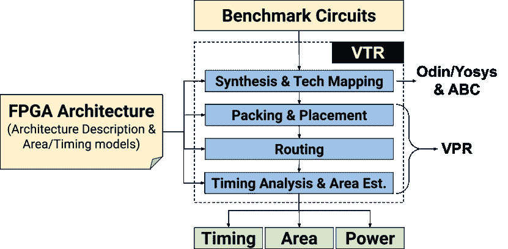
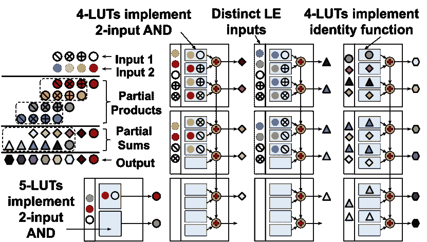

<!--yml

分类：未分类

日期：2024-09-06 19:33:15

-->

# [2404.10076] 深度学习的现场可编程门阵列架构：调查与未来方向

> 来源：[`ar5iv.labs.arxiv.org/html/2404.10076`](https://ar5iv.labs.arxiv.org/html/2404.10076)

本工作已提交至 IEEE 以供可能发表。版权可能会在未经通知的情况下转移，此版本可能不再可访问。

# 深度学习的现场可编程门阵列架构：调查与未来方向

Andrew Boutros, Aman Arora, Vaughn Betz A. Boutros 和 V. Betz 现任职于加拿大多伦多大学电气与计算机工程系，地址：Toronto, ON M5S 3G4 (电子邮件：andrew.boutros@mail.utoronto.ca; vaughn@eecg.utoronto.ca)。A. Arora 现任职于美国亚利桑那州立大学计算与增强智能学院，地址：Tempe, AZ 85281 (电子邮件：aman.kbm@asu.edu)。

###### 摘要

深度学习（DL）正成为大规模数据中心和边缘计算中众多应用的基石。为了满足最先进的 DL 模型的性能要求，通常需要专用硬件，但 DL 模型的快速变化和集成 DL 的系统种类繁多，使得除非是最大的市场，否则几乎不可能为所有需求定制计算芯片。现场可编程门阵列（FPGAs）具备可重新编程和直接硬件执行的独特组合，使其适合加速 DL 推理。与通用 CPU 和 GPU 相比，它们能够定制处理管道和内存层次结构，以实现更低的延迟和更高的能效，同时开发时间和成本仅为定制芯片的很小一部分。其多样化和高速的 IO 还使得 FPGA 可以直接与网络和/或各种外部传感器接口，使其适合于数据中心和边缘应用场景。

随着 DL 成为越来越重要的工作负载，FPGA 架构正在发展以实现更高的 DL 性能。本文综述了针对 DL 的学术界和工业界 FPGA 架构改进。首先，我们简要介绍了 FPGA 架构的基本原理及其组件如何影响 DL 应用的优缺点。接下来，我们讨论了在 FPGA 上实现最先进性能和高效开发流程的不同 DL 推理加速器风格，从特定模型的数据流风格到软件可编程的覆盖风格。我们调查了对传统 FPGA 构建块（包括逻辑块、算术电路和片上内存）的 DL 特定增强，以及集成到 FPGA 结构中的新型 DL 专用块，用于加速张量计算。最后，我们讨论了结合处理器和粗粒度加速器块的混合设备，这些设备具有类似 FPGA 的互连和片上网络，并强调了有前景的未来研究方向。

###### 索引词：

FPGA，架构，深度学习，加速

## 引言

多年来，计算机通过以非常高的速度高效地执行简单且重复的操作序列来解决问题。人类会构思一种算法方法来解决特定问题，然后使用编程语言精确描述其步骤。然而，一些对人脑来说简单的任务对于算法描述却非常困难。检测图像中的人类就是一个这样的任务。输入的高维度以及身体姿势、图像内大小、衣物、拍摄角度和光照条件的众多变化使得很难制定一组条件来判断图像中是否有一个人。因此，经典方法需要领域专家手工设计一组（低维度）特征，从高维输入中提取这些特征。然后，这些特征用于用许多示例及其对应的输出预测来训练统计分类器[1]。这种方法，通常称为经典*机器学习*（ML），需要为每个用例设计新的特征提取器，其实现的准确度高度依赖于这些手工设计的特征从原始高维输入中捕获关键相关数据模式的能力。

图 1：经典的机器学习方法通过手工设计的特征训练统计分类器（上图），与直接在输入数据上训练的深度学习模型以执行特征提取和分类（下图）之间的比较。

随着近年来训练数据的丰富和计算能力的持续提升，利用自 1980 年代制定的理论和算法训练大型人工神经网络变得可行[2]。这些神经网络通常由深层级联的层组成，因此被称为*深度学习*（DL）模型。每一层包含多个*神经元*，这些神经元对输入进行加权求和。如图 1 所示，与经典的机器学习方法相比，DL 模型的关键区别在于其能够直接从输入训练数据中学习提取特征并进行分类，而无需依赖领域专家手工设计的特征，这导致了更高的准确性和更广泛的适用性。自 2012 年深度神经网络（DNNs）首次在视觉识别和图像分类任务中展示出卓越的结果[3]以来，围绕构建更优 DL 模型的创新如雪崩般涌现，这些模型能够在自然语言处理（NLP）[4]、推荐系统[5]和内容生成[6]等多个不同领域实现更高的准确率。如今，DL 模型推动了各种日常用户应用[7, 8, 9]，促进了软件开发[10]，提升了计算机芯片设计的生产力[11]，并通过发现更高效的计算算法[12]和解决长期存在的科学问题[13]推动了人类知识的边界。

然而，与传统的机器学习方法相比，这会导致显著更高的计算复杂性和内存占用[14]。谷歌估计，如果其用户每天仅使用基于深度学习的语音识别进行 3 分钟的语音搜索，就需要将其数据中心的计算能力翻倍[15]。最近的一份报告[16]估计，OpenAI 的对话式深度学习模型 ChatGPT，每天在计算硬件上的成本约为 70 万美元，仅能处理一小部分查询，相比之下，谷歌搜索引擎处理的查询量要大得多。这些深度学习计算需求迅速增长，挑战了传统通用计算平台的能力。因此，应用专用集成电路（ASIC）加速器被部署在数据中心和边缘设备中，以提高深度学习计算的效率[15]。此外，由于深度学习的广泛应用，它也推动了几乎所有形式的通用计算平台在架构上的创新，以提高其深度学习计算效率。例如，英特尔第四代 Xeon（Sapphire Rapids）中央处理单元（CPU）支持更高效的深度学习目标张量指令[17]，而下一代 AMD Ryzen 7000 处理器则集成了人工智能（AI）工作负载的加速引擎[18]。现代图形处理单元（GPU）还包括专门的张量核心，以提高在深度学习工作负载中广泛使用的矩阵乘法的效率。尽管张量操作在深度学习中至关重要，但它们并不是整个计算管道的全部，瓶颈仍然可能出现在其他地方。例如，Nvidia 最近在其 A100 GPU 中集成了专用的深度学习预处理操作引擎，如 JPEG 图像解码器，以解决其中一个瓶颈[19]。

硬件可编程门阵列（FPGAs）的架构同样受到其关键应用场景的驱动。因此，我们也开始看到许多针对使 FPGAs 在深度学习（DL）中更高效的架构变化。在本文中，我们调查了来自学术界和工业界的提案和创新，旨在优化 FPGAs 的架构以专门用于 DL。我们首先通过 DL 的视角呈现一个关于 FPGA 架构的介绍教程，突出 FPGAs 在 DL 加速领域的关键优势、劣势和机会。接着，我们重点介绍了 DL 加速器在 FPGAs 上的关键设计风格，并从广泛的文献中选取了相关示例。然而，本文并不打算对 FPGA 基础的 DL 加速器实现和工具流程进行全面的综述。我们建议感兴趣的读者参考[20, 21, 22]，这些文献对该领域进行了更详细的覆盖。接下来，我们解释了用于建模和评估新 FPGA 架构的一般方法。我们讨论了现代 FPGAs 中的 DL 驱动架构增强，从传统 FPGA 模块（例如逻辑元素和嵌入式硬块）开始，再到新的 DL 专用模块（例如张量块）、在芯片上的粗粒度加速器（例如 AI 引擎）以及封装内的 DL 芯片模块。最后，我们提出了对未来可重构设备在 DL 领域的展望，并识别了该领域中的有趣研究方向。

## II FPGA 在深度学习加速中的应用

### II-A 关键的深度学习加速需求

图 2：深度学习模型的训练和推理阶段。训练由少数深度学习专家在大规模计算集群上进行，并且需要多次设计迭代。当模型精度令人满意时，它会根据应用的不同性能要求（容忍延迟与实时）进行推理部署。

如图 2 所示，深度学习（DL）模型在其生命周期中经历两个主要阶段：训练和推理。在训练阶段，一小组深度学习科学家设计模型并使用大量数据集（例如，GPT-3 语言模型的训练数据超过 570 GB[23]）进行训练，以实现期望的结果质量。由于训练过程中使用的数据量庞大，这一过程计算/内存消耗非常高，并且通常需要数十到数百次设计迭代来优化模型。因此，训练通常在数据中心的大型计算机集群和加速器上进行。训练过程的最终产品是模型架构和其可训练参数或*权重*的值，这些模型随后会在生产规模的应用中部署，用于对不在训练数据集中的新数据样本进行推理。根据部署环境（云/数据中心与边缘/嵌入式）和应用的性质（容忍延迟与实时），深度学习推理的计算需求和约束可能会有所不同。因此，用于加速深度学习训练和推理的硬件必须针对不同的指标和使用场景进行优化，从而为不同加速平台（如 GPU、FPGA 和 ASIC）基于其特性优势和劣势创造了潜在市场。

#### II-A1 性能

DL 加速器的性能通过两个指标来衡量：吞吐量和延迟。吞吐量是指特定加速器在给定 DL 负载下单位时间内可以处理的输入示例数量。为了方便在不同计算复杂度模型之间比较加速器的效率，吞吐量通常以每秒亿次或万亿次操作（GOPS 或 TOPS）来报告，其中操作通常计算为乘法加上累加，因为乘加（MAC）是 DL 负载中的主要操作。每个加速器都有一个*峰值吞吐量*，这是与工作负载无关的，由它每周期可以执行的 MAC 数量和其最大操作频率决定。然而，实际上不可能达到这些 MAC 单元的 100% 利用率¹¹1 根据模型架构和硬件组织，MAC 单元在某些周期内可能会空闲。例如，当模型权重从外部内存加载或从片上缓冲区传输到计算单元时，计算可能会暂停，而当输入大小与硬件计算并行性不完全匹配时，一些计算单元可能会空闲（例如，在 8 通道点积引擎上对两个 6 元素向量进行点积）。因此，加速器的*有效吞吐量*是更现实的指标，通常针对每个 DL 负载进行评估[24]。高效的加速器架构旨在最大化其*计算利用率*（即最小化峰值吞吐量与有效吞吐量之间的差距）。为了提高有效吞吐量，许多加速器*批处理*一组输入以同时处理。这使得可以在批处理中的多个输入上重用相同的一组模型权重，从而隐藏加载下一组权重的内存延迟，并减少 MAC 单元空闲的周期数。另一方面，延迟是加速器处理单个输入所需的时间，这是实时应用程序的关键指标。尽管批处理可以帮助提高加速器的有效吞吐量，但它通常会增加延迟，因为需要更多时间来形成一个批次、处理整个批次的输入并同时输出所有结果。例如，对于 ResNet-50 图像分类模型，将批量大小从 1 增加到 8 个输入可以将吞吐量提高 3$\times$，但在 Nvidia V100 GPU 上延迟增加了 2.2$\times$[25]。

对于训练阶段，延迟不是问题，因此深度学习训练加速器是通过优化吞吐量来最大化每秒处理的训练样本数量。对于推理阶段，优化目标取决于使用场景。诸如基于深度学习的图像搜索引擎或视频版权检查等应用主要关注在松散的延迟要求下最大化每秒服务的用户查询数量，因此是以吞吐量为导向的。在自动驾驶车辆中进行行人或障碍物检测等应用中，从多个摄像头或传感器读取输入、使用一个或多个级联的深度学习模型检测行人/障碍物，然后采取行动（例如调整方向或刹车）的延迟对安全至关重要。

#### II-A2 成本和能源效率

对于训练和推理阶段，能源和成本效率是所有深度学习加速器的重要设计优化目标。据估计，数据中心总拥有成本的 35%用于电力[26]。因此，随着深度学习成为数据中心的重要负载，更高效的深度学习计算硬件直接转化为服务提供商的显著成本节约。例如，谷歌报告称，使用他们的 ASIC 张量处理单元（TPUs）将训练 ResNet-50 图像分类模型的成本降低了 38%[27]。对于现代自然语言处理模型如 BERT[28]，每次完整训练的成本可能达到数百万美元[29]。此外，降低数据中心计算的功耗具有显著的环境影响，因为数据中心消耗大量电力，根据一些估计，到 2030 年数据中心将占全球电力需求的$\sim$8%[30]。在部署的另一端，电池供电的边缘设备上的深度学习推理通常有非常紧张的电力预算，因此需要高效能的计算硬件。例如，特斯拉的全自驾深度学习推理芯片是专门设计的，以满足少于 40W 的激进电力预算[31]。虽然这些定制的 ASIC 可以提供优越的能效，但它们缺乏适应不同系统和算法的灵活性。此外，其显著的非重复工程（NRE）成本以及设计、制造和测试的较长解决时间对于小型和中型市场可能是不可承受的。

#### II-A3 适应性

除了实现高性能和能源效率，DL 加速器还必须具备灵活性，以适应频繁的算法变化。新的最先进 DL 模型的引入速度远快于计算机硬件的典型设计和部署周期。通过使系统软件部分或全部可编程可以实现适应性，但与固定功能专用硬件相比，软件可编程性会增加能源和性能开销（例如，指令获取和解码）。此外，DL 加速器，特别是在边缘部署中，通常是更大系统的一部分，需要与各种传感器（例如，摄像头、LiDAR）和执行器（例如，控制刹车）接口，这些传感器和执行器可能具有不同的通信协议以及不同的数据预处理和后处理需求。因此，适应性不仅是 DL 计算硬件的要求，也是与系统其他部分接口的要求，以确保在各种部署使用案例中具有可用性。实现这种灵活的接口通常需要电气适应性，因为不同接口协议具有不同的电压和时序要求，这仅靠软件编程无法实现。

### II-B FPGA 在 DL 加速中的优势

图 3：FPGAs 的独特特性使其成为 DL 高效加速平台。

基于上一小节讨论的 DL 加速要求，我们可以识别出使 FPGA 成为特定 DL 用例理想且高效加速平台的关键优势（见图 3）。

首先，FPGA 提供了细粒度的硬件可编程性，这使得可以构建与应用需求完全匹配的定制计算数据路径和片上内存子系统。因此，与通用处理器（例如 CPU 和 GPU）相比，FPGA 在需要定制的应用场景中具有优势。例如，深度学习推断结果对低精度计算具有容忍度，并且由于计算单元的能量和面积随着精度的降低迅速下降，这可以用于更高效的加速解决方案[32]。与仅支持特定算术精度（例如 int4、int8、fp16、fp32）的 CPU 和 GPU 不同，FPGA 可以实现任何精度的自定义计算单元，包括二进制/三元组、窄浮点格式（例如 fp8 [33]）或具有共享指数的浮点数（bfp）[32]。由于最有效的精度在不同的深度学习模型甚至单个模型中的各层之间有所不同，这种灵活性非常有用。然而，细粒度的比特级硬件可编程性带来了速度和面积开销，因为函数是用可编程块和可编程路由实现的，这些通常比标准单元逻辑门和直接电线要慢且大。因此，定制化的收益应当超过这些可编程性开销，以使 FPGA 加速解决方案具有竞争力。

其次，FPGA 是空间计算设备。这意味着数据不必通过缓存和寄存器文件的内存层次结构来执行计算，计算核心也不需要通过内存进行通信。相反，在 FPGA 中，数据可以直接从分布式的片上缓冲区流动，并通过使用灵活的可编程路由在*串联*计算单元之间传输，而无需指令序列来协调数据移动和计算。这可以减少总体计算延迟，因为在不同内存层次结构级别的数据移动所花费的周期较少。它还可以显著节省能源；例如，在 45nm CPU 中，一个整数加法操作所消耗的能量中约有 $\sim$99% 被用于缓存/寄存器文件访问和控制逻辑[34]，当在 FPGA 上进行空间计算时，可以节省其中很大一部分。

第三，FPGA 是灵活的。通过重新配置 FPGA 的新比特流可以改变其硬件功能。这相对于 ASIC 加速器来说具有明显优势，因为硬件可以灵活适应深度学习算法、模型架构和应用特定的预处理或后处理的快速变化。新操作可以在硬件中实现，集成到基于 FPGA 的加速器架构中，并在几周内投入生产[35]。另一方面，ASIC 加速器需要在软件可编程核心或其主 CPU 上实现这一新操作，这会导致性能下降，直到下一代芯片设计、制造和部署完成，这可能需要几年时间。

第四，FPGA 提供了大量可编程的输入/输出（IO）接口。这些 IO 可以灵活地实现各种具有不同电气特性和时序规格的协议。现代 FPGA 还实现了针对数据中心部署的各种广泛使用标准的硬化控制器，如以太网、外设组件互连快速（PCIe）和双倍数据率（DDR）及高带宽（HBM）外部内存。这允许 FPGA 作为服务器加速卡与主 CPU 之间进行高效通信，并且还可以直接通过网络连接多个 FPGA，创建多个设备的加速器，如微软的 Brainwave 数据中心规模的深度学习加速器[36]。此外，FPGA 的可编程逻辑还可以实现其他自定义标准，以便在边缘嵌入式系统中与不同传感器/执行器进行接口[37]。

这些独特的 FPGA 特性导致了某些深度学习使用场景，在这些场景中，FPGA 相对于其他加速解决方案（如通用 CPU/GPU 和 ASIC 加速器）具有优势。这些使用场景包括：

+   •

    可以使用低精度或非标准数字格式进行计算，这些格式需要定制的数据路径[38, 32]。这些精度在推理中更为常见且通常更易使用，而训练则通常在一般用途的 CPU 和 GPU 原生支持的更高精度浮点格式（例如 fp32, fp16）中进行。

+   •

    具有严格延迟约束的应用程序不允许将大量输入进行批处理。如果应用程序更注重吞吐量且延迟约束较松，可以将多个输入批量处理。这提供了更多的芯片内部值重用机会，虽然这对所有计算设备都有好处，但通常特别有助于保持 GPU 的大规模并行功能单元的忙碌。这是另一个原因，为什么（延迟受限的）推理比（吞吐量导向的）训练更适合 FPGA。

+   •

    可以将所有模型权重存储在 FPGA 的片上内存中（即*持久性权重*）。FPGA 的空间特性使得近内存计算成为可能，并且具有低延迟的内存访问和应用程序定制的内存组织。对于更大的模型，多样化的 FPGA I/O 允许通过网络直接连接多个 FPGA，创建更大的多 FPGA 织物，具有更多的片上内存 [36]。

+   •

    在更大的系统中实现 DL 组件，其中 FPGA 的灵活性和丰富的 I/O 可以发挥关键作用，例如在自动驾驶系统中。各种传感器/相机输入可能需要经典的信号/图像预处理，然后作为 DL 模型的输入，DL 模型的输出用于控制不同的执行器。在这种情况下，FPGA 提供了一个加速整个系统的平台，具有定制的接口和应用程序相关的预处理和/或后处理 [39]。

+   •

    需要对 DL 模型架构进行周期性的更改，添加新的操作和不规则的计算图 [40]。与 ASIC 不同，这些新更改可以通过简单地用新的比特流编程 FPGA 来在硬件中实现。然而，如果这些更改非常频繁（例如每天），每次模型更改时编译新的比特流可能会因 FPGA 计算机辅助设计（CAD）工具的高运行时间而具有挑战性。在这种情况下，软件可编程解决方案可能更具吸引力。

因此，在本文的其余部分，我们主要关注与独特的 FPGA 特性和优势更匹配的 DL 推理加速。

### II-C FPGA 基础的 DL 推理加速风格

本小节介绍了在 FPGA 上加速 DL 推理的常用风格。它并不打算成为 FPGA 上实现的 DL 推理加速器的全面调查，因为我们的重点主要是对基础 FPGA 芯片架构的改进。

2012 年，AlexNet 成为首个展示深度学习（DL）在图像分类任务中优于以往基于机器学习方法的卷积神经网络（CNN）[3]。其显著更高的计算复杂度引发了使用 FPGA 作为协处理器加速 DL 推理的兴趣。主机或嵌入式 CPU 会将整个 CNN（或特定计算密集型层）的计算转移到 FPGA 加速器，并在最后执行最终的 softmax 操作，从加速器的最终输出中计算预测概率（如有需要）。在这种情况下，FPGA 加速器通常是为特定的 DL 模型或一组相似模型手工设计和优化的[41, 42, 43, 44]。这种方法相比于当时的软件解决方案，在多核 CPU 和 GPU 上实现了显著的性能和能效提升。尽管主要关注的是 CNN 加速和计算机视觉应用，但也有一些研究调查了 FPGA 对其他类型 DL 模型的加速，如用于序列输入的递归神经网络（RNNs）和自然语言处理[45, 46, 47]。

然而，随着最先进的深度学习（DL）模型的不断快速发展，迅速显现出为每个模型构建定制 FPGA 加速器是极其繁重的，并且无法跟上 DL 模型的演变。因此，构建定制硬件生成器以自动化这一过程成为了主要的研究重点。这些硬件生成器是特定领域的编译器，它们将目标 FPGA 的规格和 DL 模型的数据流图作为输入，格式与常见 DL 框架如 TensorFlow [48]或 PyTorch [49]所使用的格式相同。它们通过重新排序、简化和/或融合模型层/操作来优化输入的数据流图，然后利用参数化的硬件模块库生成针对目标 FPGA 资源约束的优化模型特定 FPGA 实现。尽管这些 DL 硬件生成工具链都共享相同的基本概念，但它们生成的加速器架构可能非常不同。一些工具链生成流式层流水线架构，其中每一层都有一个专用的计算引擎，所有层在 FPGA 上以流水线方式共存（即*空间*执行）。这些工具链的例子有 HPIPE [25]、fpgaConvNet [50]、DNNBuilder [51]和 FINN [52]。其他工具链生成具有多个更灵活处理元素（PEs）的架构，在这些处理元素上，给定模型的层被映射并按顺序执行（即*时间*执行），由控制有限状态机和微码协调 [53, 54, 55, 56]。这些工具链中的许多会自动应用不同的 FPGA 友好的 DL 模型优化，以进一步提升性能，如量化到较低的数值精度，并利用稀疏性跳过无效的零权重计算。一些工作甚至更进一步，直接使用 FPGA 布线中的查找表（LUTs）作为神经网络的可训练构建块，而不仅仅是使用 MAC 操作 [57, 58]。

定制深度学习硬件的生成利用了 FPGA 的独特可重构特性，通过优化加速器架构以完全符合特定模型或模型类别的需求，从而最小化通用性的额外开销。然而，这也带来了以下成本：(1) 长时间的 FPGA 编译时间（合成、布局和布线需要几个小时）以为每个新模型或现有模型的轻微变化生成不同的 FPGA 比特流，(2) 在切换不同的预编译比特流时需要重新编程 FPGA（这可能需要几十到几百毫秒）。这些缺点可能会对需要频繁（例如每日）模型更新的生产使用案例或需要实时或输入依赖的多模型切换的场景构成障碍。另一种在 FPGA 上设计深度学习加速器的方法是构建软件可编程的领域特定覆盖层。与 CPU 和 GPU 类似，FPGA 覆盖层定义了一个指令集架构（ISA），将硬件和软件栈解耦。ISA 抽象掉了所有微架构和硬件实现细节，使得应用开发者可以用高级编程语言编写算法，然后将其编译成可以在任何支持相同 ISA 的处理器上运行的指令序列。对于通用处理器架构和 ISA（例如 RISC-V），由于可重构性的开销，*硬件* ASIC 实现始终比 FPGA 覆盖层更高效[59, 60]。然而，软处理器可以通过利用 FPGA 的灵活性来实现定制的数据路径和内存层次结构，以及领域特定的 ISA，从而提高效率。

图 4：覆盖层设计方法使得应用专家可以使用 FPGA 加速其深度学习工作负载，而无需任何硬件设计专业知识或忍受 FPGA CAD 工具的长时间运行。

如图 4 所示，为了构建一个 FPGA 深度学习叠加层，架构师首先设计叠加层 ISA 和处理器架构。然后，对叠加层的微架构进行大量优化，以生成一个高质量的 FPGA 实现，并将其部署在 FPGA 上，通过软件编程执行不同的深度学习模型。为了编程叠加层，用户会获得一个编译器，该编译器将深度学习模型的高层次描述（如 TensorFlow 或 PyTorch）转换为在 FPGA 叠加层上执行的指令序列。在这种方法中，用户无需具备任何硬件设计专业知识，大大降低了深度学习应用开发者使用 FPGA 的门槛。此外，他们编译新深度学习模型的迭代时间更快，因为他们执行的是快速的软件编译（几秒钟），以创建新的叠加层指令序列，而不是长时间的 FPGA 硬件编译（几小时）以创建新的比特流。许多深度学习叠加层示例来自工业界和学术界，针对不同类型的模型进行了优化[61, 62, 63, 24, 64, 65, 66]，包括微软的数据中心级深度学习推理加速器 Brainwave[36]。

### II-D FPGA 上的深度学习加速示例

在使用 FPGA 进行深度学习推理加速时，无论加速器设计风格如何，都有两个主要关注点。第一个是易用性；与 GPU 和 CPU 等其他计算平台相比，FPGA 的设计、使用和调试通常更为复杂。即使有了高级综合（HLS）技术的进步，使用 FPGA 仍需广泛的硬件设计专业知识，这使得深度学习应用开发者使用它们更加困难。第二个关注点是，尽管 FPGA 具有固有的可重构开销，但它们是否能够提供最先进的深度学习推理性能。正如前一节所讨论的，自定义硬件生成和叠加设计方法都解决了第一个关注点。通过这些方法，深度学习应用开发者可以从高层次的深度学习模型描述直接到 FPGA 部署，而几乎无需硬件设计专业知识。在这一节中，我们涵盖了这两种设计方法的两个示例，以展示 FPGA 可以提供一流的深度学习推理性能。我们还展示了通过专门为深度学习优化底层 FPGA 架构，可以实现更高的性能。

#### II-D1 自定义硬件生成示例（HPIPE）

图 5：DL 模型与一系列 PEs 的时间映射（左上）与 HPIPE 中构建每层定制计算单元（左下）的对比，以及 HPIPE 硬件生成流程的概览（右）。

HPIPE [25] 是一种领域特定编译器，它为持久性 CNN 生成层级流水线数据流 FPGA 加速器，其中所有权重都可以存储在片上 SRAM 中。它为 CNN 中的每一层构建一个独特的处理模块，并使用不敏感延迟的 FIFO 将它们连接起来。它还通过跳过无效的零权重计算来利用权重稀疏性，这可以显著减少片上内存需求并通过执行更少的操作来提高性能。与用于所有层的相同 PE 阵列的一刀切方法相比（见图 5 ‣ II-D Examples of DL Acceleration on FPGAs ‣ II FPGA for DL Acceleration ‣ Field-Programmable Gate Array Architecture for Deep Learning: Survey & Future Directions")左侧），HPIPE 中的每层定制模块能够更好地利用计算资源，并利用额外的流水线并行维度，使所有 CNN 层在图像的不同部分或不同图像上同时执行。如图 5 ‣ II-D Examples of DL Acceleration on FPGAs ‣ II FPGA for DL Acceleration ‣ Field-Programmable Gate Array Architecture for Deep Learning: Survey & Future Directions")右侧所示，HPIPE 编译器以 CNN 的 TensorFlow 描述和目标 FPGA 规格作为输入。然后，它对 CNN 数据流图执行多个优化（例如融合层以实现更高效的实现）。之后，它为每个 CNN 层分配硬件资源，以平衡所有流水线层的吞吐量并最大化整体性能。HPIPE 编译器还执行了几项物理设计优化，考虑到层模块的空间布局，并实现了优化的互连结构，以便高风扇出和长跨度连接，从而实现高操作频率。最后，它生成加速器 RTL 文件和内存初始化文件，以将 CNN 权重存储在片上内存中；生成的 RTL 使用传统的 FPGA CAD 工具编译为比特流。

使用 Intel Stratix 10 GX2800，这是最大的单片（单芯片）14nm Stratix 10 FPGA，HPIPE 在同代 FPGA 中超越了所有其他基于 FPGA 的 CNN 加速器。与在类似工艺技术（12nm）的 Nvidia V100 GPU 上的批处理-1 推断相比，它还可以在相同延迟（`<1`ms）下实现 4$\times$更高的 ResNet-50 吞吐量。增加批量大小会提高 GPU 利用率，但延迟会变差；HPIPE 仍然实现了比 V100 GPU（批量大小为 8）高 1.4$\times$的吞吐量，但延迟低 2.2$\times$。这突显了 FPGA 在低延迟推断中的实用性；在这种情况下，FPGA 的灵活性实现了极端的每模型定制，带来了超越其固有重配置开销的效率提升。从高层模型描述自动生成硬件消除了对 FPGA 设计专业知识的需求，但仍需要为每个不同的模型编译新的 FPGA 比特流，这一过程耗时。

#### II-D2 覆盖示例（NPU）

图 6：NPU 覆盖架构。它是一个 VLIW 处理器，由五个串联的粗粒度单元组成：一个矩阵-向量乘法单元（MVU），一个外部向量寄存器文件（eVRF），两个用于向量元素操作的多功能单元（MFUs）和一个加载单元。

神经处理单元（NPU）[67] 是一种非常长指令字（VLIW）处理器架构，旨在低延迟批量 1 推理 DL 模型，这些模型没有数据重用（即内存绑定），如不同类型的 RNN 和多层感知机（MLP）。NPU 叠加设计依赖于两个关键原则。首先，它利用 DL 模型的巨大并行性来摊销软件可编程性的能量和面积成本。一个粗粒度的 VLIW 指令可以触发成千上万次操作，类似于复杂指令集计算机（CISC）架构的极端例子。第二，它定制了处理器的内存子系统，以利用分布式 FPGA 片上内存和处理元素之间的巨大带宽，执行近内存计算。内存子系统是显式管理的（没有缓存），使用几个具有特定用途的不同寄存器文件和宽数据字，而不是一个通用组，并且直接在功能单元之间链式连接许多操作，没有寄存器文件访问。图 6 ‣ II-D Examples of DL Acceleration on FPGAs ‣ II FPGA for DL Acceleration ‣ Field-Programmable Gate Array Architecture for Deep Learning: Survey & Future Directions")显示了 NPU 叠加的架构，它由五个粗粒度链式单元组成，其中一个单元的输出供给下一个单元。管道以矩阵-向量乘法单元（MVU）开始。MVU 由$T$个计算模块组成，每个模块有$D$个点积引擎（DPE），每个 DPE 有$L$个乘法通道。向量操作数从向量寄存器文件（VRF）广播到单个模块中的所有 DPE，而持久的模型权重来自矩阵寄存器文件（MRF）。MVU 之后是一个外部 VRF（eVRF），如果指令不是以矩阵-向量乘法开始，则允许跳过 MVU。其余的管道由两个多功能单元（MFU）组成，它们实现向量逐元素操作（例如激活函数、加法、乘法），以及一个加载单元，该单元可以将结果写回处理器架构状态（即 VRF）中的任何位置或通过输入/输出 FIFO 与外部组件（例如网络接口）进行通信。DL 应用开发人员使用 Tensorflow Keras API 的一个子集[68]来描述他们的模型，然后将其编译成一系列 NPU VLIW 指令，以便在 FPGA 叠加上执行。

在 Intel Stratix 10 GX2800 FPGA 上实现的 NPU，在使用与 GPU 相同的 fp32 数值精度时，相较于等效的 Nvidia V100 GPU，在 DeepBench 套件中的各种 RNN 工作负载下，批处理 1 的延迟降低了 2.7$\times$[69]。使用更适合 FPGA 的 8 位整数精度时，这一性能差距扩大到 8.6$\times$。这表明，具有定制架构和 ISA 的领域特定 FPGA 叠加层可以比通用处理器管线（如 GPU 和 CPU）提供显著更高的性能，同时提供类似的软件级可编程性。

#### II-D3 FPGA 架构增强对深度学习的影响

HPIPE 和 NPU 叠加层都被设计为最适配底层 FPGA 架构。例如，它们都组织其基本的 MAC 计算单元，以高效利用目标 FPGA 中的嵌入式数字信号处理块（DSP）。HPIPE 使用了 DSP 块之间的专用（非可编程）互连来构建高效的流水线点积，最小化对 FPGA 的可编程逻辑和路由的使用。另一方面，NPU 使用少量的软逻辑进行乘法器后校正，以便将四个 int8 乘法器密集地打包到 Intel Stratix 10 FPGA 的一个 DSP 块中两个 int18 乘法器的空间[70]。这些优化用于提升深度学习的性能，前提是假设 FPGA 架构本身是固定的。然而，FPGA 架构在过去三十年里一直在不断发展，以更好地适应关键的 FPGA 应用场景和市场细分。因此，随着深度学习成为如此突出的工作负载，近年来提出了许多针对深度学习的 FPGA 架构增强方案。

其中一个 FPGA 架构增强的例子（我们将在本文后面详细讨论）是将传统的 DSP 模块替换为 DL 优化的张量块，在 Intel Stratix 10 NX FPGA 中[71]。这些张量块用 DL 目标模式替代了传统 DSP 模块的操作模式和精度，可以在每个模块中实现更多的 int8 和 int4 乘法。通过限制能够实现峰值吞吐量的数据输入和输出模式（从而避免添加昂贵的额外可编程互连），这些张量块在面积上与传统的 DSP 模块相当。HPIPE 和 NPU 都升级为使用这些新的 DL 优化 FPGA，并采用了张量块，显著提高了性能。对于 HPIPE，张量块将 MobileNet-V2 CNN 的推理吞吐量从传统的 DSP 模块 FPGA 的 6,000 提升到 29,400 batch-1 推理每秒，提升了 4.8$\times$[72]。相比之下，Nvidia V100 GPU（其晶圆尺寸比 Stratix 10 NX FPGA 大 1.5$\times$以上），使用张量块增强的 HPIPE 在 batch-1 下实现了 17$\times$更高的吞吐量和 3$\times$更低的延迟，在 batch-128 下则实现了 1.3$\times$更高的吞吐量和 29$\times$更低的延迟。另一方面，与传统 DSP 相比，使用张量块的 NPU 性能提高了 3.5$\times$，使其性能比 V100 GPU 高出 11$\times$[24]。

这两个例子突显了专门针对深度学习（DL）的架构增强对 FPGA 推理性能的重大影响。本文将介绍许多来自行业和学术界的这类架构创新，它们都具有相同的目标：使 FPGA 在深度学习中表现更佳。

## III FPGA 架构与深度学习机会

在本节中，我们简要描述了 FPGA 架构的关键构建块，并突出了优化这些不同组件以进行深度学习计算的机会。有关 FPGA 架构设计原则和演变的更全面调查，请参阅[73]。

### III-A 可编程逻辑与路由

可编程逻辑块（LBs）是 FPGA 中最丰富的资源。一个 LB 是一组 $N$ 个逻辑元素（LEs），以及局部布线，通常由可编程多路复用器构建，这些多路复用器允许 LB 输入连接到不同的 LEs 或将 LE 输出反馈到它们的输入，如图 7 所示。在最简单的形式中，每个 LE 结合了基于 SRAM 的 $K$ 输入查找表（LUT）和一个可旁路的触发器（FF），可以实现任何可选注册的 $K$ 输入布尔逻辑函数。许多现代 FPGA 架构中的 LEs 也可以被分裂以实现两个逻辑函数，每个函数使用至多 $K-1$ 个输入，且总共不使用超过单个 LE 的局部布线所提供的不同输入。它们还包括专用电路（图 7 中的粉色框），以高效实现加法器，这在许多 FPGA 设计中很丰富[74]，并且在 DL 加速器中非常常见。来自 AMD 和 Intel 的大多数商用 FPGA 实现了八到十个 6 输入 LE 的 LB（即 $N=8-10,K=6$）。一个关键的区别是，Intel FPGA 中的每个 LE 包括专用电路来实现两个加法位，而 AMD LE 只能实现一个加法位。LB（以及其他 FPGA 结构组件和 IO）被可编程布线包围，这些布线可以在各种块之间灵活连接。这些可编程布线由 SRAM 控制的多路复用器组成，用于将块输出和布线线缆连接到不同的布线线缆（图 7 中的绿色 MUX）和布线线缆到块输入（图 7 中的黄色 MUX）。这些多路复用器占用了 FPGA 芯片面积的大部分；它们构成了逻辑 *瓷砖*（即 LB 及其可编程布线）面积的 50% 以上[75]。由于向 FPGA LB 或硬块添加更多输入和输出意味着更多的布线多路复用器，因此增加块的输入/输出数量的架构变化需要仔细考虑功能增益与面积成本的权衡。

图 7：逻辑块（LB）和路由架构。一个 LB 包含 $N$ 个逻辑元素（LEs）和本地互连。SRAM 控制的可编程路由 MUX 将通用路由线连接到彼此以及 LB 的输入/输出。

可编程逻辑和路由是 FPGA 位级可编程性的关键，允许通过设置 LUT 和路由配置 SRAM（如图 7）来实现任何功能。对于深度学习，定制的低精度 MAC 单元通常使用 FPGA 的 LEs 中的 LUT、FF 和专用加法电路来实现。例如，微软 Brainwave 基于 FPGA 的深度学习加速器在 FPGA 的可编程逻辑中实现了定制的 8 位浮点（msfp8）计算单元。这种定制浮点格式强调动态范围而非精度，具有比传统 int8 计算单元高 2.9$\times$ 的 MAC 密度[76]，并且推理精度与 32 位浮点（fp32）相当。当能够容忍一定的精度降低时，低精度二进制 MAC（实现为 XNOR 和人口计数（popcount）操作[77]）也可以用于深度学习模型。这在 FPGA 上实现时会产生非常小且高效的计算单元。在其他设备中，计算单元是预先制造的，以实现传统的、更高精度的 MAC 和字宽逻辑操作，因此无法实现如此极低精度的全部效率提升。虽然窄位宽操作已经是 FPGA 的强项，但当前的 FPGA LB 在深度学习及其对低精度 MAC 的高需求出现之前就已经架构完成，这引发了一个问题，即面向深度学习的 LB 改变是否可以进一步提高它们的 MAC 效率。

*机会 1：增强逻辑块架构以实现更高效的窄位宽乘法和加法操作，可以为低精度深度学习加速带来显著收益。*

### III-B 数字信号处理模块

由于 DL 工作负载以 MAC 操作为主，因此数字信号处理（DSP）模块在实现基于 FPGA 的 DL 加速器时至关重要。DSP 模块是嵌入 FPGA 结构中的*硬件*（ASIC 风格）模块，实施乘法器和加法器。然而，它们设计了一些可编程性，以增加其在各种 FPGA 设计中的可用性，同时保持其类似 ASIC 的效率。例如，Intel Arria 10 和 Stratix 10 FPGA 系列中的 DSP 模块具有可配置电路，可以执行不同精度的乘法（例如，一个 int27 或两个 int18 乘法），以及可选的预乘法加法器、后乘法加法器/累加器、可绕过的流水线寄存器以及同一 FPGA 列内 DSP 模块之间的专用布线。这些 DSP 模块最初是为无线通信和过滤应用设计的，这些领域仍然是 FPGA 的主要市场。因此，它们原生支持在该领域广泛使用的数值精度（例如，Intel FPGA 中的 27$\times$27 和 18$\times$18 乘法，以及 AMD FPGA 中的 27$\times$18 乘法）。尽管它们可以用于实现 DL 加速器中的 MAC 单元，但这些精度通常高于 DL 推断所需的精度，导致 DSP 模块功能的使用不足（或者等同于因 DSP 模块过度工程化而导致的硅面积浪费）。

*机会 2：添加低成本的重配置电路，以便将 DSP 模块内的乘法器分解为更多低精度乘法器（同时保持向后兼容性），可以提高 DL 性能。*

除了数值精度之外，这些 DSP 模块还包括对传统 FPGA 应用（如无线通信）有益的其他功能。例如，Intel Stratix 10 DSP 模块具有一个小型常数系数库和输入级联寄存器/互连，用于实现高效的有限脉冲响应（FIR）滤波器。这些 DSP 功能虽然占用硅面积，但对 DL 计算的帮助较小；用更多面向 DL 的功能替代它们，可能会提高 DL 效率，但会失去与传统 DSP 模块的向后兼容性。

*机会 3：用新的 DL 目标模块替代原本为无线通信领域设计的 DSP 模块，可以提高 FPGA 在 DL 中的计算密度和效率。*

### III-C 芯片内块存储器

FPGA 还包括大量的片上 SRAM 内存块，通常称为块 RAM（BRAM）。这些 BRAM（现代 FPGA 中超过 10,000 个块）在 FPGA 结构中按列空间分布，如图 10 所示。最新一代的 Intel FPGA 包含一种 20Kb 容量的 BRAM [78]，而 AMD FPGA 则具有 36Kb 的 BRAM 以及更大但较少见的 288Kb RAM（通常称为超 RAM 或 URAM）[79]。这些 BRAM 的核心是一个固定大小的 SRAM 数组，配有传统的外围电路以进行读/写操作，如行解码器、感应放大器和写入驱动器。然而，与 DSP 块类似，这些 BRAM 在其外围电路中包含低成本的重配置电路，以便根据应用需求实现具有不同宽度/深度（窄而深或浅而宽缓冲区）和端口数量的缓冲区 [80]。例如，通过设置几个配置 SRAM 单元，20Kb 的 BRAM 可以用作只读存储器（ROM）、单端口 RAM 或双端口 RAM，组织方式为 1b$\times$16K、2b$\times$8K、4b$\times$4K、8b$\times$2K、16b$\times$1K、32b$\times$512 或 40b$\times$512。FPGA 的 BRAM 都可以并行访问，提供巨大的片上内存带宽（每秒宠物位级别），且仅需一到两个访问周期的延迟。此外，它们可以独立控制，并通过利用 FPGA 可编程路由的灵活性直接连接到计算单元。这些特性对 FPGA 上的低延迟大规模并行深度学习计算非常有用。然而，随着将计算更接近数据以提高效率的需求越来越迫切，FPGA 中的成千上万片上内存块可能不仅仅用于存储数据以供 LB 和 DSP 中的计算单元使用。

*机会 4：随着内存计算技术的进步，通过在内存中增强 BRAM 可以在 FPGA 上以相对较低的成本提供数千个并行计算单元。*

### III-D 中介层

图 8：被动中介层技术通过将多个较小且更高产量的芯片集成到同一封装中来创建更大的 FPGA 设备。

由于 FPGA 通常是新工艺技术的早期采用者，因此在工艺生命周期早期制造大单芯片 FPGA 会导致较差的良品率（由于制造缺陷）。为应对这一挑战，许多最近的 FPGA 使用被动中介技术将多个（较小的）硅芯片集成到同一封装中。这不仅提高了良品率，还通过将 FPGA 结构与预制的*芯片块*结合，能够实现灵活的硬件开发，这些芯片块实现了不同的功能，并且（可能）使用不同的工艺技术，形成一个完整的封装系统。如图 8 所示，中介是一块具有常规金属层但没有活跃晶体管实现的硅芯片（因此得名*被动中介*）。中介芯片的顶部金属层可以通过密集排列的（通常为数十微米间距）焊球，称为*微凸点* [81]，与其上方翻转的多个芯片的顶部金属层连接，从而在同一封装中的不同芯片之间提供高密度的布线轨道。AMD 的 FPGA 从其 28nm 7 系列开始使用这一技术，将多个 FPGA 芯片集成在一起，并呈现给用户作为一个具有多个超逻辑区域（SLRs）的单大 FPGA [82]。Intel FPGA 也使用类似的技术，称为嵌入式多芯片互连桥（EMIB）[83]，从其 14nm Stratix 10 系列开始，将一个 FPGA 芯片与多个收发器或高带宽内存（HBM）芯片块集成 [84]。这些技术使得根据应用特定的 ASIC 芯片与 FPGA 在同一封装中的集成，能够创建适用于不同市场的多种设备变体。即使在最先进的深度学习模型迅速变化的情况下，大规模并行 MAC 操作几乎是所有模型的核心组成部分，因此可以潜在地卸载到高效的 ASIC 辅助芯片上。在这种情况下，同一封装中的 FPGA 可以提供对任何深度学习模型更改所需的灵活性，以及对系统其余部分的多样化 IO。

*机会 5：使用先进的封装集成技术整合 FPGA 和专门针对深度学习的 ASIC，可以结合两者的最佳特性：FPGA 的灵活性用于系统的定制部分，而 ASIC 的高效性用于常见功能。*

### III-E 芯片网络与嵌入式加速器

最近，出现了新的*超越 FPGA*的可重配置加速设备（RAD）。一个例子是 AMD Versal 架构，它将 FPGA 结构与通用处理器核心以及一组软件可编程的向量处理器集成在一个设备中[85]。所有这些组件通过分组交换的片上网络（NoC）进行连接，以实现高效的系统级通信[86]。NoC 使得将各种*软*设计 IP 与*硬*粗粒度应用特定嵌入加速器一起实现的系统更快、更容易地集成。AMD Versal 架构是从广泛的潜在新型可重配置计算设备中选出的一个设计点，这些设备可能有利于深度学习加速。

*机会 6：探索新的针对深度学习的可重配置加速器（RAD）的设计空间，这些加速器结合了 FPGA 的独特特性和更高效的粗粒度深度学习加速核心。*

在本文的剩余部分，我们回顾了来自学术界和工业界的最新提议，以增强 FPGA 架构以支持深度学习，利用我们在本节中强调的机会。在此之前，我们首先解释常用的定量探索和评估新 FPGA 架构的方法。

## IV FPGA 架构探索

### IV-A 工具和基准测试

图 9 展示了用于评估 FPGA 架构修改的典型流程。该流程的核心是一个*可重定向*的 FPGA CAD 工具，能够灵活地合成、布置和路由一组基准设计到各种输入 FPGA 架构上。架构师可以通过比较 CAD 工具报告的时序、面积和功耗指标来评估不同的候选架构。Verilog-to-routing (VTR) 是一个广泛用于 FPGA 架构和 CAD 研究的开源流程[87]。它结合了多个工具，如 ODIN [88] 或 Yosys [89] 用于 Verilog 合成，ABC [90] 用于逻辑优化和技术映射，VPR 用于打包、布置和路由，以及 Tatum [91] 用于静态时序分析。VTR 的输入是一个基于 XML 的 FPGA 架构描述文件，该文件指定了 FPGA 的高级组织（例如块的数量和类型、导线段长度的分布、逻辑集群和逻辑元素的大小）、其微架构细节（例如 DSP 和 BRAM 操作模式、逻辑块中的硬件算术、开关块模式），以及晶体管级电路实现参数（例如开关/导线延迟和面积）。像 COFFE [92]这样的工具自动化了 FPGA 电路的晶体管级设计和建模，并生成延迟和面积数据，这些数据将被包含在 VTR FPGA 架构描述文件中。

图 9: FPGA 架构探索的关键要素：基准电路、架构描述和*可重定向* CAD 流程。

优化 FPGA 架构也需要涵盖目标应用领域各种用例的基准设计。通常，FPGA 供应商会精心策划基准套件，这些套件包含代表不同客户用例的专有设计。此外，还有几个学术开源基准套件，如经典的 MCNC20、VTR [87] 和 Titan23 [93]，这些套件在学术 FPGA 架构和 CAD 研究中常被使用。虽然早期学术 FPGA 研究使用了 MCNC 电路，但它们现在太小（数千个逻辑原件）且简单（仅有 IO 和逻辑）以代表现代 FPGA 应用。VTR 和特别是 Titan 套件更大更复杂，更具代表性。然而，这些基准套件中没有任何 FPGA 设计能够代表 DL 领域。为填补这一空白，推出了 Koios 基准套件 [94]。它包含 40 个 DL 电路，涵盖了多种尺寸、实现风格、目标神经网络、数值精度和电路特性。它还引入了一种生成合成或 *代理* 电路的方法，这些电路具有与各种实际 DL 电路相似的特性。Koios 基准套件是开源的，并集成到 VTR 流程中，使得能够探索专门为 DL 优化的新 FPGA 架构。

### IV-B 方法论

在本小节中，我们解释了使用前一小节中介绍的工具和基准来评估新 FPGA 架构思想的一般方法。类似的方法也用于评估本文其余部分讨论的大多数提议 FPGA 结构架构增强的收益和成本。

针对特定目标领域的一种常见 FPGA 架构增强是向 FPGA 结构中引入一种新的硬块类型（或更改现有的硬块），以有效实现来自该领域应用设计的常见功能。例如，对于 DL 目标领域，FPGA 架构师可能会评估将硬卷积引擎添加到 FPGA 结构中的效果。这涉及许多设计权衡和问题，包括：应将 FPGA 芯片面积的多少分配给这些卷积块？它们应该有多灵活？它们仅实现卷积还是可以重新配置以实现其他操作并被更广泛的应用程序使用？它们的添加对可编程布线需求有何影响？它们在整体目标应用性能方面的提升程度及其对其他应用领域的成本是多少？

为了回答这些问题，架构师首先为他们新提议的硬块（在我们的例子中是一个卷积引擎）编写 RTL 实现。这一实现描述了硬块的周期准确功能以及其不同的可重配置操作模式。然后，他们使用像 COFFE 这样的工具进行电路级评估。FPGA 电路包括标准单元（ASIC）组件和全定制（手工优化的晶体管和布局）组件，COFFE 对这两种类型进行建模和评估。硬块的功能通过标准单元 ASIC EDA 工具实现，而可编程路由的接口则使用自动化全定制设计和 SPICE 建模。这一步的结果是所提议硬块的面积、时序和功耗模型。这些模型随后被插入 FPGA CAD 流程（如 VTR），通过将一组代表性基准电路（如 Koios）映射到包括所提议的新硬块在内的 FPGA 架构，来进行架构级评估。此映射可以通过修改基准电路以直接实例化新硬块的实例，或通过扩展综合工具以自动提取电路网表组件并将其映射到新硬块来完成。最后一步评估了所关注基准电路在提议 FPGA 架构上的资源利用率、时序和可路由性。对可编程逻辑块和 BRAM 的增强可以使用相同的一般方法进行评估，只是这些块的核心也是定制设计和布局的，而不是使用 ASIC 标准单元实现的。

### IV-C 深度学习的 FPGA 架构增强分类

图 10：深度学习的 FPGA 架构增强分类。

在本文的其余部分，我们将介绍几种面向深度学习的 FPGA 架构增强技术，包括学术研究和工业界的最新进展。图 10 展示了这些提案的分类，其中包括 <svg   height="19.62" overflow="visible" version="1.1" width="19.62"><g transform="translate(0,19.62) matrix(1 0 0 -1 0 0) translate(9.81,0) translate(0,9.81)" fill="#000000" stroke="#000000" stroke-width="0.4pt"><g transform="matrix(1.0 0.0 0.0 1.0 -3.46 -4.46)" fill="#000000" stroke="#000000"><foreignobject width="6.92" height="8.92" transform="matrix(1 0 0 -1 0 16.6)" overflow="visible">1</foreignobject></g></g></svg> 提升现有传统 FPGA 结构模块（例如 LBs、DSPs、BRAMs），<svg height="19.62" overflow="visible" version="1.1" width="19.62"><g transform="translate(0,19.62) matrix(1 0 0 -1 0 0) translate(9.81,0) translate(0,9.81)" fill="#000000" stroke="#000000" stroke-width="0.4pt"><g transform="matrix(1.0 0.0 0.0 1.0 -3.46 -4.46)" fill="#000000" stroke="#000000"><foreignobject width="6.92" height="8.92" transform="matrix(1 0 0 -1 0 16.6)" overflow="visible">2</foreignobject></g></g></svg> 引入新的深度学习专用硬块（例如张量块），<svg height="19.62" overflow="visible" version="1.1" width="19.62"><g transform="translate(0,19.62) matrix(1 0 0 -1 0 0) translate(9.81,0) translate(0,9.81)" fill="#000000" stroke="#000000" stroke-width="0.4pt"><g transform="matrix(1.0 0.0 0.0 1.0 -3.46 -4.46)" fill="#000000" stroke="#000000"><foreignobject width="6.92" height="8.92" transform="matrix(1 0 0 -1 0 16.6)" overflow="visible">3</foreignobject></g></g></svg> 在同一芯片上与 FPGA 结构紧密集成粗粒度深度学习加速器（例如 AMD AI 引擎），以及 <svg height="19.62" overflow="visible" version="1.1" width="19.62"><g transform="translate(0,19.62) matrix(1 0 0 -1 0 0) translate(9.81,0) translate(0,9.81)" fill="#000000" stroke="#000000" stroke-width="0.4pt"><g transform="matrix(1.0 0.0 0.0 1.0 -3.46 -4.46)" fill="#000000" stroke="#000000"><foreignobject width="6.92" height="8.92" transform="matrix(1 0 0 -1 0 16.6)" overflow="visible">4</foreignobject></g></g></svg> 在同一封装中集成 FPGA 和其他深度学习芯片。

## V 提升现有 FPGA 结构模块

### V-A 逻辑块

如 III-A 节所述，许多先前的研究表明，各种深度学习模型可以被量化到更低的精度，在推理过程中几乎没有准确度损失[95]。许多商业深度学习加速器现在原生支持窄整数 MAC 操作（例如 int8、int4）[96, 97]。此外，新型低精度浮点格式正在标准化中（例如 fp8[33]），并预计将在下一代深度学习计算平台中得到支持。FPGA 提供了独特的灵活性，可以直接在硬件中实现任何所需的数值精度，利用其精细的可编程逻辑块（LBs），由于乘法器的逻辑使用量随精度呈平方增长，通过将精度降低到最低，可以获得巨大的硬件节省。LBs 是传统 FPGA 结构中最丰富的资源，因此，在实现低精度乘法器时提高其效率的架构变更将在深度学习应用中产生重大影响。

图 11：类似于 Intel Stratix 10 和 Agilex 的逻辑元素架构。它可以作为四个 4-LUTs 加上两个加法器、两个 5-LUTs 或一个 6-LUT 进行操作。

图 12：4 位乘法映射到传统逻辑元素。LUTs 的利用率明显不足：4/5-LUTs 用于实现 2 输入 AND 门或恒等函数（即直通）以访问加法器。

图 11 显示了现代 FPGA 逻辑单元（LE）的内部结构，类似于 Intel Stratix 10 和 Agilex FPGAs。它具有 8 个不同的输入和 4 个可选择注册的输出，以及两个由四个 4 输入查找表（4-LUTs）供给的链式硬加法器。因此，从高层次来看，每个 LE 可以实现四个 4 输入逻辑函数，接着是 2 位的加法，两个 5 输入逻辑函数，或者一个 6 输入逻辑函数，只要不需要超过 8 个不同的输入。图 12 说明了 4 位乘法如何映射到这种 LE 架构作为一个示例，其中两个乘法操作数的位由不同的形状和颜色表示。乘法的第一步是对一个操作数的每个位与另一个操作数的所有位进行 AND 操作，以生成部分积，如图 12 中通过位的颜色和形状的组合所示。这些部分积随后在一个或多个加法阶段中被减少，以生成最终的乘法结果。因此，乘法本质上可以看作是位级 AND 操作，接着是加法树（通常称为 *压缩器树*）。在 LE 实现中，2 输入 AND 操作映射到 4-LUTs，再由加法器实现第一层的减少。然后，其他 LE 仅用于加法器（即 4-LUTs 实现恒等函数）以执行随后的减少，直到生成最终结果。这突出了一个主要的低效来源：LUTs 的利用率明显不足。图 12 中使用的许多 LUTs 仅是通道访问加法器，甚至那些实现部分积的 LUTs 执行了 2 输入 AND 功能，浪费了 4-LUT 一半的功能。

作者在[98、99]中指出了这些低效，并提出了四种架构修改（总结见图 13）以在 LE 和 LB 级别解决这些问题。第一个提案通过在现有链的两个和输出和两个独立输入的输入下添加另一个级联加法器链。这可以通过省去仅用作加法器的第二级 LE 来有效实现压缩器树。

第二个提案通过添加电路来实现单个 4 位加法器链，以允许进一步将每个 4-LUT 分裂成两个 3-LUT。将 6-LUT 分裂到 3-LUT 生成 8 个信号，可以将两个输入送入四个加法器中的每一个，而 3-LUT 仍能实现乘法器部分乘积中所需的 2 输入 AND 门功能。这通常会提高加法器的密度，但牺牲了在同一 LE 中映射加法器的 4 输入逻辑功能的能力，这在乘法器中不会发生，并且预计在其他非深度学习 FPGA 设计中不太常见。虽然可以考虑继续这一过程，将 2-LUT 分裂为每个 LE 8 个链式加法器，但这将超过可编程路由为 LE 提供的 8 个输入，并且从可编程路由添加额外输入在面积上代价高[73]。这一想法的另一种变体是将四个加法器安排成每 LE 两个 2 位链，而不是单个 4 位链，如图 13 所示。这与第一个提案中的级联加法器链不同，因为两个链中的所有加法器都直接由 LUT 提供输入。

图 13：增加低精度 MAC 在软逻辑中密度的四种架构修改。

第四个想法通过在一些或所有 FPGA LB 中添加低精度硬乘法器来修改 LB 架构。这些乘法器被称为影子乘法器，因为使用时它们会窃取一些 LE 的输入和输出端口；这使得这些 LE 无法使用，但避免了在可编程路由中添加昂贵的输入和输出端口。来自不同 LB 的影子乘法器也可以结合使用，通过可编程路由和一些基于 LE 的胶水逻辑实现更高精度的乘法。

这四个想法在面积成本和性能提升方面各不相同。例如，两个 2 位加法器链的提案使矩阵乘法密度提高了 1.5 倍，同时速度提升了 10%，并且对其他非深度学习基准测试也有益处。这些提升以仅 3%的芯片面积增加为代价，相比 Stratix-10 类似的基准架构。另一方面，在每个逻辑块中添加 9 位阴影乘法器使矩阵乘法的密度提高了 2.4 倍，速度提高了 17%，但芯片面积增加了 15%。英特尔申请的专利[100]进一步增强了级联加法器链提案，以实现更密集的 MAC 映射，但尚未在商业 FPGA 架构中采用。

虽然[98, 99]的研究专注于在逻辑单元中添加更多的全加器以实现更密集的算术运算，但在低精度和二值化深度学习模型中的 MAC 和 pop-count 操作通常需要添加超过 3 位的比特，并且可以从通用并行加法器或*压缩器*中获益。全加器是一个简单的压缩器，它接受 3 个位的输入（$A,B,C_{in}$）并将其*压缩*为 2 个位（一个和$S$和一个更高位的进位$C_{out}$）。因此，全加器通常被称为$C3:11$压缩器（3 个输入$\rightarrow$ 1 个同位输出+ 1 个更高位输出）。这一概念可以推广到任意数量的输入比特，其中压缩器输出只是输入比特中 1 的数量。[101]的作者分析了各种微基准测试，并发现这些设计中超过 35%的压缩器是$C6:111$压缩器。$C6:111$可以视为三个 6 输入逻辑函数（每个输出比特一个），因此可以映射到 3 个逻辑单元。三个逻辑函数中的一个是简单的 6 输入异或门。在[101]中，作者评估了在典型的最新逻辑单元架构中添加一个增强的 6 输入异或门（类似于图 11 中的架构）。由于所有三个逻辑函数共享相同的 6 个输入，并且逻辑单元具有最多 4 个输出，添加的异或门使得单个逻辑单元能够实现$C6:111$压缩器中的两个逻辑函数。这使得压缩器实现的密度提高了多达 36%，而芯片面积仅增加了不到 0.5%。

Kim 等人[102]还提出了对 LB 中硬加法链的两个架构修改，以提高二值 DL 模型中 popcount 操作的效率。第一个提议增加了一个新的 popcount 加法链，该链通过专用链互连传播和产生输出到 LE 的进位位（与传统的加法链传播进位位和产生和位不同）。第二个提议通过增加另一个全加器来进一步优化 popcount 实现，该全加器可以对 LE 中两个 popcount 加法器的两个进位位进行求和。这两个架构变更将不同宽度 popcount 操作的逻辑利用率分别降低了 23-44%和 36-40%，而 LB 的硅面积增加仅为 1.9%和 2.4%。

### V-B DSPs

在提高 FPGA 上低精度 MAC 效率的相同思路下，学术研究和 FPGA 供应商都探讨了在传统 DSP 块中增加对低精度的本机支持。如在第 III-B 节中讨论的那样，过滤和无线通信应用历来是 DSP 块架构决策的主要驱动因素。因此，直到 14nm 工艺代的商业 FPGA（包括 Intel 的 Stratix 10 和 AMD 的 Ultrascale+）中的 DSP 块都具有适合无线通信应用的数值精度本机支持。2013 年，Intel 在其 Arria 10（及后来的 Stratix 10）设备的 DSP 中增加了对单精度浮点数（fp32）的本机支持，以提高其高性能计算的效率。DL 领域的快速增长激励了[103]的研究，这项研究首次探讨了低精度 DL 的 DSP 微架构优化。

图 14：FPGA DSP 块在 DL 方面的增强，例如：（1）将较大的乘法器分解为较小的乘法器，同时保持与可编程路由的相同接口（左），以及（2）在 DSP 列之间增加更多专用互连，以实现高效的 2D 脉动阵列实现，并集成内部 FIFO 或寄存器文件，以在计算附近实现高效的数据重用（右）。

这项工作增强了类似 Arria-10 的 DSP 模块，使其不仅可以实现一个 int27 或两个 int18 乘法，还原生支持四个 int9 和八个 int4 的乘法及 MAC 操作，且在低面积成本下实现，如图 14 左侧所示。这是通过平衡添加新的 4 位乘法器阵列和低成本电路实现的，这些电路使得现有乘法器阵列能够分裂成多个独立的子阵列。此外，如图 14 所示，链式减法和累加被分成了两个通道，以最小化支持这些精度的 MAC 模式的面积和延迟成本。这种新增强的 DSP 模块的设计遵循了三个关键设计原则：（1）确保向后兼容，使得 DSP 模块仍然可以有效用于非深度学习应用，（2）对 DSP 模块的面积占用和操作频率影响最小，以减少对不受新增操作模式影响的其他应用的负面影响，（3）保持与 DSP 模块的输入/输出端口数量相同，以避免额外接口的高面积成本和这些模块附近的布线热点生成。

来自[103]的增强型 DSP 模块使 DSP 模块的面积增加了 12%，这仅对应于 DSP 丰富设备整体芯片面积的 0.6%的增加，对其操作频率没有影响。在多个深度学习加速器设计中，新的 DSP 模块提高了 1.3$\times$和 1.6$\times$的性能，同时将资源利用率分别减少了 15%和 30%用于 int9 和 int4 精度。随后，Intel（Agilex）和 Xilinx（Versal）的商业 FPGA 架构分别增加了对每个 DSP 模块四个和三个 int8/int9 乘法的类似原生支持。

传统的 DSP 模块也具有专用的连接线，这些连接线可以将一个 DSP 模块的输入/输出传递到同一列中的下一个模块。这最初是为了帮助实现更高效的 1D 脉动阵列，用于无线通信应用中的有限冲激响应（FIR）滤波器。然而，在深度学习领域，效率更高的矩阵-矩阵乘法和卷积操作可以作为 2D 脉动阵列来实现。因此，Rasoulinezhad 等人[104] 探讨了在 DSP 模块之间添加一种特殊的专用互连模式，以高效地将 2D 脉动阵列映射到 1D 的 DSP 模块列中，而不使用通用可编程布线，如图 14 右侧所示。他们还提出在 DSP 模块内部集成一个小型内存（寄存器文件或 FIFO），通过将数据存储在非常接近计算的位置来提高能源效率。这使得可以在多个计算中重复使用同一组操作数（这在许多深度学习计算内核中很常见），而无需从分布式 LUT 基础的内存或 BRAM 中读取和传输到 DSP 模块。他们的 PIR-DSP 模块在 int9、int4 和 int2 精度下，相比于基线的 Xilinx 类 DSP 模块，分别将能源消耗显著降低了 70%、82% 和 87%（平均在几个神经网络实现中）。这些改进的代价是 DSP 模块面积增加了 28%。

### V-C BRAMs

在深度学习应用中，FPGA 的 BRAM 被用作芯片内用户管理的缓存区，用于存储计算操作数（权重和激活值）及结果，由于其分布式的特性，以非常高的带宽将数据输送到计算单元。然而，将计算单元（使用 LBs 和 DSPs 实现）与存储单元（BRAMs）分离意味着需要移动数据以为计算单元提供输入数据，并将输出数据存回 BRAMs。这会使用大量 FPGA 的可编程布线资源，导致内存与计算单元之间出现布线热点，并增加功耗。为了解决这些挑战，若干研究工作建议通过在 BRAM 内部引入轻量级位级处理单元（PEs）来将计算能力添加到 FPGA BRAM 中，从而将计算更接近数据。这带来了三个主要优势：（1）它提高了 FPGA 的计算吞吐量，因为 FPGA 晶片上更大的一部分区域现在可以执行计算，（2）它减少了数据移动，节省了能源和宝贵的可编程布线资源，以及（3）它提供了大量的计算并行性，因为大量的 BRAM 位线可以作为位串行 SIMD 通道，在内存字的所有位上执行相同的操作。类似于第 V-B 节中 DSP 模块的增强，新型计算能力 BRAM 应在功能上向后兼容，对传统使用造成最小性能损失，并避免增加新的输入/输出端口以避免为不使用 BRAM 内部计算的设计增加面积开销。

从高层次来看，启用 BRAM 内部计算需要添加执行位串行计算的 PEs，这些 PEs 在 BRAM 内部的感应放大器输出上进行操作。两个 $N$ 位的行（即字线）同时从 RAM 单元阵列中读取，PEs 在两个字的相应位之间执行 $N$ 个并行的二进制操作，结果存回 RAM 阵列的另一行。这个读-修改-写操作完全在 BRAM 内部发生，并在一个时钟周期内完成，该时钟周期比传统 BRAM 中的正常读/写周期要长。除了感应放大器 PEs 外，可能还需要在 BRAM 内部添加轻量级控制逻辑（有限状态机）来对这些步骤进行排序。读取的具体行、在 PEs 中执行的计算以及写入的行构成一个计算指令，这些指令通过现有的可编程布线端口提供给 BRAM。

图 15：FPGA BRAM 内部结构图，其中用于内存计算的组件的变更或添加部分用红色突出显示。

图 15 展示了一个 FPGA BRAM 的顶层示意图，图中红色突出显示了修改/添加的组件以融入计算能力。BRAM 核心的双端口存储单元阵列保持不变。在传统 BRAM 中，列解码器激活一行中的子集比特，由感应放大器读取或由写入驱动器写入。例如，一个 20Kb SRAM 阵列（类似于现代 Intel FPGA 中的 BRAM）被排列为 128$\times$160 位行[105]。然而，为了限制可编程路由接口的成本，BRAM 的最大读/写宽度为 40 位。因此，BRAM 块包括 40 个感应放大器和 40 个写入驱动器，列解码器选择 160 位行中的一个 40 位部分进行读取/写入。为了实现 BRAM 内计算的最大并行性，引入了额外的感应放大器、写入驱动器以及位级 PE，以读取/计算/写入阵列行的全部宽度。控制存储器中读取/写入操作（字线激活、预充电、感应放大器使能等）事件的排序逻辑也进行了修改，以支持在一个（较长的）周期内进行读取、计算和写入。BRAM 中增加了一个额外的接口引脚；当该引脚被激活时，输入数据和地址被视为计算内存（CIM）指令。在这种情况下，CIM 模式胶合逻辑将指令解码为各种 BRAM 内部组件的低级控制信号。

图 16(a)展示了一个可以执行比特串行加法的 CIM PE 示例架构。在读取路径上，A 和 B 是通过感应放大器（SA）从 SRAM 单元阵列的两行中读取的两个操作数比特，分别对应两个 SRAM 阵列端口。两个 XOR 门（SGEN）使用这两个操作数比特（A 和 B）以及前一周期的进位（Cin）生成和比特（Sum）。另一组门（CGEN）用于计算进位比特，该比特存储在进位触发器（C）中，以便用于下一周期的计算。读取输出 A 和 B 也会送到 Dout 端口，这是正常的读取路径。在写入路径上，在写入驱动器（WD）之前为两个端口添加了 2 输入多路选择器（Ws）。这些多路选择器决定写入到 SRAM 单元阵列的内容；Ws 多路选择器在和/进位比特和正常写入路径输入（Din）之间进行选择。这些多路选择器的选择线由 CIM 模式胶合逻辑驱动，具体取决于模式设置和写入到 BRAM 输入端口的指令。

(a)

(b)

图 16: (a) 用于位串加法的内存计算处理单元电路。(b) 例子展示了对两个$N$元素向量进行元素级加法的 BRAM 计算操作，操作数为 4 位。输入和结果向量都以转置布局存储。

图 16(b)展示了一个具有计算能力的 BRAM 的操作，用于对两个$N$元素向量（操作数 1 和 2）进行元素级加法，每个元素为 4 位整数。向量元素首先以转置的内存布局存储，其中第一个向量的每个元素存储在 4 行（$i$到$i+3$）的不同列中，第二个向量的元素则存储在相同列中的 4 行（$j$到$j+3$）。在一个周期内，$i$行和$j$行被读取，分别在双端口 SRAM 阵列的每个端口上。每个 PE 接收两个比特（一个来自$i$行，一个来自$j$行），计算这两个比特的和以及前一个周期的进位。进位输出被存储在 PE 中的进位触发器中，和被写入到行$k$中。这个过程重复 4 个周期，同时递增读取和写入的行地址。在第五个周期，存储在每个 PE 中的最后进位位通过第二个写入端口写入行$k+4$，元素级加法操作的最终结果向量现在可以在行$k$到$k+4$中获得。更复杂的操作，如乘法或归约，可以作为加法和内存复制的序列进行。

有多个学术提案旨在增强 FPGAs 的内 BRAM 计算能力；它们对计算范式（位串与位并行）、附加 PE 中支持的操作、如何存储数据和中间结果、以及如何编程/控制 BRAM 执行操作序列做出了不同的设计选择 [106, 107, 108, 109, 110]。Wang 等人的工作 [106] 是第一个提出将类似于 CPU 缓存 [111] 的计算能力添加到 FPGA BRAM 的提案。他们的计算能力 BRAM (CCB) 使用了位串加法 PE；然而，它通过同时激活两个字线来执行位线上的模拟 AND 操作，只使用一个端口。这使得 PE 略微便宜，并释放了 BRAM 的两个端口之一，从而实现数据加载和计算的重叠。然而，这种技术鲁棒性较差，对工艺变化更敏感，并且需要降低字线电压（因此降低操作频率）以避免单元内容的损坏。针对 CCB 设计的 DL 加速器在 int8 和 bfp8 精度下，在 RNN、GRU 和 LSTM 工作负载中，相较于 Microsoft Brainwave 加速器 [36] 实现了 1.25$\times$ 和 3$\times$ 的性能提升， FPGA 晶圆面积仅增加 1.8%。与 CCB 类似，Compute RAM [107] 在位线上的操作执行模拟 AND 操作，并使用位串处理元件进行加法，但在 BRAM 块内引入了一个小的次级存储器阵列来存储指令。

CoMeFa [108]通过避免在位线上的模拟 AND 操作来提高了对比 CCB 的鲁棒性；它利用 FPGA BRAM 的双端口特性来获取两个操作数，并使用图 16(a) 中的位串加法 PE。这个技术也可以实现更高的操作速度，但代价是计算过程中需要使用两个 BRAM 端口，因此无法重叠加载和计算。CoMeFa 架构有面积优化和延迟优化两种变体；延迟优化版本使 FPGA 晶圆面积增加 3.8%，并在使用内 BRAM 计算的 Microsoft-Brainwave 类似加速器架构上，在各种 DL 工作负载中实现了 2.5$\times$ 的性能提升。

CCB 和 CoMeFa 都遵循了相同的位串计算范式，其中操作数以转置格式在内存中布局。在深度学习应用中，一组操作数（模型权重）是固定的，因此可以离线转置并存储在 BRAM 中。然而，[108] 显示，实施一个数据转换单元以在运行时转置另一组操作数（模型激活）会使用大量的软逻辑资源。陈等人 [109] 则提出了一种用于乘加运算的 BRAM 计算架构（BRAMAC），该架构结合了位串和位并行计算，以减少延迟并允许使用未转置的激活值。BRAMAC 中的处理单元（PEs）是可变精度的加法器，可以从位线组中接收输入以进行位并行加法；乘法则通过串行累加加法结果来实现。这大大减少了计算延迟，相较于纯位串方法，从 $O(m^{2})$ 降低到 $O(m)$ 周期，其中 $m$ 为位操作数。然而，这限制了可能的数值精度到架构支持的预定义集合，而位串方法可以实现任何精度。BRAMAC 还在 BRAM 块内添加了一个较小的次级 SRAM 内存阵列，内部仅有少量的字线。在计算模式下，操作数首先被内部复制（每个周期两个 40 位数据字）到该次级阵列中，然后在该阵列中进行计算。这提高了 BRAM 计算模式的频率，因为充电/放电次级阵列中较短的位线更快；同时，它还释放了主内存阵列的两个端口用于正常的读写操作，而计算则在次级内存阵列中进行。BRAMAC 架构的不同变体在类似于 Intel DLA 的加速器上运行不同 CNN 时表现出 1.3$\times$ 到 2$\times$ 的性能提升，但 FPGA 晶片面积增加了 3.4% 到 6.8%。M4BRAM [110] 通过添加重复/重排逻辑来增强 BRAMAC PE，以实现更高效的数据重用，并支持混合精度操作，其中权重和激活具有不同的位宽。这些改进使性能比 BRAMAC 平均提高了 1.4$\times$。

## VI 内嵌张量块

图 17：内嵌 2D 衰减张量块，由 16 个 PEs 组成，可以在张量模式下集体操作，或根据多路复用逻辑独立操作于标量模式。每个张量块的宽度是 LB 的 3.5$\times$，并且跨越 FPGA 网格的 8 行。

另一项工作研究了在 FPGA 结构中集成新的硬件模块以增强深度学习推理效率。Arora 等人[112, 113] 提议在 FPGA 结构中添加二维收缩张量块，如图 17 所示；这些张量块是传统 DSP 块的补充，而非替代。这些块包含 16 个 PEs，为 PEs 准备数据的输入逻辑（例如用于在二维收缩处理中的输入延迟寄存器）、从不同 PEs 汇集输出数据的输出逻辑，以及用于配置块以不同模式操作的多路复用逻辑。多路复用逻辑允许张量块在张量模式或标量模式下操作。在张量模式下，所有 PEs 共同计算矩阵-矩阵乘法、矩阵-向量乘法或矩阵-矩阵逐元素加法/减法/乘法。在标量模式下，每个 PE 计算一个独立的乘法或 MAC 操作。操作模式可以通过适当设置控制输入在运行时动态改变。张量块中的每个 PE 可以实现 1$\times$ int16、fp16 或 16 位 Brain 浮点数（bfloat16）[114] MAC，也可以分裂实现 4$\times$ int8 MACs。

该张量块的面积占用比类似 Intel Agilex 的 DSP 块高 4.4$\times$，与可编程路由接口的输入和输出引脚数量分别多 2.4$\times$和 4$\times$。为了适应其更高的面积和增加的信号需求，这些块占据了 FPGA 路由通道定义的*网格*中的多个位置。因此，它们可以连接到多个路由通道；单个块横跨 FPGA 网格的 8 行。张量块列的物理宽度也比 LB 列宽 3.5$\times$。在一组 9 个深度学习基准测试中，添加这些结构内张量块使最大操作频率提高了 65%，并且平均减少了 55%的路由线长。大量的 MAC 操作和它们之间的互连可以映射到单个张量块的 PEs 上，从而在速度和线长方面相对于通过可编程路由连接的分布式 LBs 和 DSPs 获得了这些提升。对于非深度学习基准测试，张量块不仅保持闲置，而且由于其粗粒度，迫使其他电路组件物理上相互远离，连接更长。这导致频率下降 0.5-2.5%，以及随着张量块所占芯片面积从 5%增加到 30%，路由线长增加 2-8%。

图 18：Achronix Speedster7t 机器学习处理器块（MLPB）的内部架构。紧密耦合的 BRAM 和寄存器文件与 MAC 数组限制了 MLPB 内部的高带宽数据传输，并限制了对可编程布线的外部接口数量。

随着基于 FPGA 的 DL 加速市场的快速增长，几家 FPGA 供应商也开始提供集成不同形式的内嵌张量块的 DL 优化 FPGA 系列。这些设备通过完全用针对 DL 工作负载的计算模式和数值精度优化的新张量块替换了针对无线通信的传统 DSP 块，从而牺牲了向后兼容性。Achronix Speedster7t FPGA [115] 集成了机器学习处理器块（MLPBs²²2 虽然 Achronix 将其机器学习处理器块缩写为 MLPs，但我们使用 MLPBs 以避免与多层感知机模型的 MLPs 混淆），这些块紧密耦合 BRAM 和 MAC 单元，并在它们之间提供专用的高带宽布线，如图 18 所示。这种紧密耦合减少了供给块内计算单元所需的昂贵的可编程布线接口数量。新的权重和/或激活数据可以通过相对较窄的外部接口写入双缓冲的内部 BRAM，而另一组权重和/或激活则通过 BRAM 和计算单元之间的宽内部专用连接被重复用于许多计算操作。

BRAM 和 MAC 单元的紧密耦合的另一个关键好处是，它使得这些硬件 MLPBs 能够在比其他软逻辑设计更高的频率时钟域（高达 750MHz）下运行，而无需使用（更慢且效率较低的）细粒度可编程布线来传输内存和计算之间的数据，这在传统 FPGA 结构中是常见的。这些 MLPBs 还原生支持多种适用于 DL 训练和推理的数值精度，如 int4/8/16、bfp12/16、bfloat16 和 fp16/24。最大的 Speedster7t 设备包括 2,560 个 MLPBs，分别提供高达 61.4 和 122.8 TOPS 的 int8/bfp16 和 int4/bfp12 性能。Cairncross 等人 [116] 演示了使用 Speedster7t MLPBs 实现 4 核 FPGA DL 覆盖的低延迟推理用例。该覆盖可以将 MLPBs 时钟频率设定为 560MHz，在各种 GEMV、MLP 和 RNN 工作负载的批量大小为 4 的情况下，达到 36.4 TOPS 的峰值 int8 性能，并使计算单元的利用率达到 80-100%。

图 19：Intel Stratix 10 NX AI 张量块的不同 int8 操作模式：标量模式，具有 3 个独立的 MAC（顶部），向量模式，具有一个没有输入限制的 dot-6 操作（中间），以及张量模式，具有三个使用输入广播和输入重用寄存器链的 dot-10 操作（底部）。

Intel Stratix 10 NX 设备中的人工智能张量块（AITBs）[117] 是商业化集成张量计算的另一个例子。尽管最终目标相同（将集成张量计算用于深度学习），但 Intel 采用了不同于学术张量块和 Achronix MLPBs 的设计方法。AITBs 设计为可以替代传统 Stratix 10 DSP 块的组件，其硅面积足迹和与可编程路由的接口相同（即只有块内部不同）。单个 AITB 具有足够的硅面积来实现多达 30 个 int8 或 60 个 int4 乘法器。然而，这将需要 480 个输入和 480 个输出接口与可编程路由连接，这比传统 Stratix 10 DSP 块的 96 个输入和 72 个输出接口要高得多（也会大得多）。大多数深度学习工作负载都以许多乘法结果的累加为主，并且有输入数据的重用。Intel 通过设计三种不同的 AITB 模式（如图 19）来利用这一点，这些模式在保持 96 个输入 / 72 个输出限制的同时，支持不同级别的算术密度；更密集的模式支持越来越受限（但在深度学习中有用）的计算模式。

在*标量模式*下，AITB 执行完全独立的乘法运算。这个模式易于使用，但计算密度受限于通用可编程路由的输出数量；AITB 只能执行三个独立的 int8 MAC 操作，每个操作具有 24 位累加器（即总共 72 个输出）。*向量模式*将其乘法结果内部求和以生成一个输出，使其非常适合点积运算。在这种情况下，AITB 的限制在于输入数量，并且可以在点-6 操作中执行六个 int8 乘法（即 2 个操作数 $\times$ 6 个元素 $\times$ 8 位 = 96 个外部输入）。最后，*张量模式*提供了最高的算术密度，但对 AITB 的输入和输出有更多限制。为了将输出限制为 72，它执行三个 int8 点-10 操作，每个操作都有一个累加器和专用的互连以减少同一列 AITB 之间的结果。为了将输入限制为 96，一个输入向量被广播到所有 3 个点积单元，而其他三个输入向量（每个点积单元一个）通过乒乓输入重用寄存器链局部输入。尽管在许多深度学习计算中输入被重用一段时间（例如，通过计算来自相同输入图的多个输出特征图），它们最终必须重新加载以继续处理下一组输入。这意味着 AITB 需要要么暂停计算并并行加载重用寄存器，要么使用级联 AITB 组中的第一个块通过专用的 AITB 到 AITB 互连顺序加载一个重用寄存器链的输入，同时其他链用于计算。此外，AITB 还增加了额外的轻量电路，以重用 int8 和 int4 乘法器，分别支持原生的 bfp16 和 bfp12 精度。

图 20：HPIPE 中不同卷积操作映射到 Intel Stratix 10 NX AITB 操作模式的不同模式。

如第 II-D3 节所述，HPIPE [72]和 NPU [24]加速器都经过了重新设计，以充分利用 Intel Stratix 10 NX AITBs。在 HPIPE 中，AITBs 的所有 3 种操作模式都用于不同的 CNN 操作，如图 20 所示。为了利用非结构稀疏性，HPIPE 在软逻辑中建立了一个多路复用网络，以收集与非零权重匹配的激活。这与 AITB 的向量模式非常匹配，因为其输入灵活性（每个周期具有任意输入的点-6 操作），并使整体推理速度比传统 DSP 块提高 1.9$\times$。在运行密集的常规和逐点卷积时，HPIPE 可以通过将激活预加载到重用寄存器链中，并将权重广播到 AITB 中的所有 3 个点单元来利用张量模式的高算术密度。然而，标量模式仍然是实现深度卷积所必需的，因为深度卷积在输入通道维度上没有缩减或数据重用。结合张量模式和标量模式，使 HPIPE 的密集 CNN 推理速度比使用传统 DSP 块快 5$\times$。NPU 也可以利用 AITBs 的张量模式，但在这种情况下需要将批量大小从 1 增加到 3。来自 3 个不同输入的批量激活被预加载到重用寄存器链中，而权重则广播到 3 个点积单元。这使得吞吐量比基线 NPU 使用 DSP 块高出 3.5$\times$。

这些性能提升都没有增加 FPGA 晶片的尺寸，因为 AITB 的面积占用和可编程路由接口与它们替代的 DSP 模块完全相同。尽管增益显著，但相较于 DSP 模块，峰值 int8 TOPS 的提升仍未达到 15$\times$。只有在所有操作都符合 AITB 张量模式的计算模式、所有向量操作数都是 10 元素的倍数以完全适配点积单元，并且没有数据加载到输入复用链的开销时，才能实现峰值性能。在大多数应用设计中，理想效率的这三项要求中的一项或多项未被满足。此外，高效使用 AITB 需要对原本针对传统 DSP 模块的设计进行大量更改；不能简单地重新编译 RTL 或 HLS 设计以针对这些新的 AITB。设计计算必须首先重构以匹配不同 AITB 模式所支持的计算模式之一，然后在 RTL 中将 AITB 实例化为 *黑箱* IP 以实现这些计算。优化后的设计在不同 FPGA 系列之间的可移植性较差。

向前发展，未来的英特尔 Agilex 5 FPGA 系列中的 DSP 模块将支持传统 DSP 模块的模式（6$\times$int9, 2$\times$int18, 1$\times$int27），以及 AITB 张量模式的一种变体，每个模块仅有两个（而不是三个）int8 dot-10 操作[118]。NPU 和 HPIPE 不仅需要许多低精度的 MAC 操作，还需要一些高精度操作，因此它们将受益于在一个模块中高效地同时处理两者。这些混合模块专门用于边缘深度学习应用，其中 FPGA 实现了一个完整的系统，推理是其他信号处理功能的一个组成部分。

## VII FPGA 结构之外

图 21：AMD Versal 架构结合了 FPGA 结构、通用处理器、AI 引擎和具有修改过的网格拓扑的分组交换 NoC。AI 引擎被排列成 2D 网格，具有专用的互连级联它们的累加器和基于 AXI 数据包/电路交换总线的互连。每个 AI 引擎是一个 VLIW 向量处理器，峰值吞吐量为 256 int8 GOPS。

第 V 节和 VI 节描述了针对深度学习的现有 FPGA 织物组件的增强以及在织物中嵌入新的张量计算块。除了对*细粒度*可编程织物的这些改进外，还提出了几种其他架构改进，通过在相同的单片芯片上或使用先进的芯片集成技术在封装中集成粗粒度加速器核心，显著提高峰值性能。

### VII-A 可重构加速设备

最近，出现了一种新型的可重构加速设备（RADs）[119]，它们将传统 FPGA 织物的可重构性与粗粒度应用特定加速器的高效性以及通用处理器核心的灵活性相结合。这些组件通过高性能的分组交换网络（NoCs）进行系统级通信。

一个这样的 RAD 示例是 AMD Versal 架构，它在同一单片上紧密集成了一个 7nm FPGA 可编程结构、通用 Arm Cortex 核心和一个称为适应性智能引擎（AIEs）的二维阵列的专用向量处理器 [85]。这些不同的系统组件以及 FPGA 结构上的模块通过硬件分组交换的 NoC 进行通信。NoC 也是访问外部内存（例如 DDR 或 HBM）的唯一方式。Versal NoC [86] 具有修改后的网格拓扑，其中几个列被组合在一起，行被压缩到设备的顶部和底部，如图 21 所示。这种拓扑匹配 FPGA 结构的列状特性，简化了芯片布局，同时为设备顶部和底部的水平通信提供了更高的带宽，这里集成了高速 IO、内存控制器和 AIE 阵列。硬件 NoC 的存在显著提高了 FPGA 设计师的生产力并促进了时序收敛；不再需要通过多次设计迭代来优化使用（相对较低效的）可编程路由资源构建的系统级互连 [120]。在可编程结构上实现的不同模块通过延迟不敏感接口进行通信，可以独立并本地优化以作为独立组件完成时序。然后，编译后的模块可以连接到一个普遍的 NoC *fabric ports*，与其他结构模块、粗粒度加速器（例如 AIEs）和外部接口进行通信。这对于具有许多计算模块和高外部内存带宽需求的大型复杂 FPGA 系统，如 DL 加速设计，尤其有用。

此外，AIE 显著增强了 Versal 架构的计算能力，通过将一组向量处理器与类似 FPGA 的空间互连和分布式状态相结合，形成一种混合计算范式。每个 AIE 瓦片包含一个 1 GHz 的非常长指令字（VLIW）向量处理器，能够同时执行 7 个操作（2 个向量加载、1 个向量存储、1 个向量操作和 2 个标量操作）。单个 AIE 中的定点向量单元每周期能够执行 128 个 int8 MAC 操作，峰值吞吐量为 256 GOPS。向量处理器与 32KB 的本地 SRAM 内存及一个直接内存访问引擎紧密耦合，用于非邻近数据通信。如图 21 所示，AIE 瓦片排列在一个二维网格中，具有一个 AXI-Stream 互连网络，可以在远程瓦片之间实现电路交换和分组交换通信。此外，还有一个专用互连，以蛇形模式级联相邻 AIE 之间的累加器；这个互连在概念上类似于传统可编程结构中 DSP 块之间的累加级联链。每个 AIE 还能够直接读写 3 个相邻邻居（北、南以及东或西，具体取决于 SRAM 内存的物理布局，如图 21 所示）。最大的 Versal 设备拥有 400 个 AIE 阵列，可以提供超过 100 TOPS 的 int8 计算能力，此外还可以实现传统 FPGA 结构中的计算单元。

多项研究已经展示了使用 Versal AIE 加速不同 DL 工作负载的效果，例如 CNNs [121, 122]，transformer 网络 [123]，以及图神经网络 [124, 125]。这些空间粗粒度核心运行的频率远高于 FPGA 的可编程结构，可以显著提高 DL 推理效率。然而，将应用程序高效映射到大量软件可编程向量处理器上可能是一个具有挑战性的任务。由于 AIE 引入了一种新的可重构加速范式，支持它们的 CAD 工具尚不成熟；提高 CAD 流程在减少设计人员干预下所能达到的结果质量是一个活跃的研究领域。多项研究提出了可以优化不同大小和组成的矩阵-矩阵乘法内核映射到 AIE 阵列的框架，例如 CHARM [123] 和 MaxEVA [126]。Versal AIE 还可以用于加速其他受益于其向量处理能力和空间特性的非 DL 工作负载，如基于模板的科学模拟 [127, 128]。

图 22：新型 RAD 的架构探索和评估流程。

AMD Versal 架构是从细粒度可编程织物、粗粒度加速器核心和用于系统级互连的 NoC(s) 的组合中产生的大量设计空间中的一个具体 RAD 实例。由于缺乏能够建模不同 RAD 架构并评估其各种组件之间复杂交互的工具，这个广阔的设计空间仍然很少被探索。文献[119, 129, 130]中提出的工作旨在填补这一空白，通过引入完整的 RAD 架构探索和评估流程，如图 22 所示。该流程的第一个组成部分是 RAD-Sim，一种用于 RAD 的周期精确架构模拟器。它提供了一个基础设施，用于模拟具有不同架构参数、NoC 规格和加固加速器核心的 RAD。用户可以在 SystemC 中定义要在 RAD FPGA 织物和/或粗粒度加速器核心上实现的应用模块，将它们连接到 RAD NoC，并模拟整个系统。RAD-Sim 然后可以报告端到端应用性能和 NoC 流量拥堵，并验证候选 RAD 架构上的应用功能。这可以用于快速探索 RAD 架构和应用的设计[129]。这些 RAD 设备引入了一个新的布局问题：每个加速器或可编程逻辑模块应该连接到哪个物理 NoC 路由器？架构师可以手动实验不同的布局，或者 RAD-Sim 可以与 VTR 布局引擎交互，自动确定优化的 NoC 布局[131]。

在设计空间缩小到几个 RAD 候选者之后，流程的第二个组成部分 RAD-Gen 可以用于评估它们的实现可行性和成本。例如，当在 RAD-Sim 中建模时，加速器核心可能显著提高周期数性能，但可能无法满足其硅区域预算，或者运行频率可能比假设的要低。RAD-Gen 接受常见 RAD 组件（例如 NoC 路由器）和/或候选加速器核心的 RTL 描述作为输入，以及待扫参数值列表、高级 ASIC 实现流程配置和目标工艺的设计工具包。然后，它自动运行 ASIC 合成、布局与布线和时序分析工具，以评估这些 RAD 组件不同变体的面积和性能。通过使用 RAD-Sim 和 RAD-Gen，架构师可以评估不同 RAD 候选者的性能-成本权衡，如文献[130]中所示的 DL 推荐模型加速。

### VII-B DL 芯片模块

图 23：用于将 FPGA 结构与加速器芯片集成的被动互连层（左）和 3D 堆叠 RADs（右）。

现代的 AMD 和 Intel FPGAs 多数已经使用了互连层技术，将多个 FPGA 芯片或一个 FPGA 芯片与一个或多个 I/O 收发器*芯片*集成在同一个封装中，它们之间具有高密度的互连，如图 8 所示。互连层还可以用来构建针对特定应用领域的 FPGA 设备，通过在同一封装中集成一个专用的 ASIC 芯片，如图 23 左侧所示。Intel Labs 的研究提出了在 Stratix 10 FPGA 封装中集成不同的加速器芯片，以增强不同工作负载下的深度学习推理效率[132, 67]。在这种情况下，芯片实现了在各种深度学习工作负载中普遍存在的张量操作，从而释放 FPGA 结构资源以实现可以随时间变化的模型层（如残差连接或激活函数）或其他系统组件，例如前处理/后处理阶段。Nurvitadhi 等人[67] 将优化用于内存绑定深度学习模型的 TensorRAM 芯片与一个小型的 Stratix 10 FPGA 集成在同一封装中，从而实现了相比于同代 Nvidia 深度学习优化 GPU 的 16 倍更低延迟和 34 倍更高能效。

最近的芯片集成技术进展使得多个活跃芯片可以互相叠加在一起[133]。例如，AMD 宣布的 Instinct MI300 数据中心 GPU 加速器系列采用了活跃芯片叠加技术，将包括 CPU 和 GPU 核心在内的 13 个芯片集成在处理 IO 和内存流量的芯片上[134]。这也为集成 FPGA 结构在实现更大片上内存、应用专用加速器以及系统级 NoCs 的 ASIC 基础芯片上的 3D RADs 开辟了无限可能，如图 23 所示[75]。

## 第八章 总结

随着深度学习（DL）成为运行在大规模数据中心集群以及边缘设备上的各种应用的基石，迫切需要高效的计算平台以跟上 DL 模型日益增长的计算需求。这推动了通用 CPU 和 GPU 的架构创新以及大量 ASIC DL 加速器的创建。与这些其他计算平台相比，FPGA 提供了几个独特的特性：（1）其精细的硬件可编程性使得可以定制数值精度和片上内存层次结构，以完全符合目标 DL 模型的需求，（2）其空间架构能够利用大规模的并行性以及计算单元之间的直接通信，以应对具有严格延迟约束的推理应用，（3）其可重构性允许在 DL 模型演变时添加或更改硬件特性，（4）其多样化的 IO 接口使得能够构建端到端的 DL 系统，其中推理组件与边缘应用中的不同传感器和执行器或数据中心中的高速网络接口相连。

在本文中，我们描述了在 FPGA 上实现最先进性能的不同 DL 加速器设计风格，同时提升了应用开发者的易用性。类似于 CPU 和 GPU 等其他计算平台，FPGA 架构也在不断发展，以更好地适应 DL 工作负载。我们调查了如何增强 FPGA 底层架构以更好地支持 DL 的不同提案。这些增强包括修改传统的 FPGA 织物块（逻辑块、DSPs、BRAMs），增加用于张量计算的新织物块，以及将传统 FPGA 织物与未来 RADs 中的不同粗粒度加速器核心和芯片组集成。

RAD 架构的设计空间非常大，因为它包括了织物优化、新的粗粒度加速器块，以及使用传统的可编程路由、网络互连（NoCs）和 2D 或 3D 集成将它们互连的不同方法。我们预计，对这些架构的探索以提高 DL 推理效率将继续是一个动态的研究领域，未来几年内仍将如此。

## 参考文献

+   [1] N. Dalal 和 B. Triggs, “用于人类检测的方向梯度直方图，” 收录于 *IEEE Conference on Computer Vision and Pattern Recognition (CVPR)*，第 1 卷，2005 年，页 886–893。

+   [2] D. Rumelhart, G. Hinton, 和 R. Williams, “通过误差传播学习内部表示，” 收录于 *Neurocomputing: Foundations of Research*，1988 年，页 673–695。

+   [3] A. Krizhevsky, I. Sutskever, 和 G. E. Hinton, “使用深度卷积神经网络进行 ImageNet 分类，” *Advances in Neural Information Processing Systems (NeurIPS)*，2012 年。

+   [4] A. Vaswani, N. Shazeer, N. Parmar, J. Uszkoreit, L. Jones, A. N. Gomez, Ł. Kaiser, 和 I. Polosukhin, “注意力机制即一切所需，” *Advances in Neural Information Processing Systems (NeurIPS)*，第 30 卷，2017 年。

+   [5] M. Naumov, D. Mudigere, H.-J. M. Shi, J. Huang, N. Sundaraman, J. Park, X. Wang, U. Gupta, C.-J. Wu, A. G. Azzolini *等*，“个性化和推荐系统的深度学习推荐模型，” *arXiv 预印本 arXiv:1906.00091*，2019 年。

+   [6] A. Ramesh, M. Pavlov, G. Goh, S. Gray, C. Voss, A. Radford, M. Chen, 和 I. Sutskever，“零样本文本到图像生成，” 在 *国际机器学习会议 (ICML)*。 PMLR，2021 年，页码 8821–8831。

+   [7] M. Haldar, M. Abdool, P. Ramanathan, T. Xu, S. Yang, H. Duan, Q. Zhang, N. Barrow-Williams, B. C. Turnbull, B. M. Collins *等*，“将深度学习应用于 Airbnb 搜索，” 在 *第 25 届 ACM SIGKDD 国际知识发现与数据挖掘会议论文集*，2019 年，页码 1927–1935。

+   [8] T. Capes, P. Coles, A. Conkie, L. Golipour, A. Hadjitarkhani, Q. Hu, N. Huddleston, M. Hunt, J. Li, M. Neeracher *等*，“Siri 设备内深度学习指导的单元选择文本到语音系统，” 在 *国际语音通信大会*，2017 年，页码 4011–4015。

+   [9] H. Steck, L. Baltrunas, E. Elahi, D. Liang, Y. Raimond, 和 J. Basilico，“推荐系统的深度学习：Netflix 案例研究，” *AI Magazine*，第 42 卷，第 3 期，页码 7–18，2021 年。

+   [10] M. Chen, J. Tworek, H. Jun, Q. Yuan, H. P. d. O. Pinto, J. Kaplan, H. Edwards, Y. Burda, N. Joseph, G. Brockman *等*，“评估在代码上训练的大型语言模型，” *arXiv 预印本 arXiv:2107.03374*，2021 年。

+   [11] M. Liu, T.-D. Ene, R. Kirby, C. Cheng, N. Pinckney, R. Liang, J. Alben, H. Anand, S. Banerjee, I. Bayraktaroglu *等*，“ChipNeMo：面向芯片设计的领域自适应 LLMs，” *arXiv 预印本 arXiv:2311.00176*，2023 年。

+   [12] A. Fawzi, M. Balog, A. Huang, T. Hubert, B. Romera-Paredes, M. Barekatain, A. Novikov, F. J. R Ruiz, J. Schrittwieser, G. Swirszcz *等*，“通过强化学习发现更快的矩阵乘法算法，” *Nature*，第 610 卷，第 7930 期，页码 47–53，2022 年。

+   [13] J. Jumper, R. Evans, A. Pritzel, T. Green, M. Figurnov, O. Ronneberger, K. Tunyasuvunakool, R. Bates, A. Žídek, A. Potapenko *等*，“通过 AlphaFold 进行高度准确的蛋白质结构预测，” *Nature*，第 596 卷，第 7873 期，页码 583–589，2021 年。

+   [14] A. Suleiman, Y.-H. Chen, J. Emer, 和 V. Sze，“缩小 HOG 与 CNN 特征在嵌入式视觉中的能耗差距，” 在 *IEEE 国际电路与系统研讨会 (ISCAS)*，2017 年，页码 1–4。

+   [15] N. P. Jouppi, C. Young, N. Patil, D. Patterson, G. Agrawal, R. Bajwa, S. Bates, S. Bhatia, N. Boden, A. Borchers *等*，“数据中心中张量处理单元的性能分析，” 在 *国际计算机架构研讨会 (ISCA)*，2017 年，页码 1–12。

+   [16] D. Patel 和 A. Ahmad，“搜索中断的推理成本：大型语言模型成本分析，” 在 *SemiAnalysis*，2023 年。

+   [17] D. Khaldi, Y. Luo, B. Yu, A. Sotkin, B. Morais, 和 M. Girkar, “扩展 LLVM IR 以支持 DPC++ 矩阵：以 Intel 高级矩阵扩展（Intel AMX）为例”，在 *IEEE Workshop on the LLVM Compiler Infrastructure in HPC (LLVM-HPC)*，2021，pp. 20–26。

+   [18] L. Su, “AMD 主旨演讲”，在 *Consumer Electronics Show (CES)*，2023。 [在线]. 可用： [`www.youtube.com/watch?v=OMxU4BDIm4M`](https://www.youtube.com/watch?v=OMxU4BDIm4M)

+   [19] A. Weißenberger 和 B. Schmidt, “在 GPU 上加速 JPEG 解压缩”，在 *International Conference on High Performance Computing, Data, and Analytics (HiPC)*。IEEE，2021，pp. 121–130。

+   [20] K. Guo, S. Zeng, J. Yu, Y. Wang, 和 H. Yang, “基于 FPGA 的神经网络推理加速器综述”，*ACM Transactions on Reconfigurable Technology and Systems (TRETS)*，第 12 卷，第 1 期，pp. 1–26，2019。

+   [21] K. Abdelouahab, M. Pelcat, J. Serot, 和 F. Berry, “在 FPGA 上加速 CNN 推理：综述”，*arXiv 预印本 arXiv:1806.01683*，2018。

+   [22] S. I. Venieris, A. Kouris, 和 C.-S. Bouganis, “在 FPGA 上映射卷积神经网络的工具流：综述和未来方向”，*ACM Computing Surveys (CSUR)*，第 51 卷，第 3 期，pp. 1–39，2018。

+   [23] T. Brown, B. Mann, N. Ryder, M. Subbiah, J. D. Kaplan, P. Dhariwal, A. Neelakantan, P. Shyam, G. Sastry, A. Askell *等*，“语言模型是少样本学习者”，*Advances in Neural Information Processing Systems (NeurIPS)*，第 33 卷，pp. 1877–1901，2020。

+   [24] A. Boutros, E. Nurvitadhi, R. Ma, S. Gribok, Z. Zhao, J. C. Hoe, V. Betz, 和 M. Langhammer, “超越峰值性能：比较 AI 优化 FPGA 和 GPU 的实际性能”，在 *International Conference on Field-Programmable Technology (FPT)*，2020，pp. 10–19。

+   [25] M. Hall 和 V. Betz, “从 TensorFlow 图到 LUTs 和电线：自动化稀疏和物理意识的 CNN 硬件生成”，在 *IEEE International Conference on Field-Programmable Technology (FPT)*，2020，pp. 56–65。

+   [26] L. Ganesh, H. Weatherspoon, T. Marian, 和 K. Birman, “数据中心电力管理的综合方法”，*IEEE Transactions on Computers*，第 62 卷，第 6 期，pp. 1086–1096，2013。

+   [27] Z. Stone. (2018) 现在你可以在 Cloud TPU Pods 上更快、更低成本地训练 TensorFlow 机器学习模型。 [在线]. 可用： [`cloud.google.com/blog/products/ai-machine-learning/now-you-can-train-ml-models-faster-and-lower-cost-cloud-tpu-pods`](https://cloud.google.com/blog/products/ai-machine-learning/now-you-can-train-ml-models-faster-and-lower-cost-cloud-tpu-pods)

+   [28] J. Devlin, M.-W. Chang, K. Lee, 和 K. Toutanova, “BERT：用于语言理解的深度双向变换器的预训练”，*arXiv 预印本 arXiv:1810.04805*，2018。

+   [29] O. Sharir, B. Peleg, 和 Y. Shoham, “训练 NLP 模型的成本：简明概述”，*arXiv 预印本 arXiv:2004.08900*，2020。

+   [30] N. Jones *等*，“如何阻止数据中心吞噬全球电力，” *自然*，第 561 卷，第 7722 期，第 163–166 页，2018 年。

+   [31] E. Talpes, D. D. Sarma, G. Venkataramanan, P. Bannon, B. McGee, B. Floering, A. Jalote, C. Hsiong, S. Arora, A. Gorti *等*，“特斯拉全自动驾驶计算机的计算解决方案，” *IEEE 微型计算机*，第 40 卷，第 2 期，第 25–35 页，2020 年。

+   [32] B. Darvish Rouhani, D. Lo, R. Zhao, M. Liu, J. Fowers, K. Ovtcharov, A. Vinogradsky, S. Massengill, L. Yang, R. Bittner *等*，“利用微软浮点推进云规模窄精度推理的极限，” *神经信息处理系统进展（NeurIPS）*，第 33 卷，第 10 271–10 281 页，2020 年。

+   [33] P. Micikevicius, D. Stosic, N. Burgess, M. Cornea, P. Dubey, R. Grisenthwaite, S. Ha, A. Heinecke, P. Judd, J. Kamalu *等*，“FP8 格式用于深度学习，” *arXiv 预印本 arXiv:2209.05433*，2022 年。

+   [34] M. Horowitz，“计算的能源问题（以及我们可以做什么），” *国际固态电路会议（ISSCC）*，2014 年，第 10–14 页。

+   [35] E. S. Chung, D. Burger, J. Fowers, M. Ghandi, G. Weisz, S. Lanka, 和 S. K. Reinhardt，“RETROSPECTIVE：用于实时 AI 的可配置云规模 DNN 处理器，” *ISCA@50 25 年回顾：1996-2020*。ACM SIGARCH 和 IEEE TCCA，2023 年。[在线]。可用链接：[`bit.ly/isca50_retrospective`](https://bit.ly/isca50_retrospective)

+   [36] J. Fowers, K. Ovtcharov, M. Papamichael, T. Massengill, M. Liu, D. Lo, S. Alkalay, M. Haselman, L. Adams, M. Ghandi *等*，“用于实时 AI 的可配置云规模 DNN 处理器，” *计算机体系结构国际研讨会（ISCA）*，2018 年，第 1–14 页。

+   [37] M. Urbina, T. Acosta, J. Lázaro, A. Astarloa, 和 U. Bidarte，“智能传感器：工业物联网的 SoC 架构，” *IEEE 物联网期刊*，第 6 卷，第 4 期，第 6567–6577 页，2019 年。

+   [38] A. Mishra, E. Nurvitadhi, J. J. Cook, 和 D. Marr，“WRPN：宽减少精度网络，” *arXiv 预印本 arXiv:1709.01134*，2017 年。

+   [39] Y. Cheng, D. Li, Z. Guo, B. Jiang, J. Lin, X. Fan, J. Geng, X. Yu, W. Bai, L. Qu *等*，“DLBooster：通过卸载数据预处理管道提升端到端深度学习工作流程，” *国际并行处理会议（ICPP）*，2019 年，第 1–11 页。

+   [40] H. Pham, M. Guan, B. Zoph, Q. Le, 和 J. Dean，“通过参数共享进行高效的神经架构搜索，” *国际机器学习会议（ICML）*，2018 年，第 4095–4104 页。

+   [41] N. Suda, V. Chandra, G. Dasika, A. Mohanty, Y. Ma, S. Vrudhula, J.-s. Seo, 和 Y. Cao，“优化吞吐量的基于 OpenCL 的 FPGA 加速器，用于大规模卷积神经网络，” *ACM/SIGDA 国际现场可编程门阵列研讨会（FPGA）*，2016 年，第 16–25 页。

+   [42] C. Zhang, P. Li, G. Sun, Y. Guan, B. Xiao, 和 J. Cong，“优化基于 FPGA 的深度卷积神经网络加速器设计，”发表于*ACM/SIGDA 国际现场可编程门阵列研讨会（FPGA）*，2015 年，页码 161–170。

+   [43] J. Qiu, J. Wang, S. Yao, K. Guo, B. Li, E. Zhou, J. Yu, T. Tang, N. Xu, S. Song *等*，“使用嵌入式 FPGA 平台深入研究卷积神经网络，”发表于*ACM/SIGDA 国际现场可编程门阵列研讨会（FPGA）*，2016 年，页码 26–35。

+   [44] H. Li, X. Fan, L. Jiao, W. Cao, X. Zhou, 和 L. Wang，“一种高性能的基于 FPGA 的大规模卷积神经网络加速器，”发表于*IEEE 国际现场可编程逻辑和应用会议（FPL）*，2016 年，页码 1–9。

+   [45] E. Nurvitadhi, J. Sim, D. Sheffield, A. Mishra, S. Krishnan, 和 D. Marr，“在分析服务器中加速递归神经网络：FPGA、CPU、GPU 和 ASIC 的比较，”发表于*国际现场可编程逻辑和应用会议（FPL）*，2016 年，页码 1–4。

+   [46] A. X. M. Chang, B. Martini, 和 E. Culurciello，“在 FPGA 上的递归神经网络硬件实现，”*arXiv 预印本 arXiv:1511.05552*，2015 年。

+   [47] S. Li, C. Wu, H. Li, B. Li, Y. Wang, 和 Q. Qiu，“基于 FPGA 的递归神经网络语言模型加速，”发表于*IEEE 国际现场可编程定制计算机研讨会（FCCM）*，2015 年，页码 111–118。

+   [48] M. Abadi, P. Barham, J. Chen, Z. Chen, A. Davis, J. Dean, M. Devin, S. Ghemawat, G. Irving, M. Isard *等*，“TensorFlow：一个用于大规模机器学习的系统，”发表于*USENIX 操作系统设计与实现研讨会（OSDI）*，2016 年，页码 265–283。

+   [49] A. Paszke, S. Gross, F. Massa, A. Lerer, J. Bradbury, G. Chanan, T. Killeen, Z. Lin, N. Gimelshein, L. Antiga *等*，“PyTorch：一种命令式风格的高性能深度学习库，”*神经信息处理系统进展（NeurIPS）*，第 32 卷，2019 年。

+   [50] S. I. Venieris 和 C.-S. Bouganis，“fpgaConvNet：在 FPGA 上映射规则和不规则卷积神经网络，”*IEEE 神经网络与学习系统汇刊*，第 30 卷，第 2 期，页码 326–342，2018 年。

+   [51] X. Zhang, J. Wang, C. Zhu, Y. Lin, J. Xiong, W.-m. Hwu, 和 D. Chen，“DNNBuilder：一个用于构建高性能 DNN 硬件加速器的自动化工具，”发表于*IEEE/ACM 国际计算机辅助设计会议（ICCAD）*，2018 年，页码 1–8。

+   [52] Y. Umuroglu, N. J. Fraser, G. Gambardella, M. Blott, P. Leong, M. Jahre, 和 K. Vissers，“FINN：一个用于快速、可扩展的二值化神经网络推理的框架，”发表于*ACM/SIGDA 国际现场可编程门阵列研讨会（FPGA）*，2017 年，页码 65–74。

+   [53] Y. Ma, N. Suda, Y. Cao, J.-s. Seo, 和 S. Vrudhula，“卷积神经网络在 FPGA 上的可扩展和模块化 RTL 编译，”发表于*IEEE 国际现场可编程逻辑和应用会议（FPL）*，2016 年，页码 1–8。

+   [54] H. Sharma, J. Park, D. Mahajan, E. Amaro, J. K. Kim, C. Shao, A. Mishra, 和 H. Esmaeilzadeh, “从高层深度神经网络模型到 FPGA,” 载于 *IEEE/ACM 国际微架构研讨会 (MICRO)*, 2016, 第 1–12 页。

+   [55] Y. Guan, H. Liang, N. Xu, W. Wang, S. Shi, X. Chen, G. Sun, W. Zhang, 和 J. Cong, “FP-DNN: 一种将深度神经网络映射到 FPGA 的自动化框架，使用 RTL-HLS 混合模板,” 载于 *IEEE 国际现场可编程定制计算机研讨会 (FCCM)*, 2017, 第 152–159 页。

+   [56] S. Abi-Karam 和 C. Hao, “GNNBuilder: 一种用于通用图神经网络加速器生成、仿真和优化的自动化框架,” *arXiv 预印本 arXiv:2303.16459*, 2023。

+   [57] E. Wang, J. J. Davis, P. Y. Cheung, 和 G. A. Constantinides, “LUTNet: 学习 FPGA 配置以实现高效神经网络推理,” *IEEE 计算机学报*, 第 69 卷，第 12 期，第 1795–1808 页, 2020。

+   [58] M. Andronic 和 G. A. Constantinides, “PolyLUT: 学习分段多项式以实现超低延迟 FPGA LUT 基于的推理,” 2023。

+   [59] H. Wong, V. Betz, 和 J. Rose, “比较 FPGA 与定制 CMOS 以及对处理器微架构的影响,” 载于 *ACM/SIGDA 国际现场可编程门阵列研讨会 (FPGA)*, 2011。

+   [60] A. Boutros, S. Yazdanshenas, 和 V. Betz, “你无法改进你未测量的东西: FPGA 与 ASIC 在卷积神经网络推理中的效率差距,” *ACM 可重构技术与系统学报 (TRETS)*, 第 11 卷，第 3 期，第 1–23 页, 2018。

+   [61] U. Aydonat, S. O’Connell, D. Capalija, A. C. Ling, 和 G. R. Chiu, “Arria 10 上的 OpenCL 深度学习加速器,” 载于 *国际现场可编程门阵列研讨会 (FPGA)*, 2017, 第 55–64 页。

+   [62] M. S. Abdelfattah, D. Han, A. Bitar, R. DiCecco, S. O’Connell, N. Shanker, J. Chu, I. Prins, J. Fender, A. C. Ling *等*, “DLA: 神经网络推理加速的编译器和 FPGA 覆盖层,” 载于 *国际现场可编程逻辑与应用大会 (FPL)*, 2018, 第 411–4117 页。

+   [63] Advanced Micro Devices, Inc., “DPUCADF8H 用于卷积神经网络的产品指南 (PG400),” 2022。

+   [64] Y. Yu, C. Wu, T. Zhao, K. Wang, 和 L. He, “OPU: 一种基于 FPGA 的卷积神经网络覆盖处理器,” *IEEE 超大规模集成系统学报 (TVLSI)*, 第 28 卷，第 1 期，第 35–47 页, 2019。

+   [65] Y. Bai, H. Zhou, K. Zhao, J. Chen, J. Yu, 和 K. Wang, “Transformer-OPU: 一种基于 FPGA 的 Transformer 网络覆盖处理器,” 载于 *国际现场可编程定制计算机研讨会 (FCCM)*, 2023, 第 221–221 页。

+   [66] S. Hur, S. Na, D. Kwon, J. Kim, A. Boutros, E. Nurvitadhi, 和 J. Kim, “一种快速且灵活的基于 FPGA 的自然语言处理神经网络加速器,” *ACM 架构与代码优化学报 (TACO)*, 第 20 卷，第 1 期，第 1–24 页, 2023。

+   [67] E. Nurvitadhi, D. Kwon, A. Jafari, A. Boutros, J. Sim, P. Tomson, H. Sumbul, G. Chen, P. Knag, R. Kumar *等*， “为何竞争，当你可以合作：FPGA-ASIC 集成用于持久 RNN，” *国际现场可编程定制计算机器研讨会 (FCCM)*，2019 年。

+   [68] TensorFlow， “Keras：TensorFlow 的高级 API，” 在 *[`www.tensorflow.org/guide/keras`](https://www.tensorflow.org/guide/keras)*， [在线；最后访问时间 2023 年 10 月]。

+   [69] Baidu， “DeepBench，” 在 *[`github.com/baidu-research/DeepBench`](https://github.com/baidu-research/DeepBench)*， [在线；最后访问时间 2023 年 10 月]。

+   [70] M. Langhammer, B. Pasca, G. Baeckler, 和 S. Gribok， “从 INT18 乘法器提取 INT8 乘法器，” *国际现场可编程逻辑与应用会议 (FPL)*，2019 年，第 114–120 页。

+   [71] M. Langhammer, E. Nurvitadhi, B. Pasca, 和 S. Gribok， “Stratix 10 NX 架构及应用，” *国际现场可编程门阵列研讨会 (FPGA)*，2021 年，第 57–67 页。

+   [72] M. Stan, M. Hall, M. Ibrahim, 和 V. Betz， “HPIPE NX：利用 AI 优化 FPGA 提升 CNN 推理加速性能，” *国际现场可编程技术会议 (FPT)*，2022 年，第 1–9 页。

+   [73] A. Boutros 和 V. Betz， “FPGA 架构：原理与进展，” *IEEE Circuits and Systems Magazine*，第 21 卷，第 2 期，第 4–29 页，2021 年。

+   [74] K. E. Murray, J. Luu, M. J. Walker, C. McCullough, S. Wang, S. Huda, B. Yan, C. Chiasson, K. B. Kent, J. Anderson *等*， “优化 FPGA 逻辑块架构以进行算术运算，” *IEEE 超大规模集成 (VLSI) 系统汇刊*，第 28 卷，第 6 期，第 1378–1391 页，2020 年。

+   [75] A. Boutros, F. Mahmoudi, A. Mohaghegh, S. More, 和 V. Betz， “进入第三维度：3D 可重构加速器的架构探索工具，” *国际现场可编程技术会议 (FPT)*，2023 年。

+   [76] E. Chung, J. Fowers, K. Ovtcharov, M. Papamichael, A. Caulfield, T. Massengil, M. Liu, D. Lo, S. Alkalay, M. Haselman *等*， “在数据中心规模下加速持久神经网络，” *Hot Chips*，第 29 卷，2017 年。

+   [77] Y. Zhang, J. Pan, X. Liu, H. Chen, D. Chen, 和 Z. Zhang， “FracBNN：具有分数激活的准确且 FPGA 高效的二进制神经网络，” *国际现场可编程门阵列研讨会 (FPGA)*，2021 年，第 171–182 页。

+   [78] Intel Corp.， “Intel Agilex 嵌入式内存用户指南 (UG-20208)，” 2022 年。

+   [79] AMD Inc.， “Versal ACAP 内存资源 (AM007 v1.1)，” 2020 年。

+   [80] S. Yazdanshenas, K. Tatsumura, 和 V. Betz， “别忘了内存：自动块 RAM 建模、优化和架构探索，” *国际现场可编程门阵列研讨会 (FPGA)*，2017 年，第 115–124 页。

+   [81] J. H. Lau， “先进封装的最新进展和趋势，” *IEEE 组件、包装与制造技术汇刊*，第 12 卷，第 2 期，第 228–252 页，2022 年。

+   [82] C. Ravishankar, D. Gaitonde 和 T. Bauer，“2.5D FPGA 结构的布局策略”，发表于*国际现场可编程逻辑与应用会议 (FPL)*，2018 年，第 16–164 页。

+   [83] R. Mahajan, R. Sankman, N. Patel, D.-W. Kim, K. Aygun, Z. Qian, Y. Mekonnen, I. Salama, S. Sharan, D. Iyengar *等*，“嵌入式多芯片互连桥 (EMIB): 高密度、高带宽的封装互连”，发表于*电子组件与技术会议 (ECTC)*，2016 年，第 557–565 页。

+   [84] Greenhill, David 和 Ho, Ron 和 Lewis, David 和 Schmit, Herman 和 Chan, Kok Hong 和 Tong, Andy 和 Atsatt, Sean 和 How, Dana 和 McElheny, Peter 和 Duwel, Keith 及其他人，“一个 14nm 1GHz FPGA 与 2.5D 收发器集成”，发表于*2017 IEEE 国际固态电路会议 (ISSCC)*，2017 年，第 54–55 页。

+   [85] B. Gaide, D. Gaitonde, C. Ravishankar 和 T. Bauer，“Xilinx 自适应计算加速平台: Versal 架构”，发表于*国际现场可编程门阵列会议 (FPGA)*，2019 年，第 84–93 页。

+   [86] I. Swarbrick, D. Gaitonde, S. Ahmad, B. Gaide 和 Y. Arbel，“Versal ACAP 架构中的片上网络可编程平台”，发表于*国际现场可编程门阵列会议 (FPGA)*，2019 年。

+   [87] K. E. Murray, O. Petelin, S. Zhong, J. M. Wang, M. Eldafrawy, J.-P. Legault, E. Sha, A. G. Graham, J. Wu, M. J. Walker *等*，“VTR 8: 高性能 CAD 和可定制 FPGA 架构建模”，*ACM 可重构技术与系统交易 (TRETS)*，第 13 卷，第 2 期，第 1–55 页，2020 年。

+   [88] P. Jamieson, K. B. Kent, F. Gharibian 和 L. Shannon，“Odin II: 一个开源的 Verilog HDL 合成工具用于 CAD 研究”，发表于*国际现场可编程定制计算机会议 (FCCM)*，2010 年，第 149–156 页。

+   [89] C. Wolf 和 J. Glaser，“Yosys: 一个免费的 Verilog 合成套件”，发表于*奥地利微电子研讨会 (AustroChip)*，2013 年。

+   [90] R. Brayton 和 A. Mishchenko，“ABC: 一个学术级工业强度验证工具”，发表于*国际计算机辅助验证会议 (CAV)*，2010 年，第 24–40 页。

+   [91] K. E. Murray 和 V. Betz，“Tatum: 并行时序分析以加快设计周期和改进优化”，发表于*国际现场可编程技术会议 (FPT)*，2018 年，第 110–117 页。

+   [92] S. Yazdanshenas 和 V. Betz，“COFFE 2: 复杂和异构 FPGA 架构的自动建模与优化”，*ACM 可重构技术与系统交易 (TRETS)*，第 12 卷，第 1 期，第 1–27 页，2019 年。

+   [93] K. E. Murray, S. Whitty, S. Liu, J. Luu 和 V. Betz，“Titan: 在学术 CAD 中支持大型和复杂基准测试”，发表于*国际现场可编程逻辑与应用会议 (FPL)*，2013 年，第 1–8 页。

+   [94] A. Arora, A. Boutros, S. A. Damghani, K. Mathur, V. Mohanty, T. Anand, M. A. Elgammal, K. B. Kent, V. Betz, 和 L. K. John, “Koios 2.0: 用于 FPGA 架构和 CAD 研究的开源深度学习基准”，*IEEE 计算机辅助设计与系统交易 (TCAD)*，2023 年。

+   [95] H. Wu, P. Judd, X. Zhang, M. Isaev, 和 P. Micikevicius, “深度学习推理的整数量化：原理与实证评估”，*arXiv 预印本 arXiv:2004.09602*，2020 年。

+   [96] D. Abts, J. Ross, J. Sparling, M. Wong-VanHaren, M. Baker, T. Hawkins, A. Bell, J. Thompson, T. Kahsai, G. Kimmell *等*，“快速思考：用于加速深度学习工作负载的张量流处理器 (TSP)”，发表于 *ACM/IEEE 国际计算机架构研讨会 (ISCA)*，2020 年，第 145–158 页。

+   [97] M. Anderson, B. Chen, S. Chen, S. Deng, J. Fix, M. Gschwind, A. Kalaiah, C. Kim, J. Lee, J. Liang *等*，“第一代推理加速器在 Facebook 的部署”，*arXiv 预印本 arXiv:2107.04140*，2021 年。

+   [98] A. Boutros, M. Eldafrawy, S. Yazdanshenas, 和 V. Betz, “数学不必艰难：提升 FPGA 上低精度乘加的逻辑块架构”，发表于 *ACM/SIGDA 国际现场可编程门阵列研讨会 (FPGA)*，2019 年，第 94–103 页。

+   [99] M. Eldafrawy, A. Boutros, S. Yazdanshenas, 和 V. Betz, “用于高效深度学习推理的 FPGA 逻辑块架构”，*ACM 可重构技术与系统交易 (TRETS)*，第 13 卷，第 3 期，第 1–34 页，2020 年。

+   [100] S. Yazdanshenas 和 T. Vanderhoek, “用于密集映射乘法器的高效逻辑块架构”，2021 年，美国专利申请号 16/729,256。

+   [101] S. Rasoulinezhad, Siddhartha, H. Zhou, L. Wang, D. Boland, 和 P. H. Leong, “LUXOR: 一种用于高效压缩树实现的 FPGA 逻辑单元架构”，发表于 *ACM/SIGDA 国际现场可编程门阵列研讨会 (FPGA)*，2020 年，第 161–171 页。

+   [102] J. H. Kim, J. Lee, 和 J. H. Anderson, “FPGA 架构优化以实现高效的 BNN 实现”，发表于 *国际现场可编程技术会议 (FPT)*，2018 年。

+   [103] A. Boutros, S. Yazdanshenas, 和 V. Betz, “拥抱多样性：针对 FPGA 上低精度深度学习的增强型 DSP 块”，发表于 *国际现场可编程逻辑与应用会议 (FPL)*，2018 年，第 35–357 页。

+   [104] S. Rasoulinezhad, H. Zhou, L. Wang, 和 P. H. Leong, “PIR-DSP: 一种用于多精度深度神经网络的 FPGA DSP 块架构”，发表于 *国际现场可编程定制计算机机器研讨会 (FCCM)*，2019 年，第 35–44 页。

+   [105] K. Tatsumura, S. Yazdanshenas, 和 V. Betz, “高密度、低能耗的基于磁隧道结的块 RAM 用于内存丰富的 FPGA”，发表于 *IEEE 国际现场可编程技术会议 (FPT)*，2016 年。

+   [106] X. Wang, V. Goyal, J. Yu, V. Bertacco, A. Boutros, E. Nurvitadhi, C. Augustine, R. Iyer, 和 R. Das, “适用于 FPGA 高效深度学习加速的计算能力块 RAMs，”在 *IEEE 国际现场可编程定制计算机会议（FCCM）*，2021。

+   [107] A. Arora, B. Hanindhito, 和 L. K. John, “计算 RAMs：适应性计算和存储块用于 DL 优化 FPGA，”在 *IEEE Asilomar 信号、系统与计算机会议*，2021。

+   [108] A. Arora, T. Anand, A. Borda, R. Sehgal, B. Hanindhito, J. Kulkarni, 和 L. K. John, “CoMeFa: 针对 FPGAs 的内存计算块，”在 *IEEE 国际现场可编程定制计算机会议（FCCM）*，2022。

+   [109] Y. Chen 和 M. S. Abdelfattah, “BRAMAC：用于 FPGA 上乘法累加的内存计算架构，”在 *IEEE 国际现场可编程定制计算机会议（FCCM）*，2023。

+   [110] Y. Chen, J. Dotzel, 和 M. S. Abdelfattah, “M4BRAM：FPGA 块 RAM 中的混合精度矩阵-矩阵乘法，”在 *IEEE 国际现场可编程技术会议（FPT）*，2023。

+   [111] C. Eckert, X. Wang, J. Wang, A. Subramaniyan, R. Iyer, D. Sylvester, D. Blaaauw, 和 R. Das, “神经缓存：深度神经网络的位序列缓存加速，”在 *ACM/IEEE 国际计算机架构研讨会（ISCA）*，2018，页 383–396。

+   [112] A. Arora, S. Mehta, V. Betz, 和 L. K. John, “张量切片的救援：超级加速 FPGA 上的 ML，”在 *2021 年 ACM/SIGDA 国际现场可编程门阵列研讨会*，2021，页 23–33。

+   [113] A. Arora, M. Ghosh, S. Mehta, V. Betz, 和 L. K. John, “张量切片：深度学习时代的 FPGA 构建块，” *ACM 可重构技术与系统交易（TRETS）*，第 15 卷，第 4 期，页 1–34，2022。

+   [114] D. Kalamkar, D. Mudigere, N. Mellempudi, D. Das, K. Banerjee, S. Avancha, D. T. Vooturi, N. Jammalamadaka, J. Huang, H. Yuen *等*，“BFLOAT16 在深度学习训练中的研究，” *arXiv 预印本 arXiv:1905.12322*，2019。

+   [115] Achronix Corp., “Speedster7t 机器学习处理用户指南 (UG088)”，2019。

+   [116] A. Cairncross, B. Henry, C. Chalmers, D. Reid, J. Shipton, J. Fowler, L. Corrigan, 和 M. Ashby, “在 Achronix Speedster7t FPGAs 上的 AI 基准测试，” *白皮书*，2023。

+   [117] M. Langhammer, E. Nurvitadhi, S. Gribok, 和 B. Pasca, “Stratix 10 NX 架构，” *ACM 可重构技术与系统交易（TRETS）*，第 15 卷，第 4 期，页 1–32，2022。

+   [118] Intel Corp., “Intel Agilex® 5 FPGAs 和 SoCs 设备概述 (762191)”，2023。

+   [119] A. Boutros, E. Nurvitadhi, 和 V. Betz, “RAD-Sim：新型可重构加速设备的快速架构探索，”在 *国际现场可编程逻辑与应用会议（FPL）*，2022。

+   [120] M. S. Abdelfattah 和 V. Betz, “嵌入式芯片网络在现场可编程门阵列上的应用案例，” *IEEE Micro*，第 34 卷，第 1 期，页 80–89，2013。

+   [121] X. Jia, Y. Zhang, G. Liu, X. Yang, T. Zhang, J. Zheng, D. Xu, H. Wang, R. Zheng, S. Pareek *等*，“XVDPU：一种基于 AI 引擎的高性能 CNN 加速器”，发表于 *国际现场可编程逻辑与应用会议（FPL）*，2022 年。

+   [122] T. Zhang, D. Li, H. Wang, Y. Li, X. Ma, W. Luo, Y. Wang, Y. Huang, Y. Li, Y. Zhang *等*，“A-U3D：基于 Versal 平台的统一 2D/3D CNN 加速器用于视差估计”，发表于 *国际现场可编程逻辑与应用会议（FPL）*，2022 年。

+   [123] J. Zhuang, J. Lau, H. Ye, Z. Yang, Y. Du, J. Lo, K. Denolf, S. Neuendorffer, A. Jones, J. Hu *等*，“CHARM：在 Versal ACAP 架构上组合异构加速器进行矩阵乘法”，发表于 *国际现场可编程门阵列会议（FPGA）*，2023 年。

+   [124] C. Zhang, T. Geng, A. Guo, J. Tian, M. Herbordt, A. Lit 和 D. Tao，“H-GCN：在 Versal ACAP 架构上的图卷积网络加速器”，发表于 *国际现场可编程逻辑与应用会议（FPL）*，2022 年。

+   [125] P. Chen, P. Manjunath, S. Wijeratne, B. Zhang 和 V. Prasanna，“利用 Versal 架构的片上异质性进行 GNN 推理加速”，发表于 *国际现场可编程逻辑与应用会议（FPL）*，2023 年。

+   [126] E. Taka, A. Arora, K.-C. Wu 和 D. Marculescu，“MaxEVA：最大化 Versal AI 引擎上的矩阵乘法效率”，*arXiv 预印本 arXiv:2311.04980*，2023 年。

+   [127] N. Brown，“探索 Versal AI 引擎在加速基于模板的大气扩散模拟中的应用”，发表于 *国际现场可编程门阵列会议（FPGA）*，2023 年。

+   [128] G. Singh, A. Khodamoradi, K. Denolf, J. Lo, J. Gomez-Luna, J. Melber, A. Bisca, H. Corporaal 和 O. Mutlu，“SPARTA：高效且可扩展的水平扩散天气模板计算的空间加速”，发表于 *国际超级计算会议（SC）*，2023 年。

+   [129] A. Boutros, E. Nurvitadhi 和 V. Betz，“超越 FPGA 的重构加速器的架构与应用协同设计”，*IEEE Access*，第 10 卷，第 95 067–95 082 页，2022 年。

+   [130] A. Boutros, S. More 和 V. Betz，“一个全新的世界：如何设计超越 FPGA 的重构加速器？”发表于 *国际现场可编程逻辑与应用会议（FPL）*，2023 年。

+   [131] S. Srinivasan, A. Boutros, F. Mahmoudi 和 V. Betz，“针对 NoC 增强型 FPGA 的布局优化”，发表于 *国际现场可编程定制计算机会议（FCCM）*，2023 年。

+   [132] E. Nurvitadhi, J. Cook, A. Mishra, D. Marr, K. Nealis, P. Colangelo, A. Ling, D. Capalija, U. Aydonat, A. Dasu *等*，“针对 Intel Stratix 10 FPGA 的封装内领域专用 ASIC：使用 TensorTile ASIC 加速深度学习的案例研究”，发表于 *国际现场可编程逻辑与应用会议（FPL）*，2018 年。

+   [133] D. Ingerly *等*，“Foveros: 3D 集成及面对面芯片堆叠在逻辑设备中的应用，”发表于 *IEEE 国际电子器件会议 (IEDM)*，2019 年。

+   [134] L. Su，“AMD 主题演讲，”发表于 *消费者电子展 (CES)*，2023 年。[在线]. 可用: [`tinyurl.com/amdceskeynote`](https://tinyurl.com/amdceskeynote)

## IX 传记部分

| ![[无标题图片]](img/53f66c4e52ca7f36aa8a14b4c81fee22.png) | 安德鲁·布特罗斯于 2016 年获得开罗德国大学电子工程学士学位，并于 2018 年获得多伦多大学电气与计算机工程硕士学位。他曾在俄勒冈州英特尔加速器架构实验室担任研究科学家，之后回到多伦多大学，目前在沃恩·贝茨教授的指导下攻读博士学位。他的研究兴趣包括 FPGA 架构和 CAD、深度学习加速以及下一代可重构加速设备。他是英特尔/VMware Crossroads 3D-FPGA 学术研究中心和空间计算学习中心的成员。他在 FPGA 领域的顶级会议和期刊上发表了 30 多篇论文，包括 4 篇最佳论文奖。 |
| --- | --- |
| ![[无标题图片]](img/4cb7018ae4e819ad2855126a30dc8be6.png) | 阿曼·阿罗拉于 2007 年获得国立技术学院库鲁克舍特拉电子与通信工程学士学位，并于 2012 年和 2023 年分别在德克萨斯大学奥斯汀分校获得电气与计算机工程硕士和博士学位。他目前是亚利桑那州立大学的助理教授，领导一个研究实验室，专注于下一代 FPGA 架构和机器学习硬件。在研究生阶段，他专注于优化 FPGA 架构以处理深度学习工作负载。他曾在 FCCM 2022 获得最佳论文奖，并在半导体行业拥有超过 10 年的设计、验证、测试和架构经验。 |
| ![[未标注图片]](img/ecf162258c275209d7138346586fa808.png) | Vaughn Betz 于 1991 年获得曼尼托巴大学电气工程学士学位，1993 年获得伊利诺伊大学厄尔巴纳-香槟分校电气与计算机工程硕士学位，并于 1998 年获得多伦多大学电气与计算机工程博士学位。他是广泛使用的 VPR FPGA CAD 流程的原始开发者。他共同创办了 Right Track CAD，以商业化 VPR，并在 Right Track CAD 被收购后加入了 Altera。他在 Altera 工作了 11 年，最终担任软件工程高级总监，并且是 Quartus CAD 系统和前五代 Stratix 和 Cyclone FPGA 系列的架构师之一。他目前是多伦多大学可编程硅 NSERC/Intel 工业研究主席的教授。他持有 102 项美国专利，并在 FPGA 领域发表了 100 多篇技术文章，其中十六篇获得了最佳或最重要论文奖。他是 IEEE、ACM、国家发明家学会和加拿大工程学会的会士。他还是向量人工智能研究所的教员附属成员。 |
