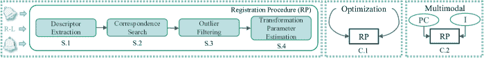
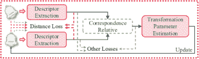

<!--yml

分类：未分类

日期：2024-09-06 19:33:09

-->

# [2404.13830] 基于深度学习的点云配准综合调查与分类

> 来源：[`ar5iv.labs.arxiv.org/html/2404.13830`](https://ar5iv.labs.arxiv.org/html/2404.13830)

# 基于深度学习的点云配准综合调查与分类

张玉欣¹    桂杰¹¹¹1 通讯作者    宋晓峰¹    龚鑫¹&陶文兵²

¹东南大学

²华中科技大学

{yuxinzhang, guijie}@seu.edu.cn, cxf_svip@163.com, xingong@seu.edu.cn, wenbingtao@hust.edu.cn

###### 摘要

点云配准（PCR）涉及确定一个刚性变换，以使一个点云与另一个点云对齐。尽管提出了众多基于**深度学习（DL）**的优秀配准方法，但对基于 DL 的 PCR 技术的全面系统研究仍然不足。本文提供了对最近提出的 PCR 方法的全面调查和分类。首先，我们对常用的数据集和评价指标进行了分类。其次，我们将现有研究分为两大类：监督式和无监督式配准，提供了对各种有影响力的 PCR 模型核心概念的见解。最后，我们强调了开放性挑战和未来研究的潜在方向。一个精心整理的有价值资源集合可在[`github.com/yxzhang15/PCR`](https://github.com/yxzhang15/PCR)找到。

## 1 引言

随着传感器技术的进步，获取高精度点云数据变得更加容易和普遍（张等，2023b；Uy 等，2019）。点云配准（PCR）作为点云数据处理中的关键工具，旨在将点云数据对齐到一个共同的坐标系统中，实现精确的三维（3D）建模（秦等，2023；陈等，2022b）。这一配准过程为点云分析及其各种应用奠定了可靠的基础（黄等，2021b）。

鉴于这一领域的快速进展，已有数百种基于深度学习（DL）的方法被提出。迫切需要深入研究以启发和指导未来的研究工作。为满足这一需求，我们开发了一项全面的调查，并建立了 PCR 算法的详细分类。本研究将这些算法分为两类：监督式和无监督式。监督式配准利用通常包含点云之间已知变换的标记数据来组织训练过程。相对而言，无监督式配准依赖于点云的内在几何特性，不依赖于外部标签。对于监督式算法，分类法分为四个关键阶段和两个总体概念。这四个阶段包括描述符提取、对应关系搜索、离群点过滤和变换参数估计，而两个概念则涵盖优化和多模态。监督式算法基于它们对每个阶段或概念集成的贡献进行系统分类。此外，对于无监督式算法，我们的分类法区分了两种方法：无对应方法通过最小化特征差异来对齐点云，而对应方法则通过建立对应关系来对齐点云。

我们调查的目标。我们旨在 (i) 分类 PCR 任务中常用的数据集和度量； (ii) 开发 DL 基于配准算法的分类法，引入各种方法中采用的核心技术； (iii) 识别可能激发进一步研究的开放问题。

我们的调查与其他调查的区别在于。 (Gu et al., 2020) 仅回顾了传统的 PCR 算法，而未涉及基于 DL 的算法。 (Zhang et al., 2020) 和 (Huang et al., 2021b) 总结了基于 DL 的 PCR 算法。然而，最近在无监督算法方面的进展没有详细阐述。此外，他们未提供 PCR 领域最新研究进展的全面概述。为解决这些问题，我们的研究对基于 DL 的监督式和无监督式配准算法进行了全面调查和分类。该分类法在图 1 中简要总结，为 PCR 算法提供了清晰且结构化的概述。

## 2 相关工作

### 2.1 定义

PCR 的目标是找到最佳的旋转 $\bm{R}^{*}$ 和平移 $\bm{t}^{*}$ 参数，使源点云 $\bm{X}\in\mathbb{R}^{N\times 3}$ 和目标点云 $\bm{Y}\in\mathbb{R}^{M\times 3}$ 对齐。这里，$N$ 和 $M$ 分别表示 $\bm{X}$ 和 $\bm{Y}$ 中点的数量。PCR 过程的数学目标为

|  | $(\bm{R}^{*},\bm{t}^{*})=\mathop{argmin}\limits_{\bm{R}\in SO(3),\bm{t}\in\mathbb{R}^{3}}\sum_{p=1}^{P}\&#124;(\bm{R}\bm{x}_{p}+\bm{t})-\bm{y}_{p}\&#124;^{2},$ |  | (1) |
| --- | --- | --- | --- |

其中 $\bm{x}_{p},\bm{y}_{p}\in\mathbb{R}^{1\times 3}$ 是 $\bm{X}$ 和 $\bm{Y}$ 中的第 p 个点，而 $P$ 表示 $\bm{X}$ 和 $\bm{Y}$ 之间的对应点数量。

<svg   height="572.59" overflow="visible" version="1.1" width="703.72"><g transform="translate(0,572.59) matrix(1 0 0 -1 0 0) translate(16.98,0) translate(0,494.09)"><g stroke="#000000" fill="#000000"><g stroke-width="0.8pt" fill="#000000" stroke="#000000" transform="matrix(1.0 0.0 0.0 1.0 -11.81 -1.38)"><foreignobject width="23.62" height="16.6" transform="matrix(1 0 0 -1 0 16.6)" overflow="visible">PCR <g stroke="#3C8C93" stroke-width="0.8pt"><path d="M 84.21 17.72 L 34.88 17.72 C 31.82 17.72 29.34 15.24 29.34 12.18 L 29.34 -12.18 C 29.34 -15.24 31.82 -17.72 34.88 -17.72 L 84.21 -17.72 C 87.27 -17.72 89.75 -15.24 89.75 -12.18 L 89.75 12.18 C 89.75 15.24 87.27 17.72 84.21 17.72 Z M 29.34 -17.72" style="fill:none"></path></g><g stroke-width="0.8pt" fill="#000000" stroke="#000000" transform="matrix(1.0 0.0 0.0 1.0 33.95 3.42)"><foreignobject width="51.18" height="26.21" transform="matrix(1 0 0 -1 0 16.6)" overflow="visible">Supervised</foreignobject></g> <g stroke="#3C8C93" stroke-width="0.8pt"><path d="M 168.16 29.52 L 108.2 29.52 C 105.14 29.52 102.66 27.04 102.66 23.98 L 102.66 -23.98 C 102.66 -27.04 105.14 -29.52 108.2 -29.52 L 168.16 -29.52 C 171.22 -29.52 173.7 -27.04 173.7 -23.98 L 173.7 23.98 C 173.7 27.04 171.22 29.52 168.16 29.52 Z M 102.66 -29.52" style="fill:none"></path></g><g stroke-width="0.8pt" fill="#000000" stroke="#000000" transform="matrix(1.0 0.0 0.0 1.0 107.28 15.22)"><foreignobject width="61.81" height="49.81" transform="matrix(1 0 0 -1 0 16.6)" overflow="visible">Descriptor Extraction</foreignobject></g> <g stroke="#3C8C93" stroke-width="0.8pt"><path d="M 245.42 15.75 L 192.15 15.75 C 189.09 15.75 186.62 13.27 186.62 10.21 L 186.62 -10.21 C 186.62 -13.27 189.09 -15.75 192.15 -15.75 L 245.42 -15.75 C 248.48 -15.75 250.96 -13.27 250.96 -10.21 L 250.96 10.21 C 250.96 13.27 248.48 15.75 245.42 15.75 Z M 186.62 -15.75" style="fill:none"></path></g><g stroke-width="0.8pt" fill="#000000" stroke="#000000" transform="matrix(1.0 0.0 0.0 1.0 191.23 -1.38)"><foreignobject width="55.12" height="16.6" transform="matrix(1 0 0 -1 0 16.6)" overflow="visible">Two-view</foreignobject></g> <g stroke="#3C8C93" stroke-width="0.8pt"><path d="M 245.42 -62.13 L 192.15 -62.13 C 189.09 -62.13 186.62 -64.61 186.62 -67.67 L 186.62 -88.38 C 186.62 -91.44 189.09 -93.92 192.15 -93.92 L 245.42 -93.92 C 248.48 -93.92 250.96 -91.44 250.96 -88.38 L 250.96 -67.67 C 250.96 -64.61 248.48 -62.13 245.42 -62.13 Z M 186.62 -93.92" style="fill:none"></path></g><g stroke-width="0.8pt" fill="#000000" stroke="#000000" transform="matrix(1.0 0.0 0.0 1.0 191.23 -76.43)"><foreignobject width="55.12" height="22.56" transform="matrix(1 0 0 -1 0 16.6)" overflow="visible">Multi-view</foreignobject></g> <g stroke="#3C8C93" stroke-width="0.8pt"><path d="M 317.4 17.72 L 269.41 17.72 C 266.35 17.72 263.88 15.24 263.88 12.18 L 263.88 -12.18 C 263.88 -15.24 266.35 -17.72 269.41 -17.72 L 317.4 -17.72 C 320.45 -17.72 322.93 -15.24 322.93 -12.18 L 322.93 12.18 C 322.93 15.24 320.45 17.72 317.4 17.72 Z M 263.88 -17.72" style="fill:none"></path></g><g stroke-width="0.8pt" fill="#000000" stroke="#000000" transform="matrix(1.0 0.0 0.0 1.0 269.78 3.42)"><foreignobject width="47.24" height="26.21" transform="matrix(1 0 0 -1 0 16.6)" overflow="visible">Keypoint-based</foreignobject></g> <g stroke="#3C8C93" stroke-width="0.8pt"><path d="M 317.4 -28.67 L 269.41 -28.67 C 266.35 -28.67 263.88 -31.15 263.88 -34.2 L 263.88 -58.57 C 263.88 -61.63 266.35 -64.11 269.41 -64.11 L 317.4 -64.11 C 320.45 -64.11 322.93 -61.63 322.93 -58.57 L 322.93 -34.2 C 322.93 -31.15 320.45 -28.67 317.4 -28.67 Z M 263.88 -64.11" style="fill:none"></path></g><g stroke-width="0.8pt" fill="#000000" stroke="#000000" transform="matrix(1.0 0.0 0.0 1.0 269.78 -42.97)"><foreignobject width="47.24" height="26.21" transform="matrix(1 0 0 -1 0 16.6)" overflow="visible">Keypoint-free</foreignobject></g> <g stroke="#3C8C93" stroke-width="0.8pt"><path d="M 168.16 -111.33 L 108.2 -111.33 C 105.14 -111.33 102.66 -113.81 102.66 -116.87 L 102.66 -157.84 C 102.66 -160.9 105.14 -163.38 108.2 -163.38 L 168.16 -163.38 C 171.22 -163.38 173.7 -160.9 173.7 -157.84 L 173.7 -116.87 C 173.7 -113.81 171.22 -111.33 168.16 -111.33 Z M 102.66 -163.38" style="fill:none"></path></g><g stroke-width="0.8pt" fill="#000000" stroke="#000000" transform="matrix(1.0 0.0 0.0 1.0 107.28 -125.63)"><foreignobject width="61.81" height="42.82" transform="matrix(1 0 0 -1 0 16.6)" overflow="visible">Correspondence Search</foreignobject></g> <g stroke="#3C8C93" stroke-width="0.8pt"><path d="M 245.42 -120.19 L 192.15 -120.19 C 189.09 -120.19 186.62 -122.66 186.62 -125.72 L 186.62 -148.99 C 186.62 -152.05 189.09 -154.52 192.15 -154.52 L 245.42 -154.52 C 248.48 -154.52 250.96 -152.05 250.96 -148.99 L 250.96 -125.72 C 250.96 -122.66 248.48 -120.19 245.42 -120.19 Z M 186.62 -154.52" style="fill:none"></path></g><g stroke-width="0.8pt" fill="#000000" stroke="#000000" transform="matrix(1.0 0.0 0.0 1.0 191.23 -134.48)"><foreignobject width="55.12" height="25.12" transform="matrix(1 0 0 -1 0 16.6)" overflow="visible">Full-object</foreignobject></g> <g stroke="#3C8C93" stroke-width="0.8pt"><path d="M 245.42 -158.39 L 192.15 -158.39 C 189.09 -158.39 186.62 -160.87 186.62 -163.92 L 186.62 -190.61 C 186.62 -193.67 189.09 -196.15 192.15 -196.15 L 245.42 -196.15 C 248.48 -196.15 250.96 -193.67 250.96 -190.61 L 250.96 -163.92 C 250.96 -160.87 248.48 -158.39 245.42 -158.39 Z M 186.62 -196.15" style="fill:none"></path></g><g stroke-width="0.8pt" fill="#000000" stroke="#000000" transform="matrix(1.0 0.0 0.0 1.0 191.23 -172.69)"><foreignobject width="55.12" height="28.54" transform="matrix(1 0 0 -1 0 16.6)" overflow="visible">Partial-object</foreignobject></g> <g stroke="#3C8C93" stroke-width="0.8pt"><path d="M 346.31 -159.55 L 269.41 -159.55 C 266.35 -159.55 263.88 -162.03 263.88 -165.08 L 263.88 -189.45 C 263.88 -192.51 266.35 -194.99 269.41 -194.99 L 346.31 -194.99 C 349.36 -194.99 351.84 -192.51 351.84 -189.45 L 351.84 -165.08 C 351.84 -162.03 349.36 -159.55 346.31 -159.55 Z M 263.88 -194.99" style="fill:none"></path></g><g stroke-width="0.8pt" fill="#000000" stroke="#000000" transform="matrix(1.0 0.0 0.0 1.0 268.49 -173.85)"><foreignobject width="78.74" height="26.21" transform="matrix(1 0 0 -1 0 16.6)" overflow="visible">Overlap Prediction</foreignobject></g> <g stroke="#3C8C93" stroke-width="0.8pt"><path d="M 346.31 -198.85 L 269.41 -198.85 C 266.35 -198.85 263.88 -201.33 263.88 -204.38 L 263.88 -244.99 C 263.88 -248.04 266.35 -250.52 269.41 -250.52 L 346.31 -250.52 C 349.36 -250.52 351.84 -248.04 351.84 -244.99 L 351.84 -204.38 C 351.84 -201.33 349.36 -198.85 346.31 -198.85 Z M 263.88 -250.52" style="fill:none"></path></g><g stroke-width="0.8pt" fill="#000000" stroke="#000000" transform="matrix(1.0 0.0 0.0 1.0 268.49 -213.15)"><foreignobject width="78.74" height="42.45" transform="matrix(1 0 0 -1 0 16.6)" overflow="visible">Optimizing the Similarity Matrix</foreignobject></g> <g stroke="#3C8C93" stroke-width="0.8pt"><path d="M 168.16 -238.1 L 108.2 -238.1 C 105.14 -238.1 102.66 -240.58 102.66 -243.64 L 102.66 -270.7 C 102.66 -273.75 105.14 -276.23 108.2 -276.23 L 168.16 -276.23 C 171.22 -276

图 1：PCR 算法的分类。

### 2.2 数据集

PCR 的数据集可以广泛分为两类：通过人工合成和通过真实仪器获取。每个类别都具有独特的特点，并在 PCR 任务中具有不同的适用性水平。合成的点云数据集通常由使用计算机图形技术创建的虚拟模型组成，以复制真实世界环境。这些数据集包含了通过计算机辅助设计生成的物体级 ModelNet40（Wu 等，2015）和 ShapeNet（Chang 等，2015）数据，以及场景级别的数据集 ICL-NUIM（Choi 等，2015）和 FlyingShapes（Chen 等，2023b）。

然而，尽管合成数据对某些应用程序有益，但它们通常缺乏现实场景中的复杂性和变化性。因此，将真实世界的数据纳入训练和验证过程对于获得稳健的算法至关重要。包含逼真点云数据的数据集包括 Stanford（Curless 和 Levoy，1996），ETH（Pomerleau 等，2012），KITTI（Geiger 等，2012），Apollo-SouthBay（Lu 等，2019b），ScanObjectNN（Uy 等，2019）和 WHU-TLS（Dong 等，2020）。此外，还有一个包括合成和逼真扫描的 3DMatch 数据集（Zeng 等，2017）。各个数据集的属性总结在表 1 中。

### 2.3 指标

指标在评估和比较点云配准结果中起着至关重要的作用，有助于选择最佳参数。因此，选择适当的指标对准确评估配准算法的质量至关重要。根据应用场景，我们对评估指标进行分类。对于物体级点云，常用的指标包括均方根误差、均方误差、均匀误差、平均绝对误差、Chamfer 距离（CD）和确定系数。对于场景级点云，典型的指标是配准回溯率、内点比率、特征匹配回溯率、相对旋转误差和相对平移误差。

图 2：受监督算法的流程。R-L 表示真实标签。PC 表示点云。I 表示图像。S 和 C 分别表示步骤和概念。

| 数据集 | 类型 | 数量 | S/O |
| --- | --- | --- | --- |
| Stanford（Curless 和 Levoy，1996） | 真实 | 10 | O |
| ETH（Pomerleau 等，2012） | 真实 | 36 | S |
| KITTI（Geiger 等，2012） | 真实 | 22 | S |
| ModelNet40（Wu 等，2015） | 合成 | 12311 | O |
| ShapeNet (Chang et al., 2015) | Syn | 55000+ | O |
| ICL-NUIM (Choi et al., 2015) | Syn | 8 | S |
| 3DMatch (Zeng et al., 2017) | Syn&Real | 62 | S |
| Apollo-SouthBay (Lu et al., 2019b) | Real | 6 | S |
| ScanObjectNN (Uy et al., 2019) | Real | 15000+ | O |
| WHU-TLS (Dong et al., 2020) | Real | 115 | S |
| FlyingShapes (Chen et al., 2023b) | Syn | 200 | S |

表 1：PCR 任务的数据集。Syn 表示合成点云。Real 表示真实点云。S 和 O 分别表示场景级和对象级。

## 3 监督点云配准

监督模型的 PCR 通常依赖于各种形式的监督信号，如真实标签或变换参数，以指导训练过程。为了促进对基于深度学习的监督方法的研究，本节提供了对不同监督算法在四个关键阶段和两个基本概念中的主要贡献的结构化分类。这种分类不仅阐明了有价值的技术，还以清晰简明的方式展示了配准方法。监督配准算法的四个步骤和两个概念如图 2 所示。值得注意的是，并不是每个算法框架都包含这四个步骤，并涉及这两个概念。

### 3.1 描述符提取

在 PCR 任务中，描述符至关重要，并显著影响特征的区分能力。在这里，我们从两个角度描述了主要用于描述符提取的 PCR 算法，这两个角度分别是双视图和多视图算法。

#### 3.1.1 双视图

第一个视角涉及双视图配准，这在 PCR 领域中成为一种流行的方法。我们进一步将这些方法分为两类：基于关键点的方法和非关键点方法。

基于关键点的方法需要检测显著的关键点以获取稳健的特征描述符。为了便于理解，这一类别根据使用的输入数据类型进一步细分，包括点、补丁和体素网格。

首先，点作为点云的基本元素，是离散的且未链接的三维实体。因此，从点中提取描述符通常需要构建复杂的局部关系。在 DeepVCP (Lu et al., 2019a) 中，点加权被融入到端到端的配准网络中，以估计点的显著性分数，从而实现关键点的检测。随后，$K$-最近邻方法被用来在关键点周围建立邻域，接着使用不变排列网络提取更详细的描述符。HRegNet (Lu et al., 2021) 是一个分层网络，它利用通过双边共识和邻域共识获得的几何特征、描述符和相似性度量来建立关键点之间的对应关系。双边共识和邻域共识的原则表明，在描述符空间中，两个正确的对应点不仅应彼此为最近邻，而且应展示类似的邻域。BUFFER (Ao et al., 2023) 设计了一个点级学习器，通过预测关键点和估计点方向来提升计算效率和特征表示能力。

其次，补丁可以直接表示局部邻域结构。在 (Deng et al., 2019) 中，点云-FoldNet 和点对特征-FoldNet 被用于从点云补丁中提取关键点，并获得不变排列的描述符。此外，(Deng et al., 2019) 中提出了一种新的姿态估计方法，其结果比随机样本一致性 (RANSAC) (Fischler and Bolles, 1981) 更快且更稳健。StickyPillars (Fischer et al., 2021) 通过联合学习像素级和点级特征描述符来整合关键点检测和描述符提取。YOHO (Wang et al., 2022a) 和 RoReg (Wang et al., 2023b) 采用先进的群等变特征学习技术，实现了旋转不变性，提高了对点密度和噪声变化的鲁棒性。此外，YOHO 和 RoReg 中的旋转等变组件允许仅通过一个对应假设进行估计，大大减少了可能变换的搜索空间。

第三，体素网格通过采用不同的、自定义大小的网格来实现点云的均匀采样。3DSmoothNet (Gojcic et al., 2019) 采用了体素化平滑密度值技术，结合全卷积层来建模点云的局部形态。它审查局部密度估计以实现 PCR。SpinNet (Ao et al., 2021) 通过对齐参考轴来消除旋转变异，并通过球形体素化和坐标变换进一步减少这些变异。然后，它将点云转换为可管理的圆柱体积，并使用圆柱卷积层生成代表性的特征描述符。

无关键点方法涉及考虑所有潜在的对应关系，而不是检测关键点。在这种视角下，存在一些方法利用深度神经网络直接获得 encapsulate 重要信息的描述符。随后，这些描述符被送入一个专门的模块，负责估计变换参数。GeDi (Poiesi and Boscaini, 2022) 通过规范化点云补丁的局部参考框架，并使用深度神经网络将其编码为描述符。这些描述符对尺度和旋转不变，使其在不同应用领域的 PCR 中有效。

其他方法采用粗到精的方案，其中匹配结果在很大程度上受到初始粗略阶段获得的描述符的影响 (Qin et al., 2023)。GeoTransformer (Qin et al., 2023) 将距离和角度信息编码到变换表示中，能够有效捕捉各个点云中的几何结构，并揭示要配准的点云之间的几何一致性。从考虑点级和结构的角度来看，OIF-PCR (Yang et al., 2022) 在粗略阶段采用高效且精确的位置编码策略，利用有限数量的对应关系。同时，采用联合优化方法来优化位置编码，逐步细化点云特征，并减少对初始化的依赖。RoITr (Yu et al., 2023a) 引入了一个使用旋转不变 Transformer (Vaswani et al., 2017) 的聚合模块，该模块被战略性地插入在编码器和解码器组件之间。其目的是促进提取具有姿态无关性和跨帧位置感知的区分性描述符。

基于关键点的方法通过关键点检测实现精确匹配，但面临泛化挑战，并且效率较低。此外，无关键点的方法在稀疏、低重叠的点云中具有鲁棒性，但可能缺乏细节准确性。

#### 3.1.2 多视图

第二个视角涉及从多视角融合信息。MVDesc（Zhou et al., 2018）开发了一种多视角局部描述符，该描述符来源于从不同视点捕获的图像，专门用于表征 3D 关键点。随后，MVDesc 推进了一种鲁棒的匹配技术，旨在通过在定义的图模型内进行高效的信念传播推理来排除异常匹配。Li 等人（Li et al., 2020b）将多视角渲染集成到神经网络中，通过可微分渲染器使视点成为一个可优化的参数，从而捕捉到兴趣点周围更具信息量的局部上下文。为了获得具有区分性的描述符，Li 等人还设计了一种软视角池化模块，用于融合来自不同视角的卷积特征。Gojcic 等人（Gojcic et al., 2020）利用迭代重加权最小二乘（IRLS）作为全局精炼技术，以解决循环一致性问题并缓解多视角扫描中初始对齐的模糊性。然而，这种方法依赖于密集的成对对应关系，这带来了显著的计算开销，并增加了异常值的出现。因此，IRLS 很难准确估计正确的姿态。

为了应对这些局限性，Wang 等人（Wang et al., 2023a）提出了一种新颖的方法。他们主要集中于学习可靠的初始化方法，这些方法考虑了多个点云对之间的重叠。这使得可以构建稀疏但可靠的姿态图。此外，IRLS 框架中集成了历史重加权函数，增强了其泛化能力和鲁棒性。

### 3.2 对应搜索

最近，出现了用于预测待配准点云之间对应关系的研究。这些方法遵循端到端的方式，并且通常直接利用现有的点云特征提取方法。具体而言，我们根据配准对象进一步将其分类为两类：完全对象和部分对象。

#### 3.2.1 完全对象

初始类别涉及完全对象 PCR，其中每个点能够识别另一个点云中的唯一对应点。为了解决这个问题，PointNetLK（Aoki et al., 2019）和 PointNetLK Revisited（Li et al., 2021）利用了不变排列的网络 PointNet（Qi et al., 2017）作为可适应的成像函数，并将其集成到递归的 Lucas-Kanade（Lucas 和 Kanade, 1981）框架中。DCP（Wang 和 Solomon, 2019a）采用图卷积神经网络和 Transformer（Vaswani et al., 2017）建模来获取特征表示和捕捉上下文信息。随后，使用指针生成机制来估计对应关系。

#### 3.2.2 部分对象

第二类涉及部分对象的点云配准（PCR），在这种情况下，并不是每个点在另一个点云中都有对应点。鉴于通常只有部分需要配准的点云存在对应关系，部分到部分的 PCR 领域涌现出大量重要的研究。这些研究专注于重叠区域预测和相应的相似性矩阵优化。

重叠区域预测是指估计待配准点云之间的重叠区域，然后在该区域内直接寻找对应关系。根据我们的了解，Predator（Huang 等人，2021a）是首个引入重叠区域预测概念的模型。Predator 采用联合编码器和解码器架构，其中图神经网络和重叠注意模块依次应用，以增强上下文关系并预测重叠分数。值得注意的是，重叠注意模块在框架中促进了早期的信息交互，这对重叠区域的估计有积极影响。

参考上述信息交互的概念，提出了几种方法。OMNet（Xu 等人，2021）引入了一种创新的掩模预测模块，能够有效生成准确的重叠掩模。此外，OMNet 在掩模预测模块的中间层和变换回归之间建立了直接连接。这种连接使得掩模生成和变换参数估计能够同时优化。PCAM（Cao 等人，2021）利用交叉注意矩阵（CAM）实现特征增强。CAM 使得对浅层几何信息和深层上下文信息能够同时关注，从而生成更可靠的重叠区域匹配特征。

此外，几种方法通过使用 Transformer 进行全局建模来增强对重叠区域的预测。STORM（Wang et al., 2022b）将差分采样重叠预测模块引入双 Transformer（Vaswani et al., 2017）层，这有助于在预测前后阶段之间的信息交换。它采用了一个专用层，该层迭代地应用 Gumbel-softmax 技术，允许在重叠区域内独立采样点。REGTR（Yew and Lee, 2022）利用由 Transformer 层组成的主要架构，这些层包含自注意力和交叉注意力机制。这些层能够有效提取有意义的增强特征。这种架构选择使网络能够准确预测每个点在重叠区域中的存在概率，并确定其在另一个点云中的相应位置。

优化相似度矩阵是细粒度对应搜索的一个关键方面。相似度矩阵的元素表示个别点对之间的对应概率。通常，使用概率函数来计算相似度矩阵，然后选择每行或每列中的最大值以确定最可能的点对（Wang and Solomon, 2019a）。尽管 softmax 经常作为概率函数使用，但它往往会产生模糊的对应图。为了解决这一问题，出现了许多研究来减轻模糊性。PRNet（Wang and Solomon, 2019b）应用 Gumbel-softmax 技术来获取相似度矩阵，这种方法找到硬性对应关系并减轻了对应搜索中的模糊性。此外，为了增强相似度矩阵的清晰度，引入了一个温度参数到 Gumbel-softmax 中，该参数可以迭代调整。RPMNet（Yew and Lee, 2020）结合最优传输层和退火技术，从由空间坐标和几何属性组成的混合特征中学习相似度矩阵。FIRE-Net（Wu et al., 2021）促进了点云不同层次的特征交互。最初，FIRE-Net 从点云中提取结构特征，并促进特征信息的交换。这个过程允许高特征相似度的点有效地相互感知。

值得注意的是，完全对象注册方法在现实场景中并不实际，因为待注册的点云通常表示的是子集匹配。部分对象注册算法的引入解决了这一局限，使其更贴近实际需求。

### 3.3 异常值过滤

在 PCR 中，离群点被定义为缺乏对应配对的点。离群点过滤的主要目标是仔细去除这些离群点。鉴于它们对配准过程结果的重大影响，有效去除离群点对于确保系统的鲁棒性和准确性至关重要。为了识别离群点，3DRegNet（Pais 等， 2020）利用深度神经网络估计点被分类为离群点的概率，从而有效地最小化在配准过程中假设的离群点的影响。DHVR（Lee 等， 2021）将初步预测的对应关系放入霍夫投票模块。该模块在一个刻意稀疏的变换参数空间中投票，增强了对内点的准确识别。此外，DLF（Zhang 等， 2022a）使用一个分类器，该分类器结合了堆叠的顺序感知模块来评估假设的离群点，并确定假设内点的兼容性。

上述方法在提取特征后直接估计离群点。然而，在特征提取阶段，它们主要依赖于多层感知器等方法，往往忽略了 3D 空间信息的关键方面。此外，在对这些特征进行分类时，每对特征是单独评估的，忽略了内点的一致性（Bai 等， 2021）。基于上述思路，提出了 PointDSC（Bai 等， 2021），该方法明确利用距离固有构建的空间兼容性。它认为，不仅要保持待配准点云之间内点的相对距离一致，而且单个点云内的内点之间也存在固有关系。基于空间兼容性，提出了二阶空间兼容性（Chen 等， 2022b），该方法首先将空间兼容性矩阵转换为二进制形式，然后根据相互兼容点的数量计算两个对应点之间的相似性。该方法侧重于全局而非局部兼容性，增强了对内点和离群点的早期区分。MAC（Zhang 等， 2023a）放宽了最大团约束，并在兼容性图中挖掘更多的局部一致性信息，以生成准确的姿态假设。

### 3.4 变换参数估计

转换参数的计算是 PCR 的最后一步，广泛采用的方法包括 RANSAC（Fischler 和 Bolles，1981）和奇异值分解（SVD）（Arun 等，1987）。RANSAC 通常在粗配准阶段使用，以减轻离群点的影响，并且需要预定的迭代次数来解决。与 RANSAC 不同，SVD 不需要迭代解法。它直接基于两个点云之间的姿态差异估计转换参数，因此需要一个可靠的特征提取网络以获得准确的结果（Zhang 等，2022b）。解决 SVD 的过程表明，旋转矩阵是在计算平移向量之前计算的。

随着深度学习的发展，一些方法尝试通过卷积神经网络（Deng 等，2018；Pais 等，2020）同时解决旋转矩阵和平移向量的问题。这个想法在多个模型中得到了验证。然而，同时解决转换参数可能会导致相互干扰（Chen 等，2022c）。为了解决这个问题，DetarNet（Chen 等，2022c）采用了 Siamese 网络以两步过程独立解耦转换参数。最初，回归网络计算平移向量，随后利用 SVD 确定旋转矩阵。FINet（Xu 等，2022）利用点对点和全局特征来增强在多个阶段要配准的点云之间的信息关联。同时，设计了一个包含旋转回归分支和平移回归分支的双分支结构，分别预测旋转矩阵和平移向量。

### 3.5 优化

PCR 优化的方法侧重于提升整个过程。根据它们的优化原则，我们将它们分为两大类：基于 ICP 的方法和基于概率的方法。

#### 3.5.1 基于 ICP 的方法

虽然经典的 ICP 算法在 PCR 任务中可能不如基于深度学习的算法有效，但它仍然提供了值得探索的宝贵优势。其中一个优势是它的迭代优化思想，这一思想已被广泛应用于各种方法中，以细化估计变换参数。在 DCP（Wang 和 Solomon，2019a）和 PRNet（Wang 和 Solomon，2019b）中，整个网络遵循迭代过程来增强旋转矩阵和平移向量的初始预测，并将其从粗糙逐步细化得更精确。更具体地说，在每次迭代之前，要配准的点云会根据上一次迭代中估计的变换参数进行更新。这种渐进的细化过程允许逐步改进预测的变换参数。与之前讨论的那些遍历整个网络的算法相比，IDAM（Li 等，2020a）将特征提取组件独特地置于迭代循环之外，从而在一定程度上减少了计算负担。此外，它将距离信息集成到迭代网络中，并引入了一个两阶段点消除模块。这种设计有效地过滤掉对配准过程有害的点。

#### 3.5.2 基于概率的

基于概率的 PCR 算法在配准框架中整合了概率知识，以增强优化过程。这些算法通常利用概率模型来描述点云配准之间的匹配关系及其固有的不确定性。

作为一种常用的概率模型，高斯混合模型（GMM）通过将期望最大化（EM）方法融入最大似然框架中来寻找最优对齐（Eckart 等，2018）。然而，EM 过程可能计算密集且可能导致数据关联错误，特别是在存在显著角度差异的配准中（Yuan 等，2020）。为了应对上述挑战，提出了一种名为深度高斯混合配准（DeepGMR）（Yuan 等，2020）的技术，该技术利用神经网络在点和 GMM 参数之间搜索对应关系。此外，还使用了两个可微分模块来估计最优的变换参数。OGMM（Mei 等，2023a）利用两个输入点云之间重叠区域的预测进行 GMM 估计，将配准任务框定为最小化两个 GMM 之间的方差。在（Chen 等，2023a）中，GMM 被形式化为一种具有全面表示能力的分布，包含了全球和局部信息。

除了 GMM 外，贝叶斯概率模型也用于 PCR。VBReg (Jiang et al., 2023) 引入了一种变量非局部网络架构，采用变分贝叶斯推断进行非局部特征学习。这种方法能够建模贝叶斯驱动的长程依赖关系，并促进获得离群点/内点的区分特征表示。

### 3.6 多模态

原始点云本身具有宝贵的结构信息，这对于准确表示和分析至关重要。当前多模态算法的主要目标是通过结合从图像中提取的纹理信息来增强这些结构数据。

PCR-CG (Zhang et al., 2022c) 和 PEAL (Yu et al., 2023b) 采用二维（2D）图像匹配技术来建立 2D 对应关系，然后通过 2D 到 3D 投影模块将这些对应关系投影到点云上，从而便于识别重叠区域。ImLoveNet (Chen et al., 2022a) 也利用图像来增强重叠区域的预测，直接采用交叉融合技术将从点云直接提取的 3D 特征与从图像派生的二维特征模拟出的 3D 特征融合。IMFNET (Huang et al., 2022c) 提出了一个可解释的模块，以解释原始点对最终描述符的贡献。这种方法显著提高了描述符的透明度和有效性。GMF (Huang et al., 2022b) 通过交叉注意力融合层集成了纹理和结构信息。此外，它还结合了卷积位置编码层，这对于突出差异和关注邻近信息至关重要。因此，这些改进有助于提高模型中的对应质量和标准准确性。

图 3：无监督算法的流程图。红色箭头和绿色箭头分别表示无对应关系和有对应关系的特征流。

## 4 无监督点云配准

尽管有监督的 PCR 算法表现良好，但其成功严重依赖于在模型训练过程中作为监督信号的大量真实变换或对应关系数据。不用说，在实际环境中获取这种注释数据往往既具有挑战性又昂贵，这限制了这些有监督配准算法的实际应用范围。因此，探索无监督 PCR 算法。在本节中，我们将无监督算法分为两类：无对应关系和有对应关系。

### 4.1 无对应关系

一般而言，基于对应关系的无监督配准方法首先从源点云和目标点云中提取全局特征，然后最小化它们之间的差异以回归变换参数。如图 3 所示，基于无对应关系的算法利用点云之间距离的计算来定义损失函数，这被称为距离损失。通常，无监督方法中的距离损失使用 CD，它测量两点云中点对之间的距离或特征差异，公式为

|  | $\begin{array}[]{rl}\mathcal{L}\left(\bm{X},\bm{Y}\right)=\frac{1}{N}\sum\limits_{\bm{x}\in\bm{X}}\min\limits_{\bm{y}\in\bm{Y}}\&#124;\bm{x}-\bm{y}\&#124;_{2}^{2}+\frac{1}{M}\sum\limits_{\bm{y}\in\bm{Y}}\min\limits_{\bm{x}\in\bm{X}}\&#124;\bm{y}-\bm{x}\&#124;_{2}^{2}.\end{array}$ |  | (2) |
| --- | --- | --- | --- |

在无对应关系的无监督方法领域，早期的一个重要贡献是 PPF-FoldNet（Deng 等，2018），该方法首先构造四维（4D）点对特征。这些特征随后被输入到一个类似于折叠网络的端到端架构中，利用编码器-解码器结构进行重建。损失函数涉及比较重建前后 4D 点对特征之间的 CD。Sun 等（Sun 等，2023）进一步发展了用于跨源 PCR 的 PointNetLK 算法，采用全局特征进行 CD 计算。UGMM（Huang 等，2022a）提出了一种新方法，将 PCR 挑战重新定义为聚类问题，并通过无监督学习估计后验概率。该方法使用从点云中得出的高斯混合体之间的 CD 作为损失函数。UPCR（Zhang 等，2021）引入了双重点云表示：姿态不变和姿态相关。姿态相关的表示用于学习相对姿态，这对推导变换参数至关重要。此外，CD 也被整合进损失函数中，以评估源点云和目标点云之间的差异。PCRNet（Sarode 等，2019），虽然在设计其损失函数时采用了与 UPCR 类似的方法，但通过使用地球移动者距离来区别于 UPCR。

### 4.2 基于对应关系的

与无对应关系的无监督方法相比，基于对应关系的无监督方法首先提取特征，然后使用图中的对应关系相对步骤（包括对应关系搜索或异常值过滤）建立点级、分布级或簇级对应关系。最后，从这些对应关系中估计刚性变换参数。CEMNet （Jiang 等，2021）将缩放估计器集成到测量配准误差的函数中，以削弱异常值对配准精度的负面影响。CEMNet 还使用 CD 作为损失函数。

除了 CD，基于对应关系的无监督算法还设计了各种其他损失函数来优化对齐的点云。RIENet （Shen 等，2022）提出了一个可靠的内点估计模块，并设计了邻域共识损失和空间一致性损失，以减少待配准点云的局部差异和全局差异。UDPReg （Mei 等，2023b）从簇级和点级寻找对应关系，并设计了自一致性损失、交叉一致性损失和局部对比损失，以实现无监督学习。

## 5 挑战与机遇

现有的基于 DL 的 PCR 算法已经取得了令人印象深刻的成果。在这里，我们尝试突出现有问题，并确定可能成为未来研究催化剂的开放问题。

+   •

    面向真实数据生成：主要挑战在于弥合合成数据和现实世界数据之间的差距。大多数方法通常依赖于高斯噪声来模拟真实数据，这未能捕捉实际数据的复杂性。Chen 等（Chen et al., 2023c）提出了一种新视角，引入扩散模型生成噪声训练数据。未来的研究可以关注于集成其他生成模型来模拟噪声和遮挡，或开发能够独立于外部网络模拟真实数据的数据生成方法。

+   •

    丰富的多模态信息：当前的多模态 PCR 算法通过融合图像纹理来增强特征表示，这有助于更准确和详细的映射。未来的研究可以通过集成额外的模态信息，如（i）提供先进结构数据的拓扑信息网格，和（ii）嵌入大模型中的语义级文本标签，提供上下文洞察，进一步丰富配准算法。

+   •

    设计新的度量标准: (Chen et al., 2023d) 设计了一种新度量标准，有效地在处理速度和配准准确性上实现了双重优化。这一进展不仅提升了现有配准网络的性能，还为 PCR 任务开辟了新的视角。未来的研究可以探索创新的评估度量，全面考虑运行时间、模型大小和配准质量等因素。

+   •

    利用预训练模型: 许多 PCR 算法针对配准过程来提升性能。然而，预训练模型的集成仍然基本未被探索。未来的研究可以 (i) 适应现有的预训练模型用于点云数据，这可能大大减少训练模型时所需的数据量和计算资源，(ii) 利用为其他任务开发的预训练模型中的特征，并将其应用于 PCR 任务，从而可能带来显著的进步和高效率。

## 6 结论

本文提供了基于 DL 的 PCR 算法的全面调查和分类。首先，对常用数据集和度量标准进行了分类。然后，从不同的技术角度组织和分析了监督和无监督配准算法。最后，指出了 PCR 未来研究中值得关注的问题。

## 致谢

本研究部分得到了中国国家自然科学基金资助（资助号 62172090）。

## 参考文献

+   Ao et al. [2021] S. Ao, Q.g Hu, B. Yang, A. Markham, 和 Y. Guo. Spinnet: 学习用于 3D 点云配准的通用表面描述符。发表于 CVPR, 2021。

+   Ao et al. [2023] S. Ao, Q. Hu, H. Wang, K. Xu, 和 Y. Guo. Buffer: 在点云配准中平衡准确性、效率和通用性。发表于 CVPR, 2023。

+   Aoki et al. [2019] Y. Aoki, H. Goforth, R. Srivatsan, 和 L. Pointnetlk: 使用 Pointnet 的鲁棒且高效的点云配准。发表于 CVPR, 2019。

+   Arun et al. [1987] K. Arun, T. Huang, 和 S. Blostein. 两个 3D 点集的最小二乘拟合。IEEE TPAMI, (5), 1987。

+   Bai et al. [2021] X. Bai, Z. Luo, L. Zhou, H. Chen, L. Li, Z. Hu, H. Fu, 和 C. Tai. Pointdsc: 使用深度空间一致性的鲁棒点云配准。发表于 CVPR, 2021。

+   Cao et al. [2021] A. Cao, G. Puy, A. Boulch, 和 R. Marlet. Pcam: 交叉注意力矩阵的乘积，用于点云的刚性配准。发表于 ICCV, 2021。

+   Chang et al. [2015] A. Chang, T. Funkhouser, L. Guibas, P. Hanrahan, Q. Huang, Z. Li, S. Savarese, M. Savva, S. Song, H. Su, Xiao. J, Yi L., 和 Yu F. Shapenet: 一个信息丰富的 3D 模型库。arXiv 预印本 arXiv:1512.03012, 2015。

+   Chen et al. [2022a] H. Chen, Z. Wei, Y. Xu, M. Wei, 和 J. Wang. Imlovenet: 低重叠点云对的图像支持配准网络。发表于 SIGGRAPH, 页码 1–9, 2022。

+   Chen 等人 [2022b] Z. Chen, K. Sun, F. Yang, 和 W. Tao. Sc²-pcr: 一种用于高效且鲁棒的点云注册的二阶空间兼容性。见 CVPR, 2022。

+   Chen 等人 [2022c] Z. Chen, F. Yang, 和 W. Tao. Detarnet: 通过孪生网络解耦平移和旋转以进行点云注册。见 AAAI, 2022。

+   Chen 等人 [2023a] H. Chen, B. Chen, Z. Zhao, 和 B. Song. 基于学习高斯混合模型与全局加权局部表示的点云注册。IEEE Geosci. Remote Sens. Lett., 20:1–5, 2023。

+   Chen 等人 [2023b] S. Chen, H. Xu, R. Li, G. Liu, C. Fu, 和 S. Liu. Sira-pcr: 3D 点云注册的模拟到真实适配。见 ICCV, 2023。

+   Chen 等人 [2023c] Z. Chen, Y. Ren, T. Zhang, Z. Dang, W. Tao, S. Süsstrunk, 和 M. Salzmann. Diffusionpcr: 用于鲁棒的多步点云注册的扩散模型。arXiv 预印本 arXiv:2312.03053, 2023。

+   Chen 等人 [2023d] Z. Chen, K. Sun, F. Yang, L. Guo, 和 W. Tao. Sc²-pcr++: 重新思考高效且鲁棒的点云注册的生成与选择。IEEE TPAMI, 2023。

+   Choi 等人 [2015] S. Choi, Q. Zhou, 和 V. Koltun. 室内场景的鲁棒重建。见 CVPR, 2015。

+   Curless 和 Levoy [1996] B. Curless 和 M. Levoy. 一种基于体积的方法来构建复杂模型。见 SIGGRAPH, 1996。

+   Deng 等人 [2018] H. Deng, T. Birdal, 和 S. Ilic. Ppf-foldnet: 无监督学习旋转不变的 3D 局部描述符。见 ECCV, 2018。

+   Deng 等人 [2019] H. Deng, T. Birdal, 和 S. Ilic. 直接配对注册的 3D 局部特征。见 CVPR, 2019。

+   Dong 等人 [2020] Z. Dong, F. Liang, B. Yang, Yu. Xu, Y. Zang, J. Li, Y. Wang, W. Dai, H. Fan, J. Hyyppä, 和 Stilla U. 大规模地面激光扫描点云的注册：综述与基准测试。ISPRS J. Photogramm. Remote Sens., 163:327–342, 2020。

+   Eckart 等人 [2018] B. Eckart, K. Kim, 和 J. Kautz. Hgmr: 用于自适应 3D 注册的层次高斯混合模型。见 ECCV, 2018。

+   Fischer 等人 [2021] K. Fischer, M. Simon, F. Olsner, S. Milz, H. Gross, 和 P. Mader. Stickypillars: 使用图神经网络在点云上进行鲁棒且高效的特征匹配。见 CVPR, 2021。

+   Fischler 和 Bolles [1981] M. Fischler 和 R. Bolles. 随机样本一致性：一种用于模型拟合的范例，应用于图像分析和自动制图。ACM 通讯, 24(6):381–395, 1981。

+   Geiger 等人 [2012] A. Geiger, P. Lenz, 和 R. Urtasun. 我们准备好自动驾驶了吗？KITTI 视觉基准套件。见 CVPR, 2012。

+   Gojcic 等人 [2019] Z. Gojcic, C. Zhou, J. Wegner, 和 A. Wieser. 完美匹配：具有平滑密度的 3D 点云匹配。见 CVPR, 2019。

+   Gojcic 等人 [2020] Z. Gojcic, C. Zhou, J. D Wegner, L. Guibas, 和 T. Birdal. 学习多视角 3D 点云注册。见 CVPR, 2020。

+   (2020) 顾等人 X. 顾，X. 王 和 Y. 郭。A review of research on point cloud registration methods. In IOP Conf. Ser.: Mater. Sci. Eng., volume 782, page 022070. IOP Publishing, 2020.

+   (2021a) 黄等人 S. 黄，Z. 高齐奇，M. 乌斯维亚特索夫，A. 维塞尔 和 K. 辛德勒。Predator: Registration of 3d point clouds with low overlap. In CVPR, 2021.

+   (2021b) 黄等人 X. 黄，G. 梅，J. 张 和 R. 阿巴斯。A comprehensive survey on point cloud registration. arXiv preprint arXiv:2103.02690, 2021.

+   (2022a) 黄等人 X. 黄，S. 李，Y. 左，Y. 方，J. 张 和 X. 赵。Unsupervised point cloud registration by learning unified gaussian mixture models. IEEE Robotics Autom. Lett., 7(3):7028–7035, 2022.

+   (2022b) 黄等人 X. 黄，W. 曲，Y. 左，Y. 方 和 X. 赵。Gmf: General multimodal fusion framework for correspondence outlier rejection. IEEE Robotics Autom. Lett., 7(4):12585–12592, 2022.

+   (2022c) 黄等人 X. 黄，W. 曲，Y. 左，Y. 方 和 X. 赵。Imfnet: Interpretable multimodal fusion for point cloud registration. IEEE Robotics Autom. Lett., 7(4):12323–12330, 2022.

+   (2021) 姜等人 H. 姜，Y. 沈，J. 谢，J. 李，季谦 和 J. 杨。Sampling network guided cross-entropy method for unsupervised point cloud registration. In ICCV, 2021.

+   (2023) 姜等人 H. 姜，Z. 党，Z. 韦，J. 谢，J. 杨 和 M. 沙尔兹曼。Robust outlier rejection for 3d registration with variational bayes. In CVPR, 2023.

+   (2021) 李等人 J. 李，S. 金，M. 曹 和 J. 朴。Deep hough voting for robust global registration. In ICCV, 2021.

+   (2020a) 李等人 J. 李，C. 张，Z. 徐，H. 周 和 C. 张。Iterative distance-aware similarity matrix convolution with mutual-supervised point elimination for efficient point cloud registration. In ECCV, 2020.

+   (2020b) 李等人 L. 李，S. 朱，H. 符，P. 谭 和 C. 泰。End-to-end learning local multi-view descriptors for 3d point clouds. In CVPR, 2020.

+   (2021) 李等人 X. 李，J. Pontes 和 L. Pointnetlk revisited. In CVPR, 2021.

+   (2019a) 卢等人 W. 卢，G. 万，Y. 周，X. 付，P. 袁 和 S. 宋。Deepvcp: An end-to-end deep neural network for point cloud registration. In CVPR, 2019.

+   (2019b) 卢等人 W. 卢，Y. 周，G. 万，S. 侯 和 S. 宋。L3-net: Towards learning based lidar localization for autonomous driving. In CVPR, 2019.

+   (2021) 卢等人 F. 卢，G. 陈，Y. 刘，L. 张，S. 曲，S. 刘 和 R. 顾。Hregnet: A hierarchical network for large-scale outdoor lidar point cloud registration. In ICCV, 2021.

+   (1981) 卢卡斯和卡纳德 B. 卢卡斯 和 T. 卡纳德。An iterative image registration technique with an application to stereo vision. In IJCAI, 1981.

+   (2023a) 梅等人 G. 梅，F. 波伊西，C. 萨尔托里，J. 张，E. 里奇 和 N. 塞贝。Overlap-guided gaussian mixture models for point cloud registration. In WACV, 2023.

+   (2023b) 梅等人 G. 梅，H. 唐，X. 黄，W. 王，J. 刘，J. 张，Van G. 和 Q. 吴。Unsupervised deep probabilistic approach for partial point cloud registration. In CVPR, 2023.

+   Pais et al. [2020] G. Pais, S. Ramalingam, V. Govindu, J. Nascimento, R. Chellappa, 和 P. Miraldo. 3dregnet: 一种用于 3d 点配准的深度神经网络。在 CVPR, 2020。

+   Poiesi and Boscaini [2022] F. Poiesi 和 D. Boscaini. 学习通用且独特的 3d 本地深度描述符用于点云配准。IEEE TPAMI, 45(3), 2022。

+   Pomerleau et al. [2012] F. Pomerleau, M. Liu, F. Colas, 和 R. Siegwart. 点云配准算法的挑战数据集。国际机器人研究杂志, 31(14):1705–1711, 2012。

+   Qi et al. [2017] C. Qi, H. Su, K. Mo, 和 L. Guibas. Pointnet: 点集深度学习用于 3d 分类和分割。在 CVPR, 2017。

+   Qin et al. [2023] Z. Qin, H. Yu, C. Wang, Y. Guo, Y. Peng, S. Ilic, D. Hu, 和 K. Xu. Geotransformer: 快速且稳健的点云配准方法，基于几何变换器。IEEE TPAMI, 45(8):9806–9821, 2023。

+   Sarode et al. [2019] V. Sarode, X. Li, H. Goforth, Y. Aoki, R. Srivatsan, 和 S. Lucey. Pcrnet: 使用 Pointnet 编码的点云配准网络。arXiv 预印本 arXiv:1908.07906, 2019。

+   Shen et al. [2022] Y. Shen, L. Hui, H. Jiang, J. Xie, 和 J. Yang. 无监督点云配准的可靠内点评估。在 AAAI, 2022。

+   Sun et al. [2023] X. Sun, W. Li, J. Huang, D. Chen, 和 T. Jia. 基于无监督学习的跨源点云配准方法的研究与应用。在 CYBER, 2023。

+   Uy et al. [2019] M. Uy, Q. Pham, B. Hua, T. Nguyen, 和 S. Yeung. 重新审视点云分类: 基于真实世界数据的新基准数据集和分类模型。在 ICCV, 2019。

+   Vaswani et al. [2017] A. Vaswani, N. Shazeer, N. Parmar, J. Uszkoreit, L. Jones, A. Gomez, Ł. Kaiser, 和 I. Polosukhin. 注意力机制即是你所需要的。在 NeurIPS, 2017。

+   Wang and Solomon [2019a] Y. Wang 和 J. Solomon. 深度最近点: 用于点云配准的表示学习。在 ICCV, 2019。

+   Wang and Solomon [2019b] Y. Wang 和 J. Solomon. Prnet: 用于部分到部分配准的自监督学习。在 NeurIPS, 2019。

+   Wang et al. [2022a] H. Wang, Y. Liu, Z. Dong, 和 W. Wang. 你只需假设一次: 带有旋转等变描述符的点云配准。在 ACM MM, 2022。

+   Wang et al. [2022b] Y. Wang, C. Yan, Y. Feng, S. Du, Q. Dai, 和 Y. Gao. Storm: 基于结构的部分点云配准重叠匹配。IEEE TPAMI, 45(1):1135–1149, 2022。

+   Wang et al. [2023a] H. Wang, Y. Liu, Z. Dong, Y. Guo, Y. Liu, W. Wang, 和 B. Yang. 具有可靠姿态图初始化和历史加权的稳健多视角点云配准。在 CVPR, 2023。

+   Wang et al. [2023b] H. Wang, Y. Liu, Q. Hu, B. Wang, J. Chen, Z. Dong, Y. Guo, W. Wang, 和 B. Yang. Roreg: 具有方向描述符和局部旋转的成对点云配准。IEEE TPAMI, 45(8), 2023。

+   Wu et al. [2015] Z. Wu, S. Song, A. Khosla, F. Yu, L. Zhang, 和 J. Tang, X. 和 Xiao. 3d shapenets: 一种用于体积形状的深度表示。在 CVPR, 2015。

+   Wu 等人 [2021] B. Wu, J. Ma, G. Chen, 和 P. An. 特征交互表示用于点云配准. 发表在 ICCV, 2021。

+   Xu 等人 [2021] H. Xu, S. Liu, G. Wang, G. Liu, 和 B. Zeng. Omnet: 学习用于部分到部分点云配准的重叠掩码. 发表在 ICCV, 2021。

+   Xu 等人 [2022] H. Xu, N. Ye, G. Liu, B. Zeng, 和 S. Liu. Finet: 双分支特征交互用于部分到部分点云配准. 发表在 AAAI, 2022。

+   Yang 等人 [2022] F. Yang, L. Guo, Z. Chen, 和 W. Tao. 一次内点优先: 迈向高效的点云配准位置编码. 发表在 NeurIPS, 2022。

+   Yew 和 Lee [2020] Z. Yew 和 G. Lee. Rpm-net: 使用学习特征的鲁棒点匹配. 发表在 CVPR, 2020。

+   Yew 和 Lee [2022] Z. Yew 和 G. Lee. Regtr: 基于变换器的端到端点云对应. 发表在 CVPR, 2022。

+   Yu 等人 [2023a] H. Yu, Z. Qin, J. Hou, M. Saleh, D. Li, B. Busam, 和 S. Ilic. 对点云匹配的旋转不变变换器. 发表在 CVPR, 2023。

+   Yu 等人 [2023b] J. Yu, L. Ren, Y. Zhang, W. Zhou, L. Lin, 和 G. Dai. Peal: 嵌入先验的显式注意学习用于低重叠点云配准. 发表在 CVPR, 2023。

+   Yuan 等人 [2020] W. Yuan, B. Eckart, K. Kim, V. Jampani, D. Fox, 和 J. Kautz. Deepgmr: 学习潜在高斯混合模型用于配准. 发表在 ECCV, 2020。

+   Zeng 等人 [2017] A. Zeng, S. Song, M. Nießner, M. Fisher, J. Xiao, 和 T. Funkhouser. 3dmatch: 从 RGB-D 重建中学习局部几何描述符. 发表在 CVPR, 2017。

+   Zhang 等人 [2020] Z. Zhang, Y. Dai, 和 J. Sun. 基于深度学习的点云配准: 概述. 虚拟现实与智能硬件, 2(3):222–246, 2020。

+   Zhang 等人 [2021] Z. Zhang, J. Sun, Y. Dai, D. Zhou, X. Song, 和 M. He. 从表示分离的视角看无对应的无监督三维点云配准. IEEE 地球科学与遥感快报, 19:1–5, 2021。

+   Zhang 等人 [2022a] Y. Zhang, Z. Sun, Z. Zeng, 和 K. Lam. 通过深度局部特征进行部分点云配准. IEEE TAI, 4(5):1317–1327, 2022。

+   Zhang 等人 [2022b] Y. Zhang, Z. Sun, Z. Zeng, 和 K. Lam. 使用多注意力机制和深度混合特征进行点云配准. IEEE 智能系统, 38(1):58–68, 2022。

+   Zhang 等人 [2022c] Y. Zhang, J. Yu, X. Huang, W. Zhou, 和 J. Hou. Pcr-cg: 通过深度显式颜色和几何进行点云配准. 发表在 ECCV, 2022。

+   Zhang 等人 [2023a] X. Zhang, J. Yang, S. Zhang, 和 Y. Zhang. 通过最大团进行三维配准. 发表在 CVPR, 2023。

+   Zhang 等人 [2023b] Z. Zhang, W. Sun, X. Min, Q. Zhou, J. He, Q. Wang, 和 G. Zhai. Mm-pcqa: 多模态学习用于无参考点云质量评估. 发表在 IJCAI, 2023。

+   Zhou 等人 [2018] L. Zhou, S. Zhu, Z. Luo, T. Shen, R. Zhang, M. Zhen, T. Fang, 和 L. Quan. 学习和匹配用于点云配准的多视图描述符. 发表在 ECCV, 2018。
