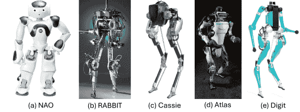
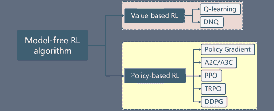

<!--yml

分类：未分类

日期：2024-09-06 19:33:07

-->

# [2404.17070] 双足步态的深度强化学习：简要调研

> 来源：[`ar5iv.labs.arxiv.org/html/2404.17070`](https://ar5iv.labs.arxiv.org/html/2404.17070)

# 双足步态的深度强化学习：简要调研

Lingfan Bao¹, Joseph Humphreys¹, Tianhu Peng¹ 和 Chengxu Zhou² 本工作得到了皇家学会[资助编号 RG\R2\232409]的支持。¹利兹大学机械工程学院，英国。 {mnlb, el20jeh, mntp}@leeds.ac.uk²伦敦大学学院计算机科学系，英国。 chengxu.zhou@ucl.ac.uk

###### 摘要

双足机器人由于其潜在应用和人工智能方面的进展，特别是在深度强化学习（DRL）领域，正在引起全球越来越多的关注。虽然 DRL 在双足步态上推动了显著进展，但开发一个能够熟练执行广泛任务的全面统一框架仍然是一个挑战。本调研系统地分类、比较和总结了现有的 DRL 框架，将它们组织为端到端和层次控制方案。端到端框架根据其学习方法进行评估，而层次框架则被分解为利用学习方法或传统模型方法的层次。本调研详细分析了每种框架类型的组成、能力、优点和局限性。此外，我们识别了关键的研究空白，并提出了未来的研究方向，旨在实现一个更集成和高效的双足步态框架，具有在日常生活中的广泛应用潜力。

###### 关键词：

深度强化学习，类人机器人，双足步态，步行机器人

## I 引言

人类在复杂多变的环境中行走，利用仅有的两条腿完成各种步态任务。为了促进动态双足步态的发展，20 世纪 80 年代引入了基于模型的方法，并且这些方法自那时以来有了显著的发展[1, 2, 3]。这些方法以快速收敛为特征，为理解环境结构提供了预测框架。然而，它们在动态变化且难以准确建模的环境中适应能力不足。最近，机器学习的进展提供了新的方法。特别是基于强化学习（RL）的方法，能够有效处理机器人与环境互动的完整动态[4]。此外，结合基于模型和基于学习的方法的混合方法也被开发出来，以利用两者的优势。然而，问题依然存在：是否存在一个统一的框架，能够使双足机器人有效管理多样化的步态任务？

图 1：用于测试 DRL 框架的常见双足和类人机器人。(a) NAO，一种玩具般的 3D 类人机器人，由伺服电机驱动[5]。(b) Rabbit，一种 2D 双足机器人，由扭矩控制驱动[6]。(c) Cassie，一种 3D 双足机器人，也由扭矩控制驱动[7]。(d) ATLAS，一种 3D 类人机器人，由液压系统驱动[8]。(e) Digit，一种全人型的 3D 类人机器人，基于 Cassie 的升级版，由扭矩控制驱动[9]。

为了解决这一问题，我们探索了基于深度强化学习（DRL）的框架的最新进展，将控制方案分为两种主要类型：（i）端到端和（ii）层次化。端到端框架将机器人状态直接映射到关节级别的控制输出，而层次化框架采用结构化的方法，将决策分解为多个层次。在这里，高层（HL）规划器负责导航和路径规划，而低层（LL）控制器则专注于基本的运动技能。最高决策层级，即任务层，直接接收来自任务或用户命令的输入。

图 2：基于 DRL 的控制方案分类。

双足机器人中强化学习（RL）的演变推动了创新应用的动态增长。尽管将 RL 应用于简单的 2D 双足机器人始于 2004 年[10, 11]，但深度强化学习（DRL）算法的出现则需要几年时间。这些基于 DRL 的方法在物理模拟器中已显示出有前景的结果[12, 13, 14]。Agility Robotics 于 2019 年推出了第一个从模拟到现实的端到端学习框架，该框架应用于 3D 扭矩控制双足机器人 Cassie，如图 1(c) [7]所示。除了基于模型的参考学习外，该策略还可以结合动作捕捉数据[15, 16, 17, 18]，或者从头开始[19]自由探索解决方案。最新研究表明，端到端框架可以稳健地处理复杂且多样的任务[20, 21, 22]。

同样，层次结构也引起了显著关注。在这一子集内，混合方法结合了基于 RL 和模型的方法，以增强规划和控制策略。一个显著的框架采用了一个学习的高层（HL）规划器与一个低层（LL）基于模型的控制器，通常称为级联结构或深度规划混合方案[23, 24, 25]。另一种创新结构将学习的反馈控制器与 HL 规划器整合，属于 DRL 反馈控制混合方案[26, 27]。此外，一个学习的层次控制方案[28]将运动分解为各种任务，每一层专注于特定功能，如导航和基本运动技能[12, 13, 29]。

尽管有几篇综述论文讨论了用于一般机器人 RL 和双足机器人模型基, 2, 3 的方法，但没有专门关注基于 DRL 的双足框架。本综述旨在填补这一空白，通过总结当前研究进展，突出双足运动框架的结构和能力，并探索未来方向。我们还对 DRL-based 框架进行了编目，如图 2 所示。本综述的主要贡献包括：

+   •

    对基于 DRL 的双足运动框架进行全面的总结和编目。

+   •

    对每种控制方案进行详细比较，突出其优点、限制和特点。

+   •

    当前挑战的识别和对未来研究方向的深入洞察。

论文组织结构如下：第 II 节重点讨论端到端框架，按学习方法分类。第 III 节详细介绍层次框架，分为三种主要类型。第 IV 节探讨现有的不足、持续的挑战和潜在的未来研究方向。最后，第 V 节对论文进行总结。

## II 端到端框架

端到端的 DRL 框架代表了一种整体方法，其中单一的神经网络（NN）策略，记作$\pi(\cdot):\mathcal{X}\rightarrow\mathcal{U}$，直接将感官输入（如图像、激光雷达数据或本体感觉反馈[30]）、用户命令[19]或预定义参考[31]转换为关节级控制动作。这些动作包括电机扭矩[32]、位置和速度[15]。这一框架避免了手动将问题分解为子任务，简化了控制过程。

端到端策略主要将低级跟踪设计简化为基本元素，如比例-微分（PD）控制器。这些方法根据其对先验知识的依赖可分为两类：基于参考和无参考。通过这些多样化学习方法开发的运动技能在性能和适应性上表现出显著差异。

在接下来的部分，我们将深入探讨各种表示框架，全面分析它们的特征、限制和优势。为了方便理解这些区别，表格 I 提供了讨论框架的简明概述。

表 I：基于参考和无参考学习方法的总结与比较，用于端到端框架。实现流程图中的虚线表示可选部分。

| 方法 | 工作 | 能力 | 特征 | 优缺点 | 实现流程图 |
| --- | --- | --- | --- | --- | --- |
| 残差学习 | [33] [34] [35] | 前向行走 单向行走 全向行走 | 在当前时间步将残差项添加到已知的运动位置。 | 优点：收敛速度快。 缺点：需要高质量的预定义参考，限制于特定运动，对复杂地形的鲁棒性差。 |  |
| 指导学习 | [36] [31] [37] [22] | 前向行走 多功能行走 多功能跳跃 多功能运动 | 模仿预定义的参考，并直接指定关节级指令。 | 优点：加速学习过程，对地形具有鲁棒性。 缺点：仅限于预定义运动，对环境中的意外变化适应性差。 |  |
| 无参考学习 | [19] [38] [20] | 周期性运动 垫脚石 基于视觉的 | 从零基础学习运动技能，无需任何先前知识。 | 优点：具有很高的步态探索潜力，对复杂地形具有很强的鲁棒性。缺点：需要对步态模式进行大量奖励调整，并且计算训练资源相对昂贵。 |  |

⁰⁰脚注：前向行走涉及双足直线前进。单向行走使双足可以在期望速度范围内前进和后退。全向行走赋予双足任何方向的行走能力。多功能行走允许双足前进、后退、转弯和侧移，提供广泛的运动能力。周期性运动涉及执行各种重复的步态模式，如行走、跳跃或奔跑。多功能跳跃指向不同期望目标跳跃。多功能运动包括执行各种动作，既包括周期性的也包括非周期性的，如跳跃。

### II-A 基于参考的学习

基于参考的学习利用先前的知识，允许策略通过遵循预定义的参考来发展运动技能，这些参考可能来自轨迹优化（TO）技术或通过运动捕捉系统捕获。这种方法相较于其他方法更容易获得运动技能，但通常会产生与预定义参考或运动剪辑非常相似的步态模式，从而限制了步态模式的多样性。一般来说，这种方法可以分为两种主要方法：（i）残差学习和（ii）指导学习。

#### II-A1 残差学习

该方法涉及一个能够感知当前参考关节位置的框架，并应用由策略确定的偏移量来修改当前时间步的运动指令。通过利用预定义的运动轨迹，残差项作为反馈控制，补偿误差，使双足能够实现动态运动技能。

2018 年引入的用于双足机器人 Cassie 的残差学习框架标志着重要的进展 [33]。该框架通过结合使用 Proximal Policy Optimization (PPO) 算法训练的策略使机器人能够向前行走，具体细节见附录 A。策略接收机器人的状态和参考输入，输出一个残差项，以在当前时间步增强参考。这些修改后的参考由比例-导数 (PD) 控制器处理，以设置所需的关节位置。虽然该框架增强了机器人执行超出站立的任务的能力 [39]，但其在双足机器人上的实际应用尚未发生，可能导致在不同速度下行走的管理不切实际，并且运动仅限于单一方向。

为了将该框架过渡到实际机器人上，展示了基于之前模型的模拟到实际策略，其中通过残差学习方法训练的策略随后应用于实际双足机器人 [34]。这一过程及其关键点在附录 B 中进一步探讨。与基于模型的方法相比，该训练策略在同一平台上实现了更快的运行速度，突显了 DRL 框架的巨大潜力。然而，机器人的运动仍然仅限于向前或向后行走。一种新的残差学习方法被引入以实现单向行走，其中策略输出一个附加到当前位置信态的残差项，从而促进渐进的全向行走 [35]。

#### II-A2 指导学习

指导学习训练策略直接输出所需的关节级命令，避免了附加残差项。这种方法中的奖励结构集中于紧密模仿预定义的参考。

提出了一个使用周期性参考来启动训练阶段的模拟到现实框架[36]。在该框架中，动作空间直接映射到关节角度，期望的关节位置由关节 PD 控制器管理。该框架还结合了一个长期短期记忆（LSTM）网络，如附录 A 所述，与周期性时间输入同步。然而，这个模型仅限于一个运动目标：前行步态。一个包括混合零动力学（HZD）步态库的更为多样化和稳健的行走 DRL 框架被展示[31]，通过使单一端到端策略实现行走、转向和蹲下，取得了显著进展。

尽管有这些进展，参考动作的参数化引入了限制，这限制了学习过程的灵活性以及策略对干扰的响应。为了拓宽引导学习策略的能力，开发了一个能够处理多个目标（包括跳跃）的框架[37]。该方法引入了一种新的策略结构，结合了长期输入/输出 (I/O) 编码，并通过多阶段训练方法实现了复杂跳跃动作的执行。还引入了一种对抗性动作先验方法，采用风格奖励机制，来促进获取用户指定的步态行为[18]。该方法通过用更直观的控制代替复杂的手工设计奖励函数，从而提高了高维模拟体的训练效果。

尽管先前的工作主要集中于特定的运动技能，但基于[37]的基础工作，进一步开发了一个同时适应周期性和非周期性动作的统一框架[22]。该框架通过整合广泛的运动技能并引入双 I/O 历史方法，增强了学习过程，标志着创建一个稳健、多功能且动态的端到端框架的重大突破。然而，实验结果表明，运动特征的精确度（如速度跟踪）仍然不尽如人意。

引导学习方法通过利用专家知识和展示获得多功能且稳健的运动技能，加速了学习过程。通过综合评估[22]，可以证明引导学习在使用参考资料时并不完全依赖于它们。相反，当依赖于质量较差的参考资料时，残差学习表现出失败或严重偏差。这一不足源于框架对紧密遵循提供的参考资料的依赖，这限制了其学习能力。

尽管基于参考的学习依赖于预定义的轨迹，将策略限制于特定的步态，限制了其探索更广泛的运动可能性的能力。此外，这种方法在有效应对意外环境变化或新挑战方面表现出有限的适应性。

### II-B 无参考学习

在无参考学习中，策略是通过精心设计的奖励函数进行训练，而不是依赖预定义的轨迹。这种方法允许策略探索更广泛的步态模式并适应意外的地形，从而增强了学习过程中的创新和灵活性。

无参考学习的概念最初是通过使用有些不现实的双足模型的模拟物理引擎进行探讨的。一个开创性的框架，专注于从零开始学习对称步态而无需使用动作捕捉数据，在模拟环境中进行了开发和验证[14]。这个框架在损失函数中引入了一个新术语，并采用了课程学习策略来有效塑造步态模式。另一个显著的进展是在开发一种学习方法，使机器人能够使用课程学习导航踏脚石，重点关注物理机器人模型 Cassie，尽管这尚未在模拟外进行验证[40]。

考虑到理论模型的实际实施，已经付出了重大努力来开发机器人研究中的模拟到现实框架。一个显著的例子是这样的框架，它适应了各种周期性运动，包括步行、跳跃和疾驰[19]。该框架使用周期性奖励来促进在模拟中进行初步训练，然后成功过渡到物理机器人。它已经进一步优化以适应不同的地形和场景。例如，通过[38]中的地形随机化技术展示了在楼梯上的稳健盲行。此外，视觉系统的集成增强了框架精确确定足部位置的能力[41]，从而使机器人能够有效地导航踏脚石[20]。后续的发展包括集成带有高度图的视觉系统，形成了一个更有效地推广地形信息的端到端框架[42]。

这种学习方法使得探索可能通过单纯模仿现有行为无法实现的新解决方案和策略成为可能。然而，缺乏参考指导可能使得学习过程变得昂贵、耗时，并且对于某些任务可能不可行。此外，这种方法的成功在很大程度上依赖于奖励函数的设计，这在规定跳跃等任务时面临重大挑战。

## III 层次框架

与将传感器输入直接映射到电机输出的端到端策略不同，层次控制方案将运动挑战分解为离散的、可管理的层次或决策阶段。该结构中的每一层都承担着特定的目标，从高级导航到基本运动技能。这种划分不仅增强了框架的灵活性，还简化了每个策略的问题解决过程。

层次框架的架构通常包括两个主要模块：HL 规划器和 LL 控制器。这种模块化的方法允许用基于模型的方法或基于学习的策略替代每个组件，进一步增强了对特定需求的适应性和定制性。

层次框架可以根据其组件的集成和功能分为三种不同的类型：

1.  1.

    深度规划混合方案：这种方法结合了战略性高层规划和动态低层执行，利用了基于学习和传统基于模型的方法的优势。

1.  2.

    反馈 DRL 控制混合方案：它侧重于将直接反馈控制机制与深度强化学习结合在一起，实现实时调整和增强响应能力。

1.  3.

    学习层次方案：完全以学习为驱动，该方案开发了一个分层决策层次结构，每一层都经过训练以优化运动的特定方面。

这些框架如图 3 所示。每种类型提供了独特的能力并展示了不同的特征，尽管由于整合不同模块及其相互作用的复杂性，存在一些限制。

为了简洁概述，表格 3 总结了各种框架，详细说明了它们各自的优势、限制和主要特征。接下来的部分将深入探讨这些框架，提供对其操作机制及其在实际应用中的分析。

表 II：层次框架的总结和比较

| 控制方案 | 工作原理 | 模块 | 特征 | 优势和劣势 |
| --- | --- | --- | --- | --- |
| 深度规划混合方案 | [24] [43] [44] | 深度规划 + ID 深度规划 + ID-QP 深度规划 + WPG | HL 策略经过学习以引导 LL 控制器完成运动和导航任务。 | 优点：增强的指令跟踪能力、跨不同平台的泛化、采样效率高且鲁棒。缺点：系统复杂以及层间通信，需要精确的模型，关于不同任务的泛化能力不足。 |
| 反馈 DRL 控制混合方案 | [45] [26] [27] | 步态库 + 反馈策略 步态规划器 + 反馈策略 基于模型的规划器 + 反馈策略 | LL 反馈策略接收未学习的 HL 规划器作为输入，以实现运动技能。 | 优点：推理时间短、鲁棒、导航运动能力强、可解释性。缺点：系统复杂以及层间通信，降低了采样效率。 |
| 学习层次框架 | [12] [13] [29] | HL 策略 + LL 策略 HL 策略 + LL 策略 HL 策略 + LL 策略 | HL 规划器和 LL 反馈控制器都经过学习。LL 策略专注于基本的运动技能，而 HL 策略则学习导航技能。 | 优点：提供层次灵活性，每一层都可以独立重新训练和重用；缓解了训练端到端策略相关的挑战。缺点：模拟到现实的效率低、层间接口复杂、训练成本高。 |

### III-A 深度规划混合方案

在这个方案中，机器人预先具备执行基本运动技能（如行走）的能力，这些技能通常通过基于模型的反馈控制器或可解释方法来管理。添加的高层（HL）学习层专注于战略目标或任务空间，增强了运动能力，并使机器人具备先进的导航能力，从而有效地探索环境。

几项研究已经证明了高层（HL）规划策略与基于模型的控制器的集成，以在世界空间中实现任务。一个显著的框架优化了任务空间级别的性能，避免了直接的关节级别和平衡考虑[24]。该系统将残差学习规划器与逆向动力学控制器结合起来，实现了对任务空间指令到关节级动作的精确控制，从而改善了速度跟踪、足部着陆位置和高度控制。进一步的进展包括一个混合框架，它将基于 HZD 的残差深度规划与基于模型的调节器相结合，以修正学习轨迹中的误差，展示了鲁棒性、训练效率和有效的速度跟踪[25]。这些框架已经成功地从仿真转移到现实，并在诸如 Cassie 的机器人上进行了验证。

然而，残余学习所带来的限制约束了智能体探索更广泛可能性的能力。在前期工作的基础上[25]，开发了一个更高效的混合框架，该框架从头开始学习而不依赖于先前的知识[43]。在这种方法中，一个纯学习基础的高层（HL）规划器与低层（LL）控制器通过逆动态与二次规划公式（ID-QP）进行互动。这一策略通过使用降阶状态巧妙地捕捉动态步态，并简化学习轨迹。该框架展示了鲁棒性和训练效率，表现优于其他模型，并成功地在多个双足平台上进行了推广，包括 Digit、Cassie 和 RABBIT。

与此同时，一些研究团队专注于为类似玩具的类人机器人开发导航规划器，这些机器人相较于扭矩驱动或液压双足机器人提供了更大的物理稳定性，如图 1 所示。一项显著的研究[46]在 NAO 机器人上实施了一种视觉导航策略，如图 1(a)所示，利用 RGB 摄像头作为主要的感知方式。该系统成功地实现了对现实场景的零样本迁移，使机器人能够熟练地绕过障碍物。进一步的研究[44]探索了复杂的动态运动任务，如踢足球，通过将学习的策略与一个在线足步规划器集成，该规划器利用重量定位生成（WPG）创建质心（CoM）轨迹。这一配置与全身控制器配合，使得像踢足球这样的动态活动成为可能。尽管这些机器人由大脚和轻量结构提供了平台的稳定性，但与全尺寸类人机器人相比，这些机器人在动态运动能力上表现有限。因此，这项研究主要关注导航和任务执行。

关于泛化，这些框架在不同类型的双足和类人机器人之间展现了适应的潜力，只需进行最小的调整，就能展示出高级的用户命令跟踪[43]和复杂的导航能力[44]。然而，明显的局限性在于缺乏执行更复杂和动态动作的能力，例如跳跃。此外，尽管这些系统能够熟练地在有障碍的复杂地形中导航，仅仅依靠足步规划是不够的，需要同步提升机器人的整体运动能力。此外，层级框架中两个不同层次之间的必要通信可能会引入系统复杂性。在 HL 规划器中提升导航和动态运动能力仍然是一个重大挑战。

图 3: 层级控制方案图：(a) 一个基本的两层层级方案，其中每个模块可以被学习到的策略替代。(b) 一个深度规划混合方案，其中高层（HL）规划器是学习到的。(c) 一个基于学习的反馈控制混合方案，具有一个学习到的低层（LL）控制器。(d) 一个全面的 DRL 层级控制方案，其中两个层级都是学习到的。

### III-B 反馈 DRL 控制混合方案

与 II 节讨论的端到端策略的全面方法相比，该方法在处理多样化运动技能和复杂地形时表现出色，且界面时间最小，而反馈 DRL 控制混合方案将 DRL 策略集成作为 LL 控制器。这些 LL 控制器替代了传统的基于模型的反馈机制，与处理地形信息、规划未来步态并保持稳健运动稳定性的 HL 规划器协同工作。

例如，步态库提供了基于用户命令的预定义运动参考，并已集成到这种框架中 [45]。尽管使用步态库的方法具有结构化，但其静态特性对变化的地形适应性有限，从而降低了其效果。更具动态性的方法包括在线规划，已显示出更大的适应性和效率。一个显著的框架将传统的脚步规划器与 LL DRL 策略相结合 [26]，为机器人提供了有针对性的脚步和方向指导，从而实现了响应性和多样化的行走命令。此外，HL 控制器可以向 LL 策略提供额外的反馈，结合 CoM 或末端脚的信息，无论是来自基于模型的方法还是其他传统控制策略。然而，这项工作尚未从模拟转移到实际应用中。随后，提出了一个类似的结构，具有 HL 脚步规划器和 LL DRL 策略 [27]。这一策略不仅成功实现了从模拟到现实的转移，还使机器人能够全方位导航并避开障碍物。

最近的发展表明，仅仅专注于脚步位置可能会限制运动的稳定性和适应性，尤其是在复杂的动作中。一个新的框架将基于模型的规划器与 DRL 反馈策略集成，以增强双足运动的灵活性和多样性，显示出改善的性能 [47]。该系统采用残差学习架构，将 DRL 策略的输出与规划器的指令合并后，再传递给 PD 控制器。这种集成方法不仅关注脚步位置，还生成了全面的躯干位置、方向和踝关节偏航角的轨迹，使机器人能够执行各种运动技能，包括走路、蹲下、转弯和爬楼梯。

与传统的基于模型的控制器相比，学习型 DRL 策略提供了全面的闭环控制策略，不依赖于地形或机器人能力的假设。这些策略在运动中表现出了高效性和准确的参考跟踪。尽管具有广泛的能力，这些策略通常需要较短的推断时间，使 DRL 成为在鲁棒性至关重要或机器人计算资源有限的情况下的首选方法。然而，这些学习算法在稀疏奖励的环境中通常面临挑战，例如合适的踏脚点（如缝隙或踏脚石）不常出现 [48]。

此外，HL 规划器可以处理关键数据，如地形变化或障碍物，并生成精确的脚部目标位置或期望的行走路径，而不是详细的地形数据，这可以显著加快训练过程[27]。这一能力有效地解决了端到端框架中观察到的导航限制。此外，与深度规划混合方案中在策略建立后修改繁琐不同，这种混合方案在即兴调整方面提供了更大的灵活性。

尽管之前的研究展示了显著的潜力，但将基于 DRL 的控制器与复杂的 HL 规划器集成相比于更集成的框架（如端到端和深度规划模型）仍然存在局限性。具体来说，复杂的 HL 模型基于规划器通常需要大量的计算资源来解决问题，严重依赖模型假设，需长时间训练，要求大量数据集进行优化，并阻碍了快速部署和迭代改进[48]。

### III-C 学习层次框架

学习层次框架将学习的 HL 规划器与 LL 控制器相结合，初步专注于优化 LL 策略以确保平衡和基本的运动能力。随后，开发了 HL 策略来引导机器人向特定目标前进，体现了对机器人自主性的结构化方法。

这一框架的起源是在一个物理引擎中，旨在通过模拟验证其效率[12]。在这个设置中，LL 策略通过人类动作或通过轨迹优化（TO）生成的轨迹来指导这些轨迹，同时保持平衡。然后引入了一个 HL 策略，该策略通过长期任务目标进行预训练，以导航环境并识别最佳路径。这一结构使得复杂的互动成为可能，例如指导双足机器人将足球带向目标。该框架后来进行了增强，加入了模仿学习，促进了在模拟环境中复制动态类人运动的能力[13]。

然而，尽管其结构化和分层的方法允许重用学习到的行为以实现长期目标，但这些框架主要只在模拟中得到了验证。HL 规划器与 LL 控制器之间手动设计的接口有时会导致次优行为，包括稳定性问题，如摔倒。

在扩展该框架的应用时，提出了一种针对轮式双足机器人从模拟到现实的策略，将 LL 策略集中于平衡和位置跟踪，而 HL 策略通过辅助碰撞避免和根据子目标的方向做出战略决策来增强安全性[29]。

学习复杂的运动技能，特别是涉及导航元素时，是机器人技术中的一个重大挑战。将这些任务分解为不同的运动和导航组件使机器人能够处理更复杂的活动，例如运球[12]。正如上一节所讨论的，将基于强化学习的规划者与基于强化学习的控制器相结合的好处已被有效展示。这种组合使得框架能够巧妙地管理各种环境和任务。

在这样的框架中，高层（HL）策略被优化用于战略规划和实现特定目标。这种优化允许根据任务的需要进行有针对性的增强。此外，通过进一步训练的持续改进和适应的潜力确保了系统能够随时间演变，提高其在应对变化条件或新目标时的效率和效果。

尽管理论上有优势，这种用于双足机器人的仿真到现实应用的实际实施仍然基本未被探索。模拟到真实世界场景的过渡充满了挑战，尤其是因为在控制层次结构中训练和整合两个独立层次的复杂性。确保这些层次之间的有效沟通与合作至关重要，需要一个精确定义的沟通接口以避免操作差异。

此外，层次结构中每个策略的训练过程需要大量计算资源。这种高强度的训练可能导致对模拟环境的依赖，从而使系统过度拟合特定场景，无法泛化到现实世界条件。这一局限性突显了一个重要的障碍，必须解决以增强学习层次框架在实际应用中的可行性。

## IV 挑战与未来研究方向

虽然基于学习的双足机器人框架展示了相当大的潜力，但它们也明显暴露了每个框架固有的局限性。此外，几个关键领域仍然基本未被探索，特别是在腿部机器人领域，在这里，双足机器人的研究进展远远落后于四足机器人。研究进展差异可归因于多个因素，包括双足机器人硬件的高成本和技术不成熟，以及双足设计面临的固有不稳定性问题。

为了更深入地了解这些挑战并概述潜在的未来方向，首先回顾现有的四足机器人研究是很有启发性的。从四足机器人中获得的见解，这些机器人受益于更为稳健的研究成果和技术进步，可以为解决双足系统中的类似挑战提供宝贵的经验。

### IV-A 四足机器人最近的进展

尽管深度强化学习（DRL）仍是双足机器人领域中的一项新兴技术，但它在四足机器人这一另一类步态系统中已经牢固地确立了自己的地位。为四足机器人开发的框架种类繁多，从用于真实场景训练的基于模型的强化学习（RL），在这种场景中不可预测的动态往往占主导地位[49, 50]，到包括可变形地形建模的系统，以提高在柔性表面上的运动能力[51]。此外，动态四足模型促进了高度可适应的策略[52]，而复杂的杂技动作则通过模仿学习实现[53]。

四足深度强化学习（DRL）领域也见证了复杂混合框架的显著进展，这些框架集成了基于视觉的系统。目前，已经开发出两种主要版本的此类框架：一种是将深度规划模块与基于模型的控制相结合[54]，另一种是将基于模型的规划与低层次 DRL 控制相结合[48, 55]。后一种方案显示出了显著的效果；它采用模型预测控制（MPC）生成参考动作，然后由低层次反馈 DRL 策略跟随。此外，腿部机器人地形感知运动生成（TAMOLS）模块[56]通过提供地形高度图，增强了 MPC 和 DRL 策略，使其能够在各种环境中（包括训练期间未遇到的环境）实现有效的足部放置。然而，类似的混合控制方案在双足步态领域尚未得到深入研究。

四足 DRL 框架主要设计用于导航复杂地形，但扩展其能力到其他任务的努力正在进行中。这些任务包括通过动作捕捉数据和模仿学习来模拟真实动物[57, 58]，以及通过增加操纵器[59, 60]或利用机器人的腿部[61]来增强四足机器人的操控能力。值得注意的是，[60]中展示的研究表明，单一的端到端框架可以有效地管理运动操控任务。

尽管四足 DRL 取得了一定进展，但双足机器人特别是在运动操控任务和基于视觉的 DRL 框架方面的类似进展有限。建立一个统一的框架可以弥合这一差距，这对于开发完整的类人系统至关重要。此外，将基于模型和基于 DRL 的方法结合起来的混合框架在双足机器人中的潜力仍然大部分未被开发。

### IV-B 差距和挑战

尽管双足机器人和类人机器人领域有许多有希望的发展，但当前研究成果与**终极目标**之间仍存在显著差距。本文讨论集中在框架和算法的差距上，而非硬件，围绕两个关键问题展开：1）是否可以设计一个统一的框架，实现通用性和精确性？2）我们能否开发一个简单的端到端政策，能够高效地管理所有任务？

#### IV-B1 通用性与精确性

DRL 在促进多功能运动技能方面显示了潜力 [22]；然而，通常会出现诸如速度跟踪不佳和精确控制问题等挑战。尽管 [43] 表明深度规划结合模型控制可以实现精确的速度跟踪，而 [37] 则展示了成功的端到端控制以实现精确跳跃，但创建一个有效处理多样任务和精确运动的策略仍然难以实现。此外，[41] 介绍了一种脚部约束政策框架，使得精确目标跟踪和准确着陆位置成为可能。然而，仍然没有一个框架能全面解决运动中的多样性和精确性的双重需求。

在双足运动中，利用 DRL 同时实现精确控制和广泛动作的困难源于几个因素：

+   •

    复杂动态：双足运动涉及复杂的动态学，这对维持动态运动和精确性提出了重大挑战。

+   •

    资源密集型：执行多样化的运动任务需要大量的计算能力和广泛的数据，需依赖高质量硬件和高效的 DRL 算法。

+   •

    训练冲突：训练 DRL 系统以实现精确度和多样性常常会导致冲突。设计既满足这两个标准的奖励函数和训练策略本质上是复杂的。

这些挑战突显了需要创新解决方案来弥合当前框架能力与先进双足和类人机器人雄心勃勃目标之间的差距。

#### IV-B2 简化框架以克服复杂任务

机器人设计中的理想设想是一个端到端的框架，使机器人能够使用多功能的运动技能在各种地形上移动。尽管当前研究往往通过添加复杂组件来增强框架以缓解固有的限制，如集成全向运动和楼梯导航的足部规划器，如[26, 27]所示，但简单的端到端框架也已被证明有效。这些框架能够在挑战性地形中自如导航，并执行各种运动任务，组件较少[20, 22]。

维持框架简洁性的优势在于其能够简化决策过程，从而减少计算开销和潜在的故障点。要实现一个优化的端到端框架，几个关键领域的进展是必不可少的：

+   •

    强大而高效的深度强化学习（DRL）算法：开发能够更有效地处理高维和连续控制问题的算法。

+   •

    专用神经网络架构：设计针对特定双足任务的神经网络架构，能够处理大量感官数据（如视觉和触觉输入），类似于[42]中提出的创新。

+   •

    有效的奖励函数：制定能够更准确地指导学习过程以实现期望行为和战略结果的奖励函数。

+   •

    高级计算资源：提升计算能力，以支持更密集的训练和更快速的推理，促进在动态环境中的实时决策。

通过关注这些发展领域，创建一个统一、高效且较少复杂的框架来处理双足机器人复杂的运动挑战的潜力显著增加。

### IV-C 未来方向

虽然四足机器人领域取得了显著进展，但双足机器人的潜力仍未被充分挖掘。借鉴四足机器人取得的成功和创新方法，几个关键的未来方向浮现，这些方向有可能显著提升双足及类人机器人技术。

#### IV-C1 统一框架

目前尚不存在单一框架，能够使双足或类人机器人熟练地在所有类型的地形上行进，包括踏脚石、楼梯、可变形地形和滑溜表面。近期在四足机器人领域的工作[48]显示了一种有前景的方法，该方法利用**模型预测控制（MPC）**生成参考运动，低级别的**深度强化学习（DRL）**策略则跟踪这些参考运动。这种方法结合了“地形感知运动生成模块（TAMOLS）”，将地形表示简化为高度图，从而促进了更有效的导航。这一成功鼓励进一步探索结合基于模型的方法和**DRL**的混合框架，继承两种方法的优点，如 III 部分所讨论。然而，混合框架面临诸如训练效率和系统复杂性等挑战，这需要大量的计算资源和较长的训练周期。

此外，近期研究[20, 42, 22]已经展示了增强视觉信息的端到端框架的潜力。这些框架成功地在具有挑战性的地形上导航并执行动态动作，表明了能够处理多样化环境和任务的统一框架的可行性。训练策略如课程学习和任务随机化可以被采用，利用视觉高度图作为策略的输入，提高机器人的适应能力和在各种场景中的表现。

此外，引入结合**变换器模型**的**DRL**端到端框架，如[62]所示，为将运动技能与语言和视觉能力整合提供了重要可能性。利用能够处理和浓缩大量数据集的大规模模型可以扩展机器人的能力范围，保持在广泛任务中的多样性。

对**变换器**和其他大规模模型的探索具有显著潜力，可增强复杂任务中的泛化能力和适应性，这值得进一步研究它们在双足机器人中的潜在应用。

#### IV-C2 基于视觉的学习框架

视觉在使机器人能够导航挑战性地形（如盲点掉落）中起着至关重要的作用，在这些情况下，触觉和其他感官输入可能无法提供足够的信息。尽管视觉非常重要，但许多现有框架，特别是在双足机器人领域，并没有充分利用这一模态[38, 43]。视觉系统在人类运动中对于识别障碍物和评估地形是必不可少的，一些研究已开始展示将视觉集成到**DRL**框架中的效果，对于双足和类人机器人[20, 42, 27]。

在双足机器人和四足机器人打下的基础上，出现了两个有前景的方向：

+   •

    高度扫描映射：这种方法在如[42]的研究中进行了评估，涉及使用扫描仪生成的高度图来指导运动策略。这些图提供详细的地形数据，使机器人能够更有效地在不平坦或被阻碍的表面上规划步伐。

+   •

    直接视觉输入：直接利用来自相机的输入，如深度图像或 RGB 图像，进行实时决策的 RL 策略[46, 63]。尽管之前的研究如[46]通过将视觉信息提供给高级（HL）规划器实现了视觉导航，但直接视觉输入在 RL 策略中的潜力尚未得到充分探索。

提升双足机器人直接解读和利用视觉数据的能力，可以在现实世界情境中彻底改变它们的适应性和效率。探索直接视觉输入到强化学习策略中的潜力，为推动该领域的进展提供了重大机会，可能实现更动态和响应迅速的运动策略。

#### IV-C3 从模拟到现实的桥梁

尽管模拟提供了一个安全且经济的环境来开发机器人政策，但从模拟到实际应用的过渡往往会遇到由于模拟中的近似和简化而带来的重大挑战。许多 sim-to-real 框架[34, 64, 65]展示了高效性和性能，如附录 B 所述。尽管有这些进展，显著的差距依然存在，这种差距因物理环境的复杂性和不可预测性而加剧。此外，许多研究[26, 66, 21]仍仅在模拟环境中得到验证。

#### IV-C4 运动操控任务

运动操控结合了运动和操控，为类人机器人在纯双足能力之外的表现提供了机会。少数研究探讨了这一综合任务；其中一项研究[67]展示了一个“箱子运输”框架。该框架将任务分解为五个不同的策略，每个策略处理运输过程中的不同方面。然而，这种方法缺乏效率，也没有结合基于视觉的信息，显示出巨大的改进空间。此外，管理如滑板车[68]等移动工具或与如球体[69]等对象动态交互的挑战引入了更多复杂性。

将步态操作任务分解为多个层级可以简化挑战，通过手动调节任务的各个组件实现更精确和灵活的控制[43]。这种结构化控制方法提供了对机器人环境中复杂交互的更协调响应，促进了任务特定命令的执行。

另外，一种端到端框架可能通过任务随机化和结构化课程学习方法，使双足机器人能够执行各种任务，逐步教授策略[35, 27, 22]。在训练过程中，这些策略还可以从运动捕捉数据[70, 18, 16]中学习类似于人类的运动，提供对未来集成的步态操作任务的有希望的解决方案。

#### IV-C5 设计奖励函数

在双足机器人深度强化学习（DRL）领域，开发有效的奖励函数是一项关键挑战。虽然已经设计了周期性奖励函数以促进诸如行走[19]等周期性运动，但在为非周期性动作如跳跃设计奖励函数方面仍存在显著差距。这些动作需要针对成功和效率的不同考虑，而现有研究在奖励结构方面缺乏全面的方法。此外，在 DRL 系统中实现高性能而不需要大量手动调节仍然是一个重大挑战，这突显了需要更具适应性和自动调整的奖励机制。

#### IV-C6 整合大语言模型

将大语言模型（LLMs）整合到双足机器人中，开辟了对上下文理解和任务执行的新途径，显著增强了机器人与环境的互动能力。LLMs 在最高任务层级实施时，为改善人机互动提供了巨大的潜力，使这些系统更加直观和响应灵敏[71]。这一技术的潜在应用广泛且具有深远影响，涵盖了工业自动化领域，机器人可以执行复杂的装配任务；医疗保健，提供病人护理和康复帮助；辅助设备，支持残疾人士；搜救行动，要求强大的适应性决策；以及娱乐和教育，提供互动和引人入胜的体验[72]。这些领域中的每一个都可能受益于 LLM 增强的双足机器人的先进能力，特别是在需要细致理解和适应的环境中。

### IV-D 各领域的应用

双足行走技术的进步为超越实验室环境的实际应用带来了重大前景。这些机器人通过人工智能的支持，准备好通过提升操作能力和与人类的互动来改造多个领域。关于类人机器人在各个领域的潜力，详见[72]，重点强调了基于学习的方法以实现更有效的实施。关键领域包括：

1.  1.

    工业自动化和制造：类人机器人在工业环境中的集成可以显著提高生产力和效率，解放工人免于重复和劳动密集型的任务。这些机器人配备了先进的运动操作能力，并能与人类团队合作，特别适用于装配线操作、维护任务和复杂机械的制造[73, 74]。它们的关节式手臂和浮动底座提供了无与伦比的灵活性，使其非常适合以人为中心的制造环境。例如，类人机器人 Digit 在工业任务中展现了卓越的稳定性和效率，如视频演示所示[75]。此外，这些机器人也适合在高风险环境中操作，如水下或高辐射区域，显著提升了这些环境中的安全性和操作能力。

1.  2.

    医疗和辅助设备：在医疗领域，双足行走和类人机器人在康复和辅助技术中发挥了重要作用。采用深度强化学习（DRL）方法增强的外骨骼正被用于训练个人以实现更自然的步态模式，从而改善移动能力和康复效果[76]。超越单纯的移动辅助，集成了大型语言模型（LLMs）的类人机器人在药物递送、监测患者健康和协助手术方面展现了前景[77]。LLMs 与运动操作能力的协同作用为更具互动性和响应性的支持铺平了道路，更好地满足个性化护理的需求。此外，老龄化人口可以受益于类人机器人执行日常任务，如通过简单的语音命令进行家庭清洁或配送，从而提高生活质量。

1.  3.

    搜索与救援任务：类人机器人在搜索和救援行动中具有特别重要的价值，尤其是在灾区或危险环境中，人类存在的风险或不切实际。与传统的轮式机器人不同，类人机器人能够在充满碎片、缝隙和高架结构的复杂地形中导航，使它们在这些场景中不可或缺。它们还表现出与人类救援队进行重大互动和协作的潜力。例如，在高核辐射环境中，类人机器人可以执行对人类来说危险的任务，操作精密仪器并防止人类暴露于有害环境中。这种能力还扩展到其他具有挑战性的环境，如水下[78]、外太空[79, 80]和其他危险区域。然而，全面实现这些应用仍受限于缺乏一个可以无缝导航所有地形并完全整合运动操作和人机交互功能的统一框架。

1.  4.

    娱乐与教育：类人机器人有潜力通过提供高度互动的体验来改变娱乐和教育领域。凭借其整合广泛知识库的能力，这些机器人可以显著提升教育环境。它们可以担任管家、教师甚至保姆的角色，与用户进行各种活动互动。例如，机器人可以促进语言学习[81]，参与讲故事，教授各种学科，或参与表演艺术和游戏。在娱乐领域，类人机器人可以表演、跳舞、玩球类游戏[69]，并参与互动表演，以其多才多艺和动态能力吸引各年龄段的观众。

    然而，这也带来了各种伦理问题。首先，与人类互动涉及收集人类日常行为数据，增加了数据泄露的风险。其次，另一个担忧是人类对机器人的依赖日益增加，不仅仅是为了帮助，还有情感支持。这将导致人际互动减少，*最终影响社会结构和情感发展*。第三，类人机器人的进步将取代人类在各种工作中的角色，并最终导致失业问题。

    积极的一面是，人形机器人可以为残疾人士或老年人提供宝贵的帮助，提供陪伴，减轻家庭和医疗系统的护理负担。此外，它们在教育、工业和医疗等各个领域的应用可以带来革命性的变化，提高效率和安全，同时开辟技术集成的新可能性。在我们推进这些进展时，平衡创新与伦理考虑至关重要，以确保人形机器人的部署能提升社会福祉，而不影响个人诚信或社会动态。

## V 结论

尽管机器人领域的深度强化学习（DRL）取得了显著进展，但当前研究成果与开发一个能够高效执行广泛复杂任务的统一框架之间仍存在相当大的差距。目前，DRL 研究可以分为两种主要控制方案：端到端和分层框架。端到端框架在执行多样的运动技能[22]、爬楼梯[38]以及在如石阶[20]等挑战性地形中导航方面显示出了有希望的能力。相反，混合框架通常集成了 HL 规划器或 LL 模型基础的控制器，提供了增强的能力，使得可以同时管理运动和导航任务。

为了弥补现有的差距，进一步开发分层框架，特别是那些配备先进感知系统并与基于模型的规划器集成的框架，似乎颇具前景。这些框架可以同时解决精度和泛化问题。此外，大型语言模型（LLMs）的出现提供了一个变革性的机会，可能使语言处理和视觉功能在机器人系统中得以统一。尽管仍面临许多挑战——从框架集成的技术复杂性到实际应用——但在控制框架优化和 DRL 发展方面的持续进展提供了一个充满希望的前景。实现一个端到端的统一框架，能够模拟类人学习过程并使双足机器人处理各种复杂任务的愿景，可能很快就会成为现实。

## 附录 A 深度强化学习算法

RL 的进步和发展对于双足运动至关重要。具体来说，深度学习的进展提供了作为函数逼近器的深度神经网络，使 RL 具备处理高维和连续空间任务的能力，通过高效地发现复杂数据的浓缩低维表示。与其他不同形态的机器人（如轮式机器人）相比，双足机器人具有更高的自由度，并且持续与环境互动，这导致对 DRL 算法的要求更高。特别是在腿部运动领域，基于策略梯度的算法在双足运动领域中较为普遍。

设计有效的神经网络架构对于处理复杂的双足运动任务至关重要。多层感知器（MLP），一种基本的神经网络，在简单回归任务中表现优异，并且对计算资源的需求较低。全面比较 MLP 和基于记忆的神经网络，即长短期记忆网络（LSTM），揭示了 MLP 在任务的收敛速度上具有优势[65]。然而，LSTM 作为递归神经网络（RNN）的变种，擅长处理与时间相关的数据，有效地关联不同的时间状态，并建模对周期性步态至关重要的关键物理属性[19]，以及双足运动中成功的模拟到现实转移。此外，卷积神经网络（CNN）专注于空间数据处理，特别是与图像相关的任务，使其在视觉感知至关重要的环境中非常合适。这些多样的神经网络架构突显了根据双足运动任务的具体要求选择适当模型的重要性。

考虑到 DRL 算法，最近的双足运动研究集中于无模型强化算法。与基于模型的 RL 不同，基于模型的 RL 学习环境模型，但可能会继承来自与现实世界条件不完全相符的模拟中的偏差，无模型 RL 通过环境交互直接训练策略，而不依赖于明确的环境模型。虽然无模型 RL 需要更多的计算样本和资源，但它可以训练出更强大的策略，使机器人能够在具有挑战性的环境中自由行走。

许多复杂的无模型 RL 算法存在，通常可以广泛分为两类：基于策略（或策略优化）和基于价值的方法。基于价值的方法，如 Q 学习、深度 Q 学习（DQN）[82]，仅在离散动作空间中表现优异，并且通常在高维动作空间中表现欠佳。相比之下，基于策略的方法，如策略梯度，可以处理复杂任务，但通常比基于价值的方法的样本效率低。

图 4：RL 算法目录图

更高级的算法结合了基于策略的方法和基于价值的方法。演员-评论家（AC）指的是一种主要思想，即同时学习一个策略（演员）和一个价值函数（评论家），它拥有两种算法的优点[83, 84]。例如，基于策略的方法中的流行算法，如信任区域策略优化（TRPO）[85]和 PPO，借鉴了 AC 的思想。此外，还有其他基于 AC 框架的新颖算法，如深度确定性策略梯度（DDPG）[86]、双延迟深度确定性策略梯度（TD3）[87]、A2C（优势演员-评论家）和 A3C（异步优势演员-评论家）[88]、SAC（软演员-评论家）[89]。每种算法在双足步态场景下考虑不同任务时都有其优势。评价这些算法的几个关键因素包括：样本效率、鲁棒性和泛化能力，以及实施挑战。一项比较分析工作[90]表明，基于 SAC 的算法在稳定性方面表现优越，获得了最高分数，但其训练效率显著落后于获得相对较高分数的 PPO。

在[91]中，PPO 展示了在复杂场景下（如双足步态）对资源的经济性和鲁棒性，利用的资源比 TRPO 少。在训练时间方面，PPO 远比 SAC 和 DDPG 算法[90]快。此外，许多研究[19, 45, 36]已经证明了它的鲁棒性和易于实施，并且与各种神经网络架构的灵活集成使得 PPO 成为该领域最受欢迎的选择。各种研究表明，PPO 可以进行步态[19]、跳跃[37]、爬楼梯[38]和踏石[20]等探索，展示了它的效率、鲁棒性和泛化能力。

此外，DDPG 算法将演员-评论家框架与 DQN 集成，以促进离策略训练，进一步优化了采样效率。在一些明确的场景下，如跳跃，DDPG 显示出比 PPO 更高的奖励和更好的学习性能[21, 92]。TD3 是在 DDPG 的基础上开发的，改进了 DDPG 和 SAC 的性能[89]。软演员-评论家（SAC）进一步提升了代理的探索能力和样本效率[89]。虽然 A2C 相比 A3C 提供了更好的效率和稳定性，但 A3C 的异步更新机制提供了更好的探索能力和加速学习的能力。尽管这些算法显示出它们的进步，但由于算法复杂性，相比于 PPO，它们的应用更加具有挑战性。

## 附录 B 弥合模拟到现实的差距

由于强化学习算法需要大量交互，直接在机器人上训练可能会导致硬件和环境的昂贵损坏。因此，在仿真中训练策略然后再部署到硬件上，显示出了显著的潜力和效率。然而，仿真和现实世界之间的差距仍然很大，使得从仿真到现实变得具有挑战性。为克服这一差距，开发了几种从仿真到现实的方法，包括动态随机化 [36]、系统识别 [93, 94]、周期性奖励组合 [66]、学习型执行器动态 [93, 95]、调节反馈控制器 [96] 和对抗性运动先验 [18, 17]。

在领域随机化下训练策略有两种主要方法。一种是端到端训练，使用机器人测量历史或输入/输出 [36]，另一种是策略蒸馏，具有环境洞察的专家策略指导一个从内部传感反馈中学习的学生策略，例如教师-学生策略 [66]，RMA [64]。

以下是这些从仿真到现实过渡方法的详细信息：

1) 动态随机化方法涉及系统地改变仿真环境的物理参数，如质量、惯性或刚度。2) 系统识别方法从观察到的数据中开发动力学的数学模型，提高模型中机器人属性（如质量和惯性）的准确性，以确保模型忠实地表示系统的行为。3) 学习型执行器动态方法利用来自执行器的实验数据开发其动态模型，通过在训练环境中融入现实的执行器行为来实现从仿真到现实。值得注意的是，高级规划器也可以从参考或非参考中学习。4) 周期性奖励组合帮助捕捉关键的运动信息，周期性步态模式更通用，以适应现实世界中的不确定性和变化。5) 调节反馈控制器手动调整控制器的设置，以减轻仿真与现实之间的扰动和差距，从而提高稳健性和适应性。从仿真到现实的关键方面，包括系统识别、带噪声测量的状态估计以及状态和动作空间的选择，已在 [34] 中强调。

## 参考文献

+   [1] S. Gupta 和 A. Kumar, “对欠驱动双足机器人动力学和控制的简要回顾，” *Advanced Robotics*，第 31 卷，第 607–623 页，2017 年。

+   [2] J. Reher 和 A. Ames, “动态步态：朝着灵活高效的双足机器人迈进，” *Annual Review of Control, Robotics, and Autonomous Systems*，第 4 卷，2021 年。

+   [3] J. Carpentier 和 P.-B. Wieber，“腿部机器人运动控制的最新进展，” *当前机器人报告*，第 2 卷，第 231–238 页，2021 年。

+   [4] M. A.-M. Khan, M. R. J. Khan, A. Tooshil, N. Sikder, M. A. P. Mahmud, A. Z. Kouzani 和 A.-A. Nahid，“过去十年基于强化学习的机器人系统综述，” *IEEE Access*，第 8 卷，第 176 598–176 623 页，2020 年。

+   [5] J. García 和 D. Shafie，“通过安全强化学习教会类人机器人更快行走，” *工程应用人工智能*，第 88 卷，第 103360 页，2020 年。

+   [6] C. Chevallereau, G. Abba, Y. Aoustin, F. Plestan, E. Westervelt, C. C. De Wit 和 J. Grizzle，“Rabbit：一个先进控制理论的测试平台，” *IEEE 控制系统杂志*，第 23 卷，第 57–79 页，2003 年。

+   [7] Y. Gong, R. Hartley, X. Da, A. Hereid, O. Harib, J.-K. Huang 和 J. Grizzle，“Cassie 双足机器人反馈控制：行走、站立和骑行，” 发表在 *美国控制会议*，2019 年，pp. 4559–4566。

+   [8] S. Kuindersma, R. Deits, M. Fallon, A. Valenzuela, H. Dai, F. Permenter, T. Koolen, P. Marion 和 R. Tedrake，“基于优化的运动规划、估计和控制设计，应用于 Atlas 类人机器人，” *自主机器人*，第 40 卷，第 429–455 页，2016 年。

+   [9] G. A. Castillo, B. Weng, W. Zhang 和 A. Hereid，“在 3D 数字双足机器人上使用强化学习设计鲁棒的反馈运动策略，” 发表在 *IEEE/RSJ 国际智能机器人与系统会议*，2021 年，pp. 5136–5143。

+   [10] R. Tedrake, T. Zhang 和 H. Seung，“在简单的 3D 双足机器人上进行随机策略梯度强化学习，” 发表在 *IEEE/RSJ 国际智能机器人与系统会议*，2004 年，pp. 2849–2854。

+   [11] J. Morimoto, G. Cheng, C. Atkeson 和 G. Zeglin，“一个简单的双足行走强化学习算法，” 发表在 *IEEE 国际机器人与自动化会议*，2004 年，pp. 3030–3035 第 3 卷。

+   [12] X. Peng, G. Berseth, K. Yin 和 M. Panne，“DeepLoco：使用层级深度强化学习的动态运动技能，” *ACM 图形学会期刊*，第 36 卷，第 1–13 页，2017 年。

+   [13] X. Peng, P. Abbeel, S. Levine 和 M. Panne，“DeepMimic：基于示例的深度强化学习物理角色技能，” *ACM 图形学会期刊*，第 37 卷，2018 年。

+   [14] W. Yu, G. Turk 和 C. K. Liu，“学习对称和低能耗的运动，” *ACM 图形学会期刊*，第 37 卷，第 1–12 页，2018 年。

+   [15] M. Taylor, S. Bashkirov, J. F. Rico, I. Toriyama, N. Miyada, H. Yanagisawa 和 K. Ishizuka，“从人类运动中学习双足机器人运动，” 发表在 *IEEE 国际机器人与自动化会议*，2021 年，pp. 2797–2803。

+   [16] X. Cheng, Y. Ji, J. Chen, R. Yang, G. Yang 和 X. Wang，“类人机器人的表达性全身控制，” *arXiv 预印本 arXiv:2402.16796*，2024 年。

+   [17] A. Tang, T. Hiraoka, N. Hiraoka, F. Shi, K. Kawaharazuka, K. Kojima, K. Okada 和 M. Inaba，“HumanMimic：通过 Wasserstein 对抗模仿学习自然运动和过渡以适应人形机器人，” *arXiv 预印本 arXiv:2309.14225*，2023 年。

+   [18] Q. Zhang, P. Cui, D. Yan, J. Sun, Y. Duan, A. Zhang 和 R. Xu，“具有人体参考的全身人形机器人运动，” *arXiv 预印本 arXiv:2402.18294*，2024 年。

+   [19] J. Siekmann, Y. Godse, A. Fern 和 J. Hurst，“通过周期性奖励组合进行的所有常见双足步态的模拟到现实学习，” 见于 *IEEE 国际机器人与自动化大会*，2021 年，第 7309–7315 页。

+   [20] H. Duan, A. Malik, M. S. Gadde, J. Dao, A. Fern 和 J. Hurst，“在跨越石块时学习动态双足行走，” 见于 *IEEE/RSJ 国际智能机器人与系统大会*，2022 年，第 6746–6752 页。

+   [21] C. Tao, M. Li, F. Cao, Z. Gao 和 Z. Zhang，“用于双足机器人跳跃优化的多目标协作深度强化学习算法，” *高级智能系统*，第 6 卷，第 2300352 页，2023 年。

+   [22] Z. Li, X. B. Peng, P. Abbeel, S. Levine, G. Berseth 和 K. Sreenath，“用于多功能、动态和鲁棒的双足运动控制的强化学习，” *arXiv e-prints*，第 arXiv–2401 页，2024 年。

+   [23] T. Li, H. Geyer, C. G. Atkeson 和 A. Rai，“使用深度强化学习在 ATRIAS 双足上学习高级策略，” 见于 *国际机器人与自动化大会*，2019 年，第 263–269 页。

+   [24] H. Duan, J. Dao, K. Green, T. Apgar, A. Fern 和 J. Hurst，“为双足运动学习任务空间动作，” 见于 *IEEE 国际机器人与自动化大会*，2021 年，第 1276–1282 页。

+   [25] G. A. Castillo, B. Weng, W. Zhang 和 A. Hereid，“基于强化学习的级联运动策略设计用于鲁棒的 3D 双足运动，” *IEEE Access*，第 10 卷，第 20 135–20 148 页，2022 年。

+   [26] R. P. Singh, M. Benallegue, M. Morisawa, R. Cisneros 和 F. Kanehiro，“在规划步伐上学习双足行走以适应人形机器人，” 见于 *IEEE-RAS 国际人形机器人大会*，2022 年，第 686–693 页。

+   [27] S. Wang, S. Piao, X. Leng 和 Z. He， “利用规划步伐和傅里叶级数周期步态规划学习 3D 双足行走，” *传感器*，第 23 卷，第 1873 页，2023 年。

+   [28] K. Arulkumaran, M. P. Deisenroth, M. Brundage 和 A. A. Bharath，“深度强化学习：简要调查，” *IEEE 信号处理杂志*，第 34 卷，第 26–38 页，2017 年。

+   [29] W. Zhu 和 M. Hayashibe，“具有高效性和泛化能力的层次深度强化学习框架用于快速和安全的导航，” *IEEE 工业电子学报*，第 70 卷，第 4962–4971 页，2023 年。

+   [30] X. B. Peng 和 M. Van De Panne，“使用深度强化学习学习运动技能：行动空间的选择是否重要？” 见于 *ACM SIGGRAPH/Eurographics 计算机动画研讨会*，2017 年，第 1–13 页。

+   [31] Z. Li, X. Cheng, X. B. Peng, P. Abbeel, S. Levine, G. Berseth, 和 K. Sreenath，“用于双足机器人的鲁棒参数化运动控制的强化学习，”在 *IEEE 国际机器人与自动化会议*，2021 年，页码 2811–2817。

+   [32] D. Kim, G. Berseth, M. Schwartz, 和 J. Park，“基于扭矩的深度强化学习用于双足机器人任务和机器人无关学习，使用仿真到现实转移，”*IEEE Robotics and Automation Letters*，第 8 卷，页码 6251–6258，2023 年。

+   [33] Z. Xie, G. Berseth, P. Clary, J. Hurst, 和 M. van de Panne，“针对 Cassie 的反馈控制与深度强化学习，”在 *IEEE/RSJ 国际智能机器人与系统会议*，2018 年，页码 1241–1246。

+   [34] Z. Xie, P. Clary, J. Dao, P. Morais, J. Hurst, 和 M. van de Panne，“为 Cassie 学习运动技能：迭代设计和仿真到现实，”在 *机器人学习会议*，2020 年，页码 317–329。

+   [35] D. Rodriguez 和 S. Behnke，“Deepwalk：通过深度强化学习实现全向双足步态，”在 *IEEE 国际机器人与自动化会议*，2021 年，页码 3033–3039。

+   [36] J. Siekmann, S. Valluri, J. Dao, L. Bermillo, H. Duan, A. Fern, 和 J. W. Hurst，“为人类规模的双足行走学习基于记忆的控制，”在 *机器人科学与系统*，2020 年。

+   [37] Z. Li, X. B. Peng, P. Abbeel, S. Levine, G. Berseth, 和 K. Sreenath，“通过多任务强化学习实现鲁棒且多功能的双足跳跃控制，”在 *Robotics: Science and Systems*，2023 年。

+   [38] J. Siekmann, K. Green, J. Warila, A. Fern, 和 J. Hurst，“通过仿真到现实的强化学习实现盲目的双足楼梯跨越，”在 *Robotics: Science and Systems*，2021 年。

+   [39] C. Yang, K. Yuan, W. Merkt, T. Komura, S. Vijayakumar, 和 Z. Li，“为类人机器人学习全身运动技能，”在 *IEEE-RAS 国际类人机器人会议*，2019 年，页码 270–276。

+   [40] Z. Xie, H. Ling, N. Kim, 和 M. Panne，“ALLSTEPS：基于课程的踩石技能学习，”*计算机图形论坛*，第 39 卷，页码 213–224，2020 年。

+   [41] H. Duan, A. Malik, J. Dao, A. Saxena, K. Green, J. Siekmann, A. Fern, 和 J. Hurst，“步态约束的双足动态行走的仿真到现实学习，”在 *国际机器人与自动化会议*，2022 年，页码 10 428–10 434。

+   [42] B. Marum, M. Sabatelli, 和 H. Kasaei，“为具有挑战性地形学习基于视觉的双足行走，”*arXiv 预印本 arXiv:2309.14594*，2023 年。

+   [43] G. A. Castillo, B. Weng, S. Yang, W. Zhang, 和 A. Hereid，“受模板模型启发的任务空间学习用于鲁棒的双足行走，”在 *IEEE/RSJ 国际智能机器人与系统会议*，2023 年，页码 8582–8589。

+   [44] C. Gaspard, G. Passault, M. Daniel, 和 O. Ly，“FootstepNet：一种高效的演员-评论家方法用于快速在线双足步态规划和预测，”*arXiv 预印本 arXiv:2403.12589*，2024 年。

+   [45] K. Green, Y. Godse, J. Dao, R. L. Hatton, A. Fern, 和 J. Hurst, “学习弹簧质量运动：使用简化模型引导策略，” *IEEE 机器人与自动化快报*，第 6 卷，第 3926–3932 页，2021 年。

+   [46] K. Lobos-Tsunekawa, F. Leiva, 和 J. Ruiz-del Solar, “使用深度强化学习进行双足类人机器人视觉导航，” *IEEE 机器人与自动化快报*，第 3 卷，第 4 期，第 3247–3254 页，2018 年。

+   [47] J. Li, L. Ye, Y. Cheng, H. Liu, 和 B. Liang, “通过强化学习实现灵活多变的双足机器人跟踪控制，” *arXiv 预印本 arXiv:2404.08246*，2024 年。

+   [48] F. Jenelten, J. He, F. Farshidian, 和 M. Hutter, “DTC：深度跟踪控制，” *科学机器人*，第 9 卷，第 eadh5401 页，2024 年。

+   [49] L. Smith, I. Kostrikov, 和 S. Levine, “展示公园散步：用无模型强化学习在 20 分钟内学习行走，” *机器人：科学与系统演示*，第 2 卷，第 4 页，2023 年。

+   [50] P. Wu, A. Escontrela, D. Hafner, P. Abbeel, 和 K. Goldberg, “DayDreamer：物理机器人学习的世界模型，” 在 *机器人学习会议*，2023 年，第 2226–2240 页。

+   [51] S. Choi, G. Ji, J. Park, H. Kim, J. Mun, J. H. Lee, 和 J. Hwangbo, “在可变形地形上学习四足运动，” *科学机器人*，第 8 卷，第 eade2256 页，2023 年。

+   [52] G. Feng, H. Zhang, Z. Li, X. B. Peng, B. Basireddy, L. Yue, Z. SONG, L. Yang, Y. Liu, K. Sreenath, 和 S. Levine, “Genloco：四足机器人通用运动控制器，” 在 *机器人学习会议*，第 205 卷，2023 年，第 1893–1903 页。

+   [53] Y. Fuchioka, Z. Xie, 和 M. Van de Panne, “OPT-Mimic：动态四足行为优化轨迹的模仿，” 在 *IEEE 国际机器人与自动化会议*，2023 年，第 5092–5098 页。

+   [54] S. Gangapurwala, M. Geisert, R. Orsolino, M. Fallon, 和 I. Havoutis, “RLOC：使用强化学习和最优控制的地形感知腿部运动，” *IEEE 机器人学报*，第 38 卷，第 2908–2927 页，2022 年。

+   [55] D. Kang, J. Cheng, M. Zamora, F. Zargarbashi, 和 S. Coros, “RL + 基于模型的控制：使用按需最优控制学习多用途的腿部运动，” *IEEE 机器人与自动化快报*，第 8 卷，第 6619–6626 页，2023 年。

+   [56] F. Jenelten, R. Grandia, F. Farshidian, 和 M. Hutter, “TAMOLS：针对腿部系统的地形感知运动优化，” *IEEE 机器人学报*，第 38 卷，第 3395–3413 页，2022 年。

+   [57] X. B. Peng, E. Coumans, T. Zhang, T.-W. E. Lee, J. Tan, 和 S. Levine, “通过模仿动物学习灵活的机器人运动技能，” 在 *机器人：科学与系统*，2020 年。

+   [58] F. Yin, A. Tang, L. Xu, Y. Cao, Y. Zheng, Z. Zhang, 和 X. Chen, “像狗一样跑：基于学习的四足步态风格迁移全身控制框架，” 在 *IEEE/RSJ 国际智能机器人与系统会议*，2021 年，第 8508–8514 页。

+   [59] Y. Ma, F. Farshidian, T. Miki, J. Lee 和 M. Hutter，“将基于学习的运动政策与基于模型的操控结合用于腿部移动操控器，” *IEEE 机器人与自动化快报*，第 7 卷，pp. 2377–2384，2022 年。

+   [60] Z. Fu, X. Cheng 和 D. Pathak，“深度全身控制：学习操控和运动的统一策略，” 在 *机器人学习大会*，2023 年，pp. 138–149。

+   [61] P. Arm, M. Mittal, H. Kolvenbach 和 M. Hutter，“Pedipulate：利用四足机器人的腿部实现操控技能，” 在 *IEEE 机器人与自动化大会*，2024 年。

+   [62] I. Radosavovic, T. Xiao, B. Zhang, T. Darrell, J. Malik 和 K. Sreenath，“使用变压器学习类人机器人运动，” *arXiv 预印本 arXiv:2303.03381*，2023 年。

+   [63] A. Byravan, J. Humplik, L. Hasenclever, A. Brussee, F. Nori, T. Haarnoja, B. Moran, S. Bohez, F. Sadeghi, B. Vujatovic *等*，“Nerf2real：使用神经辐射场的视觉引导双足运动技能的模拟到真实迁移，” 在 *IEEE 国际机器人与自动化大会*，2023 年，pp. 9362–9369。

+   [64] A. Kumar, Z. Li, J. Zeng, D. Pathak, K. Sreenath 和 J. Malik，“为双足机器人适应快速运动适应性，” 在 *IEEE/RSJ 国际智能机器人与系统大会*，2022 年，pp. 1161–1168。

+   [65] R. P. Singh, Z. Xie, P. Gergondet 和 F. Kanehiro，“通过当前反馈学习双足机器人的步态，” *IEEE Access*，第 11 卷，第 82013–82023 页，2023 年。

+   [66] B. van Marum, M. Sabatelli 和 H. Kasaei，“在不规则地形上学习感知双足运动，” *arXiv 预印本 arXiv:2304.07236*，2023 年。

+   [67] J. Dao, H. Duan 和 A. Fern，“类人机器人箱体机动操控的模拟到真实学习，” *arXiv 预印本 arXiv:2310.03191*，2023 年。

+   [68] J. Baltes, G. Christmann 和 S. Saeedvand，“一种用于控制双轮滑板车的深度强化学习算法与类人机器人，” *人工智能工程应用*，第 126 卷，第 106941 页，2023 年。

+   [69] T. Haarnoja, B. Moran, G. Lever, S. H. Huang, D. Tirumala, J. Humplik, M. Wulfmeier, S. Tunyasuvunakool, N. Y. Siegel, R. Hafner *等*，“使用深度强化学习为双足机器人学习灵活的足球技能，” *科学机器人*，第 9 卷，第 eadi8022 页，2024 年。

+   [70] M. Seo, S. Han, K. Sim, S. H. Bang, C. Gonzalez, L. Sentis 和 Y. Zhu，“通过人类远程操作进行类人机器人机动操控的深度模仿学习，” 在 *IEEE-RAS 国际类人机器人大会*，2023 年，pp. 1–8。

+   [71] K. N. Kumar, I. Essa 和 S. Ha，“将语言转化为行动：使用语言指导的迭代运动优化学习多样的类人机器人行为，” 在 *语言与机器人学习研讨会：语言作为基础*，2023 年。

+   [72] Y. Tong, H. Liu 和 Z. Zhang，“类人机器人进展：全面回顾与未来展望，” *IEEE/CAA 自动化学报*，第 11 卷，pp. 301–328，2024 年。

+   [73] A. Dzedzickis, J. Subačiūtė-Žemaitienė, E. Šutinys, U. Samukaitė-Bubnienė, 和 V. Bučinskas，“工业机器人先进应用：新趋势与可能性，” *应用科学*，第 12 卷，第 135 页，2021 年。

+   [74] M. Yang, E. Yang, R. C. Zante, M. Post, 和 X. Liu，“协作移动工业操控器：系统架构与应用综述，” 见 *国际自动化与计算会议*，2019 年，第 1–6 页。

+   [75] “6+ 小时实时自主机器人演示，” https://www.youtube.com/watch?v=Ke468Mv8ldM，2024 年 3 月。

+   [76] G. Bingjing, H. Jianhai, L. Xiangpan, 和 Y. Lin，“基于强化学习的人机交互控制用于步态康复训练机器人，” *国际先进机器人系统期刊*，第 16 卷，第 1729881419839584 页，2019 年。

+   [77] A. Diodato, M. Brancadoro, G. De Rossi, H. Abidi, D. Dall’Alba, R. Muradore, G. Ciuti, P. Fiorini, A. Menciassi, 和 M. Cianchetti，“用于提高手术灵活性的软体机器人操控器，” *外科创新*，第 25 卷，第 69–76 页，2018 年。

+   [78] R. Bogue，“水下机器人：技术与应用综述，” *工业机器人：国际期刊*，第 42 卷，第 186–191 页，2015 年。

+   [79] N. Rudin, H. Kolvenbach, V. Tsounis, 和 M. Hutter，“基于深度强化学习的类猫跳跃和着陆在低重力环境中的应用，” *IEEE 机器人学汇刊*，第 38 卷，第 317–328 页，2022 年。

+   [80] J. Qi, H. Gao, H. Su, L. Han, B. Su, M. Huo, H. Yu, 和 Z. Deng，“基于强化学习的稳定跳跃控制方法用于小行星探索四足机器人，” *航空航天科学与技术*，第 142 卷，第 108689 页，2023 年。

+   [81] O. Mubin, C. Bartneck, L. Feijs, H. Hooft van Huysduynen, J. Hu, 和 J. Muelver，“通过机器人互动语言提高语音识别，” *颠覆性科学与技术*，第 1 卷，第 79–88 页，2012 年。

+   [82] A. Meduri, M. Khadiv, 和 L. Righetti，“DeepQ 步态器：不平坦地形上反应式动态步态的框架，” 见 *IEEE 国际机器人与自动化会议*，2021 年，第 2099–2105 页。

+   [83] T. P. Lillicrap, J. J. Hunt, A. Pritzel, N. Heess, T. Erez, Y. Tassa, D. Silver, 和 D. Wierstra，“使用深度强化学习的连续控制，” 见 *国际学习表征会议*，2016 年。

+   [84] L. Liu, M. V. D. Panne, 和 K. Yin，“物理基础角色的控制图引导学习，” *ACM 图形学汇刊*，第 35 卷，第 1–14 页，2016 年。

+   [85] J. Schulman, S. Levine, P. Abbeel, M. Jordan, 和 P. Moritz，“信任区域策略优化，” 见 *国际机器学习会议*，2015 年，第 1889–1897 页。

+   [86] C. Huang, G. Wang, Z. Zhou, R. Zhang, 和 L. Lin，“奖励自适应强化学习：双足行走的动态策略梯度优化，” *IEEE 模式分析与机器智能汇刊*，第 45 卷，第 7686–7695 页，2023 年。

+   [87] S. Dankwa 和 W. Zheng, “双延迟 DDPG：一种深度强化学习技术，用于建模智能机器人代理的连续运动，” 见 *国际视觉、图像与信号处理会议*，2019 年，第 1–5 页。

+   [88] J. Leng, S. Fan, J. Tang, H. Mou, J. Xue 和 Q. Li, “M-A3C：一种用于双足机器人实时步态规划的均值异步优势演员评论家强化学习方法，” *IEEE Access*，第 10 卷，第 76 523–76 536 页，2022 年。

+   [89] C. Yu 和 A. Rosendo, “多模态腿部运动框架与自动化残差强化学习，” *IEEE 机器人与自动化快报*，第 7 卷，第 10 312–10 319 页，2022 年。

+   [90] O. Aydogmus 和 M. Yilmaz, “双足机器人运动的强化学习算法比较分析，” *IEEE Access*，第 7490–7499 页，2023 年。

+   [91] J. Schulman, F. Wolski, P. Dhariwal, A. Radford 和 O. Klimov, “近端策略优化算法，” *arXiv 电子印刷本*，第 arXiv–1707 页，2017 年。

+   [92] C. Tao, J. Xue, Z. Zhang 和 Z. Gao, “双足机器人步态控制的并行深度强化学习方法，” *IEEE 电路与系统快报 II：快速简报*，第 69 卷，第 2802–2806 页，2022 年。

+   [93] W. Yu, V. C. V. Kumar, G. Turk 和 C. K. Liu, “双足运动的模拟到现实转移，” 见 *IEEE/RSJ 国际智能机器人与系统大会*，2019 年，第 3503–3510 页。

+   [94] S. Masuda 和 K. Takahashi, “无扭矩传感器齿轮驱动人形机器人上合规双足运动的模拟到现实转移，” 见 *IEEE-RAS 国际人形机器人大会*，2023 年，第 1–8 页。

+   [95] J. Hwangbo, J. Lee, A. Dosovitskiy, D. Bellicoso, V. Tsounis, V. Koltun 和 M. Hutter, “学习灵活且动态的腿部机器人运动技能，” *科学机器人*，第 4 卷，第 eaau5872 页，2019 年。

+   [96] G. A. Castillo, B. Weng, W. Zhang 和 A. Hereid, “基于强化学习的 3D 数字双足机器人鲁棒反馈运动策略设计，” 见 *IEEE/RSJ 国际智能机器人与系统大会*，2021 年，第 5136–5143 页。
