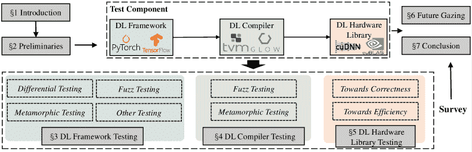
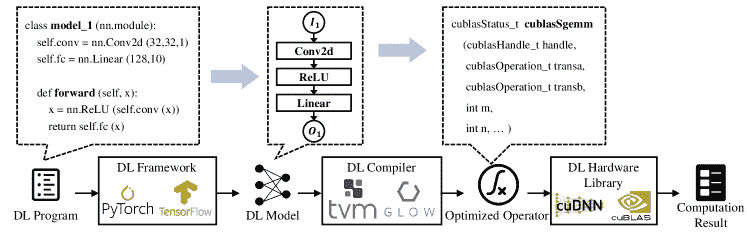
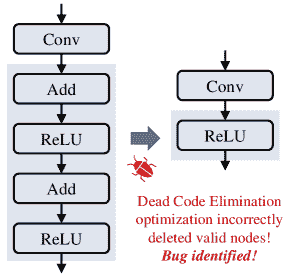
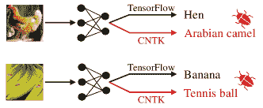
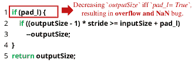
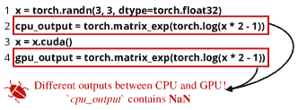
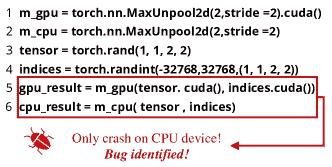
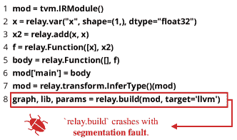

<!--yml

类别：未分类

日期：2024-09-06 19:33:05

-->

# [2404.17871] 深度学习库测试方法综述

> 来源：[`ar5iv.labs.arxiv.org/html/2404.17871`](https://ar5iv.labs.arxiv.org/html/2404.17871)

# 深度学习库测试方法综述

张小宇 zxy0927@stu.xjtu.edu.cn 西安交通大学网络科学与工程学院 邮政编码 1212 西安 中国，姜伟鹏 lenijwp@stu.xjtu.edu.cn 西安交通大学网络科学与工程学院 西安 中国，沈超 chaoshen@mail.xjtu.edu.cn 西安交通大学网络科学与工程学院 西安 中国，李琦 qli01@tsinghua.edu.cn 清华大学网络科学与 cyberspace 研究所 北京 中国，王千 qianwang@whu.edu.cn 武汉大学网络科学与工程学院 武汉 中国，林晨浩 linchenhao@xjtu.edu.cn 西安交通大学网络科学与工程学院 西安 中国，关晓红 xhguan@mail.xjtu.edu.cn 西安交通大学网络科学与工程学院 西安 中国

###### 摘要。

近年来，依靠深度学习（DL）技术的软件系统在许多方面显著改善了人们的生活。作为这些 DL 系统的支柱，各种 DL 库承担了底层优化和计算。然而，与传统软件一样，DL 库也难免出现缺陷，这可能对用户的个人财产和安全构成严重威胁。研究 DL 库的特征、相关缺陷及对应的测试方法，对于提高 DL 系统的安全性和推动 DL 技术的广泛应用至关重要。本文概述了与各种 DL 库相关的测试研究，讨论了现有方法的优缺点，并为 DL 库的应用提供了指导和参考。本文首先介绍了 DL 底层库的工作流程以及涉及的三种 DL 库的特征，即 DL 框架、DL 编译器和 DL 硬件库。接着，提供了 DL 底层库缺陷和测试的定义。此外，本文分别总结了针对这些 DL 库的现有测试方法和工具，并分析了它们的有效性和局限性。还讨论了 DL 库测试的现有挑战，并概述了未来研究的潜在方向。

深度学习测试，深度学习库测试，深度学习安全，深度学习，软件测试^†^†版权：无^†^†ccs：安全与隐私 软件安全工程^†^†ccs：安全与隐私 系统安全

## 1\. 引言

随着深度学习（DL）技术的发展，基于 DL 模型的 DL 系统已被应用于多个领域，为图像识别（He 等，2016）、自动驾驶（Grigorescu 等，2020）和自然语言处理（Li，2018）等领域带来了社会效益。随着 DL 系统在各个领域的广泛应用，底层 DL 库的安全性和可靠性受到越来越多的关注。作为 DL 系统的核心，DL 库（例如 PyTorch）负责执行训练或推理 DL 模型的特定计算，并在 DL 硬件上实现优化操作。DL 库对于 DL 的开发和系统至关重要。特斯拉依赖于 PyTorch，这是最受欢迎的 DL 库之一，用于解决与自动驾驶领域相关的问题（Sun，2020）。另一个流行的 DL 库 TensorFlow 承担了 Google、Intel 等公司的许多重要业务任务（TensorFlow，2020）。

类似于传统软件，DL 库也存在漏洞，这可能导致其支持的 DL 系统做出错误预测、产生巨大开销，甚至崩溃（Pham 等，2019；Wei 等，2022），从而危害用户财产和个人安全。例如，近年来，特斯拉和优步开发的自动驾驶系统在驾驶过程中出现异常行为，最终导致致命的碰撞（Ken，n. d.；staff，n. d.），这进一步引发了人们对 DL 系统及其底层库漏洞的关注。

图 1\. 本文概述

目前，研究人员提出了一系列工具和方法（Pham 等，2019；Wei 等，2022；Deng 等，2022）以发现 DL 库（例如 TensorFlow、PyTorch）中的漏洞和错误，如崩溃、溢出和数值错误，旨在保障所支持 DL 系统的安全性和可用性。此外，许多国家已经制定了相关法规和政策，提议应使用技术手段测试和验证 DL 系统和软件。例如，美国提出的 2020 年国家 AI 倡议法提议支持对“用于人工智能系统的软件和硬件”的安全性进行研究（of Science and Policy，n. d.）。2023 年，欧盟提出了 AI 法案，呼吁通过技术手段组织对高风险 AI 系统的测试（Commission，2021）。

如何深入理解深度学习系统底层库的漏洞和错误，并为这些库设计测试方法，需要紧急解决并具有重要意义。尽管研究人员提出了各种深度学习库测试方法，但仍然面临许多挑战。首先，深度学习库类型多样，包括深度学习框架、深度学习编译器等。不同的深度学习库承担不同的计算和优化功能，其输入、输出和实现之间存在显著差异。因此，现有的测试方法多种多样且高度针对特定库，导致不同深度学习库的通用和系统化测试方法以及不同测试方法的评估指标缺乏。此外，现有研究对深度学习库的错误理解有限，主要关注崩溃和数值错误。它们缺乏全面评估深度学习库中其他错误（如性能错误）的能力，这限制了这些方法的有效性。因此，对深度学习库测试领域现有研究进行归纳、分析和讨论，找出其局限性并为相关领域后续研究方向提供指导具有重要意义。

然而，现有的深度学习库调查仍然有限。研究者们要么集中于深度学习库的某些部分，例如，张等人（Zhang et al., 2020a）和马等人（Ma et al., 2023a）关注于深度学习模型和框架的测试方法，而李等人（Li et al., 2020）关注于深度学习编译器，要么从宏观角度研究深度学习软件和模型中的漏洞，但无法对库测试方法进行细致的介绍和分析（Braiek and Khomh, 2020; Gezici and Tarhan, 2022; Martínez-Fernández et al., 2022; Zhang et al., 2022）。对深度学习底层库及其漏洞的全面详细研究仍然缺乏。为填补这一空白，本文系统总结了三种深度学习库的测试方法，即深度学习框架、深度学习编译器和深度学习硬件库，并分析了它们的优缺点。在此基础上，本文深入探讨了深度学习库测试中的挑战和未来研究机会。我们的目标是推动深度学习库测试研究的进一步发展，以确保深度学习系统的安全性并加速其应用。该工作的主要贡献总结如下：

+   •

    我们提出了首个全面详细的深度学习（DL）库测试技术调查，填补了现有深度学习测试调查中主要集中于深度学习模型而对深度学习库中的潜在错误缺乏洞察的空白。

+   •

    我们提出了一种在三个测试组件中的新分类法，以提供一个关于 DL 工作流程中不同阶段库的工作概述，即 DL 框架、DL 编译器和 DL 硬件库，如图 1 所示。对于每个阶段，我们系统总结并展示了现有工作，按照其测试技术，并在最后提供深入分析以表征一些关键问题。

+   •

    我们讨论并概述了需要解决的主要挑战和未来的研究方向，旨在推动 DL 软件安全和可靠性的进展。

本文的总体结构如图 1 所示。我们首先建立了 DL 库错误和测试的基本定义。考虑到 DL 系统和程序的底层工作流程，我们将现有测试方法的测试对象分为三个组件，即 DL 框架、DL 编译器和 DL 硬件库（分别标记为蓝色、绿色和橙色）。基于这三个测试组件，我们系统总结和分析了现有的 DL 库测试方法，按照不同的测试技术（主要包括差异测试、模糊测试和变形测试）。此外，我们观察到现有研究主要关注 DL 库的两个测试属性，即正确性和效率。基于我们的观察，我们分析了代表性方法检测到的错误，旨在研究这些方法的优缺点。最后，我们对 DL 库测试中的挑战和可能的研究方向进行了展望。

更详细地说，本文的组织结构如下。§2 描述了 DL 底层库的工作流程，这导致了三个测试组件和其他初步知识。§3、§4 和§5 分别介绍了 DL 框架、DL 编译器和 DL 硬件库的 DL 库测试研究，并讨论了这些方法的优缺点。然后，§6 分析了 DL 库测试领域的当前挑战和未来研究机会，§7 总结了本文内容。

## 2\. 初步讨论

### 2.1\. DL 模型

深度学习模型是一个参数化的函数 $F_{\theta}:X\mapsto Y$，其中 $x\in X$ 是一个 $m$ 维输入，$y\in Y$ 是相应的输出标签。通常，深度学习模型由几个连接的层组成，一个 $n$ 层的模型可以表示为 $F_{\theta}=l_{1}\circ l_{2}\circ\cdot\cdot\cdot\circ l_{n}$，其中 $l$ 表示一个层，$\theta$ 是模型权重。开发者首先需要在给定的数据上训练深度学习模型，并在训练过程中更新模型权重 $\theta$。然后，在推断过程中，训练好的深度学习模型可以对给定的输入（例如图像或句子）进行预测。

深度学习模型的训练过程包括前向传播阶段和反向传播阶段，而模型推断过程只使用前向传播阶段。前向传播阶段根据输入张量 $x_{i}$ 和初始化的模型权重 $\theta$ 计算模型输出 $F_{\theta}(x_{i})$。反向传播阶段通过损失函数 $\mathcal{L}(F_{\theta}(x),y)$ 评估 $F_{\theta}(x_{i})$ 和真实标签 $y_{i}$ 之间的差异，并更新模型权重 $\theta$ 以最小化 $\mathcal{L}$ 的值。前向传播和反向传播阶段将重复进行，直到训练达到预定的停止标准。在深度学习程序中，开发者调用深度学习框架提供的 API 来构建和训练深度学习模型，模型中的每一层 $l_{i}$ 都可以通过一个或多个深度学习框架 API 直接构建。

### 2.2\. 深度学习库

各种深度学习库在程序的基础上实现了抽象的深度学习模型，并在底层硬件上执行特定操作和优化，以获得深度学习模型推断和训练的计算结果。执行深度学习程序并在深度学习底层库上构建深度学习模型主要涉及三个组件，即深度学习框架、深度学习编译器和深度学习硬件库。图 2 显示了总体工作流程。虚线框中的代码展示了每个组件的演示输入。开发者首先需要调用深度学习框架的 API 来构建深度学习程序。深度学习框架执行深度学习程序并构建相应的深度学习模型。然后，抽象模型将传递给深度学习编译器，深度学习编译器将输入模型转换为中间表示（IR），根据目标硬件进行优化，并输出优化后的操作符和代码。最后，深度学习硬件库（例如 cuDNN）接受编译器的输出，并将计算映射到深度学习硬件上，以执行计算并获得结果。本文重点关注上述三种深度学习库。

图 2\. 深度学习系统和深度学习程序的总体工作流程

#### 2.2.1\. 深度学习框架

为了方便开发人员设计和构建 DL 模型，并简化模型的实现，工业界和学术界提出了各种 DL 框架，包括 TensorFlow（Abadi，2016），PyTorch（Paszke 等，2019），ONNX（Microsoft，2023）等。 TensorFlow 支持多种编程语言（例如 C++，Python 和 Go），目前是最流行的 DL 框架之一。 TensorFlow Lite 的设计用于在移动和嵌入式场景中实现和优化 DL 技术。 PyTorch 是基于 DL 框架 Torch 重写和优化的。 如今，PyTorch 和 TensorFlow 拥有活跃的开发者社区，并且是 DL 框架测试研究中最常用的测试对象。 开放式神经网络交换（ONNX）定义了可扩展的计算图模型，并提供了 DL 模型的开源格式，使得不同 DL 框架的模型可以轻松转换为 ONNX，并促进了各种框架之间的模型转换。

与传统软件类似，DL 框架提供了许多 API 来调用函数并执行操作。 以 PyTorch（Paszke et al.，2019）为例，其 API 包括执行基本的矩阵运算（例如，torch.mul 用于乘法操作），计算损失函数（例如，torch.nn.MSELoss 用于测量均方误差），和构建模型层（例如，torch.nn.Conv2d 用于卷积层）。 开发人员在程序中调用这些 API 之后，DL 框架将构建相应的抽象 DL 模型。

#### 2.2.2\. DL 编译器

为了减轻手动优化 DL 模型在各种 DL 硬件（例如 TPU）和硬件库（例如 cuDNN）上的负担，研究人员开发了 DL 编译器（Li 等，2020）。 它以 DL 框架描述的抽象模型作为输入，然后自动优化生成运算符和代码作为输出，以确保 DL 硬件库能够高效执行 DL 模型的计算。 因此，DL 编译器通常与构建抽象 DL 模型的 DL 框架密切相关并共同工作。 目前流行的 DL 编译器包括 Glow（Rotem 等，2018），TVM（Chen 等，2018）等。 Glow 旨在实现最先进的优化并为神经网络图生成代码。 TVM 为 DL 模型提供了图级和运算符级的优化，在某些硬件上的优化性能与最先进的手动调优库相媲美。

类似于传统编译器，DL 编译器实现了分层设计，主要包括编译器前端和编译器后端。中间表示（IR）作为程序的抽象，存在于前端和后端（Li 等，2020）。前端将 DL 模型从 DL 框架转换为计算图，并通过各种方法（例如，减少冗余）优化该图。在这个过程中，IR 主要用于表示 DL 模型，构建操作符和数据之间的控制流和依赖关系等。对于计算图，后端通过利用第三方工具和基于先验知识自定义编译过程来执行特定硬件的优化。最后，DL 编译器将 DL 模型转换为操作符和代码，这些代码可以用于在 DL 硬件和硬件库上执行计算。

#### 2.2.3. DL 硬件库

研究人员设计了多种深度学习（DL）硬件，如 CPU、GPU 和 TPU，以便在不同场景中应用 DL 技术。为了适应给定的 DL 硬件并将计算有效地映射到 DL 硬件上，研究人员开发了一系列 DL 硬件库（例如，cuDNN、cuBLAS），这些库实现了优化的线性代数、矩阵乘法、DL 操作符等。例如，cuDNN（Chetlur 等， 2014）是 NVIDIA 开发的一个 DL 加速库，用于在其开发的 GPU（例如 RTX3090）上实现高性能计算。此外，cuBLAS 为 GPU 上的计算提供了一个基础线性代数库。HiAI 是华为推出的 DL 加速器，专为移动芯片中的专用神经处理单元（NPU）（例如，Kirin 970）设计。它为 16 位浮点模型和 8 位量化模型提供加速，并支持典型的 DL 框架，如 TensorFlow 和 Caffe（Ignatov 等，2018）。

这些与 DL 硬件相关的库为不同的硬件和部署环境选择适当的算法，从而可以在 DL 硬件上实现特定的计算。它们还根据数据类型调用不同的操作符，以加快模型在给定数据上的操作速度。例如，cuBLAS 实现了各种矩阵-矩阵乘法操作符（例如，cublasHgemm，cublasSgemm），以将不同数据类型的计算映射到硬件上。

### 2.3. DL 库测试

#### 2.3.1. 定义

DL 库测试旨在发现 DL 库中的错误、漏洞和缺陷。DL 库错误本质上是一种软件错误。参考先前的研究（Zhang 等，2020a；IEE，2010），我们定义为 DL 库错误的是指 DL 库的实际功能不符合要求和规格的行为。

###### 定义 2.1（DL 库错误）。

DL 库的错误是指 DL 库中任何不完善或缺陷，导致 DL 库实际执行的功能未能满足预期的要求或规范。

基于上述 DL 库错误的定义，我们将 DL 库测试定义如下。

###### 定义 2.2（DL 库测试）。

DL 库测试是指任何旨在发现和识别 DL 库错误的活动。

为详细阐述 DL 库错误和测试的定义，在接下来的部分中，我们将解释 DL 库测试的测试对象及其预期要求。我们使用测试组件和测试属性来指代上述两个方面。此外，我们还总结和介绍了一些常见的 DL 库测试技术。

#### 2.3.2\. DL 库测试组件

DL 库测试组件指出了各种 DL 库测试方法的应用和测试对象。图 2 展示了 DL 系统和 DL 程序的基础工作流程。在计算中，DL 模型主要依赖三个 DL 基础库，即 DL 框架、DL 编译器和 DL 硬件库。开发者编写的代码在进行计算、训练和推理之前，需要经过这些 DL 库的转换和优化。考虑到我们在§ 2.2 中介绍了这些库，我们主要描述了对这三种 DL 库的测试研究特征。

DL 框架测试旨在发现 DL 框架中的漏洞。DL 框架在 DL 模型的构建和计算中发挥着至关重要的作用。DL 框架实现中的任何瑕疵或不足都可能直接影响 DL 模型，进而导致错误结果，甚至使程序崩溃。DL 框架测试研究具有两个特点。1) DL 框架测试研究拥有最多的测试方法，并且是 DL 库测试中最成熟的领域。现有研究（Islam 等，2019；Yang 等，2022；Chen 等，2023a）通过开源社区（如 GitHub 和 Stack Overflow）调查了 DL 框架（例如 PyTorch 和 TensorFlow）中漏洞的特征和症状，并深入了解了漏洞的根本原因。在此基础上，研究人员提出了多种基于差异测试、模糊测试等的测试方法和工具，以发现和识别 DL 框架漏洞（Pham 等，2019；Deng 等，2022）。这些方法为测试其他 DL 库提供了参考和指导。2) 现有方法检测出的 DL 框架漏洞涵盖了大多数漏洞类型，包括状态漏洞（例如崩溃、段错误）、数值漏洞（例如输出不一致、NaN 值）和性能漏洞（例如意外的时间开销）。自从第一批 DL 框架测试研究（例如 CRADLE（Pham 等，2019））出现以来，研究人员不断改进测试方法。如今，一个 DL 框架工具通常能够发现几十个甚至上百个漏洞，这些漏洞范围从简单的不一致性和崩溃到复杂的性能漏洞和安全漏洞，有效促进了 DL 框架安全的发展。相比之下，目前对其他 DL 库的测试仍处于初期阶段，检测到的大量和多样化漏洞存在差异。

深度学习编译器测试旨在找到导致深度学习编译器生成错误代码的错误，从而导致意外的模型行为 (Shen et al., 2021)。与深度学习框架测试类似，深度学习编译器测试通过各种方法（如模糊测试和变形测试 (Liu et al., 2022b; Xiao et al., 2022)）检测和识别编译器中的异常函数和行为，但具有两个独特的特点。1) 由于深度学习编译器的特殊架构，深度学习编译器测试研究集中在三个容易出错的阶段，即模型加载、高级 IR 转换和低级 IR 转换阶段。前者加载一个抽象的深度学习模型并将其转换为计算图，而后两者分别对高级和低级 IR 进行优化。由于涉及特定的转换和变换，后两阶段更容易发生错误 (Shen et al., 2021)，因此，深度学习编译器测试方法往往更加关注这两个阶段。然而，深度学习框架测试方法主要关注

图 3\. 一个优化错误示例 (Xiao et al., 2022) 在 Glow 编译器上。

模型训练和推断过程中的前向和后向传播阶段。2) 深度学习编译器测试发现的错误类型与深度学习框架测试不同。现有的深度学习编译器测试方法可以检测到优化错误，这些错误可能导致深度学习编译器输出不正确的结果或中间结果 (Shen et al., 2021)，从而导致编译过程后的语义变化和不等式，最终导致计算结果错误。图 3 显示了 Glow 编译器中的一个优化错误，该错误在死代码消除 (DCE) 优化过程中错误地删除了层（标记在灰色框中），导致优化后的操作符输出意外结果。然而，现有的深度学习框架测试很少涉及优化错误，主要关注状态、数值和性能错误。

DL 硬件库测试发现 DL 硬件相关库中的漏洞。DL 硬件库中的漏洞可能导致 DL 模型获取错误的结果和计算中的异常运行开销，这在执行 DL 程序或训练 DL 模型时很难察觉。现有的测试方法主要集中在 DL 硬件库中的功能错误上。它们使用变形测试或测试模式生成方法来验证 DL 硬件库实现的正确性（Wang et al., 2020a; Uezono et al., 2022）。由于 DL 硬件库位于整个 DL 程序工作流程的底层，如图 2 所示，因此很难在大规模上生成有效的测试输入或在测试过程中构建测试预言。因此，现有的 DL 硬件库研究通常集中于不同库功能的验证研究，而很少有工作致力于检测实际世界中的漏洞。

#### 2.3.3\. DL 库测试属性

测试属性指的是 DL 库测试方法测试的内容。它定义了 DL 库的实现应满足的要求和期望。现有的研究（Zhang et al., 2020a, 2022）在机器学习（ML）测试方面对各种 ML 测试属性进行了全面研究和总结，包括正确性、鲁棒性、隐私性、效率、公平性等。然而，现有的 DL 库测试研究主要关注 DL 库的基本功能，而很少关注与安全相关的属性，如鲁棒性和隐私性。因此，本文主要讨论正确性和效率。

正确性衡量了深度学习库准确执行其功能和完成给定任务的能力。正确性在深度学习系统的应用和部署中扮演着至关重要的角色，它确保了深度学习库的可用性和可信度。当深度学习库的正确性受到威胁时，预期功能无法执行，这可能导致三种类型的错误，即状态错误、数值错误和优化错误（Chen et al., 2023a; Shen et al., 2021），这些错误可能进一步被利用，危害整个深度学习系统的安全性和可靠性。状态错误指的是深度学习库在有效输入时意外终止或在无效输入时非法执行。它包括各种崩溃、段错误、异常等。数值错误和优化错误发生在深度学习库在有效输入时表现不正确但没有崩溃的情况。此时，深度学习库将输出错误的结果，并进一步影响后续计算。前者主要包括输出不一致（即预期结果与实际结果不一致）和 NaN 输出（即不是一个数字，由于后台溢出导致）。后者发生在深度学习库（尤其是深度学习编译器）在优化过程中得到错误的结果或中间结果，导致优化前后存在差异。现有的测试方法主要测试和验证深度学习框架和编译器的正确性（Pham et al., 2019; Deng et al., 2022; Xiao et al., 2022）。

效率评估了深度学习库在执行给定任务时的时间、GPU 内存及其他性能指标的开销。它决定了深度学习库大规模部署的成本，这对深度学习系统在性能、经济和环境方面具有重要意义。深度学习库效率中的问题会导致性能错误。这种错误不仅严重影响深度学习库的可用性，导致响应时间变慢和计算资源浪费，还对执行成本和环境造成压力，并导致高碳足迹（Nistor et al., 2015; Jin et al., 2012; Patterson et al., 2021）。然而，由于测试方法和测试预言的限制，现有工作对这种错误的关注有限（Guo et al., 2019; Levental and Orlova, 2020）。

#### 2.3.4. 深度学习库测试技术

测试技术决定了深度学习（DL）库测试方法的测试方式。为了有效地发现和识别深度学习库中的错误，如何大规模生成测试用例/输入以及构建测试或 acles 是亟待解决的重要问题。如今，研究人员参考了传统的软件测试技术来设计各种深度学习库测试方法。这里我们介绍三种最广泛传播的深度学习库测试技术，即差异测试、模糊测试和变形测试。

差异测试是软件工程（SE）领域中最经典的测试方法之一，它通常对给定软件的两个或多个可比实现处理相同的输入，使用各自之间的输出作为伪测试或 acles，并利用输出之间的差异来揭示潜在的错误（McKeeman，1998）。作为一种简单但有效的伪测试或 acles，差异测试不仅在传统软件测试和验证任务中取得了优异的成果（Groce et al., 2007；Wang et al., 2021），而且在深度学习库测试中也表现出色（Pham et al., 2019；Deng et al., 2022）。同一操作符在不同深度学习库或不同设备上的不同实现极大地促进了差异测试在深度学习库测试中的应用。然而，差异测试技术有两个局限性。首先，它的测试效果直接与测试或 acles 的设计有关。简单的测试或 acles（例如，仅仅比较不同设备之间一个操作符的行为）难以检测复杂的性能错误，这可能限制测试方法的有效性。其次，差异测试可能会在测试中引入假阳性（FPs）。研究人员发现，深度学习库以不同的方式实现某些操作，这导致结果差异很大，但这并不是一个真正的错误（Guo et al., 2020）。如何设计高级测试或 acles 并降低 FP 率是深度学习库差异测试中的挑战。

模糊测试是一种经典的软件测试技术，广泛用于自动检测各种软件和系统中的崩溃等漏洞 (Liang et al., 2018; Manès et al., 2019)。模糊测试通常生成大量测试输入，并观察目标软件或系统在执行测试输入时是否出现故障 (Liu et al., 2012)。因此，它通常用于生成 DL 库测试中的有效/无效测试用例。根据测试输入生成方法，模糊测试主要分为生成基础模糊测试和变异基础模糊测试 (Oehlert, 2005)。前者基于约束或随机生成测试用例和输入，而后者主要变异现有输入以测试 DL 库的更多潜在行为。由于模糊测试可以生成大量输入并在测试中实现高 API 或代码覆盖率，基于它的测试方法通常能在真实世界漏洞检测中取得出色成果 (Xie et al., 2022; Deng et al., 2023a)。如今，模糊测试已广泛用于 DL 框架和编译器测试。然而，模糊测试本身不能建立测试 oracle。它通常与可以建立伪测试 oracle 的其他测试技术 (例如，差异测试) (Wei et al., 2022) 或直接观察测试用例是否有意外行为 (例如，崩溃) (Xie et al., 2022) 一起工作以识别漏洞。

变异测试由 Chen 等人 (Chen et al., 1998) 在 1998 年提出，旨在解决测试 oracle 问题。变异测试构建了一系列来自被测程序必要属性的变异关系 (MRs)。一个 MR 描述了当输入发生变化时，目标程序输出的预期变化。变异测试可以生成一系列测试样本，并通过比较它们的结果是否符合变异关系来判断程序的功能是否如预期。研究人员基于变异测试技术设计了一些 DL 库测试方法，以验证 DL 库的计算和优化，并成功检测到了 DL 框架和编译器中的真实世界漏洞 (Wei et al., 2022; Xiao et al., 2022)。然而，变异测试并不是 DL 库测试的终极解决方案。由于 MR 决定了测试中目标库功能的哪个部分会被验证，变异测试的效果受到 MR 设计的极大限制。一个设计良好的 MR 可以提高发现 DL 库测试中真实世界漏洞的可能性，并帮助发现复杂的优化漏洞，例如内存分配漏洞 (Xiao et al., 2022)。

### 2.4\. DL 库测试与 DL 模型测试

表 1\. DL 库测试与 DL 模型测试

|  | 测试输入 | 测试对象 | 测试属性 | 测试方法 |
| --- | --- | --- | --- | --- |

|

&#124; DL 库 &#124;

&#124; 测试 &#124;

|

&#124; 几行代码用于 &#124;

&#124; 调用 DL 库 API &#124;

|

&#124; 程序错误在 &#124;

&#124; DL 库 &#124;

|

&#124; 主要是正确性和效率 &#124;

&#124; DL 库的 &#124;

|

&#124; 难以构造测试 &#124;

&#124; 在错误检测中的预言 &#124;

|

|

&#124; DL 模型 &#124;

&#124; 测试 &#124;

|

&#124; 图像、文本或 &#124;

&#124; 矩阵数据 &#124;

|

&#124; 安全问题在 &#124;

&#124; DL 模型属性 &#124;

|

&#124; 正确性、鲁棒性、可解释性，&#124;

&#124; DL 模型的效率等 &#124;

|

&#124; 现有的测试指标 &#124;

&#124; 以及检测问题 &#124;

|

先前的工作已经整理和总结了 DL 模型测试的方法（Zhang et al., 2022）。然而，研究人员对 DL 底层库的测试关注仍然有限。实际上，DL 库测试和 DL 模型测试有相似之处。例如，它们都依赖于 DL 模型的行为和结果来检测潜在问题。然而，DL 库测试和 DL 模型测试之间仍然存在许多差异。我们从以下几个方面讨论这两种测试的区别。

1) 测试输入。在 DL 模型测试中，测试输入通常是待测模型的完整输入数据。输入数据可以是有意义的图像或文本，或随机生成的矩阵数据。测试方法生成并变异一系列输入数据以测试不同的属性，并发现给定模型中的漏洞。然而，在 DL 库测试中，测试输入通常是一个程序。它可以是几行构建 DL 模型的代码，或一些简单库 API 的连接，这些 API 执行简单的数学操作（例如，加法、除法）。

2) 测试对象。DL 库测试和 DL 模型测试的测试对象不同。DL 库测试的目的是发现 DL 库中的实现漏洞，其测试对象是 DL 框架、DL 编译器以及其他为 DL 模型和系统提供基础支持的第三方库。因此，在修复过程中，开发人员通常修复 DL 软件中的漏洞（Deng et al., 2022; Pham et al., 2019）。相比之下，DL 模型测试旨在发现模型中的潜在正确性、公平性及其他问题，其测试对象是各种 DL 模型。因此，对于 DL 模型测试中暴露出的问题，开发人员通常通过重新训练和调整模型结构来修复和改进模型（Zhang et al., 2021d; Udeshi et al., 2018）。

3) 测试属性。如在§ 2.3.3 中提到的，DL 模型测试的研究不仅关注模型功能实现的正确性（即正确性），还关注模型在无效输入下正确执行的能力（即鲁棒性）、模型不受敏感和无关输入属性影响的能力（即公平性）、以及模型保持私人信息的能力（即隐私）等（Zhang 等，2020a，2022）。然而，现有的 DL 库测试主要关注库实现的正确性和效率，这决定了 DL 库是否可以广泛而可靠地部署和应用。

4) 测试预言。 在 DL 模型测试中，对于正确性、鲁棒性和公平性等测试属性，可以通过模型在给定输入上的准确性或其他指标来判断模型是否存在问题。例如，如果模型在推断过程中容易受到细微对抗性扰动的影响，并且在对抗样本上的测试准确性较低，那么可以认为模型存在对抗鲁棒性问题。然而，获取测试预言并识别 DL 库测试中的潜在正确性和效率问题以及漏洞是困难的。一方面，由于初始化和梯度下降等随机操作，开发人员难以确定 DL 程序的预期输出。另一方面，各种硬件架构和底层优化方法使得开发人员在执行 DL 库中指定操作时难以量化和估算时间和内存开销。因此，在 DL 库测试的测试预言生成和设计方面仍然存在挑战。现有研究通常基于差异化测试的概念构建伪预言，通过比较同一 API 在不同实现下的性能和输出，来检测漏洞（Pham 等，2019；Deng 等，2022）。

## 3\. DL 框架测试

DL 框架测试旨在设计方法并生成 DL 框架（如 TensorFlow (Abadi, 2016) 和 PyTorch (Paszke et al., 2019)）的测试样本，以检测诸如崩溃、溢出、不一致的输出和意外的开销等 bugs。除了分析和理解 DL 框架 bugs 的实证研究，现有的 DL 框架测试方法可以根据使用的技术分为三类：差异测试、模糊测试和变形测试。我们在 表 2 中总结了几种最先进的方法，其列展示了方法类别、每项工作的简要描述、测试对象、每项工作报告的 bug 数量和检测到的 bug 类型。以下章节将详细描述现有的测试方法，并总结每类方法的优缺点。

表 2. 代表性的 DL 框架测试方法

| 类别 | 方法描述 | 测试对象 | # Bug | Bug 类型 |
| --- | --- | --- | --- | --- |
| 实证研究 |

&#124; 总结程序 bug 报告并分析 &#124;

&#124; DL bug 测试和定位的挑战 (Zhang et al., 2018) &#124;

| TensorFlow | / | / |
| --- | --- | --- |

|

&#124; 进行了大规模 DL 框架研究 &#124;

&#124; 总结了 bug 症状和根本原因 (Chen et al., 2023a) &#124;

|

&#124; TensorFlow/DL4J/ &#124;

&#124; PyTorch/MXNet &#124;

| / | / |
| --- | --- |
| 差异测试 |

&#124; 通过不一致性检测 DL 框架 bugs &#124;

&#124; 在 DL 框架输出之间 (Pham et al., 2019) &#124;

|

&#124; TensorFlow/ &#124;

&#124; CNTK/Theano &#124;

| 12 | 状态/数值 |
| --- | --- |

|

&#124; 变异 DL 模型以探索 DL 框架行为 &#124;

&#124; 精确定位模型中的 buggy 层 (Guo et al., 2020) &#124;

|

&#124; TensorFlow/CNTK/ &#124;

&#124; Theano/PyTorch &#124;

| 26 | 状态/数值 |
| --- | --- |

|

&#124; 从文档和开源中提取 DL 等价规则 &#124;

&#124; 源代码并构建等效图以进行测试 (Wang et al., 2022) &#124;

|

&#124; TensorFlow/ &#124;

&#124; PyTorch &#124;

| 25 | 状态/数值 |
| --- | --- |

|

&#124; 利用 LLM 生成测试代码并识别 &#124;

&#124; 从不同设备上的不同结果中识别 bug (Deng et al., 2023a) &#124;

|

&#124; TensorFlow &#124;

&#124; PyTorch &#124;

| 65 | 状态/数值 |
| --- | --- |
| 模糊测试 |

&#124; 生成 DL 框架 API 的测试用例并进行模糊测试 &#124;

&#124; 基于开源数据的 DL 框架 (Wei et al., 2022) &#124;

|

&#124; TensorFlow/ &#124;

&#124; PyTorch &#124;

| 49 |
| --- |

&#124; 状态/数值/ &#124;

&#124; 性能 &#124;

|

|

&#124; 从文档中提取约束以指导 &#124;

&#124; 生成测试用例并模糊测试 DL 框架 (Xie et al., 2022) &#124;

|

&#124; TensorFlow/ &#124;

&#124; PyTorch &#124;

| 94 | 状态 |
| --- | --- |

|

&#124; 利用类似 API 的行为作为测试 &#124;

&#124; 预言器和模糊深度学习框架 API（Deng 等，2022) &#124;

|

&#124; TensorFlow/ &#124;

&#124; PyTorch &#124;

| 162 | 状态/数值 |
| --- | --- |

|

&#124; 设计 AI 语义来计算和构建测试 &#124;

&#124; 预言器并在测试中生成有效的测试用例（Schumi 和 Sun，2022）&#124;

|

&#124; TensorFlow &#124;

| 14 | 状态 |
| --- | --- |

|

&#124; 变异和探索模型的搜索空间 &#124;

&#124; 进行覆盖引导测试以评估深度学习框架（Li 等，2023b) &#124;

|

&#124; TensorFlow/MXNet &#124;

&#124; PyTorch &#124;

| 32 |
| --- |

&#124; 状态/数值/ &#124;

&#124; 性能 &#124;

|

|

&#124; 变换性 &#124;

&#124; 测试 &#124;

|

&#124; 设计了 11 种变换性关系以验证 &#124;

&#124; 深度学习框架功能的正确性（Ding 等，2017）&#124;

| Caffe | / | 状态/数值 |
| --- | --- | --- |

|

&#124; 其他 &#124;

|

&#124; 基于低级代码生成高级代码 &#124;

&#124; 触发深度学习框架错误的有问题输入（Christou 等，2023) &#124;

|

&#124; TensorFlow/ &#124;

&#124; PyTorch &#124;

| 61 | 状态/数值 |
| --- | --- |

### 3.1\. 深度学习框架的实证研究

研究人员已经进行了一些关于深度学习框架测试的实证研究，以了解深度学习框架漏洞的特征，并明确可行的研究方向。

Zhang 等（Zhang 等，2018）是首批关注深度学习框架程序编码缺陷特征的研究团队之一。他们在开源社区中收集并总结了与 Tensorflow 框架相关的程序漏洞报告，然后分析了这些程序漏洞的定位挑战。他们发现，在执行阶段，漏洞行为变得随机且难以定位，并建议更换网络超参数以解决定位问题。他们的工作更倾向于分析一些基于深度学习框架的程序和项目，并对深度学习框架本身的漏洞关注有限。Zhang 等（Zhang 等，2020b）还对深度学习程序和项目的失败和错误进行了实证研究。他们指出，许多故障的根本原因实际上与执行环境有关，而不是代码逻辑，现有工具对深度学习程序错误的故障定位支持有限。此外，其他研究人员（Zhang 等，2019）对 195 名从业者进行了访谈和调查，从软件工程的角度梳理并理解了深度学习软件开发生命周期中的当前挑战，并提出了 7 条建议，例如初级从业者应从知名的深度学习框架开始。

Islam 等人（Islam et al., 2019）进一步研究了 3000 多个与五个流行 DL 框架相关的错误帖子和修复，以了解错误类型、根本原因及其影响。他们的工作是系统总结和分析多个 DL 框架上的错误的首次研究之一。他们总结了 6 种错误影响，包括性能差、崩溃、不正确的功能、数据损坏、挂起和内存越界。他们发现前三种错误影响是最常见的，这与最近的研究（Chen et al., 2023a）一致。Chen 等人（Chen et al., 2020）也从开源社区收集信息，关注与 DL 模型和框架部署相关的程序错误，并整理和分析了在服务器、云、移动和浏览器等平台上部署的挑战。

最近，研究人员在之前工作的基础上，对 DL 框架和测试方法进行了更深入和细化的研究。

一些研究人员深入调查和分析了 DL 框架的错误，并进一步提出了新的测试方法。Chen 等人（Chen et al., 2023a）对 4 个 DL 框架上的 1000 个错误进行了大规模研究。他们深入总结了 13 种根本原因，包括 API 误用、数值问题等，并分析了 DL 框架错误的症状。他们进一步比较了三种现有测试方法（Pham et al., 2019; Guo et al., 2020; Wang et al., 2020b）的指标（例如，行覆盖率），以评估不同测试方法的效果，并提出了初步的基于突变的测试工具 TenFuzz。他们迈出了评估现有 DL 库测试方法有效性的第一步，但遗憾的是未能评估更多最先进的开源测试工具，他们的评估指标也相对简单。此外，Yang 等人（Yang et al., 2022）还对 DL 框架错误的特征、根本原因和修复补丁进行了大规模实证研究。Jia 等人（Jia et al., 2022）则研究了注入错误对 DL 框架执行的影响。他们设计了 8 个突变算子，并利用这些算子向 TensorFlow、Theano 和 Keras 框架注入错误，并比较了干净版本和有错误版本的运行时差异。他们发现，大多数错误不会导致可观察的错误，只会在训练模型准确度上引入微不足道的差异。

在更细分的研究领域中，Quan 等人 (Quan et al., 2022) 首次研究了基于 JavaScript 的 DL 系统及相关框架的故障和根本原因。这些基于 TensorFlow.js 等 DL 框架构建的 DL 系统，在浏览器和移动平台上广泛部署，也遭遇了一系列的错误，如性能差和崩溃等问题。Aach 等人 (Aach et al., 2023) 关注分布式 DL 框架，并研究了 ResNet 模型在 PyTorch、Horovod 和 DeepSpeed 框架及不同数据加载器上的性能。他们发现，使用合适的数据加载器可以显著加速这些 DL 框架上 ResNet 模型的计算。Cao 等人 (Cao et al., 2022) 也关注了性能问题。他们系统地研究了 TensorFlow 和 Keras 等 DL 框架中的性能问题，并从 API 使用、模型参数选择等方面总结了五种根本原因。基于实证研究的发现，他们提出并实现了一种基于规则的静态检查器 DeepPerf，用于检测 DL 系统中的潜在性能问题。Liu 等人 (Liu et al., 2022c) 关注 TensorFlow、MindSpore、MXNet 和 PaddlePaddle 上的软件老化问题。软件老化是导致程序内部错误积累的故障，从而增加故障率和性能下降。他们的发现表明，训练和评估阶段最容易受到软件老化问题的影响。Du 等人 (Du et al., 2022) 手动分析了 3,000 多个 bug 报告，进一步研究了三种 DL 框架上的 Bohrbug 和 Mandelbug 及其触发因素和根本原因。前者是一种在特定条件下容易重现的 bug，是 DL 框架上最常见的错误。后者可以分为两类（即与老化相关的 bug 和非老化相关的 Mandelbug），取决于它们是否与老化问题相关。Mandelbug 的机制相对复杂，通常与软件内部的交互有关，因此，可能不会总是在相同条件下重现。他们的观察指出，大多数 Bohrbug 和 Mandelbug 导致崩溃和异常，且 Mandelbug 比 Bohrbug 更难修复。更糟糕的是，传统的软件测试方法对 Mandelbug 几乎无效。Harzevili 等人 (Harzevili et al., 2023) 进一步研究了 DL 框架中的漏洞及其相应的修复模式。基于他们的发现，他们开发了一个基于突变的测试工具 DeepMut，并将其部署并应用于 TensorFlow 框架。

总结与分析：现有研究利用访谈和实证研究总结和分析了 DL 系统和框架中的软件错误和漏洞，并指出了未来 DL 框架测试工作的潜在方向和挑战。与早期研究相比，近期工作在详细分析多个 DL 框架上的错误症状和根本原因方面付出了额外的努力，或者关注了细化的软件问题，例如老化问题。一些研究人员甚至根据他们的发现进一步提出了新的测试工具（Harzevili et al., 2023; Chen et al., 2023a）。对多个 DL 框架上的细粒度和有针对性的软件漏洞的研究可能是未来的研究方向。此外，对现有 DL 框架测试效果的比较研究也可能成为未来的方向之一。

### 3.2\. 深度学习框架的差分测试

为了为深度学习（DL）框架设计测试神谕，并判断其行为是否符合预期及识别 DL 框架中的错误，研究人员基于差分测试的概念提出了各种测试方法（Pham et al., 2019; Guo et al., 2020）。在 DL 框架测试的早期阶段，研究人员比较了各种框架和部署平台的行为，并利用这些差异来揭示潜在的错误（Liu et al., 2018; Guo et al., 2019）。Liu et al.（Liu et al., 2018）对三种流行的 DL 框架（即 TensorFlow、Caffe 和 Torch）进行了比较研究。他们发现不同 DL 框架在模型优化、性能和对抗鲁棒性方面存在显著差异。Guo et al.（Guo et al., 2019）进行了实证研究，调查了现有框架和平台的架构设计和实现差异，并发现了若干个 DL 库中的错误。

尽管这些研究揭示了某些 DL 框架在实现上的正确性，但它们尚未形成任何完整的系统测试方法或工具。基于上述工作的视角，研究人员广泛使用了差分测试的概念，通过比较测试用例的多个实现的输出结果，自动且高效地检测框架错误。根据生成的测试用例，现有的差分测试方法主要可以分为模型级测试和 API 级测试（Deng et al., 2022）。我们将分别介绍这两种测试方法。

#### 3.2.1\. 模型级差分测试

模型级差分测试通常利用广泛使用的 DL 模型（例如 ResNet-50）在不同平台或框架上的不同结果来检测错误。因此，尽管一些模型级方法在测试中改变了模型层和权重，但是测试中的模型架构和 API 覆盖率不会发生显著变化。

图 4. DL 框架之间一致性不一致的触发输入

CRADLE（Pham et al., 2019）是第一个基于差异测试概念来检测和识别错误的工具之一。基于 Keras（Ketkar 和 Ketkar，2017），它可以在不同的深度学习框架作为后端上构建和训练模型，CRADLE 对三个框架（即 TensorFlow、CNTK 和 Theano）进行了差异测试，并最终检测到 12 个错误。图 4 显示了导致一个模型在不同深度学习框架上产生不同预测结果和准确性的两个触发图。CRADLE 比较了多个深度学习框架之间的模型层输出，并检测到这些不一致之处。此外，作为一种模型级测试方法，CRADLE 设计了一个错误定位器来分析和定位输入模型中的错误。通过比较一个模型在不同框架下的执行图的差异，CRADLE 计算了连续模型层输出的偏差变化率，并找出了影响给定模型的特定错误层（即导致模型输出不一致的层）。然而，一个层的不一致输出可能进一步导致后续层的不一致，因此这种定位方法容易出现假阳性（FPs）和假阴性（FNs）。为了解决这一限制，Guo et al.（Guo et al., 2020）提出了一种新的自动化框架测试和错误定位方法 Audee，它也是一种模型级测试，并支持对 PyTorch 框架的测试。通过变异模型层的参数，Audee 生成了大量测试输入，从而探索了给定模型的潜在行为并检测错误。此外，Audee 利用基于因果测试的技术来定位错误层，并通过调整给定层的参数来细化修复，从而有效降低了错误定位中的 FP 率。最后，Audee 检测到 26 个错误，包括 NaNs、崩溃和不一致，并进行了实证研究以了解错误和不一致的根本原因。图 5 显示了 PyTorch 框架下 torch.nn.AvgPool2d 中的 NaN 错误。Audee 通过比较不同深度学习框架之间的模型预测结果和行为来检测这个错误，并基于因果测试技术定位了根本原因，即其实现仅在‘pad_l=True’时减少了‘outputSize’变量，并导致当‘pad_l=False’时出现除零溢出和 NaN 错误¹¹1https://github.com/pytorch/pytorch/issues/36977。LEMON（Wang et al., 2020b）也通过变异深度学习模型来探索诸如输出不一致等错误。它主要关注了包括 TensorFlow、Theano、CNTK 和 MXNet 在内的四个深度学习框架，并在测试中识别出了 24 个错误，包括 1 个性能错误。Gu et al.（Gu et al., 2022a）提出了另一种模型级差异测试工具 Muffin。类似于 CRADLE 和其他先前工作的思想，Muffin 生成了大量具有不同架构的深度学习模型，并在 TensorFlow、CNTK 和 Theano 框架上检测模型层的不一致，以识别深度学习框架错误。此外，Muffin 创造性地在模型训练和推理过程中提供了差异测试，从而获得了更多识别新错误的机会，并最终检测到 39 个新错误。

一些研究者基于差异测试的概念比较并观察了不同框架下模型的性能。Levental 等人（Levental 和 Orlova，2020）比较了包括 PyTorch 在内的四个 DL 库在抽象和实现 DL 模型过程中的开销。他们发现，尽管 PyTorch 框架实现的 DL 模型在准确性上具有显著优势，但在抽象 DL 模型时也带来了更高的时间和内存开销。然而，他们没有深入分析几个 DL 库的实现以找出这些差异的根本原因，而仅提出了一些假设来解释他们的观察，这限制了他们工作的贡献。

图 5\. Audee 在 PyTorch 上检测到的 NaN 错误

尽管模型级差异测试方法获得了卓越的测试结果，但它们在应用中仍然存在一些局限性。由于测试模型的限制，这些方法通常只支持与模型相关的几个 API，例如，现有研究（Wei 等人，2022）表明 LEMON 仅覆盖 35 个 TensorFlow API。此外，由于测试预言依赖于模型在多个框架上的实现，测试中发现的不一致难以确认是否为错误，这影响了测试的有效性（Guo 等人，2020；Pham 等人，2019）。此外，模型转换工具中的实现错误，例如 Keras（Ketkar 和 Ketkar，2017），ONNX（Microsoft，2023），也可能导致模型在两个 DL 框架之间的行为不一致。因此，近年来，模型级差异测试方法逐渐被覆盖更多 DL 框架 API 并更高效的 API 级差异测试方法所取代。

#### 3.2.2\. API 级差异测试

与模型级方法不同，API 级方法生成的测试用例是简单的 DL 框架 API 调用或组合。有些测试用例甚至只是调用一个操作符或转换 API 来计算或处理一组随机生成的输入数据。API 级测试消除了构建和变异 DL 模型的需要，这使得测试用例摆脱了模型形状约束，并能够检测到各种框架 API 上的潜在错误。

API 级别的差异测试方法构建并利用 API 之间的等价性来测试深度学习（DL）框架的 API。一种最简单的方法是执行 DL API 和操作符在不同设备上的操作，并观察行为之间的差异。张等人（张等人，2021b）通过比较七种 DL 框架操作符在 CPU 和 GPU 上的行为来测试精度错误。张等人（张等人，2021a）将差异测试与模糊测试结合起来，并设计了九种变异操作符来测试 TensorFlow、PyTorch、MNN 和 MXNet 上的 DL 框架 API。为了高效自动地大规模生成测试代码，魏等人（魏等人，2022）提出了 FreeFuzz，这是第一个通过挖掘开源项目来测试 DL 库的方法。FreeFuzz 首先从 API 文档、DL 框架测试用例和开源模型中收集调用 DL 框架 API 的代码。然后，它从收集到的代码执行中跟踪并提取每个 API 的输入和参数约束，并构建新的测试用例。在测试中，基于差异测试的概念，FreeFuzz 通过比较不同设备（即 CPU 和 GPU）上测试用例的性能来检测错误。FreeFuzz 提供了一个有效的测试用例生成器，具有很高的 API 覆盖率，最终在 PyTorch 和 TensorFlow 框架上检测到了 49 个错误。

研究人员还比较不同框架上等价 API 的结果以进行差异测试。顾等人（顾等人，2022b）比较了四个框架（包括 TensorFlow、TensorFlow Lite、MXNet 和 PyTorch）之间操作符的行为，以识别训练和推理过程中的检测点。他们在实验中比较了四个 DL 框架上的 20 个操作符。然而，他们没有直接报告测试中识别的错误数量。此外，他们没有提出自动确定测试差异是否来自实现差异或特定框架错误的方法，这在多框架测试中是一个重大挑战。最近，Diffwatch（Prochnow 和 Yang，2022）比较了一个 DL 框架的单元测试代码输出与另一个 DL 框架的等效函数输出，并支持在 TensorFlow、PyTorch、Keras 和 Theano 上进行测试。尽管他们也没有直接报告检测到的错误数量，但他们提供了一个开源工具，供社区开发者复现和使用。

图 6\. 仅由 TitanFuzz 检测到的 PyTorch 错误示例。

最近，随着大语言模型（LLMs）的普及，大型模型如 Codex 能够基于几行提示高效生成或分析代码，为软件工程和测试研究提供了更多机会。TitanFuzz (Deng et al., 2023a) 使用了两个开源的 LLMs，即 Codex (Chen et al., 2021) 和 InCoder (Fried et al., 2022)，在大规模上生成 DL 框架 API 的测试用例，并分别在 CPU 和 GPU 上执行它们，以进行差异测试。在 LLMs 的知识和代码处理能力支持下，TitanFuzz 最终检测到 65 个状态和数值错误。图 6 展示了一个无法通过以前的 API 级别和模型级别测试检测到的示例错误。TitanFuzz 通过 LLMs 构建测试用例，并比较不同设备之间的行为，以在 PyTorch 框架上识别这个错误。此外，Deng et al. (Deng et al., 2023b) 提出了基于 LLMs 的 FuzzGPT，它从开源社区收集数据，并利用少量样本学习在大型模型如 Codex 和 CodeGen (Nijkamp et al., 2022) 上生成边界用例，对 DL 框架 API 进行差异测试，以发现状态错误（即崩溃）。FuzzGPT 最终取得了比 TitanFuzz 更好的结果，并在 PyTorch 和 TensorFlow 框架上检测到了 76 个错误²²2https://github.com/pytorch/pytorch/issues/82282。

基于不同设备的差分测试相对简单且易于实施，但能够检测到的错误类型相对单一。为了检测更多类型和更复杂的 DL 框架错误，研究人员尝试构建和利用 API 之间的等效关系来设计差分测试。王等人（Wang et al., 2022）提出了 EAGLE，它创建了等效图来测试 DL 框架。他们从 DL 框架 API 文档和开源社区的非崩溃问题中提取了 16 条新的 DL 等效规则，并设计了精心制作的等效图，这些图使用不同的 DL 框架 API、数据类型或优化来在相同输入下产生相同的输出。EAGLE 专注于数值错误（即不一致性），最终在 TensorFlow 和 PyTorch 上检测到了 25 个错误。邓等人（Deng et al., 2022）在 FreeFuzz 的基础上设计了 DeepRel，它可以推断等效 API 并在它们之间进行差分测试，以有效识别错误。DeepRel 设计了两种详细的等效性（即状态等效性和数值等效性），并基于这些等效关系匹配 API 对。它将 API 对中的输出值和状态视为彼此的测试 oracle，检测到了总共 162 个状态和数值错误。此外，杨等人（Yang et al., 2023）提出了$\nabla$Fuzz，它专注于反向传播过程中的错误，并计算了 DL 框架中自动微分的不同实现（例如反向累积和正向累积）下的梯度。如果自动微分的执行状态和输出结果存在不一致，它将识别错误。

总结与分析：在深度学习库测试中，差异测试是一种流行的软件测试方法，通过观察类似实现对相同输入的输出是否不同来检测错误 (Davis and Weyuker, 1981)，这有助于解决深度学习库测试中缺乏测试 oracle 的问题。在深度学习框架差异测试的早期阶段，研究人员通常比较一个模型在多个框架上的输出结果，以检测模型层中的潜在错误。然而，这种方法只能覆盖框架中的有限 API，并依赖于模型转换工具 (Ketkar and Ketkar, 2017; Microsoft, 2023)。可以观察到，基于多个框架的差异测试方法通常测试 TensorFlow、CNTK 和 Theano，这些框架可以通过 Keras 库相互转换。随着 Keras 2.4.0 发布³³3https://github.com/keras-team/keras/releases/tag/2.4.0 不再支持多后端，以及 CNTK 和 Theano 停止维护，基于多个框架的差异测试方法变得越来越少。后来，研究人员开始设计或构建差异测试场景，如使用不同的 API 构建等效计算图、匹配类似 API 与等效关系等，并取得了显著成果。直到现在，差异测试仍然是最受欢迎的深度学习框架测试方法之一。在最近的研究中，LLM 在代码生成中的能力使得新的方法能够高效地生成测试用例。这些方法通常能够生成大量的测试用例，并比较不同设备上的执行结果以检测潜在错误。未来，深度学习框架测试用例生成和测试研究可能与 LLM 更加紧密地整合，利用 LLM 生成深度学习框架 API 实现作为差异测试的伪测试 oracle 的研究可能成为未来的研究兴趣。

### 3.3\. 深度学习框架上的模糊测试

根据生成测试输入的方法，模糊测试主要可以分为基于生成的模糊测试和基于变异的模糊测试 (Oehlert, 2005)。接下来，我们详细介绍基于生成的深度学习框架模糊测试方法和基于变异的深度学习框架模糊测试方法。

#### 3.3.1\. 基于生成的模糊测试

基于生成的模糊测试随机生成测试输入或基于测试输入的规格进行生成。作为深度学习框架测试的测试输入，深度学习程序通常具有复杂的规格（例如，API 参数的特定值范围、输入大小和维度），输入不符合规格将导致执行终止，因此现有工作很少随机生成测试输入。

一些深度学习（DL）框架模糊测试工具提取并利用文档或源代码中的 API 约束来指导测试。谢等人（Xie et al., 2022）设计了 DocTer，该工具分析文档并提取 DL 框架 API 约束，进一步自动生成测试用例。DocTer 中的测试用例生成根据约束和规范生成了有效和无效的用例，以全面评估 DL 框架是否具有意外行为。有效的测试用例用于测试 DL 框架的功能是否按预期实现，而无效的测试用例则验证 DL 框架是否能够正确识别和防止无效输入。DocTer 最终在三个不同的框架上发现了 94 个状态漏洞。DocTer 提供了一种 DL API 约束提取方法和一个有效的测试输入生成工具，促进和推动了其他方法的发展。例如，王等人（Wang et al., 2022）利用 DocTer 生成测试输入，并比较了等效测试输入的执行结果，以检测 PyTorch 和 TensorFlow 上的 1,427 个 API 的漏洞。最近，施等人（Shi et al., 2023）提出了 ACETest，该工具通过分析执行路径从源代码中收集 DL 操作符的信息并提取输入验证约束，从而可以构建有效的测试用例来揭示 DL 框架中的崩溃。在实验中，ACETest 在测试用例生成和漏洞检测方面取得了比最先进方法更好的结果。此外，舒米等人（Schumi and Sun, 2022）为 TensorFlow 设计了可执行语义，该语义可以精确计算输出约束，以提供可靠的测试预言机并有效生成用于测试的有效 DL 模型。他们的 DL 语义帮助暴露了 TensorFlow 上的 14 个问题和漏洞。

研究人员还提出了基于 ML 的方法来解决测试中的约束问题。SkipFuzz（Kang et al., 2022）使用主动学习来学习不同库 API 的输入约束，并为 TensorFlow 和 PyTorch 生成有效的测试输入。最终识别出了 DL 框架上的 43 个崩溃，其中包括 13 个分配的 CVE。最近，刘等人（Liu et al., 2023b）设计了一种新颖的 DL 模型基础测试方法。与以往通过突变流行的 DL 模型来生成更多测试用例的方法不同，他们的方法收集并提取了 DL 框架操作符的约束，并高效地合成 DL 模型。他们的方法最终在 PyTorch 和 TensorFlow 上发现了 87 个新漏洞。FuzzGPT（Deng et al., 2023b）设计了零样本和少样本学习来引导 LLMs 生成边界用例，同时确保生成测试用例的语义有效性。LLMs 对 DL API 调用的知识使 FuzzGPT 能够跳过收集 API 约束的步骤，直接为超过 3,000 个 API 生成有效的测试代码。

这些方法可以自动高效地从给定的 DL 框架中提取约束和规范，并生成大量测试用例以发现崩溃等状态错误。然而，由于测试 oracle 的设计限制，这些方法中的一些很难识别数值和性能错误。

#### 3.3.2. 基于变异的模糊测试

在 DL 框架测试中，基于变异的模糊测试通常对从来源（例如开源社区和 API 调用样本）收集的多个有效测试输入应用各种变异策略。这些变异策略通常会对测试输入进行小的调整，例如调整函数的参数值和替换数据类型，从而在尽可能保证测试用例有效性的同时探索 DL 框架的潜在行为。

上述一些测试方法和工具（Guo et al., 2020; Wang et al., 2020b; Zhang et al., 2021a; Chen et al., 2023a; Harzevili et al., 2023）实现了变异操作符，以进一步探索 DL 框架中的潜在行为。Zhang et al.（Zhang et al., 2021b）提出了一种模糊测试方法 Predoo，对 7 个 TensorFlow 操作符进行精度测试。Predoo 通过变异测试输入来放大 DL 框架操作符的精度错误，从而发现潜在的错误。尽管 Predoo 推动了 DL 框架的精度测试，但它仅支持少数操作符并且需要手动推理和验证以获得测试 oracle，使得其在大规模应用上存在困难。Li et al.（Li et al., 2022a）设计了一种变异操作符调度策略，通过选择有效的变异操作符来提高测试效率。他们的方法最终发现了 9 个 TensorFlow、Theano、CNTK 和 MXNet 上的错误。最近，Zou et al.（Zou et al., 2023）提出了一种分层启发式测试方法 Ramos，用于检测 DL 框架上的崩溃和精度错误。Ramos 利用基于变异的分层方法生成新模型并增加模型的错误。Ramos 有两种变异模式，即随机变异和启发式变异。前者随机修改模型的层和操作符，后者基于之前生成模型的结果，倾向于选择能够增加模型错误的变异操作符。因此，Ramos 能够有效地检测 DL 框架上的潜在精度错误，最终在三个框架上检测到 154 个错误，远超以往研究的结果。

FreeFuzz（魏等，2022）从开源项目中收集了代码片段，并在数据类型和值上实现了 3 类 15 种变异策略以进行模糊测试。这些变异策略包括变异张量的维度和数据类型、变异张量的值等。基于这些策略，FreeFuzz 从开源项目中生成了给定测试用例的变体，并进一步测试和揭示了 1158 个 DL 框架 API 的状态、数值和性能漏洞。图 7 显示了 torch.nn.MaxUnpool2d 上的无效输入，这只会导致 CPU 设备上的崩溃，但不会在 GPU 上抛出任何错误消息⁴⁴4https://github.com/pytorch/pytorch/issues/68727。FreeFuzz 通过变异输入张量的值生成了这个无效输入，并识别出了这个状态漏洞。目前，开发人员已通过添加对异常输入值的检查来修复此漏洞。此外，基于 FreeFuzz 实现的 DeepRel 和 $\nabla$Fuzz 也是基于变异的模糊测试方法。

图 7. MaxUnpool2d 的无效输入在 CPU 上触发崩溃。

TitanFuzz（邓等，2023a）进一步利用了大语言模型在代码生成中的能力。它利用了一个 Codex 模型来生成给定 API 的测试种子，并实现了四种精心设计的变异操作符。这些变异操作符分别掩盖了 API 的参数、测试代码的后缀和前缀以及测试中的方法，然后使用 InCoder 模型来填充掩盖内容并大规模生成变体。TitanFuzz 目前是覆盖 API 最多的测试工具之一，共覆盖了 PyTorch 和 TensorFlow 上的 3,544 个 API。此外，李等（李等，2023b）提出了一种基于覆盖的测试工具，以有效识别 TensorFlow、MXNet 和 PyTorch 上的状态、数值和性能漏洞。他们设计了一系列变异操作符以探索模型输入、参数、模型结构和异常的搜索空间，并覆盖了更多的深度学习框架 API，发现了 32 个深度学习框架的漏洞。

摘要与分析：模糊测试提供了一种有效的手段来生成 DL 框架的测试用例。它可以探索 API 上潜在的异常行为，同时确保生成的测试用例是有效的。然而，模糊测试方法无法为 DL 框架提供复杂的测试 oracle。因此，一些 DL 框架模糊测试工具通常利用差分测试来构建测试 oracle，并通过比较一个测试用例在不同设备上的表现或在同一设备上的多个等效测试用例来识别不一致性。随着 LLM 的发展和应用，最近的模糊测试方法使用预训练的代码语言模型来高效地生成测试代码并检测各种 API 错误。在未来的研究中，LLM 可能为模糊测试提供更多机会。目前的 LLM 受限于开源训练数据的质量，在复杂代码生成任务上的性能仍有改进空间。如何提高数据质量（例如，收集闭源数据）和微调开源 LLM（例如，StarCoder (Li et al., 2023a））以提升其生成性能，并设计一种通用的测试用例生成管道来处理 DL 框架中的各种错误（即状态、数值和性能错误）可能是未来的研究方向。

### 3.4\. DL 框架的变形测试

在 DL 测试中，变形测试目前广泛用于检测 DNN 模型设计中的问题以及模型是否符合预期 (Xie et al., 2009; Murphy et al., 2009; Xie et al., 2011)。Dwarakanath 等人 (Dwarakanath et al., 2018) 实施了几个 MRs，包括对数据集进行排列，移动数据和缩放数据集等，以识别 DL 应用中的实现错误，如 ResNet 模型。此外，Zhang 等人 (Zhang et al., 2021c) 提出了用于 DL 驱动的图像识别系统的变形测试方法。在测试中，他们实施了一系列 MRs，包括调整背景亮度和向系统输入图像中添加噪声，并观察结果以检测潜在问题。尽管变形测试在 DL 系统和模型中取得了成功，但研究人员对 DL 框架的变形测试关注较少。Ding 等人 (Ding et al., 2017) 构建了 11 个 MRs，并在 Caffe DL 框架上验证了 AlexNet。然而，他们在测试中侧重于 DL 模型的准确性，对 DL 框架中的错误关注较少。Wei 等人 (Wei et al., 2022) 结合模糊测试与变形测试，通过比较浮点 16 和浮点 32 数据类型下测试用例的执行时间来检测 DL 框架中的性能错误。他们设计的 MR 是承载较少精度信息的程序应该执行得更快。不可否认的是，他们在检测性能错误方面迈出了重要一步。然而，他们的 MR 只能提供 API 性能的定性评估，无法准确和定量地检测和识别意外的运行时开销。

总结与分析：变形测试的结果直接与构造的 MRs 的质量相关。现有的 DL 模型和框架的变形测试通常设计简单的 MRs，如处理或补充训练数据，因此其有效性有限。变形测试方法可以验证目标模型和系统在某些方面（即与 MRs 相关的方面）是否按预期实现，但无法发现其他未覆盖方面的潜在错误。因此，单独使用变形测试通常难以获得令人满意的测试结果。如何设计更复杂的 MRs（例如，构建功能等效的测试用例 (Xiao et al., 2022)）并将其与其他测试方法结合，以全面评估 DL 框架，可能是未来的研究兴趣。

### 3.5\. 其他 DL 框架的测试

除了上述介绍的测试方法外，研究人员还为特定任务设计了一些其他有针对性的测试方法。Herbold 等（Herbold 和 Haar，2022）利用了一种传统的软件测试方法——冒烟测试，来测试和验证深度学习框架（如 TensorFlow）是否能够正确处理常见的数据分布并具有预期的功能实现。他们在模型的训练和预测中使用了不同的有效输入，并观察程序是否崩溃。他们的工作为深度学习框架测试研究提供了新的视角，并发现了三个深度学习库中的 11 个未知漏洞。Ge 等（Ge 等，2023）提出了一种基于机器学习的实时缺陷预测方法，适用于 TensorFlow、MXNet、Mindspore 和 PaddlePaddle 框架。他们收集并提取了各种特征，例如代码提交信息，并训练了一个随机森林模型，以有效预测深度学习框架在代码提交级别上的潜在缺陷。从深度学习软件安全的角度来看，Christou 等（Christou 等，2023）设计了 IvySyn，这是一个针对 TensorFlow 和 PyTorch 的自动化漏洞测试工具。与之前在高层次深度学习框架 API 上实现模糊测试的工作不同，IvySyn 通过深度学习框架 API（例如 Python 程序语言）构建代码块，基于一组触发内存安全错误的输入，从而触发深度学习框架底层实现（例如 C/C++程序语言）的安全漏洞。他们的方法帮助开发者发现了 61 个安全漏洞，并为深度学习框架分配了 39 个独特的 CVE。此外，为了促进深度学习框架和系统的软件测试方法的发展，Kim 等（Kim 等，2021）提出了一个开源深度学习漏洞基准，涵盖了 8 类深度学习软件中的 4,577 个漏洞，包括深度学习框架、平台和编译器等。

总结与分析：DL 框架测试主要基于模糊测试等方法来测试和验证 DL 框架的正确性和效率。针对软件安全角度进行测试的工作有限（Christou et al., 2023），并且很少检测传统的安全漏洞如缓冲区溢出。可以预见，随着 DL 库测试研究的深入，研究人员将更加关注 DL 框架中的安全漏洞而非功能实现中的缺陷。此外，尽管框架测试方法多种多样，但仍缺乏有效的方法来评估和选择特定应用场景的测试方法或工具。此外，对于已识别的缺陷和缺陷，现有研究对定位和修复方法关注较少。自动化缺陷定位和补丁生成可以直观地提高开发者的工作效率，这具有重要价值，并可能成为未来研究的一个潜在方向。

## 4\. DL 编译器测试

在传统软件中，编译器将高级编程语言（例如 C++）转换为低级编程语言（例如汇编语言）以创建可执行程序。软件工程研究人员利用了模糊测试（Wu et al., 2023）、变形测试（Tao et al., 2010）、差异测试（Zhong, 2022）和机器学习（Chen and Suo, 2022; Chen et al., 2023b）等技术，为这些传统编译器（例如 GCC, LLVM）设计了多种测试方法。

与传统编译器不同，DL 编译器将抽象的 DL 模型转换为优化的操作符和代码，这有助于 DL 硬件库高效地执行计算。与 DL 框架相比，DL 编译器需要更高的专业知识要求，并且通常用于解决 DL 模型底层优化的任务特定问题。因此，DL 编译器受到的关注较少，近年来仍处于起步阶段。最近，研究人员基于传统软件工程中的编译器模糊测试技术（Liu et al., 2022b, 2023a）设计并实现了 DL 编译器测试。 表 3 展示了几项代表性的 DL 编译器测试工作。类似于 § 3，以下部分将详细介绍现有的 DL 编译器测试方法及其优缺点。

表 3\. 代表性 DL 编译器测试方法

| 类别 | 方法描述 | 测试对象 | #缺陷 | 缺陷类型 |
| --- | --- | --- | --- | --- |

|

&#124; 实证 &#124;

&#124; 研究 &#124;

|

&#124; 研究和分析 DL 编译器缺陷和 &#124;

&#124; 总结了漏洞症状和根本原因 (申等， 2021) &#124;

|

&#124; TVM、Glow, &#124;

&#124; 以及 nGraph &#124;

| / | / |
| --- | --- |
| 模糊测试 |

&#124; 基于约束生成有效的测试用例 &#124;

&#124; 并对 DL 编译器进行了差分测试 (刘等， 2023a) &#124;

|

&#124; TVM、ONNXRuntime, &#124;

&#124; TensorRT 和 PyTorch &#124;

| 72 | 状态/数值 |
| --- | --- |

|

&#124; 变异 DL 编译器的低级 IR 和 &#124;

&#124; 进行了覆盖指导模糊测试 &#124;

(刘等， 2022b) | TVM | 49 |

&#124; 状态/数值/ &#124;

&#124; 性能 &#124;

|

|

&#124; 变形 &#124;

&#124; 测试 &#124;

|

&#124; 设计了详细的 MRs 以测试编译器行为 &#124;

&#124; 并检测到 DL 编译器上的有漏洞测试输入 (肖等， 2022) &#124;

| TVM、Glow 和 XLA | 4 | 状态/数值 |
| --- | --- | --- |

### 4.1\. DL 编译器的实证研究

申等 (申等， 2021) 主导了 DL 编译器漏洞的实证研究。他们分析并理解了 603 个漏洞及其根本原因，这些漏洞发生在包括 Apache 的 TVM、Facebook 的 Glow 和 Intel 的 nGraph 在内的 3 个流行 DL 编译器上。他们发现崩溃和错误代码（即优化错误）是 DL 编译器中最常见的漏洞，而 IR 转换阶段是最容易出错的阶段。为了进一步促进漏洞检测并提高 DL 编译器的质量，他们为后续编译器的研究和开发提供了几个建议，包括增加更多断言以检测错误代码漏洞，并设计定位方法以识别与优化相关的错误。此外，杜等 (杜等， 2021) 收集并分析了 TVM、Glow、nGraph、PlaidML 和 Tensor Comprehensions (TC) 的 2,700 多个漏洞报告。他们发现 DL 编译器漏洞的最常见根本原因是语义和兼容性问题，大多数漏洞导致崩溃或期望值问题，这在其他研究中也得到了证实 (申等， 2021)。然而，可能与数据收集和分类方法有关，他们总结的 DL 编译器漏洞类型并未单独列出与性能相关的漏洞，而是作为‘警告风格错误’的一部分。因此，他们未能深入分析 DL 编译器的性能。

摘要与分析：现有的关于深度学习（DL）编译器的实证研究收集了来自开源社区的错误报告，分析了其症状和根本原因，并进一步提供了对 DL 编译器开发、应用和测试的宝贵建议。然而，目前的研究仍然缺乏对一些 DL 编译器（例如，XLA）的调查和研究，尽管这些编译器上的错误可能与其他 DL 编译器上的错误具有类似的分布和特征。因此，对各种 DL 编译器、其漏洞和错误以及测试方法进行全面评估和评价可能是未来一个可行的研究方向。

### 4.2. 深度学习编译器的模糊测试

DL 编译器测试面临生成有效测试用例的挑战。一方面，随机生成的测试用例满足语义规范的可能性非常低，尤其是对于那些复杂的编译器操作，这些操作可能在编译前就已终止。另一方面，过于简单的测试用例无法有效地探索 DL 编译器的潜在行为并发现潜在的错误。为克服这一挑战，研究人员设计了多种基于生成和变异的模糊测试方法，以生成大量有效的测试用例并检测 DL 编译器的错误。

#### 4.2.1. 基于生成的模糊测试

图 8. TVM 编译器的 relay.build 崩溃，并被 HirGen 检测到

Ren 等人 (Ren et al., 2023) 提出了一个开源的基于语法的模糊测试工具 Isra，专为 DL 编译器设计。基于语法的模糊测试是生成有效编译器测试用例的常见技术之一 (Yang et al., 2011; Holler et al., 2012)。Isra 实现了一个领域特定的约束求解器，用于解决和简化约束，找到 DL 编译器的语义有效输入，并高效生成测试用例。在实验中，它为 TVM、Glow 和 SophGo 三个 DL 编译器发现了总共 33 个漏洞（即状态漏洞和不一致性漏洞）。尽管 Isra 在漏洞检测方面取得了优秀的结果，但它缺乏构建复杂测试预言的能力，未能检测出性能和优化漏洞。最近，研究人员越来越关注对多个 DL 编译器进行测试的方法。Liu 等人 (Liu et al., 2023a) 提出了 NNSmith，以识别四个 DL 编译器中的漏洞，包括 TVM、TensorRT、ONNXRuntime 和 PyTorch。NNSmith 利用用户提供的操作符约束生成 DL 编译器的有效图，并通过在相同图上交叉验证不同 DL 编译器的编译和执行结果来检测潜在漏洞。此外，NNSmith 设计了一个损失函数来指导生成图的有效输入搜索，以避免误报。NNSmith 在四个 DL 编译器上识别了 72 个新漏洞，这证明了它在漏洞检测方面的有效性。与 Isra 的结果类似，NNSmith 发现的漏洞包括崩溃和不一致性。这两种模糊测试方法都缺乏识别复杂漏洞（如优化漏洞）的能力。

#### 4.2.2\. 基于变异的模糊测试

除了基于生成的方法，研究人员还关注基于变异的模糊测试。沈等人（沈等人，2021）作为最早关注模糊测试深度学习编译器的研究团队之一，率先为 TVM 编译器设计了测试工具 TVMfuzz。TVMfuzz 基于 TVM API 构建的有向图进行模糊测试，并变异张量的形状和类型以构建新的单元测试。它最终通过对两个版本的 TVM 进行差分测试检测到了 8 个崩溃漏洞。刘等人（刘等人，2022b）进一步提出了第一个针对张量编译器（即 TVM）的覆盖指导模糊测试工具 Tzer。他们为深度学习编译器的低级 IR 设计了六种变异操作符（例如，插入循环、替换操作），以触发更多潜在行为，并在变异 IR 覆盖更多代码时将其添加到种子池中。Tzer 利用差分测试和运行时失败来识别崩溃、性能漏洞和不一致性，导致了比先前工作更高的漏洞覆盖率。它最终在 TVM 编译器上检测到 49 个新漏洞，在覆盖率和漏洞检测方面超过了先前的工具（例如 TVMfuzz）。基于先前工作的发现（沈等人，2021），马等人（马等人，2023b）关注于最易出错的编译阶段——高级 IR，并提出了 HirGen 来对深度学习编译器进行模糊测试。HirGen 实现了三种覆盖标准，以指导模糊测试覆盖更多数据类型、数据形状和计算图的边缘，最终在 TVM 编译器上检测到 21 个漏洞。HirGen 设计了三种测试神谕，包括崩溃和 IR 之间以及设备之间的不一致结果，以检测不同类型的失败和漏洞。HirGen 检测到的漏洞主要包括状态漏洞和不一致的输出。图 8 展示了 TVM 编译器上的一次崩溃⁵⁵5https://github.com/apache/tvm/pull/10502。当 relay.build 接收到一个包含另一个函数的返回值的‘IRModule’时，TVM 将因段错误而崩溃。HirGen 构建了满足完整性约束的多样化高级 IR，以进行模糊测试，并暴露和报告了这个漏洞。

总结与分析：模糊测试可以有效生成深度学习编译器的测试输入并探索潜在行为，已经帮助开发者在这些编译器上识别了数百个漏洞。然而，现有的深度学习编译器模糊测试器仍基于变异器和输入约束，与现有的深度学习框架研究相比，还有很大的发展空间。先前的研究（Deng et al., 2023b; Li et al., 2022b）表明，机器学习技术可以有效生成目标程序的有效测试用例并指导模糊测试。可以预见，如何利用大型语言模型（LLMs）或其他机器学习技术设计自动化和高效的深度学习编译器测试工具，可能是未来的研究兴趣之一。

### 4.3\. 深度学习编译器上的变形测试

除了构建有效的测试用例之外，如何构建测试神谕以验证深度学习编译器的输出也是一个挑战。上述提到的深度学习编译器模糊测试器主要利用了差异测试的概念，通过比较不同设备之间或优化前后的中间表示（IR）的行为差异来检测漏洞。尽管它们帮助发现了大量的漏洞，但仍无法有效识别复杂的优化或性能问题。为了构建测试神谕以发现更复杂的编译器漏洞和缺陷，研究人员深入探讨了变形测试。如上所述，变形测试可以有效地构建测试神谕，并验证功能实现是否符合预期。肖等人（Xiao et al., 2022）设计了精心制定的变形关系来测试深度学习编译器。例如，他们引入了一系列输入最终结果为 0 的操作符，然后在测试中观察深度学习编译器结果的变化以检测潜在的漏洞。这些变形关系可以生成深度学习模型的变异体，以测试深度学习编译器编译的正确性。他们基于上述方法开发了一个测试工具 MT-DLComp，并在三个编译器（即 TVM、Glow 和 XLA）上检测到了 435 个可能导致编译器错误的测试输入和 4 个深度学习编译器漏洞。图 3 展示了 MT-Comp 检测到的一个示例漏洞。该漏洞导致 Glow 中的 DCE 优化错误地删除计算图中的活动和有效节点，导致生成的优化操作符输出意外结果。MT-DLComp 通过生成变异测试用例并观察其行为是否违反变形关系来识别此漏洞。

摘要与分析：变形测试可以通过为 DL 编译器设计不同的 MRs 来有效解决测试预言问题，现有的 DL 编译器变形测试研究已取得了一定的测试结果。然而，DL 编译器上的变形测试仍在发展中，需要更多类型的 MRs 以全面验证 DL 编译器的功能。此外，变形测试在生成大量测试用例方面有所不同。如何将变形测试与其他测试方法（如模糊测试）结合起来，以同时解决测试预言和有效测试用例的挑战，可能是一个可行的研究方向。

## 5\. DL 硬件库测试

表 4\. 代表性的 DL 硬件库测试方法

| 类别 | 方法描述 | 测试库 |
| --- | --- | --- |
| 功能测试 |

&#124; 生成 DL 加速器的测试模式以确保 &#124;

&#124; 及其功能实现的可靠性 (He et al., 2021) &#124;

| NVDLA |
| --- |

|

&#124; 设计了多个 MRs 并进行了变形测试 &#124;

&#124; 适用于 DL 加速器的操作员 (Wang et al., 2020a) &#124;

| HiAI/SNPE |
| --- |
| 性能测试 |

&#124; 进行了大规模实验以评估 &#124;

&#124; cuDNN 中卷积操作符的性能 (Jorda et al., 2019) &#124;

| cuDNN |
| --- |

|

&#124; 比较并评估了固定 &#124;

&#124; 在三个 DL 硬件库上的 CNN 架构 (Nazir et al., 2023) &#124;

|

&#124; cuBLAS, cuDNN, &#124;

&#124; 和 TensorRT &#124;

|

DL 硬件在实现和计算 DL 操作时依赖于相关的第三方库（例如 cuDNN（Chetlur 等，2014），这是一个流行的 GPU 加速库）进行优化和加速。这些库通常为特定硬件设计，具有很强的针对性。例如，CuDNN 主要优化和加速 NVIDIA 开发的 GPU。目前，研究人员已对 DL 硬件及相关库进行了测试和验证研究。对于 DL 硬件，现有研究提出了几种方法和工具来有效检测功能安全（FuSa）违规（Kundu 等，2021；Chaudhuri 等，2022；Kundu 等，2023；Chaudhuri 等，2023）并验证和评估硬件上的性能（Buber 和 Banu，2018；Liu 等，2022a）。然而，这些工作关注的是硬件本身的错误和漏洞，这是一个与我们主题不同的领域。在这一部分，我们主要关注 DL 硬件相关库的测试方法。类似于 DL 编译器测试，DL 硬件库测试在为低级硬件库设计有效的测试输入和构建测试 oracle 以识别错误和漏洞方面也面临挑战。我们在表 4 中介绍了几种最先进的测试方法，并在下一节中解释它们如何克服上述挑战。由于我们无法找到这些方法检测到的漏洞数量或类型，因此表格中未显示相关信息。接下来，我们将分别介绍关注 DL 硬件库功能正确性和效率的测试研究。

### 5.1. 对 DL 硬件库功能正确性的测试

在实证研究方面，Huang 等（Huang 等，2023）调查并了解了 DL 堆栈中的依赖性错误。他们调查了 DL 库中包括 DL 应用、DL 框架、DL 加速器和 DL 硬件在内的总共 326 个错误的症状和根本原因。他们发现，违反依赖关系中的约束是错误的主要根本原因，并建议开发人员应该接受系统化的培训，以充分了解 DL 堆栈及其生命周期，从而减少错误的发生。他们的工作推动了关于 DL 硬件相关库和 DL 堆栈的后续研究。

研究人员还设计了各种方法来生成深度学习硬件库的功能测试模式并验证其实现的正确性。He 等人（He et al., 2021; Uezono et al., 2022）为 NVIDIA 深度学习加速器（NVDLA）设计了一套功能测试方法，以确保其功能实现的安全性、可靠性和正确性。他们分别为加速器的计算单元和控制单元设计了测试策略，并实现了高测试覆盖率和低测试时间开销。对于前者，他们将计算单元的自动测试模式生成（ATPG）模式映射到等效的深度学习模型中，以便这些模型的执行能够反映 ATPG 模式的响应，最终实现了 99.9%的单一失效功能测试覆盖率。对于后者，他们通过在给定应用场景中部署具有精心设计的输入和权重的深度学习模型，达到了故障控制模型的 100%覆盖率。更进一步，他们在车载系统上进行了行业案例研究，结果证明他们的测试方法能够在真实场景中实现高测试覆盖率，成功满足了汽车应用中对深度学习加速器的可靠性和安全性要求。

变形测试方法也被应用于测试和验证深度学习硬件库。Wang 等人（Wang et al., 2020a）进行了变形测试，并在深度学习加速器 HiAI 和 Snapdragon Neural Processing Engine（SNPE）的卷积和 softmax 操作符上设计了一系列变形规则（MRs），以验证加速器的准确性并探索潜在的准确性缺陷。他们的结果显示，HiAI 在 float16 数据类型上的准确性性能优于 SNPE。然而，他们并未进一步验证这两个加速器实现中的错误或漏洞，例如崩溃和不一致性。

此外，研究人员为深度学习硬件库设计并应用了模糊测试方法。早在 2015 年，Lidbury 等人（Lidbury et al., 2015）就为 OpenCL 编译器设计了模糊测试，该编译器是一个用于编写在包括 CPU、GPU 等异构平台上运行的代码的开放标准。然而，由于执行模型的差异，他们的模糊测试方法无法转移到 CUDA 编译器的测试中。最近，CUDAsmith（Jiang et al., 2020）被设计为深度学习计算平台 CUDA 的底层 NVCC 和 Clang 库的测试用例生成工具。它实现了一个基于生成的内核函数生成器，用于创建适用于 CUDA 上下文的有效测试输入，并基于随机差分测试构建测试神谕以识别错误。

总结与分析：尽管 DL 硬件库受到的关注有限，但仍然有多种方法可以为这些库构建测试输入和测试预言，以验证其功能正确性。然而，这些方法通常是针对特定的 DL 硬件库设计的，具有有限的通用性，且缺乏识别真实世界错误的能力。如何提高这些测试方法的有效性和通用性将是未来研究的挑战。

### 5.2. DL 硬件库效率测试

除了功能正确性，研究人员还关注这些库的效率。Jorda 等人（Jorda et al., 2019）进行了大规模实验，全面评估了 cuDNN 实现的卷积算子的性能和效率。他们实现了总共 602 种不同的批量大小、输入大小、滤波器和深度的配置，最终为后续研究和开发提供了 DL 加速器性能的指导。Nazir 等人（Nazir et al., 2023）利用固定的 CNN 架构来评估和分析三个 GPU 库的效率，即 cuBLAS、cuDNN 和 TensorRT。他们发现 TensorRT 可以显著缩短 DL 模型的执行时间。此外，合适的 CNN 架构也可以减少 DL 模型的时间开销。

总结与分析：最近关于 DL 硬件库效率的研究仍然非常有限。与对功能正确性的测试相比，效率测试方法相对简单，且没有系统性的性能错误测试与识别工作。这种研究现状可能与缺乏有效的测试预言相关。如何解决测试预言问题并设计 DL 硬件库的效率测试方法将是未来一个有价值且具有挑战性的研究方向。

## 6. 未来展望

尽管 DL 库的测试研究已经取得了相当大的进展，但该领域仍处于初期阶段。有一些研究问题没有受到足够关注，现有方法和工具的测试效果也有待改进。此外，目前缺乏基准或工具来系统地评估现有测试方法，并分析它们在不同应用场景下的优缺点。在本节中，我们首先全面总结和分析现有测试研究的进展和状态，然后讨论未来的挑战和机遇，旨在为后续测试研究提供指导和参考。

### 6.1. 现有测试研究的状态

在本节中，我们从不同组件和测试方法的角度分析现有测试研究的发展状态。

从不同组件的角度来看，DL 框架测试是 DL 工作流程测试中最成熟的部分。对于大多数流行的 DL 框架，例如 PyTorch 和 TensorFlow，存在多种测试方法和工具。一些实证研究全面分析并揭示了 DL 框架及其漏洞的特征。在这些调查结果的推动下，研究人员设计了测试用例生成方法，并基于模糊测试、差分测试等构建了测试预言，这些方法有效地发现了数百个 DL 框架漏洞和缺陷。相比之下，DL 编译器和 DL 硬件库的测试研究数量较少，方法也比较分散。尽管现有的 DL 编译器测试也发现了数百个 DL 编译器缺陷，但它们的方法与 DL 框架测试相比仍较为简单，且发现的缺陷类型有限。此外，DL 编译器的各种优化操作的覆盖范围也有待改进。现有的 DL 编译器测试缺乏生成大规模测试输入和识别复杂性能及优化缺陷的能力。DL 硬件库测试在这三个领域中发展最为滞后，受到的关注也最少。它的测试方法更多的是验证这些 DL 硬件库的功能和性能，但无法检测和识别意外行为，因此能够检测到的真实世界缺陷数量相对较少。尽管这些编译器和硬件库在开发过程中可能已得到良好的维护和测试，但测试方法和发现缺陷的数量上的差距也在一定程度上反映了相关研究的不足。

从具体测试方法的角度来看，模糊测试目前是 DL 库测试中最受欢迎且最有效的方法。当输入约束和变异方法可以确定时，模糊测试方法可以自动生成大量测试用例和代码块，针对不同的 DL 库高效地验证每个函数在特定输入下是否能够成功执行，从而减少测试中的人工开销。近年来，与传统的受约束和变异指导的模糊测试方法不同，基于机器学习的模糊测试（例如，利用机器学习学习测试输入约束 (Kang et al., 2022)或利用大型语言模型生成有效测试用例 (Deng et al., 2023a)）取得了显著成果。差分测试也是一种常用的测试方法，它通过比较同一功能的多个实现结果来解决测试 oracle 问题。由于它不能直接生成测试用例，因此常与模糊测试结合，并在近期研究中提供了简单但有效的测试 oracle。对于变形测试，其测试效果直观地受到手动设计的变形规则（MRs）的影响，因此，在检测现实世界漏洞时，其有效性通常有限。

### 6.2\. 挑战与机会

现有的深度学习（DL）库测试存在若干限制和挑战。我们总结了主要挑战及相应的研究机会，如下所示。

#### 6.2.1\. 进行深度学习框架测试方法的全面评估

近年来，已经提出了几十种深度学习框架测试方法和工具，这些方法对崩溃、不一致的输出、NaN、性能问题和文档漏洞等不同漏洞进行了全面测试 (Guo et al., 2020; Wei et al., 2022; Xie et al., 2022)。一些研究人员通过某些指标（例如，行覆盖率）比较了几种测试工具 (Chen et al., 2023a)，但仍然没有基准或研究可以全面比较和评估这些方法的效果，仍有待探讨和回答的研究问题。例如，最近的方法是否在测试结果、执行开销、漏洞类型等方面始终具有优势？DL 框架代码和结构的特点是否会影响测试方法的测试结果，导致方法在特定框架上的测试性能差甚至无法使用？

上述挑战和研究问题带来了以下研究机会。

首先，研究人员可以参考传统的软件测试数据集（例如，Defects4J (Just et al., 2014))，构建一个覆盖大量 API 和各种类型漏洞、支持多种 DL 框架的 DL 框架漏洞数据集，从而促进 DL 框架测试方法的评估和发展。

其次，如何设计多种指标来构建测试基准，并全面评估深度学习（DL）框架测试方法的有效性和效率也是一个潜在的未来方向。这些指标可以包括漏洞类型的覆盖范围、API 覆盖率、在有限时间内发现的漏洞数量、能触发漏洞的生成测试用例的比例等。

最后但同样重要的是，如何研究轻量级的 DL 库测试或评估方法，并将其与 DL 库开发过程相结合，也是一个重要的研究机会。现有的 DL 库研究通常利用 GitHub 问题和 CVE 报告来暴露已发布库的安全问题，并且 DL 库在开发中往往只使用简单的单元测试。将 DL 库测试方法结合到 DL 库的生产和开发中，可以有效减少修复漏洞和更新版本的成本，以及漏洞和安全隐患对 DL 库生产的威胁，这可以进一步推动 DL 库和技术的应用。

#### 6.2.2\. 测试和验证 DL 编译器与硬件库

DL 编译器和硬件库优化抽象的 DL 模型，并在特定硬件上执行相应的操作。这些库中的漏洞可以直接影响 DL 模型的计算结果。更糟糕的是，它们在更高层次的测试（如 DL 系统和 DL 框架测试）中几乎无法被检测到。然而，现有的 DL 编译器和硬件库受到研究者的关注相对较少。在我们收集并调查的 74 篇 DL 库测试论文中，只有 12.16%和 18.82%与 DL 编译器测试和 DL 硬件库测试相关。此外，现有的工作缺乏系统和全面的测试方法，旨在有效识别 DL 编译器和硬件库中的实际漏洞。

为 DL 编译器和硬件库有效构造测试用例存在挑战。这些库的测试输入通常包括特定的编程语言，这使得在开源社区中找到足够可用的参考代码和测试用例，以及提取输入约束变得困难。此外，为这些库构建有效的测试预言机也是测试中的一大挑战。基于相同函数不同实现的差异测试可能不直接适用于为特定硬件设计的 DL 硬件库。

对于研究机会，研究人员可以参考深度学习框架测试的思路，设计这些深度学习库的新测试方法。例如，最近的深度学习框架测试引入了主动学习技术来学习输入约束并构造有效的测试用例 (Kang et al., 2022)。深度学习编译器测试也可以利用机器学习技术实现有效的测试用例生成。此外，现有的深度学习框架差异测试研究 (Deng et al., 2022) 提出可以通过构建 API 之间的等价关系来进行差异测试。这一概念也可以迁移到深度学习编译器和硬件库测试研究中。分析操作符之间的关系，并使用等效操作符在深度学习编译器和硬件库中实现差异测试，可能是未来的研究兴趣。

#### 6.2.3\. 识别深度学习库中的性能 bug

现有工作主要检测和识别与深度学习库正确性相关的状态 bug 和数值 bug。然而，它们对效率的关注有限，难以发现这些库中的性能 bug。识别性能 bug 的主要挑战在于如何设计有效的测试 oracle。性能 bug 的症状通常是意外的时间或内存开销，这在实际设备上执行之前很难预测。

现有研究主要基于变异测试的概念来检测性能 bug。例如，他们比较了同一函数在不同数据类型下的执行情况，观察内存或时间开销是否按预期增加或减少 (Wei et al., 2022)。这种方法可以提供一个定性的粗略测试 oracle，但不能准确预测给定 API 或操作符的性能，且可以测试的性能 bug 相对有限。最近，机器学习技术的发展为构造性能 bug 的测试 oracle 提供了新机会。研究人员可以利用机器学习技术来学习和预测在给定硬件上深度学习库操作符和 API 的运行时开销，从而构造测试 oracle，然后在后续的大规模测试中检测是否存在意外的性能和行为。

#### 6.2.4\. 定位和修复深度学习库中的 bug

如今，深度学习库研究提出了多种测试方法和工具来发现 bug，但识别不应成为 bug 检测的终点。正如开发者所言，“一个强有力的（bug）报告比 100 个差的报告要好 10000 倍”⁶⁶6https://github.com/tensorflow/tensorflow/issues/61605#issuecomment-1687623365。详细的 bug 报告、定位和分析可以有效提高开发者的效率，更不用说在报告中提供潜在的修复补丁了。因此，定位根本原因和生成补丁的方法是非常必要的。

然而，如何在源代码中定位这些错误的根本原因并自动生成修复补丁仍然是一个挑战。一方面，目前没有一个全面且可用的 DL 库错误数据集，这使得进行错误/故障定位（FL）和自动化程序修复（APR）研究变得困难。另一方面，一些 DL 库（特别是 DL 框架）通常使用 Python 代码调用顶层 API，而底层函数实现则使用 C/C++。根据 Python 测试用例在 C/C++程序语言中定位错误需要实现跨多编程语言的错误/故障定位，而传统软件测试主要关注单一编程语言中的 FL，这在这种情况下无法直接使用。

以下研究机会可能有助于解决这些挑战。

首先，研究人员可以参考现有的 FL 和 APR 数据集（例如，Defects4J (Just et al., 2014））来构建一个 DL 库错误数据集，以促进对 DL 框架错误/故障定位和修复的研究。

其次，最近的研究 (Sun et al., 2022) 证明了因果分析在调试和分析 DL 模型以及定位有问题的神经元方面的有效性，这也为 DL 库错误定位提供了机会。研究人员可以通过将因果分析与现有的 FL 方法 (Li et al., 2021; Meng et al., 2022) 结合起来，设计定位方法，以确定导致错误的源代码中的函数和行。

#### 6.2.5\. 为 DL 库的维护和演进设计测试

现有的 DL 库测试工作通常集中在识别库的特定版本中的错误。然而，库会不断发布新版本，这些新版本可能修复了一些固有的错误，同时也可能引入新的错误。例如，以前的测试工作重点关注 PyTorch 1.x 版本，但现在 PyTorch 已经进入 2.x 时代，引入了许多新特性。PyTorch 2.x 中的新错误不断被识别，并且相应的错误修复版本也在频繁发布⁷⁷7https://github.com/pytorch/pytorch/releases。回归错误也是 PyTorch 中的巨大陷阱⁸⁸8https://github.com/pytorch/pytorch/issues/95432，之前在旧版本中功能正常的函数在新版本中变得有问题。这意味着对 DL 库的测试需要随着时间的推移持续关注。

此外，随着 DL 技术的持续发展（特别是我们目前进入大模型时代），新 DL 库（包括框架、编译器和硬件库）正在开发以满足新的需求。例如，HuggingFace Transformers（Wolf et al.，2020）已经成为最受欢迎的开源模型托管库，支持大模型的训练和推理；还有各种针对大模型计算需求优化的库，如 vLLM（Kwon et al.，2023）、DeepSpeed（Rasley et al.，2020）。这些新 DL 库通常基于之前的 DL 库（如 PyTorch/TensorFlow）实现，结合一些底层编译器和硬件级优化。由于软件聚合的复杂性，这些新库可能也会受到底层库中 bug 的影响，同时，在快速开发和发布过程中也可能引入新的 bug。然而，对于这些大模型时代的新 DL 库，系统性 bug 分析和修复的关注仍然较少。

上述问题和挑战带来了许多新机遇，如下：

首先，研究人员应收集并维护一个全面的 DL 库测试集，这可以帮助支持 DL 库测试的演变。一方面，它应包含旧版本库测试的历史数据，例如哪些测试用例是由现有方法生成的，这些数据可用于支持现有库后续版本的回归测试。另一方面，它还应收集在社区中发现和讨论的新 DL 库的 bug（例如 vLLM、DeepSpeed）。

其次，现有的测试套件可以为测试新兴库提供指导。一种潜在的方法是基于代码相似性度量和软件组件分析（SCA）的概念，研究人员可以识别新兴库与现有库之间功能相似的组件，并将后者的测试套件迁移到前者，从而有效地识别潜在的 bug。

## 7\. 结论

深度学习（DL）驱动的软件系统的快速发展和广泛部署吸引了学术界和工业界的研究人员来研究和探索支持 DL 系统的 DL 库。现有研究在测试 DL 库的错误和漏洞方面取得了丰硕的成果。然而，随着 DL 技术和软件的发展与迭代，这些测试方法仍有改进的空间。一方面，它们的泛化能力仍需提高，以发现更多种类的 DL 库中的漏洞。另一方面，大型模型代表的前沿 DL 技术给 DL 库测试带来了挑战和机遇。为全面评估 DL 底层库的测试研究，了解现有测试方法的效果和不足，讨论未来研究的挑战和方向，本文首先描述了 DL 库错误和测试的定义，然后总结和回顾了对三类 DL 库（即 DL 框架、DL 编译器和 DL 硬件库）的现有测试研究。最后，本文从四个方面讨论了 DL 库测试的挑战和未来研究机会，旨在促进 DL 库测试研究的进一步发展和应用。

## 参考文献

+   (1)

+   IEE（2010）2010 年。IEEE 软件异常分类标准。*IEEE Std 1044-2009（IEEE Std 1044-1993 的修订版）*（2010），1–23。 [`doi.org/10.1109/IEEESTD.2010.5399061`](https://doi.org/10.1109/IEEESTD.2010.5399061)

+   Aach 等（2023）Marcel Aach，Eray Inanc，Rakesh Sarma，Morris Riedel 和 Andreas Lintermann。2023 年。分布式深度学习框架的大规模性能分析。*大数据期刊* 10, 1（2023），1–23。

+   Abadi（2016）Martín Abadi。2016 年。TensorFlow：大规模学习函数。在*第 21 届 ACM SIGPLAN 国际函数编程会议论文集*。1–1。

+   Braiek 和 Khomh（2020）Houssem Ben Braiek 和 Foutse Khomh。2020 年。关于测试机器学习程序。*系统与软件期刊* 164（2020），110542。

+   Buber 和 Banu（2018）Ebubekir Buber 和 DIRI Banu。2018 年。深度学习的性能分析及 CPU 与 GPU 的比较。在*2018 年第六届国际控制工程与信息技术会议（CEIT）*。IEEE，1–6。

+   Cao 等（2022）Junming Cao，Bihuan Chen，Chao Sun，Longjie Hu，Shuaihong Wu 和 Xin Peng。2022 年。深度学习系统中的性能问题分析。在*第 30 届 ACM 欧洲软件工程会议及软件工程基础研讨会论文集*。357–369。

+   Chaudhuri 等（2023）Arjun Chaudhuri，Ching-Yuan Chen，Jonti Talukdar 和 Krishnendu Chakrabarty。2023 年。基于贝叶斯优化的 AI 加速器功能测试生成。在*2023 年 IEEE 第 41 届 VLSI 测试研讨会（VTS）*。IEEE，1–6。

+   Chaudhuri 等人 (2022) Arjun Chaudhuri, Jonti Talukdar, Fei Su, 和 Krishnendu Chakrabarty. 2022. 人工智能加速器结构性故障的功能关键性分析. *IEEE 计算机辅助设计集成电路和系统交易* 41, 12 (2022), 5657–5670.

+   Chen 等人 (2023a) Junjie Chen, Yihua Liang, Qingchao Shen, Jiajun Jiang, 和 Shuochuan Li. 2023a. 理解深度学习框架中的错误. *ACM 软件工程与方法学交易* 32, 6 (2023), 1–31.

+   Chen 和 Suo (2022) Junjie Chen 和 Chenyao Suo. 2022. 通过编译器优化探索提升编译器测试. *ACM 软件工程与方法学交易 (TOSEM)* 31, 4 (2022), 1–33.

+   Chen 等人 (2023b) Junjie Chen, Chenyao Suo, Jiajun Jiang, Peiqi Chen, 和 Xingjian Li. 2023b. 通过记忆化配置搜索生成编译器测试程序. 见于 *第 45 届国际软件工程会议论文集*.

+   Chen 等人 (2021) Mark Chen, Jerry Tworek, Heewoo Jun, Qiming Yuan, Henrique Ponde de Oliveira Pinto, Jared Kaplan, Harri Edwards, Yuri Burda, Nicholas Joseph, Greg Brockman 等. 2021. 评估训练于代码的大型语言模型. *arXiv 预印本 arXiv:2107.03374* (2021).

+   Chen 等人 (2018) Tianqi Chen, Thierry Moreau, Ziheng Jiang, Lianmin Zheng, Eddie Yan, Haichen Shen, Meghan Cowan, Leyuan Wang, Yuwei Hu, Luis Ceze 等. 2018. $\{$TVM$\}$: 一个自动化的 $\{$End-to-End$\}$ 优化编译器用于深度学习. 见于 *第十三届 USENIX 操作系统设计与实现研讨会 (OSDI 18)*. 578–594.

+   Chen 等人 (1998) Tsong Y Chen, Shing C Cheung, 和 Shiu Ming Yiu. 1998. 变异测试：生成下一个测试用例的新方法. *技术报告 hkust-cs98-01* (1998).

+   Chen 等人 (2020) Zhenpeng Chen, Yanbin Cao, Yuanqiang Liu, Haoyu Wang, Tao Xie, 和 Xuanzhe Liu. 2020. 部署基于深度学习的软件中的挑战综合研究. 见于 *第 28 届 ACM 欧洲软件工程会议与软件工程基础研讨会联合会议论文集*. 750–762.

+   Chetlur 等人 (2014) Sharan Chetlur, Cliff Woolley, Philippe Vandermersch, Jonathan Cohen, John Tran, Bryan Catanzaro, 和 Evan Shelhamer. 2014. cudnn: 高效的深度学习原语. *arXiv 预印本 arXiv:1410.0759* (2014).

+   Christou 等人 (2023) Neophytos Christou, Di Jin, Vaggelis Atlidakis, Baishakhi Ray, 和 Vasileios P Kemerlis. 2023. IvySyn：深度学习框架中的自动化漏洞发现. 见于 *第 32 届 USENIX 安全研讨会 (USENIX Security 23)*. 2383–2400.

+   Commission (2021) 欧洲委员会. 2021. *人工智能法案*. [`artificialintelligenceact.eu/wp-content/uploads/2021/08/The-AI-Act.pdf`](https://artificialintelligenceact.eu/wp-content/uploads/2021/08/The-AI-Act.pdf)

+   Davis 和 Weyuker (1981) Martin D Davis 和 Elaine J Weyuker. 1981. 非可测试程序的伪神谕. 见于 *ACM’81 会议论文集*. 254–257.

+   Deng 等（2023a）Yinlin Deng, Chunqiu Steven Xia, Haoran Peng, Chenyuan Yang 和 Lingming Zhang。2023a。大型语言模型是零样本模糊测试工具：通过大型语言模型对深度学习库进行模糊测试。在*第 32 届 ACM SIGSOFT 国际软件测试与分析研讨会论文集*中。423–435。

+   Deng 等（2023b）Yinlin Deng, Chunqiu Steven Xia, Chenyuan Yang, Shizhuo Dylan Zhang, Shujing Yang 和 Lingming Zhang。2023b。大型语言模型是边缘情况模糊测试工具：通过 fuzzgpt 测试深度学习库。*arXiv 预印本 arXiv:2304.02014*（2023）。

+   Deng 等（2022）Yinlin Deng, Chenyuan Yang, Anjiang Wei 和 Lingming Zhang。2022。通过自动关系 API 推断对深度学习库进行模糊测试。在*第 30 届 ACM 联合欧洲软件工程会议及软件工程基础研讨会论文集*中。44–56。

+   Ding 等（2017）Junhua Ding, Xiaojun Kang 和 Xin-Hua Hu。2017。通过变形测试验证深度学习框架。在*2017 IEEE/ACM 第二届国际变形测试研讨会（MET）*中。IEEE，28–34。

+   Du 等（2022）Xiaoting Du, Yulei Sui, Zhihao Liu 和 Jun Ai。2022。深度学习框架中的故障触发因素的实证研究。*IEEE 可靠与安全计算汇刊*（2022）。

+   Du 等（2021）Xiaoting Du, Zheng Zheng, Lei Ma 和 Jianjun Zhao。2021。深度学习编译器中常见错误的实证研究。在*2021 IEEE 第 32 届国际软件可靠性工程研讨会（ISSRE）*中。IEEE，184–195。

+   Dwarakanath 等（2018）Anurag Dwarakanath, Manish Ahuja, Samarth Sikand, Raghotham M Rao, RP Jagadeesh Chandra Bose, Neville Dubash 和 Sanjay Podder。2018。使用变形测试识别基于机器学习的图像分类器中的实现错误。在*第 27 届 ACM SIGSOFT 国际软件测试与分析研讨会论文集*中。118–128。

+   Fried 等（2022）Daniel Fried, Armen Aghajanyan, Jessy Lin, Sida Wang, Eric Wallace, Freda Shi, Ruiqi Zhong, Wen-tau Yih, Luke Zettlemoyer 和 Mike Lewis。2022。Incoder：一种用于代码填充和合成的生成模型。*arXiv 预印本 arXiv:2204.05999*（2022）。

+   Ge 等（2023）Jian Ge, Huiqun Yu, Guisheng Fan, Jianhao Tang 和 Zijie Huang。2023。智能计算框架的即时缺陷预测（中文）。*软件杂志* 34，9（2023），0–0。

+   Gezici 和 Tarhan（2022）Bahar Gezici 和 Ayça Kolukısa Tarhan。2022。关于 AI 基础软件的软件质量的系统文献综述。*实证软件工程* 27，3（2022），66。

+   Grigorescu 等（2020）Sorin Grigorescu, Bogdan Trasnea, Tiberiu Cocias 和 Gigel Macesanu。2020。自动驾驶深度学习技术的调查。*领域机器人杂志* 37，3（2020），362–386。

+   Groce et al. (2007) Alex Groce, Gerard Holzmann, 和 Rajeev Joshi. 2007. 随机差分测试作为正式验证的前奏。发表于 *第 29 届国际软件工程会议（ICSE’07）*。IEEE，621–631。

+   Gu et al. (2022b) Diandian Gu, Yining Shi, Haozhe Liu, Ge Wu, Haiou Jiang, Yaoshuai Zhao, 和 Yun Ma. 2022b. 基于元运算符的深度学习框架缺陷检测（中文）。*计算机学报* 45, 2 (2022)，240–255。

+   Gu et al. (2022a) Jiazhen Gu, Xuchuan Luo, Yangfan Zhou, 和 Xin Wang. 2022a. Muffin：通过神经架构模糊测试深度学习库。发表于 *第 44 届国际软件工程会议论文集*，1418–1430。

+   Guo et al. (2019) Qianyu Guo, Sen Chen, Xiaofei Xie, Lei Ma, Qiang Hu, Hongtao Liu, Yang Liu, Jianjun Zhao, 和 Xiaohong Li. 2019. 一项实证研究，旨在描述不同框架和平台上的深度学习开发与部署。发表于 *2019 年第 34 届 IEEE/ACM 国际自动化软件工程会议（ASE）*。IEEE，810–822。

+   Guo et al. (2020) Qianyu Guo, Xiaofei Xie, Yi Li, Xiaoyu Zhang, Yang Liu, Xiaohong Li, 和 Chao Shen. 2020. Audee：深度学习框架的自动化测试。发表于 *第 35 届 IEEE/ACM 国际自动化软件工程会议论文集*，486–498。

+   Harzevili et al. (2023) Nima Shiri Harzevili, Jiho Shin, Junjie Wang, Song Wang, 和 Nachiappan Nagappan. 2023. 机器学习库中软件安全漏洞的特征和理解。发表于 *2023 IEEE/ACM 第 20 届国际矿井软件库会议（MSR）*。IEEE，27–38。

+   He et al. (2016) Kaiming He, Xiangyu Zhang, Shaoqing Ren, 和 Jian Sun. 2016. 用于图像识别的深度残差学习。发表于 *IEEE 计算机视觉与模式识别会议论文集*，770–778。

+   He et al. (2021) Yi He, Takumi Uezono, 和 Yanjing Li. 2021. 深度学习加速器的高效功能场内自检。发表于 *2021 IEEE 国际测试会议（ITC）*。IEEE，93–102。

+   Herbold and Haar (2022) Steffen Herbold 和 Tobias Haar. 2022. 机器学习的烟雾测试：发现严重错误的简单测试。*经验软件工程* 27, 2 (2022)，45。

+   Holler et al. (2012) Christian Holler, Kim Herzig, 和 Andreas Zeller. 2012. 使用代码片段进行模糊测试。发表于 *第 21 届 USENIX 安全研讨会（USENIX Security 12）*，445–458。

+   Huang et al. (2023) Kaifeng Huang, Bihuan Chen, Susheng Wu, Junming Cao, Lei Ma, 和 Xin Peng. 2023. 揭开深度学习堆栈中依赖性错误的神秘面纱。发表于 *第 31 届 ACM 欧洲软件工程联合会议及软件工程基础研讨会论文集*，450–462。

+   Ignatov et al. (2018) Andrey Ignatov, Radu Timofte, William Chou, Ke Wang, Max Wu, Tim Hartley, 和 Luc Van Gool. 2018. Ai benchmark: 在安卓智能手机上运行深度神经网络。发表于*欧洲计算机视觉大会（ECCV）研讨会论文集*，0–0。

+   Islam et al. (2019) Md Johirul Islam, Giang Nguyen, Rangeet Pan, 和 Hridesh Rajan. 2019. 关于深度学习错误特征的全面研究。发表于*2019 年第 27 届 ACM 欧洲软件工程大会与软件工程基础研讨会联合会议论文集*，510–520。

+   Jia et al. (2022) Li Jia, Hao Zhong, Xiaoyin Wang, Linpeng Huang, 和 Zexuan Li. 2022. 注入的错误如何影响深度学习？发表于*2022 IEEE 国际软件分析、演变和重构会议（SANER）*。IEEE，793–804。

+   Jiang et al. (2020) Bo Jiang, Xiaoyan Wang, Wing Kwong Chan, TH Tse, Na Li, Yongfeng Yin, 和 Zhenyu Zhang. 2020. Cudasmith: 一个针对 CUDA 编译器的模糊测试工具。发表于*2020 IEEE 第 44 届年度计算机、软件和应用会议（COMPSAC）*。IEEE，861–871。

+   Jin et al. (2012) Guoliang Jin, Linhai Song, Xiaoming Shi, Joel Scherpelz, 和 Shan Lu. 2012. 理解和检测真实世界中的性能错误。*ACM SIGPLAN 通告* 47, 6 (2012), 77–88。

+   Jorda et al. (2019) Marc Jorda, Pedro Valero-Lara, 和 Antonio J Pena. 2019. 在 NVIDIA Volta GPU 上评估 cuDNN 卷积算法的性能。*IEEE Access* 7 (2019), 70461–70473。

+   Just et al. (2014) René Just, Darioush Jalali, 和 Michael D Ernst. 2014. Defects4J: 一个现有故障的数据库，用于支持 Java 程序的控制测试研究。发表于*2014 年国际软件测试与分析研讨会论文集*，437–440。

+   Kang et al. (2022) Hong Jin Kang, Pattarakrit Rattanukul, Stefanus Agus Haryono, Truong Giang Nguyen, Chaiyong Ragkhitwetsagul, Corina Pasareanu, 和 David Lo. 2022. SkipFuzz: 基于主动学习的输入选择用于模糊测试深度学习库。*arXiv 预印本 arXiv:2212.04038* (2022)。

+   Ken ([n. d.]) K Ken. [n. d.]. *独家报道：特斯拉撞车监控录像，发生在埃隆·马斯克宣布“自动驾驶”功能后的数小时内*。 [`theintercept.com/2023/01/10/tesla-crash-footage-autopilot/`](https://theintercept.com/2023/01/10/tesla-crash-footage-autopilot/)

+   Ketkar and Ketkar (2017) Nikhil Ketkar 和 Nikhil Ketkar. 2017. Keras 简介。*Python 深度学习：实践入门* (2017)，97–111。

+   Kim et al. (2021) Misoo Kim, Youngkyoung Kim, 和 Eunseok Lee. 2021. Denchmark: 深度学习相关软件的错误基准。发表于*2021 IEEE/ACM 第 18 届国际软件挖掘会议（MSR）*。IEEE，540–544。

+   Kundu et al. (2021) Shamik Kundu, Suvadeep Banerjee, Arnab Raha, Suriyaprakash Natarajan, 和 Kanad Basu. 2021. 朝着基于脉动阵列的深度学习硬件加速器的功能安全迈进。*IEEE 超大规模集成（VLSI）系统杂志* 29, 3 (2021), 485–498。

+   Kundu 等 (2023) Shamik Kundu, Suvadeep Banerjee, Arnab Raha, Fei Su, Suriyaprakash Natarajan 和 Kanad Basu. 2023. GAN 点的故障排除：提升深度学习加速器的功能安全性。*IEEE 计算机学报* (2023)。

+   Kwon 等 (2023) Woosuk Kwon, Zhuohan Li, Siyuan Zhuang, Ying Sheng, Lianmin Zheng, Cody Hao Yu, Joseph E. Gonzalez, Hao Zhang 和 Ion Stoica. 2023. 用 PagedAttention 实现大语言模型服务的高效内存管理。在 *ACM SIGOPS 第 29 届操作系统原理研讨会论文集*。

+   Levental 和 Orlova (2020) Maksim Levental 和 Elena Orlova. 2020. 比较深度学习框架的抽象成本。*arXiv 预印本 arXiv:2012.07163* (2020)。

+   Li (2018) Hang Li. 2018. 自然语言处理中的深度学习：优势与挑战。*国家科学评论* 5, 1 (2018), 24–26。

+   Li 等 (2022a) Junqiang Li, Senyi Li, Jiawei Wu, Long Luo, Yang Bai 和 Hongfang Yu. 2022a. MMOS：深度学习库测试的多阶段变异算子调度。在 *GLOBECOM 2022-2022 IEEE 全球通信会议*。IEEE, 6103–6108。

+   Li 等 (2023b) Meiziniu Li, Jialun Cao, Yongqiang Tian, Tsz On Li, Ming Wen 和 Shing-Chi Cheung. 2023b. Comet：基于覆盖率的深度学习库测试模型生成。*ACM 软件工程与方法学汇刊* 32, 5 (2023), 1–34。

+   Li 等 (2020) Mingzhen Li, Yi Liu, Xiaoyan Liu, Qingxiao Sun, Xin You, Hailong Yang, Zhongzhi Luan, Lin Gan, Guangwen Yang 和 Depei Qian. 2020. 深度学习编译器：综合调查。*IEEE 并行与分布式系统汇刊* 32, 3 (2020), 708–727。

+   Li 等 (2023a) Raymond Li, Loubna Ben Allal, Yangtian Zi, Niklas Muennighoff, Denis Kocetkov, Chenghao Mou, Marc Marone, Christopher Akiki, Jia Li, Jenny Chim 等. 2023a. StarCoder：愿源代码与你同在！*arXiv 预印本 arXiv:2305.06161* (2023)。

+   Li 等 (2022b) Xiaoting Li, Xiao Liu, Lingwei Chen, Rupesh Prajapati 和 Dinghao Wu. 2022b. ALPHAPROG：编译器模糊测试的有效程序生成。 在 *AAAI 人工智能会议论文集*，第 36 卷。12559–12565。

+   Li 等 (2021) Yi Li, Shaohua Wang 和 Tien Nguyen. 2021. 基于代码覆盖率表示学习的故障定位。在 *2021 IEEE/ACM 第 43 届国际软件工程会议 (ICSE)*。IEEE, 661–673。

+   Liang 等 (2018) Jie Liang, Mingzhe Wang, Yuanliang Chen, Yu Jiang 和 Renwei Zhang. 2018. 实践中的模糊测试：障碍与解决方案。在 *2018 IEEE 第 25 届软件分析、演变与重构国际会议 (SANER)*。IEEE, 562–566。

+   Lidbury 等 (2015) Christopher Lidbury, Andrei Lascu, Nathan Chong 和 Alastair F Donaldson. 2015. 多核编译器模糊测试。*ACM SIGPLAN 通报* 50, 6 (2015), 65–76。

+   Liu et al. (2012) Bingchang Liu, Liang Shi, Zhuhua Cai, 和 Min Li. 2012. 软件漏洞发现技术：综述。发表于*2012 年第四届国际多媒体信息网络与安全会议*。IEEE，152–156。

+   Liu et al. (2022a) Haiyi Liu, Shaoying Liu, Chenglong Wen, 和 W Eric Wong. 2022a. TBEM: 基于测试的 GPU 内存消耗估计用于深度学习。*IEEE Access* 10 (2022), 39674–39680。

+   Liu et al. (2023a) Jiawei Liu, Jinkun Lin, Fabian Ruffy, Cheng Tan, Jinyang Li, Aurojit Panda, 和 Lingming Zhang. 2023a. Nnsmith: 为深度学习编译器生成多样且有效的测试用例。发表于*第 28 届 ACM 国际编程语言和操作系统架构支持会议论文集，第 2 卷*。530–543。

+   Liu et al. (2023b) Jiawei Liu, Jinjun Peng, Yuyao Wang, 和 Lingming Zhang. 2023b. Neuri: 通过归纳规则推断实现 dnn 生成的多样化。*arXiv 预印本 arXiv:2302.02261* (2023)。

+   Liu et al. (2022b) Jiawei Liu, Yuxiang Wei, Sen Yang, Yinlin Deng, 和 Lingming Zhang. 2022b. 基于覆盖的张量编译器模糊测试与联合 IR 通道变异。*ACM 编程语言会议论文集* 6, OOPSLA1 (2022), 1–26。

+   Liu et al. (2018) Ling Liu, Yanzhao Wu, Wenqi Wei, Wenqi Cao, Semih Sahin, 和 Qi Zhang. 2018. 深度学习框架的基准测试：设计考虑、指标及其他。发表于*2018 年 IEEE 第 38 届国际分布式计算系统会议（ICDCS）*。IEEE，1258–1269。

+   Liu et al. (2022c) Zhihao Liu, Yang Zheng, Xiaoting Du, Zheng Hu, Wenjie Ding, Yanming Miao, 和 Zheng Zheng. 2022c. 深度学习库中的老化相关漏洞分类。发表于*2022 年 IEEE 第 33 届国际软件可靠性工程研讨会（ISSRE）*。IEEE，423–434。

+   Ma et al. (2023b) Haoyang Ma, Qingchao Shen, Yongqiang Tian, Junjie Chen, 和 Shing-Chi Cheung. 2023b. 使用 HirGen 对深度学习编译器进行模糊测试。发表于*第 32 届 ACM SIGSOFT 国际软件测试与分析研讨会论文集*。248–260。

+   Ma et al. (2023a) Xiangyue Ma, Xiaoting Du, Qing Cai, Yang Zheng, Jing Hu, 和 Zheng Zheng. 2023a. 深度学习框架测试综述（中文）。*软件期刊* (2023)。

+   Manès et al. (2019) Valentin JM Manès, HyungSeok Han, Choongwoo Han, Sang Kil Cha, Manuel Egele, Edward J Schwartz, 和 Maverick Woo. 2019. 模糊测试的艺术、科学与工程：综述。*IEEE 软件工程汇刊* 47, 11 (2019), 2312–2331。

+   Martínez-Fernández et al. (2022) Silverio Martínez-Fernández, Justus Bogner, Xavier Franch, Marc Oriol, Julien Siebert, Adam Trendowicz, Anna Maria Vollmer, 和 Stefan Wagner. 2022. 基于 AI 系统的软件工程：综述。*ACM 软件工程与方法论汇刊（TOSEM）* 31, 2 (2022), 1–59。

+   McKeeman (1998) William M McKeeman. 1998. 软件的差异测试。*数字技术期刊* 10, 1 (1998), 100–107。

+   Meng et al. (2022) Xiangxin Meng, Xu Wang, Hongyu Zhang, Hailong Sun, 和 Xudong Liu. 2022. 利用深层语义特征和转移知识改进故障定位和程序修复。发表于 *第 44 届国际软件工程会议论文集*，1169–1180。

+   Microsoft (2023) Microsoft. 2023. *ONNX Github 仓库*。 [`github.com/onnx/onnx`](https://github.com/onnx/onnx)

+   Murphy et al. (2009) Christian Murphy, Kuang Shen, 和 Gail Kaiser. 2009. 使用 JML 运行时断言检查来自动化没有测试预言机的应用程序中的变形测试。发表于 *2009 年国际软件测试验证与验证会议*。IEEE, 436–445。

+   Nazir et al. (2023) Zhumakhan Nazir, Vladislav Yarovenko, 和 Jurn-Gyu Park. 2023. 可解释的 ML 增强的 CNN 性能分析：cuBLAS、cuDNN 和 TensorRT。发表于 *第 38 届 ACM/SIGAPP 应用计算研讨会论文集*，1260–1265。

+   Nijkamp et al. (2022) Erik Nijkamp, Bo Pang, Hiroaki Hayashi, Lifu Tu, Huan Wang, Yingbo Zhou, Silvio Savarese, 和 Caiming Xiong. 2022. Codegen: 一个开放的大型代码语言模型，支持多轮程序合成。*arXiv 预印本 arXiv:2203.13474* (2022)。

+   Nistor et al. (2015) Adrian Nistor, Po-Chun Chang, Cosmin Radoi, 和 Shan Lu. 2015. Caramel: 检测和修复有非侵入性修复的性能问题。发表于 *2015 IEEE/ACM 第 37 届 IEEE 国际软件工程会议*，第 1 卷。IEEE, 902–912。

+   Oehlert (2005) Peter Oehlert. 2005. 使用模糊测试违反假设。*IEEE 安全与隐私* 3, 2 (2005), 58–62。

+   of Science and Policy ([n. d.]) 科学与技术政策办公室。 [n. d.]. *2020 年国家人工智能倡议法*。 [`www.ai.gov/wp-content/uploads/2023/04/National-Artificial-Intelligence-Initiative-Act-of-2020.pdf`](https://www.ai.gov/wp-content/uploads/2023/04/National-Artificial-Intelligence-Initiative-Act-of-2020.pdf)

+   Paszke et al. (2019) Adam Paszke, Sam Gross, Francisco Massa, Adam Lerer, James Bradbury, Gregory Chanan, Trevor Killeen, Zeming Lin, Natalia Gimelshein, Luca Antiga 等. 2019. Pytorch: 一种命令式风格的高性能深度学习库。*神经信息处理系统进展* 32 (2019)。

+   Patterson et al. (2021) David Patterson, Joseph Gonzalez, Quoc Le, Chen Liang, Lluis-Miquel Munguia, Daniel Rothchild, David So, Maud Texier, 和 Jeff Dean. 2021. 碳排放与大型神经网络训练。*arXiv 预印本 arXiv:2104.10350* (2021)。

+   Pham et al. (2019) Hung Viet Pham, Thibaud Lutellier, Weizhen Qi, 和 Lin Tan. 2019. CRADLE: 跨后端验证以检测和定位深度学习库中的错误。发表于 *2019 年 IEEE/ACM 第 41 届国际软件工程会议 (ICSE)*。IEEE, 1027–1038。

+   Prochnow 和 Yang (2022) Alexander Prochnow 和 Jinqiu Yang. 2022. DiffWatch: 监控深度学习库中不断发展的差异测试. 收录于*ACM/IEEE 第 44 届国际软件工程会议：会议论文集*。46–50。

+   Quan 等 (2022) Lili Quan, Qianyu Guo, Xiaofei Xie, Sen Chen, Xiaohong Li, 和 Yang Liu. 2022. 迈向理解基于 JavaScript 的深度学习系统的缺陷. 收录于*第 37 届 IEEE/ACM 国际自动化软件工程会议论文集*。1–13。

+   Rasley 等 (2020) Jeff Rasley, Samyam Rajbhandari, Olatunji Ruwase, 和 Yuxiong He. 2020. Deepspeed: 系统优化使得训练具有超过 1000 亿参数的深度学习模型成为可能. 收录于*第 26 届 ACM SIGKDD 国际知识发现与数据挖掘大会论文集*。3505–3506。

+   Ren 等 (2023) Luyao Ren, ZiHeng Wang, Yingfei Xiong, Li Zhang, Guoyue Jiang, 和 Tao Xie. 2023. 对深度学习编译器的有效随机测试生成. *arXiv 预印本 arXiv:2302.00842* (2023)。

+   Rotem 等 (2018) Nadav Rotem, Jordan Fix, Saleem Abdulrasool, Garret Catron, Summer Deng, Roman Dzhabarov, Nick Gibson, James Hegeman, Meghan Lele, Roman Levenstein, 等. 2018. Glow: 用于神经网络的图形降级编译技术. *arXiv 预印本 arXiv:1805.00907* (2018)。

+   Schumi 和 Sun (2022) Richard Schumi 和 Jun Sun. 2022. ExAIS: 可执行 AI 语义. 收录于*第 44 届国际软件工程会议论文集*。859–870。

+   Segura 等 (2016) Sergio Segura, Gordon Fraser, Ana B Sanchez, 和 Antonio Ruiz-Cortés. 2016. 关于变形测试的调查. *IEEE 软件工程学报* 42, 9 (2016), 805–824。

+   Shen 等 (2021) Qingchao Shen, Haoyang Ma, Junjie Chen, Yongqiang Tian, Shing-Chi Cheung, 和 Xiang Chen. 2021. 深度学习编译器缺陷的综合研究. 收录于*第 29 届 ACM 欧洲软件工程会议及软件工程基础研讨会联合会议论文集*。968–980。

+   Shi 等 (2023) Jingyi Shi, Yang Xiao, Yuekang Li, Yeting Li, Dongsong Yu, Chendong Yu, Hui Su, Yufeng Chen, 和 Wei Huo. 2023. ACETest: 自动化约束提取用于测试深度学习运算符. *arXiv 预印本 arXiv:2305.17914* (2023)。

+   staff ([n. d.]) ABC7.com staff. [n. d.]. *Uber 放弃在加州测试自动驾驶汽车，因亚利桑那州致命事故*。[`abc7.com/self-driving-uber-crash-video-pedestrian-hit-by-car-autonomous-vehicles/3269690/`](https://abc7.com/self-driving-uber-crash-video-pedestrian-hit-by-car-autonomous-vehicles/3269690/)

+   Sun 等 (2022) Bing Sun, Jun Sun, Long H Pham, 和 Jie Shi. 2022. 基于因果关系的神经网络修复. 收录于*第 44 届国际软件工程会议论文集*。338–349。

+   Sun (2020) Y Sun. 2020. *特斯拉与 PyTorch: PyTorch 开发者大会亮点*。 [`medium.com/data-science-bootcamp/tesla-and-pytorch-pytorch-developer-conference-highlights-part-3ed36f2c9d5e`](https://medium.com/data-science-bootcamp/tesla-and-pytorch-pytorch-developer-conference-highlights-part-3ed36f2c9d5e)

+   Tao et al. (2010) Qiuming Tao, Wei Wu, Chen Zhao, 和 Wuwei Shen. 2010. 基于变形测试技术的编译器自动化测试方法。发表于*2010 亚太软件工程会议*。IEEE, 270–279。

+   TensorFlow (2020) TensorFlow. 2020. *了解 TensorFlow 如何解决实际的日常机器学习问题*。 [`www.tensorflow.org/about/case-studies`](https://www.tensorflow.org/about/case-studies)

+   Udeshi et al. (2018) Sakshi Udeshi, Pryanshu Arora, 和 Sudipta Chattopadhyay. 2018. 自动化导向公平性测试。发表于*第 33 届 ACM/IEEE 国际自动化软件工程会议论文集*。98–108。

+   Uezono et al. (2022) Takumi Uezono, Yi He, 和 Yanjing Li. 2022. 通过深度学习加速器的功能现场自测来实现汽车安全要求。发表于*2022 IEEE 国际测试会议（ITC）*。IEEE, 465–473。

+   Wang et al. (2020a) Chaojin Wang, Jian Shen, Chunrong Fang, Xiangsheng Guan, Kaitao Wu, 和 Jiang Wang. 2020a. 通过变形测试测量深度神经网络加速器的准确性。发表于*2020 IEEE 人工智能测试国际会议（AITest）*。IEEE, 55–61。

+   Wang et al. (2022) Jiannan Wang, Thibaud Lutellier, Shangshu Qian, Hung Viet Pham, 和 Lin Tan. 2022. EAGLE: 创建等效图以测试深度学习库。发表于*第 44 届国际软件工程会议论文集*。798–810。

+   Wang et al. (2021) Jiyuan Wang, Qian Zhang, Guoqing Harry Xu, 和 Miryung Kim. 2021. Qdiff: 量子软件堆栈的差分测试。发表于*2021 年第 36 届 IEEE/ACM 国际自动化软件工程会议（ASE）*。IEEE, 692–704。

+   Wang et al. (2020b) Zan Wang, Ming Yan, Junjie Chen, Shuang Liu, 和 Dongdi Zhang. 2020b. 通过有效模型生成进行深度学习库测试。发表于*第 28 届 ACM 欧洲软件工程会议暨软件工程基础研讨会联合会议论文集*。788–799。

+   Wei et al. (2022) Anjiang Wei, Yinlin Deng, Chenyuan Yang, 和 Lingming Zhang. 2022. 测试的免费午餐: 从开源中模糊测试深度学习库。发表于*第 44 届国际软件工程会议论文集*。995–1007。

+   Wolf 等（2020）托马斯·沃尔夫、莉桑德·德比、维克托·桑赫、朱利安·肖蒙、克莱门特·德朗格、安东尼·莫伊、皮埃里克·西斯塔克、蒂姆·罗、雷米·卢夫、摩根·芬托维茨、乔·戴维森、萨姆·施莱费尔、帕特里克·冯·普拉特、克拉拉·马、亚辛·热尔尼特、朱利安·普卢、徐灿文、特文·勒·斯卡奥、席尔万·古杰、玛丽亚马·德拉梅、肯特·洛赫斯特和亚历山大·M·拉什。2020 年。变换器：最先进的自然语言处理。见于*2020 年自然语言处理经验方法会议：系统演示论文集*。计算语言学协会，在线，38–45。 [`www.aclweb.org/anthology/2020.emnlp-demos.6`](https://www.aclweb.org/anthology/2020.emnlp-demos.6)

+   Wu 等（2023）吴明远、陆明海、崔亨明、陈俊杰、张玉群和张玲明。2023 年。Jitfuzz：针对 JVM 即时编译器的覆盖率引导模糊测试。见于*2023 IEEE/ACM 第 45 届国际软件工程会议（ICSE）*。IEEE，56–68。

+   Xiao 等（2022）肖东伟、刘志博、袁媛媛、庞琪和王帅。2022 年。深度学习编译器的变形测试。*ACM 计算系统测量与分析学报* 6，1（2022 年），1–28。

+   Xie 等（2022）谢丹宁、李一桐、金美中、范洪越、林坦、张向宇和迈克尔·W·戈弗雷。2022 年。DocTer：文档指导的深度学习 API 函数测试模糊测试。见于*第 31 届 ACM SIGSOFT 国际软件测试与分析研讨会论文集*。176–188。

+   Xie 等（2009）谢小源、约书亚·霍、克里斯蒂安·墨菲、盖尔·凯泽、包文旭和陈宗岳。2009 年。变形测试在监督分类器中的应用。见于*2009 年第九届国际软件质量会议*。IEEE，135–144。

+   Xie 等（2011）谢小源、约书亚·WK·霍、克里斯蒂安·墨菲、盖尔·凯泽、包文旭和陈宗岳。2011 年。通过变形测试对机器学习分类器进行测试和验证。*系统与软件学报* 84，4（2011 年），544–558。

+   Yang 等（2023）杨晨远、邓银林、姚家怡、涂雨星、李汉驰和张玲明。2023 年。在深度学习库中模糊测试自动微分。*arXiv 预印本 arXiv:2302.04351*（2023 年）。

+   Yang 等（2011）杨学军、陈杨、埃里克·艾德和约翰·瑞格赫。2011 年。在 C 编译器中发现和理解错误。见于*第 32 届 ACM SIGPLAN 编程语言设计与实现会议论文集*。283–294。

+   Yang 等（2022）杨艺林、何天星、夏志龙和冯杨。2022 年。深度学习框架错误特征的综合实证研究。*信息与软件技术* 151（2022 年），107004。

+   Zhang 等（2020a）张洁梅、马克·哈曼、马磊和杨柳。2020a 年。机器学习测试：调查、领域和前景。*IEEE 软件工程学报* 48，1（2020 年），1–36。

+   张等（2020b）张茹、肖文聪、张宏宇、刘瑜、林浩翔和杨茂。2020b。深度学习任务程序失败的实证研究。发表于*ACM/IEEE 第 42 届国际软件工程大会论文集*。1159–1170。

+   张等（2021a）张旭凡、刘家伟、孙宁、方春荣、刘佳、王江、柴东和陈振宇。2021a。Duo：深度学习操作符的差分模糊测试。*IEEE 可靠性事务* 70，4（2021），1671–1685。

+   张等（2022）张晓宇、沈超、林晨浩、李前、王倩、李琦和关晓红。2022。机器学习模型安全性的测试与修复方法。*电子学报* 50，12（2022），2884。

+   张等（2021b）张旭凡、孙宁、方春荣、刘家伟、刘佳、柴东、王江和陈振宇。2021b。Predoo：深度学习操作符的精确测试。发表于*第 30 届 ACM SIGSOFT 国际软件测试与分析研讨会论文集*。400–412。

+   张等（2019）张旭凡、杨一林、冯洋、陈振宇。2019。深度学习应用开发中的软件工程实践。*arXiv 预印本 arXiv:1910.03156*（2019）。

+   张等（2021d）张晓宇、翟娟、马世青和沈超。2021d。Autotrainer：一个自动 DNN 训练问题检测与修复系统。发表于*2021 IEEE/ACM 第 43 届国际软件工程大会（ICSE）*。IEEE，359–371。

+   张等（2018）张宇昊、陈一帆、张盛琪、熊盈飞和张璐。2018。TensorFlow 程序错误的实证研究。发表于*第 27 届 ACM SIGSOFT 国际软件测试与分析研讨会论文集*。129–140。

+   张等（2021c）张智毅、王璞、郭红静、王子远、周玉倩和黄志秋。2021c。Deepbackground：用于深度学习驱动的图像识别系统的变形测试，伴随背景相关性。*信息与软件技术* 140（2021），106701。

+   钟浩（2022）钟浩。2022。通过真实程序丰富编译器测试，源自错误报告。发表于*第 37 届 IEEE/ACM 国际自动化软件工程大会论文集*。1–12。

+   邹等（2023）邹英龙、孙浩峰、方春荣、刘家伟和张振平。2023。通过分层和启发式模型生成进行深度学习框架测试。*系统与软件期刊* 201（2023），111681。
