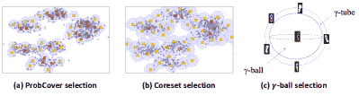

<!--yml

分类：未分类

日期：2024-09-06 19:32:58

-->

# [2405.00334] 关于深度主动学习的综述：近期进展与新前沿

> 来源：[`ar5iv.labs.arxiv.org/html/2405.00334`](https://ar5iv.labs.arxiv.org/html/2405.00334)

# 关于深度主动学习的综述：近期进展与新前沿

Dongyuan Li, Zhen Wang, Yankai Chen, Renhe Jiang, Weiping Ding, Manabu Okumura Dongyuan Li, Zhen Wang, Manabu Okumura 现任职于东京工业大学信息通信工程学院创新研究所，地址：日本东京 152-8550。（{lidy,wzh}@lr.pi.titech.ac.jp, oku@pi.titech.ac.jp）。(D. Li 和 Z. Wang 对这项工作贡献相同)。Yankai Chen 现任职于香港中文大学计算机科学与工程学院（电子邮件：ykchen@cse.cuhk.edu.hk）。Renhe Jiang 现任职于东京大学空间信息科学中心，地址：日本东京。（电子邮件：jiangrh@csis.u-tokyo.ac.jp）。Weiping Ding 现任职于南通大学信息科学与技术学院，地址：中国南通 226019（电子邮件：dwp9988@163.com）。通讯作者：Weiping Ding 和 Manabu Okumura。

###### 摘要

主动学习旨在通过更少的训练样本实现强大的性能。它通过迭代地请求一个“oracle”以人机协作的方式标记新的选择样本来实现这一目标。由于其广泛的适用性，这项技术越来越受欢迎，但关于基于深度学习的主动学习（DAL）的综述文献仍然稀缺。因此，我们进行了一项先进且全面的 DAL 综述。我们首先介绍了被审查论文的收集和筛选。其次，我们正式定义了 DAL 任务，并总结了最具影响力的基准方法和广泛使用的数据集。第三，我们从注释类型、查询策略、深度模型架构、学习范式和训练过程五个角度系统地提供了 DAL 方法的分类，并客观分析了它们的优缺点。然后，我们全面总结了 DAL 在自然语言处理（NLP）、计算机视觉（CV）和数据挖掘（DM）等领域的主要应用。最后，在详细分析当前研究之后，我们讨论了挑战和前景。这项工作旨在为研究人员在克服 DAL 中的困难提供一个有用且快捷的指南。我们希望这项综述能促进这一新兴领域的进一步发展。

###### 关键词：

主动学习，深度学习，自然语言处理，计算机视觉，不确定性量化，序列最优设计，自适应采样。

## 引言

深度学习的显著成功在很大程度上依赖于带有人类标注标签的大规模数据集 [1]。然而，不断对大规模数据集进行标注是一个极其耗时、昂贵且繁琐的任务，这往往成为深度学习中的瓶颈，特别是在标注数据有限的情况下。为了解决这个问题，深度主动学习（DAL）最近展现了巨大的潜力。如图 1 所示，DAL 模型首先在初始训练数据集上进行训练。然后，可以迭代地应用查询策略，从大量未标记的数据中选择最具信息量和代表性的样本。最后，由专家对选定的样本进行标注，并将其添加到训练数据集中，以便对 DAL 模型进行再训练或微调。DAL 旨在在合理的时间内实现具有竞争力的性能，同时降低标注成本 [2, 3, 4]。凭借各种神经网络的强大表示能力，例如图神经网络（GNNs） [5]、卷积神经网络（CNNs） [6]和变换器 [7]，以及利用来自预训练模型的先验知识，如对比语言-图像预训练（CLIP） [8]和生成预训练变换器（GPT） [9]，DAL 取得了显著进展。

图 1：深度主动学习中的一般流程。

作为数据中心 AI 中选择或生成训练数据子集的方法论，DAL 与学习设置和实际技术密切相关，包括课程学习 [10]、迁移学习 [11]、数据增强或剪枝 [12, 13]和数据集蒸馏 [14]。这些方法的共同点是使用少量样本训练或微调模型，旨在去除噪声和冗余，同时提高训练效率，而不降低模型在下游任务上的性能。然而，与 DAL 的主要区别在于，这些方法在选择、蒸馏或生成训练子集时可以完全访问所有标签。DAL 默认所有数据在训练子集选择过程中应为未标记，这使其更适合于标签最初不可用的现实场景。

为了总结 DAL 方法论，最近的工作集中于具体任务，如文本分类[15]和图像分析[16, 17]，特定领域如 NLP[18]和 CV[19, 20]，或重现主流基准[21, 22]。与大多数早期调查工作类似，一个常见的不足是它们可能对近期进展的讨论不够充分[23, 24, 25]，或者缺乏对新兴学习范式（对比学习等）和挑战[26, 27]的总结，特别是在深度学习技术（例如，基于预训练模型的微调）快速发展的背景下。为了帮助研究人员回顾、总结和规划未来的探索，我们提供了一份涵盖该领域最新进展和见解的综合性评述。虽然一些调查论文关注流式 DAL[28]，但本文重点讨论了基于池的 DAL。

具体来说，我们首先介绍我们收集审阅论文的策略，并解释我们选择论文的标准，详见第 II 节。然后，我们在第 III-A 节中给出 DAL 的具体正式定义，并在第 III-C 节中按时间顺序总结了最有影响力的 DAL 基线和广泛使用的数据集。如图 2 所示，在第 IV 节中，我们开发了一个高层次的分类法，以提供该领域的广泛概述，从五个角度对之前的研究进行分类。在第 IV-A 节中，我们将注释类型分为硬性、软性、混合、解释性和随机/多代理注释，并对每种注释类型进行了详细介绍。在第 IV-B 节中，我们将查询策略总结为五个不同的类别，包括基于不确定性、基于代表性、基于影响、基于贝叶斯及其混合方法，并分析每种查询类型的优缺点。至于深度模型架构，在第 IV-C 节中，它们主要分为递归神经网络（RNNs）、卷积神经网络（CNNs）、图神经网络（GNNs）和预训练方法。我们讨论了每种架构的优缺点。在第 IV-D 节中，我们很高兴地发现，诸如课程学习和持续学习等各种新兴学习范式在与 DAL 结合时表现出良好的前景。对于每种学习范式，我们提供了其定义的详细描述以及如何将其与 DAL 结合。最后，在第 IV-E 节中，将介绍三种不同的训练过程，包括传统训练、基于课程学习的训练以及预训练与微调，并提供典型示例。

图 2：深度主动学习方法的分类法。

图 3：深度主动学习中的新兴挑战。

在第 V 节中，我们全面展示了 DAL 方法成功应用的一些领域，包括 NLP、CV、DM 等。正如图 3 所示，尽管 DAL 取得了显著进展，但这一快速发展的领域仍面临着几个关键的新兴挑战。在第 VI 节中，我们分析了每个挑战的原因和机遇，具体总结如下：

+   •

    与流程相关：低效且成本高的人类标注、对停止策略的研究不足以及冷启动问题；

+   •

    与任务相关：跨领域迁移的困难、不稳定的性能以及缺乏可扩展性和泛化能力；

+   •

    与数据集相关：异常数据与 oracle、数据稀缺与不平衡，以及类别分布不匹配。

最后，在整理和总结当前与 DAL 相关的研究后，我们有四个有趣的发现愿与读者分享：(1) 如第 IV-E 节所示，DAL 作为样本选择策略在大规模预训练模型（参数量达数十亿）的少样本或单样本设置中具有巨大的潜力[29, 30]。此外，如第 III-C 节所讨论，许多研究表明，使用仅 10$\sim$20%的标记样本对具有数十亿参数的预训练语言模型进行微调，能够获得更好的性能，并且效率比用全标记数据集训练高出 5$\sim$10 倍[31, 32]。(2) 直观上，更多高质量样本可以提升模型在某些任务中的性能。因此，如第 IV-D 节所示，许多工作将 DAL 与半监督策略结合，获得更多高质量的标记样本，而无需增加人力劳动。然而，如第 VI-C 节所讨论，半监督方法对异常值和错误标签非常敏感，容易陷入恶性循环，即模型持续用错误的伪标签标记样本。如何有效地将 DAL 与半监督策略结合，利用人工标记的真实信号指导半监督标注，并避免误标循环，仍然是一个亟待解决的开放性挑战。(3) 从第 VI-B 节对可扩展性和泛化性的详细分析来看，尽管 DAL 在分类任务中取得了巨大成功，但比较各种 DAL 方法以选择适合特定任务的最佳方法仍然耗时且在实际中不切实际。因此，迫切需要一个对各种下游任务友好的通用框架。(4) 通过总结第 V-A 节中 DAL 在 NLP 中的应用，我们发现仅有少数 DAL 研究集中于生成任务。与分类任务相比，生成任务（如摘要生成和问答）急需更多关注和研究。这是因为生成信息性对象（如注释）更具挑战性且耗时。定义生成任务中最有意义的样本并解释这些样本为何扮演重要角色是两个核心问题。我们希望未来的研究能够推动 DAL 在生成任务中的发展。

总体而言，本文的主要贡献如下：

+   •

    这是最新的全面且系统的 DAL 调查论文，旨在帮助研究人员回顾、总结并展望 DAL 的未来。

+   •

    基于最新的 DAL 分类法，我们详细解释和讨论了该方法的各个方面，包括标注类型、查询策略、深度模型架构、学习范式和训练过程。

+   •

    从多个角度展示了 DAL 面临的困难挑战。通过对挑战和当前研究的详细分析，我们讨论了可能的先进解决方案。

+   •

    一个 GitHub 仓库¹¹1[`github.com/Clearloveyuan/Awesome-Active-Learning`](https://github.com/Clearloveyuan/Awesome-Active-Learning)提供了最新的 DAL 技术，包括论文、代码和数据集。

本调查的剩余部分组织如下。第 II 节展示了 DAL 论文的收集情况。第 III 节介绍了重要的 DAL 基线和数据集。第 IV 节详细说明了 DAL 方法的分类。第 V 节回顾了与 DAL 相关的应用。第 VI 节介绍了 DAL 的挑战和机会。第 VII 节总结了本文的结论。

## II 论文收集与筛选

我们首先确定了用于搜索文章的相关关键词，并创建了初始关键词列表，如图 4 所示。我们使用定义的关键词组中的所有可能的 3 关键词组合在多个数据库中进行搜索，如“主动学习”、“机器学习”和“开放集”。搜索的数据库包括 Google Scholar、Scopus、Semantic Scholar 和 Web of Science。我们将每次查询收集的论文数量限制为 200 篇，出版日期范围为 2013 年 1 月到 2023 年 3 月。

图 4: DAL 的关键词及出版趋势。

我们从各种来源收集了总计 10,000 篇研究论文，并在去除重复项后获得了 3,967 篇唯一论文。图 4 展示了这些文章随时间的趋势，揭示了我们研究主题的兴趣不断增长。为了确保收集到的文章与 DAL 的相关性，我们对其摘要进行了详细的人工检查。结果，我们识别出 1,273 篇对我们的研究有趣且相关的文章。基于收集的材料，我们使用这些关键词进行最终筛选，同时考虑论文发表的会议或期刊的声誉及其影响力。这种方法进一步精炼了我们的数据集，最终选择了 405 篇文章进行系统分析，并最终总结和讨论了 220 篇文章，重点关注它们的关键发现和贡献。这一严格的分析确保了文章的相关性，并为 DAL 领域提供了宝贵的见解。

## III 深度主动学习

在这一部分，我们首先介绍 DAL 的基本符号和定义，然后根据其相关性和时间顺序讨论最重要的 DAL 基准。

算法 1 DAL 过程。

输入：未标记数据$\mathcal{D}_{\textbf{pool}}$ 参数：批量大小$b$，迭代次数$T$，查询函数$\alpha$ 输出：最终训练的模型$\mathcal{M}$

1:  $\mathcal{Q}_{0}\leftarrow$ 从$\mathcal{D}_{\textbf{pool}}$进行初始化采样，其中$|\mathcal{Q}_{0}|=b$；2:  $\mathcal{D}_{\textbf{train}}^{0}\leftarrow\mathcal{Q}_{0}$ [训练数据集的初始化]；3:  $\mathcal{M}_{0}\leftarrow$ 在$\mathcal{D}_{\textbf{train}}^{0}$上训练$\mathcal{M}_{0}$；4:  当 not stop-criterion() $\&amp;$ i $\leq$  $T$时执行 5:     $\mathcal{Q}_{i}$  $\leftarrow$  $\alpha(\mathcal{M}_{i-1},\mathcal{D}_{\textbf{pool}}^{i-1},b$) [标注$b$个样本]；6:     $\mathcal{D}_{\textbf{train}}^{i}$ = $\mathcal{D}_{\textbf{train}}^{i-1}$  $\cup$  $\mathcal{Q}_{i}$; $\mathcal{D}_{\textbf{pool}}^{i}\leftarrow\mathcal{D}_{\textbf{pool}}^{i-1}\backslash\mathcal{Q}_{i}$；7:     $\mathcal{M}_{i}\leftarrow$ 在$\mathcal{D}_{\textbf{train}}^{i}$上训练$\mathcal{M}_{i-1}$；8:  结束 while

### III-A 符号与定义

我们关注于基于池的深度主动学习方法，因为大多数深度主动学习方法属于这一类别。基于池的深度主动学习方法会从一个大的未标记数据池中迭代地选择最具信息量的样本，直到基础模型达到一定的性能水平或预定义的预算用尽。如算法 1 所示，我们以分类任务作为示例进行说明，而其他任务遵循其任务领域的典型定义。给定一个初始的标记训练数据集$\mathcal{D}_{\textbf{train}}=\{\bm{x}_{i},y_{i}\}_{i=1}^{m}$和一个大规模的未标记数据池$\mathcal{D}_{\textbf{pool}}=\{\bm{x}_{i}\}_{i=1}^{n}$，其中 m$\ll$n，$\bm{x}_{i}$代表第$i$个样本的特征向量，$y_{i}\in\{0,1\}$是二分类的类别标签（或$y_{i}\in\{1,\dots,k\}$为多标签分类），深度主动学习过程在$T$次迭代中进行。在第$i$次迭代中，根据基础模型$\mathcal{M}$和获取函数$\alpha(\,)$从$\mathcal{D}_{\textbf{pool}}^{i-1}$中选择一批大小为$b$的样本$\mathcal{Q}^{i}$。这些样本$\mathcal{Q}^{i}$然后由 oracle 标记，并添加到第$i$个训练数据集$\mathcal{D}^{i}_{\textbf{train}}$中，模型$\mathcal{M}$随后进行重新训练。当标记预算$Q$用尽或模型达到预期的性能时，深度主动学习终止。

### III-B 传统主动学习与深度主动学习的比较

传统主动学习和深度主动学习之间的差异主要体现在以下两个方面：（1）大多数传统的主动学习方法使用固定的预处理特征来计算不确定性/代表性。在深度学习任务中，特征表示是与深度神经网络（DNNs）共同学习的。因此，特征表示在深度主动学习过程中动态变化，因此基于代表性的测量中使用的成对距离/相似度需要在每个阶段重新计算。相比之下，对于传统的主动学习与经典机器学习任务，这些成对的项应该是预先计算的[22]。（2）深度主动学习可以利用先进的大规模预训练语言模型在少样本或一-shot 设置下实现可比的性能。相比之下，传统的主动学习方法在少样本或一-shot 设置下可能无法满足实现可比性能所需的最小训练样本数量[30, 33]。另一方面，传统主动学习和深度主动学习方法之间最相似的方面是它们利用少量最具信息量的样本来训练模型，从而提高效率并减少对标记样本的依赖。

### III-C 重要的深度主动学习基准和数据集

表 I 中对 DAL 最重要的基准进行了仔细分类，从六个角度为读者提供了对 DAL 发展的全面理解，并识别出最相关的工作。这些有影响力的研究在设计新的 DAL 方法、解决新任务或与新兴学习范式集成方面取得了突破。它们已在机器学习、计算机视觉、自然语言处理等领域的国际会议或高质量期刊上发表，并且被高度引用，总引用次数超过 100 次或每年引用次数超过 10 次。

表 I: 重要深度主动学习基准的详细分类。有关每个类别的详细解释，请参见第 IV 节。查询策略中的任何类型意味着提出的框架可以与任何类型的 DAL 查询策略结合使用。

| 方法 | 查询策略 | 架构 | 学习范式 | 注释 | 训练 | 任务 |
| --- | --- | --- | --- | --- | --- | --- |
| BCBA [2016] [34] | 贝叶斯 | CNNs | 传统 | 难 | 传统 | 图像分类 |
| DBAL [2017] [35] | 贝叶斯 | CNNs | 半监督学习 | 难 | 传统 | 图像分类 |
| CEAL [2017] [36] | 不确定性 | CNNs | 课程学习 | 混合 | 课程 | 图像分类 |
| ESNN [2017] [37] | 不确定性 | BNNs | 对抗学习 | 难 | 传统 | 图像分类 |
| PAL [2017] [38] | 不确定性 | BNNs | 强化学习 | 难 | 传统 | 命名实体识别 |
| LAL [2017] [39] | 影响 | 随机森林 | 传统 | 难 | 传统 | 回归任务 |
| GAAL [2017] [40] | 不确定性 | GNNs | 对抗学习 | 难 | 传统 | 图像分类 |
| CoreSet [2018] [41] | 代表性 | CNNs | 半监督学习 | 难 | 传统 | 图像分类 |
| DFAL [2018] [42] | 不确定性 | CNNs | 对抗训练 | 难 | 传统 | 图像分类 |
| ASM [2019] [43] | 不确定性 | CNNs | 课程学习 | 混合 | 课程 | 目标检测 |
| MIAL [2019] [44] | 代表性 | SVM | 传统 | 难 | 传统 | 图像分类 |
| BatchBALD [2019] [45] | 不确定性 | BNNs | 传统 | 难 | 传统 | 图像分类 |
| DRAL [2019] [46] | 不确定性 | CNNs | 强化学习 | 难 | 预训练+微调 | 人脸再识别 |
| DLER [2019] [47] | 不确定性 | PLMs | 迁移学习 | 难 | 预训练+微调 | 实体解析 |
| BGADL [2019] [48] | 混合型 | BNNs | 半监督学习 | 难 | 传统 | 图像分类 |
| VAAL [2019] [49] | 代表性 | VAE | 对抗学习 | 难 | 传统 | 图像分类 |
| AADA [2020] [50] | 混合型 | CNNs | 迁移学习 | 难 | 预训练+微调 | 目标检测 |
| CSAL [2020] [51] | 混合型 | CNNs | 传统 | 难 | 预训练+微调 | 图像分类 |
| SRAAL [2020] [52] | 不确定性 | CNNs | 对抗学习 | 难 | 预训练+微调 | 图像分类 |
| ALPS [2020] [31] | 不确定性 | PLMs | 传统 | 难 | 预训练+微调 | 冷启动问题 |
| Ein-Dor et al. [2020] [53] | 任何类型 | PLMs | 传统 | 难 | 预训练+微调 | 文本分类 |
| TOD [2021] [54] | 不确定性 | CNNs | 传统 | 难 | 预训练+微调 | 图像分类 |
| Cluster-Margin [2021] [55] | 代表性 | CNNs | 传统 | 难 | 预训练+微调 | 图像分类 |
| LADA [2021] [56] | 不确定性 | CNNs | 半监督学习 | 难 | 传统 | 图像分类 |
| TA-VAAL [2021] [57] | 影响力 | VAE | 对抗学习 | 难 | 预训练+微调 | 图像分类 |
| Karamcheti et al. [2021] [58] | 混合型 | PLMs | 传统 | 难 | 预训练+微调 | 视觉问答 |
| MAML [2022] [59] | 任何类型 | PLMs | 元学习 | 难 | 预训练+微调 | 文本分类 |
| BATL [2022] [32] | 混合型 | PLMs | 传统 | 难 | 预训练+微调 | 文本分类 |
| TYROGUE [2022] [60] | 混合型 | PLMs | 传统 | 难 | 预训练+微调 | 文本分类 |
| Schroder et al. [2022] [61] | 不确定性 | PLMs | 传统 | 难 | 预训练+微调 | 文本分类 |

BCBA [34] 开创性地将自适应学习（AL）与贝叶斯神经网络（BNNs）结合，使用蒙特卡洛 dropout 进行变分贝叶斯近似以应用于图像分类。在此基础上，DBAL [35] 提出了基于不确定性的查询策略用于高维图像分类。为了在不增加人工劳动力的情况下扩展标注样本的数量，CEAL [36] 通过为高置信度样本分配伪标签，同时请求对最不确定样本进行标注，将 DAL 与半监督策略结合起来。依赖单一查询策略可能会导致错误。因此，ESNN [37] 使用深度神经网络（DNN）的深度集成，从多个方面测量样本的不确定性，并在不平衡数据集上实现了良好的鲁棒性。然而，上述方法被批评在批量 DAL [45] 上效果不佳。为了解决这个问题，CoreSet [41] 选择覆盖整个数据分布的信息丰富的批次，而 BatchBALD [45] 则使用互信息来识别最具信息量的批次。Cluster-Margin [55] 旨在选择信息丰富且多样的迷你批次，以提高准确性和效率。

为了更好地帮助 DAL 适应不同的任务，强化学习提供了详细的奖励用于动态控制查询策略。例如，PAL [38] 学习了一个基于深度强化学习的 Q 网络，作为一种自适应策略来选择数据样本进行标注。类似地，DRAL [46] 使用强化学习框架通过奖励动态调整获取函数，以获得高质量的查询。UCBVI [62] 为 Q 网络公式提供了一种新的修改，用于无奖励探索，显著降低了查询复杂度。然而，强化学习需要大量的训练数据和人工设计的奖励，这对于许多实际应用来说很困难。为了解决这个问题，元学习和迁移学习成为主要解决方案。LAL [39] 训练一个回归器以学习下游任务的最佳查询策略。MAML [59] 通过在 DAL 过程中对与目标任务类似的任务进行元训练，结合元学习和 DAL，初始化一个活跃学习者并使用通过元学习获得的参数。DLER [47] 设计了一种架构，以从高资源环境中学习一个可迁移的模型到低资源环境中，从而使 DAL 能够基于源领域的知识选择少量信息丰富的样本。AADA [50] 联合考虑领域对齐、不确定性和多样性来进行样本选择。

为了扩大深度神经网络（DNN）的标注训练数据集而不增加额外的人力成本，提出了半监督、半监督和自监督的 DAL 方法。MIAL [44] 开创了使用基于聚类的策略来衡量样本信息量的半监督 DAL 方法。ASM [43] 与自学习和 DAL 合作，设计了一个选择函数来有选择地确定样本的置信度，其中高置信度样本由伪标注模块标记，而低置信度样本则由人工标记。CSAL [51] 首次使用半监督学习在训练阶段从未标记数据中提取信息，然后使用基于一致性的样本选择进行 DAL。TOD [54] 利用新颖的未标记数据采样策略进行数据标注，并结合半监督训练方案，以提高任务模型在未标记数据上的性能。最近，数据增强已扩展到生成深度神经模型，以帮助扩展训练数据集。GAAL [40] 引入了生成对抗网络到 DAL 查询方法中，以生成信息量丰富的样本来训练模型。BGADL [48] 扩展了 GAAL，并结合了生成对抗 DAL 与贝叶斯数据增强，以生成多样化和信息丰富的样本。DFAL [42] 使用对抗 DAL 选择接近决策边界的样本作为 DAL 的最有信息量的样本。VAAL [49] 使用变分自编码器（VAE）学习潜在空间，以生成新的信息丰富的样本，并训练对抗网络来区分标记和未标记的数据。受到这些工作的启发，TA-VAAL [57] 结合了学习损失预测模块和任务排序器，以实现任务感知样本选择。SRAAL [52] 提出了一个重新标注对抗模型，旨在获取最有信息量的未标记样本。LADA [56] 通过对真实和虚拟增强实例进行评分，预测数据增强的影响，从而允许在信息丰富的标记和增强数据上进行训练。

大规模预训练语言模型（PLMs）取得了巨大成功，成为人工智能领域的一个里程碑。由于复杂的预训练目标和庞大的模型参数，大规模 PLMs 能够有效地从海量的标注和未标注数据中捕捉知识。DAL 也通过利用 PLMs 中的先验知识，为许多下游任务实现了少样本或零样本学习，开启了新的范式。ALPS [31]利用掩码语言建模损失从 PLMs 中提取知识，选择第一批数据，成功解决了 DAL 的冷启动问题。Ein-Dor 等人 [53]使用多种 DAL 方法选择样本以微调基于 BERT 的文本分类模型，仅用 10%~20%的标注样本便能获得与在全数据集上微调相当或更高的性能。Karamcheti 等人 [58]使用 DAL 识别和去除噪声数据，选择平衡样本以微调 PLMs，并在视觉问答中取得了更好的表现。BATL [32]是一种任务无关的批量采集方法，基于 PLMs 和三元组损失来确定硬样本，这些样本具有相似的特征但难以在未标注的数据池中识别标签。TYROGUE [60]设计了一种交互式 DAL 框架，灵活地选择样本以微调 PLMs 用于多个低资源任务。Schroder 等人 [61]利用可用的未标注数据扩展 PLMs，以提高适应性，并引入有效的微调以增强 DAL 在低资源和高资源环境下的鲁棒性。

如表 II 所示，我们还总结了在 DAL 中最广泛使用的数据集，包括图像、文本和音频。

表 II: 广泛使用的 DAL 数据集信息。

| 数据集 | 大小 | 领域 | 任务 |
| --- | --- | --- | --- |
| MNIST [6] | 70,000 | 图像 | 分类 |
| CIFAR-10 [63] | 60,000 | 图像 | 分类 |
| SVHN [64] | 600,000 | 图像 | 分类，定位 |
| ImageNet [65] | 1.2M | 图像 | 分类，检测 |
| MSCOCO [66] | 123,287 | 图像 | 目标检测 |
| Cityscapes [67] | 5,000 | 图像 | 语义分割 |
| Caltech-101 [68] | 9,000 | 图像 | 分类 |
| SST [69] | 11,855 | 文本 | 情感分析 |
| TREC [70] | 5,952 | 文本 | 问答 |
| SNLI [71] | 570,000 | 文本 | 自然语言推理 |
| IMDB [72] | 50,000 | 文本 | 情感分析 |
| AGNews [73] | 31,900 | 文本 | 分类 |
| PubMed [74] | 19,717 | 文本 | 文档分类 |
| YouTube-8M [75] | 237,000 | 音频 | 分类 |
| MIMIC-III [76] | 112,000 | 医疗 | 医疗保健分析 |

## IV DAL 分类

### IV-A 注释类型

\adfhalfrightarrowhead

硬注释为每个样本提供一个或多个离散的类别标签。例如，Citovsky 等人 [55] 为图像分类任务注释每张图片，标注特定的标签，如“气球”或“草莓”。Wiechman 等人 [77] 设计了一个在线注释系统，根据文档的情感、主题和垃圾邮件/非垃圾邮件状态，为长文档分配多个标签。

\adfhalfrightarrowhead

软注释允许对样本进行连续和主观的标签。例如，ReDAL [78] 为 3D 点云的语义分割注释连续的 2D 区域标签。Kothawade 等人 [79] 使用互信息作为辅助指标，以选择图像中的注释区域用于自动驾驶车辆。Xie 等人 [80] 提出了基于区域的方法，自动查询图像区域的一个小子集进行标注，同时最大化分割性能。

\adfhalfrightarrowhead

混合注释将高置信度预测的自动伪标签与低置信度样本的人为标注结合在一个迭代自适应的方式中 [43]。例如，Wang 等人 [36] 提出了一个补充样本选择策略，逐步选择最具信息量的样本，伪标签高置信度预测用于训练。Yu 等人 [81] 共同利用不同注释组的专业知识、工作者之间的相互关系以及组内标签的相关性。通过加权组，他们减少低质量工人的影响，并计算可靠的共识标签。

\adfhalfrightarrowhead

解释性注释为每个注释提供硬标签或软标签以及解释。例如，Schroder 等人 [82] 为环境文本使用与主题相关的注释。同样，Yan 等人 [83] 注释文本并列出关键字作为标签准确性的证据。与上述方法不同，Zhou 等人 [84] 通过最小化任务之间的相关性来注释样本，并提供可解释的医学知识以区分所选样本。

\adfhalfrightarrowhead

随机/多代理注释使用多个独立的伪注释者随机标记新的未标记样本，无需人工输入 [85]。例如，Gong 等人 [86] 使用代理团队根据其他代理的决策协作选择信息量大的图像进行注释。

### IV-B 查询策略

\adfhalfrightarrowhead

基于不确定性的方法旨在根据模型预测选择最模糊的样本。给定输入 $\bm{x}_{i}$：

|  | $\text{Entropy}(\bm{x}_{i})=\mathop{\arg\max}\limits_{\bm{x}_{i}}(\sum_{j}P(\hat{y}_{j}&#124;\bm{x}_{i})\log P(\hat{y}_{j}&#124;\bm{x}_{i})),$ |  | (1) |
| --- | --- | --- | --- |

其中$P(\hat{y}_{i}|\bm{x}_{i})$表示$\bm{x}_{i}$被分类为第$i$类的可能性[87]。基于不确定性的方法专注于设计各种评分函数来衡量样本的不确定性和信息量，包括预测熵[87]、最小置信度[88]、最高估计的双变量[89]、模型后验和预测之间的互信息[79]。一些策略检查决策边界附近的样本作为最不确定的样本[90]，例如接近超平面[44]或接近边界[91]的实例。其他方法结合多种查询策略，形成基于委员会[92]或基于争议[93]的 DAL 策略，以减少单一查询策略产生的错误。随着对抗学习的发展，模型趋向于生成最具信息量和不确定性的合成样本，以扩展训练数据集[48]。

但是，它们有一些共同的缺点：（1）冗余样本作为不确定点被不断选择，但覆盖率不足；（2）仅关注单一样本对异常值的鲁棒性不足；（3）这些任务特定的设计表现出有限的泛化能力。

\adfhalfrightarrowhead

基于代表性的算法旨在采样最具代表性的数据显示整个特征空间的分布。现有方法可以分为基于密度和基于多样性的方法。基于密度的方法倾向于选择可以代表所有未标记样本的样本。它们使用聚类方法选择聚类中心[94]作为最具代表性的样本，或选择可以最大化未标记数据集的整个特征空间概率覆盖的样本[41]。例如，Kim 等人[95]设计了密度感知核心集方法来估计样本密度，并优先选择来自稀疏区域的多样点。给定输入$\bm{x}_{i}$：

|  | $\text{密度}(\bm{x}_{i})=\frac{1}{k}\sum_{j\in\mathcal{N}(\bm{x}_{i},k)}\&#124;\bm{x}_{i}-\bm{x}_{j}\&#124;_{2}^{2},$ |  | (2) |
| --- | --- | --- | --- |

其中，$\mathcal{N}(\bm{x}_{i},k)$ 表示 $\bm{x}_{i}$ 的 $k$-最近邻 [95]。Coleman 等人 [96] 和 Gudovskiy 等人 [97] 通过只考虑最近邻而非所有数据或使用自监督方法匹配特征密度来实现高效。基于多样性的方法倾向于选择与标记样本不同的样本。它们使用上下文敏感的方法 [98]，考虑样本与其周围标记样本之间的距离，以丰富标记数据集的多样性。BMAL [99] 针对图像标记问题执行 DAL，其中多样性通过类似邻近实例的类别概率分布的 KL 散度来度量，其公式为：

|  | $\small\text{Divergence}(\bm{x}_{i},\bm{x}_{j})=\sum_{j}P(\hat{y}_{j}\mid\bm{x}_{i})-P(\hat{y}_{j}\mid\bm{x}_{j})\log\frac{P(\hat{y}_{j}\mid\bm{x}_{i})}{P(\hat{y}_{j}\mid\bm{x}_{j})}.$ |  | (3) |
| --- | --- | --- | --- |

其他基于多样性的方法倾向于训练模型，例如对抗网络 [57]、对比网络 [100]、层次聚类 [44] 和预训练模型 [53]，以帮助区分标记集和未标记集，并选择最不同的未标记样本。例如，Li 等人 [101] 显式地学习非线性嵌入以选择代表性样本。Parvaneh 等人 [102] 通过与标记点插值特征来探索未标记数据周围的邻域。Li 等人 [103] 提出了一种度量查询批次之间互信息的获取函数，以促进多样性。为了进一步提高标签效率，Citovsky 等人 [55] 使用层次聚类来多样化批次，只需 40% 的标签即可达到相同的目标性能。然而，由于它们使用的 ResNet-101 作为主干网络仅包含 170 MB 的参数，因此需要超过 20% 的标记样本来微调模型。

然而，上述仅关注样本多样性的代表性方法对于靠近决策边界的样本总是较为迟钝（排除那些同时考虑代表性和不确定性的混合方法），尽管 Zhao 等人 [104] 提出这些样本可能对预测模型更为重要。此外，代表性方法在处理小样本数据和类别较少的分类器时效果较好，因为它们的计算复杂度几乎是数据大小的二次方 [55]。

\adfhalfrightarrowhead

基于影响的方法旨在选择对目标模型性能影响最大的样本。这些技术可以分为三大类。(1) 第一类是通过梯度范数 [105], 查询复杂性 [106], 核近似 [107], KL 散度 [97], 损失函数变化 [108], 或模型参数 [54], 以及预期误差减少 (EER) [109]等指标直接测量对模型的预期影响。具体而言，EER 可以表述为

|  | $\small\text{EER}(\bm{x}_{i})=\mathbb{E}_{\bm{x}_{s}}\{\mathbb{E}_{y_{i}&#124;\bm{x}_{i}}[\max_{y_{s}}p(y_{s}&#124;\bm{x}_{s},\bm{x}_{i},y_{i})]-\max_{y_{s}}p(y_{s}&#124;\bm{x}_{s})\},$ |  | (4) |
| --- | --- | --- | --- |

其中 $\bm{x}_{s}$ 指标记样本。(2) 第二类是结合不同的学习策略，如强化学习和模仿学习，根据奖励信号或示范动作选择样本。尽管这些方法具有很大的潜力，但需要额外的训练 [110]。例如，Wertz 等人 [111] 提出了强化 DAL，这是一种强化学习策略，利用数据和任务的多个元素在 DAL 过程中动态选择最有用的未标记子集；(3) 最后一类是训练一个单独的模型来估计对目标模型的影响 [89]。例如，Peng 等人 [14] 提出了一个知识蒸馏框架，以根据学生模型学到的知识评估样本的影响。Elenter 等人 [89] 使用原始模型的对偶变量来衡量对目标模型的影响。

然而，尽管近期有所进展，基于影响的 DAL 仍然具有挑战性。直接测量模型变化或结合新的学习策略总是需要巨大的时间和空间成本，训练新模型则过度依赖其准确性，常常导致结果不稳定。

\adfhalfrightarrowhead

贝叶斯方法旨在通过利用贝叶斯规则来最小化分类错误并改善模型信念。大多数研究将贝叶斯模型（例如，Gaussian process [109], BNNs [35], Bayesian probabilistic ensemble [112]）视为基于不确定性的方法，用于估计样本的信息量。然而，贝叶斯 DAL 更应被视为独立的系统，其方法通过直接测量对目标模型的影响来选择批次，例如 BatchBALD [45]和 Causal-BALD [113]。例如，我们定义一个贝叶斯模型，模型参数为 $\bm{w}\sim p(\bm{w}|\mathcal{D}_{\text{train}})$，而 BALD 可以定义为估计模型预测与模型参数之间的互信息，公式为：

|  | $\small\mathbb{I}(y;\bm{w}&#124;\bm{x},\mathcal{D}_{\text{train}})=\mathbb{H}(y&#124;\bm{x},\mathcal{D}_{\text{train}})-\mathbb{E}_{p(\bm{w}&#124;\mathcal{D}_{\text{train}})}[\mathbb{H}(y&#124;\bm{x},\bm{w},\mathcal{D}_{\text{train}})],$ |  | (5) |
| --- | --- | --- | --- |

其中$\mathbb{H}$表示熵，$\mathbb{E}$是期望。

与标准深度神经网络（DNNs）相比，上述贝叶斯 DAL 方法，利用了概率图理论的优势[35]，通常可以提供合理的解释，说明为什么这些样本应该被选择[45]。然而，它们通常需要大量准确的先验知识，并且在表征学习和拟合能力方面往往不如深度学习模型。

\adfhalfrightarrowhead

混合方法旨在利用上述多种查询策略，并在它们之间实现权衡。混合方法可以根据交互模式进一步分类。串行形式的混合方法在一个 DAL 周期内按顺序应用标准，过滤掉非信息性样本，直到批次填满[55]。标准选择混合方法在一个 DAL 迭代中只使用一种查询策略，其中选择最佳的查询策略或具有最高标准的网络架构。例如，DUAL[114]在基于密度和基于不确定性的选择器之间切换，以选择每个 DAL 周期的最佳标准。与 DUAL 不同，iNAS[115]在每个 DAL 迭代中逐步搜索受限的候选集，以找到最佳的模型架构。并行形式的混合方法使用多目标优化方法或加权和将多个查询标准合并为一个进行样本选择。例如，Gu 等[2]通过提出基于路径跟踪优化技术的程序，来高效地获取具有判别性和代表性的样本批次。Citovsky 等[55]在批量模式下联合优化不确定性和多样性标准，使用多目标获取函数。TOD[54]通过加权组合这两种度量来选择具有高模型不确定性的样本并输出差异。

混合方法结合了不同查询策略的优势。然而，确定最有效的组合和标准之间的权衡是耗时的，并且仍然需要进一步的研究。

### IV-C 模型架构

\adfhalfrightarrowhead

传统的机器学习架构，如森林[39]和支持向量机（SVM）[44]，是基于统计的模型，不使用神经网络。它们在 DAL 发展的早期阶段受到广泛关注。

\adfhalfrightarrowhead

贝叶斯神经网络（BNNs）将神经网络与贝叶斯推断相结合，通过输出和权重来量化模型引入的不确定性，以解释预测的可信度[116]。许多研究提出了基于 BNNs 的 DAL 策略，旨在提高样本选择的效率和可解释性[38, 45]。

\adfhalfrightarrowhead

循环神经网络（RNNs）[117] 利用之前经验中的推理来预测即将发生的事件，并能够学习具有长期依赖关系的特征。它们广泛应用于文本和音频等序列数据。由于 RNNs 需要大规模标注数据集进行训练，DAL 与 RNNs 结合的机会较少。一些具有易于识别模式的特殊任务，例如社交网络上的恶意词检测[118]，可以通过 DAL 解决。

\adfhalfrightarrowhead

卷积神经网络（CNNs）[6] 是一种前馈神经网络，能够通过卷积结构从数据中提取特征，并且广泛应用于图像处理，具有三个优点：局部连接、权重共享和下采样降维。由于 Sener 等人[41]证明了样本的子集（核心集）可以几何地表征整个图像集的所有特征，并且可以通过最小化严格的界限进行选择，因此 DAL 可以与 CNNs 有效结合。根据他们的研究，之后还进行了更多研究[49, 55]。

\adfhalfrightarrowhead

图神经网络（GNNs）[5] 通过聚合邻域信息来学习节点表示，并在各种任务中取得了巨大的成功，例如节点分类。然而，使用有限的标注数据有效处理样本之间密集连接的图数据仍然是一个未解的挑战[119]。DAL 可以通过选择性地查询最有信息量的样本标签，并仅执行一个训练周期来减少各种类型图的注释成本，如同质图[120]、异质图[121]和属性图[122]。

\adfhalfrightarrowhead

变分自编码器（VAEs）是一类具有编码器-解码器框架的神经网络架构[123]。它旨在捕捉潜在的数据分布，并学习生成与输入数据非常相似的样本。基于 VAEs 的 DAL 方法通常通过对抗训练方式生成样本以欺骗鉴别器，从而提高鉴别器选择最具挑战性的样本用于训练 DAL 模型的能力[49, 57]。

\adfhalfrightarrowhead

基于 Transformers 的预训练语言模型（PLMs）利用多头自注意力机制来捕捉长期依赖关系。通过在大规模未标记语料上进行预训练，PLMs 蕴含了大量的通用知识并转移到下游任务中，实现了最先进的（SOTA）表现[30]。例如，Seo 等人[32] 识别出给定任务中最有信息量的样本，专注于 PLMs 微调，以最小的标注成本学习显著的模式。预训练的丰富知识基础与 DAL 的样本高效调优的结合，释放了 PLMs 在许多应用中的更大潜力。

### IV-D 学习范式

\adfhalfrightarrowhead

传统学习范式，如算法 1 所示，通过迭代查询和标记样本以以原始监督学习方式训练模型，而未结合任何先进的学习范式[34, 32]。

\adfhalfrightarrowhead

半监督学习，也称为弱监督学习，旨在联合使用真实标记样本和伪标记样本来训练模型。当前的 DAL 方法设计了各种高效策略来为未标记样本获取伪标签。例如，DBAL[35] 和 CoreSet[41] 首先使用其模型预测伪标签，然后计算样本的置信度分数，以判断这些伪标签是否值得信赖。另一方面，LADA[56] 和 BGADL[48] 提出了新的数据增强方法，根据原始标记样本创建更多样本，使用其原始真实标记样本作为伪标签。这些研究有效减少了人工劳动，并在性能上与使用更大标记样本的传统监督学习相当。

\adfhalfrightarrowhead

对比学习通过将相似实例拉近，同时将不相似实例推开来改进特征表示[124]。对比方法提取具有区分性的特征，如语义[100]和独特性[57]，以在获取过程中估计样本的不确定性。例如，如图 5 所示，Du 等人[125] 使用对比学习提取语义和独特性特征，然后将它们结合在查询策略中，以选择最具信息量的未标记样本，并匹配类别。

图 5：基于对比学习的查询策略示例。

\adfhalfrightarrowhead

对抗学习使得模型能够通过解决最小最大优化问题进行完全可微训练[49]。这种方法可以作为 DAL 的生成查询技术。例如，DAL 可以与生成对抗网络结合，生成对抗网络由生成器和判别器组成，其中 DAL 模型充当判别器，生成器则探索未标记数据的分布，生成最具信息量和不确定性的合成样本用于训练[57]。Li 等人[122]提出了 SEAL，如图 6 所示，它由两个对抗组件组成。图嵌入网络将所有节点编码到共享空间中，目的是让判别器将所有节点视为标记节点。此外，还使用半监督判别器来区分未标记节点和标记节点。判别器的发散分数作为信息量度量，主动选择最具信息量的节点进行标记。两个组件形成一个循环，互相提高 DAL 的性能。

图 6：对比学习基于查询策略的示例。

\adfhalfrightarrowhead

元学习使得深度神经网络能够利用从多个任务中获得的知识，这些知识在网络中通过权重表示，以更快地适应新任务。元学习可以为 DAL 提供获取函数[39, 126]，或者通过控制来自多个源任务的知识转移，在 DAL 过程中提供有利的模型初始化。例如，Shao 等人[127]提出了学习采样，其中提升模型和采样模型相互动态学习并迭代提高性能。Zhu 等人[59]通过在与目标任务类似的任务上进行元训练，用元学习参数初始化主动学习者，从而结合了这两种范式。

\adfhalfrightarrowhead

强化学习涉及一个能够与环境互动的代理，并通过对收到的奖励做出反应来学习改变其行为[119]。鉴于几乎所有 DAL 方法都使用效果有限的启发式获取函数，强化学习将 DAL 视为强化学习问题，以明确优化获取策略。在强化学习设置的 DAL 中，一个由深度学习算法控制的自主代理（获取选择器）在时间$t$观察环境（预测器）中的状态$s_{t}$。它采取一个动作$a_{t}$以最大化奖励$r_{t}$（预测准确性），其中$a_{t}$决定是否查询未标记样本[62]。

\adfhalfrightarrowhead

课程学习模仿人类和动物的学习过程，其中训练逐渐从简单样本过渡到复杂样本。这提供了一种利用带标签数据进行鲁棒学习的自然方式 [10, 128]。具体而言，课程学习使用预定义的学习约束，在训练过程中逐步纳入额外的带标签样本。课程学习对所有带标签的样本引入加权损失，作为样本权重上的一般正则化器。例如，Wang 等人 [129] 使用伪标签策略，迭代地将伪标签分配给具有高预测信心的未标记样本。

\adfhalfrightarrowhead

继续学习是为任务驱动的设置开发的，其中模型一次连续学习一系列任务，当前任务的所有数据都有标签并逐步提供。然而，现实世界的系统并没有为每个新任务提供大量带标签的数据的奢侈条件。为了解决这个问题，Mundt 等人 [130] 提出了一个关于基于继续学习的 DAL 和分布外检测工作的详细分析。他们建议用开放集识别作为继续学习和 DAL 之间自然接口的统一视角。Ayub 等人 [30] 开发了一种方法，允许继续学习的代理从少量带标签的示例中不断学习新的对象类别。

图 7：基于查询策略的迁移学习示例。

\adfhalfrightarrowhead

迁移学习从一个或多个源任务中提取知识，并将其应用于目标任务。它有两个广泛的类别：归纳和转导。转导方法将从带标签的源领域中学习到的模型适应到具有相同任务的不同未标记目标领域，而归纳方法确保源领域和目标领域相同但任务不同。迁移学习与 DAL 可以通过选择分布类似于源领域的最佳目标样本来更好地提升彼此的性能 [50]。此外，迁移学习可以减少所需的注释标签数量，并为 DAL 获取函数提供辅助信息。例如，如图 7 所示，Xie 等人 [87] 提出了基于能量的主动领域适应方法，在选择目标数据时平衡领域表示和不确定性。

图 8：模仿学习的一个示例 [131]。

\adfhalfrightarrowhead

模仿学习通过学习接近最优的搜索策略，在许多结构化预测任务中提供了最先进的结果[92]。这种方法假设在训练期间可以接触到一个专家，该专家可以在任何查询的状态下提供最佳行动，实际上是在问“你会在这里怎么做？”并学习模仿该选择。例如，Bullard 等人[132] 使用模仿学习使得一个在受限环境中的代理能够同时考虑其内部学习目标和外部施加的环境约束在其目标函数中。Löffler 等人[131] 提出了一个模仿学习方案（IALE），在批量模式设置中模仿学习周期每个阶段选择最佳表现专家启发式的方法。如图 8 所示，IALE 可以很好地模仿基于熵的方法和基于核心集的方法，从而获得更好的性能。

\adfhalfrightarrowhead

多任务学习（MTL）关注于制定在多个任务中保持性能的方法，而不是单一任务。多任务深度主动学习（MTAL）方法将多个单独的任务相关查询策略结合成一个统一的方法，并联合优化这个统一的方法。与单任务查询设置不同，在单任务查询设置中，使用单个选定任务分类器的不确定性来查询未标记样本，而在 MTAL 中，实例的不确定性由所有任务分类器的不确定性决定。例如，Ikhwantri 等人[133] 提出了一个用于语义角色标注的 MTAL 框架，将实体识别作为辅助任务。这缓解了数据需求，并利用实体信息来帮助角色标注。他们的实验表明，MTAL 可以优于单任务深度主动学习和标准的多任务学习，使用比被动学习少 12%的训练数据。Zhou 等人[84] 提出了一个多任务对抗深度主动学习框架，其中对抗学习保持了 MTL 和 DAL 模块的有效性。任务判别器消除不规则的任务特定特征，而多样性判别器利用样本之间的异质性来满足多样性约束。

### IV-E 训练过程

\adfhalfrightarrowhead

传统训练首先在初始化的训练数据集上训练一个模型，然后根据当前模型的预测选择未标记样本进行标注。新标注的样本被添加到训练集中，以便在下一次迭代中重新训练模型[134]。这一迭代过程继续进行，在每个训练周期之前，模型参数会被随机重新初始化[36]，直到达到样本预算或深度主动学习迭代次数。

\adfhalfrightarrowhead

课程学习训练逐渐从简单样本过渡到复杂样本，模拟人类和动物的学习过程。这提供了一种自然且迭代的方式来利用标注数据进行稳健学习。例如，Tang 等人 [135] 提出了一个自适应的 DAL 方法，该方法共同考虑样本的价值和难度。从简单到困难查询样本，以最小化标注成本。Wang 等人 [43] 显示，仅使用课程学习可以将目标检测的准确性提高 3.6%，而课程学习与 DAL 的组合将准确性提高了 4.3%。

\adfhalfrightarrowhead

预训练与微调（Pre+FT）已成为大规模 PLMs 发展的主要训练过程 [58]。它利用 PLMs 中丰富的先验知识来解决不同的下游任务。DAL 作为微调的样本选择策略引起关注，使用仅 10%$\sim$20% 的标注数据即可实现与全数据微调相媲美的性能 [32]。DAL 迭代选择和标注信息丰富的样本批次，以微调 PLMs 以适应下游任务。这满足了任务特定需求，同时也支持少样本学习 [30]。

表 III：展示 DAL 相关应用于主要领域，包括经典方法及其优缺点。

| 领域 | 应用 | 经典方法 | 优势 | 缺点 |
| --- | --- | --- | --- | --- |
| NLP | 文本分类 | 生成用于训练的样本 [83, 136]。 | 提高选择过程的效率。 | 高时间消耗，性能不稳定。 |
| 不确定性采样 [61]。 | 高效性和性能。 | 对异常值敏感，性能不稳定。 |
| 使用预训练语言模型 [137]。 | 轻松适应新数据集。 | 对异常值和不平衡数据集敏感。 |
| 文本总结 | 带有 Monte Carlo dropout 的 PLMs [138]。 | 高效性和效果。 | 对异常值敏感，性能不稳定。 |
| 多样本采样 [139]。 | 去除异常值和多样本采样。 | 对文档嵌入敏感。 |
| 问答系统 | DataMap [58]。 | 消除异常值并提高准确性。 | 高时间消耗，缺乏泛化能力。 |
| 交互查询策略 [140]。 | 高效地最小化高成本数据标注。 | 等待人工反应，需要专家知识。 |
| 信息提取 | 标签相同的子序列 [141] | 高效率和效果。 | 缺乏泛化能力，冷启动。 |
| 标签最具新颖性的词汇 [142]。 | 高效率和效果。 | 性能不稳定，冷启动。 |
| 语义解析 | 超参数选择 [143]。 | 减少数据标注。 | 高时间消耗，缺乏泛化能力。 |
| 混合查询策略 [144]。 | 选择语义上最具多样性的样本。 | 易受异常值影响，缺乏可扩展性。 |
| 计算机视觉 | 图像描述 | 语义对抗 DAL [145] | 克服标注数据稀缺。 | 跨领域迁移困难，冷启动。 |
| 领域迁移学习 [146]。 | 从高资源领域迁移知识。 | 易受异常值和数据稀缺的影响。 |
| 语义分割 | 基于不确定性的 DAL [147]。 | 高效且有效。 | 性能不稳定，易选择异常值。 |
| 基于区域的选择 [148, 80]。 | 在标签工作量和效果之间取得平衡。 | 易受异常值和不平衡数据集的影响。 |
| 目标检测 | 混合选择 [149, 43]。 | 避免噪声样本和异常值。 | 数据稀缺，性能不稳定。 |
| 实例不确定性学习 [150]。 | 抑制噪声实例。 | 性能不稳定，缺乏可扩展性。 |
| 姿态估计 | 传统 DAL 策略 [151, 152]。 | 有效，易于应用。 | 易受异常值和冷启动的影响。 |
| 元学习 [86]。 | 可以学习最佳采样策略。 | 易受异常值和不平衡数据集的影响。 |
| 目标跟踪 | 多帧协作 [153] | 消除背景噪声，确保多样性。 | 性能不稳定，缺乏可扩展性。 |
| 多目标跟踪 [154]。 | 高效且有效。 | 高时间消耗，冷启动 |
| 人物重识别 | 人工干预 [46]。 | 提高模型性能。 | 高时间消耗，缺乏泛化能力。 |
| 增量标注 [155]。 | 选择多样化的样本而无冗余。 | 易受异常值和冷启动的影响。 |
| DM | 节点分类 | 半监督对抗 DAL [122]。 | 更好的性能提升。 | 性能不稳定，冷启动。 |
| 图谱策略网络 [120]。 | 稳定的性能。 | 单样本选择耗时较长。 |
| 链接预测 | 多视角 DAL [156]。 | 从多视角中查询信息样本。 | 缺乏可扩展性和泛化能力。 |
| 迁移学习 DAL [157]。 | 容易应用于新数据集。 | 性能不稳定，冷启动。 |
| 社区检测 | 基于主题 [158]。 | 减少不可靠的数据集。 | 高时间消耗，性能不稳定。 |
| 几何块模型 [159]。 | 高效且有效。 | 性能不稳定，冷启动。 |

## V DAL 应用

如表 III 所示，深度学习（DL）与主动学习（AL）的结合正导致 AL 方法在各种生活领域的应用增加，从农业发展 [82] 到工业振兴 [82]，以及从人工智能 [137] 到生物医学领域 [160]。在这一部分，我们旨在从广泛应用的角度提供系统而详细的 DAL 相关工作概述。

### V-A 自然语言处理中的应用

随着大规模语言模型的出现，自然语言处理（NLP）通过计算机帮助理解复杂语言取得了巨大成功。然而，对这些语言模型进行微调需要大量的数据、计算资源和时间。DAL 提供了一种寻找高质量小样本的策略，以帮助微调模型并节省资源。接下来，我们将介绍一些在 NLP 中最具影响力的 DAL 方法。

\adfhalfrightarrowhead

文本分类旨在对大规模文本进行特定标签分类，如主题或情感。研究人员提出了几种方法来高效选择信息丰富的样本进行训练。例如，Yan 等 [83] 生成最具信息性的训练样本，高效跳过样本选择过程。他们用少量总结性文字近似生成的示例，这大大减少了标注者的标注成本，因为标注者只需阅读几个单词而不是长文档。Tan 等 [136] 为 DAL 开发了贝叶斯均值得分估计（BEMPS）框架，该框架允许计算诸如对数概率等得分，以更好地帮助选择信息丰富和不确定性样本。实验表明，BEMPS 在各种文本分类数据集中比基线更有效。另一方面，Schroder 等 [61] 使用变换器进行基于不确定性的样本选择。有趣的是，他们在广泛使用的文本分类数据集中取得了与训练超过 20% 标注数据相当的性能，这展示了他们利用有限标注数据的能力。在另一项研究中，Jelenic 等 [137] 通过使用预训练语言模型（PLMs）进行初步实证研究，以探讨 DAL 的迁移性。他们发现，DAL 能够有效地适应新的数据集。 

\adfhalfrightarrowhead

抽象文本摘要 (ATS) 旨在将文档压缩为简短、信息丰富且可读的摘要，以保留原始文档的关键信息。然而，构建人工注释的数据集是一项耗时且成本高昂的工作。DAL 被探索用于减少所需的标注量，同时达到一定水平的 ATS 性能。例如，Gidiotis 等人 [138] 从贝叶斯视角解决这个问题，并研究 SOTA 文本摘要模型的置信度估计。他们通过蒙特卡洛丢弃增强预训练的摘要模型，形成相应的变分贝叶斯 PLMs 模型。通过从这些模型生成多个摘要，他们近似贝叶斯推断并估计摘要的不确定性。在多个基准数据集上的实验一致地展示了他们在召回导向摘要评价 (ROUGE) 分数上改进的摘要性能。与上述方法不同，如图 9 (a) 所示，Tsvigun 等人 [139] 提出了基于多样性原则的 ATS 替代查询策略。这种策略称为领域内多样性采样，涉及选择与标注文档不同但与领域核心文档相似的实例。在有限的标注预算下，它们可以提高模型性能和一致性评分。

图 9：ATS 和 Datamap 样本选择的示例。

\adfhalfrightarrowhead

问答系统涉及回答有关图像或文本段落的问题 [161]。然而，当前模型需要大规模的训练数据才能实现高性能。DAL 方法，如 Datamap [58] 和分层对话策略 [140]，旨在以最小的标注工作量最大化性能。具体来说，在图 9 (b) 中，DataMap [58] 能够检测并消除未标记集中的异常样本，从而在使用较少标记样本的情况下显著提高模型准确性。Padmakumar 等人 [140] 开发了一种用于澄清和 DAL 的联合策略，用于交互式图像检索任务。在查询新样本的同时请求用户澄清，可以改善模型性能。

\adfhalfrightarrowhead

信息提取指的是许多自然语言处理任务，包括命名实体识别、关键词提取、词语分割等。对大规模序列进行手动标注既耗时又昂贵，因此难以实现。为了解决这个问题，Brantley 等人[92] 设计了一种新的 DAL 标注方式。他们使用噪声启发式标注函数提供初始低质量标签，训练分类器以决定是否信任这些标签，并用可靠的标签标注最不确定的样本。他们的模型在许多信息提取任务中实现了高效率和高效果。类似地，Radmard 等人[141] 通过查询每个句子中的子序列并将标签传播到数据集中未见的相同子序列，专注于提高 DAL 在命名实体识别中的效率。他们展示了 DAL 策略只需 20%的数据集即可达到与在整个数据集上训练相同的结果。Hua 等人[142] 提出了两种与模型无关的获取策略，用于识别和理解论证话语的结构，取得了计算量较少的竞争性结果。前者选择具有最多新词的样本进行标注，而后者通过匹配手动记录的 18 个显著话语标记中的任何一个，寻求识别更多的关系链接。

\adfhalfrightarrowhead

语义解析旨在将自然语言话语转换为逻辑形式：机器可理解的意义表示[162]。DAL 可以帮助减少数据需求并提高语义解析的效率。例如，Duong 等人[143] 设计了一种简单的 DAL 超参数选择技术，以加快数据标注。实验表明，他们的方法显著减少了数据标注的需求，并改善了模型在语义解析中的表现。Li 等人[163] 也设计了一个超参数调整模块，以降低额外的标注成本。此外，他们设计了一种新的查询策略，优先考虑具有各种逻辑形式结构和更多词汇选择的示例，这进一步提升了语义解析的表现。Cohen 等人[144] 提出了一个新的 DAL 方法，具有两种新的标注方式，称为 HAT。实验表明，HAT 能够挑选出最具语义多样性和说明性的发言，从而在解析器性能上获得最大的提升。

### V-B 计算机视觉中的应用

随着 CNN 和视觉变换器的显著成功，我们获得了一个宝贵的见解：更多标注的图像数据集可以促进任务性能的提升。然而，随着数据量的增加，训练深度神经网络变得耗时且资源消耗大。此外，即使数据量增加，噪声的存在往往会导致性能提升有限。DAL 可以有效减少噪声和时间消耗。在此之后，我们提供了有关具体任务及其通过 DAL 在计算机视觉领域取得的改进的详细信息。

\adfhalfrightarrowhead

图像分类旨在根据提供的标签准确分类图像，适用于许多特定领域，如遥感[16]、医学成像[164]和人脸识别[129]。我们在 III-C 节中列出了图像分类中最成功的 DAL 方法，如 BCBA、DBAL 和 CEAL，更多详细信息可以参考这些方法。

\adfhalfrightarrowhead

图像字幕生成旨在自动生成关于图像内容的描述性文本。要实现高质量的字幕生成，需要大规模且多样化的图像数据集。不幸的是，创建这样的数据集既耗时又昂贵。为了解决这个问题，张等人[145]提出了一种新型的对抗性 DAL 模型，该模型利用视觉和文本信息来选择最具代表性的样本，从而优化图像字幕生成的性能。实验表明，他们克服了标注数据稀缺的限制，提高了图像字幕生成的实用性和有效性。类似地，Cheikh 等人[146]引入了一种知识转移 DAL 框架，用于低资源数据集。他们利用现有的数据集，将其字幕翻译成阿拉伯语，并用翻译后的字幕数据集训练模型，以便为低资源的 ArabicFlickr1K 数据集（仅包含 1,095 张图像）提供先验知识。他们的模型达到了 47%的双语评估下的（BLEU）评分，成为其方法有效性的有力证据。

\adfhalfrightarrowhead

语义分割旨在从像素级别理解图像，为各种应用奠定基础，包括自动驾驶 [80] 和机器人操作 [30]。然而，训练分割模型需要大量带有像素级标注的数据，这一过程繁琐且成本高昂 [78]。为解决这一挑战，Konyushkova 等人 [147] 提出了一个基于不确定性的 DAL 方法，并结合几何先验来加速和简化图像分割的标注过程。实验表明，他们的方法适用于背景-前景和多类别分割任务。Qiao 等人 [148] 介绍了一个协作全景区域 DAL 框架，用于部分标注的语义分割。通过结合语义无关的全景匹配和基于区域的选择与扩展，他们的模型在标注工作和性能之间达到了平衡。同样，Xie 等人 [80] 提出了一个自动化的基于区域的 DAL 方法，考虑了图像区域的空间邻接性和预测的置信度。实验表明，他们能够在最大化分割性能的同时，使用少量标注的图像区域。

\adfhalfrightarrowhead

物体检测通过从输入图像中生成候选物体区域，将其转化为区域分类任务。特征通常通过 CNN 从候选物体区域中提取，然后使用分类器进行最终检测。DAL 可以减少标注数据，以更好地适应 CNN 的众多参数。Wu 等人 [149] 提出了一个新颖的混合查询策略，联合考虑不确定性和多样性。在两个物体检测数据集上进行了广泛的实验，有效展示了他们模型的优越性和有效性。Wang 等人 [43] 引入了具有可切换选择标准的主动样本挖掘方法，以使用未标注或部分标注的样本逐步训练强健的物体检测器，避免了噪声样本和离群点的影响。通过在公开的物体检测基准上进行广泛实验，证明了模型的有效性。Yuan 等人 [150] 定义了一个实例不确定性学习模块，该模块利用在标注集上训练的两个对抗性实例分类器的差异来预测未标注集的实例不确定性。通过迭代实例不确定性学习和重标定，他们抑制了噪声实例，弥合了实例级和图像级不确定性之间的差距。

\adfhalfrightarrowhead

姿态估计旨在定位图像中特定关键点的位置，这有广泛的应用，如增强现实、手语翻译和人机交互。获取姿态注释可能非常昂贵和费力。为了解决这个问题，Caramalau 等人[151]提出了基于分布的方法，用于选择多样且具有代表性的样本。实验表明，他们的方法在姿态估计中具有很高的效率和有效性。同样，Shukla 等人[152]使用基于不确定性的查询策略，并对置信度最低的样本进行注释，进一步提高了在标注样本较少的情况下的性能。Gong 等人[86]设计了一种新颖的元代理团队 DAL（MATAL）框架，以主动选择和标记有用的图像以进行有效学习。MATAL 将样本选择过程制定为马尔可夫决策过程，并学习一种优化的采样策略，以有效地最大化姿态估计器的性能。

\adfhalfrightarrowhead

目标跟踪旨在准确跟踪图像中的目标，这可以应用于许多领域，包括视频监控、自动驾驶等。使用 DAL 可以更好地帮助在有限标注样本下训练神经网络进行目标跟踪。Yuan 等人[153]提出了一种新的 DAL 序列选择方法，通过多帧协作的方式进行目标跟踪。为了确保所选序列的多样性，他们通过每个视频中多帧之间的时间关系来测量样本的相似性，并使用最近邻鉴别器来选择具有代表性的样本。实验表明，他们的方法能够消除背景噪声并提高效率。

\adfhalfrightarrowhead

人物重识别（Re-ID）旨在通过不同的摄像头匹配特定的行人，这是公共安全的重要任务。以往的努力主要集中在提高 Re-ID 模型的性能，依赖于大量标注数据集。然而，这些努力往往忽略了在构建 Re-ID 数据集时可能出现的数据冗余问题。为了解决 Re-ID 数据集中的数据冗余问题，Liu 等人[46]提出了一种基于强化学习的人机协作模型。在他们的方法中，人工标注员提供二进制反馈以微调预训练的 CNN Re-ID 模型。大量实验证明了他们的方法相较于现有的无监督、迁移学习和 DAL 模型的优越性。另一方面，Xu 等人[155]专注于通过人工标注员和模型反馈从头开始学习与增量标注。他们将 DAL 与增量注释过程结合起来，从每次迭代中的未标记集合中选择有用且多样的样本，而不产生冗余。这些样本随后由人工标注员进行标注，以进一步提高模型的性能。

图 10：图策略网络的框架 [120]。

### 图数据挖掘和学习中的 V-C 应用

各个领域的内容丰富的网络显著增加，如社交网络、引文网络和金融网络。图已经成为表示和发现知识的强大工具，节点表示由丰富内容特征表征的实例，边缘表示节点之间的关系或互动。

\adfhalfrightarrowhead

节点分类是预测部分标记网络中未标记节点的标签。GNNs 非常依赖足够数量的标记节点，这既昂贵又耗时。为了解决这个问题，提出了许多基于图的 DAL 方法。例如，基于 ICA 的方法 [165] 利用邻近节点之间的标签依赖性来选择多样的样本进行节点分类，而 AGE [166] 和 ANRMAB [167] 将 GCNs 与三种传统的 DAL 查询策略结合， 在许多节点分类数据集上表现良好。如图 10 所示，Hu 等 [120] 提出了一个用于图上可转移 DAL 的图策略网络，该网络将图上的 DAL 形式化为一个马尔可夫决策过程，并通过强化学习学习最优查询策略。状态是基于当前图的状态定义的，动作是每次查询步骤选择一个节点进行标注。奖励定义为使用选定节点训练的 GNNs 的性能提升。

\adfhalfrightarrowhead

链接预测旨在预测给定网络中节点之间缺失或潜在的链接。这涉及使用现有的连接或关系来推断形成新连接的可能性。在链接预测的背景下，挑战在于网络中节点之间现有链接信息的有限性。DAL 可以帮助缓解这个问题，例如，DALAUP[168] 使用神经网络获得用户对的向量表示，并利用多种查询策略选择有用的用户对进行标记和模型训练，取得了优于现有方法的表现。Cai 等人[156] 设计了一种多视角 DAL 方法，通过选择性地查询元数据来减少标注成本，使用从视觉视角到文本视角的映射函数。他们证明，多视角 DAL 能够利用更丰富的信息来提高性能，而不仅仅是单视角。Zhao 等人[157] 提出了一个基于 DAL 的迁移学习框架，用于推荐系统中的链接预测，该框架使用基于不确定性的标准迭代选择源系统中的实体以用于目标系统。实验表明，他们的方法成功提高了效率和效果。

\adfhalfrightarrowhead

社区检测旨在根据网络的拓扑结构将节点准确地划分为不同的类别。然而，在许多实际场景中，无监督方法难以实现精确的社区划分。为了解决这个问题，Gupta 等人[158] 提出了社区钓鱼，这是一种基于 DAL 的主题社区检测方法。他们的方法从污染的大数据中选择相关样本，将不可靠的数据集减少到一个可靠的集合中，以研究社区。Chien 等人[159] 提出了一个新颖的 DAL 方法用于几何社区检测。他们首先去除许多跨簇边，同时保留簇内的连通性以避免噪声。然后，他们交互式地查询每个离散组件的一个节点的标签，以恢复潜在的簇。实验表明，他们在社区检测中可以达到 SOTA 性能。

### V-D 其他精选有趣的应用

\adfhalfrightarrowhead

工程系统。DAL 方法在计算要求高的工程系统中表现出显著的性能，通过大幅减少运行时间和计算成本。例如，岳等人 [169] 介绍了两种新颖的 DAL 算法：基于方差的加权 AL 和 D-最优加权 AL，专门针对具有不确定性的高斯过程。数值研究展示了他们方法的有效性，显著改善了复合机身结构的自动形状控制的预测建模。另一方面，李等人 [170] 通过联合考虑安全方差减少和安全区域扩展任务来优化其 DAL 获取函数，旨在在没有明确失败区域知识的情况下最小化失败。这种方法针对具有不确定失败条件的实际系统，如在复合机身变形的预测建模中，通过考虑复合失败标准实现了零失败。此外，李等人 [171] 引入了一种分区 DAL 方法，包括两个系统步骤：全局搜索不确定设计空间和使用局部高斯过程进行局部搜索。他们将其方法应用于航空航天制造和材料科学，与基准相比，在预测准确性和计算效率方面取得了优越的表现。

\adfhalfrightarrowhead

个性化医疗治疗探讨了患者健康如何受药物影响以及用户问题如何通过搜索推荐得到回答 [172]。虽然现代方法能实现令人印象深刻的性能，但需要大量标注数据。为解决这一问题，邓等人 [160] 提出了使用 DAL 来招募患者并分配治疗，以减少个体治疗效果模型的不确定性。桑丁等人 [173] 提出了使用高斯过程来建模个体治疗效果，并使用预期的信息增益来作为获取函数，其定义为预测条件平均治疗效果符号的误差。杰森等人 [113] 开发了关注认知不确定性的 DAL 方法，用于从高维观察数据中获取个性化治疗效果。与之前仅使用信息增益作为获取目标的工作不同，他们提出了 Causal-BALD，因为他们同时考虑了信息增益和治疗与对照组之间的重叠。李等人 [174] 使用 DAL 帮助人们识别他们的情绪。

表 IV：各种挑战和机会的总结。

| 挑战类型 | 挑战 | 机会 |
| --- | --- | --- |
| 管道相关问题 | 低效且成本高的人为标注 | 服务器、工人和标注员共享信息 [134]。 |
| 使用自监督伪标签减少人工工作量 [36, 85]。 |
| 引入额外的知识以减少专家知识 [94, 148]。 |
| 停止策略的研究不足 | 选定样本之间的置信度没有增加 [175]。 |
| 当所有实例都位于两个轮廓线之间时停止 [176]。 |
| 作为停止标准的期望泛化误差的上界 [177]。 |
| 冷启动 | 使用预训练的嵌入 [31, 178]。 |
| 设计初始查询 [179, 180]。 |
| 使用多样化采样 [181, 182]。 |
| 任务相关问题 | 跨领域转移的困难 | 在模型的共同分歧区域选择样本 [84, 183, 154]。 |
| 源领域和目标领域分布匹配 [110, 184]。 |
| 源图和目标图之间可转移的 DAL 策略 [120]。 |
| 不稳定的表现 | 避免 DAL 对初始标记集的敏感性 [176, 185, 94, 31, 53]。 |
| 使用分布信息来提高模型的鲁棒性 [186, 187, 187]。 |
| 使用预训练语言模型 [61, 188]。 |
| 缺乏可扩展性和泛化能力 | 样本选择的混合策略 [60, 104]。 |
| 最近邻分类器 [189]。 |
| 结合标注和反事实样本构建 [190, 191]。 |
| 数据集相关问题 | 异常数据与噪声 oracle | 寻找纯度与信息量之间的最佳平衡 [126, 89]。 |
| 知识蒸馏 [14]。 |
| 用于纠正 oracle 标签的重新标记框架 [81, 192, 193]。 |
| 数据稀缺与不平衡 | 数据增强和大型 PLMs [12, 32, 97]。 |
| 成本敏感学习 [176, 194]。 |
| 为不平衡数据集设计新的查询策略 [195, 196, 197]。 |
| 类别分布不匹配 | 新的 DAL 查询策略 [125, 198]。 |
| 新的 DAL 框架 [199]。 |
| 引入额外的检测器 [200]。 |

## VI DAL 的挑战与机遇

如表 IV 所示，我们总结了挑战及相应的潜在解决方案和机遇。

### VI-A 流程相关问题

\adfhalfrightarrowhead

低效且昂贵的人力标注。DAL 假设人力标注员在需要时可以随时标注新样本。然而，这一假设在某些实际应用中可能不成立。人力标注员可能会感到疲倦或需要休息，导致 DAL 过程被暂停，直到他们重新出现。此外，人力标注费时且需要专业知识，因此在模型可以用新标记数据重新训练之前需要长时间等待。

图 11：高效标注的框架。

为了提高效率，DAL 方法结合了额外的技术以减少人力标注。Wang 等人[36]通过添加高置信度的伪标签来进行自监督学习，以帮助减少人工工作量并提高模型的性能。更进一步，Yang 等人[85]引入了多个伪标注者来为未标记样本提供标签，实现了良好的性能而无需人类专家知识。另一方面，如图 11 所示，Huang 等人[134]提出了一种新的标注策略，以使服务器、工作者和标注员能够高效合作，共享候选查询和标注。实验表明，他们的模型可以避免标注噪声并节省大量重新检查标注的时间。为了进一步减少专家知识，其他研究倾向于在每次迭代中减少搜索范围以提高效率。例如，Yang 等人[94]将候选样本限制为标记集的最近邻，而不是扫描所有数据。

\adfhalfrightarrowhead

对停止策略的研究不足。关于 DAL 方法的停止策略的研究很少[196]。然而，停止策略对 DAL 至关重要，因为它们通过限制需要标注的样本数量来减少人工劳动，并防止噪声和冗余样本的包含，这可能会对 DAL 模型的性能产生负面影响。

McDonald 等人 [175] 为文档分类任务设计了两种新颖的停止策略。第一种策略测量分类器对剩余未标记文档的整体信心。它假设当分类器对剩余文档的平均信心水平稳定时，模型停止 DAL 过程，因为其效果不再改善。第二种策略测量在选择的待审文档中分类器的信心。它假设当分类器对这些文档的信心停止增长时，分类器已达到最大信心并停止 DAL 过程。受边际耗尽准则的启发，Yu 等人 [176] 在实例空间中识别出两个对应的轮廓线，并假设当这些轮廓线之间的所有实例都已被标记时，才能停止 DAL 过程。他们在许多分类任务中取得了良好的表现。基于贝叶斯理论，Ishibashi 等人 [177] 推导出了新训练数据获取前后期望泛化误差差异的一个新上界。他们将这个上界与统计测试相结合，推导出了一个 DAL 停止准则，并显著提高了效率。

\adfhalfrightarrowhead

冷启动。大多数 DAL 方法在注释预算非常小的情况下无法优于随机选择，这种现象有时被称为“冷启动”[179]。不确定性采样被证明本质上不适用于低预算，这可能解释了冷启动现象 [201]。低预算在许多应用中都可以看到，特别是那些需要花费昂贵时间的专家标注员的应用。如果我们想将深度学习扩展到新的领域，克服冷启动问题是一个极其重要的任务。

图 12：冷启动数据选择的示例。

为了缓解冷启动问题，Yuan 等人 [31] 使用在无监督任务上预训练的嵌入，减少了预算依赖，同时保持了对不确定性采样的忠实。类似地，Yu 等人 [178] 尝试使用来自 PLMs 的预训练知识来避免冷启动。他们选择少量样本来微调大规模 PLM，在六个数据集上实现了 SOTA 性能，并在现有基准上平均提高了 3.2%–6.9% 的标注效率。另一方面，在图 12 (a-b) 中，Yehuda 等人 [180] 开发了一种新的 DAL 初始化策略，以解决低预算图像分类的冷启动问题，该策略在低预算情况下显著优于 CoreSet 初始化。他们还在嵌入空间中理论分析了不同的 DAL 策略，并在低预算和高预算场景中提高了性能。在图 12 (c) 中，Cao 等人 [181] 在 $\gamma$ 立管上应用了信息采样策略以解决冷启动采样问题。Mahmood 等人 [182] 查询了与未标记数据距离最小的多样本。他们报告了在低预算情况下显著的性能提升。

### VI-B 任务相关问题

\adfhalfrightarrowhead

跨领域转移的困难。我们讨论了 DAL 中跨领域转移的两种困难。首先，机器学习系统总是在相同的标记数据集上部署在各种设备上。然而，DAL 通常依赖于模型，且不可直接转移，即为一个模型查询的数据可能对另一个模型效果较差 [183]；其次，迁移学习使 DAL 倾向于选择与源领域分布匹配的样本到目标领域，导致采样偏差和迁移学习的高成本。

图 13：多任务学习从来源中转移知识 [84]。

为了使多个目标模型受益，一些方法旨在选择模型间共同的不一致区域的样本[183]，采用多智能体强化学习进行最佳选择[154]，或利用多任务学习从源领域转移共同知识，如图 13 所示。为避免采样偏差，Farquhar 等人[184] 使用无偏风险估计器进行校正加权，以在池式采样过程中保持目标分布。Trang 等人[110] 引入了一种启发式查询策略，以匹配源领域的分布，同时检索有价值的目标样本。Hu 等人[120] 在标记源图上学习可转移的 DAL 策略，以将选择推广到未标记的目标图。实验表明，以上方法能够实现出色的性能和可转移性。

\adfhalfrightarrowhead

不稳定的性能。DAL 方法通常具有不稳定的性能，即相同方法的结果在不同初始化种子下变化显著[108]。这种不稳定性可以用两个主要原因来解释。首先，DAL 方法对初始标注数据集非常敏感。初始选择的样本对当前方法的最终结果有很大的影响。标注不足时，后续的 DAL 循环会变得高度偏向，从而导致选择效果较差。其次，当前的 DAL 方法通常将主动学习和深度学习方法分为两个独立的过程，这容易导致次优和不稳定的性能[202]。

为了解决 DAL 对初始化的敏感性，当前方法通常使用多样本采样和预训练模型。Yu 等人[176] 采用层次聚类选择每个聚类中心附近的 10% 样本作为代表样本。他们的新初始化方法大大有助于稳定性能。Zlabinger 等人[185] 考虑了多样性和极化因素，以有效选择初始样本，从而进一步稳定 DAL 过程的性能。Yang 等人[94] 通过评估未标记样本与初始样本之间的总距离来选择初始样本，表明相同的距离可以带来更好且稳定的性能。另一方面，Yuan 等人[31] 将语言信息作为先验知识来帮助学习节点表示，并使用聚类方法选择初始数据。类似地，Ein-Dor[53] 使用 BERT 学习输入句子的表示，并采用混合查询策略选择最不确定和多样的样本作为初始化训练数据。

图 14：TrustAL 的稳定性能 [186]。

为了弥合 AL 与深度学习模型之间的差距，Kwak 等人 [186] 介绍了值得信赖的 AL（TrustAL），这是一个通过将深度学习模型的提炼知识转移到数据选择过程中的标记高效的 DAL 框架。如图 14 所示，他们将知识蒸馏与 DAL 联合优化，以获得比在三个基准测试中表现最好的两个基线更一致、更可靠的性能。同样，Ma 等人 [187] 学习非线性嵌入，将输入映射到潜在空间，并引入选择块以选择在学习的潜在空间中的代表性样本，以实现稳定性能。Margatina 等人 [61] 扩展了 PLMs，持续在可用的未标记数据上进行预训练，以使其适应任务特定的领域，在每次 DAL 迭代中，他们可以从标记和未标记数据中受益。他们的实验显示，相较于标准的微调方法，在数据效率和稳定性方面有显著提升，强调了在 DAL 中合适的训练策略的重要性。Mamooler 等人 [188] 尝试将 DAL 与法律领域中的 PLMs 结合起来，他们在三个阶段使用未标记数据：训练模型以调整其适应下游任务，使用知识蒸馏将嵌入引导到语义上有意义的空间，以及识别初始集合。

\adfhalfrightarrowhead

缺乏可扩展性和泛化能力。当前的 DAL 方法缺乏可扩展性，因为它们总是需要对神经网络架构进行重大修改，以适应不同的查询策略。当前方法的另一个问题是它们过于依赖 DAL 的权重参数，而这些参数可能无法泛化到不同的数据集。用户需要准备额外的标记样本作为验证集，通过交叉验证来调整参数，这与最小化对标记数据需求的目标相矛盾。

针对上述问题，Maekawa 等人 [60] 引入了一种新颖的 DAL 方法，称为 TYROGUE，该方法使用混合查询策略来提高模型的泛化能力并降低标注成本。正如图 15 所示，不确定性基础的方法倾向于在一次迭代中从特定区域获取相似的数据点，而多样性基础的方法倾向于获取与前几次迭代中获得的样本相似的数据点，而 TYROGUE 通过获取多样且接近模型决策边界的样本来平衡多样性和不确定性。RMQCAL [104] 是一种新颖的可扩展 DAL 方法，允许任意数量和类型的查询标准，消除了对经验参数的需求，并使查询标准之间的权衡自适应。另一方面，Wan 等人 [189] 提出了一个嵌入式最近邻分类器网络，以简单但有效的方式增强在标记和未标记子空间中训练的模型的泛化能力。Deng 等人 [190] 关注于在 DAL 过程中结合样本标注和反事实样本构造，以提高模型在分布外的泛化能力。Wang 等人 [191] 引入了一种新的训练方式，以提高模型的泛化能力，并展示了在超宽条件下，收敛速度与泛化性能之间的强正相关关系。

图 15：TYROGUE 能够选择比基准方法更好的样本。

### VI-C 数据集相关问题

\adfhalfrightarrowhead

异常数据与噪声预言者。DAL 方法往往倾向于获取异常值，因为模型总是对异常值分配高的不确定性分数。异常值可能会损害模型的学习能力，并加剧一个恶性循环，使 DAL 方法不断选择这些异常值 [43]。识别和去除异常值已成为提高 DAL 性能和鲁棒性的一个重要方向。另一方面，经典的 DAL 方法假设标注者具有高标注准确性。然而，在实际环境中，样本难度和标注者的专业水平可能会显著影响标注的质量和准确性，这可能进一步降低模型性能。

为了去除异常值，Park 等人 [126] 提出了 MQ-Net 方法，旨在自适应地找到样本纯度和信息量之间的最佳平衡，从而过滤掉噪声开放集数据。Elenter 等人 [89] 引入了一种基于拉格朗日对偶的新查询策略，以选择多样化的样本，效率地去除冗余数据。其他研究 [14] 使用知识蒸馏将有用知识压缩到一个小模型中，从而有效地识别和去除异常值。为了制作高质量的标注，AMCC [81] 考虑工人的共性和个性来评估工人标注，从而减少不可靠工人的影响，提高标注效果。Zhao 等人 [192] 通过众包多数投票主动选择被多次重新标注的样本。EMMA [193] 通过分析基于模型记忆保留和贪婪启发式的方法重新标注样本，以去除噪声标注。BALT [203] 在标注过程中提高人工专业性，以提高重新标注质量，并显著提升模型性能。Zlabinger [185] 在一组预标注样本上训练人工标注员，以提高标注质量。Huang 等人 [134] 提出了一个多服务器、多工人的 DAL 框架，其中服务器和工人合作选择多样化的样本，从而提升模型性能。

\adfhalfrightarrowhead

数据稀缺与不平衡。数据稀缺带来了两个关键挑战。首先，数据集难以收集和标注 [204]; 其次，DAL 方法通常假设所有类别是平等的，而实际上某些类别的样本比其他类别更多（类别分布偏斜 [176]），或者某些类别可能比其他类别更难学习，导致在获取过程中的采样偏差 [205]。

图 16: 不平衡采样的示例 [195]。

对于稀缺的数据集，Chen 等人[12] 使用数据增强技术生成多样的样本以扩展训练数据。其他研究则利用 PLM 作为先验知识，并对其进行微调以减少所需标注样本[32]。对于困难的标注，Gudovskiy 等人[97] 引入了几种新颖的自监督伪标签估计器，通过最小化未标记数据与弱标记验证数据之间的分布偏移来修正获取偏差。为了缓解类别不平衡问题，Yu 等人[176] 首次使用了成本敏感学习。他们选择了极端加权学习机作为基本学习器，根据类别不平衡比率、类别重叠和小的离散性来选择样本。他们研究了为什么 DAL 可能受到偏斜实例分布的影响，并提高了 DAL 在不平衡数据集上的性能。Choi 等人[194] 通过考虑类别误标记的概率、给定预测类别的数据的概率以及预测类别的先验概率来解决数据不平衡问题，从而在 DAL 样本查询过程中改进。实验表明，他们可以显著增强现有 DAL 方法处理不平衡数据集的能力。如图 16 所示，Zhao 等人[195] 提出了一种替代查询策略，通过使用中位分布在重要性加权和类别平衡采样之间找到折中点。实验表明，他们的模型可以轻松与各种 DAL 方法结合，并成功地在不平衡数据集中选择平衡样本。Hartford 等人[196] 提出了一种示例指导的 DAL 方法，该方法通过使用示例嵌入在极度偏斜的标签分布下显示出强大的实证性能。Zhang 等人[197] 提出了一种基于图的 DAL 方法，该方法应用了更复杂的不确定性采样版本。他们的策略可以比标准不确定性采样选择更均匀分布的标记示例。

\adfhalfrightarrowhead

类别分布不匹配。DAL 方法假设标记数据和未标记数据来自相同的类别分布，这意味着两个数据集的类别是相同的 [200]。然而，在现实世界中，未标记数据通常来自于不受控制的来源，并且大量示例可能属于未知类别。例如，当使用诸如“狗”和“猫”等关键词爬取图像以进行二分类时，未标记数据集中超过 50% 的图像与任务无关（例如，“鹿”，“马”）。对这些无关图像进行标注将导致标注预算的浪费，因为它们对训练所需的分类器没有帮助。尽管面临这一挑战，现有的 DAL 系统往往会选择这些无关图像进行标注，因为它们包含更多的不确定知识。

为了解决这个问题，如图 17 (a) 所示，He 等人 [198] 提出了能量差异来测量已见类和未见类之间的密度分布。然后，他们提出了一种迭代优化策略，以促进教师-学生蒸馏网络避免从未见类中选择样本。此外，Tang 等人 [199] 提出了一个双重 DAL 框架，同时进行模型搜索和数据选择。他们的框架有效地解决了分布不匹配的问题，并显著提高了模型性能。在图 17 (b) 中，Ning 等人 [200] 介绍了一个检测器-分类器 DAL 框架，其中检测器使用高斯混合模型过滤未知类别，而分类器选择不确定的分布内样本进行重新训练。通过积极获取更纯粹的分布内查询集，该框架提高了模型在类别分布不匹配上的泛化能力。

图 17：解决类别分布不匹配的方法。

## VII 结论

由于 DAL 具有高效率、良好的效果和强韧性等优势，已经在研究和工业项目中得到了广泛应用。本文全面概述了 DAL，包括收集、定义、有影响力的基线和数据集、分类方法、应用、挑战和一些具有启发性的前景。首先，我们讨论 DAL 文章的收集和过滤，以确保其高质量。其次，我们给出 DAL 任务的定义，并介绍其基本流程、有影响力的基线和广泛使用的数据集。第三，我们从几个角度提出了 DAL 方法的分类法，并讨论其优缺点。从中，我们得出了一些在不同任务中选择不同查询策略、深度模型架构和学习范式的指导方针。此外，不同的注释策略在显著减少人工劳动的同时也带来了一定的缺点。在训练过程中，课程学习训练和 Pre+FT 可以更好地适应当前大规模语言模型的时代。第四，我们讨论了 DAL 的一些典型应用。除了 CV 任务中常用和热门的 DAL 方法之外，我们还介绍了特别设计的用于 NLP 和 DM 等领域的 DAL 方法。最后，尽管 DAL 有很多好处，但我们认为它们在流程、任务和数据集方面还可以进一步完善。具体而言，DAL 存在许多难以处理的问题，如低效的人工注释、跨域传递的困难、性能不稳定、缺乏可扩展性、数据不平衡和类分布不匹配。我们在 Github 上分享了与 DAL 相关的资源。希望这项工作能成为研究人员的快速指南，并激励他们解决 DAL 领域的重要问题。

## 参考文献

+   [1] Z. Wu, S. Pan, F. Chen, G. Long, C. Zhang, and P. S. Yu, “图神经网络的综合调查,” *IEEE Trans. Neural Networks Learn. Syst.*, vol. 32, no. 1, pp. 4–24, 2021.

+   [2] B. Gu, Z. Zhai, C. Deng, and H. Huang, “通过查询有辨别性和代表性样本以及充分利用无标记数据来实现高效的活跃学习,” *IEEE Trans. Neural Networks Learn. Syst.*, vol. 32, no. 9, pp. 4111–4122, 2021.

+   [3] X. Cao and I. Tsang, “基于破碎分布的活跃学习,” *IEEE Trans. Neural Networks Learn. Syst.*, vol. 33, no. 1, pp. 215–228, 2022.

+   [4] S. Liu, S. Xue, J. Wu, C. Zhou, J. Yang, Z. Li, and J. Cao, “在线学习漂移数据流的活跃学习,” *IEEE Trans. Neural Networks Learn. Syst.*, vol. 34, no. 1, pp. 186–200, 2023.

+   [5] T. N. Kipf and M. Welling, “具有图卷积网络的半监督分类,” in *Proc. of of ICLR*, 2017\. [在线]. Available: [`openreview.net/forum?id=SJU4ayYgl`](https://openreview.net/forum?id=SJU4ayYgl)

+   [6] Y. LeCun, L. Bottou, Y. Bengio 和 P. Haffner，“基于梯度的学习在文档识别中的应用”，*IEEE 会议录*，第 86 卷，第 11 期，第 2278–2324 页，1998 年。

+   [7] A. Vaswani, N. Shazeer *等*，“注意力即全部所需”，见 *NeurIPS 会议录*，2017 年，第 1–11 页。

+   [8] A. Radford, J. W. Kim *等*，“从自然语言监督中学习可转移的视觉模型”，见 *ICML 会议录*，2021 年，第 8748–8763 页。

+   [9] OpenAI，“GPT-4 技术报告”，*CoRR*，第 abs/2303.08774 卷，2023 年。[在线]。可用链接：[`openai.com/research/gpt-4`](https://openai.com/research/gpt-4)

+   [10] Y. Bengio, J. Louradour, R. Collobert 和 J. Weston，“课程学习”，见 *ICML 会议录*，2009 年，第 41–48 页。

+   [11] L. Shao, F. Zhu 和 X. Li，“视觉分类的迁移学习：调查”，*IEEE 神经网络学习系统汇刊*，第 26 卷，第 5 期，第 1019–1034 页，2015 年。

+   [12] Z. Chen, J. Zhang *等*，“当主动学习遇到隐式语义数据增强”，见 *ECCV 会议录*，2022 年，第 56–72 页。

+   [13] S. Yang, Z. Xie *等*，“数据集剪枝：通过检查泛化影响来减少训练数据”，见 *ICLR 会议录*，2023。[在线]。可用链接：[`openreview.net/forum?id=4wZiAXD29TQ`](https://openreview.net/forum?id=4wZiAXD29TQ)

+   [14] F. Peng, C. Wang *等*，“车道检测的主动学习：一种知识蒸馏方法”，见 *ICCV 会议录*，2021 年，第 15 152–15 161 页。

+   [15] Z. Zhang, E. Strubell 和 E. H. Hovy，“自然语言处理中的主动学习调查”，见 *EMNLP 会议录*，2022 年，第 6166–6190 页。

+   [16] D. Tuia, M. Volpi, L. Copa, M. F. Kanevski 和 J. Muñoz-Marí，“监督遥感图像分类的主动学习算法调查”，*CoRR*，2021 年。[在线]。可用链接：[`arxiv.org/abs/2104.07784`](https://arxiv.org/abs/2104.07784)

+   [17] H. Wang, Q. Jin *等*，“深度主动学习及其在医学图像分析中的应用的综合调查”，*CoRR*，2023 年。[在线]。可用链接：[`doi.org/10.48550/arXiv.2310.14230`](https://doi.org/10.48550/arXiv.2310.14230)

+   [18] H. Hadian 和 H. Sameti，“噪声条件下的主动学习用于口语理解”，见 *ACL 会议录*，2014 年，第 1081–1090 页。

+   [19] S. Budd, E. Robinson *等*，“主动学习和人类参与的深度学习在医学图像分析中的调查”，*医学图像分析*，第 71 卷，第 102 062–102 082 页，2021 年。

+   [20] R. Takezoe, X. Liu *等*，“计算机视觉中的深度主动学习：过去与未来”，*CoRR*，2022 年。[在线]。可用链接：[`arxiv.org/abs/2211.14819`](https://arxiv.org/abs/2211.14819)

+   [21] X. Zhan, H. Liu *等*，“比较调查：池基主动学习的基准”，见 *IJCAI 会议录*，2021 年，第 4679–4686 页。

+   [22] X. Zhan, Q. Wang *等*，“深度主动学习的比较调查”，*CoRR*，2022 年。[在线]。可用链接：[`arxiv.org/abs/2203.13450`](https://arxiv.org/abs/2203.13450)

+   [23] Y. Fu, X. Zhu, 和 B. Li, “关于主动学习中的实例选择的综述,” *Knowl. Inf. Syst.*, 卷 35, 期 2, 页 249–283, 2013。

+   [24] C. Aggarwal, X. Kong *等*, “主动学习: 综述,” 载于 *Data Classification*, 2014\. [在线]. 可用: [`charuaggarwal.net/active-survey.pdf`](https://charuaggarwal.net/active-survey.pdf)

+   [25] A. Tharwat 和 W. Schenck, “关于主动学习的综述: 最新进展、实际挑战与研究方向,” *Mathematics*, 卷 11, 期 4, 2023\. [在线]. 可用: www.mdpi.com/2227-7390/11/4/820

+   [26] P. Ren, Y. Xiao *等*, “深度主动学习的综述,” *ACM Comput. Surv.*, 卷 54, 期 9, 页 1–40, 2022。

+   [27] P. Liu, L. Wang *等*, “关于主动深度学习的综述: 从模型驱动到数据驱动,” *ACM Comput. Surv.*, 卷 54(10), 页 1–34, 2022。

+   [28] D. Cacciarelli 和 M. Kulahci, “数据流中的主动学习: 综述,” *Mach. Learn.*, 卷 113, 期 1, 页 185–239, 2024。

+   [29] K. Margatina, L. Barrault, 和 N. Aletras, “有效适应预训练语言模型以进行主动学习的重要性,” 载于 *Proceedings of ACL*, 2022, 页 825–836。

+   [30] A. Ayub 和 C. Fendley, “机器人进行少量样本持续主动学习,” 载于 *Prof. NeurIPS*, 卷 35, 2022, 页 30 612–30 624。

+   [31] M. Yuan, H.-T. Lin, 和 J. Boyd-Graber, “通过自监督语言建模进行冷启动主动学习,” 载于 *Proc. of EMNLP*, 2020, 页 7935–7948。

+   [32] S. Seo, D. Kim, Y. Ahn, 和 K. Lee, “在预训练语言模型上进行任务无关三元组损失的主动学习,” 载于 *Proc. of AAAI*, 2022, 页 11 276–11 284。

+   [33] K. Margatina, T. Schick, N. Aletras, 和 J. Dwivedi-Yu, “大型语言模型中的上下文学习的主动学习原则,” 载于 *Findings of EMNLP*, 2023, 页 5011–5034。

+   [34] Y. Gal 和 Z. Ghahramani, “具有伯努利近似变分推断的贝叶斯卷积神经网络,” *Proc. of ICLR*, 2016. [在线]. 可用: [`arxiv.org/abs/1506.02158`](https://arxiv.org/abs/1506.02158)

+   [35] Y. Gal, R. Islam *等*, “图像数据的深度贝叶斯主动学习,” 载于 *Proc. of ICML*, 2017, 页 1183–1192。

+   [36] K. Wang, D. Zhang *等*, “深度图像分类的成本效益主动学习,” *IEEE Trans. Circuits Syst. Video Technol.*, 卷 27, 期 12, 页 2591–2600, 2017。

+   [37] L. Balaji, A. Pritzel *等*, “使用深度集成的简单且可扩展的预测不确定性估计,” 载于 *Proc. of NeurIPS*, 2017\. [在线]. 可用: [`arxiv.org/abs/1612.01474`](https://arxiv.org/abs/1612.01474)

+   [38] M. Fang, Y. Li, 和 T. Cohn, “学习如何主动学习: 一种深度强化学习方法,” 载于 *Proc. of EMNLP*, 2017, 页 595–605。

+   [39] K. Konyushkova, R. Sznitman, 和 P. Fua, “从数据中学习主动学习,” 载于 *Proc. of NeurIPS*, 2017\. [在线]. 可用: [`arxiv.org/abs/1703.03365`](https://arxiv.org/abs/1703.03365)

+   [40] J. Zhu 和 J. Bento, “生成对抗性主动学习，” *CoRR*，2017 年。[在线]. 访问链接: [`arxiv.org/abs/1702.07956`](https://arxiv.org/abs/1702.07956)

+   [41] O. Sener 和 S. Savarese, “卷积神经网络的主动学习：核心集方法，”发表于 *ICLR 会议论文集*，2018 年。[在线]. 访问链接: [`openreview.net/forum?id=H1aIuk-RW`](https://openreview.net/forum?id=H1aIuk-RW)

+   [42] M. Ducoffe 和 F. Precioso, “深度网络的对抗性主动学习：基于边界的方法，” *CoRR*，2018 年。[在线]. 访问链接: [`arxiv.org/abs/1802.09841`](https://arxiv.org/abs/1802.09841)

+   [43] K. Wang, L. Lin, X. Yan, Z. Chen, D. Zhang, 和 L. Zhang, “具有可切换选择标准的成本效益对象检测：主动样本挖掘，” *IEEE 神经网络与学习系统汇刊*，第 30 卷，第 3 期，页 834–850，2019 年。

+   [44] M. Carbonneau, E. Granger, 和 G. Gagnon, “多实例分类问题中的包级聚合主动学习，” *IEEE 神经网络与学习系统汇刊*，第 30 卷，第 5 期，页 1441–1451，2019 年。

+   [45] A. Kirsch, J. Amersfoort, 和 Y. Gal, “Batchbald：高效多样的批量获取用于深度贝叶斯主动学习，”发表于 *NeurIPS 会议论文集*，2019 年。[在线]. 访问链接: [`arxiv.org/abs/1906.08158`](https://arxiv.org/abs/1906.08158)

+   [46] Z. Liu, J. Wang, S. Gong, H. Lu, 和 D. Tao, “用于人机协同的深度强化主动学习，”发表于 *ICCV 会议论文集*，2019 年，页 6122–6131。

+   [47] J. Kasai, K. Qian *等人*, “低资源深度实体解析的迁移和主动学习，”发表于 *ACL 会议论文集*，2019 年，页 5851–5861。

+   [48] T. Tran, T. Do *等人*, “贝叶斯生成主动深度学习，”发表于 *ICML 会议论文集*，2019 年，页 6295–6304。

+   [49] S. Sinha, S. Ebrahimi, 和 T. Darrell, “变分对抗性主动学习，”发表于 *ICCV 会议论文集*，2019 年，页 5972–5981。

+   [50] J.-C. Su, Y.-H. Tsai, K. Sohn, B. Liu *等人*, “主动对抗性领域适应，”发表于 *WACV 会议论文集*，2020 年，页 739–748。

+   [51] M. Gao, Z. Zhang *等人*, “基于一致性的半监督主动学习：旨在最小化标注成本，”发表于 *ECCV 会议论文集*，2020 年，页 510–526。

+   [52] B. Zhang, L. Li *等人*, “状态重标记对抗性主动学习，”发表于 *CVPR 会议论文集*，2020 年，页 8756–8765。

+   [53] L. Dor, A. Halfon *等人*, “针对 BERT 的主动学习：一项实证研究，”发表于 *EMNLP 会议论文集*，2020 年，页 7949–7962。

+   [54] S. Huang, T. Wang *等人*, “具有时间输出差异的半监督主动学习，”发表于 *ICCV 会议论文集*，2021 年，页 3447–3456。

+   [55] G. Citovsky, G. DeSalvo, C. Gentile, L. Karydas, A. Rajagopalan, A. Rostamizadeh, 和 S. Kumar, “大规模批量主动学习，”发表于 *NeurIPS 会议论文集*，2021 年，页 11 933–11 944。

+   [56] Y. Kim, K. Song, J. Jang, 和 I. Moon, “LADA：通过增强实现深度主动学习的前瞻数据获取，”发表于 *NeurIPS 会议论文集*，2021 年，页 22 919–22 930。

+   [57] K. Kim, D. Park *等人*, “任务感知的变分对抗主动学习，”发表于 *CVPR 会议录*，2021 年，页码 8166–8175。

+   [58] K. Siddharth, K. Ranjay *等人*, “关注离群点！调查离群点对视觉问答主动学习的负面影响，”发表于 *ACL 会议录*，2021 年，页码 7265–7281。

+   [59] Z. Zhue, V. Yadav *等人*, “通过元学习对主动学习者进行少样本初始化，”发表于 *EMNLP 会议录*，2022 年，页码 1117–1133。

+   [60] S. Maekawa, D. Zhang *等人*, “低资源交互式主动标注用于微调语言模型，”发表于 *EMNLP 会议录*，2022 年，页码 3230–3242。

+   [61] C. Schröder, A. Niekler 和 M. Potthast, “重新审视基于不确定性的查询策略用于具有变换器的主动学习，”发表于 *ACL 发现*，2022 年，页码 2194–2203。

+   [62] P. Menard, O. Domingues *等人*, “强化学习中的快速主动学习用于纯探索，”发表于 *ICML 会议录*，2021 年，页码 7599–7608。

+   [63] A. Krizhevsky, G. Hinton *等人*, “从小图像中学习多个特征层，”2009 年。[在线]。可用： [`www.cs.utoronto.ca/~kriz/learning-features-2009-TR.pdf`](https://www.cs.utoronto.ca/~kriz/learning-features-2009-TR.pdf)

+   [64] Y. Netzer, T. Wang, A. Coates *等人*, “通过无监督特征学习阅读自然图像中的数字，”2011 年。[在线]。可用： [`ufldl.stanford.edu/housenumbers/`](http://ufldl.stanford.edu/housenumbers/)

+   [65] J. Deng, W. Dong *等人*, “Imagenet：大规模层次图像数据库，”发表于 *CVPR 会议录*，2009 年，页码 248–255。

+   [66] T.-Y. Lin, M. Maire *等人*, “微软 COCO：上下文中的常见对象，”发表于 *ECCV 会议录*，2014 年，页码 740–755。

+   [67] M. Cordts, M. Omran *等人*, “城市景观数据集用于语义城市场景理解，”发表于 *CVPR 会议录*，2016 年，页码 3213–3223。

+   [68] L. Fei-Fei, R. Fergus 和 P. Perona, “从少量训练样本中学习生成视觉模型：一种在 101 个对象类别上测试的增量贝叶斯方法，”发表于 *CVPR 会议录*，2004 年，页码 178–178。

+   [69] R. Socher, A. Perelygin *等人*, “用于情感树库的递归深度模型，”发表于 *EMNLP 会议录*，2013 年，页码 1631–1642。

+   [70] X. Li 和 D. Roth, “学习问题分类器，”发表于 *COLING 会议录*，2002 年，页码 1–7。

+   [71] S. R. Bowman, G. Angeli, C. Potts 和 C. D. Manning, “用于学习自然语言推理的大型注释语料库，”发表于 *EMNLP 会议录*，2015 年，页码 632–642。

+   [72] A. Maas, R. E. Daly *等人*, “用于情感分析的词向量学习，”发表于 *ACL 会议录*，2011 年，页码 142–150。

+   [73] X. Zhang, J. Zhao 和 Y. LeCun, “用于文本分类的字符级卷积网络，” *NeurIPS 会议录*，2015 年。[在线]。可用： [`arxiv.org/abs/1509.01626`](https://arxiv.org/abs/1509.01626)

+   [74] P. Sen, G. Namata *等人*, “网络数据中的集体分类，” *AI 杂志*，第 29 卷，第 3 期，页码 93–93，2008 年。

+   [75] S. Abu-El-Haija, N. Kothari *等*，“Youtube-8m：大规模视频分类基准，” *arXiv*，2016 年。[在线]. 可用： [`arxiv.org/abs/1609.08675`](https://arxiv.org/abs/1609.08675)

+   [76] A. E. Johnson, T. J. Pollard *等*，“Mimic-iii，一个免费访问的重症监护数据库，” *Scientific data*，第 3 卷，第 1 期，第 1–9 页，2016 年。

+   [77] M. Wiechmann, S. Yimam *等*，“Activeanno：带有主动学习集成的通用文档级注释工具，”在 *Proc. of NAACL*，2021 年，第 99–105 页。

+   [78] T. Wu, Y. Liu *等*，“Redal：基于区域和多样性意识的点云语义分割主动学习，”在 *Proc. of ICCV*，2021 年，第 15 510–15 519 页。

+   [79] S. Kothawade, S. Ghosh *等*，“针对具有稀有类和切片的目标检测的有针对性的主动学习，使用子模信息互信息，”在 *Proc. of ECCV*，2022 年，第 1–16 页。

+   [80] B. Xie, L. Yuan *等*，“减少注释量：通过区域杂质和预测不确定性进行的领域自适应语义分割主动学习，”在 *Proc. of CVPR*，2022 年，第 8068–8078 页。

+   [81] G. Yu, J. Tu, J. Wang, C. Domeniconi 和 X. Zhang，“主动多标签人群共识，” *IEEE Trans. Neural Networks Learn. Syst.*，第 32 卷，第 4 期，第 1448–1459 页，2021 年。

+   [82] C. Schröder, K. Bürgl *等*，“使用文本分类和主动学习支持前开放坑采矿场的土地再利用，”在 *Proc. of ACL*，2021 年，第 4141–4152 页。

+   [83] Y. Yan, S. Huang *等*，“具有查询生成的主动学习用于高效文本分类，”在 *Proc. of AAAI*，2020 年，第 6583–6590 页。

+   [84] B. Zhou, X. Cai *等*，“MTAAL：用于医学命名实体识别和规范化的多任务对抗主动学习，”在 *Proc. of AAAI*，2021 年，第 14 586–14 593 页。

+   [85] Y. Yang 和 M. Loog，“使用伪标注器的单次主动学习，” *Pattern Recognit.*，第 89 卷，第 22–31 页，2019 年。

+   [86] J. Gong, Z. Fan *等*，“用于姿势估计的元代理团队主动学习，”在 *Proc. of CVPR*，2022 年，第 11 069–11 079 页。

+   [87] B. Xie, L. Yuan *等*，“领域适应的主动学习：一种基于能量的方法，”在 *Proc. of AAAI*，2022 年，第 8708–8716 页。

+   [88] D. Wang 和 Y. Shang，“深度学习的新主动标记方法，”在 *Proc. of IJCNN*，2014 年，第 112–119 页。

+   [89] J. Elenter, N. Naderializadeh 和 A. Ribeiro，“一种拉格朗日对偶方法用于主动学习，”在 *Proc. of NeurIPS*，2022 年，第 37 575–37 589 页。

+   [90] W. Li, G. Dasarathy, K. N. Ramamurthy 和 V. Berisha，“使用主动学习找到决策边界的同源性，”在 *Proc. of NeurIPS*，2020 年，第 8355–8365 页。

+   [91] D. Roth, K. Small *等*，“针对结构化输出空间的基于边际的主动学习，”在 *Proc. of ECML*，2006 年，第 413–424 页。

+   [92] K. Brantley, H. D. III 和 A. Sharaf，“带噪声指导的主动模仿学习，”在 *Proc. of ACL*，2020 年，第 2093–2105 页。

+   [93] S. Yan, K. Chaudhuri, 和 T. Javidi, “从观察数据中主动学习的标签复杂度，” 收录于 *Proc. of NeurIPS*, 2019 年，页码 1808–1817。

+   [94] Y. Yang 和 M. Loog, “主动初始化主动学习，” *Pattern Recognit.*, 第 131 卷，页码 108836, 2022 年。

+   [95] Y. Kim 和 B. Shin, “为核心集辩护：一种面向主动学习的密度感知核心集选择，” 收录于 *Proc. of SIGKDD*, 2022 年，页码 804–812。

+   [96] C. Coleman, E. Chou *等*, “高效主动学习和稀有概念搜索的相似性搜索，” 收录于 *Proc. of AAAI*, 2022 年，页码 6402–6410。

+   [97] D. A. Gudovskiy, A. Hodgkinson, T. Yamaguchi, 和 S. Tsukizawa, “通过 Fisher 核自监督实现针对偏差数据集的深度主动学习，” 收录于 *Proc. of CVPR*, 2020 年，页码 9041–9049。

+   [98] M. Hasan, S. Paul, A. I. Mourikis, 和 A. K. Roy-Chowdhury, “面向事件识别的上下文感知查询选择，” *IEEE Trans. Pattern Anal. Mach. Intell.*, 第 42 卷，第 3 期，页码 554–567, 2020 年。

+   [99] S. Chakraborty, V. N. Balasubramanian, Q. Sun, S. Panchanathan, 和 J. Ye, “通过凸放松的主动批量选择与保证解的界限，” *IEEE Trans. Pattern Anal. Mach. Intell.*, 第 37 卷，第 10 期，页码 1945–1958, 2015 年。

+   [100] Q. Jin, M. Yuan *等*, “通过对比学习和基于多样性的采样实现图像分割的一次性主动学习，” *Knowl. Based Syst.*, 第 241 卷，页码 108278, 2022 年。

+   [101] C. Li, H. Ma, Z. Kang, Y. Yuan, X. Zhang, 和 G. Wang, “关于深度无监督主动学习，” 收录于 *Proc. of IJCAI*, 2020 年，页码 2626–2632。

+   [102] A. Parvaneh, E. Abbasnejad, D. Teney, R. Haffari, A. van den Hengel, 和 J. Q. Shi, “通过特征混合实现主动学习，” 收录于 *Proc. of CVPR*, 2022 年，页码 12 227–12 236。

+   [103] S. Li, J. M. Phillips, X. Yu, R. M. Kirby, 和 S. Zhe, “在预算约束下的批量多保真度主动学习，” 收录于 *Proc. of NeurIPS*, 2022 年，页码 995–1007。

+   [104] Y. Zhao, Z. Shi, J. Zhang, D. Chen, 和 L. Gu, “一种用于分类的新型主动学习框架：使用加权排名聚合实现多重查询标准，” *Pattern Recognit.*, 第 93 卷，页码 581–602, 2019 年。

+   [105] T. Wang, X. Li *等*, “通过提高测试性能来提升主动学习，” 收录于 *Proc. of AAAI*, 2022 年，页码 8566–8574。

+   [106] M. Thiessen 和 T. Gärtner, “图上的凸半空间的主动学习，” 收录于 *Proc. of NeurIPS*, 2021 年，页码 23 413–23 425。

+   [107] M. A. Mohamadi, W. Bae, 和 D. J. Sutherland, “利用神经切线核实现前瞻性主动学习策略的可行性，” 收录于 *Prof. NeurIPS*, 第 35 卷，2022 年，页码 12 542–12 553。

+   [108] D. Yoo, I. Kweon *等*, “主动学习的损失学习，” 收录于 *Proc. of CVPR*, 2019 年，页码 93–102。

+   [109] G. Zhao, E. R. Dougherty *等*, “通过误差减少实现高效的高斯过程分类主动学习，” 收录于 *Proc. of NeurIPS*, 2021 年，页码 9734–9746。

+   [110] T. Vu, M. Liu *等*, “通过梦想学习如何主动学习，” 收录于 *Proc. of ACL*, 2019 年，页码 4091–4101。

+   [111] L. Wertz, J. Bogojeska, K. Mirylenka 和 J. Kuhn，“针对低资源、特定领域、多标签文本分类的强化主动学习，”见于 *ACL 会议记录*，2023 年，第 10 959–10 977 页。

+   [112] W. Beluch, T. Genewein *等*，“集成的力量在图像分类中的主动学习，”见于 *CVPR 会议录*，2018 年，第 9368–9377 页。

+   [113] A. Jesson, P. Tigas *等*，“Causal-bald: 从观察数据推断处理效果的深度贝叶斯主动学习，”见于 *NeurIPS 会议录*，2021 年，第 30 465–30 478 页。

+   [114] P. Donmez, J. Carbonell *等*，“双策略主动学习，”见于 *ECML 会议录*，2007 年，第 116–127 页。

+   [115] Y. Geifman 和 R. El-Yaniv，“具有神经架构搜索的深度主动学习，”见于 *NeurIPS 会议录*，2019 年，第 5974–5984 页。

+   [116] P. Izmailov, S. Vikram, M. D. Hoffman 和 A. G. Wilson，“贝叶斯神经网络后验究竟是什么样的？”见于 *ICML 会议录*，2021 年，第 4629–4640 页。

+   [117] D. E. Rumelhart *等*，“通过反向传播误差学习表征，” *自然*，第 323 卷，第 6088 期，第 533–536 页，1986 年。

+   [118] X. Zeng, S. Garg *等*，“对神经机器翻译主动学习技术的实证评估，”见于 *EMNLP 会议录*，2019 年，第 84–93 页。

+   [119] A. Amirinezhad, S. Salehkaleybar 和 M. Hashemi，“通过深度强化学习的因果结构主动学习，” *神经网络*，第 154 卷，第 22–30 页，2022 年。

+   [120] S. Hu, Z. Xiong, M. Qu, X. Yuan, M. Côté, Z. Liu 和 J. Tang，“用于图的可迁移主动学习的图策略网络，”见于 *NeurIPS 会议录*，2020 年。

+   [121] Y. Ren, B. Wang, J. Zhang 和 Y. Chang，“基于对抗性主动学习的异质图神经网络用于虚假新闻检测，”见于 *ICDM 会议录*，IEEE，2020 年，第 452–461 页。

+   [122] Y. Li, J. Yin 和 L. Chen，“SEAL: 属性图上的半监督对抗性主动学习，” *IEEE 神经网络与学习系统期刊*，第 32 卷，第 7 期，第 3136–3147 页，2021 年。

+   [123] D. P. Kingma 和 M. Welling，“自动编码变分贝叶斯，”见于 *ICLR 会议录*，2014 年。[在线] 可用: [`openreview.net/forum?id=33X9fd2-9FyZd`](https://openreview.net/forum?id=33X9fd2-9FyZd)

+   [124] S. Albelwi，“关于自监督学习的调查: 成像中的辅助前置任务和对比学习方法，” *熵*，第 24 卷，第 4 期，第 551 页，2022 年。

+   [125] P. Du, H. Chen, S. Zhao, S. Chai, H. Chen 和 C. Li，“在类别分布不匹配下的对比主动学习，” *IEEE 计算机学会模式分析与机器智能期刊*，第 45 卷，第 4 期，第 4260–4273 页，2023 年。

+   [126] D. Park, Y. Shin, J. Bang, Y. Lee, H. Song 和 J. Lee，“Meta-query-net: 解决开放集主动学习中的纯度-信息量困境，”见于 *NeurIPS 会议录*，2022 年，第 31 416–31 429 页。

+   [127] J. Shao, Q. Wang 和 F. Liu，“学习采样: 一个主动学习框架，”见于 *ICDM 会议录*，2019 年，第 538–547 页。

+   [128] L. Jiang, D. Meng, Q. Zhao, S. Shan 和 A. G. Hauptmann，“自定步伐课程学习，”见于 *AAAI 会议录*，2015 年，第 2694–2700 页。

+   [129] L. Lin, K. Wang, D. Meng, W. Zuo, 和 L. Zhang，“用于成本效益和渐进式面部识别的主动自适应学习，” *IEEE Trans. Pattern Anal. Mach. Intell.*, 第 40 卷，第 1 期，第 7–19 页，2018 年。

+   [130] M. Mundt, Y. Hong, I. Pliushch, 和 V. Ramesh，“被遗忘的教训和通向主动学习及开放世界学习的桥梁，” *Neural Networks*, 第 160 卷，第 306–336 页，2023 年。

+   [131] C. Löffler 和 C. Mutschler，“IALE：模仿主动学习者集成，” *J. Mach. Learn. Res.*, 第 23 卷，第 107:1–107:29 页，2022 年。

+   [132] K. Bullard, Y. Schroecker, 和 S. Chernova，“通过模仿专家提问者在受限环境下进行主动学习，” 见 *IJCAI 会议录*，2019 年，第 2045–2052 页。

+   [133] F. Ikhwantri, S. Louvan *等*，“用于低资源对话语料库的神经语义角色标注的多任务主动学习，” 见 *低资源 DLA 研讨会*，2018 年，第 43–50 页。

+   [134] S. Huang, C. Zong *等*，“带有分布式标签查询的异步主动学习，” 见 *IJCAI 会议录*，2021 年，第 2570–2576 页。

+   [135] Y. Tang 和 S. Huang，“自适应主动学习：在正确的时间询问正确的事情，” 见 *AAAI 会议录*，2019 年，第 5117–5124 页。

+   [136] W. Tan, L. Du, 和 W. L. Buntine，“使用严格的评分规则增强多样性的主动学习，” 见 *NeurIPS 会议录*，2021 年，第 10 906–10 918 页。

+   [137] F. Jelenic, J. Jukic, N. Drobac, 和 J. Snajder，“关于变换器的主动学习中的数据集可转移性，” 见 *ACL 发现*，2023 年，第 2282–2295 页。

+   [138] A. Gidiotis 和 G. Tsoumakas，“我们应该信任这个摘要吗？贝叶斯抽象摘要化来拯救，” 见 *ACL 会议录*，2022 年，第 4119–4131 页。

+   [139] A. Tsvigun, I. Lysenko *等*，“用于抽象文本摘要的主动学习，” 见 *EMNLP 会议录*，2022 年，第 5128–5152 页。

+   [140] A. Padmakumar 和 R. J. Mooney，“用于联合澄清和主动学习查询的对话策略学习，” 见 *AAAI 会议录*，2021 年，第 13 604–13 612 页。

+   [141] P. Radmard, Y. Fathullah, 和 A. Lipani，“基于子序列的深度主动学习用于命名实体识别，” 见 *ACL 会议录*，2021 年，第 4310–4321 页。

+   [142] X. Hua 和 L. Wang，“通过迁移学习和主动学习高效提取论证结构，” 见 *ACL 发现*，2022 年，第 423–437 页。

+   [143] L. Duong, H. Afshar, D. Estival, G. Pink, P. R. Cohen, 和 M. Johnson，“深度语义解析的主动学习，” 见 *ACL 会议录*，2018 年，第 43–48 页。

+   [144] Z. Li, L. Qu, P. R. Cohen, R. Tumuluri, 和 G. Haffari，“两全其美：结合人类和机器翻译进行多语言语义解析的主动学习，” 见 *ACL 会议录*，2023 年，第 9511–9528 页。

+   [145] B. Zhang, L. Li, L. Su, S. Wang, J. Deng, Z. Zha, 和 Q. Huang，“用于图像描述的结构语义对抗主动学习，” 见 *MM 会议录*。ACM, 2020 年，第 1112–1121 页。

+   [146] M. Cheikh 和 M. Zrigui, “用于图像描述语料库创建的主动学习框架,” 在 *Proc. of LION*, 卷 12096, 2020, 页 128–142.

+   [147] K. Konyushkova, R. Sznitman, 和 P. Fua, “用于二类和多类图像分割的主动学习中的几何,” *Comput. Vis. Image Underst.*, 卷 182, 页 1–16, 2019.

+   [148] Y. Qiao, J. Zhu *等*, “CPRAL: 协作全景区域主动学习用于语义分割,” 在 *Proc. of AAAI*, 2022, 页 2108–2116.

+   [149] J. Wu, J. Chen, 和 D. Huang, “基于熵的目标检测主动学习与渐进多样性约束,” 在 *Proc. of CVPR*, 2022, 页 9387–9396.

+   [150] T. Yuan, F. Wan, M. Fu, J. Liu, S. Xu, X. Ji, 和 Q. Ye, “用于目标检测的多实例主动学习,” 在 *Proc. of CVPR*, 2021, 页 5330–5339.

+   [151] R. Caramalau, B. Bhattarai, 和 T. Kim, “用于贝叶斯三维手势估计的主动学习,” 在 *Proc. of WACV*, 2021, 页 3418–3427.

+   [152] M. Shukla 和 S. Ahmed, “回归中主动学习损失的数学分析,” 在 *Proc. of CVPR*, 2021, 页 1–9.

+   [153] D. Yuan, X. Chang, Q. Liu, D. Wang, 和 Z. He, “深度视觉跟踪中的主动学习,” *CoRR*, 2021. [在线]. 可用: [`arxiv.org/abs/2110.13259`](https://arxiv.org/abs/2110.13259)

+   [154] Z. Chen, J. Zhao *等*, “基于蒙特卡罗树搜索和目标运动建模的多目标主动对象跟踪,” *CoRR*, 2022. [在线]. 可用: [`arxiv.org/abs/2205.03555?context=cs.LG`](https://arxiv.org/abs/2205.03555?context=cs.LG)

+   [155] X. Xu, L. Liu, X. Zhang, W. Guan, 和 R. Hu, “重新思考用于人脸重识别的数据收集：主动冗余减少,” *Pattern Recognit.*, 卷 113, 页 107827, 2021.

+   [156] J. Cai, J. Tang, Q. Chen, Y. Hu, X. Wang, 和 S. Huang, “用于视频推荐的多视角主动学习,” 在 *Proc. of IJCAI*, 2019, 页 2053–2059.

+   [157] L. Zhao, S. J. Pan, 和 Q. Yang, “跨系统推荐的主动迁移学习统一框架,” *Artif. Intell.*, 卷 245, 页 38–55, 2017.

+   [158] P. Gupta, R. Jindal, 和 A. Sharma, “社区恶搞：一种针对大数据中的主题社区检测的主动学习方法,” *J. Grid Comput.*, 卷 16, 第 4 期, 页 553–567, 2018.

+   [159] E. Chien, A. M. Tulino, 和 J. Llorca, “几何块模型中的主动学习,” 在 *Proc. of AAAI*, 2020, 页 3641–3648.

+   [160] K. Deng, J. Pineau, 和 S. A. Murphy, “用于个性化治疗的主动学习,” 在 *Proc. of ADPRL*. IEEE, 2011, 页 32–39.

+   [161] K. Jedoui, R. Krishna, M. S. Bernstein, 和 L. Fei-Fei, “多正确输出的深度贝叶斯主动学习,” *CoRR*, 2019. [在线]. 可用: [`arxiv.org/abs/1912.01119`](https://arxiv.org/abs/1912.01119)

+   [162] M. Moradshahi, V. Tsai, G. Campagna, 和 M. Lam, “多语言任务导向对话的上下文语义解析,” 在 *Proc. of EACL*, 2023, 页 902–915.

+   [163] Z. Li 和 G. Haffari，“多语言语义解析器的主动学习，”发表于 *EACL 发现*，2023 年，页码 621–627。

+   [164] Z. Zhou, J. Shin *等*，“卷积神经网络在生物医学图像分析中的微调：主动和增量地，”发表于 *CVPR 会议论文集*，2017 年，页码 7340–7351。

+   [165] M. Bilgic, L. Mihalkova 和 L. Getoor，“网络数据的主动学习，”发表于 *ICML 会议论文集*，2010 年，页码 79–86。

+   [166] H. Cai, V. W. Zheng 和 K. C. Chang，“图嵌入的主动学习，” *计算机科学回顾*，2017 年\. [在线]. 可用: [`arxiv.org/abs/1705.05085`](https://arxiv.org/abs/1705.05085)

+   [167] L. Gao, H. Yang *等*，“主动区分网络表示学习，”发表于 *IJCAI 会议论文集*，2018 年，页码 2142–2148。

+   [168] A. Cheng, C. Zhou *等*，“用于锚用户预测的深度主动学习，”发表于 *IJCAI 会议论文集*，2019 年，页码 2151–2157。

+   [169] X. Yue, Y. Wen, J. H. Hunt 和 J. Shi，“考虑不确定性的高斯过程主动学习及其在复合材料机身形状控制中的应用，” *IEEE 自动化科学与工程汇刊*，第 18 卷，第 1 期，页码 36–46，2021 年。

+   [170] C. Lee, X. Wang, J. Wu 和 X. Yue，“面向物理约束系统的避免失败主动学习，” *IEEE 自动化科学与工程汇刊*，第 20 卷，第 4 期，页码 2215–2226，2023 年\. [在线]. 可用: [`doi.org/10.1109/TASE.2022.3213827`](https://doi.org/10.1109/TASE.2022.3213827)

+   [171] C. Lee, K. Wang, J. Wu, W. Cai 和 X. Yue，“异构系统的分区主动学习，” *计算与信息科学工程杂志*，第 23 卷，第 4 期，2023 年\. [在线]. 可用: [`doi.org/10.1115/1.4056567`](https://doi.org/10.1115/1.4056567)

+   [172] A. Rahman，“压迫算法：搜索引擎如何加剧种族主义，” *新媒体与社会*，第 22 卷，第 3 期，页码 308–310，2020 年。

+   [173] I. Sundin, P. Schulam *等*，“从不平衡观测数据中进行决策的主动学习，”发表于 *ICML 会议论文集*，2019 年，页码 6046–6055。

+   [174] D. Li, Y. Wang, K. Funakoshi 和 M. Okumura，“After: 基于主动学习的语音情感识别微调框架，”发表于 *IEEE-ASRU 会议论文集*，2023 年，页码 1–8。

+   [175] G. McDonald, C. Macdonald 和 I. Ounis，“用于技术辅助敏感性审查的主动学习停止策略，”发表于 *SIGIR 会议论文集*，2020 年，页码 2053–2056。

+   [176] H. Yu, X. Yang *等*，“从不平衡数据中进行主动学习：在线加权极限学习机的解决方案，” *IEEE 神经网络与学习系统汇刊*，第 30 卷，第 4 期，页码 1088–1103，2019 年。

+   [177] H. Ishibashi 和 H. Hino，“基于确定性泛化界的主动学习停止准则，”发表于 *AISTATS 会议论文集*，2020 年，页码 386–397。

+   [178] Y. Yu, R. Zhang *等*，“冷启动数据选择以优化少样本语言模型微调：一种基于提示的不确定性传播方法，”发表于 *ACL 会议论文集*，2023 年，页码 2499–2521。

+   [179] L. Chen, Y. Bai *等*，“做出你的第一次选择：解决视觉主动学习中的冷启动问题，”*CoRR*，2022 年。 [在线]. 可用： [`arxiv.org/abs/2210.02442`](https://arxiv.org/abs/2210.02442)

+   [180] O. Yehuda 和 A. Dekel，“通过覆盖镜头的主动学习，”在*NeurIPS 会议录*，第 35 卷，2022 年，页码 22 354–22 367。

+   [181] X. Cao, I. W. Tsang, 和 J. Xu，“通过$\gamma$-tube 进行冷启动主动采样，”*IEEE Trans. Cybern.*，第 52 卷，第 7 期，页码 6034–6045，2022 年。

+   [182] R. Mahmood, S. Fidler *等*，“通过 wasserstein 距离进行低预算主动学习：一种整数规划方法，”在*ICLR 会议录*，2022 年。 [在线]. 可用： [`arxiv.org/abs/2106.02968`](https://arxiv.org/abs/2106.02968)

+   [183] Y. Tang 和 S. Huang，“用于多目标模型的主动学习，”在*NeurIPS 会议录*，2022 年，页码 38 424–38 435。

+   [184] S. Farquhar, Y. Gal *等*，“关于主动学习中的统计偏差：如何以及何时修复它，”在*ICLR 会议录*，2021 年。 [在线]. 可用： [`openreview.net/forum?id=JiYq3eqTKY`](https://openreview.net/forum?id=JiYq3eqTKY)

+   [185] M. Zlabinger，“通过主动学习实现高效且有效的文本标注，”在*SIGIR 会议录*，2019 年，页码 1456。

+   [186] B. Kwak, Y. Kim *等*，“Trustal: 使用知识蒸馏的可信主动学习，”在*AAAI 会议录*，2022 年，页码 7263–7271。

+   [187] H. Ma, C. Li, X. Shi, Y. Yuan, 和 G. Wang，“在可学习图上进行深度无监督主动学习，”*CoRR*，2021 年。 [在线]. 可用： [`arxiv.org/abs/2111.04286`](https://arxiv.org/abs/2111.04286)

+   [188] S. Mamooler, R. Lebret, S. Massonnet, 和 K. Aberer，“用于法律文本分类的高效主动学习管道，”在*NLLP 会议录*，2022 年，页码 345–358。

+   [189] F. Wan, T. Yuan *等*，“嵌入网络的最近邻分类器用于主动学习，”在*AAAI 会议录*，2021 年，页码 10 041–10 048。

+   [190] X. Deng, W. Wang, F. Feng, H. Zhang, X. He, 和 Y. Liao，“反事实主动学习以实现分布外泛化，”在*ACL 会议录*，2023 年，页码 11 362–11 377。

+   [191] H. Wang, W. Huang, Z. Wu, H. Tong, A. Margenot, 和 J. He，“通过利用训练动态的深度主动学习，”在*NeurIPS 会议录*，2022 年，页码 25 171–25 184。

+   [192] L. Zhao, G. Sukthankar *等*，“带有噪声众包注释的主动学习的增量重新标注，”在*PASSAT 会议录*，2011 年，页码 728–733。

+   [193] Z. Ashari, H. Ghasemzadeh *等*，“用心的主动学习，”在*IJCAI 会议录*，2019 年，页码 2265–2271。

+   [194] J. Choi, K. Yi *等*，“Vab-al: 结合类别不平衡和难度使用变分贝叶斯进行主动学习，”在*CVPR 会议录*，2021 年，页码 6749–6758。

+   [195] E. Zhao, A. Liu *等*，“标签偏移下的主动学习，”在*AISTATS 会议录*，2021 年，页码 3412–3420。

+   [196] J. S. Hartford, K. Leyton-Brown, H. Raviv, D. Padnos, S. Lev, 和 B. Lenz, “示例引导的主动学习，” 在 *NeurIPS 会议录*，2020 年。[在线]。可用： [`arxiv.org/abs/2011.01285`](https://arxiv.org/abs/2011.01285)

+   [197] J. Zhang, J. Katz-Samuels, 和 R. D. Nowak, “GALAXY：极端情况下的基于图的主动学习，” 在 *ICML 会议录*，2022 年，第 26,223–26,238 页。

+   [198] R. He, Z. Han, X. Lu, 和 Y. Yin, “Safe-student for safe deep semi-supervised learning with unseen-class unlabeled data,” 在 *CVPR 会议录*，2022 年，第 14,565–14,574 页。

+   [199] Y. Tang 和 S. Huang, “双重主动学习用于模型和数据选择，” 在 *IJCAI 会议录*，2021 年，第 3052–3058 页。

+   [200] K. Ning, X. Zhao *等*，“开放集标注的主动学习，” 在 *CVPR 会议录*，2022 年，第 41–49 页。

+   [201] G. Hacohen, A. Dekel, 和 D. Weinshall, “预算下的主动学习：高预算和低预算适用的相反策略，” 在 *ICML 会议录*，第 162 卷，2022 年，第 8175–8195 页。

+   [202] M. Mosbach, M. Andriushchenko, 和 D. Klakow, “关于微调 BERT 的稳定性：误解、解释和强基线，” 在 *ICLR 会议录*，2021 年。

+   [203] F. Tang, “基于金实例的人类训练的双向主动学习，” 在 *IJCAI 会议录*，2019 年，第 5989–5996 页。

+   [204] S. Kothawade, N. Beck *等*，“基于子模信息量的现实场景中的主动学习，” 在 *NeurIPS 会议录*，2021 年，第 18,685–18,697 页。

+   [205] S. Ertekin, J. Huang, 和 C. L. Giles, “解决类别不平衡问题的主动学习，” 在 *SIGIR 会议录*。ACM，2007 年，第 823–824 页。

| ![[无标题图片]](img/8fcae6e99057f47c2f8ddd7af8f90ca7.png) | 李东元于 2018 年获得了大连理工大学计算机科学学士学位。他从西电大学计算机科学与技术学院获得了硕士学位。目前，他是东京工业大学信息与通信工程学院的三年级博士生。他的研究兴趣包括自然语言处理、机器学习、数据挖掘、社交网络分析和生物信息学。 |
| --- | --- |
| ![[无标题图片]](img/e1ceb8896b305b8f2f0571cd3cf3b34c.png) | 王臻于 2018 年获得了北航大学计算机科学学士学位。他从代尔夫特理工大学电气工程、数学和计算机科学学院获得了硕士学位。目前，他正在东京工业大学信息与通信工程学院攻读博士学位。他的研究兴趣包括自然语言处理、计算机视觉和多模态学习。 |
| ![[未标注的图片]](img/2024b71a13f4e6434d7bfcf81be0e0e4.png) | 陈彦凯目前是香港中文大学计算机科学与工程系的四年级博士生。他于 2016 年获得南京大学学士学位，并于 2018 年获得香港大学硕士学位。他的研究兴趣包括数据挖掘和应用机器学习，特别是在数据库管理和信息检索方面。 |
| ![[未标注的图片]](img/bb6d074cfe6594e103b3ab394b1c28ef.png) | 任赫江是东京大学空间信息科学中心的讲师。他于 2012 年获得大连理工大学软件工程的学士学位，2015 年获得名古屋大学信息科学的硕士学位，并于 2019 年获得东京大学土木工程的博士学位。从 2019 年到 2022 年，他曾在东京大学信息技术中心担任助理教授。他的研究兴趣包括时空数据挖掘、多变量时间序列和图神经网络。 |
| ![[未标注的图片]](img/2884a746a5e60108c6d49dcb4818def4.png) | 丁伟平（M’16-SM’19）于 2013 年获得南京航空航天大学计算机科学博士学位。2016 年，他曾在新加坡国立大学担任访问学者。从 2017 年到 2018 年，他在悉尼科技大学担任访问教授。他是南通大学信息科学与技术学院的教授，同时也是澳门城市大学数据科学学院博士研究生的导师。他的主要研究方向包括深度神经网络、多模态机器学习和医学图像分析。他已发表超过 250 篇文章，其中包括 110 篇 IEEE Transactions 论文。他的十九篇论文被选为 ESI 高被引论文。他合著了四本书，持有 28 项批准的发明专利，其中包括两项美国专利和一项澳大利亚专利。他担任 IEEE Transactions on Neural Networks and Learning Systems、IEEE Transactions on Fuzzy Systems、IEEE Transactions on Intelligent Transportation Systems、IEEE Transactions on Intelligent Vehicles、IEEE Transactions on Artificial Intelligence、Information Fusion、Information Sciences、Neurocomputing 和 Applied Soft Computing 等期刊的副编辑/编辑委员会成员。他是多个知名期刊的特刊主编，包括 IEEE Transactions on Evolutionary Computation、IEEE Transactions on Fuzzy Systems 和 Information Fusion。他是《人工智能与系统学报》和《人工智能进展》两本期刊的共同主编。 |
| ![[未标注的图片]](img/df18044ab7bcc0a33398f3cfad282142.png) | 大村学（Manabu Okumura）于 1962 年出生。他分别在 1984 年、1986 年和 1989 年获得东京工业大学的工学学士、工学硕士和工学博士学位。他曾在 1989 年至 1992 年担任东京工业大学计算机科学系的助理教授，1992 年至 2000 年担任日本先进工业技术学院信息科学学院的副教授。他还曾于 1997 年至 1998 年担任多伦多大学计算机科学系的访问副教授。从 2000 年起，他在东京工业大学精密与智能实验室担任副教授，目前是东京工业大学创新研究院的教授。他当前的研究兴趣包括自然语言处理，特别是文本摘要、计算机辅助语言学习和文本数据挖掘。 |
