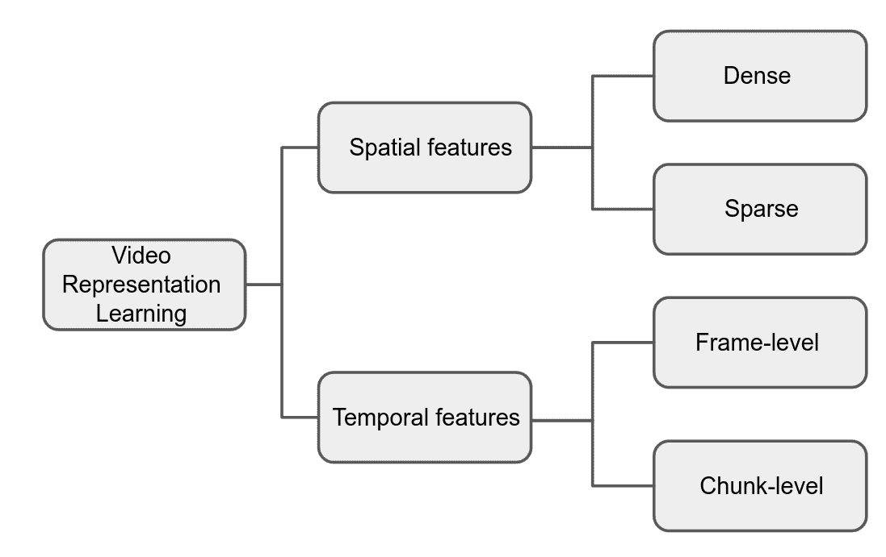
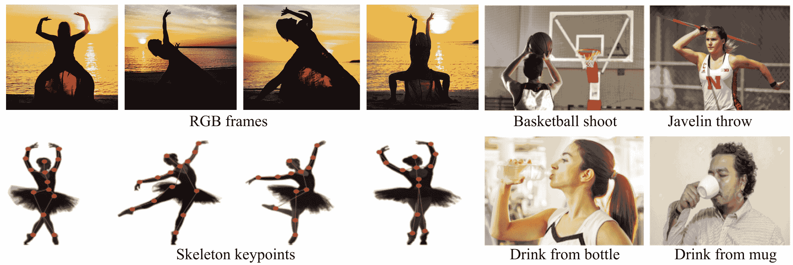

<!--yml

category: 未分类

date: 2024-09-06 19:32:53

-->

# [2405.06574] 深度视频表示学习：一项综述

> 来源：[`ar5iv.labs.arxiv.org/html/2405.06574`](https://ar5iv.labs.arxiv.org/html/2405.06574)

[3,2]\fnmXin \surLi

1]\orgdiv 电气与计算机工程系及计算与技术中心，\orgname 路易斯安那州立大学，\orgaddress\city 巴吞鲁日，\postcode70803，\stateLA，\country 美国

2]\orgdiv 计算机科学与工程系，\orgname 德克萨斯农工大学，\orgaddress\city 大学站，\postcode77843，\stateTX，\country 美国

3]\orgdiv 视觉计算与互动媒体系，\orgname 德克萨斯农工大学，\orgaddress\city 大学站，\postcode77843，\stateTX，\country 美国

# 深度视频表示学习：一项综述

\fnmElham \surRavanbakhsh eravan1@lsu.edu    \fnmYongqing \surLiang lyq@tamu.edu    \fnmJ. \surRamanujam jxr@cct.lsu.edu    xinli@tamu.edu  [ [

###### 摘要

本文提供了*视频表示学习*的综述。我们分类了最近的时空特征学习方法，并比较它们在一般视频分析中的优缺点。构建有效的视频特征是涉及视频分析和理解的计算机视觉任务中的一个基本问题。现有特征通常可以分为空间特征和时间特征。讨论了它们在光照、遮挡、视角和背景变化下的有效性。最后，我们讨论了现有深度视频表示学习研究中的剩余挑战。

###### keywords:

视频表示学习，特征建模，视频特征提取，特征学习。

## 1 引言

媒体和社交网络的巨大影响导致了每天互联网上上传大量视频。为了有效分析和利用上传的视频数据，构建视频特征表示非常重要。与图像的分析和理解不同，视频特征的手动建模通常是一项繁重的任务。因此，需要能够自动提取紧凑而描述性特征的技术。

随着人工智能和计算机视觉的最新进展，深度神经网络在特征建模方面取得了显著的成功。这些技术在实际的视频分析应用中，如跟踪 [[91, 177]、动作识别 [187]、动作预测 [90] 和人员重新识别 [51]，取得了巨大的突破。为了为这些应用设计深度学习管道，提取视频特征通常是第一步，并且在后续的视频处理或分析中起着关键作用。开发深度学习管道以提取给定视频的有效特征被称为*深度视频表示学习*。

视频的特征通常通过*空间特征*和*时间特征*来编码。空间特征编码图像帧中的几何结构、空间内容或位置信息；而时间特征捕捉时间域中的运动、变形和帧之间的各种关系。根据目标应用程序，算法应能够提取空间特征或时间特征，最好是两者都提取。一些应用还要求从提取的特征中解耦空间和时间信息，以便更有效地建模某些特定特征。

为视频学习鲁棒表示面临几个*主要挑战*，如

+   •

    遮挡：感兴趣的对象可能会部分被遮挡；

+   •

    照明：视频可能在不同的光照条件下或/和从变化的视角拍摄；

+   •

    视角和背景变化：前景对象和背景场景可能在移动。

因此，我们使用*鲁棒性*和*准确性*来评估表示学习算法在这些场景下的表现。不同算法的鲁棒性在这四个挑战下进行评估：遮挡、视角、照明和背景变化。至于它们的准确性，由于不同应用使用不同的度量标准，我们采用来自动作识别和视频分割的代表性任务的准确性度量，其中更具表现力的特征通常能带来更好的准确性。

与现有调查的比较。图像表示学习是计算机视觉中的经典问题，已被广泛研究以促进各种图像分析和理解任务。许多调查论文已发表以解决这一问题。但这些表示学习研究大多数关注静态图像的特征 [112, 63, 124, 114]。如表 1 总结的那样，虽然这些研究的多个组件与视频表示密切相关，但系统的关于视频特征的调查仍然缺失。一些近期的调查 [43, 86, 61] 讨论了视频表示学习，但大多数集中于特定类型的学习或方法。还有一些其他调查论文讨论了涉及视频表示学习的视频处理任务 [25, 144, 57, 167, 64]；然而，它们主要关注讨论开发的流程在目标任务中的表现。缺乏一个在一般设置下调查表示学习的综述，并且调查每个特征在其嵌入中的作用，而不考虑其特定任务。我们相信我们的调查提供了如何构建有效视频特征/表示的深入分析，特别是在面对上述挑战时。

1.  1.

    我们提供了深度视频表示学习的全面调查。

1.  2.

    我们比较了不同类型的表示学习算法在各种实际挑战场景中的准确性和鲁棒性，并提供了在不同视频处理和分析任务中采用合适特征的一些观察/建议。

表 1：与图像和视频特征学习相关的当前调查。与研究针对特定任务的表示学习的现有调查不同，我们的调查讨论了不同特征的一般范围的优缺点。

| 参考文献 | 年份 | 图像 | 视频 | 一般范围 | 应用 |
| --- | --- | --- | --- | --- | --- |
| [124] | 2018 | ✓ | - | $\times$ | 基于视觉的定位 |
| [112] | 2021 | ✓ | - | $\times$ | 图像匹配 |
| [114] | 2021 | ✓ | - | $\times$ | 语义和实例分割 |
| [63] | 2021 | ✓ | - | $\times$ | 基于内容的图像检索 |
| [43] | 2017 | ✓ | ✓ | $\times$ | 图上的表示学习 |
| [86] | 2018 | ✓ | ✓ | $\times$ | 多模态学习 |
| [61] | 2020 | ✓ | ✓ | $\times$ | 自监督特征学习 |
| [141] | 2021 | ✓ | ✓ | $\times$ | 2D 和 3D 姿态估计 |
| [144] | 2021 | ✓ | ✓ | $\times$ | 多人姿态估计 |
| [25] | 2020 | - | ✓ | $\times$ | 足球视频分析 |
| [57] | 2021 | - | ✓ | $\times$ | 多视角视频总结 |
| [64] | 2022 | - | ✓ | $\times$ | 监控视频中的事件检测 |
| [167] | 2022 | - | ✓ | $\times$ | 行人属性识别 |
| 我们的 | 2023 | ✓ | ✓ | ✓ | 动作识别 + 视频分割 |

组织结构。我们在第二部分中介绍了视频深度特征的分类，然后在第三部分中比较了这些特征在动作识别和视频分割中的应用。我们在第四部分中总结了论文，讨论了剩余挑战和未来方向。

## 2 深度视频特征分类

视频数据的两个主要方面通常在视频处理和分析任务中被考虑：(1) 如何编码视觉数据中的空间结构或内容；(2) 如何建模帧之间的时间一致性或变化。场景或物体的外观信息和几何结构被视为空间信息。在表示学习中，捕捉空间关系对于理解视频的视觉概念很重要。根据提取的空间信息，我们通常将特征分为密集特征和稀疏特征。空间上密集的特征通常是使用输入的像素强度定义的上下文数据。典型且广泛使用的密集特征可以来自 RGB 图像及其变体，如 RGBD 图像。空间上稀疏的特征通常定义在较小的实体集上，如关键点、子块或其他图形结构。广泛使用的稀疏特征包括定义在划分块或结构图（例如，一般形状的媒体轴、人类/动物的骨架结构）上的特征。

图 1：深度视频表示学习方案的分类。

表 2：不同类型特征的优缺点。场景噪声包括遮挡、照明、背景和视点变化。

| 特征 | 优点 | 缺点 |
| --- | --- | --- |
| 密集 | 在捕捉外观信息方面表现良好 | 对场景噪声敏感 |
|  |  | 高类内变化 |
|  |  | 高计算成本 |
| 稀疏 | 对背景和照明变化具有鲁棒性 | 在捕捉外观信息方面较弱 |
|  | 低类内变化 |  |
|  | 低计算成本 |  |
| 帧级别 | 低计算成本 | 在共现表示学习中表现较弱 |
| 块级别 | 在共现表示学习中表现良好 | 高计算成本 |

第二个方面是时间信息，它在视频表示学习中发挥着重要作用，并且是图像特征与视频特征之间的关键区别。为了有效理解视频的概念，时间信息或不同帧之间的时间一致性起着关键作用。根据时间信息的建模方式，我们将时间特征分为两类：帧级特征和片段级特征。前者从每一帧中提取特征，并构建一个签名序列；而后者将一个片段的时空特征编码成一个签名。

我们在图 1 中说明了我们的分类。在接下来的子节 2.1 至 2.4，我们根据空间和时间信息的建模方式对视频特征进行分类，并讨论它们的优缺点，如表 2 所总结的。我们将讨论不同设计如何影响特征在不同场景下的整体鲁棒性。在特征准确性方面，这更依赖于应用，并将在应用部分讨论。

### 2.1 空间密集特征

空间密集特征包含丰富的信息，主要是通过以结构化顺序使用输入的直接像素强度定义的。RGB 视频是密集特征中最常见的数据类型。它包含关于外观、对象和背景的上下文数据。人们通常使用 2D 卷积神经网络（CNN）作为*标准架构*来从密集特征中提取空间信息。

基于 CNN 的标准架构。随着深度学习的兴起，CNN 已成为特征建模的最常用方法，因为深度学习方法具有强大的建模能力和优越的性能。各种 CNN 架构，包括 VGGNet [140] 和 ResNet-50 [46]，已经被用于空间表示学习 [97, 200, 34]。这些模型提供了视频帧的高级空间表示。一些方法还使用对象检测或分割算法来提取帧中的局部感兴趣区域，以更好地利用不同区域之间的关联，并减少编码冗余信息的可能性 [5]。例如，在 [90] 中，提出了一种交互模块来建模（人）对象与其周围环境之间的交互。使用 Mask-RCNN [47] 进行语义分割，然后将这些掩模特征输入到一个 2 层卷积网络中以进一步进行特征学习。

为了更好的鲁棒性，额外的模块是必要的。有效的视频特征应对遮挡、视角和背景变化具有鲁棒性。因此，在上述*标准架构*的基础上，人们还添加了额外的模块以提高特征的鲁棒性。最近的方法采用了三种常见的附加模块类型：*部分信息*、*附加输入信息*和*注意力机制*。接下来，我们将详细说明，在给定一个*标准架构* X 的情况下，添加一个或多个模块到 X 上可以在不同场景下提高管道的鲁棒性。

#### 部分信息

典型的视频表示学习方法没有考虑部分遮挡的影响。但在视频中存在部分遮挡时，由于包含了不相关的周围物体，学习到的特征往往会被破坏，从而导致性能急剧下降。传统的策略是为各种遮挡模式训练集成模型[149, 118, 15]，并构建一个覆盖不同尺度物体部分的部件池，然后自动选择重要部分以克服遮挡。这种策略的主要限制是它在训练和测试阶段都更昂贵。另一种策略是将一组特定于部件/遮挡的检测器集成到一个联合框架中，该框架学习部分遮挡[203, 119]。在[203]中，应用了一组部件检测器，并利用它们之间的相关性来提高它们的性能。每个部件检测器为候选区域生成一个分数，最终分数是基于一些顶级分数的平均值计算的。这种部件特定检测器的主要问题是它们不能全面覆盖所有的遮挡模式，并且需要基于一些预设假设进行设计[183]。例如，对于行人检测，这些部件检测器是基于行人通常从底部、左侧和右侧被遮挡的先验知识设计的。然而，在实际应用中，遮挡模式可能是不规则的，这会影响特征的性能。

#### 额外信息

一些研究使用额外的信息来补偿密集特征的视角和光照变化。例如，RGB-D 摄像头常用于包含深度信息，这使得表示对光照和视角变化的敏感性降低[52, 100]。热成像和颜色图像也被用来在合适的光源不可用时提高鲁棒性[71]。其他几项工作使用非视觉信息作为补充输入。例如，在[40]中，音频信号和在[105]中，来自可穿戴传感器的信号被添加以提高密集特征的鲁棒性。

#### 注意力机制

在大多数情况下，关键对象/区域只是整个空间图像的一部分。能够使用局部空间注意力引导系统关注重要（前景）对象并忽略不相关（背景）噪声是理想的。许多近期研究开发了注意力机制，以帮助特征学习模型集中于空间维度中的重要区域。例如，在[183]中，使用了注意空间池化来代替最大池化，后者计算特征之间的相似度分数以计算空间维度中的注意力向量。这种方法使模型在图像级别上对感兴趣的区域更加关注。在[88]中，采用了一种自注意力机制来生成上下文感知特征图。然后，计算上下文感知特征图与一组可学习的部件原型之间的相似度，并将其用作空间注意力图。为了识别感兴趣的对象并关注可见部分，一些模型在空间注意力网络中使用空间稀疏特征来构建稳健的表示。在[198, 178]中，稀疏特征帮助 RGB 帧估计注意力图和可见性分数，以处理各种遮挡模式并生成视图不变的表示。

#### 附加模块总结

尽管密集特征可以编码丰富的上下文信息，但它们的表示有时对遮挡、视角、照明和背景变化敏感。给定一个提取密集特征的标准架构 $X$，各种近期研究利用在 $X$ 上添加额外模块来增强空间特征建模的鲁棒性。表 3 总结了上述策略。 $X$ + 部分信息通常在增强模型对部分遮挡的鲁棒性方面有效。 $X$ + 额外输入信息（例如深度信息）可以帮助模型在照明和视角变化下提高性能。许多近期研究将注意力机制纳入标准架构，这种注意力策略通常有助于区分感兴趣的前景对象和背景噪声，从而帮助模型在视角、遮挡和背景变化方面表现更好。

表 3：使用密集特征的不同模型的鲁棒性。一个标准架构称为 X。其在鲁棒性挑战中的局限性可以通过添加附加模块来解决/缓解。

| 模型 | 视角 | 遮挡 | 背景 | 照明 |
| --- | --- | --- | --- | --- |
| X | - | - | - | - |
| X + 部分信息 | - | ✓ | - | - |
| X + 额外信息 | ✓ | - | - | ✓ |
| X + 注意力 | ✓ | ✓ | ✓ | - |

### 2.2 空间稀疏特征

空间稀疏特征通过稀疏的特征点集来表示信息，这些特征点能够描述原始视频帧的几何形状。使用稀疏特征有几个优点。首先，它们用稀疏的特征集来描述帧，从而降低计算成本。其次，与密集特征相比，稀疏特征在类别内部的方差较小，对条件变化（如外观、光照和背景）更具鲁棒性。然而，稀疏特征缺乏外观信息，在某些场景中，这对于特征建模是必不可少的。通常有三种*标准架构*被适配用于提取稀疏特征：*RNN、CNN 和 GNN/GCN 管道*。

基于 RNN 的标准架构。由于视频的递归特性，一种策略是使用基于 RNN 的架构进行稀疏表示学习。空间特征的安排决定了适合空间提取的架构。如果特征点之间的固有空间关系可以排列成一系列向量或网格，RNN 在空间建模中是有效的[156, 32]。

*基于 RNN 的标准架构的优缺点* RNN-based 方法在处理序列数据时表现良好，但在空间建模方面并不十分有效。因此，它们的总体性能不如 CNN 模型[102]。在一些工作中，基于 RNN 的模型使用 CNN 的特征图作为输入，而不是使用原始输入帧[181, 34]。

基于 CNN 的标准架构。许多研究已将 CNN 应用于稀疏表示学习。然而，定义非结构化特征点之间的关系是具有挑战性的。CNN 以图像的形式接收输入。为了满足 CNN 输入的需求，一些研究将稀疏特征建模为多个 2D 伪图像[101, 104, 75]。例如，在[101]中，稀疏特征被排列成一个图像，其中一个维度包含特征点，另一个维度包含帧，然后应用 7 层 CNN 提取特征。在[164]中，帧动态被映射到纹理图像中，然后使用 CNN 模型提取信息。一些工作使用一组特征点在特征之间构建层次结构。在[48]中，视频帧被划分为多个网格，然后对每个单元格运行卷积特征描述符。

*基于 CNN 的标准架构的优缺点* 基于 CNN 的架构在提取局部特征和探索数据中的判别模式方面非常有效。然而，它们的主要缺点是设计用于基于图像的输入，并且主要依赖于相邻点之间的空间依赖关系。对于一些包含非结构化设计的稀疏特征，CNN 表现不是很好。此外，CNN 在处理极度稀疏的数据时也会遇到困难，因为它们严重依赖点的空间关系来学习。在这种情况下，RNN 表现更好。

GNN/GCN 标准架构。将稀疏特征建模为向量或图像可能会破坏空间关系，或在特征点之间添加不够强的虚假连接。这些不规则特征本质上结构化为图，不能用向量、2D 或 3D 网格建模。为了解决这个问题，一些研究利用图结构，如图卷积神经网络（GCNNs） [187, 76, 80] 或 GNNs [44] 来构建特征提取架构。

一些人通过将特征点安排为间接图，将点作为节点，将它们的关系作为边，使用时空 GCNs。一个帧内的节点基于特征的空间关系连接，并由空间维度的邻接矩阵表示。时序维度的节点通过连续帧中对应节点的关系进行关联 [187]。使用时空 GCNs 的一个问题是，仅根据节点的自然连接建模空间特征可能会丧失断开关节的潜在依赖关系。为了解决这个问题，在 [80, 133] 中，引入了一种模型来自适应地学习和更新不同层和样本的图拓扑。在 [80] 中，提出了一种框架以捕捉点和邻居之间更丰富的依赖关系。他们使用了编码器-解码器结构来建模远离点之间的依赖关系。在建模稀疏特征时，定义不同特征节点之间的连接是具有挑战性的。例如，时空 GCN 将特征建模为间接图，这可能无法完全表达点的方向和位置。[133] 使用了有向无环图来表示稀疏数据。然后，使用有向图神经网络对构建的有向图进行编码，这可以将信息传播到相邻的节点和边，并在每层更新它们的相关信息。

*GNN/GCN 标准架构的优缺点* GNN/GCNs 有助于处理具有潜在图结构且为非欧几里得的非结构化数据。大多数稀疏特征中的数据结构的不规则性导致图神经网络在性能上优于 CNN 或 RNN 架构。但如果稀疏特征可以被表述为 2D 网格或向量，那么基于图的模型则不如 CNN 模型高效。

提升鲁棒性的额外模块。空间稀疏特征的表示对背景和光照变化具有鲁棒性。为了解决其他鲁棒性问题，一些研究在标准架构上添加了额外的模块。标准架构 X 可以是 CNN、RNN 或 GNN/GCN 模型。通常，两个额外模块，*变换矩阵*和*注意力机制*，常常被添加以增强特征的鲁棒性。

#### 变换矩阵

相机视点的变化会改变特征点的相对位置。因此，在稀疏特征建模中，构建视点不变的表示仍然是一个挑战。为了解决这个问题，一些研究开发了一种变换方法，将一组特征点转换为标准结构 [56, 87, 104]。在 [87] 中，提出了一种基于转子视图变换的方法，将原始特征重新定位到标准前视系统。变换后，应用时空模型来构建每个部分的形状和运动。在 [104] 中，应用了一种基于序列的变换方法，将特征映射到标准形式，并生成新的视点不变序列。

#### 注意力机制

注意力有助于模型应对部分遮挡和视角变化。与密集特征类似，在存在遮挡的情况下，稀疏特征建模仍然具有挑战性。一些方法部署空间注意力机制来关注感兴趣的点，并通过相邻帧中的可见特征点来预测被遮挡的部分。在 [51] 中，提出了一种空间注意力生成器来预测被遮挡的部分。该生成器是一个自编码器，预测被遮挡部分的内容，基于当前帧的可见部分。一些其他研究使用热图作为注意力机制，以关注信息丰富的特征点。在 [35] 中，生成了可见部分和遮挡部分的热图。然后，使用热图在空间和时间维度上预测遮挡部分。在 [142] 中，使用类别激活图作为掩码矩阵，强制网络学习当前未激活点的特征。为了实现视角不变的表示，一些模型提议将注意力从参考视图转移到任意视图。例如，在 [60] 中，生成了注意力图，将注意力从参考视图转移到任意视图。这有助于学习对关键特征点的有效注意力。在 [163] 中，注意力直接作用于网络参数，而不是输入特征。这允许以统一的方式明确捕捉空间交互上下文。

*总结。* 表 4 显示了标准架构 X 和额外模块的鲁棒性。X 可以是 RNN、CNN 或 GNN/GCN 架构，对背景和照明变化具有鲁棒性。虽然 X 的优缺点取决于目标任务，但一般来说，RNN 更适合处理稀疏数据，而 CNN 更适合处理密集特征点。通常，如果数据的结构是网格格式，则 CNN 在提取空间特征时更有效。另一方面，如果数据具有图形结构，则 GNN/GCN 表现更好。X + 转换矩阵通过将一组特征点转换到标准视图来应对视角变化。X + 注意力通过从可见点预测遮挡部分并分别从一个视图转移到另一个视图，对遮挡和视角变化具有鲁棒性。

表 4: 使用空间稀疏特征的不同模型的鲁棒性。标准架构称为 X。

| 模型 | 视图 | 遮挡 | 背景 | 照明 |
| --- | --- | --- | --- | --- |
| X | - | - | ✓ | ✓ |
| X + 转换矩阵 | ✓ | - | ✓ | ✓ |
| X + 注意力 | ✓ | ✓ | ✓ | ✓ |

### 2.3 帧级特征

帧级特征是一系列每个单独描述一个帧的签名。给定一个视频片段，帧级特征模型通常逐帧处理空间信息，并编码帧之间的时间关系。人们采用不同的策略，例如*光流*、*基于 CNN 的架构*、*基于 RNN 的架构*和*注意机制*来提取帧级特征。

光流。光流是一种包含连续帧运动信息的特征，对于描述视频动态非常有用[49]。它是通过去除非运动场景来计算的，从而生成与原始帧相比背景不变的表示。由于光流是逐帧计算的，我们将其归类为帧级特征。大多数研究将光流作为时间数据与原始空间特征一起使用，以捕捉运动。研究[12, 161, 160]表明，使用光流和 RGB 帧在建模视频时优于仅使用 RGB 帧。在[161]中，将连续 10 帧的光流和 RGB 输入到 CNN 中。卷积滤波器计算光流的导数并学习与图像位置相关的运动动态。虽然在某种程度上，提取光流作为附加信息有助于模型更具视角独立性，增强对遮挡和混乱背景的鲁棒性，但它往往无法捕捉相对长期的依赖关系。除了光流，还有其他包含运动信息的特征。例如，在[24]中，提出了一种新的运动表示法叫做 Potion，它通过一张图像提供了实例在整个视频片段中的所有动态。运动线索通过不同的颜色表示，显示视频片段中帧的相对时间。结合 Potion、RGB 帧和光流，有助于模型编码相对较长的依赖关系。在[210]中，除了光流，还计算了连续视频帧的运动显著性[18]。预计算包括光流在内的运动信息是耗时且需要大量存储的。此外，它们无法学习帧之间的全局依赖关系。

基于 CNN 的架构。由于 CNN 已广泛应用于图像任务，一些研究[45, 94, 162]采用了 2D CNN 来建模视频片段。然而，2D CNN 需要一个融合模块来连接时间线索。例如，在[65]中，采用了延迟融合的方法，该方法在第一个全连接层中融合了来自两个不同 CNN 的信息。在[171]中，作者使用 2D CNN 网络将每一帧编码为特征图，然后将它们连接成一个长向量，作为视频级特征描述符，以全面理解视频。然而，使用简单的融合或平均缺乏学习能力，并且不包含有用的时间相关特征。在[94]中，沿时间维度的通道被移位，以提高 2D CNN 的时间建模性能。在[186]中，将连续帧与自适应权重聚合，然后输入到卷积网络中。

最近的论文将单次通过的特征编码器扩展到 Siamese 结构，以进行时间相关特征学习。Siamese 管道将两帧作为输入，并使用 CNN 编码器提取特征图。在[17, 54]中，他们的特征编码器共享相同的权重来从输入图像中提取特征图。然后，他们比较特征图之间的相似性，以构建帧间特征。在[117, 92, 81]中，他们使用两个独立的编码器来提取特征图。他们将特征编码为两个部分，一个用于相似性比较，另一个存储帧的语义信息。这些视频特征在下游任务中更为有用。

基于 RNN 的体系结构。由于视频的连续性特性以及 RNN 体系结构能够记忆视频中的时间关系，一些研究使用这些模型来对视频中的运动进行编码。一些研究采用了并行流体系结构，其中一个流负责提取空间信息，另一个流负责提取时间数据。在[159]中，提出了一个双流架构，第一个流负责学习空间依赖性，第二个流负责学习时间动态。然后这两个流互相聚合以表示数据。由于 RNN 在学习长期时间依赖性方面不够有效，大多数模型采用了 LSTM 模型。在[200, 34]中，LSTM 在每个时间步骤都会受到每帧的空间表示的输入。每个时间步骤的学习过程不仅基于该时间步骤的观察结果，还基于提供视频时间上下文的先前隐藏状态。还探索了一些其他版本的基于循环的网络。例如，在[34]中，提出了扩展的 GRU 来通过使用当前和旧信息来建模时间关系。GRU 需要更少的存储空间并且执行速度更快。

注意力机制。由于并非所有帧都提供信息，一些研究使用时间注意力来区分和选择关键帧，通过为它们分配权重来实现。在[13]中，采用了一个缩放的点积注意力模块，根据其重要性为帧特征分配权重。在[183]中，通过一个具有关注性的时间池化来组合 RNN 产生的所有时间步骤，以计算时间维度上的注意得分，以便基于其优劣性权衡帧。在[197]中，提出了一个非参数的自协作关注网络，用于高效地计算相关权重以对准有区分性的帧。在[108]中，采用了一个变压器模块，通过迭代选择一个帧作为查询，其余帧作为关键特征来计算时间注意力。

表 5：用于建模帧级特征的各种架构的优缺点

| 模型 | 优点 | 缺点 |
| --- | --- | --- |
| 光学 | 对简单和局部动态有效 | 对长期和复杂动态无效 |
| 流 |  | 难以处理时间尺度的差异 |
|  |  | 计算和存储消耗大 |
| 2D CNN | 对简单和局部动态有效 | 对长期和复杂动态无效 |
|  |  | 难以处理时间尺度的差异 |
| RNN | 对复杂动态有效 | 难以处理时间尺度的差异 |
| 注意力 | 对长期和复杂动态有效 | 计算消耗大 |
|  | 有效处理时间尺度的差异 |  |

*总结。* 如表 2 所示，尽管帧级特征相较于块级特征具有较低的计算成本，但它们将空间和时间维度解耦，导致缺乏共现表示学习。人们采用不同的方法来学习视频中的帧级动态，如表 5 所示。光流和基于 CNN 的架构帮助网络捕捉短期和简单的线索。然而，它们缺乏记忆，因此不适合捕捉长期依赖性。此外，光流计算昂贵且对存储要求高。基于 RNN 的架构，特别是 LSTM，能够编码复杂的动态，但它们对每个视频片段的处理相同，对固有的时间变化不变。注意力机制选择信息量大的特征，适合区分复杂任务。

### 2.4 块级特征

表 6：用于建模块级特征的各种动态的优缺点

| 模型 | 优点 | 缺点 |
| --- | --- | --- |
| 3D CNN | 对粗糙层次的动态有效 | 对细节动态无效 |
|  |  | 计算开销大 |
| 注意力机制 | 对细节和粗糙层次的动态有效 | 计算开销大 |
|  | 有效处理时间尺度变化 |  |

虽然帧级特征完全分离了空间和时间建模，块级特征通过创建时空数据的层次表示，同时提取外观和动态，从而提取更多与主题相关的信息。这些特征将帧汇总为一个特征，然后应用深度神经网络同时提取空间和时间信息。人们使用不同的策略来编码块级特征：*基于 CNN 的架构*和*注意力机制*。

基于 CNN 的标准架构。3D CNN 将一段帧编码为一个特征，并且其卷积核大小为 s×s×d，其中 s 和 d 分别指代卷积核的空间大小和每个特征中的帧数。在[72, 73, 184]中，一段视频被拆分为多个片段，每个片段被输入到一个 3D CNN 中进行特征提取。这个 3D CNN 首先关注前几帧的空间关系，然后在随后的帧中学习时间动态[151]。在[186]中，利用两个 3D CNN 模块通过处理不同大小的块来编码长短时间依赖性。

尽管 3D CNN 看起来是建模视频的自然算法，但它们也有一些缺点。首先，由于增加了时间维度，它们需要大量的参数，这导致使用较浅的架构。在[12]中，介绍了一种新模型，该模型使用了以预训练的 Inception-V1 为骨干的 3D CNN。为了从预训练的 ImageNet 模型[29]中进行引导，2D 内核的权重沿时间维度重复。然而，3D 卷积的固定几何结构限制了 3D 网络的学习能力。

第二，块级特征直接从视频中学习高级语义的时间抽象，但它们不适合需要时间细粒度的特定任务。在一些应用中，可能需要精确预测每一帧的动态。在这种情况下，块级特征会失去细粒度，表现不佳。例如，在 C3D 架构中，从 conv1a 到 conv5b 的层中，输入视频的时间长度减少了 8 倍[151]。这表明局部信息在经过多次卷积后丢失。为了解决这个问题，在[137]中，提出了一种卷积和反卷积的方法，该方法在空间和时间上同时进行下采样和上采样。

最后但同样重要的是，虽然 3D CNN 非常适合捕捉全局粗糙运动，但在建模局部时空窗口中的细致时间关系时，它们有局限性。为了解决这个问题，人们使用注意力机制来利用块中的时间区分信息。

注意力机制。块级特征通常通过平等对待块中的连续帧来学习时间域，而不同的帧可能对相关任务有不同的贡献。类似于帧级特征，有几项研究探讨了块级特征中的时间注意力[78, 69]。在[78]中，通过建模 3D CNN 中的时间通道差异，在通道级别学习了注意力。

*总结。* 块级特征适合捕捉结构性共现。它们连接了空间和时间域，适合学习在其微观运动顺序中有所不同的动态。然而，与帧级特征相比，它们不适合需要时间细粒度的任务。如表 6 所示，3D CNN 可以在一个签名中捕捉粗粒度的时间依赖性。但它们需要大量参数，无法在局部窗口中编码细节。注意力机制用于利用细粒度和粗粒度中的信息特征，并处理时间尺度的变化。然而，它会增加模型的额外权重，并且计算开销较大。

## 3 应用深度特征于视频分析任务

在讨论了不同的特征建模策略后，我们比较了它们在不同应用中的使用情况。我们使用了两个应用，即 *动作识别* 和 *视频目标分割*，来分析这些特征在不同情况下的表现。*动作识别* 旨在识别视频中发生的特定动作，并输出一个（或多个，如果有多个动作）全局标签。*视频目标分割* 旨在在视频的每一帧中从背景中识别并分割出感兴趣的对象，达到像素级别。

在这两个应用中，对象在空间和时间维度上常常出现自由形变。而有时，为了提高实时效率，时间（或空间）采样会故意变得稀疏。因此，提取可靠且强大的特征至关重要，并且常常直接决定最终性能。

### 3.1 动作识别

在动作识别中的一个关键挑战是如何学习一个特征，以便用描述性且紧凑的表示捕捉相关的空间和运动线索。在空间维度上，一些研究采用了密集特征，而另一些则使用了稀疏特征。同样，在时间维度上，一些采用了帧级特征，而另一些使用了块级特征。缺乏研究讨论在不同情况下采用这些特征的优缺点。因此，我们在这里讨论并分析每种特征、它们的挑战、局限性和可能的解决方案，如表 7 所示。

图 2：动作识别中的密集（RGB 帧）和稀疏（骨架关键点）特征。密集特征可能包含背景信息；而稀疏特征主要编码对象的基本结构。背景的有用性各不相同：它可以分散注意力（例如，在舞蹈图像中）或协助（例如，在右边两列的活动中）识别。左上四列的 RGB 图像来自 [123]；我们将它们按帧顺序排列。左下四列的骨架关键点图像来自 [111]。右两列的图像来自 UCF101 数据集 [143]。

表 7：动作识别中空间特征和时间特征的优缺点。表中有一些缩写：ap.、info.、bg、rep. 分别代表外观、信息、背景和表示。

| 特征 | 优点 | 缺点 | 解决方案 | 参考文献 |
| --- | --- | --- | --- | --- |
| 密集 | 包含外观信息 | 背景噪声/冗余信息 | 附加信息 | [166, 201] |
|  | 注意力 |  |
| 表示偏差 | 校准数据 | [85, 42] |
|  | 注意力 |  |
| 稀疏 | 对视角/背景变化稳健 | 可靠性低 | 附加信息 | [11, 33] |
| 低计算成本 | 扩展性不足 | 热力图表示 | [24, 185] |
| 帧 | 低计算成本 | 共现表示 | 消息传递 | [189, 138] |
| 块 | 共现表示 | 低计算成本 | 解耦内核 | [152, 162] |
| 固定长度块 | 多尺度内核 | [26, 58] |

密集特征。由于 RGB 视频帧的适应性和可用性，这种密集的像素级表示在动作识别中被广泛采用 [154, 38, 176]。

*优点*。密集特征包含了在不同场景中识别动作所需的外观信息。由于 CNN 在捕捉密集空间特征方面表现出了强大的能力，大多数研究使用二维或三维 CNN 从视频帧中提取空间语义。得益于 CNN，与稀疏特征相比，建模密集特征更加直观，但它们也存在与任务相关的限制。

*缺点*。使用密集特征存在一些挑战。首先，它们可能包含干扰动作表示学习的背景噪声和冗余信息。密集特征的另一个局限性是“表示偏差”，即基于对象/背景检测来识别动作。网络可能根据场景上下文而不是人类动作来预测正确结果。某些动作可能更容易通过背景和上下文来预测，如“投篮”与“投掷”之间的区别；另一些动作可能需要密切关注人类正在与之互动的对象，如图 2 中所示的“从杯子喝水”与“从水瓶喝水”。需要注意的是，表示偏差与背景噪声是不同的。在背景噪声中，动作每个类别的表示会随着场景的变化而变化，而表示偏差意味着从场景中的区分性对象获取帮助来识别动作。虽然在动作识别的一些研究中，表示偏差被认为是不受欢迎的 [23, 85], 但在某些场景或类似任务中它可能是有用的 [42]. 原因在于，建模人类动作通常需要理解周围的人和物体。例如，除非模型知道场景中存在另一个人在说话，否则无法识别“听别人讲话”。表示偏差的主要问题是，如果数据集的泛化能力不足，它可能会削弱模型的性能。

*解决方案。* 为了缓解背景噪声和冗余，几项研究增加了额外的视觉信息以引导网络避免干扰。一些方法采用深度信息来克服光照和视角变化[126, 166, 165]，而其他方法则利用局部注意力形式的骨架数据来协助网络捕捉最具代表性的身体姿态[201, 110]。

克服表示偏差的解决方案包括收集经过良好校准的数据集[85]，或使用注意力机制帮助模型专注于动作的可区分部分[132]。注意力网络通过捕捉网络在建模动作时的关注点，增加了解释性。在[132]中，CNN 为每个视频输入生成一个特征立方体，并预测一个软最大值，以确定模型认为输入帧中相应区域重要的概率。在[42]中，生成注意力图以将计算集中在输入的特定部分。加权注意力池化层被插入作为全卷积网络中池化操作的替代。在[202]中，提出了一个三流架构，包括两个注意力流和一个全局池化流。共享的 ResNet 用于提取所有三个流的空间特征。每个注意力层采用融合层来结合全局和局部信息，并生成复合特征。此外，提出了全局注意力正则化，以指导两个注意力流更好地建模复合特征的动态，并参考全局信息。

稀疏特征。稀疏特征，尤其是骨架特征，在动作识别中因其动作聚焦特性和紧凑性而非常受欢迎。几项研究使用人体骨架信息作为关节坐标列表的序列[187, 196, 79]，这些坐标由姿态估计器提取。

虽然使用 CNN 网络处理 RGB 帧是直接的，但在基于骨架的动作建模中，网络面临着安排骨架特征的挑战。早期的方法 [196, 79] 仅使用关键点坐标生成特征向量序列。该方法的问题在于它集中于建模时间域中的信息，而未探索身体关节之间的空间关系。其他方法将骨架数据安排为伪图像 [68, 70, 77]。然而，最近的研究表明，图网络可以有效地建模像人体骨架这样的非欧几里得数据。表 8 的性能结果展示了将骨架数据安排为图结构的优越性能。

表 8：NTU RGB-D [131] 数据集中基于骨架的动作识别性能比较，针对不同特征安排。mAP 指的是平均精度。

| 模型 | [32] | [131] | [99] | [70] | [68] | [187] | [169] | [80] |
| --- | --- | --- | --- | --- | --- | --- | --- | --- |
| 安排 | 向量 | 向量 | 向量 | 伪图像 | 伪图像 | 图 | 图 | 图 |
| mAP | 59.1% | 62.9% | 69.2% | 74.3% | 79.6% | 81.5% | 84.2% | 86.8% |

随着 ST-GCN 在[187]中的引入，时空图卷积成为了研究热点。这种方法的核心在于将时间模块整合到空间 GCN 中。提出了几种 ST-GCN 的变体[21, 170, 20]，以提高网络容量和计算消耗。然而，ST-GCN 的主要限制在于通过使用固定图结构忽略了帧内关节之间的语义连接。动作识别在于超越局部关节连接，因为学习不仅发生在空间连接的关节上，还涉及到断开关节的潜在依赖。例如，在“行走”中，尽管手臂和腿部在空间上分开，但它们之间有很高的相关性。这通过提取多尺度特征和长期时间依赖性实现，因为空间上分开的关节也可以有强烈的相关性[106]。在这方面，一些技术已被采用于增强 GCNs 的灵活性。尝试使用自适应学习图结构[133, 136]以及设计基于图的搜索空间来探索时空连接[122]。在[27]中，采用了膨胀卷积[192]以增加感受野大小，并在不增加模型复杂性的情况下捕获多尺度上下文。在[106]中，通过执行具有更高阶多项式的骨架邻接矩阵的图卷积来解决这一问题，从而增加图卷积的感受野。注意力机制也被采用于提高提取高级关节的能力。在[136]中，每层 GCN 中嵌入了时空通道注意力模块，使模型能够专注于动作识别中的关节、帧和通道的判别细节。

*优点。* 当使用稀疏特征时，由于仅包含姿势信息，这些特征在少量数据中包含了高级语义信息，并且在动态情况下更为鲁棒[135, 59]。由于骨架数据不包含颜色信息，因此不受 RGB 帧限制的影响[138]，能够提供稳定的低频人类动作表示。

*缺点。* 在建模稀疏特征表示时存在一些挑战。第一个限制是“可靠性”，这意味着稀疏特征的识别能力主要受坐标分布变化的影响。由于关节坐标是由姿态估计器产生的，应用不同的姿态估计算法可能导致坐标的微小扰动，从而造成不同的预测 [206]。此外，姿态估计过程中会丢失局部微妙的运动模式。因此，骨架序列的稀疏性有时不足以描述诸如“阅读”、“书写”和“摇头”等细微动作。

另一个挑战是稀疏特征的可扩展性不足。由于稀疏特征是针对每个人单独定义的。例如，每个人体骨架的每个关节被定义为一个节点，网络的复杂性随着人数的增加而线性增长，这限制了它在多人人物或群体活动识别中的应用。

*解决方案。* 为了克服可靠性问题，许多方法利用多模态视觉资源，包括 RGB 帧、深度图和关节热图，以弥补局部和全局领域中信息的缺乏 [11, 33]。人们使用其他形式的表示方法，例如热图体积来展示骨架，以缓解稀疏特征的可扩展性问题 [24, 185]。

帧级特征。某些方法提取相邻帧之间的运动线索，并在顺序签名中学习帧级时间依赖关系。在动作识别中，有时需要对短期和长期运动进行建模。(1) 为此，一些早期的方法首先提取手工制作的光流[139, 161]，然后使用基于 2D CNN 的双流框架分别处理光流和 RGB 帧。这些方法存在几个缺点：首先，计算光流是耗时且存储需求大的。此外，空间和时间特征的训练是分开的，两个流的融合仅在后期层进行。随后的一些工作通过使用不同的中间链接来融合两个分离流的特征[38, 37]，改善了这一框架。然而，这些方法仍然需要额外的时间和存储成本来计算光流。(2) 另一类工作通过序列学习聚合时间信息[31, 89]。这些方法中的大多数将每一帧或时间点视为同等重要，但视频的所有部分并不等同重要，因此开发能够确定从哪里提取特征的方法也很关键。首先，从信息丰富的时间片段中不均匀地提取特征是具有挑战性的，因为需要查看整个视频以确定哪些部分是信息丰富的。一些近期工作[74, 174, 113]证明，通过选择信息丰富的帧而不是简单地取均匀采样的帧作为输入，识别系统可以受益。然而，这些系统将帧选择和特征提取视为两个独立的阶段，因此帧选择无法从后续特征提取中受益，从而降低了网络的描述能力，并在两个阶段中增加了冗余。为了解决这一挑战，在[84]中，建议了一种双分支架构，该架构以端到端的方式同时保持均匀的帧级特征和不均匀的块级特征。为了生成不均匀特征，使用了一个时间图，通过自注意力模块不均匀地将时间实例投影到一个更小的子集上。这个组件被提出仅采样时间上的最信息丰富的帧。(3) 另一类近期工作采用视频变换器，将自注意力应用于时空特征。代表性的网络包括 TimeSformer[6]、ViViT[1]、Mformer[121]和 MViT[36]。结合 2D 骨干网络和变换器，VTN[115]和 CARL[14]可以高效处理长视频序列。然而，这些网络被设计为一次处理一批帧的视频任务，这需要大量计算内存。在[190]中，采用递归机制逐帧处理视频，从而消耗更少的 GPU 内存。

*优点。* 通常，帧级特征的标准架构相比于块级特征具有较低的计算成本。此外，当需要聚合局部帧级特征以获得全局紧凑表示时，帧级特征更为简洁。

*缺点。* 提取帧级特征的主要挑战是“共现表示”学习，即在动作识别中指的是当模型需要在特定时间学习一组具有特定空间特征的人体动作。例如，在“摸背”动作中，模型需要首先关注手部，然后关注背部[83]。在许多现有方法中，时序模块和空间模块是分别设计的。它们的典型方法是使用卷积网络来提取每帧中的空间关系，然后使用 1D 卷积[134、133、80]或 LSTM[82、76]来建模时序依赖。然而，这种解耦设计限制了跨时空的直接信息流，从而捕捉复杂的区域时空关节依赖关系。

*解决方案。* 为了帮助模型更好地学习共现表示，采用了消息传递和交叉连接策略，以避免堆叠多个时空模块并传递信息。在[189]中，反馈连接被整合到 GCN 中，将高级语义特征传递到低级层，并逐步传递时序信息以建立全球时空动作识别模型。在[150]中，来自时序流的注意力被用来通过交叉连接层帮助空间流。在[83]中，提出了坐标系统转换和时空单元特征增强，以执行共现学习。在[138]中，每个关节坐标被转换为具有线性层的空间特征。然后，用空间特征和连续帧之间的空间特征差异来增强数据。接着，应用共享 LSTM 和三层图卷积 LSTM 来建模关节之间的共现表示学习。

块级特征。另一类方法是提取块级时序特征以获得全球签名。在这种情况下，块被定义为多维时间序列的密集/稀疏特征。由于 3D CNN 能够隐式建模运动信息以及语义特征，因此这一领域近年来取得了显著进展。该领域的首个工作是 C3D[151]，它提出使用 3D 卷积联合建模空间和时序特征以获得全球签名。为了使用预训练的 2D CNN，在[12]中，提出了 I3D，通过将预训练的 2D 卷积膨胀为 3D 卷积。

*优势。* 一般来说，分块级别的特征从时空通道的共现表示学习中受益，因为在“坐”和“站起来”等细节动作之间存在联系。这些网络可能更有效地学习细节动作。

*缺点。* 尽管已经进行了许多尝试来捕捉使用分块级特征的运动，但大多数方法在时序维度上缺乏具体考虑。因此，设计一个有效的时序模块，具有很强的动作建模能力和较低的计算消耗仍然是一个具有挑战性的问题。首先，三维网络需要大量的计算和时间。此外，与二维卷积相比，三维卷积需要降低空间分辨率以减少内存消耗，这可能会导致细节丢失。

此外，时间特征通常是从固定长度的片段中提取的，而不是适合不同视觉节奏的长度自适应片段。视觉节奏定义了一个动作的速度，也就是一个动作在时间尺度上的快慢。这在某些情况下对于识别动作(如行走、慢跑和奔跑)至关重要。

*解决方案。* 为了减少三维卷积的复杂计算，一些研究提出了将三维卷积分解为二维空间卷积和一维时序卷积的方法[94, 45, 152]，或者将二维卷积和三维卷积混合使用的方法[176, 208]. 在[152]中，使用组卷积来解开通道之间的相互作用和时空相互作用，或者使用单独的通道组同时进行二维和三维卷积来编码空间和时空相互作用[109]。尽管所有这些现有方法都是为了处理维度诅咒，但缺乏数据相关的决策来有针对性地引导特征通过网络中的不同路径。在[162]中，提出了两个时序差分模块，用于计算帧和分块之间的多尺度和双向运动信息。在[146]中，特征被有选择地通过时序维度进行路由，并且在没有任何计算开销的情况下与彼此相结合。

一些人使用多尺度卷积核来覆盖各种视觉节奏。在 [188] 中，将多尺度卷积特征融入非对称 3D 卷积中，以提高时间特征学习能力。在 [58] 中，设计了 Timeception 层，该层使用多尺度时间卷积模块对每个块进行时间卷积，以容忍复杂动作中的各种时间跨度。一些人设计了一个级别特定的网络帧金字塔来处理视觉节奏的变化 [39, 193]。在 [26] 中，提出了一种多尺度变换器，其建立在使用 3D 卷积的时间段之上，在基于令牌的架构中促进令牌的多个时间尺度。具有不同尺度使模型能够捕捉到时间上的细粒度和复合动作。在 [153] 中，将直接注意力机制融入变换器中，以利用跨帧的注意力方向，纠正错误排序的帧，并提供准确的预测。

表 9: NTU RGB-D [131] 数据集的不同动作识别性能比较。CS 和 CV 指的是数据集的跨主体（不同人类主体）和跨视角（不同摄像机视角）划分。

| 模型 | 空间 | 时间 | CS 准确率 | CV 准确率 |
| --- | --- | --- | --- | --- |
| [4] | 密集 | 帧 | 86.6% | 93.2% |
| [207] | 密集 | 块 | 94.3% | 97.2% |
| [10] | 稀疏 | 块 | 76.5% | 84.7% |
| [148] | 稀疏 | 块 | 87.5% | 93.2% |
| [28] | 密集 + 稀疏 | 块 | 91.8% | 94.9% |
| [103] | 密集 + 稀疏 | 帧 | 91.7% | 95.2% |
| [145] | 密集 + 稀疏 | 帧 | 92.2% | - |
| [8] | 密集 + 稀疏 | 块 | 92.5% | 97.4% |
| [33] | 密集 + 稀疏 | 块 | 97.0% | 99.6% |
| [9] | 密集 + 稀疏 | 块 | 96.0% | 98.8% |

总结。我们在表 7 中总结了不同特征的优缺点及可能的解决方案。密集特征在动作识别中利用了外观信息的优势，但它们受到背景噪声和表示偏差的影响。背景噪声和表示偏差的可能解决方案包括在输入中增强附加信息，以及良好校准的数据集和注意机制。稀疏特征比密集特征对背景噪声更具鲁棒性，并且计算成本较低，但它们缺乏可靠性和可扩展性。解决这些缺点的可能方案包括增强附加信息和视觉源。研究表明，在空间域中，使用多模态输入，特别是伴随注意机制，对于理解人类动作非常有帮助，因为人脑会采纳所有视觉输入来识别动作。定量结果显示在表 9 上的 NTU RGB-D 数据集确认，使用多模态空间特征优于单模态方法。

在时间域中，与块级特征相比，使用帧级特征的计算成本较低。然而，将空间和时间维度解耦限制了在区分复杂动作时的共现表示学习。一些研究通过消息传递技术和交叉链接连接来缓解这个问题。相反，块级特征允许建立时间和空间维度之间的连接和链接，以学习微动作的顺序和共现。然而，这些模型通常采用固定长度而不是自适应长度的块。一些研究通过使用帧金字塔和多尺度卷积来解决这个问题。块级特征的另一个缺点是计算成本高，这可以通过在网络的不同层中解缠卷积来缓解。总之，如表 7 所示，在稀疏特征存在的情况下，由于减少了参数数量、增加了网络深度和共现表示学习，块级方法优于帧级方法。

### 3.2 视频对象分割

视频目标分割（VOS）是一种视频处理技术。VOS 的目标是在给定视频的每一帧中对前景物体进行像素级掩码分割。近年来，VOS 受到广泛关注，因为它可以应用于计算机视觉的各种领域。最近的 VOS 研究可以分为两个子任务：半监督和无监督。半监督 VOS 旨在对视频第一帧中给定的一个或多个物体进行像素级掩码的重新定位和分割。无监督 VOS 旨在自动从背景中分割出感兴趣的物体，通常会分割出最显著的物体。通常，视频目标分割的输入是 RGB 格式的彩色视频帧序列。特征建模是这些视频目标分割管道的第一阶段。接下来，我们讨论不同特征在 VOS 中的优缺点。

表 10：视频目标分割（VOS）任务中空间和时间特征的优缺点。表中有一些缩写：ap. 和 info. 分别表示外观和信息。

| 特征 | 优点 | 缺点 | 解决方案 | 参考文献 |
| --- | --- | --- | --- | --- |
| 密集 | 包含丰富的外观信息 | 处理遮挡能力弱 | 遮挡感知编码器 | [66, 67] |
| 稀疏 | 快速且计算成本低 | 精度较低 | 混合算法 | [16, 147] |
| 帧 | 低计算成本 | 错误累积 | 动态特征 | [92, 81] |
| 低延迟 | 过去帧管理 | 空间管理 |  |
| 块 | 多模态建模 | 大计算开销 | 知识蒸馏 | [172, 171] |

密集特征。密集特征被广泛使用，因为 VOS 的中立性使其能够估计像素级的物体掩码。这些方法通常应用预训练的 CNN 编码器从每一帧中提取密集特征图。一般而言，2D CNN 编码器被广泛用于提取特征图[98, 2, 120, 96]。CNN 编码器通常在 ImageNet[30]上进行预训练，并在视频目标分割数据集上进行微调。提取密集特征图后，这些方法利用变换器[155]将特征图编码为两个*键*和*值*，其中*键*包含物体的语义代码，*值*包含详细的外观信息。编码后的特征图可以用于匹配和信息检索。除了外观特征图外，张等人[199]引入了感知一致性来帮助预测未标记帧上的像素级分割正确性。

*优点.* RGB 帧提供了关于外观的丰富信息，这对于视频目标分割来说至关重要。借助 GPU 并行计算和大规模预训练模型的帮助，从 RGB 帧中提取密集特征已成为当前视频目标分割的标准处理方式。

*缺点.* 尽管密集特征提取已被广泛研究，但它们可能包含背景噪音和无关信息。特别是，遮挡处理是在视频目标分割中使用密集特征面临的主要挑战。

*解决方案.* 在处理遮挡时，重要的是通过相应的形状和外观来恢复遮挡的部分，而不是无关的背景。为此，提出了遮挡感知特征建模[67]，它使用形状补全和流补全模块来智能修补不可见部分。在[66]中，提出了一个使用 GCN 的流水线，它允许在存在遮挡区域时跨像素传播非局部信息。

稀疏特征。与密集特征提取相比，稀疏特征建模会丢弃输入中的无关信息。在视频目标分割中，帧中的短轨迹或轨迹片被视为稀疏特征。在[16]中，提出了一种状态感知跟踪器 (SAT)，它利用帧间一致性并将每个目标对象视为一个轨迹片。由于丢弃了无关的背景，他们在 39 帧每秒的实时视频目标分割中取得了比传统的密集特征方法更快的速度。在[147]中，采用视频目标跟踪模块首先从背景中定位对象区域，然后从小的对象区域分割出对象掩模。

*优点.* 稀疏特征建模的优点有两方面。首先，它使用预处理或先验知识来清除输入中的无关信息，这使得流水线对背景噪音更加鲁棒。其次，使用稀疏特征可以加快分割速度，为用户提供了在效率和准确性之间进行权衡的选项。

*缺点.* 视频目标分割中的稀疏特征建模依赖于数据预处理。在这个过程中，不可避免地会误删一些来自对象的重要数据。而且，稀疏特征缺乏在视频目标分割中有用的外观/颜色信息。

*解决方案.* 与密集特征建模相比，稀疏特征建模具有更低的准确性，但具有更好的运行时性能。最近，在[173]中使用了轨迹查询和轨迹提案，通过视觉变换器将 RoI 特征和密集帧特征结合起来。这在 YouTube-VIS 2019 验证集中取得了最先进的性能[191]。

表 11: DAVIS-2016 和 DAVIS-2017 数据集[125]中不同空间特征表现的比较。$\mathcal{J}$、$\mathcal{F}$ 和 $\mathcal{J\&amp;F}$ 分数分别表示区域相似性、轮廓准确性以及区域相似性和轮廓准确性的平均值。所有模型在时间维度上使用帧级特征。

| 模型 | 空间 | DAVIS val 16 | DAVIS val 17 |  |
| --- | --- | --- | --- | --- |
| $\mathcal{J}(\%)$ | $\mathcal{F}(\%)$ | $\mathcal{J\&amp;F}(\%)$ | $\mathcal{J}(\%)$ | $\mathcal{F}(\%)$ | $\mathcal{J\&amp;F}(\%)$ | FPS |
| --- | --- | --- | --- | --- | --- | --- |
| FEELVOS [158] | 稠密 | 81.1 | 82.2 | 81.7 | 69.1 | 74.0 | 71.5 | 2.2 |
| STM [117] | 稠密 | 84.8 | 88.1 | 86.5 | 69.2 | 74.0 | 71.6 | 6.3 |
| AGAME [62] | 稠密 | 82.0 | - | - | 67.2 | 72.7 | 70.0 | 14.3 |
| AGSS-VOS [93] | 稠密 | - | - | - | 63.4 | 69.8 | 66.6 | 10.0 |
| AFB-URR [92] | 稠密 | - | - | - | 73.0 | 76.1 | 74.6 | 4.0 |
| FRTM [129] | 稠密 | - | - | 81.7 | 66.4 | 71.2 | 68.8 | 21.9 |
| LCM [53] | 稠密 | - | - | - | 73.1 | 77.2 | 75.2 | 8.5 |
| RMNet [175] | 稠密 | 80.6 | 82.3 | 81.5 | 72.8 | 77.2 | 75.0 | 11.9 |
| SWEM [96] | 稠密 | 87.3 | 89.0 | 88.1 | 74.5 | 79.8 | 77.2 | 36 |
| BMVOS [22] | 稠密 | 82.9 | 81.4 | 82.2 | 70.7 | 74.7 | 72.7 | 45.9 |
| FTM [147] | 稀疏 | 77.5 | - | 78.9 | 69.1 | - | 70.6 | 11.1 |
| SAT [16] | 稀疏 | 82.6 | 83.6 | 83.1 | 68.6 | 76.0 | 72.3 | 39.0 |
| SAT-Fast [16] | 稀疏 | - | - | - | 65.4 | 73.6 | 69.5 | 60.0 |

表 12: 不同空间特征在 Youtube-VOS [182] 数据集上的比较。$\mathcal{J}$ 和 $\mathcal{F}$ 代表区域相似性和轮廓准确性，seen 和 unseen 分别表示训练数据集中看到和未看到的对象。$\mathcal{G}$ 衡量分割准确性的总体评分。FPS 指标报告每秒帧数的运行速度。

| 模型 | 空间 | $\mathcal{J}_{seen}(\%)$ | $\mathcal{J}_{unseen}(\%)$ | $\mathcal{F}_{seen}(\%)$ | $\mathcal{F}_{unseen}(\%)$ | $\mathcal{G}$ | FPS |
| --- | --- | --- | --- | --- | --- | --- | --- |
| STM [117] | 稠密 | 79.7 | 84.2 | 72.8 | 80.9 | 79.4 | - |
| RVOS [157] | 稠密 | 63.6 | 45.5 | 67.2 | 51.0 | 56.8 | 22.7 |
| AGSS-VOS [93] | 稠密 | 71.3 | 65.5 | 76.2 | 73.1 | 71.3 | 12.5 |
| AFB-URR [92] | 稠密 | 78.8 | 74.1 | 83.1 | 82.6 | 79.6 | 3.3 |
| FRTM [129] | 稠密 | 72.3 | 65.9 | 76.2 | 74.1 | 72.1 | - |
| LCM [53] | 稠密 | 82.2 | 75.7 | 86.7 | 83.4 | 82.0 | - |
| RMNet [175] | 稠密 | 82.1 | 85.7 | 75.7 | 82.4 | 81.5 | - |
| SWEM [96] | 稠密 | 82.4 | 86.9 | 77.1 | 85.0 | 82.8 | - |
| BMVOS [22] | Dense | 73.5 | 68.5 | 77.4 | 76.0 | 73.9 | 28.0 |
| SAT [16] | Sparse | 67.1 | 55.3 | 70.2 | 61.7 | 63.6 | 39.0 |

帧级特征。几种 VOS 方法逐帧预测分割掩码。它们利用前面的帧信息来建模当前对象的外观和运动。帧之间的外观相似性被广泛使用来从背景中分割对象 [168, 116, 180, 62, 199, 205, 81, 2]。这些论文背后的直觉是，感知上相似的像素更可能属于同一类别。在帧级特征中，充分利用视频中的历史帧是至关重要的。一些方法使用时空记忆库来存储每几帧的嵌入 [19, 53]。其他方法则融合当前帧的像素嵌入和记忆库 [92]。

在 [157] 中，提出了一种递归管道（RVOS），以保持分割对象在时间上的连贯性。由于 RNN 的记忆能力，RVOS 在时空领域中是递归的，并且可以处理不同帧之间的实例匹配。最近的论文使用了包括光流在内的辅助时间信息 [195, 93, 3] 来辅助 VOS。

*优点。* 大多数 VOS 方法遵循帧级特征建模，因为它通常具有较低的计算成本。这些特征也适合处理流数据，如在线视频或在线会议，因为它逐帧处理视频。使用光流图作为密集图在无监督视频对象分割任务中非常常见 [128, 194]，它提供了相似像素之间的密集对应关系。

*缺点。* 尽管帧级特征建模有很多好处，但也带来了一些缺陷和限制。首先，由于信息是逐帧处理的，过去的帧帮助模型在当前和未来的帧中分割对象。管理过去的信息非常具有挑战性，并且在模型设计中需要大量的努力，尤其是当视频长度增加时。此外，过去帧中的错误在视频处理过程中会积累并转移。

*解决方案。* 最近的研究论文提出了自适应记忆库方案，以维护来自以前帧的特征。在 [92] 中，提出了一种基于指数移动平均（EMA）的方案来更新历史信息的记录。这种方法有助于模型更好地利用过去的信息。在 [81] 中，介绍了一种基于学习的时空聚合模型（SAM），用于提炼帧级特征并自动纠正积累的错误。

块级特征。受到人体动作识别领域的启发，在 [55] 中，使用了一个 3D 卷积神经网络作为骨干网来提取块级特征。近期的块级特征建模应用于多模态视频分割任务，结合了文本推理、视频理解、实例分割和跟踪。近期论文首先使用 CNN 编码器从每帧 [127] 提取特征图，然后将它们组合成时空特征。在 [7, 172, 171] 中，使用 Transformer 来建模视频中的时空特征。

*优点。* 在视频目标分割（VOS）中，块级特征的优势在于它建模了连续帧中的全局语义信息，这对于多模态任务至关重要。

*缺点。* 与帧级特征相比，建模块级特征通常需要大量内存和计算成本。高计算要求限制了其在移动设备上的应用。

*解决方案。* 知识蒸馏 [95] 和神经网络剪枝/搜索 [204] 是两个积极的研究领域，旨在减轻神经网络计算的负担。它们可以帮助找到一个具有较少网络参数但相似准确度的小型网络。这些方法可以用于优化块级特征编码器的结构，以加速其计算。在 [179] 中，提出了一种基于视频压缩编解码器的加速框架。对于每个块，它有三种类型的 I 帧、P 帧和 B 帧。它们利用 I 帧的稀疏性和来自 P/B 帧的运动向量来加速视频对象分割。

表 13：不同模型在块级特征下对 Ref-Youtube-VOS [130]的性能比较，涉及不同的骨干网络和块大小 $\omega$。$\mathcal{J}$、$\mathcal{F}$ 和 $\mathcal{J\&amp;F}$ 分别表示区域相似性、轮廓准确性以及区域相似性和轮廓准确性的平均值。

| 模型 | 骨干网络 | $\mathcal{J}(\%)$ | $\mathcal{F}(\%)$ | $\mathcal{J\&amp;F}(\%)$ |
| --- | --- | --- | --- | --- |
| URVOS [130] | ResNet-50 | 45.3 | 49.2 | 47.2 |
| MLRL [171] | ResNet-50 | 48.4 | 51.0 | 49.7 |
| MTTR ($\omega$=12) [7] | Video-Swin-T | 54.0 | 56.6 | 55.3 |
| ReferFormer ($\omega$=5) [172] | Video-Swin-T | 54.8 | 57.3 | 56.0 |
| ReferFormer [172] | Video-Swin-B | 61.3 | 64.6 | 62.9 |

表 14：不同空间特征在 A2D-Sentences [41] 的性能比较。$*^{T}$ 表示骨干网络架构为 Video-Swin-T。$*^{B}$ 表示骨干网络架构为 Video-Swin-B。精度 @K 衡量测试样本中其整体 IoU 分数高于阈值 K 的百分比。

| 模型 | 精度 | IoU | mAP |
| --- | --- | --- | --- |
| P@0.5 | P@0.6 | P@0.7 | P@0.8 | P@0.9 | 总体 | 平均 |
| --- | --- | --- | --- | --- | --- | --- |
| MTTR^T($\omega$=8) [7] | 72.1 | 68.4 | 60.7 | 45.6 | 16.4 | 70.2 | 61.8 | 44.7 |
| MTTR^T($\omega$=10) [7] | 75.4 | 71.2 | 63.8 | 48.5 | 16.9 | 72.0 | 64.0 | 46.1 |
| ReferFormer^T($\omega$=6) [172] | 76.0 | 72.2 | 65.4 | 49.8 | 17.9 | 72.3 | 64.1 | 48.6 |
| ReferFormer^B($\omega$=5) [172] | 83.1 | 80.4 | 74.1 | 57.9 | 21.2 | 78.6 | 70.3 | 55.0 |

摘要。我们总结了表 10 中特征的优缺点和可能的解决方案。密集特征包含丰富的外观信息，这在视频目标跟踪（VOS）中至关重要，但它们对遮挡不够鲁棒。一些方法使用遮挡感知编码器来克服这一缺点。稀疏特征忽略了不相关的信息，计算成本较低。然而，稀疏特征在 VOS 任务中的准确性较低。为了解决这一问题，人们使用了混合算法。与帧级特征相比，块级特征的计算成本较低，更适合流处理。然而，在使用过去信息时，这些特征的计算误差会累积。此外，管理过去的帧需要付出大量的努力。一些研究采用了动态内存来缓解误差累积问题。此外，他们还使用了指数加权平滑和基于学习的特征适应来管理过去的帧信息。块级特征比帧级特征建模更多的全局信息，但计算成本更高。采用了不同的方法，通过知识蒸馏来减轻计算负担。

总结如表格 11 和表格 12 所示，我们比较了不同空间特征模型的性能。这些比较从空间角度出发，它们都属于帧级特征。DAVIS’17 数据集 [125] 基准包含 60 个用于训练的视频和 30 个用于验证的视频。YouTube-VOS [182] 基准包含 3,471 个用于训练的视频和 507 个用于验证的视频。在这两个基准中，视频对象分割任务是对每个视频中的任意数量的对象进行分割和跟踪。每个对象的真实掩膜在第一帧中提供。对于 DAVIS 数据集，我们使用了官方评估指标，区域相似度 $\mathcal{J}$ 和轮廓准确度 $\mathcal{F}$。$\mathcal{J\&amp;F}$ 分数是区域相似度和轮廓准确度的平均值。对于 YouTube-VOS 数据集，我们使用了类似的指标 $\mathcal{J}$ 和 $\mathcal{F}$。$seen$ 和 $unseen$ 标签分别表示训练数据集中见过和未见过的对象。$\mathcal{G}$ 测量分割准确度的整体评分。FPS 指标报告每秒帧数的运行速度。运行速度是在 NVIDIA 2080Ti 和 NVIDIA V100 GPU 上测量的。SWEM [96] 在 DAVIS 和 YouTube-VOS 数据集中具有最佳的准确性表现，因为它利用了密集特征建模，而 SAT [16] 由于稀疏特征建模，实现了最佳的运行速度。

为了比较块级特征建模，我们选择了流行的 Ref-Youtube-VOS [130] 和 A2D-Sentences [41] 基准进行比较。Ref-YouTube-VOS 数据集包含 3,978 个视频和大约 $15K$ 语言描述。我们使用了类似的度量标准来测量分割性能、区域相似度 $\mathcal{J}$、$\mathcal{F}$ 和 $\mathcal{J\&F}$。A2D-Sentences 数据集包含 3,782 个视频，每个视频都有 3-5 帧，标注了像素级分割掩码。模型的评估标准包括 Precision $@K$、Overall IoU、Mean IoU 和 mAP。Precision $@K$ 测量测试样本中所有 IoU 分数高于阈值 K 的百分比。按照标准协议，阈值设置为 0.5:0.1:0.9。我们比较了不同网络设置下的性能结果：（1）来自 Video Swin Transformer [107] 的不同骨干网 Video-Swin-T 和 Video-Swin-B，（2）不同块大小 $\omega$。从表 13 和表 14 中可以看出，ReferFormer [172] 实现了最佳性能，因为它设计了交叉模型特征金字塔网络，以从输入中提取多尺度块级特征。

## 4 结论与未来工作

我们提供了关于深度视频表征学习的近期研究的广泛调查。我们提供了这些特征的新分类法，并相应地分类现有方法。我们讨论并比较了不同类型特征在不同噪声类型场景下的效果（鲁棒性）。

挑战。空间密集特征能够编码丰富的上下文信息，但对背景噪声更为敏感。在强遮挡和视角变化的情况下处理密集特征仍然具有挑战性。相比之下，稀疏特征对背景噪声和光照变化更为稳健，但在空间维度上排列稀疏拓扑结构仍然具有挑战性。是否应该根据特征点的自然固有关系或视频中非邻近点的相关性来定义空间关系，仍然是一个未解的问题。例如，在人体骨架中，坐标之间的空间关系是否应该基于人体关节的自然关系，还是基于关节在运动中的非邻近关系？在帧级特征中，时间和空间域之间缺乏交叉连接是捕捉复杂动态的主要缺陷。在块级特征中，提高模型的泛化能力和高计算成本是主要挑战。

未来方向。使用稀疏或密集特征的缺陷可以通过在一定程度上使用多模态输入来解决。这些研究的未来方向包括设计新的方法来映射不同模态的特征空间，从多个数据模态中学习有效的表示，并理解融合应在何时何地发生。最近的研究[209]表明，使用适当的多模态显著提高了视频分析性能。虽然当前的注意力方法在视频表示学习方面取得了进展，但它们通常带来了更高的模型复杂性，并且面临更重的计算负担。因此，许多最近的研究致力于构建更高效的注意力模型[50]。

#### 数据可用性声明

支持本研究发现的所有数据均可在论文中获得。

## 声明

竞争利益 我们与手稿无任何利益冲突。

## 参考文献

+   \bibcommenthead

+   Arnab et al [2021] Arnab A, Dehghani M, Heigold G, 等 (2021) Vivit: 一种视频视觉变换器。会议录: ICCV, 页 6836–6846

+   Athar et al [2022] Athar A, Luiten J, Hermans A, 等 (2022) Hodor: 从静态图像中学习的用于视频中的对象重新分割的高级对象描述符。会议录: CVPR, 页 3022–3031

+   Azulay et al [2022] Azulay A, Halperin T, Vantzos O, 等 (2022) 不依赖视频注释的时间稳定视频分割。会议录: WACV, 页 3449–3458

+   Baradel et al [2018] Baradel F, Wolf C, Mille J, 等 (2018) Glimpse clouds: 从非结构化特征点中进行人类活动识别。会议录: CVPR, 页 469–478

+   Bendre et al [2022] Bendre N, Zand N, Bhattarai S, 等 (2022) 使用高分辨率卫星图像进行自然灾害分析。会议录: 世界自动化大会, IEEE, 页 371–378

+   Bertasius et al [2021] Bertasius G, Wang H, Torresani L (2021) 空间时间注意力是你理解视频所需的一切吗？会议录: ICML, 页 4

+   Botach et al [2022] Botach A, Zheltonozhskii E, Baskin C (2022) 端到端的参考视频目标分割与多模态变换器。会议录: CVPR, 页 4985–4995

+   Bruce et al [2021] Bruce X, Liu Y, Chan KC (2021) 通过师生网络进行的多模态融合用于室内动作识别。会议录: AAAI, 页 3199–3207

+   Bruce et al [2022] Bruce X, Liu Y, Zhang X, 等 (2022) Mmnet: 一种基于模型的多模态网络用于 RGB-D 视频中的人类动作识别。PAMI

+   Caetano et al [2019] Caetano C, Sena J, Brémond F, 等 (2019) Skelemotion: 一种基于运动信息的新型骨架关节序列表示，用于 3D 动作识别。会议录: 国际高级视频和信号监控会议, IEEE, 页 1–8

+   Cai et al [2021] Cai J, Jiang N, Han X, 等 (2021) Jolo-gcn: 挖掘以关节为中心的轻量级信息用于基于骨架的动作识别。会议录: WACV, 页 2735–2744

+   Carreira and Zisserman [2017] Carreira J, Zisserman A (2017) Quo vadis, action recognition? 一个新模型和 Kinetics 数据集。会议录: CVPR, 页 6299–6308

+   Chen 等 [2018a] Chen D, Li H, Xiao T, 等 (2018a) 通过竞争片段相似性聚合和共同注意片段嵌入的视频人物重新识别。在: CVPR, pp 1169–1178

+   Chen 等 [2022] Chen M, Wei F, Li C, 等 (2022) 通过序列对比学习获得长期视频的帧级动作表示。在: CVPR, pp 13801–13810

+   Chen 和 Yuille [2015] Chen X, Yuille AL (2015) 通过灵活组合解析遮挡的人物。在: CVPR, pp 3945–3954

+   Chen 等 [2020] Chen X, Li Z, Yuan Y, 等 (2020) 实时视频目标分割的状态感知跟踪器。在: CVPR, pp 9384–9393

+   Chen 等 [2018b] Chen Y, Pont-Tuset J, Montes A, 等 (2018b) 利用像素级度量学习进行极速视频目标分割。在: CVPR, pp 1189–1198

+   Chen 等 [2016] Chen Z, Wang X, Sun Z, 等 (2016) 使用时间傅里叶变换的运动显著性检测。Optics & Laser Technology 80:1–15

+   Cheng 等 [2021] Cheng HK, Tai YW, Tang CK (2021) 模块化互动视频目标分割：交互到掩模、传播和差异感知融合。在: CVPR, pp 5559–5568

+   Cheng 等 [2020a] Cheng K, Zhang Y, Cao C, 等 (2020a) 使用 Dropgraph 模块解耦的 GCN 用于基于骨架的动作识别。在: ECCV, Springer, pp 536–553

+   Cheng 等 [2020b] Cheng K, Zhang Y, He X, 等 (2020b) 基于骨架的动作识别与移位图卷积网络。在: CVPR, pp 183–192

+   Cho 等 [2022] Cho S, Lee H, Kim M, 等 (2022) 视频目标分割的像素级双射匹配。在: WACV, pp 129–138

+   Choi 等 [2019] Choi J, Gao C, Messou JC, 等 (2019) 为什么我不能在商场里跳舞？学习减轻动作识别中的场景偏差。NIPS 32

+   Choutas 等 [2018] Choutas V, Weinzaepfel P, Revaud J, 等 (2018) Potion: 动作识别的姿态运动表示。在: CVPR, pp 7024–7033

+   Cuevas 等 [2020] Cuevas C, Quilón D, García N (2020) 足球视频分析的技术和应用：综述。Multimedia Tools and Applications 79(39-40):29685–29721

+   Dai 等 [2022] Dai R, Das S, Kahatapitiya K, 等 (2022) Ms-tct: 多尺度时间卷积变换器用于动作检测。在: CVPR, pp 20041–20051

+   Dai 等 [2019] Dai X, Singh B, Ng JYH, 等 (2019) Tan: 用于密集多标签动作识别的时间聚合网络。在: WACV, IEEE, pp 151–160

+   De Boissiere 和 Noumeir [2020] De Boissiere AM, Noumeir R (2020) 红外和 3D 骨架特征融合用于 RGB-D 动作识别。IEEE Access 8:168297–168308

+   Deng 等 [2009a] Deng J, Dong W, Socher R, 等 (2009a) Imagenet: 大规模层次图像数据库。在: CVPR, pp 248–255, 10.1109/CVPR.2009.5206848

+   Deng 等 [2009b] Deng J, Dong W, Socher R, 等 (2009b) Imagenet: 大规模层次图像数据库。在: CVPR, Ieee, pp 248–255

+   Donahue 等 [2015] Donahue J, Anne Hendricks L, Guadarrama S, 等 (2015) 用于视觉识别和描述的长期递归卷积网络. 见: CVPR, 页 2625–2634

+   Du 等 [2015] Du Y, Wang W, Wang L (2015) 基于骨架的动作识别的层次递归神经网络. 见: CVPR, 页 1110–1118

+   Duan 等 [2022] Duan H, Zhao Y, Chen K, 等 (2022) 重新审视基于骨架的动作识别. 见: CVPR, 页 2969–2978

+   Eun 等 [2020] Eun H, Moon J, Park J, 等 (2020) 学习区分在线动作检测的信息. 见: CVPR, 页 809–818

+   Fabbri 等 [2018] Fabbri M, Lanzi F, Calderara S, 等 (2018) 学习在虚拟世界中检测和跟踪可见及遮挡的身体关节. 见: ECCV

+   Fan 等 [2021] Fan H, Xiong B, Mangalam K, 等 (2021) 多尺度视觉变换器. 见: ICCV, 页 6824–6835

+   Feichtenhofer 等 [2016] Feichtenhofer C, Pinz A, Zisserman A (2016) 卷积双流网络融合用于视频动作识别. 见: CVPR, 页 1933–1941

+   Feichtenhofer 等 [2017] Feichtenhofer C, Pinz A, Wildes RP (2017) 时空乘法网络用于视频动作识别. 见: CVPR, 页 4768–4777

+   Feichtenhofer 等 [2019] Feichtenhofer C, Fan H, Malik J, 等 (2019) Slowfast 网络用于视频识别. 见: ICCV, 页 6202–6211

+   Gao 等 [2020] Gao R, Oh TH, Grauman K, 等 (2020) 听以观之: 通过预览音频进行动作识别. 见: CVPR, 页 10457–10467

+   Gavrilyuk 等 [2018] Gavrilyuk K, Ghodrati A, Li Z, 等 (2018) 从句子中进行演员和动作视频分割. 见: CVPR, 页 5958–5966

+   Girdhar 和 Ramanan [2017] Girdhar R, Ramanan D (2017) 用于动作识别的注意力池化. 《神经信息处理系统进展》 30

+   Hamilton 等 [2017] Hamilton WL, Ying R, Leskovec J (2017) 图上的表示学习: 方法与应用. arXiv 预印本 arXiv:170905584

+   Hao 等 [2021] Hao X, Li J, Guo Y, 等 (2021) 基于骨架的动作识别的超图神经网络. TIP 30:2263–2275

+   He 等 [2019] He D, Zhou Z, Gan C, 等 (2019) Stnet: 动作识别的局部和全局时空建模. 见: AAAI, 页 8401–8408

+   He 等 [2016] He K, Zhang X, Ren S, 等 (2016) 深度残差学习用于图像识别. 见: CVPR, 页 770–778

+   He 等 [2017] He K, Gkioxari G, Dollár P, 等 (2017) Mask r-cnn. 见: ICCV, 页 2961–2969

+   Herzig 等 [2022] Herzig R, Ben-Avraham E, Mangalam K, 等 (2022) 对象区域视频变换器. 见: CVPR, 页 3148–3159

+   Horn 和 Schunck [1981] Horn BK, Schunck BG (1981) 计算光流. 人工智能 17(1-3):185–203

+   Hou 等 [2021] Hou Q, Zhou D, Feng J (2021) 协调注意力用于高效移动网络设计. 见: CVPR, 页 13713–13722

+   Hou 等 [2019] Hou R, Ma B, Chang H, 等 (2019) Vrstc: 无遮挡视频行人再识别. 见: CVPR, 页 7183–7192

+   Hu 等人 [2015] Hu JF, Zheng WS, Lai J, 等 (2015) 共同学习异质特征用于 RGB-D 活动识别. 发表在：CVPR, 第 5344–5352 页

+   Hu 等人 [2021] Hu L, Zhang P, Zhang B, 等 (2021) 学习位置与目标一致性以实现基于记忆的视频目标分割. 发表在：CVPR, 第 4144–4154 页

+   Hu 等人 [2018] Hu YT, Huang JB, Schwing AG (2018) Videomatch：基于匹配的视频目标分割. 发表在：ECCV, 第 54–70 页

+   Huang 等人 [2020] Huang X, Xu J, Tai YW, 等 (2020) 快速视频目标分割与时间聚合网络和动态模板匹配. 发表在：CVPR, 第 8879–8889 页

+   Huang 等人 [2017] Huang Z, Wan C, Probst T, 等 (2017) 基于 Lie 群的骨架动作识别的深度学习. 发表在：CVPR, 第 6099–6108 页

+   Hussain 等人 [2021] Hussain T, Muhammad K, Ding W, 等 (2021) 多视角视频总结的综合调查. 计算机模式识别 109:107567

+   Hussein 等人 [2019] Hussein N, Gavves E, Smeulders AW (2019) 用于复杂动作识别的时间感知. 发表在：CVPR

+   Iqbal 等人 [2017] Iqbal U, Garbade M, Gall J (2017) 姿势与动作：动作与姿势. 发表在：国际自动面部与姿势识别会议, IEEE, 第 438–445 页

+   Ji 等人 [2021] Ji Y, Yang Y, Shen HT, 等 (2021) 基于无监督注意力转移（uant）的视图不变动作识别. 计算机模式识别 113:107807

+   Jing 和 Tian [2020] Jing L, Tian Y (2020) 基于深度神经网络的自监督视觉特征学习：综述. PAMI

+   Johnander 等人 [2019] Johnander J, Danelljan M, Brissman E, 等 (2019) 用于端到端视频目标分割的生成外观模型. 发表在：CVPR, 第 8953–8962 页

+   Kapoor 等人 [2021] Kapoor R, Sharma D, Gulati T (2021) 基于内容的图像检索技术的深度学习现状：综述. 多媒体工具与应用 80(19):29561–29583

+   Karbalaie 等人 [2022] Karbalaie A, Abtahi F, Sjöström M (2022) 监控视频中的事件检测：综述. 多媒体工具与应用 81(24):35463–35501

+   Karpathy 等人 [2014] Karpathy A, Toderici G, Shetty S, 等 (2014) 大规模视频分类与卷积神经网络. 发表在：CVPR

+   Ke 等人 [2021a] Ke L, Tai YW, Tang CK (2021a) 深度遮挡感知实例分割与重叠双层. 发表在：CVPR, 第 4019–4028 页

+   Ke 等人 [2021b] Ke L, Tai YW, Tang CK (2021b) 遮挡感知的视频目标修复. 发表在：ICCV, 第 14468–14478 页

+   Ke 等人 [2017] Ke Q, Bennamoun M, An S, 等 (2017) 用于 3D 动作识别的骨架序列新表示. 发表在：CVPR, 第 3288–3297 页

+   Kim 等人 [2021] Kim J, Li G, Yun I, 等 (2021) 弱监督时间注意力 3D 网络用于人体动作识别. 计算机模式识别 119:108068

+   Kim 和 Reiter [2017] Kim TS, Reiter A (2017) 基于时间卷积网络的可解释 3D 人体动作分析. 发表在：CVPR 研讨会, IEEE, 第 1623–1631 页

+   Kniaz 等人 [2018] Kniaz VV, Knyaz VA, Hladuvka J, 等 (2018) Thermalgan: 多模态颜色到热图像翻译用于多光谱数据集中的人脸重识别。见: ECCV Workshops, 第 0–0 页

+   Kong 等人 [2017] Kong Y, Tao Z, Fu Y (2017) 用于动作预测的深度序列上下文网络。见: CVPR, 第 1473–1481 页

+   Kong 等人 [2018] Kong Y, Tao Z, Fu Y (2018) 对抗性动作预测网络。PAMI 42(3):539–553

+   Korbar 等人 [2019] Korbar B, Tran D, Torresani L (2019) Scsampler: 从视频中采样显著剪辑以提高动作识别效率。见: ICCV, 第 6232–6242 页

+   Li 等人 [2017a] Li B, Dai Y, Cheng X, 等 (2017a) 基于骨架的动作识别使用平移尺度不变图像映射和多尺度深度 cnn。见: 国际多媒体与博览会研讨会 (ICMEW), IEEE, 第 601–604 页

+   Li 等人 [2019a] Li B, Li X, Zhang Z, 等 (2019a) 基于骨架的动作识别的时空图路由。见: AAAI, 第 8561–8568 页

+   Li 等人 [2017b] Li C, Zhong Q, Xie D, 等 (2017b) 使用卷积神经网络的基于骨架的动作识别。见: 国际多媒体与博览会研讨会, IEEE, 第 597–600 页

+   Li 等人 [2020a] Li J, Liu X, Zhang W, 等 (2020a) 动作识别和检测的时空注意力网络。IEEE 多媒体学报 22(11):2990–3001

+   Li 等人 [2018a] Li L, Zheng W, Zhang Z, 等 (2018a) 基于骨架的关系建模用于动作识别。arXiv 预印本 arXiv:180502556 1(2):3

+   Li 等人 [2019b] Li M, Chen S, Chen X, 等 (2019b) 基于骨架的动作识别的动作结构图卷积网络。见: CVPR, 第 3595–3603 页

+   Li 等人 [2022a] Li M, Hu L, Xiong Z, 等 (2022a) 视频目标分割的递归动态嵌入。见: CVPR, 第 1332–1341 页

+   Li 等人 [2018b] Li S, Bak S, Carr P, 等 (2018b) 视频中的多样性正则化时空注意力用于人脸重识别。见: CVPR

+   Li 等人 [2020b] Li S, Jiang T, Huang T, 等 (2020b) 基于骨架的动作识别的全局共现特征学习与主动坐标系统转换。见: WACV, 第 586–594 页

+   Li 等人 [2022b] Li X, Liu C, Shuai B, 等 (2022b) Nuta: 用于动作识别的非均匀时间聚合。见: WACV, 第 3683–3692 页

+   Li 等人 [2018c] Li Y, Li Y, Vasconcelos N (2018c) Resound: 朝着无表示偏见的动作识别。见: ECCV, 第 513–528 页

+   Li 等人 [2018d] Li Y, Yang M, Zhang Z (2018d) 多视角表示学习的综述。知识与数据工程学报 31(10):1863–1883

+   Li 等人 [2020c] Li Y, Xia R, Liu X (2020c) 学习形状和运动表示以实现视角不变的骨架动作识别。模式识别 103:107293

+   Li 等人 [2021] Li Y, He J, Zhang T, 等 (2021) 多样化部件发现：带有部件感知变换器的遮挡人脸重识别。见: CVPR, 第 2898–2907 页

+   Li 等人 [2018e] 李梓, Gavrilyuk K, Gavves E, 等 (2018e) 用于动作识别的 VideoLSTM 卷积、关注和流. 计算机视觉与图像理解 166:41–50

+   Liang 等人 [2019] 梁江, 蒋梁, Niebles JC, 等 (2019) 窥探未来: 在视频中预测未来的人物活动和位置. In: CVPR, pp 5725–5734

+   Liang 等人 [2018] 梁伟, 朱宇, 朱少权 (2018) 追踪被遮挡物体并通过思考容器关系和人类动作恢复缺失轨迹. In: AAAI

+   Liang 等人 [2020] 梁娱, 李新, Jafari N, 等 (2020) 自适应特征库和不确定区域细化的视频目标分割. NIPS 33:3430–3441

+   Lin 等人 [2019a] 林航, 齐心, 贾骏 (2019a) Agss-vos: 注意引导的单 shot 视频目标分割. In: ICCV, pp 3949–3957

+   Lin 等人 [2019b] 林健伟, 甘超, 韩思 (2019b) TSM: 用于高效视频理解的时序移位模块. In: ICCV, pp 7083–7093

+   Lin 等人 [2022a] 林胜, 谢华, 王斌, 等 (2022a) 通过目标感知 Transformer 进行知识蒸馏. In: CVPR, pp 10915–10924

+   Lin 等人 [2022b] 林杰, 杨涛, 李敏, 等 (2022b) Swem: 基于序列加权期望最大化的实时视频目标分割. In: CVPR, pp 1362–1372

+   Liu et al [2020a] 刘东, 崔燕, 陈玉, 等 (2020a) 自动驾驶的视频目标检测: 运动辅助特征校准. Neurocomputing 409:1–11

+   Liu 等人 [2021a] 刘东, 崔燕, 谭伟, 等 (2021a) Sg-net: 用于一阶段视频实例分割的空间粒度网络. In: IEEE/CVF 计算机视觉与模式识别会议论文集, pp 9816–9825

+   Liu 等人 [2016] 刘杰, Shahroudy A, 徐冬, 等 (2016) 具有信任门的时空 LSTM 用于 3D 人体动作识别. In: ECCV, Springer, pp 816–833

+   Liu 等人 [2017a] 刘杰, Akhtar N, Mian A (2017a) 视角不变的 RGB-D 人体动作识别. In: 国际数字图像计算会议:技术与应用, IEEE, pp 1–8

+   Liu 等人 [2017b] 刘杰, 王刚, 段兰云,等 (2017b) 基于骨架的全局上下文关注 lstm 网络的人体动作识别. TIP 27(4):1586–1599

+   Liu 等人 [2017c] 刘杰, 王刚, 胡鹏, 等 (2017c) 为 3D 动作识别而设计的全局上下文感知 attention lstm 网络. In: CVPR, pp 1647–1656

+   Liu and Yuan [2018] 刘鸣, 袁杰 (2018) 将人体动作识别视为姿态估计图的演化. In: CVPR, pp 1159–1168

+   Liu 等人 [2017d] 刘梦茜, 刘华, 陈超 (2017d) 用于视角不变的人体动作识别的增强骨架可视化. 图像识别 68:346–362

+   Liu 等人 [2021b] 刘洋, 王凯, 李刚, 等 (2021b) 针对传感器到视觉动作识别的语义感知自适应知识蒸馏. TIP 30:5573–5588

+   Liu 等人 [2020b] 刘正, 张鸿, 陈哲, 等 (2020b) 解交并统一图卷积进行基于骨架的动作识别. In: CVPR

+   Liu 等 [2022] Liu Z, Ning J, Cao Y, 等 (2022) 视频 swin transformer. 见：CVPR, 第 3202–3211 页

+   Lu 等 [2023] Lu Y, Wang Q, Ma S, 等 (2023) Transflow: Transformer 作为流学习者. 见：IEEE/CVF 计算机视觉与模式识别会议论文集, 第 18063–18073 页

+   Luo 和 Yuille [2019] Luo C, Yuille AL (2019) 分组时空聚合用于高效动作识别. 见：ICCV, 第 5512–5521 页

+   Luvizon 等 [2020] Luvizon DC, Picard D, Tabia H (2020) 实时 3D 人体姿态估计和动作识别的多任务深度学习. PAMI 43(8):2752–2764

+   Lv 等 [2022] Lv Z, Ota K, Lloret J, 等 (2022) 智能城市中由高级计算机模拟技术处理的复杂问题 2021

+   Ma 等 [2021] Ma J, Jiang X, Fan A, 等 (2021) 从手工特征到深度特征的图像匹配：调查. IJCV 129(1):23–79

+   Meng 等 [2020] Meng Y, Lin CC, Panda R, 等 (2020) Ar-net: 自适应帧分辨率用于高效动作识别. 见：ECCV, Springer, 第 86–104 页

+   Minaee 等 [2021] Minaee S, Boykov YY, Porikli F, 等 (2021) 使用深度学习的图像分割：调查. PAMI

+   Neimark 等 [2021] Neimark D, Bar O, Zohar M, 等 (2021) 视频 transformer 网络. 见：ICCV, 第 3163–3172 页

+   Oh 等 [2019a] Oh SW, Lee JY, Xu N, 等 (2019a) 通过交互与传播网络实现快速用户引导的视频目标分割. 见：CVPR, 第 5247–5256 页

+   Oh 等 [2019b] Oh SW, Lee JY, Xu N, 等 (2019b) 使用时空记忆网络进行视频目标分割. 见：ICCV, 第 9226–9235 页

+   Ouyang 和 Wang [2012] Ouyang W, Wang X (2012) 一种用于处理遮挡的行人检测判别性深度模型. 见：CVPR, IEEE, 第 3258–3265 页

+   Ouyang 和 Wang [2013] Ouyang W, Wang X (2013) 联合深度学习用于行人检测. 见：ICCV, 第 2056–2063 页

+   Park 等 [2022] Park K, Woo S, Oh SW, 等 (2022) 每剪辑视频目标分割. 见：CVPR, 第 1352–1361 页

+   Patrick 等 [2021] Patrick M, Campbell D, Asano Y, 等 (2021) 关注球的轨迹：视频 transformers 中的轨迹注意力. NIPS 34:12493–12506

+   Peng 等 [2020] Peng W, Hong X, Chen H, 等 (2020) 通过神经搜索学习图卷积网络用于基于骨架的人体动作识别. 见：AAAI, 第 2669–2676 页

+   Pexels [n.d.] Pexels (无日期) Pexels. 网址 [`www.pexels.com/`](https://www.pexels.com/), 访问日期 2023 年 11 月 9 日

+   Piasco 等 [2018] Piasco N, Sidibé D, Demonceaux C, 等 (2018) 基于视觉的定位调查：异质数据的好处. Pattern Recognition 74:90–109

+   Pont-Tuset 等 [2017] Pont-Tuset J, Perazzi F, Caelles S, 等 (2017) 2017 年 Davis 视频目标分割挑战赛. arXiv 预印本 arXiv:170400675

+   Qin 等 [2020] Qin X, Ge Y, Feng J, 等 (2020) Dtmmn: 深度迁移多度量网络用于 RGB-D 动作识别. Neurocomputing 406:127–134

+   Qin 等人 [2023] Qin Z, Lu X, Nie X, 等人 (2023) 从粗到细的视频实例分割与分解的条件外观流。IEEE/CAA 自动化学报 10(5):1192–1208

+   Ren 等人 [2021] Ren S, Liu W, Liu Y, 等人 (2021) 递归变换用于无监督视频对象分割。在：CVPR，pp 15455–15464

+   Robinson 等人 [2020] Robinson A, Lawin FJ, Danelljan M, 等人 (2020) 快速且稳健的目标模型学习用于视频目标分割。在：CVPR，pp 7406–7415

+   Seo 等人 [2020] Seo S, Lee JY, Han B (2020) URVOS：具有大规模基准的统一视频对象分割网络。在：ECCV，Springer，pp 208–223

+   Shahroudy 等人 [2016] Shahroudy A, Liu J, Ng TT, 等人 (2016) NTU RGB+D：用于 3D 人类活动分析的大规模数据集。在：CVPR，pp 1010–1019

+   Sharma 等人 [2015] Sharma S, Kiros R, Salakhutdinov R (2015) 使用视觉注意力的动作识别。arXiv 预印本 arXiv:151104119

+   Shi 等人 [2019a] Shi L, Zhang Y, Cheng J, 等人 (2019a) 基于骨架的动作识别与定向图神经网络。在：CVPR，pp 7912–7921

+   Shi 等人 [2019b] Shi L, Zhang Y, Cheng J, 等人 (2019b) 用于基于骨架的动作识别的双流自适应图卷积网络。在：CVPR

+   Shi 等人 [2020a] Shi L, Zhang Y, Cheng J, 等人 (2020a) 解耦的空间-时间注意力网络用于基于骨架的动作-手势识别。在：亚洲计算机视觉会议论文集

+   Shi 等人 [2020b] Shi L, Zhang Y, Cheng J, 等人 (2020b) 基于骨架的动作识别与多流自适应图卷积网络。TIP 29:9532–9545

+   Shou 等人 [2017] Shou Z, Chan J, Zareian A, 等人 (2017) CDC：卷积-反卷积网络用于不修剪视频中的精确时间动作定位。在：CVPR

+   Si 等人 [2019] Si C, Chen W, Wang W, 等人 (2019) 一种增强注意力的图卷积 LSTM 网络用于基于骨架的动作识别。在：CVPR，pp 1227–1236

+   Simonyan 和 Zisserman [2014a] Simonyan K, Zisserman A (2014a) 用于视频动作识别的双流卷积网络。arXiv 预印本 arXiv:14062199

+   Simonyan 和 Zisserman [2014b] Simonyan K, Zisserman A (2014b) 用于大规模图像识别的非常深卷积网络。arXiv 预印本 arXiv:14091556

+   Song 等人 [2021] Song L, Yu G, Yuan J, 等人 (2021) 人体姿态估计及其在动作识别中的应用：综述。视觉通信与图像表示杂志 p 103055

+   Song 等人 [2019] Song YF, Zhang Z, Wang L (2019) 富激活图卷积网络用于不完整骨架的动作识别。在：ICIP，IEEE，pp 1–5

+   Soomro 等人 [2012] Soomro K, Zamir AR, Shah M (2012) Ucf101：一个包含 101 个人体动作类别的野外视频数据集。arXiv 预印本 arXiv:12120402

+   de Souza Reis 等人 [2021] de Souza Reis E, Seewald LA, Antunes RS, 等人 (2021) 单目多人物姿态估计：综述。模式识别 p 108046

+   Su 等 [2020] Su L, Hu C, Li G, 等 (2020) Msaf：多模态分裂注意力融合。arXiv 预印本 arXiv:201207175

+   Sudhakaran 等 [2020] Sudhakaran S, Escalera S, Lanz O (2020) 门控移位网络用于视频动作识别。见：CVPR，第 1102–1111 页

+   Sun 等 [2020] Sun M, Xiao J, Lim EG, 等 (2020) 视频目标跟踪和分割的快速模板匹配和更新。见：CVPR，第 10791–10799 页

+   Thakkar 和 Narayanan [2018] Thakkar K, Narayanan P (2018) 基于部件的图卷积网络用于动作识别。arXiv 预印本 arXiv:180904983

+   Tian 等 [2015] Tian Y, Luo P, Wang X, 等 (2015) 深度学习强部件用于行人检测。见：ICCV，第 1904–1912 页

+   Tran 和 Cheong [2017] Tran A, Cheong LF (2017) 双流流引导卷积注意力网络用于动作识别。见：ICCV Workshops，第 3110–3119 页

+   Tran 等 [2015] Tran D, Bourdev L, Fergus R, 等 (2015) 使用 3D 卷积网络学习时空特征。见：ICCV，第 4489–4497 页

+   Tran 等 [2019] Tran D, Wang H, Torresani L, 等 (2019) 使用通道分离卷积网络进行视频分类。见：ICCV，第 5552–5561 页

+   Truong 等 [2022] Truong TD, Bui QH, Duong CN, 等 (2022) Direcformer：一种在 Transformer 中的定向注意力方法用于稳健的动作识别。见：CVPR，第 20030–20040 页

+   Ullah 等 [2021] Ullah A, Muhammad K, Hussain T, 等 (2021) Conflux lstms 网络：一种用于多视角动作识别的新方法。Neurocomputing 435:321–329

+   Vaswani 等 [2017] Vaswani A, Shazeer N, Parmar N, 等 (2017) 注意力即你所需。NIPS 30

+   Veeriah 等 [2015] Veeriah V, Zhuang N, Qi GJ (2015) 差分递归神经网络用于动作识别。见：ICCV，第 4041–4049 页

+   Ventura 等 [2019] Ventura C, Bellver M, Girbau A, 等 (2019) Rvos：用于视频目标分割的端到端递归网络。见：CVPR，第 5277–5286 页

+   Voigtlaender 等 [2019] Voigtlaender P, Chai Y, Schroff F, 等 (2019) Feelvos：用于视频目标分割的快速端到端嵌入学习。见：CVPR，第 9481–9490 页

+   Wang 和 Wang [2017] Wang H, Wang L (2017) 使用双流递归神经网络建模动作的时间动态和空间配置。见：CVPR，第 499–508 页

+   Wang 等 [2015] Wang L, Xiong Y, Wang Z, 等 (2015) 实现非常深的双流卷积网络的最佳实践。arXiv 预印本 arXiv:150702159

+   Wang 等 [2016a] Wang L, Xiong Y, Wang Z, 等 (2016a) 时间段网络：实现深度动作识别的最佳实践。见：ECCV，Springer，第 20–36 页

+   Wang 等 [2021] Wang L, Tong Z, Ji B, 等 (2021) Tdn：高效动作识别的时间差网络。见：CVPR，第 1895–1904 页

+   Wang 等 [2020] Wang M, Ni B, Yang X (2020) 学习多视角交互骨架图用于动作识别。PAMI

+   Wang et al [2016b] Wang P, Li Z, Hou Y, et al (2016b) 基于卷积神经网络的联合轨迹图的动作识别。In: Proceedings of the 24th ACM international conference on Multimedia, pp 102–106

+   Wang et al [2017a] Wang P, Li W, Gao Z, et al (2017a) 场景流到动作图：一种用于基于 RGB-D 的动作识别的新表示方法。In: CVPR

+   Wang et al [2017b] Wang P, Wang S, Gao Z, et al (2017b) 结构化图像用于 RGB-D 动作识别。In: ICCV Workshops

+   Wang et al [2022] Wang X, Zheng S, Yang R, et al (2022) 行人属性识别：一项调查。Pattern Recognition 121:108220. `doi.org/10.1016/j.patcog.2021.108220`

+   Wang et al [2019] Wang Z, Xu J, Liu L, et al (2019) Ranet: 排名注意力网络用于快速视频目标分割。In: ICCV, pp 3978–3987

+   Wen et al [2019] Wen YH, Gao L, Fu H, et al (2019) 带有模版和可变时间块的图卷积网络用于基于骨架的动作识别。In: AAAI, pp 8989–8996

+   Wu et al [2019a] Wu C, Wu XJ, Kittler J (2019a) 空间残差层和密集连接块增强的时空图卷积网络用于基于骨架的动作识别。In: ICCV workshops, pp 0–0

+   Wu et al [2022a] Wu D, Dong X, Shao L, et al (2022a) 具有语义对齐的多级表示学习用于视频目标分割。In: CVPR, pp 4996–5005

+   Wu et al [2022b] Wu J, Jiang Y, Sun P, et al (2022b) 语言作为查询用于视频目标分割。In: CVPR, pp 4974–4984

+   Wu et al [2022c] Wu J, Yarram S, Liang H, et al (2022c) 通过轨迹查询和提议实现高效的视频实例分割。In: CVPR

+   Wu et al [2019b] Wu W, He D, Tan X, et al (2019b) 基于多智能体强化学习的帧采样用于有效的未裁剪视频识别。In: ICCV, pp 6222–6231

+   Xie et al [2021] Xie H, Yao H, Zhou S, et al (2021) 高效区域记忆网络用于视频目标分割。In: CVPR, pp 1286–1295

+   Xie et al [2018] Xie S, Sun C, Huang J, et al (2018) 重新思考时空特征学习：视频分类中的速度-准确性权衡。In: ECCV, pp 305–321

+   Xu et al [2017a] Xu C, Govindarajan LN, Zhang Y, et al (2017a) Lie-x: 基于深度图像的关节物体姿态估计、跟踪和在 Lie 群上的动作识别。IJCV 123(3):454–478

+   Xu et al [2018a] Xu J, Zhao R, Zhu F, et al (2018a) 注意力感知的组合网络用于行人重识别。In: CVPR, pp 2119–2128

+   Xu and Yao [2022] Xu K, Yao A (2022) 通过压缩视频加速视频目标分割。In: CVPR, pp 1342–1351

+   Xu et al [2019a] Xu K, Wen L, Li G, et al (2019a) 用于视频目标分割的时空 cnn。In: CVPR, pp 1379–1388

+   Xu et al [2019b] Xu M, Gao M, Chen YT, et al (2019b) 用于在线动作检测的时间递归网络。In: ICCV, pp 5532–5541

+   Xu et al [2018b] Xu N, Yang L, Fan Y, et al (2018b) Youtube-vos: 一个大规模视频物体分割基准。arXiv 预印本 arXiv:180903327

+   Xu et al [2017b] Xu S, Cheng Y, Gu K, et al (2017b) 联合注意的时空池化网络用于视频行人重识别。在：ICCV，页 4733–4742

+   Yan et al [2019a] Yan A, Wang Y, Li Z, et al (2019a) Pa3d: 用于视频识别的姿态-动作 3D 模型。在：CVPR

+   Yan et al [2019b] Yan A, Wang Y, Li Z, et al (2019b) Pa3d: 用于视频识别的姿态-动作 3D 模型。在：CVPR，页 7922–7931

+   Yan et al [2022] Yan L, Wang Q, Cui Y, et al (2022) Gl-rg: 视频字幕生成的全局-局部表示粒度。arXiv 预印本 arXiv:220510706

+   Yan et al [2018] Yan S, Xiong Y, Lin D (2018) 基于骨架的动作识别的时空图卷积网络。在：AAAI

+   Yang et al [2019a] Yang H, Yuan C, Li B, et al (2019a) 非对称 3D 卷积神经网络用于动作识别。模式识别 85:1–12

+   Yang et al [2021] Yang H, Yan D, Zhang L, et al (2021) 基于骨架的动作识别的反馈图卷积网络。TIP 31:164–175

+   Yang et al [2022] Yang J, Dong X, Liu L, et al (2022) 将变压器用于视频动作识别的递归方法。在：CVPR，页 14063–14073

+   Yang et al [2019b] Yang L, Fan Y, Xu N (2019b) 视频实例分割。在：CVPR，页 5188–5197

+   Yu and Koltun [2015] Yu F, Koltun V (2015) 通过扩张卷积进行多尺度上下文聚合。arXiv 预印本 arXiv:151107122

+   Zhang et al [2018a] Zhang D, Dai X, Wang YF (2018a) 动态时间金字塔网络：对多尺度建模在活动检测中的更深入的了解。在：亚洲计算机视觉会议，Springer，页 712–728

+   Zhang et al [2021] Zhang K, Zhao Z, Liu D, et al (2021) 用于无监督视频物体分割的深度传输网络。在：ICCV，页 8781–8790

+   Zhang et al [2019a] Zhang L, Lin Z, Zhang J, et al (2019a) 通过动态目标网络实现快速视频物体分割。在：ICCV，页 5582–5591

+   Zhang et al [2017] Zhang P, Lan C, Xing J, et al (2017) 用于高性能人类动作识别的视图自适应递归神经网络。 在：ICCV，页 2117–2126

+   Zhang et al [2019b] Zhang R, Li J, Sun H, et al (2019b) Scan: 自我与协作注意力网络用于视频行人重识别。TIP 28(10):4870–4882

+   Zhang et al [2018b] Zhang S, Yang J, Schiele B (2018b) 通过引导注意力的卷积神经网络进行遮挡行人检测。在：CVPR，页 6995–7003

+   Zhang et al [2022] Zhang Y, Borse S, Cai H, et al (2022) 视频分割中的感知一致性。在：WACV，页 2564–2573

+   Zhao and Wildes [2019] Zhao H, Wildes RP (2019) 用于动作预测的时空特征残差传播。在：ICCV，页 7003–7012

+   Zhao et al [2021] Zhao L, Wang Y, Zhao J, et al (2021) 通过对比跨视图互信息最大化学习视图解耦的人体姿态表示。在：CVPR，页 12793–12802

+   Zheng 等 [2020] Zheng Z, An G, Wu D 等（2020）《全球与局部知识感知注意力网络用于动作识别》。IEEE 神经网络与学习系统汇刊 32(1):334–347

+   Zhou 和 Yuan [2017] Zhou C, Yuan J（2017）《针对严重遮挡行人的多标签检测器学习》。载于：ICCV，页 3486–3495

+   Zhou 等 [2022a] Zhou Q, Sheng K, Zheng X 等（2022a）《无训练的 Transformer 架构搜索》。载于：CVPR，页 10894–10903

+   Zhou 等 [2022b] Zhou Y, Zhang H, Lee H 等（2022b）《Slot-vps：面向视频全景分割的对象中心表示学习》。载于：CVPR，页 3093–3103

+   Zhu 等 [2019] Zhu D, Zhang Z, Cui P 等（2019）《抗对抗攻击的鲁棒图卷积网络》。载于：第 25 届 ACM SIGKDD 国际知识发现与数据挖掘会议论文集，页 1399–1407

+   Zhu 等 [2018] Zhu J, Zou W, Xu L 等（2018）《动作机器：重新思考裁剪视频中的动作识别》。arXiv 预印本 arXiv:181205770

+   Zolfaghari 等 [2018] Zolfaghari M, Singh K, Brox T（2018）《Eco：高效卷积网络用于在线视频理解》。载于：ECCV，页 695–712

+   Zolfaghari 等 [2021] Zolfaghari M, Zhu Y, Gehler P 等（2021）《CrossCLR：跨模态对比学习用于多模态视频表示》。载于：ICCV，页 1450–1459

+   Zong 等 [2021] Zong M, Wang R, Chen X 等（2021）《基于运动显著性的多流倍增 ResNets 进行动作识别》。图像与视觉计算 107:104108
