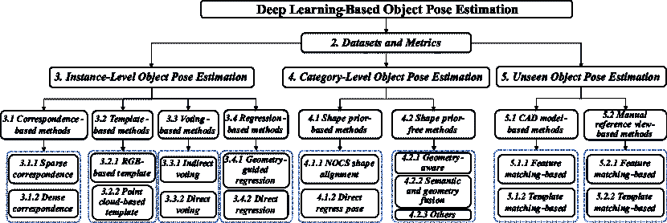

<!--yml

类别: 未分类

日期: 2024-09-06 19:32:49

-->

# [2405.07801] 基于深度学习的目标姿态估计：全面调查

> 来源：[`ar5iv.labs.arxiv.org/html/2405.07801`](https://ar5iv.labs.arxiv.org/html/2405.07801)

# 基于深度学习的目标姿态估计：

全面调查

刘剑，孙伟，杨辉，曾志文，刘冲佩，郑进，刘星宇

Hossein Rahmani、Nicu Sebe 和 Ajmal Mian，刘剑、孙伟、杨辉、曾志文和刘冲佩在湖南大学电气与信息工程学院、国家机器人视觉感知与控制技术工程研究中心以及车辆车身先进设计与制造国家重点实验室工作。电子邮件: (jianliu, wei_sun, huiyang, zingaltern, chongpei56)@hnu.edu.cn。郑进在中南大学建筑与艺术学院工作。电子邮件: zheng.jin@csu.edu.cn。刘星宇在清华大学自动化系工作。电子邮件: liuxy21@mails.tsinghua.edu.cn。Hossein Rahmani 在兰卡斯特大学计算与通信学院工作。电子邮件: h.rahmani@lancaster.ac.uk。Nicu Sebe 在特伦托大学信息工程与计算机科学系工作。电子邮件: sebe@disi.unitn.it。Ajmal Mian 在西澳大学计算机科学系工作。电子邮件: ajmal.mian@uwa.edu.au。本工作在刘剑作为西澳大学访问博士生期间完成，由 Ajmal Mian 教授指导，而刘冲佩在特伦托大学作为访问博士生期间完成，由 Nicu Sebe 教授指导。

###### 摘要

物体姿态估计是一个基础的计算机视觉问题，在增强现实和机器人领域有广泛应用。在过去十年中，由于其卓越的准确性和鲁棒性，深度学习模型逐渐取代了依赖于工程化点对特征的传统算法。然而，当前方法仍面临一些挑战，包括对标记训练数据的依赖、模型紧凑性、在困难条件下的鲁棒性，以及对新出现物体的泛化能力。最近的调查讨论了在该领域不同方面的进展、突出挑战和有前景的未来方向。为了填补这一空白，我们讨论了基于深度学习的物体姿态估计的最新进展，涵盖了该问题的所有三种形式，*即*实例级、类别级和未见物体姿态估计。我们的调查还涵盖了多种输入数据模态、输出姿态的自由度、物体属性和下游任务，为读者提供对该领域的全面理解。此外，它讨论了不同领域的训练范式、推理模式、应用领域、评估指标和基准数据集，并报告了当前最先进方法在这些基准上的表现，从而帮助读者选择最适合其应用的方法。最后，调查确定了关键挑战，回顾了流行趋势及其优缺点，并确定了未来研究的有前景方向。我们还持续跟踪最新的工作，见[Awesome-Object-Pose-Estimation](https://github.com/CNJianLiu/Awesome-Object-Pose-Estimation)。

###### 关键词：

物体姿态估计、深度学习、综合调查、3D 计算机视觉。

## 1 引言

物体姿态估计是一个基本的计算机视觉问题，旨在估计图像中物体相对于捕捉该图像的相机的姿态。物体姿态估计是增强现实[1, 2, 3]、机器人操作[4, 5]、手物体交互[6, 7]等领域的重要技术。根据应用需求，物体姿态可以估计到不同的自由度（DoF），例如仅包括 3D 旋转的 3DoF、额外包括 3D 平移的 6DoF，或除了 3D 旋转和 3D 平移外，还包括估计物体 3D 尺寸的 9DoF。

在深度学习前时代，许多手工制作的基于特征的方法，如 SIFT[8]、FPFH[9]、VFH[10]和点对特征（PPF）[11、12、13、14]，被设计用于对象姿态估计。然而，当面对复杂场景时，这些方法在准确性和鲁棒性上存在缺陷[15、16]。这些传统方法现在已经被数据驱动的基于深度学习的方法所取代，这些方法利用深度神经网络的力量从数据中学习高维特征表示，从而提高了准确性和对复杂环境的鲁棒性。

图 1：实例级、类别级和未见对象方法的比较。实例级方法只能估计特定对象实例的姿态，这些实例是在训练中使用的。类别级方法可以推断出类内未见实例，而不仅仅限于训练数据中的特定实例。相比之下，未见对象姿态估计方法具有更强的泛化能力，可以处理训练过程中未遇到的对象类别。

图 2：本调查的分类。首先，我们回顾用于评估对象姿态估计的数据集和评估指标。接下来，我们将深度学习方法分为三类进行回顾：实例级、类别级和未见方法。实例级方法可以进一步分类为基于对应关系的方法、基于模板的方法、基于投票的方法和基于回归的方法。类别级方法可以进一步分为基于形状先验的方法和无形状先验的方法。未见方法可以进一步分类为基于 CAD 模型的方法和基于手动参考视图的方法。

基于深度学习的目标姿态估计方法可以根据问题的定义分为实例级、类别级和未见目标方法。图 1 展示了这三种方法的比较。早期的方法主要是实例级[16, 17, 18, 19, 20]，用于估计特定目标实例的姿态。实例级方法可以进一步分为基于对应关系、基于模板、基于投票和基于回归的方法。由于实例级方法是在实例特定的数据上训练的，因此可以对给定的目标实例进行高精度的姿态估计。然而，它们的泛化性能较差，因为它们仅适用于训练时的实例。此外，许多实例级方法[18, 21]需要目标的 CAD 模型。认识到这些局限性，Wang *et al.* [22]提出了首个类别级目标姿态和尺寸估计方法。他们将方法推广到类别内的未见目标，无需在推理过程中重新训练和使用 CAD 模型。随后的类别级方法[23, 24, 25, 26, 27]可以分为基于形状先验和无形状先验的方法。虽然这些类别级方法在类别内提高了泛化能力，但仍需收集和标记每个目标类别的大量训练数据。此外，这些方法无法推广到未见的目标类别。为此，一些未见目标姿态估计方法最近被提出[1, 28, 29, 30, 3]，这些方法进一步分为基于 CAD 模型和基于手动参考视图的方法。这些方法进一步增强了目标姿态估计的泛化能力，*即*，它们可以推广到未见的目标而无需重新训练。然而，它们仍需获得目标的 CAD 模型或标注一些目标的参考图像。

尽管物体姿态估计领域取得了显著进展，但当前方法仍面临多个挑战，如依赖标注训练数据、难以推广到新见物体、模型紧凑性以及在具有挑战性的场景中的鲁棒性。为了使读者能够迅速掌握物体姿态估计领域的最新技术（SOTA）并促进该方向的进一步研究，提供所有相关问题表述的详尽回顾至关重要。对现有学术文献的仔细审查揭示了在回顾物体姿态估计的各种问题表述时存在的重大差距。目前的主流综述[31, 32, 33, 34, 35]往往关注狭窄，要么局限于特定的输入模态[32, 33]，要么束缚于特定应用领域[34, 35]。此外，这些综述主要审视实例级和类别级方法，从而忽视了在该领域中最实际的问题表述——未见物体姿态估计。这阻碍了读者对该领域的全面理解。例如，Fan *et al.* [33] 提供了关于基于 RGB 图像的物体姿态估计的宝贵见解。然而，他们的关注点限于单一模态，限制了读者对各种输入模态方法的全面理解。相反，Du *et al.* [34] 专门研究了在机器人抓取任务中的物体姿态估计，这使得读者只能从单一特定应用的角度理解物体姿态估计。

为了解决上述问题，我们在此提供了一个全面的调查，涵盖了基于深度学习的物体姿态估计方法的最新进展。我们的调查涵盖了所有问题的表述，包括实例级、类别级和未见物体姿态估计，旨在为读者提供对该领域的整体理解。此外，我们讨论了不同的领域训练范式、应用领域、评估指标和基准数据集，并报告了最先进的方法在这些基准上的性能，帮助读者选择适合其应用的方法。此外，我们还突出了当前的趋势，讨论了它们的优缺点，并确定了关键挑战和未来研究的有希望的方向。该调查的分类结构如图 2 所示。

我们的主要贡献和亮点如下：

+   •

    我们提供了一个*全面的调研*，涵盖了基于深度学习的物体姿态估计方法。这是*第一个*涵盖该领域所有三种问题表述的调研，包括实例级、类别级和未见物体姿态估计。

+   •

    我们的调研涵盖了流行的输入数据模态（RGB 图像、深度图像、RGBD 图像）、输出姿态中的不同自由度（3DoF、6DoF、9DoF）、物体属性（刚性、关节）用于姿态估计和跟踪任务。覆盖这些方面对于给读者提供完整的视角至关重要，这是现有调研所忽略的，它们只涵盖了这些方面中的一部分。

+   •

    我们讨论了不同领域的训练范式、推理模式、应用领域、评估指标和基准数据集，并报告了现有最先进方法在这些基准上的性能，以帮助读者选择最适合其应用部署的方法。

+   •

    我们突出展示了过去十年中物体姿态估计技术的发展趋势，并讨论了它们的优缺点。我们还识别了物体姿态估计中仍存在的关键挑战，并提出了有前景的研究方向以指导未来的努力。

本文的其余部分组织如下。第二部分回顾了用于评估三类物体姿态估计方法的数据集和指标。接着，在第三部分中回顾实例级方法，第四部分中回顾类别级方法，第五部分中回顾未见物体姿态估计方法。在上述三个部分中，我们还讨论了相关类别中代表性方法的训练范式、推理模式、挑战和流行趋势。接下来，第六部分回顾了物体姿态估计的常见应用。最后，第七部分总结了本文内容，并基于该领域的挑战提供了未来研究方向的展望。

## 2 数据集和指标

基于深度学习的物体姿态估计的进展与挑战性和可靠的大规模数据集的创建和利用密切相关。本节介绍了常用的主流物体姿态估计数据集，按照问题形式分类为实例级、类别级和未见物体姿态估计方法。时间顺序概述见图 3。此外，我们还对相关的评估指标进行了概述。

### 2.1 实例级方法的数据集

由于 BOP 挑战数据集[36] 目前是评估实例级方法的最受欢迎的数据集，我们将实例级数据集分为 BOP 挑战和其他数据集进行概述。

#### 2.1.1 BOP 挑战数据集

Linemod 数据集 (LM)[37] 包含 15 个 RGBD 序列，其中包含带有真实 6DoF 物体姿态的标注 RGBD 图像、物体 CAD 模型、2D 边界框和二值掩码。通常参考 Brachmann *et al.*[38] 的方法，每个序列大约有 15$\%$ 的图像用于训练，其余的 85$\%$ 用于测试。这些序列展示了具有杂乱场景、无纹理物体和变化的光照条件的挑战性场景，使得准确的物体姿态估计变得困难。

Linemod 遮挡数据集 (LM-O)[39] 是 LM 数据集[37] 的扩展，专门用于评估在遮挡场景中的性能。该数据集包含来自 LM 数据集基础序列的 1214 张 RGBD 图像，涵盖 8 个严重遮挡的物体。对于在复杂环境中评估和改进姿态估计算法，这一点至关重要。

IC-MI [40] / IC-BIN 数据集 [41] 有助于无纹理物体姿态估计。IC-MI 包含六个物体：2 个无纹理和 4 个有纹理的家用物品模型。IC-BIN 数据集专门设计用于解决机器人垃圾桶拣货场景中的杂乱和遮挡带来的挑战。IC-BIN 包含 2 个来自 IC-MI 的物体。

RU-APC 数据集 [42] 旨在解决仓库拣货任务中的挑战，并提供丰富的数据用于评估和改进机器人在仓库自动化背景下的感知能力。该数据集包含 10,368 张注册的深度图像和 RGB 图像，涵盖 24 种物体，这些物体以不同姿态放置在仓库货架上的各种箱子中，以模拟多样的实验条件。

YCB-Video 数据集 (YCB-V) [15] 包含 21 个物体，分布在 92 个 RGBD 视频中，每个视频包含 3 到 9 个来自 YCB 物体数据集 [43] 的物体（总共 50 个物体）。它包括 133,827 帧，分辨率为 640$\times$480，非常适合于物体姿态估计和跟踪任务。

T-LESS 数据集 [44] 是一个 RGBD 数据集，专为工业环境中常见的无纹理物体设计。它包含 30 个电气物体，没有明显的纹理或可辨别的颜色属性。此外，它包括不同分辨率的图像。训练集中，图像主要以黑色背景为主，而测试集中则展示了具有不同光照条件和遮挡的多样背景。由于物体缺乏纹理和复杂的环境设置，T-LESS 具有挑战性。

ITODD 数据集 [45] 包括 28 种真实世界工业物体，分布在 800 多个场景中，共约 3,500 张图片。该数据集利用两个工业 3D 传感器和三个高分辨率灰度摄像头来实现场景的多角度观察，为工业物体分析和评估提供了全面详细的数据。

TYO-L / TUD-L 数据集 [36] 关注不同的光照条件。特别是，TYO-L 提供了在 8 种光照条件下观察 3 个物体的场景。这些场景旨在评估姿态估计算法对光照变化的鲁棒性。与 TYO-L 不同，TUD-L 的数据收集方法涉及固定摄像机并手动移动物体，提供了物体物理移动的更现实的表现。

HB 数据集 [46] 包含了不同遮挡和光照条件下的各种场景。它包含 33 个物体，包括 17 个玩具、8 个家庭物品和 8 个与工业相关的物品，分布在 13 个不同的场景中。

HOPE 数据集 [47] 专门为家庭物品设计，包含 28 个玩具杂货物品。HOPE-Image 数据集包括来自 10 个家庭/办公室环境的 50 个场景中的物体。每个场景包含多达 5 种光照变化，如逆光和斜射光，并具有阴影效果。此外，HOPE-Video 数据集包含 10 个视频序列，总计 2,038 帧，每个场景展示了 5 到 20 个物体。

#### 2.1.2 其他数据集

YCBInEOAT 数据集 [48] 旨在用于基于 RGBD 的机器人操控物体姿态跟踪。它包含了双臂机器人操作 YCB 物体 [43] 的自我中心 RGBD 视频。操作类型有 3 种：单臂拾取和放置、臂内操作和臂间拾取与放置。该数据集包含 7449 帧的真实姿态标注，涵盖了 9 个视频中的 5 种不同物体。

ClearPose 数据集 [49] 设计用于透明物体，这些物体在日常生活中广泛存在，由于其模糊的纹理特征和不可靠的深度信息，对视觉感知和传感系统提出了重大挑战。它包括超过 35 万张真实世界的 RGBD 图像和 500 万个实例标注，涵盖了 63 种家居物品。

MP6D 数据集 [50] 是一个 RGBD 数据集，专为金属部件的物体姿态估计设计，包含 20 个无纹理的金属组件。它由 20,100 张真实世界的图像组成，这些图像包含从各种场景中收集的物体姿态标签以及 50K 张合成图像，涵盖了杂乱和遮挡的场景。

图 3：用于物体姿态估计评估的数据集的时间顺序概览。特别地，粉色箭头代表 BOP Challenge 数据集，可以用于评估实例级别和未见物体的方法。红色参考表示关节物体的数据集。从中我们还可以看到物体姿态估计领域的发展趋势，即从实例级别的方法到类别级别和未见方法。

### 2.2 类别级方法的数据集

在这一部分中，我们将类别级数据集分为刚性和关节物体数据集进行详细说明。

#### 2.2.1 刚性物体数据集

CAMERA25 数据集 [22] 包含了 1085 个实例，分为 6 个物体类别：碗、瓶子、罐子、相机、杯子和笔记本电脑。值得注意的是，CAMERA25 中的物体 CAD 模型来自合成的 ShapeNet 数据集 [51]。每张图像中包含多个实例，附有分割掩码和 9DoF 姿态标签。

REAL275 数据集 [22] 是一个真实世界的数据集，包括 18 个视频和大约 8000 张 RGBD 图像。该数据集分为三个子集：训练集（7 个视频）、验证集（5 个视频）和测试集（6 个视频）。它包括 42 个物体实例，涵盖 6 个类别，与 CAMERA25 数据集中的类别一致。REAL275 是一个重要的真实世界数据集，广泛用于学术研究中的类别级物体姿态估计。

kPAM 数据集 [52] 专为机器人应用量身定制，强调关键点的使用。值得注意的是，它采用了 3D 重建的方法，然后在这些重建上进行手动关键点标注。kPAM 总共有 117 个训练序列和 245 个测试序列，提供了大量数据用于训练和评估与机器人感知和操作相关的算法。

TOD 数据集 [53] 包含 15 个透明物体，分为 6 个类别，每个物体都标注了相关的 3D 关键点。它涵盖了 48K 张立体和 RGBD 图像，捕捉了透明和不透明深度变化。TOD 数据集的主要焦点是透明 3D 物体应用，为在涉及透明度的挑战性场景中的物体检测和姿态估计任务提供了重要资源。

Objectron 数据集 [54] 包含 15K 个标注的视频片段和超过 4M 张标注图像，涉及瓶子、书籍、单车、相机、椅子、谷物盒、杯子、笔记本电脑和鞋子等类别。该数据集来源于跨越 5 大洲的 10 个国家，确保了地理上的多样性。由于其丰富的内容，对于评估基于 RGB 的类别级物体姿态估计和跟踪方法极具优势。

Wild6D 数据集 [55] 是一个大规模的真实世界数据集，用于评估自监督类别级物体姿态估计方法。它仅提供 486 个测试视频的注释，背景多样，展示了 162 个物体，涵盖 5 个类别（不包括 CAMERA25 和 REAL275 数据集中找到的“罐子”类别）。

PhoCaL 数据集 [56] 包括 RGBD 和 RGB-P（偏振）模式。它由 60 个精心制作的 3D 模型组成，代表家庭物体，包括对称、透明和反射物品。PhoCaL 专注于 8 个特定物体类别，共 24 个序列，故意引入了遮挡和杂乱等挑战。

HouseCat6D 数据集 [57] 是一个综合数据集，旨在进行多模态类别级物体姿态估计和抓取任务。该数据集涵盖了广泛的家庭物体类别，包含 194 个高质量的 3D 模型。它包括具有不同光度复杂度的物体，例如透明和反射物品，并涵盖了 41 个具有多样视角的场景。该数据集特别策划以应对物体姿态估计中的挑战，包括遮挡和标记缺失，使其适合于在现实世界条件下评估算法。

#### 2.2.2 关节物体数据集

BMVC 数据集 [58] 包括 4 种关节物体：笔记本电脑、橱柜、储物柜和玩具火车。每个物体被建模为一个由组件和互联头部组成的运动链。关节限制为一个旋转自由度和一个平移自由度。该数据集提供了 CAD 模型和附带的文本文件，详细说明了每个物体的基础运动链结构的拓扑。

RBO 数据集 [59] 包含 14 种在人工环境中常见的关节物体，具有 358 个交互序列，总共 67 分钟的手动操作记录，涵盖了不同的实验条件，包括交互类型、照明、视角和背景设置的变化。

HOI4D 数据集 [60] 对于推进类别级人类-物体互动的研究至关重要。它包含 240 万个 RGBD 自中心视频帧，描绘了超过 9 名参与者和 800 个物体实例之间的互动。这些实例被分为 16 类，包括 7 类刚性物体和 9 类关节物体。

ReArtMix / ReArtVal 数据集 [61] 旨在解决部分级多关节物体姿态估计所面临的挑战，这些物体具有未知的运动学结构。ReArtMix 数据集包括超过 100,000 张 RGBD 图像，这些图像呈现在各种背景场景中。ReArtVal 数据集包含 6 个现实世界的桌面场景，总计超过 6,000 张 RGBD 帧。

ContactArt 数据集 [62] 使用远程操作系统 [63] 在模拟环境中操作关节物体生成。该系统利用智能手机和笔记本电脑精确标注姿态和接触信息。此数据集包含 5 种常见类别的关节物体：笔记本电脑、抽屉、保险箱、微波炉和垃圾桶，总计 80 个实例。所有物体模型均来源于 PartNet 数据集 [64]，从而促进了可扩展性。

### 2.3 未见方法的数据集

当前评估未见方法的主流数据集是 BOP Challenge 数据集，详见 Sec. 2.1.1。除了这些 BOP Challenge 数据集外，还有一些数据集是专门为评估手动参考视图方法设计的。

MOPED 数据集 [65] 是一个无模型物体姿态估计数据集，涵盖 11 种家庭物体。它包括参考和测试图像，涵盖物体的所有视角。测试序列中的每个物体在五种不同的环境中进行描绘，每种物体大约有 300 张测试图像。

GenMOP 数据集 [1] 包含 10 种物体，从平面物体到薄结构物体不等。每种物体都有两段视频序列，这些视频序列采集于不同的背景和光照条件下。每段视频序列由大约 200 张图像组成。

OnePose 数据集 [66] 包含超过 450 段真实世界的视频序列，涵盖 150 种物体。这些序列在各种背景条件下采集，并捕捉物体的所有角度。每个环境的平均时长为 30 秒。数据集随机分为训练集和验证集。

OnePose-LowTexture 数据集[2]作为对现有 OnePose 数据集[66]测试集的补充被引入，该数据集主要包含纹理丰富的物体。该数据集包含 40 个低纹理的家用物品。每个物品有两个视频序列：一个作为参考视频，另一个用于测试。每个视频的分辨率为 1920$\times$1440，30 帧每秒（FPS），时长约为 30 秒。

### 2.4 评估指标

在这一部分，我们将评估指标分为 3DoF、6DoF、9DoF 及其他评估指标，以便进行全面的概述。

#### 2.4.1 3DoF 评估指标

地面真实值与预测的 3D 旋转之间的测地距离[67]是常用的 3DoF 姿态估计指标。计算两个旋转矩阵之间的角度误差可以直观地评估它们的相对偏差。它可以被表述如下：

|  | $\begin{array}[]{l}d\left({R_{gt}},R\right)=\arccos\left(\frac{{tr}\left({R_{gt}}^{\top}R\right)-1}{2}\right)/\pi\end{array},\vspace{-0.5em}$ |  | (1) |
| --- | --- | --- | --- |

其中，${R_{gt}}$和$R$分别表示地面真实值和预测的 3D 旋转。$\top$表示矩阵的转置。$tr$表示矩阵的迹，即主对角线元素的总和。通常，3D 旋转估计的准确度定义为角度误差低于特定阈值且预测类别正确的对象的百分比。它可以被表述如下：

|  | <math   alttext="Acc.=\left\{{\begin{array}[]{*{20}{c}}{1,}\\ {0,}\end{array}}\right.\begin{array}[]{*{20}{c}}{{\rm{if}}\begin{array}[]{*{20}{c}}{d({R_{gt}},R)<\lambda\begin{array}[]{*{20}{c}}{{\rm{and}}}\end{array}c=c_{gt}}\end{array}}\\

{{\rm{otherwise}}}\end{array}," display="block"><semantics ><mrow ><mi >A</mi><mi >c</mi><mi >c</mi><mo lspace="0em" rspace="0.0835em" >.</mo><mo lspace="0.0835em" rspace="0.0835em" >=</mo><mrow ><mo >{</mo><mtable columnspacing="5pt" displaystyle="true" rowspacing="0pt" ><mtr ><mtd ><mrow ><mn >1</mn><mo >,</mo></mrow></mtd></mtr><mtr ><mtd ><mrow ><mn >0</mn><mo >,</mo></mrow></mtd></mtr></mtable><mtable columnspacing="5pt" displaystyle="true" rowspacing="0pt" ><mtr ><mtd ><mrow ><mi >if</mi><mo lspace="0.167em" rspace="0em" >​</mo><mtable columnspacing="5pt" displaystyle="true" ><mtr ><mtd ><mrow ><mrow ><mi >d</mi><mo lspace="0em" rspace="0em" >​</mo><mrow ><mo stretchy="false" >(</mo><msub ><mi >R</mi><mrow ><mi >g</mi><mo lspace="0em" rspace="0em" >​</mo><mi >t</mi></mrow></msub><mo >,</mo><mi >R</mi><mo stretchy="false" >)</mo></mrow></mrow><mo ><</mo><mrow ><mi >λ</mi><mo lspace="0.167em" rspace="0em" >​</mo><mtable columnspacing="5pt" displaystyle="true" ><mtr ><mtd ><mi >and</mi></mtd></mtr></mtable><mo lspace="0.167em" rspace="0em" >​</mo><mi >c</mi></mrow><mo >=</mo><msub ><mi >c</mi><mrow ><mi >g</mi><mo lspace="0em" rspace="0em" >​</mo><mi >t</mi></mrow></msub></mrow></mtd></mtr></mtable></mrow></mtd></mtr><mtr ><mtd ><mi >otherwise</mi></mtd></mtr></mtable><mo lspace="0.167em" >,</mo></mrow></mrow><annotation encoding="application/x-tex" >Acc.=\left\{{\begin{array}[]{*{20}{c}}{1,}\\ {0,}\end{array}}\right.\begin{array}[]{*{20}{c}}{{\rm{if}}\begin{array}[]{*{20}{c}}{d({R_{gt}},R)<\lambda\begin{array}[]{*{20}{c}}{{\rm{and}}}\end{array}c=c_{gt}}\end{array}}\\ {{\rm{otherwise}}}\end{array},</annotation></semantics></math> |  | (2) |

其中 $c$、$c_{gt}$ 和 $\lambda$ 分别表示预测类别、真实类别和预定义阈值。

#### 2.4.2 6DoF 评估指标

目前，BOP 指标（*BOP-M*）[36] 是最受欢迎的指标，它是可见表面差异（VSD）、最大对称感知表面距离（MSSD）和最大对称感知投影距离（MSPD）指标的平均召回率（*AR*）。具体而言，VSD [36] 指标通过仅测量可见物体表面的错位，将形状不可区分的姿势视为等效。它可以表示为：

|  | <math   alttext="\begin{array}[]{l}{e_{VSD}}\left({\hat{D},\bar{D},\hat{V},\bar{V},\tau}\right)=\\ av{g_{p\in\hat{V}\cup\bar{V}}}\left\{{\begin{array}[]{*{20}{l}}{0,}\\

{1,}\end{array}}\right.\begin{array}[]{*{20}{l}}{{\rm{if}}\begin{array}[]{*{20}{l}}{p\in\hat{V}\cap\bar{V}\wedge&#124;\hat{D}\left(p\right)-\bar{D}\left(p\right)&#124;<\tau}\end{array}}\\

{{\rm{否则}}}\end{array},\end{array}\vspace{-0.5em}" display="block"><semantics ><mtable displaystyle="true" rowspacing="0pt" ><mtr  ><mtd columnalign="left"  ><mrow ><mrow ><msub  ><mi >e</mi><mrow ><mi >V</mi><mo lspace="0em" rspace="0em" >​</mo><mi >S</mi><mo lspace="0em" rspace="0em" >​</mo><mi >D</mi></mrow></msub><mo lspace="0em" rspace="0em" >​</mo><mrow ><mo  >(</mo><mover accent="true"  ><mi >D</mi><mo  >^</mo></mover><mo >,</mo><mover accent="true"  ><mi >D</mi><mo  >¯</mo></mover><mo >,</mo><mover accent="true"  ><mi >V</mi><mo  >^</mo></mover><mo >,</mo><mover accent="true"  ><mi >V</mi><mo  >¯</mo></mover><mo >,</mo><mi >τ</mi><mo >)</mo></mrow></mrow><mo >=</mo></mrow></mtd></mtr><mtr ><mtd  columnalign="left" ><mrow  ><mrow ><mi >a</mi><mo lspace="0em" rspace="0em" >​</mo><mi >v</mi><mo lspace="0em" rspace="0em" >​</mo><msub ><mi >g</mi><mrow ><mi >p</mi><mo >∈</mo><mrow ><mover accent="true" ><mi >V</mi><mo >^</mo></mover><mo >∪</mo><mover accent="true" ><mi >V</mi><mo >¯</mo></mover></mrow></mrow></msub><mo lspace="0em" rspace="0em"  >​</mo><mrow ><mo >{</mo><mtable columnspacing="5pt" displaystyle="true" rowspacing="0pt" ><mtr  ><mtd columnalign="left"  ><mrow ><mn >0</mn><mo >,</mo></mrow></mtd></mtr><mtr ><mtd  columnalign="left" ><mrow ><mn  >1</mn><mo >,</mo></mrow></mtd></mtr></mtable></mrow><mo lspace="0.167em" rspace="0em"  >​</mo><mtable columnspacing="5pt" displaystyle="true" rowspacing="0pt" ><mtr  ><mtd columnalign="left"  ><mrow ><mi >如果</mi><mo lspace="0.167em" rspace="0em"  >​</mo><mtable columnspacing="5pt" displaystyle="true"  ><mtr ><mtd columnalign="left" ><mrow ><mi >p</mi><mo >∈</mo><mrow ><mrow ><mover accent="true" ><mi >V</mi><mo >^</mo></mover><mo >∩</mo><mover accent="true" ><mi >V</mi><mo >¯</mo></mover></mrow><mo >∧</mo><mrow ><mo stretchy="false"  >&#124;</mo><mrow ><mrow ><mover accent="true"  ><mi >D</mi><mo >^</mo></mover><mo lspace="0em" rspace="0em" >​</mo><mrow ><mo >(</mo><mi >p</mi><mo >)</mo></mrow></mrow><mo >−</mo><mrow ><mover accent="true"  ><mi >D</mi><mo >¯</mo></mover><mo lspace="0em" rspace="0em" >​</mo><mrow ><mo >(</mo><mi >p</mi><mo >)</mo></mrow></mrow></mrow><mo stretchy="false"  >&#124;</mo></mrow></mrow><mo ><</mo><mi >τ</mi></mrow></mtd></mtr></mtable></mrow></mtd></mtr><mtr ><mtd columnalign="left"  ><mi >否则</mi></mtd></mtr></mtable></mrow><mo lspace="0.167em"  >,</mo></mrow></mtd></mtr></mtable><annotation-xml encoding="MathML-Content" ><matrix  ><matrixrow ><apply ><apply  ><apply ><csymbol cd="ambiguous" >subscript</csymbol><ci >𝑒</ci><apply ><ci >𝑉</ci><ci >𝑆</ci><ci >𝐷</ci></apply></apply><vector ><apply  ><ci >^</ci><ci >𝐷</ci></apply><apply ><ci  >¯</ci><ci >𝐷</ci></apply><apply ><ci >^</ci><ci  >𝑉</ci></apply><apply ><ci >¯</ci><ci  >𝑉</ci></apply><ci >𝜏</ci></vector></apply><csymbol cd="latexml"  >absent</csymbol></apply></matrixrow><matrixrow ><apply ><ci  >𝑎</ci><ci >𝑣</ci><apply ><csymbol cd="ambiguous"  >subscript</csymbol><ci >𝑔</ci><apply ><ci >𝑝</ci><apply ><apply ><ci >^</ci><ci >𝑉</ci></apply><apply ><ci >¯</ci><ci >𝑉</ci></apply></apply></apply></apply></apply></apply><apply ><csymbol cd="latexml"  >cases</csymbol><matrix ><matrixrow ><cn type="integer" >0</cn><cerror ><csymbol cd="ambiguous" >missing-subexpression</csymbol></cerror><cerror ><csymbol cd="ambiguous" >missing-subexpression</csymbol></cerror><cerror ><csymbol cd="ambiguous" >missing-subexpression</csymbol></cerror><cerror ><csymbol cd="ambiguous" >missing-subexpression</csymbol></cerror><cerror ><csymbol cd="ambiguous" >missing-subexpression</csymbol></cerror><cerror ><csymbol cd="ambiguous" >missing-subexpression</csymbol></cerror><cerror ><csymbol cd="ambiguous" >missing-subexpression</csymbol></cerror><cerror ><csymbol cd="ambiguous" >missing-subexpression</csymbol></cerror><cerror ><csymbol cd="ambiguous" >missing-subexpression</csymbol></cerror><cerror ><csymbol cd="ambiguous" >missing-subexpression</csymbol></cerror><cerror ><csymbol cd="ambiguous" >missing-subexpression</csymbol></cerror><cerror ><csymbol cd="ambiguous" >missing-subexpression</csymbol></cerror><cerror ><csymbol cd="ambiguous" >missing-subexpression</csymbol></cerror><cerror ><csymbol cd="ambiguous" >missing-subexpression</csymbol></cerror><cerror ><csymbol cd="ambiguous" >missing-subexpression</csymbol></cerror><cerror ><csymbol cd="ambiguous" >missing-subexpression</csymbol></cerror><cerror ><csymbol cd="ambiguous" >missing-subexpression</csymbol></cerror><cerror ><csymbol cd="ambiguous" >missing-subexpression</csymbol></cerror><cerror ><csymbol cd="ambiguous" >missing-subexpression</csymbol></cerror></matrixrow><matrixrow ><cn type="integer" >1</cn><cerror ><csymbol cd="ambiguous" >missing-subexpression</csymbol></cerror><cerror ><csymbol cd="ambiguous" >missing-subexpression</csymbol></cerror><cerror ><csymbol cd="ambiguous" >missing-subexpression</csymbol></cerror><cerror ><csymbol cd="ambiguous" >missing-subexpression</csymbol></cerror><cerror ><csymbol cd="ambiguous" >missing-subexpression</csymbol></cerror><cerror ><csymbol cd="ambiguous" >missing-subexpression</csymbol></cerror><cerror ><csymbol cd="ambiguous" >missing-subexpression</csymbol></cerror><cerror ><csymbol cd="ambiguous" >missing-subexpression</csymbol></cerror><cerror ><csymbol cd="ambiguous" >missing-subexpression</csymbol></cerror><cerror ><csymbol cd="ambiguous" >missing-subexpression</csymbol></cerror><cerror ><csymbol cd="ambiguous" >missing-subexpression</csymbol></cerror><cerror ><csymbol cd="ambiguous" >missing-subexpression</csymbol

其中符号 $\hat{D}$ 和 $\bar{D}$ 分别表示通过渲染对象模型 $M$ 在两种不同姿态下生成的距离图：$\hat{P}$（估计姿态）和 $\bar{P}$（真实姿态）。在这些图中，每个像素 $p$ 存储从相机中心到投影到 $p$ 的 3D 点 ${{\rm{x}}_{p}}$ 的距离。这些距离值来源于深度图，这是像 Kinect 这样的传感器的典型输出，包含了 ${{\rm{x}}_{p}}$ 的 $Z$ 坐标。这些距离图与测试图像 $I$ 的距离图 ${D_{I}}$ 进行比较，以得出可见性掩模 $\hat{V}$ 和 $\bar{V}$。这些掩模识别模型 $M$ 在图像 $I$ 中可见的像素。参数 $\tau$ 表示对齐误差的容忍度。此外，MSSD [36] 度量指标是确定机器人操作成功可能性的合适因素，不受物体几何形状或表面采样密度的显著影响。它可以表示如下：

|  | ${e_{MSSD}}\left({\hat{P},\bar{P},{S_{M}},{V_{M}}}\right)={\min_{S\in{S_{M}}}}{\max_{{\rm{x}}\in{V_{M}}}}{\left\|{\hat{P}{\rm{x}}-\bar{P}S{\rm{x}}}\right\|_{2}},$ |  | (4) |
| --- | --- | --- | --- |

其中，集合 ${{S_{M}}}$ 包含了对象模型 $M$ 的全局对称变换，而 ${{V_{M}}}$ 代表模型的顶点。此外，MSPD [36] 度量指标非常适合用于评估增强现实中的仅 RGB 方法，重点关注可感知的差异，并排除了沿光学 (Z) 轴的对齐，可以表示如下：

|  | $\begin{array}[]{l}{e_{MSPD}}\left({\hat{P},\bar{P},{S_{M}},{V_{M}}}\right)=\\ {\min_{S\in{S_{M}}}}{\max_{{\rm{x}}\in{V_{M}}}}{\left\|{proj\left({\hat{P}{\rm{x}}}\right)-proj\left({\bar{P}S{\rm{x}}}\right)}\right\|_{2}},\end{array}\vspace{-0.5em}$ |  | (5) |
| --- | --- | --- | --- |

其中函数 $proj()$ 代表 2D 投影（像素级），其他符号在 MSSD 中具有相同的含义。

除了 *BOP-M* 外，平均点距离 (ADD)[37] 和平均最近点距离 (ADD-S)[37] 也常用于评估 6DoF 物体姿态估计的性能。它们可以通过计算对象 CAD 模型上对应点之间的平均距离，直观地量化估计姿态与真实姿态之间的几何误差。具体来说，ADD 度量指标是为非对称物体设计的，而 ADD-S 度量指标则是专门为对称物体设计的。给定真实旋转 ${R_{gt}}$ 和平移 ${t_{gt}}$ 以及估计旋转 $R$ 和平移 $t$，ADD 计算 3D 模型点 ${x\in O}$ 之间的平均成对距离，这些点对应于真实和估计姿态之间的变换：

|  | $ADD=\mathop{avg}\limits_{x\in O}\left\|{\left({{R_{gt}}x+{t_{gt}}}\right)-\left({Rx+t}\right)}\right\|.$\vspace{-0.5em}$ |  | (6) |
| --- | --- | --- | --- |

对于对称物体，某些视角下的点匹配本质上是模糊的。因此，平均距离是通过以下方式计算最近点距离的：

|  | $ADD{\rm{-}}S=\mathop{avg}\limits_{{x_{1}}\in O}\mathop{\min}\limits_{{x_{2}}\in O}\left\&#124;{\left({{R_{gt}}{x_{1}}+{t_{gt}}}\right)-\left({R{x_{2}}+t}\right)}\right\&#124;.\vspace{-0.5em}$ |  | (7) |
| --- | --- | --- | --- |

与此同时，ADD 和 ADD-S 曲线下的面积（AUC）通常用于评估。具体来说，如果 ADD 和 ADD-S 小于给定阈值，则预测的姿态将被视为正确。此外，还有许多方法 [68, 69, 70] 使用 ADD 和 ADD-S 分别评估非对称和对称物体。这个指标被称为 ADD(S)。

此外，$n^{\circ}$$m{\rm{cm}}$ [71] 也是当前一种广泛使用的评估指标（特别是在类别级别的物体姿态估计中）。它直接量化预测的 3D 旋转和 3D 平移的误差。如果物体姿态预测的旋转误差低于阈值 $n^{\circ}$，且平移误差低于阈值 $m{\rm{cm}}$，则认为其为正确。它可以定义为如下的指示函数：

|  | <math   alttext="\vspace{-0.5em}{I_{{n^{\circ}}m{\rm{cm}}}}({e_{R}},{e_{t}})=\left\{{\begin{array}[]{*{20}{c}}{1,}\\ {0,}\end{array}}\right.\begin{array}[]{*{20}{c}}{{\rm{if}}\begin{array}[]{*{20}{c}}{{e_{R}}<{n^{\circ}}\begin{array}[]{*{20}{c}}{{\rm{and}}}\end{array}{e_{t}}<m{\rm{cm}}}\end{array}}\\

{{\rm{否则}}}\end{array}," display="block"><semantics ><mrow ><mrow  ><mrow ><msub ><mi  >I</mi><mrow ><msup ><mi  >n</mi><mo >∘</mo></msup><mo lspace="0em" rspace="0em"  >​</mo><mi >m</mi><mo lspace="0em" rspace="0em"  >​</mo><mi >cm</mi></mrow></msub><mo lspace="0em" rspace="0em"  >​</mo><mrow ><mo stretchy="false" >(</mo><msub ><mi  >e</mi><mi >R</mi></msub><mo >,</mo><msub ><mi  >e</mi><mi >t</mi></msub><mo stretchy="false"  >)</mo></mrow></mrow><mo >=</mo><mrow ><mrow  ><mo >{</mo><mtable columnspacing="5pt" displaystyle="true" rowspacing="0pt"  ><mtr ><mtd  ><mrow ><mn >1</mn><mo  >,</mo></mrow></mtd></mtr><mtr ><mtd  ><mrow ><mn >0</mn><mo  >,</mo></mrow></mtd></mtr></mtable></mrow><mo lspace="0.167em" rspace="0em"  >​</mo><mtable columnspacing="5pt" displaystyle="true" rowspacing="0pt" ><mtr  ><mtd ><mrow ><mi  >if</mi><mo lspace="0.167em" rspace="0em"  >​</mo><mtable columnspacing="5pt" displaystyle="true"  ><mtr ><mtd ><mrow ><msub ><mi >e</mi><mi >R</mi></msub><mo ><</mo><mrow ><msup ><mi >n</mi><mo >∘</mo></msup><mo lspace="0.167em" rspace="0em"  >​</mo><mtable columnspacing="5pt" displaystyle="true" ><mtr ><mtd ><mi >and</mi></mtd></mtr></mtable><mo lspace="0.167em" rspace="0em"  >​</mo><msub ><mi >e</mi><mi >t</mi></msub></mrow><mo ><</mo><mrow ><mi >m</mi><mo lspace="0em" rspace="0em"  >​</mo><mi >cm</mi></mrow></mrow></mtd></mtr></mtable></mrow></mtd></mtr><mtr ><mtd ><mi  >否则</mi></mtd></mtr></mtable></mrow></mrow><mo lspace="0.167em"  >,</mo></mrow><annotation-xml encoding="MathML-Content" ><apply  ><apply ><apply ><csymbol cd="ambiguous" >subscript</csymbol><ci >𝐼</ci><apply  ><apply ><csymbol cd="ambiguous" >superscript</csymbol><ci >𝑛</ci></apply><ci >𝑚</ci><ci >cm</ci></apply></apply><interval closure="open" ><apply ><csymbol cd="ambiguous" >subscript</csymbol><ci >𝑒</ci><ci >𝑅</ci></apply><apply ><csymbol cd="ambiguous" >subscript</csymbol><ci >𝑒</ci><ci >𝑡</ci></apply></interval></apply><apply ><apply  ><csymbol cd="latexml"  >cases</csymbol><matrix ><matrixrow ><cn type="integer"  >1</cn><cerror ><csymbol cd="ambiguous" >missing-subexpression</csymbol></cerror><cerror ><csymbol cd="ambiguous"  >missing-subexpression</csymbol></cerror><cerror ><csymbol cd="ambiguous" >missing-subexpression</csymbol></cerror><cerror ><csymbol cd="ambiguous"  >missing-subexpression</csymbol></cerror><cerror ><csymbol cd="ambiguous" >missing-subexpression</csymbol></cerror><cerror ><csymbol cd="ambiguous"  >missing-subexpression</csymbol></cerror><cerror ><csymbol cd="ambiguous" >missing-subexpression</csymbol></cerror><cerror ><csymbol cd="ambiguous"  >missing-subexpression</csymbol></cerror><cerror ><csymbol cd="ambiguous" >missing-subexpression</csymbol></cerror><cerror ><csymbol cd="ambiguous"  >missing-subexpression</csymbol></cerror><cerror ><csymbol cd="ambiguous" >missing-subexpression</csymbol></cerror><cerror ><csymbol cd="ambiguous"  >missing-subexpression</csymbol></cerror><cerror ><csymbol cd="ambiguous" >missing-subexpression</csymbol></cerror><cerror ><csymbol cd="ambiguous"  >missing-subexpression</csymbol></cerror><cerror ><csymbol cd="ambiguous" >missing-subexpression</csymbol></cerror><cerror ><csymbol cd="ambiguous"  >missing-subexpression</csymbol></cerror><cerror ><csymbol cd="ambiguous" >missing-subexpression</csymbol></cerror><cerror ><csymbol cd="ambiguous"  >missing-subexpression</csymbol></cerror><cerror ><csymbol cd="ambiguous" >missing-subexpression</csymbol></cerror></matrixrow><matrixrow ><cn type="integer" >0</cn><cerror  ><csymbol cd="ambiguous"  >missing-subexpression</csymbol></cerror><cerror ><csymbol cd="ambiguous" >missing-subexpression</csymbol></cerror><cerror ><csymbol cd="ambiguous"  >missing-subexpression</csymbol></cerror><cerror ><csymbol cd="ambiguous" >missing-subexpression</csymbol></cerror><cerror ><csymbol cd="ambiguous"  >missing-subexpression</csymbol></cerror><cerror ><csymbol cd="ambiguous" >missing-subexpression</csymbol></cerror><cerror ><csymbol cd="ambiguous"  >missing-subexpression</csymbol></cerror><cerror ><csymbol cd="ambiguous" >missing-subexpression</csymbol></cerror><cerror ><csymbol cd="ambiguous"  >missing-subexpression</csymbol></cerror><cerror ><csymbol cd="ambiguous" >missing-subexpression</csymbol></cerror><cerror ><csymbol cd="ambiguous"  >missing-subexpression</csymbol></cerror><cerror ><csymbol cd="ambiguous" >missing-subexpression</csymbol></cerror><cerror ><csymbol cd="ambiguous"  >missing-subexpression</csymbol></cerror><cerror ><csymbol cd="ambiguous" >missing-subexpression</csymbol></cerror><cerror ><csymbol cd="ambiguous"  >missing-subexpression</csymbol></cerror><cerror ><csymbol cd="ambiguous" >missing-subexpression</csymbol></cerror><cerror ><csymbol cd="ambiguous"  >missing-subexpression</csymbol></cerror><cerror ><csymbol cd="ambiguous" >missing-subexpression</csymbol></cerror></matrixrow></matrix></apply><matrix ><matrixrow ><apply  ><ci >if</ci><matrix ><matrixrow ><apply ><apply ><apply ><csymbol cd="ambiguous"  >subscript</csymbol><ci >𝑒</ci><ci >𝑅</ci></apply><apply ><apply ><csymbol cd="ambiguous"  >superscript</csymbol><ci >𝑛</ci></apply><matrix ><matrixrow ><ci >and</ci><cerror ><csymbol cd="ambiguous"  >missing-subexpression</csymbol></cerror><cerror ><csymbol cd="ambiguous" >missing-subexpression</csymbol></cerror><cerror ><csymbol cd="ambiguous"  >missing-subexpression</csymbol></cerror><cerror ><csymbol cd="ambiguous" >missing-subexpression</csymbol></cerror><cerror ><csymbol cd="ambiguous"  >missing-subexpression</csymbol></cerror><cerror ><csymbol cd="ambiguous" >missing-subexpression</csymbol></cerror><cerror ><csymbol cd="ambiguous"  >missing-subexpression</csymbol></cerror><cerror ><csymbol cd="ambiguous" >missing-subexpression</csymbol></cerror><cerror ><csymbol cd="ambiguous"  >missing-subexpression</csymbol></cerror><cerror ><csymbol cd="ambiguous" >missing-subexpression</csymbol></cerror><cerror ><csymbol cd="ambiguous"  >missing-subexpression</csymbol></cerror><cerror ><csymbol cd="ambiguous" >missing-subexpression</csymbol></

其中 ${{e_{R}}}$ 和 ${{e_{t}}}$ 分别表示估计值和真实值之间的旋转误差和平移误差。

此外，与直接比较三维空间中的 6 自由度姿态相比，2D 投影度量 [38] 的简单性和实用性使其也适合用于评估，它量化了在估计的物体姿态和真实姿态下，CAD 模型点的平均投影距离。如果投影距离小于 5 像素，则认为姿态是正确的。

#### 2.4.3 9 自由度评估指标

$Io{U_{3D}}$ 表示真实值和预测的三维边界框之间的交并比（IoU）[22]百分比，能够评估 6 自由度姿态估计和 3 自由度尺寸估计。其表达式为：

|  | $Io{U_{3D}}=\frac{{{P_{B}}\cap{G_{B}}}}{{{P_{B}}\cup{G_{B}}}},\vspace{-0.5em}$ |  | (9) |
| --- | --- | --- | --- |

其中 ${{G_{B}}}$ 和 ${{P_{B}}}$ 分别表示真实值和预测的三维边界框。符号 $\cap$ 和 $\cup$ 分别表示交集和并集。预测物体姿态的正确性取决于 $Io{U_{3D}}$ 值是否超过预定义的阈值。

#### 2.4.4 其他度量

由于一些基于归一化物体坐标空间（NOCS）形状对齐的类别级方法在估计物体姿态之前重建了三维物体形状，因此通常利用 Chamfer 距离（CD）度量[72]来评估这些方法的 NOCS 形状重建精度，因为 CD 度量不仅捕捉全局形状偏差，还对局部形状差异敏感。

|  | ${D_{cd}}=\sum\limits_{x\in N}{\mathop{\min}\limits_{y\in{M_{gt}}}}\parallel x-y\parallel_{2}^{2}+\sum\limits_{y\in{M_{gt}}}{\mathop{\min}\limits_{x\in N}}\parallel x-y\parallel_{2}^{2},\vspace{-0.5em}$ |  | (10) |
| --- | --- | --- | --- |

其中 $N$ 和 $M_{gt}$ 分别表示重建的 NOCS 形状和真实值。

## 3 实例级物体姿态估计

实例级物体姿态估计描述了估计在模型训练过程中见过的物体姿态的任务。我们将现有的实例级方法分为四类：对应关系基础方法（Sec. 3.1）、模板基础方法（Sec. 3.2）、投票基础方法（Sec. 3.3）和回归基础方法（Sec. 3.4）方法。

### 3.1 基于对应的方法

基于对应的物体姿态估计指的是涉及识别输入数据与给定完整物体 CAD 模型之间的对应关系的技术。基于对应的方法可以分为稀疏对应和密集对应。稀疏对应方法（见第 3.1.1 节）涉及在输入图像或点云中检测物体关键点，以建立输入数据与物体 CAD 模型之间的 2D-3D 或 3D-3D 对应关系，然后利用透视-n-点（PnP）算法[73]或最小二乘法来确定物体姿态。密集对应方法（见第 3.1.2 节）旨在建立密集的 2D-3D 或 3D-3D 对应关系，从而实现更准确的物体姿态估计。对于 RGB 图像，它们利用每个像素或多个补丁生成逐像素对应关系，而对于点云，它们使用整个点云来寻找逐点对应关系。这两种方法的示意图见图 4。一些代表性方法的属性和性能显示在表 I。

#### 3.1.1 稀疏对应方法

作为一种代表性方法，Rad *et al.*[74] 首先使用了分割方法来检测 RGB 图像中的感兴趣对象。然后，他们预测了对象 3D 边界框角点的 2D 投影。最后，他们使用 PnP 算法[73] 来估计对象姿态。此外，他们还采用了分类器实时确定姿态范围，解决了对称对象的模糊问题。Tekin *et al.*[75] 提出了一个受 YOLO[76] 启发的 CNN 网络，用于整合对象检测和姿态估计，直接预测 3D 对象边界框的投影顶点位置。与 [74] 和 [75] 不同，Pavlakos *et al.*[77] 预测了预定义语义关键点的 2D 投影。Doosti *et al.*[78] 介绍了一个由两个自适应图卷积神经网络（GCNNs）[79] 组成的紧凑模型，这两个网络协作以估计对象和手部姿态。为了进一步增强对象姿态估计的鲁棒性，Song *et al.*[80] 采用了一种混合中间表示来传达输入图像中的几何细节，包括关键点、边缘向量和对称性对应。Liu *et al.*[81] 提出了一个多方向特征金字塔网络，并且通过结合空间和平面信息的方法来计算对象姿态估计的置信度。Hu et al.[82] 介绍了一个单阶段分层端到端可训练的网络，以解决航空航天对象在尺度变化下的姿态估计挑战。在最近的发展中，Lian *et al.*[83] 增加了预定义 3D 关键点的数量，以增强对应关系的建立。此外，他们设计了一种分层二进制编码方法来定位关键点，实现了对应关系的逐步细化，并将对应回归转化为更高效的分类任务。为了估计透明对象姿态，Chang *et al.*[84] 使用了 3D 边界框预测网络和多视角几何技术。该方法首先检测 3D 边界框顶点的 2D 投影，然后根据多视角检测到的 2D 投影和相机运动数据重建 3D 点。此外，他们引入了一种通用的姿态定义来解决对称对象的姿态模糊问题。为了提高姿态估计网络的效率，Guo *et al.*[85] 将知识蒸馏整合到对象姿态估计中，通过将教师网络的局部预测分布蒸馏到学生网络中。Liu *et al.*[86] 认为，可微分的 PnP 策略与 PnP 问题的平均特性冲突，导致梯度可能促使网络降低单个对应的准确性。为了缓解这一问题，他们引入了一种线性协方差损失，可用于稀疏和密集对应方法。

为了缓解由于大面积遮挡带来的脆弱性，Crivellaro *等*[87] 使用了多个控制点来表示每个物体部件。然后，他们预测了这些控制点的 2D 投影来计算物体姿态。一些研究人员通过使用小块预测关键点来解决遮挡问题。Oberweger *等*[88] 分别处理每个小块以生成热图，然后将结果汇总以实现精确可靠的预测。此外，他们提供了一种简单但有效的策略来解决训练过程中小块和热图之间的歧义。Hu *等*[89] 揭示了一种基于分割的姿态估计框架，其中每个可见物体部件通过 2D 关键点位置提供局部姿态预测。此外，Huang *等*[90] 将 2D 关键点位置概念化为损失函数中的概率分布，并设计了基于置信度的网络。

减少对注释的真实世界数据的依赖也是一项重要任务。一些方法利用几何一致性作为额外信息来减轻对注释的需求。Zhao *等*[91] 使用带有物体注释的图像对以及视点之间的相对变换，自动识别在几何和视觉上都一致的物体 3D 关键点。此外，Yang *等*[92] 对具有标注 2D 边界框的双尺度图像使用了关键点一致性正则化。通过半监督学习，Liu *等*[93] 开发了一个统一的 3D 手部和物体姿态估计框架。他们构建了一个联合学习框架，在手部和物体表示之间进行明确的上下文推理。为了在半监督学习中生成伪标签，他们利用了大规模手部-物体视频中的时空一致性作为约束。合成数据也是解决注释问题的一种方式。Georgakis *等*[94] 通过选择关键点并保持 RGB 图像和 CAD 模型渲染中的视角和模态不变，减少了对昂贵的 3DoF 姿态注释的需求。Sock *等*[95] 利用自我监督来缩小合成数据和真实数据之间的差距，并在不同物体视图之间强制执行光度一致性以微调模型。此外，Zhang *等*[96] 利用真实和合成领域中关键点之间几何关系的不变性来实现领域适应。Thalhammer *等*[97] 引入了一种专门的特征金字塔网络来计算多尺度特征，使得可以在各种特征图分辨率下同时生成姿态假设。

总的来说，基于稀疏对应的方法可以有效地估计物体姿态。然而，仅依赖少量控制点可能导致次优的精度。

图 4：展示了基于对应关系（第 3.1 节）、基于模板（第 3.2 节）、基于投票（第 3.3 节）和基于回归（第 3.4 节）的实例级方法。基于对应关系的方法（第 3.1 节）涉及在输入数据和提供的物体 CAD 模型之间建立对应关系。基于模板的方法（第 3.2 节）涉及从标注有真实物体姿态的模板集中识别最相似的模板。基于投票的方法（第 3.3 节）通过像素级或点级投票方案确定物体姿态。基于回归的方法（第 3.4 节）旨在直接从学习到的特征中获取物体姿态。

表 I：代表性实例级方法。对于每种方法，我们报告其 10 个属性：发布年份、训练输入、推理输入、姿态自由度（3DoF、6DoF 和 9DoF）、对象属性（刚性、关节性）、任务（估计、跟踪和精细化）、领域训练范式（源领域、领域适应和领域泛化）、推理模式、应用领域及其在关键数据集上的主要指标性能。特别地，对于训练和推理的输入，我们只关注姿态估计模型的输入，而非前端分割方法的输入（因为它可以通过 RGB 或深度或 RGBD 获得）。D、S、C、T、V、P 和 R 分别表示对象检测、实例分割、对应预测、模板匹配、投票、姿态解算/回归和姿态精细化。我们报告 LM-O 和 LM 数据集在对象直径的 10$\%$内的 ADD(S)平均召回率（称为 ADD(S)-0.1d），以及 YCB-V 数据集的 ADD-S ($<$0.1m)的 AUC（见第二部分）。

| 方法 |
| --- |

&#124; 发布年份 &#124;

&#124; 年份 &#124;

|

&#124; 训练 &#124;

&#124; 输入 &#124;

|

&#124; 推理 &#124;

&#124; 输入 &#124;

|

&#124; 姿态 &#124;

&#124; 自由度 &#124;

|

&#124; 对象 &#124;

&#124; 属性 &#124;

| 任务 |
| --- |

&#124; 领域训练 &#124;

&#124; 范式 &#124;

|

&#124; 推理 &#124;

&#124; 模式 &#124;

|

&#124; 应用 &#124;

&#124; 领域 &#124;

|

&#124; LM-O $&#124;$ LM &#124;

&#124; ADD(S)-0.1d &#124;

|

&#124; YCB-V &#124;

&#124; ADD-S ($<$0.1m) &#124;

|

| 基于对应的方法 | 稀疏对应 | Rad *等*[74] | 2017 |
| --- | --- | --- | --- |

&#124; RGB， &#124;

&#124; CAD 模型 &#124;

|

&#124; RGB， &#124;

&#124; CAD 模型 &#124;

| 6DoF | 刚性 | 估计 | 来源 |
| --- | --- | --- | --- |

&#124; 四阶段， &#124;

&#124; S+C+P+R &#124;

| 对称对象 | - | 62.7 | - |
| --- | --- | --- | --- |
| Tekin *等*[75] | 2018 |

&#124; RGB， &#124;

&#124; CAD 模型 &#124;

|

&#124; RGB， &#124;

&#124; CAD 模型 &#124;

| 6DoF | 刚性 | 估计 | 来源 |
| --- | --- | --- | --- |

&#124; 两阶段， &#124;

&#124; C+P &#124;

| 一般 | - | 56.0 | - |
| --- | --- | --- | --- |
| Hu *等*[89] | 2019 |

&#124; RGB， &#124;

&#124; CAD 模型 &#124;

|

&#124; RGB， &#124;

&#124; CAD 模型 &#124;

| 6DoF | 刚性 | 估计 | 来源 |
| --- | --- | --- | --- |

&#124; 两阶段， &#124;

&#124; C+P &#124;

| 遮挡 | 27.0 | - | - |
| --- | --- | --- | --- |
| Song *等*[80] | 2020 |

&#124; RGB， &#124;

&#124; CAD 模型 &#124;

|

&#124; RGB， &#124;

&#124; CAD 模型 &#124;

| 6DoF | 刚性 | 估计 | 来源 |
| --- | --- | --- | --- |

&#124; 三阶段， &#124;

&#124; C+P+R &#124;

|

&#124; 对称对象， &#124;

&#124; 遮挡 &#124;

| 47.5 | 91.3 | - |
| --- | --- | --- |
| Hu *等*[82] | 2021 |

&#124; RGB， &#124;

&#124; CAD 模型 &#124;

|

&#124; RGB， &#124;

&#124; CAD 模型 &#124;

| 6DoF | 刚性 | 估计 | 来源 |
| --- | --- | --- | --- |

&#124; 两阶段， &#124;

&#124; C+P &#124;

| 大规模变化 | 48.6 | - | - |
| --- | --- | --- | --- |
| Chang *等*[84] | 2021 |

&#124; RGB，&#124;

&#124; CAD 模型 &#124;

|

&#124; RGB，&#124;

&#124; CAD 模型 &#124;

| 6DoF | 固定 | 估计 | 来源 |
| --- | --- | --- | --- |

&#124; 两阶段，&#124;

&#124; C+P &#124;

|

&#124; 透明，&#124;

&#124; 对称物体 &#124;

| - | - | - |
| --- | --- | --- |
| Guo *等*[85] | 2023 |

&#124; RGB，&#124;

&#124; CAD 模型 &#124;

|

&#124; RGB，&#124;

&#124; CAD 模型 &#124;

| 6DoF | 固定 | 估计 | 来源 |
| --- | --- | --- | --- |

&#124; 三阶段，&#124;

&#124; D+C+P &#124;

| 一般 | 44.5 | - | - |
| --- | --- | --- | --- |
| 密集对应 | Li *等*[19] | 2019 |

&#124; RGB，&#124;

&#124; CAD 模型 &#124;

|

&#124; RGB，&#124;

&#124; CAD 模型 &#124;

| 6DoF | 固定 | 估计 | 来源 |
| --- | --- | --- | --- |

&#124; 三阶段，&#124;

&#124; D+C+P &#124;

| 一般 | - | 89.9 | - |
| --- | --- | --- | --- |
| Hodan *等*[98] | 2020 |

&#124; RGB，&#124;

&#124; CAD 模型 &#124;

|

&#124; RGB，&#124;

&#124; CAD 模型 &#124;

| 6DoF | 固定 | 估计 | 来源 |
| --- | --- | --- | --- |

&#124; 两阶段，&#124;

&#124; C+P &#124;

| 对称物体 | - | - | - |
| --- | --- | --- | --- |
| Shugurov *等*[99] | 2021 |

&#124; RGB/RGBD，&#124;

&#124; CAD 模型 &#124;

|

&#124; RGB/RGBD，&#124;

&#124; CAD 模型 &#124;

| 6DoF | 固定 | 估计 | 来源 |
| --- | --- | --- | --- |

&#124; 四阶段，&#124;

&#124; D+C+P+R &#124;

| 一般 | - | 99.9 | - |
| --- | --- | --- | --- |
| Chen *等*[100] | 2022 |

&#124; RGB，&#124;

&#124; CAD 模型 &#124;

|

&#124; RGB，&#124;

&#124; CAD 模型 &#124;

| 6DoF | 固定 | 估计 | 来源 |
| --- | --- | --- | --- |

&#124; 三阶段，&#124;

&#124; D+C+P &#124;

| 一般 | - | 95.8 | - |
| --- | --- | --- | --- |
| Haugaard *等*[101] | 2022 |

&#124; RGB/RGBD，&#124;

&#124; CAD 模型 &#124;

|

&#124; RGB/RGBD，&#124;

&#124; CAD 模型 &#124;

| 6DoF | 固定 | 估计 | 泛化 |
| --- | --- | --- | --- |

&#124; 四阶段，&#124;

&#124; D+C+P+R &#124;

| 一般 | - | - | - |
| --- | --- | --- | --- |
| Li *等*[102] | 2023 |

&#124; RGB，&#124;

&#124; CAD 模型 &#124;

|

&#124; RGB，&#124;

&#124; CAD 模型 &#124;

| 6DoF | 固定 | 估计 | 来源 |
| --- | --- | --- | --- |

&#124; 三阶段，&#124;

&#124; D+C+P &#124;

| 一般 | 51.4 | 97.8 | - |
| --- | --- | --- | --- |
| Xu *等*[103] | 2024 |

&#124; RGB，&#124;

&#124; CAD 模型 &#124;

|

&#124; RGB，&#124;

&#124; CAD 模型 &#124;

| 6DoF | 固定 | 精细化 | 来源 |
| --- | --- | --- | --- |

&#124; 两阶段，&#124;

&#124; P+R &#124;

| 遮挡 | 60.7 | 97.4 | 85.7 |
| --- | --- | --- | --- |
| 基于模板的方法 | 基于 RGB | Sundermeyer *等*[104] | 2018 |

&#124; RGB，&#124;

&#124; CAD 模型 &#124;

|

&#124; RGB，&#124;

&#124; CAD 模型 &#124;

| 6DoF | 固定 | 估计 | 泛化 |
| --- | --- | --- | --- |

&#124; 三阶段，&#124;

&#124; D+T+P &#124;

| 一般 | - | 31.4 | - |
| --- | --- | --- | --- |
| Papaioannidis *等*[105] | 2020 |

&#124; RGB，&#124;

&#124; CAD 模型 &#124;

|

&#124; RGB，&#124;

&#124; CAD 模型 &#124;

| 3DoF | 固定 | 估计 | 来源 |
| --- | --- | --- | --- |

&#124; 两阶段，&#124;

&#124; D+T &#124;

| 一般 | - | - | - |
| --- | --- | --- | --- |
| Li *等*[106] | 2020 |

&#124; RGB，&#124;

&#124; CAD 模型 &#124;

|

&#124; RGB，&#124;

&#124; CAD 模型 &#124;

| 6DoF | 刚性 | 估计 | 来源 |
| --- | --- | --- | --- |

&#124; 三阶段, &#124;

&#124; D+T+R &#124;

| 一般 | - | 88.6 | - |
| --- | --- | --- | --- |
| Deng *等*[107] | 2021 |

&#124; RGB, &#124;

&#124; CAD 模型 &#124;

|

&#124; RGB, &#124;

&#124; CAD 模型 &#124;

| 6DoF | 刚性 | 跟踪 | 泛化 |
| --- | --- | --- | --- |

&#124; 两阶段, &#124;

&#124; D+T &#124;

| 对称物体 | - | - | - |
| --- | --- | --- | --- |
| 点云 | Li *等*[70] | 2022 |

&#124; RGBD, &#124;

&#124; CAD 模型 &#124;

|

&#124; RGBD, &#124;

&#124; CAD 模型 &#124;

| 6DoF | 刚性 | 估计 | 来源 |
| --- | --- | --- | --- |

&#124; 三阶段, &#124;

&#124; S+P+R &#124;

| 一般 | 70.6 | 99.5 | 96.6 |
| --- | --- | --- | --- |
| Jiang *等*[108] | 2023 |

&#124; 深度, &#124;

&#124; CAD 模型 &#124;

|

&#124; 深度, &#124;

&#124; CAD 模型 &#124;

| 6DoF | 刚性 | 估计 | 来源 |
| --- | --- | --- | --- |

&#124; 两阶段, &#124;

&#124; S+P &#124;

| 一般 | - | - | - |
| --- | --- | --- | --- |
| Dang *等*[109] | 2024 |

&#124; 深度, &#124;

&#124; CAD 模型 &#124;

|

&#124; 深度, &#124;

&#124; CAD 模型 &#124;

| 6DoF | 刚性 | 估计 | 来源 |
| --- | --- | --- | --- |

&#124; 两阶段, &#124;

&#124; S+P &#124;

| 一般 | 52.0 | 69.0 | - |
| --- | --- | --- | --- |
| 基于投票的方法 | 间接投票 | Peng *等*[17] | 2019 | RGB | RGB | 6DoF | 刚性 | 估计 | 来源 |

&#124; 两阶段, &#124;

&#124; V+P &#124;

| 遮挡 | 40.8 | 86.3 | - |
| --- | --- | --- | --- |
| He *等*[18] | 2020 |

&#124; RGBD, &#124;

&#124; CAD 模型 &#124;

|

&#124; RGBD, &#124;

&#124; CAD 模型 &#124;

| 6DoF | 刚性 | 估计 | 来源 |
| --- | --- | --- | --- |

&#124; 三阶段, &#124;

&#124; S+V+P &#124;

| 一般 | - | 99.4 | 95.5 |
| --- | --- | --- | --- |
| He *等*[21] | 2021 |

&#124; RGBD, &#124;

&#124; CAD 模型 &#124;

|

&#124; RGBD, &#124;

&#124; CAD 模型 &#124;

| 6DoF | 刚性 | 估计 | 来源 |
| --- | --- | --- | --- |

&#124; 三阶段, &#124;

&#124; S+V+P &#124;

| 一般 | 66.2 | 99.7 | 96.6 |
| --- | --- | --- | --- |
| Cao *等*[110] | 2022 |

&#124; RGB, &#124;

&#124; CAD 模型 &#124;

| RGB | 6DoF | 刚性 | 估计 | 来源 | 端到端 | 一般 | 58.7 | - | 90.9 |
| --- | --- | --- | --- | --- | --- | --- | --- | --- | --- |
| Wu *等*[111] | 2022 |

&#124; RGBD, &#124;

&#124; CAD 模型 &#124;

|

&#124; RGBD, &#124;

&#124; CAD 模型 &#124;

| 6DoF | 刚性 | 估计 | 来源 |
| --- | --- | --- | --- |

&#124; 三阶段, &#124;

&#124; S+V+P &#124;

| 一般 | 70.2 | 99.4 | 96.6 |
| --- | --- | --- | --- |
| Zhou *等*[112] | 2023 |

&#124; RGBD, &#124;

&#124; CAD 模型 &#124;

|

&#124; RGBD, &#124;

&#124; CAD 模型 &#124;

| 6DoF | 刚性 | 估计 | 来源 |
| --- | --- | --- | --- |

&#124; 三阶段, &#124;

&#124; S+V+P &#124;

| 一般 | 77.7 | 99.8 | 96.7 |
| --- | --- | --- | --- |
| 直接投票 | Wang *等*[16] | 2019 | RGBD | RGBD | 6DoF | 刚性 | 估计 | 来源 |

&#124; 两阶段, &#124;

&#124; P+R &#124;

| 一般 | - | 94.3 | 93.1 |
| --- | --- | --- | --- |
| Tian *等*[113] | 2020 |

&#124; RGBD, &#124;

&#124; CAD 模型 &#124;

| RGBD | 6DoF | 刚性 | 估计 | 来源 |
| --- | --- | --- | --- | --- |

&#124; 三阶段, &#124;

&#124; S+V+P &#124;

| 一般 | - | 92.9 | 91.8 |
| --- | --- | --- | --- |
| Zhou *等*[114] | 2021 |

&#124; RGBD, &#124;

&#124; CAD 模型 &#124;

| RGBD | 6DoF | 刚性 | 估计 | 来源 |
| --- | --- | --- | --- | --- |

&#124; 两阶段, &#124;

&#124; S+P &#124;

| 通用 | 65.0 | 99.6 | 95.8 |
| --- | --- | --- | --- |
| Mo *等*[115] | 2022 | RGBD | RGBD | 6DoF | 刚性 | 估计 | 来源 |

&#124; 两阶段, &#124;

&#124; S+P &#124;

| 通用 | - | - | 93.6 |
| --- | --- | --- | --- |
| Hong *等*[116] | 2024 | RGBD | RGBD | 6DoF | 刚性 | 估计 | 来源 |

&#124; 两阶段, &#124;

&#124; S+P &#124;

| 通用 | 71.1 | 96.7 | 92.7 |
| --- | --- | --- | --- |
| 基于回归的方法 | 几何引导 | Chen *等*[117] | 2020 | RGBD | RGBD | 6DoF | 刚性 | 估计 | 来源 | 端到端 | 通用 | - | 98.7 | 92.4 |
| Hu *等*[118] | 2020 |

&#124; RGBD, &#124;

&#124; CAD 模型 &#124;

| RGB | 6DoF | 刚性 | 估计 | 来源 | 端到端 | 通用 | 43.3 | - | - |
| --- | --- | --- | --- | --- | --- | --- | --- | --- | --- |
| Labbé *等*[119] | 2020 |

&#124; RGB, &#124;

&#124; CAD 模型 &#124;

|

&#124; RGB, &#124;

&#124; CAD 模型 &#124;

| 6DoF | 刚性 | 估计 | 来源 |
| --- | --- | --- | --- |

&#124; 三阶段, &#124;

&#124; D+P+R &#124;

| 通用 | - | - | 93.4 |
| --- | --- | --- | --- |
| Wang *等*[120] | 2021 |

&#124; RGBD, &#124;

&#124; CAD 模型 &#124;

| RGB | 6DoF | 刚性 | 估计 | 来源 |
| --- | --- | --- | --- | --- |

&#124; 两阶段, &#124;

&#124; D+P &#124;

| 通用 | 62.2 | - | 91.6 |
| --- | --- | --- | --- |
| Di *等*[121] | 2021 |

&#124; RGBD, &#124;

&#124; CAD 模型 &#124;

| RGB | 6DoF | 刚性 | 估计 | 来源 |
| --- | --- | --- | --- | --- |

&#124; 两阶段, &#124;

&#124; D+P &#124;

| 遮挡 | 62.32 | 96.0 | 90.9 |
| --- | --- | --- | --- |
| Wang *等*[122] | 2021 |

&#124; RGBD, &#124;

&#124; CAD 模型 &#124;

| RGB | 6DoF | 刚性 | 估计 | 适应 |
| --- | --- | --- | --- | --- |

&#124; 两阶段, &#124;

&#124; D+P &#124;

| 遮挡 | 59.8 | 85.6 | 90.5 |
| --- | --- | --- | --- |
| 直接回归 | Xiang *等*[15] | 2017 | RGB | RGB | 6DoF | 刚性 | 估计 | 来源 |

&#124; 三阶段, &#124;

&#124; S+V+P &#124;

| 杂乱 | 24.9 | - | 75.9 |
| --- | --- | --- | --- |
| Li *等*[123] | 2018 | RGBD | RGBD | 6DoF | 刚性 | 估计 | 来源 |

&#124; 两阶段, &#124;

&#124; P+R &#124;

| 通用 | - | - | 94.3 |
| --- | --- | --- | --- |
| Li *等*[124] | 2018 |

&#124; RGB, &#124;

&#124; CAD 模型 &#124;

|

&#124; RGB, &#124;

&#124; CAD 模型 &#124;

| 6DoF | 刚性 |
| --- | --- |

&#124; 精细化, &#124;

&#124; 跟踪 &#124;

| 来源 | 端到端 | 通用 | 55.5 | 88.6 | 81.9 |
| --- | --- | --- | --- | --- | --- |
| Manhardt *等*[125] | 2018 |

&#124; RGB, &#124;

&#124; CAD 模型 &#124;

|

&#124; RGB, &#124;

&#124; CAD 模型 &#124;

| 6DoF | 刚性 |
| --- | --- |

&#124; 精细化, &#124;

&#124; 跟踪 &#124;

| 泛化 | 端到端 | 通用 | - | - | - |
| --- | --- | --- | --- | --- | --- |
| Manhardt *等*[126] | 2019 | RGB | RGB | 6DoF | 刚性 | 估计 | 来源 | 端到端 | 对称物体 | - | - | - |
| Papaioannidis *等*[127] | 2019 | RGB | RGB | 3DoF | 刚性 | 估计 | 来源 |

&#124; 两阶段, &#124;

&#124; D+P &#124;

| 通用 | - | - | - |
| --- | --- | --- | --- |
| Liu *等*[128] | 2019 | RGB | RGB | 3DoF | 刚性 | 估计 | 来源 |

&#124; 两阶段, &#124;

&#124; D+P &#124;

| texture-less | - | - | - |
| --- | --- | --- | --- |
| Wen *等人*[48] | 2020 |

&#124; RGBD, &#124;

&#124; CAD Model &#124;

| RGBD | 6DoF | rigid | tracking | generaliztion | end to end | general | - | - | 93.9 |
| --- | --- | --- | --- | --- | --- | --- | --- | --- | --- |
| Wang *等人*[68] | 2020 |

&#124; RGBD, &#124;

&#124; CAD Model &#124;

| RGBD | 6DoF | rigid | estimation | generaliztion | end to end | general | 32.1 | 58.9 | - |
| --- | --- | --- | --- | --- | --- | --- | --- | --- | --- |
| Jiang *等人*[69] | 2022 | RGBD | RGBD | 6DoF | rigid | estimation | source | end to end | general | 30.8 | 97.0 | 95.2 |
| Hai *等人*[129] | 2023 |

&#124; RGB, &#124;

&#124; CAD Model &#124;

| RGB | 6DoF | rigid | refinement | source | end to end | general | 66.4 | 99.3 | - |
| --- | --- | --- | --- | --- | --- | --- | --- | --- | --- |
| Li *等人*[130] | 2024 |

&#124; RGB, &#124;

&#124; CAD Model &#124;

|

&#124; RGB, &#124;

&#124; CAD Model &#124;

| 6DoF | rigid | refinement | source |
| --- | --- | --- | --- |

&#124; two-stage, &#124;

&#124; S+P &#124;

| general | - | - | 97.0 |
| --- | --- | --- | --- |

#### 3.1.2 密集对应方法

基于稠密对应的方法相比于基于稀疏对应的方法利用了显著更多的对应点。这使得它们能够实现更高的准确度，并更有效地处理遮挡问题。李*等人*[19]主张区分旋转和位移，提出了基于坐标的解耦姿态网络。该网络将姿态估计分解为对旋转和位移的不同预测。扎哈罗夫*等人*[20]引入了基于稠密多类 2D-3D 对应的物体姿态检测器以及一个定制的深度学习修正过程。此外，蔡*等人*[131]提出了一种技术，能够在不同视角下自动识别和匹配图像标志，旨在提升 2D-3D 映射的学习过程。王*等人*[132]开发了一个以重建为指导的姿态估计流程，利用几何一致性。此外，舒古罗夫*等人*[99]在扎哈罗夫*等人*[20]的基础上，开发了一个统一的深度网络，能够处理多种图像模态（如 RGB 和深度），并集成了基于可微渲染的姿态修正方法。苏*等人*[133]引入了一种通过层次化二进制分组实现的离散描述符，能够密集表示物体表面。因此，该方法可以预测细粒度的对应点。陈*等人*[100]引入了一种为通用端到端姿态估计设计的概率 PnP[73]层。该层在 SE(3)流形上生成姿态分布。另一方面，徐*等人*[134]认为，编码姿态敏感的局部特征和建模内点姿态的统计分布对于准确和稳健的 6DoF 姿态估计至关重要。受 PPF[11]的启发，他们利用了每对定向点所携带的姿态敏感信息和冗余姿态预测的集合，以在严重的物体间遮挡和场景点云的系统噪声中实现稳健的性能。

一些方法通过建立 3D-3D 对应关系来恢复物体姿态。Huang *et al.*[135] 使用 RGB 图像预测相机视锥中的 3D 物体坐标，从而建立 3D-3D 对应关系。此外，Jiang *et al.*[136] 引入了一个基于中心的解耦框架，利用鸟瞰图和正视图进行物体中心投票。他们利用中心对齐物体与物体 CAD 模型之间的特征相似性，建立了用于基于奇异值分解 (SVD)[137] 旋转估计的对应关系。最近，Lin *et al.*[138] 采用 RGBD 图像作为输入，并使用点对表面匹配来估计物体表面对应关系。他们通过迭代约束表面，将其转化为对应点，同时逐步消除异常值，从而建立 3D-3D 对应关系。

一些方法更加注重处理挑战性较大的情况，例如对称物体[139, 98, 140]和无纹理物体[141]。Park *et al.*[139] 利用生成对抗训练重建遮挡部分，以减轻遮挡的影响。他们通过引导预测接近对称姿态来处理对称物体。此外，Hodan *et al.*[98] 使用紧凑的表面碎片对物体进行建模，以有效处理物体建模中的对称性。对于每个像素，网络预测：每个物体存在的可能性，碎片在物体存在条件下的概率，以及每个碎片的准确 3D 平移。最后，物体姿态使用一个强大而高效的 PnP-RANSAC 算法[73]来确定。此外，Wu *et al.*[140] 采用了几何感知的稠密匹配网络来获取可见的稠密对应关系。此外，他们利用这些对应关系的距离一致性来减少对称物体中的歧义。对于无纹理物体，Wu *et al.*[141] 利用物体 CAD 模型的信息，并通过伪 Siamese 神经网络建立 2D-3D 对应关系。

随着研究的发展，领域适应、弱监督和自监督技术被引入姿态估计。Li *等*[142] 注意到具有不同现实主义和语义水平的图像在合成和真实领域之间展现出不同的可迁移性。因此，他们将输入图像分解为多级语义表示，并融合这些表示的优势以减少领域差距。此外，Hu *等*[143] 引入了一种专门在合成图像上训练的方法，用于推断必要的姿态修正，以优化粗略姿态。Haugaard *等*[101] 利用学习到的分布来采样、评分和优化姿态假设。对应分布是通过对比损失学习的。该方法在视觉模糊方面是无监督的。最近，Li *等*[102] 引入了一种弱监督的基于重建的管道。他们首先使用隐式神经表示从不同视角重建对象。随后，他们训练了一个网络来预测逐像素的 2D-3D 对应关系。Hai *等*[144] 提出了一个利用在多个视角捕获的合成到真实图像对中的几何约束的优化策略。

还有一些方法专注于姿态优化。Lipson *等*[145] 以紧密耦合的方式迭代优化姿态和对应关系。他们引入了一个可微分层，通过解决双向深度增强的 PnP 问题来优化姿态。此外，Xu *等*[103] 将对象姿态优化形式化为一个非线性最小二乘问题，利用估计的对应场，即 RGB 图像与使用初始姿态渲染的图像之间的对应关系。非线性最小二乘问题随后通过可微分的 Levenberg-Marquardt 算法[146] 解决，从而实现了端到端训练。

一般而言，前述基于对应关系的方法在遮挡情况下表现出鲁棒性，因为它们可以利用局部对应关系来预测对象姿态。然而，这些方法在处理缺乏显著形状特征或纹理的对象时可能会遇到挑战。

### 3.2 基于模板的方法

通过利用图像的全局信息，基于模板的方法可以有效应对无纹理物体带来的挑战。基于模板的方法涉及从标记有真实物体姿态的模板集合中识别最相似的模板。这些方法可以分为基于 RGB 的模板（参见 3.2.1）和基于点云的模板（参见 3.2.2）方法。这两种方法在图 4 中进行了说明。当输入是 RGB 图像时，模板由从物体 CAD 模型中提取的 2D 投影组成，并带有真实姿态的注释。这个过程将物体姿态估计转化为图像检索。相反，当处理点云时，模板由具有规范姿态的物体 CAD 模型组成。值得注意的是，我们将那些直接回归物体 CAD 模型与观察到的点云之间相对姿态的方法归类为基于模板的方法。这是因为这些方法可以解释为寻找最佳的相对姿态，使观察到的点云与模板对齐。因此，确定的相对姿态即为物体姿态。一些代表性方法的特点和性能见表 I。

#### 3.2.1 基于 RGB 的模板方法

作为一项开创性贡献，Sundermeyer *等人*[104] 通过一种去噪自编码器的变体实现了 3D 旋转估计，该变体学习了物体旋转的隐式表示。如果深度信息可用，则可以用于姿态优化。Liu *等人*[147] 开发了一种类似于自编码器的 CNN，用于重建包含目标物体的任意场景并提取物体区域。此外，Zhang *等人*[148] 利用物体检测器和关键点提取器来简化模板搜索过程。Papaioannidis *等人*[105] 认为在合成图像中估计物体姿态更为直接。因此，他们使用了生成对抗网络将真实图像转换为合成图像，同时保持物体姿态。Li *等人*[106] 利用了一种新的姿态表示（*即*，3D 位置场）来指导自编码器提取姿态相关特征，从而提高对姿态歧义的处理能力。Stevšič *等人*[149] 提出了一个空间注意机制，用于识别和利用空间细节以进行姿态优化。与上述方法不同，Deng *等人*[107] 在 Rao-Blackwellized 粒子滤波[150]框架内解决了 6DoF 物体姿态跟踪问题。他们对旋转空间进行了精细离散，并训练了一个自编码器网络来建立这些离散旋转的特征嵌入代码本。这种方法有效地估计了 3D 平移以及 3D 旋转的完整分布。

RGB 相机作为视觉传感器被广泛使用，但在光线条件差的情况下，它们难以捕获足够的信息。这导致了姿态估计性能不佳。

#### 3.2.2 基于点云的模板方法

随着消费级 3D 相机的普及，基于点云的方法充分利用其适应光照不足和捕捉几何信息的能力。Li *et al.*[70] 采用了特征解耦和对齐模块来建立部分点云与物体 CAD 模型之间的部件对应关系，从而增强几何约束。Jiang *et al.*[108] 提出了一个基于 SE(3)扩散模型的点云配准框架，该框架通过不断地通过 SE(3)正向扩散过程注入扰动变换来逐步扰动一对点云的最优刚性变换。然后，使用 SE(3)反向去噪过程逐渐去噪，使其更接近于最优变换，以实现准确的姿态估计。Dang *et al.*[109] 提出了两个关键贡献来提升在实际数据上的姿态估计性能。首先，他们引入了一个直接监督的损失函数，绕过了 SVD[137] 操作，从而减轻了 SVD 基于损失函数对输入部分点云和物体 CAD 模型之间旋转范围的敏感性。其次，他们设计了一种匹配归一化策略，以解决部分点云和 CAD 模型之间特征分布的差异。

一般来说，基于模板的方法利用图像中的全局信息，使其能够有效处理没有纹理的物体。然而，实现高姿态估计精度可能会导致模板的内存使用增加，并迅速提高计算复杂度。此外，当遇到被遮挡的物体时，它们也可能表现出较差的性能。

### 3.3 基于投票的方法

基于投票的方法通过像素级或点级投票方案确定物体姿态，这些方法可以分为两种主要类型：间接投票和直接投票。间接投票方法（参见 3.3.1）通过像素级投票从 RGB 图像中估计一组预定义的 2D 关键点，或者通过点级投票从点云中估计一组预定义的 3D 关键点。随后，通过输入图像与 CAD 模型之间的 2D-3D 或 3D-3D 关键点对应关系来确定物体姿态。直接投票方法（参见 3.3.2）直接在像素级或点级预测姿态和置信度，然后选择置信度最高的姿态作为物体姿态。这些方法类型的示意图见图 4。一些代表性方法的属性和性能见表 I。

#### 3.3.1 间接投票方法

一些研究人员预测了 2D 关键点，然后通过 2D-3D 关键点对应推导物体姿态。刘*等人*[151] 引入了一种称为关键点距离场（KDF）的连续表示方法，该方法通过对每个 KDF 进行投票来提取 2D 关键点。同时，曹*等人*[110] 提出了一个称为动态图 PnP[73] 的方法，通过 2D-3D 对应学习物体姿态，实现了端到端训练。此外，刘*等人*[152] 引入了一个双向深度残差融合网络来融合 RGBD 信息，从而精确估计 2D 关键点。受扩散模型的启发，徐*等人*[153] 提出了一个基于扩散的框架，将 2D 关键点检测公式化为去噪过程，以建立更准确的 2D-3D 对应关系。

与前述预测 2D 关键点的方法不同，He *et al.*[18] 提出了一个深度霍夫投票网络来预测 3D 关键点。随后，他们通过 levenberg-marquardt 算法[146] 估计了物体姿态。此外，He *et al.*[21] 引入了一个双向融合网络来补充 RGB 和深度异质数据，从而更好地预测 3D 关键点。为了更好地捕捉 3D 空间中物体点的特征，Mei *et al.*[154] 利用图卷积网络促进 3D 空间中点之间的特征交换，旨在提高 3D 关键点预测的准确性。Wu *et al.*[111] 提出了一个基于交叉球面表面的 3D 关键点投票方案，允许生成更小且更分散的 3D 关键点集，从而提高估计效率。为了获得更准确的 3D 关键点，Wang *et al.*[155] 提出了一个迭代 3D 关键点投票网络，以细化 3D 关键点的初始定位。最近，Zhou *et al.*[112] 引入了一种新型加权向量 3D 关键点投票算法，该算法采用非迭代全局优化策略来精确定位 3D 关键点，同时实现了接近实时的推理速度。

针对拥挤或遮挡等挑战性场景，Peng *et al.*[17] 引入了一个逐像素投票网络来回归指向 3D 关键点的像素级向量。这些向量为定位遮挡或截断的 3D 关键点提供了一种灵活的表示。由于大多数工业部件是参数化的，Zeng *et al.*[156] 通过驱动参数和对称性定义了与参数关联的 3D 关键点。这种方法有效地解决了堆叠场景中物体的姿态估计问题。

与使用单视图 RGBD 图像作为输入不同，Duffhauss *et al.*[157] 采用了多视图 RGBD 图像作为输入。他们从每个 RGB 图像中提取视觉特征，同时从物体点云（由融合所有深度图像生成）中提取几何特征。这种基于多视图 RGBD 特征融合的方法可以准确预测拥挤场景中的物体姿态。

一些研究人员提出了新的训练策略以提高姿态估计性能。Yu *et al.*[158] 开发了一种可微分代理投票损失，该损失模拟了投票过程中的假设选择，实现了端到端训练。此外，Lin *et al.*[159] 提出了一个新颖的学习框架，该框架利用基于 RGBD 的姿态优化方法的准确结果来监督基于 RGB 的姿态估计器。为了弥合合成数据和真实数据之间的领域差距，Ikeda *et al.*[160] 引入了一种将物体样式从合成到现实进行迁移的方法，无需人工干预。

总体而言，基于间接投票的方法为实例级物体姿态估计提供了出色的解决方案。然而，姿态估计的准确性严重依赖于关键点的质量，这可能导致较低的鲁棒性。

#### 3.3.2 直接投票方法

间接投票方法的性能在很大程度上依赖于关键点的选择。因此，直接投票方法被提出作为一种替代解决方案。Tian *et al.*[113] 在 SO(3)中均匀采样了旋转锚点。随后，他们预测了每个锚点相对于目标的约束偏差，使用不确定性评分来选择最佳预测。然后，他们通过汇聚指向物体中心的点到中心向量来检测 3D 平移，从而恢复 6DoF 姿态。Wang *et al.*[16] 在每个像素上融合了 RGB 和深度特征，并利用姿态预测器为每个像素生成 6DoF 姿态和置信度。随后，他们选择置信度最高的像素姿态作为最终姿态。Zhou *et al.*[161] 使用 CNNs[162] 提取 RGB 特征，然后将这些特征整合到点云中以获得融合特征。与[16]不同，融合特征的形式是点集而非特征映射。

然而，上述 RGBD 融合方法仅仅是将 RGB 和深度特征连接起来，并没有深入探讨它们的内在关系。因此，Zhou *et al.*[114] 提出了一个新的多模态融合图卷积网络，以增强 RGB 和深度图像的融合，通过局部信息传播捕捉模态间的相关性。Liu *et al.*[163] 将深度图像中的尺度相关信息和尺度不变信息进行解耦，以引导网络感知场景的 3D 结构，并为 RGB 图像特征提取提供场景纹理。与上述使用静态图像的方法不同，Mu *et al.*[164] 提出了一个时间融合模型，将 RGBD 图像中的时间运动信息整合用于 6DoF 物体姿态估计。这种方法有效捕捉物体运动和变化，从而提高了姿态估计的准确性和稳定性。

对称物体可能具有多个真实姿态，从而导致姿态估计的模糊性。为了解决这个问题，Mo *et al.*[115] 设计了一个对称不变的姿态距离度量，这使得网络能够准确估计对称物体。Cai *et al.*[165] 引入了一种 3D 旋转表示法来学习物体的隐式对称性，消除了对物体对称性额外先验知识的需求。

为了减少对注释真实数据的依赖，Zeng *et al.*[166] 仅在合成数据集上训练了他们的模型。然后，他们利用了一个从模拟到现实的学习网络来提高他们的泛化能力。在姿态估计过程中，他们将场景点转换到质心空间，并通过聚类和投票获得物体姿态。

总体而言，基于投票的方法在姿态估计任务中表现出了优越的性能。然而，投票过程耗时且增加了计算复杂度[167]。

### 3.4 基于回归的方法

基于回归的方法旨在直接从学习到的特征中获得物体姿态。它们可以分为两种主要类型：几何引导回归和直接回归。几何引导回归方法（见 3.4.1）利用 RGBD 图像中的几何信息（如物体的 3D 结构特征或 2D-3D 几何约束）来辅助物体姿态估计。直接回归方法（见 3.4.2）直接回归物体姿态，利用 RGBD 图像信息。这两种方法的示意图见图 4。一些代表性方法的属性和性能见表 I。

#### 3.4.1 几何引导的回归方法

Gao *等人*[168]采用了分离的网络来进行物体点云的旋转和位移回归。同时，Chen *等人*[117]引入了旋转残差估计器来估计预测旋转与实际值之间的残差，从而提高了旋转预测的准确性。Lin *等人*[169]使用网络提取物体点云的几何特征。然后，他们通过在成对兼容图上应用光谱卷积来增强几何特征的成对一致性。此外，Shi *等人*[170]在点云块内学习几何和上下文特征。然后，他们训练了一个子块网络来预测每个点云块的姿态。最后，选择最可靠的块姿态作为物体姿态。为了解决基于点云的物体姿态跟踪问题，Liu *等人*[171]提出了一种在相邻帧的点云之间进行偏移点卷积操作的方法，以促进局部上下文的交互。

仅依赖于物体点云的方法往往忽视了物体纹理细节。因此，Wen *等人*[172]和 An *等人*[173]利用了 RGB 和深度信息的互补特性。他们通过使用注意力机制改进了跨模态融合策略，有效地对齐和整合这两种异质数据源，从而提高了性能。

与直接从深度图像或物体 CAD 模型中导出几何信息的方法不同，许多研究者更多地集中在从 RGB 图像生成几何约束上。胡 *等人*[118] 从 RGB 图像中学习了从 CAD 模型中心到 3D 边界框角点的 2D 偏移量，然后直接从 2D-3D 对应关系回归物体姿态。迪 *等人*[121] 使用了一个共享编码器和两个独立解码器来生成 2D-3D 对应关系和自遮挡信息，提高了在遮挡情况下物体姿态估计的鲁棒性。此外，王 *等人*[120] 提出了一个几何引导直接回归网络（GDR-Net），以端到端的方式从密集的 2D-3D 对应关系中学习物体姿态。王 *等人*[122] 引入了基于 GDR-Net[120] 的噪声增强学生训练和可微渲染，通过具有多个几何约束的自监督学习增强了对遮挡场景的鲁棒性。张 *等人*[174] 提出了基于变换器的姿态估计方法，该方法包括一个补丁感知特征融合模块和一个变换器基础的姿态精化模块，以解决 CNN 网络在捕捉全局依赖性方面的限制。最近，冯 *等人*[175] 将旋转解耦为两组对应的 3D 法线。这种解耦策略显著提高了旋转精度。

鉴于现实世界数据标注的劳动密集型特性，一些方法利用合成数据训练以实现对现实世界的泛化。高 *等人*[176] 构建了一个轻量级的合成点云生成管道，并利用增强的点云基础自动编码器学习潜在物体姿态信息以回归物体姿态。为了提高对现实世界场景的泛化，周 *等人* [177] 利用标注的合成数据来监督网络的收敛。他们提出了一种通过最小化从预测姿态转换的 CAD 模型和输入点云之间的距离来处理未标注真实数据的自监督管道。谭 *等人* [178] 提出了一个自监督单目物体姿态估计网络，该网络包括教师模块和学生模块。教师模块在合成数据上进行训练以进行初步物体姿态估计，学生模型从未标注的真实图像中预测相机姿态。学生模块通过施加从相机姿态中推导出的几何约束，从教师模块中获取物体姿态估计的知识。

几何引导的回归方法通常需要额外的处理步骤来提取和处理几何信息，这增加了计算成本和复杂性。

#### 3.4.2 直接回归方法

直接回归方法旨在从 RGBD 图像中直接恢复对象姿态，而无需额外的变换步骤，从而减少复杂性。这些方法包括各种策略，包括耦合姿态输出、解耦姿态输出和 3D 旋转（3DoF 姿态）输出。耦合姿态涉及一起预测对象的旋转和位移，而解耦姿态则分别预测它们。此外，3DoF 姿态输出仅关注预测对象的旋转，而不考虑位移。以下将详细讨论这些策略。

耦合姿态：为克服环境中的光照变化，Rambach *et al.*[179] 使用了一种铅笔滤波器将输入图像归一化为光照不变表示，然后通过 CNN 网络直接回归对象耦合姿态。此外，Kleeberger *et al.*[180] 引入了一个鲁棒框架来处理对象之间的遮挡，并估计图像中的多个对象姿态。该框架能够以 65 FPS 的速度实时运行。Sarode *et al.*[181] 引入了一个基于 PointNet 的[182]框架来对齐点云进行姿态估计，旨在减少对姿态不对齐的敏感性。从单一 RGB 图像中估计对象姿态引入了固有的模糊问题。Manhardt *et al.*[126] 建议明确解决这些模糊问题。他们为每个对象预测多个 6DoF 姿态，以估计由对称性和重复纹理引起的特定姿态分布。受可见表面差异度量的启发，Bengtson *et al.*[183] 依靠可微分渲染器和 CAD 模型生成多个加权姿态，避免陷入局部极小值。此外，Park *et al.*[184] 提出了一种基于对象空间局部网格的姿态估计方法。该方法在相机空间的光线中定位感兴趣的网格区域，并通过估计的姿态将网格转换到对象空间。转换后的网格是用于采样网格和估计姿态的新标准。

对象姿态跟踪方面，Garon *et al.*[185] 提出了一个实时跟踪方法，该方法在训练过程中学习连续帧之间的变换关系，并使用 FCN [186] 获取两帧之间的相对姿态用于训练和推理。

耦合姿态可能导致旋转和位移之间的信息耦合，使得在优化过程中难以区分它们的关系，从而影响估计精度。

解耦姿态：解耦 6DoF 对象姿态使得可以明确建模对象旋转和位移之间的依赖性和独立性[15]。

在物体姿态估计中，Xiang *等人*[15] 通过定位图像中的物体中心并预测物体中心到相机的距离来估计 3D 平移。他们进一步通过回归四元数表示来估计 3D 旋转，并引入了一种新颖的损失函数，以更好地处理对称物体。与此同时，Kehl *等人*[187] 扩展了 SSD 框架[188] 以生成 2D 边界框，并为每个视点和面内旋转生成置信度分数。然后，他们通过非极大值抑制选择 2D 边界框，并结合置信度最高的视点和面内旋转来推断 3D 平移，从而得到完整的 6 自由度物体姿态。Wu *等人*[189]、Do*等人*[190] 和 Bukschat *等人*[167] 使用两个并行的 FCN [186] 分支独立回归物体旋转和翻译。为了消除对真实数据标注的依赖，Wang *等人*[68] 使用合成 RGB 数据进行完全监督训练，然后利用神经渲染进行未标注真实 RGBD 数据的自监督学习。此外，Jiang *等人*[69] 融合了 RGBD、内置 2D 像素坐标编码和深度法向量特征，以更好地估计物体的旋转和翻译。单视角方法存在模糊性，因此，Li *等人*[123] 提出了一个多视角融合框架，以减少单视角框架中固有的模糊性。此外，Labbé *等人*[119] 提出了一个统一的多视角、多物体姿态估计方法。最初，他们利用单视角、单物体姿态估计技术为个别物体推导姿态假设。然后，他们对齐这些物体姿态假设，跨多个输入图像共同推断相机视点和统一场景中的物体姿态。最近，Hsiao *等人*[191] 引入了一种基于评分的扩散方法，以解决基于 RGB 的物体姿态估计中的姿态模糊问题。

对于物体姿态跟踪，Wen *等人*[48] 提出了一个数据驱动的优化策略，以稳定 6 自由度物体姿态跟踪。具体来说，他们通过预测相邻帧之间的相对姿态来预测 6 自由度姿态。Liu *等人*[192] 提出了一个基于[48]的新型减法特征融合模块，以在相邻帧之间建立足够的时空信息交互，从而提高了复杂场景中物体姿态跟踪的鲁棒性。与基于 RGBD 输入的方法不同，Ge *等人*[193] 设计了一种新颖的深度神经网络架构，结合视觉和惯性特征，以预测连续图像帧之间的相对物体姿态。

在物体姿态精化中，Li *等人*[124] 通过对齐 RGB 图像和物体 CAD 模型的渲染图像来迭代精化姿态。此外，他们预测了光流和前景掩膜以稳定训练过程。Manhardt *等人*[125] 通过对齐 RGB 图像和渲染轮廓之间的物体轮廓来精化 6DoF 姿态。渲染轮廓是通过使用初始姿态从物体 CAD 模型中获得的。Hai *等人*[129] 提出了一个形状约束递归匹配框架来精化初始姿态。他们首先基于初始姿态和当前估计姿态计算姿态引导的光流，然后直接从姿态引导的光流中解耦出 6DoF 姿态。为了解决姿态精化方法的低运行效率，Iwase *等人*[194] 引入了一种基于深度纹理渲染的姿态精化方法，用于快速特征提取，使用带有可学习纹理的物体 CAD 模型。最近，Li *等人*[130] 提出了一个两阶段的方法。第一阶段进行姿态分类，并在分类的姿态中渲染物体 CAD 模型。第二阶段进行回归以预测分类姿态中的细粒度残差。该方法通过姿态分类引导残差姿态回归，从而提高了鲁棒性。

3DoF Pose: 一些研究者通过仅回归 3D 旋转来追求更高效、更实际的姿态估计。Papaioannidis *等人*[127] 提出了一个新颖的基于四元数的多目标损失函数，该函数将流形学习和回归结合在一起，用于学习 3DoF 姿态描述符。他们通过回归学习到的描述符来获得 3DoF 姿态。Liu *等人*[128] 基于卷积神经网络训练了一个三重网络，从二值图像中提取判别特征。他们将姿态引导方法和回归约束纳入构建的三重网络中，以适应回归任务，增强了鲁棒性。此外，Josifovski *等人*[195] 通过构建视点估计模型估计了与物体坐标系相关的相机视点，从而获得了出现在边界框中的 3DoF 姿态。

总体而言，直接回归方法简化了物体姿态估计过程，并进一步提升了实例级方法的性能。然而，实例级方法只能估计训练数据中的特定物体实例，这限制了它们对未见物体的泛化能力。此外，大多数实例级方法需要准确的物体 CAD 模型，这对复杂形状和纹理的物体尤其具有挑战性。

## 4 类别级物体姿态估计

对于类别级方法的研究引起了广泛关注，因为它们具有将知识推广到未见过的物体中的潜力[196]。在本节中，我们通过将这些方法分为基于形状先验的方法（见 4.1 节）和无形状先验的方法（见 4.2 节）来回顾类别级方法。这两种类别的示意图如图 5 所示。一些代表性 SOTA 方法的特点和性能显示在表 II 中。

图 5：展示了基于形状先验的（参见 4.1）和无形状先验的（参见 4.2）类别级方法。虚线箭头表示离线训练，这意味着我们需要离线使用类别级模型库训练模型以获取形状先验。（参见 4.1）：以 RGBD 输入为例，NOCS 形状对齐方法（参见 4.1.1）首先学习一个模型来预测对象的 NOCS 形状/地图，然后通过 Umeyama 算法 [197] 等非可微分的姿态解决方法将对象点云与 NOCS 形状/地图对齐，以解决对象姿态。相比之下，直接回归姿态的方法（参见 4.1.2）直接从提取的输入特征中回归对象姿态。另一方面，无形状先验的方法（参见 4.2）没有形状先验回归的过程：深度引导的几何感知方法（参见 4.2.1）专注于感知对象的全局和局部几何信息，并利用这些 3D 几何特征来估计对象姿态。相反，RGBD 引导的语义和几何融合方法（参见 4.2.2）通过融合对象的 2D 语义和 3D 几何信息来回归对象姿态。

### 4.1 基于形状先验的方法

基于形状先验的方法首先使用离线模式下的 CAD 模型学习神经网络，以推导形状先验，然后利用这些形状先验作为 3D 几何先验信息来指导未见物体的姿态估计。在这部分，我们将基于形状先验的方法分为两类，根据它们处理物体姿态估计的方法进行分类。第一类是标准化物体坐标空间（NOCS）形状对齐方法（参见 4.1.1）。它们首先预测 NOCS 形状/地图，然后使用离线姿态解决方法（如 Umeyama 算法[197]）将物体点云与预测的 NOCS 形状/地图对齐，以获得物体姿态。另一类是姿态回归方法（参见 4.1.2）。它们直接从特征级别回归物体姿态，使得姿态获取过程可微分。这两类方法的说明见图 5。

表 II: 代表性的类别级方法。对于每种方法，我们报告其 10 个属性，这些属性的含义与表 I 中描述的含义相同。D、S、N、K 和 P 分别表示物体检测、实例分割、NOCS 形状/地图回归、关键点检测和姿态解决/回归。此外，我们报告了 CAMERA25 和 REAL275 数据集的 $5^{\circ}$$5{\rm{cm}}$ 量度（参见 2）。

| 方法 |
| --- |

&#124; 发布 &#124;

&#124; 年份 &#124;

|

&#124; 训练 &#124;

&#124; 输入 &#124;

|

&#124; 推理 &#124;

&#124; 输入 &#124;

|

&#124; 姿态 &#124;

&#124; DoF &#124;

|

&#124; 物体 &#124;

&#124; 属性 &#124;

| 任务 |
| --- |

&#124; 域训练 &#124;

&#124; 范式 &#124;

|

&#124; 推理 &#124;

&#124; 模式 &#124;

|

&#124; 应用 &#124;

&#124; 区域 &#124;

|

&#124; CAMERA25 &#124;

&#124; $5^{\circ}$$5{\rm{cm}}$ (mAP) &#124;

|

&#124; REAL275 &#124;

&#124; $5^{\circ}$$5{\rm{cm}}$ (mAP) &#124;

|

| 基于形状先验的方法 | NOCS 形状对齐 | Tian *et al.*[72] | 2020 |
| --- | --- | --- | --- |

&#124; RGBD, &#124;

&#124; CAD 模型 &#124;

| RGBD | 9DoF | 刚性 | 估计 | 来源 |
| --- | --- | --- | --- | --- |

&#124; 三阶段， &#124;

&#124; S+N+P &#124;

| 一般 | 59.0 | 21.4 |
| --- | --- | --- |
| Wang *等*[198] | 2021 |

&#124; RGBD， &#124;

&#124; CAD 模型 &#124;

| RGBD | 9DoF | 刚性 | 估计 | 来源 |
| --- | --- | --- | --- | --- |

&#124; 三阶段， &#124;

&#124; S+N+P &#124;

| 一般 | 76.4 | 34.3 |
| --- | --- | --- |
| Chen *等*[23] | 2021 |

&#124; RGBD， &#124;

&#124; CAD 模型 &#124;

| RGBD | 9DoF | 刚性 | 估计 | 来源 |
| --- | --- | --- | --- | --- |

&#124; 三阶段， &#124;

&#124; S+N+P &#124;

| 一般 | 74.5 | 39.6 |
| --- | --- | --- |
| Zou *等*[199] | 2022 |

&#124; RGBD， &#124;

&#124; CAD 模型 &#124;

| RGBD | 9DoF | 刚性 | 估计 | 来源 |
| --- | --- | --- | --- | --- |

&#124; 三阶段， &#124;

&#124; S+N+P &#124;

| 一般 | 76.7 | 41.9 |
| --- | --- | --- |
| Fan *等*[200] | 2022 |

&#124; RGB， &#124;

&#124; CAD 模型 &#124;

| RGB | 9DoF | 刚性 | 估计 | 来源 |
| --- | --- | --- | --- | --- |

&#124; 三阶段， &#124;

&#124; S+N+P &#124;

| 一般 | - | - |
| --- | --- | --- |
| Wei *等*[201] | 2023 |

&#124; RGB， &#124;

&#124; CAD 模型 &#124;

| RGB | 9DoF | 刚性 | 估计 | 来源 |
| --- | --- | --- | --- | --- |

&#124; 三阶段， &#124;

&#124; S+N+P &#124;

| 一般 | - | - |
| --- | --- | --- |
| 直接回归姿态 | Irshad *等*[202] | 2022 |

&#124; RGBD， &#124;

&#124; CAD 模型 &#124;

| RGBD | 9DoF | 刚性 | 估计 | 来源 | 端到端 | 一般 | 66.2 | 29.1 |
| --- | --- | --- | --- | --- | --- | --- | --- | --- |
| Lin *等*[203] | 2022 | 深度 | 深度 | 9DoF | 刚性 | 估计 | 泛化 |

&#124; 两阶段， &#124;

&#124; S+P &#124;

| 一般 | 70.9 | 42.3 |
| --- | --- | --- |
| Zhang *等*[204] | 2022 |

&#124; 深度， &#124;

&#124; CAD 模型 &#124;

| 深度 | 9DoF | 刚性 | 估计 | 来源 |
| --- | --- | --- | --- | --- |

&#124; 两阶段， &#124;

&#124; S+P &#124;

| 一般 | 75.5 | 44.6 |
| --- | --- | --- |
| Zhang *等*[205] | 2022 |

&#124; 深度， &#124;

&#124; CAD 模型 &#124;

| 深度 | 9DoF | 刚性 | 估计 | 来源 |
| --- | --- | --- | --- | --- |

&#124; 两阶段， &#124;

&#124; S+P &#124;

| 一般 | 79.6 | 48.1 |
| --- | --- | --- |
| Liu *等*[206] | 2022 | 深度 | 深度 | 9DoF | 刚性 |

&#124; 精细化， &#124;

&#124; 跟踪 &#124;

| 来源 |
| --- |

&#124; 两阶段， &#124;

&#124; S+P &#124;

| 一般 | 80.3 | 54.4 |
| --- | --- | --- |
| Lin *等*[24] | 2022 |

&#124; RGBD， &#124;

&#124; CAD 模型 &#124;

| RGBD | 9DoF | 刚性 | 估计 | 泛化 |
| --- | --- | --- | --- | --- |

&#124; 两阶段， &#124;

&#124; S+P &#124;

| 一般 | - | 45.0 |
| --- | --- | --- |
| Ze *等*[55] | 2022 |

&#124; RGBD， &#124;

&#124; CAD 模型 &#124;

| RGBD | 9DoF | 刚性 | 估计 | 适应 |
| --- | --- | --- | --- | --- |

&#124; 两阶段， &#124;

&#124; S+P &#124;

| 一般 | - | 33.9 |
| --- | --- | --- |
| Liu *等*[207] | 2024 |

&#124; RGBD， &#124;

&#124; CAD 模型 &#124;

| RGBD | 9DoF | 刚性 | 估计 | 泛化 |
| --- | --- | --- | --- | --- |

&#124; 两阶段， &#124;

&#124; S+P &#124;

| 一般 | - | 50.1 |
| --- | --- | --- |
| 形状先验自由方法 | 深度引导的几何感知 | Li *等*[208] | 2020 | 深度 | 深度 | 9DoF | 有关节 | 估计 | 泛化 |

&#124; 两阶段， &#124;

&#124; S+P &#124;

| 一般 | - | - |
| --- | --- | --- |
| Chen *等*[209] | 2021 | 深度 | 深度 | 9DoF | 刚性 | 估计 | 来源 |

&#124; 两阶段， &#124;

&#124; D+P &#124;

| 一般 | - | 28.2 |
| --- | --- | --- |
| Weng *et al.*[210] | 2021 | 深度 | 深度 | 9DoF |

&#124; rigid，&#124;

&#124; 人体关节 &#124;

| tracking | source |
| --- | --- |

&#124; 两阶段，&#124;

&#124; N+P &#124;

| 一般 | - | 62.2 |
| --- | --- | --- |
| Di *et al.*[25] | 2022 | 深度 | 深度 | 9DoF | rigid | estimation | source |

&#124; 两阶段，&#124;

&#124; S+P &#124;

| 一般 | 79.1 | 42.9 |
| --- | --- | --- |
| You *et al.*[211] | 2022 | 深度 | 深度 | 9DoF | rigid | estimation | generalization |

&#124; 两阶段，&#124;

&#124; S+P &#124;

| 一般 | - | 16.9 |
| --- | --- | --- |
| Zheng *et al.*[26] | 2023 | 深度 | 深度 | 9DoF | rigid | estimation | source |

&#124; 两阶段，&#124;

&#124; S+P &#124;

| 一般 | 80.5 | 55.2 |
| --- | --- | --- |
| Zhang *et al.*[212] | 2023 | 深度 | 深度 | 6DoF | rigid |

&#124; 估计，&#124;

&#124; tracking &#124;

| source |
| --- |

&#124; 两阶段，&#124;

&#124; S+P &#124;

| 一般 | - | 60.9 |
| --- | --- | --- |
| RGBD 引导的语义 $\&amp;$ 几何融合 | Wang *et al.*[22] | 2019 | RGBD | RGBD | 9DoF | rigid | estimation | source |

&#124; 两阶段，&#124;

&#124; (S+N)+P &#124;

| 一般 | 40.9 | 10.0 |
| --- | --- | --- |
| Wang *et al.*[213] | 2020 | RGBD | RGBD | 6DoF | rigid | tracking | source |

&#124; 两阶段，&#124;

&#124; K+P &#124;

| 一般 | - | 33.3 |
| --- | --- | --- |
| Lin *et al.*[214] | 2021 | RGBD | RGBD | 9DoF | rigid | estimation | source |

&#124; 两阶段，&#124;

&#124; S+P &#124;

| 一般 | 70.7 | 35.9 |
| --- | --- | --- |
| Wen *et al.*[215] | 2021 | RGBD | RGBD | 9DoF | rigid | tracking | source |

&#124; 三阶段，&#124;

&#124; S+K+P &#124;

| 一般 | - | 87.4 |
| --- | --- | --- |
| Peng *et al.*[216] | 2022 |

&#124; RGBD，&#124;

&#124; CAD 模型 &#124;

| RGBD | 9DoF | rigid | estimation | adaptation |
| --- | --- | --- | --- | --- |

&#124; 两阶段，&#124;

&#124; S+P &#124;

| 一般 | - | 33.4 |
| --- | --- | --- |
| Lee *et al.*[217] | 2022 |

&#124; RGBD，&#124;

&#124; CAD 模型 &#124;

| RGBD | 9DoF | rigid | estimation | adaptation |
| --- | --- | --- | --- | --- |

&#124; 三阶段，&#124;

&#124; S+N+P &#124;

| 一般 | - | 34.8 |
| --- | --- | --- |
| Lee *et al.*[218] | 2023 |

&#124; RGBD，&#124;

&#124; CAD 模型 &#124;

| RGBD | 9DoF | rigid | estimation | generalization |
| --- | --- | --- | --- | --- |

&#124; 三阶段，&#124;

&#124; S+N+P &#124;

| 一般 | - | 35.9 |
| --- | --- | --- |
| Liu *et al.*[27] | 2023 | RGBD | RGBD | 9DoF | rigid | estimation | source |

&#124; 两阶段，&#124;

&#124; S+P &#124;

| 一般 | 79.9 | 53.4 |
| --- | --- | --- |
| Lin *et al.*[219] | 2023 |

&#124; RGBD 或 &#124;

&#124; 深度 &#124;

|

&#124; RGBD 或 &#124;

&#124; 深度 &#124;

| 9DoF | rigid | estimation | source |
| --- | --- | --- | --- |

&#124; 两阶段，&#124;

&#124; S+P &#124;

| 一般 | 81.4 | 57.6 |
| --- | --- | --- |
| Chen *et al.*[220] | 2024 | RGBD | RGBD | 9DoF | rigid | estimation | source |

&#124; 两阶段，&#124;

&#124; S+P &#124;

| 一般 | - | 63.6 |
| --- | --- | --- |
| 其他 | Lee *et al.*[221] | 2021 |

&#124; RGB，&#124;

&#124; CAD 模型 &#124;

| RGB | 9DoF | rigid | estimation | generalization |
| --- | --- | --- | --- | --- |

&#124; 三阶段，&#124;

&#124; S+N+P &#124;

| 一般 | - | - |
| --- | --- | --- |
| 林 *等*[222] | 2024 |

&#124; RGBD，&#124;

&#124; 文本 &#124;

|

&#124; RGBD，&#124;

&#124; 文本 &#124;

| 9DoF | 刚性 | 估计 | 来源 |
| --- | --- | --- | --- |

&#124; 两阶段，&#124;

&#124; S+P &#124;

| 一般 | 82.2 | 58.3 |
| --- | --- | --- |

#### 4.1.1 NOCS 形状对齐方法

作为开创性工作，田 *等*[72] 首次在离线模式中提取了形状先验，用于表示一个类别物体的平均形状。例如，杯子由圆柱形杯体和弧形手柄组成。接下来，他们引入了一个形状先验变形网络，用于内部类别未知物体以重建其 NOCS 形状。最后，使用 Umeyama 算法[197] 通过对齐 NOCS 形状和物体点云来解决物体姿态。继田 *等*[72]之后，一些方法旨在更准确地重建 NOCS 形状。具体而言，王 *等*[198] 设计了一个递归重建网络，以迭代地优化重建的 NOCS 形状。进一步地，陈 *等*[23] 通过利用 RGBD 图像和形状先验之间的结构相似性动态调整形状先验。邹 *等*[199] 提出了两个基于多尺度变换器的网络（Pixelformer 和 Pointformer）来提取 RGB 和点云特征，并随后将其合并用于形状先验变形。与以前的方法不同，范 *等*[223] 引入了一个对抗性规范化表示重建框架，其中包括一个 NOCS 表示的重建器和判别器。具体来说，重建器主要由一个与姿态无关的模块和一个关系重建模块组成，分别用于减少对旋转和位移的敏感性，以及生成高质量特征。然后，判别器用于指导重建器生成逼真的 NOCS 表示。聂 *等*[224] 通过几何信息实例特定先验和多阶段形状重建提高了姿态估计的准确性。最近，周 *等*[225] 设计了一个由变形和配准组成的两阶段管道，以提高准确性。邹 *等*[226] 引入了一个图引导点变换器，包含图引导注意力编码器和迭代非参数解码器，以进一步提取点云特征。此外，李 *等*[227] 利用实例类别结构中的差异以及潜在的几何语义关联来更好地研究内部类别形状信息。余 *等*[228] 进一步将 NOCS 形状重建过程分为三个部分：粗变形、精变形和递归优化，以增强 NOCS 形状重建的准确性。

鉴于真实对象姿态的标注非常耗时，He *et al.*[229] 通过强制点云与类别先验网格之间的几何一致性探索了一种自监督方法，从而避免了使用真实世界的姿态标注。进一步地，Li *et al.*[230] 首先通过部件分割网络提取了语义原语，并利用这些语义原语计算了 SIM(3)-不变形状描述符，以生成优化后的形状。随后，使用了 Umeyama 算法[197] 来恢复对象姿态。通过这种方法，他们实现了领域泛化，缩小了合成与现实世界应用之间的差距。

在一些具有挑战性的场景中（*例如*，在强光或弱光条件下），深度图像可能不可用。因此，实现单目类别级对象姿态估计在各种应用中具有重要意义。Fan *et al.*[200] 通过变形形状先验直接从单目 RGB 图像中预测了对象级别的深度和 NOCS 形状，随后利用 Umeyama 算法[197] 来解决对象姿态问题。与[200] 不同，Wei *et al.*[201] 使用形状先验估计了 2.5D 草图，并分离了尺度恢复。他们随后重建了 NOCS 形状，采用了 RANSAC [73] 算法来去除离群值，然后使用 PnP 算法来恢复对象姿态。对于透明物体，Chen *et al.*[231] 提出了基于立体视觉的新解决方案，该方案定义了一个反向视图 NOCS 地图来解决图像内容混叠的问题。

一般来说，虽然这些 NOCS 形状对齐方法可以恢复对象姿态，但对齐过程是非可微的，并且未集成到学习过程中。因此，预测 NOCS 形状/地图的误差对姿态估计的准确性有显著影响。

#### 4.1.2 直接回归姿态方法

由于 NOCS 形状对齐过程的非可微性质，最近提出了几种基于直接回归的姿态方法，以实现端到端训练。Irshad *等*[202] 将目标实例视为空间中心，提出了一种结合目标检测、重建和姿态估计的端到端方法。Wang *等*[232] 开发了一个可变形模板场，以解耦形状和姿态变形，提高了形状重建和姿态估计的准确性。另一方面，Zhang *等*[204] 提出了一个对称感知形状先验变形方法，将形状先验集成到直接姿态估计网络中。此外，Zhang *等*[205] 引入了一个几何引导的残差对象边界框投影框架，以解决姿态敏感特征提取不足的问题。为了获得更精确的目标姿态，Liu *等*[206] 设计了 CATRE，一种基于形状先验和目标点云对齐的姿态优化方法，以优化上述方法估计的目标姿态。Zheng *等*[233] 扩展了 CATRE[206]，通过集成混合范围层和可学习的仿射变换来解决几何变异问题。

由于标注真实世界训练数据需要大量人工努力，Lin *等*[203] 探索了每个类别内部未见实例与其相应类别级形状先验的形状对齐，隐含表示其 3D 旋转。这种方法促进了从合成到真实世界场景的领域泛化。此外，Ze *等*[55] 提出了基于姿态和形状可微渲染的创新框架，以实现领域适应目标姿态估计。此外，他们还收集了大量 Wild6D 数据集，用于野外类别级目标姿态估计。在 Ze *等*[55] 的基础上，Zhang *等*[234] 引入了 2D-3D 和 3D-2D 几何对应关系，以增强领域适应的能力。不同于之前的方法，Remus *等*[235] 利用实例级方法，通过单张 RGB 图像进行领域泛化的类别级目标姿态估计。Lin *等*[24] 提出了基于深度先验变形的网络，并利用并行学习方案实现领域泛化。最近，Liu *等*[207] 设计了一个多假设一致性学习框架。该框架通过采用多种特征提取和融合技术，解决了不确定性问题，并减少了合成数据集与真实世界数据集之间的领域差距。

总体而言，虽然上述基于形状先验的方法显著提高了姿态估计的性能，但获得形状先验需要构建类别级的 CAD 模型库，并随后训练网络，这既繁琐又耗时。

### 4.2 无形状先验方法

无需形状先验的方法不依赖于形状先验，因此具有更好的泛化能力。这些方法可以分为三类：深度引导的几何感知（第 4.2.1 节）、RGBD 引导的语义和几何融合（第 4.2.2 节）以及其他（第 4.2.3 节）方法。前两类方法的示意图见图 5。

#### 4.2.1 深度引导的几何感知方法

由于 3D 图卷积（3DGC）的快速发展，Chen *等人*[209] 利用 3DGC 并提出了一种快速的基于形状的方法，该方法包括一个基于 RGB 的网络用于实现 2D 目标检测，一个基于形状的网络用于 3D 分割和旋转回归，以及一个基于残差的网络用于平移和大小回归。受 Chen *等人*[209] 的启发，Liu *等人*[236] 通过结构编码器和推理注意力改进了网络。此外，Di *等人*[25] 提出了一个几何引导的逐点投票方法，利用几何见解增强姿态敏感特征的学习。具体来说，他们设计了一个对称感知点云重建网络，并在训练期间引入了逐点边界框投票机制，以增加额外的几何引导。由于 3DGC 的平移和尺度不变特性，这些方法在感知目标平移和大小信息时受到限制。基于此，Zheng *等人*[26] 进一步设计了一个混合范围特征提取层，可以同时感知全局和局部几何结构，并编码大小和翻译信息。

除了上述基于 3DGC 的方法，邓*等*[237] 将类别级自动编码器与粒子滤波框架结合，实现了物体姿态估计和跟踪。王*等*[238] 利用可学习的稀疏查询作为隐式先验，进行形变和匹配以进行姿态估计。此外，万*等*[239] 开发了一个语义感知的物体坐标空间，以解决 NOCS[22]的语义不一致问题。最近，张*等*[212] 提出了一个基于评分的扩散模型，以解决对称物体和部分点云中的多假设问题。他们首先利用评分的扩散模型生成多个姿态候选，然后使用基于能量的扩散模型去除异常姿态。另一方面，林*等*[240] 首次引入了一种实例自适应关键点检测方法，然后设计了一个基于检测到的关键点的几何感知全局和局部特征聚合网络，用于姿态和尺寸估计。李*等*[241] 利用类别级方法来确定部件物体姿态，以组装多部件多关节 3D 形状。

为了对关节物体进行姿态估计，李*等*[208] 受王*等*[22] 的启发，通过设计一个关节感知的标准化坐标空间层次，引入了不同关节物体的标准表示，该层次同时构建了一个典型的物体空间和一组典型的部件空间。翁*等*[210] 进一步提出了 CAPTRA，这是一个统一框架，能够同时实现刚性和关节物体的 9DoF 姿态跟踪。由于服装的几乎无限自由度和极端的自遮挡，池*等*[242] 引入了 GarmentNets，将可变形物体姿态估计概念化为一个在标准空间内的形状完成问题。最近，刘*等*[243] 开发了一种基于强化学习的流程，通过强化学习代理训练拟合关节状态来预测 9DoF 关节物体姿态。此外，刘*等*[244] 通过姿态感知的等变点卷积算子学习了部件级 SE(3)-等变特征，以解决自监督关节物体姿态估计的问题。

为了避免使用大量的真实标签数据进行训练，李*等*[245] 使用了 SE(3)等变点云网络进行自监督物体姿态估计。尤*等*[211] 引入了一种类别级点对特征投票方法，以减少合成到真实世界领域间隙的影响，实现了在实际环境中的可泛化物体姿态估计。

通常，这些方法充分提取了与姿态相关的几何特征。然而，缺乏语义信息限制了它们的更好性能。适当融合语义和几何信息可以显著提高姿态估计的鲁棒性。

#### 4.2.2 RGBD 引导的语义和几何融合方法

作为一项开创性的研究，王*等*[22] 设计了一个归一化的物体坐标空间，为一类物体提供了规范化表示。他们首先预测了类标签、掩码和类内未见物体的 NOCS 图。然后，他们利用 Umeyama 算法 [197] 通过将 NOCS 图与物体点云对齐来解决物体姿态问题。为了处理类内物体的各种形状变化，陈*等*[246] 学习了一个作为统一表示的规范形状空间。另一方面，林*等*[247] 探索了稀疏可引导卷积（SSC）在物体姿态估计中的适用性，并提出了基于 SSC 的管道。此外，林*等*[214] 提出了一个双姿态网络，由一个共享姿态编码器和两个并行的显式和隐式姿态解码器组成。当推理过程中没有 CAD 模型时，隐式解码器可以强制预测姿态的一致性。王*等*[248] 设计了一个关注引导网络，具有关系感知和结构感知，用于 RGB 图像和点云特征融合。最近，刘*等*[27] 探索了形状先验在类内未见物体形状重建中的必要性。他们展示了变形过程比形状先验更重要，并提出了一种无先验的隐式空间变换网络。林*等*[219] 通过将旋转估计解耦为视角和平面内旋转，解决了旋转估计精度差的问题。此外，他们还提出了一种基于空间球面卷积的球面特征金字塔网络，用于处理球面信号。随着大型视觉模型（LVM）的快速发展，陈*等*[220] 进一步利用 LVM DINOv2[249] 提取 SE(3) 一致的语义特征，并将其与物体特定的层次几何特征融合，以封装类别级信息用于旋转估计。

由于上述方法仍然需要大量的真实世界标注训练数据，它们在真实场景中的适用性有限。为此，彭*等人*[216] 提出了基于深度隐式形状表示的真实世界自监督训练框架。他们利用深度符号距离函数[250] 作为 3D 表示，实现了从合成到真实世界的领域适应。此外，李*等人*[217] 引入了师生自监督学习机制。他们在源领域进行了监督训练，在目标领域进行了自监督训练，有效地实现了领域适应。最近，李*等人*[218] 进一步提出了一种用于领域泛化类别级物体姿态估计的测试时适应框架。具体而言，他们首先使用带标签的合成数据训练模型，然后利用预训练模型在推断过程中进行真实世界的测试时适应。

为了提高物体姿态估计方法的运行速度，一旦获取了第一帧的物体姿态，可以利用连续的时空信息来跟踪物体姿态。王*等人*[213] 提出了基于锚点的物体姿态跟踪方法。他们首先检测每一帧的锚点作为关键点，然后通过关键点对应解决相对物体姿态。温*等人*[215] 首先通过视频分割网络转导 VOS [251] 获得连续帧的 RGBD 掩码，然后利用 LF-Net [252] 进行广义关键点检测。接着，他们在连续帧之间匹配关键点，并进行粗略配准以估计初始相对姿态。最后，提出了一种记忆增强的姿态图优化方法用于连续姿态跟踪。

总体来说，这些 RGBD 引导的语义和几何融合方法表现优越。然而，如果输入的深度图像存在错误，姿态估计的准确性可能会显著降低。因此，在处理有错误或缺失的深度图像时，确保姿态估计的鲁棒性至关重要。

#### 4.2.3 其他

由于大多数移动设备未配备深度相机，Chen *等人*[253] 结合了具有梯度拟合过程的神经合成模块，同时预测物体形状和姿态，实现了单目物体姿态估计。Lee *等人*[221] 估计了物体的 NOCS 形状和度量尺度形状，并在它们之间进行相似性变换，以解决物体的姿态和尺寸问题。此外，Yen-Chen *等人*[254] 对单目类别级姿态估计进行神经辐射场反演。与以前的方法不同，Lin *等人*[255] 提出了通过单个 RGB 图像实现的基于关键点的单阶段管道。Guo *等人*[256] 从长视野视觉导航的角度重新定义了单目类别级物体姿态估计问题。另一方面，Ma *等人*[257] 通过对神经特征的粗到细渲染增强了单目方法在遮挡场景中的鲁棒性。考虑到透明实例缺乏颜色和深度信息，Zhang *等人*[258] 提出了利用深度补全和表面法线估计来实现透明实例的类别级姿态估计。

为了提高单目方法的运行效率，Lin *等人*[259] 开发了一种基于关键点的单目物体姿态跟踪方法。该方法展示了通过使用轨迹条件深度网络和概率滤波整合不确定性估计的重要性。在 Lin *等人*[259] 之后，Yu *等人*[260] 通过结合卷积和变换器的网络进一步提高了姿态跟踪的准确性。

为了进一步提高类别级方法的泛化能力，Goodwin *等人*[261] 引入了一种基于参考图像的零样本方法，该方法首先提取空间特征描述符并建立循环描述符距离。然后，他们建立了用于姿态估计的 top-k 语义对应关系。Zaccaria *等人*[262] 提出了通过光流一致性进行自监督学习的框架。最近，Cai *等人*[263] 开发了一个开放词汇框架，旨在通过在未见场景图像中使用文本提示来泛化到未见类别。Felice *等人*[264] 探索了基于扩散模型的零样本新视角合成方法用于 3D 物体重建，并通过对应关系恢复物体姿态。Lin *等人*[222] 使用预训练的视觉-语言模型充分利用丰富的语义知识，并通过多模态对比学习在特征空间中对齐三种模态（图像、点云和文本）的表示。

总的来说，这些不依赖形状先验的方法规避了对形状先验的依赖，进一步提高了类别级物体姿态估计方法的泛化能力。然而，这些方法仅限于在类内未见物体的泛化。对于不同类别的物体，需要收集训练数据并重新训练模型，这仍然是一个显著的限制。

## 5 未见物体姿态估计

未见物体姿态估计方法可以在无需重新训练的情况下对未见物体进行泛化。点对特征（PPF）[11] 是一种经典的未见物体姿态估计方法，它利用定向点对特征构建全局模型描述，并使用快速投票方案进行局部匹配。最终姿态通过姿态聚类和迭代最近点[137] 精化来解决。然而，PPF 的准确性低且运行速度慢，限制了其适用性。相比之下，基于深度学习的方法利用神经网络从数据中学习更复杂的特征，而无需特意设计的特征工程，从而提高了准确性和效率。在本节中，我们回顾了基于深度学习的未见物体姿态估计方法，并将其分为基于 CAD 模型的方法（第 5.1 节）和基于人工参考视图的方法（第 5.2 节）。这两类方法的示意图见图 6。

### 5.1 基于 CAD 模型的方法

基于 CAD 模型的方法涉及在估计未见物体姿态的过程中利用物体 CAD 模型作为先验知识。这些方法可以进一步分类为基于特征匹配的方法和基于模板匹配的方法。基于特征匹配的方法（参见 5.1.1 节）专注于设计一个网络来匹配 CAD 模型和查询图像之间的特征，建立 2D-3D 或 3D-3D 的对应关系，并通过 PnP 算法或最小二乘法求解姿态。基于模板匹配的方法（参见 5.1.2 节）利用从 CAD 模型渲染的模板进行检索。初始姿态是基于最相似的模板获得的，随后需要使用精化器进行进一步的细化，以获得更准确的姿态。这两类方法的示意图见图 6。一些代表性方法的特点和性能见表 III。

图 6：展示了基于 CAD 模型（第 5.1 节）和手动参考视图（第 5.2 节）的方法用于未知物体姿态估计。第 5.1 节：基于特征匹配的方法（第 5.1.1 节）专注于设计网络以匹配 CAD 模型和查询图像之间的特征，建立对应关系（2D-3D 或 3D-3D），并使用 PnP 算法或最小二乘法来解决姿态。基于模板匹配的方法（第 5.1.2 节）利用来自 CAD 模型的渲染模板进行检索。初始姿态基于最相似的模板获取，并且需要使用精化器进行进一步调整以获得更准确的姿态。第 5.2 节：基于特征匹配的方法有两种类型（第 5.2.1 节）。一种是从参考视图和查询图像中提取特征，通过特征匹配网络获取 3D-3D 对应关系。另一种是初步使用参考视图重建 3D 物体表示，并在查询图像和 3D 表示之间建立 2D-3D 对应关系。物体姿态使用基于对应关系的算法，如 PnP 或最小二乘法来解决。基于模板匹配的方法（第 5.2.2 节）也有两种类型。一种是使用参考视图重建 3D 物体表示，然后渲染多个模板。通过检索最相似的模板来获取初始姿态，然后对其进行精化以获得最终姿态。另一种是直接使用参考视图作为模板进行模板匹配。

#### 5.1.1 基于特征匹配的方法

作为早期的探索性工作，皮特里*等人*[265] 提出了一个 3DoF 姿态估计方法，仅使用 CAD 模型的角点来近似物体的几何形状。然而，这只对具有特定角点的物体有效。因此，皮特里*等人*[266] 进一步引入了一种嵌入，捕捉物体表面 3D 点的局部几何形状。匹配这些嵌入可以创建 2D-3D 对应关系，然后使用 PnP+RANSAC[73]算法来确定姿态。然而，这些方法只能估计 3DoF 姿态。

勾*等人*[267] 定义了估计未知物体 6DoF 姿态的挑战，通过识别物体与场景点云之间的 3D 对应关系提供了基线解决方案。同样，哈格尔斯克雅*等人*[268] 训练了一个网络，将 CAD 模型的关键点与物体点云进行匹配。然而，它主要关注于均质箱子的分拣，这只表明一般化的姿态估计在受限场景中可以实现出色的性能。

受到对未知物体的点云配准方法的启发，赵*等人*[269] 提出了基于几何对应关系的方法，使用通用且与物体无关的几何特征来建立明确且稳健的 3D-3D 对应关系。然而，它仍需要通过其他方法如 Mask-RCNN[270]获取未知物体的类别标签和分割掩码。为此，陈*等人*[271] 探索了一个名为 ZeroPose 的框架，实现了对未知物体的联合实例分割和姿态估计。具体而言，他们利用基础模型 SAM[272] 生成可能的物体提案，并采用模板匹配方法完成实例分割。之后，他们基于 GeoTransformer[273] 开发了一个层次化几何特征匹配网络来建立对应关系。在 ZeroPose 之后，林*等人*[30] 设计了一种新的匹配评分，从语义、外观和几何角度获取更好的分割。至于姿态估计，他们提出了一个两阶段的部分到部分点匹配模型，以有效构建密集的 3D-3D 对应关系。

除了这些使用几何特征的方法，卡拉法*等人*[274] 设计了一种方法，通过融合从不同预训练模型中提取的视觉和几何特征来增强姿态预测的稳定性和准确性。这是第一种通过利用几何和视觉基础模型的协同来估计未知物体姿态的技术。此外，黄*等人*[275] 提出了通过结合 2D 纹理和 3D 几何线索，从 RGBD 图像中进行物体姿态预测的方法。

总结一下，基于特征匹配的方法旨在提取通用的与对象无关的特征，并通过匹配这些特征实现强的对应关系。然而，这些方法不仅需要强大的特征匹配模型，还需要量身定制的设计来增强对象特征的表现，这带来了巨大的挑战。

表 III: 代表性的基于 CAD 的方法。由于大多数未见方法的领域训练范式是领域泛化，我们报告每种方法的 9 个属性，这些属性与表格的标题中描述的含义相同。I。D、S、F、T、P、R 和 V 分别表示物体检测、实例分割、特征匹配以建立对应关系、模板匹配以检索姿态、姿态解/回归、姿态细化和姿态投票。我们报告了不同方法在 LM-O 和 YCB-V 数据集上的 *BOP-M*（见 Sec. 2）。值得注意的是，这些方法分别使用了 Mask-RCNN[270]（正常字体）、CNOS [276] 或它们自己提出的方法 [271] [30] [277]（粗体）以及 PPF 和 SIFT [278]（斜体）来处理未见物体的位置。此外，Örnek *等*[279] 和 Caraffa *等*[274] 不需要任何特定任务的训练，我们使用 ”$\times$” 来表示这一点。

| 方法 |
| --- |

&#124; 发布 &#124;

&#124; 年份 &#124;

|

&#124; 训练 &#124;

&#124; 输入 &#124;

|

&#124; 推断 &#124;

&#124; 输入 &#124;

|

&#124; 姿态 &#124;

&#124; DoF &#124;

|

&#124; 物体 &#124;

&#124; 属性 &#124;

| 任务 |
| --- |

&#124; 推断 &#124;

&#124; 模式 &#124;

|

&#124; 应用 &#124;

&#124; 区域 &#124;

|

&#124; LM-O &#124;

&#124; *BOP-M* &#124;

|

&#124; YCB-V &#124;

&#124; *BOP-M* &#124;

|

| 基于 CAD 模型的方法 | 特征匹配 | Pitteri *等*[266] | 2020 |
| --- | --- | --- | --- |

&#124; RGB, &#124;

&#124; CAD 模型 &#124;

|

&#124; RGB, &#124;

&#124; CAD 模型 &#124;

| 3DoF | 刚体 | 估计 |
| --- | --- | --- |

&#124; 三阶段, &#124;

&#124; S+F+P &#124;

| 一般 | - | - |
| --- | --- | --- |
| Zhao *等*[269] | 2023 |

&#124; 深度, &#124;

&#124; CAD 模型 &#124;

|

&#124; 深度, &#124;

&#124; CAD 模型 &#124;

| 6DoF | 刚体 | 估计 |
| --- | --- | --- |

&#124; 三阶段, &#124;

&#124; S+F+P &#124;

| 一般 | 65.2 | - |
| --- | --- | --- |
| Chen *等*[271] | 2023 |

&#124; RGBD, &#124;

&#124; CAD 模型 &#124;

|

&#124; RGBD, &#124;

&#124; CAD 模型 &#124;

| 6DoF | 刚体 | 估计 |
| --- | --- | --- |

&#124; 四阶段, &#124;

&#124; S+F+P+R &#124;

| 一般 | 49.1 | 57.7 |
| --- | --- | --- |
| Lin *等*[30] | 2024 |

&#124; RGBD, &#124;

&#124; CAD 模型 &#124;

|

&#124; RGBD, &#124;

&#124; CAD 模型 &#124;

| 6DoF | 刚体 | 估计 |
| --- | --- | --- |

&#124; 三阶段， &#124;

&#124; S+F+P &#124;

| 一般 | 69.9 | 84.5 |
| --- | --- | --- |
| Huang *等*[275] | 2024 |

&#124; RGBD， &#124;

&#124; CAD 模型 &#124;

|

&#124; RGBD， &#124;

&#124; CAD 模型 &#124;

| 6DoF | 刚体 | 估计 |
| --- | --- | --- |

&#124; 三阶段， &#124;

&#124; S+F+P &#124;

| 一般 | 56.2 | 60.8 |
| --- | --- | --- |
| Caraffa *等*[274] | 2024 | $\times$ |

&#124; RGBD， &#124;

&#124; CAD 模型 &#124;

| 6DoF | 刚体 | 估计 |
| --- | --- | --- |

&#124; 四阶段， &#124;

&#124; S+F+P+R &#124;

| 一般 | 69.0 | 85.3 |
| --- | --- | --- |
| 模板匹配 | Sundermeyer *等*[280] | 2020 |

&#124; RGB， &#124;

&#124; CAD 模型 &#124;

|

&#124; RGB， &#124;

&#124; CAD 模型 &#124;

| 6DoF | 刚体 | 估计 |
| --- | --- | --- |

&#124; 三阶段， &#124;

&#124; D/S+T+R &#124;

| 一般 | - | - |
| --- | --- | --- |
| Okorn *等*[278] | 2021 |

&#124; RGBD， &#124;

&#124; CAD 模型 &#124;

|

&#124; RGBD， &#124;

&#124; CAD 模型 &#124;

| 6DoF | 刚体 | 估计 |
| --- | --- | --- |

&#124; 两阶段， &#124;

&#124; P+V &#124;

| 一般 | 59.8 | 51.6 |
| --- | --- | --- |
| Shugurov *等*[277] | 2022 |

&#124; RGB/RGBD， &#124;

&#124; CAD 模型 &#124;

|

&#124; RGB/RGBD， &#124;

&#124; CAD 模型 &#124;

| 6DoF | 刚体 | 估计 |
| --- | --- | --- |

&#124; 三阶段， &#124;

&#124; S+T+P &#124;

| 一般 | 46.2 | 54.2 |
| --- | --- | --- |
| Nguyen *等*[281] | 2022 |

&#124; RGB， &#124;

&#124; CAD 模型 &#124;

|

&#124; RGB， &#124;

&#124; CAD 模型 &#124;

| 3DoF | 刚体 | 估计 |
| --- | --- | --- |

&#124; 两阶段， &#124;

&#124; D+T &#124;

| 遮挡 | - | - |
| --- | --- | --- |
| Labbé *等*[28] | 2022 |

&#124; RGB/RGBD， &#124;

&#124; CAD 模型 &#124;

|

&#124; RGB/RGBD， &#124;

&#124; CAD 模型 &#124;

| 6DoF | 刚体 |
| --- | --- |

&#124; 估计， &#124;

&#124; 精细化 &#124;

|

&#124; 三阶段， &#124;

&#124; D+T+R &#124;

| 一般 | 58.3 | 63.3 |
| --- | --- | --- |
| Örnek *等*[279] | 2023 | $\times$ |

&#124; RGB， &#124;

&#124; CAD 模型 &#124;

| 6DoF | 刚体 | 估计 |
| --- | --- | --- |

&#124; 四阶段， &#124;

&#124; S+T+P+R &#124;

| 一般 | 61.0 | 69.0 |
| --- | --- | --- |
| Nguyen *等*[29] | 2024 |

&#124; RGB， &#124;

&#124; CAD 模型 &#124;

|

&#124; RGB， &#124;

&#124; CAD 模型 &#124;

| 6DoF | 刚体 | 估计 |
| --- | --- | --- |

&#124; 四阶段， &#124;

&#124; D+T+P+R &#124;

| 一般 | 63.1 | 65.2 |
| --- | --- | --- |
| Moon *等*[282] | 2024 |

&#124; RGB/RGBD， &#124;

&#124; CAD 模型 &#124;

|

&#124; RGB/RGBD， &#124;

&#124; CAD 模型 &#124;

| 6DoF | 刚体 | 精细化 |
| --- | --- | --- |

&#124; 两阶段， &#124;

&#124; D+R &#124;

| 一般 | 62.9 | 82.5 |
| --- | --- | --- |
| Wang *等*[283] | 2024 |

&#124; RGB， &#124;

&#124; CAD 模型 &#124;

|

&#124; RGB， &#124;

&#124; CAD 模型 &#124;

| 3DoF | 刚体 | 估计 |
| --- | --- | --- |

&#124; 两阶段， &#124;

&#124; D+T &#124;

| 一般 | - | - |
| --- | --- | --- |
| Wen *等*[3] | 2024 |

&#124; RGBD， &#124;

&#124; CAD 模型 &#124;

|

&#124; RGBD， &#124;

&#124; CAD 模型 &#124;

| 6DoF | 刚体 |
| --- | --- |

&#124; 估计， &#124;

&#124; 跟踪 &#124;

|

&#124; 四阶段， &#124;

&#124; D+T+R+V &#124;

| 一般 | 78.8 | 88.0 |
| --- | --- | --- |

#### 5.1.2 基于模板匹配的方法

模板匹配在计算机视觉中得到了广泛应用，并且作为应对未见物体姿态估计挑战的有效解决方案。Wohlhart *等人*[67] 和 Balntas *等人*[284] 是使用深度姿态描述符进行物体匹配和姿态检索的先驱。然而，他们的描述符针对特定的方向和类别进行调整，限制了其对相似外观物体的实用性。相比之下，Sundermeyer *等人*[280] 提出了一个单编码器-多解码器网络，用于联合估计多个物体的 3D 旋转。这种方法消除了在潜在空间中分离不同物体视图的需要，并使编码器能够共享通用特征。然而，它仍然需要训练多个解码器。Wen *等人*[285] 通过在潜在表示中解耦物体形状和姿态来解决这一问题，从而实现了自动编码而不需要为不同物体设置多路径解码器，从而提高了可扩展性。

与其训练一个网络以学习跨物体的特征，Okorn *等人*[278] 首先通过 PPF [11] 生成候选姿态，并将每个姿态投影到场景中。随后，他们设计了一个评分网络，通过比较投影物体点云与 RGBD 图像之间的颜色和几何差异来评估假设。Busam *等人*[286] 将 6DoF 姿态检索重新定义为一个动作决策过程，并通过迭代估计可能的运动来确定最终姿态。Cai *等人*[287] 从目标物体视角代码本中检索各种候选视点，然后对每个检索到的视点进行平面内 2D 旋转回归，以获得一组 3D 旋转估计。这些估计通过一致性评分进行评估，以生成最终的旋转预测。同时，Shugurov *等人*[277] 将检测到的物体与渲染数据库匹配以进行初步视角估计。然后，他们通过特征匹配预测模板与图像之间的密集 2D-2D 对应关系。最终，姿态估计通过使用 PnP+RANSAC[73] 或 Kabsch[288]+RANSAC 完成。

由于估计未见物体的完整 6DoF 姿态极具挑战性，一些研究工作集中在估计 3D 旋转以简化问题。与之前利用全球图像表示来测量图像相似性的工作[67、284、289、104]不同，Nguyen *et al.*[281] 使用 CNN 提取的局部特征来比较输入图像与模板之间的相似性，表现出比全局表示更好的属性和遮挡鲁棒性。另一个值得注意的方法是赵 *et al.*[290] 开发的基于多尺度局部相似性的图像检索框架。他们从输入图像中提取了不同大小的特征图，并设计了一个相似性融合模块，以从多尺度成对特征图中稳健地预测图像相似性分数。此外，Thalhammer *et al.*[291] 和 Ausserlechner *et al.*[292] 扩展了 Nguyen *et al.*[281] 的方案，并展示了预训练的视觉变换器（ViT）[293] 在模板匹配中优于任务特定的微调 CNN[162]。然而，这些方法在见过和未见物体之间仍然存在明显的性能差距。为此，Wang *et al.*[283] 引入了扩散特征，这些特征在建模未见物体方面显示出了巨大潜力。此外，他们设计了三个聚合网络，以有效地捕捉和聚合不同粒度的扩散特征，从而提高了其泛化能力。

为了进一步提高 6DoF 姿态估计的泛化能力和鲁棒性，Labbé *et al.*[28] 使用了渲染与比较方法以及粗到细的策略。值得注意的是，他们利用了一个大规模的 3D 模型数据集生成了一个包含 200 万张图像和 2 万多个模型的合成数据集。通过在这个数据集上训练网络，实现了强大的泛化能力。相比于 Labbé *et al.*[28] 的不可微分渲染管线，Tremblay *et al.*[294] 利用最近在可微分渲染方面的进展设计了一个灵活的精化器，允许在不重新训练的情况下对设置进行微调。另一方面，Moon *et al.*[282] 提出了一个形状约束的递归流框架，该框架预测模板和查询图像之间的光流并迭代地精化姿态。它直接利用了形状信息来提高准确性和可扩展性。最近，Wen *et al.*[3] 继承了 Labbé *et al.*[28] 的思想，并开发了一种使用新兴的大规模 3D 模型数据库、大型语言模型（LLMs）和扩散模型的新型合成数据生成管线。这大大扩展了数据的数量和多样性，最终在渲染与比较的方式中取得了与实例级方法相当的结果。

众所周知，模板匹配方法对遮挡非常敏感，并且需要大量时间来匹配众多模板。因此，Nguyen *et al.*[29] 通过在模板匹配和补丁对应之间找到合适的权衡，成功实现了快速且鲁棒的姿态估计。特别地，查询图像和模板的特征通过 ViT [293] 提取，然后使用次线性最近邻搜索进行快速模板匹配。最相似的模板提供了两个自由度（方位角和仰角），而其余四个自由度通过构建查询图像与该模板之间的对应关系获得。Örnek *et al.*[279] 利用 DINOv2[249] 提取查询图像和模板的描述符。此外，他们引入了一种基于 DINOv2 补丁描述符构建的视觉词的快速模板检索方法，从而减少了对大量数据的依赖，并提高了匹配速度，相比于 Labbé *et al.*[28]。

总结而言，基于模板匹配的方法充分利用了大量模板所提供的优势，实现了高准确性和强泛化能力。然而，它们在时间消耗、对遮挡的敏感性以及复杂背景和光照变化带来的挑战方面存在局限性。

无论是上述的特征匹配方法还是基于模板匹配的方法，它们都需要目标对象的 CAD 模型以提供先验信息。在实际应用中，准确的 CAD 模型通常需要专业的硬件来构建，这在一定程度上限制了这些方法的实际应用。

### 5.2 手动参考视图基础方法

除了这些基于 CAD 模型的方法，还有一些手动参考视图的方法，这些方法不需要未见物体的 CAD 模型作为先决条件，而是需要提供一些带有目标物体的手动标记参考视图。与基于 CAD 模型的方法类似，这些方法也分为两种类型：基于特征匹配的方法（参见 5.2.1）和基于模板匹配的方法（参见 5.2.2）。这两类方法在图 6 中进行了说明。一些代表性方法的属性和性能显示在表 IV 中。

表 IV: 代表性的手动参考视图方法。对于每种方法，我们报告其 9 个属性，这些属性的含义与表 I 的说明相同。D、S、F、T、P、R 和 V 的含义与表 III 相同。我们报告了 ADD(S) 在物体直径 10$\%$ 以内的平均召回率，称为 ADD(S)-0.1d（参见 2）。特别地，“YOLOv5”和“GT”分别表示使用 YOLOv5[295] 和真实边界框/分割掩膜进行物体定位。为了公平比较，我们还报告了使用的参考视图数量。“Full”表示所有视图。

| 方法 |
| --- |

&#124; 发布 &#124;

&#124; 年份 &#124;

|

&#124; 训练 &#124;

&#124; 输入 &#124;

|

&#124; 推理 &#124;

&#124; 输入 &#124;

|

&#124; 姿态 &#124;

&#124; DoF &#124;

|

&#124; 对象 &#124;

&#124; 属性 &#124;

| 任务 |
| --- |

&#124; 推理 &#124;

&#124; 模式 &#124;

|

&#124; 应用 &#124;

&#124; 区域 &#124;

|

&#124; LM &#124;

&#124; ADD(S)-0.1d &#124;

|

| 手动参考视图方法 | 特征匹配 | He *et al.*[296] | 2022 | RGBD | RGBD | 6DoF | 刚性 | 估计 |
| --- | --- | --- | --- | --- | --- | --- | --- | --- |

&#124; 三阶段， &#124;

&#124; D+F+P &#124;

| 一般 |
| --- |

&#124; 83.4 &#124;

&#124; (GT+16) &#124;

|

| Sun *等人*[66] | 2022 | RGB | RGB | 6DoF | 刚性 | 估计 |
| --- | --- | --- | --- | --- | --- | --- |

&#124; 三阶段， &#124;

&#124; D+F+P &#124;

| 一般 |
| --- |

&#124; 63.6 &#124;

&#124; (YOLOv5+Full) &#124;

|

| He *等人*[2] | 2022 | RGB | RGB | 6DoF | 刚性 | 估计 |
| --- | --- | --- | --- | --- | --- | --- |

&#124; 三阶段， &#124;

&#124; D+F+P &#124;

| 一般 |
| --- |

&#124; 76.9 &#124;

&#124; (YOLOv5+Full) &#124;

|

| Castro *等人*[297] | 2023 | RGB | RGB | 6DoF | 刚性 | 估计 |
| --- | --- | --- | --- | --- | --- | --- |

&#124; 三阶段， &#124;

&#124; D+F+P &#124;

| 一般 |
| --- |

&#124; 87.5 &#124;

&#124; (GT+Full) &#124;

|

| Lee *等人*[298] | 2024 | RGB | RGB | 6DoF | 刚性 | 估计 |
| --- | --- | --- | --- | --- | --- | --- |

&#124; 三阶段， &#124;

&#124; D+F+P &#124;

| 一般 |
| --- |

&#124; 78.4 &#124;

&#124; (YOLOv5+64) &#124;

|

| 模板匹配 | Park *等人*[65] | 2020 | RGBD | RGBD | 6DoF | 刚性 | 估计 |
| --- | --- | --- | --- | --- | --- | --- | --- |

&#124; 三阶段， &#124;

&#124; S+T+R &#124;

| 一般 |
| --- |

&#124; 87.1 &#124;

&#124; (GT+16) &#124;

|

| Nguyen *等人*[299] | 2022 | RGB | RGB | 6DoF | 刚性 | 跟踪 |
| --- | --- | --- | --- | --- | --- | --- |

&#124; 三阶段， &#124;

&#124; D+S+P &#124;

| 一般 | - |
| --- | --- |
| Liu *等人*[1] | 2022 | RGB | RGB | 6DoF | 刚性 | 估计 |

&#124; 三阶段， &#124;

&#124; D+T+R &#124;

| 一般 | - |
| --- | --- |
| Gao *等人*[300] | 2023 | RGB | RGB | 6DoF | 刚性 | 估计 |

&#124; 四阶段， &#124;

&#124; S+D+P+R &#124;

| 遮挡 | - |
| --- | --- |
| Cai *等人*[301] | 2024 | RGB | RGB | 6DoF | 刚性 | 估计 |

&#124; 两阶段， &#124;

&#124; P+R &#124;

| 一般 |
| --- |

&#124; 81.7 &#124;

&#124; (Full) &#124;

|

| Wen *等人*[3] | 2024 | RGBD | RGBD | 6DoF | 刚性 |
| --- | --- | --- | --- | --- | --- |

&#124; 估计， &#124;

&#124; 跟踪 &#124;

|

&#124; 四阶段， &#124;

&#124; D+T+R+V &#124;

| 一般 |
| --- |

&#124; 99.9 &#124;

&#124; (GT+16) &#124;

|

#### 5.2.1 特征匹配方法

与基于 CAD 模型的特征匹配方法不同，手动参考视图的特征匹配方法主要建立 RGBD 查询图像与 RGBD 参考图像之间的 3D-3D 对应关系，或查询图像与由参考视图重建的稀疏点云之间的 2D-3D 对应关系。随后，根据不同的对应关系求解对象姿态。*等人*[296] 提出了首个少量样本 6DoF 对象姿态估计方法，该方法可以通过少量支持视图在没有额外训练的情况下估计未见过的对象姿态。具体来说，他们设计了一个基于 transformers 的密集 RGBD 原型匹配框架，以充分探索查询图像与参考视图之间的语义和几何关系。Corsetti *等人*[302] 使用了文本提示进行对象分割，并将问题重新表述为两个场景之间的相对姿态估计。相对姿态是通过点云配准获得的。

一些方法从重建后的匹配角度采取了替代路线。吴*等人*[303] 开发了一种基于全局配准的方法，该方法利用参考图像和查询图像重建全景和单视角模型，然后在这两个模型之间搜索点匹配。孙*等人*[66] 从视觉定位中获得灵感，修订了管道以适应姿态估计。更具体地，他们使用来自所有参考视点的 RGB 序列重建了未见物体的结构从运动（SfM）模型。然后，他们通过图注意网络将查询图像中的 2D 关键点与 SfM 模型中的 3D 点进行匹配。然而，由于其依赖于重复检测的关键点，该方法在低纹理物体上表现不佳。为了解决这个问题，何*等人*[2] 设计了一种新的无关键点 SfM 方法，基于无检测器特征匹配方法 LoFTR[304] 重建低纹理物体的半密集点云模型。卡斯特罗*等人*[297] 指出，这些预训练的特征匹配模型[305, 304] 未能捕捉到姿态估计的最佳描述。基于此，他们重新设计了基于三视图系统的一次性物体到图像匹配训练管道。

上述工作仍需密集的支持视图（*即*，$\geq 32$ 视图）。为了解决这个问题，范*等人*[306] 将 6DoF 物体姿态估计任务转化为目标视图中检索到的物体与参考视图之间的相对姿态估计。在仅给出一个参考视图的情况下，他们通过使用 DINOv2 模型[249] 进行全局匹配和 LoFTR 模型[304] 进行局部匹配实现了这一目标。请注意，这种方法无法估计绝对平移（或物体尺度），因为在仅考虑两个视图时，这是一个不适定问题。除此之外，李*等人*[298] 应用了针对 3D 视觉的强大预训练技术[307]，并展示了面向几何的视觉预训练可以在较少参考视图的情况下获得更好的泛化能力。

通常，由于缺乏来自 CAD 模型的先验几何信息，基于手动参考视图的特征匹配方法通常需要特殊设计以提取未见物体的几何特征。参考视图的数量也在一定程度上限制了这些方法的实际应用。

#### 5.2.2 基于模板匹配的方法

基于模板匹配的方法主要采用检索和细化策略。主要有两种类型：一种是使用参考视图重建 3D 物体表示，然后基于这个 3D 表示渲染多个模板，并通过相似性网络将查询图像与每个模板进行比较以获得初始姿态。然后使用细化器来进一步提高初始姿态的准确性。另一种直接使用参考视图作为模板，需要大量的视图进行检索，并且更依赖细化器以提高准确性。Park *et al.*[65] 引入了一种新颖的框架，用于在没有 CAD 模型的情况下估计未见物体的姿态。他们通过少量参考视图重建了 3D 物体表示，然后使用遮罩边界框和相应的深度值来估计平移。初始旋转通过角度采样确定，并通过渲染-比较方法使用梯度更新进行细化。通过训练网络渲染和重建多样的 3D 形状，它在未见物体上实现了优秀的泛化性能。

与使用重建后渲染-比较策略的 Park *et al.*[65]不同，Liu *et al.*[1] 设计了一个用于检测、检索和细化的管道。他们首先设计了一个检测器来识别目标视图中的物体边界框。接着，他们在像素级别比较查询图像和参考图像，以根据相似性得分获取初始姿态。然后，使用特征体积和多个 3D 卷积层来细化姿态。然而，来自混乱场景的物体中心参考图像受限于实际分割或边界框裁剪，限制了其在现实世界中的适用性。为克服这一限制，Gao *et al.*[300] 提出了自适应分割模块，以学习未见物体的可区分表示，而 Zhao *et al.*[308] 则利用分布式参考核和平移估计器实现了多尺度相关计算和物体平移参数预测，从而稳健地学习未见物体的先验平移。

为了进一步增强物体检测中平移估计的鲁棒性，Pan *et al.*[309] 修改了 Liu *et al.*[1]的框架。具体而言，他们利用预训练的 ViT[293]来学习鲁棒的特征表示，并采用 top-K 姿态提议方案进行姿态初始化。此外，他们应用了从粗到细的级联细化过程，结合特征金字塔和自适应离散姿态假设。除了[309]，Cai *et al.*[301] 重新审视了 Liu *et al.*[1]的管道。他们提出了一种通用的联合分割方法和高效的 3D 高斯溅射细化器，提升了物体定位和姿态估计的性能和鲁棒性。

在未见物体跟踪中，Nguyen *等*[299] 提出了首个无需 3D 信息和额外参考图像即可扩展到不可见类别的方法，前提是给定第一帧的真实物体姿态。他们的基于变压器的架构输出连续的相对物体姿态，通过结合初始物体姿态，为每帧提供物体姿态。Wen *等*[310] 通过并行跟踪和神经物体场的协作设计，进行 RGBD 序列的 6DoF 跟踪。其关键方面包括在线姿态图优化、并行神经物体场用于 3D 形状和外观重建，以及促进两个过程之间通信的记忆池。

最近，Nguyen *等*[311] 从生成新视图的角度重新考虑了模板匹配。给定单个参考视图，他们训练了一种模型，直接预测物体的新视点的区分嵌入。相比之下，Wen *等*[3] 采用了以物体为中心的神经场表示进行物体建模和 RGBD 渲染。

总结来说，与基于 CAD 模型的模板匹配方法类似，基于手动参考视图的方法也依赖于大量模板。此外，由于参考视图有限，这些方法需要生成新模板或采用额外策略以优化通过模板匹配获得的初始姿态。

## 6 应用

随着物体姿态估计技术的进步，多个利用这一进展的应用已经被部署。在本节中，我们详细阐述了这些应用的发展趋势。具体来说，这些应用包括机器人操作（第 6.1 节）、增强现实（AR）/虚拟现实（VR）（第 6.2 节）、航空航天（第 6.3 节）、手-物体交互（第 6.4 节）和自动驾驶（第 6.5 节）。时间顺序的概览见图 7。

### 6.1 机器人操作

我们将机器人操作应用分为实例级、类别级和未见物体级别。这种分类有助于更好地理解不同层次的挑战和要求。

#### 6.1.1 实例级操作

为了应对训练过程中对真实数据进行标注的挑战，许多研究利用合成数据进行训练，因为合成数据易于获取和标注[312, 313]。与此同时，合成数据可以模拟各种场景和环境变化，从而有助于提高机器人操作的适应性。李*等人*[314]使用了一个大规模的合成数据集和一个小规模的弱标记真实数据集，以降低系统部署的难度。此外，陈*等人*[315]提出了一个迭代自训练框架，使用在合成数据上训练的教师网络生成真实数据的伪标签。同时，傅*等人*[316]仅基于物理渲染训练了合成图像。合成数据的一个关键挑战是缩小与现实的差距，Tremblay*等人*[317]通过将领域随机化与真实数据相结合来解决这一问题。

处理堆叠遮挡场景是另一个重要挑战，特别是在工业自动化和物流领域。在这些场景中，机器人必须准确识别和定位彼此堆叠的物体，这需要有效的遮挡物体处理过程和准确的姿态估计。董*等人*[318]认为，同一物体的点的回归姿态应该紧密地存在于姿态空间中。因此，这些点可以被聚类为不同的实例，并且可以同时估计其对应的物体姿态。这种方法可以处理严重的物体遮挡。此外，庄*等人*[319]建立了一个端到端的管道，从未分割的点云中同步回归所有潜在的物体姿态。最近，和田*等人*[320]提出了一个系统，充分利用识别的准确物体 CAD 模型和未识别结构的非参数重建来实时估计遮挡物体的姿态。

低纹理物体缺乏物体表面纹理信息，使得机器人操控变得具有挑战性。因此，张*等人*[321]提出了一种针对无纹理工业零件的姿态估计方法。较差的表面纹理和亮度使得计算区分性的局部外观描述符具有挑战性。该方法通过优化边缘图像中的姿态来实现更准确的结果。此外，常*等人*[322]通过估计物体姿态的无模型方法进行透明物体抓取，该方法依赖于多视角几何。在农业场景中，金*等人*[323]基于 3D 模拟环境构建了一种自动化数据收集方案，实现了目标水果的三层成熟度分类和姿态估计。

图 7：一些代表性物体姿态估计方法的时间概述。黑色参考文献、红色参考文献和橙色参考文献分别表示实例级、类别级和未见方法的应用。从中，我们还可以看到发展趋势，*即* 从实例级方法到类别级和未见方法。

#### 6.1.2 类别级操控

为了研究类别级物体姿态估计在机器人操控中的应用，刘*等人*[324]介绍了一种细分引导的类别级方法，具有差异感知形状变形，用于机器人抓取。余*等人*[325]提出了一种基于形状先验的方法，并探讨了其在机器人抓取中的应用。此外，刘*等人*[4]开发了一种基于预定义向量方向的抓取策略的机器人连续抓取系统，该系统基于形状转换器引导的物体姿态估计。为了提高效率并使姿态估计方法能够应用于实时性要求更高的任务，孙*等人*[326]利用帧间一致的关键点进行物体姿态跟踪，以便进行空中操控。为了进一步避免在实际场景中的手动数据标注，余*等人*[327]建立了一个机器人抓取平台，并设计了一种基于自我监督的类别级机器人抓取方法。最近，刘*等人*[5]探讨了一种对比学习引导的无先验物体姿态估计方法，用于领域泛化的机器人拾取。

#### 6.1.3 未见物体操控

由于未见物体姿态估计属于新兴研究领域，目前在机器人领域缺乏专门的设计。在这里，我们报告了几种通过机器人操作验证未见物体姿态估计有效性的方法。Okorn *等*[278] 提出了一种在杂乱环境中进行零样本物体姿态估计的方法。通过对姿态假设进行评分并选择得分最高的姿态，他们成功地用机器人手臂抓取了一个新的钻头物体。Labbé *等*[28] 和 Wen *等*[3] 采用了渲染与比较策略，并在大规模合成数据集上训练了网络，从而取得了出色的泛化能力。他们进一步通过机器人抓取实验验证了其方法的有效性。

### 6.2 增强现实/虚拟现实

物体姿态估计在 AR 和 VR 领域有多种具体应用。在 AR 中，准确的姿态估计允许将虚拟物体精确叠加到现实世界中。VR 技术的关键在于在三维空间中追踪头戴显示器的姿态和控制器。

Su *等*[328] 将两个 CNN 架构[162]结合成一个网络，其中包括一个状态估计分支和一个在合成图像上显式训练的姿态估计分支，以实现 AR 装配应用。Pandey *等*[329] 提出了一种在相机空间自动标注手持物体姿态的方法，从自我中心相机的角度解决了手持控制器的高效 6Dof 姿态跟踪问题。Liu *等*[1] 提出了一个可推广的无模型 6DoF 物体姿态估计器，该估计器已实现完整的物体检测和姿态估计过程。通过简单地捕获未见物体的参考图像并检索参考图像的姿态，该方法可以预测任意查询图像上的物体姿态，并易于应用于日常物体的 AR/VR 应用。He *等*[2] 采用了重建后的匹配策略，该策略建立了查询图像与来自参考视图的重建点云之间的对应关系。这种方法不依赖于关键点匹配，即使在低纹理物体上也允许 AR 应用。Wen *等* [3] 通过采用大规模综合训练和创新的基于变换器的架构实现了强大的通用性。这种方法已成功应用于多个领域，包括 AR 和机器人操作。

### 6.3 航空航天

估计空间中物体的姿态面临着在地面环境中不常遇到的独特挑战。其中最显著的区别之一是缺乏大气散射，这使得照明条件复杂，并且使得物体在长距离下不可见。空间对接、对接和碎片移除的在轨邻近操作要求在多种照明条件和高纹理背景下进行精确的姿态估计。Proença *et al.*[330] 提出了 URSO，这是一种在虚幻引擎 4 [331] 上开发的模拟器，用于生成地球轨道上飞行器的标注图像，这些图像可以作为航空航天应用的宝贵数据。Hu *et al.*[82] 提出了一个编码器-解码器架构，该架构在挑战性条件下可靠地处理大规模变化，提高了鲁棒性。Wang *et al.*[332] 引入了一个反事实分析框架，以实现复杂背景下的空间目标的鲁棒姿态估计。Ulmer *et al.*[333] 为物体生成了多个姿态假设，并引入了像素级后验公式来估计每个假设的概率。这种方法可以处理极端视觉条件，包括过度曝光、高对比度和低信噪比。

### 6.4 手-物体交互

当人类/机器人与物理世界互动时，主要是通过他们的手。因此，准确理解手如何与物体互动至关重要。

手-物体交互方法通常依赖于物体的 CAD 模型，而从日常生活场景中获取物体 CAD 模型是具有挑战性的。Patten *et al.*[334] 重建了高质量的物体 CAD 模型，以减少对手-物体交互中物体 CAD 模型的依赖。为了进一步增强手-物体交互，Lin *et al.*[6] 利用了一种有效的注意力模型来提高手和物体特征的表示能力，从而提高了手和物体姿态估计的准确性。然而，这种方法对底层几何结构的利用有限，导致对视觉特征的依赖增加。当物体缺乏视觉特征或这些特征被遮挡时，性能可能会下降。因此，Rezazadeh *et al.*[7] 引入了一个层次图神经网络架构，结合了多模态（视觉和触觉）数据，以弥补视觉缺陷并提高鲁棒性。此外，Qi *et al.*[335] 引入了一种由有符号距离场（SDF）引导的手-物体姿态估计网络，该网络共同利用手和物体的 SDF 提供完整的全局隐式表示。这种方法有助于指导手和物体在遮挡场景中的姿态估计。

### 6.5 自动驾驶

对象姿态估计可以用来感知周围的物体，如车辆、行人和障碍物，帮助自动驾驶系统做出及时决策。

为了解决自动驾驶中的姿态估计问题，Hoque *et al.*[336] 提出了基于由 CNNs[162] 和 RNNs[337] 组成的深度混合结构的 6DoF 姿态假设。最近，Sun *et al.*[338] 设计了一种有效的关键点选择算法，该算法考虑了机器人驾驶舱检查场景中面板物体的形状信息，解决了高度可变面板物体的 6DoF 姿态估计挑战。

## 7 结论与未来方向

在这项调查中，我们提供了最新的基于深度学习的对象姿态估计方法的系统概述，包括全面的分类、优缺点比较以及应用探索。尽管取得了很大成功，但仍然存在许多挑战，如在第三部分、第四部分和第五部分讨论的那样。基于这些挑战，我们进一步指出了一些有前景的未来方向，以推动对象姿态估计研究的进展。

从标签效率学习的角度来看，现有的方法主要依赖于利用真实世界的标注数据集进行训练。然而，人工收集和标注训练数据的劳动密集性广泛被认可。因此，我们主张探索对象姿态估计的标签效率学习技术，这可以通过以下途径进行：1）LLMs/LVMs 指导的弱监督/自监督学习方法。随着预训练 LLMs/LVMs 的快速发展，它们在各种场景中的多功能应用已变得可行。利用 LLMs/LVMs 作为先验知识对于探索对象姿态估计中的弱监督或自监督学习技术具有前景。2）合成到真实世界领域适应和泛化方法。由于通过人工手段获取真实世界训练数据的高成本，合成数据生成提供了一种具有成本效益的替代方案。我们相信，通过探索从合成到真实世界领域的领域适应和泛化技术，我们可以减小领域差距，实现将合成数据训练的模型推广到真实世界应用的能力。

在应用方面，促进物体姿态估计方法在移动设备和机器人上的部署至关重要。我们认为，提升现有方法的可部署性可以通过以下途径实现：1）集成检测或分割的端到端方法。目前的最先进方法通常需要先用预训练模型进行物体检测或分割，然后再将图像输入姿态估计模型（间接姿态估计模型甚至需要使用非可微的 PnP 或 Umeyama 算法来解决姿态问题），这增加了部署的复杂性。未来的研究可以通过探索无缝集成检测或分割的端到端物体姿态估计方法来提升在移动设备和机器人上的可部署性。2）基于单一 RGB 图像的方法。由于大多数移动设备（如智能手机和平板电脑）缺乏深度摄像头，使用单一 RGB 图像实现对未见物体姿态的高精度估计至关重要。由于二维图像的固有几何限制，未来的研究可以探索基于 LVMs 的单目深度估计方法，通过融入场景级深度信息来提高单目物体姿态估计的准确性。3）模型轻量化。现有的最先进模型通常具有较大的参数量和低效的运行性能，这对计算资源有限的移动设备和机器人来说带来了挑战。未来的工作可以探索有效的轻量化方法，如教师-学生模型，研究减少模型参数数量（GPU 内存）和提高模型运行效率。

现有方法主要针对常见物体和场景进行设计，因此对于具有挑战性的物体和场景效果不佳。我们认为，可以通过以下途径提高其适用性：1）**关节物体姿态估计**。与刚性物体相比，关节物体（如衣物和抽屉）具有多个自由度和显著的自遮挡，使得姿态估计变得更加困难。实现高精度的关节物体姿态估计是一个重要的研究问题，未来需要加以解决。2）**透明物体姿态估计**。透明物体同时缺乏纹理、颜色和深度信息，这对姿态估计提出了重大挑战。未来的研究工作可以集中在通过深度增强或补全技术来提高透明物体的几何信息，从而提高姿态估计的准确性。3）**处理遮挡的鲁棒方法**。遮挡是最常见的挑战。目前，还没有一种物体姿态估计方法能够有效处理严重的遮挡。严重的遮挡导致物体的纹理和几何特征表示不完整，从而给姿态估计模型带来不确定性。因此，提高模型对严重遮挡的感知能力对于增强其鲁棒性至关重要。

从问题表述的角度来看，近期的实例级方法已实现高精度，但表现出较差的泛化能力。类别级方法对类内未见物体展示了良好的泛化能力，但未能对未见物体类别进行泛化。未见物体位姿估计方法具有对任何未见物体进行泛化的潜力，但仍然依赖于物体的 CAD 模型或参考视图。以下路径可以从问题表述中进一步探索，以增强物体位姿估计的泛化能力：1）基于少样本学习的类别级方法针对未见类别。由于类别级方法需要重新获得大量标注训练数据以处理未见物体类别，其泛化能力受到严重限制。因此，未来的研究可以关注如何利用少样本学习实现类别级方法对未见物体类别的快速泛化。2）无 CAD 模型和稀疏人工参考视图的未见物体位姿估计。虽然当前的未见物体位姿估计方法不需要对未见物体进行重新训练，但它们仍然依赖于 CAD 模型或大量标注的参考视图，这两者仍需人工获取。因此，探索无 CAD 模型和稀疏人工参考视图的未见物体位姿估计方法至关重要。3）开放词汇强泛化方法。鉴于物体位姿估计在人机交互场景中的广泛应用，未来的研究可以利用人类提供的开放词汇作为提示，以增强对未见物体和场景的泛化能力。

## 致谢

本研究得到了中国国家自然科学基金资助（资助号 U22A2059）、深圳市科技创新基金（资助号 2021Szvup035）、中国留学基金委（资助号 202306130074 和 202206130048）、湖南省自然科学基金（资助号 2024JJ5098）及国家车辆车身先进设计与制造重点实验室开放基金的支持。Ajmal Mian 获得了澳大利亚政府资助的澳大利亚研究委员会未来奖学金（资助号 FT210100268）的支持。

## 参考文献

+   [1] Y. 刘和 Y. 温，“Gen6d：从 RGB 图像中进行可泛化的无模型 6-dof 物体位姿估计，”在 ECCV，2022。

+   [2] X. 何和 J. 孙，“Onepose++：无关键点一-shot 物体位姿估计，无需 CAD 模型，”在 NeurIPS，2022。

+   [3] B. 温和 W. 杨，“Foundationpose：新颖物体的统一 6d 位姿估计与跟踪，”在 CVPR，2024。

+   [4] J. 刘和 W. 孙，“由形状变换器指导的多对象类别级 6d 位姿估计的机器人连续抓取系统，”IEEE TII，2023。

+   [5] J. 刘和 W. 孙，“通过对比学习的领域通用机器人拾取的 6-d 位姿估计，”IEEE TII，2024。

+   [6] Z. Lin 和 C. Ding，“用于交互式手-物体姿态估计的和谐特征学习，”在 CVPR，2023。

+   [7] A. Rezazadeh 和 S. Dikhale，“用于手持物体的 6d 姿态估计的层次图神经网络，”在 ICRA，2023。

+   [8] D. G. Lowe，“从尺度不变关键点提取独特的图像特征，”IJCV，2004。

+   [9] R. B. Rusu 和 N. Blodow，“用于 3d 配准的快速点特征直方图（fpfh），”在 ICRA，2009。

+   [10] R. B. Rusu 和 G. Bradski，“使用视点特征直方图进行快速 3d 识别和姿态估计，”在 IROS，2010。

+   [11] B. Drost 和 M. Ulrich，“全局建模，本地匹配：高效且鲁棒的 3d 物体识别，”在 CVPR，2010。

+   [12] C. Choi 和 H. I. Christensen，“使用 rgb-d 相机进行日常物体的 3d 姿态估计，”在 IROS，2012。

+   [13] C. Choi 和 A. J. Trevor，“rgb-d 边缘检测和基于边缘的配准，”在 IROS，2013。

+   [14] T. Birdal 和 S. Ilic，“基于点对特征的物体检测和姿态估计重访，”在 3DV，2015。

+   [15] Y. Xiang 和 T. Schmidt，“Posecnn：用于混乱场景中 6d 物体姿态估计的卷积神经网络，”arXiv 预印本 arXiv:1711.00199，2017。

+   [16] C. Wang 和 D. Xu，“Densefusion：通过迭代密集融合进行 6d 物体姿态估计，”在 CVPR，2019。

+   [17] S. Peng 和 Y. Liu，“Pvnet：用于 6dof 姿态估计的逐像素投票网络，”在 CVPR，2019。

+   [18] Y. He 和 W. Sun，“Pvn3d：用于 6dof 姿态估计的深度逐点 3d 关键点投票网络，”在 CVPR，2020。

+   [19] Z. Li 和 G. Wang，“Cdpn：基于坐标的解耦姿态网络用于实时 rgb 基于 6-dof 物体姿态估计，”在 ICCV，2019。

+   [20] S. Zakharov 和 I. Shugurov，“Dpod：6d 姿态物体检测器和精化器，”在 ICCV，2019。

+   [21] Y. He 和 H. Huang，“Ffb6d：用于 6d 姿态估计的全流程双向融合网络，”在 CVPR，2021。

+   [22] H. Wang 和 S. Sridhar，“用于类别级别 6d 物体姿态和尺寸估计的标准化物体坐标空间，”在 CVPR，2019。

+   [23] K. Chen 和 Q. Dou，“Sgpa：用于类别级别 6d 物体姿态估计的结构引导先验适应，”在 ICCV，2021。

+   [24] J. Lin 和 Z. Wei，“使用自监督深度先验变形网络进行类别级别 6d 物体姿态和尺寸估计，”在 ECCV，2022。

+   [25] Y. Di 和 R. Zhang，“Gpv-pose：通过几何引导的逐点投票进行类别级别物体姿态估计，”在 CVPR，2022。

+   [26] L. Zheng 和 C. Wang，“Hs-pose：用于类别级别物体姿态估计的混合范围特征提取，”在 CVPR，2023。

+   [27] J. Liu 和 Y. Chen，“Ist-net：基于隐式空间变换的无先验类别级姿态估计，”在 ICCV，2023。

+   [28] Y. Labbé 和 L. Manuelli，“Megapose：通过渲染和比较进行的新物体 6d 姿态估计，”在 CoRL，2022。

+   [29] V. N. Nguyen 和 T. Groueix，“Gigapose：通过单一对应关系进行快速且鲁棒的新物体姿态估计，”在 CVPR，2024。

+   [30] J. Lin 和 L. Liu， “Sam-6d：Segment Anything 模型与零样本 6D 物体姿态估计的结合，” 见 CVPR，2024。

+   [31] S. Hoque 和 M. Y. Arafat， “关于 3D 物体检测和 6D 姿态估计的深度学习综述，” IEEE Access，2021。

+   [32] G. Marullo 和 L. Tanzi， “从 2D 图像中估计 6D 物体位置：文献综述，” Multimed. Tools Appl.，2023。

+   [33] Z. Fan 和 Y. Zhu， “单目物体姿态检测和跟踪中的深度学习：全面概述，” ACM Comput. Surv.，2022。

+   [34] G. Du 和 K. Wang， “基于视觉的机器人抓取：从物体定位、物体姿态估计到抓取估计的平行夹爪：综述，” Artif Intell Rev.，2021。

+   [35] J. Guan 和 Y. Hao， “不同应用场景下的 6DOF 物体姿态估计方法综述，” Sensors，2024。

+   [36] T. Hodan 和 M. Sundermeyer， “Bop challenge 2023：关于已见和未见刚性物体的检测、分割和姿态估计，” arXiv 预印本 arXiv:2403.09799，2024。

+   [37] S. Hinterstoisser 和 V. Lepetit， “基于模型的训练、检测和姿态估计：在高度混杂场景中进行无纹理 3D 物体的处理，” 见 ACCV，2012。

+   [38] E. Brachmann 和 F. Michel， “基于不确定性的 6D 姿态估计：从单张 RGB 图像中获取物体和场景信息，” 见 CVPR，2016。

+   [39] E. Brachmann 和 A. Krull， “使用 3D 物体坐标学习 6D 物体姿态估计，” 见 ECCV，2014。

+   [40] A. Tejani 和 D. Tang， “用于 3D 物体检测和姿态估计的潜在类别霍夫森林，” 见 ECCV，2014。

+   [41] A. Doumanoglou 和 R. Kouskouridas， “在拥挤环境中恢复 6D 物体姿态并预测最佳下一视角，” 见 CVPR，2016。

+   [42] C. Rennie 和 R. Shome， “用于改进基于 RGBD 的物体检测和姿态估计的数据集，用于仓库的取放操作，” IEEE RAL，2016。

+   [43] B. Calli 和 A. Singh， “YCB 物体和模型集：朝着操作研究的共同基准迈进，” 见 ICRA，2015。

+   [44] T. Hodan 和 P. Haluza， “T-less：一个用于无纹理物体 6D 姿态估计的 RGB-D 数据集，” 见 WACV，2017。

+   [45] B. Drost 和 M. Ulrich， “介绍 mvtec itodd - 一个用于工业中 3D 物体识别的数据集，” 见 ICCVW，2017。

+   [46] R. Kaskman 和 S. Zakharov， “Homebreweddb：用于 3D 物体 6D 姿态估计的 RGB-D 数据集，” 见 ICCVW，2019。

+   [47] S. Tyree 和 J. Tremblay， “用于机器人操作的家庭物体 6-DOF 姿态估计：一个可访问的数据集和基准，” 见 IROS，2022。

+   [48] B. Wen 和 C. Mitash， “Se(3)-tracknet：通过校准合成领域中的图像残差进行数据驱动的 6D 姿态跟踪，” 见 IROS，2020。

+   [49] X. Chen 和 H. Zhang， “Clearpose：大规模透明物体数据集和基准，” 见 ECCV，2022。

+   [50] L. Chen 和 H. Yang， “Mp6d：一个用于金属部件 6D 姿态估计的 RGB-D 数据集，” IEEE RAL，2022。

+   [51] A. X. Chang 和 T. Funkhouser， “Shapenet：一个信息丰富的 3D 模型库，” arXiv 预印本 arXiv:1512.03012，2015。

+   [52] L. Manuelli 和 W. Gao，“kpam：类别级机器人操作的关键点适配性，”发表于 ISRR，2019。

+   [53] X. Liu 和 R. Jonschkowski，“Keypose：用于透明物体的多视角 3D 标注和关键点估计，”发表于 CVPR，2020。

+   [54] A. Ahmadyan 和 L. Zhang，“Objectron：一个大规模的以物体为中心的视频数据集，包含姿态标注，”发表于 CVPR，2021。

+   [55] Y. Ze 和 X. Wang，“野外场景下的类别级 6D 物体姿态估计：一种半监督学习方法和一个新数据集，”发表于 NeurIPS，2022。

+   [56] P. Wang 和 H. Jung，“Phocal：一个用于类别级物体姿态估计的多模态数据集，包含光度挑战物体，”发表于 CVPR，2022。

+   [57] H. Jung 和 S.-C. Wu，“Housecat6d——一个大规模多模态类别级 6D 物体姿态数据集，包含现实场景中的家用物品，”发表于 CVPR，2024。

+   [58] F. Michel 和 A. Krull，“通过物体坐标回归进行运动链实例的姿态估计，”发表于 BMVC，2015。

+   [59] R. Martín-Martín 和 C. Eppner，“RBO 数据集：关节物体及其交互，”IJRR，2019。

+   [60] Y. Liu 和 Y. Liu，“Hoi4d：一个 4D 以自我为中心的类别级人机交互数据集，”发表于 CVPR，2022。

+   [61] L. Liu 和 H. Xue，“迈向现实世界的类别级关节姿态估计，”IEEE TIP，2022。

+   [62] Z. Zhu 和 J. Wang，“Contactart：学习用于类别级关节物体和手部姿态估计的 3D 交互先验，”arXiv 预印本 arXiv:2305.01618，2023。

+   [63] Y. Qin 和 H. Su，“从一只手到多只手：从单目相机遥操作中学习灵巧操控的模仿学习，”IEEE RAL，2022。

+   [64] K. Mo 和 S. Zhu，“Partnet：用于细粒度和层次化部分级 3D 物体理解的大规模基准，”发表于 CVPR，2019。

+   [65] K. Park 和 A. Mousavian，“Latentfusion：用于未见物体姿态估计的端到端可微重建和渲染，”发表于 CVPR，2020。

+   [66] J. Sun 和 Z. Wang，“Onepose：无需 CAD 模型的一次性物体姿态估计，”发表于 CVPR，2022。

+   [67] P. Wohlhart 和 V. Lepetit，“用于物体识别和 3D 姿态估计的描述符学习，”发表于 CVPR，2015。

+   [68] G. Wang 和 F. Manhardt，“Self6d：自监督单目 6D 物体姿态估计，”发表于 ECCV，2020。

+   [69] X. Jiang 和 D. Li，“Uni6d：一个统一的 CNN 框架，无投影断裂的 6D 姿态估计，”发表于 CVPR，2022。

+   [70] H. Li 和 J. Lin，“Dcl-net：用于 6D 姿态估计的深度对应学习网络，”发表于 ECCV，2022。

+   [71] J. Shotton 和 B. Glocker，“用于 RGB-D 图像中的相机重定位的场景坐标回归森林，”发表于 CVPR，2013。

+   [72] M. Tian 和 M. H. Ang，“用于类别级 6D 物体姿态和大小估计的形状先验变形，”发表于 ECCV，2020。

+   [73] M. A. Fischler 和 R. C. Bolles，“随机样本一致性，”COMMUN ACM，1981。

+   [74] M. Rad 和 V. Lepetit，“Bb8：一种可扩展、准确、对部分遮挡鲁棒的方法，用于预测具有挑战性的物体的 3d 姿态，无需使用深度”，发表于 ICCV，2017。

+   [75] B. Tekin 和 S. N. Sinha，“实时无缝单次 6d 物体姿态预测”，发表于 CVPR，2018。

+   [76] J. Redmon 和 S. Divvala，“你只需看一次：统一的实时物体检测”，发表于 CVPR，2016。

+   [77] G. Pavlakos 和 X. Zhou，“从语义关键点获得 6-dof 物体姿态”，发表于 ICRA，2017。

+   [78] B. Doosti 和 S. Naha，“Hope-net：一种基于图的手物体姿态估计模型”，发表于 CVPR，2020。

+   [79] T. N. Kipf 和 M. Welling，“基于图卷积网络的半监督分类”，arXiv 预印本 arXiv:1609.02907，2016。

+   [80] C. Song 和 J. Song，“Hybridpose：在混合表示下的 6d 物体姿态估计”，发表于 CVPR，2020。

+   [81] P. Liu 和 Q. Zhang，“Mfpn-6d：RGB 图像上物体的实时单阶段姿态估计”，发表于 ICRA，2021。

+   [82] Y. Hu 和 S. Speierer，“广泛深度范围的 6d 物体姿态估计”，发表于 CVPR，2021。

+   [83] R. Lian 和 H. Ling，“Checkerpose：使用图神经网络进行物体姿态估计的渐进密集关键点定位”，发表于 ICCV，2023。

+   [84] J. Chang 和 M. Kim，“Ghostpose：透明物体的多视角姿态估计用于机器人手抓取”，发表于 IROS，2021。

+   [85] S. Guo 和 Y. Hu，“通过对齐局部预测的分布进行 6d 姿态估计的知识蒸馏”，发表于 CVPR，2023。

+   [86] F. Liu 和 Y. Hu，“用于端到端 6d 姿态估计的线性协方差损失”，发表于 ICCV，2023。

+   [87] A. Crivellaro 和 M. Rad，“使用稳定部件从单目图像中进行鲁棒的 3d 物体跟踪”，IEEE TPAMI，2017。

+   [88] M. Oberweger 和 M. Rad，“使深度热图对部分遮挡具有鲁棒性以进行 3d 物体姿态估计”，发表于 ECCV，2018。

+   [89] Y. Hu 和 J. Hugonot，“基于分割的 6d 物体姿态估计”，发表于 CVPR，2019。

+   [90] W.-L. Huang 和 C.-Y. Hung，“基于置信度的 6d 物体姿态估计”，IEEE TMM，2021。

+   [91] W. Zhao 和 S. Zhang，“学习深度网络以检测 3d 物体关键点和 6d 姿态”，发表于 CVPR，2020。

+   [92] Z. Yang 和 X. Yu，“Dsc-posenet：通过双尺度一致性学习 6dof 物体姿态估计”，发表于 CVPR，2021。

+   [93] S. Liu 和 H. Jiang，“具有时间交互的半监督 3d 手物体姿态估计”，发表于 CVPR，2021。

+   [94] G. Georgakis 和 S. Karanam，“学习局部 RGB 到 CAD 对应关系以进行物体姿态估计”，发表于 ICCV，2019。

+   [95] J. Sock 和 G. Garcia-Hernando，“引入姿态一致性和变形对齐以进行自监督的 6d 物体姿态估计”，发表于 3DV，2020。

+   [96] S. Zhang 和 W. Zhao，“用于物体姿态估计的关键点图驱动学习框架”，发表于 CVPR，2021。

+   [97] S. Thalhammer 和 M. Leitner，“Pyrapose：用于在领域迁移下快速准确的物体姿态估计的特征金字塔”，发表于 ICRA，2021。

+   [98] T. Hodan 和 D. Barath，“Epos：具有对称性的物体 6d 姿态估计”，发表于 CVPR，2020。

+   [99] I. Shugurov 和 S. Zakharov，“Dpodv2：基于密集对应的 6 自由度姿态估计，” 发表在 IEEE TPAMI，2021。

+   [100] H. Chen 和 P. Wang，“Epro-pnp：一种广义的端到端概率透视-n-点用于单目物体姿态估计，” 发表在 CVPR，2022。

+   [101] R. L. Haugaard 和 A. G. Buch，“Surfemb：密集且连续的对应分布用于具有学习表面嵌入的物体姿态估计，” 发表在 CVPR，2022。

+   [102] F. Li 和 S. R. Vutukur，“Nerf-pose：一种先重建再回归的方法用于弱监督的 6D 物体姿态估计，” 发表在 ICCV，2023。

+   [103] Y. Xu 和 K.-Y. Lin，“Rnnpose：通过递归对应场估计和姿态优化进行 6 自由度物体姿态估计，” 发表在 IEEE TPAMI，2024。

+   [104] M. Sundermeyer 和 Z.-C. Marton，“隐式 3D 方向学习用于从 RGB 图像中进行 6D 物体检测，” 发表在 ECCV，2018。

+   [105] C. Papaioannidis 和 V. Mygdalis，“领域转化的 3D 物体姿态估计，” 发表在 IEEE TIP，2020。

+   [106] Z. Li 和 X. Ji，“基于姿态引导的自编码器和特征基础的 6 自由度物体姿态回归的精炼，” 发表在 ICRA，2020。

+   [107] X. Deng 和 A. Mousavian，“Poserbpf：一种 Rao–Blackwell 化的粒子滤波器用于 6D 物体姿态跟踪，” 发表在 IEEE TRO，2021。

+   [108] H. Jiang 和 M. Salzmann，“基于 SE(3) 扩散模型的点云配准用于鲁棒的 6D 物体姿态估计，” 发表在 NeurIPS，2023。

+   [109] Z. Dang 和 L. Wang，“匹配归一化：基于学习的点云配准用于现实世界中的 6D 物体姿态估计，” 发表在 IEEE TPAMI，2024。

+   [110] T. Cao 和 F. Luo，“Dgecn：一种深度引导的边缘卷积网络，用于端到端 6D 姿态估计，” 发表在 CVPR，2022。

+   [111] Y. Wu 和 M. Zand，“来自中心的投票：通过径向关键点投票进行 RGB-D 图像中的 6 自由度姿态估计，” 发表在 ECCV，2022。

+   [112] J. Zhou 和 K. Chen，“深度融合变换器网络与加权向量级关键点投票用于鲁棒的 6D 物体姿态估计，” 发表在 ICCV，2023。

+   [113] M. Tian 和 L. Pan，“通过学习 RGB-D 特征进行鲁棒的 6D 物体姿态估计，” 发表在 ICRA，2020。

+   [114] G. Zhou 和 H. Wang，“Pr-gcn：一种深度图卷积网络与点精炼用于 6D 姿态估计，” 发表在 ICCV，2021。

+   [115] N. Mo 和 W. Gan，“Es6d：一种计算高效且具备对称性意识的 6D 姿态回归框架，” 发表在 CVPR，2022。

+   [116] J.-X. Hong 和 H.-B. Zhang，“基于变换器的多模态融合网络用于 6D 姿态估计，” 发表在 Information Fusion，2024。

+   [117] W. Chen 和 X. Jia，“G2l-net：用于实时 6D 姿态估计的全局到局部网络及嵌入向量特征，” 发表在 CVPR，2020。

+   [118] Y. Hu 和 P. Fua，“单阶段 6D 物体姿态估计，” 发表在 CVPR，2020。

+   [119] Y. Labbé 和 J. Carpentier，“Cosypose：一致的多视角多物体 6D 姿态估计，” 发表在 ECCV，2020。

+   [120] G. Wang 和 F. Manhardt，“Gdr-net：几何引导的直接回归网络用于单目 6D 物体姿态估计，” 发表在 CVPR，2021。

+   [121] Y. Di 和 F. Manhardt, “So-pose：利用自遮挡进行直接 6d 姿态估计，” ICCV，2021。

+   [122] G. Wang 和 F. Manhardt, “考虑遮挡的自监督单目 6d 物体姿态估计，” IEEE TPAMI，2021。

+   [123] C. Li 和 J. Bai, “用于多视角多类别物体姿态估计的统一框架，” ECCV，2018。

+   [124] Y. Li 和 G. Wang, “Deepim：用于 6d 姿态估计的深度迭代匹配，” ECCV，2018。

+   [125] F. Manhardt 和 W. Kehl, “基于深度模型的 6d 姿态优化，” ECCV，2018。

+   [126] F. Manhardt 和 D. M. Arroyo, “解释视觉数据中物体检测和 6d 姿态的歧义性，” ICCV，2019。

+   [127] C. Papaioannidis 和 I. Pitas, “使用多目标四元数学习进行 3d 物体姿态估计，” IEEE TCSVT，2019。

+   [128] Y. Liu 和 L. Zhou, “基于回归的三维姿态估计用于无纹理物体，” IEEE TMM，2019。

+   [129] Y. Hai 和 R. Song, “基于形状约束的递归流用于 6d 物体姿态估计，” CVPR，2023。

+   [130] Y. Li 和 Y. Mao, “Mrc-net：具有多尺度残差相关的 6-dof 姿态估计，” CVPR，2024。

+   [131] M. Cai 和 I. Reid, “局部重建，全球定位：一种无模型的方法用于物体姿态估计，” CVPR，2020。

+   [132] D. Wang 和 G. Zhou, “Geopose：密集重建引导的 6d 物体姿态估计与几何一致性，” IEEE TMM，2021。

+   [133] Y. Su 和 M. Saleh, “Zebrapose：从粗到细的表面编码用于 6dof 物体姿态估计，” CVPR，2022。

+   [134] Z. Xu 和 Y. Zhang, “Bico-net：全局回归，局部匹配以获得鲁棒的 6d 姿态估计，” IJCAI，2022。

+   [135] L. Huang 和 T. Hodan, “用于物体姿态估计的神经对应场，” ECCV，2022。

+   [136] H. Jiang 和 Z. Dang, “基于中心的解耦点云配准用于 6d 物体姿态估计，” ICCV，2023。

+   [137] P. Besl 和 N. D. McKay, “一种 3d 形状配准的方法，” IEEE TPAMI，1992。

+   [138] Y. Lin 和 Y. Su, “Hipose：用于 rgb-d 6dof 物体姿态估计的分层二进制表面编码和对应修剪，” CVPR，2024。

+   [139] K. Park 和 T. Patten, “Pix2pose：用于 6d 姿态估计的像素级坐标回归，” ICCV，2019。

+   [140] C. Wu 和 L. Chen, “几何感知的密集匹配网络用于从 rgb-d 图像中进行 6d 姿态估计，” PR，2023。

+   [141] C. Wu 和 L. Chen, “伪孪生图匹配网络用于无纹理物体的 6-d 姿态估计，” IEEE TIE，2021。

+   [142] Z. Li 和 Y. Hu, “Sd-pose：用于跨领域 6d 物体姿态估计的语义分解，” AAAI，2021。

+   [143] Y. Hu 和 P. Fua, “用于数据有限的 6d 物体姿态估计的透视流聚合，” ECCV，2022。

+   [144] Y. Hai 和 R. Song, “伪流一致性用于自监督 6d 物体姿态估计，” ICCV，2023。

+   [145] L. Lipson 和 Z. Teed, “用于 6d 多物体姿态估计的耦合迭代优化，” CVPR，2022。

+   [146] J. J. Moré，“Levenberg-Marquardt 算法：实现与理论，” 见 Numerical Analysis, 1978。

+   [147] X. Liu 和 J. Zhang，“基于深度自编码器的物体剪切 6DOF 姿态估计，” 见 ISMAR-Adjunct, 2019。

+   [148] Y. Zhang 和 C. Zhang，“使用分割和关键点提取预处理的 6D 物体姿态估计算法，” 见 I2MTC, 2020。

+   [149] S. Stevšič 和 O. Hilliges，“空间注意力提升迭代 6D 物体姿态估计，” 见 3DV, 2020。

+   [150] K. Murphy 和 S. Russell，*Sequential Monte Carlo Methods in Practice*, ch. Rao-blackwellised particle filtering for dynamic bayesian networks. Springer, 2001。

+   [151] X. Liu 和 S. Iwase，“Kdfnet: 学习关键点距离场以进行 6D 物体姿态估计，” 见 IROS, 2021。

+   [152] P. Liu 和 Q. Zhang，“Bdr6d: 双向深度残差融合网络用于 6D 姿态估计，” IEEE TASE, 2023。

+   [153] L. Xu 和 H. Qu，“6D-diff: 一个关键点扩散框架用于 6D 物体姿态估计，” 见 CVPR, 2024。

+   [154] J. Mei 和 X. Jiang，“用于 6DOF 物体姿态估计的空间特征映射，” PR, 2022。

+   [155] F. Wang 和 X. Zhang，“Kvnet: 用于实时 6DOF 物体姿态估计的迭代 3D 关键点投票网络，” Neurocomputing, 2023。

+   [156] L. Zeng 和 W. J. Lv，“Parametricnet: 堆叠场景中参数形状的 6DOF 姿态估计网络，” 见 ICRA, 2021。

+   [157] F. Duffhauss 和 T. Demmler，“Mv6d: 使用深度逐点投票网络进行 RGB-D 帧上的多视角 6D 姿态估计，” 见 IROS, 2022。

+   [158] X. Yu 和 Z. Zhuang，“通过可微代理投票损失进行 6DOF 物体姿态估计，” arXiv 预印本 arXiv:2002.03923, 2020。

+   [159] H. Lin 和 S. Peng，“学习在没有真实图像标注的情况下估计物体姿态，” 见 IJCAI, 2022。

+   [160] T. Ikeda 和 S. Tanishige，“Sim2real 实例级风格迁移用于 6D 姿态估计，” 见 IROS, 2022。

+   [161] G. Zhou 和 Y. Yan，“一种新颖的深度与颜色特征融合框架用于 6D 物体姿态估计，” IEEE TMM, 2020。

+   [162] Y. LeCun 和 B. Boser，“反向传播应用于手写邮政编码识别，” Neural Comput, 1989。

+   [163] X. Liu 和 X. Yuan，“用于机器人抓取的 6D 姿态估计的深度自适应特征提取和密集预测网络，” IEEE TII, 2023。

+   [164] F. Mu 和 R. Huang，“Temporalfusion: 通过多帧融合进行 6D 物体姿态估计的时间运动推理，” 见 IROS, 2021。

+   [165] D. Cai 和 J. Heikkilä，“Sc6d: 对称无关且无对应的 6D 物体姿态估计，” 见 3DV, 2022。

+   [166] L. Zeng 和 W. J. Lv，“Ppr-net++: 在堆叠场景中的精确 6D 姿态估计，” IEEE TASE, 2021。

+   [167] Y. Bukschat 和 M. Vetter，“Efficientpose: 一种高效、准确且可扩展的端到端 6D 多物体姿态估计方法，” arXiv 预印本 arXiv:2011.04307, 2020。

+   [168] G. Gao 和 M. Lauri，“通过点云上的监督学习进行 6D 物体姿态回归，” 见 ICRA, 2020。

+   [169] M. Lin 和 V. Murali，“基于成对兼容几何特征的 6d 对象姿态估计”，发表于 ICRA，2021。

+   [170] Y. Shi 和 J. Huang，“Stablepose：从几何稳定的补丁中学习 6d 对象姿态”，发表于 CVPR，2021。

+   [171] Z. Liu 和 Q. Wang，“Pa-pose：基于可靠对齐的部分点云融合用于 6d 姿态跟踪”，发表于 PR，2024。

+   [172] Y. Wen 和 Y. Fang，“Gccn：用于 6d 对象姿态估计的几何约束共同注意网络”，发表于 ACM MM，2021。

+   [173] Y. An 和 D. Yang，“Hft6d：基于层次特征变换器的多模态 6d 对象姿态估计”，发表于 Measurement，2024。

+   [174] Z. Zhang 和 W. Chen，“Trans6d：基于变换器的 6d 对象姿态估计和精细调整”，发表于 ECCVW，2022。

+   [175] G. Feng 和 T.-B. Xu，“Nvr-net：用于解耦 6d 姿态估计的法向量引导回归网络”，发表于 IEEE TCSVT，2023。

+   [176] G. Gao 和 M. Lauri，“Cloudaae：通过点云上的在线数据合成进行 6d 对象姿态回归”，发表于 ICRA，2021。

+   [177] G. Zhou 和 D. Wang，“半监督 6d 对象姿态估计，无需使用真实标注”，发表于 IEEE TCSVT，2021。

+   [178] T. Tan 和 Q. Dong，“Smoc-net：利用相机姿态进行自监督单目对象姿态估计”，发表于 CVPR，2023。

+   [179] J. Rambach 和 C. Deng，“从合成单通道图像中学习 6dof 对象姿态”，发表于 ISMAR-Adjunct，2018。

+   [180] K. Kleeberger 和 M. F. Huber，“单次拍摄 6d 对象姿态估计”，发表于 ICRA，2020。

+   [181] V. Sarode 和 X. Li，“Pcrnet：使用 pointnet 编码的点云配准网络”，arXiv 预印本 arXiv:1908.07906，2019。

+   [182] C. R. Qi 和 H. Su，“Pointnet：用于 3d 分类和分割的点集深度学习”，发表于 CVPR，2017。

+   [183] S. H. Bengtson 和 H. Åström，“使用新型多姿态损失和差分渲染从 rgb 图像中估计高对称对象的姿态”，发表于 IROS，2021。

+   [184] J. Park 和 N. Cho，“Dprost：用于 6d 姿态估计的动态投影空间变换网络”，发表于 ECCV，2022。

+   [185] M. Garon 和 J.-F. Lalonde，“深度 6-dof 跟踪”，发表于 IEEE TVCG，2017。

+   [186] J. Long 和 E. Shelhamer，“用于语义分割的全卷积网络”，发表于 CVPR，2015。

+   [187] W. Kehl 和 F. Manhardt，“Ssd-6d：让基于 rgb 的 3d 检测和 6d 姿态估计重获新生”，发表于 ICCV，2017。

+   [188] W. Liu，D. Anguelov，D. Erhan，C. Szegedy，S. Reed，C.-Y. Fu 和 A. C. Berg，“Ssd：单次拍摄多框检测器”，发表于 ECCV，2016。

+   [189] J. Wu 和 B. Zhou，“基于姿态解释网络的实时对象姿态估计”，发表于 IROS，2018。

+   [190] T.-T. Do 和 M. Cai，“Deep-6dpose：从单个 rgb 图像中恢复 6d 对象姿态”，arXiv 预印本 arXiv:1802.10367，2018。

+   [191] T.-C. Hsiao 和 H.-W. Chen，“通过在 se(3)上的基于分数的扩散解决 6d 对象姿态估计中的模糊问题”，发表于 CVPR，2024。

+   [192] J. Liu 和 W. Sun，“Hff6d：用于鲁棒 6d 对象姿态跟踪的层次特征融合网络”，发表于 IEEE TCSVT，2022。

+   [193] R. Ge 和 G. Loianno，“Vipose: 实时视觉-惯性 6d 物体姿态跟踪，”发表于 IROS，2021 年。

+   [194] S. Iwase 和 X. Liu，“Repose: 通过深度纹理渲染快速 6d 物体姿态细化，”发表于 ICCV，2021 年。

+   [195] J. Josifovski 和 M. Kerzel，“基于卷积神经网络的物体检测和姿态估计，使用合成数据训练，”发表于 IROS，2018 年。

+   [196] C. Sahin 和 T.-K. Kim，“深度图像中的类别级 6d 物体姿态恢复，”发表于 ECCVW，2018 年。

+   [197] S. Umeyama，“两个点模式之间的变换参数的最小二乘估计，”IEEE TPAMI，1991 年。

+   [198] J. Wang 和 K. Chen，“通过级联关系和递归重建网络进行类别级 6d 物体姿态估计，”发表于 IROS，2021 年。

+   [199] L. Zou 和 Z. Huang，“6d-vit: 通过基于变换器的实例表示学习进行类别级 6d 物体姿态估计，”IEEE TIP，2022 年。

+   [200] Z. Fan 和 Z. Song，“从单目 Rgb 图像进行类别级 6d 物体姿态估计的物体级深度重建，”发表于 ECCV，2022 年。

+   [201] J. Wei 和 X. Song，“基于 Rgb 的类别级物体姿态估计通过解耦度量尺度恢复，”arXiv 预印本 arXiv:2309.10255，2023 年。

+   [202] M. Z. Irshad 和 T. Kollar，“Centersnap: 单次拍摄的多物体 3d 形状重建及类别级 6d 姿态和尺寸估计，”发表于 ICRA，2022 年。

+   [203] H. Lin 和 Z. Liu，“Sar-net: 类别级 6d 物体姿态和尺寸估计的形状对齐和恢复网络，”发表于 CVPR，2022 年。

+   [204] R. Zhang 和 Y. Di，“Ssp-pose: 对称感知形状先验变形直接进行类别级物体姿态估计，”发表于 IROS，2022 年。

+   [205] R. Zhang 和 Y. Di，“Rbp-pose: 类别级姿态估计的残差边界框投影，”发表于 ECCV，2022 年。

+   [206] X. Liu 和 G. Wang，“Catre: 类别级物体姿态细化的迭代点云对齐，”发表于 ECCV，2022 年。

+   [207] J. Liu 和 W. Sun，“Mh6d: 类别级 6-d 物体姿态估计的多假设一致性学习，”IEEE TNNLS，2024 年。

+   [208] X. Li 和 H. Wang，“类别级关节物体姿态估计，”发表于 CVPR，2020 年。

+   [209] W. Chen 和 X. Jia，“Fs-net: 具有解耦旋转机制的类别级 6d 物体姿态估计的快速形状基础网络，”发表于 CVPR，2021 年。

+   [210] Y. Weng 和 H. Wang，“Captra: 从点云中进行刚性和关节物体的类别级姿态跟踪，”发表于 ICCV，2021 年。

+   [211] Y. You 和 R. Shi，“Cppf: 朝着野外鲁棒类别级 9d 姿态估计的方向前进，”发表于 CVPR，2022 年。

+   [212] J. Zhang 和 M. Wu，“通过扩散模型生成的类别级物体姿态估计，”发表于 NeurIPS，2023 年。

+   [213] C. Wang 和 Martín-Martín，“6-pack: 具有基于锚点的关键点的类别级 6d 姿态跟踪器，”发表于 ICRA，2020 年。

+   [214] J. Lin 和 Z. Wei，“Dualposenet: 使用双重姿态网络进行类别级 6d 物体姿态和尺寸估计，通过姿态一致性精细学习，”发表于 ICCV，2021 年。

+   [215] B. Wen 和 K. Bekris，“Bundletrack：无需实例或类别级 3D 模型的新颖对象 6D 姿态跟踪，” 在 IROS，2021。

+   [216] W. Peng 和 J. Yan，“基于深度隐式形状表示的自监督类别级 6D 对象姿态估计，” 在 AAAI，2022。

+   [217] T. Lee 和 B.-U. Lee，“Uda-cope：用于类别级对象姿态估计的无监督领域适应，” 在 CVPR，2022。

+   [218] T. Lee 和 J. Tremblay，“Tta-cope：类别级对象姿态估计的测试时适应，” 在 CVPR，2023。

+   [219] J. Lin 和 Z. Wei，“Vi-net：通过学习球面表示上的解耦旋转来提升类别级 6D 对象姿态估计，” 在 ICCV，2023。

+   [220] Y. Chen 和 Y. Di，“Secondpose：用于类别级姿态估计的 SE (3)-一致的双流特征融合，” 在 CVPR，2024。

+   [221] T. Lee 和 B.-U. Lee，“类别级度量尺度对象形状与姿态估计，” IEEE RAL，2021。

+   [222] X. Lin 和 M. Zhu，“Clipose：基于预训练视觉-语言知识的类别级对象姿态估计，” arXiv 预印本 arXiv:2402.15726，2024。

+   [223] Z. Fan 和 Z. Song，“Acr-pose：用于类别级 6D 对象姿态估计的对抗性规范表示重建网络，” arXiv 预印本 arXiv:2111.10524，2021。

+   [224] T. Nie 和 J. Ma，“基于几何引导的实例感知先验和多阶段重建的类别级 6D 姿态估计，” IEEE RAL，2023。

+   [225] L. Zhou 和 Z. Liu，“Dr-pose：类别级 6D 对象姿态估计的两阶段变形与配准流程，” 在 IROS，2023。

+   [226] L. Zou 和 Z. Huang，“Gpt-cope：用于类别级对象姿态估计的图引导点变换器，” IEEE TCSVT，2023。

+   [227] G. Li 和 D. Zhu，“Sd-pose：结构差异感知的类别级 6D 对象姿态估计，” 在 WACV，2023。

+   [228] S. Yu 和 D.-H. Zhai，“Catformer：基于变换器的类别级 6D 对象姿态估计，” 在 AAAI，2024。

+   [229] Y. He 和 H. Fan，“朝向自监督类别级对象姿态与尺寸估计，” arXiv 预印本 arXiv:2203.02884，2022。

+   [230] G. Li 和 Y. Li，“基于语义原语的生成类别级形状与姿态估计，” 在 CoRL，2023。

+   [231] K. Chen 和 S. James，“Stereopose：通过背视 NOCS 从立体图像中进行类别级 6D 透明对象姿态估计，” 在 ICRA，2023。

+   [232] H. Wang 和 Z. Fan，“Dtf-net：通过可变形模板场进行类别级姿态估计和形状重建，” 在 ACM MM，2023。

+   [233] L. Zheng 和 T. H. E. Tse，“Georef：跨形状变异的几何对齐用于类别级对象姿态细化，” 在 CVPR，2024。

+   [234] K. Zhang 和 Y. Fu，“自监督几何对应用于野外类别级 6D 对象姿态估计，” 在 ICLR，2023。

+   [235] A. Remus 和 S. D’Avella，“I2c-net：使用实例级神经网络进行单目类别级 6D 姿态估计，” IEEE RAL，2023。

+   [236] J. Liu 和 Z. Cao, “类别级 6d 物体姿态估计与结构编码器和推理注意力,” IEEE TCSVT, 2022。

+   [237] X. Deng 和 J. Geng, “icaps: 迭代类别级物体姿态和形状估计,” IEEE RAL, 2022。

+   [238] R. Wang 和 X. Wang, “Query6dof: 学习稀疏查询作为类别级 6dof 姿态估计的隐式形状先验,” 在 ICCV, 2023。

+   [239] B. Wan 和 Y. Shi, “socs: 对类别级 6d 物体姿态估计的语义感知物体坐标空间，在大形状变化下,” 在 ICCV, 2023。

+   [240] X. Lin 和 W. Yang, “实例自适应和几何感知关键点学习用于类别级 6d 物体姿态估计,” 在 CVPR, 2024。

+   [241] Y. Li 和 K. Mo, “类别级多部件多关节 3d 形状组装,” 在 CVPR, 2024。

+   [242] C. Chi 和 S. Song, “Garmentnets: 通过典型空间形状补全进行服装的类别级姿态估计,” 在 ICCV, 2021。

+   [243] L. Liu 和 J. Du, “通过强化学习进行类别级关节物体 9d 姿态估计,” 在 ACM MM, 2023。

+   [244] X. Liu 和 J. Zhang, “自监督类别级关节物体姿态估计与部分级 se (3) 等变性,” ICLR, 2023。

+   [245] X. Li 和 Y. Weng, “利用 se (3) 等变性进行自监督类别级物体姿态估计从点云中,” 在 NeurIPS, 2021。

+   [246] D. Chen 和 J. Li, “学习类别级 6d 物体姿态和尺寸估计的典型形状空间,” 在 CVPR, 2020。

+   [247] J. Lin 和 H. Li, “稀疏可操控卷积: 高效学习 se (3)-等变特征用于 3d 空间中物体姿态的估计和跟踪,” 在 NeurIPS, 2021。

+   [248] H. Wang 和 W. Li, “基于注意力的 RGB-D 融合网络用于类别级 6d 物体姿态估计,” 在 IROS, 2022。

+   [249] M. Oquab 和 T. Darcet, “Dinov2: 学习鲁棒视觉特征无监督,” arXiv 预印本 arXiv:2304.07193, 2023。

+   [250] J. J. Park 和 P. Florence, “Deepsdf: 学习连续签名距离函数以进行形状表示,” 在 CVPR, 2019。

+   [251] Y. Zhang 和 Z. Wu, “一种用于视频物体分割的迁移方法,” 在 CVPR, 2020。

+   [252] Y. Ono 和 E. Trulls, “Lf-net: 从图像中学习局部特征,” 在 NeurIPS, 2018。

+   [253] X. Chen 和 Z. Dong, “通过神经分析-合成进行类别级物体姿态估计,” 在 ECCV, 2020。

+   [254] L. Yen-Chen 和 P. Florence, “inerf: 反演神经辐射场以进行姿态估计,” 在 IROS, 2021。

+   [255] Y. Lin 和 J. Tremblay, “基于关键点的单阶段类别级物体姿态估计从 RGB 图像中,” 在 ICRA, 2022。

+   [256] J. Guo 和 F. Zhong, “从视觉导航的角度看类别级物体姿态估计,” 在 ECCV, 2022。

+   [257] W. Ma 和 A. Wang, “通过神经特征的粗到细渲染进行鲁棒的类别级 6d 姿态估计,” 在 ECCV, 2022。

+   [258] H. Zhang 和 A. Opipari, “Transnet: 类别级透明物体姿态估计,” 在 ECCV, 2022。

+   [259] Y. Lin 和 J. Tremblay，“基于关键点的类别级别物体姿态跟踪，通过 rgb 序列进行不确定性估计，” 在 ICRA，2022。

+   [260] S. Yu 和 D.-H. Zhai，“Cattrack：通过卷积和视觉变换器的单阶段类别级别 6d 物体姿态跟踪，” IEEE TMM，2023。

+   [261] W. Goodwin 和 S. Vaze，“零-shot 类别级别物体姿态估计，” 在 ECCV，2022。

+   [262] M. Zaccaria 和 F. Manhardt，“自监督类别级别 6d 物体姿态估计与光流一致性，” IEEE RAL，2023。

+   [263] J. Cai 和 Y. He，“Ov9d：开放词汇类别级别 9d 物体姿态和尺寸估计，” arXiv 预印本 arXiv:2403.12396，2024。

+   [264] F. Di Felice 和 A. Remus，“Zero123-6d：用于 rgb 类别级别 6d 姿态估计的零-shot 新视图合成，” arXiv 预印本 arXiv:2403.14279，2024。

+   [265] G. Pitteri 和 S. Ilic，“Cornet：用于新物体的 6d 姿态估计的通用 3d 角点，无需重新训练，” 在 ICCVW，2019。

+   [266] G. Pitteri 和 A. Bugeau，“具有局部表面嵌入的颜色图像中未见物体的 3d 检测和姿态估计，” 在 ACCV，2020。

+   [267] M. Gou 和 H. Pan，“未见物体 6d 姿态估计：基准和基线，” arXiv 预印本 arXiv:2206.11808，2022。

+   [268] F. Hagelskjær 和 R. L. Haugaard，“Keymatchnet：通过广义关键点匹配进行 3d 点云中的零-shot 姿态估计，” arXiv 预印本 arXiv:2303.16102，2023。

+   [269] H. Zhao 和 S. Wei，“学习对称感知几何对应关系进行 6d 物体姿态估计，” 在 ICCV，2023。

+   [270] K. He 和 G. Gkioxari，“Mask r-cnn，” 在 ICCV，2017。

+   [271] J. Chen 和 M. Sun，“Zeropose：基于 cad 模型的零-shot 姿态估计，” arXiv 预印本 arXiv:2305.17934，2023。

+   [272] A. Kirillov 和 E. Mintun，“Segment anything，” 在 ICCV，2023。

+   [273] Z. Qin 和 H. Yu，“几何变换器用于快速且鲁棒的点云配准，” 在 CVPR，2022。

+   [274] A. Caraffa 和 D. Boscaini，“Freeze：无训练零-shot 6d 姿态估计与几何和视觉基础模型，” arXiv 预印本 arXiv:2312.00947，2024。

+   [275] J. Huang 和 H. Yu，“Matchu：从 rgb-d 图像中匹配未见物体进行 6d 姿态估计，” 在 CVPR，2024。

+   [276] V. N. Nguyen 和 T. Groueix，“Cnos：基于 cad 的新颖物体分割的强基线，” 在 ICCV，2023。

+   [277] I. Shugurov 和 F. Li，“Osop：一个多阶段一次性物体姿态估计框架，” 在 CVPR，2022。

+   [278] B. Okorn 和 Q. Gu，“Zephyr：零-shot 姿态假设评分，” 在 ICRA，2021。

+   [279] E. P. Örnek 和 Y. Labbé，“Foundpose：使用基础特征的未见物体姿态估计，” arXiv 预印本 arXiv:2311.18809，2023。

+   [280] M. Sundermeyer 和 M. Durner，“跨领域物体姿态估计的多路径学习，” 在 CVPR，2020。

+   [281] V. N. Nguyen 和 Y. Hu，“重新审视 3d 物体姿态估计模板：对新物体的泛化和对遮挡的鲁棒性，” 在 CVPR，2022。

+   [282] S. Moon 和 H. Son，“Genflow：用于新物体 6D 姿态优化的可泛化递归流，”在 CVPR，2024。

+   [283] T. Wang 和 G. Hu，“通过扩散特征聚合进行物体姿态估计，”在 CVPR，2024。

+   [284] V. Balntas 和 A. Doumanoglou，“用于 3D 物体姿态估计的姿态引导 RGBD 特征学习，”在 ICCV，2017。

+   [285] Y. Wen 和 X. Li，“Disp6d：用于可扩展 6D 姿态估计的解耦隐式形状和姿态学习，”在 ECCV，2022。

+   [286] B. Busam 和 H. J. Jung，“我喜欢移动它：将 6D 姿态估计作为行动决策过程，”arXiv 预印本 arXiv:2009.12678，2020。

+   [287] D. Cai 和 J. Heikkilä，“Ove6d：用于基于深度的 6D 物体姿态估计的物体视点编码，”在 CVPR，2022。

+   [288] W. Kabsch，“有关将两组向量相关的最佳旋转的解决方案，”《晶体学学报 A：晶体物理学、衍射、理论与一般晶体学》，1976。

+   [289] E. Corona 和 K. Kundu，“具有旋转对称性的物体姿态估计，”在 IROS，2018。

+   [290] C. Zhao 和 Y. Hu，“融合局部相似性进行未见物体的 3D 方向估计，”在 ECCV，2022。

+   [291] S. Thalhammer 和 J.-B. Weibel，“用于新物体 3D 姿态估计的自监督视觉变换器，”图像视觉计算，2023。

+   [292] P. Ausserlechner 和 D. Haberger，“Zs6d：使用视觉变换器进行零样本 6D 物体姿态估计，”arXiv 预印本 arXiv:2309.11986，2023。

+   [293] A. Dosovitskiy 和 L. Beyer，“一张图像值 16x16 个词：用于大规模图像识别的变换器，”在 CoLR，2020。

+   [294] J. Tremblay 和 B. Wen，“Diff-dope：可微分的深度物体姿态估计，”arXiv 预印本 arXiv:2310.00463，2023。

+   [295] Ultralytics，“GitHub - ultralytics/yolov5。” [`github.com/ultralytics/yolov5`](https://github.com/ultralytics/yolov5)，2024。

+   [296] Y. He 和 Y. Wang，“Fs6d：新物体的少样本 6D 姿态估计，”在 CVPR，2022。

+   [297] P. Castro 和 T.-K. Kim，“Posematcher：通过深度特征匹配进行单次 6D 物体姿态估计，”在 ICCVW，2023。

+   [298] J. Lee 和 Y. Cabon，“Mfos：无模型和单次物体姿态估计，”在 AAAI，2024。

+   [299] Y. Du 和 Y. Xiao，“Pizza：一种强大的仅图像零样本零 CAD 方法进行 6 自由度跟踪，”在 3DV，2022。

+   [300] N. Gao 和 V. A. Ngo，“Sa6d：自适应少样本 6D 姿态估计器，用于新物体和遮挡物体，”在 CoRL，2023。

+   [301] D. Cai 和 J. Heikkilä，“Gs-pose：用于可泛化的分割基础 6D 物体姿态估计的级联框架，”arXiv 预印本 arXiv:2403.10683，2024。

+   [302] C. Jaime 和 B. Davide，“开放词汇 6D 姿态估计，”在 CVPR，2024。

+   [303] J. Wu 和 Y. Wang，“通过配准进行未见物体姿态估计，”在 RCAR，2021。

+   [304] J. Sun 和 Z. Shen，“Loftr：无检测器的局部特征匹配与变换器，”在 CVPR，2021。

+   [305] P.-E. Sarlin 和 D. DeTone，“Superglue：使用图神经网络学习特征匹配，”在 CVPR，2020。

+   [306] Z. Fan 和 P. Pan，“Pope：任何物体、任何场景中的 6-dof 可提示姿态估计，利用一个参考”，arXiv 预印本 arXiv:2305.15727，2023。

+   [307] P. Weinzaepfel 和 V. Leroy，“Croco：通过交叉视图补全进行自监督预训练以解决 3d 视觉任务”，发表于 NeurIPS，2022。

+   [308] C. Zhao 和 Y. Hu，“Locposenet：针对未见物体姿态估计的稳健位置先验”，发表于 3DV，2024。

+   [309] P. Pan 和 Z. Fan，“从有限数据中学习估计 6dof 姿态：一种基于 RGB 图像的少量样本、可泛化方法”，发表于 3DV，2024。

+   [310] B. Wen 和 J. Tremblay，“Bundlesdf：对未知物体的神经 6-dof 跟踪和 3d 重建”，发表于 CVPR，2023。

+   [311] V. N. Nguyen 和 T. Groueix，“Nope：从单张图像中估计新物体姿态”，发表于 CVPR，2024。

+   [312] K. Park 和 T. Patten，“利用少量杂乱图像进行 6d 姿态估计的神经对象学习”，发表于 ECCV，2020。

+   [313] H. Chen 和 F. Manhardt，“Texpose：用于自监督 6d 物体姿态估计的神经纹理学习”，发表于 CVPR，2023。

+   [314] Y. Li 和 J. Sun，“针对机器人抓取的弱监督 6d 姿态估计”，发表于 SIGGRAPH，2018。

+   [315] K. Chen 和 R. Cao，“通过迭代自我训练实现的仿真到现实 6d 物体姿态估计，用于机器人箱体拾取”，发表于 ECCV，2022。

+   [316] B. Fu 和 S. K. Leong，“基于仅 RGB 的物体姿态估计的 6d 机器人装配”，发表于 IROS，2022。

+   [317] J. Tremblay 和 T. To，“用于家用物体语义机器人抓取的深度物体姿态估计”，arXiv 预印本 arXiv:1809.10790，2018。

+   [318] Z. Dong 和 S. Liu，“Ppr-net：用于实例分割和 6d 姿态估计的点对点姿态回归网络，在箱体拾取场景中”，发表于 IROS，2019。

+   [319] C. Zhuang 和 H. Wang，“Attentionvote：用于机器人箱体拾取应用的无锚点 6d 姿态估计的粗到细投票网络”，Robot Cim-int Manuf，2024。

+   [320] K. Wada 和 E. Sucar，“Morefusion：基于体积融合的 6d 姿态估计的多物体推理”，发表于 CVPR，2020。

+   [321] H. Zhang 和 Q. Cao，“在 RGB 中检测，在边缘中优化：纹理无工业部件的准确 6d 姿态估计”，发表于 ICRA，2019。

+   [322] J. Chang 和 M. Kim，“Ghostpose：用于机器人手抓取的透明物体的多视角姿态估计”，发表于 IROS，2021。

+   [323] J. Kim 和 H. Pyo，“基于 Deep-tomatos 的番茄采摘机器人系统：使用变换损失的深度学习网络，针对带侧枝的成熟分类番茄进行 6d 姿态估计”，Comput Electron Agric，2022。

+   [324] C. Liu 和 W. Sun，“针对类别级 6dof 物体姿态估计的精细分割和差异感知形状调整”，Appl Intell，2023。

+   [325] S. Yu 和 D.-H. Zhai，“带有形状变形的类别级 6-d 物体姿态估计，用于机器人抓取检测”，IEEE TNNLS，2023。

+   [326] J. Sun 和 Y. Wang，“Ick-track：利用帧间一致的关键点进行的类别级 6-dof 姿态跟踪，用于空中操作”，发表于 IROS，2022。

+   [327] S. Yu 和 D.-H. Zhai，“基于类别级物体姿态估计的机器人抓取检测，结合自监督学习”，发表于 IEEE TMEC, 2023。

+   [328] Y. Su 和 J. Rambach，“增强现实装配中的深度多状态物体姿态估计”，发表于 ISMAR-Adjunct, 2019。

+   [329] R. Pandey 和 P. Pidlypenskyi，“从自我中心视角高效追踪手持物体的 6-dof”，发表于 ECCV, 2018。

+   [330] P. F. Proença 和 Y. Gao，“从光学逼真渲染中进行航天器姿态估计的深度学习”，发表于 ICRA, 2020。

+   [331] U. E. 4，“虚幻引擎 4。” [`www.unrealengine.com`](https://www.unrealengine.com)。

+   [332] S. Wang 和 S. Wang，“Ca-spacenet：空间中 6d 姿态估计的反事实分析”，发表于 IROS, 2022。

+   [333] M. Ulmer 和 M. Durner，“基于近似 3d 模型的 6d 物体姿态估计，用于轨道机器人”，发表于 IROS, 2023。

+   [334] T. Patten 和 K. Park，“基于 rgb-d 视频的 6d 姿态估计和抓取的物体学习”，发表于 IROS, 2021。

+   [335] H. Qi 和 C. Zhao，“Hoisdf：利用全局有符号距离场约束 3d 手-物体姿态估计”，发表于 CVPR, 2024。

+   [336] S. Hoque 和 S. Xu，“用于 6d 物体姿态估计的深度学习——以自动驾驶为例”，发表于 Expert Syst Appl, 2023。

+   [337] J. L. Elman，“发现时间中的结构”，发表于 Cogn Sci, 1990。

+   [338] H. Sun 和 P. Ni，“Panelpose：一种用于机器人稳健驾驶舱面板检查的高度可变面板物体的 6d 姿态估计”，发表于 IROS, 2023。
