<!--yml

category: 未分类

日期：2024-09-06 19:32:29

-->

# [2405.10357] RGB 引导的 ToF 成像系统：基于深度学习的方法综述

> 来源：[`ar5iv.labs.arxiv.org/html/2405.10357`](https://ar5iv.labs.arxiv.org/html/2405.10357)

[1]\fnm 陈阳 \sur 葛

[1]\orgdiv 人工智能与机器人研究所，\orgname 西安交通大学，\orgaddress\streetNo.28, 西南宁路，\city 西安，\postcode710049，\state 陕西，\country 中国

2]\orgdiv 计算机科学与工程系（DISI），\orgname 博洛尼亚大学，\orgaddress\streetViale Risorgimento, 2，\city 博洛尼亚，\postcode40136，\state 艾米利亚-罗马涅，\country 意大利

³\orgdiv 电子系统先进研究中心（ARCES），\orgname 博洛尼亚大学，\orgaddress\streetVia Vincenzo Toffano, 2/2，\city 博洛尼亚，\postcode40125，\state 艾米利亚-罗马涅，\country 意大利

# RGB 引导的 ToF 成像系统：基于深度学习的方法综述

\fnm 辛 \sur 乔    \fnm 马特奥 \sur 波吉    \fnm 彭超 \sur 邓    \fnm 浩 \sur 魏    cyge@mail.xjtu.edu.cn    \fnm 斯特凡诺 \sur 马托西亚 * 

###### 摘要

将 RGB 相机集成到 ToF 成像系统中已成为感知现实世界的重要技术。RGB 引导的 ToF 成像系统在多个应用中至关重要，包括人脸防伪、显著性检测和轨迹预测。根据工作范围的距离，RGB 引导的 ToF 成像系统的实现方案不同。具体来说，具有均匀照明场的 ToF 传感器可以输出密集的深度信息，但分辨率较低，通常用于近距离测量。相比之下，LiDAR 发射激光脉冲，只能捕捉稀疏的深度信息，通常用于远距离检测。在这两种情况下，RGB 引导的 ToF 成像的深度质量改进对应于两个子任务：引导的深度超分辨率和引导的深度完成。鉴于深度学习对该领域的重大推动，本文全面回顾了与 RGB 引导的 ToF 成像相关的工作，包括网络结构、学习策略、评估指标、基准数据集和目标函数。此外，我们对最先进方法在广泛使用的基准数据集上的定量比较进行了介绍。最后，我们讨论了未来的趋势以及在实际应用中面临的挑战，以便进一步研究。

###### 关键词：

RGB 引导的 ToF 成像，深度学习，深度超分辨率，深度完成，多模态融合

## 1 引言

现实世界是三维的，但通常使用二维视觉传感器如彩色相机进行记录。为了忠实地表现现实世界，逐渐采用深度相机进行数据采集，这在计算机视觉和模式识别相关的下游任务中被广泛应用，如面部防伪 [[86, 19]、显著性检测 [16]、自动驾驶 [47, 162] 和虚拟/增强现实 (VR/AR) [54, 64]。在深度相机中，飞行时间 (ToF) 技术因其紧凑结构、高精度和低成本而成为许多应用的首选。最近，苹果的 iPad Pro 和 iPhone Pro/Pro Max 使用基于直接 ToF (dToF) 技术的 LiDAR，这在生物识别、摄影、游戏、建模、虚拟现实和增强现实等领域被广泛采用。当成本效益、能源效率、快速实时性或隐私敏感性是主要考虑因素时，通常首选 ToF-only 成像系统。

尽管在深度感知至关重要的场景中，ToF-only 相机可能是首选，但一些缺点仍然限制了它们在场景理解、混合现实、人机交互和面部识别等应用中的性能，其中准确性、多功能性和图像内容线索发挥着关键作用。特别是，现有消费级 ToF 相机的分辨率约为 300K 像素，使用 LiDAR 传感器——同样基于飞行时间原理——的自动驾驶汽车甚至捕捉到更稀疏的测量结果。相比之下，手机中使用的 RGB 相机（例如，华为 P60）的分辨率可以达到数十 MegaPixels，即数量级更高，但成本却低得多。一种解决方案是直接增强低质量 (LQ) ToF 深度图，即对其进行上采样 [127] 或密集化 [153]，依赖于手工制作的或神经网络学习的先验。然而，这些先验可能会导致预测的高分辨率 (HR) 深度图出现模糊边缘和其他不希望出现的伪影。为了解决这些问题，RGBD 相机集成了高分辨率 RGB 图像传感器和 ToF 传感器。在高分辨率彩色图像的指导下，可以通过利用高分辨率图像内容的结构细节来密集化或超分辨率地解决稀疏或低分辨率 (LR) 深度图。

在实际应用中，基于不同技术路线的 ToF 相机被部署在不同场景中，主要分为以下三类：1）用于短距离获取的应用，如面部/手势识别，通常使用间接 ToF (iToF) 相机，具有均匀的照明场，获得密集的深度图，但分辨率较低；2）用于长距离测量，例如 LiDAR 传感器发射激光脉冲，产生散布的点云：当与彩色相机配合使用时，投影到图像平面的点云的深度图的稀疏性取决于图像的分辨率，分辨率越高，稀疏性越大——即，仅包含$5\%$的像素编码有效的深度测量[104]，在$\sim 0.3$Mpx 图像上；3）用于中等距离，例如在增强现实和自动引导车辆机器人中使用的 ToF 相机，可以使用 iToF 或 dToF。然而，即使在短距离应用中使用 iToF，角落或边缘附近的深度值也可能丢失。

| 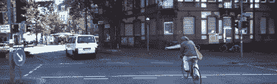 |
| --- |
| \begin{overpic}[width=203.80193pt]{x1.pdf} \put(62.0,18.0){\color[rgb]{1,0,0}\line(2,0){12.0}} \put(62.0,1.0){\color[rgb]{1,0,0}\line(2,0){12.0}} \put(62.0,1.0){\color[rgb]{1,0,0}\line(0,2){17.0}} \put(74.0,1.0){\color[rgb]{1,0,0}\line(0,2){17.0}} \end{overpic} |
| 375$\times$1242 |
| 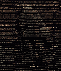 | 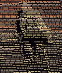 | 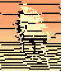 |
| 375$\times$1242 | $\times 0.5$ | $\times 0.25$ |
|  | 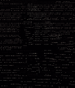 | 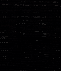 |
| 375$\times$1242 | $\times 2$ | $\times 4$ |

图 1：从 KITTI 数据集中重投影到不同分辨率图像上的 LiDAR 点云示例。

在这三种情况下，提高原始深度图的质量可以通过 1）通过引导深度超分辨率（GDSR）[33, 50]来上采样原始的空间分辨率，或 2）通过引导深度补全（GDC）[153, 13]来稠密化稀疏深度图。GDSR 的目标是利用 RGB 图像来增加低分辨率深度图的像素密度，并提供更丰富的视觉细节，而 GDC 的目标是填补使用激光脉冲获得的稀疏深度图中的缺失深度值，并提高整体深度图的分辨率——因为深度图的稀疏性取决于感测点云投影的图像分辨率（图像分辨率越低，投影的深度图越密集；图像分辨率越高，深度图越稀疏）。在图 1 中，我们展示了来自 KITTI 数据集的 LiDAR 点云的示例，重投影于数据集使用的原始分辨率（375$\times$1242）以及较低和较高分辨率（分别为$\times$0.5，$\times$0.25，$\times$2 和$\times$4）。我们可以观察到，假设不同的相机分辨率会产生密度明显变化的深度图，在较低分辨率下孔洞较少，而在较高分辨率下深度点更稀疏。这些证据证实了从 LiDAR 扫描中获得的深度图的密度是我们希望获得的深度图分辨率的函数，并且在某种程度上，补全过程与超分辨率任务具有类似之处。与 GDSR 的主要区别在于，GDC 中 LiDAR 发射的激光点非常小，通常无法覆盖与传感器中一个像素对应的场景。因此，GDC 通常需要感知比 GDSR 更大的邻域（例如，$7\times 7$），以在缺失信息的区域估计深度值。一般来说，RGB 引导的 ToF 成像系统涉及两个子任务之一，具体取决于使用案例和深度传感技术。因此，必须根据具体的子任务部署不同的解决方案。然而，这两个任务的目标都是在 RGB 信息的指导下生成高质量的深度图，即从高分辨率彩色图像转移高频结构信息和细粒度特征到低分辨率/稀疏深度图，同时避免纹理复制伪影。此外，值得注意的是，这两个任务的模型设计展现出有趣的相似性，这启发我们将它们作为一个研究主题进行分析，它们的具体分类将在第 2.4 节中详细说明。

| 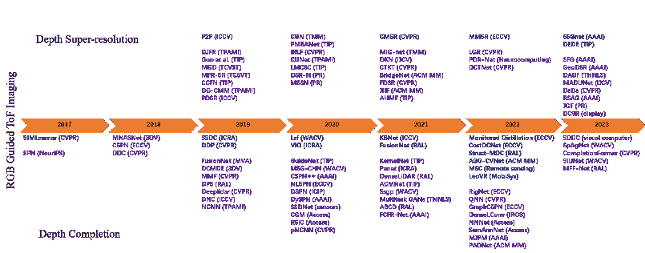 |
| --- |

图 2：时间轴展示了 RGB 引导的 ToF 成像的进展。方法根据学习范式（无监督或有监督）以蓝色或紫色标记。

最初，传统方法通过基于引导滤波的[116、49、87]或基于优化的[23、33、102]算法从彩色图像中提取有意义的特征。这些手工制作的方法依赖于一个假设，即深度不连续性在统计上与 RGB 图像边缘对应。然而，在实际情况下，这种先验可能无法提取信息特征，并引入伪影。例如，在存在丰富纹理的情况下，这些方法传达了重要的结构细节，但也将 RGB 图像的外观作为副作用转移到深度图中。因此，这项任务仍然具有挑战性，因为它需要正确区分与深度图中的不连续性对应的高频图像信息和那些不对应的高频信息。在过去的几十年中，RGB 引导 ToF 成像的增强解决方案已经从模型驱动转变为数据驱动的范式[20、168]，特别是得益于深度学习方法[10、208、196]的快速进展。即使是简单的网络结构，例如几层堆叠的卷积层[153]或原始的编码器-解码器[78]架构，也能以比手工制作方法高得多的准确度恢复 HR/密集深度图。因此，RGB 引导的 ToF 成像通过深度学习得到了学术界和工业界越来越多的研究兴趣，促使我们对这一领域的最新进展进行调查。

具体而言，鉴于过去十年深度学习解决方案的显著发展，本调查旨在提供一个完整的概述，介绍旨在增强 RGB 引导 ToF 成像的解决方案，涵盖两个使用案例。尽管我们了解关于引导深度超分辨率[199]和深度完成[174、55]作为独立任务的以前的综述论文，但我们强调了这两者之间缺乏互联性，尽管它们为研究 RGB 引导 ToF 传感器的社区带来了共享的见解，我们旨在在全面的综述中涵盖这些内容。特意地，我们将回顾旨在增强从这些设备系列感知的深度图的深度学习框架文献。我们将根据多个方面，如框架设计、学习范式和训练期间最小化的目标函数，对它们进行研究和分类。此外，我们将向读者介绍用于评估现有方法的标准数据集，并报告最先进方法的性能作为参考。

我们概述了我们的主要贡献如下：

+   •

    据我们所知，我们是第一家通过深度学习对 RGB 引导 ToF 成像进行深入研究的机构，包括引导深度超分辨率和引导深度完成作为主要任务。

+   •

    在每个子任务中，本文从多个方面审视了最近的基于深度学习的方法，以说明其设计动机、贡献和性能。

+   •

    我们讨论了 RGB 引导 ToF 成像的挑战和未来趋势。

本调查的其余部分结构如下。在第二部分中，我们描述了 RGB 引导 ToF 成像的基础知识。第三部分和 4 节分别介绍了基于深度学习的 GDSR 和 GDC 方法。在第五部分中，我们介绍了数据集和损失函数。第六部分提供了一些最新方法的比较结果。最后，在第七部分中，我们讨论了未来的趋势和挑战。图 2 绘制了 2017 年到 2023 年的时间线和每年的报告，列出了本文将要评审的任何方法及其发表场所。

## 2 前言与分类

在本节中，我们首先介绍了 RGB 引导 ToF 成像的基础知识，然后介绍了 GDSR 和 GDC 作为两个主要研究趋势，旨在增强 ToF 深度图以及两者中常用的目标函数。

### 2.1 ToF 成像原理

在这里，我们分别描述了 iToF 和 dToF 的成像原理。在图 3 中，我们提供了 iToF 和 dToF 常用原理的示意图。

| 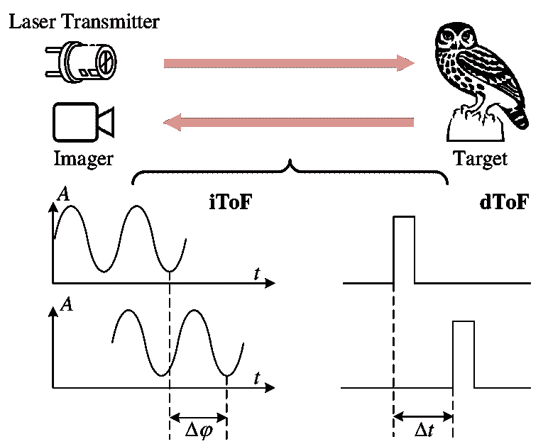 |
| --- |

图 3：iToF 和 dToF 的工作原理。前者基于发射光和反射光之间的相位差计算距离；后者测量激光光线反射到物体上所需的时间。

#### 2.1.1 间接 ToF

间接 ToF (iToF) 通过捕获反射光并计算发射光与反射光之间的相位延迟来确定距离。目前，大多数现成的 ToF 相机使用正弦幅度调制发射信号 $s(t)$：

|  | $s(t)=s_{1}\cos(\omega t)+s_{0}$ |  | (1) |
| --- | --- | --- | --- |

表 1：不同类型 LiDAR 的特性。

| 类型 | 技术 | 优点 | 缺点 |
| --- | --- | --- | --- |
| 机械 | 旋转镜或棱镜 | 高精度，长距离 | 大，昂贵 |
| MEMS | 微镜 | 小巧，便宜 | 较低的视场，范围 |
| 闪光 | 激光阵列同时发射 | 快速，高分辨率 | 短距离 |
| OPA | 光学相控阵列 | 小巧，便宜，多功能 | 仍在开发中 |

由于 ToF 发射器和接收器之间的基线非常小（通常只有几毫米），它们通常可以视为共轴。假设目标是静态的，并且信号在被传感器接收之前只反射一次，那么在特定固定频率下测得的单个像素的反射信号可以表示为时间 $t$ 的函数：

|  | $r(t)=\frac{\rho}{c^{2}\tau_{0}^{2}}[s_{1}\cos(\omega t-2\omega\tau_{0})+s_{0}]+e_{0}$ |  | (2) |
| --- | --- | --- | --- |

其中 $\rho$ 是目标的表面反射率，$\omega$ 表示角频率，$\tau_{0}$ 是信号从目标反射回到像素的光速 $c\approx 3\times 10^{8}$m/s 的延迟，而 $e_{0}$ 是由环境光引起的偏移。根据 [51]，方程 1 可以重写为：

|  | $\displaystyle A_{1}=\frac{\rho s_{1}}{c^{2}\tau_{0}^{2}},\quad A_{0}=\frac{\rho s_{0}}{c^{2}\tau_{0}^{2}}+e_{0}$ |  | (3) |
| --- | --- | --- | --- |
|  | $\displaystyle r(t)=A_{1}\cos(\omega t-2\omega\tau_{0})+A_{0}$ |  | (4) |

接收到的信号保持正弦波形，但包含场景深度信息的相位发生了变化。在高频周期信号 $B_{1}\cos(\omega t-\phi)$ 调制入射信号后，调制后的信号可以表示为：

|  | $\displaystyle\tilde{I}_{\phi,\omega}(t)=$ | $\displaystyle r(t)B_{1}\cos(\omega t-\phi)$ |  | (5) |
| --- | --- | --- | --- | --- |
|  | $\displaystyle=$ | $\displaystyle\frac{A_{1}B_{1}\cos(\phi-2\omega\tau_{0})}{2}+$ |  |
|  |  | $\displaystyle\frac{A_{1}B_{1}\cos(2\omega t+\phi+2\omega\tau_{0})}{2}+$ |  |
|  |  | $\displaystyle A_{0}B_{1}\cos(\omega t-\phi)$ |  |

考虑到 ToF 传感器的量子效率，设置捕获足够光子所需的传感器曝光时间 $T$ 通常远大于 $\pi c/\omega$。在曝光过程中，测量相当于对时间范围 $T$ 进行积分，因此方程 5 中的周期项在计算中都消失，结果可以计算为：

|  | $\displaystyle I_{\phi,\omega}$ | $\displaystyle=\int_{-T/2}^{T/2}\tilde{i}_{\phi,\omega}(t)dt$ |  |
| --- | --- | --- | --- |
|  |  | $\displaystyle\approx A_{1}B_{1}\cos(\phi-2\omega\tau_{0})=A_{1}g_{\phi,\omega}$ |  | (6) |

其中 $A_{1}$ 是场景响应，代表激光发射器发送光脉冲后在时间 $\tau_{0}$ 的编码对应像素的强度，$g_{\phi,\omega}=B_{1}\cos(\phi-2\omega\tau_{0})$ 是相机函数，$I_{\phi,\omega}$ 是相位为 $\phi$、角频率为 $\omega$ 的原始测量，即 ToF 原始数据。如果在一个周期内使用单一调制频率 $f_{m}$ 收集多个 ($K\geq 2$) 原始测量，可以计算场景与相机之间的距离为：

|  | $d=\frac{c}{2\omega}\arctan(\frac{\sin{\boldmath{\phi}}\cdot\boldmath{I}_{\phi,\omega}}{\cos{\boldmath{\phi}}\cdot\boldmath{I}_{\phi,\omega}})\\ $ |  | (7) |
| --- | --- | --- | --- |

实际上，如果调制频率 $f_{m}=\frac{\omega}{2\pi}$ 固定，ToF 相机通常采用四相位法来采样 ToF 原始数据，即在一个周期内采样四次，相位步长为 $90^{\circ}$。为了便于阅读，四个原始数据可以简写为 $I_{i}=I_{\frac{\pi}{2\omega}i},i=0,1,2,3$。

|  | $\displaystyle A=\frac{\sqrt{(I_{3}-I_{1})^{2}+(I_{0}-I_{2})^{2}}}{2}$ |  | (8) |
| --- | --- | --- | --- |
|  | $\displaystyle B=\frac{I_{0}+I_{1}+I_{2}+I_{3}}{4}$ |  | (9) |
|  | $\displaystyle\phi=\arctan{\frac{I_{3}-I_{1}}{I_{0}-I_{2}}}$ |  | (10) |
|  | $\displaystyle d=\frac{c}{2\pi}(\frac{\phi}{2f}+N)$ |  | (11) |

其中 $N$ 是表示相位包络数的整数。基于上述原理，一些研究[144, 15, 46, 76] 直接处理 iToF 的原始信号，从而提高深度质量。

目前，大多数面向消费市场的 iToF 传感器基于互补金属氧化物半导体 (CMOS) 或电荷耦合器件 (CCD)，分辨率为 $320\times 240$ (QVGA) 或 $640\times 480$ (VGA) 像素。然而，其分辨率仍显著低于使用相同技术的 RGB 图像。

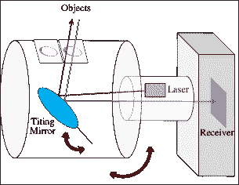

(a) 机械 LiDAR 原理

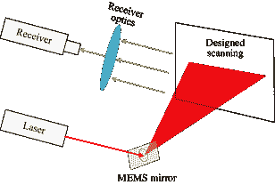

(b) MEMS LiDAR 原理

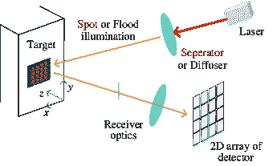

(c) 闪光 LiDAR 原理

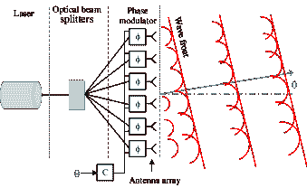

(d) OPA LiDAR 的原理

图 4：具有不同成像原理的 LiDAR 系统示意图。

#### 2.1.2 直接 ToF

DToF 是一种测量激光光线直接射向物体并返回传感器所需时间的方法。当激光发射的瞬间，电子时钟被激活。然后，脉冲从目标上反射回来，并被光探测器部分接收。通过测量时间间隔 $\Delta T$，使用公式计算发射光脉冲与反射光脉冲之间的距离 $d$：

|  | $d=\frac{c\Delta T}{2}\\ $ |  | (12) |
| --- | --- | --- | --- |

为了实现更高的灵敏度和更低的功耗，dToF 通常采用单光子雪崩二极管（SPADs）而非雪崩光电二极管（APDs）作为光探测器。由于芯片及其辅助电路的尺寸限制，SPAD 阵列的像素数量远低于 iToF。

LiDAR，即光学探测与测距的缩写，尽管基于与 dToF 相同的工作原理，但由于其独特的设计和设置，通常被列为一种独立的深度感知技术。例如，传统 LiDAR 使用机械组件（如旋转镜）持续扫描环境。另一种类型是 MEMS LiDAR，它使用由微机电系统（MEMS）控制的微镜扫描环境。这种类型的 LiDAR 比机械 LiDAR 更小、更便宜，但视场和范围较小。作为一种尚在发展中的技术，OPA LiDAR 使用光学相控阵列（OPA）电子引导激光束，具有潜在的小巧、便宜和多功能的优势。与上述技术不同的是，全局快门闪光 LiDAR，也称为闪光 LiDAR 或 ToF LiDAR，使用激光阵列同时发射以创建周围环境的 3D 图像，类似于 iToF，从而提高了帧率和成像效率，适用于自动驾驶等应用。这项技术使 dToF 能够集成到消费电子设备中。我们在表 1 中总结了不同类型的 LiDAR 比较，并在图 4 中展示了每种方法的示意图。

本质上，LiDAR 仍然采用 dToF 原理，dToF 和 LiDAR 这两个术语在许多场景中甚至可以互换（例如，苹果在 iPad Pro 和 iPhone 12 Pro 中将 dToF 传感器称为 LiDAR 扫描仪）。然而，LiDAR 技术正在迅速发展，新的尖端 LiDAR 不断被开发出来，从而可能在各种场景中具有更多应用。例如，由 EDOM 技术公司生产的 InnovizOne MEMS LiDAR 实现了高达 $0.1^{\circ}\times 0.1^{\circ}$ 的角分辨率，产生了比以前更密集的点云。

表 2：iToF 和 dToF 的特征。

| 参数 | iToF | dToF |
| --- | --- | --- |
| 原理 |

&#124; 使用发射光的相位变化 &#124;

&#124; 和反射光来确定距离。 &#124;

|

&#124; 使用秒表法 &#124;

&#124; 计算时间间隔。 &#124;

|

| 探测器类型 |
| --- |

&#124; PMDs: $6\sim 100\mu m$ 像素大小 &#124;

| SPADs / APDs |
| --- |
| 深度计算 | 像素内计算 | 直方图分析 |
| 性能 | 长集成时间 | 快速获取 |
| 范围 | 短中距离 | 更长 |
| 范围模糊 | 是 | 否 |
| 像素数量 | 多 | 少 |
| 精度 | 与距离线性相关 | 更高 |
| 功耗 | 低 | 更高 |
| 便携性 | 一般较紧凑 | 传统上较大 |
| 成本 | 中等 | 更高 |

#### 2.1.3 dToF 和 iToF 的比较分析

在这里，我们在表 2 中提供了它们的特征。此外，我们对以下方面进行了比较分析。

精度。iToF 相机通常在特定范围内提供准确的距离测量。其测量误差理论上与目标距离正相关。目前，大规模生产的 iToF 相机的精度可控制在 $1\%$ 以内，例如，搭载索尼 IMX556 DepthSense ToF 的 Helios2 ToF 3D 相机在 1 米相机距离下的精度小于 5mm，分辨率小于 2mm。同时，dToF（LiDAR）即使在较长距离下也能实现毫米级精度。因此，对于短距离应用，iToF 和 dToF 的精度是相当的，尽管它们可能不及结构光相机。然而，LiDAR 的一个关键优势是其精度在任何距离下都能保持相对恒定，如第 2.1.3 节所讨论。这一特性使得 LiDAR 测量在长距离应用中具有可靠的准确性，使其与其他技术区别开来。

范围和功耗。iToF 相机通常适用于短至中等距离的应用。有效范围可能有所不同，但通常在几米到几十米之间，具体取决于设计和实现。这些特点使得 ToF 相机通常被设计为功耗高效，因此适合消费级设备。相比之下，LiDAR 系统可以实现更长的测量范围，使其适用于如自动驾驶车辆和长距离测绘等应用。因此，它们通常用于对功耗要求不那么严格的场景。

便携性。iToF 相机本质上体积小巧且轻便，适合集成到智能手机、平板电脑和可穿戴设备等便携设备中。同时，传统上较大的 LiDAR 正在经历小型化趋势，特别是固态 LiDAR 的发展，使其在便携和手持设备中的应用越来越广泛。

应用。由于各自的特性，两类传感器通常涉及不同的下游应用。具体来说，iToF 传感器最适合用于 AR/VR 体验，主要关注狭窄、近距离环境，或者一般在受限空间内运行的应用（例如，机器人臂的箱体拾取）。相反，dToF 更适合需要长距离感知的上下文，例如带有 ADAS 或自动驾驶系统的汽车。值得注意的是，iToF 和 dToF 的操作范围存在重叠，即在执行中等距离感知时，二者均可用于 AR/VR 应用（例如，带有 iToF 的 Kinect v2 和带有 dToF 的 iPad Pro）。

尽管这两种成像系统在各自的应用领域中表现出色，但技术的进步正在稳步缩小它们性能指标之间的差距，导致它们在实际应用中的重叠逐渐增多。

### 2.2 问题表述

尽管 ToF 相机有许多优点，但它们也带来一些固有的限制，如多径干扰[45、46]、飞行像素[119]和抖动误差[59]。手工制作的模型可以解决一些问题，例如深度校正，但其他问题需要额外的线索，例如 RGB 图像中提供的那些线索。

RGB 引导的 ToF 成像的目标是从获取的低质量深度图 $Z_{lq}:\Omega_{Z}\subset\Omega\mapsto\mathbb{R}_{+}$ 和高分辨率彩色图像 $I:\Omega\subset\mathbb{R}^{2}\mapsto\mathbb{R}^{3}_{+}$ 中恢复出高质量深度图 $Z_{hq}$。根据测距系统的设置，低质量深度图可以是稠密的但分辨率较低，或者是稀疏的。此外，我们假设所有 LQ 深度图和相应的彩色图像是正确对齐的。这是可能的，如果 RGB-D 系统已校准，即两台彩色和深度摄像机之间的相对姿态是已知的。如果部署了具有参数 $\gamma$ 的深度神经网络 $\Phi_{\gamma}$ 用于 RGB 引导的 ToF 成像，则任务可以建模为

|  | $\hat{Z}_{hq}=\Phi_{\gamma}(Z_{lq},I)$ |  | (13) |
| --- | --- | --- | --- |

其中 $\hat{Z}_{hq}$ 是潜在 HR 深度图的预测值。

网络参数 $\gamma$ 在训练 $\Phi$ 时进行更新，通过解决以下优化问题：

|  | $\hat{\gamma}=\mathop{\arg\min}\limits_{\gamma}\mathcal{L}(Z_{hq},\hat{Z}_{hq})$ |  | (14) |
| --- | --- | --- | --- |

其中 $\mathcal{L}$ 是一个目标函数，通常是最小化预测与地面真值深度之间的距离。

### 2.3 评估指标

对于大多数计算机视觉任务而言，对于 RGB 引导的 ToF 成像，必须使用适当的评估指标。两项子任务，即 GDSR 和 GDC，最常用的度量是均方根误差（RMSE）和平均绝对误差（MAE）：

|  | $\displaystyle\mathrm{RMSE}(mm)=\sqrt{\frac{1}{N}\sum_{p\in N}(Z_{hq}^{p}-\hat{Z}_{hq}^{p})^{2}}$ |  | (15) |
| --- | --- | --- | --- |
|  | $\displaystyle N\mathrm{MAE}(mm)=\frac{1}{N}\sum_{p\in N}&#124;Z_{hq}^{p}-\hat{Z}_{hq}^{p}&#124;$ |  | (16) |

其中 $p$ 是深度图中的一个像素。

GDSR 的指标。除了上述指标，均方误差（MSE）也被频繁使用，其作用类似于 RMSE：

|  | $\mathrm{MSE}=\frac{1}{N}\sum_{p\in N}&#124;Z_{hq}^{p}-\hat{Z}_{hq}^{p}&#124;^{2}$ |  | (17) |
| --- | --- | --- | --- |

此外，使用短距离 ToF 传感器时，GDSR 侧重于恢复具有理想细节的深度图。因此，峰值信噪比（PNSR）和结构相似性指数（SSIM）有时也被用来评估深度图的质量，定义如下：

|  | $\displaystyle\mathrm{PSNR}=10\log_{10}(\frac{Z_{max}^{2}}{\mathrm{MSE}})$ |  | (18) |
| --- | --- | --- | --- |
|  | $\displaystyle\mathrm{SSIM}(p,q)=\frac{(2\mu_{p}\mu_{q}+C_{1})(2\sigma_{xy}+C_{2})}{(\mu_{p}^{2}+\mu_{q}^{2}+C_{1})(\sigma_{p}^{2}+\sigma_{q}^{2}+C_{2})}$ |  | (19) |

其中 $Z_{max}$ 是最大深度值；$q$ 是像素 $p$ 的邻居；$\mu_{p}$ 和 $\mu_{q}$ 分别表示 HQ 深度图和相应地面真值的均值；$\sigma_{p}^{2}$ 和 $\sigma_{q}^{2}$ 是方差；$C_{1}$ 和 $C_{2}$ 是用于保持分割稳定性的常数。两个深度图之间的像素值差异越小，PSNR 越高。

GDC 的度量。稀疏深度测量通常是从长距离 ToF LiDAR 捕获的，因此 GDC 有几个特定任务的度量，包括逆深度的 RMSE（iRMSE）、逆深度的 MAE（iMAE），定义如下

|  | $\displaystyle\mathrm{iRMSE}(\frac{1}{km})=\sqrt{\frac{1}{n}\sum_{n\in N}(Z_{hq}^{p}-\hat{Z}_{hq}^{p})^{2}}$ |  | (20) |
| --- | --- | --- | --- |
|  | $\displaystyle\mathrm{iMAE}(\frac{1}{km})=\frac{1}{N}\sum_{p\in N}&#124;\frac{1}{Z_{hq}^{p}}-\frac{1}{\hat{Z}_{hq}^{p}}&#124;$ |  | (21) |

当对室内数据集（例如 NYU-v2 [138]）进行深度模型评估时，平均绝对相对误差（REL）和阈值准确率更为流行

|  | $\displaystyle\mathrm{REL}(mm)=\frac{1}{N}\sum_{n\in N}\frac{&#124;Z_{hq}^{p}-\hat{Z}_{hq}^{p}&#124;}{Z_{hq}^{p}}$ |  | (22) |
| --- | --- | --- | --- |
|  | $\displaystyle\sigma=\max(\frac{Z_{hq}^{p}}{\hat{Z}_{hq}^{p}},\frac{\hat{Z}_{hq}^{p}}{Z_{hq}^{p}})<th$ |  | (23) |

其中$th$为给定的阈值。

### 2.4 分类

| 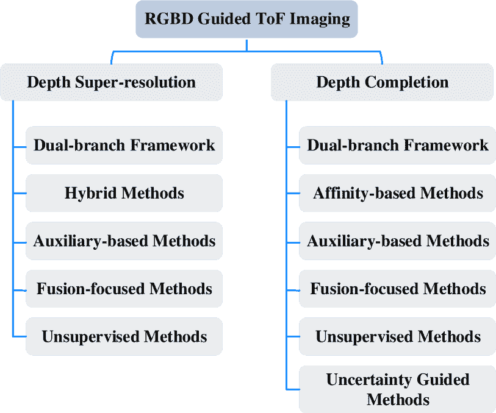 |
| --- |

图 5：RGB 引导的 ToF 成像技术的分类。我们为 GDSR 和 GDC 方法识别了 5 类和 6 类主要类别。

图 5 展示了我们将在本文中调查的方法的分类。图中，我们可以突出显示 GDSR 和 GDC 任务的一些共同趋势。具体来说，我们可以识别两个类别：双分支框架，即那些分别处理 RGB 和深度线索的两个主要分支，以及辅助方法——那些利用多任务学习来提高预测深度图的准确性——融合方法主要研究将颜色和深度特征融合的策略，以及不需要在训练时使用真实标签的无监督方法。另一方面，我们识别了一些特定于这两个任务之一的趋势：特别是，对于 GDSR，我们有混合方法，重点是获得可解释的模型来运行超分辨率过程；对于 GDC，开发的亲和力方法的特点是使用空间传播网络（SPNs），它们学习亲和矩阵以在邻近像素之间传播深度，以及不确定性引导方法明确涉及不确定性建模以改善结果。每个类别将在 3 和 4 节中详细介绍和讨论，分别针对 GDSR 和 GDC。

## 3 引导深度超分辨率

在本节中，我们介绍并讨论了基于深度学习的最新方法。最初，研究人员利用具有两个分支的通用架构分别从 RGB 和深度中提取特征，这些特征以简单的方式融合，即通过拼接或求和。提出了许多新颖的架构和融合方案以提高网络准确性。从数据需求的角度来看，深度超分辨率方法分为监督学习和无监督学习。两种范式的区别在于前者需要标记的输入数据，而后者则不需要。对于监督学习，我们将现有工作分类为三类，具体取决于它们对文献的主要贡献，包括（i）双分支框架；（ii）优化启发的架构；（iii）辅助学习；（iv）多模态融合方案。对于无监督学习，重点是融合策略和损失函数。这五类在图 5 的顶部分支中列出。

监督方法通过标记的数据进行补充，使得任务可以被视为回归问题。因此，深度模型旨在将深度预测尽可能接近真实的深度标签。

### 3.1 双分支框架

由于深度传感器捕捉到的场景与 RGB 相机相同，因此获得的两幅图像在几何上是相似且互补的。因此，如何通过设计的算法从这两种模态中提取有意义的特征是深度超分辨率的关键。直观上，[79] 设计了一个深度联合滤波器（DJFR），该滤波器包含两个子网络，分别用于提取深度和 RGB 特征。将这两个流拼接后，融合的信息由另一个子网络解码，并输出预测的深度，如图 6 所示。

多尺度信息对许多低层次视觉任务至关重要，包括 GDSR，它可以通过丰富的层次特征从不同尺度恢复图像。多尺度引导卷积网络（MSG-Net）[58] 是首个利用多尺度引导来超分辨率深度图的工作，该方法逐步增强从高层到低层的深度细节。受到这一理念的启发，提出了众多利用多尺度引导的方法，并取得了显著的性能提升。例如，[44] 提出的用于深度图超分辨率（DepthSR）的新型深度网络利用了残差 U-Net 结构[129]，在每个尺度引入层次引导，以恢复高分辨率深度图。[209] 设计了一个类似于 MSG-Net[58] 的多尺度架构，其中采用密集层[57] 以在给定尺度上重新访问所有更高层次的特征。此外，[211] 提出的 RGB 图像引导的多尺度融合残差网络用于 GDSR（MFR-SR），通过全局和局部残差学习在多个尺度上逐步上采样深度图。[77] 采用了一种多尺度策略，提出了对称单元（SU）作为网络的基本组件。通过 SU，它可以有效处理深度图像中的无纹理和边缘特征。与之前的工作不同，[210] 提出了一个包含三个分支（即强度、深度和梯度分支）的双流多尺度网络 MIG-net。在每个尺度上，深度和梯度特征通过引导进行迭代精炼。[197] 引入了一种基于注意力的层次多模态融合网络（AHMF），其中提出了一个双向层次特征协作模块，以充分利用多尺度特征。在该模块中，不同层次的特征被聚合，从而低层次和高层次的空间信息可以协作以相互提升。[160] 提出了一种新颖的方法，利用金字塔结构捕获多尺度特征，从而逐步恢复高分辨率深度图。[187] 提出了一个用于 GDSR 的结构流引导框架，其核心是学习一个结构流图来引导结构表示转换。在此方法中，引入了一个流增强金字塔边缘注意网络，以学习多尺度特征以实现清晰的边缘重建。

| 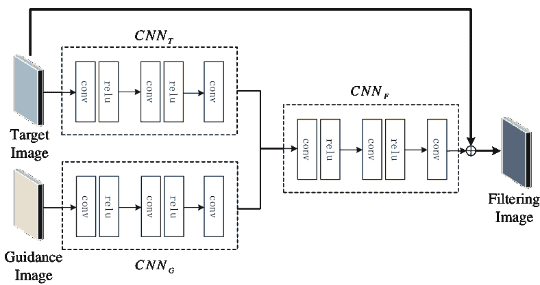 |
| --- |

图 6：DJFR 架构[79] 属于双分支框架。它采用了典型的双分支自编码器框架，其中引导和源特征从编码器中的两个子网络中提取。

使用粗到细方案是 GDSR 的另一种常见解决方案，包括建立一个多阶段网络以逐步增强深度图。多尺度策略和粗到细方案的定义在一些方法中可能会重叠。因此，我们根据工作的重点来区分它们。[167]提出了一种具有两个阶段的粗到细神经网络。在粗阶段，模型学习大滤波器核以获得较不精确的结果，在细阶段则通过较小的滤波器核进一步精炼。在[208]中，通过提出的深度引导仿射变换，在多个阶段迭代地进行深度引导强度特征和强度引导深度特征的过滤和精炼。该网络可以减少深度图与相应引导之间分布差距产生的伪影。[183]引入了一种具有多个阶段的多分支聚合网络，以重建锐利的深度边界。具体而言，他们在每个阶段设计了三个并行分支——重建分支、颜色分支和多尺度分支。[141]开发了一种粗到细框架，由若干子模块组成，能够逐步从深度图中提取高频特征。每个子模块采用通道注意策略以获取信息性特征。此外，该框架通过总广义变差（TGV）项和输入损失进一步提高深度质量。在[50]中，开发了一种高频引导分支，以自适应地提取高频信息并减少低频组件。然后通过连接将高频组件与深度特征融合。[186]提出了一种递归结构注意引导框架（RSAG），该框架利用了多尺度和多阶段策略，如图 7 所示。在此框架中，设计了一个具有多尺度滤波器的深度对比网络，以自适应地分离高频和低频特征。

| 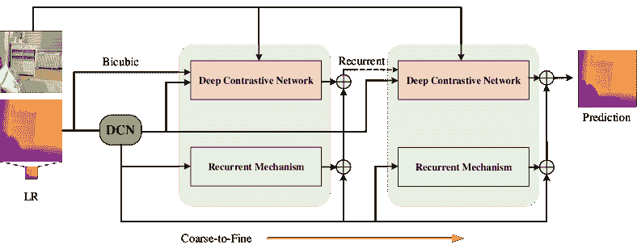 |
| --- |

图 7：属于双分支框架的 RSAG 架构[186]。它使用粗到细的策略逐步细化深度。

一些方法设计了可学习的卷积核以提升 GDSR 性能，而不是在普通卷积神经网络（CNNs）中部署空间不变核。[68] 提出了一种可变形网络，通过计算邻域权重为每个像素提供自定义卷积核。核权重不仅可以通过计算常规位置的像素（例如 8 邻域）来获得，还可以通过插值后的子像素来获得。[161] 引入了一种连续深度表示，其核心是所提议的几何空间聚合器（GSA）。GSA 包括两个部分：（1）使用尺度调制距离场建立像素之间相关性的几何编码器，（2）可学习核以学习典型的纹理模式处理先验。由于连续表示，该模型可以在任意尺度上超分辨深度。[198] 设计了一种核生成网络，可以应对 RGB 和深度之间不一致的结构。

为了增加解释性，[149] 将 GDSR 视为一个神经隐式插值问题，该问题可以将低分辨率深度图和高分辨率彩色图像的连续坐标映射到潜在编码中。同时，他们学习插值权重以建立一个统一框架，从而生成插值权重和值。为了促进 dToF 相机在移动设备中的部署，[80] 从轻量级的 ToF 传感器和 RGB 图像（DELTAR）中执行深度估计。在这项工作中，PointNet[117] 和 Efficient B5[148] 被用来提取深度和 RGB 特征，分别在解码阶段通过所提议的基于变压器的融合模块进行融合。

### 3.2 混合架构

由于神经网络通常被描述为黑箱模型，一些研究人员结合优化方法以获得可解释的框架。[126] 提出了一种新颖的网络，由两个子网络组成，即一个全卷积网络和一个原始-对偶网络，第一个生成高分辨率深度图和权重，第二个使用非局部变分方法生成最终结果。

作为一个受优化启发的网络，加权分析稀疏表示（WASR）模型[40] 专为 GDSR 设计。它利用神经网络来学习滤波器参数化和非线性函数，以构建更灵活的分阶段操作。受多模态卷积稀疏编码模型[139] 的启发，[21] 开发了一个网络，可以自适应地分离不同模态之间的共享特征与单一模态中存在的独特特征。[108] 提出了一个深度展开网络，以高效地计算卷积稀疏编码。

| 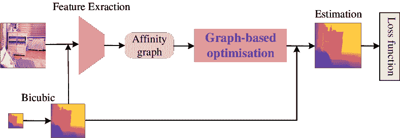 |
| --- |

图 8：属于优化驱动架构的 LGR 架构[18]。优化层被插入到网络的末端，以预测高分辨率深度。

[196] 将离散余弦变换（DCT）引入到提议的神经网络中，以使模型具有可解释性。该模型利用 DCT 通过重建多通道高分辨率深度特征来解决 GDSR 的优化问题。使用 DCT 的另一个优点是它可以简化网络设计，因为它不需要学习低分辨率/高分辨率图像对之间的映射函数，因为它明确地对其建模。[18] 提出了一个新颖的架构——学习图正则化（LGR），通过神经网络来执行 GDSR，如图 8 所示。首先，网络从源图像和引导图像中提取特征。然后，利用这些特征构建的图被送入一个可微分的优化层进行正则化。结合了基于模型和基于学习方法的优点，[200] 提出了一个记忆增强的深度展开网络，其中引入了基于最大后验视角的局部隐式先验和全局隐式先验。为了进一步防止信息丢失，持久记忆机制中使用了长短期记忆（LSTM）。[110] 提出了将引导各向异性扩散集成到 CNN 中，以增强深度图像中的深度不连续性。给定一个缩放因子，它具有固定的推理时间和内存占用。

### 3.3 基于辅助的方法

辅助学习，也称为多任务学习，旨在找到或设计可以提高一个或多个主要任务性能的辅助任务。受到最近进展的驱动，一些研究尝试利用辅助任务学习来放大深度图。[145] 提出了一种知识蒸馏方法，其中在训练期间将深度估计作为辅助任务，以提高结果。作为一种代表性方法，如图 9 所示，BridgeNet [151] 探索了一种利用单目深度估计（MDE）和深度超分辨率（DSR）之间的关联的范式。为了使这两个任务协同工作，他们设计了两个自编码器，即 DSRNet 和 MDENet，在编码器阶段进行信息交互。在 MDENet 中，提出了一种高频注意力桥来捕捉高频信息，从而指导另一任务中的深度上采样。相对而言，DSRNet 提供内容指导，以指导单目深度估计。考虑到这两个子任务的不同学习曲线，他们分别优化了两个子网络。

除了辅助学习，一些研究者考虑利用颜色图像的辅助指导来提高深度质量。基于边缘信息在深度上采样中的重要性，[165] 提出了一个边缘引导的深度上采样框架，该框架利用边缘图作为指导来恢复高分辨率深度图。对于训练，地面真实边缘图通过 Canny 算子在相应的高分辨率深度图上计算得到。

| 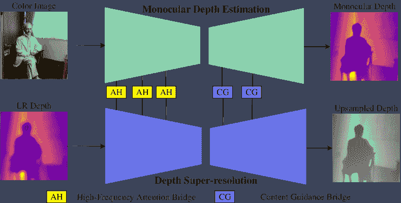 |
| --- |

图 9：属于辅助方法的 BridgeNet 架构 [151]。BridgeNet 由一个单目深度估计子网络和一个引导深度上采样子网络组成。

与大多数现有的 GDSR 方法不同，[155] 尝试通过表面法线图的渲染来评估上采样深度的质量。更具体地说，提出了一种基于视觉外观的损失函数，这可以帮助基线网络生成更具视觉吸引力的结果。

### 3.4 专注于融合的方法

如何有效地融合来自不同模态的信息对于获取高质量的深度图至关重要。直观地，我们可以通过简单的操作如连接 [165, 149, 18] 来执行多模态融合。然而，这些融合方案不能选择性地将高频特征从引导图转移到目标图，并且可能会导致纹理复制伪影。因此，研究人员设计了不同的融合方案来缓解这个问题，主要分为三类：早期融合、晚期融合和多级融合。 [77] 提出了一个关联控制的颜色引导块（block）来融合多模态信息。 [197] 设计了一种基于多模态注意力的融合策略，包括一个特征增强块和一个特征重新校准块，其中前者更关注从深度图和颜色图像中提取的有意义特征，后者旨在重新调整多模态特征。该策略可以有效避免最终预测中的纹理复制效果。 [196] 部署了一个增强的空间注意力块，将有意义的结构信息从 RGB 传输到深度图。 [186] 开发了一个递归结构注意力块，将最新的深度估计和其对应的 HR 颜色图像作为输入，以获得颜色图像的有用高频特征。 [160] 提出了一个多视角交叉引导融合滤波块，通过融合 RGB 图像中的结构细节逐步改善深度特征。在这个块中，来自不同视角的空间表示被学习，以进一步捕捉深度显著结构。此外，采用了一个颜色-深度交叉注意力模块来实现边缘保留。 [198] 提出了一个多尺度引导滤波模块，以粗到细的方式细化深度图。为了获得稳定的深度预测， [147] 以多帧方式进行跨模态融合，即 dToF 深度视频超分辨率（DVSR）和直方图视频超分辨率（HVSR），以放大低分辨率深度图。 [120] 提出了一个自适应特征融合模块（AFFM），该模块使得从 HR 引导图和 LR 深度图中恢复细节成为可能。 [195] 提出了一个球面空间特征分解网络（SSDNet），该网络将编码特征投影到球面空间。这一策略允许分别分离和对齐领域共享特征和领域私有特征。

### 3.5 无监督方法

由于收集带有注释的训练数据既费力又耗时，研究人员试图通过利用自监督学习来解决这个问题，从而允许在没有标签的情况下训练模型。在 [103] 中，GDSR 被视为从源图像到目标图像的逐像素映射，实现为多层感知机。这种形式可以在完全无监督的方式下进行训练，只需约束有 LR 源即可。[135] 提出了一个单对方法，即使在输入对不对齐时也能对深度图进行上采样。在训练过程中，利用从输入对中裁剪出的图像块作为伪标签数据以实现弱监督学习。为了提高泛化能力，[25] 提出了一个互调制超分辨率模型（MMSR），其中使用自适应滤波器的跨模态调制策略将有意义的特征从一个模态转移到另一个模态，如图 10 所示。在这种互调制中，充分利用了两个模态对应像素之间的空间关系。此外，采用了循环一致性损失来确保目标与源图像一致。与之前的 GDSR 无监督方法不同，[136] 在该领域引入了一种预设任务。通过提出的场景结构引导网络，可以获得彩色图像的显式结构特征，这些特征与对应的 LR 深度图一起作为基线网络的输入，以生成高分辨率深度图。[159] 构建了一个对抗网络，其中充分利用了 RGB 图像与深度图之间的依赖关系来增强深度。此外，将最优传输理论引入框架中，以提升深度增强性能。[121] 利用对比学习方案从引导图像中提取独特特征，这些特征可以基于基线网络提升 GDSR 性能。

总结这一部分，表 3 汇总了迄今为止讨论的所有方法，并分为五类。每种方法都报告了场所和年份，以及其背后的关键思想的简要描述。

| 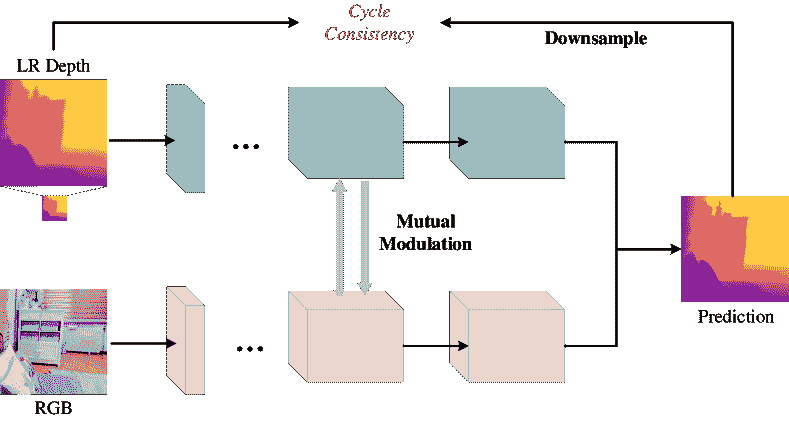 |
| --- |

图 10：属于无监督方法的 MMSR 框架 [25]。MMSR 采用循环一致性损失以自监督的方式训练网络。

| 模式 | 方法 | 参考文献 | 关键思想 |
| --- | --- | --- | --- |
| 双分支框架 | DJFR [79] | TPAMI-2019 |

引入两个子网络用于从目标图像和引导图像中提取特征。按照

&#124; 连接操作，将融合的信息送入另一个子网络以预测深度。&#124;

|

| DMSG [58] | ECCV-2016 |
| --- | --- |

&#124; 首次使用多尺度引导超分辨深度图，逐步增强深度细节&#124;

&#124; 从高到低级。&#124;

|

| DepthSR [44] | TIP-2019 |
| --- | --- |

&#124; 利用残差 U-Net 结构，其中在每个尺度上使用层次引导，以恢复 HR 深度图。&#124;

|

| MGD [209] | TCSVT-2019 |
| --- | --- |

&#124; 提出一个基于密集层的多尺度架构，旨在重新访问所有更高层的特征&#124;

&#124; 给定尺度。&#124;

|

| MFR-SR [211] | TCSVT-2019 |
| --- | --- |

&#124; 结合全局和局部残差学习，通过多尺度频率将深度图从粗到细地上采样&#124;

&#124; 合成。&#124;

|

| MIG-net [210] | TMM-2021 |
| --- | --- |

&#124; 引入一个双流多尺度网络来提取图像和梯度域中的特征，其中深度&#124;

&#124; 特征和梯度特征交替互补。&#124;

|

| SFG [187] | AAAI-2023 |
| --- | --- |

&#124; 提出一个结构流引导框架用于 GDSR，其关键点是学习一个结构流图来引导&#124;

&#124; 结构表示转换。&#124;

|

| CCFN [167] | TIP-2019 |
| --- | --- |

&#124; 提出一个具有两个阶段的粗到细神经网络。在第一个阶段，模型学习大滤波器内核以&#124;

&#124; 获得粗略结果，在第二阶段通过更小的滤波器内核进一步细化。&#124;

|

| CGN [208] | TMM-2020 |
| --- | --- |

&#124; 通过提出的深度引导仿射变换，强度引导的深度特征过滤和细化&#124;

&#124; 以多阶段迭代进行。&#124;

|

| PMBANet [183] | TIP-2020 | 引入一个多分支聚合网络，具有多个阶段，以重建清晰的深度边界。 |
| --- | --- | --- |
| IRLF [141] | CVPR-2020 | 开发一个粗到细的框架，由几个子模块组成，具有通道注意策略。 |
| DKN [68] | IJCV-2021 | 设计一个可变形核网络，为每个像素根据邻域权重获取一个核。 |
| FDSR [50] | CVPR-2021 | 通过 HF 引导分支探索高频（HF）信息，其中 HF 信息与深度特征融合以提高性能。 |
| GeoDSR [161] | AAAI-2023 | 引入连续深度表示，以有效实施引导深度超分辨率中的尺度连续和空间连续上采样。 |
| DAGF [198] | TNNLS-2023 | 设计一个核生成网络，能够处理 RGB 和深度之间的不一致结构，其中提出了一个多尺度引导滤波模块，用于粗到细地细化深度图。 |
| DCSR [164] | Display-2023 | 提出了一个深度图连续超分辨率框架，可以在任意超分辨率比下实现分辨率适应。 |
| PAC [143] | CVPR-2019 | 提出了一个像素自适应卷积操作，用于深度联合图像上采样。 |
| DELTAR [80] | ECCV-2022 | 提出了一个基于变换器的架构，具有两个分支，可以高效地提取和融合深度和 RGB 特征。此外，执行了跨模态校准以对齐 RGB 和深度。 |
| Hybrid Model | DPDN [126] | BMVC-2016 | 使用两个子网络，其中一个基于全卷积结构生成高分辨率深度图和权重，另一个使用非局部变分方法获得最终结果。 |
| DG-CMM [40] | TPAMI-2019 | 提出了一个加权分析稀疏表示（WASR）模型和一个神经网络，以学习滤波器参数化和非线性函数来构建灵活的分阶段操作。 |
| CUNet [21] | TPAMI-2020 | 开发了一个多模态卷积稀疏编码（MCSC）模型，用于解决一般的多模态图像恢复和多模态图像融合问题。 |
| LMCSC [108] | TIP-2020 | 提出了一个深度展开网络，该网络使用引导图像超分辨率，利用两种模态的信息。 |
| LGR [18] | CVPR-2022 | 提出了一个新颖的架构，结合神经网络和基于图的优化方法来执行 GDSR。 |
| DCTNet [196] | CVPR-2022 | 利用离散余弦变换（DCT）通过重建多通道高分辨率深度特征来解决 GDSR 的优化问题。 |
| DaDa [110] | CVPR-2023 | 建议将引导各向异性扩散整合到卷积神经网络中，以改善深度图像中的深度不连续性。给定一个比例因子，方法的推理时间和内存需求是固定的。 |
| MADUNet [200] | IJCV-2023 | 提出了一个记忆增强的深度展开网络，其中局部和全局隐式先验的引入基于最大后验视角。 |
| Auxiliary-based | CTKT [145] | CVPR-2021 | 提出了一个知识蒸馏方法，在训练过程中使用深度估计辅助任务以获得更好的结果。 |
| BridgeNet [151] | ACM MM-2021 | 探索了一种范式，其中单目深度估计（MDE）与深度超分辨率之间的关联被用来提高深度图超分辨率的性能。 |
| DSR-N [165] | PR-2020 | 提出了一个深度上采样框架，利用边缘信息作为指导来恢复高分辨率深度图。 |
| PDSR [155] | ICCV-2019 | 尝试通过表面法线图的渲染来测量上采样深度的质量。 |
| PDR-Net [93] | Neurocomputing-2022 | 提出了一个渐进深度重建网络，以进一步提高 DMSR 的性能。 |
| SVLRM [24] | TPAMI-2021 | 提出一种基于空间变换线性表示模型的新型联合滤波方法，其中目标图像由引导图像线性表示。 |
| 侧重融合 | JIIF [149] | MM-2021 | 将 GDSR 视为一种神经隐式插值问题，可以将 LR 深度图和 HR 彩色图像中的潜在编码转换。 |
| MSSN [77] | PR-2020 |

&#124; 提出一种多尺度策略，将对称单元作为网络的基本组件，可以 &#124;

&#124; 有效处理深度图像中的无纹理和边缘特征。 &#124;

|

| AHMF [197] | TIP-2021 |
| --- | --- |

&#124; 提出一种基于双向层次特征协作模块的层次网络，其中低级和 &#124;

&#124; 高级空间信息可以相互协作，以提高彼此的效果。 &#124;

|

| RSAG [186] | AAAI-2023 | 提出一个递归结构注意力引导框架，采用多尺度和多阶段策略。使用具有多尺度滤波器的深度对比网络来分离 HF 和 LF 特征。 |
| --- | --- | --- |
| JGF [160] | PR-2023 |

&#124; 提出一种新方法，利用金字塔结构捕捉多尺度特征，使 HR 深度图像能够 &#124;

&#124; 逐步恢复。 &#124;

|

| DVSR [147] | CVPR-2023 |
| --- | --- |

&#124; 提出一种多帧方案，通过相应的 HR RGB 序列对 LR dToF 视频进行上采样。 &#124;

|

| SSDNet [195] | ICCV-2023 | 提出一种球形对比度增强模块，以增强 RGB 特征中的深度细节。 |
| --- | --- | --- |
| DSR-EI [120] | CVIU-2023 |

&#124; 提出 AFFM 以自适应融合具有区分性的跨模态特征。 &#124;

|

| 无监督 | P2P [103] | ICCV-2019 |
| --- | --- | --- |

&#124; GDSR 被视为从源到目标的逐像素映射，并实现为多层感知器。 &#124;

|

| CMSR [135] | CVPR-2021 |
| --- | --- |

&#124; 提出一种单对方法，即使在输入对未对齐的情况下也能上采样深度图，其中 &#124;

&#124; 从输入对中裁剪的补丁作为伪标签数据，以实现弱监督学习。 &#124;

|

| MMSR [25] | ECCV-2022 |
| --- | --- |

&#124; 开发了一种使用自适应滤波器的跨模态调制策略，以从一个模态转移重要特征到另一个模态。 &#124;

&#124; 模态到另一模态的互调超分辨率模型。 &#124;

|

| DEDE [159] | TIP-2023 |
| --- | --- |

&#124; 设计一个对抗网络，充分利用深度图与 RGB 图像之间的关系 &#124;

&#124; 提升深度。 &#124;

|

| SSGnet [136] | AAAI-2023 |
| --- | --- |

&#124; 可以使用建议的场景结构引导网络提取彩色图像的显式结构特征， &#124;

&#124; 这些特征——以及相应的 LR 深度图——作为基础网络的输入。&#124;

|

| CMPNet [121] | NN-2023 |
| --- | --- |

&#124; 开发基于自编码器的框架，结合对比损失和重建损失 &#124;

&#124; 减少信息冗余。&#124;

|

表 3：引导深度超分辨率方法的列表，按照五个概述的类别进行划分。

## 4 引导深度完成

关键的深度完成工作[153, 13] 仅以深度图作为输入。然而，由于从长距离 LiDAR 测量中获得的深度图的稀疏性，许多细节，如物体边界，会丢失。因此，即使使用深度学习，恢复这些细节在稠密深度图上也很困难。因此，研究人员开始利用捕捉同一场景的额外模态来指导稀疏深度图的完成。在实际操作中，彩色图像可以提供丰富的纹理、场景结构和物体细节，从而提取足够的线索以增强深度完成。此外，彩色图像还可以提供各种辅助线索，如语义、单目深度和表面法线。类似于 GDSR，我们将 GDC 分为两类：监督方法和无监督方法。监督方法可以进一步分类为双分支架构、空间传播网络、基于辅助的 方法和不确定性引导。这六类在图 5 的底部分支中列出。

大多数现有方法使用监督学习来完成这项任务，这通常从密集图和其稀疏版本中构建图像对进行训练。利用密集深度信息作为注释，训练深度神经网络来解决回归问题，就像 GDSR 所做的那样。

### 4.1 双分支架构

双分支架构在 GDC 中很常见。它利用两个编码器从 RGB 和稀疏深度图中提取特征，然后将交叉模态信息在聚合后发送到单个解码器。在这个解码器中，还可以加入设计的信息融合策略。因此，必须重点关注两个方面：有效的表示学习和信息融合。

[60]采用了基于修改版神经架构搜索网络（NASNet）[206]的双分支架构。首先，使用两个 NASNet 编码器从 RGB 图像和深度图中提取特征。然后，通过通道级拼接的晚期融合方案将中间特征融合，并输入解码器，得到最终的密集估计。在该框架中，验证掩膜被证明无法进一步提升 GDC 在大型神经网络中的性能。为了解决由于彩色图像中的模糊引导和深度图中的不清晰结构导致的模型性能下降问题，[180]利用基于沙漏网络[150]的重复设计。为实现多尺度训练，[74]将级联架构引入沙漏网络，并由[30]扩展，使两种模态之间的交互更加密集。

在[154]提出的双分支框架中，通过基于 ERFNet[128]的两个编码器提取全局和局部信息。值得注意的是，局部分支使用两个 U-net 来重建清晰的边缘和结构细节。最后，通过每个分支的输出对预测进行加权。[56]提出了一种可以进行精确和高效深度完成的网络（PENet），如图 11 所示。该网络以粗到细的方式逐渐提高深度预测的准确性。第一个分支，即色彩主导分支，接收彩色图像和稀疏深度图作为输入，生成继承了彩色图像中清晰边缘和结构细节的密集深度图。第二个分支，即深度主导分支，采用类似的网络，其输入为先前的密集和稀疏深度图，以输出另一张密集图。最后，使用 FusionNet[154]提出的策略融合这两张深度图。特别地，他们将 3D 位置图拼接到卷积层上，形成几何卷积层，从而进一步提升性能。对于室内深度完成，[63]使用双分支结构实现低功耗的高效解决方案。

| 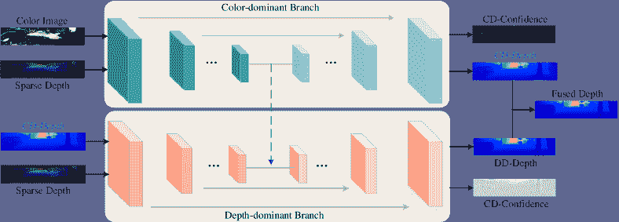 |
| --- |

图 11：PENet[56]框架属于双分支架构。它由两个分支组成，分别可以从色彩主导和深度主导信息中生成深度估计。

使用密集伪深度图作为最终预测的粗略参考，[39]能够输出稳定且准确的密集深度图。与传统的双分支结构点估计方法不同，[182]开发了一种条件先验网络（CPN），用于计算每个像素深度的后验概率，并结合使用稀疏测量的似然项。标准卷积操作将内核应用于图像中的像素网格，但无法处理深度值分布不均的稀疏深度图。为了解决这个问题，[194]提出利用图传播来提取空间上下文。考虑到图结构的可变性，它在引导图传播中应用了共同注意力模块[100]，以实现高效的多模态表示提取。将传统方法与双分支深度网络相结合，[175]取得了令人满意的结果。在最近的研究中，[8]采用两个平行的 Unet 形状网络，以不同尺度提取 RGB 和深度特征。然后，通过提出的注意力引导跳跃连接（AG-SC）模块在解码阶段进行特征融合，得到了理想的结果。相比之下，[185]提出了一种名为 PointDC 的网络，该网络利用 2D 和 3D 信息进行稳健的深度补全。

引导图像滤波。在 GDC 中，深度引导图像滤波可以视为一种双分支结构，利用 RGB 图像中的特征来预测一个内核。这个内核通常由深度网络学习并应用于深度图中，以进行特征融合或密集深度预测。

受到经典引导图像滤波的启发[152, 49]，[150]提出了一种引导网络，包括 GuideNet 和 DepthNet，用于恢复密集深度图。在 GuideNet 中，预测了内容相关和空间变异的卷积核，以捕捉颜色图像中与真实世界场景一致的几何结构特征。此外，引入了卷积因子分解，以减少计算开销。

[89]提出了一种两阶段模型，其中深度插值和细化按顺序进行。具体而言，他们首先通过提出的可微内核回归层插值稀疏深度图，比手工设计的滤波器更有效。然后，采用基于 U-net 的残差网络来细化粗略的深度图。

### 4.2 基于亲和力的方法

以通用矩阵的形式，亲和矩阵表示数据点集之间的成对接近信息。由于用于学习亲和矩阵的空间传播网络（SPN）首次被用于深度补全 [95]，因此做出了许多重要努力以改进它，并取得了令人印象深刻的成果。在这项开创性的工作中，亲和矩阵可以在整个图像中建立任意两个像素之间的关联，其由空间变换矩阵组成。给定在迭代$t$的隐藏表示 $H^{s}$，利用亲和矩阵 $w$ 进行空间传播可以表示为：

|  | $\mathbf{H}_{p,q}^{t+1}=(I-d_{t})\mathbf{H}_{p,q}^{t}+\sum_{p,q\in N_{p,q}}w_{p,q}^{i,j}\mathbf{H}_{i,j}^{t}$ |  | (24) |
| --- | --- | --- | --- |

其中 $(p,q)$ 和 $(i,j)$ 分别是参考像素和邻域像素的位置，$N_{p,q}$ 表示 $(p,q)$ 的邻域，而 $d_{t}=1-\sum_{i,j\in N_{p,q}}w_{p,q}^{i,j}$。

| 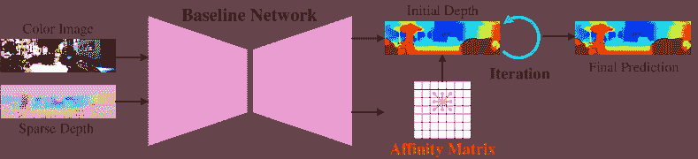 |
| --- |

图 12: 属于亲和方法的 CSPN 框架 [11]。在每一步，CSPN 同时在所有方向上传播局部区域。

由于空间传播一次只在某一方向上进行，因此这种按序列运行的方法的时间成本较高。相比之下，[11] 将任务表述为各向异性扩散滤波[166, 94]，并通过一个名为 CSPN 的卷积网络实现，如图 12 所示。具体来说，他们首先使用一个基于 Unet 的网络，该网络输入 RGB 图像和稀疏深度图，并输出模糊深度图和亲和矩阵。然后，使用递归卷积操作进行传播。然而，这两种方法都在传播中固定了接收场，这可能导致任务的结果不尽如人意。为了解决这个问题，一些采用灵活传播方案的方法被提出，例如 CSPN++ [10]，非局部 SPN (NLSPN) [113]，可变形 SPN (DSPN) [178] 和动态 SPN (DySPN) [84]。

为了进一步提高深度补全模型的性能，[10] 提出了 CSPN++，其中包括两个变体，即上下文感知 CSPN（CA-CSPN）和资源感知 CSPN（RA-CSPN）。通过将 CSPN 中的两个常数——迭代次数和卷积核大小——转化为变量，CA-CSPN 可以自适应地组合传播中的不同步骤的结果。然而，实际上，计算复杂度过高，无法在实际应用中部署。为了加快算法速度，RA-CSPN 根据学习到的超参数为每个像素选择最佳的卷积核大小和迭代次数。通过这些改进，该方法可以动态分配每个像素所需的上下文和计算资源。

与 CSPN++不同，NLSPN[113] 提出了一个基于非局部邻域的两阶段网络，而不是固定感受野。在第一阶段，使用 U-net 生成粗略深度、置信度图和非局部邻域预测及其原始亲和度。然后，使用可变形卷积[204]进行迭代计算非局部空间传播。这样可以避免无关特征，同时突出显示相关的非局部邻域特征。与 NLSPN[113]类似，DSPN[178]也使用可变形卷积进行空间传播，这可以根据像素之间的依赖关系提供自适应的感受野。

后来，受动态卷积的启发[9]，[84] 开发了一种非线性传播模型，称为动态空间传播网络（DySPN），其中亲和矩阵被解耦为根据距离划分的部分。对于不同距离的邻域，亲和度被赋予不同的权重以改善 CSPN。此外，他们提出了一种扩散抑制操作，该操作根据注意力矩阵自适应地在特定像素上停止迭代，以避免过度平滑问题。根据不同的计算预算，他们设计了三种自适应亲和矩阵的变体，以在性能和复杂性之间取得平衡。

[98] 将 SPN 和图神经网络整合到一个框架中，从而能够学习邻域和远程特征。为了适应实际应用，[134, 17] 提出了可以实现良好泛化的新方法。[191] 采用非局部空间传播网络来提升初始深度图的质量。至于产生初始深度的骨干网络，他们提出了一种新型的单分支网络，融合了 CNN 和 transformers 的优点。在该网络中，他们设计了一个联合卷积注意力和 transformer (JCAT) 模块，包含两个路径——transformer 层和卷积注意力层——并且比纯 transformer 方法具有更高的效率。为了学习邻域亲和力，[73] 提出了一个利用多尺度和局部特征的网络。[163] 提出了一个长短期范围递归更新 (LRRU) 网络，利用迭代方案，并采用更少的参数实现了最先进的性能。

### 4.3 辅助方法

如 Sec. 3.3 中所述，辅助学习利用几个相关任务来提升主要任务的性能[192]。许多使用辅助学习的方法也出现在 GDC 中。[2] 提出了一个多任务框架，允许进行单目深度估计和稀疏深度补全。该网络实现为基于编码器-编码器架构的两个级联子网络，第一个从彩色图像生成稀疏深度图，第二个估计密集深度图，输入为前一个稀疏深度图。为了在最终深度图中获得清晰的深度边界，他们在合成和真实世界数据集上采用了对抗训练。

| 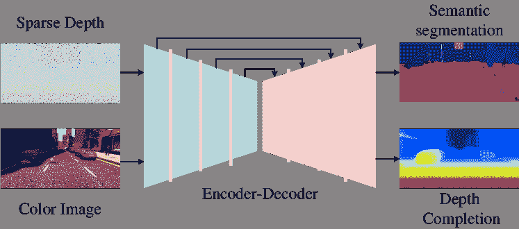 |
| --- |

图 13: MNASnet 框架[60]属于辅助方法。它可以在最后一层进行少量更改的情况下，同时执行深度补全和语义分割。

除了单眼深度估计，语义分割也有助于深度补全性能的提升。[60] 进行多任务学习，即深度补全和语义分割，如图 13 所示，通过在公共网络的末端设计不同的头部，例如 NASNet [206]。当深度密度变化时，该方法仍能有效地融合跨模态特征。不同于之前的方法，这些方法不利用辅助任务的结果，[188] 使用语义图来提高深度补全的准确性。为了将语义分割和深度补全集成到一个框架中，他们结合语义引导的平滑损失，构建了多任务生成对抗网络，这一思路受到了[193]的启发。除了语义分割和深度补全，边缘检测作为这两项任务之间的桥梁，被引入到同时进行语义分割和深度补全的多任务网络（SSDNet）[207]中。基于语义分割和深度补全的多任务学习，[52] 利用边界类别标记来调整相邻像素的效果。在[81]中，作者联合执行多个感知任务，包括 2D 和 3D 物体检测、地面估计和深度补全，以获得更好的表征。尽管这项工作旨在物体检测，但它表明所选任务是互补的，因此其他任务提供的有用线索也可以应用于深度补全。受到[101]的启发，[125] 设计了一个辅助任务，以生成深度轮廓，同时在网络末端输出稠密深度图。

研究人员利用一些额外的辅助信息来提高密集深度图的精度。通过修改的自编码器框架，[190, 123] 提出了从彩色图像估计表面法线图以提高深度准确性。在 [123] 中，表面法线被视为中间表示，因为它们可能在距离测量中产生更高的误差。考虑到表面法线的局限性，颜色分支估计的密集深度图也被纳入最终密集深度的生成中。[88] 不是从彩色图生成表面法线，而是将稀疏深度图生成的法线图作为训练过程中的中间约束。[177] 引入了一个统一的两阶段框架，基于自然场景可以由分段平面表示的假设。他们构建了一个扩散模块，该模块结合了深度和表面法线之间的几何约束。这个模块是可微分的，允许扩散导电率根据引导中的相似性进行灵活调整。受到 [154, 56] 的启发，[111] 增加了一个语义引导的分支以突出深度不连续性。

一些研究利用点云来增强模型性能，而不是使用表面法线作为辅助信息。为了应对不可预测的现实世界环境，[62] 提出了基于所提出的注意双边卷积层的点云中心方法。这个 3D 卷积层包括四个步骤，即：splat、convolve、attention 和 slice，可以直接对点云进行卷积操作，并专注于捕捉对 GDC 有帮助的特征。

有时，深度补全作为辅助信息也可以提升其他任务的性能。例如，[6, 172] 将深度补全网络集成到目标检测模型中，以实现更准确的结果。

### 4.4 聚焦融合的方法

与 GDSR 类似，融合策略对 GDC 也至关重要。与简单的融合方法（如串联 [29, 205] 或求和 [137, 130]）相比，研究人员设计了各种复杂且有效的方法。

[72] 提出了一种多尺度网络，通过每个编码器尺度的注意机制交换信息。[179] 采用类似的策略，在多个尺度下融合跨模态特征。[194] 通过提出的对称门控融合策略进行多模态信息融合，该策略由两个路径组成，每个路径旨在用从其他模态中自适应提取的特征调制当前模态特征。使用此策略，可以跨模态交互特征，从而使模型获得准确的深度估计。[90] 开发了一种新颖的粗到细框架，强调跨模态信息的融合。它引入了通道混洗提取操作，以融合不同模态的特征。接下来，他们提出了一种基于能量的融合操作，选择具有较高区域能量的特征值，以有效地融合特征。[66] 提出了一个多模态深度聚合网络（MDANet），包含多个连接和聚合路径，以实现两种模态的更深融合。[91] 设计了一种多特征通道混洗提取，利用通道混洗操作在编码阶段融合彩色图像和深度图的特征。然后，将多尺度特征加权组合引入解码过程，以进一步增强信息融合效果。

| 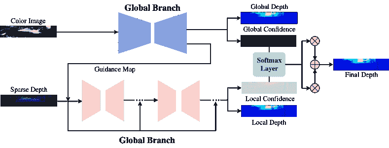 |
| --- |

图 14：FusionNet 的框架[154]，属于融合策略类别。这种方法基于置信度图以晚期融合的方式融合全局和局部特征。

### 4.5 不确定性引导

到目前为止，大多数调研工作的算法设计并未考虑稀疏深度的可靠性。最近，两类不确定性，即**偶然不确定性**和**认识不确定性**，已在 GDC 中与贝叶斯深度学习一起考虑。偶然不确定性或随机不确定性表示同一实验中每次观察的固有随机性。在 GDC 任务中，偶然不确定性指的是原始 LiDAR 数据中的随机噪声和稀疏像素的分布。认识不确定性或系统性不确定性通常由模型忽略某些实际因素造成。因此，GDC 的模型通常关注处理偶然不确定性。

[28, 29] 引入了一种新颖的框架，并提出了代数约束的归一化卷积层，其中可以计算和传播置信度。这里，置信度作为辅助信息用于提升模型性能。此外，他们提出了一种通过最大化最终置信度来约束训练的损失函数。后来，[27] 通过归一化卷积层以无监督方式估计输入深度的置信度，这可以显著提高深度预测的准确性。

如图所示 14，[154] 分别在全局和局部分支中估计置信度图。基于最后一层通过 softmax 函数计算的学习到的置信度图，模型可以更加关注可靠的像素。类似地，[123] 输出用于遮挡处理的置信度图，并将来自彩色图像和法线的深度预测也进行整合。[177] 通过解码器获取置信度图，以抑制深度图中的噪声传播。

[205] 提供了一种基于 Jeffrey 先验的新颖不确定性公式，这可以提高模型对噪声或无效像素的鲁棒性。在第一阶段，该提出的多尺度联合预测模型输出粗略的深度和不确定性图，然后将其发送到不确定性关注残差学习网络进行深度细化。通过他们的架构和损失函数，可以很好地处理离群点和像素的不均匀分布。此外，[115] 尝试采用提出的不确定性感知采样算法来识别像素的可靠性，这有利于随后对每个像素深度范围的自适应预测。

| 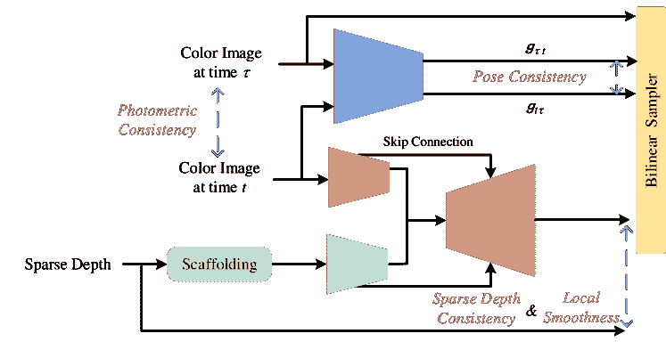 |
| --- |

图 15: VIO [169] 框架属于无监督方法。结合了光度一致性、稀疏深度一致性、姿态一致性和局部平滑性的四种损失，使得网络可以完全无监督地进行训练。

| 范式 | 方法 | 参考文献 | 关键理念 |
| --- | --- | --- | --- |
| 双分支 | MNASNet [60] | 3DV-2018 |

&#124; 利用来自双流的融合特征生成最终的密集估计 &#124;

&#124; 通过解码器实现。 &#124;

|

| GuideNet [150] | TIP-2020 | 提出了一种用于深度完成的沙漏网络。 |
| --- | --- | --- |
| KernelNet  [89] | TIP-2021 | 提出了一种两阶段模型，其中深度插值和细化依次进行。 |
| RigNet [180] | ECCV-2022 | 利用基于沙漏网络的重复设计。 |
| MSG-CHN [74] | WACV-2020 | 将级联架构引入沙漏网络。 |
| CDCNet  [30] | BMVC-2022 |
| Penet [56] | ICRA-2021 | 以粗到细的方式提高深度预测的准确性。 |
| FusionNet [154] | MVA-2019 |

&#124; 利用全局和局部分支中的置信图实现引导-&#124;

&#124; 基础方法。&#124;

|

| DenseLiDAR [39] | RAL-2021 | 使用密集伪深度图作为最终预测的粗略参考。 |
| --- | --- | --- |
| SDDC [175] | Visual Computer-2023 | 提出语义引导分支，以获得更好的预测结果。 |
| QNN [63] | CVPR-2022 |

&#124; 采用双分支结构，以低功耗实现高效解决方案&#124;

&#124; 消耗。&#124;

|

| ACMNet [194] | TIP-2021 |
| --- | --- |

&#124; 通过提出的对称门控进行多模态信息融合&#124;

&#124; 融合策略。&#124;

|

| PointDC [185] | ICCV-2023 | 提出了一种双分支网络，用于提取 2D 和稀疏 3D 特征点云以完成深度。 |
| --- | --- | --- |
| AGGNet [8] | ICCV-2023 | 设计了一个带有注意力机制的双分支自编码器，以获得密集的深度图。 |
| Affinity-based | SPN [95] | NeurIPS-2017 |

&#124; 利用空间传播网络学习深度的亲和矩阵&#124;

&#124; 完成。&#124;

|

| CSPN [11] | ECCV-2018 |
| --- | --- |

&#124; 将任务表述为各向异性扩散滤波，并通过&#124;

&#124; 深度网络。&#124;

|

| CSPN++ [10] | AAAI-2020 | 提出包括上下文感知和资源感知 CSPNs 的新结构。 |
| --- | --- | --- |
| NLSPN [113] | ECCV-2020 |

&#124; 提出基于非局部邻居的两阶段网络，而不是&#124;

&#124; 固定感受野。&#124;

|

| DSPN [178] | ICIP-2020 | 通过可变形卷积进行空间传播。 |
| --- | --- | --- |
| DySPN [84] | AAAI-2022 |

&#124; 开发一个非线性传播模型，其中亲和矩阵被解耦&#124;

&#124; 根据距离将其划分为不同部分。&#124;

|

| GraphCSPN [98] | ECCV-2022 |
| --- | --- |

&#124; 整合 SPN 和图神经网络，以学习邻近和长距离-&#124;

&#124; 范围特征。&#124;

|

| Ssgp [134] | WACV-2021 |
| --- | --- |

&#124; 提出统一架构以在&#124;

&#124; 不同领域。&#124;

|

| SpAgNet [17] | WACV-2023 |
| --- | --- |

&#124; 提出不依赖于分布和密度的深度完成方法&#124;

&#124; 密度。&#124;

|

| CompletionFormer [191] | CVPR-2023 |
| --- | --- |

&#124; 利用非局部空间传播网络提高深度&#124;

&#124; 卷积和变换器获得初始深度后的质量。&#124;

|

| DenseLConv [73] | IROS-2022 | 提出了一种不依赖于分布和密度的深度完成方法。 |
| --- | --- | --- |
| LRRU [163] | ICCV-2023 | 提出一种轻量级网络来学习空间变换核，并进行迭代更新。 |
| 基于辅助的 | DCMDE [2] | 3DV-2019 |

&#124; 提出一个多任务框架，进行单目深度估计和 &#124;

&#124; 稀疏深度完成。 &#124;

|

| 多任务 GANs [188] | TNNLS-2021 |
| --- | --- |

&#124; 提出一种多任务网络，使用语义图像提高精度 &#124;

&#124; 深度完成的组成部分。 &#124;

|

| SSDNet  [207] | Sensors-2020 |
| --- | --- |

&#124; 引入边缘检测，作为语义分割的桥梁 &#124;

&#124; 和深度完成。 &#124;

|

| MMF  [81] | CVPR-2019 |
| --- | --- |

&#124; 结合 2D 和 3D 目标检测、地面估计和深度完成 &#124;

&#124; 以获得更好的表示。 &#124;

|

| DPS  [52] | RAL-2019 |
| --- | --- |

&#124; 提出一种从稀疏 LIDAR 点云估计密集深度的方法 &#124;

&#124; 和图像序列。 &#124;

|

| SIUNet  [125] | WACV-2023 |
| --- | --- |

&#124; 提出一个网络，将深度轮廓作为辅助信息来获得 &#124;

&#124; 密集深度图。 &#124;

|

| DDC  [190] | CVPR-2018 | 提出从彩色图像估计表面法线图，以提高深度精度。 |
| --- | --- | --- |
| Deeplidar  [123] | CVPR-2019 |
| NNNet  [88] | IEEE Access-2022 |
| DNC  [177] | ICCV-2019 |

&#124; 通过解码器获得置信度图，以抑制噪声传播 &#124;

&#124; 深度图中的 &#124;

|

| SemAttNet  [111] | IEEE Access-2022 |
| --- | --- |

&#124; 添加一个语义引导分支用于深度完成，以突出深度 &#124;

&#124; 不连续性。 &#124;

|

| ABCD  [62] | RAL-2021 |
| --- | --- |

&#124; 提出一种以点云为中心的方法，基于提出的注意力机制 &#124;

&#124; 双边卷积层。 &#124;

|

表 4：引导深度完成方法的列表，按前三种分类进行划分。

| 模式 | 方法 | 参考文献 | 关键思想 |
| --- | --- | --- | --- |
| 聚焦融合 | CGM  [89] | IEEE Access-2020 |

&#124; 提出一个两阶段模型，其中深度插值和细化是 &#124;

&#124; 依次执行。 &#124;

|

| RSIC  [179] | IEEE Access-2020 | 采用类似策略在多个尺度下融合跨模态特征。 |
| --- | --- | --- |
| FCFR-Net  [90] | AAAI-2021 |

&#124; 开发一种新颖的粗到细的框架，强调 &#124;

&#124; 跨模态信息。 &#124;

|

| MDANet  [66] | ICRA-2021 |
| --- | --- |

&#124; 提出一种多模态深度聚合块，由多个 &#124;

&#124; 连接和聚合路径以实现更深层次的融合。 &#124;

|

| MFF-Net  [91] | RAL-2023 |
| --- | --- |

&#124; 提出一种多特征通道混洗提取和交叉模态信息解码过程的方案。 &#124;

&#124; 多尺度特征的融合。 &#124;

|

| 不确定性引导 | MS-Net  [29] | TPAMI-2019 |
| --- | --- | --- |

&#124; 引入一种新颖的框架，提出代数约束&#124;

&#124; 归一化卷积层。&#124;

|

| pNCNN  [27] | CVPR-2020 |
| --- | --- |

&#124; 使用归一化卷积层估计输入深度的置信度&#124;

&#124; 以无监督的方式进行的层。&#124;

|

| MJPM  [205] | AAAI-2022 |
| --- | --- |

提供杰弗瑞的先验不确定性公式，以提高模型的&#124;

&#124; 对噪声和无效像素输入的抵抗力。&#124;

|

| FusionNet [168] | RAL-2021 | 利用合成数据集缓解真实图像对的缺乏。 |
| --- | --- | --- |
| PADNet  [115] | ACM MM-2022 |

&#124; 采用提出的不确定性感知采样算法来识别&#124;

&#124; 像素的可靠性，这对深度范围预测有利。&#124;

|

| 无监督 | SfMLearner [201] | CVPR-2017 |
| --- | --- | --- |

&#124; 单视角深度预测和多视角相机姿态估计来自两个&#124;

&#124; 独立网络。&#124;

|

| SSDC [105] | ICRA-2019 | 提出从稀疏输入到密集预测的映射学习。 |
| --- | --- | --- |
| lsf [124] | WACV-2020 |

&#124; 提出用于自监督学习基准的最小二乘拟合模型&#124;

&#124; 网络。&#124;

|

| VIO [169] | ICRA-2020 |
| --- | --- |

使用场景的分段平面支撑作为监督以实现自我&#124;

&#124; 监督学习。&#124;

|

| KBNet [170] | ICCV-2021 | 利用提出的标定反投影层来改善基准性能。 |
| --- | --- | --- |
| Monitored Distillation [96] | ECCV-2022 | 将知识蒸馏引入深度补全。 |
| CostDCNet [65] | ECCV-2022 | 提出基于代价体积的深度估计的双分支网络。 |
| Struct-MDC [61] | RAL-2022 | 首先通过利用点和线特征执行网格深度构建。 |
| DDP [182] | CVPR-2019 | 开发一个条件先验网络来计算每个像素深度的后验概率。 |
| AGG-CVCNet [176] | ACM MM-2022 | 提出一种新颖的邻接几何引导训练损失。 |
| MSC [189] | Remote Sensing-2022 | 引入多模态时空一致性约束以训练模型。 |
| LeoVR [75] | MobiSys-2022 |

表 5：引导深度补全方法列表，按最后三种分类划分。

### 4.6 无监督方法

实际操作中，由于 LiDAR 成像原理的限制，密集的真实深度图很难获得。即使是高端 LiDAR，也只能生成最多$30\%$的有效像素[153]。因此，一些方法尝试通过自监督学习来解决这个问题，其中代表性的类别利用单目序列或同步立体对来构建监督信号。

如图 15 所示，[201]设计了一个自监督框架，其中只需要提供颜色和深度序列，而不是稀疏/密集的图像对。该方法通过两个独立的网络生成单视图深度预测和多视图相机姿态估计。[105]通过引入三种损失函数，即稀疏深度损失、光度损失和光滑性损失，将这一原理引入 GDC。在这个框架下，性能甚至超过了一些具有半密集注释的方法。为了提高对噪声和离群点的鲁棒性，[124]用提出的最小二乘拟合模型替代了自监督学习基准网络[38]的最后卷积层。[169]提出使用场景的分段平面支架作为监督来实现自监督学习。使用类似结构的[170]利用提出的标定反投影层来改进基线，而[96]则将知识蒸馏引入深度补全。[65]提出了一种受成本体积深度估计启发的双分支网络，该网络可以从跨模态输入中获取信息丰富的 2D 和 3D 表示，且具有轻量级结构设计。在[61]中，他们首先通过利用点和线特征进行网格深度构建，然后将其与颜色图像一起输入网格深度优化模块。最后，可以通过标定反投影网络（KBNet）[170]获得深度预测。虽然大多数网络在真实数据集上训练，[168, 99]则在合成数据集上训练他们的模型，从而缓解了缺乏真实图像对和密集标签的问题。

在无监督学习中，立体对也发挥了重要作用。在自监督立体方法中，大多数使用光度一致性 [37, 182, 137] 来推断几何并获得有前景的结果。相比之下，[176] 提出了一个新颖的相邻几何引导训练损失，通过高置信度标签来限制低置信度区域的深度图。[189, 75] 引入了多模态时空一致性约束来训练模型，使模型更好地适应现实世界环境，如黑暗和低纹理物体。

总结本节内容，表格 4 和 5 收集了迄今为止讨论的方法，分为六类。每种方法报告了其场地和年份，并简要描述了其核心思想。

## 5 基准数据集和目标函数

我们介绍了与我们的调查相关的现有数据集以及用于训练我们之前调查的方法的最常见损失函数。

### 5.1 数据集

本节介绍了用于 RGB 引导的 ToF 成像的公共数据集；它们根据 ToF 相机收集的图像特征分为低分辨率和稀疏深度。

|  | 数据集 | 参考文献 | 年份 | 传感器名称 | 捕捉条件 | 模态 | 图片 |
| --- | --- | --- | --- | --- | --- | --- | --- |
| LR Depth | ToFMark |  [33] | 2013 | PMD Nano | 室内 | 彩色, 深度 | 3 张图片 |
| Lu |  [102] | 2014 | ASUS Xiton Pro | 室内 | 彩色, 深度 | 6 |
| SUN RGBD |  [140] | 2015 | Kinect v2 | 室内 | 彩色, 深度 | 2860 |
| DIML |  [12] | 2021 |

&#124; Kinect v2, &#124;

&#124; ZED Stereo &#124;

|

&#124; 室内, &#124;

&#124; 户外 &#124;

| 彩色, 深度 | $>$200 场景 |
| --- | --- |
| RGBDD |  [50] | 2021 |

&#124; Huawei P30 Pro, &#124;

&#124; Helios &#124;

|

&#124; 室内, &#124;

&#124; 户外 &#124;

| 彩色, 深度 | 4811 张图片 |
| --- | --- |
| Middlebury |  [133]  [53]  [131] | 2003 2007 2014 | 结构光 结构光立体相机 | 室内 | 彩色, 深度 | 32 张图片 |
| NYUv2 |  [138] | 2012 | Kinect V1 | 室内 | 彩色, 深度 | 1449 张图片 |
| MPI Sintel Depth |  [5] | 2012 | Blender |

&#124; 室内, &#124;

&#124; 户外 &#124;

|

&#124; 彩色, 深度 &#124;

&#124; 光流 &#124;

| 1064 张图片 |
| --- |
| ToF-FT3D |  [158] | 2022 | 合成 | – | 彩色, 深度 | 6250 视图 |
| 稀疏深度 | KITTI |  [153] | 2017 | Velodyne, 立体相机 | 户外 | 彩色, 深度 | 94k 帧 |
| DenseLivox |  [184] | 2021 |

&#124; Livox LiDAR, &#124;

&#124; RealSense d435i &#124;

|

&#124; 室内, &#124;

&#124; 户外 &#124;

| 彩色, 深度 | 6 场景 |
| --- | --- |
| KITTI-360 |  [82] | 2022 | Velodyne, 立体相机 | 户外 |

&#124; 彩色, 深度, &#124;

&#124; GPS, IMU &#124;

| 150 场景 |
| --- |
| Gibson |  [173] | 2018 |

&#124; NaVis, Matterport 相机, &#124;

&#124; DotProduct &#124;

| 户外 | 彩色, 深度 | 572 场景 |
| --- | --- | --- |
| Virtual KITTI |  [35] | 2016 | 合成 | 户外 | 彩色, 深度 | 50 视频 |
| Leddar Pixset |  [22] | 2021 | Leddar Pixell LiDAR | 户外 |

&#124; 彩色, 深度 &#124;

&#124; IMU, 雷达 &#124;

| 29k 帧 |
| --- |
| Waymo Perception |  [146] | 2020 | LiDAR | 户外 | 彩色, 深度 | 1150 场景 |
| DDAD |  [42] | 2020 | Luminar-H2 LiDAR | 户外 | 彩色, 深度 | 150 场景 |
| 近碰撞集 |  [107] | 2019 |

&#124; LiDAR (N/A), &#124;

&#124; 立体相机 &#124;

| 室内 | 彩色, 深度 | 13658 序列 |
| --- | --- | --- |

表 6: RGB 引导的 ToF 数据集，根据深度图属性进行划分。

#### 5.1.1 低分辨率深度

在这里，我们主要介绍由 RGB 引导的 ToF 相机收集的低分辨率图像组成的数据集，这些数据集可用于通过某些采样策略进行深度超分辨率和深度完成。我们还介绍了该领域常用的数据集，如 Middlebury [133, 53, 132, 131], NYU v2 [138], MPI Sintel Depth [5] 和 ToF-FT3D[158]，尽管它们是由其他传感器采集或合成的。

ToFMark [33]: 该数据集通过 PMD Nano ToF 相机捕获了 3 个现实世界场景，即书籍、鲨鱼和魔鬼。

LU [102]: 该数据集包含 6 张由 ASUS Xtion Pro 相机拍摄的 RGBD 图像，通常用作验证或测试集。

SUN RGBD [140]: SUN RGBD 数据集包含 10,335 对由四种不同传感器获取的室内图像。该数据集通常用于场景理解任务。此外，这个数据集还可以用于研究跨传感器的偏差。

DIML [12]: DIML 是一个大规模 RGBD 数据库，包含 200 万 RGBD 帧。为了获得高精度的深度图，他们使用 Kinect v2 捕捉室内场景，并使用 ZED 立体相机捕捉户外场景。在户外场景中，还提供了视差的置信度图。

RGBDD [50]: RGBDD 建立了第一个深度图 SR 数据集，可以反映实际 LR 和 HR 深度图之间的对应关系。该数据集包含 4811 张捕捉各种场景的图像，如人体、玩具娃娃、玩具和植物。值得注意的是，LR 和 HR 深度图分别由华为 P30 Pro 和 Helios ToF 相机采集。

Middlebury [133, 53, 132, 131]: Middlebury 数据集是 GDSR 领域广泛使用的数据集，由来自不同年份的四个子数据集组成。Middlebury 2003[133]、Middlebury 2005 [53]、Middlebury 2006 [132]和 Middlebury 2012 [131]是由立体摄像机在室内条件下获取的。这些数据集使用立体图像对生成深度图。

NYUv2 [138]: 该数据集使用 Microsoft Kinect v1 摄像头捕获了 1449 张图像。大多数先前的工作将前 1000 张 RGBD 图像作为训练集，其余 449 张图像作为测试集。[18, 110]随机选择了 849 张图像用于训练，300 张用于验证，300 张用于评估。

MPI Sintel Depth [5]: 该数据集来源于用于光流评估的动画短片。它提供了合成的视频序列，包括 35 个自然场景，并提供了深度图。

ToF-FT3D [158]: ToF-FT3D，也称为 ToF-FlyingThings3D，是一个合成数据集，通过 Blender 捕获了 6250 个不同的视角。类似于用于光流估计的 FlyingThings3D [109]，它包括沿随机 3D 轨迹飞行的物体。此外，该数据集提供了分辨率为$640\times 480$的 ToF 幅度、ToF 深度和 RGB 图像。

#### 5.1.2 稀疏深度

在实际应用中，稀疏深度图通常由 LiDAR 生成，仅包含约$4\%$的有效像素[153]。在一些极端条件下，甚至不到$1\%$的像素被有效测量[43, 41]。虽然可以通过采样策略从密集深度图中获得稀疏深度图，但这里我们关注的是由 LiDAR 收集的数据集。

KITTI [153]: KITTI 是由卡尔斯鲁厄理工学院（KIT）和芝加哥丰田技术研究所（TTI-C）最初收集的数据集。作为自动驾驶领域最重要的数据集之一，它捕获了超过 93K 的深度图，并附有相应的原始 LiDAR 扫描和 RGB 图像。用于数据采集的 LiDAR 和两台彩色摄像头分别是 Velodyne HDL-64E 和 Point Grey Flea 2（FL2-14S3C）。基于 KITTI 原始数据集，[153]去除了场景中的噪声和伪影，并聚合了多个 LiDAR 扫描以获得更密集的真实深度，使该数据集适合用于 GDC。该数据集中有 86,000、7,000 和 1,000 对图像分别用于训练、验证和评估。

Virtual KITTI [35]: 该数据集是一个逼真的合成视频数据集，包含 50 个视频，总共有 21,260 帧。数据集中的场景使用 Unity 游戏引擎和真实到虚拟的克隆方法生成。它可以应用于多种任务，例如物体检测、物体跟踪、实例语义分割等。

KITTI-360 [82]: KITTI-360 是一个新收集的大规模数据集，具有丰富的传感器信息和完整的标注。该数据集捕获了超过 32 万张图像和 10 万次激光扫描，包括标注的静态和动态 3D 场景元素。

Gibson [173]: Gibson 包含 572 栋完整建筑，共 1447 层，总面积为 211,000 $m^{2}$。除了深度图和相应的彩色图外，它还提供了法线图和语义物体标注。

DenseLivox [184]: 该数据集使用 Livox Horizon LiDAR 和 Intel RalSense D435i 相机采集图像。它包含密集且准确的深度作为真实值，具有高达$88.3\%$的有效像素覆盖率。

Leddar Pixset [22]: Leddar Pixset 是第一个用于自动驾驶的全波形闪光 LiDAR 数据集。它包含 29,000 帧，涵盖 97 个不同环境、天气条件和时间段的序列，并标注了超过 130 万的 3D 边界框。

Waymo Perception [146]: 该数据集由五个 LiDAR 传感器和五个高分辨率针孔相机收集，所有传感器都经过同步和校准。它捕获了 1150 个场景，包括城市和郊区区域，每个场景持续 20 秒。通常，1000 个场景用于训练，150 个场景用于测试。

DDAD [42]: DDAD 是丰田研究所推出的自动驾驶新基准数据集，包含单目视频和准确的真实深度数据。它具有较长的可测量距离，最长可达 250 米。训练集中有 150 个场景，共 12,650 对图像，验证集中有 50 个场景，共 3,950 对图像，测试集中有 3,080 张图像。

Near-Collision Set [107]: Near-Collision Set 是一个大规模的真实世界数据集，用于近碰撞预测，使用立体相机和 LiDAR 传感器收集。在此数据集中，提供了彩色图像、准确的深度和人体姿态标注。它包含 13,658 段人在室内走廊导航的自视视频片段。

总之，表 6 列出了我们迄今讨论的主要数据集，根据输入深度图是否为 LR 或稀疏进行分类，同时报告了数据收集年份、使用的传感器、采集环境、感知的模态和图像数量。

### 5.2 目标函数。

值得注意的是，训练模型的性能与损失函数的选择直接相关，因为损失函数估计了训练过程中网络权重需要应用的修正。在本节中，我们将讨论 RGB 引导 ToF 成像的一般损失函数，以及 GDSR 和 GDC 两个子任务中常用的损失函数。

#### 5.2.1 一般损失

在 RGB 引导的 ToF 成像中，最常用的损失函数是平均绝对误差 (MAE)、均方误差 (MSE) 和均方根误差 (RMSE)。MAE 在许多工作中使用[60, 137, 151, 149]，也称为 $l_{1}$ 损失

|  | $\mathrm{MAE}=\frac{1}{N}\sum_{p\in N}\parallel Z_{hq}^{p}-\hat{Z}_{hq}^{p}\parallel_{1}$ |  | (25) |
| --- | --- | --- | --- |

其中 $\parallel\cdot\parallel_{1}$ 表示 $l_{1}$ 范数，$N$ 表示深度图中有效像素的总数。一些方法[106, 196] 采用 MSE ($l_{2}$ 损失)，其定义为

|  | $\mathrm{MSE}=\frac{1}{N}\sum_{p\in N}\parallel Z_{hq}^{p}-\hat{Z}_{hq}^{p}\parallel_{2}$ |  | (26) |
| --- | --- | --- | --- |

其中 $\parallel\cdot\parallel_{2}$ 表示 $l_{2}$ 范数。另一个常见的量是 RMSE，即 MSE 的平方根：

|  | $\mathrm{RMSE}=\sqrt{\mathrm{MSE}}$ |  | (27) |
| --- | --- | --- | --- |

作为图像质量评估的感知度量，结构相似性指数 (SSIM) 基于可见结构，其定义如方程 19 所示。

#### 5.2.2 GDSR 的损失函数。

为了实现更强的训练，某些方法[92] 使用 Charbonnier 损失[7]：

|  | $l_{cha}=\sqrt{\parallel Z_{hq}^{p}-\hat{Z}_{hq}^{p}\parallel^{2}+\epsilon^{2}}$ |  | (28) |
| --- | --- | --- | --- |

其中 $\epsilon$ 表示一个常数，以确保惩罚项非零。有时，峰值信噪比 (PNSR) 也用于 GDSR。PSNR 可以表述为：

|  | $\mathrm{PSNR}=10\log_{10}(\frac{Z_{max}^{2}}{\mathrm{MSE}})$ |  | (29) |
| --- | --- | --- | --- |

其中 $Z_{max}$ 是最大深度值。两个深度图之间的像素值差异越小，PSNR 越高。

#### 5.2.3 GDC 的损失函数。

深度损失。在训练过程中，由于 MAE 平等对待所有误差，而 MSE 强调异常值，Huber 损失结合了两者的优点：

|  | $l_{huber}=\begin{cases}\frac{1}{N}\sum_{p\in N}\frac{1}{2}(Z_{hq}^{p}-\hat{Z}_{hq}^{p})^{2},&amp;\vert Z_{hq}^{p}-\hat{Z}_{hq}^{p}\vert\leq 1\\ \frac{1}{N}\sum_{p\in N}(\vert Z_{hq}^{p}-\hat{Z}_{hq}^{p}\vert-\frac{1}{2}),&amp;\vert Z_{hq}^{p}-\hat{Z}_{hq}^{p}\vert>1\end{cases}$ |  | (30) |
| --- | --- | --- | --- |

其中 $|\cdot|$ 是绝对值运算符。在[154] 中，提出了一种名为 Focal-MSE 的损失函数，受到[83] 启发，并证明优于 MSE，其公式为：

|  | $l_{focal}=\frac{1}{N}\sum_{p\in N}(1+\frac{\mathrm{epoch}}{20}\,\vert Z_{hq}^{p}-\hat{Z}_{hq}^{p}\vert)\cdot(Z_{hq}^{p}-\hat{Z}_{hq}^{p})^{2}$ |  | (31) |
| --- | --- | --- | --- |

不确定性驱动的损失。考虑到从 LiDAR 捕获的深度图的分布不均，不确定性驱动的损失被引入[177, 27, 205]，以关注更可靠的像素。在他们的工作中，GDC 被定义为最大化后验概率。最终优化的损失与 Jeffrey’s prior[34] 可以写为：

|  | $l_{ud}=\frac{1}{N}\sum(e^{-s_{n}}(Z_{hq}^{p}-\hat{Z}_{hq}^{p})^{2}+2s_{p})$ |  | (32) |
| --- | --- | --- | --- |

其中 $s_{n}$ 代表第 $p^{th}$ 像素的预测不确定性。

对抗损失。对于采用生成对抗学习策略[67, 157, 112] 来进行深度补全的方法，需要对抗损失来区分真实和虚假图像，其表达式为：

|  | $l_{adv}\!=\!\min_{G}\max_{D}\mathbb{E}[\log D(Z_{hq})]\!+\!\mathbb{E}[\log(1-D(G(Z_{lq},I)))]$ |  | (33) |
| --- | --- | --- | --- |

其中 $G(\cdot)$ 和 $D(\cdot)$ 分别表示生成器和判别器。

法线约束。为了进一步提高深度准确性，几项工作中已经利用了表面法线约束[190, 71, 177]。[190, 71] 计算了像素 $p$ 处的预测法线 $R(p)$ 与深度图中从深度图估计的法线 $v(p,q)$ 之间的深度-法线一致性损失，如下所示：

|  | $l_{n1}=\sum_{p,q\in N}\parallel<v(p,q),R(p)>\parallel^{2}$ |  | (34) |
| --- | --- | --- | --- |

其中 $q$ 是像素 $p$ 的邻居，$<\!\!\cdot\!\!>$ 表示内积。为了使模型能够以端到端的方式进行训练，[177] 提出了一个受到[26]启发的负余弦损失，其定义为：

|  | $l_{n2}=-\frac{1}{N}\sum_{p\in N}R(p)\cdot\hat{R}(q)$ |  | (35) |
| --- | --- | --- | --- |

其中 $\hat{R}(\cdot)$ 是计算出的法向量。

平滑项。基于局部平滑的假设，许多工作中引入了平滑项[105, 137]，以避免局部最优解，对 $x-$ 和 $y-$ 方向上的梯度进行惩罚。为了在最终深度图中保持不连续性，一些方法[169, 170, 14, 142, 130, 168]根据 RGB 图像中的局部特性对梯度图进行加权：

|  | $l_{sm}=\frac{1}{N}\sum_{p\in N}\lambda_{x}(p)\,\vert\partial_{x}\hat{Z}_{hq}^{p}\vert+\lambda_{y}(p)\,\vert\partial_{y}\hat{Z}_{hq}^{p}\vert$ |  | (36) |
| --- | --- | --- | --- |

其中 $\lambda_{x}(p)=e^{-|\partial_{x}I^{p}|}$ 和 $\lambda_{y}(p)=e^{-|\partial_{y}I^{p}|}$。

光度一致性。在 GDC 的无监督方法中，基于局部平滑假设的光度一致性通常用于精炼深度估计。给定参考图像$I_{t}$及其在时间维度上的邻近帧$I_{\tau}$（其中$\tau\in T=\{t-1,t+1\}$），目标是估计$I_{t}$与其从$I_{\tau}$重建的版本之间的差异，如下所示：

|  | $\hat{I}_{\tau}(x,\hat{Z}_{hq})=I_{\tau}(\pi g_{\tau t}K^{-1}\overline{x}\hat{Z}_{hq}(x))$ |  | (37) |
| --- | --- | --- | --- |

其中$\overline{x}=[x^{T}1]^{T}$是齐次坐标$x\subset\Omega$，$\pi$表示透视投影，$g_{\tau t}$是从时间$t$到$\tau$的相对姿态，$K$表示相机内参矩阵，$\hat{Z}_{hq}(x)$表示$x$的预测深度。相对姿态可以是已知的，也可以由网络估计得到。

光度一致性通过在光度重投影上结合$L1$损失和 SSIM 来构建，如下所示：

|  | $\displaystyle l_{ph}=$ | $\displaystyle\frac{1}{\lvert\Omega\rvert}\sum_{\tau\in T}\sum_{x\in\Omega}\omega_{co}\lvert I_{t}(x)-\hat{I}_{\tau}(x)\lvert+$ |  |
| --- | --- | --- | --- |
|  |  | $\displaystyle\omega_{st}(1-\mathrm{SSIM}(I_{t}(x),\hat{I}_{\tau}(x)))$ |  | (38) |

其中$\omega_{co}$和$\omega_{st}$是用于平衡这两个项的权重。

姿态一致性。给定一对图像${I_{t},I_{\tau}}$作为输入，姿态网络预测相对姿态$g_{\tau t}\in SE(3)$。当图像序列的输入被反转时，我们期望获得$g_{t}\tau$。姿态一致性损失的公式为：

|  | $l_{pc}=\parallel\log(g_{\tau t}\cdot g_{t\tau})\parallel^{2}_{2}$ |  | (39) |
| --- | --- | --- | --- |

其中$\log:SE(3)\to se(3)$是对数映射。

其他。最后，我们回顾了表 7 中其他常用的损失函数，包括深度损失、结构损失等。

| 类型 | 符号 | 目的 |
| --- | --- | --- |
| 深度损失 | $l_{berhu}$ | Berhu 损失是 Huber 损失$l_{huber}$的变体。 |
| $l_{ce}$ | 交叉熵用于测量像素的有效性。 |
| $l_{cyc}$ | 两个$l_{1}$损失用于循环一致性。 |
| 结构损失 | $l_{grad}$ | 预测与 GT 之间的梯度，没有权重。 |
| 其他 | $l_{cpn}$ | 预测与其从 CPN 重建的 RMSE。 |
| $l_{cos}$ | 余弦相似性测量预测与 GT 之间的相似性。 |
| $l_{tp}$ | 初始深度与预测之间的 MAE。 |

表 7：用于 GDSR 和 GDC 的主要损失项。

## 6 评估

在本节中，我们比较了最新的 GDSR 和 GDC 方法在广泛使用的基准上的性能。我们首先呈现了这两类 RGB 引导的 ToF 成像的定量结果。然后，分析这些方法的优缺点。特别地，我们更加关注 RGB 引导的 ToF 成像的最新方法。

### 6.1 GDSR 方法的比较

我们选择了代表性的 GDSR 方法，在 Middlebury、NYUv2、RGBDD 和 DIML 数据集上进行定量比较，缩放因子为 $4\times,8\times$ 和 $16\times$。对于所有数据集，我们遵循近期文献 [149, 196, 186, 198] 根据 RMSE 指标评估深度质量。

表格 8 显示了最新的 GDSR 方法的比较。在本实验中，双三次插值被设为基准方法。从该表中可以看出，尽管早期的深度学习方法[58, 78] 设计简单，但它们的性能比传统方法更强大。通过使用编码器-解码器架构，DJFR[79]、DepthSR [44] 和 PAC[143] 设计了两个子网络，分别提取 RGB 和深度特征，并且比由多个传统 CNN 层构建的模型表现更好。为了提高神经网络的表示能力，PMBANet[183] 设计了复杂的结构，并进一步提升了 GDSR 性能。使用轻量级结构，FDSR[50] 仍能产生准确的结果。作为替代方案，DKN[68] 和 FDKN 使用的核预测网络 (KPN) 也取得了有希望的结果。此外，[198] 使用 KPN 处理 RGB 和深度之间的不一致结构，从而提高了对真实场景的泛化能力。CUNet[21] 发展了一种基于优化的方法，结果与 KPNs 相当。受这些基于优化的方法启发，DCTNet[196] 和 LGR[18] 取得了更好的性能。特别是 LGR[18] 在 Middlebury 和 DIML 数据集上达到了最新的技术水平。与大多数只能在固定整数尺度上进行上采样的方法不同，GeoDSR [161] 学习了连续表示，并在 Middlebury 数据集上的任意尺度深度超分辨率中表现出色。凭借有效的多模态特征融合策略，DSR-EI[120] 达到了最佳结果。然而，缺点是它带来了较大的计算负担。

从另一个角度来看，大多数最先进的方法采用了多尺度或粗到细的策略，如 SFG [187]、JGF [160]和 RSAG [186]。这些策略在其他任务中取得了显著的结果，展示了其在学习特征表示方面的有效性。另一方面，一些方法，如 DCTNet [196]、LGR [18]、DADA [110]和 SSDNet[195]，将经典的优化算法与现代 CNN 结合，展示了强劲的性能。然而，这些模型无法直接应用于许多实际场景，特别是在移动设备上。因此，需要进一步研究高效且有效的方法。

| 数据集 | Middlebury | NYUv2 | RGBDD | DIML |
| --- | --- | --- | --- | --- |
| 方法 | $4\times$ | $8\times$ | $16\times$ | $4\times$ | $8\times$ | $16\times$ | $4\times$ | $8\times$ | $16\times$ | $4\times$ | $8\times$ | $16\times$ |
| --- | --- | --- | --- | --- | --- | --- | --- | --- | --- | --- | --- | --- |
| 双三次插值 | 2.28 | 3.96 | 6.37 | 4.28 | 7.14 | 11.58 | 2.75 | 4.47 | 6.98 | 1.92 | 3.20 | 5.14 |
| GF [48] | 2.49 | 3.98 | 6.08 | 5.05 | 6.97 | 11.1 | 2.72 | 4.02 | 6.68 | 2.72 | 3.40 | 5.13 |
| DMSG [58] | 2.11 | 3.74 | 6.03 | 3.02 | 5.38 | 9.17 | 1.80 | 3.04 | 5.10 | 1.39 | 2.34 | 4.02 |
| DJF [78] | 1.68 | 3.24 | 5.62 | 2.80 | 5.33 | 9.46 | 1.72 | 2.96 | 5.26 | 1.39 | 2.49 | 4.27 |
| DJFR [79] | 1.32 | 3.19 | 5.57 | 2.38 | 4.94 | 9.18 | 1.50 | 2.72 | 5.05 | 1.27 | 2.34 | 4.13 |
| DepthSR [44] | 2.08 | 3.26 | 5.78 | 3.49 | 5.70 | 9.76 | 1.82 | 2.85 | 4.60 | 1.40 | 2.23 | 3.75 |
| PAC [143] | 1.32 | 2.62 | 4.58 | 1.89 | 3.33 | 6.78 | 1.25 | 1.98 | 3.49 | 1.27 | 2.03 | 3.45 |
| CUNet [21] | 1.10 | 2.17 | 4.33 | 1.92 | 3.70 | 6.78 | 1.18 | 1.95 | 3.45 | 1.18 | 1.88 | 3.25 |
| DKN [68] | 1.23 | 2.12 | 4.24 | 1.62 | 3.26 | 6.51 | 1.30 | 1.96 | 3.42 | 1.27 | 1.86 | 3.22 |
| FDKN [68] | 1.08 | 2.17 | 4.50 | 1.86 | 3.58 | 6.96 | 1.18 | 1.91 | 3.41 | 1.13 | 1.84 | 3.29 |
| PMBANet [183] | 1.11 | 2.18 | 3.25 | 1.06 | 2.28 | 4.98 | 1.21 | 1.90 | 3.33 | 1.10 | 1.72 | 3.11 |
| FDSR [50] | 1.13 | 2.08 | 4.39 | 1.61 | 3.18 | 5.86 | 1.16 | 1.82 | 3.06 | 1.10 | 1.71 | 2.87 |
| JIIF [149] | 1.09 | 1.82 | 3.31 | 1.37 | 2.76 | 5.27 | 1.15 | 1.77 | 2.79 | 1.17 | 1.79 | 2.86 |
| SVLRM [24] | 1.11 | 2.13 | 4.34 | 1.51 | 3.21 | 6.98 | 1.22 | 1.88 | 3.55 | 1.19 | 1.93 | 3.49 |
| AHMF [197] | 1.07 | 1.63 | 3.14 | 1.40 | 2.89 | 5.64 | 1.10 | 1.73 | 3.04 | 1.10 | 1.70 | 2.83 |
| DCTNet [196] | 1.10 | 2.05 | 4.19 | 1.59 | 3.16 | 5.84 | 1.08 | 1.74 | 3.05 | 1.07 | 1.74 | 3.09 |
| LGR [18] | 1.11 | 2.12 | 4.43 | 1.79 | 3.17 | 6.02 | 1.30 | 1.83 | 3.12 | 1.25 | 1.79 | 3.03 |
| RSAG [186] | – | – | – | 1.23 | 2.51 | 5.27 | 1.14 | 1.75 | 2.96 | – | – | – |
| SFG [187] | – | – | – | 1.45 | 2.84 | 5.56 | – | – | – | – | – | – |
| DAGF [198] | 1.15 | 1.80 | 3.70 | 1.36 | 2.87 | 6.06 | 1.17 | 1.75 | 3.10 | 1.15 | 1.76 | 3.16 |
| JGF [160] | – | – | – | 1.57 | 2.48 | 4.11 | 1.25 | 1.85 | 3.03 | – | – | – |
| DADA [110] | 1.02 | 1.72 | 3.16 | 1.55 | 2.88 | 5.34 | 1.12 | 1.70 | 2.89 | 1.06 | 1.62 | 2.64 |
| GeoDSR [161] | 1.04 | 1.68 | 3.10 | 1.42 | 2.62 | 4.86 | 1.10 | 1.69 | 2.84 | 1.07 | 1.62 | 2.70 |
| SSDNet [195] | 1.02 | 1.91 | 4.02 | 1.60 | 3.14 | 5.86 | 1.04 | 1.72 | 2.92 | – | – | – |
| DSR-EI [120] | 0.97 | 1.53 | 2.32 | 1.21 | 2.46 | 4.95 | 0.91 | 1.37 | 2.10 | 0.69 | 1.19 | 1.96 |

表 8：GDSR – 在 Middlebury、NYUv2、RGBDD 和 DIML 数据集上的结果。RMSE 越低越好。最佳结果用粗体标出，第二好的结果用下划线标出。

### 6.2 GDC 方法的比较

本节给出了几个具有代表性的方法在两个基准数据集上的定量结果，即 KITTI 驾驶场景和 NYUv2 室内场景数据集，如表 9 所示。对于 KITTI 数据集，我们使用 RMSE、MAE、iRMSE 和 iMAE 指标来评估模型性能。NYUv2 的结果使用 RMSE 和 REL 指标进行测量。

从表中可以看出，无监督模型正在不断进步。尽管如此，它们的性能仍然显著落后于监督模型。通过使用不确定性作为深度的辅助信息，MS-Net  [29]、pNCNN  [27]、MJPM  [205] 和 PADNet[115] 可以过滤噪声输入和无效像素，从而取得比不使用不确定性的版本更好的性能。作为另一种基于辅助的方法，多任务学习已经被多种方法采用来提高泛化性能。Multitask GANs[188] 和 SIUNet[125] 产生的结果证明了这种方法的有效性。使用双分支结构的网络[150, 89, 194, 39, 8, 185] 也达到了良好的性能。这些方法充分利用多尺度特征逐步恢复深度图的细节。基于该框架，RigNet[180] 在 NYUv2 上取得了最佳结果。

-   我们还分析了基于亲和力的方法的性能。这些方法产生的亲和力矩阵，如 NLSPN [113] 和 GraphCSPN[98]，通过空间传播持续提高了深度准确性。除了空间传播，DySPN [84] 还采用了注意力机制来取得优秀的结果。此外，CompletionFormer[191] 将 CNN 与最近流行且主导的技术 Vision Transformer 相结合，以实现更好的深度补全性能。在最新的研究中，LRRU[163] 通过学习空间变异的卷积核并进行迭代更新，超越了其他最先进的方法。

| Method | Loss Function | Learning | KITTI Dataset | NYUv2 Dataset |
| --- | --- | --- | --- | --- |
| RMSE | MAE | iRMSE | iMAE | RMSE | REL |
| --- | --- | --- | --- | --- | --- |
| DDP [182] | $l_{1}+l_{cpn}+l_{SSIM}$ | Un | 1263.19 | 343.46 | 3.58 | 1.32 | – | – |
| VIO [169] | $l_{ph}+l_{1}+l_{pc}+l_{sm}$ | Un | 1169.97 | 299.41 | 3.56 | 1.20 | – | – |
| lsf [124] | $l_{1}+l_{SSIM}$ | Un | 885.00 | 225.20 | 3.40 | – | 0.134 | – |
| KBNet [170] | $l_{ph}+l_{1}+l_{sm}$ | Un | 1069.47 | 256.76 | 2.95 | 1.02 | – | – |
| CSPN [11] | $l_{2}$ | Su | 1019.64 | 279.46 | 2.93 | 1.15 | 0.117 | 0.016 |
| MS-Net  [29] | $l_{1}$ | Su | 859.22 | 207.77 | 2.52 | 0.92 | 0.117 | 0.016 |
| Deeplidar  [123] | $l_{2}+l_{n2}$ | Su | 758.38 | 226.50 | 2.56 | 1.15 | – | – |
| pNCNN  [27] | $l_{2}$ | Su | 988.57 | 228.53 | 2.71 | 1.00 | - | - |
| NLSPN [113] | $l_{1}$ 或 $l_{2}$ | Su | 741.68 | 199.59 | 1.99 | 0.84 | 0.092 | 0.012 |
| GuideNet [150] | $l_{2}$ | Su | 736.24 | 218.83 | 2.25 | 0.99 | 0.101 | 0.015 |
| KernelNet  [89] | $l_{1}+l_{ce}+l_{grad}$ | Su | 785.06 | 218.60 | 2.11 | 0.92 | 0.111 | 0.015 |
| ACMNet [194] | $l_{2}+l_{sm}$ | Su | 744.91 | 206.09 | 2.08 | 0.90 | 0.105 | 0.015 |
| DenseLiDAR [39] | $l_{2}+l_{grad}+l_{SSIM}$ | Su | 755.41 | 214.13 | 2.25 | 0.96 | – | – |
| RigNet [180] | $l_{2}$ | Su | 712.66 | 203.35 | 2.08 | 0.90 | 0.090 | 0.013 |
| Ssgp [134] | $l_{2}$ | Su | 833.00 | 204.00 | – | – | – | – |
| DenseLConv [73] | $l_{2}$ | Su | 729.88 | 210.06 | 2.10 | 0.93 | 0.099 | 0.015 |
| GraphCSPN [98] | $l_{1}$ | Su | 738.41 | 199.31 | 1.96 | 0.84 | 0.090 | 0.012 |
| SpAgNet [17] | $l_{1}$ | Su | 844.79 | 218.39 | - | - | 0.114 | 0.015 |
| Multitask GANs [188] | $l_{adv}+l_{2}+l_{cyc}$ | Su | 746.96 | 267.71 | 2.24 | 1.10 | - | - |
| SIUNet  [125] | $l_{1}$ | Su | 1026.61 | 227.28 | 2.73 | 0.96 | 0.138 | 0.015 |
| FCFR-Net  [90] | $l_{1}+l_{2}$ | Su | 735.81 | 217.15 | 2.20 | 0.98 | 0.106 | 0.015 |
| MFF-Net  [91] | $l_{1}+l_{2}$ | Su | 719.85 | 208.11 | 2.21 | 0.94 | 0.100 | 0.015 |
| MJPM  [205] | $l_{1}+l_{2}$ | Su | 795.43 | 190.88 | 1.98 | 0.83 | - | - |
| PADNet  [115] | $l_{1}+l_{focal}$ | Su | 746.19 | 197.99 | 1.96 | 0.85 | 0.094 | 0.012 |
| DySPN [84] | $l_{1}+l_{2}$ | Su | 709.12 | 192.71 | 1.88 | 0.82 | 0.090 | 0.012 |
| CompletionFormer [191] | $l_{1}+l_{2}$ | Su | 708.87 | 203.45 | 2.01 | 0.84 | 0.090 | 0.012 |
| AGGNet [8] | $l_{2}+l_{huber}$ | Su | – | – | – | – | 0.092 | 0.014 |
| PointDC [185] | $l_{1}+l+2+l_{grad}$ | Su | 736.07 | 201.87 | 1.97 | 0.87 | 0.089 | 0.012 |
| LRRU [163] |  | Su | 696.51 | 189.96 | 1.87 | 0.81 | 0.091 | 0.011 |

表 9: GDC – 在 KITTI 和 NYU-v2 数据集上的结果。Un 和 Su 表示无监督和有监督模型。RMSE 越低越好。最佳结果用**粗体**标出，第二好的用*下划线*标出。

## 7 讨论与未来趋势

尽管一些回顾的方法在 RGB 引导的 ToF 成像上取得了令人鼓舞的结果，但一些问题阻碍了它们的实际应用。在这里，我们主要从以下四个方面描述挑战和未来趋势。

### 7.1 具有轻量结构的无监督方法

如前所述，大多数方法在使用有监督范式训练后进行 GDSR 和 GDC。然而，标记数据通常难以收集。此外，大量生产的传感器的性能一般会有一定程度的波动，在任何现有传感器上对数据进行微调是不现实的。因此，需要在没有地面真值深度的情况下开发无监督学习方法。特别是，最先进的无监督学习方法无法达到有监督学习方法的性能，因此这一方向仍有很大的改进空间。

另一方面，这些方法通常需要许多参数和大量计算才能获得更好的结果，这使得模型无法在许多设备上高速运行，尤其是广泛使用的移动设备。虽然将信息传输到云端处理是解决此问题的一个方法，但它引发了棘手的隐私问题。因此，高效地恢复高质量的深度是必要的，并且仍然是一个未解的挑战。一个近期的例子是 SeaFormer [156]，它提出了一种基于视觉变换器的多功能移动友好型骨干。开发一个简单而高效的 RGB 引导的 ToF 成像的无监督模型具有挑战性，但非常值得追求。

### 7.2 跨领域泛化

另一个问题是网络在新领域上的泛化能力。尽管这对深度估计在实际应用中的广泛推广具有相关性，但文献中对此话题的关注较少。为此，[3] 提出了通过利用 [4] 中提出的虚拟投影模式范式来改进深度完成的跨领域泛化的方法，并将深度完成视为一个使用虚拟立体设置的对应问题。使用可能利用 RGB 图像上下文的强大立体网络（如 RAFT [85]）来正确处理虚构的立体对，比现有的最先进的深度完成网络具有更强的跨领域泛化能力。

### 7.3 使用变焦镜头的 ToF 彩色相机

许多设备中的 RGB 相机，如手机和无人机，具有可变的焦距，而 ToF 相机通常使用固定焦距的镜头。不同的焦距对应不同的景深和视角。当 ToF 相机捕捉到远处的物体时，边界通常会模糊。如果彩色图像对物体进行自动对焦，它可以提供丰富的结构细节并转移到深度图。然而，这也带来了一个问题，即两个模态的图像的尺度可能不同。在这种情况下，RGB 图像和深度图无法通过配准技术直接对齐，即需要新的校准。因此，需要进一步研究如何对齐两个尺度不一致的图像，即 RGB 图像和深度图，并同时将 RGB 图像中的场景几何信息转移到深度图中。

### 7.4 点对 ToF

使用泛光投影的 ToF 摄像头，目前在移动设备中最常用的技术，其主要缺点是操作距离较近。[1]提出的方案可以显著扩展 ToF 摄像头的可测量距离，但每张图像的长采集时间限制了其实用性。另一方面，直接 ToF（d-ToF）可以捕捉远处的物体，但其传感器的分辨率远低于间接 ToF（i-ToF），例如$8\times 8$或$24\times 24$的几千像素。LiDAR 也面临同样的问题，其制造成本过高，使其目前无法作为消费级摄像头使用。[36]提供了一个替代方案以缓解这一问题。具体而言，他们将 ToF 摄像头投影仪中的光学扩散器更换为衍射光学元件（DOE），用于将入射光均匀分布为数千束激光。通过这种方式，每束激光的可测量距离可以大于泛光照明。然而，这种方法面临两个挑战。首先，激光束在传感器上形成一个光斑，对应于多个像素。光斑的不均匀强度分布可能导致测量的不一致，因此需要开发新的深度修正方法以获得准确的深度图。其次，捕获的图像是稀疏的（类似于 LiDAR 但成本较低），因此需要开发有效的算法来估计这种情况下的密集深度。

### 7.5 屏下 RGBD 摄像头

近年来，追求更好的视觉体验，全屏设备吸引了业界和学术界的关注。这一事实也带来了一个重大挑战：屏下摄像头拍摄的图像严重退化，需要有效的恢复策略。现有的大部分工作研究的是屏下 RGB 摄像头（UDC）的图像恢复，而关注屏下 ToF（UD-ToF）深度恢复的工作则较少。

屏下摄像头。最近，采用全屏显示的智能手机，取消了边框，成为了一种新的产品趋势，并促使制造商设计出全新的成像系统——屏下摄像头。将显示屏放置在摄像头镜头前面可以提高屏占比，从而提供更好的用户体验。然而，由于不可避免的图像质量退化，如模糊、噪声、衍射伪影、色彩偏移等，屏下摄像头的广泛商业生产受到限制。

UDC 图像恢复在一些文献中已有研究。作为这一工作的开创者，[203]设计了一种监视器相机成像系统（MCIS）来收集配对数据，并提供了两种实际的 UDC 图像恢复解决方案，包括基于去卷积的 Wierner 滤波器管道和数据驱动方法。[181] 重新设计了显示布局，以提高恢复图像的质量。为了解决空间变化的模糊和噪声，[70] 开发了一种可控的图像恢复算法，该算法在基于监视器的对齐数据集[202]和真实世界数据集上表现良好。[32] 提出了基于领域知识的网络来恢复 UDC 图像。然而，这项工作需要点扩散函数（PSF）作为先验，因此在 PSF 不可用时效果不佳。为了解决这个问题，[69] 设计了一种有效的双分支网络，从低频和高频信息学习的角度进行 UDC 图像恢复。UDC 图像恢复方法需要配对图像数据集，对于真实退化情况的泛化能力较差。这种现象背后的原因是合成数据和真实捕获数据之间的领域差异。为缓解这个问题，[31] 采用了收集的非对齐数据进行 UDC 图像恢复，并提高了恢复网络在真实场景中的鲁棒性。

屏下 ToF。目前，仅有一项研究[118]探讨了将 ToF 相机放置在显示器下进行图像恢复。在这篇论文中，他们提出了一种级联网络，以粗到精的方式恢复深度。与之前的方法不同，在第一阶段，他们设计了一个复杂值神经网络来恢复 ToF 原始测量值。在第二阶段，他们基于所提出的多尺度深度增强模块来细化深度。此外，为了进行训练，他们分别引入了真实和合成的数据集用于 UD-ToF 成像。具体来说，大规模的合成数据集是通过分析幅度和相位中的噪声来创建的。

如果颜色相机位于显示器下方并配有 ToF 相机，则获取高质量深度图的潜力更大。然而，设计能够共同补偿多模态图像退化的模型仍然具有挑战性。

### 7.6 混合模型

通常，基于 RGBD 的成像可以通过传统方法或深度学习方法来解决，每种方法都有其优缺点。传统方法的主要优点是，通过可解释性强的手工设计模型，预测的深度可以保证忠实于源数据。然而，设计具有优秀特征表示能力的模型通常极具挑战性。相比之下，深度学习方法在具有充分且具有代表性的数据用于训练时，能够在特定任务上表现出色。另一方面，当数据不足或分布偏倚时，这些训练好的模型可能无法在测试过程中达到预期结果。因此，将两者的优点结合设计混合模型是 RGB 引导 ToF 相机成像未来的趋势之一。特别是，结合手工设计的先验知识和神经网络强大的特征表示能力，可以更容易实现轻量化的方法。

### 7.7 RGB 与深度的在线对齐

在之前的工作中，RGB 和深度图通常假设通过校准操作已在空间上对齐。然而，在实际应用中，当相机部署在设备上或受到振动时，内在参数${c_{x},c_{y}}$和外部参数${t_{x},t_{y}}$会发生变化，这需要对 RGB 引导 ToF 相机进行在线弱校准。另一方面，实际应用中在时间维度上的跨模态在线对齐也是必要的，因为不同传感器在感知环境时可能无法实现完全准确的同步。特别是在运动过程中采集数据不同步时，RGBD 相机的成像质量会严重下降。尽管一些先前的工作[122]致力于跨模态对应匹配，但算法的推理时间较长，因此时间和空间高效的对齐方法仍需进一步探索。

### 7.8 轻量化 ToF

为了促进 ToF 相机在各种消费电子设备中的应用，轻量化 ToF 相机[80, 97]已在市场上推出，并因其低功耗、低成本和紧凑结构而受到许多制造商的青睐。与常见的 ToF 相机不同，轻量化 ToF 相机生成的测量值是深度分布而非具体数值。具体而言，这种类型的相机可以应用于许多领域，如 AR/VR 和障碍物避免。然而，轻量化设计不可避免地带来了诸如极低分辨率（例如，$8\times 8$）等缺点，这导致深度质量下降，无法支持需要高质量深度的应用。因此，利用其他模态信息，如 RGB 或 IR，来提高轻量化 ToF 深度的分辨率成为未来的趋势之一。

### 7.9 多帧处理

目前，大多数算法以单帧的方式处理 RGB 引导的 ToF 成像，使用一张退化的深度图作为输入来推断对应的高质量输出。然而，我们通常使用相机捕获的格式是数据流（视频），而不是单一图像。因此，考虑数据的时间相关性和输出稳定的深度图是至关重要的。已有一些工作[171, 114]采用了多帧处理技术用于图像去噪、增强和超分辨率，但只有少数工作[147]将其应用于 ToF 深度改善。基于上述分析，将 ToF 深度与 RGB 图像融合的多帧处理技术是一个有前景的方向。

## 8 结论

在本文中，我们呈现了基于深度学习的 RGB 引导的 ToF 成像方法的综述。我们的回顾涵盖了基础知识、评估指标、网络设计、学习协议、基准数据集和目标函数。根据可测距离和 ToF 相机的目的，我们将面临的问题大致分为两个类别：引导深度超分辨率和引导深度完成。此外，我们收集了在广泛使用的基准上的方法的定量比较，并分析了它们的性能和各自的特点。最后，我们总结了实际应用中的当前挑战以及有前景的未来趋势。

## 致谢

本工作得到中国国家自然科学基金（编号：62088102，62376208）、中央高校基础研究基金（编号：xzy022023107）、中国电信集团公司-西安交通大学联合建立的智能云网络科学与教育融合创新研究院（编号：20221279-ZKT03）的支持。

## 参考文献

+   \bibcommenthead

+   Achar \BOthers. [\APACyear2017] \APACinsertmetastarachar2017epipolar{APACrefauthors}Achar, S., Bartels, J.R., Whittaker, W.L., Kutulakos, K.N.\BCBL Narasimhan, S.G. \APACrefYearMonthDay2017. \BBOQ\APACrefatitleEpipolar time-of-flight imaging Epipolar time-of-flight imaging.\BBCQ \APACjournalVolNumPagesACM Transactions on Graphics (ToG)3641–8, \PrintBackRefs\CurrentBib

+   Atapour-Abarghouei \BBA Breckon [\APACyear2019] \APACinsertmetastaratapour2019complete{APACrefauthors}Atapour-Abarghouei, A.\BCBT \BBA Breckon, T.P. \APACrefYearMonthDay2019. \BBOQ\APACrefatitleTo complete or to estimate, that is the question: A multi-task approach to depth completion and monocular depth estimation To complete or to estimate, that is the question: A multi-task approach to depth completion and monocular depth estimation.\BBCQ \APACrefbtitle2019 International Conference on 3D Vision (3DV) 2019 international conference on 3d vision (3dv) (\BPGS183–193). \PrintBackRefs\CurrentBib

+   Bartolomei \BOthers. [\APACyear2024] \APACinsertmetastarBartolomei_2024_3DV{APACrefauthors}Bartolomei, L., Poggi, M., Conti, A., Tosi, F.\BCBL Mattoccia, S. \APACrefYearMonthDay2024March. \BBOQ\APACrefatitle 从立体匹配的角度重新审视深度补全 Revisiting depth completion from a stereo matching perspective for cross-domain generalization.\BBCQ \APACrefbtitle 国际三维视觉会议 2024 (3DV 2024). International conference on 3d vision 2024 (3dv 2024). \PrintBackRefs\CurrentBib

+   Bartolomei \BOthers. [\APACyear2023] \APACinsertmetastarBartolomei_2023_ICCV{APACrefauthors}Bartolomei, L., Poggi, M., Tosi, F., Conti, A.\BCBL Mattoccia, S. \APACrefYearMonthDay2023October. \BBOQ\APACrefatitle 无模式投影仪的主动立体视觉 Active stereo without pattern projector.\BBCQ \APACrefbtitleIEEE/CVF 国际计算机视觉会议（ICCV）论文集 Proceedings of the IEEE/CVF International Conference on Computer Vision (ICCV) (\BPG18470-18482). \PrintBackRefs\CurrentBib

+   Butler \BOthers. [\APACyear2012] \APACinsertmetastarbutler2012naturalistic{APACrefauthors}Butler, D.J., Wulff, J., Stanley, G.B.\BCBL Black, M.J. \APACrefYearMonthDay2012. \BBOQ\APACrefatitle 用于光流评估的自然主义开源电影 A naturalistic open source movie for optical flow evaluation.\BBCQ \APACrefbtitle 计算机视觉–ECCV 2012: 第十二届欧洲计算机视觉会议，意大利佛罗伦萨，2012 年 10 月 7-13 日，论文集，第六部分 Computer Vision–ECCV 2012: 12th European Conference on Computer Vision, Florence, Italy, October 7-13, 2012, Proceedings, Part VI 12 (\BPGS611–625). \PrintBackRefs\CurrentBib

+   Carranza-García \BOthers. [\APACyear2022] \APACinsertmetastarcarranza2022object{APACrefauthors}Carranza-García, M., Galán-Sales, F.J., Luna-Romera, J.M.\BCBL Riquelme, J.C. \APACrefYearMonthDay2022. \BBOQ\APACrefatitle 使用深度补全和相机-LiDAR 融合进行自动驾驶的物体检测 Object detection using depth completion and camera-lidar fusion for autonomous driving.\BBCQ \APACjournalVolNumPagesIntegrated Computer-Aided Engineering293241–258, \PrintBackRefs\CurrentBib

+   Charbonnier \BOthers. [\APACyear1994] \APACinsertmetastarcharbonnier1994two{APACrefauthors}Charbonnier, P., Blanc-Feraud, L., Aubert, G.\BCBL Barlaud, M. \APACrefYearMonthDay1994. \BBOQ\APACrefatitle 用于计算成像的两种确定性半二次正则化算法 Two deterministic half-quadratic regularization algorithms for computed imaging.\BBCQ \APACrefbtitle 第一次国际图像处理会议论文集 Proceedings of 1st international conference on image processing (\BVOL2, \BPGS168–172). \PrintBackRefs\CurrentBib

+   陈，D.\BOthers. [\APACyear2023] \APACinsertmetastarchen2023agg{APACrefauthors}陈，D.，黄，T.，宋，Z.，邓，S.\BCBL 贾，T. \APACrefYearMonthDay2023. \BBOQ\APACrefatitleAGG-Net：基于注意力的门控卷积网络用于深度图像补全 AGG-Net：基于注意力的门控卷积网络用于深度图像补全。\BBCQ \APACrefbtitleIEEE/CVF 国际计算机视觉会议论文集 IEEE/CVF 国际计算机视觉会议论文集(\BPGS8853–8862). \PrintBackRefs\CurrentBib

+   陈，Y.\BOthers. [\APACyear2020] \APACinsertmetastarchen2020dynamic{APACrefauthors}陈，Y.，戴，X.，刘，M.，陈，D.，袁，L.\BCBL 刘，Z. \APACrefYearMonthDay2020. \BBOQ\APACrefatitle 动态卷积：对卷积核的关注 动态卷积：对卷积核的关注。\BBCQ \APACrefbtitleIEEE/CVF 计算机视觉与模式识别会议论文集 IEEE/CVF 计算机视觉与模式识别会议论文集(\BPGS11030–11039). \PrintBackRefs\CurrentBib

+   成，\BOthers. [\APACyear2020] \APACinsertmetastarcheng2020cspn++{APACrefauthors}成，X.，王，P.，关，C.\BCBL 杨，R. \APACrefYearMonthDay2020. \BBOQ\APACrefatitleCSPN++：学习上下文和资源感知的卷积空间传播网络用于深度补全 CSPN++：学习上下文和资源感知的卷积空间传播网络用于深度补全。\BBCQ \APACrefbtitleAAAI 人工智能会议论文集 AAAI 人工智能会议论文集(\BVOL34, \BPGS10615–10622). \PrintBackRefs\CurrentBib

+   成，\BOthers. [\APACyear2018] \APACinsertmetastarcheng2018depth{APACrefauthors}成，X.，王，P.\BCBL 杨，R. \APACrefYearMonthDay2018. \BBOQ\APACrefatitle 通过卷积空间传播网络学习的亲和力进行深度估计 通过卷积空间传播网络学习的亲和力进行深度估计。\BBCQ \APACrefbtitle 欧洲计算机视觉会议论文集 欧洲计算机视觉会议论文集(\BPGS103–119). \PrintBackRefs\CurrentBib

+   Cho，\BOthers. [\APACyear2021] \APACinsertmetastarcho2021deep{APACrefauthors}Cho，J.，Min，D.，Kim，Y.\BCBL Sohn，K. \APACrefYearMonthDay2021. \BBOQ\APACrefatitle 利用大规模户外立体数据集的深度单目深度估计 利用大规模户外立体数据集的深度单目深度估计。\BBCQ \APACjournalVolNumPages 专家系统应用 178114877， \PrintBackRefs\CurrentBib

+   Chodosh \BOthers. [\APACyear2019] \APACinsertmetastarchodosh2019deep{APACrefauthors}Chodosh, N., Wang, C.\BCBL Lucey, S. \APACrefYearMonthDay2019. \BBOQ\APACrefatitle 深度卷积压缩感知用于激光雷达深度补全 Deep convolutional compressed sensing for lidar depth completion.\BBCQ \APACrefbtitle 计算机视觉–ACCV 2018: 第十四届亚洲计算机视觉会议，澳大利亚珀斯，2018 年 12 月 2–6 日，修订精选论文，第一部分 14 计算机视觉–accv 2018: 第十四届亚洲计算机视觉会议，澳大利亚珀斯，2018 年 12 月 2–6 日，修订精选论文，第一部分 14 (\BPGS499–513). \PrintBackRefs\CurrentBib

+   Choi \BOthers. [\APACyear2021] \APACinsertmetastarchoi2021selfdeco{APACrefauthors}Choi, J., Jung, D., Lee, Y., Kim, D., Manocha, D.\BCBL Lee, D. \APACrefYearMonthDay2021. \BBOQ\APACrefatitleSelfdeco: 自监督单目深度补全于挑战性室内环境 Selfdeco: Self-supervised monocular depth completion in challenging indoor environments.\BBCQ \APACrefbtitle2021 IEEE 国际机器人与自动化会议 (ICRA) 2021 ieee 国际机器人与自动化会议 (icra) (\BPGS467–474). \PrintBackRefs\CurrentBib

+   Chugunov \BOthers. [\APACyear2021] \APACinsertmetastarchugunov2021mask{APACrefauthors}Chugunov, I., Baek, S\BHBIH., Fu, Q., Heidrich, W.\BCBL Heide, F. \APACrefYearMonthDay2021. \BBOQ\APACrefatitleMask-tof: 学习微透镜掩模用于飞行像素校正的时间飞行成像 Mask-tof: Learning microlens masks for flying pixel correction in time-of-flight imaging.\BBCQ \APACrefbtitleIEEE/CVF 计算机视觉与模式识别会议论文集 Proceedings of the ieee/cvf conference on computer vision and pattern recognition (\BPGS9116–9126). \PrintBackRefs\CurrentBib

+   Cong \BOthers. [\APACyear2018] \APACinsertmetastarcong2018hscs{APACrefauthors}Cong, R., Lei, J., Fu, H., Huang, Q., Cao, X.\BCBL Ling, N. \APACrefYearMonthDay2018. \BBOQ\APACrefatitleHSCS: 基于层次稀疏性的 RGBD 图像共同显著性检测 Hscs: Hierarchical sparsity based co-saliency detection for rgbd images.\BBCQ \APACjournalVolNumPagesIEEE 多媒体事务 2171660–1671, \PrintBackRefs\CurrentBib

+   Conti \BOthers. [\APACyear2023] \APACinsertmetastarconti2023sparsity{APACrefauthors}Conti, A., Poggi, M.\BCBL Mattoccia, S. \APACrefYearMonthDay2023. \BBOQ\APACrefatitle 稀疏性无关的深度补全 Sparsity agnostic depth completion.\BBCQ \APACrefbtitleIEEE/CVF 冬季计算机视觉应用会议论文集 Proceedings of the ieee/cvf winter conference on applications of computer vision (\BPGS5871–5880). \PrintBackRefs\CurrentBib

+   De Lutio \BOthers. [\APACyear2022] \APACinsertmetastarde2022learning{APACrefauthors}De Lutio, R., Becker, A., D’Aronco, S., Russo, S., Wegner, J.D.\BCBL Schindler, K. \APACrefYearMonthDay2022. \BBOQ\APACrefatitleLearning graph regularisation for guided super-resolution Learning graph regularisation for guided super-resolution.\BBCQ \APACrefbtitleProceedings of the IEEE/CVF Conference on Computer Vision and Pattern Recognition Proceedings of the ieee/cvf conference on computer vision and pattern recognition (\BPGS1979–1988). \PrintBackRefs\CurrentBib

+   P. Deng \BOthers. [\APACyear2022] \APACinsertmetastardeng2022multi{APACrefauthors}Deng, P., Ge, C., Qiao, X.\BCBL Wei, H. \APACrefYearMonthDay2022. \BBOQ\APACrefatitleMulti-stream Face Anti-spoofing System Using 3D Information Multi-stream face anti-spoofing system using 3d information.\BBCQ \APACrefbtitle2022 IEEE International Conference on Consumer Electronics (ICCE) 2022 ieee international conference on consumer electronics (icce) (\BPGS1–6). \PrintBackRefs\CurrentBib

+   X. Deng \BBA Dragotti [\APACyear2019] \APACinsertmetastardeng2019coupled{APACrefauthors}Deng, X.\BCBT \BBA Dragotti, P.L. \APACrefYearMonthDay2019. \BBOQ\APACrefatitleCoupled ista network for multi-modal image super-resolution Coupled ista network for multi-modal image super-resolution.\BBCQ \APACrefbtitleICASSP 2019-2019 IEEE International Conference on Acoustics, Speech and Signal Processing (ICASSP) Icassp 2019-2019 ieee international conference on acoustics, speech and signal processing (icassp) (\BPGS1862–1866). \PrintBackRefs\CurrentBib

+   X. Deng \BBA Dragotti [\APACyear2020] \APACinsertmetastardeng2020deep{APACrefauthors}Deng, X.\BCBT \BBA Dragotti, P.L. \APACrefYearMonthDay2020. \BBOQ\APACrefatitleDeep convolutional neural network for multi-modal image restoration and fusion Deep convolutional neural network for multi-modal image restoration and fusion.\BBCQ \APACjournalVolNumPagesIEEE transactions on pattern analysis and machine intelligence43103333–3348, \PrintBackRefs\CurrentBib

+   Déziel \BOthers. [\APACyear2021] \APACinsertmetastardeziel2021pixset{APACrefauthors}Déziel, J\BHBIL., Merriaux, P., Tremblay, F., Lessard, D., Plourde, D., Stanguennec, J.\BDBLOlivier, P. \APACrefYearMonthDay2021. \BBOQ\APACrefatitlePixset: An opportunity for 3D computer vision to go beyond point clouds with a full-waveform LiDAR dataset Pixset: An opportunity for 3d computer vision to go beyond point clouds with a full-waveform lidar dataset.\BBCQ \APACrefbtitle2021 IEEE International Intelligent Transportation Systems Conference (ITSC) 2021 ieee international intelligent transportation systems conference (itsc) (\BPGS2987–2993). \PrintBackRefs\CurrentBib

+   Diebel \BBA Thrun [\APACyear2005] \APACinsertmetastardiebel2005application{APACrefauthors}Diebel, J.\BCBT \BBA Thrun, S. \APACrefYearMonthDay2005. \BBOQ\APACrefatitle 将马尔可夫随机场应用于范围感知 将马尔可夫随机场应用于范围感知。\BBCQ \APACjournalVolNumPages《神经信息处理系统进展》18 卷，\PrintBackRefs\CurrentBib

+   J. Dong \BOthers. [\APACyear2021] \APACinsertmetastardong2021learning{APACrefauthors}Dong, J., Pan, J., Ren, J.S., Lin, L., Tang, J.\BCBL Yang, M\BHBIH. \APACrefYearMonthDay2021. \BBOQ\APACrefatitle 学习空间变异线性表示模型以进行联合滤波 学习空间变异线性表示模型以进行联合滤波。\BBCQ \APACjournalVolNumPages《IEEE 模式分析与机器智能汇刊》44 卷 11835–8370，\PrintBackRefs\CurrentBib

+   X. Dong \BOthers. [\APACyear2022] \APACinsertmetastardong2022learning{APACrefauthors}Dong, X., Yokoya, N., Wang, L.\BCBL Uezato, T. \APACrefYearMonthDay2022. \BBOQ\APACrefatitle 学习互调制以进行自监督的跨模态超分辨率 学习互调制以进行自监督的跨模态超分辨率。\BBCQ \APACrefbtitle《计算机视觉–ECCV 2022：第 17 届欧洲会议，特拉维夫，以色列，2022 年 10 月 23–27 日，论文集，第十九部分》 《计算机视觉–ECCV 2022：第 17 届欧洲会议，特拉维夫，以色列，2022 年 10 月 23–27 日，论文集，第十九部分》(\BPGS1–18)。 \PrintBackRefs\CurrentBib

+   Eigen \BBA Fergus [\APACyear2015] \APACinsertmetastareigen2015predicting{APACrefauthors}Eigen, D.\BCBT \BBA Fergus, R. \APACrefYearMonthDay2015. \BBOQ\APACrefatitle 使用共同的多尺度卷积架构预测深度、表面法线和语义标签 使用共同的多尺度卷积架构预测深度、表面法线和语义标签。\BBCQ \APACrefbtitle《IEEE 国际计算机视觉大会论文集》 《IEEE 国际计算机视觉大会论文集》(\BPGS2650–2658)。 \PrintBackRefs\CurrentBib

+   Eldesokey \BOthers. [\APACyear2020] \APACinsertmetastareldesokey2020uncertainty{APACrefauthors}Eldesokey, A., Felsberg, M., Holmquist, K.\BCBL Persson, M. \APACrefYearMonthDay2020. \BBOQ\APACrefatitle 不确定性感知的卷积神经网络用于深度补全：从头到尾的不确定性 不确定性感知的卷积神经网络用于深度补全：从头到尾的不确定性。\BBCQ \APACrefbtitle《IEEE/CVF 计算机视觉与模式识别大会论文集》 《IEEE/CVF 计算机视觉与模式识别大会论文集》(\BPGS12014–12023)。 \PrintBackRefs\CurrentBib

+   Eldesokey \BOthers. [\APACyear2018] \APACinsertmetastareldesokey2018propagating{APACrefauthors}Eldesokey, A., Felsberg, M.\BCBL Khan, F.S. \APACrefYearMonthDay2018. \BBOQ\APACrefatitle 通过卷积神经网络传播置信度以进行稀疏数据回归 Propagating confidences through cnns for sparse data regression.\BBCQ \APACjournalVolNumPagesarXiv 预印本 arXiv:1805.11913, \PrintBackRefs\CurrentBib

+   Eldesokey \BOthers. [\APACyear2019] \APACinsertmetastareldesokey2019confidence{APACrefauthors}Eldesokey, A., Felsberg, M.\BCBL Khan, F.S. \APACrefYearMonthDay2019. \BBOQ\APACrefatitle 通过卷积神经网络传播置信度以进行引导稀疏深度回归 Confidence propagation through cnns for guided sparse depth regression.\BBCQ \APACjournalVolNumPagesIEEE 模式分析与机器智能学报 42102423–2436, \PrintBackRefs\CurrentBib

+   Fan \BOthers. [\APACyear2022] \APACinsertmetastarFan_2022_BMVC{APACrefauthors}Fan, R., Li, Z., Poggi, M.\BCBL Mattoccia, S. \APACrefYearMonthDay2022. \BBOQ\APACrefatitle 一个级联密集连接融合网络用于深度补全 A cascade dense connection fusion network for depth completion.\BBCQ \APACrefbtitle 第 33 届英国机器视觉会议 2022，BMVC 2022，伦敦，英国，2022 年 11 月 21-24 日\. 第 33 届英国机器视觉会议 2022，BMVC 2022，伦敦，英国，2022 年 11 月 21-24 日。 \PrintBackRefs\CurrentBib

+   Feng \BOthers. [\APACyear2023] \APACinsertmetastarfeng2023generating{APACrefauthors}Feng, R., Li, C., Chen, H., Li, S., Gu, J.\BCBL Loy, C.C. \APACrefYearMonthDay2023. \BBOQ\APACrefatitle 从非对齐数据生成对齐伪监督用于显示下摄像头的图像恢复 Generating aligned pseudo-supervision from non-aligned data for image restoration in under-display camera.\BBCQ \APACjournalVolNumPagesarXiv 预印本 arXiv:2304.06019, \PrintBackRefs\CurrentBib

+   Feng \BOthers. [\APACyear2021] \APACinsertmetastarfeng2021removing{APACrefauthors}Feng, R., Li, C., Chen, H., Li, S., Loy, C.C.\BCBL Gu, J. \APACrefYearMonthDay2021. \BBOQ\APACrefatitle 通过动态跳跃连接网络去除显示下摄像头中的衍射图像伪影 Removing diffraction image artifacts in under-display camera via dynamic skip connection network.\BBCQ \APACrefbtitleIEEE/CVF 计算机视觉与模式识别会议论文集 Proceedings of the IEEE/CVF Conference on Computer Vision and Pattern Recognition (\BPGS662–671). \PrintBackRefs\CurrentBib

+   Ferstl \BOthers. [\APACyear2013] \APACinsertmetastarferstl2013image{APACrefauthors}Ferstl, D., Reinbacher, C., Ranftl, R., Rüther, M.\BCBL Bischof, H. \APACrefYearMonthDay2013. \BBOQ\APACrefatitle 图像引导深度上采样使用各向异性总广义变差 Image guided depth upsampling using anisotropic total generalized variation.\BBCQ \APACrefbtitle《IEEE 国际计算机视觉会议论文集》(\BPGS993–1000). \PrintBackRefs\CurrentBib

+   Figueiredo [\APACyear2001] \APACinsertmetastarfigueiredo2001adaptive{APACrefauthors}Figueiredo, M. \APACrefYearMonthDay2001. \BBOQ\APACrefatitle 使用 Jeffreys 先验的自适应稀疏性 Adaptive sparseness using jeffreys prior.\BBCQ \APACjournalVolNumPages《神经信息处理系统进展》14 卷， \PrintBackRefs\CurrentBib

+   Gaidon \BOthers. [\APACyear2016] \APACinsertmetastargaidon2016virtual{APACrefauthors}Gaidon, A., Wang, Q., Cabon, Y.\BCBL Vig, E. \APACrefYearMonthDay2016. \BBOQ\APACrefatitle 虚拟世界作为多目标跟踪分析的代理 Virtual worlds as proxy for multi-object tracking analysis.\BBCQ \APACrefbtitle《IEEE 计算机视觉与模式识别会议论文集》(\BPGS4340–4349). \PrintBackRefs\CurrentBib

+   Ge \BOthers. [\APACyear2021] \APACinsertmetastarge2021tof{APACrefauthors}Ge, C., Qiao, X., Huimin, Y., Zhou, Y.\BCBL Deng, P. \APACrefYearMonthDay2021\APACmonth10 12. \APACrefbtitle 基于激光散斑投影的 TOF 深度传感器及其测距方法 Tof depth sensor based on laser speckle projection and distance measuring method thereof. \APACaddressPublisherGoogle Patents. \APACrefnote 美国专利 11,143,880 \PrintBackRefs\CurrentBib

+   Godard \BOthers. [\APACyear2017] \APACinsertmetastargodard2017unsupervised{APACrefauthors}Godard, C., Mac Aodha, O.\BCBL Brostow, G.J. \APACrefYearMonthDay2017. \BBOQ\APACrefatitle 无监督单目深度估计与左右一致性 Unsupervised monocular depth estimation with left-right consistency.\BBCQ \APACrefbtitle《IEEE 计算机视觉与模式识别会议论文集》(\BPGS270–279). \PrintBackRefs\CurrentBib

+   Godard \BOthers. [\APACyear2019] \APACinsertmetastargodard2019digging{APACrefauthors}Godard, C., Mac Aodha, O., Firman, M.\BCBL Brostow, G.J. \APACrefYearMonthDay2019. \BBOQ\APACrefatitle 深入研究自监督单目深度估计 Digging into self-supervised monocular depth estimation.\BBCQ \APACrefbtitle《IEEE/CVF 国际计算机视觉会议论文集》(\BPGS3828–3838). \PrintBackRefs\CurrentBib

+   J. Gu \BOthers. [\APACyear2021] \APACinsertmetastargu2021denselidar{APACrefauthors}Gu, J., Xiang, Z., Ye, Y.\BCBL Wang, L. \APACrefYearMonthDay2021. \BBOQ\APACrefatitleDenseLiDAR: A real-time pseudo dense depth guided depth completion network Denselidar: A real-time pseudo dense depth guided depth completion network.\BBCQ \APACjournalVolNumPagesIEEE Robotics and Automation Letters621808–1815, \PrintBackRefs\CurrentBib

+   S. Gu \BOthers. [\APACyear2019] \APACinsertmetastargu2019learned{APACrefauthors}Gu, S., Guo, S., Zuo, W., Chen, Y., Timofte, R., Van Gool, L.\BCBL Zhang, L. \APACrefYearMonthDay2019. \BBOQ\APACrefatitleLearned dynamic guidance for depth image reconstruction Learned dynamic guidance for depth image reconstruction.\BBCQ \APACjournalVolNumPagesIEEE Transactions on Pattern Analysis and Machine Intelligence42102437–2452, \PrintBackRefs\CurrentBib

+   Guizilini \BOthers. [\APACyear2021] \APACinsertmetastarguizilini2021sparse{APACrefauthors}Guizilini, V., Ambrus, R., Burgard, W.\BCBL Gaidon, A. \APACrefYearMonthDay2021. \BBOQ\APACrefatitleSparse auxiliary networks for unified monocular depth prediction and completion Sparse auxiliary networks for unified monocular depth prediction and completion.\BBCQ \APACrefbtitleProceedings of the IEEE/CVF Conference on Computer Vision and Pattern Recognition Proceedings of the ieee/cvf conference on computer vision and pattern recognition (\BPGS11078–11088). \PrintBackRefs\CurrentBib

+   Guizilini, Ambrus\BCBL \BOthers. [\APACyear2020] \APACinsertmetastarguizilini20203d{APACrefauthors}Guizilini, V., Ambrus, R., Pillai, S., Raventos, A.\BCBL Gaidon, A. \APACrefYearMonthDay2020. \BBOQ\APACrefatitle3d packing for self-supervised monocular depth estimation 3d packing for self-supervised monocular depth estimation.\BBCQ \APACrefbtitleProceedings of the IEEE/CVF conference on computer vision and pattern recognition Proceedings of the ieee/cvf conference on computer vision and pattern recognition (\BPGS2485–2494). \PrintBackRefs\CurrentBib

+   Guizilini, Li\BCBL \BOthers. [\APACyear2020] \APACinsertmetastarguizilini2020robust{APACrefauthors}Guizilini, V., Li, J., Ambrus, R., Pillai, S.\BCBL Gaidon, A. \APACrefYearMonthDay2020. \BBOQ\APACrefatitleRobust semi-supervised monocular depth estimation with reprojected distances Robust semi-supervised monocular depth estimation with reprojected distances.\BBCQ \APACrefbtitleConference on robot learning Conference on robot learning (\BPGS503–512). \PrintBackRefs\CurrentBib

+   Guo \BOthers. [\APACyear2019] \APACinsertmetastarguo2018hierarchical{APACrefauthors}Guo, C., Li, C., Guo, J., Cong, R., Fu, H.\BCBL Han, P. \APACrefYearMonthDay2019. \BBOQ\APACrefatitle 层次特征驱动的残差学习用于深度图像超分辨率 层次特征驱动的残差学习用于深度图像超分辨率。\BBCQ \APACjournalVolNumPagesIEEE Transactions on Image Processing2852545-2557, {APACrefDOI}  [`doi.org/10.1109/TIP.2018.2887029`](https://doi.org/10.1109/TIP.2018.2887029) \PrintBackRefs\CurrentBib

+   Gupta \BOthers. [\APACyear2015] \APACinsertmetastargupta2015phasor{APACrefauthors}Gupta, M., Nayar, S.K., Hullin, M.B.\BCBL Martin, J. \APACrefYearMonthDay2015. \BBOQ\APACrefatitle 相位成像：基于相关的飞行时间成像的推广 相位成像：基于相关的飞行时间成像的推广。\BBCQ \APACjournalVolNumPagesACM Transactions on Graphics (ToG)3451–18, \PrintBackRefs\CurrentBib

+   Gutierrez-Barragan \BOthers. [\APACyear2021] \APACinsertmetastargutierrez2021itof2dtof{APACrefauthors}Gutierrez-Barragan, F., Chen, H., Gupta, M., Velten, A.\BCBL Gu, J. \APACrefYearMonthDay2021. \BBOQ\APACrefatitleitof2dtof：一种用于数据驱动飞行时间成像的鲁棒且灵活的表示 itof2dtof：一种用于数据驱动飞行时间成像的鲁棒且灵活的表示。\BBCQ \APACjournalVolNumPagesIEEE Transactions on Computational Imaging71205–1214, \PrintBackRefs\CurrentBib

+   Häne \BOthers. [\APACyear2017] \APACinsertmetastarhane20173d{APACrefauthors}Häne, C., Heng, L., Lee, G.H., Fraundorfer, F., Furgale, P., Sattler, T.\BCBL Pollefeys, M. \APACrefYearMonthDay2017. \BBOQ\APACrefatitle 用于自动驾驶汽车的 3D 视觉感知，使用多摄像头系统：标定、映射、定位和障碍物检测 用于自动驾驶汽车的 3D 视觉感知，使用多摄像头系统：标定、映射、定位和障碍物检测。\BBCQ \APACjournalVolNumPagesImage and Vision Computing6814–27, \PrintBackRefs\CurrentBib

+   K. He \BOthers. [\APACyear2010] \APACinsertmetastarhe2010guided{APACrefauthors}He, K., Sun, J.\BCBL Tang, X. \APACrefYearMonthDay2010. \BBOQ\APACrefatitle 引导图像滤波 引导图像滤波。\BBCQ \APACrefbtitle 欧洲计算机视觉大会 欧洲计算机视觉大会 (\BPGS1–14). \PrintBackRefs\CurrentBib

+   K. He \BOthers. [\APACyear2012] \APACinsertmetastarhe2012guided{APACrefauthors}He, K., Sun, J.\BCBL Tang, X. \APACrefYearMonthDay2012. \BBOQ\APACrefatitle 引导图像滤波 引导图像滤波。\BBCQ \APACjournalVolNumPagesIEEE Transactions on Pattern Analysis and Machine Intelligence3551397–1409, \PrintBackRefs\CurrentBib

+   L. He 等人. [2021 年] \APACinsertmetastarhe2021towards{APACrefauthors}He, L., Zhu, H., Li, F., Bai, H., Cong, R., Zhang, C.\BDBLZhao, Y. \APACrefYearMonthDay2021. \BBOQ\APACrefatitle 快速准确的真实世界深度超分辨率：基准数据集与基线 快速准确的真实世界深度超分辨率：基准数据集与基线.\BBCQ \APACrefbtitleIEEE/CVF 计算机视觉与模式识别会议论文集 IEEE/CVF 计算机视觉与模式识别会议论文集 (\BPGS9229–9238). \PrintBackRefs\CurrentBib

+   Heide 等人. [2015 年] \APACinsertmetastarheide2015doppler{APACrefauthors}Heide, F., Heidrich, W., Hullin, M.\BCBL Wetzstein, G. \APACrefYearMonthDay2015. \BBOQ\APACrefatitle 多普勒飞行时间成像 多普勒飞行时间成像.\BBCQ \APACjournalVolNumPagesACM Transactions on Graphics (ToG)3441–11, \PrintBackRefs\CurrentBib

+   Hirata 等人. [2019 年] \APACinsertmetastarhirata2019real{APACrefauthors}Hirata, A., Ishikawa, R., Roxas, M.\BCBL Oishi, T. \APACrefYearMonthDay2019. \BBOQ\APACrefatitle 实时密集深度估计：基于语义引导的激光雷达数据传播与运动立体视觉 实时密集深度估计：基于语义引导的激光雷达数据传播与运动立体视觉.\BBCQ \APACjournalVolNumPagesIEEE Robotics and Automation Letters443806–3811, \PrintBackRefs\CurrentBib

+   Hirschmuller 和 Scharstein [2007 年] \APACinsertmetastarhirschmuller2007evaluation{APACrefauthors}Hirschmuller, H.\BCBT 和 Scharstein, D. \APACrefYearMonthDay2007. \BBOQ\APACrefatitle 立体匹配的代价函数评估 立体匹配的代价函数评估.\BBCQ \APACrefbtitle2007 IEEE Conference on Computer Vision and Pattern Recognition 2007 IEEE 计算机视觉与模式识别会议 (\BPGS1–8). \PrintBackRefs\CurrentBib

+   Holynski 和 Kopf [2018 年] \APACinsertmetastarholynski2018fast{APACrefauthors}Holynski, A.\BCBT 和 Kopf, J. \APACrefYearMonthDay2018. \BBOQ\APACrefatitle 快速深度密集化：面向遮挡的增强现实 快速深度密集化：面向遮挡的增强现实.\BBCQ \APACjournalVolNumPagesACM Transactions on Graphics (ToG)3761–11, \PrintBackRefs\CurrentBib

+   J. Hu 等人. [2022 年] \APACinsertmetastarsurvey_completion_2{APACrefauthors}Hu, J., Bao, C., Ozay, M., Fan, C., Gao, Q., Liu, H.\BCBL Lam, T.L. \APACrefYearMonthDay2022. \BBOQ\APACrefatitle 深度完成：来自极度稀疏数据的综述 深度完成：来自极度稀疏数据的综述.\BBCQ \APACjournalVolNumPagesIEEE Transactions on Pattern Analysis and Machine Intelligence1-20, {APACrefDOI} [`doi.org/10.1109/TPAMI.2022.3229090`](https://doi.org/10.1109/TPAMI.2022.3229090) \PrintBackRefs\CurrentBib

+   M. Hu 等人[\APACyear2021] \APACinsertmetastarhu2021penet{APACrefauthors}Hu, M., Wang, S., Li, B., Ning, S., Fan, L.\BCBL Gong, X. \APACrefYearMonthDay2021. \BBOQ\APACrefatitlePenet：迈向精准高效的图像引导深度完成 Penet: Towards precise and efficient image guided depth completion.\BBCQ \APACrefbtitle2021 IEEE 国际机器人与自动化会议 (ICRA) 2021 ieee international conference on robotics and automation (icra) (\BPGS13656–13662). \PrintBackRefs\CurrentBib

+   Huang 等人[\APACyear2017] \APACinsertmetastarhuang2017densely{APACrefauthors}Huang, G., Liu, Z., Van Der Maaten, L.\BCBL Weinberger, K.Q. \APACrefYearMonthDay2017. \BBOQ\APACrefatitle 密集连接卷积网络 Densely connected convolutional networks.\BBCQ \APACrefbtitleIEEE 计算机视觉与模式识别会议论文集 Proceedings of the ieee conference on computer vision and pattern recognition (\BPGS4700–4708). \PrintBackRefs\CurrentBib

+   Hui 等人[\APACyear2016] \APACinsertmetastarhui2016depth{APACrefauthors}Hui, T\BHBIW., Loy, C.C.\BCBL Tang, X. \APACrefYearMonthDay2016. \BBOQ\APACrefatitle 深度图超分辨率通过深度多尺度指导 Depth map super-resolution by deep multi-scale guidance.\BBCQ \APACrefbtitle 计算机视觉–ECCV 2016：第十四届欧洲会议，荷兰阿姆斯特丹，2016 年 10 月 11-14 日，会议论文集，第三部分 Computer vision–eccv 2016: 14th european conference, amsterdam, the netherlands, october 11-14, 2016, proceedings, part iii 14 (\BPGS353–369). \PrintBackRefs\CurrentBib

+   Hussmann 等人[\APACyear2013] \APACinsertmetastarhussmann2013modulation{APACrefauthors}Hussmann, S., Knoll, F.\BCBL Edeler, T. \APACrefYearMonthDay2013. \BBOQ\APACrefatitle 包含噪声模型的调制方法以最小化 TOF 相机的摆动误差 Modulation method including noise model for minimizing the wiggling error of tof cameras.\BBCQ \APACjournalVolNumPagesIEEE instrumentation and measurement 期刊 6351127–1136, \PrintBackRefs\CurrentBib

+   Jaritz 等人[\APACyear2018] \APACinsertmetastarjaritz2018sparse{APACrefauthors}Jaritz, M., De Charette, R., Wirbel, E., Perrotton, X.\BCBL Nashashibi, F. \APACrefYearMonthDay2018. \BBOQ\APACrefatitle 稀疏和密集数据与 CNNs：深度完成和语义分割 Sparse and dense data with cnns: Depth completion and semantic segmentation.\BBCQ \APACrefbtitle2018 年国际三维视觉会议 (3DV) 2018 international conference on 3d vision (3dv) (\BPGS52–60). \PrintBackRefs\CurrentBib

+   J. Jeon \BOthers. [\APACyear2022] \APACinsertmetastarjeon2022struct{APACrefauthors}Jeon, J., Lim, H., Seo, D\BHBIU.\BCBL Myung, H. \APACrefYearMonthDay2022. \BBOQ\APACrefatitleStruct-MDC: 利用视觉 SLAM 中的结构规律进行网格精细化无监督深度完成 Struct-mdc: Mesh-refined unsupervised depth completion leveraging structural regularities from visual slam.\BBCQ \APACjournalVolNumPagesIEEE Robotics and Automation Letters736391–6398, \PrintBackRefs\CurrentBib

+   Y. Jeon \BOthers. [\APACyear2021] \APACinsertmetastarjeon2021abcd{APACrefauthors}Jeon, Y., Kim, H.\BCBL Seo, S\BHBIW. \APACrefYearMonthDay2021. \BBOQ\APACrefatitleABCD: 用于稳健深度完成的注意力双边卷积网络 Abcd: Attentive bilateral convolutional network for robust depth completion.\BBCQ \APACjournalVolNumPagesIEEE Robotics and Automation Letters7181–87, \PrintBackRefs\CurrentBib

+   Jiang \BOthers. [\APACyear2022] \APACinsertmetastarjiang2022low{APACrefauthors}Jiang, X., Cambareri, V., Agresti, G., Ugwu, C.I., Simonetto, A., Cardinaux, F.\BCBL Zanuttigh, P. \APACrefYearMonthDay2022. \BBOQ\APACrefatitle 一种低内存占用量化神经网络用于非常稀疏的飞行时间深度图的深度完成 A low memory footprint quantized neural network for depth completion of very sparse time-of-flight depth maps.\BBCQ \APACrefbtitleIEEE/CVF 计算机视觉与模式识别会议论文集 Proceedings of the ieee/cvf conference on computer vision and pattern recognition (\BPGS2687–2696). \PrintBackRefs\CurrentBib

+   Kalia \BOthers. [\APACyear2019] \APACinsertmetastarkalia2019real{APACrefauthors}Kalia, M., Navab, N.\BCBL Salcudean, T. \APACrefYearMonthDay2019. \BBOQ\APACrefatitle 一种实时交互增强现实深度估计技术用于手术机器人 A real-time interactive augmented reality depth estimation technique for surgical robotics.\BBCQ \APACrefbtitle2019 年国际机器人与自动化大会 (ICRA) 2019 international conference on robotics and automation (icra) (\BPGS8291–8297). \PrintBackRefs\CurrentBib

+   Kam \BOthers. [\APACyear2022] \APACinsertmetastarkam2022costdcnet{APACrefauthors}Kam, J., Kim, J., Kim, S., Park, J.\BCBL Lee, S. \APACrefYearMonthDay2022. \BBOQ\APACrefatitleCostDCNet: 基于成本体积的单张 RGB-D 图像深度完成 Costdcnet: Cost volume based depth completion for a single rgb-d image.\BBCQ \APACrefbtitle 计算机视觉–ECCV 2022: 第 17 届欧洲会议，特拉维夫，以色列，2022 年 10 月 23–27 日，论文集，第二部分 Computer vision–eccv 2022: 17th european conference, tel aviv, israel, october 23–27, 2022, proceedings, part ii (\BPGS257–274). \PrintBackRefs\CurrentBib

+   Ke \BOthers. [\APACyear2021] \APACinsertmetastarke2021mdanet{APACrefauthors}Ke, Y., Li, K., Yang, W., Xu, Z., Hao, D., Huang, L.\BCBL Wang, G. \APACrefYearMonthDay2021. \BBOQ\APACrefatitleMDANet: 多模态深度聚合网络用于深度完成 MDANet: Multi-modal deep aggregation network for depth completion.\BBCQ \APACrefbtitle2021 年 IEEE 国际机器人与自动化大会论文集 2021 IEEE International Conference on Robotics and Automation (ICRA) (\BPGS4288–4294). \PrintBackRefs\CurrentBib

+   Khan \BOthers. [\APACyear2021] \APACinsertmetastarkhan2021sparse{APACrefauthors}Khan, M.F.F., Troncoso Aldas, N.D., Kumar, A., Advani, S.\BCBL Narayanan, V. \APACrefYearMonthDay2021. \BBOQ\APACrefatitle 稀疏到密集深度完成使用生成对抗网络及智能采样策略 Sparse to dense depth completion using a generative adversarial network with intelligent sampling strategies.\BBCQ \APACrefbtitle 第 29 届 ACM 国际多媒体会议论文集 Proceedings of the 29th ACM International Conference on Multimedia (\BPGS5528–5536). \PrintBackRefs\CurrentBib

+   Kim \BOthers. [\APACyear2021] \APACinsertmetastarkim2021deformable{APACrefauthors}Kim, B., Ponce, J.\BCBL Ham, B. \APACrefYearMonthDay2021. \BBOQ\APACrefatitle 可变形核网络用于联合图像滤波 Deformable kernel networks for joint image filtering.\BBCQ \APACjournalVolNumPages 国际计算机视觉期刊 1292579–600, \PrintBackRefs\CurrentBib

+   Koh \BOthers. [\APACyear2022] \APACinsertmetastarkoh2022bnudc{APACrefauthors}Koh, J., Lee, J.\BCBL Yoon, S. \APACrefYearMonthDay2022. \BBOQ\APACrefatitleBNUDC: 用于恢复屏下摄像头图像的双分支深度神经网络 Bnudc: A two-branched deep neural network for restoring images from under-display cameras.\BBCQ \APACrefbtitleIEEE/CVF 计算机视觉与模式识别会议论文集 Proceedings of the IEEE/CVF Conference on Computer Vision and Pattern Recognition (\BPGS1950–1959). \PrintBackRefs\CurrentBib

+   Kwon \BOthers. [\APACyear2021] \APACinsertmetastarkwon2021controllable{APACrefauthors}Kwon, K., Kang, E., Lee, S., Lee, S\BHBIJ., Lee, H\BHBIE., Yoo, B.\BCBL Han, J\BHBIJ. \APACrefYearMonthDay2021. \BBOQ\APACrefatitle 可控图像修复用于智能手机的屏下摄像头 Controllable image restoration for under-display camera in smartphones.\BBCQ \APACrefbtitleIEEE/CVF 计算机视觉与模式识别会议论文集 Proceedings of the IEEE/CVF Conference on Computer Vision and Pattern Recognition (\BPGS2073–2082). \PrintBackRefs\CurrentBib

+   B\BHBIU. Lee \BOthers. [\APACyear2019] \APACinsertmetastarlee2019depth{APACrefauthors}Lee, B\BHBIU., Jeon, H\BHBIG., Im, S.\BCBL Kweon, I.S. \APACrefYearMonthDay2019. \BBOQ\APACrefatitle 基于深度几何和上下文引导的深度完成 Depth completion with deep geometry and context guidance.\BBCQ \APACrefbtitle2019 年国际机器人与自动化会议 (ICRA) 2019 International Conference on Robotics and Automation (ICRA) (\BPGS3281–3287). \PrintBackRefs\CurrentBib

+   S. Lee \BOthers. [\APACyear2020] \APACinsertmetastarlee2020deep{APACrefauthors}Lee, S., Lee, J., Kim, D.\BCBL Kim, J. \APACrefYearMonthDay2020. \BBOQ\APACrefatitle 单幅图像和稀疏激光雷达数据的交叉引导深度结构 Deep architecture with cross guidance between single image and sparse lidar data for depth completion.\BBCQ \APACjournalVolNumPagesIEEE Access879801–79810, \PrintBackRefs\CurrentBib

+   S. Lee \BOthers. [\APACyear2022] \APACinsertmetastarlee2022multi{APACrefauthors}Lee, S., Yi, E., Lee, J.\BCBL Kim, J. \APACrefYearMonthDay2022. \BBOQ\APACrefatitle 多尺度和密集连接的局部卷积层用于深度完成 Multi-scaled and densely connected locally convolutional layers for depth completion.\BBCQ \APACrefbtitle2022 IEEE/RSJ 国际智能机器人与系统会议论文集 2022 IEEE/RSJ International Conference on Intelligent Robots and Systems (IROS) (\BPGS8360–8367). \PrintBackRefs\CurrentBib

+   A. Li \BOthers. [\APACyear2020] \APACinsertmetastarli2020multi{APACrefauthors}Li, A., Yuan, Z., Ling, Y., Chi, W., Zhang, C.\BCBL \BOthersPeriod. \APACrefYearMonthDay2020. \BBOQ\APACrefatitle 一种多尺度引导级联 Hourglass 网络用于深度完成 A multi-scale guided cascade hourglass network for depth completion.\BBCQ \APACrefbtitleIEEE/CVF 计算机视觉应用冬季会议论文集 Proceedings of the IEEE/CVF Winter Conference on Applications of Computer Vision (\BPGS32–40). \PrintBackRefs\CurrentBib

+   D. Li \BOthers. [\APACyear2022] \APACinsertmetastarli2022motion{APACrefauthors}Li, D., Xu, J., Yang, Z., Zhang, Q., Ma, Q., Zhang, L.\BCBL Chen, P. \APACrefYearMonthDay2022. \BBOQ\APACrefatitle 运动启发的观念：自监督视觉-LiDAR 融合用于环境深度估计 Motion inspires notion: self-supervised visual-lidar fusion for environment depth estimation.\BBCQ \APACrefbtitle 第 20 届年度国际移动系统、应用和服务会议论文集 Proceedings of the 20th Annual International Conference on Mobile Systems, Applications and Services (\BPGS114–127). \PrintBackRefs\CurrentBib

+   J. Li\BOthers. [\APACyear2022] \APACinsertmetastarli2022fisher{APACrefauthors}Li, J., Yue, T., Zhao, S.\BCBL Hu, X. \APACrefYearMonthDay2022. \BBOQ\APACrefatitle 费舍尔信息引导的学习飞行时间成像 费舍尔信息引导的学习飞行时间成像.\BBCQ \APACrefbtitleIEEE/CVF 计算机视觉与模式识别会议论文集 IEEE/CVF 计算机视觉与模式识别会议论文集 (\BPGS16334–16343). \PrintBackRefs\CurrentBib

+   T. Li\BOthers. [\APACyear2020] \APACinsertmetastarli2020depth{APACrefauthors}Li, T., Lin, H., Dong, X.\BCBL Zhang, X. \APACrefYearMonthDay2020. \BBOQ\APACrefatitle 基于相关控制的颜色引导和多尺度对称网络的深度图像超分辨率 基于相关控制的颜色引导和多尺度对称网络的深度图像超分辨率.\BBCQ \APACjournalVolNumPages 模式识别 107107513, \PrintBackRefs\CurrentBib

+   Y. Li\BOthers. [\APACyear2016] \APACinsertmetastarli2016deep{APACrefauthors}Li, Y., Huang, J\BHBIB., Ahuja, N.\BCBL Yang, M\BHBIH. \APACrefYearMonthDay2016. \BBOQ\APACrefatitle 深度联合图像滤波 深度联合图像滤波.\BBCQ \APACrefbtitle 欧洲计算机视觉会议 欧洲计算机视觉会议 (\BPGS154–169). \PrintBackRefs\CurrentBib

+   Y. Li\BOthers. [\APACyear2019] \APACinsertmetastarli2019joint{APACrefauthors}Li, Y., Huang, J\BHBIB., Ahuja, N.\BCBL Yang, M\BHBIH. \APACrefYearMonthDay2019. \BBOQ\APACrefatitle 基于深度卷积网络的联合图像滤波 基于深度卷积网络的联合图像滤波.\BBCQ \APACjournalVolNumPagesIEEE 论文集 4181909–1923, \PrintBackRefs\CurrentBib

+   Y. Li\BOthers. [\APACyear2022] \APACinsertmetastarli2022deltar{APACrefauthors}Li, Y., Liu, X., Dong, W., Zhou, H., Bao, H., Zhang, G.\BDBLCui, Z. \APACrefYearMonthDay2022. \BBOQ\APACrefatitleDeltar: 轻量级 tof 传感器和 rgb 图像的深度估计 Deltar: 轻量级 tof 传感器和 rgb 图像的深度估计.\BBCQ \APACrefbtitle 欧洲计算机视觉会议 欧洲计算机视觉会议 (\BPGS619–636). \PrintBackRefs\CurrentBib

+   Liang\BOthers. [\APACyear2019] \APACinsertmetastarliang2019multi{APACrefauthors}Liang, M., Yang, B., Chen, Y., Hu, R.\BCBL Urtasun, R. \APACrefYearMonthDay2019. \BBOQ\APACrefatitle 多任务多传感器融合用于 3D 物体检测 多任务多传感器融合用于 3D 物体检测.\BBCQ \APACrefbtitleIEEE/CVF 计算机视觉与模式识别会议论文集 IEEE/CVF 计算机视觉与模式识别会议论文集 (\BPGS7345–7353). \PrintBackRefs\CurrentBib

+   Liao \BOthers. [\APACyear2022] \APACinsertmetastarliao2022kitti{APACrefauthors}Liao, Y., Xie, J.\BCBL Geiger, A. \APACrefYearMonthDay2022. \BBOQ\APACrefatitleKITTI-360: A novel dataset and benchmarks for urban scene understanding in 2d and 3d Kitti-360: A novel dataset and benchmarks for urban scene understanding in 2d and 3d.\BBCQ \APACjournalVolNumPagesIEEE Transactions on Pattern Analysis and Machine Intelligence, \PrintBackRefs\CurrentBib

+   T\BHBIY. Lin \BOthers. [\APACyear2017] \APACinsertmetastarlin2017focal{APACrefauthors}Lin, T\BHBIY., Goyal, P., Girshick, R., He, K.\BCBL Dollár, P. \APACrefYearMonthDay2017. \BBOQ\APACrefatitleFocal loss for dense object detection Focal loss for dense object detection.\BBCQ \APACrefbtitleProceedings of the IEEE international conference on computer vision Proceedings of the ieee international conference on computer vision (\BPGS2980–2988). \PrintBackRefs\CurrentBib

+   Y. Lin \BOthers. [\APACyear2022] \APACinsertmetastarlin2022dynamic{APACrefauthors}Lin, Y., Cheng, T., Zhong, Q., Zhou, W.\BCBL Yang, H. \APACrefYearMonthDay2022. \BBOQ\APACrefatitleDynamic spatial propagation network for depth completion Dynamic spatial propagation network for depth completion.\BBCQ \APACrefbtitleProceedings of the AAAI Conference on Artificial Intelligence Proceedings of the aaai conference on artificial intelligence (\BVOL36, \BPGS1638–1646). \PrintBackRefs\CurrentBib

+   Lipson \BOthers. [\APACyear2021] \APACinsertmetastarRAFT_STEREO{APACrefauthors}Lipson, L., Teed, Z.\BCBL Deng, J. \APACrefYearMonthDay2021. \BBOQ\APACrefatitleRAFT-Stereo: Multilevel Recurrent Field Transforms for Stereo Matching Raft-stereo: Multilevel recurrent field transforms for stereo matching.\BBCQ \APACrefbtitleInternational Conference on 3D Vision (3DV). International conference on 3d vision (3dv). \PrintBackRefs\CurrentBib

+   A. Liu \BOthers. [\APACyear2021] \APACinsertmetastarliu2021casia{APACrefauthors}Liu, A., Tan, Z., Wan, J., Escalera, S., Guo, G.\BCBL Li, S.Z. \APACrefYearMonthDay2021. \BBOQ\APACrefatitleCasia-surf cefa: A benchmark for multi-modal cross-ethnicity face anti-spoofing Casia-surf cefa: A benchmark for multi-modal cross-ethnicity face anti-spoofing.\BBCQ \APACrefbtitleProceedings of the IEEE/CVF Winter Conference on Applications of Computer Vision Proceedings of the ieee/cvf winter conference on applications of computer vision (\BPGS1179–1187). \PrintBackRefs\CurrentBib

+   J. Liu \BOthers. [\APACyear2012] \APACinsertmetastarliu2012guided{APACrefauthors}Liu, J., Gong, X.\BCBL Liu, J. \APACrefYearMonthDay2012. \BBOQ\APACrefatitleGuided inpainting and filtering for kinect depth maps Guided inpainting and filtering for kinect depth maps.\BBCQ \APACrefbtitleProceedings of the 21st International Conference on Pattern Recognition (ICPR2012) Proceedings of the 21st international conference on pattern recognition (icpr2012) (\BPGS2055–2058). \PrintBackRefs\CurrentBib

+   J. Liu \BBA Jung [\APACyear2022] \APACinsertmetastarliu2022nnnet{APACrefauthors}Liu, J.\BCBT \BBA Jung, C. \APACrefYearMonthDay2022. \BBOQ\APACrefatitleNNNet：从稀疏 LiDAR 数据和单一彩色图像进行的新常态引导深度完成 NNNet: New Normal Guided Depth Completion From Sparse LiDAR Data and Single Color Image.\BBCQ \APACjournalVolNumPagesIEEE Access10114252–114261, \PrintBackRefs\CurrentBib

+   L. Liu, Liao\BCBL \BOthers. [\APACyear2021] \APACinsertmetastarliu2021learning{APACrefauthors}Liu, L., Liao, Y., Wang, Y., Geiger, A.\BCBL Liu, Y. \APACrefYearMonthDay2021. \BBOQ\APACrefatitle 用于引导深度完成的学习引导核 Learning steering kernels for guided depth completion.\BBCQ \APACjournalVolNumPagesIEEE Transactions on Image Processing302850–2861, \PrintBackRefs\CurrentBib

+   L. Liu, Song\BCBL \BOthers. [\APACyear2021] \APACinsertmetastarliu2021fcfr{APACrefauthors}Liu, L., Song, X., Lyu, X., Diao, J., Wang, M., Liu, Y.\BCBL Zhang, L. \APACrefYearMonthDay2021. \BBOQ\APACrefatitleFcfr-net：基于特征融合的粗到细残差学习用于深度完成 Fcfr-net: Feature Fusion Based Coarse-to-Fine Residual Learning for Depth Completion.\BBCQ \APACrefbtitleProceedings of the AAAI conference on artificial intelligence Proceedings of the AAAI Conference on Artificial Intelligence (\BVOL35, \BPGS2136–2144). \PrintBackRefs\CurrentBib

+   L. Liu \BOthers. [\APACyear2023] \APACinsertmetastarliu2023mff{APACrefauthors}Liu, L., Song, X., Sun, J., Lyu, X., Li, L., Liu, Y.\BCBL Zhang, L. \APACrefYearMonthDay2023. \BBOQ\APACrefatitleMFF-Net：基于多模态特征融合的高效单目深度完成 MFF-Net: Towards Efficient Monocular Depth Completion with Multi-modal Feature Fusion.\BBCQ \APACjournalVolNumPagesIEEE Robotics and Automation Letters, \PrintBackRefs\CurrentBib

+   P. Liu \BOthers. [\APACyear2021] \APACinsertmetastarliu2021deformable{APACrefauthors}Liu, P., Zhang, Z., Meng, Z.\BCBL Gao, N. \APACrefYearMonthDay2021. \BBOQ\APACrefatitle 用于深度图超分辨率的可变形增强和自适应融合 Deformable enhancement and adaptive fusion for depth map super-resolution.\BBCQ \APACjournalVolNumPagesIEEE Signal Processing Letters29204–208, \PrintBackRefs\CurrentBib

+   P. Liu \BOthers. [\APACyear2022] \APACinsertmetastarliu2022pdr{APACrefauthors}Liu, P., Zhang, Z., Meng, Z., Gao, N.\BCBL Wang, C. \APACrefYearMonthDay2022. \BBOQ\APACrefatitlePDR-Net：用于彩色引导深度图超分辨率的渐进深度重建网络 PDR-Net: Progressive Depth Reconstruction Network for Color Guided Depth Map Super-Resolution.\BBCQ \APACjournalVolNumPagesNeurocomputing47975–88, \PrintBackRefs\CurrentBib

+   R. Liu \BOthers. [\APACyear2016] \APACinsertmetastarliu2016learning{APACrefauthors}Liu, R., Zhong, G., Cao, J., Lin, Z., Shan, S.\BCBL Luo, Z. \APACrefYearMonthDay2016. \BBOQ\APACrefatitle 学习扩散：设计视觉分析 PDEs 的新视角 Learning to diffuse: A new perspective to design pdes for visual analysis.\BBCQ \APACjournalVolNumPagesIEEE 视觉分析与机器智能交易 38122457–2471, \PrintBackRefs\CurrentBib

+   S. Liu \BOthers. [\APACyear2017] \APACinsertmetastarliu2017learning{APACrefauthors}Liu, S., De Mello, S., Gu, J., Zhong, G., Yang, M\BHBIH.\BCBL Kautz, J. \APACrefYearMonthDay2017. \BBOQ\APACrefatitle 学习亲和力通过空间传播网络 Learning affinity via spatial propagation networks.\BBCQ \APACjournalVolNumPages 神经信息处理系统进展 30, \PrintBackRefs\CurrentBib

+   T.Y. Liu \BOthers. [\APACyear2022] \APACinsertmetastarliu2022monitored{APACrefauthors}Liu, T.Y., Agrawal, P., Chen, A., Hong, B\BHBIW.\BCBL Wong, A. \APACrefYearMonthDay2022. \BBOQ\APACrefatitle 监测蒸馏用于正向一致深度补全 Monitored distillation for positive congruent depth completion.\BBCQ \APACrefbtitle 计算机视觉–ECCV 2022: 第 17 届欧洲会议，特拉维夫，以色列，2022 年 10 月 23-27 日，会议论文集，第二部分 Computer vision–eccv 2022: 17th european conference, tel aviv, israel, october 23–27, 2022, proceedings, part ii (\BPGS35–53). \PrintBackRefs\CurrentBib

+   X. Liu \BOthers. [\APACyear2023] \APACinsertmetastarliu2023multi{APACrefauthors}Liu, X., Li, Y., Teng, Y., Bao, H., Zhang, G., Zhang, Y.\BCBL Cui, Z. \APACrefYearMonthDay2023. \BBOQ\APACrefatitle 多模态神经辐射场用于单目密集 SLAM 与轻量级 TOF 传感器 Multi-modal neural radiance field for monocular dense slam with a light-weight tof sensor.\BBCQ \APACrefbtitleIEEE/CVF 计算机视觉国际会议论文集 Proceedings of the ieee/cvf international conference on computer vision (\BPGS1–11). \PrintBackRefs\CurrentBib

+   X. Liu \BOthers. [\APACyear2022] \APACinsertmetastarliu2022graphcspn{APACrefauthors}Liu, X., Shao, X., Wang, B., Li, Y.\BCBL Wang, S. \APACrefYearMonthDay2022. \BBOQ\APACrefatitleGraphCSPN: 基于几何的深度补全通过动态 GCNs GraphCSPN: Geometry-aware depth completion via dynamic GCNs.\BBCQ \APACrefbtitle 计算机视觉–ECCV 2022: 第 17 届欧洲会议，特拉维夫，以色列，2022 年 10 月 23-27 日，会议论文集，第三十三部分 Computer vision–eccv 2022: 17th european conference, tel aviv, israel, october 23–27, 2022, proceedings, part xxxiii (\BPGS90–107). \PrintBackRefs\CurrentBib

+   Lopez-Rodriguez \BOthers. [\APACyear2020] \APACinsertmetastarlopez2020project{APACrefauthors}Lopez-Rodriguez, A., Busam, B.\BCBL Mikolajczyk, K. \APACrefYearMonthDay2020. \BBOQ\APACrefatitleProject to adapt: Domain adaptation for depth completion from noisy and sparse sensor data Project to adapt: Domain adaptation for depth completion from noisy and sparse sensor data.\BBCQ \APACrefbtitleProceedings of the Asian Conference on Computer Vision. Proceedings of the asian conference on computer vision. \PrintBackRefs\CurrentBib

+   J. Lu \BOthers. [\APACyear2016] \APACinsertmetastarlu2016hierarchical{APACrefauthors}Lu, J., Yang, J., Batra, D.\BCBL Parikh, D. \APACrefYearMonthDay2016. \BBOQ\APACrefatitleHierarchical question-image co-attention for visual question answering Hierarchical question-image co-attention for visual question answering.\BBCQ \APACjournalVolNumPagesAdvances in neural information processing systems29, \PrintBackRefs\CurrentBib

+   K. Lu \BOthers. [\APACyear2020] \APACinsertmetastarlu2020depth{APACrefauthors}Lu, K., Barnes, N., Anwar, S.\BCBL Zheng, L. \APACrefYearMonthDay2020. \BBOQ\APACrefatitleFrom depth what can you see? Depth completion via auxiliary image reconstruction From depth what can you see? depth completion via auxiliary image reconstruction.\BBCQ \APACrefbtitleProceedings of the IEEE/CVF conference on computer vision and pattern recognition Proceedings of the ieee/cvf conference on computer vision and pattern recognition (\BPGS11306–11315). \PrintBackRefs\CurrentBib

+   S. Lu \BOthers. [\APACyear2014] \APACinsertmetastarlu2014depth{APACrefauthors}Lu, S., Ren, X.\BCBL Liu, F. \APACrefYearMonthDay2014. \BBOQ\APACrefatitleDepth enhancement via low-rank matrix completion Depth enhancement via low-rank matrix completion.\BBCQ \APACrefbtitleProceedings of the IEEE conference on computer vision and pattern recognition Proceedings of the ieee conference on computer vision and pattern recognition (\BPGS3390–3397). \PrintBackRefs\CurrentBib

+   Lutio \BOthers. [\APACyear2019] \APACinsertmetastarlutio2019guided{APACrefauthors}Lutio, R.d., D’aronco, S., Wegner, J.D.\BCBL Schindler, K. \APACrefYearMonthDay2019. \BBOQ\APACrefatitleGuided super-resolution as pixel-to-pixel transformation Guided super-resolution as pixel-to-pixel transformation.\BBCQ \APACrefbtitleProceedings of the IEEE/CVF International Conference on Computer Vision Proceedings of the ieee/cvf international conference on computer vision (\BPGS8829–8837). \PrintBackRefs\CurrentBib

+   Ma \BOthers. [\APACyear2018] \APACinsertmetastarMa2018SelfSupervisedSS{APACrefauthors}Ma, F., Cavalheiro, G.V.\BCBL Karaman, S. \APACrefYearMonthDay2018. \BBOQ\APACrefatitleSelf-Supervised Sparse-to-Dense: Self-Supervised Depth Completion from LiDAR and Monocular Camera Self-supervised sparse-to-dense: Self-supervised depth completion from lidar and monocular camera.\BBCQ \APACjournalVolNumPages2019 International Conference on Robotics and Automation (ICRA)3288-3295, \PrintBackRefs\CurrentBib

+   Ma \BOthers. [\APACyear2019] \APACinsertmetastarma2019self{APACrefauthors}Ma, F., Cavalheiro, G.V.\BCBL Karaman, S. \APACrefYearMonthDay2019. \BBOQ\APACrefatitle 自监督稀疏到密集：从激光雷达和单目相机中自监督深度补全 自监督稀疏到密集：从激光雷达和单目相机中自监督深度补全。\BBCQ \APACrefbtitle2019 国际机器人与自动化会议 (ICRA) 2019 international conference on robotics and automation (icra) (\BPGS3288–3295). \PrintBackRefs\CurrentBib

+   Ma \BBA Karaman [\APACyear2018] \APACinsertmetastarma2018sparse{APACrefauthors}Ma, F.\BCBT \BBA Karaman, S. \APACrefYearMonthDay2018. \BBOQ\APACrefatitle 稀疏到密集：从稀疏深度样本和单幅图像中预测深度 稀疏到密集：从稀疏深度样本和单幅图像中预测深度。\BBCQ \APACrefbtitle2018 IEEE 国际机器人与自动化会议 (ICRA) 2018 ieee 国际机器人与自动化会议 (icra) (\BPGS4796–4803). \PrintBackRefs\CurrentBib

+   Manglik \BOthers. [\APACyear2019] \APACinsertmetastarmanglik2019forecasting{APACrefauthors}Manglik, A., Weng, X., Ohn-Bar, E.\BCBL Kitanil, K.M. \APACrefYearMonthDay2019. \BBOQ\APACrefatitle 从单目视频中预测碰撞时间：可行性、数据集和挑战 从单目视频中预测碰撞时间：可行性、数据集和挑战。\BBCQ \APACrefbtitle2019 IEEE/RSJ 国际智能机器人与系统会议 (IROS) 2019 ieee/rsj 国际智能机器人与系统会议 (iros) (\BPGS8081–8088). \PrintBackRefs\CurrentBib

+   Marivani \BOthers. [\APACyear2020] \APACinsertmetastarmarivani2020multimodal{APACrefauthors}Marivani, I., Tsiligianni, E., Cornelis, B.\BCBL Deligiannis, N. \APACrefYearMonthDay2020. \BBOQ\APACrefatitle 多模态深度展开用于引导图像超分辨率 多模态深度展开用于引导图像超分辨率。\BBCQ \APACjournalVolNumPagesIEEE Transactions on Image Processing298443–8456, \PrintBackRefs\CurrentBib

+   Mayer \BOthers. [\APACyear2016] \APACinsertmetastarmayer2016large{APACrefauthors}Mayer, N., Ilg, E., Hausser, P., Fischer, P., Cremers, D., Dosovitskiy, A.\BCBL Brox, T. \APACrefYearMonthDay2016. \BBOQ\APACrefatitle 一个大型数据集用于训练卷积网络以进行视差、光流和场景流估计 一个大型数据集用于训练卷积网络以进行视差、光流和场景流估计。\BBCQ \APACrefbtitleIEEE 计算机视觉与模式识别会议论文集 Proceedings of the ieee conference on computer vision and pattern recognition (\BPGS4040–4048). \PrintBackRefs\CurrentBib

+   Metzger \BOthers. [\APACyear2022] \APACinsertmetastarmetzger2022guided{APACrefauthors}Metzger，N.，Daudt，R.C.\BCBL Schindler，K. \APACrefYearMonthDay2022. \BBOQ\APACrefatitle 通过深度各向异性扩散的引导深度超分辨率 通过深度各向异性扩散的引导深度超分辨率。\BBCQ \APACjournalVolNumPagesarXiv 预印本 arXiv:2211.11592，\PrintBackRefs\CurrentBib

+   Nazir \BOthers. [\APACyear2022] \APACinsertmetastarnazir2022semattnet{APACrefauthors}Nazir，D.，Pagani，A.，Liwicki，M.，Stricker，D.\BCBL Afzal，M.Z. \APACrefYearMonthDay2022. \BBOQ\APACrefatitleSemAttNet：面向基于注意力的语义感知引导深度完成 Semattnet: Toward attention-based semantic aware guided depth completion。\BBCQ \APACjournalVolNumPagesIEEE Access10120781–120791，\PrintBackRefs\CurrentBib

+   Nguyen \BBA Yoo [\APACyear2022] \APACinsertmetastarnguyen2022patchgan{APACrefauthors}Nguyen，T.\BCBT \BBA Yoo，M. \APACrefYearMonthDay2022. \BBOQ\APACrefatitle 基于 PatchGAN 的自主车辆深度完成 PatchGAN-based depth completion in autonomous vehicle。\BBCQ \APACrefbtitle2022 国际信息网络会议 2022 international conference on information networking (icoin) (\BPGS498–501)。\PrintBackRefs\CurrentBib

+   Park 等人。[\APACyear2020] \APACinsertmetastarpark2020non{APACrefauthors}Park，J.，Joo，K.，Hu，Z.，刘，C\BHBIK.\BCBL So Kweon，I. \APACrefYearMonthDay2020. \BBOQ\APACrefatitle 非局部空间传播网络用于深度完成的非局部空间传播网络。\BBCQ \APACrefbtitle 计算机视觉–ECCV 2020：第 16 届欧洲会议，2020 年 8 月 23 日–28 日，英国格拉斯哥，第十三部分 16 计算机视觉–eccv 2020：第 16 届欧洲会议，格拉斯哥，英国，2020 年 8 月 23 日–28 日，第 xiii 部分 16 (\BPGS120–136)。\PrintBackRefs\CurrentBib

+   Patil \BOthers. [\APACyear2022] \APACinsertmetastarpatil2022multi{APACrefauthors}Patil，P.W.，Dudhane，A.，Chaudhary，S.\BCBL Murala，S. \APACrefYearMonthDay2022. \BBOQ\APACrefatitle 视频监控的多帧基于对抗学习方法 multi-frame based adversarial learning approach for video surveillance。\BBCQ \APACjournalVolNumPagesPattern Recognition122108350，\PrintBackRefs\CurrentBib

+   Peng \BOthers. [\APACyear2022] \APACinsertmetastarpeng2022pixelwise{APACrefauthors}Peng，R.，张，T.，李，B.\BCBL 王，Y. \APACrefYearMonthDay2022. \BBOQ\APACrefatitle 像素级自适应离散化与不确定性采样用于深度完成的像素级自适应离散化与不确定性采样。\BBCQ \APACrefbtitle 第 30 届 ACM 国际多媒体会议论文集第 30 届 acm 国际多媒体会议 (\BPGS3926–3935)。\PrintBackRefs\CurrentBib

+   Petschnigg \BOthers. [\APACyear2004] \APACinsertmetastarpetschnigg2004digital{APACrefauthors}Petschnigg, G., Szeliski, R., Agrawala, M., Cohen, M., Hoppe, H.\BCBL Toyama, K. \APACrefYearMonthDay2004. \BBOQ\APACrefatitle 有闪光和无闪光图像对的数字摄影 有闪光和无闪光图像对的数字摄影。\BBCQ \APACjournalVolNumPagesACM transactions on graphics (TOG)233664–672, \PrintBackRefs\CurrentBib

+   Qi \BOthers. [\APACyear2017] \APACinsertmetastarqi2017pointnet{APACrefauthors}Qi, C.R., Su, H., Mo, K.\BCBL Guibas, L.J. \APACrefYearMonthDay2017. \BBOQ\APACrefatitlePointnet: 基于点集的深度学习用于 3D 分类和分割 Pointnet: 基于点集的深度学习用于 3D 分类和分割。\BBCQ \APACrefbtitleIEEE 计算机视觉与模式识别会议论文集 Proceedings of the ieee conference on computer vision and pattern recognition (\BPGS652–660). \PrintBackRefs\CurrentBib

+   Qiao, Ge, Deng\BCBL \BOthers. [\APACyear2023] \APACinsertmetastarqiao2022depth{APACrefauthors}Qiao, X., Ge, C., Deng, P., Wei, H., Poggi, M.\BCBL Mattoccia, S. \APACrefYearMonthDay2023. \BBOQ\APACrefatitle 显示下时间飞行成像中的深度恢复 显示下时间飞行成像中的深度恢复。\BBCQ \APACjournalVolNumPagesIEEE Transactions on Pattern Analysis and Machine Intelligence4555668-5683, {APACrefDOI} [`doi.org/10.1109/TPAMI.2022.3209905`](https://doi.org/10.1109/TPAMI.2022.3209905) \PrintBackRefs\CurrentBib

+   Qiao \BOthers. [\APACyear2020] \APACinsertmetastarqiao2020valid{APACrefauthors}Qiao, X., Ge, C., Yao, H., Deng, P.\BCBL Zhou, Y. \APACrefYearMonthDay2020. \BBOQ\APACrefatitle 时间飞行相机的有效深度数据提取与修正 时间飞行相机的有效深度数据提取与修正。\BBCQ \APACrefbtitle 第十二届国际机器视觉会议（ICMV 2019） 第十二届国际机器视觉会议（ICMV 2019） (\BVOL11433, \BPGS696–703). \PrintBackRefs\CurrentBib

+   Qiao, Ge, Zhang\BCBL \BOthers. [\APACyear2023] \APACinsertmetastarqiao2023depth{APACrefauthors}Qiao, X., Ge, C., Zhang, Y., Zhou, Y., Tosi, F., Poggi, M.\BCBL Mattoccia, S. \APACrefYearMonthDay2023. \BBOQ\APACrefatitle 从显式和隐式高频特征中提取深度超分辨率 从显式和隐式高频特征中提取深度超分辨率。\BBCQ \APACjournalVolNumPagesComputer Vision and Image Understanding237103841, \PrintBackRefs\CurrentBib

+   Qiao, Ge, Zhao\BCBL \BOthers. [\APACyear2023] \APACinsertmetastarqiao2023self{APACrefauthors}Qiao, X., Ge, C., Zhao, C., Tosi, F., Poggi, M.\BCBL Mattoccia, S. \APACrefYearMonthDay2023. \BBOQ\APACrefatitle 自监督深度超分辨率与对比多视角预训练 自监督深度超分辨率与对比多视角预训练。\BBCQ \APACjournalVolNumPagesNeural Networks168223–236, \PrintBackRefs\CurrentBib

+   D. Qiu \BOthers. [\APACyear2019] \APACinsertmetastarqiu2019deep{APACrefauthors}Qiu, D., Pang, J., Sun, W.\BCBL Yang, C. \APACrefYearMonthDay2019. \BBOQ\APACrefatitle 深度端到端对齐与时间飞行 RGB-D 模块的优化 Deep end-to-end alignment and refinement for time-of-flight rgb-d module.\BBCQ \APACrefbtitleIEEE/CVF 国际计算机视觉会议论文集 Proceedings of the IEEE/CVF International Conference on Computer Vision (\BPGS9994–10003). \PrintBackRefs\CurrentBib

+   J. Qiu \BOthers. [\APACyear2019] \APACinsertmetastarqiu2019deeplidar{APACrefauthors}Qiu, J., Cui, Z., Zhang, Y., Zhang, X., Liu, S., Zeng, B.\BCBL Pollefeys, M. \APACrefYearMonthDay2019. \BBOQ\APACrefatitleDeeplidar: 基于深度表面法向的稀疏激光雷达数据和单张彩色图像的户外场景深度预测 Deeplidar: Deep surface normal guided depth prediction for outdoor scene from sparse lidar data and single color image.\BBCQ \APACrefbtitleIEEE/CVF 计算机视觉与模式识别会议论文集 Proceedings of the IEEE/CVF Conference on Computer Vision and Pattern Recognition (\BPGS3313–3322). \PrintBackRefs\CurrentBib

+   Qu \BOthers. [\APACyear2020] \APACinsertmetastarqu2020depth{APACrefauthors}Qu, C., Nguyen, T.\BCBL Taylor, C. \APACrefYearMonthDay2020. \BBOQ\APACrefatitle 通过深度基函数拟合实现深度补全 Depth completion via deep basis fitting.\BBCQ \APACrefbtitleIEEE/CVF 冬季计算机视觉应用会议论文集 Proceedings of the IEEE/CVF Winter Conference on Applications of Computer Vision (\BPGS71–80). \PrintBackRefs\CurrentBib

+   Ramesh \BOthers. [\APACyear2023] \APACinsertmetastarramesh2023siunet{APACrefauthors}Ramesh, A.N., Giovanneschi, F.\BCBL González-Huici, M.A. \APACrefYearMonthDay2023. \BBOQ\APACrefatitleSIUNet: 稀疏不变 U-Net 用于边缘感知深度补全 Siunet: Sparsity invariant u-net for edge-aware depth completion.\BBCQ \APACrefbtitleIEEE/CVF 冬季计算机视觉应用会议论文集 Proceedings of the IEEE/CVF Winter Conference on Applications of Computer Vision (\BPGS5818–5827). \PrintBackRefs\CurrentBib

+   Riegler, Ferstl\BCBL \BOthers. [\APACyear2016] \APACinsertmetastarriegler2016deep{APACrefauthors}Riegler, G., Ferstl, D., Rüther, M.\BCBL Horst, B. \APACrefYearMonthDay2016. \BBOQ\APACrefatitle 一种用于引导深度超分辨率的深度原始对偶网络 A deep primal-dual network for guided depth super-resolution.\BBCQ \APACrefbtitle 英国机器视觉会议论文集 British Machine Vision Conference. \PrintBackRefs\CurrentBib

+   Riegler, Rüther\BCBL \BBA Bischof [\APACyear2016] \APACinsertmetastarriegler2016atgv{APACrefauthors}Riegler, G., Rüther, M.\BCBL Bischof, H. \APACrefYearMonthDay2016. \BBOQ\APACrefatitleAtgv-net：精准的深度超分辨率 Atgv-net: Accurate depth super-resolution.\BBCQ \APACrefbtitle 计算机视觉–ECCV 2016：第 14 届欧洲会议，荷兰阿姆斯特丹，2016 年 10 月 11-14 日，会议录，第三部分 14 Computer vision–eccv 2016: 14th european conference, amsterdam, the netherlands, october 11-14, 2016, proceedings, part iii 14 (\BPGS268–284). \PrintBackRefs\CurrentBib

+   Romera \BOthers. [\APACyear2017] \APACinsertmetastarromera2017erfnet{APACrefauthors}Romera, E., Alvarez, J.M., Bergasa, L.M.\BCBL Arroyo, R. \APACrefYearMonthDay2017. \BBOQ\APACrefatitleErfnet：高效的残差因子分解卷积网络用于实时语义分割 Erfnet: Efficient residual factorized convnet for real-time semantic segmentation.\BBCQ \APACjournalVolNumPagesIEEE Transactions on Intelligent Transportation Systems191263–272, \PrintBackRefs\CurrentBib

+   Ronneberger \BOthers. [\APACyear2015] \APACinsertmetastarronneberger2015u{APACrefauthors}Ronneberger, O., Fischer, P.\BCBL Brox, T. \APACrefYearMonthDay2015. \BBOQ\APACrefatitleU-net：用于生物医学图像分割的卷积网络 U-net: Convolutional networks for biomedical image segmentation.\BBCQ \APACrefbtitle 医学图像计算与计算机辅助干预–MICCAI 2015：第 18 届国际会议，德国慕尼黑，2015 年 10 月 5-9 日，会议录，第三部分 18 Medical image computing and computer-assisted intervention–miccai 2015: 18th international conference, munich, germany, october 5-9, 2015, proceedings, part iii 18 (\BPGS234–241). \PrintBackRefs\CurrentBib

+   Ryu \BOthers. [\APACyear2021] \APACinsertmetastarryu2021scanline{APACrefauthors}Ryu, K., Lee, K\BHBIi., Cho, J.\BCBL Yoon, K\BHBIJ. \APACrefYearMonthDay2021. \BBOQ\APACrefatitle 扫描线分辨率不变的深度补全使用单张图像和稀疏激光雷达点云 Scanline resolution-invariant depth completion using a single image and sparse lidar point cloud.\BBCQ \APACjournalVolNumPagesIEEE Robotics and Automation Letters646961–6968, \PrintBackRefs\CurrentBib

+   Scharstein \BOthers. [\APACyear2014] \APACinsertmetastarscharstein2014high{APACrefauthors}Scharstein, D., Hirschmüller, H., Kitajima, Y., Krathwohl, G., Nešić, N., Wang, X.\BCBL Westling, P. \APACrefYearMonthDay2014. \BBOQ\APACrefatitle 高分辨率立体数据集及子像素级准确的地面真实值 High-resolution stereo datasets with subpixel-accurate ground truth.\BBCQ \APACrefbtitle 模式识别：第 36 届德国会议，GCPR 2014，德国明斯特，2014 年 9 月 2-5 日，会议录 36 Pattern recognition: 36th german conference, gcpr 2014, münster, germany, september 2-5, 2014, proceedings 36 (\BPGS31–42). \PrintBackRefs\CurrentBib

+   Scharstein \BBA Pal [\APACyear2007] \APACinsertmetastarscharstein2007learning{APACrefauthors}Scharstein, D.\BCBT \BBA Pal, C. \APACrefYearMonthDay2007. \BBOQ\APACrefatitle 学习立体图像的条件随机场 Learning conditional random fields for stereo.\BBCQ \APACrefbtitle2007 IEEE 计算机视觉与模式识别会议论文集 2007 IEEE Conference on Computer Vision and Pattern Recognition (\BPGS1–8). \PrintBackRefs\CurrentBib

+   Scharstein \BBA Szeliski [\APACyear2003] \APACinsertmetastarscharstein2003high{APACrefauthors}Scharstein, D.\BCBT \BBA Szeliski, R. \APACrefYearMonthDay2003. \BBOQ\APACrefatitle 高精度立体深度图的结构光方法 High-accuracy stereo depth maps using structured light.\BBCQ \APACrefbtitle2003 IEEE 计算机协会计算机视觉与模式识别会议论文集 2003 IEEE Computer Society Conference on Computer Vision and Pattern Recognition, 2003\. Proceedings. (\BVOL1, \BPGSI–I). \PrintBackRefs\CurrentBib

+   Schuster \BOthers. [\APACyear2021] \APACinsertmetastarschuster2021ssgp{APACrefauthors}Schuster, R., Wasenmuller, O., Unger, C.\BCBL Stricker, D. \APACrefYearMonthDay2021. \BBOQ\APACrefatitleSsgp：稀疏空间引导传播用于稳健和通用的插值 Ssgp: Sparse spatial guided propagation for robust and generic interpolation.\BBCQ \APACrefbtitleIEEE/CVF 冬季计算机视觉应用会议论文集 Proceedings of the IEEE/CVF Winter Conference on Applications of Computer Vision (\BPGS197–206). \PrintBackRefs\CurrentBib

+   Shacht \BOthers. [\APACyear2021] \APACinsertmetastarshacht2021single{APACrefauthors}Shacht, G., Danon, D., Fogel, S.\BCBL Cohen-Or, D. \APACrefYearMonthDay2021. \BBOQ\APACrefatitle 单对跨模态超分辨率 Single pair cross-modality super resolution.\BBCQ \APACrefbtitleIEEE/CVF 计算机视觉与模式识别会议论文集 Proceedings of the IEEE/CVF Conference on Computer Vision and Pattern Recognition (\BPGS6378–6387). \PrintBackRefs\CurrentBib

+   Shin \BOthers. [\APACyear2023] \APACinsertmetastarshin2023task{APACrefauthors}Shin, J., Shin, S.\BCBL Jeon, H\BHBIG. \APACrefYearMonthDay2023. \BBOQ\APACrefatitle 任务特定的场景结构表示 Task-specific scene structure representations.\BBCQ \APACjournalVolNumPagesarXiv preprint arXiv:2301.00555, \PrintBackRefs\CurrentBib

+   Shivakumar \BOthers. [\APACyear2019] \APACinsertmetastarshivakumar2019dfusenet{APACrefauthors}Shivakumar, S.S., Nguyen, T., Miller, I.D., Chen, S.W., Kumar, V.\BCBL Taylor, C.J. \APACrefYearMonthDay2019. \BBOQ\APACrefatitleDfusenet: Deep fusion of rgb and sparse depth information for image guided dense depth completion Dfusenet: Deep fusion of rgb and sparse depth information for image guided dense depth completion.\BBCQ \APACrefbtitle2019 IEEE Intelligent Transportation Systems Conference (ITSC) 2019 ieee intelligent transportation systems conference (itsc) (\BPGS13–20). \PrintBackRefs\CurrentBib

+   Silberman \BOthers. [\APACyear2012] \APACinsertmetastarsilberman2012indoor{APACrefauthors}Silberman, N., Hoiem, D., Kohli, P.\BCBL Fergus, R. \APACrefYearMonthDay2012. \BBOQ\APACrefatitleIndoor segmentation and support inference from rgbd images Indoor segmentation and support inference from rgbd images.\BBCQ \APACrefbtitleEuropean conference on computer vision European conference on computer vision (\BPGS746–760). \PrintBackRefs\CurrentBib

+   P. Song \BOthers. [\APACyear2019] \APACinsertmetastarsong2019multimodal{APACrefauthors}Song, P., Deng, X., Mota, J.F., Deligiannis, N., Dragotti, P.L.\BCBL Rodrigues, M.R. \APACrefYearMonthDay2019. \BBOQ\APACrefatitleMultimodal image super-resolution via joint sparse representations induced by coupled dictionaries Multimodal image super-resolution via joint sparse representations induced by coupled dictionaries.\BBCQ \APACjournalVolNumPagesIEEE Transactions on Computational Imaging657–72, \PrintBackRefs\CurrentBib

+   S. Song \BOthers. [\APACyear2015] \APACinsertmetastarsong2015sun{APACrefauthors}Song, S., Lichtenberg, S.P.\BCBL Xiao, J. \APACrefYearMonthDay2015. \BBOQ\APACrefatitleSun rgb-d: A rgb-d scene understanding benchmark suite Sun rgb-d: A rgb-d scene understanding benchmark suite.\BBCQ \APACrefbtitleProceedings of the IEEE conference on computer vision and pattern recognition Proceedings of the ieee conference on computer vision and pattern recognition (\BPGS567–576). \PrintBackRefs\CurrentBib

+   X. Song \BOthers. [\APACyear2020] \APACinsertmetastarsong2020channel{APACrefauthors}Song, X., Dai, Y., Zhou, D., Liu, L., Li, W., Li, H.\BCBL Yang, R. \APACrefYearMonthDay2020. \BBOQ\APACrefatitleChannel attention based iterative residual learning for depth map super-resolution Channel attention based iterative residual learning for depth map super-resolution.\BBCQ \APACrefbtitleProceedings of the IEEE/CVF Conference on Computer Vision and Pattern Recognition Proceedings of the ieee/cvf conference on computer vision and pattern recognition (\BPGS5631–5640). \PrintBackRefs\CurrentBib

+   Z. Song \BOthers. [\APACyear2021] \APACinsertmetastarsong2021self{APACrefauthors}Song, Z., Lu, J., Yao, Y.\BCBL Zhang, J. \APACrefYearMonthDay2021. \BBOQ\APACrefatitle 自监督深度补全来自直接视觉-LiDAR 里程计在自动驾驶中的应用 自监督深度补全来自直接视觉-LiDAR 里程计在自动驾驶中的应用.\BBCQ \APACjournalVolNumPages《IEEE 智能交通系统汇刊》23811654–11665, \PrintBackRefs\CurrentBib

+   H. Su \BOthers. [\APACyear2019] \APACinsertmetastarsu2019pixel{APACrefauthors}Su, H., Jampani, V., Sun, D., Gallo, O., Learned-Miller, E.\BCBL Kautz, J. \APACrefYearMonthDay2019. \BBOQ\APACrefatitle 像素自适应卷积神经网络 像素自适应卷积神经网络.\BBCQ \APACrefbtitle《IEEE/CVF 计算机视觉与模式识别会议论文集》 《IEEE/CVF 计算机视觉与模式识别会议论文集》 (\BPGS11166–11175). \PrintBackRefs\CurrentBib

+   S. Su \BOthers. [\APACyear2018] \APACinsertmetastarsu2018deep{APACrefauthors}Su, S., Heide, F., Wetzstein, G.\BCBL Heidrich, W. \APACrefYearMonthDay2018. \BBOQ\APACrefatitle 深度端到端飞行时间成像 深度端到端飞行时间成像.\BBCQ \APACrefbtitle《IEEE 计算机视觉与模式识别会议论文集》 《IEEE 计算机视觉与模式识别会议论文集》 (\BPGS6383–6392). \PrintBackRefs\CurrentBib

+   B. Sun \BOthers. [\APACyear2021] \APACinsertmetastarsun2021learning{APACrefauthors}Sun, B., Ye, X., Li, B., Li, H., Wang, Z.\BCBL Xu, R. \APACrefYearMonthDay2021. \BBOQ\APACrefatitle 通过跨任务知识转移进行单景深超分辨率的场景结构引导 通过跨任务知识转移进行单景深超分辨率的场景结构引导.\BBCQ \APACrefbtitle《IEEE/CVF 计算机视觉与模式识别会议论文集》 《IEEE/CVF 计算机视觉与模式识别会议论文集》 (\BPGS7792–7801). \PrintBackRefs\CurrentBib

+   P. Sun \BOthers. [\APACyear2020] \APACinsertmetastarsun2020scalability{APACrefauthors}Sun, P., Kretzschmar, H., Dotiwalla, X., Chouard, A., Patnaik, V., Tsui, P.\BDBLothers \APACrefYearMonthDay2020. \BBOQ\APACrefatitle 自动驾驶中的感知可扩展性：Waymo 开放数据集 自动驾驶中的感知可扩展性：Waymo 开放数据集.\BBCQ \APACrefbtitle《IEEE/CVF 计算机视觉与模式识别会议论文集》 《IEEE/CVF 计算机视觉与模式识别会议论文集》 (\BPGS2446–2454). \PrintBackRefs\CurrentBib

+   Z. Sun \BOthers. [\APACyear2023] \APACinsertmetastarsun2023consistent{APACrefauthors}Sun, Z., Ye, W., Xiong, J., Choe, G., Wang, J., Su, S.\BCBL Ranjan, R. \APACrefYearMonthDay2023. \BBOQ\APACrefatitle 一致的直接时间飞行视频深度超分辨率 Consistent direct time-of-flight video depth super-resolution.\BBCQ \APACrefbtitleIEEE/CVF 计算机视觉与模式识别会议论文集 Proceedings of the IEEE/CVF Conference on Computer Vision and Pattern Recognition (\BPGS5075–5085). \PrintBackRefs\CurrentBib

+   Tan \BBA Le [\APACyear2019] \APACinsertmetastartan2019efficientnet{APACrefauthors}Tan, M.\BCBT \BBA Le, Q. \APACrefYearMonthDay2019. \BBOQ\APACrefatitleEfficientnet: 重新思考卷积神经网络的模型扩展 Efficientnet: Rethinking model scaling for convolutional neural networks.\BBCQ \APACrefbtitle 国际机器学习会议论文集 International conference on machine learning (\BPGS6105–6114). \PrintBackRefs\CurrentBib

+   J. Tang \BOthers. [\APACyear2021] \APACinsertmetastartang2021joint{APACrefauthors}Tang, J., Chen, X.\BCBL Zeng, G. \APACrefYearMonthDay2021. \BBOQ\APACrefatitle 联合隐式图像函数用于引导深度超分辨率 Joint implicit image function for guided depth super-resolution.\BBCQ \APACrefbtitle 第 29 届 ACM 国际多媒体会议论文集 Proceedings of the 29th ACM International Conference on Multimedia (\BPGS4390–4399). \PrintBackRefs\CurrentBib

+   J. Tang \BOthers. [\APACyear2020] \APACinsertmetastartang2020learning{APACrefauthors}Tang, J., Tian, F\BHBIP., Feng, W., Li, J.\BCBL Tan, P. \APACrefYearMonthDay2020. \BBOQ\APACrefatitle 学习引导的卷积网络用于深度补全 Learning guided convolutional network for depth completion.\BBCQ \APACjournalVolNumPagesIEEE Transactions on Image Processing301116–1129, \PrintBackRefs\CurrentBib

+   Q. Tang \BOthers. [\APACyear2021] \APACinsertmetastartang2021bridgenet{APACrefauthors}Tang, Q., Cong, R., Sheng, R., He, L., Zhang, D., Zhao, Y.\BCBL Kwong, S. \APACrefYearMonthDay2021. \BBOQ\APACrefatitleBridgenet: 一种深度图超分辨率和单目深度估计的联合学习网络 Bridgenet: A joint learning network of depth map super-resolution and monocular depth estimation.\BBCQ \APACrefbtitle 第 29 届 ACM 国际多媒体会议论文集 Proceedings of the 29th ACM International Conference on Multimedia (\BPGS2148–2157). \PrintBackRefs\CurrentBib

+   Tomasi \BBA Manduchi [\APACyear1998] \APACinsertmetastartomasi1998bilateral{APACrefauthors}Tomasi, C.\BCBT \BBA Manduchi, R. \APACrefYearMonthDay1998. \BBOQ\APACrefatitle 双边滤波用于灰度和彩色图像 Bilateral filtering for gray and color images.\BBCQ \APACrefbtitle 第六届国际计算机视觉会议论文集 (IEEE Cat. No. 98CH36271) Sixth international conference on computer vision (ieee cat. no. 98ch36271) (\BPGS839–846). \PrintBackRefs\CurrentBib

+   Uhrig 等人 [2017] 研究了《稀疏性不变的卷积神经网络》（Sparsity invariant cnns）。该论文在《2017 年国际三维视觉会议》（2017 international conference on 3D Vision (3DV)）上发表，页码为 11–20。

+   Van Gansbeke 等人 [2019] 提出了《稀疏且噪声的激光雷达补全与 RGB 指导及不确定性》（Sparse and noisy lidar completion with rgb guidance and uncertainty）。这篇文章发表于《2019 年第 16 届国际机器视觉应用大会》（2019 16th international conference on machine vision applications (mva)），页码为 1–6。

+   Voynov 等人 [2019] 发表了《感知深度超分辨率》（Perceptual deep depth super-resolution）。这篇文章在《IEEE/CVF 国际计算机视觉会议论文集》（Proceedings of the IEEE/CVF International Conference on Computer Vision）上发表，页码为 5653–5663。

+   Wan 等人 [2023] 介绍了《SeaFormer：用于移动语义分割的压缩增强轴向变换器》（SeaFormer: Squeeze-enhanced axial transformer for mobile semantic segmentation）。这篇论文发表于《国际学习表征会议》（International Conference on Learning Representations (ICLR)）。

+   Wang 等人 [2022] 提出了《RGB-深度融合生成对抗网络用于室内深度补全》（Rgb-depth fusion gan for indoor depth completion）。这篇文章发表在《IEEE/CVF 计算机视觉与模式识别会议论文集》（Proceedings of the IEEE/CVF Conference on Computer Vision and Pattern Recognition），页码为 6209–6218。

+   Wang 等人 [2022] 研究了《利用 RGB 和深度之间的依赖关系进行 RGB 指导的深度增强的自监督学习》（Self-Supervised Learning for RGB-Guided Depth Enhancement by Exploiting the Dependency Between RGB and Depth）。该论文发表于《IEEE 图像处理汇刊》（IEEE Transactions on Image Processing），卷号 32，页码 159–174。

+   J. Wang \BOthers. [\APACyear2023] \APACinsertmetastarwang2023self{APACrefauthors}Wang, J., Liu, P.\BCBL Wen, F. \APACrefYearMonthDay2023. \BBOQ\APACrefatitle 通过利用 RGB 和深度之间的依赖关系进行 RGB 引导深度增强的自监督学习 Self-supervised learning for rgb-guided depth enhancement by exploiting the dependency between rgb and depth.\BBCQ \APACjournalVolNumPagesIEEE Transactions on Image Processing32159-174, {APACrefDOI} [`doi.org/10.1109/TIP.2022.3226419`](https://doi.org/10.1109/TIP.2022.3226419) \PrintBackRefs\CurrentBib

+   K. Wang \BOthers. [\APACyear2023] \APACinsertmetastarwang2023joint{APACrefauthors}Wang, K., Zhao, L., Zhang, J., Zhang, J., Wang, A.\BCBL Bai, H. \APACrefYearMonthDay2023. \BBOQ\APACrefatitle 通过深度混合交叉引导滤波的联合深度图超分辨率方法 Joint depth map super-resolution method via deep hybrid-cross guidance filter.\BBCQ \APACjournalVolNumPagesPattern Recognition136109260, \PrintBackRefs\CurrentBib

+   X. Wang \BOthers. [\APACyear2022] \APACinsertmetastarwang2022learning{APACrefauthors}Wang, X., Chen, X., Ni, B., Tong, Z.\BCBL Wang, H. \APACrefYearMonthDay2022. \BBOQ\APACrefatitle 通过几何空间聚合器学习连续深度表示 Learning continuous depth representation via geometric spatial aggregator.\BBCQ \APACjournalVolNumPagesarXiv preprint arXiv:2212.03499, \PrintBackRefs\CurrentBib

+   Y. Wang \BOthers. [\APACyear2019] \APACinsertmetastarwang2019pseudo{APACrefauthors}Wang, Y., Chao, W\BHBIL., Garg, D., Hariharan, B., Campbell, M.\BCBL Weinberger, K.Q. \APACrefYearMonthDay2019. \BBOQ\APACrefatitle 伪激光雷达从视觉深度估计中提取：弥合自动驾驶 3D 物体检测中的差距 Pseudo-lidar from visual depth estimation: Bridging the gap in 3d object detection for autonomous driving.\BBCQ \APACrefbtitleIEEE/CVF 计算机视觉与模式识别会议论文集 Proceedings of the IEEE/CVF Conference on Computer Vision and Pattern Recognition (\BPGS8445–8453). \PrintBackRefs\CurrentBib

+   Y. Wang, Li\BCBL \BOthers. [\APACyear2023] \APACinsertmetastarLRRU_ICCV_2023{APACrefauthors}Wang, Y., Li, B., Zhang, G., Liu, Q., Tao, G.\BCBL Dai, Y. \APACrefYearMonthDay2023. \BBOQ\APACrefatitleLRRU: 长短期范围递归更新网络用于深度补全 Lrru: Long-short range recurrent updating networks for depth completion.\BBCQ \APACrefbtitleIEEE 国际计算机视觉会议论文集 Proceedings of the IEEE International Conference on Computer Vision (ICCV) (\BPG9422-9432). \PrintBackRefs\CurrentBib

+   Y. Wang, Yang\BCBL \BBA Yue [\APACyear2023] \APACinsertmetastarwang2023depth{APACrefauthors}Wang, Y., Yang, J.\BCBL Yue, H. \APACrefYearMonthDay2023. \BBOQ\APACrefatitle 基于局部隐式引导函数的深度图连续超分辨率 Depth map continuous super-resolution with local implicit guidance function.\BBCQ \APACjournalVolNumPagesDisplays78102418, \PrintBackRefs\CurrentBib

+   Z. Wang \BOthers. [\APACyear2020] \APACinsertmetastarwang2020depth{APACrefauthors}Wang, Z., Ye, X., Sun, B., Yang, J., Xu, R.\BCBL Li, H. \APACrefYearMonthDay2020. \BBOQ\APACrefatitle 基于深度边缘感知学习的深度上采样 Depth upsampling based on deep edge-aware learning.\BBCQ \APACjournalVolNumPagesPattern Recognition103107274, \PrintBackRefs\CurrentBib

+   Weickert \BOthers. [\APACyear1998] \APACinsertmetastarweickert1998anisotropic{APACrefauthors}Weickert, J.\BCBT \BOthersPeriod. \APACrefYear1998. \APACrefbtitle 图像处理中的各向异性扩散 Anisotropic diffusion in image processing (\BVOL1). \APACaddressPublisherTeubner Stuttgart. \PrintBackRefs\CurrentBib

+   Wen \BOthers. [\APACyear2019] \APACinsertmetastarwen2018deep{APACrefauthors}Wen, Y., Sheng, B., Li, P., Lin, W.\BCBL Feng, D.D. \APACrefYearMonthDay2019. \BBOQ\APACrefatitle 深度颜色引导的粗到细卷积网络级联用于深度图像超分辨率 Deep color guided coarse-to-fine convolutional network cascade for depth image super-resolution.\BBCQ \APACjournalVolNumPagesIEEE Transactions on Image Processing282994-1006, {APACrefDOI}  [`doi.org/10.1109/TIP.2018.2874285`](https://doi.org/10.1109/TIP.2018.2874285) \PrintBackRefs\CurrentBib

+   Wong \BOthers. [\APACyear2021] \APACinsertmetastarwong2021learning{APACrefauthors}Wong, A., Cicek, S.\BCBL Soatto, S. \APACrefYearMonthDay2021. \BBOQ\APACrefatitle 从合成数据中学习拓扑以实现无监督深度补全 Learning topology from synthetic data for unsupervised depth completion.\BBCQ \APACjournalVolNumPagesIEEE Robotics and Automation Letters621495–1502, \PrintBackRefs\CurrentBib

+   Wong \BOthers. [\APACyear2020] \APACinsertmetastarwong2020unsupervised{APACrefauthors}Wong, A., Fei, X., Tsuei, S.\BCBL Soatto, S. \APACrefYearMonthDay2020. \BBOQ\APACrefatitle 无监督深度补全通过视觉惯性测距 Unsupervised depth completion from visual inertial odometry.\BBCQ \APACjournalVolNumPagesIEEE Robotics and Automation Letters521899–1906, \PrintBackRefs\CurrentBib

+   Wong \BBA Soatto [\APACyear2021] \APACinsertmetastarwong2021unsupervised{APACrefauthors}Wong, A.\BCBT \BBA Soatto, S. \APACrefYearMonthDay2021. \BBOQ\APACrefatitle 带有标定反投影层的无监督深度补全 Unsupervised depth completion with calibrated backprojection layers.\BBCQ \APACrefbtitleIEEE/CVF 国际计算机视觉大会论文集 Proceedings of the IEEE/CVF International Conference on Computer Vision (\BPGS12747–12756). \PrintBackRefs\CurrentBib

+   Wronski \BOthers. [\APACyear2019] \APACinsertmetastarwronski2019handheld{APACrefauthors}Wronski, B., Garcia-Dorado, I., Ernst, M., Kelly, D., Krainin, M., Liang, C\BHBIK.\BDBLMilanfar, P. \APACrefYearMonthDay2019. \BBOQ\APACrefatitle 手持多帧超分辨率 Handheld multi-frame super-resolution.\BBCQ \APACjournalVolNumPagesACM Transactions on Graphics (ToG)3841–18, \PrintBackRefs\CurrentBib

+   Wu \BOthers. [\APACyear2022] \APACinsertmetastarwu2022sparse{APACrefauthors}Wu, X., Peng, L., Yang, H., Xie, L., Huang, C., Deng, C.\BDBLCai, D. \APACrefYearMonthDay2022. \BBOQ\APACrefatitle 稀疏融合密集：迈向高质量 3D 检测与深度补全 Sparse fuse dense: Towards high quality 3d detection with depth completion.\BBCQ \APACrefbtitleIEEE/CVF 计算机视觉与模式识别会议论文集 Proceedings of the ieee/cvf conference on computer vision and pattern recognition (\BPGS5418–5427). \PrintBackRefs\CurrentBib

+   Xia \BOthers. [\APACyear2018] \APACinsertmetastarxia2018gibson{APACrefauthors}Xia, F., Zamir, A.R., He, Z., Sax, A., Malik, J.\BCBL Savarese, S. \APACrefYearMonthDay2018. \BBOQ\APACrefatitleGibson 环境：具身体代理的现实感知 Gibson env: Real-world perception for embodied agents.\BBCQ \APACrefbtitleIEEE 计算机视觉与模式识别会议论文集 Proceedings of the ieee conference on computer vision and pattern recognition (\BPGS9068–9079). \PrintBackRefs\CurrentBib

+   Xie \BOthers. [\APACyear2022] \APACinsertmetastarsurvey_completion_1{APACrefauthors}Xie, Z., Yu, X., Gao, X., Li, K.\BCBL Shen, S. \APACrefYearMonthDay2022. \BBOQ\APACrefatitle 最近在传统和深度学习基础的深度补全方面的进展：一项调查 Recent advances in conventional and deep learning-based depth completion: A survey.\BBCQ \APACjournalVolNumPagesIEEE Transactions on Neural Networks and Learning Systems1-21, {APACrefDOI} [`doi.org/10.1109/TNNLS.2022.3201534`](https://doi.org/10.1109/TNNLS.2022.3201534) \PrintBackRefs\CurrentBib

+   J. Xu \BOthers. [\APACyear2023] \APACinsertmetastarxu2023real{APACrefauthors}Xu, J., Zhu, Y., Wang, W.\BCBL Liu, G. \APACrefYearMonthDay2023. \BBOQ\APACrefatitle 实时半稠密深度引导的深度补全网络 A real-time semi-dense depth-guided depth completion network.\BBCQ \APACjournalVolNumPagesThe Visual Computer1–11, \PrintBackRefs\CurrentBib

+   L. Xu \BOthers. [\APACyear2022] \APACinsertmetastarxu2022self{APACrefauthors}Xu, L., Guan, T., Wang, Y., Luo, Y., Chen, Z., Liu, W.\BCBL Yang, W. \APACrefYearMonthDay2022. \BBOQ\APACrefatitle 自监督多视角立体匹配通过相邻几何引导的体积补全 Self-supervised multi-view stereo via adjacent geometry guided volume completion.\BBCQ \APACrefbtitle 第 30 届 ACM 国际多媒体会议论文集 Proceedings of the 30th acm international conference on multimedia (\BPGS2202–2210). \PrintBackRefs\CurrentBib

+   Y. Xu \BOthers. [\APACyear2019] \APACinsertmetastarxu2019depth{APACrefauthors}Xu, Y., Zhu, X., Shi, J., Zhang, G., Bao, H.\BCBL Li, H. \APACrefYearMonthDay2019. \BBOQ\APACrefatitleDepth completion from sparse lidar data with depth-normal constraints Depth completion from sparse lidar data with depth-normal constraints.\BBCQ \APACrefbtitleProceedings of the IEEE/CVF International Conference on Computer Vision Proceedings of the ieee/cvf international conference on computer vision (\BPGS2811–2820). \PrintBackRefs\CurrentBib

+   Z. Xu \BOthers. [\APACyear2020] \APACinsertmetastarxu2020deformable{APACrefauthors}Xu, Z., Yin, H.\BCBL Yao, J. \APACrefYearMonthDay2020. \BBOQ\APACrefatitleDeformable spatial propagation networks for depth completion Deformable spatial propagation networks for depth completion.\BBCQ \APACrefbtitle2020 IEEE International Conference on Image Processing (ICIP) 2020 ieee international conference on image processing (icip) (\BPGS913–917). \PrintBackRefs\CurrentBib

+   L. Yan \BOthers. [\APACyear2020] \APACinsertmetastaryan2020revisiting{APACrefauthors}Yan, L., Liu, K.\BCBL Belyaev, E. \APACrefYearMonthDay2020. \BBOQ\APACrefatitleRevisiting sparsity invariant convolution: A network for image guided depth completion Revisiting sparsity invariant convolution: A network for image guided depth completion.\BBCQ \APACjournalVolNumPagesIEEE Access8126323–126332, \PrintBackRefs\CurrentBib

+   Z. Yan \BOthers. [\APACyear2022] \APACinsertmetastaryan2022rignet{APACrefauthors}Yan, Z., Wang, K., Li, X., Zhang, Z., Li, J.\BCBL Yang, J. \APACrefYearMonthDay2022. \BBOQ\APACrefatitleRigNet: Repetitive image guided network for depth completion Rignet: Repetitive image guided network for depth completion.\BBCQ \APACrefbtitleComputer Vision–ECCV 2022: 17th European Conference, Tel Aviv, Israel, October 23–27, 2022, Proceedings, Part XXVII Computer vision–eccv 2022: 17th european conference, tel aviv, israel, october 23–27, 2022, proceedings, part xxvii (\BPGS214–230). \PrintBackRefs\CurrentBib

+   A. Yang \BBA Sankaranarayanan [\APACyear2021] \APACinsertmetastaryang2021designing{APACrefauthors}Yang, A.\BCBT \BBA Sankaranarayanan, A.C. \APACrefYearMonthDay2021. \BBOQ\APACrefatitleDesigning display pixel layouts for under-panel cameras Designing display pixel layouts for under-panel cameras.\BBCQ \APACjournalVolNumPagesIEEE Transactions on Pattern Analysis and Machine Intelligence4372245–2256, \PrintBackRefs\CurrentBib

+   Y. Yang \BOthers. [\APACyear2019] \APACinsertmetastaryang2019dense{APACrefauthors}Yang, Y., Wong, A.\BCBL Soatto, S. \APACrefYearMonthDay2019. \BBOQ\APACrefatitleDense depth posterior (ddp) from single image and sparse range Dense depth posterior (ddp) from single image and sparse range.\BBCQ \APACrefbtitleProceedings of the IEEE/CVF Conference on Computer Vision and Pattern Recognition Proceedings of the ieee/cvf conference on computer vision and pattern recognition (\BPGS3353–3362). \PrintBackRefs\CurrentBib

+   Ye \BOthers. [\APACyear2020] \APACinsertmetastarye2020pmbanet{APACrefauthors}Ye, X., Sun, B., Wang, Z., Yang, J., Xu, R., Li, H.\BCBL Li, B. \APACrefYearMonthDay2020. \BBOQ\APACrefatitlePMBANet: Progressive multi-branch aggregation network for scene depth super-resolution Pmbanet: Progressive multi-branch aggregation network for scene depth super-resolution.\BBCQ \APACjournalVolNumPagesIEEE Transactions on Image Processing297427–7442, \PrintBackRefs\CurrentBib

+   Q. Yu \BOthers. [\APACyear2021] \APACinsertmetastaryu2021grayscale{APACrefauthors}Yu, Q., Chu, L., Wu, Q.\BCBL Pei, L. \APACrefYearMonthDay2021. \BBOQ\APACrefatitleGrayscale and normal guided depth completion with a low-cost lidar Grayscale and normal guided depth completion with a low-cost lidar.\BBCQ \APACrefbtitle2021 IEEE International Conference on Image Processing (ICIP) 2021 ieee international conference on image processing (icip) (\BPGS979–983). \PrintBackRefs\CurrentBib

+   Z. Yu \BOthers. [\APACyear2023] \APACinsertmetastaryu2023aggregating{APACrefauthors}Yu, Z., Sheng, Z., Zhou, Z., Luo, L., Cao, S\BHBIY., Gu, H.\BDBLShen, H\BHBIL. \APACrefYearMonthDay2023. \BBOQ\APACrefatitleAggregating Feature Point Cloud for Depth Completion Aggregating feature point cloud for depth completion.\BBCQ \APACrefbtitleProceedings of the IEEE/CVF International Conference on Computer Vision Proceedings of the ieee/cvf international conference on computer vision (\BPGS8732–8743). \PrintBackRefs\CurrentBib

+   Yuan \BOthers. [\APACyear2023\APACexlab\BCnt1] \APACinsertmetastaryuan2023recurrent{APACrefauthors}Yuan, J., Jiang, H., Li, X., Qian, J., Li, J.\BCBL Yang, J. \APACrefYearMonthDay2023\BCnt1. \BBOQ\APACrefatitleRecurrent Structure Attention Guidance for Depth Super-Resolution Recurrent structure attention guidance for depth super-resolution.\BBCQ \APACjournalVolNumPagesarXiv preprint arXiv:2301.13419, \PrintBackRefs\CurrentBib

+   Yuan \BOthers. [\APACyear2023\APACexlab\BCnt2] \APACinsertmetastaryuan2023structure{APACrefauthors}Yuan, J., Jiang, H., Li, X., Qian, J., Li, J.\BCBL Yang, J. \APACrefYearMonthDay2023\BCnt2. \BBOQ\APACrefatitleStructure Flow-Guided Network for Real Depth Super-Resolution Structure flow-guided network for real depth super-resolution.\BBCQ \APACjournalVolNumPagesarXiv preprint arXiv:2301.13416, \PrintBackRefs\CurrentBib

+   C. Zhang \BOthers. [\APACyear2021] \APACinsertmetastarzhang2021multitask{APACrefauthors}Zhang, C., Tang, Y., Zhao, C., Sun, Q., Ye, Z.\BCBL Kurths, J. \APACrefYearMonthDay2021. \BBOQ\APACrefatitleMultitask gans for semantic segmentation and depth completion with cycle consistency Multitask gans for semantic segmentation and depth completion with cycle consistency.\BBCQ \APACjournalVolNumPagesIEEE Transactions on Neural Networks and Learning Systems32125404–5415, \PrintBackRefs\CurrentBib

+   Q. Zhang \BOthers. [\APACyear2022] \APACinsertmetastarzhang2022self{APACrefauthors}Zhang, Q., Chen, X., Wang, X., Han, J., Zhang, Y.\BCBL Yue, J. \APACrefYearMonthDay2022. \BBOQ\APACrefatitle 基于多模态时空一致性的自监督深度完成 Self-supervised depth completion based on multi-modal spatio-temporal consistency.\BBCQ \APACjournalVolNumPagesRemote Sensing151135, \PrintBackRefs\CurrentBib

+   Y. Zhang \BBA Funkhouser [\APACyear2018] \APACinsertmetastarzhang2018deep{APACrefauthors}Zhang, Y.\BCBT \BBA Funkhouser, T. \APACrefYearMonthDay2018. \BBOQ\APACrefatitle 单幅 RGB-D 图像的深度完成 Single RGB-D image depth completion.\BBCQ \APACrefbtitleIEEE 计算机视觉与模式识别会议论文集 Proceedings of the IEEE Conference on Computer Vision and Pattern Recognition (\BPGS175–185). \PrintBackRefs\CurrentBib

+   Y. Zhang \BOthers. [\APACyear2023] \APACinsertmetastarZhang2023CompletionFormer{APACrefauthors}Zhang, Y., Guo, X., Poggi, M., Zhu, Z., Huang, G.\BCBL Mattoccia, S. \APACrefYearMonthDay2023. \BBOQ\APACrefatitleCompletionFormer：卷积和视觉变换器进行深度完成 CompletionFormer: Depth completion with convolutions and vision transformers.\BBCQ \APACrefbtitleCVPR. Cvpr. \PrintBackRefs\CurrentBib

+   Y. Zhang \BBA Yang [\APACyear2021] \APACinsertmetastarzhang2021survey{APACrefauthors}Zhang, Y.\BCBT \BBA Yang, Q. \APACrefYearMonthDay2021. \BBOQ\APACrefatitle 关于多任务学习的综述 A survey on multi-task learning.\BBCQ \APACjournalVolNumPagesIEEE Transactions on Knowledge and Data Engineering34125586–5609, \PrintBackRefs\CurrentBib

+   C. Zhao \BOthers. [\APACyear2020] \APACinsertmetastarzhao2020masked{APACrefauthors}Zhao, C., Yen, G.G., Sun, Q., Zhang, C.\BCBL Tang, Y. \APACrefYearMonthDay2020. \BBOQ\APACrefatitle 带尺度一致性的无监督深度和姿态预测的 Masked GAN Masked GAN for unsupervised depth and pose prediction with scale consistency.\BBCQ \APACjournalVolNumPagesIEEE Transactions on Neural Networks and Learning Systems32125392–5403, \PrintBackRefs\CurrentBib

+   S. Zhao \BOthers. [\APACyear2021] \APACinsertmetastarzhao2021adaptive{APACrefauthors}Zhao, S., Gong, M., Fu, H.\BCBL Tao, D. \APACrefYearMonthDay2021. \BBOQ\APACrefatitle 自适应上下文感知多模态网络用于深度完成 Adaptive context-aware multi-modal network for depth completion.\BBCQ \APACjournalVolNumPagesIEEE Transactions on Image Processing305264–5276, \PrintBackRefs\CurrentBib

+   Z. Zhao \BOthers. [\APACyear2023] \APACinsertmetastarzhao2023spherical{APACrefauthors}赵志，张杰，顾旭，谭辰，徐顺，张颖。\BDBLVan Gool, L. \APACrefYearMonthDay2023. \BBOQ\APACrefatitle 引导深度图超分辨率的球面空间特征分解 Spherical space feature decomposition for guided depth map super-resolution.\BBCQ \APACjournalVolNumPagesIEEE 国际计算机视觉会议论文集 Proceedings of the IEEE International Conference on Computer Vision (ICCV) 12547-12558, \PrintBackRefs\CurrentBib

+   Z. Zhao \BOthers. [\APACyear2022] \APACinsertmetastarzhao2022discrete{APACrefauthors}赵志，张杰，徐顺，林正。\BCBL Pfister, H. \APACrefYearMonthDay2022. \BBOQ\APACrefatitle 引导深度图超分辨率的离散余弦变换网络 Discrete cosine transform network for guided depth map super-resolution.\BBCQ \APACrefbtitleIEEE/CVF 计算机视觉与模式识别会议论文集 Proceedings of the ieee/cvf conference on computer vision and pattern recognition (\BPGS5697–5707). \PrintBackRefs\CurrentBib

+   Zhong \BOthers. [\APACyear2021] \APACinsertmetastarzhong2021high{APACrefauthors}钟志，刘晓，姜静，赵东，陈哲。\BCBL Ji, X. \APACrefYearMonthDay2021. \BBOQ\APACrefatitle 基于注意力的层次化多模态融合高分辨率深度图像 High-resolution depth maps imaging via attention-based hierarchical multi-modal fusion.\BBCQ \APACjournalVolNumPagesIEEE 图像处理汇刊 IEEE Transactions on Image Processing 31648–663, \PrintBackRefs\CurrentBib

+   Zhong \BOthers. [\APACyear2023\APACexlab\BCnt1] \APACinsertmetastarzhong2023deep{APACrefauthors}钟志，刘晓，姜静，赵东。\BCBL Ji, X. \APACrefYearMonthDay2023\BCnt1. \BBOQ\APACrefatitle 深度注意力引导图像滤波 Deep attentional guided image filtering.\BBCQ \APACjournalVolNumPagesIEEE 神经网络与学习系统汇刊 IEEE Transactions on Neural Networks and Learning Systems, \PrintBackRefs\CurrentBib

+   Zhong \BOthers. [\APACyear2023\APACexlab\BCnt2] \APACinsertmetastarzhong2023guided{APACrefauthors}钟志，刘晓，姜静，赵东。\BCBL Ji, X. \APACrefYearMonthDay2023\BCnt2. \BBOQ\APACrefatitle 引导深度图超分辨率综述 Guided depth map super-resolution: A survey.\BBCQ \APACjournalVolNumPagesACM 计算机调查 ACM Computing Surveys, \PrintBackRefs\CurrentBib

+   M. Zhou \BOthers. [\APACyear2023] \APACinsertmetastarzhou2023memory{APACrefauthors}周明，颜凯，潘佳，任伟，谢强。\BCBL Cao, X. \APACrefYearMonthDay2023. \BBOQ\APACrefatitle 记忆增强深度展开网络用于引导图像超分辨率 Memory-augmented deep unfolding network for guided image super-resolution.\BBCQ \APACjournalVolNumPages 国际计算机视觉期刊 International Journal of Computer Vision 1311215–242, \PrintBackRefs\CurrentBib

+   T. Zhou \BOthers. [\APACyear2017] \APACinsertmetastarzhou2017unsupervised{APACrefauthors}Zhou, T., Brown, M., Snavely, N.\BCBL Lowe, D.G. \APACrefYearMonthDay2017. \BBOQ\APACrefatitle 从视频中无监督学习深度和自我运动 Unsupervised learning of depth and ego-motion from video.\BBCQ \APACrefbtitleIEEE 计算机视觉与模式识别会议论文集 Proceedings of the IEEE Conference on Computer Vision and Pattern Recognition (\BPGS1851–1858). \PrintBackRefs\CurrentBib

+   Y. Zhou \BOthers. [\APACyear2020] \APACinsertmetastarzhou2020udc{APACrefauthors}Zhou, Y., Kwan, M., Tolentino, K., Emerton, N., Lim, S., Large, T.\BDBLothers \APACrefYearMonthDay2020. \BBOQ\APACrefatitleUDC 2020 挑战：显示下摄像头的图像修复：方法与结果 UDC 2020 challenge on image restoration of under-display camera: Methods and results.\BBCQ \APACrefbtitle 计算机视觉–ECCV 2020 研讨会论文集：英国格拉斯哥，2020 年 8 月 23–28 日，会议记录，第五部分 Computer Vision–ECCV 2020 Workshops: Glasgow, UK, August 23–28, 2020, Proceedings, Part V 16 (\BPGS337–351). \PrintBackRefs\CurrentBib

+   Y. Zhou \BOthers. [\APACyear2021] \APACinsertmetastarzhou2021image{APACrefauthors}Zhou, Y., Ren, D., Emerton, N., Lim, S.\BCBL Large, T. \APACrefYearMonthDay2021. \BBOQ\APACrefatitle 用于显示下摄像头的图像修复 Image restoration for under-display camera.\BBCQ \APACrefbtitleIEEE/CVF 计算机视觉与模式识别会议论文集 Proceedings of the IEEE/CVF Conference on Computer Vision and Pattern Recognition (\BPGS9179–9188). \PrintBackRefs\CurrentBib

+   X. Zhu \BOthers. [\APACyear2019] \APACinsertmetastarzhu2019deformable{APACrefauthors}Zhu, X., Hu, H., Lin, S.\BCBL Dai, J. \APACrefYearMonthDay2019. \BBOQ\APACrefatitleDeformable convnets v2: 更加可变形，更好的结果 Deformable convnets v2: More deformable, better results.\BBCQ \APACrefbtitleIEEE/CVF 计算机视觉与模式识别会议论文集 Proceedings of the IEEE/CVF Conference on Computer Vision and Pattern Recognition (\BPGS9308–9316). \PrintBackRefs\CurrentBib

+   Y. Zhu \BOthers. [\APACyear2022] \APACinsertmetastarzhu2022robust{APACrefauthors}Zhu, Y., Dong, W., Li, L., Wu, J., Li, X.\BCBL Shi, G. \APACrefYearMonthDay2022. \BBOQ\APACrefatitle 带有不确定性驱动损失函数的鲁棒深度补全 Robust depth completion with uncertainty-driven loss functions.\BBCQ \APACrefbtitleAAAI 人工智能会议论文集 Proceedings of the AAAI Conference on Artificial Intelligence (\BVOL36, \BPGS3626–3634). \PrintBackRefs\CurrentBib

+   Zoph\BOthers. [\APACyear2018] \APACinsertmetastarzoph2018learning{APACrefauthors}Zoph, B., Vasudevan, V., Shlens, J.\BCBL Le, Q.V. \APACrefYearMonthDay2018. \BBOQ\APACrefatitle 可转移架构的学习用于可扩展图像识别 Learning transferable architectures for scalable image recognition.\BBCQ \APACrefbtitle《IEEE 计算机视觉与模式识别会议论文集》 Proceedings of the IEEE conference on computer vision and pattern recognition (\BPGS8697–8710). \PrintBackRefs\CurrentBib

+   邹\BOthers. [\APACyear2020] \APACinsertmetastarzou2020simultaneous{APACrefauthors}邹楠、向志、陈源、陈爽\BCBL 乔春 \APACrefYearMonthDay2020. \BBOQ\APACrefatitle 带边界约束的语义分割和深度补全 Simultaneous semantic segmentation and depth completion with constraint of boundary.\BBCQ \APACjournalVolNumPages《传感器》203635, \PrintBackRefs\CurrentBib

+   左芳\BOthers. [\APACyear2020] \APACinsertmetastarzuo2020frequency{APACrefauthors}左颖、方燕、安平、尚旭\BCBL 杨杰 \APACrefYearMonthDay2020. \BBOQ\APACrefatitle 基于频率依赖的深度图增强：通过迭代深度引导的仿射变换和强度引导的细化 Frequency-dependent depth map enhancement via iterative depth-guided affine transformation and intensity-guided refinement.\BBCQ \APACjournalVolNumPages《IEEE 多媒体学报》23772–783, \PrintBackRefs\CurrentBib

+   左芳\BCBL \BOthers. [\APACyear2019] \APACinsertmetastarzuo2019depth{APACrefauthors}左颖、方燕、杨阳、尚旭\BCBL 吴强 \APACrefYearMonthDay2019. \BBOQ\APACrefatitle 通过在粗到细阶段重新审视多尺度强度引导的深度图增强 Depth map enhancement by revisiting multi-scale intensity guidance within coarse-to-fine stages.\BBCQ \APACjournalVolNumPages《IEEE 视频技术电路与系统学报》30124676–4687, \PrintBackRefs\CurrentBib

+   左芳\BOthers. [\APACyear2021] \APACinsertmetastarzuo2021mig{APACrefauthors}左颖、王浩、方燕、黄鑫、尚旭\BCBL 吴强 \APACrefYearMonthDay2021. \BBOQ\APACrefatitleMIG-net：一种通过强度和梯度特征交替引导的多尺度网络用于深度图超分辨率 MIG-net: Multi-scale network alternatively guided by intensity and gradient features for depth map super-resolution.\BBCQ \APACjournalVolNumPages《IEEE 多媒体学报》243506–3519, \PrintBackRefs\CurrentBib

+   左, 吴\BCBL \BOthers. [\APACyear2019] \APACinsertmetastarzuo2019multi{APACrefauthors}左, Y., 吴, Q., 方, Y., 安, P., 黄, L.\BCBL 陈, Z. \APACrefYearMonthDay2019. \BBOQ\APACrefatitle 多尺度频率重建用于通过深度残差网络引导的深度图像超分辨率 多尺度频率重建用于通过深度残差网络引导的深度图像超分辨率.\BBCQ \APACjournalVolNumPagesIEEE Transactions on Circuits and Systems for Video Technology302297–306, \PrintBackRefs\CurrentBib
