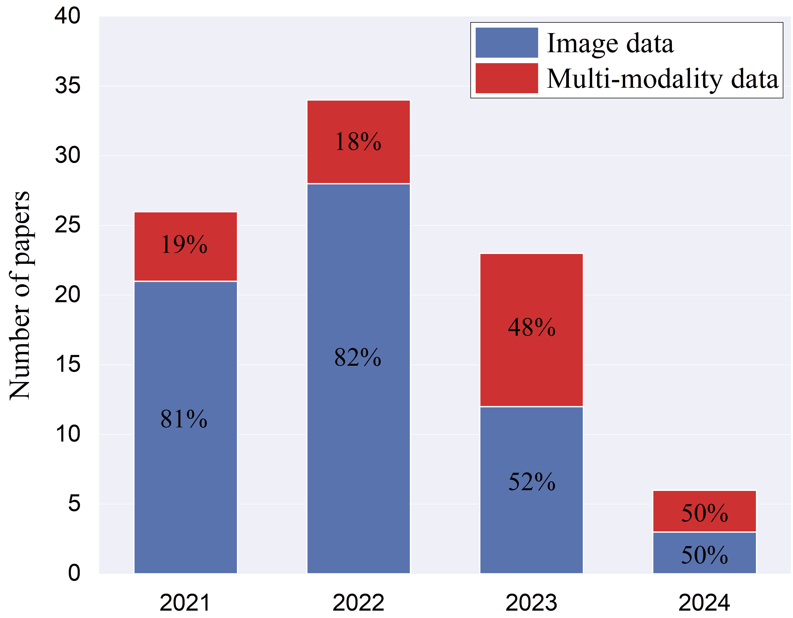
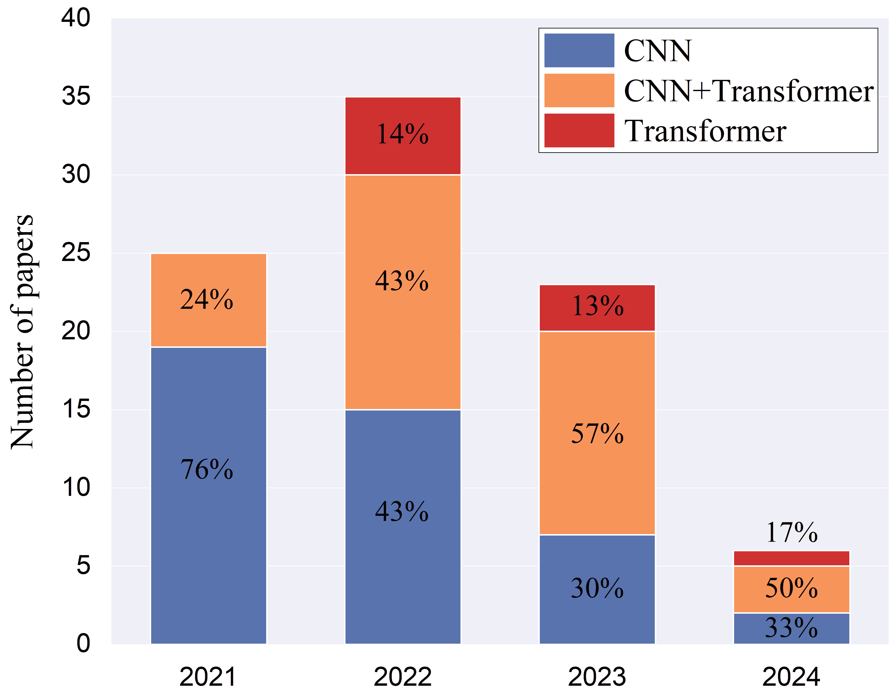
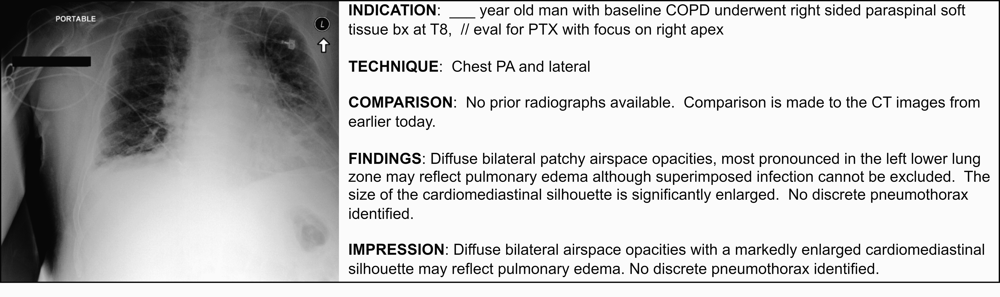

<!--yml

类别：未分类

日期：2024-09-06 19:32:23

-->

# [2405.12833] 基于深度学习的放射学报告生成的调查：多模态数据的应用

> 来源：[`ar5iv.labs.arxiv.org/html/2405.12833`](https://ar5iv.labs.arxiv.org/html/2405.12833)

# 基于深度学习的放射学报告生成的调查：多模态数据的应用

Xinyi Wang, Grazziela Figueredo, Ruizhe Li

诺丁汉大学

英国

\AndWei Emma Zhang, Weitong Chen

阿德莱德大学

澳大利亚

\AndXin Chen

诺丁汉大学

英国 通讯作者：Xin Chen, xin.chen@nottingham.ac.uk

###### 摘要

自动放射学报告生成可以减轻医生的工作负担，减少医疗资源的区域差异，因此成为医学图像分析领域的重要话题。这是一项具有挑战性的任务，因为计算模型需要模拟医生从多模态输入数据（即医学图像、临床信息、医学知识等）中获取信息，并生成全面准确的报告。最近，许多研究致力于使用基于深度学习的方法解决这一问题，如变换器、对比学习和知识库构建。本调查总结了最新研究中开发的关键技术，并提出了一个通用的深度学习报告生成工作流程，包括五个主要组件：多模态数据获取、数据准备、特征学习、特征融合/交互和报告生成。突出了每个组件的最先进方法。此外，总结了训练策略、公共数据集、评估方法、当前挑战和未来方向。我们还在相同实验设置下对不同方法进行了定量比较。这是最为最新的调查，专注于多模态输入和数据融合在放射学报告生成中的应用。旨在为对自动临床报告生成和医学图像分析感兴趣的研究人员提供全面丰富的信息，特别是在使用多模态输入时，并协助他们开发新算法以推动该领域的发展。

*关键词* 报告生成 $\cdot$ 深度学习 $\cdot$ 多模态 $\cdot$ 医学图像分析

## 1 引言

医学图像可以提供身体的详细信息，并帮助医生筛查、诊断和监测疾病，而无需侵入性技术（Beddiar 等，2023；Liao 等，2023）。放射科医生将从医学影像中提取的信息总结成放射报告，以供临床决策。然而，手动生成报告是劳动密集型的、耗时的，并且需要广泛的专业知识（Beddiar 等，2023）。Topol (2019)指出，医学图像解释的需求远远超过了美国医生的现有能力。在流行病期间和人口老龄化的情况下，情况可能会变得更糟。例如，在 Covid-19 大流行期间，在英国，每位放射科医生每天报告的图像多达 100 张（Statistics，2020）。这使得放射科医生在规定时间内提供高质量报告变得具有挑战性。目前的需求延长了患者的等待时间，并增加了疾病传播的风险（Beddiar 等，2023），并影响了患者护理。自动报告生成技术的发展可以帮助缓解这个问题。

自动生成高质量报告具有挑战性。这本质上是一个多模态问题（Tu 等，2024；Yan 等，2023）。在常规临床实践中，为了生成清晰、正确、简洁、完整、一致和连贯的报告，放射科医生需要将图像信息与其他模态数据的信息结合起来，例如临床历史和相关临床指标。以往开发的技术主要考虑将图像作为输入，而在过去三年中，多模态深度学习发展非常迅速。越来越多的研究论文尝试通过利用多模态数据来模拟医生，以生成诊断报告，如图 1 所示。

图 1：2021 年至 2024 年间，每年使用图像数据和多模态数据作为输入的审阅论文的分布情况。百分比表示输入在当年发表的文章中的普及程度。

之前的大多数调查（Kaur et al., 2022; Beddiar et al., 2023; Liao et al., 2023; Shamshad et al., 2023; Liu et al., 2023a）未包含非影像输入。Messina et al. (2022) 考虑了非影像输入，但仅涉及 6 篇论文。总体来说，之前的调查包括了 40 到 66 篇关于报告生成的论文，主要集中在 2022 年之前发表的文章。本调查与之前的不同，主要有三个贡献：（1）我们分析了另外 22 篇使用非影像输入的论文，重点关注多模态输入的获取、分析和集成。据我们所知，这是首个研究报告生成领域最先进的多模态数据处理技术的综述；（2）我们检查了 2021 年至 2024 年间发表的 89 篇论文，以提供关于自动报告生成新技术的全面研究；（3）我们提出了一个报告生成的通用工作流程，并对所采用的方法进行分类，总结了训练策略、公共数据集和主流评估方法，如图 2 所示。该工作流程包括 5 个关键组件：输入、数据准备、特征学习、特征融合和报告生成。附录 A 的表 LABEL:tab:overall 总结了本调查中包含的所有工作。

图 2：自动放射学报告生成的总结工作流程。包括了基本组件和关键技术。每种方法的 (x, y%) 表示我们调查中使用该技术的论文数量和百分比。

本文的其余部分组织如下。第二部分介绍了论文的搜索与选择过程。第三部分首先提供了基于深度学习的报告生成的工作流程，然后分析了工作流程中每个组件的技术，最后介绍了整体的训练策略。接下来，在第四部分和第五部分中，我们介绍了流行的公共数据集和评估方法，包括指标和专家评估。第六部分比较了在相同实验设置下几篇论文的模型性能。最后，我们在第七部分讨论了这一主题的挑战和展望，并在第八部分提供了结论。

## 2 搜索与选择文章

使用了三个搜索引擎（Google Scholar、PubMed 和 Springer）和四个查询来收集文章。查询包括“放射科报告生成”，(医学 OR 医药 OR 健康 OR 放射学) AND (报告 OR 描述 OR 标题) AND 生成，模式 AND (医学 OR 医药 OR 健康 OR 放射学) AND (报告 OR 描述 OR 标题) AND 生成，以及“医学报告生成”。在搜索之后，简要阅读了每篇文章的标题和摘要，以识别符合选择标准的文章。如果有不确定的情况，文章被包括在内，以确保相关研究没有被遗漏。选择标准围绕三个方面设定。首先，我们包括了在 2021 年、2022 年、2023 年和 2024 年发表的文章，因为近年来使用多模态技术的发展显著。我们旨在关注最新的算法，这些算法在以往的调查中没有涉及。其次，研究必须是关于自动生成全文自然语言放射科报告的原创研究，并包括定量评估结果。由于长报告和句子生成的性质不同，生成一两句短标题的技术被排除在外。第三，包含在期刊、会议和会议研讨会论文集中发表的论文。此外，还选择了在 2023 年和 2024 年在 arXiv 网站上上传并被引用超过 30 次的论文。共识别出 144 篇论文。通过追踪论文的祖先和后裔，我们识别出另外 24 篇论文。去重后，保留了 97 篇出版物。我们彻底阅读了这些工作并应用了排除标准。首先，至少一个生成的语言应为英语。其次，至少一个输入数据应为图像。最终，89 篇作品被纳入以下分析。

## 3 种方法

基于深度学习的放射学报告生成通常遵循一个标准工作流程，如图 2 所示。本节基于识别出的工作流程分析了 89 项研究中的技术。总体而言，一个基本的放射学报告生成框架包括 5 个步骤：（1）多模态数据采集（第 3.1 节）；（2）数据准备（第 3.2 节）；（3）特征学习（第 3.3 节）；（4）特征融合与交互（第 3.4 节）；（5）报告生成（第 3.5 节）。此外，第 3.6 节描述了包括修改损失函数、强化学习和课程学习在内的新训练策略。

医学图像在与其他类型的数据进行分析时，首先进行准备（步骤 2）。随后，它们被输入到特征提取器中进行特征学习（步骤 3），这通常使用 CNN 或 Transformer 架构实现，并配有多个增强模块（例如，辅助任务和对比学习）。特征提取器旨在提取与报告生成相关的特征，而增强模块则用于提高特征的表现力。对于某些方法，随后应用特征融合与交互模块（步骤 4），以对齐跨模态数据并减轻视觉和文本领域之间差异带来的负面影响。经过融合与交互后，特征会被传回特征提取器，或直接输入生成器以生成报告（步骤 5）。训练策略则用于提高训练过程中的学习效果。附录 A 中的表 LABEL:tab:overall 提供了五个步骤及训练策略中每篇论文的详细信息。

### 3.1 多模态输入数据

输入数据指的是报告生成系统接收的数据。在模型训练和推理过程中，数据可能会有所不同；例如，训练过程中使用了图像和实际报告作为输入，而推理过程中仅使用图像（Shetty et al., 2023）。然而，模型是从训练数据的分布和特征中学习的。如果测试数据发生变化，模型通常会难以泛化，从而导致性能下降。因此，在本节中，我们主要介绍了在审阅的论文中，训练阶段和测试阶段一致的输入数据获取方法。输入数据包括：

+   •

    图像数据包括 X 射线、磁共振成像（MRI）、计算机断层扫描（CT）、超声检查、胃肠内镜图像、视网膜图像和皮肤镜图像。我们审阅的大多数论文关注于胸部 X 射线图像的医学报告生成（82 项工作）。除了胸部诊断，视网膜图像是第二常见的图像类型（6 项工作）。视网膜图像包括多个类别，如眼底荧光素血管造影和眼底彩色摄影。其他工作集中在胸部 CT（5 项工作）、胃肠内镜图像（2 项工作）、脊柱 MRI（1 项工作）、皮肤镜图像（1 项工作）和乳腺超声图像（1 项工作）。虽然一些图像是非放射学的，如眼科图像，但我们仍将其报告生成技术纳入本调查。

+   •

    医学术语指的是医学术语和表达方式，这些术语来自图像的关键词标签（Huang et al., 2021a, b, 2022; Liu et al., 2023b），或自建的语料库（Liu et al., 2021b; Cao et al., 2022, 2023; Xue et al., 2024; Gu et al., 2024; Li et al., 2023c），存储了医学报告中常见的描述。

+   •

    医学知识库主要记录不同器官和疾病之间的关系，并以图形格式呈现。图形是一种基本的数据结构，由一组节点和边组成，可以轻松表示一组主题及其连接。知识图谱主要有两种获取方式：1) 使用公共数据集，如 RadGraph（Jain et al., 2021），该数据集被两项工作（Yang et al., 2022; Li et al., 2023a）所使用；2) 根据权威医学标准（Huang et al., 2023; Xu et al., 2023）或疾病标签（Jia et al., 2022）自设计的知识库。Yang et al. (2023) 认为，手动图谱构建在疾病方面存在局限，进一步复杂化了这些模型对多样化数据集的适应性。为了克服这一问题，他们基于实际报告自动构建了医学知识库，并在模型推理过程中利用了该知识库。

+   •

    实际文本报告主要通过数据检索获得（Liu et al., 2021b; Song et al., 2022; Yang et al., 2022; Li et al., 2023a; Liu et al., 2023b; Li et al., 2023c; Jin et al., 2024）。例如，对于每个输入图像，Liu et al. (2021b) 从训练数据集中检索类似图像并利用对应的报告。这一过程类似于放射科医生在撰写自己的报告时查阅以往的医疗案例报告。此外，Liu et al. (2023b) 还根据输入术语获得了预定义的句子。

+   •

    临床信息包括患者人口统计数据（例如年龄和性别）、临床观察和病史。它包含在放射学报告的指示部分（见图 4）。

+   •

    问卷：报告生成模型可以通过视觉问答方式进行训练（Tanwani et al., 2022; Pellegrini et al., 2023）。问卷由公共数据集提供，如 VQA-Rad (Lau et al., 2018) 和 Rad-ReStruct (Pellegrini et al., 2023)。

### 3.2 数据准备

数据准备旨在提升数据质量并为模型部署做好准备，通常包括数据清洗、转换和组织。传统的准备方法包括图像调整大小和裁剪、文本分词、将所有标记转换为小写、删除非字母标记，以及实施数据增强程序。每篇论文中使用的方法在附录 A 的表格 LABEL:tab:overall 中列出，但值得注意的是，传统准备方法如此普遍，以至于有些论文没有提及它们。虽然信息未记录在表格中，但这并不意味着数据准备过程的缺失。

在审阅的论文中，新的数据准备方法可以分为过滤（Ramesh et al., 2022）和分组（Wang et al., 2022b）。Ramesh et al. (2022) 认为撰写放射学报告需要参考历史信息，这不可避免地包括如“再”及“减少”等描述性词汇。然而，这些术语无法从单一图像中推断，因此 Ramesh et al. 在报告中过滤了这些描述。这一排除被发现有助于模型的学习过程。

分组指的是将来自真实报告的句子组织成不同的部分，通常依赖于预定义知识图谱和过滤规则中的关键词。每个部分描述一个特定的解剖结构。分组旨在使生成系统能够对不同类型的句子进行不同处理。例如，Wang 等人（2022b）采用不同的解码器为不同的解剖结构生成描述。除了回顾的论文之外，最近发布的公共数据集 ImaGenome（Wu 等人，2021）也在其注释文件中包含了分组结果（见第四部分）。分组结果变得更加容易获取。

### 3.3 特征学习

#### 3.3.1 基于图像的特征学习

之前的研究主要使用 CNN 作为图像特征提取的架构，但最近，越来越多的研究者选择使用 Transformer，因为其性能有所提升。同时，许多研究提出了新型模块以增强模型能力。本节首先介绍模型架构，然后描述增强模块。这些模块包括辅助任务、对比学习和记忆度量。每篇论文中使用的架构和模块在附录 A 的表 LABEL:tab:overall 中概述。

##### CNN 和 Transformer 编码器用于特征提取

用于图像特征提取的架构统计见图 3。总共有四十六项研究纯粹基于 CNN 模型提取图像特征。三十四项工作首先通过 CNN 对图像进行编码，然后利用 Transformer 层来修改嵌入。八项工作采用纯 Transformer 架构来提取图像特征。图 3 显示了更多研究采用 CNN 和 Transformer 结合进行图像特征提取的明显趋势。

图 3：使用不同架构提取图像特征的回顾论文在 2021 年至 2024 年间的统计数据。百分比表示该方法在当年发表的文章中的普遍程度。

对于 CNN 架构，有两个研究自设计了 CNN 模型，而其他研究则基于不同的经典视觉模型构建了 CNN，如 ResNet（He et al., 2016）（42 篇论文）、DenseNet（Huang et al., 2017）（22 篇论文）、VGG（Simonyan and Zisserman, 2014）（5 篇论文）、Faster-RCNN（Ren et al., 2015）（5 篇论文）、Inception-V3（Szegedy et al., 2016）（1 篇论文）、ResNeXt（Xie et al., 2017）（1 篇论文）、EfficientNet（Tan and Le, 2019）（1 篇论文）和 Two-Stream Inflated 3D ConvNets (I3D)（Carreira and Zisserman, 2017）（1 篇论文）。Pahwa et al. (2021) 修改了 HRNet（Sun et al., 2019a），这是一种人体姿态估计网络。其他三项工作（Huang et al., 2021a, b, 2022）基于不同的 CNN 结构提供了结果。

为了提高模型性能，十项工作通过注意力模块修改了 CNN 结构，这些模块通过可学习的参数为输入的不同部分分配不同的权重（重要性），使模型能够选择性地关注图像的特定区域。传统的注意力机制可以分为通道级（Du et al., 2022; Wang et al., 2022e; Gajbhiye et al., 2022; Pahwa et al., 2021）和空间级（Pahwa et al., 2021; Jia et al., 2021），分别为输入的不同通道和空间位置分配不同的权重。此外，Li et al. (2023b) 和 Wang et al. (2024a) 采用了类激活图的理念（Zhou et al., 2016）来获得权重。Yan et al. (2022) 首先提取了图像块特征，使用无监督方法对其进行聚类，然后对聚类结果加权。实验结果表明，注意力机制使模型能够更加关注病变区域，而非无关背景。随着 Transformers（Vaswani et al., 2017）的兴起，多头注意力成为信息交互的强大方法。Wang et al. (2023c) 首先从正面视图中提取了感兴趣区域，然后采用多头注意力融合正面和侧面视图之间的区域信息。这种方法将感兴趣区域引入模型训练，以提高模型性能。

对于 Transformer 架构，大多数使用标准的 Transformer 编码器，而 Li 等人（2023d）认为，由于图像的连续性和文本的离散性，图像和文本的对齐构成了挑战，因此他们通过使用离散变分自编码器（Ramesh 等， 2021）来获取离散视觉标记，从而提高了模型性能。其他研究通过修改自注意力模块提高了模型性能。三项研究（Wang 等，2022e；Lin 等，2023；Wang 等，2023d）在 Transformer 注意力模块的三个输入之间添加了高阶交互。两项研究（Miura 等，2021；Wang 等，2022e）受到了记忆增强注意力（Cornia 等，2020）的启发，通过额外的可学习向量扩展了键和值，以记录更多信息。Li 等人（2022b）在注意力操作中引入了可学习的参数。Wang 等人（2023d）通过包含额外的输入标记来修改编码器。这些标记被命名为“专家标记”，以模拟“多专家联合诊断”方法。

##### 特征提取的辅助任务

辅助任务旨在为特征提取器提供额外的监督信号，使其能够从图像中提取与报告生成相关的信息。这些任务主要包括分类（22 篇论文）、图构建（10 篇论文）、嵌入比较（10 篇论文）和检测/分割（7 篇论文）。下面将详细介绍每一种任务。

分类：在所审阅的论文中，最常见的辅助任务是分类，指将图像分配到预定义的类别中。预定义的类别主要包括医学标签（Gajbhiye 等，2022；Kaur 和 Mittal，2022b；Wang 等，2022e；Hou 等，2021b；Du 等，2022；You 等，2022；Alfarghaly 等，2021）和疾病标签（Liu 等，2021e；Zhou 等，2021；Wang 等，2022d；Yang 等，2023；Zhang 等，2023b；Wang 等，2024a；Jin 等，2024；Hou 等，2021b）。医学标签来自标准医学词汇，包括数百个标签，如解剖结构和病理迹象。它们由手动注释或自动注释工具提供（例如，NIH MTI web API ¹¹1https://ii.nlm.nih.gov/MTI/index.shtml 和 RadGraph（Jain 等，2021））。疾病标签由自动注释工具提供（例如，CheXpert（Irvin 等，2019）和 CheXbert（Smit 等，2020））。与疾病标签相比，医学标签提供了更全面的信息。然而，据我们所知，目前没有文献支持医学标签优于疾病标签。也许由于医学标签涵盖的范围广泛，深度学习模型在获取如此丰富的知识时面临挑战。Zhou 等（2021）在疾病标签集里加入了 32 个额外的标签，用于病变位置、大小和形状（例如，“上/下”和“斑点状”），观察到模型性能略有提升。

其他在审阅论文中使用的显著类别包括匹配状态（Li 等，2023a）、局部属性（Yang 等，2021a）、报告集群结果（Li 等，2022a）和固定答案类别（Tanwani 等，2022）。Li 等（2023a）预测给定图像-报告对的匹配状态。Yang 等（2021a）为乳腺超声图像设计了局部属性标签，如肿瘤形态，以促进识别低分辨率图像中难以分辨的属性。Li 等（2022a）首先对真实报告进行了无监督聚类，然后利用生成的簇作为标签。这一辅助任务显著提高了文本生成性能。Tanwani 等（2022）将报告生成视为问答任务，分类器被设计为固定答案类别。此外，对于检测辅助任务，需要应用分类器来识别检测区域的属性（例如，“右肺”）。本段避免了这种情况，以避免冗余。

图构建：图构建旨在将先验知识引入报告生成过程。本节中的知识图谱与第 3.1 节中的知识图谱有所不同。在这里，节点特征是从图像中提取的，而边被定义为图卷积网络中的参数。相比之下，输入知识图谱中的节点和边信息来自非图像数据。张等人（2020）提出了一种经典方法，并取得了良好的成果。首先基于领域专家提供的见解构建了知识图谱，其中节点表示主要异常和主要器官，双向连接将相关节点连接起来。为了初始化节点特征，引入了一个空间注意力模块，该模块在 CNN 骨干网之后使用 1$\times$1 卷积层和 softmax 层。通道数量与节点数量匹配。节点的初始嵌入是作为注意力加权特征图导出的。然后，采用图卷积层在整个图中传播信息，随后通过两个分支进行分类和报告生成。首先训练分类分支，然后冻结 CNN 骨干网和图卷积层中的参数，仅训练报告生成解码器。六项工作（刘等，2021b，d；曹等，2022；王等，2022c；闫，2022；张等，2023b）采用了这一方法（张等，2020）。王等（2022c）通过加入名为 Radiology Lexicon (RadLex)²²2http://www.radlex.org/（Langlotz，2006）的放射学术语语料库扩展了图（张等，2020）。随着图节点数量的增加，模型性能最初有所提升，在 40 个节点时达到峰值，然后下降，在 60 个节点时明显下降。刘等（2021d）基于 MIMIC-CXR 数据集构建了一个大图。节点表示常见的临床异常，边表示不同异常的共现情况。此外，李等（2023b）利用疾病预测结果来获取节点特征。节点是分类概率，边权重可学习。

另一种图谱重建方法旨在重建形式为（实体 1，关系，实体 2）的三元组，例如（不透明度，提示感染）。三项研究（Dalla Serra 等，2022，2023b；Li 等，2022b）首先预测三元组，然后基于这些三元组生成报告。实验结果表明，单独使用三元组进行报告生成效果不佳；需要将其与从图像中提取的特征结合使用，以获得更好的结果。

嵌入比较：嵌入比较指的是限制中间层不同特征的一致性，从而指导学习过程。所审阅论文中的比较主要应用于从图像和真实报告中提取的特征之间（Najdenkoska 等，2021，2022；Zhou 等，2021；Yang 等，2021b；Chen 等，2022；Wang 等，2021，2022d；Yang 等，2023）。实验结果表明，来自真实文本的监督信号使得提取的视觉特征能够携带更丰富的语义信息，从而更有效地转化为放射学报告。四项研究（Wang 等，2021；Zhou 等，2021；Wang 等，2022d；Yang 等，2023）利用三重损失函数强制图像-文本配对特征在潜在空间中比未配对的特征更接近。Najdenkoska 等（2021，2022）受到自动编码变分贝叶斯（Kingma 和 Welling，2013）的启发。他们使用真实报告在训练期间获得潜在空间，并基于该空间生成报告。图像提取器能够捕捉到与真实报告中发现的特征非常相似的图像特征。其他两项研究（Yang 等，2021b；Chen 等，2022）使用词频-逆文档频率（TF-IDF）从真实报告中提取重要信息作为监督信号。TF-IDF 是一种统计度量，通过考虑一个词在特定文档中的频率及其在整个文档集中的稀有程度来评估词的重要性。

此外，为了生成训练过程中未见的异常报告，Sun 等人（2022）最初将视觉特征线性映射到语义特征，并通过 BioBert 模型（Lee 等人，2020）提取标签的语义特征。在两个相似性之间应用了一致性约束：1) 视觉特征中的语义特征之间的成对相似性；2) 视觉特征中的语义特征与标签中的语义特征之间的相似性。Zhang 等人（2023b）将半监督学习集成到报告生成中，使用了两个网络。他们首先对输入图像应用不同类型的噪声，以创建两个变体，然后将其输入到这两个网络中。采用了辅助损失函数以确保提取的视觉特征的一致性。

检测/分割：物体检测定位并识别图像中的物体或模式，重点是确定它们的存在和位置。分割通过基于特定特征识别和分离物体，将图像划分为有意义的区域。两者都通过物体识别和区域提取增强了模型对图像的理解，并通过将检测/分割结果与生成的句子联系起来，可以提高模型的可解释性。检测/分割区域可以是解剖区域（Tanida 等人，2023；Dalla Serra 等人，2023b，a；Wang 等人，2023c；Han 等人，2021；Gu 等人，2024）和异常区域（Sun 等人，2022）。目前尚无文献比较检测和分割任务对报告生成结果的影响。然而，一个名为 Chest ImaGenome 的公开数据集（见第四部分")提供了检测注释，使其比分割注释更易于获取。

此外，辅助任务的输出可以提供有价值的信息，如疾病标签，因此，将其输入到后续生成网络中是一种常见的选择（Alfarghaly 等人，2021；Hou 等人，2021b；Singh 等人，2021；Yang 等人，2021a；You 等人，2021；Zhou 等人，2021；Du 等人，2022；Jia 等人，2022；Kaur 和 Mittal，2022b；Sun 等人，2022；Wang 等人，2022a，e；Yan 等人，2022；You 等人，2022；Tanida 等人，2023；Li 等人，2022b；Jin 等人，2024）。例如，Zhou 等人（2021）将分类器预测结果的语义词嵌入发送到报告生成解码器。

##### 特征提取的对比学习

对比学习是一种自监督学习方法，用于提高模型的表示能力，它使得模型能够最小化正样本对之间的距离，并最大化负样本对之间的距离。它可以用于训练特征提取器（Wang et al., 2022e; Lin et al., 2023; Wu et al., 2022; Wang et al., 2023b）。Lin et al. (2023) 使用了一种经典的对比学习方法，称为动量对比（Momentum Contrast）（He et al., 2020），其中将同一图像的不同视图或增强版本视为正样本对。另一项具有代表性的对比学习工作是对比语言-图像预训练（CLIP）模型（Radford et al., 2021）。它通过直接在包含图像-文本对的大型数据集上进行训练来连接文本和视觉信息。Wang et al. (2022e) 直接将其用于图像特征提取，而 Wu et al. (2022) 将 CLIP 的理念应用于训练数据集上的特征提取器。Wang et al. (2023b) 认为，以前的工作将整个报告作为输入，忽略了单个句子中包含的独特信息。这种忽视可能导致图像-文本对的匹配不正确。因此，他们提出了基于表型的对比学习。这种方法涉及随机初始化一组向量作为表型，允许句子和视觉嵌入与它们互动，并最终在处理后的嵌入之间进行对比学习。结果优于以前的对比学习方法，在报告生成中表现更佳。

对比学习也可以成为训练损失的一部分（Tanwani et al., 2022; Wang et al., 2022a; Li et al., 2023a; Liu et al., 2023b），并且可以应用于视觉和文本特征之间（即图像-文本对）（Tanwani et al., 2022; Li et al., 2023a; Liu et al., 2023b），或者基于标签进行应用，将具有共享标签的样本视为正样本，没有任何共同标签的样本视为负样本（Wang et al., 2022a）。他们的消融研究表明，相比于标准的对比损失，结果有了显著的提升（Wang et al., 2022a）。

对比注意力是利用对比学习的另一种方法。Liu et al. (2021c) 设计了一种对比注意力模型，通过将输入样本与正常病例进行比较来提取异常区域特征。在输入和正常病例之间共享的类似特征从输入图像特征中被减去，剩余的特征然后与原始特征进行拼接。Song et al. (2022) 认为对比技术（Liu et al., 2021c）没有考虑历史信息，因此他们提出了一个基于相似性检索技术的模块，从训练数据集中获取类似图像。图像特征通过放大输入与类似检索图像之间的不同特征来处理。

##### 特征提取的记忆度量

使用记忆度量进行图像特征提取假设各种医学图像中存在类似的特征。记忆度量用于在训练过程中记录和传输相似性信息（Chen et al., 2022; Yan, 2022）。通常，n×n 矩阵会被随机初始化，其中 n 表示度量行数。然后，在每个训练步骤中，矩阵会根据视觉特征和之前的度量进行更新。本节使用的记忆度量与第 3.5 节中讨论的记忆驱动变换器使用的度量一致，其中一个应用于图像，另一个应用于生成的报告。

#### 3.3.2 基于非图像的特征学习

大多数非图像数据以文本形式呈现。在与图像数据融合之前，文本数据需要进行嵌入。我们首先介绍一种广泛使用的基本文本嵌入技术——查找表。该表为每个单词或字符分配一个唯一的索引，该索引用于查找预训练的单词向量或字符向量。除了基本方法外，还可以对这些向量进行额外的特征提取，以增强其表示能力。

基于 Transformer 的模型，如 BERT 及其变体，已成为在各种文本数据中进行特征提取的主流方法，例如术语（Liu et al., 2021e; Cao et al., 2022, 2023; Liu et al., 2021b; Xue et al., 2024; Liu et al., 2023b; Li et al., 2023c），真实文本报告（Liu et al., 2021b, 2023b; Li et al., 2023c; Jin et al., 2024），知识图谱（Yang et al., 2022; Huang et al., 2023; Li et al., 2023a; Xu et al., 2023），以及问卷（Tanwani et al., 2022; Pellegrini et al., 2023），并取得了良好的效果。

针对特定类型的输入，设计了几种方法。Li 等人 (2023c) 使用了 TF-IDF 重新加权术语嵌入。重新加权的方法缓解了数据不平衡的问题，从而提升了性能。临床信息可以通过一个名为 BioSentVec 的预训练特征提取器处理（Zhou 等人，2021；Chen 等人，2019）。对于知识库，Yang 等人 (2022) 使用了一个名为 RotatE 的知识图谱嵌入模型（Sun 等人，2019b）从 RadGraph 中获取实体嵌入和关系嵌入。除了使用整个 RadGraph 作为输入外，还有两个研究结合了实际报告和 RadGraph，从实际报告中提取与案例相关的信息，并从 RadGraph 查询相关信息（Yang 等人，2022；Li 等人，2023a）。另外，Li 等人 (2023c) 将 RadGraph 视为一种注释工具，用于从实际报告中提取实体和位置信息。其他两个研究（Xu 等人，2023；Huang 等人，2023）利用分类结果处理自建图，并提取与案例相关的信息。实验结果证实了将与案例相关的知识纳入报告生成的有益影响，尤其是在将实际报告与知识库结合时尤为明显。此外，年龄和性别信息不是文本数据，通常编码为一-hot 向量（Zhou 等人，2021）。

### 3.4 多模态特征融合与交互

特征融合和交互指的是将来自输入或辅助任务的多模态数据进行整合。此步骤有两个目的。首先，来自不同领域的视觉和文本特征对模型学习提出了挑战。通过融合并促进这些特征之间的交互，可以缩小领域差距，从而增强网络学习。其次，图像区域应与报告中的句子对齐。这种对应关系可以通过融合和交互来学习。在嵌入比较的辅助任务中（参见第 3.3.1 节），从实际报告中提取的语义特征用于监督图像特征的学习。然而，这种方法不同于多模态特征融合。嵌入比较的目标是增强图像特征，而不将非图像特征纳入生成器。相反，本节中的融合特征会被转发到生成器。

特征融合和交互的最直接方法是特征级操作，包括多模态特征的拼接、求和或乘法（13 项工作）。然而，特征级操作可能过于简单，无法实现充分的交互。因此，采用了基于神经网络的方法，如 LSTM（2 项工作）和多头注意力机制（27 项工作）。尽管这种方法便利了特征融合，但其对多模态数据融合缺乏具体设计，导致交互效果有限。

我们想要强调 Chen 等人（2021）提出的一种基于记忆度量的方法。该方法通过促进特征交互显著提升了报告生成系统的性能。首先，度量被随机初始化。然后，图像特征、生成的标记的文本特征和记忆度量特征被映射到同一空间。随后，计算图像特征与记忆度量特征之间的距离，以及文本特征与记忆度量特征之间的距离。分别选择与图像或文本距离最近的前 K 个度量特征。这些选定的特征随后基于这些距离加权，并反馈到编码器-解码器结构中。两个研究（秦和宋，2022；尤等，2022）采用了这种方法。王等人（2022a）对其进行了两方面的修改：1）他们通过视觉和文本特征初始化了矩阵；2）跨模态交互仅在具有相同标签的情况中发生。这两种修改均带来了显著的改进。李等人（2023d）认为上述方法缺乏对跨模态对齐的明确约束。他们考虑了正交基作为度量，并将其与视觉或文本特征一起输入到多头注意力模块中。然后，注意力模块的输出通过自定义门机制进行处理。利用三元组匹配损失来对齐处理后的视觉和文本特征。这种方法略微改善了结果。

### 3.5 报告生成

最后一步是报告生成，它利用早期步骤提取的特征来生成最终报告。生成方法主要包括基于解码器的技术（第 3.5.1 节），基于检索的技术（第 3.5.2 节），以及基于模板的技术（第 3.5.2 节）。此外，大型语言模型的发展使得利用它们来提高生成报告的质量成为可能。这在第 3.5.3 节中讨论。

#### 3.5.1 基于解码器的技术

解码器解码提取的输入表示并生成描述性报告。主流架构包括 LSTM（Hochreiter 和 Schmidhuber，1997）和 Transformer。与 LSTM 相比，Transformer 同时处理整个序列而不是按序列处理。因此，Transformer 在训练过程中允许更高效的并行化，并且能够捕捉长期依赖性。在 89 篇回顾的论文中，Transformer 趋向于取代 LSTM。55 篇工作使用了 Transformer 作为解码器，而仅有 23 篇使用了 LSTM（12 篇）或层次化 LSTM（11 篇）。在 2023 年和 2024 年发表的论文中，所有的编码器-解码器结构都使用 Transformer 作为其解码器。修改解码器并提高模型性能有两种方法。

快捷连接：在网络中连接不同的层可以被认为是一种有前景的方法，以增强前向和反向传播中的信息流（Mirikharaji 等，2023）。U-连接（Huang 等，2023）和网状连接（Miura 等，2021；Lee 等，2022；Cornia 等，2020）被添加在编码器和解码器之间，结果导致了类似的性能提升（Huang 等，2023）。

记忆驱动的 Transformer：我们想要重点介绍陈等人提出的记忆驱动 Transformer（R2Gen）（2020）。近年来，它越来越受欢迎。R2Gen 在 Transformer 解码器架构中引入了一个记忆模块和一个记忆驱动的条件层归一化模块。记忆模块的设计假设不同的影像在其放射学报告中展示了类似的模式，从而可以相互作为有价值的参考。建立记忆矩阵可以捕捉这种模式并在训练过程中传递。具体来说，类似于 3.3.1 部分中的矩阵，矩阵是随机初始化的，并通过基于上一步矩阵和生成报告的门控机制进行更新。层归一化旨在将记忆模块的输出集成到解码器中。

八项工作直接使用了 R2Gen 作为其解码器。此外，记忆模块和层归一化的设计启发了后续的工作（Xue 等人，2024；Jia 等人，2021；Zhang 等人，2023a）。需要注意的是，Zhang 等人（2023a）对记忆模块的新颖利用将真实报告集成到训练过程中，取得了成功的结果。

#### 3.5.2 基于检索和模板的技术

基于检索的技术通过从大型语料库中选择现有句子生成报告，这种选择通常基于相似性比较（Endo 等人，2021；Ramesh 等人，2022；Jeong 等人，2024）。最初，使用对比方法训练文本和图像编码器，例如 CLIP（Radford 等人，2021）。编码器提取语料库中句子的文本特征和输入图像的视觉特征。然后将视觉特征与语料库中的所有文本特征进行比较。选择相似性分数最高的前 k 个句子作为预测报告。此外，Jeong 等人（2024）在检索过程后添加了一个多模态编码器，以计算输入图像与检索句子之间的图像-文本匹配分数。基于分数应用过滤器以删除包含或矛盾的句子。

其他基于检索的技术则不遵循上述过程。Kong et al. (2022) 将报告生成分为两个步骤：句子检索和选择。他们首先从训练数据集中检索出一个候选句子集，这些数据集的句子数量远超标准医疗报告，然后通过分类器选择句子。Zhang et al. (2022) 提出了基于哈希技术的检索方法，该方法将具有相同标签的多模态数据映射到共享空间。

基于模板的方法通常从疾病诊断开始，然后根据诊断结果选择预定义的句子。这些选定的句子被串联在一起生成报告（Pino et al., 2021）。Abela et al. (2022) 认为这种方法受到精确标签的限制，因此他们通过类别概率和不同的阈值检索模板句子，以对应不同的描述。

#### 3.5.3 大型语言模型辅助报告生成

随着 ChatGPT（OpenAI, 2023）的出现，其强大的语言能力让研究人员渴望利用大型语言模型来辅助报告生成。然而，直接在医疗领域应用它却导致了不尽如人意的结果（Tu et al., 2024；Yan et al., 2023；Sun et al., 2023）。两个研究（Selivanov et al., 2023；Wang et al., 2023a）最初预测了与报告相关的信息，如疾病、病变区域和视觉特征，并生成了初步报告。随后，他们使用预训练的大型语言模型，例如 ChatGPT（Wang et al., 2023a）或 GPT-3（Brown et al., 2020；Selivanov et al., 2023；Wang et al., 2023a）来改进初步报告，并生成了最终报告。结果有所改善。在医疗报告生成领域，大型语言模型的探索仍需进一步研究，这在第 7.4 节中讨论。

### 3.6 训练策略

训练策略是指用于训练神经网络模型的技术。传统上，模型通过最小化各种损失函数进行训练。因此，本节首先介绍不同的损失函数（第 3.6.1 节），随后讨论强化学习（第 3.6.2 节），以及课程学习在报告生成任务中的应用（第 3.6.3 节）。

#### 3.6.1 损失函数

报告生成的主流损失函数是基于生成句子和真实句子的交叉熵损失。交叉熵损失可以根据词频（Gajbhiye et al., 2022）、TF-IDF（Wang et al., 2022d）或不确定性（Wang et al., 2024b）重新加权，以缓解模型偏差或处理挑战性案例。此外，Pandey et al. (2021) 利用循环一致性损失（Zhu et al., 2017）来生成报告。核心思想是报告及其对应的图像共享相同的信息，因此它们可以互相生成。

辅助损失函数的应用可以提供额外的监督信号，进一步提升模型性能。两项研究，Wang et al. (2021) 和 Li et al. (2022a) 在从生成报告和真实报告中提取的特征之间施加了额外的约束。Zhang et al. (2023b) 通过添加噪声创建了输入图像的两个不同版本，并将它们输入到两个网络中。辅助损失函数确保两个生成器产生的输出的一致性。Wang et al. (2024a) 从生成的词语和视觉分类器分别获得了图像中的两个判别区域，然后强制它们之间的一致性。

#### 3.6.2 强化学习

强化学习涉及通过试错训练代理以做出最佳决策，旨在最大化目标奖励。它提供了一种基于非可微分奖励函数更新模型参数的方法 (Messina et al., 2022)。评估指标可以视为奖励，例如 CIDEr (Kaur and Mittal, 2022b)，BLEU (Qin and Song, 2022; Gu et al., 2024)，METEOR (Qin and Song, 2022)，ROUGE (Qin and Song, 2022)，BERTScore (Miura et al., 2021)，F1 分数 (Miura et al., 2021) 和准确率 (Hou et al., 2021b)。此外，Hou et al. (2021b) 使用真实数据和生成报告训练了语言流畅度鉴别器，然后利用该鉴别器提供奖励。

#### 3.6.3 课程学习

Liu et al. (2021a) 利用课程学习 (Platanios et al., 2019) 对训练实例进行分类，并从简单样本到复杂样本训练模型。数据对基于图像启发式、图像置信度、文本启发式和文本置信度进行评估。图像启发式评估输入图像与正常图像的相似度。图像置信度指示分类模型的置信度。报告启发式与异常句子的数量相关，报告置信度通过负对数似然损失进行评估 (Xu et al., 2020)。

## 4 数据集

数据集在报告生成模型的开发中发挥着至关重要的作用。丰富且多样的训练数据可以提高模型的准确性和泛化能力。此外，合适的测试数据集使得在实际场景中测试模型性能成为可能。在本节中，我们选择了 11 个公共医学图像报告数据集，这些数据集在被审阅的文章中得到了应用，以提供对流行和新收集数据集的全面介绍，见表 1。每篇文章中数据集的使用情况显示在附录 A 中的表 LABEL:tab:overall。数据集主要集中在肺部，包括 X 光（Demner-Fushman et al., 2016; Johnson et al., 2019a, b）和 CT（Li et al., 2020; Liu et al., 2021e）。此外，还有关于眼部扫描（Huang et al., 2021b; Lin et al., 2023; Li et al., 2021）和乳腺扫描（Yang et al., 2021a）的公开数据集。医学报告生成工作集中在胸部 X 光的部分原因是大型公开数据集的可获得性。

图 4：来自 MIMIC-CXR 数据集的示例。左侧是胸部 X 光图像，右侧是其对应的放射学报告。

最受欢迎的数据集是印第安纳大学胸部 X 光数据集（IU X-Ray）（Demner-Fushman et al., 2016）和 MIMIC 胸部 X 光数据集（MIMIC-CXR）（Johnson et al., 2019a，b）。IU X-Ray 包含 7470 张正面和侧面 X 光图像及 3955 份基于 MeSH 代码³³3https://www.nlm.nih.gov/mesh/meshhome.html 和 RadLex 代码的手动注释报告。这些代码涵盖了标准的医学术语，如解剖结构、疾病、病理体征、异物和属性，由权威机构定义。对于深度学习方法而言，IU X-RAY 的规模不足，而 MIMIC-CXR 的收集缓解了这一问题（Messina et al., 2022）。它包含 377,110 张图像和 227,827 份报告，并通过自动工具根据 14 种疾病类别进行了多标签标注。图像-报告样本来自 MIMIC-CXR 数据集，如图 4 所示。指示、技术和比较提供了胸部 X 光检查的基本信息。放射学报告生成的自动化针对发现和印象部分。发现部分提供了对整个图像的详细描述，而印象部分总结了这些观察结果。后续工作为 MIMIC-CXR 提供了更丰富的标签信息。Chest ImaGenome 数据集（Wu et al., 2021）基于 MIMIC-CXR 数据集中的前后位和后前位胸部 X 光图像。它为每个图像提供了以解剖学为中心的场景图，包括解剖位置和关系注释。这些注释通过两个自动化管道生成，并且还提供了一个 500 个手动标注案例的单独数据集用于测试。

对眼科图像-报告对的收集越来越受到关注（Huang et al., 2021b；Li et al., 2021；Lin et al., 2023）。眼科图像有很多模态，例如荧光素眼底血管造影（FA）、眼底荧光素血管造影（FFA）、彩色眼底摄影（CFP）、眼底照片（FP）、光学相干断层扫描（OCT）、眼底自发荧光（FAF）、吲哚青绿染料脉络膜造影（ICG）和去红滤光眼底图像。大多数视网膜数据集基于一种或两种模态，而最新发布的 Retina ImBank 数据集是第一个多模态视网膜图像-文本数据集（Lin et al., 2023）。一些数据集为每个图像提供额外的标签，例如病灶边界（Li et al., 2021）、病灶类别（Huang et al., 2021b；Li et al., 2021）和关键词（Huang et al., 2021b）。

上述所有数据集都提供了非结构化报告。最近，Pellegrini 等人（2023）基于 IU-XRAY 发布了一个名为 Rad-ReStruct 的结构化报告数据集。在临床实践中，生成结构化报告通常需要医生回答一系列问题（Pellegrini 等人，2023）。因此，Pellegrini 等人（2023）设计了一个结构化报告模板，其中包含一系列基于主题存在（例如，肺部是否有疾病？）、元素存在（例如，肺部是否有不透明区域？）和属性（例如，程度是什么？）的单选或多选问题。他们随后使用 IU-XRAY 报告数据及其标注的 MeSH 和 RadLex 代码将这些数据整合到模板中。

表 1：用于医学报告生成的公共数据集。

| 名称 | 图像类型 | 报告类型 | 图像数量 | 报告数量 | 患者数量 | 使用者 |
| --- | --- | --- | --- | --- | --- | --- |
| IU X-Ray（Demner-Fushman 等，2016） | 胸部 X 光 | 非结构化 | 7,470 | 3,955 | 3,955 | 67 项工作 |
| MIMIC-CXR（Johnson 等，2019a，b） | 胸部 X 光 | 非结构化 | 377,110 | 227,827 | 65,379 | 59 项工作 |
| Chest ImaGenome（Wu 等，2021） | 胸部 X 光 | 非结构化 | 242,072 | 217,013 | – | 4 项工作 |
| COV-CTR（Li 等，2020） | 胸部 CT | 非结构化 | 728 | 728 | – | 4 项工作 |
| DeepEyeNet（Huang 等，2021b） | FA、CFP | 非结构化 | 15,709 | 15,709 | – | 3 项工作 |
| FFA-IR（Li 等，2021） | FFA | 非结构化 | 1,048,584 | 10,790 | – | 2 项工作 |
| Chinese COVID-19 CT（Liu 等，2021e） | 胸部 CT | 非结构化 | 1,104 | 368 | 96 | 1 项工作 |
| BCD2018（Yang 等，2021a） | 乳腺超声 | 非结构化 | 5,349 | 5,349 | – | 1 项工作 |
| Retina ImBank（Lin 等，2023） | FP、OCT、FFA、FAF、ICG 和红光滤波眼底图像 | 非结构化 | 18,788 | 18,788 | – | 1 项工作 |
| Retina Chinese（Lin 等，2023） | FP、FFA 和 ICG | 非结构化 | 57,498 | 57,498 | – | 1 项工作 |
| Rad-ReStruct（Pellegrini 等，2023） | 胸部 X 光 | 结构化 | 3,720 | 3,597 | 3,597 | 1 项工作 |

## 5 评估

准确评估生成报告的质量对于衡量模型性能至关重要。生成报告的质量可以通过定量和定性方法进行评估。定量方法通过自然语言评价指标（第 5.1 节）和医疗正确性指标（第 5.2 节）分别检查生成报告的文本质量和医疗正确性。定性评估通常由人工专家进行，他们提供对生成报告的整体评估（第 5.3 节）。表 2 总结了本节介绍的评估方法的描述。每篇文章中评估方法的使用情况见附录 A 中的表 LABEL:tab:overall。

表 2：医疗报告生成的定量和定性评估方法。

| 指标 | 描述 | 使用者 |
| --- | --- | --- |
| 基于自然语言的指标 |
| BlEU (Papineni et al., 2002) | 一种基于精确度的指标，用于测量生成文本和真实文本的 n-gram 重叠度。 | 84 篇文献 |
| ROUGE-L (Lin, 2004) | 一种类似 F1 的指标，基于最长公共子序列计算精确度和召回率的加权调和均值。 | 75 篇文献 |
| METEOR (Banerjee and Lavie, 2005) | 一种类似 F1 的指标，计算 unigram 精确度和召回率的加权调和均值。它是 BLEU-1 的扩展。 | 57 篇文献 |
| CIDEr (Vedantam et al., 2015) | 基于 TF-IDF 计算生成文本和真实文本之间的余弦相似度。 | 41 篇文献 |
| $S_{emb}$ (Endo et al., 2021) | 将真实报告和生成报告输入文本特征提取器，计算它们从最后一层提取的嵌入之间的余弦相似度。 | 2 篇文献 |
| %Novel (Van Miltenburg et al., 2018) | 生成描述中不出现在训练数据中的百分比。 | 1 篇文献 |
| 基于医疗正确性的指标 |
| 临床效果 (Chen et al., 2020; Liu et al., 2019) | 基于从参考报告和自动系统生成报告中提取的观察值计算准确性、精确度、召回率和 F1 分数。 | 34 篇文献 |
| MIRQI (Zhang et al., 2020) | 基于图比较计算精确度、召回率和 F1 分数。地面真实情况和生成的报告被自动分析以从定义的异常图中构建子图。 | 2 项工作 |
| nKTD (Zhou et al., 2021) | 根据从参考报告和由 CheXpert Labeller 生成的报告中提取的观察数据计算汉明距离。 | 1 项工作 |
| 基于人工的评估 |
| 比较 | 生成两种不同模型的报告，并允许资深放射科医生找出哪一份报告更好。 | 12 项工作 |
| 分类 | 放射科医生将生成的报告分类为准确、遗漏细节和错误报告。 | 1 项工作 |
| 错误评分 | 放射科医生评估基准、模型生成和参考报告的错误严重性。 | 1 项工作 |
| 评分 | 放射科医生需要根据临床标准对两种类型的生成报告分配 5 分制的评分。 | 1 项工作 |

### 5.1 基于自然语言的评估指标

自然语言评估指标来源于自然语言处理任务，用于衡量生成报告的一般文本质量。在审查的论文中，最流行的指标是 BLEU (Papineni et al., 2002)、ROUGE-L (Lin, 2004)、METEOR (Banerjee and Lavie, 2005) 和 CIDEr (Vedantam et al., 2015)，这些指标基于参考报告和生成报告之间的 n-gram 匹配。模型的优越性通过匹配次数的增加来体现。其中，BLEU 是最早提出的，提出了一种修改后的精确度方法。在评估放射科报告生成质量时，我们通常选择 BLEU-1、BLEU-2、BLEU-3 和 BLEU-4 指标。BLEU-n 中的 n 表示计算是基于 n-gram 的。METEOR 是对 BLEU-1 的扩展，并引入了召回率进行评估。ROUGE-L 还考虑了基于参考文本和生成文本之间最长公共子序列的精确度和召回率。CIDEr 采用 TF-IDF。TF-IDF 向量对句子中的每个 n-gram 进行加权，然后计算参考文本和生成文本之间的 TF-IDF 向量的余弦相似度。当模型持续生成最常见的句子时，可以获得显著的 BLEU 分数。然而，CIDEr 通过鼓励重要术语的出现并惩罚高频词汇来评估生成的输出（Li et al., 2023a）。CIDEr 还有一个流行的变体 CIDEr-D，它引入了惩罚机制以生成所需的句子长度，并去除词干化以确保词形的正确使用。

除了 n-gram 匹配，Endo 等人（2021）提出了一种新度量$S_{emb}$。在真实数据和生成报告上都应用了预训练的特征提取器，并计算提取的嵌入之间的余弦相似度。该方法用于评估两句话中包含的语义信息是否一致。另一个自然语言度量%Novel（Van Miltenburg 等人，2018）被引入以评估图像描述中的多样性。

### 5.2 医学准确性度量

自然语言评估度量评估生成报告与真实数据之间的相似性，但无法准确衡量生成的报告是否包含所需的医学事实（Babar 等人，2021b；Messina 等人，2022）。因此，提出了医学准确性度量，以关注重要医学事实的预测。通常，应用自动标注器从生成报告和参考报告中提取医学事实。然后将不同的度量应用于这些事实。主流度量是临床效果（Liu 等人，2019；Chen 等人，2020），最初计算精确度、召回率和 F1 分数，随后扩展到准确率（Babar 等人，2021a；Miura 等人，2021；Moon 等人，2022；Yan，2022；Yang 等人，2022；Selivanov 等人，2023；Yang 等人，2023）和 AUC（Li 等人，2023a）。大多数工作利用 CheXpert（Irvin 等人，2019）作为标注器从真实数据报告中提取胸部疾病信息，而其中七个（Miura 等人，2021；Yan，2022；Wang 等人，2023a，2024a；Dalla Serra 等人，2023b，a；Jin 等人，2024）使用了性能更高的新标注器 CheXbert（Smit 等人，2020）。此外，Pellegrini 等人（2023）通过预测一系列问题生成了结构化报告。他们利用宏观精确度、召回率和 F1 分数来评估所有问题，同时评估报告级别的准确性。其他度量计算汉明距离（Zhou 等人，2021）或基于提取结果进行图形比较（Zhang 等人，2020）。

### 5.3 基于人工的评估

对于定性评估，最常见的基于人工的方法是比较。通常，从测试数据集中选择一定数量的样本（即 100/200/300），然后由不同生成的模型处理。这些生成的报告由多位专业临床医生负责比较和排序。有五项工作在这一过程中使用了真实报告。两项工作（Miura et al., 2021; Cao et al., 2022）将真实报告视为参考。报告由不同的生成器生成，放射科医生需要选择哪个报告更接近参考报告。Dalla Serra et al. (2022) 允许专家根据参考报告在不同生成的报告中查找 5 种错误（即幻觉、遗漏、属性错误、印象错误和语法错误）。Xu et al. (2023) 要求放射科医生对真实报告和生成报告进行排名。Qin 和 Song (2022) 邀请专家根据准确性、语言流畅性和内容覆盖度，从生成的报告和真实报告中选择最合适的报告。其他专家评估方法包括分类（Alfarghaly et al., 2021）、评分（Wang et al., 2024b）和错误评分（Jeong et al., 2024）。

## 6 基准比较

对于模型比较，选择一个基准进行公正评估是至关重要的。我们选择 MIMIC-CXR (Johnson et al., 2019b, a)（见表 3）数据集作为基准，比较模型性能，原因有两个。首先，根据表 1，IU-Xray 和 MIMIC-CXR 是最受欢迎的数据集，但 IU X-ray 缺乏标准的训练-验证-测试划分，导致结果可比性较差（Messina et al., 2022），而 MIMIC-CXR 具有官方的训练-验证-测试划分。其次，MIMIC-CXR 是最大的图像-报告数据集，提供了更广泛的数据分布，便于在不同场景下进行测试，并减少了小数据集中常见的偏差。

我们努力确保公平的比较，但在分析这些结果时，需要考虑以下三个问题。首先，我们选择了利用 MIMIC-CXR 数据集（Johnson et al., 2019b）官方划分的方法，该数据集在训练集包含 368960 张图像（有 222758 份报告），在验证集包含 2991 张图像（有 1808 份报告），在测试集包含 5159 张图像（有 3269 份报告）。尽管有些论文声称使用了官方划分，但数据集的总数却不同。例如，Najdenkoska et al. (2022)使用的 MIMIC-CXR 数据集包含 218,101 个样本。这些论文被排除在外。在第三部分中，突出了多种方法。然而，由于严格筛选，它们在比较表中的缺席并不意味着表现较差。其次，我们选择了 BLEU、ROUGE、METEOR、CIDEr-D、精确度、召回率和 F1 分数作为评估指标。与之前的调查（Messina et al., 2022）类似，我们发现尽管一些指标有变体，但许多论文没有说明所使用的具体版本。在这种情况下，我们假设它们是一致的。第三，生成的报告部分在不同的方法中有所不同。大多数文章没有明确指定生成的报告部分，使得进行比较分析变得困难。

-   我们根据生成报告部分将比较结果进行了分离，完整的比较表格见附录 A 中的表格 A2。表格 3 显示了每个评估指标的最佳和第二佳性能。在表格 3 中的 14 篇论文中，有三篇（Song et al., 2022；Liu et al., 2023b；Jin et al., 2024）使用了多模态输入。从架构角度来看，在编码阶段，五篇工作采用了纯 Transformer 模型（Wang et al., 2022e；Kong et al., 2022；Liu et al., 2023b；Wang et al., 2023d，2022d），另外五篇工作使用了基于 CNN 的模型（Pino et al., 2021；Song et al., 2022；Wu et al., 2022；Jia et al., 2022；Jin et al., 2024），还有四篇工作结合了 CNN 和 Transformer（Chen et al., 2021；Wang et al., 2023c，2024a；Wu et al., 2023）。在生成阶段，大多数论文依赖于 Transformer。在技术模块方面，六篇工作（Wang et al., 2022e；Jin et al., 2024；Wang et al., 2023d；Wu et al., 2023；Wang et al., 2024a，2022d）设计了辅助任务，五篇工作（Song et al., 2022；Wu et al., 2022；Wang et al., 2023d；Liu et al., 2023b；Wang et al., 2022e）使用了对比学习。

表格 3：MIMIC-CXR 数据集模型性能比较。B1、B2、B3、B4、R-L、C-D、P、R 和 F 分别代表 BLEU-1、BLEU-2、BLEU-3、BLEU-4、ROUGE-L、CIDEr-D、精确率、召回率和 F1 分数。最佳和第二佳结果已突出显示。所有值均来源于其论文。

| 论文 | B1$\uparrow$ | B2$\uparrow$ | B3$\uparrow$ | B4$\uparrow$ | R-L$\uparrow$ | METEOR$\uparrow$ | C-D$\uparrow$ | P$\uparrow$ | R$\uparrow$ | F$\uparrow$ |
| --- | --- | --- | --- | --- | --- | --- | --- | --- | --- | --- |
| 发现部分 |
| Chen et al. (2021) | 0.353 | 0.218 | 0.148 | 0.106 | 0.278 | 0.142 | - | 0.334 | 0.275 | 0.278 |
| Pino et al. (2021) | - | - | - | - | 0.185 | - | 0.238 | 0.381 | 0.531 | 0.428 |
| Song et al. (2022) | 0.360 | 0.227 | 0.156 | 0.117 | 0.287 | 0.148 | - | 0.444 | 0.297 | 0.356 |
| 印象 + 发现部分 |
| Wu et al. (2022) | 0.340 | 0.212 | 0.145 | 0.103 | 0.270 | 0.139 | 0.109 | - | - | - |
| Wang et al. (2022d) | 0.351 | 0.223 | 0.157 | 0.118 | 0.287 | - | 0.281 | - | - | - |
| Jia et al. (2022) | 0.363 | 0.228 | 0.156 | 0.130 | 0.300 | - | - | - | - | - |
| 未指定的生成部分 |
| Wang et al. (2023c) | 0.363 | 0.235 | 0.164 | 0.118 | 0.301 | 0.136 | - | - | - | - |
| Wang et al. (2024a) | 0.374 | 0.230 | 0.155 | 0.112 | 0.279 | 0.145 | 0.161 | 0.483 | 0.323 | 0.387 |
| Wu et al. (2023) | 0.383 | 0.224 | 0.146 | 0.104 | 0.280 | 0.147 | - | - | - | 0.758 |
| Wang et al. (2023d) | 0.386 | 0.250 | 0.169 | 0.124 | 0.291 | 0.152 | 0.362 | 0.364 | 0.309 | 0.311 |
| Liu et al. (2023b) | 0.391 | 0.249 | 0.172 | 0.125 | 0.304 | 0.160 | - | - | - | - |
| Jin et al. (2024) | 0.398 | - | - | 0.112 | 0.268 | 0.157 | - | 0.501 | 0.509 | 0.476 |
| Wang et al. (2022e) | 0.413 | 0.266 | 0.186 | 0.136 | 0.298 | 0.170 | 0.429 | - | - | - |
| Kong et al. (2022) | 0.423 | 0.261 | 0.171 | 0.116 | 0.286 | 0.168 | - | 0.482 | 0.563 | 0.519 |

## 7 挑战与未来工作

尽管自动化系统在临床工作流中展示了有前景的效率，但目前的方法并未产生非常高质量的报告。本节评估了自动化报告生成发展的当前进展，并识别了潜在的改进领域。

### 7.1 构建和利用多模态数据

将报告生成视为一个多模态问题更符合临床实践（Tu et al., 2024; Yan et al., 2023）。Babar et al. (2021a) 已证明简单的编码器-解码器报告生成模型的效果不佳，并提到增加先验知识可能是一种有前景的方法。然而，目前对多模态数据的利用仍然探索不足。首先，非图像特征提取和多模态数据融合的方法通常受到限制且过于简单，例如使用图编码知识库和注意机制进行特征融合。其次，知识库的构建不完善。预定义的图（Zhang et al., 2020）过于简单。尽管 Radgraph 是一个庞大的知识库，但它仅来源于报告，缺乏图像与报告之间的关系，例如器官识别或理解典型的放射学场景，这是放射科医师具备的。Chest ImaGenome 数据集（Wu et al., 2021）提供了器官识别注释，缓解了这一问题。此外，据我们了解，公开的知识库仅集中于胸部 X 光片，缺乏一般医学知识数据库的覆盖。

### 7.2 医疗正确性评估

评估生成报告的医疗准确性对临床应用至关重要。与之前的工作（Messina 等，2022；Liao 等，2023）相比，最近的工作对此给予了更多关注，但仍存在两个缺点。首先，在所评审的文章中，医疗准确性评估仅应用于胸部 X 光报告。其次，评估基于放射科报告的自动标注器，该标注器仅针对 14 种疾病，平均 F1 得分约为 0.798（Smit 等，2020）。因此，提高自动标注工具的准确性和规模可以帮助优化评估过程。

### 7.3 大型公共数据集与统一比较基准

如表 1 所示，大多数公共数据集的规模有限。深度学习技术需要大量数据。大型语言模型的当代普及凸显了对大量数据的需求。在这些数据集中，MIMIC 数据集相对较大，但仅包含胸部 X 光数据。需要构建针对其他图像模态和疾病的大型数据集。此外，虽然与 IU-XRay 相比，MIMIC-CXR 是一个成熟的基准，但数据集的使用缺乏标准化，复杂了比较。我们敦促使用 MIMIC 数据集的论文定义其训练、验证和测试分区，并明确披露过滤方法，特别是对于测试数据集。

### 7.4 人工智能与人类互动

大多数论文忽视了用户（例如临床医生或患者）与自动化系统之间的互动。当系统作为 AI 助手工作时，用户可能希望了解模型对医疗图像特定方面的见解。在所评审的工作中，Tanwani 等（2022）构建了一个用于医疗报告生成的视觉问答系统，而 Tanida 等（2023）通过使用对象检测将输出结果与图像区域关联起来，使用户能够选择感兴趣的区域并获得相应的语言解释。最近，基于大型语言模型和大型多模态模型的对话系统（例如 GPT-4（Achiam 等，2023），PaLM（Chowdhery 等，2023），Gemini（Team 等，2023））展示了人类与 AI 互动的更多可能性。尽管通用的大型语言模型可以回答一些医疗问答基准中的问题，但由于医疗领域的安全问题，它们在临床环境中的部署仍然不可行（Yan 等，2023；Saab 等，2024）。

为了使对话系统能够理解医学知识，对模型进行医学数据的微调是一种直观的方法，例如 LLaVA-Med（Li 等，2024）和 Med-PaLM 2（Singhal 等，2023）。然而，他们没有测试模型在报告生成任务上的性能。Saab 等人（2024）提出了 Med-Gemini，一系列高度熟练的多模态模型，专门针对医学领域。他们直观地展示了一个正常案例的交互报告生成过程，但缺乏评估报告生成性能的定量结果。探索人类与人工智能互动下的报告生成方向具有重大前景。此外，微调大型模型需要大量 GPU 资源，因此高效的方法至关重要。

### 7.5 标准化报告生成

现有的大多数方法集中于非结构化报告生成，而结构化报告具有诸多优势，例如节省时间（Hong 和 Kahn，2013；Nobel 等，2022），防止错误，减少与模糊自然语言相关的沟通开支。最近，Pellegrini 等人（2023）开发了一个结构化模板，并发布了相关数据集。这一有前景的开端可能为进一步探索这一方向铺平道路。

## 8 结论

在这项研究中，我们对 2021 年、2022 年、2023 年和 2024 年间发表的 89 篇关于自动医学报告生成的论文进行了详细的技术评审，以展示主流和新颖的技术。我们特别关注多模态数据的利用和融合。方法分析是基于报告生成管道的组件结构化的，展示了每个组件的关键技术。此外，我们提供了当前公开数据集和评估方法的总结，包括定量和定性评估。随后，我们在相同实验设置下比较了 89 篇论文中的一个子集的结果。最后，我们概述了当前的挑战并提出了医学报告生成的未来方向。总体而言，需要持续进步以生成标准化和临床准确的报告。本次调查旨在提供报告生成技术的全面概述，强调关键问题，并帮助研究人员迅速掌握该领域的最新进展，以构建更为健壮的临床实践系统。

## 参考文献

+   Abela 等人[2022]布兰登·阿贝拉、朱玛娜·阿布-哈拉夫、杨志伟、马丁·马塞克和阿舒·古普塔。使用变压器模板系统自动生成放射科报告：提高临床准确性和临床安全性评估。在*AI 2022: Advances in Artificial Intelligence: 35th Australasian Joint Conference, AI 2022, Perth, WA, Australia, December 5–8, 2022, Proceedings*，第 530–543 页。Springer，2022 年。

+   Achiam 等人[2023] Josh Achiam、Steven Adler、Sandhini Agarwal、Lama Ahmad、Ilge Akkaya、Florencia Leoni Aleman、Diogo Almeida、Janko Altenschmidt、Sam Altman、Shyamal Anadkat 等。Gpt-4 技术报告。*arXiv 预印本 arXiv:2303.08774*，2023。

+   Alfarghaly 等人[2021] Omar Alfarghaly、Rana Khaled、Abeer Elkorany、Maha Helal 和 Aly Fahmy。使用条件变换器的自动放射学报告生成。*医学信息解锁*，24:100557，2021。

+   Babar 等人[2021a] Zaheer Babar、Twan van Laarhoven 和 Elena Marchiori。用于胸部 X 光报告生成的编码器-解码器模型表现不如无条件基准。*Plos one*，16(11):e0259639，2021a。

+   Babar 等人[2021b] Zaheer Babar、Twan van Laarhoven、Fabio Massimo Zanzotto 和 Elena Marchiori。评估由 AI 生成的胸部 X 光片放射报告的诊断内容。*人工智能医学*，116:102075，2021b。

+   Banerjee 和 Lavie[2005] Satanjeev Banerjee 和 Alon Lavie。Meteor：一种用于机器翻译评估的自动度量，与人工判断的相关性得到了改善。在*ACL 工作坊机器翻译和/或摘要的内在和外在评估度量会议论文集*，第 65–72 页，2005。

+   Beddiar 等人[2023] Djamila-Romaissa Beddiar、Mourad Oussalah 和 Tapio Seppänen。医学影像自动标注（MIC）：文献的快速综述。*人工智能评论*，56(5):4019–4076，2023。

+   Brown 等人[2020] Tom Brown、Benjamin Mann、Nick Ryder、Melanie Subbiah、Jared D Kaplan、Prafulla Dhariwal、Arvind Neelakantan、Pranav Shyam、Girish Sastry、Amanda Askell 等。语言模型是少量学习者。*神经信息处理系统进展*，33:1877–1901，2020。

+   Cao 等人[2022] Yiming Cao、Lizhen Cui、Fuqiang Yu、Lei Zhang、Zhen Li、Ning Liu 和 Yonghui Xu。KDTNet：通过知识驱动变换器生成医学图像报告。在*高级应用数据库系统：第 27 届国际会议，DASFAA 2022，虚拟会议，2022 年 4 月 11–14 日，会议论文集，第三部分*，第 117–132 页。Springer，2022。

+   Cao 等人[2023] Yiming Cao、Lizhen Cui、Lei Zhang、Fuqiang Yu、Ziheng Cheng、Zhen Li、Yonghui Xu 和 Chunyan Miao。CMT：用于医学图像报告生成的跨模态记忆变换器。在*高级应用数据库系统国际会议*，第 415–424 页。Springer，2023。

+   Carreira 和 Zisserman[2017] Joao Carreira 和 Andrew Zisserman。Quo vadis，动作识别？一种新模型和 Kinetics 数据集。在*IEEE 计算机视觉与模式识别会议论文集*，第 6299–6308 页，2017。

+   Chen 等人[2019] Qingyu Chen、Yifan Peng 和 Zhiyong Lu。Biosentvec：为生物医学文本创建句子嵌入。在*2019 IEEE 国际医疗信息学会议（ICHI）*，第 1–5 页。IEEE，2019。

+   Chen 等人 [2022] Weipeng Chen, Haiwei Pan, Kejia Zhang, Xin Du 和 Qianna Cui。Vmeknet：基于视觉记忆和外部知识的医疗报告生成网络。在*PRICAI 2022：人工智能趋势：第 19 届太平洋 Rim 国际人工智能会议，PRICAI 2022，上海，中国，2022 年 11 月 10–13 日，会议录，第 I 部分*，页码 188–201。Springer，2022。

+   Chen 等人 [2020] Zhihong Chen, Yan Song, Tsung-Hui Chang 和 Xiang Wan。通过记忆驱动的变换器生成放射学报告。在*2020 年自然语言处理实证方法会议论文集 (EMNLP)* 上，页码 1439–1449，2020。

+   Chen 等人 [2021] Zhihong Chen, Yaling Shen, Yan Song 和 Xiang Wan。用于放射学报告生成的跨模态记忆网络。在*第 59 届计算语言学协会年会及第 11 届国际联合自然语言处理会议 (第 1 卷：长篇论文)* 上，页码 5904–5914，2021。

+   Chowdhery 等人 [2023] Aakanksha Chowdhery, Sharan Narang, Jacob Devlin, Maarten Bosma, Gaurav Mishra, Adam Roberts, Paul Barham, Hyung Won Chung, Charles Sutton, Sebastian Gehrmann 等人。Palm：通过路径扩展语言建模。*机器学习研究期刊*，24(240)：1–113，2023。

+   Cornia 等人 [2020] Marcella Cornia, Matteo Stefanini, Lorenzo Baraldi 和 Rita Cucchiara。用于图像描述的网状记忆变换器。在*IEEE/CVF 计算机视觉与模式识别会议论文集*上，页码 10578–10587，2020。

+   Dalla Serra 等人 [2022] Francesco Dalla Serra, William Clackett, Hamish MacKinnon, Chaoyang Wang, Fani Deligianni, Jeff Dalton 和 Alison Q O’Neil。使用知识驱动的实体和关系提取的多模态放射学报告生成。在*第 2 届亚太计算语言学协会会议及第 12 届国际联合自然语言处理会议论文集*上，页码 615–624，2022。

+   Dalla Serra 等人 [2023a] Francesco Dalla Serra, Chaoyang Wang, Fani Deligianni, Jeff Dalton 和 Alison Q O’Neil。从纵向表示中生成可控的胸部 X 光报告。在*2023 年自然语言处理实证方法会议*上，2023a。

+   Dalla Serra 等人 [2023b] Francesco Dalla Serra, Chaoyang Wang, Fani Deligianni, Jeffrey Dalton 和 Alison Q O’Neil。胸部 X 光自动报告的查找感知解剖标记。在*国际医学影像机器学习研讨会*上，页码 413–423。Springer，2023b。

+   Demner-Fushman 等人 [2016] Dina Demner-Fushman, Marc D Kohli, Marc B Rosenman, Sonya E Shooshan, Laritza Rodriguez, Sameer Antani, George R Thoma 和 Clement J McDonald。准备放射学检查集以便分发和检索。*美国医学信息学协会期刊*，23(2)：304–310，2016。

+   Du 等 [2022] 杜欣、潘海伟、张克佳、何顺宁、边晓飞和陈伟鹏。基于多尺度特征提取和词注意网络的自动报告生成方法。在*亚太网络（APWeb）和网络时代信息管理（WAIM）联合国际会议：网络和大数据*，第 520–528 页。施普林格，2022。

+   Endo 等 [2021] 马克·恩多、瑞安·克里什南、维斯韦什·克里希纳、安德鲁·Y·吴和普拉纳夫·拉朱尔卡。使用预训练对比语言-图像模型的检索基础胸部 X 光报告生成。在*健康机器学习*，第 209–219 页。PMLR，2021。

+   Gajbhiye 等 [2022] 高拉夫·O·加杰比耶、阿比杰特·V·南德卡尔和伊布拉欣·法耶。医学图像翻译为放射学报告：自适应多级多注意力方法。*生物医学计算方法与程序*，221:106853，2022。

+   Gu 等 [2024] 顾天成、刘东南、李智远和蔡卫东。复杂器官掩模引导的放射学报告生成。在*IEEE/CVF 冬季计算机视觉应用会议论文集*，第 7995–8004 页，2024。

+   Han 等 [2021] 韩中毅、魏本正、席晓明、陈博、尹亿龙和李硕。统一神经学习和符号推理用于脊柱医学报告生成。*医学图像分析*，67:101872，2021。

+   He 等 [2016] 贺凯明、张翔宇、任少青和孙剑。用于图像识别的深度残差学习。在*IEEE 计算机视觉与模式识别会议论文集*，第 770–778 页，2016。

+   He 等 [2020] 贺凯明、范浩琪、吴宇欣、谢赛宁和罗斯·吉尔什克。用于无监督视觉表示学习的动量对比。在*IEEE/CVF 计算机视觉与模式识别会议论文集*，第 9729–9738 页，2020。

+   Hochreiter 和 Schmidhuber [1997] 塞普·霍赫雷特和于尔根·施密德胡伯。长短期记忆。*神经计算*，9(8):1735–1780，1997。

+   Hong 和 Kahn [2013] 洪逸和查尔斯·E·卡恩。报告模板和自由文本放射学报告的内容分析。*数字成像杂志*，26:843–849，2013。

+   Hou 等 [2021a] 本杰明·侯、乔治奥斯·凯西斯、罗纳德·M·萨默斯和伯恩哈德·凯因兹。Ratchet: 胸部 X 光诊断和报告的医学变压器。在*医学图像计算与计算机辅助手术–MICCAI 2021: 第 24 届国际会议，法国斯特拉斯堡，2021 年 9 月 27 日至 10 月 1 日，论文集，第 VII 部分 24*，第 293–303 页。施普林格，2021a。

+   Hou 等 [2021b] 侯大炳、赵自建、刘玉英、常法良和胡三元。通过对抗性强化学习进行胸部 X 光图像的自动报告生成。*IEEE Access*，9:21236–21250，2021b。

+   Huang 等 [2017] 黄高、刘壮、劳伦斯·范·德·马滕和基利安·Q·温伯格。密集连接卷积网络。在*IEEE 计算机视觉与模式识别会议论文集*，第 4700–4708 页，2017。

+   黄等人 [2021a] 家洪·黄、廷伟·吴、超汉·杨和马塞尔·沃林。用于视网膜图像描述的深度上下文编码网络。在 *2021 IEEE 国际图像处理会议 (ICIP)*，第 3762–3766 页。IEEE，2021a 年。

+   黄等人 [2021b] 家洪·黄、C-H·杨、方宇·刘、孟天、义杰·刘、廷伟·吴、怡林、康·王、广政·森、何荣华等。Deepopht: 通过深度模型和视觉解释生成视网膜图像的医疗报告。在 *IEEE/CVF 冬季计算机视觉应用会议论文集*，第 2442–2452 页，2021b 年。

+   黄等人 [2022] 家洪·黄、廷伟·吴、C-H·杨、增林·施、怡林、耶斯珀·特格纳、马塞尔·沃林等。非局部注意力改善视网膜图像的描述生成。在 *IEEE/CVF 冬季计算机视觉应用会议论文集*，第 1606–1615 页，2022 年。

+   黄等人 [2023] 中真·黄、晓凡·张和绍婷·张。Kiut: 知识注入的 u-transformer 用于放射科报告生成。在 *IEEE/CVF 计算机视觉与模式识别会议论文集*，第 19809–19818 页，2023 年。

+   欧文等人 [2019] 杰瑞米·欧文、普拉纳夫·拉杰普卡、迈克尔·科、义凡·余、西尔维安娜·丘雷亚-伊尔库斯、克里斯·楚特、亨里克·马克伦、贝赫扎德·哈赫古、罗宾·巴尔、凯蒂·施潘斯卡娅等。Chexpert: 一个带有不确定性标签和专家比较的大型胸部 X 射线数据集。在 *AAAI 人工智能会议论文集*，第 33 卷，第 590–597 页，2019 年。

+   贾恩等人 [2021] 萨希尔·贾恩、阿什温·阿格拉瓦尔、阿德里尔·萨波塔、史蒂文·QH· Truong、杜·阮、谭·布伊、皮埃尔·尚邦、宇浩·张、马修·P·伦格伦、安德鲁·Y·吴等。Radgraph: 从放射科报告中提取临床实体和关系。*arXiv 预印本 arXiv:2106.14463*，2021 年。

+   郑等人 [2024] 在焕·郑、凯瑟琳·田、安德鲁·李、斯纳·哈通、苏巴特拉·阿迪坦、法尔达德·贝赫扎迪、胡安·卡列、戴维·奥萨延德、迈克尔·波伦和普拉纳夫·拉杰普卡。多模态图像-文本匹配改善了基于检索的胸部 X 射线报告生成。在 *医学影像与深度学习*，第 978–990 页。PMLR，2024 年。

+   贾等人 [2021] 星·贾、云·熊、佳伟·张、姚·张、布莱克利·苏珊、杨勇·朱和春雷·汤。通过少样本变换器进行稀有疾病的放射科报告生成。在 *IEEE 国际生物信息学与生物医学会议 (BIBM)*，第 1347–1352 页。IEEE，2021 年。

+   贾等人 [2022] 星·贾、云·熊、佳伟·张、姚·张、杨勇·朱和 S·余·菲利普。通过知识转移和多模态对齐进行少样本放射科报告生成。在 *2022 IEEE 国际生物信息学与生物医学会议 (BIBM)*，第 1574–1579 页。IEEE，2022 年。

+   金等人 [2024] 海波·金、浩轩·车、怡林·易和浩陈。Promptmrg: 诊断驱动的提示用于医疗报告生成。在 *AAAI 人工智能会议论文集*，第 38 卷，第 2607–2615 页，2024 年。

+   Johnson et al. [2019a] Alistair EW Johnson, Tom J Pollard, Seth J Berkowitz, Nathaniel R Greenbaum, Matthew P Lungren, Chih-ying Deng, Roger G Mark, and Steven Horng. Mimic-cxr，一个去标识的公开可用的胸部 X 光片数据库，包含自由文本报告。*科学数据*，6(1):317，2019a 年。

+   Johnson et al. [2019b] Alistair EW Johnson, Tom J Pollard, Nathaniel R Greenbaum, Matthew P Lungren, Chih-ying Deng, Yifan Peng, Zhiyong Lu, Roger G Mark, Seth J Berkowitz, and Steven Horng. Mimic-cxr-jpg，一个大型公开可用的标记胸部 X 光片数据库。*arXiv 预印本 arXiv:1901.07042*，2019b 年。

+   Kaur and Mittal [2022a] Navdeep Kaur and Ajay Mittal. Radiobert: 一个基于深度学习的系统，通过上下文嵌入从胸部 X 光图像生成医学报告。*生物医学信息学期刊*，135:104220，2022a 年。

+   Kaur and Mittal [2022b] Navdeep Kaur and Ajay Mittal. Cadxreport: 使用共注意力机制和强化学习生成胸部 X 光报告。*生物医学与医学计算机*，145:105498，2022b 年。

+   Kaur et al. [2022] Navdeep Kaur, Ajay Mittal, and Gurprem Singh. 胸部 X 光片放射学报告的自动生成方法：一项综合调查。*多媒体工具与应用*，81(10):13409–13439，2022 年。

+   Kingma and Welling [2013] Diederik P Kingma and Max Welling. 自编码变分贝叶斯。*arXiv 预印本 arXiv:1312.6114*，2013 年。

+   Kong et al. [2022] Ming Kong, Zhengxing Huang, Kun Kuang, Qiang Zhu, and Fei Wu. Transq: 基于变换器的医学报告生成语义查询。在*医学图像计算与计算机辅助手术–MICCAI 2022: 第 25 届国际会议，新加坡，2022 年 9 月 18–22 日，会议论文集，第 VIII 部分*，第 610–620 页。施普林格，2022 年。

+   Langlotz [2006] Curtis P Langlotz. Radlex: 一种新的在线教育材料索引方法，2006 年。

+   Lau et al. [2018] Jason J Lau, Soumya Gayen, Asma Ben Abacha, and Dina Demner-Fushman. 一个关于放射学图像的临床生成视觉问题和答案的数据集。*科学数据*，5(1):1–10，2018 年。

+   Lee et al. [2022] Hojun Lee, Hyunjun Cho, Jieun Park, Jinyeong Chae, and Jihie Kim. 具有全球-局部视觉提取器的交叉编码器-解码器变换器用于医学图像描述。*传感器*，22(4):1429，2022 年。

+   Lee et al. [2020] Jinhyuk Lee, Wonjin Yoon, Sungdong Kim, Donghyeon Kim, Sunkyu Kim, Chan Ho So, and Jaewoo Kang. Biobert: 一个预训练的生物医学语言表示模型用于生物医学文本挖掘。*生物信息学*，36(4):1234–1240，2020 年。

+   Li et al. [2024] Chunyuan Li, Cliff Wong, Sheng Zhang, Naoto Usuyama, Haotian Liu, Jianwei Yang, Tristan Naumann, Hoifung Poon, and Jianfeng Gao. Llava-med: 在一天内训练一个用于生物医学的大型语言与视觉助手。*神经信息处理系统进展*，36，2024 年。

+   Li 等人 [2022a] Jun Li, Shibo Li, Ying Hu, 和 Huiren Tao。用于放射学报告生成的自我引导框架。在 *医学图像计算与计算机辅助干预–MICCAI 2022: 第 25 届国际会议，新加坡，2022 年 9 月 18–22 日，会议论文，第 VIII 部分*，第 588–598 页。Springer，2022a。

+   Li 等人 [2020] Mingjie Li, Fuyu Wang, Xiaojun Chang, 和 Xiaodan Liang。用于医学报告生成的辅助信号引导知识编码器-解码器。*arXiv 预印本 arXiv:2006.03744*，2020 年。

+   Li 等人 [2021] Mingjie Li, Wenjia Cai, Rui Liu, Yuetian Weng, Xiaoyun Zhao, Cong Wang, Xin Chen, Zhong Liu, Caineng Pan, Mengke Li, 等。Ffa-ir：朝向一个可解释和可靠的医学报告生成基准。在 *第三十五届神经信息处理系统会议数据集和基准测试分会（第 2 轮）*，2021 年。

+   Li 等人 [2022b] Mingjie Li, Wenjia Cai, Karin Verspoor, Shirui Pan, Xiaodan Liang, 和 Xiaojun Chang。用于眼科报告生成的跨模态临床图变压器。在 *IEEE/CVF 计算机视觉与模式识别会议论文集*，第 20656–20665 页，2022b 年。

+   Li 等人 [2023a] Mingjie Li, Bingqian Lin, Zicong Chen, Haokun Lin, Xiaodan Liang, 和 Xiaojun Chang。动态图增强对比学习用于胸部 X 射线报告生成。在 *IEEE/CVF 计算机视觉与模式识别会议论文集*，第 3334–3343 页，2023a 年。

+   Li 等人 [2023b] Mingjie Li, Rui Liu, Fuyu Wang, Xiaojun Chang, 和 Xiaodan Liang。用于医学报告生成的辅助信号引导知识编码器-解码器。*全球信息网*，26(1)：253–270，2023b 年。

+   Li 等人 [2023c] Qingqiu Li, Jilan Xu, Runtian Yuan, Mohan Chen, Yuejie Zhang, Rui Feng, Xiaobo Zhang, 和 Shang Gao。用于放射学报告生成的增强知识注入。在 *2023 IEEE 国际生物信息学与生物医学会议（BIBM）*，第 2053–2058 页。IEEE，2023c 年。

+   Li 等人 [2023d] Yaowei Li, Bang Yang, Xuxin Cheng, Zhihong Zhu, Hongxiang Li, 和 Yuexian Zou。统一、对齐与精炼：用于放射学报告生成的多级语义对齐。在 *IEEE/CVF 国际计算机视觉会议论文集*，第 2863–2874 页，2023d 年。

+   Liao 等人 [2023] Yuxiang Liao, Hantao Liu, 和 Irena Spasić。自动放射学报告生成的深度学习方法：系统评述。*医学信息解锁*，第 101273 页，2023 年。

+   Lin [2004] Chin-Yew Lin。Rouge：一个用于自动评估摘要的包。在 *文本摘要的扩展*，第 74–81 页，2004 年。

+   Lin 等人 [2023] Zhihong Lin, Donghao Zhang, Danli Shi, Renjing Xu, Qingyi Tao, Lin Wu, Mingguang He, 和 Zongyuan Ge。对比预训练和基于线性交互注意力的变压器用于通用医学报告生成。*生物医学信息学杂志*，第 104281 页，2023 年。

+   Liu 等人 [2023a] 刘昌、田元禾和宋艳。基于深度学习的放射学报告生成研究的系统综述。*arXiv 预印本 arXiv:2311.14199*，2023a。

+   Liu 等人 [2021a] 刘凤林、葛深和吴贤。基于能力的多模态课程学习用于医学报告生成。在*第 59 届计算语言学协会年会暨第 11 届国际联合自然语言处理会议（第一卷：长篇论文）*，页 3001–3012，2021a。

+   Liu 等人 [2021b] 刘凤林、吴贤、葛深、范伟和邹悦贤。探索和提炼放射学报告生成中的后验和先验知识。在*IEEE/CVF 计算机视觉与模式识别会议论文集*，页 13753–13762，2021b。

+   Liu 等人 [2021c] 刘凤林、尹常昌、吴贤、葛深、张平和孙旭。用于自动化胸部 X 光报告生成的对比注意力。在*计算语言学协会的发现：ACL-IJCNLP*，页 269–280，2021c。

+   Liu 等人 [2021d] 刘凤林、游晨宇、吴贤、葛深、孙旭等。用于无监督医学报告生成的自编码知识图谱。*神经信息处理系统进展*，34:16266–16279，2021d。

+   Liu 等人 [2021e] 刘广义、廖英红、王富宇、张斌、张璐、梁晓丹、万翔、李少林、李震、张水兴等。Medical-vlbert：用于 COVID-19 CT 报告生成的医学视觉语言 BERT 与交替学习。*IEEE 神经网络与学习系统学报*，32(9):3786–3797，2021e。

+   Liu 等人 [2019] 刘冠雄、许子铭·哈利·徐、马修·麦克德莫特、威利·博阿格、翁伟洪、彼得·索洛维茨和马尔兹耶·赫斯梅。临床准确的胸部 X 光报告生成。在*医疗保健机器学习大会*，页 249–269。PMLR，2019。

+   Liu 等人 [2023b] 纸质刘、朱振丰、郑帅、赵雅伟、贺昆仑和赵耀。从观察到概念：一种灵活的多视角医学报告生成范式。*IEEE 多媒体学报*，2023b。

+   Messina 等人 [2022] 帕布罗·梅西纳、帕布罗·皮诺、丹尼斯·帕拉、阿尔瓦罗·索托、塞西莉亚·贝萨、塞尔吉奥·乌里贝、马塞洛·安迪亚、克里斯蒂安·特霍斯、克劳迪娅·普列托和丹尼尔·卡普罗。深度学习与可解释性在医学图像自动报告生成中的调查。*ACM 计算机调查（CSUR）*，54(10s):1–40，2022。

+   Mirikharaji 等人 [2023] 扎赫拉·米里哈拉吉、库马尔·阿比舍克、阿尔修·比索托、卡塔里娜·巴拉塔、桑德拉·阿维拉、爱德华多·瓦雷、M·埃姆雷·切莱比和加桑·哈马赫。深度学习在皮肤病变分割中的调查。*医学影像分析*，页 102863，2023。

+   Miura et al. [2021] Yasuhide Miura, Yuhao Zhang, Emily Tsai, Curtis Langlotz, 和 Dan Jurafsky. 提高图像到文本放射学报告生成的事实完整性和一致性。在 *2021 年北美计算语言学协会: 人类语言技术会议论文集*，页码 5288–5304，2021 年。

+   Mohsan et al. [2022] Mashood Mohammad Mohsan, Muhammad Usman Akram, Ghulam Rasool, Norah Saleh Alghamdi, Muhammad Abdullah Aamer Baqai, 和 Muhammad Abbas. 基于视觉变换器和语言模型的放射学报告生成。*IEEE Access*，11:1814–1824，2022 年。

+   Moon et al. [2022] Jong Hak Moon, Hyungyung Lee, Woncheol Shin, Young-Hak Kim, 和 Edward Choi. 通过视觉-语言预训练进行医学图像和文本的多模态理解与生成。*IEEE 生物医学与健康信息学期刊*，26(12):6070–6080，2022 年。

+   Najdenkoska et al. [2021] Ivona Najdenkoska, Xiantong Zhen, Marcel Worring, 和 Ling Shao. 胸部 X 光报告生成的变分主题推断。在 *医学图像计算与计算机辅助手术–MICCAI 2021: 第 24 届国际会议，法国斯特拉斯堡，2021 年 9 月 27 日至 10 月 1 日，论文集，第三部分 24*，页码 625–635\. Springer，2021 年。

+   Najdenkoska et al. [2022] Ivona Najdenkoska, Xiantong Zhen, Marcel Worring, 和 Ling Shao. 通过变分主题推断进行胸部 X 光片的不确定性感知报告生成。*医学图像分析*，82:102603，2022 年。

+   Nobel et al. [2022] J Martijn Nobel, Koos van Geel, 和 Simon GF Robben. 放射学中的结构化报告: 系统评估其潜力。*欧洲放射学*，页码 1–18，2022 年。

+   OpenAI [2023] OpenAI. Chatgpt: 优化对话的语言模型。2023 年。网址 [`openai.com/blog/chatgpt/`](https://openai.com/blog/chatgpt/).

+   Pahwa et al. [2021] Esha Pahwa, Dwij Mehta, Sanjeet Kapadia, Devansh Jain, 和 Achleshwar Luthra. Medskip: 使用跳跃连接和集成注意力的医学报告生成。在 *IEEE/CVF 国际计算机视觉会议论文集*，页码 3409–3415，2021 年。

+   Pandey et al. [2021] Abhineet Pandey, Bhawna Paliwal, Abhinav Dhall, Ramanathan Subramanian, 和 Dwarikanath Mahapatra. 这解释了: 使用循环生成对抗网络进行可解释医学图像分析的相符图像-报告生成。在 *医学图像计算中机器智能的可解释性，及其在医学数据中的拓扑数据分析与应用: 第 4 届国际研讨会 iMIMIC 2021 和第 1 届国际研讨会 TDA4MedicalData 2021，MICCAI 2021 会议期间举行，法国斯特拉斯堡，2021 年 9 月 27 日，论文集 4*，页码 34–43\. Springer，2021 年。

+   Papineni et al. [2002] Kishore Papineni, Salim Roukos, Todd Ward, 和 Wei-Jing Zhu. Bleu: 一种自动评估机器翻译的方法。在 *第 40 届计算语言学协会年会论文集*，页码 311–318，2002 年。

+   佩勒格里尼等[2023] 香农·佩勒格里尼，马蒂亚斯·凯彻，埃格·厄兹索伊和纳西尔·纳瓦布。Rad-restruct：用于结构化放射学报告的新型 VQA 基准和方法。见于*医学图像计算和计算机辅助干预国际会议*，第 409–419 页。施普林格，2023 年。

+   皮诺等[2021] 巴勃罗·皮诺，丹尼斯·帕拉，塞西莉亚·贝萨和克劳迪奥·拉戈斯。使用模板从胸部 X 光片生成临床正确的报告。见于*医学影像中的机器学习：第 12 届国际研讨会，MLMI 2021，MICCAI 2021 附属，法国斯特拉斯堡，2021 年 9 月 27 日，会议录 12*，第 654–663 页。施普林格，2021 年。

+   普拉塔尼奥斯等[2019] 埃曼努伊尔·安东尼奥斯·普拉塔尼奥斯，奥蒂利亚·斯特雷茨库，格雷厄姆·纽比格，巴尔纳巴斯·波佐斯和汤姆·米切尔。基于能力的神经机器翻译课程学习。见于*2019 年北美计算语言学协会：人类语言技术会议论文集，第 1 卷（长篇和短篇论文）*，第 1162–1172 页，2019 年。

+   秦汉和宋艳[2022] 汉秦和颜宋。用于放射学报告生成的强化跨模态对齐。见于*计算语言学协会会议成果：ACL 2022*，第 448–458 页，2022 年。

+   拉德福德等[2021] 亚历克·拉德福德，郑沃克·金，克里斯·哈拉西，阿迪提亚·拉梅什，加布里埃尔·戈赫，桑迪尼·阿加瓦尔，吉里什·萨斯特里，阿曼达·阿斯克尔，帕梅拉·米什金，杰克·克拉克等。从自然语言监督中学习可转移的视觉模型。见于*国际机器学习会议*，第 8748–8763 页。PMLR，2021 年。

+   拉梅什等[2021] 阿迪提亚·拉梅什，米哈伊尔·帕夫洛夫，加布里埃尔·戈赫，斯科特·格雷，切尔西·沃斯，亚历克·拉德福德，马克·陈，以及伊利亚·苏茨克弗。零样本文本到图像生成。见于*国际机器学习会议*，第 8821–8831 页。PMLR，2021 年。

+   拉梅什等[2022] 维格纳夫·拉梅什，内森·A·池和普拉纳夫·拉朱尔卡尔。通过去除对不存在的先验的幻觉引用来改进放射学报告生成系统。见于*健康机器学习*，第 456–473 页。PMLR，2022 年。

+   任等[2015] 任少卿，何开铭，罗斯·吉尔希克和孙剑。更快的 R-CNN：通过区域提议网络实现实时对象检测。*神经信息处理系统进展*，28，2015 年。

+   萨布等[2024] 哈立德·萨布，陶图，魏宏·翁，柳田野，大卫·斯图茨，埃勒里·伍尔钦，范张，蒂姆·斯特罗瑟，朴春钟，埃拉赫·韦达迪等。双子模型在医学中的能力。*arXiv 预印本 arXiv:2404.18416*，2024 年。

+   塞利瓦诺夫等[2023] 亚历山大·塞利瓦诺夫，奥列格·Y·罗戈夫，达尼尔·切萨科夫，阿尔乔姆·谢尔曼诺夫，伊琳娜·费杜洛娃和德米特里·V·迪洛夫。通过生成预训练变换器进行医学图像标注。*科学报告*，13(1):4171，2023 年。

+   沙姆沙德等[2023] 法哈德·沙姆沙德，萨尔曼·汗，赛义德·瓦卡斯·扎米尔，穆罕默德·哈里斯·汗，穆纳瓦尔·哈亚特，法哈德·沙赫巴兹·汗和华柱·傅。医学影像中的变换器：一项调查。*医学图像分析*，第 102802 页，2023 年。

+   Shetty 等人 [2023] Shashank Shetty、Ananthanarayana VS 和 Ajit Mahale。基于跨模态深度学习的临床推荐系统，用于从胸部 X 射线生成放射学报告。*国际工程杂志*，2023 年。

+   Simonyan 和 Zisserman [2014] Karen Simonyan 和 Andrew Zisserman。用于大规模图像识别的非常深度卷积网络。*arXiv 预印本 arXiv:1409.1556*，2014 年。

+   Singh 等人 [2021] Sonit Singh、Sarvnaz Karimi、Kevin Ho-Shon 和 Len Hamey。展示、讲述和总结：从医学图像中学习生成和总结放射学发现。*Neural Computing and Applications*，33:7441–7465，2021 年。

+   Singhal 等人 [2023] Karan Singhal、Tao Tu、Juraj Gottweis、Rory Sayres、Ellery Wulczyn、Le Hou、Kevin Clark、Stephen Pfohl、Heather Cole-Lewis、Darlene Neal 等。通过大语言模型向专家级医学问题回答迈进。*arXiv 预印本 arXiv:2305.09617*，2023 年。

+   Sirshar 等人 [2022] Mehreen Sirshar、Muhammad Faheem Khalil Paracha、Muhammad Usman Akram、Norah Saleh Alghamdi、Syeda Zainab Yousuf Zaidi 和 Tatheer Fatima。基于注意力的自动放射学报告生成，使用 CNN 和 LSTM。*Plos one*，17(1):e0262209，2022 年。

+   Smit 等人 [2020] Akshay Smit、Saahil Jain、Pranav Rajpurkar、Anuj Pareek、Andrew Y Ng 和 Matthew Lungren。结合自动标签器和专家注释以使用 BERT 进行准确的放射学报告标注。见于 *2020 年自然语言处理经验方法会议（EMNLP）论文集*，第 1500–1519 页，2020 年。

+   Song 等人 [2022] Xiao Song、Xiaodan Zhang、Junzhong Ji、Ying Liu 和 Pengxu Wei。用于医学报告生成的跨模态对比注意力模型。见于 *第 29 届国际计算语言学会议论文集*，第 2388–2397 页，2022 年。

+   Statistics [2020] Statistics。诊断成像数据集，2020 年。网址 [`www.england.nhs.uk/statistics/statistical-work-areas/diagnostic-imaging-dataset/`](https://www.england.nhs.uk/statistics/statistical-work-areas/diagnostic-imaging-dataset/)。

+   Sun 等人 [2022] Jinghan Sun、Dong Wei、Liansheng Wang 和 Yefeng Zheng。病灶引导的可解释少样本医学报告生成。见于 *Medical Image Computing and Computer Assisted Intervention–MICCAI 2022: 第 25 届国际会议，新加坡，2022 年 9 月 18–22 日，会议论文集，第五部分*，第 615–625 页。Springer，2022 年。

+   Sun 等人 [2019a] Ke Sun、Bin Xiao、Dong Liu 和 Jingdong Wang。用于人体姿势估计的深度高分辨率表示学习。见于 *IEEE/CVF 计算机视觉与模式识别会议论文集*，第 5693–5703 页，2019 年。

+   Sun 等人 [2023] Zhaoyi Sun、Hanley Ong、Patrick Kennedy、Liyan Tang、Shirley Chen、Jonathan Elias、Eugene Lucas、George Shih 和 Yifan Peng。评估 GPT-4 在放射学报告中的印象生成。*Radiology*，307(5):e231259，2023 年。

+   Sun 等人 [2019b] Zhiqing Sun, Zhi-Hong Deng, Jian-Yun Nie 和 Jian Tang。Rotate：通过关系旋转在复杂空间中嵌入知识图谱。*arXiv 预印本 arXiv:1902.10197*，2019b 年。

+   Szegedy 等人 [2016] Christian Szegedy, Vincent Vanhoucke, Sergey Ioffe, Jon Shlens 和 Zbigniew Wojna。重新思考计算机视觉中的 Inception 结构。见于 *IEEE 计算机视觉与模式识别会议论文集*，第 2818–2826 页，2016 年。

+   Tan 和 Le [2019] Mingxing Tan 和 Quoc Le。EfficientNet：重新思考卷积神经网络的模型扩展。见于 *国际机器学习会议*，第 6105–6114 页。PMLR，2019 年。

+   Tanida 等人 [2023] Tim Tanida, Philip Müller, Georgios Kaissis 和 Daniel Rueckert。交互式和可解释的区域引导放射学报告生成。见于 *IEEE/CVF 计算机视觉与模式识别会议论文集*，第 7433–7442 页，2023 年。

+   Tanwani 等人 [2022] Ajay K Tanwani, Joelle Barral 和 Daniel Freedman。Repsnet：将视觉与语言结合用于自动化医疗报告。在 *医学图像计算与计算机辅助干预–MICCAI 2022：第 25 届国际会议，2022 年 9 月 18–22 日，新加坡，会议论文集，第五部分*，第 714–724 页。Springer，2022 年。

+   Team 等人 [2023] Gemini Team, Rohan Anil, Sebastian Borgeaud, Yonghui Wu, Jean-Baptiste Alayrac, Jiahui Yu, Radu Soricut, Johan Schalkwyk, Andrew M Dai, Anja Hauth 等人。Gemini：一系列高度能力的多模态模型。*arXiv 预印本 arXiv:2312.11805*，2023 年。

+   Topol [2019] Eric Topol。*深度医学：人工智能如何让医疗再次人性化*。Hachette UK，2019 年。

+   Tu 等人 [2024] Tao Tu, Shekoofeh Azizi, Danny Driess, Mike Schaekermann, Mohamed Amin, Pi-Chuan Chang, Andrew Carroll, Charles Lau, Ryutaro Tanno, Ira Ktena 等人。面向通用生物医学 AI。*NEJM AI*，1(3):AIoa2300138，2024 年。

+   Van Miltenburg 等人 [2018] Emiel Van Miltenburg, Desmond Elliott 和 Piek Vossen。测量自动图像描述的多样性。见于 *第 27 届国际计算语言学会议论文集*，第 1730–1741 页，2018 年。

+   Vaswani 等人 [2017] Ashish Vaswani, Noam Shazeer, Niki Parmar, Jakob Uszkoreit, Llion Jones, Aidan N Gomez, Łukasz Kaiser 和 Illia Polosukhin。注意力机制是你所需要的一切。*神经信息处理系统进展*，30，2017 年。

+   Vedantam 等人 [2015] Ramakrishna Vedantam, C Lawrence Zitnick 和 Devi Parikh。Cider：基于共识的图像描述评估。见于 *IEEE 计算机视觉与模式识别会议论文集*，第 4566–4575 页，2015 年。

+   Wang 等人 [2022a] Jun Wang, Abhir Bhalerao 和 Yulan He。基于跨模态原型驱动的网络用于放射学报告生成。见于 *计算机视觉–ECCV 2022：第 17 届欧洲会议，2022 年 10 月 23–27 日，以色列特拉维夫，会议论文集，第 XXXV 部分*，第 563–579 页。Springer，2022a 年。

+   Wang et al. [2024a] Jun Wang, Abhir Bhalerao, Terry Yin, Simon See, 和 Yulan He. Camanet：用于放射报告生成的类别激活图引导注意力网络。*IEEE 生物医学与健康信息学期刊*，2024a。

+   Wang et al. [2022b] Lin Wang, Munan Ning, Donghuan Lu, Dong Wei, Yefeng Zheng, 和 Jie Chen. 一种包容性的任务感知框架用于放射学报告生成。在*医学图像计算与计算机辅助干预–MICCAI 2022：第 25 届国际会议，新加坡，2022 年 9 月 18-22 日，论文集，第八部分*中，第 568-577 页。Springer，2022b。

+   Wang et al. [2023a] Sheng Wang, Zihao Zhao, Xi Ouyang, Qian Wang, 和 Dinggang Shen. Chatcad：使用大型语言模型进行的医学图像交互计算机辅助诊断。*arXiv 预印本 arXiv:2302.07257*，2023a。

+   Wang et al. [2023b] Siyuan Wang, Bo Peng, Yichao Liu, 和 Qi Peng. 用于放射学报告生成的细粒度医学视觉-语言表示学习。在*2023 年自然语言处理经验方法会议论文集*中，第 15949-15956 页，2023b。

+   Wang et al. [2022c] Song Wang, Liyan Tang, Mingquan Lin, George Shih, Ying Ding, 和 Yifan Peng. 先验知识提升放射学报告生成。在*AMIA 年会论文集*中，2022 卷，第 486 页。美国医学信息学协会，2022c。

+   Wang et al. [2024b] Yixin Wang, Zihao Lin, Zhe Xu, Haoyu Dong, Jie Luo, Jiang Tian, Zhongchao Shi, Lifu Huang, Yang Zhang, Jianping Fan，等. 信任与否：基于信心的自动放射报告生成。*Neurocomputing*，第 127374 页，2024b。

+   Wang et al. [2023c] Yuhao Wang, Kai Wang, Xiaohong Liu, Tianrun Gao, Jingyue Zhang, 和 Guangyu Wang. 自适应全局-局部特征增强用于放射报告生成。在*2023 年 IEEE 国际图像处理会议（ICIP）*中，第 2275-2279 页。IEEE，2023c。

+   Wang et al. [2021] Zhanyu Wang, Luping Zhou, Lei Wang, 和 Xiu Li. 一种自我增强框架用于自动化放射报告生成。在*IEEE/CVF 计算机视觉与模式识别会议论文集*中，第 2433-2442 页，2021。

+   Wang et al. [2022d] Zhanyu Wang, Hongwei Han, Lei Wang, Xiu Li, 和 Luping Zhou. 完全基于变换器的自动放射报告生成：一种多标准监督方法。*IEEE 医学成像交易*，41(10):2803-2813，2022d。

+   Wang et al. [2022e] Zhanyu Wang, Mingkang Tang, Lei Wang, Xiu Li, 和 Luping Zhou. 一种用于放射报告生成的医学语义辅助变换器。在*医学图像计算与计算机辅助干预–MICCAI 2022：第 25 届国际会议，新加坡，2022 年 9 月 18-22 日，论文集，第三部分*中，第 655-664 页。Springer，2022e。

+   Wang et al. [2023d] Zhanyu Wang, Lingqiao Liu, Lei Wang, and Luping Zhou. Metransformer: 使用多个可学习专家标记的变换器生成放射科报告。在*IEEE/CVF 计算机视觉与模式识别会议论文集*，页码 11558–11567，2023 年。

+   Wu et al. [2021] Joy Wu, Nkechinyere Agu, Ismini Lourentzou, Arjun Sharma, Joseph Paguio, Jasper Seth Yao, Edward Christopher Dee, William Mitchell, Satyananda Kashyap, Andrea Giovannini 等. 胸部影像组学数据集。*Physio Net*，2021 年。

+   Wu et al. [2022] Xing Wu, Jingwen Li, Jianjia Wang, and Quan Qian. 用于放射科报告生成的多模态对比学习。*环境智能与人性化计算杂志*，页码 1–10，2022 年。

+   Wu et al. [2023] Yuexin Wu, I-Chan Huang, and Xiaolei Huang. 用于放射科报告生成的标记不平衡适应。 在*健康、推理与学习会议*，页码 72–85\. PMLR，2023 年。

+   Xie et al. [2017] Saining Xie, Ross Girshick, Piotr Dollár, Zhuowen Tu, and Kaiming He. 用于深度神经网络的聚合残差变换。在*IEEE 计算机视觉与模式识别会议论文集*，页码 1492–1500，2017 年。

+   Xu et al. [2020] Chen Xu, Bojie Hu, Yufan Jiang, Kai Feng, Zeyang Wang, Shen Huang, Qi Ju, Tong Xiao, and Jingbo Zhu. 低资源神经机器翻译的动态课程学习。在*第 28 届国际计算语言学大会论文集*，页码 3977–3989，2020 年。

+   Xu et al. [2023] Dexuan Xu, Huashi Zhu, Yu Huang, Zhi Jin, Weiping Ding, Hang Li, and Menglong Ran. 视觉-知识融合模型用于多领域医疗报告生成。*信息融合*，97:101817，2023 年。

+   Xue et al. [2024] Youyuan Xue, Yun Tan, Ling Tan, Jiaohua Qin, and Xuyu Xiang. 通过辅助信号引导和记忆驱动网络生成放射科报告。*专家系统与应用*，237:121260，2024 年。

+   Yan et al. [2022] Bin Yan, Mingtao Pei, Meng Zhao, Caifeng Shan, and Zhaoxing Tian. 先验指导的变换器用于准确的放射科报告生成。*IEEE 生物医学与健康信息学杂志*，26(11):5631–5640，2022 年。

+   Yan [2022] Sixing Yan. 用于临床准确的放射科图像报告生成的记忆对齐知识图谱。在*第 21 届生物医学语言处理研讨会论文集*，页码 116–122，2022 年。

+   Yan et al. [2023] Zhiling Yan, Kai Zhang, Rong Zhou, Lifang He, Xiang Li, and Lichao Sun. 多模态 chatgpt 在医疗应用中的实验研究：gpt-4v。*arXiv 预印本 arXiv:2310.19061*，2023 年。

+   Yang et al. [2021a] Shaokang Yang, Jianwei Niu, Jiyan Wu, Yong Wang, Xuefeng Liu, and Qingfeng Li. 具有自适应多模态注意机制的自动超声图像报告生成。*神经计算*，427:40–49，2021 年。

+   Yang et al. [2022] 杨舒欣、吴贤、葛申、Kevin Zhou 和李霄。知识至关重要：利用一般知识和特定知识生成胸部放射学报告。*医学图像分析*，80:102510，2022 年。

+   Yang et al. [2023] 杨舒欣、吴贤、葛申、郑卓钊、Kevin Zhou 和李霄。利用学习到的知识库和多模态对齐进行放射学报告生成。*医学图像分析*，86:102798，2023 年。

+   Yang et al. [2021b] 杨艳、于军、张健、韩伟东、姜汉良和黄青明。深度视觉和语义特征的联合嵌入用于医学图像报告生成。*IEEE 多媒体学报*，2021b。

+   You et al. [2021] 尤迪、刘丰林、葛申、谢晓霞、张静和吴贤。Aligntransformer：用于医学报告生成的视觉区域和疾病标签的分层对齐。见于 *医学图像计算与计算机辅助手术–MICCAI 2021: 第 24 届国际会议，法国斯特拉斯堡，2021 年 9 月 27 日至 10 月 1 日，论文集，第三部分第 24*，第 72–82 页。施普林格，2021 年。

+   You et al. [2022] 尤静怡、李冬远、奥村学和铃木健司。Jpg-联合学习对齐：自动化疾病预测和放射学报告生成。见于 *第 29 届国际计算语言学会议论文集*，第 5989–6001 页，2022 年。

+   Zhang et al. [2023a] 张俊森、申秀轩、万绍华、Sotirios K Goudos、吴杰、程铭和张伟山。一种通过信息校准的全新深度学习模型用于医学报告生成。*IEEE 生物医学与健康信息学学报*，2023a。

+   Zhang et al. [2023b] 张科、姜韩良、张健、黄青明、范建平、于军和韩伟东。通过图引导的混合特征一致性进行半监督医学报告生成。*IEEE 多媒体学报*，2023b。

+   Zhang et al. [2020] 张翼霄、王晓松、许紫越、余启航、艾伦·尤伊尔和徐大光。当放射学报告生成遇上知识图谱。见于 *AAAI 人工智能会议论文集*，第 34 卷，第 12910–12917 页，2020 年。

+   Zhang et al. [2022] 张勇、欧维华、张佳成和邓佳欣。基于类别监督的跨模态哈希检索用于胸部 X 光片和放射学报告。*计算机与电气工程*，98:107673，2022 年。

+   Zhou et al. [2016] 周博磊、阿迪提亚·科斯拉、阿佳塔·拉佩德里扎、奥德·奥利瓦和安东尼奥·托拉尔巴。学习深度特征以进行判别性定位。见于 *IEEE 计算机视觉与模式识别会议论文集*，第 2921–2929 页，2016 年。

+   Zhou et al. [2021] 余周、黄磊、周涛、傅华助和邵凌。用于医学报告生成的视觉-文本注意语义一致性。见于 *IEEE/CVF 国际计算机视觉会议论文集*，第 3985–3994 页，2021 年。

+   Zhu et al. [2017] Jun-Yan Zhu, Taesung Park, Phillip Isola, and Alexei A Efros. 使用循环一致对抗网络进行无配对图像到图像的转换。见 *IEEE 国际计算机视觉会议论文集*，第 2223–2232 页，2017 年。

## 附录 A

表 A1：调查论文总结。概述基于调查结果。数据集和指标部分集中在主流数据集和指标上。'–' 表示论文要么没有详细说明该过程，要么没有包括本调查总结的关键技术。使用的缩写如下：I-Archi：图像特征学习的架构，I-Module：图像特征学习的增强模块，NI：非图像数据的特征学习，GEI：胃肠道内窥镜图像，RetiI：视网膜图像，Term：术语，KnowB：知识库，RealR：真实报告，ClinicalI：临床信息，Ques：问卷，FreFilter：基于频率的过滤，ConAtoL：将所有标记转换为小写，RemoNAT：去除非字母标记，AT：辅助任务，ContrasL：对比学习，MM：记忆度量，FeatO：特征级操作，OptimS：优化策略，H-LSTM：层次 LSTM，ReLoss：重加权损失函数，ReinL：强化学习，R-L：Rouge-L，C-D：CIDEr-D，CE：临床疗效，Com：比较，Clas：分类，Escore：错误评分，ECI：提取病例相关信息，IU：IU X-Ray，MIMIC：MIMIC-CXR，ImaGeno：胸部 ImaGenome，COV：COV-CTR，DeepEye：DeepEyeNet，CCCT：中文 COVID-19 CT，Ret-I：视网膜 ImBank，和 Ret-C：视网膜中文。此外，AT-Graph，AT-Class，AT-EC 和 AT-DS 分别表示基于图的、分类、嵌入比较和检测/分割的辅助任务。

| 论文 | 输入数据 | 数据准备 | 特征学习 | 特征融合 | 生成 | 训练策略 | 数据集 | 指标 |
| --- | --- | --- | --- | --- | --- | --- | --- | --- |
| I-Archi | I-Module | NI |
| --- | --- | --- |

| Liu et al. [2021b] | 胸部 X 射线，术语，

RealR | 分词，ConAtoL，

RemoNAT，

FreFilter | ResNet | AT-Graph | Transformer | FeatO | Transformer | – | IU, MIMIC | BLEU, R-L，

METEOR，

C-D |

| Liu et al. [2021d] | 胸部 X 射线 | – | ResNet | AT-Graph | – | – | Transformer | – | IU, MIMIC | BLEU, R-L，

METEOR，

CE，

Com |

| Liu et al. [2021a] | 胸部 X 射线 | 分词，ConAtoL，

RemoNAT | CNNs | – | – | – | LSTMs | Curricu- lum lea-

rning | IU, MIMIC | BLEU, R-L，

METEOR，

Com |

| Chen et al. [2021] | 胸部 X 射线 | – | ResNet+ Transformer | – | – | MM | Transformer | – | IU, MIMIC | BLEU, R-L，

METEOR，

CE |

| You et al. [2021] | 胸部 X 射线 | – | ResNet | – | – | 注意力 | Transformer | – | IU, MIMIC | BLEU, R-L，

METEOR，

Com |

| Miura et al. [2021] | 胸部 X 射线 | – | DenseNet+ Transformer | – | – | – | Transformer | ReinL | MIMIC | BLEU, C-D，

CE，

Com |

| Alfarghaly et al. [2021] | 胸部 X 光 | 调整大小 | DenseNet | AT-Class | – | 注意力 | Transformer | – | IU | BLEU, R-L,

METEOR,

C-D,

Clas |

| Yang et al. [2021b] | 胸部 X 光 | – | ResNet | AT-EC | – | – | H-LSTM | – | IU, MIMIC | BLEU, R-L,

C-D |

| Pahwa et al. [2021] | 胸部 X 光 | 调整大小, 裁剪,

翻转 | HRNet+ Transformer | – | – | – | R2Gen | – | IU | BLEU, R-L,

METEOR |

| Zhou et al. [2021] | 胸部 X 光, 临床 I | 标记化, FreFilter | DenseNet | AT-Class, AT-EC | 一热编码, BioSentVec | 注意力 | H-LSTM | – | IU, MIMIC | BLEU, R-L,

METEOR,

C-D,

nKTD |

| Huang et al. [2021b] | RetiI, Term | – | CNNs | – | 嵌入层 | FeatO | LSTM | – | DeepEye | BLEU, R-L,

C-D |

| Han et al. [2021] | 脊柱 MRI | – | 自设计 | AT-DS | – | – | 推理 | – | – | – |
| --- | --- | --- | --- | --- | --- | --- | --- | --- | --- | --- |

| Liu et al. [2021e] | 胸部 X 光, 胸部 CT,

Term | – | DenseNet | AT-Class | BERT | FeatO, 注意力 | Transformer | AT | CCCT | BLEU, R-L,

C-D,

Com |

| Wang et al. [2021] | 胸部 X 光, 胸部 CT | 标记化 | ResNet+ Transformer | AT-EC | – | – | H-LSTM | AT | IU, COV | BLEU, R-L,

C-D |

| Endo et al. [2021] | 胸部 X 光 | – | ResNet | – | – | – | 检索 | – | MIMIC | BLEU, $S_{emb}$,

CE |

| Najdenkoska et al. [2021] | 胸部 X 光 | 调整大小, 标记化,

ConAtoL,

RemoNAT,

FreFilter | DenseNet+ Transformer | AT-EC | – | – | LSTM | – | IU, MIMIC | BLEU, R-L,

METEOR,

CE |

| Yang et al. [2021a] | 乳腺超声 | 标记化, FreFilter | ResNet | AT-Class | – | FeatO | LSTM | – | BCD2018 | BLEU, R-L,

METEOR,

C-D |

| Pandey et al. [2021] | 胸部 X 光 | 调整大小 | VGG | – | – | – | H-LSTM | AT | IU | BLEU, R-L |
| --- | --- | --- | --- | --- | --- | --- | --- | --- | --- | --- |

| Hou et al. [2021b] | 胸部 X 光 | 调整大小, 标记化,

FreFilter | ResNet | AT-Class | – | LSTM | H-LSTM | ReinL | IU, MIMIC | BLEU, R-L,

METEOR,

C-D,

CE |

| Pino et al. [2021] | 胸部 X 光 | – | DenseNet | – | – | – | 模板 | – | IU, MIMIC | BLEU, R-L,

C-D,

CE,

MIRQI |

| Liu et al. [2021c] | 胸部 X 光 | 标记化, ConAtoL,

FreFilter | ResNet | ContrasL | – | – | H-LSTM | – | IU, MIMIC | BLEU, R-L,

METEOR,

CE,

Com |

| Jia et al. [2021] | 胸部 X 光 | – | ResNet+ Transformer | – | – | – | Transformer | – | IU, MIMIC | BLEU, R-L |
| --- | --- | --- | --- | --- | --- | --- | --- | --- | --- | --- |

| Hou et al. [2021a] | 胸部 X 光 | 调整大小, 数据

数据增强 | DenseNet | – | – | – | Transformer | – | MIMIC | BLEU, R-L,

METEOR,

CE |

| Huang et al. [2021a] | RetiI, Term | 标记化, ConAtoL,

RemoNAT,

FreFilter | CNNs | – | 嵌入层 | LSTM | LSTM | – | DeepEye | BLEU, R-L,

C-D |

| Babar et al. [2021a] | 胸部 X 光 | 标记化, ConAtoL,

RemoNAT | – | – | – | – | 无条件 | – | IU, MIMIC | BLEU, R-L,

METEOR,

C-D,

CE |

| Singh et al. [2021] | 胸部 X 光 | 调整大小, 标记化,

ConAtoL,

RemoNAT,

FreFilter | InceptionV3 | AT-分类 | – | – | LSTM | – | IU, MIMIC | BLEU, R-L,

METEOR,

C-D |

| Yang et al. [2022] | 胸部 X 光, KnowB,

RealR | 缩放, 标记化,

ConAtoL,

FreFilter | ResNet | – | RotatE, ECI,

BERT | 注意力 | Transformer | – | IU, MIMIC | BLEU, R-L,

C-D,

CE |

| Ramesh et al. [2022] | 胸部 X 光 | 标记化, 过滤 | ResNet/ Transformer | – | – | – | 检索 | – | MIMIC | $S_{emb}$ |
| --- | --- | --- | --- | --- | --- | --- | --- | --- | --- | --- |

| Sirshar et al. [2022] | 胸部 X 光 | 标记化, RemoNAT,

ConAtoL | VGG | – | – | – | LSTM | – | IU, MIMIC | BLEU |

| Najdenkoska et al. [2022] | 胸部 X 光 | 缩放, RemoNAT,

FreFilter | DenseNet+ Transformer | AT-EC | – | – | Transformer, LSTM | – | IU, MIMIC | BLEU, R-L,

METEOR,

%Novel,

CE |

| Wang et al. [2022c] | 胸部 X 光 | 裁剪, 标记化,

ConAtoL,

FreFilter | DenseNet | AT-图 | – | – | H-LSTM | – | IU | BLEU, R-L,

C-D |

| Li et al. [2022b] | RetiI | 缩放, 标记化,

ConAtoL,

FreFilter | I3D+ Transformer | AT-图 | – | – | Transformer | – | FFA-IR | BLEU, R-L,

METEOR,

C-D,

Com |

| Qin and Song [2022] | 胸部 X 光 | – | ResNet+ Transformer | – | – | MM | Transformer | ReinL | IU, MIMIC | BLEU, R-L,

METEOR,

CE,

Com |

| Wang et al. [2022a] | 胸部 X 光 | 缩放, 裁剪 | ResNet+ Transformer | ContrasL | – | MM | Transformer | – | IU, MIMIC | BLEU, R-L,

METEOR,

C-D |

| Cao et al. [2022] | 胸部 X 光, GEI,

术语 | – | DenseNet+ Transformer | AT-图 | BERT | FeatO, 注意力 | Transformer | – | IU | BLEU, R-L,

C-D,

Com |

| Mohsan et al. [2022] | 胸部 X 光 | 标记化, ConAtoL | Transformer | – | – | – | Transformer | – | IU | BLEU, R-L,

METEOR,

C-D |

| Yan [2022] | 胸部 X 光 | – | DenseNet+ Transformer | AT-图, MM | – | – | Transformer | – | IU, MIMIC | BLEU, R-L,

METEOR,

C-D,

CE,

MIRQI |

| Li et al. [2022a] | 胸部 X 光 | – | ResNet+ Transformer | AT-分类 | – | – | Transformer | AT | IU | BLEU, R-L,

METEOR |

| Sun et al. [2022] | RetiI | 缩放 | ResNet+ Faster-RCNN | AT-EC, AT-DS | – | – | Transformer | – | FFA-IR | BLEU, R-L,

METEOR,

C-D |

| You et al. [2022] | 胸部 X 光 | 标记化, ConAtoL,

RemoNAT | ResNet+ Transformer | AT-分类 | – | 注意力, MM | Transformer | – | IU | BLEU, R-L,

METEOR |

| Wang et al. [2022d] | 胸部 X 光 | 缩放 | Transformer | AT-分类, AT-EC | – | – | Transformer | ReLoss | IU, MIMIC | BLEU, R-L,

C-D |

| Lee et al. [2022] | 胸部 X 光 | 缩放, 裁剪,

翻转 | ResNet+ Transformer | – | – | – | R2Gen | – | IU | BLEU, R-L,

METEOR |

| Moon et al. [2022] | 胸部 X 光 | 缩放, 裁剪,

标记化 | ResNet+ Transformer | AT | – | – | Transformer | – | IU, MIMIC | BLEU, CE |

| Huang et al. [2022] | RetiI, 术语 | 缩放, 标记化,

ConAtoL,

RemoNAT,

FreFilter | CNNs | – | 嵌入层 | 注意力 | LSTM | – | DeepEye | BLEU, R-L,

C-D |

| Kaur and Mittal [2022a] | 胸部 X 光 | 调整大小, 图像转换

灰度,

翻转,

分词,

ConAtoL,

RemoNAT | VGG | – | – | – | H-LSTM | – | IU | BLEU, R-L,

C-D |

| Song et al. [2022] | 胸部 X 光, RealR | – | DenseNet | ContrasL | – | 注意力 | Transformer | – | IU, MIMIC | BLEU, R-L,

METEOR,

CE |

| Jia et al. [2022] | 胸部 X 光 | – | DenseNet | – | – | 注意力 | H-LSTM | – | IU, MIMIC | BLEU, R-L |
| --- | --- | --- | --- | --- | --- | --- | --- | --- | --- | --- |
| Zhang et al. [2022] | 胸部 X 光 | 调整大小 | VGG | – | – | – | 检索 | – | MIMIC | 精确度 |

| Dalla Serra et al. [2022] | 胸部 X 光, ClinicalI | 分词, 调整大小,

翻转,

旋转,

裁剪 | ResNet+ Transformer | AT-Graph | 嵌入层 | 注意力 | Transformer | – | MIMIC | BLEU, R-L,

METEOR,

CE,

Com |

| Yan et al. [2022] | 胸部 X 光 | 分词, ConAtoL,

FreFilter | ResNet+ Transformer | AT | – | 注意力 | Transformer | – | IU, MIMIC | BLEU, R-L,

METEOR,

C-D,

CE |

| Gajbhiye et al. [2022] | 胸部 X 光 | 分词, 删除无关元素, ConAtoL,

FreFilter | DenseNet | AT-Class | – | – | LSTM | ReLoss | IU | BLEU, R-L,

METEOR,

C-D |

| Wang et al. [2022b] | 胸部 X 光 | 分组 | ResNet+ Transformer | AT-Class | – | – | R2Gen | – | IU, MIMIC | BLEU, R-L,

METEOR |

| Abela et al. [2022] | 胸部 X 光 | – | DenseNet | – | – | – | 模板 | – | MIMIC | BLEU, CE |
| --- | --- | --- | --- | --- | --- | --- | --- | --- | --- | --- |

| Wu et al. [2022] | 胸部 X 光 | – | ResNet | ContrasL | – | – | LSTM | – | IU, MIMIC | BLEU, R-L,

METEOR,

C-D |

| Tanwani et al. [2022] | 胸部 X 光, Ques | 调整大小, 图像转换,

分词 | ResNeXt | AT-Class, ContrasL | BERT | 注意力 | Transformer | – | IU | BLEU |

| Chen et al. [2022] | 胸部 X 光 | 调整大小, 分词,

ConAtoL,

RemoNAT | ResNet+ Transformer | AT-EC MM | – | – | R2Gen | – | IU | BLEU, R-L,

METEOR |

| Kong et al. [2022] | 胸部 X 光 | 调整大小 | Transformer | – | – | – | 检索 | – | IU, MIMIC | BLEU, R-L,

METEOR,

CE |

| Wang et al. [2022e] | 胸部 X 光 | 分词, ConAtoL,

RemoNAT,

FreFilter | Transformer | AT-Class, ContrasL | – | FeatO | Transformer | – | MIMIC | BLEU, R-L,

METEOR,

C-D |

| Du et al. [2022] | 胸部 X 光 | – | ResNet | AT-Class | – | – | H-LSTM | – | IU | BLEU, R-L,

METEOR |

| Kaur and Mittal [2022b] | 胸部 X 光 | 调整大小, 分词,

ConAtoL,

RemoNAT,

FreFilter | VGG | AT-Class | – | FeatO | H-LSTM | ReinL | IU | BLEU, R-L,

C-D |

| Tanida et al. [2023] | 胸部 X 光 | 调整大小, 数据

增强,

删除冗余空格 | ResNet+ Faster-RCNN | AT-DS | – | – | Transformer | – | MIMIC, ImaGeno | BLEU, R-L,

METEOR,

C-D,

CE |

| Wang 等 [2023d] | 胸部 X 射线 | 分词 | Transformer | AT | – | – | Transformer | – | IU, MIMIC | BLEU, R-L,

METEOR,

C-D,

CE |

| Li 等 [2023b] | 胸部 X 射线, 胸部 CT | 调整大小, 分词,

FreFilter | DenseNet | AT-Graph | – | Attention | Transformer | – | IU, COV | BLEU, R-L,

C-D,

Com |

| Wu 等 [2023] | 胸部 X 射线 | 分词, ConAtoL,

移除无关元素,

FreFilter | ResNet+ Transformer | – | – | – | Transformer | ReinL, AT | IU, MIMIC | BLEU, R-L,

METEOR |

| Li 等 [2023a] | 胸部 X 射线, KnowB,

RealR | 分词 | Transformer | AT-Class, ContrasL | ECI, BERT | Attention | Transformer | – | IU, MIMIC | BLEU, R-L,

METEOR,

C-D,

CE |

| Huang 等 [2023] | 胸部 X 射线, KnowB | 分词, ConAtoL,

RemoNAT,

FreFilter | ResNet+ Transformer | – | ECI, BERT | FeatO, Attention | Transformer | – | IU, MIMIC | BLEU, R-L,

METEOR,

CE |

| Zhang 等 [2023b] | 胸部 X 射线 | – | DenseNet+ Transformer | AT-Graph, AT-Class,

AT-EC | – | – | Transformer | AT | IU, MIMIC | BLEU, R-L,

METEOR,

CE |

| Xu 等 [2023] | 胸部 X 射线, 皮肤镜,

KnowB | – | DenseNet+ Transformer | AT-Class | ECI, BERT | Attention | R2Gen | – | IU | BLEU, R-L,

METEOR,

Com |

| Yang 等 [2023] | 胸部 X 射线, KnowB | 调整大小, 分词,

ConAtoL,

FreFilter | ResNet | AT-Class, AT-EC | – | Attention | Transformer | – | IU, MIMIC | BLEU, C-D,

CE |

| Zhang 等 [2023a] | 胸部 X 射线, 胸部 CT | 调整大小 | ResNet+ Transformer | – | – | – | Transformer+ MM | – | IU, MIMIC,

COV | BLEU, R-L,

METEOR |

| Wang 等 [2023a] | 胸部 X 射线 | – | ResNet+ Transformer | AT-Class, AT-DS | – | – | R2Gen +LLM | – | MIMIC | CE |
| --- | --- | --- | --- | --- | --- | --- | --- | --- | --- | --- |

| Lin 等 [2023] | 胸部 X 射线, RetiI | 调整大小, 分词,

FreFilter | ResNet+ Transformer | ContrasL | – | – | Transformer | – | IU, MIMIC,

Ret-I,

Ret-C | BLEU, R-L,

METEOR |

| Selivanov 等 [2023] | 胸部 X 射线 | 调整大小, 分词,

ConAtoL,

RemoNAT | DenseNet | – | – | – | Transformer | – | IU, MIMIC | BLEU, R-L,

C-D,

CE |

| Cao 等 [2023] | 胸部 X 射线, GEI,

术语 | – | DenseNet+ Transformer | – | BERT | FeatO, Attention,

MM | Transformer | – | IU, MIMIC | BLEU, R-L,

METEOR,

C-D |

| Shetty 等 [2023] | 胸部 X 射线 | – | 自定义设计 | – | – | – | LSTM | – | IU | BLEU |
| --- | --- | --- | --- | --- | --- | --- | --- | --- | --- | --- |

| Wang 等 [2023c] | 胸部 X 射线 | - | ResNet+ Faster-RCNN+

Transformer | – | – | – | R2Gen | – | IU, MIMIC,

ImaGeno | BLEU, R-L,

METEOR |

| Li 等 [2023d] | 胸部 X 射线 | 调整大小, 裁剪,

分词,

FreFilter,

ConAtoL,

RemoNAT | Transformer | – | – | MM +自定义设计 | Transformer | AT | IU, MIMIC | BLEU, R-L,

METEOR,

C-D |

| Liu 等 [2023b] | 胸部 X 射线, 术语,

RealR | FreFilter, ConAtol | DenseNet | ContrasL | Transformer | FeatO, Attention | Transformer | – | IU, MIMIC | BLEU, R-L,

METEOR |

| Wang et al. [2023b] | 胸部 X 光 | – | ResNet+ Transformer | ContrasL | – | – | R2Gen | – | IU, MIMIC | BLEU, R-L，

METEOR，

C-D |

| Pellegrini et al. [2023] | 胸部 X 光, 问题 | – | EfficientNet | – | BERT | 注意力 | 分类 | - | Rad-ReStruct | CE |
| --- | --- | --- | --- | --- | --- | --- | --- | --- | --- | --- |

| Dalla Serra et al. [2023a] | 胸部 X 光, 临床 I | 调整大小, 裁剪，

分组 | ResNet+ Faster-RCNN | AT-DS | 嵌入层 | 注意力 | Transformer | – | MIMIC, ImaGeno | BLEU, R-L，

METEOR，

CE |

| Li et al. [2023c] | 胸部 X 光, RealR，

术语 | 调整大小, 自定义设计 | ResNet+ Transformer | - | ECI, BERT | 注意力 | Transformer | - | IU, MIMIC | BLEU, R-L，

METEOR，

C-D |

| Dalla Serra et al. [2023b] | 胸部 X 光, 临床 I | 调整大小, 裁剪 | ResNet+ Faster-RCNN | AT-DS, AT-Graph | 嵌入层 | 注意力 | Transformer | - | MIMIC, ImaGeno | BLEU, R-L，

METEOR，

CE |

| Jeong et al. [2024] | 胸部 X 光 | 调整大小 | Transformer | – | – | – | 检索 | – | MIMIC | BLEU, Escore |
| --- | --- | --- | --- | --- | --- | --- | --- | --- | --- | --- |

| Gu et al. [2024] | 胸部 X 光, 术语 | 调整大小, 裁剪，

翻转，

FreFilter，

RemoNAT | ResNet | AT-DS, AT | Transformer | FeatO, 注意力 | Transformer | ReinL | IU, MIMIC | BLEU, R-L，

METEOR，

CE |

| Wang et al. [2024b] | 胸部 X 光, 胸部 CT | – | ResNet+ Transformer | AT | – | – | Transformer | ReLoss | IU, COV | BLEU, R-L，

METEOR，

分级 |

| Xue et al. [2024] | 胸部 X 光, 术语 | - | ResNet+ Transformer | - | Transformer, 注意力 | FeatO, 注意力 | Transformer | - | IU, MIMIC | BLEU, R-L，

METEOR |

| Wang et al. [2024a] | 胸部 X 光 | 调整大小, 裁剪 | DenseNet+ Transformer | AT-Class | – | – | R2Gen | AT | IU, MIMIC | BLEU, R-L，

METEOR，

C-D，

CE |

| Jin et al. [2024] | 胸部 X 光, RealR | – | ResNet | AT-Class | Transformer | FeatO, 注意力 | Transformer | – | IU, MIMIC | BLEU, R-L，

METEOR，

CE |

表 A2: MIMIC-CXR 数据集上模型性能的比较。B1, B2, B3, B4, R-L, C-D, P, R 和 F 分别代表 BLEU-1, BLEU-2, BLEU-3, BLEU-4, ROUGE-L, CIDEr-D, 精确度, 召回率和 F1 分数。最佳和次佳结果已突出显示。所有数值均来自各自论文。

| 论文 | B1$\uparrow$ | B2$\uparrow$ | B3$\uparrow$ | B4$\uparrow$ | R-L$\uparrow$ | METEOR$\uparrow$ | C-D$\uparrow$ | P$\uparrow$ | R$\uparrow$ | F$\uparrow$ |
| --- | --- | --- | --- | --- | --- | --- | --- | --- | --- | --- |
| 发现部分 |
| Chen et al. [2021] | 0.353 | 0.218 | 0.148 | 0.106 | 0.278 | 0.142 | - | 0.334 | 0.275 | 0.278 |
| Pino et al. [2021] | - | - | - | - | 0.185 | - | 0.238 | 0.381 | 0.531 | 0.428 |
| Song et al. [2022] | 0.360 | 0.227 | 0.156 | 0.117 | 0.287 | 0.148 | - | 0.444 | 0.297 | 0.356 |
| 印象 + 发现部分 |
| Wu et al. [2022] | 0.340 | 0.212 | 0.145 | 0.103 | 0.270 | 0.139 | 0.109 | - | - | - |
| 王等人 [2022d] | 0.351 | 0.223 | 0.157 | 0.118 | 0.287 | - | 0.281 | - | - | - |
| 贾等人 [2022] | 0.363 | 0.228 | 0.156 | 0.130 | 0.300 | - | - | - | - | - |
| 未指定生成的部分 |
| 刘等人 [2021a] | 0.344 | 0.217 | 0.140 | 0.097 | 0.218 | 0.133 | - | - | - | - |
| 刘等人 [2021c] | 0.350 | 0.219 | 0.152 | 0.109 | 0.283 | 0.151 | - | 0.352 | 0.298 | 0.303 |
| 刘等人 [2021b] | 0.360 | 0.224 | 0.149 | 0.106 | 0.284 | 0.149 | - | - | - | - |
| 李等人 [2023c] | 0.360 | 0.231 | 0.162 | 0.119 | 0.298 | 0.153 | 0.217 | - | - | - |
| 林等人 [2023] | 0.362 | 0.227 | 0.155 | 0.113 | 0.283 | 0.142 | - | - | - | - |
| 张等人 [2023b] | 0.362 | 0.229 | 0.157 | 0.113 | 0.284 | 0.153 | - | 0.380 | 0.342 | 0.335 |
| 杨等人 [2022] | 0.363 | 0.228 | 0.156 | 0.115 | 0.284 | - | 0.203 | 0.458 | 0.348 | 0.371 |
| 王等人 [2023c] | 0.363 | 0.235 | 0.164 | 0.118 | 0.301 | 0.136 | - | - | - | - |
| 刘等人 [2021d] | 0.369 | 0.231 | 0.156 | 0.118 | 0.295 | 0.153 | - | 0.389 | 0.362 | 0.355 |
| 薛等人 [2024] | 0.372 | 0.233 | 0.154 | 0.112 | 0.286 | 0.152 | - | - | - | - |
| 王等人 [2024a] | 0.374 | 0.230 | 0.155 | 0.112 | 0.279 | 0.145 | 0.161 | 0.483 | 0.323 | 0.387 |
| 张等人 [2023a] | 0.376 | 0.233 | 0.157 | 0.113 | 0.276 | 0.144 | - | - | - | - |
| 你等人 [2021] | 0.378 | 0.235 | 0.156 | 0.112 | 0.283 | 0.158 | - | - | - | - |
| 秦和宋 [2022] | 0.381 | 0.232 | 0.155 | 0.109 | 0.287 | 0.151 | - | 0.342 | 0.294 | 0.292 |
| 吴等人 [2023] | 0.383 | 0.224 | 0.146 | 0.104 | 0.280 | 0.147 | - | - | - | 0.758 |
| 杨等人 [2023] | 0.386 | 0.237 | 0.157 | 0.111 | 0.274 | - | 0.111 | 0.420 | 0.339 | 0.352 |
| 王等人 [2023b] | - | - | - | 0.119 | 0.286 | 0.158 | 0.259 | - | - | - |
| 王等人 [2023d] | 0.386 | 0.250 | 0.169 | 0.124 | 0.291 | 0.152 | 0.362 | 0.364 | 0.309 | 0.311 |
| 刘等人 [2023b] | 0.391 | 0.249 | 0.172 | 0.125 | 0.304 | 0.160 | - | - | - | - |
| 黄等人 [2023] | 0.393 | 0.243 | 0.159 | 0.113 | 0.285 | 0.160 | - | 0.371 | 0.318 | 0.321 |
| 王等人 [2022b] | 0.395 | 0.253 | 0.170 | 0.121 | 0.284 | 0.147 | - | - | - | - |
| 金等人 [2024] | 0.398 | - | - | 0.112 | 0.268 | 0.157 | - | 0.501 | 0.509 | 0.476 |
| 王等人 [2022e] | 0.413 | 0.266 | 0.186 | 0.136 | 0.298 | 0.170 | 0.429 | - | - | - |
| 孔等人 [2022] | 0.423 | 0.261 | 0.171 | 0.116 | 0.286 | 0.168 | - | 0.482 | 0.563 | 0.519 |
