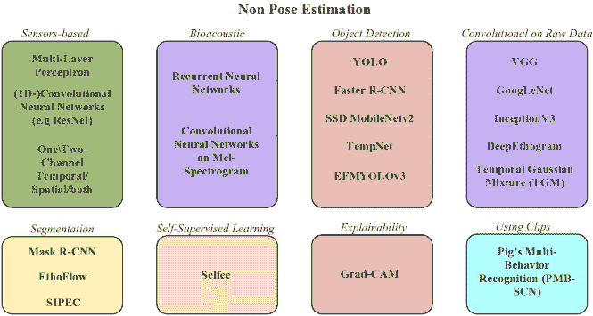

<!--yml

类别：未分类

日期：2024-09-06 19:32:10

-->

# [2405.14002] 动物行为分析方法使用深度学习：综述

> 来源：[`ar5iv.labs.arxiv.org/html/2405.14002`](https://ar5iv.labs.arxiv.org/html/2405.14002)

# 动物行为分析方法使用深度学习：综述

Edoardo Fazzari edoardo.fazzari@santannapisa.it [0000-0002-4570-4170](https://orcid.org/0000-0002-4570-4170 "ORCID identifier") 圣安娜高级研究院 Piazza Martiri della Libertà Pisa Italy 56127 ， Donato Romano 圣安娜高级研究院 Piazza Martiri della Libertà Pisa Italy 56127 donato.romano@santannapisa.it ， Fabrizio Falchi 信息科学与技术研究所，意大利国家研究委员会 Via G. Moruzzi Pisa Italy 56124 圣安娜高级研究院 Piazza Martiri della Libertà Pisa Italy 56127 fabrizio.falchi@cnr.it 和 Cesare Stefanini 圣安娜高级研究院 Piazza Martiri della Libertà Pisa Italy 56127 cesare.stefanini@santannapisa.it (2023)

###### 摘要。

动物行为作为生物适应环境及其整体福祉的可靠指标。通过对动物行为和互动的严格观察，研究人员和观察者可以深入了解它们生活的各个方面，包括健康、社会动态、生态关系和神经行为学维度。尽管最先进的深度学习模型在分类各种动物数据方面表现出卓越的准确性，但在动物行为研究中的应用仍然有限。本文综述了深度学习架构和策略在动物行为识别中的应用，涵盖了听觉、视觉和视听方法。此外，文章还审视了现有的动物行为数据集，详细探讨了该研究领域面临的主要挑战。文章最终对深度学习中具有潜力推动动物行为研究领域的关键研究方向进行了全面讨论。

动物行为，深度学习，姿态估计，物体检测，生物声学，机器学习††版权：acmcopyright††期刊年份：2023††doi：XXXXXXX.XXXXXXX††ccs：计算方法 学习††ccs：应用计算 生物信息学

## 1\. 引言

动物行为涵盖了一系列动物对环境、同类生物和内部刺激的反应、行为和活动模式 （Brown and de Bivort, 2017）。这一广泛领域涵盖了从天生本能和简单反射到复杂的社会互动和学习行为的各种行为。动物行为的研究包括观察、描述和理解动物如何与其他动物及其环境互动。目前，动物行为研究的领域正迅速发展，推动力来自于不断引入的创新实验方法和先进的行为检测系统 （Wang et al., 2021a）。这一进展对于提高我们对神经生态学方面的理解尤其重要，例如通过利用小鼠研究阿尔茨海默病 （Pedersen et al., 2006），以及改进农业中的动物福利实践 （Mishra and Sharma, 2023）。这一进展的推动力是尖端技术的整合，深度学习作为一种变革性力量，重塑了研究人员用于调查和解释动物行为的方法 （Brown and de Bivort, 2017）。

深度学习已经成为探索动物行为的关键工具。这一高级人工智能分支使计算机能够从大量数据集中自主识别模式和特征。随着研究人员通过最先进的监测技术（如高分辨率摄像头、GPS 跟踪设备和传感器）积累越来越复杂的数据集，深度学习算法提取有意义见解的能力变得不可或缺 （Benaissa et al., 2023; Koger et al., 2023）。这不仅加速了分析过程，还揭示了以前难以解读的动物行为的细微方面。此外，深度学习在开发复杂的行为检测系统中发挥了关键作用。这些系统可以自动识别和分类各种行为，使研究人员可以将关注点从繁琐的手动数据标注转向结果的解释 （Arablouei et al., 2023b）。数据处理和行为识别的加速提升了动物行为研究的可扩展性和效率，开启了这一动态领域的新发现和理解时代。

### 1.1. 调查结构

我们的调查结构系统地划分如下：在初始部分，我们阐述了推动使用深度学习研究动物行为的基本动机，并解释了其中的固有限制。同时，我们明确了本次调查试图解决的研究问题。接着，我们呈现了用于进行调查的方法框架的全面阐述，其中包括对收集数据的深刻分析，以揭示研究领域中的可辨别趋势。接下来的研究分为两个不同的部分，这对于本文的整体结构至关重要。这些部分，即姿态估计和非姿态估计方法，构成了我们调查的主要内容，阐明了提取与动物行为分析相关的显著信息及其在行为识别中的应用。在这一划分之后，我们提供了公开可用数据集的汇编。最后，我们回顾了最初提出的研究问题，并根据文章两个主要部分中的发现提供了回答。

### 1.2. 贡献

本调查文章对深度学习在动物行为研究中的理解做出了三方面的贡献：

+   •

    我们对用于分析动物行为的现有技术和算法进行了详细审查。这包括对当前在该领域内普遍使用的方法和途径的详细探索，为读者提供了对技术背景的深刻理解。

+   •

    我们汇编并呈现了与研究领域相关的公开数据集的全面清单。这一汇编为研究人员和从业者提供了宝贵的资源，便于获取进行数据驱动的动物行为研究所需的关键数据。

+   •

    我们对该领域的潜在发展方向进行了实质性的讨论。通过强调深度学习技术的整合，我们的讨论旨在提升现有技术的质量，从而推进对动物行为的理解。这种前瞻性分析提供了改进和创新的潜在途径。

据我们所知，这项调查是迄今为止对这一主题的唯一研究。这次综合性的概述、数据集汇编和前瞻性讨论共同促进了对当前进展的深刻理解，并为将来将深度学习应用于动物行为研究奠定了基础。

## 2. 动机与问题陈述

在这一部分，我们阐述了通过深度学习研究动物行为的基础动机，阐明了这一专门研究领域所固有的多种优势和目标。同时，我们细致地审视了这一领域的主要局限性，认识到研究设置中出现的细微挑战。我们的意图是为未来的研究者提供一个全面的指南，使他们在启动此领域的研究之前，能够充分了解潜在的障碍。同时，我们还强调了研究动物行为所蕴含的诸多机会，促使对这一研究前沿复杂维度的认识和欣赏。

表 1\. 研究动物行为的局限性和目标总结。DL 代表深度学习

| 局限性 | 目标 |
| --- | --- |
| 传感器引起的压力 | 生物多样性保护 |
| 电池寿命 | 生物多样性保护 |
| 数据噪声 | 生态洞察 |
| 存储限制 | 健康影响 |
| 标签经济性 | 福利优化 |
| 主观注释 | 害虫管理 |
| 计算需求 | 社会动态 |
| 伦理考虑 | 非侵入性（与深度学习相关） |
| 现场追踪 | 实时应用（与深度学习相关） |
| 环境不可预测性 |  |

### 2.1\. 研究动物行为的局限性

动物行为的探索面临着多种挑战，这些挑战在细致地塑造其应用的有效性和实用性。这些挑战贯穿于数据获取的方法、数据分析的复杂性（无论是地点还是计算需求）以及数据注释的细微过程。

动物行为研究的一个重要方面是利用传感器进行数据收集。然而，将传感器附加到动物身上引入了一系列独特的挑战。特别是，存在诱发应激反应和改变正常行为的风险（Zhang et al., 2020）。这就需要对收集到的数据真实性进行深刻反思，促使研究人员质疑应激反应行为是否准确反映了自然模式。此外，将真实行为信号与背景噪声区分开来增加了解释的复杂性，强调了需要先进算法的必要性，这些算法能够在噪声中识别出有意义的模式（Kavlak et al., 2023）。除了应激反应和噪声挑战外，传感器设备还面临电池寿命的限制（Mekruksavanich et al., 2022），这影响了行为研究的持续时间和范围，特别是在需要长时间连续数据收集的情况下。研究人员面临的挑战是，在全面、连续监测的需求与有限电池容量带来的实际限制之间取得平衡。

进入移动设备领域为深度学习应用中的挑战引入了另一个层次的复杂性。在这些设备上实施模型面临着存储限制的持续问题（Cao et al., 2020）。平衡强大的物体检测与高效的数据压缩成为首要关注点，像量化卷积神经网络（Quantized-CNN）（Wu et al., 2016）这样的技术试图解决这一挑战。然而，持续的目标是实现这一平衡而不牺牲精度，这对于行为分析的可靠性至关重要。

在标注和注释领域出现了一个关键挑战，即经济和实际约束阻碍了对每只动物的大型数据集进行标记（Bhattacharya and Shahnawaz, 2021）。这一瓶颈阻碍了深度学习模型的可扩展性，而这些模型在有效训练中严重依赖标记数据集。手动标注的实际问题引发了对行为数据集的广度和准确性的根本性担忧，从而影响了后续分析的可靠性。主观性进一步加剧了这些挑战，影响了行为注释的准确性和一致性。视觉检查通常是主观的，对于复杂动物行为的客观洞察能力有限（Bernardes et al., 2021）。虽然传统的手动注释劳动密集且容易出现注释者间的不一致（Zhou et al., 2022; Segalin et al., 2021）。固有的主观性引入了变异性，提出了关于实验可重复性和可靠性的质疑（Hou et al., 2020; Dell et al., 2014）。

此外，这些挑战还扩展到了创新技术，如多视角记录，这些技术有望提供更丰富的动物行为洞察（Jiang et al., 2021）。然而，由于数据源之间缺乏对应关系，协调来自不同视角的社会行为会遇到挑战。有效地协调来自多个视角的信息需要创新的方法，以确保准确性和可靠性，这代表了深度学习方法可以显著贡献的前沿领域。

比较实验室研究时出现的主要挑战，通常围绕受控环境引入的主观性展开，而在野外进行的生态学研究则面临一系列独特的挑战，尤其是在实地跟踪方面（Marshall et al., 2022）。野外遇到的多样化和不可预测的环境引入了在受控实验室设置中没有的复杂性。弥合这两种学科之间的差距需要适应性强的检测和跟踪算法，这些算法能够在这两种环境中无缝运行。能够处理不同动物体型、变化的外观、杂乱、遮挡和不可预测环境的鲁棒算法对于提取有意义的洞察至关重要（Haalck et al., 2020; Hou et al., 2020; Lauer et al., 2022）。这些挑战突显了技术创新的关键需求，以符合受控和野外环境的要求。

### 2.2. 研究动物行为的目标

研究动物行为带来了诸多好处，丰富了我们对自然世界的理解，并在神经科学、药理学、医学、农业、生态学和机器人学等多个领域提供了实际应用。研究动物行为的六大关键优势包括：

1.  (1)

    生物多样性保护：理解动物行为对于保护生物多样性至关重要（Hou 等, 2020；Nilsson 等, 2020；Wijeyakulasuriya 等, 2020；Ditria 等, 2020；Pillai 等, 2023）。了解诸如迁徙模式、觅食习性和繁殖策略等行为对设计有效的保护策略和保护濒危物种至关重要。

1.  (2)

    生态理解：动物行为提供了对生态系统生态动态的见解（Akçay 等, 2020；Gotanda 等, 2019）。行为研究帮助研究人员理解动物如何与环境互动，包括它们在养分循环、种子传播和捕食者-猎物关系中的角色（Nasiri 等, 2023；Chen 等, 2020；Yamada 等, 2020）。

1.  (3)

    人类健康与医学：研究动物行为对人类健康和医学具有重要意义（Shaw 和 Lahrman, 2023；Hart, 2011；Gnanasekar 等, 2022；Manduca 等, 2023）。例如，对动物模型的研究有助于理解某些疾病并开发潜在治疗方法。动物行为研究还帮助我们理解支撑人类行为的神经生物学和心理学（Mathis 和 Mathis, 2020；Coria-Avila 等, 2022；Saleh 等, 2023）。

1.  (4)

    动物福利与饲养：了解动物行为对促进驯养动物福利和优化其饲养实践至关重要（Jiang 等, 2021；Bao 和 Xie, 2022）。理解动物如何表达自然行为可以为设计支持其身体和心理健康的环境提供信息（Tassinari 等, 2021；Manoharan, 2020；Jiang 等, 2020）。

1.  (5)

    害虫控制与农业：尽管目前这方面的研究主要限于害虫识别，但理解害虫种类的行为可以帮助开发有效的害虫控制策略（Coulibaly 等, 2022；Júnior 和 Rieder, 2020；Mendoza 等, 2023）。这些知识有助于农民管理作物损害并减少对有害农药的需求（Teixeira 等, 2023；Mankin 等, 2021）。

1.  (6)

    理解社会动态：观察动物的社会行为可以提供关于社会结构和互动原理的见解（Xiao et al., 2023; Papaspyros et al., 2023）。这些知识可以在社会学和心理学等领域得到应用，助力我们对社会动态的总体理解（Alameer et al., 2022; Perez and Toler-Franklin, 2023; Landgraf et al., 2021）。

在这种情况下，深度学习发挥了关键作用，并作为推进该领域的主要技术之一，开启了新的机会。解决前面讨论的局限性后，我们将详细阐述深度学习和计算技术在动物行为研究中的优势。

我们之前强调了在动物行为研究中使用传感器进行数据收集的关键方面，这可能会引起压力和高噪声水平。使用多种不同的传感器进行数据采集，加上包含融合层的先进架构，已被证明可以减轻噪声并提高分析精度（Mahmud et al., 2021）。然而，将传感器直接附加到动物身上可能引入偏差，这促使畜牧健康评估和神经科学的研究人员采用计算机视觉。计算机视觉通过使用摄像头提供实时、非侵入性和准确的动物级信息，已受到广泛欢迎（Oliveira et al., 2021）。然而，这种方法的局限性在于仅适用于摄像头画面内的设置，除非有像 Haalck 等人（Haalck et al., 2020）的移动摄像头创新，这种摄像头跟踪动物，创建其环境的动态地图。在较大的场景中，如奶牛在草地上吃草时，传感器仍然更为可取。尽管如此，从动物的移动设备收集和分析传感器数据仍然具有挑战性且耗时。为了解决这一问题，Dang 等人（Dang et al., 2022）引入了长期区域网络（LoRaWAN），通过将传感器附加到奶牛上，连接到将信息传输到云端的网关。这不仅克服了与移动设备相关的计算能力限制，还确保了连续的实时数据分析。

深度学习的有效性取决于标注数据，特别是对于监督学习方法而言。虽然手动标注仍然不可避免，但在诸如姿态估计和分类等任务中，标注可以是迭代的。这涉及到标注数据集的一小部分，训练网络，对新图像进行预测，修正标签，并重复这一过程多次。正如 Pereira 等人（Pereira et al., 2019）所示，这种迭代方法加速了标注过程。另一种方法是生成人工标签（Li and Lee, 2023）。

表 1 简明扼要地概括了主要的限制和优势，为在复杂的动物行为研究领域中航行的研究人员提供了有见地的参考。

### 2.3\. 研究问题

调查旨在解决以下研究问题：

RQ1 哪些动物物种被考虑得较少，为什么？

这个研究问题旨在探讨在行为分析中被忽视或较少研究的动物物种。为了解决这个问题，调查将探索现有文献和研究，以识别动物样本选择中的趋势和偏差。目的是了解为何某些物种受到较少关注，并洞察潜在的知识空白，从而有助于制定更全面和包容的研究策略。

RQ2 在文献中，动物行为分析采用了哪些深度学习方法？

这个研究问题专注于总结和分类文献中用于动物行为分析的现有深度学习方法。调查将回顾广泛的研究，以识别和分类用于分析动物行为的各种深度学习技术。目的是分析现有的方法，以识别领域内当前方法的趋势、优点和局限性。

RQ3 人类行为分析与动物行为分析之间有哪些区别？

这个研究问题旨在突出人类行为分析与其他动物物种行为分析之间的区别。调查将比较研究方法、伦理考虑以及研究人类和动物行为时面临的挑战。

RQ4 有哪些适合且可能提升这一任务的深度学习策略，但尚未被利用？

这个研究问题着眼于未来，旨在识别在动物行为分析中应用深度学习的未开发潜力。调查将对当前文献进行全面回顾，以识别深度学习策略尚未广泛探索的空白或领域。这包括提出现有技术的新应用或建议修改以适应深度学习方法，从而更有效地分析动物行为。

## 3\. 文献综述方法

在这一部分，我们阐明了我们调查中采用的方法。我们的方法包括进行彻底的系统性回顾，以精心选择本文所考虑的相关研究。随后，我们准确分析了收集到的信息，采用统计方法得出有意义的见解。

### 3.1\. 搜索与选择策略

本节阐述了用于数据收集和综合的方法。最初，通过对包括 Google Scholar、IEEE Xplore 和 Springer 数据库在内的学术资源进行系统搜索来进行数据获取。制定的搜索查询如下： |

animal behavior AND deep learning

(insect OR wild) AND behavior AND deep learning |

选择对昆虫和野生动物采用不同查询的决定是由于观察到相对于涉及农场动物和神经生态学（通常关注于小鼠）的研究，这些类别的文献相对稀少。因此，制定具体查询以涵盖更广泛的动物物种是必要的。 |

随后，获得的数据根据在表 2 中阐明的特征进行了系统的汇总。这些特征源自对现有文献的全面分析中识别出的模式。综合分析结果，第四部分和第五部分概述了汇总的发现，总结了分别基于姿态估计的方法和不基于姿态估计的方法的相关论文。 |

最终，执行了谨慎的筛选操作，仅提取与本调查目标相关的文章，结果为 151 篇。对该子集中的每篇文章进行了详细审查，并对其中的相关参考文献进行了审查，随后纳入我们的调查中以丰富其内容。 |

表 2\. 从论文中提取的特征 |

| 参考文献：每篇检索到的文章分配的标识符。 |
| --- |
| 年份：文章的出版年份。 |
| 国家：作者所在的地理位置，如第 3.2 节所要求的。 |
| 物种：文章中研究的特定物种。 |
| 姿态估计：指示方法论是否包括姿态估计（真或假）。 |
| 行为分析：指示分析是否考虑了提取的特征与观察到的行为之间的关联（真或假）。 |
| 特征方法论：用于提取研究中显著特征的方法。 |
| 行为方法论：用于将特征与观察到的行为关联起来的方法框架。 |
| 作者的研究领域：指示作者主要从事的研究领域。 |

### 3.2\. 综合科学映射分析 |

#### 3.2.1\. 年度科学产出 |

在检索文章的过程中，我们的注意力完全集中在 2020 至 2023 年的研究出版物上。图 1a 通过直方图阐明了这一分布，展示了每年论文的数量表示。

#### 3.2.2\. 基于考虑动物的科学产出

图 1b 展示了所选文章中各种动物物种的百分比分布。显然，主要强调了关于家畜的研究，特别是集中在牛和猪上，以及涉及小鼠的研究，这些研究大多与神经科学相关。

#### 3.2.3\. 作者的研究领域

鉴于动物行为分析是一个跨学科和多学科的领域，理解从事该领域的研究人员的背景变得至关重要。尽管主要关注于与深度学习技术相关的文章，但值得注意的是，相当多的非人工智能从业者正积极进入这一领域，如图 1c 所示。有趣的是，当结合“计算机科学”（包括计算机工程）和“人工智能”时，它们仅占学术贡献的 18%。相比之下，生物相关领域，包括生物学、动物科学、农业、兽医学和生态学，共同贡献了 30%的研究景观。值得注意的是，各种工程领域，包括那些具有机械电气背景的领域，在动物行为研究中积极参与。此外，在神经科学和心理学领域也观察到了引人注目的相关性，大多数文章专注于对小鼠的研究。

图 1\. a) 展示了一个直方图，描述了每年研究文章的分布，专注于在初步搜寻阶段获得和编目的论文。b) 展示了一个饼图，详细说明了利用深度学习技术的行为研究中使用的动物种类。c) 展示了另一个饼图，展示了作者的不同研究领域。

## 4\. 基于姿态估计的方法

姿态估计，即识别和定位物体的位置和方向的过程，是一种基础技术，广泛用于动物行为研究和物体检测中，如在 subsection 5.3 中讨论的那样。姿态估计起源于人类姿态估计（HPE），由 Mathis 等人通过 DeepLabCut（Mathis et al., 2018）和 Pereira 等人通过 LEAP（Pereira et al., 2019）率先发展为动物姿态估计（APE），并最终演变为 SLEAP（Pereira et al., 2022）。本节将深入分析这两种方法，并结合该领域的最新趋势进行讨论。鉴于我们调查的主要关注点是动物行为分析，在介绍这些主要方法之后，我们将阐明姿态估计输出在行为分析和分类中的应用。为了更全面地了解动物姿态估计，我们建议查阅 Jiang 等人（Jiang et al., 2022a）于 2022 年发布的调查研究。

LEAP (Pereira 等，2019) 是一个单动物姿态估计模型，采用卷积层，最终生成描绘每个独立身体关键点概率分布的置信度图。这种架构设计，如图 2 所示，具有简单的特点，包含三组卷积层。前两组通过最大池化来减轻计算复杂度。随后，应用转置卷积来恢复图像的原始尺寸，但深度对应于关键点的数量，从而为每个关键点生成置信度图。尽管简单，LEAP 模型在非实验室环境中面临挑战，如遮挡问题，因此引入了 T-LEAP (Russello 等，2022)。T-LEAP 保留了 LEAP 的架构，但在使用 3D 卷积而非 2D 卷积上有所不同。T-LEAP 的输入包括从视频中提取的四帧连续图像，增强了模型的鲁棒性。值得注意的是，T-LEAP 继续专注于单动物姿态估计，如图 2 所述。随后，LEAP 的作者推出了一个改进版本，称为 Social LEAP (SLEAP) (Pereira 等，2022)，旨在通过整合自下而上 (Papandreou 等，2018) 和自上而下策略 (Nguyen 和 Kresovic，2022)，有效应对多动物姿态估计的挑战。在自上而下策略中，SLEAP 首先识别个体，然后检测其各自的身体部位。与 LEAP 不同，SLEAP 无需额外的物体检测架构即可无缝地集成这种方法。另一方面，SLEAP 的自下而上策略涉及检测个体身体部位，然后根据其连接性将其分组到个体中。这种双策略框架的一个关键优势是其高效性，只需通过神经网络进行单次传递。这种策略的输出生成多部件置信度图和部件亲和场 (PAFs) (Cao 等，2017)，这些是精细表示身体部位对之间空间关系的向量场。此外，SLEAP 通过从 LEAP 的骨干网络过渡到更复杂的 U-Net 架构 (Ronneberger 等，2015)，在多动物姿态估计场景中显著提高了准确性。

图 2\. a) 显示了 LEAP (Pereira et al., 2019)的架构；b) 显示了 T-LEAP (Russello et al., 2022)中使用的架构。

同样，DeepLabCut (DLC) (Mathis et al., 2018) 随着时间的推移有了显著的进展。最初设计为单动物姿态估计方法，它利用了一个预训练的 ResNet-50 (He et al., 2016)骨干网络，并随后加入反卷积层来生成关键点的置信度图。这种方法利用了 Imagenet 预训练权重，使得 DLC 能够在数据较少的情况下有效地估计骨架。该模型的能力后来通过使用多台摄像机来扩展到包括 3D 姿态估计 (Nath et al., 2019)。每个摄像机视角被独立训练，并采用复杂的摄像机标定技术来推导 3D 位置。DLC 发展的一个后续里程碑涉及解决多动物姿态估计的挑战 (Lauer et al., 2022)。这一演变引入了 DLCRNet，一种结构修改，取代了 ResNet 骨干网络。DLCRNet 采用自下而上的多动物姿态估计方法，具有多融合架构和多阶段解码器。解码器利用多个阶段的评分图和 PAFs (Cao et al., 2017) 来预测每只动物的关键点。进一步的创新体现在 SuperAnimal (Ye et al., 2022)中，它在模型架构中引入了变压器层。

虽然 DLC (Mathis et al., 2018) 和 SLEAP (Pereira et al., 2022) 目前在动物行为分类的行为分析中是主要的姿态估计方法，但必须承认动物姿态估计架构中的最新进展。已经引入了几个显著的方法：

+   •

    OptiFlex (Liu et al., 2020) 是一种基于视频的动物姿态估计方法，给定跳过比例$s$和帧范围$f$，它会组装一个由$2f+1$张图像组成的序列，这些图像的索引范围从$t-s\times f$到$t+s\times f$。这个序列输入到一个基于残差块并具有中间监督的模型中，为每张图像生成预测并产生一系列热图张量。这些张量随后被输入到一个光流模型中，最终产生索引$t$的最终热图预测。与 DeepLabCut (Mathis et al., 2018)、LEAP (Pereira et al., 2019) 和 DeepPoseKit (Graving et al., 2019)相比，OptiFlex 显示出了优越的准确性。

+   •

    SemiMultiPose（Blau 等人，2022）提出了一种半监督的多动物姿态估计方法，建立在 DeepGraphPose（Wu 等人，2020）和 DirectPose（Tian 等人，2019）的基础上。该方法同时处理标记和未标记的帧，使用 ResNet（He 等人，2016）骨干网络，生成一个紧凑的表示，并输入到三个分支中：一个用于检测关键点热图（B1），一个用于边界框热图（B2），还有一个用于关键点检测（B3）。SemiMultiPose 旨在从 B2 和 B3 中生成伪关键点坐标，以用于自监督分支，进一步贡献于 B1。该网络在准确性方面较 SLEAP（Pereira 等人，2022）有所提升。然而，作者指出，在标记数据丰富的情况下，他们的方法可能不会显著优于其他方法，对于从顺序视频中提取单动物姿态估计，DeepGraphPose（Wu 等人，2020）可能优于 SemiMultiPose（Blau 等人，2022），因其考虑了空间和时间信息。

+   •

    Lightning Pose（Biderman 等人，2023）利用了未标记视频的时空统计特性，具体有两种方式。首先，它引入了无监督训练目标，惩罚网络对那些违反物理运动平滑性、多视角几何或偏离合理身体配置低维子空间的预测。其次，它提出了一种新颖的网络架构，该架构使用周围未标记帧的时间上下文来预测给定帧的姿态。最终得到的姿态估计网络在标签较少的情况下表现出色，相较于之前提到的方法，更有效地推广到未见过的视频，并提供了更平滑、更可靠的姿态轨迹，以便于下游分析（例如神经解码分析）。

+   •

    Bhattacharya 等人（Bhattacharya 和 Shahnawaz，2021）介绍了一种新型模型，用于从未标记数据中识别多个动物的姿态。该方法包括从每张图像中去除背景信息，并对动物的身体应用边缘检测算法。随后，跟踪边缘像素的运动，并进行聚类分割身体部位。与之前的方法不同，最终结果不是特定的关键点，而是身体部位的分割。为了实现这一点，作者利用对比学习来防止将远离的身体部位归为一类。

在获取每个动物在每一帧中的骨骼表示后，无论是从视频还是图像中，下一步涉及到对数据的处理以辨别特定行为。从姿态估计中得出的轨迹可以通过统计方法进行有效分析。Weber 等人（Weber et al., 2022）利用 DeepLabCut 预测（Mathis et al., 2018）和 ANOVA（Kaufmann and Schering, 2014）对啮齿动物进行行为特征分析，重点研究中风恢复。同样地，Lee 等人（Lee et al., 2021）采用 DLC（Mathis et al., 2018），研究了非束缚果蝇的行为。他们的研究包括预测运动模式和识别动物腿部的质心。

在分析姿态估计轨迹时，机器学习变得至关重要，尤其是在分类姿势并将其与特定行为相关联时。最简单的方法之一是使用最近邻分类器。Saleh 等人（Saleh et al., 2023）测试了这种方法，以在开放场地实验中对小鼠行为如穿越和竖立进行分类，达到了 97% 的准确率。其他机器学习方法由 Fang 等人（Fang et al., 2021）和 Nilsson 等人（Nilsson et al., 2020）应用。前者使用朴素贝叶斯分类器来识别禽类的进食、理毛、休息、行走、站立和奔跑行为，提供了疾病预警系统。后者介绍了 SimBa 工具包，将 DeepLabCut（Mathis et al., 2018）或 DeepPoseKit（Graving et al., 2019）项目导入，以使用 RandomForest（Breiman, 2001）创建分类器，并提取诸如速度和总运动量等特征。McKenzie-Smith 等人（McKenzie-Smith et al., 2023）使用 SLEAP（Pereira et al., 2022）获得的轨迹来识别果蝇中的刻板行为，如梳理、口器伸展和运动，并使用 MotionMapper（Berman et al., 2014）提供的结果行为图谱来探索果蝇行为如何随着一天中的时间和日子的变化而变化，发现所有刻板行为中都存在明显的昼夜节律模式。

其他作者选择了递归神经网络和卷积神经网络，采用简单的方法如使用长短期记忆网络（LSTM）（Hochreiter 和 Schmidhuber，1997）和 1D 卷积神经网络来处理轨迹，以得出行为结论。例子包括检测马的跛行（Alagele 和 Yildirim，2022）和确定蟋蟀经历的化学反应（Fazzari 等，2023）。更复杂的方法包括 Wittek 等（Wittek 等，2023）使用 InceptionTime（Ismail Fawaz 等，2020），一个深度卷积神经网络模型的集合，用于分类鸟类的七种不同行为。一些作者通过引入非线性聚类阶段来简化分类过程，以改善特征空间，然后使用多层感知机（MLP）进行分类，展示了分类上的优势（Ye 等，2022；Schneider 等，2023）。

最近出现的一种新兴趋势是利用无监督学习技术分析动物行为。Luxer 等（Luxem 等，2022）创新性地提出了一种处理源自 DeepLabCut（Mathis 等，2018）的轨迹的方法，采用变分自编码器（VAE）（Kingma 和 Welling，2013）。随后，他们对轨迹的新表示应用隐马尔可夫模型（HMM）（Rabiner 和 Juang，1986），以辨别潜在的模式。在对模式使用的全面分析后，作者迭代地使用 HMM，将模式数量限制在先前分析中超过 1%使用阈值的模式。经过精炼的模式被归因于小鼠表现出的特定行为，如探索、竖立、梳理、暂停或行走。值得注意的是，这种方法在直接应用于运动序列时优于传统技术，如自回归 HMM（AR-HMM）或 MotionMapper（Berman 等，2014）。

动作轨迹的应用不仅限于预测单个动物的行为；在多动物场景中，它们还可以用来揭示它们之间复杂的社会互动网络。Segalin 等人 (Segalin et al., 2021) 介绍了鼠标动作识别系统 (MARS)，这是一个复杂的自动化管道，专门用于对自由互动的老鼠对进行姿态估计和行为量化。MARS 能够敏锐地识别三种特定的社会行为：近距离调查、骑乘和攻击。另一方面，Zhou 等人 (Zhou et al., 2022) 提出了跨骨架互动图聚合网络 (CS-IGANet)，这是一个开创性的框架，旨在捕捉自由互动老鼠的各种动态。CS-IGANet 成功识别了一系列行为，包括接近、攻击、追逐、交配、离开另一只老鼠、嗅探等。

轨迹不仅用来识别特定行为，还在异常检测中发挥重要作用。例如，Fujimori 等人 (Fujimori et al., 2020) 使用了 OneClassSVM (Boser et al., 1992) 和 IsolationForest (Liu et al., 2008) 来检测家猫中的异常行为。同样，Gnanasekar 等人 (Gnanasekar et al., 2022) 利用姿态估计数据预测在戒断阿片类药物的老鼠中的异常行为，并使用预训练的卷积神经网络对颤抖行为进行分类。

## 5\. 非姿态估计方法

在本节中，我们详细阐述了在不使用姿态估计技术的情况下研究动物行为所采用的方法。为了增强清晰度和系统化呈现，我们已将每种方法划分为相应的子节。

### 5.1\. 基于传感器的方法

传感器生成的数据，通常来源于加速度计或陀螺仪，在文献中已被广泛探讨，例如在（Kleanthous et al., 2022a; Neethirajan, 2020）的综述中。这些综述深入探讨了经典机器学习方法在现代动物养殖和动物行为研究中的应用。最近，越来越多地采用深度学习方法。Arablouei et al.（Arablouei et al., 2023b）使用了配备加速度计的可穿戴项圈来收集放牧肉牛的数据。他们应用了多层感知机来分类如放牧、行走、反刍、休息和饮水等行为。类似地，Eerdekens et al.（Eerdekens et al., 2020）在马匹上使用了三轴加速度计，这些加速度计被战略性地放置在前腿的外侧。他们提出了一种卷积神经网络来基于所获取的数据检测诸如站立、行走、小跑、慢跑、滚动、拍打和侧面观察等行为。Mekruksavanich et al.（Mekruksavanich et al., 2022）则将加速度计数据分段为 2 秒窗口，并利用预训练的 ResNet 模型（He et al., 2016）进行绵羊活动识别。Dang et al.（Dang et al., 2022）介绍了多个传感器的集成，收集环境数据（如温度、湿度）以及通过加速度计和陀螺仪获得的牛行为信息。他们使用 1D 卷积神经网络和 LSTM 网络对这些信息进行预处理，以分类行走、进食、躺下和站立行为。在最近的一项研究中，Pan et al.（Pan et al., 2023）介绍了四种新型卷积神经网络架构，专门用于动物动作识别（AAR）。这些架构，包括单通道时间（OCT）、单通道空间（OCS）、OCT 和空间（OCTS），以及双通道时间和空间（TCTS）网络，利用来自 3D 加速度计和 3D 陀螺仪的数据。他们研究的核心目标是**精确**识别泌乳母猪的行为，如移动、饮水、进食、哺乳、睡眠和躺下。

除了加速度计和陀螺仪数据外，全球导航卫星系统（GNSS）数据作为理解动物行为的有价值工具也逐渐显现。Arablouei et al.（Arablouei et al.，2023a）通过使用 GNSS 提取有关牛行为的相关信息，包括距离水源的距离、中位速度和中位估计水平位置误差等指标，探索了这一领域。将 GNSS 数据与加速度计信息结合，研究人员采用了两种不同的方法。第一种方法涉及将两个传感器数据集的特征串联成一个综合特征向量，然后输入到 MLP 分类器中。另一种方法则集中于融合两个独立 MLP 分类器预测的后验概率。这些方法使得对诸如吃草、步行、休息和饮水等行为的准确检测成为可能。

### 5.2\. 生物声学

尽管生物声学提供了对动物行为的迷人洞察（Stowell，2022），鉴于声音在动物活动中的重要角色，如沟通、交配、导航和领地防御（Chalmers et al.，2021），目前已发布的文章主要侧重于动物识别（Xu et al.，2020；Bravo Sanchez et al.，2021；Varma et al.，2021）和声音事件检测（Nolasco et al.，2023；Moummad et al.，2023）。值得注意的是，现有文献中研究结合声学和深度学习以识别动物行为的工作较为稀缺。Wang et al.（Wang et al.，2021b）在这一领域中脱颖而出，他们尝试对绵羊的行为进行分类，包括咀嚼、咬合、咀嚼-咬合和反刍声音。这是通过将录音设备放置在动物面部附近来完成的，并将噪音指定为安慰剂类别。获取的波形数据被用于通过前馈神经网络和递归神经网络进行分类任务。此外，这些信息还被转换为对数尺度的 Mel 频谱图，作为卷积神经网络的输入。研究结果强调，尽管递归神经网络表现优越，但卷积神经网络在性能上超过了前馈方法，这归因于 Mel 频谱图提供的增强信号表示。

### 5.3\. 物体检测

与姿态估计技术相结合，对象检测作为一种广泛应用的深度学习方法在分析动物行为方面表现突出。其普及性可以归因于在动物识别和检测中的既定实用性（Chen et al., 2021; Teixeira et al., 2023; Banerjee et al., 2023），这促使研究人员将重点转向研究动物福利和活动。

在动物行为识别的主要架构中，Faster R-CNN（Ren et al., 2015）和特别是 YOLO（Redmon et al., 2016）被频繁使用。然而，也提出了替代架构。例如，Samsudin et al.（Samsudin et al., 2022）利用 SSD MobileNetv2（Sandler et al., 2018）来检测异常和正常的斑马鱼幼虫行为，以研究神经毒素的影响。McIntosh et al.（McIntosh et al., 2020）引入了 TempNet，结合了编码器桥和残差块以及两阶段时空编码器，用于检测鱼类的惊吓事件。

对象检测具有双重功能，包括通过图像或视频帧分析即时行为检测，以及特定行为的量化和追踪。准确分析单帧、计数和逐帧检查使研究人员能够量化不同动作的持续时间和频率。例如，YOLO 在 Alameer et al.（Alameer et al., 2022）的研究中应用，便于量化猪之间的接触频率，从而识别出 rear snorting 和 tail-biting 等异常行为。在牛和猪的研究中，一个关键方面是量化运动和攻击行为（Alameer et al., 2022; Odo et al., 2023）。此外，基于动物打斗行为辨别等级关系的努力也至关重要（Uchino and Ohwada, 2021）。重要的是，对于需要长期动物识别的任务，追踪通常使用 DeepSort（Wojke et al., 2017; Evangelista et al., 2022）。

高效的即时检测可以通过对动物进行单次分析，并通过单张图像直接分类其行为来实现。在这种情况下，深度学习对象检测模型在直接识别如位置活动（例如，交配、站立、进食、扩散、打斗、饮水）等行为方面发挥了重要作用，以全面分析动物健康和压力行为（Riekert et al., 2020; Manoharan, 2020; Wang et al., 2020）。这些模型还应用于疾病识别，例如检测颈部扭曲（Elbarrany et al., 2023），以及研究动物对新环境的行为适应（Li et al., 2019b）。此外，对象检测模型可以扩展到热成像和红外图像。例如，Xudong 等人（Xudong et al., 2020）利用热成像自动识别奶牛乳腺炎，提出了 EFMYOLOv3 模型。同样，Lei 等人使用红外图像来辨别缓慢动物的进食、休息、移动和社交行为（Lei et al., 2022）。

除了这些应用之外，利用对象检测的显著方法还包括 Fuentes 等人（Fuentes et al., 2020），他们将 YOLO 和光流结合起来检测牛的动作。此外，一些研究人员仅使用对象检测来定位图像或视频中的动物。随后，他们会裁剪该区域，并在其他模型中使用它，利用 2D 预训练网络或引入 3D 卷积神经网络进行视频分析（Feighelstein et al., 2023; Thanh and Netramai, 2022）。

### 5.4\. 其他

一些研究工作采用了独特的深度学习方法，与前述章节中讨论的方法不同。由于现有文献中使用上述方法评估动物行为的深度学习策略相对稀少，我们努力编汇了一套全面的想法。为此，我们确定并分类了五种不同的方法。

+   •

    原始数据上的卷积分类。Alameer 等人 (Alameer et al., 2020) 采用了类似于 GoogLeNet 的架构 (Szegedy et al., 2015) 来区分猪记录中的进食和非营养性访客。在类似的研究中，Ayadi 等人 (Ayadi et al., 2020) 使用了 VGG19 (Simonyan 和 Zisserman, 2014) 来判断奶牛是否在反刍。该网络架构也被应用于识别小鼠的各种行为，如梳理、舔腹部、蹲坐、休息、绕圈、徘徊、攀爬和搜索 (Wang et al., 2021a)。类似地，Andresen 等人 (Andresen et al., 2020) 利用预训练网络开发了一个完全自动化的系统来监测小鼠手术后和麻醉后面部表情的效果，采用了 InceptionV3 (Szegedy et al., 2016) 来识别疼痛。值得注意的是，Bohnslav 等人 (Bohnslav et al., 2021) 推出了 DeepEthogram，一个用于预测小鼠和果蝇行为的软件。该方法使用了 11 帧的序列，其中最后一帧是预测目标。使用 MotionNet (Zhu et al., 2019) 生成光流帧。这些帧与目标帧一起输入特征提取器 (ResNet 架构 (He et al., 2016; Hara et al., 2018)) 以提取流动和空间特征。随后，这些特征被连接起来，并应用 Temporal Guassian Mixture (TGM) 模型 (Piergiovanni 和 Ryoo, 2019) 进行分类。Han 等人 (Han et al., 2020) 采用了一种更简单的方法，将待预测的帧与从后续帧生成的计算光流叠加。然后，使用卷积神经网络对结果图像进行分类，以区分鱼群中的行为，包括正常状态、群体刺激、个体干扰、进食、缺氧和饥饿状态。

+   •

    分割。Xiao 等人（Xiao et al., 2023）使用 Mask R-CNN（He et al., 2017）在 3D 空间中对鸟类进行分割，从而根据不同的社会行为（如接近、停留、离开和鸣叫）分析它们的互动。相比之下，其他研究者开发了创新的管道来研究动物行为。EthoFlow（Bernardes et al., 2021）是一种基于分割的软件，能够跟踪和分析有机体的行为（已在蜜蜂数据集上验证）。另一方面，SIPEC（Marks et al., 2022）是一个利用 Xception 网络（Chollet, 2017）从帧中提取特征的管道。这些特征随后使用时间卷积网络（TCN）（Lea et al., 2016）进行处理，以分类每帧中的动物行为。虽然 SIPEC 在单动物分类情况下不使用分割，但在多动物行为分类中无缝地结合了分割。

+   •

    自监督学习。Jia 等人（Jia et al., 2022）提出了一种创新的自监督学习方法 Selfee，旨在直接从动物行为的原始视频录制中提取全面且具区分性的特征。Selfee 利用一对 Siamese 卷积神经网络（Koch et al., 2015），专门训练以生成实时帧的区分性表示。

+   •

    可解释性。根据我们所知，Choi 等人（Choi et al., 2022）是唯一使用可解释人工智能（XAI）的研究者。在他们的研究中，他们利用 Grad-CAM（Selvaraju et al., 2016）来深入了解一个神经网络的决策过程，该网络旨在区分不稳定和稳定的蚂蚁群体。该研究旨在确认网络理解复杂行为如对抗和主导咬合的能力，从而揭示其预测的可解释性。

+   •

    行为识别在视频片段中。Li et al.（Li et al., 2020）承担了对重要猪行为的分类任务，如进食、躺卧、活动、抓挠和骑跨。他们的方法包括开发猪多行为识别（PMB-SCN），这是一种基于 SlowFast 框架（Feichtenhofer et al., 2019）并利用时空卷积的复杂架构。PMB-SCN 包含两个具有不同时间速度的 SlowFast 路径。慢路径在处理输入帧时使用较大的时间步幅（例如，8，考虑到一个长度为 64 帧的片段），而快路径使用较小的时间步幅（例如，2）。这些路径提取的特征通过横向连接（Lin et al., 2017）相互连接，提高了模型捕捉复杂时空模式的能力。方法的最终阶段涉及分类，其中融合的特征被有效地用于识别和分类各种猪行为。

## 6\. 公开可用的数据集

本节详细列举了通过我们系统搜索识别的文章中提及或参考的公开可用数据集。表格 3 展示了每个数据集的详细信息，包括介绍文章、作者、目标物种、数据类型（例如，图像、视频、音频信号、传感器数据）、使用的具体任务以及数据集的内容。值得注意的是，表格中包括了表示数据集双重使用的参考文献——最初用于特定任务，随后被重新利用，通过应用列中的引用表示。不幸的是，某些文章使用了私人数据集，尽管一些作者可能提供数据集共享选项。我们建议查阅相关的文章以探索潜在的数据访问途径。

从表格 3 中可以提炼出若干关键考虑因素，如下：

+   •

    在针对姿态估计的数据库背景下，一个显著的观察是，当数据库应用于不同动物物种时，骨骼结构的标准化（Cao et al., 2019; Yu et al., 2021; Ng et al., 2022）。这种标准化便于训练单一网络，避免了物种特定网络的需求。相反，专门针对单一动物物种的数据库展现出复杂的骨骼配置，以适应该物种的解剖特征。例如，检测蟋蟀触角的远端和近端的精度可能是可实现的（Fazzari et al., 2022），但这种细致度可能不适用于如马等非昆虫物种。

+   •

    动物如山羊和鸟类倾向于在开阔地带活动，迫使研究人员依赖传感器数据或其他方法，如音频录音，以进行事件和动作检测。这种方法比使用摄像头跟踪动物要更易于管理。然而，传感器的使用受制于这些设备的可用性和经济性，直接影响涉及的个体数量和数据集中的序列量。

+   •

    对于识别静态位置，例如动物是否躺下或站立，静态图像就足够了。然而，捕捉和分析视频，或更确切地说，短视频片段，对于识别动态动作和行为至关重要。这些片段故意很短，以专注于相关的动作事件，确保使用深度学习技术进行准确分类。这种方法有效地排除了可能干扰特定行为实例识别的多余或不相关行为。这就是 Yang 等人决定为每个视频片段使用 15 帧的原因 (Yang et al., 2022)。

+   •

    不幸的是，目前公开的集体和社会行为预测与分析数据集仅限于小鼠和鱼类，尽管我们在本次调查中讨论了一项利用可解释人工智能分析蚂蚁行为的研究。这种创新的研究方法严重依赖视频数据，呈现出需要大量处理工作的计算挑战。这种复杂的方式需要大量时间来仔细标记帧和事件，从而稍微降低了其整体研究吸引力和受欢迎程度。

+   •

    一个重要的考虑因素涉及许多数据库的主要关注点，这些数据库主要旨在识别、检测、姿态估计和跟踪。尽管有这种取向，但需要承认，尽管这些数据集并非明确设计用于行为分析，它们在行为分析中仍然发挥了重要作用。强烈建议研究人员不要因为动物数据集与特定行为无关而忽视它们。这些数据集可以提供宝贵的见解，其更广泛的适用性应该超越其最初的设计范围。

表 3\. 对动物行为分析有用的数据集信息

| 物种 | 引入者 | 类型 | 应用 | 维度 |
| --- | --- | --- | --- | --- |
| 鸟类 | Akçay (Akçay et al., 2020) | 图像 | 检测 | 3436 张图像 |
| 鸟类 | Morfi 等人 (Morfi et al., 2019) | 音频 | 识别 (Bravo Sanchez et al., 2021) | 687 个录音，87 类 |
| 鸟类 | Knight 等人 (Knight and Bayne, 2019) | 音频 | 事件检测 (Lostanlen et al., 2019) | 64 个录音，5 类 |
| 鸟 | Shamoun-Baranes 等人 (Shamoun-Baranes et al., 2017) | 传感器数据 | 运动预测 (Wijeyakulasuriya et al., 2020) | 19 个序列 |
| 牛 | Arablouei 等人 (Arablouei et al., 2023a) | 传感器数据 | 行为分类 | 11962 个标记数据点 (arm20c)，10879 个标记数据点 (arm20e) |
| 狗 | Barnard 等人 (Barnard et al., 2016) | 图片 | 姿态估计 | 22479 张图片 |
| 山羊 | Kamminga 等人 (Kamminga et al., 2018) | 传感器数据 | 动作识别 (也参考 (Bocaj et al., 2020)) | 177.8 小时的序列数据，5 个个体 |
| 山羊 | Kleanthous 等人 (Kleanthous et al., 2022b) | 传感器数据 | 动作识别 (也参考 (Bocaj et al., 2020; Mekruksavanich et al., 2022)) | 2 个序列 |
| 马 | Kamminga 等人 (Kamminga et al., 2019) | 视频 | 姿态估计、动作识别 (Bocaj et al., 2020) | 8144 帧 |
| 马 | Mathis 等人 (Mathis et al., 2021) | 图片 | 姿态估计 | 608550 张图片 |
| 鱼 | Mathis 等人 (Mathis et al., 2018) | 视频 | 姿态估计 | 100 帧 |
| 鱼 | McIntosh 等人 (McIntosh et al., 2020) | 视频 | 行为分类 | 892 个片段 |
| 鱼 | Papaspyros 等人 (Papaspyros et al., 2023) | 视频 | 集体行为预测 | 三个 16 小时的轨迹数据集 |
| 鱼 | Rahman 等人 (Rahman et al., 2014) | 视频 | 动作识别 (Gore et al., 2023) | 95 个片段 |
| 鱼 | Tucker 等人 (Tucker Edmister et al., 2022) | 视频 | 跟踪、化学反应分析 (Gore et al., 2023) | 每个 384 个个体 3 小时 |
| 昆虫 | Bjerge 等人 (Bjerge et al., 2023) | 图片 | 检测 | 29960 张图片 |
| 昆虫 | Fazzari 等人 (Fazzari et al., 2023) | 视频 | 跟踪、化学反应分析 | 69 个个体的 5 分钟片段 |
| 昆虫 | Modlmeier 等人 (Modlmeier et al., 2019) | 图片 | 运动预测 (Wijeyakulasuriya et al., 2020) | 14400 帧 (4 小时) |
| 昆虫 | Pereira 等人 (Pereira et al., 2022) | 视频 | 姿态估计 | 30 个视频，2000 个标签 |
| 昆虫 | Pham 等人 (Pham, 2022) | 序列 | 运动分类 | 258 条轨迹 |
| 昆虫 | Ullah 等人 (Ullah et al., 2022) | 图片 | 识别 | 1686 张图片 |
| 水母 | Martin 等人 (Martin-Abadal et al., 2020) | 图片 | 检测 | 842 张图片 |
| 小鼠 | Burgos 等人 (Burgos-Artizzu et al., 2012) | 视频 | 姿态估计、社会行为分析 (Jiang et al., 2021) | 237 个视频和超过 8M 帧 |
| 小鼠 | Jiang et al. (Jiang et al., 2021) | 视频 | 社会行为分析 | 12*3 个标注视频，总计 216,000*3 帧 |
| 小鼠 | Jiang et al. (Jiang et al., 2022b) | 视频 | 检测，跟踪 | 10 个视频，每个视频时长 3 分钟，标注 4000 帧 |
| 小鼠 | Mathis et al. (Mathis et al., 2018) | 视频 | 姿态估计 | 161 帧 |
| 小鼠 | Pereira et al. (Pereira et al., 2022) | 视频 | 姿态估计 | 1000 帧，2950 个实例 & 1474 帧，2948 个实例 |
| 小鼠 | Segalin et al. (Segalin et al., 2021) | 视频 | 姿态估计，行为分类 | 3.3M 个姿态标注，14 小时的行为标注 |
| 多种动物, 5 | Cao et al. (Cao et al., 2019) | 图片 | 姿态估计 | 4666 张图片 |
| 多种动物, 30 | Yang et al. (Yang et al., 2022) | 图片/视频 | 姿态估计 | 2.4K 视频剪辑，每个视频有 15 帧，共计 36K 帧 |
| 多种动物, 54 | Yu et al. (Yu et al., 2021) | 图片 | 姿态估计 | 10015 张图片 |
| 多种动物, 850 | Ng et al. (Ng et al., 2022) | 图片/视频 | 姿态估计，动作识别 | 50 小时标注视频，30K 视频序列用于 AAR，33K 帧用于 APE |
| 猪 | Rielert et al. (Riekert et al., 2020) | 图片 | 位置分类 | 7277 张图片 |
| 老虎 | Li et al. (Li et al., 2019a) | 图片 | 姿态估计 | 8076 张图片 |
| 猴子 | Labuguen et al. (Labuguen et al., 2021) | 图片 | 姿态估计 | 13083 张图片 |

## 7\. 关于研究问题的讨论

在总结我们的广泛调研时，我们承担了回应 2.3 小节 中概述的研究问题的任务，基于前面研究的洞察。这些回应旨在为读者提供实践指导，以便在综合审查最新文献中识别出的动态趋势中进行导航。其目的是为读者提供指南，促进对新兴模式的深入理解，并推动动物行为领域的技术进步实施。

RQ1（哪些动物物种被较少考虑，为什么？）：在采用深度学习的动物行为分析中，农场动物成为焦点，如图 1 所示。猪和牛作为重要对象出现，而由于在神经科学研究中的重要性，老鼠也占有重要地位（Bryda, 2013）。尽管鸡是全球养殖最广泛的动物，甚至超过了牛、绵羊和山羊（Robinson et al., 2014），但在行为分析中的考虑相对较少。这种差异可能归因于鸡行为的有限性，主要包括睡眠、移动和进食等活动。它们主要被分析用于福利相关评估（Mohialdin et al., 2023; Joo et al., 2022）。

山羊和绵羊在行为研究中较少受到关注，这可能是由于它们的户外放牧习惯，这使得图像处理技术的使用变得不切实际。与通常在封闭空间中研究的猪不同，山羊和绵羊通常饲养在广阔的开放区域，这限制了图像处理的实用性，即使偶尔使用无人机（Al-Thani et al., 2020）。鸟类面临类似的挑战，需要通过传感器进行持续追踪或数据收集以进行全面分析（Bergen et al., 2022）。

对于像鱼类这样的水生生物，一个独特的障碍是训练神经网络处理水下图像的困难。这些图像由于水中扭曲和颜色/对比度丧失，通常质量较差，因此需要进行图像增强才能进行有意义的分析（Saleh et al., 2022）。

一个显著的观察是，在这一研究背景下，对家畜的考虑较少（Choi et al., 2021; Lecomte et al., 2021; Chambers et al., 2021; Kasnesis et al., 2022）。这可能源于从事这一不断发展的领域的兽医专业人士的稀缺或对研究家畜的伦理担忧。

RQ2（文献中用于动物行为分析的深度学习方法有哪些？）：在这项调查中，我们阐述了两种用于分析动物行为的不同方法：姿态估计方法和非姿态估计方法。基于姿态估计的方法依赖于对关键点轨迹的分析，并随后使用各种机器学习和深度学习技术来审视行为。主要使用的深度学习方法是递归神经网络和 1D 卷积神经网络，尽管最近的应用也采用了变分自编码器进行无监督的模式识别 (Kingma and Welling, 2013; Luxem et al., 2022) 和卷积图网络进行交互分析 (Zhou et al., 2022)。然而，出现了一种普遍的趋势，即数据常常通过统计分析或传统机器学习方法进行处理 (Saleh et al., 2023; Fang et al., 2021; Nilsson et al., 2020; McKenzie-Smith et al., 2023)。这种倾向可能源于许多研究人员并不专注于人工智能或数据科学，如前所述（参见 子节 3.2），或者可能受限于数据量，因为深度学习对数据的要求更高 (Özdaş et al., 2023)。尽管分类任务和行为发现已转向深度学习，但某些方面，如行为异常检测，仍然使用经典的机器学习方法，如 OneClassSVM (Boser et al., 1992) 和 IsolationForest (Liu et al., 2008)。另一方面，非姿态估计涵盖了各种应用，根据数据类型进行分类：传感器数据、音频和视频数据以及图像数据。传感器数据通常通过 (1D)-卷积或递归神经网络进行处理 (Eerdekens et al., 2020; Mekruksavanich et al., 2022; Pan et al., 2023; Dang et al., 2022)，在某些情况下，使用多层感知器分类器 (Arablouei et al., 2023b)，特别是当传感器数据被转换为速度、角度、湿度、位置等特征时 (Arablouei et al., 2023a)。在生物声学领域，递归神经网络或在频谱图图像上预训练的卷积神经网络被频繁应用 (Wang et al., 2021b)。对于图像和视频，处理方法根据任务的不同而有所变化。这些方法可能用于对象检测，其中识别不仅限于动物，还包括特定行为，通常通过如 YOLO (Redmon et al., 2016) 和 Faster R-CNN (Ren et al., 2015) 等框架实现。或者，使用预训练的神经网络或分割技术，随后分析分割掩膜 (Xiao et al., 2023)。 图 3 和 图 4 概述并展示了本调查中总结的姿态和非姿态估计方法。

图 3\. 综合示意图，展示了本调查中涵盖的姿态估计架构，并附有详细的方法论，以准确分类预测到不同的行为类别。

图 4\. 综合示意图，展示了本调查中涵盖的非姿态估计架构。为了提高可读性，我们将其分为多个块，采用了调查中使用的相同结构。

RQ3（人类与动物行为分析的差异是什么？）：用于动物行为分析的深度学习从人类应用中汲取灵感并转换方法。尽管在预测最终分类输出时存在相似之处，但在数据处理，特别是传感器数据方面，明显存在差异。此外，在姿态估计方法上也存在明显的差距。以下列表中，我们突出这些差异，这些差异为利用深度学习在动物行为分析中提供了机会：

+   •

    姿态估计（回归）。在动物姿态估计中，基于回归的方法尚未获得像在人类应用中那样的广泛认可。这种受欢迎程度的差异可能归因于其使用时间早于热图方法的崛起（Zheng 等，2023）。相反，在人类背景下，这些回归方法表现出了显著成功，特别是在与多任务学习技术无缝集成时（Ruder，2017）。通过促进信息在互联任务之间的交换，如姿态估计和基于姿态的动作识别，模型可以提升其泛化能力。例如，Fan 等（Fan 等，2015）介绍了一种创新的双源卷积神经网络，利用图像补丁和完整图像进行两个不同任务：关节检测，负责识别补丁是否包含身体关节，以及关节定位，旨在确定关节在补丁中的确切位置。每个任务都有其专用的损失函数，这些任务的协同组合显著提升了整体性能。

+   •

    姿态估计（热图）。虽然这些方法在动物行为领域得到了应用，但我们认为，利用在人体姿态估计中采用的以下方法可以显著增强这一领域：

    使用基于变换器的预训练通用模型。Xu et al.（Xu et al., 2023）介绍了 VitPose++，这是 VitPose 模型（Xu et al., 2022）的扩展，专为通用人体姿态估计设计。这一创新框架利用视觉变换器，其独特之处在于不仅关注人类主体，还将应用扩展到动物。训练过程中包括了 AP-10K（yu2021ap）和 APT36K（Yang et al., 2022）数据集，确保对人类和动物姿态的全面理解。我们相信，微调这种预训练模型可能会提高动物姿态估计的结果。

    使用生成对抗网络（GANs）（Goodfellow et al., 2014）。其好处可以是双重的。GANs 被应用于人体姿态估计中，以生成生物学上合理的姿态配置，并以高度的自信从低自信的预测中区分，这可以推断出被遮挡的身体部位的姿态（Chen et al., 2017; Chou et al., 2018）。这一有价值的方面也可以在我们的任务中使用，解决开放场景研究中的可能遮挡问题。另一种用途是进行对抗数据增强，将姿态估计网络视为判别器，并使用增强网络作为生成器来进行对抗增强（Peng et al., 2018）。

+   •

    智能处理传感器数据。近年来，通过传感器技术检测人类行为的重要性显著增长（Helmi et al., 2023; Park et al., 2023a; Islam et al., 2023）。这促使研究人员对通过深度学习技术进行行为分类所使用的各种传感器的相关性进行批判性评估。核心问题围绕每个传感器在准确行为识别中的必要性，以及是否可以在此背景下有效地进行贡献重要性分析。对此，Li et al.（Li et al., 2023）提出了一种新方法，旨在优化传感器选择。他们的方法包括评估第 j 个传感器相对于特定活动 $A_{i}$ 发生的自信息，并将其乘以在相同活动 $A_{i}$ 实例中同一传感器 j 的普遍性。这一创新策略被证明是非常有效的，通过消除冗余和噪声数据，结果在识别率和时间消耗上得到了显著改善。

+   •

    量化数据稀缺性。如在局限性部分中强调的（请参见 小节 2.1），行为数据的收集常常是一个费力且资源密集的过程。因此，数据集规模的估算在人体动作识别（HAR）领域引起了关注，成为数据收集计划的重要组成部分。其目标是减少在行为数据收集中投入的时间和精力，同时确保模型参数的精确估计。例如，Hossain 等（Hossain et al., 2023）引入了一种基于不确定性量化（UQ）（Abdar et al., 2021）的方法，以确定在将人类行为建模为马尔可夫决策过程（Bellman, 1957）时获取准确模型参数所需的最佳行为数据量。这类技术有可能通过促进更高效的工作流程来加速研究进展。

RQ4（哪些深度学习策略适合并可能提升这项任务，但尚未被充分利用？）：通过深度学习探索动物行为只是动物行为学和神经科学多面研究中的一个方面。超越单纯的识别，理解动物的决策过程和新行为的出现具有至关重要的意义（Laboratory et al., 2021）。本调查重点关注主要围绕检测行为类别的方法，或在无监督学习的情况下识别行为模式。这些模式随后会根据相似性被归类为行为类别，通常需要人类专家的帮助。然而，动物的行为随着时间的推移会发生动态变化，就像人类一样。目前亟需能够高效捕捉这些试验间变化的方法，将其分解为学习组件和噪声组件（Ashwood et al., 2020）。此时，强化学习发挥了关键作用。它不仅允许感知动物行为的变化并提供生物学习算法的示例，还能够模拟动物的运动。这种模拟催生了数字双胞胎（Liu et al., 2022），由于数据采集的便利性，为更全面地研究动物行为提供了宝贵工具。深度学习策略与强化学习的融合开启了令人兴奋的可能性，为开发动物行为的互动模拟开辟了道路，这些模拟类似于在人类行为研究中已取得的进展（Park et al., 2023b）。这一创新方法使研究人员能够模拟动物在不同环境中如何调整其行为，同时与各种代理互动，无论是其他动物、人类还是机器人（Yamaguchi et al., 2018；Mori et al., 2022；Romano and Stefanini, 2021）。最终，深度学习和强化学习的融合有望创造出动态的互动模拟，从而显著深化我们对动物行为在不同背景下的细微差别的理解。

## 8\. 结论

总之，本调查严格检查了深度学习方法在动物行为识别中的多重益处。从对深度学习在此领域中整合的动机、限制、目标和相关研究问题的详细阐述开始，我们建立了一个强大的情境框架。随后，我们的审查延伸到对当代技术的彻底审查，系统地分类为姿势估计和非姿势估计方法。在这些界定中，我们详述了一系列方法，包括姿势估计和生物声学中的序列处理、利用卷积神经网络进行直接分类、异常值检测、卷积图神经网络、物体检测、分割策略、自监督学习、可解释性和无监督学习。此外，我们还整理了一份与动物行为相关的公开可用数据集的综合表，从而增加了深度学习应用的实用性。我们对该主题和未来考虑的讨论指出了文献中存在的挑战，为该领域的进展提供了研究轨迹的路线图。本调查作为一个宝贵的综合手册，为涵盖各个领域的研究人员提供了参考，特别适用于动物行为学家和神经科学家。我们相信，本调查将成为一个指引灯塔，引导未来的研究倡议并促进深度学习在动物行为研究这一复杂领域的进步。

## 参考文献

+   (1)

+   Abdar 等人（2021 年）Moloud Abdar、Farhad Pourpanah、Sadiq Hussain、Dana Rezazadegan、Li Liu、Mohammad Ghavamzadeh、Paul Fieguth、Xiaochun Cao、Abbas Khosravi、U Rajendra Acharya 等。2021。深度学习中的不确定性量化综述：技术、应用和挑战。《信息融合》76 (2021), 243–297。

+   Akçay 等人（2020 年）Hüseyin Gökhan Akçay、Bekir Kabasakal、Duygugül Aksu、Nusret Demir、Melih Öz 和 Ali Erdoğan。2020。深度学习在区域鸟类分布绘图中的自动鸟类计数。《动物》10, 7 (2020), 1207。

+   Al-Thani 等人（2020 年）Najla Al-Thani、Alreem Albuainain、Fatima Alnaimi 和 Nizar Zorba。2020。用于绵羊畜牧监测的无人机。在《2020 IEEE 第 20 届地中海电气技术会议（MELECON）》中。IEEE，672–676。

+   Alagele 和 Yildirim（2022 年）Mohammed Alagele 和 Remzi Yildirim。2022。利用深度学习方法进行动物步态识别。在《2022 国际多学科研究与创新技术研讨会（ISMSIT）》中。IEEE，540–542。

+   Alameer et al. (2022) Ali Alameer, Stephanie Buijs, Niamh O’Connell, Luke Dalton, Mona Larsen, Lene Pedersen, 和 Ilias Kyriazakis. 2022. 使用深度学习自动检测和量化猪的接触行为。*生物系统工程* 224 (2022), 118–130。

+   Alameer et al. (2020) Ali Alameer, Ilias Kyriazakis, Hillary A Dalton, Amy L Miller, 和 Jaume Bacardit. 2020. 使用深度学习自动识别猪的进食和觅食行为。*生物系统工程* 197 (2020), 91–104。

+   Andresen et al. (2020) Niek Andresen, Manuel Wöllhaf, Katharina Hohlbaum, Lars Lewejohann, Olaf Hellwich, Christa Thöne-Reineke, 和 Vitaly Belik. 2020. 通过深度学习实现实验室小鼠幸福状态的完全自动化监测：从面部表情分析开始。*PLoS One* 15, 4 (2020), e0228059。

+   Arablouei et al. (2023b) Reza Arablouei, Liang Wang, Lachlan Currie, Jodan Yates, Flavio AP Alvarenga, 和 Greg J Bishop-Hurley. 2023b. 通过深度学习在嵌入式系统上进行动物行为分类。*农业计算机与电子学* 207 (2023), 107707。

+   Arablouei et al. (2023a) Reza Arablouei, Ziwei Wang, Greg J Bishop-Hurley, 和 Jiajun Liu. 2023a. 基于加速度计和 GNSS 数据的动物行为现场分类的多模态传感器数据融合。*智能农业技术* 4 (2023), 100163。

+   Ashwood et al. (2020) Zoe Ashwood, Nicholas A Roy, Ji Hyun Bak, 和 Jonathan W Pillow. 2020. 从动物决策中推断学习规则。*神经信息处理系统进展* 33 (2020), 3442–3453。

+   Ayadi et al. (2020) Safa Ayadi, Ahmed Ben Said, Rateb Jabbar, Chafik Aloulou, Achraf Chabbouh, 和 Ahmed Ben Achballah. 2020. 奶牛反刍检测：一种深度学习方法。收录于*分布式计算与新兴智能网络：第二届国际研讨会，DiCES-N 2020, Bizerte, Tunisia, December 18, 2020, 论文集 2*。Springer, 123–139。

+   Banerjee et al. (2023) Shoubhik Chandan Banerjee, Khursheed Ahmad Khan, 和 Rati Sharma. 2023. Deep-worm-tracker：用于行为研究的 C. elegans 的准确检测和追踪的深度学习方法。*应用动物行为科学* 266 (2023), 106024。

+   Bao 和 Xie (2022) Jun Bao 和 Qiuju Xie. 2022. 人工智能在动物养殖中的应用：系统文献综述。*清洁生产杂志* 331 (2022), 129956。

+   Barnard et al. (2016) Shanis Barnard, Simone Calderara, Simone Pistocchi, Rita Cucchiara, Michele Podaliri-Vulpiani, Stefano Messori, 和 Nicola Ferri. 2016. 快速、准确、智能：3D 计算机视觉技术帮助评估被圈养动物的行为。*PloS one* 11, 7 (2016), e0158748。

+   Bellman (1957) Richard Bellman. 1957. 马尔可夫决策过程。*数学与力学杂志* 6, 5 (1957), 679–684. [`www.jstor.org/stable/24900506`](http://www.jstor.org/stable/24900506)

+   Benaissa 等（2023）S Benaissa, FAM Tuyttens, D Plets, L Martens, L Vandaele, W Joseph 和 B Sonck。2023。通过结合超宽带定位和加速度计数据改进牛行为监测。*animal* 17, 4（2023），100730。

+   Bergen 等（2022）Silas Bergen, Manuela M Huso, Adam E Duerr, Melissa A Braham, Todd E Katzner, Sara Schmuecker 和 Tricia A Miller。2022。从短时间间隔生物记录数据中分类行为：以鸟类 GPS 跟踪为例。*Ecology and Evolution* 12, 2（2022），e08395。

+   Berman 等（2014）Gordon J Berman, Daniel M Choi, William Bialek 和 Joshua W Shaevitz。2014。绘制自由移动果蝇的刻板行为。*Journal of The Royal Society Interface* 11, 99（2014），20140672。

+   Bernardes 等（2021）Rodrigo Cupertino Bernardes, Maria Augusta Pereira Lima, Raul Narciso Carvalho Guedes, Clíssia Barboza da Silva 和 Gustavo Ferreira Martins。2021。Ethoflow：基于计算机视觉和人工智能的软件，用于自动行为分析。*Sensors* 21, 9（2021），3237。

+   Bhattacharya 和 Shahnawaz（2021）Samayan Bhattacharya 和 Sk Shahnawaz。2021。在野外进行姿态识别：使用聚类和对比学习的动物姿态估计。*arXiv 预印本 arXiv:2111.08259*（2021）。

+   Biderman 等（2023）Dan Biderman, Matthew R Whiteway, Cole Hurwitz, Nicholas Greenspan, Robert S Lee, Ankit Vishnubhotla, Richard Warren, Federico Pedraja, Dillon Noone, Michael Schartner 等。2023。Lightning Pose：通过半监督学习、贝叶斯集成和云原生开源工具改进动物姿态估计。*bioRxiv*（2023）。

+   Bjerge 等（2023）Kim Bjerge, Jamie Alison, Mads Dyrmann, Carsten Eie Frigaard, Hjalte MR Mann 和 Toke Thomas Høye。2023。利用深度学习从相机陷阱图像中准确检测和识别昆虫。*PLOS Sustainability and Transformation* 2, 3（2023），e0000051。

+   Blau 等（2022）Ari Blau, Christoph Gebhardt, Andres Bendesky, Liam Paninski 和 Anqi Wu。2022。SemiMultiPose：一种半监督的多动物姿态估计框架。*arXiv 预印本 arXiv:2204.07072*（2022）。

+   Bocaj 等（2020）Enkeleda Bocaj, Dimitris Uzunidis, Panagiotis Kasnesis 和 Charalampos Z Patrikakis。2020。深度卷积神经网络在动物活动识别中的优势。在*2020 年智能系统与技术国际会议（SST）*中。IEEE，83–88 页。

+   Bohnslav 等（2021）James P Bohnslav, Nivanthika K Wimalasena, Kelsey J Clausing, Yu Y Dai, David A Yarmolinsky, Tomás Cruz, Adam D Kashlan, M Eugenia Chiappe, Lauren L Orefice, Clifford J Woolf 等。2021。DeepEthogram：一个用于从原始像素中监督行为分类的机器学习管道。*Elife* 10（2021），e63377。

+   Boser 等（1992）Bernhard E Boser, Isabelle M Guyon 和 Vladimir N Vapnik。1992。优化间隔分类器的训练算法。在*第五届计算学习理论年会论文集*中，144–152 页。

+   Bravo Sanchez 等 (2021) Francisco J Bravo Sanchez, Md Rahat Hossain, Nathan B English, and Steven T Moore. 2021. 基于开源深度学习架构的原始声波鸟类鸣叫生物声学分类。《科学报告》 11, 1 (2021)，15733。

+   Breiman (2001) Leo Breiman. 2001. 随机森林。《机器学习》 45 (2001)，5–32。

+   Brown and de Bivort (2017) André EX Brown and Benjamin de Bivort. 2017. 将动物行为研究作为一门物理科学。《bioRxiv》 (2017). [`doi.org/10.1101/220855`](https://doi.org/10.1101/220855) arXiv:https://www.biorxiv.org/content/early/2017/11/17/220855.full.pdf

+   Bryda (2013) Elizabeth C Bryda. 2013. 强大的老鼠：啮齿类对生物医学研究进展的影响。《密苏里医学》 110, 3 (2013)，207。

+   Burgos-Artizzu 等 (2012) Xavier P Burgos-Artizzu, Piotr Dollár, Dayu Lin, David J Anderson, and Pietro Perona. 2012. 连续视频中的社会行为识别。 在《2012 年 IEEE 计算机视觉和模式识别会议上》。 IEEE，1322–1329。

+   Cao 等 (2019) Jinkun Cao, Hongyang Tang, Hao-Shu Fang, Xiaoyong Shen, Cewu Lu, and Yu-Wing Tai. 2019. 动物姿势估计的跨领域适应。 在《IEEE/CVF 国际计算机视觉会议论文集》中。 9498–9507。

+   Cao 等 (2020) Shuo Cao, Dean Zhao, Xiaoyang Liu, and Yueping Sun. 2020. 基于深度学习的实时稳健水下活蟹探测器。《计算机与电子农业》 172 (2020)，105339。

+   Cao 等 (2017) Zhe Cao, Tomas Simon, Shih-En Wei, and Yaser Sheikh. 2017. 通过部分关联场进行多人实时 2D 姿势估计。 在《IEEE 计算机视觉和模式识别会议论文集》中。 7291–7299。

+   Chalmers 等 (2021) Carl Chalmers, Paul Fergus, S Wich, and SN Longmore. 2021. 利用声音监测和深度学习建模动物生物多样性。 在《2021 国际联合神经网络会议（IJCNN）》中。 IEEE，1–7。

+   Chambers 等 (2021) Robert D Chambers, Nathanael C Yoder, Aletha B Carson, Christian Junge, David E Allen, Laura M Prescott, Sophie Bradley, Garrett Wymore, Kevin Lloyd, and Scott Lyle. 2021. 通过单个颈圈装载的加速计进行深度学习分类的犬行为：实际验证。《动物》 11, 6 (2021)，1549。

+   Chen 等 (2021) Chen Chen, Weixing Zhu, and Tomas Norton. 2021. 猪和牛行为识别：从计算机视觉到深度学习的旅程。《计算机与电子农业》 187 (2021)，106255。

+   Chen 等 (2020) Chen Chen, Weixing Zhu, Juan Steibel, Janice Siegford, Junjie Han, and Tomas Norton. 2020. 基于视频的深度学习方法识别猪的进食行为和确定每只猪的进食时间。《计算机与电子农业》 176 (2020)，105642。

+   Chen et al. (2017) Yu Chen, Chunhua Shen, Xiu-Shen Wei, Lingqiao Liu, 和 Jian Yang. 2017. 对抗性 posenet：一种结构感知卷积网络用于人体姿态估计。载于*IEEE 国际计算机视觉会议论文集*。1212–1221。

+   Choi et al. (2022) Taeyeong Choi, Benjamin Pyenson, Juergen Liebig, 和 Theodore P Pavlic. 2022. 超越跟踪：使用深度学习发现生物群体中的新型互动。*人工生命与机器人* 27, 2 (2022), 393–400。

+   Choi et al. (2021) Yoona Choi, Heechan Chae, Jonguk Lee, Daihee Park, 和 Yongwha Chung. 2021. 基于深度学习的猫监测和疾病诊断系统。*韩国多媒体学会杂志* 24, 2 (2021), 233–244。

+   Chollet (2017) François Chollet. 2017. Xception: 深度学习与深度可分离卷积。载于*IEEE 计算机视觉与模式识别会议论文集*。1251–1258。

+   Chou et al. (2018) Chia-Jung Chou, Jui-Ting Chien, 和 Hwann-Tzong Chen. 2018. 自我对抗训练用于人体姿态估计。载于*2018 亚太信号与信息处理协会年会暨会议（APSIPA ASC）*。IEEE，17–30。

+   Coria-Avila et al. (2022) Genaro A Coria-Avila, James G Pfaus, Agustín Orihuela, Adriana Domínguez-Oliva, Nancy José-Pérez, Laura Astrid Hernández, 和 Daniel Mota-Rojas. 2022. 行为神经生物学及其在动物福利中的应用：综述。*动物* 12, 7 (2022), 928。

+   Coulibaly et al. (2022) Solemane Coulibaly, Bernard Kamsu-Foguem, Dantouma Kamissoko, 和 Daouda Traore. 2022. 可解释的深度卷积神经网络用于昆虫害虫识别。*清洁生产杂志* 371 (2022), 133638。

+   Dang et al. (2022) Thai-Ha Dang, Ngoc-Hai Dang, Viet-Thang Tran, 和 Wan-Young Chung. 2022. 基于 LoRaWAN 的智能传感器标签用于牛行为监测。载于*2022 IEEE 传感器*。IEEE，1–4。

+   Dell et al. (2014) Anthony I Dell, John A Bender, Kristin Branson, Iain D Couzin, Gonzalo G de Polavieja, Lucas PJJ Noldus, Alfonso Pérez-Escudero, Pietro Perona, Andrew D Straw, Martin Wikelski, 等。2014. 自动化图像跟踪及其在生态学中的应用。*生态学与进化趋势* 29, 7 (2014), 417–428。

+   Ditria et al. (2020) Ellen M Ditria, Sebastian Lopez-Marcano, Michael Sievers, Eric L Jinks, Christopher J Brown, 和 Rod M Connolly. 2020. 使用对象检测自动分析鱼类丰度：利用深度学习优化动物生态学。*前沿海洋科学* (2020), 429。

+   Eerdekens et al. (2020) Anniek Eerdekens, Margot Deruyck, Jaron Fontaine, Luc Martens, Eli De Poorter, David Plets, 和 Wout Joseph. 2020. 基于可穿戴传感器加速度计数据的马行为分类的重采样和数据增强，使用卷积神经网络。载于*2020 国际全层智能系统会议（COINS）*。IEEE，1–6。

+   Elbarrany et al. (2023) Abdullah Magdy Elbarrany, Abdallah Mohialdin, 和 Ayman Atia. 2023. 在禽场中利用姿态估计进行异常行为分析。见于 *2023 第 5 届新兴智能与领先科学会议 (NILES)*。IEEE，33–36。

+   Evangelista et al. (2022) Ivan Roy S Evangelista, Ronnie Concepcion, Maria Gemel B Palconit, Argel A Bandala, 和 Elmer P Dadios. 2022. YOLOv7 和 DeepSORT 用于智能鹌鹑行为活动监测。见于 *2022 IEEE 第 14 届国际人形机器人、纳米技术、信息技术、通信与控制、环境与管理会议 (HNICEM)*。IEEE，1–5。

+   Fan et al. (2015) Xiaochuan Fan, Kang Zheng, Yuewei Lin, 和 Song Wang. 2015. 结合局部外观和整体视图：用于人类姿态估计的双源深度神经网络。见于 *IEEE 计算机视觉与模式识别会议论文集*。1347–1355。

+   Fang et al. (2021) Cheng Fang, Tiemin Zhang, Haikun Zheng, Junduan Huang, 和 Kaixuan Cuan. 2021. 基于深度神经网络的肉鸡姿态估计与行为分类。*计算机与电子农业* 180 (2021), 105863。

+   Fazzari et al. (2023) Edoardo Fazzari, Fabio Carrara, Fabrizio Falchi, Cesare Stefanini, 和 Donato Romano. 2023. 使用 AI 解码昆虫对化学刺激的行为反应：迈向机器-动物计算技术。*国际机器学习与控制期刊* (2023)。 [`doi.org/10.1007/s13042-023-02009-y`](https://doi.org/10.1007/s13042-023-02009-y)

+   Fazzari et al. (2022) Edoardo Fazzari, Fabio Carrara, Fabrizio Falchi, Cesare Stefanini, Donato Romano, 等。2022. 开发生物混合智能传感系统的工作流程。(2022)。

+   Feichtenhofer et al. (2019) Christoph Feichtenhofer, Haoqi Fan, Jitendra Malik, 和 Kaiming He. 2019. Slowfast 网络用于视频识别。见于 *IEEE/CVF 国际计算机视觉会议论文集*。6202–6211。

+   Feighelstein et al. (2023) Marcelo Feighelstein, Yamit Ehrlich, Li Naftaly, Miriam Alpin, Shenhav Nadir, Ilan Shimshoni, Renata H Pinho, Stelio PL Luna, 和 Anna Zamansky. 2023. 基于视频的兔子自动疼痛识别的深度学习。*科学报告* 13, 1 (2023), 14679。

+   Fuentes et al. (2020) Alvaro Fuentes, Sook Yoon, Jongbin Park, 和 Dong Sun Park. 2020. 基于深度学习的层次化牛行为识别与时空信息。*计算机与电子农业* 177 (2020), 105627。

+   Fujimori et al. (2020) Shiori Fujimori, Takaaki Ishikawa, 和 Hiroshi Watanabe. 2020. 使用 DeepLabCut 进行动物行为分类。见于 *2020 IEEE 第 9 届全球消费电子大会 (GCCE)*。IEEE，254–257。

+   Gnanasekar 等 (2022) Sudarsini Tekkam Gnanasekar、Svetlana Yanushkevich、Nynke J Van den Hoogen 和 Tuan Trang。2022。使用深度神经网络在实时视频中进行啮齿动物追踪和异常行为分类。在*2022 IEEE 计算智能学会年会 (SSCI)*。IEEE, 830–837。

+   Goodfellow 等 (2014) Ian Goodfellow、Jean Pouget-Abadie、Mehdi Mirza、Bing Xu、David Warde-Farley、Sherjil Ozair、Aaron Courville 和 Yoshua Bengio。2014。生成对抗网络。*神经信息处理系统进展* 27 (2014)。

+   Gore 等 (2023) Sayali V Gore、Rohit Kakodkar、Thaís Del Rosario Hernández、Sara Tucker Edmister 和 Robbert Creton。2023。斑马鱼幼虫位置追踪器 (Z-LaP Tracker)：一种高通量深度学习行为方法，用于识别调节钙调素通路的药物。*科学报告* 13, 1 (2023), 3174。

+   Gotanda 等 (2019) Kiyoko M Gotanda、Damien R Farine、Claudius F Kratochwil、Kate L Laskowski 和 Pierre-Olivier Montiglio。2019。动物行为促进生态-进化动态。*arXiv 预印本 arXiv:1912.09505* (2019)。

+   Graving 等 (2019) Jacob M Graving、Daniel Chae、Hemal Naik、Liang Li、Benjamin Koger、Blair R Costelloe 和 Iain D Couzin。2019。DeepPoseKit，一种用于快速和稳健的动物姿态估计的软件工具包，采用深度学习。*Elife* 8 (2019), e47994。

+   Haalck 等 (2020) Lars Haalck、Michael Mangan、Barbara Webb 和 Benjamin Risse。2020。利用自由移动的摄像头在自然环境中进行基于图像的动物跟踪。*神经科学方法杂志* 330 (2020), 108455。

+   Han 等 (2020) Fangfang Han、Junchao Zhu、Bin Liu、Baofeng Zhang 和 Fuhua Xie。2020。基于卷积神经网络和时空信息的鱼群行为检测。*IEEE Access* 8 (2020), 126907–126926。

+   Hara 等 (2018) Kensho Hara、Hirokatsu Kataoka 和 Yutaka Satoh。2018。时空 3D 卷积神经网络能否追溯 2D 卷积神经网络和 ImageNet 的历史？在*IEEE 计算机视觉与模式识别会议论文集*。6546–6555。

+   Hart (2011) Benjamin L Hart。2011。动物对病原体和寄生虫的行为防御：与人类医学支柱的相似之处。*皇家学会 B 卷：生物科学哲学交易* 366, 1583 (2011), 3406–3417。

+   He 等 (2017) Kaiming He、Georgia Gkioxari、Piotr Dollár 和 Ross Girshick。2017。Mask r-cnn。在*IEEE 国际计算机视觉会议论文集*。2961–2969。

+   He 等 (2016) Kaiming He、Xiangyu Zhang、Shaoqing Ren 和 Jian Sun。2016。深度残差网络中的身份映射。在*计算机视觉–ECCV 2016：第 14 届欧洲会议，荷兰阿姆斯特丹，2016 年 10 月 11 日至 14 日，会议论文集，第四部分 14*。Springer, 630–645。

+   Helmi 等人（2023）Ahmed M Helmi, Mohammed AA Al-qaness, Abdelghani Dahou, 和 Mohamed Abd Elaziz. 2023. 使用海洋掠食者算法和深度学习进行人类活动识别。*Future Generation Computer Systems* 142（2023），340–350。

+   Hochreiter 和 Schmidhuber（1997）Sepp Hochreiter 和 Jürgen Schmidhuber. 1997. 长短期记忆。*Neural computation* 9, 8（1997），1735–1780。

+   Hossain 等人（2023）Tahera Hossain, Wanggang Shen, Anindya Antar, Snehal Prabhudesai, Sozo Inoue, Xun Huan, 和 Nikola Banovic. 2023. 一种贝叶斯方法用于在逆向强化学习中量化数据稀缺性。*ACM Transactions on Computer-Human Interaction* 30, 1（2023），1–27。

+   Hou 等人（2020）Jin Hou, Yuxin He, Hongbo Yang, Thomas Connor, Jie Gao, Yujun Wang, Yichao Zeng, Jindong Zhang, Jinyan Huang, Bochuan Zheng 等人. 2020. 使用深度学习识别动物个体：以大熊猫为例。*Biological Conservation* 242（2020），108414。

+   Islam 等人（2023）Md Milon Islam, Sheikh Nooruddin, Fakhri Karray, 和 Ghulam Muhammad. 2023. 用于互联网医疗事物中的多模态人类活动识别的多级特征融合。*Information Fusion* 94（2023），17–31。

+   Ismail Fawaz 等人（2020）Hassan Ismail Fawaz, Benjamin Lucas, Germain Forestier, Charlotte Pelletier, Daniel F Schmidt, Jonathan Weber, Geoffrey I Webb, Lhassane Idoumghar, Pierre-Alain Muller, 和 François Petitjean. 2020. Inceptiontime: 为时间序列分类找到 AlexNet。*Data Mining and Knowledge Discovery* 34, 6（2020），1936–1962。

+   Jia 等人（2022）Yinjun Jia, Shuaishuai Li, Xuan Guo, Bo Lei, Junqiang Hu, Xiao-Hong Xu, 和 Wei Zhang. 2022. Selfee，动物行为的自监督特征提取。*Elife* 11（2022），e76218。

+   Jiang 等人（2022a）Le Jiang, Caleb Lee, Divyang Teotia, 和 Sarah Ostadabbas. 2022a. 动物姿态估计：对现有最先进技术、存在的差距和机会的深入探讨。*Computer Vision and Image Understanding*（2022），103483。

+   Jiang 等人（2020）Min Jiang, Yuan Rao, Jingyao Zhang, 和 Yiming Shen. 2020. 使用深度学习进行群体养殖山羊的自动行为识别。*Computers and Electronics in Agriculture* 177（2020），105706。

+   Jiang 等人（2022b）Zheheng Jiang, Zhihua Liu, Long Chen, Lei Tong, Xiangrong Zhang, Xiangyuan Lan, Danny Crookes, Ming-Hsuan Yang, 和 Huiyu Zhou. 2022b. 使用部件提议网络检测和跟踪多只小鼠。*IEEE Transactions on Neural Networks and Learning Systems*（2022）。

+   Jiang 等人（2021）Zheheng Jiang, Feixiang Zhou, Aite Zhao, Xin Li, Ling Li, Dacheng Tao, Xuelong Li, 和 Huiyu Zhou. 2021. 使用深度图形模型的多视角小鼠社会行为识别。*IEEE Transactions on Image Processing* 30（2021），5490–5504。

+   Joo 等（2022）Kevin Hyekang Joo、Shiyuan Duan、Shawna L Weimer 和 Mohammad Nayeem Teli。2022。鸟瞰图：测量鸡的行为和姿势作为其福祉的度量。*arXiv 预印本 arXiv:2205.00069* (2022)。

+   Júnior 和 Rieder（2020）Telmo De Cesaro Júnior 和 Rafael Rieder。2020。基于数字图像的昆虫自动识别：综述。*农业中的计算机与电子* 178 (2020), 105784。

+   Kamminga 等（2018）Jacob W Kamminga、Duc V Le、Jan Pieter Meijers、Helena Bisby、Nirvana Meratnia 和 Paul JM Havinga。2018。针对颈圈标签上的动物活动识别的稳健传感器方向无关特征选择。*ACM 互动、移动、可穿戴和普适技术会议论文集* 2, 1 (2018), 1–27。

+   Kamminga 等（2019）Jacob W Kamminga、Nirvana Meratnia 和 Paul JM Havinga。2019。数据集：马运动数据及其在活动识别中的潜力分析。见 *第 2 届数据获取到分析研讨会论文集*。22–25。

+   Kasnesis 等（2022）Panagiotis Kasnesis、Vasileios Doulgerakis、Dimitris Uzunidis、Dimitris G Kogias、Susana I Funcia、Marta B González、Christos Giannousis 和 Charalampos Z Patrikakis。2022。深度学习增强的可穿戴行为识别用于搜救犬。*传感器* 22, 3 (2022), 993。

+   Kaufmann 和 Schering（2014）Jörg Kaufmann 和 AG Schering。2014。*方差分析 ANOVA*。John Wiley & Sons, Ltd. [`doi.org/10.1002/9781118445112.stat06938`](https://doi.org/10.1002/9781118445112.stat06938) arXiv:https://onlinelibrary.wiley.com/doi/pdf/10.1002/9781118445112.stat06938

+   Kavlak 等（2023）AT Kavlak、M Pastell 和 P Uimari。2023。基于进食行为特征的猪病检测，使用机器学习。*生物系统工程* 226 (2023), 132–143。

+   Kingma 和 Welling（2013）Diederik P Kingma 和 Max Welling。2013。自编码变分贝叶斯。*arXiv 预印本 arXiv:1312.6114* (2013)。

+   Kleanthous 等（2022b）Natasa Kleanthous、Abir Hussain、Wasiq Khan、Jennifer Sneddon 和 Panos Liatsis。2022b。利用加速度计数据进行羊活动识别的深度迁移学习。*专家系统与应用* 207 (2022), 117925。

+   Kleanthous 等（2022a）Natasa Kleanthous、Abir Jaafar Hussain、Wasiq Khan、Jennifer Sneddon、Ahmed Al-Shamma’a 和 Panos Liatsis。2022a。动物行为中的机器学习方法综述。*神经计算* 491 (2022), 442–463。

+   Knight 和 Bayne（2019）Elly C Knight 和 Erin M Bayne。2019。分类阈值和训练数据影响使用自动音频识别软件处理的重点物种数据的质量和实用性。*生物声学* 28, 6 (2019), 539–554。

+   Koch 等（2015）Gregory Koch、Richard Zemel、Ruslan Salakhutdinov 等。2015。用于一次性图像识别的孪生神经网络。见 *ICML 深度学习研讨会*，第 2 卷。里尔。

+   Koger et al. (2023) Benjamin Koger, Adwait Deshpande, Jeffrey T Kerby, Jacob M Graving, Blair R Costelloe 和 Iain D Couzin. 2023. 使用无人机和计算机视觉量化群居动物的运动、行为和环境背景。*动物生态学杂志* (2023).

+   Laboratory et al. (2021) 国际脑实验室, Valeria Aguillon-Rodriguez, Dora Angelaki, Hannah Bayer, Niccolò Bonacchi, Matteo Carandini, Fanny Cazettes, Gaelle Chapuis, Anne K Churchland, Yang Dan 等人. 2021. 小鼠决策制定的标准化和可重复测量。*Elife* 10 (2021), e63711.

+   Labuguen et al. (2021) Rollyn Labuguen, Jumpei Matsumoto, Salvador Blanco Negrete, Hiroshi Nishimaru, Hisao Nishijo, Masahiko Takada, Yasuhiro Go, Ken-ichi Inoue 和 Tomohiro Shibata. 2021. MacaquePose：一个新的“野外”猕猴姿态数据集，用于无标记动作捕捉。*行为神经科学前沿* 14 (2021), 581154.

+   Landgraf et al. (2021) Tim Landgraf, Gregor HW Gebhardt, David Bierbach, Pawel Romanczuk, Lea Musiolek, Verena V Hafner 和 Jens Krause. 2021. 动物回路：使用互动机器人同类研究动物群体的社会行为。*控制、机器人学与自主系统年鉴* 4 (2021), 487–507.

+   Lauer et al. (2022) Jessy Lauer, Mu Zhou, Shaokai Ye, William Menegas, Steffen Schneider, Tanmay Nath, Mohammed Mostafizur Rahman, Valentina Di Santo, Daniel Soberanes, Guoping Feng 等人. 2022. 使用 DeepLabCut 进行多动物姿态估计、识别和跟踪。*自然方法* 19, 4 (2022), 496–504.

+   Lea et al. (2016) Colin Lea, Rene Vidal, Austin Reiter 和 Gregory D Hager. 2016. 时序卷积网络：对动作分割的统一方法。在 *计算机视觉–ECCV 2016 工作坊：荷兰阿姆斯特丹，2016 年 10 月 8-10 日及 15-16 日，论文集，第三部分 14* 中. Springer, 47–54.

+   Lecomte et al. (2021) Charly G Lecomte, Johannie Audet, Jonathan Harnie 和 Alain Frigon. 2021. 对猫步态分析的监督深度学习验证。*神经信息学前沿* 15 (2021), 712623.

+   Lee et al. (2021) Sanghoon Lee, Brayden Waugh, Garret O’Dell, Xiji Zhao, Wook-Sung Yoo 和 Dal Hyung Kim. 2021. 使用 TOLC 设备和 DeepLabCut 预测果蝇行为。在 *2021 IEEE 第 21 届国际生物信息学与生物工程会议 (BIBE)* 上. IEEE, 1–6.

+   Lei et al. (2022) Yujie Lei, Pengmei Dong, Yan Guan, Ying Xiang, Meng Xie, Jiong Mu, Yongzhao Wang 和 Qingyong Ni. 2022. 基于深度学习的圈养夜行动物姿态行为识别：以孟加拉懒猴为例。*科学报告* 12, 1 (2022), 7738.

+   Li and Lee (2023) Chen Li 和 Gim Hee Lee. 2023. ScarceNet：基于稀缺注释的动物姿态估计。在 *IEEE/CVF 计算机视觉与模式识别会议论文集* 中. 17174–17183.

+   Li et al. (2020) Dan Li, Kaifeng Zhang, Zhenbo Li, 和 Yifei Chen. 2020. 用于多行为识别的时空卷积网络。*Sensors* 20, 8 (2020), 2381。

+   Li et al. (2019b) Juan Li, Chen Xu, Lingxu Jiang, Ying Xiao, Limiao Deng, 和 Zhongzhi Han. 2019b. 基于深度学习的海参行为轨迹检测与分析。*Ieee Access* 8 (2019), 18832–18840。

+   Li et al. (2019a) Shuyuan Li, Jianguo Li, Hanlin Tang, Rui Qian, 和 Weiyao Lin. 2019a. ATRW：一种用于野外 Amur 虎重新识别的基准。*arXiv preprint arXiv:1906.05586* (2019)。

+   Li et al. (2023) Yang Li, Guanci Yang, Zhidong Su, Shaobo Li, 和 Yang Wang. 2023. 基于多环境传感器数据的人类活动识别。*Information Fusion* 91 (2023), 47–63。

+   Lin et al. (2017) Tsung-Yi Lin, Piotr Dollár, Ross Girshick, Kaiming He, Bharath Hariharan, 和 Serge Belongie. 2017. 用于物体检测的特征金字塔网络。见 *IEEE 计算机视觉与模式识别会议论文集*。2117–2125。

+   Liu et al. (2008) Fei Tony Liu, Kai Ming Ting, 和 Zhi-Hua Zhou. 2008. 隔离森林。见 *2008 年第八届 IEEE 国际数据挖掘会议*。IEEE, 413–422。

+   Liu et al. (2020) XiaoLe Liu, Si-yang Yu, Nico Flierman, Sebastian Loyola, Maarten Kamermans, Tycho M Hoogland, 和 Chris I De Zeeuw. 2020. OptiFlex：基于视频的动物姿态估计，结合光流的深度学习增强。*BioRxiv* (2020), 2020–04。

+   Liu et al. (2022) Yongkui Liu, He Xu, Ding Liu, 和 Lihui Wang. 2022. 基于数字双胞胎的深度强化学习工业机器人抓取的仿真到现实转移。*Robotics and Computer-Integrated Manufacturing* 78 (2022), 102365。

+   Lostanlen et al. (2019) Vincent Lostanlen, Kaitlin Palmer, Elly Knight, Christopher Clark, Holger Klinck, Andrew Farnsworth, Tina Wong, Jason Cramer, 和 Juan Pablo Bello. 2019. 使用每通道能量归一化进行远程生物声学事件检测。*arXiv preprint arXiv:1911.00417* (2019)。

+   Luxem et al. (2022) Kevin Luxem, Petra Mocellin, Falko Fuhrmann, Johannes Kürsch, Stephanie R Miller, Jorge J Palop, Stefan Remy, 和 Pavol Bauer. 2022. 从动物运动的深度变分嵌入中识别行为结构。*Communications Biology* 5, 1 (2022), 1267。

+   Mahmud et al. (2021) Md Sultan Mahmud, Azlan Zahid, Anup Kumar Das, Muhammad Muzammil, 和 Muhammad Usman Khan. 2021. 关于深度学习在精准养牛中的应用的系统文献综述。*Computers and Electronics in Agriculture* 187 (2021), 106313。

+   Manduca et al. (2023) Gianluca Manduca, Valeria Zeni, Sara Moccia, Beatrice A Milano, Angelo Canale, Giovanni Benelli, Cesare Stefanini, 和 Donato Romano. 2023. 学习算法估计姿态并检测暴露于最小剂量毒物的果蝇中的运动异常。*Iscience* 26, 12 (2023)。

+   Mankin 等 (2021) Richard Mankin, David Hagstrum, Min Guo, Panagiotis Eliopoulos 和 Anastasia Njoroge. 2021. 声学自动应用于储存产品昆虫的检测、监测和管理。*Insects* 12, 3 (2021), 259。

+   Manoharan (2020) Dr Samuel Manoharan. 2020. 基于嵌入式成像系统的奶牛行为分析。*Journal of Electronics and Informatics* 2, 2 (2020), 148–154。

+   Marks 等 (2022) Markus Marks, Qiuhan Jin, Oliver Sturman, Lukas von Ziegler, Sepp Kollmorgen, Wolfger von der Behrens, Valerio Mante, Johannes Bohacek 和 Mehmet Fatih Yanik. 2022. 基于深度学习的复杂环境中交互的灵长类动物和小鼠的识别、跟踪、姿态估计和行为分类。*Nature machine intelligence* 4, 4 (2022), 331–340。

+   Marshall 等 (2022) Jesse D Marshall, Tianqing Li, Joshua H Wu 和 Timothy W Dunn. 2022. 离开平面：3D 行为测量的进展。*Current Opinion in Neurobiology* 73 (2022), 102522。

+   Martin-Abadal 等 (2020) Miguel Martin-Abadal, Ana Ruiz-Frau, Hilmar Hinz 和 Yolanda Gonzalez-Cid. 2020. Jellytoring：基于深度学习目标检测的实时水母监测。*Sensors* 20, 6 (2020), 1708。

+   Mathis 等 (2021) Alexander Mathis, Thomas Biasi, Steffen Schneider, Mert Yuksekgonul, Byron Rogers, Matthias Bethge 和 Mackenzie W Mathis. 2021. 预训练提升了姿态估计的领域外鲁棒性。发表于 *IEEE/CVF 冬季计算机视觉应用会议论文集*。1859–1868。

+   Mathis 等 (2018) Alexander Mathis, Pranav Mamidanna, Kevin M Cury, Taiga Abe, Venkatesh N Murthy, Mackenzie Weygandt Mathis 和 Matthias Bethge. 2018. DeepLabCut：使用深度学习对用户定义的身体部位进行无标记姿态估计。*Nature neuroscience* 21, 9 (2018), 1281–1289。

+   Mathis 和 Mathis (2020) Mackenzie Weygandt Mathis 和 Alexander Mathis. 2020. 用于神经科学中动物行为测量的深度学习工具。*Current opinion in neurobiology* 60 (2020), 1–11。

+   McIntosh 等 (2020) Declan McIntosh, Tunai Porto Marques, Alexandra Branzan Albu, Rodney Rountree 和 Fabio De Leo. 2020. 用于视频中鱼类行为自动检测的运动轨迹。*arXiv 预印本 arXiv:2011.14070* (2020)。

+   McKenzie-Smith 等 (2023) Grace C McKenzie-Smith, Scott W Wolf, Julien F Ayroles 和 Joshua W Shaevitz. 2023. 捕捉果蝇姿势数据中的连续、长时间尺度的行为变化。*arXiv 预印本 arXiv:2309.04044* (2023)。

+   Mekruksavanich 等 (2022) Sakorn Mekruksavanich, Ponnipa Jantawong 和 Anuchit Jitpattanakul. 2022. 基于 ResNet 的深度神经网络使用迁移学习进行动物活动识别。发表于 *2022 年第六届信息技术国际会议 (InCIT)*。IEEE, 445–449。

+   Mendoza 等 (2023) Querriel Arvy Mendoza, Lester Pordesimo, Mitchell Neilsen, Paul Armstrong, James Campbell 和 Princess Tiffany Mendoza. 2023. 机器学习在粮食设施中监测昆虫的应用。*AI* 4, 1 (2023), 348–360。

+   Mishra 和 Sharma (2023) Shailendra Mishra 和 Sunil Kumar Sharma. 2023. 物联网在农业生产中的先进贡献，用于发展智能畜牧环境。*Internet of Things* 22 (2023), 100724。

+   Modlmeier 等 (2019) Andreas P Modlmeier, Ewan Colman, Ephraim M Hanks, Ryan Bringenberg, Shweta Bansal 和 David P Hughes. 2019. 蚁群在密度降低的情况下保持社会稳态。*Elife* 8 (2019), e38473。

+   Mohialdin 等 (2023) Abdallah Mohamed Mohialdin, Abdullah Magdy Elbarrany 和 Ayman Atia. 2023. 鸡行为分析用于家禽养殖场的监控。 (2023)。

+   Morfi 等 (2019) Veronica Morfi, Yves Bas, Hanna Pamuła, Hervé Glotin 和 Dan Stowell. 2019. NIPS4Bplus：一个丰富注释的鸟鸣声音数据集。*PeerJ Computer Science* 5 (2019), e223。

+   Mori 等 (2022) Keita Mori, Naohiro Yamauchi, Haoyu Wang, Ken Sato, Yu Toyoshima 和 Yuichi Iino. 2022. 概率生成建模和强化学习提取动物行为的内在特征。*Neural Networks* 145 (2022), 107–120。

+   Moummad 等 (2023) Ilyass Moummad, Romain Serizel 和 Nicolas Farrugia. 2023. 用于少样本生物声学声音检测的正则化对比预训练。*arXiv preprint arXiv:2309.08971* (2023)。

+   Nasiri 等 (2023) Amin Nasiri, Ahmad Amirivojdan, Yang Zhao 和 Hao Gan. 2023. 通过卷积神经网络和图像处理估计单只肉鸡的喂食时间。*Animals* 13, 15 (2023), 2428。

+   Nath 等 (2019) Tanmay Nath, Alexander Mathis, An Chi Chen, Amir Patel, Matthias Bethge 和 Mackenzie Weygandt Mathis. 2019. 使用 DeepLabCut 进行跨物种和行为的 3D 无标记姿态估计。*Nature protocols* 14, 7 (2019), 2152–2176。

+   Neethirajan (2020) Suresh Neethirajan. 2020. 传感器、大数据和机器学习在现代动物养殖中的作用。*Sensing and Bio-Sensing Research* 29 (2020), 100367。

+   Ng 等 (2022) Xun Long Ng, Kian Eng Ong, Qichen Zheng, Yun Ni, Si Yong Yeo 和 Jun Liu. 2022. 动物王国：一个大型且多样的数据集，用于动物行为理解。在 *Proceedings of the IEEE/CVF Conference on Computer Vision and Pattern Recognition* 中. 19023–19034。

+   Nguyen 和 Kresovic (2022) Thong Duy Nguyen 和 Milan Kresovic. 2022. 人体姿态估计的自上而下方法综述。*arXiv preprint arXiv:2202.02656* (2022)。

+   Nilsson 等 (2020) Simon RO Nilsson, Nastacia L Goodwin, Jia Jie Choong, Sophia Hwang, Hayden R Wright, Zane C Norville, Xiaoyu Tong, Dayu Lin, Brandon S Bentzley, Neir Eshel 等. 2020. 简单行为分析 (SimBA)——一个开源工具包，用于计算机分类实验动物的复杂社会行为。*BioRxiv* (2020), 2020–04。

+   Nolasco et al. (2023) Inês Nolasco, Shubhr Singh, Veronica Morfi, Vincent Lostanlen, Ariana Strandburg-Peshkin, Ester Vidaña-Vila, Lisa Gill, Hanna Pamuła, Helen Whitehead, Ivan Kiskin, 等。2023. 从五个示例中学习检测动物声音。*Ecological Informatics* 77 (2023), 102258。

+   Odo et al. (2023) Anicetus Odo, Ramon Muns, Laura Boyle, 和 Ilias Kyriazakis. 2023. 使用深度学习进行视频分析以自动量化猪只的耳咬行为。*IEEE Access* (2023)。

+   Oliveira et al. (2021) Dario Augusto Borges Oliveira, Luiz Gustavo Ribeiro Pereira, Tiago Bresolin, Rafael Ehrich Pontes Ferreira, 和 Joao Ricardo Reboucas Dorea. 2021. 计算机视觉系统中用于牲畜的深度学习算法综述。*Livestock Science* 253 (2021), 104700。

+   Özdaş et al. (2023) Mehmet Batuhan Özdaş, Fatih Uysal, 和 Fırat Hardalaç. 2023. 使用人工智能和萤火虫算法对光学相干断层扫描图像中的视网膜疾病进行分类。*Diagnostics* 13, 3 (2023), 433。

+   Pan et al. (2023) Zhixin Pan, Huihui Chen, Weizhao Zhong, Aiguo Wang, 和 Chundi Zheng. 2023. 一种基于 CNN 的可穿戴设备动物行为识别算法。*IEEE Sensors Journal* 23, 5 (2023), 5156–5164。

+   Papandreou et al. (2018) George Papandreou, Tyler Zhu, Liang-Chieh Chen, Spyros Gidaris, Jonathan Tompson, 和 Kevin Murphy. 2018. PersonLab：基于底层、部分模型的几何嵌入模型进行人体姿态估计和实例分割。在 *Proceedings of the European Conference on Computer Vision (ECCV)* 。

+   Papaspyros et al. (2023) Vaios Papaspyros, Ramón Escobedo, Alexandre Alahi, Guy Theraulaz, Clément Sire, 和 Francesco Mondada. 2023. 使用深度学习预测长期集体动物行为。*bioRxiv* (2023), 2023–02。

+   Park et al. (2023a) Hyunseo Park, Nakyoung Kim, Gyeong Ho Lee, 和 Jun Kyun Choi. 2023a. MultiCNN-FilterLSTM：面向物联网应用的资源高效传感器基础人类活动识别。*Future Generation Computer Systems* 139 (2023), 196–209。

+   Park et al. (2023b) Joon Sung Park, Joseph O’Brien, Carrie Jun Cai, Meredith Ringel Morris, Percy Liang, 和 Michael S Bernstein. 2023b. 生成代理：人类行为的互动模拟。 在 *Proceedings of the 36th Annual ACM Symposium on User Interface Software and Technology*。1–22。

+   Pedersen et al. (2006) Ward A Pedersen, Pamela J McMillan, J Jacob Kulstad, James B Leverenz, Suzanne Craft, 和 Gleb R Haynatzki. 2006. 罗格列酮减轻 Tg2576 阿尔茨海默病小鼠的学习和记忆缺陷。*Experimental neurology* 199, 2 (2006), 265–273。

+   Peng et al. (2018) Xi Peng, Zhiqiang Tang, Fei Yang, Rogerio S Feris, 和 Dimitris Metaxas. 2018. 联合优化数据增强和网络训练：人类姿态估计中的对抗性数据增强。在 *Proceedings of the IEEE conference on computer vision and pattern recognition*。2226–2234。

+   Pereira et al. (2019) Talmo D Pereira、Diego E Aldarondo、Lindsay Willmore、Mikhail Kislin、Samuel S-H Wang、Mala Murthy 和 Joshua W Shaevitz。2019 年。利用深度神经网络进行快速动物姿态估计。*自然方法* 16, 1（2019 年），第 117–125 页。

+   Pereira et al. (2022) Talmo D Pereira、Nathaniel Tabris、Arie Matsliah、David M Turner、Junyu Li、Shruthi Ravindranath、Eleni S Papadoyannis、Edna Normand、David S Deutsch、Z Yan Wang 等。2022 年。SLEAP：用于多动物姿态跟踪的深度学习系统。*自然方法* 19, 4（2022 年），第 486–495 页。

+   Perez and Toler-Franklin (2023) Michael Perez 和 Corey Toler-Franklin。2023 年。基于 CNN 的动作识别与姿态估计：从视频中分类动物行为的综述。*arXiv 预印本 arXiv:2301.06187*（2023 年）。

+   Pham (2022) Tuan D Pham。2022 年。使用特征增强的长短期记忆网络对秀丽隐杆线虫运动行为进行分类。*IEEE/ACM 计算生物学与生物信息学交易* 20, 1（2022 年），第 206–216 页。

+   Piergiovanni and Ryoo (2019) AJ Piergiovanni 和 Michael Ryoo。2019 年。视频的时序高斯混合层。见于*国际机器学习会议*。PMLR，第 5152–5161 页。

+   Pillai et al. (2023) Rudresh Pillai、Rupesh Gupta、Neha Sharma 和 Rajesh Kumar Bansal。2023 年。基于深度学习的十种猴子物种的检测与分类方法。见于*2023 国际电气科学应用智能系统会议（ICSSES）*。IEEE，第 1–6 页。

+   Rabiner and Juang (1986) Lawrence Rabiner 和 Biinghwang Juang。1986 年。隐马尔可夫模型导论。*IEEE ASSP 杂志* 3, 1（1986 年），第 4–16 页。

+   Rahman et al. (2014) Shah Atiqur Rahman、Insu Song、M.K.H. Leung、Ickjai Lee 和 Kyungmi Lee。2014 年。利用负空间特征进行快速动作识别。*应用专家系统* 41, 2（2014 年），第 574–587 页。 [`doi.org/10.1016/j.eswa.2013.07.082`](https://doi.org/10.1016/j.eswa.2013.07.082)

+   Redmon et al. (2016) Joseph Redmon、Santosh Divvala、Ross Girshick 和 Ali Farhadi。2016 年。你只看一次：统一的实时物体检测。见于*IEEE 计算机视觉与模式识别会议论文集*。第 779–788 页。

+   Ren et al. (2015) Shaoqing Ren、Kaiming He、Ross Girshick 和 Jian Sun。2015 年。Faster r-cnn：基于区域提议网络的实时物体检测。*神经信息处理系统进展* 28（2015 年）。

+   Riekert et al. (2020) Martin Riekert、Achim Klein、Felix Adrion、Christa Hoffmann 和 Eva Gallmann。2020 年。通过 2D 相机成像和深度学习自动检测猪的位置和姿势。*农业计算机与电子学* 174（2020 年），105391。 [`doi.org/10.1016/j.compag.2020.105391`](https://doi.org/10.1016/j.compag.2020.105391)

+   Robinson 等人（2014）Timothy P Robinson、GR William Wint、Giulia Conchedda、Thomas P Van Boeckel、Valentina Ercoli、Elisa Palamara、Giuseppina Cinardi、Laura D’Aietti、Simon I Hay 和 Marius Gilbert。2014 年。《全球牲畜分布的映射》。*PloS one* 9, 5 (2014), e96084。

+   Romano 和 Stefanini（2021）Donato Romano 和 Cesare Stefanini（编辑）。2021 年。《生物控制论》。115，期 6 动物-机器人互动和生物混合体（2021 年）。

+   Ronneberger 等人（2015）Olaf Ronneberger、Philipp Fischer 和 Thomas Brox。2015 年。《U-net：用于生物医学图像分割的卷积网络》。在 *医学图像计算与计算机辅助干预–MICCAI 2015：第 18 届国际会议，德国慕尼黑，2015 年 10 月 5-9 日，会议录，第三部分 18*。Springer，234–241。

+   Ruder（2017）Sebastian Ruder。2017 年。《深度神经网络中的多任务学习概述》。*arXiv 预印本 arXiv:1706.05098* (2017)。

+   Russello 等人（2022）Helena Russello、Rik van der Tol 和 Gert Kootstra。2022 年。《T-LEAP：使用时间信息进行行走牛的遮挡鲁棒姿态估计》。*计算机与农业电子学* 192 (2022), 106559。

+   Saleh 等人（2022）Alzayat Saleh、Marcus Sheaves、Dean Jerry 和 Mostafa Rahimi Azghadi。2022 年。《深度学习中的自适应不确定性分布，用于无监督水下图像增强》。*arXiv 预印本 arXiv:2212.08983* (2022)。

+   Saleh 等人（2023）Dema Saleh、Moemen Ahmed、Mai Zaafan、Yasmine Farouk 和 Ayman Atia。2023 年。《用于动物姿态估计、跟踪和分析的药理学工具包》。在 *2023 年国际移动、智能和普适计算会议（MIUCC）*。IEEE，1–7。

+   Samsudin 等人（2022）W Samsudin、MZ Harizan、MZ Ibrahim、RA Karim 和 W Ibrahim。2022 年。《使用卷积神经网络（CNN）检测斑马鱼幼体的运动活动》。 （2022 年）。

+   Sandler 等人（2018）Mark Sandler、Andrew Howard、Menglong Zhu、Andrey Zhmoginov 和 Liang-Chieh Chen。2018 年。《Mobilenetv2：倒置残差和线性瓶颈》。在 *IEEE 计算机视觉与模式识别会议论文集*。4510–4520。

+   Schneider 等人（2023）Steffen Schneider、Jin Hwa Lee 和 Mackenzie Weygandt Mathis。2023 年。《用于联合行为和神经分析的可学习潜在嵌入》。*Nature* (2023), 1–9。

+   Segalin 等人（2021）Cristina Segalin、Jalani Williams、Tomomi Karigo、May Hui、Moriel Zelikowsky、Jennifer J Sun、Pietro Perona、David J Anderson 和 Ann Kennedy。2021 年。《小鼠行动识别系统（MARS）软件管道，用于小鼠社会行为的自动分析》。*Elife* 10 (2021), e63720。

+   Selvaraju 等人（2016）Ramprasaath R Selvaraju、Abhishek Das、Ramakrishna Vedantam、Michael Cogswell、Devi Parikh 和 Dhruv Batra。2016 年。《Grad-CAM：你为什么这么说？》*arXiv 预印本 arXiv:1611.07450* (2016)。

+   Shamoun-Baranes 等人（2017）Judy Shamoun-Baranes、Joseph B Burant、E Emiel van Loon、Willem Bouten 和 CJ Camphuysen。2017 年。短途迁徙的鸟类在 Larus fuscus（黑背鸥）中迁徙距离与长途迁徙的鸟类相当。*鸟类生物学杂志* 48 卷，第 1 期（2017），49–57。

+   Shaw 和 Lahrman（2023）Julie K Shaw 和 Sarah Lahrman。2023 年。人类与动物的关系——对其丰富性和复杂性的简要探讨。*兽医技术人员与护士的犬猫行为*（2023），88–105。

+   Simonyan 和 Zisserman（2014）Karen Simonyan 和 Andrew Zisserman。2014 年。用于大规模图像识别的非常深的卷积网络。*arXiv 预印本 arXiv:1409.1556*（2014）。

+   Stowell（2022）Dan Stowell。2022 年。基于深度学习的计算生物声学：综述与路线图。*PeerJ* 10 卷（2022），e13152。

+   Szegedy 等人（2015）Christian Szegedy、Wei Liu、Yangqing Jia、Pierre Sermanet、Scott Reed、Dragomir Anguelov、Dumitru Erhan、Vincent Vanhoucke 和 Andrew Rabinovich。2015 年。通过卷积进一步深入。在*IEEE 计算机视觉与模式识别会议论文集*中，1–9。

+   Szegedy 等人（2016）Christian Szegedy、Vincent Vanhoucke、Sergey Ioffe、Jon Shlens 和 Zbigniew Wojna。2016 年。重新思考计算机视觉的 Inception 架构。在*IEEE 计算机视觉与模式识别会议论文集*中，2818–2826。

+   Tassinari 等人（2021）Patrizia Tassinari、Marco Bovo、Stefano Benni、Simone Franzoni、Matteo Poggi、Ludovica Maria Eugenia Mammi、Stefano Mattoccia、Luigi Di Stefano、Filippo Bonora、Alberto Barbaresi 等。2021 年。基于深度学习的计算机视觉方法用于自由栏奶牛的检测。*计算机与农业电子学* 182 卷（2021），106030。

+   Teixeira 等人（2023）Ana Cláudia Teixeira、José Ribeiro、Raul Morais、Joaquim J Sousa 和 António Cunha。2023 年。基于深度学习的自动昆虫检测系统的系统评价。*农业* 13 卷，第 3 期（2023），713。

+   Thanh 和 Netramai（2022）Vu Quang Thanh 和 Chayakorn Netramai。2022 年。基于深度学习的用于小鼠行为分析的困扰监测系统。在*2022 年国际电气工程大会（iEECON）*中。IEEE，1–4。

+   Tian 等人（2019）Zhi Tian、Hao Chen 和 Chunhua Shen。2019 年。Directpose：直接端到端的多人的姿态估计。*arXiv 预印本 arXiv:1911.07451*（2019）。

+   Tucker Edmister 等人（2022）Sara Tucker Edmister、Thaís Del Rosario Hernández、Rahma Ibrahim、Cameron A Brown、Sayali V Gore、Rohit Kakodkar、Jill A Kreiling 和 Robbert Creton。2022 年。通过行为特征的聚类分析确定的新型 FDA 批准药物的使用。*科学报告* 12 卷，第 1 期（2022），6120。

+   Uchino 和 Ohwada（2021）Tom Uchino 和 Hayato Ohwada。2021 年。基于 YOLOv5 的奶牛群体中社会等级估计的个体识别模型和方法。在*2021 IEEE 第 20 届国际认知信息学与认知计算会议（ICCI* CC）*中。IEEE，235–241。

+   Ullah 等人 (2022) Naeem Ullah, Javed Ali Khan, Lubna Abdulaziz Alharbi, Asaf Raza, Wahab Khan, 和 Ijaz Ahmad. 2022. 基于新型 DeepPestNet 深度学习模型的作物害虫识别与分类的高效方法。*IEEE Access* 10 (2022), 73019–73032.

+   Varma 等人 (2021) Alluri LSV Siddhartha Varma, Vishal Bateshwar, Anubuthi Rathi, 和 Anurag Singh. 2021. 使用信号处理和深度学习方法进行昆虫声学分类。载于*2021 第 8 届信号处理与集成网络国际会议 (SPIN)*。IEEE, 1048–1052.

+   Wang 等人 (2020) Juan Wang, Nan Wang, Lihua Li, 和 Zhenhui Ren. 2020. 基于 YOLO v3 的蛋鸡行为实时检测与判断。*Neural Computing and Applications* 32 (2020), 5471–5481.

+   Wang 等人 (2021b) Kui Wang, Pei Wu, Hongmei Cui, Chuanzhong Xuan, 和 He Su. 2021b. 基于声学信号和深度学习的绵羊觅食行为识别与分类。*Computers and Electronics in Agriculture* 187 (2021), 106275.

+   Wang 等人 (2021a) Xingqi Wang, Chen Du, Ying Wang, Sheng Hu, 和 Yuliang Zhao. 2021a. 基于深度网络的鼠标行为识别。载于*2021 IEEE 第 11 届国际自动化、控制与智能系统技术会议 (CYBER)*。IEEE, 840–844.

+   Weber 等人 (2022) Rebecca Z Weber, Geertje Mulders, Julia Kaiser, Christian Tackenberg, 和 Ruslan Rust. 2022. 基于深度学习的啮齿动物中风恢复行为分析。*BMC Biology* 20, 1 (2022), 1–19.

+   Wijeyakulasuriya 等人 (2020) Dhanushi A Wijeyakulasuriya, Elizabeth W Eisenhauer, Benjamin A Shaby, 和 Ephraim M Hanks. 2020. 用于动物运动建模的机器学习。*Plos one* 15, 7 (2020), e0235750.

+   Wittek 等人 (2023) Neslihan Wittek, Kevin Wittek, Christopher Keibel, 和 Onur Güntürkün. 2023. 受监督的机器学习辅助的鸽子行为分类。*Behavior Research Methods* 55, 4 (2023), 1624–1640.

+   Wojke 等人 (2017) Nicolai Wojke, Alex Bewley, 和 Dietrich Paulus. 2017. 基于深度关联度量的简单在线实时跟踪。载于*2017 IEEE 国际图像处理会议 (ICIP)*。IEEE, 3645–3649.

+   Wu 等人 (2020) Anqi Wu, Estefany Kelly Buchanan, Matthew Whiteway, Michael Schartner, Guido Meijer, Jean-Paul Noel, Erica Rodriguez, Claire Everett, Amy Norovich, Evan Schaffer 等人. 2020. Deep Graph Pose: 一种半监督深度图形模型，用于改进动物姿态跟踪。*Advances in Neural Information Processing Systems* 33 (2020), 6040–6052.

+   Wu 等人 (2016) Jiaxiang Wu, Cong Leng, Yuhang Wang, Qinghao Hu, 和 Jian Cheng. 2016. 用于移动设备的量化卷积神经网络。载于*IEEE 计算机视觉与模式识别会议论文集*。4820–4828.

+   Xiao et al. (2023) Shiting Xiao, Yufu Wang, Ammon Perkes, Bernd Pfrommer, Marc Schmidt, Kostas Daniilidis, 和 Marc Badger. 2023. 在户外鸟舍中对一群视觉相似鸟类进行多视角跟踪、重识别和社会网络分析。*International Journal of Computer Vision* 131, 6 (2023), 1532–1549。

+   Xu et al. (2020) Weitao Xu, Xiang Zhang, Lina Yao, Wanli Xue, 和 Bo Wei. 2020. 基于多视角 CNN 的自动动物物种识别声学分类系统。*Ad Hoc Networks* 102 (2020), 102115。

+   Xu et al. (2022) Yufei Xu, Jing Zhang, Qiming Zhang, 和 Dacheng Tao. 2022. Vitpose：用于人体姿态估计的简单视觉变换器基准。*Advances in Neural Information Processing Systems* 35 (2022), 38571–38584。

+   Xu et al. (2023) Yufei Xu, Jing Zhang, Qiming Zhang, 和 Dacheng Tao. 2023. ViTPose++：用于通用身体姿态估计的视觉变换器。*IEEE Transactions on Pattern Analysis and Machine Intelligence* (2023)。

+   Xudong et al. (2020) Zhang Xudong, Kang Xi, Feng Ningning, 和 Liu Gang. 2020. 通过深度学习检测器从热成像图像中自动识别奶牛乳腺炎。*Computers and Electronics in Agriculture* 178 (2020), 105754。

+   Yamada et al. (2020) Jun Yamada, John Shawe-Taylor, 和 Zafeirios Fountas. 2020. 大规模多智能体深度强化学习下复杂捕食者-猎物生态系统的演变。发表于*2020 International Joint Conference on Neural Networks (IJCNN)*. IEEE, 1–8。

+   Yamaguchi et al. (2018) Shoichiro Yamaguchi, Honda Naoki, Muneki Ikeda, Yuki Tsukada, Shunji Nakano, Ikue Mori, 和 Shin Ishii. 2018. 通过逆强化学习识别动物行为策略。*PLoS computational biology* 14, 5 (2018), e1006122。

+   Yang et al. (2022) Yuxiang Yang, Junjie Yang, Yufei Xu, Jing Zhang, Long Lan, 和 Dacheng Tao. 2022. Apt-36k：用于动物姿态估计和跟踪的大规模基准。*Advances in Neural Information Processing Systems* 35 (2022), 17301–17313。

+   Ye et al. (2022) Shaokai Ye, Anastasiia Filippova, Jessy Lauer, Maxime Vidal, Steffen Schneider, Tian Qiu, Alexander Mathis, 和 Mackenzie Weygandt Mathis. 2022. 预训练的 SuperAnimal 模型用于即插即用的动物行为分析。*arXiv preprint arXiv:2203.07436* (2022)。

+   Yu et al. (2021) Hang Yu, Yufei Xu, Jing Zhang, Wei Zhao, Ziyu Guan, 和 Dacheng Tao. 2021. AP-10K：野外动物姿态估计的基准。arXiv:2108.12617 [cs.CV]。

+   Zhang et al. (2020) Kaifeng Zhang, Dan Li, Jiayun Huang, 和 Yifei Chen. 2020. 使用双流卷积网络进行猪的自动视频行为识别。*Sensors* 20, 4 (2020), 1085。

+   Zheng et al. (2023) Ce Zheng, Wenhan Wu, Chen Chen, Taojiannan Yang, Sijie Zhu, Ju Shen, Nasser Kehtarnavaz, 和 Mubarak Shah. 2023. 基于深度学习的人体姿态估计：综述。*Comput. Surveys* 56, 1 (2023), 1–37。

+   Zhou 等人（2022）Feixiang Zhou、Xinyu Yang、Fang Chen、Long Chen、Zheheng Jiang、Hui Zhu、Reiko Heckel、Haikuan Wang、Minrui Fei 和 Huiyu Zhou。2022 年。用于小鼠社会行为表示学习的跨骨架交互图聚合网络。*arXiv 预印本 arXiv:2208.03819*（2022 年）。

+   Zhu 等人（2019）Yi Zhu、Zhenzhong Lan、Shawn Newsam 和 Alexander Hauptmann。2019 年。用于动作识别的隐式双流卷积网络。发表于 *Computer Vision–ACCV 2018: 14th Asian Conference on Computer Vision, Perth, Australia, December 2–6, 2018, Revised Selected Papers, Part III 14*。Springer，第 363–378 页。
