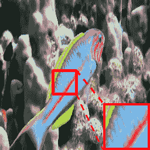
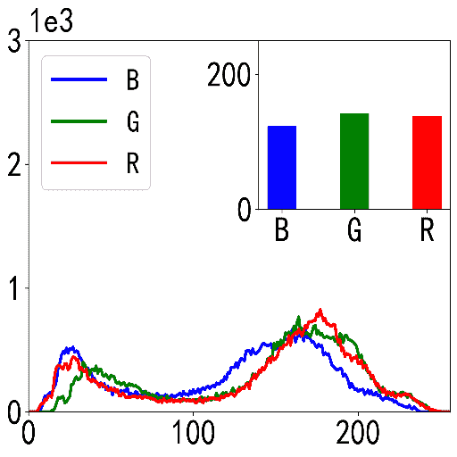
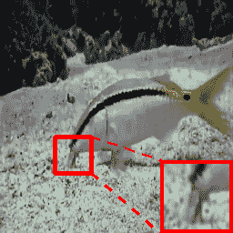
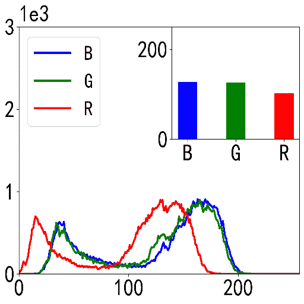
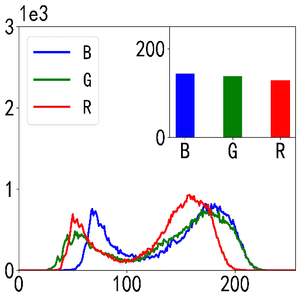

<!--yml

类别: 未分类

日期: 2024-09-06 19:32:07

-->

# [2405.19684] 基于深度学习的水下图像增强综合调查

> 来源：[`ar5iv.labs.arxiv.org/html/2405.19684`](https://ar5iv.labs.arxiv.org/html/2405.19684)

# 基于深度学习的水下图像增强综合调查

宋晓峰、赵宇、桂杰、侯俊明、陶大成（**宋晓峰**和**赵宇**对这项工作贡献相同。）（通讯作者：**桂杰**。）**宋晓峰**和**赵宇**来自中国南京 210000，东南大学，网络科学与工程学院（电子邮件：`cxf_svip@163.com`，`zyzzustc@gmail.com`）。**桂杰**在中国南京 210000，东南大学网络科学与工程学院和紫金山实验室（电子邮件：`guijie@seu.edu.cn`）。**侯俊明**在中国南京 210096，东南大学信息科学与工程学院毫米波国家重点实验室（电子邮件：`junming_hou@seu.edu.cn`）。**陶大成**在新加坡 639798，南洋理工大学计算与数据科学学院（电子邮件：`dacheng.tao@gmail.com`）。

###### 摘要

水下图像增强（UIE）是计算机视觉领域的一个具有挑战性的研究任务。尽管提出了数百种 UIE 算法，但仍然缺乏全面和系统的综述。为了推动未来的研究，我们从多个角度总结了 UIE 任务。首先，介绍了物理模型、数据构建过程、评估指标和损失函数。其次，根据不同文献所带来的贡献，讨论并分类了最近提出的算法，从网络结构、学习策略、学习阶段、辅助任务、领域视角和解耦融合六个角度进行讨论。第三，考虑到不同文献中实验设置的不一致，尚不存在全面公正的比较。为此，我们在多个基准数据集上定量和定性地评估了最先进的算法。最后，提出了 UIE 任务中值得进一步研究的问题。更多有用材料请访问 [`github.com/YuZhao1999/UIE`](https://github.com/YuZhao1999/UIE)。

###### 索引词：

水下图像增强、质量退化、颜色失真、光线衰减。

## I 引言

水下成像是计算机视觉领域中的一项重要任务 [6、123]。高质量的水下图像对于水下资源勘探、电影拍摄、个人娱乐等是必要的。然而，由于光在水下场景中的吸收和散射效应，水下图像的质量可能会不同程度地下降 [17]。如图 1-(a) 所示，随着水深的增加，红色、橙色、黄色和绿色光成分依次消失。同时，如图 1-(b) 所示，水下环境中可能出现各种畸变。常见的畸变类型包括

+   •

    色彩失真和对比度降低：由于不同波长光的衰减程度不同，图像的颜色往往偏向蓝绿色 [33]。

+   •

    模糊、噪声和模糊效果：光线在水中可能会显著衰减，这通常是由悬浮颗粒或泥泞水造成的。在这种环境中获得的图像可能显得模糊、有噪声或模糊 [124]。

+   •

    低光照：当水的深度超过一定值时，环境照明接近低光状态，这需要辅助光源。 [43].

为了提高在复杂水下环境中收集的退化水下图像的质量，已经提出了各种水下图像增强（UIE）方法。现有的算法可以分为非深度学习基础的 UIE（NDL-UIE）和深度学习基础的 UIE（DL-UIE）。NDL-UIE 广泛利用了各种先验假设、物理模型和非数据驱动的经典图像处理方法 [114、24、115、159、175]。然而，由于水下环境的复杂性，NDL-UIE 采用的策略在某些情况下可能不准确。问题包括（i）不存在完美的水下场景物理建模，（ii）物理参数估计中存在固有误差，（iii）特定的先验假设可能不适用于每个场景，以及（iv）经典图像处理方法不具备的场景特定表示 [144、7、109、58]。

考虑到数据驱动算法在计算机视觉和图像处理领域的卓越性能，基于学习的解决方案已受到研究人员的更多关注。旨在进一步提高 UIE 任务的性能，已提出并验证了各种 DL-UIE 算法[141, 53, 15, 30, 99, 122, 28, 83, 74, 105, 47]。针对 UIE 任务面临的问题，研究人员付出了各种努力。为了促进未来的研究，我们从多个角度总结了 UIE 任务，包括

+   •

    已提出了各种解决方案。

+   •

    现有解决方案所取得的结果。

+   •

    值得进一步探索的问题。

已提出了各种解决方案。一方面，我们总结了构建研究基础的物理模型、数据生成方法和评估指标。另一方面，分类并讨论了许多网络结构和训练策略。为了了解哪些方法已被广泛探索，我们需要了解它们之间的相似性和差异。从我们的角度来看，现有研究可以主观地视为从六个不同方面进行的，即网络架构、学习策略、学习阶段、辅助任务、领域视角和解缠结与融合。为了促进未来研究能够轻松地在现有工作基础上进行。根据不同算法的主要贡献，我们将现有工作分为 6 个一级类别。然后，对于每个一级类别，我们给出相应的二级类别。算法的分类见表Ⅰ。

现有解决方案所取得的结果。在现有论文中，最先进（SOTA）的算法已在基准数据集上进行了验证。同时，它们的性能也与其他算法进行了比较。然而，不同论文采用的实验设置可能存在不一致之处。尚未进行针对 UIE 任务的全面且公平的比较实验。在这里，我们通过统一各种实验设置，提供一个公平的比较，目的是回答以下两个问题。

+   •

    在公平设置下，SOTA 算法表现如何？

+   •

    哪些算法取得了最佳性能？

需要进一步探索的问题。基于我们对现有算法的系统性回顾和全面的实验评估，我们进一步讨论了值得未来研究的问题。具体来说，高质量的数据合成、与文本-图像多模态模型的合作、不均匀照明、可靠的评估指标以及与其他图像恢复任务的结合是仍需深入研究的主题。总之，UIE 仍处于一个新兴阶段，而不是一个几乎已解决的任务。

(a) 水下失真 [157, 170, 128]                                             (b) 各种失真

图 1：水下退化。

### I-A 本调查与其他调查的区别

[157, 144, 109, 58, 128]主要介绍传统的 UIE 算法，而最新的 DL-UIE 算法鲜有提及。[7]从网络架构的角度分类 DL 方法。但如傅里叶操作[131]、对比学习[86]和排名学习[37]等 UIE 任务的最新研究进展未被提及。[170]的研究视角是基于硬件和软件的算法之间的差异，因此[170]的目标并非全面讨论 DL 基础的算法。在本调查中，我们对近期的 DL 基础进展进行了全面讨论。

### I-B 本调查阅读指南

现有文献中的术语可能不一致。为了方便阅读本文，特别是图形部分，我们总结了重要术语及其含义如下。

+   •

    退化：由于吸收和散射现象导致的水下成像质量退化。

+   •

    失真$x$：在不同类型水中拍摄的质量退化水下图像。

+   •

    参考$y$：主观上质量更高的水下图像。不存在完美的、无失真的水下图像。

+   •

    预测$\hat{y}$：由 UIE 算法获得的视觉质量增强的水下图像。

+   •

    配对图像：带有失真图像$x$及其对应参考图像$y$。

+   •

    空气中的图像：在地面场景中拍摄的图像，可以是室内或室外。

提高水下图像质量的任务中使用的术语在现有文献中存在一定差异，包括水下图像增强、水下图像修复和水下图像去雾。由于我们研究的任务与图像去雾任务存在某些相似性，例如相似的成像原理 [11]，一些文献将“水下图像去雾”作为定义。然而，近年来这种定义的使用频率较低 [7]。此外，“增强”和“修复”在不同的文献中经常被使用。在提高水下图像质量的任务中，这两个术语没有显著区别。因此，在本综述中，我们统一使用“增强”来定义我们讨论的任务。

为了便于阅读，本文中使用了缩写来指代提到的每个 UIE 算法。许多论文为其算法提供了缩写，例如 URanker [37]。对于未提供算法缩写的论文，我们使用标题中说明其主要贡献的单词的首字母构造了缩写。

常用的物理模型、数据生成方法、评估指标和损失函数在第 II 节中进行了总结。现有算法的分类和分析放在第 III 节中。第 IV 节提供了全面的实验和总结结论。尚未解决的具有挑战性和有价值的问题在第 V 节中进行了讨论。本文的总结在第 VI 节中给出。

表 I: UIE 算法的分类。

| 类别 | 关键思想 | 方法 |
| --- | --- | --- |
| 网络架构 | 卷积操作 |

&#124; UWCNN [72], UWNet [99], UResNet [83], DUIR [25], &#124;

&#124; UIR-Net [95], FloodNet [32], LAFFNet [143], UICoE-Net [106], PUIE-Net [31] &#124;

|

| 注意力机制 |
| --- |

&#124; WaveNet [111], ADMNNet [141], LightEnhanceNet [156], &#124;

&#124; CNMS [152], HAAM-GAN [151], MFEF [169] &#124;

|

| Transformer 模块 |
| --- |

&#124; PTT [10], U-Trans [102], UWAGA [48], WaterFormer [132], Spectroformer [66] &#124;

|

| 傅里叶变换 |
| --- |

&#124; UHD [131], WFI2-Net [161], TANet [150], UIE-INN [18], SFGNet [162] &#124;

|

| 小波分解 |
| --- |

&#124; UIE-WD [94], EUIE [56], PRWNet [49], MWEN [127] &#124;

|

| 神经架构搜索 |
| --- |

&#124; AutoEnhancer [116] &#124;

|

| 学习策略 | 对抗学习 |
| --- | --- |

&#124; DGD-cGAN [34], FGAN [76], UIE-cGAN [145], TOPAL [63], &#124;

&#124; FUnIEGAN [53], EUIGAN [28], CE-CGAN [1], RUIG [22] &#124;

|

| 排名学习 |
| --- |

&#124; URanker [37], PDD-Net [61], CLUIE-Net [79] &#124;

|

| 对比学习 |
| --- |

&#124; TACL [86], Semi-UIR [47], CWR [40], DRDCL [148], TFUIE [149], &#124;

&#124; RUIESR [80], CL-UIE [118], HCLR-Net [168], UIE-CWR [39] &#124;

|

| 强化学习 |
| --- |

&#124; HPUIE-RL [113] &#124;

|

| 学习阶段 | 单阶段 | UWCNN [72], UWNet [99], UResNet [83] |
| --- | --- | --- |
| 粗到细 |

&#124; MBANet [138], GSL [81], CUIE [67], DMML [27] &#124;

|

| 扩散学习 |
| --- |

&#124; UIE-DM [117], SU-DDPM [92], CPDM [112] &#124;

|

| 辅助任务 | 语义辅助 | SGUIE [105], SATS [122], DAL-UIE [64], WaterFlow [160], HDGAN [13] |
| --- | --- | --- |
| 深度辅助 |

&#124; Joint-ID [142], DAUT [8], DepthCue [20], HybrUR [140] &#124;

|

| 域视角 | 知识迁移 |
| --- | --- |

&#124; TUDA [130], TSDA [62], DAAL [171], IUIE [9], &#124;

&#124; WSDS-GAN [84], TRUDGCR [55], UW-CycleGAN [139] &#124;

|

| 域翻译 |
| --- |

&#124; URD-UIE [173], TACL [86] &#124;

|

| 多样化输出 |
| --- |

&#124; UIESS [16], UMRD [174], PWAE [69], CECF [19] &#124;

|

| 解耦 $\&amp;$ 融合 | 物理嵌入 |
| --- | --- |

&#124; IPMGAN [87], ACPAB [82], USUIR [29], AquaGAN [21], PhysicalNN [15], GUPDM [98] &#124;

|

| Retinex 模型 |
| --- |

&#124; CCMSR-Net [104], ReX-Net [153], ASSU-Net [65] &#124;

|

| 色彩空间融合 |
| --- |

&#124; UIEC²-Net [125], UGIF-Net [166], TCTL-Net [78], MTNet [97], UDNet [110], &#124;

&#124; P2CNet [108], JLCL-Net [137], TBDNN [45], MSTAF [57], UColor [71] &#124;

|

| 水体类型聚焦 |
| --- |

&#124; SCNet [30], DAL [119], IACC [165] &#124;

|

| 多输入融合 |
| --- |

&#124; WaterNet [74], MFEF [169], F2UIE [121] &#124;

|

## II 相关工作

本节介绍了 UIE 任务涉及的六个方面。UIE 研究的定义和本文的范围在 II-A 中给出。UIE 任务和其他图像恢复任务面临的类似问题在 II-B 中讨论。被认为可靠的物理模型在 II-C 中介绍。常见的数据生成和收集方法总结在 II-D 中。广泛使用的评估指标和损失函数分别在 II-E 和 II-F 中给出。

### II-A 问题定义和研究范围

根据[73]中所示的方法，我们给出了 DL-UIE 的一个常用定义。对于给定的失真水下图像$x$，增强过程可以视为

|  | $\hat{y}=\Phi(x;\theta),$ |  | (1) |
| --- | --- | --- | --- |

其中$\Phi$表示具有可学习参数$\theta$的神经网络。$x$和$\hat{y}$都属于$\mathcal{R}^{H\times W\times 3}$。对于 UIE 模型，一个常见的优化目标是最小化误差

|  | $\hat{\theta}=\arg\min\mathcal{L}(\hat{y},y),$ |  | (2) |
| --- | --- | --- | --- |

其中$\mathcal{L}(\hat{y},y)$表示用于获取最优参数$\hat{\theta}$的损失函数。$\mathcal{L}(\hat{y},y)$可以是任何形式的监督或无监督损失函数。

基于上述定义，值得明确指出的是，我们的调查旨在研究以单帧水下图像为输入的 DL-UIE 算法。因此，基于多帧图像的算法[135]或完全不使用深度学习的算法[75, 103, 11]不在本文范围之内。

### II-B UIE 任务与其他图像恢复任务之间的联系

UIE 任务被视为低级图像恢复任务的一个子研究领域。在 UIE 任务和其他图像恢复任务中出现了类似的问题。常见的问题包括：(i) 由吸收和散射引起的雾霾效应，如图像去雾[41]，(ii) 由相机抖动、光散射或快速目标运动引起的模糊细节，如去模糊[155]，(iii) 由悬浮颗粒引起的噪声[58, 59]，如图像去噪[12]，(iv) 由于光线不足引起的低光照，如低光图像增强[136]，(v) 由于人工光源引起的不均匀光照，如夜间去雾[89]。总体来说，水下成像面临的问题可以看作是多个图像恢复任务的复杂组合。

### II-C 物理模型

据我们所知，目前还没有一个模型能够完美描述水下成像过程[7]，完全适用于算法解决方案。在这里，介绍了两个广泛使用且已证明有效的成像模型，即大气散射模型[23]和修订后的水下图像形成模型[2]。大气散射模型[7]在图像去雾和水下图像增强研究中被广泛采用，可以表示为

|  | $x=y\cdot e^{-\beta d}+B^{\infty}\cdot(1-e^{-\beta d}),$ |  | (3) |
| --- | --- | --- | --- |

其中 $d$、$B^{\infty}$ 和 $\beta$ 分别表示场景深度、背景光和衰减系数。修订后的水下图像形成模型[2]定义为

|  | $x=ye^{-\beta^{D}(v_{D})d}+B^{\infty}\left(1-e^{\beta^{B}(v_{B})d}\right),$ |  | (4) |
| --- | --- | --- | --- |

其中 $\beta^{B}$ 和 $\beta^{D}$ 表示背向散射和直接传输衰减系数[7]。$v_{B}$ 和 $v_{D}$ 是 $\beta^{B}$ 和 $\beta^{D}$ 的依赖系数。大气散射模型和修订后的水下图像形成模型可用于数据的合成和算法的设计。由于对成像机制的深入讨论可能超出了本文的范围，更多关于物理模型的细节可以在[2, 4, 3]中找到。

### II-D 模型训练和性能评估的数据集

现实世界中畸变的水下图像和参考图像难以获取[38, 76]。用于训练和评估过程的数据需要通过各种可靠的方式收集。我们将现有的数据集构建方式分为以下几类。

+   •

    由 SOTA UIE 算法投票。 UIEB [74] 使用 12 种算法生成多样的参考图像。然后，50 名志愿者对每个场景的最佳增强效果进行投票，作为最终参考图像。同时，18 种 UIE 算法和 20 名志愿者参与 LSUI [102] 参考图像的投票过程。 SAUD [60] 提出了一个主观注释基准，包含真实世界的原始水下图像和 10 种不同 UIE 算法下的可用排名分数。

+   •

    由领域转换算法生成。 EUVP [53] 和 UFO-120 [51] 将未配对的失真图像和参考图像视为两个领域。 EUVP 和 UFO-120 中的图像对是通过无监督领域转换算法 [172] 生成的，具有循环一致性约束。

+   •

    由光场渲染。 UWNR [147] 设计了一种光场保留机制，将自然存在的水下图像的风格转移到目标生成图像上。 UWNR 采用了数据驱动的策略，这意味着它可能避免了由于物理模型复杂性导致的准确性限制。

+   •

    由水下图像捕捉系统收集。 RUIE [85] 通过在海水下设置多视角成像系统，构建了一个自然光下的水下基准。 RUIE 中的场景展示了包含各种海洋生物的自然海洋生态系统，如鱼类、海胆、海参、扇贝等。

+   •

    由物理模型合成。 SUID [44]、RUIG [22] 和 WaterGAN [77] 使用物理模型来估计描述成像过程的参数。

除了上述介绍的方法外，最近的研究使用神经辐射场合成了退化和清晰的多视角图像 [167]。目前，对于哪种构建数据集的方法是最佳的，还没有可靠的证据。尽管已经取得了令人印象深刻的进展，但现有的数据集构建方法在各个方面仍存在局限性。通过投票方法产生的标注图像质量本质上是有限的，即被评估模型的最佳性能可能无法超过投票过程中使用的各种算法。由生成模型启发的衰减合成过程获得的图像衰减模式的多样性可能有限。由于循环一致性生成过程受到一对一训练模式的限制，导致跨领域信息未被充分考虑 [5]。水下成像的复杂性阻碍了物理模型准确控制多样的退化参数 [147]。有效的数据采集策略仍然是一个紧迫的挑战。

### II-E 评估指标

评估 UIE 模型性能的方法是一个正在探索中的挑战性话题。目前，全参考和无参考评价度量是最广泛使用的度量。此外，人为主观评价、下游任务评价和模型效率也被各种文献采用。详细情况如下。

+   •

    全参考度量。峰值信噪比 (PSNR) [36] 和结构相似性 (SSIM) [129] 是全参考评价度量，广泛用于成对图像的数据集。它们可以准确描述预测与参考之间的距离。

+   •

    无参考度量。对于没有参考图像的实际增强性能评估，需要使用无参考度量。水下图像质量度量 (UIQM) [101] 和水下彩色图像质量评估 (UCIQE) [146] 被广泛采用作为无参考度量。努力 [164], [60] 仍在进行中，以开发更可靠的无参考评估度量。

+   •

    人为主观评价。人眼友好的增强水下图像是 UIE 模型的一个目的。一方面，UIE 相关论文 [141, 53, 15, 30] 通常从定量分析的角度展示其提出的方法在颜色校正、细节恢复和边缘锐化方面的优越性。这种评价通常由论文的作者自己进行。另一方面，参与一些作品评价的人有或没有图像处理经验 [74, 37]。他们可以对不同的算法给予主观评分。可以选择最佳的增强结果 [74]，或者对不同算法获得的增强结果进行排序 [37]。

+   •

    通过下游任务进行评价。UIE 任务可以作为其他图像理解任务的上游任务。由于 UIE 模型评估的固有困难，即无法获得完美的真实值，现有文献中广泛使用下游任务来评估 UIE 模型。具有代表性的下游任务包括

    +   –

        目标检测 [163] 用于 [134, 166]，

    +   –

        特征匹配 [91] 用于 [142, 169]，

    +   –

        显著性检测 [52] 用于 [142, 168]，

    +   –

        语义分割 [50] 用于 [111, 149]。

+   •

    模型效率。UIE 模型可能用于计算能力或存储空间有限的水下设备。因此，模型所需的计算和存储资源是评估 UIE 模型的重要因素。常用的指标包括 Flops (G)，Params (M) 和推理时间（每图像秒数） [156, 104, 148]。

### II-F 损失函数

尽管不同的 UIE 模型可能采用不同的训练策略，但有效的损失函数是 UIE 模型常用的，具体如下。

+   •

    L1 损失 [34, 169]，Smooth L1 损失 [153, 166] 和 L2 损失 [20, 111] 提供像素级约束，用作保真度损失。

+   •

    感知损失 [51, 153, 169, 168]，也称为内容损失，用于测量特征空间中两幅图像之间的距离。

+   •

    SSIM 是 UIE 任务的评估指标，具有可微性。因此，SSIM 损失 [165, 20, 111] 被广泛用于结构约束。

+   •

    水下图像的衰减可能伴随边缘信息的丧失。因此，利用梯度算子计算的边缘损失 [51, 38, 97] 被应用。

+   •

    对抗损失 [22, 25, 84] 可以提供领域区分能力，可能改善恢复图像的视觉质量。

## III UIE 方法

根据每篇论文的主要贡献，我们将 UIE 算法分为六类，即 (i) 第 III-A 节 网络架构，(ii) 第 III-B 节 学习策略，(iii) 第 III-C 节 学习阶段，(iv) 第 III-D 节 辅助任务，(v) 第 III-E 节 领域视角和 (vi) 第 III-F 节 解耦 $\&amp;$ 融合，详见

+   •

    网络架构。网络架构对于 UIE 模型的性能至关重要。UIE 模型的构建主要使用卷积、注意力 [100]、Transformer [90]、傅里叶 [26] 和小波 [46] 操作。

+   •

    学习策略。由于 UIE 场景的复杂性，除了传统的端到端监督训练外，UIE 算法采用了多样的学习过程。典型的学习过程包括对抗学习 [54]、排名学习 [158]、对比学习 [68] 和强化学习 [133]。

+   •

    学习阶段。从失真到预测的映射可以通过单阶段、粗到细或逐步扩散过程 [42] 实现。

+   •

    辅助任务。语义分割、目标检测或深度估计任务是 UIE 任务的常见辅助任务。不同任务的联合模型训练对彼此有益。

+   •

    领域视角。空气中的清晰图像、水下失真图像和水下清晰图像都可以视为独立的领域。从领域的角度来看，知识迁移、退化转换和增强效果调整都可以通过领域感知训练实现。

+   •

    解耦与融合。考虑到水下图像的退化特性，解耦和融合被用作提高模型可解释性的两种有效方式。物理模型和 Retinex 模型通常被用作解耦的理论基础。色彩空间融合、水体类型融合和多输入融合是常见的融合解决方案。

在介绍每个类别的算法时，使用示意图来说明不同算法之间的差异。值得指出的是，示意图所表达的不是特定算法的细节，而是一类算法的主要思想。

### III-A 网络架构

(a) 基于窗口的 Transformer                     (b) 傅里叶变换                               (c) 小波分解 [127]

图 2：分别通过基于窗口的 Transformer、傅里叶变换和小波分解构建高质量表示的特征图。

(a) 单阶段                     (b) 粗到细 [67]                                        (c) 扩散过程 [117]

图 3：生成不同阶段数量的高质量增强图像。

#### III-A1 卷积操作

卷积是 UIE 模型中最常用的操作之一。通过卷积操作构建的网络块方法包括朴素卷积（UWCNN [72], UWNet [99]）、残差连接（UResNet [83]）、残差密集连接（DUIR [25], FloodNet [32]）和多尺度融合（LAFFNet [143]）。基于卷积架构的 UIE 模型的计算消耗通常较少。

#### III-A2 注意力机制

在 UIE 任务中，注意力机制主要用于帮助模型关注不同的空间位置或加权不同的通道信息。通过分析水下场景的波长驱动的上下文大小关系，WaveNet [111] 为不同的颜色通道分配具有不同感受野的操作。然后，沿空间和通道维度的注意力操作用于增强具有不同感受野的卷积路径。基于选择性核机制，ADMNNet [141] 提出了通过采用软注意力合理改变感受野大小的非线性策略。同时，ADMNNet 设计了一个能够动态聚合通道信息的模块。针对校准失真输入的详细信息，MFEF [169] 构建了一个像素加权的通道注意力计算流程。

#### III-A3 Transformer 模块

Transformer 架构 [120, 90] 已广泛应用于自然语言和计算机视觉研究。UWAGA [48] 指出，自动选择输入通道的分组机制有助于挖掘通道之间的关系。基于这一观点，UWAGA 设计了一个嵌入在 Swin-Transformer [90] 中的自适应组注意力操作。如图 2-(a) 所示，在 Swin-Transformer 的原理下，图像（或特征图）可以被拆分成基于窗口的块。PTT [10] 使用在 ImageNet 上预训练的图像 Transformer 对 UIE 任务进行微调，这表明具有长距离依赖的特征在处理水下失真方面是有效的。从通道和空间两个角度来看，U-Trans [102] 提出了一个多尺度特征融合 Transformer 块和一个全局特征建模 Transformer 块。Spectroformer [66] 设计了一个多领域查询级联 Transformer 架构，考虑了局部传输表示和全局照明信息。尽管这些基于 Transformer 的架构已被证明对 UIE 任务有益，但它们通常会产生超过传统卷积操作的计算成本。

#### III-A4 傅里叶变换

傅里叶变换 [18] 提供了在频域分析特征的视角。在 UIE 任务中，傅里叶域和空间域的操作通常是联合使用的。二维图像信号 $x\in\mathcal{R}^{H\times W}$ 的傅里叶操作为：

|  | $\mathcal{F}(x)(u,v)=\frac{1}{\sqrt{HW}}\sum_{h=0}^{H-1}\sum_{w=0}^{W-1}x(h,w)e^{-j2{\pi}(\frac{h}{H}u+\frac{w}{W}v)},$ |  | (5) |
| --- | --- | --- | --- |

其中 $(h,w)$ 和 $(u,v)$ 分别表示空间域和傅里叶域的坐标。将水下图像分解为幅度谱和相位谱的过程如图 2-(b) 所示。UHD [131] 设计了一个双路径增强模块，该模块在空间域和傅里叶域中联合执行特征处理。在傅里叶域中，UHD 使用通道混合器提取失真图像的频域特征。具体而言，实部和虚部是 UHD 特征提取处理的对象。在空间域中，采用了收缩路径和扩展路径来构建空间特征描述符。最终，将频域和空间域的特征进行融合。TANet [150] 通过利用实部和虚部的特征信息设计了一个大气光去除傅里叶模块。WFI2-Net [161] 和 SFGNet [162] 也采用了空间-频率域中的特征提取和融合方法。与处理实部和虚部的 UHD 和 TANet 不同，WFI2-Net 和 SFGNet 动态滤波幅度谱和相位谱。尽管傅里叶操作已被 UIE 任务广泛使用，但据我们所知，尚未对频域中的退化信息进行深入观察。

#### III-A5 小波分解

通过小波分解可以获得不同频率子带的描述。通过离散小波变换（DWT），可以从原始的二维信号 $x$ 中获得四个频率带，如下所示：

|  | $I_{LL},I_{LH},I_{HL},I_{HH}=DWT(x),$ |  | (6) |
| --- | --- | --- | --- |

其中 $I_{LL},I_{LH},I_{HL},I_{HH}$ 分别表示低-低、低-高、高-低和高-高子带。水下图像的小波分解过程如图 2-(c) 所示。UIE-WD [94] 使用双分支网络分别处理不同频率子带的图像，其中每个分支分别处理颜色失真和细节模糊问题。通过分析单一池化操作的局限性，EUIE [56] 提出了基于 Haar 小波的小波池化和反池化层。PRWNet [49] 使用小波提升学习以获得低频和高频特征。它提出高频子带代表纹理和边缘信息，而低频子带包含颜色和光照信息。通过使用归一化和注意机制，可以对不同子带的信息进行精细化。MWEN [127] 设计了一个频率子带感知的多级交互小波增强模块，旨在建立一个具有更强表达能力的特征提取分支。

#### III-A6 神经架构搜索

整体网络架构及模块连接方式是 UIE 算法的重要组成部分。有效的网络设计解决方案需要设计师拥有丰富的经验和知识。此外，需要反复进行大量的尝试实验。因此，AutoEnhancer [116] 探索了神经架构搜索以构建具有出色性能的 UIE 网络结构。AutoEnhancer 选择了编码器-解码器架构作为超网络。AutoEnhancer 以超网络训练、子网络搜索和子网络重新训练三个过程为基础。第一步是获得参数 $W^{*}$

|  | $W^{*}=\underset{W}{\arg\min}L_{train}(N(S,W)),$ |  | (7) |
| --- | --- | --- | --- |

其中 $S$ 和 $W$ 表示超网络 $N(S,W)$ 的搜索空间和网络参数。$L_{train}$ 代表训练目标函数。然后通过训练后的超网络搜索到最优子网络 $S^{*}$ 如下

|  | $s^{*}=\underset{s\in S}{\arg\max}Acc_{val}(N(s,W^{*}(s))),$ |  | (8) |
| --- | --- | --- | --- |

其中 $Acc_{val}$ 代表验证数据集的准确度。最终的最优网络参数 $W^{{}^{\prime}}$ 通过在数据 $X$ 下重新训练最优子网络 $M(\cdot)$ 获得如下

|  | $W^{{}^{\prime}}=\underset{W}{\arg\min}L_{train}(M(X;W)).$ |  | (9) |
| --- | --- | --- | --- |

目前关于 UIE 网络设计自动化的讨论较少，值得进一步探讨。

(a) 对抗学习                     (b) 排序学习                                    (c) 对比学习

图 4：UIE 任务中对抗学习、排名学习和对比学习的示意图。

### III-B 学习策略

#### III-B1 对抗学习

生成对抗网络中使用的对抗训练[35]可以为 UIE 任务中的图像质量提升过程提供额外的监督信号。对抗训练的一般形式是

|  | $\mathcal{L}(G,D)=\mathbb{E}_{y\sim p(y)}\log{D(y)}+\mathbb{E}_{x\sim p(x)}[\log{(1-D(G(x)))}],$ |  | (10) |
| --- | --- | --- | --- |

其中$G$和$D$分别表示生成器和判别器。对于 UIE 任务，生成器$G$通常用于生成增强的图像或物理参数。通过对抗训练区分增强图像和参考水下图像的过程在图 4-(a)中可视化。DGD-cGAN[34]设计了一个具有双生成器和单判别器的架构。其中一个生成器负责学习扭曲图像到增强图像的映射，而另一个生成器则具有通过传输信息模拟成像过程的能力。为了同时集成不同尺度的信息，UIE-cGAN[145]和 TOPAL[63]采用了单生成器和双判别器的架构。一个判别器负责优化局部细节特征，而另一个判别器则旨在区分全局语义信息。CE-CGAN[1]和 RUIG[22]利用条件生成对抗网络提供的判别过程作为辅助损失。通过利用对抗训练，生成器获得的增强图像可能在感知上与参考水下高质量图像的分布更加一致。

#### III-B2 排名学习

监督损失的优化目标是使增强图像尽可能接近参考图像。然而，模型性能可能会受到不完美参考图像的限制。因此，探索排名学习为 UIE 模型提供“更好的”指导。从排名的角度来看，UIE 模型无需事先知道哪个参考图像是最佳选择，而是寻找哪个参考图像是更好的选择。通过排名策略选择最佳增强图像的过程在图 4-(b)中进行了可视化。URanker [37] 提出为 UIE 任务设计的质量评估指标可以用来指导 UIE 模型的优化。为此，URanker 设计了一个排名损失，用于按视觉质量对同一场景内容下的水下图像进行排序。对于从包含$N$张图像的数据集$\{x_{0},x_{1},...,x_{N}\}$中选择的$(x_{n},x_{m})$，URanker 可以预测符合排名关系的相应得分$(s_{n},s_{m})$，其计算公式为

|  | <math   alttext="\mathcal{L}(s_{n},s_{m})=\begin{cases}\max{(0,(s_{m}-s_{n})+\epsilon)},q_{n}>q_{m},\\ \max{(0,(s_{n}-s_{m})+\epsilon)},q_{n}<q_{m},\\

\end{cases}" display="block"><semantics ><mrow ><mrow  ><mi >ℒ</mi><mo lspace="0em" rspace="0em"  >​</mo><mrow ><mo stretchy="false" >(</mo><msub ><mi  >s</mi><mi >n</mi></msub><mo >,</mo><msub ><mi  >s</mi><mi >m</mi></msub><mo stretchy="false"  >)</mo></mrow></mrow><mo >=</mo><mrow ><mo  >{</mo><mtable columnspacing="5pt" displaystyle="true" rowspacing="0pt" ><mtr  ><mtd columnalign="left"  ><mrow ><mrow ><mrow ><mrow ><mi >max</mi><mo >⁡</mo><mrow ><mo stretchy="false" >(</mo><mn >0</mn><mo >,</mo><mrow ><mrow ><mo stretchy="false" >(</mo><mrow ><msub ><mi >s</mi><mi >m</mi></msub><mo >−</mo><msub ><mi >s</mi><mi >n</mi></msub></mrow><mo stretchy="false"  >)</mo></mrow><mo >+</mo><mi >ϵ</mi></mrow><mo stretchy="false"  >)</mo></mrow></mrow><mo >,</mo><msub ><mi >q</mi><mi >n</mi></msub></mrow><mo >></mo><msub ><mi >q</mi><mi >m</mi></msub></mrow><mo >,</mo></mrow></mtd></mtr><mtr ><mtd  columnalign="left" ><mrow  ><mrow ><mrow ><mrow ><mi >max</mi><mo >⁡</mo><mrow ><mo stretchy="false" >(</mo><mn >0</mn><mo >,</mo><mrow ><mrow ><mo stretchy="false" >(</mo><mrow ><msub ><mi >s</mi><mi >n</mi></msub><mo >−</mo><msub ><mi >s</mi><mi >m</mi></msub></mrow><mo stretchy="false"  >)</mo></mrow><mo >+</mo><mi >ϵ</mi></mrow><mo stretchy="false"  >)</mo></mrow></mrow><mo >,</mo><msub ><mi >q</mi><mi >n</mi></msub></mrow><mo ><</mo><msub ><mi >q</mi><mi >m</mi></msub></mrow><mo >,</mo></mrow></mtd></mtr></mtable></mrow></mrow><annotation-xml encoding="MathML-Content" ><apply  ><apply ><ci >ℒ</ci><interval closure="open" ><apply  ><csymbol cd="ambiguous"  >subscript</csymbol><ci >𝑠</ci><ci >𝑛</ci></apply><apply ><csymbol cd="ambiguous" >subscript</csymbol><ci >𝑠</ci><ci  >𝑚</ci></apply></interval></apply><apply ><csymbol cd="latexml" >cases</csymbol><apply ><list  ><apply ><cn type="integer"  >0</cn><apply ><apply ><apply ><csymbol cd="ambiguous"  >subscript</csymbol><ci >𝑠</ci><ci >𝑚</ci></apply><apply ><csymbol cd="ambiguous"  >subscript</csymbol><ci >𝑠</ci><ci >𝑛</ci></apply></apply><ci >italic-ϵ</ci></apply></apply><apply ><csymbol cd="ambiguous"  >subscript</csymbol><ci >𝑞</ci><ci >𝑛</ci></apply></list><apply ><csymbol cd="ambiguous"  >subscript</csymbol><ci >𝑞</ci><ci >𝑚</ci></apply></apply><ci ><mtext >otherwise</mtext></ci><apply ><list ><apply ><cn type="integer" >0</cn><apply ><apply ><apply ><csymbol cd="ambiguous" >subscript</csymbol><ci >𝑠</ci><ci >𝑛</ci></apply><apply ><csymbol cd="ambiguous" >subscript</csymbol><ci >𝑠</ci><ci >𝑚</ci></apply></apply><ci >italic-ϵ</ci></apply></apply><apply ><csymbol cd="ambiguous"  >subscript</csymbol><ci >𝑞</ci><ci >𝑛</ci></apply></list><apply ><csymbol cd="ambiguous"  >subscript</csymbol><ci >𝑞</ci><ci >𝑚</ci></apply></apply><ci ><mtext >otherwise</mtext></ci></apply></apply></annotation-xml><annotation encoding="application/x-tex" >\mathcal{L}(s_{n},s_{m})=\begin{cases}\max{(0,(s_{m}-s_{n})+\epsilon)},q_{n}>q_{m},\\ \max{(0,(s_{n}-s_{m})+\epsilon)},q_{n}<q_{m},\\ \end{cases}</annotation></semantics></math> |  | (11) |

其中 $\mathcal{L}(s_{n},s_{m})$ 被视为边际排名损失。$q_{n}$ 和 $q_{m}$ 分别表示 $x_{n}$ 和 $x_{m}$ 的质量。此外，PDD-Net [61] 设计了一种成对质量排名损失，该损失以预训练模型的形式使用，以引导增强后的图像向更高的视觉质量迈进。CLUIE-Net [79] 利用比较机制从多个参考候选中进行学习。比较学习的主要优点在于使网络生成的图像质量优于当前的增强候选图像。

#### III-B3 对比学习

现实世界中扭曲图像和参考图像的对很难获得。因此，可能提供不准确的参考图像可能为 UIE 网络提供不完美的监督信号。对比学习是一种可以缓解缺乏标注数据问题的方法，UIE 模型使用这种方法提供额外的监督信号。受到对比学习启发的 UIE 算法的优化目标通常是一致的，即增加锚点和负样本之间的距离，同时减少锚点和正样本之间的距离。通过对比学习优化不同类型样本之间的距离的过程在图 4-(c) 中进行了可视化。UIE 任务中的对比模式研究集中在两个方面。首先是如何构造正样本、负样本和锚点。其次是如何优化样本或特征之间的距离。TACL [86] 将观察到的扭曲水下图像视为负样本，将清晰图像视为正样本。为了构建可靠的表示空间，TACL 采用了预训练的特征提取器来获取用于计算对比损失的感知特征。HCLR-Net [168] 提出了混合对比学习正则化 $\mathcal{L}_{hclr}$。

|  | $\mathcal{L}_{hclr}=\sum_{i=1}^{5}w_{i}\frac{D(G_{i}(y),G_{i}(\phi(x)))}{D(G_{i}(x_{r},G_{i}(\phi(x))))},$ |  | (12) |
| --- | --- | --- | --- |

其中 $D(\cdot,\cdot)$ 表示 L1 损失。$G_{i}$ 和 $w_{i}$ 分别代表预训练特征提取模型的第 $i$ 层和权重因子。$\phi(\cdot)$ 是由特征网络和细节网络分支组合而成。$x_{r}$ 表示随机选择的失真水下图像。Semi-UIR [47] 使用可靠的库和增强方法来生成正负样本。在 Semi-UIR 的三元组构建过程中，使用无参考评估指标作为样本选择的指导。TFUIE [149] 采用了闭环方法，通过两条路径同时增强和合成失真图像。因此，三元组对比损失被应用于增强和合成过程。

#### III-B4 强化学习

深度学习已被广泛证明对 UIE 任务有效。除了使用保真度损失进行优化的传统神经网络研究之外，HPUIE-RL [113] 探索了如何利用深度学习和强化学习。HPUIE-RL 采用了一个包含预训练和微调的两阶段流程。在预训练期间，模型参数的更新方法与传统深度神经网络一致。在模型的微调阶段，设计了基于奖励函数的强化学习策略。奖励函数由三种无参考指标组成，从不同角度评估水下图像质量，公式为

|  | $\mathcal{R}=\beta_{1}\times&#124;\mathcal{R}_{a}-r^{max}_{a}&#124;+\beta_{2}\times\mathcal{R}_{b}+\beta_{3}\times&#124;\mathcal{R}_{c}-r^{max}_{c}&#124;,$ |  | (13) |
| --- | --- | --- | --- |

其中 $a$、$b$ 和 $c$ 分别代表指标 UCIQE [146]、NIQE [96] 和 URanker [37]。$\beta_{1}$、$\beta_{2}$ 和 $\beta_{3}$ 分别表示奖励 $\mathcal{R}_{a}$、$\mathcal{R}_{b}$ 和 $\mathcal{R}_{c}$ 的权重因子。$r^{max}_{a}$ 和 $r^{max}_{c}$ 是约束值范围的上界。HPUIE-RL 的性能可以通过迭代优化持续提升。

### III-C 学习阶段

#### III-C1 单阶段

借助神经网络的数据拟合能力，如图 3 所示，可以以单阶段方式学习从失真到预测的映射。代表性的单阶段增强方法包括 UWCNN [72]、UWNet [99] 和 UResNet [83] 等。

#### III-C2 粗到精

考虑到一次性获得最佳增强结果的难度，采用了在不同阶段具有不同目的的粗到精模型。通过分析色彩变化和面纱现象，设计了一种由 MBANet [138] 提出的多分支多变量网络，用于获取粗略结果和衰减因子。然后，将衰减因子和粗略结果输入到一个以物理为基础的模型中，以获得精细的增强结果。GSL [81] 提出了通过软注意力融合两个中间结果的方法。其中一个中间结果包含由全局流估计的结构和颜色信息，而另一个中间结果通过局部流处理过度曝光和伪影。CUIE [67] 构建了一个两阶段框架，其中第一阶段通过全局-局部路径获得初步增强结果，而第二阶段使用直方图均衡化和神经网络来改善图像的对比度和亮度。CUIE 提出的通过两阶段方式进行图像质量精细化的过程在图 Fig. 3-(b) 中进行了可视化。DMML [27] 设计了一个三阶段管道，即监督训练、对抗训练和融合训练。监督训练的目标是实现高的全参考评估指标值，这通常代表在合成数据上的较好性能。对抗训练负责提高无参考评估指标值，这可能使模型更适合真实世界的失真图像。最终的融合训练则兼顾了两者的优势。

(a) 语义辅助                                    (b) 深度引导                               (c) 以深度为输入

图 5：通过不同辅助任务提高 UIE 模型性能的示意图。灰色和绿色箭头分别代表前向传播和后向传播。

(a) 知识转移                               (b) 领域翻译                               (c) 多样化输出

图 6：从领域角度设计的 UIE 模型示意图。

#### III-C3 扩散过程

扩散模型是一个强大的生成模型，最近被广泛研究。扩散模型的前向过程是一个马尔科夫过程，它持续向图像中添加噪声 [42]。通过反向过程可以生成高质量的图像。通过扩散策略增强水下图像质量的过程在图 3-(c) 中进行了可视化。生成过程无法产生特定的增强水下图像，因此，UIE-DM [117] 向扩散过程中添加了条件信息 $c$ 以完成 UIE 任务。UIE-DM 的训练损失是

|  | $\mathcal{L}_{s}=&#124;&#124;\epsilon_{t}-\epsilon_{\theta}(x_{t},c,t)&#124;&#124;_{1},$ |  | (14) |
| --- | --- | --- | --- |

其中 $x_{t}$ 和 $t$ 分别表示有噪声的图像和时间步。$\epsilon_{t}$ 和 $\epsilon_{\theta}$ 分别表示噪声图像和预测的噪声图像。因此，均值 $\mu_{\theta}$ 可以定义为

|  | $\mu_{\theta}(x_{t},c,t)=\frac{1}{\sqrt{1-\beta_{t}}}\left(x_{t}-\frac{\beta_{t}}{\sqrt{1-\alpha_{t}}}\epsilon_{\theta}(x_{t},c,t)\right).$ |  | (15) |
| --- | --- | --- | --- |

根据上述定义，失真的水下图像可以作为条件信息，使得扩散过程生成的图像具有确定性。扩散过程相对较高的计算成本是一个未解决的问题。SU-DDPM [92] 提出可以通过使用不同的初始分布来降低计算成本。尽管扩散模型已被证明对 UIE 任务有效，但其强大的数据生成能力尚未得到充分探索。

### III-D 辅助任务

#### III-D1 语义辅助

传统的 UIE 算法中尚未广泛探索高层语义信息。为了为 UIE 模型生成多样的特征，最近的研究将分类、分割和检测任务嵌入到 UIE 模型中。图 5-(a) 显示了语义信息辅助下的 UIE 网络训练示意图。与语义分割图相关的区域信息通过 SGUIE [105] 嵌入到 UIE 模型中，以提供更丰富的语义信息。SATS [122] 使用在大规模数据集上训练的预训练分类模型作为特征提取网络。DAL-UIE [64] 嵌入了一个分类器，可以约束编码器和解码器之间的潜在空间。用于区分不同水类型的分类损失 $\mathcal{L}_{N}$ 是

|  | $\mathcal{L}_{N}=-(1-p_{t})^{\gamma}\log(p_{t}),$ |  | (16) |
| --- | --- | --- | --- |

其中$p_{t}$是类别$t$的分类概率。$\gamma$表示权重因子的超参数。同时，通过最小化编码器和分类器之间的最大均值散度，DAL-UIE 可以学习到鲁棒的特征。WaterFlow [160]设计了一个检测感知模块来提取对象的局部位置信息。通过从独立到联合的两阶段训练 UIE 模型和检测模型，网络可以获得表示位置相关语义信息的特征。探索如何结合低级和高级特征对这两个任务都可能有益。UIE 任务的目标不仅是获得具有良好人类主观感知的图像，还要提升下游任务的性能。

#### III-D2 深度辅助

水下图像的衰减程度与场景的深度有关。因此，UIE 算法使用深度图来辅助网络的训练。如图 5-(b)和图 5-(c)所示，有两种方式使用深度信息来辅助 UIE 模型的训练。第一种方法使用深度图作为预测目标，而第二种方法使用深度图作为融合输入。Joint-ID [142]将 UIE 任务和深度估计任务视为统一任务。它使用联合训练方法，使解码器能够同时输出增强图像和深度图像。对于预测的深度图$\hat{d}$和真实深度图$d$，深度损失$\mathcal{L}_{depth}$可以定义为

|  | $g_{j}=\log{\hat{d}_{j}}-\log{d_{j}},$ |  | (17) |
| --- | --- | --- | --- |
|  | $\mathcal{L}_{depth}(\hat{d},d)=\lambda_{1}\sqrt{\frac{1}{T}\sum_{j}{g_{j}^{2}-\frac{\lambda_{2}}{T^{2}}\left(\sum_{i}{g_{j}^{2}}\right)^{2}}},$ |  | (18) |

其中 $\lambda_{1}$ 和 $\lambda_{2}$ 是两个权重因子。$j$ 表示总像素数 $T$ 的索引。联合 ID 的训练使用了深度估计损失 $\mathcal{L}_{depth}$ 和 UIE 损失的组合。DAUT [8] 设计了一个两阶段的架构，其第一阶段和第二阶段分别为深度估计和增强。在增强阶段，即第二阶段，深度图和失真图同时作为输入提供给增强网络，以提供更丰富的先验信息。DepthCue [20] 利用由预训练深度估计网络获得的深度图作为增强网络解码器的辅助信息。HybrUR [140] 从头开始训练一个深度估计网络，以提供适合退化因素的深度信息。尽管这些研究表明深度图对 UIE 任务有积极的影响，但值得指出的是，单目深度估计任务本身存在固有的实验误差，因为从单目图像中几乎不可能获得完美的深度信息。

### III-E 领域视角

#### III-E1 知识迁移

合成数据无法准确反映现实世界中复杂的水下衰减，这导致基于合成数据训练的模型在实际 UIE 任务中可能无法达到令人满意的性能。合成数据与现实世界数据之间的领域差异是固有的。因此，探索领域适配策略以减少这种领域偏差。TUDA [130] 设计了一个具有翻译路径和任务导向增强路径的三重对齐网络。领域差距通过判别器 $D^{img}$、$D^{out}$ 和 $D^{feat}$ 在图像级别 ($\mathcal{L}^{img}$)、输出级别 ($\mathcal{L}^{out}$)、特征级别 ($\mathcal{L}^{feat}$) 处理。图像级别和输出级别的领域适配涉及实际水下图像 $x_{r}$ 及其对应的增强版本 $y_{r}$。

|  | $\begin{split}\mathcal{L}^{img}&amp;=\mathbb{E}_{x_{st}}[D^{img}(x_{st})]-\mathbb{E}_{x_{r}}[D^{img}(x_{r})]\\ &amp;=+\lambda_{img}\mathbb{E}_{\hat{I}}(&#124;&#124;\nabla_{\hat{I}}D^{img}(\hat{I})&#124;&#124;_{2}-1)^{2},\end{split}$ |  | (19) |
| --- | --- | --- | --- |
|  | $\begin{split}\mathcal{L}^{out}&amp;=\mathbb{E}_{y_{st}}[D^{out}(y_{st})]-\mathbb{E}_{y_{r}}[D^{out}(y_{r})]\\ &amp;+\lambda_{out}\mathbb{E}_{\hat{I}}(&#124;&#124;\nabla_{\hat{I}}D^{out}(\hat{I})&#124;&#124;_{2}-1)^{2},\end{split}$ |  | (20) |

其中 $x_{st}$ 是从空中图像 $x_{s}$ 转换而来的，而 $y_{st}$ 是 $x_{st}$ 的增强版本。$\hat{I}$ 从 $\{x_{r},x_{st}\}$ 中采样。特征级的领域适配为

|  | $\begin{split}\mathcal{L}^{feat}&amp;=\mathbb{E}_{x_{st}}[D^{feat}(\mathcal{G}_{r}(x_{st}))]-\mathbb{E}_{x_{r}}[D^{feat}(\mathcal{G}_{r}(x_{r}))]\\ &amp;+\lambda_{feat}\mathbb{E}_{\hat{I}}(&#124;&#124;\nabla_{\hat{I}}D^{feat}(\hat{I})&#124;&#124;_{2}-1)^{2},\end{split}$ |  | (21) |
| --- | --- | --- | --- |

其中 $\mathcal{G}_{r}$ 是类间编码器。$\lambda_{img}$、$\lambda_{out}$ 和 $\lambda_{feat}$ 是权重因子。知识转移的示意图见图 6-(a)。通过利用领域转换算法，TSDA [62] 同时使用空气图像和水下图像来构建中间领域。然后，通过精心设计的增强网络减少中间领域与空气领域之间的领域差异。IUIE [9] 使用无配对水下图像和配对空气图像进行半监督训练。通过权重共享策略和通道先验损失，利用空气图像和先验知识来提升水下扭曲图像的质量。WSDS-GAN [84] 设计了一个弱强两阶段过程，其中弱学习和强学习分别以无监督和监督的方式进行。弱学习使用空气和水下图像领域来学习内容和亮度等信息，而强学习的目标是减少由于领域差异训练造成的细节模糊。

#### III-E2 领域翻译

扭曲和清晰的水下图像可以视为两个不同的领域。通过无监督领域转换，可以减轻对水下图像对的依赖。URD-UIE [173] 设计了内容信息和风格信息的无监督解缠结。URD-UIE 提出在 UIE 任务中，内容信息通常表示纹理和语义，而风格信息可以表示噪声或模糊等退化。通过利用对抗过程学习内容和风格编码，可以在潜在空间中操作退化信息。为了实现跨领域翻译，URD-UIE 采用领域双向循环重建过程，即 $x\rightarrow x_{x-y}\rightarrow\dot{x}$ 和 $y\rightarrow y_{y-x}\rightarrow\dot{y}$，其中 $\dot{x}$ 和 $\dot{y}$ 表示经过两次领域翻译后的重建图像。重建在图像（$\mathcal{L}^{img}$）、风格（$\mathcal{L}^{sty}$）和内容（$\mathcal{L}^{con}$）空间上进行，如下所示：

|  | <math   alttext="\begin{cases}\mathcal{L}^{img}=&#124;&#124;x-\dot{x}&#124;&#124;_{1}+&#124;&#124;y-\dot{y}&#124;&#124;_{1},\\ \mathcal{L}^{sty}=&#124;&#124;s_{x}-\dot{s_{x}}&#124;&#124;_{1}+&#124;&#124;s_{y}-\dot{s_{y}}&#124;&#124;_{1},\\

\mathcal{L}^{con}=&#124;&#124;c_{x}-\dot{c_{x}}&#124;&#124;_{1}+&#124;&#124;c_{y}-\dot{c_{y}}&#124;&#124;_{1},\\

\end{cases}" display="block"><semantics ><mrow ><mo  >{</mo><mtable columnspacing="5pt" displaystyle="true" rowspacing="0pt" ><mtr  ><mtd columnalign="left"  ><mrow ><mrow ><msup  ><mi >ℒ</mi><mrow ><mi >i</mi><mo lspace="0em" rspace="0em"  >​</mo><mi >m</mi><mo lspace="0em" rspace="0em"  >​</mo><mi >g</mi></mrow></msup><mo >=</mo><mrow ><msub ><mrow ><mo stretchy="false"  >‖</mo><mrow ><mi >x</mi><mo >−</mo><mover accent="true"  ><mi >x</mi><mo >˙</mo></mover></mrow><mo stretchy="false"  >‖</mo></mrow><mn >1</mn></msub><mo >+</mo><msub ><mrow ><mo stretchy="false"  >‖</mo><mrow ><mi >y</mi><mo >−</mo><mover accent="true"  ><mi >y</mi><mo >˙</mo></mover></mrow><mo stretchy="false"  >‖</mo></mrow><mn >1</mn></msub></mrow></mrow><mo >,</mo></mrow></mtd></mtr><mtr ><mtd columnalign="left"  ><mrow ><mrow  ><msup ><mi >ℒ</mi><mrow ><mi >s</mi><mo lspace="0em" rspace="0em"  >​</mo><mi >t</mi><mo lspace="0em" rspace="0em"  >​</mo><mi >y</mi></mrow></msup><mo >=</mo><mrow ><msub ><mrow ><mo stretchy="false"  >‖</mo><mrow ><msub ><mi >s</mi><mi >x</mi></msub><mo >−</mo><mover accent="true"  ><msub ><mi >s</mi><mi >x</mi></msub><mo >˙</mo></mover></mrow><mo stretchy="false"  >‖</mo></mrow><mn >1</mn></msub><mo >+</mo><msub ><mrow ><mo stretchy="false"  >‖</mo><mrow ><msub ><mi >s</mi><mi >y</mi></msub><mo >−</mo><mover accent="true"  ><msub ><mi >s</mi><mi >y</mi></msub><mo >˙</mo></mover></mrow><mo stretchy="false"  >‖</mo></mrow><mn >1</mn></msub></mrow></mrow><mo >,</mo></mrow></mtd></mtr><mtr ><mtd columnalign="left"  ><mrow ><mrow  ><msup ><mi >ℒ</mi><mrow ><mi >c</mi><mo lspace="0em" rspace="0em"  >​</mo><mi >o</mi><mo lspace="0em" rspace="0em"  >​</mo><mi >n</mi></mrow></msup><mo >=</mo><mrow ><msub ><mrow ><mo stretchy="false"  >‖</mo><mrow ><msub ><mi >c</mi><mi >x</mi></msub><mo >−</mo><mover accent="true"  ><msub ><mi >c</mi><mi >x</mi></msub><mo >˙</mo></mover></mrow><mo stretchy="false"  >‖</mo></mrow><mn >1</mn></msub><mo >+</mo><msub ><mrow ><mo stretchy="false"  >‖</mo><mrow ><msub ><mi >c</mi><mi >y</mi></msub><mo >−</mo><mover accent="true"  ><msub ><mi >c</mi><mi >y</mi></msub><mo >˙</mo></mover></mrow><mo stretchy="false"  >‖</mo></mrow><mn >1</mn></msub></mrow></mrow><mo >,</mo></mrow></mtd></mtr></mtable></mrow><annotation-xml encoding="MathML-Content" ><apply  ><csymbol cd="latexml"  >cases</csymbol><apply ><apply ><csymbol cd="ambiguous" >superscript</csymbol><ci >ℒ</ci><apply ><ci >𝑖</ci><ci >𝑚</ci><ci >𝑔</ci></apply></apply><apply ><apply ><csymbol cd="ambiguous" >subscript</csymbol><apply ><csymbol cd="latexml" >norm</csymbol><apply ><ci >𝑥</ci><apply ><ci >˙</ci><ci >𝑥</ci></apply></apply></apply><cn type="integer"  >1</cn></apply><apply ><csymbol cd="ambiguous"  >subscript</csymbol><apply ><csymbol cd="latexml"  >norm</csymbol><apply ><ci >𝑦</ci><apply ><ci >˙</ci><ci >𝑦</ci></apply></apply></apply><cn type="integer"  >1</cn></apply></apply></apply><ci ><mtext >otherwise</mtext></ci><apply ><apply ><csymbol cd="ambiguous" >superscript</csymbol><ci >ℒ</ci><apply ><ci >𝑠</ci><ci >𝑡</ci><ci >𝑦</ci></apply></apply><apply ><apply ><csymbol cd="ambiguous" >subscript</csymbol><apply ><csymbol cd="latexml" >norm</csymbol><apply ><apply ><csymbol cd="ambiguous" >subscript</csymbol><ci >𝑠</ci><ci >𝑥</ci></apply><apply ><ci >˙</ci><apply ><csymbol cd="ambiguous" >subscript</csymbol><ci >𝑠</ci><ci >𝑥</ci></apply></apply></apply></apply><cn type="integer"  >1</cn></apply><apply ><csymbol cd="ambiguous"  >subscript</csymbol><apply ><csymbol cd="latexml"  >norm</csymbol><apply ><apply ><csymbol cd="ambiguous"  >subscript</csymbol><ci >𝑠</ci><ci >𝑦</ci></apply><apply ><ci >˙</ci><apply ><csymbol cd="ambiguous"  >subscript</csymbol><ci >𝑠</ci><ci >𝑦</ci></apply></apply></apply></apply><cn type="integer"  >1</cn></apply></apply></apply><ci ><mtext >otherwise</mtext></ci><apply ><apply ><csymbol cd="ambiguous" >superscript</csymbol><ci >ℒ</ci><apply ><ci >𝑐</ci><ci >𝑜</ci><ci >𝑛</ci></apply></apply><apply ><apply ><csymbol cd="ambiguous" >subscript</csymbol><apply ><csymbol cd="latexml" >norm</csymbol><apply ><apply ><csymbol cd="ambiguous" >subscript</csymbol><ci >𝑐</ci><ci >𝑥</ci></apply><apply ><ci >˙</ci><apply ><csymbol cd="ambiguous" >subscript</csymbol><ci >𝑐</ci><ci >𝑥</ci></apply></apply></apply></apply><cn type="integer"  >1</cn></apply><apply ><csymbol cd="ambiguous"  >subscript</csymbol><apply ><csymbol cd="latexml"  >norm</csymbol><apply ><apply ><csymbol cd="ambiguous"  >subscript</csymbol><ci >𝑐</ci><ci >𝑦</ci></apply><apply ><ci >˙</ci><apply ><csymbol cd="ambiguous"  >subscript</csymbol><ci >𝑐</ci><ci >𝑦</ci></apply></apply></apply></apply><cn type="integer"  >1</cn></apply></apply></apply><ci ><mtext >otherwise</mtext></ci></apply></annotation-xml><annotation encoding="application/x-tex" >\begin{cases}\mathcal{L}^{img}=&#124;&#124;x-\dot{x}&#124;&#124;_{1}+&#124;&#124;y-\dot{y}&#124;&#124;_{1},\\ \mathcal{L}^{sty}=&#124;&#124;s_{x}-\dot{s_{x}}&#124;&#

其中 $\{s_{x},s_{y}\}$ 和 $\{c_{x},c_{y}\}$ 分别表示 $x$ 和 $y$ 的风格和内容编码。$\dot{s_{x}},\dot{s_{y}},\dot{c_{x}}$ 和 $\dot{c_{y}}$ 表示相应的重建版本。TACL [86] 构建了一个闭环路径以同时学习双向映射。正向分支负责学习失真到清晰图像，而反向网络的优化目标是学习衰减过程。领域翻译的过程如图 6-(b) 所示。

#### III-E3 多样化输出

对于没有完美解决方案的图像增强任务，提供可选择和多样化的输出可能是有益的。PWAE [69] 设计了像素级 Wasserstein 自编码器架构，该架构具有二维潜在张量表示。张量 $z_{h}$ 和 $z_{s}$ 用于表示增强空间和风格空间。空间转换可以通过以下公式实现：

|  | $z_{h\rightarrow s}=\sigma(z_{s})\left(\frac{z_{h}-\mu{(z_{h})}}{\sigma(z_{h})}\right)+\mu{(z_{s})},$ |  | (23) |
| --- | --- | --- | --- |

其中 $\mu(\cdot)$ 和 $\sigma(\cdot)$ 分别表示均值和标准差。融合张量 $z^{s}_{h}$ 的程度可以通过参数 $\alpha$ 控制，如下所示

|  | $z^{s}_{h}=\alpha z_{h\rightarrow s}+(1-\alpha)z_{h}.$ |  | (24) |
| --- | --- | --- | --- |

通过融合风格图像提供的潜在编码，PWAE 能够改变增强结果的光照和风格。受到多领域图像到图像算法的启发，UIESS [16] 将 UIE 过程分解为内容和风格学习流程。通过操作潜在空间中的编码值，UIESS 的解码器可以生成不同程度增强的图像。除了 UIESS 研究的内容和风格编码外，CECF [19] 提出了颜色编码的概念。CECF 假设当数据集中存在局部失真较少的图像时，这些图像可能具有在增强过程中近似不变的长波长颜色。通过学习具有这种不变性的颜色表示，CECF 可以从引导图像中获得颜色可调节的水下生物。CECF 提供的多样化输出如图 6-(c) 所示。

### III-F 解耦与融合

#### III-F1 物理嵌入

基于神经网络的 UIE 方法通常在特定数据集上能够实现令人印象深刻的性能，但它们表现出的泛化能力和解释性可能有限。因此，物理模型被各种算法集成到数据驱动的训练过程中。IPMGAN [87] 将第 II-C 节中介绍的 Akkaynak-Treibitz 模型 [2] 嵌入到生成对抗网络中。期望的参考图像可以参考

|  | $y=\frac{x-B^{\infty}\left(1-e^{-\beta^{B}(v_{B})d}\right)}{e^{-\beta^{D}(v_{D})d}}.$ |  | (25) |
| --- | --- | --- | --- |

该物理表示可以重新表述为获取增强图像$\hat{y}$为

|  | $\hat{y}=\frac{x-\widehat{B}^{\infty}(1-\widehat{S})}{\widehat{T}},$ |  | (26) |
| --- | --- | --- | --- |

其中$\widehat{T}$和$\widehat{S}$分别是估计的$e^{-\beta^{D}(v_{D})z}$和$e^{-\beta^{B}(v_{B})d}$。$\widehat{B}^{\infty}$表示估计的遮光光。通过权重共享物理参数（$\widehat{T}$、$\widehat{S}$和$\widehat{B}^{\infty}$）的估计，可以从逆成像模型中获得增强图像。ACPAB [82] 将水下图像的失真过程视为水平和垂直过程。从水平视角来看，物理模型所需的参数，即衰减系数、传输图和背景光，通过神经网络进行估计。从垂直视角来看，衰减系数先验被嵌入到增强网络中。USUIR [29] 构建了一个物理解耦的闭环系统。网络和先验假设估计三个物理参数。然后，通过物理参数逆向合成原始衰减图像。通过这种自反馈机制，USUIR 的训练可以以无监督的方式进行。值得指出的是，水下环境成像过程的建模仍然是一个正在探索的任务，目前尚未提出完美的模型。

#### III-F2 Retinex 模型

根据 Retinex 模型 [104]，图像可以分解为两个组件的 Hadamard 乘积：反射和照明。Retinex 模型的形式比在 UIE 任务中常用的物理模型更简单，因为它需要估计的参数较少。CCMSR-Net [104] 使用了多尺度 Retinex。

|  | $R=\sum_{n=1}^{N}w_{n}[\log{x}-\log{x\ast G_{n}}],$ |  | (27) |
| --- | --- | --- | --- |

其中，$n$ 和 $w_{n}$ 分别表示尺度索引和相应的权重因子。$G_{n}$ 代表尺度 $n$ 下的高斯核。$R$ 代表反射率。CCMSR-Net 将增强任务分解为两个过程：一个用于颜色校正的子网络和一个多尺度 Retinex 子网络用于估计照明，CCMSR-Net 将这两个连续过程整合在一起。ReX-Net [153] 使用两个编码器，即原始图像编码器和基于 Retinex 的反射率编码器，来提取互补的内容和颜色信息。基于提取的自我信息，该信息利用了 Retinex 分解一致性，ASSU-Net [65] 设计了一个管道，以改善弱光和背光区域的对比度。

(a) 物理嵌入                                    (b) 颜色空间融合                               (c) 多输入融合

图 7：解耦和融合的示意图。

#### III-F3 颜色空间融合

不同的颜色空间具有不同的属性。RGB 表示是 UIE 任务中最常用的颜色空间。RGB 空间的三个颜色通道高度相关。这一特性使得 RGB 空间容易受到亮度、遮挡和阴影变化的影响 [125]。因此，UIE 算法探索了具有其他属性的颜色空间。UIEC²-Net [125] 设计了一个 HSV 全局调整模块，该模块可以通过利用分段线性缩放曲线层来调整亮度、颜色和饱和度。同时，UIEC²-Net 采用了 HSV 损失 $\mathcal{L}_{hsv}$。

|  | $\mathcal{L}_{hsv}=&#124;&#124;\widehat{S}\widehat{V}\cos{\widehat{H}}-{SV}\cos{H}&#124;&#124;_{1},$ |  | (28) |
| --- | --- | --- | --- |

其中，$\widehat{H}$、$\widehat{S}$ 和 $\widehat{V}$ 分别表示 $H\in[0,2\pi)$、$S\in[0,1]$ 和 $C\in[0,1]$ 的预测值。MTNet [97] 提出了一个从 HSV 空间测量的损失函数，以更好地恢复对比度和饱和度信息。UGIF-Net [166] 提出了一个 RGB-HSV 双颜色空间引导的颜色估计模块，以生成全面的颜色信息。LAB 空间由 TCTL-Net [78] 和 P2CNet [108] 探索，以提高颜色恢复性能。JLCL-Net [137] 将失真的图像和参考图像转换为 YCbCr 空间，以提高亮度和色度的敏感性。RGB、HSV 和 LAB 同时嵌入到 UColor [71] 的编码路径中，以构建具有统一表示的特征。

#### III-F4 水体类型聚焦

由于水下场景成像的复杂性，水下失真图像可能会表现出不同的特性。常见的成像环境包括浅海沿岸水域、深海水域和泥泞水域。不同水下环境的光照条件各异。因此，一个具有挑战性的话题是如何使用单一的 UIE 模型处理不同的水体类型。SCNet [30] 旨在学习水体类型的去敏感特征，在空间和通道维度上执行归一化操作。SCNet 在编码-解码结构中设计了一个实例白化。对于 mini-batch 中的第 $n$ 个样本 $x_{n}\in\mathbb{R}^{C\times HW}$，设计的实例白化 $\Gamma(\cdot)$ 可以表示为

|  | $\Gamma(x_{n})=\Sigma^{-1/2}(x_{n}-\mu)\gamma+\beta,$ |  | (29) |
| --- | --- | --- | --- |

其中 $\gamma$ 和 $\beta$ 表示尺度和偏移量，可以动态学习。均值向量 $\mu$ 和协方差矩阵 $\Sigma$ 是通过对每个单独样本进行计算得到的，计算方式为

|  | <math alttext="\begin{cases}\mu=\frac{1}{HW}x_{n},\\ \Sigma=\frac{1}{HW}(x_{n}-\mu)(x_{n}-\mu)^{T}+\alpha{I},\\

\end{cases}" display="block"><semantics ><mrow ><mo  >{</mo><mtable columnspacing="5pt" displaystyle="true" rowspacing="0pt" ><mtr  ><mtd columnalign="left"  ><mrow ><mrow ><mi  >μ</mi><mo >=</mo><mrow ><mstyle displaystyle="false"  ><mfrac ><mn >1</mn><mrow ><mi >H</mi><mo lspace="0em" rspace="0em"  >​</mo><mi >W</mi></mrow></mfrac></mstyle><mo lspace="0em" rspace="0em"  >​</mo><msub ><mi >x</mi><mi >n</mi></msub></mrow></mrow><mo >,</mo></mrow></mtd></mtr><mtr ><mtd columnalign="left"  ><mrow ><mrow  ><mi mathvariant="normal"  >Σ</mi><mo >=</mo><mrow ><mrow ><mstyle displaystyle="false"  ><mfrac ><mn >1</mn><mrow ><mi >H</mi><mo lspace="0em" rspace="0em"  >​</mo><mi >W</mi></mrow></mfrac></mstyle><mo lspace="0em" rspace="0em"  >​</mo><mrow ><mo stretchy="false"  >(</mo><mrow ><msub ><mi >x</mi><mi >n</mi></msub><mo >−</mo><mi >μ</mi></mrow><mo stretchy="false"  >)</mo></mrow><mo lspace="0em" rspace="0em"  >​</mo><msup ><mrow ><mo stretchy="false"  >(</mo><mrow ><msub ><mi >x</mi><mi >n</mi></msub><mo >−</mo><mi >μ</mi></mrow><mo stretchy="false"  >)</mo></mrow><mi >T</mi></msup></mrow><mo >+</mo><mrow ><mi >α</mi><mo lspace="0em" rspace="0em"  >​</mo><mi >I</mi></mrow></mrow></mrow><mo >,</mo></mrow></mtd></mtr></mtable></mrow><annotation-xml encoding="MathML-Content" ><apply  ><csymbol cd="latexml"  >cases</csymbol><apply ><ci >𝜇</ci><apply ><apply ><cn type="integer" >1</cn><apply ><ci >𝐻</ci><ci >𝑊</ci></apply></apply><apply ><csymbol cd="ambiguous" >subscript</csymbol><ci >𝑥</ci><ci >𝑛</ci></apply></apply></apply><ci ><mtext >否则</mtext></ci><apply ><ci  >Σ</ci><apply ><apply ><apply ><cn type="integer"  >1</cn><apply ><ci >𝐻</ci><ci >𝑊</ci></apply></apply><apply ><apply ><csymbol cd="ambiguous"  >subscript</csymbol><ci >𝑥</ci><ci >𝑛</ci></apply><ci >𝜇</ci></apply><apply ><csymbol cd="ambiguous"  >superscript</csymbol><apply ><apply ><csymbol cd="ambiguous"  >subscript</csymbol><ci >𝑥</ci><ci >𝑛</ci></apply><ci >𝜇</ci></apply><ci >𝑇</ci></apply></apply><apply ><ci >𝛼</ci><ci >𝐼</ci></apply></apply></apply><ci ><mtext >否则</mtext></ci></apply></annotation-xml><annotation encoding="application/x-tex" >\begin{cases}\mu=\frac{1}{HW}x_{n},\\ \Sigma=\frac{1}{HW}(x_{n}-\mu)(x_{n}-\mu)^{T}+\alpha{I},\\ \end{cases}</annotation></semantics></math> |  | (30) |

其中$\alpha$和$I$分别表示一个小的正数和单位矩阵。通过使用实例白化操作，可以减少不同水类型的影响。DAL [119]通过潜变量分析的对抗过程来解开与水类型相关的不必要干扰。DAL 设计了一个干扰分类器，根据图像的潜在向量对扭曲图像的水类型进行分类。IACC [165]设计了一个水下卷积模块，可以通过利用实例归一化的迷你批次不敏感性来学习通道特定特征，并适应不同的水下环境。

#### III-F5 多输入融合

研究[74]显示，预处理输入对 UIE 任务可能有利。WaterNet [74]应用了白平衡（WB）、直方图均衡化（HE）和伽马校正（GC）算法来处理扭曲的水下图像。WB 可能会调整颜色失真。HE 和 GC 可以增加对比度并优化暗区。WaterNet 采用了门控融合方法来获得综合输出。门控增强结果是

|  | $\hat{y}=R_{WB}\odot C_{WB}+R_{HE}\odot C_{HE}+R_{GC}\odot C_{GC},$ |  | (31) |
| --- | --- | --- | --- |

其中$R_{WB}$、$R_{HE}$和$R_{GC}$表示通过相应的预处理方法获得的精细图像。$C_{WB}$、$C_{HE}$和$C_{GC}$表示学习到的置信度图。$\odot$是逐元素乘积。MFEF [169]和 F2UIE [121]利用 WB 和对比度限制自适应直方图均衡化（CLAHE）来获得高质量的输入，具有更好的对比度。

失真              UWNet              FUnIEGAN            WaterNet             ADMNNet             UColor

UGAN              SGUIE                 UIE-WD               SCNet                 STSC                  U-Trans

CECF              Semi-UIR              UIE-DM              HCLR-Net             GUPDM              参考

图 8：在 UIEB 全参考测试集上获得的视觉结果。曲线图表示像素直方图。柱状图显示每个通道的平均像素值。

(a) Challenge-60                                                                (b) U45

(c) UCCS                                                                     (d) EUVP-330

图 9：在无参考基准数据集上的 URANKER 值。水平虚线表示所有算法获得的定量结果的均值。水平轴上的字母与算法的对应关系是：A（FUnIEGAN）、B（WaterNet）、C（ADMNNet）、D（UColor）、E（UGAN）、F（SGUIE）、G（UIE-WD）、H（SCNet）、I（STSC）、J（U-Trans）、K（CECF）、L（Semi-UIR）、M（UIE-DM）、N（HCLR-Net）和 O（GUPDM）。最佳结果用红色字体表示，第二最佳结果用蓝色字体表示。

Distortion              UWNet              PhysicalNN           FUnIEGAN           WaterNet             ADMNNet

UColor               UGAN               SGUIE                 UIE-WD                SCNet                 STSC

U-Trans              CECF               Semi-UIR              UIE-DM              HCLR-Net             GUPDM

图 10: 在 challenge-60 上获得的视觉结果。曲线图表示像素直方图。条形图给出了每个通道的平均像素值。

## IV 实验

为了推动 UIE 任务的研究，我们提供了对在基准水下数据集上已被证明有效的 UIE 算法的公平评估。

### IV-A 设置

算法。DL-UIE 算法包括 UWNet [99]、PhysicalNN [15]、FUnIEGAN [53]、WaterNet [74]、ADMNNet [141]、UColor [71]、UGAN [28]、SGUIE [105]、UIE-WD [94]、SCNet [30]、STSC [122]、U-Trans [102]、CECF [19]、Semi-UIR [47]、UIE-DM [117]、HCLR-Net [168]和 GUPDM [98]。它们都是在 PyTorch 中实现的开源代码。

指标。全参考指标包括 PSNR 和 SSIM。无参考指标包括 UIQM [101]、UCIQE [146]和 URANKER [37]。对于以下所有实验分析和讨论，我们假设现有文献中广泛使用的定量评价指标是可靠的。否则，我们无法得出任何结论。

数据集。带有配对图像的基准数据集包括 UIEB [74]、LSUI [102]、EUVP [53]中的{EUVP-D/EUVP-I/EUVP-S}以及 UFO-120 [51]。不带参考的基准数据集包括 UIEB [74]中的 Challenge-60、U45 [76]、RUIE [85]中的 UCCS 以及 EUVP [53]中的 EUVP-330。不同的半监督算法需要不同类型的外部数据。为了尽可能确保公平，我们使用了 UIEB（全参考训练集）数据集上的预训练模型来测试无参考数据集的性能。

因素设置。为了尽力保持比较实验的公平性，我们统一了以下可能影响实验结果的因素。

+   •

    批量大小设置为 8。

+   •

    训练和测试阶段中的图像大小设置为$256\times 256$。

+   •

    使用了三种数据增强方法，即水平随机翻转、垂直随机翻转和随机裁剪。

+   •

    任何模型的特征提取部分不使用由外部数据指导的预训练模式。

+   •

    训练和测试数据的划分比例在现有文献中可能有所不同。这里我们使用统一的比例来划分训练和测试数据。

+   •

    不同模型可能需要不同的初始学习率、学习率衰减策略和优化器。我们遵循各自论文中给出的设置。我们没有对任何模型进行额外的超参数搜索。

+   •

    为了防止因不同工具箱或实现导致的度量值差异[14]，我们统一了度量计算的代码。

### IV-B DL-UIE 算法之间的比较

在完整参考基准数据集上的拟合能力评估。表格 LABEL:tab:full_reference_results 显示了各种 DL-UIE 算法在配对数据集上的结果。总体而言，UIE-DM 获得的定量评估指标是最好的。然而，在大多数数据集上，前 5 名算法获得的定量评估结果（即 PSNR 和 SSIM）没有显著差异。特别值得注意的是，对于 EUVP-D、EUVP-I 和 EUVP-S，前 10 名算法的 PSNR 和 SSIM 接近于同一水平。图 8 的可视化结果也表明，多个 DL-UIE 算法实现了类似的视觉效果。不仅如此，颜色直方图也显示不同算法获得的结果在像素统计方面接近。对于这些 UIE 算法，它们设计的具有不同架构的神经网络的表现能力可能非常接近。这一现象暗示追求更高的 PSNR 和 SSIM 可能会很困难。

无参考基准数据集上的泛化能力评估。我们测试了两种无参考度量指标。第一种是手动计算的指标 UIQM 和 UCIQE，如表 LABEL:tab:non_reference_results 所示。表 LABEL:tab:non_reference_results 中不同 DL-UIE 算法的 UIQM 和 UCIQE 值显示，UGAN 实现了整体最佳性能。同时，在泛化能力评估方面，不同算法获得的 UIQM 和 UCIQE 值接近。第二种是通过数据驱动训练获得的 URANKER，如图 9 所示。最佳的 URANKER 值由 M (UIE-DM)、K (CECF)、E (UGAN) 和 I (STSC) 分别获得。第二好的 URANKER 值分别由 K (CECF)、I (STSC)、H (SCNet) 和 M (UIE-DM) 获得。在 URANKER 的评估中，UIE-DM 拥有最佳的整体评估效果。综合考虑表 LABEL:tab:non_reference_results 和图 9，UGAN 的泛化能力最佳。图 10 展示了泛化能力评估的视觉增强结果。不同算法获得的图像在视觉效果和像素直方图上存在明显差异。一些增强的图像仍显示出蓝绿色效果。

总体结论。在我们的实验设置下，UIE-DM 和 UGAN 在全参考数据集上的拟合能力和在无参考数据集上的泛化能力分别取得了最佳性能。

## V 未来工作

根据我们对现有进展和实验的讨论，仍然存在一些未解决的挑战性问题。我们提出以下值得研究的问题。

+   •

    通过游戏引擎进行高质量的成对数据合成。构建一个包含真实世界配对水下图像的大规模数据库几乎是不可能的。现有的通过算法合成数据的方法很难准确模拟不同的影响因素，如光照强度、悬浮颗粒数量、水深、场景内容等。对于能够自定义扩展功能的游戏引擎，控制这些影响因素是一个固有的优势。例如，刘等人[88]使用 UNREAL 游戏引擎模拟非均匀光照、低光照、多光源、多样化场景内容以及夜间雾霾效果。值得探索的是，游戏引擎如何用于构建 UIE 任务的数据集。

+   •

    对下游视觉任务的影响。高级视觉任务，或称为 UIE 任务的下游任务，已经被现有研究用作评估 UIE 模型性能的策略。一个直观且被广泛接受的假设是，UIE 模型增强失真图像的能力与其促进下游任务的能力正相关。然而，一项最近的研究[126]在物体检测任务和 UIE 任务上发现了一个令人惊讶的现象，这里我们直接引用他们的结论，“最显著的发现之一是水下图像增强抑制了物体检测的性能。”。对 UIE 性能与下游任务之间相关性的全面研究可能会提供一个可靠的结论。

+   •

    与大规模预训练视觉-语言模型的合作。水下图像中的纹理和局部语义已经被广泛研究。然而，现有研究尚未将语言模型可能提供的全球语义嵌入到 UIE 模型中。大规模预训练的视觉-语言模型，如 CLIP[107, 154]，可以提供人类水平的高级语义信息。文本-图像多模态恢复模型在雨雾去除[93]方面已经得到了一定程度的研究。语言特征可能有助于提升 UIE 模型的性能。

+   •

    非均匀光照。水下设备在水深超过能够获得适当光照图像的范围时会使用人工光源。然而，与自然光的平滑度不同，人工光源下拍摄的图像光照可能是不均匀的[43]。在非均匀光照下的增强任务值得深入研究。

+   •

    可靠的评估指标。使用全参考评估指标可以可靠地评估增强结果与参考结果之间的差异。然而，在水下成像过程中获取真实数据极具挑战性。因此，许多文献使用无参考评估指标来评估其提出的算法的有效性。无参考指标的可靠性需要与人类主观审美一致。目前，相关主题的深入研究仍然稀缺。值得进行更多关于主观和客观评估的研究。

+   •

    与其他图像恢复任务的结合。正如我们在本文中讨论的，UIE 任务与其他图像恢复任务之间存在固有差异。已经进行了一些初步尝试 [70] 来结合诸如雾霾、雨水和噪声去除等任务。不同的空中图像恢复模型学习到的低级特征可能对彼此有益。利用其他恢复任务提供的辅助知识可能会提高 UIE 模型的性能。

## VI 结论

在本文中，我们尝试对水下图像增强任务的研究进行系统综述。我们首先调查了研究背景和相关工作，包括描述退化过程的物理模型、用于模型训练的数据构建策略、从不同角度实施的评估指标以及常用的损失函数。然后，我们提供了现有 UIE 算法的综合分类。根据每种算法的主要贡献，最先进的算法从不同角度进行讨论和分析。此外，我们对包含合成和现实世界失真水下图像的多个基准数据集进行了定量和定性评估。最后，根据我们对算法的总结和实验分析，提出了未解决的问题和挑战性话题。

## 参考文献

+   [1] A. Agarwal, S. Gupta, and M. Vashishath. 使用条件生成对抗网络增强水下图像的对比度。《多媒体工具与应用》，第 1–30 页，2023 年。

+   [2] D. Akkaynak 和 T. Treibitz. 修订的水下图像形成模型。发表于 IEEE 计算机视觉与模式识别会议，第 6723–6732 页，2018 年。

+   [3] D. Akkaynak 和 T. Treibitz. Sea-thru：一种从水下图像中去除水的的方法。发表于 IEEE 计算机视觉与模式识别会议，第 1682–1691 页，2019 年。

+   [4] D. Akkaynak, T. Treibitz, T. Shlesinger, Y. Loya, R. Tamir 和 D. Iluz. 水下计算机视觉中的衰减系数空间是什么？发表于 IEEE 计算机视觉与模式识别会议，第 4931–4940 页，2017 年。

+   [5] A. 阿尔马哈伊里，S. 拉杰什瓦尔，A. 索尔多尼，P. 巴赫曼和 A. 库维尔。增强循环 GAN：从不匹配数据学习到多对多映射。在国际机器学习会议上，195–204 页，2018。

+   [6] C. O.安库蒂，C. 安库蒂，C. 德维利斯视厉，和 P. 贝卡特。水下图像增强的颜色平衡和融合。IEEE 图像处理交易，27（1）：379–393 页，2017。

+   [7] S. 阿努瓦尔和 C. 李。深入了解水下图像增强：一项调查。信号处理：图像通信，89：115978，2020。

+   [8] M. 巴德兰和 M. 托尔基。深度感知 U 形变压器进行水下图像增强。在 IEEE 国际图像处理会议上，1830–1834 页，2023。

+   [9] X. 病，W. 任，Y. 唐，G. Y. Yen，和 Q. 孙。通过深度学习进行从空中到水下图像增强的领域适应。IEEE 计算智能新兴主题交易，2023。

+   [10] A. 布迪亚夫，Y. 郭，A. 吉米莱，N. 韦尔格希，G. 德马西，S. 贾维德和 J. 迪亚斯。使用预训练变压器进行水下图像增强。在国际图像分析与处理会议上，480–488 页，2022。

+   [11] N. 卡利瓦里斯-比安科，A. 莫汉，和 R. M.尤斯蒂斯。水下单张图像去雾的初步结果。在 Oceans 2010 Mts/IEEE Seattle，1–8 页，2010。

+   [12] H. 陈，J. 古，Y. 刘，S. A.马吉德，C. 董，Q. 王，H. 菲斯特和 L. 朱。用于通用深度图像去噪的蒙版图像训练。在 IEEE 计算机视觉与模式识别会议上，1692–1703 页，2023。

+   [13] L. 陈，Z. 江，L. 童，Z. 刘，A. 赵，Q. 张，J. 董，和 H. 周。具有深度学习和物理先验的感知水下图像增强。IEEE 视频技术电路与系统交易，31（8）：3078–3092 页，2020。

+   [14] X. 陈，J. 潘，J. 董，和 J. 唐。走向统一的深度图像去雨水：一项调查和一个新的基准。arXiv 预印本 arXiv：2310.03535，2023。

+   [15] X. 陈，P. 张，L. 全，C. 易，和 C. 陆。基于深度学习和图像形成模型的水下图像增强。arXiv 预印本 arXiv：2101.00991，2021。

+   [16] Y.-W.陈和 S.-C.裴。通过内容和样式分离进行水下图像增强的领域适应。IEEE 访问，10：90523–90534，2022。

+   [17] J. Y.姜和 Y.-C.陈。通过波长补偿和去雾进行水下图像增强。IEEE 图像处理交易，21（4）：1756–1769 页，2011。

+   [18] X. 楚，Z. 傅，S. 俞，X. 图，Y. 黄和 X. 丁。使用隐式神经网络进行水下图像增强和超分辨率。在 IEEE 国际图像处理会议上，1295–1299 页，2023。

+   [19] X. 丛，J. 桂，和 J. 侯。通过分解和指导进行水下生物颜色微调。在 AAAI 人工智能大会上，38 卷，1389–1398 页，2024。

+   [20] C. Desai, S. Benur, R. A. Tabib, U. Patil, and U. Mudenagudi. 深度提示：使用单眼深度作为线索恢复水下图像。在 IEEE 冬季应用计算机视觉研讨会上，第 196 至 205 页，2023 年。

+   [21] C. Desai, B. S. S. Reddy, R. A. Tabib, U. Patil, and U. Mudenagudi. Aquagan：水下图像恢复。在 IEEE 计算机视觉和模式识别研讨会上，第 296 至 304 页，2022 年。

+   [22] C. Desai, R. A. Tabib, S. S. Reddy, U. Patil, and U. Mudenagudi. Ruig：真实水下图像生成及恢复。在 IEEE 计算机视觉和模式识别研讨会上，第 2181 至 2189 页，2021 年。

+   [23] P. Drews, E. Nascimento, F. Moraes, S. Botelho, and M. Campos. 水下单图像传输估计。在 IEEE 计算机视觉大会上，第 825 至 830 页，2013 年。

+   [24] P. L. Drews, E. R. Nascimento, S. S. Botelho, and M. F. M. Campos. 基于单图像的水下深度估计和图像恢复。IEEE 计算机图形与应用，36(2)：24 至 35 页，2016 年。

+   [25] A. Dudhane, P. Hambarde, P. Patil, and S. Murala. 深度水下图像恢复及其应用。IEEE 信号处理通信，27：675 至 679 页，2020 年。

+   [26] P. Duhamel and M. Vetterli. 快速傅立叶变换：教程评论和现状。信号处理，19(4)：259 至 299 页，1990 年。

+   [27] A. Esmaeilzehi, Y. Ou, M. O. Ahmad, and M. Swamy. DMML：深度多先验和多鉴别器学习用于水下图像增强。IEEE 广播交易，2024 年。

+   [28] C. Fabbri, M. J. Islam, and J. Sattar. 使用生成对抗网络增强水下图像。在国际机器人和自动化大会上，第 7159 至 7165 页，2018 年。

+   [29] Z. Fu, H. Lin, Y. Yang, S. Chai, L. Sun, Y. Huang, and X. Ding. 无监督的水下图像恢复：从同源性角度。在 AAAI 人工智能大会上，第 643 至 651 页，2022 年。

+   [30] Z. Fu, X. Lin, W. Wang, Y. Huang, and X. Ding. 通过学习水类型抗敏感表示来增强水下图像。在 IEEE 国际声学、语音和信号处理会议上，第 2764 至 2768 页，2022 年。

+   [31] Z. Fu, W. Wang, Y. Huang, X. Ding, and K.-K. Ma. 不确定性启发的水下图像增强。在欧洲计算机视觉大会上，第 465 至 482 页，2022 年。

+   [32] S. Gangisetty and R. R. Rai. 洪水网：基于残差密集学习的水下图像恢复。信号处理：图像通信，104：116647，2022 年。

+   [33] S.-B. Gao, M. Zhang, Q. Zhao, X.-S. Zhang, and Y.-J. Li. 使用自适应视网膜机制增强水下图像。IEEE 图像处理期刊，28(11)：5580 至 5595 页，2019 年。

+   [34] S. Gonzalez-Sabbagh, A. Robles-Kelly, and S. Gao. Dgd-cgan: 双生成器用于图像脱水和恢复。图案识别，148：110159，2024 年。

+   [35] I. Goodfellow, J. Pouget-Abadie, M. Mirza, B. Xu, D. Warde-Farley, S. Ozair, A. Courville, 和 Y. Bengio. 生成对抗网络。ACM 通讯，63(11):139–144, 2020。

+   [36] J. Gui, X. Cong, Y. Cao, W. Ren, J. Zhang, J. Zhang, J. Cao, 和 D. Tao. 基于深度学习的单幅图像去雾的全面调查与分类。ACM 计算调查，55(13s):1–37, 2023。

+   [37] C. Guo, R. Wu, X. Jin, L. Han, W. Zhang, Z. Chai, 和 C. Li. 水下排名器：学习哪个更好以及如何变得更好。在 AAAI 人工智能会议，页码 702–709, 2023。

+   [38] P. Hambarde, S. Murala, 和 A. Dhall. Uw-gan：水下图像的单幅图像深度估计和图像增强。IEEE 测量与仪器学报，70:1–12, 2021。

+   [39] J. Han, M. Shoeiby, T. Malthus, E. Botha, J. Anstee, S. Anwar, R. Wei, M. A. Armin, H. Li, 和 L. Petersson. 通过对比学习和真实世界数据集进行水下图像恢复。遥感，14(17):4297, 2022。

+   [40] J. Han, M. Shoeiby, T. Malthus, E. Botha, J. Anstee, S. Anwar, R. Wei, L. Petersson, 和 M. A. Armin. 通过对比学习进行单幅水下图像恢复。在 IEEE 国际地球科学与遥感研讨会，页码 2385–2388, 2021。

+   [41] M. Han, Z. Lyu, T. Qiu, 和 M. Xu. 水下图像智能去雾与颜色恢复的综述。IEEE 系统、人类与控制论学报：系统，50(5):1820–1832, 2018。

+   [42] J. Ho, A. Jain, 和 P. Abbeel. 去噪扩散概率模型。神经信息处理系统进展，33:6840–6851, 2020。

+   [43] G. Hou, N. Li, P. Zhuang, K. Li, H. Sun, 和 C. Li. 通过光照通道稀疏先验进行非均匀光照水下图像恢复。IEEE 视频技术电路与系统学报，2023。

+   [44] G. Hou, X. Zhao, Z. Pan, H. Yang, L. Tan, 和 J. Li. 水下图像增强和恢复的基准测试及其他。IEEE Access，8:122078–122091, 2020。

+   [45] J. Hu, Q. Jiang, R. Cong, W. Gao, 和 F. Shao. 用于 HSV 颜色空间下水下图像增强的双分支深度神经网络。IEEE 信号处理快报，28:2152–2156, 2021。

+   [46] H. Huang, R. He, Z. Sun, 和 T. Tan. Wavelet-srnet：一种基于小波的 CNN 用于多尺度人脸超分辨率。在 IEEE 计算机视觉国际会议，页码 1689–1697, 2017。

+   [47] S. Huang, K. Wang, H. Liu, J. Chen, 和 Y. Li. 通过可靠银行进行水下图像恢复的对比半监督学习。在 IEEE 计算机视觉与模式识别会议，页码 18145–18155, 2023。

+   [48] Z. Huang, J. Li, Z. Hua, 和 L. Fan. 基于自适应组注意力的多尺度级联变换器的水下图像增强。IEEE 测量与仪器学报，71:1–18, 2022。

+   [49] F. Huo, B. Li, 和 X. Zhu. 高效的小波提升学习基础的多阶段渐进细化网络用于水下图像增强。IEEE 国际计算机视觉会议研讨会论文集，页码 1944–1952，2021。

+   [50] M. J. Islam, C. Edge, Y. Xiao, P. Luo, M. Mehtaz, C. Morse, S. S. Enan, 和 J. Sattar. 水下图像的语义分割：数据集和基准测试。在 IEEE/RSJ 国际智能机器人与系统会议，页码 1769–1776。IEEE，2020。

+   [51] M. J. Islam, P. Luo, 和 J. Sattar. 水下图像的同时增强与超分辨率以改善视觉感知。第十六届机器人学：科学与系统会议，RSS 2020，2020。

+   [52] M. J. Islam, R. Wang, 和 J. Sattar. Svam：由自主水下机器人引导的视觉注意力建模。机器人学：科学与系统，纽约，美国，2022。

+   [53] M. J. Islam, Y. Xia, 和 J. Sattar. 快速水下图像增强以改善视觉感知。IEEE 机器人与自动化快报，5(2):3227–3234，2020。

+   [54] A. Jabbar, X. Li, 和 B. Omar. 生成对抗网络调查：变体、应用与训练。ACM 计算调查，54(8):1–49，2021。

+   [55] N. Jain, G. R. Matta, 和 K. Mitra. 走向真实的水下数据集生成与色彩恢复。在第十三届印度计算机视觉、图形和图像处理会议论文集，页码 1–9，2022。

+   [56] A. Jamadandi 和 U. Mudenagudi. 基于示例的水下图像增强，通过小波校正变换增强。IEEE 计算机视觉与模式识别会议研讨会论文集，页码 11–17，2019。

+   [57] K. Ji, W. Lei, 和 W. Zhang. 基于多彩色空间和两阶段自适应融合的现实世界水下图像增强方法。信号、图像与视频处理，页码 1–15，2024。

+   [58] M. Jian, X. Liu, H. Luo, X. Lu, H. Yu, 和 J. Dong. 水下图像处理与分析：综述。信号处理：图像通信，91:116088，2021。

+   [59] Q. Jiang, Y. Chen, G. Wang, 和 T. Ji. 一种新颖的深度神经网络用于水下图像噪声去除。信号处理：图像通信，87:115921，2020。

+   [60] Q. Jiang, Y. Gu, C. Li, R. Cong, 和 F. Shao. 水下图像增强质量评估：基准数据集和客观度量。IEEE 视频技术电路与系统汇刊，32(9):5959–5974，2022。

+   [61] Q. Jiang, Y. Kang, Z. Wang, W. Ren, 和 C. Li. 基于感知驱动的深度水下图像增强，无需配对监督。IEEE 多媒体汇刊，2023。

+   [62] Q. Jiang, Y. Zhang, F. Bao, X. Zhao, C. Zhang, 和 P. Liu. 用于水下图像增强的两步域适应。模式识别，122:108324，2022。

+   [63] Z. Jiang, Z. Li, S. Yang, X. Fan, 和 R. Liu. 面向目标的感知对抗融合网络用于水下图像增强。IEEE 视频技术电路与系统汇刊，32(10):6584–6598，2022。

+   [64] M. 卡普尔, R. 巴盖尔, B. N. 苏布迪, V. 杰克赫蒂亚, 和 A. 班萨尔。向水下图像增强的域对抗学习。在 IEEE 国际计算机视觉会议研讨会上，页码 2241–2251，2023 年。

+   [65] R. 汗, A. 梅姆德, S. 阿克巴, 和 Z. 郑。自适应自监督网络进行水下图像增强。在 IEEE 多媒体与博览会国际会议上，页码 1355–1360，2023 年。

+   [66] R. 汗, P. 米什拉, N. 梅赫塔, S. S. 阿赫图凯, S. K. 维帕尔提, S. 南迪, 和 S. 穆拉拉。Spectroformer：用于水下图像增强的多域查询级联变换器网络。在 IEEE 计算机视觉应用冬季会议上，页码 1454–1463，2024 年。

+   [67] A. 阿尔多斯和 M. 埃佐吉。轻量级 CNN 和基于注意力的精细水下图像增强。视觉交流和图像表示期刊，页码 104068，2024 年。

+   [68] P. 科斯拉, P. 特特瓦克, C. 王, A. 萨尔纳, Y. 天, P. 伊索拉, A. 马奇诺特, C. 刘, 和 D. 克里希南。监督对比学习。神经信息处理系统进展，33：18661–18673，2020 年。

+   [69] G. 金, S. W. 帕克, 和 J. 权。用于高度生成去雾的像素级 Wasserstein 自编码器。IEEE 图像处理交易，30：5452–5462，2021 年。

+   [70] B. 李, X. 刘, P. 胡, Z. 吴, J. 吕, 和 X. 彭。未知损坏的图像恢复一体化解决方案。在 IEEE 计算机视觉和模式识别会议上，页码 17452–17462，2022 年。

+   [71] C. 李, S. 安瓦尔, J. 侯, R. 丛, C. 郭, 和 W. 任。通过介质透射引导的多色彩空间嵌入进行水下图像增强。IEEE 图像处理交易，30：4985–5000，2021 年。

+   [72] C. 李, S. 安瓦尔, 和 F. 波里克利。受水下场景先验启发的深度水下图像和视频增强。模式识别，98：107038，2020 年。

+   [73] C. 李, C. 郭, L. 韩, J. 江, M.-M. 成, J. 谷, 和 C. C. 罗伊。利用深度学习进行低光图像和视频增强：一项调查。IEEE 模式分析与机器智能交易，44(12)：9396–9416，2021 年。

+   [74] C. 李, C. 郭, W. 任, R. 丛, J. 侯, S. 光, 和 D. 陶。水下图像增强基准数据集及更多。IEEE 图像处理交易，29：4376–4389，2019 年。

+   [75] C. 李, J. 乔, Y. 庞, S. 陈, 和 J. 王。蓝绿通道去雾和红通道校正的单个水下图像恢复。在 IEEE 国际声学、语音和信号处理会议上，页码 1731–1735，2016 年。

+   [76] H. 李, J. 李, 和 W. 王。具有公共测试数据集的融合对抗水下图像增强网络。arXiv 预印本 arXiv：1906.06819，2019 年。

+   [77] J. 李, K. A. 斯金纳, R. M. 尤斯蒂斯, 和 M. 约翰逊-罗伯森。Watergan：无监督生成网络，实现单目水下图像的实时色彩校正。IEEE 机器人与自动化信函，3(1)：387–394，2017 年。

+   [78] K. Li, H. Fan, Q. Qi, C. Yan, K. Sun, 和 Q. J. Wu. Tctl-net: 无模板颜色迁移学习用于自注意力驱动的水下图像增强。IEEE 电路与系统视频技术汇刊, 2023。

+   [79] K. Li, L. Wu, Q. Qi, W. Liu, X. Gao, L. Zhou, 和 D. Song. 超越单一参考的训练: 通过比较学习进行水下图像增强。IEEE 电路与系统视频技术汇刊, 2022。

+   [80] Y. Li, L. Shen, M. Li, Z. Wang, 和 L. Zhuang. Ruiesr: 现实水下图像增强和超分辨率。IEEE 电路与系统视频技术汇刊, 2023。

+   [81] R. Lin, J. Liu, R. Liu, 和 X. Fan. 全球结构指导学习框架用于水下图像增强。视觉计算, 38(12):4419–4434, 2022。

+   [82] Y. Lin, L. Shen, Z. Wang, K. Wang, 和 X. Zhang. 衰减系数指导的两阶段网络用于水下图像修复。IEEE 信号处理快报, 28:199–203, 2020。

+   [83] P. Liu, G. Wang, H. Qi, C. Zhang, H. Zheng, 和 Z. Yu. 使用深度残差框架的水下图像增强。IEEE Access, 7:94614–94629, 2019。

+   [84] Q. Liu, Q. Zhang, W. Liu, W. Chen, X. Liu, 和 X. Wang. Wsds-gan: 一种弱强双重监督学习方法用于水下图像增强。模式识别, 页 109774, 2023。

+   [85] R. Liu, X. Fan, M. Zhu, M. Hou, 和 Z. Luo. 现实世界水下增强: 在自然光下的挑战、基准和解决方案。IEEE 电路与系统视频技术汇刊, 30(12):4861–4875, 2020。

+   [86] R. Liu, Z. Jiang, S. Yang, 和 X. Fan. 双重对抗性对比学习用于水下图像增强及其他。IEEE 图像处理汇刊, 31:4922–4936, 2022。

+   [87] X. Liu, Z. Gao, 和 B. M. Chen. Ipmgan: 结合物理模型和生成对抗网络的水下图像增强。神经计算, 453:538–551, 2021。

+   [88] Y. Liu, Z. Yan, S. Chen, T. Ye, W. Ren, 和 E. Chen. Nighthazeformer: 使用先验查询变换器的单夜间雾霾去除。在 ACM 国际多媒体会议, 页 4119–4128, 2023。

+   [89] Y. Liu, Z. Yan, J. Tan, 和 Y. Li. 基于统一变分 Retinex 模型的多用途单夜间图像雾霾去除。IEEE 电路与系统视频技术汇刊, 33(4):1643–1657, 2022。

+   [90] Z. Liu, Y. Lin, Y. Cao, H. Hu, Y. Wei, Z. Zhang, S. Lin, 和 B. Guo. Swin transformer: 使用移位窗口的分层视觉变换器。在 IEEE 国际计算机视觉大会, 页 10012–10022, 2021。

+   [91] D. G. Lowe. 从尺度不变关键点提取的独特图像特征。国际计算机视觉期刊, 60:91–110, 2004。

+   [92] S. Lu, F. Guan, H. Zhang, 和 H. Lai. 加速 ddpm 实现实时水下图像增强。IEEE 电路与系统视频技术汇刊, 2023。

+   [93] Z. Luo, F. K. Gustafsson, Z. Zhao, J. Sjölund, 和 T. B. Schön. 控制视觉-语言模型进行通用图像恢复。发表于国际学习表征会议，2024 年。

+   [94] Z. Ma 和 C. Oh. 一种基于小波的双流网络用于水下图像增强。发表于 IEEE 国际声学、语音与信号处理会议，页码 2769–2773，2022 年。

+   [95] X. Mei, X. Ye, X. Zhang, Y. Liu, J. Wang, J. Hou, 和 X. Wang. Uir-net: 一个简单而有效的水下图像恢复和增强基线。遥感，15(1):39，2022 年。

+   [96] A. Mittal, R. Soundararajan, 和 A. C. Bovik. 制作一个完全盲的图像质量分析器。IEEE 信号处理快报，20(3):209–212，2012 年。

+   [97] J. Moran 和 H. Qing. Mtnet: 用于水下图像增强的多任务级联网络。多媒体工具与应用，页码 1–15，2023 年。

+   [98] P. Mu, H. Xu, Z. Liu, Z. Wang, S. Chan, 和 C. Bai. 一种基于物理知识指导的动态水下图像增强模型。发表于 ACM 国际多媒体会议，页码 7111–7120，2023 年。

+   [99] A. Naik, A. Swarnakar, 和 K. Mittal. Shallow-uwnet: 压缩模型用于水下图像增强（学生摘要）。发表于 AAAI 人工智能会议，页码 15853–15854，2021 年。

+   [100] Z. Niu, G. Zhong, 和 H. Yu. 深度学习注意力机制的综述。Neurocomputing，452:48–62，2021 年。

+   [101] K. Panetta, C. Gao, 和 S. Agaian. 受人类视觉系统启发的水下图像质量度量。IEEE 海洋工程学报，41(3):541–551，2015 年。

+   [102] L. Peng, C. Zhu, 和 L. Bian. 用于水下图像增强的 U 形变换器。IEEE 图像处理学报，2023 年。

+   [103] Y.-T. Peng 和 P. C. Cosman. 基于图像模糊度和光吸收的水下图像恢复。IEEE 图像处理学报，26(4):1579–1594，2017 年。

+   [104] H. Qi, H. Zhou, J. Dong, 和 X. Dong. 深度色彩校正多尺度 Retinex 网络用于水下图像增强。IEEE 地球科学与遥感学报，2023 年。

+   [105] Q. Qi, K. Li, H. Zheng, X. Gao, G. Hou, 和 K. Sun. Sguie-net: 具有多尺度感知的语义注意力引导水下图像增强。IEEE 图像处理学报，31:6816–6830，2022 年。

+   [106] Q. Qi, Y. Zhang, F. Tian, Q. J. Wu, K. Li, X. Luan, 和 D. Song. 水下图像的协同增强与特征匹配和联合学习。IEEE 电路与系统视频技术学报，32(3):1133–1147，2021 年。

+   [107] A. Radford, J. W. Kim, C. Hallacy, A. Ramesh, G. Goh, S. Agarwal, G. Sastry, A. Askell, P. Mishkin, J. Clark, 等. 从自然语言监督中学习可迁移的视觉模型。发表于国际机器学习会议，页码 8748–8763。PMLR，2021 年。

+   [108] Y. Rao, W. Liu, K. Li, H. Fan, S. Wang, 和 J. Dong. 泛化水下图像增强的深度颜色补偿. 《IEEE 视频技术电路与系统事务》，2023 年。

+   [109] S. Raveendran, M. D. Patil, 和 G. K. Birajdar. 水下图像增强：全面评述、近期趋势、挑战及应用. 《人工智能评论》，54:5413–5467，2021 年。

+   [110] A. Saleh, M. Sheaves, D. Jerry, 和 M. R. Azghadi. 深度学习中的自适应不确定性分布用于无监督水下图像增强. arXiv 预印本 arXiv:2212.08983，2022 年。

+   [111] P. Sharma, I. Bisht, 和 A. Sur. 基于波长的属性深度神经网络用于水下图像恢复. 《ACM 多媒体计算、通信与应用事务》，19(1):1–23，2023 年。

+   [112] X. Shi 和 Y.-G. Wang. Cpdm: 内容保留扩散模型用于水下图像增强. arXiv 预印本 arXiv:2401.15649，2024 年。

+   [113] W. Song, Z. Shen, M. Zhang, Y. Wang, 和 A. Liotta. 一种具有强化调整的分层概率水下图像增强模型. 《视觉通信与图像表示杂志》，第 104052 页，2024 年。

+   [114] W. Song, Y. Wang, D. Huang, A. Liotta, 和 C. Perra. 基于背景光的统计模型和传输图优化的水下图像增强. 《IEEE 广播事务》，66(1):153–169，2020 年。

+   [115] W. Song, Y. Wang, D. Huang, 和 D. Tjondronegoro. 基于水下光衰减先验的快速场景深度估计模型用于水下图像恢复. 见于《多媒体信息处理进展太平洋-环会议》，第 678–688 页，2018 年。

+   [116] Y. Tang, T. Iwaguchi, H. Kawasaki, R. Sagawa, 和 R. Furukawa. Autoenhancer: 基于 u-net 架构的变换器用于水下图像增强. 见于《亚洲计算机视觉会议论文集》，第 1403–1420 页，2022 年。

+   [117] Y. Tang, H. Kawasaki, 和 T. Iwaguchi. 通过基于变换器的扩散模型与非均匀采样的跳过策略进行水下图像增强. 见于《ACM 国际多媒体会议》，第 5419–5427 页，2023 年。

+   [118] J. Tian, X. Guo, W. Liu, D. Tao, 和 B. Liu. 通过对比学习约束的可变形卷积网络用于水下图像增强. 《IEEE 地球科学与遥感通讯》，2023 年。

+   [119] P. M. Uplavikar, Z. Wu, 和 Z. Wang. 一体化水下图像增强使用领域对抗学习. 见于《IEEE 计算机视觉与模式识别会议研讨会》，第 1–8 页，2019 年。

+   [120] A. Vaswani, N. Shazeer, N. Parmar, J. Uszkoreit, L. Jones, A. N. Gomez, Ł. Kaiser, 和 I. Polosukhin. 注意力即一切. 《神经信息处理系统进展》，30，2017 年。

+   [121] G. Verma, M. Kumar, 和 S. Raikwar. F2uie: 基于特征迁移的水下图像增强使用多层卷积神经网络. 《多媒体工具与应用》，第 1–22 页，2023 年。

+   [122] D. Wang, L. Ma, R. Liu, 和 X. Fan. 语义感知的纹理-结构特征协作用于水下图像增强. 在国际机器人与自动化会议, 页码 4592–4598, 2022.

+   [123] H. Wang, W. Zhang, L. Bai, 和 P. Ren. Metalantis: 一种综合水下图像增强框架. IEEE 地球科学与遥感汇刊, 2024.

+   [124] Y. Wang, Y. Cao, J. Zhang, F. Wu, 和 Z.-J. Zha. 利用深度统计进行水下图像增强. ACM 多媒体计算、通信与应用汇刊, 17(3s):1–20, 2021.

+   [125] Y. Wang, J. Guo, H. Gao, 和 H. Yue. Uiec2̂-net: 基于 CNN 的使用两种颜色空间的水下图像增强. 信号处理：图像通信, 96:116250, 2021.

+   [126] Y. Wang, J. Guo, W. He, H. Gao, H. Yue, Z. Zhang, 和 C. Li. 水下图像增强是否是所有目标检测器需要的？ IEEE 海洋工程杂志, 2023.

+   [127] Y. Wang, S. Hu, S. Yin, Z. Deng, 和 Y.-H. Yang. 一种基于多级小波变换的水下图像增强网络，带有颜色补偿先验. 专家系统与应用, 242:122710, 2024.

+   [128] Y. Wang, W. Song, G. Fortino, L.-Z. Qi, W. Zhang, 和 A. Liotta. 基于实验的水下图像增强与图像恢复方法综述. IEEE 访问, 7:140233–140251, 2019.

+   [129] Z. Wang, A. C. Bovik, H. R. Sheikh, 和 E. P. Simoncelli. 图像质量评估：从错误可见性到结构相似性. IEEE 图像处理汇刊, 13(4):600–612, 2004.

+   [130] Z. Wang, L. Shen, M. Xu, M. Yu, K. Wang, 和 Y. Lin. 用于水下图像增强的领域适应. IEEE 图像处理汇刊, 32:1442–1457, 2023.

+   [131] Y. Wei, Z. Zheng, 和 X. Jia. 通过频域-空间域感知网络进行超高分辨率水下图像增强. 在亚洲计算机视觉会议论文集, 页码 299–314, 2022.

+   [132] J. Wen, J. Cui, G. Yang, B. Zhao, Y. Zhai, Z. Gao, L. Dou, 和 B. M. Chen. Waterformer: 一种用于水下图像增强的全局-局部变换器，配备环境适配器. IEEE 机器人与自动化杂志, 2024.

+   [133] R. J. Williams. 简单的统计梯度跟随算法用于连接主义强化学习. 机器学习, 8:229–256, 1992.

+   [134] Z. Wu, Z. Wu, X. Chen, Y. Lu, 和 J. Yu. 自监督水下图像生成用于水下领域预训练. IEEE 仪器与测量汇刊, 2024.

+   [135] Y. Xie, L. Kong, K. Chen, Z. Zheng, X. Yu, Z. Yu, 和 B. Zheng. Uveb: 一个大规模基准和基线，用于现实世界的水下视频增强. 在 IEEE 计算机视觉与模式识别会议, 2024.

+   [136] X. Xu, R. Wang, 和 J. Lu. 通过结构建模与引导进行低光图像增强. 在 IEEE 计算机视觉与模式识别会议, 页码 9893–9903, 2023.

+   [137] X. 薛, Z. 郝, L. 马, Y. 王, 和 R. 刘. 联合亮度和色度学习用于水下图像增强. 《IEEE 信号处理通讯》，28:818–822, 2021。

+   [138] X. 薛, Z. 李, L. 马, Q. 贾, R. 刘, 和 X. 范. 通过多分支聚合研究内在退化因素用于现实世界水下图像增强. 《模式识别》，133:109041, 2023。

+   [139] H. 闫, Z. 张, J. 许, T. 王, P. 安, A. 王, 和 Y. 段. Uw-cyclegan: 基于模型的 Cyclegan 用于水下图像修复. 《IEEE 地球科学与遥感学报》，2023。

+   [140] S. 闫, X. 陈, Z. 吴, M. 谭, 和 J. 余. Hybrur: 一种混合物理-神经解决方案用于无监督水下图像修复. 《IEEE 图像处理学报》，2023。

+   [141] X. 闫, W. 秦, Y. 王, G. 王, 和 X. 傅. 注意力引导的动态多分支神经网络用于水下图像增强. 《知识基础系统》，258:110041, 2022。

+   [142] G. 杨, G. 康, J. 李, 和 Y. 曹. Joint-id: 基于 Transformer 的水下环境图像增强与深度估计. 《IEEE 传感器期刊》，2023。

+   [143] H.-H. 杨, K.-C. 黄, 和 W.-T. 陈. Laffnet: 一种轻量级自适应特征融合网络用于水下图像增强. 见于 IEEE 国际机器人与自动化会议，页码 685–692, 2021。

+   [144] M. 杨, J. 胡, C. 李, G. 罗德, Y. 杜, 和 K. 胡. 水下图像增强与恢复的深入调查. 《IEEE Access》，7:123638–123657, 2019。

+   [145] M. 杨, K. 胡, Y. 杜, Z. 韦, Z. 盛, 和 J. 胡. 基于条件生成对抗网络的水下图像增强. 《信号处理：图像通信》，81:115723, 2020。

+   [146] M. 杨 和 A. Sowmya. 一种水下彩色图像质量评价指标. 《IEEE 图像处理学报》，24(12):6062–6071, 2015。

+   [147] T. 叶, S. 陈, Y. 刘, Y. 叶, E. 陈, 和 Y. 李. 水下光场保留：水下成像的神经渲染. 见于 IEEE 计算机视觉与模式识别会议研讨会，页码 488–497, 2022。

+   [148] J. 尹, Y. 王, B. 关, X. 曾, 和 L. 郭. 基于双重对比损失的解耦表示的无监督水下图像增强. 《IEEE 地球科学与遥感学报》，2024。

+   [149] M. 余, L. 沈, Z. 王, 和 X. 花. 面向机器视觉应用的任务友好型水下图像增强. 《IEEE 地球科学与遥感学报》，2023。

+   [150] D. 张, Y. 郭, J. 周, W. 张, Z. 林, K. Polat, F. Alenezi, 和 A. Alhudhaif. Tanet: 传输和大气光驱动的水下图像增强. 《专家系统与应用》，242:122693, 2024。

+   [151] D. 张, C. 吴, J. 周, W. 张, C. 李, 和 Z. 林. 基于多分辨率特征学习的分层注意力聚合用于基于 GAN 的水下图像增强. 《工程应用人工智能》，125:106743, 2023。

+   [152] D. Zhang, C. Wu, J. Zhou, W. Zhang, Z. Lin, K. Polat, 和 F. Alenezi. 通过级联多层子网络和三重注意力机制的鲁棒水下图像增强。神经网络，169:685–697，2024 年。

+   [153] D. Zhang, J. Zhou, W. Zhang, Z. Lin, J. Yao, K. Polat, F. Alenezi, 和 A. Alhudhaif. Rex-net: 一种反射指导的水下图像增强网络，用于极端场景。专家系统与应用，页码 120842，2023 年。

+   [154] F. Zhang, S. You, Y. Li, 和 Y. Fu. Atlantis: 通过稳定扩散实现水下深度估计。发表于 IEEE 计算机视觉与模式识别会议，2024 年。

+   [155] K. Zhang, W. Ren, W. Luo, W.-S. Lai, B. Stenger, M.-H. Yang, 和 H. Li. 深度图像去模糊：综述。国际计算机视觉期刊，130(9):2103–2130，2022 年。

+   [156] S. Zhang, S. Zhao, D. An, D. Li, 和 R. Zhao. Liteenhancenet: 一种用于实时单幅水下图像增强的轻量级网络。专家系统与应用，240:122546，2024 年。

+   [157] W. Zhang, L. Dong, X. Pan, P. Zou, L. Qin, 和 W. Xu. 水下图像的修复与增强综述。IEEE Access，7:182259–182279，2019 年。

+   [158] W. Zhang, Y. Liu, C. Dong, 和 Y. Qiao. Ranksrgan: 学习排名的超分辨率生成对抗网络。IEEE 模式分析与机器智能汇刊，44(10):7149–7166，2021 年。

+   [159] W. Zhang, P. Zhuang, H.-H. Sun, G. Li, S. Kwong, 和 C. Li. 通过最小颜色损失和局部自适应对比度增强进行水下图像增强。IEEE 图像处理汇刊，31:3997–4010，2022 年。

+   [160] Z. Zhang, Z. Jiang, J. Liu, X. Fan, 和 R. Liu. Waterflow: 启发式归一化流用于水下图像增强及其他应用。发表于 ACM 国际多媒体会议，页码 7314–7323，2023 年。

+   [161] C. Zhao, W. Cai, C. Dong, 和 C. Hu. 基于小波的傅里叶信息交互与频率扩散调整用于水下图像修复。arXiv 预印本 arXiv:2311.16845，2023 年。

+   [162] C. Zhao, W. Cai, C. Dong, 和 Z. Zeng. 针对梯度感知水下图像增强的充分空间频率交互。arXiv 预印本 arXiv:2309.04089，2023 年。

+   [163] Z.-Q. Zhao, P. Zheng, S.-t. Xu, 和 X. Wu. 基于深度学习的物体检测：综述。IEEE 神经网络与学习系统汇刊，30(11):3212–3232，2019 年。

+   [164] Y. Zheng, W. Chen, R. Lin, T. Zhao, 和 P. Le Callet. Uif: 水下图像增强的客观质量评估。IEEE 图像处理汇刊，31:5456–5468，2022 年。

+   [165] J. Zhou, Q. Gai, D. Zhang, K.-M. Lam, W. Zhang, 和 X. Fu. Iacc: 混合自然和人工光照下的水下图像交叉照明感知和颜色校正。IEEE 地球科学与遥感汇刊，62:1–15，2024 年。

+   [166] J. Zhou, B. Li, D. Zhang, J. Yuan, W. Zhang, Z. Cai, 和 J. Shi. Ugif-net: 一种高效的完全引导信息流网络用于水下图像增强。IEEE 地球科学与遥感学报, 2023。

+   [167] J. Zhou, T. Liang, Z. He, D. Zhang, W. Zhang, X. Fu, 和 C. Li. Waterhe-nerf: 用于水下场景重建的水光线追踪神经辐射场。arXiv 预印本 arXiv:2312.06946, 2023。

+   [168] J. Zhou, J. Sun, C. Li, Q. Jiang, M. Zhou, K.-M. Lam, W. Zhang, 和 X. Fu. Hclr-net: 用于水下图像增强的混合对比学习正则化与局部随机扰动。国际计算机视觉杂志, 页码 1–25, 2024。

+   [169] J. Zhou, J. Sun, W. Zhang, 和 Z. Lin. 通过嵌入式融合机制的多视角水下图像增强方法。工程应用人工智能, 121:105946, 2023。

+   [170] J. Zhou, T. Yang, 和 W. Zhang. 水下视觉增强技术：全面回顾、挑战及最新趋势。应用智能, 53(3):3594–3621, 2023。

+   [171] Y. Zhou 和 K. Yan. 基于物理模型反馈的领域自适应对抗学习用于水下图像增强。arXiv 预印本 arXiv:2002.09315, 2020。

+   [172] J.-Y. Zhu, T. Park, P. Isola, 和 A. A. Efros. 使用循环一致对抗网络的无配对图像到图像转换。IEEE 国际计算机视觉大会, 页码 2223–2232, 2017。

+   [173] P. Zhu, Y. Liu, Y. Wen, M. Xu, X. Fu, 和 S. Liu. 通过内容-风格表示解耦的无监督水下图像增强。工程应用人工智能, 126:106866, 2023。

+   [174] P. Zhu, Y. Liu, M. Xu, X. Fu, N. Wang, 和 S. Liu. 无监督多重表示解耦框架以改善水下视觉感知。IEEE 海洋工程期刊, 2023。

+   [175] P. Zhuang, J. Wu, F. Porikli, 和 C. Li. 使用超拉普拉斯反射先验的水下图像增强。IEEE 图像处理学报, 31:5442–5455, 2022。
