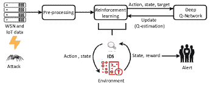

<!--yml

类别：未分类

日期：2024-09-06 19:31:56

-->

# [2405.20038] 物联网入侵检测的深度强化学习：综述

> 来源：[`ar5iv.labs.arxiv.org/html/2405.20038`](https://ar5iv.labs.arxiv.org/html/2405.20038)

# 物联网入侵检测的深度强化学习：综述

Afrah Gueriani LSEA Lab., 工学院

阿尔及利亚梅迪亚大学 Medea 26000

gueriani.afrah@univ-medea.dz    Hamza Kheddar LSEA Lab., 工学院

阿尔及利亚梅迪亚大学 Medea 26000

kheddar.hamza@univ-medea.dz    Ahmed Cherif Mazari LSEA Lab, 理学院

阿尔及利亚梅迪亚大学 Medea 26000

mazari.ahmedcherif@univ-medea.dz

###### 摘要

物联网（IoT）环境中新复杂攻击场景的出现需要更先进和智能的网络防御技术，如各种入侵检测系统（IDS），这些系统负责在 IoT 网络中检测和缓解恶意活动，无需人工干预。为了解决这个问题，近年来提出了深度强化学习（DRL）以自动处理入侵/攻击。本文提供了基于 DRL 的 IoT 入侵检测系统的全面综述。此外，在这项综述中，将最先进的基于 DRL 的 IDS 方法分为五类，包括无线传感器网络（WSN）、深度 Q 网络（DQN）、医疗保健、混合和其他技术。此外，还详细介绍了评估每种方法性能的关键性能指标，即准确率、召回率、精确率、假阴性率（FNR）、假阳性率（FPR）和 F-measure。论文还提供了研究中使用的数据集的总结。

###### 索引词：

入侵检测系统，深度强化学习，物联网，无线传感器网络。

## 引言

物联网（IoT）在过去几年中发生了显著的演变，实现了多设备之间的互联，并改善了通信和数据交换。物联网通过提升连接性、效率和舒适性，已成为现代日常生活中越来越重要的一部分。物联网通过简单地连接设备、传感器和系统，改变了我们与环境互动的方式。它以多种方式影响了用户的日常生活，例如工业控制系统（ICSs），这些系统用于连接、监控和控制工业环境中的物理过程，如制造业、智能电网、智能交通和连接农业。物联网通过推进和完善服务，带来了医疗保健和远程医疗的机会。物联网设备易受到各种网络威胁，包括入侵和非法访问，因此，这种互联也带来了严重的安全和隐私问题[1]。物联网环境受到许多攻击和恶意活动的威胁，这些活动可能影响连接设备和网络的完整性和安全性。在这种背景下，入侵检测系统（IDSs）变得尤为重要，因为它们在缓解威胁方面至关重要。IDS 是持续扫描网络的软体，以检测可能表明即将发生攻击的活动[2]。IDSs 在保护物联网网络方面发挥着重要作用，通过实时检测和缓解攻击以及响应威胁[3, 2]。IDSs 通常使用 AI 方法，如机器学习（ML）和数据挖掘（DM）方法[1]。其中一种机器学习方法是强化学习（RL）。为了在物联网环境中开发高效的 IDS，深度强化学习（DRL），作为机器学习的一个子领域，已经成为一种潜在的方法。DRL 结合了深度学习（DL）的优势，使模型能够学习复杂的表示和模式，并允许系统进行顺序选择。

深度强化学习（DRL）对入侵检测领域产生了巨大影响，能够适应和学习物联网网络变化的动态。基于 DRL 的 IDS 还可以自主决定网络活动是否正常或是否表明有入侵尝试。使用 RL 进行 IDS 的好处包括适应不断变化的攻击模式、实时决策能力和处理复杂威胁的能力。将 RL 整合到 IDS 中具有显著提高其效能、精确度和应对网络威胁能力的潜力。

本调查深入讨论了许多建议的最先进（SOTA）RL/DRL 基于 IDS 算法。

### I-A 相关工作

在 IDS 研究中，考虑了各种物联网环境和 WSN。在[4]中提供了一个关于云计算（CC）中 IDS 的简要概述。作者回顾了与 CC 环境相关的挑战和风险。他们讨论了各种 IDS 的方法及其识别和缓解入侵的能力。接着，在[5]中详细讨论了 IDS 的有关细节。该论文涵盖了在云环境中使用 ML 和 DL 的 IDS 方法的综述，作者在这一领域探索了多种 IDS 技术。在[6]中，对基于规则学习的 IDS 及其在智能电网（SGs）背景下的潜在应用进行了全面的综述。该论文考察了与 IDS 相关的多个要素，例如特征选择技术、评估指标和规则开发。它强调了基于规则学习的 IDS 在识别和缓解 SGs 中的安全威胁方面的重要性。

在这项调查中，我们旨在概述在物联网环境中 IDSs 领域中的研究贡献。该论文着重分析并凸显使用 DRL 创建 IDS 模型和发现攻击的重要性，以保护物联网网络。这项调查还为我们提供了机会，去了解最新的研究并继续在这一领域中挑战自己。我们研究考虑的论文是根据它们作为学术文章的质量选择的（至少在 Scopus 数据库中索引）在物联网 IDS 中，以及它们出版的年份（2018 年至 2022 年之间）。表 I 总结了我们提出的综述与一些现有综述的比较。显而易见的是，所提出的综述已经涵盖了所有领域，包括基于 DRL 的 IDS 的应用，数据集描述，度量标准，IDS 的分类系统，RL 的分类系统和未来的方向，而大多数其他调查要么忽视了这些领域，要么只是部分涉及到。

本调查结构如下：第 II 部分（#S2）提供了包含标准基准数据集和几个度量标准的基础知识。第 III 部分（#S3）回顾了物联网环境中基于 DRL 的 IDS 的现有 SOTA 方法。第 IV 部分（#S4）和第 V 部分（#S5）分别涵盖了未来的方向和结论。

表 I：所提出的调查与其他现有 IDS 综述和调查的比较。

| Ref. | 描述 | IDS 数据集 | 指标 | IDS 分类 | RL 分类 | 基于 DRL 的 IDS | 未来方向 |
| --- | --- | --- | --- | --- | --- | --- | --- |
| [4] | CC 中的 IDS | ✓ | ✓ | ✗ | ✗ | ✗ | ✓ |
| [5] | 基于 ML 和 DL 的 CC 中 IDS | ✓ | ✗ | ✗ | ✗ | ✗ | ✓ |
| [6] | 基于规则学习的 SG 中 IDS | ✗ | ✗ | ✓ | ✗ | ✗ | ✗ |
| 我们的 | 基于 DRL 的 IoT 中 IDS | ✓ | ✓ | ✓ | ✓ | ✓ | ✓ |

## II 基础知识

### II-A 数据集

+   •

    NSL-KDD ¹¹1[`www.unb.ca/cic/datasets/nsl.html`](https://www.unb.ca/cic/datasets/nsl.html)：该数据集是 KDD’ 99 的最新版本，相对于 KDD’ 99，该数据集的优势如下：（1）排除了训练集中冗余的记录，（2）提出的测试集不包含重复记录。KDD 训练集中攻击的原始记录为 3925650，正常记录为 972781，而 KDD 测试集中的攻击原始记录为 250436，正常记录为 60591。该数据集包含用户到根（U2R）和远程到本地（R2L）攻击。

+   •

    UNSW-NB15²²2[`research.unsw.edu.au/projects/unsw-nb15-dataset`](https://research.unsw.edu.au/projects/unsw-nb15-dataset)：由 IXIA PerfectStorm 工具、tcpdump 工具、Argus 和 Bro-IDS 工具创建，以生成攻击。该数据集中的九类攻击包括模糊测试、分析、后门、拒绝服务（DoS）、漏洞、通用、侦察、Shell 代码和蠕虫。UNSW-NB15 数据集总共有 204 万和 540044 条记录。

+   •

    CICIDS-2017³³3[`www.unb.ca/cic/datasets/ids-2017.htmlt`](https://www.unb.ca/cic/datasets/ids-2017.htmlt)：它实现了不同类型的攻击，例如暴力破解 FTP、暴力破解 SSH、DoS、心脏出血、网络攻击、渗透、僵尸网络和 DDoS。

+   •

    CIC-DDoS2019⁴⁴4[`www.unb.ca/cic/datasets/ddos-2019.html`](https://www.unb.ca/cic/datasets/ddos-2019.html)：该数据集包含各种当前的反射 DDoS 攻击，特别是 PortMap、NetBIOS、LDAP、MSSQL、UDP、UDP-Lag、SYN、NTP、DNS 和 SNMP 攻击。

+   •

    BoTNeTIoT-L01⁵⁵5[`www.kaggle.com/datasets/azalhowaide/iot-dataset-for-intrusion-detection-systems-ids`](https://www.kaggle.com/datasets/azalhowaide/iot-dataset-for-intrusion-detection-systems-ids)：数据集的新版本通过仅从 10 秒的时间窗口中选择特征来减少冗余。数据集的类别标签采用零表示攻击，一表示正常样本。

+   •

    N-BaIoT⁶⁶6[`www.kaggle.com/datasets/mkashifn/nbaiot-dataset`](https://www.kaggle.com/datasets/mkashifn/nbaiot-dataset)：该数据集解决了公共僵尸网络数据集的缺乏，尤其是针对物联网的数据集。它具有多个特征，例如：（1）多变量和序列，（2）实际属性数：115，（3）相关任务：分类，聚类，（4）实例数：7062606。然而，由于恶意数据可以分为 2 个僵尸网络进行的 10 次攻击，该数据集也可以用于多类分类。

### II-B 检测指标

基于 DRL 的 IDS 研究社区使用了许多指标，其中许多也被应用于其他深度学习应用[7, 8]。这些指标包括：

+   •

    准确率和 F1 得分：是衡量系统检测正常流量和有害流量能力的指标。它使用方程 1 进行计算。

    |  | $\small\mathrm{Acc}=\mathrm{\frac{TP+TN}{TP+FP+TN+FN}}$ |  | (1) |
    | --- | --- | --- | --- |

    其中，真正例（TP）指的是准确的入侵检测系统（IDS），真正负例（TN）表示正常流量。假阳性（FP）是将正常流量误认为攻击的检测结果。假阴性（FN）表示未能揭示入侵。一个稳健的 F1 得分可能表明假阳性和假阴性预测较低，因为它结合了精确度和召回率。它在方程 2 中表达。

    |  | $\small\mathrm{F1-Score}=\mathrm{2\times\frac{Precision\times Recall}{Precision+Recall}}$ |  | (2) |
    | --- | --- | --- | --- |

+   •

    召回率（灵敏度，检测率）：检测率定义为用于正确检测表示入侵行为的行为模式的参数。它可以使用以下公式 3 表示：

    |  | $\small\mathrm{Rc}=\mathrm{\frac{TP}{TP+FN}}$ |  | (3) |
    | --- | --- | --- | --- |

+   •

    精确度：定义为正确识别危险的记录所占的百分比，与估计记录的总数相比。它使用公式 4 进行计算：

    |  | $\small\mathrm{Pr}=\mathrm{\frac{TP}{TP+FP}}$ |  | (4) |
    | --- | --- | --- | --- |

+   •

    假阴性率：指被识别为典型传感器行为的异常活动。它由公式 5 给出：

    |  | $\small\mathrm{FNR}=\mathrm{\frac{FN}{FN+TP}}$ |  | (5) |
    | --- | --- | --- | --- |

+   •

    误报率：通过将正常记录的总数除以错误拒绝的记录数计算出的比率。其在公式 6 中规定如下：

    |  | $\small\mathrm{FPR}=\mathrm{\frac{FP}{FP+TN}}$ |  | (6) |
    | --- | --- | --- | --- |

### II-C IDS 分类法

IDS 根据图 1 中所示分为三种主要类型。基于异常的分析网络流量和系统行为，以确定与正常模式不同的变化并警报恶意活动。基于特征的比较网络流量或系统活动与已知攻击特征数据库，发现匹配时触发警报。基于规范的目标是检测已知和未知攻击，但依赖准确的规范以实现最佳效果。

图 1：IDS 中的主要分类法。

### II-D 强化学习分类法

强化学习（RL）涵盖了各种方法，如图 2 所示，它代表了我们的评论中讨论的这些技术的一个子集。Q 学习是一种无模型的强化学习技术，旨在确定在给定状态 $(s)$ 中采取特定行动 $(a)$ 后产生的最佳奖励 $(r)$。Q 表是强化学习的核心，总结了所有潜在的结果 $r_{i}(a_{i},s_{i})$。通过探索各种行动并逐渐利用知识，智能体学会选择最大化马尔可夫决策过程（MDP）环境中累积奖励的行动。深度 Q 网络（DQN）是 Q 学习的一个进步，它用深度神经网络（DNN）模型取代了 Q 表以满足实时要求。双重深度 Q 网络（DDQN）表示对 DQN 的逐步演进，采用成对的 DNN 架构。深度确定性策略梯度（DDPG）是一种将 DQN 和策略梯度（PG）方法结合在一起的算法，详见[9]。该算法赋予 IDS 做出明智决策的能力，并有效地提高其检测复杂和不断演变的网络威胁的能力。联合强化学习（FRL）是将 RL 和联合学习（FL）原则融合在一起的一种技术。IDS 利用这种技术增强威胁检测能力。智能体从分布式数据源中学习，从而在动态环境中提高准确性和适应性。

图 2：强化学习中的主要分类法。

## III IoT 环境中基于 DRL 的 IDS

IoT 中基于 DR 的入侵检测系统在文献中被分为不同的类别，在本节中进行了全面的调查。表格 II 总结了引用方法在不同类别中的性能、优点和/或缺点。

### III-A 基于 DRL 的无线传感器网络（WSN）的入侵检测系统

在 [10] 中提出了一种通过使用 DRL 来增强 WSN 和 IoT 安全的新方法。作者通过引入 MDP 的形式化来解决传统 IDS 的局限性，从而改进性能，例如实时监控、控制数据网络以及提高监控质量。研究人员还使用了深度 Q 网络和 NSL-KDD 数据集，以提高在 WSN 和 IoT 中的目标。此外，他们还将该方法与 ML k 最近邻（KNN）算法进行了比较。在检测准确率和假阳性率（FPR）方面，实验评估显示 DRL-IDS 超越了传统的 IDS 技术，它在检测各种攻击类型（如 DoS、DDoS 和入侵尝试）方面表现良好。在 [11] 中解释了一种创新的 WSN 入侵检测方法，该方法结合了生成对抗网络（GANs）和强化学习（RL）策略中的临界策略。作者使用 GANs 和 RL 算法来寻找解决 WSN 中检测和减少入侵及攻击的挑战性问题的方法。GAN 模型生成真实的网络流量数据，RL 代理用于区分正常活动和恶意活动。GAN 生成的数据用于补充训练数据集，从而提高检测准确率。研究结果表明，基于 GAN-RL 的 IDS 能够正确检测和减轻 WSN 中的入侵。该模型与卷积神经网络（CNN）、反向传播（BP）和支持向量机（SVM）进行了比较。与其他比较方法相比，结合 GANs 和 RL 策略的提议方法在提高 WSN 安全措施方面具有很大潜力。文章 [12] 讨论了在节能传感器网络中入侵者追踪的问题。它提供了一种独特的传感器调度方法，以减少能量消耗，同时承诺优秀的入侵检测。作者提供了一种动态传感器调度系统，根据入侵者的预期位置智能地选择要激活的传感器子集。所提出的策略试图通过仔细安排传感器激活来减少整体网络能量使用，同时保持足够的覆盖以正确跟踪入侵者。框架 [13] 提出了一个综合方法，利用 RL 进行入侵检测，并结合布谷鸟搜索技术（CST）来改善 WSN 中的最优路径。此工作引入了布谷鸟搜索算法作为一种有效的优化技术，以改进 WSN 中的路由路径优化。提出的 RLID 技术与 BTMA 进行了比较，这种技术可以检测和隔离入侵，减少延迟并具有更低的 FPR。

图 3: 提出的改进 WSN 和 IoT 基于 DRL-IDS 的方案 [10]。

### III-B 基于深度 Q 网络的入侵检测系统（IDS）

Ramana 等人 [14] 提出了一种环境智能方法，以提高在使用物联网时 IDS 的决策性能。为识别可能的攻击，建议的解决方案利用物联网设备的能力，从各种来源收集和分析数据。作者在二进制攻击和多重攻击分类中使用了 DRL 和深度 Q 神经网络。此外，该工作包括两个步骤，首先是使用 RL 方法进行初始学习，其次是用于攻击检测和分类。作者使用准确率、DR 和误报率 (FAR) 等指标来评估 IDS 的决策性能。提出的模型与五种机器学习算法（即：DQN、MLP、级联 ANN、PCA_GWO 和 GMM-KF）进行了比较，使用了不同的数据集。提出的方法展示了环境智能方法在实现改进的实时决策性能方面相对于传统 IDS 的有效性。另一种在 [15] 中建议的方法提出了深度监控，这是一种独特的流量监控解决方案，利用 FDRL 来解决在物联网网络中成功检测网络犯罪的问题。为了收集流量数据，深度监控在物联网网络中使用了软件定义网络 (SDN)。建议的方法动态控制 SDN 开关中的流规则，以最大化流量统计细节，同时避免流表溢出。为了使深度监控代理能够实时学习并根据当前流量情况做出决策，作者使用了 DRL 算法，特别是 DDQN。FL 方法通过使代理之间的去中心化协作来增强 DDQN 算法的学习性能，以处理物联网系统的异质性和可扩展性。在 SDN 仿真环境中的研究显示了深度监控如何有效保护边缘设备免受溢出问题，并提供了细粒度的流量监控能力。Kalnoor 等人在他们的研究 [16] 中详细描述了使用基于 MDP 的模型进行的 IDS 性能评估，其中 MDP 的使用构成了一个新的框架，准确捕捉 IDS 在检测和响应入侵时的动态行为。在评估 IDS 效能时，考虑了多个因素，包括识别威胁的准确性以及错误预测的频率。通过模拟多种攻击场景，作者展示了他们的基于 MDP 的方法在衡量 IDS 性能和调整其参数方面的实用性。这些发现为物联网网络中 IDS 的设计和评估提供了有价值的见解，并提出了改进其性能的建议。提出的 MDP 与 CNN 和 MLP 算法进行了比较。

### III-C 混合

Otoum 和 Nayak [17] 提出了在物联网环境中对 IDS 的新方法。在这项工作中，作者部署了一种新的异常检测和签名检测系统（AS-IDS），该系统结合了基于异常和基于签名的方法，以提高物联网网络的安全性。AS-IDS 技术应用了异常检测，利用深度 Q 学习（DQL）来发现物联网数据中的异常行为或模式。该系统还包括基于签名的检测，它将观察到的网络流量与已知的威胁签名进行比较。他们详细解释了 AS-IDS 系统的设计和实现，强调了其检测物联网环境中五种攻击类型的能力。AS-IDS 的性能评估通过准确率和 FPR 进行了，他们还使用了 NSL-KDD 数据集。实验结果证明了 AS-IDS 系统在检测入侵和保护物联网网络方面的有效性。Tharewal 等人 [18] 提出的另一种混合方案通过使用基于 DRL 的 IDS，结合近端策略优化算法（PPO2）和修正线性单元（ReLU）作为激活函数，如图 3 所示，讨论了工业物联网（IIoT）带来的安全问题。该方法将深度学习的观察能力与 DRL 相结合，开发了一种能够检测和减少 IIoT 网络入侵的 IDS。提出的方法与 CNN、LSTM、RNN 等 ML 算法以及 DDQN 和 DQN 等其他 DRL 方法进行了比较。实验结果和性能评估数据展示了该 IDS 在检测 IIoT 网络入侵方面的成功程度，相较于 SOTA 方法。

图 4：针对物联网数据的拟议基于 DRL 的 IDS [18]。

### III-D 基于 DRL 的 IDS 在医疗保健中的应用

Kamble 和 Gawade [19] 通过使用物联网技术和密码加密来保护免受多种类型的入侵，如 DoS 和中间人 (MIM) 攻击，重点关注医疗保健的数字化转型。作者确定了物联网设备如何集成到医疗系统中，以改善患者监测、数据收集和通信，并提出了一种保护传输数据的方案。张及其同事在 [20] 提出了一个基于联邦强化学习 (FRL) 的 IDS，以应对物联网支持的医疗系统中的安全挑战。此外，作者提到物联网设备中存在的现有风险以及保护敏感医疗数据的必要性，他们介绍了一种 FDRL，其中 DRL 算法用于在分布式物联网设备上本地训练 IDS 模型。模型在保护数据隐私的同时共同学习和交换信息。通过利用分布式物联网设备的集体智能，推荐的 IDS 提高了系统检测和防御入侵的能力。图 5 说明了 [20] 中提出方案的总体架构。

图 5：提出的基于 DRL 的医疗保健 IDS 模型示例 [20]。

表 II：调查的最先进研究的优缺点列表。

| 参考文献 | 年份 | 类别 | 比较对象 | 指标 | 结果 / 改进 / 评论 / 优点和/或缺点 |
| --- | --- | --- | --- | --- | --- |
| [10] | 2020 | WSN | KNN | 准确性 | 98% / 3.5%，所提模型 DRL-IDS 在检测率和准确性方面表现优于其他方法，且误报数量减少。建议的模型面临计算复杂性挑战，因为模拟样本数量较大。 |
| [11] | 2022 | WSN | SVM | 准确性 | 85.4% / 19.67%，将所提模型与三种方法（CNN、BP 和 SVM）进行比较。将 GAN 与 RL 方法结合具有提升 WSN 安全措施的巨大潜力。未展示泛化能力，因为仅使用了一个数据集来评估所提模型的有效性。 |
| [12] | 2018 | WSN | ID_TG | 平均跟踪误差 | 0.5 / 0.4 提出的算法结合了两种算法 ID_TG 和 MCTS 的优点，在大小为 16 × 16 的 2D 传感器网络中取得了最佳性能。论文中未引用必要的指标，结果仅关注于平均跟踪误差。 |
| [13] | 2021 | WSN | BTMA | FNR | 0.075 / 0.175，由于传感器节点的存在，FNR 较低，这通过迭代次数来检查，从而提供了更高的安全性。 |
| [14] | 2022 | QN | GMM-KF | 准确度 | 99.4% / 0.9%，使用了多个数据集，最佳结果出现在使用 IoTID20 数据集时。 |
| [15] | 2021 | QN | FlowStat | DDoS 检测 | 与 FlowStat 解决方案相比，攻击检测的整体性能提高了 22.83%。 |
| [16] | 2021 | QN | CNN | 精确度 | 99.80% / 3.05%，提议的模型 RL-IDS 给出了最佳的结果和精确度，AUC 在多类别分类中表现领先。由于只使用了一个数据集来评估模型的有效性，且比较仅限于 MLP 和 CNN 技术，因此未展示泛化能力。 |
| [17] | 2021 | 混合 | Deep-RNN | DR | 96.9% / 15.6%，与现有的 IDS 技术相比，建议的 AS-IDS 模型显示出显著改进。由于只使用了一个数据集来评估模型在准确度方面的有效性，因此未展示泛化能力。 |
| [18] | 2022 | 混合 | DDQN | 准确度 | 90% / 9.05%，本文使用了天然气管道运输网络的实际数据集，结果与 DDQN 方法相比较低。 |
| [19] | 2019 | 医疗保健 | – | DoS 准确度 | 98.5%，使用云数据库（Go-Daddy）。能够防御多种网络攻击，如 DoS 和 MiM。仅讨论了有限数量的网络攻击和威胁。 |
| [20] | 2021 | 医疗保健 | SVM | 准确度 | 98.5% / 2.5%，推荐的架构将支持巨大的医疗保健系统的入侵检测，以及在多个现实世界应用中使用的其他无线去中心化网络。仅使用数据集的最早版本（CICIDS2017）来测试提议模型的有效性。 |
| [21] | 2022 | 其他 | kNN | AUC | 82%，使用了包括自有数据集在内的多种数据集，以评估效率。然后，将提议的方法与另外五种 ML 算法进行了比较，kNN 获得了最佳结果。他们的专有数据集未能为提议模型提供最佳结果，该模型的能力仅限于检测 DDoS 攻击。 |
| [22] | 2021 | 其他 | SRMF | TPR | 100% / 17.24%，建议的方法准确预测网络流量并检测入侵，与稀疏正则化矩阵分解（SRMF）相比获得了最佳结果。 |
| [23] | 2018 | 其他 | – | – | 该方法在 SSH 默认密码暴力破解和慢速 HTTP DDoS 攻击中进行了测试，表明系统不仅能检测，还能在几秒钟内缓解攻击。 |

### III-E 其他基于 DRL 的 IDS 应用

论文[22]描述了一种用于能源高效物联网设备的入侵检测独特技术。研究人员解决了在考虑物联网设备能源限制的情况下检测入侵的问题。他们提出了一种基于 DDPG 的方法，以平衡入侵检测的准确性和能源使用。通过与环境的持续互动，该算法学习了一种有效的 IDS 策略。所提出的技术的性能证明其在检测入侵时能够有效利用最少的能源。结果表明，所提出的基于 DDPG 的算法能够通过精度、TPR、FPR 和 F1 分数等多个因素在绿色物联网系统中实现有效且节能的入侵检测。接下来，参考文献[23]强调了针对物联网设备的恶意软件数量不断增加以及传统入侵检测方法在物联网网络中的局限性。所提出的防御系统利用 SDN 和网络功能虚拟化（NFV）[24]来增强网络安全。系统的核心组件是一个 DRL 代理，该代理评估潜在攻击的风险并采取最佳行动以缓解这些风险。另一个参考文献[21]考察了物联网系统中入侵检测的挑战，并提供了一个在线入侵检测框架。为了成功实时识别入侵，系统将完全贝叶斯可能性聚类（FBPC）与集成模糊分类器结合，以根据成员资格程度将物联网数据划分为多个簇。这使得数据模式的表示具有灵活性和细粒度。每个簇中的数据随后通过集成模糊分类器被分类为正常或入侵。

## IV 未来方向

为了修正未来在物联网系统中应用 DRL 进行入侵检测的研究和发展，本文推荐了几个未来的可能性，包括：

+   •

    产生新颖的 DRL 模型和策略，以应对物联网入侵检测中的特定挑战，如隐私、安全和对抗攻击。

+   •

    针对物联网系统中的深度强化学习（DRL）入侵检测开发基准数据集。

+   •

    将 DRL 与其他深度学习方法结合，例如图神经网络（GNN）或类似的方法，以增强物联网环境中 IDS 的性能。

+   •

    检查在物联网入侵检测上下文中，转移学习方法的有效性。

+   •

    研究 DRL 如何用于开发实时、自适应的入侵检测系统（IDS）。

+   •

    建立轻量级模型和方法，以检测和缓解恶意活动和威胁。

## V 结论

本研究讨论了 DRL 在物联网领域入侵检测应用的全面调查。它涵盖了现有研究的全面审查，展示了不同策略的优缺点。调查分析了 DRL 在提升物联网应用中的 IDS 的可能性，并强调了需要解决的主要问题。总体而言，本文强调了 DRL 保护物联网系统免受恶意威胁的机会，识别了未来研究目标，并推动了对现有 SOTA 技术的知识进步。

## 致谢

作者感谢本研究部分由阿尔及利亚高等教育与科学研究部的 PRFU-A25N01UN260120230001 资助。

## 参考文献

+   [1] H. Kheddar, Y. Himeur, and A. I. Awad, “工业控制网络中入侵检测的深度迁移学习：全面综述，”*Journal of Network and Computer Applications*, 第 220 卷, 第 103760 页, 2023 年。

+   [2] V. Chang, L. Golightly, P. Modesti, Q. A. Xu, L. M. T. Doan, K. Hall, S. Boddu, and A. Kobusińska, “关于雾计算和云计算的入侵检测系统的调查，”*Future Internet*, 第 14 卷，第 3 期，第 89 页, 2022 年。

+   [3] M. A. Umer, K. N. Junejo, M. T. Jilani, and A. P. Mathur, “工业控制系统中入侵检测的机器学习：应用、挑战与建议，”*国际关键基础设施保护期刊*, 第 38 卷, 第 100516 页, 2022 年。

+   [4] P. Rana, I. Batra, A. Malik, A. L. Imoize, Y. Kim, S. K. Pani, N. Goyal, A. Kumar, and S. Rho, “云计算范式中的入侵检测系统：分析与概述，”*Complexity*, 第 2022 卷, 2022 年。

+   [5] A. Vinolia, N. Kanya, and V. Rajavarman, “基于机器学习和深度学习的云环境入侵检测：综述，”在*2023 年第五届国际智能系统与创新技术会议（ICSSIT）*。IEEE, 2023, 第 952–960 页。

+   [6] Q. Liu, V. Hagenmeyer, and H. B. Keller, “基于规则学习的入侵检测系统及其在智能电网中的前景综述，”*IEEE Access*, 第 9 卷, 第 57,542–57,564 页, 2021 年。

+   [7] H. Kheddar, Y. Himeur, S. Al-Maadeed, A. Amira, and F. Bensaali, “深度迁移学习在自动语音识别中的应用：朝着更好的泛化方向前进，”*Knowledge-Based Systems*, 第 277 卷, 第 110851 页, 2023 年。

+   [8] H. Kheddar, M. Hemis, Y. Himeur, D. Megías, and A. Amira, “深度学习在多种数据类型的隐写分析中的应用：方法、分类、挑战与未来方向综述，”*Neurocomputing*, 第 127528 页, 2024 年。

+   [9] Y. Wang and S. Zou, “针对鲁棒强化学习的策略梯度方法，”在*国际机器学习会议*。PMLR, 2022, 第 23,484–23,526 页。

+   [10] H. Benaddi, K. Ibrahimi, A. Benslimane 和 J. Qadir, “一种基于深度强化学习的入侵检测系统（drl-ids），用于保护无线传感器网络和物联网，” 见于 *无线互联网：第 12 届 EAI 国际会议，WiCON 2019，台湾台中，2019 年 11 月 26–27 日，论文集 12*。Springer，2020 年，第 73–87 页。

+   [11] J. Tu, W. Ogola, D. Xu 和 W. Xie, “基于生成对抗网络的无线传感器网络强化学习策略的入侵检测，” *国际电路、系统和信号处理杂志*，第 16 卷，第 478–482 页，2022 年。

+   [12] R. B. Diddigi, K. Prabuchandran 和 S. Bhatnagar, “用于能效传感器网络中入侵者跟踪的新型传感器调度方案，” *IEEE 无线通信快报*，第 7 卷，第 5 期，第 712–715 页，2018 年。

+   [13] K. S. Madhuri 和 J. Mungara, “通过布谷鸟搜索在无线传感器网络中进行入侵检测和优化路线的强化学习。”

+   [14] T. Ramana, M. Thirunavukkarasan, A. S. Mohammed, G. G. Devarajan 和 S. M. Nagarajan, “环境智能方法：基于物联网的入侵检测决策性能分析，” *计算机通信*，第 195 卷，第 315–322 页，2022 年。

+   [15] T. G. Nguyen, T. V. Phan, D. T. Hoang, T. N. Nguyen 和 C. So-In, “基于 SDN 的物联网网络中交通监控的联邦深度强化学习，” *IEEE 认知通信与网络学报*，第 7 卷，第 4 期，第 1048–1065 页，2021 年。

+   [16] G. Kalnoor *等*，“基于马尔可夫决策过程的物联网网络入侵检测系统性能分析模型，” *电信与信息技术杂志*，2021 年。

+   [17] Y. Otoum 和 A. Nayak, “AS-IDS：基于异常和签名的物联网入侵检测系统，” *网络与系统管理杂志*，第 29 卷，第 1–26 页，2021 年。

+   [18] S. Tharewal, M. W. Ashfaque, S. S. Banu, P. Uma, S. M. Hassen 和 M. Shabaz, “基于深度强化学习的工业物联网入侵检测系统，” *无线通信与移动计算*，第 2022 卷，第 1–8 页，2022 年。

+   [19] P. Kamble 和 A. Gawade, “物联网和加密加密对抗 DOS 攻击的数字化医疗，” 见于 *2019 年当代计算与信息学国际会议（IC3I）*。IEEE，2019 年，第 69–73 页。

+   [20] S. Otoum, N. Guizani 和 H. Mouftah, “支持物联网驱动的医疗系统的联邦强化学习入侵检测系统，” 见于 *ICC 2021-IEEE 国际通信会议*。IEEE，2021 年，第 1–6 页。

+   [21] F.-Q. Li, R.-J. Zhao, S.-L. Wang, L.-B. Chen, A. W.-C. Liew 和 W. Ding, “使用全贝叶斯可能性聚类和集成模糊分类器的物联网系统在线入侵检测，” *IEEE 模糊系统学报*，第 30 卷，第 11 期，第 4605–4617 页，2022 年。

+   [22] L. Nie, W. Sun, S. Wang, Z. Ning, J. J. Rodrigues, Y. Wu 和 S. Li，“绿色物联网中的入侵检测：一种基于深度确定性策略梯度的算法，” *IEEE 绿色通信与网络学报*，第 5 卷，第 2 期，页 778–788，2021 年。

+   [23] M. Zolotukhin 和 T. Hämäläinen，“关于人工智能恶意软件容忍网络的研究，” 收录于 *2018 IEEE 网络功能虚拟化与软件定义网络会议 (NFV-SDN)*。IEEE，2018 年，页 1–6。

+   [24] H. Kheddar, Y. Himeur, S. Atalla 和 W. Mansoor，“一种高效的 5G 网络横向切片模型，基于实际模拟，” 收录于 *2022 第五届国际信号处理与信息安全会议 (ICSPIS)*。IEEE，2022 年，页 158–163。
