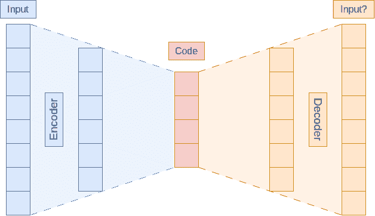
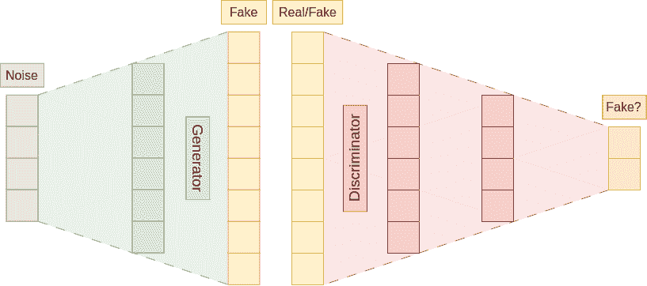

<!--yml

类别：未分类

日期：2024-09-06 19:31:54

-->

# [2406.00146] 深度学习音频生成方法的调查

> 来源：[`ar5iv.labs.arxiv.org/html/2406.00146`](https://ar5iv.labs.arxiv.org/html/2406.00146)

# 深度学习音频生成方法的调查

Matej Božić1, Marko Horvat2 应用计算系

萨格勒布大学，电气工程与计算机学院，克罗地亚萨格勒布

1matej.bozic@fer.hr 2marko.horvat3@fer.hr

###### 摘要

本文回顾了音频生成深度学习模型开发中的三种不同方面的典型技术。文章的第一部分解释了音频表示，从基础的音频波形开始。接着我们进展到频域，重点介绍了人类听觉的特性，并最终引入了相对较新的发展。文章的主要部分集中在解释基本和扩展的深度学习架构变体及其在音频生成领域的实际应用。讨论的架构包括：1）自编码器 2）生成对抗网络 3）归一化流 4）变换器网络 5）扩散模型。最后，我们将考察四种在音频生成中常用的评价指标。本文旨在为新手读者和该领域的初学者提供对音频生成方法当前最前沿状态的全面了解，以及可以探索的相关研究以进行未来的研究。

###### 关键词：

深度学习，音频表示，音频生成，生成模型，声音合成

## I 引言

计算机视觉（CV）和自然语言处理（NLP）领域对深度学习的趋势也已扩展到音频生成领域[1]。深度学习使我们能够从手工制作的复杂特征转向简单的表示，通过让模型的深度创建更复杂的映射。我们将音频生成定义为任何其输出为音频且不能仅从输入中推导出的的方法。即使像文本到语音这样的任务涉及从文本领域到语音领域的转换，但仍有许多未知因素，例如说话者的声音。这意味着模型必须发明或生成信息以使翻译工作。音频生成有许多应用。我们可以创建听起来像人的语音助手，基于当前的视觉输入生成游戏或电影的环境声音，创建各种音乐样本以帮助音乐制作人获得灵感或进行创作，等等。图 1 展示了对深度学习音频生成方法的调查的结构。

本文将主要关注深度学习方法，因为该领域似乎正朝着这个方向发展。然而，第 III 节将回顾音频生成方法多年来的发展，从大约 1970 年代开始。我们认为这一节很重要，因为正如深度学习方法重新出现一样，可能会有一天现在已经过时的音频生成方法会再次成为最前沿技术。我们的目标是对音频生成领域进行广泛但浅显的审视。某些领域，如文本到语音，将会有更重的表现，因为它们受到了更多关注，但我们尝试包括了许多不同的子领域。本文并不尝试介绍所有可能的方法，而是向读者介绍该领域一些流行的方法。每个主题下的工作列表都是按排序的，以便最新的文章在最后。

文章的结构如下：第 II 节介绍了处理音频中的深度学习的前期工作，第 III 节简要概述了文本到语音和音乐生成中的前期音频生成方法，第 IV 节讨论了两个最显著的特征和一个最近的进展，第 V 节讨论了五种深度学习架构及其一些流行的扩展，最后，第 VI 节着眼于评估生成模型的性能，其中一些是特定于音频生成的，而其他则更具通用性。

{forest}

对于树=分叉边，grow’=0，绘制，圆角，调查，旋转=90 [[IV。音频特征，对于树=填充=red!45，部分 [原始波形，填充=red!30，小节] [梅尔谱图，填充=red!30，小节] [神经编解码器，填充=red!30，小节] ] [V。架构，对于树=填充=brown!45，部分 [自编码器，填充=brown!30，小节] [生成对抗网络，填充=brown!30，小节] [归一化流，填充=brown!30，小节] [变换器网络，填充=brown!30，小节] [扩散模型，填充=brown!30，小节] ] [VI。评估指标，对于树=填充=orange!45，部分 [人工评估，填充=orange!30，小节] [起始评分，填充=orange!30，小节] [Fréchet 距离，填充=orange!30，小节] [Kullback-Leibler 散度，填充=orange!30，小节] ] ]

图 1：调查的主要部分。

## II 相关工作

在本节中，我们将提到一些在音频生成领域进行进一步研究的良好来源。其中一些只研究特定的模型架构或子领域，而其他像这项工作则展示了更广泛的视角。

在 [2] 中，讨论了深度学习的判别性和生成性架构及其在语音和音乐合成中的应用。文章涵盖了判别性神经网络，如多层感知器（MLP）、卷积神经网络（CNN）和递归神经网络（RNN），以及生成性神经网络，如变分自编码器（VAE）和深度置信网络（DBN）。他们还描述了生成对抗网络（GAN），其缺陷以及增强策略（其中 Wasserstein GAN 为突出）。该研究主要集中在语音生成上，对不同的混合模型关注较少。

相比之下，[3] 强调了建模的其他领域，包括特征表示、损失函数、数据和评估方法。它还调查了各种额外的应用领域，包括增强以及音频生成之外的领域，如源分离、音频分类和标记。他们描述了一些在此未涵盖的音频方面，如梅尔频率倒谱系数（MFCC）和常数 Q 谱图。他们覆盖的架构不如其他文献多，但提供了特定领域的数据集和评估方法。

与之前的研究不同，[4] 试图全面考察音频生成的特定领域。本研究考虑了音乐生成的五个维度：目标、表示、架构、挑战和策略。它考察了各种表示方法，包括领域特定的和更一般的表示。解释了音乐理论的基本原理，包括音符、节奏和和弦。介绍了各种已建立的架构，如 MLP、VAE、RNN、CNN 和 GAN，以及一些新兴的架构，如限制玻尔兹曼机（RBM）。最后，它讨论了音乐生成的许多挑战及其解决方法。这项工作相当广泛，但某些部分可能需要更详细的解释。

[5] 是另一项探索音乐生成主题的工作，包括音乐翻译。它讨论了数据表示、生成神经网络和两个流行的 DNN 基础合成器。讨论了长期依赖性问题以及如何通过条件化来缓解它。解释了自回归（AR）和标准化流（NF）模型，以及 VAE 和 GAN。

[1] 提供了音频深度学习技术的概述。它区分了架构和元架构。架构包括 MLP、CNN、时序卷积网络（TCN）和 RNN，而元架构包括自编码器（AE）、VAE、GAN、编码器/解码器、注意力机制和变换器。将音频表示分为三类：时间频率、波形和知识驱动。时间频率表示包括短时傅里叶变换（STFT）、MFCC、对数梅尔谱图（LMS）和常数 Q 变换（CQT）。文章最后列出了音频深度学习算法的应用，包括音乐内容描述、环境声音描述和内容处理。还简要讨论了半监督学习和自监督学习。

[6] 提供了 TTS 方法的全面概述，包括历史。它解释了 TTS 系统的基本组成部分，如文本分析、声学模型和声码器，并包括每个领域的模型列表。最后，它讨论了在特定使用场景中实现 TTS 系统的高级方法，如快速 TTS、低资源 TTS 和鲁棒 TTS。

[7] 讨论了 TTS、音乐生成、视听多模态处理和数据集。这项工作不同于早期的研究，因为它按类别组织相关文献，而不是深入解释主题。

[8] 是与本文最为接近的工作。它遵循类似的结构，从包括原始波形、声谱图、声学特征、嵌入和符号表示的输入表示开始，接着是用于引导音频合成的条件表示。包括了音频合成技术，如 AR、NF、GAN 和 VAE。文章最后总结了以下评估方法：感知评估、统计学上不同的箱数、生成评分、基于距离的测量、频谱收敛和对数似然。

[9] 提供了用于语音处理领域的变换器架构的概述。文章描述了变换器、流行的语音变换器列表以及其应用的文献综述。

[10] 调查了 TTS 和语音增强，重点关注扩散模型。尽管重点是扩散模型，但它们也讨论了 TTS 的阶段、开创性工作以及用于不同语音增强任务的专门模型。

[11] 对语音处理中的深度学习技术进行了全面调查。它从语音特征和传统语音处理模型开始，涵盖了以下深度学习架构：RNN、CNN、Transformer、Conformer、Sequence-to-Sequence 模型（Seq2seq）、强化学习、图神经网络（GNN）和扩散概率网络。解释了监督、无监督、半监督和自指导的语音表示学习。最后，讨论了包括神经语音合成、语音到语音翻译、语音增强、音频超分辨率以及迁移学习技术在内的各种语音处理任务。

## III 背景

本节的主要目的是展示音频生成在这些年来的发展。由于音频生成是一个包含许多不同领域的广泛领域，如文本到语音合成、语音转换、语音增强等[12]，我们将仅关注音频生成的两个不同领域：文本到语音合成和音乐生成。之所以选择这两个领域，主要是因为它们较为流行。我们想展示的趋势是领域特定知识如何转向通用方法，以及特征工程如何转变为特征识别。

### III-A 文本到语音

文本到语音（TTS）是一个具有众多应用的任务，从电话助手到 GPS 导航仪。构建能够与人类沟通的机器的愿望历史上推动了这一领域的发展。传统的语音合成技术包括基于规则的连接语音合成（CSS）和统计参数语音合成（SPSS）[13]。CSS 和 SPSS 使用语音数据，可能被视为基于语料库的语音合成方法[14]。

到 1980 年代末，该领域由基于规则的系统主导[15]。这些系统严重依赖于领域专业知识，如语音理论，需要许多专家的合作以开发一个全面的规则集来生成语音参数。类似的工作有很多，如[16，17，18，19]。

CSS 方法试图通过结合录制语音的片段来实现语音的自然性和可理解性。它们可以分为两类：固定库存和单元选择方法[13]。固定库存仅使用每个连接单元的一个实例，该实例经过信号处理后与其他单元合成成一个发音词。一个例子可能是[20]，它使用双音素方法进行片段组装。另一方面，单元选择方法使用大量的连接单元，这可能会改善相邻单元之间的匹配，从而提升语音质量。基本概念有两个：目标成本和连接成本。目标成本确定数据库中一个元素与所需单元的匹配程度，而连接成本则指示一对选择的单元的组合效果。目标是最小化整个单元序列的这两种成本；这通常通过 Viterbi 搜索[13]来实现。尽管总是可以最小化成本，但生成的语音可能仍包含错误。这可能由于缺少可选择的单元而引起，这个问题可以通过增加数据库大小来缓解。这听起来很简单；然而，这样做会增加单元创建成本和搜索时间，因为可能的连接数量增加了。所有这些都需要 CSS 技术在语音质量和合成速度之间做出选择。该领域的工作包括[21]，其中采用了非均匀合成单元，以及[22]，它将单元选择数据库的单元视为状态转换网络中的状态。

SPSS 使用统计方法建模语音参数，依据所需的音素序列。这与 CSS 技术不同，因为我们不是保持自然的、未修改的语音，而是教模型如何重现它。在典型的 SPSS 系统中，这通常通过首先提取语音的参数表示，然后使用生成模型进行建模，常常通过应用最大似然准则[23]来完成。SPSS 相对于 CSS 的主要优势在于其对未知数据的泛化能力[13]。这使我们能够调整模型以生成不同的声音特征[15]。此外，由于我们使用模型参数而不是语音数据库，因此所需的内存量减少了几个数量级。尽管还有其他 SPSS 技术，但大多数研究集中在隐马尔可夫模型（HMM）上[15]。

一些 HMM 研究包括 [14]，它不仅考虑了静态和动态特征向量的输出概率，还考虑了全局方差（GV）。[24] 直接使用轨迹 HMM 对语音波形进行建模。[25, 26] 使用基于决策树的上下文聚类来同时表示频谱、音高和 HMM 状态持续时间。常用的上下文包括当前音素、前后音素、当前音节在当前单词或短语中的位置等。[27]。

人类语音系统在将语言层级转换为波形层级时具有分层结构的概念刺激了深度神经网络语音合成的采用 [28]。[29] 使用人工神经网络和基于规则的方法来建模语音参数。[30] 使用限制玻尔兹曼机和深度置信网络来预测每个 HMM 状态的语音参数。其他值得注意的方法包括多层感知器 [31, 32, 28, 33, 34]，时间延迟神经网络 [35, 36]，长短期记忆 [37, 38, 39, 40]，门控递归单元 [41]，基于注意力的递归网络 [42]，和混合密度网络 [43, 41]。

TTS 系统由四个主要组件组成：第一个将文本转换为语言表示，第二个确定每个语音段的持续时间，第三个将语言和时序表示转换为语音参数，第四个是声码器，根据语音参数生成语音波形 [35]。我们展示的大多数工作集中于将语言表示转换为语音参数，但也有模型专注于，例如，图形到音素转换 [44, 45]，以便在没有语言特征知识的情况下进行 TTS。声码器的例子包括 MLSA [46]，STRAIGHT [47]，和 Vocaine [48]。最后，也有尝试构建完全端到端系统，这意味着将文本分析和声学建模集成到一个模型中 [42]。

### III-B 音乐生成

音乐在人类生活中存在的时间要远早于电子计算机的发明，人们也制定了许多有关如何制作优美音乐的准则。仅仅因为这个原因，音乐生成的学科在很大程度上强调使用音乐理论来创建逻辑规则的基于规则的系统。与文本不同，音乐词汇相当有限，最多包含几百个离散的音符符号[49]。音乐创作被分为六个类别：语法、基于知识、马尔可夫链、人工神经网络、进化方法和自相似性[50]。具体的方法包括离散非线性映射[51, 52]、基于规则[53, 54]、遗传算法[55, 56, 57, 58]、递归神经网络[59, 57]、长短期记忆[60, 61, 62, 63]、马尔可夫链[52, 64]、无上下文语法[64, 58]、有上下文语法[65, 66]、细胞自动机[67]、随机场[49]、L 系统[68]、知识库[69]和限制玻尔兹曼机[70]。与语言不同，音乐采用的声学特征数量明显较少。这些特征包括 MIDI 表示[56, 62]、编码的乐谱[57]、八度的二进制向量[49]和钢琴卷轴[70, 62]。

## IV 音频特征

尽管历史上使用了大量的音频特征，我们将在这里描述两个最受欢迎的特征：原始波形和对数梅尔频谱图，并提及一些最近获得关注的特征。请记住，有太多特征无法全部描述，特别是考虑到在深度学习方法兴起之前，许多手工制作的特征。

### IV-A 原始波形

“原始音频”这个术语通常指的是使用脉冲编码调制（PCM）[8]录制的波形。在 PCM 中，连续波形以均匀的间隔进行采样，这些间隔被称为采样频率。根据采样原理，如果信号以略高于最高信号频率两倍的频率进行均匀采样，则它将包含所有原始信号的信息[71]。音频应用的平均采样频率为 44.1 kHz[8]，因此我们不能保持等于或高于 22.05 kHz 的频率。计算机无法以绝对精度存储实数；因此，每个样本值通过从有限值集合中分配一个元素来近似，这种技术被称为量化[8]。最常见的量化级别是 8 位（256 级）、16 位（65536 级）和 24 位（1680 万级）[8]。

使用原始音频波形的优点在于它们可以很容易地转换成实际的声音。在某些任务中，缺点似乎大于优点，因为原始波形仍未被广泛使用。问题在于，原始音频合成在更高位深率下变得问题重重，这主要是由于涉及的状态数量巨大[72]。例如，24 位音频信号有超过 1600 万个状态。高采样率产生异常长的序列，使得原始音频合成更加具有挑战性[73]。$\mu$-law 经常在像 WaveNet 这样的语音生成模型中被使用[74]，以压缩整数值和序列长度。这种方法可以将每个时间步量化为 256 个值，并重建高质量的音频[73]。根据[75]，增加位深表示可能导致模型学习到一些不希望出现的方面，例如周围环境的宁静背景。需要强调的是，这个问题仅在较早的出版物中观察到，目前的出版物中并未讨论这个问题。

使用原始波形作为其表示方式的最常见模型是称为声码器的文本到语音模型。在 III 节中，我们提到了一些声码器，它们用于将中期表示（如 Mel-谱图）转换为原始音频波形。示例包括 WaveNet [74]、SampleRNN [76]和 Deep Voice 3 [77]。

### IV-B Mel-谱图

在讨论 mel-谱图之前，我们必须先了解短时傅里叶变换（STFT）。为了表示音频频率，我们使用离散傅里叶变换（DFT），它将原始波形转换为加权复指数的和[78]。当我们试图分析复杂的音频信号时，问题就出现了；由于大多数音频信号的内容随时间变化，我们无法使用 DFT 来确定频率如何变化。相反，我们使用 STFT 对音频波形的重叠部分应用 DFT[8]。大多数使用 STFT 表示音频的技术仅考虑其振幅[1]，这导致了信息丢失的表示。通过去除 STFT 的相位，我们可以将其排列成时间/频率图，从而创建谱图。

mel-谱图通过将短时傅里叶变换（STFT）压缩到一个称为 mel-尺度的范围来实现频率轴的压缩[79]。mel-尺度将频率范围划分为一组 mel-频带，高频部分具有较低的分辨率，而低频部分具有较高的分辨率[11]。这一尺度的灵感来源于人类听觉的非线性频率感知[11]。对振幅应用对数后会得到对数 mel-谱图[1]。最后，使用离散余弦变换可以得到 mel 频率倒谱系数（MFCC）[3]。MFCC 是语音应用中一种常用的表示方式[13]，但在深度学习模型中已经显示其不再必要[3, 1]。

虽然如 STFT 和原始波形这样的表示是可逆的，但频谱图却不是，因此我们必须使用某种方法来近似缺失的值。用于这些的算法在上一节中已有提及。除了基于神经网络的声码器，其他算法包括 Griffin-Lim [80]、基于梯度的反演 [81]、单次频谱图反演 (SPSI) [82] 和相位梯度堆叠积分 (PGHI) [83]。梅尔频谱图经常被用作文本到语音流程中的中间特征 [7]。Tacotron 1/2 [84, 85] 和 FastSpeech 1/2 [86, 87] 是这种模型的例子。为了更好地说明梅尔频谱图的压缩，以一个采样率为 44.1 kHz 的 5 分钟视频为例。16 位深度的情况下，我们的原始波形将占用 ${\approx}25\text{MB}$，而使用常见配置¹¹1 基于观察到的 80 个频带、256 跳跃大小、1024 窗口大小和 1024 点傅里叶变换的梅尔频谱图在相同位深度下占用 ${\approx}8\text{MB}$。在 \citeyearchoi_ComparisonAudioSignal_2018 的文章中，已证明梅尔频谱图比 STFT 更优，因为它在具有更紧凑表示的同时实现了相同的性能 [88]。鉴于该领域的进展，必须强调的是，文章中仅检查了递归和卷积模型。梅尔频谱图的另一个优势，以及频谱图的一般优势在于它们可以作为图像展示。由于忽略了相位信息，它可以用一个维度表示频率，另一个维度表示时间。这是有用的，因为图像已广泛应用于计算机视觉任务，使我们可以借用模型在音频领域中使用。需要注意的是，由于轴的意义不同，频谱图并不完全等同于图像。这似乎没有产生实质性影响，因为许多工作在其卷积模型中实现了梅尔频谱图 [1]。

### IV-C 神经编码器

音频编解码器是一种信号处理技术，它将音频信号压缩成离散代码，然后使用这些代码重建音频信号，这并不总是能够完全准确地完成。一个典型的音频编解码器系统由三个组件组成：编码器、量化器和解码器。每个组件的功能在章节 V-A 中有解释。音频编解码器的目标是使用尽可能少的信息来存储或传输音频信号，同时确保解码后的音频质量不会因去除音频信号中的冗余或无关信息而显著降低。传统上，这通过改变信号并在某些信号组件的质量上做出权衡来实现，这些组件不太可能影响质量[89]。音频编解码器已被广泛应用于包括移动和互联网通信在内的各种应用中。音频编解码器有很多种类型；一些用于实时应用，如流媒体，而另一些则用于音频制作。在流媒体中，延迟是一个更大的问题，这意味着需要牺牲质量以换取速度；而在制作中，我们希望在保持紧凑表示的同时保留尽可能多的细节。

音频编解码器可以分为两类：波形编解码器和参数编解码器。波形编解码器对音频的本质几乎没有假设，因此它们可以处理任何音频信号。这种通用性使它们非常适合在低压缩下创建高质量音频，但它们在高压缩时往往会产生*伪影*[90]。此外，由于它们在高压缩下表现不佳，因此往往会增加存储和传输成本。与波形编解码器不同，参数编解码器对被编码的源音频做出假设，并通过一个表征音频合成过程的参数模型引入强假设。目标不是在逐样本基础上实现忠实重建，而是生成在感知上与原始音频可比的音频[90]。参数编解码器提供了很好的压缩，但在解码音频质量和噪声敏感性方面存在问题[91]。

在神经编解码的过程中，我们首先遇到了混合编解码器，它们用神经网络替代了一些参数化编解码模块。这种类型的编解码器通过利用神经网络的适应性来提高性能。随后出现了基于声码器的方法，这些方法可以利用之前介绍的神经声码器，通过将其条件化于参数化编码器代码或量化声学特征来重建音频信号。然而，它们的性能和压缩仍然依赖于输入的手工特征 [92]。将模型分解为模块而导致其无法有效工作的观察，激发了接受原始波形作为输入和输出的端到端自动编码器（E2E AE）的出现。一个标准的 E2E AE 由四个基本组件组成：编码器、投影器、量化器和解码器 [92]。基本的用例是获取原始波形并使用编码器构建一个具有降低时间分辨率的表示，然后通过投影器组件将其投影到多维空间中。为了使表示适合传输和存储，我们进一步将投影量化为代码。这些代码构成了一个查找表，解码器在另一端使用这个查找表将量化的表示转换回原始波形。 [93] 定义了神经编解码器为一种将音频波形转换为紧凑表示的神经网络模型，使用编解码器编码器对其进行编码，并用编解码器解码器从这些表示中重建音频波形。核心思想是使用音频编解码器将语音或声音压缩为一组离散的标记，然后生成模型用于生成这些标记 [94]。这些方法已被证明可以支持跨模态任务 [95]。

神经编解码方法包括 SoundStream [90]、EnCodec [89]、HiFi-Codec [94]、AudioDec [92] 和 APCodec [91]。所有这些方法都使用残差向量量化（RVQ），而 HiFi-Codec 还引入了一种叫做 group-RVQ 的扩展。VQ 方法将在 V-A 节中讨论。SoundStream [90] 被 AudioLM [96]、MusicLM [97]、SingSong [98] 和 SoundStorm [99] 使用，而 EnCodec [89] 被 VALL-E [73]、VALL-E X [100]、Speech-X [101] 和 VioLA [95] 使用。

最后，尽管神经编码器方法相对较新，但它们并非没有受到批评。[93]指出，尽管 RVQ 可以实现可接受的重建质量和低比特率，但它们主要用于压缩和传输，因此可能不适合作为音频制作工作的中间表示。这是因为 RVQ 创建的离散符号序列可能非常长，当使用$N$个残差量化器时，长度大约是$N$倍。由于语言模型无法处理极长的序列，我们将遇到离散符号的不准确预测，从而在尝试从这些符号重建语音波形时出现词汇跳跃、词汇重复或语音崩溃问题。

## V 架构

随着模型变得越来越先进，它们开始联合使用多种不同的架构，使得对其进行有效分类变得不可能。因此，每个子章节将包含适用于多个子章节的模型，但按照作者认为最合理的方式进行划分。与音频特征不同，这里涉及许多不同的架构。我们将在这里提到在音频生成领域中最常用的架构。

### V-A 自编码器

本节大部分内容取自[102, 103]的研究成果。

自编码器的目标是将输入复制到输出中。它由两部分组成：编码器和解码器。两部分的交集描绘了一个试图表示输入以及由此延伸的输出的编码。编码器接收输入数据，并将其转换为编码，解码器则使用该编码来近似原始输入。如果我们允许编码器和解码器中使用任意值，我们将无法得到有意义的编码，因为这只是模拟了一个身份函数。为了获得有意义的编码，我们限制了编码器和解码器，防止它们只是简单地传递数据。例如，我们可以通过限制模型中值的维度来实现这一点。自编码器的优势在于它不需要标记数据，因为它仅仅寻求重建输入，从而允许无监督学习。[104]演示了一个简单自编码器的基本应用案例，即特征提取。而 VITS[105]则通过使用 VAE 连接两个文本到语音模块，实现了在对抗设置中的端到端学习。图 2a 展示了一个使用通用编码器和解码器组件的简单自编码器设置。

由于本文聚焦于生成，我们将介绍一种最流行的自编码器形式——变分自编码器（VAE）[1]。VAE 的提出使我们能够将自编码器用作生成模型[8]。VAE 的组成部分可以视为两个独立参数化模型的结合：识别模型和生成模型。VAE 的成功主要归功于选择了 Kullback-Leibler（KL）散度作为损失函数[8]。KL 散度将在第 VI 节中描述。与自编码器不同，VAE 学习的是概率分布的参数，而不是数据的压缩表示[5]。对概率分布的建模使我们能够从学习到的数据分布中进行采样。高斯分布因其通用性而被广泛使用[4]。MusicVAE [106]在递归 VAE 中使用了分层解码器，以避免后验崩溃。BUTTER [107]使用 VAE 创建了一个统一的多模型表示学习模型。Music FaderNets [108]引入了高斯混合 VAE。RAVE [109]采用了多阶段训练，最初进行表示学习，然后进行对抗性微调。Tango [110]和 Make-An-Audio 2 [111]通过在扩散模型中使用 VAE 生成梅尔频谱图。

向量量化 VAE（VQ-VAE）是 VAE 的一种扩展，它将潜在表示置于离散的潜在空间中。VQ-VAE 通过引入一个称为代码本的新组件来改变自编码器结构。最显著的变化发生在编码器和解码器之间，在那里编码器的输出被用在利用代码本的最近邻查找中。换句话说，从编码器接收到的连续值被量化并映射到一个离散的潜在空间，解码器将接收到这个空间。VQ-VAE 用负对数似然、代码本和承诺损失替换了 KL 散度损失。VQ-VAE 的一个可能问题是代码本崩溃。这发生在模型停止使用代码本的一部分时，表明代码本不再满负荷使用。这可能导致似然性下降和重建不足[75]。[75]提出了 argmax 自编码器作为 VQ-VAE 在音乐生成中的替代方案。MelGAN[112]、VQVAE[113]、Jukebox[114]（带有层次化 VQ-VAE）、DiscreTalk[115]、FIGARO[116]、Diffsound[117]和 Im2Wav[118]使用 VQ-VAE 将输入压缩到低维空间。而 Dance2Music-GAN[119]、SpeechT5[120]、VQTTS[121]和 DelightfulTTS 2[122]仅使用向量量化。

残差向量量化（RVQ）通过在量化后计算残差并使用第二个代码本、第三个代码本等进一步进行量化，从而改进了 VAE[89]。换句话说，RVQ 级联了$N$层 VQ，其中未量化的输入向量通过第一层 VQ，计算量化残差，然后这些残差被额外的$N-1$个向量量化器迭代量化[90]。第 IV-C 节列出了使用 RVQ 的模型。

### V-B 生成对抗网络

另一种显著的生成架构是生成对抗网络（GAN）。它由两个具有不同功能的模型组成：生成器和判别器。生成器的功能是将一个随机输入向量转换为一个数据样本。随机向量通常较小，因为生成器模拟了自编码器的解码器部分[1]。与施加分布以生成逼真数据的变分自编码器（VAE）不同，GAN 使用了一个称为判别器的第二个网络[1]。判别器接收生成器的输出或数据集中的样本，并尝试将其分类为真实或虚假。生成器根据判别器区分真实与虚假的能力受到惩罚。反之亦然：如果判别器无法区分生成器生成的样本和实际数据点，它也会受到惩罚。换句话说，这两个神经网络在一个二人博弈的最小化游戏中对抗。根据[123]，网络训练的理想结果是判别器对输入是否真实或虚假有 50%的确定性。在实践中，我们通过减少样本是虚假的概率来训练生成器，而判别器则对虚假数据和真实数据进行相反的处理。图 2b 展示了生成器接收一个随机向量输入，并且判别器尝试区分真实和虚假样本。

(a)

(b)

图 2：两个深度学习架构，看起来似乎没有什么共同之处，直到我们仔细观察。生成器模拟了自编码器的解码器，而判别器则类似于编码器。

这种基本设置使我们能够生成类似于数据集中样本的样本，但它不允许我们对生成进行条件控制。换句话说，生成器中使用的随机向量与数据的语义特征不匹配[5]。许多数据集包含有关每个样本的附加信息，例如图像中的物体类型。如果我们能利用这些附加信息来控制生成器，从已学习输出的子集生成样本，将会非常有益。条件生成对抗网络（cGAN）通过将附加信息包含到生成器和判别器输入中来引入额外的结构。生成器将附加信息添加到随机向量中，而判别器则将其添加到数据中进行区分。一些利用 cGAN 的工作包括 MidiNet[124]、[125]、[126]、[127]和 V2RA-GAN[128]。

GAN 的常见问题包括模式崩溃、不稳定的训练以及缺乏评估指标 [2]。模式崩溃发生在生成器专注于少数几种输出，这些输出能够欺骗判别器，让其认为这些输出是真实的。即使生成器满足了判别器的要求，我们也无法使用它生成超过少数几个样本。这可能是因为判别器无法强制生成器保持多样性 [123]。Wasserstein GAN (WGAN) 是一种著名的变体，用于解决这一问题。WGAN 将判别器的任务从区分真实数据和伪造数据转变为计算 Wasserstein 距离，通常称为地球搬运工距离。此外，还提出了一种修改方案以帮助 WGAN 收敛；该方案使用梯度惩罚而不是权重裁剪，被称为 WGAN-GP。WGAN 被 MuseGAN [129]、WaveGAN [130]、TiFGAN [131] 和 Catch-A-Waveform [132] 等使用。

另一种流行的 GAN 架构修改是使用深度卷积网络，即深度卷积 GAN (DCGAN)。与 WGAN 不同，DCGAN 只需要改变模型架构，而不是整个训练过程，包括生成器和判别器。它旨在通过应用一组架构约束，在无监督环境中提供稳定的学习环境 [123]。DGAN 被用于如 MidiNet [124]、WaveGAN [130] 和 TiFGAN [131] 等工作中。

此外，值得注意的是一个简单的 GAN 扩展，旨在解决梯度消失问题，同时提高训练稳定性。最小二乘 GAN (LSGAN) 通过改变判别器的损失函数来提高生成样本的质量。与常规 GAN 不同，LSGAN 对正确分类的样本施加了更大的惩罚，将它们拉向决策边界，这使得 LSGAN 能生成更接近真实数据的样本 [133]。使用 LSGAN 的论文包括 SEGAN [134]、[135]、HiFi-GAN [136]、Parallel WaveGAN [137]、Fre-GAN [138]、VITS [105] 和 V2RA-GAN [128]。

还有许多其他的 GAN 修改方法我们没有提到，如 Cycle GAN [139] 或 Boundary-Equilibrium GAN [140]，我们试图展示音频生成领域最常见的修改方法。像 MelGAN [112]、GAAE [141]、GGAN [142]、SEANet [143]、EATS [144]、Dance2Music-GAN [119] 和 Musika [145] 使用了另一种损失类型，称为铰链损失。

最后，我们想提到一些难以分类的工作。它们包括 GANSynth [146]、GAN-TTS [147]、RegNet [148]、Audeo [149]、Multi-Band MelGAN [150]、Multi-Singer [151] 和 DelightfulTTS 2 [122]。

### V-C 标准化流

尽管 VAE 和 GAN 在音频生成中被频繁使用，但它们都无法对新点的概率密度进行精确评估 [152]。标准化流（NF）是一类具有可处理分布的生成模型，这些分布可以进行精确的密度评估和采样。网络由两个“流”组成，分别朝着相反的方向移动。一个流从基础密度开始，我们称之为噪声，然后逐渐发展为更复杂的密度。相反的流则反转方向，将复杂密度转换回基础密度。从基础到复杂的过程称为生成方向，而相反的过程称为标准化方向。标准化流一词指的是标准化方向使复杂分布更为规律或标准化的概念。标准分布通常用于基础密度，这也是名称的另一个原因。类似于我们在深度神经网络中叠加转换，我们通过组合多个简单函数来生成复杂行为。这些函数不能随意选择，因为流必须双向进行；因此，所选择的函数必须是可逆的。利用可逆函数组合的特性，我们可以创建基于似然的参数估计，并应用于训练模型。在这种设置下，数据生成很简单；通过使用生成流，我们可以输入来自基础分布的样本，并生成所需的复杂分布样本。已经正式证明，如果你能构建任意复杂的转换，你将能够在合理假设下生成任何分布 [152]。

根据所使用函数的性质，可能会有显著的性能差异，这会影响训练或推断时间。逆自回归流（IAF）是一种具有专门化函数的 NF 模型，允许高效合成。该变换基于自回归网络，这意味着当前输出仅由当前和前一个输入值决定。这种变换的优势在于生成流可以并行计算，从而有效利用如 GPU 等资源。虽然 IAF 网络在推断时可以并行运行，但最大似然估计训练需要顺序处理。为了实现并行训练，采用了概率密度蒸馏策略[153, 154]。在这种方法中，我们尝试将已训练好的教师模型的知识转移给学生模型。Parallel WaveNet [153] 和 ClariNet [154] 是使用这种方法的两个 IAF 模型。另一方面，WaveGlow [155]、FloWaveNet [156] 和 Glow-TTS [157] 都利用了仿射耦合层。因为这一层允许并行训练和推断，所以它们可以避免前述问题。其他值得提及的努力包括使用连续归一化流的 WaveNODE [158] 和使用扩张 2-D 卷积架构的 WaveFlow [159]。

在本节末尾，我们想讨论一个可能在使用基于流的网络处理音频数据时出现的问题。由于音频以离散表示形式数字存储，在离散数据上训练连续密度模型可能导致模型性能不佳。[160] 提出了可以在基于流的网络中应用的音频去量化方法，并提高了音频生成质量。

### V-D Transformer 网络

本节讨论的大部分材料来自[161]。

在讨论变压器模型之前，我们需要谈谈注意力机制。注意力机制有三个组成部分：查询（query）、键（key）和值（value）。我们有一个（键，值）对的数据库，我们的目标是定位所有与查询的键紧密匹配的值。在变压器模型中，我们通过引入一种新的注意力机制——自注意力（self-attention）来改进这一概念。自注意力包括三个新的函数，这些函数接受输入并具有可学习的参数。这些函数将输入转换为之前提到的三种组件之一：查询、键和值。前缀“自”指的是我们对数据库和查询使用相同的输入。如果我们要翻译一个句子，我们会期望第 n 个词的翻译不仅仅由它自己决定，还由句子中的其他词决定。在这个例子中，查询就是第 n 个词，数据库就是整个句子；如果参数学习得当，我们会期望看到相关的翻译值作为自注意力的输出。为了提升模型捕捉短期和长期依赖的能力，我们可以连接多个自注意力模块，每个模块都有自己的一组参数，从而实现多头自注意力（multi-head self-attention）。此外，如果我们想防止模型关注未来的条目，我们可以使用掩码多头自注意力（masked multi-head self-attention），它使用掩码来指定我们希望忽略哪些未来的条目。

变压器的第二个关键元素是位置编码（positional encoding）。变压器中的自注意力提供了并行计算，而不是一次处理一个序列。这导致序列的顺序信息没有被保留。保留顺序信息的普遍方法是为每个标记提供额外的输入，这些额外的输入称为位置编码。位置编码可以是绝对的或相对的，也可以是预定义的或在训练过程中学习到的。

最后，变压器模型类似于自编码器，具有编码器（encoder）和解码器（decoder）。编码器和解码器都由一系列相同的层组成，每层有两个子层。第一个子层是多头自注意力，而第二个子层是前馈网络（feed-forward network）。此外，每个相同的层包含一个残差连接（residual connection），包围两个子层，并在层归一化（layer normalization）之后进行。与编码器不同，解码器在输入时使用编码器-解码器注意力（encoder-decoder attention）和掩码多头自注意力。编码器-解码器注意力是正常的多头注意力，其查询来自解码器，而（键，值）对来自编码器。在输入网络之前，应用位置嵌入（positional embedding）。

Transformers 最初是为了自然语言处理而设计的，但后来它们被用于图像处理，如视觉变换器（vision transformer），最近又被用于音频信号 [162]。它们通过提供建模长期序列的能力，彻底改变了现代深度学习 [72]。另一方面，transformers 通常被称为数据饥饿型，因为它们需要大量的训练数据 [162]。注意力机制的平方复杂性使得处理长序列变得困难 [72]。要将 transformers 应用于音频，我们会将信号转换成视觉谱图，并将其分割成“补丁”，然后将这些补丁作为独立的输入令牌，类似于文本 [162]。有许多工作使用了 transformer 架构，包括 Music Transformer [163]、FastSpeech [86]、Wave2Midi2Wave [164]、[165]、RobuTrans [166]、Jukebox [114]、AlignTTS [167]、Multi-Track Music Machine [168]、JDI-T [169]、AdaSpeech [170]、FastPitch [171]、[72]、Controllable Music Transformer [172]、[173]、SpeechT5 [120]、CPS [174]、FastSpeech 2 [87]、FIGARO [116]、HAT [175]、ELMG [176]、AudioLM [96]、VALL-E [73]、MusicLM [97]、SingSong [98]、SPEAR-TTS [177]、AudioGen [178]、VALL-E X [100]、dGSLM [179]、VioLA [95]、MuseCoco [180]、Im2Wav [118]、AudioPaLM [181]、VampNet [182]、LM-VC [183]、UniAudio [184] 和 MusicGen [185]。

LakhNES [186] 和 REMI [187] 使用 Transformer-XL，这是 Transformer 的一个扩展，理论上可以将任意长的上下文编码为固定长度的表示。这是通过提供一种递归机制 [188] 实现的，其中前一个片段会被缓存以便后续用作扩展上下文。此外，为了支持递归机制，它引入了一种称为相对位置编码的扩展位置编码方案，这种方案在重用状态时保持位置一致。除了 Transformer-XL，[189] 和 [190] 还提出了 Perceiver AR 和 Museformer 作为解决需要扩展上下文的问题的替代方案。

最后，另一种对变压器的扩展在各种语音任务中取得了成功 [191]。卷积增强变压器（Conformer）通过在两个前馈模块之间引入卷积和自注意力来扩展变压器；这一级联模块就是一个 Conformer 块。它集成了一种相对位置编码方案，这种方法借鉴了 Transformer-XL，以提高对不同输入长度的泛化能力 [192]。利用 Conformer 的论文包括 SpeechNet [193]、$\text{A}^{3}\text{T}$ [191]、VQTTS [121]、[194] 和 SoundStorm [99]。

### V-E 扩散模型

扩散模型是受非平衡热力学 [11] 启发的生成模型。扩散模型类似于标准化流，由两个过程组成：前向过程和反向过程。前向过程通过构建具有预定噪声时间表的扩散步骤的马尔可夫链，将数据转换为常规高斯分布。反向方法则利用干扰噪声时间表逐步重建数据样本。与其他改变数据分布的架构（如变分自编码器和标准化流）不同，扩散模型保持潜在变量的维度固定。由于在迭代生成过程中潜在变量的维度必须固定，这可能导致高维空间中的推断速度较慢 [195]。一种潜在的解决方案是使用更压缩的表示方式，例如梅尔频谱图，而不是短时傅里叶变换。采用扩散模型的论文包括 WaveGrad [196]、DiffWave [197]、Diff-TTS [198]、Grad-TTS [199]、DiffuSE [200]、FastDiff [201]、CDiffuSE [202]、Guided-TTS [203]、Guided-TTS 2 [204]、DiffSinger [205]、UNIVERSE [206]、Diffsound [117]、Noise2Music [207]、DiffAVA [208]、MeLoDy [209]、Tango [110]、SRTNet [210]、MusicLDM [211]、JEN-1 [212]、AudioLDM [195]、[213]、ERNIE-Music [214] 和 Re-AudioLDM [215]。

本文讨论了变压器和扩散模型这两种最受欢迎的设计。因此，在本章的最后一部分，我们将列出一些同时使用变压器和扩散模型的工作。这些工作包括 [216]、Make-An-Audio 2 [111]、NaturalSpeech 2 [93]、Grad-StyleSpeech [217]、Make-An-Audio [218]、AudioLDM 2 [219] 和 Moûsai [220]。

## VI 评估指标

评估可以被认为是最重要的环节。通过引入评估，我们能够量化进展。我们可以比较、改进和优化我们的模型，这都得益于评估指标。我们不会提及特定领域的评估指标，例如在文本转语音中使用的字符错误率或在语音增强中使用的感知语音质量评估。接下来的部分我们也不会提到许多其他广泛使用的指标。其中一些包括：最近邻比较、统计上不同的箱数、核生成距离和 CLIP 分数。

### VI-A 人工评估

作为人类，我们不断接触各种声音，这为我们在区分真实与合成音频时提供了丰富的专业知识。我们正在寻求构建的音频生成方法旨在让人们误以为声音是录音而不是合成的。因此，谁更适合评判这些系统的成功呢？当然是那些我们试图欺骗的人。人工评估是评估音频质量的黄金标准。人耳对不规则的声音特别敏感，这会打扰听者[146]。直观上，将音频样本标记为好或坏、真实或虚假是简单的，但记录一个来源于我们思维的过程以评估未来音频样本则要复杂得多。人工评估通常由一组确定数量的听众进行，他们会用 1-5 的李克特量表来听取和评分音频。这种测试被称为平均意见分数（MOS）[221]。虽然 MOS 用于评估自然性，但相似性 MOS 用于评估生成样本与真实样本的相似程度[222]。另一种指标，称为比较 MOS，可以通过减去两个系统的 MOS 值来比较这两个系统。我们也可以通过向听众提供两个由不同模型生成的音频样本并立即判断哪个更好来计算[165]。[153]发现，配对比较测试中的偏好分数（通常称为 A/B 测试）比 MOS 分数更可靠。音乐领域还提出了许多替代的人工评估指标；特定领域的指标包括旋律、节奏、一致性、连贯性和完整性。人工评估的最大缺点是结果不能被完全复现。这意味着评估中的具体数字并不重要，唯一重要的是它们之间的关系。这源于人工评估的固有主观性以及对特定听觉特征的偏见或倾向。

### VI-B 生成分数

Inception 分数（IS）是一种感知度量，与人工评估相关。Inception 分数通过将预训练的 Inception 分类器应用于生成模型的输出计算得出。IS 定义为条件输出类别标签分布与标签边际分布之间的均值 Kullback-Leibler 散度。它评估音频输出的多样性和质量，并更喜欢模型可以自信分类的生成样本。对于 $N$ 个样本，度量范围从 $1$ 到 $N$。当分类器对每个生成样本的分类都非常自信，并且每个标签的预测频率相同，IS 就会达到最大 [130]。通常，Inception 分类器是在 ImageNet 数据集上训练的，这可能与音频频谱图不兼容。这将导致分类器无法将数据分成有意义的类别，从而导致 IS 分数较低。对 IS 的扩展称为 Modified Inception Score（mIS），除了 IS 之外，还测量样本的类内多样性，偏向于清晰锐利的样本 [197]。

### VI-C Fréchet 距离

Inception 分数仅基于生成样本，而不考虑真实样本 [141]。Fréchet Inception 距离（FID）分数通过比较生成样本和真实样本来解决这一问题。FID 计算了生成样本和真实样本之间的 Fréchet 距离，使用的是从预训练 Inception 网络的中间层提取的分布参数 [141]。FID 分数越低，感知生成质量越高。它常用于评估图像生成领域中生成样本的保真度 [117]。这个指标被发现与合成分布的感知质量和多样性相关 [146]。Inception 网络是在 ImageNet 数据集上训练的，该数据集专门为图像构建，但这并不能确保它对频谱图有效。它可能无法将频谱图分类为任何有意义的类别，从而导致不满意的结果 [142]。

Fréchet 音频距离（FAD）是一种感知度量，源自于音频领域的 FID。与基于参考的度量不同，FAD 使用预训练的音频分类器来测量生成的音频分布与真实音频分布之间的距离，该分类器不使用参考音频样本。VGGish 模型 [223] 用于提取生成音频和真实音频的特征[219]。与 FID 类似，分数越低，音频保真度越高。根据[178]，FAD 与人类对音频质量的感知有很好的相关性。研究发现，FAD 对噪声具有鲁棒性，计算效率高，与人类判断一致，对类别内模式丢失敏感[79]。尽管 FAD 可能表明音频质量良好，但它不一定表明样本是理想或相关的[97]。例如，在文本到语音应用中，可能会生成低 FAD 的音频，但与输入文本不匹配。根据[147]，FAD 度量不适用于评估文本到语音模型，因为它是为音乐创建的。虽然根据[214]，计算真实样本与生成样本之间的相似性并未考虑样本质量。另一种类似的度量叫做 Fréchet DeepSpeech 距离（FDSD），也使用 Fréchet 距离来处理由语音识别模型提取的音频特征[8]。[144]发现 FDSD 在他们的用例中不可靠。

最后一个重要的 Fréchet 度量是 Fréchet 距离（FD）。与使用 VGGish [223]模型提取特征的 FAD 不同，FD 采用 PANN [224]模型。模型的变化使得 FD 可以使用不同的音频表示作为输入。PANN [224]使用 mel-spectrogram 作为输入，而 VGGish [223]使用原始波形。FD 使用音频嵌入模型来评估音频质量，以测量生成空间和目标空间之间的相似性[211]。

### VI-D Kullback-Leibler 散度

Kullback-Leibler (KL) 散度是一种依赖参考的度量，用于计算生成音频分布与参考音频分布之间的差异。它使用预训练分类器来获取生成样本和参考样本的概率，然后计算分布之间的 KL 散度。这些概率是基于预训练分类器的类别预测计算的。较低的 KL 散度分数可能表明生成的音频样本与给定参考样本共享概念[212]。在音乐中，这可能表明生成的音频具有类似的声学特征[97]。虽然 FAD 度量与人类感知的相关性更大[110]，但 KL 度量更反映样本中出现的更广泛的音频概念[178]。

## VII 结论

深度学习方法的发展显著改变了音频生成领域。在这项工作中，我们介绍了构建深度学习模型用于音频生成的三个重要部分。关于音频表示，我们介绍了两个长期以来的佼佼者和一个新的竞争者。我们解释了五种架构，并列出了在音频生成领域实现这些架构的工作。最后，我们展示了我们检查过的作品中最常见的四种评估方法。尽管前三种架构在近年来似乎失去了重要性，但 transformer 和扩散模型似乎已取而代之。这可能是由于大型语言模型如 ChatGPT 的普及，或者在扩散模型的情况下，基于扩散的文本到图像生成器的出现。

随着计算能力的不断提升和大型数据库的普及，深度学习的时代似乎才刚刚开始。正如深度学习使我们能够从依赖特定领域的特征和方法转向更通用的解决方案，最近的工作也尝试从单一任务或目的转向多任务甚至多模态模型。

## 参考文献

+   [1] Geoffroy Peeters 和 Gaël Richard 的《音频与音乐的深度学习》，发表在*Multi-Faceted Deep Learning* Cham: Springer International Publishing, 2021, 第 231–266 页 DOI: [10.1007/978-3-030-74478-6_10](https://dx.doi.org/10.1007/978-3-030-74478-6_10)

+   [2] Yuanjun Zhao, Xianjun Xia 和 Roberto Togneri 的《深度学习在音频生成中的应用》，发表在*IEEE Circuits and Systems Magazine* 19.4, 2019, 第 19–38 页 DOI: [10.1109/MCAS.2019.2945210](https://dx.doi.org/10.1109/MCAS.2019.2945210)

+   [3] Hendrik Purwins 等的《音频信号处理中的深度学习》，发表在*IEEE Journal of Selected Topics in Signal Processing* 13.2, 2019, 第 206–219 页 DOI: [10.1109/JSTSP.2019.2908700](https://dx.doi.org/10.1109/JSTSP.2019.2908700)

+   [4] Jean-Pierre Briot, Gaëtan Hadjeres 和 François-David Pachet 的《音乐生成的深度学习技术——综述》，2019 DOI: [10.48550/arXiv.1709.01620](https://dx.doi.org/10.48550/arXiv.1709.01620)

+   [5] M. Huzaifah 和 L. Wyse “用于音乐音频合成的深度生成模型”，2020 arXiv: [`arxiv.org/abs/2006.06426`](http://arxiv.org/abs/2006.06426)

+   [6] Xu Tan, Tao Qin, Frank Soong 和 Tie-Yan Liu “神经语音合成综述”，2021 DOI: [10.48550/arXiv.2106.15561](https://dx.doi.org/10.48550/arXiv.2106.15561)

+   [7] Zhaofeng Shi “音频合成与音视频多模态处理综述”，2021 DOI: [10.48550/arXiv.2108.00443](https://dx.doi.org/10.48550/arXiv.2108.00443)

+   [8] Anastasia Natsiou 和 Seán O’Leary “声音合成中深度学习的音频表示：一项综述” 载于 *2021 IEEE/ACS 第 18 届国际计算机系统与应用大会（AICCSA）*，2021, 第 1–8 页 DOI: [10.1109/AICCSA53542.2021.9686838](https://dx.doi.org/10.1109/AICCSA53542.2021.9686838)

+   [9] Siddique Latif 等. “语音处理中的变压器：一项综述”，2023 DOI: [10.48550/arXiv.2303.11607](https://dx.doi.org/10.48550/arXiv.2303.11607)

+   [10] Chenshuang Zhang 等. “音频扩散模型综述：文本到语音合成与生成 AI 中的增强”，2023 DOI: [10.48550/arXiv.2303.13336](https://dx.doi.org/10.48550/arXiv.2303.13336)

+   [11] Ambuj Mehrish 等. “深度学习技术在语音处理中的综述” 载于 *信息融合* 99, 2023, 第 101869 页 DOI: [10.1016/j.inffus.2023.101869](https://dx.doi.org/10.1016/j.inffus.2023.101869)

+   [12] Zhen-Hua Ling 等. “用于参数化语音生成的声学建模深度学习：现有技术的系统回顾及未来趋势” 载于 *IEEE 信号处理杂志* 32.3, 2015, 第 35–52 页 DOI: [10.1109/MSP.2014.2359987](https://dx.doi.org/10.1109/MSP.2014.2359987)

+   [13] “Springer 语音处理手册”，Springer 手册 柏林，海德堡：Springer Berlin Heidelberg, 2008 DOI: [10.1007/978-3-540-49127-9](https://dx.doi.org/10.1007/978-3-540-49127-9)

+   [14] Tomoki Toda 和 Keiichi Tokuda “考虑全局方差的 HMM 语音合成参数生成算法” 载于 *IEICE 信息与系统汇刊* E90-D.5 电子信息通信学会, 2007, 第 816–824 页

+   [15] Paul Taylor “文本到语音合成” 剑桥：剑桥大学出版社, 2009 DOI: [10.1017/CBO9780511816338](https://dx.doi.org/10.1017/CBO9780511816338)

+   [16] A.. Liberman 等. “合成语音的最小规则” 载于 *美国声学学会期刊* 31.11, 1959, 第 1490–1499 页 DOI: [10.1121/1.1907654](https://dx.doi.org/10.1121/1.1907654)

+   [17] J.. Holmes, Ignatius G. Mattingly 和 J.. Shearme “按规则合成语音” 载于 *语言与语音* 7.3 SAGE Publications Ltd, 1964, 第 127–143 页 DOI: [10.1177/002383096400700301](https://dx.doi.org/10.1177/002383096400700301)

+   [18] C. Coker, N. Umeda 和 C. Browman “从普通英语文本自动合成” 发表在 *IEEE Transactions on Audio and Electroacoustics* 21.3, 1973, 页码 293–298 DOI: [10.1109/TAU.1973.1162458](https://dx.doi.org/10.1109/TAU.1973.1162458)

+   [19] D. Klatt “用于规则合成程序的音位规则组件结构” 发表在 *IEEE Transactions on Acoustics, Speech, and Signal Processing* 24.5, 1976, 页码 391–398 DOI: [10.1109/TASSP.1976.1162847](https://dx.doi.org/10.1109/TASSP.1976.1162847)

+   [20] N. Dixon 和 H. Maxey “使用双音节方法进行连续语音的终端模拟合成” 发表在 *IEEE Transactions on Audio and Electroacoustics* 16.1, 1968, 页码 40–50 DOI: [10.1109/TAU.1968.1161948](https://dx.doi.org/10.1109/TAU.1968.1161948)

+   [21] Y. Sagisaka “通过规则进行语音合成，使用非均匀合成单元的最优选择” IEEE 计算机学会, 1988, 页码 679\bibrangessep680\bibrangessep681\bibrangessep682–679\bibrangessep680\bibrangessep681\bibrangessep682 DOI: [10.1109/ICASSP.1988.196677](https://dx.doi.org/10.1109/ICASSP.1988.196677)

+   [22] A.J. Hunt 和 A.W. Black “在连接语音合成系统中使用大型语音数据库进行单元选择” 发表在 *1996 IEEE International Conference on Acoustics, Speech, and Signal Processing Conference Proceedings* 1, 1996, 页码 373–376 vol. 1 DOI: [10.1109/ICASSP.1996.541110](https://dx.doi.org/10.1109/ICASSP.1996.541110)

+   [23] Heiga Zen, Keiichi Tokuda 和 Alan W. Black “统计参数语音合成” 发表在 *Speech Communication* 51.11, 2009, 页码 1039–1064 DOI: [10.1016/j.specom.2009.04.004](https://dx.doi.org/10.1016/j.specom.2009.04.004)

+   [24] Kazuhiro Nakamura, Kei Hashimoto, Yoshihiko Nankaku 和 Keiichi Tokuda “HMM-based 语音合成中的光谱特征提取和建模的整合” 发表在 *IEICE Transactions on Information and Systems* E97.D.6, 2014, 页码 1438–1448 DOI: [10.1587/transinf.E97.D.1438](https://dx.doi.org/10.1587/transinf.E97.D.1438)

+   [25] Takayoshi Yoshimura 等 “HMM-based 语音合成中谱、音高和时长的同时建模” 发表在 *6th European Conference on Speech Communication and Technology (Eurospeech 1999)* ISCA, 1999, 页码 2347–2350 DOI: [10.21437/Eurospeech.1999-513](https://dx.doi.org/10.21437/Eurospeech.1999-513)

+   [26] Keiichi Tokuda, Heiga Zen 和 Alan W. Black “基于 HMM 的英语语音合成系统” 发表在 *Proc. IEEE Workshop on Speech Synthesis, 2002*, 2002 URL: [`cir.nii.ac.jp/crid/1572543025105746048`](https://cir.nii.ac.jp/crid/1572543025105746048)

+   [27] Keiichi Tokuda 等 “基于隐马尔可夫模型的语音合成” 发表在 *Proceedings of the IEEE* 101.5, 2013, 页码 1234–1252 DOI: [10.1109/JPROC.2013.2251852](https://dx.doi.org/10.1109/JPROC.2013.2251852)

+   [28] Heiga Zen、Andrew Senior 和 Mike Schuster “使用深度神经网络的统计参数语音合成” 发表在 *2013 IEEE 国际声学、语音与信号处理会议*，2013 年，第 7962–7966 页 DOI: [10.1109/ICASSP.2013.6639215](https://dx.doi.org/10.1109/ICASSP.2013.6639215)

+   [29] J. Burniston 和 K.M. Curtis “一种混合神经网络/规则基础的双音语音合成架构” 发表在 *ICSIPNN ’94 国际会议上的语音、图像处理和神经网络*，1994 年，第 323–326 页 第 1 卷 DOI: [10.1109/SIPNN.1994.344901](https://dx.doi.org/10.1109/SIPNN.1994.344901)

+   [30] Zhen-Hua Ling、Li Deng 和 Dong Yu “使用限制玻尔兹曼机和深度信念网络建模谱包络，用于统计参数语音合成” 发表在 *IEEE 音频、语音与语言处理汇刊* 21.10，2013 年，第 2129–2139 页 DOI: [10.1109/TASL.2013.2269291](https://dx.doi.org/10.1109/TASL.2013.2269291)

+   [31] T. Weijters 和 J. Thole “使用人工神经网络的语音合成” 发表在 *IEEE 国际神经网络会议*，1993 年，第 1764–1769 页 第 3 卷 DOI: [10.1109/ICNN.1993.298824](https://dx.doi.org/10.1109/ICNN.1993.298824)

+   [32] Heng Lu、Simon King 和 Oliver Watts “将语言上下文的向量空间表示与深度神经网络结合用于文本到语音合成” 发表在 *第八届 ISCA 语音合成研讨会*，2013 年，第 261–265 页 URL: [`www.research.ed.ac.uk/en/publications/combining-a-vector-space-representation-of-linguistic-context-wit`](https://www.research.ed.ac.uk/en/publications/combining-a-vector-space-representation-of-linguistic-context-wit)

+   [33] Yuchen Fan、Yao Qian、Frank K. Soong 和 Lei He “基于 DNN 的 TTS 合成的多说话人建模与说话人适应” 发表在 *2015 IEEE 国际声学、语音与信号处理会议 (ICASSP)*，2015 年，第 4475–4479 页 DOI: [10.1109/ICASSP.2015.7178817](https://dx.doi.org/10.1109/ICASSP.2015.7178817)

+   [34] Keiichi Tokuday 和 Heiga Zen “通过神经网络直接建模语音波形用于统计参数语音合成” 发表在 *2015 IEEE 国际声学、语音与信号处理会议 (ICASSP)*，2015 年，第 4215–4219 页 DOI: [10.1109/ICASSP.2015.7178765](https://dx.doi.org/10.1109/ICASSP.2015.7178765)

+   [35] Orhan Karaali、Gerald Corrigan 和 Ira Gerson “使用神经网络的语音合成”，1998 年 arXiv: [`arxiv.org/abs/cs/9811031`](http://arxiv.org/abs/cs/9811031)

+   [36] Orhan Karaali、Gerald Corrigan、Ira Gerson 和 Noel Massey “使用神经网络的文本到语音转换：一种递归 TDNN 方法”，1998 年 DOI: [10.48550/arXiv.cs/9811032](https://dx.doi.org/10.48550/arXiv.cs/9811032)

+   [37] Yuchen Fan、Yao Qian、Feng-Long Xie 和 Frank K. Soong “基于双向 LSTM 的递归神经网络的 TTS 合成” 发表在 *Interspeech 2014* ISCA，2014 年，第 1964–1968 页 DOI: [10.21437/Interspeech.2014-443](https://dx.doi.org/10.21437/Interspeech.2014-443)

+   [38] Heiga Zen 和 Haşim Sak “具有递归输出层的单向长短期记忆递归神经网络用于低延迟语音合成” 载于*2015 IEEE 国际声学、语音和信号处理会议 (ICASSP)*，2015 年，第 4470–4474 页 DOI: [10.1109/ICASSP.2015.7178816](https://dx.doi.org/10.1109/ICASSP.2015.7178816)

+   [39] Bo Li 和 Heiga Zen “基于 LSTM-RNN 的多语言多说话人声学建模” 载于*Interspeech 2016* ISCA，2016 年，第 2468–2472 页 DOI: [10.21437/Interspeech.2016-172](https://dx.doi.org/10.21437/Interspeech.2016-172)

+   [40] Keiichi Tokuda 和 Heiga Zen “通过神经网络直接建模语音波形中的有声和无声成分” 载于*2016 IEEE 国际声学、语音和信号处理会议 (ICASSP)*，2016 年，第 5640–5644 页 DOI: [10.1109/ICASSP.2016.7472757](https://dx.doi.org/10.1109/ICASSP.2016.7472757)

+   [41] Wenfu Wang, Shuang Xu 和 Bo Xu “用于声学建模的门控递归混合密度网络” 载于*2016 IEEE 国际声学、语音和信号处理会议 (ICASSP)*，2016 年，第 5520–5524 页 DOI: [10.1109/ICASSP.2016.7472733](https://dx.doi.org/10.1109/ICASSP.2016.7472733)

+   [42] Wenfu Wang, Shuang Xu 和 Bo Xu “迈向端到端参数 TTS 合成的第一步：使用神经注意力生成谱参数” 载于*Interspeech 2016* ISCA，2016 年，第 2243–2247 页 DOI: [10.21437/Interspeech.2016-134](https://dx.doi.org/10.21437/Interspeech.2016-134)

+   [43] Heiga Zen 和 Andrew Senior “用于声学建模的深度混合密度网络” 载于*2014 IEEE 国际声学、语音和信号处理会议 (ICASSP)*，2014 年，第 3844–3848 页 DOI: [10.1109/ICASSP.2014.6854321](https://dx.doi.org/10.1109/ICASSP.2014.6854321)

+   [44] Kanishka Rao, Fuchun Peng, Haşim Sak 和 Françoise Beaufays “使用长短期记忆递归神经网络的字形到音素转换” 载于*2015 IEEE 国际声学、语音和信号处理会议 (ICASSP)*，2015 年，第 4225–4229 页 DOI: [10.1109/ICASSP.2015.7178767](https://dx.doi.org/10.1109/ICASSP.2015.7178767)

+   [45] Kaisheng Yao 和 Geoffrey Zweig “用于字形到音素转换的序列到序列神经网络模型”，2015 年 DOI: [10.48550/arXiv.1506.00196](https://dx.doi.org/10.48550/arXiv.1506.00196)

+   [46] S. Imai “梅尔频率尺度上的倒谱分析合成” 载于*ICASSP ’83\. IEEE 国际声学、语音和信号处理会议* 8，1983 年，第 93–96 页 DOI: [10.1109/ICASSP.1983.1172250](https://dx.doi.org/10.1109/ICASSP.1983.1172250)

+   [47] Hideki Kawahara, Ikuyo Masuda-Katsuse 和 Alain Cheveigné “使用音高自适应时频平滑和基于瞬时频率的 F0 提取重构语音表示：声音中的重复结构可能的作用” 见 *Speech Communication* 27.3, 1999, 页 187–207 DOI: [10.1016/S0167-6393(98)00085-5](https://dx.doi.org/10.1016/S0167-6393(98)00085-5)

+   [48] Yannis Agiomyrgiannakis “Vocaine 语音编码器及其在语音合成中的应用” 见 *2015 IEEE 国际声学、语音和信号处理会议 (ICASSP)*, 2015, 页 4230–4234 DOI: [10.1109/ICASSP.2015.7178768](https://dx.doi.org/10.1109/ICASSP.2015.7178768)

+   [49] Victor Lavrenko 和 Jeremy Pickens “多声部音乐建模与随机场” 见 *第十一届 ACM 国际多媒体会议论文集*, MULTIMEDIA ’03 纽约, NY, USA: 计算机协会, 2003, 页 120–129 DOI: [10.1145/957013.957041](https://dx.doi.org/10.1145/957013.957041)

+   [50] J.. Fernandez 和 F. Vico “算法作曲中的 AI 方法：全面调查” 见 *Journal of Artificial Intelligence Research* 48, 2013, 页 513–582 DOI: [10.1613/jair.3908](https://dx.doi.org/10.1613/jair.3908)

+   [51] Jeff Pressing “非线性映射作为音乐设计的生成器” 见 *Computer Music Journal* 12.2 MIT 出版社, 1988, 页 35–46 DOI: [10.2307/3679940](https://dx.doi.org/10.2307/3679940)

+   [52] Charles Dodge 和 Thomas A. Jerse “计算机音乐：合成、作曲与表演” 伦敦：麦克米伦出版社, 1985

+   [53] Francesco Giomi 和 Marco Ligabue “计算生成和研究爵士音乐” 见 *Interface* 20.1 Routledge, 1991, 页 47–64 DOI: [10.1080/09298219108570576](https://dx.doi.org/10.1080/09298219108570576)

+   [54] Charles Ames 和 Michael Domino “控制论作曲家：概述” 见 *Understanding Music with AI: Perspectives on Music Cognition* 剑桥, MA, USA: MIT 出版社, 1992, 页 186–205

+   [55] John Biles “GenJam: 一种生成爵士独奏的遗传算法” 见 *ICMC* 94 Ann Arbor, MI, 1994, 页 131–137

+   [56] Artemis Moroni, Jônatas Manzolli, Fernando Von Zuben 和 Ricardo Gudwin “Vox Populi：用于算法音乐作曲的交互式进化系统” 见 *Leonardo Music Journal* 10, 2000, 页 49–54 DOI: [10.1162/096112100570602](https://dx.doi.org/10.1162/096112100570602)

+   [57] C.-C.J. Chen 和 R. Miikkulainen “用进化递归神经网络创作旋律” 见 *IJCNN’01\. 国际联合神经网络会议. 会议录 (Cat. No.01CH37222)* 3, 2001, 页 2241–2246 vol.3 DOI: [10.1109/IJCNN.2001.938515](https://dx.doi.org/10.1109/IJCNN.2001.938515)

+   [58] Alfonso Ortega Puente, Rafael Sánchez Alfonso 和 Manuel Alfonseca Moreno “通过语法进化自动作曲” 载于 *2002 年 APL 大会论文集：数组处理语言：传说、问题与应用*，APL ’02 纽约, NY, 美国：计算机协会, 2002, 第 148–155 页 DOI: [10.1145/602231.602249](https://dx.doi.org/10.1145/602231.602249)

+   [59] MICHAEL C. MOZER “通过预测的神经网络音乐创作：探索心理声学约束和多尺度处理的好处” 载于 *连接科学* 6.2-3 泰勒与弗朗西斯, 1994, 第 247–280 页 DOI: [10.1080/09540099408915726](https://dx.doi.org/10.1080/09540099408915726)

+   [60] Douglas Eck 和 Juergen Schmidhuber “使用 LSTM 递归神经网络进行音乐创作的初步研究” 载于 *Dalle Molle 人工智能研究所* 103.4, 2002, 第 48–56 页

+   [61] Hang Chu, Raquel Urtasun 和 Sanja Fidler “PI 的歌曲：一个音乐上合理的流行音乐生成网络”，2016 DOI: [10.48550/arXiv.1611.03477](https://dx.doi.org/10.48550/arXiv.1611.03477)

+   [62] Allen Huang 和 Raymond Wu “音乐的深度学习”，2016 DOI: [10.48550/arXiv.1606.04930](https://dx.doi.org/10.48550/arXiv.1606.04930)

+   [63] Olof Mogren “C-RNN-GAN：带有对抗训练的连续递归神经网络”，2016 DOI: [10.48550/arXiv.1611.09904](https://dx.doi.org/10.48550/arXiv.1611.09904)

+   [64] Kevin Jones “随机过程的作曲应用” 载于 *计算机音乐期刊* 5.2 麻省理工学院出版社, 1981, 第 45–61 页 DOI: [10.2307/3679879](https://dx.doi.org/10.2307/3679879)

+   [65] Kohonen “一种自学习的音乐语法，或第二类‘联想记忆’” 载于 *1989 年国际联合神经网络会议*，1989, 第 1–5 页 第 1 卷 DOI: [10.1109/IJCNN.1989.118552](https://dx.doi.org/10.1109/IJCNN.1989.118552)

+   [66] Teuvo Kohonen, Pauli Laine, Kalev Tiits 和 Kari Torkkola “一种非启发式自动作曲方法” 载于 *音乐与连接主义* 麻省理工学院出版社, 1991, 第 229–242 页 DOI: [10.7551/mitpress/4804.003.0020](https://dx.doi.org/10.7551/mitpress/4804.003.0020)

+   [67] Eduardo Reck Miranda “通过细胞自动机进行声音的粒状合成” 载于 *Leonardo* 28.4 麻省理工学院出版社, 1995, 第 297–300 页 DOI: [10.2307/1576193](https://dx.doi.org/10.2307/1576193)

+   [68] Peter Worth 和 Susan Stepney “成长的音乐：L-系统的音乐诠释” 载于 *进化计算的应用* 柏林, 海德堡：施普林格, 2005, 第 545–550 页 DOI: [10.1007/978-3-540-32003-6_56](https://dx.doi.org/10.1007/978-3-540-32003-6_56)

+   [69] Michael Chan, John Potter 和 Emery Schubert “利用机器学习改进算法音乐创作” 载于 *第九届国际音乐感知与认知会议* Citeseer, 2006, 第 1848–1854 页

+   [70] Nicolas Boulanger-Lewandowski, Yoshua Bengio 和 Pascal Vincent “高维序列中的时间依赖建模: 应用于多音音乐生成和转录”，2012 DOI: [10.48550/arXiv.1206.6392](https://dx.doi.org/10.48550/arXiv.1206.6392)

+   [71] H.. Black 和 J.. Edson “脉冲编码调制” 见于 *美国电气工程师学会会刊* 66.1, 1947, 页码 895–899 DOI: [10.1109/T-AIEE.1947.5059525](https://dx.doi.org/10.1109/T-AIEE.1947.5059525)

+   [72] Prateek Verma 和 Chris Chafe “一种基于 Transformer 架构的原始音频生成模型” 见于 *2021 年第 24 届数字音频效果国际会议 (DAFx)*, 2021, 页码 230–237 DOI: [10.23919/DAFx51585.2021.9768298](https://dx.doi.org/10.23919/DAFx51585.2021.9768298)

+   [73] Chengyi Wang 等人. “神经编解码语言模型是零样本文本到语音合成器”，2023 DOI: [10.48550/arXiv.2301.02111](https://dx.doi.org/10.48550/arXiv.2301.02111)

+   [74] Aaron Oord 等人. “WaveNet: 一种用于原始音频的生成模型”，2016 DOI: [10.48550/arXiv.1609.03499](https://dx.doi.org/10.48550/arXiv.1609.03499)

+   [75] Sander Dieleman, Aaron Oord 和 Karen Simonyan “逼真的音乐生成挑战: 大规模建模原始音频” 见于 *神经信息处理系统进展* 31 Curran Associates, Inc., 2018 URL: [`proceedings.neurips.cc/paper/2018/hash/3e441eec3456b703a4fe741005f3981f-Abstract.html`](https://proceedings.neurips.cc/paper/2018/hash/3e441eec3456b703a4fe741005f3981f-Abstract.html)

+   [76] Soroush Mehri 等人. “SampleRNN: 一种无条件的端到端神经音频生成模型”，2017 DOI: [10.48550/arXiv.1612.07837](https://dx.doi.org/10.48550/arXiv.1612.07837)

+   [77] Wei Ping 等人. “深度语音 3: 通过卷积序列学习扩展文本到语音”，2018 DOI: [10.48550/arXiv.1710.07654](https://dx.doi.org/10.48550/arXiv.1710.07654)

+   [78] Paolo Prandoni 和 Martin Vetterli “通信中的信号处理” EPFL Press, 2008 GOOGLEBOOKS: tKUYSrBM4gYC

+   [79] Javier Nistal, Stefan Lattner 和 Gaël Richard “使用生成对抗网络比较音频合成的表示” 见于 *2020 年第 28 届欧洲信号处理会议 (EUSIPCO)*, 2021, 页码 161–165 DOI: [10.23919/Eusipco47968.2020.9287799](https://dx.doi.org/10.23919/Eusipco47968.2020.9287799)

+   [80] D. Griffin 和 Jae Lim “从修改的短时傅里叶变换中估计信号” 见于 *IEEE 声学、语音与信号处理学报* 32.2, 1984, 页码 236–243 DOI: [10.1109/TASSP.1984.1164317](https://dx.doi.org/10.1109/TASSP.1984.1164317)

+   [81] Rémi Decorsière, Peter L. Søndergaard, Ewen N. MacDonald 和 Torsten Dau “听觉声谱图、传统声谱图及其他包络表示的逆变换” 见于 *IEEE/ACM 音频、语音与语言处理学报* 23.1, 2015, 页码 46–56 DOI: [10.1109/TASLP.2014.2367821](https://dx.doi.org/10.1109/TASLP.2014.2367821)

+   [82] Gerald T. Beauregard, Mithila Harish 和 Lonce Wyse “单次通过谱图反演” 见 *2015 IEEE 国际数字信号处理会议 (DSP)*, 2015, 第 427–431 页 DOI: [10.1109/ICDSP.2015.7251907](https://dx.doi.org/10.1109/ICDSP.2015.7251907)

+   [83] Zdeněk Průša, Peter Balazs 和 Peter Lempel Søndergaard “一种非迭代方法用于从 STFT 幅度重建相位” 见 *IEEE/ACM 音频、语音和语言处理汇刊* 25.5, 2017, 第 1154–1164 页 DOI: [10.1109/TASLP.2017.2678166](https://dx.doi.org/10.1109/TASLP.2017.2678166)

+   [84] 王宇轩等。“Tacotron：迈向端到端语音合成”，2017 DOI: [10.48550/arXiv.1703.10135](https://dx.doi.org/10.48550/arXiv.1703.10135)

+   [85] Jonathan Shen 等。“通过将 Wavenet 条件化于 MEL 谱图预测的自然 TTS 合成” 见 *2018 IEEE 国际声学、语音和信号处理会议 (ICASSP)*, 2018, 第 4779–4783 页 DOI: [10.1109/ICASSP.2018.8461368](https://dx.doi.org/10.1109/ICASSP.2018.8461368)

+   [86] 任怡等。“FastSpeech：快速、鲁棒且可控的文本转语音” 见 *Neural Information Processing Systems 进展* 32 Curran Associates, Inc., 2019 网址: [`proceedings.neurips.cc/paper_files/paper/2019/hash/f63f65b503e22cb970527f23c9ad7db1-Abstract.html`](https://proceedings.neurips.cc/paper_files/paper/2019/hash/f63f65b503e22cb970527f23c9ad7db1-Abstract.html)

+   [87] 任怡等。“FastSpeech 2：快速且高质量的端到端文本转语音”，2022 DOI: [10.48550/arXiv.2006.04558](https://dx.doi.org/10.48550/arXiv.2006.04558)

+   [88] Keunwoo Choi, György Fazekas, Mark Sandler 和 Kyunghyun Cho “用于音乐标签的深度神经网络的音频信号预处理方法比较” 见 *2018 年第 26 届欧洲信号处理会议 (EUSIPCO)*, 2018, 第 1870–1874 页 DOI: [10.23919/EUSIPCO.2018.8553106](https://dx.doi.org/10.23919/EUSIPCO.2018.8553106)

+   [89] Alexandre Défossez, Jade Copet, Gabriel Synnaeve 和 Yossi Adi “高保真神经音频压缩”，2022 DOI: [10.48550/arXiv.2210.13438](https://dx.doi.org/10.48550/arXiv.2210.13438)

+   [90] Neil Zeghidour 等。“SoundStream：一种端到端神经音频编解码器” 见 *IEEE/ACM 音频、语音和语言处理汇刊* 30, 2022, 第 495–507 页 DOI: [10.1109/TASLP.2021.3129994](https://dx.doi.org/10.1109/TASLP.2021.3129994)

+   [91] 杨艾等。“APCodec：一种具有并行幅度和相位谱编码与解码的神经音频编解码器”，2024 arXiv: [`arxiv.org/abs/2402.10533`](http://arxiv.org/abs/2402.10533)

+   [92] Yi-Chiao Wu, Israel D. Gebru, Dejan Marković 和 Alexander Richard “AudioDec：一个开源流媒体高保真神经音频编解码器” 见 *ICASSP 2023 - 2023 IEEE 国际声学、语音和信号处理会议 (ICASSP)*, 2023, 第 1–5 页 DOI: [10.1109/ICASSP49357.2023.10096509](https://dx.doi.org/10.1109/ICASSP49357.2023.10096509)

+   [93] Kai Shen 等人. “NaturalSpeech 2: 潜在扩散模型作为自然和零样本的语音及歌唱合成器”，2023 年 DOI: [10.48550/arXiv.2304.09116](https://dx.doi.org/10.48550/arXiv.2304.09116)

+   [94] Dongchao Yang 等人. “HiFi-Codec: 用于高保真音频编解码的组残差向量量化”，2023 年 DOI: [10.48550/arXiv.2305.02765](https://dx.doi.org/10.48550/arXiv.2305.02765)

+   [95] Tianrui Wang 等人. “VioLA: 统一编解码语言模型用于语音识别、合成和翻译”，2023 年 DOI: [10.48550/arXiv.2305.16107](https://dx.doi.org/10.48550/arXiv.2305.16107)

+   [96] Zalán Borsos 等人. “AudioLM: 一种用于音频生成的语言建模方法” 发表在 *IEEE/ACM Transactions on Audio, Speech, and Language Processing* 31, 2023 年, 页码 2523–2533 DOI: [10.1109/TASLP.2023.3288409](https://dx.doi.org/10.1109/TASLP.2023.3288409)

+   [97] Andrea Agostinelli 等人. “MusicLM: 从文本生成音乐”，2023 年 DOI: [10.48550/arXiv.2301.11325](https://dx.doi.org/10.48550/arXiv.2301.11325)

+   [98] Chris Donahue 等人. “SingSong: 从唱歌生成音乐伴奏”，2023 年 DOI: [10.48550/arXiv.2301.12662](https://dx.doi.org/10.48550/arXiv.2301.12662)

+   [99] Zalán Borsos 等人. “SoundStorm: 高效的并行音频生成”，2023 年 DOI: [10.48550/arXiv.2305.09636](https://dx.doi.org/10.48550/arXiv.2305.09636)

+   [100] Ziqiang Zhang 等人. “用你自己的声音说外语：跨语言神经编解码器语言建模”，2023 年 DOI: [10.48550/arXiv.2303.03926](https://dx.doi.org/10.48550/arXiv.2303.03926)

+   [101] Xiaofei Wang 等人. “SpeechX: 作为多功能语音变换器的神经编解码器语言模型”，2023 年 DOI: [10.48550/arXiv.2308.06873](https://dx.doi.org/10.48550/arXiv.2308.06873)

+   [102] Ian Goodfellow, Yoshua Bengio 和 Aaron Courville “深度学习” 剑桥, 马萨诸塞州: MIT 出版社, 2016 年

+   [103] Diederik P. Kingma 和 Max Welling “变分自编码器简介” 发表在 *Foundations and Trends® in Machine Learning* 12.4 Now Publishers, Inc., 2019 年, 页码 307–392 DOI: [10.1561/2200000056](https://dx.doi.org/10.1561/2200000056)

+   [104] Hu-Cheng Lee, Chih-Yu Lin, Pin-Chun Hsu 和 Winston H. Hsu “视频动作识别中的缺失模态问题的音频特征生成” 发表在 *ICASSP 2019 - 2019 IEEE International Conference on Acoustics, Speech and Signal Processing (ICASSP)*, 2019 年, 页码 3956–3960 DOI: [10.1109/ICASSP.2019.8682513](https://dx.doi.org/10.1109/ICASSP.2019.8682513)

+   [105] Jaehyeon Kim, Jungil Kong 和 Juhee Son “用于端到端文本转语音的条件变分自编码器与对抗学习” 发表在 *Proceedings of the 38th International Conference on Machine Learning* PMLR, 2021 年, 页码 5530–5540 URL: [`proceedings.mlr.press/v139/kim21f.html`](https://proceedings.mlr.press/v139/kim21f.html)

+   [106] 亚当·罗伯茨等“用于学习音乐长期结构的层次化潜在向量模型”，载于*第 35 届国际机器学习会议* PMLR，2018 年，第 4364–4373 页，网址：[`proceedings.mlr.press/v80/roberts18a.html`](https://proceedings.mlr.press/v80/roberts18a.html)

+   [107] 张一晓、王子瑜、王鼎肃和夏谷“BUTTER：用于双向音乐-句子检索与生成的表示学习框架”，载于*第 1 届音乐与音频自然语言处理研讨会（NLP4MusA）*，在线：计算语言学协会，2020 年，第 54–58 页，网址：[`aclanthology.org/2020.nlp4musa-1.11`](https://aclanthology.org/2020.nlp4musa-1.11)

+   [108] 谭浩浩和多里恩·赫雷曼斯“Music FaderNets：基于高层特征的可控音乐生成通过低层特征建模”，2020 年，DOI：[10.48550/arXiv.2007.15474](https://dx.doi.org/10.48550/arXiv.2007.15474)

+   [109] 安托万·凯永和菲利普·埃斯林“RAVE：用于快速高质量神经音频合成的变分自编码器”，2021 年，DOI：[10.48550/arXiv.2111.05011](https://dx.doi.org/10.48550/arXiv.2111.05011)

+   [110] 迪潘维·戈沙尔、纳沃尼尔·马朱姆德、安布吉·梅里什和苏贾尼亚·波利亚“使用指令调优的 LLM 和潜在扩散模型生成文本到音频”，2023 年，DOI：[10.48550/arXiv.2304.13731](https://dx.doi.org/10.48550/arXiv.2304.13731)

+   [111] 黄家伟等“Make-An-Audio 2：时间增强文本到音频生成”，2023 年，DOI：[10.48550/arXiv.2305.18474](https://dx.doi.org/10.48550/arXiv.2305.18474)

+   [112] 昆丹·库马尔等“MelGAN：用于条件波形合成的生成对抗网络”，载于*神经信息处理系统进展* 32 Curran Associates, Inc., 2019 年，网址：[`proceedings.neurips.cc/paper/2019/hash/6804c9bca0a615bdb9374d00a9fcba59-Abstract.html`](https://proceedings.neurips.cc/paper/2019/hash/6804c9bca0a615bdb9374d00a9fcba59-Abstract.html)

+   [113] 安德罗斯·姜等“VQVAE 无监督单元发现及多尺度 Code2Spec 反演器，用于 Zerospeech 挑战 2019”，2019 年，DOI：[10.48550/arXiv.1905.11449](https://dx.doi.org/10.48550/arXiv.1905.11449)

+   [114] 普拉弗拉·达里瓦尔等“Jukebox：音乐生成模型”，2020 年，DOI：[10.48550/arXiv.2005.00341](https://dx.doi.org/10.48550/arXiv.2005.00341)

+   [115] 林基·林和渡边信治“DiscreTalk：将文本到语音作为机器翻译问题”，2020 年，DOI：[10.48550/arXiv.2005.05525](https://dx.doi.org/10.48550/arXiv.2005.05525)

+   [116] 德米特里·鲁特、卢卡·比吉奥、扬尼克·基尔彻和托马斯·霍夫曼“FIGARO：使用学习和专家特征的可控音乐生成”，2022 年，网址：[`openreview.net/forum?id=NyR8OZFHw6i`](https://openreview.net/forum?id=NyR8OZFHw6i)

+   [117] Dongchao Yang 等人。“Diffsound: 离散扩散模型用于文本到声音生成” 发表在 *IEEE/ACM 音频、语音与语言处理汇刊* 31，2023，第 1720–1733 页 DOI: [10.1109/TASLP.2023.3268730](https://dx.doi.org/10.1109/TASLP.2023.3268730)

+   [118] Roy Sheffer 和 Yossi Adi “I Hear Your True Colors: 图像引导的音频生成” 发表在 *ICASSP 2023 - 2023 IEEE 国际声学、语音与信号处理会议（ICASSP）*，2023，第 1–5 页 DOI: [10.1109/ICASSP49357.2023.10096023](https://dx.doi.org/10.1109/ICASSP49357.2023.10096023)

+   [119] Ye Zhu 等人。“量化 GAN 用于从舞蹈视频生成复杂音乐” 发表在 *计算机视觉 – ECCV 2022* Cham: Springer Nature Switzerland，2022，第 182–199 页 DOI: [10.1007/978-3-031-19836-6_11](https://dx.doi.org/10.1007/978-3-031-19836-6_11)

+   [120] Junyi Ao 等人。“SpeechT5: 统一模态编码器-解码器预训练用于口语语言处理”，2022 DOI: [10.48550/arXiv.2110.07205](https://dx.doi.org/10.48550/arXiv.2110.07205)

+   [121] Chenpeng Du、Yiwei Guo、Xie Chen 和 Kai Yu “VQTTS: 高保真文本到语音合成与自监督 VQ 声学特征”，2022 DOI: [10.48550/arXiv.2204.00768](https://dx.doi.org/10.48550/arXiv.2204.00768)

+   [122] Yanqing Liu 等人。“DelightfulTTS 2: 端到端语音合成与对抗性向量量化自编码器”，2022 DOI: [10.48550/arXiv.2207.04646](https://dx.doi.org/10.48550/arXiv.2207.04646)

+   [123] Norberto Torres-Reyes 和 Shahram Latifi “使用生成对抗网络的音频增强与合成：综述” 发表在 *国际计算机应用期刊* 182.35，2019，第 27–31 页 DOI: [10.5120/ijca2019918334](https://dx.doi.org/10.5120/ijca2019918334)

+   [124] Li-Chia Yang、Szu-Yu Chou 和 Yi-Hsuan Yang “MidiNet: 一种用于符号领域音乐生成的卷积生成对抗网络”，2017 DOI: [10.48550/arXiv.1703.10847](https://dx.doi.org/10.48550/arXiv.1703.10847)

+   [125] Daniel Michelsanti 和 Zheng-Hua Tan “用于语音增强和抗噪声说话人验证的条件生成对抗网络” 发表在 *Interspeech 2017*，2017，第 2008–2012 页 DOI: [10.21437/Interspeech.2017-1620](https://dx.doi.org/10.21437/Interspeech.2017-1620)

+   [126] Lele Chen、Sudhanshu Srivastava、Zhiyao Duan 和 Chenliang Xu “深度跨模态音频-视觉生成” 发表在 *ACM Multimedia 2017 年专题研讨会论文集*，专题研讨会 ’17 纽约，NY，美国：计算机学会，2017，第 349–357 页 DOI: [10.1145/3126686.3126723](https://dx.doi.org/10.1145/3126686.3126723)

+   [127] Paarth Neekhara 等人。“通过对抗性声码加快 TTS 合成”，2019 DOI: [10.48550/arXiv.1904.07944](https://dx.doi.org/10.48550/arXiv.1904.07944)

+   [128] Shiguang Liu、Sijia Li 和 Haonan Cheng “面向端到端视觉到原始音频生成的 GAN” 见 *IEEE 视频技术电路与系统汇刊* 32.3，2022 年，第 1299–1312 页 DOI: [10.1109/TCSVT.2021.3079897](https://dx.doi.org/10.1109/TCSVT.2021.3079897)

+   [129] Hao-Wen Dong、Wen-Yi Hsiao、Li-Chia Yang 和 Yi-Hsuan Yang “MuseGAN: 多轨序列生成对抗网络用于符号音乐生成与伴奏” 见 *AAAI 人工智能会议论文集* 32.1，2018 DOI: [10.1609/aaai.v32i1.11312](https://dx.doi.org/10.1609/aaai.v32i1.11312)

+   [130] Chris Donahue、Julian McAuley 和 Miller Puckette “对抗音频合成”，2019 DOI: [10.48550/arXiv.1802.04208](https://dx.doi.org/10.48550/arXiv.1802.04208)

+   [131] Andrés Marafioti、Nathanaël Perraudin、Nicki Holighaus 和 Piotr Majdak “时频特征的对抗生成及其在音频合成中的应用” 见 *第 36 届国际机器学习大会论文集* PMLR，2019 年，第 4352–4362 页 URL: [`proceedings.mlr.press/v97/marafioti19a.html`](https://proceedings.mlr.press/v97/marafioti19a.html)

+   [132] Gal Greshler、Tamar Shaham 和 Tomer Michaeli “Catch-A-Waveform: 从单个短示例学习生成音频” 见 *神经信息处理系统进展* 34 Curran Associates, Inc.，2021 年，第 20916–20928 页 URL: [`proceedings.neurips.cc/paper/2021/hash/af21d0c97db2e27e13572cbf59eb343d-Abstract.html`](https://proceedings.neurips.cc/paper/2021/hash/af21d0c97db2e27e13572cbf59eb343d-Abstract.html)

+   [133] Xudong Mao 等 “最小二乘生成对抗网络”，2017 DOI: [10.48550/arXiv.1611.04076](https://dx.doi.org/10.48550/arXiv.1611.04076)

+   [134] Santiago Pascual、Antonio Bonafonte 和 Joan Serrà “SEGAN: Speech Enhancement Generative Adversarial Network”，2017 DOI: [10.48550/arXiv.1703.09452](https://dx.doi.org/10.48550/arXiv.1703.09452)

+   [135] Ryuichi Yamamoto、Eunwoo Song 和 Jae-Min Kim “基于生成对抗网络的高质量并行波形生成的概率密度蒸馏”，2019 DOI: [10.48550/arXiv.1904.04472](https://dx.doi.org/10.48550/arXiv.1904.04472)

+   [136] Jungil Kong、Jaehyeon Kim 和 Jaekyoung Bae “HiFi-GAN: 用于高效高保真语音合成的生成对抗网络” 见 *神经信息处理系统进展* 33 Curran Associates, Inc.，2020 年，第 17022–17033 页 URL: [`proceedings.neurips.cc/paper_files/paper/2020/hash/c5d736809766d46260d816d8dbc9eb44-Abstract.html`](https://proceedings.neurips.cc/paper_files/paper/2020/hash/c5d736809766d46260d816d8dbc9eb44-Abstract.html)

+   [137] Ryuichi Yamamoto, Eunwoo Song 和 Jae-Min Kim “Parallel Wavegan: 基于多分辨率谱图的快速波形生成模型” 发表在 *ICASSP 2020 - 2020 IEEE 国际声学、语音与信号处理会议 (ICASSP)*，2020，第 6199–6203 页 DOI: [10.1109/ICASSP40776.2020.9053795](https://dx.doi.org/10.1109/ICASSP40776.2020.9053795)

+   [138] Ji-Hoon Kim, Sang-Hoon Lee, Ji-Hyun Lee 和 Seong-Whan Lee “Fre-GAN: 对抗频率一致音频合成”，2021 DOI: [10.48550/arXiv.2106.02297](https://dx.doi.org/10.48550/arXiv.2106.02297)

+   [139] Wangli Hao, Zhaoxiang Zhang 和 He Guan “CMCGAN: 跨模态视觉-音频互生成的统一框架” 发表在 *AAAI 人工智能会议论文集* 32.1, 2018 DOI: [10.1609/aaai.v32i1.12329](https://dx.doi.org/10.1609/aaai.v32i1.12329)

+   [140] Jen-Yu Liu, Yu-Hua Chen, Yin-Cheng Yeh 和 Yi-Hsuan Yang “使用生成对抗网络和循环正则化的无条件音频生成” 发表在 *Interspeech 2020*，2020，第 1997–2001 页 DOI: [10.21437/Interspeech.2020-1137](https://dx.doi.org/10.21437/Interspeech.2020-1137)

+   [141] Kazi Nazmul Haque, Rajib Rana 和 Björn W. Schuller “使用引导对抗自编码器的高保真音频生成和表示学习” 发表在 *IEEE Access* 8, 2020, 第 223509–223528 页 DOI: [10.1109/ACCESS.2020.3040797](https://dx.doi.org/10.1109/ACCESS.2020.3040797)

+   [142] Kazi Nazmul Haque 等人 “针对表示学习和音频生成的引导生成对抗神经网络，使用更少的标记音频数据” 发表在 *IEEE/ACM 音频、语音与语言处理汇刊* 29, 2021, 第 2575–2590 页 DOI: [10.1109/TASLP.2021.3098764](https://dx.doi.org/10.1109/TASLP.2021.3098764)

+   [143] Marco Tagliasacchi, Yunpeng Li, Karolis Misiunas 和 Dominik Roblek “SEANet: 多模态语音增强网络”，2020 DOI: [10.48550/arXiv.2009.02095](https://dx.doi.org/10.48550/arXiv.2009.02095)

+   [144] Jeff Donahue 等人 “端到端对抗文本到语音”，2021 DOI: [10.48550/arXiv.2006.03575](https://dx.doi.org/10.48550/arXiv.2006.03575)

+   [145] Marco Pasini 和 Jan Schlüter “Musika! 快速无限波形音乐生成”，2022 DOI: [10.48550/arXiv.2208.08706](https://dx.doi.org/10.48550/arXiv.2208.08706)

+   [146] Jesse Engel 等人 “GANSynth: 对抗神经音频合成”，2019 DOI: [10.48550/arXiv.1902.08710](https://dx.doi.org/10.48550/arXiv.1902.08710)

+   [147] Mikołaj Bińkowski 等人 “高保真语音合成与对抗网络”，2019 DOI: [10.48550/arXiv.1909.11646](https://dx.doi.org/10.48550/arXiv.1909.11646)

+   [148] Peihao Chen 等人 “从视频生成视觉对齐的声音” 发表在 *IEEE 图像处理汇刊* 29, 2020, 第 8292–8302 页 DOI: [10.1109/TIP.2020.3009820](https://dx.doi.org/10.1109/TIP.2020.3009820)

+   [149] Kun Su、Xiulong Liu 和 Eli Shlizerman “Audeo: 为无声表演视频生成音频” 发表在 *神经信息处理系统进展* 33 Curran Associates, Inc., 2020 年，页码 3325–3337 URL: [`proceedings.neurips.cc/paper/2020/hash/227f6afd3b7f89b96c4bb91f95d50f6d-Abstract.html`](https://proceedings.neurips.cc/paper/2020/hash/227f6afd3b7f89b96c4bb91f95d50f6d-Abstract.html)

+   [150] Geng Yang 等 “Multi-Band Melgan: 高质量文本到语音的更快波形生成” 发表在 *2021 IEEE 口语语言技术研讨会（SLT）*，2021 年，页码 492–498 DOI: [10.1109/SLT48900.2021.9383551](https://dx.doi.org/10.1109/SLT48900.2021.9383551)

+   [151] Rongjie Huang 等 “Multi-Singer: 快速多歌手歌声合成器与大规模语料库” 发表在 *第 29 届 ACM 国际多媒体会议论文集*，MM ’21 纽约，NY，USA: 计算机协会，2021 年，页码 3945–3954 DOI: [10.1145/3474085.3475437](https://dx.doi.org/10.1145/3474085.3475437)

+   [152] Ivan Kobyzev、Simon J.. Prince 和 Marcus A. Brubaker “正则化流：介绍与当前方法综述” 发表在 *IEEE 模式分析与机器智能学报* 43.11，2021 年，页码 3964–3979 DOI: [10.1109/TPAMI.2020.2992934](https://dx.doi.org/10.1109/TPAMI.2020.2992934)

+   [153] Aaron Oord 等 “Parallel WaveNet: 快速高保真语音合成” 发表在 *第 35 届国际机器学习大会论文集* PMLR，2018 年，页码 3918–3926 URL: [`proceedings.mlr.press/v80/oord18a.html`](https://proceedings.mlr.press/v80/oord18a.html)

+   [154] Wei Ping、Kainan Peng 和 Jitong Chen “ClariNet: 端到端文本到语音中的并行波形生成”，2019 年 DOI: [10.48550/arXiv.1807.07281](https://dx.doi.org/10.48550/arXiv.1807.07281)

+   [155] Ryan Prenger、Rafael Valle 和 Bryan Catanzaro “Waveglow: 基于流的生成网络用于语音合成” 发表在 *ICASSP 2019 - 2019 IEEE 国际声学、语音和信号处理会议（ICASSP）*，2019 年，页码 3617–3621 DOI: [10.1109/ICASSP.2019.8683143](https://dx.doi.org/10.1109/ICASSP.2019.8683143)

+   [156] Sungwon Kim 等 “FloWaveNet: 一种用于原始音频的生成流”，2019 年 DOI: [10.48550/arXiv.1811.02155](https://dx.doi.org/10.48550/arXiv.1811.02155)

+   [157] Jaehyeon Kim、Sungwon Kim、Jungil Kong 和 Sungroh Yoon “Glow-TTS: 一种用于文本到语音的生成流通过单调对齐搜索” 发表在 *神经信息处理系统进展* 33 Curran Associates, Inc., 2020 年，页码 8067–8077 URL: [`proceedings.neurips.cc/paper/2020/hash/5c3b99e8f92532e5ad1556e53ceea00c-Abstract.html`](https://proceedings.neurips.cc/paper/2020/hash/5c3b99e8f92532e5ad1556e53ceea00c-Abstract.html)

+   [158] Hyeongju Kim 等 “WaveNODE: 一种用于语音合成的连续正则化流”，2020 年 DOI: [10.48550/arXiv.2006.04598](https://dx.doi.org/10.48550/arXiv.2006.04598)

+   [159] Wei Ping、Kainan Peng、Kexin Zhao 和 Zhao Song “WaveFlow：一种紧凑的基于流的原始音频模型” 在 *第 37 届国际机器学习大会论文集* PMLR，2020 年，第 7706–7716 页 URL: [`proceedings.mlr.press/v119/ping20a.html`](https://proceedings.mlr.press/v119/ping20a.html)

+   [160] Hyun-Wook Yoon、Sang-Hoon Lee、Hyeong-Rae Noh 和 Seong-Whan Lee “基于流的神经声码器中的高保真音频生成的音频去量化”，2020 年 DOI: [10.48550/arXiv.2008.06867](https://dx.doi.org/10.48550/arXiv.2008.06867)

+   [161] Aston Zhang、Zachary C. Lipton、Mu Li 和 Alexander J. Smola “深入深度学习”，2023 年 DOI: [10.48550/arXiv.2106.11342](https://dx.doi.org/10.48550/arXiv.2106.11342)

+   [162] Khalid Zaman、Melike Sah、Cem Direkoglu 和 Masashi Unoki “基于深度学习的音频分类调查” 在 *IEEE Access* 11，2023 年，第 106620–106649 页 DOI: [10.1109/ACCESS.2023.3318015](https://dx.doi.org/10.1109/ACCESS.2023.3318015)

+   [163] Cheng-Zhi Anna Huang 等，“音乐 Transformer”，2018 年 DOI: [10.48550/arXiv.1809.04281](https://dx.doi.org/10.48550/arXiv.1809.04281)

+   [164] Curtis Hawthorne 等，“利用 MAESTRO 数据集实现分解的钢琴音乐建模与生成”，2019 年 DOI: [10.48550/arXiv.1810.12247](https://dx.doi.org/10.48550/arXiv.1810.12247)

+   [165] Naihan Li 等，“基于 Transformer 网络的神经语音合成” 在 *AAAI 人工智能会议论文集* 33.01，2019 年，第 6706–6713 页 DOI: [10.1609/aaai.v33i01.33016706](https://dx.doi.org/10.1609/aaai.v33i01.33016706)

+   [166] Naihan Li 等，“RobuTrans：一个稳健的基于 Transformer 的文本到语音模型” 在 *AAAI 人工智能会议论文集* 34.05，2020 年，第 8228–8235 页 DOI: [10.1609/aaai.v34i05.6337](https://dx.doi.org/10.1609/aaai.v34i05.6337)

+   [167] Zhen Zeng 等，“Aligntts：高效的前馈文本到语音系统，无需显式对齐” 在 *ICASSP 2020 - 2020 IEEE 国际声学、语音和信号处理会议（ICASSP）*，2020 年，第 6714–6718 页 DOI: [10.1109/ICASSP40776.2020.9054119](https://dx.doi.org/10.1109/ICASSP40776.2020.9054119)

+   [168] Jeff Ens 和 Philippe Pasquier “MMM：使用 Transformer 探索条件多轨音乐生成”，2020 年 DOI: [10.48550/arXiv.2008.06048](https://dx.doi.org/10.48550/arXiv.2008.06048)

+   [169] Dan Lim 等，“JDI-T：联合训练的持续时间信息 Transformer，无需显式对齐的文本到语音”，2020 年 DOI: [10.48550/arXiv.2005.07799](https://dx.doi.org/10.48550/arXiv.2005.07799)

+   [170] Mingjian Chen 等，“AdaSpeech：用于自定义声音的自适应文本到语音”，2021 年 DOI: [10.48550/arXiv.2103.00993](https://dx.doi.org/10.48550/arXiv.2103.00993)

+   [171] Adrian Łańcucki “Fastpitch：具有音高预测的并行文本到语音” 见 *ICASSP 2021 - 2021 IEEE 国际声学、语音与信号处理会议（ICASSP）*，2021 年，第 6588–6592 页 DOI: [10.1109/ICASSP39728.2021.9413889](https://dx.doi.org/10.1109/ICASSP39728.2021.9413889)

+   [172] Shangzhe Di 等人。“具有可控音乐变换器的视频背景音乐生成” 见 *第 29 届 ACM 国际多媒体会议论文集*，MM ’21 纽约，NY，美国：计算机协会，2021 年，第 2037–2045 页 DOI: [10.1145/3474085.3475195](https://dx.doi.org/10.1145/3474085.3475195)

+   [173] Ann Lee 等人。“基于离散单元的直接语音到语音翻译”，2022 DOI: [10.48550/arXiv.2107.05604](https://dx.doi.org/10.48550/arXiv.2107.05604)

+   [174] Weipeng Wang 等人。“CPS：全歌曲和风格条件音乐生成与线性变换器” 见 *2022 IEEE 国际多媒体与博览会工作坊（ICMEW）*，2022 年，第 1–6 页 DOI: [10.1109/ICMEW56448.2022.9859286](https://dx.doi.org/10.1109/ICMEW56448.2022.9859286)

+   [175] Xueyao Zhang 等人。“通过和声感知学习增强结构的流行音乐生成” 见 *第 30 届 ACM 国际多媒体会议论文集*，MM ’22 纽约，NY，美国：计算机协会，2022 年，第 1204–1213 页 DOI: [10.1145/3503161.3548084](https://dx.doi.org/10.1145/3503161.3548084)

+   [176] Chunhui Bao 和 Qianru Sun “情感音乐生成” 见 *IEEE 多媒体期刊* 25，2023 年，第 3602–3614 页 DOI: [10.1109/TMM.2022.3163543](https://dx.doi.org/10.1109/TMM.2022.3163543)

+   [177] Eugene Kharitonov 等人。“说话、阅读和提示：高保真度的文本到语音转换，最少的监督”，2023 DOI: [10.48550/arXiv.2302.03540](https://dx.doi.org/10.48550/arXiv.2302.03540)

+   [178] Felix Kreuk 等人。“AudioGen：文本引导的音频生成”，2023 DOI: [10.48550/arXiv.2209.15352](https://dx.doi.org/10.48550/arXiv.2209.15352)

+   [179] Tu Anh Nguyen 等人。“生成性口语对话语言建模” 见 *计算语言学协会会刊* 11，2023 年，第 250–266 页 DOI: [10.1162/tacl_a_00545](https://dx.doi.org/10.1162/tacl_a_00545)

+   [180] Peiling Lu 等人。“MuseCoco：从文本生成符号音乐”，2023 DOI: [10.48550/arXiv.2306.00110](https://dx.doi.org/10.48550/arXiv.2306.00110)

+   [181] Paul K. Rubenstein 等人。“AudioPaLM：一个可以说话和听的语言模型”，2023 DOI: [10.48550/arXiv.2306.12925](https://dx.doi.org/10.48550/arXiv.2306.12925)

+   [182] Hugo Flores Garcia, Prem Seetharaman, Rithesh Kumar 和 Bryan Pardo “VampNet：通过掩蔽声学标记建模生成音乐”，2023 DOI: [10.48550/arXiv.2307.04686](https://dx.doi.org/10.48550/arXiv.2307.04686)

+   [183] Zhichao Wang 等人。“LM-VC：基于语言模型的零样本语音转换”，2023 DOI: [10.48550/arXiv.2306.10521](https://dx.doi.org/10.48550/arXiv.2306.10521)

+   [184] Dongchao Yang 等人。“UniAudio: 通用音频生成的音频基础模型”，2023 DOI: [10.48550/arXiv.2310.00704](https://dx.doi.org/10.48550/arXiv.2310.00704)

+   [185] Jade Copet 等人。“简单且可控的音乐生成” 收录于 *神经信息处理系统进展* 36，2023，第 47704–47720 页 URL: [`proceedings.neurips.cc/paper_files/paper/2023/hash/94b472a1842cd7c56dcb125fb2765fbd-Abstract-Conference.html`](https://proceedings.neurips.cc/paper_files/paper/2023/hash/94b472a1842cd7c56dcb125fb2765fbd-Abstract-Conference.html)

+   [186] Chris Donahue 等人。“LakhNES: 通过跨领域预训练提升多乐器音乐生成”，2019 DOI: [10.48550/arXiv.1907.04868](https://dx.doi.org/10.48550/arXiv.1907.04868)

+   [187] Yu-Siang Huang 和 Yi-Hsuan Yang “流行音乐 Transformer: 基于节拍的表达性流行钢琴作曲建模与生成” 收录于 *第 28 届 ACM 国际多媒体会议*，MM ’20 纽约, NY, USA: 计算机协会，2020，第 1180–1188 页 DOI: [10.1145/3394171.3413671](https://dx.doi.org/10.1145/3394171.3413671)

+   [188] Zihang Dai 等人。“Transformer-XL: 超越固定长度上下文的注意力语言模型”，2019 arXiv: [`arxiv.org/abs/1901.02860`](http://arxiv.org/abs/1901.02860)

+   [189] Curtis Hawthorne 等人。“通用长上下文自回归建模与 Perceiver AR” 收录于 *第 39 届国际机器学习大会* PMLR，2022，第 8535–8558 页 URL: [`proceedings.mlr.press/v162/hawthorne22a.html`](https://proceedings.mlr.press/v162/hawthorne22a.html)

+   [190] Botao Yu 等人。“Museformer: 用于音乐生成的细粒度和粗粒度注意力的 Transformer” 收录于 *神经信息处理系统进展* 35，2022，第 1376–1388 页 URL: [`proceedings.neurips.cc/paper_files/paper/2022/hash/092c2d45005ea2db40fc24c470663416-Abstract-Conference.html`](https://proceedings.neurips.cc/paper_files/paper/2022/hash/092c2d45005ea2db40fc24c470663416-Abstract-Conference.html)

+   [191] He Bai 等人。“A$³$T: 面向语音合成和编辑的对齐感知声学和文本预训练” 收录于 *第 39 届国际机器学习大会* PMLR，2022，第 1399–1411 页 URL: [`proceedings.mlr.press/v162/bai22d.html`](https://proceedings.mlr.press/v162/bai22d.html)

+   [192] Anmol Gulati 等人。“Conformer: 适用于语音识别的卷积增强 Transformer”，2020 arXiv: [`arxiv.org/abs/2005.08100`](http://arxiv.org/abs/2005.08100)

+   [193] Yi-Chen Chen 等人。“SpeechNet: 一种通用模块化语音处理模型”，2021 DOI: [10.48550/arXiv.2105.03070](https://dx.doi.org/10.48550/arXiv.2105.03070)

+   [194] Sravya Popuri 等人。“通过自监督预训练和数据增强提升直接语音到语音翻译”，2022 DOI: [10.48550/arXiv.2204.02967](https://dx.doi.org/10.48550/arXiv.2204.02967)

+   [195] Haohe Liu 等 “AudioLDM: 基于潜在扩散模型的文本到音频生成”, 2023 DOI: [10.48550/arXiv.2301.12503](https://dx.doi.org/10.48550/arXiv.2301.12503)

+   [196] Nanxin Chen 等 “WaveGrad: 用于波形生成的梯度估计”, 2020 DOI: [10.48550/arXiv.2009.00713](https://dx.doi.org/10.48550/arXiv.2009.00713)

+   [197] Zhifeng Kong 等 “DiffWave: 一种多功能音频合成扩散模型”, 2021 DOI: [10.48550/arXiv.2009.09761](https://dx.doi.org/10.48550/arXiv.2009.09761)

+   [198] Myeonghun Jeong 等 “Diff-TTS: 一种去噪扩散模型用于文本到语音”, 2021 DOI: [10.48550/arXiv.2104.01409](https://dx.doi.org/10.48550/arXiv.2104.01409)

+   [199] Vadim Popov 等 “Grad-TTS: 一种用于文本到语音的扩散概率模型” 发表在 *第 38 届国际机器学习会议论文集* PMLR, 2021, 页码 8599–8608 URL: [`proceedings.mlr.press/v139/popov21a.html`](https://proceedings.mlr.press/v139/popov21a.html)

+   [200] Yen-Ju Lu, Yu Tsao 和 Shinji Watanabe “基于扩散概率模型的语音增强研究” 发表在 *2021 年亚太信号与信息处理协会年会及会议（APSIPA ASC）*，2021 年，页码 659–666 URL: [`ieeexplore.ieee.org/abstract/document/9689602`](https://ieeexplore.ieee.org/abstract/document/9689602)

+   [201] Rongjie Huang 等 “FastDiff: 一种快速的条件扩散模型用于高质量语音合成”, 2022 DOI: [10.48550/arXiv.2204.09934](https://dx.doi.org/10.48550/arXiv.2204.09934)

+   [202] Yen-Ju Lu 等 “用于语音增强的条件扩散概率模型” 发表在 *ICASSP 2022 - 2022 IEEE 国际声学、语音与信号处理会议（ICASSP）*，2022 年，页码 7402–7406 DOI: [10.1109/ICASSP43922.2022.9746901](https://dx.doi.org/10.1109/ICASSP43922.2022.9746901)

+   [203] Heeseung Kim, Sungwon Kim 和 Sungroh Yoon “Guided-TTS: 通过分类器引导的文本到语音扩散模型” 发表在 *第 39 届国际机器学习会议论文集* PMLR, 2022, 页码 11119–11133 URL: [`proceedings.mlr.press/v162/kim22d.html`](https://proceedings.mlr.press/v162/kim22d.html)

+   [204] Sungwon Kim, Heeseung Kim 和 Sungroh Yoon “Guided-TTS 2: 一种高质量自适应文本到语音扩散模型，支持无转录数据”, 2022 DOI: [10.48550/arXiv.2205.15370](https://dx.doi.org/10.48550/arXiv.2205.15370)

+   [205] Jinglin Liu 等 “DiffSinger: 通过浅层扩散机制的唱歌声音合成” 发表在 *AAAI 人工智能会议论文集* 36.10, 2022, 页码 11020–11028 DOI: [10.1609/aaai.v36i10.21350](https://dx.doi.org/10.1609/aaai.v36i10.21350)

+   [206] Joan Serrà 等 “基于评分的扩散模型的通用语音增强”, 2022 DOI: [10.48550/arXiv.2206.03065](https://dx.doi.org/10.48550/arXiv.2206.03065)

+   [207] 黄青青等. “Noise2Music: 基于文本条件的音乐生成与扩散模型”, 2023 DOI: [10.48550/arXiv.2302.03917](https://dx.doi.org/10.48550/arXiv.2302.03917)

+   [208] 申通莫, 石静 和 田亚鹏 “DiffAVA: 基于视觉对齐的个性化文本到音频生成”, 2023 DOI: [10.48550/arXiv.2305.12903](https://dx.doi.org/10.48550/arXiv.2305.12903)

+   [209] Max W. Lam 等. “高效的神经音乐生成”, 2023 DOI: [10.48550/arXiv.2305.15719](https://dx.doi.org/10.48550/arXiv.2305.15719)

+   [210] 邱志斌等. “SRTNET: 通过随机细化的时域语音增强” 载于 *ICASSP 2023 - 2023 IEEE 国际声学、语音和信号处理会议 (ICASSP)*, 2023, 页 1–5 DOI: [10.1109/ICASSP49357.2023.10095850](https://dx.doi.org/10.1109/ICASSP49357.2023.10095850)

+   [211] 陈科等. “MusicLDM: 使用节拍同步混合策略提升文本到音乐生成的创新性”, 2023 DOI: [10.48550/arXiv.2308.01546](https://dx.doi.org/10.48550/arXiv.2308.01546)

+   [212] 李佩克等. “JEN-1: 使用全方位扩散模型的文本引导通用音乐生成”, 2023 DOI: [10.48550/arXiv.2308.04729](https://dx.doi.org/10.48550/arXiv.2308.04729)

+   [213] 白亚彤等. “通过一致性蒸馏加速基于扩散的文本到音频生成”, 2023 DOI: [10.48550/arXiv.2309.10740](https://dx.doi.org/10.48550/arXiv.2309.10740)

+   [214] 朱鹏飞等. “ERNIE-Music: 使用扩散模型的文本到波形音乐生成”, 2023 DOI: [10.48550/arXiv.2302.04456](https://dx.doi.org/10.48550/arXiv.2302.04456)

+   [215] 袁怡等. “检索增强的文本到音频生成”, 2024 DOI: [10.48550/arXiv.2309.08051](https://dx.doi.org/10.48550/arXiv.2309.08051)

+   [216] Curtis Hawthorne 等. “使用频谱图扩散的多乐器音乐合成”, 2022 DOI: [10.48550/arXiv.2206.05408](https://dx.doi.org/10.48550/arXiv.2206.05408)

+   [217] Minki Kang, Dongchan Min 和 Sung Ju Hwang “Grad-StyleSpeech: 任何说话者自适应的文本到语音合成与扩散模型” 载于 *ICASSP 2023 - 2023 IEEE 国际声学、语音和信号处理会议 (ICASSP)*, 2023, 页 1–5 DOI: [10.1109/ICASSP49357.2023.10095515](https://dx.doi.org/10.1109/ICASSP49357.2023.10095515)

+   [218] 黄荣杰等. “Make-An-Audio: 使用提示增强的扩散模型生成文本到音频” 载于 *第 40 届国际机器学习会议论文集* PMLR, 2023, 页 13916–13932 网址: [`proceedings.mlr.press/v202/huang23i.html`](https://proceedings.mlr.press/v202/huang23i.html)

+   [219] 刘浩禾等. “AudioLDM 2: 通过自监督预训练学习全面音频生成”, 2023 DOI: [10.48550/arXiv.2308.05734](https://dx.doi.org/10.48550/arXiv.2308.05734)

+   [220] Flavio Schneider, Ojasv Kamal, Zhijing Jin 和 Bernhard Schölkopf “Mo\^usai: 长上下文潜在扩散的文本到音乐生成”，2023 DOI: [10.48550/arXiv.2301.11757](https://dx.doi.org/10.48550/arXiv.2301.11757)

+   [221] Soumi Maiti, Yifan Peng, Takaaki Saeki 和 Shinji Watanabe “Speechlmscore: 使用语音语言模型评估语音生成” 在 *ICASSP 2023 - 2023 IEEE 国际声学、语音与信号处理会议 (ICASSP)*，2023，第 1–5 页 DOI: [10.1109/ICASSP49357.2023.10095710](https://dx.doi.org/10.1109/ICASSP49357.2023.10095710)

+   [222] Sercan Arik 等人 “少量样本的神经语音克隆” 在 *神经信息处理系统进展* 第 31 卷 Curran Associates, Inc., 2018 网址: [`proceedings.neurips.cc/paper_files/paper/2018/hash/4559912e7a94a9c32b09d894f2bc3c82-Abstract.html`](https://proceedings.neurips.cc/paper_files/paper/2018/hash/4559912e7a94a9c32b09d894f2bc3c82-Abstract.html)

+   [223] Shawn Hershey 等人 “大型音频分类的 CNN 架构” 在 *2017 IEEE 国际声学、语音与信号处理会议 (ICASSP)*，2017，第 131–135 页 DOI: [10.1109/ICASSP.2017.7952132](https://dx.doi.org/10.1109/ICASSP.2017.7952132)

+   [224] Qiuqiang Kong 等人 “PANNs: 大规模预训练音频神经网络用于音频模式识别” 在 *IEEE/ACM 音频、语音和语言处理汇刊* 第 28 卷，2020，第 2880–2894 页 DOI: [10.1109/TASLP.2020.3030497](https://dx.doi.org/10.1109/TASLP.2020.3030497)
