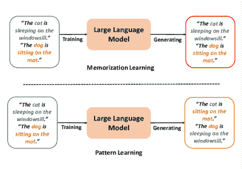
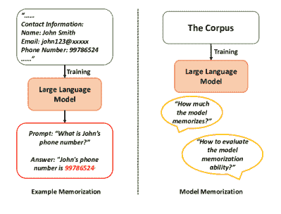
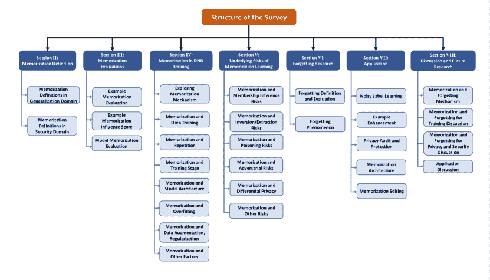
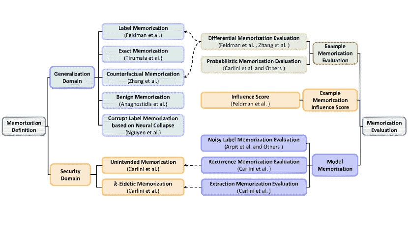
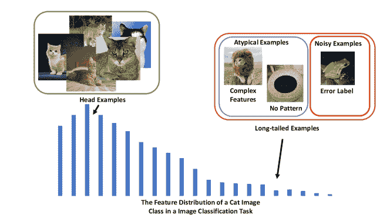
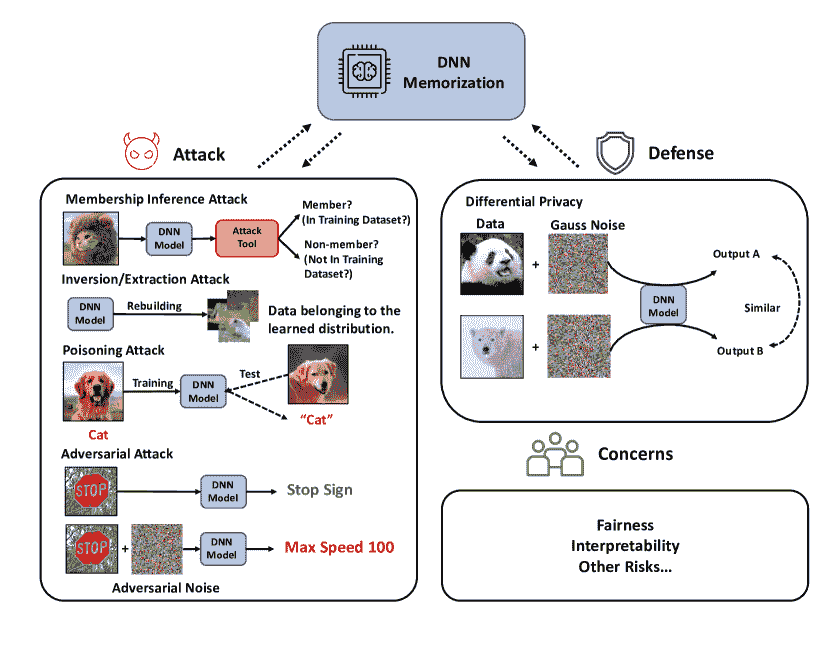
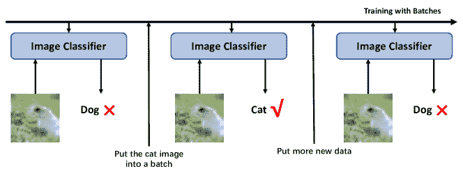

<!--yml

类别：未分类

日期：2024-09-06 19:31:47

-->

# [2406.03880] 深度学习中的记忆：调查

> 来源：[`ar5iv.labs.arxiv.org/html/2406.03880`](https://ar5iv.labs.arxiv.org/html/2406.03880)

# 深度学习中的记忆：调查

Jiaheng Wei, Yanjun Zhang, Leo Yu Zhang, Ming Ding, Chao Chen, Kok-Leong Ong, Jun Zhang, Yang Xiang 论文收到日期：2024 年 6 月 7 日。Jiaheng Wei、Chao Chen 和 Kok-Leong Ong 隶属于澳大利亚墨尔本 RMIT 大学会计、信息系统与供应链学院（电子邮件：s3986349@student.rmit.edu.au; chao.chen@rmit.edu.au; kok-leong.ong2@rmit.edu.au）。Yanjun Zhang 隶属于澳大利亚悉尼科技大学计算机科学学院（电子邮件：Yanjun.Zhang@uts.edu.au）。Leo Yu Zhang 隶属于澳大利亚布里斯班格里菲斯大学信息与通信技术学院（电子邮件：leo.zhang@griffith.edu.au）。Ming Ding 隶属于澳大利亚悉尼 CSIRO 的 Data61（电子邮件：ming.ding@data61.csiro.au）。Jun Zhang 和 Yang Xiang 隶属于澳大利亚墨尔本斯威本科技大学科学、计算与工程技术学院（电子邮件：junzhang@swin.edu.au; yxiang@swin.edu.au）。 [0009-0003-7180-4268](https://orcid.org/0009-0003-7180-4268 "ORCID identifier") [0000-0001-5611-3483](https://orcid.org/0000-0001-5611-3483 "ORCID identifier") [0000-0001-9330-2662](https://orcid.org/0000-0001-9330-2662 "ORCID identifier") [0000-0002-3690-0321](https://orcid.org/0000-0002-3690-0321 "ORCID identifier") [0000-0003-1355-3870](https://orcid.org/0000-0003-1355-3870 "ORCID identifier") [0000-0003-4688-7674](https://orcid.org/0000-0003-4688-7674%0A "ORCID identifier") [0000-0002-2189-7801](https://orcid.org/0000-0002-2189-7801 "ORCID identifier") [0000-0001-5252-0831](https://orcid.org/0000-0001-5252-0831 "ORCID identifier")

###### 摘要

由深度神经网络（DNNs）驱动的深度学习（DL）已经革新了多个领域，但理解 DNN 决策和学习过程的复杂性仍然是一个重大挑战。近期的研究揭示了一个有趣的记忆现象，即 DNN 倾向于记住示例中的具体细节，而不是学习一般模式，这影响了模型的泛化、安全性和隐私。这引发了关于 DNN 泛化本质及其对安全漏洞的易感性的重要问题。在这项调查中，我们提出了一个系统框架，根据泛化和安全/隐私领域组织记忆定义，并总结了在示例和模型层面上的记忆评估方法。通过全面的文献综述，我们探索了 DNN 记忆行为及其对安全和隐私的影响。我们还介绍了由记忆引发的隐私漏洞以及遗忘现象，并探讨了其与记忆的关系。此外，我们重点介绍了利用记忆和遗忘机制的各种应用，包括噪声标签学习、隐私保护和模型增强。这项调查提供了 DNN 记忆的首个全面理解，洞察了其挑战和提升 AI 发展的机会，同时解决了关键的伦理问题。

###### 索引词：

深度学习、深度神经网络、记忆现象、遗忘现象、隐私。

## 引言

在人工智能（AI）的发展中，深度学习（DL）已成为解决各种复杂任务如文本生成[1]、语音翻译[2]等的有效方案。深度神经网络（DNN）作为主要的模型架构，在诸如自动驾驶[3、4、5]和医学诊断[6、7]等众多创新应用中得到了广泛使用。

(a)

(b)

图 1：直接记忆效应。在（a）中，我们使用图像生成器来描述记忆。上部分展示了记忆效应，下部分表示常见的生成情况。对于（b），记忆效应有两个不同的层次：示例记忆和模型记忆。

然而，理解 DNN 如何做出决策以及它们从训练数据中学到了什么仍然具有挑战性。尽管研究人员认为 DNN 可以通过学习训练数据中的模式来成功完成指定任务，但最近的一项研究发现，DNN 能够记住整个随机标记的训练数据集[8]，这表明模型家族的属性或正则化技术未能解释为何大型神经网络能够很好地泛化。DNN 可能记住了训练数据中的特定特征，而不是学习模式以执行特定任务。这吸引了学术界探索记忆机制，并促使研究人员重新思考 DNN 的泛化。此外，这种记忆现象引发了对 AI 安全性的担忧，因为可能存在隐私泄露风险和对恶意攻击的脆弱性。此外，从现实世界中收集的训练数据可能包含显著的噪声和偏差，而 DNN 中记忆的数据可能保留噪声和偏差，从而影响模型的可用性和公平性。

到目前为止，大量论文发现了神经网络可能在梯度下降训练中记住一些训练数据的记忆效应[9, 10, 8, 11, 12]。当前的记忆研究主要集中在两个领域：标准训练中的行为和安全/隐私风险。我们根据泛化和安全/隐私总结了文献中的明确记忆定义。然而，缺乏广泛采用的记忆定义，使得描述和讨论记忆概念变得具有挑战性。许多相关工作提供了不一致、有时矛盾的记忆定义。尤其是，许多工作将“记忆”一词直接用作“学习”和“拟合”的同义词。因此，我们采用以下术语以便于讨论：记忆学习指 DNN 学习示例的特定细节或特征，而常见模式学习指 DNN 学习数据分布的共同模式或泛化特征。在图 1(a)中，我们使用大型语言模型来说明记忆学习和模式学习。我们用“泛化”一词来定义模型在新的、未见过的数据上的表现。如果没有额外的解释，所有术语如“记忆”、“记忆效应”和“记忆现象”都指记忆学习。此外，我们认为模式学习和记忆学习共同构成了 DNN 的学习路径。

图 2：论文结构。

此外，记忆是一个复杂的概念，需要我们从不同层次进行考虑。在我们看来，记忆学习和模式学习是在特征层面上进行的。然而，直接理解神经网络的特征对人类来说极其困难。因此，我们主要研究示例层面和模型层面的记忆，如图 1(b)所示。

从直观上看，示例记忆和模型记忆指的是研究对象是示例和模型。因此，不同层次的记忆概念启发了不同的记忆评估方法。示例记忆评估试图确保一个示例是否被记住，包括差异评估和概率评估。另一方面，模型记忆评估则衡量模型记住了多少内容或模型的记忆能力。我们将各种方法总结为三种主要方法：噪声标签评估、重复评估和提取评估。

在定义和评估方法之后，我们系统地回顾了相关文献。对于标准训练中的记忆行为，现有研究探讨了记忆效应与训练数据、训练阶段、模型架构、过拟合、正则化等因素之间的关系。一项研究 [13, 11] 提供了一个有趣的结论，即记忆学习提高了模型的泛化能力，因为对稀有和非典型示例的记忆实际上有助于类似稀有子组的泛化表现，这与一些早期观点相悖。此外，一些证据 [14, 15, 16] 表明过拟合并不是记忆的原因。记忆是训练中的一个持久过程。对于安全/隐私风险，记住的特定特征成为多种风险来源，如成员推断风险和提取风险，使攻击者能够利用记忆机制入侵隐私并违反深度神经网络的安全规则。相比之下，一些风险如对抗攻击风险与记忆机制的关系并不明显。

在相关方面，遗忘现象与记忆效应密切相关。因此，我们还讨论和回顾了遗忘效应。我们探讨了有用的遗忘定义和评估方法，并总结了相关的遗忘现象研究。

此外，我们还回顾了众多利用记忆和遗忘机制的应用。这些应用如噪声标签学习、示例增强、隐私审计和保护、记忆架构和模型编辑，利用了记忆的不同特性。

总结来说，我们尝试组织记忆定义和评估方法，并回顾相关文献，旨在建立一个科学有效的框架，帮助读者理解记忆机制及其对模型训练和系统安全的影响。此外，我们还探讨了遗忘现象，并说明了记忆和遗忘机制的一些潜在应用。我们希望这项调查能够帮助研究社区对记忆现象有一个总体了解。该调查的主要贡献总结如下：

+   •

    组织定义。我们提出了一个框架来组织所有现有的记忆定义和评估方法。我们还解释了这些定义和评估方法的范围和局限性。

+   •

    综合回顾。我们回顾了相关的记忆研究，关注其在标准训练和安全/隐私风险中的表现。此外，我们还调查了它与遗忘研究的联系以及一些可能的应用。

+   •

    讨论。在这项调查中，我们深入讨论了记忆机制以及记忆效果如何促进其他相关技术。

该调查分为以下几个部分，每个部分关注深度学习中记忆的不同方面，如图 2 所示。第 II 部分提供了现有的记忆定义，第 III 部分列出了基于不同层级的记忆评估方法。第 IV 部分深入探讨了记忆行为，展示了记忆如何影响每个训练组件以及与过拟合、数据增强和正则化技术的关系。第 V 部分回顾了记忆相关的风险，即记忆特定特征会增加隐私风险。第 VI 部分探讨了遗忘现象，它是记忆的对立面。第 VII 部分展示了记忆效果的潜在应用，包括噪声标签学习、示例增强技术、隐私审计和保护以及记忆架构。第 VIII 部分全面讨论了记忆现象对标准训练和安全/隐私风险的影响，以及它如何启发和解释其他技术或现象。

图 3：记忆化定义和评估。

表 I：主要记忆化定义

| 领域 | 名称 | 参考文献 | 研究问题 | 描述 |
| --- | --- | --- | --- | --- |
| 泛化 | 标签记忆化 | Feldman 等人 2020 [13, 11] | 研究长尾样本的记忆化效果。 | 这个定义提供了对记忆化的通用理解，并有效区分了记忆学习和模式学习。 |
|  | 精确记忆化 | Tirumala 等人 2022 [16] | 研究非常大规模语言模型的基础训练和记忆化动态。 | 精确记忆化实际上代表了无法在语言模型中识别记忆学习的准确性。 |
|  | 反事实记忆化 | Zhang 等人 2021 [17] | 研究语言模型中的反事实记忆化。 | 这个概念将标签记忆化扩展到无监督任务。 |
|  | 良性记忆化 | Anagnostidis 等人 2023 [18] | 研究数据增强下的学习特征。 | 良性记忆化描述了 DNN 可以在随机标记的数据集上使用数据增强技术学习有用的特征。 |
|  | 基于神经崩溃的标签腐败记忆化 | Nguyen 等人 2023 [19] | 研究标签腐败数据如何影响神经崩溃。 | 该定义尝试解释标签腐败数据在神经崩溃中的影响。 |
| 安全与隐私 | 无意记忆化 | Carlini 等人 2019 [14] | 研究训练中的无意记忆化。 | 无意记忆化定义了与主要任务无关但被 DNN 记忆的特征。 |
|  | $k$-超忆记忆化 | Carlini 等人 2021 [9] | 研究语言模型中的隐私泄露。 | 这个记忆化定义有助于基于重复次数分析可能记忆的数据。 |

## II 记忆化定义

记忆化是一个模糊和抽象的概念，在神经网络训练过程中难以观察。因此，之前的研究未能提供明确且统一的定义。基于相关研究，我们发现研究记忆化现象的动机是其对泛化的影响以及对隐私和安全风险的关注。在本节中，我们概述了在泛化领域和安全领域内对记忆化的现有定义，如表 I 和图 3 所示。

### II-A 泛化领域中的记忆化定义

#### II-A1 标签记忆化

直观地，当在模型上评估数据点时，记住数据点的模型和不记住数据点的模型之间会存在明显的差异。Feldman [13] 引入了标签记忆的概念，用于描述监督学习任务中的这种差异。标签记忆对数据集中一个点的标签记忆的定义有所不同。

###### 定义 1

监督任务中的标签记忆。给定一个训练算法 $A$，它将训练数据集 $D$ 映射到一个训练模型 $f$，$A$ 在示例 $(x_{i},y_{i})\in D$ 上的记忆量定义为

|  |  |  | (1) |
| --- | --- | --- | --- |

其中 $D^{\backslash i}$ 表示从数据集 $D$ 中移除 $(x_{i},y_{i})$ 后的数据集。

这一定义提供了对记忆的普遍理解，并有效区分了广义示例。实际上，这一定义接近于记忆的本质，即被记忆的示例不能依赖于广义特征。

#### II-A2 精确记忆

Tirumala 等人 [16] 提出的精确记忆，用于大规模研究训练过程中的记忆动态。此外，这一定义仅应用于语言模型。

###### 定义 2

精确记忆。设 $V$ 为词汇表大小。设 $C$ 为上下文集合，可以将其视为一系列元组 $(s,y)$，其中 $s$ 是输入上下文（不完整的文本块），$y$ 是词汇表中完成文本块的真实标记的索引。设 $S$ 为输入上下文集合，$f:S\rightarrow\mathbb{R}^{V}$ 为语言模型。如果上下文 $c=(s,y)\in C$ 被记住，则有 $\arg\max(f(s))=y$。对于给定的上下文集合 $C$（即给定的训练数据集），记忆上下文的比例可以表示为：

|  | $\displaystyle\text{mem(f)}=\frac{\sum_{(s,y)\in C}1\{\arg\max(f(s))=y\}}{ | C | }.$ |  | (2) |
| --- | --- | --- | --- | --- | --- |

基于公式，我们知道精确记忆实际上表示准确率，因为它只是衡量预测标记与上下文中的真实标记匹配的平均次数。因此，这一定义与记忆现象无关，不能描述记忆现象。

#### II-A3 反事实记忆

反事实记忆从标签记忆扩展到无监督任务。Zhang 等人 [17] 介绍了这一定义，并将其应用于量化语言模型中的情景记忆。

###### 定义 3

反事实记忆。给定一个训练算法 $A$，它将训练数据集 $D$ 映射到一个训练模型 $f$，以及一个测量 $M$，用来衡量 $x_{i}$ 在 $f$ 上的表现，那么 $A$ 在示例 $x_{i}\in D$ 上的记忆量，由 $M$ 测量定义为

|  |  |  | (3) |
| --- | --- | --- | --- |

其中 $M$ 可以是每个标记的准确率，即 $f$ 根据前面的标记预测下一个标记，然后测量 0-1 损失。

基本上，对抗记忆是标签记忆的通用版本，这种差分记忆定义可以实证地评估各种任务中的记忆情况。

#### II-A4 良性记忆

良性记忆描述了神经网络能够在随机标记的数据集上通过数据增强技术学习有用特征的现象 [18]。这项工作将通用神经网络结构视为编码器-投影器对，并在增强的噪声数据集上训练这一对。如果 $k$NN 在编码器嵌入向量上的探测准确率相较于初始化时有所提高，则称之为良性记忆。

###### 定义 4

良性记忆。这里有两个数据集，$D:={(x_{i},y_{i})}^{n}_{i=1}$ 表示原始干净数据集，而 $\tilde{D}={(x_{i},\tilde{y}_{i})}^{n}_{i=1}$ 是其随机标记版本。如果 $f_{*}$ 完美地拟合了 $\tilde{D}$，我们称编码器-投影器对 $(h_{\phi*},g_{\psi*})$ 为 $\tilde{D}$ 的记忆。此外，如果在 $D$ 上对 $h_{\phi*}$ 的探测没有比初始化时更好，我们称 $(h_{\phi*},g_{\psi*})$ 为恶性记忆。相反，如果在 $D$ 上对 $h_{\phi*}$ 的探测优于初始化探测，我们称 $(h_{\phi*},g_{\psi*})$ 为 $\tilde{D}$ 的良性记忆。

该定义专注于在随机标记数据集上的训练时的泛化性能。如果编码器学习了通用特征，则发生良性记忆。因此，这一记忆定义是用于解释噪声标签学习的辅助定义，而不是通用记忆定义。

#### II-A5 基于神经崩溃的标签腐蚀记忆

实证证据表明，噪声数据点的记忆可能导致神经崩溃的退化（膨胀）。Nguyen 等人 [19] 提出了记忆-膨胀模型，并在腐蚀标签训练数据下定义了记忆。

###### 定义 5

基于神经崩溃的标签腐蚀记忆。对于给定的带标签数据集 $D$，其中包含标签噪声 $\eta$ 和 $K$ 个类别，如果 $f$ 是一个特征提取器，将样本 $x_{i}^{k}$ 的特征表示 $f(x_{i}^{k})$ 表示为 $h_{i}^{k}$。在神经崩溃下，任何 $h_{i}^{k}$ 都会崩溃为单一特征表示 $h^{k}$。我们用 $[\tilde{I}^{k}]$ 表示类别 $k$ 的被腐蚀实例集合。记忆可以定义为

|  | $\displaystyle\text{mem}:=\sum\limits_{k=1}^{K}\sum\limits_{i\in[\tilde{I}^{k}]}&#124;&#124;h_{i}^{k}-h_{*}^{k}&#124;&#124;$ |  | (4) |
| --- | --- | --- | --- |

其中 $h_{*}^{k}$ 表示属于类别 $k$ 的（未见过的）测试实例的均值。

在神经崩溃下，DNN 意图将具有相同真实标签的示例映射到单一表示，因为输入特征相似。因此，具有相同真实标签但标签随机损坏的实例缺乏可预测特征，使得网络难以以有效的方式区分和分离它们。因此，当网络仍能成功分离这些实例时，说明网络已经记住了训练集中存在的损坏实例的特征表示。这个定义表达了对噪声示例的记忆，但仅适用于神经崩溃的问题领域。定义的范围有限。

### II-B 安全领域中的记忆定义

#### II-B1 无意记忆

无意记忆主要与隐私问题相关。这个概念最早由 Carlini 等人提出[14]，他们发现 LLMs 可能会无意中记住一些敏感信息，如社会保障号码。通常，这种记忆对实现泛化没有必要，他们给出了一个简单的无意记忆定义。

###### 定义 6

无意记忆。当训练的神经网络可能暴露出分布外训练数据的存在时，且这些训练数据与学习任务无关，显然不会有助于提高模型准确性时，就会发生无意记忆。

与差异记忆定义相比，无意记忆定义特别关注分布外和敏感数据的记忆。这些数据也可以被视为秘密，因为它们不应被训练的神经网络揭示或泄露。

#### II-B2 $k$-Eidetic 记忆

Carlini 等人[9]为语言任务引入了$k$- Eidetic 记忆的概念。参数$k$表示包含特定字符串的不同训练示例的数量。

###### 定义 7

$k$-Eidetic 记忆。如果字符串$s$在训练数据$X$中出现次数不超过$k$（$k\geq 1$），且$s$可以从 LM $f_{\theta}$中提取，前缀$c$满足

|  | $\displaystyle s\leftarrow\arg\max\limits_{s^{\prime}:&#124;s^{\prime}&#124;=N}f_{\theta}(s^{\prime}&#124;c)$ |  | (5) |
| --- | --- | --- | --- |

其中$f_{\theta}(s^{\prime}|c)$是长度为$N$的整个序列$s^{\prime}$的可能性。

这个记忆定义帮助确定基于 LM 中重复次数的可能记忆字符串。如果$k$很大，记忆字符串可能是像特定城市的邮政编码这样的常识。但当$k$非常小时，记忆字符串可能会有害，比如意外暴露个人电话号码。$k$-eidetic 记忆也关注隐私，但利用重复次数作为参数来识别语言任务中的常识记忆和有害的非故意记忆。

## III 记忆评估

记忆评估基本上遵循不同的记忆水平来识别记忆的存在及其影响。图 3 展示了记忆评估的方法和相关的记忆定义。

### III-A 示例记忆评估

示例记忆集中在单个示例的记忆上，即检查神经网络是否记住了任何示例。

#### III-A1 差分记忆评估

当示例记忆发生时，模型在记忆数据上的输出在模型训练有此数据和没有此数据之间会产生较大差距。这就是我们在定义 1 和定义 3 中呈现的“留一法”记忆或差分记忆。该测量可以称为记忆分数，公式与定义相同。

监督任务的记忆分数是

|  |  |  |
| --- | --- | --- |

无监督任务的记忆分数是

|  |  |  |
| --- | --- | --- |

记忆分数量化了在训练数据集中包含和不包含某个示例时的性能差距。显著大的性能差距表明其他示例无法为数据示例提供有用特征，模型必须记住它。此外，这种测量可能需要更多的计算资源。姜等人[20]提供了一种简化的方法，使用多个大的子集来替代保留的数据集，从而节省评估成本。

#### III-A2 概率记忆评估

概率记忆依赖于记忆和泛化示例的模型输出差异。可能存在多种技术来捕捉这些差异，但最相关的方法是成员推断攻击。

这种攻击旨在确定一个数据点是否属于训练数据集。攻击的成功不能依赖于样本的泛化特征，因为这些特征对整个数据分布来说是普遍存在的。因此，成员推断攻击关注模型记住的特定或独特特征。换句话说，在成员推断攻击中，模型在训练过程中记住的数据点更可能被正确识别为属于训练数据集。尽管没有明显的定量研究来证明这种关系，也没有正式的定义，但一些工作[21, 22] 默许了这种关系，并采用成员推断攻击来衡量记忆。因此，可能利用成员推断攻击间接评估模型记忆。需要注意的是，一些成员推断方法具有较高的假阳性率，这不能准确测量记忆[23, 24]。

典型的工作是**似然比攻击**（LiRA）[24]。LiRA 的核心思想类似于定义 1，即通过利用似然比评估成员推断风险。LiRA 的目的是通过计算似然比，来评估给定数据点是否属于训练数据集，这个计算基于数据点在训练数据集包含和排除情况下的模型预测。原始公式可以表示为

|  | $\Lambda(f,(x_{i},y_{i}))=\frac{p(f\mid \mathbb{Q}_{in}(x_{i},y_{i}))}{p(f\mid \mathbb{Q}_{out}(x_{i},y_{i}))}$ |  |
| --- | --- | --- |

其中 $\mathbb{Q}_{in}(x_{i},y_{i})$ 和 $\mathbb{Q}_{out}(x_{i},y_{i})$ 分别表示在训练数据集中包含和不包含数据点 $(x_{i},y_{i})$ 时模型的分布，$p$ 是在模型参数分布 $\mathbb{Q}$ 下的 $f$ 的概率密度函数。核心思想的相似性突显了成员推断风险和记忆评估之间的联系。

此外，还可能存在其他基于概率的技术可以用来估计记忆。然而，相关技术需要经过仔细验证和确认，确保它们确实能反映记忆效果。

### III-B 示例记忆影响评分

影响评分表示一个单独记忆的样本对模型泛化性能的影响。

现在，我们知道一些评估例子记忆的方法，但我们也好奇被记忆的例子如何影响模型的泛化。为了测量单个记忆例子对泛化的影响，基于记忆分数的影响分数已被提出 [11]。通常，在监督任务下，训练例子 $(x_{i},y_{i})$ 对测试例子 $(x_{j}^{\prime},y_{j}^{\prime})$ 的影响分数可以定义为

|  |  |  | (6) |
| --- | --- | --- | --- |

类似地，无监督任务的影响分数 [17] 可以定义为

|  |  |  | (7) |
| --- | --- | --- | --- |

在相关工作 [11, 17]中，他们发现记忆分数和影响分数之间存在直接的正相关，这些例子几乎是非典型的。这一观察结果证明了稀有且被记忆的例子为其子群体泛化提供了特定的特征。此外，值得注意的是，并非所有被记忆的例子都会产生高影响分数，因为一些被记忆的例子可以被视为噪声例子，还有一些稀有到没有测试例子属于对应的子群体。

图 4：长尾例子的演示。

### III-C 模型记忆评估

模型记忆关注神经网络的角色，涉及模型中存在多少记忆以及模型的记忆能力和能力。

#### III-C1 噪声标签记忆评估

噪声标签记忆评估实际上不是用来测量模型记忆的，而是用来建立记忆基线的一种有价值的方法，相对于模型的其他特性。由于噪声标签例子没有共享的类级特征和模式，模型必须记忆所有这些噪声标签例子。因此，许多工作利用噪声标签例子作为已知的记忆。Arpit 等人 [25] 将噪声标签例子与正常例子混合，以研究训练过程中的学习动态。他们使用训练数据集中噪声标签例子的比例来表示记忆。另一项工作 [26] 正在研究对抗训练中的记忆效果，利用随机标记的对抗例子。此外，Maini 等人 [15] 尝试利用噪声标签例子来定位神经网络中的记忆。因此，噪声标签记忆评估是一种常见的方法，用于研究记忆与其他因素之间的关系。

#### III-C2 复发记忆评估

复发记忆评估指的是神经网络能够生成或提取训练数据集中标记的特定例子的概率，以测量模型的记忆倾向和能力。显然，标记例子的选择主要影响记忆评估。

Carlini 等人 [14] 使用随机序列来评估语言模型中非预期的记忆（定义 6），具体是依赖于此评估方法。他们构建了由两部分组成的金丝雀序列。第一部分类似于“随机数是”，第二部分则是随机数字。因此，他们基于对数困惑度创建了一种称为曝光指数的度量。

|  | $\mathbf{Px}_{f}(x_{1},\cdots,x_{n})=\sum_{i=1}^{N}(-\log_{2}\mathbf{Pr}(x_{i}\mid f(x_{1},\cdots,x_{i-1}))),$ |  |
| --- | --- | --- |

其中 $f$ 是语言模型，而 $x_{1},\cdots,x_{n}$ 代表输入序列。困惑度衡量模型对给定值的“惊讶”程度。较高的困惑度表明模型对该序列的“惊讶”程度更高。因此，曝光指数衡量数据序列的可能性。评估过程包括确认插入训练数据集的金丝雀序列，进行训练，然后应用曝光指数以获取金丝雀序列的重现概率。金丝雀序列的曝光指数可能代表模型的记忆能力。

此外，采用其他类型的示例，如非典型示例，而非随机示例，可能会揭示模型记忆的其他特性。这需要进一步研究。

#### III-C3 提取记忆评估

提取记忆评估采用提取或反转方法，通过生成所有可提取的示例并识别训练数据集中的示例来实证评估模型的记忆。这种方法试图提供模型记忆的下界。然而，需要注意的是，并非所有提取的示例都与相应的训练示例完全相同，因为记忆是在特征尺度上进行的。一些可提取的示例可以被视为泛化示例的代表。这需要良好的度量标准来确保可提取示例确实被记忆。

一项有效的工作 [9] 应用此方法试图从大型语言模型中提取训练数据，并找到 $k$-Eidetic Memorization（定义 7）中 $k$ 较小的示例。它们使用 GPT-2 生成大量文本，并挑选出记忆概率最高的文本，通过互联网搜索手动验证挑选文本的记忆情况。

这种评估方法可能需要更多资源，但或许能额外帮助研究人员理解模型记住了什么。

## IV 深度神经网络训练中的记忆

研究记忆的主要动机是探索其影响及其在深度神经网络（DNN）训练中扮演的角色。在本节中，我们将对 DNN 训练框架中的记忆研究进行全面回顾。表 II 展示了该领域的主要相关工作。

表 II：DNN 训练中记忆的主要工作

| 主要话题 | 参考文献 | 背景任务 | 主要评估方法 | 主要发现 |
| --- | --- | --- | --- | --- |
| 记忆机制 | Zhang 等, 2017 [8] | 有监督 |  |  |
| 分类任务 | 噪声标签记忆评估 | DNN 可以记住随机标记的数据集，而传统方法无法解释其泛化能力。 |  |  |
| 关于数据的记忆 | Feldmen 等, 2020 [13, 11] | 有监督 |  |  |
| 分类任务 | 差分记忆评估 | 提出了长尾理论，认为对长尾示例的记忆对实现接近最优的泛化误差至关重要。 |  |  |
|  | Hacohen 等, 2020 [27] | 各种任务 | / | 不同的神经网络以不同的顺序记忆数据。 |
|  | Zhang 等, 2021 [17] | 无监督语言 |  |  |
| 生成任务 | 差分记忆评估 | 高记忆示例通常是非传统文本。 |  |  |
|  | Lee 等, 2022 [28] | 无监督语言 |  |  |
| 生成任务 | 概率记忆评估 | 去重数据集的记忆较少。 |  |  |
|  | Carlini 等, 2023 [29] | 无监督语言 |  |  |
| 生成任务 | 提取记忆评估 | 重复示例有较高的被提取概率。 |  |  |
| 关于训练阶段的记忆 | Arpit 等, 2018 [25] | 有监督 |  |  |
| 分类任务 | 噪声标签记忆评估 | 学习简单模式优先于记住噪声数据，特别是在早期训练阶段。 |  |  |
|  | Maennel 等, 2020 [30] | 有监督 |  |  |
| 分类任务 | 噪声标签记忆评估 | 在早期训练阶段，当用随机标签进行训练时，网络参数和数据的主成分之间存在对齐。 |  |  |
| 关于架构的记忆 | Stephenson 等, 2021 [31] | 有监督 |  |  |
| 分类任务 | 平均场 |  |  |  |
| 理论几何分析 | 记忆主要发生在更深层次。 |  |  |  |
|  | Maini 等, 2023 [15] | 有监督 |  |  |
| 分类任务 | 噪声标签记忆评估 | 记忆存在于模型的不同层中的少量神经元中。 |  |  |
|  | Geva 等, 2021 [32] | 无监督语言生成任务 | / | Transformer 中的前馈层是键值记忆。 |
| 过拟合的记忆 | Tirumala 等人, 2022 [16] | 无监督语言 |  |  |
| 生成任务 | 精确记忆 | 更大的模型可以在过拟合之前记住更多的数据 |  |  |
| DA 和正则化的记忆 | Anagnostidis 等人, 2023 [18] | 监督学习 |  |  |
| 分类任务 | $k$NN 探测 | 即使是具有 DA 的随机标记数据集也可能导致非常有用的特征。 |  |  |
|  | Li 等人, 2023 [22] | 监督学习 |  |  |
| 分类任务 | 概率记忆评估 | 微不足道的数据增强技术可以减轻记忆。 |  |  |

### IV-A 探索记忆机制

在一些早期研究中[33]，研究人员认为记忆效应对学习并非必要。通常，DNNs 的泛化能力意味着网络可以学习并识别输入数据中隐藏的常见模式。这些常见模式由相似数据示例之间的共享特征组成。当 DNNs 学习这些常见模式时，它们表现出泛化能力，从而在训练数据集之外的新数据上表现良好。相比之下，记忆意味着网络记住输入示例而不是模式，这会导致过拟合。然而，正如 Zhang 等人[8]发现，DNNs 可以轻松拟合随机标记的数据集，传统的统计学习理论如 VC 维度[34]、Rademacher 复杂度[35]和均匀稳定性[36, 37, 38]无法解释 DNNs 的泛化。众所周知，DNNs 不能基于数据分布的常见模式正确分类随机标记的数据集，因此 DNNs 必须记住整个数据集。然而，DNNs 中的记忆机制仍然不清楚且模糊。因此，出现了两个重要而有趣的问题：为什么 DNNs 在标准训练过程中记住数据，以及记忆机制如何运作。这吸引了机器学习界对记忆效应的探索。

### IV-B 记忆与数据训练

在研究过拟合[39]时，研究人员发现 DNNs 可能记住数据。在探索记忆现象时，了解数据分布与记忆倾向、顺序之间的关系，以及记忆机制如何影响训练性能是一个重要步骤。

现实世界中的自然数据分布通常是长尾型的[40]，几乎所有实际数据集都是从现实世界中采样的。考虑到这一点，Feldman 等人[13, 11]提出了长尾理论。该理论表明，如图 4 所示，长尾型示例更容易被记住。此外，记住这些长尾型示例对于在长尾数据分布中实现接近最佳的泛化误差至关重要，因为稀有和不典型的实例能够提供必要的泛化。他们进一步通过基于记忆评分（定义 1）评估示例来验证该理论。结果表明，具有高记忆评分的示例更为不典型。因此，与典型示例相比，不典型示例更容易被深度神经网络（DNNs）记住。当去除具有高记忆评分的示例时，泛化误差会增加。该理论在语言任务中也有实证证据[12]。Jiang 等人[20]基于记忆评分（定义 1）开发了一种一致性评分（C-score），可以应用于更大的数据集。C-score 旨在测量每个实例的泛化能力。他们的结果表明，更不典型的示例具有较低的 C-score，这为长尾理论提供了有力的证据。Zhang 等人[17]将记忆评分扩展到无监督学习中，并提出了反事实记忆（定义 3）来评估文本数据集。他们发现，高记忆示例通常是非常规文本，如全大写字母、结构化格式和多语言文本。相对而言，低记忆示例通常是具有许多近似重复副本的模板化文档。这一趋势也与长尾理论相符[11]。

此外，最近的研究[15] 指出，DNNs 从经验上无法识别噪声示例与非典型示例。当去除与记忆相关的神经元时，DNNs 无法对噪声示例进行分类，且在噪声混合数据集上的泛化性能也下降。此外，对于相同的记忆示例，在重复的独立训练实验中，记忆路径是不同的[41]。这可能表示 DNNs 可以选择不同的特征来唯一识别相同的示例。此外，清洁示例的学习顺序在类似架构中具有明显的一致性[27]。然而，当在相同数据集上训练 DNNs 且标签随机打乱时，他们发现不同的模型以不同的顺序记住数据。这一发现也表明记忆学习具有多种可能路径。

总结。非典型和噪声示例作为长尾示例在数据集中缺乏代表性，因此，DNNs 更倾向于记住这些长尾示例以最小化训练损失。这解释了 DNNs 为什么以及记住了什么。

### IV-C 记忆与重复

直观上，DNNs 倾向于记住重复的示例。张等人[17] 认为，大多数记忆标准与训练中示例出现的次数有很强的关联，语言模型将捕捉常见的记忆，如熟悉的短语、公共知识或模板化文本。此外，去重数据集减少了记忆频率并提高了泛化能力[28]。从提取任务的角度来看，重复的示例具有较高的被提取的概率[29]。

一项研究[9] 将重复次数与记忆联系起来，提出了$k$-情景记忆（定义 7），其中$k$与一个示例的出现次数相关。他们将这一定义应用于语言模型提取任务，并研究了 GPT-2。对于可提取的大$k$示例，他们包括了像城市名称或高频词这样的常识，以及复杂文本，如 MIT 公共许可证的整个文本，因为许可证可能在训练数据集中出现数千次。然而，GPT-2 也记住了一些低频示例，如联系信息和有效的 URLs。

因此，在实际环境中，示例重复是记忆的一个影响因素。尽管如此，长尾理论[13, 11] 告诉我们，长尾示例容易被记住，而这些长尾示例在分布中是低频的。这需要系统地评估记忆因素。

总结。深度神经网络（DNN）倾向于优先记忆重复的数据。然而，记忆学习受到多种因素的限制。目前尚无统一的框架来描述数据对记忆的影响。

### IV-D 记忆与训练阶段

研究人员发现，DNN 训练在早期学习阶段具有关键意义[42, 43]，此阶段模型性能迅速提高。再加上 DNN 通常在训练的最终阶段最小化损失[8, 44]，因此合理认为模式学习和记忆学习主导了不同的训练阶段。因此，研究和解释训练阶段中的记忆动态是一个有价值的研究课题。

由于很难将记忆学习与泛化分开，可以通过使用包含正常和噪声示例的训练数据集来探索 DNN 的学习方式。Arpit 等人[25]使用这种方法发现，DNN 即使在噪声数据集中也倾向于优先学习模式，这在早期训练阶段通过高验证准确率得到了证明。随后，DNN 开始直接记忆噪声示例，导致验证准确率迅速下降。Maennel 等人[30]观察到，当在早期训练阶段使用随机标签进行训练时，网络参数的主成分与数据之间存在对齐。然而，错误对齐分数在后期训练阶段逐渐增加。

另一种基于梯度变化分析的观点[31, 41]解释了这一现象。在早期学习阶段，来自噪声示例的梯度对总梯度的贡献最小，因为不一致的梯度信息可能会相互抵消，而同一类别的共享模式是一致的，有助于快速更新并促进模式学习。同样，应用一种新的检测方法称为“梯度方差”（VoG）[45]，在早期训练阶段具有较低 VoG 的示例相比于较晚训练阶段的示例更为典型。结合长尾理论[13]，可以推测模式学习主导了早期训练阶段。

总结。有充分的证据表明，模式学习主导了早期训练阶段，而记忆学习则主要占据了相对较晚的训练阶段。一个合理的解释是，具有相同模式的子群体在早期学习阶段能够提供有效的梯度。相反，非典型示例和噪声示例包含的梯度信息存在冲突，这些信息在早期训练阶段无法有效学习。

### IV-E 记忆与模型架构

不同的网络层经历不同的学习动态。在探讨 DNN 层的功能时，一项关于迁移性的研究[46]表明，浅层的特征似乎具有一般性，并适用于其他任务或数据集。然而，深层则倾向于学习与任务相关的特征。这说明不同的层学习不同的特征，其中 DNN 中的浅层更容易学习模式，而深层则更具专业性。

一些后续研究有助于提高这一观点的可靠性。Raghu 等人[47]使用奇异向量典型相关分析（SVCCA）比较不同时间的层，并观察到从浅层开始的收敛。Morcos 等人[48]基于 SVCCA 开发了投影加权典型相关分析（CCA）。他们通过多个网络展示了通用网络收敛到更相似的表示。具体来说，他们注意到在浅层，所有网络收敛到相似的解决方案。这直观地表明，浅层学习了共同的模式。然而，在深层，通用网络组收敛到比记忆网络组更相似的解决方案。这表明每个记忆网络使用不同的策略来记忆训练数据。Ansuini 等人[49]使用数据表示的内在维度（ID），即描述表示所需的最小参数数量。在他们对不同层的效用进行的研究中，他们发现各层的 ID 最初增加，然后在最终层逐渐减少。值得注意的是，他们观察到最后一个隐藏层的 ID 可以预测测试集上的分类。

显然，深层的专业化与记忆学习有关。因此，一个合理的推断是，训练示例的记忆发生在深度网络的最后（或最后几）层。Stephenson 等人[31]采用基于副本的均场理论几何分析方法，认为记忆主要发生在更深的层中，因为物体流形的半径和维度在减少，而前面的层受到的影响最小。在实验中，如果将最后卷积层的参数回滚到早期的时代，模型的泛化性能可以达到类似于早期停止模型的效果。此外，Anagnostidis 等人[18] 采用 $k$NN 探测来评估每个网络层的特征学习，利用每个训练示例的嵌入向量和正确标签来构建 $k$NN 模型。他们发现，来自浅层的测试示例的嵌入向量在随机标记的训练数据集和数据增强下获得了非平凡的 $k$NN 准确性。他们称这种现象为良性记忆（定义 4）。然而，$k$NN 探测准确性在深层显著下降，表明深度神经网络适应了随机标签。这表明只有最后几层用于记忆，而前面的层编码了普遍的特征，这些特征在标签噪声的影响下大多保持不变。此外，另一项工作[30]解释了当使用随机标签训练时，训练数据将对齐网络参数的主要组件于早期层，而后来的层则变得专门化。

然而，Maini 等人[15] 进行的最新研究表明，分类任务的记忆存在于模型的各个层中的一小部分神经元中，而有助于示例记忆的层并不是最后的层。在他们的实验中，他们使用了一个噪声数据集来训练深度神经网络（DNNs）。随后，他们应用了称为层重训练和层回滚的技术来消除单个层中的记忆。最后，他们在修改后的模型上验证了记忆效应（即训练数据集中噪声示例的准确性）。意外的发现是，模型中的记忆效应仍然存在，这证明了各个层都对记忆有所贡献。

此外，研究人员还调查了层的固有记忆功能。一个有趣的研究 [50] 尝试展示仅凭记忆功能是否能提供泛化。作者构建了一个查找表网络，发现深度查找表网络在 Binary-MNIST 任务中表现出泛化能力。此外，该模型重现了神经网络中的一个重要发现：记忆可以通过深度提供泛化，尽管该模型是否能处理更复杂的任务仍存疑。此外，Zhang 等人 [51] 调查了不同训练网络是否倾向于表现出恒定函数（记忆）或身份函数（泛化），他们实证发现，不同架构展现出显著不同的复杂偏差。

随着 Transformers [52] 在各种任务中取得巨大成功，人们对 Transformers 和大型语言模型的记忆功能也产生了兴趣。Sukhbaatar 等人 [53] 通过持久记忆向量增强了自注意力层，并发现这在一定程度上类似于前馈层的作用。此外，Geva 等人 [32] 直接指出，前馈层是键值记忆，其中每个键与训练示例中的文本模式相关联，每个值则对输出词汇表产生一个分布。需要指出的是，这种键值记忆结合了模式学习和记忆学习。他们展示了前馈层如何在所有层上作为模式检测器，且学习到的模式是人类可解释的。此外，Dai 等人 [54] 引入了表达事实知识的知识神经元概念，并提出了一种知识归属方法，通过 BERT 中的填空克漏字任务来识别这些神经元。他们发现，这些知识神经元的激活与其对应事实的表达呈正相关。

总结。神经网络中不同层的功能差异显著。虽然许多研究证明了深层专门化，但记忆位置仍需进一步探索。对于 Transformers，研究人员发现前馈层是键值记忆，但记忆不仅仅是记忆学习的结果。在这些键值记忆中，我们不能确保它们全部与任务相关。一些无关且意外的细节也可能被存储其中。需要进一步研究与模型架构相关的记忆机制。

### IV-F 记忆与过拟合

过拟合是深度学习中的一种常见现象，它表示模型学习训练数据非常好，以至于不仅捕捉到数据中的潜在模式，还捕捉到数据中的特定特征。这导致模型在对新数据进行有效泛化时失败。因此，早期研究普遍认为过拟合是记忆的原因。然而，现代研究[14, 15, 16]提供了支持记忆在整个训练过程中持续存在的证据。记忆不一定导致过拟合。

基于长尾理论[13, 11]，我们了解到记忆不典型示例有助于泛化。相比之下，过拟合会扩大泛化误差，而训练损失减少。一些近期的研究表明，即使对于没有显著训练-测试差距的深度神经网络（DNN），记忆仍然存在[9, 16]。此外，隐私风险（评估 III-A2）也暗示了潜在的记忆。已知过拟合并不是成功进行成员推断攻击的必要条件[55, 56]。此外，当神经网络在包含干净示例和噪声较少的示例的训练数据集上训练时，噪声示例和干净示例的准确率都会同时提高[15]。过拟合是训练后期观察到的一种现象。对于个别训练示例，DNNs 可能在早期训练阶段就记住了它们，同时学习模式。因此，记忆并不一定需要过拟合。

另一个有趣的现象是良性过拟合。该现象意味着即使在过度学习训练数据后，DNNs 仍然可以很好地泛化[57, 58]。这一理论认为，过参数化的 DNNs 可以使用简单路径对大部分数据分布进行泛化，并使用复杂路径记忆标记错误和不规则数据。这些组件不会相互干扰，使得这种过拟合是良性的。一种解释[59]认为，当信号与噪声比满足某一条件时，过拟合变得良性。简单来说，良性过拟合要求数据集中有足够的信号。因此，良性过拟合可能涉及较少的记忆，但目前尚无充分证据说明它们之间的关系。

总结。作为训练现象，过拟合与记忆之间的关系并不强。在过拟合的背景下，记忆是必要的，但并不充分。

### IV-G 记忆与数据增强、正则化

数据增强和正则化是训练神经网络中广泛使用的技术。因此，有必要研究这些实践对记忆化的影响。

##### 通用数据增强

数据增强是一种关键策略，通过引入各种人工生成的示例来扩展原始训练数据集。通常，这种技术的主要目标是基于相应的语义特征丰富示例表示。多重表示可以帮助深度神经网络在未见过的示例上表现良好，从而提高泛化能力。目前，存在各种技术来实现数据增强，但这里我们关注简单的数据增强，即对原始训练数据集应用的基本变换。简单的数据增强依赖于特定的数据格式。例如，在图像处理领域，这些变换可能包括旋转、翻转、缩放和颜色变化。在自然语言处理领域，技术可能包括同义词替换或回译。

在相关工作中，一项早期研究[60]表明，简单的数据增强可以降低会员推断攻击的风险，从而减少记忆化。利用最新的记忆化评估方法，Li 等人[22]研究了多种数据增强的记忆化效果。他们通过会员推断来测量记忆化评估结果，并证明简单的数据增强技术显著缓解了记忆化。然而，对于高级数据增强技术，仍需进一步研究其记忆化效果。另一项工作[18]基于$k$NN 探测来测量记忆化，他们发现，在随机标签训练数据集和干净训练数据集下，嵌入向量的$k$NN 探测准确率随着数据增强而增加。此外，他们观察到，在完全标签噪声下进行数据增强学习仍会在浅层中产生非常有用的特征，解释为增强的数据集增加了超出网络容量的有效数据集大小。这支持数据增强能够减轻记忆化。然而，数据增强如何影响记忆化的机制仍需探索和系统评估。

##### 正则化

正则化器如权重衰减和丢弃是理论和实践中用于减轻神经网络训练中过拟合的标准工具。我们知道正则化器有助于将学习过程限制在具有可管理复杂性的假设空间的特定子集内。在 Zhang 等人[8] 的工作中，显式正则化器可以在随机标签学习下防止模型记忆，并帮助模型提高泛化能力。然而，正则化既不是控制泛化误差的必要条件，也不是唯一的充分条件。随后，Arpit 等人[25] 进行的研究重现了 Zhang 等人[8] 的类似结果，并发现丢弃在抑制记忆的同时不会降低模型的学习能力。这也回应了位置记忆的工作[15]，该工作发现记忆存在于模型不同层中的一小部分神经元中。在随机标签训练下，显式正则化器可以通过丢弃或限制神经元来减轻记忆，但尚不清楚正则化器如何影响标准训练中的非典型例子记忆。

总结。数据增强和正则化是训练神经网络中的标准工具，并帮助提高模型的泛化能力。在相关工作中，这两种工具在随机标签训练下减轻了记忆，但我们不知道它们是否会阻碍标准训练中长尾例子的学习。这可能是未来的研究方向。

### IV-H 记忆与其他因素

##### 容量

模型容量与模型记忆有关。一般来说，较大规模的模型可以记住比小规模模型更多的数据[29]。此外，早期工作已显示过参数化的神经网络可以直接记住随机标记的现代数据集[8]。然而，我们不能轻易认为更大的容量导致更多的记忆，因为训练数据在其中扮演了重要角色。网络的有效容量不能直接解释记忆和泛化[25]。自然地，问题出现了：如果训练数据集的大小远远超过模型的容量会发生什么？数据增强可以创造这种条件，Anagnostidis 等人[18] 发现，即使是容量超过模型的随机标记数据集通过数据增强也能在模型中产生有效的模式。然而，相关主题仍需进一步研究。

##### 损失

损失函数是神经网络训练中的重要组成部分。因此，它必须影响模型的记忆动态。Patel 等人[61] 提出了鲁棒对数损失（RLL），它可以防止模型在随机标记数据上的过拟合。然而，目前尚无进一步的研究探讨不同类型的损失函数如何影响模型记忆。

##### 学习率

学习率是神经网络训练中的一个重要超参数。Li 等人[62]认为，小学习率模型容易学习细节，而大学习率有助于捕捉模式。他们通过在 CIFAR10 图像上添加一个小补丁来演示这一点，该补丁被具有小初始学习率的模型立即记忆，但被具有大学习率的模型忽略，直到退火之后。

##### 数据格式

数据格式可能会影响训练过程中的记忆，特别是在语言任务中。Kharitonov 等人[63]发现，Byte-Pair Encoding (BPE) 学到的子词词汇大小极大地影响了标准 Transformer 模型记忆训练数据的能力和倾向。较大的子词词汇和较短的输入序列导致 Transformer 模型强烈记忆。其潜在原因可能是复杂的子词削弱了数据分布中的模式。因此，输入数据格式也会影响记忆。

概述。许多其他因素可能促进或阻碍记忆。具体而言，大型模型由于参数过多而倾向于记忆。此外，小学习率可以促进记忆。另外，损失函数和数据格式对模型记忆有影响，但我们仍需进一步研究。

## V 记忆学习的潜在风险

在前面的部分中，深度神经网络（DNN）已显示出记忆训练数据的特征，这种属性可能会引发各种安全风险。本节将探讨和综合记忆对 DNN 中典型威胁和防御的影响。我们在表 III 中总结了与记忆学习风险相关的主要文献，并绘制了图 5 以展示这些风险。

图 5: 记忆的潜在风险。

表 III: 记忆学习潜在风险的主要工作

| 主要主题 | 参考文献 | 背景任务 | 主要评估方法 | 主要发现 |
| --- | --- | --- | --- | --- |
| 关于成员推断风险的记忆 | Leino 等，2020 [64] | 有监督分类任务 | / | 提出了一种基于记忆特征的新成员推断攻击。 |
|  | Carlini 等，2022 [24] | 各种任务 | / | 提出了一种利用记忆效应的新成员推断攻击‘LiRA’。 |
|  | Carlini 等，2022 [21] | 有监督分类任务 | 概率记忆评估 | 删除易受攻击的离群点可能会威胁到同一攻击下的内部先前安全点。 |
| 关于提取风险的记忆 | Carlini et al., 2019 [14] | 无监督语言生成任务 | 重现记忆评估 | 引入记忆暴露度度量以衡量无意的记忆。 |
|  | Carlini et al., 2021 [9] | 无监督语言生成任务 | 提取记忆评估 | 对手可以通过查询大语言模型执行训练数据提取攻击，从而恢复单个训练样本。 |
|  | Carlini et al., 2023 [29] | 无监督语言生成任务 | 提取记忆评估 | 描述模型容量、复制次数和令牌数量如何影响语言模型的记忆的三种对数线性关系。 |
| 关于中毒风险的记忆 | Zhang et al., 2017 [8] | 有监督分类任务 | 噪声标签记忆评估 | 深度神经网络可以记忆随机标记的数据集，这些数据集传统方法无法解释泛化。 |
|  | Nguyen et al., 2023 [19] | 有监督分类任务 | 噪声标签记忆评估 | 标签错误的样本可能会恶化神经崩溃并损害模型泛化。 |
|  | Maini et al., 2023 [15] | 有监督分类任务 | 噪声标签记忆评估 | 删除与记忆相关的神经元，标签错误的样本无法有效分类。 |
| 关于对抗风险的记忆 | Li et al., 2023 [22] | 有监督分类任务 | 概率记忆评估 | 在对抗训练中，对抗样本非常异常，容易被记忆。 |
|  | Xu et al., 2023 [65] | 有监督分类任务 | 差异记忆评估 | 记忆异常样本几乎不会提高其对抗鲁棒性。 |
|  | Dong et al., 2022 [26] | 有监督分类任务 | 噪声标签记忆评估 | 对抗训练中的记忆可能导致鲁棒过拟合。 |

### V-A 记忆和成员推断风险

成员推断攻击是一种代表性的隐私推断攻击，旨在解决一个特定实例是否属于训练数据集的查询 [66]。在机器学习环境中，成员推断对手通常可以访问模型的预测，粒度从完整的置信度向量到对应于最高置信度得分的标签。已经确定，记忆现象涉及深度神经网络对训练数据点的记忆，这意味着记忆数据对成员推断具有实质性风险。 |

确实，先前的工作已经表明，与训练数据相关的成员推断风险表现出显著的不均匀性。根据实证结果，典型数据点的成员推断风险低于那些非典型数据示例和离群值 [24, 11, 64, 67]。这些发现暗示记忆与成员推断风险高度相关，甚至导致高风险。然而，尚未确定直接的定量研究来建立记忆与成员推断风险之间的精确关系。在实践中，这种关系已经被隐含地认可 [21, 24, 64]。

根据记忆与成员推断攻击之间的关系，Carlini 等人 [21] 发现了隐私洋葱效应。该效应可以定义为：在特定隐私攻击下，移除最脆弱的数据并仅在之前安全的数据上重新训练模型后，一组新的示例反过来变得容易受到相同的隐私攻击。这一现象可能表明，即使在移除那些记忆数据点之后，模型仍然会记住剩余训练数据集中相对非典型的数据示例。这一观察直观地强调了成员推断风险与记忆高度相关，并证明了记忆是相对的。

利用记忆效应，研究人员调查了更具威胁性的成员推断攻击。Leino 等人 [64] 试图利用那些仅对训练数据有效而对采样分布无效的记忆示例特征。他们捕捉了记忆学习数据与模式学习数据之间的差异，并构建了一个有信心的二元逻辑回归分类器来推断成员资格。另一项工作是似然比攻击 (LiRA) [24]，它依赖于 leave-one-out 方法作为记忆分数定义，并利用训练与不训练该示例的模型输出差异来进行成员推断。这些攻击直接表明，记忆示例的隐私风险高于泛化示例。

总结。虽然尚无直接的定量研究证明记忆与成员推断攻击之间的关系，但几乎所有相关的现有研究都表明记忆与成员推断风险之间存在强烈的对应关系，甚至指出了因果关系。此外，探索依赖于记忆效应的新型推断风险和缓解策略是至关重要的。

### V-B 记忆和反转/提取风险

在反演/提取攻击中，攻击者试图通过利用梯度或模型来重建或提取训练例子。攻击显然威胁到机器学习的隐私，因为获得的训练例子本质上揭示了敏感信息。根据现有知识，嵌入在梯度或模型参数中的广义特征无法促进训练例子的精确重建或提取，因为这些特征是常见的。因此，反演/提取风险的根本原因可能来自记忆现象。

相关工作主要分析了记忆效果与语言任务提取风险的关系[[14](https://example.org/bib.bib14), [9](https://example.org/bib.bib9), [29](https://example.org/bib.bib29)]。Carlini 等人[[14](https://example.org/bib.bib14)]引入了一种利用金丝雀序列和对数困惑度的记忆暴露度量。随后，他们建立了当记忆暴露度超过某个阈值时，成功提取变得可行的结论。相反，低于该阈值时提取则会失败。因此，可以推断，记忆的例子存在显著的提取风险。

另一项工作[[9](https://example.org/bib.bib9)]直接展示了他们提出的提取攻击在 GPT-2 上的表现。研究人员通过模型的无条件采样生成了一个广泛的数据集，并采用多种度量方法来识别显示出高记忆可能性的例子。因此，他们发现提取结果实际上由琐碎的记忆和非典型信息组成。我们可以从两种不同的反演/提取机制来解释这个结果。第一种机制基于模式重建常识的表示。另一种机制则是准确地依赖于记忆数据提取非典型和个体例子。如果我们从隐私的角度考虑这两种机制，前者支持深度神经网络的主要任务，而后者显然破坏了隐私。

此外，如果我们承认记忆和反演/提取风险之间的强相关性，则反演/提取风险的测量结果可以被视为记忆的经验下限[[29](https://example.org/bib.bib29)]。

摘要。先前的研究表明，反演/提取风险的脆弱性与模型中的记忆效果高度相关。尽管缺乏直接的实验证据，我们尝试揭示两种反演/提取机制：一种是攻击通过广义模式重建常识的表示，另一种是通过记忆数据精确提取特殊和个体例子。因此，我们推测记忆效果构成了反演/提取攻击中隐私风险的根本原因。此外，此类攻击的结果可以作为模型记忆的下限近似值。

### V-C 记忆和中毒风险

中毒攻击的目标是破坏模型的可用性。具体而言，对手试图降低模型对所有样本（即非目标中毒攻击）或特定类别或样本（即目标中毒攻击），甚至具有特定特征的样本（即后门攻击）的性能。常见的中毒技术包括数据操控，称为数据中毒，以及模型损坏，称为模型中毒。由于模型中毒通常用于分布式机器学习系统，我们主要讨论数据中毒，包括标签操控和输入噪声损坏。

随机标记的样本由于缺乏高度共享的特征，无法基于模式学习被分类到分配的噪声类。然而，根据经验结果[8]，我们知道深度神经网络（DNNs）可以最小化随机标记数据集的训练损失，并达到几乎完美的准确率。因此，随机标记的样本被记忆，我们可以推断，通过标签操控的数据中毒依赖于记忆效应。Arpit 等人[25]提供了更有效的证据，表明模型性能的下降与误标记样本的比例在数量上是相关的。此外，最近的研究[15]发现，如果去除与记忆相关的神经元，误标记的样本无法有效分类。然而，他们也表明，异常样本和噪声样本对于 DNNs 而言难以识别，并且去除记忆相关神经元可能会损害泛化能力。基于神经崩溃的记忆扩展[19]提供了一种解释，说明误标记样本可能会降低神经崩溃并损害模型的泛化能力。

数据中毒的另一种技术是向输入中添加随机噪声。随着噪声的增加，我们可以推断，输入可能逐渐从典型样本转变为非典型样本，然后完全被噪声覆盖。同时，DNNs 被迫最小化损失，因此模型可能会增强对这种输入的记忆。

摘要。当对手发起数据中毒攻击时，神经网络会记忆这些数据以最小化损失。因此，记忆是一个适应性过程，对中毒攻击的脆弱性来自于 DNNs 的训练框架。

### V-D 记忆与对抗风险

对抗攻击在输入上施加对抗噪声，以使样本接近决策边界并达到最大损失。一般来说，对抗噪声是通过梯度上升生成的[68, 69]。一种有效的防御策略是对抗训练[68]，即直接对对抗样本进行训练，这种方法提供了下界鲁棒性保证。

尽管缺乏有关记忆化和对抗攻击的相关研究，我们可以推断记忆化效应并不是对抗脆弱性的根源，因为现有的研究[70]认为对抗脆弱性源于非鲁棒特征。

许多研究[65, 22, 26]探讨了对抗训练中的记忆化。Li 等人[22]发现对抗样本非常不典型，而 Schmidt 等人[71]展示了对抗样本的复杂性可能远大于标准学习中的正常样本，因此 DNN 在对抗训练过程中记忆了这些样本，使得 DNN 更容易受到隐私攻击。另一项研究[65]显示，记忆不典型样本几乎无法帮助对抗鲁棒性，当记忆一些有害的不典型样本，这些样本与“错误”类别共享相似特征时，边界变得模糊，这会损害鲁棒性。这种现象可能可以通过鲁棒过拟合来解释，即一热标签可能不合适，一些对抗样本应给予低置信度[72]。研究人员[26]也对随机标记数据集在对抗训练中的表现感到好奇，他们发现 PGD-AT[68] 无法收敛，而 TRADES[73] 仍能达到接近 100% 的训练准确率。然而，他们认为 DNN 具有足够的能力来记忆具有完全随机标签的对抗样本，但收敛性取决于对抗训练算法。接下来，他们分析了两种不同对抗训练方法的梯度，并认识到 PGD-AT 的梯度表现出较大的方差，使其无法收敛。此外，他们研究了鲁棒过拟合，并将其归因于过度记忆一热标签破坏了鲁棒决策边界。

摘要。看起来记忆化效应与对抗脆弱性无关。在对抗训练中，由于样本的难度，大多数对抗样本会被记忆，从而增加隐私泄露。特别是，记忆那些与“错误”类别共享相似特征的样本或过度记忆一热标签可能会破坏决策边界。

### V-E 记忆化与差分隐私

差分隐私[74]（DP）是一种常用的防御隐私攻击的策略，其目标是保证不同数据点之间的不可区分性。特别是，DP 确保在训练集中移除任何单个示例时，训练后的模型保持基本不变。在$(\epsilon,\delta)$-DP 设置框架下，DP 包括两个关键组件：梯度裁剪和噪声应用。梯度裁剪将每个示例的梯度限制在预定义的边界内，从而减少它们梯度幅度的差异。这有助于在幅度上标准化梯度，并减轻记忆效应。这种现象在一些案例中已经被观察到[75, 24]。此外，随机噪声的应用也促进了示例记忆的减少。当模型在混有随机噪声的示例上进行训练时，长尾示例或非典型特征所携带的特征会被稀释，从而使模型主要学习典型模式。此外，神经网络可能会记住人工随机噪声[13, 11, 9]。因为我们总是观察到有效的 DP 措施会损害模型的泛化能力。因此，从隐私角度来看，我们可以理解 DP 通过防止对非典型特征的记忆来保护隐私。虽然目前从记忆角度对 DP 的全面分析尚缺乏，但一些研究者同意 DP 可以通过实证结果限制示例记忆[24, 64, 14]。

总结。差分隐私（DP）作为缓解神经网络中示例记忆问题的有效措施，通过梯度裁剪和噪声引入来实现。然而，DP 的有效性可能通过减少对非典型特征的记忆和增加对随机噪声的学习来保证。

### V-F 记忆与其他风险

随着深度神经网络（DNNs）在各种社会场景中的广泛应用，公众逐渐将关注点从系统性能转移到如模型公平性[76, 77, 78, 79, 80]、可解释性[81, 82, 83, 84, 85]等附加属性上。这些附加属性可能与记忆现象有强烈的关系，从而带来额外的风险。在公平性方面，DNNs 可能无意中学习到训练数据中存在的社会偏见[86]。这些偏见源于不平衡的子群体或敏感属性，与长尾理论相关[13]。这表明记忆在公平性风险中的重要作用。此外，一些旨在促进公平性的措施[87, 88]采用了数据增强和权重重新分配等技术，这可能通过记忆学习放大隐私泄露。关于可解释性，公众将不可解释的模型和预测视为无法控制的风险。记忆研究可以帮助减轻这一风险。此外，记忆现象还与侵犯知识产权或版权的某些风险相关联。

总结。我们认为记忆效应与公平性、可解释性和其他风险有强烈关系。然而，这一研究领域仍然未被充分探索。

## VI 遗忘研究

遗忘是记忆的对立面。一般来说，神经网络在持续学习中可能会遇到困难，因为网络的学习能力不是无限的。在迭代训练过程中，随着网络对新示例的训练，它们往往会遗忘从之前示例中学到的特征或信息，如图 6 所示。这种现象被称为灾难性遗忘[89, 90]。数据分布的变化导致模型收敛到不同的最优点。尽管有一些方法可以克服这种现象[91, 90, 89, 92, 93, 94, 91]，但我们对遗忘的理解仍然不足，特别是作为记忆的对立面。我们可能对将会遗忘哪些信息、遗忘效应如何影响模型性能和隐私、以及其与记忆的关系感到好奇。主要工作见表 IV。

表 IV：关于遗忘的主要工作

| 主要主题 | 参考文献 | 背景任务 | 主要评估方法 | 主要发现 |
| --- | --- | --- | --- | --- |
| 关于数据的遗忘 | Toneva 等 2019 [95] | 监督分类任务 | 遗忘和学习事件 | 不典型样本和噪声样本容易被遗忘。 |
|  | Maini 等 2022 [96] | 监督分类任务 | 第二次拆分遗忘时间 | 在微调中，噪声样本被迅速遗忘，而似乎不典型的样本被缓慢遗忘。 |
| 关于隐私的遗忘 | Jagielski 等 2022 [67] | 各种任务 | 概率记忆评估 | 标准图像、语音和语言模型在经验上确实会随着时间的推移遗忘样本。 |

图 6: 遗忘现象的演示。

### VI-A 遗忘定义和评估

#### VI-A1 基于准确性的遗忘定义

Toneva 等 [95] 提出了遗忘和学习事件：

###### 定义 8

遗忘和学习事件。对于监督分类任务，给定样本 $\mathbf{x}_{i}$，在 $t$ 步 SGD 之后获得的样本 $\mathbf{x}_{i}$ 的预测标签是 $\hat{y}_{i}^{t}=\arg\max_{k}p(y_{ik}|\mathbf{x}_{i};\theta^{t})$，准确率是 $acc_{i}^{t}=\vmathbb{1}_{\hat{y}^{t}_{i}=y_{i}}$。因此，遗忘事件是样本 $i$ 在步骤 $t+1$ 时被错误分类，而在步骤 $t$ 时被正确分类（即 $acc^{t}_{i}>acc^{t+1}_{i}$）。相反，如果 $acc^{t}_{i}<acc^{t+1}_{i}$，则发生了学习事件。

根据遗忘和学习事件的定义，Maini 等 [96] 定义了第一次拆分学习时间（FSLT）以展示模型学习样本的第一次时期，以及第二次拆分遗忘时间（SSFT）以描述微调阶段的遗忘时间。

###### 定义 9

第一次拆分学习时间。对于 $\{\mathbf{x_{i}},y_{i}\}\in D_{A}$，学习时间定义为训练分类器 $f$ 在 $D_{A}$ 上时的最早时期，此时期之后它始终被正确分类，即

|  | $\displaystyle FSLT_{i}=\arg\min_{t^{*}}(\hat{y}_{i,(A)}^{t}=y_{i},\forall t\geq t^{*})\ \forall\{\mathbf{x_{i}},y_{i}\}\in D_{A},$ |  | (8) |
| --- | --- | --- | --- |

其中 $t$ 表示时期，$A$ 是预训练阶段，$D_{A}$ 是训练数据集。$f_{A}$ 代表在 $D_{A}$ 上具有 100% 训练准确率的训练模型。

###### 定义 10

第二次拆分遗忘时间。令 $\hat{y}_{i,(A\rightarrow B)}^{t}$ 表示在 $D_{B}$ 上训练 $f_{(A\rightarrow B)}$ $t$ 个时期后，样本 $\{\mathbf{x_{i}},y_{i}\}\in D_{A}$ 的预测。然后，对于 $\{\mathbf{x_{i}},y_{i}\}\in D_{A}$，遗忘时间定义为从该时期之后它再也不能被正确分类的最早时期，即

|  | $\displaystyle SSFT_{i}=\arg\min_{t^{*}}(\hat{y}_{i,(A\rightarrow B)}^{t}\neq y_{i},\forall t\geq t^{*})\ \forall\{\mathbf{x_{i}},y_{i}\}\in D_{A},$ |  | (9) |
| --- | --- | --- | --- |

其中 $D_{B}$ 是一个从 $D_{A}$ 中保留的拆分数据集（不包含 $\{\mathbf{x_{i}},y_{i}\}$），$f_{(A\rightarrow B)}$ 由 $f_{A}$ 初始化。

这些定义可以用于测量监督分类任务中的遗忘。根据遗忘的性质，即学习到的特征已丢失，根据准确性观察遗忘是合理的。

#### VI-A2 基于成员推断攻击的遗忘定义

Jagielski 等人 [67] 基于成员推断攻击测量遗忘比率。

###### 定义 11

遗忘率。如果训练算法 $\mathcal{T}$ 在 $z$ 最后一次用于 $\mathcal{T}$ 后 $k$ 步，隐私攻击 $\mathcal{A}$ 达到的成功率不高于 $\alpha$，则称训练算法 $\mathcal{T}$ 对训练示例 $z$ 进行 $(\mathcal{A},\alpha,k)$-遗忘。

我们知道，成员推断攻击依赖于特定特征，因此，降低的风险可以视为遗忘。这也是描述遗忘的有效定义。

### VI-B 遗忘现象

一些现有研究提供了有趣的证据来理解遗忘现象。Toneva 等人 [95] 研究了 DNN 学习过程中的示例遗忘，并使用准确率作为度量来定义示例遗忘事件，即一个已经正确分类的示例变成了错误分类。他们发现泛化示例是难以遗忘的（始终被正确分类），但非典型示例和嘈杂示例容易被遗忘。这与相关的记忆发现 [13, 11] 相关，即遗忘发生在那些被记忆的示例上。即使有一些中间遗忘事件，DNN 仍然能够正确分类所有训练示例，并最终达到 100% 的训练准确率，这表明记忆是一个具有挑战性但被迫经历的学习阶段。另一个发现是，移除这些泛化/难以遗忘的示例不会损害模型的泛化性能。这可以解释为 DNN 不需要重复学习常见模式。

在这项研究之后，Maini 等人 [96] 提出了第二次遗忘时间（SSFT）来追踪在网络在随机保留的数据分区上微调后的原始训练样本被遗忘的时期（如果有的话）。在微调阶段，他们展示了嘈杂的样本被迅速遗忘，而看似非典型的样本被缓慢遗忘，而典型的样本则从未被遗忘。Tirumala 等人 [16] 使用定义 2 测量单一注入验证数据集的遗忘动态，并发现从更高点的精确记忆逐渐下降到遗忘基线，随着周期数的增加。遗忘基线可能代表泛化。

Jagielski 等 [67] 关注与遗忘相关的隐私风险。他们利用成员推断概率来评估遗忘，并认为训练数据集的大小、重复次数和难度主要影响遗忘。模型训练早期使用的示例可能对隐私攻击更具鲁棒性，而重复示例则更难遗忘。在遗忘阶段，典型示例的成员推断概率仍然约为 50%，低于非典型示例的推断风险。这一发现与之前的研究相符。他们还表明，非凸性和确定性 SGD 可以防止遗忘。另一个证据是，每批数据的局部数据分布变化导致优化技术收敛到不同的局部最优点。因此，可能会丢失一些代表性不足的信息。

总结。在单任务学习场景中，基于性能指标的记忆示例容易被遗忘。然而，低性能并不意味着这些记忆示例的所有特征都被遗忘，因为与泛化示例相比，它们仍然具有较高的推断风险。

## VII 应用

利用神经网络的记忆和遗忘效应，研究人员在多个场景中开发了各种应用。我们将这些应用整理在表 V 中。

表 V: 关于记忆和遗忘的相关应用

| 应用 | 相关的记忆或遗忘效应 | 技术 | 参考 |
| --- | --- | --- | --- |
| 噪声标签学习 | DNNs 在早期训练阶段优先学习模式。 | 噪声控制调度器 | Han 等，2018 [97]; Yao 等，2020 [98] |
|  |  | 正则化 | Liu 等，2020 [99]; Xia 等，2020 [100] |
|  | 在随机标签上的预训练可以学习与标签无关的泛化特征。 | 随机标签预训练 | Pondenkandath 等，2018 [101]; Maennel 等，2020 [30] |
| 示例增强 | 长尾示例容易被记住。 | 示例重加权 | Zhou 等，2022 [102]; Xu 等，2023 [65]; Zhang 等，2023 [103] |
| 隐私审计和保护 | 记忆引发推断和提取风险 | 成员推断和提取攻击 | Carlini 等，2021 [9]; Carlini 等，2022 [24] |
|  |  | 记忆抑制 | Maini 等，2023 [15] |
|  | 忘记的示例的隐私相对有保障。 | 反学习技术 | Zhu 等，2020 [104] |
| 记忆架构 | 显式记忆有助于特定任务的性能。 | 显式记忆结构 | Khandelwal 等人，2019[105]；Yogatama 等人，2021[106]；Guu 等人，2020[107]；Lewis 等人，2020[108]；Lewis 等人，2020[109]；Wu 等人，2022[110] |
|  | DNN 可以被视为数据库或知识库 | DNN 数据库 | Tay 等人，2022[111] |
| 模型编辑 | 语言模型记忆了大量事实。 | 记忆神经元修改 | Dai 等人，2021[112]；De Cao 等人，2021[113]；Mitchell 等人，2021[114]；Meng 等人，2022[115、116]；Gupta 等人，2024[117]。 |

### VII-A 噪声标签学习

带有噪声标签的深度学习具有挑战性，因为神经网络在后期训练阶段具有强大的记忆能力，可以完全记忆所有噪声标签。然而，这种记忆现象是可利用的。

具体而言，一种有效的噪声标签学习方法是在每次迭代中选择潜在的干净学习样本用于训练[118、119、120、98]。在样本选择过程中，基于样本损失选择合理的阈值来剔除潜在的噪声样本是一项挑战，因为剔除过多样本可能会丢失一些有用的特征，从而导致准确率下降[119]。根据以往研究[25]，我们知道深度神经网络通常会在过拟合噪声样本之前学习简单的模式，模式学习阶段可以看作是早期学习阶段。因此，在噪声标签学习的早期阶段，不必剔除大量样本，阈值可以设置得较宽松。随着训练周期的增加，剔除率也会增加，以避免噪声标签的记忆。因此，需要定义一个调度器来控制样本选择。Han 等人[119]提出了一种新颖的预定义调度器。该调度器是一个非递增函数，由噪声水平和当前训练周期控制。在训练开始时，调度器不会剔除任何样本，但随着训练的继续，剔除率会增加。然而，这种预定义的调度器可能并非“最优”，并且仅限于特定的任务和数据集。Yao 等人[98]将调度器改进为 AutoML 问题进行搜索，取得了优于以往工作的效果。

损失修改和正则化技术代表了另一种处理噪声标签的学习方法。现有的研究[99, 100]尝试在早期学习阶段控制噪声。Liu 等人[99]开发了早期学习正则化（ELR）。该正则化项通过优先考虑模式学习并通过最大化模型输出与目标之间的内积来抑制训练数据集中的噪声，从而促进从干净样本中学习。具体而言，该正则化项可以减小噪声样本对梯度的影响，隐含地防止错误标签的记忆。基于模式相关神经元和记忆相关神经元之间的差异来修改梯度更新可以提供类似的正则化效果。Xia 等人[100]发现参数具有不同的趋势，一些参数响应于拟合干净标签，作为关键参数，而一些参数则用于记忆，作为非关键参数。可以在每次迭代中基于参数的值与梯度之间的内积来评估参数趋势。然后，对关键参数执行正向梯度更新，并仅对非关键参数应用权重衰减，可以在早期学习阶段减轻噪声学习。如果在验证数据集上达到最小分类误差，应提前停止训练。

另一种在噪声标签学习中利用记忆效应的方法是预训练，期望模型可以学习与标签无关的有用特征。基本上，数据分布总是包含一些低级别和与标签无关的特征。例如，在彩色图像分类中，与随机噪声中的灰色相比，数据分布包含了彩色的低级别特征。一项早期的研究[101]通过实验证明，以随机标签进行分类训练的无监督预训练可能会加速初始化训练速度并提高泛化性能。然而，这些与标签无关的特征都是低级别的广泛特征，可以在正常训练过程中轻松学习。Maennel 等人[30]展示了随机标签上的预训练可能对下游任务产生正面或负面效果。他们表明，对齐的浅层能够提高下游任务的性能。然而，深层的神经激活可能会由于专业化而急剧且永久性地下降，从而影响下游任务的性能。

### VII-B 示例增强

数据分布在实际环境中是不均匀的。数据分布中总是存在低频的非典型示例，这些示例会导致模型记住它们，而不是基于长尾理论学习模式[11, 13]。一些现有的研究采用了示例重加权技术来处理这些长尾示例。

在自监督的长尾表征学习中，学习长尾示例通常是具有挑战性的。Zhou 等人[102]利用记忆效应来提升对尾部示例的对比学习性能。具体来说，他们尝试识别尾部示例，并应用更强的增强方法，一致性地提高这些示例的性能。由于使用记忆评分跟踪记忆的高计算成本[11]，他们倾向于追踪每个示例的历史损失作为记忆线索。然后，他们构建了动量损失的归一化，这表明示例的记忆水平。基于记忆水平，将构建更强的信息差异以强调尾部示例的重要性。他们的结果表明，这种方法是有效的。

在对抗训练方面，Xu 等人[65]发现，记忆非典型示例仅在提高 DNN 对干净非典型示例的准确性方面有效，但几乎不会提高其对抗鲁棒性。此外，拟合一些非典型对抗示例甚至会损害模型的鲁棒性。他们认为一些非典型示例与错误类别具有相似特征，在对抗训练中会变得有害。这可能揭示了传统标准训练和对抗训练之间的关键区别。受到他们发现的启发，他们提出了一种名为“良性对抗训练”（BAT）的算法，该算法可以减轻记忆这些有害非典型示例的负面影响，同时保持模型学习那些有用/良性非典型示例的能力。在 BAT 中，核心是示例重加权技术，它为有害非典型示例分配较小的权重，以减少负面效应。此外，通过在标准训练中高记忆分数和高误分类置信度可以检测到有害的非典型示例。另一项相关工作[103]也同意非典型示例可能会伤害 DNN 的鲁棒性。他们同样采用示例重加权技术来重新分配示例更新权重。他们的方法实际上建立了一个$k$NN 结构来测量示例的典型性。这个结构被称为代码本，并与分类器同时训练。代码本训练实际上是基于距离的聚类，找到接近最近嵌入向量的中心点。这些中心点可以视为最典型的嵌入向量。然后，根据输入批次嵌入与代码本中中心向量之间的距离，有效地识别非典型示例。随后，可以利用这些距离作为权重，在标准训练中增强非典型示例学习，并在对抗训练中减少非典型示例学习。

### VII-C 隐私审计与保护

随着对记忆现象的更深入理解，一些研究[75, 9, 24, 29, 14]已经证明，记忆中的特定特征成为多种攻击的风险源。因此，研究人员可以利用记忆效应来审计安全风险，并开发新的防御策略。

在第 V 节中，我们介绍了与记忆相关的风险。对于成员推断攻击，可以利用记忆中的特定特征来在低假阳性率下实现高真实阳性率[24]。此外，可提取的训练示例也应依赖于这些特定特征[9]。然而，相反地，我们实际上可以将这些攻击作为记忆审计工具，帮助模型遵守规范。

此外，减轻记忆效应可能会降低相关风险。Maini 等人 [15] 提出了一个新颖的 dropout 技术。该技术利用记忆效应来引导特定的神经元记忆示例的特定细节，而其他神经元则用于模式学习。当神经网络丢弃这些记忆神经元时，那些记忆的特定特征也会随着神经元一起丢弃。另一个有前景的策略是将遗忘机制应用于非学习技术。长尾示例的私有特征可以在连续学习过程中随着尾部变化的数据分布而被遗忘。这意味着在移除目标非学习示例后的新数据分布中，无法为目标非学习示例提供相似的特征，示例的特征将逐渐被遗忘，因为与示例相关的参数可能会被更新。Zhu 等人 [104] 应用遗忘现象，在不重新训练的情况下更新 Transformer，以适应新的集成数据集而没有过时的知识。然而，我们是否可以控制遗忘过程并实现预期的非学习效果仍不确定。

### VII-D 记忆架构

尽管记忆可能导致隐私风险，但我们可能需要网络的记忆能力。具体来说，记忆或缓存常见的输入和输出可以提高推理速度。网络或大型语言模型（LLMs）也可以作为信息检索系统。尽管如此，一些外部记忆结构，如 $k$NN 和键值记忆，可以作为额外的组件来提高任务性能。

Khandelwal 等人 [105] 尝试将 $k$NN 和语言模型结合起来。他们发现，将 $k$NN 作为外部记忆结构应用可以提高性能。从定性上看，这种模型特别有助于预测稀有模式，使稀有特征能够被明确地记忆，而不是隐式地存在于模型参数中。基于相似性的搜索优于预测长尾中的下一个词。此外，他们还将这种方法扩展到机器翻译 [121] 并取得了非平凡的性能。Yogatama 等人 [106] 通过门控机制和上下文压缩检索修改了这种方法。

此外，显式的键值记忆也可以提高推理的有效性。在 Transformer 的背景下，Févry 等人 [122] 和 Verga 等人 [123] 应用类似的方法来安装外部键值记忆，以存储实体和事实。通过这种显式记忆，模型可以在问答任务中实现更高的性能。

对于信息检索，REALM [107], MARGE [108], 和 RAG [109] 在预训练中应用知识检索。REALM [107] 通过知识检索器增强语言模型预训练，使模型能够从大型语料库中检索文档，这些文档在预训练、微调和推理中都被使用。接下来，MARGE [108] 通过自我监督目标文本的重建进行训练。这个过程首先涉及检索一组相关文本（用多种语言），然后最大化它们生成原始文本的可能性。RAG [109] 将参数记忆和非参数记忆结合用于语言生成。参数记忆是预训练的 seq2seq 模型，而非参数记忆是维基百科的稠密向量索引。这些预训练模型在下游任务如问答任务中都取得了显著结果。关于最新研究，Wu 等人 [110] 设想了能够在推理时简单地读取和记忆新数据的语言模型，从而立即获取新知识。通过使用注意力机制，模型可以简单地将事实（例如函数定义）作为键值对存储在长期记忆中，然后可以通过创建关注这些事实的查询来检索这些事实。在这种情况下，注意力机制充当了一种信息检索形式，允许模型查找以前见过的事实。因此，他们提出了一种具有$k$NN 增强注意力的 Transformer 模型，将注意力和检索统一起来。他们的实验表明，对最近键值对的非可微记忆进行近似$k$NN 查找，在各种基准和任务中改善了语言建模。

一项更有趣的工作直接将 Transformer 记忆视为可微分搜索索引（DSI） [111]。所有关于语料库的信息都被编码在 Transformer 的参数中。换句话说，DSI 模型直接使用其参数回答查询，大大简化了整个检索过程。在推理时，训练好的模型将文本查询作为输入，并输出相关文档的 ID。

### VII-E 模型编辑

由于训练大型语言模型（LLMs）的计算负担以及更新 LLMs 中信息的需求，研究人员尝试直接编辑 LLMs 神经元以更新事实 [112, 113, 114, 115, 116, 117]。LLMs 在预训练过程中学习了关于世界的各种事实，这些事实存储在模型权重中 [124]。具体来说，MLP 权重实际上作为键值记忆 [125, 126, 115]。因此，编辑这些神经元以更新事实成为一种实际的方法。

Dai 等人 [112] 首先使用集成梯度 [127] 识别模型中的知识包含神经元，然后修改选定的神经元以编辑模型中的事实。具体来说，他们重点评估 BERT 在填空克漏字任务中的表现。在这个任务中，他们引入了一种叫做知识归属的技术，旨在找出 BERT 中表示特定事实的神经元。他们的分析表明，这些被识别出的“知识神经元”的激活与相应事实的准确表达之间存在正相关。De Cao 等人 [113] 和 Mitchell 等人 [114] 训练了一个超网络来预测正在编辑模型的新权重。这种方法可以快速修改一个事实，而不影响其他知识。

Meng 等人 [115, 116] 开发了两种“定位和编辑”技术：Rank-One 模型编辑 (ROME) 和变压器中的大规模编辑记忆 (MEMIT)。他们创建了一种因果干预的方法，以识别对模型事实预测至关重要的神经元的激活。然后，他们直接更新模型中特定的“知识包含”组件，而不需要训练额外的模型。此外，这种方法适用于任何基于变压器的 LLM。随后，Gupta 等人 [117] 构建了一个统一的概念框架，用于 ROME 和 MEMIT，以遵循模型编辑的保存-记忆目标。在编辑过程中，这种方法保留了某些选定向量的表示，同时记忆新的事实信息的表示。总之，模型编辑展示了记忆利用的良好前景。

## VIII 讨论与未来研究

DNN 的记忆效应是一个不断发展的领域，对 AI 的可解释性、泛化能力和安全性具有重要意义。在这一部分，我们将讨论现有的研究发现和可能的未来研究方向。

### VIII-A 记忆与遗忘机制

记忆和遗忘机制仍然不清楚且令人困惑。然而，基于现有研究，我们已知在分类任务中一些记忆和遗忘的真相：

+   •

    标准训练框架总是将 DNNs 导向最小损失 [44];

+   •

    DNNs 能够记忆常见的现代训练数据集，即使数据集是随机标记的 [8];

+   •

    在数据分布中缺乏代表性的长尾样本，如非典型样本和噪声样本，容易被记忆 [13, 11];

+   •

    DNNs 无法识别训练中的非典型样本和噪声样本 [15];

+   •

    DNNs 倾向于优先记忆重复的数据 [17, 28, 29];

+   •

    DNNs 在早期学习阶段有一个关键的学习阶段，在这个阶段模式学习占据主导地位 [25];

+   •

    记忆似乎局限于深度神经网络中各层的有限神经元集合 [15];

+   •

    记忆并不负责过拟合 [56, 55, 15];

+   •

    长尾样本被优先忘记，而噪声样本比非典型样本更快地被遗忘 [96, 95]。

根据这些观察结果，可以合理推测，至少在分类任务的背景下，记忆现象是标准 DNN 梯度下降训练框架的一个特性。具体来说，最小化损失会导致记忆效应。例如，当神经网络在训练过程中接收到一些数据时，一些参数会被激活并更新。网络可能会逐渐建立几个常见模式的映射路径，每个输入样本会经过这些映射路径，然后为每个类别获得一个概率分数。这些概率分数组成一个概率向量，预测标签将是分数最高的类别。然而，长尾样本无法在这些映射路径上获得合理的分数，因为它们相对于更通用的样本没有强模式。因此，网络可能会为每个长尾样本建立一个独特的映射路径以最小化损失，这就是记忆现象。

考虑使用批量随机梯度下降法进行训练时，最开始，网络可能会随机为每个示例创建独特的映射路径以适应标签。随后，由于数据分布的固有模式，这些映射路径中的一些会逐渐对齐。这种对齐可以被视为模式提取，可能与早期学习现象相关[43, 42, 25]，因为对齐效应减少了数据分布中代表性示例的损失。这种对齐优先于记忆，因为早期梯度表示最有效地减少损失的方向。此外，长尾示例也可能参与对齐，但对齐效果不好，这使得这些示例经历遗忘事件[95]（定义 8），即某些长尾示例可能在早期步骤被正确分类，但在后续步骤被误分类。同时，网络可能会利用一些额外的容量或参数来记忆长尾示例中在早期学习阶段对齐不佳的特定特征，以减少损失。这通过随机标记示例和干净示例的准确率同步提高得到了证实[15]。这也解释了为什么记忆不依赖于过拟合。此外，这表明记忆学习和模式学习并不是完全离散和相反的。它们暗示了示例上模式提取的难度。模式提取越具挑战性，越明显地倾向于被记忆。在对齐阶段之后，网络将优先记忆长尾示例，这可能导致基于长尾理论的接近最优泛化误差[13, 11]。在记忆长尾示例之后，网络可能会展示最佳的泛化性能。然而，如果继续训练，减少损失将变得具有挑战性。网络可能会为所有示例发展独特的路径，使得预测向量接近标签向量，甚至导致零训练误差。这种现象被称为神经崩溃[44]，即同一类别中的每个示例崩溃到相同的表示。对于架构来说，独特的记忆映射路径可能只需在各层之间使用少量参数，因为这些路径不是基于模式识别。因此，观察到记忆似乎仅限于 DNNs[15]中各层的有限神经元集是合理的。此外，如果考虑到遗忘，这些记忆的示例会变得非常不稳定。这种不稳定性是因为即使相关参数的少量部分已被更新，这些示例也可能会被误分类。这种现象解释了为什么长尾示例特别容易被遗忘[96]。与此同时，可能会有一些未改变的相关参数，这些参数存在隐私风险[67]。

当然，我们在分类任务中关于记忆和遗忘的理论模型仅仅是一种假设。要全面解释记忆现象，还需要进一步的实验和实证证据。理解记忆机制对增强深度神经网络（DNNs）的可解释性具有重要意义。为了有效理解这一机制，描述时空记忆过程至关重要。在训练周期方面，主要目标包括描述不同阶段的记忆情况，并调查记忆现象是否构成过度学习。在神经网络组件方面，定量解释记忆在层或组件之间的分布变得至关重要，并评估某些神经元是否表现出记忆示例的倾向。此外，区分记忆学习和模式学习神经元也很重要。此外，不同的训练框架可能会有不同的记忆现象，特别是在无监督任务和多任务场景下。

### VIII-B 训练讨论中的记忆与遗忘

##### 数据

与传统机器学习方法相比，DNNs 在处理复杂的现实数据（如图像和文本）方面具有显著优势[[128](https://example.org/bib.bib128), [52](https://example.org/bib.bib52)]。一个显著的观察是，DNNs 能够有效地从数据分布中提取共同特征或模式。然而，控制这一提取过程具有挑战性，一些不常见但有用的特征可能无法很好地学习[[13](https://example.org/bib.bib13), [11](https://example.org/bib.bib11)]。在特征层面，分布外特征和稀有但有用的特征都较少具有代表性。这可能解释了为什么记忆学习无法识别非典型示例和噪声示例。此外，我们可能需要重新思考如何描述现实中的复杂数据，以保持特征平衡。这促使我们考虑数据维度、粒度[[129](https://example.org/bib.bib129)]和分布[[130](https://example.org/bib.bib130), [131](https://example.org/bib.bib131)]等方面，以提升 DNNs 的性能。此外，训练数据集的大小可能并不是任务性能的唯一决定因素[[132](https://example.org/bib.bib132)]。

##### 训练框架

已知随机梯度下降方法会积极地最小化损失函数，直至达到极端的数学条件，例如神经崩溃[44]。然而，这些极端条件可能不符合我们的要求，甚至可能引入更多挑战。从这个角度来看，损失函数确实很重要，并决定了学习的方向。挑战在于损失函数可能并不总是准确衡量分配任务的真实损失。例如，在分类任务中，一个损失最小的模型可能因过拟合而具有较差的泛化性能。因此，记忆和遗忘效应可能作为适应性解决方案来解决这一冲突。

##### 架构

神经网络架构细节对记忆现象的影响仍不清楚。架构中的不同层可能承担不同的角色，某些层可能会表现出记忆的倾向。从层的深度来看，更深的层可能倾向于学习更多的专门化特征[46]，尽管这些特征并不完全用于记忆。专门化特征仍保留模式，而记忆特征可能缺乏模式，主要用于标记数据。因此，更深的层不会用于记忆[15]。关于网络的规模，记忆倾向也与训练数据集的规模相关。一个在小数据集上训练的大模型可能导致显著的过拟合和强烈的记忆倾向。相反，包含更多多样化模式的大数据集往往会减少记忆的倾向，但可能增加欠拟合的概率。

##### 任务

记忆和遗忘在不同任务中表现各异。目前，大多数记忆研究集中于分类任务，其中记忆现象涉及使用一小组参数来唯一标记样本。分类任务作为一种维度减少任务，可以采用这种方式来最小化损失。然而，对于生成任务等其他任务，动态情况则有所不同。显然，生成任务可能是类似 GAN [133]、扩散模型 [134] 和 GPT [135] 这样需要学习目标数据分布的维度增加任务。因此，生成模型的泛化能力指的是模型产生准确、相关且一致的输出以覆盖目标数据分布的能力。从这个角度来看，生成任务中的记忆现象可能与分类任务显著不同。例如，生成模型可能使用大量参数来记住几乎所有长尾样本的特征。这一现象在一些研究中已有所证明 [9, 10]。此外，多任务学习和持续学习也是不同的。一种被称为灾难性遗忘的著名现象 [90, 91, 89] 表明神经网络很难在多个和动态数据分布上保留学习到的知识。由于数据分布根据子任务而变化，且模型学习能力有限，分离学习到的特征变得具有挑战性。在这种情况下，记忆可能在保存学习到的特征方面发挥非常有益的作用。

### VIII-C 隐私和安全讨论中的记忆与遗忘

##### 隐私泄露

隐私泄露是神经网络中的一个常见问题。直接的隐私泄露包括我们之前提到的推断攻击和反演/提取攻击。根据一些实证证据 [24, 67]，隐私泄露的脆弱性通常来源于记忆。对于成员推断攻击，样本的独特特征被大量利用，而不是通常能提高假阳性率的代表性特征 [24]。已知那些共享模式但不在训练集中的样本很容易被推断为成员，这保护了那些代表性样本的隐私。相反，记忆中的长尾样本则更为脆弱。在反演/提取攻击中，对手通常可以根据模式生成代表性数据。然而，这些代表性数据可能是常识而非私人信息。真正属于训练数据集的特定数据对对手更有价值。由于记忆在各种任务中的行为差异，从记忆的角度来看，生成模型更容易受到攻击，因为生成模型可能需要记住更多的长尾样本以适应目标数据分布。记忆过程可能包含某些样本的大部分特征，使得这些样本在反演/提取攻击下能够以无损的方式重构。一些实证结果表明，记忆是提取的来源 [10, 9]。从定性分析来看，记忆效应确实带来了隐私泄露的风险。因此，减轻记忆效应可能有助于降低与推断和反演攻击相关的风险。然而，我们也认识到记忆在某种程度上有助于任务性能 [13, 11]。考虑一个权衡框架可能会有益。

##### 恶意攻击

中毒、后门和对抗攻击是典型的恶意攻击。这些攻击可以直接使网络瘫痪或嵌入恶意触发器来误导模型。由于缺乏具体的威胁评估，我们仅进行一些假设讨论。假设攻击只是修改训练数据而不进行优化，并且针对像标签翻转和随机噪声这样的网络禁用情况。在这种情况下，模型失败是因为它无法按照梯度方向学习正确的模式，只能记住这些模式。因此，记忆现象是一种适应性过程。对于没有优化的诱发攻击[136]，这些攻击可以在网络中安装恶意触发器，这些触发器可以通过模式学习或记忆学习进行学习。具体而言，这取决于触发器的特征分布。如果后门特征是长尾的，则应用记忆，否则是模式学习。最后，一些恶意攻击基于优化，对手可以向网络提交人工特征或梯度[68]。这些合成特征或梯度超出了标准训练框架，因此在这种情况下讨论记忆效应具有挑战性。这需要进一步的研究。

##### 遗忘保证

从隐私的角度来看，遗忘现象实际上通过确保之前学习的特定示例特征在训练的后期阶段会被遗忘而提供隐私保障，而无需立即重复[16]。因此，示例的输入顺序也可能影响示例隐私。遗忘也对应于机器遗忘技术。在示例级别，典型示例可能只提供概括的模式。遗忘这些示例是不有效的，因为其他示例也提供了类似的特征。然而，对于长尾示例，在从训练数据集中删除这些示例后，模型会在持续训练过程中逐渐遗忘它们的特定特征，相应的隐私风险也会同时减少[67]。然而，隐私洋葱效应[21]是另一个问题。该效应表明，移除一些最脆弱的数据可能会提高其他脆弱数据的威胁。因此，遗忘现象及相关的遗忘技术如何定量减少隐私风险仍不确定。

##### 记忆抑制

考虑到记忆的潜在隐私风险，我们可以应用一些技术或策略来抑制记忆。在相关技术中，数据增强和正则化可以帮助抑制记忆并提高泛化能力。数据增强提升了数据中的模式，特别是对于那些长尾样本。关于正则化器，权重衰减技术限制了特征空间，防止了在记忆中使用极端参数，而丢弃策略则可以随机丢弃记忆激活。此外，可以引导记忆到特定的神经元，并在测试时丢弃它们[15]。然而，这项技术可能会丢弃一些非典型样本的特征。尽管如此，我们仍然可以遵循记忆机制，提出一些新的正则化器来减轻记忆效应。差分隐私是另一种有效的工具。添加的噪声会遮盖一些倾向于被记住的特征，可能导致网络记住添加的噪声而非独特特征。然而，这可能会导致性能下降。因此，虽然记忆抑制可以保护隐私，但它可能同时损害泛化性能。

##### 威胁评估

记忆与遗忘的视角为重新评估现有威胁和防御策略提供了一个新颖且有趣的切入点。记忆与遗忘机制可以增强某些威胁的可解释性，从而深入理解现有威胁。从这一视角出发，我们可以提出新的解决方案或增强现有防御方法。此外，这一观点还可以帮助揭示以前未知的威胁。系统地评估记忆和遗忘如何影响这些威胁和防御方法是至关重要的。

### VIII-D 应用讨论

由于记忆是深度神经网络的固有特征，我们可以利用记忆效应的优势来协助某些特定任务，并在某些场景中减轻其劣势。

从积极的角度来看，大型语言模型在如问答任务等方面直接受益于记忆能力。记忆可以作为缓存表示[105, 121]或键值对的额外结构，从而提高网络速度和性能[122, 123]。此外，网络可以通过记忆效应作为数据库或知识库[111]。此外，LLM 的记忆可以直接修改以更新事实。LLM 在预训练过程中学习了关于世界的各种事实，这些事实被存储在模型权重中[124]，这表明 MLP 权重充当了键值记忆[125, 126, 115]。因此，编辑记忆神经元以注入新信息已成为一种流行的技术，称为模型编辑，用于更新事实，避免了训练完全新模型的计算负担[137, 113, 112, 115, 116, 114, 138, 139, 140, 139, 141]。

间接地，记忆现象可以用来过滤噪声示例和非典型示例，这有利于示例增强[102, 65, 103]和噪声数据学习[97, 98, 99, 100, 101, 30]。

然而，记忆效应也引发了隐私问题。我们可以利用记忆效应来审计隐私[29, 9]，或减轻记忆以确保合规[15]。此外，遗忘效应可能提供一些隐私保证，并与遗忘技术相关联。

## IX 结论

本综述基于记忆效应，提供了对深度神经网络（DNNs）一个关键概念的详细探索。它从讨论一般化领域以及安全和隐私领域中的记忆定义开始。随后，综述提供了不同层次上的记忆相关测量。接下来，我们探讨了记忆如何影响 DNN 训练，包括数据分布、训练阶段、模型结构及其他因素。之后，我们回顾了与记忆效应相关的基础隐私和安全风险的研究。接着，我们也回顾了遗忘效应的研究，因为遗忘是记忆的对立面。随后，本综述讨论了与记忆效应相关的应用或与记忆功能高度相关的应用。最后，我们讨论了可能的记忆和遗忘机制，尝试理解记忆和遗忘的影响，并提出进一步的研究建议。在本综述中，我们尽可能地收集和呈现了有关 DNNs 记忆和遗忘效应的主要文献，并将相关工作组织在一个全面的框架中。

在本综述中，我们强调记忆和遗忘效应是 DNNs 的特征。这些效应对 DNNs 的性能、公平性、可解释性、责任性和隐私产生深远影响。因此，我们应该培养控制、管理和利用这些效应的能力，从而实现高度可用和值得信赖的神经网络。

## 参考文献

+   [1] J. Achiam, S. Adler, S. Agarwal, L. Ahmad, I. Akkaya, F. L. Aleman, D. Almeida, J. Altenschmidt, S. Altman, S. Anadkat *等*，“Gpt-4 技术报告，” *arXiv 预印本 arXiv:2303.08774*，2023 年。

+   [2] A. S. Dhanjal 和 W. Singh，“基于神经网络的自动语音识别的全面综述，” *多媒体工具与应用*，第 83 卷，第 8 期，pp. 23 367–23 412，2024 年。

+   [3] Y. Tian, K. Pei, S. Jana, and B. Ray, “Deeptest：深度神经网络驱动的自动驾驶汽车的自动化测试，”发表于 *第 40 届国际软件工程会议论文集*，2018 年，pp. 303–314。

+   [4] Y. Hu, J. Yang, L. Chen, K. Li, C. Sima, X. Zhu, S. Chai, S. Du, T. Lin, W. Wang, L. Lu, X. Jia, Q. Liu, J. Dai, Y. Qiao, 和 H. Li，“面向规划的自动驾驶，”发表于 *IEEE/CVF 计算机视觉与模式识别会议论文集（CVPR）*，2023 年 6 月，pp. 17 853–17 862。

+   [5] Y. Hu, J. Yang, L. Chen, K. Li, C. Sima, X. Zhu, S. Chai, S. Du, T. Lin, W. Wang *等*，“面向规划的自动驾驶，”发表于 *IEEE/CVF 计算机视觉与模式识别会议论文集*，2023 年，pp. 17 853–17 862。

+   [6] M. Li, B. Lin, Z. Chen, H. Lin, X. Liang, and X. Chang, “动态图增强对比学习用于胸部 X 光报告生成，”发表于 *IEEE/CVF 计算机视觉与模式识别会议论文集*，2023 年，pp. 3334–3343。

+   [7] T. 图，A. 帕莱普，M. 沙克曼，K. 萨布，J. 弗雷伯格，R. 谭诺，A. 王，B. 李，M. 阿敏，N. 托马谢夫 *等*，“朝着对话式诊断 AI 的方向发展”，*arXiv 预印本 arXiv:2401.05654*，2024 年。

+   [8] C. 张，S. 本吉奥，M. 哈特，B. 雷赫特，和 O. 维尼亚尔斯，“理解深度学习需要重新思考泛化”，发表于*国际学习表征会议*，2017 年。

+   [9] N. 卡尔尼，F. 特拉梅尔，E. 华莱士，M. 贾吉尔斯基，A. 赫伯特-沃斯，K. 李，A. 罗伯茨，T. 布朗，D. 宋，Ú. 埃尔林松，A. 奥普雷亚，和 C. 拉费尔，“从大规模语言模型中提取训练数据”，发表于*第 30 届 USENIX 安全研讨会（USENIX Security 21）*，2021 年，页码 2633–2650。

+   [10] N. 卡尔尼，J. 海耶斯，M. 纳斯尔，M. 贾吉尔斯基，V. 塞瓦格，F. 特拉梅尔，B. 巴勒，D. 伊波利托，和 E. 华莱士，“从扩散模型中提取训练数据”，发表于*第 32 届 USENIX 安全研讨会（USENIX Security 23）*，2023 年，页码 5253–5270。

+   [11] V. 费尔德曼 和 C. 张，“神经网络记住了什么以及为什么：通过影响估计发现长尾”，发表于*神经信息处理系统进展*，第 33 卷。   Curran Associates, Inc.，2020 年，页码 2881–2891。

+   [12] X. 郑 和 J. 蒋。“NLP 中记忆的实证研究”。[在线]。可用： http://arxiv.org/abs/2203.12171

+   [13] V. 费尔德曼，“学习是否需要记忆？关于长尾的短篇故事”，发表于*第 52 届 ACM SIGACT 理论计算机科学年会论文集*，系列 STOC 2020。   纽约，NY，美国：计算机协会，2020 年 6 月，页码 954–959。

+   [14] N. 卡尔尼，C. 刘，Ú. 埃尔林松，J. 科斯，和 D. 宋，“秘密分享者：评估和测试神经网络中的非预期记忆”，2019 年。

+   [15] P. 曼尼，M. C. 莫泽，H. 塞赫吉，Z. C. 利普顿，J. Z. 科尔特，和 C. 张，“神经网络记忆能否局部化？”2023 年 7 月。

+   [16] K. 提鲁马拉，A. 马尔科斯扬，L. 泽特尔莫耶，和 A. 阿赫贾尼扬，“无过拟合的记忆：分析大规模语言模型的训练动态”，*神经信息处理系统进展*，第 35 卷，页码 38 274–38 290，2022 年 12 月。

+   [17] C. 张，D. 伊波利托，K. 李，M. 贾吉尔斯基，F. 特拉梅尔，和 N. 卡尔尼，“神经语言模型中的反事实记忆”，2021 年 12 月。

+   [18] S. 阿纳格诺斯蒂迪斯，G. 巴赫曼，L. 诺西，和 T. 霍夫曼，“良性记忆的奇怪案例”，发表于*第十一届国际学习表征会议*，2022 年 9 月。

+   [19] D. A. 阮，R. 莱维，J. 利能，G. 库提纽克，和 E. 胡勒迈耶，“记忆-膨胀：在标签噪声下建模神经崩溃”，2023 年 4 月。

+   [20] Z. 姜，C. 张，K. 塔尔瓦尔，和 M. C. 莫泽，“在过参数模型中表征标记数据的结构规律”，发表于*第 38 届国际机器学习会议论文集*。   PMLR，2021 年 7 月，页码 5034–5044。

+   [21] N. Carlini, M. Jagielski, C. Zhang, N. Papernot, A. Terzis, 和 F. Tramer, “隐私洋葱效应：记忆是相对的”，*神经信息处理系统进展*，第 35 卷，页码 13,263–13,276，2022 年 12 月。

+   [22] X. Li, Q. Li, Z. Hu, 和 X. Hu, “从记忆的角度看数据增强的隐私效应”，2023 年 2 月。

+   [23] S. Rezaei 和 X. Liu, “关于成员推断攻击的难度”，在*IEEE/CVF 计算机视觉与模式识别会议论文集*，2021 年，页码 7892–7900。

+   [24] N. Carlini, S. Chien, M. Nasr, S. Song, A. Terzis, 和 F. Tramer, “从第一原理出发的成员推断攻击”，2022 年 4 月。

+   [25] D. Arpit, S. Jastrzębski, N. Ballas, D. Krueger, E. Bengio, M. S. Kanwal, T. Maharaj, A. Fischer, A. Courville, Y. Bengio, 和 S. Lacoste-Julien, “深度网络中的记忆研究”，在*第 34 届国际机器学习会议论文集*。PMLR，2017 年 7 月，页码 233–242。

+   [26] Y. Dong, K. Xu, X. Yang, T. Pang, Z. Deng, H. Su, 和 J. Zhu, “探索对抗训练中的记忆”，2022 年 3 月。

+   [27] G. Hacohen, L. Choshen, 和 D. Weinshall, “达成共识：神经网络在真实数据集上共享分类顺序”，在*第 37 届国际机器学习会议论文集*。PMLR，2020 年 11 月，页码 3950–3960。

+   [28] K. Lee, D. Ippolito, A. Nystrom, C. Zhang, D. Eck, C. Callison-Burch, 和 N. Carlini, “去重训练数据使语言模型更好”，在*第 60 届计算语言学协会年会论文集（第 1 卷：长篇论文）*，S. Muresan, P. Nakov, 和 A. Villavicencio 编辑。都柏林，爱尔兰：计算语言学协会，2022 年 5 月，页码 8424–8445。

+   [29] N. Carlini, D. Ippolito, M. Jagielski, K. Lee, F. Tramer, 和 C. Zhang, “量化神经语言模型中的记忆”，2023 年 3 月。

+   [30] H. Maennel, I. M. Alabdulmohsin, I. O. Tolstikhin, R. Baldock, O. Bousquet, S. Gelly, 和 D. Keysers, “神经网络在随机标签训练时学到了什么？” 在*神经信息处理系统进展*，第 33 卷。Curran Associates, Inc.，2020 年，页码 19,693–19,704。

+   [31] C. Stephenson, S. Padhy, A. Ganesh, Y. Hui, H. Tang, 和 S. Chung, “深度神经网络中的泛化与记忆的几何学”，2021 年 5 月。

+   [32] M. Geva, R. Schuster, J. Berant, 和 O. Levy. Transformer 前馈层是键值记忆。[在线]。可用： http://arxiv.org/abs/2012.14913

+   [33] D. Krueger*, N. Ballas*, S. Jastrzebski*, D. Arpit*, M. S. Kanwal, T. Maharaj, E. Bengio, A. Fischer, 和 A. Courville, “深度网络不会通过记忆学习”，2017 年 2 月。

+   [34] V. N. Vapnik, “信号处理、通信和控制的自适应与学习系统”，*统计学习理论*，1998 年。

+   [35] P. L. Bartlett 和 S. Mendelson， “Rademacher 和高斯复杂性：风险界限与结构性结果，” 发表在*计算学习理论国际会议*。Springer，2001 年，第 224–240 页。

+   [36] S. Mukherjee, P. Niyogi, T. Poggio, 和 R. Rifkin， “统计学习：稳定性足以实现泛化，并且对经验风险最小化的一致性既必要又充分，” 2002 年。

+   [37] O. Bousquet 和 A. Elisseeff， “稳定性与泛化，” *机器学习研究杂志*，第 2 卷，第 499–526 页，2002 年。

+   [38] T. Poggio, R. Rifkin, S. Mukherjee, 和 P. Niyogi， “学习理论中的预测性一般条件，” *自然*，第 428 卷，第 6981 期，第 419–422 页，2004 年。

+   [39] I. Goodfellow, Y. Bengio, 和 A. Courville， *深度学习*，2016 年。

+   [40] W. J. Reed， “帕累托、齐夫和其他幂律，” *经济学通讯*，第 74 卷，第 1 期，第 15–19 页，2001 年 12 月。

+   [41] J. Gu 和 V. Tresp， “神经网络记忆剖析，” 2019 年 11 月。

+   [42] J. Frankle, D. J. Schwab, 和 A. S. Morcos， “神经网络训练的早期阶段，” 发表在*国际学习表征会议*，2019 年 9 月。

+   [43] A. Achille, M. Rovere, 和 S. Soatto， “深度网络中的关键学习阶段，” 发表在*国际学习表征会议*，2018 年。

+   [44] V. Papyan, X. Han, 和 D. L. Donoho， “深度学习训练终期的神经崩溃普遍性，” *美国国家科学院院刊*，第 117 卷，第 40 期，第 24 652–24 663 页，2020 年。

+   [45] C. Agarwal, D. D’souza, 和 S. Hooker， “利用梯度方差估计样本难度，” 发表在*IEEE/CVF 计算机视觉与模式识别会议论文集*，2022 年，第 10 368–10 378 页。

+   [46] J. Yosinski, J. Clune, Y. Bengio, 和 H. Lipson， “深度神经网络中的特征可转移性如何？” 发表在*神经信息处理系统进展*，第 27 卷。Curran Associates, Inc.，2014 年。

+   [47] M. Raghu, J. Gilmer, J. Yosinski, 和 J. Sohl-Dickstein， “SVCCA：用于深度学习动态和可解释性的奇异向量典型相关分析，” 发表在*神经信息处理系统进展*，第 30 卷。Curran Associates, Inc.，2017 年。

+   [48] A. Morcos, M. Raghu, 和 S. Bengio， “通过典型相关分析揭示神经网络中的表征相似性，” 发表在*神经信息处理系统进展*，第 31 卷。Curran Associates, Inc.，2018 年。

+   [49] A. Ansuini, A. Laio, J. H. Macke, 和 D. Zoccolan， “深度神经网络中数据表示的内在维度，” 发表在*神经信息处理系统进展*，第 32 卷。Curran Associates, Inc.，2019 年。

+   [50] S. Chatterjee， “学习与记忆，” 发表在*第 35 届国际机器学习会议论文集*。PMLR，2018 年 7 月，第 755–763 页。

+   [51] C. Zhang, S. Bengio, M. Hardt, M. C. Mozer, 和 Y. Singer， “身份危机：极端过参数化下的记忆与泛化，” 2020 年 1 月。

+   [52] A. Vaswani, N. Shazeer, N. Parmar, J. Uszkoreit, L. Jones, A. N. Gomez, Ł. Kaiser, 和 I. Polosukhin，“注意力机制就是你所需要的一切，”发表于 *神经信息处理系统进展*，第 30 卷。 Curran Associates, Inc.，2017 年。

+   [53] S. Sukhbaatar, E. Grave, G. Lample, H. Jegou, 和 A. Joulin. 增强自注意力与持久记忆。 [在线]. 可用: http://arxiv.org/abs/1907.01470

+   [54] D. Dai, L. Dong, Y. Hao, Z. Sui, B. Chang, 和 F. Wei. 预训练 Transformer 中的知识神经元。 [在线]. 可用: http://arxiv.org/abs/2104.08696

+   [55] S. Yeom, I. Giacomelli, M. Fredrikson, 和 S. Jha，“机器学习中的隐私风险：分析与过拟合的关联，”发表于 *2018 年 IEEE 第 31 届计算机安全基础研讨会 (CSF)*，2018 年 7 月，第 268–282 页。

+   [56] Y. Long, V. Bindschaedler, L. Wang, D. Bu, X. Wang, H. Tang, C. A. Gunter, 和 K. Chen，“理解对良好泛化学习模型的成员推断，” 2018 年 2 月。

+   [57] P. L. Bartlett, P. M. Long, G. Lugosi, 和 A. Tsigler，“线性回归中的良性过拟合，” *国家科学院院刊*，第 117 卷，第 48 期，第 30 063–30 070 页，2020 年 12 月。

+   [58] Z. Li, Z.-H. Zhou, 和 A. Gretton，“理解神经网络中的良性过拟合，” 2021 年 6 月。

+   [59] Y. Cao, Z. Chen, M. Belkin, 和 Q. Gu，“两层卷积神经网络中的良性过拟合，” *神经信息处理系统进展*，第 35 卷，第 25 237–25 250 页，2022 年 12 月。

+   [60] A. Sablayrolles, M. Douze, C. Schmid, 和 H. Jégou，“D\’ej\‘a Vu：对 ConvNets 记忆特性的实证评估，” 2018 年 9 月。

+   [61] D. Patel 和 P. S. Sastry，“深度神经网络中的记忆：损失函数是否重要？”发表于 *知识发现与数据挖掘进展*，系列 计算机科学讲义笔记，K. Karlapalem, H. Cheng, N. Ramakrishnan, R. K. Agrawal, P. K. Reddy, J. Srivastava, 和 T. Chakraborty 编辑。 查姆：Springer 国际出版，2021 年，第 131–142 页。

+   [62] Y. Li, C. Wei, 和 T. Ma，“解释训练神经网络时初始大学习率的正则化效应，”发表于 *神经信息处理系统进展*，第 32 卷。 Curran Associates, Inc.，2019 年。

+   [63] E. Kharitonov, M. Baroni, 和 D. Hupkes，“BPE 如何影响 Transformer 中的记忆，” 2021 年 12 月。

+   [64] K. Leino 和 M. Fredrikson，“被窃取的记忆：利用模型记忆进行校准的{}白盒{}成员推断，”发表于 *第 29 届 USENIX 安全研讨会 (USENIX Security 20)*，2020 年，第 1605–1622 页。

+   [65] H. Xu, X. Liu, W. Wang, Z. Liu, A. K. Jain, 和 J. Tang，“神经网络的记忆如何影响对抗鲁棒模型？”发表于 *第 29 届 ACM SIGKDD 知识发现与数据挖掘会议论文集*，系列 KDD ’23。 纽约，NY，美国：计算机协会，2023 年 8 月，第 2801–2812 页。

+   [66] R. Shokri, M. Stronati, C. Song 和 V. Shmatikov，“对抗机器学习模型的成员推断攻击”，见于 *2017 年 IEEE 安全与隐私研讨会 (SP)*，第 3–18 页。

+   [67] M. Jagielski, O. Thakkar, F. Tramer, D. Ippolito, K. Lee, N. Carlini, E. Wallace, S. Song, A. G. Thakurta, N. Papernot 和 C. Zhang，“测量记忆化训练样本的遗忘”，见于 *第十一届国际学习表示大会*，2022 年 9 月。

+   [68] A. Madry, A. Makelov, L. Schmidt, D. Tsipras 和 A. Vladu，“朝着抵御对抗攻击的深度学习模型迈进。” [在线]. 可用: https://arxiv.org/abs/1706.06083v4

+   [69] I. J. Goodfellow, J. Shlens 和 C. Szegedy，“解释和利用对抗样本。” [在线]. 可用: https://arxiv.org/abs/1412.6572v3

+   [70] A. Ilyas, S. Santurkar, D. Tsipras, L. Engstrom, B. Tran 和 A. Madry，“对抗样本不是错误，它们是特征。” [在线]. 可用: http://arxiv.org/abs/1905.02175

+   [71] L. Schmidt, S. Santurkar, D. Tsipras, K. Talwar 和 A. Madry，“对抗性鲁棒泛化需要更多数据”，见于 *神经信息处理系统进展*，第 31 卷。Curran Associates, Inc.，2018 年。

+   [72] L. Rice, E. Wong 和 Z. Kolter，“对抗性鲁棒深度学习中的过拟合”，见于 *第 37 届国际机器学习大会论文集*。PMLR，2020 年 11 月，第 8093–8104 页。

+   [73] H. Zhang, Y. Yu, J. Jiao, E. Xing, L. E. Ghaoui 和 M. Jordan，“理论上原则的鲁棒性与准确性权衡”，见于 *第 36 届国际机器学习大会论文集*。PMLR，第 7472–7482 页。[在线]. 可用: https://proceedings.mlr.press/v97/zhang19p.html

+   [74] M. Abadi, A. Chu, I. Goodfellow, H. B. McMahan, I. Mironov, K. Talwar 和 L. Zhang，“具有差分隐私的深度学习”，见于 *2016 年 ACM SIGSAC 计算机与通信安全会议论文集*，第 308–318 页。[在线]. 可用: http://arxiv.org/abs/1607.00133

+   [75] O. Thakkar, S. Ramaswamy, R. Mathews 和 F. Beaufays，“理解联邦学习中的无意记忆”，2020 年 6 月。

+   [76] S. Caton 和 C. Haas，“机器学习中的公平性：综述”，*ACM 计算机调查*，2020 年。

+   [77] C. Dwork, M. Hardt, T. Pitassi, O. Reingold 和 R. Zemel，“通过意识实现公平性”，见于 *第 3 届理论计算机科学创新会议论文集*，2012 年，第 214–226 页。

+   [78] M. Feldman, S. A. Friedler, J. Moeller, C. Scheidegger 和 S. Venkatasubramanian，“认证和消除差异影响”，见于 *第 21 届 ACM SIGKDD 国际知识发现与数据挖掘会议论文集*，2015 年，第 259–268 页。

+   [79] M. Hardt, E. Price 和 N. Srebro，“监督学习中的机会平等”，*神经信息处理系统进展*，第 29 卷，2016 年。

+   [80] R. Zemel, Y. Wu, K. Swersky, T. Pitassi, 和 C. Dwork，“学习公平表示”，在 *国际机器学习会议* 中。 PMLR，2013 年，第 325–333 页。

+   [81] R. R. Selvaraju, M. Cogswell, A. Das, R. Vedantam, D. Parikh, 和 D. Batra，“Grad-CAM：通过基于梯度的定位从深度网络中生成可视解释”，在 *IEEE 国际计算机视觉会议论文集*，2017 年，第 618–626 页。

+   [82] K. Simonyan, A. Vedaldi, 和 A. Zisserman，“深入卷积网络：可视化图像分类模型和显著性图”，*arXiv 预印本 arXiv:1312.6034*，2013 年。

+   [83] R. C. Fong 和 A. Vedaldi，“通过有意义的扰动对黑箱进行可解释性解释”，在 *IEEE 国际计算机视觉会议论文集*，2017 年，第 3429–3437 页。

+   [84] R. Dwivedi, D. Dave, H. Naik, S. Singhal, R. Omer, P. Patel, B. Qian, Z. Wen, T. Shah, G. Morgan *等*，“可解释人工智能（XAI）：核心理念、技术与解决方案，” *ACM Computing Surveys*，第 55 卷，第 9 期，第 1–33 页，2023 年。

+   [85] R. Guidotti, A. Monreale, S. Ruggieri, F. Turini, F. Giannotti, 和 D. Pedreschi，“解释黑箱模型的方法综述，” *ACM computing surveys (CSUR)*，第 51 卷，第 5 期，第 1–42 页，2018 年。

+   [86] F. Tramer, V. Atlidakis, R. Geambasu, D. Hsu, J.-P. Hubaux, M. Humbert, A. Juels, 和 H. Lin，“Fairtest：发现数据驱动应用中的不合理关联”，在 *2017 IEEE 欧洲安全与隐私研讨会（EuroS&P）* 中。 IEEE，2017 年，第 401–416 页。

+   [87] X. Gao, J. Zhai, S. Ma, C. Shen, Y. Chen, 和 Q. Wang，“FairNeuron：通过对选择性神经元的对抗游戏提高深度神经网络的公平性”，在 *第 44 届国际软件工程会议论文集* 中，ICSE ’22 系列。计算机协会，第 921–933 页。 [在线]。可用: https://dl.acm.org/doi/10.1145/3510003.3510087

+   [88] G. Barone, A. Cunchala, 和 R. Nunez. 提高人脸识别中的数据分布外分类的公平性。 [在线]。可用: http://arxiv.org/abs/2404.03876

+   [89] H. Ritter, A. Botev, 和 D. Barber，“用于克服灾难性遗忘的在线结构化拉普拉斯近似”，2018 年 5 月。

+   [90] J. Kirkpatrick, R. Pascanu, N. Rabinowitz, J. Veness, G. Desjardins, A. A. Rusu, K. Milan, J. Quan, T. Ramalho, A. Grabska-Barwinska, D. Hassabis, C. Clopath, D. Kumaran, 和 R. Hadsell，“克服神经网络中的灾难性遗忘”，*国家科学院院刊*，第 114 卷，第 13 期，第 3521–3526 页，2017 年 3 月。

+   [91] C. Shao 和 Y. Feng，“超越持续学习克服灾难性遗忘：神经机器翻译的平衡训练”，在 *第 60 届计算语言学协会年会（第一卷：长篇论文）* 中，S. Muresan, P. Nakov, 和 A. Villavicencio 编。都柏林，爱尔兰：计算语言学协会，2022 年 5 月，第 2023–2036 页。

+   [92] T. L. Hayes, K. Kafle, R. Shrestha, M. Acharya, 和 C. Kanan, “提醒你的神经网络以防止灾难性遗忘，”发表于*计算机视觉 – ECCV 2020*，系列计算机科学讲义，A. Vedaldi, H. Bischof, T. Brox, 和 J.-M. Frahm 编辑。   沙姆：Springer 国际出版社，2020 年，第 466–483 页。

+   [93] H. Liu, Y. Yang, 和 X. Wang, “克服图神经网络中的灾难性遗忘，”*AAAI 人工智能会议论文集*，第 35 卷，第 10 期，第 8653–8661 页，2021 年 5 月。

+   [94] Z. Li 和 D. Hoiem, “无遗忘学习，”*IEEE 模式分析与机器智能学报*，第 40 卷，第 12 期，第 2935–2947 页，2018 年 12 月。

+   [95] M. Toneva, A. Sordoni, R. T. des Combes, A. Trischler, Y. Bengio, 和 G. J. Gordon, “深度神经网络学习中的示例遗忘实证研究，”2019 年 11 月。

+   [96] P. Maini, S. Garg, Z. Lipton, 和 J. Z. Kolter, “通过二次分裂遗忘来表征数据点，”*神经信息处理系统进展*，第 35 卷，第 30 044–30 057 页，2022 年 12 月。

+   [97] B. Han, Q. Yao, X. Yu, G. Niu, M. Xu, W. Hu, I. W. Tsang, 和 M. Sugiyama, “共同教学：对具有极度嘈杂标签的深度神经网络进行稳健训练，”发表于*第 32 届神经信息处理系统国际会议论文集*，系列 NIPS’18。 纽约州红钩：Curran Associates Inc.，2018 年 12 月，第 8536–8546 页。

+   [98] Q. Yao, H. Yang, B. Han, G. Niu, 和 J. T.-Y. Kwok, “搜索利用记忆效应以应对嘈杂标签学习，”发表于*第 37 届国际机器学习会议论文集*。 PMLR，2020 年 11 月，第 10 789–10 798 页。

+   [99] S. Liu, J. Niles-Weed, N. Razavian, 和 C. Fernandez-Granda, “早期学习正则化防止嘈杂标签的记忆，”发表于*神经信息处理系统进展*，第 33 卷。 Curran Associates, Inc.，2020 年，第 20 331–20 342 页。

+   [100] X. Xia, T. Liu, B. Han, C. Gong, N. Wang, Z. Ge, 和 Y. Chang, “稳健的早期学习：阻碍嘈杂标签的记忆，”发表于*国际学习表征会议*，2020 年 10 月。

+   [101] V. Pondenkandath, M. Alberti, S. Puran, R. Ingold, 和 M. Liwicki, “利用随机标签记忆进行无监督预训练，”2018 年 11 月。

+   [102] Z. Zhou, J. Yao, Y.-F. Wang, B. Han, 和 Y. Zhang, “增强记忆的对比学习，”发表于*第 39 届国际机器学习会议论文集*。 PMLR，2022 年 6 月，第 27 367–27 377 页。

+   [103] J. Zhang, Y. Hong, 和 Q. Zhao, “用于对抗训练的实例重加权的记忆权重，”*AAAI 人工智能会议论文集*，第 37 卷，第 9 期，第 11 228–11 236 页，2023 年 6 月。

+   [104] C. Zhu, A. S. Rawat, M. Zaheer, S. Bhojanapalli, D. Li, F. Yu, 和 S. Kumar, “在变换器模型中修改记忆，”2020 年 12 月。

+   [105] U. Khandelwal, O. Levy, D. Jurafsky, L. Zettlemoyer, 和 M. Lewis，“通过记忆进行泛化：最近邻语言模型，”发表于*国际表示学习会议*，2019 年 9 月。

+   [106] D. Yogatama, C. de Masson d’Autume, 和 L. Kong，“自适应半参数语言模型，”*计算语言学协会会刊*，第 9 卷，第 362–373 页，2021 年 4 月。

+   [107] K. Guu, K. Lee, Z. Tung, P. Pasupat, 和 M. Chang，“检索增强语言模型预训练，”发表于*第 37 届国际机器学习会议论文集*。 PMLR，2020 年 11 月，第 3929–3938 页。

+   [108] M. Lewis, M. Ghazvininejad, G. Ghosh, A. Aghajanyan, S. Wang, 和 L. Zettlemoyer，“通过同义改写进行预训练，”发表于*神经信息处理系统进展*，第 33 卷。Curran Associates, Inc.，2020 年，第 18 470–18 481 页。

+   [109] P. Lewis, E. Perez, A. Piktus, F. Petroni, V. Karpukhin, N. Goyal, H. Küttler, M. Lewis, W.-t. Yih, T. Rocktäschel, S. Riedel, 和 D. Kiela，“用于知识密集型 NLP 任务的检索增强生成，”发表于*神经信息处理系统进展*，第 33 卷。Curran Associates, Inc.，2020 年，第 9459–9474 页。

+   [110] Y. Wu, M. N. Rabe, D. Hutchins, 和 C. Szegedy，“记忆变换器，”2022 年 3 月。

+   [111] Y. Tay, V. Tran, M. Dehghani, J. Ni, D. Bahri, H. Mehta, Z. Qin, K. Hui, Z. Zhao, J. Gupta, T. Schuster, W. W. Cohen, 和 D. Metzler，“变换器记忆作为可微分的搜索索引，”*神经信息处理系统进展*，第 35 卷，第 21 831–21 843 页，2022 年 12 月。

+   [112] D. Dai, L. Dong, Y. Hao, Z. Sui, B. Chang, 和 F. Wei，“预训练变换器中的知识神经元，”*arXiv 预印本 arXiv:2104.08696*，2021 年。

+   [113] N. De Cao, W. Aziz, 和 I. Titov，“编辑语言模型中的事实知识，”*arXiv 预印本 arXiv:2104.08164*，2021 年。

+   [114] E. Mitchell, C. Lin, A. Bosselut, C. Finn, 和 C. D. Manning，“大规模快速模型编辑，”*arXiv 预印本 arXiv:2110.11309*，2021 年。

+   [115] K. Meng, D. Bau, A. Andonian, 和 Y. Belinkov，“在 GPT 中定位和编辑事实关联，”*神经信息处理系统进展*，第 35 卷，第 17 359–17 372 页，2022 年。

+   [116] K. Meng, A. S. Sharma, A. Andonian, Y. Belinkov, 和 D. Bau，“在变换器中大规模编辑记忆，”*arXiv 预印本 arXiv:2210.07229*，2022 年。

+   [117] A. Gupta, D. Sajnani, 和 G. Anumanchipalli. 一个统一的模型编辑框架。[在线]. 可用： http://arxiv.org/abs/2403.14236

+   [118] X. Yu, B. Han, J. Yao, G. Niu, I. Tsang, 和 M. Sugiyama，“不一致性如何有助于对抗标签污染的泛化？”发表于*第 36 届国际机器学习会议论文集*，K. Chaudhuri 和 R. Salakhutdinov 编， vol. 97。PMLR，2019 年 6 月 09–15 日，第 7164–7173 页。[在线]. 可用： https://proceedings.mlr.press/v97/yu19b.html

+   [119] B. Han, Q. Yao, X. Yu, G. Niu, M. Xu, W. Hu, I. W. Tsang, 和 M. Sugiyama, “Co-teaching：具有极端噪声标签的深度神经网络的稳健训练，” 见于 *第 32 届国际神经信息处理系统会议论文集*，系列：NIPS’18。Red Hook, NY, USA: Curran Associates Inc.，2018 年 12 月，第 8536–8546 页。

+   [120] L. Jiang, Z. Zhou, T. Leung, L.-J. Li, 和 L. Fei-Fei, “MentorNet：为具有损坏标签的非常深度神经网络学习数据驱动的课程，” 见于 *第 35 届国际机器学习会议论文集*。PMLR，2018 年 7 月，第 2304–2313 页。

+   [121] U. Khandelwal, A. Fan, D. Jurafsky, L. Zettlemoyer, 和 M. Lewis, “最近邻机器翻译，” 见于 *国际表示学习会议*，2020 年 10 月。

+   [122] T. Févry, L. Baldini Soares, N. FitzGerald, E. Choi, 和 T. Kwiatkowski, “实体作为专家：通过实体监督的稀疏记忆访问，” 见于 *2020 年自然语言处理实证方法会议（EMNLP）论文集*，B. Webber, T. Cohn, Y. He, 和 Y. Liu 编辑。在线：计算语言学协会，2020 年 11 月，第 4937–4951 页。

+   [123] P. Verga, H. Sun, L. B. Soares, 和 W. W. Cohen, “事实作为专家：对符号知识的可适应和可解释的神经记忆，” 2020 年 7 月。

+   [124] F. Petroni, T. Rocktäschel, P. Lewis, A. Bakhtin, Y. Wu, A. H. Miller, 和 S. Riedel, “语言模型作为知识库？” *arXiv 预印本 arXiv:1909.01066*，2019 年。

+   [125] M. Geva, R. Schuster, J. Berant, 和 O. Levy, “Transformer 前馈层作为键值记忆，” *arXiv 预印本 arXiv:2012.14913*，2020 年。

+   [126] M. Geva, A. Caciularu, K. R. Wang, 和 Y. Goldberg, “Transformer 前馈层通过提升词汇空间中的概念来构建预测，” *arXiv 预印本 arXiv:2203.14680*，2022 年。

+   [127] M. Sundararajan, A. Taly, 和 Q. Yan, “深度网络的公理属性，” 见于 *国际机器学习会议*。PMLR，2017 年，第 3319–3328 页。

+   [128] A. Krizhevsky, I. Sutskever, 和 G. E. Hinton, “使用深度卷积神经网络进行 ImageNet 分类，” 见于 *神经信息处理系统进展*，第 25 卷。Curran Associates, Inc.，2012 年。

+   [129] Y. Cui, Z. Gu, D. Mahajan, L. van der Maaten, S. Belongie, 和 S.-N. Lim, “测量数据集粒度，” 2019 年 12 月。

+   [130] P. Chu, X. Bian, S. Liu, 和 H. Ling, “针对长尾数据的特征空间扩增，” 见于 *计算机视觉 – ECCV 2020*，系列：计算机科学讲义，A. Vedaldi, H. Bischof, T. Brox, 和 J.-M. Frahm 编辑。Cham: Springer 国际出版社，2020 年，第 694–710 页。

+   [131] S. Zhang, Z. Li, S. Yan, X. He, 和 J. Sun, “分布对齐：一个统一的长尾视觉识别框架，” 见于 *IEEE/CVF 计算机视觉与模式识别会议论文集*，2021 年，第 2361–2370 页。

+   [132] A. Althnian, D. AlSaeed, H. Al-Baity, A. Samha, A. B. Dris, N. Alzakari, A. Abou Elwafa, 和 H. Kurdi，“数据集规模对分类性能的影响：医学领域的实证评估”，*应用科学*，第 11 卷，第 2 期，第 796 页，2021 年 1 月。

+   [133] I. Goodfellow, J. Pouget-Abadie, M. Mirza, B. Xu, D. Warde-Farley, S. Ozair, A. Courville, 和 Y. Bengio，“生成对抗网络”，*ACM 通讯*，第 63 卷，第 11 期，第 139–144 页，2020 年。

+   [134] P. Dhariwal 和 A. Nichol，“扩散模型在图像合成方面超越 GANs”，发表于*神经信息处理系统进展*，第 34 卷。Curran Associates, Inc.，2021 年，第 8780–8794 页。

+   [135] A. Radford, K. Narasimhan, T. Salimans, 和 I. Sutskever，“通过生成预训练提升语言理解”。

+   [136] X. Chen, C. Liu, B. Li, K. Lu, 和 D. Song，“利用数据中毒对深度学习系统进行定向后门攻击”，2017 年 12 月。

+   [137] A. Sinitsin, V. Plokhotnyuk, D. Pyrkin, S. Popov, 和 A. Babenko，“可编辑神经网络”，*arXiv 预印本 arXiv:2004.00345*，2020 年。

+   [138] E. Mitchell, C. Lin, A. Bosselut, C. D. Manning, 和 C. Finn，“大规模基于记忆的模型编辑”，发表于*国际机器学习会议*。PMLR，2022 年，第 15,817–15,831 页。

+   [139] A. Gupta, S. Baskaran, 和 G. Anumanchipalli，“重建罗马：解决序列模型编辑中的模型崩溃”，[在线]。可用链接：http://arxiv.org/abs/2403.07175

+   [140] P. Hase, M. Bansal, B. Kim, 和 A. Ghandeharioun，“定位是否影响编辑？基于因果性的定位与语言模型中的知识编辑之间的惊人差异”，*神经信息处理系统进展*，第 36 卷，2024 年。

+   [141] Y. Yao, P. Wang, B. Tian, S. Cheng, Z. Li, S. Deng, H. Chen, 和 N. Zhang，“编辑大型语言模型：问题、方法和机会”，[在线]。可用链接：http://arxiv.org/abs/2305.13172
