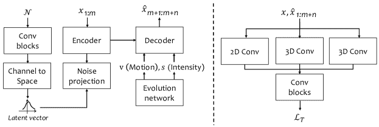

<!--yml

类别：未分类

日期：2024-09-06 19:31:43

-->

# [2406.04867] 降水实时预报中的深度学习：从时间序列预测的角度进行的调查

> 来源：[`ar5iv.labs.arxiv.org/html/2406.04867`](https://ar5iv.labs.arxiv.org/html/2406.04867)

# 降水实时预报中的深度学习：

从时间序列预测的角度进行的调查

Sojung An sojungan@kiaps.org Tae-Jin Oh oht@kiaps.org Eunha Sohn soneh0431@korea.kr Donghyun Kim d_kim@korea.ac.kr

###### 摘要

基于深度学习的时间序列预测在短期降水预测领域占据主导地位，这得益于其在高分辨率数据集中的运动流估计能力。对降水实时预报的兴趣日益增长，为当前预测技术的进步提供了重大机会。然而，关于使用深度学习的时间序列降水预测的深入调查仍然很少。因此，本文系统地回顾了时间序列降水预测模型的最新进展。具体来说，我们研究了背景组件中的以下关键点，包括：i) 预处理，ii) 目标函数，iii) 评价指标。然后，我们根据模型预测未来帧的方法将预测模型分为递归策略和多重策略，调查这些策略的影响以及性能评估。最后，我们在公共基准上评估当前基于深度学习的降水预测模型，讨论其局限性和挑战，并提出一些有前景的研究方向。我们的贡献在于为更好地理解时间序列降水预测提供见解，并帮助未来强大 AI 解决方案的开发。

\affiliation

[label1]组织=韩国气象预测系统研究所，地址=35, Boramae-ro, Dongjak-gu，城市=首尔，邮政编码=07071，国家=韩国 \affiliation[label2]组织=国家气象卫星中心，地址=61-18, Guam-gil, Gwanghyewon-myeon，城市=晋川郡，邮政编码=27803，国家=韩国 \affiliation[label3]组织=韩国大学，地址=145, Anam-ro, Seongbuk-gu，城市=首尔，邮政编码=02841，国家=韩国

## 1 引言

在过去几十年里，世界依赖天气预报来警示公众有关危险天气、农业和能源使用。尤其是准确的降水实时预报，由于极端降水案例的不确定性极高，越来越受到关注，以防止严重的天气相关损害。降水实时预报的概念随着雷达传感器的发展而出现（Browning 和 Collier，1989）。

`<svg   height="69.42" overflow="visible" version="1.1" width="600"><g transform="translate(0,69.42) matrix(1 0 0 -1 0 0)" fill="#000000" stroke="#000000" stroke-width="0.4pt"><g fill-opacity="1.0" transform="matrix(1.0 0.0 0.0 1.0 21.65 13.78)"><foreignobject width="556.69" height="41.86" transform="matrix(1 0 0 -1 0 16.6)" overflow="visible" color="#000000">降水量短期预报是对局部天气现象进行高度详细的短期降水预报（最长可达 6 小时），这些现象会经历显著变化。</foreignobject></g></g></svg>`

传统的短期预报模型主要依赖于基于拉格朗日平流假设的雷达观测外推（Germann 和 Zawadzki, 2002）。这些系统限制了其对降水形成或消散的预报能力，导致预测主要集中在降水移动上。随着对准确降水预报需求的增加，以减轻潜在损害，研究范围已扩展到应用机器学习（Shi et al., 2015；Wang et al., 2017）。这一扩展与近年来深度学习（DL）在各个领域的广泛应用趋势一致，降水短期预报也不例外。

基于 DL 的时间序列预测技术在降水预测中起到了重要的里程碑作用。针对降水短期预报问题，Shi et al. (2015) 将降水短期预报从雷达观测定义为时间序列预测任务。他们提出了 ConvLSTM，该方法通过高分辨率数据集估计运动流，从而提高了极端天气事件的预测准确性。后续研究利用 DL 进行降水短期预报，相比传统方法取得了更好的表现。例如，DGMR（Ravuri et al., 2021），一个 90 分钟（min）预测系统，展示了其在时间序列预测中的潜力。然而，基于雷达的短期预报模型由于雷达系统的位置固定面临可扩展性限制。此外，雷达系统的安装费用高昂，需要与地方当局和社区达成协议，并且需要经过培训的人员进行操作。从这一角度来看，将卫星影像与雷达数据相结合成为克服基于雷达的短期预报局限性的有前景的方法（Lebedev et al., 2019；Sønderby et al., 2020；Horváth et al., 2021）。虽然卫星主要观测云层而非直接降水，但卫星影像展现了对降水有显著影响的特征。通过利用卫星数据，可以解决这些限制并扩展短期预报的范围，覆盖更大的区域。

随着越来越多的数据集公开，研究人员正从时间序列预测的角度探索预测降水的创新方法。尽管降水预报已引起研究界的关注，但该领域的技术调查仍较少。确实，目前仍难以找到降水即刻预报的数据集，并保持对最新发展的了解。这需要对涉及过程、数据集信息、评估等相关概念进行综述，以便了解即刻预报及其深度学习模型设计策略。通过我们调查的广泛检查，我们倡导促进在探索降水预报领域的更快、更全面的进展。本调查的主要贡献可以总结为五点。

1.  (1)

    分析由真实世界数据集引起的关键挑战，并提供对预处理观察数据的实际意义。观察数据（例如雷达反射率和卫星数据）相比于常用的图像，研究较少。这种有限的探索阻碍了这一领域更广泛的应用和知识的进步，从而将降水预报的领域限制在特定的研究小组中。为了提高降水预报的能力，我们更努力地桥接数据预处理（例如归一化和采样）与不同传感器数据集之间的知识。

1.  (2)

    概述降水预报中的有效目标函数，并提供基本评估标准。由于大量研究工作已发布关于降水预报模型，我们分析了降水预报的方法，并根据之前文献如何为科学建模设计目标函数进行回顾。然后，我们提供了一个概述，以概括降水预报可靠性评估的方法。

1.  (3)

    提供基于操作原理分类的相关工作的综合评述，总结当前的最先进技术。与其他相关评审相比，我们的工作调查了最新的应用技术，并且不限于几个网络框架。在架构背景下，本研究回顾了各种应用，包括基于扩散和变换器模型的降水预报。

1.  (4)

    比较降水预报模型的性能，并提供对其方法的见解。我们对显著模型进行比较，以帮助有兴趣将其能力扩展到现实系统的研究人员。此外，我们评估了这些模型在不同阈值和时间上的有效性，突出该领域内尚未解决的挑战。据我们所知，这是第一篇使用基准数据集呈现深度学习模型比较结果的综述论文。

1.  (5)

    参与对各种研究方向的讨论，并概述该领域的主要挑战。虽然许多研究人员在降水预测方面取得了进展，但仍有进一步发展的空间。降水预测模型模拟自然现象的动态，而从稀疏降水数据中学习的表示会降低 AI 模型的性能。此外，预测长期趋势的变化或融合多传感器数据集仍然是一个未解决的问题。因此，我们讨论了应对这些问题的潜在解决方案，*探索各种研究方向*。

论文的结构如下：第 2），并对应用于实时预报的深度学习现有调查进行了分析（第 2.2 节）。

<svg   height="345.24" overflow="visible" version="1.1" width="471.07"><g transform="translate(0,345.24) matrix(1 0 0 -1 0 0) translate(225.08,0) translate(0,210.76)"><g stroke="#000000" fill="#000000" stroke-width="0.4pt"><g transform="matrix(1.0 0.0 0.0 1.0 -167.95 -129.86)" fill="#000000" stroke="#000000"><g  transform="matrix(1 0 0 -1 0 219.03)"><g transform="matrix(1 0 0 1 0 178.34)"><g class="ltx_tikzmatrix_col ltx_nopad_l ltx_nopad_r" transform="matrix(1 0 0 -1 64 0)"><g transform="matrix(1 0 0 -1 0 172.19)"><g  transform="matrix(1 0 0 1 0 175.65)"><g  transform="matrix(1 0 0 -1 0 0)"><foreignobject width="203.67" height="12.3" transform="matrix(1 0 0 -1 0 16.6)" overflow="visible">降水量实时预报问题</foreignobject></g></g></g></g></g> <g  transform="matrix(1 0 0 1 0 259.72)"><g class="ltx_tikzmatrix_col ltx_nopad_l ltx_nopad_r" transform="matrix(1 0 0 -1 0 0)"><foreignobject width="335.9" height="81.38" transform="matrix(1 0 0 -1 0 16.6)" overflow="visible">| $x_{1}$ | $\cdots$ | $x_{m}$ | $\rightarrow$ | $x_{m+1}$ | $\cdots$ | $x_{m+n}$ |

|  |  |  |  |</foreignobject></g></g></g></g> <g transform="matrix(1.0 0.0 0.0 1.0 -164.02 -205.52)" fill="#000000" stroke="#000000" color="#000000"><g  transform="matrix(1 0 0 -1 0 196.19)"><g transform="matrix(1 0 0 1 0 178.19)"><g class="ltx_tikzmatrix_col ltx_nopad_l ltx_nopad_r" transform="matrix(1 0 0 -1 0 0)"><g transform="matrix(1 0 0 -1 0 172.115)"><g  transform="matrix(1 0 0 1 0 175.5)"><g  transform="matrix(1 0 0 -1 0 0)"><foreignobject width="111.89" height="12.15" transform="matrix(1 0 0 -1 0 16.6)" overflow="visible">递归策略</foreignobject></g></g></g></g></g><g transform="matrix(1 0 0 1 0 214.19)"><g class="ltx_tikzmatrix_col ltx_nopad_l ltx_nopad_r" transform="matrix(1 0 0 -1 10.75 0)"><foreignobject width="90" height="36" transform="matrix(1 0 0 -1 0 16.6)" overflow="visible"></foreignobject></g></g></g></g> <g stroke="#000000" fill="#000000" stroke-dasharray="3.0pt,3.0pt" stroke-dashoffset="0.0pt" color="#000000"><g transform="matrix(1.0 0.0 0.0 1.0 -220.47 -161.09)" fill="#000000" stroke="#000000"><foreignobject width="137.8" height="12.15" transform="matrix(1 0 0 -1 0 16.6)" overflow="visible"><svg height="12.15" overflow="visible" version="1.1" width="12.8"><g transform="translate(0,12.15) matrix(1 0 0 -1 0 0)" fill="#000000" stroke="#000000" stroke-width="0.4pt"><g fill-opacity="1.0" transform="matrix(1.0 0.0 0.0 1.0 2.77 2.77)"><foreignobject width="7.26" height="6.62" transform="matrix(1 0 0 -1 0 16.6)" overflow="visible">N</foreignobject></g></g></svg> 非对抗性 <g stroke="#000000" fill="#000000"><path d="M -168.91 -181.1 L -143.54 -146.51" style="fill:none"></path></g><g stroke="#000000" fill="#000000"><g transform="matrix(1.0 0.0 0.0 1.0 -107.45 -163.56)"><g  transform="matrix(1 0 0 1 0 0)" fill="#000000" stroke="#000000" stroke-width="0.4pt"><g fill="#CCE5FF" fill-opacity="1.0"><path d="M 0 4.15 L 0 8 C 0 10.3 1.86 12.15 4.15 12.15 L 8.65 12.15 C 10.94 12.15 12.8 10.3 12.8 8 L 12.8 4.15 C 12.8 1.86 10.94 0 8.65 0 L 4.15 0 C 1.86 0 0 1.86 0 4.15 Z" style="stroke:none"></path></g><g fill="#CCE5FF" fill-opacity="1.0"><path d="M 1.38 4.15 L 1.38 8 C 1.38 9.53 2.62 10.77 4.15 10.77 L 8.65 10.77 C 10.18 10.77 11.42 9.53 11.42 8 L 11.42 4.15 C 11.42 2.62 10.18 1.38 8.65 1.38 L 4.15 1.38 C 2.62 1.38 1.38 2.62 1.38 4.15 Z" style="stroke:none"></path></g><g fill-opacity="1.0" transform="matrix(1.0 0.0 0.0 1.0 2.77 2.77)"><foreignobject width="7.26" height="6.62" transform="matrix(1 0 0 -1 0 16.6)" overflow="visible">A</foreignobject></g></g><g stroke="#000000" fill="#000000"><foreignobject width="69.34" height="9.61" transform="matrix(1 0 0 -1 0 16.6)" overflow="visible">对抗性</foreignobject></g></g><path d="M -47.63 -181.1 L -73 -146.51" style="fill:none"></path></g><g transform="matrix(1.0 0.0 0.0 1.0 55.94 -205.6)" fill="#000000" stroke="#000000" color="#000000"><g transform="matrix(1 0 0 -1 0 196.34)"><g transform="matrix(1 0 0 1 0 178.34)"><g class="ltx_tikzmatrix_col ltx_nopad_l ltx_nopad_r" transform="matrix(1 0 0 -1 0 0)"><g  transform="matrix(1 0 0 -1 0 172.19)"><g  transform="matrix(1 0 0 1 0 175.65)"><g transform="matrix(1 0 0 -1 0 0)"><foreignobject width="104.66" height="12.3" transform="matrix(1 0 0 -1 0 16.6)" overflow="visible">多重策略</foreignobject></g></g></g></g></g><g transform="matrix(1 0 0 1 0 214.34)"><g class="ltx_tikzmatrix_col ltx_nopad_l ltx_nopad_r" transform="matrix(1 0 0 -1 7.33 0)"><foreignobject width="90" height="36" transform="matrix(1 0 0 -1 0 16.6)" overflow="visible"></foreignobject></g></g></g></g><g stroke="#000000" fill="#000000" color="#000000"><path d="M 148.07 -134.75 L 51.05 -46.44" style="fill:none"></path></g> <g transform="matrix(1.0 0.0 0.0 1.0 -1.97 -158.86)" fill="#000000" stroke="#000000" color="#000000"><foreignobject width="47.24" height="16.6" transform="matrix(1 0 0 -1 0 16.6)" overflow="visible"><svg height="12.15" overflow="visible" version="1.1" width="12.8"><g transform="translate(0,12.15) matrix(1 0 0 -1 0 0)" fill="#000000" stroke="#000000" stroke-width="0.4pt"><g fill-opacity="1.0" transform="matrix(1.0 0.0 0.0 1.0 2.77 2.77)"><foreignobject width="7.26" height="6.62" transform="matrix(1 0 0 -1 0 16.6)" overflow="visible">U</foreignobject></g></g></svg> UNet</foreignobject></g> <g stroke="#000000" fill="#000000

图 1：降水短期预报的范式。我们根据两种训练策略对预测模型进行一级分类：递归策略和多重策略。递归策略在每个步骤$t$上顺序预测未来时间步，而多重策略同时预测未来帧。在第二个子层级中，递归策略模型被分类为非对抗性和对抗性类别，多重策略模型被分类为 UNet、Diffusion 和 Transformer。

### 2.1 时间序列降水预测的基础知识

时间序列降水预测旨在利用历史观测数据预测未来时间步。给定历史观测数据$\mathbf{X}=\left\{x_{1},x_{2},\cdots,x_{m}\right\}\in\mathbb{R}^{c\times m\times h\times w}$，我们将变量数量、输入帧、高度和宽度分别表示为$c,m,h$和$w$。时间序列预测旨在预测$\mathbf{Y}=\left\{x_{m+1},x_{m+2},\cdots,x_{m+n}\right\}\in\mathbb{R}^{n\times h\times w}$，其中$n$表示未来时间帧。预测未来时间帧有两种不同的方法：单变量输入数据（$c$=1），涉及单一时间依赖雷达数据集（Ravuri et al., 2021; Zhang et al., 2023），和多变量输入数据（$c>$1），包含卫星数据集或附加天气变量（Sønderby et al., 2020; Fernández and Mehrkanoon, 2021）。注意，我们将预测问题定义为这两种数据类型相同。真实值对设置为 GT = $\bigl{\{}x_{1:m},\,x_{m+1:m+n}\bigl{\}}$。设预测模型$G_{\theta}$具有参数$\theta$，其目标函数（记作$\mathcal{L}(\theta)$）是最小化未来真实值时间序列观测和预测结果，如下：

|  | $\mathcal{L}(\theta)=\mathbb{E}(G_{\theta}(h;x_{1:m}-x_{m+1:m+n}),$ |  | (1) |
| --- | --- | --- | --- |

其中$h$表示隐藏状态。许多在计算机视觉任务中广泛使用的深度学习模型已被提出以提升短期预报的性能，如卷积神经网络（Sønderby et al., 2020; Zhang et al., 2023）、递归神经网络（Wang et al., 2022; She et al., 2023）、Transformers（Gao et al., 2022; Ning et al., 2023）等。最近，随着生成雷达帧技术的兴起，生成模型受到了广泛关注，各种模型相继出现，如对抗性模型，例如 DGMR（Ravuri et al., 2021）和基于扩散的模型，例如 Prediff（Gao et al., 2023）。

图 1 总结了按照两种策略分类的降水实时预报方法及一些相关的子集。递归策略逐步预测未来时间步，并在每个时间步更新预测。给定样本时间步 $t\in\{m+1,\cdots,m+n\}$，模型 $G_{\theta}$ 用于预测下一个时间步的值 $x_{t+1}=G_{\theta}(h_{t};x_{1:t})$，其中 $h_{t}$ 表示时间步 $t$ 的隐藏状态。更具体地说，递归学习问题可以表示为：

|  | $P(Y&#124;X)=\prod_{t=m+1}^{m+n}P(x_{t}&#124;x_{1},\cdots,x_{t-1}).$ |  | (2) |
| --- | --- | --- | --- |

这种方法在每个时间步更新隐藏状态，并重复这个过程直到达到最后一个时间步。在多重策略中，未来时间步通过以下方式预测，隐藏状态为 $h$：$x_{\forall t}=G_{\theta}(h;x_{1:m})$。该方法旨在一次预测多个时间步，可以表示如下：

|  | $P(Y&#124;X)=P(x_{m+1},\cdots,x_{m+n}&#124;x_{1},\cdots,x_{m}).$ |  | (3) |
| --- | --- | --- | --- |

这意味着模型基于隐藏状态学习时间依赖性，以估计 $n$ 个未来步骤，相对于 $m$ 个时间步骤，而不是每个单独的时间步骤。

### 2.2 相关调查

近年来，多个调查研究了降水实时预报的话题，探索了该领域使用的方法，并识别了未来性能改进的领域。现有的降水实时预报调查可以分为两类。

1.  (1)

    高级概述：大多数调查强调了在天气实时预报中平衡模型准确性与计算效率的持续挑战，特别是当前方法在预测极端天气事件方面的局限性（Ashok 和 Pekkat，2022；Verma 等，2023；Upadhyay 等，2024；Salcedo-Sanz 等，2024）。然而，这些论文提供的是全面概述，而非基于深度学习（DL）的降水预测的技术比较，安排了统计方法和数值天气预报（NWP）方法。因此，它们忽略了关于优缺点的方法讨论，导致对构建 DL 模型时实际约束的理解有限。

1.  (2)

    方法论分析：这些调查将现在 casting 模型分为随机和确定性方法，旨在通过从技术角度审视基于 DL 的模型来增强对研究领域的理解（Prudden et al., 2020; Gao et al., 2021）。这些研究突出了关键研究领域并指向相关部分，但这些调查属于以前的方法。现有文献中缺乏近期的架构限制了对最先进现在 casting 模型的全面分析。这一限制要求需要一篇调查论文来填补这一空白，并提供对近期现在 casting 方法的更全面的检查。

在分析现有的调查论文后，我们发现了文献中的一个空白——缺乏对降水现在 casting 的深入调查，尤其是对其在近期方法学方法中的表现的研究。我们的研究不仅旨在提供对降水现在 casting 更具理论性和实践性的理解，还提供了启动现在 casting 研究的系统性审查。请注意，大部分展示的工作与传感器数据集建模相关，许多 DL 框架的种类通常基于雷达现在 casting。本调查没有区分使用雷达传感器进行的单变量预测与通过结合其他传感器进行的多变量预测，也没有回顾现在 casting 应用。

<svg height="230.22" overflow="visible" version="1.1" width="701.66"><g transform="translate(0,230.22) matrix(1 0 0 -1 0 0) translate(350.33,0) translate(0,115.11)" fill="#000000" stroke="#000000" stroke-width="0.4pt"><g transform="matrix(1.0 0.0 0.0 1.0 -286.69 -90.07)" fill="#000000" stroke="#000000"><foreignobject width="100.93" height="13.84" transform="matrix(1 0 0 -1 0 16.6)" overflow="visible">(a) 降水量</foreignobject></g><g transform="matrix(1.0 0.0 0.0 1.0 -101.8 -90.07)" fill="#000000" stroke="#000000"><foreignobject width="46.12" height="13.84" transform="matrix(1 0 0 -1 0 16.6)" overflow="visible">(b) VIS</foreignobject></g><g transform="matrix(1.0 0.0 0.0 1.0 55.68 -90.07)" fill="#000000" stroke="#000000"><foreignobject width="46.12" height="13.84" transform="matrix(1 0 0 -1 0 16.6)" overflow="visible">(c) WV</foreignobject></g><g transform="matrix(1.0 0.0 0.0 1.0 217.1 -90.07)" fill="#000000" stroke="#000000"><foreignobject width="38.24" height="13.84" transform="matrix(1 0 0 -1 0 16.6)" overflow="visible">(d) IR</foreignobject></g><g transform="matrix(1.0 0.0 0.0 1.0 -345.72 -110.5)" fill="#000000" stroke="#000000"><foreignobject width="219" height="221" transform="matrix(1 0 0 -1 0 16.6)" overflow="visible"></foreignobject></g><g transform="matrix(1.0 0.0 0.0 1.0 -188.24 -110.5)" fill="#000000" stroke="#000000"><foreignobject width="219" height="221" transform="matrix(1 0 0 -1 0 16.6)" overflow="visible"></foreignobject></g><g transform="matrix(1.0 0.0 0.0 1.0 -30.76 -110)" fill="#000000" stroke="#000000"><foreignobject width="219" height="220" transform="matrix(1 0 0 -1 0 16.6)" overflow="visible"></foreignobject></g><g transform="matrix(1.0 0.0 0.0 1.0 125.72 -110.5)" fill="#000000" stroke="#000000"><foreignobject width="221" height="221" transform="matrix(1 0 0 -1 0 16.6)" overflow="visible"></foreignobject></g></g></svg>

图 2：2019 年 4 月 30 日 18 UTC 的 SEVIR 数据集可视化。图像描绘了在美国大陆上捕捉到的天气事件。 (a) NEXRAD 雷达的垂直积分液体。 (b) GOES-16 卫星频道 2 可见光（VIS）。 (c) GOES-16 卫星频道 9 水汽（WV）。 (d) GOES-16 卫星频道 13 红外（IR）。 （来源）这些图像来源于 SEVIR 官方网站。

## 3 降水现在 casting 的数据集

本节讨论了用于降水即时预报的传感器数据集的属性。我们特别探讨了天气雷达的数据处理（第 3.1 节）和天气卫星的数据处理（第 3.2 节）。接着，我们重点介绍了如何将这两种不同的传感器数据集结合起来（第 3.3 节），并提供了每种传感器类型的可用数据集的综合回顾（第 3.4 节）。图 2 展示了 SEVIR 数据集中 RGB 合成图像的一个例子（Veillette et al., 2020），其中可视化了四种不同的数据类型：（a）合成雷达图像，（b）可见光卫星图像，（c）水汽卫星图像，以及（d）红外卫星图像。

|   | HKO-7 | IowaRain | RYDL | MRMS | 上海 | SEVIR | OPERA | Meteonet |
| --- | --- | --- | --- | --- | --- | --- | --- | --- |
|  | (Shi et al., 2017) | (Sit et al., 2021) | (Ayzel et al., 2020) | (NCEP, 2018) | (Chen et al., 2020) | (Veillette et al., 2020) | (Herruzo et al., 2021) | (Larvor et al., 2020) |
| 年份 | 09–15 | 16–19 | 14–15 | 17–17 | 15–18 | 17–19 | 19–21 | 16–18 |
| 频率 | 6 分钟 | 5 分钟 | 5 分钟 | 2 分钟 | 6 分钟 | 5 分钟 | 15 分钟 | 5–15 分钟 |
| 分辨率 | 2 公里 | 0.5 公里 | 1 公里 | 1 公里 | 1 公里 | 0.5–8 公里 | 2 公里 | 1 公里 |
| 覆盖范围 | 香港 | 美国 | 德国 | 美国 | 上海 | 美国 | 欧洲 | 法国 |
| 格式 | png | binary | hdf5 | grib2 | binary | hdf5 | hdf5 | hdf5 |
| 类型 | Ⓡ | Ⓡ | Ⓡ | Ⓡ | Ⓡ | ⓇⓈ | ⓇⓈ | ⓇⓈ |
| URL | [[链接]](https://github.com/sxjscience/HKO-7) | [[链接]](https://github.com/uihilab/IowaRain) | [[链接]](https://zenodo.org/records/3629951) | [[链接]](https://data.eol.ucar.edu/dataset/541.033) | [[链接]](https://dataverse.harvard.edu/dataset.xhtml?persistentId=doi:10.7910/DVN/2GKMQJ) | [[链接]](https://registry.opendata.aws/sevir/) | [[链接]](https://github.com/agruca-polsl/weather4cast-2023) | [[链接]](https://meteonet.umr-cnrm.fr) |
|   |  |  |  |  |  |  |  |  |

表 1: 公开可用传感器数据集资源汇总。年份：数据收集年份（以年份的最后两位数字表示），频率：时间频率，分辨率：数据的空间分辨率，覆盖范围：观察覆盖范围，格式：数据文件格式，类型：雷达 Ⓡ，卫星 Ⓢ，网址：数据网址链接。[link] 直接链接到数据集网站。

### 3.1 气象雷达

气象雷达向空气中发射脉冲以检测降水并估计其类型（例如，雨、雪等）。雷达传感器可以提供包含一个频道的反射率数据，以分贝（dBZ）表示。根据雷达反射率值，降水强度可以被分类为；$[-35,20)$: 小水凝物，$[20,35)$: 小雨，$[35,50)$: 中等雨量，以及 $[50,\infty]$: 大雨（Binetti 等，2022）。小水凝物对检测非常干燥的轻微降雪或低反射率的毛毛雨非常有用。通常，Z-R 关系是基于雷达的定量降水估计中的一个步骤，它涉及将反射率值转换为降水强度。反射率通过雷达反射率因子 $Z\ (\text{mm}^{6}\ \text{m}^{-3})$ 和降水率 $R\ (\text{mm}\ \text{h}^{-1})$ 之间的 Z-R 关系转换，如下所示：$Z=aR^{b},$ 其中 $a$ 和 $b$ 是根据降水类型经验获得的参数。可以使用固定的 Z-R 关系，例如 $a=200$ 和 $b=1.6$（Marshall 和 Palmer，1948）；然而，Kim 等人（2021）指出，通过贝叶斯回归对每对雷达-雨量计进行校准的关系变异性可以产生更好的拟合。

### 3.2 气象卫星

气象卫星监测地球的天气和气候，并探测风暴系统和其他云层模式的移动。目前，地球上有超过 4000¹¹1 [`www.ucsusa.org/resources/satellite-database`](https://www.ucsusa.org/resources/satellite-database)颗卫星在轨道上运行，每颗卫星都有其独特的数据采集传感器。用于时间序列预测的静止轨道卫星配备了经过校准的传感器，以探测二维通道，包括红外线、可见光和水汽。需要注意的是，可见光仅在白天可用，因为数据代表了反射率中的太阳辐射。为什么检测云层信息的卫星数据在降水预测中如此重要？卫星突出显示特定现象，提供与降水相关的信号，并提供全球覆盖，以补充雷达观测。Metnet-v2（Espeholt et al., 2022）发现，卫星不仅在降水短期预测中发挥重要作用，还在较长时间预测中贡献于大气湿度校正和改善云层探测。Lee et al. (2021)利用 GEOS-16 的高分辨率卫星图像和亮度温度来探测对流。全球数据的分辨率为 1-2 公里，间隔为 10-15 分钟，而更高分辨率的本地数据分辨率为 500 米，间隔为 2 分钟。基于卫星的降水产品可以通过提供覆盖范围更大的地理区域来补充雷达数据。这可能包括根据卫星的不同仰角调整降雨特征数据（Niu et al., 2024），或使用卫星数据填补雷达覆盖有限的区域（An, 2023）。

### 3.3 传感器融合

传感器融合是一项关键技术，通过结合地面雷达和卫星的观测数据，实现准确的降水短期预报。雷达和卫星往往在不同的时间和频率下提供观测数据，具体取决于数据的分辨率。此外，融合大范围的高分辨率雷达和卫星数据需要大量的计算资源。降水短期预报中的传感器融合的主要挑战在于对齐雷达和卫星观测的不同空间和时间特性，以产生一致的高分辨率降水预报。在这里，我们重点介绍了关于降水短期预报的数据融合的关键点，涉及相同（Sønderby et al., 2020; Seo et al., 2022a）或不同（An, 2023）覆盖区域。当两组观测数据覆盖相同区域时，通过在通道轴上拼接图像来合并它们。假设卫星数据中有$d$个通道，则输入大小为$X\in\mathbb{R}^{(d+1)\times h\times w}$（Sønderby et al., 2020; Seo et al., 2022a）。对于较长的预报时间，An (2023)通过将卫星数据标记化以对齐雷达尺寸，合并了比雷达数据集大四倍的卫星数据。该模型通过周期函数引入位置信息以增强数据融合过程， resulting in a combined input of $X\in\mathbb{R}^{5\times h\times w}$。考虑云量作为附加信息层有助于研究不同云和大气参数的影响（Andrychowicz et al., 2023）。这种方法还允许我们评估这些区域降水持续的可能性，并识别额外外部气候强迫因素如辐射的相互作用（Samset et al., 2016）。

### 3.4 可用数据集

表格 1 总结了以前研究中使用的雷达和卫星数据。我们对降水预报有以下数据类型总结：① 雷达（HKO-7、IowaRain、RYDL、MRMS 和上海）和 ② 雷达 & 卫星（SEVIR、OPERA 和 MeteoNet）。公开可用的数据通常由在短时间间隔（5 到 6 分钟）内捕捉的高分辨率图像组成，数据格式多样。基准数据集通过最小化数据偏差和噪声从原始数据源中收集而来。基准数据集在数据选择过程中（Shi 等，2015；Chen 等，2020；Veillette 等，2020；Sit 等，2021）是基于反射率强度进行的。例如，仅选择降雨天作为数据集（Shi 等，2015），或者选择在 10% 的区域内降水量至少为 0.5 mm 的数据（Sit 等，2021）。细致的数据选择有助于缓解数据集的选择偏差并增强对更广泛人群的泛化能力。噪声减少技术，如去除相关系数低的像素或应用连续快照要求，被用来提高数据质量（Chen 等，2019；Ayzel 等，2020；Sit 等，2021）。在上海数据集的情况下（Chen 等，2020），作者去除了相关系数低于 0.85 的像素（Kumjian 等，2010），以消除异常情况。在数据类型方面，收集的数据可以是二进制格式或 PNG 数据格式。PNG 格式的数据集是这种数据的视觉表示，可以提供有价值的见解并帮助改善雷达数据的解释；然而，该数据集作为科学真值使用起来较为困难。雷达衍生图像中的非均匀颜色映射可能对精确降水预测造成挑战，因为它可能影响强度级别的解释。目前缺乏评估雷达反射率数据集的广泛接受的标准。

## 4 预处理

现实世界的数据集往往不遵循正态分布，带噪声的不平衡数据可能导致性能问题。当某个类别的分布稀疏时，模型在训练过程中往往会过度拟合多数类别，从而导致少数类别的性能较差。预处理对于使用带噪声的真实数据进行高效且准确的 AI 模型比较至关重要，这一过程有助于提升模型的性能。本节介绍了对降水数据的有效技术：① 剪裁（第 4.1 节），② 缩放（第 4.2 节），③ 采样（第 4.3 节），④ 滑动窗口（第 4.4 节）。在构建数据集时，为了细化雷达数据集，通常会应用若干预处理步骤，如表 2 所示。

### 4.1 剪裁

数据集经过剪裁以限制最大降水量或反射率，这可以解决降水数据的稀疏性和不平衡问题。现实世界的数据集往往表现出严重的类别不平衡，大多数实例集中在接近零的值附近。一项在北京的研究（Ma 等人，2019）发现，直径为 0.9–2.5 mm 的雨滴对累计降水量的贡献最大。在其他地区，降水量超过 10 mm 的情况很少，所占比例不到 1%（Choi 和 Kim，2022；Kim 等人，2022）。这些不平衡的数据集是有问题的，因为它们通常在分布的尾部包含更高的错误率。研究人员通常将最大降水量或反射率值设置为 100 至 128（Ravuri 等人，2021；Zhang 等人，2023）或 70 至 76（Larvor 等人，2020；Yu 等人，2023a）。这种方法使得能够处理从最大输出设置到最高降水水平的稀疏数据集。当数据集具有较高的方差时，模型会过于紧密地拟合训练数据，从而无法对未见过的数据集进行泛化（Ravuri 等人，2021）。

| 组件 | 方法 |
| --- | --- |
| 剪裁 | 100 mm^a , 128 mm^b , 70 dBZ^c , 76 dBZ^d |
| 缩放器 | $z$-score^e , minmax^f , 对数^g |
| 采样 | ① $\mathcal{P}r^{1}(X)=\frac{1}{(m+n)hw}\sum_{\forall x^{\prime}_{t}\subset X^{\prime}}x^{\prime}_{t}$ |
|  | ② $\mathcal{P}r^{2}(X)=\sum(1-exp^{-x_{t}})+\epsilon$ |
| 滑动窗口 | 20 min^h , 60 min^i , 120 min^j |

+   $\bullet$ 裁剪：

+   a

    An (2023)

+   b

    Ravuri et al. (2021); Zhang et al. (2023)

+   c

    Larvor et al. (2020)

+   d

    Yu et al. (2023a)

    $\bullet$ Scaler：

+   e

    Jeong et al. (2021); Bakkay et al. (2022)

+   f

    Shi et al. (2015); Wang et al. (2017)

+   g

    Li et al. (2021); Espeholt et al. (2022); Geng et al. (2023)

    $\bullet$ 采样：

    ① $\mathcal{P}r_{min}^{1}$=3$\times 10^{-2}$  An (2023), $\mathcal{P}r_{min}^{1}$=1$\times 10^{-1}$  Ayzel et al. (2020)

    ② $\mathcal{P}r_{min}^{2}$=2$\times 10^{-4}$  Ravuri et al. (2021)  Zhang et al. (2023)^#

    $\bullet$ 滑动：

+   h

    Fernández 和 Mehrkanoon (2021); Zhang et al. (2023); Leinonen et al. (2023)

+   i

    Fernández 和 Mehrkanoon (2021); Reulen 和 Mehrkanoon (2024); Gao et al. (2022)

+   j

    Shi et al. (2015); Larvor et al. (2020)

表 2：文献中预处理方法的简要细节。Clip：裁剪值以处理不平衡数据设置为最大降雨量。Scaler：数据归一化方法（minmax：最小-最大归一化，log：对数归一化）。Sampling：防止在稀疏数据集中过拟合的采样方法。Zhang${}^{\text{\#}}$ 在训练中进行了分层采样，首先从全图中采样，然后再从裁剪图中采样。滑动：滑动窗口。

符号说明。令 $X^{\prime}$ 为输入帧 $X$ 的条件矩阵，其中值为 1 表示存在值，否则为 0。给定采样的概率分数为 $\mathcal{P}r(X)$，训练数据集被采样为序列 $\mathcal{P}r(X)\geq\mathcal{P}r_{min}$，其中 $\mathcal{P}r_{min}$ 是控制整体包含率的最低概率。这里，$x_{t}$ 表示输入帧，$\epsilon$ 是一个小常数。

### 4.2 缩放

数据缩放可以通过使学习过程稳定来提高深度学习（DL）模型的性能，特别是在数据高度非线性和动态的时间序列预测任务中。数据归一化的缩放技术将所有特征置于相似的尺度上，从而使模型能够从更平衡的分布中学习，并使优化过程对深度学习模型更加稳健（Huang et al., 2023）。目前用于短期预测的三种常用技术包括：$z$-分数归一化、对数变换和最小-最大归一化。为了训练具有不同范围的卫星和雷达传感器数据，通常通过应用 $z$-分数对变量进行归一化。传感器数据集具有重尾分布，因为传感器图像包含可能具有极端离群值或分布尾端值的值（Achim et al., 2003）。处理卫星数据集时，最好使用基于百分位数的归一化技术，如 $z$-分数归一化，而不是简单的最小-最大归一化（Herruzo et al., 2021）。这些现有的缩放方法只是为了确保具有不同尺度的特征不会不当地影响训练过程（Jeong et al., 2021; Li et al., 2023），而机器学习模型仍可能面临充分处理离群值的挑战。

### 4.3 采样

采样方法是解决数据不平衡问题的另一种方式，包括过采样和欠采样方法。这些技术通过调整训练分布来减少不平衡程度或缓解数据噪声。在最简单的形式中，数据集通过过采样中的降雨案例进行应用（Shi et al., 2015）。或者，最近的研究表明，通过对分布箱进行分组或调整降雨像素的比例来进行采样（Ayzel et al., 2020; Zhang et al., 2023）。例如，DGMR（Ravuri et al., 2021）提出了一种使用接受分数的采样策略。他们通过使用定义的采样概率从过度表示的类别中移除样本。给定样本数据 $x$ 的第 $i$ 个元素的概率为 $q_{x_{i}}=\sum 1-exp(-x_{i})$，超过 $q_{x_{i}}$ 的样本被包含在训练集中。将数据分布拟合到等宽箱中是应对多样化降水情况的强大模型性能的关键之一。

### 4.4 滑动窗口

滑动窗口方法是时间序列预测任务中广泛使用的术语。该术语指的是一种技术，其中固定大小的连续时间步窗口用作输入，以预测下一个时间步或一系列未来时间步。窗口大小是需要在预测任务中调节的重要超参数，通常在实时预报模型中设置为 20 分钟（Ravuri 等人，2021）到 2 小时（h）（Larvor 等人，2020）。基于先前的研究，DL 模型可以通过采用超出 20 分钟的滑动窗口，并考虑固定数量的前几个时间步作为输入来预测未来降水强度，从而有效捕捉降水数据中的时间依赖性和模式。

## 5 目标函数

深度学习模型的有效性在很大程度上依赖于其目标函数，这对于降水预测至关重要。目标函数是降水实时预报的决定性组成部分，因为它塑造了学习过程，并决定了预测的准确性以及捕捉重要强降水事件的能力。在这种背景下，需要考虑某些挑战，如数据不平衡、模糊性和数据稀疏性。

### 5.1 加权损失

加权损失函数根据降水强度为学习目标函数分配权重。在降水预测中，处理数据不平衡时，应用权重可以优先考虑强降水。这意味着对强降水预测的错误将比对弱降水预测的错误对总体损失函数的贡献更大。在 TrajGRU (Shi 等人，2017) 中，他们实现了一种将降水强度划分为区间并相应分配权重的策略。通过应用加权损失并将降水数据裁剪到[0, 24]范围内，DGMR (Ravuri 等人，2021) 侧重于提高强降水事件预测的性能。这些技巧有助于保持现实世界数据集中大部分和小部分之间的平衡，促进其在降水预测中的广泛应用。给定预测的未来时间步 $x_{t}\in\mathbb{R}^{h\times w}$ 和 $x_{t}$ 中的元素数量 $N$，加权损失函数被公式化如下：

|  | $\mathcal{L}_{weighted}=\dfrac{1}{N}\sum_{t=m+1}^{m+n}\&#124;(x_{t}-G(x_{t}))\odot w(x_{t})\&#124;_{L_{1}\ or\ L_{2}},$ |  | (4) |
| --- | --- | --- | --- |

其中 $w(x_{t})\in\mathbb{R}^{h\times w}$ 表示与降水量相关的权重，$\odot$ 代表矩阵乘法。研究人员通常采用均方误差 (MSE) (Shi et al., 2017; Cambier et al., 2023) 和均绝对误差 (MAE) (Ravuri et al., 2021; Zhang et al., 2023) 作为基础损失函数。最近的研究使用结合这些指标的损失函数在学习异常值时提高了性能 (Wu et al., 2021; Wang et al., 2022; Ma et al., 2024)。

### 5.2 池化损失

池化损失函数的目的是通过在应用目标函数之前先进行最大池化，来测量实际值与预测值在较大感受野中的差异。给定一批次的像素数 $N$，学习目标被制定如下：

|  | $\mathcal{L}_{pooling}=\dfrac{1}{N}\sum_{t=m+1}^{m+n}\&#124;(Q(x_{t})-Q(G(x_{t})))\&#124;_{1},$ |  | (5) |
| --- | --- | --- | --- |

其中 $Q$ 代表最大池化。最大池化是一种操作类型，它从特征图上由滤波器覆盖的区域中选择感受野内的最大值。损失函数的目标是捕捉模型在数据中预测整体空间模式或特征的能力，而不是专注于单个数据点。这一聚合步骤有助于解决稀疏问题并提取最显著的特征，这可以提高对各种降水情况空间模式的捕捉。在其他现实世界问题中，数据集通常表现出长尾分布，使得损失函数成为提高这类数据集性能的有效技术 (Bulo et al., 2017)。调整损失函数中的最大池化有助于模型更加关注重要特征。

### 5.3 运动损失

降水预测模型常常在准确预测降水空间尺度（即模型网格中降水系统的水平范围和组织）方面存在局限性。为了预测高分辨率降水，设计了一个运动正则化项来增强与强降水事件相关的运动场的平滑度。设 $\nabla\text{v}^{1,2}\in\mathbb{R}^{n\times h\times w}$ 表示通过 Sobel 滤波器获得的 x 轴和 y 轴梯度，运动损失由以下给出：

|  | $\mathcal{L}_{motion}=\dfrac{1}{N}\sum_{t=m+1}^{m+n}\underbrace{\&#124;\nabla\text{v}_{t}^{1}\odot\sqrt{w(x_{t})}\&#124;_{2}}_{\text{x 轴速度 $\odot$ 密度}}+\underbrace{\&#124;\nabla\text{v}_{t}^{2}\odot\sqrt{w(x_{t})}\&#124;_{2}}_{\text{y 轴速度 $\odot$ 密度}},$ |  | (6) |
| --- | --- | --- | --- |

其中$N$是元素的数量。这个项考虑了连续性方程以及较大的降水模式相比较小的降水模式持续时间更长的观察趋势。像中尺度对流系统这样的较大降水模式具有更多的湿气和能量，使它们能够在更广泛的区域和更长的时间内维持降水（Hatsuzuka 等，2021；Henny 等，2022）。例如，热带地区约 40%的极端降水日（超过 250 毫米）与持续超过 24 小时的长寿命对流系统相关（Roca 和 Fiolleau，2020）。这种方法通过影响过去的雷达场来预测降水事件的持续性。正则化项被公式化为运动矢量的空间梯度，乘以降水强度的平方根。

### 5.4 Nowcasting 损失

现在 casting 损失（Ko 等，2022）通过设计来自 DL 模型的概率分布来近似每个类别，以解决类别不平衡问题。这种方法根据降水阈值来处理真实世界数据中的复杂性，这些复杂性通常导致某些类别稀疏，从而对模型训练产生重大挑战。当数据集中的类别分布不平衡时，这个问题就会出现，可能使训练过程偏向于多数类（Salcedo-Sanz 等，2024）。为了处理类别不平衡问题，nowcasting 损失函数防止模型在学习中偏向于多数类，而是集中于强降雨。给定类别$c$的阈值$\gamma$和$x$中的第$i$个元素，$TP(c)$（真正例）、$FP(c)$（假正例）和$FN(c)$（假负例）是指示值是否超过$c$的 one-hot 矩阵。为了可微分性，结果将 one-hot 值转换为概率分布，如下所示：

|  |  $\widetilde{TP}_{i}(c),\widetilde{FN}_{i}(c),\widetilde{FP}_{i}(c)=\begin{cases}P(x_{i,c}),1-P(x_{i,c}),0&\text{if}\ x_{i}\geq\gamma,\\ 1-P(x_{i,c}),0,P(x_{i,c})&\text{otherwise.}\end{cases}$  |  | (7) |
| --- | --- | --- | --- |

设 nowcasting 损失函数记作$\mathcal{L}_{nowcasting}$，类别之间的概率可以通过以下方式学习：

|  | $\begin{split}\mathcal{L}_{nowcasting}=-\dfrac{1}{2}\left(\dfrac{\widetilde{TP}(\text{R})}{\widetilde{TP}(\text{R})+\widetilde{FP}(\text{R})+\widetilde{FN}(\text{R})}\right.\\ \left.+\dfrac{\widetilde{TP}(\text{H})}{\widetilde{TP}(\text{H})+\widetilde{FP}(\text{H})+\widetilde{FN}(\text{H})}\right)\end{split}$ |  | (8) |
| --- | --- | --- | --- |

其中 R 和 H 分别表示定义为轻降雨和重降雨的类别。在这种情况下，对于重降雨，损失函数针对 R 和 H 标准计算两次，这缓解了类别不平衡问题，因为它在相对集中的基础上进行训练。

### 5.5 绘图位置损失

绘图位置（PP）损失函数（Xu 等人，2024）旨在解决降水短期预报中的不平衡回归任务。成本函数为每个样本计算一个权重，该权重与发生的概率成反比。这意味着具有稀有目标值的样本将获得更高的权重，而具有常见目标值的样本将获得较低的权重。在传统的损失函数中，每个样本对整体损失函数的贡献是相等的，无论其目标值的常见程度如何。PP 损失通过重新公式化 Eq. 9、10 和 11 定义如下：

|  | $\mathcal{L}_{pp}=\dfrac{1}{N}\sum_{t=m+1}^{m+n}\underbrace{f_{w}(x_{i})}_{\text{权重函数}}\odot\underbrace{\mathcal{L}(\hat{x}_{i},x_{i})}_{\text{目标函数}},$ |  | (9) |
| --- | --- | --- | --- |
|  | $f_{w}(x_{i})=\dfrac{PP(x_{i})}{\frac{1}{N}\sum_{t=m+1}^{m+n}PP(x_{i})},$ |  | (10) |
|  | $PP(x_{i})=\dfrac{1+\left&#124;\left\{\sum_{j=1}^{c}s_{j}:s_{j}<s_{i}\right\}\right&#124;}{N+1},$ |  | (11) |

其中 $s_{j}$ 表示降水数据集中每个类别中的元素数量，$s_{i}$ 表示 $x_{i}$ 中的元素数量，$r_{k}$ 表示排序函数。$r_{k}(x_{t})$ 表示包含 $x_{i}$ 中第 $i$ 个元素排序的排列序列。$N$ 表示 $x_{i}$ 中的元素数量，$s_{i}$ 表示 $x_{t}$ 中元素所在区间的元素数量。$f_{w}$ 代表目标值稀有度的权重函数。这个公式确保稀有数据点对损失和梯度计算有更大的影响，帮助模型更好地从这些重要但稀缺的样本中学习。

## 6 评估指标

评估指标在评估所提出方法的性能中发挥了关键作用。随着降水预测模型数量的增加，有必要使用通用评估指标统一评估不同的算法以验证模型。本节介绍了降水预测中常用的基准评估指标。表 3 显示了从不同角度进行验证的分类评估指标。这种比较分析有助于理解哪些模型最适合特定的预测任务，并为进一步的研究和开发工作提供宝贵的见解。

### 6.1 全球级准确度

全球级评估的指标确定预测与所有像素观察数据的接近程度，在总体预测性能验证中发挥重要作用。均方误差 (MSE) (Shi et al., 2015) 和均绝对误差 (MAE) (Shi et al., 2017) 是评估模型总体框架的重要指标。小的值表示预测模型表现更好。皮尔逊相关系数 (PCC) (Ravuri et al., 2021) 被广泛用作测量观测结果与预测结果之间统计联系的指标。

|   分类 | 指标 |
| --- | --- |
| 全球级 | MAE，MSE，PCC |
| 二元^† | 准确度，CSI，FAR，FSS，F1-score， |
| POD，精确度，HSS，召回率 |
| 降尺度 | CSI-邻域，FSS，汇总 CRPS |
| 清晰度 | GDL，LPIPS，PSNR，SSIM |
|   |  |

+   †

    降雨阈值 (mm)：0.2，0.5，1，2，4，8，10，20

+   反射率阈值 (dBZ)：20，30，35，40，50

+   图像阈值 (0–255)：16，74，133，160，181，219

表 3：降水评估指标概览。**粗体**字体表示我们调查文献中最常用的指标。在二元准确度中，阈值的平均点也用作验证标准。

### 6.2 二元准确度

二进制准确性通过基于降水阈值的混淆度量验证逐像素的降水强度。验证预测模型的关键是评估每个像素的降水位置和强度。这一验证过程涉及使用混淆度量，这些度量是基于预定义的降水阈值计算的。降水阈值通常与降水强度分布相关联。代表性示例包括临界成功指数（CSI）、准确率、F1-score（F1）、精确度、召回率、检测概率（POD）、等效威胁评分（ETS）和虚警率（FAR）（Ravuri et al., 2021；Trebing et al., 2021；Ma et al., 2024）。需要注意的是，在降水的情况下，应该计算整个批次的混淆矩阵，而不是在小批次基础上评估，考虑到没有降水的情况（TP=0）。

### 6.3 下尺度准确性

全球准确性和二进制准确性都在逐像素水平上进行评估，因此即使是微小的空间偏差也会导致惩罚。因此，模型会倾向于在预测时间增加时进行不现实的平滑，以最小化损失，而尽管具有保持结构一致性的能力，清晰的预测会因过度惩罚而受到影响。对于非模糊模型如 GANs，更适合使用诸如分数技能得分（FSS）（An, 2023）等替代评估指标，这些指标通过扩展空间尺度来评估模型。使用 CSI-邻域（Zhang et al., 2023）或在较低空间尺度下测量的池化连续排名概率得分（CRPS）（Ravuri et al., 2021）来达到相同的目的。

### 6.4 清晰度准确性

清晰度指的是生成真实预测的敏感性，这是评估降水区域边界质量和模糊问题的关键标准。由于极端降水事件通常涉及小尺度对流特征，因此生成图像的清晰度作为评估生成图像质量的重要指标。使用梯度差损失（GDL）（Wu et al., 2021）、学习感知图像块相似性（LPIPS）（Yu et al., 2023a）、峰值信噪比（PSNR）（Wu et al., 2023）和结构相似性指数（SSIM）（Wu et al., 2023；Ning et al., 2023）来评估深度学习模型的模糊程度。然而，它们对清晰度是否反映物理模式存在局限，因此我们应该结合其他评估技术来捕捉性能。

## 7 递归策略

在接下来的子章节中，我们将提供有关递归策略下的 DL 模型的进一步细节。这里的目标是考察并概述最近在降水预报方面的进展和发现。我们包括提出 DL 技术以应对降水即时预报的出版物，以理解最先进模型的模式和趋势，即使这些出版物尚未经过同行评审。我们将按时间顺序回顾每个应用的技术挑战及其相应的解决方案。以下子章节中讨论的递归策略 DL 模型在图 3 中进行了组织。

优势和劣势。 (+) 通过描述时间序列中的随机依赖性来高效估计运动， (-) 但计算密集且在较长的预测时间内容易出现累积误差。

递归策略通常用于非常短期的危险天气预测，并且在预测时空运动方面进行了研究，由于导致预测偏差和次优结果，特别是在较长的预测提前期。然而，递归预测策略的优势在于能够有效捕捉时间序列中的时间依赖性，这通常由递归神经网络组成（Shi et al., 2015; Wang et al., 2017）。该策略可以分为两种类型：

1.  （1）

    非对抗性方法。 (+) 高效捕捉时空依赖性， (-) 但随着预测时间的延长，效果往往变得模糊。

1.  （2）

    对抗性方法。 (+) 在生成未来帧时表现出清晰度， (-) 但相对容易出现不稳定性，遇到模式崩溃问题。

图 4 展示了两种不同的网络架构，每种架构代表了定义结构中的不同类别。该图提供了对这些架构的视觉理解，以便于比较这两种不同的结构。

`<svg height="316.79" overflow="visible" version="1.1" width="652.81"><g transform="translate(0,316.79) matrix(1 0 0 -1 0 0) translate(318.1,0) translate(0,306.1)" fill="#000000" stroke="#000000" stroke-width="0.4pt"><g transform="matrix(1.0 0.0 0.0 1.0 -55.75 -3.38)" fill="#000000" stroke="#000000"><foreignobject width="111.89" height="12.15" transform="matrix(1 0 0 -1 0 16.6)" overflow="visible">递归策略</foreignobject></g><g stroke="#FF0000" fill="#FF0000" color="#FF0000"><g transform="matrix(1.0 0.0 0.0 1.0 -217.59 -66.55)"><g transform="matrix(1 0 0 1 0 0)" fill="#FF0000" stroke="#FF0000" stroke-width="0.4pt"><g fill-opacity="1.0" transform="matrix(1.0 0.0 0.0 1.0 2.77 2.77)"><foreignobject width="10.38" height="9.46" transform="matrix(1 0 0 -1 0 16.6)" overflow="visible">N</foreignobject></g></g><g stroke="#FF0000" fill="#FF0000"><foreignobject width="95.48" height="9.61" transform="matrix(1 0 0 -1 0 16.6)" overflow="visible">非对抗性</foreignobject></g></g></g><g transform="matrix(1.0 0.0 0.0 1.0 -309.44 -213.59)" fill="#0000FF" stroke="#0000FF" color="#FF0000"><g transform="matrix(1 0 0 -1 0 185.415)" color="#0000FF"><g transform="matrix(1 0 0 1 0 179.88)"><g transform="matrix(1 0 0 -1 34.03 0)"><g transform="matrix(1 0 0 -1 0 172.96)"><g transform="matrix(1 0 0 1 0 176.42)"><g class="ltx_tikzmatrix_col ltx_nopad_l ltx_nopad_r" transform="matrix(1 0 0 -1 0 0)"><foreignobject width="15.37" height="13.84" transform="matrix(1 0 0 -1 0 16.6)" overflow="visible" color="#FF0000">7.1.1</foreignobject></g></g></g></g></g><g transform="matrix(1 0 0 1 0 188.53)"><g class="ltx_tikzmatrix_col ltx_nopad_l ltx_nopad_r" transform="matrix(1 0 0 -1 0 0)"><foreignobject width="83.06" height="11.07" transform="matrix(1 0 0 -1 0 16.6)" overflow="visible" color="#FF0000">时空</foreignobject></g></g></g></g><g transform="matrix(1.0 0.0 0.0 1.0 -313.48 -296.49)" fill="#000000" stroke="#000000" color="#FF0000"><g transform="matrix(1 0 0 -1 0 193.195)" color="#000000"><g transform="matrix(1 0 0 1 0 187.12)"><g transform="matrix(1 0 0 -1 4.23 0)"><g transform="matrix(1 0 0 -1 0 181.585)"><g transform="matrix(1 0 0 1 0 176.06)"><g class="ltx_tikzmatrix_col ltx_nopad_l ltx_nopad_r" transform="matrix(1 0 0 -1 0 0)"><g transform="matrix(1 0 0 -1 0 171.055)"><g transform="matrix(1 0 0 1 0 176.05)"><g transform="matrix(1 0 0 -1 0 0)"><foreignobject width="70.62" height="10.01" transform="matrix(1 0 0 -1 0 16.6)" overflow="visible" color="#FF0000">$ \text{ConvLSTM}^{a}$’15</foreignobject></g></g></g></g></g><g transform="matrix(1 0 0 1 0 184.71)"><g class="ltx_tikzmatrix_col ltx_nopad_l ltx_nopad_r" transform="matrix(1 0 0 -1 7.87 0)"><foreignobject width="67.75" height="11.07" transform="matrix(1 0 0 -1 0 16.6)" overflow="visible" color="#FF0000">TrajGRU’17</foreignobject></g></g></g></g></g><g transform="matrix(1 0 0 1 0 199.27)"><g class="ltx_tikzmatrix_col ltx_nopad_l ltx_nopad_r" transform="matrix(1 0 0 -1 0 0)"><foreignobject width="91.54" height="12.15" transform="matrix(1 0 0 -1 0 16.6)" overflow="visible" color="#FF0000">$ \text{ConvLSTM}^{b}$’19</foreignobject></g></g></g></g><g transform="matrix(1.0 0.0 0.0 1.0 -219.87 -213.59)" fill="#0000FF" stroke="#0000FF" color="#FF0000"><g transform="matrix(1 0 0 -1 0 185.415)" color="#0000FF"><g transform="matrix(1 0 0 1 0 179.88)"><g transform="matrix(1 0 0 -1 54.7 0)"><g transform="matrix(1 0 0 -1 0 172.96)"><g transform="matrix(1 0 0 1 0 176.42)"><g class="ltx_tikzmatrix_col ltx_nopad_l ltx_nopad_r" transform="matrix(1 0 0 -1 0 0)"><foreignobject width="15.37" height="13.84" transform="matrix(1 0 0 -1 0 16.6)" overflow="visible" color="#FF0000">7.1.2</foreignobject></g></g></g></g></g><g transform="matrix(1 0 0 1 0 188.53)"><g class="ltx_tikzmatrix_col ltx_nopad_l ltx_nopad_r" transform="matrix(1 0 0 -1 0 0)"><foreignobject width="124.74" height="11.07" transform="matrix(1 0 0 -1 0 16.6)" overflow="visible" color="#FF0000">长期依赖</foreignobject></g></g></g></g><g transform="matrix(1.0 0.0 0.0 1.0 -200.98 -301.49)" fill="#000000" stroke="#000000" color="#FF0000"><g transform="matrix(1 0 0 -1 0 204.955)" color="#000000"><g transform="matrix(1 0 0 1 0 200.64)"><g class="ltx_tikzmatrix_col ltx_nopad_l ltx_nopad_r" transform="matrix(1 0 0 -1 0 0)"><g transform="matrix(1 0 0 -1 0 196.315)"><g transform="matrix(1 0 0 1 0 191.99)"><g transform="matrix(1 0 0 -1 0.24 0)"><g transform="matrix(1 0 0 -1 0 187.665)"><g transform="matrix(1 0

图 3：递归策略概述。递归策略中的方法可以分为非对抗性和对抗性。我们根据上述分类对应用进行分组，然后按时间顺序排列。<svg height="14.04" overflow="visible" version="1.1" width="14.87"><g transform="translate(0,14.04) matrix(1 0 0 -1 0 0)" fill="#000000" stroke="#000000" stroke-width="0.4pt"><g fill-opacity="1.0" transform="matrix(1.0 0.0 0.0 1.0 2.77 2.77)"><foreignobject width="9.34" height="8.51" transform="matrix(1 0 0 -1 0 16.6)" overflow="visible" color="#000000">N</foreignobject></g></g></svg>有效地使用递归框架学习时间依赖性。<svg height="14.04" overflow="visible" version="1.1" width="14.87"><g transform="translate(0,14.04) matrix(1 0 0 -1 0 0)" fill="#000000" stroke="#000000" stroke-width="0.4pt"><g fill-opacity="1.0" transform="matrix(1.0 0.0 0.0 1.0 2.77 2.77)"><foreignobject width="9.34" height="8.51" transform="matrix(1 0 0 -1 0 16.6)" overflow="visible" color="#000000">A</foreignobject></g></g></svg>基于 GANs 真实地预测未来帧。子类别根据旨在解决降水短期预报中先前问题的核心关键词进行分类。

（a）非对抗性 PredRNN2（Wang 等，2022）的示意图。（左）PredRNN2 概述。（右）ST-LSTM 单元的结构。（来源）图示取自原始论文。$\hat{x}$、$m$ 和 $t$ 分别表示预测帧、输入帧和任何时间步骤。Wang 等（2022）在每个时间步骤的 $C^{l}_{t}$ 和 $M^{l}_{t}$（记忆库）增量上添加了卷积层，并使用解耦损失在潜在空间中明确扩展它们之间的距离，以关注时空变化的不同方面。

<svg   height="201.22" overflow="visible" version="1.1" width="458.22"><g transform="translate(0,201.22) matrix(1 0 0 -1 0 0) translate(229.11,0) translate(0,100.61) matrix(1.0 0.0 0.0 1.0 -224.5 -96)" fill="#000000" stroke="#000000" stroke-width="0.4pt"><foreignobject width="449" height="192" transform="matrix(1 0 0 -1 0 16.6)" overflow="visible"></foreignobject></g></svg>

（b）对抗性 DGMR（Ravuri 等，2021）的示意图。（左）一个带有潜在向量的生成器。（右）鉴别器。降水观测条件从输入帧中提取，并由生成器应用于潜在向量，以预测未来时间步骤。对于时间鉴别器，使用 3D 卷积来学习时间分布。为了学习空间分布，从帧中随机选择单帧多次，并在每次循环中应用 2D 卷积。

图 4：递归策略下模型架构的示例

### 7.1 非对抗性方法

#### 7.1.1 时空

$\text{ConvLSTM}^{a}$（Shi 等， 2015）首次出现于 2015 年，它被提出作为一种通过对长短期记忆（LSTM）单元的递归状态转换应用卷积来预测时空模式的网络。由于$\text{ConvLSTM}^{a}$在短期降水预测（2 小时内）中的表现优于传统统计模型，基于深度学习的系统引起了研究人员的关注。由于网络在固定分辨率的单元中计算权重，因此在学习运动流的非线性表示方面存在一定的限制。TrajGRU（Shi 等， 2017）和$\text{ConvLSTM}^{b}$（Tran 和 Song， 2019）被提出作为层次卷积递归神经网络（ConvRNN）单元，能够更好地预测变化的运动并学习非线性模式。这种层次学习有助于捕捉复杂的移动模式，并表示多样的物理模式。ConvRNN 单元逐帧递归处理，使其能够将数据的顺序和上下文纳入其网络。顺序结构使得网络能够理解和捕捉帧之间的时空依赖性。

#### 7.1.2 长期依赖性

递归策略的缺点在于长期依赖性。时序降雨中的混沌动态会随着时间的推移改变联合分布。这导致降水数据的复杂非平稳性，表现为不同时间尺度上的降雨模式的变异性。为了解决连续上下文中的内在变异，MetNet-v1（Sønderby et al., 2020）和 ModeRNN（Yao et al., 2023）引入了带有注意机制的 ConvRNN 单元，这一框架旨在使记忆状态能够在各状态之间互动。设计注意模块有助于聚合大上下文，并与输入状态和先前的隐藏状态进行互动。从记忆单元内部来看，有研究绑定单元来通过记住每个时间步的顶层来捕捉非平稳性（Wang et al., 2017, 2019; Wu et al., 2021）。例如，级联结构中互联的 RNN 单元（Wang et al., 2019）用于处理时空非平稳性并捕捉差分信息，或者提出了一种运动-高速公路方法（Wu et al., 2021），该方法分解瞬态变异和运动趋势。PredRNNs（Wang et al., 2017, 2022）通过在时间相邻的 RNN 状态之间采用非线性神经元来学习变形的非平稳性。PredRNN-v2（Wang et al., 2022）解决了长期预测中的累积误差问题，通过反向计划采样提出了一种方法，该方法通过以递减概率随机隐藏真实观测值，从历史观测中学习长期动态。PredRNN-v2 结构如图 4(a)所示，其中时空单元可以增强 RNN 单元之间记忆状态的增量。

#### 7.1.3 锐度

来自非对抗性模型的预测未来帧往往会随着预测时间的增加而变得模糊。均方误差（MSE）函数通常用于降水的即时预测，但这种全球级别的损失函数存在一些限制，可能导致模糊的输出。在最小化 MSE 损失时，模型倾向于通过平均降水的高频细节来生成过于模糊的预测。为了解决模糊问题，DB-RNN（Ma et al., 2024）包括两个步骤：预测网络（MS-RNN）和带有跳跃连接的去模糊网络（DB-RNN）。去模糊机制可以减轻自回归误差的累积，从而提高逐帧去模糊的效果。为了优化网络，他们加入了 GDL 和交叉熵（CE）损失的正则化项，以增强预测的清晰度并部分减轻模糊问题。另一种减轻模糊问题的方法是学习各种降水类型的多样化表示。虽然模式崩溃可能不会直接影响回归任务中的模糊性，但 ModeRNN（Yao et al., 2023）通过揭示潜在模式的组合结构，帮助生成真实的预测。作者引入了自适应融合权重，这些权重解耦了每个单元中的特征，促进了模式表示的广泛谱系，并通过自适应加权来适应不同的时空动态。

### 7.2 对抗性方法

#### 7.2.1 锐利度

当深度学习模型使用全局级别的损失函数（如 MAE 或 MSE）进行训练时，通过递归策略预测的输出往往随着预测时间的增加而变得模糊（Whang et al., 2022）。虽然一些方法可以减少模糊的程度，但生成能够准确表现现实世界场景的输出仍然具有挑战性。若干研究通过解决模糊问题并展示可靠的预测性能，展示了生成对抗网络（GANs）（Creswell et al., 2018）的潜力（Kupyn et al., 2018; Brock et al., 2018）。许多研究提出了基于 GAN 的方法来现实地预测未来帧，包括 vanilla GAN（Jing et al., 2019），条件 GAN（Liu and Lee, 2020），以及 CycleGAN（Choi et al., 2023）。通过分析大多数 GAN 模型的共性，可以观察到它们通常由两个鉴别器组成，用于学习时空分布。特别是，基于对抗的模型发展，特别是 DGMR（Ravuri et al., 2021），通过利用层次化 ConvGRU 生成器和将多变量高斯噪声映射到降水场中显示出有前景的结果，如图 4(b) 所示。即使在输入帧添加了扰动的情况下，DGMR 也倾向于显示低方差（Leinonen et al., 2023）。这表明，尽管从随机噪声中学习时空分布，DGMR 仍能有效地学习降水物理表现并可靠地预测未来数据。

#### 7.2.2 多样模式

许多 GAN 因对抗训练过程中的不稳定性而遭遇模式崩溃，这种不稳定性可能是由于判别器过于强大或梯度更新问题引起的（Wiatrak 等， 2019）。模式崩溃指的是生成器未能捕捉数据的多样性模式，产生的结果高度相似，仅代表真实数据分布的有限子集。降水受区域、季节甚至植物和土壤类型的复杂交互影响，不同的学习和动态因素导致降水分布的时间变化性（Shi 等， 2022）。当预测模型应用于具有高度混合动态的降水数据集时，深度学习模型通常会限制多样的时空变形（Yao 等， 2023）。TS-RainGAN（Wang 等， 2023）是一个任务分段框架，旨在通过捕捉降水系统的复杂性来提高强降水预测的准确性。他们提出了两个不同的模型：一个预测时空特征以理解降水演变，另一个生成高质量图像以准确捕捉强降水的细节。这种方法提高了预测准确性和详细可视化，防止了 GAN 模式崩溃。ClusterCast（An 等， 2024）引入了一个带有自聚类网络的 GAN 模型，用于降水预测和捕捉瞬态运动变化。学习不同模式的表示提高了对各种降水类型的灵活性，进一步帮助实现稳定的表示。

#### 7.2.3 长期依赖

基于对抗的模型采用递归策略时，往往难以捕捉长期依赖，原因在于梯度消失和梯度爆炸问题。SAC-LSTM（She 等， 2023）通过在 LSTM 单元中应用注意力模块来聚合时空特征，并捕捉输入在多个时间步上的表示。在预测未来帧后，连接的判别器通过 CE 损失估计这些帧是否是生成的或真实的。虽然递归策略在理论上可以建模强的时间依赖，但在实践中需要各种架构创新和训练技术来有效解决潜在的长期依赖问题。ConvLSTM-TransGAN（Yu 等， 2023b）是一个框架，通过融合 ConvLSTM 和 TransGAN 来解决模糊问题，同时保留时间依赖。TransGAN（Jiang 等， 2021），一个基于 Transformer 架构的 GAN 模型，逐步增强特征分辨率，并结合了一个多尺度判别器，能够捕捉高层次的语义和细粒度的纹理。

`<svg height="316.35" overflow="visible" version="1.1" width="659.93"><g transform="translate(0,316.35) matrix(1 0 0 -1 0 0) translate(310.66,0) translate(0,305.59)" fill="#000000" stroke="#000000" stroke-width="0.4pt"><g transform="matrix(1.0 0.0 0.0 1.0 -52.33 -3.46)" fill="#000000" stroke="#000000"><foreignobject width="104.66" height="12.3" transform="matrix(1 0 0 -1 0 16.6)" overflow="visible">多策略</foreignobject></g><g stroke="#FF0000" fill="#FF0000" color="#FF0000"><g transform="matrix(1.0 0.0 0.0 1.0 -236.03 -66.55)"><g transform="matrix(1 0 0 1 0 0)" fill="#FF0000" stroke="#FF0000" stroke-width="0.4pt"><g fill-opacity="1.0" transform="matrix(1.0 0.0 0.0 1.0 2.77 2.77)"><foreignobject width="10.38" height="9.46" transform="matrix(1 0 0 -1 0 16.6)" overflow="visible">U</foreignobject></g></g><g stroke="#FF0000" fill="#FF0000"><foreignobject width="29.6" height="9.46" transform="matrix(1 0 0 -1 0 16.6)" overflow="visible">Unet</foreignobject></g></g></g><g transform="matrix(1.0 0.0 0.0 1.0 -306.04 -233.27)" fill="#0000FF" stroke="#0000FF" color="#FF0000"><g transform="matrix(1 0 0 -1 0 185.415)" color="#0000FF"><g transform="matrix(1 0 0 1 0 179.88)"><g transform="matrix(1 0 0 -1 42.45 0)"><g transform="matrix(1 0 0 -1 0 172.96)"><g transform="matrix(1 0 0 1 0 176.42)"><g class="ltx_tikzmatrix_col ltx_nopad_l ltx_nopad_r" transform="matrix(1 0 0 -1 0 0)"><foreignobject width="15.37" height="13.84" transform="matrix(1 0 0 -1 0 16.6)" overflow="visible" color="#FF0000">8.1.1</foreignobject></g></g></g></g></g><g transform="matrix(1 0 0 1 0 188.53)"><g class="ltx_tikzmatrix_col ltx_nopad_l ltx_nopad_r" transform="matrix(1 0 0 -1 0 0)"><foreignobject width="101.04" height="11.07" transform="matrix(1 0 0 -1 0 16.6)" overflow="visible" color="#FF0000">多变量输入</foreignobject></g></g></g></g><g transform="matrix(1.0 0.0 0.0 1.0 -305.48 -300.97)" fill="#000000" stroke="#000000" color="#FF0000"><g transform="matrix(1 0 0 -1 0 202.025)" color="#000000"><g transform="matrix(1 0 0 1 0 195.79)"><g class="ltx_tikzmatrix_col ltx_nopad_l ltx_nopad_r" transform="matrix(1 0 0 -1 0 0)"><g transform="matrix(1 0 0 -1 0 191.465)"><g transform="matrix(1 0 0 1 0 187.15)"><g transform="matrix(1 0 0 -1 0 0)"><g transform="matrix(1 0 0 -1 0 182.825)"><g transform="matrix(1 0 0 1 0 178.5)"><g transform="matrix(1 0 0 -1 0 0)"><g transform="matrix(1 0 0 -1 0 172.275)"><g transform="matrix(1 0 0 1 0 175.38)"><g transform="matrix(1 0 0 -1 0 0)"><foreignobject width="98.76" height="12.45" transform="matrix(1 0 0 -1 0 16.6)" overflow="visible" color="#FF0000">(Lebedev et al)’21</foreignobject></g></g></g></g></g><g transform="matrix(1 0 0 1 0 187.15)"><g class="ltx_tikzmatrix_col ltx_nopad_l ltx_nopad_r" transform="matrix(1 0 0 -1 19.3 0)"><foreignobject width="60.54" height="8.65" transform="matrix(1 0 0 -1 0 16.6)" overflow="visible" color="#FF0000">SIANet’22</foreignobject></g></g></g></g></g> <g transform="matrix(1 0 0 1 0 195.8)"><g class="ltx_tikzmatrix_col ltx_nopad_l ltx_nopad_r" transform="matrix(1 0 0 -1 0 0)"><foreignobject width="90.98" height="8.65" transform="matrix(1 0 0 -1 0 16.6)" overflow="visible" color="#FF0000">SmaAt-UNet’22</foreignobject></g></g></g></g></g> <g transform="matrix(1 0 0 1 0 205.13)"><g class="ltx_tikzmatrix_col ltx_nopad_l ltx_nopad_r" transform="matrix(1 0 0 -1 10.83 0)"><foreignobject width="77.49" height="12.45" transform="matrix(1 0 0 -1 0 16.6)" overflow="visible" color="#FF0000">(Kim et al)’22</foreignobject></g></g></g></g><g transform="matrix(1.0 0.0 0.0 1.0 -193.26 -238.81)" fill="#0000FF" stroke="#0000FF" color="#FF0000"><g transform="matrix(1 0 0 -1 0 196.485)" color="#0000FF"><g transform="matrix(1 0 0 1 0 190.95)"><g class="ltx_tikzmatrix_col ltx_nopad_l ltx_nopad_r" transform="matrix(1 0 0 -1 3.85 0)"><g transform="matrix(1 0 0 -1 0 185.415)"><g transform="matrix(1 0 0 1 0 179.88)"><g transform="matrix(1 0 0 -1 20.31 0)"><g transform="matrix(1 0 0 -1 0 172.96)"><g transform="matrix(1 0 0 1 0 176.42)"><g class="ltx_tikzmatrix_col ltx_nopad_l ltx_nopad_r" transform="matrix(1 0 0 -1 0 0)"><foreignobject width="15.37" height="13.84" transform="matrix(1 0 0 -1 0 16.6)" overflow="visible" color="#FF0000">8.1.2</foreignobject></g></g></g></g></g><g transform="matrix(1 0 0 1 0 188.53)"><g class="ltx_tikzmatrix_col ltx_nopad_l ltx_nopad_r" transform="matrix(1 0 0 -1 0 0)"><foreignobject width="56.07" height="11.07" transform="matrix(1 0 0 -1 0 16

图 5：多策略概述。应用被分类为 UNet、Diffusion 和 Transformer。模型根据其报告结果的方法进行特征化，并按时间顺序排列。<svg height="14.04" overflow="visible" version="1.1" width="14.87"><g transform="translate(0,14.04) matrix(1 0 0 -1 0 0)" fill="#000000" stroke="#000000" stroke-width="0.4pt"><g fill-opacity="1.0" transform="matrix(1.0 0.0 0.0 1.0 2.77 2.77)"><foreignobject width="9.34" height="8.51" transform="matrix(1 0 0 -1 0 16.6)" overflow="visible" color="#000000">U</foreignobject></g></g></svg> 有效捕捉多变量输入数据中的通道间依赖关系。<svg height="14.04" overflow="visible" version="1.1" width="15.05"><g transform="translate(0,14.04) matrix(1 0 0 -1 0 0)" fill="#000000" stroke="#000000" stroke-width="0.4pt"><g fill-opacity="1.0" transform="matrix(1.0 0.0 0.0 1.0 2.77 2.77)"><foreignobject width="9.51" height="8.51" transform="matrix(1 0 0 -1 0 16.6)" overflow="visible" color="#000000">D</foreignobject></g></g></svg> 真实地预测未来帧。<svg height="14.04" overflow="visible" version="1.1" width="14.53"><g transform="translate(0,14.04) matrix(1 0 0 -1 0 0)" fill="#000000" stroke="#000000" stroke-width="0.4pt"><g fill-opacity="1.0" transform="matrix(1.0 0.0 0.0 1.0 2.77 2.77)"><foreignobject width="8.99" height="8.51" transform="matrix(1 0 0 -1 0 16.6)" overflow="visible" color="#000000">T</foreignobject></g></g></svg> 具有强大的长期依赖性。子类别根据旨在解决降水短期预报中以前问题的核心关键词进行了分类。

## 8 多策略

本节提供了基于直接多策略的深度学习模型的附加细节。我们回顾了反映最先进模型趋势的出版物，这些模型被列在三种框架中：UNet、Diffusion 和 Transformer。我们总结了基于每种网络结构为解决现有降水短期预报问题所做的尝试。图 5 展示了组织每种分类架构的提出模型的图示。

优点和缺点。 (+) 对于这种累积误差具有鲁棒性，(-) 但导致捕捉每帧之间时间依赖性的困难。

直接多策略的主要优势在于能够直接建模整个预测时间，从而避免误差累积的问题，并且对具有高波动的数据集表现出鲁棒性。这表明，这种方法在处理长期预测中的不确定性和复杂性方面比递归策略更具优势。然而，与时间随机预测模型相比，这种方法可能难以充分捕捉这种依赖关系。在这方面，多策略在短期轨迹预测中可能存在学习时间依赖性的劣势。多策略可以根据设计架构分为三种类型：

1.  (1)

    基于 UNet 的方法：(+）在多变量预测中表现出色，(-）但在学习时间依赖性方面存在困难。

1.  (2)

    基于 Transformer 的方法：(+）解决了时间序列预测中的长期依赖问题，(-）但它们的计算复杂度随序列长度呈二次增长。

1.  (3)

    基于扩散的方法：(+）能够生成具有清晰度和可靠性的未来帧，量化不确定性，(-）但涉及在多个步骤中顺序去噪输入，计算开销较大。

图 6 展示了多策略中三种不同网络的示例架构。

### 8.1 基于 UNet 的方法

#### 8.1.1 多变量输入

UNet 结构可以高效地学习多变量输入数据与雷达输出帧之间的映射。基于多变量输入数据的成功预测应用已经得到开发（Lebedev 等，2019；Seo 等，2022a）。NowCasting-nets（Ehsani 等，2022）比较了基于 UNet 和 RNN 模型在使用卫星和雷达输入进行 90 分钟预测的性能。他们发现 UNet 基于的模型优于 RNN 基于的模型，并且整体性能在时间上保持稳定。在 Weather4cast 比赛中（Gruca 等，2023），预测从低分辨率卫星和雷达数据中获取的高分辨率雷达数据的获胜者是基于 3D-UNet 的模型（Seo 等，2022a；Kim 等，2022）。SIANet，2022 年比赛的获胜者（Seo 等，2022a），专注于基于传感器融合的检测直径大于 2 毫米的水滴，这些水滴是成熟的云粒子，可能在对流启动期间被忽视。为了解决这个问题，他们提出了一种基于矩阵分解的具有大空间上下文聚合模块的 UNet。另一位竞争者，由 Kim 等（2022）提出，也介绍了一种具有区域条件网络的 UNet，该网络通过正交卷积层将区域信息集成到特征图中。总之，UNet 在通过有效融合来自不同传感器的信息来学习变量之间的依赖性方面表现出优势。

#### 8.1.2 时间依赖性

深度卷积结构在保持全局空间信息方面表现强劲，但之前的 UNet 模型常常在非平稳性和数据分布的变化上遇到困难。UNet 模型优先分析变量之间的相关性，而非捕捉随时间变化的运动趋势，这使得其在基于雷达的单变量预测中吸引力较小。然而，NowcastNet (Zhang et al., 2023) 利用一个子网络（进化网络）来捕捉时间依赖性，如图 6(a)所示。这减轻了多策略方法的缺点，并报告称其表现优于 DGMR。NowcastNet 的子网络使用一个 UNet 来估计雷达回波的运动和强度变化。这些发现表明，多策略方法可以成为单变量数据降水即刻预报的强大工具，前提是网络能够设计成学习时间依赖性。另一种方法是注意机制，它们可以捕捉 UNet 中的时间依赖性 (Sønderby et al., 2020; Trebing et al., 2021; Tian et al., 2023)。例如，MSLKNet (Tian et al., 2023) 通过在 UNet 潜在空间中堆叠时间注意模块来编码特征，使得模型能够捕捉空间-时间依赖性和全球模式。将注意模块组合到 UNet 网络中可以避免迭代计算，因为这些网络不依赖于递归模块。

### 8.2 基于扩散的方法

#### 8.2.1 清晰度

GANs 经常难以达到一个平衡点，使得生成器和判别器无法进一步改进，从而导致非收敛（Chen, 2021）。研究人员积极利用扩散方法（Leinonen et al., 2023; Nai et al., 2024），这一方法的优势在于不依赖于判别器，并在各种实际应用中显示出良好的结果（Ho et al., 2020; Song and Ermon, 2020）。LDCast（Leinonen et al., 2023）首次将潜在扩散模型应用于降水预测。该模型采用两步法设计，包括预测未来时间步框架的预测网络和用于噪声估计的去噪网络。去噪网络指的是逐步去除输入图像中的噪声的过程，这可以学习数据分布并生成多样且高质量的样本。LDCast 旨在通过利用集成成员进行平均降水量来减少不确定性。然而，在先前的扩散模型中，样本变异会发生在降水预测过程中。样本的方差可能导致选择与真实情况偏差较大的样本，而集成方法可能会降低性能（Yu et al., 2023a）。虽然扩散模型在生成高质量样本方面表现出色，但它们可能缺乏对特定任务或应用所需的精细控制。生成模型可能会通过生成看似合理的噪声或忽视领域特定的专业知识而偏离物理行为（Gao et al., 2023）。

(a) UNet 基础的 NowcastNet 示意图（Zhang et al., 2023）。(左) 基于 UNet（编码器和解码器）结构的 NowcastNet 概述。(右) 使用多个卷积核的时间判别器。该架构专注于设计一个基于 UNet 的模型，用于学习时空依赖性。通过一个演化网络实现，使得模型能够学习运动流动和强度变化。通过结合这些子网络，模型可以有效地捕捉数据在时间和空间上的动态变化。

<svg height="173.22" overflow="visible" version="1.1" width="488.22"><g transform="translate(0,173.22) matrix(1 0 0 -1 0 0) translate(244.11,0) translate(0,86.61) matrix(1.0 0.0 0.0 1.0 -239.5 -82)" fill="#000000" stroke="#000000" stroke-width="0.4pt"><foreignobject width="479" height="164" transform="matrix(1 0 0 -1 0 16.6)" overflow="visible"></foreignobject></g></svg>

(b) 基于扩散的 Prediff 的示意图（Gao et al., 2023）。(左) 训练期间的 Prediff 概述。(中) 基于注意力机制的编码器-解码器结构。(右) 用于估计观测分布的去噪模块。Prediff 具有在去噪步骤中基于知识对齐强制分布扩展的优势。该模型能够有效建模自然观测的复杂高维分布，无需对抗性训练，从而改善整体学习过程，并确保更准确的表示。

<svg height="202.22" overflow="visible" version="1.1" width="338.22"><g transform="translate(0,202.22) matrix(1 0 0 -1 0 0) translate(169.11,0) translate(0,101.11) matrix(1.0 0.0 0.0 1.0 -164.5 -96.5)" fill="#000000" stroke="#000000" stroke-width="0.4pt"><foreignobject width="329" height="193" transform="matrix(1 0 0 -1 0 16.6)" overflow="visible"></foreignobject></g></svg>

(c) 基于 Transformer 的 MIMO-VP 的示意图（Ning et al., 2023）。(左) MIMO-VP 用于预测未来时间步的概述。(右) 编码器-解码器结构。该架构结合了卷积和时间级注意力，以学习时空依赖性。通过利用具有卷积层的自注意力机制，模型可以理解和预测时空关系，从而捕捉复杂的模式和动态。该框架还提供了对长程依赖的鲁棒性，使模型能够有效捕捉复杂的相关性和模式。

图 6：多策略模型架构的示例

#### 8.2.2 物理信息驱动

已经有尝试通过基于扩散的物理信息生成模型来解决现有的不可控问题并预测降水。Prediff (Gao et al., 2023) 提出了一个网络，该网络参数化了一个能量函数来调整转移概率，从而在去噪步骤中控制条件向量。为了从输入中提取条件特征，Prediff 采用了 Earthformer 的 UNet 结构 (Gao et al., 2022)。在去噪步骤之前，网络以天气条件作为噪声基础，旨在最小化与未来时间分布的差异。然后，Prediff 在每个去噪步骤中参数化能量函数，以调整转移概率，从而产生细节丰富的未来帧。一个简单的 Prediff 框架用于强制图像的物理对齐分布，如图 6(b) 所示。DiffCast (Yu et al., 2023a) 和 CastCast (Gong et al., 2024) 结合了确定性和随机扩散组件，以捕捉全球和局部运动趋势。确定性组件预测全球模式，而随机扩散组件则提供更多细节。仅配置随机模型导致了不稳定性，并限制了将降水分解为全球趋势和局部随机组件的能力 (Yu et al., 2023a)。这表明不可控的演化模型可能难以捕捉降水的物理分布。Diffcast 利用残差块作为扩散组件，有效地利用多尺度时间特征。在 Cascast 的情况下，网络通过采用注意力机制来减少由一系列模糊预测所条件化的去噪复杂性。尽管扩散模型可能计算开销较大，但通过以物理对齐的方式估计扰动，它们可以有效捕捉时间序列数据中存在的复杂模式。扩散模型可以增强表示，以保持生成长期预测时的连贯性，并促进复杂时间分布的建模。

### 8.3 基于 Transformer 的方法

#### 8.3.1 长期依赖

基于 Transformer 的即时预报模型取得了显著的成功，展示了其在降水即时预报中有效捕捉长范围时空依赖的能力。Transformer 通过将数据标记为小块，并使用自注意力学习每个块的权重，来高效地处理长范围依赖。尽管 Transformer 中的自注意力机制在捕捉长范围依赖方面非常强大，但可能在有效建模数据中的短期局部模式和变化时会遇到困难（Lin 等，2022）。Rainformer（Bai 等，2022）和 MS-RadarFormer（Geng 等，2024）应用了 Swin Transformer，通过对时间序列帧进行标记以学习全局和局部特征。他们引入了一个完全卷积的网络与注意力模块，该模块有效地从降水信息中提取局部特征，帮助低至中等降水强度预测。然而，降水数据是向各个方向扩展的流体团块，这与通常描绘在静态背景上移动物体的标准视频不同（Fovell 和 Tan，1998）。为克服这一缺陷，MIMO-VP（Ning 等，2023）引入了一个时空块，旨在学习时间步查询与其对应输出序列之间的高阶关系。如图 6(c) 所述，该方法通过占位符嵌入方法获得序列级特征图，以捕捉帧内的全局依赖。所提出的解决方案通过采用带有卷积层的时间注意力模块，有效地解决了全球时空依赖和误差累积的问题。为了解决 Transformer 固有的排列不变性问题，网络对输入序列应用了时间位置编码，确保了平滑和有效的处理。

#### 8.3.2 物理信息驱动

最近的研究致力于通过将天气相关知识融入基于 Transformer 的架构来提升模型性能。Nowformer（Park et al., 2022）提出了全球动态注意力机制，以学习每帧的局部和全局信息。为了学习移动流体强度的持续变化，他们提出了基于 Transformer 的全球动态注意力机制，以学习每帧的局部和全局信息。Nowformer 通过局部动态注意力模块局部提取时间依赖性，促进了对每帧中流体强度变化的学习。同时，天气数据的一个特点是将低分辨率和高分辨率数据结合可以提高天气预报的准确性。通过使用低分辨率和高分辨率数据的组合，天气模型可以利用每种数据的优势——低分辨率数据提供广泛的上下文，高分辨率数据提供局部细节。Earthformers（Gao et al., 2022）采用了分层机制进行多分辨率注意力，通过图像分解将局部和全局连接起来。他们探索了 Transformer 中的时空信息共享，并设计了高效的计算复杂度。MS-RadarFormer（Geng et al., 2024）提出了多尺度补丁嵌入层，使其能够获取高分辨率降水数据集的多种空间和时间尺度。他们应用了填充操作来调整输出维度，并连接了嵌入的标记。通过嵌入多分辨率信息，他们解决了低估问题，同时也实现了对雷达输出帧的稍微更准确的预测。

#### 8.3.3 周期性成分

随着科学数据证实傅里叶分析的重要性，众所周知，将复杂的天气信号分解为其组成频率分量，可以更好地识别和表征重要的气象现象（Amon, 1993）。在谱元素中的傅里叶级数表示，使得对周期性或准周期性现象（例如过渡流和湍流中的现象）进行有效处理成为可能（Fournier et al., 2005）。基于傅里叶的降水预报，如快速傅里叶变换（FFT），可以帮助提取相关特征并提高预测模型的性能（Wu et al., 2023, 2024）。傅里叶表示允许模型通过正弦和余弦项的组合捕捉复杂的周期行为。将输入点通过傅里叶特征映射传递，可以使网络在低维设置中学习高频函数。FFT 模块用于捕捉高维非线性物理特征，使得在系统中捕捉复杂的动态成为可能，而无需依赖基于微分方程的非线性特征（Wu et al., 2023）。与离散静态框架不同，FFT 方法将数据从连续时间域转换到频率域，从而更好地保留了时空数据中的长期依赖性（Wu et al., 2024）。傅里叶变换在降水预报领域中获得了突出地位，提供了一种辨别复杂物理模式并捕捉系统动态的方法，而无需基于微分方程的非线性特征。

{NiceTabular}

p4.5cmC3emC5emC5emC3emC4emC2em*2C2emC2emC8em \CodeBefore1 \BodyApplications  Norm.  Loss  Data  Size  Param.  m  n  dt  Z-R  Metrics (A) Recursive strategy

<svg   height="12.15" overflow="visible" version="1.1" width="12.8"><g transform="translate(0,12.15) matrix(1 0 0 -1 0 0)" fill="#000000" stroke="#000000" stroke-width="0.4pt"><g fill-opacity="1.0" transform="matrix(1.0 0.0 0.0 1.0 2.77 2.77)"><foreignobject width="7.26" height="6.62" transform="matrix(1 0 0 -1 0 16.6)" overflow="visible" color="#000000">N</foreignobject></g></g></svg> $\text{ConvLSTM}^{a}$ (Shi et al., 2015) [[link]](https://github.com/ndrplz/ConvLSTM_pytorch) minmax MSE HKO-7 100 487 K 5 15 6 O MSE, PCC, CSI, FAR, POD

<svg   height="12.15" overflow="visible" version="1.1" width="12.8"><g transform="translate(0,12.15) matrix(1 0 0 -1 0 0)" fill="#000000" stroke="#000000" stroke-width="0.4pt"><g fill-opacity="1.0" transform="matrix(1.0 0.0 0.0 1.0 2.77 2.77)"><foreignobject width="7.26" height="6.62" transform="matrix(1 0 0 -1 0 16.6)" overflow="visible" color="#000000">N</foreignobject></g></g></svg> TrajGRU (Shi et al., 2017) [[link]](https://github.com/Hzzone/Precipitation-Nowcasting) minmax $\mathcal{L}_{w}$ HKO-7 480 1.9 M 5 20 6 O MSE, CSI, HSS

<svg   height="12.15" overflow="visible" version="1.1" width="12.8"><g transform="translate(0,12.15) matrix(1 0 0 -1 0 0)" fill="#000000" stroke="#000000" stroke-width="0.4pt"><g fill-opacity="1.0" transform="matrix(1.0 0.0 0.0 1.0 2.77 2.77)"><foreignobject width="7.26" height="6.62" transform="matrix(1 0 0 -1 0 16.6)" overflow="visible" color="#000000">N</foreignobject></g></g></svg> PredRNN (Wang et al., 2017) [[link]](https://github.com/thuml/predrnn-pytorch) minmax MAE, MSE 广州 100 23.6 M 10 10 6 O MSE

<svg   height="12.15" overflow="visible" version="1.1" width="12.8"><g transform="translate(0,12.15) matrix(1 0 0 -1 0 0)" fill="#000000" stroke="#000000" stroke-width="0.4pt"><g fill-opacity="1.0" transform="matrix(1.0 0.0 0.0 1.0 2.77 2.77)"><foreignobject width="7.26" height="6.62" transform="matrix(1 0 0 -1 0 16.6)" overflow="visible" color="#000000">N</foreignobject></g></g></svg> MIM (Wang et al., 2019) [[link]](https://github.com/Yunbo426/MIM) minmax MSE 广州 64 28.5 M 10 10 6 X MSE, CSI

<svg   height="12.15" overflow="visible" version="1.1" width="12.8"><g transform="translate(0,12.15) matrix(1 0 0 -1 0 0)" fill="#000000" stroke="#000000" stroke-width="0.4pt"><g fill-opacity="1.0" transform="matrix(1.0 0.0 0.0 1.0 2.77 2.77)"><foreignobject width="7.26" height="6.62" transform="matrix(1 0 0 -1 0 16.6)" overflow="visible" color="#000000">N</foreignobject></g></g></svg> Metnet-v1 (Sønderby et al., 2020) [[link]](https://github.com/openclimatefix/metnet) 日志 - MRMS 1024 225 M 6 32 15 O F1

<svg   height="12.15" overflow="visible" version="1.1" width="12.8"><g transform="translate(0,12.15) matrix(1 0 0 -1 0 0)" fill="#000000" stroke="#000000" stroke-width="0.4pt"><g fill-opacity="1.0" transform="matrix(1.0 0.0 0.0 1.0 2.77 2.77)"><foreignobject width="7.26" height="6.62" transform="matrix(1 0 0 -1 0 16.6)" overflow="visible" color="#000000">N</foreignobject></g></g></svg> MotionRNN (Wu et al., 2021) [[link]](https://github.com/thuml/MotionRNN) - MAE, MSE 上海 64 5.2 M 5 10 12 X MSE, CSI, GDL, SSIM

<svg   height="12.15" overflow="visible" version="1.1" width="12.8"><g transform="translate(0,12.15) matrix(1 0 0 -1 0 0)" fill="#000000" stroke="#000000" stroke-width="0.4pt"><g fill-opacity="1.0" transform="matrix(1.0 0.0 0.0 1.0 2.77 2.77)"><foreignobject width="7.26" height="6.62" transform="matrix(1 0 0 -1 0 16.6)" overflow="visible" color="#000000">N</foreignobject></g></g></svg> PredRNN2 (Wang et al., 2022) [[link]](https://github.com/thuml/predrnn-pytorch) minmax MAE, MSE 广州 128 23.8 M 10 10 6 X MSE, CSI

<svg   height="12.15" overflow="visible" version="1.1" width="12.8"><g transform="translate(0,12.15) matrix(1 0 0 -1 0 0)" fill="#000000" stroke="#000000" stroke-width="0.4pt"><g fill-opacity="1.0" transform="matrix(1.0 0.0 0.0 1.0 2.77 2.77)"><foreignobject width="7.26" height="6.62" transform="matrix(1 0 0 -1 0 16.6)" overflow="visible" color="#000000">A</foreignobject></g></g></svg> DGMR（Ravuri 等，2021）[[链接]](https://github.com/openclimatefix/skillful_nowcasting) 剪辑 $\mathcal{L}_{w}$，Hinge 英国，美国 256 98.5 M 4 18 5 O CSI、PCC、PSD、CRPS

<svg   height="12.15" overflow="visible" version="1.1" width="12.8"><g transform="translate(0,12.15) matrix(1 0 0 -1 0 0)" fill="#000000" stroke="#000000" stroke-width="0.4pt"><g fill-opacity="1.0" transform="matrix(1.0 0.0 0.0 1.0 2.77 2.77)"><foreignobject width="7.26" height="6.62" transform="matrix(1 0 0 -1 0 16.6)" overflow="visible" color="#000000">A</foreignobject></g></g></svg> SAC-LSTM（She 等，2023）[[链接]](https://github.com/LeiShe1/SAC-LSTM-MindSpore) 最小最大值 MSE，CE CIKM 128 31.1 M 5 10 6 X CSI、HSS、MSE（B）多元策略

<svg   height="12.15" overflow="visible" version="1.1" width="12.8"><g transform="translate(0,12.15) matrix(1 0 0 -1 0 0)" fill="#000000" stroke="#000000" stroke-width="0.4pt"><g fill-opacity="1.0" transform="matrix(1.0 0.0 0.0 1.0 2.77 2.77)"><foreignobject width="7.26" height="6.62" transform="matrix(1 0 0 -1 0 16.6)" overflow="visible" color="#000000">U</foreignobject></g></g></svg> Broad-UNet（Fernández 和 Mehrkanoon，2021）[[链接]](https://github.com/jesusgf96/Broad-UNet) 二值 MSE 荷兰 288 11 M 12 6 5 O MSE、准确率、精确率、召回率

<svg   height="12.15" overflow="visible" version="1.1" width="12.8"><g transform="translate(0,12.15) matrix(1 0 0 -1 0 0)" fill="#000000" stroke="#000000" stroke-width="0.4pt"><g fill-opacity="1.0" transform="matrix(1.0 0.0 0.0 1.0 2.77 2.77)"><foreignobject width="7.26" height="6.62" transform="matrix(1 0 0 -1 0 16.6)" overflow="visible" color="#000000">U</foreignobject></g></g></svg> SmaAt-UNet（Trebing 等，2021）[[链接]](https://github.com/HansBambel/SmaAt-UNet) 最小最大值 MSE 荷兰 256 4 M 4 6 15 O MSE、ACC、CSI、FAR、F1、HSS、精确率、召回率

<svg   height="12.15" overflow="visible" version="1.1" width="12.8"><g transform="translate(0,12.15) matrix(1 0 0 -1 0 0)" fill="#000000" stroke="#000000" stroke-width="0.4pt"><g fill-opacity="1.0" transform="matrix(1.0 0.0 0.0 1.0 2.77 2.77)"><foreignobject width="7.26" height="6.62" transform="matrix(1 0 0 -1 0 16.6)" overflow="visible" color="#000000">U</foreignobject></g></g></svg> NowcastNet（Zhang 等，2023）[[链接]](https://codeocean.com/capsule/3935105) 剪辑 CE，$\mathcal{L}_{pool}$，$\mathcal{L}_{motion}$ 中国，英国 256 29.1 M 4 18 10 O CSI、PSD

<svg height="12.15" overflow="visible" version="1.1" width="12.93"><g transform="translate(0,12.15) matrix(1 0 0 -1 0 0)" fill="#000000" stroke="#000000" stroke-width="0.4pt"><g fill-opacity="1.0" transform="matrix(1.0 0.0 0.0 1.0 2.77 2.77)"><foreignobject width="7.4" height="6.62" transform="matrix(1 0 0 -1 0 16.6)" overflow="visible" color="#000000">D</foreignobject></g></g></svg> LDCast (Leinonen et al., 2023) [[link]](https://github.com/MeteoSwiss/ldcast) log MSE, KL MeteoSwiss 256 671 M 4 18 5 X FSS, CRPS

<svg height="12.15" overflow="visible" version="1.1" width="12.93"><g transform="translate(0,12.15) matrix(1 0 0 -1 0 0)" fill="#000000" stroke="#000000" stroke-width="0.4pt"><g fill-opacity="1.0" transform="matrix(1.0 0.0 0.0 1.0 2.77 2.77)"><foreignobject width="7.4" height="6.62" transform="matrix(1 0 0 -1 0 16.6)" overflow="visible" color="#000000">D</foreignobject></g></g></svg> Prediff (Gao et al., 2023) [[link]](https://github.com/gaozhihan/PreDiff) MSE, adv, KL SEVIR 128 120 M 6 7 10 O CSI, Bias

<svg height="12.15" overflow="visible" version="1.1" width="12.93"><g transform="translate(0,12.15) matrix(1 0 0 -1 0 0)" fill="#000000" stroke="#000000" stroke-width="0.4pt"><g fill-opacity="1.0" transform="matrix(1.0 0.0 0.0 1.0 2.77 2.77)"><foreignobject width="7.4" height="6.62" transform="matrix(1 0 0 -1 0 16.6)" overflow="visible" color="#000000">D</foreignobject></g></g></svg> Diffcast (Yu et al., 2023a) [[link]](https://github.com/DeminYu98/DiffCast) clip MSE, KL SEVIR, MetoNet, Shanghai, CIKM 128 66.4 M 5 20 5 X CSI, HSS, LPIPS, SSIM

<svg height="12.15" overflow="visible" version="1.1" width="12.53"><g transform="translate(0,12.15) matrix(1 0 0 -1 0 0)" fill="#000000" stroke="#000000" stroke-width="0.4pt"><g fill-opacity="1.0" transform="matrix(1.0 0.0 0.0 1.0 2.77 2.77)"><foreignobject width="7" height="6.62" transform="matrix(1 0 0 -1 0 16.6)" overflow="visible" color="#000000">T</foreignobject></g></g></svg> Earthformer (Gao et al., 2022) [[link]](https://github.com/amazon-science/earth-forecasting-transformer) minmax MSE SEVIR 384 7.6 M 12 13 5 X MSE, CSI

<svg height="12.15" overflow="visible" version="1.1" width="12.53"><g transform="translate(0,12.15) matrix(1 0 0 -1 0 0)" fill="#000000" stroke="#000000" stroke-width="0.4pt"><g fill-opacity="1.0" transform="matrix(1.0 0.0 0.0 1.0 2.77 2.77)"><foreignobject width="7" height="6.62" transform="matrix(1 0 0 -1 0 16.6)" overflow="visible" color="#000000">T</foreignobject></g></g></svg> Pastnet (Wu et al., 2023) [[link]](https://github.com/easylearningscores/pastnet) - MSE SEVIR 384 54 M 10 10 5 X MAE, MSE, PSNR, SSIM

<svg   height="12.15" overflow="visible" version="1.1" width="12.53"><g transform="translate(0,12.15) matrix(1 0 0 -1 0 0)" fill="#000000" stroke="#000000" stroke-width="0.4pt"><g fill-opacity="1.0" transform="matrix(1.0 0.0 0.0 1.0 2.77 2.77)"><foreignobject width="7" height="6.62" transform="matrix(1 0 0 -1 0 16.6)" overflow="visible" color="#000000">T</foreignobject></g></g></svg> MIMO-VP（宁等，2023） [[link]](https://github.com/ningshuliang/MIMO-VP) - MAE，MSE 中国 128 20.2 M 10 10 - X MAE，CSI，SSIM

表 4：应用概述。我们根据其策略和模型架构对它们的应用进行了分组。<svg height="14.04" overflow="visible" version="1.1" width="14.87"><g transform="translate(0,14.04) matrix(1 0 0 -1 0 0)" fill="#000000" stroke="#000000" stroke-width="0.4pt"><g fill-opacity="1.0" transform="matrix(1.0 0.0 0.0 1.0 2.77 2.77)"><foreignobject width="9.34" height="8.51" transform="matrix(1 0 0 -1 0 16.6)" overflow="visible" color="#000000">N</foreignobject></g></g></svg>：非对抗性，<svg height="14.04" overflow="visible" version="1.1" width="14.87"><g transform="translate(0,14.04) matrix(1 0 0 -1 0 0)" fill="#000000" stroke="#000000" stroke-width="0.4pt"><g fill-opacity="1.0" transform="matrix(1.0 0.0 0.0 1.0 2.77 2.77)"><foreignobject width="9.34" height="8.51" transform="matrix(1 0 0 -1 0 16.6)" overflow="visible" color="#000000">A</foreignobject></g></g></svg>：对抗性，<svg height="14.04" overflow="visible" version="1.1" width="14.87"><g transform="translate(0,14.04) matrix(1 0 0 -1 0 0)" fill="#000000" stroke="#000000" stroke-width="0.4pt"><g fill-opacity="1.0" transform="matrix(1.0 0.0 0.0 1.0 2.77 2.77)"><foreignobject width="9.34" height="8.51" transform="matrix(1 0 0 -1 0 16.6)" overflow="visible" color="#000000">U</foreignobject></g></g></svg>：UNet，<svg height="14.04" overflow="visible" version="1.1" width="15.05"><g transform="translate(0,14.04) matrix(1 0 0 -1 0 0)" fill="#000000" stroke="#000000" stroke-width="0.4pt"><g fill-opacity="1.0" transform="matrix(1.0 0.0 0.0 1.0 2.77 2.77)"><foreignobject width="9.51" height="8.51" transform="matrix(1 0 0 -1 0 16.6)" overflow="visible" color="#000000">D</foreignobject></g></g></svg>：扩散，<svg height="14.04" overflow="visible" version="1.1" width="14.53"><g transform="translate(0,14.04) matrix(1 0 0 -1 0 0)" fill="#000000" stroke="#000000" stroke-width="0.4pt"><g fill-opacity="1.0" transform="matrix(1.0 0.0 0.0 1.0 2.77 2.77)"><foreignobject width="8.99" height="8.51" transform="matrix(1 0 0 -1 0 16.6)" overflow="visible" color="#000000">T</foreignobject></g></g></svg>：Transformer。Norm：数据归一化（参考表 2），Loss：目标函数的损失函数（adv 和 KL 分别表示对抗性损失和 Kullback-Leibler 散度），Data：使用的数据集，param：参数数量，Size：图像高度和宽度，$\bm{m}$：输入帧的数量，$\bm{n}$：输出帧的数量，$\bm{dt}$：预测时间间隔（$\Delta t$），Z-R：Z-R 关系的应用，Metrics：评估指标。PSD 表示用于分析图像中空间频率内容变化的径向平均功率谱密度。名称标签中的 URL 是公开访问的代码。参数在我们复现过程中写在下方，针对他们论文中未涉及的情况。论文中未包含的信息用破折号表示。[link] 直接链接到代码网站。

## 9 方法论比较与评估

利用我们之前对 DL 模型相互关联系统属性的讨论，我们在本节中比较 DL 模型的特性。为了审查两种策略的关键应用，我们呈现了两个层次的比较：方法论层次比较（第 9.1 节）和性能层次比较（第 9.2 节）。

### 9.1 方法论比较

在本小节中，我们通过借鉴前述章节中概述的见解和方法，对各种应用进行调查，从而提供对它们各自用途和影响的结构化审查。这些类别指的是应用中使用的数据集、目标函数、评估指标或附加信息。表 8.3.3 总结了这些应用的主要亮点。本研究中审查的论文来自各种流行的基准数据库，并与具有公开代码的流行应用进行了比较。从调查中，我们可以得出以下见解：

1.  (1)

    预处理：通过对数据进行最小-最大归一化和裁剪，以减少非正态性影响。雷达反射率和降水强度在降水短期预报中都被有效使用，选择取决于具体的应用和建模方法。直接预测反射率可能具有优势，因为它是原始雷达信号，但需要额外的步骤，通过 Z-R 关系从反射率转换，以进行详细评估（Han 等， 2023）。

1.  (2)

    目标函数：降水短期预报中最常用的目标函数之一是均方误差（MSE）。最近的研究表明，MAE 和 MSE 都被用作损失函数。MSE 对较大的误差惩罚更重，导致预报更平滑，而 MAE 对所有误差一视同仁，可以更好地表示强降水，但代价是整体误差较高（Ashesh 等， 2022）。

1.  (3)

    评价指标：均方误差（MSE）是评估降水现在预报模型性能的最常用指标之一。还有几个其他指标也常被用来评估现在预报的不同方面。结构相似性指数（SSIM）和峰值信噪比（PSNR）被用作评价预测帧清晰度的指标。综合回归概率评分（CRPS），用于评估整个预测分布，在现在预报模型中也有使用。指标的选择取决于具体的应用要求和降水事件的特征。

尽管在降水预报方面取得了显著进展，但由于缺乏既定的基准，限制了进行复杂模型比较的能力。我们希望我们的研究通过提供各种应用的比较，有助于技术的传播和研究的振兴。

| 应用 | 移动 MNIST | 气象数据 |
| --- | --- | --- |
|  | #Param. (M) | FLOPS (G) | MSE $\downarrow$ | SSIM $\uparrow$ | 数据集 | MSE ($10^{-3}$) $\downarrow$ | CSI (dBZ) $\uparrow$ |
| 持续性 |  |  |  |  | SEVIR | 11.53 | 0.261 (M) |
| \cdashline1-8 <svg   height="12.15" overflow="visible" version="1.1" width="12.8"><g transform="translate(0,12.15) matrix(1 0 0 -1 0 0)" fill="#000000" stroke="#000000" stroke-width="0.4pt"><g fill-opacity="1.0" transform="matrix(1.0 0.0 0.0 1.0 2.77 2.77)"><foreignobject width="7.26" height="6.62" transform="matrix(1 0 0 -1 0 16.6)" overflow="visible" color="#000000">N</foreignobject></g></g></svg>  $\text{ConvLSTM}^{a}$ (Shi et al., 2015) | 14.0 | 30.1 | 182.9 | 0.707 | SEVIR | 9.76 | 0.354 (30) |
| <svg   height="12.15" overflow="visible" version="1.1" width="12.8"><g transform="translate(0,12.15) matrix(1 0 0 -1 0 0)" fill="#000000" stroke="#000000" stroke-width="0.4pt"><g fill-opacity="1.0" transform="matrix(1.0 0.0 0.0 1.0 2.77 2.77)"><foreignobject width="7.26" height="6.62" transform="matrix(1 0 0 -1 0 16.6)" overflow="visible" color="#000000">N</foreignobject></g></g></svg> TrajGRU (Shi et al., 2017) | - | - | 103.3 | 0.713 | SEVIR | 8.92 | 0.357 (30) |
| <svg   height="12.15" overflow="visible" version="1.1" width="12.8"><g transform="translate(0,12.15) matrix(1 0 0 -1 0 0)" fill="#000000" stroke="#000000" stroke-width="0.4pt"><g fill-opacity="1.0" transform="matrix(1.0 0.0 0.0 1.0 2.77 2.77)"><foreignobject width="7.26" height="6.62" transform="matrix(1 0 0 -1 0 16.6)" overflow="visible" color="#000000">N</foreignobject></g></g></svg> PredRNN (Wang et al., 2017) | 23.85 | 115.9 | 56.8 | 0.867 | SEVIR | - | 0.404 (M) |
| <svg   height="12.15" overflow="visible" version="1.1" width="12.8"><g transform="translate(0,12.15) matrix(1 0 0 -1 0 0)" fill="#000000" stroke="#000000" stroke-width="0.4pt"><g fill-opacity="1.0" transform="matrix(1.0 0.0 0.0 1.0 2.77 2.77)"><foreignobject width="7.26" height="6.62" transform="matrix(1 0 0 -1 0 16.6)" overflow="visible" color="#000000">N</foreignobject></g></g></svg> MIM (Wang et al., 2019) | 37.37 | 181.7 | 101.1 | 0.910 | 广州 | 27.8 | 0.429 (30) |
| <svg   height="12.15" overflow="visible" version="1.1" width="12.8"><g transform="translate(0,12.15) matrix(1 0 0 -1 0 0)" fill="#000000" stroke="#000000" stroke-width="0.4pt"><g fill-opacity="1.0" transform="matrix(1.0 0.0 0.0 1.0 2.77 2.77)"><foreignobject width="7.26" height="6.62" transform="matrix(1 0 0 -1 0 16.6)" overflow="visible" color="#000000">U</foreignobject></g></g></svg> UNet (Veillette et al., 2020) | 16.6 | 0.9 | 110.4 | 0.617 | SEVIR | - | 0.359 (M) |
| <svg   height="12.15" overflow="visible" version="1.1" width="12.8"><g transform="translate(0,12.15) matrix(1 0 0 -1 0 0)" fill="#000000" stroke="#000000" stroke-width="0.4pt"><g fill-opacity="1.0" transform="matrix(1.0 0.0 0.0 1.0 2.77 2.77)"><foreignobject width="7.26" height="6.62" transform="matrix(1 0 0 -1 0 16.6)" overflow="visible" color="#000000">N</foreignobject></g></g></svg> MotionRNN (Wu et al., 2021) | 7.01 | 49.5 | 25.1 | 0.920 | 广州 | - | 0.678 (30) |
| <svg   height="12.15" overflow="visible" version="1.1" width="12.8"><g transform="translate(0,12.15) matrix(1 0 0 -1 0 0)" fill="#000000" stroke="#000000" stroke-width="0.4pt"><g fill-opacity="1.0" transform="matrix(1.0 0.0 0.0 1.0 2.77 2.77)"><foreignobject width="7.26" height="6.62" transform="matrix(1 0 0 -1 0 16.6)" overflow="visible" color="#000000">A</foreignobject></g></g></svg> DGMR (Ravuri et al., 2021) | - | - | - | - | SEVIR | - | 0.268 (30) |
| <svg   height="12.15" overflow="visible" version="1.1" width="12.8"><g transform="translate(0,12.15) matrix(1 0 0 -1 0 0)" fill="#000000" stroke="#000000" stroke-width="0.4pt"><g fill-opacity="1.0" transform="matrix(1.0 0.0 0.0 1.0 2.77 2.77)"><foreignobject width="7.26" height="6.62" transform="matrix(1 0 0 -1 0 16.6)" overflow="visible" color="#000000">U</foreignobject></g></g></svg> MSSTNet (Ye et al., 2022) | - | - | 21.4 | 0.953 | - | - | - |
| <svg   height="12.15" overflow="visible" version="1.1" width="12.8"><g transform="translate(0,12.15) matrix(1 0 0 -1 0 0)" fill="#000000" stroke="#000000" stroke-width="0.4pt"><g fill-opacity="1.0" transform="matrix(1.0 0.0 0.0 1.0 2.77 2.77)"><foreignobject width="7.26" height="6.62" transform="matrix(1 0 0 -1 0 16.6)" overflow="visible" color="#000000">N</foreignobject></g></g></svg> PredRNN2 (Wang et al., 2022) | 23.86 | 116.6 | 48.4 | 0.891 | SEVIR | 3.9 | 0.480 (M) |
| <svg   height="12.15" overflow="visible" version="1.1" width="12.8"><g transform="translate(0,12.15) matrix(1 0 0 -1 0 0)" fill="#000000" stroke="#000000" stroke-width="0.4pt"><g fill-opacity="1.0" transform="matrix(1.0 0.0 0.0 1.0 2.77 2.77)"><foreignobject width="7.26" height="6.62" transform="matrix(1 0 0 -1 0 16.6)" overflow="visible" color="#000000">N</foreignobject></g></g></svg> MS-RNN (Ma et al., 2022) | 5.6 | 163.7 | 46.6 | 0.892 | 德国 | - | - |
| <svg   height="12.15" overflow="visible" version="1.1" width="12.53"><g transform="translate(0,12.15) matrix(1 0 0 -1 0 0)" fill="#000000" stroke="#000000" stroke-width="0.4pt"><g fill-opacity="1.0" transform="matrix(1.0 0.0 0.0 1.0 2.77 2.77)"><foreignobject width="7" height="6.62" transform="matrix(1 0 0 -1 0 16.6)" overflow="visible" color="#000000">T</foreignobject></g></g></svg> Rainformer (Bai et al., 2022) | 19.2 | 1.2 | 85.83 | 0.730 | SEVIR | 4.0 | 0.366 (M) |
| <svg   height="12.15" overflow="visible" version="1.1" width="12.53"><g transform="translate(0,12.15) matrix(1 0 0 -1 0 0)" fill="#000000" stroke="#000000" stroke-width="0.4pt"><g fill-opacity="1.0" transform="matrix(1.0 0.0 0.0 1.0 2.77 2.77)"><foreignobject width="7" height="6.62" transform="matrix(1 0 0 -1 0 16.6)" overflow="visible" color="#000000">T</foreignobject></g></g></svg> Earthformer (Gao et al., 2022) | 7.6 | 34 | 41.79 | 0.896 | SEVIR | 3.7 | 0.442 (M) |
| <svg   height="12.15" overflow="visible" version="1.1" width="12.8"><g transform="translate(0,12.15) matrix(1 0 0 -1 0 0)" fill="#000000" stroke="#000000" stroke-width="0.4pt"><g fill-opacity="1.0" transform="matrix(1.0 0.0 0.0 1.0 2.77 2.77)"><foreignobject width="7.26" height="6.62" transform="matrix(1 0 0 -1 0 16.6)" overflow="visible" color="#000000">N</foreignobject></g></g></svg> ModeRNN (Yao et al., 2023) | 3.15 | - | 44.7 | 0.898 | 广州 | 65.1 | 0.428 (30) |
| <svg   height="12.15" overflow="visible" version="1.1" width="12.93"><g transform="translate(0,12.15) matrix(1 0 0 -1 0 0)" fill="#000000" stroke="#000000" stroke-width="0.4pt"><g fill-opacity="1.0" transform="matrix(1.0 0.0 0.0 1.0 2.77 2.77)"><foreignobject width="7.4" height="6.62" transform="matrix(1 0 0 -1 0 16.6)" overflow="visible" color="#000000">D</foreignobject></g></g></svg> Prediff (Gao et al., 2023) | - | - | - | - | SEVIR | - | 0.407 (M) |
| <svg   height="12.15" overflow="visible" version="1.1" width="12.93"><g transform="translate(0,12.15) matrix(1 0 0 -1 0 0)" fill="#000000" stroke="#000000" stroke-width="0.4pt"><g fill-opacity="1.0" transform="matrix(1.0 0.0 0.0 1.0 2.77 2.77)"><foreignobject width="7.4" height="6.62" transform="matrix(1 0 0 -1 0 16.6)" overflow="visible" color="#000000">D</foreignobject></g></g></svg> Diffcast (Yu et al., 2023a) | - | - | - | - | SEVIR | - | 0.282 (10, 21, 33) |
| <svg height="12.15" overflow="visible" version="1.1" width="12.53"><g transform="translate(0,12.15) matrix(1 0 0 -1 0 0)" fill="#000000" stroke="#000000" stroke-width="0.4pt"><g fill-opacity="1.0" transform="matrix(1.0 0.0 0.0 1.0 2.77 2.77)"><foreignobject width="7" height="6.62" transform="matrix(1 0 0 -1 0 16.6)" overflow="visible" color="#000000">T</foreignobject></g></g></svg> Pastnet (Wu et al., 2023) | - | - | 31.77 | - | SEVIR | 6.6 | - |
| <svg height="12.15" overflow="visible" version="1.1" width="12.53"><g transform="translate(0,12.15) matrix(1 0 0 -1 0 0)" fill="#000000" stroke="#000000" stroke-width="0.4pt"><g fill-opacity="1.0" transform="matrix(1.0 0.0 0.0 1.0 2.77 2.77)"><foreignobject width="7" height="6.62" transform="matrix(1 0 0 -1 0 16.6)" overflow="visible" color="#000000">T</foreignobject></g></g></svg> MIMO-VP (Ning et al., 2023) | 20.2 | - | 17.7 | 0.964 | China | - | 0.400 (30) |
| <svg height="12.15" overflow="visible" version="1.1" width="12.53"><g transform="translate(0,12.15) matrix(1 0 0 -1 0 0)" fill="#000000" stroke="#000000" stroke-width="0.4pt"><g fill-opacity="1.0" transform="matrix(1.0 0.0 0.0 1.0 2.77 2.77)"><foreignobject width="7" height="6.62" transform="matrix(1 0 0 -1 0 16.6)" overflow="visible" color="#000000">T</foreignobject></g></g></svg> Eartgfarseer (Wu et al., 2024) | - | - | 14.9 | - | SEVIR | 2.8 | 0.471 (M) |
| <svg height="12.15" overflow="visible" version="1.1" width="12.93"><g transform="translate(0,12.15) matrix(1 0 0 -1 0 0)" fill="#000000" stroke="#000000" stroke-width="0.4pt"><g fill-opacity="1.0" transform="matrix(1.0 0.0 0.0 1.0 2.77 2.77)"><foreignobject width="7.4" height="6.62" transform="matrix(1 0 0 -1 0 16.6)" overflow="visible" color="#000000">D</foreignobject></g></g></svg> CasCast (Gong et al., 2024) | - | - | - | - | SEVIR | - | 0.440 (M) |

表 5：基准数据上的实验结果比较。天气数据被组织为 6 分钟的时间间隔，以预测 10 帧（1 小时）。FLOPS，即每秒浮点运算次数，用于量化和比较不同模型的计算成本及其资源使用情况。SSIM 函数指的是结构相似性指数度量，用于评估人类视觉感知和两幅图像之间的相似性。 (M) 代表阈值 16、74、133、160、181 和 219 的平均得分。<svg height="14.04" overflow="visible" version="1.1" width="14.87"><g transform="translate(0,14.04) matrix(1 0 0 -1 0 0)" fill="#000000" stroke="#000000" stroke-width="0.4pt"><g fill-opacity="1.0" transform="matrix(1.0 0.0 0.0 1.0 2.77 2.77)"><foreignobject width="9.34" height="8.51" transform="matrix(1 0 0 -1 0 16.6)" overflow="visible" color="#000000">N</foreignobject></g></g></svg>：非对抗性，<svg height="14.04" overflow="visible" version="1.1" width="14.87"><g transform="translate(0,14.04) matrix(1 0 0 -1 0 0)" fill="#000000" stroke="#000000" stroke-width="0.4pt"><g fill-opacity="1.0" transform="matrix(1.0 0.0 0.0 1.0 2.77 2.77)"><foreignobject width="9.34" height="8.51" transform="matrix(1 0 0 -1 0 16.6)" overflow="visible" color="#000000">A</foreignobject></g></g></svg>：对抗性，<svg height="14.04" overflow="visible" version="1.1" width="14.87"><g transform="translate(0,14.04) matrix(1 0 0 -1 0 0)" fill="#000000" stroke="#000000" stroke-width="0.4pt"><g fill-opacity="1.0" transform="matrix(1.0 0.0 0.0 1.0 2.77 2.77)"><foreignobject width="9.34" height="8.51" transform="matrix(1 0 0 -1 0 16.6)" overflow="visible" color="#000000">U</foreignobject></g></g></svg>：UNet，<svg height="14.04" overflow="visible" version="1.1" width="15.05"><g transform="translate(0,14.04) matrix(1 0 0 -1 0 0)" fill="#000000" stroke="#000000" stroke-width="0.4pt"><g fill-opacity="1.0" transform="matrix(1.0 0.0 0.0 1.0 2.77 2.77)"><foreignobject width="9.51" height="8.51" transform="matrix(1 0 0 -1 0 16.6)" overflow="visible" color="#000000">D</foreignobject></g></g></svg>：扩散，<svg height="14.04" overflow="visible" version="1.1" width="14.53"><g transform="translate(0,14.04) matrix(1 0 0 -1 0 0)" fill="#000000" stroke="#000000" stroke-width="0.4pt"><g fill-opacity="1.0" transform="matrix(1.0 0.0 0.0 1.0 2.77 2.77)"><foreignobject width="8.99" height="8.51" transform="matrix(1 0 0 -1 0 16.6)" overflow="visible" color="#000000">T</foreignobject></g></g></svg>：Transformer。

### 9.2 性能评估

为了评估模型在不同设置下的性能，我们在本研究中定义了两个基准数据集：移动 MNIST 数据集（Srivastava et al., 2015）和 SEVIR 数据集（Veillette et al., 2020）。选择这两个基准数据集的原因是它们被广泛使用，并且在降水现在 casting 中是最常用的。SEVIR 数据集的优势在于可以进行计算复杂性的比较。移动 MNIST 是一个用于视频预测的合成数据集，包含灰度图像。基准数据集包括 10 帧输入和 10 帧输出，用于比较现在 casting 模型。我们在表 5 中按时间顺序总结了包括至少一个这些数据集的应用性能。请注意，我们包含了代码正式发布和其他研究中在相同数据上比较性能的实验的案例。对于 CSI 的阈值，比较是基于平均值进行的，对于未提供平均值的情况，我们使用了最常用的 30 作为参考。我们设定了使用移动 MNIST 数据集比较计算复杂性和模型性能的标准，包括参数数量、FLOPS、MSE 和 SSIM。

在图 7 中，我们展示了对不同时间和阈值下进行的评估总结。请注意，使用的数据集彼此不同。根据结果，可能会提出以下两个问题：i) 如何提高强降雨预测的准确性？增加阈值会导致明显的性能差异，特别是在阈值超过 4 毫米和 40 dBZ 时出现退化。这一结果通常由于降水数据的偏差造成，给研究人员带来了缓解数据不平衡问题的挑战。ii) 有哪些方法可以提高降水预测的提前时间？基于深度学习的预测模型随着时间推移表现出性能退化，如之前文献所观察到的。尽管许多模型专注于 1 小时内的降雨预测，但提前时间在决策上存在社会和经济上的限制。这些发现突出了开发能够实现更长提前时间的模型所需的框架和基准数据集的必要性。

<svg   height="411.95" overflow="visible" version="1.1" width="721.8"><g transform="translate(0,411.95) matrix(1 0 0 -1 0 0) translate(152.21,0) translate(0,311.22)" fill="#000000" stroke="#000000" stroke-width="0.4pt"><g transform="matrix(1.0 0.0 0.0 1.0 -126.64 85.35)"><g transform="matrix(1 0 0 1 0 0)" fill="#000000" stroke="#000000" stroke-width="0.4pt"><g fill-opacity="1.0" transform="matrix(1.0 0.0 0.0 1.0 2.77 2.77)"><foreignobject width="7.26" height="6.62" transform="matrix(1 0 0 -1 0 16.6)" overflow="visible" color="#000000">N</foreignobject></g></g><g stroke="#000000" fill="#000000"><foreignobject width="186.78" height="9.69" transform="matrix(1 0 0 -1 0 16.6)" overflow="visible">MIM (王等人，2019)</foreignobject></g></g><g transform="matrix(1.0 0.0 0.0 1.0 106.86 85.35)"><g  transform="matrix(1 0 0 1 0 0)" fill="#000000" stroke="#000000" stroke-width="0.4pt"><g fill-opacity="1.0" transform="matrix(1.0 0.0 0.0 1.0 2.77 2.77)"><foreignobject width="7.26" height="6.62" transform="matrix(1 0 0 -1 0 16.6)" overflow="visible" color="#000000">U</foreignobject></g></g><g stroke="#000000" fill="#000000"><foreignobject width="200.09" height="9.69" transform="matrix(1 0 0 -1 0 16.6)" overflow="visible">RainNet (Ayzel 等人，2020)</foreignobject></g></g><g transform="matrix(1.0 0.0 0.0 1.0 347.02 85.35)"><g  transform="matrix(1 0 0 1 0 0)" fill="#000000" stroke="#000000" stroke-width="0.4pt"><g fill-opacity="1.0" transform="matrix(1.0 0.0 0.0 1.0 2.77 2.77)"><foreignobject width="7.26" height="6.62" transform="matrix(1 0 0 -1 0 16.6)" overflow="visible" color="#000000">A</foreignobject></g></g><g stroke="#000000" fill="#000000"><foreignobject width="200.08" height="9.69" transform="matrix(1 0 0 -1 0 16.6)" overflow="visible">DGMR (Ravuri 等人，2021)</foreignobject></g></g><g transform="matrix(1.0 0.0 0.0 1.0 -144.29 -119.04)"><g  transform="matrix(1 0 0 1 0 0)" fill="#000000" stroke="#000000" stroke-width="0.4pt"><g fill-opacity="1.0" transform="matrix(1.0 0.0 0.0 1.0 2.77 2.77)"><foreignobject width="7.26" height="6.62" transform="matrix(1 0 0 -1 0 16.6)" overflow="visible" color="#000000">N</foreignobject></g></g><g stroke="#000000" fill="#000000"><foreignobject width="222.08" height="9.69" transform="matrix(1 0 0 -1 0 16.6)" overflow="visible">Metnet-v2 (Espeholt 等人，2022)</foreignobject></g></g><g transform="matrix(1.0 0.0 0.0 1.0 104.82 -119.04)"><g  transform="matrix(1 0 0 1 0 0)" fill="#000000" stroke="#000000" stroke-width="0.4pt"><g fill-opacity="1.0" transform="matrix(1.0 0.0 0.0 1.0 2.77 2.77)"><foreignobject width="7" height="6.62" transform="matrix(1 0 0 -1 0 16.6)" overflow="visible" color="#000000">T</foreignobject></g></g><g stroke="#000000" fill="#000000"><foreignobject width="204.45" height="9.69" transform="matrix(1 0 0 -1 0 16.6)" overflow="visible">Rainformer (Bai 等人，2022)</foreignobject></g></g><g transform="matrix(1.0 0.0 0.0 1.0 370.29 -119.04)"><g  transform="matrix(1 0 0 1 0 0)" fill="#000000" stroke="#000000" stroke-width="0.4pt"><g fill-opacity="1.0" transform="matrix(1.0 0.0 0.0 1.0 2.77 2.77)"><foreignobject width="7.4" height="6.62" transform="matrix(1 0 0 -1 0 16.6)" overflow="visible" color="#000000">D</foreignobject></g></g><g stroke="#000000" fill="#000000"><foreignobject width="153.41" height="9.69" transform="matrix(1 0 0 -1 0 16.6)" overflow="visible">(Nai 等人，2024)</foreignobject></g></g><g transform="matrix(1.0 0.0 0.0 1.0 -116.62 -69.5)" fill="#000000" stroke="#000000"><foreignobject width="186" height="139" transform="matrix(1 0 0 -1 0 16.6)" overflow="visible"></foreignobject></g><g transform="matrix(1.0 0.0 0.0 1.0 123.54 -69.5)" fill="#000000" stroke="#000000"><foreignobject width="186" height="139" transform="matrix(1 0 0 -1 0 16.6)" overflow="visible"></foreignobject></g><g transform="matrix(1.0 0.0 0.0 1.0 363.69 -69.5)" fill="#000000" stroke="#000000"><foreignobject width="186" height="139" transform="matrix(1 0 0 -1 0 16.6)" overflow="visible"></foreignobject></g><g transform="matrix(1.0 0.0 0.0 1.0 -116.62 -274.22)" fill="#000000" stroke="#000000"><foreignobject width="186" height="139" transform="matrix(1 0 0 -1 0 16.6)" overflow="visible"></foreignobject></g><g transform="matrix(1.0 0.0 0.0 1.0 123.54 -274.22)" fill="#000000" stroke="#000000"><foreignobject width="186" height="139" transform="matrix(1 0 0 -1 0 16.6)" overflow="visible"></foreignobject></g><g transform="matrix(1.0 0.0 0.0 1.0 363.69 -274.22)" fill="#000000" stroke="#000000"><foreignobject width="186" height="139" transform="matrix(1 0 0 -1 0 16.6)" overflow="visible"></foreignobject></g><g transform="matrix(1.0 0.0 0.0 1.0 8.08 -23.05)" fill="#000000" stroke="#000000"><foreignobject width="31.08" height="6.73" transform="matrix(1 0 0 -1 0 16.6)" overflow="visible">30 dBZ</foreignobject></g><g transform="matrix(1.0 0.0 0.0 1.0 -47.03 -46.67)" fill="#000000" stroke="#000000"><foreignobject width="31.08" height="6.73" transform="matrix(1 0 0 -1 0 16.6)" overflow="visible">40 dBZ</foreignobject></g><g transform="matrix(1.0 0.0 0.0 1.0 -117.9 -26.99)" fill="#000000" stroke="#000000"><foreignobject width="31.08" height="6.73" transform="matrix(1 0 0 -1 0 16.6)" overflow="visible">50 dBZ</foreignobject></g><g transform="matrix(1.0 0.0 0.0 1.0 184.01 59.87)" fill="#000000" stroke="#000000"><foreignobject width="41.43" height="6.24" transform="matrix(1 0 0 -1 0 16.6)" overflow="visible">0.125 mm</foreignobject></g><g transform="matrix(1.0 0.0 0.0 1.0 188.68 20.5)" fill="#000000" stroke="#000000"><foreignobject width="24.21" height="6.24" transform="matrix(1 0 0 -1 0 16.6)" overflow="visible">1 mm</foreignobject></g><g transform="matrix(1.0 0.0 0.0 1.0 188.68 -18.87)" fill="#000000" stroke="#000000"><foreignobject width="24.21" height="6.24" transform="matrix(1 0 0 -1 0 16.6)" overflow="visible">5 mm</foreignobject></g><g transform="matrix(1.0 0.0 0.0 1.0 190.2 -54.3)" fill="#000000" stroke="#000000"><foreignobject width="29.06" height="6.24" transform="matrix(1 0 0 -1 0 16.6)" overflow="visible">10 mm</foreignobject></g><g transform="matrix(1.0 0.0 0.0 1.0 146.89 -66.11)" fill="#000000" stroke="#000000"><foreignobject width="29.06" height="6.24" transform="matrix(1 0 0 -1 0 16.6)" overflow="visible">15 mm</foreignobject></g><g transform="matrix(1.0 0.0 0.0 1.0 440.65 28.38)" fill="#000000" stroke="#000000"><foreignobject width="24.21" height="6.24" transform="matrix(1 0 0 -1 0 16.6)" overflow="visible">1 mm</foreignobject></g><g transform="matrix(1.0 0.0 0.0 1.0 440.65 -22.81)" fill="#000000" stroke="#000000"><foreignobject width="24.21" height="6.24" transform="matrix(1 0 0 -1 0 16.6)" overflow="visible">4 mm</foreignobject></g><g transform="matrix(1.0 0.0 0.0 1.0 420.96 -46.43)" fill="#000000" stroke="#000000"><foreignobject width="24.21" height="6.24" transform="matrix(1 0 0 -1 0 16.6)" overflow="visible">8 mm</foreignobject></g><g transform="matrix(1.0 0.0 0.0 1.0 -59.18 -168.48)" fill="#000000" stroke="#000000"><foreignobject width="31.75" height="6.24" transform="matrix(1 0 0 -1 0 16.6)" overflow="visible">0.2 mm</foreignobject></g><g transform="matrix(1.0 0.0 0.0 1.0 11.51 -223.59)" fill="#000000" stroke="#000000"><foreignobject width="24.21" height="6.24" transform="matrix(1 0 0 -1 0 16.6)" overflow="visible">1 mm</foreignobject></g><g transform="matrix(1.0 0.0 0.0 1.0 -106.6 -192.1)" fill="#000000" stroke="#000000"><foreignobject width="24.21" height="6.24" transform="matrix(1 0 0 -1 0 16.6)" overflow="visible">2 mm</foreignobject></g><g transform="matrix(1.0 0.0 0.0 1.0 27.26 -249.18)" fill="#000000" stroke="#000000"><foreignobject width="24.21" height="6.24" transform="matrix(1 0 0 -1 0 16.6)" overflow="visible">4 mm</foreignobject></g><g transform="matrix(1.0 0.0 0.0 1.0 -90.85 -245.25)" fill="#000000" stroke="#000000"><foreignobject width="24.21" height="6.24" transform="matrix(1 0 0 -1 0 16.6)" overflow="visible">8 mm</foreignobject></g><g transform="matrix(1.0 0.0 0.0 1.0 -116.89 -266.9)" fill="#000000" stroke="#000000"><foreignobject width="29.06" height="6.24" transform="matrix(1 0 0 -1 0 16.6)" overflow="visible">20 mm</foreignobject></g><g transform="matrix(1.0 0.0 0.0 1.0 180.98 -152.73)" fill="#000000" stroke="#000000"><foreignobject width="31.75" height="6.24" transform="matrix(1 0 0 -1 0 16.6)" overflow="visible">0.5 mm</foreignobject></g><g transform="matrix(1.0 0.0 0.0 1.0 184.74 -203.91)" fill="#000000" stroke="#000000"><foreignobject width="24.21" height="6.24" transform="matrix(1 0 0 -1 0 16.6)" overflow="visible">2 mm</foreignobject></g><g transform="matrix(1.0 0.0 0.0 1.0 184.74 -243.28)" fill="#000000" stroke="#000000"><foreignobject width="24.21" height="6.24" transform="matrix(1 0 0 -1 0 16.6)" overflow="visible">5 mm</foreignobject></g><g transform="matrix(1.0 0.0 0.0 1.0 162.64 -262.96)" fill="#000000" stroke="#000000"><foreignobject width="29.06" height="6.24" transform="matrix(1 0 0 -1 0 16.6)" overflow="visible">10 mm</foreignobject></g><g transform="matrix(1.0 0.0 0.0 1.0 121.3 -270.84)" fill="#000000" stroke="#000000"><foreignobject width="29.06" height="6.24" transform="matrix(1 0 0 -1 0 16.6)" overflow="visible">30 mm</foreignobject></g><g transform="matrix(1.0 0.0 0.0 1.0 420.96 -148.79)" fill="#000000" stroke="#000000"><foreignobject width="24.21" height="6.24" transform="matrix(1 0 0 -1 0 16.6)" overflow="visible">1 mm</foreignobject></g><g transform="matrix(1.0 0.0 0.0 1.0 460.33 -215.72)" fill="#000000" stroke="#000000"><foreignobject width="24.21" height="6.24" transform="matrix(1 0 0 -1 0 16.6)" overflow="visible">4 mm</foreignobject></g><g transform="matrix(1.0 0.0 0.0 1.0 428.84 -243.

图 7：根据每个阈值比较 CSI 分数（$\uparrow$）。x 轴表示以小时为单位的时间，y 轴表示 CSI 分数。<svg   height="14.04" overflow="visible" version="1.1" width="14.87"><g transform="translate(0,14.04) matrix(1 0 0 -1 0 0)" fill="#000000" stroke="#000000" stroke-width="0.4pt"><g fill-opacity="1.0" transform="matrix(1.0 0.0 0.0 1.0 2.77 2.77)"><foreignobject width="9.34" height="8.51" transform="matrix(1 0 0 -1 0 16.6)" overflow="visible" color="#000000">N</foreignobject></g></g></svg>：非对抗性，<svg   height="14.04" overflow="visible" version="1.1" width="14.87"><g transform="translate(0,14.04) matrix(1 0 0 -1 0 0)" fill="#000000" stroke="#000000" stroke-width="0.4pt"><g fill-opacity="1.0" transform="matrix(1.0 0.0 0.0 1.0 2.77 2.77)"><foreignobject width="9.34" height="8.51" transform="matrix(1 0 0 -1 0 16.6)" overflow="visible" color="#000000">A</foreignobject></g></g></svg>：对抗性，<svg   height="14.04" overflow="visible" version="1.1" width="14.87"><g transform="translate(0,14.04) matrix(1 0 0 -1 0 0)" fill="#000000" stroke="#000000" stroke-width="0.4pt"><g fill-opacity="1.0" transform="matrix(1.0 0.0 0.0 1.0 2.77 2.77)"><foreignobject width="9.34" height="8.51" transform="matrix(1 0 0 -1 0 16.6)" overflow="visible" color="#000000">U</foreignobject></g></g></svg>：UNet，<svg   height="14.04" overflow="visible" version="1.1" width="15.05"><g transform="translate(0,14.04) matrix(1 0 0 -1 0 0)" fill="#000000" stroke="#000000" stroke-width="0.4pt"><g fill-opacity="1.0" transform="matrix(1.0 0.0 0.0 1.0 2.77 2.77)"><foreignobject width="9.51" height="8.51" transform="matrix(1 0 0 -1 0 16.6)" overflow="visible" color="#000000">D</foreignobject></g></g></svg>：扩散，<svg   height="14.04" overflow="visible" version="1.1" width="14.53"><g transform="translate(0,14.04) matrix(1 0 0 -1 0 0)" fill="#000000" stroke="#000000" stroke-width="0.4pt"><g fill-opacity="1.0" transform="matrix(1.0 0.0 0.0 1.0 2.77 2.77)"><foreignobject width="8.99" height="8.51" transform="matrix(1 0 0 -1 0 16.6)" overflow="visible" color="#000000">T</foreignobject></g></g></svg>：Transformer。降水预报中的深度学习模型通常会随时间性能下降，尤其是对于较高的阈值。大气是一个混沌系统，自然条件中的微小扰动可以导致随时间变化的极其非线性的结果，这种现象被称为“蝴蝶效应”。这种固有的不确定性限制了长期预测的准确性。

## 10 未来的挑战与机遇

时间序列预测在降水预测方面取得了明显的进展。然而，深度学习（DL）在提升降水预测方面的潜力尚未得到充分研究。仍需解决四个挑战：① 长期预报（见 10.1），② 多传感器数据融合（见 10.2），③ 数据增强（见 10.3）和 ④ 标准评估协议（见 10.4）。在本节中，我们讨论了剩余的挑战和可能的方向。

### 10.1 长期预报

大多数使用雷达进行时间序列降水预测的研究集中在 2 小时窗口内的预测。主要原因是预测超过 2 小时的降水需要在广泛区域内的高分辨率数据和大量计算资源。预测 2 小时降水需要从目标区域出发，半径为 72 公里/小时 × 2 小时的观测上下文信息（Espeholt et al., 2022）。为了纳入更大的观测上下文，降低空间分辨率可能是诱人的，但这会使模型失去对局部降水的详细分析，这并不可取。可能需要替代模型结构来解决预报提前期瓶颈。像 FourCastNet (Pathak et al., 2022)、Pangu-Weather (Bi et al., 2022)、GraphCast (Lam et al., 2022) 和 Gencast (Price et al., 2023)等完整的全球模型仿真器能够预测中等时间尺度（通常为 5 至 10 天）的三维大气场，尽管降水预测并不是它们的强项。它们的长时间预报成为可能，因为它们的模型不需要处理横向边界条件更新。

### 10.2 多传感器数据融合

大多数研究采用了仅基于雷达的模型进行短期降水预测。这种选择源于卫星数据与降水之间存在非线性关系，使得它们在降水预测中容易引入噪声。配备多传感器的卫星提供了关于不同高度云层的宝贵信息，这对于捕捉快速变化的降水现象是至关重要的。因此，两个传感器数据集如何互补？解决这个问题需要解决关于多样传感器数据集最佳融合的关键问题，包括确定何处以及如何进行这种融合。为了有效解决这些问题，理想的数据融合方法应展示强大的特征表示，使模型能够对多样的降水模式进行稳健的学习。

### 10.3 数据增强

降水数据存在数据分布不平衡的问题，这显著降低了现有方法的性能。为了解决这个问题，需要进行数据增强程序以改进降水预测。数据增强通过提供额外的信息或细节来增强知识学习，从而可能提高模型的准确性或可靠性。Seo 等人（2022b）通过实验随机颜色抖动、随机裁剪和随机旋转增强来验证数据增强的有效性。他们发现大多数程序提高了性能，但旋转增强方法在结果上存在差距。与光流方向相反的数据增强导致了性能下降。通过考虑数据特征的可能约束来设计数据增强方法，可以帮助学习表征，从而提升大气科学领域实际应用的性能。

### 10.4 标准评估协议

随着时间序列降水预测模型数量的增加，迫切需要一个标准化的基准，以便对不同算法进行统一评估。标准化评估过程对于确保不同算法之间的公平和一致的比较至关重要。在这方面，测试期、降水阈值和预测提前时间应该是多少？我们如何将新模型与前沿模型进行比较，比如不同分辨率的模型？是否达成一致认为雷达数据是降水的最佳地面真值？也许雷达估计的值并不是实际降水量，尽管雷达获得的降水值可能是最接近实际值的。通过使用标准化评估指标比较不同模型的性能，研究人员可以更有效地识别每种方法的优缺点。

## 11 结论

最近几年，许多成功的尝试已被用于开发时间序列模型以提升降水预测。为了弥补降水预测实践回顾缺乏系统性总结和讨论的不足，我们提供了对预测方法的全面调查，同时讨论它们之间的相互作用和差异。这项调查预计将作为该领域新研究人员的起点，并为未来的研究提供灵感。

## 12 致谢

这项工作通过“韩国气象预测系统研究所（KIAPS）开发下一代操作系统”研发项目完成，该项目由韩国气象局（KMA2020-02213）资助。该工作得到了韩国政府（MSIT）资助的信息与通信技术规划与评估研究所（IITP）资助（编号：RS-2019-II190079，人工智能研究生院项目（韩国大学））。

## 参考文献

+   Achim 等（2003）Achim, A., Tsakalides, P., Bezerianos, A., 2003. 基于重尾建模的贝叶斯小波收缩在 SAR 图像去噪中的应用。IEEE 地球科学与遥感学报 41, 1773–1784。

+   Amon（1993）Amon, C.H., 1993. 复杂几何中过渡流动的谱元素-傅里叶方法。AIAA 学报 31, 42–48。

+   An（2023）An, S., 2023. Nowcast-to-forecast: 基于令牌的多遥感数据融合用于降水预报，见：第 32 届 ACM 国际信息与知识管理会议论文集，第 4495–4501 页。

+   An 等（2024）An, S., Oh, T.J., Kim, S.W., Jung, J.J., 2024. 自聚类 GAN 用于降水即时预报。科学报告 14。

+   Andrychowicz 等（2023）Andrychowicz, M., Espeholt, L., Li, D., Merchant, S., Merose, A., Zyda, F., Agrawal, S., Kalchbrenner, N., 2023. 基于稀疏观测的深度学习日预报。arXiv 预印本 arXiv:2306.06079。

+   Ashesh 等（2022）Ashesh, A., Chang, C.T., Chen, B.F., Lin, H.T., Chen, B., Huang, T.S., 2022. 基于深度学习模型的准确且清晰的定量降水即时预报，结合连续注意力和降水图辨别。地球系统的人工智能 1, e210005。

+   Ashok 和 Pekkat（2022）Ashok, S.P., Pekkat, S., 2022. 对一些近期短期降水预报技术的系统性定量评估。水资源与气候变化杂志 13, 3004–3029。

+   Ayzel 等（2020）Ayzel, G., Scheffer, T., Heistermann, M., 2020. Rainnet v1\. 0: 一种用于雷达降水即时预报的卷积神经网络。地球科学模型发展 13, 2631–2644。

+   Bai 等（2022）Bai, C., Sun, F., Zhang, J., Song, Y., Chen, S., 2022. Rainformer: 一种平衡特征提取的雷达降水即时预报网络。IEEE 地球科学与遥感学报 19, 1–5。

+   Bakkay 等（2022）Bakkay, M.C., Serrurier, M., Burda, V.K., Dupuy, F., Cabrera-Gutierrez, N.C., Zamo, M., Mader, M.A., Mestre, O., Oller, G., Jouhaud, J.C., 等, 2022. 使用深度神经网络进行降水即时预报。arXiv 预印本 arXiv:2203.13263。

+   Bi 等（2022）Bi, K., Xie, L., Zhang, H., Chen, X., Gu, X., Tian, Q., 2022. Pangu-weather: 一种用于快速和准确全球天气预报的三维高分辨率模型。arXiv 预印本 arXiv:2211.02556。

+   Binetti 等（2022）Binetti, M.S., Campanale, C., Massarelli, C., Uricchio, V.F., 2022. 气象雷达数据的使用：可能性、挑战与先进应用。地球 3, 157–171。

+   Brock 等（2018）Brock, A., Donahue, J., Simonyan, K., 2018. 大规模 GAN 训练用于高保真自然图像合成。arXiv 预印本 arXiv:1809.11096。

+   Browning 和 Collier（1989）Browning, K., Collier, C., 1989. 降水系统的即时预报。地球物理评论 27, 345–370。

+   Bulo 等 (2017) Bulo, R.S., Neuhold, G., Kontschieder, P., 2017. 用于语义图像分割的损失最大池化, 见：IEEE 计算机视觉与模式识别会议论文集, 页码 2126–2135.

+   Cambier 等 (2023) Cambier, v.N.C., Schreurs, K., Wijnands, J.S., Leijnse, H., Schmeits, M., Whan, K., Shapovalova, Y., 2023. 使用平衡损失和温度数据的深度生成模型改进高强度事件的降水现在 casting：荷兰案例研究. 人工智能地球系统 2, e230017.

+   Chen (2021) Chen, H., 2021. 生成对抗网络（GANs）的挑战及相应解决方案：调查研究, 见：Journal of Physics: Conference Series, IOP Publishing. 页码 012066.

+   Chen 等 (2019) Chen, H., Chandrasekar, V., Cifelli, R., Xie, P., 2019. 一种用于降水估计的机器学习系统，利用卫星和地面雷达网络观测. IEEE 地球科学与遥感学报 58, 982–994.

+   Chen 等 (2020) Chen, L., Cao, Y., Ma, L., Zhang, J., 2020. 基于深度学习的雷达降水现在 casting 方法. Earth and Space Science 7, e2019EA000812.

+   Choi 等 (2023) Choi, J., Kim, Y., Kim, K.H., Jung, S.H., Cho, I., 2023. Pct-cyclegan: 配对互补时间循环一致对抗网络用于基于雷达的降水现在 casting, 见：第 32 届 ACM 国际信息与知识管理会议论文集, 页码 348–358.

+   Choi 和 Kim (2022) Choi, S., Kim, Y., 2022. Rad-cgan v1\. 0：基于雷达的降水现在 casting 模型，结合条件生成对抗网络用于多个水坝领域. Geoscientific Model Development 15, 5967–5985.

+   Creswell 等 (2018) Creswell, A., White, T., Dumoulin, V., Arulkumaran, K., Sengupta, B., Bharath, A.A., 2018. 生成对抗网络：概述. IEEE 信号处理杂志 35, 53–65.

+   Ehsani 等 (2022) Ehsani, M.R., Zarei, A., Gupta, H.V., Barnard, K., Lyons, E., Behrangi, A., 2022. Nowcasting-nets: 表示学习以缓解卫星降水产品的延迟差距，使用卷积和递归神经网络. IEEE 地球科学与遥感学报 60, 1–21.

+   Espeholt 等 (2022) Espeholt, L., Agrawal, S., Sønderby, C., Kumar, M., Heek, J., Bromberg, C., Gazen, C., Carver, R., Andrychowicz, M., Hickey, J., 等, 2022. 十二小时降水预测的深度学习. Nature communications 13, 5145.

+   Fernández 和 Mehrkanoon (2021) Fernández, J.G., Mehrkanoon, S., 2021. Broad-unet: 多尺度特征学习用于现在 casting 任务. Neural Networks 144, 419–427.

+   Fournier 等 (2005) Fournier, A., Bunge, H.P., Hollerbach, R., Vilotte, J.P., 2005. 一种用于旋转轴对称容器中热对流的傅里叶谱元素算法. Journal of Computational Physics 204, 462–489.

+   Fovell 和 Tan（1998）Fovell, R.G., Tan, P.H., 1998. 数值模拟的多细胞型风暴的时间行为。第二部分：对流单元的生命周期和单元再生。月度天气评论 126, 551–577。

+   Gao 等人（2023）Gao, Z., Shi, X., Han, B., Wang, H., Jin, X., Maddix, D., Zhu, Y., Li, M., Wang, Y., 2023. Prediff: 使用潜在扩散模型进行降水现在 casting。arXiv 预印本 arXiv:2307.10422。

+   Gao 等人（2021）Gao, Z., Shi, X., Wang, H., Yeung, D.Y., Woo, W.c., Wong, W.K., 2021. 深度学习与天气预报问题：降水现在 casting。地球科学深度学习：遥感、气候科学和地球科学的综合方法，218–239。

+   Gao 等人（2022）Gao, Z., Shi, X., Wang, H., Zhu, Y., Wang, Y.B., Li, M., Yeung, D.Y., 2022. Earthformer：探索用于地球系统预报的时空变换器。神经信息处理系统进展 35, 25390–25403。

+   Geng 等人（2023）Geng, H., Ge, X., Xie, B., Min, J., Zhuang, X., 2023. Lstmatu-net：基于 ECSA 模块的降水现在 casting 模型。传感器 23, 5785。

+   Geng 等人（2024）Geng, H., Wu, F., Zhuang, X., Geng, L., Xie, B., Shi, Z., 2024. MS-Radarformer：一种基于变换器的多尺度深度学习模型用于雷达回波外推。遥感 16, 274。

+   Germann 和 Zawadzki（2002）Germann, U., Zawadzki, I., 2002. 从大陆雷达图像中降水可预测性的尺度依赖性。第一部分：方法论描述。月度天气评论 130, 2859–2873。

+   Gong 等人（2024）Gong, J., Bai, L., Ye, P., Xu, W., Liu, N., Dai, J., Yang, X., Ouyang, W., 2024. Cascast：通过级联建模实现高分辨率降水现在 casting 的技能。arXiv 预印本 arXiv:2402.04290。

+   Gruca 等人（2023）Gruca, A., Serva, F., Lliso, P., Calbet, X., Herruzo, P., Pihrt, P., Choma, M., 等人，2023. Weather4cast 在 NeurIPS 2022：在时空位移下的超分辨率降雨预测，见：NeurIPS 2022 竞赛轨道，PMLR，第 292–313 页。

+   Han 等人（2023）Han, D., Shin, Y., Im, J., Lee, J., 2023. 基于深度学习的地面气象雷达数据定量降水现在 casting 的关键因素。地球科学模型开发讨论 2023, 1–43。

+   Hatsuzuka 等人（2021）Hatsuzuka, D., Sato, T., Higuchi, Y., 2021. 日本大型、长时间降水极端事件在更高温度下的急剧上升。npj 气候与大气科学 4, 29。

+   Henny 等人（2022）Henny, L., Thorncroft, C.D., Bosart, L.F., 2022. 1979–2019 年中大西洋和美国东北部的大规模秋季极端降水变化。气候杂志 35, 6647–6670。

+   Herruzo 等 (2021) Herruzo, P., Gruca, A., Lliso, L., Calbet, X., Rípodas, P., Hochreiter, S., Kopp, M., Kreil, D.P., 2021. 高分辨率多通道天气预测—来自 2021 年 Weather4cast 竞赛的迁移学习初步见解，见：2021 IEEE 大数据国际会议 (Big Data)，IEEE. pp. 5750–5757。

+   Ho 等 (2020) Ho, J., Jain, A., Abbeel, P., 2020. 去噪扩散概率模型。神经信息处理系统进展 33, 6840–6851。

+   Horváth 等 (2021) Horváth, J., Baireddy, S., Hao, H., Montserrat, D.M., Delp, E.J., 2021. 使用视觉变换器检测卫星图像中的篡改，见：IEEE/CVF 计算机视觉与模式识别会议论文集，pp. 1032–1041。

+   Huang 等 (2023) Huang, L., Qin, J., Zhou, Y., Zhu, F., Liu, L., Shao, L., 2023. 训练 DNN 的归一化技术：方法论、分析和应用。IEEE 模式分析与机器智能学报 45, 10173–10196。

+   Jeong 等 (2021) Jeong, C.H., Kim, W., Joo, W., Jang, D., Yi, M.Y., 2021. 通过高度重视时间步长的最新数据来增强降水现在 casting 的编码-预测模型。大气 12, 261。

+   Jiang 等 (2021) Jiang, Y., Chang, S., Wang, Z., 2021. Transgan：两个纯变换器可以制造一个强大的 GAN，并且能够扩展。神经信息处理系统进展 34, 14745–14758。

+   Jing 等 (2019) Jing, J., Li, Q., Ding, X., Sun, N., Tang, R., Cai, Y., 2019. AENN：一种用于天气雷达回波外推的生成对抗神经网络。国际摄影测量、遥感与空间信息科学档案 42, 89–94。

+   Kim 等 (2022) Kim, T., Kang, S., Shin, H., Yoon, D., Eom, S., Shin, K., Yun, S.Y., 2022. 面向 Weather4cast 竞赛的区域条件正交 3D U-Net。arXiv 预印本 arXiv:2212.02059。

+   Kim 等 (2021) Kim, T.J., Kwon, H.H., Kim, K.B., 2021. 从贝叶斯角度使用整个韩国地区的长期雷达反射率因子对反射率-降水率 (z-r) 关系进行校准。水文学杂志 593, 125790。

+   Ko 等 (2022) Ko, J., Lee, K., Hwang, H., Oh, S.G., Son, S.W., Shin, K., 2022. 基于深度学习的降水现在 casting 和估计的有效训练策略。计算机与地球科学 161, 105072。

+   Kumjian 等 (2010) Kumjian, M.R., Ryzhkov, A.V., Melnikov, V.M., Schuur, T.J., 2010. 使用双极化 WSR-88D 进行的循环超级单元的快速扫描超分辨率观测。月度天气评论 138, 3762–3786。

+   Kupyn 等 (2018) Kupyn, O., Budzan, V., Mykhailych, M., Mishkin, D., Matas, J., 2018. Deblurgan：使用条件对抗网络进行盲运动去模糊，见：IEEE 计算机视觉与模式识别大会论文集，pp. 8183–8192。

+   Lam 等人（2022）Lam, R., Sanchez-Gonzalez, A., Willson, M., Wirnsberger, P., Fortunato, M., Alet, F., Ravuri, S., Ewalds, T., Eaton-Rosen, Z., Hu, W., 等, 2022. Graphcast: 学习高效的中期全球天气预报. arXiv 预印本 arXiv:2212.12794。

+   Larvor 等人（2020）Larvor, G., Berthomier, L., Chabot, V., Pape, B.L., Pradel, B., Perez, L., 2020. Meteonet, 由法国气象局提供的开放参考天气数据集. [`meteonet.umr-cnrm.fr/`](https://meteonet.umr-cnrm.fr/)。

+   Lebedev 等人（2019）Lebedev, V., Ivashkin, V., Rudenko, I., Ganshin, A., Molchanov, A., Ovcharenko, S., Grokhovetskiy, R., Bushmarinov, I., Solomentsev, D., 2019. 利用卫星图像进行降水实时预报, 见于: 第 25 届 ACM SIGKDD 国际知识发现与数据挖掘会议论文集, 页 2680–2688。

+   Lee 等人（2021）Lee, Y., Kummerow, C.D., Zupanski, M., 2021. 基于 goes-16 高分辨率图像的对流探测简化方法. 《大气测量技术》14, 3755–3771。

+   Leinonen 等人（2023）Leinonen, J., Hamann, U., Nerini, D., Germann, U., Franch, G., 2023. 用于生成降水实时预报的潜在扩散模型，具有准确的确定性量化. arXiv 预印本 arXiv:2304.12891。

+   Li 等人（2021）Li, D., Liu, Y., Chen, C., 2021. Msdm v1.0: 一种基于多源数据的机器学习降水实时预报模型，应用于中国东部. 《地球科学模型发展》14, 4019–4034。

+   Li 等人（2023）Li, Y., Liu, Y., Sun, R., Guo, F., Xu, X., Xu, H., 2023. 基于多任务学习模型的卫星和气象雷达测量的对流风暴 vil 及闪电实时预报. 《大气科学进展》40, 887–899。

+   Lin 等人（2022）Lin, T., Wang, Y., Liu, X., Qiu, X., 2022. 变压器的调查. AI open 3, 111–132。

+   Liu 和 Lee（2020）Liu, H.B., Lee, I., 2020. Mpl-gan: 朝着使用条件 gan 进行现实气象预测学习的方向发展. IEEE Access 8, 93179–93186。

+   Ma 等人（2019）Ma, Y., Ni, G., Chandra, C.V., Tian, F., Chen, H., 2019. 北京城市地区雨季雨滴大小分布的统计特征及其对雷达降水估算的影响. 《水文学与地球系统科学》23, 4153–4170。

+   Ma 等人（2022）Ma, Z., Zhang, H., Liu, J., 2022. Ms-rnn: 一种灵活的多尺度时空预测学习框架. arXiv 预印本 arXiv:2206.03010。

+   Ma 等人（2024）Ma, Z., Zhang, H., Liu, J., 2024. Db-rnn: 一种用于降水实时预报去模糊的 rnn. IEEE《应用地球观测与遥感选刊》。

+   Marshall 和 Palmer（1948）Marshall, J.S., Palmer, W.M., 1948. 雨滴大小的分布. 《气象学杂志》5, 165–166。

+   Nai 等人（2024）Nai, C., Pan, B., Chen, X., Tang, Q., Ni, G., Duan, Q., Lu, B., Xiao, Z., Liu, X., 2024. 使用概率扩散模型进行可靠的降水实时预报. 《环境研究快报》。

+   NCEP (2018) NCEP, 2018. 多雷达/多传感器 (MRMS) 降水数据。版本 1.0 [数据集]。UCAR/NCAR - 地球观测实验室。 [`doi.org/10.26023/R5QJ-VEPF-P00D`](https://doi.org/10.26023/R5QJ-VEPF-P00D) 访问日期：2024 年 1 月 15 日。

+   Ning et al. (2023) Ning, S., Lan, M., Li, Y., Chen, C., Chen, Q., Chen, X., Han, X., Cui, S., 2023. Mimo 是你所需的一切：一个强大的多输入多输出基准用于视频预测，见于 AAAI 人工智能会议论文集，页码 1975–1983。

+   Niu et al. (2024) Niu, D., Li, Y., Wang, H., Zang, Z., Jiang, M., Chen, X., Huang, Q., 2024. Fsrgan: 基于卫星和雷达的融合预测网络用于降水短时预报。IEEE 应用地球观测与遥感精选主题期刊。

+   Park et al. (2022) Park, J., Lee, I., Son, M., Cho, S., Kim, C., 2022. Nowformer: 一种局部增强的时间学习器用于降水短时预报，见于 NeurIPS 2022 研讨会《用机器学习应对气候变化》的论文集。

+   Pathak et al. (2022) Pathak, J., Subramanian, S., Harrington, P., Raja, S., Chattopadhyay, A., Mardani, M., Kurth, T., Hall, D., Li, Z., Azizzadenesheli, K., 等，2022. Fourcastnet: 使用自适应傅里叶神经算子的全球数据驱动高分辨率天气模型。arXiv 预印本 arXiv:2202.11214。

+   Price et al. (2023) Price, I., Sanchez-Gonzalez, A., Alet, F., Ewalds, T., El-Kadi, A., Stott, J., Mohamed, S., Battaglia, P., Lam, R., Willson, M., 2023. Gencast: 基于扩散的集成预测中期天气。arXiv 预印本 arXiv:2312.15796。

+   Prudden et al. (2020) Prudden, R., Adams, S., Kangin, D., Robinson, N., Ravuri, S., Mohamed, S., Arribas, A., 2020. 基于雷达的降水短时预报及适用的机器学习技术综述。arXiv 预印本 arXiv:2005.04988。

+   Ravuri et al. (2021) Ravuri, S., Lenc, K., Willson, M., Kangin, D., Lam, R., Mirowski, P., Fitzsimons, M., Athanassiadou, M., Kashem, S., Madge, S., 等，2021. 使用深度生成模型的雷达进行精准降水短时预报。《自然》597，672–677。

+   Reulen and Mehrkanoon (2024) Reulen, E., Mehrkanoon, S., 2024. Ga-smaat-gnet: 生成对抗小注意力 GNet 用于极端降水短时预报。arXiv 预印本 arXiv:2401.09881。

+   Roca and Fiolleau (2020) Roca, R., Fiolleau, T., 2020. 热带地区的极端降水与持久的对流系统密切相关。《地球与环境通讯》1，18。

+   Salcedo-Sanz et al. (2024) Salcedo-Sanz, S., Pérez-Aracil, J., Ascenso, G., Del Ser, J., Casillas-Pérez, D., Kadow, C., Fister, D., Barriopedro, D., García-Herrera, R., Giuliani, M., 等，2024. 极端大气事件的分析、特征化、预测与归因，使用机器学习和深度学习技术：综述。《理论与应用气候学》155，1–44。

+   Samset et al. (2016) Samset, B., Myhre, G., Forster, P., Hodnebrog, Ø., Andrews, T., Faluvegi, G., Flaeschner, D., Kasoar, M., Kharin, V., Kirkevåg, A., 等，2016。对单一气候强迫因子的快速和缓慢降水响应：一个 pdrmip 多模型研究。地球物理研究快报 43，2782–2791。

+   Seo et al. (2022a) Seo, M., Kim, D., Shin, S., Kim, E., Ahn, S., Choi, Y., 2022a。领域泛化策略以训练对时空变化具有鲁棒性的分类器。arXiv 预印本 arXiv:2212.02968。

+   Seo et al. (2022b) Seo, M., Kim, D., Shin, S., Kim, E., Ahn, S., Choi, Y., 2022b。基于时空上下文聚合网络的天气预报简单基线。arXiv 预印本 arXiv:2212.02952。

+   She et al. (2023) She, L., Zhang, C., Man, X., Luo, X., Shao, J., 2023。一种自注意力因果 lstm 模型用于降水即时预报，见：2023 IEEE 国际多媒体与博览会研讨会 (ICMEW)，IEEE，第 470–473 页。

+   Shi et al. (2022) Shi, L., Lin, Z., Wei, X., Peng, C., Yao, Z., Han, B., Xiao, Q., Zhou, H., Deng, Y., Liu, K., 等，2022。降水增加抵消了高山草甸植物和土壤的温暖效应：N：P 计量学。植物科学前沿 13，1044173。

+   Shi et al. (2015) Shi, X., Chen, Z., Wang, H., Yeung, D.Y., Wong, W.K., Woo, W.c., 2015。卷积 lstm 网络：一种用于降水即时预报的机器学习方法。神经信息处理系统进展 28。

+   Shi et al. (2017) Shi, X., Gao, Z., Lausen, L., Wang, H., Yeung, D.Y., Wong, W.k., Woo, W.c., 2017。深度学习用于降水即时预报：一个基准和一个新模型。神经信息处理系统进展 30。

+   Sit et al. (2021) Sit, M., Seo, B.C., Demir, I., 2021。Iowarain：基于气象雷达和定量降水估算的全州降水事件数据集。arXiv 预印本 arXiv:2107.03432。

+   Sønderby et al. (2020) Sønderby, C.K., Espeholt, L., Heek, J., Dehghani, M., Oliver, A., Salimans, T., Agrawal, S., Hickey, J., Kalchbrenner, N., 2020。Metnet：一种用于降水预报的神经天气模型。arXiv 预印本 arXiv:2003.12140。

+   Song and Ermon (2020) Song, Y., Ermon, S., 2020。改进的评分生成模型训练技术。神经信息处理系统进展 33，12438–12448。

+   Srivastava et al. (2015) Srivastava, N., Mansimov, E., Salakhudinov, R., 2015。使用 lstms 的视频表示无监督学习，见：国际机器学习会议，PMLR，第 843–852 页。

+   Tian et al. (2023) Tian, W., Wang, C., Shen, K., Zhang, L., Lim Kam Sian, K.T.C., 2023。Mslknet：一种用于雷达外推的多尺度大核卷积网络。大气 15，52。

+   Tran and Song (2019) Tran, Q.K., Song, S.k., 2019。降水即时预报中的计算机视觉：应用图像质量评估指标训练深度神经网络。大气 10，244。

+   Trebing 等（2021）Trebing, K., Stańczyk, T., Mehrkanoon, S., 2021. Smaat-unet：使用小型注意力-unet 架构进行降水预报。模式识别快报 145, 178–186。

+   Upadhyay 等（2024）Upadhyay, A.B., Shah, S.R., Thakkar, R.A., 2024. 使用深度学习方法进行天气预报的理论评估。工程计算方法档案，第 1–10 页。

+   Veillette 等（2020）Veillette, M., Samsi, S., Mattioli, C., 2020. Sevir：用于雷达和卫星气象深度学习应用的风暴事件图像数据集。神经信息处理系统进展 33, 22009–22019。

+   Verma 等（2023）Verma, S., Srivastava, K., Tiwari, A., Verma, S., 2023. 极端天气事件中的深度学习技术：综述。arXiv 预印本 arXiv:2308.10995。

+   Wang 等（2023）Wang, R., Su, L., Wong, W.K., Lau, A.K., Fung, J.C., 2023. 技巧性雷达重降雨现在预报：使用任务分段生成对抗网络。IEEE 地球科学与遥感汇刊。

+   Wang 等（2017）Wang, Y., Long, M., Wang, J., Gao, Z., Yu, P.S., 2017. Predrnn：用于预测学习的递归神经网络，采用时空 LSTM。神经信息处理系统进展 30。

+   Wang 等（2022）Wang, Y., Wu, H., Zhang, J., Gao, Z., Wang, J., Philip, S.Y., Long, M., 2022. Predrnn：用于时空预测学习的递归神经网络。IEEE 模式分析与机器智能汇刊 45, 2208–2225。

+   Wang 等（2019）Wang, Y., Zhang, J., Zhu, H., Long, M., Wang, J., Yu, P.S., 2019. 内存中的记忆：用于从时空动态中学习高阶非平稳性的预测神经网络，见：IEEE/CVF 计算机视觉与模式识别会议论文集，第 9154–9162 页。

+   Whang 等（2022）Whang, J., Delbracio, M., Talebi, H., Saharia, C., Dimakis, A.G., Milanfar, P., 2022. 通过随机细化去模糊，见：IEEE/CVF 计算机视觉与模式识别会议论文集，第 16293–16303 页。

+   Wiatrak 等（2019）Wiatrak, M., Albrecht, S.V., Nystrom, A., 2019. 稳定化生成对抗网络：综述。arXiv 预印本 arXiv:1910.00927。

+   Wu 等（2024）Wu, H., Liang, Y., Xiong, W., Zhou, Z., Huang, W., Wang, S., Wang, K., 2024. Earthfarsser：在一个模型中进行多功能时空动态系统建模，见：AAAI 人工智能会议论文集，第 15906–15914 页。

+   Wu 等（2023）Wu, H., Xion, W., Xu, F., Luo, X., Chen, C., Hua, X.S., Wang, H., 2023. Pastnet：引入物理归纳偏置进行时空视频预测。arXiv 预印本 arXiv:2305.11421。

+   Wu 等（2021）Wu, H., Yao, Z., Wang, J., Long, M., 2021. Motionrnn：一种灵活的视频预测模型，适用于时空变化的运动，见：IEEE/CVF 计算机视觉与模式识别会议论文集，第 15435–15444 页。

+   Xu 等（2024）Xu, L., Li, X., Yu, H., Du, W., Chen, Z., Chen, N., 2024. PP-Loss: 一种基于绘图位置的失衡回归损失以改进降水实时预报。Theoretical and Applied Climatology, 1–15。

+   Yao 等（2023）Yao, Z., Wang, Y., Wu, H., Wang, J., Long, M., 2023. Modernn: 利用时空模式崩溃进行无监督预测学习。IEEE Transactions on Pattern Analysis and Machine Intelligence。

+   Ye 等（2022）Ye, Y., Gao, F., Cheng, W., Liu, C., Zhang, S., 2022. Msstnet: 一种多尺度时空预测神经网络用于降水实时预报。Remote Sensing 15, 137。

+   Yu 等（2023a）Yu, D., Li, X., Ye, Y., Zhang, B., Luo, C., Dai, K., Wang, R., Chen, X., 2023a. Diffcast: 通过残差扩散的统一框架进行降水实时预报。arXiv 预印本 arXiv:2312.06734。

+   Yu 等（2023b）Yu, W., Wang, S., Zhang, C., Chen, Y., Sheng, X., Yao, Y., Liu, J., Liu, G., 2023b. 结合时空和生成对抗网络以增强实时预报性能。Remote Sensing 15, 3720。

+   Zhang 等（2023）Zhang, Y., Long, M., Chen, K., Xing, L., Jin, R., Jordan, M.I., Wang, J., 2023. 使用 nowcastnet 进行极端降水的精准预报。Nature 619, 526–532。
