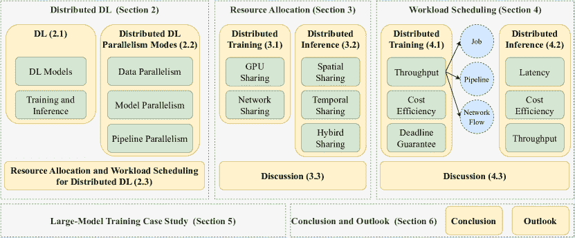
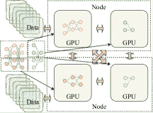

<!--yml

类别：未分类

日期：2024-09-06 19:31:39

-->

# [2406.08115] 大规模分布式深度学习的资源分配与工作负载调度：综述

> 来源：[`ar5iv.labs.arxiv.org/html/2406.08115`](https://ar5iv.labs.arxiv.org/html/2406.08115)

10081

# 大规模分布式深度学习的资源分配与工作负载调度：综述

冯亮 fliang@smbu.edu.cn [0000-0002-8542-9871](https://orcid.org/0000-0002-8542-9871 "ORCID identifier") 深圳市 MSU-BIT 大学人工智能研究院，中国 518107 广东-香港-澳门情感智能与普适计算联合实验室，深圳市 MSU-BIT 大学，中国 518107 ， 张真 zhangzhen19@lzu.edu.cn [0009-0007-9955-0916](https://orcid.org/0009-0007-9955-0916 "ORCID identifier") ， 陆海峰 luhf18@lzu.edu.cn [0000-0003-0155-8447](https://orcid.org/0000-0003-0155-8447 "ORCID identifier") 甘肃省可穿戴计算重点实验室，兰州大学信息科学与工程学院，中国 730000 广东-香港-澳门情感智能与普适计算联合实验室，深圳市 MSU-BIT 大学，中国 518107 ， 李成铭 licm@smbu.edu.cn [0000-0002-8542-9871](https://orcid.org/0000-0002-8542-9871 "ORCID identifier") 深圳市 MSU-BIT 大学人工智能研究院，中国 518107 广东-香港-澳门情感智能与普适计算联合实验室，深圳市 MSU-BIT 大学，中国 518107 ， 梁维克 vleung@ieee.org [0000-0003-3529-2640](https://orcid.org/0000-0003-3529-2640 "ORCID identifier") 深圳市 MSU-BIT 大学人工智能研究院，中国 518107 不列颠哥伦比亚大学电气与计算机工程系，加拿大 V6T 1Z4 ， 郭彦毅 guoyy@smbu.edu.cn [0009-0000-7682-6667](https://orcid.org/0009-0000-7682-6667 "ORCID identifier") 深圳市 MSU-BIT 大学前沿交叉学科研究院，中国 北京理工大学机械与电气工程学院，中国  以及  胡西平 huxp@smbu.edu.cn [0000-0002-4952-699X](https://orcid.org/0000-0002-4952-699X "ORCID identifier") 深圳市 MSU-BIT 大学人工智能研究院，中国 518107 广东-香港-澳门情感智能与普适计算联合实验室，深圳市 MSU-BIT 大学，中国 518107 北京理工大学医学技术学院，中国 10081

###### 摘要。

随着大规模数据中心中分布式深度学习工作负载的迅速增加，高效的分布式深度学习框架策略对于资源分配和工作负载调度已成为高性能深度学习的关键。大规模环境下的数据集、模型以及计算和通信资源的大量存在带来了资源分配和工作负载调度的各种独特挑战，如调度复杂性、资源和工作负载异质性以及容错能力。为了解这些挑战及其对应的解决方案，本综述回顾了 2019 年至 2024 年的文献，主要针对大规模分布式深度学习的高效资源分配和工作负载调度策略。我们通过关注各种资源类型、调度粒度水平和分布式训练及推理过程中的性能目标来探讨这些策略。我们强调了每个主题的关键挑战，并讨论了现有技术的关键见解。为了说明实际大规模资源分配和工作负载调度在真实分布式深度学习场景中的应用，我们使用了训练大型语言模型的案例研究。本综述旨在鼓励计算机科学、人工智能和通信领域的研究人员了解近期进展，并探索大规模分布式深度学习高效框架策略的未来研究方向。

分布式深度学习、资源分配、GPU 共享、任务调度、大模型、流水线并行^†^†ccs: 计算机系统组织 分布式架构^†^†ccs: 计算方法 机器学习^†^†ccs: 计算方法 人工智能^†^†ccs: 网络 云计算

## 1\. 介绍

随着数据集和深度学习（DL）模型规模的迅速增长，分布式 DL （Liang et al., 2024; Yu et al., 2023）已成为各种人工智能技术、联邦学习 （Liu et al., 2022b）和智能物联网 （Al-Garadi et al., 2020）的最先进实践。与传统的单节点 DL（在单一计算节点或甚至单个 GPU 上运行）相比，分布式 DL 可以利用多个 GPU 和计算节点来处理大量的训练和推理工作负载，并提高学习吞吐量。特别是在具有数十亿参数的极大型模型时代，分布式 DL 使得在数据中心数百个计算节点和数千个 GPU 上进行高效的大模型训练成为可能。

然而，分布式 DL 面临着许多与大规模环境中资源分配和工作负载调度的高效框架策略相关的关键挑战。首先，由于数据中心内有大量计算和通信设备，如何高效管理和分配资源以充分利用分布式 DL 工作负载中的资源成为一个挑战。在异构资源环境中，这一挑战尤为突出，因为 GPUs 的计算能力各异，网络的通信能力和拓扑结构也各不相同。其次，分布式 DL 工作负载表现出比单节点 DL 更复杂的特性。一方面，各种分布式 DL 工作负载的并行模式产生了新的通信模式，这些模式涉及大量数据传输和模型同步的通信开销。另一方面，分布式 DL 工作负载中许多计算和通信任务的组合使执行依赖关系模型变得复杂，从而带来了显著的优化空间。第三，大型模型规模的指数级增长引发了对计算和通信资源成本以及大规模分布式训练效率的担忧。解决这些挑战刻不容缓，需要计算机科学、人工智能和通信领域的研究人员系统性地理解这一领域中的关键问题。

一些现有的调研（Zhou 等人，2019；Mayer 和 Jacobsen，2020；Shi 等人，2020；Ouyang 等人，2021；Chen 等人，2021；Yu 等人，2023；Cao 等人，2023；Tang 等人，2023a；Ye 等人，2024a）已经触及了一些关于分布式深度学习（DL）的高效资源分配和工作负载调度策略的主题。例如，Ye 等人介绍了在作业层级调度分布式训练和推理工作负载于 GPUs 上。然而，这些调研缺乏对大规模环境中各种粒度级别的计算和通信资源及工作负载调度的分布式 DL 框架策略的系统性探索。计算机科学、人工智能和通信领域的研究人员需要对大规模分布式 DL 环境中的框架策略代表性和关键性挑战有一个全面的了解。

为填补现有分布式深度学习框架策略调查中的空白，本调查系统地研究了资源分配和工作负载调度的关键挑战和高效的分布式深度学习策略。我们回顾了主要在 2019 年至 2024 年之间的文献。讨论涵盖了各种资源类型、调度粒度级别和性能目标。对于资源分配策略，我们讨论了应用不同方法的 GPU 共享技术和在不同粒度级别下工作的网络带宽共享技术。对于工作负载调度策略，我们根据不同的性能目标和调度粒度对技术进行了分类。这两组策略主要根据应用阶段进行组织：分布式训练和推理。我们聚焦于大规模分布式深度学习的高效策略，突出了每个主题的关键挑战，并提供了关于关键研究成果的见解。为了说明如何在实际生活中应用这些高效的框架策略，我们进行了大模型分布式训练的案例研究，这一研究主题快速增长，并且可能长期存在，是需要高效分布式深度学习框架策略的最佳应用场景之一。我们还提供了未来研究方向的展望。

本调查的主要贡献总结如下。

+   •

    我们彻底而全面地调查了最新的大规模分布式深度学习资源分配和工作负载调度框架策略。

+   •

    我们突出了这些框架策略每个主题的关键挑战。

+   •

    我们通过对大模型训练的案例研究，说明如何在实践中应用高效的框架策略。

表 1\. 相关调查的比较

|   |  | 资源分配 | 工作负载调度 |
| --- | --- | --- | --- |
| 参考文献 | 年份 | GPU 分配 | 网络带宽分配 | 作业调度 | 流水线调度 | 网络流调度 |
|    (迈耶和雅各布森，2020) | 2020 | ✓ |  | ✓ |  |  |
| (施等，2020) | 2020 |  | ✓ |  |  |  |
| (欧阳等，2021) | 2021 |  |  |  | ✓ | ✓ |
| (余等，2023) | 2023 |  |  |  | ✓ | ✓ |
| (曹等，2023) | 2023 |  | ✓ |  |  |  |
| (唐等，2023a) | 2023 |  |  |  | ✓ |  |
| (叶等，2024a) | 2024 | ✓ |  | ✓ |  |  |
| (梁等，2024) | 2024 |  | ✓ |  |  | ✓ |
|   我们的 | - | ✓ | ✓ | ✓ | ✓ | ✓ |
|   |  |  |  |  |  |  |

### 1.1\. 相关调查

现有的分布式深度学习调查缺乏对各种资源类型的资源分配策略和各个层次的工作负载调度的系统性覆盖。表 1 比较了我们的调查与领域内其他相关调查在分布式深度学习框架策略，包括基于 GPU 和网络带宽的资源分配以及基于作业、管道和网络流的工作负载调度方面所涵盖的主题。

一些调查关注于在 GPU 数据中心调度分布式作业。Mayer 和 Jacobsen（Mayer 和 Jacobsen，2020）和 Ye 等人（Ye 等人，2024a）都对数据中心环境下的作业级 GPU 分配和工作负载调度进行了调查。然而，这些调查仅关注整体数据中心的作业级策略，而不关注单个作业性能的细粒度策略。它们还仅调查了与单一资源类型 GPU 相关的技术，但未涉及网络带宽，而网络带宽是通信作为瓶颈的分布式深度学习的重要性能因素。

与以 GPU 为中心的调查相对，一些研究专注于分布式深度学习的通信技术和网络带宽分配策略。Shi 等人（Shi 等人，2020）和 Cao 等人（Cao 等人，2023）回顾了无线网络中联邦学习的带宽分配策略的文献。Liang 等人（Liang 等人，2024）不仅调查了通用网络上的带宽分配策略，还研究了不同网络层上的网络流调度策略。然而，仅覆盖通信技术并未揭示分布式深度学习中高效调度的全貌，这需要计算和通信的联合优化。

在分布式深度学习中的细粒度工作负载调度方面，一些研究（Ouyang 等人，2021；Yu 等人，2023；Tang 等人，2023a）探讨了用于重叠计算和通信工作负载的管道级调度策略，以提高吞吐量。然而，这些研究并未突出与此主题相关的主要挑战，也缺乏对作业级资源分配和工作负载调度策略的调查，这些策略可以与这些管道级策略协调作为分布式深度学习在数据中心的综合框架解决方案。

我们的调查填补了现有调查中的空白。我们提出了计算和通信资源（主要是 GPU 和网络带宽）的资源分配策略，以匹配分布式深度学习工作负载的资源需求。我们还探讨了作业、管道和网络流级别的工作负载调度策略，以提高数据中心的整体吞吐量和单个作业的效率。涉及各种资源类型和调度粒度水平的系统文献研究使本文成为分布式深度学习框架领域最新技术的全面调查。

图 1\. 调查组织结构

### 1.2\. 调查组织结构

图 1 概述了本调查中剩余部分的组织结构。第 2 节提供了关于分布式深度学习和资源管理及工作负载调度框架的基础知识。第 3 节和第 4 节分别介绍了各种框架策略用于资源分配和工作负载调度。这些框架策略主要根据其应用场景（包括分布式训练和推断）进行分类，其次根据资源类型、方法或性能目标进行分类。我们在每节末尾讨论了见解。在第 5 节，我们使用分布式大模型训练的案例研究来展示如何在现实数据中心中实际应用这些框架策略。在第 6 节，我们总结了本调查并展望未来的研究方向。

表 2\. 常用缩写列表

|    缩写 | 描述 |
| --- | --- |
|   DL | 深度学习 |
| DRL | 深度强化学习 |
| DNN | 深度神经网络 |
| GPU | 图形处理单元 |
| LLM | 大型语言模型 |
| MPS | 多进程共享 |
| NLP | 自然语言处理 |
| PS | 参数服务器 |
| SLO | 服务级别目标 |
|   |  |

## 2\. 深度学习及分布式深度学习基础

在本节中，我们介绍了深度学习（DL）的基础知识、分布式深度学习及其资源分配和工作负载调度框架。表 2 列出了本调查中常用的缩写。

### 2.1\. 深度学习

深度学习（DL）是机器学习的一个子领域，利用深度人工神经网络（DNN）以分层方式从训练数据中提取复杂模式。训练好的 DNN 能够识别/预测未见数据中的模式。深度学习已被应用于各个领域，包括自然语言处理 (NLP) (Bahdanau et al., 2015)、计算机视觉 (Dosovitskiy et al., 2020) 和生物医学工程 (Thieme et al., 2023)。

(a) 全连接 DNN

(b) CNN

(c) RNN

图 2\. 常见的人工神经网络模型用于深度学习

#### 2.1.1\. 深度学习模型

一个 DNN 由多个隐藏层组成。每一层由神经元组成，这些神经元通常通过非线性函数进行激活。根据层内及层间神经元之间的连接方式，DNN 模型可以有多种类型。在本调查中，提到的模型或深度学习模型指的是 DNN，除非上下文另有说明。图 2 展示了三种基本的 DNN 模型：全连接 DNN、卷积神经网络 (CNN) 和递归神经网络 (RNN)。

$\bullet$ 全连接 DNN：全连接 DNN，也称为前馈神经网络，构成一个稠密的网络，包括一个输入层、若干隐藏层和一个输出层，如图 2a 所示。前一层的神经元与后一层的所有神经元连接，每个连接都有一个可学习的权重参数，表示连接的强度。这种结构使得全连接 DNN 能够捕捉数据中的复杂关系，广泛应用于分类 (Sagduyu et al., 2023)、回归 (Saikia et al., 2022) 和特征表示嵌入 (Ferrand et al., 2020) 等任务。

$\bullet$ CNN: CNN 是一种流行的模型，旨在进行特征提取和分类，主要针对图像和视频数据。如图 2b 所示，CNN 由一系列卷积层和池化层组成，用于上下文特征提取。与将权重参数分配给每个神经元连接的全连接层不同，卷积层通过利用多个内核（每个内核包含共享权重）显著减少了权重参数的数量，从而进行特征提取。卷积层的特征提取过程通过卷积操作得到增强，其中内核遍历图像的感受野，通过加权求和提取新特征，然后通过非线性激活函数进行处理。池化层对卷积层中的数据进行下采样，以减少特征维度并缓解过拟合问题。CNN 在各种计算机视觉任务中得到了广泛应用，包括图像分类 (Amerini et al., 2019)、语义分割 (Zhang et al., 2022) 和目标检测 (Bi et al., 2022)。

$\bullet$ RNN: RNN 是一种处理序列数据（如时间序列数据、自然语言和语音音频）的深度学习模型，如图 2c 所示。RNN 的一般架构包括捕获和传播输入序列的时间上下文的隐藏单元。它不断更新，并利用当前输入和先前时间上下文来进行预测。为了解决捕获长期时间依赖性的问题，开发了两种常见的 RNN 变体，即长短期记忆 (LSTM) 和门控循环单元 (GRU)，这两者在建模这些依赖性和有效减少计算复杂性之间提供了权衡。RNN 的常见应用包括时间序列预测 (Hua et al., 2019)、自然语言处理 (Feng et al., 2020) 和自动规划 (Say, 2021)。

#### 2.1.2. 训练与推理

DL 模型的训练是优化其参数以最小化在训练数据集上的预测误差的过程，该过程由指定的损失函数或目标函数确定。损失函数可以是凸的或非凸的，导致凸优化或非凸优化问题。训练可以分解为两个关键过程：前向传播和反向传播。在前向传播过程中，训练数据被传入模型的输入层，通过使用当前模型参数将数据在网络中前向传播以计算输出预测。在反向传播过程中，计算相对于损失函数的预测误差和梯度，并以反向方式迭代更新可训练参数，优化模型以实现最小损失。反向传播更新的常见优化器包括小批量随机梯度下降（SGD）（Li et al., 2014）、带动量的 SGD（Sutskever et al., 2013）、Adagrad（Duchi et al., 2011）和 Adam（Kingma 和 Ba, 2015）。训练过程通常在多个周期内对训练数据的批量进行迭代，直到模型收敛。当训练误差收敛到预定义误差范围内时，模型被认为已经收敛，额外的训练不会进一步减少误差。完成训练过程后，DL 模型中的权重参数被学习并固定。训练过程后，通常会有一个验证过程来验证训练模型的性能，为微调超参数和重新训练模型以获得更好的性能提供信息。

推理过程将未见数据通过训练好的 DL 模型进行前向传播以进行预测。根据应用的具体要求，结果预测可以从输出层或从中间隐藏层中的预测潜在表示中提取。例如，在网络流量分析的背景下，可能会训练一个端到端的 DNN 模型以直接分类流量类型（Lotfollahi et al., 2020），或者，训练在流量数据上的编码器-解码器模型可以利用编码器生成的潜在表示进行后续任务，如攻击检测（Vu et al., 2020）。

在这项调查中，针对训练或推理过程中特定时期的 DL 模型特定部分的计算任务通常被称为 DL 任务，除非在上下文中有必要区分训练任务和推理任务。

### 2.2\. 分布式 DL 并行模式

分布式深度学习将数据和模型划分为多个处理单元（通常是 GPU），以便并行执行，从而利用集群中许多计算节点的计算能力。如图 3 所示，分布式深度学习有三种基本的并行模式：数据并行、模型并行和流水线并行。

(a) 数据并行

(b) 模型并行

(c) 流水线并行

图 3\. 分布式深度学习的并行模式

#### 2.2.1\. 数据并行

如图 3a 所示，数据并行训练将整个训练数据集划分为多个部分，并将这些部分分配到许多 GPU 上进行并行训练（Li 等， 2020c）。每个 GPU 都有一个结构相同的完整模型，并在特定的数据集部分上进行训练。在分布式训练过程中，这些本地模型通过特定的模型同步机制（通常通过参数服务器（PS））共享知识以更新全局模型。

#### 2.2.2\. 模型并行

如图 3b 所示，模型并行训练将整个深度学习模型划分为子模型，并在模型超出单个 GPU 或计算节点的容量时将其分配到集群中的许多 GPU 上（Gomez 等，2022）。这种并行模式关注于模型划分策略，重点是工作负载平衡，以及子模型放置策略，重点是子模型之间的通信开销。

#### 2.2.3\. 流水线并行

如图 3c 所示，管道并行训练通过将分布式训练的不同阶段排成流水线并防止计算和通信资源闲置来增强深度学习并行性（Li 和 Hoefler，2021；Liu 等，2022c；Oh 等，2022）。管道并行训练可以被视为模型并行训练的一种特殊情况，通过将子模型的训练逐层分解为子任务，并在不同的 GPU 之间重叠不同阶段的计算。计算和通信任务也可以在管道中重叠。这种模式通常适用于大语言模型训练（Narayanan 等，2021）、边缘计算（Yao 等，2022）和物联网（Baccour 等，2022），其中设备具有异构的计算和通信能力来处理各种分布式深度学习子任务。在实践中，管道并行可以与其他并行模式一起工作，以处理具有大模型结构的复杂分布式深度学习工作负载（Tarnawski 等，2021；Ryabinin 等，2023）。

图 4\. 分布式深度学习中资源分配与工作负载调度机制的概述

### 2.3\. 分布式深度学习的资源分配与工作负载调度

高性能分布式深度学习的资源分配和工作负载调度策略通常集成在集群级和分布式深度学习级框架中。图 4 说明了集群内大规模分布式深度学习的资源分配和工作负载调度机制的过程。该过程包括六个主要步骤。 (1) 对于分布式深度学习作业队列，任务调度器根据各种工作负载特征，如资源利用状况和工作进展，进行作业分析。 (2) 资源管理器根据作业的特征分析，将集群内分布的 GPU 和网络资源分配给作业。资源可以以物理或虚拟方式表示，虚拟资源可以封装在虚拟机或容器中。 (3) 作业级调度器根据资源约束和作业性能估计确定作业执行优先级。 (4) 流水线级调度器将作业分解为子任务，并将它们分配到可用资源上进行子任务的流水线执行，旨在增加任务并行性并重叠计算和通信负载。 (5) 网络流级调度器通过考虑网络流的关系和依赖性来优化多个子任务的网络流或协同流。 (6) 调度的作业、流水线和网络流在集群内分配的 GPU 和网络资源上高效运行。

表 3\. 大规模分布式深度学习的资源分配策略研究

|    类别 | 参考文献 | 年份 | 亮点 |
| --- | --- | --- | --- |
|    训练 (3.1) | GPU 共享。方法： (1) 工作负载分析 [[C1]](#S3.SS1.SSS1.tab1 "3.1.1\. GPU 共享: ‣ 3.1\. 分布式训练的资源分配 ‣ 3\. 资源分配 ‣ 大规模分布式深度学习的资源分配与工作负载调度：综述") (3.1.1) | Gandiva (肖等，2018) | 2018 | 利用深度学习工作负载的配置文件提高 GPU 集群中深度学习模型训练的效率和延迟。 |
| AntMan (肖等，2020) | 2020 | 介绍了集群调度器和动态扩展机制的共同设计。 |
|  | FGD (Weng et al., 2023) | 2023 | 监控 DL 任务运行时的个体评估函数，以便弹性地做出放置决策和资源分配。 |
|  | TGS (Wu et al., 2023) | 2023 | 设计自适应速率控制和透明统一内存机制。 |
|  | Orion (Strati et al., 2024) | 2024 | 基于 DNN 工作负载的计算和内存配置文件共同调度 GPU 内核。 |
| (2) 上下文切换 [[C2]](#S3.SS1.SSS1.tab2 "3.1.1\. GPU 共享: ‣ 3.1\. 分布式训练的资源分配 ‣ 3\. 资源分配 ‣ 大规模分布式深度学习的资源分配与工作负载调度: 综述") (3.1.1) | Salus (Yu and Chowdhury, 2020) | 2019 | 实现多个 DL 应用程序之间的细粒度 GPU 共享。 |
| PipeSwitch (Bai et al., 2020) | 2020 | 利用 DL 应用程序的配置文件实现毫秒级的上下文切换。 |
|  | DistMind (Jin et al., 2024) | 2024 | 暴露 GPU 池和内存池的抽象，并设计高性能的三阶段流水线。 |
|  | G-Safe (Pavlidakis et al., 2024) | 2024 | 提供透明的内存保护以支持上下文切换。 |
| (3) 性能估计 [[C3]](#S3.SS1.SSS1.tab3 "3.1.1\. GPU 共享: ‣ 3.1\. 分布式训练的资源分配 ‣ 3\. 资源分配 ‣ 大规模分布式深度学习的资源分配与工作负载调度: 综述") (3.1.1) | Optimus (Peng et al., 2018) | 2018 | 估算 DL 任务的剩余执行时间，并设计基于边际收益的分配算法。 |
| Harmony (Bao et al., 2019) | 2019 | 以最小化干扰和最大化性能的方式放置训练任务。 |
|  | Horus (Yeung et al., 2021) | 2021 | 提出了一种数据驱动的方法来预测异构 DL 任务的 GPU 利用率。 |
|  | GPARS (Wang et al., 2024) | 2024 | 利用作业之间的时空相关性，为新提交的作业分配合适的 GPU 类型。 |
| (4) 弹性扩展 [[C4]](#S3.SS1.SSS1.tab4 "3.1.1\. GPU sharing: ‣ 3.1\. Resource Allocation for Distributed Training ‣ 3\. Resource Allocation ‣ Resource Allocation and Workload Scheduling for Large-Scale Distributed Deep Learning: A Survey") (3.1.1) | Pollux (Qiao et al., 2021) | 2021 | 将系统吞吐量与统计效率相结合，并引入了良效比的定义。 |
|  | Zico (Lim et al., 2021) | 2021 | 通过跟踪训练作业的计算进度来监控单个深度学习作业的内存使用模式。 |
|  | AFS (Hwang et al., 2021) | 2021 | 处理未来作业需要基于当前份额计算进行主动准备。 |
|  | EasyScale (Li et al., 2023a) | 2023 | 利用一种名为 EasyScaleThread 的线程抽象来保持可扩展 GPU 的一致训练精度。 |
|  | FlowCon (Mao et al., 2023) | 2023 | 通过打包任务来最小化 GPU 片段的增长。 |
| (5) 超参数调优 [[C5]](#S3.SS1.SSS1.tab5 "3.1.1\. GPU sharing: ‣ 3.1\. Resource Allocation for Distributed Training ‣ 3\. Resource Allocation ‣ Resource Allocation and Workload Scheduling for Large-Scale Distributed Deep Learning: A Survey") (3.1.1) | Fluid (Yu et al., 2021a) | 2021 | 利用水填充方法加速超参数优化过程。 |
| Titan (Gao et al., 2022) | 2022 | 将多个微调工作负载合并为一个，以提高资源利用率。 |
|  | DISC (Liu et al., 2022d) | 2022 | 利用自适应扩展来调整 GPU 时间片的大小，并将 GPU 时间片的动态分配形式化为一个优化问题。 |
|  | Hydro (Hu et al., 2023) | 2023 | 通过将超参数调优工作负载与管道支持的大模型训练任务交替进行，来扩展资源。 |
| 网络带宽共享。粒度：（1）作业；（2）梯度块；（3）协流 [[C6]](#S3.SS1.SSS1.tab6 "3.1.1\. GPU sharing: ‣ 3.1\. Resource Allocation for Distributed Training ‣ 3\. Resource Allocation ‣ Resource Allocation and Workload Scheduling for Large-Scale Distributed Deep Learning: A Survey") (3.1.2) | Liquid (Gu et al., 2022) | 2021 | （1）提出在即时和批处理模式下智能的集群网络高效调度方法。 |
| Prophet (Zhang et al., 2021) | 2021 | （2）利用监测到的网络带宽和分析的梯度时间间隔预测梯度块中的梯度数量。 |
|  | Parrot (Li et al., 2020a) | 2020 | （3）使用线性规划（LP）解决方案推导加权带宽缩放策略，以最小化通信阶段的时间成本。 |
|    推理 (3.2) | 空间共享 [[C7]](#S3.SS1.SSS2.tab1 "3.1.2\. Network bandwidth sharing: ‣ 3.1\. Resource Allocation for Distributed Training ‣ 3\. Resource Allocation ‣ Resource Allocation and Workload Scheduling for Large-Scale Distributed Deep Learning: A Survey") | GSLICE (Dhakal et al., 2020) | 2020 | 开发自学习和自适应的 GPU 资源分配与批处理方案。 |
| iGniter (Xu et al., 2022) | 2022 | 利用推理性能模型计算合适的批处理大小和分配的 GPU 资源下限。 |
|  | SLO-aware (Cho et al., 2022) | 2022 | 根据自动伸缩决策将推理请求分配到已部署的功能上。 |
|  | AlpaServe (Li et al., 2023c) | 2023 | 寻找一种分区策略，以最小化操作间并行性的阶段不平衡。 |
| 时间共享 [[C7]](#S3.SS1.SSS2.tab1 "3.1.2\. Network bandwidth sharing: ‣ 3.1\. Resource Allocation for Distributed Training ‣ 3\. Resource Allocation ‣ Resource Allocation and Workload Scheduling for Large-Scale Distributed Deep Learning: A Survey") | Nexus (Shen et al., 2019) | 2019 | 采用启发式方法选择请求。 |
| INFaaS (Romero et al., 2021) | 2021 | 识别由共享硬件资源引起的共址干扰。 |
|  | Cocktail (Gunasekaran et al., 2022) | 2022 | 构建一个利用重要性采样技术的分布式加权自动伸缩策略。 |
| 混合共享 [[C7]](#S3.SS1.SSS2.tab1 "3.1.2\. 网络带宽共享： ‣ 3.1\. 分布式训练的资源分配 ‣ 3\. 资源分配 ‣ 大规模分布式深度学习的资源分配与工作负载调度：综述") | Gpulet (Choi et al., 2022) | 2022 | 允许异构机器学习模型以最具成本效益的方式映射到多个 gpulets 上。 |
| FaST-GShare (Gu et al., 2023) | 2023 | 引入 FaST-Manager 来限制和隔离时空资源。 |
|   |  |  |  |  |

## 3\. 资源分配

本节介绍了针对分布式训练和推理的资源分配策略，这些策略具有不同的工作负载特征和性能要求。表 3 总结了这些策略及相关挑战 [Cx]，并在接下来的章节中以框文本形式进行突出。分布式训练的资源分配策略分为两类：GPU 共享和网络带宽共享。GPU 共享策略根据所应用的技术进一步分为五种方法，包括工作负载分析、上下文切换、性能估计、弹性扩展和针对超参数调优工作负载的特殊考虑。网络带宽共享策略根据资源的目标粒度进一步分类，包括作业、梯度块任务和共流。分布式推理的资源分配策略根据 GPU 共享模式分为三类，包括空间共享、时间共享和混合共享。

### 3.1\. 分布式训练的资源分配

分布式深度学习的训练过程需要大量的计算能力、GPU 内存和 GPU 之间的网络通信带宽。因此，GPU 和网络带宽共享是讨论分布式训练资源分配的重点。

#### 3.1.1\. GPU 共享：

尽管 GPU 在分布式深度学习中得到了广泛应用，但在生产集群中常见到资源未充分利用的问题。记录的 GPU 利用率通常在 25%到 50%以下之间（Narayanan et al., 2020; Hu et al., 2021; Weng et al., 2022; Li et al., 2023b; Weng et al., 2023; Cheng et al., 2023）。在大规模分布式计算环境中，这一问题尤为突出。为了解决这个问题，开发了各种分布式技术，使得深度学习任务可以高效地在多个设备上运行（Ye et al., 2024b）。

GPU 共享策略通常通过虚拟化利用部分资源分配来缓解大规模分布式深度学习中的低 GPU 利用率问题。NVIDIA 被公认为领先的 GPU 提供商，推出了多进程共享（MPS）（Nvi, 2024b），提供了一个操作系统级的虚拟化解决方案。然而，其实施需要应用程序特定的专业知识来定义资源限制，以确保性能隔离。此外，MPS 与各种深度学习框架不兼容。为了解决 MPS 的性能隔离问题，NVIDIA 的另一项技术，多实例 GPU（MIG）（Nvi, 2024a），能够将一个 GPU 分割成多个独立的实例，每个实例拥有专用资源。然而，由于 MIG 不能动态调整分区以适应在线工作负载的 GPU 需求，它必须在开始时为在线工作负载分配峰值 GPU 资源，并在整个执行生命周期中保留这些资源，导致 GPU 资源的显著浪费。为了解决 MPS 和 MIG 在在线工作负载中高效性能隔离的问题，Muxflow（Zhao et al., 2023a）提出了一种两级保护机制，以保证在线工作负载的 GPU 隔离。工作负载级别的保护位于 CUDA（cud, 2024a）驱动层和 CUDA 运行时层之间，控制离线工作负载以保护在线工作负载。GPU 级别的保护监控 GPU 设备状态，以实现对离线工作负载 GPU 内存配额的动态调整。字节跳动已经在超过 20,000 个 GPU 的集群中成功部署了 Muxflow。

|   挑战[C1]：利用具有代表性的分布式深度学习工作负载，并分析一般特征，以便分析结果准确反映 GPU 分配策略工作环境中的工作负载特征。 |
| --- |

$\bullet$ 工作负载分析：一些解决方案利用生产大规模集群或云中复杂分布式深度学习工作负载的分析来指导 GPU 分配策略，从而应对挑战[[C1]](#S3.SS1.SSS1.tab1 "3.1.1\. GPU 共享：‣ 3.1\. 分布式训练的资源分配 ‣ 3\. 资源分配 ‣ 大规模分布式深度学习的资源分配和工作负载调度：调查"). Gandiva (Xiao 等，2018) 利用分布式深度学习任务的分析，解决了 GPU 使用不足的问题，主要有三种方法。首先，当负载过重时，Gandiva 允许新进作业与现有作业共享 GPU 时间。接着，它允许时间分片的作业迁移到其他 GPU。最后，它支持弹性 GPU 容量，在空闲时增加 GPU 数量，并随着负载的动态增长减少 GPU 数量，从而有效利用空闲 GPU。Gandiva 的性能在微软的生产集群上得到了验证。AntMan (Xiao 等，2020) 是阿里巴巴分布式深度学习集群的生产解决方案。它从硬件、集群调度和作业行为三个方面分析了分布式深度学习集群中 GPU 使用不足的原因。通过利用分布式训练作业的资源需求波动，AntMan 共同设计了集群调度器和分布式深度学习框架，具备作业执行期间 GPU 资源的动态扩展机制。这种方法确保了大规模集群中作业的服务水平目标（SLO），同时通过机会调度提高了集群利用率。利用阿里巴巴生产跟踪的分析，Fragmentation Gradient Descent (FGD) (Weng 等，2023) 解决了大规模集群中严重的 GPU 碎片化问题。FGD 通过任务打包最小化 GPU 碎片化增长，以实现最大 GPU 分配率。TGS (Wu 等，2023) 为生产集群中的容器分布式深度学习任务提供了操作系统层面的透明 GPU 共享。TGS 解决了应用分析知识不足和 GPU 资源共享期间 GPU 内存潜在超额分配的问题。它通过自适应监控和控制每个容器向 GPU 发送 GPU 内核的速率，来解决第一个问题，旨在最大化机会作业的速率，同时不影响生产作业的速率。它通过 CUDA 统一内存分配 (cud, 2024b) 将 GPU 内存和主机内存在单一地址空间中统一，解决了第二个问题，实现了 GPU 内存分配的性能隔离和透明度。机会作业的超额分配内存会自动被驱逐到主机内存中，确保生产作业的性能。Strati 等 (Strati 等，2024) 提出，DNN 工作负载中有许多数据依赖的运算符，这些运算符具有不同的计算和内存需求。这些单独的运算符可能会饱和 GPU 计算单元或内存带宽，但往往会使其他资源未得到充分利用。为了解决 GPU 和其他资源利用不平衡的问题，他们提出了一种细粒度且考虑干扰的 GPU 分配器，名为 Orion，以根据 DNN 工作负载的计算和内存分析共同调度 GPU 内核，从而优化整体资源利用。

|   挑战 [C2]：减少分布式深度学习工作负载的 GPU 上下文切换延迟，包括模型和数据的卸载和加载 |
| --- |

$\bullet$ 上下文切换：一些工作利用快速上下文切换来减少 GPU 延迟，从而解决挑战 [[C2]](#S3.SS1.SSS1.tab2 "3.1.1\. GPU 共享： ‣ 3.1\. 分布式训练的资源分配 ‣ 3\. 资源分配 ‣ 大规模分布式深度学习的资源分配和工作负载调度：调查"). GPU 上下文切换指的是在 GPU 执行多个训练任务或任务时，它在进程之间切换。Salus (Yu 和 Chowdhury, 2020) 通过一种细粒度的 GPU 共享策略实现了低切换延迟，该策略提供了两种 GPU 共享原语：快速作业切换和内存共享。前者使当前活跃的深度学习作业能够在 GPU 上迅速抢占和有效时间共享，而后者则将较小的分布式深度学习任务打包在同一设备上，以确保高内存利用率并防止内存碎片化。相对而言，PipeSwitch (Bai 等, 2020) 支持分布式深度学习作业管道的快速上下文切换。PipeSwitch 通过针对管道的模型感知分组和主动分配 GPU 内存来优化上下文切换开销。层的模型感知分组旨在最小化在上下文切换期间将模型在 CPU 和 GPU 之间传输的开销。主动分配 GPU 内存给待机工作者在其应激活之前，可以加快上下文切换速度。为了防止作业干扰，PipeSwitch 通过为每个活跃工作任务初始化一个新的独立进程来执行进程级别隔离。为了最小化从内存池加载应用程序到 GPU 的开销，DistMind (Jin 等, 2024) 公开了 GPU 池和内存池的抽象，并在 GPU 调度器中结合了三阶段流水线、缓存感知负载均衡和 DNN 感知分片，以实现低应用程序加载开销和高 GPU 效率。G-Safe (Pavlidakis 等, 2024) 关注多租户环境中 GPU 共享的安全问题。它在上下文切换期间限制每个应用程序的 GPU 内核保持在分配给它们的内存分区内。 |

|   挑战 [C3]：确保用于指导资源分配策略的中间定义性能目标在估算分布式深度学习任务的 GPU 分配策略的实际性能目标时能带来直接的改善。 |
| --- |

$\bullet$ 性能估计：一些研究采用性能估计指导方法来优化 GPU 资源分配，解决挑战[[C3]](#S3.SS1.SSS1.tab3 "3.1.1\. GPU sharing: ‣ 3.1\. Resource Allocation for Distributed Training ‣ 3\. Resource Allocation ‣ Resource Allocation and Workload Scheduling for Large-Scale Distributed Deep Learning: A Survey")。这些方法中的性能目标和性能估计方法可能有所不同。为了说明挑战[[C3]](#S3.SS1.SSS1.tab3 "3.1.1\. GPU sharing: ‣ 3.1\. Resource Allocation for Distributed Training ‣ 3\. Resource Allocation ‣ Resource Allocation and Workload Scheduling for Large-Scale Distributed Deep Learning: A Survey")，当一个策略旨在减少平均作业完成时间，但使用 GPU 利用率作为中间性能估计时，必须确保更高的 GPU 利用率会导致更短的平均作业完成时间。Optimus (Peng et al., 2018)引入了一种基于边际收益的动态分配算法，估计分布式 DL 任务的剩余执行时间。在这种贪婪策略中，边际收益较大的作业将被分配更多的 GPU 资源。Harmony (Bao et al., 2019)使用深度强化学习（DRL）算法将分布式 DL 作业放置到能够最小化训练或推断时间的 GPU 资源上。对于未见过的放置，其学习奖励由历史分配样本指导。Horus (Yeung et al., 2021)建立了一个模型，以从计算图特征中预测异构分布式 DL 任务的 GPU 利用率。它将 GPU 利用率确定为做出最佳放置决策的一般代理指标。GPARS (Wang et al., 2024)利用作业之间的时空相关性，并采用图注意网络进行精确的作业时长预测。它设计了一个动态目标函数，为新提交的作业分配合适的 GPU 类型。

|   挑战[C4]：确定弹性分布式训练中扩展资源的时机和配额，这需要监控运行时性能统计数据。 |
| --- |

$\bullet$ 弹性训练：弹性训练涉及动态扩展和收缩资源容量，是在云环境中改善资源利用率和节省分布式深度学习成本的重要策略。许多研究解决了挑战 [[C4]](#S3.SS1.SSS1.tab4 "3.1.1\. GPU 共享：‣ 3.1\. 分布式训练的资源分配 ‣ 3\. 资源分配 ‣ 大规模分布式深度学习的资源分配与工作负载调度：综述") 并集中于弹性 GPU 内存分配。例如，Pollux (Qiao 等人, 2021) 动态调整分布式深度学习任务的 GPU 资源，旨在最大化集群内的整体训练吞吐量。为了提高 GPU 内存共享效率，Zico (Lim 等人, 2021) 通过跟踪训练过程中的计算进展来监控各个分布式深度学习任务的内存使用模式。基于监控统计数据，Zico 自动分配和回收并发任务之间的内存，确保不超出内存预算。AFS (Hwang 等人, 2021) 指出，处理未来任务需要根据当前的共享计算进行资源的前瞻性准备。当 GPU 调度器估计未来 GPU 竞争将会激烈时，它会将更多资源分配给长期任务；否则则将更多资源分配给短期任务。EasyScale (Li 等人, 2023a) 使用一种名为 EasyScaleThread 的线程抽象，以在数据并行训练中在工作线程数量变化时保持一致的训练准确性，并提出了内部作业和作业间 GPU 调度器，以动态地为工作线程扩展或缩减 GPU。内部作业调度器向作业间调度器提出在线 GPU 分配建议，以最大化特定分布式深度学习任务的分布式训练吞吐量，而作业间调度器根据边际加速和工作负载平衡的考虑来批准或拒绝建议。EasyScale 可以通过这种两级弹性 GPU 调度提高异构 GPU 集群中的 GPU 利用率。相比之下，一些研究集中于弹性容器资源。例如，FlowCon (Mao 等人, 2023) 引入了一种基于增长效率和动态资源配置的容器放置策略，用于在运行时弹性地分配和撤回资源。

|   挑战 [C5]：提高批量多超参数调整任务的 GPU 利用率，这些任务之间的工作负载大多是同质的，以提高整体训练吞吐量。 |
| --- |

$\bullet$ 超参数调优：超参数调优工作负载代表了一批具有高度相似工作负载特征的分布式作业，因此可以利用这些特征进行资源分配。一些研究探讨了在分布式深度学习集群中提高 GPU 利用率的策略，这些策略解决了挑战[[C5]](#S3.SS1.SSS1.tab5 "3.1.1\. GPU 共享： ‣ 3.1\. 分布式训练的资源分配 ‣ 3\. 资源分配 ‣ 大规模分布式深度学习的资源分配与工作负载调度：综述")。Fluid（Yu et al., 2021a）是一个分布式深度学习超参数调优执行引擎，它将超参数调优过程抽象为一系列试验组。它采用水填充方法来加速超参数调优过程，从而提升 GPU 利用率。Titan（Gao et al., 2022）通过将多个微调工作负载合并为一个工作负载来采用启发式方法，这在多个微调工作负载经常共享相同模型参数的情况下尤其有利。DISC（Liu et al., 2022d）利用自适应扩展在运行时调整由超参数调优作业占用的 GPU 时间片的大小。这种基于模型准确性可能剧增的潜力的动态 GPU 时间片分配方法增强了每个超参数调优作业的处理能力。Hydro（Hu et al., 2023）通过引入一种考虑异质性的分配策略来解决集群资源利用率和调优效率的问题。该方法通过将超参数调优工作负载与支持流水线的大模型训练任务交错，以扩展超参数调优工作负载的资源。通过有效利用每个节点上由于微批次前向和后向处理之间的间隔而产生的空闲时间间隔，Hydro 提升了大规模分布式深度学习集群中的整体资源利用率和调优效率。

|   挑战 [C6]：分布式深度学习的网络带宽分配必须基于对工作负载的充分了解，并协调应用层和网络层的带宽资源。 |
| --- |

#### 3.1.2\. 网络带宽共享：

在大规模分布式环境中，通信通常是性能瓶颈，网络带宽是决定分布式训练效率的另一个重要因素。为了解决挑战[[C6]](#S3.SS1.SSS1.tab6 "3.1.1\. GPU 共享： ‣ 3.1\. 分布式训练的资源分配 ‣ 3\. 资源分配 ‣ 大规模分布式深度学习的资源分配与工作负载调度：综述")，网络层，例如传输层，通常与应用层协同工作，网络带宽分配器可以根据任务的需求在任一层上实现。

$\bullet$ 任务：一些工作关注于多个分布式训练任务的网络带宽共享。例如，Liquid（Gu 等， 2022）提出了一种计算和通信资源估算算法以及一种高效的分布式训练任务网络部署策略。该资源估算算法对分布式训练任务的资源需求进行建模，包括 GPU 计算能力、GPU 内存和网络带宽需求。任务部署策略将分布式训练任务分配给计算节点和容器集群，寻找最佳的任务部署方案，以满足估算的计算和通信资源需求，并减少 GPU 分片和容器间网络通信成本。

$\bullet$ 梯度块任务：一个分布式训练任务可以分解为多个梯度块训练任务。一些工作关注于梯度块任务粒度上的网络带宽共享。例如，Prophet（Zhang 等， 2021）根据分析的时间间隔将梯度块分组，并在网络带宽和梯度块的网络传输顺序方面对分布式训练时间进行建模。基于该模型，Prophet 寻找梯度块的最佳网络传输顺序，旨在最小化分布式训练时间。这个最佳的梯度块传输顺序优化了梯度块之间的网络带宽共享，并优化了网络传输和 GPU 计算之间的重叠。

$\bullet$ Coflow：Coflow 是多个网络流的抽象，这些网络流与特定的通信任务相关，例如，多个或一部分梯度传输，通常在传输层调度。一些工作关注于 Coflow 的网络带宽共享。例如，Parrot（Li 等， 2020a）将分布式训练任务的通信模式视为一系列相关的 coflow，并根据每个 coflow 承载的信息量估算分布式训练任务的剩余处理时间。Parrot 将网络带宽分配给集群内并发任务的活跃 coflow，以使剩余处理时间较短的任务的 coflow 的有效完成时间具有更高的优先级进行最小化。

|   挑战 [C7]：在特定资源约束下，为各种复杂度的分布式推理任务满足 SLO，如延迟和吞吐量。 |
| --- |

### 3.2\. 分布式推理的资源分配

与适应长期离线负载的分布式训练相比，分布式推理通常要求实时执行，并对延迟和准确性有更严格的要求。这种需求上的差异要求资源分配解决方案有效地应对推理负载的独特特征。在分布式推理过程中，GPU 共享是研究的重点，主要面临挑战 [[C7]](#S3.SS1.SSS2.tab1 "3.1.2\. 网络带宽共享: ‣ 3.1\. 分布式训练的资源分配 ‣ 3\. 资源分配 ‣ 大规模分布式深度学习的资源分配与负载调度: 综述")。为了应对这一挑战，各种资源分配方法可以分为三大类：空间共享、时间共享和混合共享。在多个分布式深度学习作业的背景下，GPU 的空间共享涉及 GPU 空间分区的共享，而时间共享则涉及整个 GPU 计算时间片的共享。混合方法结合了这两类技术的特点。

$\bullet$ 空间共享：许多现有工作利用 GPU 的空间共享来优化分布式推理任务的性能。GSLICE (Dhakal et al., 2020) 引入了一种推理系统，通过系统化的空间 GPU 多路复用实现安全高效的 GPU 共享。它利用 MPS (Nvi, 2024b)，一个具有虚拟化功能的 GPU 空间多路复用框架，来处理各种推理请求。iGniter (Xu et al., 2022) 使用推理性能模型计算适当的批量大小和分配 GPU 资源的下界。随后，它采用贪心算法为每个推理负载分配 GPU 资源，以识别能够实现最小性能干扰的 GPU 设备。SLO-aware ML Inference Framework (Cho et al., 2022) 通过利用丰富而精确的负载特定指标设计了一种资源自动扩展策略，特别考虑了 GPU 计算能力的异质性。这种有效且灵活的资源管理确保了在云环境中满足各种推理负载的 SLO。针对大模型可能无法部署在单一 GPU 上的问题，AlpaServe (Li et al., 2023c) 使用排队理论数学验证了模型并行的好处，并寻找一种最小化操作符间模型并行阶段不平衡的分区策略。

$\bullet$ 时间共享：最近为特定分布式推断系统设计的时间共享方法在 GPU 利用率方面取得了改进，特别是在由大量租户共享的云环境中。Nexus（Shen 等人，2019）采用启发式方法选择在同一 GPU 上共同定位的请求。最初，它确定最合适的批处理大小以满足现有推断工作负载的吞吐量和 SLO 要求。随后，Nexus 以最佳适配方式识别单个 GPU 的所有可能组合，最大化利用率而不违反延迟要求。INFaaS（Romero 等人，2021）专注于云中的推断服务，解决了由于共享硬件资源导致的共同定位干扰问题。它通过工作负载迁移或虚拟机级别的扩展将可用资源分配给受干扰的实例，旨在通过 GPU 共享降低经济成本，同时通过虚拟机级别的扩展满足延迟要求。Cocktail（Gunasekaran 等人，2022）基于预测的工作负载和这些模型的受欢迎程度，自动且主动地为云中的各种推断模型扩展虚拟机资源。这种方法提高了分布式深度学习推断系统中特定支持推断模型的资源分配效率。

$\bullet$ 混合共享：若干研究探讨了混合 GPU 共享方法，考虑了空间和时间共享。Gpulet（Choi 等人，2022）通过虚拟 GPU 的抽象来支持 GPU 的空间共享，这些虚拟 GPU 是从物理 GPU 中分割出来的分区。在分配的虚拟 GPU 资源下，Gpulet 通过调度多个租户的推断任务的批处理大小来支持时间共享，目标是保证 SLO。这种混合设计使得云资源的分配能够以成本效益高的方式支持大量异质深度学习模型的推断。FaST-GShare（Gu 等人，2023）利用 GPU 的空间和时间共享，以最大化在无服务器架构中的功能推断吞吐量。它基于功能吞吐量和资源分配的分析支持云中推断资源的自动扩展，最大化 GPU 利用率，同时确保 SLO。

### 3.3. 讨论

$\bullet$ 细粒度和弹性的 GPU 分配策略对提高 GPU 利用率至关重要。对于小型集群，粗粒度甚至独占访问的 GPU 分配是常见的，但在数据中心环境中，这可能导致极低的 GPU 利用率。针对多种分布式训练和推理工作负载的细粒度 GPU 分配策略，通过为多个作业和子任务共享 GPU 计算资源，对于提高 GPU 利用率、减少内存碎片和确保性能隔离非常关键。然而，由于资源需求在长期分布式训练过程中可能会波动，弹性 GPU 分配策略对于充分利用 GPU 资源，同时保持云服务提供商的服务水平目标 (SLO) 也非常重要。这些策略都需要虚拟化技术的支持以及对分布式深度学习工作负载特性的深入理解。此外，后者还需要了解运行时工作负载性能，这可以通过性能监控和动态调整技术来实现。

$\bullet$ 高性能大规模分布式深度学习需要高效分配 GPU 和网络资源的协调。网络资源的分配往往被忽视，但它可能成为分布式深度学习中高效资源利用的瓶颈。许多分布式深度学习的资源分配策略关注于解决计算问题，如低利用率、负载不平衡和长时间排队延迟。然而，随着集群规模的扩大，GPU 网络连接的复杂性呈指数增长，如果忽视高效的网络资源分配，可能会导致大规模分布式深度学习的作业执行性能显著降低。高效的网络带宽分配策略可以缓解通信争用。充分利用 GPU 和网络带宽的资源可以提高大规模分布式训练和推理的整体性能。

$\bullet$ 资源和工作负载的异质性是制定有效资源分配策略的一个重要考虑因素。数据中心环境中普遍存在异质资源和工作负载，该环境具有大规模资源和众多租户。一方面，各种规格和配置的计算节点和网络引入了资源异质性，而最影响分布式深度学习性能的异质性是在 GPU 计算能力和网络协议、带宽及拓扑方面。忽视资源异质性可能会低估某些资源的资源能力，从而导致资源未得到充分利用，或高估其他资源的资源能力，从而引发资源争用。另一方面，不同租户在不同处理阶段的分布式深度学习工作负载特征也可能存在异质性。忽视异质工作负载可能导致对工作负载性能的估计不准确，从而导致不理想的资源分配决策。 |

表 4\. 大规模分布式训练工作负载调度策略的研究

|    类别 | 参考 | 年份 | 亮点 |
| --- | --- | --- | --- |
|    训练调度 (4.1) | 吞吐量：作业级别 [[C8]](#S4.SS1.SSS1.tab1 "4.1.1\. 吞吐量 ‣ 4.1\. 分布式训练调度 ‣ 4\. 工作负载调度 ‣ 大规模分布式深度学习的资源分配和工作负载调度：调查") (4.1.1) | Tiresias （Gu 等，2019）  [C8(1)] | 2019 | 使用 LAS 算法根据服务优先级进行作业排序，这是一种定义为请求的 GPU 资源和执行时间乘积的度量。 |
| OSDL （Wang 等，2022a） [C8(2)] | 2022 | 设计在具有 OCS 和 EPS 的混合网络中的作业放置和调度算法。 |
|  | Heet （Mo 等，2024）  [C8(2)] | 2024 | 在异质节点上测量扩展效率，并使用价格函数来平衡扩展和调度效率。 |
|  | FfDL （Jayaram 等，2019）  [C8(2)] | 2019 | 使用行业实践中的操作经验来指导平衡可靠性与可扩展性、弹性、灵活性和效率。 |
|  | Philly （Jeon 等，2019）  [C8(2)] | 2019 | 关联调度器日志与单个作业的日志，并对集群调度和局部约束对排队延迟和作业运行时间的影响进行全面分析。 |
|  | E-LAS (Sultana et al., 2020)  [C8(2)] | 2020 | 使用特定于分布式训练作业的实时时期进度率，以及来自时间和空间领域的服务，来指导调度决策。 |
|  | CASSINI (Rajasekaran et al., 2024)  [C8(2)] | 2024 | 引入圆形几何抽象来建模通信工作负载模式，并将圆的角度移动，以在同一网络链路上交错不同作业的工作负载。 |
|  | Liu et al. (Liu et al., 2024b)  [C8(2)] | 2024 | 在异构集群上按比例分配作业工作负载，以实现负载均衡和高吞吐量。 |
|  | AutoSched (Gao et al., 2024b)  [C8(2)] | 2024 | 生成模拟的工作负载轨迹，以搜索现有分布式训练调度器的最佳框架配置。 |
|  | SMD (Yu et al., 2021b) [C8(3)] | 2021 | 允许多个作业争夺通信带宽。 |
|  | Sched² (Luan et al., 2019) [C8(3)] | 2019 | 使用 DRL 来智能地感知本地性并调度分布式训练作业。 |
|  | MLFS (Wang et al., 2020b)  [C8(3)] | 2020 | 利用启发式调度方法的数据训练 DRL 模型，并使用该训练的 DRL 模型自动做出作业调度决策。 |
|  | Yang et al. (Yang et al., 2023a) | 2023 | 利用可训练的性能模型指导 DRL 的探索，并自适应调度全规约通信工作负载。 |
| Throughput: Pipeline Level [[C9]](#S4.SS1.SSS1.tab2 "4.1.1\. Throughput ‣ 4.1\. Distributed Training Scheduling ‣ 4\. Workload Scheduling ‣ Resource Allocation and Workload Scheduling for Large-Scale Distributed Deep Learning: A Survey") (4.1.1) | GPipe (Huang et al., 2019) | 2019 | 在多个 GPU 上分配层级模型划分，并将小批量分割成微批量以进行管道执行。 |
| PipeDream (Narayanan et al., 2019) | 2019 | 使用启发式模型确定每个工作节点的工作负载划分，以平衡工作负载并在各种模型和硬件约束下最小化通信开销。 |
|  | AutoPipe (Liu et al., 2022c) | 2022 | 一种基于启发式的自适应方法，用于实现平衡的模型划分。 |
|  | HetPipe (Park et al., 2020) | 2020 | 在异构 GPU 集群中将管道并行与数据并行相结合。 |
|  | Piper (Tarnawski et al., 2021) | 2021 | 一种精细的管道工作负载划分方案，集成了各种并行模式，包括数据并行、层级模型并行和张量模型并行。 |
|  | MG_WFBP (Shi et al., 2021) | 2021 | 将反向传播的计算分解为由合并梯度层界定的子任务，并将其与数据并行训练中的模型同步通信重叠。 |
|  | DeAR (Zhang et al., 2023a) | 2023 | 将全规约原语解耦为两个连续操作，使通信任务与前馈任务重叠，从而减少数据并行训练中的模型同步通信开销。 |
|  | ScheMoE (Shi et al., 2024) | 2024 | 在 MoE 模型训练中将输入令牌分区为更小的张量，以便在全对全通信中重叠通信和计算。 |
|  | Chimera (Li and Hoefler, 2021) | 2021 | 通过集成双向管道来改善 1F1B 阶段执行顺序，从而减少管道停滞和内存开销。 |
|  | OOO BackProp (Oh et al., 2022) | 2022 | 利用梯度计算依赖关系重新排序管道中的阶段执行，优先考虑关键梯度计算。 |
|  | Hanayo (Liu et al., 2023) | 2023 | 在管道中运行多个阶段波次，以减少管道停滞并降低内存开销。 |
|  | MixPipe (Zhang et al., 2023b) | 2023 | 用于同步数据并行训练的双向管道，混合调度 1F1B 和 2F1B 以平衡内存和管道停滞。 |
|  | AdaPipe (Sun et al., 2024) | 2024 | 针对管道中不同阶段进行自适应重计算，以在内存限制内最大化节省的重计算成本。 |
| Throughput: Network Flow Level [[C10]](#S4.SS1.SSS1.tab3 "4.1.1\. Throughput ‣ 4.1\. Distributed Training Scheduling ‣ 4\. Workload Scheduling ‣ Resource Allocation and Workload Scheduling for Large-Scale Distributed Deep Learning: A Survey") (4.1.1) | JPAS (Zhou et al., 2020) | 2020 | 使用简单的贪婪机制定期排序所有 DDL 作业。 |
| Geryon (Wang et al., 2020a) | 2020 | 采用多条具有不同优先级的流来传输不同紧急级别的参数。 |
|  | TensorExpress (Kang et al., 2020) | 2020 | 使每个交换机能够根据优先级使用多个队列传输张量包。 |
|  | Beamer (He et al., 2021) | 2021 | 通过考虑阶段信息来减少 SCT。 |
|  | Tereis (Chen et al., 2023) | 2023 | 探索在数据传输期间利用空闲 GPU 计算资源。 |
|  | Mercury (Duan et al., 2023) | 2023 | 在数据包中工作，将优先级调度转移到传输层。 |
| 成本效率 [[C11]](#S4.SS1.SSS1.tab4 "4.1.1\. 吞吐量 ‣ 4.1\. 分布式训练调度 ‣ 4\. 工作负载调度 ‣ 大规模分布式深度学习的资源分配和工作负载调度：综述") (4.1.2) | Cynthia (Zheng 等，2019) | 2019 | 提供可预测的分布式训练性能并减少训练预算。 |
| FC² (Ta，2019) | 2019 | 一种调度器，推荐具有参数服务器（PS）的分布式训练任务的成本效益云资源分配。 |
|  | Jahani (Jahani 等，2019) | 2019 | 将调度过程建模为混合整数线性规划（MILP）问题，以在全球范围内减少租赁成本，同时保持作业延迟。 |
|  | GPOEO (Wang 等，2022b) | 2022 | 在 GPU 数据中心节省能源，并使用定制调度器来协调作业。 |
|  | STS (Filippini 等，2023) | 2023 | 利用早期终止的概率分布，并在作业执行过程中调整资源分配，以最小化预期的能源成本。 |
| 截止日期保证 [[C12]](#S4.SS1.SSS2.tab1 "4.1.2\. 成本效率 ‣ 4.1\. 分布式训练调度 ‣ 4\. 工作负载调度 ‣ 大规模分布式深度学习的资源分配和工作负载调度：综述") (4.1.3) | GENIE (Chen 等，2020) | 2020 | 提出了一种基于轻量级分析的预测模型，用于估计各种深度学习工作负载的处理速率和响应延迟。 |
| Chronus (Gao 等，2021) | 2021 | 为服务水平目标（SLO）作业提供截止日期保证，并最大化尽力而为作业的性能。 |
|  | Hydra (Yang 等，2023b) | 2023 | 采用采样方法，利用深度学习作业的固有迭代周期性，在异构 GPU 上准确估计作业完成时间。 |
|  | UniSched (Gao 等，2024a) | 2024 | 联合优化作业分析、作业调度和资源分配，以保证截止日期。 |
|   |  |  |  |  |

## 4\. 工作负载调度

在具有复杂网络连接的大规模 GPU 集群中，**有效地调度分布式 DL 工作负载**对于确保任务执行的高性能、最佳硬件利用率和实现各种调度目标至关重要。分布式 DL 的训练和推理阶段被广泛认为是特别计算和通信密集型的 (Ye et al., 2024b)。以下部分研究了训练和推理工作负载的调度策略，并重点提供了高效的通信或重叠计算和通信任务，以提高大规模分布式 DL 的整体效率。

### 4.1. 分布式训练调度

高效的工作负载调度策略对于分布式训练工作负载至关重要，特别是在具有大数据、模型和设备规模的大规模环境中。大规模分布式训练涉及迭代执行大规模计算任务以进行前向传播和反向传播计算，以及进行数据流动和模型同步的通信任务。这是一个长期且计算密集型的过程，需要高效的调度策略来提高执行并行性和完成时间，并满足各种性能目标。在本小节中，我们调查了具有各种性能目标和调度粒度级别的大规模分布式训练的工作负载调度策略。表 4 总结了这些策略，根据吞吐量、成本效率和截止日期保证等各种性能目标对其进行分类，而关注分布式训练吞吐量的策略进一步根据调度粒度分为作业、流水线和网络流三类。

#### 4.1.1. 吞吐量

分布式 DL 的吞吐量指的是完成作业或任务的速度，或单位时间内完成的工作量。它是分布式训练调度的最关键性能目标之一 (Ye et al., 2024b)，并由资源利用、并行程度和通信开销等多种因素综合决定。工作负载调度策略通常在作业、流水线和网络流层面上进行，以实现高吞吐量。

|   挑战 [C8]： (1) 在线调度到达和完成时间不可预测的分布式 DL 作业以实现高吞吐量； (2) 在复杂、异构或不透明资源结构中进行资源感知和工作负载感知的分布式 DL 作业调度； (3) 高效解决具有各种资源约束和工作负载的复杂分布式 DL 工作负载调度问题。 |
| --- |

$\bullet$ 作业级调度。在作业级别调度分布式训练，包括重新排序作业执行优先级和作业在 GPU 上的放置，是最常见和有效的调度方法之一（Gu 等，2019；Jayaram 等，2019）。分布式训练工作负载的作业级调度面临几个挑战，如挑战[[C8]](#S4.SS1.SSS1.tab1 "4.1.1\. 吞吐量 ‣ 4.1\. 分布式训练调度 ‣ 4\. 工作负载调度 ‣ 大规模分布式深度学习的资源分配与工作负载调度：综述")中所述，包括几个方面：在线调度、资源感知调度和复杂性。关于挑战[C8(1)]的在线调度，一方面，不可预测的作业到达时间要求对每个作业到达时作出及时的在线调度决策，这可能会触发显著的抢占开销（如果系统允许抢占调度）。另一方面，复杂的工作负载特征和资源拓扑使得难以准确预测作业完成时间，不准确的估计可能会阻碍调度算法实现高吞吐量。关于挑战[C8(2)]的资源感知调度，分布式深度学习工作负载调度器应将工作负载与大规模资源匹配，特别是在 GPU 和节点的网络拓扑复杂、多样，有时甚至是不可观察的情况下，例如在多可用区的云环境中。关于挑战[C8(3)]的调度复杂性，作业放置问题的复杂性可能随着集群规模、各种资源约束和工作负载的增加而指数级增长，需要高效且实用的算法来找到最佳调度解决方案。

一些研究通过改进作业优先级算法来解决在线作业调度中的抢占问题。例如，Tiresias（Gu 等，2019）从经典的多级反馈队列（MLFQ）算法（Chowdhury 和 Stoica，2015）中汲取灵感，开发了一种优先级离散化方法，以缓解与频繁抢占相关的问题。此外，Tiresias 使用最少服务（LAS）算法，根据作业的服务水平（由请求的 GPU 资源和执行时间的乘积量化）来优先排序作业，以避免调度饥饿。

一些研究利用资源拓扑感知和负载感知的调度算法来改善性能估计。对于资源拓扑感知的解决方案，OSDL（Wang 等，2022a）设计了在光电混合网络（OCS 和 EPS）中进行分布式训练作业放置和调度的算法。作业放置算法利用混合网络拓扑信息来合理使用光路径，而作业调度算法则联合优化了 OCS 和 EPS 域中的分布式训练作业的带宽请求。HEET（Mo 等，2024）提出了一种 3D 协同过滤方法，以准确测量异构节点上所有弹性配置的扩展效率，显著减少了分析开销。同时，HEET 利用价格函数有效平衡了扩展效率和调度效率。

对于负载感知的解决方案，FfDL（Jayaram 等，2019）是 IBM 开发的一个开源调度平台，它结合了来自行业实践的操作洞察，以在可靠性和可扩展性之间取得平衡，同时保持弹性、灵活性和效率。在相关研究中，Philly（Jeon 等，2019）通过将调度器的日志与各个作业的日志进行关联，进行全面分析，研究了联合调度和局部约束对排队延迟和作业完成时间的影响。基于这项分析的见解，Philly 主张放宽局部约束以提高作业时间效率。与上述方法不同的是，E-LAS（Sultana 等，2020）利用特定于分布式训练作业的实时阶段进度率，并结合来自时间和空间领域的服务指标来指导调度决策。E-LAS 通过减少分布式训练作业的平均完成时间，超越了 Tiresias 在训练吞吐量上的表现。CASSINI（Rajasekaran 等，2024）是一个网络负载感知的分布式训练作业调度器，它使用带有角度旋转的几何圆抽象来表示通信负载模式的时间偏移。它调度不同的时间偏移以分配网络链路上的通信负载，在同一网络链路上交错通信负载，并减少作业完成时间。Liu 等（Liu 等，2024b）利用异构 GPU 集群上的比例负载分配来最大化分布式训练吞吐量并最小化作业完成时间。为了减少调度计算复杂性，他们提出通过采样构建可行解的稀疏化，这可以显著降低决策延迟。

除了常见的工作负载调度器，这些调度器调度分布式训练工作负载外，一些研究探索了现有工作负载调度器的各种配置，以找到适合特定工作负载的最佳配置。例如，AutoSched （Gao et al.，2024b）开发了一个工作负载生成引擎，用于生成能够揭示未来跟踪模式的训练工作负载，这有助于准确和高效地配置分布式训练工作负载调度器。通过生成的工作负载跟踪，AutoSched 通过可学习的因果模型搜索最佳配置。AutoSched 应当成为一个通用的配置调整框架，适用于各种现成的分布式训练调度器，包括 Tiresias。

一些方法通过将调度问题建模为优化问题并应用动态规划或深度强化学习（DRL）算法来高效解决调度复杂性。SMD （Yu et al.，2021b）提出了一个资源调度分析模型，以适应多个作业争夺通信带宽的情况。该模型将调度问题视为具有箱装约束的非凸整数非线性规划问题。SMD 引入了一种$\epsilon$-近似算法来解决该问题，称为多维背包分解的比例和算法。Sched² （Luan et al.，2019）利用 DRL 以地方性感知的方法调度分布式训练作业。该方法试图全面理解作业的地方性敏感性和集群的碎片化情况。在这种高度意识的基础上，DRL 模型动态且自适应地调整其调度决策，有效响应个别作业的地方性敏感性变化和集群碎片化状态的演变。MLFS （Wang et al.，2020b）利用启发式调度方法的数据来训练 DRL 模型，然后使用该模型自主地做出有关作业调度的决策。Yang et al. （Yang et al.，2023a）提出了一种基于元学习的 DRL 方法，通过自适应调度全规约通信工作负载来提高作业完成时间。为了应对 DRL 中的大量样本问题并提高 DRL 效率，所提出的方法训练了一个性能模型来预测训练时间，并指导 DRL 探索策略进入一个有效的搜索空间。

|   挑战[C9]：为负载均衡在不同工作节点之间划分工作负载，并优化执行顺序，以减少在分布式训练工作负载的管道级调度中的管道停滞和内存开销。 |
| --- |

$\bullet$ 流水线级调度。在分布式训练的流水线并行模式中，流水线级调度将训练小批量数据划分为微批量，并在流水线架构中管理微批量任务的顺序处理。这种调度级别被大模型分布式训练工作广泛采用。这种调度方法协调了在预定义执行顺序中的不同阶段的计算和通信任务，旨在提高其执行并行性。因此，相同或不同阶段的计算和通信任务的执行会重叠，从而提高整体流水线吞吐量。这种方法主要面临挑战[[C9]](#S4.SS1.SSS1.tab2 "4.1.1\. 吞吐量 ‣ 4.1\. 分布式训练调度 ‣ 4\. 工作负载调度 ‣ 大规模分布式深度学习的资源分配和工作负载调度：综述")。流水线停滞指的是一个更快的阶段暂停等待依赖的较慢阶段赶上，这可能导致低流水线利用率和高内存开销。内存开销是指为了在每个微批量中后续计算反向传播阶段而保留前馈阶段结果所需的空间。

流水线并行是大模型训练的最先进方法。GPipe（Huang 等，2019），作为利用流水线并行训练大模型的先锋，将逐层模型分区分布到多个 GPU 上，并将小批量数据划分为微批量以进行流水线执行。它通过在反向传播阶段重新计算前馈阶段的激活来减少流水线内存开销。该库可以实现几乎线性的收敛加速，并提供灵活性以高效地扩展到各种规模巨大的 DNN 模型。然而，GPipe 假设已经存在可用于流水线的分区模型或由用户手动指定，并未设计用于负载均衡的模型分区方案。

为了设计一个高效的模型划分方案用于管道级调度，一些研究专注于在硬件约束下平衡工作负载。PipeDream（Narayanan 等，2019）构建了一个启发式模型来确定每个工作节点上需要划分的工作负载，以平衡工作负载并最小化通信开销。该模型考虑了各种约束，包括模型规模、训练迭代、设备内存容量、硬件拓扑和带宽以及工作节点的数量，决策结果依赖于短时间剖析运行的输入。为了均匀分配工作负载，PipeDream 在某些阶段还将数据并行性与管道并行性结合起来。AutoPipe（Liu 等，2022c）引入了一种自适应方法以实现平衡划分。它首先通过动态规划生成一个相对平衡的模型划分方案，然后利用启发式方法，通过在管道的关键执行路径中前移或后移某些阶段，从而减少管道完成时间。然而，PipeDream 和 AutoPipe 仅关注于同质 GPU 环境。为了在异构 GPU 集群中解决管道负载平衡问题，HetPipe（Park 等，2020）将大型 DNN 模型划分为多个虚拟工作节点的异构 GPU 内存范围内，以最小化分区的最大完成时间。为了减少完全同步管道并行的通信开销，HetPipe 引入了一种波同步并行的方法，允许在一波微批次内模型陈旧性有界，但保证收敛。

一些研究关注于细粒度的工作负载流水线方案，以最大化流水线吞吐量。例如，Piper (Tarnawski et al., 2021) 专注于细粒度的模型划分，而 MG_WFBP (Shi et al., 2021)、DeAR (Zhang et al., 2023a) 和 ScheMoE (Shi et al., 2024) 则关注于计算和通信任务的细粒度重叠。在细粒度模型划分方面，Piper (Tarnawski et al., 2021) 在模型划分方案中支持张量级模型并行，这在之前的工作中并未支持，除了数据并行和层级模型并行之外。它应用了二级动态规划算法来搜索最优的 DNN 模型划分，以在内存限制下最大化流水线吞吐量。随着搜索空间的增加，Piper 可以找到具有高流水线吞吐量的高质量并行配置。在细粒度计算和通信重叠方面，MG_WFBP (Shi et al., 2021) 将反向传播任务的计算划分为许多由合并梯度层分隔的子任务，这些子任务作为数据并行训练中的模型同步触发点。因此，子任务中的模型同步通信可以与随后的子任务中的反向传播计算重叠。相比之下，DeAR (Zhang et al., 2023a) 将全规约原语解耦为两个连续操作：reduce-scatter 和 all-gather。这种解耦使得可以将前一阶段的通信任务与下一阶段的前馈任务重叠，减少了数据并行训练中的模型同步通信开销。关注于专家模型的分布式训练，ScheMoE (Shi et al., 2024) 通过将输入令牌虚拟划分为多个较小的张量，以增加任务重叠的机会，从而将全到全通信与专家计算流水线化，这解决了由于全到全集体通信造成的通信瓶颈。

一些研究集中于优化流水线执行顺序以减少流水线停滞。例如，Chimera（Li 和 Hoefler，2021）应用了双向流水线，由两个流水线组成，它们以单向前进和反向（1F1B）的方式执行阶段。不同微批次的计算任务大多在不同的工作节点上重叠执行，因此生成的双向流水线比 PipeDream 更紧凑。Chimera 还建立了一个模型，用于确定流水线阶段的最佳数量和复制流水线的数量，其值依赖于经验结果作为输入。Out-Of-Order (OOO) BackProp（Oh 等，2022）利用梯度计算依赖关系来重新排序流水线中的阶段执行，以最大化 GPU 资源利用率。在数据并行训练中，OOO 重新排序梯度计算的顺序，以最大化计算和参数通信之间的重叠。在流水线并行训练中，它优先考虑关键梯度计算，以最小化流水线停滞。

一些研究集中于减少流水线执行中的 GPU 内存消耗和重新计算成本。一方面，尽管 Chimera 的双向流水线方法可以实现低流水线停滞，但它在两个流水线中有多个模型副本，这需要大量的 GPU 内存消耗。Hanayo（Liu 等，2023）通过在流水线中运行多个波次的前向和后向阶段来减轻过多内存消耗的问题，从而减少流水线停滞，同时不会增加 GPU 内存消耗。MixPipe（Zhang 等，2023b），另一种用于同步数据并行训练的双向流水线方法，调整注入到双向流水线中的微批次数量，以平衡流水线和设备利用率。MixPipe 还具有 1F1B 和 2F1B 的混合调度，以平衡内存使用和流水线停滞。另一方面，尽管流水线中后向阶段的重新计算策略可以缓解内存消耗，但其成本可能不可忽视。为了在重新计算中平衡内存节省和计算成本，AdaPipe（Sun 等，2024）对不同重新计算策略的内存和时间成本进行建模，并引入了一种自适应重新计算机制，以允许流水线中不同阶段采用不同的重新计算策略，例如，部分和全量重新计算。AdaPipe 实现了在内存限制内最大限度地节省重新计算成本。

|   挑战 [C10]：在不同粒度水平上调度网络流量，以提高带宽利用率、网络延迟和网络拥塞，适用于分布式深度学习工作负载。 |
| --- |

$\bullet$ 网络流层调度。有效的网络流调度确定数据包、网络流和与分布式深度学习任务相关的协流的传输优先级，旨在显著提高网络带宽利用率，减少网络延迟，并避免网络拥堵，如挑战[[C10]](#S4.SS1.SSS1.tab3 "4.1.1\. Throughput ‣ 4.1\. Distributed Training Scheduling ‣ 4\. Workload Scheduling ‣ Resource Allocation and Workload Scheduling for Large-Scale Distributed Deep Learning: A Survey")中所述。网络流调度可以在不同粒度级别上工作，包括作业、协流和数据包级别。

一些研究关注于作业层面。JPAS (Zhou et al., 2020)实施了一种简单的贪婪机制，定期组织所有分布式训练作业。这种方法使每台主机能够根据既定的作业顺序优先处理其网络流，将流调度和速率分配的任务委托给底层的优先级网络。Tereis (Chen et al., 2023)探索了在数据传输期间利用闲置的 GPU 计算资源。它预测分布式深度学习作业的完成时间及其相应的数据传输时间，允许在同一 GPU 上同时打包两个作业。这确保了一个作业在另一个作业完成数据传输之前完成。

一些研究关注于协流层面。Geryon (Wang et al., 2020a)使用多个具有不同优先级的流来传输不同紧急程度的参数。这种方法有效协调多个 PS，并优先处理整个网络中的紧急参数传输。Beamer (He et al., 2021)通过在调度方法中考虑阶段信息，专注于减少阶段完成时间（SCT）。它提出了一种阶段感知的协流调度方法，以最小化平均 SCT。

一些其他研究关注于数据包层面。为了解决网络内的延迟问题，例如排队延迟，TensorExpress (Kang et al., 2020)将优先级调度转移到传输层，专注于数据包的粒度。它使得每个交换机能够根据优先级使用多个队列传输张量数据包。这种方法确保高优先级的数据包能够高效处理，从而最小化延迟。类似地，Mercury (Duan et al., 2023)在 Mercury 缓冲区中首先传输最高优先级的数据包。此外，Mercury 在传输层中加入了即时聚合，能够实现梯度推送和拉取操作的完全重叠。这种方法不仅简化了数据流动，还最大化了网络资源利用的效率。

|   挑战 [C11]: 从云服务提供商或服务用户的角度，联合优化分布式深度学习工作负载的能源消耗、货币成本和吞吐量，同时考虑云资源和政策。 |
| --- |

#### 4.1.2\. 成本效率

分布式训练调度的成本效率目标旨在在确保分布式训练工作负载的最佳性能的同时，尽量减少操作成本，特别是在云环境中。它主要面临挑战[[C11]](#S4.SS1.SSS1.tab4 "4.1.1\. 吞吐量 ‣ 4.1\. 分布式训练调度 ‣ 4\. 工作负载调度 ‣ 大规模分布式深度学习的资源分配和工作负载调度：综述")，并着重于在调度决策中平衡资源利用、能源消耗和货币支出。Cynthia (Zheng et al., 2019) 提供了可预测的分布式训练性能，同时减少了训练预算。该调度器识别最佳资源类型，并有效维护训练吞吐量，从而最小化货币成本。与 Cynthia 类似，FC² (Ta, 2019) 是一个为分布式训练任务中的参数服务器推荐具有成本效益的云资源分配的调度器。它在预算内优先考虑网络带宽最大的实例，以绕过通信瓶颈。此外，它引入了一种名为 Scale-Opt 的启发式方法来确定工作实例，确保作业吞吐量并最大化成本节省。Jahani (Jahani et al., 2019) 将具有不同数量 GPU 的计算节点视为不同的虚拟机。调度过程被建模为一个混合整数线性规划（MILP）问题，旨在全球范围内减少租赁成本，同时保持作业延迟。GPOEO (Wang et al., 2022b) 实现了对训练工作负载的显著节能。它可以轻松集成到 GPU 数据中心，利用定制的调度器来管理作业编排。STS (Filippini et al., 2023) 从运营数据中心的云服务提供商的角度优化分布式训练作业的调度。它利用早期作业终止的概率分布，在作业执行过程中调整资源分配，旨在最小化预期的能源成本。

|   挑战 [C12]: 在分布式深度学习工作负载调度中，基于工作负载监控统计数据准确估计作业完成或剩余时间，以保证云环境中的截止时间。 |
| --- |

#### 4.1.3\. 截止时间保证

截止时间保证调度关注于确保在指定的截止时间前完成分布式深度学习（DL）任务，对于那些时间要求关键的任务，这种性能目标在云环境中更为常见，云服务提供商可以弹性扩展资源以保证云用户的服务水平目标（SLO）。实现这一性能目标主要面临挑战[[C12]](#S4.SS1.SSS2.tab1 "4.1.2\. 成本效率 ‣ 4.1\. 分布式训练调度 ‣ 4\. 工作负载调度 ‣ 大规模分布式深度学习的资源分配与工作负载调度：综述")。GENIE (Chen et al., 2020)，一个开创性的截止时间感知调度器，探索了影响分布式深度学习任务性能的关键因素。它引入了基于轻量级分析的预测模型，能够准确估计各种分布式深度学习工作负载的处理速率和响应延迟。然而，GENIE 的一个重大限制是它无法同时处理包括截止时间敏感任务和尽力而为任务的混合工作负载 (Ye et al., 2024b)。Chronus (Gao et al., 2021)，一个端到端调度系统，通过保证 SLO 感知任务的截止时间，同时提高尽力而为任务的性能来满足 SLO。这种双重聚焦策略使 Chronus 能够管理各种工作负载要求。通过扩展这些研究，Hydra (Yang et al., 2023b) 作为一个动态且多面向的调度器，解决了包括遵守截止时间和减少任务完成时间在内的各种调度挑战。Hydra 引入了一种采样方法，利用分布式深度学习任务固有的迭代周期性。这项技术能够在异构 GPU 环境中精确估计任务完成时间，从而提高各种分布式深度学习工作负载调度的效率和效果。与其他通常优化特定调度阶段以保证分布式训练任务截止时间的工作相比，UniSched (Gao et al., 2024a) 采用了混合整数线性规划框架来联合优化任务分析、任务调度和资源分配，以满足包括截止时间 SLO 和延迟在内的各种调度目标。UniSched 优化的两个关键组件是：用于估计任务完成时间的估算器和用于选择任务及分配资源的选择器。

表 5\. 大规模分布式推理的工作负载调度策略研究

|   类别 | 参考文献 | 年份 | 重点 |
| --- | --- | --- | --- |
|    推理调度 (4.2) | 延迟与成本效率 [[C13]](#S4.SS2.tab1 "4.2\. 分布式推理调度 ‣ 4\. 工作负载调度 ‣ 大规模分布式深度学习的资源分配与工作负载调度：综述") (4.2.1) | Sniper (Liu et al., 2022a) | 2022 | 使用基于神经网络相似性（NNS）的非侵入性性能特征网络来准确预测 DNN 的推理时间。 |
| Ace-Sniper (Liu et al., 2024a) | 2024 | 将硬件和软件平台信息纳入资源抽象，以应对异构硬件和平台的分布式推理问题。 |
|  | AP² (Shi et al., 2023) | 2023 | 在 6G 移动通信系统中，针对通信、异构设备和任务依赖约束，最小化分布式推理延迟。 |
|  | AutoDeep (Li et al., 2020b) | 2020 | 利用贝叶斯优化和 DRL 自适应地发掘最佳云配置和设备放置，且搜索时间有限。 |
|  | HexGen (Jiang et al., 2023) | 2024 | 采用不对称张量级和层级划分进行流水线并行推理，以最小化异构 GPU 上的通信和计算成本。 |
| 吞吐量 [[C14]](#S4.SS2.SSS1.tab1 "4.2.1\. 延迟与成本效率 ‣ 4.2\. 分布式推理调度 ‣ 4\. 工作负载调度 ‣ 大规模分布式深度学习的资源分配与工作负载调度：综述") (4.2.2) | Rafiki (Wang et al., 2018) | 2018 | 使用实际的 AIMD 算法来调整推理批量大小。 |
| Nanily (Tang et al., 2019) | 2019 | 推导出相应的批量大小，使推理完成时间等于或接近最大剩余时间。 |
|  | RRL (Qin et al., 2019) | 2019 | 专注于优化不同级别的并行配置。 |
|  | IRIS (Ferikoglou et al., 2023) | 2023 | 根据预测的 QPS 自适应地调整推理线程或容器的数量，以提高云计算资源的利用率。 |
|  | Morphling (Wang et al., 2021) | 2021 | 通过对少量配置进行采样并使用它来找到最佳配置，将元模型适配到新的推理服务中。 |
|   |  |  |  |  |

### 4.2\. 分布式推理调度

在可用 GPU 上调度分布式推理负载以满足各种性能要求，对于分布式深度学习模型的应用至关重要，尤其是在线服务。与通常是迭代的、长期的、资源密集型的分布式训练负载不同，分布式推理负载具有另一组特征：单轮的、短期的和轻量级的（Ye et al., 2024b; Tang et al., 2023b）。针对这些负载特征的差异，分布式推理负载的调度除了关注成本效率和吞吐量外，还注重延迟。表 5 总结了这些分布式推理调度策略，重点关注包括延迟、成本效率和吞吐量在内的各种性能目标。

|   挑战 [C13]: 以低延迟和成本效率的方式配置分布式推理作业的工作负载特征，并注意资源预算。 |
| --- |

#### 4.2.1\. 延迟与成本效率

调度分布式推理任务面临挑战[[C13]](#S4.SS2.tab1 "4.2\. Distributed Inference Scheduling ‣ 4\. Workload Scheduling ‣ Resource Allocation and Workload Scheduling for Large-Scale Distributed Deep Learning: A Survey")。推理延迟指的是给定推理查询时进行预测所需的时间。为了保持令人满意的延迟，分布式推理调度器被设计为根据请求密度主动扩展资源，并在作业级别策略性地重新排序执行序列。例如，Sniper（Liu et al., 2022a）作为一个关注时间意识的自更新云-边缘协作推理调度系统脱颖而出。它抽象了异构硬件资源，并采用非侵入性的性能表征模型，根据神经网络相似性准确预测深度神经网络（DNN）的推理时间。该系统即使在动态的云-边缘环境中也能成功实现吞吐量的稳定增加，展示了其在优化分布式推理调度方面的有效性和鲁棒性。Ace-Sniper（Liu et al., 2024a）通过在资源抽象中包含软件平台信息（如 CUDA 和 PyTorch 库）来扩展 Sniper，以应对异构硬件和平台的分布式推理问题。在无线网络中，分布式推理延迟是一个更大的问题，因为通信通常不稳定且设备异构。AP²（Shi et al., 2023）旨在在 6G 移动通信系统中最小化分布式推理延迟，同时考虑通信、异构设备和任务依赖约束。它基于剖析结果估算不同设备上的任务完成时间，并采用遗传算法（Haldurai et al., 2016）来优化任务安排，以在保持系统可靠性的同时最小化推理延迟。

在实践中，成本效率是分布式推理的另一个关键因素，尤其是在云服务中使用时。AutoDeep（Li et al., 2020b）自动化了实时在线 DNN 推理的云部署，重点是最小化成本，同时满足延迟约束。为了实现这一目标，AutoDeep 利用了结合了深度强化学习（DRL）的贝叶斯优化，这使得能够自适应地发现最佳云配置和设备布局，并显著减少所需的搜索时间。通过这种方法，AutoDeep 在 DNN 推理工作负载中有效地实现了运营成本与延迟之间的权衡。HexGen（Jiang et al., 2023）改善了在异构 GPU 设备上大规模生成模型的分布式推理成本效率。它应用了非对称张量级和层级模型分区进行管道并行推理，并旨在最小化通信和计算成本，同时考虑异构 GPU 内存约束。

延迟和成本效率被认为是推理系统设计中的相互依赖目标。改进一个目标可能会不经意间妨碍另一个目标，如果解决方案设计不够精细，这就促使研究人员开发同时优化两个目标的调度系统。

|   挑战 [C14]：调度许多具有不同工作负载特征的分布式推理任务，以提高云中的推理吞吐量。 |
| --- |

#### 4.2.2\. 吞吐量

在云中调度分布式推理任务的批量也面临挑战 [[C14]](#S4.SS2.SSS1.tab1 "4.2.1\. 延迟和成本效率 ‣ 4.2\. 分布式推理调度 ‣ 4\. 工作负载调度 ‣ 大规模分布式深度学习的资源分配与工作负载调度：综述")。为了应对这一挑战，研究人员通常会通过批量执行和配置调整来优化分布式推理工作负载的调度系统，以提高吞吐量。

$\bullet$ 批量执行：批量推理被确定为提高资源利用率和减少调度开销的有效方法 (Ye et al., 2024b)。各种调度器结合了启发式方法来微调批量大小，以获得最佳性能。例如，Rafiki (Wang et al., 2018) 采用了实用的加法增长乘法减少 (AIMD) 算法来动态调整推理批量大小。这种方法允许对变化的工作负载条件做出响应性调整。Nanily (Tang et al., 2019) 通过计算请求的最大剩余时间来确定批量大小的上限，这个最大剩余时间是通过从剩余时间中减去可用资源的最小排队时间来确定的。然后，它计算一个适当的批量大小，使推理完成时间等于或接近这个最大剩余时间。

$\bullet$ 配置调整：除了批量执行方法外，某些调度器采用端到端配置调优来提高分布式推理的吞吐量。RRL（秦等，2019）强调在各个层面优化并行配置，包括请求间层面和请求内层面的并行性。这种优化显著减少了系统的整体延迟，并提高了吞吐量。在云环境中，分布式推理的吞吐量受每秒客户端查询（QPS）和推理系统中并行工作的数量的显著影响。IRIS（Ferikoglou 等，2023）根据通过离线阶段监控配置预训练的模型预测的在线推理 QPS 自适应地调整并行性级别。IRIS 将并行性级别调度算法集成到容器编排平台中，从而提高了集群中分布式推理的整体计算资源利用率和吞吐量。另一方面，Morphling（王等，2021）提出了一个快速且接近最优的自动配置框架，专为云原生模型服务设计。该框架通过采样有限的配置集来适应新的推理服务，然后利用元模型识别最优配置。这一策略使 Morphling 能够快速有效地调整以满足各种服务需求，同时保持高系统性能。

### 4.3\. 讨论

$\bullet$ 细粒度的工作负载排序和重叠是调度大规模分布式深度学习（DL）工作负载在各种并行模式下的关键。作业级调度对在线即时工作负载和离线批量工作负载非常重要，尤其是在多租户数据中心环境中分布式 DL 工作负载相对轻量时。然而，随着模型和资源量的快速增加，大规模集群中大模型的管道级调度——一种与作业级调度正交的调度方法——对于现代分布式训练至关重要。尽管遵循不同的训练过程，数据并行和模型并行训练都可以利用管道来优化执行顺序，并最大化不同处理阶段的重叠，包括计算-计算、计算-通信和通信-通信重叠。在实践中，人们将混合训练并行模式的工作负载进行管道化，以提高训练吞吐量。

$\bullet$ 解决复杂的分布式深度学习工作负载调度问题通常需要深度强化学习（DRL）。分布式深度学习工作负载调度可能是一个复杂的问题，特别是在具有各种资源和性能目标约束的大规模数据中心中。首先，DRL 可以通过试错优化策略，快速适应不断变化的分布式深度学习环境和工作负载。其次，DRL 可以在内部训练深度神经网络（DNN）以进行策略和价值决策，从而有效探索大规模分布式深度学习工作负载调度的广阔搜索空间。第三，DRL 可以为分布式深度学习工作负载调度做出实时决策。

$\bullet$ 虽然吞吐量对于分布式深度学习工作负载调度至关重要，但成本效率正变得越来越重要。由于分布式训练和推理的能量和货币成本随着大数据集和模型的增大呈指数增长，成本效率已成为从提供者和用户的角度在云中部署训练或推理过程时的决定性因素。一方面，云提供商必须衡量在多样化资源上调度动态分布式深度学习工作负载的成本，并为分布式训练和推理服务设计具有竞争力的成本模型。另一方面，云用户需要基于成本模型估算分布式训练或推理的成本，并在成本与其他性能目标（如吞吐量）之间取得平衡。

## 5\. 分布式大语言模型（LLMs）的训练：案例研究

最近，随着 LLMs 的应用取得了巨大的成功（Brown et al., 2020; Thoppilan et al., 2022; Touvron et al., 2023a, b; et al., 2023），在各种领域，如自然语言处理（Zhao et al., 2023b）、编程（Nijkamp et al., 2023）、金融（Huang et al., 2023）和医学（Thirunavukarasu et al., 2023），分布式训练和微调 LLMs 的高效性已成为计算机科学、人工智能和通信领域研究人员的热门且重要话题。由于现代 LLMs 的规模极其庞大，参数多达数百亿，训练它们通常需要数百亿的训练数据标记、数百个 GPU 和数十天的时间（Zhao et al., 2023b）。高效的资源分配和工作负载调度的分布式深度学习策略能够很好地扩展到大型数据中心和工作负载，对于 LLM 训练至关重要。本节考察了现有文献中的若干 LLM 训练的真实案例（Narayanan et al., 2021; Liao et al., 2021; Yuan et al., 2022; Athlur et al., 2022; Smith et al., 2022; Ryabinin et al., 2023; Jang et al., 2023），以揭示在大规模环境中应用这些分布式深度学习框架策略的见解和实际考虑。

$\bullet$ 在 LLM 训练中，跨多个数据中心进行资源分配的重要考虑因素是什么？由于 LLM 训练需要大量的计算资源，单个数据中心可用的资源可能无法支持 LLM 训练任务。跨多个地理位置分离的数据中心协作训练 LLMs，形成一个共享信息和资源的计算能力网络，已成为一种常见的做法（Yuan et al., 2022），并面临一些新挑战。首先，与单一数据中心内的分布式训练相比，跨数据中心的资源分配面临由于各种计算和通信资源的异质性带来的重大挑战。其次，在多个数据中心中存在许多租户时，必须确保通过各种虚拟技术实现性能隔离，以防止不同租户和工作负载之间的性能干扰。第三，考虑到模型和数据传输到其他数据中心时，容错性和数据安全是主要的关注点。前者的问题将很快讨论，而后者主要通过联邦学习（Liu et al., 2022b）在分布式深度学习算法层面解决，这不是本调查的重点。

$\bullet$ 如何在异构计算网络中有效分配资源以进行 LLM 训练？在处理异构资源的计算网络时，资源分配器需要对所有数据中心的资源容量、定价及其他规格有全局了解 (Liao 等人，2021)。计算网络还应监控每个数据中心的实时资源使用状态和工作负载概况。资源分配器在利用计算网络的全局和本地资源信息的同时，考虑用户特定和工作负载特定的要求，如地理偏好、价格和完成时间约束、传输训练模型和数据集的成本，以及训练性能估计。基于这些因素，资源分配器可以在具有异构资源的计算网络中高效地分配黑箱资源用于 LLM 训练。

$\bullet$ 对于 LLM 训练，管道并行性有多重要？管道并行性对 LLM 训练至关重要。正如 (Narayanan 等人，2021) 所示，通过减少通信量和管道冲刷期间工人空闲时间的影响，启发式管道并行性在实际应用中证明了在超过 3,000 个 GPU 上处理万亿规模的 LLM 时的有效性。与层切分并行性相比，多层切分管道并行性仅通信层末激活值和梯度，在一个 22 亿参数的示例中，这些可以比通信量小 300$倍$ (Athlur 等人，2022)。在 LLM 训练中，结合数据、管道和层切分并行性的 3D 并行性 (Smith 等人，2022；Zeng 等人，2023) 是一种常见做法，以最大化训练吞吐量。

$\bullet$ 容错调度对于大规模语言模型（LLM）训练的重要性如何？鉴于 LLM 训练过程中涉及大量工作者且训练时间较长，确保容错性对于弹性调度至关重要。设备或网络的频繁故障可能会阻碍训练过程，降低收敛性能，并且需要重复重启失败的任务和管道。SWARM 并行化（Ryabinin et al., 2023）在容错管道调度中考虑了不稳定工作者的动态成员资格。这种动态容错管道调度允许将任务从断开的工作者重新路由到其他工作者，并在管道中工作者失败的情况下确保任务持续执行。根据 Oobleck（Jang et al., 2023）的研究，使用管道副本和模板可以迅速恢复失败的管道。我们可以实例化一些逻辑等价的管道副本，这些副本拥有复制的模型状态。此外，我们定义了管道模板，其中包含有关工作者数量和管道阶段的信息，以及阶段到 GPU 的映射。一旦发生管道失败，可以基于管道模板和副本即时恢复新的管道。

## 6\. 结论与展望

### 6.1\. 结论

随着数据、模型和资源的爆炸性增长，高效的框架策略，包括资源分配和工作负载调度，对于分布式深度学习（DL）至关重要。本调查系统地研究了大规模分布式深度学习的最新高效资源分配和工作负载调度框架策略。讨论涵盖了关注各种资源类型、调度粒度级别和分布式深度学习训练与推理过程中的性能目标的话题。我们突出每个话题中的关键挑战，并介绍相应的解决方案。为了说明这些框架策略在实际场景中的应用，我们使用了一个关于分布式 LLM 训练的案例研究，该研究通常涉及数十亿个参数和数百个 GPU。

### 6.2\. 展望

随着在超大数据集上训练的 LLM 的出现，越来越多的超大 GPU 数据中心正在使用或建设中。针对大规模数据、模型和集群的分布式深度学习框架策略被认为是该领域未来的研究趋势。与传统的分布式深度学习相比，大规模分布式深度学习具有新的特征，并对资源分配和工作负载调度提出了新的挑战。我们讨论了这些与大规模相关的特征和挑战，并作为未来研究方向的提示。

#### 6.2.1\. 多数据中心协作学习

许多大型科技公司和研究机构正在构建由多个地理分布的 GPU 数据中心组成的计算力网络。推动现代大规模分布式深度学习的新计算范式，计算力网络使得跨多个数据中心共享和协调超大计算资源成为可能，从而应对大规模工作负载。然而，与单一数据中心内的分布式深度学习相比，计算力网络案例面临各种资源分配和工作负载调度挑战，包括更高的资源异质性、更高的通信开销以及更严格的容错和数据安全要求。克服这些挑战需要在具有各种约束的大规模环境中高效运行的可扩展算法。

#### 6.2.2\. 资源和工作负载异质性

随着分布式深度学习硬件设备的频繁升级，数据中心通常具有不同存储、计算速度、网络带宽和延迟以及能源和价格成本的异质计算和通信资源。分布式深度学习工作负载在数据集分布、模型复杂性、分布式训练并行模式、模型同步机制和训练动态等各个方面也表现出异质性。一个有前景的研究方向是动态资源分配，根据异质环境中的资源可用性调整资源。另一个方向是自适应工作负载调度，将动态变化的工作负载在长期训练和推理过程中与性能优化相匹配。解决这些涉及资源和工作负载异质性的调度问题还需要高效的优化方法，如 DRL。

#### 6.2.3\. 大模型训练的流水线执行

流水线技术已被应用于重叠大模型训练中的各种计算和通信工作负载。然而，针对大模型各种训练并行模式的流水线执行优化尚未得到充分探索。一个例子是与自适应流水线调度有关。在动态工作负载下长期执行的大模型训练中，最初平衡负载的流水线执行计划可能会导致工作负载在工人之间显著不均。精细化的自适应流水线调度，通过动态调整流水线阶段的粒度和重新平衡工作负载，可以减少整个训练过程中的流水线停滞。另一个例子是与分层流水线调度有关。为了隔离流水线停滞的负面影响，全球和多级本地工作负载调度器可以在计算节点、机架、数据中心以及跨数据中心的多个流水线中分层使用。

#### 6.2.4\. 弹性分布式深度学习

设备和任务的故障总是与分布式框架相伴随，并且在大规模环境中其影响不可忽视。能够容忍各种故障的弹性分布式深度学习框架策略对大规模资源分配和工作负载调度变得至关重要。在优化分布式深度学习框架策略时，解决方案应考虑 GPU 故障、网络中断和存储问题，这些问题可能会中断分布式深度学习过程并降低性能。资源分配策略可以基于设备故障考虑主动分配冗余资源以容忍故障。工作负载调度策略可以复制数据集和任务以容忍任务故障，或进行检查点操作以减少恢复开销。

#### 6.2.5. 与分布式深度学习算法的协调

通过了解分布式深度学习算法的机制，分布式深度学习框架策略可以针对这些机制进行优化和协调。例如，工作负载调度器可以准确估计通信开销，并通过协调无损或有损压缩技术用于梯度压缩和数据并行训练及联邦学习的模型同步机制来有效优化调度方案。资源分配器可以通过了解分布式深度学习算法的自适应策略来及时动态调整对应资源。分布式深度学习算法还可以与分布式深度学习框架策略共同优化，以实现最佳配置和自适应策略。

#### 6.2.6. 与分布式深度学习基础设施的协调

现代分布式深度学习基础设施通常应用虚拟化技术和可编程网络设备来扩展资源容量。一方面，虚拟化技术改变了计算和通信设备的资源容量和定价成本。另一方面，可编程网络设备，如可编程交换机，通过集成有限的计算能力扩展了网络设备的功能。它们通常用于优化分布式深度学习感知的网络流量，例如分布式梯度的网络内聚合。这些基础设施技术使得框架策略可以针对吞吐量以外的各种性能目标进行优化，如成本效率、性能隔离和网络拥塞。资源分配策略可以利用虚拟化技术弹性地扩展分配能力，而工作负载调度策略在确定最佳调度方案时应考虑虚拟化性能和网络内聚合。

## 参考文献

+   (1)

+   cud (2024a) 2024a. *CUDA*. [`developer.nvidia.com/cuda-zone`](https://developer.nvidia.com/cuda-zone)

+   Nvi (2024a) 2024a. NVIDIA 多实例 GPU。 [`www.nvidia.com/en-us/technologies/multi-instance-gpu/`](https://www.nvidia.com/en-us/technologies/multi-instance-gpu/)

+   Nvi (2024b) 2024b. NVIDIA 多进程服务。 [`docs.nvidia.com/deploy/pdf/CUDA_Multi_Process_Service_Overview.pdf`](https://docs.nvidia.com/deploy/pdf/CUDA_Multi_Process_Service_Overview.pdf)

+   cud (2024b) 2024b. CUDA 的统一内存。 [`developer.nvidia.com/blog/unified-memory-cuda-beginners/`](https://developer.nvidia.com/blog/unified-memory-cuda-beginners/)

+   Al-Garadi et al. (2020) Mohammed Ali Al-Garadi, Amr Mohamed, Abdulla Khalid Al-Ali, Xiaojiang Du, Ihsan Ali, 和 Mohsen Guizani. 2020. 物联网 (IoT) 安全的机器学习和深度学习方法调查。*IEEE 通信调查与教程* 22, 3 (2020), 1646–1685。

+   Amerini et al. (2019) Irene Amerini, Chang-Tsun Li, 和 Roberto Caldelli. 2019. 通过 CNN 图像分类的社交网络识别。*IEEE Access* 7 (2019), 35264–35273。

+   Athlur et al. (2022) Sanjith Athlur, Nitika Saran, Muthian Sivathanu, Ramachandran Ramjee, 和 Nipun Kwatra. 2022. Varuna: 可扩展、低成本的大规模深度学习模型训练。*第十七届欧洲计算机系统会议论文集* (法国雷恩)。纽约，NY，美国，472–487。

+   Baccour et al. (2022) Emna Baccour, Naram Mhaisen, Alaa Awad Abdellatif, Aiman Erbad, Amr Mohamed, Mounir Hamdi, 和 Mohsen Guizani. 2022. 用于物联网应用的普适人工智能：关于资源高效分布式人工智能的调查。*IEEE 通信调查与教程* 24, 4 (2022), 2366–2418。

+   Bahdanau et al. (2015) Dzmitry Bahdanau, Kyung Hyun Cho, 和 Yoshua Bengio. 2015. 通过联合学习对齐和翻译的神经机器翻译。*第三届国际学习表征会议, ICLR 2015*。

+   Bai et al. (2020) Zhihao Bai, Zhen Zhang, Yibo Zhu, 和 Xin Jin. 2020. PipeSwitch: 深度学习应用中的快速流水线上下文切换。*第十四届 USENIX 操作系统设计与实现研讨会 (OSDI 20)*。499–514。

+   Bao et al. (2019) Yixin Bao, Yanghua Peng, 和 Chuan Wu. 2019. 基于深度学习的分布式机器学习集群中的作业分配。*IEEE INFOCOM 2019 - IEEE 计算机通信会议*。505–513。

+   Bi et al. (2022) Renwan Bi, Jinbo Xiong, Youliang Tian, Qi Li, 和 Kim-Kwang Raymond Choo. 2022. 实现轻量级和隐私保护的连接自动驾驶车辆目标检测。*IEEE 物联网期刊* 10, 3 (2022), 2314–2329。

+   Brown et al. (2020) Tom Brown, Benjamin Mann, Nick Ryder, Melanie Subbiah, Jared D Kaplan, Prafulla Dhariwal, Arvind Neelakantan, Pranav Shyam, Girish Sastry, Amanda Askell, 等等。2020. 语言模型是少样本学习者。*神经信息处理系统进展* 33 (2020), 1877–1901。

+   Cao 等人（2023）Xuanyu Cao, Tamer Başar, Suhas Diggavi, Yonina C Eldar, Khaled B Letaief, H Vincent Poor 和 Junshan Zhang。2023 年。通信高效的分布式学习：概述。*IEEE 通信领域选定期刊*（2023）。

+   Chen 等人（2023）Chen Chen, Sen Wang, Yingwen Chen 和 Jianchen Han。2023 年。Tereis：深度学习系统中的包基调度。发表于*2022 IEEE 第 28 届国际并行与分布式系统会议（ICPADS）*。IEEE，867–874。

+   Chen 等人（2021）Mingzhe Chen, Nir Shlezinger, H Vinay Poor, Yonina C Eldar 和 Shuguang Cui。2021 年。通信高效的联邦学习。*美国国家科学院院刊* 118, 17（2021），e2024789118。

+   Chen 等人（2020）Zhaoyun Chen, Wei Quan, Mei Wen, Jianbin Fang, Jie Yu, Chunyuan Zhang 和 Lei Luo。2020 年。深度学习研究与开发平台：在 GPU 集群上进行特性化和调度，并保证 QoS。*IEEE 并行与分布式系统汇刊* 31, 1（2020），34–50。

+   Cheng 等人（2023）Runxiang Cheng, Chris Cai, Selman Yilmaz, Rahul Mitra, Malay Bag, Mrinmoy Ghosh 和 Tianyin Xu。2023 年。面向大规模分布式训练的 GPU 内存效率。发表于*2023 年 ACM 云计算研讨会论文集*。281–297。

+   Cho 等人（2022）Junguk Cho, Diman Zad Tootaghaj, Lianjie Cao 和 Puneet Sharma。2022 年。针对具有异构加速器的云环境的 SLA 驱动的机器学习推理框架。*机器学习与系统会议论文集* 4（2022），20–32。

+   Choi 等人（2022）Seungbeom Choi, Sunho Lee, Yeonjae Kim, Jongse Park, Youngjin Kwon 和 Jaehyuk Huh。2022 年。通过时空共享在多 GPU 服务器上服务异构机器学习模型。发表于*2022 年 USENIX 年会技术会议（USENIX ATC 22）*。199–216。

+   Chowdhury 和 Stoica（2015）Mosharaf Chowdhury 和 Ion Stoica。2015 年。无需先验知识的高效流调度。*ACM SIGCOMM 计算机通信评论* 45, 4（2015），393–406。

+   Dhakal 等人（2020）Aditya Dhakal, Sameer G Kulkarni 和 KK Ramakrishnan。2020 年。Gslice：受控的 GPU 空间共享用于可扩展的推理平台。发表于*第 11 届 ACM 云计算研讨会论文集*。492–506。

+   Dosovitskiy 等人（2020）Alexey Dosovitskiy, Lucas Beyer, Alexander Kolesnikov, Dirk Weissenborn, Xiaohua Zhai, Thomas Unterthiner, Mostafa Dehghani, Matthias Minderer, Georg Heigold, Sylvain Gelly 等。2020 年。一张图像胜过 16x16 个词：用于大规模图像识别的变换器。发表于*国际学习表征会议*。

+   Duan 等人（2023）Qingyang Duan, Chao Peng, Zeqin Wang, Yuedong Xu, Shaoteng Liu, Jun Wu 和 John CS Lui。2023 年。通过传输层调度加速分布式 DNN 训练。*IEEE 并行与分布式系统汇刊* 34, 5（2023），1650–1666。

+   Duchi 等（2011）**John Duchi**、**Elad Hazan** 和 **Yoram Singer**。2011 年。《在线学习和随机优化的自适应子梯度方法》。*Journal of machine learning research* 12，7（2011）。

+   et al.（2023）**Aakanksha Chowdhery** 等人。2023 年。《PaLM：通过路径扩展语言建模》。*Journal of Machine Learning Research* 24，240（2023），1–113。

+   Feng 等（2020）**Qi Feng**、**Debiao He**、**Zhe Liu**、**Huaqun Wang** 和 **Kim-Kwang Raymond Choo**。2020 年。《SecureNLP：一个多方隐私保护自然语言处理系统》。*IEEE Transactions on Information Forensics and Security* 15（2020），3709–3721。

+   Ferikoglou 等（2023）**Aggelos Ferikoglou**、**Panos Chrysomeris**、**Achilleas Tzenetopoulos**、**Manolis Katsaragakis**、**Dimosthenis Masouros** 和 **Dimitrios Soudris**。2023 年。《IRIS：干扰和资源感知的机器学习推理服务预测调度》。在 *2023 IEEE 16th International Conference on Cloud Computing (CLOUD)* 上。IEEE，1–12。

+   Ferrand 等（2020）**Paul Ferrand**、**Alexis Decurninge** 和 **Maxime Guillaud**。2020 年。《基于 DNN 的信道估计定位：特征设计和实验结果》。在 *GLOBECOM 2020-2020 IEEE Global Communications Conference* 上。IEEE，1–6。

+   Filippini 等（2023）**Federica Filippini**、**Jonatha Anselmi**、**Danilo Ardagna** 和 **Bruno Gaujal**。2023 年。《基于随机的方法调度 GPU 系统中的 AI 训练任务》。*IEEE Transactions on Cloud Computing*（2023），1–17。

+   Gao 等（2022）**Wei Gao**、**Peng Sun**、**Yonggang Wen** 和 **Tianwei Zhang**。2022 年。《Titan：一种用于基础模型微调任务的调度器》。在 *Proceedings of the 13th Symposium on Cloud Computing* 上。348–354。

+   Gao 等（2021）**Wei Gao**、**Zhisheng Ye**、**Peng Sun**、**Yonggang Wen** 和 **Tianwei Zhang**。2021 年。《Chronus：一种新型的关注截止时间的深度学习训练任务调度器》。在 *Proceedings of the ACM Symposium on Cloud Computing* 上。609–623。

+   Gao 等（2024a）**Wei Gao**、**Zhisheng Ye**、**Peng Sun**、**Tianwei Zhang** 和 **Yonggang Wen**。2024a。《UniSched：一种统一的深度学习训练任务调度器，满足不同用户需求》。*IEEE Trans. Comput.* 73，6（2024），1500–1515。

+   Gao 等（2024b）**Wei Gao**、**Xu Zhang**、**Shan Huang**、**Shangwei Guo**、**Peng Sun**、**Yonggang Wen** 和 **Tianwei Zhang**。2024b。《AutoSched：一种自适应自配置的深度学习训练负载调度框架》。在 *ACM International Conference on Supercomputing (ICS)* 上。1–12。

+   Gomez 等（2022）**Aidan N. Gomez**、**Oscar Key**、**Kuba Perlin**、**Stephen Gou**、**Nick Frosst**、**Jeff Dean** 和 **Yarin Gal**。2022 年。《互锁反向传播：改善深度模型并行性》。*J. Mach. Learn. Res.* 23，1（2022 年 1 月），1–28。

+   Gu 等（2019）**Juncheng Gu**、**Mosharaf Chowdhury**、**KangG. Shin**、**Yibo Zhu**、**Myeongjae Jeon**、**Junjie Qian**、**HongqiangHarry Liu** 和 **Chuanxiong Guo**。2019 年。《Tiresias：用于分布式深度学习的 GPU 集群管理器》。*Networked Systems Design and Implementation, Networked Systems Design and Implementation*（2019 年 1 月），485–500。

+   Gu 等（2023）Jianfeng Gu, Yichao Zhu, Puxuan Wang, Mohak Chadha 和 Michael Gerndt。2023 年。《FaST-GShare: 实现深度学习推理中无服务器计算的高效时空 GPU 共享》。发表于 *第 52 届国际并行处理会议论文集*。635–644 页。

+   Gu 等（2022）Rong Gu, Yuquan Chen, Shuai Liu, Haipeng Dai, Guihai Chen, Kai Zhang, Yang Che 和 Yihua Huang。2022 年。《Liquid: 深度学习作业在分布式 GPU 集群上的智能资源估算与网络高效调度》。*IEEE 并行与分布式系统汇刊* 33 卷，第 11 期（2022 年），2808–2820 页。

+   Gunasekaran 等（2022）Jashwant Raj Gunasekaran, Cyan Subhra Mishra, Prashanth Thinakaran, Bikash Sharma, Mahmut Taylan Kandemir 和 Chita R Das。2022 年。《Cocktail: 一种用于云端模型服务的多维优化》。发表于 *第 19 届 USENIX 网络系统设计与实现研讨会（NSDI 22）*。1041–1057 页。

+   Haldurai 等（2016）Lingaraj Haldurai, T Madhubala 和 R Rajalakshmi。2016 年。《遗传算法及其应用研究》。*国际计算机科学与工程期刊* 4 卷，第 10 期（2016 年），139 页。

+   He 等（2021）Yihong He, Weibo Cai, Pan Zhou, Gang Sun, Shouxi Luo, Hongfang Yu 和 Mohsen Guizani。2021 年。《Beamer: 阶段感知的协流调度以加速深度学习集群中的超参数调整》。*IEEE 网络与服务管理汇刊* 19 卷，第 2 期（2021 年），1083–1097 页。

+   Hu 等（2021）Qinghao Hu, Peng Sun, Shengen Yan, Yonggang Wen 和 Tianwei Zhang。2021 年。《大规模 GPU 数据中心中深度学习工作负载的特征与预测》。发表于 *国际高性能计算、网络、存储与分析会议论文集*。1–15 页。

+   Hu 等（2023）Qinghao Hu, Zhisheng Ye, Meng Zhang, Qiaoling Chen, Peng Sun, Yonggang Wen 和 Tianwei Zhang。2023 年。《Hydro: 数据中心中的基于代理的超参数调整服务》。发表于 *第 17 届 USENIX 操作系统设计与实现研讨会（OSDI 23）*。757–777 页。

+   Hua 等（2019）Yuxiu Hua, Zhifeng Zhao, Rongpeng Li, Xianfu Chen, Zhiming Liu 和 Honggang Zhang。2019 年。《使用长短期记忆网络进行时间序列预测的深度学习》。*IEEE 通信杂志* 57 卷，第 6 期（2019 年），114–119 页。

+   Huang 等（2023）Allen H Huang, Hui Wang 和 Yi Yang。2023 年。《FinBERT: 一种用于从金融文本中提取信息的大型语言模型》。*当代会计研究* 40 卷，第 2 期（2023 年），806–841 页。

+   Huang 等（2019）Yanping Huang, Youlong Cheng, Ankur Bapna, Orhan Firat, Dehao Chen, Mia Chen, HyoukJoong Lee, Jiquan Ngiam, Quoc V Le, Yonghui Wu 等。2019 年。《Gpipe: 使用流水线并行化有效训练大型神经网络》。*神经信息处理系统进展* 32 卷（2019 年）。

+   Hwang 等（2021）Changho Hwang, Taehyun Kim, Sunghyun Kim, Jinwoo Shin 和 KyoungSoo Park. 2021. 分布式深度学习的弹性资源共享。在 *第 18 届 USENIX 网络系统设计与实现研讨会（NSDI 21）* 上。721–739。

+   Jahani 等（2019）Arezoo Jahani, Marco Lattuada, Michele Ciavotta, Danilo Ardagna, Edoardo Amaldi 和 Li Zhang. 2019. 优化云中的按需 GPU 以进行深度学习应用训练。在 *2019 年第 4 届国际计算、通信与安全会议（ICCCS）* 上。

+   Jang 等（2023）Insu Jang, Zhenning Yang, Zhen Zhang, Xin Jin 和 Mosharaf Chowdhury. 2023. Oobleck：使用管道模板进行大型模型的弹性分布式训练。在 *第 29 届操作系统原理研讨会*（德国科布伦茨）上。纽约，NY，USA，382–395。

+   Jayaram 等（2019）K. R. Jayaram, Vinod Muthusamy, Parijat Dube, Vatche Ishakian, Chen Wang, Benjamin Herta, Scott Boag, Diana Arroyo, Asser Tantawi, Archit Verma, Falk Pollok 和 Rania Khalaf. 2019. FfDL：一个灵活的多租户深度学习平台。在 *第 20 届国际中间件会议论文集* 上。82–95。

+   Jeon 等（2019）Myeongjae Jeon, Shivaram Venkataraman, Amar Phanishayee, Junjie Qian, Wencong Xiao 和 Fan Yang. 2019. 大规模多租户 GPU 集群对 DNN 训练工作负载的分析。在 *2019 USENIX 年度技术会议（USENIX ATC 19）* 上。947–960。

+   Jiang 等（2023）Youhe Jiang, Ran Yan, Xiaozhe Yao, Beidi Chen 和 Binhang Yuan. 2023. Hexgen：异构分散环境中基础模型的生成推断。*arXiv 预印本 arXiv:2311.11514*（2023）。

+   Jin 等（2024）Xin Jin, Zhihao Bai, Zhen Zhang, Yibo Zhu, Yinmin Zhong 和 Xuanzhe Liu. 2024. DistMind：针对深度学习工作负载的高效资源解耦。*IEEE/ACM 网络通讯汇刊*（2024）。

+   Kang 等（2020）Minkoo Kang, Gyeongsik Yang, Yeonho Yoo 和 Chuck Yoo. 2020. TensorExpress：用于分布式深度学习的网络内通信调度。在 *2020 IEEE 第 13 届国际云计算会议（CLOUD）* 上。IEEE，25–27。

+   Kingma 和 Ba（2015）Diederik P. Kingma 和 Jimmy Ba. 2015. Adam：一种随机优化方法。在 *第 3 届国际学习表征会议，ICLR 2015，美国加州圣地亚哥，2015 年 5 月 7-9 日，会议论文集* 上。

+   Li 等（2023b）Jiamin Li, Hong Xu, Yibo Zhu, Zherui Liu, Chuanxiong Guo 和 Cong Wang. 2023b. Lyra：深度学习集群的弹性调度。在 *第十八届欧洲计算机系统会议论文集* 上。835–850。

+   Li 等（2023a）Mingzhen Li, Wencong Xiao, Hailong Yang, Biao Sun, Hanyu Zhao, Shiru Ren, Zhongzhi Luan, Xianyan Jia, Yi Liu, Yong Li 等。2023a. EasyScale：在 GPU 上实现一致精度和改进利用率的弹性训练。在 *国际高性能计算、网络、存储和分析会议论文集* 上。1–14。

+   Li et al. (2014) Mu Li, Tong Zhang, Yuqiang Chen, 和 Alexander J Smola. 2014. 高效的小批量训练用于随机优化. 载于 *第 20 届 ACM SIGKDD 国际知识发现与数据挖掘会议论文集*. 661–670.

+   Li and Hoefler (2021) Shigang Li 和 Torsten Hoefler. 2021. Chimera: 高效训练大规模神经网络的双向管道. 载于 *国际高性能计算、网络、存储与分析会议论文集*. 1–14.

+   Li et al. (2020c) Shen Li, Yanli Zhao, Rohan Varma, Omkar Salpekar, Pieter Noordhuis, Teng Li, Adam Paszke, Jeff Smith, Brian Vaughan, Pritam Damania, 和 Soumith Chintala. 2020c. PyTorch Distributed: 加速数据并行训练的经验. *Proc. VLDB Endow.* 13, 12 (2020 年 8 月), 3005–3018.

+   Li et al. (2020a) Wenxin Li, Sheng Chen, Keqiu Li, Heng Qi, Renhai Xu, 和 Song Zhang. 2020a. 面向协同流感知的机器学习集群的高效在线调度. *IEEE 云计算汇刊* 10, 4 (2020), 2564–2579.

+   Li et al. (2020b) Yang Li, Zhenhua Han, Quanlu Zhang, Zhenhua Li, 和 Haisheng Tan. 2020b. 自动化云部署用于实时在线服务的深度学习推理. 载于 *IEEE INFOCOM 2020-IEEE 计算机通信会议*. IEEE, 1668–1677.

+   Li et al. (2023c) Zhuohan Li, Lianmin Zheng, Yinmin Zhong, Vincent Liu, Ying Sheng, Xin Jin, Yanping Huang, Zhifeng Chen, Hao Zhang, Joseph E Gonzalez 等. 2023c. AlpaServe: 基于模型并行的深度学习服务的统计复用. 载于 *第 17 届 USENIX 操作系统设计与实现研讨会 (OSDI 23)*. 663–679.

+   Liang et al. (2024) Feng Liang, Zhen Zhang, Haifeng Lu, Victor C. M. Leung, Yanyi Guo, 和 Xiping Hu. 2024. 通信高效的大规模分布式深度学习: 一项综合调查. arXiv:2404.06114 [cs.DC]

+   Liao et al. (2021) Heng Liao, Jiajin Tu, Jing Xia, Hu Liu, Xiping Zhou, Honghui Yuan, 和 Yuxing Hu. 2021. Ascend: 一个可扩展且统一的普适深度神经网络计算架构 : 行业跟踪论文. 载于 *2021 IEEE 国际高性能计算机架构研讨会 (HPCA)*. 789–801.

+   Lim et al. (2021) Gangmuk Lim, Jeongseob Ahn, Wencong Xiao, Youngjin Kwon, 和 Myeongjae Jeon. 2021. Zico: 高效的 GPU 内存共享用于并发 DNN 训练. 载于 *2021 USENIX 年度技术会议 (USENIX ATC 21)*. 161–175.

+   Liu et al. (2022b) Ji Liu, Jizhou Huang, Yang Zhou, Xuhong Li, Shilei Ji, Haoyi Xiong, 和 Dejing Dou. 2022b. 从分布式机器学习到联邦学习: 一项调查. *知识与信息系统* 64, 4 (2022), 885–917.

+   Liu et al. (2024b) Kaiyang Liu, Jingrong Wang, Zhiming Huang, 和 Jianping Pan. 2024b. 基于采样的多任务放置用于异构深度学习集群. *IEEE 并行与分布式系统汇刊* (2024).

+   刘等（2022d）刘刘、简宇和郑俊丁。2022d。云中超参数调优的自适应和高效 GPU 时间共享。见于*第 51 届国际并行处理会议论文集*。1–11。

+   刘等（2022a）刘伟宏、耿家伟、朱宗伟、曹晶和连子瑞。2022a。Sniper：基于神经网络相似性建模的云边协作推理调度。见于*第 59 届 ACM/IEEE 设计自动化会议*（旧金山，加州）*(DAC ’22)*。纽约，NY，美国，505–510。

+   刘等（2024a）刘伟宏、耿家伟、朱宗伟、赵阳、季成、李长龙、连子瑞和周学海。2024a。Ace-Sniper：具有 DNN 推理延迟建模的异构设备云边协作调度框架。*IEEE 集成电路与系统计算机辅助设计交易* 43, 2（2024），534–547。

+   刘等（2022c）刘伟杰、赖志权、李盛伟、段雅博、葛克石和李东生。2022c。AutoPipe：一种具有平衡分区和微批切片的快速管道并行方法。见于*2022 IEEE 国际集群计算会议（CLUSTER）*。IEEE，301–312。

+   刘等（2023）刘子鸣、程圣刚、周浩天和游阳。2023。Hanayo：利用波浪式管道并行提升大规模模型训练效率。见于*国际高性能计算、网络、存储与分析会议论文集*。1–13。

+   Lotfollahi 等（2020）穆罕默德·洛特弗拉希、马赫迪·贾法里·西亚沃沙尼、拉敏·希拉利·霍赛因·扎德和穆罕默德萨德赫·萨比里安。2020。Deep packet：一种利用深度学习进行加密流量分类的新方法。*软计算* 24, 3（2020），1999–2012。

+   阮等（2019）阮运腾、陈旭坤、赵汉宇、杨志和戴亚飞。2019。SCHED²：通过深度强化学习调度深度学习训练。见于*2019 IEEE 全球通信会议（GLOBECOM）*。IEEE，1–7。

+   毛等（2023）毛颖、瓦伊莎莉·夏尔马、郑文佳、程龙、关强和李昂。2023。容器集群中深度学习应用的弹性资源管理。*IEEE 云计算交易* 11, 2（2023），2204–2216。

+   Mayer 和 Jacobsen（2020）鲁本·梅耶和汉斯-阿诺·雅各布森。2020。在分布式基础设施上的可扩展深度学习：挑战、技术和工具。*ACM 计算调查（CSUR）* 53, 1（2020），1–37。

+   莫等（2024）莫自浩、徐欢乐和徐成中。2024。Heet：在异构深度学习集群中加速弹性训练。见于*第 29 届 ACM 国际编程语言和操作系统架构支持会议论文集，第二卷*。499–513。

+   Narayanan 等人（2019）Deepak Narayanan、Aaron Harlap、Amar Phanishayee、Vivek Seshadri、Nikhil R Devanur、Gregory R Ganger、Phillip B Gibbons 和 Matei Zaharia。2019。PipeDream：用于 DNN 训练的通用管道并行性。在 *第 27 届 ACM 操作系统原则研讨会论文集* 上。1–15。

+   Narayanan 等人（2020）Deepak Narayanan、Keshav Santhanam、Fiodar Kazhamiaka、Amar Phanishayee 和 Matei Zaharia。2020。针对深度学习工作负载的异构感知集群调度策略。在 *第 14 届 USENIX 操作系统设计与实现研讨会 (OSDI 20)* 上。481–498。

+   Narayanan 等人（2021）Deepak Narayanan、Mohammad Shoeybi、Jared Casper、Patrick LeGresley、Mostofa Patwary、Vijay Korthikanti、Dmitri Vainbrand、Prethvi Kashinkunti、Julie Bernauer、Bryan Catanzaro 等人。2021。在 GPU 集群上使用 Megatron-LM 高效进行大规模语言模型训练。在 *国际高性能计算、网络、存储和分析会议论文集* 上。1–15。

+   Nijkamp 等人（2023）Erik Nijkamp、Bo Pang、Hiroaki Hayashi、Lifu Tu、Huan Wang、Yingbo Zhou、Silvio Savarese 和 Caiming Xiong。2023。CodeGen：一个用于代码的开放大型语言模型，支持多轮程序合成。在 *第十一届国际学习表征会议* 上。

+   Oh 等人（2022）Hyungjun Oh、Junyeol Lee、Hyeongju Kim 和 Jiwon Seo。2022。乱序反向传播：一种有效的深度学习调度技术。在 *第十七届欧洲计算机系统会议论文集* 上。435–452。

+   Ouyang 等人（2021）Shuo Ouyang、Dezun Dong、Yemao Xu 和 Liquan Xiao。2021。分布式深度神经网络训练的通信优化策略：一项综述。*J. Parallel and Distrib. Comput.* 149（2021），52–65。

+   Park 等人（2020）Jay H Park、Gyeongchan Yun、M Yi Chang、Nguyen T Nguyen、Seungmin Lee、Jaesik Choi、Sam H Noh 和 Young-ri Choi。2020。HetPipe：通过集成流水线模型并行性和数据并行性来支持大规模 DNN 训练（在性能较弱的）异构 GPU 集群。在 *2020 USENIX 年度技术会议 (USENIX ATC 20)* 上。307–321。

+   Pavlidakis 等人（2024）Manos Pavlidakis、Giorgos Vasiliadis、Stelios Mavridis、Anargyros Argyros、Antony Chazapis 和 Angelos Bilas。2024。G-Safe：多租户环境中的安全 GPU 共享。*arXiv 预印本 arXiv:2401.09290*（2024）。

+   Peng 等人（2018）Yanghua Peng、Yixin Bao、Yangrui Chen、Chuan Wu 和 Chuanxiong Guo。2018。Optimus：一个高效的深度学习集群动态资源调度器。在 *第十三届 EuroSys 会议论文集* 上。1–14。

+   Qiao 等人（2021）Aurick Qiao、Sang Keun Choe、Suhas Jayaram Subramanya、Willie Neiswanger、Qirong Ho、Hao Zhang、Gregory R. Ganger 和 Eric P. Xing。2021。Pollux：良品优化深度学习的共适应集群调度。在 *第 15 届 USENIX 操作系统设计与实现研讨会 (OSDI 21)* 上。1–18。

+   Qin 等（2019）Heyang Qin, Syed Zawad, Yanqi Zhou, Lei Yang, Dongfang Zhao 和 Feng Yan. 2019. 快速机器学习模型服务调度：基于区域的强化学习方法。发表于 *国际高性能计算、网络、存储和分析会议论文集*。1–23。

+   Rajasekaran 等（2024）Sudarsanan Rajasekaran, Manya Ghobadi 和 Aditya Akella. 2024. CASSINI：机器学习集群中的网络感知作业调度。发表于 *第 21 届 USENIX 网络系统设计与实施研讨会（NSDI 24）*。1403–1420。

+   Romero 等（2021）Francisco Romero, Qian Li, Neeraja J Yadwadkar 和 Christos Kozyrakis. 2021. INFaaS：自动化的无模型推理服务。发表于 *2021 USENIX 年度技术会议（USENIX ATC 21）*。397–411。

+   Ryabinin 等（2023）Max Ryabinin, Tim Dettmers, Michael Diskin 和 Alexander Borzunov. 2023. SWARM 并行性：训练大型模型可以意外地高效沟通。发表于 *第 40 届国际机器学习会议论文集*（檀香山，夏威夷，美国）。JMLR，29416–29440。

+   Sagduyu 等（2023）Yalin E Sagduyu, Sennur Ulukus 和 Aylin Yener. 2023. 面向任务的通信用于下一代：端到端深度学习和 AI 安全方面。*IEEE 无线通信* 30, 3（2023），52–60。

+   Saikia 等（2022）Prajwalita Saikia, Sudip Biswas, Keshav Singh 和 Chih-Peng Li. 2022. 使用 DNN 在基于 GSM 的带内全双工通信中进行信号检测。*IEEE 车辆技术交易期刊* 72, 2（2022），2661–2666。

+   Say（2021）Buser Say. 2021. 一个统一的框架用于使用学习的神经网络过渡模型进行规划。发表于 *AAAI 人工智能会议论文集*，第 35 卷。5016–5024。

+   Shen 等（2019）Haichen Shen, Lequn Chen, Yuchen Jin, Liangyu Zhao, Bingyu Kong, Matthai Philipose, Arvind Krishnamurthy 和 Ravi Sundaram. 2019. Nexus：一个用于加速基于 DNN 的视频分析的 GPU 集群引擎。发表于 *第 27 届 ACM 操作系统原理研讨会论文集*。322–337。

+   Shi 等（2023）Hongjian Shi, Weichu Zheng, Zifei Liu, Ruhui Ma 和 Haibing Guan. 2023. 自动管道并行性：一个用于深度学习应用的并行推理框架，适用于 6G 移动通信系统。*IEEE 选择领域通信期刊*（2023）。

+   Shi 等（2021）Shaohuai Shi, Xiaowen Chu 和 Bo Li. 2021. MG-WFBP：智慧地合并梯度以提高分布式深度学习中的通信效率。*IEEE 并行与分布式系统交易期刊* 32, 8（2021），1903–1917。

+   Shi 等（2024）Shaohuai Shi, Xinglin Pan, Qiang Wang, Chengjian Liu, Xiaozhe Ren, Zhongzhe Hu, Yu Yang, Bo Li 和 Xiaowen Chu. 2024. ScheMoE：一个可扩展的专家混合分布式训练系统，具有任务调度功能。发表于 *第十九届欧洲计算机系统会议论文集*。236–249。

+   Shi et al. (2020) Yuanming Shi, Kai Yang, Tao Jiang, Jun Zhang, and Khaled B Letaief. 2020. 通信高效的边缘 AI：算法与系统。*IEEE Communications Surveys & Tutorials* 22，4（2020），2167–2191。

+   Smith et al. (2022) Shaden Smith, Mostofa Patwary, Brandon Norick, Patrick LeGresley, Samyam Rajbhandari, Jared Casper, Zhun Liu, Shrimai Prabhumoye, George Zerveas, Vijay Korthikanti, 等人。2022. 使用 deepspeed 和 megatron 训练 megatron-turing nlg 530b，一个大规模生成语言模型。*arXiv preprint arXiv:2201.11990*（2022）。

+   Strati et al. (2024) Foteini Strati, Xianzhe Ma, and Ana Klimovic. 2024. Orion：针对 ML 应用的干扰感知细粒度 GPU 共享。见于*第十九届欧洲计算机系统会议论文集*。1075–1092。

+   Sultana et al. (2020) Abeda Sultana, Li Chen, Fei Xu, and Xu Yuan. 2020. E-LAS：分布式深度学习集群的完成时间无关调度设计与分析。见于*第 49 届国际并行处理会议 - ICPP*。1–11。

+   Sun et al. (2024) Zhenbo Sun, Huanqi Cao, Yuanwei Wang, Guanyu Feng, Shengqi Chen, Haojie Wang, and Wenguang Chen. 2024. AdaPipe: 通过自适应重计算和分区优化管道并行性。见于*第 29 届 ACM 国际编程语言与操作系统架构支持会议论文集，第 3 卷*（¡conf-loc¿, ¡city¿La Jolla¡/city¿, ¡state¿CA¡/state¿, ¡country¿USA¡/country¿, ¡/conf-loc¿）（*ASPLOS ’24*）。计算机协会，纽约，NY，USA，86–100。

+   Sutskever et al. (2013) Ilya Sutskever, James Martens, George Dahl, and Geoffrey Hinton. 2013. 深度学习中初始化和动量的重要性。见于*第 30 届国际机器学习会议论文集*，第 28 卷。PMLR，亚特兰大，乔治亚州，USA，1139–1147。

+   Ta (2019) Nguyen Binh Duong Ta. 2019. $FC^{2}$: 基于云的分布式机器学习集群配置。*Cluster Computing*（2019 年 12 月），1299–1315。

+   Tang et al. (2023b) Shujiong Tang, Yue Yu, Hui Wang, Guiliang Wang, Wuhui Chen, Zenglin Xu, Song Guo, and Wen Gao. 2023b. 计算与网络融合中的调度技术综述。*IEEE Communications Surveys & Tutorials*（2023）。

+   Tang et al. (2019) Xuehai Tang, Peng Wang, Qiuyang Liu, Wang Wang, and Jizhong Han. 2019. Nanily：一种用于云中 DNN 推理工作负载的 QoS 感知调度。见于*2019 IEEE 第 21 届高性能计算与通信国际会议；IEEE 第 17 届智能城市国际会议；IEEE 第 5 届数据科学与系统国际会议（HPCC/SmartCity/DSS）*。

+   Tang et al. (2023a) Zhenheng Tang, Shaohuai Shi, Xiaowen Chu, Wei Wang, and Bo Li. 2023a. 通信高效的分布式深度学习：综合调查。*arXiv preprint arXiv:2003.06307*（2023）。

+   Tarnawski et al. (2021) Jakub M Tarnawski, Deepak Narayanan, 和 Amar Phanishayee. 2021. Piper: 用于深度神经网络并行化的多维规划器。*神经信息处理系统进展* 34 (2021)，24829–24840。

+   Thieme et al. (2023) Alexander H Thieme, Yuanning Zheng, Gautam Machiraju, Chris Sadee, Mirja Mittermaier, Maximilian Gertler, Jorge L Salinas, Krithika Srinivasan, Prashnna Gyawali, Francisco Carrillo-Perez, 等。2023. 一种用于分类皮肤病变的深度学习算法，针对 mpox 病毒感染。*自然医学* 29, 3 (2023)，738–747。

+   Thirunavukarasu et al. (2023) Arun James Thirunavukarasu, Darren Shu Jeng Ting, Kabilan Elangovan, Laura Gutierrez, Ting Fang Tan, 和 Daniel Shu Wei Ting. 2023. 大型语言模型在医学中的应用。*自然医学* 29, 8 (2023)，1930–1940。

+   Thoppilan et al. (2022) Romal Thoppilan, Daniel De Freitas, Jamie Hall, Noam Shazeer, Apoorv Kulshreshtha, Heng-Tze Cheng, Alicia Jin, Taylor Bos, Leslie Baker, Yu Du, 等。2022. Lamda: 对话应用的语言模型。*arXiv 预印本 arXiv:2201.08239* (2022)。

+   Touvron et al. (2023a) Hugo Touvron, Thibaut Lavril, Gautier Izacard, Xavier Martinet, Marie-Anne Lachaux, Timothée Lacroix, Baptiste Rozière, Naman Goyal, Eric Hambro, Faisal Azhar, 等。2023a. Llama: 开放且高效的基础语言模型。*arXiv 预印本 arXiv:2302.13971* (2023)。

+   Touvron et al. (2023b) Hugo Touvron, Louis Martin, Kevin Stone, Peter Albert, Amjad Almahairi, Yasmine Babaei, Nikolay Bashlykov, Soumya Batra, Prajjwal Bhargava, Shruti Bhosale, 等。2023b. Llama 2: 开放的基础模型和微调的聊天模型。*arXiv 预印本 arXiv:2307.09288* (2023)。

+   Vu et al. (2020) Ly Vu, Quang Uy Nguyen, Diep N Nguyen, Dinh Thai Hoang, Eryk Dutkiewicz, 等。2020. 用于物联网异常检测的潜在表示学习。*IEEE 网络控制论汇刊* 52, 5 (2020)，3769–3782。

+   Wang et al. (2022a) Cen Wang, Noboru Yoshikane, Filippos Balasis, 和 Takehiro Tsuritani. 2022a. OSDL: 支持分布式深度学习的专用光切片配置。*计算机网络* 214 (2022)，109191。

+   Wang et al. (2022b) Farui Wang, Weizhe Zhang, Shichao Lai, Meng Hao, 和 Zheng Wang. 2022b. 针对机器学习训练工作负载的动态 GPU 能源优化。*IEEE 并行与分布式系统汇刊* (2022 年 1 月)，1–1。

+   Wang et al. (2020b) Haoyu Wang, Zetian Liu, 和 Haiying Shen. 2020b. 大规模机器学习集群的作业调度。在 *第 16 届国际新兴网络实验与技术会议论文集* 中。108–120。

+   Wang et al. (2021) Luping Wang, Lingyun Yang, Yinghao Yu, Wei Wang, Bo Li, Xianchao Sun, Jian He, 和 Liping Zhang. 2021. Morphling: 快速、近乎最优的云原生模型服务自动配置。在 *ACM 云计算研讨会论文集* 中。639–653。

+   Wang et al. (2024) Sheng Wang, Shiping Chen, 和 Yumei Shi. 2024. GPARS: 用于异构 GPU 集群中高效资源调度的图预测算法。*未来一代计算机系统* 152 (2024), 127–137.

+   Wang et al. (2020a) Shuai Wang, Dan Li, 和 Jinkun Geng. 2020a. Geryon: 通过网络级流调度加速分布式 CNN 训练。在 *IEEE INFOCOM 2020-IEEE 计算机通信会议*. IEEE, 1678–1687.

+   Wang et al. (2018) Wei Wang, Jinyang Gao, Meihui Zhang, Sheng Wang, Gang Chen, Teck Khim Ng, Beng Chin Ooi, Jie Shao, 和 Moaz Reyad. 2018. Rafiki: 作为分析服务系统的机器学习。*VLDB 纪要* (2018 年 10 月), 128–140.

+   Weng et al. (2022) Qizhen Weng, Wencong Xiao, Yinghao Yu, Wei Wang, Cheng Wang, Jian He, Yong Li, Liping Zhang, Wei Lin, 和 Yu Ding. 2022. 野外的 MLaaS: 大规模异构 GPU 集群中的负载分析与调度。在 *第 19 届 USENIX 网络系统设计与实现研讨会 (NSDI 22)*. 945–960.

+   Weng et al. (2023) Qizhen Weng, Lingyun Yang, Yinghao Yu, Wei Wang, Xiaochuan Tang, Guodong Yang, 和 Liping Zhang. 2023. 当心碎片化：带有碎片化梯度下降的 GPU 共享负载调度。在 *2023 USENIX 年度技术大会 (USENIX ATC 23)*. 995–1008.

+   Wu et al. (2023) Bingyang Wu, Zili Zhang, Zhihao Bai, Xuanzhe Liu, 和 Xin Jin. 2023. 透明的 GPU 共享在容器云中的深度学习负载。在 *第 20 届 USENIX 网络系统设计与实现研讨会 (NSDI 23)*. 69–85.

+   Xiao et al. (2018) Wencong Xiao, Romil Bhardwaj, Ramachandran Ramjee, Muthian Sivathanu, Nipun Kwatra, Zhenhua Han, Pratyush Patel, Xuan Peng, Hanyu Zhao, Quanlu Zhang, 等. 2018. Gandiva: 深度学习的自省集群调度。在 *第 13 届 USENIX 操作系统设计与实现研讨会 (OSDI 18)*. 595–610.

+   Xiao et al. (2020) Wencong Xiao, Shiru Ren, Yong Li, Yang Zhang, Pengyang Hou, Zhi Li, Yihui Feng, Wei Lin, 和 Yangqing Jia. 2020. AntMan: 深度学习的 GPU 集群动态扩展。在 *第 14 届 USENIX 操作系统设计与实现研讨会 (OSDI 20)*. 533–548.

+   Xu et al. (2022) Fei Xu, Jianian Xu, Jiabin Chen, Li Chen, Ruitao Shang, Zhi Zhou, 和 Fangming Liu. 2022. igniter: 面向可预测 DNN 推理的干扰感知 GPU 资源配置。*IEEE 并行与分布式系统汇刊* 34, 3 (2022), 812–827.

+   Yang et al. (2023a) Jin Yang, Liang Bao, Wenjing Liu, Rong Yang, 和 Chase Q. Wu. 2023a. 基于元学习的深度学习集群调度器。*IEEE 云计算汇刊* 11, 4 (2023), 3631–3642.

+   Yang et al. (2023b) Zichao Yang, Heng Wu, Yuanjia Xu, Yuewen Wu, Hua Zhong, 和 Wenbo Zhang. 2023b. Hydra: 面向异构 GPU 的深度学习任务的截止时间感知和效率导向调度。*IEEE 计算机汇刊* 72, 8 (2023), 2224–2236.

+   Yao et al. (2022) Jiangchao Yao, Shengyu Zhang, Yang Yao, Feng Wang, Jianxin Ma, Jianwei Zhang, Yunfei Chu, Luo Ji, Kunyang Jia, Tao Shen, 等。2022. 边缘-云极化与协作：AI 的综合综述。*IEEE 知识与数据工程汇刊* 35, 7 (2022), 6866–6886。

+   Ye et al. (2024a) Zhisheng Ye, Wei Gao, Qinghao Hu, Peng Sun, Xiaolin Wang, Yingwei Luo, Tianwei Zhang, 和 Yonggang Wen. 2024a. GPU 数据中心中的深度学习工作负载调度：综述。*ACM 计算机调查* 56, 6 (2024 年 1 月), 1–38。

+   Ye et al. (2024b) Zhisheng Ye, Wei Gao, Qinghao Hu, Peng Sun, Xiaolin Wang, Yingwei Luo, Tianwei Zhang, 和 Yonggang Wen. 2024b. GPU 数据中心中的深度学习工作负载调度：综述。*计算机调查* 56, 6 (2024), 1–38。

+   Yeung et al. (2021) Gingfung Yeung, Damian Borowiec, Renyu Yang, Adrian Friday, Richard Harper, 和 Peter Garraghan. 2021. Horus: 具有干扰感知和预测的深度学习系统调度。*IEEE 并行与分布式系统汇刊* 33, 1 (2021), 88–100。

+   Yu et al. (2023) Enda Yu, Dezun Dong, 和 Xiangke Liao. 2023. 分布式深度学习系统的通信优化算法：综述。*IEEE 并行与分布式系统汇刊* 34, 12 (2023), 3294–3308。

+   Yu et al. (2021b) Menglu Yu, Chuan Wu, Bo Ji, 和 Jia Liu. 2021b. 一种用于 DNN 资源调度的比率和多维背包分解方法。在 *IEEE INFOCOM 2021 - IEEE 计算机通信会议*。1–10。

+   Yu 和 Chowdhury (2020) Peifeng Yu 和 Mosharaf Chowdhury. 2020. Salus: 深度学习应用的细粒度 GPU 共享原语。在 *第 3 届 MLSys 会议论文集*。1–14。

+   Yu et al. (2021a) Peifeng Yu, Jiachen Liu, 和 Mosharaf Chowdhury. 2021a. Fluid: 资源感知超参数调优引擎。在 *机器学习与系统会议论文集*，第 3 卷。502–516。

+   Yuan et al. (2022) Binhang Yuan, Yongjun He, Jared Davis, Tianyi Zhang, Tri Dao, Beidi Chen, Percy S Liang, Christopher Re, 和 Ce Zhang. 2022. 异构环境中基础模型的去中心化训练。*神经信息处理系统进展* 35 (2022), 25464–25477。

+   Zeng et al. (2023) Fanlong Zeng, Wensheng Gan, Yongheng Wang, 和 S Yu Philip. 2023. 大型语言模型的分布式训练。在 *2023 IEEE 第 29 届国际并行与分布式系统会议 (ICPADS)*。IEEE, 840–847。

+   Zhang et al. (2022) Cheng Zhang, Wanshou Jiang, Yuan Zhang, Wei Wang, Qing Zhao, 和 Chenjie Wang. 2022. Transformer 和 CNN 混合深度神经网络用于非常高分辨率遥感影像的语义分割。*IEEE 地球科学与遥感汇刊* 60 (2022), 1–20。

+   Zhang et al. (2023a) 林张、邵怀石、晓文初、魏王、博李和程建刘。2023a。《DeAR: 通过细粒度全归约流水线加速分布式深度学习》。发表于*2023 IEEE 第 43 届国际分布式计算系统会议（ICDCS）*。IEEE，142–153。

+   Zhang et al. (2023b) 伟刚张、碧玉周、雪海唐、兆星王和松林胡。2023b。《MixPipe: 高效双向流水线并行用于大规模模型训练》。发表于*2023 年第 60 届 ACM/IEEE 设计自动化会议（DAC）*。IEEE，1–6。

+   Zhang et al. (2021) 振伟张、强齐、瑞涛尚、李陈和费徐。2021。《Prophet: 通过可预测的通信调度加速分布式 DNN 训练》。发表于*第 50 届国际并行处理会议论文集*。1–11。

+   Zhao et al. (2023b) 韦恩·辛赵、昆周、俊义李、天一唐、晓雷王、玉鹏侯、颖倩敏、贝晨张、俊杰张、子灿董、依凡杜、陈杨、雨硕陈、志鹏陈、进豪姜、瑞阳任、依凡李、新宇唐、子康刘、佩瑜刘、剑云聂和季荣温。2023b。《大语言模型调查》。arXiv:2303.18223 [cs.CL]

+   Zhao et al. (2023a) 易浩赵、辛刘、舒凡刘、项李、亿博朱、刚黄、轩哲刘和辛金。2023a。《Muxflow: 在大规模生产深度学习集群中的高效和安全 GPU 共享》。*arXiv 预印本 arXiv:2303.13803*（2023）。

+   Zheng et al. (2019) 郝悦郑、费徐、李陈、志周和方明刘。2019。《Cynthia: 经济高效的云资源配置用于可预测的分布式深度神经网络训练》。发表于*第 48 届国际并行处理会议论文集*。1–11。

+   Zhou et al. (2020) 潘周、辛舒赫、守希罗、洪芳余和刚孙。2020。《JPAS: 面向深度学习集群的作业进度感知流调度》。*网络与计算机应用杂志*（2020 年 5 月），102590。

+   Zhou et al. (2019) 志周、徐陈、恩李、李康曾、柯罗和军山张。2019。《边缘智能: 用边缘计算铺平人工智能的最后一公里》。*IEEE 汇刊* 107, 8 (2019), 1738–1762。
