<!--yml

分类: 未分类

日期: 2024-09-06 19:31:36

-->

# [2406.19664] 深度学习在信道编码中的最新进展：综述

> 来源：[`ar5iv.labs.arxiv.org/html/2406.19664`](https://ar5iv.labs.arxiv.org/html/2406.19664)

\DeclareAcronym

dlshort=DL, long=深度学习 \DeclareAcronymldpcshort=LDPC, long=低密度奇偶校验 \DeclareAcronymxrshort=XR, long=扩展现实 \DeclareAcronymv2xshort=V2X, long=车联网 \DeclareAcronymembbshort=eMBB, long=增强型移动宽带 \DeclareAcronymurllcshort=URLLC, long=超可靠低延迟通信 \DeclareAcronymmmtcshort=mMTC, long=大规模机器类型通信 \DeclareAcronymkpishort=KPI, long=关键绩效指标 \DeclareAcronymmlshort=ML, long=机器学习 \DeclareAcronymgpushort=GPU, long=图形处理单元 \DeclareAcronymcudashort=CUDA, long=计算统一设备架构 \DeclareAcronymfpgashort=FPGA, long=现场可编程门阵列 \DeclareAcronymtpushort=TPU, long=张量处理单元 \DeclareAcronymaeshort=AE, long=自编码器 \DeclareAcronymmushort=MU, long=多用户 \DeclareAcronymmimoshort=MIMO, long=多输入多输出 \DeclareAcronym3gppshort=3GPP, long=第三代合作伙伴计划 \DeclareAcronymdnnshort=DNN, long=深度神经网络 \DeclareAcronymmlpshort=MLP, long=多层感知器 \DeclareAcronymrelushort=ReLU, long=修正线性单元 \DeclareAcronymbgdshort=BGD, long=批量梯度下降 \DeclareAcronymsgdshort=SGD, long=随机梯度下降 \DeclareAcronymmbsgdshort=MBSGD, long=迷你批量随机梯度下降 \DeclareAcronymllmshort=LLM, long=大型语言模型 \DeclareAcronymrlshort=RL, long=强化学习 \DeclareAcronymmdpshort=MDP, long=马尔可夫决策过程 \DeclareAcronymdrlshort=DRL, long=深度强化学习 \DeclareAcronymdqnshort=DQN, long=深度 Q 网络 \DeclareAcronymbershort=BER, long=比特错误率 \DeclareAcronympaprshort=PAPR, long=峰均功率比 \DeclareAcronymofdmshort=OFDM, long=正交频分复用 \DeclareAcronymcnnshort=CNN, long=卷积神经网络 \DeclareAcronymnlpshort=NLP, long=自然语言处理 \DeclareAcronymilsvrcshort=ILSVRC, long=ImageNet 大规模视觉识别挑战 \DeclareAcronymrnnshort=RNN, long=递归神经网络 \DeclareAcronymlstmshort=LSTM, long=长短期记忆 \DeclareAcronymgrushort=GRU, long=门控递归单元 \DeclareAcronymgnnshort=GNN, long=图神经网络 \DeclareAcronymmpnnshort=MPNN, long=消息传递神经网络 \DeclareAcronymgptshort=GPT, long=生成预训练变换器 \DeclareAcronymllamashort=LLaMA, long=大型语言模型 Meta AI \DeclareAcronympalmshort=PaLM, long=Pathways 语言模型 \DeclareAcronymdmshort=DM, long=扩散模型 \DeclareAcronymddpmshort=DDPM, long=去噪扩散概率模型 \DeclareAcronymdeshort=DE, long=密度演化 \DeclareAcronymexitshort=EXIT, long=外在信息传递 \DeclareAcronymbpshort=BP, long=信念传播 \DeclareAcronymawgnshort=AWGN, long=加性白噪声 \DeclareAcronymbiawgnshort=BI-AWGN, long=二进制输入加性白噪声 \DeclareAcronymscshort=SC, long=连续取消 \DeclareAcronymvnshort=VN, long=变量节点 \DeclareAcronymcnshort=CN, long=校验节点 \DeclareAcronymsnrshort=SNR, long=信噪比 \DeclareAcronymgashort=GA, long=高斯近似 \DeclareAcronymrcashort=RCA, long=互逆通道近似 \DeclareAcronymcrcshort=CRC, long=循环冗余校验 \DeclareAcronymcasclshort=CA-SCL, long=循环冗余校验辅助连续取消列表 \DeclareAcronymblershort=BLER, long=块错误率 \DeclareAcronympgdshort=PGD, long=投影梯度下降 \DeclareAcronympccmpshort=PCCMP, long=极化码构造消息传递 \DeclareAcronyma2cshort=A2C, long=优势演员-评论家 \DeclareAcronymisitshort=ISIT, long=国际信息理论研讨会 \DeclareAcronympacshort=PAC, long=极化调整卷积 \DeclareAcronymmapshort=MAP, long=最大后验 \DeclareAcronymbigrushort=Bi-GRU, long=双向门控递归单元 \DeclareAcronymecctshort=ECCT, long=纠错码变换器 \DeclareAcronympcmshort=PCM, long=奇偶校验矩阵 \DeclareAcronymbpskshort=BPSK, long=二进制相位键控 \DeclareAcronymbchshort=BCH, long=博斯-乔杜里-霍克恩亨 \DeclareAcronymsisoshort=SISO, long=软输入软输出 \DeclareAcronymmindshort=MIND, long=模型独立神经解码器 \DeclareAcronymosdshort=OSD, long=有序统计解码 \DeclareAcronymsttmramshort=STT-MRAM, long=自旋转矩随机存取内存 \DeclareAcronymmsshort=MS, long=最小和 \DeclareAcronymnmsshort=NMS, long=归一化最小和 \DeclareAcronymomsshort=OMS, long=偏移最小和 \DeclareAcronymnomsshort=NOMS, long=归一化偏移最小和 \DeclareAcronymamsshort=AMS, long=调整最小和 \DeclareAcronymsmmsshort=SMMS, long=单最小最小和 \DeclareAcronymvwmsshort=VWMS, long=变量权重最小和 \DeclareAcronymscmsshort=SCMS, long=自校正最小和 \DeclareAcronymrbmsshort=RBMS, long=基于可靠性的最小和 \DeclareAcronymsvmshort=SVM, long=支持向量机 \DeclareAcronymrlmshort=RLM, long=正则化损失最小化 \DeclareAcronymlamsshort=LAMS, long=线性近似最小和解码 \DeclareAcronympbldpcshort=PB-LDPC, long=原型图基础低密度奇偶校验 \DeclareAcronymlutshort=LUT, long=查找表 \DeclareAcronymllrshort=LLR, long=对数似然比 \DeclareAcronymhddshort=HDD, long=硬判决解码器 \DeclareAcronymrrdshort=RRD, long=随机冗余解码 \DeclareAcronymmrrdshort=mRRD, long=修改版随机冗余解码 \DeclareAcronymmbbpshort=MBBP, long=多基信念传播 \DeclareAcronymncrdshort=NC-RD, long=节点分类冗余解码 \DeclareAcronymhdpcshort=HDPC, long=高密度奇偶校验 \DeclareAcronymlpshort=LP, long=线性规划 \DeclareAcronymadmmshort=ADMM, long=交替方向乘子法 \DeclareAcronymgldpcshort=GLDPC, long=广义低密度奇偶校验 \DeclareAcronymfaidshort=FAID, long=有限字母表迭代解码器 \DeclareAcronymrqnnshort=RQNN, long=递归量化神经网络 \DeclareAcronymsteshort=STE, long=直通估计 \DeclareAcronymttshort=TT, long=张量列 \DeclareAcronymtrshort=TR, long=张量环 \DeclareAcronymharqshort=HARQ, long=混合自动重传请求 \DeclareAcronympnnshort=PNN, long=分区神经网络 \DeclareAcronymspcshort=SPC, long=单奇偶校验 \DeclareAcronymrcshort=RC, long=重复码 \DeclareAcronymnscshort=NSC, long=神经连续取消 \DeclareAcronymbfshort=BF, long=比特翻转 \DeclareAcronyms

# 深度学习的最新进展

关于信道编码的综述

松峰俊树，，以及落合秀树 T. 松峰隶属于横滨国立大学先进科学研究所，位于日本横滨（电子邮箱：matsumine-toshiki-mh@ynu.ac.jp）H. 落合隶属于大阪大学工程研究生院，位于日本大阪（电子邮箱：ochiai@comm.eng.osaka-u.ac.jp）

###### 摘要

本文对深度学习（DL）技术在信道编码问题上的最新进展进行了全面综述。受 DL 在多个研究领域取得的成功启发，近年来其在物理层技术中的应用得到了广泛研究，并预计会成为支持下一代无线通信系统（如 6G）新兴应用的潜在突破点。本文专注于信道编码问题，回顾了将先进 DL 技术纳入编码设计和信道解码的现有方法。在简要介绍了最新 DL 技术的背景后，我们对现代纠错码（如低密度奇偶校验（LDPC）码和极化码）的设计和解码进行了分类和总结，包括无模型和有模型的 DL，以突出其潜在优势和挑战。最后，本文以讨论信道编码中的开放问题和未来研究方向作为结论。

###### 关键词：

信道编码、深度学习（DL）、低密度奇偶校验（LDPC）码、机器学习（ML）、神经网络、极化码、涡轮码。

## I 引言

信道编码是一个有着悠久历史的成熟研究领域，源于香农的理论[1]，他提出了*香农极限*，作为在给定通信信道上可以传输的信息的最大速率。随后，研究人员付出了巨大的努力，以开发一种实际的编码方案，接近香农极限，并具有实际实施成本[2]。编码理论中的显著成功包括现代接近容量的编码的发明，如涡轮码[3]，\acl dpc 码[4]和极化码[5]。这些编码技术从提高可靠性和能效的角度，对各种通信系统，如有线和无线通信以及存储系统，做出了重要贡献。

由于新兴的无线应用，包括\acxr 用于远程医疗、触觉互联网、\acv2x 和无线数据中心，下一代无线通信系统对例如超高数据速率、超低延迟和高能效等方面提出了前所未有的多样且严格的要求[6, 7, 8, 9, 10, 11, 12, 13, 14, 15, 16, 17, 18, 19, 20, 21, 22, 23, 24, 25, 26, 27, 28, 29, 30, 31, 32, 33, 34, 35]。在 5G 中，主要的使用案例包括\acembb、\acurllc 和\acmmtc，对于每个案例，系统需求通过单个\ackpi 来定义，例如吞吐量、延迟、可靠性和能效。另一方面，由于应用的多样性，下一代无线通信中的许多使用案例，如 6G，将需要在不同的\acpkpi 之间进行权衡，这对物理层技术的设计提出了新的挑战[33, 36, 37]。

传统上，编码方案的设计基于数学模型和专家知识，如编码理论和信息理论。虽然这种方法对实际信道编码的近期进展做出了重要贡献，但也存在局限性。具体来说，它依赖于不完全捕捉真实世界环境的数学模型，因此我们设计系统的模型与实际应用的环境之间总是存在不匹配。此外，在下一代通信中，由于要求苛刻，系统设计问题将变得越来越复杂，因此在大多数情况下无法通过数学方法解决。为了解决这些问题，基于\acml 技术的*数据驱动*通信系统设计方法已成为一种新的范式，支持或替代传统的基于数学模型的系统设计。

特别是，受到近期 \acdl 技术在广泛研究领域取得的成功的启发，它们在通信系统中的应用已被广泛研究。这一深度学习趋势由于专用深度学习框架的开发而加速，例如 Tensorflow [38] 和 Pytorch [39]，这些框架使研究人员能够更容易地实现他们的深度学习算法。此外，大多数框架都利用了由 NVIDIA \accuda 深度神经网络库（cuDNN）提供的 \acgpu 加速，这显著加快了深度学习的训练速度，因为其能够进行并行计算和高内存带宽。此外，各种深度学习处理器如 \acpfpga 和 \actpu 在文献中也有所探讨 [40, 41]，这使得在超越 5G 和 6G 的深度学习通信和网络硬件实现变得高效。

表 I: 与我们工作相关的调查论文。

| 年份 | 参考文献 | 与信道编码相关的内容。 |
| --- | --- | --- |
| 2017 | Wang 等人 [42] | 对早期基于深度学习的解码工作的综述。 |
| 2019 | Zhang 等人 [43] | 对基于深度学习的信道解码进行简要介绍。 |
| Gunduz 等人 [44] | 深度学习辅助解码的简要综述。 |
| Balatsoukas 等人 [45] | 深度展开用于信道解码的综述。 |
| 2020 | Samad 等人 [46] | 针对基于深度学习的信道解码进行讨论。 |
| Zhang 等人 [47] | 对基于深度学习的解码和码构造的综述。 |
| 2021 | Ly 等人 [48] | 深度学习在 LDPC 码识别和解码中的应用综述。 |
| 2023 | Mao 等人 [49] | 简要介绍深度学习辅助解码器和用于码构造的遗传算法。 |
| Akrout 等人 [50] | 信道解码问题中的领域泛化 [51, 52]。 |
| 2024 | Ye 等人 [53] | 对用于涡轮码、LDPC 码和极化码的深度学习解码的综述。 |
| Rowshan 等人 [54] | 对信道编码的全面调查，并简要介绍了深度学习在信道解码中的应用。 |

### I-A 深度学习在物理层的应用

近年来，深度学习已成功应用于通信系统的物理层¹¹1 我们注意到，物理层的机器学习技术已经被零星研究了很多年，例如，在 [55, 56, 57] 中。然而，深度学习的应用相对较新，开始在 2016 年左右蓬勃发展 [58, 42, 59, 60, 44, 61, 62, 63, 64, 46, 65, 47, 48, 31, 66, 67, 68, 49, 69, 70, 50, 71, 72, 73]。其中一项开创性的工作是 [58]，作者在其中引入了通信系统端到端学习的概念，这被认为是\acae。作者还介绍了其他深度学习应用，如调制分类和无线变换网络。后来，许多论文讨论了深度学习在通信问题上的潜在应用，如信道解码、信号检测、信道建模和 \acmimo 信号检测 [42, 59, 60, 44, 61, 62, 63]。

在物理层的深度学习领域，一个显著的进展是开源 Python 库的开发，该库名为*Sionna*，由 NVIDIA 于 2022 年发布 [74]。该库支持具有 5G 兼容信道编码的 \acmu-MIMO 系统的链路级仿真、\ac3gpp 信道模型、信道估计等。每个构建模块都使用 TensorFlow 实现，并通过反向传播允许基于梯度的优化。Sionna 还原生支持 NVIDIA GPU。

随着与基于深度学习（DL）的物理层技术相关的出版物数量几乎呈指数增长，分类和总结这些文献以突出当前状态和挑战变得非常重要。然而，尽管其重要性，仅有少数几篇综述论文专注于信道编码问题。

### I-B 我们的范围与相关工作

现有关于深度学习用于信道编码的论文可以分为以下几类：

1.  1.

    基于深度学习的代码设计，

1.  2.

    基于深度学习的信道解码，

1.  3.

    面向通信系统的端到端学习。

在基于深度学习的码设计中，代码参数的优化，如 LDPC 码的度分布和极化码中冻结位的位置，是使用深度学习技术进行的。信道解码是一个热门的深度学习应用，因为解码问题本质上是分类问题，而这正是深度学习擅长的领域。这种方法利用\acdnn 替代或增强传统信道解码器，以提高错误更正性能或降低复杂性和/或延迟。端到端通信系统学习是另一个流行的应用，其中发射器-接收器对通常被完全替换为“黑箱”深度神经网络，并在端到端的方式下通过差分信道模型进行训练。在这种方法中，不仅可以训练信道编码器-解码器对，还可以训练其他物理层组件，如源编码器-解码器和符号映射器-解映射器。

尽管端到端学习在文献中得到了广泛研究，并且这种方法对语义通信的新范式尤为有前景 [75, 76, 77, 78, 79, 80, 68, 81, 82, 83, 70, 72]，但用深度神经网络完全替代发射接收器在实践中存在一些挑战，目前似乎不可行。因此，本文专注于可能适用于现有系统的深度学习方法，进行适当的修改。特别是，我们考虑使用离线深度学习技术进行码设计和基于深度学习的信道解码，以替代或支持传统解码器²²2 尽管本文主要关注*经典*纠错码，但基于深度学习的码设计和解码在*量子*纠错码领域也得到了广泛研究，例如在 [84, 85, 86, 87, 88, 89, 90]。

在表格 I 中，我们总结了与我们工作范围相关的现有调查论文。我们强调，大多数现有的调查论文涵盖了物理层中各种深度学习应用，而不是全面处理深度学习辅助的信道编码。然而，与我们的工作最相关的论文是 [47]，其中作者讨论了物理层中各种深度学习应用，包括信道编码问题，如信道解码和码构造。然而，自 2020 年出版以来，已经提出了大量的新技术。通过专注于信道编码问题，我们尝试提供一个全面的调查，包括最先进的技术。

本文的整体结构在图 1 中可视化。在第 II 节中，我们简要介绍了深度学习技术的基础和最前沿的模型，以便于理解我们的调研。在第 III 节中，我们回顾了基于深度学习的 LDPC 和极化码设计。接着，在第 IV 节中，我们考虑了各种深度学习方法用于信道解码问题。最后，在第 V 节中，我们讨论了挑战和未来方向，以刺激进一步研究。我们在第 V 节后提供了使用的缩写列表。

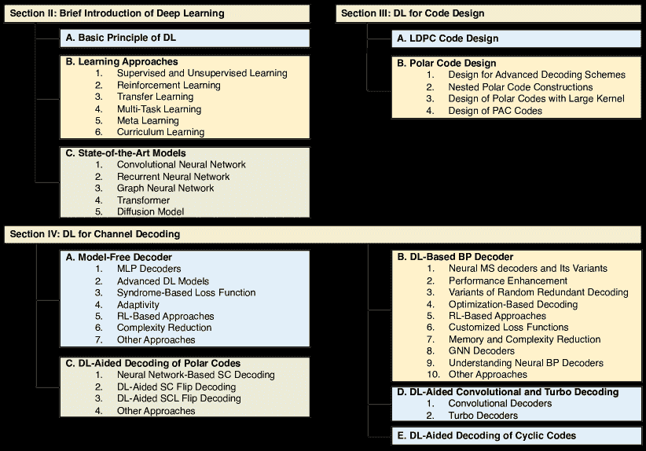

图 1：本文调查的组织结构。

## II 深度学习简要介绍

在本节中，我们简要回顾了深度学习技术的基础，从神经网络及其优化开始。然后，我们介绍了最前沿的训练和深度学习模型。有关深度学习技术理论的详细信息，请参见，例如，[91, 92, 93, 94, 95, 96, 97, 98, 99, 100]。

### II-A 深度学习的基本原理

深度学习是机器学习的一个子领域，使用具有多个隐藏层的深度神经网络。在各种神经网络结构中，\acmlp 是一类完全连接的前馈神经网络，除了输入和输出层外，还包括至少一个隐藏层[101]。

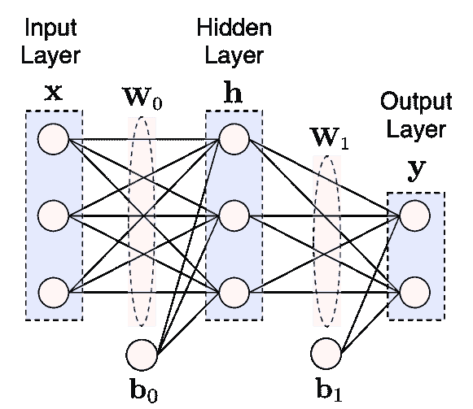

图 2：单隐层 MLP 的示例。

图 2 展示了一个单隐层 MLP 的示例，其中输入向量$\mathbf{x}\in\mathbb{R}^{3}$通过应用一系列仿射变换和非线性激活函数被映射到输出向量$\mathbf{y}\in\mathbb{R}^{2}$。

|  | $\displaystyle\mathbf{y}$ | $\displaystyle=\phi_{1}(\mathbf{W}_{1}\mathbf{h}+\mathbf{b}_{1})$ |  | (1) |
| --- | --- | --- | --- | --- |
|  |  | $\displaystyle=\phi_{1}(\mathbf{W}_{1}\phi_{0}(\mathbf{W}_{0}\mathbf{x}+\mathbf{b}_{0})+\mathbf{b}_{1}),$ |  | (2) |

其中 $\mathbf{W}_{0}\in\mathbb{R}^{3\times 3}$ 和 $\mathbf{W}_{1}\in\mathbb{R}^{3\times 2}$ 是权重矩阵，$\mathbf{b}_{0}\in\mathbb{R}^{3}$ 和 $\mathbf{b}_{1}\in\mathbb{R}^{2}$ 是偏置项，$\phi_{i}(\cdot)$ 其中 $i\in\{0,1\}$ 表示非线性激活函数的逐元素应用。

非线性激活函数使得神经网络能够逼近高度复杂的函数，激活函数的选择对最终性能有着显著的影响。虽然有许多激活函数[102]，但现代最广泛使用的激活函数之一是 \acrelu [103] 及其变种，如 Leaky ReLU [104] 和 parametric ReLU [105]。

关于 DNN 参数的优化，即我们示例中的 $\Theta\triangleq\{\mathbf{W}_{0},\mathbf{W}_{1},\mathbf{b}_{0},\mathbf{b}_{1}\}$，最常见的方法是梯度下降，这是一种一阶迭代算法，用于寻找可微函数的局部最小值。梯度下降的基本思想是沿着我们希望最小化的可微损失函数的梯度的相反方向更新参数。令 $f(\Theta)$ 表示相对于参数集 $\Theta$ 可微的损失函数，在梯度下降的第 $i$ 次迭代中，训练参数更新为

|  | $\displaystyle\Theta_{i+1}=\Theta_{i}-\eta\nabla f(\Theta_{i}),$ |  | (3) |
| --- | --- | --- | --- |

其中 $\eta\in\mathbb{R}_{+}$ 是一个学习率，用于决定沿着最陡下降方向采取的步伐大小。

梯度下降算法可以根据用于计算梯度的数据量进行分类，即 \acbgd、\acsgd 和 \acmbsgd。BGD 为整个训练数据集计算梯度，而 SGD 对每个训练数据样本进行参数更新（从而进行梯度计算）。与此同时，MBSGD 用小的数据批次替代 SGD 中的单个样本，从而减少参数更新的方差，这可能导致更稳定的收敛。此外，MBSGD 中的梯度计算可以通过深度学习库高效执行。因此，MBSGD 是训练深度神经网络中最受欢迎的随机优化方法之一。

然而，标准的 MBSGD 并不一定能保证良好的收敛性，因此提出了许多在训练过程中自适应控制学习率的改进方法。这些方法包括 Momentum [106]、Adagrad [107]、Adadelta [108]、RMSprop ³³3 最初在 [`www.cs.toronto.edu/~tijmen/csc321/slides/lecture_slides_lec6.pdf`](http://www.cs.toronto.edu/~tijmen/csc321/slides/lecture_slides_lec6.pdf) 中提出、Nadam [109] 和 Adam [110]。这些优化器的实现可以在 Tensorflow [38] 和 Pytorch [39] 等深度学习框架中找到。有关 SGD 算法的更多细节，请参见 [111]。

### II-B 学习方法

有许多用于机器学习（ML）技术的训练方法。接下来，我们介绍一些在通信系统设计中经常应用的主要方法。

#### II-B1 监督学习与无监督学习

监督学习基于标记数据集训练算法，该数据集由输入与相应正确输出（即真实值）对组成。目标是分析大量数据集中的模式，并预测新数据的结果。监督学习通常用于分类和回归任务。由于信道解码问题可以被视为一种分类问题，最简单的方法是训练基于深度学习（DL）的信道解码器，其中深度神经网络（DNN）通过最小化正确码字和估计码字之间的误差来训练，以估计传输的码字。

无监督学习是另一种机器学习算法，它从数据中学习模式，而无需人工监督。自监督学习，通常用于训练 \acpllm，也可以被视为无监督学习，因为它使用数据本身生成监督信号，而不是依赖人工监督。还有一种称为半监督学习的方法，它结合了监督学习和无监督学习，即同时使用标记和未标记的数据。尽管这些方法特别适合于在没有足够大的标记数据集的实际场景，但它们在信道解码中的应用仍然是新兴的研究话题。

#### II-B2 强化学习

\Ac

强化学习（RL）是一种以经验驱动的自主学习框架，其中智能体在动态环境中学习采取行动，以最大化累计奖励[112]。RL 通常被建模为 \acmdp，它由以下组成：

+   •

    一组环境和智能体状态 $\mathcal{S}$

+   •

    一组动作 $\mathcal{A}$

+   •

    状态 $s_{t}$ 在时间 $t$ 采取动作 $a_{t}$ 转移到状态 $s_{t+1}$ 的转移概率，记作 $\mathcal{P}(s_{t+1}|s_{t},a_{t})$，以及相应的奖励函数 $\mathcal{R}(s_{t},a_{t},s_{t+1})$。

该过程如图 3 所示。在每个时间步骤$t$，智能体观察状态$s_{t}\in\mathcal{S}$并采取动作$a_{t}\in\mathcal{A}$，遵循策略$\pi(a_{t}|s_{t})$。然后，智能体接收一个标量奖励$r_{t}$，并根据奖励函数$\mathcal{R}(s_{t},a_{t},s_{t+1})$和状态转移概率$\mathcal{P}(s_{t+1}|s_{t},a_{t})$，转移到下一个状态$s_{t+1}$。这个过程持续进行，直到智能体到达终止状态。回报是折扣累积奖励，折扣因子为$\gamma\in(0,1]$。智能体的目标是最大化从每个状态的长期回报的期望。

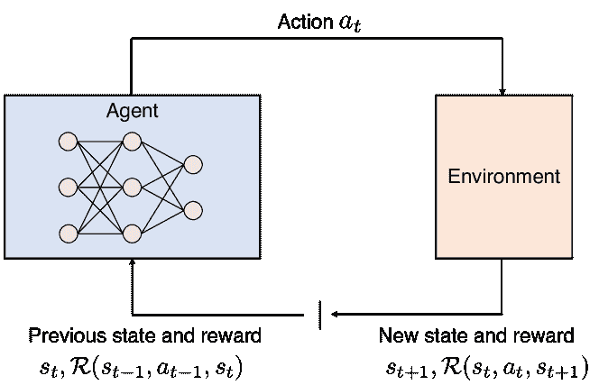

图 3：典型的强化学习框架。

在许多实际问题中，MDP 的状态是高维的，难以用传统的强化学习算法解决。另一方面，得益于强大的函数逼近特性，使用 DNN 来逼近强化学习中的最优策略和/或最优值函数提供了一种高效的方法来克服这些问题。这种方法称为\acdrl，在各种研究领域取得了显著成果。特别是\acdqn[113]，其中建立了一个 DNN 模型来逼近 Q 函数（给定状态下一个动作的价值），在 Atari [113]中显示了令人印象深刻的结果。有关 DRL 的更多细节，例如，可以参见[114, 115, 116, 117]。

#### II-B3 迁移学习

迁移学习是一种将从源领域任务中学到的知识转移到目标领域相关任务上以提高性能的技术[118, 119, 120, 121, 122]。迁移学习通过跨任务领域转移知识来解决标签训练数据不足的问题。这个概念在图 4 中进行了说明。然而，请注意，如果源领域和目标领域之间几乎没有共同点，那么转移的知识可能毫无价值。

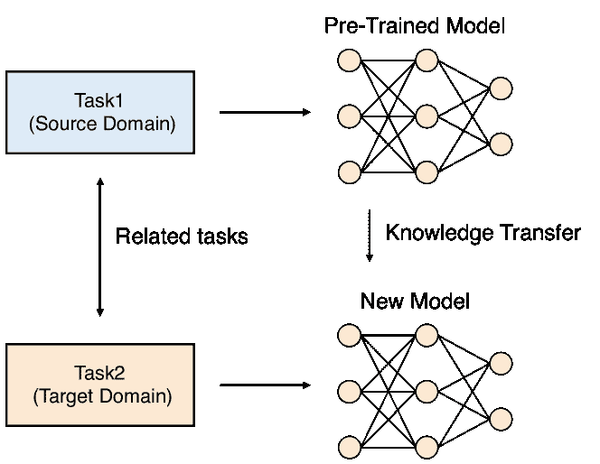

图 4：迁移学习的概念。

在信道编码问题中，迁移学习可以用于将基于深度学习（DL）的编码设计和解码从某一信道模型和代码参数适应到新的信道模型或参数。例如，我们通常训练一个深度神经网络（DNN）以设计或解码假设某一固定的码率，而适应新的码率需要重新训练 DNN，这既耗时又计算量大。由于从单一母码通过速率匹配（即，打孔和缩短）衍生出的码可能具有许多相似性，因此迁移学习可以用来显著减少重新训练的计算负担，或者在新参数下提高性能。

#### II-B4 多任务学习

在多任务学习中，一组多个任务被共同解决，任务之间共享归纳偏置[123, 124]。多任务学习本质上是一个多目标问题，因为不同任务可能会产生冲突，需要权衡。一个常见的折中方法是优化一个代理目标，该目标最小化每个任务损失的加权线性组合。由于这种联合表示必须捕捉到所有任务中的有用特征，如果不同任务寻求冲突的表示，即不同任务的梯度指向相反的方向或在幅度上有显著差异，这种现象通常被称为负迁移。

迁移学习和多任务学习之间有一些相似之处。两者都旨在通过知识转移来提高学习者的性能。另一方面，主要的区别在于，前者是将相关领域中包含的知识进行转移，而后者则是通过同时学习一些相关任务来转移知识。换句话说，多任务学习对每个任务给予相等的关注，而迁移学习则更注重目标任务而非源任务。

类似于迁移学习，多任务学习可以用于有效地支持多个不同的代码参数。此外，多任务学习还可以用于多目标优化，这在许多通信系统设计问题中很常见。多任务学习的应用示例包括基于 AE 的星座设计，尝试联合最小化\acber 和\acpapr 用于\acofdm 系统[125]。

#### II-B5 元学习

与尝试通过固定算法从头开始解决任务的传统学习方法不同，元学习旨在通过从以前的经验或任务中学习来学习学习算法本身[126, 127]。这种*学习如何学习*的框架可以带来若干好处，例如提高数据和计算效率。

在元学习框架中，有两种类型的数据，一种是来自相关任务的大型数据集（元训练数据），另一种是用于新任务的小型训练数据集（元测试数据）。标准元学习包含两个阶段，1）元训练阶段，在此阶段给定元训练数据集优化一组超参数，2）元测试阶段，在此阶段使用通过元训练超参数初始化的模型参数，并利用元测试数据进行优化。因此，元训练阶段旨在优化超参数，以便在元测试阶段高效训练新的、*先验*未知的目标任务。

元学习可以自然地应用于自适应解码器设计，其中解码器参数通过元训练进行初始化，然后基于元测试进行优化，以适应新的信道。此外，这一概念可以应用于物理层的广泛问题，如信号解调、通过端到端学习进行的发射机和接收机联合优化、信道预测等，如在[128]中回顾。

#### II-B6 课程学习

课程学习，最初在[129]中提出，是一种训练策略，通过从简单数据到复杂数据的方式训练机器学习模型，模仿人类学习[130, 131]。基本思想是“从小做起”[132]，即用简单的数据子集训练机器学习模型，然后逐渐增加数据的难度级别，直到使用整个训练数据集。课程学习可以被看作是继续方法的一种特殊形式，继续方法是优化非凸函数的通用策略[129]。

由于课程学习的思想作为一种通用训练策略，它已被应用于相当广泛的应用领域。与基于随机数据打乱的标准训练方法相比，课程学习可以提供更快的训练收敛速度和性能提升。在课程学习中，课程策略的设计，即训练标准的序列，起着关键作用。

课程学习对于设计包括信道编码方案在内的通信系统是有益的。例如，设计和解码长码通常比设计和解码短码更困难。因此，相比直接学习设计或解码长码，课程学习策略从训练短码开始，然后逐渐增加码长，有可能实现更快的训练收敛速度以及更好的性能。

### II-C 最先进的模型

在将深度学习应用于通信系统中的问题时，找到合适的架构是很重要的。接下来，我们将简要回顾对这些问题有用的代表性深度学习模型。

#### II-C1 卷积神经网络

\Acp

CNN 在计算机视觉和 \acnlp 等广泛研究领域取得了巨大的成功 [133, 134, 135]。CNN 是一种前馈神经网络，其具有卷积层，通过将滤波器（或内核）应用于数据来学习特征。图 5 中展示了 CNN 架构的一个简单示例。与 MLP 相比，CNN 拥有更少的连接和参数，因为卷积层中的每个神经元仅从前一层的一个受限区域接收输入。这个受限区域称为神经元的感受野，对于全连接层，感受野对应于整个前一层。

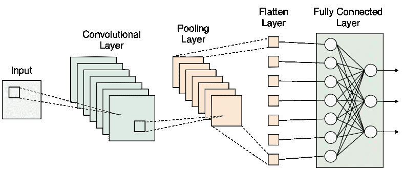

图 5：一个简单的 CNN 架构。

CNN 在图像识别任务中取得了特别的成功，在多个基准测试中取得了最先进的结果，如 \acilsvrc。具有代表性的 CNN 模型包括 AlexNet [136]、VGGnet [137]、Inception (GoogLeNet) [138]、ResNet [139] 和 DenseNet [140]。它们的成功归因于其通过使用分层的卷积操作架构来捕捉空间特征和模式，从而在不同的抽象层次上提取特征 [141]。

就在信道编码中的应用而言，CNN 通常用于解码，并已被证明比标准的 MLP 更高效。CNN 在物理层的其他流行应用包括 OFDM 系统中的时间频率域信道估计 [142] 和完全 CNN 接收机，它取代了传统的信道估计器、均衡器和解调器 [143]。

#### II-C2 循环神经网络

与单向前馈神经网络不同，\acrnn 是一种双向人工神经网络，能够从顺序数据中学习长期依赖关系 [92, 144]。由于它们能够利用内部状态（记忆）处理任意输入序列，因此特别适合处理时间序列数据，如语音识别。另一方面，由于递归连接，经典的 RNN 存在梯度消失和爆炸问题，即在反向传播过程中，长期梯度可能无法收敛，而趋近于零或无穷大。

\Ac

lstm 是最流行的 RNN 模型之一，它可以通过引入一个门控机制来输入或遗忘某些特征，从而减少梯度消失和爆炸的影响 [145] [146]。另一种流行的模型是\acgru [147]，其中递归单元自适应地捕捉不同时间尺度的依赖关系，以适应 LSTM 的更高记忆需求。这些架构的比较见图 6。

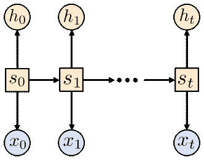

(a) RNN。

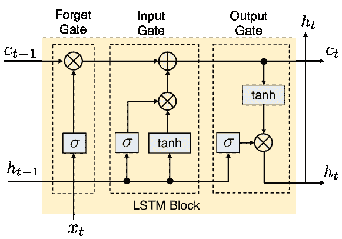

(b) 带有忘记门的 LSTM。

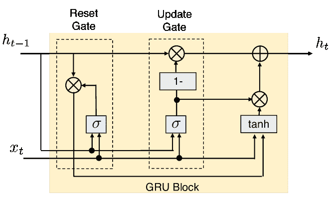

(c) GRU。

图 6：RNN、LSTM 和 GRU 架构的比较 [148]。

有关 RNN 的更多细节，特别是 LSTM，请参阅 [149, 148, 150]。

LSTM 和 GRU 模型已广泛应用于通信系统。特别是，由于与卷积码的结构类似，RNN 可能非常适合于卷积码的解码。同样，RNN 也已成功应用于具有记忆的信道的信号检测 [151]。

#### II-C3 图神经网络

尽管机器学习有效地捕捉了欧几里得数据中的隐藏模式，但现有机器学习算法的一个常见假设是实例彼此独立。这个假设在图数据中不再成立，因为每个节点都与其他节点相关。将 DNN 模型扩展到非欧几里得领域，通常称为几何深度学习，一直是一个新兴的研究领域。特别是，最近在图领域操作的\acgnn 已成为一种流行的图分析方法 [152, 153, 154, 155]。

设$G\in(\mathcal{V},\mathcal{E})$为一个图，其中$\mathcal{V}$是节点集，$\mathcal{E}$是边集。设$\mathcal{N}_{u}$为某个节点$u\in\mathcal{V}$的邻域。此外，设$\mathbf{x}_{u}$为节点$u\in\mathcal{V}$的属性。GNN 实现了一种等效的层，称为 GNN 层，它将图的表示映射到同一图的更新表示。尽管 GNN 层的设计是一个活跃的研究领域，但一种流行的方法是\acmpnn 层（其他流行的方法包括图卷积网络 [156] 和图注意网络 [157]）。在通用 GNN 中的 MPNN 层，节点通过汇聚从其直接邻居处接收到的消息来更新其表示 [158]，层的输出（每个$u\in\mathcal{V}$的节点表示$\mathbf{h}_{u}$）表示为

|  | $\displaystyle\mathbf{h}_{u}=\phi\left(\mathbf{x}_{u},\bigoplus_{v\in\mathcal{N}_{u}}\psi(\mathbf{x}_{u},\mathbf{x}_{v})\right),$ |  | (4) |
| --- | --- | --- | --- |

其中 $\phi$ 和 $\psi$ 通常是可训练的微分函数，而 $\bigoplus$ 是一个非参数的置换不变聚合运算符，可以接收任意数量的输入。特别地，$\phi$ 和 $\psi$ 分别称为更新函数和消息函数。

由于与 Tanner 图的紧密关系，GNN 在设计和解码图上的编码方面特别有用。GNN 的主要优势之一是其可扩展性，即，经过小代码长度训练的 GNN 将能推广到任何代码长度，而这通常需要额外的训练。

#### II-C4 Transformer

Transformer 是一种基于多头注意力机制的 DL 架构 [159]。如图 7 所示，它由一个编码器和一个解码器组成，每个部分都有多个结构相同的 Transformer 块。每个 Transformer 块包括一个多头注意力层、一个前馈神经网络、一个快捷连接和一个层归一化。给定一个元素序列，自注意力机制显式建模序列中所有实体之间的依赖关系。

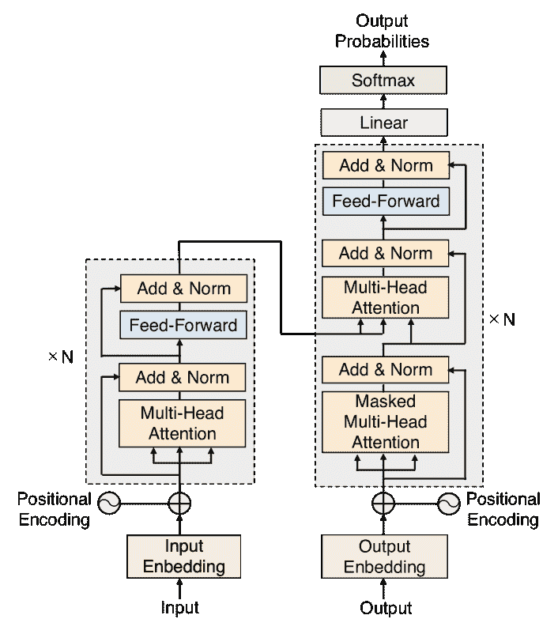

图 7: Transformer 架构 [159]。

它没有递归单元，因此比之前的 RNN 架构（如 LSTM）需要更少的训练时间，其后续变体已被广泛用于训练大多数代表性的 LLM，例如 Open AI 的 \acgpt 系列 [160]、Meta 的 \acllama [161]、Google 的 \acpalm [162] 和 Gemini [163] 都基于 Transformer 模型。有关 Transformer 的更多细节和应用，请参见 [164、165、166]。

尽管 Transformer 最初是为 NLP 任务提出的 [159]，但它已成功应用于计算机视觉 [167]、音频应用 [168] 等各种任务。对于物理层技术，Transformer 的使用相对较新 [169]。由于其出色的性能，Transformer 具有提升现有 DL 方法在通信工程问题中性能的潜力。

#### II-C5 扩散模型

\Acp

dm 是一类概率生成模型，通过注入噪声逐渐损坏数据，然后学习逆转这一过程以生成样本。训练过程包括两个阶段：前向扩散过程和后向去噪过程 [170]。在前向过程中，通常将高斯噪声注入训练数据，直到其变为纯高斯噪声。在后向过程中，噪声被逐步去除以重建原始图像。在每一步中，去除的噪声由神经网络估计。在不同的公式中 [171, 172]，\acddpm [173] 是一种受非平衡热力学理论启发的代表性 DM。

由于其高生成质量和多功能性，DM 可应用于通信系统中的许多问题，如信道估计 [174]、信号检测 [175]、AE [176, 177, 178] 和网络优化问题 [179, 180]。然而，DM 在物理层的应用仍是一个相对较新的研究领域 [181, 182, 183]。

## III DL 在码设计中的应用

表 II：基于 DL 的极化码设计总结。

| 类别 | 参考文献 | 主要贡献 |
| --- | --- | --- |
| 高级解码方案 | Ebada et al. [184] | 具有有限迭代次数的 BP 解码设计。 |
| Huang et al. [185] | 用于 SCL 解码的极化码 RL 设计。 |
| Leonardon et al. [186] | 通过投影梯度下降最小化 SCL 解码下的 BLER。 |
| Liao et al. [187] | 基于 GNN 的极化码构造用于 CA-SCL 解码。 |
| Miloslavskaya et al. [188] | 在 SCL 解码下具有动态冻结比特的极化码优化。 |
| 嵌套极化码 | Huang et al. [185] | 通过优势演员-评论家算法构建嵌套极化码。 |
| Li et al. [189] | 通过定制网络的随机策略优化。 |
| Ankireddy et al. [190] | 基于序列建模和 Transformer 的嵌套极化码构造。 |
| 大核极化码 | Hebbar et al. [191] | 通过大型非线性神经网络基础核的极化码。 |
| PAC 码 | Mishra et al. [192] | 基于 RL 的 PAC 码率-配置文件构造算法。 |

现代接近容量的编码，如**LDPC**和**极化码**，通常基于成熟的分析工具进行设计，例如 \acde [193, 194] 和 \acexit 图 [195]。然而，这些技术依赖于在实际中不成立的假设。例如，**LDPC**码的设计中，**DE** 和 **EXIT** 图分析假设简单的信道模型，如 \acbiawgn 信道、无限的码长和无限的 \acbp 解码迭代。这些技术也用于极化码设计，但它们同样局限于简单的信道模型和解码方案，如 \acsc 解码。对于更现实的信道模型和先进的解码方案，**DL** 可能取代或支持现有的编码设计技术。我们在表 II 中总结了基于 **DL** 的极化码设计方法。

### III-A **LDPC** 码设计

不规则 **LDPC** 码的特征是变量度分布 $\lambda(x)$ 和检查度分布 $\rho(x)$，它们表示为

|  | $\displaystyle\lambda(x)=\sum^{d_{\text{v}}}_{i=2}\lambda_{i}x^{i-1},\ \rho(x)=\sum^{d_{\text{c}}}_{i=2}\rho_{i}x^{i-1},$ |  | (5) |
| --- | --- | --- | --- |

其中 $\lambda_{i}$ 和 $\rho_{i}$ 表示从 \acpvn 和 \acpcn 中度为 $i$ 的边的比例，且 $\lambda(1)=\rho(1)=1$。最大变量度和检查度分别用 $d_{\text{v}}$ 和 $d_{\text{c}}$ 表示。度分布通常会被优化以最大化迭代解码阈值，该阈值定义为在该阈值下，消息分布在 **BP** 中的演变使得其相关的错误概率在迭代次数趋于无限时收敛为零。通过跟踪消息分布的演变来识别阈值的方法称为 **DE** [193]。

码设计问题属于具有连续空间参数的非线性约束满足问题的类别，我们首先探索度分布的空间以找到度分布对，传统上通过**差分进化** [193] 解决，然后通过 **DE** 评估选定对的 **BP** 阈值。在 [196] 中，作者通过将 **DE** 的递归更新方程映射到 **RNN** 架构中，将代码设计过程建模为监督学习问题，他们称之为神经密度演化 (**NDE**) 。他们还提出了一个多目标损失函数用于 **NDE**，确保其高可配置性，即各种码率和最大度数。他们的模拟显示，所提设计在各种码字长度和信道的渐近设置下达到了最先进设计的性能。

### III-B **极化码** 设计

长度为 $N$ 的极化码的编码器由生成矩阵表示

$\mathbf{G}_{N}=\left(\begin{smallmatrix}1&0\\ 1&1\end{smallmatrix}\right)^{\otimes n}\in\mathbb{F}_{2}^{N\times N}$，其中 $n=\log_{2}{N}$ 是一个正整数，$\mathbf{A}^{\otimes n}=\mathbf{A}\otimes\mathbf{A}^{\otimes(n-1)}$ 是矩阵 $\mathbf{A}$ 的第 $n$ 次 Kronecker 幂 [5]。设 $\mathcal{I}\subset\{0,1,\ldots,N-1\}$ 表示信息比特索引的集合，其基数为 $K=|\mathcal{I}|$，$\mathcal{F}=\{0,1,\ldots,N-1\}\backslash\mathcal{I}$ 表示 $\mathcal{I}$ 的补集，其基数为 $|\mathcal{F}|=N-K$。设 $\mathbf{u}=(u_{0},u_{1},\ldots,u_{N-1})\in\mathbb{F}_{2}^{N}$ 为极化编码器的输入向量，其中 $i\in\mathcal{I}$ 的比特 $u_{i}$ 被选择用于携带信息，而 $i\in\mathcal{F}$ 的比特则被冻结（即固定为编码器和解码器已知的预定比特值）。因此，极化码的码率为 $R=K/N$。极化码的设计或构造等同于为给定的信道模型和解码方案确定一个合适的索引集 $\mathcal{I}$。

在他原始的论文中，Arıkan 建议使用蒙特卡洛模拟来估计比特信道的可靠性 [5]。随后，提出了 DE [194] 及其改进版本 [197]，以在高复杂度的代价下准确估计可靠性。这种复杂度通过 DE 的 \acga [198]、改进的 GA [199] 和 \acrca [200] 得到了缓解。

#### III-B1 高级解码方案的设计

尽管极化码最初是与 SC 解码一起提出的 [5]，但其有限长度的性能并不令人满意。为了使极化码达到与其他接近容量的码相当的性能，需要先进的解码方案，如 \acscl 或 \accascl 解码 [201]。然而，上述极化码构造方案假设了 SC 解码，并且没有明确的方案来设计用于 SCL 和 CA-SCL 解码的极化码。

在 [184] 中，作者提出设计用于 BP 解码的极化码，在 \acawgn 和 Rayleigh 衰落信道上进行有限次数的迭代。通过将冻结和非冻结比特向量表示为软值向量，这些向量可以视为神经网络的训练权重，进行训练以最小化传输码字和估计码字之间的交叉熵损失，同时满足目标码率要求和训练收敛。模拟结果表明，学习到的极化码在 Arıkan 传统 BP 解码器下的性能优于 5G 极化码。

另一方面，[202, 185] 中的作者提出了基于遗传算法和 RL 的极化码设计，用于 SCL 解码。作为 RL 的奖励函数，作者计算了实现目标 \acbler 所需的 SNR，通过蒙特卡洛模拟得出。在同一研究方向中，[203] 的作者提出了基于表格的 RL 极化码构造方法，用于 SCL 解码。他们设计了奖励函数，当选定的行动在天使辅助的 SCL 解码中导致帧错误时，将负的即时奖励（惩罚）发送给代理⁴⁴4 在天使辅助的 SCL 解码中，如果码字在列表中，解码器总是可以输出正确的码字。 与 [185] 中的方法相比，所提出的方法在训练中的计算复杂度更低，性能相当或稍好。

作为另一种方法，[186]中的作者提出了一种两步优化方法。更具体地说，他们首先训练了 MLP 以预测 SCL 解码下的 BLER，然后通过 \acpgd [204] 构造最小化 BLER 的编码，该方法在对抗性攻击神经网络的领域中得到了广泛研究。仿真结果表明，所提出的构造方法在用于预测 BLER 的数据集上成功提高了编码性能。

最近，[187]中的作者提出了一种基于 GNN 的极化编码构造算法，用于 CA-SCL 解码。更具体地说，极化编码首先被映射到一个独特的异构图上，称为 \acpccmp 图，然后提出了一种异构 GNN 基于迭代消息传递的算法，旨在找到一个与极化编码对应的最小 BLER 的 PCCMP 图。所提出的 GNN 基于迭代消息传递的方法具有一个显著特性，即一个训练好的模型可以直接应用于不同设计 SNR 和不同块长度的构造，而无需额外的训练。数值实验显示，所提出的构造方法在 CA-SCL 解码下优于[197]中的经典构造方法。

在[188]中，作者提出了一种基于神经网络的自适应极化编码方案，该方案可以适应各种信道条件和服务质量要求。具体来说，作者开发了一个基于 MLP 的极化编码性能预测框架，该框架处理具有动态冻结位的极化编码，并且在 SCL 解码下使用。接着，作者提出了一类新的极化编码，其动态冻结位由一个整数参数来参数化，并利用性能预测框架来优化该参数，以满足给定的目标 BLER、列表大小、编码长度和速率。仿真结果表明，在 CA-SCL 解码下，所提出的编码在不同列表大小的情况下优于 5G 极化编码。尽管由于训练难度没有使用神经网络，但同一作者在[205]中也提出了一种基于 RL 的方法来设计动态冻结位，以在 SCL 解码下最小化 BLER。

#### III-B2 嵌套极化编码构造

总的来说，即时设计极化编码以自适应选择冻结位以适应特定信道可能在实际系统中过于复杂。另一方面，[206, 207, 208, 209]中的作者研究了基于与信道条件无关的通用可靠性顺序的极化编码设计。因此，在实践中，最好对具有不同速率的极化编码施加嵌套属性，使得所有极化编码都可以基于通用可靠性序列[210]从相同的母编码推导出来。

[202、185]中的作者提出通过 \aca2c 算法[211]构造嵌套极化码。论文将码的构造视为一个多步骤的 MDP，其中对于给定的 $(N,K)$ 极化码（当前状态），采取新的行动构造 $(N,K+1)$ 极化码（更新状态）。该 MDP 如图 8 所示。然后，通过将操作顺序地追加到初始极化码构造的末尾来构造可靠性排序序列。所提出的码设计在 SCL 解码下显示出优于传统 DE 构造的性能。

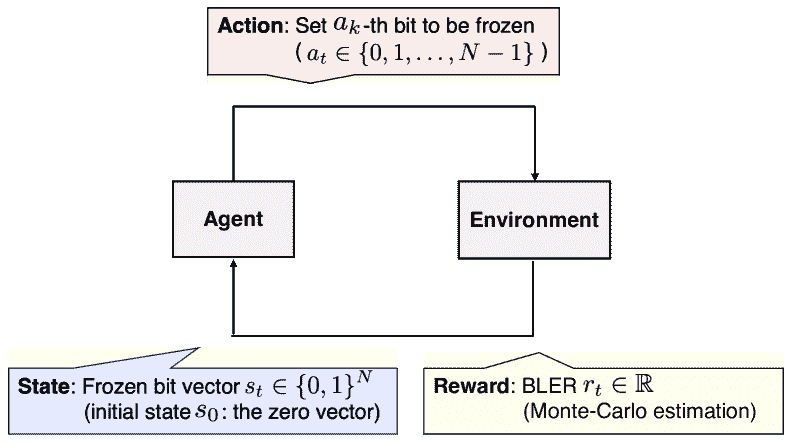

图 8：基于 RL 的速率为 $K/N$ 的嵌套极化码在时间 $t\in\{1,\ldots,K\}$ 的构造，如[202、185]所示。目标是最小化预期累计 BLER，即 $\sum^{K}_{t=1}r_{k}$。冻结比特向量 $s_{t}$ 中的 1 表示冻结比特的位置。

与此同时，[189]中的作者首先将嵌套极化码构造问题转化为一个用于顺序决策的随机策略优化问题，然后通过定制的神经网络表示该策略。此外，作者提出了一种基于梯度的算法来最小化策略的平均损失。模拟结果表明，所提出的构造方法在[202、185]中的 SCL 解码性能优于最新的嵌套极化码。在[190]中还提出了一种类似的嵌套极化码构造方法，其中作者通过 Transformer 仅编码器模型对策略网络进行参数化，这可以直接预测嵌套序列中的下一个信息比特。结果表明，所提出的基于 Transformer 的构造方法在误码率性能上优于[189]中提出的方法。

#### III-B3 大核极化码设计

改善二进制极化码有限长度性能的另一种方法是增加极化核的大小。实际上，通道极化适用于所有核，前提是它们不是单位矩阵，并且在任何列排列下不是上三角矩阵[212]。然而，具有大核的二进制极化码在实际短到中等块长度下表现不佳，并且随着核大小的增加，计算复杂度呈指数增长。

在[191]中，作者提出了通过大型非线性神经网络内核的极化码，称为 DEEPPOLAR，以及基于 SC 解码的一般化解码器。他们还开发了一种原则性课程基础训练方法，使 DEEPPOLAR 能很好地推广到高 SNR 场景，这些场景特征是错误事件稀少。结果表明，DEEPPOLAR 优于经典的 SC 解码极化码。

#### III-B4 极化调整卷积码的设计

在 2019 年\acisit 的香农讲座中，Arıkan 介绍了一种新的代码类别，称为\acpac 码，该码将卷积预编码与极化变换结合[213]。PAC 码在短到中等块长度下显著提高了极化码的性能，此时信道极化相对缓慢发生。

PAC 码编码的第一步是速率配置。对于速率为$K/N$的 PAC 码，此步骤将$K$个信息位插入长度为$N$的向量中，随后输入卷积预编码器。从$N$个可能的索引中选择$K$个位索引称为速率配置，其设计对 PAC 码的性能有显著影响。

在[192]中，作者提出了一种基于 RL 的 PAC 码速率配置算法。具体而言，通过将速率配置问题映射到 MDP，作者提出了带有定制奖励和更新策略的 Q 学习方法。仿真结果表明，提出的速率配置相比于[214]中的蒙特卡洛速率配置设计提供了更好的误码率性能。

## IV DL 用于信道解码

DL 方法用于信道解码一直是一个活跃的研究领域，并且已经被广泛研究作为替代或辅助传统解码算法的手段。接下来，我们首先回顾不假设特定码结构的无模型解码器，这些解码器适用于任何码。然后我们回顾考虑特定因子图的基于模型的 DL BP 解码方法。随后，我们专注于极化码、卷积/涡轮码和循环码的 DL 解码方法。

### IV-A 无模型解码器

表 III：无模型解码器总结。

| 类别 | 参考文献 | 主要贡献 |
| --- | --- | --- |
| MLP 解码器 | Gruber 等[215] | 关于基于 MLP 的信道解码的初步工作。 |
| Seo 等[216] | 关于 MLP 解码器各种配置影响的调查。 |
| Leung 等[217] | 关于 MLP 解码器超参数影响的实证研究。 |
| Leung 等[218] | 研究了小型 MLP 用于低能量和延迟的应用。 |
| 高级 DL 模型 | Lyu 等[219] | 关于不同类型 DL 解码器的调查，即 MLP、CNN、RNN。 |
| Sattiraju 等[220] | 基于 Bi-GRU 的解码器。 |
| Zhu 等人 [221] | 残差 MLP、CNN、RNN 基础的解码器。 |
| Choukroun 等人 [222] | 新颖的 Transformer 架构用于块码解码。 |
| Choukroun 等人 [223] | 用于线性码的软判决解码的 DDPM。 |
| 基于综合症的损失函数 | Bennatan 等人 [224] | 基于综合症的线性码软判决解码方法。 |
| Kamassury 等人 [225] | 被称为迭代误差消除的迭代算法。 |
| Artemasov 等人 [226] | 基于堆叠-GRU 的 SISO 解码器用于涡轮乘积码。 |
| 适应性 | Wang 等人 [227] | 极化码和 LDPC 码的统一深度学习解码器。 |
| Jiang 等人 [228] | 基于元学习的模型无关神经解码器。 |
| Lee 等人 [229] | 用于解码一组速率兼容极化码的迁移学习。 |
| Artemasov 等人 [230] | 用于 BCH 和极化码的统一深度学习解码器，附加 CRC。 |
| 基于强化学习的方法 | Carpi 等人 [231] | 用于二进制线性码的迭代位翻转解码的 DQN。 |
| Gao 等人 [232] | 基于 Q 学习的极化码位翻转解码。 |
| 复杂度减少 | Kavvousanos 等人 [233, 234, 235, 236] | 基于幅度的修剪和量化用于参数减少。 |
| Cavarec 等人 [237] | 在 OSD 中基于深度学习的有序参数适应。 |
| 其他方法 | Raviv 等人 [238] | 数据驱动的框架用于排列解码中的排列选择。 |
| Kurmukova 等人 [239] | 友好的干扰用于提高解码性能。 |
| Tsvieli 等人 [240] | 研究解码器边界最大化的问题。 |
| Zhong 等人 [241, 242] | 基于深度学习的自旋转矩磁性随机存取存储器解码器。 |

无模型解码器利用神经网络，不考虑码的任何特定结构，因此可能从先进深度学习模型的强大架构中受益。然而，这些解码器通常遭遇维度诅咒，因为训练数据集的大小随着信息位数量的增加呈指数增长。另一方面，相较于传统的非深度学习解码方法，其潜在优势在于高度可并行的结构，允许*一次性*解码而非迭代解码。我们将讨论的无模型方法总结在表 III 中。 |

#### IV-A1 MLP 解码器

论文[215]是关于基于 DL 的信道解码的初期工作之一，作者研究了 MLP 在随机和极化码解码中的直接应用。他们的实证结果表明，对于结构化码，DL 解码器可以推广到训练阶段未见过的码字，且 DL 解码器能够在非常小的码长如$16$位上实现\acmap 解码性能，但对于较长码的学习由于训练复杂度呈指数级增长而极其复杂。

同时，[216]中的作者研究了 MLP 解码器的各种配置对 BER 性能的影响，例如隐藏层的数量、每层的节点数以及激活函数。类似地，论文[217]实证研究了隐藏层和节点数量以及 MLP 解码器的训练 SNR 对其性能的影响，并调查了实现与最佳最大似然解码器相似性能所需的最小数量，以适应短线性和非线性块码。

在[243, 218]中，作者研究了小型 MLP 解码器在低能量和低延迟应用中的应用。特别是，论文对单标签和多标签神经解码器进行了比较，并证明了多标签解码器通常需要更多的隐藏层和节点，以实现与单标签解码器相似的性能。

#### IV-A2 先进的 DL 模型

上述提到的 MLP 解码器的性能可以通过先进的 DL 模型得到提升。例如，在[219]中，作者研究了基于 MLP、CNN 和 RNN（特别是 LSTM）的不同类型解码器。他们的实证结果表明，RNN 和 CNN 解码器实际上可以比 MLP 解码器实现更好的 BER 性能，但计算时间更长。在[220]中，RNN（\acbigru）被用于编码/解码涡轮码，类似于[244]。

为了进一步提高性能，[245, 221]的作者将残差学习[139]的概念引入了 MLP、CNN 和 RNN 基础的解码器中。具体而言，论文引入了一个解噪网络作为解码器之前的预处理，其目的是去除在信道中产生的噪声，并提出了一种考虑去噪和解码性能的训练损失。结果表明，所提出的解噪网络可以提高 BER 性能，但运行时间增加仅为微小程度。

最近，受到 Transformer 模型在各种应用中的成功[159]的启发，[222]中提出了一种用于解码代数块码的新型 Transformer 架构，称为 \acecct。ECCT 的输入是编码字位的可靠性（在 BI-AWGN 的情况下为接收符号的绝对值）和综合症位的拼接，每个元素都嵌入在具有自身位置依赖嵌入向量的高维空间中。然后，采用自注意力机制，其中通过编码结构指定的位之间的交互，即 \acpcm，被作为领域知识纳入。广泛的仿真结果表明，提出的基于 Transformer 的解码器优于最先进的神经解码器。

尽管[222]中的 ECCT 使用了从 PCM 派生的掩码矩阵，但对于相同的编码存在许多不同的 PCM，这将导致不同的解码性能。受此事实的启发，[246]中的作者解决了识别最优 PCM 的问题。特别地，作者提出了一种从系统 PCM 构造的系统化掩码矩阵，这导致稀疏的自注意力图，并提出了一种新型 Transformer 架构，称为双掩码 ECCT，该架构由两个并行的掩码自注意力块组成，使用不同的掩码矩阵。

同时，在[223]中，作者使用 DDPM [173] 进行任意块长度线性码的软解码。他们的框架将 AWGN 通道上的传输建模为可以迭代反转的一系列扩散步骤。论文还提议将扩散解码器的条件设定为奇偶校验错误的数量，并采用线搜索过程来控制反向扩散步骤的大小。

此外，在[247]中，作者通过扩展 Transformer 架构提出了一种用于信道编码的基础模型[248]。基础模型指的是一种最初在广泛数据上进行训练的模型，通常基于自监督，然后适应（例如，迁移或微调）到各种下游任务。因此，提出的框架提供了一个通用解码器，能够适应并推广到任何（未见过的）任意长度的编码。

#### IV-A3 基于综合症的损失函数

综合症解码是一种已知的代数码解码方法。已经提出了几种基于深度学习的综合症解码器训练方法，这些方法从综合症中估计传输的编码字。基于综合症的训练不依赖于传输编码字的知识，因此在在线适应变化的信道条件方面具有前景。

论文[224]是早期关于基于综合症的 DL 解码的研究之一，提出了使用接收符号的绝对值，即在 BI-AWGN 信道的情况下的可靠性，以及其硬决策的综合症进行解码，而不是直接使用接收符号作为解码器的输入。所提出的解码器如图 9 所示。此外，作者引入了来自编码自同构群[249, 250]的排列作为预处理。这些排列具有这样的性质：任何码字的排列版本也保证是一个有效的码字，即解码器的排列输入是一个有噪声的有效码字。模拟结果表明，所提出的框架可以实现接近最大似然性能的短\acbch 码。

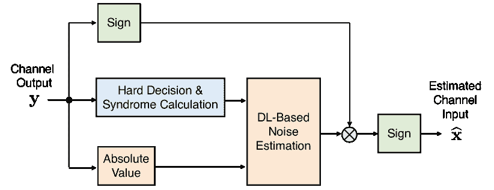

图 9：基于综合症的 DL 解码器，参见[224]。信道输入序列$\mathbf{x}$由\acbpsk 符号组成，而$\mathbf{y}$是\acbiso 信道的输出。

基于综合症的方法尝试仅从其综合症预测误差向量，可能会受到不一致训练样本的潜在影响，这些样本被称为*干扰*[251]，即具有相同综合症但不同误差向量的训练样本。为解决此问题，[225]中的作者提出了一种迭代算法，称为迭代误差消除，该算法对误差模式的叠加具有鲁棒性。在每次迭代中，DL 解码器估计误差向量，然后将其从接收向量中消除（减去）。模拟结果表明，所提出的方案改进了[224]中方案的性能。

此外，[226]中的作者提出了一种基于综合症的方法，用于对 BCH 组件码的 Turbo 产品码[252]进行\acsiso 解码，该方法基于 Stacked-GRU，这是一种由 GRU 组成的 RNN 架构。他们在损失函数中引入了正则化项，并证明所提出的 DL 解码器优于[252]中的原始追踪解码器。

#### IV-A4 适应性

自适应编码是一种根据无线信道条件调整编码速率的技术。对于基于 DL 的解码器，支持多个编码速率不仅需要多次训练，这在计算上是非常密集的，还需要大量内存来存储学习到的 DL 参数。

为了解决这个问题，[227] 提出了一个统一的 DL 解码器，用于极化码和 LDPC 码，该解码器通过在解码器输入处利用码指示符支持不同的码，即极化码和 LDPC 码。仿真结果展示了该统一解码器在非常短的码长（例如$16$位）中的潜力。类似的使用码指示符的统一 DL 解码器也在 [230] 中提出，用于 BCH 和 CRC 连接的极化码。他们的结果表明，对于码长为$64$的码，所提出的带有码指示符的统一解码方案与仅为单一码训练的解码器相比，性能差距小于$0.2$ dB。

与此同时，论文 [228] 介绍了一种基于元学习的神经解码器，称为\acmind，该解码器可以通过少量的导频和少数梯度下降步骤适应新的信道。具体而言，提出的方法包括元学习和元训练步骤，其中模型在元学习步骤中学习到良好的初始参数，然后在元测试阶段使用最少的适应数据和导频将参数调整到观测信道。研究表明，所提出的方案可以在接近仅为特定信道设计的 DL 解码器的性能的同时适应信道。在同一研究方向上，[229] 的作者提出了迁移学习，以高效地训练一组速率兼容的极化码解码器，这些码是从与 5G NR 相同母码中筛选出来的。

#### IV-A5 基于 RL 的方法

尽管大多数以前关于基于 DL 的信道解码的研究都是基于监督学习的，但已经提出了几种基于 RL 的方法，用于监督数据（真实数据）不可用的情况。

论文 [231] 是关于基于强化学习（RL）的信道解码的最早研究之一。与这些研究不同，[231] 的作者提出了一种用于二进制线性码的迭代\acbf 解码的 RL 框架。具体而言，他们将每一步的 BF 决策与 MDP 联系起来，并应用 RL 寻找良好的决策策略。作者还利用了排列自同构群来提高性能。广泛的仿真结果表明，使用 DQN 的学习型 BF 解码器可以在短的高码率码中实现接近最优的性能。

后来，[232] 的作者将基于 RL 的 BF 解码应用于极化码。与 [231] 中提出的 DQN 相比，他们使用了简单的 Q 学习，并尝试将信道观测直接映射到估计的码字上。仿真结果表明，所提出的 Q 学习在性能上与 [231] 中学习型 BF 解码相当，但复杂度较低。

#### IV-A6 复杂度减少

通常，解码较长的码字需要更大的神经网络。这种网络不仅在训练阶段需要大量计算资源，而且在推断阶段也会带来高计算和空间复杂度。特别是推断阶段的复杂度具有实际重要性，因为训练通常是在离线进行的。

[233]中的作者尝试通过引入各种简化的神经网络结构来减少深度学习解码器的参数规模。这些结构具有更少的参数。在[234]中，同一作者进一步扩展了他们的工作，介绍了基于幅度的剪枝[253]和参数量化。所提出的解码器在减少了$80$%网络参数和$8$位定点表示的情况下，仍能实现与原始系统[224]类似的性能。此外，所提出的解码器在[235, 236]中进行了 FPGA 实现。

与此同时，[237]中的作者考虑了辅助复杂度减少的深度学习（DL）方法，对\acosd [254]进行了改进。该算法是一种软判决解码算法，适用于线性块码，特别是在短码情况下接近最优最大似然解码性能。尽管增加 OSD 的阶数可以达到接近最大似然的性能，但当接收到的信号可以用较低阶数解码时，可能会浪费计算资源。论文[237]提出了一种基于学习的方法，根据信道条件调整所需的阶数参数，并通过数值仿真展示了所提方案在性能与复杂度权衡方面的有效性。

#### IV-A7 其他方法

众所周知，对接收到的码字进行多次解码尝试，通过不同的排列组合可以提高性能[250, 255]。然而，如何选择能够带来最佳性能的排列仍不清楚。为了解决这一问题，[238]中的作者提出了一种深度学习（DL）方法，用于从码字的自同构群中选择候选排列。在这种方案中，经过训练的网络预测每个排列成功解码的概率，并仅对具有最高概率的排列码字进行解码。通过仿真，所提出的算法被证明在自同构群的随机排列选择中实现了显著的性能提升。

在 [239] 中，作者提出了一种新颖的方法称为 *友好攻击*，旨在通过引入对抗攻击的概念来提高信道解码性能。该方案在传输之前向调制符号引入了小的扰动。扰动是通过修改的迭代快速梯度方法 [256] 设计的，以使解码的码字与传输的码字之间的损失函数最小化。所提出方案的性能提升已在各种码和解码器中得到验证。

尽管 DL 在信道解码中的应用已得到实验验证，但开发算法的理论依据，例如泛化性能，仍然具有挑战性。[240] 的作者解决了在噪声分布未知的加性噪声信道以及具有 AWGN 的非线性信道中最大化解码器边际的问题。他们将解码器学习问题表述为最大边际优化问题，这在 \acpsvm 中很常见，并通过若干近似步骤将其松弛为 \acrlm 问题。本文随后为两种模型提供了在最佳正则化参数选择下的预期泛化误差界限。本文还基于加性噪声信道的界限提供了选择训练 SNR 的理论指导。

### IV-B DL 辅助 BP 解码

表 IV：DL 辅助 BP 解码总结。

| 类别 | 参考文献 | 主要贡献 |
| --- | --- | --- |
| 神经 MS 解码及其变体 | Nachmani 等人 [257, 258] | DL 辅助 BP、NMS 和 OMS 解码。 |
| Lugosch 等人 [259] | NOMS 解码。 |
| Dai 等人 [260] | 神经网络辅助的 OMS 和 NOMS 解码。 |
| Yu 等人 [261] | 神经 AMS 解码。 |
| Hsu 等人 [262] | 神经网络辅助的 VWMS 解码。 |
| Wu 等人 [263] | 用于 PB-LDPC 码的神经 MS 解码和线性近似。 |
| Kim 等人 [264] | 神经 SCMS 解码。 |
| 性能提升 | Teng 等人 [265, 266, 267] | 基于 CNN 的学习 BF 用于 BP。 |
| Sun 等人 [268] | 基于 LSTM 的学习 BF 用于 BP。 |
| 随机冗余解码 (RRD) 的变体 | Nachmani 等人 [258] | 使用基于 RNN 的 BP 解码器的 mRRD 解码。 |
| Liu 等人 [269] | 节点分类的冗余解码算法。 |
| 基于优化的解码 | Wei 等人 [270] | 可训练的 ADMM 惩罚解码器。 |
| Wadayama 等人 [271] | 可训练的 PGD 解码器用于 LDPC 码。 |
| Wadayama 等人 [272] | LDPC 码的近端解码。 |
| 基于 RL 的方法 | Doan 等人 [273] | 基于 RL 的因子图排列选择。 |
| Habib 等人 [274, 275, 276] | 基于 RL 的顺序 BP 解码调度优化。 |
| 定制损失函数 | Lugosch 等人 [277] | 作为训练神经 BP 解码器的损失函数的软综合症。 |
| Teng 等人 [278] | 用于极化码的基于综合症的新损失函数。 |
|  | Nachmani 等人 [279] | 基于稀疏节点和知识蒸馏损失的新损失函数。 |
| 内存/复杂度减少 | Teng 等人 [280] | RNN 极化解码器的权重量化机制。 |
| Ibrahim 等人 [281] | RNN 极化解码器的量化。 |
| Xiao 等人 [282, 283] | 通过量化 RNN 的有限字母表迭代解码器用于 LDPC 码。 |
| Lyu 等人 [284] | 消息量化与量化阈值的联合优化。 |
| Lian 等人 [285, 286] | 基于标量参数的边缘间权重共享。 |
| Wang 等人 [287, 288] | 用于神经 NMS 解码器的同层内参数共享方案。 |
| Dai 等人 [289] | 用于原型 LDPC 码的神经 MS 解码器的权重共享方案。 |
| Liang 等人 [290, 291] | 用于参数大小减少的张量训练和张量环分解。 |
| Cheng 等人 [292] | 适应多种码率的权重共享方案。 |
| Buchberger 等人 [293] | 用于短线性块码的新型剪枝基础神经 BP 解码器。 |
| Buchberger 等人 [294] | 带有删减的神经 BP。 |
| GNN 解码器 | Satorras 等人 [295] | 结合 BP 和 GNN 的混合推理模型。 |
| Cammerer 等人 [296] | 完全基于 GNN 的解码器。 |
| Tian 等人 [297] | 边权重 GNN 解码器。 |
| 理解神经 BP 解码器 | Ankireddy 等人 [298] | 关于学习到的权重如何减轻这些循环影响的实证研究。 |
| Adiga 等人 [299] | 对神经 BP 解码器泛化能力的理论研究。 |
| 其他方法 | Clausius 等人 [300] | 基于 GNN 的联合均衡和解码。 |
| Wiesmayr 等人 [301] | MIMO 无线系统的深度展开交织检测与解码。 |
| Lee 等人 [302] | 学习辅助的多轮 BP 解码与冲击扰动。 |
| Wang 等人 [303] | 深度学习检测可解码码字以减少解码延迟。 |

BP 解码是一种高效的迭代解码算法，通常用于解码 LDPC 码。BP 解码在包含 CNs 和 VNs 的 Tanner 图上进行，其中 CNs 和 VNs 分别对应于码字位和奇偶校验方程。图 10(a) 展示了 (7, 4) 汉明码的 PCM 及其对应的 Tanner 图表示。在 BP 解码中，解码消息基于贝叶斯规则在 CNs 和 VNs 上迭代更新。在实际应用中，最小和近似 [304] 被应用于 CN 更新以降低复杂性，这种解码被称为 \acms 解码。由于最小和近似造成的性能损失可以通过 \acnms 和 \acoms 解码器 [305] 来弥补，但会稍微增加复杂性。

在 [257] 中，作者提出了一种基于深度学习的 BP 解码实现，将 BP 解码视为一个可微分的过程，其中解码消息通过展开的迭代以前馈的方式传递。此外，在边缘引入了可训练的权重，并通过 SGD 进行优化。图 10(b) 展示了 (7, 4) 汉明码的展开 BP 轨迹示例。对于码长 $N$、边数 $E$ 和迭代次数 $L$，展开的轨迹在输入和输出层有 $N$ 个神经元，在 $2L$ 个隐藏层中有 $E$ 个神经元。网络架构是一个非完全连接的神经网络。正如我们下面的回顾中所示，关于展开轨迹的可训练 BP 解码器在文献中已有广泛研究。我们在表 IV 中总结了这些工作。

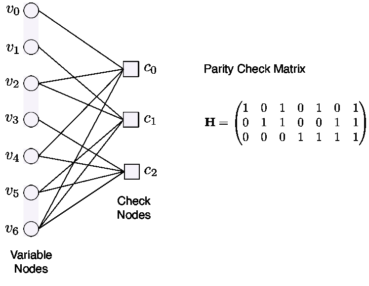

(a) PCM 和相应的 Tanner 图。

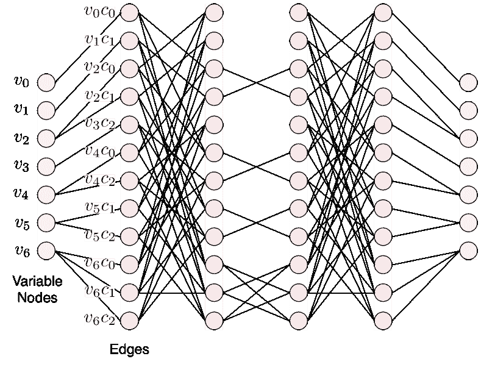

(b) 展开的 BP 轨迹（两个迭代）。

图 10: (7, 4) 汉明码的深度展开 BP 解码器示例。

请注意，将迭代算法展开为类似于神经网络的结构，即深度展开 [306]，是一种常见的基于模型的深度学习方法 [307]，通常在通信系统设计中考虑。除了信道解码，深度展开的思想也已成功应用于 MIMO 信号检测和信道估计等 [62, 45, 308]。

#### IV-B1 神经 MS 解码器及其变体

如前所述，论文 [257] 是首次将前馈网络应用于 BP 解码的研究工作，其中训练权重被分配到因子图的边缘，并通过 SGD 在展开的迭代 BP 解码过程中进行优化。所提出的参数化解码器可以通过适当缩放权重来补偿代码的 Tanner 图中小循环的影响。该解码器的有效性已在短 BCH 码上得到了验证，因为标准 BP 解码在图中存在许多短循环时效果不佳。随后，在 [309] 中，同一作者通过引入 RNN 架构扩展了该工作，并展示了这种架构在参数更少的情况下，能够与 [257] 中的前馈架构达到相当的性能。在 [258] 中，作者还提出了基于神经网络的 NMS 和 OMS 解码器，以降低 BP 解码器的复杂性，这些解码器是标准 NMS 和 OMS 解码器 [305] 的推广版本。基于神经网络的 OMS 解码也在 [259] 中进行了独立研究。为了提升 MS 解码的性能同时保持低复杂度的特性，[263] 中考虑了另一种方法；作者提出了用于 \acpbldpc 码的 \aclams，其中检查节点更新和信道输出的幅度通过一个小而浅的神经网络线性调整。与上述考虑洪水调度的研究不同，[310] 中的作者提出了一种神经网络辅助的 \acnoms 解码，用于分层 BP 并应用于 5G LDPC 码。

作为 MS 解码的另一种变体，Qualcomm 提出的\acams 解码[311]引起了关注，它采用\acplut 来简化非线性 CN 处理。在[261]中，作者将基于神经网络的选择机制引入 AMS 解码，该机制自动选择 MS 规则或 BP 规则中的检查节点更新规则，并且展示了所提出的解码器优于传统的神经 NMS 解码器。\acsmms 算法[312]是 MS 解码的另一种变体，它简化了 MS 算法中的 CN 更新。具体而言，在 SMMS 解码中，只计算每个 CN 所有 CN 输入中的最小幅值，并在需要时对传出的消息进行修正。SMMS 解码器可以通过\acvwms 算法[313]进一步改进，该算法在 CN 更新中引入依赖于迭代次数的变量修正因子。为了有效地学习 VWMS 算法中的最佳修正因子，[262]中的作者提出了一种神经网络辅助的方法，而不是原始工作[313]中的穷举搜索。通过使用 40 nm CMOS TSMC 工艺实验验证了所提出方案在吞吐量方面的有效性。与上述简化 CN 更新的方法不同，\acscms 解码[314]通过删除不可靠的消息来修改 VN 处理。更具体而言，在 SCMS 解码中，任何在两个连续迭代之间改变符号的变量节点消息都被丢弃，即设置为零。[264]中的作者向 SCMS 解码器引入了可训练的归一化和偏移权重，这些权重通过深度学习技术进行训练。实验表明，所提出的神经 SCMS 解码器的错误率性能接近 BP 解码。

尽管上述工作将神经 BP 解码应用于 LDPC 码，但它也被用于解码极化码。在[315]中，与[257]类似，将神经 MS 解码器应用于极化码的因子图。通过仿真证明，所提出的解码器在相同的迭代次数下优于传统的 BP 解码。此外，作者还展示了所提出解码器基本计算块的高效硬件实现。在[316]中，将类似的可训练 BP 解码应用于极化码的稀疏图[317]，即使只有一个可训练参数也显示出与 BP 解码相当的性能。此外，[260]中的作者提出了一种用于极化码的 NOMS 解码器，该解码器引入了归一化（或缩放）因子和偏移量，并展示了所提出的解码器性能优于包括[315]中提出的解码器在内的最先进方案。

为了提升独立极化码的性能，并缩小与低延迟 CA-SCL 解码的性能差距，[318] 的作者提出了通过利用极化码和 CRC 码的串联因子图来进行神经 BP 解码，而传统的 CRC-极化码 BP 解码仅应用于极化码的因子图，并且 CRC 仅用于验证每次迭代的 BP 结果。此外，[319] 的作者考虑了串联的极化码和 LDPC 码，并提出了二维 OMS 解码。他们通过在展开的 BP 树形图上进行反向传播来优化解码器的可训练参数，并展示了所提出的解码器性能与精确 BP 解码器相当。

#### IV-B2 性能增强

为了增强极化码的 BP 解码，[265, 266, 267] 的作者提出将 BP 解码与 CNN 辅助的比特翻转机制相结合，该机制在基于 BP 解码过程的元数据训练的 CNN 的基础上，在 BP-BF 解码器 [320] 中执行翻转比特选择。作者展示了所提出的方案可以实现比 SCL 解码更低的 BLER。同时，为了降低基于 CNN 的方法的计算复杂性，论文 [268] 提出了一个 LSTM 网络，该网络基于原始 BP 解码后的 \acllr 大小预测易错比特。

[321] 的作者引入了一种超网络 [322]，该超网络生成神经 BP 解码器的权重，以使解码器通过将权重作为节点输入的函数来更具适应性。同一作者还引入了用于解码短极化码的超网络 [323]，并展示了所提出的解码器在高 SNR 区域内实现了与 SCL 解码相似的 BER。此外，他们提出了一种自回归 BP 解码器，该解码器结合了估计的 SNR 和从网络中间输出获取的多个自回归信号 [324]。

训练数据准备是训练基于 DNN 的译码器的一个重要部分。特别是，训练信噪比的选择在训练 DL-based 信道译码器的泛化中起着重要作用。一种常见的方法是在不同的 SNR 范围内训练译码器[257]。此外，训练 SNR 的最佳选择已经进行了经验性[244，215]或分析性[325]的研究。为了解决选择最佳训练 SNR 的问题，作者在[326]中提出了*主动深度译码*的概念，灵感来源于主动学习[327]。具体地，根据观察到并不存在适用于所有验证集的最佳训练 SNR，该论文提出了在训练过程中自适应地采样训练数据而不是被动地生成示例。实验证明，这种主动深度译码方案通过有效地对训练数据进行采样而不增加推断（译码）复杂性，提高了性能。

在[328]中，受到将复杂任务分解为多个由集成模型解决的简单任务的方法的启发，其中每个任务由集成模型中的单个专家成员在本地解决[329]，作者引入了神经 BP 译码器的集成。所提出的方案包括一个经典的 HDD 和多个可训练的 BP 译码器，其中经典的 HDD 被用于根据估计的码字错误的数量将接收到的码字分配给单个专家 BP 译码器。实验证明，这种方案比单一的神经 BP 获得了显著的性能提升。此外，数据驱动的集成方案已经扩展到 BP 极化译码器[330，331]。

与此同时，许多实际的 LDPC 码表现出一个错误地板⁵⁵5 对于需要极低 BLER 的超可靠低延迟通信等应用来说，减轻错误地板可能是至关重要的。由于 LDPC 码的错误地板通常归因于具有循环的因子图的迭代消息传递译码算法的次优性，[332]中的论文提出了神经 NMS 译码器的训练方法来消除 LDPC 码的错误地板。具体地，受到增强学习技术的启发[333]，作者将译码器分成两个级联的神经译码器，并训练第一个译码器以提高瀑布性能，而第二个译码器则被训练来处理第一个译码器无法纠正的剩余错误。

#### IV-B3 随机冗余译码的变种

\acrrd 算法 [334] 和 \acmbbp 解码器 [335] 是其他基于冗余 PCM 的短块码软判决解码方法。\acmrrd [250] 是一种试图从 RRD 和 MBBP 解码中受益的算法，前者利用了码的排列群（自同构群），后者则使用了并行迭代解码器。

在 [269] 中，作者提出了一种用于 \achdpc 码的 \acncrd 算法，以提高 RRD 解码的性能。NC-RD 算法在 RRD 解码中引入了两个预处理步骤。更具体地说，该算法首先通过 $k$-中位数算法根据每个变量节点的最短循环数量对奇偶校验矩阵的变量节点进行分类，然后根据排列可靠性度量生成位位置的排列列表。作者进一步提出了基于神经网络的 NC-RD 算法，通过展开 NC-RD 解码过程并引入可训练权重。

在 [258] 中，作者通过用提出的基于 RNN 的 BP 解码器替换 mRRD [250] 算法中的 BP 解码块，将 DL 基于 BP 解码的概念应用于 mRRD。得到的解码器结构如图 11 所示。提出的基于 RNN 的 mRRD 解码器已被证明在合理的计算复杂度下实现了接近最大似然的性能。

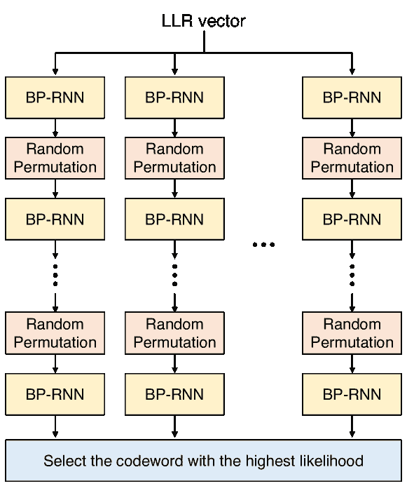

图 11：[258] 中的 mRRD 算法与基于 RNN 的 BP 解码器。

#### IV-B4 基于优化的解码

基于优化的解码是旨在改善 BP 解码器性能的另一个研究方向。基于优化的解码起源于 Feldman 的工作，他引入了 LDPC 码的 \aclp 公式 [336]。

LP 解码器基于原始最大似然解码问题的 LP 松弛 [337]。然而，与 BP 解码器相比，LP 解码器在低 SNR 区域具有更高的计算复杂性和较差的纠错性能。为了解决上述缺陷，论文 [270] 提出了通过展开 ADMM 迭代的可训练 \acadmm-惩罚解码器 [338]。证明了该解码器在高 SNR 区域能够超越传统的 BP 解码器，并具有相当的执行时间。

此后，[271]中的作者通过展开 PGD 算法并通过反向传播优化参数，介绍了一种可训练的投影梯度解码器用于 LDPC 码。所提出的解码器交替执行梯度和投影步骤，其中前者朝目标函数的负梯度方向移动，而后者将搜索点映射到几乎满足优化约束的可行区域。此外，在[272]中，相同的作者提出了基于投影梯度方法[339]的 LDPC 码近端解码，这种方法用于解决不可微凸优化问题。

#### IV-B5 基于 RL 的方法

众所周知，独立置换因子图上的并行 BP 解码器可以显著提高极化码单次 BP 解码的性能[340、341]。在[273]中，作者解决了选择因子图上的置换以在给定信道观察下实现成功解码的问题。具体来说，他们将置换选择视为多臂赌博机问题，并提出了一种基于 RL 的 CRC 辅助 BP 解码器，试图选择最佳的置换集合。提出的方案显示出比其他方法如循环移位和随机因子图置换[342、340]更好的性能。

在[274、275、276]中，作者提出了一种基于 RL 的序列 BP 解码方案，以优化中等长度 LDPC 码的 CN 簇调度⁶⁶6 与标准的洪泛调度不同，后者在每次迭代时同时更新所有 CN 和 VN，序列 BP 解码或分层解码则是按顺序逐个更新节点或节点集合。在提出的方案中，$m$个 CN 被划分为$z$个 CN 的集合，称为*簇*，并通过 Q 学习优化调度问题，即具有$\lceil m/z\rceil$种可能操作的簇选择。此外，他们还提出了基于元学习的序列解码方案，以快速适应由于无线环境中的衰落而变化的信道条件。RL 基础的序列 BP 解码调度也已被提出用于广义 LDPC 码[343]，其中作者显示，提出的 RL 基础解码方案在显著优于标准 BP 洪泛解码器以及基于随机调度的序列解码器（更新的 CN 数量较少）方面表现突出。

#### IV-B6 自定义损失函数

如在章节 IV-A3 中所述，基于综合征的损失函数已被用于基于深度学习的 BP 解码器。在 [277] 中，作者提出了一种软综合征作为训练神经 BP 解码器的损失函数。与论文 [224] 中使用硬综合征作为解码器输入不同，本论文引入了定义类似于 MS 解码中的 CN 更新规则的*软*综合征，此外还包括传统的交叉熵损失函数。

虽然 [277] 的应用仅限于输出软估计码字的解码器，但对于不使用 PCM 的极化解码器情况则不同。为此，[278] 中的作者提出了两种修改的综合征损失：冻结比特综合征损失和 CRC 启用综合征损失。作者还引入了一种基于所提综合征损失的综合征启用盲均衡器，该均衡器不需要传输训练序列。

与上述基于综合征的方法不同，[279] 中的作者考虑了稀疏节点损失和知识蒸馏损失的线性组合，此外还包括传统的交叉熵损失。知识蒸馏是一种深度学习技术，通过使用教师网络来指导较小学生神经网络的训练 [344]。稀疏节点损失基于 $L_{p}$ 范数对节点激活施加稀疏约束，而知识蒸馏损失旨在通过转移知识来模拟教师网络，该教师网络是没有可训练参数的标准 MS 解码器。研究表明，所提出的损失项在不增加运行时间复杂性和模型大小的情况下提供了高达 $1.1$ dB 的比特错误率（BER）性能提升。

#### IV-B7 内存和复杂性减少

基于神经网络的 BP 解码器为 Tanner 图中的不同边引入不同的权重（或缩放因子），这会显著增加标准 BP 解码的计算和空间复杂度。实际上，这个问题已经在通用 DNN 中得到了广泛研究，即不限于信道解码应用，因为现代 DL 模型的参数规模较大[345]。一种流行的方法是神经网络剪枝[346, 347, 348, 349, 350]，旨在去除原始网络中的冗余参数，同时保持准确性。参数塑形也是通过在不同神经元之间共享参数来减少参数的一种有效方式。参数塑形通常在 CNN 中应用，其中特定特征图中的所有神经元共享相同的权重。另一种流行的方法是参数量化[351, 352]。解决复杂性问题的这些主要方法在图 12 中进行了说明。

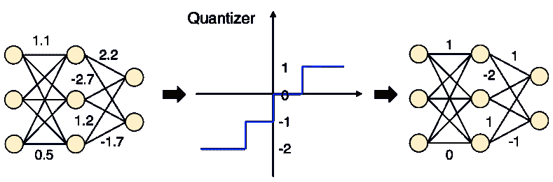

(a) 权重的量化。

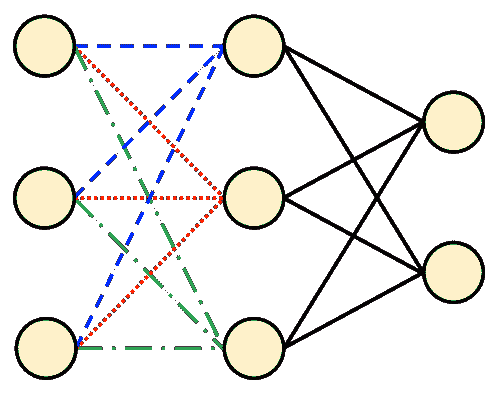

(b) 共享权重（相同颜色的连接具有相同的权重）。

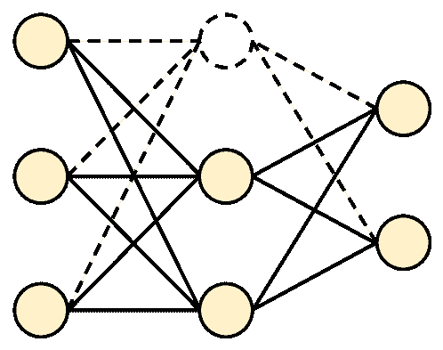

(c) 剪枝神经元（被剪枝的神经元由虚线圆圈标示）。

图 12：减少 DL 解码器计算和空间复杂度的方法。

(a) 量化：在[280]中，作者提出了一种用于 RNN 极化解码器的权重量化机制。具体而言，他们提出了一种两步方法，其中浮点权重被量化为$2^{q}$量化级别，然后进一步压缩为$2^{c}$（$c<q$，$c,q\in\mathbb{N}$）量化级别，这些级别在$2^{q}$量化级别中是最常用的。在[281]中也研究了 RNN 极化解码器的量化，作者证明了训练后的量化比在每个训练周期后进行量化的情况表现更好。

一些论文研究了量化解码消息或从信道观测中计算的 LLR 值，而不是量化 DNN 解码器参数。例如，在[353]中，作者训练了一种参数化 LLR 值量化，旨在最大化 BP 解码的性能。同样，[354]中的作者研究了用于量化 LLR 和迭代解码消息的 LDPC 解码器中的量化器设计。另一方面，[355]中的作者提出了为具有单比特量化器的系统训练神经 BP 解码器。

与现有研究考虑 AWGN 通道不同，[356、282、283]中的作者考虑了 BSC，并为 LDPC 码与\acrqnn 提出了有限精度解码器，称为\acfaid。更具体地说，他们提出了将 BER 作为损失函数，通过利用\acste[357]来训练 RQNNs，以解决 RQNN 中的低精度激活和 BER 中的量化所导致的梯度消失问题。

在[284]中，作者提出了量化消息字母和量化阈值的联合优化。具体而言，作者利用 softmax 分布[358]使量化阈值可训练，通过软化量化的一热分布来实现。所提出的解码器在误差率性能方面优于原始的非单射 FAIDs[359]。

(b) 权重共享：在[285、286]中，作者提出了用于加权 BP 解码的简单缩放模型[257]，这些模型在边缘间共享权重，每次迭代只使用三个标量参数：消息权重、通道权重和阻尼因子。作者显示，这种简单的缩放模型通常足以达到与完全参数化解码器类似的增益。

在[287、288]中，作者提出了一种参数共享方案，用于神经 NMS 解码器，该方案在同一层中共享相同的修正（归一化）因子。相比之下，在[360、361]中，作者提出了一系列权重共享方案，用于神经 NMS 解码器，该方案对具有相同检查节点度和/或变量节点度的边缘使用相同的权重。同样，在[289]中，作者提出了一种神经 MS 解码器，用于原型 LDPC 码，其中一组源自相同边缘类型的边共享相同的参数。由于原型 LDPC 码的提升结构，相同的参数集可以用于从相同基本码导出的多个码。

在[290]中，作者将\actt 分解[362]应用于神经 NMS 解码器，该分解将高阶张量分解为几个低阶张量。这不仅减少了权重参数的数量，还减少了 CN 和 VN 更新所需的乘法次数。此外，在[291]中，同一作者提出了结合权重共享的\actr 分解[363]，以进一步降低存储和计算复杂性。

在[292]中，提出了一种权重共享方案用于神经 BP 或 MS 解码器，以适应多个码率，并保持参数数量合理。具体来说，他们提出了基于多任务学习的单一速率兼容解码器训练方案，而不是训练不同的解码器，其中不同部分的参数被激活以处理不同的码率。

(c) 剪枝：在[293]中，作者提出了一种新颖的基于剪枝的神经 BP 解码器，用于短线性块码。关键思想是剪除具有小权重的过完备 PCM 中不重要的 CN。同样，在[294]中，相同的作者提出了用于 LDPC 码的剪枝神经 BP[364]。特别是，他们借助深度学习（DL）识别了最不可靠的 VN，即具有最低绝对值的*a posteriori* LLR，然后将其剪除到$\pm\infty$。已证明，具有剪枝的提出的解码器可以显著优于传统的神经 BP 解码器。

#### IV-B8 GNN 解码器

通常情况下，BP 仅对无环图模型计算最佳（后验）边际概率分布，在实践中，它往往只能计算出真实分布的较差近似。为了解决这一限制，[295]中的作者将标准 GNN 方程扩展到因子图，并提出了一种混合推断模型，结合了来自 BP 和 GNN 的消息，其中 GNN 消息被学习以补充 BP 消息。

与[295]中将 BP 解码与 GNN 结合的方法不同，[296]中的作者提出了一种完全基于 GNN 的解码器。与加权 BP 解码不同，他们引入了两种基于 MPNN 的可训练消息更新函数：*边消息更新函数*和*节点更新函数*。此外，[297]中提出了一种边加权 GNN 解码器。在所提出的解码器中，他们应用了 MPNN 来更新消息，并为每个边消息分配了一个可训练的权重，这些权重由全连接前馈神经网络，即 MLP 优化。这些 GNN 解码器相较于标准神经 BP 解码器的主要优势在于，训练参数的数量不受码长的影响。因此，经过训练后，训练好的解码器可以应用于不同码率和长度的码而无需重新训练。

#### IV-B9 理解神经 BP 解码器

在[298]中，作者实证展示了学习到的权重如何减轻 Tanner 图中短周期的影响，以提高后验 LLRs 的可靠性，并增强解码器在信道中的鲁棒性。作者还介绍了一种使用 GA 寻找权重的分析方法，并比较了神经 MS 解码器，显示出对于复杂的衰落信道，基于神经网络的权重优化比基于 GA 的优化性能更好。

在[299]中，作者理论上研究了神经 BP 解码器的泛化能力[365]，即经验 BER 与期望 BER 之间的差异。论文提出了新的理论结果，给出了差距的界限，并展示了其对解码器复杂度的依赖，包括码参数（如消息/码字长度、VN/CN 度数）、解码迭代次数和训练数据集大小。他们通过实证观察到，泛化差距随着解码迭代次数和码字长度增加而增加，并随着训练数据集大小增加而减少，支持了他们论文中的理论结果。

#### IV-B10 其他方法

为了改进短 Raptor-like LDPC 码的解码，在[366]中，作者考虑了带有冲击性扰动的多轮 BP 解码[367]。扰动是对接收信号进行小的有意改变的过程，这种方案迭代地执行常规 BP 解码和扰动，直到找到有效的码字。在[302]中，作者提出了一种基于神经网络的扰动符号选择方案，其中需要扰动的符号是从预训练的神经网络中选择的，并展示了该方案在 Raptor-like LDPC 码上表现优于现有方案，如[366]。

通过联合优化信号检测和解码，可以进一步提升独立神经 BP 解码器的性能。例如，在[301]中，提出了通过深度展开的迭代信号检测和解码方法用于 MU-MIMO-OFDM。在[300]中，作者提出了基于 GNN 的联合检测和解码方案用于\acisi 信道。

除了在 IV-B7 部分介绍的方法外，[303]中的作者提出了另一种方法来缓解解码复杂度和延迟。具体而言，他们提出了一种 DL 方法，用于从接收到的信号中检测可解码的码字并预测迭代次数，以减少解码延迟。这可能对\acharq 中的早期反馈预测有用。此外，在[368]中，作者通过编码分布式计算 [369] 加速了神经 BP 解码。特别是，他们将神经 BP 解码操作重新表述为矩阵-向量形式，以便于分布式并行解码。

除了通信系统，基于深度学习的解码器也在存储系统中进行了研究。在[242]中，作者提出了基于深度学习的\acsttmram [370]解码器。为了适应由工作温度变化引起的工艺变化和电阻未知偏移，作者提出了一种自适应解码方案，该方案基于三个 DNN 解码器，即 BF、MS 和 BP 解码器，具有相同的 DNN 架构但权重不同。在[241]中，相同的研究小组通过将可训练参数引入 RBMS 算法 [371]，提出了一种神经归一化偏移\acrbms 解码算法。已证明，所提方案在 STT-MRAM 信道上表现优于 RBMS 算法，同时保持了与标准 RBMS 解码器相似的解码器结构和时间复杂度。

基于神经网络的 BP 解码不仅针对经典纠错码进行研究，也用于量子纠错码。例如，神经 BP 解码已应用于量子 LDPC 码 [372]，由于量子纠错码的错误退化特性，标准 BP 解码可能不够充分 [373]。通过设计考虑错误退化的损失函数，解码准确性相比于没有训练的标准 BP 解码器提高了三个数量级。量子 LDPC 码的神经 BP 解码也在 [374, 375] 中进行了研究。

### IV-C 深度学习辅助的极化码解码

表 V: 深度学习辅助极化解码器的总结。

| 分类 | 参考文献 | 主要贡献 |
| --- | --- | --- |
| 基于神经网络的 SC 解码 | Cammerer 等人 [376, 377] | 分区神经网络解码器。 |
| Doan 等人 [378] | 神经连续取消 (NSC) 解码。 |
| Wodiany 等人 [379] | 低精度 NSC 解码器的高效实现。 |
| Hebbar 等人 [380] | 新颖的基于课程学习的序列神经解码器。 |
| DL 辅助 SCF 解码 | Wang et al. [381] | 估计第一个错误比特的 LSTM 网络。 |
| He et al. [382] | 基于 LSTM 的 DSCF 解码中的错误比特识别。 |
| Doan et al. [383, 384] | 带有可训练比特翻转度量的神经 DSCF。 |
| Wang et al. [385] | Q 学习辅助的 SCF 解码算法。 |
| Doan et al. [386] | 基于 RL 的快速 SC 解码比特翻转策略。 |
| DL 辅助 SCLF 解码 | Hashemi et al. [387] | 可训练的比特翻转度量用于 SCL 解码。 |
| Doan et al. [388] | FSCLF 解码算法。 |
| Chen et al. [389] | 用于 CA-SCL 解码器的 LSTM 辅助比特翻转算法。 |
| Tao et al. [390] | 基于 DNC 的新翻转算法。 |
| Liang et al. [391] | 堆叠 LSTM 以提高错误比特预测的准确性。 |
| Li et al. [392] | DSCLF 解码的近似比特翻转度量。 |
| 其他方法 | Lu et al. [393] | DL 辅助的 SCL 解码的平移度量。 |
| Liu et al. [394] | CRC 错误校正辅助 SCL 解码。 |

第 IV-A 节中的无模型解码器以及第 IV-B 节中的神经 BP 解码器均可轻松应用于极化码。接下来，我们还将回顾考虑特定码结构的无模型解码器设计方法。此外，我们重点关注增强传统 SC 或 SCL 解码器的 DL 方法，而不是用 DNN 替代它们。在表 V 中，我们提供了这些方法的总结。 |

#### IV-C1 基于神经网络的 SC 解码

尽管直接应用 DNN 作为解码极化码的选项如[215]所示，但主要问题是训练复杂度的指数增长。在[376]中，作者通过引入\acpnn 解码器解决了这一问题。具体来说，受到[395]中简化的连续取消算法的启发，该算法将解码树分为\acpspc 和\acprc，他们用神经网络替代了 SPC 和 RC 子解码器。模拟结果表明，PNN 解码器在短长度（如$128$位）上，表现出与 SC 和 BP 解码器类似的 BER 性能，并且潜在地具有更低的延迟。类似的基于神经网络的极化码解码器分区概念也在[377]中进行了研究。此外，为了减少 PNN 的延迟，[378]提出了极化码的\acnsc 解码，其中将多个子神经网络解码器整合到 SC 解码中，并且其基于低精度神经网络解码器的高效实现也在[379]中进行了研究。

最近，在[380]中提出了另一种解决学习解码长极化码难题的方法，提出了一种新颖的基于课程学习的序列神经解码器，用于极化码和 PAC 码。该论文设计了一种新型课程来训练 RNN，将信息比特的联合估计问题分解为一系列逐渐增加难度的子问题。提出的解码器被证明在 BER 性能上优于传统的无课程监督训练和标准 SC 解码。

与其完全用 DNN 替换传统解码器，不如支持传统解码器的 DL-based 方法如 SC 和 SCL 解码已被广泛研究。其中，DL 辅助的\acscf 解码[396]是最受欢迎的方法之一，以下将对其进行回顾。

#### IV-C2 DL 辅助的 SC 翻转解码

尽管 SC 解码具有较低的复杂性，但在有限块长度下，其纠错性能与其他现代编码（如 LDPC 码）相比不可同日而语。为了提高有限块长度下的性能，SCF 解码被提出 [396]，其灵感来源于 SC 解码中第一个错误比特决策对结果误码率的负面影响。SCF 解码器首先执行标准 SC 解码以生成第一个估计码字，如果码字通过 CRC 校验，则解码完成。如果 CRC 校验失败，SCF 解码会进行 $T$ 次额外尝试，以识别码字中的第一个错误。在每次尝试中，单个估计码字比特会相对于初始决策进行翻转。该算法在找到有效码字或所有 $T$ 次尝试完成时终止。SCF 解码过程如图 13 所示。SCF 解码保持了原始 SC 算法的 $O(N)$ 内存复杂性，并且在高 SNR 下具有实际的 $O(N\log N)$ 平均计算复杂性，同时在误差纠正性能方面仍提供了显著的提升。尽管 SCF 解码仅限于纠正码字中的单个错误比特，\acdscf 解码 [397, 398] 是基于 SCF 的解码的一种推广，能够通过在每次解码尝试后动态更新翻转比特索引集来纠正更高阶的错误信息比特。

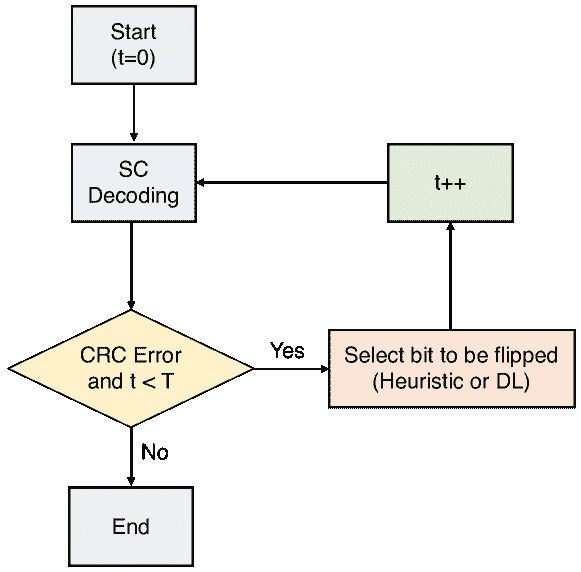

图 13：带有试验次数 $T$ 的 SCF 解码框架流程图。

SCF 和 DSCF 解码的共同挑战在于如何识别导致错误传播的第一个错误比特。在原始工作 [396] 中，翻转的是 LLR 值最小的估计码字比特，但这些比特不一定是第一个错误。事实上，由于缺乏严格的数学表征，最佳的比特翻转策略仍然是一个未解决的问题。此外，DSCF 解码需要昂贵的指数和对数计算来计算 BF 度量，该度量用于确定比特翻转位置。

一种流行的基于 DL 的解决方案是训练 LSTM 网络来估计需要翻转的第一个错误位。[381]中的作者提出了一种用于 SCF 解码的 LSTM 网络，该网络接受先前 SC 解码尝试的 LLR 序列，并输出一个向量，其中每个元素对应于某个位是第一个错误的概率。此外，作者提出了一种将监督学习与 RL 结合的两步训练方法，以训练 LSTM 纠正之前的错误翻转。类似地，[382]中的作者提出了一种基于 LSTM 的错误位识别方法用于 DSCF 解码，其中网络通过监督学习和 RL 分别训练识别第一个错误位和额外错误位。

还有其他学习方法并不依赖于无模型的 DNN。在[383, 384]中，作者提出了神经 DSCF 解码方法，他们对 BF 度量进行了适当的逼近，并引入了可训练的参数，并通过 RMSProp（一种 SGD 优化技术的变体）优化其参数。在[385]中，作者提出了一种 Q 学习辅助的 SCF 解码算法，该算法通过学习的 Q 表选择候选翻转位，而不是通过度量排序。实验表明，所提出的解码算法在不牺牲性能的情况下特别有效地减少了由排序引起的解码延迟。类似地，在[386]中，针对极化码的快速 SC 解码也研究了一种基于 RL 的 BF 策略[399]，作者开发了一个基于[387]的新参数化 BF 模型，并使用策略梯度方法优化了可训练的参数。

#### IV-C3 DL 辅助的 SCL 翻转解码

DL 辅助的 BF 机制不仅可以应用于 SC 解码，还可以应用于 SCL 解码，以进一步提高性能。

在[387]中，作者提出了用于 SCL 解码的 BF 度量，该度量由一个训练的相关矩阵表示每个位被解码的可能性。他们使用 RMSprop 优化器优化了该训练矩阵，并证明与[397]中的传统度量相比，所提出的 BF 度量显著减少了与位度量计算相关的计算复杂性，同时保持了类似的错误率性能。

在[388]中，作者将 BF 应用于\acfscl 解码[400, 401]，称之为\acfsclf 解码算法，以解决与\acsclf 解码算法相关的高延迟问题。具体而言，作者引入了一种专门针对 FSCL 解码的 BF 策略，该策略避免了在 SCLF 的二叉树表示中进行树遍历，从而减少了解码过程的延迟，并提出了一个带有可训练参数的路径选择误差度量。实验结果表明，所提解码器显著降低了 SCLF 解码器的平均解码延迟、平均复杂度和内存消耗，代价是误差率性能略有下降。

与以上不利用 DNN 的方法相比，几篇论文提出了基于神经网络的翻转比特位置选择。例如，在[389]中，提出了一种 LSTM 辅助的 BF 算法用于 CA-SCL 解码器。此外，作者还利用领域知识减少了复杂度和内存要求，并降低了高效硬件实现的计算复杂度。

在[390]中，作者提出了一种新的翻转算法，使用\acdnc [402]，可以看作是通过基于注意力的软读写机制增强的外部内存的 LSTM。所提解码算法是一个两阶段解码，由两个 DNC 辅助，即翻转 DNC 和翻转验证 DNC。前者对多位翻转的位置进行排名，而后者用于在解码失败时重新选择翻转位置。仿真结果表明，所提的 DNC 辅助 SCLF 在误差率性能和翻转尝试次数的减少方面优于基于 LSTM 的算法。

在[391]中，作者提出了一个堆叠 LSTM 网络，以提高错误比特预测的准确性。具体而言，他们分别训练了三个模型：第一个和第二个模型预测第一个和第二个错误比特的位置，而第三个模型决定是否继续翻转。仿真结果表明，他们提出的算法在 BLER 性能和平均解码尝试次数方面优于现有的 SCLF 解码算法。

在[392]中，作者提出了一种近似误差度量，用于极化码的\acdsclf 解码，以提高性能同时保持平均复杂度低。为了补偿近似误差，他们在度量中引入了可学习参数，并通过自定义神经网络模型使用 RMSprop 优化器进行优化。

#### IV-C4 提升 SCL 解码的其他方法

\Ac

sp 是另一种提高极化码 SCL 解码性能的方法 [403]，旨在防止正确路径从列表中被消除。在 [403] 中，展示了所提出的 SP 机制相较于 BF 方法提供了显著的性能提升。然而，带有 SP 的 SCL 解码器通常面临高计算复杂度的问题，这是由于重新解码尝试和计算移位度量所致。为了缓解这个问题，[393] 中的作者提出了一种无超越函数的 DL 辅助移位度量，该度量可以基于路径度量动态计算。

提出了另一种提高 CA-SCL 解码性能的方法 [394]，其中作者利用了 CRC 的固有错误修正能力，即不仅仅用于错误检测。作者使用 LSTM 网络进行基于 CRC 的错误修正，其中 LSTM 网络根据 LLR 序列和 CRC 综合症来估计错误模式。所提出的 CRC 错误修正辅助 SCL 解码方案在相同的列表大小下，证明了其在错误率上优于传统的 CRC 错误检测辅助 SCL 解码方案。

### IV-D DL 辅助卷积和涡轮解码

DL 解码器也已应用于卷积码和涡轮码。特别是，正如我们在下面回顾的那样，近年来提出了几种 DL 辅助的涡轮解码器。我们在表 VI 中列出了这些方法。

表 VI：DL 辅助卷积和涡轮解码器的总结。

| 类别 | 参考文献 | 主要贡献 |
| --- | --- | --- |
| 卷积解码器 | Teich 等人 [404] | 用于卷积编码的 DNN 解码器。 |
| 涡轮解码器 | Kim 等人 [244] | 一种神经网络 BCJR 解码器，称为 NEURALBCJR。 |
| Jiang 等人 [405] | 以端到端方式训练的深度涡轮解码器（DEEPTURBO）。 |
| He 等人 [406] | 一种新型模型驱动解码器，称为 TurboNet。 |
| Hebbar 等人 [407] | TINYTURBO，减少了 TurboNet+ 的参数。 |

#### IV-D1 卷积解码器

卷积码通过与生成多项式卷积来对输入流进行编码，这可以通过移位寄存器有效地实现。卷积码可以通过时间不变的网格表示，这允许基于著名的维特比算法 [408] 进行有效的最大似然解码。

为了提高\acitd [409] 的性能，[404]中的作者提出了一种通过展开\achornn 解码器 [410] 的 DNN 解码器。展开的 HORNN 可以看作是一个前馈 DNN，其参数通过 MBSGD 进行反向传播训练。研究表明，通过对参数进行适当优化，所提出的解码器在性能上优于传统的 ITD，并且其性能接近最大似然解码。

#### IV-D2 涡轮解码器

涡轮码，也称为并行级联卷积码 [3]，由两个（通常是相同的）\acrsc 码并行级联和一个比特交织器组成。涡轮码通常通过两个组成 SISO 解码器之间的迭代解码来解码，其中一个组成解码器根据\acbcjr 算法 [411] 计算后验概率，然后将其传递给另一个解码器。涡轮解码器通过在两个组成 SISO 解码器之间迭代交换外部信息显著提高了纠错性能。

在[244]中，作者提出了一种基于 bi-GRU 的 DL BCJR 解码器，称为 NEURALBCJR，并将其扩展为涡轮解码器，通过将组件 SISO 解码器替换为所提出的 NEURALBCJR 解码器。模拟结果表明，该方案对非高斯信道，诸如$t$-分布噪声，特别有利。后来，在[405]中引入了一种 DL 辅助的涡轮解码器，称为 DEEPTURBO。他们也使用 bi-GRU 替代传统的 SISO 解码器，如同[244]，但[405]中的作者在不同的迭代中训练了不同的 bi-GRU 权重，而[244]中的作者为所有 bi-GRU 块共享了相同的权重。这使得无需模仿 BCJR 算法即可进行完全的端到端训练。此外，DEEPTURBO 增加了在两个解码器之间交换的后验 LLR 值的数量，以加快迭代解码的速度。大量模拟表明，DEEPTURBO 在可靠性、适应性和较低的误码底层方面比 NEURALBCJR 表现更好。

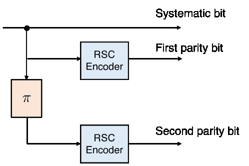

(a) 涡轮编码器。

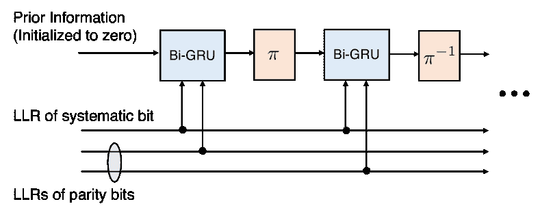

(b) 基于 Bi-GRUs 的无模型 DL 涡轮解码器。

图 14：涡轮码的编码器和基于 DL 的解码器。在 NEURALBCJR 解码器 [244] 中，每个 Bi-GRU 都经过预训练以模仿 BCJR 算法，然后进行端到端训练。而在 DEEPTURBO 解码器 [405] 中，所有 Bi-GRU 都直接进行训练，以优化端到端性能。

如图 14 所示，前述的无模型 Turbo 解码器，即 NEURALBCJR [244] 和 DEEPTURBO [405]，其 Turbo 解码器的组成 SISO 解码器被 Bi-GRUs 替代，而没有考虑 RSC 编码器的特定格结构。相比之下，[406]中的作者提出了一种新颖的模型驱动解码器架构，称为 TurboNet，该架构将 DNN 整合到传统的最大-对数-MAP 算法中。此外，他们对 TurboNet 进行了网络剪枝，有效减少了参数数量。结果表明，TurboNet+解码器在较低的计算复杂度下，表现出领先的性能，并超越了现有的 DL Turbo 解码器。

随后，[407]中的作者提出了 TINYTURBO，通过在后验 LLR 计算中共享相同的权重，显著减少了 TurboNet+的可训练参数。特别地，对于块长度为$40$的情况，TINYTURBO 以$18$个参数的配置在 AWGN 信道下表现优于 TurboNet+的$720$个参数。此外，还展示了 TINYTURBO 对其他块长度、速率和格结构的强适应性以及对信道变化的鲁棒性。

### IV-E 深度学习辅助的环形码解码

还研究了利用环形码代数特性的 DL 解码器。在[412]中，作者提出了一种基于神经网络的环形码解码器，利用其环形不变性。更具体地说，受制于任何环形码的最大似然解码器对环形移动的不变性，他们对神经解码器的权重施加了一个不变的结构，使得输入的任何环形移动都导致输出的相同环形移动。BCH 码和穿孔\acrm 码的模拟显示，所提出的解码器在性能上始终优于[258]中提出的神经 BP 解码器。此外，他们还提出了一种列表解码过程，可以显著减少 BCH 码和穿孔 RM 码的解码误差。

虽然列表解码显著提高了 BLER，但主要缺点是其相对较高的 BER。为了改善 BER，同一作者在[413]中提出了改进版的列表解码器。新的解码器相比于[412]中的列表解码器，取得了显著更低的 BER，同时保持了相同的 BLER。

## V 结论

在本文中，我们提供了关于深度学习在信道编码问题中的应用的综合调查。特别是，我们重点关注了用于码设计和信道解码问题的深度学习方法。接下来，我们总结了这些方法的潜在优势和挑战。

### V-A 码设计应用

传统的码设计算法，如 EXIT 图和 DE 的变体，要求对信道模型和解码方案有理想化的假设。相比之下，使用数据驱动的深度学习进行码设计的主要优势在于，可以将码定制为更现实的信道和解码方案，对于这些方案，理论分析是不可处理的。

在第 III 节中，我们看到 RL 是一种特别受欢迎的极化码设计方法。在这种方法中，代理学习选择一个新的信息位位置，以最小化累积奖励，这对应于 BLER 的实际性能。计算奖励需要蒙特卡洛模拟，根据码长和目标错误率的不同，这可能会很耗费计算资源。这一复杂性问题可能会妨碍其在长码长和低错误率场景中的应用。因此，在训练过程中可以有效计算的设计目标可能是理想的。

### V-B 信道解码应用

正如我们所见，信道解码是深度学习的一个流行应用，关于这一主题的大量论文已经出现。这些方法大致可以分为无模型方法和基于模型的方法。

#### V-B1 无模型方法

使用“黑箱”神经网络的无模型解码器在错误率性能和解码复杂性/延迟方面有潜力超越传统的解码算法。特别是，已证明无模型解码器可以在具有高度并行结构的短码长情况下超越现有的解码算法。因此，这种方法可能适用于要求短码长的低延迟应用。请注意，性能高度依赖于所使用的深度学习模型，目前，基于 Transformer 的解码器实现了最先进的性能[222]。然而，性能可能通过先进的深度学习技术进一步提升。

由于维度诅咒，无模型解码器的应用通常仅限于短码。一般来说，解码更长的码需要更大的模型规模，这不仅涉及高计算复杂度，还涉及训练和推理阶段的高空间复杂度。另一个关于该方法的关注点是对抗攻击的鲁棒性[204]，因为无线网络由于无线信道的开放性总是容易受到无线电干扰攻击[414, 415]。特别是，基于 DL 的通信系统可能比经典系统有更高的被干扰攻击的风险[416, 417]。

采用深度神经网络（DNN）来增强现有解码器是应对任意码长的有效方法，而不是完全替代传统解码器。例如，我们在第 IV-C 节中回顾的无模型训练方法在 DNN 基础的 SCF 解码中用于选择翻转比特索引已经得到了广泛研究。

#### V-B2 基于模型的方法

与无模型方法相比，基于模型的方法通过利用代码结构和传统解码算法的知识实现了可扩展的解码器。最有前途的方法之一是深度展开，这种方法展开了一个迭代算法[306]并引入了一组可训练参数。特别是，正如我们在第 IV-B 节中回顾的那样，基于神经网络的 BP 解码在一个展开的 Tanner 图上增强了可训练参数[257]，这已经得到了广泛的研究。由于底层 BP 解码算法已经被广泛应用于各种通信系统，因此与无模型解码器相比，这种方法可以在这些系统中进行较少的修改。许多现有工作已经证明，通过引入和优化可训练权重，以减轻 Tanner 图中短周期的影响，DL BP 解码器可以在解码性能和延迟（即解码迭代次数）之间实现更好的折衷。这意味着随着短周期数量的增加，DL BP 解码器的性能优势变得更加显著。

### V-C 挑战与未来方向

尽管深度学习（DL）基础的信道编码方案表现优秀，但仍面临需要解决的挑战。我们通过强调未来几个研究方向来总结这项调查。

#### V-C1 支持多样化应用的灵活性

下一代通信系统如 6G 将支持采用各种块长度、可靠性和延迟要求的信道编码的异构应用[37]。由于没有一刀切的信道编码方案，必须支持多个编码参数，即速率和长度，以满足这些要求。另一方面，将深度学习解码器适配到不同的信道和编码参数将需要大量不同的参数集。例如，通过共享参数方案和可扩展的图神经网络（GNNs）可以缓解这个问题，如 IV-B 节所讨论的。此外，为了支持多个编码参数，必须进行多次训练，这既耗时又计算密集。可以通过迁移学习、元学习和基础模型等技术来解决这一复杂性问题[248]。

#### V-C2 可解释人工智能

深度学习方法的一个缺点是其黑箱特性，这可能会阻碍对现象的物理理解。因此，评估和提升通用深度学习模型的可解释性，即为系统结果提供理由的能力[418]，仍然是一个活跃的研究领域[419, 420, 421, 422, 423, 424, 425]。一般而言，深度学习模型的可解释性往往与其性能呈反比关系，例如预测准确性[426]。因此，最近具有大量参数的先进深度学习模型特别难以解释和说明。

在下一代通信系统如 6G 中，\acxai 的概念将变得越来越重要，特别是对于新兴的关键任务服务，如自动驾驶和远程手术[427, 428, 429]。尽管深度学习在物理层的有效性已经通过性能得到了验证，但其可解释性尚未得到充分研究。因此，基于 XAI 的信道编码，通过提高深度学习模型的透明度并解释决策理由，将具有实际重要性。从 XAI 获得的新见解还将帮助我们设计编码和解码算法。

#### V-C3 高效训练与推断

深度学习技术的最新进展得益于数据和计算能力的指数增长，重点关注性能而非经济和环境成本。这一研究趋势通常被称为*红色人工智能*[430]。实际上，深度学习算法所需的计算产生了令人惊讶的碳足迹[431, 432, 433]。与优先追求最先进结果的红色人工智能相比，*绿色人工智能*旨在在考虑计算成本的同时产生创新结果[430, 434]。这种向能源和成本效率转变的范式变化对于长期成功是不可避免的，因此重要的是仔细选择和预处理数据，减少冗余，避免过拟合，以最小化所需的数据量和计算资源[435]。

数据中心化方法在降低深度学习算法的能耗方面具有很大的潜力[434]，尽管它们的主要目标是提高准确性方面的性能⁷⁷7[`datacentricai.org/`](https://datacentricai.org/)。这些方法认识到训练数据的质量对其性能有显著影响，因此优先考虑数据质量而非模型的细化[436, 437, 438]。这些方法包括主动学习、知识迁移、数据集蒸馏、数据增强和课程学习。在信道解码应用中，一些文献已应用这些技术来提高错误率性能，但应更加注重数据效率。

#### V-C4 量子机器学习

量子计算具有比数字计算机更高效地解决经典信道编码问题的巨大潜力[439, 440, 441, 442, 443, 444]。特别是在当前的\acnisq 时代[445]，量子门的保真度受到噪声和退相干的限制，混合量子-经典算法如\acvqe [446]和\acqaoa [447]显示出很大的潜力[448, 449]。这些算法在经典信道解码问题中的潜力已在[440]中得到证明。

此外，\acqml 将量子算法融入机器学习中，受到了越来越多的关注 [450, 451, 88, 452, 453, 454, 455]。例如，已经显示出，设计良好的量子神经网络可以比相应的经典前馈神经网络实现更高的容量和更快的训练能力 [456]。此外，经典卷积神经网络、自动编码器和 \acpgan 的量子对应物在 [457, 458, 459, 460] 中进行了研究。这些方法有可能改善基于经典计算机的现有方法，解决包括信道编码在内的各种通信问题。

\MFUhyphentrue\acsetup

大写字母/列表，列表/大写字母/cmd=\ecapitalisewords \printacronyms[name=缩略词列表]

## 参考文献

+   [1] C. E. Shannon， “通信的数学理论，” *贝尔系统技术杂志*，第 27 卷，第 379–423 页和 623–656 页，1948 年 7 月和 10 月。

+   [2] D. J. Costello 和 G. D. Forney， “信道编码：通向信道容量的道路，” *IEEE 汇刊*，第 95 卷，第 6 期，第 1150–1177 页，2007 年。

+   [3] C. Berrou, A. Glavieux, 和 P. Thitimajshima， “接近香农极限的纠错编码和解码：Turbo 码，” 见 *IEEE 国际通信会议（ICC）论文集*，第 1064–1070 页，1993 年 5 月。

+   [4] R. G. Gallager， “低密度奇偶校验码，” *IRE 信息理论汇刊*，第 8 卷，第 1 期，第 21–28 页，1962 年 1 月。

+   [5] E. Arıkan， “信道极化：构建对称二进制输入记忆无关信道容量达到码的方法，” *IEEE 信息理论汇刊*，第 55 卷，第 7 期，第 3051–3073 页，2009 年 7 月。

+   [6] P. Yang, Y. Xiao, M. Xiao, 和 S. Li， “6G 无线通信：愿景和潜在技术，” *IEEE 网络*，第 33 卷，第 4 期，第 70–75 页，2019 年。

+   [7] Z. Zhang, Y. Xiao, Z. Ma, M. Xiao, Z. Ding, X. Lei, G. K. Karagiannidis, 和 P. Fan， “6G 无线网络：愿景、需求、架构和关键技术，” *IEEE 车辆技术杂志*，第 14 卷，第 3 期，第 28–41 页，2019 年。

+   [8] T. Huang, W. Yang, J. Wu, J. Ma, X. Zhang, 和 D. Zhang， “绿色 6G 网络综述：架构和技术，” *IEEE Access*，第 7 卷，第 175758–175768 页，2019 年。

+   [9] W. Saad, M. Bennis, 和 M. Chen， “6G 无线系统的愿景：应用、趋势、技术和开放的研究问题，” *IEEE 网络*，第 34 卷，第 3 期，第 134–142 页，2019 年。

+   [10] K. B. Letaief, W. Chen, Y. Shi, J. Zhang, 和 Y.-J. A. Zhang， “通向 6G 的路线图：AI 赋能的无线网络，” *IEEE 通讯杂志*，第 57 卷，第 8 期，第 84–90 页，2019 年。

+   [11] M. Z. Chowdhury, M. Shahjalal, S. Ahmed, 和 Y. M. Jang， “6G 无线通信系统：应用、需求、技术、挑战和研究方向，” *IEEE 开放通信社会杂志*，第 1 卷，第 957–975 页，2020 年。

+   [12] A. Dogra, R. K. Jha, 和 S. Jain，“6G 到来下的超越 5G 网络调查：架构与新兴技术，” *IEEE Access*，第 9 卷，页码 67 512–67 547，2020 年。

+   [13] G. Gui, M. Liu, F. Tang, N. Kato, 和 F. Adachi，“6G：开启舒适、安全与智能整合的新视野，” *IEEE 无线通信*，第 27 卷，第 5 期，页码 126–132，2020 年。

+   [14] N. Kato, B. Mao, F. Tang, Y. Kawamoto, 和 J. Liu，“推进机器学习技术至 6G 的十大挑战，” *IEEE 无线通信*，第 27 卷，第 3 期，页码 96–103，2020 年。

+   [15] M. Giordani, M. Polese, M. Mezzavilla, S. Rangan, 和 M. Zorzi，“迈向 6G 网络：应用场景与技术，” *IEEE 通讯杂志*，第 58 卷，第 3 期，页码 55–61，2020 年。

+   [16] N. Rajatheva, I. Atzeni, E. Bjornson, A. Bourdoux, S. Buzzi, J.-B. Dore, S. Erkucuk, M. Fuentes, K. Guan, Y. Hu *等*，“6G 宽带连接白皮书，” *arXiv 预印本 arXiv:2004.14247*，2020 年。

+   [17] S. Chen, Y.-C. Liang, S. Sun, S. Kang, W. Cheng, 和 M. Peng，“6G 的愿景、需求和技术趋势：如何应对系统覆盖、容量、用户数据速率和移动速度的挑战，” *IEEE 无线通信*，第 27 卷，第 2 期，页码 218–228，2020 年。

+   [18] S. Dang, O. Amin, B. Shihada, 和 M.-S. Alouini，“6G 应该是什么？” *自然电子学*，第 3 卷，第 1 期，页码 20–29，2020 年。

+   [19] I. F. Akyildiz, A. Kak, 和 S. Nie，“6G 及其未来：无线通信系统的未来，” *IEEE Access*，第 8 卷，页码 133 995–134 030，2020 年。

+   [20] L. U. Khan, I. Yaqoob, M. Imran, Z. Han, 和 C. S. Hong，“6G 无线系统：愿景、架构元素与未来方向，” *IEEE Access*，第 8 卷，页码 147 029–147 044，2020 年。

+   [21] E. Yaacoub 和 M.-S. Alouini，“关键的 6G 挑战与机遇——连接金字塔底层：关于农村连接性的调查，” *IEEE 汇刊*，第 108 卷，第 4 期，页码 533–582，2020 年。

+   [22] H. Viswanathan 和 P. E. Mogensen，“6G 时代的通信，” *IEEE Access*，第 8 卷，页码 57 063–57 074，2020 年。

+   [23] F. Tariq, M. R. Khandaker, K.-K. Wong, M. A. Imran, M. Bennis, 和 M. Debbah，“对 6G 的猜测性研究，” *IEEE 无线通信*，第 27 卷，第 4 期，页码 118–125，2020 年。

+   [24] H. Tataria, M. Shafi, A. F. Molisch, M. Dohler, H. Sjöland, 和 F. Tufvesson，“6G 无线系统：愿景、需求、挑战、洞察与机遇，” *IEEE 汇刊*，第 109 卷，第 7 期，页码 1166–1199，2021 年。

+   [25] D. C. Nguyen, M. Ding, P. N. Pathirana, A. Seneviratne, J. Li, D. Niyato, O. Dobre, 和 H. V. Poor，“6G 物联网：全面调查，” *IEEE 互联网事物杂志*，第 9 卷，第 1 期，页码 359–383，2021 年。

+   [26] W. Jiang, B. Han, M. A. Habibi, 和 H. D. Schotten，“迈向 6G 之路：全面调查，” *IEEE 开放通信学报*，第 2 卷，页码 334–366，2021 年。

+   [27] M. Alsabah, M. A. Naser, B. M. Mahmmod, S. H. Abdulhussain, M. R. Eissa, A. Al-Baidhani, N. K. Noordin, S. M. Sait, K. A. Al-Utaibi, 和 F. Hashim，“6G 无线通信网络：综合调查，” *IEEE Access*，第 9 卷，页码 148 191–148 243，2021 年。

+   [28] C. De Lima, D. Belot, R. Berkvens, A. Bourdoux, D. Dardari, M. Guillaud, M. Isomursu, E.-S. Lohan, Y. Miao, A. N. Barreto *等*，“6G 系统中的融合通信、传感和定位：技术、机会和挑战概述，” *IEEE Access*，第 9 卷，页码 26 902–26 925，2021 年。

+   [29] C. De Alwis, A. Kalla, Q.-V. Pham, P. Kumar, K. Dev, W.-J. Hwang, 和 M. Liyanage，“6G 前沿调查：趋势、应用、需求、技术和未来研究，” *IEEE 开放通信学会杂志*，第 2 卷，页码 836–886，2021 年。

+   [30] F. Guo, F. R. Yu, H. Zhang, X. Li, H. Ji, 和 V. C. Leung，“推动 6G 的大规模物联网：综合调查，” *IEEE 互联网事物杂志*，第 8 卷，第 15 期，页码 11 891–11 915，2021 年。

+   [31] M. Matthaiou, O. Yurduseven, H. Q. Ngo, D. Morales-Jimenez, S. L. Cotton, 和 V. F. Fusco，“通往 6G 的道路：通信工程师面临的十大物理层挑战，” *IEEE 通信杂志*，第 59 卷，第 1 期，页码 64–69，2021 年。

+   [32] M. Noor-A-Rahim, Z. Liu, H. Lee, M. O. Khyam, J. He, D. Pesch, K. Moessner, W. Saad, 和 H. V. Poor，“6G 车辆与一切（V2X）通信：启用技术、挑战和机会，” *IEEE 会议录*，第 110 卷，第 6 期，页码 712–734，2022 年。

+   [33] C.-X. Wang, X. You, X. Gao, X. Zhu, Z. Li, C. Zhang, H. Wang, Y. Huang, Y. Chen, H. Haas *等*，“通往 6G 的道路：愿景、需求、关键技术和测试平台，” *IEEE 通信调查与教程*，第 25 卷，第 2 期，页码 905–974，2023 年。

+   [34] M. Chafii, L. Bariah, S. Muhaidat, 和 M. Debbah，“6G 十二大科学挑战：重新审视通信理论的基础，” *IEEE 通信调查与教程*，第 25 卷，第 2 期，页码 868–904，2023 年。

+   [35] C. You, Y. Cai, Y. Liu, M. Di Renzo, T. M. Duman, A. Yener, 和 A. L. Swindlehurst，“6G 下一代先进收发器技术，” *arXiv 预印本 arXiv:2403.16458*，2024 年。

+   [36] M. Geiselhart, F. Krieg, J. Clausius, D. Tandler, 和 S. ten Brink，“6G：统一信道编码的良机？” *IEEE BITS 信息理论杂志*，第 3 卷，第 1 期，页码 67–80，2023 年。

+   [37] H. Zhang 和 W. Tong，“6G 极端连接的信道编码——要求、能力和基本权衡，” *IEEE BITS 信息理论杂志*，第 3 卷，第 1 期，页码 54–66，2023 年。

+   [38] M. Abadi, P. Barham, J. Chen, Z. Chen, A. Davis, J. Dean, M. Devin, S. Ghemawat, G. Irving, M. Isard *等*，“Tensorflow：大规模机器学习系统，” 收录于 *第 12 届 USENIX 操作系统设计与实施研讨会（OSDI）论文集*，页码 265–283，2016 年。

+   [39] R. Collobert, K. Kavukcuoglu 和 C. Farabet, “Torch7：一个类似 Matlab 的机器学习环境”，见 *神经信息处理系统（NeurIPS）大规模学习研讨会*，2011 年。

+   [40] N. P. Jouppi, C. Young, N. Patil, D. Patterson, G. Agrawal, R. Bajwa, S. Bates, S. Bhatia, N. Boden, A. Borchers *等*，“张量处理单元的数据中心性能分析”，见 *第 44 届国际计算机体系结构年会（ISCA）*，第 1–12 页，2017 年。

+   [41] M. Qasaimeh, K. Denolf, J. Lo, K. Vissers, J. Zambreno 和 P. H. Jones, “比较 CPU、GPU 和 FPGA 实现的视觉内核能效”，见 *IEEE 国际嵌入式软件与系统会议（ICESS）*，第 1–8 页，2019 年。

+   [42] T. Wang, C.-K. Wen, H. Wang, F. Gao, T. Jiang 和 S. Jin, “无线物理层的深度学习：机遇与挑战”，*中国通讯*，第 14 卷，第 11 期，第 92–111 页，2017 年。

+   [43] C. Zhang, P. Patras 和 H. Haddadi, “移动和无线网络中的深度学习：综述”，*IEEE 通信调查与教程*，第 21 卷，第 3 期，第 2224–2287 页，2019 年。

+   [44] D. Gündüz, P. de Kerret, N. D. Sidiropoulos, D. Gesbert, C. R. Murthy 和 M. van der Schaar, “空中机器学习”，*IEEE 选择领域通讯期刊*，第 37 卷，第 10 期，第 2184–2199 页，2019 年。

+   [45] A. Balatsoukas-Stimming 和 C. Studer, “通信系统的深度展开：调查及一些新方向”，见 *IEEE 国际信号处理系统研讨会（SiPS）*，第 266–271 页，2019 年。

+   [46] A. Samad, W. Saad, R. Nandana, C. Kapseok, D. Steinbach, B. Sliwa, C. Wietfeld, K. Mei, S. Hamid, H.-J. Zepernick *等*，*关于 6G 无线通信网络中的机器学习的白皮书*。   奥卢大学，2020 年。

+   [47] C. Zhang, Y.-L. Ueng, C. Studer 和 A. Burg, “5G 及未来 5G 中的人工智能：实施、算法和优化”，*IEEE 新兴精选电路系统期刊*，第 10 卷，第 2 期，第 149–163 页，2020 年。

+   [48] A. Ly 和 Y.-D. Yao, “5G 研究中的深度学习综述：信道编码、大规模 MIMO、多路访问、资源分配和网络安全”，*IEEE 开放通信学会期刊*，第 2 卷，第 396–408 页，2021 年。

+   [49] C. Mao, Z. Mu, Q. Liang, I. Schizas 和 C. Pan, “物理层通信中的深度学习：5G 和 6G 网络中的演变与前景”，*IET 通讯*，第 17 卷，第 16 期，第 1863–1876 页，2023 年。

+   [50] M. Akrout, A. Feriani, F. Bellili, A. Mezghani 和 E. Hossain, “无线通信中机器学习模型的领域泛化：概念、现状及开放问题”，*IEEE 通信调查与教程*，第 25 卷，第 4 期，第 3014–3037 页，2023 年。

+   [51] K. Zhou, Z. Liu, Y. Qiao, T. Xiang 和 C. C. Loy, “领域泛化：综述”，*IEEE 模式分析与机器智能期刊*，第 45 卷，第 4 期，第 4396–4415 页，2022 年。

+   [52] J. Wang, C. Lan, C. Liu, Y. Ouyang, T. Qin, W. Lu, Y. Chen, W. Zeng, 和 P. Yu，“向未见领域的泛化：领域泛化综述，” *IEEE Trans. Knowl. Data Eng.*, 第 35 卷，第 8 期，第 8052–8072 页，2022 年。

+   [53] N. Ye, S. Miao, J. Pan, Q. Ouyang, X. Li, 和 X. Hou，“无线物理层技术的人工智能（AI4PHY）：综合调查，” *IEEE Trans. Cogn. Commun. Netw.*, 2024 年。

+   [54] M. Rowshan, M. Qiu, Y. Xie, X. Gu, 和 J. Yuan，“面向 6G 的信道编码：技术概述与展望，” *IEEE Open J. Commun. Soc.*, 第 5 卷，第 2585–2685 页，2024 年。

+   [55] X.-A. Wang 和 S. B. Wicker，“一种人工神经网络 Viterbi 解码器，” *IEEE Trans. Commun.*, 第 44 卷，第 2 期，第 165–171 页，1996 年。

+   [56] A. Hamalainen 和 J. Henriksson，“用于卷积码的递归神经解码器，” 在 *Proc. IEEE International Conference on Communications (ICC)*, 第 2 卷，第 1305–1309 页，1999 年。

+   [57] M. Ibnkahla，“神经网络在数字通信中的应用—综述，” *Signal Processing*, 第 80 卷，第 7 期，第 1185–1215 页，2000 年。

+   [58] T. O’Shea 和 J. Hoydis，“物理层深度学习入门，” *IEEE Trans. Cogn. Commun. Netw.*, 第 3 卷，第 4 期，第 563–575 页，2017 年。

+   [59] O. Simeone，“机器学习及其在通信系统中的应用的简要介绍，” *IEEE Trans. Cogn. Commun. Netw.*, 第 4 卷，第 4 期，第 648–664 页，2018 年。

+   [60] S. Dörner, S. Cammerer, J. Hoydis, 和 S. ten Brink，“基于深度学习的空中通信，” *IEEE J. Sel. Topics Signal Process.*, 第 12 卷，第 1 期，第 132–143 页，2018 年。

+   [61] H. Huang, S. Guo, G. Gui, Z. Yang, J. Zhang, H. Sari, 和 F. Adachi，“物理层 5G 无线技术的深度学习：机遇、挑战和解决方案，” *IEEE Wireless Communications*, 第 27 卷，第 1 期，第 214–222 页，2019 年。

+   [62] H. He, S. Jin, C.-K. Wen, F. Gao, G. Y. Li, 和 Z. Xu，“基于模型的物理层深度学习，” *IEEE Wireless Communications*, 第 26 卷，第 5 期，第 77–83 页，2019 年。

+   [63] M. Kim, W. Lee, J. Yoon, 和 O. Jo，“使用深度神经网络实现编码器和解码器，” *IEEE Commun. Mag.*, 第 57 卷，第 5 期，第 57–63 页，2019 年。

+   [64] M. Varasteh, J. Hoydis, 和 B. Clerckx，“学习通信和能量激活：无线信息功率传输的调制、编码和多址设计，” *IEEE Trans. Commun.*, 第 68 卷，第 11 期，第 6822–6839 页，2020 年。

+   [65] F. Restuccia 和 T. Melodia，“物理层的深度学习：系统挑战及其在 5G 及未来技术中的应用，” *IEEE Commun. Mag.*, 第 58 卷，第 10 期，第 58–64 页，2020 年。

+   [66] S. Zhang, J. Liu, T. K. Rodrigues, 和 N. Kato，“推进 6G 通信物理层的深度学习技术，” *IEEE Wireless Communications*, 第 28 卷，第 5 期，第 141–147 页，2021 年。

+   [67] B. Ozpoyraz, A. T. Dogukan, Y. Gevez, U. Altun, 和 E. Basar，“深度学习辅助的 6G 无线网络：革命性物理层架构的全面调查”，*IEEE Open J. Commun. Soc.*，第 3 卷，页码 1749–1809，2022 年。

+   [68] Z. Lu, R. Li, K. Lu, X. Chen, E. Hossain, Z. Zhao, 和 H. Zhang，“语义赋能的通信：教程及调查”，*IEEE Communications Surveys & Tutorials*，第 26 卷，第 1 期，页码 41–79，2023 年。

+   [69] T. Ohtsuki，“6G 无线通信中的机器学习”，*IEICE Trans. Commun.*，第 106 卷，第 2 期，页码 75–83，2023 年。

+   [70] Y. Shi, L. Lian, Y. Shi, Z. Wang, Y. Zhou, L. Fu, L. Bai, J. Zhang, 和 W. Zhang，“6G 无线网络中的大规模优化机器学习”，*IEEE Communications Surveys & Tutorials*，第 25 卷，第 4 期，页码 2088–2132，2023 年。

+   [71] N. Van Huynh, J. Wang, H. Du, D. T. Hoang, D. Niyato, D. N. Nguyen, D. I. Kim, 和 K. B. Letaief，“生成式 AI 在物理层通信中的应用：一项调查”，*IEEE Trans. Cogn. Commun. Netw.*，2024 年。

+   [72] N. Islam 和 S. Shin，“物理层中的深度学习：数据驱动的端到端通信系统及其支持的语义应用综述”，*arXiv preprint arXiv:2401.12800*，2024 年。

+   [73] T. M. Hoang, A. Vahid, H. D. Tuan, 和 L. Hanzo，“机器学习时代的物理层认证与安全设计”，*IEEE Communications Surveys & Tutorials*，2024 年。

+   [74] J. Hoydis, S. Cammerer, F. A. Aoudia, A. Vem, N. Binder, G. Marcus, 和 A. Keller，“Sionna：用于下一代物理层研究的开源库”，*arXiv preprint arXiv:2203.11854*，2022 年。

+   [75] H. Xie, Z. Qin, G. Y. Li, 和 B.-H. Juang，“深度学习驱动的语义通信系统”，*IEEE Trans. Signal Process.*，第 69 卷，页码 2663–2675，2021 年。

+   [76] Z. Qin, X. Tao, J. Lu, W. Tong, 和 G. Y. Li，“语义通信：原理与挑战”，*arXiv preprint arXiv:2201.01389*，2021 年。

+   [77] M. Xu, W. C. Ng, W. Y. B. Lim, J. Kang, Z. Xiong, D. Niyato, Q. Yang, X. S. Shen, 和 C. Miao，“全面实现边缘支持的元宇宙：愿景、使能技术及挑战”，*IEEE Communications Surveys & Tutorials*，第 25 卷，第 1 期，页码 656–700，2022 年。

+   [78] W. Yang, H. Du, Z. Q. Liew, W. Y. B. Lim, Z. Xiong, D. Niyato, X. Chi, X. S. Shen, 和 C. Miao，“未来互联网的语义通信：基础、应用及挑战”，*IEEE Communications Surveys & Tutorials*，第 25 卷，第 1 期，页码 213–250，2022 年。

+   [79] X. Luo, H.-H. Chen, 和 Q. Guo，“语义通信：概述、开放问题及未来研究方向”，*IEEE Wireless Communications*，第 29 卷，第 1 期，页码 210–219，2022 年。

+   [80] D. Gündüz, Z. Qin, I. E. Aguerri, H. S. Dhillon, Z. Yang, A. Yener, K. K. Wong, 和 C.-B. Chae，"超越比特传输：背景、语义和任务导向通信"，*IEEE J. Sel. Areas Commun.*，第 41 卷，第 1 期，页码 5–41，2022 年。

+   [81] T. M. Getu, G. Kaddoum 和 M. Bennis，“理解意义：关于语义和目标导向通信度量的调查，” *IEEE Access*，第 11 卷，第 2169–3536 页，2023 年。

+   [82] K. Li, B. P. L. Lau, X. Yuan, W. Ni, M. Guizani 和 C. Yuen，“迈向无处不在的语义元宇宙：挑战、方法和机遇，” *IEEE 互联网事物期刊*，第 10 卷，第 24 期，第 21,855–21,872 页，2023 年。

+   [83] D. Wheeler 和 B. Natarajan，“工程化语义通信：调查，” *IEEE Access*，第 11 卷，第 13,965–13,995 页，2023 年。

+   [84] G. Torlai 和 R. G. Melko，“拓扑编码的神经解码器，” *物理评论快报*，第 119 卷，第 3 期，第 030501 页，2017 年。

+   [85] S. Varsamopoulos, B. Criger 和 K. Bertels，“使用前馈神经网络解码小型表面编码，” *量子科学与技术*，第 3 卷，第 1 期，第 015004 页，2017 年。

+   [86] S. Varsamopoulos, K. Bertels 和 C. G. Almudever，“比较基于神经网络的表面码解码器，” *IEEE 计算机交易*，第 69 卷，第 2 期，第 300–311 页，2019 年。

+   [87] H. P. Nautrup, N. Delfosse, V. Dunjko, H. J. Briegel 和 N. Friis，“利用强化学习优化量子误差纠正码，” *量子*，第 3 卷，第 215 页，2019 年。

+   [88] G. Carleo, I. Cirac, K. Cranmer, L. Daudet, M. Schuld, N. Tishby, L. Vogt-Maranto 和 L. Zdeborová，“机器学习与物理科学，” *现代物理评论*，第 91 卷，第 4 期，第 045002 页，2019 年。

+   [89] A. d. iOlius, P. Fuentes, R. Orús, P. M. Crespo 和 J. E. Martinez，“表面编码的解码算法，” *arXiv 预印本 arXiv:2307.14989*，2023 年。

+   [90] M. Krenn, J. Landgraf, T. Foesel 和 F. Marquardt，“人工智能与量子技术的机器学习，” *物理评论 A*，第 107 卷，第 1 期，第 010101 页，2023 年。

+   [91] W. S. McCulloch 和 W. Pitts，“神经活动中固有思想的逻辑演算，” *数学生物物理学杂志*，第 5 卷，第 4 期，第 115–133 页，1943 年。

+   [92] D. E. Rumelhart, G. E. Hinton 和 R. J. Williams，“通过反向传播错误学习表示，” *自然*，第 323 卷，第 6088 期，第 533–536 页，1986 年。

+   [93] J. Schmidhuber，“神经网络中的深度学习：概述，” *神经网络*，第 61 卷，第 85–117 页，2015 年。

+   [94] Y. LeCun, Y. Bengio 和 G. Hinton，“深度学习，” *自然*，第 521 卷，第 7553 期，第 436–444 页，2015 年。

+   [95] W. Liu, Z. Wang, X. Liu, N. Zeng, Y. Liu 和 F. E. Alsaadi，“深度神经网络架构及其应用调查，” *神经计算*，第 234 卷，第 11–26 页，2017 年。

+   [96] L. Deng, D. Yu *等*，“深度学习：方法与应用，” *信号处理基础与趋势®*，第 7 卷，第 3–4 期，第 197–387 页，2014 年。

+   [97] S. Pouyanfar, S. Sadiq, Y. Yan, H. Tian, Y. Tao, M. P. Reyes, M.-L. Shyu, S.-C. Chen 和 S. S. Iyengar，“深度学习调查：算法、技术与应用，” *ACM 计算调查（CSUR）*，第 51 卷，第 5 期，第 1–36 页，2018 年。

+   [98] M. Z. Alom、T. M. Taha、C. Yakopcic、S. Westberg、P. Sidike、M. S. Nasrin、M. Hasan、B. C. Van Essen、A. A. Awwal 和 V. K. Asari，“关于深度学习理论和架构的前沿调查，” *电子学*，第 8 卷，第 3 期，文章编号 292，2019 年。

+   [99] S. Dong、P. Wang 和 K. Abbas，“深度学习及其应用的调查，” *计算机科学评论*，第 40 卷，文章编号 100379，2021 年。

+   [100] S. Dargan、M. Kumar、M. R. Ayyagari 和 G. Kumar，“深度学习及其应用的调查：机器学习的新范式，” *工程计算方法档案*，第 27 卷，页码 1071–1092，2020 年。

+   [101] D. E. Rumelhart、G. E. Hinton、R. J. Williams *等*，*通过误差传播学习内部表征*。MIT 出版社，剑桥，MA，1985 年。

+   [102] S. R. Dubey、S. K. Singh 和 B. B. Chaudhuri，“深度学习中的激活函数：全面的调查和基准测试，” *神经计算*，第 503 卷，页码 92–108，2022 年。

+   [103] V. Nair 和 G. E. Hinton，“修正线性单元改进限制玻尔兹曼机，” 收录于 *国际机器学习会议（ICML）论文集*，页码 807–814，2010 年。

+   [104] A. L. Maas、A. Y. Hannun、A. Y. Ng *等*，“修正非线性函数改进神经网络声学模型，” 收录于 *国际机器学习会议（ICML）论文集*，第 30 卷，第 1 期，页码 3，2013 年。

+   [105] K. He、X. Zhang、S. Ren 和 J. Sun，“深入研究修正器：在 ImageNet 分类上超越人类级别表现，” 收录于 *IEEE 国际计算机视觉会议（ICCV）论文集*，页码 1026–1034，2015 年。

+   [106] I. Sutskever、J. Martens、G. Dahl 和 G. Hinton，“初始化和动量在深度学习中的重要性，” 收录于 *国际机器学习会议（ICML）论文集*，页码 1139–1147，2013 年。

+   [107] J. Duchi、E. Hazan 和 Y. Singer，“在线学习和随机优化的自适应子梯度方法，” *机器学习研究期刊*，第 12 卷，第 7 期，页码 2121–2159，2011 年。

+   [108] M. D. Zeiler，“ADADELTA：一种自适应学习率方法，” *arXiv 预印本 arXiv:1212.5701*，2012 年。

+   [109] T. Dozat，“将 Nesterov 动量纳入 Adam，” 收录于 *国际学习表征会议（ICLR）论文集*，页码 2013–2016，2016 年。

+   [110] D. P. Kingma 和 J. Ba，“Adam：一种用于随机优化的方法，” *arXiv 预印本 arXiv:1412.6980*，2014 年。

+   [111] S. Ruder，“梯度下降优化算法概述，” *arXiv 预印本 arXiv:1609.04747*，2016 年。

+   [112] R. S. Sutton 和 A. G. Barto，*强化学习：一种介绍*。MIT 出版社，2018 年。

+   [113] V. Mnih、K. Kavukcuoglu、D. Silver、A. A. Rusu、J. Veness、M. G. Bellemare、A. Graves、M. Riedmiller、A. K. Fidjeland、G. Ostrovski *等*，“通过深度强化学习实现人类级别的控制，” *自然*，第 518 卷，第 7540 期，页码 529–533，2015 年。

+   [114] K. Arulkumaran、M. P. Deisenroth、M. Brundage 和 A. A. Bharath，“深度强化学习：简要调查，” *IEEE 信号处理杂志*，第 34 卷，第 6 期，页码 26–38，2017 年。

+   [115] Y. Li，“深度强化学习：概述，” *arXiv 预印本 arXiv:1701.07274*，2017。

+   [116] S. E. Li，*深度强化学习*。 Springer，2023。

+   [117] T. M. Moerland, J. Broekens, A. Plaat, C. M. Jonker *等*，“基于模型的强化学习：调查，” *机器学习基础与趋势®*，第 16 卷，第 1 期，页码 1–118，2023。

+   [118] S. J. Pan 和 Q. Yang，“迁移学习调查，” *IEEE 知识与数据工程学报*，第 22 卷，第 10 期，页码 1345–1359，2009。

+   [119] K. Weiss, T. M. Khoshgoftaar, 和 D. Wang，“迁移学习调查，” *大数据学报*，第 3 卷，页码 1–40，2016。

+   [120] C. Tan, F. Sun, T. Kong, W. Zhang, C. Yang, 和 C. Liu，“深度迁移学习调查，” 收录于 *人工神经网络国际会议（ICANN）论文集*，页码 270–279，2018。

+   [121] F. Zhuang, Z. Qi, K. Duan, D. Xi, Y. Zhu, H. Zhu, H. Xiong, 和 Q. He，“迁移学习全面调查，” *IEEE 会议论文集*，第 109 卷，第 1 期，页码 43–76，2020。

+   [122] M. Wang, Y. Lin, Q. Tian, 和 G. Si，“迁移学习促进 6G 无线通信：近期进展与未来挑战，” *IEEE 可靠性学报*，第 70 卷，第 2 期，页码 790–807，2021。

+   [123] M. Crawshaw，“深度神经网络的多任务学习：调查，” *arXiv 预印本 arXiv:2009.09796*，2020。

+   [124] Y. Zhang 和 Q. Yang，“多任务学习调查，” *IEEE 知识与数据工程学报*，第 34 卷，第 12 期，页码 5586–5609，2021。

+   [125] M. Kim, W. Lee, 和 D.-H. Cho，“基于深度学习的 OFDM 系统新型 PAPR 减少方案，” *IEEE 通信快报*，第 22 卷，第 3 期，页码 510–513，2017。

+   [126] J. Vanschoren，“元学习：调查，” *arXiv 预印本 arXiv:1810.03548*，2018。

+   [127] T. Hospedales, A. Antoniou, P. Micaelli, 和 A. Storkey，“神经网络中的元学习：调查，” *IEEE 模式分析与机器智能学报*，第 44 卷，第 9 期，页码 5149–5169，2021。

+   [128] L. Chen, S. T. Jose, I. Nikoloska, S. Park, T. Chen, O. Simeone *等*，“有限样本学习：元学习及其在通信系统中的应用，” *信号处理基础与趋势®*，第 17 卷，第 2 期，页码 79–208，2023。

+   [129] Y. Bengio, J. Louradour, R. Collobert, 和 J. Weston，“课程学习，” 收录于 *国际机器学习会议（ICML）论文集*，页码 41–48，2009。

+   [130] X. Wang, Y. Chen, 和 W. Zhu，“课程学习调查，” *IEEE 模式分析与机器智能学报*，第 44 卷，第 9 期，页码 4555–4576，2021。

+   [131] P. Soviany, R. T. Ionescu, P. Rota, 和 N. Sebe，“课程学习：调查，” *计算机视觉国际期刊*，第 130 卷，第 6 期，页码 1526–1565，2022。

+   [132] J. L. Elman，“神经网络中的学习与发展：从小处开始的重要性，” *认知*，第 48 卷，第 1 期，页码 71–99，1993。

+   [133] J. Gu, Z. Wang, J. Kuen, L. Ma, A. Shahroudy, B. Shuai, T. Liu, X. Wang, G. Wang, J. Cai *等*，“卷积神经网络的最新进展，” *模式识别*，第 77 卷，页码 354–377，2018。

+   [134] Z. Li, F. Liu, W. Yang, S. Peng, 和 J. Zhou, “卷积神经网络综述: 分析, 应用, 和前景,” *IEEE 神经网络与学习系统汇刊*, 第 33 卷，第 12 期，页码 6999–7019, 2021。

+   [135] M. Krichen, “卷积神经网络: 一项调查,” *计算机*, 第 12 卷，第 8 期，页码 151, 2023。

+   [136] A. Krizhevsky, I. Sutskever, 和 G. E. Hinton, “使用深度卷积神经网络进行 Imagenet 分类,” 发表在 *神经信息处理系统进展会议（NeurIPS）论文集*中, 页码 1097–1105, 2012。

+   [137] K. Simonyan 和 A. Zisserman, “用于大规模图像识别的非常深的卷积网络,” *arXiv 预印本 arXiv:1409.1556*, 2014。

+   [138] C. Szegedy, W. Liu, Y. Jia, P. Sermanet, S. Reed, D. Anguelov, D. Erhan, V. Vanhoucke, 和 A. Rabinovich, “通过卷积深入学习,” 发表在 *IEEE 计算机视觉与模式识别会议（CVPR）论文集*中, 页码 1–9, 2015。

+   [139] K. He, X. Zhang, S. Ren, 和 J. Sun, “深度残差学习用于图像识别,” 发表在 *IEEE 计算机视觉与模式识别会议（CVPR）论文集*中, 页码 770–778, 2016。

+   [140] G. Huang, Z. Liu, L. Van Der Maaten, 和 K. Q. Weinberger, “密集连接的卷积网络,” 发表在 *IEEE 计算机视觉与模式识别会议（CVPR）论文集*中, 页码 4700–4708, 2017。

+   [141] Y. Chen, H. Jiang, C. Li, X. Jia, 和 P. Ghamisi, “基于卷积神经网络的高光谱图像深度特征提取与分类,” *IEEE 地球科学与遥感汇刊*, 第 54 卷，第 10 期，页码 6232–6251, 2016。

+   [142] M. Soltani, V. Pourahmadi, A. Mirzaei, 和 H. Sheikhzadeh, “基于深度学习的信道估计,” *IEEE 通信快报*, 第 23 卷，第 4 期，页码 652–655, 2019。

+   [143] M. Honkala, D. Korpi, 和 J. M. Huttunen, “DeepRx: 完全卷积深度学习接收器,” *IEEE 无线通信汇刊*, 第 20 卷，第 6 期，页码 3925–3940, 2021。

+   [144] I. Sutskever, O. Vinyals, 和 Q. V. Le, “使用神经网络进行序列到序列学习,” 发表在 *神经信息处理系统进展会议（NeurIPS）论文集*中, 页码 3104–3112, 2014。

+   [145] S. Hochreiter 和 J. Schmidhuber, “长短期记忆,” *神经计算*, 第 9 卷，第 8 期，页码 1735–1780, 1997。

+   [146] F. A. Gers, J. Schmidhuber, 和 F. Cummins, “学习遗忘: 使用 LSTM 的持续预测,” *神经计算*, 第 12 卷，页码 2451–2471, 2000。

+   [147] K. Cho, B. Van Merriënboer, C. Gulcehre, D. Bahdanau, F. Bougares, H. Schwenk, 和 Y. Bengio, “使用 RNN 编码解码器学习短语表示用于统计机器翻译,” *arXiv 预印本 arXiv:1406.1078*, 2014。

+   [148] Y. Yu, X. Si, C. Hu, 和 J. Zhang, “递归神经网络综述: LSTM 单元和网络架构,” *神经计算*, 第 31 卷，第 7 期，页码 1235–1270, 2019。

+   [149] H. Salehinejad, S. Sankar, J. Barfett, E. Colak, 和 S. Valaee, “递归神经网络的最新进展,” *arXiv 预印本 arXiv:1801.01078*, 2017。

+   [150] G. Van Houdt, C. Mosquera, 和 G. Nápoles，“关于长短期记忆模型的综述，” *Artificial Intelligence Review*, vol. 53, pp. 5929–5955, 2020。

+   [151] N. Farsad 和 A. Goldsmith，“神经网络在通信系统中检测数据序列，” *IEEE Trans. Signal Process.*, vol. 66, no. 21, pp. 5663–5678, 2018。

+   [152] F. Scarselli, M. Gori, A. C. Tsoi, M. Hagenbuchner, 和 G. Monfardini，“图神经网络模型，” *IEEE Trans. Neural Netw.*, vol. 20, no. 1, pp. 61–80, 2008。

+   [153] K. Xu, W. Hu, J. Leskovec, 和 S. Jegelka，“图神经网络的能力有多强？” *arXiv preprint arXiv:1810.00826*, 2018。

+   [154] J. Zhou, G. Cui, S. Hu, Z. Zhang, C. Yang, Z. Liu, L. Wang, C. Li, 和 M. Sun，“图神经网络：方法和应用的综述，” *AI Open*, vol. 1, pp. 57–81, 2020。

+   [155] Z. Wu, S. Pan, F. Chen, G. Long, C. Zhang, 和 S. Y. Philip，“图神经网络的全面综述，” *IEEE Trans. Neural Netw. Learn. Syst.*, vol. 32, no. 1, pp. 4–24, 2020。

+   [156] T. N. Kipf 和 M. Welling，“利用图卷积网络进行半监督分类，” *arXiv preprint arXiv:1609.02907*, 2016。

+   [157] P. Veličković, G. Cucurull, A. Casanova, A. Romero, P. Lio, 和 Y. Bengio，“图注意力网络，” *arXiv preprint arXiv:1710.10903*, 2017。

+   [158] M. M. Bronstein, J. Bruna, T. Cohen, 和 P. Veličković，“几何深度学习：网格、群体、图形、测地线和量规，” *arXiv preprint arXiv:2104.13478*, 2021。

+   [159] A. Vaswani, N. Shazeer, N. Parmar, J. Uszkoreit, L. Jones, A. N. Gomez, Ł. Kaiser, 和 I. Polosukhin，“Attention is all you need，” *Proc. Advances in Neural Information Processing Systems (NeurIPS)*, vol. 30, 2017。

+   [160] T. Brown, B. Mann, N. Ryder, M. Subbiah, J. D. Kaplan, P. Dhariwal, A. Neelakantan, P. Shyam, G. Sastry, A. Askell *et al.*, “语言模型是少样本学习者，” *Proc. Advances in neural information processing systems (NeurIPS)*, vol. 33, pp. 1877–1901, 2020。

+   [161] H. Touvron, T. Lavril, G. Izacard, X. Martinet, M.-A. Lachaux, T. Lacroix, B. Rozière, N. Goyal, E. Hambro, F. Azhar *et al.*, “LLaMA：开放且高效的基础语言模型，” *arXiv preprint arXiv:2302.13971*, 2023。

+   [162] A. Chowdhery, S. Narang, J. Devlin, M. Bosma, G. Mishra, A. Roberts, P. Barham, H. W. Chung, C. Sutton, S. Gehrmann *et al.*, “PaLM：通过路径扩展语言建模，” *Journal of Machine Learning Research*, vol. 24, no. 240, pp. 1–113, 2023。

+   [163] G. Team, R. Anil, S. Borgeaud, Y. Wu, J.-B. Alayrac, J. Yu, R. Soricut, J. Schalkwyk, A. M. Dai, A. Hauth *et al.*, “Gemini：一系列高能力的多模态模型，” *arXiv preprint arXiv:2312.11805*, 2023。

+   [164] T. Lin, Y. Wang, X. Liu, 和 X. Qiu，“变换器综述，” *AI Open*, vol. 3, pp. 111–132, 2022。

+   [165] S. Khan, M. Naseer, M. Hayat, S. W. Zamir, F. S. Khan, 和 M. Shah，“视觉中的变换器：一项调查，” *ACM computing surveys (CSUR)*, vol. 54, no. 10s, pp. 1–41, 2022。

+   [166] K. Han, Y. Wang, H. Chen, X. Chen, J. Guo, Z. Liu, Y. Tang, A. Xiao, C. Xu, Y. Xu *等*，“视觉变换器综述，” *IEEE 模式分析与机器智能学报*，第 45 卷，第 1 期，第 87–110 页，2022 年。

+   [167] A. Dosovitskiy, L. Beyer, A. Kolesnikov, D. Weissenborn, X. Zhai, T. Unterthiner, M. Dehghani, M. Minderer, G. Heigold, S. Gelly *等*，“一张图像价值 $16\times 16$ 个词：大规模图像识别的变换器，” *arXiv 预印本 arXiv:2010.11929*，2020 年。

+   [168] A. Radford, J. W. Kim, T. Xu, G. Brockman, C. McLeavey 和 I. Sutskever，“通过大规模弱监督实现鲁棒的语音识别，” 见 *国际机器学习会议（ICML）*，第 28,492–28,518 页，2023 年。

+   [169] Y. Wang, Z. Gao, D. Zheng, S. Chen, D. Gunduz 和 H. V. Poor，“变换器增强的 6G 智能网络：从大规模 MIMO 处理到语义通信，” *IEEE 无线通信*，第 30 卷，第 6 期，第 127–135 页，2022 年。

+   [170] Z. Chang, G. A. Koulieris 和 H. P. Shum，“扩散模型设计基础：综述，” *arXiv 预印本 arXiv:2306.04542*，2023 年。

+   [171] L. Yang, Z. Zhang, Y. Song, S. Hong, R. Xu, Y. Zhao, W. Zhang, B. Cui 和 M.-H. Yang，“扩散模型：方法和应用的全面综述，” *ACM 计算机调查*，第 56 卷，第 4 期，第 1–39 页，2023 年。

+   [172] H. Cao, C. Tan, Z. Gao, Y. Xu, G. Chen, P.-A. Heng 和 S. Z. Li，“生成扩散模型综述，” *IEEE 知识与数据工程学报*，2024 年。

+   [173] J. Ho, A. Jain 和 P. Abbeel，“去噪扩散概率模型，” *神经信息处理系统会议（NeurIPS）*，第 33 卷，第 6840–6851 页，2020 年。

+   [174] B. Fesl, M. Baur, F. Strasser, M. Joham 和 W. Utschick，“用于低复杂度 MIMO 通道估计的基于扩散的生成先验，” *arXiv 预印本 arXiv:2403.03545*，2024 年。

+   [175] M. Letafati, S. Ali 和 M. Latva-aho，“用于硬件受限通信的去噪扩散概率模型，” *arXiv 预印本 arXiv:2309.08568*，2023 年。

+   [176] ——，“使用去噪扩散概率模型进行概率星座塑造：一种新方法，” *arXiv 预印本 arXiv:2309.08688*，2023 年。

+   [177] M. Kim, R. Fritschek 和 R. F. Schaefer，“通过扩散模型学习端到端通道编码，” 见 *第 26 届国际 ITG 智能天线研讨会和第 13 届系统、通信与编码会议（WSA & SCC）*，第 1–6 页，2023 年。

+   [178] T. Wu, Z. Chen, D. He, L. Qian, Y. Xu, M. Tao 和 W. Zhang，“CDDM：用于无线通信的通道去噪扩散模型，” *IEEE 无线通信学报*，2024 年。

+   [179] H. Du, R. Zhang, Y. Liu, J. Wang, Y. Lin, Z. Li, D. Niyato, J. Kang, Z. Xiong, S. Cui *等*，“超越深度强化学习：网络优化中的生成扩散模型教程，” *arXiv 预印本 arXiv:2308.05384*，2023 年。

+   [180] L. Bariah, Q. Zhao, H. Zou, Y. Tian, F. Bader 和 M. Debbah，“电信领域的大型生成 AI 模型：下一个重大突破？” *IEEE 通信杂志*，2024 年。

+   [181] M. Letafati, S. Ali, 和 M. Latva-aho，“WiGenAI：通过扩散模型的无线和生成式 AI 的交响曲”， *arXiv 预印本 arXiv:2310.07312*，2023 年。

+   [182] N. Van Huynh, J. Wang, H. Du, D. T. Hoang, D. Niyato, D. N. Nguyen, D. I. Kim, 和 K. B. Letaief，“用于物理层通信的生成式 AI：综述”， *arXiv 预印本 arXiv:2312.05594*，2023 年。

+   [183] C. Zhao, H. Du, D. Niyato, J. Kang, Z. Xiong, D. I. Kim, K. B. Letaief *等*， “用于安全物理层通信的生成式 AI：综述”， *arXiv 预印本 arXiv:2402.13553*，2024 年。

+   [184] M. Ebada, S. Cammerer, A. Elkelesh, 和 S. ten Brink，“基于深度学习的极化码设计”，在 *第 57 届年度 Allerton 通信、控制与计算会议（Allerton）*，第 177–183 页，2019 年。

+   [185] L. Huang, H. Zhang, R. Li, Y. Ge, 和 J. Wang，“AI 编码：学习构建错误修正码”， *IEEE 通信学报*，第 68 卷，第 1 期，第 26–39 页，2019 年。

+   [186] M. Leonardon 和 V. Gripon，“使用深度神经网络预测和改进极化码性能”，在 *第 11 届编码专题国际研讨会（ISTC）*，第 1–5 页，2021 年。

+   [187] Y. Liao, S. A. Hashemi, H. Yang, 和 J. M. Cioffi，“用于连续取消列表解码的可扩展极化码构造：一种基于图神经网络的方法”， *IEEE 通信学报*，第 71 卷，第 11 期，第 6231–6245 页，2023 年。

+   [188] V. Miloslavskaya, Y. Li, 和 B. Vucetic，“基于神经网络的自适应极化编码”， *IEEE 通信学报*，2023 年。

+   [189] Y. Li, Z. Chen, G. Liu, Y.-C. Wu, 和 K.-K. Wong，“学习构建嵌套极化码：一种基于注意力的集合到元素模型”， *IEEE 通信快报*，第 25 卷，第 12 期，第 3898–3902 页，2021 年。

+   [190] S. K. Ankireddy, S. A. Hebbar, H. Wan, J. Cho, 和 C. Zhang，“通过 Transformers 嵌套构造极化码”， *arXiv 预印本 arXiv:2401.17188*，2024 年。

+   [191] S. A. Hebbar, S. K. Ankireddy, H. Kim, S. Oh, 和 P. Viswanath，“DeepPolar：通过深度学习发明非线性大核极化码”， *arXiv 预印本 arXiv:2402.08864*，2024 年。

+   [192] S. K. Mishra, D. Katyal, 和 S. A. Ganapathi，“用于极化调整卷积（PAC）码的速率轮廓的改进 Q 学习算法”，在 *IEEE 无线通信与网络会议（WCNC）*，第 2363–2368 页，2022 年。

+   [193] T. J. Richardson, M. A. Shokrollahi, 和 R. L. Urbanke，“接近容量的不规则低密度奇偶校验码设计”， *IEEE 信息理论学报*，第 47 卷，第 2 期，第 619–637 页，2001 年。

+   [194] R. Mori 和 T. Tanaka，“使用密度演化构造的极化码性能”， *IEEE 通信快报*，第 13 卷，第 7 期，第 519–521 页，2009 年。

+   [195] S. ten Brink，“迭代解码并行级联码的收敛行为”， *IEEE 通信学报*，第 49 卷，第 10 期，第 1727–1737 页，2001 年 10 月。

+   [196] E. Nisioti 和 N. Thomos，“使用递归神经网络设计接近容量的低密度奇偶校验码”， *arXiv 预印本 arXiv:2001.01249*，2020 年。

+   [197] I. Tal 和 A. Vardy，“如何构造极化码”，发表于 *IEEE 信息理论汇刊*，第 59 卷，第 10 期，第 6562–6582 页，2013 年。

+   [198] P. Trifonov，“极化码的高效设计与解码”，发表于 *IEEE 通信汇刊*，第 60 卷，第 11 期，第 3221–3227 页，2012 年。

+   [199] H. Ochiai、P. Mitran 和 H. V. Poor，“基于改进高斯近似的容量接近极化码，长码字和逐次取消解码”，发表于 *IEEE 通信汇刊*，第 69 卷，第 1 期，第 31–43 页，2021 年。

+   [200] H. Ochiai、K. Ikeya 和 P. Mitran，“基于倒数信道近似的新极化码设计”，发表于 *IEEE 通信汇刊*，第 71 卷，第 2 期，第 631–643 页，2023 年。

+   [201] I. Tal 和 A. Vardy，“极化码的列表解码”，发表于 *IEEE 信息理论汇刊*，第 61 卷，第 5 期，第 2213–2226 页，2015 年 5 月。

+   [202] L. Huang、H. Zhang、R. Li、Y. Ge 和 J. Wang，“用于嵌套极化码构造的强化学习”，发表于 *IEEE 全球通信大会（GLOBECOM）*，第 1–6 页，2019 年。

+   [203] Y. Liao、S. A. Hashemi、J. M. Cioffi 和 A. Goldsmith，“基于强化学习的极化码构造”，发表于 *IEEE 通信汇刊*，第 70 卷，第 1 期，第 185–198 页，2021 年。

+   [204] A. Madry、A. Makelov、L. Schmidt、D. Tsipras 和 A. Vladu，“朝着对抗攻击具有抵抗力的深度学习模型”，*arXiv 预印本 arXiv:1706.06083*，2017 年。

+   [205] V. Miloslavskaya、Y. Li 和 B. Vucetic，“基于强化学习的具有动态冻结位的紧凑指定极化码的设计”，发表于 *IEEE 通信汇刊*，第 72 卷，第 3 期，第 1257–1272 页，2024 年。

+   [206] C. Schürch，“极化码合成信道的部分序”，发表于 *IEEE 国际信息理论研讨会（ISIT）*，第 220–224 页，2016 年。

+   [207] M. Bardet、V. Dragoi、A. Otmani 和 J.-P. Tillich，“一种新多项式形式下的极化码代数性质”，发表于 *IEEE 国际信息理论研讨会（ISIT）*，第 230–234 页，2016 年。

+   [208] G. He、J.-C. Belfiore、I. Land、G. Yang、X. Liu、Y. Chen、R. Li、J. Wang、Y. Ge、R. Zhang *等*，“Beta-expansion：极化码快速递归构造的理论框架”，发表于 *IEEE 全球通信大会（GLOBECOM）*，第 1–6 页，2017 年。

+   [209] M. Mondelli、S. H. Hassani 和 R. Urbanke，“具有亚线性复杂度的极化码构造”，发表于 *IEEE 信息理论汇刊*，2018 年。

+   [210] V. Bioglio、C. Condo 和 I. Land，“5G 新无线中的极化码设计”，发表于 *IEEE 通信调查与教程*，第 23 卷，第 1 期，第 29–40 页，2020 年。

+   [211] V. Konda 和 J. Tsitsiklis，“演员-评论员算法”，发表于 *神经信息处理系统进展（NeurIPS）*，第 12 卷，1999 年。

+   [212] S. B. Korada、E. Şaşoğlu 和 R. Urbanke，“极化码：指数、界限和构造的特征”，发表于 *IEEE 信息理论汇刊*，第 56 卷，第 12 期，第 6253–6264 页，2010 年。

+   [213] E. Arıkan，“从顺序解码到信道极化再到原点”，*arXiv 预印本 arXiv:1908.09594*，2019 年。

+   [214] M. Moradi 和 A. Mozammel， “基于蒙特卡罗的极化调整卷积（PAC）码的构造”，*arXiv 预印本 arXiv:2106.08118*，2021 年。

+   [215] T. Gruber、S. Cammerer、J. Hoydis 和 S. ten Brink， “关于基于深度学习的信道解码”，见于*第 51 届信息科学与系统年会（CISS）*，第 1–6 页，2017 年。

+   [216] J. Seo、J. Lee 和 K. Kim， “利用深度前馈神经网络的极化码解码”，见于*国际计算、网络与通信会议（ICNC）*，第 238–242 页，2018 年。

+   [217] C. T. Leung、R. V. Bhat 和 M. Motani， “用于线性和非线性块码的低延迟神经解码器”，见于*IEEE 全球通信会议（GLOBECOM）*，第 1–6 页，2019 年。

+   [218] ——， “低延迟能效神经解码器用于块码”，*IEEE 绿色通信与网络学报*，第 7 卷，第 2 期，第 680–691 页，2023 年。

+   [219] W. Lyu、Z. Zhang、C. Jiao、K. Qin 和 H. Zhang， “基于深度神经网络的信道解码性能评估”，见于*IEEE 国际通信会议（ICC）*，第 1–6 页，2018 年。

+   [220] R. Sattiraju、A. Weinand 和 H. D. Schotten， “基于递归神经网络的深度学习性能分析用于信道编码”，见于*IEEE 国际先进网络与通信系统会议（ANTS）*，第 1–6 页，2018 年。

+   [221] H. Zhu、Z. Cao、Y. Zhao 和 D. Li， “学习去噪和解码：一种新型的残差神经网络解码器用于极化码”，*IEEE 车辆技术学报*，第 69 卷，第 8 期，第 8725–8738 页，2020 年。

+   [222] Y. Choukroun 和 L. Wolf， “错误纠正码变换器”，见于*神经信息处理系统进展（NeurIPS）*，第 35 卷，第 38,695–38,705 页，2022 年。

+   [223] ——， “去噪扩散误差纠正码”，*arXiv 预印本 arXiv:2209.13533*，2022 年。

+   [224] A. Bennatan、Y. Choukroun 和 P. Kisilev， “深度学习用于解码线性码——基于综合症的方法”，见于*IEEE 国际信息理论研讨会（ISIT）*，第 1595–1599 页，2018 年。

+   [225] J. K. S. Kamassury 和 D. Silva， “基于综合症的神经网络解码器的迭代错误消除”，*arXiv 预印本 arXiv:2012.00089*，2020 年。

+   [226] D. Artemasov、K. Andreev、P. Rybin 和 A. Frolov， “软输出深度神经网络解码”，*arXiv 预印本 arXiv:2304.08868*，2023 年。

+   [227] Y. Wang、Z. Zhang、S. Zhang、S. Cao 和 S. Xu， “基于深度学习的统一极化- LDPC 解码器用于 5G 通信系统”，见于*第 10 届国际无线通信与信号处理会议（WCSP）*，第 1–6 页，2018 年。

+   [228] Y. Jiang、H. Kim、H. Asnani 和 S. Kannan， “Mind：模型无关神经解码器”，见于*IEEE 国际无线通信信号处理研讨会（SPAWC）*，第 1–5 页，2019 年。

+   [229] H. Lee、E. Y. Seo、H. Ju 和 S.-H. Kim， “关于通过迁移学习训练速率兼容极化码的神经网络解码器”，*熵*，第 22 卷，第 5 期，第 496 页，2020 年。

+   [230] D. Artemasov, K. Andreev, 和 A. Frolov，“关于统一的深度神经网络解码架构，” 见 *IEEE 第 98 届车辆技术会议 (VTC2023-Fall)*，第 1–5 页，2023 年。

+   [231] F. Carpi, C. Häger, M. Martalò, R. Raheli, 和 H. D. Pfister，“信道编码的强化学习：学习的位翻转解码，” 见 *第 57 届 Allerton 通信、控制与计算年会 (Allerton)*，第 922–929 页，2019 年。

+   [232] J. Gao 和 K. Niu，“基于强化学习的短极化码解码方法，” 见 *IEEE 无线通信与网络会议研讨会 (WCNCW)*，第 1–6 页，2021 年。

+   [233] E. Kavvousanos, V. Paliouras, 和 I. Kouretas，“简化的基于深度学习的线性块码解码器，” 见 *IEEE 国际电子、电路与系统会议 (ICECS)*，第 769–772 页，2018 年。

+   [234] E. Kavvousanos 和 V. Paliouras，“基于综合的 BCH 码的综合症神经网络解码器的硬件实现方面，” 见 *IEEE 北欧电路与系统会议 (NORCAS): NORCHIP 和系统芯片国际研讨会 (SoC)*，第 1–6 页，2019 年。

+   [235] ——，“优化深度学习解码器以实现 FPGA 实现，” 见 *第 31 届国际现场可编程逻辑与应用会议 (FPL)*，第 271–272 页，2021 年。

+   [236] ——，“低延迟综合症基深度学习解码器架构及其 FPGA 实现，” 见 *第 11 届现代电路与系统技术国际会议 (MOCAST)*，第 1–4 页，2022 年。

+   [237] B. Cavarec, H. B. Celebi, M. Bengtsson, 和 M. Skoglund，“基于学习的方法解决 OS 解码器中的复杂性-可靠性权衡，” 见 *第 54 届 Asilomar 信号、系统与计算机会议*，第 689–692 页，2020 年。

+   [238] N. Raviv, A. Caciularu, T. Raviv, J. Goldberger, 和 Y. Be’ery，“perm2vec：用于纠错码解码的图排列选择，使用自注意力机制，” *IEEE 选择通信领域期刊*，第 39 卷，第 1 期，第 79–88 页，2020 年。

+   [239] A. Kurmukova 和 D. Gunduz，“友好攻击以提高信道编码的可靠性，” *arXiv 预印本 arXiv:2401.14184*，2024 年。

+   [240] A. Tsvieli 和 N. Weinberger，“学习最大边际信道解码器，” *IEEE 信息理论期刊*，第 69 卷，第 6 期，第 3597–3626 页，2023 年。

+   [241] X. Zhong, K. Cai, Z. Mei, 和 T. Q. Quek，“基于深度学习的线性块码解码用于自旋转矩磁性随机存取存储器，” *IEEE 磁性期刊*，第 57 卷，第 2 期，第 1–5 页，2020 年。

+   [242] X. Zhong, K. Cai, P. Kang, G. Song, 和 B. Dai，“基于深度学习的自适应错误修正解码用于自旋转矩磁性随机存取存储器 (STT-MRAM)，” *IEEE 磁性期刊*，第 59 卷，第 11 期，2023 年。

+   [243] C. T. Leung, R. V. Bhat, 和 M. Motani，“用于块码的多标签神经解码器，” 见 *IEEE 国际通信会议 (ICC)*，第 1–6 页，2020 年。

+   [244] H. Kim, Y. Jiang, R. Rana, S. Kannan, S. Oh 和 P. Viswanath, “通过深度学习的通信算法，” 在 *国际学习表示会议 (ICLR)*，页码 1–17，2018 年。

+   [245] Z. Cao, H. Zhu, Y. Zhao 和 D. Li, “学习去噪和解码：一种新颖的残差神经网络解码器用于极化码，” 在 *IEEE 第 92 届车辆技术会议 (VTC2020-Fall)*，页码 1–6，2020 年。

+   [246] S.-J. Park, H.-Y. Kwak, S.-H. Kim, S. Kim, Y. Kim 和 J.-S. No, “在错误更正码 Transformer 中如何掩蔽：系统掩蔽和双重掩蔽，” *arXiv 预印本 arXiv:2308.08128*，2023 年。

+   [247] Y. Choukroun 和 L. Wolf, “用于错误更正码的基础模型，” 在 *国际机器学习会议 (ICML)*，2024 年。

+   [248] R. Bommasani, D. A. Hudson, E. Adeli, R. Altman, S. Arora, S. von Arx, M. S. Bernstein, J. Bohg, A. Bosselut, E. Brunskill *等*，“基础模型的机会与风险，” *arXiv 预印本 arXiv:2108.07258*，2021 年。

+   [249] F. J. MacWilliams 和 N. J. A. Sloane, *纠错码理论*。Elsevier，1977 年，第 16 卷。

+   [250] I. Dimnik 和 Y. Be’ery, “改进的随机冗余迭代 HDPC 解码，” *IEEE 通信学报*，第 57 卷，第 7 期，页码 1982–1985，2009 年。

+   [251] L. Tallini 和 P. Cull, “用于解码纠错码的神经网络，” 在 *IEEE 技术应用会议和研讨会*，页码 89，1995 年。

+   [252] R. M. Pyndiah, “产品码的近最优解码：块 Turbo 码，” *IEEE 通信学报*，第 46 卷，第 8 期，页码 1003–1010，1998 年。

+   [253] M. Zhu 和 S. Gupta, “修剪还是不修剪：探索修剪对模型压缩的有效性，” *arXiv 预印本 arXiv:1710.01878*，2017 年。

+   [254] M. P. C. Fossorier 和 S. Lin, “基于有序统计的线性块码软判决解码，” *IEEE 信息理论学报*，第 41 卷，第 5 期，页码 1379–1396，1995 年 9 月。

+   [255] A. Elkelesh, M. Ebada, S. Cammerer 和 S. ten Brink, “极化码的信念传播列表解码，” *IEEE 通信通讯信函*，第 22 卷，第 8 期，页码 1536–1539，2018 年。

+   [256] A. Kurakin, I. J. Goodfellow 和 S. Bengio, *物理世界中的对抗性示例*。Chapman 和 Hall/CRC，2018 年。

+   [257] E. Nachmani, Y. Be’ery 和 D. Burshtein, “利用深度学习学习解码线性码，” 在 *第 54 届 Allerton 通信、控制和计算年会 (Allerton)*，页码 341–346，2016 年。

+   [258] E. Nachmani, E. Marciano, L. Lugosch, W. J. Gross, D. Burshtein 和 Y. Be’ery, “改进线性码解码的深度学习方法，” *IEEE 选择主题信号处理学报*，第 12 卷，第 1 期，页码 119–131，2018 年。

+   [259] L. Lugosch 和 W. J. Gross, “神经偏移最小和解码，” 在 *IEEE 国际信息理论研讨会 (ISIT)*，页码 1361–1365，2017 年。

+   [260] B. Dai, R. Liu 和 Z. Yan, “基于深度学习的极化码新型最小和解码器，” 在 *IEEE 国际信号处理系统研讨会 (SiPS)*，页码 252–257，2018 年。

+   [261] H. Yu, M.-M. Zhao, M. Lei, 和 M.-J. Zhao，“用于 LDPC 码的神经调整最小和解码，” 收录于 *Proc. IEEE 98th Vehicular Technology Conference (VTC2023-Fall)*，第 1–5 页，2023 年。

+   [262] Y.-L. Hsu, L.-W. Liu, Y.-C. Liao, 和 H.-C. Chang，“GC-Like LDPC 码构造及其 NN 辅助解码器实现，” *IEEE Open J. Circuits Syst.*，第 5 卷，第 189–198 页，2024 年。

+   [263] X. Wu, M. Jiang, 和 C. Zhao，“通过机器学习优化 5G LDPC 码解码，” *IEEE Access*，第 6 卷，第 50 179–50 186 页，2018 年。

+   [264] T. Kim 和 J. Park，“用于 NR LDPC 码的神经自校正最小和解码器，” *IEEE Commun. Lett.*，2024 年。

+   [265] C.-F. Teng, K.-S. Ho, C.-H. Wu, S.-S. Wong, 和 A.-Y. Wu，“卷积神经网络辅助的极化码置信传播解码的比特翻转，” *arXiv 预印本 arXiv:1911.01704*，2019 年。

+   [266] C.-F. Teng 和 A.-Y. A. Wu，“卷积神经网络辅助的基于树的比特翻转框架用于极化解码器，采用模仿学习，” *IEEE Trans. Signal Process.*，第 69 卷，第 300–313 页，2020 年。

+   [267] C.-F. Teng, A. K.-S. Ho, C.-H. D. Wu, S.-S. Wong, 和 A.-Y. A. Wu，“卷积神经网络辅助的极化码置信传播解码的比特翻转，” 收录于 *Proc. IEEE International Conference on Acoustics, Speech and Signal Processing (ICASSP)*，第 7898–7902 页，2021 年。

+   [268] Y. Sun, Y. Shen, W. Song, Z. Gong, X. You, 和 C. Zhang，“LSTM 网络辅助的置信传播翻转极化解码器，” 收录于 *Proc. Asilomar Conference on Signals, Systems, and Computers*，第 979–983 页，2020 年。

+   [269] B. Liu, Y. Xie, 和 J. Yuan，“一种深度学习辅助的节点分类冗余解码算法用于 BCH 码，” *IEEE Trans. Commun.*，第 1–1 页，2020 年。

+   [270] Y. Wei, M.-M. Zhao, M.-J. Zhao, 和 M. Lei，“基于深度学习的二进制线性码 ADMM 解码器，” *IEEE Commun. Lett.*，第 24 卷，第 5 期，第 1028–1032 页，2020 年。

+   [271] T. Wadayama 和 S. Takabe，“深度学习辅助的可训练投影梯度解码用于 LDPC 码，” 收录于 *Proc. IEEE International Symposium on Information Theory (ISIT)*，第 2444–2448 页，2019 年。

+   [272] ——，“LDPC 码的近端解码，” *IEICE Transactions on Fundamentals of Electronics, Communications and Computer Sciences*，第 106 卷，第 3 期，第 359–367 页，2023 年。

+   [273] N. Doan, S. A. Hashemi, 和 W. J. Gross，“使用强化学习解码极化码，” 收录于 *Proc. IEEE Global Communications Conference (GLOBECOM)*，第 1–6 页，2020 年。

+   [274] S. Habib, A. Beemer, 和 J. Kliewer，“基于多臂赌博机的 LDPC 解码器学习调度，” 收录于 *Proc. IEEE International Symposium on Information Theory (ISIT)*，第 2789–2794 页，2020 年。

+   [275] ——，“通过强化学习对短图形信道码进行置信传播解码，” *IEEE J. Sel. Inf. Theory*，第 2 卷，第 2 期，第 627–640 页，2021 年。

+   [276] ——，“Reldec: 基于强化学习的中等长度 LDPC 码解码，” *IEEE Trans. Commun.*，第 71 卷，第 19 期，第 5661–5674 页，2023 年。

+   [277] L. Lugosch 和 W. J. Gross，“从综合症中学习”，见 *Asilomar 信号、系统和计算机会议录*，第 594–598 页，2018 年。

+   [278] C.-F. Teng 和 Y.-L. Chen，“基于综合症的无监督学习，用于神经网络极化解码器和联合优化的盲均衡器”，*IEEE 新兴选择主题电路系统杂志*，第 10 卷，第 2 期，第 177–188 页，2020 年。

+   [279] E. Nachmani 和 Y. Be’ery，“节点激活优化的神经解码”，*IEEE 通信快报*，第 26 卷，第 11 期，第 2527–2531 页，2022 年。

+   [280] C.-F. Teng, C.-H. D. Wu, A. K.-S. Ho, 和 A.-Y. A. Wu，“低复杂度基于递归神经网络的极化解码器，具有权重量化机制”，见 *IEEE 国际声学、语音与信号处理会议 (ICASSP) 会议录*，第 1413–1417 页，2019 年。

+   [281] Z. Ibrahim 和 Y. Fahmy，“基于递归神经网络的极化解码器的增强学习”，见 *国际电气工程会议 (ICEENG) 会议录*，第 105–109 页，2022 年。

+   [282] X. Xiao, B. Vasic, R. Tandon, 和 S. Lin，“使用粗量化神经网络的 LDPC 码有限字母迭代解码”，见 *IEEE 全球通信大会 (GLOBECOM) 会议录*，第 1–6 页，2019 年。

+   [283] X. Xiao, B. Vasić, R. Tandon, 和 S. Lin，“通过递归量化神经网络设计 LDPC 码的有限字母迭代解码器”，*IEEE 通信学报*，第 68 卷，第 7 期，第 3963–3974 页，2020 年。

+   [284] Y. Lyu, M. Jiang, Y. Zhang, C. Zhao, N. Hu, 和 X. Xu，“适用于 5G LDPC 码的优化非单射 FAIDs，具有可学习量化”，*IEEE 通信快报*，第 28 卷，第 2 期，第 253–257 页，2023 年。

+   [285] M. Lian, C. Häger, 和 H. D. Pfister，“机器学习能教会我们什么关于通信的知识？” 见 *IEEE 信息理论研讨会 (ITW) 会议录*，第 1–5 页，2018 年。

+   [286] M. Lian, F. Carpi, C. Häger, 和 H. D. Pfister，“具有简单缩放和 SNR 适应的学习式置信传播解码”，见 *IEEE 国际信息理论研讨会 (ISIT) 会议录*，第 161–165 页，2019 年。

+   [287] Q. Wang, S. Wang, H. Fang, L. Chen, L. Chen, 和 Y. Guo，“一种模型驱动的深度学习方法用于归一化最小和 LDPC 解码”，见 *IEEE 国际通信会议研讨会 (ICC Workshops) 会议录*，第 1–6 页，2020 年。

+   [288] Q. Wang, Q. Liu, S. Wang, L. Chen, H. Fang, L. Chen, Y. Guo, 和 Z. Wu，“用于 LDPC 解码的归一化最小和神经网络”，*IEEE 认知通信与网络学报*，第 9 卷，第 1 期，第 70–81 页，2022 年。

+   [289] J. Dai, K. Tan, Z. Si, K. Niu, M. Chen, H. V. Poor, 和 S. Cui，“学习解码原型 LDPC 码”，*IEEE 选择领域通信杂志*，第 39 卷，第 7 期，第 1983–1999 页，2021 年。

+   [290] Y. Liang, C.-T. Lam, 和 B. K. Ng，“使用张量训练分解的低复杂度神经归一化最小和 LDPC 解码算法”，*IEEE 通信快报*，第 26 卷，第 12 期，第 2914–2918 页，2022 年。

+   [291] ——，“基于张量环分解的 LDPC 神经解码算法的联合压缩”，*IEEE Access*，第 11 卷，第 22 871–22 879 页，2023 年。

+   [292] Y. Cheng, W. Chen, L. Li, 和 B. Ai, “速率兼容 LDPC 神经解码网络：一种多任务学习方法”，*IEEE 车辆技术汇刊*，第 73 卷，第 5 期，第 7374–7378 页，2024 年。

+   [293] A. Buchberger, C. Häger, H. D. Pfister, L. Schmalen, 和 A. G. i Amat, “修剪与量化神经置信传播解码器”，*IEEE 精选领域通信汇刊*，第 39 卷，第 7 期，第 1957–1966 页，2020 年。

+   [294] ——, “神经置信传播解码器的学习降采样”，收录于*IEEE 国际声学、语音与信号处理会议（ICASSP）*，第 8273–8277 页，2021 年。

+   [295] V. G. Satorras 和 M. Welling, “图因子图上的神经增强置信传播”，收录于*国际人工智能与统计会议（AISTATS）*，第 685–693 页，2021 年。

+   [296] S. Cammerer, J. Hoydis, F. A. Aoudia, 和 A. Keller, “用于信道解码的图神经网络”，收录于*IEEE 全球通信会议工作坊（GC Wkshps）*，第 486–491 页，2022 年。

+   [297] K. Tian, C. Yue, C. She, Y. Li, 和 B. Vucetic, “一种可扩展的图神经网络解码器用于短块码”，收录于*IEEE 国际通信会议*，第 1268–1273 页，2023 年。

+   [298] S. K. Ankireddy 和 H. Kim, “解释神经最小和解码器”，收录于*IEEE 国际通信会议（ICC）*，第 6645–6651 页，2023 年。

+   [299] S. Adiga, X. Xiao, R. Tandon, B. Vasić, 和 T. Bose, “神经置信传播解码器的泛化界限”，*IEEE 信息理论汇刊*，第 70 卷，第 6 期，第 4280–4296 页，2024 年。

+   [300] J. Clausius, M. Geiselhart, D. Tandler, 和 S. t. Brink, “基于图神经网络的联合均衡与解码”，*arXiv 预印本 arXiv:2401.16187*，2024 年。

+   [301] R. Wiesmayr, C. Dick, J. Hoydis, 和 C. Studer, “DUIDD：深度展开的交错检测与解码用于 MIMO 无线系统”，收录于*第 56 届 Asilomar 信号、系统与计算机会议*，第 181–188 页，2022 年。

+   [302] H. Lee, Y.-S. Kil, M. Y. Chung, 和 S.-H. Kim, “神经网络辅助的短期猛禽式 LDPC 码的冲击扰动解码”，*IEEE 通信快报*，第 11 卷，第 2 期，第 268–272 页，2021 年。

+   [303] Y. Wang, S. Zhang, C. Zhang, X. Chen, 和 S. Xu, “基于低复杂度置信传播的极化码解码方案——解码能力检测与提前停止预测”，*IEEE Access*，第 7 卷，第 159808–159820 页，2019 年。

+   [304] M. P. Fossorier, M. Mihaljevic, 和 H. Imai, “基于置信传播的低复杂度迭代解码的低密度奇偶校验码”，*IEEE 通信汇刊*，第 47 卷，第 5 期，第 673–680 页，1999 年。

+   [305] J. Chen, A. Dholakia, E. Eleftheriou, M. P. Fossorier, 和 X.-Y. Hu, “LDPC 码的复杂度降低解码”，*IEEE 通信汇刊*，第 53 卷，第 8 期，第 1288–1299 页，2005 年。

+   [306] John R. Hershey, Jonathan Le Roux, 和 Felix Weninger, “深度展开：基于模型的创新深度架构的灵感”，*arXiv 预印本 arXiv:1409.2574*，2014 年。

+   [307] N. Shlezinger, J. Whang, Y. C. Eldar, 和 A. G. Dimakis，“基于模型的深度学习，”*IEEE 会议论文集*，第 11 卷，第 5 期，pp. 465–499，2023。

+   [308] A. Jagannath, J. Jagannath, 和 T. Melodia，“为 6G 重新定义无线通信：信号处理与深度学习的深度展开，”*IEEE 人工智能学报*，第 2 卷，第 6 期，pp. 528–536，2021。

+   [309] E. Nachmani, E. Marciano, D. Burshtein, 和 Y. Be’ery，“线性块码的 RNN 解码，”*arXiv 预印本 arXiv:1702.07560*，2017。

+   [310] N. Shah 和 Y. Vasavada，“5G LDPC 码的神经层解码，”*IEEE 通信快报*，第 25 卷，第 11 期，pp. 3590–3593，2021。

+   [311] T. Richardson, S. Kudekar, 和 L. Vincent，“调整的最小和解码器，”*专利*，第 20 卷，第 180 期，p. 109，2018。

+   [312] A. Darabiha, A. C. Carusone, 和 F. R. Kschischang，“一个比特串行的近似最小和 LDPC 解码器及其 FPGA 实现，”在*IEEE 国际电路与系统研讨会（ISCAS）*上，pp. 4–pp，2006。

+   [313] F. Angarita, J. Valls, V. Almenar, 和 V. Torres，“一种减少复杂度的最小和算法，用于解码低误差地板的 LDPC 码，”*IEEE 电路与系统学报 I*，第 61 卷，第 7 期，pp. 2150–2158，2014。

+   [314] V. Savin，“自我校正的 LDPC 码最小和解码，”在*IEEE 国际信息论研讨会（ISIT）*上，pp. 146–150，2008。

+   [315] W. Xu, Z. Wu, Y.-L. Ueng, X. You, 和 C. Zhang，“基于深度学习的改进极化解码器，”在*IEEE 国际信号处理系统研讨会（SiPS）*上，pp. 1–6，2017。

+   [316] W. Xu, X. You, C. Zhang, 和 Y. Be’ery，“基于深度学习的稀疏图极化解码，”在*Asilomar 信号、系统和计算机会议*上，pp. 599–603，2018。

+   [317] S. Cammerer, M. Ebada, A. Elkelesh, 和 S. ten Brink，“用于极化码信念传播解码的稀疏图，”在*IEEE 国际信息论研讨会（ISIT）*上，pp. 1465–1469，2018。

+   [318] N. Doan, S. A. Hashemi, E. N. Mambou, T. Tonnellier, 和 W. J. Gross，“CRC-极化连接码的神经信念传播解码，”在*IEEE 国际通信会议（ICC）*上，pp. 1–6，2019。

+   [319] W. Xu, X. Tan, Y. Be’ery, Y.-L. Ueng, Y. Huang, X. You, 和 C. Zhang，“深度学习辅助的极化码信念传播解码器，”*IEEE 应急选择电路系统杂志*，第 10 卷，第 2 期，pp. 189–203，2020。

+   [320] Y. Yu, Z. Pan, N. Liu, 和 X. You，“极化码的信念传播比特翻转解码器，”*IEEE Access*，第 7 卷，pp. 10 937–10 946，2019。

+   [321] E. Nachmani 和 L. Wolf，“块码的超图网络解码器，”在*神经信息处理系统进展（NeurIPS）*上，pp. 2329–2339，2019。

+   [322] V. K. Chauhan, J. Zhou, P. Lu, S. Molaei, 和 D. A. Clifton，“深度学习中的超网络简要综述，”*arXiv 预印本 arXiv:2306.06955*，2023。

+   [323] E. Nachmani 和 L. Wolf，“用于极化码的门控超网解码器”，发表于 *IEEE 国际声学、语音与信号处理会议（ICASSP）*，第 5210–5214 页，2020 年。

+   [324] ——，“自回归信念传播用于解码块码”，*arXiv 预印本 arXiv:2103.11780*，2021 年。

+   [325] M. Benammar 和 P. Piantanida，“用于神经网络解码器的最佳训练信道统计”，发表于 *第 52 届阿西洛马信号、系统与计算会议*，第 2157–2161 页，2018 年。

+   [326] I. Be’Ery, N. Raviv, T. Raviv 和 Y. Be’Ery，“线性码的主动深度解码”，*IEEE 通信学报*，第 68 卷，第 2 期，第 728–736 页，2019 年。

+   [327] B. Settles，“主动学习文献综述”，*技术报告*，2009 年。

+   [328] T. Raviv, N. Raviv 和 Y. Be’ery，“用于深度和硬决策混合解码的数据驱动集成”，发表于 *IEEE 国际信息理论研讨会（ISIT）*，第 321–326 页，2020 年。

+   [329] L. Rokach，“基于集成的方法的分类器”，*人工智能评论*，第 33 卷，第 1–39 页，2010 年。

+   [330] T. Raviv, A. Goldmann, O. Vayner, Y. Be’ery 和 N. Shlezinger，“基于 CRC 的学习集成信念传播极化解码器”，*arXiv 预印本 arXiv:2301.06060*，2023 年。

+   [331] T. Raviv, A. Goldman, O. Vayner, Y. Be’ery 和 N. Shlezinger，“基于 CRC 的学习集成信念传播极化解码器”，发表于 *IEEE 国际声学、语音与信号处理会议（ICASSP）*，第 8856–8860 页，2024 年。

+   [332] H.-Y. Kwak, D.-Y. Yun, Y. Kim, S.-H. Kim 和 J.-S. No，“提升学习用于 LDPC 码以改善误差下限性能”，*arXiv 预印本 arXiv:2310.07194*，2023 年。

+   [333] Y. Freund 和 R. E. Schapire，“在线学习的决策理论推广及其在提升中的应用”，*计算机与系统科学杂志*，第 55 卷，第 1 期，第 119–139 页，1997 年。

+   [334] T. R. Halford 和 K. M. Chugg，“线性块码的随机冗余软输入软输出解码”，发表于 *IEEE 国际信息理论研讨会（ISIT）*，第 2230–2234 页，2006 年。

+   [335] T. Hehn, J. B. Huber, S. Laendner 和 O. Milenkovic，“用于短块码解码的多基信念传播”，发表于 *IEEE 国际信息理论研讨会（ISIT）*，第 311–315 页，2007 年。

+   [336] J. Feldman，“通过线性规划解码纠错码”，博士学位论文，麻省理工学院，2003 年。

+   [337] E. J. Candes 和 T. Tao，“通过线性规划解码”，*IEEE 信息理论学报*，第 51 卷，第 12 期，第 4203–4215 页，2005 年。

+   [338] S. Barman, X. Liu, S. C. Draper 和 B. Recht，“大规模线性规划解码的分解方法”，*IEEE 信息理论学报*，第 59 卷，第 12 期，第 7870–7886 页，2013 年。

+   [339] N. Parikh, S. Boyd *等*，“近端算法”，*优化基础与趋势®*，第 1 卷，第 3 期，第 127–239 页，2014 年。

+   [340] A. Elkelesh, M. Ebada, S. Cammerer 和 S. ten Brink，“在置换因子图上的极化码的置信传播解码，”发表于 *Proc. IEEE Wireless Communications and Networking Conference (WCNC)*，页码 1–6，2018 年。

+   [341] N. Doan, S. A. Hashemi, M. Mondelli 和 W. J. Gross，“关于置换因子图上极化码的解码，”发表于 *Proc. IEEE Global Communications Conference (GLOBECOM)*，页码 1–6，2018 年。

+   [342] N. Hussami, S. B. Korada 和 R. Urbanke，“极化码在信道和源编码中的性能，”发表于 *Proc. IEEE International Symposium on Information Theory (ISIT)*，页码 1488–1492，2009 年。

+   [343] S. Habib 和 D. G. Mitchell，“用于广义 LDPC 码的序列解码的强化学习，”发表于 *Proc. 12th International Symposium on Topics in Coding (ISTC)*，页码 1–5，2023 年。

+   [344] G. Hinton, O. Vinyals 和 J. Dean，“提取神经网络中的知识，” *arXiv preprint arXiv:1503.02531*，2015 年。

+   [345] N. C. Thompson, K. Greenewald, K. Lee 和 G. F. Manso，“深度学习的计算极限，” *arXiv preprint arXiv:2007.05558*，2020 年。

+   [346] E. D. Karnin, “一种用于修剪反向传播训练的神经网络的简单程序，” *IEEE Trans. Neural Netw.*，第 1 卷，第 2 期，页码 239–242，1990 年。

+   [347] S. Han, H. Mao 和 W. J. Dally，“深度压缩：通过修剪、训练量化和霍夫曼编码压缩深度神经网络，” *arXiv preprint arXiv:1510.00149*，2015 年。

+   [348] Z. Liu, M. Sun, T. Zhou, G. Huang 和 T. Darrell，“重新思考网络修剪的价值，” *arXiv preprint arXiv:1810.05270*，2018 年。

+   [349] D. Blalock, J. J. Gonzalez Ortiz, J. Frankle 和 J. Guttag，“神经网络修剪的现状如何？” *Proceedings of Machine Learning and Systems*，第 2 卷，页码 129–146，2020 年。

+   [350] T. Hoefler, D. Alistarh, T. Ben-Nun, N. Dryden 和 A. Peste，“深度学习中的稀疏性：为了高效推理和训练的修剪与增长，” *Journal of Machine Learning Research*，第 22 卷，第 241 期，页码 1–124，2021 年。

+   [351] M. Nagel, M. Fournarakis, R. A. Amjad, Y. Bondarenko, M. Van Baalen 和 T. Blankevoort，“关于神经网络量化的白皮书，” *arXiv preprint arXiv:2106.08295*，2021 年。

+   [352] A. Gholami, S. Kim, Z. Dong, Z. Yao, M. W. Mahoney 和 K. Keutzer，“用于高效神经网络推理的量化方法综述，”发表于 *Low-Power Computer Vision*。Chapman and Hall/CRC，2022 年，页码 291–326。

+   [353] T. Wadayama 和 S. Takabe，“基于神经量化器的联合量化器优化用于和积解码器，” *arXiv preprint arXiv:1804.06002*，2018 年。

+   [354] M. Geiselhart, A. Elkelesh, J. Clausius, F. Liang, W. Xu, J. Liang 和 S. Ten Brink，“在 LDPC 解码器中学习量化，”发表于 *Proc. IEEE Global Communications Conference Workshops (GC Wkshps)*，页码 467–472，2022 年。

+   [355] J. Gao, K. Niu 和 C. Dong，“学习使用单比特量化器解码极化码，” *IEEE Access*，第 8 卷，页码 27 210–27 217，2020 年。

+   [356] B. Vasić, X. Xiao, 和 S. Lin, “通过有限字母表消息传递学习解码 LDPC 编码,” 在 *信息理论与应用研讨会 (ITA)* 中, pp. 1–9, 2018.

+   [357] Y. Bengio, N. Léonard, 和 A. Courville, “通过随机神经元估计或传播梯度用于条件计算,” *arXiv 预印本 arXiv:1308.3432*, 2013.

+   [358] L. Wang, X. Dong, Y. Wang, L. Liu, W. An, 和 Y. Guo, “用于神经网络量化的可学习查找表,” 在 *IEEE/CVF 计算机视觉与模式识别会议 (CVPR)* 中, pp. 12 423–12 433, 2022.

+   [359] T. T. Nguyen-Ly, K. Le, V. Savin, D. Declercq, F. Ghaffari, 和 O. Boncalo, “非单射有限字母表迭代解码器,” 在 *IEEE 国际通信会议 (ICC)* 中, pp. 1–6, 2016.

+   [360] L. Wang, S. Chen, J. Nguyen, D. Dariush, 和 R. Wesel, “为 LDPC 最小和解码优化的神经网络特定权重,” *arXiv 预印本 arXiv:2107.04221*, 2021.

+   [361] L. Wang, C. Terrill, D. Divsalar, 和 R. Wesel, “具有度特定神经消息权重和 RCQ 解码的 LDPC 解码,” *IEEE 通信学报*, vol. 72, no. 4, pp. 1912–1924, 2024.

+   [362] I. V. Oseledets, “张量列分解,” *SIAM 科学计算期刊*, vol. 33, no. 5, pp. 2295–2317, 2011.

+   [363] Q. Zhao, G. Zhou, S. Xie, L. Zhang, 和 A. Cichocki, “张量环分解,” *arXiv 预印本 arXiv:1606.05535*, 2016.

+   [364] T. Filler 和 J. Fridrich, “使用信念传播的二值量化及 LDGM 码的因子图降采样,” *arXiv 预印本 arXiv:0710.0192*, 2007.

+   [365] M. Mohri, A. Rostamizadeh, 和 A. Talwalkar, *机器学习基础*. MIT 出版社, 2018.

+   [366] H. Lee, Y.-S. Kil, M. Jang, S.-H. Kim, O.-S. Park, 和 G. Park, “针对短 LDPC 码的多轮信念传播解码与冲动扰动,” *IEEE 无线通信快报*, vol. 9, no. 9, pp. 1491–1494, 2020.

+   [367] D. Xiao, J. Lu, C. Lin, 和 B. Jiao, “用于解码 LDPC 与 CRC 串联的扰动方法,” 在 *IEEE 无线通信与网络会议 (WCNC)* 中, pp. 667–671, 2007.

+   [368] X. Han, R. Liu, Y. Li, C. Yi, J. He, 和 M. Wang, “利用编码分布计算加速神经 BP 解码器,” *IEEE 车辆技术学报*, 2024.

+   [369] S. Li, M. A. Maddah-Ali, Q. Yu, 和 A. S. Avestimehr, “分布式计算中计算与通信之间的基本权衡,” *IEEE 信息理论学报*, vol. 64, no. 1, pp. 109–128, 2017.

+   [370] E. Chen, D. Apalkov, Z. Diao, A. Driskill-Smith, D. Druist, D. Lottis, V. Nikitin, X. Tang, S. Watts, S. Wang *等*, “自旋转移力矩随机存取存储器的进展与未来展望,” *IEEE 磁学学报*, vol. 46, no. 6, pp. 1873–1878, 2010.

+   [371] H. Chen, K. Zhang, X. Ma, 和 B. Bai，“基于可靠性的迭代最小和与多数逻辑解码算法对 LDPC 码的比较，” *IEEE Trans. Commun.*，第 59 卷，第 7 期，第 1766–1771 页，2011 年。

+   [372] Y.-H. Liu 和 D. Poulin，“用于量子纠错码的神经信念传播解码器，” *Physical Review Letters*，第 122 卷，第 20 期，第 200501 页，2019 年。

+   [373] D. Poulin 和 Y. Chung，“关于稀疏量子码的迭代解码，” *arXiv 预印本 arXiv:0801.1241*，2008 年。

+   [374] A. Gong, S. Cammerer, 和 J. M. Renes，“用于增强量子 LDPC 码解码的图神经网络，” *arXiv 预印本 arXiv:2310.17758*，2023 年。

+   [375] S. Miao, A. Schnerring, H. Li, 和 L. Schmalen，“使用过完备检验矩阵的量子 LDPC 码神经信念传播解码，”在 *Proc. IEEE Information Theory Workshop (ITW)*，第 215–220 页，2023 年。

+   [376] S. Cammerer, T. Gruber, J. Hoydis, 和 S. ten Brink，“通过分区扩展基于深度学习的极性码解码，”在 *Proc. IEEE Global Communications Conference (GLOBECOM)*，第 1–6 页，2017 年。

+   [377] J. Gao 和 R. Liu，“用于极性码的神经网络辅助 SC 解码器，”在 *Proc. IEEE 4th International Conference on Computer and Communications (ICCC)*，第 2153–2157 页，2018 年。

+   [378] N. Doan, S. A. Hashemi, 和 W. J. Gross，“极性码的神经连续取消解码，”在 *Proc. IEEE International Workshop on Signal Processing Advances in Wireless Communications (SPAWC)*，第 1–5 页，2018 年。

+   [379] I. Wodiany 和 A. Pop，“极性码的低精度神经网络解码，”在 *Proc. IEEE International Workshop on Signal Processing Advances in Wireless Communications (SPAWC)*，第 1–5 页，2019 年。

+   [380] S. A. Hebbar, V. V. Nadkarni, A. V. Makkuva, S. Bhat, S. Oh, 和 P. Viswanath，“CRISP: 基于课程的极性码家族顺序神经解码器，”在 *Proc. International Conference on Machine Learning (ICML)*，第 12 823–12 845 页，2023 年。

+   [381] X. Wang, H. Zhang, R. Li, L. Huang, S. Dai, Y. Huangfu, 和 J. Wang，“使用 LSTM 网络学习极性码连续取消解码翻转，”在 *Proc. IEEE International Symposium on Personal, Indoor and Mobile Radio Communications (PIMRC)*，第 1–5 页，2019 年。

+   [382] B. He, S. Wu, Y. Deng, H. Yin, J. Jiao, 和 Q. Zhang，“基于机器学习的极性码多翻转连续取消解码方案，”在 *Proc. IEEE Vehicular Technology Conference (VTC2020-Spring)*，第 1–5 页，2020 年。

+   [383] N. Doan, S. A. Hashemi, F. Ercan, T. Tonnellier, 和 W. J. Gross，“神经动态连续取消翻转解码极性码，”在 *Proc. IEEE International Workshop on Signal Processing Systems (SiPS)*，第 272–277 页，2019 年。

+   [384] ——，“极性码的神经连续取消翻转解码，” *Journal of Signal Processing Systems*，第 93 卷，第 631–642 页，2021 年。

+   [385] X. Wang, J. He, J. Li, 和 L. Shan，“用于极性码位翻转解码的强化学习，” *Entropy*，第 23 卷，第 2 期，第 171 页，2021 年。

+   [386] N. Doan, S. A. Hashemi, F. Ercan, 和 W. J. Gross, “基于强化学习的快速 SC-Flip 极化码解码，” 见 *Proc. IEEE International Conference on Communications (ICC)*，第 1–6 页，2021 年。

+   [387] S. A. Hashemi, N. Doan, T. Tonnellier, 和 W. J. Gross, “深度学习辅助的极化码连续取消解码，” 见 *Proc. Asilomar Conference on Signals, Systems, and Computers*，第 532–536 页，2019 年。

+   [388] N. Doan, S. A. Hashemi, 和 W. J. Gross, “快速连续取消列表翻转极化码解码，” *IEEE Access*，第 10 卷，第 5568–5584 页，2022 年。

+   [389] C.-H. Chen, C.-F. Teng, 和 A.-Y. A. Wu, “低复杂度的 LSTM 辅助位翻转算法用于连续取消列表极化解码器，” 见 *Proc. IEEE International Conference on Acoustics, Speech and Signal Processing (ICASSP)*，第 1708–1712 页，2020 年。

+   [390] Y. Tao 和 Z. Zhang, “DNC 辅助的 SCL-flip 极化码解码，” 见 *Proc. IEEE Global Communications Conference (GLOBECOM)*，第 1–6 页，2021 年。

+   [391] F.-S. Liang, S. Lu, 和 Y.-L. Ueng, “深度学习辅助的连续取消列表翻转极化码解码，” *IEEE Trans. Cogn. Commun. Netw.*，第 10 卷，第 2 期，第 374–386 页，2024 年。

+   [392] J. Li, L. Zhou, Z. Li, W. Gao, R. Ji, J. Zhu, 和 Z. Liu, “深度学习辅助的自适应动态 SCLF 极化码解码，” *IEEE Trans. Cogn. Commun. Netw.*，2024 年。

+   [393] Y. Lu, M. Zhao, M. Lei, C. Wang, 和 M. Zhao, “深度学习辅助的带有移位修剪的 SCL 极化码解码，” *China Communications*，第 20 卷，第 1 期，第 153–170 页，2023 年。

+   [394] X. Liu, S. Wu, Y. Wang, N. Zhang, J. Jiao, 和 Q. Zhang, “利用错误修正 CRC 的极化 SCL 解码：一种基于深度学习的方法，” *IEEE Trans. Cogn. Commun. Netw.*，第 6 卷，第 2 期，第 817–828 页，2020 年。

+   [395] G. Sarkis, P. Giard, A. Vardy, C. Thibeault, 和 W. J. Gross, “极化码的快速列表解码器，” *IEEE J. Sel. Areas Commun.*，第 34 卷，第 2 期，第 318–328 页，2015 年。

+   [396] O. Afisiadis, A. Balatsoukas-Stimming, 和 A. Burg, “一种低复杂度的改进型极化码连续取消解码器，” 见 *Proc. 48th Asilomar Conf. Signals, Systems and Computers (ACSSC)*，第 2116–2120 页，2014 年。

+   [397] L. Chandesris, V. Savin, 和 D. Declercq, “动态 SCFlip 极化码解码，” *IEEE Trans. Commun.*，第 66 卷，第 6 期，第 2333–2345 页，2018 年。

+   [398] F. Ercan, T. Tonnellier, N. Doan, 和 W. J. Gross, “实用的动态 SC-flip 极化解码器：算法与实现，” *IEEE Trans. Signal Process.*，第 68 卷，第 5441–5456 页，2020 年。

+   [399] A. Alamdar-Yazdi 和 F. R. Kschischang, “一种简化的极化码连续取消解码器，” *IEEE Commun. Lett.*，第 15 卷，第 12 期，第 1378–1380 页，2011 年。

+   [400] S. A. Hashemi, C. Condo, 和 W. J. Gross, “基于球面解码的快速极化码列表解码器架构，” *IEEE Trans. Circuits Syst. I*，第 63 卷，第 12 期，第 2368–2380 页，2016 年。

+   [401] ——，“适用于极化码的快速灵活连续取消列表解码器，” *IEEE 信号处理学报*，第 65 卷，第 21 期，第 5756–5769 页，2017 年。

+   [402] A. Graves, G. Wayne, M. Reynolds, T. Harley, I. Danihelka, A. Grabska-Barwińska, S. G. Colmenarejo, E. Grefenstette, T. Ramalho, J. Agapiou *等*，“使用具有动态外部记忆的神经网络进行混合计算，” *自然*，第 538 卷，第 7626 期，第 471–476 页，2016 年。

+   [403] M. Rowshan 和 E. Viterbo，“通过移位修剪改进极化码的列表解码，”收录于 *IEEE 信息理论研讨会（ITW）*，第 1–5 页，2019 年。

+   [404] W. G. Teich, R. Liu, 和 V. Belagiannis，“深度学习与基于高阶递归神经网络的卷积码解码对比，”收录于 *IEEE 全球通信大会（GLOBECOM）*，第 1–7 页，2020 年。

+   [405] Y. Jiang, S. Kannan, H. Kim, S. Oh, H. Asnani, 和 P. Viswanath，“DeepTurbo: 深度涡轮解码器，”收录于 *IEEE 国际无线通信信号处理进展研讨会（SPAWC）*，第 1–5 页，2019 年。

+   [406] Y. He, J. Zhang, S. Jin, C.-K. Wen, 和 G. Y. Li，“模型驱动的 DNN 解码器用于涡轮码：设计、仿真与实验结果，” *IEEE 通信学报*，第 68 卷，第 10 期，第 6127–6140 页，2020 年。

+   [407] S. A. Hebbar, R. K. Mishra, S. K. Ankireddy, A. V. Makkuva, H. Kim, 和 P. Viswanath，“TinyTurbo: 边缘高效涡轮解码器，”收录于 *IEEE 国际信息理论研讨会（ISIT）*，第 2797–2802 页，2022 年。

+   [408] A. Viterbi，“卷积码的误差界限及渐近最优解码算法，” *IEEE 信息理论学报*，第 13 卷，第 2 期，第 260–269 页，1967 年。

+   [409] C. Cardinal, D. Haccoun, F. Gagnon, 和 N. Baatani，“使用卷积自我双正交码的涡轮解码，”收录于 *IEEE 国际通信会议（ICC）*，第 1 卷，第 113–117 页，1999 年。

+   [410] M. Mostafa, W. G. Teich, 和 J. Lindner，“高阶递归神经网络在模拟解码中的分析，”收录于 *国际涡轮码与迭代信息处理研讨会（ISTC）*，第 116–120 页，2012 年。

+   [411] L. Bahl, J. Cocke, F. Jelinek, 和 J. Raviv，“最小化符号错误率的线性码最优解码，” *IEEE 信息理论学报*，第 IT-20 卷，第 284–287 页，1974 年 3 月。

+   [412] X. Chen 和 M. Ye，“用于循环码的循环等变神经解码器，”收录于 *国际机器学习会议（ICML）*，第 1771–1780 页，2021 年。

+   [413] ——，“改进循环等变神经解码器的列表解码版本，”收录于 *IEEE 国际信息理论研讨会（ISIT）*，第 2344–2349 页，2022 年。

+   [414] H. Pirayesh 和 H. Zeng，“无线网络中的干扰攻击与抗干扰策略：综合调查，” *IEEE 通信调查与教程*，第 24 卷，第 2 期，第 767–809 页，2022 年。

+   [415] D. Adesina, C.-C. Hsieh, Y. E. Sagduyu, 和 L. Qian，“使用 RF 数据进行无线通信的对抗性机器学习：综述”，*IEEE Communications Surveys & Tutorials*，第 25 卷，第 1 期，页 77–100，2022 年。

+   [416] M. Sadeghi 和 E. G. Larsson，“针对端到端自动编码器通信系统的物理对抗攻击”，*IEEE Commun. Lett.*，第 23 卷，第 5 期，页 847–850，2019 年。

+   [417] J. Chen, J. Ge, S. Zheng, L. Ye, H. Zheng, W. Shen, K. Yue, 和 X. Yang，“AIR：基于深度学习的信息恢复的对抗攻击威胁”，*IEEE Trans. Wireless Commun.*，2024 年。

+   [418] P. J. Phillips, C. A. Hahn, P. C. Fontana, D. A. Broniatowski, 和 M. A. Przybocki，“可解释人工智能的四项原则（草稿）”，*NIST Interagency/Internal Report (NISTIR)*，2020 年。

+   [419] R. R. Hoffman, S. T. Mueller, G. Klein, 和 J. Litman，“可解释 AI 的度量：挑战与前景”，*arXiv 预印本 arXiv:1812.04608*，2018 年。

+   [420] A. Adadi 和 M. Berrada，“窥视黑箱内部：关于可解释人工智能（XAI）的调查”，*IEEE Access*，第 6 卷，页 52 138–52 160，2018 年。

+   [421] F. Xu, H. Uszkoreit, Y. Du, W. Fan, D. Zhao, 和 J. Zhu，“可解释的人工智能：历史、研究领域、方法和挑战的简要调查”，在*Proc. International Conference on Natural Language Processing and Chinese Computing*中，页 563–574，2019 年。

+   [422] P. Linardatos, V. Papastefanopoulos, 和 S. Kotsiantis，“可解释的人工智能：机器学习可解释性方法的综述”，*Entropy*，第 23 卷，第 1 期，页 18，2020 年。

+   [423] A. B. Arrieta, N. Díaz-Rodríguez, J. Del Ser, A. Bennetot, S. Tabik, A. Barbado, S. García, S. Gil-López, D. Molina, R. Benjamins *等*，“可解释的人工智能（XAI）：概念、分类、机遇和挑战以及负责任的 AI”，*Information Fusion*，第 58 卷，页 82–115，2020 年。

+   [424] D. Minh, H. X. Wang, Y. F. Li, 和 T. N. Nguyen，“可解释的人工智能：全面综述”，*Artificial Intelligence Review*，页 1–66，2022 年。

+   [425] R. Dwivedi, D. Dave, H. Naik, S. Singhal, R. Omer, P. Patel, B. Qian, Z. Wen, T. Shah, G. Morgan *等*，“可解释的人工智能（XAI）：核心思想、技术和解决方案”，*ACM Computing Surveys*，第 55 卷，第 9 期，页 1–33，2023 年。

+   [426] D. Gunning 和 D. Aha，“DARPA 的可解释人工智能（XAI）计划”，*AI magazine*，第 40 卷，第 2 期，页 44–58，2019 年。

+   [427] W. Guo，“6G 的可解释人工智能：改善人机之间的信任”，*IEEE Commun. Mag.*，第 58 卷，第 6 期，页 39–45，2020 年。

+   [428] S. Wang, M. A. Qureshi, L. Miralles-Pechuan, T. Huynh-The, T. R. Gadekallu, 和 M. Liyanage，“可解释人工智能在 6G 中的应用：技术方面、使用案例和研究挑战”，*arXiv 预印本 arXiv:2112.04698*，2021 年。

+   [429] S. Wang, M. A. Qureshi, L. Miralles-Pechuán, T. Huynh-The, T. R. Gadekallu, and M. Liyanage，“6G 用例的可解释 AI：技术方面和研究挑战”，*IEEE 开放通信协会期刊*，第 5 卷，第 2490-2540 页，2024 年。

+   [430] R. Schwartz, J. Dodge, N. A. Smith, and O. Etzioni，“绿色 AI”，*ACM 通信*，第 63 卷，第 12 期，第 54-63 页，2020 年。

+   [431] E. Strubell, A. Ganesh, and A. McCallum，“自然语言处理中深度学习的能源和政策考虑”，*arXiv 预印本 arXiv:1906.02243*，2019 年。

+   [432] D. Patterson, J. Gonzalez, U. Hölzle, Q. Le, C. Liang, L.-M. Munguia, D. Rothchild, D. R. So, M. Texier, and J. Dean，“机器学习培训的碳足迹将达到平稳状态，然后减少”，*计算机*，第 55 卷，第 7 期，第 18-28 页，2022 年。

+   [433] C.-J. Wu, R. Raghavendra, U. Gupta, B. Acun, N. Ardalani, K. Maeng, G. Chang, F. Aga, J. Huang, C. Bai *et al*，“可持续 AI：环境影响、挑战和机会”，*机器学习和系统会议论文集*，第 4 卷，第 795-813 页，2022 年。

+   [434] S. Salehi and A. Schmeink，“数据中心绿色人工智能：一份调查”，*IEEE 人工智能学报*，第 5 卷，第 5 期，第 1973-1989 页，2024 年。

+   [435] G. Menghani，“高效深度学习：使深度学习模型更小、更快速、更优秀的调查”，*ACM 计算调查*，第 55 卷，第 12 期，第 1-37 页，2023 年。

+   [436] M. H. Jarrahi, A. Memariani, and S. Guha，“数据中心人工智能（DCAI）的原理”，*arXiv 预印本 arXiv:2211.14611*，2022。

+   [437] D. Zha, Z. P. Bhat, K.-H. Lai, F. Yang, and X. Hu，“数据中心人工智能：观点与挑战”，在*国际数据挖掘大会(SDM)论文集*，第 945-948 页，2023 年。

+   [438] D. Zha, Z. P. Bhat, K.-H. Lai, F. Yang, Z. Jiang, S. Zhong, and X. Hu，“数据中心人工智能：一份调查”，*arXiv 预印本 arXiv:2303.10158*，2023 年。

+   [439] P. Botsinis, D. Alanis, Z. Babar, H. Nguyen, D. Chandra, S. X. Ng, and L. Hanzo，“量子通信的算法”，*IEEE 通信调查与教程*，2018。

+   [440] T. Matsumine, T. Koike-Akino, and Y. Wang，“基于量子近似优化算法的信道译码”，在*IEEE 国际信息理论研讨会(ISIT)论文集*，第 2574-2578 页，2019 年。

+   [441] J. Cui, Y. Xiong, S. X. Ng, and L. Hanzo，“基于量子近似优化算法的最大似然检测”，*IEEE 通信学报*，第 70 卷，第 8 期，第 5386-5400 页，2022 年。

+   [442] K. Yukiyoshi and N. Ishikawa，“二进制常权重码的量子搜索算法”，*arXiv 预印本 arXiv:2211.04637*，2022。

+   [443] M. Kim, S. Kasi, P. A. Lott, D. Venturelli, J. Kaewell, and K. Jamieson，“6G 无线通信的启发式量子优化”，*IEEE 网络*，第 35 卷，第 4 期，第 8-15 页，2021 年。

+   [444] S. Kasi, J. Kaewelh, and K. Jamieson，“下一代无线极化码的量子退火器解码器和硬件拓扑”，*IEEE 无线通信学报*，第 23 卷，第 4 期，第 3780-3794 页，2023 年。

+   [445] J. Preskill，“NISQ 时代及其之后的量子计算，” *量子*，第 2 卷，第 79 页，2018 年。

+   [446] A. Peruzzo, J. McClean, P. Shadbolt, M.-H. Yung, X.-Q. Zhou, P. J. Love, A. Aspuru-Guzik 和 J. L. O’brien，“光子量子处理器上的变分特征值求解器，” *自然通讯*，第 5 卷，第 1 期，第 4213 页，2014 年。

+   [447] E. Farhi, J. Goldstone 和 S. Gutmann，“量子近似优化算法，” *arXiv 预印本 arXiv:1411.4028*，2014 年。

+   [448] K. Bharti, A. Cervera-Lierta, T. H. Kyaw, T. Haug, S. Alperin-Lea, A. Anand, M. Degroote, H. Heimonen, J. S. Kottmann, T. Menke *等*, “噪声中等规模量子算法，” *现代物理学评论*，第 94 卷，第 1 期，第 015004 页，2022 年。

+   [449] M. Cerezo, A. Arrasmith, R. Babbush, S. C. Benjamin, S. Endo, K. Fujii, J. R. McClean, K. Mitarai, X. Yuan, L. Cincio *等*，“变分量子算法，” *自然物理评论*，第 3 卷，第 9 期，第 625–644 页，2021 年。

+   [450] M. Schuld, I. Sinayskiy 和 F. Petruccione，“量子机器学习导论，” *现代物理学*，第 56 卷，第 2 期，第 172–185 页，2015 年。

+   [451] A. Perdomo-Ortiz, M. Benedetti, J. Realpe-Gómez 和 R. Biswas，“量子辅助机器学习在近期量子计算机中的机会与挑战，” *量子科学与技术*，第 3 卷，第 3 期，第 030502 页，2018 年。

+   [452] S. J. Nawaz, S. K. Sharma, S. Wyne, M. N. Patwary 和 M. Asaduzzaman，“面向 6G 通信网络的量子机器学习：现状与未来展望，” *IEEE Access*，第 7 卷，第 46,317–46,350 页，2019 年。

+   [453] H.-Y. Huang, M. Broughton, M. Mohseni, R. Babbush, S. Boixo, H. Neven 和 J. R. McClean，“数据在量子机器学习中的力量，” *自然通讯*，第 12 卷，第 1 期，第 2631 页，2021 年。

+   [454] O. Simeone *等*，“工程师的量子机器学习导论，” *信号处理基础与趋势®*，第 16 卷，第 1-2 期，第 1–223 页，2022 年。

+   [455] B. Narottama, Z. Mohamed 和 S. Aïssa，“下一代无线通信的量子机器学习：基础与前景，” *IEEE 开放通信社会杂志*，第 4 卷，第 2204–2224 页，2023 年。

+   [456] A. Abbas, D. Sutter, C. Zoufal, A. Lucchi, A. Figalli 和 S. Woerner，“量子神经网络的力量，” *自然计算科学*，第 1 卷，第 6 期，第 403–409 页，2021 年。

+   [457] M. Henderson, S. Shakya, S. Pradhan 和 T. Cook，“量子卷积神经网络：通过量子电路增强图像识别，” *量子机器智能*，第 2 卷，第 1 期，第 2 页，2020 年。

+   [458] J. Romero, J. P. Olson 和 A. Aspuru-Guzik，“用于高效压缩量子数据的量子自编码器，” *量子科学与技术*，第 2 卷，第 4 期，第 045001 页，2017 年。

+   [459] P.-L. Dallaire-Demers 和 N. Killoran，“量子生成对抗网络，” *物理评论 A*，第 98 卷，第 1 期，第 012324 页，2018 年。

+   [460] S. Lloyd 和 C. Weedbrook，“量子生成对抗学习，” *物理评论快报*，第 121 卷，第 4 期，第 040502 页，2018 年。
