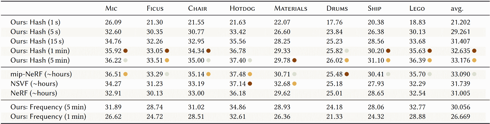

<!--yml

类别: 未分类

日期: 2024-09-06 19:31:30

-->

# [2407.08137] 摘要

> 来源：[`ar5iv.labs.arxiv.org/html/2407.08137`](https://ar5iv.labs.arxiv.org/html/2407.08137)

关于基础深度学习 3D 重建技术的调研 由 Yonge Bai¹、LikHang Wong²、TszYin Twan²

¹麦克马斯特大学

²香港城市大学

baiy58@mcmaster.ca, klhwong3-c@my.cityu.edu.hk, tytwan2-c@my.cityu.edu.hk 2024 年 7 月 10 日

## 摘要

本调研旨在探讨生成照片级真实感 3D 模型和场景的基础深度学习（DL）3D 重建技术，重点介绍神经辐射场（NeRFs）、潜在扩散模型（LDM）和 3D 高斯溅射。我们剖析了其基础算法，评估其优缺点，并预测这一快速发展的领域的未来研究方向。我们提供了关于 DL 驱动的 3D 场景重建的全面概述，深入了解其潜在应用和局限性。

## 背景

3D 重建是一个旨在从图像和/或视频数据中创建体积表面的过程。这一研究领域在最近几个月获得了极大的关注，并在多个领域中找到了应用，包括虚拟现实、增强现实、自动驾驶和机器人技术。深度学习已成为 3D 重建技术的前沿，并展示了增强现实感和准确性的令人印象深刻的成果。

## 神经辐射场

神经辐射场（NeRF）是一种用于复杂场景新视角合成的方法，它利用一组输入视角并优化模型以近似一个连续的体积场景或表面[9]。该方法使用多层感知器（MLP）表示体积，其输入是一个 5D 向量 $(x,y,z,\theta,\phi)$。其中 $(x,y,z)$ 表示空间位置，$(\theta,\phi)$ 表示观察方向，输出是一个 4D 向量 ($R,G,B,\sigma$)，表示 RGB 颜色和体积密度。NeRFs 在定量基准测试以及神经渲染和视图合成的定性测试中达到了 SOTA 结果。

### 之前的工作

NeRFs 基于 RGB-alpha 体积渲染和神经网络（NN）作为隐式连续形状表示的先前工作。

#### 用于视图合成的体积渲染

这个过程涉及使用一组图像来学习 3D 离散体积表示，模型估计 3D 空间中每个点的体积密度和发射的颜色，然后用这些信息从不同的视角合成图像。之前的方法包括 Soft 3D，它通过使用传统的立体视觉方法实现了场景的软 3D 表示，这种表示直接用于建模光线可见性和遮挡 [12]。还有深度学习方法，如 Neural Volumes，它使用编码器-解码器网络将输入图像转换为 3D 体素网格，用于生成新视角 [6]。尽管这些体积表示通过训练来优化其对地面真实视图的渲染效果较为容易，但随着场景分辨率或复杂度的增加，存储这些离散化表示所需的计算和内存变得不切实际。

#### 神经网络作为形状表示

这个研究领域旨在用神经网络的权重隐式表示 3D 表面。与体积方法相比，这种表示以无限分辨率编码 3D 表面的描述，而不会产生过多的内存占用，如此处所述 [8]。神经网络通过学习将空间中的一个点映射到该点在 3D 空间中的一个属性（例如占用 [8] 或带符号距离场 [11]）来编码 3D 表面。尽管这种方法节省了大量内存，但其优化难度较大，导致与离散表示相比生成的视图效果较差。

## 方法：NeRF

NeRFs 通过在 MLP 的权重中表示场景来结合这两种方法，但视图合成使用传统体积渲染中的技术进行训练。

图 1：神经辐射场场景表示和可微分渲染过程的概述。通过在相机光线（a）上采样 5D 坐标（位置和视角），将这些位置输入到 MLP 中以预测颜色和体积密度（b），并使用体积渲染技术将这些值合成到图像中（c）。这个渲染函数是可微分的，因此我们可以通过最小化合成颜色与实际颜色之间的残差来优化我们的场景表示（d）。

### 神经辐射场场景表示

场景由 5D 向量表示，包括 $\mathbf{x}=(x,y,z)$ 和 $\mathbf{d}=(\theta,\phi)$。这个连续的 5D 场景表示由一个 MLP 网络 $F_{\Theta}:(\mathbf{x},\mathbf{d})\to(\mathbf{c},\sigma)$ 近似，其权重 $\Theta$ 被优化以预测每个 5D 输入的 $\mathbf{c}=(R,G,B)$ 代表 RGB 颜色，和 $\sigma$ 代表密度。密度可以被视为遮挡，高遮挡的点具有比低遮挡点更高的 $\sigma$ 值。

隐式表示通过强制网络仅将$\sigma$作为$\mathbf{x}$的函数来保持一致，因为密度不应因视角变化而改变。而$\mathbf{c}$则作为$\mathbf{x}$和$\mathbf{d}$的函数进行训练。MLP $F_{\Theta}$具有 9 个全连接层，前 8 层每层使用 ReLU 激活函数和 256 个通道，最后一层使用 128 个通道。$F_{\Theta}$首先用前 8 层处理$\mathbf{x}$，输出$\sigma$和一个 256 维的特征向量$\mathbf{v}$。然后将$\mathbf{v}$与$\mathbf{d}$连接，并传递到最终层，输出$\mathbf{c}$。这一过程如图 2 所示。

图 2：NeRF 模型概述。$\mathbf{x}$输入前 8 层，输出$\mathbf{v}$和$\sigma$ a)。$\mathbf{v}$与$\mathbf{d}$连接，传递到最后一层，输出$\mathbf{c}$ b)。

### 基于辐射场的体积渲染

任何穿过场景的光线颜色都使用经典体积渲染的原理进行渲染。

|  | $\hat{C}(\mathbf{r})=\sum_{i=1}^{N}w_{i}c_{i},\text{ where }w_{i}=T_{i}\alpha_{i}$ |  | (1) |
| --- | --- | --- | --- |

方程 (1) 可以解释为每个点的颜色$c_{i}$按$w_{i}$加权。$w_{i}$由$T_{i}=\exp(-\sum_{j=1}^{i-1}\sigma_{i}\delta_{i})$组成，其中$\sigma_{i}$是密度，$\delta_{i}$是相邻采样点之间的距离。$T_{i}$表示点$i$的累计透射率，可以认为是光在光线中早期被阻挡的量，而$\alpha_{i}=1-\exp(-\sigma_{i}\delta_{i})$表示点$i$的透明度。因此，具有更高透射率和透明度（即表面起始点）的点对光线$\mathbf{r}$的最终预测颜色贡献更多。

### 优化 NeRF

前面的部分涵盖了 NeRF 的核心组件，但原始论文还有两种技术实现 SOTA 质量——位置编码和分层体积采样。

#### 位置编码

作者发现直接将$(x,y,z,\theta,\phi)$输入$F_{\Theta}$会导致性能较差。因此，他们选择将输入映射到更高维空间，使用高频函数，这使得模型能够更好地拟合具有高变化的数据。因此，$F_{\Theta}$被重新表述为两个函数的组合$F_{\Theta}=F_{\Theta}^{\prime}\circ\gamma$。$F_{\Theta}^{\prime}$是原始 MLP，$\gamma$定义为：

|  | <math   alttext="\gamma(x)=\left(\begin{array}[]{cc}\sin(2^{0}\pi x),&amp;\cos(2^{0}\pi x)\\ \vdots&amp;\vdots\\

$\gamma(x)=\left(\begin{array}{cc}\sin(2^{0}\pi x),&\cos(2^{0}\pi x)\\ \vdots&\vdots\\ \sin(2^{L-1}\pi x),&\cos(2^{L-1}\pi x)\end{array}\right)$

$\gamma(\cdot)$ 被应用于 $\mathbf{x}$ 中的 $(x,y,z)$，其中 $L=10$，以及 $(\theta,\phi)$ 中的 $L=4$。

$\gamma$ 是从 $\mathbb{R}$ 到 $\mathbb{R}^{2L}$ 的映射，显著提高了性能（图 3）。

图 3：可视化模型如何改善位置编码。如果没有它，模型将无法表示高变化的几何形状和纹理，导致过度平滑、模糊的外观。同时，去除视图依赖性如何影响模型渲染光照和反射的能力。

#### 分层体积采样

自由空间和遮挡区域对 NeRF 的质量贡献远小于表面起始区域，但在均匀采样下，它们的采样率是相同的。因此，作者提出了一种分层表示，通过将样本分配与其预期效果成比例，从而提高渲染效率和质量，如 4 所示。例如，如果对象是一个球，则在球前的开放空间和球内部的样本会比直接在球表面上的样本少。

图 4：说明分层采样，其中样本与其对最终体积渲染的贡献成正比。

这是通过优化两个网络来实现的。一个是“粗略”网络，一个是“精细”网络。粗略网络沿光线均匀采样点，而精细网络通过标准化每个样本的权重$w_{i}$（如方程(1）所述）倾向于体积的相关部分，这允许将每个点的权重视为概率分布，并进行采样以训练精细网络。该过程将更多样本分配到预计包含可见内容的区域。

### 局限性

尽管具有从 2D 图像渲染照片级真实 3D 体积的突破性能力，原始的 NeRF 方法仍存在若干局限性。这些局限性包括：

#### 计算效率

单个场景的优化需要 100-300k 次迭代才能在单个 NVIDIA V100 GPU 上收敛，这大约对应 1-2 天[9]。这种低效的计算性能是由于渲染时对光线的密集采样造成的。这种密集采样方法有助于捕捉细节并准确表示复杂场景，但显著增加了计算负担。

#### 泛化能力不足

由于模型对单一场景过拟合，NeRFs 天生缺乏灵活性。NeRF 无法在没有完全重新训练的情况下适应新场景。

#### 编辑难度

在 NeRFs 中修改内容，如移动或删除对象，非常困难。因为模型将场景表示为连续函数，而不存储几何信息。

#### 数据要求

NeRFs 需要大量数据来产生高质量的结果，如原始论文所示。合成 3D 模型如乐高推土机和海盗船大约需要 100 张图像，而现实生活场景如花朵和会议室每个大约需要 60 张[9]。

### 瞬态伪影

原始 NeRFs 假设世界在几何、材料和光度上是静态的。因此，要求在相同位置和方向拍摄的任何两张照片必须完全一致[7]，它们没有办法调整瞬态遮挡或变化的外观，这导致了当这一假设失败时，例如在现实世界图像中出现伪影和噪声。这在 5 中有清晰的展示。

图 5：论文《NeRF in the Wild》[7]中的比较，其中原始 NeRF（左）与 NeRF-W（右）相比，出现了噪声伪影。

## 即时神经图形原语

### 概述

Instant-NGP[10]，由 Nvlabs 提出，是一种显著降低原始 NeRFs 计算需求的方法。它利用多分辨率哈希网格来提高内存使用效率，并优化 3D 重建性能。

### 先前工作

#### 可学习的位置信息编码

可学习的位置信息编码是指针对连续 3D 空间中特定位置参数化的位置信息编码。3D 空间中一个点$p$的位置信息编码可以表示为：

|  | $\mathbf{pe}(p)=\sigma(\mathbf{W}\mathbf{p}+\mathbf{b})$ |  |
| --- | --- | --- |

其中，$\mathbf{p}=(x,y,z)^{T}$表示 3D 空间中位置的坐标，$\mathbf{W}$是一个可学习的权重矩阵，$\mathbf{b}$是一个偏置向量，$\sigma$表示非线性激活函数。

这些位置信息编码可以集成到神经网络模型中，以便学习空间关系。

图 6：原始论文中进行的实验。随着用于学习位置信息编码的参数数量增加，图像变得更清晰、更锐利。

### 算法

#### 多分辨率哈希编码

图 7：原始论文中以 2D 形式表示的多分辨率哈希编码示意图。

Instant-NGP（即时神经图形原语）的关键组件之一是多分辨率哈希编码。与其学习整个 3D 空间的位置信息编码，不如首先将 3D 空间缩放到 0 到 1 的标准化范围内。然后，将这个标准化空间复制到多个分辨率上，每个分辨率再细分成不同密度的网格。这种方法能够捕捉场景中的粗略和细致细节。每个级别专注于在网格顶点处学习位置信息编码。从数学上来看，这可以表达为以下形式：

|  | $\mathbf{p}_{scaled}=\mathbf{p}\cdot\mathbf{s}$ |  |
| --- | --- | --- |

-   其中$\mathbf{p}$表示 3D 空间中的原始坐标，$\mathbf{s}$是将空间标准化到[0, 1]范围的缩放因子。缩放后，坐标通过空间哈希函数被哈希到多分辨率结构中：

|  | $h(\mathbf{x})=\left(\bigoplus_{i=1}^{d}(x_{i}\cdot\pi_{i})\right)\mod T$ |  |
| --- | --- | --- |

-   这里，$d$是空间的维度（例如，对于 3D 坐标为 3），$\mathbf{x}=(x_{1},x_{2},\dots,x_{d})$表示缩放坐标，$\bigoplus$表示按位异或操作，$\pi_{i}$是每个维度特有的大质数，$T$是哈希表的大小。该函数将空间坐标映射到哈希表中的索引，其中存储或检索神经网络的参数，将特定空间位置与神经网络参数关联。

-   简而言之，每个分辨率级别都有一个哈希表。对于每个分辨率，每个顶点都被映射到该分辨率哈希表中的一个条目。相比于低分辨率，高分辨率具有更大的哈希表。每个分辨率的哈希表将其每个顶点映射到一组单独的参数，这些参数学习它们的位置编码。

#### -   学习位置编码

-   在训练过程中，当模型暴露于不同视角的图像时，神经网络会调整存储在哈希表中的参数，以最小化渲染图像与实际训练图像之间的差异。损失$L$可以表示为：

|  | $L(\theta)=\frac{1}{2}\sum_{i=1}^{m}(R(x_{i},\theta)-y_{i})^{2}$ |  |
| --- | --- | --- |

-   其中$R(x_{i},\theta)$是基于参数$\theta$和视角$x_{i}$渲染的图像，$y_{i}$是相应的实际图像，$m$是考虑的像素或数据点数量。然后，我们可以使用不同的优化技术，如梯度下降，来学习这些参数。

#### -   哈希冲突

-   通过为每个分辨率分配一个足够长的哈希表来避免哈希冲突，从而确保条目到位置编码的一对一映射。

### -   性能

-   如图 8 所示，Instant-NGP 实现了相较于原始 NeRFs 显著的 20-60 倍速度提升，同时保持了其质量。

-   图 8：从原始论文改编的图表比较了各种 NeRF 实现的峰值信噪比（PSNR）性能，包括作者的多分辨率哈希编码方法，与其他需要数小时训练的模型。第一行是构建对象的名称。

### -   局限性

-   Instant-NGP 专注于加快 NeRFs 的计算和训练过程。然而，它仍然存在许多相同的问题，如对不同数据集或未见场景的泛化能力。在下一节中，我们将介绍基于 LDM 的 3D 重建技术，以解决泛化问题。

## -   基于潜在扩散模型的 3D 重建

### 背景

传统的 3D 重建算法严重依赖训练数据来捕捉体积的所有方面。然而，人类能够从单张图像中估计出 3D 表面。这一概念是哥伦比亚大学开发的 Zero-1-to-3[5] 框架的基础，该框架引入了一种基于扩散的 3D 重建方法。Zero-1-to-3 利用 LDM，最初设计用于文本条件图像生成，根据相机的外部参数（如旋转和位移）生成图像的新视角。Zero-1-to-3 利用大规模 LDM 训练得到的几何先验，允许从单张图像生成新视角。Zero-1-to-3 展现了强大的零样本泛化能力，在单视角 3D 重建和新视角合成任务中超越了之前的模型。请参见图 9。

图 9：原始论文中的 Zero-1-to-3 高级示意图

### 先前的工作：去噪扩散概率模型

去噪扩散概率模型（DDPMs）[1] 是一类生成模型，通过逐步添加噪声来转化数据，然后学习逆向过程从噪声中生成新的样本。

#### 前向过程

DDPM 中的前向过程是一个马尔可夫链，它在 $T$ 个时间步中逐渐向数据中添加高斯噪声。这个过程可以数学上描述为：

|  | $x_{t}=\sqrt{\alpha_{t}}x_{t-1}+\sqrt{1-\alpha_{t}}\epsilon,\quad\epsilon\sim\mathcal{N}(0,I)$ |  |
| --- | --- | --- |

其中，$x_{0}$ 是原始数据，$x_{t}$ 是时间步 $t$ 的数据，$\epsilon$ 是噪声，$\alpha_{t}$ 是方差调度参数，用于确定每一步添加多少噪声。

图 10：DDPM 的前向过程。改编自 [4]。

#### 反向过程

反向过程旨在通过学习一个参数化模型 $p_{\theta}$ 从噪声中重建原始数据。反向过程也是一个马尔可夫链，描述为：

|  | $x_{t-1}=\frac{1}{\sqrt{\alpha_{t}}}\left(x_{t}-\frac{1-\alpha_{t}}{\sqrt{1-\bar{\alpha}_{t}}}\epsilon_{\theta}(x_{t},t)\right)+\sigma_{t}z,\quad z\sim\mathcal{N}(0,I)$ |  |
| --- | --- | --- |

其中，$\epsilon_{\theta}(x_{t},t)$ 是一个预测噪声的神经网络，$\sigma_{t}$ 是反向过程噪声的标准差，$\bar{\alpha}_{t}=\prod_{s=1}^{t}\alpha_{s}$ 是 $\alpha_{t}$ 值的累积乘积。

#### 训练

DDPM 的训练包括优化神经网络的参数 $\theta$，以最小化模型预测的噪声与前向过程实际添加的噪声之间的差异。损失函数通常是这两个噪声项之间的均方误差：

|  | $L(\theta)=\mathbb{E}_{t,x_{0},\epsilon}\left[\| \epsilon - \epsilon_{\theta}(x_{t},t) \|_{2}^{2}\right]$ |  |
| --- | --- | --- |

其中 $x_{t}$ 在前向过程中计算，$\epsilon$ 是每步添加的高斯噪声。

#### 采样

为生成新样本，反向过程以纯噪声 $x_{T}\sim\mathcal{N}(0,I)$ 初始化，并通过迭代应用反向步骤来产生近似原始数据分布 $x_{0}$ 的样本。

算法 1 DDPM 采样算法

1:过程 DdpmSampling($\theta,T,\{\alpha_{t}\}$)2:     输入: 训练好的模型参数 $\theta$，总时间步 $T$，噪声调度 $\{\alpha_{t}\}$3:     输出: 一个近似数据分布的样本 4:     初始化: 生成 $x_{T}\sim\mathcal{N}(0,I)$ 从纯噪声开始 5:     对 $t=T$ 直到 1 进行 6:         计算 $\bar{\alpha}_{t}=\prod_{s=1}^{t}\alpha_{s}$7:         计算 $\sigma_{t}^{2}=\frac{1-\bar{\alpha}_{t-1}}{1-\bar{\alpha}_{t}}\cdot(1-\alpha_{t})$8:         预测噪声 $\epsilon_{t}=\epsilon_{\theta}(x_{t},t)$9:         如果 $t>1$ 则 10:              $x_{t-1}=\frac{1}{\sqrt{\alpha_{t}}}\left(x_{t}-\frac{1-\alpha_{t}}{\sqrt{1-\bar{\alpha}_{t}}}\epsilon_{t}\right)+\sigma_{t}z,\quad z\sim\mathcal{N}(0,I)$11:         否则 12:              $x_{0}=\frac{1}{\sqrt{\alpha_{t}}}\left(x_{t}-\frac{1-\alpha_{t}}{\sqrt{1-\bar{\alpha}_{t}}}\epsilon_{t}\right)$ 最终去噪步骤 13:         结束 if14:     结束 for15:     返回 $x_{0}$16:结束 过程

图 11: 采样过程。改编自 [4]。

### 零到三的潜在扩散模型

潜在扩散模型[13]于 2021 年提出，是一种生成模型，结合了扩散模型和变分自编码器（VAEs）的优点。传统的 DDPM 在图像像素空间中操作，这需要更多的计算。LDM 在扩散和去噪过程之前将完整的图像数据空间压缩到潜在空间，从而提高生成高质量图像的效率和可扩展性。

图 12: 原始论文中潜在扩散模型的架构。

#### 训练潜在扩散模型 $\epsilon_{\theta}$

LDM 的训练分为两个主要阶段。首先，使用 VAE 学习编码函数 $E(x)$ 和解码函数 $D(z)$，其中 $x$ 表示高分辨率图像，$z$ 是它的潜在表示。编码器将 $x$ 压缩到 $z$，解码器尝试从 $z$ 重建 $x$。

#### 训练 VAE

VAE 通过最小化重建损失与 KL 散度损失的结合来优化参数 $\phi$（编码器）和 $\psi$（解码器）：

图 13: VAE 训练。图来自 Lightning AI

|  | $\mathcal{L}_{VAE}(\phi,\psi)=\mathbb{E}_{q_{\phi}(z | x)}[\log p_{\psi}(x | z)]-D_{KL}(q_{\phi}(z | x)\|p(z))$ |  | (3) |
| --- | --- | --- | --- | --- | --- | --- |

#### 训练注意力 U-Net 去噪器

在第二阶段，训练一个注意力 U-Net 作为潜在空间中的去噪模型。该模型学习一系列去噪步骤，将来自噪声分布 $p(z_{T})$ 的样本转变为数据分布 $p(z_{0})$，并经过 T 个时间步。通过最小化真实数据分布与模型分布之间的预期反向 KL 散度来优化 U-Net 模型参数 $\theta$，公式如下：

|  | $\mathcal{L}(\theta)=\mathbb{E}_{z_{0},\epsilon\sim\mathcal{N}(0,I),t}\left[\&#124;\epsilon-\epsilon_{\theta}(z_{t},t)\&#124;^{2}\right]$ |  | (4) |
| --- | --- | --- | --- |

其中 $z_{t}=\sqrt{\bar{\alpha}_{t}}z_{0}+\sqrt{1-\bar{\alpha}_{t}}\epsilon$，而 $\bar{\alpha}_{t}$ 是方差调度。我们使用 KL 散度来计算真实数据分布与模型分布之间的“差异”。我们的目标是使模型的潜在空间分布类似于现实世界。这是生成真实图像的关键。图 14 显示了最小化两个分布的示例。

图 14：左侧（不佳）示例中，$Q(x)$ 分布与 $P(x)$ 之间的差异未被最小化。右侧（良好）示例中，$Q(x)$ 分布与 $P(x)$ 之间的差异已被最小化。（来自 [3]）

图 15：原始论文中的注意力 U-Net 架构

图 16：训练注意力 U-Net 去噪器。图源自 Lightning AI

#### 基于相机参数的条件设定

Zero-1-to-3 框架的第三阶段专注于基于相机外部参数（如旋转 ($R$) 和平移 ($t$)）对 LDM 的条件设定。这种条件设定对于生成物体的新视角至关重要，这对于从单张图像中有效地进行 3D 重建至关重要。

##### 条件设定机制

在此阶段，之前训练的潜在表示根据所需的相机变换进行操作，以模拟新的视角。该过程包括：

+   •

    相机变换：调整潜在变量 $z$ 以反映由于不同旋转 $R$ 和平移 $t$ 引起的视点变化。

+   •

    变换实现：可以通过在 LDM 框架内学习的变换模型实现，也可以直接将预定义的变换矩阵应用于潜在向量。

##### 为条件输出训练模型

模型进一步训练以有效处理条件输出，这包括：

+   •

    数据准备：官方代码使用了 RTMV 数据集[15]，该数据集从多个视角捕获物体，以将潜在表示与相应的相机参数配对。

+   •

    模型适应：扩展潜在扩散模型训练，不仅生成来自潜在表示 $z$ 的图像，还生成其变换后的潜在表示 $z^{\prime}$ 的新视角图像。

+   •

    MSE 损失：我们计算输出图像与真实图像之间的 MSE，针对 $R$ 和 $t$。还使用了“近视一致性损失”，该损失计算从一个视角渲染的图像与从附近视角渲染的图像之间的 MSE，以保持 3D 重建中的一致性。

##### 新视角生成

为了生成新视角，对潜在空间应用以下变换：

|  | $z^{\prime}=f(z,R,t)$ |  | (5) |
| --- | --- | --- | --- |

其中 $f$ 是基于 $R$ 和 $t$ 修改 $z$ 的变换函数。Zero-1-to-3 模型生成新视角如下：

|  | $x^{\prime}=D(\epsilon_{\theta}(z^{\prime}))$ |  | (6) |
| --- | --- | --- | --- |

其中 $x^{\prime}$ 表示从新视角生成的图像，$D$ 是 LDM 的解码器部分，它从变换后的潜在表示 $z^{\prime}$ 合成最终的图像输出。

#### 3D 重建 $\epsilon_{\theta}$

3D 重建是通过首先使用上述方法生成物体的多个视图来执行的，这些视图是通过不同的 $R$ 和 $t$ 矩阵生成的。每个生成的图像 $x^{\prime}$ 提供了物体的不同视角。这些图像随后被用来重建 3D 模型：

|  | $\text{3D Model}=\text{Integrate}(\{x^{\prime}\})$ |  | (7) |
| --- | --- | --- | --- |

集成过程通常涉及体积融合或多视图立体算法等技术，这些技术整合来自不同图像的信息以创建物体的详细 3D 表示，如图 17 所示。

图 17：Zero-1-to-3 的 3D 重建演示

### 基于扩散和 NeRF 的 3D 重建的局限性

+   •

    灵活性和实时 3D 场景渲染：训练 Zero-1-to-3 模型进行 3D 场景重建通常需要在采样过程中进行迭代去噪过程，这可能计算密集且速度较慢。这使得它们不太适合需要实时渲染的应用。

+   •

    隐式表示模糊性：NeRF 和扩散模型都隐式地表示 3D 物体；它们不显式构建 3D 空间。NeRF 利用 MLP 的权重来表示 3D 场景，而 LDM 则使用潜在空间生成 3D 重建的新视角。虽然隐式表示节省了大量空间，但可能会导致对模型解释的模糊性。

## 方法：3D 高斯散点法

### 背景

在 3D 场景重建的发展过程中，由于网格和点云等显式表示具有明确的结构、快速渲染和易于编辑的特点，一直受到开发者和研究人员的青睐。基于 NeRF 的方法则转向 3D 场景的连续表示。虽然这些方法的连续性有助于优化，但渲染所需的随机采样代价高且可能导致噪声[2]。此外，隐式表示缺乏几何信息，不利于编辑。

### 概述

3D 高斯点云渲染提供了高质量的新视角和实时渲染的 3D 场景，这些都是通过利用高斯函数来呈现平滑且准确的纹理，利用拍摄到的场景照片实现的。

图 18: 3D 高斯点云渲染过程概述。

要使用 3D 高斯点云渲染重建 3D 模型，首先需要从不同角度拍摄物体的视频，然后将其转换为表示不同相机角度的静态场景的帧。然后对这些图像应用结构光束（SfM）及特征检测和匹配技术，如 SIFT，以生成稀疏点云。点云的 3D 数据点随后由 3D 高斯函数表示。通过优化过程、高斯的自适应密度控制和高效算法设计，可以以高帧率重建 3D 模型的逼真视图。

3D 高斯点云渲染算法如下面所示，它可以分为三个部分：初始化、优化和高斯的密度控制。

### 算法

算法 2 优化和密度调整

$w$, $h$: 训练图像的宽度和高度

$M\leftarrow$ SfM 点 $\triangleright$ 位置 $i\leftarrow 0$ $\triangleright$ 迭代计数 while not converged do     $V,\hat{I}\leftarrow$ SampleTrainingView() $\triangleright$ 相机 $V$ 和图像     $I\leftarrow$ Rasterize($M$, $S$, $C$, $A$, $V$) $\triangleright$ 算法 3     $L\leftarrow Loss(I,\hat{I})$ $\triangleright$ 损失     $M$, $S$, $C$, $A$ $\leftarrow$ Adam($\nabla L$) $\triangleright$ 反向传播与步骤     if IsRefinementIteration($i$) then         for all 高斯分布 $(\mu,\Sigma,c,\alpha)$ 在 $(M,S,C,A)$ do              if $\alpha<\epsilon$ 或 IsTooLarge($\mu,\Sigma)$ then $\triangleright$ 剪枝                  RemoveGaussian()              end if              if $\nabla_{p}L>\tau_{p}$ then $\triangleright$ 密度化                  if $\|S\|>\tau_{S}$ then $\triangleright$ 过度重建                       SplitGaussian($\mu,\Sigma,c,\alpha$)                  else$\triangleright$ 欠重建                       CloneGaussian($\mu,\Sigma,c,\alpha$)                  end if              end if         end for     end if     $i\leftarrow i+1$ end while

#### 初始化

由 SfM 生成的稀疏 3D 数据点云中的点被初始化为 3D 高斯分布。高斯分布由以下变量定义：位置$p$、世界空间 3D 协方差矩阵$\Sigma$、透明度$\alpha$和球面谐波系数$c$（RGB 颜色的表示），给定公式：

|  | $G(x)~{}=e^{-\frac{1}{2}(x)^{T}\Sigma^{-1}(x)}$ |  | (8) |
| --- | --- | --- | --- |

#### 优化

最初，高斯分布是稀疏的且不具有代表性，但它们会逐渐优化，以更好地表示场景。为此，从训练集中选择一个随机相机视角$V$及其对应的图像$\hat{I}$。通过将高斯均值、$\Sigma$、$c$、$\alpha$和$V$传递给可微分的光栅化函数$Rasterize()$，生成光栅化的高斯图像$I$。

使用损失函数（见方程（9）），计算两个图像$\hat{I}$和$I$的梯度。

|  | $\mathcal{L}=(1-\lambda)\mathcal{L}_{1}+\lambda\mathcal{L_{\textrm{D-SSIM}}}$ |  | (9) |
| --- | --- | --- | --- |

在这里，$\mathcal{L}_{1}$是$\hat{I}$和$I$的平均绝对误差，$\mathcal{L}_{D-SSMI}$是基于差异结构相似性指数的损失，$\lambda$是一个预定义的权重，用于调整$\mathcal{L}_{1}$和$\mathcal{L}_{D-SSMI}$对最终损失$\mathcal{L}$的贡献。高斯分布的参数会通过 Adam 优化器[2]进行相应调整。

#### 高斯分布的自适应控制

初始化后，使用自适应方法来控制高斯的数量和密度。自适应控制指的是自动调整高斯的大小和数量，以优化静态 3D 场景的表示。自适应密度控制遵循以下行为（见图 12）：

+   •

    高斯移除：每 100 次迭代，如果高斯在 3D 空间中过大或其不透明度低于定义的不透明度阈值$\epsilon_{\alpha}$（基本上是透明的），则将其移除。

+   •

    高斯克隆：对于那些大于定义阈值但又过小的区域中的高斯，高斯会被克隆并沿其方向移动以覆盖空白区域。这种行为自适应地逐渐增加高斯的数量和体积，直到区域得到良好拟合。

+   •

    高斯分裂：对于那些被大高斯（方差过高）重建过度的区域，它们会被分裂成较小的高斯，分裂因子为$\phi$，原始论文中使用了$\phi=1.6$。

图 19：高斯在重建过度的区域被分裂，而在重建不足的区域被克隆。

由于分裂和克隆，高斯的数量增加。为了解决这个问题，每$N=3000$次迭代时将高斯的不透明度$\alpha$接近于零，优化步骤后再增加需要的高斯的$\alpha$值，同时允许移除未使用的高斯。

### $\Sigma$和$\Sigma^{\prime}$的梯度计算

每个高斯在 3D 空间中被表示为一个椭球体，由协方差矩阵$\Sigma$建模。

|  | $\Sigma=RSS^{T}R^{T}$ |  | (10) |
| --- | --- | --- | --- |

其中 S 是缩放矩阵，R 是旋转矩阵。

对于每个相机角度，3D 高斯被光栅化到 2D 屏幕上。3D 协方差矩阵$\Sigma^{\prime}$通过视图变换矩阵$W$和雅可比矩阵$J$推导出来，这近似于投影变换。

|  | $\Sigma^{\prime}=JW{\Sigma}W^{T}J^{T}$ |  | (11) |
| --- | --- | --- | --- |

$\Sigma^{\prime}$，一个 3x3 矩阵，可以通过忽略第三行和第三列中的元素来简化，同时保留其对应平面点表示的属性[19]。

为了计算 3D 空间协方差的梯度，链式法则被应用于$\Sigma$和$\Sigma^{\prime}$，参考它们的旋转$q$和缩放$s$。这导致了表达式$\frac{d\Sigma^{\prime}}{ds}=\frac{d\Sigma^{\prime}}{d\Sigma}\frac{d\Sigma}{ds}$和$\frac{d\Sigma^{\prime}}{dq}=\frac{d\Sigma^{\prime}}{d\Sigma}\frac{d\Sigma}{dq}$。通过将$U=JW$代入$\Sigma^{\prime}$的方程中，我们得到${\Sigma^{\prime}}=U\Sigma U^{T}$。这个方程允许将$\frac{d\Sigma^{\prime}}{d\Sigma}$中每个元素的偏导数用$U$表示：

<math alttext="\frac{\partial\Sigma^{\prime}}{\partial\Sigma_{ij}}=\left(\begin{smallmatrix}U_{1,i}U_{1,j}&amp;U_{1,i}U_{2,j}\\

\(\frac{\partial\Sigma^{\prime}}{\partial\Sigma_{ij}}=\left(\begin{smallmatrix}U_{1,i}U_{1,j}&U_{1,i}U_{2,j}\\ U_{1,j}U_{2,i}&U_{2,i}U_{2,j}\end{smallmatrix}\right)\)

将$M=RS$代入方程（10$的缩放梯度，计算公式为：

|  | $\frac{\partial M_{i,j}}{\partial s_{k}}=\left\{\begin{array}[]{lr}R_{i,k}&amp;\text{如果 }j=k\\ 0&amp;\text{否则}\end{array}\right.$ |  |
| --- | --- | --- |

关于如何用四元数$q$的分量来定义旋转矩阵$R$的$M$的导数，涉及到以下公式，这个公式展示了四元数分量如何影响$R$：

|  | <math   alttext="R(q)=2\begin{pmatrix}\frac{1}{2}-(q_{j}^{2}+q_{k}^{2})&amp;(q_{i}q_{j}-q_{r}q_{k})&amp;(q_{i}q_{k}+q_{r}q_{j})\\ (q_{i}q_{j}+q_{r}q_{k})&amp;\frac{1}{2}-(q_{i}^{2}+q_{k}^{2})&amp;(q_{j}q_{k}-q_{r}q_{i})\\

\( R(q) = 2 \begin{pmatrix} \frac{1}{2} - (q_{j}^{2} + q_{k}^{2}) & (q_{i}q_{j} - q_{r}q_{k}) & (q_{i}q_{k} + q_{r}q_{j}) \\ (q_{i}q_{j} + q_{r}q_{k}) & \frac{1}{2} - (q_{i}^{2} + q_{k}^{2}) & (q_{j}q_{k} - q_{r}q_{i}) \\ (q_{i}q_{k} - q_{r}q_{j}) & (q_{j}q_{k} + q_{r}q_{i}) & \frac{1}{2} - (q_{i}^{2} + q_{j}^{2}) \end{pmatrix} \)

因此，四元数$r,i,j,k$的梯度$\frac{\partial M}{\partial q_{x}}$可以按如下方式计算：

|  |  | <math   alttext="\displaystyle\frac{\partial M}{\partial q_{r}}=2\left(\begin{smallmatrix}0&amp;-s_{y}q_{k}&amp;s_{z}q_{j}\\ s_{x}q_{k}&amp;0&amp;-s_{z}q_{i}\\

\(\frac{\partial M}{\partial q_{r}}=2\left(\begin{smallmatrix}0&-s_{y}q_{k}&s_{z}q_{j}\\ s_{x}q_{k}&0&-s_{z}q_{i}\\ -s_{x}q_{j}&s_{y}q_{i}&0\end{smallmatrix}\right),\)

\(\frac{\partial M}{\partial q_{i}} = 2\left(\begin{smallmatrix}0 & s_{y}q_{j} & s_{z}q_{k}\\ s_{x}q_{j} & -2s_{y}q_{i} & -s_{z}q_{r}\\ s_{x}q_{k} & s_{y}q_{r} & -2s_{z}q_{i}\end{smallmatrix}\right)\)

|  |  | <math alttext="\displaystyle\frac{\partial M}{\partial q_{j}}=2\left(\begin{smallmatrix}-2s_{x}q_{j}&amp;s_{y}q_{i}&amp;s_{z}q_{r}\\ s_{x}q_{i}&amp;0&amp;s_{z}q_{k}\\

\(\displaystyle\frac{\partial M}{\partial q_{j}}=2\left(\begin{smallmatrix}-2s_{x}q_{j}&s_{y}q_{i}&s_{z}q_{r}\\ s_{x}q_{i}&0&s_{z}q_{k}\\ -s_{x}q_{r}&s_{y}q_{k}&-2s_{z}q_{j}\end{smallmatrix}\right),\)

\(\frac{\partial M}{\partial q_{k}}=2\left(\begin{smallmatrix}-2s_{x}q_{k}&-s_{y}q_{r}&s_{z}q_{i}\\ s_{x}q_{r}&-2s_{y}q_{k}&s_{z}q_{j}\\ s_{x}q_{i}&s_{y}q_{j}&0\end{smallmatrix}\right)\)

### 用于实时渲染的基于瓦片的光栅化器

一种称为基于瓦片的光栅化器的技术被用来快速渲染由高斯构建的 3D 模型（见图 13）。这种方法首先使用给定的摄像机视角$V$和位置$p$来过滤掉不贡献于视锥体的高斯。这样，只有有用的高斯参与$\alpha$-混合，提高了渲染效率。

图 20: 基于瓦片的光栅化区域概述，其中绿色高斯对视锥体有贡献，红色高斯没有，给定摄像机角度$V$。

与其对每个像素进行单独排序以实现$\alpha$-混合，不如创建瓦片将 2D 屏幕划分为更小的 16x16 区域。每个高斯使用其相应的视空间深度和它们所在的瓦片 ID 分配一个实例键。然后，高斯根据其实例键使用 GPU 基数排序进行排序。基数排序能够在 GPU 线程中并行处理大规模数据。高斯排序的结果还可以展示瓦片的深度级别。

排序后，将每个线程块分配给每个瓦片，高斯分布被加载到相应的内存中。然后，在已排序的高斯列表上进行从前到后的$\alpha$-混合，使用高斯的累计颜色和不透明度$\alpha$，直到每个像素达到目标 alpha 饱和度。这种设计通过在共享内存空间中实现瓦片渲染和高斯加载的并行性，从而最大化计算效率。

算法 3 GPU 软件光栅化 3D 高斯分布

$w$, $h$: 需要光栅化的图像的宽度和高度

$M$, $S$: 世界空间中的高斯均值和协方差

$C$, $A$: 高斯颜色和不透明度

$V$: 当前摄像机的视图配置

function Rasterize($w$, $h$, $M$, $S$, $C$, $A$, $V$)     CullGaussian($p$, $V$) $\triangleright$ 裁剪     $M^{\prime},S^{\prime}$ $\leftarrow$ ScreenspaceGaussians($M$, $S$, $V$) $\triangleright$ 转换     $T$ $\leftarrow$ CreateTiles($w$, $h$)     $L$, $K$ $\leftarrow$ DuplicateWithKeys($M^{\prime}$, $T$) $\triangleright$ 索引和键     SortByKeys($K$, $L$) $\triangleright$ 全局排序     $R$ $\leftarrow$ IdentifyTileRanges($T$, $K$)     $I\leftarrow\mathbf{0}$ $\triangleright$ 初始化画布     for all Tiles $t$ in $I$ do         for all Pixels $i$ in $t$ do              $r\leftarrow$ GetTileRange($R$, $t$)              $I[i]\leftarrow$ BlendInOrder($i$, $L$, $r$, $K$, $M^{\prime}$, $S^{\prime}$, $C$, $A$)         end for     end forreturn $I$end function

### 限制

#### 大内存带宽

为了实现高帧率的实时渲染，$Rasterize()$ 函数中使用了并行计算方法。这涉及到在每个瓦片的共享内存中发生大量的动态数据加载，在 $\alpha$-混合过程中。因此，需要较大的 GPU 内存带宽来支持数据流量。

#### 稀疏视角下的鲁棒性

高斯通过与真实相机视图比较梯度进行优化。然而，数据点较少或没有数据点的视角在其区域优化高斯时的数据较少，从而导致伪影和失真。

## 未来趋势

#### 语义驱动的 3D 重建

许多 3D 重建技术专注于从图像中生成 3D 模型。然而，文本提示作为指导因素的整合呈现出未来研究的激动人心的方向。例如，论文《从单张图像进行语义驱动的 3D 重建》中[18]展示了文本提示如何显著提升重建模型的精度和上下文相关性。而《LGM：高分辨率 3D 内容创建的大型多视角高斯模型》[14]展示了仅通过文本提示就能进行令人印象深刻的零-shot 3D 生成。

#### 动态 3D 场景重建

前述方法仅能利用静态场景中的捕获信息重建静态 3D 模型，其中信息捕获过程中场景的任何结构变化都会导致误信息，从而在特定区域下重建不足。为了实现动态 3D 场景重建，4D 高斯喷溅利用一组典型的 3D 高斯，并通过在不同时间的变形场进行转换，从而生成能够表示物体随时间变化的动态 3D 模型[16]。

#### 单视角 3D 重建

基于《Zero 1-to-3》中介绍的方法，一个获得显著关注的领域是单视角 3D 重建。利用扩散模型从单张图像生成 3D 对象，[14] 和 [17] 在这一领域展示了有前景的工作。

## 参考文献

+   [1] Jonathan Ho, Ajay Jain, 和 Pieter Abbeel. 去噪扩散概率模型，2020 年。

+   [2] Bernhard Kerbl, Georgios Kopanas, Thomas Leimkühler, 和 George Drettakis. 实时辐射场渲染的 3D 高斯喷溅，2023 年。

+   [3] Agustinus Kristiadi. KL 散度：前向与反向？ https://agustinus.kristia.de/techblog/2016/12/21/forward-reverse-kl/，2016 年。访问时间：2024 年 4 月 22 日。

+   [4] Hung-yi Lee. ddpm 的前向过程，2023 年 4 月。 https://www.youtube.com/watch?v=ifCDXFdeaaM&t=608.

+   [5] Ruoshi Liu, Rundi Wu, Basile Van Hoorick, Pavel Tokmakov, Sergey Zakharov, 和 Carl Vondrick. Zero-1-to-3：零-shot 一张图像到 3D 对象，2023 年。

+   [6] Stephen Lombardi, Tomas Simon, Jason Saragih, Gabriel Schwartz, Andreas Lehrmann, 和 Yaser Sheikh。神经体积：从图像中学习动态可渲染体积。《ACM Trans. Graph.》，38(4):65:1–65:14，2019 年 7 月。

+   [7] Ricardo Martin-Brualla, Noha Radwan, Mehdi S. M. Sajjadi, Jonathan T. Barron, Alexey Dosovitskiy, 和 Daniel Duckworth。Nerf in the wild: 用于无约束照片集的神经辐射场，2021 年。

+   [8] Lars Mescheder, Michael Oechsle, Michael Niemeyer, Sebastian Nowozin, 和 Andreas Geiger。占据网络：在函数空间中学习 3D 重建，2019 年。

+   [9] Ben Mildenhall, Pratul P. Srinivasan, Matthew Tancik, Jonathan T. Barron, Ravi Ramamoorthi, 和 Ren Ng。Nerf: 通过神经辐射场表示场景用于视图合成，2020 年。

+   [10] Thomas Müller, Alex Evans, Christoph Schied, 和 Alexander Keller。使用多分辨率哈希编码的即时神经图形原语。《ACM Transactions on Graphics》，41(4):1–15，2022 年 7 月。

+   [11] Jeong Joon Park, Peter Florence, Julian Straub, Richard Newcombe, 和 Steven Lovegrove。Deepsdf: 用于形状表示的连续签名距离函数学习，2019 年。

+   [12] Eric Penner 和 Li Zhang。用于视图合成的软 3D 重建。36(6)，2017 年。

+   [13] Robin Rombach, Andreas Blattmann, Dominik Lorenz, Patrick Esser, 和 Björn Ommer。基于潜在扩散模型的高分辨率图像合成，2022 年。

+   [14] Jiaxiang Tang, Zhaoxi Chen, Xiaokang Chen, Tengfei Wang, Gang Zeng, 和 Ziwei Liu。Lgm: 用于高分辨率 3D 内容创建的大型多视角高斯模型。arXiv 预印本 arXiv:2402.05054，2024 年。

+   [15] Jonathan Tremblay, Moustafa Meshry, Alex Evans, Jan Kautz, Alexander Keller, Sameh Khamis, Thomas Müller, Charles Loop, Nathan Morrical, Koki Nagano, Towaki Takikawa, 和 Stan Birchfield。Rtmv: 用于新视图合成的光线追踪多视角合成数据集，2022 年。

+   [16] Guanjun Wu, Taoran Yi, Jiemin Fang, Lingxi Xie, Xiaopeng Zhang, Wei Wei, Wenyu Liu, Qi Tian, 和 Xinggang Wang。4D 高斯点云用于实时动态场景渲染，2023 年。

+   [17] Jiale Xu, Weihao Cheng, Yiming Gao, Xintao Wang, Shenghua Gao, 和 Ying Shan。Instantmesh: 从单张图像中高效生成 3D 网格，配合稀疏视图的大规模重建模型，2024 年。

+   [18] Hao Zhang, Yanbo Xu, Tianyuan Dai, Yu-Wing Tai, 和 Chi-Keung Tang。Facednerf: 基于语义的面部重建、提示编辑和扩散模型下的重光照，2023 年。

+   [19] Qiang Zhang, Seung-Hwan Baek, Szymon Rusinkiewicz, 和 Felix Heide。用于高效视图合成的可微分点云辐射场，2023 年。
