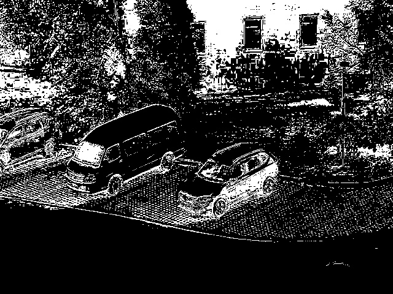
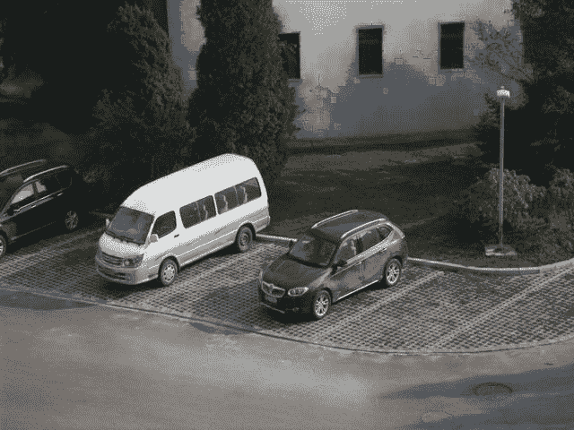
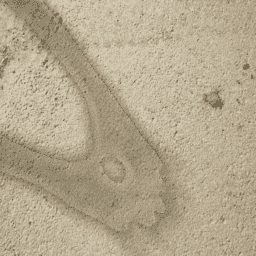

<!--yml

类别：未分类

日期：2024-09-06 19:31:25

-->

# [2407.08865] 使用深度学习进行单图像阴影去除：一项全面的综述

> 来源：[`ar5iv.labs.arxiv.org/html/2407.08865`](https://ar5iv.labs.arxiv.org/html/2407.08865)

\WarningFilter

latexFont 形状 \WarningFilterlatexfontFont 形状

# 使用深度学习进行单图像阴影去除：一项全面的综述

郭兰青、王冲、王雨飞、余毅、黄思宇、杨文瀚，IEEE 会员，

Alex C. Kot, IEEE 终身会员，Bihan Wen，IEEE 高级会员，郭兰青、王冲、王雨飞、余毅、Alex C. Kot 和 Bihan Wen 均在新加坡南洋理工大学电气与电子工程学院工作，邮政编码：639798\. 电子邮件：{lanqing001, wang1711, yufei001, yuyi0010, eackot, bihan.wen}@ntu.edu.sg。黄思宇在克莱姆森大学计算机学院视觉计算部工作，邮政编码：29631 美国南卡罗来纳州克莱姆森市。电子邮件：siyuh@clemson.edu。杨文瀚在中国深圳鹏城实验室工作。电子邮件：yangwh@pcl.ac.cn。

###### 摘要

阴影去除旨在恢复阴影区域内的图像内容，追求阴影与非阴影区域之间的一致光照分布。与其他图像恢复任务相比，阴影去除面临两个独特的挑战：1）阴影的模式是任意的、多变的，并且通常具有高度复杂的痕迹结构，使得“无痕迹”图像恢复变得困难。2）阴影造成的退化在空间上是不均匀的，导致阴影和非阴影区域之间的光照和颜色不一致。该领域的最新进展主要依赖于基于深度学习的解决方案，采用了各种学习策略、网络架构、损失函数和训练数据。然而，关于基于深度学习的阴影去除技术的全面和深入的综述仍然缺乏。在本文中，我们首次提供了一项全面的综述，涵盖了从技术细节到应用的各个方面。我们重点介绍了基于深度学习的单图像阴影去除方法的主要进展，全面回顾了各个类别的先前研究，并提供了这些发展的历史进程的见解。此外，我们还总结了性能的定量和定性比较。除了阴影去除方法的技术方面，我们还探讨了该领域的潜在未来方向。相关的代码库已发布于：[`github.com/GuoLanqing/Awesome-Shadow-Removal`](https://github.com/GuoLanqing/Awesome-Shadow-Removal)。

###### 关键词：

阴影去除、低级视觉、深度学习、图像增强、计算摄影

## 引言

阴影是自然现象，当表面某些区域收到的光照少于其邻近区域时会发生。这发生在不透明物体阻挡了表面和光源之间的光线直接路径时。图像和视频中的阴影阻碍了人类感知[1, 2]以及许多后续视觉任务，例如对象检测、跟踪和语义分割[3, 4, 5]。

图 1：基于深度学习的单图像阴影去除方法的里程碑包括随着时间的推移探索各种技术，如深度卷积神经网络（**CNNs**）、生成对抗网络（**GANs**）、递归神经网络（**RNNs**）、展开、变换器和扩散模型。

阴影退化表现出多种类型，并具有高度非均匀的特性，这为阴影去除带来了独特的挑战，与其他图像恢复任务相比。传统的阴影去除方法利用手工制作的先验信息，如光照[6, 7, 8, 9, 10, 11]，梯度[12, 13, 14, 15, 16, 17]和颜色[18, 19, 20, 21, 22]来恢复阴影区域的光照。通常，一些方法[13, 23]通过去除阴影边缘的图像梯度，然后重新整合修改后的梯度以生成无阴影图像。然而，这些方法基于理想的假设，导致实际场景中明显的阴影边界伪影。它们总是需要在检测输出中准确细致的阴影边缘作为阴影去除的强先验，这是在应用中不切实际的；另一类方法[6, 7, 8, 9, 10, 11]将阴影去除视为重光照问题，寻求一种因素来增强阴影像素的亮度。主要挑战是确定伪影和半影的不同尺度因子，并解决由于非均匀光照退化导致的阴影边界校正问题。

近年来，基于深度学习的阴影去除方法由于大量训练数据的可用性，表现出卓越的性能。图 1 展示了过去几年基于深度学习的阴影去除方法所取得的里程碑式进展。2017 年，Qu *et al.* [24] 首次提出了一个多分支融合框架，作为将深度卷积神经网络（CNNs）[25, 26, 27] 引入这一领域的开创性工作。随后，从 2018 年开始，生成对抗网络（GANs）[28] 在低级视觉领域的进展导致了 GAN-based 网络在阴影去除任务中的广泛应用。这些网络不仅在处理放大伪影方面有效，还支持使用未配对的阴影和无阴影数据开发无监督学习方法。在这一期间，一些方法尝试将约束条件（例如，物理照明模型和掩码信息）注入网络中，通过展开 [29, 30] 或递归 [31] 策略来学习更有效的特征。在最新的进展中，诸如变换器机制 [32, 33, 34, 35] 和扩散模型 [36, 37, 38, 39, 40] 等新技术在阴影去除方面表现出了显著的进展。变换器机制利用上下文中的长程依赖关系，从非阴影区域中更有效地提取上下文信息。与此同时，扩散模型提供了一种强大的扩散生成先验，用于生成自然的无阴影图像。

尽管深度学习在阴影去除研究中占据主导地位，但目前还缺乏对基于深度学习的解决方案的深入和全面的调查。现有的阴影去除调查[41, 42, 43]仅涵盖了基于早期出版物的传统方法，却忽略了通过深度学习方法的最新研究。在本文中，我们首次回顾并总结了基于深度学习的单图像阴影去除方法，旨在提供一个结构化且全面的知识基础，以支持和推动阴影去除领域的发展。本文的其余部分组织如下。第 I 节介绍了阴影建模模型和阴影去除任务的问题定义。第 II 节详细介绍了阴影形成模型，并概述了各种阴影类别，突出了每种类别所面临的不同挑战。第 III 节提供了基于深度学习的单图像阴影去除的详细调查，包括监督学习、半监督学习、无监督学习和零样本学习等不同学习策略，并总结了阴影去除分析的挑战。随后，第 IV 节回顾了相关技术方面，并通过各种技术设计和先验整合探索解决上述挑战的方案，包括网络架构、基本模块、框架设计、损失函数、数据集和评估指标。第 V 节总结了多个单图像阴影去除方法在各种基准中的定量和定性比较。第 VI 节介绍了相关的阴影去除应用，包括实际中的阴影生成和阴影相关攻击。第 VII 节详细讨论了关于通用阴影去除和交互式阴影去除的未来研究方向。最后，第 VIII 节对论文进行了总结。

## II 阴影形成分析

### II-A 阴影形成模型

根据 Retinex 理论[44]，无阴影图像 $\mathbf{I}_{sf}$ 的形成过程可以表示为

|  | $\mathbf{I}_{sf}=\mathbf{L}_{sf}\circ\mathbf{R}$ |  | (1) |
| --- | --- | --- | --- |

其中 $\mathbf{L}$ 表示光照，$\mathbf{R}$ 表示反射率，$\circ$ 表示逐元素相乘。当遮挡物阻挡了表面与光源之间的光线时，会产生阴影，导致部分光照衰减。因此，具有衰减光照 $\mathbf{L}_{s}$ 的对应阴影图像 $\mathbf{I}_{s}$ 可以表示为

|  | $\mathbf{I}_{s}=\mathbf{L}_{s}\circ\mathbf{R}=\mathbf{A}\circ\mathbf{L}_{sf}\circ\mathbf{R},$ |  | (2) |
| --- | --- | --- | --- |

其中 $\mathbf{A}$ 表示每个位置的空间变异阴影衰减程度。

### II-B 阴影分类

阴影衰减有多种类型和高度非均匀的特性，这使得阴影去除相比其他图像恢复任务面临独特的挑战。如果阴影是物体的一部分，则可将其分类为自阴影；如果阴影属于场景的背景，则可分类为投射阴影，如图 2(a)所示。对于非点光源，投射阴影根据光照强度（即暗度）进一步分为软阴影和硬阴影，如图 2(b)所示。具体而言，由物体遮挡的非点光源产生的阴影具有两个不同的区域：本影和半影。本影表示高密度区域，位于阴影的内部，而半影表示低密度区域，位于阴影的外部。硬阴影具有高密度的本影区域，通常导致几乎完全消失的表面纹理。相比之下，软阴影在阴影的外部区域显示出低密度的半影区域，其边界通常与未遮蔽的周围环境融为一体。遮挡物与接收器之间的距离以及光源的类型决定了产生硬阴影还是软阴影，如图 2(b)所示。

阴影衰减类型多样且具有高度非均匀的特性，这要求更好的泛化能力以处理现实世界中的各种情况。不同类型的阴影面临不同的挑战：具有锐利边界的硬阴影可能留下明显的痕迹，而模糊边界的软阴影和自阴影更难以准确检测和遮蔽。

图 2：阴影是如何形成的？（a）阴影被分类为投射阴影（如果它们属于场景背景）或自阴影（如果它们是遮挡物的一部分）。（b）投射阴影可以进一步分类为硬阴影和软阴影。硬阴影是由点光源形成的清晰边缘的阴影，软阴影则是由面积光源形成的模糊阴影，或者遮挡物距离接收器非常近。

## III 基于深度学习的阴影去除

在本节中，我们首先提供单图像阴影去除的问题定义。然后，我们根据一般学习策略的类别回顾并讨论现有的阴影去除方法。之后，我们总结了挑战并对现有方法进行了分析。

### III-A 问题定义

我们首先介绍基于深度学习的图像阴影去除问题的常见表述。对于一个阴影图像$\mathbf{I}_{s}\in\mathbb{R}^{H\times W\times 3}$，其宽度为$W$，高度为$H$，该过程可以建模如下：

|  | $\hat{\mathbf{I}}_{sf}=\mathcal{G}(\mathbf{I}_{s};\theta),$ |  | (3) |
| --- | --- | --- | --- |

其中$\hat{\mathbf{I}}_{sf}\in\mathbb{R}^{H\times W\times 3}$是恢复后的无阴影结果，而$\mathcal{G}$代表具有可训练参数$\theta$的阴影去除网络。与其他图像恢复任务不同，阴影去除是一个部分损坏问题，需要识别阴影区域并恢复它们。为辅助这一过程，可以使用可选的阴影掩码$\mathbf{M}\in\mathbb{R}^{H\times W}$作为辅助信息，指示阴影区域，这些区域可以是人工标注的或由预训练的阴影检测器检测的。独特性促使了许多探索，研究阴影掩码信息如何协助阴影去除，从而促进了阴影掩码引导的去除过程的发展，如下所示：

|  | $\hat{\mathbf{I}}_{sf}=\mathcal{G}(\mathbf{I}_{s},\mathbf{M};\theta)\;.$ |  | (4) |
| --- | --- | --- | --- |

### III-B 一般学习策略

根据不同的学习策略，我们通常将现有的图像阴影去除方法分为监督学习、无监督学习、零样本学习和半监督学习。图 3 说明了不同学习策略的简要流程。接下来的部分，我们回顾了每种策略的一些代表性方法。

监督学习（SL）在去除阴影方面，指的是使用在相同场景中拍摄的成对阴影图像和无阴影图像进行模型训练，但这些图像是在不同的光照条件下捕获的。开创性的基于深度学习的工作 DeShadowNet [24] 提出了一个自动化且端到端的深度神经网络，以统一阴影检测、阴影区域分类和阴影去除，该网络直接学习阴影图像与其阴影遮罩之间的映射函数。随后，Wang *et al.* [45] 开发了一个堆叠条件生成对抗网络（ST-CGAN），以同时学习阴影检测和阴影去除。ST-CGAN 以一种组织所有任务的方式，使其在不同阶段专注于一个任务，同时通过信息在前向和后向方向的交换来实现相互改进。Hu *et al.* [46] 从一个新的角度解决了阴影去除问题，该方法使用空间递归神经网络和方向感知注意机制来利用上下文信息。之后，Zhang *et al.* [47] 设计了一个从粗到细的流程，包括四个生成器和三个鉴别器，以分别探索残差和光照信息。提出了一种双重层次聚合网络 DHAN [48]，用于阴影去除。DHAN 包含一系列增长的膨胀卷积作为骨干，并层次聚合多上下文特征以进行注意和预测。Lin *et al.* [49] 专门为文档图像阴影去除设计了 BEDSR-Net，并利用文档图像的特定属性，包括全局背景色和注意力图估计。最近，提出了一种两阶段上下文感知网络 [50]，该网络通过上下文补丁匹配模块在不同尺度上将上下文信息从非阴影区域转移到阴影区域。

与联合学习阴影检测和阴影去除以探讨语义和细节结构层次相比，一些近期方法通过依赖外部预训练的阴影检测器或手动标注的掩膜信息，实现了更好的性能和更轻量级的模型。一些方法明确地将物理阴影照明模型结合到深度网络中，以增加可解释性。例如，Le *et al.* [51] 提出了将线性照明变换集成到深度网络中以建模阴影效果。这项工作使用回归模型来估计线性变换的缩放因子和加法常数参数。随后，Fu *et al.* [52] 将阴影去除重新定义为曝光融合挑战。他们通过智能地将过度曝光的阴影图像与阴影图像混合，利用自适应的每像素核权重图来重建无阴影结果。Zhu *et al.* [29] 设计了一种迭代算法和展开管道，以确保非阴影区域之间的一致映射，并自适应地在阴影区域之间执行细粒度的空间映射。此外，可以根据预定义的阴影掩膜将阴影图像划分为阴影区域和非阴影区域，这对于阴影去除非常有效。提出了一种 Mask-ShadowNet [53]，包括一个带有嵌入对齐器的掩膜自适应实例归一化层，并通过不同的统计信息分别处理阴影区域和非阴影区域。为了确保阴影去除和生成之间的一致性，Zhu *et al.* [54] 提出了一个双射映射网络 (BMNet)，以在前向过程中在颜色图和阴影掩膜的指导下恢复底层背景内容。Guo *et al.* [55] 提出了 ShadowFormer，利用来自非阴影区域的照明信息，通过定制的变换器块帮助阴影区域恢复。

图 3：单幅图像阴影去除的常见深度学习策略的示意图。详细信息请参见第 III-B 节。

半监督学习（SSL）近年来，半监督学习作为一种方法应运而生，它结合了监督学习和无监督学习的优点。它利用配对数据和未配对数据来提升模型性能和改进泛化能力。丁*等人*[31] 提出了一个半监督深度注意力递归生成对抗网络（ARGAN），以逐步检测和去除阴影。ARGAN 的生成器以粗到细的方式执行多个渐进步骤，既生成阴影注意力图，又恢复去除阴影后的图像。半监督策略通过在训练过程中引入大量在线获取的无监督阴影图像来实现，这种方法在复杂环境中表现出更好的鲁棒性和性能。

无监督学习（UL）虽然监督学习方法在各种场景中取得了显著成功，但它们严重依赖大量的配对训练数据，这些数据获取成本高且耗时。此外，在配对数据上训练深度模型通常是为了解决特定任务，这使得模型在面对新情况或分布外的情况时难以适应。为了解决这个问题，受无监督图像翻译方法的启发，胡*等人*[56] 提出了使用双生成器的掩模引导循环生成对抗网络（GAN），命名为 Mask-ShadowGAN，利用未配对数据进行阴影去除。同样，刘*等人*[57] 也遵循循环一致性流程，同时将亮度信息集成到生成器中。与之前需要预定义阴影掩模的工作不同，DC-ShadowNet[58] 提出采用阴影/无阴影领域分类器作为指导，并结合一系列损失函数，使生成器专注于阴影区域。何*等人*[59] 专注于肖像阴影去除，而非一般的阴影去除，提出将阴影去除任务作为层次分解问题来解决，并利用生成面部先验。

零样本学习（ZSL）监督学习和无监督学习方法在泛化能力或稳定训练方面存在局限性。为了解决这些挑战，引入了零样本学习的概念，特别是在低级视觉任务中。在这种情况下，零样本学习指的是仅从测试图像中学习图像增强，而不需要成对或非成对的训练数据。值得注意的是，零样本学习在低级视觉任务中的定义与在高级视觉任务中的定义有所不同。目标是强调该方法不依赖于特定的训练数据安排，旨在克服其他学习方法在低级视觉任务中存在的局限性和不稳定性 [60, 61]。事实上，阴影仅在图像中形成部分退化，而其非阴影区域提供了丰富的结构和照明信息，用于恢复阴影区域。基于这一点，Le *et al.* [62] 提出了从阴影图像中裁剪有阴影和无阴影的图像块作为非配对训练样本，这些样本可以使用阴影图像本身进行训练。随后，他们引入了一组基于物理的约束来实现对抗训练。之后，Liu *et al.* [63] 提出了 G2R-ShadowNet，通过阴影生成来模拟非阴影区域的阴影退化，从而生成配对数据用于训练。

图 4：深度学习基础的阴影去除中的三大主要伪影/挑战的示意图，即边界痕迹（上）、颜色和照明不一致（中）以及结构失真（下）。每个挑战的代表性方法的结果如图所示，即 BMNet [54]、ShadowDiffusion [30] 和 DC-ShadowNet [58]。

### III-C 挑战与分析

单图像阴影去除的目标是去除图像中的阴影，同时保持或恢复场景的原始外观。然而，实现这一目标面临一些挑战（参见图 4）：

(a) 学习策略

(b) 网络结构

(c) 掩模输入

(d) 物理模型

(e) 训练数据集

(f) 测试数据集

(g) 损失函数

（h）评估指标

图 5：基于深度学习的阴影去除方法的数量统计分析，包括他们的学习策略、网络特征、掩膜输入、物理模型、训练数据集、测试数据集、损失函数和评估指标。

+   •

    无痕效果。阴影的阴影模式特点是它们的任意性、多样性和有时高度复杂的轨迹结构，这在实现“无痕”图像恢复中提出了重大挑战。因此，制作一张准确且详细捕捉阴影模式的阴影掩膜被证明是一个艰巨的任务。此外，阴影边界周围的照明变化很明显，使得对这些边界区域中复杂而突然的变化建模变得复杂。由于这些复杂性，去除阴影，特别是那些具有硬、锐利边缘的阴影，容易在阴影接口与非阴影区域相交的边缘产生伪影。在应对这一挑战时，传统方法[16，17]通常涉及平滑边界周围的梯度。同样，基于深度学习的方法[58，64]在边界区域中采用定制的总变差（Total Variation，TV）损失函数来减少边界伪影。

+   •

    照明和色彩一致性。阴影不仅仅代表了较暗像素的区域；它们还包括了由颜色、纹理和亮度变化所特征化的复杂视觉现象。这些特征受到光源和它们所交互的表面的属性的影响。此外，尽管影响图像质量，但阴影仅构成图像内部的部分退化。相反，非阴影区域提供了丰富准确的色彩和照明信息，作为参考标准。因此，去除阴影的目标不仅是增强阴影区域，而且是追求与非污染（非阴影）区域相比的一致的照明和色彩。一些现有的基于深度学习的方法学在扩大感受野以综合来自非阴影区域的有价值信息方面进行了努力。这一目标通过各种技术实现，包括多层特征融合[24]，扩张卷积的使用[48]，补丁匹配算法的利用[50]和转换机制的结合[55]。

+   •

    结构扭曲。数据保真度是各种图像恢复任务中的普遍关注点，包括阴影去除，其目标是生成高保真度的结果，尽可能接近原始场景。特别是在阴影去除的背景下，会出现独特的挑战。一方面，具有复杂纹理或反射表面的物体可能会表现出复杂的阴影模式，这些模式难以去除而不影响基础结构。去除过程必须区分阴影相关纹理和真正的物体细节，以避免扭曲。此外，阴影区和非阴影区之间的边界可能模糊或界定不清，尤其是在光线散射或几何形状复杂的场景中。划定这些边界的错误可能导致阴影去除不准确和随后的结构扭曲。另一方面，一些工作[45, 56]应用了对抗性损失来训练阴影去除网络，并尝试显式建模图像分布。然而，这些模型通常会产生不现实的图像内容和结构。为了解决这个问题，一些现有方法已经采用了感知损失技术，以确保输入阴影图像与结果输出之间的结构一致性。

## IV 技术审查与讨论

在本节中，我们从不同的角度审查和讨论了技术细节和采用的先验，旨在解决第 III-C 节中提到的挑战，例如网络结构、整合物理照明模型、利用阴影检测进行去除，以及使用深度生成模型进行阴影去除。随后，我们总结了广泛使用的损失函数、训练和测试数据集以及评估指标。

### IV-A 网络结构

随着深度学习技术的发展，新提出的方法中有明显的趋势，即采用更复杂的基础模块来增强建模能力。这些模块随后被整合以构建更复杂的阴影去除网络。在以下部分，我们提供了详细的设计和理由，说明在深度学习基础的阴影去除网络中采用的各种基础模块，如图 6 所示。

U-Net 和多尺度解决阴影去除作为部分腐败问题带来了独特的挑战，促使我们强调最大化模型的接收场以涵盖尽可能多的未腐败上下文信息的重要性。广泛采用的类似 U-Net 的结构 [65]（图 6(a)）作为阴影去除任务的基础骨架，代表了约 69%的方法，如图 5(b) 所示。该结构因其能够保留低层次的结构细节和高层次的语义信息，促进了高质量的无阴影图像恢复，同时准确识别阴影区域，因此获得了广泛使用。此外，替代的结构设计通过使用各种膨胀卷积核（图 6(b)）或利用从预训练模型中提取的不同特征图（如 VGG16，图 6(f)）来整合多尺度信息。这种方法还能够捕获跨多个层次的多样化信息，并有效扩大接收场。

单阶段 vs 多阶段 一些方法采用两阶段或多阶段管道进行阴影去除。这种策略能够在管道的不同阶段应用细粒度约束，促进更精确和有效的恢复。通过将整个恢复过程划分为多个阶段，每个阶段可以执行其特定的约束集。例如，某些技术 [51, 52] 在初步处理阶段后集成了额外的精细化模块。这个精细化步骤旨在进一步增强结构细节或减少前一阶段产生的输出中的任何伪影。然而，与单阶段方法相比，它们通常需要双倍甚至多倍的参数和推断时间。

图 6：在深度阴影去除算法中广泛使用的构建模块的网络结构。

CNN 与 Transformer 深度学习时代的阴影去除始于 2017 年，由 Qu *et al.* [24]的工作开创了这一领域。他们引入了一种开创性的多分支融合架构（图 6(f)），旨在通过不同层次的级联 CNNs 独立提取局部和全局信息。随后，构建了一系列基于 CNN 的网络[51, 62, 29, 48, 58]以提升阴影去除的性能。之后，transformer 机制[32]利用上下文中的长距离依赖性，显著提升了包括图像恢复和增强在内的各种视觉任务的效果。在部分损坏的场景中，如阴影去除，由于受损的上下文信息有限，transformer-based 模型展现出更大的潜力（图 6(c)）。因此，基于 transformer 的模型在阴影去除领域变得越来越普遍[66, 55]。

循环和递归循环神经网络（RNNs）可以以迭代的方式使用，以在多个迭代中细化恢复结果。这个迭代细化过程使得基于 RNN 的模型能够有效处理那些需要细致调整和修正的复杂恢复任务。某些现有方法[31]已经采用了循环网络，如图 6(d)所示，通过顺序过程逐渐检测和消除阴影。因此，使用如长短期记忆（LSTM）这样的循环单元可以确保保留有价值和详细的信息，从而提高检测到的阴影区域的准确性，并产生越来越逼真的去阴影图像。通过将过程分成多个阶段，每个阶段都有其特定的约束条件，系统可以更好地处理阴影去除的各个方面，从而提升性能和准确性。

注意力机制 阴影通常发生在图像的特定区域，注意力机制使模型能够选择性地关注这些阴影区域。通过关注图像中的相关部分，模型可以有效地定位阴影区域进行去除，同时保留非阴影区域。一些方法 [45, 56] 直接将阴影遮罩作为去除的注意力。其他方法通过考虑方向（图 6(g)）或递归注意力 [67] 预测一个可学习的注意力图作为辅助模块。

表 I：著名深度学习方法的关键特征总结。“Retinex”表示模型是否基于 Retinex 理论。“Simulated”表示测试数据是否以与合成训练数据相同的方式进行模拟。“Mask”显示模型是否需要遮罩。“#P”表示可训练参数的数量。

|  | 方法 | 学习 | 网络结构 | 损失函数 | 训练数据 | 测试数据 | 评估指标 | 平台 | 物理 | 遮罩 |
| --- | --- | --- | --- | --- | --- | --- | --- | --- | --- | --- |
| 2017 | DeShadowNet [24] | SL |

&#124; 多分支融合 &#124;

&#124; 语义网络，端到端 &#124;

| MSE 损失（对数空间） | SRD | UIUC LRSS SRD | RMSE SSIM（LAB 空间） | Caffe |  |  |
| --- | --- | --- | --- | --- | --- | --- |
| 2018 | ST-CGAN [45] | SL |

&#124; 类 U-Net 网络 &#124;

&#124; 联合学习 &#124;

&#124; GAN，端到端 &#124;

|

&#124; 对抗损失 &#124;

&#124; 重建损失 &#124;

&#124; 检测损失 &#124;

| ISTD SBU | SBU UCF ISTD | RMSE（LAB 空间） | PyTorch |  |  |
| --- | --- | --- | --- | --- | --- |
| 2019 | SP+M-Net [51] | SL |

&#124; 类 U-Net 网络 &#124;

&#124; 回归模型（ResNeXt）&#124;

&#124; 两个子网络 &#124;

|

&#124; 回归损失 &#124;

&#124; 重建损失 &#124;

| ISTD SBU | SBU UCF ISTD | RMSE（LAB 空间） | PyTorch | ✓ | ✓ |
| --- | --- | --- | --- | --- | --- |
|  | DSC [46] | SL |

&#124; 空间 RNN &#124;

&#124; 方向感知注意力 &#124;

|

&#124; 颜色损失 &#124;

&#124; 重建损失 &#124;

| ISTD SBU | SBU UCF ISTD | RMSE（LAB 空间） | Caffe |  |  |
| --- | --- | --- | --- | --- | --- |
|  | Mask-ShadowGAN [56] | UL |

&#124; 类 U-Net 网络 &#124;

&#124; GAN &#124;

&#124; 双生成器 &#124;

|

&#124; 循环一致性损失 &#124;

&#124; 对抗损失 &#124;

&#124; 识别损失 &#124;

| SRD ISTD USR | SRD ISTD USR |
| --- | --- |

&#124; RMSE（LAB 空间）&#124;

&#124; 用户研究 &#124;

| PyTorch |  | ✓ |
| --- | --- | --- |
|  | ARGAN [31] | SSL |

&#124; GAN &#124;

&#124; 递归网络 &#124;

|

&#124; 检测损失 &#124;

&#124; 对抗损失 &#124;

&#124; 重建损失 &#124;

&#124; 感知损失 &#124;

| SRD ISTD | SRD ISTD |
| --- | --- |

&#124; RMSE（LAB 空间）&#124;

| TensorFlow |  |  |
| --- | --- | --- |
| 2020 | RIS-GAN [47] | SL |

&#124; 类 U-Net 网络 &#124;

&#124; 四个子网络 &#124;

&#124; GAN 联合判别器 &#124;

|

&#124; 感知损失 &#124;

&#124; 重建损失 ($\ell_{1}$) &#124;

&#124; 残差损失 照明损失 &#124;

&#124; 交叉损失 对抗损失 &#124;

| ISTD SRD | ISTD SRD |
| --- | --- |

&#124; RMSE (LAB 空间) &#124;

&#124; 用户研究 &#124;

| TensorFlow |  |  |
| --- | --- | --- |
|  | DHAN [48] | SL |

&#124; 膨胀卷积, GAN &#124;

&#124; 分层注意力 &#124;

&#124; 空间池化金字塔 &#124;

|

&#124; 感知损失 &#124;

&#124; 二元交叉熵损失 &#124;

&#124; 对抗损失 &#124;

|

&#124; ISTD SRD &#124;

&#124; 模拟 &#124;

|

&#124; ISTD SRD &#124;

&#124; 模拟 &#124;

|

&#124; LPIPS SSIM &#124;

&#124; PSNR RMSE &#124;

| TensorFlow |  |  |
| --- | --- | --- |
|  | Le *et al.* [62] | ZSL |

&#124; U-Net 类网络 &#124;

&#124; 回归网络 &#124;

&#124; GAN &#124;

|

&#124; 抠图损失 平滑损失 &#124;

&#124; 边界损失 &#124;

&#124; 对抗损失 &#124;

|

&#124; ISTD &#124;

&#124; 视频数据集 &#124;

|

&#124; ISTD &#124;

&#124; 视频数据集 &#124;

| RMSE (LAB 空间) |
| --- |

&#124; TensorFlow &#124;

| ✓ | ✓ |
| --- | --- |
| 2021 | Fu *et al.* [52] | SL |

&#124; 回归模型 &#124;

&#124; 多阶段，融合网络 &#124;

&#124; U-Net 类网络 &#124;

|

&#124; 重建损失 ($\ell_{1}$) &#124;

&#124; 边界梯度损失 &#124;

|

&#124; SRD ISTD ISTD+ &#124;

|

&#124; SRD ISTD ISTD+ &#124;

|

&#124; RMSE (LAB 空间) &#124;

| PyTorch | ✓ | ✓ |
| --- | --- | --- |
|  | Mask-ShadowNet [53] | SL |

&#124; U-Net 类网络 &#124;

&#124; 自适应实例归一化 &#124;

&#124; 端到端 &#124;

|

&#124; 感知损失 &#124;

|

&#124; ISTD &#124;

| ISTD | RMSE (LAB 空间) |
| --- | --- |

&#124; PyTorch &#124;

|  | ✓ |
| --- | --- |
|  | CANet [50] | SL |

&#124; DenseNet &#124;

&#124; 区块匹配机制 &#124;

&#124; 上下文特征传输 &#124;

&#124; DenseUNet &#124;

&#124; 多阶段 &#124;

|

&#124; 回归损失 &#124;

&#124; 重建损失 ($L_{2}$) &#124;

&#124; 交叉熵损失 &#124;

&#124; 感知损失 &#124;

&#124; 梯度损失 &#124;

| SRD ISTD | SRD ISTD | RMSE (LAB 空间) | PyTorch |  |  |
| --- | --- | --- | --- | --- | --- |
|  | G2R-ShadowNet [63] | ZSL |

&#124; U-Net 类网络 &#124;

&#124; GAN &#124;

&#124; 三个子网络 &#124;

|

&#124; 对抗损失 &#124;

&#124; 身份损失 &#124;

&#124; 循环一致性损失 &#124;

&#124; 精细化损失 区域损失 &#124;

|

&#124; ISTD &#124;

&#124; 视频数据集 &#124;

|

&#124; ISTD &#124;

&#124; 视频数据集 &#124;

|

&#124; PSNR SSIM &#124;

&#124; RMSE (LAB 空间) &#124;

| PyTorch |  | ✓ |
| --- | --- | --- |
|  | LG-ShadowNet [57] | UL |

&#124; 多阶段 &#124;

&#124; GAN &#124;

&#124; U-Net 类网络 &#124;

|

&#124; 身份损失 &#124;

&#124; 循环一致性损失 &#124;

&#124; 对抗损失 &#124;

&#124; 颜色损失 &#124;

| ISTD ISTD+ USR | ISTD ISTD+ USR |
| --- | --- |

&#124; PSNR SSIM 用户研究 &#124;

&#124; RMSE (LAB 空间) &#124;

&#124; SSEQ NIQE DBCNN &#124;

&#124; 运行时 #P FLOPs &#124;

| PyTorch |  | ✓ |
| --- | --- | --- |
|  | DC-ShadowNet [58] | UL |

&#124; U-Net 类似网络 &#124;

&#124; GAN &#124;

|

&#124; 色度损失 &#124;

&#124; 感知损失 &#124;

&#124; 分类损失 &#124;

&#124; 边界平滑损失 &#124;

&#124; 对抗性损失 身份损失 &#124;

&#124; 重建一致性损失 &#124;

|

&#124; SRD ISTD+ ISTD &#124;

&#124; USR LRSS &#124;

|

&#124; SRD ISTD+ ISTD &#124;

&#124; USR LRSS &#124;

|

&#124; PSNR RMSE (LAB 空间) &#124;

| PyTorch |  |  |
| --- | --- | --- |
| 2022 | Zhu *et al.* [29] | SL |

&#124; U-Net 类似网络 &#124;

&#124; 展开 &#124;

&#124; 递归网络 &#124;

|

&#124; 重建损失 &#124;

&#124; 正则化损失 &#124;

|

&#124; ISTD SRD &#124;

|

&#124; ISTD SRD &#124;

|

&#124; PSNR SSIM &#124;

&#124; RMSE (LAB 空间) &#124;

&#124; 运行时 #P FLOPs &#124;

| PyTorch | ✓ | ✓ |
| --- | --- | --- |
|  | BMNet [54] | SL | 可逆网络 |

&#124; 颜色损失 &#124;

&#124; 重建损失 ($\ell_{1}$) &#124;

|

&#124; ISTD ISTD+ SRD &#124;

|

&#124; ISTD ISTD+ SRD &#124;

|

&#124; PSNR SSIM &#124;

&#124; RMSE (LAB 空间) &#124;

|

&#124; PyTorch &#124;

|  | ✓ |
| --- | --- |
|  | CNSNet [66] | SL |

&#124; U-Net 类似网络 &#124;

&#124; Transformer &#124;

&#124; 自适应归一化 &#124;

|

&#124; 重建损失 ($\ell_{1}$) &#124;

&#124; 感知损失 &#124;

&#124; 边界梯度损失 &#124;

&#124; 软掩膜损失 &#124;

|

&#124; ISTD ISTD+ SRD &#124;

|

&#124; ISTD ISTD+ SRD &#124;

|

&#124; PSNR SSIM &#124;

&#124; RMSE (LAB 空间) &#124;

| PyTorch |  | ✓ |
| --- | --- | --- |
|  | SG-ShadowNet [68] | SL |

&#124; U-Net 类似网络 &#124;

&#124; 风格迁移 &#124;

&#124; 原型归一化 &#124;

|

&#124; 重建损失 ($\ell_{1}$) &#124;

&#124; 面积损失 &#124;

&#124; 空间一致性损失 &#124;

|

&#124; ISTD+ SRD &#124;

|

&#124; ISTD+ SRD &#124;

&#124; 视频数据集 &#124;

|

&#124; LPIPS RMSE (LAB 空间) &#124;

| PyTorch |  | ✓ |
| --- | --- | --- |
| 2023 | BA-ShadowNet [69] | SL |

&#124; 编码器-解码器 &#124;

&#124; 多分支 &#124;

|

&#124; 边界损失 &#124;

&#124; 相似性损失 &#124;

&#124; 无阴影一致性损失 &#124;

|

&#124; ISTD+ SRD &#124;

|

&#124; ISTD+ SRD &#124;

|

&#124; PSNR SSIM &#124;

&#124; RMSE (LAB 空间) &#124;

|

&#124; PyTorch &#124;

|  | ✓ |
| --- | --- |
|  | DMTN [70] | SL |

&#124; 编码器-解码器 &#124;

&#124; 多分支 &#124;

|

&#124; 感知损失 &#124;

&#124; 重建损失 ($\ell_{1}$) &#124;

&#124; 对抗性损失 &#124;

|

&#124; ISTD ISTD+ SRD &#124;

|

&#124; ISTD ISTD+ SRD &#124;

|

&#124; PSNR SSIM &#124;

&#124; RMSE (LAB 空间) &#124;

| PyTorch | ✓ |  |
| --- | --- | --- |
|  | ShadowFormer [55] | SL |

&#124; Transformer &#124;

&#124; 编码器-解码器 &#124;

|

&#124; 重建损失 ($\ell_{1}$) &#124;

|

&#124; ISTD ISTD+ SRD &#124;

|

&#124; ISTD ISTD+ SRD &#124;

|

&#124; PSNR SSIM &#124;

&#124; #P RMSE (LAB 空间) &#124;

| PyTorch |  | ✓ |
| --- | --- | --- |
|  | SHARDS [71] | SL |

&#124; U-Net 类似网络 &#124;

&#124; two-stage &#124;

|

&#124; adversarial loss &#124;

&#124; perceptual loss &#124;

| ISTD SFHQ | ISTD SFHQ | RMSE (LAB space) | PyTorch |  | ✓ |
| --- | --- | --- | --- | --- | --- |
|  | LRA&LDRA [72] | SL |

&#124; U-Net like network &#124;

&#124; residual learning &#124;

|

&#124; reconstruction loss ($\ell_{1}$) &#124;

| ISTD+ SRD | ISTD+ SRD |
| --- | --- |

&#124; PSNR SSIM &#124;

&#124; RMSE (LAB space) &#124;

&#124; Runtime #P FLOPs &#124;

| PyTorch |  | ✓ |
| --- | --- | --- |
|  | ShadowDiffusion [30] | SL |

&#124; diffusion model &#124;

&#124; unfolding &#124;

|

&#124; reconstruction loss &#124;

&#124; mask loss &#124;

|

&#124; ISTD ISTD+ SRD &#124;

|

&#124; ISTD ISTD+ SRD &#124;

|

&#124; PSNR SSIM &#124;

&#124; RMSE (LAB space) &#124;

| PyTorch | ✓ | ✓ |
| --- | --- | --- |
|  | FSR-Net [73] | SL |

&#124; multi-stage &#124;

&#124; U-Net like network &#124;

|

&#124; reconstruction loss &#124;

&#124; mask loss &#124;

|

&#124; ISTD ISTD+ SRD &#124;

|

&#124; ISTD ISTD+ SRD &#124;

|

&#124; PSNR SSIM &#124;

&#124; RMSE (LAB space) &#124;

| PyTorch |  | ✓ |
| --- | --- | --- |
|  | Inpaint4Shadow [74] | SL |

&#124; fusion network &#124;

&#124; Resnet, inpainting network &#124;

|

&#124; reconstruction loss &#124;

&#124; mask loss &#124;

|

&#124; ISTD ISTD+ SRD &#124;

|

&#124; ISTD ISTD+ SRD &#124;

|

&#124; PSNR SSIM &#124;

&#124; RMSE (LAB space) &#124;

| PyTorch |  | ✓ |
| --- | --- | --- |
|  | BCDiff [64] | ZSL |

&#124; diffusion model &#124;

&#124; decomposition model &#124;

|

&#124; reconstruction loss &#124;

&#124; boundary loss &#124;

|

&#124; ISTD+ Video &#124;

|

&#124; ISTD+ Video &#124;

|

&#124; PSNR SSIM &#124;

&#124; RMSE (LAB space) &#124;

| PyTorch |  | ✓ |
| --- | --- | --- |
| 2024 | Liu *et al.* [75] | SL |

&#124; encoder-decoder &#124;

&#124; multi-branch &#124;

|

&#124; boundary loss &#124;

&#124; similarity loss &#124;

&#124; shadow-free consistency loss &#124;

|

&#124; ISTD+ SRD &#124;

|

&#124; ISTD+ SRD &#124;

|

&#124; PSNR SSIM &#124;

&#124; RMSE (LAB space) &#124;

|

&#124; PyTorch &#124;

|  | ✓ |
| --- | --- |
|  | DeS3 [76] | SL |

&#124; diffusion model &#124;

&#124; attention &#124;

&#124; classifier guidance &#124;

|

&#124; perceptual loss &#124;

&#124; reconstruction loss ($\ell_{1}$) &#124;

&#124; adversarial loss &#124;

|

&#124; ISTD ISTD+ SRD &#124;

|

&#124; ISTD ISTD+ SRD &#124;

&#124; LRSS UCF UIUC &#124;

|

&#124; PSNR SSIM User Study &#124;

&#124; RMSE (LAB space) &#124;

| PyTorch |  |  |
| --- | --- | --- |
|  | Mei *et al.* [77] | SL |

&#124; latent diffusion &#124;

&#124; multi-stage &#124;

|

&#124; reconstruction loss &#124;

|

&#124; ISTD ISTD+ SRD &#124;

|

&#124; ISTD ISTD+ &#124;

&#124; SRD DeSOBA &#124;

|

&#124; PSNR SSIM Runtime &#124;

&#124; #P RMSE (LAB space) &#124;

| PyTorch |  | ✓ |
| --- | --- | --- |
|  | HomoFormer [78] | SL |

&#124; transformer &#124;

&#124; U-Net like network &#124;

|

&#124; reconstruction loss &#124;

|

&#124; ISTD+ SRD &#124;

|

&#124; ISTD+ SRD &#124;

|

&#124; PSNR SSIM Runtime &#124;

&#124; #P RMSE (LAB space) &#124;

| PyTorch |  | ✓ |
| --- | --- | --- |

### IV-B 物理光照模型集成

在阴影去除之前，阴影的物理特性是有效的，这保证了网络能够学习到物理上合理的变换。

参数估计。一些研究[51, 62]采用线性函数来建模被照亮像素和阴影像素之间的关系。他们假设这种线性关系在相机的颜色采集过程中保持一致[79]。因此，被照亮的图像可以表示为其阴影值的线性函数：

|  | $\displaystyle\mathbf{I}_{lit}=\omega\circ\mathbf{I}_{s}+b,$ |  | (5) |
| --- | --- | --- | --- |
|  | $\displaystyle{\color[rgb]{0,0,0}{\hat{\mathbf{I}}_{sf}}}=\bm{\alpha}\circ\mathbf{I}_{s}+(\mathbf{1}-\bm{\alpha})\circ\mathbf{I}_{lit},$ |  | (6) |

其中，$\omega=\left[\omega_{R},\omega_{G},\omega_{B}\right],b=\left[b_{R},b_{G},b_{B}\right]$ 用于不同的颜色通道。$b$ 代表相机对直接照明的响应，而 $\omega$ 表示特定颜色通道中给定像素的环境照明衰减因子。基于这一假设，他们利用深度回归模型来估计参数 $\omega$ 和 $b$，输入数据包括阴影图像和无阴影图像。随后，应用一个专门用于生成阴影掩膜的附加网络，生成逐像素的阴影掩膜 $\bm{\alpha}$。该掩膜有效地结合了图像中被照亮区域和阴影区域的信息。

深度展开。另一组研究[29, 30]采用深度展开来增强模型的可解释性。这种流行且强大的方法将已知的物理先验纳入深度网络中，在各种图像恢复问题上取得了优异的性能[80, 81, 82, 83, 84, 85]。阴影形成模型（2）可以重新表述为

|  | $\mathbf{I}_{s}=\mathbf{A}\circ\mathbf{I}_{sf}\;.$ |  | (7) |
| --- | --- | --- | --- |

基于此，阴影去除可以被表述为一个退化先验引导的模型，其中正则化项 $\mathcal{R}(\cdot)$ 由可学习的条件深度卷积神经网络[29]或生成扩散模型[30]推断如下：

|  | $\hat{\mathbf{I}}_{sf}=\operatorname*{argmin}_{\mathbf{I}_{sf}}\&#124;\mathbf{I}_{s}-\mathbf{A}\circ\mathbf{I}_{sf}\&#124;_{F}^{2}+\mathcal{R}(\mathbf{I}_{sf})\;.$ |  | (8) |
| --- | --- | --- | --- |

### IV-C 利用阴影检测进行去除

去除阴影通常依赖于准确的阴影检测。在从图像中去除阴影之前，识别阴影存在的位置至关重要。阴影检测算法帮助定位图像中的阴影区域，为后续去除过程提供必要的信息。现有的大多数阴影去除方法利用从阴影检测中学习到的丰富语义和结构信息作为先验知识，这些方法大致可以分为三种广泛使用的框架，如图 7 所示：

1.  1.

    分开学习：大多数阴影去除技术（参见表 I 中需要掩膜输入的方法）在去除阶段之前包含一个预训练的阴影检测模型。该模型为输入的阴影图像生成相应的阴影掩膜，作为阴影去除网络的条件输入。阴影检测模型保持固定，并作为阴影去除过程的预处理步骤。

1.  2.

    联合学习：所采用的冻结阴影检测模型在处理具有与训练数据不同分布的情况时可能会遇到领域间隙。阴影检测不准确可能会误导后续的阴影去除网络。为了解决这个问题，一些方法[45]采用了联合训练策略，同时优化阴影检测和去除网络。这允许将阴影检测器微调到当前数据领域，有效缓解领域间隙问题。

1.  3.

    多任务学习：另一类阴影去除方法[48]采用多任务学习框架，以利用共享表示并同时输出阴影掩膜和去阴影结果。这种方法最小化了特征表示学习和参数共享中的冗余，从而更有效地利用计算资源并减少推理时间。

图 7：结合阴影去除和检测的三种策略的示意图，即分开学习、联合学习和多任务学习策略。

### IV-D 深度生成模型用于阴影去除

生成模型从设计上来说，通过学习训练图像的底层数据分布，使其能够生成或重建接近真实无阴影数据分布的图像，有效地填补缺失的纹理或颜色，并避免放大的伪影，例如过度平滑。这在阴影去除中尤其有用，因为模型必须理解自然图像才能有效地去除阴影而不留痕迹。这里，我们主要讨论两种广泛用于阴影去除的生成模型：生成对抗网络（GANs）[86]和扩散模型[37]。

基于 GAN 的方法。基于 GAN 的阴影去除模型利用对抗训练框架来区分阴影区域和非阴影区域，旨在生成与真实无阴影照片无法区分的无阴影图像。尽管将对抗损失集成到阴影去除模型中可以减轻一些问题，如边界伪影，但如 Wang*等人*[45] 和 Hu*等人*[56] 提出的那些方法在训练过程中需要小心调整。此外，这些方法可能会表现出过拟合特定视觉特征或数据分布的倾向，可能导致生成的内容和伪影出现幻觉。

基于扩散的方法。最近，众多扩散模型，包括广泛认可的扩散去噪概率模型（DDPM）[37]，在低级视觉领域引起了极大的关注[36, 37, 38, 39]。郭*等人*[30]率先将扩散模型融入了阴影去除领域。随后，一系列方法[76, 64, 77]倾向于将扩散模型作为骨干。虽然基于扩散的方法在生成逼真的无阴影结果方面表现出了其有效性，但它们通常伴随一个显著的缺点：推理过程耗时较长，这主要归因于涉及的迭代采样过程。在某些应用中，如实时处理，可能对推理延迟有严格的要求。

### IV-E 损失函数

常用的阴影去除损失函数包括全参考损失，例如重建损失（${\color[rgb]{0,0,0}{\ell}}_{1}$，${\color[rgb]{0,0,0}{\ell}}_{2}$），以及感知损失。此外，根据具体设置和公式，还会使用一些非参考损失函数，如边界损失、对抗损失和颜色损失。我们将详细解释一些代表性的损失函数如下。

重建损失。重建损失是指真实图像与模型生成的恢复图像之间的不相似度，通常通过比较恢复图像的像素值与干净图像的相应像素值来计算。不同的重建损失各有优缺点[87, 88]。${\color[rgb]{0,0,0}{\ell}}_{2}$ 损失，也称为均方误差 (MSE) 损失，对较大的错误给予比小错误更多的惩罚。尽管 ${\color[rgb]{0,0,0}{\ell}}_{2}$ 损失在捕捉全局趋势和最小化总体重建错误方面有效，但由于其对较大错误的强调，有时会模糊或平滑细节。另一方面，${\color[rgb]{0,0,0}{\ell}}_{1}$ 损失，也称为平均绝对误差 (MAE) 损失，对所有错误给予相同的处理，不论其大小。它对离群点不太敏感，能够很好地保留颜色和光照，因为它不会不成比例地惩罚图像结构中的局部偏差。因此，${\color[rgb]{0,0,0}{\ell}}_{1}$ 损失能够产生更锐利的边缘和更好的高频细节保留。结构相似性指数 (SSIM) 损失旨在保留图像的结构和纹理，产生视觉上令人愉悦的结果。

边界损失。阴影图像的阴影边界周围的光照通常会出现突变，容易导致恢复结果中的边界伪影。为了应对这个问题，直观地使用了边界感知平滑损失，以鼓励在需要阴影掩模的方法中沿边界进行更平滑的过渡。通常，边界感知平滑损失专注于在训练过程中最小化边界区域内的水平和垂直方向的梯度[58, 64]，这是一种非参考损失，不需要真实的无阴影图像，具体如下：

|  | $\mathcal{L}_{\text{boundary }}=\left\&#124;\mathrm{~{}B}\left(\mathbf{M}\right)\circ\left&#124;\nabla\left(\hat{\mathbf{I}}_{sf}\right)\right&#124;\right\&#124;_{1},$ |  | (9) |
| --- | --- | --- | --- |

其中 $\nabla$ 是梯度操作，$\mathrm{B}$ 是一个抗噪声函数[89, 90]，用于从相应的阴影掩模 $\mathbf{M}$ 中计算阴影区域的边界。

对抗损失。对抗学习是一种技术，它涉及解决一个最大化-最小化优化问题[86]，以促进生成的结果在感知上与参考图像无差别。它利用生成器和判别器之间的相互作用生成与参考图像非常相似的增强结果，从而生成高质量和逼真的输出。

感知损失。感知损失是一种鼓励生成结果在特征空间中与真实数据相似的技术。该损失通过考虑高级特征来提高输出的视觉质量。它是通过增强结果和相应真实数据的特征表示之间的欧几里得距离来计算的。通常，这些特征表示是从预训练网络中提取的，如 VGG [91]，这使得模型能够利用从大型数据集（如 ImageNet [92]）中学到的知识，从而使感知损失在捕捉有意义的特征时更为有效。

|  | $\mathcal{L}_{\text{perceptual }}=\&#124;\phi(\mathbf{I}_{sf})-\phi(\hat{\mathbf{I}}_{sf})\&#124;_{2}^{2}\;.$ |  | (10) |
| --- | --- | --- | --- |

表 II: 阴影数据集汇总。‘合成’代表 Synthetic。

| 名称 | 数量 | 分辨率 | 格式 | 真实/合成 | 遮罩 | 配对 | 类型 |
| --- | --- | --- | --- | --- | --- | --- | --- |
| 由物理模型模拟 [17, 93, 94] | +$\infty$ | $\infty$ | RGB | 合成 |  |  |  |
| 由 GAN 模拟 [51, 56, 48] | +$\infty$ | $\infty$ | RGB | 合成 |  |  |  |
| UIUC [10] | 108 | $640\times 425$ | RGB | 真实 | ✓ | ✓ | 软, 硬, 自身 |
| LRSS [17] | 137 | $5184\times 3456$ | 原始 | 真实 |  | ✓ | 软 |
| SRD [24] | 3,088 | $800\times 640$ | RGB | 真实 |  | ✓ | 软, 硬 |
| ISTD & ISTD+ [45, 51] | 1,870 | $640\times 480$ | RGB | 真实 | ✓ | ✓ | 硬 |
| USR [56] | 2,445 | $600\times 450$ | RGB | 真实 |  |  | 软, 硬 |
| SBU [95] | 5,000 | 各种 | RGB | 真实 | ✓ |  | 软, 自身, 硬 |

颜色损失。一些方法 [96, 57] 鼓励恢复结果 $\hat{\mathbf{I}}_{sf}$ 的颜色与无阴影参考 $\mathbf{I}_{sf}$ 一致，根据以下额外颜色损失：

|  | $\displaystyle\mathcal{L}_{\text{color }}=\sum_{p}\left(1-\cos<(\mathbf{I}_{sf}^{LAB})_{p},(\hat{\mathbf{I}}_{sf}^{LAB})_{p}>\right),$ |  | (11) |
| --- | --- | --- | --- |

其中 $(\cdot)_{p}$ 表示索引为 $p$ 的像素，$\cos<\cdot,\cdot>$ 表示向量间的余弦角度。恢复图像或输入图像中的每个像素被视为表示 Lab 颜色空间的 3D 向量。当向量完全对齐时，两个颜色向量之间的余弦相似度为 $1$。

### IV-F 训练和测试数据集

UIUC [10] 包含 108 张图片，每张图片都有一个阴影图像及其对应的真实阴影去除图像。其中 72 张图片用于训练，其余 76 张用于测试。数据集包含各种阴影类型，如软阴影和自阴影。在这 76 对测试图像中，有 46 对是通过去除阴影源而保持光源不变创建的。在剩下的 30 对中，阴影由场景中的物体投射，阴影去除图像是通过阻挡光源来生成的，将整个场景笼罩在阴影中。相应的阴影掩码是通过对配对的阴影图像和阴影去除图像之间的比例进行阈值化生成的。

LRSS [17] 是一个真实软阴影测试照片的集合。它包含 137 张图像，其中 37 张有对应的真实阴影去除版本（以及遮罩）用于基准测试阴影去除方法。这些真实图像是通过将相机架设在三脚架上拍摄两张照片：一张有阴影，一张没有阴影，通过去除投射阴影的物体来实现的。

SRD [24] 包含 2,680 对训练和 408 对测试的阴影和阴影去除图像。这一数据集没有手动标注的掩码。与 ISTD 类似，SRD 包括由各种物体投射的阴影，然后去除阴影源以捕捉相应的阴影去除图像。阴影图像在不同的光照条件下捕获，如不同的天气条件或一天中的不同时间，以将硬阴影和软阴影都纳入数据集中。

ISTD 和 ISTD+ [45, 51] ISTD 数据集 [45] 包含 1330 对训练和 540 对测试三联图像，包括阴影图像、对应的手动标注掩码和阴影去除图像。该数据集主要包含户外场景，并主要包含硬阴影。阴影由场景中不存在的各种物体投射，为了捕捉相应的阴影去除图像，需要移除阴影源。调整后的 ISTD (ISTD+) 数据集 [51] 解决了原始 ISTD 数据集中阴影和阴影去除图像之间的光照不一致问题。

USR [56] 是一个无配对阴影去除数据集，包含 2,445 张阴影图像和 1,770 张阴影去除图像。它涵盖了各种场景，包括超过一千个不同环境，阴影由各种物体如树木、建筑物、交通标志、人、伞、栏杆等投射。数据集包括 1,956 张用于训练的图像和 489 张用于测试的图像，所有 1,770 张阴影去除图像仅用于训练。

SBU [95] 包含 5000 张描绘有阴影的场景图像，涵盖了城市、海滩、山脉、道路、公园、雪景、动物、车辆和房屋等各种环境。该集合包括多种类型的照片，包括航拍图、风景照、特写和自拍照。大约 85% 的图像分配给训练集，其余 15% 用于测试。在 700 张测试图像中，详细的阴影掩码注释确保了像素级的准确性。在训练图像注释过程中，采用了快速方法，通过在阴影区域上进行稀疏笔触以高效标注大量图像集。

Video [62] 阴影去除数据集包含 8 个视频，这些视频展示了静态场景和不变的背景。每个视频包括一个相应的 $V_{max}$ 帧，这个帧作为伪阴影去除参考，通过捕捉每个像素位置的最大强度值创建。移动阴影的掩码包括阴影区域和非阴影区域的像素，定义了评估区域。移动阴影掩码是通过应用 80 的阈值生成的。

表 III：SRD 数据集 [24](CVPR’17) 上阴影去除结果的定量比较，依据 RMSE、PSNR（以 dB 为单位）和 SSIM。红色、黄色和绿色单元格分别突出显示最佳、第二最佳和第三最佳结果。^§ 表示结果直接引用自原始论文，因为其代码实现未公开。

| Learning | 方法 | 阴影区域 (S) | 非阴影区域 (NS) | 全图像 (ALL) |
| --- | --- | --- | --- | --- |
| PSNR$\uparrow$ | SSIM $\uparrow$ | RMSE$\downarrow$ | PSNR$\uparrow$ | SSIM $\uparrow$ | RMSE$\downarrow$ | PSNR$\uparrow$ | SSIM$\uparrow$ | RMSE$\downarrow$ | LPIPS$\downarrow$ |
|  | 输入 | 18.96 | 0.871 | 36.69 | 31.47 | 0.975 | 4.83 | 18.19 | 0.830 | 14.05 | 0.1899 |
| TR | Guo *et al.* [10](TPAMI’12) | - | - | 29.89 | - | - | 6.47 | - | - | 12.60 | - |
| SL | DeshadowNet [24](CVPR’17) | - | - | 11.78 | - | - | 4.84 | - | - | 6.64 | - |
| DSC [46](TPAMI’19) | 30.65 | 0.960 | 8.62 | 31.94 | 0.965 | 4.41 | 27.76 | 0.903 | 5.71 | 0.1141 |
| DHAN [48](AAAI’21) | 33.67 | 0.978 | 8.94 | 34.79 | 0.979 | 4.80 | 30.51 | 0.949 | 5.67 | 0.0666 |
| AEF [52](CVPR’21) | 32.26 | 0.966 | 9.55 | 31.87 | 0.945 | 5.74 | 28.40 | 0.893 | 6.50 | 0.0894 |
| EMDN [29](AAAI’21) | 34.94 | 0.980 | 7.44 | 35.85 | 0.982 | 3.74 | 31.72 | 0.952 | 4.79 | 0.0980 |
| BMNet [54](CVPR’22) | 35.05 | 0.981 | 6.61 | 36.02 | 0.982 | 3.61 | 31.69 | 0.956 | 4.46 | 0.0549 |
| ShadowFormer [55](AAAI’23) | 35.55 | 0.982 | 6.14 | 36.82 | 0.983 | 3.54 | 32.46 | 0.957 | 4.28 | 0.0572 |
| ShadowDiffusion [30](CVPR’23) | 38.72 | 0.987 | 4.98 | 37.78 | 0.985 | 3.44 | 34.73 | 0.970 | 3.63 | 0.0359 |
| Inpaint4Shadow [74](ICCV’23) | 36.73 | 0.985 | 5.70 | 36.70 | 0.985 | 3.27 | 33.27 | 0.967 | 3.81 | 0.0475 |
| DeS3 [76](AAAI’24) | 37.91 | 0.986 | 5.27 | 37.45 | 0.984 | 3.03 | 34.11 | 0.968 | 3.56 | 0.0338 |
| HomoFormer [78](CVPR’24) | 38.81 | 0.987 | 4.25 | 39.45 | 0.988 | 2.85 | 35.37 | 0.972 | 3.33 | 0.0419 |
| UL | DC-ShadowNet [58](ICCV’21) | 34.00 | 0.975 | 7.70 | 35.53 | 0.981 | 3.65 | 31.53 | 0.955 | 4.65 | 0.1285 |
| SSL | ARGAN^§ [31](ICCV’19) | - | - | 6.35 | - | - | 4.46 | - | - | 5.31 | - |

表 IV: 在 ISTD+ 数据集 [45, 51] 上的阴影去除结果的定量比较，涉及 RMSE、PSNR（以 dB 为单位）、SSIM 和 LPIPS。^† 表示方法使用了 ISTD+ 数据集提供的真实阴影掩模作为输入。

| 学习 | 方法 | 阴影区域 (S) | 非阴影区域 (NS) | 全图 (ALL) |
| --- | --- | --- | --- | --- |
| PSNR$\uparrow$ | SSIM $\uparrow$ | RMSE$\downarrow$ | PSNR$\uparrow$ | SSIM $\uparrow$ | RMSE$\downarrow$ | PSNR$\uparrow$ | SSIM$\uparrow$ | RMSE$\downarrow$ | LPIPS$\downarrow$ |
|  | 输入 | 20.83 | 0.93 | 39.01 | 37.46 | 0.985 | 2.40 | 20.46 | 0.894 | 8.40 | 0.1431 |
| TR | Guo *et al.* [10](TPAMI’12) | 26.89 | 0.960 | 21.38 | 35.56 | 0.976 | 3.09 | 25.52 | 0.925 | 6.09 | 0.0966 |
| SL | SP+M-Net [51](ICCV’19) | 37.60 | 0.990 | 5.91 | 36.02 | 0.976 | 2.99 | 32.94 | 0.962 | 3.46 | 0.0586 |
| Param+M+D-Net [62] | 33.09 | 0.983 | 9.67 | 35.35 | 0.978 | 2.82 | 30.15 | 0.951 | 3.94 | 0.0662 |
| AEF [52](CVPR’21) | 36.04 | 0.978 | 6.55 | 31.16 | 0.892 | 3.77 | 29.45 | 0.861 | 4.23 | 0.0615 |
| BMNet^† [54](CVPR’22) | 37.87 | 0.991 | 5.62 | 37.51 | 0.985 | 2.45 | 33.98 | 0.972 | 2.97 | 0.0305 |
| SG-ShadowNet [68](ECCV’22) | 36.80 | 0.990 | 5.93 | 35.57 | 0.978 | 2.92 | 32.46 | 0.962 | 3.41 | 0.0430 |
| Inpaint4Shadow [74](CVPR’23) | 38.10 | 0.990 | 6.09 | 37.66 | 0.981 | 2.82 | 34.16 | 0.967 | 3.35 | 0.0675 |
| ShadowFormer^† [55](AAAI’23) | 39.48 | 0.992 | 5.23 | 38.82 | 0.983 | 2.30 | 35.46 | 0.971 | 2.78 | 0.0260 |
| ShadowDiffusion^† [30](CVPR’23) | 39.69 | 0.992 | 4.97 | 38.89 | 0.987 | 2.28 | 35.67 | 0.975 | 2.72 | 0.0234 |
| HomoFormer^† [78](CVPR’24) | 39.49 | 0.993 | 4.73 | 38.75 | 0.984 | 2.23 | 35.35 | 0.975 | 2.64 | 0.0259 |
| UL | DC-ShadowNet [58](ICCV’21) | 31.06 | 0.976 | 12.62 | 27.03 | 0.961 | 6.82 | 25.03 | 0.926 | 7.77 | 0.1420 |
| ZSL | G2R-ShadowNet [63](CVPR’21) | 33.58 | 0.979 | 8.82 | 35.52 | 0.976 | 2.89 | 30.52 | 0.944 | 3.86 | 0.0662 |
| BCDiff [64](ICCV’23) | 35.71 | 0.986 | 7.61 | 36.39 | 0.981 | 2.66 | 32.11 | 0.959 | 3.47 | 0.0518 |

表 V: 在 LRSS 数据集 [17] 和 UIUC [10] 上的定量比较，涉及 RMSE、PSNR（以 dB 为单位）、SSIM 和 LPIPS。

| 学习 | 方法 | LRSS | UIUC |
| --- | --- | --- | --- |
| PSNR$\uparrow$ | SSIM $\uparrow$ | RMSE$\downarrow$ | PSNR$\uparrow$ | SSIM $\uparrow$ | RMSE$\downarrow$ |
|  | input | 16.43 | 0.886 | 15.98 | 20.85 | 0.803 | 13.97 |
|  | SP+M-Net [51](ICCV’19) | 21.77 | 0.927 | 11.18 | 28.23 | 0.866 | 7.13 |
|  | EMDN [29](AAAI’22) | 19.26 | 0.882 | 15.71 | 25.56 | 0.775 | 13.07 |
|  | BMNet [54](CVPR’22) | 14.19 | 0.048 | 50.79 | 16.86 | 0.679 | 45.68 |
| SL | Inpaint4Shadow [74](CVPR’23) | 19.59 | 0.805 | 13.79 | 27.77 | 0.849 | 7.82 |
|  | ShadowFormer [55](AAAI’23) | 27.01 | 0.957 | 6.37 | 28.96 | 0.874 | 6.57 |
|  | ShadowDiffusion [30](CVPR’23) | 28.37 | 0.955 | 6.01 | 29.02 | 0.880 | 7.05 |
|  | HomoFormer [78](CVPR’24) | 25.86 | 0.951 | 6.98 | 29.08 | 0.870 | 6.81 |
| UL | DC-ShadowNet [58](ICCV’21) | 20.89 | 0.902 | 12.55 | 24.85 | 0.849 | 9.51 |
| ZSL | G2R-ShadowNet [63](CVPR’21) | 20.90 | 0.901 | 9.99 | 27.56 | 0.858 | 7.43 |
| BCDiff [64](ICCV’23) | 22.13 | 0.922 | 10.68 | 26.81 | 0.852 | 7.96 |

### IV-G 评估指标

+   •

    PSNR 和 RMSE。PSNR 测量最大信号功率与影响图像保真度的噪声功率之间的比率，而 RMSE 计算参考图像和重建图像之间对应像素的平方差的平均值的平方根。这两种指标量化图像之间的差异，较低的值表示较高的失真或误差。

+   •

    MAE 衡量预测的无阴影图像与真实值之间误差的平均幅度。它计算每个预测值与其对应的真实值之间的绝对差异，然后对这些绝对差异进行平均，以提供一个单一的分数。

+   •

    SSIM [97] 是一种评估图像相似性的指标，考虑感知差异，并将图像退化视为结构信息的感知变化。它测量亮度、对比度和结构，提供一个介于 -1 和 1 之间的分数，1 表示完美的结构相似性。

+   •

    LPIPS [98] 是一种感知相似性指标，评估图像之间的差异，基于深度神经网络对其感知的相似性。它测量图像特征表示之间的距离，捕捉低级和高级特征。较低的 LPIPS 分数表示更大的感知相似性，这使其在需要人工判断的任务中，如图像生成和修复中非常有效。

+   •

    NIQE [99] 是一种无参考图像质量评估指标。它分析局部统计信息，如亮度和对比度，并将其与自然图像的统计信息进行比较，以计算质量分数。更高的 NIQE 分数表示较低的图像质量。它在压缩和去噪等任务中很有用，但在结构化或合成图像上可能表现不佳。

## V 基准测试与实证分析

本节提供了实证分析，并强调了基于深度学习的阴影去除方法中的一些关键挑战。我们对几个公共基准进行了广泛的评估。我们选择了若干种不同类别的最新阴影去除算法进行评估：

1.  1.

    多上下文嵌入，DeShadowNet [24]

1.  2.

    注意力递归 GAN，ARGAN [31]

1.  3.

    方向感知空间上下文，DSC [46]

1.  4.

    阴影参数估计与遮罩预测网络，SP+M-Net [51]

1.  5.

    双层次聚合网络，DHAN [48]

1.  6.

    生成到去除，G2R-ShadowNet [63]

1.  7.

    域分类器引导网，DC-ShadowNet [58]

1.  8.

    自动曝光融合，AEF [52]

1.  9.

    高效的模型驱动网络，EMDN [29]

1.  10.

    双射映射网络，BMNet [54]

1.  11.

    上下文变换器，ShadowFormer [55]

1.  12.

    灵感来源于 Unrolling 的 Diffusion，ShadowDiffusion [30]

1.  13.

    边界感知条件扩散，BCDiff [64]

1.  14.

    基于 Diffusion 的软与自我阴影去除，DeS3 [76]

1.  15.

    同质化变换器，HomoFormer [78]

包括十一种基于监督学习的方法（DeShadowNet，DSC，SP+M-Net，DHAN，AEF，EMDN，BMNet，ShadowFormer，ShadowDiffusion，SeS3，HomoFormer），两种基于零样本学习的方法（G2R-ShadowNet，BCDiff），一种基于无监督学习的方法（DC-ShadowNet），一种基于半监督学习的方法（ARGAN）。为了确保公平比较，我们利用所有考虑方法的公开代码生成结果。我们使用包括 PSNR，SSIM，RMSE 和 LPIPS 在内的全参考指标来评估具有真实阴影去除图像的测试集，即 ISTD+ [45，51]，SRD [24]，LRSS [17]，和 UIUC [10]。所有方法的阴影去除结果均来自其原始论文或使用其官方实现进行复制。我们将阴影去除结果的评估标准化为分辨率$256\times 256$，以符合大多数阴影去除方法 [52，29，54，30]。

(a) 输入

(b) 遮罩（残差）

(c) 遮罩（DHAN [48])

(d) DSC [46]

(e) DHAN [48]

(f) AEF [52]

(g) EMDN [29]

(h) BMNet [54]

(i) DC-ShadowNet [58]

(j) SG-ShadowNet [68]

(k) Inpaint4Shadow [74]

(l) ShadowDiffusion [30]

(m) DeS3 [76]

(n) HomoFormer [78]

(o) 参考

图 8：与从 SRD 测试集采样的不同阴影去除方法的视觉比较 [24]。

### V-A 基准测试结果

表格 III&IV 显示了在 ISTD+ 和 SRD 测试集上的定量结果。当测试数据的分布与训练数据非常相似时，监督方法表现更好。通常，一些近期的基于变换器或扩散的方法在 ISTD+ 和 SRD 数据集上达到了**最先进的**水平。为了进一步展示不同方法的优缺点，图形 8&9 展示了在 SRD 数据集上阴影去除结果的视觉示例。对于困难的阴影去除，结果通常会显示出明显的边界伪影，因为在原始场景中难以区分锐利的阴影边缘和结构边缘，如图 8 右下角所示。这也突出了在涉及多种阴影类型的复杂场景中，如自阴影和投射阴影，某些阴影区域常被阴影检测器忽视。这种忽视导致大多数方法的输出中存在显著的残余阴影。不准确的掩膜很容易导致所有类型阴影的错误结果。现有方法已经采用了多种技术，包括联合掩膜细化 [30]、区域分类 [76]、阴影底色预测 [51]，以解决掩膜不准确的问题，从而更好地处理被忽视的区域。

(a) 输入

(b) 掩码 (残差)

(c) 掩码 (DHAN [48])

(d) DSC [46]

(e) DHAN [48]

(f) AEF [52]

(g) EMDN [29]

(h) BMNet [54]

(i) DC-ShadowNet [58]

(j) SG-ShadowNet [68]

(k) Inpaint4Shadow [74]

(l) ShadowDiffusion [30]

(m) DeS3 [76]

(n) HomoFormer [78]

(o) 参考文献

图 9：与 SRD [24] 测试集中的不同阴影去除方法的视觉比较。

### V-B 泛化能力

为了进一步评估当前方法的泛化能力，我们使用了 LRSS 和 UIUC 数据集作为评估集。这些数据集被特别选择是因为它们缺乏大规模的配对训练数据，使我们能够严格测试这些方法在训练数据和测试数据之间存在明显分布差异的场景中的表现。对于 LRSS 数据集，我们将无阴影图像和阴影图像的残差二值化，以生成需要阴影掩码的方法的掩码输入。对于 UIUC 数据集，我们利用数据集提供的真实掩码。为了确保公平比较，我们始终使用 ISTD+训练集来训练所有方法。大多数阴影去除方法在转移到与训练数据明显不同的测试数据时表现显著下降。例如，表格 V 中所示，基于 ISTD+数据集训练的模型在有效处理来自软阴影数据集 LRSS 的阴影图像时遇到困难。这是因为 ISTD+数据集主要包含硬阴影类型，缺乏软阴影和自阴影样本。相反，那些无监督或零样本学习方法可能对未见过的场景具有更好的泛化能力。一些方法，如 DC-ShadowNet，考虑到阴影类型的分类，可能在各种阴影类型中具有更好的鲁棒性。ShadowDiffusion 则利用掩码细化作为辅助分支，以实现对软阴影处理的更好鲁棒性。

### V-C 计算复杂度

为了提供对基于深度学习的阴影去除技术的全面评估，我们对各种最先进的方法的计算复杂度进行了比较分析，如表 VI 所示，包括运行时间、训练参数和每 100 张$256\times 256$尺寸图像的 FLOPs，使用一台 NVIDIA RTX A5000 GPU。Inpaint4Shadow [74] 和 DC-ShadowNet [58] 的运行时间最短。BMNet [54] 采用了基于轻量级可逆块的高效架构，从而显著减少了模型参数和 FLOPs。一些方法使用多个子网络进行多阶段处理，这不可避免地需要更多的参数和计算负担，例如 SP+M-Net [51]。特别是，基于扩散的方法，如 ShadowDiffusion [30] 和 BCDiff [64]，需要迭代去噪步骤。尽管多阶段方法可以实现优异的性能，但它们显著增加了计算复杂度和处理时间，使得它们在许多应用中不够实用。

表 VI：算法在运行时间（以秒为单位）、可训练参数数量（以 M 为单位）和 FLOPs（以 G 为单位）方面的计算效率定量比较。

| 学习 | 方法 | 运行时间$\downarrow$ | #参数 $\downarrow$ | FLOPs$\downarrow$ | 平台 |
| --- | --- | --- | --- | --- | --- |
|  | SP+M-Net [51] | 0.023 | 141.18 | 61.52 | PyTorch |
|  | DHAN [48] | 0.283 | 21.75 | 262.87 | TensorFlow |
|  | EMDN [29] | 0.015 | 10.06 | 56.29 | PyTorch |
|  | BMNet [54] | 0.036 | 0.37 | 10.99 | PyTorch |
| SL | ShadowFormer [55] | 0.031 | 11.35 | 64.60 | PyTorch |
|  | Inpaint4Shadow [74] | 0.006 | 14.98 | 81.18 | PyTorch |
|  | ShadowDiffusion [30] | 0.723 | 60.74 | 937.15 | PyTorch |
|  | HomoFormer [78] | 0.042 | 17.81 | 35.63 | PyTorch |
| UL | DC-ShadowNet [58] | 0.008 | 10.59 | 52.55 | PyTorch |
| ZSL | G2R-ShadowNet [63] | 0.010 | 22.76 | 113.93 | PyTorch |
| BCDiff [64] | 31.446 | 276.41 | 139218.75 | PyTorch |

## VI 阴影去除应用

本节概述了与阴影去除相关的应用，并讨论了其必要性，包括阴影生成和与阴影相关的攻击。

### VI-A 阴影生成

阴影生成和合成通常涉及在数字图像或计算机图形中创建或模拟阴影的过程。类似于阴影去除，阴影生成也是一个重要的应用，根据其后续应用，主要可以分为以下两个方面：（1）将前景对象合成到背景图像中以创建合成图像，这一过程在很大程度上依赖于阴影的存在。阴影在真实地呈现场景时起着至关重要的作用，因为它们传达了深度、透视和光照。（2）此外，阴影生成还可以帮助模拟包含阴影和无阴影对应物的大规模配对图像。这个过程以最低的成本实现，显著有助于数据增强。

(a) 输入

(b) 掩膜（残差）

(c) SP+M-Net [51]

(d) EMDN [29]

(e) G2R-ShadowNet [63]

(f) Inpaint4Shadow [74]

(g) ShadowFormer [55]

(h) ShadowDiffusion [30]

(i) HomoFormer [78]

(j) GT

图 10: 使用不同阴影去除方法的视觉比较，取自 LRSS 测试集 [17]。

(a) 输入

(b) 掩膜（残差）

(c) SP+M-Net [51]

(d) EMDN [29]

(e) G2R-ShadowNet [63]

(f) Inpaint4Shadow [74]

(g) ShadowFormer [55]

(h) ShadowDiffusion [30]

(i) HomoFormer [78]

(j) GT

图 11: 使用不同阴影去除方法的结果视觉比较，取自 UIUC 测试集 [10]。

图像合成。图像合成涉及将前景物体插入背景图像中以创建合成图像。然而，合成图像的质量可能会受到前景和背景之间的不一致性，包括外观、几何形状和语义差异的影响。阴影不一致是图像合成中的常见问题，导致外观上的不一致。因此，生成阴影成为关键，以为前景物体生成逼真的阴影，增强合成图像的真实感。Hong *等* [100] 引入了一个手动注释的数据集以及一种能够预测阴影掩码的阴影合成技术。这种方法利用背景的照明信息，并采用照明模型来估计阴影参数。然而，从场景中手动去除阴影涉及相当大的成本。随后，Tao *等* [101] 提出了利用渲染技术为 3D 场景生成大规模配对的阴影/无阴影图像。他们开发了一个包含分解掩码预测和注意力阴影填充的两阶段网络。

数据集增强。由于获得大量阴影去除数据集的困难，该领域的许多方法选择使用生成或合成过程来补充其训练数据。Gryka *等* [17] 利用图形工具生成阴影图像，而 Sidorov *等* [93] 通过在视频游戏中操控光照来构建一个阴影数据集。然而，计算机生成的场景和阴影通常与自然场景存在明显差异 [51]。为了弥合这种差距，一些方法 [51, 56, 48] 提出了使用生成对抗网络（GANs）生成对抗性阴影图像，以提高合成阴影的真实感和真实性。这种方法利用对抗训练过程来改进合成阴影的质量和保真度，最终增强其真实感和与自然场景的一致性。另一类方法（参考 [94, 64]) 利用了物理照明模型来模拟不同强度的阴影，假设所有遮挡物体都位于相机的视野之外。这种非学习的方法可以无缝地集成到现有的训练模式中，提供一种计算上廉价的解决方案。

### VI-B 与阴影相关的攻击

随着基于深度学习的方法成为阴影去除的主要解决方案，与模型相关的鲁棒性问题，如对抗鲁棒性，越来越受到社区的关注。

最近，由于其实际应用，物理领域中的对抗性鲁棒性越来越受到关注。然而，现有的对抗性示例是通过“贴纸粘贴”策略生成的，这种方法往往难以产生不可察觉的扰动。相反，阴影作为一种普遍存在的自然现象，具有作为非侵入性对抗性扰动的潜力。Zhong *等* [102] 提出了一个新颖的光学对抗攻击方法，该方法在真实世界图像上生成自然的阴影模式，适用于黑箱设置。因此，他们成功演示了阴影可以实现隐蔽攻击，显著误导深度网络在数字和物理环境下的预测。另一项研究重点是评估现有深度阴影去除网络的鲁棒性。由于阴影和非阴影区域之间照明的不一致性，传统的对抗性攻击，如 PGD [103]，难以在阴影区域生成视觉上不可察觉的噪声。受到此启发，Wang *等* [104] 提出了一个阴影自适应攻击，其中攻击预算根据每个像素的强度自适应调整。因此，生成的对抗性扰动在非阴影区域可能更加激进，同时在阴影区域保持隐蔽。凭借这种阴影自适应攻击的优势，他们进一步建立了第一个评估现有深度阴影去除网络对抗性鲁棒性的基准。

## VII 未来研究方向

从第 V 节中的实验结果可以观察到，阴影去除仍然是一个具有挑战性的研究主题，特别是在泛化能力方面。仍有相当大的改进潜力。本节建议了以下潜在的未来研究方向：

### VII-A 泛化阴影去除

1.  1.

    从监督学习到无监督/零样本学习。尽管基于监督学习的阴影去除方法在特定数据集内表现优异，但当应用于分布与训练数据不同的测试案例时，其效果显著下降。然而，无监督/零样本学习方法提供了一种有前景的替代方案。通过利用捕捉数据潜在结构和特征的能力，而无需标记样本，这些方法有助于增强对未见的真实世界场景的泛化能力。

1.  2.

    利用预训练模型中的知识。利用预训练模型中的知识，例如大型语言模型 [32, 105]，稳定扩散 [106, 107]，以及 SAM（空间自适应去噪网络） [108]，在推进阴影去除技术方面具有巨大的潜力。这些模型已经在大量多样的数据上进行了训练，编码了输入数据的潜在结构和语义的丰富表示。通过微调或将这些预训练模型纳入阴影去除框架中，研究人员可以利用这丰富的知识来提高阴影去除算法的质量和鲁棒性。

### VII-B 交互式阴影去除

交互式阴影去除涉及用户通过用户友好的界面积极参与图像的阴影去除，通常使用能够实现实时调整和反馈的工具或算法。这种方法赋予用户对阴影去除过程的更高控制和自定义能力，使他们能够根据自己的特定偏好和需求调整结果。

1.  1.

    用户友好的输入。现有方法对输入掩码的要求过于严格，或依赖现成的阴影检测器生成掩码。然而，使用预训练的阴影检测器可能会导致与训练数据分布不同的情况时出现领域差距，从而导致不准确的阴影检测，可能会误导后续的阴影去除网络。因此，通过利用简单的用户输入，例如点击、笔画或绘制掩码作为提示，阴影去除网络可以有效地引导处理过程。

1.  2.

    实时调整。阴影去除过程经过优化以实现实时性能，确保结果能够迅速生成以便显示而不会有明显的延迟。这可能涉及利用硬件加速、并行处理或优化算法以实现快速计算速度。此外，在交互式阴影去除系统中，用户可能会提供反馈或实时调整以完善阴影去除结果。

1.  3.

    多重阴影处理。在现实世界场景中，常常会遇到多个阴影区域，这些阴影来自各种来源，例如多个遮挡物或不同的光源。在处理这些场景时，用户通常寻求灵活性，以根据用户定义的输入提示选择性地去除这些阴影的某些部分。这可能涉及去除特定物体投射的阴影或调整某些区域阴影的强度，使用户能够根据自己的具体需求和偏好调整阴影去除过程。

### VII-C 更全面的基准测试

目前，阴影去除领域面临着一个重大挑战，即缺乏标准化的评估基准。现有的阴影去除测试数据集可能无法充分代表现实世界阴影场景的多样性和复杂性。一些测试数据可能相对简单，分布与现实情况有所不同。这种差异进一步复杂化了评估过程，削弱了比较研究的可靠性。因此，显然需要一个涵盖大规模测试样本的综合基准，代表各种场景，包括室内和室外环境，以及挑战性的光照条件，如各种光源和多个阴影。建立这样一个基准将使研究人员能够公平而严格地评估阴影去除方法，促进该领域的发展。

### VII-D 非参考评估指标

收集成对的阴影和无阴影图像在实际场景中面临着重大挑战，主要由于在多种光照条件下捕捉图像的复杂性。此外，现有的基准严重依赖于参考指标，如 PSNR、RMSE 和 SSIM 进行评估，而这些指标可能无法充分考虑缺乏真实数据或成对图像的情况。在有大规模的阴影数据集（例如，SBU [56]和 USR [95]）可用的情况下，充分利用这些数据进行基准测试变得至关重要。然而，在这种情况下，新型非参考指标的必要性变得显而易见。这些指标为传统评估方法带来的局限性提供了关键解决方案，提供了更全面和适应性的图像评估方法。引入新型非参考指标解决了传统评估方法的不足，提供了更全面和适应性的图像评估方法。

### VII-E 视频阴影去除的扩展

目前的视频阴影去除方法通常涉及使用图像阴影去除算法独立处理视频的每一帧，如[63, 64]所提到的。然而，这种方法往往忽视了视频数据的时间维度。通过将每一帧孤立处理，这些方法可能无法捕捉和利用视频序列中的时间一致性。当图像处理算法直接应用于视频时，往往会在帧间产生伪影和不一致现象。这是因为它们没有考虑时间上下文和随时间变化的光照条件。因此，阴影去除过程可能会引入闪烁或其他时间伪影，从而导致结果不尽如人意。因此，视频阴影去除领域仍然存在显著的差距，需要进一步的研究和开发。需要探索能够有效利用视频数据时间维度的新算法。

### VII-F 大规模训练数据集

尽管有大量的训练数据集用于阴影去除，但它们在表示各种阴影类别的规模和多样性并未完全捕捉到真实阴影退化的复杂性，如表 II 所示。当前的深度阴影去除模型，如第 V 节所讨论的，面临在真实场景中捕捉阴影图像时达到令人满意的性能的挑战。此外，现有数据集的分辨率通常较低，如$480\times 640$，而真实世界的场景通常涉及高分辨率图像，如$2k$或$4k$。在低分辨率数据上训练的模型通常难以直接推广到高分辨率场景。因此，需要更多努力探索获取大规模、高分辨率和多样化的真实世界配对阴影去除训练数据集。

## VIII 结论

在本文中，我们提供了基于深度学习的单图像阴影去除方法的全面综述。我们首先讨论了现实世界中阴影的形成，并总结了阴影去除任务的挑战。在此基础上，我们解释了现有方法如何从各种角度应对这些挑战，包括训练策略、模型架构设计、物理模型的整合以及利用检测模型的知识。我们还对现有方法进行了全面评估，探索不同学习策略的优缺点。根据实验结果，我们确定了几个仍需进一步发展的开放问题，例如改进对实际情况的泛化、交互式阴影去除、更全面的基准、视频阴影去除和大规模训练数据集。

## 参考文献

+   [1] R. Cucchiara, C. Grana, M. Piccardi, 和 A. Prati，“在视频流中检测运动物体、鬼影和阴影，” *IEEE 计算机视觉与模式识别汇刊*，第 25 卷，第 10 期，第 1337–1342 页，2003 年。

+   [2] S. Nadimi 和 B. Bhanu，“视频中移动阴影和物体检测的物理模型，” *IEEE 计算机视觉与模式识别汇刊*，第 26 卷，第 8 期，第 1079–1087 页，2004 年。

+   [3] C. R. Jung，“高效的背景减除和单色视频序列的阴影去除，” *IEEE 多媒体汇刊*，第 11 卷，第 3 期，第 571–577 页，2009 年。

+   [4] A. Sanin, C. Sanderson, 和 B. C. Lovell，“改进的阴影去除用于监控场景中的鲁棒人员跟踪，” 在 *2010 年第 20 届国际模式识别大会*。 IEEE，2010 年，第 141–144 页。

+   [5] W. Zhang, X. Zhao, J.-M. Morvan, 和 L. Chen，“提高对光照鲁棒的面部识别的阴影抑制，” *IEEE 计算机视觉与模式识别汇刊*，第 41 卷，第 3 期，第 611–624 页，2018 年。

+   [6] E. Arbel 和 H. Hel-Or，“在包含曲面彩色图像中保持纹理的阴影去除，” 在 *2007 年 IEEE 计算机视觉与模式识别会议*。 IEEE，2007 年，第 1–8 页。

+   [7] C. Fredembach 和 G. Finlayson，“简单阴影去除，” 在 *第 18 届国际模式识别大会（ICPR’06）*，第 1 卷。 IEEE，2006 年，第 832–835 页。

+   [8] N. Salamati, A. Germain, 和 S. Siisstrunk，“利用颜色和近红外去除图像中的阴影，” 在 *2011 年第 18 届 IEEE 国际图像处理会议*。 IEEE，2011 年，第 1713–1716 页。

+   [9] L. Zhang, Q. Zhang, 和 C. Xiao，“阴影去除器：基于光照恢复优化的图像阴影去除，” *IEEE 图像处理汇刊*，第 24 卷，第 11 期，第 4623–4636 页，2015 年。

+   [10] R. Guo, Q. Dai, 和 D. Hoiem，“用于阴影检测和去除的配对区域，” *IEEE 计算机视觉与模式识别汇刊*，第 35 卷，第 12 期，第 2956–2967 页，2012 年。

+   [11] T. F. Y. Vicente 和 D. Samaras，“通过邻域基础区域重光照进行单幅图像阴影去除”，收录于*欧洲计算机视觉会议*。Springer，2014 年，页 309–320。

+   [12] G. D. Finlayson、S. D. Hordley 和 M. S. Drew，“从图像中去除阴影”，收录于*计算机视觉——ECCV 2002：第 7 届欧洲计算机视觉会议，哥本哈根，丹麦，2002 年 5 月 28–31 日论文集，第 IV 部分*。Springer，2002 年，页 823–836。

+   [13] G. D. Finlayson、S. D. Hordley、C. Lu 和 M. S. Drew，“图像阴影去除研究”，*IEEE 模式分析与机器智能汇刊*，第 28 卷，第 1 期，页 59–68，2005 年。

+   [14] G. D. Finlayson、S. D. Hordley 和 M. S. Drew，“使用 Retinex 从图像中去除阴影”，收录于*色彩与成像会议*，第 10 卷。成像科学与技术学会，2002 年，页 73–79。

+   [15] C. Fredembach 和 G. Finlayson，“基于哈密顿路径的阴影去除”，收录于*第 16 届英国机器视觉会议（BMVC）论文集*，第 2 卷，2005 年，页 502–511。

+   [16] C. Fredembach 和 G. D. Finlayson，“快速重新整合去除阴影的图像”，收录于*第 12 届色彩成像会议：色彩科学与工程系统、技术与应用*，2004 年。

+   [17] M. Gryka、M. Terry 和 G. J. Brostow，“学习去除柔性阴影”，*ACM 图形学汇刊*，第 34 卷，第 5 期，页 1–15，2015 年。

+   [18] T.-P. Wu 和 C.-K. Tang，“一种基于贝叶斯的方法从单幅图像中提取阴影”，收录于*第十届 IEEE 国际计算机视觉会议（ICCV’05）第 1 卷*，第 1 卷。IEEE，2005 年，页 480–487。

+   [19] Y. Shor 和 D. Lischinski，“阴影遇上掩膜：基于金字塔的阴影去除”，收录于*计算机图形学论坛*，第 27 卷，第 2 期。Wiley 在线图书馆，2008 年，页 577–586。

+   [20] C. Xiao、R. She、D. Xiao 和 K.-L. Ma，“使用自适应多尺度光照转移的快速阴影去除”，收录于*计算机图形学论坛*，第 32 卷。Wiley 在线图书馆，2013 年，页 207–218。

+   [21] C. Xiao、D. Xiao、L. Zhang 和 L. Chen，“使用子区域匹配光照转移的高效阴影去除”，收录于*计算机图形学论坛*，第 32 卷，第 7 期。Wiley 在线图书馆，2013 年，页 421–430。

+   [22] S. H. Khan、M. Bennamoun、F. Sohel 和 R. Togneri，“自动从单幅图像中检测和去除阴影”，*IEEE 模式分析与机器智能汇刊*，第 38 卷，第 3 期，页 431–446，2015 年。

+   [23] G. D. Finlayson、M. S. Drew 和 C. Lu，“用于阴影去除的熵最小化”，*计算机视觉国际期刊*，第 85 卷，第 1 期，页 35–57，2009 年。

+   [24] L. Qu、J. Tian、S. He、Y. Tang 和 R. W. Lau，“Deshadownet：一种多上下文嵌入深度网络用于阴影去除”，收录于*CVPR*，2017 年，页 4067–4075。

+   [25] Y. LeCun、B. Boser、J. S. Denker、D. Henderson、R. E. Howard、W. Hubbard 和 L. D. Jackel，“利用反向传播网络进行手写数字识别”，*神经信息处理系统进展*，第 2 卷，页 396–404，1989 年。

+   [26] A. Krizhevsky, I. Sutskever, 和 G. E. Hinton，“使用深度卷积神经网络的 Imagenet 分类，” *神经信息处理系统进展*，第 25 卷，页码 1097–1105，2012 年。

+   [27] R. Venkatesan 和 B. Li，*视觉计算中的卷积神经网络：简明指南*。 CRC 出版社，2017 年。

+   [28] I. Goodfellow, J. Pouget-Abadie, M. Mirza, B. Xu, D. Warde-Farley, S. Ozair, A. Courville, 和 Y. Bengio，“生成对抗网络，” *ACM 通讯*，第 63 卷，第 11 期，页码 139–144，2020 年。

+   [29] Y. Zhu, Z. Xiao, Y. Fang, X. Fu, Z. Xiong, 和 Z.-J. Zha，“高效的模型驱动网络用于阴影去除，” 载于 *AAAI 人工智能会议论文集*，第 36 卷，第 3 期，2022 年，页码 3635–3643。

+   [30] L. Guo, C. Wang, W. Yang, S. Huang, Y. Wang, H. Pfister, 和 B. Wen，“Shadowdiffusion: 当退化先验遇到扩散模型用于阴影去除，” 载于 *IEEE/CVF 计算机视觉与模式识别会议论文集*，2023 年，页码 14 049–14 058。

+   [31] B. Ding, C. Long, L. Zhang, 和 C. Xiao，“Argan: 用于阴影检测和去除的注意力递归生成对抗网络，” 载于 *IEEE/CVF 国际计算机视觉会议论文集*，2019 年，页码 10 213–10 222。

+   [32] A. Vaswani, N. Shazeer, N. Parmar, J. Uszkoreit, L. Jones, A. N. Gomez, Ł. Kaiser, 和 I. Polosukhin，“注意力机制才是关键，” 2017 年，页码 5998–6008。

+   [33] A. Dosovitskiy, L. Beyer, A. Kolesnikov, D. Weissenborn, X. Zhai, T. Unterthiner, M. Dehghani, M. Minderer, G. Heigold, S. Gelly *等*，“图像价值 16x16 词：用于大规模图像识别的变换器，” 载于 *国际学习表示会议*，2020 年。

+   [34] Z. Liu, Y. Lin, Y. Cao, H. Hu, Y. Wei, Z. Zhang, S. Lin, 和 B. Guo，“Swin transformer: Hierarchical vision transformer using shifted windows，” 载于 *IEEE/CVF 国际计算机视觉会议论文集*，2021 年，页码 10 012–10 022。

+   [35] J. Liang, J. Cao, G. Sun, K. Zhang, L. Van Gool, 和 R. Timofte，“Swinir: 使用 Swin 变换器的图像恢复，” 载于 *IEEE/CVF 国际计算机视觉会议论文集*，2021 年，页码 1833–1844。

+   [36] J. Sohl-Dickstein, E. Weiss, N. Maheswaranathan, 和 S. Ganguli，“使用非平衡热力学的深度无监督学习，” 载于 *国际机器学习会议*。 PMLR, 2015 年，页码 2256–2265。

+   [37] J. Ho, A. Jain, 和 P. Abbeel，“去噪扩散概率模型，” *神经信息处理系统进展*，第 33 卷，页码 6840–6851，2020 年。

+   [38] B. Kawar, M. Elad, S. Ermon, 和 J. Song，“去噪扩散恢复模型，” *神经信息处理系统进展*，第 35 卷，页码 23 593–23 606，2022 年。

+   [39] C. Saharia, J. Ho, W. Chan, T. Salimans, D. J. Fleet, 和 M. Norouzi，“通过迭代优化实现图像超分辨率，” *IEEE 模式分析与机器智能汇刊*，2022 年。

+   [40] A. Lugmayr, M. Danelljan, A. Romero, F. Yu, R. Timofte, 和 L. Van Gool，“Repaint：使用去噪扩散概率模型的修复”，发表于 *IEEE/CVF 计算机视觉与模式识别会议论文集*，2022 年，页码 11 461–11 471。

+   [41] S. Murali, V. Govindan, 和 S. Kalady，“单张图像阴影去除技术的调查”，*国际图像、图形与信号处理杂志*，第 8 卷，第 12 期，页码 38，2016 年。

+   [42] A. Tiwari, P. K. Singh, 和 S. Amin，“图像和视频序列中阴影检测与去除的调查”，发表于 *2016 年第六届国际会议-云系统与大数据工程（Confluence）*。IEEE，2016，页码 518–523。

+   [43] S. Das 和 A. Aery，“综述：图像中的阴影检测与去除”，*国际工程趋势与技术杂志（IJETT）*，第 4 卷，第 5 期，页码 1764–1767，2013 年。

+   [44] E. H. Land，“视网膜理论的颜色视觉”，*科学美国人*，第 237 卷，第 6 期，页码 108–129，1977 年。

+   [45] J. Wang, X. Li, 和 J. Yang，“用于联合学习阴影检测和阴影去除的堆叠条件生成对抗网络”，发表于 *CVPR*，2018 年，页码 1788–1797。

+   [46] X. Hu, C.-W. Fu, L. Zhu, J. Qin, 和 P.-A. Heng，“用于阴影检测与去除的方向感知空间上下文特征”，*IEEE 模式分析与机器智能汇刊*，第 42 卷，第 11 期，页码 2795–2808，2019 年。

+   [47] L. Zhang, C. Long, X. Zhang, 和 C. Xiao，“Ris-gan：通过生成对抗网络探索残差和光照以实现阴影去除”，发表于 *AAAI 人工智能会议论文集*，第 34 卷，第 07 期，2020 年，页码 12 829–12 836。

+   [48] X. Cun, C.-M. Pun, 和 C. Shi，“通过双层次聚合网络和阴影抠图 gan 实现无鬼影的阴影去除”，发表于 *AAAI*，2020 年，页码 10 680–10 687。

+   [49] Y.-H. Lin, W.-C. Chen, 和 Y.-Y. Chuang，“Bedsr-net：一种从单张文档图像中深度去除阴影的网络”，发表于 *IEEE/CVF 计算机视觉与模式识别会议论文集*，2020 年，页码 12 905–12 914。

+   [50] Z. Chen, C. Long, L. Zhang, 和 C. Xiao，“Canet：一种用于阴影去除的上下文感知网络”，发表于 *IEEE/CVF 国际计算机视觉会议论文集*，2021 年，页码 4743–4752。

+   [51] H. Le 和 D. Samaras，“通过阴影图像分解进行阴影去除”，发表于 *IEEE/CVF 国际计算机视觉会议论文集*，2019 年，页码 8578–8587。

+   [52] L. Fu, C. Zhou, Q. Guo, F. Juefei-Xu, H. Yu, W. Feng, Y. Liu, 和 S. Wang，“单张图像阴影去除的自动曝光融合”，发表于 *IEEE/CVF 计算机视觉与模式识别会议论文集*，2021 年，页码 10 571–10 580。

+   [53] S. He, B. Peng, J. Dong, 和 Y. Du，“Mask-shadownet：通过掩码自适应实例归一化实现阴影去除”，*IEEE 信号处理通讯*，第 28 卷，页码 957–961，2021 年。

+   [54] Y. Zhu、J. Huang、X. Fu、F. Zhao、Q. Sun 和 Z.-J. Zha，“用于阴影去除的双射映射网络”，见于 *IEEE/CVF 计算机视觉与模式识别会议论文集*，2022 年，第 5627–5636 页。

+   [55] L. Guo、S. Huang、D. Liu、H. Cheng 和 B. Wen，“Shadowformer：全球上下文有助于阴影去除”，见于 *AAAI 人工智能会议论文集*，第 37 卷，第 1 期，2023 年，第 710–718 页。

+   [56] X. Hu、Y. Jiang、C.-W. Fu 和 P.-A. Heng，“Mask-shadowgan：从无配对数据中学习去除阴影”，见于 *IEEE/CVF 国际计算机视觉会议论文集*，2019 年，第 2472–2481 页。

+   [57] Z. Liu、H. Yin、Y. Mi、M. Pu 和 S. Wang，“通过在无配对数据上训练的亮度引导网络进行阴影去除”，*IEEE 图像处理汇刊*，第 30 卷，第 1853–1865 页，2021 年。

+   [58] Y. Jin、A. Sharma 和 R. T. Tan，“Dc-shadownet：通过无监督领域分类器引导网络进行单图像硬阴影和软阴影去除”，见于 *IEEE/CVF 国际计算机视觉会议论文集*，2021 年，第 5027–5036 页。

+   [59] Y. He、Y. Xing、T. Zhang 和 Q. Chen，“通过生成先验进行无监督肖像阴影去除”，见于 *ACM 国际多媒体会议（ACM MM）*，2021 年。

+   [60] A. Shocher、N. Cohen 和 M. Irani，“通过深度内部学习进行‘零样本’超分辨率”，见于 *IEEE 计算机视觉与模式识别会议论文集*，2018 年，第 3118–3126 页。

+   [61] C. Guo、C. Li、J. Guo、C. C. Loy、J. Hou、S. Kwong 和 R. Cong，“零参考深度曲线估计用于低光图像增强”，见于 *IEEE 计算机视觉与模式识别会议（CVPR）论文集*，2020 年，第 1780–1789 页。

+   [62] H. Le 和 D. Samaras，“从阴影分割到阴影去除”，见于 *ECCV*，2020 年。

+   [63] Z. Liu、H. Yin、X. Wu、Z. Wu、Y. Mi 和 S. Wang，“从阴影生成到阴影去除”，见于 *IEEE/CVF 计算机视觉与模式识别会议论文集*，2021 年，第 4927–4936 页。

+   [64] L. Guo、C. Wang、W. Yang、Y. Wang 和 B. Wen，“边界感知的分而治之：一种基于扩散的无监督阴影去除解决方案”，见于 *IEEE/CVF 国际计算机视觉会议论文集*，2023 年，第 13 045–13 054 页。

+   [65] O. Ronneberger、P. Fischer 和 T. Brox，“U-net：用于生物医学图像分割的卷积网络”，见于 *医学图像计算与计算机辅助干预国际会议*。Springer，2015 年，第 234–241 页。

+   [66] Q. Yu、N. Zheng、J. Huang 和 F. Zhao，“Cnsnet：用于阴影去除的洁净度导航阴影网络”，见于 *计算机视觉–ECCV 2022 研讨会：以色列特拉维夫，2022 年 10 月 23–27 日，论文集，第二部分*。Springer，2023 年，第 221–238 页。

+   [67] L. Zhu、Z. Deng、X. Hu、C.-W. Fu、X. Xu、J. Qin 和 P.-A. Heng，“带有递归注意力残差模块的双向特征金字塔网络用于阴影检测”，见于 *ECCV*，2018 年，第 121–136 页。

+   [68] J. Wan, H. Yin, Z. Wu, X. Wu, Y. Liu, 和 S. Wang，“风格引导的阴影去除”，发表于 *计算机视觉–ECCV 2022: 第 17 届欧洲会议，特拉维夫，以色列，2022 年 10 月 23–27 日，论文集，第 XIX 部分*。 Springer，2022 年，第 361–378 页。

+   [69] K. Niu, Y. Liu, E. Wu, 和 G. Xing，“一个边界感知网络用于阴影去除”，*IEEE 多媒体学报*，2022 年。

+   [70] J. Liu, Q. Wang, H. Fan, W. Li, L. Qu, 和 Y. Tang，“用于阴影去除的解耦多任务网络”，*IEEE 多媒体学报*，2023 年。

+   [71] M. Sen, S. P. Chermala, N. N. Nagori, V. Peddigari, P. Mathur, B. Prasad, 和 M. Jeong，“Shards: 使用双阶段网络进行高分辨率图像的高效阴影去除”，发表于 *IEEE/CVF 冬季计算机视觉应用会议论文集*，2023 年，第 1809–1817 页。

+   [72] M. K. Yücel, V. Dimaridou, B. Manganelli, M. Ozay, A. Drosou, 和 A. Saà-Garriga，“Lra&ldra: 重新思考残差预测以实现高效阴影检测和去除”，发表于 *IEEE/CVF 冬季计算机视觉应用会议论文集*，2023 年，第 4925–4935 页。

+   [73] J. Yu, P. He, 和 Z. Peng，“Fsr-net: 深度傅里叶网络用于阴影去除”，发表于 *第 31 届 ACM 国际多媒体会议论文集*，2023 年，第 2335–2343 页。

+   [74] X. Li, Q. Guo, R. Abdelfattah, D. Lin, W. Feng, I. Tsang, 和 S. Wang，“利用修复技术进行单图像阴影去除”，发表于 *IEEE/CVF 国际计算机视觉会议论文集*，2023 年，第 13 055–13 064 页。

+   [75] Y. Liu, Z. Ke, K. Xu, F. Liu, Z. Wang, 和 R. W. Lau，“重新定义区域光照以去除阴影”，发表于 *AAAI 人工智能会议论文集*，第 38 卷，第 4 期，2024 年，第 3810–3818 页。

+   [76] Y. Jin, W. Ye, W. Yang, Y. Yuan, 和 R. T. Tan，“Des3: 自适应注意力驱动的自我和软阴影去除使用 vit 相似性”，发表于 *AAAI 人工智能会议论文集*，第 38 卷，第 3 期，2024 年，第 2634–2642 页。

+   [77] K. Mei, L. Figueroa, Z. Lin, Z. Ding, S. Cohen, 和 V. M. Patel，“潜在特征引导的扩散模型用于阴影去除”，发表于 *IEEE/CVF 冬季计算机视觉应用会议论文集*，2024 年，第 4313–4322 页。

+   [78] J. Xiao, X. Fu, Y. Zhu, D. Li, J. Huang, K. Zhu, 和 Z.-J. Zha，“Homoformer: 用于图像阴影去除的同质变换器”，发表于 *IEEE/CVF 计算机视觉与模式识别会议（CVPR）论文集*，2024 年 6 月，第 25 617–25 626 页。

+   [79] G. Finlayson, M. M. Darrodi, 和 M. Mackiewicz，“基于排名的相机光谱灵敏度估计”，*JOSA A*，第 33 卷，第 4 期，第 589–599 页，2016 年。

+   [80] K. Zhang, L. V. Gool, 和 R. Timofte，“用于图像超分辨率的深度展开网络”，发表于 *IEEE/CVF 计算机视觉与模式识别会议论文集*，2020 年，第 3217–3226 页。

+   [81] C. Wang, L. Guo, Y. Wang, H. Cheng, Y. Yu, 和 B. Wen, “通过子采样分解的渐进式分而治之用于加速 MRI，” 见 *IEEE/CVF 计算机视觉与模式识别会议论文集*，2024 年，页码 25 128–25 137。

+   [82] H. Zheng, H. Yong, 和 L. Zhang, “盲图像超分辨率的展开深度核估计，” 见 *欧洲计算机视觉会议*。 施普林格，2022 年，页码 502–518。

+   [83] C. Wang, R. Zhang, G. Maliakal, S. Ravishankar, 和 B. Wen, “基于深度强化学习的展开网络用于 MRI 重建，” 见 *2023 IEEE 第 20 届生物医学成像国际研讨会（ISBI）*。 IEEE，2023 年，页码 1–5。

+   [84] S. Kong, W. Wang, X. Feng, 和 X. Jia, “用于图像修复的深度红色展开网络，” *IEEE 图像处理汇刊*，第 31 卷，页码 852–867，2021 年。

+   [85] C. Mou, Q. Wang, 和 J. Zhang, “用于图像修复的深度广义展开网络，” 见 *IEEE/CVF 计算机视觉与模式识别会议论文集*，2022 年，页码 17 399–17 410。

+   [86] I. Goodfellow, J. Pouget-Abadie, M. Mirza, B. Xu, D. Warde-Farley, S. Ozair, A. Courville, 和 Y. Bengio, “生成对抗网络，” 见 *神经信息处理系统进展*，2014 年，页码 2672–2680。

+   [87] H. Zhao, O. Gallo, I. Frosio, 和 J. Kautz, “用于图像修复的神经网络损失函数，” *IEEE 计算成像汇刊*，第 3 卷，第 1 期，页码 47–57，2016 年。

+   [88] C. Li, C. Guo, L. Han, J. Jiang, M.-M. Cheng, J. Gu, 和 C. C. Loy, “利用深度学习进行低光照图像和视频增强：综述，” *IEEE 模式分析与机器智能汇刊*，第 44 卷，第 12 期，页码 9396–9416，2021 年。

+   [89] L. Xu, Q. Yan, Y. Xia, 和 J. Jia, “通过相对总变差从纹理中提取结构，” *ACM 图形学汇刊（TOG）*，第 31 卷，第 6 期，页码 1–10，2012 年。

+   [90] A. Sharma 和 L.-F. Cheong, “进入暮光区：使用联合结构-立体优化进行深度估计，” 见 *欧洲计算机视觉会议（ECCV）论文集*，2018 年，页码 103–118。

+   [91] K. Simonyan 和 A. Zisserman, “用于大规模图像识别的非常深的卷积网络，” 见 *第 3 届国际学习表征会议，ICLR 2015，美国加州圣地亚哥，2015 年 5 月 7-9 日，会议记录*，2015 年。 [在线]. 可用：[`arxiv.org/abs/1409.1556`](http://arxiv.org/abs/1409.1556)

+   [92] J. Deng, W. Dong, R. Socher, L.-J. Li, K. Li, 和 L. Fei-Fei, “Imagenet：一个大规模层次化图像数据库，” 见 *2009 IEEE 计算机视觉与模式识别会议*。 Ieee，2009 年，页码 248–255。

+   [93] O. Sidorov, “用于多光源色彩恒常性的条件性 GAN：革命还是另一个方法？” 见 *IEEE/CVF 计算机视觉与模式识别会议工作坊论文集*，2019 年，页码 0–0。

+   [94] N. Inoue 和 T. Yamasaki，“基于合成阴影的阴影检测和去除学习，” *IEEE 视频技术电路与系统汇刊*，第 31 卷，第 11 期，页码 4187–4197，2020 年。

+   [95] T. F. Y. Vicente, L. Hou, C.-P. Yu, M. Hoai 和 D. Samaras，“使用噪声标注的阴影样本的大规模阴影检测器训练，” 见于 *计算机视觉–ECCV 2016: 第 14 届欧洲会议，荷兰阿姆斯特丹，2016 年 10 月 11-14 日，论文集，第 VI 部分*。 Springer，2016 年，页码 816–832。

+   [96] R. Wang, Q. Zhang, C.-W. Fu, X. Shen, W.-S. Zheng 和 J. Jia，“使用深度照明估计的欠曝光照片增强，” 见于 *IEEE/CVF 计算机视觉与模式识别会议论文集*，2019 年，页码 6849–6857。

+   [97] Z. Wang, A. C. Bovik, H. R. Sheikh 和 E. P. Simoncelli，“图像质量评估：从错误可见性到结构相似性，” *IEEE 图像处理汇刊*，第 13 卷，第 4 期，页码 600–612，2004 年。

+   [98] R. Zhang, P. Isola, A. A. Efros, E. Shechtman 和 O. Wang，“深度特征作为感知度量的非凡效果，” 见于 *IEEE 计算机视觉与模式识别会议论文集*，2018 年，页码 586–595。

+   [99] A. Mittal, R. Soundararajan 和 A. C. Bovik，“制作一个‘完全盲’的图像质量分析器，” *IEEE 信号处理快报*，第 20 卷，第 3 期，页码 209–212，2012 年。

+   [100] Y. Hong, L. Niu 和 J. Zhang，“在现实场景中生成复合图像阴影，” 见于 *AAAI 人工智能会议论文集*，第 36 卷，第 1 期，2022 年，页码 914–922。

+   [101] X. Tao, J. Cao, Y. Hong 和 L. Niu，“基于分解的掩膜预测和关注阴影填充的阴影生成，” 见于 *AAAI 人工智能会议论文集*，第 38 卷，第 6 期，2024 年，页码 5198–5206。

+   [102] Y. Zhong, X. Liu, D. Zhai, J. Jiang 和 X. Ji，“阴影可能是危险的：自然现象引发的隐蔽且有效的物理世界对抗攻击，” 见于 *IEEE/CVF 计算机视觉与模式识别会议论文集*，2022 年，页码 15 345–15 354。

+   [103] A. Madry, A. Makelov, L. Schmidt, D. Tsipras 和 A. Vladu，“朝着抗对抗攻击的深度学习模型发展，” 见于 *国际学习表示会议*，2018 年。

+   [104] C. Wang, Y. Yu, L. Guo 和 B. Wen，“利用阴影适应攻击对图像阴影去除的对抗鲁棒性进行基准测试，” 见于 *ICASSP 2024-2024 IEEE 国际声学、语音与信号处理会议（ICASSP）*。 IEEE，2024 年，页码 13 126–13 130。

+   [105] E. Kasneci, K. Seßler, S. Küchemann, M. Bannert, D. Dementieva, F. Fischer, U. Gasser, G. Groh, S. Günnemann, E. Hüllermeier *等*，“Chatgpt 为善？关于大语言模型在教育中机会与挑战的探讨，” *学习与个体差异*，第 103 卷，页码 102274，2023 年。

+   [106] S. Diffusion，“Stable diffusion 2-1 base，” [`huggingface.co/stabilityai/stable-diffusion-2-1-base/blob/main/v2-1_512-ema-pruned.ckpt`](https://huggingface.co/stabilityai/stable-diffusion-2-1-base/blob/main/v2-1_512-ema-pruned.ckpt)，2022 年。

+   [107] D. Podell, Z. English, K. Lacey, A. Blattmann, T. Dockhorn, J. Müller, J. Penna, 和 R. Rombach，“SDXL：改进高分辨率图像合成的潜在扩散模型，”收录于*第十二届国际学习表征会议*。

+   [108] A. Kirillov, E. Mintun, N. Ravi, H. Mao, C. Rolland, L. Gustafson, T. Xiao, S. Whitehead, A. C. Berg, W.-Y. Lo *等*，“Segment anything，”收录于*IEEE/CVF 国际计算机视觉会议论文集*，2023 年，页 4015–4026。
