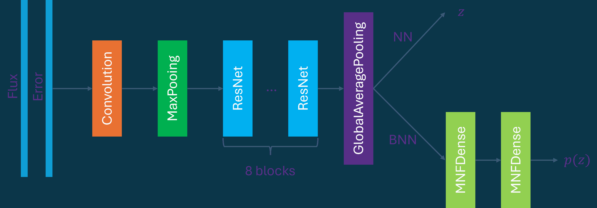

<!--yml

category: 未分类

date: 2024-09-06 19:31:11

-->

# [2407.13991] 使用深度学习从 CSST 无狭缝光谱调查中准确估计红移

> 来源：[`ar5iv.labs.arxiv.org/html/2407.13991`](https://ar5iv.labs.arxiv.org/html/2407.13991)

# 使用深度学习从 CSST 无狭缝光谱调查中准确估计红移

周星辰 中国科学院国家天文台，北京市大屯路 20 号，100101，中国人民共和国 中国空间站望远镜科学中心，中国科学院国家天文台，北京市大屯路 20 号，100101，中国人民共和国 [颜工](https://orcid.org/0000-0003-0709-0101) 中国科学院国家天文台，北京市大屯路 20 号，100101，中国人民共和国 中国科学院大学，北京市，100049，中国人民共和国 中国空间站望远镜科学中心，中国科学院国家天文台，北京市大屯路 20 号，100101，中国人民共和国 张鑫 中国科学院国家天文台，北京市大屯路 20 号，100101，中国人民共和国 中国空间站望远镜科学中心，中国科学院国家天文台，北京市大屯路 20 号，100101，中国人民共和国 李楠 中国科学院国家天文台，北京市大屯路 20 号，100101，中国人民共和国 中国空间站望远镜科学中心，中国科学院国家天文台，北京市大屯路 20 号，100101，中国人民共和国 孟宪敏 中国科学院国家天文台，北京市大屯路 20 号，100101，中国人民共和国 中国空间站望远镜科学中心，中国科学院国家天文台，北京市大屯路 20 号，100101，中国人民共和国 陈学雷 中国科学院国家天文台，北京市大屯路 20 号，100101，中国人民共和国 中国空间站望远镜科学中心，中国科学院国家天文台，北京市大屯路 20 号，100101，中国人民共和国 北京大学高能物理中心，北京市，100871，中国人民共和国 温润 紫金山天文台，中国科学院，南京市元华路 10 号，210023，中国人民共和国 中国科学技术大学天文与空间科学学院，合肥市，230026，中国人民共和国 韩云坤 云南天文台，中国科学院，昆明市关都区杨方旺 396 号，650216，中国人民共和国 邹虎 中国科学院国家天文台，北京市大屯路 20 号，100101，中国人民共和国 郑显中 紫金山天文台，中国科学院，南京市元华路 10 号，210023，中国人民共和国 中国科学技术大学天文与空间科学学院，合肥市，230026，中国人民共和国 杨晓虎 上海交通大学物理与天文系，上海市，200240，中国人民共和国 李振道 粒子物理、天体物理与宇宙学研究所及重点实验室，教育部，上海市，201210，中国人民共和国 郭宏 上海天文台，中国科学院，上海市，200030，中国人民共和国 张鹏杰 上海交通大学物理与天文系，上海市，200240，中国人民共和国 李振道 粒子物理、天体物理与宇宙学研究所及重点实验室，教育部，上海市，201210，中国人民共和国

###### 摘要

中国空间站望远镜（CSST）具备同时进行无狭缝光谱调查和光度测量的能力。与宽带光度测量相比，无狭缝光谱调查将测量无狭缝光谱，可能提供更准确的星系属性估计，特别是红移。然而，由于无狭缝光谱的分辨率低和信噪比差，测量这些属性非常具有挑战性。在这项研究中，我们采用贝叶斯神经网络（BNN）来评估从 CSST 预期观测到的无狭缝光谱中红移估计的准确性。无狭缝光谱是基于来自暗能量光谱仪（DESI-EDR）早期数据发布和重子振荡光谱调查（BOSS-DR16）第 16 次数据发布的真实数据模拟的，并结合了 DESI 遗产调查（DESI LS DR9）第 9 次数据发布。BNN 提供了红移估计及其对应的不确定性，实现了$\sigma_{\rm NMAD}=0.00063$的准确度，离群值百分比$\eta=0.92\%$和加权平均不确定性$\overline{E}=0.00228$。这些结果成功满足了使用 CSST 无狭缝光谱进行宇宙学研究的要求。

星系：距离和红移 — 宇宙学：观测 — 技术：光谱学

## 1 引言

红移是研究银河系的基本量之一。最准确的红移是通过观察和分析银河系的高分辨率光谱来确定的。然而，获取高分辨率光谱是一项耗时的任务，尤其是对于高红移和暗弱源，这些源需要数小时的观测才能成功测量它们的红移。因此，光度红移，即通过几个光度测量估计的红移，成为大多数在进行中的和未来的宇宙学调查中观察到的源的必要选项。然而，光度红移的误差大于 0.02，这严重阻碍了使用诸如重子声学振荡（BAO，Bassett & Hlozek 2010）和红移空间畸变（RSD，Hamilton 1998）等技术的某些宇宙学研究。为了匹配这些宇宙学研究所需的准确性和当前光度学调查的调查速度，存在一种折中方案：无狭缝光谱。无狭缝光谱是一种低分辨率光谱学的类别，在没有狭缝的情况下进行，通常允许只有来自小区域的光被衍射。目前和未来的光度学调查，例如欧几里得空间望远镜（Euclid，Euclid Collaboration 等 2024）、詹姆斯·韦布空间望远镜（JWST，Sabelhaus & Decker 2004）、南希·格雷斯·罗曼空间望远镜（Roman）¹¹1[`roman.gsfc.nasa.gov/`](https://roman.gsfc.nasa.gov/) 和中国空间站望远镜（CSST，Zhan 2018；Gong 等 2019），都包括观察银河系的无狭缝光谱的模块。

CSST 是一个 2 米的空间望远镜，设计用于在七个波段进行光度观测，从近紫外到近红外。这些无狭缝光谱模块包括三个波段（$GU$、$GV$ 和 $GI$），与光度模块一起工作，实现同时的光度和无狭缝光谱观测。这三个波段的点源 5$\sigma$ 视星等限制分别达到 23.2、23.4 和 23.2，每个波段的光谱分辨率低，为 $R=\lambda/\Delta\lambda\geq 200$ （Gong 等， 2019）。对于如银河系这样的扩展源，无狭缝光谱会受到观测和仪器效应的显著影响，挑战一维光谱提取过程，从而导致低分辨率和信噪比（SNR）光谱。这些挑战使得识别发射和吸收线、断裂及其他光谱特征变得困难。因此，从这些光谱中估计的银河系属性，如红移和谱线通量，可能非常不准确，导致的误差可与从宽波段光度学中得出的误差相媲美。解决从如此低分辨率和 SNR 的无狭缝光谱中成功测量这些银河系属性的问题仍然是一个紧迫的问题。

机器学习（ML），特别是深度学习（DL）算法（也称为神经网络），为噪声数据带来的挑战提供了潜在解决方案。这些算法能够有效地学习输入和输出之间的固有关联，利用大数据集，使其适合处理受到仪器或其他形式噪声显著影响的数据。在天文学和宇宙学领域，神经网络近年来获得了显著的关注，涵盖了各个领域。多层感知器（MLP），一种简单的神经网络，已被应用于从多波段光度测量中估计光度红移 (Collister & Lahav, 2004; Sadeh, 2014; Zhou et al., 2022a)，超越了传统光谱能量分布（SED）拟合方法的准确性。

此外，最先进的卷积神经网络（CNN，Lecun et al. (1998))在直接处理图像方面表现卓越，已成为天文和宇宙学分析中不可或缺的工具。应用包括从银河系图像中推导光度红移或其他量 (Pasquet et al., 2019; Henghes et al., 2022; Zhou et al., 2022a; Tewes et al., 2019; Zhang et al., 2024)，发现强引力透镜系统或合并事件 (He et al., 2020; Schaefer et al., 2018; Li et al., 2020; Rezaei et al., 2022; Pearson et al., 2019; Arendt et al., 2024)，以及从大尺度结构或弱引力透镜中限制宇宙学参数 (Pan et al., 2020; Min et al., 2024; Hortúa et al., 2023; Gupta et al., 2018; Fluri et al., 2022)。

除了处理二维数组，卷积神经网络（CNN）还可以适应处理一维序列或三维数据立方体。光谱是一维序列，包含红移或其他信息，可以通过 1d-CNN 有效提取。1d-CNN 在从光谱中推导红移的应用已得到广泛研究 (Rastegarnia et al., 2022; Busca & Balland, 2018)。

与传统的拟合方法不同，传统方法会同时提供红移值和不确定性，而深度学习方法通常只提供红移值。认识到在宇宙学研究中不确定性的重要性，贝叶斯神经网络（BNN）(MacKay, 1995; Blundell et al., 2015; Gal & Ghahramani, 2015)，可以同时输出点估计和不确定性，受到了广泛关注。通过为网络中的每个权重分配概率分布，BNN 能够捕捉并传播来自数据和神经网络本身的不确定性到输出，不仅提供点预测，还提供置信区间或后验分布。

尽管深度学习算法在提供更高精度、更快速度和直接处理原始数据方面具有优势，但仍需仔细考虑几个挑战。由于深度学习模型严重依赖训练数据，获取丰富且具有代表性的数据用于观测是一个主要问题。具体而言，对于红移估计来说，大量高质量光谱红移数据集是必不可少的。幸运的是，若干正在进行和计划中的光谱调查，例如暗能量光谱仪（DESI，DESI Collaboration et al. (2016))、主要焦点光谱仪（PFS，Tamura et al. (2016))、多重光谱望远镜（MUST）²²2[`must.astro.tsinghua.edu.cn/en`](https://must.astro.tsinghua.edu.cn/en)、MegaMapper（Schlegel et al., 2022）和宽场光谱望远镜（WST，Mainieri et al. (2024))，旨在观测大量具有准确红移的星系光谱。包括已完成的调查如 zCOSMOS（Lilly et al., 2007）、VIMOS-VLT 深度调查（VVDS，Le Fevre et al. (2013））、斯隆数字天空调查（SDSS，Ahumada et al. (2020））、重子振荡光谱调查（BOSS，Dawson et al. (2013）），可以实现足够且具有代表性的红移估计训练集。

在这项工作中，我们基于真实的光谱观测数据生成了预计由 CSST 观测到的无狭缝光谱。考虑到红移覆盖范围和调查领域，我们使用了 DESI 早期数据发布（DESI-EDR, DESI Collaboration et al. (2023))和 BOSS 第 16 次数据发布（BOSS-DR16, Dawson et al. (2013))的数据。DESI-EDR 提供了在 Survey Validation (SV) 阶段收集的 120 万条高分辨率星系和类星体光谱数据，用于目标选择。由于 DESI-EDR 中的源数量有限，我们用 BOSS 数据来补充我们的无狭缝光谱数据集，BOSS 数据具有类似的光谱红移测量管道，以增加用于训练神经网络模型的数据量。在获得无狭缝光谱后，我们用这些光谱及其对应的准确光谱红移训练一个 1d-BNN，然后分析 CSST 无狭缝光谱调查所能实现的红移精度。

本论文的结构组织如下：我们首先简要描述了 CSST 无狭缝光谱模拟软件，然后在第二部分中解释了模拟无狭缝光谱的生成过程。在第三部分中介绍了包括 CNN 和 BNN 在内的神经网络方法。然后我们在第四部分中展示我们的结果。最后，本论文在第五部分中进行总结。

## 2 模拟数据

在本节中，我们首先介绍了 CSST 数据分析管道中的无狭缝光谱模拟软件，然后解释了使用该软件从真实光谱观测数据生成无狭缝光谱的数据生成过程。

### 2.1 无狭缝光谱模拟软件

用于无狭缝光谱的模拟软件是 CSST 数据分析流程的重要组成部分，代码可在线访问³³3[`csst-tb.bao.ac.cn/code/zhangxin/sls_1d_spec`](https://csst-tb.bao.ac.cn/code/zhangxin/sls_1d_spec)。我们在此简要概述了工作流程，感兴趣的读者可以参考 Zhang 等（准备中）以获取详细信息。该软件利用星系的光谱能量分布（SEDs）和形态参数生成模拟光谱。最初，通过考虑 CSST 的无狭缝光谱的光谱特性，拟合过程确定了光栅的色散曲线。随后，基于星系的形态参数，将星系的能量轮廓转换为像素化的星系图像。星系图像的每个像素根据 CSST 光栅特定的色散曲线以及 CSST 仪器的灵敏度曲线和星系的 SED 进行色散处理。最后，所有色散成分整合成二维无狭缝光谱图像。此外，使用点扩散函数（PSF）模拟仪器效应，假设为 2D 高斯分布，FWHM 为 0.3^(′′)。天空背景，包括黄道光和地球辉光分量，分别计算为$GU$、$GV$和$GI$波段的 0.019、0.214、0.329 $\rm e^{-}s^{-1}pixel^{-1}$。为减少仪器和背景噪声的影响，我们将四次曝光的光谱进行加和，每次曝光持续 150 秒。经过这些过程，我们生成了预计由 CSST 观测的第一阶光谱图像，从中可以提取 1d 光谱及其对应的误差。

### 2.2 数据生成

为了真实地模拟我们的无狭缝光谱，我们利用了来自暗能量光谱仪（DESI）和重子振荡光谱调查（BOSS）的光谱观测。DESI 是在 Kitt Peak 国家天文台的 Mayall 4 米望远镜上进行的一个持续光谱调查。在其 5 年的任务中，DESI 旨在观测超过 3000 万颗星系和类星体的光谱，覆盖 14,000 平方度的天空（DESI 合作组等，2016）。最近，DESI 发布了其早期数据释放（EDR），其中包括在 2020 年 12 月至 2021 年 6 月的调查验证（SV）阶段观测的 180 万目标的光谱数据（DESI 合作组等，2023）。

我们使用以下标准从 EDR 光谱红移目录中选择源：

|  |  | $\displaystyle\rm SV\_PRIMARY==True$ |  | (1) |
| --- | --- | --- | --- | --- |
|  |  | $\displaystyle\rm MASKBITS==0$ |  |
|  |  | $\displaystyle\rm SPECTYPE==GALAXY$ |  |
|  |  | $\displaystyle\rm ZWARN==0$ |  |
|  |  | $\displaystyle\rm FLUX\_G,R,Z>0$ |  |
|  |  | $\displaystyle\rm FLUX\_IVAR\_G,R,Z>0$ |  |
|  |  | $\displaystyle\rm MORPHTYPE\ !=PSF$ |  |

在这里，SV_PRIMARY 表示如果同一源在目录中出现多次，则推荐的最佳红移，而 MASKBITS 是位掩码，指示源是否接触到被遮罩区域中的一个像素。SPECTYPE 和 ZWARN 是源的分类和可能存在问题的指示符，这些问题在由 Redrock ⁴⁴4[`github.com/desihub/redrock`](https://github.com/desihub/redrock) 测量的光谱红移中常见，Redrock 是一种常用的红移拟合软件。我们通过在 DESI 遗留成像调查的 $g$、$r$ 和 $z$ 波段上施加光度测量约束来进一步控制源的质量 (Dey et al., 2019)。MORPHTYPE 表示在光度测量过程中用于拟合源的 Tractor 模型。此约束确保所选源是扩展的，从而允许准确测量形态参数。需要注意的是，一些 PSF 源在光谱上被分类为星系。这些 PSF 模型可能由于 DESI 遗留调查的成像数据分辨率约为 $\sim 1.0^{\prime\prime}$ 被分配，我们在数据集中简单地排除了这些星系。为了获得用于推导我们无狭缝光谱的形态参数，我们将所选源与 DESI 遗留调查 DR9 的扫掠目录 ⁵⁵5[`www.legacysurvey.org/dr9/files/#sweep-catalogs-region-sweep`](https://www.legacysurvey.org/dr9/files/#sweep-catalogs-region-sweep) 匹配，并检索形态参数，包括有效半径 $r_{\rm eff}$、Sersic 指数 $n$、两个椭圆率分量 $\epsilon_{1},\epsilon_{2}$ 及其方差。然后我们进行另一次选择，以筛选具有有效形态测量的源：

|  |  | $\displaystyle\rm SHAPE\_R>0$ |  | (2) |
| --- | --- | --- | --- | --- |
|  |  | $\displaystyle\rm SHAPE\_IVAR\_R>0$ |  |
|  |  | $\displaystyle\rm SHAPE\_E1\_IVAR>0$ |  |
|  |  | $\displaystyle\rm SHAPE\_E2\_IVAR>0$ |  |
|  |  | $\displaystyle\rm SERSIC\_IVAR>0$ |  |

然后我们使用 DESI 推荐的以下方程计算轴比 $b/a$ 和位置角 $\phi$：

|  | $\displaystyle | \epsilon | =\sqrt{\epsilon_{1}^{2}+\epsilon_{2}^{2}},$ |  | (3) |
| --- | --- | --- | --- | --- | --- |
|  | $\displaystyle\frac{b}{a}=\frac{1- | \epsilon | }{1+ | \epsilon | },$ |  |
|  | $\displaystyle\phi=\frac{1}{2}\arctan{\frac{\epsilon_{2}}{\epsilon_{1}}}.$ |  |

这一选择过程导致大约 180,000 个具有高质量光谱红移的源。需要注意的是，我们承认一些源的形态参数存在较大的误差，这对模拟的无狭缝光谱产生了显著影响。然而，由于我们的目标是估计红移，因此这些影响在本工作中被忽略，因为无论形态误差如何，光谱与红移之间的关系都是确定的。

在获得红移和形态参数后，下一步是获取每个源的光谱能量分布（SED）以模拟无狭缝光谱。源的光谱红移已通过 Redrock 拟合的模型光谱确定，所有红移警告标志均为零，表明拟合过程没有问题。这使我们可以使用模型光谱来准确表示每个源的 SED。这些模型光谱可以通过使用 DESI-EDR 目录中提供的 COEFF 构建，结合 Redrock 模板，或通过 SPectra Analysis & Retrievable Catalog Lab (SPARCL) ⁶⁶6[`astrosparcl.datalab.noirlab.edu/`](https://astrosparcl.datalab.noirlab.edu/)访问。通过这两种方法获得的模型光谱是相同的，我们选择了后者。

从 DESI-EDR 中选取的 180,000 个源不足以训练我们的神经网络以从低质量的无狭缝光谱中推导红移。为了补充我们的数据集，我们利用了来自巴里昂振荡光谱巡天（BOSS）的数据。BOSS 是一项主要针对发光红色星系（LRGs，红移$z\sim 0.7$）和红移在$2.2<z<3$的类星体（QSOs）的光谱巡天，旨在探测早期宇宙中由巴里昂声学振荡（BAO）印记的特征尺度。在其 5 年的观测期内，BOSS 测量了大约 400 万源的光谱，覆盖了 10,000 平方度 （Dawson et al., 2013）。对于这项工作，我们使用了 BOSS 的第 16 次数据发布（BOSS-DR16）。

类似于我们对 DESI 数据的方法，我们选择了 Redrock 软件生成的光谱红移警告 ZWARN == 0 的星系，并将这些源与 DESI LS DR9 进行匹配。我们排除那些被建模为 PSF 且在$g$、$r$和$z$波段中没有合理光度测量以及缺乏有效形态参数的源。这导致选择了 450,000 个星系，我们通过 SPARCL 下载了它们的模型光谱。总计，我们获得了大约 600,000 个源。

图 1 展示了光谱红移分布。我们注意到 DESI-EDR 的大多数源处于较低的红移，而 BOSS-DR16 提供的高红移源可以达到$z\sim 1$。包括有效半径$r_{\rm eff}$、Sersic 指数$n$、轴比$b/a$和位置角$\phi$在内的形态参数分布在图 2 中有所展示。值得注意的是，Sersic 指数为 6 的星系占主导地位，尤其是来自 BOSS-DR16 的星系。这种选择偏差是预期的，因为 Sersic 指数与星系的大小和亮度呈正相关。因此，为了有效的形态测量和准确的光谱红移提取，这些源往往具有更大的尺寸和更亮的亮度。

图 1: DESI-EDR、BOSS-DR16 和总体选择源的光谱红移分布。

在获得 DESI-EDR 和 BOSS-DR16 中源的模型光谱和形态参数后，我们使用第 2.1 节中提到的模拟软件来模拟无光谱缝隙的光谱。图 3 展示了在 $GU$、$GV$、$GI$ 和总波长范围内模拟的 CSST 无光谱缝隙光谱的 SNR。我们注意到 $GI$ 波段的 SNR 最佳，峰值约为 $2$，而 $GU$ 和 $GV$ 波段的大多数 SNR 低于 $1$。此外，这些光谱的总 SNR 峰值在 $\sim 1$，表明信号与噪声处于相似水平。在图 4 中，我们展示了 $GU$、$GV$ 和 $GI$ 波段的两个模拟一阶无光谱缝隙光谱图像示例，相应提取的一维光谱见图 5。模拟中使用的 SED 也被展示，并且与光谱一致。此外，还展示了源的信息，包括坐标（R.A. 和 Dec.）、光谱红移、模拟中使用的形态参数以及 $GU$、$GV$ 和 $GI$ 波段的 SNR。对于左面板中的低红移源，我们可以清晰地识别 $GV$ 和 $GI$ 波段的分散 2d 光谱，这两个波段提取的一维光谱的 SNR 相对较高。对于右面板中的高红移源，仅能识别 $GI$ 波段的微弱 2d 光谱，其他两个波段主要被噪声占据，因此提取的一维光谱 SNR 相应较低。总体而言，无光谱缝隙光谱受到背景和仪器噪声的严重影响，识别光谱特征如断裂、吸收和发射线较为困难，导致使用传统方法如光谱拟合或特征识别进行成功红移测定面临挑战。

图 2：四个形态参数的分布：有效半径 $r_{\rm eff}$、Sersic 指数 $n$、轴比 $b/a$ 和源的位置角 $\phi$，数据来自 DESI-EDR 和 BOSS-DR16。

图 3：在 $GU$、$GV$、$GI$ 波段及整个波长范围内的模拟无光谱缝隙谱的信噪比（SNR）分布。

图 4：$GU$、$GV$ 和 $GI$ 波段的两个模拟的一阶无缝光谱图像示例。还显示了坐标和光谱红移。相应提取的一维光谱和两个源的更多信息显示在图 5 中。

图 5：从图 4 的源的光谱图像中提取的相应一维光谱。模拟中使用的 SEDs 也进行了说明。黑色虚线表示零通量。此外，还显示了每个波段的源信息，包括坐标、光谱红移、形态参数和信噪比。

## 3 方法论

我们采用深度神经网络从预计由 CSST 观测的无缝光谱中提取红移。为了满足一些宇宙学研究的需求，我们进一步构建了贝叶斯神经网络，以推导红移值及其不确定性。

### 3.1 神经网络

图 6：左：基于 ResNet 块构建的 1d-CNN 和 BNN 的架构。右：ResNet 块的结构。

由于光谱是 1 维序列，我们采用 1d-CNN 来处理它们。CNN 是一种强大的深度学习模型，能够学习数据与标签之间的内在关系。因此，我们期望我们的 1d-CNN 能够学习无缝光谱与红移之间的映射。为了提高其学习能力，我们通过使用 ResNet 块（He et al., 2015）增加了 1d-CNN 的深度。该块通过跳跃连接有效减少了深度神经网络中常见的梯度消失问题，如图 6 右侧面板所示。跳跃连接中的卷积层在该块处理和下采样特征时应用。遵循 Zhou et al. (2021)，我们 CNN 的输入包括光谱及其对应的误差作为两个通道的序列。然后，输入通过具有 32 个内核、内核大小为 7 的卷积层进行处理，随后进行最大池化以减少特征维度。在这些浅层特征提取层之后，我们构建了 8 个 ResNet 块，以从光谱中提取有用特征并进一步减少特征维度。这些块中的 1d 卷积层都由 BatchNormalization 层（Ioffe & Szegedy, 2015）跟随，以减少过拟合。ReLU 激活函数（Agarap, 2018）被用来引入非线性。随后，特征通过全局平均池化被矢量化为一维，然后应用了一个丢弃率为 0.2 的 dropout 层（Srivastava et al., 2014）。这个 dropout 层也起到减少过拟合的作用。最后，结构化了一个具有一个神经元的输出层。架构的示意图显示在图 6 左侧面板。

目前提到的神经网络只能输出红移值。为了输出带有不确定性的红移值，我们构建了一个贝叶斯神经网络，该网络捕捉了来自神经网络模型和数据集的认知不确定性和偶然不确定性。有关该网络的更多细节，请参考 Hortúa 等人（2020）和 Zhou 等人（2022b）。我们的贝叶斯神经网络（BNN）使用迁移学习技术，在 CNN 的最终输出层之前转移特征提取部分，然后附加两个贝叶斯层。来自转移网络的权重被设置为固定的，以利用专门提取的特征来推导红移。对于贝叶斯层，三种常见配置被广泛使用，即蒙特卡洛丢弃（MC-dropout，Gal & Ghahramani（2015））、flipout（Wen 等人，2018）和乘法归一化流（MNF，Louizos & Welling（2017））层。在这三类中，MC-dropout 使用丢弃来模拟网络的不同结构，而 flipout 和 MNF 层的权重则由分布表示。特别地，MNF 使用通过归一化流（Jimenez Rezende & Mohamed，2015）将高斯分布转化为更复杂的分布。根据 Zhou 等人（在准备中）的建议，我们采用 MNFDense 层⁷⁷7[`github.com/janosh/tf-mnf`](https://github.com/janosh/tf-mnf) 适应 50 层用于遮罩的 RealNVP 归一化流（Dinh 等人，2016）。最终，网络输出两个值，从中可以推导出表示红移分布的高斯分布。架构的示意图也显示在图 6 的左侧面板中。

贝叶斯网络产生的不确定性必须遵循统计原理，即样本中真实值的覆盖概率与相应的置信区间匹配（Perreault Levasseur 等人，2017；Hortúa 等人，2020），否则，校准是在报告结果之前的必要程序。这里我们采用 Kull 等人（2017）提到的 Beta 校准技术来校准不确定性。

### 3.2 训练

我们只考虑$GV$和$GI$波段的光谱，因为$GU$波段的信噪比显著较低，光谱被噪声主导，如图 3 和图 4 所示。在训练之前，我们将数据分为训练集、验证集和测试集，比例为 8:1:1。测试集的数量大约为 60,000，并且它们是根据 CSST 无狭缝光谱 survey 的预期红移分布选择的。测试集的红移分布如图 8 所示，与 Gong 等人（2019）的结果一致。为了提高神经网络的性能，我们遵循 Zhou 等人（2021）的方法，通过引入其高斯实现对应物来增加训练集的大小，这些对应物是通过根据相应误差波动光谱生成的。这种数据增强技术可以有效提升网络对低信噪比无狭缝光谱中的大噪声的适应性。这里我们使用 50 次随机实现。对于 1d-CNN，我们将损失函数和优化器设置为 logcosh 和 Adam。Logcosh 类似于传统的绝对误差函数，但在 0 附近具有差异行为，Adam 是一种基于一阶和二阶矩自适应估计的随机梯度下降优化方法（Kingma & Ba, 2014）。该网络在 100 个 epochs 内进行训练，批量大小为 1024，考虑到 GPU 的显存，并且我们选择损失值最低的最佳模型作为最终的 CNN 模型以及 BNN 的骨干。

对于 BNN，仅优化附加的 MNF 层的权重。在训练中，BNN 的损失函数设置为负对数似然（NLL），与 CNN 中使用的不同，因为 BNN 输出的是考虑点值及其不确定性的分布。请注意，标签仅为红移值，因为不确定性是在损失函数下降过程中自然得到的。类似地，我们采用 Adam 优化器并保存损失值最低的模型。与后处理中的 CNN 不同，我们将测试光谱输入到 BNN 中 200 次。根据这些输出，我们计算最终的红移值及其对应的不确定性，包括认识性和随机性的不确定性。

## 4 结果

我们采用两个指标来评估 CNN 的性能：离群值百分比$\eta$和标准化中位绝对偏差$\sigma_{\rm NMAD}$，定义如下：

|  | $\eta=\frac{N_{\Delta z/(1+z_{\rm true})>0.02}}{N_{\rm total}},$ |  | (4) |
| --- | --- | --- | --- |
|  | $\sigma_{\rm NMAD}=1.48\times{\rm median}\left(\left&#124;\frac{\Delta z-{\rm median}(\Delta z)}{1+z_{\rm true}}\right&#124;\right),$ |  | (5) |

其中 $\Delta z=z_{\rm pred}-z_{\rm true}$，$z_{\rm pred}$ 和 $z_{\rm true}$ 分别表示预测值和真实红移值。$\eta$ 表示严重不准确的红移预测的比例，$\sigma_{\rm NMAD}$ 是一种稳健的准确度指标，不容易受到异常值的影响。

图 7 展示了 CNN 的结果。准确度 $\sigma_{\rm NMAD}$ 和异常值比例 $\eta$ 分别可以达到 0.00047 和 0.954%。这一准确度指标成功满足了 CSST 对于宇宙学研究的 $\sim 0.2\%$ 要求。$GI$ 波段的对数 SNR 也通过颜色条展示。我们注意到，正如预期的那样，SNR 随红移的增加而降低，大多数异常值的 SNR 相对较低。红移分布在图 8 中展示，与真实分布高度一致。此外，图 9 显示了与真实红移值对应的准确度和异常值比例，分别在上图和下图中。两个指标在整个红移范围内也以黑色虚线显示。正如预期的那样，两个指标在低红移时保持稳定，但在高红移时变差。

至于 BNN 的结果，除了上述两个指标外，我们还使用了另一种指标来衡量不确定性预测的性能，即加权平均不确定性 $\overline{E}$，其定义为：

|  | $\overline{E}=\frac{\sum_{i}E_{i}/(1+z_{i,\rm{true}})}{N_{\rm total}},$ |  | (6) |
| --- | --- | --- | --- |

其中$E_{i}$是每个来源的不确定性预测。对每个来源应用的权重$1+z_{i,\rm true}$是为了消除红移演化的偏差。图 10 显示了不确定性预测的可靠性图。在 Beta 校准后，不确定性更好地遵循了第 3.1 节中提到的统计原则。而图 11 展示了校准后不确定性的结果，其中误差条以浅蓝色显示。$\sigma_{\rm NMAD}$和$\eta$分别达到 0.00063 和 0.92%。相比于图 7 中所示的点估计，$\eta$略有改善，但准确度稍有下降，但仍满足宇宙学研究的要求。此外，加权均值不确定性$\overline{E}$可以达到 0.00228。红移分布在图 8 中展示，并且与真实分布高度一致。图 12 进一步分析了不确定性的行为。上面面板显示了相对于真实红移的加权均值不确定性$\overline{E}$，其中黑色虚线显示了整个红移范围内的值。如预期，这个指标在较低红移时保持稳定，并随着红移的增加而变得更差。下面面板展示了$GI$带中不确定性与 SNR 之间的散点图，我们注意到随着 SNR 的增加，不确定性的散布变小，值接近$0$。

作为对比，根据 CSST 无缝光谱的数据分析流程，传统的红移估计拟合在如此低的 SNR 下可能会产生低至$\sim 1\%$的准确度，如图 3 所示。这表明深度学习算法可以显著提高低 SNR 无缝光谱红移估计的准确性。

图 7：1d-CNN 的结果被展示，达到了 $\sigma_{\rm NMAD}=0.00047$ 和异常值百分比 $\eta=0.954\%$。$GI$ 波段的对数 SNR 由色条指示。

图 8：CNN 和 BNN 对测试数据的真实红移和预测红移的分布。

图 9：关于真实红移的准确度 $\sigma_{\rm NMAD}$ 和异常值百分比 $\eta$ 分别显示在上面和下面的面板中。两个指标在整个红移范围内的情况也用黑色虚线显示。

图 10：BNN 结果在校准前后的可靠性图。黑色虚线表示不确定性经过良好的校准，统计原理得到了完美遵循。

图 11：BNN 在不确定性校准后的结果。误差条以浅蓝色显示。在整个红移范围内，BNN 可以达到 $\sigma_{\rm NMAD}=0.00063$ 和 $\eta=0.92\%$。加权平均不确定性 $\overline{E}$ 可以达到 0.00228。

图 12：上图：关于真实红移的加权平均不确定性 $\overline{E}$。整个红移范围内的值也用黑色虚线显示。下图：关于 $GI$ 波段 SNR 的加权不确定性 $E$。

## 5 结论

在这项工作中，我们利用神经网络从 CSST 无狭缝光谱调查的模拟无狭缝光谱中估计红移。模拟需要 SED 和四个形态参数，包括每个星系的有效半径、Sersic 指数、轴比和位置角。为了真实地模拟无狭缝光谱，我们使用了来自 DESI-EDR 和 BOSS-DR16 的高质量光谱红移观测数据。对这两个观测的光谱拟合过程中生成的模型光谱被视为 SED，源与 DESI LS DR9 匹配以获取所需的形态参数。无狭缝光谱的 SNR 较低，总 SNR 高达 $\sim 1$，因此用于红移确定的关键光谱特征难以识别。因此，我们利用神经网络在处理噪声数据方面的优越能力，从这些无狭缝光谱中估计红移。

认识到不确定性预测在多个宇宙学研究中的重要性，我们采用贝叶斯网络来完成此任务，提供红移估计及其不确定性。为了提高鲁棒性和收敛速度，我们基于卷积神经网络（CNN）构建了贝叶斯神经网络（BNN），并使用迁移学习技术进行点估计。通过高斯随机实现显著扩充训练数据集，确保 BNN 的生成能力和噪声容忍度。训练后，测试数据的不确定性预测经过精心校准。BNN 可以实现 $\sigma_{\rm NMAD}=0.00063$、$\eta=0.92\%$ 和 $\overline{E}=0.00228$ 的结果，成功满足基于 CSST 的无狭缝光谱的宇宙学研究准确性要求 $\sim 0.2\%$。我们的方法相比传统的 SED 拟合在低信噪比无狭缝光谱中表现更佳，可作为光谱红移估计的补充方法。

然而，我们的分析仅限于低红移 $z\lesssim 1$，这可以归因于 DESI-EDR 和 BOSS-DR16 的数据限制以及 DESI 遗留成像调查的银河图像分辨率较低。随着 DESI 未来数据的发布和更高分辨率的成像调查，我们预期模拟能达到更高的红移，更好地跟随 CSST 无狭缝光谱调查的红移分布，从而提供关于深度学习算法所能实现的光谱红移准确性的全面研究。

XCZ 和 YG 感谢国家重点研发计划项目 2022YFF0503404、2020SKA0110402，以及中国科学院基础研究青年科学家项目（编号 YSBR-092）的支持。这项工作还得到了中国载人航天工程的科研资助，资助编号为 CMS-CSST-2021-B01 和 CMS-CSST-2021-A01。HZ 感谢中国载人航天工程的科研资助（编号 CMS-CSST-2021-A02 和 CMS-CSST-2021-A04）、国家自然科学基金（NSFC；资助编号 12120101003 和 12373010）以及国家重点研发计划（资助编号 2023YFA1607800、2022YFA1602902）和中国科学院战略性先导科技专项（资助编号 XDB0550100）。

## 参考文献

+   Agarap (2018) Agarap, A. F. 2018, arXiv e-prints, arXiv:1803.08375, doi: [10.48550/arXiv.1803.08375](http://doi.org/10.48550/arXiv.1803.08375)

+   Ahumada 等 (2020) Ahumada, R., Allende Prieto, C., Almeida, A., 等. 2020, ApJS, 249, 3, doi: [10.3847/1538-4365/ab929e](http://doi.org/10.3847/1538-4365/ab929e)

+   Arendt 等 (2024) Arendt, A. R., Perrott, Y. C., Contreras-Santos, A., 等. 2024, MNRAS, 530, 20, doi: [10.1093/mnras/stae568](http://doi.org/10.1093/mnras/stae568)

+   Bassett & Hlozek (2010) Bassett, B., & Hlozek, R. 2010, in Dark Energy: Observational and Theoretical Approaches, ed. P. Ruiz-Lapuente, 246, doi: [10.48550/arXiv.0910.5224](http://doi.org/10.48550/arXiv.0910.5224)

+   Blundell et al. (2015) Blundell, C., Cornebise, J., Kavukcuoglu, K., & Wierstra, D. 2015, arXiv e-prints, arXiv:1505.05424, doi: [10.48550/arXiv.1505.05424](http://doi.org/10.48550/arXiv.1505.05424)

+   Busca & Balland (2018) Busca, N., & Balland, C. 2018, arXiv e-prints, arXiv:1808.09955, doi: [10.48550/arXiv.1808.09955](http://doi.org/10.48550/arXiv.1808.09955)

+   Collister & Lahav (2004) Collister, A. A., & Lahav, O. 2004, PASP, 116, 345, doi: [10.1086/383254](http://doi.org/10.1086/383254)

+   Dawson et al. (2013) Dawson, K. S., Schlegel, D. J., Ahn, C. P., et al. 2013, AJ, 145, 10, doi: [10.1088/0004-6256/145/1/10](http://doi.org/10.1088/0004-6256/145/1/10)

+   DESI Collaboration et al. (2016) DESI Collaboration, Aghamousa, A., Aguilar, J., et al. 2016, arXiv e-prints, arXiv:1611.00036, doi: [10.48550/arXiv.1611.00036](http://doi.org/10.48550/arXiv.1611.00036)

+   DESI Collaboration et al. (2023) DESI Collaboration, Adame, A. G., Aguilar, J., et al. 2023, arXiv e-prints, arXiv:2306.06308, doi: [10.48550/arXiv.2306.06308](http://doi.org/10.48550/arXiv.2306.06308)

+   Dey et al. (2019) Dey, A., Schlegel, D. J., Lang, D., et al. 2019, AJ, 157, 168, doi: [10.3847/1538-3881/ab089d](http://doi.org/10.3847/1538-3881/ab089d)

+   Dinh et al. (2016) Dinh, L., Sohl-Dickstein, J., & Bengio, S. 2016, arXiv e-prints, arXiv:1605.08803, doi: [10.48550/arXiv.1605.08803](http://doi.org/10.48550/arXiv.1605.08803)

+   Euclid Collaboration et al. (2024) Euclid Collaboration, Mellier, Y., Abdurro’uf, et al. 2024, arXiv e-prints, arXiv:2405.13491, doi: [10.48550/arXiv.2405.13491](http://doi.org/10.48550/arXiv.2405.13491)

+   Fluri et al. (2022) Fluri, J., Kacprzak, T., Lucchi, A., et al. 2022, Phys. Rev. D, 105, 083518, doi: [10.1103/PhysRevD.105.083518](http://doi.org/10.1103/PhysRevD.105.083518)

+   Gal & Ghahramani (2015) Gal, Y., & Ghahramani, Z. 2015, arXiv e-prints, arXiv:1506.02142, doi: [10.48550/arXiv.1506.02142](http://doi.org/10.48550/arXiv.1506.02142)

+   Gong et al. (2019) Gong, Y., Liu, X., Cao, Y., et al. 2019, ApJ, 883, 203, doi: [10.3847/1538-4357/ab391e](http://doi.org/10.3847/1538-4357/ab391e)

+   Gupta et al. (2018) Gupta, A., Zorrilla Matilla, J. M., Hsu, D., & Haiman, Z. 2018, Phys. Rev. D, 97, 103515, doi: [10.1103/PhysRevD.97.103515](http://doi.org/10.1103/PhysRevD.97.103515)

+   Hamilton (1998) Hamilton, A. J. S. 1998, in Astrophysics and Space Science Library, Vol. 231, The Evolving Universe, ed. D. Hamilton, 185, doi: [10.1007/978-94-011-4960-0_17](http://doi.org/10.1007/978-94-011-4960-0_17)

+   He et al. (2015) He, K., Zhang, X., Ren, S., & Sun, J. 2015, arXiv e-prints, arXiv:1512.03385, doi: [10.48550/arXiv.1512.03385](http://doi.org/10.48550/arXiv.1512.03385)

+   He 等（2020）He, Z., Er, X., Long, Q., 等. 2020, MNRAS, 497, 556, doi: [10.1093/mnras/staa1917](http://doi.org/10.1093/mnras/staa1917)

+   Henghes 等（2022）Henghes, B., Thiyagalingam, J., Pettitt, C., Hey, T., & Lahav, O. 2022, MNRAS, 512, 1696, doi: [10.1093/mnras/stac480](http://doi.org/10.1093/mnras/stac480)

+   Hortúa 等（2023）Hortúa, H. J., García, L. Á., & Castañeda C., L. 2023, Frontiers in Astronomy and Space Sciences, 10, 1139120, doi: [10.3389/fspas.2023.1139120](http://doi.org/10.3389/fspas.2023.1139120)

+   Hortúa 等（2020）Hortúa, H. J., Volpi, R., Marinelli, D., & Malagò, L. 2020, Phys. Rev. D, 102, 103509, doi: [10.1103/PhysRevD.102.103509](http://doi.org/10.1103/PhysRevD.102.103509)

+   Ioffe & Szegedy（2015）Ioffe, S., & Szegedy, C. 2015, arXiv e-prints, arXiv:1502.03167, doi: [10.48550/arXiv.1502.03167](http://doi.org/10.48550/arXiv.1502.03167)

+   Jimenez Rezende & Mohamed（2015）Jimenez Rezende, D., & Mohamed, S. 2015, arXiv e-prints, arXiv:1505.05770, doi: [10.48550/arXiv.1505.05770](http://doi.org/10.48550/arXiv.1505.05770)

+   Kingma & Ba（2014）Kingma, D. P., & Ba, J. 2014, arXiv e-prints, arXiv:1412.6980, doi: [10.48550/arXiv.1412.6980](http://doi.org/10.48550/arXiv.1412.6980)

+   Kull 等（2017）Kull, M., Filho, T. S., & Flach, P. 2017, 发表在《机器学习研究会议论文集》，第 54 卷，第二十届国际人工智能与统计学会议论文集，编辑 A. Singh & J. Zhu（PMLR），623–631。 [`proceedings.mlr.press/v54/kull17a.html`](https://proceedings.mlr.press/v54/kull17a.html)

+   Le Fevre 等（2013）Le Fevre, O., Cassata, P., Cucciati, O., 等. 2013, arXiv e-prints, arXiv:1307.0545, doi: [10.48550/arXiv.1307.0545](http://doi.org/10.48550/arXiv.1307.0545)

+   Lecun 等（1998）Lecun, Y., Bottou, L., Bengio, Y., & Haffner, P. 1998, Proceedings of the IEEE, 86, 2278, doi: [10.1109/5.726791](http://doi.org/10.1109/5.726791)

+   Li 等（2020）Li, R., Napolitano, N. R., Tortora, C., 等. 2020, ApJ, 899, 30, doi: [10.3847/1538-4357/ab9dfa](http://doi.org/10.3847/1538-4357/ab9dfa)

+   Lilly 等（2007）Lilly, S. J., Le Fevre, O., Renzini, A., Zamorani, G., & Scodeggio, M. 2007, ApJS, 172, 70, doi: [10.1086/516589](http://doi.org/10.1086/516589)

+   Louizos & Welling（2017）Louizos, C., & Welling, M. 2017, arXiv e-prints, arXiv:1703.01961, doi: [10.48550/arXiv.1703.01961](http://doi.org/10.48550/arXiv.1703.01961)

+   MacKay（1995）MacKay, D. J. C. 1995, Network: Computation in Neural Systems, 6, 469

+   Mainieri 等（2024）Mainieri, V., Anderson, R. I., Brinchmann, J., 等. 2024, arXiv e-prints, arXiv:2403.05398, doi: [10.48550/arXiv.2403.05398](http://doi.org/10.48550/arXiv.2403.05398)

+   Min 等（2024）Min, Z., Xiao, X., Ding, J., 等. 2024, arXiv e-prints, arXiv:2404.09483, doi: [10.48550/arXiv.2404.09483](http://doi.org/10.48550/arXiv.2404.09483)

+   Pan et al. (2020) Pan, S., Liu, M., Forero-Romero, J., 等. 2020, 中国科学：物理学、力学与天文学, 63, 110412, doi: [10.1007/s11433-020-1586-3](http://doi.org/10.1007/s11433-020-1586-3)

+   Pasquet et al. (2019) Pasquet, J., Bertin, E., Treyer, M., Arnouts, S., & Fouchez, D. 2019, A&A, 621, A26, doi: [10.1051/0004-6361/201833617](http://doi.org/10.1051/0004-6361/201833617)

+   Pearson et al. (2019) Pearson, W. J., Wang, L., Trayford, J. W., Petrillo, C. E., & van der Tak, F. F. S. 2019, A&A, 626, A49, doi: [10.1051/0004-6361/201935355](http://doi.org/10.1051/0004-6361/201935355)

+   Perreault Levasseur et al. (2017) Perreault Levasseur, L., Hezaveh, Y. D., & Wechsler, R. H. 2017, ApJ, 850, L7, doi: [10.3847/2041-8213/aa9704](http://doi.org/10.3847/2041-8213/aa9704)

+   Rastegarnia et al. (2022) Rastegarnia, F., Mirtorabi, M. T., Moradi, R., Vafaei Sadr, A., & Wang, Y. 2022, MNRAS, 511, 4490, doi: [10.1093/mnras/stac076](http://doi.org/10.1093/mnras/stac076)

+   Rezaei et al. (2022) Rezaei, S., McKean, J. P., Biehl, M., de Roo, W., & Lafontaine, A. 2022, MNRAS, 517, 1156, doi: [10.1093/mnras/stac2078](http://doi.org/10.1093/mnras/stac2078)

+   Sabelhaus & Decker (2004) Sabelhaus, P. A., & Decker, J. E. 2004, 在《光学和红外学会（SPIE）会议系列》中，第 5487 卷，光学、红外和毫米波空间望远镜，编辑 J. C. Mather，第 550–563 页，doi: [10.1117/12.549895](http://doi.org/10.1117/12.549895)

+   Sadeh (2014) Sadeh, I. 2014, 在《21 世纪宇宙学中的统计挑战》中，编辑 A. Heavens、J.-L. Starck 和 A. Krone-Martins，第 306 卷，第 316–318 页，doi: [10.1017/S1743921314010849](http://doi.org/10.1017/S1743921314010849)

+   Schaefer et al. (2018) Schaefer, C., Geiger, M., Kuntzer, T., & Kneib, J. P. 2018, A&A, 611, A2, doi: [10.1051/0004-6361/201731201](http://doi.org/10.1051/0004-6361/201731201)

+   Schlegel et al. (2022) Schlegel, D. J., Kollmeier, J. A., Aldering, G., 等. 2022, arXiv e-prints, arXiv:2209.04322, doi: [10.48550/arXiv.2209.04322](http://doi.org/10.48550/arXiv.2209.04322)

+   Srivastava et al. (2014) Srivastava, N., Hinton, G., Krizhevsky, A., Sutskever, I., & Salakhutdinov, R. 2014, 机器学习研究期刊, 15, 1929. [`jmlr.org/papers/v15/srivastava14a.html`](http://jmlr.org/papers/v15/srivastava14a.html)

+   Tamura et al. (2016) Tamura, N., Takato, N., Shimono, A., 等. 2016, 在《光学和红外学会（SPIE）会议系列》中，第 9908 卷，地面和空中天文仪器 VI，编辑 C. J. Evans、L. Simard 和 H. Takami，第 99081M 页，doi: [10.1117/12.2232103](http://doi.org/10.1117/12.2232103)

+   Tewes et al. (2019) Tewes, M., Kuntzer, T., Nakajima, R., 等. 2019, A&A, 621, A36, doi: [10.1051/0004-6361/201833775](http://doi.org/10.1051/0004-6361/201833775)

+   Wen et al. (2018) Wen, Y., Vicol, P., Ba, J., Tran, D., & Grosse, R. 2018, arXiv e-prints, arXiv:1803.04386, doi: [10.48550/arXiv.1803.04386](http://doi.org/10.48550/arXiv.1803.04386)

+   Zhan (2018) Zhan, H. 2018, 在第 42 届 COSPAR 科学大会，Vol. 42, E1.16–4–18

+   Zhang et al. (2024) Zhang, Z., Shan, H., Li, N., 等. 2024, A&A, 683, A209, doi: [10.1051/0004-6361/202345903](http://doi.org/10.1051/0004-6361/202345903)

+   Zhou et al. (2022a) Zhou, X., Gong, Y., Meng, X.-M., 等. 2022a, 天文与天体物理研究, 22, 115017, doi: [10.1088/1674-4527/ac9578](http://doi.org/10.1088/1674-4527/ac9578)

+   Zhou et al. (2022b) —. 2022b, 天文与天体物理研究, 22, 115017, doi: [10.1088/1674-4527/ac9578](http://doi.org/10.1088/1674-4527/ac9578)

+   Zhou et al. (2021) —. 2021, ApJ, 909, 53, doi: [10.3847/1538-4357/abda3e](http://doi.org/10.3847/1538-4357/abda3e)
