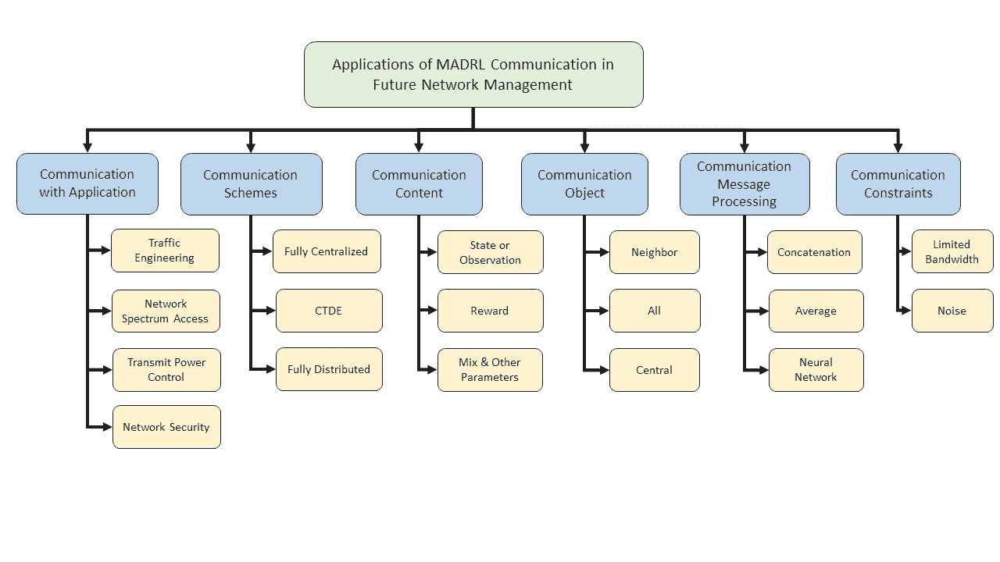

<!--yml

分类：未分类

日期：2024-09-06 19:31:08

-->

# [2407.17030] 多智能体深度强化学习与通信在网络管理中的应用：综述

> 来源：[`ar5iv.labs.arxiv.org/html/2407.17030`](https://ar5iv.labs.arxiv.org/html/2407.17030)

# 多智能体深度强化学习的应用

强化学习与通信

在网络管理中的应用：综述

岳皮 23，王璋 2，钟永 4，黄海容 4，饶宝全 4，

¹¹1 通讯作者。¹丁玉龙 2，²²脚注标记：2¹杨双华 25 2 深圳科技大学工业互联网下一代安全与保障深圳市重点实验室及计算机科学与工程系，中国深圳 3 鹏城实验室，中国深圳 4 华为技术有限公司 5 计算机科学系，英国雷丁大学

###### 摘要

随着人工智能技术的进步，网络管理的自动化，也被称为自动驾驶网络（ADN），正受到广泛关注。网络管理已经从传统的同质化和集中化转变为异质化和分散化。多智能体深度强化学习（MADRL）允许智能体根据本地观察独立做出决策。这种方法符合自动化的需求，并且获得了学术界和工业界的广泛关注。在分布式环境中，智能体之间的信息交互可以有效解决多智能体的非平稳性问题，并促进合作。因此，在这项综述中，我们首先审视了 MADRL 在网络管理中的应用，包括交通工程、无线网络接入、电源控制和网络安全等具体应用领域。然后，我们对智能体之间的通信行为进行了详细分析，包括通信方案、通信内容构建、通信对象选择、消息处理和通信约束。最后，我们讨论了 MADRL 中智能体通信在未来网络管理和 ADN 应用中的开放问题和未来研究方向。

###### 索引词：

多智能体深度强化学习，智能体通信，突现通信，自动驾驶网络。

## 引言

一般计算能力的提升导致各种生产网络的不断扩展。传统的集中式网络管理模式逐渐无法满足需求。因此，部署分布式和去中心化的网络工程技术，以在不同网络资源和服务需求条件下提升网络性能，已成为未来网络管理的重要趋势。网络管理涉及监控和控制网络资源，以确保网络的有效运行。这包括几种适用于不同场景和需求的技术。传统网络管理技术通常依赖于启发式方法，但随着新设备和服务的增加，网络变得越来越大且复杂，准确建模和预测网络设备变得困难。同时，传统方法难以满足未来网络管理对自动化和智能管理的需求。

近年来，由于人工智能技术的发展，机器学习、深度学习（DL）和强化学习（RL）等技术已经开始在网络管理中应用。基于 DL 和 RL 的多智能体深度强化学习（MADRL）被认为是一种有效的技术，用于为未来互联网中的关键问题提供 AI 网络解决方案[94]。在 MADRL 中，每个网络实体被视为一个代理，收集动态且不确定的环境信息，并独立采取行动。然而，在一些部分可观察的分布式多智能体系统中，由于适应策略的相互影响，该系统容易受到非平稳问题的影响[106]。共享观察、意图或经验有助于代理理解环境并实现稳定学习。同时，代理之间的有效通信在促进其合作中也可能至关重要[130]。

当前代理之间的通信协议通常是预定义的，随着代理数量的增加，总通信开销显著增加。另一种方法称为自发通信，它允许代理通过交互自主学习通信协议并选择通信对象。然而，它也面临一些挑战，例如人类无法读取的自发消息和需要大量训练才能部署。此外，它在网络管理中的当前应用相对有限，因此自发通信的可靠性和可行性需要进一步验证。

本调查总结了网络管理中多智能体系统的通信行为。首先，我们介绍和总结了目前在网络管理四个研究方向中应用的 MARL 系统和代理通信。然后，我们对系统的通信方案，通信消息的类型，通信对象的选择，通信的消息处理方法以及代理通信中的约束进行了详细分析。最后，我们提出了现有问题，并为网络管理中代理通信的未来研究方向提供了建议。

表格 I

有关 MADRL 通信或网络管理的现有调查

| 工作 | MADRL | 范围 |
| --- | --- | --- |
| 网络管理 | 通信 |
| [94] | ✓ |  | 未来互联网 |
| [78] | ✓ |  | B5G/6G 无线网络 |
| [123] | ✓ |  | 流量工程 |
| [72] | ✓ |  | 车载网络 |
| [140] |  | ✓ | 代理通信 |
| [73] |  | ✓ | 紧急通信 |
| 我们的调查 | ✓ | ✓ | 网络管理 + 代理通信 |

图 1：MADRL 在具有通信功能的网络管理中应用的分类。

### I-A 相关的现有调查和我们的研究范围

由于 MADRL 广泛应用于解决网络管理中的关键问题，许多调查从不同的角度总结和分类相关文献，如表 I 所示。例如，[94]中的作者对 MARL 在未来网络的五个领域：网络接入，边缘计算，路由，无人机（UAV）和网络安全中的应用进行了详细分析。在[78]中，作者们重点关注 MADRL 在未来 6G 网络管理中的应用。此外，一些作品关注具体场景，例如[123]中的作者详细介绍了 DRL 和 MADRL 在流量工程中的应用。在[72]中，作者分析了 MARL 在车载网络中的一些应用。除了网络管理，我们还关注多个代理之间的通信综述。例如，在[140]中，作者详细分析了 MADRL 中代理之间通信的九个维度的特征。[73]的作者讨论了紧急通信在未来无线网络中的潜在应用。

然而，据我们所知，目前没有关于应用于网络管理的 MADRL 系统通信的全面综述。因此，本调查重点回顾、分析和比较现有的应用于网络管理的 MADRL 带通信的工作，如图 1 所示。我们对代理通信的六个关键特征进行了分类和总结，并对每个特征进行了单独分析。同时，我们介绍了几种具有未来网络管理应用潜力的 MADRL 突发通信算法。

### I-B 贡献和调查组织

我们的贡献如下：

+   $\bullet$

    我们介绍了 MADRL 在网络管理中的应用，并对 MADRL 系统中代理通信的属性进行了分类。我们总结了不同应用场景下可选择的代理通信设置，并展示了使用这些算法解决未来网络管理中的网络问题的潜力。

+   $\bullet$

    我们总结了 MADRL 在网络管理中的通信相关的几个不常见特征，并讨论了未来网络管理中使用 MADRL 系统与代理通信的未解决问题和研究方向。

本文的其余部分组织如下：

第二节总结了在网络管理的四个研究方向（包括流量工程、网络频谱接入、发射功率控制和网络安全）中，带通信的 MADRL 的最新工作。第三节按其通信方案对这些工作进行了分类。在第四节，我们介绍了代理通信的消息内容分类。第五节和第六节介绍了 MADRL 带通信的工作中通信对象的选择方案和消息处理方法。第七节总结了代理通信的通信约束。第八节讨论了 MARL 在网络管理中的应用的代理通信的开放问题和未来研究方向。第九节给出了结论。

网络管理中 MADRL 通信的分类总结如表 II 所示。

表 II

网络管理中的 MADRL 通信总结

| 工作 | 应用背景 | 通信方案 | 通信内容 | 通信对象 | 消息处理 | 通信约束 |
| --- | --- | --- | --- | --- | --- | --- |
| [31] | 流量工程 | 完全分布式 | 状态 | 邻居 | 连接 | - |
| [34] | CTDE | 状态 | 邻居 | 连接 | 有限带宽 |
| [55] | 完全分布式 | 奖励 | 全部 | - | - |
| [56] | 完全分布式 | 状态 | 全部 | - | - |
| [57] | 完全分布式 | 状态 | 全部 | - | 噪声 |
| [35] | 完全分布式 | 奖励 | 邻居 | - | 噪声 |
| [32] | 完全分布式 | M&OP | 邻居 | 神经网络 | - |
| [36] | 完全分布式 | 奖励 | 全部 | - | - |
| [58] | 完全分布式 | 奖励 | 全部 | - | - |
| [37] | CTDE | 状态 | 邻居 | 级联 | - |
| [33] | CTDE | 状态 | 邻居 | 神经网络 | - |
| [40] | 网络频谱访问 | CTDE | 状态 | 全部 | 级联 | 噪声 |
| [39] | 完全集中式 | M&OP | 中央 | 神经网络 | 噪声 |
| [54] | 完全集中式 | M&OP | 中央 | - | - |
| [42] | 完全分布式 | 状态 | 邻居 | 级联 | - |
| [38] | 完全分布式 | M&OP | 全部 | 级联 | - |
| [43] | 完全分布式 | M&OP | 全部 | 平均 | - |
| [41] | CTDE | 状态 | 邻居 | 神经网络 | 噪声 |
| [44] | 发射功率控制 | CTDE | 状态 | 全部 | 级联 | - |
| [49] | 完全分布式 | 状态 | 邻居 | - | - |
| [45] | CTDE | 状态 | 邻居 | - | - |
| [46] | 完全分布式 | 状态 | 邻居 | 级联 | - |
| [50] | 完全分布式 | 状态 | 邻居 | 级联 | - |
| [47] | 完全分布式 | 状态 | 全部 | 级联 | - |
| [48] | 完全分布式 | 奖励 | 全部 | 级联 | - |
| [51] | 网络安全 | CTDE | 奖励 | 全部 | 级联 | - |
| [52] | CTDE | 奖励 | 全部 | 级联 | - |
| [53] | 完全集中式 | M&OP | 中央 | - | 带宽有限 |

## II MADRL 应用中的通信

代理之间的信息交互可以帮助系统中的每个代理更好地理解全球环境的变化以及其他代理对环境的影响，从而提高系统的整体性能。此外，代理通过共享信息如观察、行动或奖励值，可以有效实现更好的合作，从而实现更好的团队表现 [78]。在无线通信环境中，由于通信可能不可靠或成本高，一些研究假设代理之间不进行通信。例如，无线异构网络 [96, 137, 133, 100, 82]、认知无线电（CR）网络 [88, 126]、无线蜂窝网络 [131, 77, 97, 127, 93]、无人机网络 [134, 135, 108, 114, 75]、车载网络 [98, 104] 和物联网 [115, 111]。

在本次调查中，我们仅关注具有代理通信的 MADRL 在网络管理中的现有应用。本节根据代理通信的应用对相关工作进行分类：交通工程、网络频谱访问、发射功率控制和网络安全。

### II-A 交通工程

流量工程指的是根据流量特性优化路由路径，并在网络中的不同交换机、路由器和链路之间平衡负载。这需要系统实现对网络流量状态的动态和实时监控、分析、控制和预测 [123]。传统的流量工程方法或路由协议由固定规则定义 [112]，这使得在网络中实现自主监控和动态网络管理要求变得具有挑战性。然而，MADRL 方法使每个网络实体作为代理独立学习适应性路由策略，并动态地更改其路由规则。此外，具有代理通信的 MADRL 系统使得代理可以做出考虑当前网络状态和其他代理路由策略影响的动态决策。因此，MADRL，特别是有代理通信的情况，可能是未来网络管理中流量工程的有效解决方案。

[138] 的作者分析和验证了自主系统（ASs）中代理通信对吞吐量的改进。他们提出了一种用于 ASs 的 MADRL 路由方法，其中互联网中的每个 AS 充当一个代理。ASs 根据对自身和邻近代理的观察，选择不同流的最佳下一跳 AS 以最大化系统吞吐量。作者测试了代理在不同范围内与邻近代理通信时的系统性能。模拟结果表明，代理通信的系统比仅依赖本地观察进行讨论的系统表现更好。此外，改进通信范围会导致系统的平均吞吐量增加。作者指出，与更多代理互动可以帮助代理更好地理解网络状态，并减少分布式 MADRL 系统中非平稳问题的影响。

在 [71] 中，作者为数据包路由问题设计了两种通信机制：值共享和模型共享。代理通过信号传递建立通信连接，并共享他们的深度神经网络（DNN）模型（模型共享）或与邻近代理交换端到端延迟的估计（值共享）。在数据包丢失率和平均端到端数据包延迟方面，当回放记忆的大小足够大时，模型共享总是优于值共享。

在[87]中，图卷积强化学习被用来适应多代理环境中底层网络图的动态。与传统的 MADRL 方法不同，它将网络中的每个数据包而非路由器视为代理。数据包作为代理是图中的一个节点，代理的局部观察编码是节点特征。代理通过使用卷积神经网络（CNN）从代理之间的通信中学习节点的特征信息来制定合作策略。实验表明，与使用深度 Q 网络的路由算法相比，通过图神经网络（GNN）学习编码和通信消息的路由算法在系统吞吐量和延迟方面表现更好。

此外，一些研究允许代理之间的信息交换，但没有讨论代理之间的通信对系统的影响。例如，在[129]中，作者提出了基于深度 Q 网络的 Deep Q-routing，以减少自主系统中数据包的平均传输时间。网络模型表示为一个有向图。路由器，即网络图上的节点，充当代理。路由器根据其本地观察和邻居的信息选择一个邻近的代理作为数据包的下一跳节点。

[74]中介绍了一种针对众包 Licast 服务（CLS）系统的流量分配方案。作者使用增强图模型将大规模 CLS 系统建模为一个多跳路由问题。作为代理，CLS 系统的网络节点根据观察和其他代理的局部奖励来确定网络中的流量路径。

[101]的作者发现，设计单一的奖励函数可能导致代理变得懒惰或自私。因此，作者设计了一个延迟容忍的全局和局部奖励函数。通过在训练过程中捕获来自邻近代理的信息，并在执行过程中隐式地共享数据包 TTL，在 SDN 环境中实现了更高水平的代理合作。

[132]提出了一种在混合分布式物联网系统中的 MADRL 路由算法。代理收集并与其他代理交换包含队列长度和剩余能量的自我观察信息，以最大化长期目标的数据传输总量，同时减少设备能耗。

### II-B 网络频谱访问

网络频谱访问方法旨在通过合理分配频谱资源并避免网络实体之间为频谱资源竞争而导致的服务质量（QoS）降低来提高频谱效率。基于 MARL 的算法可以使网络实体能够根据环境变化自适应地选择频谱资源，因此被广泛应用。MARL 系统中的代理通常通过收集和共享信道状态信息（CSI）、QoS 等信息来做出决策，以改进系统的频谱利用率和吞吐量。代理之间的信息交换可以帮助它们感知网络状态并制定更好的信道分配策略。

[76]的作者认为不同类型的代理信息交换会影响 MADRL 动态频谱访问系统。他们探索了一种 MADRL 算法，该算法在确保不影响主用户频谱使用的同时，最大化了次级用户的信息速率。此外，他们还测试了三种代理通信模型的性能：(1) 仅交换奖励信息的代理，(2) 交换奖励和状态的代理，以及(3) 交换奖励、状态和行为的代理。实验结果显示，随着代理之间交换的消息参数类型的增加，系统可以更快地适应频谱环境并避免更多的信道冲突。此外，更多的信息交换还可以提高次级用户的总信息速率。

[119]的作者提出了一种用于代理通信的通信信息预处理方法。在[119]中，车辆网络系统中的每辆车都充当了一个代理，将其本地 CSI 传输到作为中央控制器的基站。中央控制器集成消息并将车辆之间的链路（V2V）频道分配策略发送给本地代理，以最大化系统的吞吐量。为了避免由瞬态全局 CSI 收集所导致的显著信令开销，每个本地代理通过独立的 DNN 学习压缩 CSI。

[81]的作者设计了一种基于 MADRL 的方法，以在无蜂窝网络场景中最大化车辆网络的数据包接收率（PRR）。每个车辆代理根据自身状态和通过 V2V 链路与其他代理交换的消息独立选择频谱资源。

与[81]不同，[122]提出了一种用于车联网基础设施（C-V2X）网络的分布式频谱访问算法，以最大化车辆对基础设施（V2I）用户的总吞吐量。[122]中的代理使用基于 DNN 的消息生成器模块(MGM)通过专用信道进行通信，与动作选择无关。

[139] 提出了一个基于 MADRL 的设备到设备（D2D）异构蜂窝网络中模式选择和频道分配的联合优化方案，适用于毫米波和蜂窝频段。作者研究了不同蜂窝网络用户之间频谱共享引起的干扰问题。为了确保每个 D2D 用户的服务质量（QoS），智能体交换其在 QoS 约束下的满意度状态信息，以最大化用户满意度。

[107] 中的 MADRL 系统实现了一个由反馈周期和执行周期组成的两级无许可证频谱访问框架。基站作为智能体，将数据传输到无许可证频谱，以缓解蜂窝网络的压力。MADRL 系统被设计为一个多智能体博弈模型，智能体通过广播共享其状态和奖励信息，以实现系统的纳什均衡，并最大化网络的总吞吐量。

### II-C 传输功率控制

在无线网络中，网络实体通常需要控制传输功率，以减少与其他网络实体的干扰。在 MADRL 系统中，智能体可以根据环境变化的观察自适应地选择传输功率，这被认为是解决功率控制问题的有效工具。此外，通过通信，智能体可以获得它们对其他智能体造成的干扰或其他智能体的功率分配，以在提高传输功率和减少干扰之间找到平衡。

[90] 提出了一个基于强化学习的多用户蜂窝网络中的功率自适应分配算法。智能体是基站（BS），每个 BS 的状态是本地 CSI 和上一个时间步的功率分配。BS 交换其功率分配信息，以提高网络吞吐量。

[136] 设计了一种基于 MADRL 的蜂窝车载网络功率控制算法。该系统由一个基站和多个由该基站覆盖的车辆用户设备（VUEs）组成，其中智能体是活动的 V2V 链路。智能体通过与邻居共享之前时间步的频道选择来减少频道干扰，从而最大化 V2I 链路的总容量。

[102] 的作者提出了一种基于 MADRL 的无线电资源管理算法，其中每个接入点（AP）都是一个智能体，每个 AP 连接多个用户设备（UEs）。数据根据 SNR 和权重自适应地传输到相关的 UEs。AP 与邻近智能体交换观察信息，即 UEs 的权重和 SNR。除了 AP 之间的直接通信外，智能体还接收来自 UEs 的反馈报告，以了解其他 AP 的信息，这不可避免地存在延迟。

在多用户下行小型蜂窝网络中，传统的协作资源分配（RA）需要收集全局 CSI 以计算 SNR，这在网络环境中很难实现。为了应对在具有有限直接链路容量的实际网络中收集全局 CSI 的困难，[85] 提出了基于 MADRL 的小型蜂窝集群功率控制算法。小型蜂窝基站作为代理仅使用发送机的本地 CSI，并通过直接链路交换单元内的总速率，以最大化系统的总速率。

为了解决小型和宏蜂窝之间的跨层信号干扰问题，[124] 的作者设计了一种基于惩罚的 Q 学习算法。通过在损失函数中引入正则化项，鼓励代理选择具有高全局奖励的经验性行动，以促进代理之间的合作。代理通过有线和无线回传链路共享本地观察，以实现平衡的功率分配策略。

在 [103] 中，作者介绍了一种干扰排序技术，以处理无线网络中动态功率分配的干扰信息。在拥有多个 AP 和用户的 HetNet 中，发送机的干扰源是根据接收机接收到的相应干扰源的功率进行分类的。每个发送机（代理）不仅收集来自邻近代理的 CSI 和 QoS 信息，还通过通信交换状态信息，如发射功率干扰，并据此调整其发射功率。

[80] 在多用户下行小型蜂窝网络中实现了使用 MADRL 的协作功率控制和资源管理。通过双重深度 Q 网络算法学习 IoT 系统中联合子载波的最佳功率分配策略，而无需完整的瞬时 CSI。相邻的代理共享关于频谱效率、信道增益和接收功率的信息。

### II-D 网络安全

网络安全是一种保护网络实体和信息免受恶意攻击的技术。常见的挑战包括干扰攻击、分布式拒绝服务（DDoS）攻击等。干扰攻击是指攻击者通过发送干扰信号来干扰合法的通信通道。DDoS 是一种分布式网络攻击，旨在耗尽目标系统的网络资源。最近，基于 MADRL 的多网络实体联合网络攻击防御方法已得到广泛研究。

[128] 使用多智能体 Q 学习算法来学习每个智能体的分布式抗干扰策略。系统中的干扰源每次对其中一个频道发起干扰攻击。同时，智能体选择相同的频道，导致共频道干扰。作为合法用户的智能体，每个智能体交换 Q 值并将其相加，以选择能够最大化 Q 值总和的联合行动。

[125] 的作者提出了一种基于多智能体 Q 学习的协作抗干扰算法，用于无人机通信网络。作为智能体的无人机组用户通常处于没有通信的竞争关系中。当智能体感知到共频道干扰信号的能量超过阈值时，智能体判断自己已经受到共频道干扰，系统中的智能体将切换到协作模式。在协作模式下，智能体共享它们的 Q 表以输出联合行动，以对抗干扰攻击并最大化用户效用。

[121] 的作者使用基于分层通信机制的集中式 MADRL 系统来防御 DDoS 攻击。每个路由器作为局部智能体，将其流量读数发送到中央路由器，中央路由器随后决定每个路由器的节流率。为了减少因与中央智能体频繁交换信息而造成的巨大通信成本，每个局部智能体添加了深度确定性策略梯度网络，以确定是否将本地信息发送给中央智能体。

## III 通信方案

通信方案指的是 MADRL 系统的学习和执行方案，可以分为完全集中式学习和执行、集中式训练与分布式执行以及完全分布式执行。不同的学习和执行方案将根据不同应用场景的需求进行选择。

摘要见表 III。

表 III

通信方案类别

| 类型 | 流量工程 | 网络接入 | 功率控制 | 网络安全 |
| --- | --- | --- | --- | --- |
| 完全集中式 | - | [119]  [113] | - | [121] |
| CTDE | [129]  [132]  [87] | [81]  [122] | [90]  [136] | [128]  [125] |
| 完全分布式 | [138]  [89]  [95]  [92]  [74]  [71]  [101]  [109] | [139]  [76]  [107] | [103]  [102]  [80]  [85]  [124] | - |

### III-A 完全集中式

在完全集中方案中，地方代理将他们的观察结果报告给中央代理，中央代理决定地方代理应该执行什么。中央代理可以通过利用瞬时全球状态信息，有效地输出全球最优策略。

例如，传统的动态频谱接入算法通常依赖于全球 CSI [120, 91]，而 MADRL 动态频谱接入算法，如[119]，从传统方法演变而来，采用了完全集中结构，以使中央代理能够根据来自地方代理的全球 CSI 实现自适应频道调整。

通过收集全球瞬时状态信息，完全集中模型可以有效克服非平稳问题。然而，所有地方代理与中央代理之间的频繁交互可能导致高通信成本。此外，通信延迟可能导致中央控制无法收集完整的瞬时全球状态，从而影响代理的决策。

### III-B 集中训练和分布式执行

集中训练和分布式执行（CTDE）允许代理使用非即时全球信息进行集中学习，并在执行阶段独立做出决策。与完全集中系统相比，具有 CTDE 框架的 MADRL 系统在执行阶段通常具有较低的通信成本，并且在网络管理中得到了广泛应用。此外，与分布式学习相比，学习共享策略的代理可以减少训练参数并加速收敛速度[83]。因此，CTDE 框架在网络管理中得到了广泛应用。然而，集中训练可能导致可扩展性差。网络拓扑的变化可能需要在集中训练系统中重新训练所有代理。

### III-C 完全分布式

在完全分布式方案中，每个代理使用独立的网络进行训练。类似于 CTDE，代理可以通过与其他代理交换消息来克服执行阶段的非平稳性。与集中训练模型相比，分布式训练模型具有更好的灵活性和可扩展性，因此被广泛应用于基于移动网络实体构建的网络，如[89] [95] [92] [101] [109] [103]，或由不同网络实体组成的异构网络，如[139] [124]。

完全分布式的学习和执行方案符合未来网络管理向分布式和去中心化方向的发展趋势。然而，每个代理必须通过独立的网络进行训练，这可能会导致更高的训练成本。

## IV 通信内容

通信内容指的是通信消息中编码的信息。通信消息通常可能包括代理的状态、行动、奖励或策略。这些信息可以帮助代理完成对环境变化的感知、从其他代理处学习策略，或促进代理之间的合作。不同系统中的代理根据不同的应用场景互动各种类型的信息。总结见表 IV。

表 IV

通信内容类别

| 类型 | 交通工程 | 网络接入 | 功率控制 | 网络安全 |
| --- | --- | --- | --- | --- |
| 状态 | [138]  [129]  [95]  [92]  [132]  [87] | [81]  [139]  [122] | [90]  [103]  [136]  [102]  [80]  [85] | - |
| 奖励 | [74]  [89]  [101]  [109] | - | [124] | [128]  [125] |
| 混合与其他 | [71] | [119]  [113]  [76]  [107] | - | [121] |

### IV-A 状态或观察

代理可以通过交换观察（部分状态）或完整状态信息来弥补对环境的部分了解，其具体参数通常与 MADRL 系统的应用场景和优化目标密切相关。

例如，在交通工程研究中，代理学习选择数据包或流的下一个跳点，以提高系统吞吐量，减少传输延迟，并避免拥塞。因此，为了最小化每个数据包的平均传输时间，在[129]和[132]中，代理与邻居交换队列长度。

在[138]中，研究的目标是提升包含作为代理的 AS 的系统的平均吞吐性能。代理通过共享他们的观察结果进行合作，包括代理中的当前流、最大流数、邻居代理的数量和流的吞吐量。

此外，无线通信中的交通工程还需考虑链路稳定性或数据验证。例如，无人空间自组织网络的研究[92]与下一个跳点代理共享有效的数据负载。在水下无线传感器网络的研究[95]中，通信消息设计用来反映代理的能量和链路稳定性，以减少传感器的能量使用并延长网络生命周期。

[87] 提出了图卷积强化学习（Graph Convolutional Reinforcement Learning），用于图表示的多代理系统中实现自适应路由。代理是数据包，图中节点的特征作为代理的状态信息，包括数据包的当前位置、目的地、数据大小、链路负载和相邻数据包的数量。代理使用 GNN 学习状态消息的编码，并与邻近代理共享。

无线通信网络中的发射功率控制研究通常旨在提高传输速率，同时减少网络实体间干扰对系统的影响。与此同时，调整功率分配比例可以提高整体网络吞吐量或减少能耗。因此，相关研究中代理交互的状态信息包括功率分配比例[90]、其他代理的干扰[103]、信噪比（SNR）[102]、信道增益[103, 80]、接收功率[80]和 CSI[124]。

网络频谱接入方法需要避免网络实体之间过度竞争频谱资源，并选择一种平衡的频谱资源分配策略。因此，代理通过通信向其他代理通报信道占用信息[139]或干扰[122]。此外，[139]中的 MADRL 系统旨在最大化用户满意度，因此，代理之间也会互相交换其对 QoS 约束的满意度。

此外，在[122]中，代理并不直接传输观测信息，而是通过与动作决策网络相对立的消息通信网络对观测进行编码。在[122]中，代理的消息通信网络应用了离散化/正则化单元（DRU），在训练阶段对输出进行正则化，在执行阶段进行离散化，从而使得通信网络的参数可以通过梯度反向传播进行更新。

此外，移动设备作为代理的位置信息也被视为无线通信 MADRL 系统中的共享状态信息，例如[81]。

### IV-B 奖励

奖励函数及其参数直观地反映了代理决策对环境的影响。代理通过交换奖励可以更好地感知其对环境的影响。例如，[74]将 CLS 系统建模为流量路由问题，以实现系统联合资源的最小消耗。用于共享的奖励函数考虑了当前代理中的流量数量、每个流量需要经过的代理数量以及连接到代理的虚拟链路数量。类似的工作包括[101]和[109]。

[124] 研究了通过使用 MADRL 功率控制来最大化网络整体速率，其中每个小区的入内总速率 (ICSR) 作为智能体的奖励。仿真结果表明，共享智能体之间的 ICSR 可以增强合作并提高整体速率。此外，在无线通信中，智能体可以通过反馈 ACK 消息确认数据包的到达，这也是奖励函数的一部分，例如在 [89] 中。

在 Q 学习中，Q 值是智能体在特定状态和特定动作下可以获得的最大奖励 [110]。智能体可以通过共享 Q 值来实现全局最优联合动作。在具有干扰攻击的场景中，在 [128] 中，每个被视为智能体的合法用户通过共享 Q 值学习最佳的联合共频道抗干扰策略。类似地，在研究抗干扰攻击中，[125] 中的智能体共享 Q 表而不是 Q 值。仿真结果表明，通过共享 Q 表，智能体可以有效避免共频道干扰，但 Q 表约为 1024 字节，而每个 Q 值仅为 1 字节。因此，在 [125] 中，智能体仅在系统受到外部共频道干扰时进行通信。

### IV-C 混合与其他参数

智能体之间的通信消息可能包含各种参数，而不仅仅是共享一个状态、动作或奖励。

在完全集中式的 MADRL 模型中，例如 [119]、[113] 和 [121]，本地智能体将观察结果提交给中央智能体，并接收行动决策信息。此外，[119] 使用 DNN 压缩每个本地智能体在车载网络系统中的观察，并通过量化层进一步增强，以降低网络信号成本。

[71] 的作者为智能体设计了两种通信模式：模型共享和价值共享。在模型共享中，智能体将共享其机器学习模型参数的副本，而在价值共享模式中，智能体将共享其观察结果。使用模型共享的系统性能在各个方面优于价值共享，但每个价值共享信息的大小为 8 字节，而每个目标模型更新包的大小为 512 字节。

[76] 的作者比较了智能体在通信中同时传输状态、动作和奖励与仅交换部分信息对系统整体频谱利用率的影响。根据仿真结果，系统在通信参数类型增加时表现出更好的性能。

## V 通信对象

通信对象是指系统中的代理决定发送消息的对象。根据可以达到的通信对象范围，它们被分类为邻近代理、系统中的所有其他代理或中央代理。

摘要见表 V。

表 V

通信对象的类别

| 类型 | 流量工程 | 网络访问 | 电源控制 | 网络安全 |
| --- | --- | --- | --- | --- |
| 邻近 | [138]  [129]  [74]  [71]  [132]  [87] | [139]  [122] | [103]  [136]  [102]  [80]  [124] | - |
| 所有 | [89]  [95]  [92]  [101]  [109] | [81]  [76]  [107] | [90]  [85] | [128]  [125] |
| 中央 | - | [119]  [113] | - | [121] |

### V-A 邻近代理

在有线网络中，网络实体如路由器或自治系统通常在网络拓扑中已经建立了上下游关系。在这种网络拓扑相对固定的环境中，代理通常选择与邻近实体共享信息，因为它们对网络的影响大于其他代理，例如[138、129、74、71、132、87]。

此外，在无线网络中，为了确保通信质量，代理被设置为与能够在特定范围内建立稳定通信通道的其他代理进行通信，例如[139、103、136、102、80、124、122]。

### V-B 所有代理

网络实体可以在互联网上自然地进行通信，应用于互联网的代理可以直接与所有其他代理通信，例如在[101]、[128]和[125]。

此外，在无线通信环境中，代理，如无人机或车辆，由于设备的移动性或为了简化模型，会向系统中的所有其他代理广播其信息。例如[89、95、92、109、81、76、107、90、85]。

此外，通过深度学习或门控机制，代理可以选择性地将消息传递给系统中的所有其他代理，例如[117、84、118]，以减少通信成本。

### V-C 中央代理

在完全集中式的训练和执行系统中，所有代理仅与中央代理通信。代理将其本地信息传递给中央代理，并从中心接收决策信息，而无需与其他本地代理通信[119, 113, 121]。中央代理与所有本地代理保持实时通信，必然导致高通信成本。因此，为了降低通信成本，[121]中的每个代理添加了一个深度确定性策略梯度网络，以决定是否将消息发送给中央代理。中央代理聚合流量信息并做出联合行动决策，这些决策被分配给几个特定的代理执行。

此外，为了使每个代理能够在分布式执行系统中观察全局环境，已经提出了使用中央通信代理的代理通信算法[105, 86, 99, 116]。中央通信代理将其他代理的消息聚合并编码为反馈，而不输出任何行动决策。然而，值得注意的是，这种算法尚未应用于网络管理实例。

## VI 通信消息处理

通信消息处理指的是代理集成来自其他代理的消息的过程。深度神经网络通常需要固定维度的状态表示作为迭代输入。因此，来自其他代理的消息必须被集成以匹配输入维度。几种消息聚合方法包括连接、平均、注意力机制和神经网络。

此外，消息也可以用作奖励函数的参数，而不是神经网络的输入。例如，在无线网络中，交换消息是为了确认操作是否完成，如[89, 95, 92]所示。此外，消息还可以用作计算奖励函数的参数[101, 109, 103]。另外，在集中式系统中，局部代理从中央代理接收行动决策，而这些信息不需要被集成[119, 113, 121]。

在这项调查中，我们只关注代理通信中的消息集成方法，并将近期的工作分类为三类，如表 VI 所示。

表 VI

通信消息处理的类别

| 类型 | 流量工程 | 网络接入 | 能源控制 | 网络安全 |
| --- | --- | --- | --- | --- |
| 连接 | [138]  [129]  [132] | [139]  [76] | [90]  [102]  [80]  [85]  [124] | [128]  [125] |
| 平均 | - | [107] | - | - |
| 神经网络 | [71]  [87] | [119]  [122] | - | - |

### VI-A 连接

连接是一种常见的消息整合方法，确保在整合过程中消息不会丢失。然而，连接方法未考虑不同代理的消息权重，并且降低了系统的可扩展性。最近使用连接方法的工作展示在表 IV 中。

### VI-B 平均

平均计算是一种简单的信息整合方法，用于代理之间的通信，例如在[107]中。它降低了系统复杂性，但显然这种方法忽视了代理数量及其相互依赖性的影响。因此，尚未得到广泛使用。

### VI-C 神经网络

简单神经网络或深度神经网络用于学习整合来自其他代理的信息，例如[71, 119, 122]。

此外，[87]中的代理使用注意力机制来测量信息的权重，并利用 GCN 来整合邻居消息中的特征向量。然后，生成潜在特征向量作为交互消息。

## VII 通信约束

在自然环境中，各种约束，如噪声或有限带宽，可能会影响代理之间的通信性能。然而，目前关于如何解决代理之间的通信约束的研究仍然相对较少。

### VII-A 有限带宽

带宽在自然环境中经常受到限制。当可用带宽被充分利用时，代理发送的消息可能无法及时传输，导致代理决策过程的延迟。网络管理文献研究了有限系统带宽对多个代理之间通信的影响，包括[129]和[121]。实验证明，在有限带宽环境下，这两项工作在系统性能上优于其基准。

### VII-B 噪声

在通信中，噪声的影响是不可避免的。考虑噪声对代理之间通信影响的网络管理文献包括[92, 74, 81, 119, 122]。这些工作在噪声影响下的系统中被实验证明具有良好的鲁棒性，但尚未提出或应用去噪方法。

## VIII 未解决的问题和未来的研究方向

本节讨论了当前网络管理中多智能体通信的问题和挑战，并简要回顾了未来的研究方向。

### VIII-A 去噪

噪声可能会破坏数据并降低智能体之间通信的可靠性 [79]。然而，现有的网络管理多智能体系统研究并没有给予智能体间通信噪声的影响足够的关注。此外，多智能体通信过程中去噪的研究也很缺乏。因此，智能体之间通信中的噪声和干扰问题是一个紧迫的问题，需要立即关注和解决。

最近的研究持续探讨了深度学习去噪的应用。深度学习，特别是基于 CNN 的图像去噪方法，已经被广泛研究。由于许多 MARL 环境可以被表征为图形，因此未来也可能通过图像去噪算法优化噪声对智能体通信的影响。

### VIII-B 可扩展性

在智能体数量随时间变化的场景中，系统状态表示的维度会动态变化。然而，神经网络通常需要固定维度的状态表示，这对 MADRL 系统提出了可扩展性问题。许多现有研究使用均值计算、注意力机制或深度神经网络来聚合消息并将其减少到固定大小。然而，这种方法可能并不适用于所有场景。当新智能体被添加到系统中时，可能会增加消息数量，并需要改变其他智能体的动作空间，这可能对系统的可扩展性构成重大挑战。

### VIII-C 同步和信息延迟

在分布式或去中心化的多智能体网络中，确保训练期间智能体状态的同步是一个常见的挑战。系统中的智能体依赖相互之间的通信来做出决策和有效合作。然而，如果消息延迟或智能体不同步，可能会导致决策延迟并降低整体系统性能。这是因为智能体可能会使用过时的信息进行训练或做出决策。因此，确保智能体能够有效且及时地进行通信以优化系统性能是非常重要的。

### VIII-D 带宽限制

在自然环境中，带宽不可能是无限的。智能体过多的消息可能会导致信息传输的延迟，从而进一步降低系统性能。确保在有限带宽下高效传输消息是非常重要的。新兴通信研究通过允许智能体自我学习以确定通信对象、内容或时机，似乎是一个有效的解决方案。然而，新兴通信在管理多智能体网络中的应用仍然相对有限。

### VIII-E 新兴通信的可读性

通过深度学习，通信中的消息可以从代理中产生，例如在 [87, 119, 122] 中，但这些生成的消息可能对人类不可读。这使得评估通信效果和制定相关的工业应用规范变得困难。因此，生成消息的解释是代理通信未来研究的一个方向。

### VIII-F 通信安全

在网络管理的应用场景中，代理可能包含隐私敏感信息，如用户位置、流量、设备功耗等，这些信息通过共享状态或观察进行传递。如果包含隐私敏感信息的代理未被处理，黑客可能通过攻击和控制某些代理来访问整个系统。在这种情况下，代理通信中的信息安全问题值得研究。

## IX 结论

总结来说，我们对 MADRL 在网络管理中的应用进行了全面调查，特别是对涉及多个代理之间通信的研究进行了详细分析。首先，我们介绍了当前网络管理中涉及多个代理之间通信的研究贡献。接着，我们从学习和训练方案、通信对象、通信内容和通信约束等方面对代理通信工作进行了详细比较和分类。最后，我们分析了当前网络管理中应用多代理通信的挑战以及未来研究方向。

## 致谢

本研究部分由华为技术有限公司资助，部分由中国国家自然科学基金（资助号：92067109, 61873119, 62211530106）资助，部分由深圳市科技计划（资助号：ZDSYS20210623092007023, GJHZ20210705141808024）资助。

{refcontext}

[sorting = none]

## 参考文献

+   [1] Tianxu Li 等 “未来互联网中的多代理强化学习应用：综述” 见 *IEEE Communications Surveys & Tutorials* 24.2 IEEE, 2022, 页 1240–1279

+   [2] Georgios Papoudakis, Filippos Christianos, Arrasy Rahman 和 Stefano V Albrecht “处理多代理深度强化学习中的非平稳性” 见 *arXiv preprint arXiv:1906.04737*, 2019

+   [3] Mohamed Salah Zaiem 和 Etienne Bennequin “在多代理强化学习中学习通信：综述” 见 *arXiv preprint arXiv:1911.05438*, 2019

+   [4] Amal Feriani 和 Ekram Hossain “用于 AI 驱动无线网络的单代理和多代理深度强化学习：教程” 见 *IEEE Communications Surveys & Tutorials* 23.2 IEEE, 2021, 页 1226–1252

+   [5] Yang Xiao, Jun Liu, Jiawei Wu 和 Nirwan Ansari “利用深度强化学习进行流量工程：综述” 见 *IEEE Communications Surveys & Tutorials* 23.4 IEEE, 2021, 页 2064–2097

+   [6] 易卜拉欣·阿尔塔玛里、黄志伟和林锋 “关于车辆网络的多智能体强化学习方法的综述” 发表在*2019 年第 15 届国际无线通信与移动计算会议 (IWCMC)*, 2019, pp. 1154–1159 IEEE

+   [7] 朱长西、梅赫迪·达斯塔尼和王士汉 “带通信的多智能体强化学习综述” 发表在*arXiv 预印本 arXiv:2203.08975*, 2022

+   [8] 马尔瓦·查菲等 “未来无线网络中的多智能体强化学习中的新兴通信” 发表在*IEEE 物联网杂志* 6.4 IEEE, 2023, pp. 18–24

+   [9] 郑丽和郭彩丽 “基于多智能体深度强化学习的 D2D 底层通信的频谱分配” 发表在*IEEE 交通技术学报* 69.2 IEEE, 2019, pp. 1828–1840

+   [10] 南赵等 “异构蜂窝网络中用户关联与资源分配的深度强化学习” 发表在*IEEE 无线通信学报* 18.11 IEEE, 2019, pp. 5141–5152

+   [11] 许璋等 “在 D2D 通信底层蜂窝网络中的资源分配的深度多智能体强化学习” 发表在*2020 年第 21 届亚太网络运营与管理研讨会 (APNOMS)*, 2020, pp. 55–60 IEEE

+   [12] 樊萌、彭晨、伍乐南和朱利安·程 “多用户蜂窝网络中的功率分配：深度强化学习方法” 发表在*IEEE 无线通信学报* 19.10 IEEE, 2020, pp. 6255–6267

+   [13] 郭德林、唐兰、张兴感和梁英昌 “基于多智能体深度强化学习的切换控制和功率分配的联合优化” 发表在*IEEE 交通技术学报* 69.11 IEEE, 2020, pp. 13124–13138

+   [14] 阿曼迪普·考尔和克里尚·库马尔 “在合作多智能体模型无关强化学习方案下的认知无线电网络中的节能资源分配” 发表在*IEEE 网络与服务管理学报* 17.3 IEEE, 2020, pp. 1337–1348

+   [15] 宁杨、张海军和兰德尔·贝瑞 “用于认知资源管理的部分可观察多智能体深度强化学习” 发表在*GLOBECOM 2020-2020 IEEE 全球通信大会*, 2020, pp. 1–6 IEEE

+   [16] 林章和梁英昌 “异构网络中多智能体功率控制的深度强化学习” 发表在*IEEE 无线通信学报* 20.4 IEEE, 2020, pp. 2551–2564

+   [17] 阿卡什·多希等 “基于深度强化学习的争用型频谱共享框架” 发表在*IEEE 选择领域通信学报* 39.8 IEEE, 2021, pp. 2526–2540

+   [18] 郑丽、郭彩丽和宣一迪 “基于多智能体深度强化学习的 D2D 通信频谱分配框架” 发表在*2019 IEEE 全球通信大会 (GLOBECOM)*, 2019, pp. 1–6 IEEE

+   [19] Yi Yang 等人。“基于多智能体双深度强化学习的蜂窝网络动态功率分配” 发表在 *计算机网络* 217 Elsevier，2022 年，第 109342 页

+   [20] Fenglei Li, Zhixin Liu, Xinzhe Zhang 和 Yi Yang “基于多智能体深度强化学习的工业物联网动态功率分配” 发表在 *Neurocomputing* 505 Elsevier，2022 年，第 10–18 页

+   [21] Yu Zhang 等人。“用于安全无人机通信的多智能体深度强化学习” 发表在 *2020 年 IEEE 无线通信与网络会议 (WCNC)*，2020 年，第 1–5 页 IEEE

+   [22] Yu Zhang 等人。“通过多智能体深度强化学习实现的无人机支持的安全通信” 发表在 *IEEE 车辆技术汇刊* 69.10 IEEE，2020 年，第 11599–11611 页

+   [23] Xiulin Qiu 等人。“针对无人机群的数据驱动数据包路由算法：一种多智能体强化学习方法” 发表在 *IEEE 无线通信快报* 11.10 IEEE，2022 年，第 2160–2164 页

+   [24] Alireza Shamsoshoara 等人。“基于多智能体强化学习的无人机网络中的分布式协作频谱共享” 发表在 *2019 年第 16 届 IEEE 年度消费通信与网络会议 (CCNC)*，2019 年，第 1–6 页 IEEE

+   [25] Jingjing Cui, Yuanwei Liu 和 Arumugam Nallanathan “基于多智能体强化学习的无人机网络资源分配” 发表在 *IEEE 无线通信汇刊* 19.2 IEEE，2019 年，第 729–743 页

+   [26] Le Liang, Hao Ye 和 Geoffrey Ye Li “基于多智能体强化学习的车载网络频谱共享” 发表在 *IEEE 精选通信领域期刊* 37.10 IEEE，2019 年，第 2282–2292 页

+   [27] Khoi Khac Nguyen 等人。“基于深度确定性策略梯度的 D2D 基础的 V2V 通信功率分配控制” 发表在 *IEEE Access* 7 IEEE，2019 年，第 164533–164543 页

+   [28] Mohit K Sharma, Alessio Zappone, Mérouane Debbah 和 Mohamad Assaad “基于多智能体深度强化学习的大型能源收集网络功率控制” 发表在 *2019 年移动、临时和无线网络建模与优化国际研讨会 (WiOPT)*，2019 年，第 1–7 页 IEEE

+   [29] Adeb Salh 等人。“利用多智能体双深度 Q 网络进行智能资源管理，以确保物联网网络中的严格可靠性和低延迟” 发表在 *IEEE 开放通信学会期刊* 3 IEEE，2022 年，第 2245–2257 页

+   [30] Zawar Shah 等人。“移动物联网 (IoT) 的路由协议：挑战与解决方案的调查” 发表在 *Electronics* 10.19 MDPI，2021 年，第 2320 页

+   [31] Xiaoyang Zhao, Chuan Wu 和 Franck Le “通过多智能体强化学习改进跨域路由” 发表在 *IEEE INFOCOM 2020-IEEE 计算机通信工作坊 (INFOCOM WKSHPS)*，2020 年，第 1129–1134 页 IEEE

+   [32] Redha A Alliche, Tiago Silva Barros, Ramon Aparicio-Pardo 和 Lucile Sassatelli “控制信令对基于分布式学习的数据包路由的影响评估” 发表在 *第 34 届国际交通大会，ITC 2022*，2022 年

+   [33] Jiechuan Jiang、Chen Dun、Tiejun Huang 和 Zongqing Lu“图卷积强化学习” 发表在*arXiv 预印本 arXiv:1810.09202*，2018 年

+   [34] Xinyu You 等人。“朝着完全分布式多智能体深度强化学习的分组路由” 发表在*IEEE 系统、人类和控制论学报：系统* 52.2 IEEE，2020 年，第 855–868 页

+   [35] Xingyan Chen 等人。“一种用于网络化多智能体强化学习的实时转码和传输方法” 发表在*IEEE INFOCOM 2021-IEEE 计算机通信会议*，2021 年，第 1–10 页 IEEE

+   [36] Aniket Modi 等人。“多智能体分组路由（MAPR）：一种具有多智能体强化学习的合作分组路由算法” 发表在*2023 年第 15 届国际通信系统与网络大会（COMSNETS）*，2023 年，第 722–730 页 IEEE

+   [37] Wen Zhang 等人。“Sac：一种基于多智能体强化学习的混合分布式物联网系统中的新型多跳路由策略” 发表在*2021 年第 22 届国际电子设计质量研讨会（ISQED）*，2021 年，第 129–134 页 IEEE

+   [38] Liang Dong、Yuchen Qian 和 Yuan Xing“通过行为-评论家深度强化学习实现动态频谱访问和共享” 发表在*EURASIP 无线通信与网络杂志* 2022.1 Springer，2022 年，第 48 页

+   [39] Liang Wang、Hao Ye、Le Liang 和 Geoffrey Ye Li“学习压缩 CSI 和分配车载网络中的资源” 发表在*IEEE 通信学报* 68.6 IEEE，2020 年，第 3640–3653 页

+   [40] Alperen Gündoğan、H Murat Gürsu、Volker Pauli 和 Wolfgang Kellerer“用于 5G-V2V 通信的分布式资源分配与多智能体深度强化学习” 发表在*第二十一届国际移动网络与移动计算理论、算法基础和协议设计研讨会论文集*，2020 年，第 357–362 页

+   [41] Ping Xiang 等人。“基于多智能体强化学习的车载网络去中心化频谱接入与新兴通信” 发表在*IEEE 通讯快报* 27.1 IEEE，2022 年，第 195–199 页

+   [42] Yuan Zhi 等人。“基于深度强化学习的异构蜂窝网络中 D2D 通信的资源分配” 发表在*数字通信与网络* 8.5 Elsevier，2022 年，第 834–842 页

+   [43] Errong Pei 等人。“智能接入非许可频谱：一种基于均值场的深度强化学习方法” 发表在*IEEE 无线通信学报* 22.4 IEEE，2022 年，第 2325–2337 页

+   [44] Ahmad Ali Khan 和 Raviraj S Adve“集中式和分布式深度强化学习方法用于下行链路总速率优化” 发表在*IEEE 无线通信学报* 19.12 IEEE，2020 年，第 8410–8426 页

+   [45] Di Zhao 等人。“一种用于 5G 中 V2V 通信网络的联合模式选择和功率适配的强化学习方法” 发表在*IEEE 认知通信与网络学报* 6.2 IEEE，2020 年，第 452–463 页

+   [46] Navid Naderializadeh, Jaroslaw J Sydir, Meryem Simsek 和 Hosein Nikopour。“通过多智能体深度强化学习进行无线网络中的资源管理” 见 *IEEE 无线通信汇刊* 20.6 IEEE，2021 年，第 3507–3523 页

+   [47] Jonggyu Jang 和 Hyun Jong Yang。“基于深度强化学习的资源分配和小区电力控制，信息交换有限” 见 *IEEE 车辆技术汇刊* 69.11 IEEE，2020 年，第 13768–13783 页

+   [48] Kaidi Xu, Nguyen Van Huynh 和 Geoffrey Ye Li。“用于 HetNet 的分布式训练与执行多智能体强化学习的电力控制” 见 *IEEE 通信汇刊* IEEE，2023 年

+   [49] Yasar Sinan Nasir 和 Dongning Guo。“用于无线网络的多智能体深度强化学习动态功率分配” 见 *IEEE 选定领域通信期刊* 37.10 IEEE，2019 年，第 2239–2250 页

+   [50] Bo Gu, Xu Zhang, Ziqi Lin 和 Mamoun Alazab。“基于深度多智能体强化学习的可控物联网资源分配” 见 *IEEE 物联网期刊* 8.5 IEEE，2020 年，第 3066–3074 页

+   [51] Fuqiang Yao 和 Luliang Jia。“一种协作的多智能体强化学习抗干扰算法在无线网络中的应用” 见 *IEEE 无线通信通讯* 8.4 IEEE，2019 年，第 1024–1027 页

+   [52] Yifan Xu 等人。“UAV 通信网络中的干扰感知协作抗干扰分布式信道选择” 见 *应用科学* 8.10 MDPI，2018 年，第 1911 页

+   [53] Shi-Ming Xia 等人。“一种新的智能路由器限流方法以减轻 DDoS 攻击” 见 *IEEE Access* 7 IEEE，2019 年，第 107952–107963 页

+   [54] Alireza Shamsoshoara 等人。“灾难救援操作中无人机网络的自主频谱管理方案” 见 *IEEE Access* 8 IEEE，2020 年，第 58064–58079 页

+   [55] Saeed Kaviani 等人。“基于多智能体深度强化学习的 MANETs 鲁棒且可扩展的路由” 见 *arXiv 预印本 arXiv:2101.03273*，2021 年

+   [56] Xinge Li, Xiaoya Hu, Rongqing Zhang 和 Liuqing Yang。“针对水下光无线传感网络的路由协议设计：一种多智能体强化学习方法” 见 *IEEE 物联网期刊* 7.10 IEEE，2020 年，第 9805–9818 页

+   [57] Chao Li 和 Jing Liu。“基于预测的 UAANETs 修改版多智能体强化学习协议” 见 *2020 IEEE 第 92 届车辆技术大会（VTC2020-Fall）*，2020 年，第 1–5 页 IEEE

+   [58] Xiulin Qiu 等人。“QLGR：一种基于 Q 学习的地理 FANET 路由算法，基于多智能体强化学习。” 见 *KSII 互联网与信息系统汇刊* 15.11，2021 年

+   [59] Di Wu 和 Nirwan Ansari。“针对多 D2D 用户在 LTE 下行频谱中重用的高容量频谱分配” 见 *2018 IEEE 国际通信会议（ICC）*，2018 年，第 1–6 页 IEEE

+   [60] 庄芳·匡、刘刚、李功强和邓晓恒 “在能量收集型 D2D 异构网络中的节能资源分配算法” 发表在 *IEEE 物联网期刊* 6.1 IEEE，2018 年，第 557–567 页

+   [61] 贾耶什·K·古普塔、马克西姆·埃戈罗夫和迈克尔·科亨德费尔 “使用深度强化学习的合作多智能体控制” 发表在 *自主智能体与多智能体系统：AAMAS 2017 工作坊，最佳论文，巴西圣保罗，2017 年 5 月 8-12 日，修订精选论文集 16*，2017 年，第 66–83 页 Springer

+   [62] 马丁·里德米勒 “神经拟合 Q 迭代——对数据高效神经强化学习方法的初步体验” 发表在 *机器学习：ECML 2005：第 16 届欧洲机器学习会议，葡萄牙波尔图，2005 年 10 月 3-7 日，会议录 16*，2005 年，第 317–328 页 Springer

+   [63] 阿曼普里特·辛格、图沙尔·贾因和赛恩巴亚尔·苏赫巴图尔 “在多智能体合作与竞争任务中大规模学习何时进行通信” 发表在 *arXiv 预印本 arXiv:1812.09755*，2018 年

+   [64] 光征·胡等 “在有限带宽约束下进行事件触发的多智能体强化学习” 发表在 *arXiv 预印本 arXiv:2010.04978*，2020 年

+   [65] 孙青爽等 “通过集中式评论学习控制和针对性的通信，用于多智能体系统” 发表在 *应用智能* 53.12 Springer，2023 年，第 14819–14837 页

+   [66] 尼乌·雅如、罗汉·R·帕雷贾和马修·C·贡博雷 “多智能体图注意力通信与团队合作。” 发表在 *AAMAS*，2021 年，第 964–973 页

+   [67] 姜杰川和陆宗青 “为多智能体合作学习注意力通信” 发表在 *神经信息处理系统进展* 31，2018 年

+   [68] 毛航宇等 “通过消息修剪在有限带宽下学习智能体通信” 发表在 *人工智能领域会议论文集* 34.04，2020 年，第 5142–5149 页

+   [69] 盛俊杰等 “为多智能体强化学习学习结构化通信” 发表在 *自主智能体与多智能体系统* 36.2 Springer，2022 年，第 50 页

+   [70] 雅各布·福斯特、伊奥尼斯·亚历山德罗斯·阿萨埃尔、南多·德·弗雷塔斯和希蒙·怀特森 “通过深度多智能体强化学习学习通信” 发表在 *神经信息处理系统进展* 29，2016 年

## 参考文献

+   [71] 雷德哈·A·阿利切、蒂亚戈·席尔瓦·巴罗斯、拉蒙·阿帕里西奥-帕尔多和露西尔·萨萨泰利 “控制信号对分布式学习型数据包路由的影响评估” 发表在 *第 34 届国际交通会议，ITC 2022*，2022 年

+   [72] 易卜拉欣·阿尔塔马里、黄志伟和林锋 “关于车载网络的多智能体强化学习方法的综述” 发表在 *2019 年第 15 届国际无线通信与移动计算会议 (IWCMC)*，2019 年，第 1154–1159 页 IEEE

+   [73] 玛尔瓦·查菲等 “面向未来无线网络的多智能体强化学习中的突现通信” 发表在 *IEEE 物联网杂志* 6.4 IEEE，2023 年，第 18–24 页

+   [74] Xingyan Chen 等 “基于网络多代理强化学习的实时转码与传输方法” 见 *IEEE INFOCOM 2021-IEEE Conference on Computer Communications*, 2021, 页 1–10 IEEE

+   [75] Jingjing Cui, Yuanwei Liu 和 Arumugam Nallanathan “基于多代理强化学习的 UAV 网络资源分配” 见 *IEEE Transactions on Wireless Communications* 19.2 IEEE, 2019, 页 729–743

+   [76] Liang Dong, Yuchen Qian 和 Yuan Xing “通过演员-评论家深度强化学习进行动态频谱访问与共享” 见 *EURASIP Journal on Wireless Communications and Networking* 2022.1 Springer, 2022, 页 48

+   [77] Akash Doshi 等 “基于争用的频谱共享的深度强化学习框架” 见 *IEEE Journal on Selected Areas in Communications* 39.8 IEEE, 2021, 页 2526–2540

+   [78] Amal Feriani 和 Ekram Hossain “单代理与多代理深度强化学习用于 AI 驱动的无线网络：教程” 见 *IEEE Communications Surveys & Tutorials* 23.2 IEEE, 2021, 页 1226–1252

+   [79] Jakob Foerster, Ioannis Alexandros Assael, Nando De Freitas 和 Shimon Whiteson “使用深度多代理强化学习进行通信学习” 见 *Advances in neural information processing systems* 29, 2016

+   [80] Bo Gu, Xu Zhang, Ziqi Lin 和 Mamoun Alazab “基于深度多代理强化学习的可控物联网资源分配” 见 *IEEE Internet of Things Journal* 8.5 IEEE, 2020, 页 3066–3074

+   [81] Alperen Gündoğan, H Murat Gürsu, Volker Pauli 和 Wolfgang Kellerer “基于多代理深度强化学习的分布式资源分配用于 5G-V2V 通信” 见 *Proceedings of the Twenty-First International Symposium on Theory, Algorithmic Foundations, and Protocol Design for Mobile Networks and Mobile Computing*, 2020, 页 357–362

+   [82] Delin Guo, Lan Tang, Xinggan Zhang 和 Ying-Chang Liang “基于多代理深度强化学习的切换控制与功率分配的联合优化” 见 *IEEE Transactions on Vehicular Technology* 69.11 IEEE, 2020, 页 13124–13138

+   [83] Jayesh K Gupta, Maxim Egorov 和 Mykel Kochenderfer “使用深度强化学习的协作多代理控制” 见 *Autonomous Agents and Multiagent Systems: AAMAS 2017 Workshops, Best Papers, São Paulo, Brazil, May 8-12, 2017, Revised Selected Papers 16*, 2017, 页 66–83 Springer

+   [84] Guangzheng Hu 等 “事件触发的多代理强化学习与有限带宽约束下的通信” 见 *arXiv 预印本 arXiv:2010.04978*, 2020

+   [85] Jonggyu Jang 和 Hyun Jong Yang “基于深度强化学习的资源分配与小区功率控制的有限信息交换” 见 *IEEE Transactions on Vehicular Technology* 69.11 IEEE, 2020, 页 13768–13783

+   [86] Jiechuan Jiang 和 Zongqing Lu “学习注意力通信以实现多代理合作” 见 *Advances in neural information processing systems* 31, 2018

+   [87] Jiechuan Jiang, Chen Dun, Tiejun Huang 和 Zongqing Lu “图卷积强化学习” 见 *arXiv 预印本 arXiv:1810.09202*，2018 年

+   [88] Amandeep Kaur 和 Krishan Kumar “认知无线电网络中基于合作多智能体无模型强化学习方案的节能资源分配” 见 *IEEE 网络与服务管理汇刊* 17.3 IEEE，2020 年，第 1337–1348 页

+   [89] Saeed Kaviani 等 “使用多智能体深度强化学习的鲁棒且可扩展的 MANET 路由” 见 *arXiv 预印本 arXiv:2101.03273*，2021 年

+   [90] Ahmad Ali Khan 和 Raviraj S Adve “用于下行总速率优化的集中式和分布式深度强化学习方法” 见 *IEEE 无线通信汇刊* 19.12 IEEE，2020 年，第 8410–8426 页

+   [91] Zhufang Kuang, Gang Liu, Gongqiang Li 和 Xiaoheng Deng “基于能量采集的 D2D 异构网络中的节能资源分配算法” 见 *IEEE 物联网杂志* 6.1 IEEE，2018 年，第 557–567 页

+   [92] Chao Li 和 Jing Liu “基于预测的改进型多智能体强化学习协议用于 UAANETs” 见 *2020 IEEE 第 92 届车辆技术大会 (VTC2020-Fall)*，2020 年，第 1–5 页 IEEE

+   [93] Fenglei Li, Zhixin Liu, Xinzhe Zhang 和 Yi Yang “基于多智能体深度强化学习的 IIoT 动态功率分配” 见 *Neurocomputing* 505 Elsevier，2022 年，第 10–18 页

+   [94] Tianxu Li 等 “多智能体强化学习在未来互联网中的应用：综合调查” 见 *IEEE 通信调查与教程* 24.2 IEEE，2022 年，第 1240–1279 页

+   [95] Xinge Li, Xiaoya Hu, Rongqing Zhang 和 Liuqing Yang “水下光无线传感器网络的路由协议设计：一种多智能体强化学习方法” 见 *IEEE 物联网杂志* 7.10 IEEE，2020 年，第 9805–9818 页

+   [96] Zheng Li 和 Caili Guo “基于多智能体深度强化学习的 D2D 覆盖通信频谱分配” 见 *IEEE 车辆技术汇刊* 69.2 IEEE，2019 年，第 1828–1840 页

+   [97] Zheng Li, Caili Guo 和 Yidi Xuan “基于多智能体深度强化学习的 D2D 通信频谱分配框架” 见 *2019 IEEE 全球通信大会 (GLOBECOM)*，2019 年，第 1–6 页 IEEE

+   [98] Le Liang, Hao Ye 和 Geoffrey Ye Li “基于多智能体强化学习的车载网络频谱共享” 见 *IEEE 选定领域通信杂志* 37.10 IEEE，2019 年，第 2282–2292 页

+   [99] Hangyu Mao 等 “通过消息剪枝在有限带宽下学习智能体通信” 见 *AAAI 人工智能会议论文集* 34.04，2020 年，第 5142–5149 页

+   [100] Fan Meng, Peng Chen, Lenan Wu 和 Julian Cheng “多用户蜂窝网络中的功率分配：深度强化学习方法” 见 *IEEE 无线通信汇刊* 19.10 IEEE，2020 年，第 6255–6267 页

+   [101] Aniket Modi 等人. “多智能体数据包路由（MAPR）：一种具有多智能体强化学习的合作数据包路由算法” 发表在 *2023 年第 15 届国际通信系统与网络会议（COMSNETS）*，2023 年，第 722–730 页 IEEE

+   [102] Navid Naderializadeh, Jaroslaw J Sydir, Meryem Simsek 和 Hosein Nikopour “通过多智能体深度强化学习进行无线网络资源管理” 发表在 *IEEE 无线通讯学报* 20.6 IEEE，2021 年，第 3507–3523 页

+   [103] Yasar Sinan Nasir 和 Dongning Guo “无线网络中的多智能体深度强化学习动态功率分配” 发表在 *IEEE 选定领域通讯学报* 37.10 IEEE，2019 年，第 2239–2250 页

+   [104] Khoi Khac Nguyen 等人. “基于分布式深度确定性策略梯度的 D2D 基于 V2V 通信中的功率分配控制” 发表在 *IEEE Access* 7 IEEE，2019 年，第 164533–164543 页

+   [105] Yaru Niu, Rohan R Paleja 和 Matthew C Gombolay “多智能体图注意力通信与团队合作。” 发表在 *AAMAS*，2021 年，第 964–973 页

+   [106] Georgios Papoudakis, Filippos Christianos, Arrasy Rahman 和 Stefano V Albrecht “处理多智能体深度强化学习中的非平稳性” 发表在 *arXiv 预印本 arXiv:1906.04737*，2019 年

+   [107] Errong Pei 等人. “智能访问非授权频谱：基于均场的深度强化学习方法” 发表在 *IEEE 无线通讯学报* 22.4 IEEE，2022 年，第 2325–2337 页

+   [108] Xiulin Qiu 等人. “用于无人机集群的数据驱动数据包路由算法：一种多智能体强化学习方法” 发表在 *IEEE 无线通讯快报* 11.10 IEEE，2022 年，第 2160–2164 页

+   [109] Xiulin Qiu 等人. “QLGR：一种基于 Q 学习的多智能体强化学习的地理 FANET 路由算法” 发表在 *KSII 互联网与信息系统交易* 15.11，2021 年

+   [110] Martin Riedmiller “神经拟合 Q 迭代——对数据高效神经强化学习方法的初步经验” 发表在 *机器学习：ECML 2005：第 16 届欧洲机器学习会议，葡萄牙波尔图，2005 年 10 月 3-7 日。论文集 16*，2005 年，第 317–328 页 Springer

+   [111] Adeb Salh 等人. “使用多智能体双深度 Q 网络进行智能资源管理，以保证 IoT 网络中的严格可靠性和低延迟” 发表在 *IEEE 通讯学会开放期刊* 3 IEEE，2022 年，第 2245–2257 页

+   [112] Zawar Shah 等人. “移动物联网（IoT）的路由协议：挑战与解决方案调查” 发表在 *电子学* 10.19 MDPI，2021 年，第 2320 页

+   [113] Alireza Shamsoshoara 等人. “一种针对无人机网络在灾后救援操作中的自主频谱管理方案” 发表在 *IEEE Access* 8 IEEE，2020 年，第 58064–58079 页

+   [114] Alireza Shamsoshoara 等人. “基于多智能体强化学习的无人机网络分布式协作频谱共享” 发表在 *2019 年第 16 届 IEEE 年会消费电子通讯与网络会议（CCNC）*，2019 年，第 1–6 页 IEEE

+   [115] Mohit K Sharma, Alessio Zappone, Mérouane Debbah 和 Mohamad Assaad。“基于多智能体深度强化学习的大型能源采集网络的功率控制” 发表在 *2019 International Symposium on Modeling and Optimization in Mobile, Ad Hoc, and Wireless Networks (WiOPT)*, 2019, 页码 1–7 IEEE

+   [116] Junjie Sheng 等人。“为多智能体强化学习学习结构化通信” 发表在 *Autonomous Agents and Multi-Agent Systems* 36.2 Springer, 2022, 页码 50

+   [117] Amanpreet Singh, Tushar Jain 和 Sainbayar Sukhbaatar。“在多智能体合作和竞争任务中学习何时进行大规模通信” 发表在 *arXiv preprint arXiv:1812.09755*, 2018

+   [118] Qingshuang Sun 等人。“基于集中式评论者的多智能体系统中的受控和定向通信学习” 发表在 *Applied Intelligence* 53.12 Springer, 2023, 页码 14819–14837

+   [119] Liang Wang, Hao Ye, Le Liang 和 Geoffrey Ye Li。“在车载网络中学习压缩 CSI 和分配资源” 发表在 *IEEE Transactions on Communications* 68.6 IEEE, 2020, 页码 3640–3653

+   [120] Di Wu 和 Nirwan Ansari。“LTE 中多个 D2D 用户重用下行频谱的高容量频谱分配” 发表在 *2018 IEEE International Conference on Communications (ICC)*, 2018, 页码 1–6 IEEE

+   [121] Shi-Ming Xia 等人。“一种新的智能路由器限流方法以缓解 DDoS 攻击” 发表在 *IEEE Access* 7 IEEE, 2019, 页码 107952–107963

+   [122] Ping Xiang 等人。“基于多智能体强化学习的车载网络去中心化频谱接入与自发通信” 发表在 *IEEE Communications Letters* 27.1 IEEE, 2022, 页码 195–199

+   [123] Yang Xiao, Jun Liu, Jiawei Wu 和 Nirwan Ansari。“利用深度强化学习进行交通工程：综述” 发表在 *IEEE Communications Surveys & Tutorials* 23.4 IEEE, 2021, 页码 2064–2097

+   [124] Kaidi Xu, Nguyen Van Huynh 和 Geoffrey Ye Li。“用于 HetNet 的分布式训练和执行多智能体强化学习的功率控制” 发表在 *IEEE Transactions on Communications* IEEE, 2023

+   [125] Yifan Xu 等人。“干扰感知的无人机通信网络中的协作抗干扰分布式信道选择” 发表在 *Applied Sciences* 8.10 MDPI, 2018, 页码 1911

+   [126] Ning Yang, Haijun Zhang 和 Randall Berry。“用于认知资源管理的部分可观测多智能体深度强化学习” 发表在 *GLOBECOM 2020-2020 IEEE Global Communications Conference*, 2020, 页码 1–6 IEEE

+   [127] Yi Yang 等人。“基于多智能体双重深度强化学习的蜂窝网络动态功率分配” 发表在 *Computer Networks* 217 Elsevier, 2022, 页码 109342

+   [128] Fuqiang Yao 和 Luliang Jia。“无线网络中的协作多智能体强化学习抗干扰算法” 发表在 *IEEE wireless communications letters* 8.4 IEEE, 2019, 页码 1024–1027

+   [129] 辛宇优等“基于完全分布式多智能体深度强化学习的分组路由” 在*IEEE 系统、人物与控制论：系统* 52.2 IEEE，2020 年，第 855–868 页

+   [130] 穆罕默德·萨拉赫·扎伊姆和艾蒂安·贝内坤“多智能体强化学习中的沟通学习：综述” 在*arXiv 预印本 arXiv:1911.05438*，2019 年

+   [131] 林张和颖昌梁“异构网络中的多智能体深度强化学习电源控制” 在*IEEE 无线通信杂志* 20.4 IEEE，2020 年，第 2551–2564 页

+   [132] 文张等“基于多智能体强化学习的混合分布式物联网系统中的新型多跳路由策略” 在*2021 年第 22 届国际电子设计质量研讨会（ISQED）*，2021 年，第 129–134 页 IEEE

+   [133] 许张等“在 D2D 通信覆盖的蜂窝网络中用于资源分配的深度多智能体强化学习” 在*2020 年第 21 届亚太网络运营和管理研讨会（APNOMS）*，2020 年，第 55–60 页 IEEE

+   [134] 余张等“用于安全无人机通信的多智能体深度强化学习” 在*2020 年 IEEE 无线通信和网络会议（WCNC）*，2020 年，第 1–5 页 IEEE

+   [135] 余张等“通过多智能体深度强化学习实现无人机安全通信” 在*IEEE 车辆技术杂志* 69.10 IEEE，2020 年，第 11599–11611 页

+   [136] 迪赵等“5G V2V 通信网络中联合模式选择和功率适应的强化学习方法” 在*IEEE 认知通信与网络杂志* 6.2 IEEE，2020 年，第 452–463 页

+   [137] 南赵等“异构蜂窝网络中的用户关联和资源分配的深度强化学习” 在*IEEE 无线通信杂志* 18.11 IEEE，2019 年，第 5141–5152 页

+   [138] 小阳赵、川吴和弗朗克·乐“通过多智能体强化学习改进跨域路由” 在*IEEE INFOCOM 2020-IEEE 计算机通信研讨会（INFOCOM WKSHPS）*，2020 年，第 1129–1134 页 IEEE

+   [139] 袁智等“基于深度强化学习的异构蜂窝网络中的 D2D 通信资源分配” 在*数字通信与网络* 8.5 Elsevier，2022 年，第 834–842 页

+   [140] 常熙朱、梅赫迪·达斯塔尼和石汉·王“多智能体强化学习与通信的综述” 在*arXiv 预印本 arXiv:2203.08975*，2022 年
