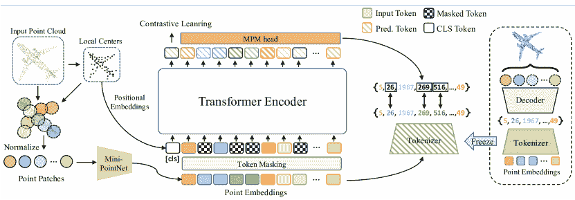

<!--yml

类别：未分类

日期：2024-09-06 19:31:06

-->

# [2407.17877] 通过深度迁移学习推动 3D 点云理解：综合调查

> 来源：[`ar5iv.labs.arxiv.org/html/2407.17877`](https://ar5iv.labs.arxiv.org/html/2407.17877)

\useunder

\ul

\cormark

[1]

[] []

# 通过深度迁移学习推动 3D 点云理解：综合调查

Shahab Saquib Sohail    Yassine Himeur yhimeur@ud.ac.ae    Hamza Kheddar    Abbes Amira    Fodil Fadli    Shadi Atalla    Abigail Copiaco    Wathiq Mansoor 计算机科学与工程学院，VIT 博帕尔大学，印度塞霍尔，MP 466114 迪拜大学工程与信息技术学院，阿联酋迪拜 Medea 大学电气工程系 LSEA 实验室，阿尔及利亚 26000 沙迦大学计算机科学系，阿联酋 迪蒙福特大学人工智能研究所，英国莱斯特 卡塔尔大学建筑与城市规划系，卡塔尔多哈，2713

###### 摘要

3D 点云（3DPC）随着深度学习（DL）的进步显著发展并受益。然而，后者面临各种问题，包括数据或标注数据的缺乏、训练数据与测试数据之间存在显著差距以及对高计算资源的需求。因此，深度迁移学习（DTL）通过利用从源数据/任务中获得的知识来减少对目标数据/任务的依赖和成本，已被广泛研究。许多 DTL 框架已被提出用于对齐来自同一场景的多个扫描点云。此外，作为 DTL 的一个子集，领域适应（DA）已被修改，以通过处理噪声和缺失点来提高点云数据的质量。最终，微调和 DA 方法在解决点云数据固有的不同难题方面表现出了有效性。本文首次回顾了这一方面，提供了使用 DTL 和领域适应（DA）理解 3DPC 的最新技术的全面概述。相应地，首先介绍 DTL 的背景以及数据集和评估指标。引入了明确的分类法，并考虑不同方面如知识转移策略和性能，提供了详细的比较。本文涵盖了各种应用，如 3DPC 目标检测、语义标注、分割、分类、配准、下采样/上采样和去噪。此外，文章讨论了所提出框架的优缺点，识别了开放挑战，并提出了潜在的研究方向。

###### 关键词：

3D 点云 \sep 深度迁移学习 \sep 领域适应 \sep 微调 \sep 分类 \sep 分割与配准

3DPC

3D 点云

GAN

生成对抗网络

CV

计算机视觉

DL

深度学习

ML

机器学习

DTL

深度迁移学习

DA

领域适应

UDA

无监督领域适应

TD

目标领域

SD

源领域

CNN

卷积神经网络

MAE

多尺度掩码自编码器

IoU

交并比

SSL

自监督学习

SVCN

稀疏体素补全网络

OA

总体准确性

CD

Chamfer 距离

LiDAR

光探测与测距

BiLSTM

双向 LSTM

ITL

归纳迁移学习

SFUDA

无源无监督 DA

PCM

点云混合

MLP

多层感知器

CLIP

对比视觉语言预训练

TTL

传导迁移学习

CLDA

跨模态学习 DA

AE

自编码器

RNN

循环神经网络

CRF

条件随机场

## 1 引言

### 1.1 初步

\Ac

计算机视觉（CV）作为机器学习（ML）的一个不断增长的分支，继续吸引大量关注，涉及智能城市、医学、自动驾驶、视频监控、场景理解、安全和保障等不同问题[1、2]。随着传感器技术的迅速发展，3D 传感器最近被广泛采用，这增加了计算机视觉（CV）研究社区对开发 3D 传感器数据处理方法的兴趣[3、4]。此外，随着增强现实和虚拟现实（AR/VR）的使用，3D 视觉问题变得更加重要，因为它们提供的信息比 2D 更加丰富[5、6]。通常，已经使用了许多获取 3D 数据的 3D 传感器，包括深度感应相机（如 Apple Depth、RealSense 和 Kinect 相机）、光探测与测距（LiDAR），用于移动测绘、地面激光扫描、航空 LiDAR [7]。此外，生成对抗网络可以在数据稀缺问题发生时用于增强数据。在这种情况下，3D 数据可以提供丰富的尺度、形状和几何信息，以与 2D 图像互补，从而更好地表示周围环境[8、9]。

虽然有多种方法来表示 3D 数据，例如体积网格、网格和深度图像，但 3D 点云是最常用的。通常，3DPC 表示法保留了 3D 空间中的原始几何信息[10]。此外，3DPC 是一个数据点集合，表示物体在 3D 坐标中的表面。在这方面，空间坐标用于表示数据点、表面法线和颜色信息及格式（例如 RGB、HSV 等）[11]。

此外，尽管 3DPC 可以被视为非欧几里得几何数据，但在实践中，它被划分为小的欧几里得子群，并采用标准坐标系统和全局参数化[12]。这种表示法成功的原因在于其对变换和攻击的不可变性，包括旋转、缩放、平移等，这使得它在提取对象特征时具有鲁棒性。此外，利用深度学习技术提取 3DPC 数据，并执行检测、分类、识别和检索等复杂任务，已经扩大了它们在许多研究和开发领域的应用[13]。通常，3DPCs 被广泛用于计算机视觉任务，如物体识别、语义分割和场景理解[14, 15]。此外，它们还被用于创建环境的详细模型，用于导航和定位，详细的建筑物、景观和其他结构的地图和模型，以及用于设计和规划的建筑物和其他结构的详细模型[16]。此外，它们还可用于检查和维护工业设备、基础设施和其他资产[17, 18]。此外，3DPC 技术有助于在增强现实和虚拟现实应用中实现逼真和沉浸式体验。

传统的机器学习方法以及最近的深度学习方法都经历了快速增长，并吸引了研究人员，因为它们在许多实际应用中的适用性，包括智能医疗[19]、疾病诊断和医学图像分类[4]、商业和市场营销[20]、推荐系统[21]、能源[22]、农业[23]、机器人技术[24]等。这些学习算法的主要优势在于它们能够训练出一个学习隐藏模式的模型，并且可以以高精度用于任何特定目的。然而，随着时间的推移，研究社区提出了一些问题。首先，这些学习算法需要大量的训练数据集，尤其是深度学习算法[1]。其次，大多数深度学习模型基于监督学习，因此需要大量的真实数据。第三，普遍的假设是训练数据和未来要处理的数据必须具有相同的分布，并且在相同的特征空间[25]。在许多现实场景中，保持上述假设变得困难，有时甚至是不可能的。例如，在执行特定任务时，如在特定领域进行分类；然而，我们可能在另一个领域拥有所需的训练数据，其中两个数据集可能没有相同的分布或特征空间。

图 1：传统机器学习与深度迁移学习技术在多个任务上的区别：（a）传统机器学习和（b）深度迁移学习。

此外，确保机器学习算法准确性能的一个重要因素是训练和测试数据集的分布和特征空间的一致性。如果数据的分布发生变化，则需要通过收集新的训练数据从头开始重建模型[26]。然而，这一过程不仅成本高昂，而且由于重新收集训练数据的挑战，通常不可行。因此，需要一种机制来减少重新收集训练数据的费用，降低数据标注成本，同时在不需要大量训练数据的情况下实现高性能。为此，建议使用知识迁移，这种机制可以满足上述限制，并显著提高性能。该知识迁移机制称为深度迁移学习（DTL）[1, 26, 27]。图 1 简要解释了传统机器学习和深度迁移学习技术之间的区别。

一方面，使用深度学习处理 3D 点云面临相当复杂的挑战，这些挑战包括：（i）点密度和反射强度的变化，受对象与激光雷达传感器之间的距离影响，（ii）来自传感器的噪声（例如，扰动和异常值），（iii）由于对象之间的遮挡和背景杂乱导致的数据不完整，以及（iv）形状相似或反射相似对象引起的混淆类别。另一方面，深度学习/深度迁移学习模型面临的挑战包括：（i）排列和方向不变性，（ii）3D 平移和旋转挑战，（iii）处理大规模数据集的困难，（iv）确保计算资源，以及（v）低性能。图 2 总结了与数据和深度学习/深度迁移学习相关的任务和挑战。

图 2：与数据和深度学习/深度迁移学习相关的任务和挑战在 3D 点云上的应用。

### 1.2 我们的贡献

可以说，DL 的顶级成功故事之一是 DTL。因此，发现对 DL 网络进行丰富源集（例如，ImageNet）的预训练，一旦在通常更小的目标集上微调，就能提升性能，这对语言和 CV 的许多应用至关重要。同样，一些研究已经探索了 DTL 在 3DPC 应用中的潜力，以应对上述挑战。这提供了一个机会，呈现第一篇全面审视 DTL 方法在推进我们对 3D 场景的理解中的贡献的综述文章，例如 3DPC 分割、3D 物体检测、3D 物体分类、3DPC 配准等。例如，DTL 已被证明在多种方式上有效，包括（i）利用从合成数据中学到的知识来改善真实 LiDAR3DPC 的语义分割，（ii）即使在训练数据有限的情况下也能实现准确的 3DPCs 分类，（iii）缓解 3DPC 分类中的过拟合问题，（iv）减少标注 3DPC 数据集的劳动密集型过程，以及其他好处。在这方面，本文首先介绍 DTL 的背景，并进行详细的分类。接下来，讨论用于评估现有 DTL-基于 3DPCs 技术的数据集和评估指标。接着，基于不同方面概述现有研究，并识别其优缺点。之后，识别在使用 DTL 进行 3DPCs 时遇到的挑战，然后推导未来的研究方向。总之，这篇综述的主要贡献可以概括为以下几点：

+   •

    介绍，依据作者的知识，首次综述文章关于使用 DTL 和领域适配（DA）用于 3DPC 应用的情况；

+   •

    讨论现有数据集和用于评估 3DPC 框架性能的评估指标，这些框架基于 DTL；

+   •

    介绍一个详细的分类法，以概述现有的 DTL-基于 3DPC 的研究；

+   •

    识别在使用 DTL 进行 3DPC 理解任务时遇到的当前挑战；

+   •

    推导出未来研究方向，以吸引近期显著的研究兴趣。

### 1.3 调查方法

本综述研究基于[28]中建议的协议和程序，该协议和程序最近在许多研究中得到广泛采用，如[29]。本研究受到 3DPC 技术近期发展的激励。虽然有一些关于该主题的综述研究探讨了 ML [30]、DL [31]和强化学习[32]，但据我们所知，我们没有找到专门探讨 DTL 在不同 3DPC 任务中的综述。由于 DTL 技术的普及，研究人员受到了影响，因此相关技术的范围不断扩展，涵盖了许多最新的人工智能驱动的研究。我们的研究为读者提供了对 DTL 在执行多个 3DPC 任务中应用的见解。本综述旨在回答表 1 中提出的研究问题。 |

表 1：本综述中涉及的研究问题。

| No. | Question | Objective |
| --- | --- | --- |
| RQ1 | DTL 和 3DPC 的关键原理和理论基础是什么？ | 提供对 DTL 和 3DPC 背后关键原理和理论的基础理解。这将帮助读者掌握构建该研究领域的基本原则，并支持对后续讨论的更复杂概念的理解。 |
| RQ2 | 为什么 DTL 在 3DPC 中的应用受到越来越多的关注？ | 研究并解释为什么 DTL 在 3DPC 中的使用越来越多。这将有助于突出 DTL 在处理 3D 数据时提供的独特优势和机会，表明其在该领域的日益重要性。 |
| RQ3 | 如何利用 DTL 实现不同的 3DPC 任务？ | 提供关于如何在各种 3DPC 任务中使用 DTL 的全面概述。这个目标旨在展示 DTL 在 3DPC 任务中的多功能性和广泛适用性，为研究人员和实践者提供实际见解。 |
| RQ4 | DTL 在执行 3DPC 任务和优化其性能时的机制和设置是什么？ | 深入探讨 DTL 在优化 3DPC 任务性能时的具体机制和设置。目标是提供对 DTL 操作细节的清晰理解，这可以作为那些打算在自己的 3DPC 任务中实施 DTL 的指南。 |
| RQ5 | 哪些 DTL 模型更适合 3DPC 任务？ | 评估并建议最适合 3DPC 任务的 DTL 模型。通过这样做，评审将为希望在 3DPC 中应用 DTL 的读者提供实际建议，帮助他们进行模型选择。 |
| RQ6 | 实施 DTL 以执行上述任务时存在哪些问题，如何应对这些挑战？ | 识别实施 DTL 在 3DPC 任务中的关键挑战，并提出应对这些挑战的潜在解决方案。这将通过直面问题来改善 DTL 在 3DPC 中的应用，促进这些技术的稳健和可靠使用。 |
| RQ7 | 改进 DTL 在 3DPC 中的未来研究方向是什么？ | 预测 DTL 在 3DPC 中的未来研究方向。这个目标旨在通过识别有前途的进一步探索方向，激发新的研究举措，推动该领域的创新和发展。 |

项目列表

为什么 DTL 在 3DPC 中的应用受到越来越多的关注？

如何使用 DTL 实现不同的 3DPC 任务？

执行 3DPC 任务和优化其性能的 DTL 机制和设置是什么？

哪些 DTL 模型更适合 3DPC 任务？

实施 DTL 以执行上述任务时存在哪些问题，如何应对这些挑战？

改进 DTL 在 3DPC 中的未来研究方向是什么？

(a)

(b)

图 3：总结用于搜索和选择纳入评审的文章的方法：（a）采用的搜索程序和（b）选择标准。

文献计量研究是在叙述性综述的背景下进行的。我们检索了涉及 3DPC 的近期工作，这些工作使用了 DTL 技术来执行各自的任务。我们在 Scopus 数据库中搜索了相关的关键词，如“3D 点云”、“3D 点云分割”、“3D 点云分类”、“3D 物体检测”、“深度迁移学习”和“领域适应”，并对标题、摘要和关键词进行了不同组合的检索。采用的搜索程序在图 3(a) 和 3(b) 中进行了说明。通常，针对相关查询检索到 176 篇文章，其中 149 篇为非重复文章。这些文章经过进一步审查以确定它们与本研究主题的相关性。最终，选择了 108 篇论文纳入本研究。

论文的组织结构如下：第二部分介绍了与 DTL 定义和术语、预训练模型、有用数据集和 3DPC 中使用的指标相关的背景。第三部分回顾了与 DTL 和 DA 相关的文献和工作。第四部分概述了基于 DTL 的最新应用。第五部分讨论了开放挑战。第六部分提出了近期未来研究方向。最后，第七部分总结了调查内容。图 4 说明了调查的结构，增强了可读性，并为读者提供了指导。

图 4：带有部分和子部分分布的调查结构。

## 2 背景

### 2.1 3D 点云

3DPC 是三维坐标系统中数据点的集合。点云中的每个点表示为：

|  | $P=\{p_{1},p_{2},...,p_{n}\}$ |  |
| --- | --- | --- |

其中每个点 $p_{i}$ 是一个 $\mathbb{R}^{3}$ 中的向量：

|  | $p_{i}=(x_{i},y_{i},z_{i})$ |  |
| --- | --- | --- |

#### 2.1.1 操作和变换

对 3DPC 应用的常见操作和变换包括：

+   •

    平移：通过将常量向量 $\mathbf{t}=(t_{x},t_{y},t_{z})$ 加到每个点来移动点云：

    |  | $p_{i}^{\prime}=p_{i}+\mathbf{t}$ |  |
    | --- | --- | --- |

+   •

    旋转：使用旋转矩阵 $\mathbf{R}$ 来旋转点云。旋转矩阵是一个 3x3 矩阵：

    |  | $p_{i}^{\prime}=\mathbf{R}p_{i}$ |  |
    | --- | --- | --- |

    旋转矩阵可以从欧拉角、轴-角或四元数表示中推导出来。

+   •

    缩放：通过用标量 $s$ 或不同轴的标量来缩放每个点，从而改变大小：

    |  | $p_{i}^{\prime}=s\cdot p_{i}\text{ 或 }p_{i}^{\prime}=(s_{x}x_{i},s_{y}y_{i},s_{z}z_{i})$ |  |
    | --- | --- | --- |

+   •

    变换：平移、旋转和缩放的组合，用齐次坐标的矩阵乘法表示：

    |  | <math   alttext="p_{i}^{\prime}=\mathbf{T}\begin{bmatrix}x_{i}\\ y_{i}\\

    z_{i}\\

    1\end{bmatrix}" display="block"><semantics ><mrow ><msubsup  ><mi >p</mi><mi >i</mi><mo  >′</mo></msubsup><mo >=</mo><mrow ><mi  >𝐓</mi><mo lspace="0em" rspace="0em"  >​</mo><mrow ><mo  >[</mo><mtable displaystyle="true" rowspacing="0pt"  ><mtr ><mtd ><msub  ><mi >x</mi><mi >i</mi></msub></mtd></mtr><mtr ><mtd ><msub  ><mi >y</mi><mi >i</mi></msub></mtd></mtr><mtr ><mtd ><msub  ><mi >z</mi><mi >i</mi></msub></mtd></mtr><mtr ><mtd ><mn  >1</mn></mtd></mtr></mtable><mo >]</mo></mrow></mrow></mrow><annotation-xml encoding="MathML-Content" ><apply  ><apply ><csymbol cd="ambiguous" >superscript</csymbol><apply ><csymbol cd="ambiguous"  >subscript</csymbol><ci >𝑝</ci><ci >𝑖</ci></apply><ci  >′</ci></apply><apply ><ci >𝐓</ci><apply  ><csymbol cd="latexml"  >matrix</csymbol><matrix ><matrixrow ><apply  ><csymbol cd="ambiguous"  >subscript</csymbol><ci >𝑥</ci><ci >𝑖</ci></apply></matrixrow><matrixrow ><apply ><csymbol cd="ambiguous" >subscript</csymbol><ci >𝑦</ci><ci >𝑖</ci></apply></matrixrow><matrixrow ><apply  ><csymbol cd="ambiguous"  >subscript</csymbol><ci >𝑧</ci><ci >𝑖</ci></apply></matrixrow><matrixrow ><cn type="integer" >1</cn></matrixrow></matrix></apply></apply></apply></annotation-xml><annotation encoding="application/x-tex" >p_{i}^{\prime}=\mathbf{T}\begin{bmatrix}x_{i}\\ y_{i}\\ z_{i}\\ 1\end{bmatrix}</annotation></semantics></math> |  |

    其中 $\mathbf{T}$ 是一个 4x4 的变换矩阵：

    |  | $\mathbf{T}=\begin{bmatrix}\mathbf{R}&amp;\mathbf{t}\\ 0&amp;1\end{bmatrix}$ |  |
    | --- | --- | --- |

### 2.2 DTL 相关定义

本节介绍了在 DTL-基础的 3DPC 应用中使用的主要定义。

定义 1 - 领域：考虑一个包含$ n $个观察值$x_{1},\cdots,x_{n}$的特征空间$\chi$中的数据集$X$。$X$的边际概率分布表示为$P(X)$。一个领域，表示为$\mathbb{D}$，被定义为包含$X$和$P(X)$的集合。在 DTL 领域中，包含初始知识的领域称为源领域 (SD)，表示为$\mathbb{D}_{S}$，而包含待学习的未知知识的领域称为目标领域 (TD)，表示为$\mathbb{D}_{T}$。

定义 2 - 任务：数据集$X$包含$ n $个观察值$x_{1},\cdots,x_{n}$，位于特征空间$\chi$中，并且与标签集$Y$、$y_{1},\cdots,y_{n}$在标签空间$\gamma$中相关联。任务可以定义为包含标签$Y$和学习目标预测函数$\mathbb{F}(X)$的集合，表示为$\mathbb{T}=\{Y,\mathbb{F}(X)\}$。这个函数也被表示为条件分布$P(Y|X)$。根据这个任务的定义，SD 和 TD 的标签空间分别表示为$\gamma_{S}$和$\gamma_{T}$ [33]。

对 DTL 方法的一个分类方式是基于它们转移知识的方法，这可以细分为知识的转移内容、时间和方式。

(a) 转移什么知识：基于“转移什么知识”的 DTL 方法分类检查可以在不同领域或任务之间转移的知识的具体特征。一些信息是特定于某个领域或任务的，而其他知识是通用的，可以提高 TD 或任务的表现。根据这一标准，DTL 方法可以被分类为基于模型的、基于关系的、基于实例的和基于特征的 [34]。

(b) 知识如何转移：基于这个问题对 DTL 方法的分类专注于用于在不同领域或任务之间转移知识的具体算法或技术。

(c) 知识何时转移：探讨知识在何时以及在何种情况下应该或不应该转移。

### 2.3 DTL 的理论分类

本节中，呈现了用于 3DPCs 的 DTL 方法的清晰分类。所提出的分类，如图 5 所示，是基于以下标准进行排列的：(i) 学习风格，(ii) 方法论，(iii) DTL 类型，(iv) 数据标注，以及(v) 广泛使用的 DTL 模型。DTL 技术通常可以根据源任务和 TDs 的相似程度分为不同的组。不同 DTL 组的数学描述及其区别在图 6 中呈现。虽然这些信息在文献综述中有所讨论，本研究旨在简化这些内容，并以更易于读者理解的方式呈现。

图 5: 现有 DTL 算法在 3DPCs 中的分类方案。

图 6: DTL 的分类取决于源任务和 TDs 的相似程度。符号 ($\varsubsetneq$) 用于表示领域/任务是不同但相关的。符号 ($\exists!$) 表示存在一个唯一的领域/任务。符号 ($\cong$) 表示领域、任务或空间不匹配。

#### 2.3.1 归纳式 DTL

归纳式 DTL 的目标是改善 TDs 中目标预测函数 $\mathbb{F}T$，与经典 ML 相比。这是即使目标任务 $\mathbb{T}{T}$ 与源任务 $\mathbb{T}{S}$ 不同也能实现的。然而，SD $\mathbb{D}{S}$ 和 TD $\mathbb{D}_{T}$ 可能并不总是相同的（如图 6 所示）。归纳式 DTL 可以有两种形式，具体取决于标注或未标注数据的可用性：

(a) 多任务 DTL: 当 SDs 具有大量标注数据集（$X_{S}$与$Y_{S}$标注）时使用此方法。这是一种多任务学习的特定形式，其中多个任务 $(T_{1},T_{2},\dots,T_{n})$ 同时（并行）进行学习，包括源任务和目标任务[35]。

(b) 序列学习：也称为自学，是在 SD 数据集未标记时使用的方法。它依赖于 (i) 从大量未标记数据集中转移学到的特征表示，以及 (ii) 将学到的表示应用于标记数据进行分类任务。这种 DTL 方法涉及依次学习多个任务，其中 SDs 和 TDs 之间的差距可能不同。例如，假设我们有一个预训练模型 (PTM) $M$，并将 DTL 应用于几个任务 $(T_{1},T_{2},\dots,T_{n})$。在这种方法中，每次时间步 $t$ 学习一个特定任务 $\mathbb{T}_{T}$，它比多任务学习慢，但当训练时不是所有任务都存在时，它可能具有优势。序列学习还可以进一步分类为不同类型 [36]。

+   1-

    微调：涉及训练一个新的函数 $\mathbb{F}_{T}$，将 PTM $M$ 的参数从源任务 $\mathbb{T}_{S}$ 适配到目标任务 $\mathbb{T}_{T}$，通过将源任务的权重 $W_{S}$ 转换为目标任务的权重 $W_{T}$。这可以在所有层中完成，也可以只在其中的一个子集上进行，每层的学习率可以独立调整（称为判别微调）。此外，可以向模型中添加新的参数 $K$ 以提高其在目标任务上的性能 [37]。

    |  | $\mathbb{F}_{T}(W_{T},K)=W_{S}\times K$ |  | (1) |
    | --- | --- | --- | --- |

+   2-

    适配器模块：它们旨在将 PTM（预训练模型）$M_{S}$ 的权重 $W_{S}$ 适配到目标任务 $\mathbb{T}_{T}$。适配器模块通过引入一组新的参数 $K$ 来实现这一点，这些参数的大小比 $W_{S}$ 小，即 $K\ll W_{S}$。$K$ 和 $W_{S}$ 都被分解成更小、更紧凑的模块，使得 $W_{S}={w}_{n}$ 和 $K={k}_{n}$。这使得适配器模块可以学习一个新的函数 $\mathbb{F}_{T}$，该函数将模型适配到目标任务。

    |  | $\mathbb{F}_{T}(K,W_{S})=k_{1}^{\prime}\times w_{1}\times\cdots k_{n}^{\prime}\times w_{n}$ |  | (2) |
    | --- | --- | --- | --- |

    方程 (2) 说明了通过动态权重调整将模型适配到新任务的过程，原始权重 $W_{S}={w}_{n}$ 保持不变，而权重集 $K$ 被更新为 $K^{\prime}={k^{\prime}}_{n}$。动态 DA 原则在图 7 中有所示。

+   3-

    基于特征：它侧重于在图像的不同层次上学习概念和表示，如角点或兴趣点、斑点或感兴趣区域、脊线或边缘$E$。在这种方法中，从 PTM $M$获得的$E$集合保持不变，只微调$W^{\prime}$，使得函数$\mathbb{F}_{T}$可以表示为$E\times W^{\prime}$。其理念是$E$是从 PTM 学习到的特征，仅微调最后一层$W^{\prime}$以适应新任务。

+   4-

    零样本：是在所有其他方法中最简单的方法。它不涉及修改或添加新参数到 PTM 中，而是假设现有参数（记作$W_{S}$）不能更改。本质上，零样本不需要任何训练来优化或学习新参数。

图 7：在 3D 点云中使用的 DTL 模型示例：（a）微调，以及（b）深度领域自适应。

#### 2.3.2 传导性深度迁移学习

与传统的机器学习相比，后者可以作为 DA 和深度迁移学习的基准，深度迁移学习解决了目标数据数据（记作$\mathbb{D}{T}$）与源数据数据（记作$\mathbb{D}{S}$）不同的情况。虽然源数据有标注数据（$X_{S}$与$Y_{S}$配对），但目标数据没有标注数据。源任务和目标任务相似，如图 6 所示。传导性深度迁移学习旨在利用源数据和目标数据的知识构建目标预测函数$\mathbb{F}_{T}$。此外，传导性深度迁移学习还可以根据源数据和目标数据之间的关系进一步分为两类，如[38]中所述。

(a) 深度领域自适应（DDA）：指的是源数据的特征空间（记作$\chi_{S}$）和目标数据的特征空间（记作$\chi_{T}$）相同的情况。然而，输入数据的概率分布是不同的，$P(Y_{S}/X_{S})\neq P(Y_{T}/X_{T})$，如[39]所述。当目标任务具有独特的分布或标注数据有限时，DDA 特别有用，如[40]中所强调的。

(b) 跨模态 DTL：大多数 DTL 技术要求源和 TDs 的特征空间（或标签空间）之间存在某种关系，即 $\mathbb{D}{S}$ 和 $\mathbb{D}{T}$。这意味着 DTL 只能在源和目标具有相同模态时应用，如文本、语音或视频。相比之下，跨模态 DTL 是 DTL 中最具挑战性的领域之一，因为它假设源和 TDs 的特征空间完全不同（$\chi_{S}\neq\chi_{T}$），例如语音到图像、图像到文本和文本到语音。此外，源的标签空间 $Y_{S}$ 和目标的标签空间 $Y_{S}$ 也可能不同（$Y_{S}\neq Y_{T}$），如 [41] 中所述。

(c) 无监督 DTL：是一种通过使用来自 SDs $\mathbb{D}{S}$ 和源任务 $\mathbb{T}{S}$ 的知识来提高 TD $\mathbb{D}{T}$ 中目标预测函数 $\mathbb{F}T$ 的学习的方法，即使在没有标签 $Y_{S}$ 和 $Y_{T}$ 的情况下。值得注意的是，源任务和目标任务 $\mathbb{T}{S}$ 和 $\mathbb{T}{T}$ 相关但不同。当 TD 数据没有标签时，这种方法是有用的，如 [42] 中所述。

#### 2.3.3 对抗性 DTL

对抗学习，如在[43]中介绍，是一种帮助学习更具可迁移性和区分性表示的方法。首个使用这种方法的模型，领域对抗神经网络（DANN），在[44]中提出。与使用预定义距离函数的传统方法不同，DANN 在网络内部利用领域对抗损失。这种方法已显示出提高网络学习区分数据的能力，并已被用于许多视觉监控研究[45, 46, 47, 48]。然而，之前的 DANN 工作没有考虑边际分布和条件分布的不同影响。另一种方法，动态分布对齐，提出于[49]，动态评估每个分布的重要性，从而提供更细致的方法。另一种方法，称为对抗评分网络（ASNet），在[50]中引入，以弥合不同层次的领域之间的差距。这种方法使用对抗学习在粗粒度阶段对齐 SDs 与 TD 在全局和局部特征空间中的位置。然后在细粒度阶段通过比较源样本和目标样本在多个层次上的相似性来评估源属性的可迁移性，利用在粗粒度阶段获得的生成概率。然后选择性地使用可迁移元素来协助 DTL 适应过程。这种从粗到细的架构有效地减少了领域差异问题。具体而言，照片通过生成器编码为密度图，然后使用双判别器分类为 SDs 或 TD。在双判别器和生成器之间进行对抗训练，以使领域分布更接近。双判别器还生成四种不同的分数，用作优化 SDs 密度的信号，以便在细粒度传输期间适应，如[50]中所述。

在[51]中，作者研究了在 3DPC 识别中的对抗鲁棒性，使用了三种不同的架构：多层感知机 (MLP) 网络（PointNet）、卷积网络（DGCNN）和基于变换器的网络。他们采用了两种方法：对抗预训练用于微调，其中利用自监督学习 (SSL) 任务进行预训练；对抗联合训练，其中自监督任务与识别任务一起训练，如图 8 所示。

图 8：在[51]中提出的对抗性迁移学习（TL）基于 3DPC 分类方法的流程图。

### 2.4 流行的基于深度学习的点云模型

基于深度学习的 3DPC 方法的发展特点是深度学习模型的丰富多样，每种模型旨在克服与点云数据处理相关的特定挑战。尽管这些模型在处理速度、准确性和适用性方面提供了显著改进，但它们也突显了需要能够跨不同环境进行泛化并更有效处理 3D 点数据固有复杂性的模型。

#### 2.4.1 特征提取与几何细节增强模型

模型如 PointNet [52] 和 PointNet++ [53] 引领了直接处理点云的方法，分别通过尊重置换不变性和增强对层次结构的捕捉。它们在目标分类和分割任务中发挥了关键作用，但由于统一点处理而在局部细节方面存在困难。PointVGG [54] 和 PointPAVGG [55] 通过将基于图像的卷积和注意力机制适配到点云中，扩展了这些能力，力图弥补捕捉复杂几何细节的差距，但在计算效率方面面临挑战。SpiderCNN [56] 和 PointCNN [57] 通过将传统的卷积神经网络（CNN）变换适配到无序点数据中，进一步创新，提高了模型从复杂数据集中学习的能力。

#### 2.4.2 分割与目标检测模型

模型如 SplatNet [58]、SGPN [59] 和 FoldingNet [60] 代表了在分割和无监督学习方面的进展。SplatNet 利用稀疏双边卷积层处理点云中的高维格点，适合于分割，但受限于缩放问题。SGPN 通过预测语义类别和点分组来专注于实例分割，这在混乱环境中变得复杂。FoldingNet 探索了使用基于折叠的解码器的无监督学习，这可能无法跨所有点云类型进行泛化。

#### 2.4.3 数据集成与上采样模型

PU-Net [61] 和 PointGrid [62] 侧重于上采样以及将基于网格的方法与点处理相结合。PU-Net 通过多层次特征融合来增强点云密度，而 PointGrid 则将点云和网格方法相结合以识别 3D 模型，但在处理稀疏点云时存在困难。

#### 2.4.4 专用应用模型

像 Hand PointNet [63] 和 PointNetVLAD [64] 这样的模型专为特定应用如 3D 手部姿态估计和全局描述符提取而设计，这些在场景识别中至关重要。然而，这些模型在应用于其预定范围之外时常常面临限制，例如动态环境或不同类型的对象。

#### 2.4.5 对象检测与配准中的创新方法

新兴模型如 PREDATOR [65] 和 3DIoUMatch [66] 展示了深度学习在对象检测和配准中的潜力。PREDATOR 通过深度注意机制解决了低重叠点云配准的问题，适用于基准场景，但在更广泛的应用中有限。3DIoUMatch 利用半监督学习方法增强了 3D 对象检测，显示出性能效果依赖于初始标签质量。表 LABEL:tab2 总结了文献中提出的最受欢迎的 3DPC 模型。

表 2：基于深度学习的 3DPC 理解模型总结。

| 参考文献 | 模型名称 | 贡献描述 | 数据集 | 应用 | 限制 |
| --- | --- | --- | --- | --- | --- |
| [52] | PointNet | 引入了一种直接处理点云的神经网络，尊重排列不变性。 | 各种 3D 基准测试 | 对象分类、部件分割、语义解析 | 未能捕捉局部结构细节。 |
| [67] | ScanNet | 开发了一个 RGB-D 视频数据集，并提供了广泛的注释，用于深度学习应用。 | ScanNet 数据集 | 3D 对象分类、语义体素标注、CAD 模型检索 | 场景视图和语义注释的多样性有限。 |
| [68] | OctNet | 提出了一个稀疏 3D 数据表示，允许深度、高分辨率的 3D 卷积网络。 | 未指定 | 3D 对象分类、方向估计、点云标注 | 对稀疏数据的关注可能不适用于更密集的数据集。 |
| [53] | PointNet++ | 扩展了 PointNet，以分层神经网络捕捉局部结构。 | 挑战性的 3DPC 基准 | 增强的 3D 识别任务 | 对非均匀点密度的性能下降。 |
| [54] | PointVGG | 引入了点卷积和池化方法，将基于图像的技术适配到点云中。 | 挑战性的 3DPC 基准 | 对象分类、部件分割 | 可能无法完全捕捉复杂的几何细节。 |
| [55] | PointPAVGG | 一种基于 VGG 的网络，结合点注意机制从点云中提取特征。 | ShapeNet, ModelNet | 点云分类、分割 | 由于复杂特征集成而增加的计算需求。 |
| [58] | SplatNet | 利用稀疏双边卷积层在高维格子中处理点云。 | 未指定 | 3D 分割 | 在更大的格子中存在内存和计算成本的扩展问题。 |
| [60] | FoldingNet | 开发了一个深度自编码器，采用基于折叠的解码器，用于点云的无监督学习。 | 未指定 | 无监督学习、3D 物体重建 | 通用解码器结构可能不适用于所有点云类型。 |
| [61] | PU-Net | 提出了一个利用多层次特征对 3D 点云进行上采样的方法。 | 合成和扫描数据 | 点云上采样 | 关注于上采样可能无法改善其他操作。 |
| [69] | SO-Net | 使用自组织映射构建了一个具有置换不变性的架构，用于点云处理。 | 未指定 | 点云重建、分类、分割、形状检索 | 需要调整网络的感受野。 |
| [70] | PIXOR | 开发了一个基于 BEV 的实时 3D 物体检测系统，用于点云数据，优化了自动驾驶应用。 | KITTI，大规模 3D 车辆检测基准 | 自动驾驶中的实时 3D 物体检测 | 主要针对车辆检测进行了优化，可能不适用于其他物体类型。 |
| [59] | SGPN | 引入了一个通过预测点分组和语义类别进行 3D 实例分割的网络。 | 各种 3D 场景 | 3D 实例分割、物体检测、语义分割 | 可能在高度杂乱或复杂的环境中表现不佳。 |
| [71] | VoxelNet | 将 3D 点云的统一特征提取和边界框预测整合到一个深度网络中。 | KITTI | 车辆、行人和自行车的 3D 检测 | 由于点云的密集体素化导致计算成本高。 |
| [63] | Hand PointNet | 开发了一个手部姿势回归网络，利用 3D 点云捕捉复杂的手部结构。 | 三个具有挑战性的手部姿势数据集 | 3D 手部姿势估计 | 专注于手部姿势，限制了其在其他点云处理形式中的应用。 |
| [64] | PointNetVLAD | 提出了一个用于从点云中提取全局描述符的网络，用于地点识别。 | 创建了基于点云检索的基准数据集 | 从点云中进行地点识别 | 在高度动态的环境中可能效果不佳。 |
| [72] | PPFNet | 引入了一个网络，用于从点云中学习全局信息的 3D 局部特征描述符。 | 未指定 | 在无组织的点云中寻找对应关系 | 依赖于局部特征和全局上下文理解的质量。 |
| [62] | PointGrid | 结合点云和网格方法以识别 3D 模型。 | 流行的形状识别基准 | 3D 模型识别、分类和分割 | 可能无法有效处理极度稀疏或不规则的点云。 |
| [73] | PointFusion | 利用图像和点云数据进行 3D 目标检测，无需数据集特定调整 | KITTI, SUN-RGBD | 在多样环境中的通用 3D 目标检测 | 融合过程可能复杂且计算密集 |
| [74] | Frustum PointNets | 对原始点云进行 3D 目标检测，结合 2D 和 3D 检测方法 | KITTI, SUN RGB-D | 室内和室外场景中的 3D 目标检测 | 可能遇到非常稀疏的点云或严重遮挡的问题 |
| [75] | 3DFeat-Net | 学习 3D 特征检测器和描述符用于点云匹配，使用弱监督 | 户外 Lidar 数据集 | 点云匹配用于定位和映射 | 性能高度依赖于弱监督学习机制的有效性 |
| [56] | SpiderCNN | 开发了 SpiderConv 单元以处理 3D 点云 | ModelNet40 | 3D 点云分类和分割 | 可能对非常大或噪声数据集表现不佳 |
| [57] | PointCNN | 引入了 X 变换来处理无序点云以适应 CNN | 多个具有挑战性的基准数据集 | 从点云中学习特征 | 依赖于 X 变换的有效性 |
| [76] | SqueezeSeg | 创建了一个用于 LiDAR 数据语义分割的 CNN 管道 | KITTI, GTA-V（模拟） | 自动驾驶中的语义分割 | 依赖于合成数据以提高准确性 |
| [77] | 2DPASS | 通过训练期间的 2D 图像融合增强点云学习 | SemanticKITTI, NuScenes | 点云的语义分割 | 训练期间需要多模态数据，实施复杂 |
| [65] | PREDATOR | 专注于低重叠点云配准的深度注意力方法 | 3DMatch 基准 | 点云配准 | 限于成对配准，可能无法推广到基准场景之外 |
| [66] | 3DIoUMatch | 实现了基于教师-学生学习的半监督 3D 目标检测 | ScanNet, SUN-RGBD, KITTI | 3D 目标检测 | 任务复杂度高且依赖于初始标签质量 |
| [78] | PointPoseNet | 开发了一个用于从点云中进行 6D 目标姿态估计的管道 | LINEMOD, Occlusion LINEMOD | 6D 姿态估计 | 限于复杂场景中的已知物体，对遮挡敏感 |
| [79] | ASAP-Net | 增强了点云的时空建模 | Synthia, SemanticKITTI | 点云序列分割 | 需要特定的注意和结构感知算法以实现最佳性能 |
| [80] | MUSCLE | 提出了一个基于时空关系的 LiDAR 数据压缩算法 | UrbanCity, SemanticKITTI | LiDAR 数据压缩 | 效率依赖于输入数据的变异性 |
| [81] | PC-RGNN | 使用 GNN 解决稀疏和部分点云的 3D 检测问题 | KITTI | 3D 目标检测 | 高度依赖初始点云数据的质量 |

### 2.5 预训练 2D 模型

徐等人[82]展示了如何将预训练的 2D 图像模型通过最小修改适配到 3D 点云理解。该方法通过扩展 2D ConvNets 和视觉变换器来处理 3D 数据，涉及将 2D 滤波器膨胀为 3D，并仅微调特定层，如输入层、输出层和归一化层。这种方法利用了从大规模 2D 图像数据集中学到的深层特征表示，使得模型在 3D 点云任务（如分类和分割）中表现竞争力，同时显著减少了训练时间和数据需求。尽管 2D 和 3D 任务的数据模态不同，但由于特征表示的相似性，转移性得以实现。

此外，形状分类和部件分割在计算机视觉领域面临着重大挑战。尽管经过训练的卷积神经网络在图像等规则网格数据上表现出色，但从不规则和无序的点云中准确捕捉形状信息和几何表示仍然存在问题。为了解决这个问题，[54] 提出了点卷积（Pconv）和点池化（Ppool）技术，这些技术受到图像处理中的卷积和池化的启发，专门设计用于点云以学习高级特征。Pconv 逐渐放大感受野以捕捉局部几何信息，而 Ppool 则使用对称函数来处理点云的无序性，通过逐步聚合点来获得更详细的局部几何表示。我们的新型网络，名为 PointVGG，结合了 Pconv、Ppool 和图结构，用于点云的特征学习，并应用于物体分类和部件分割任务。实验结果表明，PointVGG 在 3DPC 的挑战性基准测试中实现了最先进的性能。此外，从无序点云数据中提取高级特征仍然具有挑战性，即使使用预训练的 2D CNN 网络。为了解决这个问题，[55] 提出了一个基于 VGG 的网络，称为点位置注意力 VGG（PointPAVGG），它受到经典 VGG 网络的启发。我们的方法通过从每个球体域中提取局部几何信息，并使用我们的点注意力（PA）模块分析全局位置分数，从而结合全局和局部特征。PointPAVGG 通过其图结构点云特征提取和 PA 模块，应用于点云分类和分割任务。通过在 ShapeNet 和 ModelNet 上的全面实验，我们的方法表现出色，在分类和分割任务中达到了最先进的结果。

文献[83]提出了一种从移动测绘点云数据中自动检测检查井盖的方法，这些数据是用于各种目的的大规模空间数据库。该方法使用了一个完整的卷积神经网络（CNN），结合深度学习（DTL）和简化的类别激活映射（CAM）位置算法，以准确确定检查井盖的位置。评估了不同的源模型架构，如 AlexNet、VGG-16、Inception-v3 和 ResNet-101。结果显示，VGG-16 在检测性能方面优于其他模型，召回率、精确度和 F2 分数均为 0.973。该方法还使用 VGG-16 架构实现了位置性能的横向 95%置信区间为 16.5 厘米。研究突出了在地面图像中纳入几何信息通道以提高检测和定位准确性的必要性。使用无人机进行空中成像，在自然灾害后的高效及时数据收集中提供了详细的现场特征描述，尽管这会产生大量的 2D 正射影像和 3D 点云（3DPC）。有效的数据处理工作流程对于识别结构损坏状态至关重要。Liao 等人[84]介绍了基于 2D 和 3D 卷积神经网络（CNNs）的两种深度学习（DL）模型，用于风暴后分类。对于 2D CNNs，使用了 AlexNet 和 VGGNet 的 DTL，而开发并训练了一个带有跳跃连接的 3D 全卷积网络（3DFCN）用于点云数据。使用定量性能指标比较了这些模型，3DFCN 在检测不同损坏类别方面显示出更大的鲁棒性。这突出了 3D 数据集，特别是深度信息，在区分结构中不同损坏状态方面的重要性。

在[85]中，提出了一种基于 DL 的方法，该方法涉及将 3DPC 投影到 2D 渲染视图中，然后将其输入到 CNN 中进行质量评分预测。DTL 被用于利用在 ImageNet 数据库上训练的 VGG-16 的能力。所提模型的性能在两个基准数据库 ICIP2020 和 SJTU 上进行了评估，结果显示预测的质量评分与主观质量评分之间存在较强的相关性，超越了当前最先进的点云质量评估模型。[86]解决了从单目数据中学习户外 3DPC 的问题，该方法使用稀疏真实数据集。提出了一种名为 Pix2Point 的基于 DL 的方法，该方法使用 2D-3D 混合神经网络架构和端到端的监督最小化点云之间的最优传输散度。所提方法在稀疏点云上训练时优于高效的单目深度方法。论文强调了 DL 在单目 3DPC 预测中的潜力及其处理完整且具有挑战性的户外场景的能力。目标模型中的编码块由卷积、池化和归一化层组成，用于从 RGB 图像中提取特征描述。这些特征随后通过全连接层处理，以获得初步的 3D 点坐标。探讨和比较了基于 VGG、DenseNet 和 ResNet 架构的多个源模型，这些模型被称为骨干网络。

Balado 等人[87]在 2020 年提出了一种方法，该方法通过将点云转换为图像（pc-images）来最小化训练 CNNs 时对点云样本的使用。这使得通过多视角生成每个对象的多个样本成为可能，并将 pc-images 与来自在线数据集（如 ImageNet 和 Google Images）的图像结合。结果表明，保留一些点云图像用于训练，即使是 10%的点云图像也可以获得较高的分类准确性。在[88]中展示的工作展示了一种面向服务的架构原型，用于在办公环境中分类室内点云场景。该方法利用多视角技术对捕获的扫描进行语义丰富和后续分类。该方法使用预训练的 CNN 模型 Inception V3 对 3DPC 扫描中的常见办公家具对象（如椅子、沙发和桌子）进行分类。结果显示，该方法能够在基于 RGB 立方体图像的 3DPC 扫描的八叉树分区区域中实现对常见办公家具的可接受分类准确性。还讨论了基于 Web 的 3D 可视化、编辑和注释点云的额外方法。

作者在 [89] 中提出了一种基于 RGB-D 信息融合的软体机器人操作中的对象检测的视觉识别和定位方法。该方法涉及使用 ORB-SLAM2 扫描和重建环境，构建对象特征数据库，使用迭代最近点 (ICP) 算法匹配点云，识别感兴趣区域，并使用 inception-v3 模型和 DTL 进行对象识别。通过颜色信息与点云数据的对应关系获得对象相对于相机的位置。该方法显示，相同对象的匹配误差远低于不同对象，且通过颜色识别成功实现了对象识别和定位。接下来，作者在 [90] 中采用了在 ImageNet 数据集上预训练的 ResNet50 [91] 从每个特征图像中提取深层特征，并获得每个点的五个多尺度多视角 (MSMV) 深层特征。

表 LABEL:tab3 展示了基于 DTL 的 3DPC 模型的总结。

表 3：基于 DTL 的 3DPC 模型总结。

| 类别 | 模型 | 亮点 | 局限性 |
| --- | --- | --- | --- |
| 基于点的方法 | AltasNet [12] | 在 AtlasNet 中，通过将 3D 形状视为一组参数化表面元素来推断表面表示。 | 反复的过程在很大程度上决定了重建结果。 |
| MSN [92] | 一个采样算法将 MSN 预测的参数化表面元素集合与部分输入结合。 | 对象形状的细粒度细节未能成功生成。 |
| ASHF-Net [93] | ASHF-Net 提出了一个分层折叠解码器，结合了门控跳跃注意力和多分辨率完成目标，以利用不完整输入的局部结构细节。 | 解码器 [113] 得到的预测不够结构化，结果的表面不保持平滑。 |
| 基于点的方法 | PCN [94] | PCN 通过结合全连接网络和 FoldingNet 执行粗到细的完成。 | 形状细节的合成不可实现。 |
| SA-Net [95] | SA-Net 提出了一个多阶段点生成解码器中的分层折叠方法。 | 从中间层获取目标形状的隐式表示，帮助在局部区域细化形状，难以解释和约束。 |
| FoldingNet [60] | 在两阶段生成过程中，通常假设 2D 流形可以恢复 3D 对象。 | 明确约束隐式中间表示是具有挑战性的。 |
| SK-PCN [96] | 通过预测 3D 骨架来获得全球结构，并通过学习骨架点的位移来实现表面补全。 | 整体形状是中间骨架的唯一关注点。 |
| 基于点的方法 | GRNet [97] | GRNet 通过引入 3D 网格作为中间表示来对无序点云进行规则化。 | 分辨率仍然决定了结果。使用更高分辨率时会产生显著的计算成本。 |
| VE-PCN [98] | VE-PCN 通过边缘生成将结构信息纳入形状补全中。 | 边缘的唯一关注点是高频成分。 |
| Point-PEFT [99] | 引入了一种用于 3D 模型的参数高效微调方法，以最小化下游任务的适应成本，且可训练参数最少。 | 尽管有效，但这种专门化方法在多样化领域的广泛适用性和长期适应性仍未得到证明。 |
| DAPT [100] | 为点云分析实现动态适配器，提供高效的参数使用，并显著减少训练资源。 | 尽管减少了可训练参数，但在极为多样化的环境中的适应性和有效性仍未完全评估。 |
| AgileGAN3D [101] | 使用无配对的 2D 样本和先进的 3D GAN 模型进行 3D 艺术肖像风格化的新框架。 | 对 2D 样本的质量和多样性的依赖可能限制了模型在较少控制的场景中的通用性。 |
|  | 3D-TRAM [102] | 将迁移学习与记忆组件相结合，以提高从 2D 图像中进行 3D 重建的效果，利用 CAD 模型提高准确性。 | 方法的性能可能会因场景的复杂性和可用 CAD 模型的质量而显著变化。 |

### 2.6 预训练的 3D 模型

实施标准化的 3DPC 神经网络设计有可能带来与在图像领域进行的广泛预训练研究中看到的类似进展。然而，与 2D 领域相比，点云数据的神经网络设计尚不成熟，近期提出了许多新架构。这是由于几个因素，包括处理无序集合的挑战 [103]、邻域聚合机制的选择，这可能是层次化的 [53, 104, 105]、空间 CNN-like [106, 56, 57, 107]、谱的 [108, 109] 或基于图的 [110, 111]，以及点是底层表面的离散样本，这导致了对连续卷积的考虑 [112, 113]。

尽管图像模型的预训练已成功实现高水平的繁荣，3D 模型的预训练仍处于开发阶段。为了解决这个问题，众多研究人员探索了各种 SSL 机制，这些机制利用了不同的预任务，例如解谜 [114]、估计方向 [115] 和重建变形 [116]。受到图像领域预训练策略的启发，3D 领域也提出了几种方法，包括采用对比学习原则的点对比 [117]，以及引入重建预任务以促进更好表示学习的 OcCo [118]、Point-BERT [119] 和 Point-M2AE [120]。然而，3D 领域缺乏可用数据仍然是开发更有效预训练策略的一大障碍。

例如，[117] 专注于为点云数据开发有效的表征学习技术。作者从 2D 领域中标准化神经网络架构的成功中汲取灵感，如 VGGNet [simonyan2014very] 和 ResNet/ResNeXt [91]，并推测类似的点云神经网络设计标准化可能带来类似的进展。然而，与 2D 领域相比，点云数据的神经网络设计尚不成熟，最近提出了许多新的架构，这表明这一点。这是由于几个因素，包括处理无序集合的挑战 ravanbakhsh2016deep, [52, 103]，邻域聚合机制的选择（例如，分层 [53, 104, 105]、空间 CNN-类似 [106, 56, 57, 107]、谱 [108, 109] 或基于图的 [110, 111]），以及点是潜在表面的离散样本，这导致了对连续卷积 [112, 113] 的考虑。

在这方面，Choy 等人提出了 Minkowski Engine [121]，这是对子流形稀疏卷积网络 [122] 在更高维度上的扩展。通过促进从 2D 视觉中常见深度架构的采用，稀疏卷积网络可以帮助标准化深度学习在点云中的应用。在 [117] 中，作者使用了一个统一的 UNet [123] 架构，Minkowski Engine 作为所有实验中的骨干网络，并展示了它可以在任务和数据集之间无缝转移。[120] 论文提出了 Point-M2AE 方案，一个多尺度掩码自编码器（MAE）预训练框架，用于自监督学习的 3D 点云。与基于标准自编码器（AE）的变换器不同，Point-M2AE 将编码器和解码器修改为金字塔架构，以建模空间几何并捕捉 3D 形状的细粒度和高级语义。编码器使用多尺度掩码策略以确保跨尺度的一致可见区域，并在微调期间采用局部空间自注意力 [124] 机制。轻量级解码器通过从编码器中跳跃连接逐渐上采样点令牌，从全局到局部的视角促进重建。Point-M2AE 在 ModelNet40 上使用线性 SVM 达到了 92.9% 的准确率。微调将性能提升到 86.43% 在 ScanObjectNN 上，并在各种任务中提供了好处，如少样本分类、部件分割和 3D 目标检测。

参考文献[125]介绍了 PointCLIP 方法，该方法通过将点云投影到多视角深度图中进行编码，并聚合视角级的零样本预测，以实现从 2D 到 3D 的知识转移。设计了一个视角间适配器，用于提取全局特征并自适应地将来自 3D 的少量样本知识融合到 2D 预训练的 CLIP 中。在少样本设置下对轻量级适配器进行微调显著提高了 PointCLIP 的性能。PointCLIP 还表现出与经典 3D 监督网络的互补特性，与基准模型的集成进一步提升了性能，超过了最先进的模型。实验表明，PointCLIP 是一个有前景的替代方案，用于低资源成本和数据制度下有效的 3DPC 理解，实验数据来自 ModelNet10、ModelNet40 和 ScanObjectNN 数据集。黄等人[126]提出了一种名为 MF-PointNN 的方法，用于金属增材制造中熔池的代理建模。熔池建模对于金属增材制造中的不确定性量化和质量控制非常重要，但热模型的有限元仿真可能非常耗时。MF-PointNN 是一种多保真度方法，它结合了低保真度的分析模型和高保真度的有限元仿真数据，使用 DTL。首先使用低保真度数据训练一个基本的 PointNN，以建立输入与分析模型热场之间的关联。然后，使用少量高保真度数据更新和微调基本 PointNN，以构建 MF-PointNN。后者有效地将输入变量和空间位置映射到热历史，从而实现三维熔池的高效预测。针对 Ti-6Al-4V 在电子束增材制造中的熔池建模结果显示了该方法的有效性。

### 2.7 评估指标

已有多个指标被报告用于评估不同 DTL 方法在各种 3DPC 任务中的表现。F1 度量和总体准确率（OA）是最常用的衡量算法在基准数据集上表现的指标。这些指标用于许多目的，包括分割、分类和配准。F1 度量提供了精度和召回率曲线的行为信息，而 OA 则传达测试实例的平均准确性。此外，交并比（IoU）和平均 IoU 被广泛使用，特别是在目标检测和分割任务中。例如，在[127]中，作者使用了点对点的平均 IoU 进行预测。在[128]中，作者计算了不同形状的 IoU。它是形状中所有部分 IoUs 的平均值。此外，对于一些特定类别，平均 IoUs（mIoUs）是通过计算所有形状的 IoUs 的平均值获得的。其他指标，如实例 mIoU（Ins. mIoU）和类别 mIoU（Cat. mIoU），也是通过计算所有形状的平均值以及所有类别的 mIoUs 的平均值来引入和计算的。

像 OA 和 mIoU 这样的指标提供了模型在不同类别中的表现的整体视图。此外，帧每秒（FPS）指标评估实时应用的效率和速度，而均方根误差（RMSE）和平均绝对百分比误差（MAPE）用于测量任务的精度。接下来，一致性率（CR）、一致性比例（CP）和加权覆盖（WCov）是用于评估 3D 点云重建质量的高级评估指标。CR 衡量重建场景在不同视图或实例中保持几何一致的比例。CP 评估数据集中一致数据点的比例，提供模型表现均匀性的感知。WCov 评估点云中加权区域的覆盖情况，指示模型捕捉场景关键特征和结构的能力。

为了评估性能或语义分割，作者在[129]中使用了 CMP 立面数据集上的委托错误和遗漏错误度量。[130]使用帧率（FPS）度量于 ouster LiDAR-64 数据集。此外，Zong 等人[131]使用了平均精度（mPrec）和平均召回率（mRec）来测试他们的分割方法。此外，在 Shapenet 数据集上 OA 的最佳性能为 94.5%[132]。然而，最高精度（85.99%）是在 CMP 立面数据集[129]上获得的。F1 分数已在不同数据集上计算，即 CMP 立面、ISPRS、Semantic 3D 数据集、ModelNet4 等。最佳性能由[133]在 ModelNet40 上报告。上述度量不仅适用于 3DPC 任务，也适用于其他人工智能相关任务，如分类、分割等。然而，后续小节将详细阐述与 3DPC 任务相关的特定度量。

#### 2.7.1 距离度量

距离度量在点云处理中的作用至关重要，涉及最近邻搜索、聚类和分割等任务。它们提供了空间中点之间的相似性或差异性的度量，从而影响许多算法的结果。

#### 2.7.2 欧几里得距离

定义为两个点坐标之间平方差的平方根：

|  | $d(\mathbf{p},\mathbf{q})=\sqrt{(p_{1}-q_{1})^{2}+(p_{2}-q_{2})^{2}+\cdots+(p_{n}-q_{n})^{2}}$ |  |
| --- | --- | --- |

其中 $\mathbf{p}=(p_{1},p_{2},\ldots,p_{n})$ 和 $\mathbf{q}=(q_{1},q_{2},\ldots,q_{n})$ 表示 $n$ 维空间中两个点的坐标。欧几里得距离 $d(\mathbf{p},\mathbf{q})$ 计算两个点之间的“直线距离”，有效地测量连接它们的直线段的长度。

#### 2.7.3 曼哈顿距离

也称为出租车或城市街区距离，是其坐标绝对差值的总和：

|  | $d(\mathbf{p},\mathbf{q})=&#124;p_{1}-q_{1}&#124;+&#124;p_{2}-q_{2}&#124;+\cdots+&#124;p_{n}-q_{n}&#124;$ |  |
| --- | --- | --- |

该度量适用于网格基础和城市环境，其中旅行路径被限制在网格布局中。

#### 2.7.4 马哈拉诺比斯距离

考虑了数据集的相关性，并且对尺度不变，定义为：

|  | $d(\mathbf{x},\mathbf{\mu})=\sqrt{(\mathbf{x}-\mathbf{\mu})^{T}\mathbf{S}^{-1}(\mathbf{x}-\mathbf{\mu})}$ |  |
| --- | --- | --- |

其中：

+   •

    $\mathbf{x}$ 是表示点的向量，该点的距离正被测量。

+   •

    $\mathbf{\mu}$ 是分布的均值向量，代表中心趋势。

+   •

    $\mathbf{S}^{-1}$ 是分布的协方差矩阵 $\mathbf{S}$ 的逆矩阵，用于调整距离度量，以考虑数据点的分布和方向。

这种公式考虑了数据分布的形状，基于数据在各维度的扩展和相关性来修正距离，从而提供了更细致的距离度量。

#### 2.7.5 Hausdorff 距离

假设在$R^{3}$中有两个点云$S_{1}$和$S_{2}$，每个点云中分别有$N_{1}$和$N_{2}$个点。为了比较这些点集，早期提出的一种方法是 Hausdorff 距离（$\mathcal{D}_{H}$），其基于从点到集合的最小距离[134]：

|  | $d(x,y)=\left\|x-y\right\|_{2}$ |  | (3) |
| --- | --- | --- | --- |
|  | $D(x,S)=\underset{y\in S}{\text{min }}d(x,y)$ |  | (4) |

并计算一个对称的最大最小距离[135]：

|  | $\mathcal{D}_{H}(S_{1},S_{2})=\max\left\{\underset{a\in S_{1}}{\max}D(a,S_{2}),\underset{b\in S_{2}}{\max}D(b,S_{1})\right\}$ |  | (5) |
| --- | --- | --- | --- |

#### 2.7.6 Chamfer 距离

Chamfer 距离 (CD)是一种用于评估空间中两个点集之间相似性的度量。它考虑了两个集合中每个点之间的距离，找到在另一个集合中最接近的点，然后将这些距离的平方求和。CD 通常用于 ShapeNet 的形状重建挑战。两个点云 S1 和 S2 之间的 CD 定义为[136]：

|  | $\mathcal{D}_{CD}\left(S_{1},S_{2}\right)=\frac{1}{\left | S_{1}\right | }\sum_{x\in S_{1}}\underset{y\in S_{2}}{\min}\left\|x-y\right\|_{2}^{2}+\frac{1}{\left | S_{2}\right | }\sum_{y\in S_{2}}\underset{x\in S_{1}}{\min}\left\|x-y\right\|_{2}^{2}$ |  | (6) |
| --- | --- | --- | --- | --- | --- | --- | --- |

#### 2.7.7 地球搬运工距离

与 Hausdorff 距离及其派生方法涉及为每个点识别最近邻点不同，地球搬运工距离（EMD）或 Wasserstein 距离通过在两点集之间建立一对一的对应关系（即，由$\zeta$表示的双射）来操作。其目标是最小化两个集合中对应点之间的总距离[134]。

|  | $\mathcal{D}_{EMD}(S_{1},S_{2})=\underset{\zeta:S_{1}\longrightarrow S_{2}}{\min}\sum_{a\in S_{1}}\left\|a-\zeta(a)\right\|_{2}$ |  | (7) |
| --- | --- | --- | --- |

### 2.8 数据集

有大量的数据集可用于使用最先进技术执行各种 3DPC 任务。关于已实施 DL 的数据集的详细信息在[31]中报告。然而，在我们的研究中，我们考虑了已结合 DTL 以执行 3DPC 任务的数据集。这些数据集包括广泛使用的基准，如 PointNet [137]、ShapeNet [117]、ModelNet [128]、ScanNet [117]、ISPRS [138]、KITTI 3D 物体检测 [130]、Campus3D [139]和语义 3D 数据集 [140]。除了这些知名的基准数据集，本研究还包括了新引入的数据集。这些数据集包括 Scaffolds 数据集 [140]、CMP 立面数据集 [129]、DFC [138]、Ouster LiDAR-64 [130]、Santa Monica 点云数据 [141]、UTD-MHAD [142]、PointDA-10 [143]、NYU [144]、SHREC2018 [145] 和 EndoSLAM 数据集 [146]。

这些数据集用于 3DPC 分割（语义、全景和实例）、分类、以及物体检测和跟踪，包含对执行相关任务有益的特征。例如，像 ModelNet 40、ShapeNet 和 ScanNet 等数据集用于形状分类，并包含样本大小、类别、训练、测试数据百分比及其他有用特征。除此之外，SHREC2018 和 EndoSLAM 是医学相关的数据集。后者通过录制多个内窥镜相机对六个猪器官进行记录，并生成合成记录。然而，前者 SHREC2018 蛋白质数据集包含 2267 个蛋白质细节。为记录这些细节，使用了蛋白质数据银行（PDB）格式。数据集、参考文献和可用链接见表 4。

表 4: DTL 方法用于各种 3DPC 任务的数据集和评估指标。

| Ref. | 数据集 | 数据集可用性 | 评估指标 | 最佳性能 (%) |
| --- | --- | --- | --- | --- |
| [117] | ShapeNet、ScanNet | [`www.scan-net.org/#code-and-data`](http://www.scan-net.org/#code-and-data) | - | - |

| [137] | PointNet [52]、ShapeNet [147] 和 ModelNet-40 | [`stanford.edu/rqi/pointnet/`](http://stanford.edu/rqi/pointnet/) [`shapenet.org/`](https://shapenet.org/)

[`modelnet.cs.princeton.edu/`](https://modelnet.cs.princeton.edu/) | - | - |

| [148] | UTD-MHAD | [`www.utdallas.edu/kehtar/Kinect2Dataset.zip`](http://www.utdallas.edu/kehtar/Kinect2Dataset.zip) | 识别率 | 92.50 |
| --- | --- | --- | --- | --- |
| [133] | ModelNet40 | [`modelnet.cs.princeton.edu/`](https://modelnet.cs.princeton.edu/) | F1, 精确度, 召回率 | F1 (91) |
| [149] | ModelNet | [`modelnet.cs.princeton.edu/`](https://modelnet.cs.princeton.edu/) | MAE-T, MAE-F | CA (97.6) |
| [128] | ShapeNet, ModelNet | [`shapenet.org/`](https://shapenet.org/) [`modelnet.cs.princeton.edu/`](https://modelnet.cs.princeton.edu/) | OA | 90.40 |
| [138] | ISPRS, DFC | [`www.isprs.org/data/`](https://www.isprs.org/data/) | F1, OA | F1 (83.62), OA (89.84) |
| [130] | KITTI 3D 目标检测, Ouster LiDAR-64 | [`ouster.com/resources/lidar-sample-data/`](https://ouster.com/resources/lidar-sample-data/) | 每秒帧数 (FPS) | FPS (30.6) |
| [150] | ImageNet, KITTI 2D, VLP-16 | [`www.image-net.org/about-stats`](http://www.image-net.org/about-stats) | IoU, F1, 平均精度 (mAP) | mAP (81.27), IoU (65.11), F1 (0.82) |
| [140] | Semantic3D 数据集 [22], Scaffolds 数据集 | [`www.semantic3d.net/view_dbase.php?chl=1`](http://www.semantic3d.net/view_dbase.php?chl=1) | F1, 精确度, 召回率 | F1 (90.84) |
| [139] | Campus3D | [`3d.nus.app/`](https://3d.nus.app/) | OA, IoU, mIoU, CR, CP 和 WCov | OA (90.9), mIoU (61.5) |
| [129] | CMP 外立面数据集 | [`cmp.felk.cvut.cz/tylecr1/facade/`](https://cmp.felk.cvut.cz/tylecr1/facade/) | 精确度, 召回率, F1, 误报, 漏报 | 精确度 (85.97), 召回率 (89.80), F1 (87.85) |
| [141] | Santa Monica 点云数据, KITTI 2D, VLP-16 | [`www.cvlibs.net/datasets/kitti/`](http://www.cvlibs.net/datasets/kitti/) | F1, 精确度, 召回率 | - |
| [143] | PointDA-10 | - | 准确率 | 49.70 |
| [145] | SHREC2018 | - | 精确度, 召回率, 最近邻 (NN), T1, T2, EM, DCG | - |
| [146] | EndoSLAM 数据集 | [`github.com/CapsuleEndoscope/EndoSLAM`](https://github.com/CapsuleEndoscope/EndoSLAM) | 均方根误差 (RMSE) | - |
| [131] | 3DPC 隧道数据集 | - | 平均精度 (mPrec), 平均召回率 (mRec) | mPrec (71.2) |
| [151] | 2014 扫描数据 | - | 平均绝对百分比误差 (MAPE), 均方根误差 (RMSE) | MAPE (0.416), RMSE (0.112) |
| [152] | NYU | - | 均方根误差 (RMSE), 准确率 | (81.8) |
| [132] | ShapeNetPart | [`shapenet.org/`](https://shapenet.org/) | OA, mIoU, 类别 mIoU, 实例 mIoU | OA (94.5) |

## 3 DTL 概述

可以说，DL 的顶尖成功案例之一是 DTL。语言和视觉领域的许多应用受益于这样的发现：在丰富的源数据集（例如 ImageNet）上对网络进行预训练，可以在微调到通常要小得多的目标数据集后提升性能。然而，对于其在 3DPC 理解中的有用性仍知之甚少。考虑到在 3D 中注释数据所需的努力，我们视此为一个机会。

### 3.1 领域适应

\Acf

DA 在各种机器学习和计算机视觉任务中表现出显著的改进，例如分类、检测和分割。然而，据我们所知，直接在 3D 点云数据上实现 DA 的方法仍然有限。点云数据的挑战在于其丰富的空间几何信息，其中整个对象的语义由区域几何结构贡献。大多数关注全局特征对齐而忽略局部几何信息的通用 DA 方法可能不适用于 3D 领域对齐。Wu 及其同事[153]讨论了在机器人计算机视觉任务中生成和注释大量真实世界数据的挑战。为此，作者建议在工业应用案例中使用仿真到现实（sim2real）深度迁移学习来处理点云数据。他们提供了生成和处理合成点云数据的见解，以提高模型在转移到真实世界数据时的性能。同时，作者还研究了不平衡学习问题，并提出了一种新颖的基于补丁的注意力网络作为解决该问题的策略。另一项工作[154]提出了一种新的方法——基于深度迁移学习的采样-注意力网络（TSANet），用于 3D 城市点云的语义分割，以促进智能城市的发展。该方法包括具有点下采样–上采样结构的分割模型、嵌入方法、注意力机制和用于特征处理和学习的焦点损失。深度迁移学习技术旨在通过利用先验知识来减少数据需求和标注工作。该方法在剑桥和伯明翰城市的现实点云数据集上进行评估，表现出良好的性能，在准确性和平均 IoU 方面超越了其他最先进的模型。[116]引入了针对 3D 感知问题，特别是点云的自监督学习用于 DA。它描述了一种新的前置任务家族，称为变形重建，灵感来自仿真到现实的转换，并提出了一种新的训练过程，称为点云混合（PCM），受 MixUp 方法的启发，用于标注点云数据。对分类和分割的 DA 数据集的评估显示，相较于现有和基线方法有显著改善，展示了 SSL-PCM-DA 在点云上的有效性。同样，[155]引入了一种新的模型，称为 SqueezeSegV2，用于点云分割，对激光雷达点云中的丢失噪声更具鲁棒性。改进的模型结构、训练损失、批归一化和额外的输入通道在真实数据上训练时显著提高了准确性。为克服标注点云数据有限的问题，提出的方案采用了 DA 训练流程，包括学习强度渲染、测地相关对齐和渐进域校准。在真实数据上训练时，新模型在分割准确性上显著超过了原始 SqueezeSeg。此外，在使用所提出的 DA 流程训练合成数据时，真实世界数据的测试准确性几乎翻倍。[156]提出了一种用于激光雷达点云数据的边界感知 DA 模型，称为 LiDARNet，专为语义分割而设计。该模型使用双分支结构提取领域私有和共享特征，并结合 Gated-SCNN 在分割过程中学习边界信息。通过使用共享和私有特征学习领域之间的映射，进一步缩小了领域差距。他们还引入了一个新的数据集，SemanticUSL，用于激光雷达语义分割的 DA，其格式和本体与 Semantic KITTI 相同。在真实世界数据集上的实验表明，LiDARNet 在 SD 上表现相当，在 TDs 上经过适应后有显著的性能提升（8-22% mIoU）。

其他研究人员提出了无监督的 DA 方法，如[157]中概述的方法，旨在提高自动驾驶场景中 3DPC 的语义标注准确性。该方法使用了完整和标注的方法，通过稀疏体素补全网络（SVCN）来恢复稀疏点云的底层表面，并将语义标签转移到不同的 LiDAR 传感器上。该方法不需要人工标注训练对，并引入了局部对抗学习来优化模型表面先验。实验结果表明，在新的基准数据集上，该方法相比于之前的 DA 方法，性能显著提高，提升幅度在 8.2%到 36.6%之间。同样，[158]提出了 PointDAN，一个针对点云数据的 3DDA 网络，通过在多个层次上对齐全局和局部特征来实现领域对齐。它引入了一个自适应节点模块用于局部对齐，建模出具有区分性的局部结构，以及一个节点注意模块用于分层特征表示。在全局对齐方面，采用了对抗训练策略。PointDAN 在将 3DPC 数据适配到不同领域方面超越了最先进的 DA 方法，这在作者创建的基准数据集 PointDA-10 上得到了证明。赵等人[159]提出了一个名为 ePointDA 的端到端框架，用于 LiDAR 点云分割中的仿真到现实 DA（SRDA）。ePointDA 包含三个模块：自监督丢弃噪声渲染、统计不变和空间自适应特征对齐，以及可迁移的分割学习。该框架在像素级和特征级桥接领域迁移，无需真实世界统计。实验结果表明，在从合成数据集到真实数据集的适配中，ePointDA 在 LiDAR 点云分割中具有明显优势。徐及其同事[160]提出了语义点生成方案，以增强基于 LiDAR 的物体检测器在自动驾驶中的域迁移可靠性。该方案生成语义点以恢复因遮挡、低反射或天气干扰导致的前景物体的缺失部分。通过将语义点与原始点融合，获得了增强的点云，从而显著提升了现代基于 LiDAR 的检测器在无监督 DA 任务中的表现。该方法在原始领域的物体检测中也有所裨益，当与 PV-RCNN 结合使用时，超越了 KITTI。

Lang 等人[161] 利用 PointNets 来表示以垂直列组织的点云。这种方案被称为 PointPillars，具有优越的速度和准确性，超越了 KITTI 基准，同时以显著更高的帧率 62 Hz 运行。一个更快的版本在 105 Hz 下实现了最先进的性能，使其成为机器人应用中如自动驾驶的点云物体检测的合适编码方法。对于 3DPC 的物体检测，作者[162] 提出了一种半监督 DA 方法，用于 3D 物体检测，该方法利用少量标注的目标数据来提高适应性能。该方法包括一个跨 DA 阶段，使用 Point-CutMix 模块对齐跨领域的点云分布，以及一个领域内泛化阶段，在半监督学习中采用领域内的 Point-MixUp 以增强模型在未标记目标集上的泛化能力。实验结果表明，该方案仅使用 10%的标注目标数据，在 Waymo 到 nuScenes 领域转移上超越了具有 100%目标标签的全监督 oracle 模型。然而，Du 等人[163] 通过采用 DA 方法来解决提升 3DPC 中特征表示鲁棒性的挑战。点云数据中的严重空间遮挡和点密度变化使得设计鲁棒特征至关重要。所提出的方法弥合了感知领域（真实场景）和概念领域（带有非遮挡点云的增强场景）之间的差距，模拟了人类感知的功能。实验结果表明，这种简单而有效的方法显著提高了 3DPC 物体检测的性能，达到了最先进的结果。

### 3.2 微调

微调作为一种普遍存在的 DTL 方法，帮助预训练模型通过迭代训练适应新任务，通常还会附加一些额外的层，称为目标模型。[164]。近期的研究，如[165、166、167]，已经提出，即使目标任务和源任务不同，通过 DTL 方法转移特征也优于随机特征选择。这一特性使得 DTL 在医学影像[168、4]、语音识别[26]、手势识别[169]、人脸识别[170]等实际应用领域取得了巨大成功，最近还在 3DPC 数据处理[130、171]中取得了良好的效果。微调预训练模型时一个主要的关注点是识别需要微调的层。[172]中的作者明确地在损失函数中添加了正则化项，以使得微调模型的参数接近于原始的预训练模型。AdaFilter[164]是一种自适应微调方法，它通过仅选择预训练模型中的部分卷积滤波器来考虑优化标准。此外，他们还利用了递归门控网络，并考虑了前一层的激活状态，以仅对所需的卷积滤波器进行细致的微调。自适应微调方案考虑了源任务和目标任务及数据集之间的相似性，以便重用更多的预训练滤波器。

许多涉及处理 3DPC 数据的工作已经利用 DTL 完成了多项任务，包括支架的 3D 重建[140]、3DPC 实例分割[131]、使用 3DPC 数据对软层建筑进行分类[141]、3DPC 理解[117]、3D 方向识别[149]、对 3DPCs 进行 SSL [148]以及剩余使用寿命预测[151]等。此外，一些微调策略涉及所有预训练参数，而其他策略则只微调最后几层[164]，如图 7 (a)所示。G Diraco 等人[151]针对 TD 数据量较小的特定场景进行了广泛实验，并探索了仅微调网络部分对给定目标数据集的影响。他们更新了在 SDs 上训练并在目标数据集上评估的模型的解码器。

影响 DTL 成功的一个因素是它在处理较小数据集时的出色表现。为此，作者[141]使用了 DTL 来应对在深度卷积网络中训练大参数的挑战。他们的实验结果展示了 DTL 从 SDs 到 TD 的迁移能力，因为所考虑的数据集缺乏足够的数据来训练大参数。此外，与传统训练方法相比，DTL 消耗的时间更少，使其成为一种更高效的方法。为了支持这一主张，作者指出，使用微调技术训练的模型，如 VGGNet、Inception 和 ResNet，通过触发早期停止机制，表现出了更短的训练时间。这一训练时间的改进使得工作流程能够在城市范围内快速识别软层建筑。此外，作者还表明，DTL 可以有效减少 DL 技术可能出现的过拟合风险。通过利用预训练网络，DTL 能够转移知识并防止模型记忆训练数据，从而实现更稳健和更具泛化能力的性能。接下来，Xiu 等人[173]建议使用空中 LiDAR 来检测地震紧急响应期间的倒塌建筑，因为基于 DTL 的损坏检测在使用航拍图像检测没有损坏屋顶的倒塌建筑方面存在局限性。作者开发了一个基于 3DPC 的数据集用于建筑损坏检测，并提出了一个通用的扩展框架和可视化解释方法来验证模型决策。通过使用 PointNet[52]、PointNet++[53]和 DGCNN[174]进行的实验结果表明，基于 3DPC 的方法可以实现高精度，即使在减少训练数据的情况下也具有鲁棒性。该模型在另一个具有不同建筑风格的数据集上也取得了适度的准确性，无需额外训练。

### 3.3 无监督的 DTL

无监督 DTL 主要基于无监督领域适应（UDA），以消除对标记数据的需求或解决标记数据缺乏的问题，并允许任何图像作为任何 CV 任务的数据点[175, 176]。已经提出了多种方法来执行 2D 图像上的 UDA，这些方法可以分为两大类：基于领域不变特征学习的方法和学习领域映射的方法。前者[177, 178, 179, 180, 181]旨在最小化特征空间中两个分布之间的差异，而后者[182, 183, 184]使用神经网络，如 CycleGAN [53]，直接学习从 SD 到 TDs 的转换。在[185]中，2D 翻译扩展到深度图像，使用差分对比学习策略来保持基础几何。尽管这些方法有所不同，但它们广泛利用了领域对抗训练。此外，还提出了几种有用的技术，如伪标签 [186] 和针对 DA 的批量归一化[187]。

尽管在 UDA 中已经对 2D 图像和深度进行了重大努力，但对 3DPC 的 UDA 仍处于初期阶段。UDA 对点云的研究涉及将领域对抗训练从 2D 图像扩展到 3DPC，以在局部和全局层面上对齐特征[188]。然而，针对 3DPC 的对抗方法在平衡局部几何对齐和全局语义对齐方面仍面临挑战。CycleGAN [189]被[159]和[190]使用，以从合成数据生成更逼真的 LiDAR 点云。这种 Sim2Real 方法用于最小化 SD 和 TD 之间的特征距离。另一方面，[157]的工作利用从稀疏点云重建的完成表面上的分割，以实现更好的适应。

对于对象级任务，[191, 158] 对齐全局和局部特征，而[155]和[190]分别将点云投影到 2D 和鸟瞰图中，以减少稀疏性。[163] 创建了一个汽车模型集，并调整其特征以检测对象特征，但仅针对单一点云领域的通用汽车 3D 检测。最近，[192] 发表了首个针对 3D LiDAR 检测的 UDA 研究。他们将车辆尺寸识别为 KITTI [193] 和其他数据集之间的领域差距，并在数据中调整车辆大小。相比之下，[160] 识别出点云质量是 Waymo 两个数据集[194]之间的主要领域差距，并提出了一种基于学习的方法来弥合这一差距。

最近在 UDA 点云上的研究主要集中在设计合适的自监督任务，以促进学习领域不变特征，这在以下小节中将详细讨论。除了 UDA 在对象点云上的应用外，还提出了几种方法来解决 LiDAR 点云上的特定领域差距。这些方法通常解决深度缺失和传感器之间的采样差异。ST3D [195] 提出了一个任务特定的自训练流程，通过课程数据增强进一步改进适应过程。

另外，大多数现有的 UDA 方法专注于单模态数据，尽管多模态数据集是可用的。在[196]中，作者提出了一种用于 3D 语义分割的跨模态 UDA（xMUDA）方法，其中同时利用了 2D 图像和 3DPC。这很具有挑战性，因为两个输入模态是异质的，可能会受到不同的领域偏移影响。在 xMUDA 中，这些模态通过相互模仿进行学习，独立于分割目标，以防止更强的模态从较弱的模态中采纳错误的预测。提出的 xMUDA 方法在各种 UDA 场景下进行了评估，如昼夜、国家间以及数据集间的偏移，使用了最新的自动驾驶数据集。结果表明，xMUDA 在所有测试场景中显著优于单模态 UDA，并且补充了最先进的 UDA 技术。Saltori 等人[197]介绍了一种新颖的无源 UDA（SF-UDA）框架，用于利用 LiDAR 点云进行 3D 目标检测，该框架不需要 SD 的任何标注或 TD 的图像/标注。它解决了 LiDAR 数据中的领域偏移，这不仅是由于环境和物体外观的变化，还包括几何变化（例如，点密度的变化）。SF-UDA^(3D)利用伪标注、可逆尺度变换和运动一致性进行 DA。在大规模数据集 KITTI 和 nuScenes 上的实验结果表明，SF-UDA^(3D)优于基于特征对齐的先前方法和使用少量目标标注或目标标注统计的最先进的 3D 目标检测方法。此外，[198]介绍了 RefRec，一种研究伪标签和自我训练在点云分类中用于 UDA 的方法。RefRec 提出了两种创新来有效自我训练 3D 数据，而不是依赖多任务学习。首先，通过匹配从形状重建的无监督任务中学习的形状描述符来细化噪声伪标签。其次，提出了一种新颖的自我训练协议，该协议学习领域特定的决策边界，并减轻了错误标注目标样本和领域内同类变异的负面影响。RefRec 在点云分类的标准基准测试中达到了最先进的性能，展示了自我训练在这一新兴研究问题上的有效性。此外，[199]专注于 3DCV 任务中的 UDA，特别是点云视觉任务。所提出的方法引入了一个双分支特征对齐网络（DFAN）架构，利用了点云中局部和全局特征的特性。该方法在每个分支中采用不同的特征提取和对齐策略，相互补充。还引入了局部特征的分层对齐和全局特征的分布对齐。在基准数据集上的实验结果表明，所提出的方法在点云分类和分割任务中达到了最先进的性能。

以往对无监督 3D 学习的研究主要集中在 ShapeNet[147]上，这是一个单对象计算机辅助设计（CAD）模型的存储库。通常，目的是将 ShapeNet 用作 3D 领域中的 ImageNet，以便将单一合成对象上学到的特征转移到其他现实世界的应用中。在这方面，提出了许多工作。例如，[200]通过搜索变换介绍了点级 DA。通常，通过搜索对 3DPCs 的最佳操作组合来学习 3DPCs 的变换，从而在保持 TD 未标记的情况下将数据从 SD 转移到 TD。此外，大多数基于 3DPC 的 UDA 技术集中在提取不同领域中的领域不变特征以进行特征对齐。在这方面，UDA 被提倡用于语义点生成中的 3D 对象检测，如[160]中提出的。

接下来，在[157]中，提出了一种用于 3DPCs 语义标注的 UDA 问题方法，重点关注 LiDAR 传感器的领域间差距减少。基于观察到稀疏 3DPCs 是从 3D 表面采样的，设计了一种 SVCN 来完成稀疏 3DPC 的 3D 表面。与语义标签不同，获得用于 SVCN 的训练对无需人工标注。还引入了局部对抗学习以建模表面先验。恢复的 3D 表面作为一个标准域，从中可以将语义标签转移到不同的 LiDAR 传感器。通过基准实验和消融研究，针对 LiDAR 数据的跨域语义标注表明，该方法比以前的 DA 方法提供了 6.3-37.6%的更好性能。图 9 展示了[157]中提出的用于 LiDAR 3DPCs 的 UDA 方案的框图。

图 9: UDA 方法的流程图，该方法在[157]中提出，用于 LiDAR 3DPCs 的语义分割。

### 3.4 半监督 DTL

将半监督 DTL 集成到 3DPC 理解中，用于目标检测和分割等任务，正在迅速改变该领域，特别是在标记数据稀缺的情况下。这种方法利用标记和未标记数据，提高了学习效率和模型性能，适用于从自动驾驶到隧道监测的各种应用。通常，Tang 等人 [201] 开发了一种半监督 3D 目标检测模型，该模型利用一种新颖的网络将知识从标记良好的目标类别转移到标记弱的类别，改善了仅有 2D 标签的类别检测。接着，Ji 等人 [5] 提出了基于半监督学习的点云网络 (SPCNet)，该网络整合了多种学习模块，以增强 3DPC 的隧道场景分割，显著减少了对大规模标记数据集的依赖。Imad 等人 [130]: 关注于利用 3D LiDAR 数据进行自动驾驶感知，通过半监督学习框架提升目标检测，减少了对大规模标注数据集的需求。

在相同方向上，黄等人 [202] 提出了一个点云配准框架，该框架通过半监督方法最小化特征度量投影误差，而无需对应关系。该方法特别对点云中的噪声和密度差异具有很强的鲁棒性。Horache 等人 [203] 提出了一种方法，用于将深度学习泛化到完全不同的数据集上的 3DPC 配准，结合了多尺度稀疏体素卷积和无监督迁移算法 UDG，增强了对不同真实世界数据集的适应性。Li 等人 [204] 引入了一种半监督点云分割方法，该方法利用标记和未标记的数据。通过采用对抗架构对未标记点云的标签预测进行置信度判别，他们的方法提高了分割性能。

此外，陈等人[205]提出了一种多模态半监督学习框架，该框架利用实例级一致性和新颖的多模态对比原型损失，以强制在同一物体的不同 3D 数据模态之间保持一致的表示。类似地，肖等人[206]通过开发大规模合成数据集和一种新颖的翻译方法来解决 3DPCs 分割中的合成到真实数据差距，该方法分解并解决了合成数据集和真实数据集之间的外观和稀疏性差异。接下来，梅等人[207]开发了一种用于动态场景中 3D LiDAR 数据语义分割的系统，使用结合有限手动注释和大量约束数据的半监督学习策略，以增强场景适应性。此外，黄等人[208]引入了一种空间-时间表示学习框架，用于以自监督的方式从未标记的 3DPCs 中学习，促进预训练模型对各种下游任务的泛化。此外，秦等人[209]提出了一种弱监督框架用于 3D 物体检测，该框架利用无监督 3D 提议生成和跨模态知识蒸馏，减少对标注 3D 边界框的依赖。

另一方面，Yu 等人[210]通过将知识从强大的 2D 模型转移到 RGB-D 图像，以伪标签增强 3D 任务中的数据稀缺挑战，显著改善了在有限标注数据下的 3D 模型预训练。Xu 等人[211]开发了一种基于层次的点云主动学习策略，用于 3D 点云分割，该策略在多个层次上测量不确定性并选择重要点进行人工标注，有效利用有限的标注。Zhang 等人[212]研究了带有点注释的弱半监督 3D 目标检测，生成高质量的伪边界框，使得 3D 检测器在标注数据显著减少的情况下，与完全监督模型表现相当。最后，Wang 等人[213]介绍了一种用于 3D 目标检测的半监督领域自适应方法（SSDA3D），该方法采用跨域点云分布对齐的 Inter-domain Point-CutMix 模块和用于增强模型在未标注目标数据上泛化能力的 Intra-domain Point-MixUp。表 5 总结并比较了上述研究，基于多个方面的比较突显了半监督 DTL 技术在处理 3D 点云中的动态演变，这对于从自动驾驶到环境扫描及医学成像等应用至关重要。这些进展有望推动 3D 数据处理和利用方式的显著改善。

表 5：3D 点云半监督 DTL 研究比较

| 参考文献 | ML 模型 | 数据集 | 应用/任务 | 优势 | 局限性 |
| --- | --- | --- | --- | --- | --- |
| [201] | 半监督 3D 目标检测 | SUN-RGBD, KITTI | 从 2D 和 3D 标签中进行 3D 目标检测 | 高效地将 3D 信息从强类转移到弱类 | 需要在强类中有足够的数据以实现有效转移 |
| [205] | 多模态半监督学习 | ModelNet10, ModelNet40 | 3D 分类和检索 | 通过多模态数据一致性提高数据效率 | 性能依赖于多模态数据集成的质量 |
| [5] | SPCNet | 实际隧道点云 | 隧道场景中的多类物体分割 | 降低对标注数据的依赖，增强分割性能 | 专门针对隧道环境，可能不具备普遍性 |
| [130] | 基于 DTL 的语义分割 | KITTI, Ouster LiDAR-64 | 自动驾驶中的 3D 目标检测 | 减少对大规模数据集的需求，处理速度快 | 受初始数据质量和转移效率的限制 |
| [213] | 半监督领域适应（SSDA3D） | Waymo, nuScenes | 多样条件下的 3D 物体检测 | 在最少标注数据下适应新领域 | 在严重领域偏移的情况下性能可能会下降 |
| [206] | 使用 PCT 的 DTL | SynLiDAR | 3D 点云分割 | 弥合合成和真实数据之间的差距，数据集广泛 | 专注于分割；可能不直接适用于其他 3D 任务 |
| [202] | 半监督或无监督特征度量配准 | 无 | 点云配准 | 对噪声具有鲁棒性且不需要对应关系；快速优化 | 对特定数据集的适应性和实际应用的细节有限 |
| [203] | MS-SVConv 和 UDGE | 3DMatch, ETH, TUM | 3D 点云配准 | 使用无监督 DTL 在不同数据集之间进行泛化 | 可能需要大量计算资源；特定适应挑战未解决 |
| [207] | 基于 CNN 的分类器 | 自定义 LiDAR 数据集 | 动态场景的语义分割 | 结合少量注释和大量约束数据以改善适应性 | 主要针对动态场景，可能不适用于静态或多样化环境 |
| [208] | 时空表示学习（STRL） | 合成、室内、室外数据集 | 3D 场景理解 | 从未标注数据中学习；泛化到多个 3D 任务 | 依赖于时间相关性，而这可能在所有数据集中不存在 |
| [210] | 从 2D 到 3D 模型的 DTL | ScanNet | 语义分割 | 使用伪标签进行 3D 模型的预训练；提高数据效率 | 依赖于 2D 模型训练对 3D 任务的质量和相关性 |
| [209] | 弱监督 3D 物体检测 | KITTI | 3D 物体检测 | 减少对详细注释的需求；使用无监督提议生成 | 性能可能落后于完全监督的方法；对其他数据集的适应性未详细说明 |
| [204] | 半监督点云分割 | 无 | 点云分割 | 利用标注和未标注数据；通过自我训练提高 | 数据集和环境适应性的具体细节未详细说明 |
| [211] | 基于层次点的主动学习 | S3DIS, ScanNetV2 | 点云语义分割 | 高效利用极少量的标注数据；结合主动学习 | 可能需要复杂的设置来测量不确定性和选择点 |
| [212] | 基于视觉 Transformer 的 WSS3D | SUN RGBD, KITTI | 3D 物体检测 | 对完全标注数据的依赖低；有效使用点注释 | 面临探测器兼容性和场景多样性的挑战 |

### 3.5 归纳迁移学习

在归纳迁移学习（ITL）中，通常 SD 和 TD 保持不变，但目标任务与源任务不同。在 ITL 设置中，知识从源任务转移以在目标任务中取得高性能。如[214, 215]所示，目标是有标签的，而源任务可以是有标签的、无标签的，或两者兼有。然而，在 3DPC 领域中，仅探索了有标签的源任务。

例如，Chen 等人[141]专注于使用 CNNs 和从 3DPCs 中提取的密度特征对软故事建筑进行分类。更具体地说，一旦收集了 Santa Monica 市的 3DPC 数据，密度特征会被提取并转换为 2D 图像数据。识别软故事建筑的任务被视为二分类问题，这一问题有效地通过包括 VGG、Inception、ResNet 和 NaiveCNN 模型解决。他们利用超过 120 万张图像和 1000 个标签类别对 SD 进行了有标签设置的训练，令人惊讶的是，VGGNet 在 2014 年被证明是最佳的，其不同版本为 VGG19 和 VGG16。此外，网络中训练了 1.38 亿个参数。VGGNet 使用 3 x 3 滤波器，而 Inception 使用 1 × 1 滤波器，从而限制了输入通道的数量。因此，Inception 的可训练参数较少，大约为 640 万。在另一项工作中，Murtiyoso 等人[129]利用了他们在建筑立面图像有标签数据集上训练的 DeepLabv3+网络。训练后的网络被部署在 TD 上，即从摄影测量中获得的 2D 正射影像。类似地，基于 DL 的编码器-解码器轻量级神经网络架构 RandLA-Net 被用于[140]中对大规模 3DPCs 进行逐点分割，如[216]所述，并在 Semantic 3D 基准测试中表现出良好的语义分割性能[140, 217]。

在[218]中，作者利用 ITL 进行 3DPC 分类，采用了空中激光扫描方法。他们使用深度残差网络提取深层特征，并将 CNN 专门用于分类任务。为了进一步利用 CNN，不均匀分布的 3DPC 被转换为体素[219]。然而，这种转换可能导致信息冗余以及某些特征丢失。PointNet 和后来提出的 PointNet++ 在[52]和[53]中分别提出。它们成功地直接对原始 3DPC 进行分类，从而推动了类似 PointNet 的方法在 3DPC 分类中的普及。然而，当多视角投影的范围较小时，分类准确性会受到影响，从而影响对每个 3D 点的详细描述。此外，生成特征图需要大量的计算时间。

Lie 和他的团队[138]使用 DensNet201 来获取深层特征，并通过将其集成到 ITL 中来利用改进的完全 CNN。结果非常有希望，并在 ISPRS 数据集上的 OA 方面优于当前的最先进技术。在许多情况下，权重转移被发现对分类性能具有重要作用。例如，Kamil 和 Marian[142]建议在使用 ITL 时进行权重转移，以提高基于双向 LSTM（BiLSTM）的人体活动识别分类准确性。类似地，Sun 等人[220]结合了深度 ITL，以探索解决 SAE 网络在预测剩余使用寿命时遇到的问题的选项，利用权重和特征转移。

在遗产的语义标注中，Arnold 等人[133]利用了 ITL，通过考虑几何形状特征来分割场景中的纪念物体。此外，他们在 ModelNet 的标注数据集上预训练了 CNN 模型。类似地，在对牛体测量方面，Huang 等人[221]通过从 ShapeNet 获取 3D 深度模型的初始参数来预训练 Kd-network。作者提取了 3DPC 空间特征信息，这些信息被转移用于识别牛体轮廓。此外，他们的 ITL 方法即使在源数据和目标数据的数据分布不同的情况下也适用。

### 3.6 诱导性迁移学习

迁移学习中的传递性转移学习 (TTL) 是由 Arnold 等人提出的 [222]，旨在解决领域不同但源任务和目标任务相同的任务。作者主张，在训练期间，所有未标记的数据必须在 TD 中可用，而 Pan 和 Yang [215] 则认为，为了找出边际概率，在训练期间看到部分未标记的目标数据就足够了。

应用领域自适应（DTL）在不同领域时会遇到许多问题。其中，SDs 和 TDs 的一个问题是分布不匹配。关于从标记的 SD 适应到未标记的 TD 的模型，文献中报道的基于 UDA 方法的研究很少[223，224，177，225，226]。除了 UDA 之外，[143]的作者建议了无源无监督领域自适应（SFUDA）。他们使用虚拟领域建模来解决 SFUDA 中最受关注的问题之一，无需原始源数据，从而减少源数据和任务数据的不匹配。为了填补 SD 和 TD 分布之间的差距，他们引入了一个中间虚拟领域，将分布不匹配分为两个步骤：首先减少 SD 与虚拟领域之间的域差距，然后减少虚拟领域与 TDs 之间的差距。为实现这一目标，作者使用了近似高斯混合模型（GMM）和预训练的源模型，在特征空间中生成虚拟领域样本，使虚拟领域的分布与 SD 保持相似，而无需访问原始源数据。另一方面，他们提出了一种有效的分布对齐方法，通过模型学习逐步改善 TD 分布的紧凑性，以减少上述的分布差距。然而，第一个 SFUDA 框架在[197]中提出，其中作者利用源模型对 TD 数据进行微调，而无需访问源数据，应用于 3D 目标检测。论文[116]讨论了使用自监督学习（SSL）从未标记数据中学习有用表示的方法，用于 3D 感知问题的领域适应（DA）。作者提出了一系列新的预训练任务，采用 SSL 进行点云 DA，称为变形重建，并提出了一种新的训练程序，称为点云混合（PCM），用于标记的点云数据。结果表明，使用这种技术的 SSL 显著改善了 DA 数据集中的分类和分割。

随着对 3DPC 的 DA 研究不断发展，研究人员正在努力改进该方法，以减少 SD 与 TD 之间的差异，并最大化领域适应性，以便实现广泛应用。然而，大多数研究通过在不同领域进行实验来解决 DA 问题，这些领域适用于不同但相关的任务。表 LABEL:UDA 总结了一些相关研究，比较了它们的特点，并识别了它们的优缺点。

这些工作[227, 228]需要处理预处理任务和额外的数据，这反过来增加了复杂性。Rist 等人[227]利用 3D 体素通过传感器间的 DA，而 Wang 等人[228]利用对抗网络通过跨范围适应进行全局适应。在这种背景下，[229]的作者提出了一个可能具有重要意义的贡献。他们的方法绕过了复杂的程序和额外数据的需求。相反，他们利用 KITTI 基准数据集来对齐强弱特征并增强特征表示，必要时补充可用数据。具体来说，他们关注基准数据集中的“汽车”示例，将“近距离”和“远距离”物体视为 SD 和 TD。除了处理不同领域的 DA 问题中的潜在问题外，研究人员还提出了在一个领域内的分布不匹配问题。在这方面，为了适应单一领域内的不同场景，Zhang 等人[230]利用了跨数据集，并考虑了如日夜适应和不同场景的适应（例如，来自不同地点的情况），如 nuScenes 数据集包含来自不同地理位置（波士顿和新加坡）的驾驶场景。他们的广泛实验帮助理解了研究人员如何利用跨数据集进行 UDA。此外，他们为 3DPC 任务引入了范围感知和尺度感知的检测机制。在类似的方向上，Jaritz 等人[196]考虑了相同的场景，即日夜适应和波士顿-新加坡场景，但他们主要关注使用他们的 xMUDA 模型进行跨模态适应。凭借其提出的方法，他们展示了跨模态可以实现更好的性能。此外，A2D2 和 Semantic KITTI 数据集分别被用作源数据和目标数据。展望未来，Nunes 等人[231]提出了一种新的对比学习方法，用于在自主驾驶背景下对 3D 点云数据进行表征学习。该方法提取类无关的片段，并应用对比损失来区分相似和不同的结构。该方法应用于使用 3D LiDAR 记录的数据，并与其他自监督对比点云方法相比，表现出竞争力。图 10 展示了在 3DPC 分割中的微调示例[196]。

图 10：在 3DPC 分割中使用微调的示例：(A) 数据增强用于从点云$\mathcal{P}$生成增强视图$\mathcal{P}^{q}$和$\mathcal{P}^{k}$，并从$\mathcal{P}$提取类别无关的分段$S$。通过使用从$\mathcal{P}$中提取的$\mathcal{S}$的点索引，确定增强分段$\mathcal{S}^{q}$和$\mathcal{S}^{k}$的点特征。计算点特征$\mathcal{F}^{q}$和$\mathcal{F}^{k}$，然后对每个分段进行 dropout 和全局最大池化。使用投影头投影分段特征向量，以从$M$个分段中获得最终特征$\textbf{s}^{q}_{m}$和$\textbf{s}^{k}_{m}$，并计算对比损失，以及(B) 预训练的骨干网针对下游任务进行微调，即语义分割[231]。

在[157]中提出了一种基于 UDA 的 3DPCs 语义标注方案，解决了由不同 LiDAR 传感器引起的领域差异。通常，开发一个完整的标签技术来恢复 3D 表面，然后将其传递给分割网络。更精确地说，设计了一个 SVCN 来完成稀疏 3DPC 的 3D 表面。与语义标注相比，获得 SVCN 的训练对是不需要任何手动标注的。此外，引入了局部对抗学习来建模表面先验。恢复的 3D 表面作为规范域，从中可以在不同 LiDAR 传感器之间转移语义标签。

表 6：用于 3DPC 理解的无监督 DA 框架及其特性的总结。

| 工作 | SD | TD | ML 模型 | SoDTs | SoDDs | 优缺点 |
| --- | --- | --- | --- | --- | --- | --- |
| [116] | PointSegDA | PointSegDA | DefRec | 有 | 无 | 第一个针对 3DPCs 的 DA 的 SSL 研究。 |
| [142] | UTD-MHAD | UTD-MHAD | 无 | 有 | 有 | 计算上高效，能够使用深度图进行人类活动检测 |
| [143] | ModelNet40 | ShapeNet | VDM-DA | 有 | 无 | 实现了虚拟域建模以支持无源数据的 DA。 |
| [155] | GTA-LiDAR | KITTI | SqueezesegV2 | 有 | 无 | 提升了模型结构和 UDA 用于道路对象分割。 |
| [156] | 语义 (KITTI, POSS, USL) | 语义 (KITTI, POSS, USL) | LiDARNet | 有 | 无 | 适应后在 SD 上保持几乎相同的性能，并在 TD 上实现 8%-22%的 mIoU 性能提升。 |
| [157] | Waymo | KITTI; nuScenes | SVCN | 有 | 无 | 比以前的 DA 方法提供了 8.2-36.6%的性能提升。 |
| [158] | pointDA-10 | pointDA-10 | pointDAN | 有 | 有 | 使用多尺度 3D DA 网络的 3DPC 表示。 |
| [195] | Waymo | KITTI, nuSenses, Lyft | ST3D | S | D | 超越了 KITTI 3D 目标检测基准上的全监督结果。 |
| [197] | nuScenes | KITTI | SF-UDA | S | D | 实现了 SFUDA，但需要在汽车以外进行测试，以检测其他类型的对象。 |
| [198] | PointDA-10; ScanObjectNN | ShapeNet, ModelNet40, ScanNet, ScanObjectNN | RefRec | S | D | 通过利用学到的形状描述符在两个领域解决形状重建问题，改进伪标签，离线和在线。 |
| [228] | KITTI | nuScenes | CrAF | S | D | 进行更具挑战性的跨设备适配。 |
| [230] | PreSIL; nuScenes | KITTI; nuScenes | SRDAN | S | D | 展示几何特征对跨数据集 3D 目标检测的重要性。 |
| [232] | 标记数据，VirtualKITTi | 语义 KITTI | CLDA | D | D | 改进了对稀有类别的分割性能，但仍需要更多提升。 |
| [233] | PointDA-10 | PointDA-10 | BADM; PointDA-10 | S | S | 实现了最先进的性能，超越了其他 3D DA 技术，但不适用于不同任务或不同领域。 |
| [234] | bSSFP-MRI; MM-WHS | LGE-MRI; MRI 和 CT | UDA-GAN | D | D | 提供了有希望的性能，相比最先进的技术。 |
| [235] | 视频数据 | LiDAR | PALMAR | S | D | 比最先进的框架在多人物跟踪上提高了 63%，同时保持了边缘设备上的高效计算。 |
| [236] | KITTI 目标；近距离 | KITTI 目标；远距离 | SCNET | S | S | 在适应能力上取得了显著改进，但未能实现知识转移到不同任务。 |
| [237] | GTA-V | Oxford RobotCar | vLPD-Net R; vLPD-Net V | S | D | 在真实世界的 Oxford RobotCar 数据集上实现了最先进的性能，但需要对真实世界中的回环闭合和重新定位进行调查。 |

| [238] | CadData | CamData | DANN; SSLPC; |

PoinDAN | S | D | 实现生产中的实施耗时更少。 |

| [239] | PointDA-10 | PointDA-10 | DSDAN | S | S | 超越跨数据集 3D 点云识别任务的最先进性能。 |
| --- | --- | --- | --- | --- | --- | --- |
| [240] | 高分辨率 LiDar 数据 | 低分辨率 LiDar 数据 | LAMAR | S | D | 在多居住者场景中实现 94%的人工活动识别性能。 |
| [241] | A2D2 | 语义 KITTI | xMUDA | S | D | 在 3D 语义分割中实现了跨模态学习 DA（CLDA）；然而，知识无法跨不同任务转移。 |
| [242] | KITTI | MDLS | CycleGAN; YOLOv3 | S | D | 超越其他对比基线方法，F 1 测量分数提高了 39%以上。 |

缩写：相同或不同任务（SoDTs）；相同或不同领域（SoDDs）；不同（D）；相同（S）。

## 4 基于 TL 的 3DPC 应用

基于 TL 的 3DPC 可以应用于多种领域，包括机器人技术和自主系统、增强现实和虚拟现实、医学成像、地理空间数据分析、工业检查、建筑信息建模等。本节中，我们关注一些吸引越来越多研究关注的主要应用。表 LABEL:3dpc_tasks 总结了一些相关的 DTL-based 3DPC 框架，这些框架被提出来执行不同的任务。

### 4.1 语义标记和分割

3DPC 的语义标记对于执行分割任务以准确表示扫描数据至关重要，包括手动和自动标记。例如，最近，Xie 等人[117]使用了斯坦福大规模 3D 室内空间（S3DIS）数据集来将知识转移到目标数据集中。然而，与源数据集（ScanNet）相比，它包含的库要小得多，并且进行了 13 个类别的手动语义标记。Arnold 等人[133]使用了简单的 MLP 来学习特征空间的多样性并获取语义标记的知识。

一个主要的问题是识别相似标签和不同数据中的相同标签。为了解决这个问题，作者[243]提出了一种领域独立的语义标记方法。他们提出的模型将相似性度量作为特征，以推断正确的语义标签，并学习一个相似性函数来识别属性是否具有相同的标签。由于匹配函数与特定标签无关，因此他们的模型不依赖于标签，因此与领域本体论无关。类似的方法已在[244]中提出，用于桥接 3DPC，作者获得了 94.29%的改进 IoU。

DTL 减少对大规模数据集需求的能力可以是经济的，因此可以在 3DPC 任务中加以利用，以便在不需要更多数据的情况下准确执行。例如，在[245]中，作者利用 DTL 探索了真实数据和合成数据之间的类比，并尝试减少它们之间的差距。基于深度 CN（DCNN），[246]中的作者提出了一种弱监督的语义分割技术。与其他方法不同，他们考虑了辅助分割注释用于不同类别，以指导仅具有图像级别类别标签的图像上的分割。他们使用了一个解耦的编码器-解码器架构和一个注意力模型，允许分割知识在类别间可迁移。

在[206]中，通过将知识从合成 LiDAR3DPCs 转移到真实 LiDAR3DPCs 来进行语义分割。通常，首先从多个虚拟环境中收集大规模的合成 LiDAR 数据集，包含具有准确几何形状和全面语义类别的逐点标记 3DPCs。接下来，设计一个 3DPC 翻译器（PCT）来减轻真实和合成 3DPCs 之间的差异。通常，合成与真实之间的差异会被分解为稀疏性和外观两个组件，然后分别处理它们。图 11 解释了在[206]中采用的 PCT 方法，将 3DPC 翻译任务解耦为外观和稀疏性翻译任务。因此，首先在外观翻译中学习具有相似外观的密集 3DPCs。然后，稀疏性翻译学习真实的 2D 空间稀疏分布，并将其与 3D 空间中的重建 3DPC 融合。然后，在稀疏性翻译中学习 2D 空间中的真实稀疏分布，并将其与 3D 空间中的重建 3DPC 融合。

图 11：PCT 方法将 3DPC 翻译任务分为两部分：外观翻译和稀疏性翻译。使用合成 3DPC 作为输入，外观翻译学习创建看起来与真实 3DPC 相似的密集 3DPC。然后，稀疏性翻译学习真实 2D 点云中的典型稀疏模式，并将这些模式与 3D 空间中的密集 3DPC 结合。最终结果是一个在外观和稀疏性上都类似于真实 3DPC 的 3DPC。

继续前进，A. Murtiyoso 等人[129]利用标记和校正后的建筑立面图像对 DTL 进行训练神经网络，并在光测正射影像上使用该方法。接下来，他们通过另一程序实现从 2D 正射影像到 3DPC 的过渡。由于他们在光测数据上的有希望的结果，他们提出的工作是协助自动化 3DPC 语义分割的一个潜在选择。同样，[171]的作者声称，语义分割在建模文化遗产方面可以与最新的 ML 方法同样有效。

另一方面，3DPC 实例分割在许多应用中同样被广泛使用。例如，在[131]中，作者讨论了吊索导体的高度检测问题。对于 3DPC 实例分割，他们结合了 DTL 和 3D-BoNet 模型，并在较小的数据集上使用了多尺度分组（MSG）结构，使得模型的损失曲线收敛得更好。除了在建筑、隧道和施工中的应用，DTL 在 3DPC 分割中在机器人领域也找到了用途。具体来说，它被用于自动工具路径生成，以实现各种工业应用中的遮罩、去毛刺和抛光等任务。Z. Xie 及其团队[137]利用 3DPC 分割和分类提取物体特征。此外，他们还利用 DTL 提升性能，并避免在训练数据上投入过多时间。他们的工具路径推荐系统会自动建议选择的模式，无需人工操作。为了识别人体活动，作者[142]进行了分割，将人体从背景中分离，以便描述符仅针对人体进行确定。

### 4.2 分类

3DPC 分类是对 3D 对象特征进行分类并将其归类到相应类别的过程。3DPC 分割类型和分类如图 12 所示。图中展示了如何利用 CNN 对建筑物进行分类，基于不同的分类标准，例如时间（时期）、区域和结构。最近，研究人员探索了直接对 3DPC 进行分类的不同方法，主要是为了避免在将 3DPC 转换为非 3DPC 时信息的丢失。点云数据的自动分类在各种应用中具有巨大的潜力，但有限的标记点可能会导致过拟合和 ML 模型的泛化能力差。

该领域的开创性工作之一由 Qi 等人完成 [52]，报告称这是第一个直接对原始 3DPC 进行分类的 DL 模型。他们的 PointNet 模型基于 CNN，其成功吸引了许多后续工作跟随其提出的架构。CNN 已广泛用于分类任务。例如，作者 [129] 使用了带有 DTL 的 CNN 来分类改进的费舍尔向量，这些向量用于表示 3DPC。工作 [247] 介绍了一种名为 Atrous XCRF 的方法，通过调用条件随机场相似性惩罚来引入受控噪声，利用附近的特征来改善泛化。该方法在使用 ISPRS 3D 标注数据集的基准研究中取得了高 OA 和 F1 分数，与当前最佳模型相当。使用 DTL 和 Bergen 2018 数据集显示准确性有所提高，但仍需进一步解决 DA 和 DTL 中的泛化问题。为了克服对大型数据集的需求，Lei 等人 [138] 提出了一个将改进的 CNN 集成到 DTL 中的 3DPC 分类方法。他们使用了 DensNet201 模型作为预训练模型，用于寻找能够准确表征对象的深层特征。此外，作者 [218] 提出了一个基于 DTL 的 ALS 3DPC 分类方法，该方法使用 CNN。在 [138] 中，提出了一种将增强的全 CN 集成到 DTL 中的 ALS 3DPC 分类方法，该方法结合了多视角、多尺度和深层特征。通常，ALS 3DPC 的浅层特征，如高度、强度和曲率变化，通过多尺度体素和多视角投影生成特征图。其次，这些特征图被输入到预训练的 DenseNet201 模型中，以提取深层特征。实验结果显示，所提出方法的 OA 和平均 F1 分数分别为 89.84% 和 83.62%。

图 12：所提分类方法的流程图。

### 4.3 点集配准

随着 3D 传感器和 3D 数据生产数量的增加，合并重叠的 3DPCs，即所谓的配准，已成为许多应用中的一个重要问题[248]。配准可以在线使用（例如，在 LiDAR SLAM 管道中用于环路闭合检测）或离线使用（例如，在 RGB-D 室内场景的 3D 重建[249]中，或用于自动驾驶车辆的户外 LiDAR 地图构建）。然而，由于噪声、不完整的 3D 扫描、离群点等原因，3DPC 配准在现实世界扫描中可能具有挑战性。虽然已经有许多现有的方法来解决这个问题，但最近，DL 方法变得非常流行，特别是在学习描述符和计算变换方面。这些数据驱动的方法，尤其是那些在大规模数据集上进行学习并以真实姿态作为监督的，已经有效地解决了配准问题[250, 237]。具体来说，在[237]中，开发了一种用于 3DPC 基础的地点识别的配准辅助 DA 模型，称为 vLPD-Net。该方法利用虚拟的大规模点云描述符和结构感知配准网络，以及对抗训练，来缩小合成域和现实世界域之间的差距。

### 4.4 场景理解

徐等人提出的方法[82]利用 DTL 技术，通过膨胀权重将图像预训练模型转换为 3DPC 模型。[251]中的作者提出了一种“形状自我修正”模型，用于 3DPC 分析，他们探讨了如何利用未标记数据来更好地理解 3DPC。此外，他们的方法可以识别失真点并通过产生最先进的结果自动纠正这些点。此外，该模型还可以作为预训练模型用于相关任务的微调。未来，张等人[252]也尝试利用预训练的大规模 2D 数据集，将其推广到 3DPC 理解中，使用了对比视觉-语言预训练（CLIP）。他们的模型 PointCLIP 通过编码将 3DPC 投影到多视图深度图中，并成功地将视图级别的零样本预测聚合，以将知识从 2D 转移到 3D。此外，许多研究利用无监督方法来理解 3DPC。例如，谢等人[117]建议了一种无监督预训练框架。为了避免领域差距，并在现实世界中的不同领域中利用他们的方法，他们直接使用复杂网络对模型进行预训练。他们的主要贡献是研究了学习的表示在领域间的迁移性，以便于 3DPC 理解。此外，他们的架构还通过捕捉局部特征来表示点级信息。为了进一步利用 3DPC 的几何结构和局部特征的关系，刘等人[253]提出了一种基于卷积的几何感知方法。此外，他们还提出了一种过滤机制，用于识别噪声和异常值，以实现更高层次的理解。

### 4.5 对象检测与去噪

对 DTL 在 3D 物体检测和识别中各种 3DPC 应用的开发最近吸引了研究人员的关注，从医学科学到生物研究再到机器人技术。例如，[145]中的作者使用 DTL 进行基于 3DPC 的蛋白质结构索引。建议的方法通过微调预训练网络，使用欧几里得距离提取形状匹配，应用于通用 3D 物体，从而节省训练时间。此外，[131]中的作者提出了一种结合实例分割和 DTL 的检测方法，用于通过 3D3DPC 隧道数据集检测隧道的悬挂高度。为了识别人体活动，Sidor 等人[142]建议通过将深度图转换为 3DPC 来实现。作者结合多个网络使用 DTL 以改进基于 BiLSTM 的分类机制。在[143]中，基于 DTL 的 3DPC 语义分割用于 3D 物体检测。该方法的优点是减少了大规模训练数据集的需求，从而缩短了训练时间，因为 DTL 利用了之前分类任务的知识，帮助在预处理后进行物体检测，从而促进了跨任务的泛化。

去噪是一个重要的 3DPC 任务，用于去除通常在扫描设备图像采集中发现的噪声。这些噪声可能会影响许多下游任务，如分割、检测、重建和分类等。为了在不同尺度的 3DPC 数据上去除这些噪声，已经提出了几种算法。第一个基于 DTL 的 3DPC 去噪方案在[254]中提出。它通过将点补丁投影到学习的局部框架上并使用 CNN 将点重新定位到表面上进行去噪。一些有趣的 3DPC 去噪方法包括基于分数的 3DPC 去噪[255]、图拉普拉斯正则化[256]、二分图逼近和全变差[257]、加权多投影[258]和特征图学习[259]等。

### 4.6 上采样和下采样

通过 3D 扫描获得的点云通常是不完整的、分布不均且受到噪声的干扰。而上采样涉及生成一个密集的点集，这不仅恢复了表面的均匀性和接近度，还可以通过单个网络解决数据中的小间隙。例如，作者提出了 Segnet [260]，他们设计了一个解码器来上采样其输入特征图（分辨率较低），实现非线性上采样以生成密集的特征图。类似地，Eltner 等人 [261] 使用了一个编码器来提取低分辨率的激活图，而解码器则对其进行上采样以获得逐像素分类。最近，[262] 提出了用于 3DPC 的上采样方法，以减少人工标注成本。他们完全依赖上采样操作来有效地学习 3DPCs 的特征。类似地，Imad 等人 [130] 在解码阶段增加了更多的卷积层，并与上采样层结合，以增大空间张量的尺寸并生成高分辨率的分割输出。

点云的下采样指的是减少其中点数的过程。这通常是为了减少所需的处理时间，或者为了选择特定数量的点用于训练等其他目的。此外，下采样还用于将 3DPC 转换为 2D 表示。通常，在 [263] 中，描述了一种有效且有意义地将 3D 数据转换为 2.5D 表示再到 2D 网格图的方法。此外，下采样还被用于 3D 数据处理以去除噪声。例如，[264] 使用了基于生长神经气体 (GNG) 的下采样技术来去除噪声。然而，下采样需要仔细考虑点是否对输出重要，以确保所有重要点都传递到下一层而不会被删除。为此，[265] 提出了关键点层 (CPL)，这是一种自适应下采样层，学习在保持关键（重要）点的同时对无序 3DPC 进行缩小。下采样还用于建筑和自动化中，例如，[266] 中建议了一种优化地面激光扫描 (TLS) 数据集的下采样技术。

表 7: 总结了基于 DTL 的 3DPC 框架，描述了不同任务。

| 参考文献 | MoN | 任务/应用 | DTL | 局限性 | 贡献/优势/关键点 |
| --- | --- | --- | --- | --- | --- |
| [117] | ResNet-34, Pointcontrast | 3DPC 理解 | FT | 未对多个数据集的普遍性进行测试，也未验证应用 DTL 后的计算成本。 | 将 3DPCs 中学到的表示转移到高层次场景理解。 |
| [128] | UFF | 分割与分类 | UDTL | 他们在单一阶段优化分类器，多阶段分类器可以减少重新定义的成本函数，从而提高结果。 | 提出了一个结合了编码器-解码器架构的无监督前馈特征（UFF）学习系统。 |
| [129] | DeepLabv3+ | 语义分割 | ITL | 由于数据采集的地面特性，正射影像的几个部分，特别是盲点，被正射校正算法扭曲 | 改进的自动化程序用于 3DPC 语义分割，特别是用于摄影测量数据。 |
| [130] | AE | 3DPC 语义分割用于 3D 物体检测 | ITL | 该方法不适用于原始 3DPCs。 | 将 3DPC 投影到鸟瞰图中，从而最小化了标注数据的数量和训练所需的时间。 |
| [131] | 3D BoNet + MSG 结构 | 3DPC 实例分割 | ITL | 提出的 RKT 方法成本高 | 为 3DPC 分割生成了新的隧道数据集。 |
| [133] | ConvPoint 网络, MLP | 3DPC 分类的分割 | ITL | 对视觉特征较少的对象的语义解释缺失 | 使用 3DPC 数据从文化遗产遗址中自动提取和标记纪念物体。 |
| [138] | DenseNet201 | 3DPC 分类 | TTL | 算法集成效率不高，导致特征图生成复杂 | 该算法可以快速准确地提取特征，并减少地面物体大小对分类结果的影响。 |
| [140] | RandLA-Net | 3DPC 语义分割 | ITL | SLAM 算法在室内空间的效率不高，LiDAR 只能定位到有限的高度，这为获取的数据提供了最小的视图 | 机器人狗被用来代替人类进行数据采集，从而节省时间并减少经济投入。 |
| [141] | CNN | 分类 | ITL | 使用 3DPC 数据代替街景图像，这需要开阔空间。具有不规则和加固形状的建筑物可能会被误分类为软层建筑。 | 使用经过 DTL 预训练的 CNN 模型准确分类软层建筑。 |
| [142] | BiLSTM | 分割和分类 | TTL | 没有讨论基于特征值的人类活动识别和其他先进方法 | 借助 3DPCs 和 VFH 描述符，识别了人类活动。 |
| [143] | SFUDMA | 物体识别 | UDA | 提议的虚拟领域建模需要用于各种任务。 | 他们通过训练深度网络而无需访问 SD 数据，成功实现了 SD 和 TD 之间的分布对齐目标 |
| [144] | DenesNet-121 | 深度估计 | ITL | 未对多个数据集的泛化能力进行测试。 | 高分辨率的深度和表面估计 |
| [145] | GLT4IP, pointNet | 蛋白质结构索引 | FT | 没有进行通过迁移学习验证实时性能改进。 | 使用 3DPCs 的 DTL 基础蛋白质结构索引 |
| [146] | Endo-SfMLearner | 深度估计 | UTL | 未解决的方面：提高数据适应性、解决问题、与分割、异常检测以及分类任务集成以提高性能。 | 提出了一个用于内窥镜的新数据集，“EndoSLAM” |
| [148] | GMM | 分割和分类 | ITL | 尚未对专门针对 3D 数据特征的新预训练任务进行进一步研究。 | 对于表示学习，该方法不需要任何如变换/数据增强的过程。 |
| [149] | POCO | 3D 定向和分类 | ITL | 定向精度可以进一步提高 | 实验展示了如何使用 DTL 作为平台对 3D 物体的定向表示。 |
| [150] | YOLO | 物体检测 | ITL | 方法严重依赖于 LiDAR 数据，对于其他图像数据集领域可能效果不佳 | 建议一种足够高效且兼容任何 LiDARs 的方法，即使包含不同数量的通道。此外，它们不需要重新训练步骤。 |
| [151] | GoogleNet, AlexNet, VGG | 分类 | ITL | 验证 DNN 架构对机械系统退化特征的依赖程度 | 通过从 3D 扫描 3DPCs 中获得的深度和法向量图（DNVMs）表示冲击变形 |
| [221] | Kd-network | 形状分类、特征识别 | ITL | 该方法不适用于任何牲畜，并且可能对成年青海牦牛产生重大错误 | 可以在不涉及人为干预的情况下观察牲畜 |
| [260] | Segnet | 上采样 | UDTL | 该方法需要将优化器和模型的角色分开，以实现预期结果。 | 它更小巧，可以通过随机梯度下降进行端到端训练。在推理过程中，它被设计为在内存和处理时间上有效。 |
| [262] | UAE | 上采样 | SSTL | 双头架构增加了复杂性。此外，未研究与冲击工具几何形状和材料不同的机械系统。 | 它允许分类和分割任务从预训练模型中受益，并减少人工标注成本。 |
| [265] | CPL | 下采样 | DA | CP-Net 的复杂性很高，可能导致计算成本增加。 | 一种自适应下采样层，学习在保持关键点的同时缩小无序的 3DPC。 |
| [254] | PointProNets | 去噪 | S | 方法中使用的 3DPC 数据通过添加随机噪声创建，因此对于通过 LiDAR 合法创建的 3DPCs 效果不佳。 | 首个基于 TL 的 3DPC 去噪方案。 |

缩写：无监督 TL (UTL)；监督 DTL (STL)；自监督 DTL (SSTL)；监督 (S)；上采样自编码器 (UAE)；模型或网络 (MoN)；微调 (FT)。

### 4.7 场景生成

3D 点云场景生成或重建在机器人、自动驾驶、虚拟现实和建筑等多个领域中至关重要。通过捕捉场景的精确三维坐标，3D 点云提供了对环境的详细和准确的表示。这种能力对于物体识别、导航和空间内互动等任务至关重要，使机器人和自动驾驶车辆能够有效地感知和理解其周围环境。在建筑和施工中，3D 重建有助于结构的准确建模和分析，支持设计、检查和翻新过程。此外，在虚拟现实和游戏中，3D 点云生成增强了数字环境的真实性和沉浸感，为用户提供了更具参与感和互动性的体验。从点云创建详细和准确的 3D 模型的能力，通过提高各种应用中的精确性、效率和安全性，彻底改变了多个行业。

SGFormer 研究[267]介绍了一个用于点云基础 3D 场景图生成的语义图转换器，利用 Transformer 层进行全局信息传递，解决了图卷积网络（GCNs）的局限性。该模型包括图嵌入和语义注入层，以增强物体视觉特征，结合来自大规模语言模型的语言知识。在 3DSSG 数据集上进行基准测试，SGFormer 在关系预测上相较于最先进的方法有了显著提升。Sat2Scene 研究[268]提出了一种新的架构，用于从卫星影像直接生成 3D 场景，使用扩散模型和神经渲染技术。这种方法在点级别生成纹理颜色，并将其转换为场景表示以渲染任意视角，显示出在生成照片级真实街景图像序列和跨视角城市场景方面的熟练度，通过城市规模数据集的实验进行了验证。

ART3D 研究[269]介绍了一个结合扩散模型和 3D 高斯点云的 3D 艺术场景生成框架，利用深度信息和初始艺术图像生成点云地图，并提升 3D 场景的一致性。与现有方法相比，ART3D 在内容和结构一致性指标上表现出色。刘等人[16]提出了一种使用多源 3D 数据融合的高精度 3D 建筑模型生成方法，在多源 3D 数据质量评估和大规模高精度建筑模型生成方面取得了领先水平。钟等人[270]展示了 LucidDreamer，一个不依赖领域的 3D 场景生成管道，利用大规模扩散生成模型，生成高度详细的高斯点云，并在重建质量上优于之前的方法。S2HGrasp 研究[271]探讨了从单视角场景点云生成人体抓取，解决了不完整物体点云和场景点的挑战，展示了强大的泛化能力和有效的抓取生成。最后，SGRec3D 研究[272]提出了一种自监督预训练方法用于 3D 场景图预测，通过减少标记数据需求在微调过程中取得了显著改进，展示了领先的性能。在[273]中，刘等人介绍了 Pyramid Discrete Diffusion 模型（PDD），这是一个采用尺度变化的扩散模型生成高质量大规模 3D 场景的框架。利用粗到精的范式，PDD 应对了 3D 场景数据的复杂性和规模挑战，特别是户外场景。该模型展示了有效的生成能力和数据兼容性，使得在不同数据集上进行细化调整变得容易。

表 8 比较了各种 3D 场景生成和重建研究，突出了如使用的模型、数据集、贡献、性能值和局限性等关键方面。模型包括使用语义图变换器的 SGFormer、用于多源 3D 数据融合的 MS3DQE-Net，以及用于大规模场景生成的金字塔离散扩散（PDD）。数据集包括 3DSSG、来自卫星影像的城市规模数据集、具有深度信息的艺术图像以及 MLS 3D 点云。

每项研究都提供了独特的贡献：SGFormer 在关系预测方面表现优异，Sat2Scene 整合了用于城市场景的扩散模型，而 ART3D 在艺术和现实图像之间架起了桥梁。MS3DQE-Net 专注于高精度建筑模型，LucidDreamer 实现了无领域的场景生成，S2HGrasp 从不完整的点云中生成人体抓取，而 SGRec3D 增强了 3D 场景图预测。性能指标显示出显著的改进，例如 SGFormer 的 R@50 为 40.94%，Sat2Scene 的 FID 为 71.98，LucidDreamer 的 PSNR 为 34.24。局限性包括 GCNs 中的过度平滑、处理显著视角变化以及管理 3D 数据的复杂性。这些挑战突显了 3D 场景生成和重建领域未来研究的方向。

表 8: 3D 场景生成/重建研究比较

| 参考 | 使用的模型 | 数据集/数据类型 | 主要贡献 | 最佳性能值 | 局限性 |
| --- | --- | --- | --- | --- | --- |
| [267] | SGFormer | 3DSSG | 用于 3D 场景图生成的语义图变换器 | 40.94% R@50，复杂场景提升 88.36% | GCNs 中的过度平滑 |
| [268] | 扩散模型，神经渲染 | 城市规模数据集，卫星影像 | 从卫星影像直接生成 3D 场景 | FID: 71.98, KID: 5.91 | 处理显著的视角变化和场景规模 |
| [269] | 扩散模型，3D 高斯点云渲染 | 艺术图像，深度信息 | 3D 艺术场景生成 | PSNR: 24.041, SSIM: 0.863, LPIPS: 0.214 | 连接艺术和现实图像 |
| [16] | MS3DQE-Net, 深度学习 | MLS 3D 点云，3D 网格数据 | 高精度 3D 建筑模型生成 | 数据质量评估中的最先进性能 | 平衡局部精度和整体完整性 |
| [270] | 基于扩散的生成模型 | 各种数据集，VR 内容 | 无领域的 3D 场景生成 | PSNR: 34.24, SSIM: 0.9781, LPIPS: 0.0164 | 受限于 3D 扫描数据集的训练 |
| [271] | S2HGrasp（全局感知，DiffuGrasp） | S2HGD 数据集，单视角场景点云 | 从单视角点云生成人体抓取 | 接触比率: 99.41%，体积: 6.58cm³ | 处理不完整的物体点云 |
| [272] | SGRec3D | 各种 3D 场景理解数据集 | 自监督预训练用于 3D 场景图预测 | 对物体预测提升+10%，对关系预测提升+4% | 需要物体级别和关系标签 |
| [273] | Pyramid Discrete Diffusion (PDD) | 大规模 3D 场景，户外场景 | 从粗到细的 3D 场景生成 | mIoU: 68.0, MA: 85.7, F3D: 0.20 | 3D 场景数据的复杂性和规模 |

## 5 个开放挑战

DTL 和 DA 可以作为 3DPC 理解的有效技术，但它们也带来了自身的一系列挑战。通常，DL 模型需要大量标注数据才能实现高准确率。然而，在 3DPC 理解的情况下，由于手动标注点云的过程耗时且昂贵，获得大量标注数据可能会非常困难[274]。此外，3DPC 数据在大小、形状和方向上可能高度变化。这种变化性可能使得开发能够很好地泛化到新数据集的 DTL 和 DA 模型变得具有挑战性[275, 276]。此外，当源分布和 TDs 不同的时候，需要使用 DA。在 3DPC 理解的背景下，由于传感器模态、光照条件和其他环境因素的变化，可能会出现领域偏移。为此，必须使用 DA 技术来适应 TD 并防止性能下降。继续往下，3DPC 数据可能包含复杂的几何结构，如非均匀分布的点、非平面表面和不同层次的细节。这些复杂性可能使得开发能够准确捕捉数据结构和特征的有效 DL 模型变得具有挑战性[274]。此外，DTL 和 DA 模型可能计算开销较大，特别是在处理大规模 3DPC 数据集时。这可能限制它们的实际应用性，并需要专门的硬件来达到可接受的性能[277, 278]。

DA 方法在各种 ML 和 CV 任务中显示了显著的改进，如分类、检测和分割。然而，到目前为止，只有少数方法成功地将 DA 直接应用于 3DPC 数据。处理 3DPC 数据的独特挑战在于其大量的空间几何信息以及对象的语义，这些都依赖于区域几何结构。这意味着通用的 DA 方法，侧重于全局特征对齐而忽略局部几何信息，对于对齐 3D 领域效果不佳，如[158]所述。

### 5.1 负迁移问题

负迁移指的是知识迁移可能对模型的准确性产生负面影响的情况，这可能是因为 SD 和 TD 有显著不同，或者它们需要执行不同的任务[215]。此外，不充分利用 SD 和 TD 之间的关系也可能导致负迁移[151]。在这种情况下，如果在没有明确识别出有用知识且没有考虑“什么”，“何时”和“如何”迁移的情况下进行随机和强制的知识迁移，可能会进一步加剧负迁移[37]。因此，可以推断，源任务和目标任务之间的高度亲和性对于成功的 DTL 和避免负迁移至关重要。为此，研究人员建议采用任务聚类方法，并通过将类似任务保存在同一聚类中来识别类似任务。此外，在[279]中建议了一种将学习任务分组的方法。这种方法通过识别组内的任务来实现“什么”和“何时”迁移。类似地，不平衡的训练样本在 UDA 场景中可能增加负迁移的机会。例如，对于 3DPC 表示，秦等人[158]建议了一种 3D DA 网络，并认为对于领域对齐，独特的部分可能会引起负迁移，因此覆盖 3D 空间中的标准特征有助于避免负迁移。此外，为了解决处理不同领域/模态的 3DPC 时的负迁移，龚等人[280]建议了一种多 SD 适应和标签统一的方法。他们使用了基于注意力的对抗性对齐，以实现 SD 和 TD 之间的强分布对齐。此外，他们提出的不确定性最大化模块限制了对 SDs 中未标记样本的自信预测。为了使他们的方法更具前景，他们引入了基于伪标签的融合模块。特别是对于未标记样本，他们对 SDs 和所有 TD 样本进行伪标签化。

### 5.2 过拟合问题

已建立的成功模型，如 PointCNN 和其他 DNN 模型，尽管它们在 3DPC 任务中广泛使用且取得了成功，但在数据集相对较小时仍面临一些潜在挑战。一个可能的原因是参数非常多，甚至有数百万个。需要大量的数据来充分拟合如此多的参数。由于 3DPC 数据在标记数据稀缺的情况下，这种限制使得 3DPC 任务容易出现过拟合，且泛化能力差[247]。

解决过拟合问题的机制有多种。例如，[221] 在 Kd 网络上使用了 DTL，他们冻结了除最后一层全连接层之外的所有网络层的权重，只有全连接层会被修改，这样在反向传播过程中不会计算梯度，从而避免过拟合的发生并提高训练效率[281]。[234] 还提出了熵最小化（EM）作为一种正则化方法来解决过拟合问题。EM 有助于提高泛化能力，从而增强防止过拟合的鲁棒性。Arief 等人提出了一种解决 PointCNN 过拟合问题的方法，使用了 Atrous XCRF 模型，该模型是条件随机场（CRF）和递归神经网络（RNN）的结合[247]。如 PointCNN 这类基于 DNN 的模型在可用数据集相对较小时非常容易过拟合，因为这类模型的参数数量庞大，需要大量的训练数据。为了解决这个问题，他们在 DNN 分类器的训练过程中引入了控制噪声，该方法通过使用未标记的测试数据重新训练已验证的模型来工作。训练过程使用 CRF 惩罚程序的层次结构进行指导。通过提出的算法 XCRF 以及添加 A-XCRF 层，他们利用未标记的数据提高了模型的准确性。

### 5.3 域间差异

最近，UDA 在研究界获得了相当大的关注，特别是在各种复杂的 3DPC 任务中，如语义分割 [140] 和对象识别 [143]。然而，由于领域偏移的存在 [282]，模型在跨领域准确执行变得困难。为 3DPC 任务最小化领域偏差的不同解决方案已被提出。为此，基于对抗网络的 DL 方法，如领域对抗神经网络 [18]，已经提高了 UDA 任务的性能。弥合领域差距的主要工作是通过引入一个生成器来完成，生成器不断欺骗判别器，直到它识别出差异 [238]。展望未来，为了分类目的，[158] 提出了一个关注于对齐局部和全局特征的模型。类似地，对于 LiDAR 传感器的 3D 分割，[155] 的作者考虑了对齐激活相关性 [282]。[234] 的作者通过整合外部空间对齐和熵最小化来解决上述 UDA 问题。由于 LiDAR 传感器可能引起的领域偏差已由 Yi 等人 [157] 处理。因此，[116] 中建议了一个 SSL 框架，以提高 UDA 性能。

相关研究的繁荣为领域不变表示（DiR）引起了更多关注。DiR 的主要目的是确保来自不同领域的特征之间的差异微乎其微。为此，Jaritz 等人[241]利用了跨模态差异，同时保持来自自驾车辆的摄像头和 LiDAR 3DPC 传感器的最佳性能，因为不同传感器之间的领域差异不同。例如，比较 LiDAR 和摄像头时，前者对光照变化的鲁棒性更强。而摄像头的输出总是密集的图像，而 LiDAR 的感应密度与传感器设置成正比。值得注意的是，‘跨模态’与多模态融合[241]有所不同，因为多模态指的是通过监督方式训练一个单一模型来结合 LiDAR 和摄像头[283]、RGB-D[284]等输入。这种跨模态 DiR 可以帮助避免 UDA 在模态间的限制，其中一个模态会以负面方式影响另一个模态的性能。在图 13 中，介绍了 CLDA 的概述。在这里，通过提供图像和 3DPC 作为输入，2D 和 3D 网络对 3D 分割标签进行预测。3D 预测被转换为 3D，同时通过相互模仿确保一致性。这种方法被证明对 UDA 有利。

图 13: 提出了在[241]中提出的 CLDA，通过相互模仿确保了一致性。

### 5.4 科学结果的可重复性

尽管对 DTL 在各种能源应用中使用的兴趣日益增加，但仍有几个因素阻碍了 DTL 基础模型的广泛采用，并影响了可重复性和对 DTL 解决方案的比较能力。首先，评估 DTL 模型的通用性很困难，因为大多数框架是在相似条件下收集的数据集上进行评估的，例如相同的气候 [285]。其次，由于开放源代码的基准数据集有限，缺乏使用相同数据集和基准来验证新 DTL 模型的一致性 [286]。最后，已使用不同的度量标准和参数设置来衡量源与 TD 之间的距离，并评估不同数据集上的 DTL 基础解决方案的性能。这使得统一比较 DTL 技术变得具有挑战性，甚至不可能 [287]。尽管如此，已有一些研究上传到 GitHub 和其他在线平台以促进可重复性和比较任务，但在这方面付出的努力仍需要考虑 DTL 对 3DPC 所带来的挑战。

### 5.5 知识增益的测量

评估在使用 DTL 模型处理特定任务时获得的知识至关重要，但这一挑战在文献中尚未得到充分解决。Bengio 等人 [288] 提出了四种度量方法：转移误差、转移损失、转移比率和领域内比率，用于量化 DTL 中的知识增益。然而，目前尚不清楚这些度量方法在其他 DTL 基础方法中的表现如何，特别是在能源领域，不同问题的类别集合不同。此外，如果达到了完美的基准模型，这些度量方法可能会导致不确定的性能评估。为解决这些问题，更简单的度量方法如准确率、F1 分数、MSE、RMSE、MAE、性能提升比率（PIR）或其他统计启发的系数已经广泛用于评估能源领域中的 DTL 解决方案。这些度量方法提供了额外的信息，如类别一致性，更适合能源领域的具体需求。

### 5.6 DTL 的统一

DTL 在能源应用中的发展迅速且具有创新性，但也相当零散。这是因为用于描述 DTL 算法的数学公式各异。许多研究人员开发并提出了不同版本的 DTL，每个版本都有其独特的标签和实施方法。这些例子包括[289]中提出的“异构 DTL”、[290]中的“统计研究”和[291]中的“DA-DTL”。这些术语和方法的多样性常常会导致学者之间的困惑。显然，迫切需要统一 DTL 的术语和概念基础，以促进研究社区的更好理解和协作。[292]在这一统一过程中迈出了开创性的一步，为未来的研究奠定了基础。然而，关于 3DPC 应用的探索仍然不完整。

统一 DTL 概念涉及整合、比较和调和不同的方法，最终目标是开发出一个更具凝聚力和全面性的框架。统一的方法将通过标准化算法描述，减少混淆，并使研究人员更容易实施、调整和在现有算法基础上进行创新，从而促进 DTL 在 3DPC 应用中的应用。这将加速 DTL 基于的解决方案的发展，从而推动能源应用领域的进步。因此，有必要扩展[292]启动的统一工作，以涵盖 3DPC 应用。未来的研究应优先开发一种协调的方法，以适应不同范围的 DTL 方法，同时满足 3DPC 应用的具体需求。这不仅将简化 DTL 在该领域的使用，还将为能源应用领域的更多创新发展铺平道路。

## 6 未来研究方向

### 6.1 3DPC Transformers

Transformer 模型在自然语言处理[293]和计算机视觉方面有了显著改进，但它们在 3DPC 处理中的应用仍然不确定。关于它们处理 3D 中不规则和无序数据的能力、适用于不同 3D 表示的适用性以及在各种 3D 处理任务中的能力仍然存在疑问。图 14 说明了一个 Transformer 编码器架构的示例。

图 14：变换器编码器架构示例。

使用变换器时的一个重要挑战是需要大量的训练数据。在 3DPC 领域，获取大规模数据集是一个挑战，这使得为 3D 任务训练变换器变得困难。[294]的作者研究了从多个图像中获得知识以理解 3DPC。他们提出了一种名为 Pix4Point 的管道，允许在图像领域利用预训练的变换器来改进下游 3DPC 任务。这是通过使用与模态无关的纯变换器骨干网络，以及在 3D 领域专门化的标记器和解码器层来实现的。另一个名为“Point-BERT”的模型基于 BERT 的架构[295]，旨在将 BERT 的思想推广到 3DPC，这一点在[119]中提出。Point-BERT 使用掩蔽点建模任务进行训练。Point-BERT 的管道如图 15 所示，其中输入 3DPC 首先被划分为几个点补丁。

图 15：基于 CNN 的 DTL 在 3DPC 分割及其类型的示意图

### 6.2 进一步的泛化

提高 DTL 算法在 3DPC 理解中的泛化能力涉及一些独特的挑战和策略，因为 3D 数据的特殊性质。例如，3D 数据的数据增强技术可能比图像或文本的更复杂。这些技术可以包括旋转、平移、添加高斯噪声或沿平面镜像点云。这将创建更为多样化的训练数据集，并有助于模型更好地泛化。为了减少源任务和目标任务之间的领域差异，可以使用特征对齐等技术。这涉及最小化源特征和目标特征之间的分布差异。此外，利用保持几何不变性的架构也是有帮助的，因为 3DPC 数据可以旋转或缩放。可以使用如 PointNet 或 PointNet++ 这样的网络，它们对输入点的排列和变换具有不变性。此外，像 PointNet++ 这样的算法使用层次神经网络来捕捉由度量空间点引起的局部结构，并建模全局结构。这有助于泛化，因为它在不同的尺度上进行学习。接下来，正则化方法，如 dropout 或权重衰减，可以用于防止过拟合，并确保模型更好地泛化。最后，设计更好地捕捉 3D 数据特性的损失函数也有助于泛化。

### 6.3 多任务学习

#### 6.3.1 分割与检测

本节重点关注处理多个任务的框架，如分割、检测，有时还有分类或实例识别等附加任务。通常，Pham 等人 2019 [296] 和 Zou 等人 2022 [297] 都探索了处理分割和分类的多任务学习框架。Pham 等人专注于结合语义分割和实例分割，而 Zou 等人将分类和分割任务整合在一起，利用 Y 形图神经网络来相互增强。接下来，Chen 等人 2022 [298] 提出了使用共享编码器和双解码器的联合语义和实例分割方法，专注于通过跨任务交互来增强特征表示。同样，Ye 等人 2023 [299] 将多任务方法扩展到基于 LiDAR 的感知任务，在一个网络中统一物体检测、语义分割和全景分割，以优化跨任务的性能。这些研究共同推动了高效多任务处理的边界，表明集成任务可以通过在任务之间共享学习到的特征来提高整体性能并降低计算成本。

#### 6.3.2 用于增强特征提取的高级架构

MTL 可以用于开发复杂的神经网络架构，以更好地处理点云数据的复杂性。在这方面，Dubey 等人 2022 [300] 引入了一种基于注意力的雷达点云数据架构，专注于通过无锚网络设计来增强目标定位和分类。同样，Hassani 等人 2019 [301] 利用无监督的多任务模型来有效地学习点和形状特征，采用图形编码器同时处理聚类和重建等任务。接下来，Lin 等人 2022 [302] 使用多任务学习框架，通过将颜色预测作为辅助任务，来提高 Mobile Laser Scanning 点云中的语义分割效率。

#### 6.3.3 特定的增强

许多研究集中于应用多任务学习以在处理或理解点云数据方面实现特定的增强。在这方面，Zhao 等人 2024 [303] 开发了一种用于 LiDAR 数据预处理的鲁棒网络，处理去噪、分割和补全任务，以共享框架提高数据质量。同样，Rios 等人 2021 [304] 在进化优化背景下采用多任务方法，使用 3DPC 自编码器将不同的设计表示统一到一个公共潜在空间中。Feng 等人 2021 [305] 提出了一个多任务网络来处理自主驾驶的各种感知任务，展示了统一方法如何增强检测和道路理解任务。

此外，研究[306]介绍了 FFT-RadNet，这是一种新颖的 HD 雷达传感模型，优化了从雷达数据中计算角位置的过程，促进了车辆检测和自由驾驶空间的分割。接下来，Shan 等人 2023 年[307]提出了一种无参考点云质量评估指标 GPA-Net，该指标利用多任务框架通过预测失真类型和程度来提高质量回归的准确性。此外，[308]中的作者展示了 Point-TTA，这是一种点云配准的测试时适应框架，通过自监督辅助任务提高模型在未知测试环境中的泛化能力和性能。另一方面，Zhang 等人 2022 年[309] - 该研究提出了一种改进的多任务网络，用于从机载激光扫描点云中分割屋顶平面，有效地分割和识别屋顶平面。Wei 等人 2021 年[310] - 本文提出了一种用于 3D 关键点检测的多任务网络，该网络高效捕捉局部和全局特征，以实现准确的关键点定位和语义标注。最后，[311]中的工作介绍了一种用于从点云数据中识别加工特征的多任务网络，旨在准确分割和识别复杂的加工特征。

### 6.4 跨模态迁移学习

#### 6.4.1 通过 2D-3D 对应关系增强 3DPC 理解

许多研究采用对比学习和知识蒸馏策略来对齐和增强 2D 图像与 3DPC 之间的特征。这些方法专注于利用 2D 数据中丰富的文本和视觉信息来增强 3DPC 提供的空间理解，显著提升了分类、分割和密集标注等任务的性能。例如，Afham 等人[312]介绍了 CrossPoint，利用自监督对比学习将 2D 图像特征映射到 3DPC，以实现更好的物体分类和分割。Yan 等人[313]提出的 PointCMT 采用了教师-学生框架进行跨模态训练，利用 2D 图像通过知识蒸馏增强 3DPC 分类。Wu 等人[314]提出了 CrossNet，一种将 3DPC 特征与彩色和灰度图像对齐的方法，以提高不同领域中的分类和分割任务。组 2：跨模态和跨领域适应用于综合 3D 理解

#### 6.4.2 综合 3D 理解

CMTL 可以应用于各种工作中，以解决知识迁移跨越不仅仅是模态，还包括不同领域的挑战，旨在提高在不同条件和数据集下 3D 感知任务的性能，而不依赖大量标注数据。通常，Zhang 等人[315] 开发了一种新颖的适应策略，该策略在图像和点云之间对齐特征，以增强语义分割，而无需 3D 标签。Jing 等人[316] 提出的 X4D-SceneFormer，采用了双分支变换器架构，将动态文本和视觉线索从 2D 视频序列迁移到 4D 点云序列，关注时间和语义一致性。Zhou 等人[317] 引入了 PointCMC，利用本地到本地（L2L）模块和跨模态本地-全局对比（CLGC）损失来增强图像和点云数据之间的跨模态知识迁移。

#### 6.4.3 机器人及动态环境中的创新跨模态应用

本节讨论了将跨模态迁移学习应用于特定且具有挑战性的场景，如机器人触觉识别和动态 4D 场景理解的一系列研究，展示了跨模态学习在实际和动态应用中的灵活性和潜力。具体而言，Falco 等人[318] 探讨了视觉-触觉物体识别，其中机器人利用视觉数据来增强其触觉识别能力，有效地弥合了视觉与触觉之间的差距。此外，[316]中的作者专注于通过将知识从 RGB 视频序列迁移来增强 4D 点云理解，显著提高了动态场景的理解。Murali 等人[319] 提出了 xAVTNet，这是一个用于自主机器人系统物体识别的视觉-触觉跨模态框架，利用主动学习和感知策略。

#### 6.4.4 增强的感官感知与检索

CMTL 可以用于改善感官感知和检索任务，使不同感官输入之间的识别和分类更有效和高效。例如，Shen 等人[320] 实现了从 2D 到 3D 传感器的简单跨模态迁移，利用视觉变换器处理遮挡问题，并在低光环境下提高性能。Jing 等人[321] 通过训练网络来最小化 2D 图像、3D 点云和网格数据之间的特征差异，从而增强了跨模态检索能力，确保了不同模态之间的鲁棒检索性能。

#### 6.4.5 点云完成与增强

朱等人 [322] 介绍了一种用于点云补全的跨模态形状转移双重优化网络（CSDN），利用图像指导缺失区域的几何生成，并通过双重优化过程对输出进行精炼。李等人 [323] 提出了一个整合跨领域和跨模态知识蒸馏的模型，以减轻领域偏移并增强 LiDAR 和相机数据之间的交互，提高在无监督设置下的适应性。张等人 [317] 探索了 PointMCD，这是一种多视图跨模态蒸馏架构，将 2D 视觉和 3D 几何域之间的特征对齐，以提升点云编码器的学习能力。

#### 6.4.6 跨模态环境中的领域适应与泛化

彭等人 [324] 讨论了通过跨模态学习利用 2D 图像进行 3D 领域适应，解决了有用的 2D 特征丢失问题，并促进了高层次模态的互补性。尼奇茨等人 [325] 提出了一个传导性迁移学习方法，该方法使用多模态对抗自编码器将知识从图像转移到点云，重点关注目标检测。李等人 [326] 介绍了一种鸟瞰视角方法用于领域泛化（DG）下的跨模态学习，用于 3D 语义分割，优化领域无关的表示建模。

#### 6.4.7 语义分割

在 [327] 中提出的 ProtoTransfer 探索了从多模态源（如 LiDAR 点云和图像）中进行知识转移，以增强点云的语义分割，利用类别原型库充分利用图像表示，并将多模态知识转移到点云特征中。这种方法通过采用伪标签方案将这些特征整合到原型库中，从而有效解决了点特征和像素特征不匹配的问题，并在大规模基准测试中表现出色。类似地，Jaritz 等人 [196] 探索了 xMUDA，一种用于 3D 语义分割的跨模态 UDA 技术，利用 2D 图像和 3D 点云之间的相互模仿。邢等人 [328] 讨论了通过跨模态对比学习增强 3D 语义分割的领域适应性，以改善 2D 像素特征和 3D 点特征之间的交互。

表 LABEL:tab:comparison2 展示了针对跨模态学习和点云分析的各种研究的全面比较，突出领域中的重要贡献和挑战。例如，CrossPoint 采用自监督方法建立 3D-2D 对应关系，提高了 3D 对象分类和分割，尽管在跨模态对齐方面存在复杂性。同样，PointCMT 通过整合来自 2D 图像质量的视图图像来增强点云表示，从而提升 3DPC 分类能力。其他值得注意的方法包括 CrossNet，它在多个基准数据集上表现优异，跨模态学习出色，以及 X-Trans2Cap，它在 3D 密集标注中展示了有效的跨模态知识转移，尽管计算成本较高。

这些研究还概述了当前跨模态和点云分析技术固有的几个局限性。例如，许多模型，如 Cross-modal adaptation 和 simCrossTrans，分别在不同 3D 任务中面临领域偏移或性能变化的挑战。此外，尽管如 Visuotactile 对象识别和 xAVTNet 等技术在机器人对象识别等特定应用中提供了高准确度，但它们受到特定数据集和系统复杂度的限制。其他常见的挑战包括对超参数的敏感性，如 Dual-Cross 在跨模态 UDA 中所示，以及不同领域之间的特征对齐和泛化困难，这影响了像 PointMCD 和 BEV-DG 这样的模型。

表 9: 跨模态学习和点云分析研究比较

| 参考 | ML 模型 | 数据集 | 应用 / 任务 | 优势 | 局限性 |
| --- | --- | --- | --- | --- | --- |
| [312] | CrossPoint | 多样 | 3D 对象分类、分割 | 使用 3D-2D 对应关系；自监督 | 可能需要复杂的跨模态对齐 |
| [313] | PointCMT | ModelNet40, ScanObjectNN | 3DPC 分类 | 提升仅点表示；使用视图图像 | 依赖于 2D 图像质量 |
| [314] | CrossNet | 多个基准 | 3DPC 分类、分割 | 内部和跨模态学习；通用 | 调优的复杂模型结构 |
| [329] | X-Trans2Cap | ScanRefer, Nr3D | 3D 密集标注 | 有效的跨模态知识转移；高准确度 | 训练中的高计算成本 |
| [315] | 跨模态适应 | SemanticKITTI, KITTI360, GTA5 | 3DPC 语义分割 | 利用 2D 数据集；无监督 | 可能面临显著的领域偏移 |
| [318] | 视觉-触觉对象识别 | 15 个对象数据集 | 对象识别 | 高准确度；跨模态转移 | 限于特定的触觉和视觉数据集 |
| [316] | X4D-SceneFormer | HOI4D | 4D 点云任务 | 融入时间动态；高性能 | 模型复杂，资源消耗大 |
| [320] | simCrossTrans | SUN RGB-D | 3D 传感器性能 | 利用 ViTs；对遮挡具有鲁棒性 | 性能可能因不同的 3D 任务而异 |
| [321] | 跨模态检索 | ModelNet10, ModelNet40 | 跨模态检索 | 高效的特征学习；高检索准确率 | 依赖网络的特征提取能力 |
| [327] | ProtoTransfer | nuScenes, SemanticKITTI | 点云语义分割 | 利用多模态融合；高准确度 | 可能错过未匹配特征的好处 |
| [322] | CSDN | 多样化 | 点云补全 | 从粗到精的双重精炼方法；使用跨模态数据 | 模型结构复杂 |
| [319] | xAVTNet | 机器人系统 | 视觉-触觉物体识别 | 整合视觉-触觉数据；使用主动学习 | 特定于机器人领域；系统复杂度高 |
| [323] | Dual-Cross | 多模态 | 跨模态 UDA | 集成 CDKD 和 CMKD 进行领域适应 | 对超参数高度敏感 |
| [324] | DsCML, CMAL | 多模态 | 3D 语义分割 | 增强跨模态学习；多样的领域适应 | 可能出现特征不匹配 |
| [325] | 对抗自编码器 | KITTI | 物体检测 | 从图像到点云的迁移学习 | 需要多模态数据 |
| [330] | PointCMC | 多样化 | 3D 物体分类，分割 | 增强细粒度跨模态知识转移 | 对齐挑战 |
| [196] | xMUDA | 自动驾驶数据集 | 3D 语义分割 | 在多模态中利用相互模仿 | 异质输入空间的复杂性 |
| [328] | 跨模态对比学习 | 多样化 | 3D 语义分割 | 改善适应效果；使用邻域特征聚合 | 依赖精确的特征对应 |
| [317] | PointMCD | 3D 数据集 | 3D 形状分类，分割 | 使用跨模态蒸馏；对齐跨模态特征 | 特征对齐过程复杂 |
| [326] | BEV-DG | 3D 数据集 | 3D 语义分割 | 实现基于 BEV 的跨模态学习；对错位具有鲁棒性 | 领域泛化复杂性 |

### 6.5 3D 点云理解的扩散模型

扩散模型由于其能够生成高质量、详细结构的能力，在 3D 点云（3DPC）应用中被越来越多地使用，这对于 3D 建模和虚拟现实等任务至关重要。这些模型在处理 3DPC 特有的复杂分布时表现出色，这些分布通常是无序的，并涉及复杂的空间关系。它们的逐步去噪过程使它们能够隐式学习几何结构的细微差别，使其适用于包括重建、上采样和补全在内的各种任务。此外，扩散模型对噪声数据具有很强的鲁棒性，而噪声数据是实际 3D 传感器数据中常见的挑战，并且可以与像 PointNet 这样的专用 3D 神经网络架构集成，提高其处理 3DPC 的效果。这种灵活性和鲁棒性使得扩散模型成为各种行业中先进 3D 应用的有前途的方法。

基于扩散模型的 3D 点云（3DPC）研究在各个领域提供了创新的解决方案。郑等人[331]介绍了 PointDif，这是一种用于 3D 模型的预训练方法，采用条件点生成器来增强特征聚合并指导点对点的恢复，在分类和分割任务中显示出显著的改进。卡斯滕等人[332]描述了 SDS-Complete，这是一种将文本转化为图像的扩散模型，用于从部分点云中完成 3D 对象，展示了其在处理分布外对象方面的有效性。刘的研究[333]关注于点云分割的扩散概率网络，利用反向扩散过程来优化拓扑结构。姜等人[334]开发了一个基于 SE(3)扩散模型的 3D 配准框架，通过操控 SE(3)流形中的噪声来实现精确的对象姿态对齐。金介绍了[335]一种多向点云镶嵌方法，采用基于扩散的去噪过程以提高配准精度。冯的[336]DiffPoint 将视觉变换器与扩散模型结合用于 2D 到 3D 重建，在单视角和多视角任务中都取得了优异的结果。香玛[337]提出了一种类别条件的扩散模型，用于生成合成点云嵌入，显著提升了分类性能。莫的[338]DiT-3D 使用扩散变换器从体素化点云生成高质量的 3D 形状，集成了 3D 窗口注意力以提高计算效率。易的[339]GaussianDreamer 利用 2D 和 3D 扩散模型实现了从文本提示快速生成高质量 3D 模型。最后，霍[340]介绍了 Diffusion-SS3D，将扩散模型整合到半监督学习框架中用于 3D 对象检测，改善了伪标签的质量并提升了在多样 3D 空间中的检测精度。这些进展共同突显了扩散模型在提升 3D 点云处理和分析中的多样性和有效性。

Ohno 等人（2024）提出了一种以隐私为中心的行人跟踪系统，使用 3D LiDAR 捕捉行人作为匿名点云，并利用生成扩散模型预测无人监控区域的轨迹，实现了 0.98 的高 F-值[341]。另一种方法，Bi 等人（2024）介绍了 DiffusionEMIS，一种新颖的范式，将 3D 电磁逆散射建模为去噪扩散过程，相比传统方法显著提高了性能和抗噪声能力[342]。Dutt（2024）开发了 Diff3F，该方法将扩散特征提炼到无纹理形状上，展示了在多个基准测试中的稳健性和可靠性[343]。与此同时，Li（2024）提出了一个使用基于点云的扩散模型生成稳定晶体结构的框架，提升了材料设计[344]。扩展应用方面，Ze（2024）将 3D 视觉表示集成到扩散模型中，用于机器人模仿学习，采用 3D 扩散策略（DP3），显示了显著的成功率和泛化能力[345]。在点云配准方面，She（2024）利用图神经 PDE 和热核签名提升了关键点匹配的准确性和鲁棒性[346]。与此同时，Li（2024）详细描述了一种使用条件扩散模型从图像重建 3D 彩色物体的方法，实现了高保真度的形状和颜色重建[347]。Chen（2024）介绍了 V3D，将视频扩散模型用于 3D 生成，能够快速生成高质量输出，并具有令人印象深刻的多视角一致性[348]。此外，Hu（2024）提出了一种新颖的生成模型，将潜在扩散与拓扑特征结合，实现了多样化和适应性的 3D 形状生成[349]。最后，Dong（2024）提出了一种针对人造形状的新颖生成模型，结合扩散过程和质量检查器，以确保几何可行性和物理稳定性，在 ShapeNet-v2 上显著超越传统方法[350]。

可以提出几个未来方向，以进一步改善扩散模型在 3DPC 中的应用。这些包括在利用详细数据时提高隐私保护、改善模型适应的计算效率（尤其是最小可训练参数的情况下）以及增强对数据质量变化的鲁棒性。此外，还有一个趋势是跨领域应用和跨学科方法，如整合 2D 图像处理技术。复杂和详细 3D 结构的生成，特别是在动态环境中，也是一个重点，此外，还包括半监督和全自动学习系统的发展。将拓扑和几何特征融入扩散过程的创新突出显示了更精确和多功能模型的潜力。最后，对于在评估和比较扩散模型在处理 3DPC 时的性能的基准方法，越来越需要标准化。这些见解表明，扩散模型在 3D 数据分析领域的使用正朝着更高效、更鲁棒以及应用更加多样化的方向发展。

## 7 结论

随着 3D 扫描技术的快速进步，如 LiDAR 和 RGB-D 相机，捕捉和处理 3DPC 数据在包括机器人技术、CV、虚拟现实和自动驾驶车辆等多个领域变得越来越流行。另一方面，深度 DTL 作为一种前沿技术，在 ML 和 DL 领域中出现，成为利用预训练 DNNs 并将其知识迁移到新的 3DPC 任务中的一种强大方法，克服了使用 DL 的一些挑战。为了阐明与使用 DTL 在 3DPCs 中的最新创新，本文提供了对使用 DTL 和 DA 进行 3DPC 理解的前沿技术的全面综述，包括 3DPC 目标检测、3DPC 语义标注、分割和分类、3DPC 配准、下采样/上采样以及 3DPC 去噪。在此过程中，介绍了一个明确的分类法，并进行了详细比较，涉及不同方面，如采用的 DL 模型类型、获得的性能以及知识转移策略（微调、DA、UDA 等）。接下来，讨论了所提出框架的优缺点，并指出了开放性挑战。最后，列出了潜在的研究方向。

点云理解经过多年的研究取得了显著进展，但随着其在实际应用中的广泛使用，它面临着新的挑战。其中一个主要挑战是传感器获取的点云部分重叠，这使得直接配准变得困难。虽然已经开发出一些用于部分重叠对齐的解决方案，但重叠率通常有限。因此，找到一个全面解决这个问题的方案是一个有价值且充满前景的研究领域。此外，尽管 3DPC 注册技术结合了 DTL 和传统方法，已经取得了显著进展，但目前只能解决简单对象的对齐问题。例如，在处理复杂场景和大规模 3DPCs 时，这些方法无法达到理想的结果，仍然使用传统算法。然而，这些算法是随机的，且异常值的迭代次数呈指数级增长。通过结合 DTL 和传统的 ML 方法，可以获得更好的结果。具体来说，传统的 ML 方法是透明的，而 DTL 方案则在数据拟合方面表现出色。因此，未来研究的一个趋势是如何结合这两者的优点。

此外，推广 3DPC 场景理解算法的需求源于不同应用场景对算法提出的不同挑战。然而，鉴于目前的研究状态，很难提出一种通用的算法。例如，飞机的外皮非常大，表面光滑，且曲率特征较少。当在配准过程中使用基于特征的方法时，往往会出现显著的错位。因此，开发针对特定应用场景的轻量级高效算法将成为未来研究的一个吸引人的热点。

## 参考文献

+   [1] Y. Himeur, S. Al-Maadeed, H. Kheddar, N. Al-Maadeed, K. Abualsaud, A. Mohamed, T. Khattab, 使用深度迁移学习和深度领域适应的视频监控：朝着更好的泛化方向，《人工智能工程应用》119（2023）105698。

+   [2] A. Copiaco, Y. Himeur, A. Amira, W. Mansoor, F. Fadli, S. Atalla, S. S. Sohail, 使用能量时间序列图像进行建筑能耗的创新深度异常检测，《人工智能工程应用》119（2023）105775。

+   [3] Y. Zhou, A. Ji, L. Zhang, X. Xue, 注意力增强采样点云网络（aspcnet）用于高效的 3D 隧道语义分割，《建筑自动化》146（2023）104667。

+   [4] Y. Habchi, Y. Himeur, H. Kheddar, A. Boukabou, S. Atalla, A. Chouchane, A. Ouamane, W. Mansoor, 甲状腺癌诊断中的人工智能：技术、趋势与未来方向，《系统》11（10）（2023）519。

+   [5] A. Ji, Y. Zhou, L. Zhang, R. L. Tiong, X. Xue, 基于半监督学习的点云网络用于 3D 隧道场景分割，《建筑自动化》146 (2023) 104668。

+   [6] O. Kerdjidj, Y. Himeur, S. Atalla, A. Copiaco, A. Amira, F. Fadli, S. S. Sohail, W. Mansoor, A. Gawanmeh, S. Miniaoui, 利用 2D 表示增强室内定位：一种迁移学习方法，《IEEE 传感器学报》（2024）。

+   [7] C. Fotsing, P. Hahn, D. Cunningham, C. Bobda, 在无组织的室内点云中使用连续段进行体积墙检测，《建筑自动化》141 (2022) 104462。

+   [8] X. Lai, J. Liu, L. Jiang, L. Wang, H. Zhao, S. Liu, X. Qi, J. Jia, 用于 3D 点云分割的分层变换器，见：IEEE/CVF 计算机视觉与模式识别会议论文集，IEEE，美国新奥尔良，2022 年，第 8500–8509 页。

+   [9] A. Bechar, Y. Elmir, Y. Himeur, R. Medjoudj, A. Amira, 基于图像分析的癌症检测的联邦与迁移学习，arXiv 预印本 arXiv:2405.20126 (2024)。

+   [10] R. Abbasi, A. K. Bashir, H. J. Alyamani, F. Amin, J. Doh, J. Chen, 激光雷达点云压缩、处理与学习用于自动驾驶，《IEEE 智能交通系统学报》（2022）。

+   [11] D. Liu, W. Hu, 对 3D 点云分类的不可感知转移攻击与防御，《IEEE 模式分析与机器智能学报》（2022）。

+   [12] Q. Yu, C. Yang, H. Wei, 用于从单张图像进行 3D 点云重建的部分地图网，《知识基础系统》242 (2022) 108395。

+   [13] Z. Li, Z. Chen, A. Li, L. Fang, Q. Jiang, X. Liu, J. Jiang, B. Zhou, H. Zhao, Simipu：用于空间感知视觉表示的简单 2D 图像和 3D 点云无监督预训练，见：AAAI 人工智能会议论文集，第 36 卷，AAAI，在线/虚拟，2022 年，第 1500–1508 页。

+   [14] O. Elharrouss, S. Al-Maadeed, N. Subramanian, N. Ottakath, N. Almaadeed, Y. Himeur, 全景分割：综述，arXiv 预印本 arXiv:2111.10250 (2021)。

+   [15] S. Cao, H. Zhao, P. Liu, 通过基于语义的局部聚合和多尺度全局金字塔进行点云语义分割，《Machines》11 (1) (2023) 11。

+   [16] W. Liu, Y. Zang, Z. Xiong, X. Bian, C. Wen, X. Lu, C. Wang, J. M. Junior, W. N. Gonçalves, J. Li, 从 MLS 点云和 3D 网格生成 3D 建筑模型，通过多源数据融合，《应用地球观测与地理信息国际期刊》116 (2023) 103171。

+   [17] X. Yang, E. del Rey Castillo, Y. Zou, L. Wotherspoon, Y. Tan, 使用加权超点图从大规模点云中自动化桥梁组件语义分割，《建筑自动化》142 (2022) 104519。

+   [18] W. Liu, Y. Shao, K. Chen, C. Li, H. Luo, 基于鲸鱼优化算法的点云数据处理方法用于下水道管道检测，《建筑自动化》141 (2022) 104423。

+   [19] I. Ahmed, G. Jeon, F. Piccialli, 基于深度学习的智能医疗系统用于物联网边缘患者不适检测，IEEE Internet of Things Journal 8 (13) (2021) 10318–10326。

+   [20] N. Mehdiyev, J. Evermann, P. Fettke, 一种基于深度学习的方法的新型业务过程预测模型，Business & information systems engineering 62 (2) (2020) 143–157。

+   [21] R. Kiran, P. Kumar, B. Bhasker, Dnnrec：一种新型基于深度学习的混合推荐系统，Expert Systems with Applications 144 (2020) 113054。

+   [22] Y. Himeur, K. Ghanem, A. Alsalemi, F. Bensaali, A. Amira, 基于人工智能的建筑能源消费异常检测：综述、现状和新视角，Applied Energy 287 (2021) 116601。

+   [23] P. K. Kashyap, S. Kumar, A. Jaiswal, M. Prasad, A. H. Gandomi, 朝着精准农业：基于深度学习神经网络的物联网智能灌溉系统，IEEE Sensors Journal 21 (16) (2021) 17479–17491。

+   [24] D. De Gregorio, A. Tonioni, G. Palli, L. Di Stefano, 机器人深度学习的半自动标注，IEEE Transactions on Automation Science and Engineering 17 (2) (2019) 611–620。

+   [25] A. N. Sayed, Y. Himeur, F. Bensaali, 建筑物占用检测的深度学习与迁移学习：综述与比较分析，Engineering Applications of Artificial Intelligence 115 (2022) 105254。

+   [26] H. Kheddar, Y. Himeur, S. Al-Maadeed, A. Amira, F. Bensaali, 用于自动语音识别的深度迁移学习：朝着更好的泛化，Knowledge-Based Systems 277 (2023) 110851。[doi:10.1016/j.knosys.2023.110851](https://doi.org/10.1016/j.knosys.2023.110851)。

+   [27] H. Kheddar, Y. Himeur, A. I. Awad, 工业控制网络入侵检测的深度迁移学习：全面评述，J. Netw. Comput. Appl. 220 (2023) 103760。

+   [28] B. Kitchenham, 系统评价执行程序，英国基尔大学 33 (2004) (2004) 1–26。

+   [29] Y. Himeur, A. Alsalemi, A. Al-Kababji, F. Bensaali, A. Amira, C. Sardianos, G. Dimitrakopoulos, I. Varlamis, 关于建筑物能源效率的推荐系统综述：原则、挑战和前景，Information Fusion 72 (2021) 1–21。

+   [30] S. A. Bello, S. Yu, C. Wang, J. M. Adam, J. Li, 3D 点云的深度学习，Remote Sensing 12 (11) (2020) 1729。

+   [31] Y. Guo, H. Wang, Q. Hu, H. Liu, L. Liu, M. Bennamoun, 3D 点云的深度学习：综述，IEEE Transactions on Pattern Analysis and Machine Intelligence 43 (12) (2020) 4338–4364。

+   [32] Y. Li, 深度强化学习：概述，arXiv 预印本 arXiv:1701.07274 (2017)。

+   [33] P. Z. Ramirez, A. Tonioni, S. Salti, L. D. Stefano, 跨任务和领域的学习，见：IEEE/CVF 国际计算机视觉大会论文集，IEEE，韩国首尔，2019 年，pp. 8110–8119。

+   [34] M. A. Morid, A. Borjali, G. Del Fiol, 关于使用 ImageNet 进行医学图像分析的迁移学习研究的范围综述，《计算机生物医学》128 (2021) 104115。

+   [35] W. Li, W. Huan, B. Hou, Y. Tian, Z. Zhang, A. Song, 情感能否迁移？——基于 EEG 的情感识别迁移学习综述，《IEEE 认知与发展系统汇刊》 (2021)。

+   [36] Z. Alyafeai, M. S. AlShaibani, I. Ahmad, 关于自然语言处理中的迁移学习的调查，arXiv 预印本 arXiv:2007.04239 (2020)。

+   [37] R. Ribani, M. Marengoni, 关于卷积神经网络的迁移学习调查，载于：2019 年第 32 届 SIBGRAPI 图形、模式与图像教程会议 (SIBGRAPI-T)，IEEE，里约热内卢，巴西，2019，页 47–57。

+   [38] Z. Wan, R. Yang, M. Huang, N. Zeng, X. Liu, 关于 EEG 信号分析中的迁移学习的综述，《神经计算》421 (2021) 1–14。

+   [39] Z.-H. Liu, L.-B. Jiang, H.-L. Wei, L. Chen, X.-H. Li, 基于最优传输的深度领域适应方法用于旋转机器的故障诊断，《IEEE 仪器与测量汇刊》70 (2021) 1–12。

+   [40] C. Tan, F. Sun, T. Kong, W. Zhang, C. Yang, C. Liu, 关于深度迁移学习的综述，载于：国际人工神经网络会议，Springer，罗德岛，希腊，2018，页 270–279。

+   [41] S. Niu, Y. Jiang, B. Chen, J. Wang, Y. Liu, H. Song, 跨模态迁移学习用于图像-文本信息管理，《ACM 管理信息系统汇刊 (TMIS)》13 (1) (2021) 1–14。

+   [42] J. Si, H. Shi, J. Chen, C. Zheng, 基于时刻匹配的无监督深度迁移学习：一种新的智能轴承故障诊断方法，《测量》172 (2021) 108827。

+   [43] Y. Zhou, J. Yang, H. Li, T. Cao, S.-Y. Kung, 在复杂场景下的多尺度人群计数对抗学习，《IEEE 网络系统汇刊》51 (11) (2020) 5423–5432。

+   [44] Y. Ganin, E. Ustinova, H. Ajakan, P. Germain, H. Larochelle, F. Laviolette, M. Marchand, V. Lempitsky, 神经网络的领域对抗训练，《机器学习研究杂志》17 (1) (2016) 2096–2030。

+   [45] Z. Shen, Y. Xu, B. Ni, M. Wang, J. Hu, X. Yang, 通过对抗跨尺度一致性追踪进行人群计数，载于：2018 年 IEEE 计算机视觉与模式识别会议论文集，页 5245–5254。

+   [46] M.-I. Georgescu, R. T. Ionescu, F. S. Khan, M. Popescu, M. Shah, 一个背景无关的框架，通过对抗训练进行视频中异常事件检测，arXiv 预印本 arXiv:2008.12328 (2020)。

+   [47] W. Choi, W. Yang, J. Na, J. Park, G. Lee, W. Nam, 基于领域对抗神经网络和自适应窗口的无监督步态相位估计，《IEEE 生物医学与健康信息学杂志》 (2021)。

+   [48] E. Soleimani, E. Nazerfard, 使用生成对抗网络在人类活动识别系统中的跨学科迁移学习，《神经计算》426 (2021) 26–34。

+   [49] J. Wang, Y. Chen, W. Feng, H. Yu, M. Huang, Q. Yang, 动态分布适应的迁移学习, ACM 智能系统与技术交易 (TIST) 11 (1) (2020) 1–25。

+   [50] Z. Zou, X. Qu, P. Zhou, S. Xu, X. Ye, W. Wu, J. Ye, 从粗到细: 通过对抗评分网络进行领域自适应人群计数, 载于: 第 29 届 ACM 国际多媒体会议论文集, ACM, 在线, 2021, 第 2185–2194 页。

+   [51] J. Sun, Y. Cao, C. B. Choy, Z. Yu, A. Anandkumar, Z. M. Mao, C. Xiao, 使用自我监督的对抗鲁棒 3D 点云识别, 神经信息处理系统进展 34 (2021) 15498–15512。

+   [52] C. R. Qi, H. Su, K. Mo, L. J. Guibas, Pointnet: 深度学习在点集上的 3D 分类和分割, 载于: IEEE 计算机视觉与模式识别会议论文集, IEEE, 檀香山, HI, USA, 2017, 第 652–660 页。

+   [53] C. R. Qi, L. Yi, H. Su, L. J. Guibas, Pointnet++: 在度量空间中对点集进行深度分层特征学习, 神经信息处理系统进展 30 (2017)。

+   [54] R. Li, Y. Zhang, D. Niu, G. Yang, N. Zafar, C. Zhang, X. Zhao, Pointvgg: 在点云上进行渐进聚合特征的图卷积网络, 神经计算 429 (2021) 187–198。

+   [55] Y. Shi, C. Zhang, X. Zhang, K. Wang, Y. Zhang, X. Zhao, Pointpavgg: 使用 VGG 对点云提取点的位置特征的增量算法, 载于: 智能计算理论与应用: 第 17 届国际会议, ICIC 2021, 深圳, 中国, 2021 年 8 月 12–15 日, 会议论文集, 第 II 部分, Springer, 2021, 第 718–731 页。

+   [56] Y. Xu, T. Fan, M. Xu, L. Zeng, Y. Qiao, Spidercnn: 带有参数化卷积滤波器的点集深度学习, 载于: 欧洲计算机视觉会议论文集 (ECCV), Springer, 慕尼黑, 德国, 2018, 第 87–102 页。

+   [57] Y. Li, R. Bu, M. Sun, W. Wu, X. Di, B. Chen, Pointcnn: 在 x 变换点上的卷积, 神经信息处理系统进展 31 (2018)。

+   [58] H. Su, V. Jampani, D. Sun, S. Maji, E. Kalogerakis, M.-H. Yang, J. Kautz, Splatnet: 用于点云处理的稀疏格网, 载于: IEEE 计算机视觉与模式识别会议论文集, 2018, 第 2530–2539 页。

+   [59] W. Wang, R. Yu, Q. Huang, U. Neumann, Sgpn: 用于 3D 点云实例分割的相似性组提议网络, 载于: IEEE 计算机视觉与模式识别会议论文集, 2018, 第 2569–2578 页。

+   [60] Y. Yang, C. Feng, Y. Shen, D. Tian, Foldingnet: 通过深度网格变形的点云自编码器, 载于: IEEE 计算机视觉与模式识别会议论文集, 2018, 第 206–215 页。

+   [61] L. Yu, X. Li, C.-W. Fu, D. Cohen-Or, P.-A. Heng, Pu-net: 点云上采样网络, 载于: IEEE 计算机视觉与模式识别会议论文集, 2018, 第 2790–2799 页。

+   [62] T. Le, Y. Duan, Pointgrid: 用于三维形状理解的深度网络, 见：IEEE 计算机视觉与模式识别会议论文集, 2018, 页 9204–9214。

+   [63] L. Ge, Y. Cai, J. Weng, J. Yuan, Hand pointnet: 使用点集进行三维手部姿态估计, 见：IEEE 计算机视觉与模式识别会议论文集, 2018, 页 8417–8426。

+   [64] M. A. Uy, G. H. Lee, Pointnetvlad: 基于深度点云的大规模地点识别检索, 见：IEEE 计算机视觉与模式识别会议论文集, 2018, 页 4470–4479。

+   [65] S. Huang, Z. Gojcic, M. Usvyatsov, A. Wieser, K. Schindler, Predator: 低重叠三维点云配准, 见：IEEE/CVF 计算机视觉与模式识别会议论文集, 2021, 页 4267–4276。

+   [66] H. Wang, Y. Cong, O. Litany, Y. Gao, L. J. Guibas, 3dioumatch: 利用 IOU 预测进行半监督三维物体检测, 见：IEEE/CVF 计算机视觉与模式识别会议论文集, 2021, 页 14615–14624。

+   [67] A. Dai, A. X. Chang, M. Savva, M. Halber, T. Funkhouser, M. Nießner, Scannet: 富注释的室内场景三维重建, 见：IEEE 计算机视觉与模式识别会议论文集, 2017, 页 5828–5839。

+   [68] G. Riegler, A. Osman Ulusoy, A. Geiger, Octnet: 在高分辨率下学习深度三维表示, 见：IEEE 计算机视觉与模式识别会议论文集, 2017, 页 3577–3586。

+   [69] J. Li, B. M. Chen, G. H. Lee, So-net: 点云分析的自组织网络, 见：IEEE 计算机视觉与模式识别会议论文集, 2018, 页 9397–9406。

+   [70] B. Yang, W. Luo, R. Urtasun, Pixor: 实时三维物体检测来自点云, 见：IEEE 计算机视觉与模式识别会议论文集, 2018, 页 7652–7660。

+   [71] Y. Zhou, O. Tuzel, Voxelnet: 端到端学习用于基于点云的三维物体检测, 见：IEEE 计算机视觉与模式识别会议论文集, 2018, 页 4490–4499。

+   [72] H. Deng, T. Birdal, S. Ilic, Ppfnet: 用于稳健三维点匹配的全局上下文感知局部特征, 见：IEEE 计算机视觉与模式识别会议论文集, 2018, 页 195–205。

+   [73] D. Xu, D. Anguelov, A. Jain, Pointfusion: 深度传感器融合用于三维边界框估计, 见：IEEE 计算机视觉与模式识别会议论文集, 2018, 页 244–253。

+   [74] C. R. Qi, W. Liu, C. Wu, H. Su, L. J. Guibas, Frustum pointnets 用于基于 RGB-D 数据的三维物体检测, 见：IEEE 计算机视觉与模式识别会议论文集, 2018, 页 918–927。

+   [75] Z. J. Yew, G. H. Lee, 3dfeat-net: 用于点云配准的弱监督局部三维特征, 见：欧洲计算机视觉会议 (ECCV) 论文集, 2018, 页 607–623。

+   [76] B. 吴, A. 万, X. 岳, K. 科伊策, Squeezeseg: 使用递归条件随机场的卷积神经网络用于实时道路物体分割, 见: 2018 IEEE 国际机器人与自动化会议 (ICRA), IEEE, 2018, 第 1887–1893 页。

+   [77] X. 闫, J. 高, C. 郑, C. 郑, R. 张, S. 崔, Z. 李, 2dpass: 基于 2D 先验的激光雷达点云语义分割, 见: 欧洲计算机视觉会议, Springer, 2022, 第 677–695 页。

+   [78] W. 陈, J. 段, H. 巴斯维, H. J. 张, A. 利奥纳迪斯, Pointposenet: 用于鲁棒 6D 物体姿态估计的点姿态网络, 见: IEEE/CVF 计算机视觉应用冬季会议论文集, 2020, 第 2824–2833 页。

+   [79] H. 曹, Y. 陆, C. 陆, B. 庞, G. 刘, A. 尤伊尔, Asap-net: 注意力和结构感知的点云序列分割, arXiv 预印本 arXiv:2008.05149 (2020)。

+   [80] S. 比斯瓦斯, J. 刘, K. 王, S. 王, R. 乌尔塔孙, Muscle: 使用深度熵模型的激光雷达多扫压缩, 神经信息处理系统进展 33 (2020) 22170–22181。

+   [81] Y. 张, D. 黄, Y. 王, Pc-rgnn: 点云补全与图神经网络用于 3D 物体检测, 见: AAAI 人工智能会议论文集, 第 35 卷, 2021, 第 3430–3437 页。

+   [82] C. 许, S. 杨, B. 赵, B. 吴, X. 岳, W. 詹, P. 瓦伊达, K. 科伊策, M. 富美久, Image2point: 基于 2D 图像预训练模型的 3D 点云理解 (2021)。

+   [83] L. 马修森, M. 维尔戈恩, 使用迁移学习的全卷积神经网络在栅格化移动测绘点云数据上的检查井盖检测, 遥感 12 (22) (2020) 3820。

+   [84] Y. 廖, M. E. 莫罕默迪, R. L. 伍德, 深度学习分类的 2D 正射影像和 3D 点云用于事件后结构损伤评估, 无人机 4 (2) (2020) 24。

+   [85] S. 布尔比亚, A. 卡琳, A. 切图阿尼, M. 艾尔·哈苏尼, 基于盲投影的 3D 点云质量评估方法使用卷积神经网络, 见: VISIGRAPP (4: VISAPP), SCITEPRES, 在线, 2022, 第 518–525 页。

+   [86] R. 勒罗伊, P. 特鲁维-佩卢, F. 尚帕涅, B. 勒索, M. 卡瓦略, Pix2point: 使用稀疏点云和最优传输学习户外 3D, 见: 2021 第 17 届国际机器视觉与应用会议 (MVA), IEEE, 在线, 2021, 第 1–5 页。

+   [87] J. 巴拉多, R. 苏萨, L. 迪亚斯-维拉里诺, P. 阿里亚斯, 城市物体分类中的迁移学习: 在线图像识别点云, 自动化建造 111 (2020) 103058。

+   [88] V. 斯托扬诺维奇, M. 特拉普, R. 里希特, J. 多尔纳, 使用八叉树基于多视图分类的室内点云的服务导向语义增强, Graphical Models 105 (2019) 101039。

+   [89] W. 董宇, H. 富文, T. 米科拉伊奇克, H. 云华, 基于 RGB-D 传感器的软体机器人操作物体检测, 见: 2018 WRC 高级机器人与自动化研讨会 (WRC SARA), IEEE, 北京, 中国, 2018, 第 52–58 页。

+   [90] C. Zhao, H. Guo, J. Lu, D. Yu, D. Li, X. Chen, 基于迁移学习的小训练数据集的 ALS 点云分类，《IEEE 地球科学与遥感快报》17（8）（2020）1406–1410。[doi:10.1109/LGRS.2019.2947608](https://doi.org/10.1109/LGRS.2019.2947608)。

+   [91] K. He, X. Zhang, S. Ren, J. Sun, 深度残差学习用于图像识别，见：IEEE 计算机视觉与模式识别会议论文集，IEEE，拉斯维加斯，NV，美国，2016 年，pp. 770–778。

+   [92] M. Liu, L. Sheng, S. Yang, J. Shao, S.-M. Hu, 用于密集点云补全的变形和采样网络，见：AAAI 人工智能会议论文集，第 34 卷，2020 年，pp. 11596–11603。

+   [93] D. Zong, S. Sun, J. Zhao, Ashf-net: 自适应采样和分层折叠网络用于鲁棒的点云补全，见：AAAI 人工智能会议论文集，第 35 卷，2021 年，pp. 3625–3632。

+   [94] W. Yuan, T. Khot, D. Held, C. Mertz, M. Hebert, PCN: 点云补全网络，见：2018 年国际 3D 视觉会议（3DV），IEEE，2018 年，pp. 728–737。

+   [95] X. Wen, T. Li, Z. Han, Y.-S. Liu, 通过跳跃注意网络与分层折叠进行点云补全，见：IEEE/CVF 计算机视觉与模式识别会议论文集，2020 年，pp. 1939–1948。

+   [96] Y. Nie, Y. Lin, X. Han, S. Guo, J. Chang, S. Cui, J. Zhang, 等，Skeleton-bridged 点云补全：从全局推断到局部调整，《神经信息处理系统进展》33（2020）16119–16130。

+   [97] Y. Li, L. Ma, W. Tan, C. Sun, D. Cao, J. Li, Grnet: 用于从点云中检测 3D 物体的几何关系网络，《ISPRS 摄影测量与遥感学杂志》165（2020）43–53。

+   [98] X. Wang, M. H. Ang, G. H. Lee, 基于体素的形状补全网络，通过边缘生成，见：IEEE/CVF 国际计算机视觉会议论文集，2021 年，pp. 13189–13198。

+   [99] Y. Tang, R. Zhang, Z. Guo, X. Ma, B. Zhao, Z. Wang, D. Wang, X. Li, Point-peft: 用于 3D 预训练模型的参数高效微调，见：AAAI 人工智能会议论文集，第 38 卷，2024 年，pp. 5171–5179。

+   [100] X. Zhou, D. Liang, W. Xu, X. Zhu, Y. Xu, Z. Zou, X. Bai, 动态适配器与提示调优相遇：用于点云分析的参数高效迁移学习，见：IEEE/CVF 计算机视觉与模式识别会议论文集，2024 年，pp. 14707–14717。

+   [101] G. Song, H. Xu, J. Liu, T. Zhi, Y. Shi, J. Zhang, Z. Jiang, J. Feng, S. Sang, L. Luo, Agilegan3d: 通过增强迁移学习进行少样本 3D 肖像风格化，见：IEEE/CVF 计算机视觉与模式识别会议论文集，2024 年，pp. 765–774。

+   [102] M. A. Shoukat, A. B. Sargano, L. You, Z. Habib, 使用形状先验和迁移学习对单视角 2D 图像进行 3D 估计，《多媒体工具与应用》（2024）1–13。

+   [103] M. Zaheer, S. Kottur, S. Ravanbakhsh, B. Poczos, R. R. Salakhutdinov, A. J. Smola, 深度集合，神经信息处理系统进展 30 (2017)。

+   [104] R. Klokov, V. Lempitsky, 摆脱细胞：用于 3D 点云模型识别的深度 kd 网络，见：IEEE 国际计算机视觉会议论文集，威尼斯，意大利，2017 年，页码 863–872。

+   [105] W. Zeng, T. Gevers, 3dcontextnet: Kd 树引导的点云的局部和全局上下文提示的层次学习，见：欧洲计算机视觉会议（ECCV）研讨会论文集，Springer，慕尼黑，德国，2018 年，页码 0–0。

+   [106] B.-S. Hua, M.-K. Tran, S.-K. Yeung, 点对点卷积神经网络，见：IEEE 计算机视觉与模式识别会议论文集，IEEE，盐湖城，UT，美国，2018 年，页码 984–993。

+   [107] Z. Zhang, B.-S. Hua, S.-K. Yeung, Shellnet: 使用同心壳统计的高效点云卷积神经网络，见：IEEE/CVF 国际计算机视觉会议论文集，IEEE，首尔，韩国，2019 年，页码 1607–1616。

+   [108] G. Te, W. Hu, A. Zheng, Z. Guo, rgcnn: 正则化图卷积神经网络用于点云分割，见：第 26 届 ACM 国际多媒体会议论文集，ACM，首尔，韩国，2018 年，页码 746–754。

+   [109] C. Wang, B. Samari, K. Siddiqi, 点集特征学习的局部谱图卷积，见：欧洲计算机视觉会议（ECCV）论文集，Springer，慕尼黑，德国，2018 年，页码 52–66。

+   [110] S. Xie, S. Liu, Z. Chen, Z. Tu, 注意力形状上下文网络用于点云识别，见：IEEE 计算机视觉与模式识别会议论文集，IEEE，盐湖城，UT，美国，2018 年，页码 4606–4615。

+   [111] N. Verma, E. Boyer, J. Verbeek, Feastnet: 用于 3D 形状分析的特征引导图卷积，见：IEEE 计算机视觉与模式识别会议论文集，IEEE，盐湖城，UT，美国，2018 年，页码 2598–2606。

+   [112] A. Boulch, Convpoint: 连续卷积用于点云处理，Computers & Graphics 88 (2020) 24–34。

+   [113] Z. Yang, O. Litany, T. Birdal, S. Sridhar, L. Guibas, 连续测地卷积用于 3D 形状学习，见：IEEE/CVF 冬季计算机视觉应用会议论文集，IEEE，线上，2021 年，页码 134–144。

+   [114] J. Sauder, B. Sievers, 通过重建空间的自监督深度学习点云，神经信息处理系统进展 32 (2019)。

+   [115] O. Poursaeed, T. Jiang, H. Qiao, N. Xu, V. G. Kim, 通过方向估计自监督学习点云，见：2020 年国际 3D 视觉会议（3DV），IEEE，2020 年，页码 1018–1028。

+   [116] I. Achituve, H. Maron, G. Chechik, 点云领域适应的自监督学习，见：IEEE/CVF 冬季计算机视觉应用会议论文集，IEEE，线上，2021 年，页码 123–133。

+   [117] S. Xie, J. Gu, D. Guo, C. R. Qi, L. Guibas, Pointcontrast: 用于 3D 点云理解的无监督预训练，见：计算机视觉–ECCV 2020: 第 16 届欧洲会议，格拉斯哥，英国，2020 年 8 月 23–28 日，论文集，第 III 部分 16，Springer，线上，2020 年，页码 574–591。

+   [118] H. Wang, Q. Liu, X. Yue, J. Lasenby, M. J. Kusner, 无监督点云预训练通过遮挡完成，见：IEEE/CVF 国际计算机视觉会议论文集，蒙特利尔，加拿大，2021 年，页码 9782–9792。

+   [119] X. Yu, L. Tang, Y. Rao, T. Huang, J. Zhou, J. Lu, Point-bert: 用掩码点建模进行 3D 点云变换器的预训练，见：IEEE/CVF 计算机视觉与模式识别会议论文集，IEEE，新奥尔良，路易斯安那州，美国，2022 年，页码 19313–19322。

+   [120] R. Zhang, Z. Guo, P. Gao, R. Fang, B. Zhao, D. Wang, Y. Qiao, H. Li, Point-m2ae: 用于分层点云预训练的多尺度掩码自编码器，arXiv 预印本 arXiv:2205.14401 (2022)。

+   [121] C. Choy, J. Gwak, S. Savarese, 4D 时空卷积网络：Minkowski 卷积神经网络，见：IEEE/CVF 计算机视觉与模式识别会议论文集，IEEE，长滩，加利福尼亚州，美国，2019 年，页码 3075–3084。

+   [122] B. Graham, M. Engelcke, L. Van Der Maaten, 使用子流形稀疏卷积网络的 3D 语义分割，见：IEEE 计算机视觉与模式识别会议论文集，IEEE，盐湖城，犹他州，美国，2018 年，页码 9224–9232。

+   [123] O. Ronneberger, P. Fischer, T. Brox, U-net: 用于生物医学图像分割的卷积网络，见：医学图像计算与计算机辅助干预–MICCAI 2015: 第 18 届国际会议，慕尼黑，德国，2015 年 10 月 5-9 日，论文集，第 III 部分 18，Springer，2015 年，页码 234–241。

+   [124] H. Kheddar, M. Hemis, Y. Himeur, 使用先进深度学习方法的自动语音识别：一项调查，信息融合 (2024) 102422。

+   [125] R. Zhang, Z. Guo, W. Zhang, K. Li, X. Miao, B. Cui, Y. Qiao, P. Gao, H. Li, Pointclip: 通过 clip 进行点云理解，见：IEEE/CVF 计算机视觉与模式识别会议论文集，IEEE，新奥尔良，路易斯安那州，美国，2022 年，页码 8552–8562。

+   [126] X. Huang, T. Xie, Z. Wang, L. Chen, Q. Zhou, Z. Hu, 基于迁移学习的多保真度点云神经网络方法用于增材制造中的熔池建模，ASCE-ASME 风险与不确定性工程系统 B 部分机械工程 8 (1) (2022)。

+   [127] W. Zhao, H. Zhang, Y. Yan, Y. Fu, H. Wang, 使用 FCN 和 BSLIC 组合的语义分割算法，应用科学 8 (4) (2018) 500。

+   [128] M. Zhang, P. Kadam, S. Liu, C.-C. J. Kuo, 用于点云分类和分割的无监督前馈特征（uff）学习，见：2020 IEEE 国际视觉通信与图像处理会议（VCIP），IEEE，线上，2020 年，页码 144–147。

+   [129] A. Murtiyoso, C. Lhenry, T. Landes, P. Grussenmeyer, E. Alby，基于迁移学习的建筑立面 3D 点云的语义分割，收录于《ISPRS-国际摄影测量、遥感与空间信息科学档案》43 (2021) 201–206。

+   [130] M. Imad, O. Doukhi, D.-J. Lee，基于迁移学习的 3D 对象检测的语义分割，《传感器》21 (12) (2021) 3964。

+   [131] C. Zong, H. Wang 等，改进的 3D 点云实例分割方法用于高架链条高度检测，《计算机与电气工程》98 (2022) 107685。

+   [132] D. Bazazian, D. Nahata，DCG-Net：用于点云的动态胶囊图卷积网络，《IEEE Access》8 (2020) 188056–188067。

+   [133] N. Arnold, P. Angelov, T. Viney, P. Atkinson，自动从 3D 点云中提取和标记纪念物，《计算机应用于考古学杂志》4 (1) (2021)。

+   [134] D. Urbach, Y. Ben-Shabat, M. Lindenbaum，Dpdist：使用深度点云距离比较点云，收录于《计算机视觉–ECCV 2020：第十六届欧洲会议，英国格拉斯哥，2020 年 8 月 23–28 日，会议录，部分 XI 16》，Springer，2020 年，页 545–560。

+   [135] D. P. Huttenlocher, G. A. Klanderman, W. J. Rucklidge，使用 Hausdorff 距离比较图像，《IEEE 模式分析与机器智能汇刊》15 (9) (1993) 850–863。

+   [136] T. Nguyen, Q.-H. Pham, T. Le, T. Pham, N. Ho, B.-S. Hua，点集距离用于学习 3D 点云的表示，收录于《IEEE/CVF 国际计算机视觉会议论文集》，加拿大蒙特利尔，2021 年，页 10478–10487。

+   [137] Z. Xie, N. Somani, Y. J. S. Tan, J. C. Y. Seng，基于深度学习的各种工业应用的自动工具路径模式推荐，收录于《2021 IEEE/SICE 国际系统集成研讨会 (SII)》，IEEE，2021 年，页 60–65。

+   [138] X. Lei, H. Wang, C. Wang, Z. Zhao, J. Miao, P. Tian，通过将改进的全卷积网络与多尺度和多视图深度特征的迁移学习结合进行 ALS 点云分类，《传感器》20 (23) (2020) 6969。

+   [139] X. Li, C. Li, Z. Tong, A. Lim, J. Yuan, Y. Wu, J. Tang, R. Huang，Campus3D：用于户外场景层次理解的摄影测量点云基准，收录于《第 28 届 ACM 国际多媒体会议论文集》，2020 年，页 238–246。

+   [140] J. Kim, D. Chung, Y. Kim, H. Kim，基于深度学习的使用机器人狗进行的 3D 脚手架重建，《施工自动化》134 (2022) 104092。

+   [141] P.-Y. Chen, Z. Y. Wu, E. Taciroglu，利用从 3D 点云提取的密度特征进行深度学习对软层建筑的分类，《土木工程计算杂志》35 (3) (2021) 04021005。

+   [142] K. Sidor, M. Wysocki，使用深度图和视点特征直方图描述符进行人体活动识别，《传感器》20 (10) (2020) 2940。

+   [143] J. Tian, J. Zhang, W. Li, D. Xu, Vdm-da：用于源数据无关领域适应的虚拟领域建模，《IEEE 视频技术电路与系统汇刊》 (2021)。

+   [144] K. Huang, X. Qu, S. Chen, Z. Chen, W. Zhang, H. Qi, F. Zhao, 基于迁移学习和表面法向引导的卓越单目深度估计，《传感器》20 (17) (2020) 4856。

+   [145] H. Benhabiles, K. Hammoudi, F. Windal, M. Melkemi, A. Cabani, 用于从 3D 点云中索引蛋白质结构的迁移学习，见：Sipaim–Miccai 生物医学研讨会，Springer，2018 年，pp. 82–89。

+   [146] K. B. Ozyoruk, G. I. Gokceler, T. L. Bobrow, G. Coskun, K. Incetan, Y. Almalioglu, F. Mahmood, E. Curto, L. Perdigoto, M. Oliveira 等，内窥镜视频的 Endoslam 数据集及无监督单目视觉里程计和深度估计方法，《医学影像分析》71 (2021) 102058。

+   [147] A. X. Chang, T. Funkhouser, L. Guibas, P. Hanrahan, Q. Huang, Z. Li, S. Savarese, M. Savva, S. Song, H. Su 等，Shapenet：一个信息丰富的 3D 模型库，arXiv 预印本 arXiv:1512.03012 (2015)。

+   [148] B. Eckart, W. Yuan, C. Liu, J. Kautz, 通过学习离散生成模型进行 3D 点云的自监督学习，见：IEEE/CVF 计算机视觉与模式识别会议论文集，IEEE，纳什维尔，TN，美国，2021 年，pp. 8248–8257。

+   [149] S. Lee, Y. Yang, 用于识别基于点云表示的 3D 定向和物体类别的渐进深度学习框架，《传感器》21 (18) (2021) 6108。

+   [150] B. Dai, C. Le Gentil, T. Vidal-Calleja, 通过 YOLO 连接点以实现实时激光雷达对象检测，见：澳大利亚机器人与自动化会议，ACRA，ARAA，林肯，坎特伯雷，新西兰，2018 年。

+   [151] G. Diraco, P. Siciliano, A. Leone, 基于基因优化卷积神经网络的 3D 扫描数据剩余使用寿命预测，《传感器》21 (20) (2021) 6772。

+   [152] J. Kang, M. Körner, Y. Wang, H. Taubenböck, X. X. Zhu, 利用街景图像进行建筑实例分类，《国际摄影测量与遥感学杂志》145 (2018) 44–59。

+   [153] C. Wu, X. Bi, J. Pfrommer, A. Cebulla, S. Mangold, J. Beyerer, 点云分割的 Sim2real 转移学习：自主拆解的工业应用案例，见：IEEE/CVF 计算机视觉应用冬季会议论文集，IEEE，怀科洛阿，HI，美国，2023 年，pp. 4531–4540。

+   [154] Y. Zhou, A. Ji, L. Zhang, X. Xue, 具有迁移学习的大规模城市点云语义分割的采样注意力深度学习网络，《人工智能工程应用》117 (2023) 105554。

+   [155] B. Wu, X. Zhou, S. Zhao, X. Yue, K. Keutzer, Squeezesegv2：改进的模型结构和无监督领域适应，用于从激光雷达点云中进行道路物体分割，见：2019 国际机器人与自动化会议（ICRA），IEEE，蒙特利尔，加拿大，2019 年，pp. 4376–4382。

+   [156] P. Jiang, S. Saripalli, Lidarnet: 一种边界感知的领域适应模型用于点云语义分割, 见于: 2021 IEEE 国际机器人与自动化大会 (ICRA), IEEE, 西安, 中国, 2021 年, 第 2457–2464 页。

+   [157] L. Yi, B. Gong, T. Funkhouser, Complete & label: 一种用于激光雷达点云语义分割的领域适应方法, 见于: IEEE/CVF 计算机视觉与模式识别会议论文集, IEEE, 纳什维尔, 田纳西州, 美国, 2021 年, 第 15363–15373 页。

+   [158] C. Qin, H. You, L. Wang, C.-C. J. Kuo, Y. Fu, Pointdan: 一种多尺度的 3D 领域适应网络用于点云表示, 神经信息处理系统进展 32 (2019)。

+   [159] S. Zhao, Y. Wang, B. Li, B. Wu, Y. Gao, P. Xu, T. Darrell, K. Keutzer, epointda: 一种端到端的从模拟到真实领域适应框架用于激光雷达点云分割, 见于: AAAI 人工智能会议论文集, 第 35 卷, 在线, 2021 年, 第 3500–3509 页。

+   [160] Q. Xu, Y. Zhou, W. Wang, C. R. Qi, D. Anguelov, Spg: 通过语义点生成进行 3D 目标检测的无监督领域适应, 见于: IEEE/CVF 国际计算机视觉大会论文集, 蒙特利尔, 不列颠哥伦比亚省, 加拿大, 2021 年, 第 15446–15456 页。

+   [161] A. H. Lang, S. Vora, H. Caesar, L. Zhou, J. Yang, O. Beijbom, Pointpillars: 用于点云目标检测的快速编码器, 见于: IEEE/CVF 计算机视觉与模式识别会议论文集, IEEE, 洛杉矶, 加州, 美国, 2019 年, 第 12697–12705 页。

+   [162] Y. Wang, J. Yin, W. Li, P. Frossard, R. Yang, J. Shen, Ssda3d: 半监督领域适应用于点云中的 3D 目标检测, arXiv 预印本 arXiv:2212.02845 (2022)。

+   [163] L. Du, X. Ye, X. Tan, J. Feng, Z. Xu, E. Ding, S. Wen, Associate-3ddet: 从感知到概念的 3D 点云目标检测关联, 见于: IEEE/CVF 计算机视觉与模式识别会议论文集, 西雅图, 华盛顿州, 美国, 2020 年, 第 13329–13338 页。

+   [164] Y. Guo, Y. Li, L. Wang, T. Rosing, Adafilter: 深度迁移学习的自适应滤波微调, 见于: AAAI 人工智能会议论文集, 第 34 卷, AAAI, 纽约中城, 美国, 2020 年, 第 4060–4066 页。

+   [165] A. Kumar, P. Sattigeri, K. Wadhawan, L. Karlinsky, R. Feris, B. Freeman, G. Wornell, 共正则化对齐用于无监督领域适应, 神经信息处理系统进展 31 (2018)。

+   [166] Z. Li, X. Li, Y. Wei, L. Bing, Y. Zhang, Q. Yang, 可转移的端到端基于方面的情感分析与选择性对抗学习, arXiv 预印本 arXiv:1910.14192 (2019)。

+   [167] W. Ge, Y. Yu, 从富裕者那里借来宝藏: 通过选择性联合微调的深度迁移学习, 见于: IEEE 计算机视觉与模式识别会议论文集, IEEE, 檀香山, 夏威夷, 美国, 2017 年, 第 1086–1095 页。

+   [168] M. Maqsood, F. Nazir, U. Khan, F. Aadil, H. Jamal, I. Mehmood, O.-y. Song, 基于 3D MRI 扫描的阿尔茨海默病阶段分类和检测的迁移学习辅助，《传感器》19（11）（2019 年）2645。

+   [169] U. Côté-Allard, C. L. Fall, A. Drouin, A. Campeau-Lecours, C. Gosselin, K. Glette, F. Laviolette, B. Gosselin, 使用迁移学习的深度学习进行肌电手势信号分类，《IEEE 神经系统与康复工程学报》27（4）（2019 年）760–771。

+   [170] C.-X. Ren, D.-Q. Dai, K.-K. Huang, Z.-R. Lai, 用于人脸识别的结构化表示迁移学习，《IEEE 图像处理学报》23（12）（2014 年）5440–5454。

+   [171] F. Matrone, M. Martini, 深度语义分割的迁移学习与性能增强技术用于历史遗产点云，《虚拟考古学评论》12（25）（2021 年）73–84。

+   [172] L. Xuhong, Y. Grandvalet, F. Davoine, 卷积网络的显式归纳偏置用于迁移学习，收录于：国际机器学习会议，PMLR，斯德哥尔摩，瑞典，2018 年，第 2825–2834 页。

+   [173] H. Xiu, T. Shinohara, M. Matsuoka, M. Inoguchi, K. Kawabe, K. Horie, 使用 3D 点云和深度学习检测倒塌建筑，《遥感》12（24）（2020 年）4057。

+   [174] Y. Wang, Y. Sun, Z. Liu, S. E. Sarma, M. M. Bronstein, J. M. Solomon, 用于点云学习的动态图卷积神经网络，《ACM 计算机图形学与互动技术》38（5）（2019 年）1–12。

+   [175] K. Jeon, G. Lee, S. Yang, H. D. Jeong, 从带有语言噪声的文本中识别建筑施工缺陷信息的命名实体，《建筑自动化》143（2022 年）104543。

+   [176] M.-Y. Cheng, R. R. Khasani, K. Setiono, 使用 HybridGAN 进行图像质量增强以自动化铁路轨道缺陷识别，《建筑自动化》146（2023 年）104669。

+   [177] G. Kang, L. Jiang, Y. Yang, A. G. Hauptmann, 无监督领域适应的对比适应网络，收录于：IEEE/CVF 计算机视觉与模式识别会议论文集，加州长滩，美国，2019 年，第 4893–4902 页。

+   [178] J. Geyer, Y. Kassahun, M. Mahmudi, X. Ricou, R. Durgesh, A. S. Chung, L. Hauswald, V. H. Pham, M. Mühlegg, S. Dorn, T. Fernandez, M. Jänicke, S. Mirashi, C. Savani, M. Sturm, O. Vorobiov, M. Oelker, S. Garreis, A2d2: Audi 自动驾驶数据集（2020）。 [arXiv:2004.06320](http://arxiv.org/abs/2004.06320)。

+   [179] R. Wang, Z. Wu, Z. Weng, J. Chen, G.-J. Qi, Y.-G. Jiang, 跨领域对比学习用于无监督领域适应，《IEEE 多媒体学报》（2022 年）1–1 [doi:10.1109/TMM.2022.3146744](https://doi.org/10.1109/TMM.2022.3146744)。

+   [180] B. Xie, S. Li, F. Lv, C. H. Liu, G. Wang, D. Wu, 用于无监督领域适应的可迁移知识提取的协作对齐框架，《IEEE 知识与数据工程学报》（2022 年）。 [doi:10.1109/TKDE.2022.3185233](https://doi.org/10.1109/TKDE.2022.3185233)。

+   [181] C.-X. Ren, Y.-H. Liu, X.-W. Zhang, K.-K. Huang, 通过伪目标领域的多源无监督领域适应，IEEE 图像处理汇刊 31 (2022) 2122–2135。 [doi:10.1109/TIP.2022.3152052](https://doi.org/10.1109/TIP.2022.3152052)。

+   [182] B. Fernando, A. Habrard, M. Sebban, T. Tuytelaars, 使用子空间对齐的无监督视觉领域适应，载于：2013 IEEE 国际计算机视觉大会，IEEE，澳大利亚悉尼，2013 年，页码 2960–2967。 [doi:10.1109/ICCV.2013.368](https://doi.org/10.1109/ICCV.2013.368)。

+   [183] M. M. Bronstein, J. Bruna, Y. LeCun, A. Szlam, P. Vandergheynst, 几何深度学习：超越欧几里得数据，IEEE 信号处理杂志 34 (4) (2017) 18–42。 [doi:10.1109/MSP.2017.2693418](https://doi.org/10.1109/MSP.2017.2693418)。

+   [184] C.-Y. Lee, T. Batra, M. H. Baig, D. Ulbricht, 用于无监督领域适应的切片 Wasserstein 差异，载于：2019 IEEE/CVF 计算机视觉与模式识别大会（CVPR），IEEE，美国长滩，2019 年，页码 10277–10287。 [doi:10.1109/CVPR.2019.01053](https://doi.org/10.1109/CVPR.2019.01053)。

+   [185] C. Ledig, L. Theis, F. Huszar, J. Caballero, A. Cunningham, A. Acosta, A. Aitken, A. Tejani, J. Totz, Z. Wang, W. Shi, 使用生成对抗网络的照片级真实单图像超分辨率（2017）。 [arXiv:1609.04802](http://arxiv.org/abs/1609.04802)。

+   [186] J. Huang, H. Zhang, L. Yi, T. Funkhouser, M. NieBner, L. Guibas, Texturenet: 用于从高分辨率信号中学习的一致局部参数化，载于：2019 IEEE/CVF 计算机视觉与模式识别大会（CVPR），IEEE，美国长滩，2019 年，页码 4435–4444。

+   [187] B. Gong, K. Grauman, F. Sha, 为领域适应重塑视觉数据集，神经信息处理系统进展 26 (2013)。

+   [188] Y. Shen, Y. Yang, M. Yan, H. Wang, Y. Zheng, L. J. Guibas, 通过几何感知隐式进行点云领域适应，载于：IEEE/CVF 计算机视觉与模式识别大会论文集，新奥尔良，美国路易斯安那州，2022 年，页码 7223–7232。

+   [189] J.-Y. Zhu, T. Park, P. Isola, A. A. Efros, 使用循环一致对抗网络的未配对图像到图像翻译，载于：IEEE 国际计算机视觉大会论文集，IEEE，意大利威尼斯，2017 年，页码 2223–2232。

+   [190] K. Saleh, A. Abobakr, M. Attia, J. Iskander, D. Nahavandi, M. Hossny, S. Nahvandi, 从鸟瞰视角的激光雷达点云数据进行车辆检测的领域适应，载于：IEEE/CVF 国际计算机视觉大会研讨会论文集，IEEE，韩国首尔，2019 年，页码 0–0。

+   [191] X. Zhou, A. Karpur, C. Gan, L. Luo, Q. Huang, 通过视图一致性进行的 3D 关键点估计的无监督领域适应，载于：欧洲计算机视觉大会（ECCV）论文集，IEEE，德国慕尼黑，2018 年，页码 137–153。

+   [192] Y. Wang, X. Chen, Y. You, L. E. Li, B. Hariharan, M. Campbell, K. Q. Weinberger, W.-L. Chao, 在德国训练，在美国测试：让 3d 目标检测器具有泛化能力，收录于：IEEE/CVF 计算机视觉与模式识别会议论文集，IEEE，西雅图，华盛顿州，美国，2020 年，页码 11713–11723。

+   [193] A. Geiger, P. Lenz, C. Stiller, R. Urtasun, 视觉遇见机器人：KITTI 数据集，《国际机器人研究杂志》32（11）（2013 年）1231–1237。

+   [194] P. Sun, H. Kretzschmar, X. Dotiwalla, A. Chouard, V. Patnaik, P. Tsui, J. Guo, Y. Zhou, Y. Chai, B. Caine 等人，自动驾驶感知的可扩展性：Waymo 开放数据集，收录于：IEEE/CVF 计算机视觉与模式识别会议论文集，IEEE，西雅图，华盛顿州，美国，2020 年，页码 2446–2454。

+   [195] J. Yang, S. Shi, Z. Wang, H. Li, X. Qi, St3d：用于 3d 目标检测的无监督领域适应的自我训练，收录于：IEEE/CVF 计算机视觉与模式识别会议论文集，IEEE，纳什维尔，田纳西州，美国，2021 年，页码 10368–10378。

+   [196] M. Jaritz, T.-H. Vu, R. d. Charette, E. Wirbel, P. Pérez, xmuda：用于 3d 语义分割的跨模态无监督领域适应，收录于：IEEE/CVF 计算机视觉与模式识别会议论文集，西雅图，华盛顿州，美国，2020 年，页码 12605–12614。

+   [197] C. Saltori, S. Lathuiliére, N. Sebe, E. Ricci, F. Galasso, Sf-uda 3d：用于激光雷达基础的 3d 目标检测的无源无监督领域适应，收录于：2020 年国际 3D 视觉会议（3DV），IEEE，福冈，日本，2020 年，页码 771–780。

+   [198] A. Cardace, R. Spezialetti, P. Z. Ramirez, S. Salti, L. Di Stefano, Refrec：通过形状重建进行伪标签精炼的无监督 3d 领域适应，收录于：2021 年国际 3D 视觉会议（3DV），IEEE，2021 年，页码 331–341。

+   [199] L. Shi, Z. Yuan, M. Cheng, Y. Chen, C. Wang, Dfan：用于点云领域适应的双分支特征对齐网络，《IEEE 地球科学与遥感学报》60（2022 年）1–12。

+   [200] D. Kang, Y. Nam, D. Kyung, J. Choi, 通过搜索变换实现 3d 点云的无监督领域适应，《IEEE Access》10（2022 年）56901–56913。

+   [201] Y. S. Tang, G. H. Lee, 从 RGB-D 数据中可转移的半监督 3d 目标检测，收录于：IEEE/CVF 国际计算机视觉会议论文集，2019 年，页码 1931–1940。

+   [202] X. Huang, G. Mei, J. Zhang, 特征度量配准：一种快速的半监督方法，用于在没有对应关系的情况下进行稳健的点云配准，收录于：IEEE/CVF 计算机视觉与模式识别会议论文集，2020 年，页码 11366–11374。

+   [203] S. Horache, J.-E. Deschaud, F. Goulette, 具有多尺度架构和无监督迁移学习的 3d 点云配准，收录于：2021 年国际 3D 视觉会议（3DV），IEEE，2021 年，页码 1351–1361。

+   [204] H. Li, Z. Sun, Y. Wu, Y. Song, 使用带有标签置信度预测的自训练的半监督点云分割，神经计算 437（2021）227–237 页。

+   [205] Z. Chen, L. Jing, Y. Liang, Y. Tian, B. Li, 多模态半监督学习用于 3D 物体，arXiv 预印本 arXiv:2110.11601（2021）。

+   [206] A. Xiao, J. Huang, D. Guan, F. Zhan, S. Lu, 从合成到真实激光雷达点云的迁移学习，用于语义分割，见：AAAI 人工智能会议论文集，第 36 卷，2022 年，页码 2795–2803。

+   [207] J. Mei, B. Gao, D. Xu, W. Yao, X. Zhao, H. Zhao, 在动态场景中使用半监督学习进行 3D 激光雷达数据的语义分割，IEEE 智能交通系统学报第 21 卷第 6 期（2019）2496–2509 页。

+   [208] S. Huang, Y. Xie, S.-C. Zhu, Y. Zhu, 空间-时间自监督表示学习用于 3D 点云，见：IEEE/CVF 国际计算机视觉会议论文集，2021 年，页码 6535–6545。

+   [209] Z. Qin, J. Wang, Y. Lu, 从点云中进行弱监督 3D 物体检测，见：第 28 届 ACM 国际多媒体会议论文集，2020 年，页码 4144–4152。

+   [210] P.-C. Yu, C. Sun, M. Sun, 通过从 2D 模型中转移知识的数据高效 3D 学习器，见：欧洲计算机视觉会议，Springer，2022 年，页码 182–198。

+   [211] Z. Xu, B. Yuan, S. Zhao, Q. Zhang, X. Gao, 分层点基础的主动学习用于半监督点云语义分割，见：IEEE/CVF 国际计算机视觉会议论文集，2023 年，页码 18098–18108。

+   [212] D. Zhang, D. Liang, Z. Zou, J. Li, X. Ye, Z. Liu, X. Tan, X. Bai, 用于弱半监督 3D 物体检测的简单视觉变换器，见：IEEE/CVF 国际计算机视觉会议论文集，2023 年，页码 8373–8383。

+   [213] Y. Wang, J. Yin, W. Li, P. Frossard, R. Yang, J. Shen, Ssda3d: 从点云中进行 3D 物体检测的半监督领域自适应，见：AAAI 人工智能会议论文集，第 37 卷，2023 年，页码 2707–2715。

+   [214] F. Zhuang, Z. Qi, K. Duan, D. Xi, Y. Zhu, H. Zhu, H. Xiong, Q. He, 迁移学习的全面调查，IEEE 第 109 卷第 1 期（2020）43–76 页。

+   [215] S. J. Pan, Q. Yang, 迁移学习的调查，IEEE 知识与数据工程学报第 22 卷第 10 期（2009）1345–1359 页。

+   [216] Q. Hu, B. Yang, L. Xie, S. Rosa, Y. Guo, Z. Wang, N. Trigoni, A. Markham, Randla-net: 大规模点云的高效语义分割，见：IEEE/CVF 计算机视觉与模式识别会议论文集，西雅图，美国，2020 年，页码 11108–11117。

+   [217] T. Hackel, N. Savinov, L. Ladicky, J. D. Wegner, K. Schindler, M. Pollefeys, Semantic3d. net: 一个新的大规模点云分类基准，arXiv 预印本 arXiv:1704.03847（2017）。

+   [218] C. Zhao, H. Guo, J. Lu, D. Yu, D. Li, X. Chen, 基于迁移学习的小型训练数据集的 ALS 点云分类，《IEEE 地球科学与遥感快报》17（8）（2019 年）1406–1410。

+   [219] Z. Liu, H. Tang, Y. Lin, S. Han, 高效 3D 深度学习的点-体素 CNN，《神经信息处理系统进展》32（2019 年）。

+   [220] C. Sun, M. Ma, Z. Zhao, S. Tian, R. Yan, X. Chen, 基于稀疏自编码器的深度迁移学习用于制造中工具剩余使用寿命预测，《IEEE 工业信息学学报》15（4）（2018 年）2416–2425。

+   [221] L. Huang, H. Guo, Q. Rao, Z. Hou, S. Li, S. Qiu, X. Fan, H. Wang, 基于激光雷达感知的秦川牛体测量的迁移学习，《传感器》19（22）（2019 年）5046。

+   [222] A. Arnold, R. Nallapati, W. W. Cohen, 传递性迁移学习方法的比较研究，见：第七届 IEEE 国际数据挖掘会议工作坊（ICDMW 2007），IEEE，Omaha, NE，2007 年，77–82 页。

+   [223] K. Bousmalis, N. Silberman, D. Dohan, D. Erhan, D. Krishnan, 基于生成对抗网络的无监督像素级领域适应，见：IEEE 计算机视觉与模式识别大会论文集，IEEE，檀香山，HI，美国，2017 年，3722–3731 页。

+   [224] L. Duan, I. W. Tsang, D. Xu, 领域迁移多核学习，《IEEE 模式分析与机器智能学报》34（3）（2012 年）465–479。

+   [225] M. Long, H. Zhu, J. Wang, M. I. Jordan, 基于联合适应网络的深度迁移学习，见：国际机器学习会议，PMLR，悉尼，澳大利亚，2017 年，2208–2217 页。

+   [226] W. Zhang, W. Ouyang, W. Li, D. Xu, 协作与对抗网络用于无监督领域适应，见：IEEE 计算机视觉与模式识别大会论文集，IEEE，盐湖城，UT，美国，2018 年，3801–3809 页。

+   [227] C. B. Rist, M. Enzweiler, D. M. Gavrila, 跨传感器深度领域适应用于激光雷达检测和分割，见：2019 年 IEEE 智能车辆研讨会（IV），IEEE，2019 年，1535–1542 页。

+   [228] Z. Wang, S. Ding, Y. Li, M. Zhao, S. Roychowdhury, A. Wallin, G. Sapiro, Q. Qiu, 激光雷达中的 3D 物体检测的范围适应，见：IEEE/CVF 国际计算机视觉大会研讨会论文集，首尔，韩国，2019 年，0–0 页。

+   [229] Z. Wang, L. Wang, B. Dai, 强弱特征对齐用于 3D 物体检测，《电子学》10（10）（2021 年）1205。

+   [230] W. Zhang, W. Li, D. Xu, SRDAN: 适应范围感知和尺度感知的跨数据集 3D 物体检测网络，见：IEEE/CVF 计算机视觉与模式识别大会论文集，纳什维尔，TN，美国，2021 年，6769–6779 页。

+   [231] L. Nunes, R. Marcuzzi, X. Chen, J. Behley, C. Stachniss, Segcontrast: 通过自监督分段区分进行 3D 点云特征表示学习，《IEEE 机器人与自动化快报》7（2）（2022 年）2116–2123。

+   [232] W. Liu, Z. Luo, Y. Cai, Y. Yu, Y. Ke, J. M. Junior, W. N. Gonçalves, J. Li, 针对 3D 语义分割的对抗性无监督领域自适应与多模态学习，ISPRS 摄影测量与遥感期刊 176 (2021) 211–221。

+   [233] H. Tang, C. Xu, J. Yang, 3D 点云的无监督领域自适应双对抗差异最小化，见：2021 年国际神经网络联合会议 (IJCNN)，IEEE，在线，2021 年，第 1-8 页。

+   [234] S. Vesal, M. Gu, R. Kosti, A. Maier, N. Ravikumar, 到处适应：点云的无监督适应和多模态心脏图像分割的熵最小化，IEEE 医学影像汇刊 40 (7) (2021) 1838–1851。

+   [235] M. A. U. Alam, M. M. Rahman, J. Q. Widberg, Palmar: 通过点云技术实现适应性多居住者活动识别，见：IEEE INFOCOM 2021-IEEE 计算机通信会议，IEEE，在线，2021 年，第 1-10 页。

+   [236] Z. Wang, L. Wang, L. Xiao, B. Dai, 无监督子类别领域自适应网络用于激光雷达中的 3D 物体检测，Electronics 10 (8) (2021) 927。

+   [237] Z. Qiao, H. Hu, W. Shi, S. Chen, Z. Liu, H. Wang, 基于注册辅助领域自适应网络的 3D 点云场所识别，见：2021 IEEE/RSJ 国际智能机器人与系统会议 (IROS)，IEEE，布拉格，捷克共和国，2021 年，第 1317-1322 页。

+   [238] X. Zhu, H. Manamasa, J. L. J. Sánchez, A. Maki, L. Hanson, 基于无监督点云领域自适应模型的自动装配质量检测，Procedia CIRP 104 (2021) 1801–1806。

+   [239] F. Wang, W. Li, D. Xu, 跨数据集点云识别使用深浅域自适应网络，IEEE 图像处理汇刊 30 (2021) 7364–7377。

+   [240] M. A. U. Alam, F. Mazzoni, M. M. Rahman, J. Widberg, Lamar: 基于激光雷达的多居住者活动识别，见：MobiQuitous 2020-第 17 届 EAI 国际移动和普适系统会议：计算、网络和服务，EAI，在线，2020 年，第 1-9 页。

+   [241] M. Jaritz, T.-H. Vu, R. De Charette, É. Wirbel, P. Pérez, 3D 语义分割中的跨模态学习与领域自适应，IEEE 模式分析与机器智能汇刊 45 (2) (2022) 1533–1544。

+   [242] K. Saleh, A. Abobakr, D. Nahavandi, J. Iskander, M. Attia, M. Hossny, S. Nahavandi, 使用 3D 激光雷达传感器对完全自动化车辆进行骑行者意图预测，见：2019 年 IEEE 智能交通系统会议 (ITSC)，IEEE，奥克兰，新西兰，2019 年，第 2020-2026 页。

+   [243] M. Pham, S. Alse, C. A. Knoblock, P. Szekely, 语义标注：一种领域独立的方法，见：国际语义网会议，Springer，神户，日本，2016 年，第 446-462 页。

+   [244] T. Xia, J. Yang, L. Chen, 基于局部描述符和机器学习的桥梁点云自动语义分割，自动化施工 133 (2022) 103992。

+   [245] R. Sun, X. Zhu, C. Wu, C. Huang, J. Shi, 并非所有区域都是平等的：通过分层区域选择进行语义分割的迁移学习，发表于：IEEE/CVF 计算机视觉与模式识别会议论文集，美国长滩，2019 年，第 4360–4369 页。

+   [246] S. Hong, J. Oh, H. Lee, B. Han, 使用深度卷积神经网络学习可迁移知识进行语义分割，发表于：IEEE 计算机视觉与模式识别会议论文集，IEEE，美国拉斯维加斯，2016 年，第 3204–3212 页。

+   [247] H. A. Arief, U. G. Indahl, G.-H. Strand, H. Tveite, 通过使用卷积 xcrf 解决点云分类中的过拟合问题，ISPRS 摄影测量与遥感杂志 155 (2019) 90–101。

+   [248] H. Yang, J. Shi, L. Carlone, Teaser：快速且可认证的点云配准，IEEE 机器人学报 37 (2) (2020) 314–333。

+   [249] S. Choi, Q.-Y. Zhou, V. Koltun, 室内场景的稳健重建，发表于：IEEE 计算机视觉与模式识别会议论文集，IEEE，美国波士顿，2015 年，第 5556–5565 页。

+   [250] Y. Wang, J. M. Solomon, Deep closest point：用于点云配准的学习表示，发表于：IEEE/CVF 国际计算机视觉会议论文集，韩国首尔，2019 年，第 3523–3532 页。

+   [251] Y. Chen, J. Liu, B. Ni, H. Wang, J. Yang, N. Liu, T. Li, Q. Tian, 形状自我修正用于无监督点云理解，发表于：IEEE/CVF 国际计算机视觉会议论文集，加拿大蒙特利尔，2021 年，第 8382–8391 页。

+   [252] R. Zhang, Z. Guo, W. Zhang, K. Li, X. Miao, B. Cui, Y. Qiao, P. Gao, H. Li, Pointclip：通过剪辑进行点云理解，arXiv 预印本 arXiv:2112.02413 (2021)。

+   [253] K. Liu, Z. Gao, F. Lin, B. M. Chen, Fg-net：一个快速且精确的大规模激光雷达点云理解框架，IEEE 网络学报 (2022)。

+   [254] R. Roveri, A. C. Öztireli, I. Pandele, M. Gross, Pointpronets：使用卷积神经网络整合点云，发表于：计算机图形学论坛，第 37 卷，Wiley 在线图书馆，2018 年，第 87–99 页。

+   [255] S. Luo, W. Hu, 基于评分的点云去噪，发表于：IEEE/CVF 国际计算机视觉会议论文集，加拿大蒙特利尔，2021 年，第 4583–4592 页。

+   [256] J. Zeng, G. Cheung, M. Ng, J. Pang, C. Yang, 使用图拉普拉斯正则化低维流形模型的 3D 点云去噪，IEEE 图像处理学报 29 (2019) 3474–3489。

+   [257] C. Dinesh, G. Cheung, I. V. Bajic, C. Yang, 通过二分图逼近和总变差进行快速 3D 点云去噪，arXiv 预印本 arXiv:1804.10831 (2018)。

+   [258] C. Duan, S. Chen, J. Kovačević, 加权多投影：基于估计切线平面的 3D 点云去噪，arXiv 预印本 arXiv:1807.00253 (2018)。

+   [259] W. Hu, X. Gao, G. Cheung, Z. Guo，《用于 3D 点云去噪的特征图学习》，《IEEE 信号处理杂志》，68 (2020) 2841–2856。

+   [260] V. Badrinarayanan, A. Kendall, R. Cipolla，《Segnet：一种用于图像分割的深度卷积编码解码器架构》，《IEEE 模式分析与机器智能》期刊，39 (12) (2017) 2481–2495。

+   [261] A. Eltner, P. O. Bressan, T. Akiyama, W. N. Gonçalves, J. Marcato Junior，《使用深度学习进行自动水位测量》，《水资源研究》57 (3) (2021) e2020WR027608。

+   [262] C. Zhang, J. Shi, X. Deng, Z. Wu，《用于自监督点云学习的上采样自编码器》，arXiv 预印本 arXiv:2203.10768 (2022)。

+   [263] L. Garrote, J. Rosa, J. Paulo, C. Premebida, P. Peixoto, U. J. Nunes，《移动机器人中的 2D 室内场景建模的 3D 点云降采样》，收录于：2017 年 IEEE 国际自主机器人系统与竞赛会议（ICARSC），IEEE，科英布拉，葡萄牙，2017 年，第 228–233 页。

+   [264] S. Orts-Escolano, V. Morell, J. García-Rodríguez, M. Cazorla，《使用增长神经气体的点云数据过滤和降采样》，收录于：2013 年国际神经网络联合会议（IJCNN），IEEE，达拉斯，德克萨斯州，美国，2013 年，第 1–8 页。

+   [265] E. Nezhadarya, E. Taghavi, R. Razani, B. Liu, J. Luo，《用于点云分类的自适应分层降采样》，收录于：IEEE/CVF 计算机视觉与模式识别会议论文集，西雅图，华盛顿，美国，2020 年，第 12956–12964 页。

+   [266] C. Suchocki, W. Błaszczak-Bąk，《用于建筑和结构技术诊断的点云降采样》，《地球科学》9 (2) (2019) 70。

+   [267] C. Lv, M. Qi, X. Li, Z. Yang, H. Ma，《Sgformer：用于基于点云的 3D 场景图生成的语义图变换器》，收录于：AAAI 人工智能会议论文集，第 38 卷，2024 年，第 4035–4043 页。

+   [268] Z. Li, Z. Li, Z. Cui, M. Pollefeys, M. R. Oswald，《Sat2scene：通过扩散从卫星图像生成 3D 城市场景》，收录于：IEEE/CVF 计算机视觉与模式识别会议论文集，2024 年，第 7141–7150 页。

+   [269] P. Li, C. Tang, Q. Huang, Z. Li，《Art3d：用于文本引导艺术场景生成的 3D 高斯喷射》，arXiv 预印本 arXiv:2405.10508 (2024)。

+   [270] J. Chung, S. Lee, H. Nam, J. Lee, K. M. Lee，《Luciddreamer：无领域的 3D 高斯喷射场景生成》，arXiv 预印本 arXiv:2311.13384 (2023)。

+   [271] Y.-K. Wang, C. Xing, Y.-L. Wei, X.-M. Wu, W.-S. Zheng，《单视角场景点云人体抓取生成》，收录于：IEEE/CVF 计算机视觉与模式识别会议论文集，2024 年，第 831–841 页。

+   [272] S. Koch, P. Hermosilla, N. Vaskevicius, M. Colosi, T. Ropinski，《Sgrec3d：通过对象级场景重建进行自监督 3D 场景图学习》，收录于：IEEE/CVF 计算机视觉应用冬季会议论文集，2024 年，第 3404–3414 页。

+   [273] Y. Liu, X. Li, X. Li, L. Qi, C. Li, M.-H. Yang, 金字塔扩散用于细化的 3D 大场景生成，arXiv 预印本 arXiv:2311.12085 (2023)。

+   [274] T. Mathes, D. Seidel, K.-H. Häberle, H. Pretzsch, P. Annighöfer, 我们遗漏了什么？激光扫描点云中的遮挡及其对单棵树木形态和林分结构变量检测的影响，Remote Sensing 15 (2) (2023) 450。

+   [275] Y. Zhang, L. Wang, Y. Dai, Plot: 一种用于自主驾驶的 3D 点云物体检测网络，Robotica (2023) 1–17。

+   [276] Y. Himeur, M. Elnour, F. Fadli, N. Meskin, I. Petri, Y. Rezgui, F. Bensaali, A. Amira, 下一代能源系统在可持续智能城市中的角色：迁移学习的作用，Sustainable Cities and Society (2022) 104059。

+   [277] C. Romanengo, A. Raffo, S. Biasotti, B. Falcidieno, 在机械 CAD 对象的 3D 点云中识别几何原语，Computer-Aided Design (2023) 103479。

+   [278] Y. Himeur, S. Al-Maadeed, I. Varlamis, N. Al-Maadeed, K. Abualsaud, A. Mohamed, 利用深度学习和迁移学习进行智能城市中的口罩检测：从 COVID-19 大流行中获得的经验教训，Systems 11 (2) (2023) 107。

+   [279] A. Argyriou, A. Maurer, M. Pontil, 在异构环境中迁移学习的算法，收录于：欧洲联合机器学习与数据库知识发现会议，Springer，Antwerp，Belgium，2008，第 71–85 页。

+   [280] R. Gong, D. Dai, Y. Chen, W. Li, L. Van Gool, MDALU：带部分数据集的多源领域适应和标签统一，收录于：IEEE/CVF 国际计算机视觉会议论文集，Montreal, BC, Canada, 2021，第 8876–8885 页。

+   [281] L. Wang, X. Geng, X. Ma, D. Zhang, Q. Yang, 通过迁移学习进行拼车汽车检测，Artificial Intelligence 273 (2019) 1–18。

+   [282] P. Morerio, J. Cavazza, V. Murino, 用于无监督深度领域适应的最小熵相关对齐，arXiv 预印本 arXiv:1711.10288 (2017)。

+   [283] M. Liang, B. Yang, Y. Chen, R. Hu, R. Urtasun, 用于 3D 物体检测的多任务多传感器融合，收录于：IEEE/CVF 计算机视觉与模式识别会议论文集，Long Beach, CA, USA, 2019，第 7345–7353 页。

+   [284] A. Valada, R. Mohan, W. Burgard, 用于多模态语义分割的自监督模型适应，《国际计算机视觉杂志》128 (5) (2020) 1239–1285。

+   [285] Y. Himeur, S. Al-Maadeed, N. Almadeed, K. Abualsaud, A. Mohamed, T. Khattab, O. Elharrouss, 深度视觉社交距离监测以抗击 COVID-19：全面调查，Sustainable Cities and Society (2022) 104064。

+   [286] G. Mateo-García, V. Laparra, D. López-Puigdollers, L. Gómez-Chova, 在 Landsat-8 和 Proba-V 之间转移深度学习模型用于云检测，ISPRS 摄影测量与遥感杂志 160 (2020) 1–17。

+   [287] X. Ling, R. Qin, 一种用于从全景视图和街景视图点云的交叉视图配准的图匹配方法, ISPRS 摄影测量与遥感期刊 185 (2022) 2–15。

+   [288] X. Glorot, A. Bordes, Y. Bengio, 大规模情感分类的领域适应：一种深度学习方法, 载于：ICML, 2011 年。

+   [289] W. Hu, Y. Luo, Z. Lu, Y. Wen, 异质迁移学习在热舒适建模中的应用, 载于：第 6 届 ACM 国际能源高效建筑、城市和交通系统会议论文集, ACM, 纽约, NY, USA, 2019 年，第 61–70 页。

+   [290] C. Fan, Y. Sun, F. Xiao, J. Ma, D. Lee, J. Wang, Y. C. Tseng, 基于迁移学习的方法在短期建筑能源预测中的统计研究, 应用能源 262 (2020) 114499。

+   [291] J. Lin, J. Ma, J. Zhu, H. Liang, 基于知识转移学习网络的非侵入式负荷监测的深度领域适应, IEEE 智能电网汇刊 (2021)。

+   [292] N. Patricia, B. Caputo, 学会学习，从迁移学习到领域适应：一个统一的视角, 载于：IEEE 计算机视觉与模式识别会议论文集, IEEE, 哥伦布, OH, USA, 2014 年，第 1442–1449 页。

+   [293] N. Djeffal, H. Kheddar, D. Addou, A. C. Mazari, Y. Himeur, 基于 BERT 和 CTC 变换器的自动语音识别：综述, 载于：2023 年第 2 届国际电子、能源与测量会议（IC2EM），第 1 卷，IEEE，2023 年，第 1–8 页。

+   [294] G. Qian, X. Zhang, A. Hamdi, B. Ghanem, Pix4Point: 用于 3D 点云理解的图像预训练变换器, arXiv 预印本 arXiv:2208.12259 (2022)。

+   [295] J. Devlin, M.-W. Chang, K. Lee, K. Toutanova, Bert: 深度双向变换器预训练用于语言理解, arXiv 预印本 arXiv:1810.04805 (2018)。

+   [296] Q.-H. Pham, T. Nguyen, B.-S. Hua, G. Roig, S.-K. Yeung, JSIS3D: 通过多任务点对点网络和多值条件随机场进行 3D 点云的联合语义-实例分割, 载于：IEEE/CVF 计算机视觉与模式识别会议论文集, 2019 年，第 8827–8836 页。

+   [297] X. Zou, K. Li, Y. Li, W. Wei, C. Chen, 用于自动驾驶中的点云学习的多任务 Y 形图神经网络, IEEE 智能运输系统汇刊 23 (7) (2022) 9568–9579。

+   [298] F. Chen, F. Wu, G. Gao, Y. Ji, J. Xu, G.-P. Jiang, X.-Y. Jing, JSPNet: 通过特征自相似性和跨任务概率学习点云的联合语义与实例分割, 模式识别 122 (2022) 108250。

+   [299] D. Ye, Z. Zhou, W. Chen, Y. Xie, Y. Wang, P. Wang, H. Foroosh, LiDARMultiNet: 迈向一个统一的多任务网络用于 LiDAR 感知, 载于：AAAI 人工智能会议论文集，第 37 卷, 2023 年，第 3231–3240 页。

+   [300] A. Dubey, A. Santra, J. Fuchs, M. Lüke, R. Weigel, F. Lurz, Haradnet：使用分层注意力和多任务学习的无锚目标检测，用于雷达点云，机器学习应用 8 (2022) 100275。

+   [301] K. Hassani, M. Haley, 点云上的无监督多任务特征学习，载于：2019 年 IEEE/CVF 国际计算机视觉大会论文集，第 8160–8171 页。

+   [302] X. Lin, H. Luo, W. Guo, C. Wang, J. Li, 用于 MLS 点云的语义分割的多任务学习框架，载于：自适应与智能系统国际会议，Springer，2022，第 382–392 页。

+   [303] L. Zhao, Y. Hu, X. Yang, Z. Dou, L. Kang, 复杂激光雷达点云数据预处理的鲁棒多任务学习网络，专家系统应用 237 (2024) 121552。

+   [304] T. Rios, B. van Stein, T. Bäck, B. Sendhoff, S. Menzel, 使用 3D 点云自动编码器作为统一表示的多任务形状优化，IEEE 进化计算汇刊 26 (2) (2021) 206–217。

+   [305] D. Feng, Y. Zhou, C. Xu, M. Tomizuka, W. Zhan, 一种简单高效的多任务网络用于 3D 物体检测和道路理解，载于：2021 IEEE/RSJ 国际智能机器人与系统大会（IROS），IEEE，2021，第 7067–7074 页。

+   [306] J. Rebut, A. Ouaknine, W. Malik, P. Pérez, 原始高清雷达用于多任务学习，载于：2022 年 IEEE/CVF 计算机视觉与模式识别大会论文集，第 17021–17030 页。

+   [307] Z. Shan, Q. Yang, R. Ye, Y. Zhang, Y. Xu, X. Xu, S. Liu, Gpa-net：无参考点云质量评估的多任务图卷积网络，IEEE 可视化与计算机图形学汇刊（2023）。

+   [308] A. Hatem, Y. Qian, Y. Wang, Point-tta：用于点云配准的测试时适应的多任务元辅助学习，载于：2023 年 IEEE/CVF 国际计算机视觉大会论文集，第 16494–16504 页。

+   [309] C. Zhang, H. Fan, 改进的多任务点云网络用于空气激光扫描点云中的建筑屋顶分割，摄影测量记录 37 (179) (2022) 260–284。

+   [310] G. Wei, L. Ma, C. Wang, C. Desrosiers, Y. Zhou, 3D 关键点显著性与对应估计的多任务联合学习，计算机辅助设计 141 (2021) 103105。

+   [311] H. Zhang, S. Zhang, Y. Zhang, J. Liang, Z. Wang, 基于新型多任务深度学习网络的加工特征识别，机器人与计算机集成制造 77 (2022) 102369。

+   [312] M. Afham, I. Dissanayake, D. Dissanayake, A. Dharmasiri, K. Thilakarathna, R. Rodrigo, Crosspoint：自监督跨模态对比学习用于 3D 点云理解，载于：2022 年 IEEE/CVF 计算机视觉与模式识别大会论文集，第 9902–9912 页。

+   [313] X. Yan, H. Zhan, C. Zheng, J. Gao, R. Zhang, S. Cui, Z. Li, 让图像为你提供更多：用于形状分析的点云跨模态训练，《神经信息处理系统进展》35 (2022) 32398–32411。

+   [314] Y. Wu, J. Liu, M. Gong, P. Gong, X. Fan, A. Qin, Q. Miao, W. Ma, 自监督的模态内和跨模态对比学习用于点云理解，《IEEE 多媒体学报》 (2023)。

+   [315] J. Zhang, H. Yang, D.-J. Wu, J. Keung, X. Li, X. Zhu, Y. Ma, 无标签的 3D 分割中的跨模态和跨领域知识迁移，见：中国模式识别与计算机视觉大会 (PRCV)，Springer，2023，页 465–477。

+   [316] L. Jing, Y. Xue, X. Yan, C. Zheng, D. Wang, R. Zhang, Z. Wang, H. Fang, B. Zhao, Z. Li, X4D-SceneFormer：通过跨模态知识迁移增强 4D 点云视频的场景理解，见：AAAI 人工智能会议论文集，第 38 卷，2024，页 2670–2678。

+   [317] Q. Zhang, J. Hou, Y. Qian, PointMCD：通过多视角跨模态蒸馏提升深度点云编码器用于 3D 形状识别，《IEEE 多媒体学报》 (2023)。

+   [318] P. Falco, S. Lu, C. Natale, S. Pirozzi, D. Lee, 一种跨模态对象识别的迁移学习方法：从视觉观察到机器人触觉探索，《IEEE 机器人学报》35 (4) (2019) 987–998。

+   [319] P. K. Murali, C. Wang, D. Lee, R. Dahiya, M. Kaboli, 深度主动跨模态视觉-触觉迁移学习用于机器人对象识别，《IEEE 机器人与自动化快报》7 (4) (2022) 9557–9564。

+   [320] X. Shen, I. Stamos, SimCrossTrans：一种简单的跨模态迁移学习方法，用于使用卷积网络或视觉变换器进行对象检测，arXiv 预印本 arXiv:2203.10456 (2022)。

+   [321] L. Jing, E. Vahdani, J. Tan, Y. Tian, 3D 跨模态检索的跨模态中心损失，见：IEEE/CVF 计算机视觉与模式识别会议论文集，2021，页 3142–3151。

+   [322] Z. Zhu, L. Nan, H. Xie, H. Chen, J. Wang, M. Wei, J. Qin, CSDN：用于点云完成的跨模态形状转换双重细化网络，《IEEE 可视化与计算机图形学学报》 (2023)。

+   [323] M. Li, Y. Zhang, Y. Xie, Z. Gao, C. Li, Z. Zhang, Y. Qu, 领域适应中的跨领域和跨模态知识蒸馏，用于 3D 语义分割，见：第 30 届 ACM 国际多媒体会议论文集，2022，页 3829–3837。

+   [324] D. Peng, Y. Lei, W. Li, P. Zhang, Y. Guo, 稀疏到密集特征匹配：领域适应中的模态内和跨领域跨模态学习，用于 3D 语义分割，见：IEEE/CVF 国际计算机视觉会议论文集，2021，页 7108–7117。

+   [325] J. Nitsch, J. Nieto, R. Siegwart, M. Schmidt, C. Cadena, 学习多模态数据的共同和可转移特征表示，见：2020 IEEE 智能车辆研讨会 (IV)，IEEE，2020，页 1601–1607。

+   [326] M. Li, Y. Zhang, X. Ma, Y. Qu, Y. Fu, Bev-dg：基于鸟瞰视角的跨模态学习用于 3D 语义分割的领域泛化，载于：IEEE/CVF 国际计算机视觉大会论文集，2023 年，第 11632–11642 页。

+   [327] P. Tang, H.-M. Xu, C. Ma, Prototransfer：点云分割的跨模态原型转移，载于：IEEE/CVF 国际计算机视觉大会论文集，2023 年，第 3337–3347 页。

+   [328] B. Xing, X. Ying, R. Wang, J. Yang, T. Chen, 用于 3D 语义分割的领域适应的跨模态对比学习，载于：AAAI 人工智能会议论文集，第 37 卷，2023 年，第 2974–2982 页。

+   [329] Z. Yuan, X. Yan, Y. Liao, Y. Guo, G. Li, S. Cui, Z. Li, X-trans2cap：使用变换器进行 3D 密集标注的跨模态知识转移，载于：IEEE/CVF 计算机视觉与模式识别会议论文集，2022 年，第 8563–8573 页。

+   [330] H. Zhou, X. Peng, Y. Luo, Z. Wu, Pointcmc：用于点云理解的跨模态多尺度对应学习（2023 年）。

+   [331] X. Zheng, X. Huang, G. Mei, Y. Hou, Z. Lyu, B. Dai, W. Ouyang, Y. Gong, 基于扩散模型的点云预训练，载于：IEEE/CVF 计算机视觉与模式识别会议论文集，2024 年，第 22935–22945 页。

+   [332] Y. Kasten, O. Rahamim, G. Chechik, 使用预训练的文本到图像扩散模型进行点云补全，《神经信息处理系统进展》36（2024 年）。

+   [333] C. Liu, A. Jiang, Y. Tang, Y. Zhu, Q. Chen, 基于扩散模型的 3D 点云语义分割，载于：ICASSP 2024-2024 IEEE 国际声学、语音与信号处理会议（ICASSP），IEEE，2024 年，第 4375–4379 页。

+   [334] H. Jiang, M. Salzmann, Z. Dang, J. Xie, J. Yang, 基于 Se (3) 扩散模型的点云配准，用于鲁棒的 6D 物体姿态估计，《神经信息处理系统进展》36（2024 年）。

+   [335] S. Jin, I. Armeni, M. Pollefeys, D. Barath, 通过扩散和全局优化进行多途径点云拼接，载于：IEEE/CVF 计算机视觉与模式识别会议论文集，2024 年，第 20838–20849 页。

+   [336] Y. Feng, X. Shi, M. Cheng, Y. Xiong, Diffpoint：基于 ViT 的扩散模型进行单视图和多视图点云重建，arXiv 预印本 arXiv:2402.11241（2024 年）。

+   [337] G. Sharma, C. Gupta, A. Agarwal, L. Sharma, A. Dhall, 通过类别条件扩散模型生成点云增强，载于：IEEE/CVF 冬季计算机视觉应用大会论文集，2024 年，第 480–488 页。

+   [338] S. Mo, E. Xie, R. Chu, L. Hong, M. Niessner, Z. Li, Dit-3d：探索用于 3D 形状生成的普通扩散变换器，《神经信息处理系统进展》36（2024 年）。

+   [339] T. Yi, J. Fang, J. Wang, G. Wu, L. Xie, X. Zhang, W. Liu, Q. Tian, X. Wang, Gaussiandreamer: 通过桥接 2d 和 3d 扩散模型从文本快速生成 3d 高斯，载于：IEEE/CVF 计算机视觉与模式识别会议论文集，2024，第 6796–6807 页。

+   [340] C.-J. Ho, C.-H. Tai, Y.-Y. Lin, M.-H. Yang, Y.-H. Tsai, Diffusion-ss3d: 用于半监督 3d 物体检测的扩散模型，《神经信息处理系统进展》36 (2024)。

+   [341] M. Ohno, R. Ukyo, T. Amano, H. Rizk, H. Yamaguchi, 通过路径图像修补和 3d 点云特征进行隐私保护的行人追踪，《普适计算与移动计算》100 (2024) 101914。

+   [342] X. Bi, Y. Chen, L. Li, Diffusionemis: 用于 3d 电磁反向散射的扩散模型，《IEEE 地球科学与遥感学报》 (2024)。

+   [343] N. S. Dutt, S. Muralikrishnan, N. J. Mitra, 扩散 3d 特征（diff3f）：用蒸馏语义特征装饰无纹理形状，载于：IEEE/CVF 计算机视觉与模式识别会议论文集，2024，第 4494–4504 页。

+   [344] Z. Li, R. Mrad, R. Jiao, G. Huang, J. Shan, S. Chu, Y. Chen, 通过点云表示和扩散模型的晶体结构生成设计，arXiv 预印本 arXiv:2401.13192 (2024)。

+   [345] Y. Ze, G. Zhang, K. Zhang, C. Hu, M. Wang, H. Xu, 3d 扩散策略，arXiv 预印本 arXiv:2403.03954 (2024)。

+   [346] R. She, Q. Kang, S. Wang, W. P. Tay, K. Zhao, Y. Song, T. Geng, Y. Xu, D. N. Navarro, A. Hartmannsgruber, Pointdifformer: 使用神经扩散和变换器的鲁棒点云配准，《IEEE 地球科学与遥感学报》 (2024)。

+   [347] B. Li, X. Wei, B. Liu, W. Wang, Z.-F. He, Y.-K. Lai, 从单视图图像通过扩散进行 3d 彩色物体重建，《专家系统与应用》252 (2024) 124225。

+   [348] Z. Chen, Y. Wang, F. Wang, Z. Wang, H. Liu, V3d: 视频扩散模型是有效的 3d 生成器，arXiv 预印本 arXiv:2403.06738 (2024)。

+   [349] J. Hu, B. Fei, B. Xu, F. Hou, W. Yang, S. Wang, N. Lei, C. Qian, Y. He, 拓扑感知的潜在扩散用于 3d 形状生成，arXiv 预印本 arXiv:2401.17603 (2024)。

+   [350] Y. Dong, Q. Zuo, X. Gu, W. Yuan, Z. Zhao, Z. Dong, L. Bo, Q. Huang, Gpld3d: 通过强制几何和物理先验的 3d 形状生成模型的潜在扩散，载于：IEEE/CVF 计算机视觉与模式识别会议论文集，2024，第 56–66 页。
