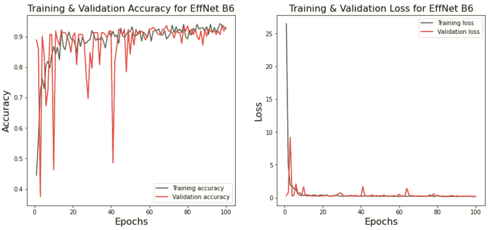

<!--yml

类别: 未分类

日期: 2024-09-06 19:31:00

-->

# [2407.19153] 深度学习恶意软件检测综述

> 来源：[`ar5iv.labs.arxiv.org/html/2407.19153`](https://ar5iv.labs.arxiv.org/html/2407.19153)

\cormark

[1] \cortext[cor1]通讯作者:

# 深度学习恶意软件检测综述

Ahmed Bensaoud abensaou@uccs.edu    Jugal Kalita jkalita@uccs.edu 科罗拉多大学科罗拉多斯普林斯分校计算机科学系，美国科罗拉多州科罗拉多斯普林斯    Mahmoud Bensaoud mbensao2@uccs.edu

###### 摘要

恶意软件检测和分类是一个复杂的任务，目前尚无完美的方法，仍有许多工作要做。与大多数其他研究领域不同，恶意软件检测的标准基准很难找到。本文旨在调查在 MacOS、Windows、iOS、Android 和 Linux 上使用深度学习（DL）进行恶意软件检测的最新进展，探讨文本和图像分类中的 DL，使用预训练和多任务学习模型的恶意软件检测方法，以获得高准确率，并在拥有标准基准数据集的情况下确定最佳方法。我们讨论了使用 DL 分类器进行恶意软件检测中的问题和挑战，通过回顾这些 DL 分类器的有效性以及它们无法向 DL 开发者解释其决策和行动，提出了使用可解释机器学习（XAI）或可解释机器学习（IML）程序的需求。此外，我们讨论了对抗攻击对深度学习模型的影响，这些攻击负面影响了模型的泛化能力，并导致在未见数据上的性能较差。我们认为需要在不同的恶意软件数据集上训练和测试当前最先进的深度学习模型的有效性和效率。我们考察了八种流行的 DL 方法在各种数据集上的表现。这项综述将帮助研究人员建立对使用深度学习进行恶意软件识别的总体理解。

###### 关键词:

恶意软件检测 \sep 多任务学习 \sep 恶意软件图像 \sep 生成对抗网络 \sep 移动恶意软件 \sep 卷积神经网络

## 1 引言

像 Windows、Android、Linux 和 MacOS 这样的操作系统每隔几周就会更新一次，以保护免受关键漏洞的威胁。另一方面，恶意软件作者也总是在寻找新的方法来改进其恶意代码，以击败新的操作系统更新。每个操作系统都有其脆弱性。此外，由于操作系统运行在桌面和服务器上，甚至在路由器、安全摄像头、无人机等设备上，最大的挑战是保护系统的多样性，因为所有这些设备都非常不同。

每天几乎都有关于恶意软件的新故事。例如，在 2022 年 10 月，来自一个俄罗斯黑客组织 Killnet 的网络攻击目标是科罗拉多州、阿拉巴马州、阿拉斯加州、特拉华州、康涅狄格州、佛罗里达州、密西西比州和堪萨斯州的政府服务网站¹¹1https://www.nbcnews.com/tech/security/colorado-state-websites-struggle-russian-hackers-vow-attack-rcna51012。在 2022 年，再次有黑客代表中国政府偷取了 2000 万美元的 COVID 救助金²²2https://www.nbcnews.com/tech/security/china-hacked-least-six-us-state-governments-report-says-rcna19255。由于网络攻击、网络威胁、网络犯罪和恶意软件带来的敏感数据脆弱性增加，需要采取应对措施。在 2023 年，图 1 显示了遭受恶意软件攻击的国家以及这些恶意软件的主要来源³³3https://attackmap.sonicwall.com/live-attack-map。

图 1：全球攻击

研究人员使用深度学习来分类恶意软件样本，因为它对未见数据具有很好的泛化能力。我们的调查重点是 Windows、Android、Linux、MacOS 和 iOS 中的静态、动态和混合恶意软件检测方法。我们描述了深度学习模型在恶意软件检测中的优缺点。最新的研究使用深度神经网络（DNNs）进行恶意软件分类，并取得了高成功率。最先进的 DNN 模型已针对现代恶意软件如 Zeus、Fleeceware、RaaS、Mount Locker、REvil、LockBit、Cryptesla、Snugy 和 Shlayer 进行了开发。

本文的贡献如下：

+   •

    概述了黑客攻击的全貌（第 2、3、4、5 节）。

+   •

    介绍了如何生成恶意软件文件的图像（第六部分）。

+   •

    讨论了用于恶意软件图像分类的深度学习模型（第七部分）。

+   •

    描述了可以提升性能的特征减少方法（第八部分）。

+   •

    讨论了在恶意软件分类中转移学习方法及其改进空间（第九部分）。

+   •

    回顾了自然语言处理在恶意软件分类中的应用（第十部分）。

+   •

    介绍了加密勒索软件的深度学习模型（第十一部分）。

+   •

    展示了如何使用可解释人工智能（XAI）来验证深度学习模型结果的可信度（第十二部分）。

+   •

    讨论了深度学习模型面临的对抗攻击所带来的可靠性和安全性挑战（第十三部分）。

文章的其余部分讨论了未来研究的方向，并对 Efficientnet B0、B1、B2、B3、B4、B5、B6 和 B7 模型在恶意软件图像数据集上的分类进行了检验。

## 2 恶意软件攻击的机制

黑客的目标只有一个，那就是将恶意软件安装到受害者的计算机上。因为大多数计算机都受到某种类型的防火墙保护，直接攻击难以进行。因此，攻击者尝试欺骗计算机运行恶意代码。最常见的方式是使用文档或可执行文件。例如，黑客可能会向受害者发送一封包含恶意文档附件的电子邮件或钓鱼邮件，或者链接到恶意文档所在的网站。一旦受害者打开文档，嵌入的漏洞或脚本将运行并下载或提取更多恶意软件。这才是黑客真正想在受害者系统上运行的恶意软件，通常是像后门或勒索软件这样的东西。然而，恶意文档通常不是攻击中的最终恶意软件，而是黑客用来进入系统的受损向量之一。下面我们将讨论如何利用 PDF 文档发起攻击。

### 2.1 PDF 和文档文件

在分析 PDF 时，我们发现三件事：对象，即 PDF 的结构；关键词，控制 PDF 的工作方式；以及存储或编码在 PDF 中的数据。

+   •

    对象是 PDF 的构建块。每个 PDF 都以头部开始，头部需要出现在文档的前 1024 字节中。一些黑客利用这一点，在前 1024 字节中放置无关的数据。这是一种非常简单的技术，试图避免基于签名的检测。PDF 由对象组成；每个部分在文档中包含特定数据或执行特定功能。每个对象以两个数字开始，后跟关键词 obj，并以 endobj 结束。对象有许多种类，如字体对象、图像对象，甚至包含元数据的对象。

+   •

    有许多以/开头的关键词描述 PDF 的工作原理。一些与恶意活动相关的关键词包括/OpenAction，或其缩写/AA，这些都表示在查看文档时要执行的自动操作⁴⁴4https://blog.didierstevens.com/programs/pdf-tools/。这个关键词指向另一个对象，当 PDF 被打开时，该对象会自动被打开或执行。恶意 PDF 文档的/OpenAction 指向某些恶意 JavaScript，或包含导出的对象；每当打开文档时，系统就会自动被侵入。/JavaScript 或/JS 关键词表示 JavaScript 代码的存在。恶意 PDF 通常包含恶意 JavaScript 来启动漏洞或下载额外的恶意软件。一些对象可以用/Name 而不是其编号来引用。一些 PDF 具有嵌入文件的能力，关键词为/EmbeddedFile、/URL 或/SubmitForm。/URL 在对象加载时被访问或下载。

+   •

    PDFs 可以以多种方式编码数据，这非常灵活，并且可以以多种方式存储数据。黑客可以编码并隐藏他们的数据。例如，名称区分大小写，但可以完全或部分以十六进制编码。更精确地说，`#` 符号后跟两个十六进制字符表示十六进制编码的数据。数据也可以以八进制编码，或以其八进制数表示。八进制编码字符有一个 `\` 符号，后面跟着三个介于 0 和 7 之间的数字。然而，黑客可以将十六进制、八进制和 ASCII 数据混合在一起，这使得隐藏例如 JavaScript 代码或 URL 成为可能。

名称和字符串可以被编码，但数据流可以使用过滤器进行修改和进一步编码。过滤器是应用于数据的算法，用于在 PDF 中编码或压缩。有多种过滤器可以在 PDF 中使用，例如 /ASCiiHexDecode，字符的十六进制编码；/LZWDecode，LZW 压缩算法；/FlateDecode，Zlib 压缩；/ASCii85Decode，ASCII base-85 表示；和 /Crypt，各种加密算法。例如，在图 2 中，我们有一个包含三个对象的 PDF 文档。对象 1 是一个目录，具有 OpenAction，并引用了对象 2 的版本 0，这意味着文档一打开，对象 2 将会被运行。对象 2 包含一个 JavaScript 关键字，但我们在这个对象中没有看到任何 JavaScript 代码，因为 JavaScript 关键字指向另一个对象，即对象 3。对象 3 是一个流对象，如流关键字所示，并且已经使用 ASCiiHex 编码并通过 Zlib 压缩算法进行了压缩。然而，我们已经确定，一旦 PDF 打开，JavaScript 将被执行，我们不知道 JavaScript 的目标是什么。如果这是一个恶意 PDF，它可能会造成问题。在图 3 中，JavaScript 代码引用了两个主机的名称，向每个主机执行 HTTP GET 请求，保存一个可执行文件，最后运行它。

图 2：PDF 格式示例。

恶意 JavaScript 仅在文档中使用吗？答案是无处不在。恶意 JavaScript 被用于由网络攻击工具包创建的网页，这些工具包会执行驱动下载。用户打开了被破坏的网站或加载了恶意广告，然后恶意 JavaScript 被加载。如果没有 JavaScript，黑客很难使他们的漏洞利用生效。

图 3：恶意 JavaScript 代码

大多数黑客尝试使用混淆技术隐藏其脚本的行为。用于混淆脚本的技术大致可以分为四类。程序的混淆格式如图 4 所示；方法包括添加额外的代码行、混淆数据和替换变量名。

图 4：混淆的恶意 JavaScript 代码。

## 3 恶意软件代码的性质

恶意软件代码的性质包括定义其目的和功能的各种特征和行为。恶意软件，即恶意软件的简称，指的是任何设计有恶意意图的代码或程序，用于破坏系统、窃取信息或干扰正常操作。恶意软件代码的性质可能因其具体类型和目标而异，但一些常见属性包括：

### 3.1 混淆

混淆是代码作者试图模糊其含义、使其不清晰或难以分析的一种尝试。它可能使用加密或压缩来隐藏其真正意图，或避开基于签名的安全软件检测。

### 3.2 有效载荷传递

恶意软件代码通常携带有效载荷，即它打算执行的恶意操作。这可以包括窃取敏感信息（例如，财务数据、登录凭据）、发起分布式拒绝服务（DDoS）攻击、加密文件以索要赎金（勒索软件）或提供用于远程控制的后门访问。

### 3.3 命令与控制（C&C）

许多恶意软件变种建立与远程服务器或命令与控制基础设施的通信通道。这使得攻击者能够远程控制和管理感染的系统、更新恶意软件并接收窃取的数据。

### 3.4 自我复制

许多恶意软件变种具备自我复制的能力，使其能够在网络、设备或文件间传播。这种复制可以通过多种方式实现，例如附加到漏洞、合法文件上，或利用网络资源。

### 3.5 利用

恶意软件利用软件、操作系统或用户行为中的漏洞和弱点来获得未经授权的访问或控制。它可以利用安全漏洞、网络漏洞或社会工程技术来破坏系统并执行恶意操作。

### 3.6 多态性

一些恶意软件使用多态或变形技术来动态改变其代码结构或外观，同时保留其功能。这使得杀毒软件更难以检测和阻止。

### 3.7 勒索软件

勒索软件通常将加密技术与恶意软件结合起来。它是如何工作的？黑客将文件发送给一个不知情的受害者。当受害者打开文件时，它会执行恶意软件的负载并加密受害者的数据，如照片、文档、多媒体文件，甚至机密记录。黑客通常会迫使受害者以加密货币支付赎金，在大多数情况下是比特币。

勒索软件具有蠕虫-like 的属性，并有如 WannaCrypt、WanaCrypt0r、WCRY、WanaDecrypt0r 和 WCrypt 等名称。每个加密文件都由不同的密钥锁定，并使用 RSA 算法加密，这使得没有密钥的文件所有者无法访问文件。WannaCry 病毒可以加密大量的文件类型。详细列表见附录 A。

勒索软件通过修改 Windows 注册表将桌面壁纸替换为赎金通知文件。它将所有文件扣押，要求支付 300 美元，后来增加到 600 美元的比特币赎金，如图 5 所示。

图 5：哎呀，你的文件已被加密！

例如，2022 年 5 月 11 日，哥斯达黎加新当选的总统由于 Conti 勒索软件团伙的攻击被迫宣布国家紧急状态。他们要求 1000 万美元，但在哥斯达黎加拒绝支付后，要求金额变为 2000 万美元⁵⁵5https://securityintelligence.com/news/costa-rica-state-emergency-ransomware/。另一个例子是，2022 年 10 月，勒索软件团伙访问了路易斯安那州医院系统 270,000 名患者的数据⁶⁶6https://www.cnn.com/2022/12/28/politics/hackers-access-data-louisiana-hospital-system-ransomware/index.html。

理解恶意软件代码的性质对开发有效的防御机制和减轻其影响至关重要。这使得安全专业人员能够开发出稳健的检测方法，实施安全最佳实践，并迅速应对不断变化的威胁。

## 4 概述与恶意软件检测

恶意软件检测方法分为三种类型：静态、动态和混合[1]。静态方法在不运行可执行文件的情况下检查它，而动态方法必须运行可执行文件并在受控环境中分析其行为。在混合方法中，静态和动态分析的信息都被用来收集有关恶意软件的数据。

一些安全研究人员通过反编译目标文件使用静态特征。Naik 等人[2]提出了一种基于静态分析的模糊导入哈希技术用于恶意软件检测。Mohamad 等人[3]提出了基于权限特征的机器学习分类器，用于静态分析以检测 Android 恶意软件。

相较于静态分析，动态分析包括系统动态行为监控、快照、调试等。Kim 等人[4]提出了一种新的动态特征编码技术，通过卷积神经网络（CNNs）来识别异常事件。

安全研究人员还从恶意软件文件的不同部分提取了组合特征。Bai 等人[5]从 Android 应用程序的静态和动态分析中提取特征，并应用深度学习技术。Chaulagain 等人[6]通过收集静态和动态分析中的不同文物来训练深度学习模型，提出了一种基于深度学习的混合分析技术。

## 5 恶意软件检测的数据

许多系统日志记录了如手机、平板电脑、笔记本电脑及其他设备的活动。这些数据由操作系统和其他基础软件生成、存储在本地设备上，并发送到远程服务器。通过分析日志数据，我们不仅能检测到漏洞或可疑活动，还能追踪网络中的行为。日志数据使我们能够追踪安全事件、排除基础设施故障以及优化环境和机器。日志数据可以有多种形式，如 syslog、认证日志、本地安全事件日志、网络资产日志和系统日志。恶意软件检测的一个目标是能够高效、有效地读取、搜索和分析数据。

表 1 包含了一些对 syslog 和 Windows 日志有用的信息。这两种日志都具有不同格式的许多组件，有助于调查。

表 1：Syslog 和 Windows 日志

| Syslog | Windows 日志 |
| --- | --- |
| IETF 标准 | 事件日志 |
| 时间戳 | 包含来源、事件 ID 和日志级别 |
| 网络设备日志标准 | 从机器或服务器记录应用程序、安全性、网络事件 |

|

&#124; 设备 ID、严重性等级、消息编号、&#124;

&#124; 消息文本 &#124;

| 时间戳、用户、计算机和进程 ID |
| --- |

|

&#124; 可在网络设备上自定义 &#124;

&#124; 不同事件和严重性等级的日志 &#124;

| 在大多数运行 Windows 的企业环境中使用 |
| --- |

## 6 生成深度学习用恶意软件图像

一些工具可以以十六进制或 ASCII 格式可视化和编辑二进制文件，如 IDA Pro⁷⁷7https://hex-rays.com/ida-pro, x32/x64 调试器⁸⁸8https://x64dbg.com/#start, HxD⁹⁹9https://mh-nexus.de/en/hxd, PE-bear¹⁰¹⁰10https://hshrzd.wordpress.com/pe-bear, Yara¹¹¹¹11https://yara.readthedocs.io/en/stable, Fiddler¹²¹²12https://www.telerik.com/purchase/fiddler, Metadata¹³¹³13https://www.malwarebytes.com/glossary/metadata, XOR 分析¹⁴¹⁴14https://eternal-todo.com/var/scripts/xorbruteforcer, 和嵌入字符串¹⁵¹⁵15https://virustotal.github.io/yara/。

恶意软件文件或代码可以通过将二进制、八进制、十六进制或十进制转换为二维像素矩阵来生成图像。图像可以是灰度图像或 RGB 图像。在灰度图像中，像素是黑白值，范围为 [0-255]，其中 0 代表黑色，255 代表白色。

灰度图像特征：机器将图像存储在一个数字矩阵中。这些数字或像素值表示像素的强度或亮度。较小的数字（接近零）表示黑色，较大的数字（接近 255）表示白色（见图 6）。

图 6：恶意软件在灰度图像中的特征表示

RGB 图像：有三个矩阵或通道（红色、绿色、蓝色），每个矩阵的值在 $\displaystyle 0-255$ 之间。这三种颜色以各种方式组合在一起，表示 16,777,216 种可能的颜色之一（见图 7）。

图 7：恶意软件在 RGB 图像中的特征表示

恶意软件可以通过不同方式转换为图像。Yuan 等人 [7] 通过计算字节的转移概率，将恶意软件二进制文件转换为马尔可夫图像，其中每个像素由方程 1 生成：

|  | $p_{m,n}=P(n\vert m)=\frac{f(m,n)}{\displaystyle\sum_{n=0}^{255}f(m,n)}\quad m,n\in\{0,1,...,255\}.\\ $ |  | (1) |
| --- | --- | --- | --- |

Mohammed 等人 [8] 使用 16 位有符号十六进制数字的向量来表示一个 $\displaystyle 256\times 256$ 图像。然后，他们计算了二元频率计数，并将其用作像素强度值。计算了全帧离散余弦变换（DCT） [9] 以去稀疏化，bigram-DCT 被用来表示输出图像。Euh 等人 [10] 提出了窗口熵图（WEM）以将恶意软件可视化为图像。他们计算了每个字节的熵，以衡量不确定程度。Ni 等人 [11] 使用 SimHash [12] 将恶意软件代码转换为灰度图像，然后对其进行编码。他们将 SimHash 值映射到像素，然后转换为灰度图像。

## 7 恶意软件检测的图像分类

深度学习可以解决多种“视觉”问题，包括恶意软件图像分类任务。深度学习可以自动提取特征，避免手动特征提取。恶意软件可执行文件的内容首先被转换为数字图像。Nataraj et al. [13] 将来自 25 个恶意软件家族的样本字节码可视化为灰度图像。已经使用了几种可视化技术进行恶意软件分类。这些方法的基本思想是探索恶意软件图像中的区分模式。此外，可视化技术有助于发现不同恶意软件家族之间的关联。一些现有方法生成灰度图像，而其他方法生成 RGB 图像。大多数现有方法使用全局特征生成恶意软件图像。

Yuan et al. [7] 提出了一个基于 Markov 图像的方法，依据字节传输概率矩阵。他们使用 CNN 对 Markov 恶意软件图像进行分类，无需缩放。Narayanan 和 Davuluru [14] 提出了一个结合 RNN 和 CNN 架构的集成方法，用于恶意软件图像分类。图像是从汇编编译文件中生成的，并使用 CNN 进行分类。Zhu et al. [15] 提出了一个基于任务感知元学习的 Siamese 神经网络，以分类混淆恶意软件图像。他们的模型在唯一恶意软件签名检测上显示出高效性。Chauhan et al. [16] 以不同颜色模式（RGB、HSV、灰度和 BGR）可视化恶意软件文件。他们使用支持向量机（SVM）对这些恶意软件图像进行分类，各模式的准确率均为 96%。Darem et al. [17] 设计了一种基于恶意软件图像和特征工程的半监督方法，用于混淆恶意软件检测。该模型在混淆恶意软件检测上达到了 99.12%的准确率。Asam et al. [18] 提出了两种恶意软件图像分类方法，称为深度特征空间恶意软件分类（DFS-MC）和深度增强特征空间恶意软件分类（DBFS-MC）。该方法在 MalImg 恶意软件数据集上取得了 98.61%的良好准确率。

Xiao et al. [19] 提出了一个称为 Colored Label boxes (CoLab)的可视化方法，以指定 PE 文件中的每个部分并将其转换为恶意软件图像。作者构建了一个组合的 CoLab 图像，并使用 VGG16 和支持向量机进行分类。该模型在两个数据集 VX-Heaven¹⁶¹⁶16https://archive.org/download/vxheavens-2010-05-18 和 BIG-2015 上应用，分别取得了 96.59%和 98.94%的平均准确率。表 2 讨论了恶意软件图像分类的比较结果。

表 2：转移学习模型在恶意软件图像分类中的比较性能总结。

| 参考文献 | 特征 | 模型 | 文件 | 准确率 | 数据集 |
| --- | --- | --- | --- | --- | --- |
| Çayır et al. [20] | 灰度图像 | CapsNet | PE | 98.63% | Malimg |
| Çayır 等 [20] | 灰度图像 | RCNF | PE | 98.72% | Malimg |
| Go 等 [21] | 灰度图像 | ResNeXt | PE | 98.32% | Malimg |
| Bensaoud 等 [22] | 灰度图像 | Inception V3 | PE | 99.24% | Malimg |
| El-Shafai 等 [23] | 灰度图像 | VGG16 | PE | 99.97% | Malimg |
| Hemalatha 等 [24] | 灰度图像 | DenseNet | PE | 98.23% | Malimg |
| Hemalatha 等 [24] | 灰度图像 | DenseNet | PE | 98.46% | BIG 2015 |
| Lo 等 [25] | 灰度图像 | Xception | PE | 99.03% | Malimg |
| Lo 等 [25] | 灰度图像 | Xception | PE | 99.17% | BIG 2015 |

## 8 高效恶意软件检测的特征缩减

特征缩减（Feature Reduction）减少了数据示例表示中的变量或特征数量。特征缩减的方法可以分为两个子类别：a) 特征选择（Feature Selection），包括诸如包装器（Wrappers）、过滤器（Filters）和嵌入式方法（Embedded）等方法，以及 b) 特征提取（Feature Extraction），包括主成分分析（Principal Components Analysis）等方法[26]。特征缩减如何提高性能？它通过减少考虑用于分析的特征数量来实现。

在特征提取中，我们从 $\displaystyle n$ 个特征开始 <math alttext="\displaystyle x_{1},x_{2},x_{3}\\

,....,x_{n}" display="inline"><semantics ><mrow ><msub ><mi >x</mi><mn >1</mn></msub><mo >,</mo><msub ><mi >x</mi><mn >2</mn></msub><mo >,</mo><msub ><mi >x</mi><mn >3</mn></msub><mo >,</mo><mi mathvariant="normal" >…</mi><mo lspace="0em" rspace="0.167em" >.</mo><mo >,</mo><msub ><mi >x</mi><mi >n</mi></msub></mrow><annotation encoding="application/x-tex" >\displaystyle x_{1},x_{2},x_{3}\\ ,....,x_{n}</annotation></semantics></math>，我们将其映射到较低维空间以获取新的特征 $\displaystyle z_{1},z_{2},z_{3},....,z_{m}$，其中 $\displaystyle m<n$。每个新特征通常是原始特征集 $\displaystyle x_{1},x_{2},x_{3},....,x_{n}$ 的线性组合。因此，每个新特征作为原始特征集 X 的函数 F(X) 获得。这将高维特征空间投影到低维特征空间，从而较小维度的特征集可能导致更好的分类或更快的分类（参见方程 2）。

|  | $\begin{bmatrix}z_{1}\ldots z_{m}\end{bmatrix}^{\intercal}\ =F\left(\begin{bmatrix}x_{1}\ldots x_{n}\end{bmatrix}^{\intercal}\right)$ |  | (2) |
| --- | --- | --- | --- |

在特征选择中，我们选择特征的一个子集，这与特征提取不同，后者是将原始特征映射到一个较低维度的空间。较小维度的特征集可以帮助产生更好且更快的分类结果。为此，我们需要找到一个投影矩阵 $\displaystyle W\ni\bar{Z}=W^{T}\bar{X}$。我们期望这样的投影使得新特征不相关，无法进一步减少，并且没有冗余。接下来，我们需要特征具有较大的方差：为什么？因为如果一个特征对所有实例的取值都很相似，那么该特征就不能作为区分器。

特征提取方法，如主成分分析（PCA）[26], GIST [27], Hu 矩 [28], 颜色直方图 [29], Haralick 纹理 [30], 离散小波变换（DWT）[31], 独立成分分析（ICA）[32], 线性判别分析（LDA）[33], 定向快速和旋转 BRIEF（ORB）[34], 加速稳健特征（SURF）[35], 尺度不变特征变换（SIFT）[36], 密集尺度不变特征变换（D-SIFT）[36], 局部二值模式（LBPs）[37], KAZE [38]，已经与包括深度学习在内的机器学习相结合。这些方法成功地过滤了恶意软件文件的特征。

Azad 等人[39]提出了一种名为 DEEPSEL（深度特征选择）的方法，用于识别 39 个独特恶意软件家族的恶意代码。他们的模型实现了 83.6%的准确率和 82.5%的 F-measure。Tobiyama 等人[40]提出了基于系统调用的特征提取方法。使用递归神经网络来提取特征，卷积神经网络来分类这些特征。

## 9 种深度迁移学习模型用于恶意软件检测

迁移学习发生在我们有一个源模型，该模型具有一些预训练的知识，这些知识作为构建新模型的基础[41]。例如，使用一个非常大的预训练卷积神经网络通常涉及保存一个之前在一些大型数据集上训练过的网络，通常是大型图像分类任务，使用像 ImageNet 这样的数据集[42]。在 ImageNet 数据集上训练一个网络后，我们可以重新利用这个训练好的网络。研究论文讨论了将这些预训练网络应用于由 PE 和 APK 恶意软件文件生成的恶意软件图像数据集[43, 44, 45, 46]，这些文件彼此差异很大。

恶意软件图像数据集与通常用于预训练模型的 ImageNet 大相径庭。ImageNet 数据集和恶意软件图像数据集代表了视觉上完全不同的图像。然而，预训练似乎仍然有帮助。对大数据集训练机器学习算法有两种方法，如下所述。

### 9.1 使用特征提取

之前讨论的特征提取是一种实用且常见的、低资源消耗的方法来使用预训练网络。它利用之前训练好的网络的卷积基础，将恶意软件数据通过它，然后在输出的基础上训练一个新的分类器。如图 8 所示，我们可以选择一个如 VGG16 [47] 这样已经在 ImageNet 上训练过的网络作为示例。输入从底部传入，经过训练好的卷积基础，这代表了 VGG16 的 CNN 区域。训练好的分类器位于密集区域，最终由这个密集区域进行预测。通常，我们在末尾有 $\displaystyle 1000$ 个神经元来预测实际的 ImageNet 类别。我们将这个在 ImageNet 上训练的模型作为基础，移除分类器层，保留预训练模型的卷积层及其权重。在下一步中，我们在顶部附加一个新的分类器，该分类器具有用于恶意软件分类的新密集层。基础部分的权重被冻结，这意味着恶意软件输入在训练过程中通过具有其之前权重的卷积层。然而，所有密集层都是随机初始化的，这些层的互联权重在新的训练过程中用于检测恶意软件时被学习。

为什么要移除原始的密集层？观察到卷积基础学习到的表示是通用的，因此可以用于各种任务。

图 8: 迁移学习的特征提取

### 9.2 使用微调

微调涉及通过学习新权重来改变一些卷积层。如图 9 所示，我们有一个分为三个区域的网络。黄色区域是预训练模型。绿色区域代表我们需要学习权重的密集层。在使用诸如 Keras [48] 和 Tensorflow [49] 的库进行训练时，我们可以选择某些层并冻结这些层的权重。

例如，我们可以选择卷积块一，然后仅冻结该块中的所有卷积层的权重。这意味着在训练过程中，其他所有部分都会改变，但该块中卷积层的权重不会改变。类似地，我们也可以选择冻结下一个块的卷积层，以及第三和第四块的卷积层。然后，我们可以微调接近密集层的卷积层。结果是，表示的初始层保持不变，但后续层（黄色区域）通过权重的变化、演变和更新来学习新的表示。

因此，微调意味着解冻用于特征提取的冻结模型基座的几个顶层。我们所做的简单操作是共同训练模型的新顶层部分（绿色区域），包括密集层，以及我们已解冻权重的顶层卷积层（黄色区域）。

为什么以这种方式进行微调？因为我们稍微调整了模型中更抽象的表示，以使其与当前问题更加相关。Sudhakar 和 Kumar [50] 通过用一个全连接的密集层替换最后一层，重新设计了 ResNet50 [51]，以检测未知的恶意软件样本，而无需特征工程。Go 等人 [52] 提出了一种可视化方法，通过使用预训练的 ResNeXt50 模型来对恶意软件家族进行分类。该模型在 Malimg 数据集 [13] 上达到了 98.86% 的准确率。Çayır 等人 [20] 基于自举聚合方法构建了一个集成预训练的胶囊网络 (CapsNet) [53]。该模型在两个公共数据集 Malimg 和 BIG2015 上进行了训练和测试。他们的模型在 Malimg 数据集 [13] 上达到了 F-Score 96.6% 和在 BIG2015 数据集¹⁷¹⁷17https://www.kaggle.com/c/malware-classification 上达到了 98.20%。Bensaoud 等人 [22] 使用了六种卷积神经网络模型进行恶意软件分类。这些模型的比较显示，名为 Inception-V3 [54] 的迁移学习模型在恶意软件分类中达到了当前的最先进水平。Khan 等人 [55] 通过将 APK 字节码转换为灰度图像来评估 ResNet 和 GoogleNet [56] 模型用于恶意软件检测。表 3 总结了最常见的恶意软件分类迁移学习模型。我们得出结论，CNN 迁移学习模型可以针对特定的图像尺寸进行微调，这些尺寸足够稳健且准确地用于恶意软件图像分类。

表 3：应用于不同恶意软件图像数据集的微调预训练模型。

| 设置 | 平均准确率 | 我们的数据集 |
| --- | --- | --- |
| 预训练模型 | 样本 | 图像大小调整 | 训练轮次 | Malimg | Microsoft Challenge | Drebin | 准确率 |
| EffNet B0 | 30,000 | 224 | 200 | 92.72% | 90.45% | 87.23% | 94.59% |
| EffNet B1 | 30,000 | 240 | 200 | 95.64% | 93.65% | 88.91% | 95.89% |
| EffNet B2 | 20,000 | 260 | 200 | 93.84% | 91.78% | 86.82% | 94.12% |
| EffNet B3 | 15,000 | 300 | 400 | 90.32% | 94.19% | 89.35% | 95.73% |
| EffNet B4 | 20,000 | 380 | 400 | 95.63% | 96.68% | 90.59% | 97.98% |
| EffNet B5 | 25,000 | 456 | 400 | 80.19% | 87.54% | 84.23% | 94.68% |
| EffNet B6 | 40,000 | 528 | 400 | 85.67% | 83.82% | 85.43% | 93.54% |
| EffNet B7 | 30,000 | 600 | 1000 | 82.76% | 80.76% | 90.57% | 88.45% |
| Inception V4 | 20,000 | 229 | 300 | 95.98% | 93.21% | 88.93% | 96.39% |
| Xception | 20,000 | 229 | 200 | 89.50% | 90.84% | 84.39% | 93.53% |
| CapsNet | 3,000 | 256 | 100 | 88.64% | 72.69% | 78.68% | 92.65% |

图 9：迁移学习的微调

图 10 显示了如何在图像数据集上训练模型。我们随机初始化模型，然后在数据集 X 上训练模型，这个数据集是一个大规模图像数据集。这是预训练步骤。接下来，我们在数据集 Y 上训练模型；该数据集通常比数据集 X 小。这是微调步骤。

图 10：迁移学习步骤

我们训练和评估的最先进的迁移学习模型用于恶意软件分类的是 EffNet B0、B1、B2、B3、B4、B5、B6 和 B7 [57]; Inception-V4 [58]、Xception [59] 和 CapsNet [60]，如表 3 所示。使用的数据集是我们的 RGB 恶意软件图像数据集和另外两个数据集，即 Malimg 数据集 [13] 和 Microsoft 恶意软件数据集 [61]。EffNet B1、B2、B3、B4、B5、B6 和 B7 的准确率和损失曲线图见附录 B，而 EffNet B0 的图示见图 11。

图 11：EfficientnetB0 的训练和测试准确率及损失

我们发现 Inception-V4 模型在十个模型中对恶意软件图像分类的效果最好。此外，随着输入图像大小的增加，每个模型的训练时间也增加，因为网络单元的数量在 GPU 内存中迅速增长。

### 9.3 恶意软件分类的迁移学习分析

我们发现，基于迁移学习的图像分类，通过少量参数成功地重新训练以分类恶意软件图像。另一方面，我们认为，扩大规模的更宽更深的迁移模型，具有更多参数，可以建立一个新的模型，从而可能提升性能。Inception-V3 和 Inception-V4 在恶意软件检测和分类中，避免了在迁移学习分类模型中对未知恶意软件灰度图像和 RGB 图像分类的低效性。虽然有许多迁移学习模型技术，如批量归一化[62]、跳跃连接[63]，旨在帮助训练，但准确性仍需提高。例如，尽管 ResNet-101 和 ResNet-50 在恶意软件检测中有着相似的准确率，但它们的深度网络却大相径庭[64]。

## 10 自然语言处理用于恶意软件分类

自然语言处理（NLP）提取有价值的信息，以便程序能够读取、理解并从人类语言文本或语音中推导意义。恶意软件数据包含可执行文件、Microsoft Word 文件、宏文件、来自不同操作系统的日志、电子邮件、网络活动等。许多这些文件包含大量文本；一些文件包含与代码和其他信息混合的文本片段。由于恶意软件中广泛使用文本或类似文本的内容，因此可以使用 NLP 来增强恶意软件分类。恶意软件文本分类的一个关键要求是使用有效的文本表示形式，即文本编码。文本编码的初步步骤是通过删除冗余的操作码或 API 片段，丢弃不必要的文本进行预处理。分词后，有不同类型的非顺序文本表示方式[65]，如词袋模型（BoW）、词频逆文档频率矩阵（TFIDF）、词文档矩阵（TDM）、n-gram、独热编码、ASCII 表示，以及现代词嵌入如 Word2vec [66] 和 Sent2vec [67]。表 4 展示了用于恶意软件分类的文本表示方法。目前的词嵌入在用于恶意软件分类时并未携带太多的语义和上下文意义。Bensaoud 和 Kalita [68] 提出了一个新颖的恶意软件分类模型，使用 API 调用和操作码，结合了卷积神经网络和长短期记忆网络架构。通过将特征转化为 N-gram 序列，并尝试各种深度学习架构，包括 Swin-T 和 Sequencer2D-L，该方法达到了 99.91%的高准确率，超过了最先进的性能。Mimura 和 Ito [69] 设计了基于 NLP 的恶意软件检测，使用可打印的 ASCII 字符串。该模型能够有效检测打包的恶意软件和防调试技术。序列到序列神经模型通常用于自然语言处理，因此也用于恶意软件检测。

表 4：通过 NLP 对域进行编码的步骤。

| 域 | 备注 |
| --- | --- |
| www.uccs.edu | 从域开始 |
| uccs | 提取第二级 |
| ["u","c","c","s"] | 转换为序列 |
| [21,3,3,18] |

&#124; 将字符翻译为 &#124;

&#124; 数值 &#124;

|

| [0,0,0,….,0,21,3,3,18] | 填充序列 |
| --- | --- |

### 10.1 序列到序列神经模型

注意力机制 [70] 在序列学习应用中取得了高性能，如机器翻译 [71]、图像识别 [72]、文本摘要 [73] 和文本分类 [74]。注意力机制旨在提高编码器-解码器机器翻译方法 [75] 的性能。编码器和解码器通常是许多堆叠的 RNN 层，如图 12 所示。编码器将文本转换为固定长度的向量，而解码器从该向量生成翻译文本。序列 {$\displaystyle x_{1},x_{2},...,x_{n}$} 可以是文本或图像的表示，如图 13 所示。在序列的情况下，递归神经网络（RNN）可以处理长度相同或任意长度的两个序列。在图 14 中，编码器创建了一个称为上下文向量的压缩表示输入，而解码器使用上下文向量生成输出序列。在这种方法中，网络无法记住长句中的依赖关系。这是因为上下文向量需要处理潜在的长句，而简要的整体表示没有特别的能力来存储许多潜在的依赖关系。

在编码器-解码器中：Bahdanau 等人 [76] 提出了一个用于机器翻译的编码器-解码器注意力机制框架。通过对输入序列进行编码，RNN 创建一个固定的上下文向量。我们不仅可以使用固定向量，还可以结合编码器的每个状态和当前解码器状态来生成一个动态上下文向量。这样有两个好处；第一个好处是将信息编码在多个向量序列中，而不仅仅是一个固定的上下文向量。第二个好处是在解码翻译时可以自适应地选择这些向量的一个子集。

图 12：编码器和解码器

图 13：编码器和解码器包括 RNN

图 14：编码器和解码器包括带有注意力机制的 RNN

注意力机制是任何深度学习模型中都可以使用的另一个积木块。Vaswani 等人 [77] 表明，注意力机制显然是唯一需要的积木块。它通过动态选择在输出序列的某一点上重要的输入序列部分，来提高语言翻译模型的性能。我们可以完全用注意力机制块替换传统的递归神经网络（RRN）块。在处理顺序数据时，注意力机制不仅使模型性能更好，而且训练更快。

在恶意软件分类中应用注意力机制：Or-Meir 等人 [78] 在 LSTM 模型中添加了注意力机制，提高了恶意软件分类的准确率。Yakura 等人 [79] 提出了一种使用卷积神经网络和注意力机制进行恶意软件图像分类的方法。Mimura 和 Ohminami [80] 提出了基于 API 执行序列的滑动局部注意力机制模型（SLAM）。Ma 等人 [81] 提出了一个恶意软件分类框架（ACNN），基于恶意软件文本中的两个部分，即汇编代码和二进制代码，并将它们转换为多维特征。具有注意力机制的 CNN 在分类时的恶意软件图像分类准确率高于传统方法 [79]。为了构建使用 LSTM 和注意力机制的预测模型用于恶意软件分类，我们需要添加一个嵌入层，随后是 LSTM 层和全连接层。这种方法优于捕捉 Windows API 调用序列的长序列并直接使用它们 [82]（见图 15）。恶意软件的长序列可以通过注意力机制解决，注意力机制可以帮助检测短重复模式和其他依赖关系 [83]。虽然注意力机制提高了准确性，但它也面临着计算量大的问题。

图 15：用于恶意软件分类的 LSTM 与注意力机制

表 5：最先进的深度学习模型。

| 参考 | 深度学习方法 | 操作系统 | 特征 | 准确率 |
| --- | --- | --- | --- | --- |
| Kim 等人 [84] | MAPAS | Android | API 调用图 | 91.27% |
| Onwuzurike 等人 [85] | MaMaDroid | Android | API 调用 | 84.99% |
| Kim 和 Cho [86] | 深度生成模型 | Android |

&#124; Dalvik 代码，&#124;

&#124; API 调用，&#124;

&#124; 恶意软件图像，&#124;

&#124; 开发者签名 &#124;

| 97.47% |
| --- |
| Olani 等人 [87] | DeepWare | Windows/Linux | HPC | 96.8% |
| Lian 等人 [88] | 多模态深度学习 | Windows |

&#124; 灰度图像，&#124;

&#124; 字节/熵 &#124;

&#124; 直方图 &#124;

| 97.01% |
| --- |
| Bensaoud 和 Kalita [89] |

&#124; 深度多任务 &#124;

&#124; 学习 &#124;

|

&#124; Windows &#124;

&#124; 安卓 &#124;

&#124; Linux &#124;

&#124; MacOS &#124;

|

&#124; 灰度 &#124;

&#124; 彩色图像 &#124;

| 99.97% |
| --- |

表 5 显示了各种方法及其相应的准确率。所呈现的方法，包括 MAPAS、MaMaDroid、Deep Generative Model、DeepWare、Multi-Modal Deep Learning 和 Deep Multi-Task Learning，采用了多种技术，如 API 调用图分析、静态分析和混合深度生成模型。特别是，这些方法在不同的数据集上进行了评估，表明比较不是基于相同的数据集。作者旨在传达这些模型在不同数据集和场景下检测恶意软件的有效性。然而，需要对这些方法的比较性能进行全面的概述，突出它们在应对恶意软件检测挑战中的优势和能力。

## 11 深度学习与加密勒索软件

密码学传统上用于军事和政府用途，以保护秘密免受敌人获取。今天，我们大多数人在使用商业网站或服务时都会使用密码学。例如，我们用它来保护我们的电子邮件。许多国家试图控制密码学的出口，以确保优秀的密码算法不会落入罪犯、敌人或对手之手。这就是出口管理的理念，以及《国际武器贸易条例》(ITAR)¹⁸¹⁸18https://csrc.nist.gov/glossary/term/itar 中规定的内容。此外，我们有各种协议，如瓦森纳安排¹⁹¹⁹19https://www.federalregister.gov/documents/2022/08/15/2022-17125/implementation-of-certain-2021-wassenaar-arrangement-decisions-on-four-section-1758-technologies，许多国家联合制定了有关密码元素的出口和进口协议，无任何限制。该协议允许公开可用的密码算法自由分发。密码学为我们提供了多种安全能力。

+   •

    保密性：保护我们的知识产权不被他人获取。

+   •

    不可否认性：否认就是拒绝。例如，如果我们使用数字签名，我们可以提供证明，证明消息来自签名者。我们可以将签署的文档与可信的人联系起来，这为电子合同和电子商务世界中的信任提供了保障。签署者不能否认或拒绝是文档的来源。

+   •

    完整性：哈希提供完整性，以确保消息在传输或存储过程中没有被意外或故意更改。完整性通过电子通信服务的实现来构建，例如使用 SHA 算法²⁰²⁰20https://csrc.nist.gov/glossary/term/sha 和 MD5²¹²¹21https://csrc.nist.gov/glossary/term/md5。

+   •

    来源证明：加密可以用于证明消息的来源，这是来源证明的概念。

+   •

    真实性：这个概念是确保通信是与预定的人进行的。例如，如果我们访问银行的网站，那么我们要确保这个网站确实是那家银行的，而不是冒充银行的其他人。

### 11.1 加密操作

加密算法有三种基本类型：对称加密、非对称加密和哈希算法。这些不同类型的算法各自有不同的用途，但在加密系统中都协同工作。

加密是保持通信信息秘密的关键，通过将其转换为难以破解的不可读代码。加密或编码是将明文消息转换为对没有密钥的人不可读的内容。解密或解码是反向步骤。

在图 16 中，基本操作包括将明文输入加密系统。这个过程用于加密和解密消息。它包含一个使用数学过程将消息从明文转换为密文然后再转换回来的算法。该算法包括一个密钥或加密变量。该变量在加密和解密过程中被算法使用。通常，密钥是由个人或加密消息的工具选择的秘密密码、密码短语或 PIN 码。密钥（或加密变量）与算法的组合在加密系统中产生唯一的密文。

图 16：加密操作

在对称算法家族中，对称密钥是发送方和接收方之间共享的秘密。用于加密的密钥也用于解密。将密钥的副本与加密的消息一起发送是不安全的。我们需要使用另一种通信方式来传输密钥。例如，Ahmed 使用某个安全通信节点将对称密钥发送给 Bryan。一旦 Bryan 拥有密钥，Ahmed 就可以将明文消息加密为密文，并通过公共网络发送给 Bryan，确信它在 Bryan 决定用收到的密钥解密之前会保持加密状态。

多种攻击，如中间人攻击、暴力破解攻击、双击攻击、仅密文攻击、已知明文攻击、选择明文攻击、选择密文攻击和选择文本攻击，可以发现密钥以找到明文。攻击者知道某些算法的密钥数学关系，如高级加密标准(AES) [90]、三重 DES [91]、Blowfish [92] 和 Rivest-Shamir-Adleman (RSA) [93]。我们使用统计措施执行密码分析，试图获取密码类型，但密码分析师只能通过试错方法测试密文是否使用了特定的密码。机器学习可以告诉我们密码的类型[94]。密码类型检测问题是一个分类问题。我们可以使用统计值作为机器学习的特征。

### 11.2 深度学习与密码学的关系

图 17：使用机器学习检测加密货币恶意软件

神经网络可以处理用于执行密码学的计算复杂性。我们可以将密文输入神经网络，来分类用于获取该密文的算法类型，如图 17 所示。为了构建机器学习模型，我们可以表示密码的不同特征，密码分析师通常使用这些特征来识别密码。我们需要在网络和密文之间放置一个中间层，该层计算特征，如 Unigram 频率、Bigram 频率、Coincidence 指数 IoC、HasDoubleLetters 等，然后我们可以用数百万个密文和所有美国密码协会(ACA)密码类型来训练网络。例如，在图 18 中，三个蓝色神经网络接收 N-gram（1-gram, 2-gram, 3-gram, 4-gram 等）的频率，而绿色神经网络计算 HasDoubleLetters。然后我们有一个隐藏层连接输入层和输出层。最后，在这个案例中，设计的神经网络显示 90%的 Seriated Playfair，而绿色神经网络显示 10%的 Bazeries。Baksi [95] 设计了一个机器学习模型用于对非马尔可夫 8 轮 GIMLI 密码和 GIMLI 哈希的差分攻击。他们应用了多层感知器(MLP)、卷积神经网络(CNN)和长短期记忆网络(LSTM)。

图 18：使用神经网络检测密码类型

加密数据并迫使受害者通过加密货币付款的勒索软件家族包括 WannaCry、Locky、Stop、CryptoJoker、CrypoWall、TeslaCrypt、Dharma、Locker、Cerber 和 GandCrab。最近，深度学习算法已被用于密码学 [96]。丁等 [97] 提出了 DeepEDN 来完成加密和解密医学图像的过程。金等 [98] 提出了使用卷积神经网络检测加密勒索软件。他们的模型通过检测块密码算法来防止加密勒索软件感染。Sharmeen 等 [99] 提出了使用基于深度学习的无监督学习模型提取未标记的勒索软件样本的内在攻击特征的方法。Fischer 等 [100] 设计了一种工具，通过实现 99.2%的平均 AUC-ROC 来检测 Android 中加密 API 的安全漏洞。

图 19：在深度学习中使用可解释人工智能

## 12 可解释人工智能（XAI）

可解释人工智能（XAI）是一个快速发展的领域，专注于创建透明和可解释的模型（参见图 19）。在恶意软件检测的背景下，XAI 可以帮助安全专家和分析师理解机器学习模型如何得出其决策，从而更容易识别和理解假阳性和假阴性。通过应用 XAI 技术，例如局部可解释模型无关解释（LIME） [101] 或深度学习重要特征（DeepLIFT） [102]，安全团队可以获得关于模型最重要特征和决策过程的见解。这可以帮助他们识别模型可能在逃避方面的脆弱点，或识别模型可能遗漏的新型恶意软件变种。最终，XAI 可以提高机器学习模型在恶意软件检测中的可信度和可靠性，从而实现更有效的威胁检测和响应。

Nadeem 等人 [103] 提供了对计算机安全应用领域中可解释机器学习（XAI）技术现状的全面调查和分析。论文强调了在安全领域采用 XAI 的挑战与机遇，并讨论了设计和评估可解释机器学习模型的几种方法。Vivek 等人 [104] 提出了一个使用可解释人工智能（XAI）和因果推断技术检测 ATM 欺诈的方法。他们详细分析了所提方法，并强调了其在提高 ATM 欺诈检测系统的准确性和可解释性方面的有效性。Kinkead 等人 [105] 提出了一个使用 LIME 方法来识别在操作码序列中被卷积神经网络（CNN）认为重要的位置的方法。McLaughlin 等人 [106] 使用了 LRP [107] 和 DeepLift [102] 方法来识别大多数恶意软件家族的操作码序列，并展示了在使用 DAMD 数据集时，CNN 从底层操作码表示中学习到的模式。Hooker 等人 [108] 提出了一个方法，通过去除 XAI 方法检测到的相关特征来验证准确性下降。Lin 等人 [109] 提出了七种不同的 XAI 方法，并自动化了对解释技术正确性的评估。前四种 XAI 方法是白盒方法，用于确定输入特征的重要性：反向传播（BP）、引导反向传播（GBP）、梯度加权类别激活映射（GCAM）和引导 GCAM（GGCAM）。后三种是黑盒方法，通过使用输入的扰动样本观察输出概率中的关键特征：遮挡敏感性（OCC）、特征消融（FA）和局部可解释模型无关解释（LIME）。

Guo 等人 [110] 提出了一个名为 Explaining Deep Learning based Security Applications (LEMNA) 的方法，用于安全应用，该方法生成可解释的特征以解释输入样本如何被分类。Kuppa 和 Le-Khac [111] 对 XAI 方法在网络安全中的脆弱性进行了全面分析，讨论了在实际应用中部署 XAI 模型可能面临的风险，并提出了一个设计稳健和安全 XAI 系统的框架。Rao 和 Mane [112] 提出了一个利用 NSL-KDD 数据集来保护和分析系统免受警报泛滥问题的方法。他们引入了一个安全信息与事件管理 (SIEM) 系统，以生成针对对抗性攻击的零样本检测方法。尽管可解释人工智能 (XAI) 已引起广泛关注，但其在恶意软件检测中的有效性仍需进一步调查，以充分理解其性能。

## 13 深度神经网络上的对抗攻击

对抗性样本指的是恶意制作的输入数据，用于欺骗机器学习模型，使其产生错误预测。在这种情况下，深度检测指的是使用深度学习模型来检测和分类输入数据中的对象或模式。对抗性样本可以特别设计以避开深度检测模型，使其错误分类或遗漏目标对象或模式。因此，对抗性样本可以被视为对深度检测模型的一种攻击。对抗性样本可以通过多种技术生成，包括基于优化的方法和基于扰动的方法，并且可以用于多种目标，包括规避攻击和中毒攻击。Zhong 等人 [113] 提出了一种新的对抗性恶意软件样本生成方法，名为 Malfox，该方法使用条件生成对抗网络（conv-GANs）生成针对黑箱检测器的伪装对抗样本。该方法在两个实际恶意软件检测系统上进行了评估，结果表明，Malfox 实现了高攻击成功率，同时保持了低检测率。Zhao 等人 [114] 提出了一种名为 SAGE 的新方法，用于加速对抗性样本生成。该技术结合了基于梯度和无梯度方法的优点，以生成更有效和高效的对抗性样本。

对抗攻击防御机制的开发是一个计算成本高昂的过程，这可能影响深度学习模型的性能。此外，对抗样本可以影响深度学习模型的泛化能力，导致在新数据和未见数据上的表现较差。此外，生成对抗样本可能计算量巨大，尤其是对于大数据集和复杂模型，这可能阻碍深度学习模型在实际应用中的部署。因此，需要进一步研究以提高防御机制的效率和效果，以及深度学习模型对对抗攻击的泛化能力和鲁棒性。

胡和谭[115]提出了一种利用生成对抗网络（GANs）生成对抗性恶意软件样本的方法，以进行黑箱攻击。他们的结果显示，生成的对抗性恶意软件样本能够绕过现有机器学习模型的检测，同时保持与原始恶意软件的高相似度。Ling 等人[116]对针对 Windows PE 恶意软件检测的最先进对抗攻击进行了调查，涵盖了各种攻击类型和防御机制。作者们还提供了该领域潜在的未来研究方向。Xu 等人[117]提出了一种名为 Ofei 的半黑箱对抗样本攻击框架，该框架能够生成针对部署在 DLAAS 平台上的 Android 应用的对抗样本。该框架利用多目标优化算法生成稳健且隐蔽的对抗样本。Qiao 等人[118]提出了一种用于 ELF 恶意软件的对抗检测方法，利用模型解释，并展示了他们的方法能够以高准确率有效识别对抗性 ELF 恶意软件。所提出的方法结合了随机森林和 LIME，以识别最重要的特征，从而提高模型的可解释性和鲁棒性。Meenakshi 和 Maragatham[119]提出了一种利用 Curvelet 变换识别对抗性虹膜图像的防御技术，优化了图像分类准确性。所设计的方法已被证明在针对虹膜识别系统的若干现有对抗攻击中有效。Pintor 等人[120]介绍了一种调试和改进对抗样本优化的方法，通过识别和分析攻击失败的指标来实现。所提出的方法有助于提高深度学习模型对对抗攻击的鲁棒性。

## 14 结论

机器学习已经开始引起恶意软件检测研究者的关注，尤其是在恶意软件图像分类和密码分析方面。然而，仍需更多实验以了解深度学习在检测/分类恶意软件时的能力和局限性。深度学习可以减少对静态和动态分析的需求，并发现可疑的模式。未来，研究人员可能会考虑开发更准确、稳健、可扩展和高效的深度学习模型，用于各种操作系统的恶意软件检测系统。最后，多任务学习和迁移学习可以在分类所有类型的恶意软件时提供有价值的结果。此外，我们展示了深度学习方法面临的重大挑战，包括超参数优化、微调以及当特征被过度加权或过度表示时数据集的大小和质量。我们还阐述了 XAI 在深度学习中的机遇和挑战，以及在恶意软件检测背景下的未来研究方向。最后，我们介绍了对深度神经网络的对抗性攻击的想法，通过对输入数据进行小而精心设计的扰动，以引起错误分类或降低模型性能。

## 参考文献

+   Damodaran et al. [2017] A. Damodaran, F. Di Troia, C. A. Visaggio, T. H. Austin, M. Stamp，静态、动态和混合分析在恶意软件检测中的比较，计算机病毒与黑客技术杂志 13 (2017) 1–12。

+   Naik et al. [2021] N. Naik, P. Jenkins, N. Savage, L. Yang, T. Boongoen, N. Iam-On，模糊导入哈希：一种用于恶意软件检测的静态分析技术，法医学国际：数字调查 37 (2021) 301139。

+   Mohamad et al. [2021] Mohamad, J. Arif, M. F. Ab Razak, S. Awang, S. R. Tuan Mat, N. S. N. Ismail, A. Firdaus，一种用于 Android 权限基础恶意软件检测系统的静态分析方法，PloS one 16 (2021) e0257968。

+   Kim et al. [2018] T. Kim, S. C. Suh, H. Kim, J. Kim, J. Kim, 一种用于基于 CNN 的网络异常检测的编码技术，发表于：2018 IEEE 国际大数据会议（Big Data），2018，第 2960–2965 页。doi：10.1109/BigData.2018.8622568。

+   Bai et al. [2021] Y. Bai, Z. Xing, D. Ma, X. Li, Z. Feng，Android 家族分类中的特征表示和机器学习方法的比较分析，计算机网络 184 (2021) 107639。

+   Chaulagain et al. [2020] D. Chaulagain, P. Poudel, P. Pathak, S. Roy, D. Caragea, G. Liu, X. Ou，基于深度学习的 Android 应用程序安全审查的混合分析，发表于：2020 IEEE 通信与网络安全会议（CNS），2020，第 1–9 页。doi：10.1109/CNS48642.2020.9162341。

+   Yuan 等人 [2020] B. Yuan, J. Wang, D. Liu, W. Guo, P. Wu, X. Bao, 基于马尔可夫图像和深度学习的字节级恶意软件分类, 计算机与安全 92 (2020) 101740。

+   Mohammed 等人 [2021] T. M. Mohammed, L. Nataraj, S. Chikkagoudar, S. Chandrasekaran, B. Manjunath, 使用频域图像可视化和深度学习的恶意软件检测, arXiv 预印本 arXiv:2101.10578 (2021)。

+   Khayam [2003] S. A. Khayam, 离散余弦变换（dct）：理论与应用, 密歇根州立大学 114 (2003) 1–31。

+   Euh 等人 [2020] S. Euh, H. Lee, D. Kim, D. Hwang, 低维特征与基于树的集成方法在恶意软件检测系统中的比较分析, IEEE Access 8 (2020) 76796–76808。

+   Ni 等人 [2018] S. Ni, Q. Qian, R. Zhang, 使用可视化图像和深度学习的恶意软件识别, 计算机与安全 77 (2018) 871–885。

+   Charikar [2002] M. S. Charikar, 从四舍五入算法中估计相似性技术, 载于：第三十四届年度 ACM 计算理论研讨会论文集, 2002, 页码 380–388。

+   Nataraj 等人 [2011] L. Nataraj, S. Karthikeyan, G. Jacob, B. S. Manjunath, 恶意软件图像：可视化与自动分类, 载于：第八届国际网络安全可视化研讨会论文集, 2011, 页码 1–7。

+   Narayanan 和 Davuluru [2020] B. N. Narayanan, V. S. P. Davuluru, 使用深度神经网络的集成恶意软件分类系统, 电子学 9 (2020) 721。

+   Zhu 等人 [2021] J. Zhu, J. Jang-Jaccard, A. Singh, P. A. Watters, S. Camtepe, 基于任务感知元学习的孪生神经网络用于分类混淆恶意软件, arXiv 预印本 arXiv:2110.13409 (2021)。

+   Chauhan 等人 [2022] D. Chauhan, H. Singh, H. Hooda, R. Gupta, 使用可视化技术分类恶意软件, 载于：国际创新计算与通信会议, Springer, 2022, 页码 739–750。

+   Darem 等人 [2021] A. Darem, J. Abawajy, A. Makkar, A. Alhashmi, S. Alanazi, 使用操作码级特征的可视化和深度学习恶意软件变体检测, 未来一代计算机系统 125 (2021) 314–323。

+   Asam 等人 [2021] M. Asam, S. J. Hussain, M. Mohatram, S. H. Khan, T. Jamal, A. Zafar, A. Khan, M. U. Ali, U. Zahoora, 使用深度增强特征空间和机器学习检测异常恶意软件变体, 应用科学 11 (2021) 10464。

+   Xiao 等人 [2021] M. Xiao, C. Guo, G. Shen, Y. Cui, C. Jiang, 基于图像的恶意软件分类使用节分布信息, 计算机与安全 110 (2021) 102420。

+   Çayır 等人 [2021] A. Çayır, U. Ünal, H. Dağ, 用于不平衡恶意软件类型分类任务的随机 CapsNet 森林模型, 计算机与安全 102 (2021) 102133。

+   Go 等 [2020] J. H. Go, T. Jan, M. Mohanty, O. P. Patel, D. Puthal, M. Prasad, 使用 ResNeXt 进行恶意软件分类的可视化方法, 见: 2020 IEEE 进化计算大会 (CEC), 2020, 第 1–7 页。 doi:10.1109/CEC48606.2020.9185490。

+   Bensaoud 等 [2020] A. Bensaoud, N. Abudawaood, J. Kalita, 使用卷积神经网络模型对恶意软件图像进行分类, 国际网络安全期刊 22 (2020) 1022–1031。

+   El-Shafai 等 [2021] W. El-Shafai, I. Almomani, A. AlKhayer, 基于精调 CNN 的迁移学习模型的可视化恶意软件多分类框架, 应用科学 11 (2021)。

+   Hemalatha 等 [2021] J. Hemalatha, S. A. Roseline, S. Geetha, S. Kadry, R. Damaševičius, 一种高效的基于 DenseNet 的深度学习恶意软件检测模型, 熵 23 (2021) 344。

+   Lo 等 [2019] W. W. Lo, X. Yang, Y. Wang, 一种用于恶意软件分类的 Xception 卷积神经网络与迁移学习, 见: 2019 第十届 IFIP 国际新技术、移动性与安全会议 (NTMS), 2019, 第 1–5 页。 doi:10.1109/NTMS.2019.8763852。

+   Barath 等 [2016] N. Barath, D. Ouboti, M. Temesguen, 用于恶意软件分类的模式识别算法, 见: 2016 IEEE 航空航天与电子会议记录, 2016, 第 338–342 页。

+   Oliva 和 Torralba [2001] A. Oliva, A. Torralba, 场景形状建模: 空间包络的整体表示, 国际计算机视觉期刊 42 (2001) 145–175。

+   Hu [1962] M.-K. Hu, 通过矩不变量进行视觉模式识别, IRE 信息理论交易 8 (1962) 179–187。

+   Swain 和 Ballard [1991] M. J. Swain, D. H. Ballard, 颜色索引, 国际计算机视觉期刊 7 (1991) 11–32。

+   Lin 等 [2004] W.-C. Lin, J. Hays, C. Wu, V. Kwatra, Y. Liu, 四种纹理合成算法在规则和近规则纹理上的比较研究, 技术报告 (2004)。

+   Kancherla 等 [2016] K. Kancherla, J. Donahue, S. Mukkamala, 使用字节图和马尔可夫图进行包装器识别, 计算机病毒学与黑客技术杂志 12 (2016) 101–111。

+   Herault 和 Jutten [1986] J. Herault, C. Jutten, 通过神经网络模型进行空间或时间自适应信号处理, 见: AIP 会议记录, 美国物理学会, 1986, 第 206–211 页。

+   Fan 等 [2011] Z. Fan, Y. Xu, D. Zhang, 使用样本邻域的局部线性判别分析框架, IEEE 神经网络交易 22 (2011) 1119–1132。

+   Rublee 等 [2011] E. Rublee, V. Rabaud, K. Konolige, G. Bradski, Orb: 一种高效的 SIFT 或 SURF 替代方案, 见: 2011 国际计算机视觉会议, 2011, 第 2564–2571 页。 doi:10.1109/ICCV.2011.6126544。

+   Bay 等人 [2006] H. Bay, T. Tuytelaars, L. Van Gool, Surf：加速的鲁棒特征，收录于：欧洲计算机视觉会议，Springer，2006，第 404–417 页。

+   Lowe [1999] D. G. Lowe, 从局部尺度不变特征进行对象识别，收录于：第七届 IEEE 国际计算机视觉会议论文集，第 2 卷，IEEE，1999，第 1150–1157 页。

+   Ojala 等人 [1996] T. Ojala, M. Pietikäinen, D. Harwood, 基于特征分布的分类的纹理度量比较研究，模式识别 29（1996）51–59。

+   Alcantarilla 等人 [2012] P. F. Alcantarilla, A. Bartoli, A. J. Davison, Kaze 特征，收录于：欧洲计算机视觉会议，Springer，2012，第 214–227 页。

+   Azad 等人 [2022] M. A. Azad, F. Riaz, A. Aftab, S. K. J. Rizvi, J. Arshad, H. F. Atlam, Deepsel：一种用于移动应用程序中早期识别恶意软件的新型特征选择，未来一代计算机系统 129（2022）54–63。

+   Tobiyama 等人 [2016] S. Tobiyama, Y. Yamaguchi, H. Shimada, T. Ikuse, T. Yagi, 使用过程行为的深度神经网络恶意软件检测，收录于：2016 IEEE 第 40 届年度计算机软件与应用大会（COMPSAC），第 2 卷，2016，第 577–582 页。doi：10.1109/COMPSAC.2016.151。

+   Ye 和 Dai [2021] R. Ye, Q. Dai, 在不同数据集之间实施迁移学习进行时间序列预测，模式识别 109（2021）107617。

+   Russakovsky 等人 [2015] O. Russakovsky, J. Deng, H. Su, J. Krause, S. Satheesh, S. Ma, Z. Huang, A. Karpathy, A. Khosla, M. Bernstein 等，ImageNet 大规模视觉识别挑战，国际计算机视觉杂志 115（2015）211–252。

+   Vasan 等人 [2020] D. Vasan, M. Alazab, S. Wassan, H. Naeem, B. Safaei, Q. Zheng, Imcfn：基于图像的恶意软件分类，使用微调的卷积神经网络架构，计算机网络 171（2020）107138。

+   Rezende 等人 [2017] E. Rezende, G. Ruppert, T. Carvalho, F. Ramos, P. De Geus, 使用 ResNet-50 深度神经网络的迁移学习进行恶意软件分类，收录于：2017 年第 16 届 IEEE 国际机器学习与应用会议（ICMLA），IEEE，2017，第 1011–1014 页。

+   Bhodia 等人 [2019] N. Bhodia, P. Prajapati, F. Di Troia, M. Stamp, 基于图像的恶意软件分类的迁移学习，arXiv 预印本 arXiv:1903.11551（2019）。

+   Qiao 等人 [2020] Y. Qiao, B. Zhang, W. Zhang, 基于字节词向量和多层感知器的恶意软件分类方法，收录于：ICC 2020-2020 IEEE 国际通信会议（ICC），IEEE，2020，第 1–6 页。

+   Simonyan 和 Zisserman [2014] K. Simonyan, A. Zisserman, 用于大规模图像识别的非常深的卷积网络，arXiv 预印本 arXiv:1409.1556（2014）。

+   Ketkar 和 Santana [2017] N. Ketkar, E. Santana, 使用 Python 进行深度学习，第 1 卷，Springer，2017。

+   Abadi 等 [2016] M. Abadi, P. Barham, J. Chen, Z. Chen, A. Davis, J. Dean, M. Devin, S. Ghemawat, G. Irving, M. Isard, 等，Tensorflow: 大规模机器学习系统，发表于：第 12 届 $\displaystyle\{$USENIX$\displaystyle\}$ 操作系统设计与实现研讨会（$\displaystyle\{$OSDI$\displaystyle\}$ 16），2016，页 265–283。

+   Sudhakar 和 Kumar [2021] Sudhakar, S. Kumar, Mcft-cnn: 使用传统和迁移学习的细调卷积神经网络进行恶意软件分类，Future Generation Computer Systems 125 (2021) 334–351。

+   He 等 [2016] K. He, X. Zhang, S. Ren, J. Sun, 深度残差学习用于图像识别，发表于：IEEE 计算机视觉与模式识别会议论文集，2016，页 770–778。

+   Go 等 [2020] J. H. Go, T. Jan, M. Mohanty, O. P. Patel, D. Puthal, M. Prasad, 基于 resnext 的恶意软件分类可视化方法，发表于：2020 IEEE 进化计算大会 (CEC)，2020，页 1–7\. doi:10.1109/CEC48606.2020.9185490。

+   Von Luxburg 等 [2017] U. Von Luxburg, I. Guyon, S. Bengio, H. Wallach, R. Fergus, S. Vishwanathan, R. Garnett, 神经信息处理系统 30，发表于：第 31 屆神经信息处理系统年会（NIPS 2017），加利福尼亚州洛杉矶，2017，页 4–9。

+   Szegedy 等 [2016] C. Szegedy, V. Vanhoucke, S. Ioffe, J. Shlens, Z. Wojna, 重新思考计算机视觉的 inception 架构，发表于：IEEE 计算机视觉与模式识别会议论文集，2016，页 2818–2826。

+   Khan 等 [2019] R. U. Khan, X. Zhang, R. Kumar, 对 resnet 和 googlenet 模型进行恶意软件检测分析，Journal of Computer Virology and Hacking Techniques 15 (2019) 29–37。

+   Szegedy 等 [2015] C. Szegedy, W. Liu, Y. Jia, P. Sermanet, S. Reed, D. Anguelov, D. Erhan, V. Vanhoucke, A. Rabinovich, 通过卷积更深层次，发表于：IEEE 计算机视觉与模式识别会议论文集，2015，页 1–9。

+   Tan 和 Le [2019] M. Tan, Q. Le, Efficientnet: 重新思考卷积神经网络的模型缩放，发表于：国际机器学习会议，PMLR，2019，页 6105–6114。

+   Szegedy 等 [2017] C. Szegedy, S. Ioffe, V. Vanhoucke, A. Alemi, Inception-v4, inception-resnet 及残差连接对学习的影响，AAAI 人工智能会议论文集 31 (2017)。

+   Chollet [2017] F. Chollet, Xception: 使用深度可分离卷积的深度学习，发表于：IEEE 计算机视觉与模式识别会议论文集，2017，页 1251–1258。

+   Sabour 等 [2017] S. Sabour, N. Frosst, G. E. Hinton, 胶囊之间的动态路由，arXiv 预印本 arXiv:1710.09829 (2017)。

+   Gibert 等人 [2020] D. Gibert, C. Mateu, J. Planes, 机器学习在恶意软件检测与分类中的崛起：研究进展、趋势与挑战，《网络与计算机应用杂志》153（2020 年）102526。

+   Kocaman 等人 [2021] V. Kocaman, O. M. Shir, T. Bäck, 通过添加最终批量归一化层提高不平衡图像分类任务的模型准确性：一项实证研究，见于：2020 年第 25 届国际模式识别大会（ICPR），2021 年，第 10404–10411 页。doi：10.1109/ICPR48806.2021.9412907。

+   Alaraimi 等人 [2021] S. Alaraimi, K. E. Okedu, H. Tianfield, R. Holden, O. Uthmani, 带跳跃连接的迁移学习网络用于脑肿瘤分类，《国际成像系统与技术杂志》（2021 年）。

+   Eum 等人 [2018] S. Eum, H. Lee, H. Kwon, 在恶意人群事件分类中深入探讨 CNN，见于：信号处理、传感器/信息融合与目标识别 XXVII，第 10646 卷，国际光学与光子学学会，2018 年，第 1064616 页。

+   Jurafsky 和 Martin [2021] D. Jurafsky, J. H. Martin, 《语音和语言处理》，第 3 版，普伦蒂斯霍尔，2021 年。

+   Mikolov 等人 [2013] T. Mikolov, K. Chen, G. Corrado, J. Dean, 在向量空间中高效估计词表示，arXiv 预印本 arXiv:1301.3781（2013）。

+   Pagliardini 等人 [2017] M. Pagliardini, P. Gupta, M. Jaggi, 使用组合 n-gram 特征的无监督句子嵌入学习，arXiv 预印本 arXiv:1703.02507（2017）。

+   Bensaoud 和 Kalita [2024] A. Bensaoud, J. Kalita, 基于操作码和 API 调用的恶意软件分类的 CNN-LSTM 和迁移学习模型，《知识基础系统》（2024 年）111543。

+   Mimura 和 Ito [2021] M. Mimura, R. Ito, 将 NLP 技术应用于实际环境中的恶意软件检测，《信息安全国际杂志》（2021 年）1–13。

+   Luong 等人 [2015] M.-T. Luong, H. Pham, C. D. Manning, 基于注意力的神经机器翻译的有效方法，arXiv 预印本 arXiv:1508.04025（2015）。

+   Lu 等人 [2021] Z. Lu, X. Li, Y. Liu, C. Zhou, J. Cui, B. Wang, M. Zhang, J. Su, 探索多阶段信息交互用于多源神经机器翻译，《IEEE/ACM 音频、语音和语言处理汇刊》（2021 年）1–1。

+   Gao 等人 [2021] Y. Gao, H. Gong, X. Ding, B. Guo, 基于混合注意机制的图像识别在智能家居设备中的应用，见于：2021 IEEE 第五届先进信息技术、电子与自动化控制会议（IAEAC），第 5 卷，2021 年，第 1501–1505 页。doi：10.1109/IAEAC50856.2021.9391092。

+   AlMazrouei 等人 [2021] R. Z. AlMazrouei, J. Nelci, S. A. Salloum, K. Shaalan, 使用注意机制进行抽象总结的可行性，见于：新兴技术与智能系统国际会议，Springer，2021 年，第 13–20 页。

+   Niu et al. [2021] Z. Niu, G. Zhong, H. Yu, 深度学习中的注意力机制综述，《神经计算》 452 (2021) 48–62。

+   Ren et al. [2021] S. Ren, L. Zhou, S. Liu, F. Wei, M. Zhou, S. Ma, Semface：通过语义接口预训练编码器和解码器用于神经机器翻译，见：第 59 届计算语言学协会年会暨第 11 届国际自然语言处理联合会议（第 1 卷：长篇论文）会议论文，2021 年，页码 4518–4527。

+   Bahdanau et al. [2014] D. Bahdanau, K. Cho, Y. Bengio, 通过联合学习对齐和翻译的神经机器翻译，arXiv 预印本 arXiv:1409.0473 (2014)。

+   Vaswani et al. [2017] A. Vaswani, N. Shazeer, N. Parmar, J. Uszkoreit, L. Jones, A. N. Gomez, Ł. Kaiser, I. Polosukhin, 注意力机制就是你所需的一切，见：神经信息处理系统进展，2017 年，页码 5998–6008。

+   Or-Meir et al. [2021] O. Or-Meir, A. Cohen, Y. Elovici, L. Rokach, N. Nissim, 注意：通过基于系统调用分析的注意力机制改进对 PE 恶意软件的分类，见：2021 国际神经网络联合会议 (IJCNN)，2021 年，页码 1–8。doi:10.1109/IJCNN52387.2021.9533481。

+   Yakura et al. [2019] H. Yakura, S. Shinozaki, R. Nishimura, Y. Oyama, J. Sakuma, 使用注意力机制进行神经恶意软件分析，《计算机与安全》 87 (2019) 101592。

+   Mimura and Ohminami [2020] M. Mimura, T. Ohminami, 使用 LSI 检测未知恶意 VBA 宏，《信息处理杂志》 28 (2020) 493–501。

+   Ma et al. [2019] X. Ma, S. Guo, H. Li, Z. Pan, J. Qiu, Y. Ding, F. Chen, 如何使注意力机制在恶意软件分类中更具实用性，《IEEE Access》 7 (2019) 155270–155280。

+   Girinoto et al. [2020] Girinoto, H. Setiawan, P. A. W. Putro, Y. R. Pramadi, 对恶意软件分类的 LSTM 架构比较，见：2020 国际信息学、多媒体、网络与信息系统会议 (ICIMCIS)，2020 年，页码 93–97。doi:10.1109/ICIMCIS51567.2020.9354301。

+   Agrawal et al. [2019] R. Agrawal, J. W. Stokes, K. Selvaraj, M. Marinescu, 用于勒索软件检测的递归神经网络中的注意力机制，见：ICASSP 2019 - 2019 IEEE 国际声学、语音与信号处理会议 (ICASSP)，2019 年，页码 3222–3226。doi:10.1109/ICASSP.2019.8682899。

+   Kim et al. [2022] J. Kim, Y. Ban, E. Ko, H. Cho, J. H. Yi, Mapas: 一个基于深度学习的实用安卓恶意软件检测系统，《国际信息安全杂志》 (2022) 1–14。

+   Onwuzurike et al. [2019] L. Onwuzurike, E. Mariconti, P. Andriotis, E. D. Cristofaro, G. Ross, G. Stringhini, Mamadroid：通过构建行为模型的马尔科夫链检测安卓恶意软件（扩展版），《ACM 隐私与安全期刊》 (TOPS) 22 (2019) 1–34。

+   Kim 和 Cho [2022] J.-Y. Kim, S.-B. Cho, 基于全球/局部特征的深度生成模型进行模糊恶意软件检测，《计算机与安全》112 (2022) 102501。

+   Olani 等 [2022] G. Olani, C.-F. Wu, Y.-H. Chang, W.-K. Shih, Deepware：通过深度学习成像性能计数器来检测勒索软件，《IEEE 计算机交易》 (2022) 1–1。

+   Lian 等 [2022] W. Lian, G. Nie, Y. Kang, B. Jia, Y. Zhang, 基于边缘计算面向多模态特征深度学习的加密挖矿恶意软件检测，《中国通信》19 (2022) 174–185。

+   Bensaoud 和 Kalita [2022] A. Bensaoud, J. Kalita, 深度多任务学习用于恶意软件图像分类，《信息安全与应用杂志》64 (2022) 103057。

+   Heron [2009] S. Heron, 高级加密标准 (AES)，《网络安全》2009 (2009) 8–12。

+   Sasi 和 Sivanandam [2015] S. B. Sasi, N. Sivanandam, 使用优化算法在无线传感网络中的密码学研究，《印度科学与技术杂志》8 (2015) 216。

+   Mahendra 和 Prabha [2022] M. Mahendra, P. S. Prabha, 使用 Blowfish 算法与数据加密标准相比进行数据共享传输的安全级别分类，以提升数据共享传输的安全性，载于：2022 年国际可持续计算与数据通信系统会议 (ICSCDS)，IEEE，2022 年，第 1154–1160 页。

+   Kota 和 Aissi [2002] C. M. Kota, C. Aissi, RSA 算法及其密码分析的实现，载于：2002 年 ASEE Gulf-Southwest 年会论文集，2002 年，第 20–22 页。

+   Lee 等 [2021] T. R. Lee, J. S. Teh, N. Jamil, J. L. S. Yan, J. Chen, 基于机器学习分类器和主动 S-盒的轻量级分组密码安全评估，《IEEE Access》9 (2021) 134052–134064。

+   Baksi [2022] A. Baksi, 机器学习辅助的轻量级密码区分器，载于：对称密钥密码算法的经典与物理安全，Springer，2022 年，第 141–162 页。

+   Kok 等 [2020] S. Kok, A. Azween, N. Jhanjhi, 使用机器学习进行加密勒索软件检测的评估指标，《信息安全与应用杂志》55 (2020) 102646。

+   Ding 等 [2020] Y. Ding, G. Wu, D. Chen, N. Zhang, L. Gong, M. Cao, Z. Qin, Deepedn：一种基于深度学习的图像加密和解密网络，用于医疗物联网，《IEEE 物联网杂志》8 (2020) 1504–1518。

+   Kim 等 [2021] H. Kim, J. Park, H. Kwon, K. Jang, H. Seo, 基于卷积神经网络的低端嵌入式处理器加密勒索软件检测，《数学》9 (2021) 705。

+   Sharmeen 等 [2020] S. Sharmeen, Y. A. Ahmed, S. Huda, B. Ş. Koçer, M. M. Hassan, 通过基于深度学习的自适应方法抵御未来数字敲诈，避免勒索软件威胁，《IEEE Access》8 (2020) 24522–24534。

+   Fischer 等人 [2019] F. Fischer, H. Xiao, C.-Y. Kao, Y. Stachelscheid, B. Johnson, D. Razar, P. Fawkesley, N. Buckley, K. Böttinger, P. Muntean 等, Stack Overflow 被认为有帮助! 深度学习安全性推动更强加密, 载于：第 28 届 $\displaystyle\{$USENIX$\displaystyle\}$ 安全研讨会 ($\displaystyle\{$USENIX$\displaystyle\}$ Security 19), 2019, 页码 339–356。

+   Ribeiro 等人 [2016] M. T. Ribeiro, S. Singh, C. Guestrin, “我为什么要相信你？”解释任何分类器的预测, 载于：第 22 届 ACM SIGKDD 国际知识发现与数据挖掘会议论文集, 2016, 页码 1135–1144。

+   Shrikumar 等人 [2017] A. Shrikumar, P. Greenside, A. Kundaje, 通过传播激活差异学习重要特征, 载于：国际机器学习会议, PMLR, 2017, 页码 3145–3153。

+   Nadeem 等人 [2022] A. Nadeem, D. Vos, C. Cao, L. Pajola, S. Dieck, R. Baumgartner, S. Verwer, Sok: 用于计算机安全应用的可解释机器学习, arXiv 预印本 arXiv:2208.10605 (2022)。

+   Vivek 等人 [2022] Y. Vivek, V. Ravi, A. A. Mane, L. R. Naidu, 基于可解释人工智能和因果推断的 ATM 欺诈检测, arXiv 预印本 arXiv:2211.10595 (2022)。

+   Kinkead 等人 [2021] M. Kinkead, S. Millar, N. McLaughlin, P. O’Kane, 朝着可解释的 CNNs 用于安卓恶意软件检测, Procedia 计算机科学 184 (2021) 959–965。

+   McLaughlin 等人 [2017] N. McLaughlin, J. Martinez del Rincon, B. Kang, S. Yerima, P. Miller, S. Sezer, Y. Safaei, E. Trickel, Z. Zhao, A. Doupé 等, 深度安卓恶意软件检测, 载于：第七届 ACM 数据与应用安全与隐私会议论文集, 2017, 页码 301–308。

+   Bach 等人 [2015] S. Bach, A. Binder, G. Montavon, F. Klauschen, K.-R. Müller, W. Samek, 关于通过层次相关传播进行非线性分类器决策的像素级解释, PloS one 10 (2015) e0130140。

+   Hooker 等人 [2019] S. Hooker, D. Erhan, P.-J. Kindermans, B. Kim, 用于深度神经网络的可解释性方法基准, 神经信息处理系统进展 32 (2019)。

+   Lin 等人 [2021] Y.-S. Lin, W.-C. Lee, Z. B. Celik, 你看到什么？通过神经后门评估可解释人工智能 (XAI) 的可解释性, 载于：第 27 届 ACM SIGKDD 知识发现与数据挖掘会议论文集, 2021, 页码 1027–1035。

+   Guo 等人 [2018] W. Guo, D. Mu, J. Xu, P. Su, G. Wang, X. Xing, Lemna: 解释基于深度学习的安全应用, 载于：2018 ACM SIGSAC 计算机与通信安全会议论文集, 2018, 页码 364–379。

+   Kuppa 和 Le-Khac [2020] A. Kuppa, N.-A. Le-Khac, 对可解释人工智能 (XAI) 方法在网络安全中的黑箱攻击, 载于：2020 国际神经网络联合会议 (IJCNN), IEEE, 2020, 页码 1–8。

+   Rao and Mane [2021] D. Rao, S. Mane, 基于可解释 AI 的自适应网络安全零样本学习方法，arXiv 预印本 arXiv:2106.14647 (2021)。

+   Zhong et al. [2023] F. Zhong, X. Cheng, D. Yu, B. Gong, S. Song, J. Yu, Malfox: 基于 conv-gans 的伪装对抗恶意软件示例生成，用于对抗黑箱检测器，《IEEE 计算机学报》（2023）。

+   Zhao et al. [2023] Z. Zhao, Z. Li, F. Zhang, Z. Yang, S. Luo, T. Li, R. Zhang, K. Ren, Sage: 通过加速器引导对抗性示例生成，《IEEE 信息取证与安全学报》18 (2023) 789–803。

+   Hu and Tan [2023] W. Hu, Y. Tan, 基于 GAN 的黑箱攻击对抗恶意软件示例生成，见：数据挖掘与大数据：第七届国际会议 DMBD 2022，北京，中国，2022 年 11 月 21–24 日，会议录，第 II 部分，Springer，2023，第 409–423 页。

+   Ling et al. [2023] X. Ling, L. Wu, J. Zhang, Z. Qu, W. Deng, X. Chen, Y. Qian, C. Wu, S. Ji, T. Luo, 等，针对 Windows PE 恶意软件检测的对抗攻击：前沿技术综述，《计算机与安全》 (2023) 103134。

+   Xu et al. [2023] G. Xu, G. Xin, L. Jiao, J. Liu, S. Liu, M. Feng, X. Zheng, Ofei: 针对 DLAAS 的半黑箱 Android 对抗样本攻击框架，《IEEE 计算机学报》（2023）。

+   Qiao et al. [2022] Y. Qiao, W. Zhang, Z. Tian, L. T. Yang, Y. Liu, M. Alazab, 基于模型解释的对抗 ELF 恶意软件检测方法，《IEEE 工业信息学学报》19 (2022) 605–615。

+   Meenakshi and Maragatham [2023] K. Meenakshi, G. Maragatham, 一种优化的防御技术，通过曲波变换识别对抗性虹膜图像，《智能自动化与软计算》35 (2023) 627–643。

+   Pintor et al. [2022] M. Pintor, L. Demetrio, A. Sotgiu, A. Demontis, N. Carlini, B. Biggio, F. Roli, 攻击失败指标：调试和优化对抗示例，《神经信息处理系统进展》35 (2022) 23063–23076。

## 15 附录 A: 文件类型

.tbk, .jpeg, .brd, .dot, .jpg, .rtf, .doc, .js, .sch, .3dm, .mp3, .sh, .3ds, .key, .sldm, .3g2, .lay, .sldm, .mkv, .std, .asp, .mml, .sti, .avi, .mov, .stw, .backup, .jsp, .suo, .bak, .mp4, .svg, .bat, .mpeg, .swf, .bmp, .mpg, .sxc, .rb, .msg, .sxd, .bz2, .myd, .sxi, .c, .myi, .sxm, .cgm, .nef, .sxw, .class, .odb, .tar, .cmd, .odg, .123, .onetoc2, .odp, .tgz, .crt, .ods, .tif, .3gp, .lay6, .sldx, .7z, .ldf, .slk, .vsd, .m3u, .sln, .aes, .m4u, .snt, .ai, .max, .sql, .ppam, .mdb, .sqlite3, .asc, .mdf, .sqlitedb, .asf, .mid, .stc, .asm, .cs, .odt, .tiff, .csr, .cpp, .txt, .csv, .pas, .vmx, .docb, .pdf, .vob, .docm, .pem, .accdb, .docx, .pfx, .vsdx, .602, .p12, .wav, .dotm, .pl, .wb2, .dotx, .png, .wk1, .dwg, .pot, .xltx, .edb, .potm, .wma, .eml, .potx, .wmv, .fla, .ARC, .xlc, .flv, .pps, .xlm, .frm, .ppsm, .xls, .gif, .ppsx, .xlsb, .gpg, .ppt, .xlsm, .gz, .pptm, .xlsx, .h, .pptx, .xlt, .hwp, .ps1, .xltm, .ibd, .psd, .wks, .iso, .pst, .xlw, .jar, .rar, .djvu, .java, .raw, .ost, .uop, .db, .otg, .uot, .dbf, .otp, .vb, .dch, .ots, .vbs, .der, .ott, .vcd, .dif, .php, .vdi, .dip, .PAQ, .vmdk, .zip

## 附录 B：准确性和损失曲线图

图 20：EfficientnetB1 的训练和测试准确性与损失

图 21：EfficientnetB2 的训练和测试准确性与损失

图 22：EfficientnetB3 的训练和测试准确性与损失

图 23：EfficientnetB4 的训练和测试准确性与损失

图 24：EfficientnetB5 的训练和测试准确性与损失

图 25：EfficientnetB6 的训练和测试准确性与损失

图 26：EfficientnetB7 的训练和测试准确性与损失
