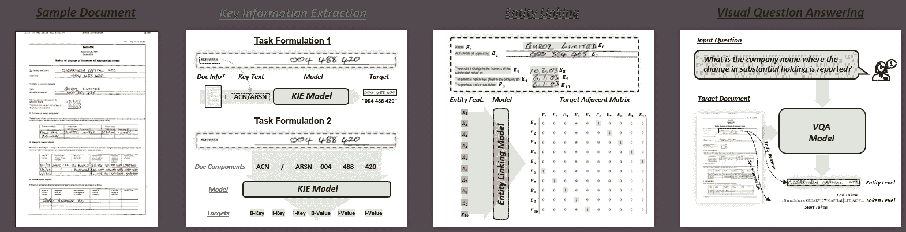
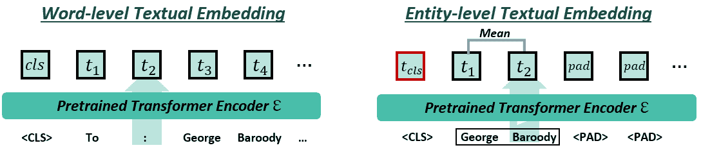
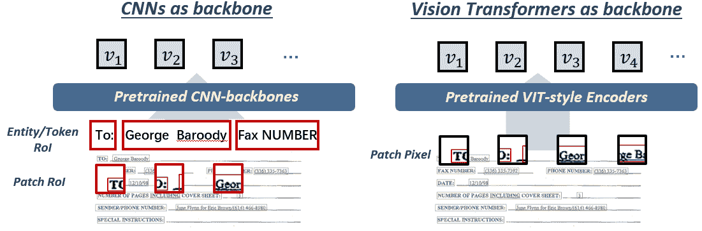
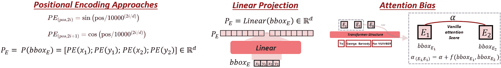
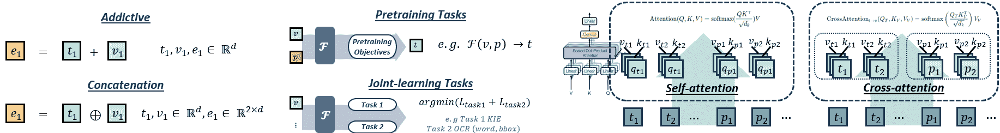

<!--yml

类别：未分类

日期：2024-09-06 19:30:52

-->

# [2408.01287] 基于深度学习的视觉丰富文档内容理解：综述

> 来源：[`ar5iv.labs.arxiv.org/html/2408.01287`](https://ar5iv.labs.arxiv.org/html/2408.01287)

# 基于深度学习的视觉丰富文档内容理解：综述

丁一豪 [0000-0001-5065-6911](https://orcid.org/0000-0001-5065-6911 "ORCID identifier") 墨尔本大学，悉尼大学 澳大利亚，  让·李 [0000-0002-7457-028X](https://orcid.org/0000-0002-7457-028X "ORCID identifier") 悉尼大学 澳大利亚 和  韩素妍 [0000-0002-1948-6819](https://orcid.org/0000-0002-1948-6819 "ORCID identifier") 墨尔本大学，悉尼大学 澳大利亚 (2024)

###### 摘要。

视觉丰富文档（VRDs）因其多模态信息内容在学术界、金融、医疗和营销领域中至关重要。传统的从 VRDs 中提取信息的方法依赖于专家知识和人工劳动，使得这些方法成本高且效率低下。深度学习的出现彻底改变了这一过程，引入了利用多模态信息——视觉、文本和布局——以及预训练任务来发展全面文档表示的模型。这些模型在各种下游任务中取得了最先进的性能，显著提高了从 VRDs 中提取信息的效率和准确性。为了响应视觉丰富文档理解（VRDU）日益增长的需求和快速发展的情况，本文对基于深度学习的 VRDU 框架进行了全面综述。我们系统地调查和分析了现有的方法和基准数据集，并根据采用的策略和下游任务进行分类。此外，我们比较了 VRDU 模型中使用的不同技术，重点关注特征表示和融合、模型架构以及预训练方法，同时强调它们的优缺点和适用场景。最后，我们识别了 VRDU 中的新兴趋势和挑战，为未来的研究方向和实际应用提供了见解。该综述旨在提供对 VRDU 进展的全面了解，惠及学术界和工业界。

视觉丰富文档理解，关键信息提取，问答，实体链接，多模态^†^†版权：acmcopyright^†^†期刊年份：2024^†^†doi：XXXXXXX.XXXXXXX^†^†ccs：信息系统 信息提取

## 1\. 引言

### 1.1\. 背景

视觉丰富文档（VRD）是包含多种视觉和文本元素的文档，旨在以全面且视觉吸引的方式传达信息，这些文档在我们的日常生活中随处可见，应用于金融、医学和学术等领域。这些文档整合了各种类型的视觉丰富元素，包括段落、表格、图表、图示和照片。文本元素（如段落、列表和标题）和视觉丰富元素（如表格和图形），统称为文档语义实体，对于说明、解释和总结信息至关重要。VRD 的常见格式包括 PDF（便携式文档格式）、DOC/DOCX（Microsoft Word 文档）和图像文件（JPEG、PNG）。这些文档通常以半结构化或甚至非结构化的方式组织，使其理解和信息提取具有挑战性。

VRD 理解（VRDU）领域致力于理解 VRD 的结构并提取相关信息，从而将非结构化或半结构化内容转化为机器可读格式。VRDU 主要包括两个任务：关键**信息提取**（KIE）和**问题回答**（QA）。关键**信息提取**（KIE）的目标是基于预定义的关键字识别和提取值。根据所用模型的不同，KIE 可以作为实体检索任务（KIE 任务形式 1）或序列标注任务（任务形式 2）来处理，如图 1 所示。视觉丰富文档**问题回答**（VRD-QA）涉及基于 VRD 中的上下文信息用自然语言回答问题。如图 1 所示，模型必须在文档中定位答案以回应输入的问题。除了提取方法，KIE 和 VRD-QA 还可以被制定为生成任务，其中模型根据查询或问题和文档图像自回归生成所需的值或答案。除了上述任务外，另一个内容理解任务是**实体链接**（EL），该任务旨在识别文档实体之间的语义关联（父子关系）。

为了应对视觉丰富文档理解任务，启发式方法（Watanabe et al., 1995; Seki et al., 2007; Rusinol et al., 2013）和统计机器学习技术（Oliveira and Viana, 2017）已被用于领域特定的文档应用，这些应用需要专家定制且难以更新。深度学习的最新进展提供了有前景的替代方案。基于 LSTM 和 CNN 的模型（Katti et al., 2018; Denk and Reisswig, 2019; Zhao et al., 2019）、特征驱动的方法（Yu et al., 2021; Zhang et al., 2020; Wang et al., 2021a）和布局感知的预训练框架（Xu et al., 2020a; Wang et al., 2022b; Hong et al., 2021），以及视觉集成的预训练框架（Huang et al., 2022），显著改善了文档表示，并在各种下游任务中达到了最先进的性能。然而，这些模型主要关注细粒度特征，如网格和单词/词片（文本标记），并且通常面临计算复杂性和捕捉全局逻辑及布局相关性的能力的挑战。相比之下，粗粒度模型在实体级别操作，解决了细粒度模型的一些局限性，但可能会遗漏详细信息，导致表示不够全面。为了弥补这些差距，已经开发了联合粒度框架（Li et al., 2021c; Yu et al., 2022; Bai et al., 2022）和基于 LLM 的框架（Luo et al., 2024; Liu et al., 2024b）。

随着视觉丰富文档理解（VRDU）的快速发展和需求增加，各种模型架构、多模态学习方法和预训练技术已经被引入，以持续提升特定或多个 VRDU 任务的性能。本文提供了基于深度学习的 VRDU 框架的全面回顾，系统地调查和分析现有方法和基准数据集，这些方法和数据集根据采用的策略和下游任务进行分类。此外，比较了 VRDU 模型中使用的不同技术，重点关注特征表示与融合、模型架构和预训练方法，并突出了它们的优势、局限性和适用场景。最后，识别了视觉丰富文档内容理解中的新兴趋势和挑战，并提供了未来研究方向和实际应用的见解。

### 1.2\. 范围

本文致力于调查和分析基于深度学习的文档内容理解的现有工作。将对以下主题的论文进行回顾和总结。

+   •

    论文重点介绍了将包括在本文中的文档内容理解任务，主要包括文档关键信息提取、视觉问答和实体链接。本文不会总结仅关注文档结构理解任务的模型和数据集。

+   •

    一篇论文提出了一种新颖的深度学习 VRDU 模型，用于解决一个或多个视觉丰富文档内容理解（VRD-CU）任务。第 2.2.1 节将简要描述在启发式或传统机器学习方式下的典型文档内容理解方法。

+   •

    本文汇编了自 2019 年以来广泛使用的 VRDU 基准数据集和最近提出的 VRDU 数据集，这些数据集来自顶级会议和期刊。所有包含的数据集均为公开可用。

+   •

    本文专注于实现对整个多页文档的整体理解的多模态能力，这与以往主要关注孤立子任务的文档理解调查有所不同。

应该注意的是，本文只调查了针对整个文档或文档页面设计的模型和数据集，而非具体的文档组件，如表格、图表。因此，对于表格检测、表格结构识别和图表或图形问答的模型和数据集，将不会在本文的主体部分总结。

### 1.3\. 相关调查

一些调查提供了对一般文档理解任务的全面概述。这些调查主要关注文档布局分析（Subramani 等，2020）、表格提取（Liu 等，2023）、命名实体识别（Ehrmann 等，2023）和文档图像分析（Lombardi 和 Marinai，2020），涵盖了各种文档类型，包括发票（Saout 等，2024）和历史文档（Ehrmann 等，2023；Lombardi 和 Marinai，2020）。特别是，基于计算机视觉的研究专注于扫描文档分析和结构理解。虽然这些研究推动了文档图像分析的发展，但它们通常集中于碎片化的子任务，未能提供对多页文档的整体理解。

深度学习的最新进展促进了 VRDU 任务的出现，这些任务要求复杂的文档内容理解能力。这些任务包括关键信息提取、问答和文档实体链接。然而，现有的调查并没有充分解决 VRDU 所带来的独特挑战和机遇，尤其是基于深度学习的多模态方法（Cui et al., 2021）。为弥补这一空白，本调查旨在提供 VRDU 框架和数据集的全面概述，包括单任务和多任务 VRD 模型中的多模态特征提取和融合。

### 1.4\. 贡献

本文的主要贡献可以总结如下：

+   •

    该论文提供了对 VRDU 框架和基准数据集的详细回顾和系统分类，基于采用的策略和下游任务进行组织。

+   •

    它批判性地审查和比较了 VRDU 模型中使用的不同技术，重点关注特征表示和融合、模型架构和预训练方法，突出了它们的优点、局限性和适用场景。

+   •

    论文识别了视觉丰富文档内容理解中的新兴趋势和挑战，提供了对未来研究方向和实际应用的见解。

### 1.5\. 调查结构

本调查的第一部分讨论了视觉丰富文档理解的背景，并强调了本文的目的、范围和贡献。第二部分提供了额外的背景知识，包括本研究中涵盖的 VRDU 任务定义和文档理解的发展。第三部分和第四部分分别回顾了单任务和多任务 VRDU 的重要框架。第五部分汇编了三个 VRDU 子任务的基准数据集：扫描收据、表单以及来自不同领域的单页和多页文档。第六部分批判性地审查和比较了各种模型采用的技术，突出了它们的优缺点。最后，第七部分总结了该领域的趋势和未来方向。

## 2\. 背景

### 2.1\. 任务定义

根据目的和应用场景的不同，视觉丰富的文档理解任务被分为三个类别，包括关键信息提取、问答和实体链接。

图 1\. 视觉丰富的文档内容理解任务说明。

+   •

    关键信息提取：指根据给定的文本查询识别和提取相关信息。可以根据目标文档的领域和实际需求定义不同的预定义查询。例如，扫描收据的关键信息包括“商店名称”、“地址”、“商品”和“价格”，而对于财务报告，“公司名称”、“股东名称”、“利息数量”可能是需要提取的关键信息。

+   •

    问答任务：是通过使用自然语言回答关于 VRD 的问题的任务。根据答案类型，它可以分为抽取式 VQA 和 摘要式 VQA。抽取式 VQA 的答案直接从目标文档中提取，而摘要式 VQA 需要基于对问题和相关 VRD 的全面理解生成答案。

+   •

    文档实体链接：指识别文档实体之间的语义关系，以构建输入文档图像的逻辑结构。

### 2.2\. 文档理解的发展

#### 2.2.1\. 传统方法

如几项研究中所强调的规则基础方法（Watanabe 等，1995；O’Gorman，1993；Seki 等，2007；Rusinol 等，2013），在特定领域应用中表现出高精度。然而，这些方法也有几个缺点：它们需要大量人工操作，成本高，并且需要专家干预进行定制化。此外，这些方法不够灵活，通常需要频繁的人工更新，即使是微小的修改也需要重新调整。为了应对这些局限性，已经提出了基于机器学习的方法来进行文档理解。例如，SVM 基础的方法已被用于布局理解（Oliveira 和 Viana，2017），而 TF-IDF 技术与手工特征结合已被应用于发票信息提取。此外，规则基础和统计模型已被用于实体提取。尽管有这些进展，机器学习方法仍然严重依赖人工干预和领域特定的专业知识。它们耗时且通常表现不佳。此外，这些方法大多数依赖于单一模态数据，限制了它们对布局、文本或视觉输入的处理。

#### 2.2.2\. 单一模态方法

随着深度学习的进步，出现了更深层次的模型架构，如 CNN（Katti 等，2018；Yang 等，2017），预训练的语言模型（Devlin，2018；Liu 等，2019b）和视觉模型（Ren 等，2015；He 等，2017）现在被广泛用作理解 VRD 内容和结构的强大基线。由于 VRD 的多模态特性，涉及文本、视觉和布局的整合，研究人员越来越专注于利用这些综合信息，以在各种下游 VRDU 任务中实现显著的改进。

#### 2.2.3\. 跨模态方法

考虑到 VRD 的多模态特性，许多框架提出了各种方法来编码多模态信息，包括文本、视觉和布局，并有效地融合这些信息。文本和视觉信息通常由预训练的骨干网络编码，例如 BERT（Devlin，2018）或 RoBERTa（Liu 等，2019b）用于文本特征，Faster-RCNN（Ren 等，2015）或 Mask-RCNN（He 等，2017）用于视觉特征。对于布局信息，提出了不同的编码方法，包括线性投影（Wang 等，2020b）、2D 位置编码（Xu 等，2020a）和注意力偏置，以使所提出的模型对布局敏感。引入了不同的特征融合方法，包括加和（Yu 等，2021）、拼接（Lee 等，2022b）、基于注意力的上下文学习（Majumder 等，2020a）和提示（He 等，2023）。然而，大多数这些框架依赖于来自预训练骨干网络的隐式知识，并为特定的 VRDU 下游任务（如 KIE（Lee 等，2023；Wang 和 Shang，2022；Chen 等，2023；Cao 等，2023b）或 EL（Zhang 等，2021；Hu 等，2023；Carbonell 等，2021）使用任务导向的影子适配器。这些框架往往在特定任务或文档格式上取得精细的表现，而不是获得一个全面表示文档的通用模型。

#### 2.2.4\. 多模态预训练方法

受到 BERT 风格模型（Devlin, 2018; Liu et al., 2019b）通过自监督学习获取知识成功的启发，预训练的文档理解模型应运而生，以利用来自大量文档集合的自监督或监督预训练任务。LayoutLM (Xu et al., 2020a)，第一个仅编码器的 VRDU 模型，利用了自监督任务，如遮蔽视觉语言建模，结合文本和布局信息。 随后的模型通过集成布局信息（Wang et al., 2022b; Tu et al., 2023; Li et al., 2021c）和视觉线索（Xu et al., 2020b; Huang et al., 2022）扩展了这一点，采用了多模态变换器。 尽管仅编码器模型在各种基准数据集上显示了显著改进（Jaume et al., 2019; Park et al., 2019; Huang et al., 2019; Mathew et al., 2021; Harley et al., 2015），但它们通常需要详细的注释，并且受限于固定的输入长度。 为了应对这些限制，已开发了编码器-解码器框架（Tang et al., 2022; Kim et al., 2022; Davis et al., 2022）和针对 LLMs/MLLMs 的提示方法（Luo et al., 2024; Liu et al., 2024b），从而增强了布局意识和 VRDU 任务中的性能。 然而，在有效地将这些模型应用于实际场景时，仍存在显著差距。

## 3\. 单任务文档理解框架

视觉丰富的文档内容理解涵盖了几个独立的下游任务，这些任务针对不同的应用场景和用户需求。 本节介绍了专注于特定文档理解任务的方法。 许多这些模型旨在提供全面的文档表示，并整合面向目标的模块或技术，以提高在各种 VRDU 任务中的性能和效率。 介绍和总结了三种 VRDU 下游任务的模型——关键信息提取（KIE）、实体链接（EL）和视觉问答（VQA），并对当前趋势进行了深入分析。

{forest}

针对 tree= forked edges, grow’=0, draw, rounded corners, node options=align=center,, text width=3cm, s sep=6pt, calign=child edge, calign child=(n_children()+1)/2 单任务模型（内容理解），对于 tree=fill=lime!60 [关键信息提取，对于 tree=fill=cyan!40 [特征驱动模型，对于 tree=fill=cyan!25 [Chargrid(Katti et al., [2018); CUTIE(Zhao et al., 2019);BERTgrid(Denk and Reisswig, 2019); ACP(Palm et al., 2019);XYLayoutLM(Gu et al., 2022)，对于 tree=fill=cyan!10] ] 联合学习框架，对于 tree=fill=cyan!25 [TRIE(Zhang et al., [2020); VIES(Wang et al., 2021a)，对于 tree=fill=cyan!10] ] 关系感知模型，对于 tree=fill=cyan!25 [Majumder et al. (Majumder et al., [2020a); Liu et al. (Liu et al., 2019a); PICK(Yu et al., 2021); FormNet(Lee et al., 2022b); FormNetv2(Lee et al., 2023)，对于 tree=fill=cyan!10] ] 少样本/零样本学习模型，对于 tree=fill=cyan!25 [LASER(Wang and Shang, [2022); Chen et al.(Chen et al., 2023); Cheng et al.(Cheng et al., 2020); QueryForm(Wang et al., 2023a)，对于 tree=fill=cyan!10] ] 基于提示的框架，对于 tree=fill=cyan!25 [GenKIE(Cao et al., [2023b); ICL-D3IE(He et al., 2023); LMDX(Perot et al., 2023)，对于 tree=fill=cyan!10] ] ] 实体链接，对于 tree=fill=blue!40 [实体级链接，对于 tree=fill=blue!20 [DocStruct(Wang et al., [2020b); Zhang et al.(Zhang et al., 2021); KVPFormer.(Hu et al., 2023)，对于 tree=fill=blue!10] ] 标记级链接，对于 tree=fill=blue!20 [Carbonell et al. (Carbonell et al., [2021); SPADE (Hwang et al., 2021);DocTR(Liao et al., 2023)，对于 tree=fill=blue!10] ] ] 视觉问答，对于 tree=fill=teal!40 [单页框架，对于 tree=fill=teal!25 [请参考第 [3 节。对于 tree=fill=teal!10] ] 多页框架，对于 tree=fill=teal!25 [Hi-VT5(Tito et al., [2023); GRAM(Blau et al., 2024); Kang et al. (Kang et al., 2024)，对于 tree=fill=teal!10] ] ] ]

图 2\. 单任务视觉丰富文档理解模型

### 3.1\. 关键信息提取

关键信息提取（KIE），一种典型的自然语言处理任务，指的是从文本数据中识别和提取关键的信息。与典型的名称实体识别方法不同，视觉丰富的数据（VRDs）包含表格和图表等视觉丰富的实体，以及空间和逻辑布局安排，增加了提取关键信息的挑战。尽管纯文本预训练语言模型，如 BERT（Devlin, 2018）、RoBERTa（Liu et al., 2019b）和 ALBERT（Lan et al., 2019），在许多基准数据集上作为坚实的基准被广泛使用，但最近的工作引入了布局感知的预训练模型，如 LayoutLM 系列（Xu et al., 2020a，b；Huang et al., 2022）、LiLT（Wang et al., 2022b）、Bros（Hong et al., 2021）以通过利用视觉和布局信息来增强文档表示，并在几个下游任务上实现了最先进的性能（参见第三部分）。本节将主要关注专门为文档 KIE 模型提出或仅在 KIE 基准数据集上评估的模型，包括 FUNSD（Jaume et al., 2019）、CORD（Park et al., 2019）、SROIE（Huang et al., 2019）、XFUND（Xu et al., 2021）等。基于创新方面，我们将 KIE 框架分为五类：特征驱动模型使用多模态线索进行丰富的特征表示。联合学习框架整合辅助任务以增强文档表示。关系感知模型通过图或掩蔽注意机制利用空间或逻辑关系。少样本/零样本学习框架探索使用最少标记数据提取关键信息的方法，通常使用迁移学习。基于提示的框架使用结构化提示来指导从预训练模型或 LLM/MLLM 中提取特定信息。这些类别代表了通过利用特定模型设计和学习策略来提高关键信息提取（KIE）的多样化方法，以应对文档理解挑战。

#### 3.1.1. 特征驱动模型

在初期阶段，某些基于递归神经网络（RNN）的模型（Lample et al., 2016）被引入，主要集中于从纯文本中提取关键信息。然而，这些方法忽略了视觉线索和布局信息的重要性。因此，提出了几种具有特征驱动设计的多模态框架，以生成更具代表性的文档表示。

Chargrid（Katti et al., 2018）首次提到 2D 结构在文档 KIE 中的重要性，并设计了基于字符框的 chargrid，将文本和 2D 布局结构转换为输入 CNN 的彩色视觉提示。与使用细粒度字符信息不同，CUTIE（Zhao et al., 2019）和 BERTgrid（Denk and Reisswig, 2019）利用各种词嵌入方法和边界框坐标来保持布局结构。ACP（Palm et al., 2019）利用注意力机制和多方面特征，包括视觉、语义（字符和单词）和空间特征，结合扩张 CNN 捕捉每个单词片段的短期和长期依赖关系。

联合学习 KIE 框架被提出用于利用多层特征来减轻各种聚焦任务之间的信息差距。TRIE（Zhang et al., 2020）首次提供了一个端到端的框架，以同时进行光学字符识别（OCR）和 KIE。OCR 模块将生成多方面的特征，包括位置、视觉和文本方面。采用适应性可训练的加权机制来生成融合的嵌入，随后通过基于 Bi-LSTM 的实体提取模块进行最终预测。VIES（Wang et al., 2021a）被介绍用于使用视觉、位置和文本的多层提示生成更全面的表示。从文本检测模块中获取标记和片段（实体）级别的位置和视觉特征，从文本识别分支中收集双级文本特征，通过基于自注意力的融合模块融合进行序列标注。

#### 3.1.2. 关系感知模型

与仅仅利用多模态信息不同，利用多层组件之间固有的空间或逻辑关系可能会导致更稳健和全面的文档表示。Majumder 等（Majumder et al., 2020a）提出了一种模型，该模型通过类型特定的检测器和关键短语为每个字段生成候选项。神经网络模型通过学习密集的表示来对这些候选项进行评分，这些表示考虑了文本内容和空间位置，从而通过关注候选项与字段的相关性来准确提取不同文档模板中的信息。基于图的框架越来越受到青睐，用于建模文档元素的空间和逻辑关系。这一趋势涉及精确地定义不同的图结构，并采用图卷积技术将这些关系无缝地融入特征表示中。

Liu 等人（Liu et al., 2019a）首次在 BiLSTM-CRF 的基础上利用图卷积模块进行关键信息提取。每个文档都是一个完全连接的图，其中节点是文档实体 $E_{i}\in\mathbb{E}$ 的文本表示 $T$，边缘与 $E_{i}$ 和另一个实体 $E_{j}$ 之间的空间关系有关。定义为 $e_{ij}=[x_{ij},y_{ij},\frac{w_{i}}{h_{i}},\frac{h_{j}}{h_{i}},\frac{w_{j}}{h_{i}}]$，其中 $x_{ij}$ 和 $y_{ij}$ 是 $E_{i}$ 和 $E_{j}$ 之间的水平和垂直距离。基于自注意力的图卷积在节点-边-节点三元组（连接的节点和边嵌入）上执行，以便与所有其他节点进行上下文学习。PICK（Yu et al., 2021）采用了类似的方式来构建文档图，但利用了多模态节点表示，包括变换器编码的文本嵌入和 CNN 编码的视觉嵌入，同时边嵌入更新为 $e_{ij}=[x_{ij},y_{ij},\frac{w_{i}}{h_{i}},\frac{h_{j}}{h_{i}},\frac{w_{j}}{h_{i}},\frac{S_{j}}{S_{i}}]$，其中 $S$ 是对应实体的句子长度。此外，为了获得下游标注任务的节点嵌入，应用了一种基于软邻接矩阵的图学习层，以获得任务特定的节点表示。

FormNet (Lee et al., 2022b) 引入了一种端到端的框架，结合了新的注意力机制——Rich Attention，以及图形框架，旨在创建一个对顺序/距离敏感的长序列变换器。在 Rich Attention 中，模型引入了两个基于顺序和像素距离的评分，沿 x/y 轴分布。这些评分与常规自注意力评分相加，以实现模型的顺序/距离感知。此外，应用了一个图来在将令牌序列传入变换器编码器之前，上下文地学习相邻令牌的嵌入。图节点是令牌的文本嵌入，边缘是节点之间的相对位置。这可以缓解不完美序列化的问题，使令牌表示能够捕捉到更多上下文。FormNetv2 (Lee et al., 2023) 将图像模态整合为额外的图边缘特征，以捕获更多视觉线索¹¹1 有关更多细节，请参见第 6.1.2 节。为了利用对比损失学习多模态图表征，他们首先执行随机图腐蚀，以采样拓扑腐蚀和特征腐蚀图。拓扑腐蚀随机移除原始图中的边缘，而特征腐蚀则从节点和边缘中去除所有模态特征。然后，对比目标是最大化在标准归一化温度缩放交叉熵 (Sohn, 2016) 损失下，腐蚀图与原始图之间的一对令牌的相符程度。

#### 3.1.3\. 小样本学习框架

基于深度学习框架从 VRD 中提取关键信息通常需要更多的手动工作来标注训练数据。然而，在紧急和劳动限制的应用场景中，获取大规模、高质量的标注是具有挑战性的。因此，出现了小样本或一-shot 框架，以减少标注劳动量来提取关键信息。

LASER (Wang and Shang, 2022) 利用 LayoutReader (Wang et al., 2021b) 的架构，将实体识别任务重新表述为序列标注，以生成模型通过将实体类型信息（命名标签表面名称）嵌入目标序列，从而使模型能够进行标签语义感知。LASER 依赖于一个“部分三角”掩码，使用一个编码器来编码源文本并生成预测。$n$ 源文本序列，$\{t_{1},...,t_{n}\}$，是通过求和相对词、空间和位置嵌入的文本序列，传入 $\mathcal{E}$ 进行全自注意力处理。目标序列仅关注前面的令牌。生成公式定义为：

| (1) |  | $\displaystyle t_{i-1},[B],t_{i},...,t_{j},[E],e_{1},...,e_{k},[T],t_{j+1}$ |  |
| --- | --- | --- | --- |

其中 $[B]$ 和 $[E]$ 表示实体的开始和结束，$e_{i}$ 是标签表面名称；$[T]$ 表示标签表面名称的结束。由于标签表面名称和功能性标记不存在，因此应用可学习的嵌入来确保生成进度布局的感知。应用一个二分类模块来分类当前生成的标记隐藏状态的下一个生成标记类型：是来自源的还是不是，从而有效地控制生成系列。

Chen 等人（Chen et al., 2023）引入了一个新颖的框架，用于从 VRDs 中提取实体级 N-way 软-K-shot 关键信息，关注从仅有少数示例的文档中提取稀有或未见实体的挑战。它利用了一种元学习方法（Snell et al., 2017; Oreshkin et al., 2018），结合层次解码器和对比学习（ContrastProtoNet）来实现任务个性化和改进对新实体类型的适应。此外，提出了 FewVEX 数据集，这是一个针对实体级少样本 VDER 的数据集，用于促进该领域的研究和基准测试。通过显著提升鲁棒性和性能，该框架的有效性得到了证明。

在一次性场景领域，Cheng 等人（Cheng et al., 2020）提出了一种图的创新应用。他们利用注意力机制将支持文档中的静态文本区域（关键/标志）和动态文本区域（值/字段）之间的空间关系无缝转移到查询文档中。这种转移使得获取文件的标签概率分布成为可能。此外，集成了基于自注意力的模块来利用字段实体之间的关系，从而促进标签转移概率分布的推导。最后，利用信念传播进行推断，在一对条件随机场（CRF）中，形成一个可评估的端到端可训练管道。

#### 3.1.4\. Prompt-learning 框架

QueryForm（Wang et al., 2023a）引入了一个基于查询的零样本文档关键信息提取框架。引入了一种双重提示机制，即实体查询（E-prompt）和模式查询（S-prompt），用于预训练和将从大规模弱标注预训练网页中获得的知识迁移到目标领域。预训练目标与微调高度对齐，以确保所提框架在两个阶段都能一致地进行查询条件预测。在预训练期间，HTML 标签获取 E-prompt ($\bm{e_{p}}$)，S-prompt ($\bm{\tilde{s}_{p}}$) 从网页域中生成，而在微调期间，$\bm{e_{p}}$ 是预定义的，S-prompt $\bm{s_{p}}$ 是可学习的向量。假设 $\bm{t}$ 是输入文档的序列化文本，预训练和微调目标 $\bm{\hat{y}}$ 和 $\bm{y}$ 可以表示为：

| (2) |  | $\displaystyle\bm{\hat{y}}=\mathcal{F}([\bm{s_{p}};\mathcal{E}[\bm{e_{p}},\bm{x}]]),$ |  |
| --- | --- | --- | --- |
| (3) |  | $\displaystyle\bm{y}=\mathcal{F}([\mathcal{E}[\bm{\tilde{s}_{p}};\bm{e_{p}},\bm{x}]])$ |  |

其中，$\mathcal{E}$ 和 $\mathcal{F}$ 分别是特征编码器和语言模型的其余部分。训练目标是最小化 $\bm{\hat{y}}$ 和 $\bm{y}$ 之间的交叉熵损失。

提示学习是一种自然语言处理技术，在这种技术中，模型通过特定的提示来产生或解释目标响应。随着大规模模型的兴起，提示学习可以利用上下文表示和隐性知识来提高在特定任务上的表现。由于大多数 LLM（OpenAI，2023；Touvron 等，2023）和 MLLM（Liu 等，2024a）是基于纯文本或自然图像进行训练的，因此引入了布局感知提示和上下文学习（Brown 等，2020）方法，以提高对视觉丰富文档（VRD）的理解。

GenKIE（Cao 等，2023b）提出了一种基于编码器-解码器的多模态 KIE 框架，以利用提示来适应各种数据集并更好地利用多模态信息。根据（Xu 等，2020a，b），采用了不同的编码方法来获取文本、布局和视觉嵌入。使用字节对编码作为语言预训练骨干，OCR 提取的文档内容与通过“[SEP]”标记分隔的预定义提示连接在一起。采用（Xu 等，2020a）提出的二维位置编码来获取每个 OCR 提取的标记的布局嵌入，并使用 ResNet（He 等，2016）来提取视觉表示，方法参见（Wang 等，2022c）。将多模态表示输入到编码器中，以便在模态之间进行交互学习。提示插入在编码器的文本输入的末尾，既可以是模板风格的，也可以是问题风格的。对于实体提取任务，提示指定目标实体类型，解码器生成实体值（例如，对于“公司是？”，解码器输出公司名称）。对于实体标注任务，提示包括值，解码器提供实体类型（例如，对于“Es Kopi Rupa 是 [SEP]”，解码器识别实体类型）。

ICL-D3IE（He 等人，2023）是第一个采用 LLM 和上下文学习从 VRDs 中提取关键信息的框架，使用了迭代更新的多样化示例。在设计初始的多样化示例之前，需要通过计算由 Sentence-BERT（Reimers 和 Gurevych，2019）编码的文档表示的余弦相似度来选择与 $n$ 个测试样本最相似的 $n$ 个训练文档。然后，引入不同类型的示例，将多视角的上下文信息整合到 LLM 中。困难示例突出了最具挑战性的案例，最初基于 GPT-3（Brown 等人，2020）预测中的错误预测案例进行设计，并在训练过程中根据预测结果进行更新。布局感知示例通过选择相邻的困难段落来理解位置关系。格式化示例旨在指导 LLM 格式化输出，以便于后续处理。

LMDX（Perot 等人，2023）设计了一种管道，利用任意的 LLM 从 VRDs 中提取单一、重复和层次结构的实体。文档图像首先被输入到现成的 OCR 工具中，然后被划分为较小的文档块，以便 LLM 处理，并满足输入长度的要求。接着，生成 XML 类似标签的提示，以控制 LLM 的响应并减轻幻觉现象。文档表示是一个包含块内容及 OCR 线坐标的提示，将布局模态引入 LLM，其中由 OCR 工具提取的文本片段表示为 ¡text¿ [$x_{centre}$, $y_{centre}$]。随后，任务描述和方案表示提示被设计用来解释需要完成的任务，并确定输出格式。在推理过程中，生成 $N$ 个提示和 $K$ 个 LLM 完成的样本以获取正确答案。

#### 3.1.5\. 关键信息提取总结

一些模型如 Chargrid (Katti et al., 2018)和 ACP (Palm et al., 2019)通过整合视觉和文本信息增强了 VRDU。此外，辅助任务如 OCR（由 Zhang et al., 2020; Wang et al., 2021a）有助于通过联合训练提高多模态特征表示。然而，这些框架通常依赖较小的随机初始化模型，与由大规模预训练模型如 LayoutLM (Xu et al., 2020a)和 SelfDoc (Li et al., 2021b)生成的特征相比，生成的特征代表性较差。文档通常展现出特定的布局和逻辑结构，这促使许多模型（Yu et al., 2021; Lee et al., 2022b, 2023）采用基于图的方法。这些方法捕捉了文档元素之间的空间和逻辑关联，如键值对，从而实现更全面的文档表示。虽然这些框架在文档表示上取得了改进，但其有效性依赖于足够的高质量标注训练样本，这些样本的获取耗时。这一限制加剧了对少样本（Wang and Shang, 2022）和零样本（Wang et al., 2023a）框架的需求，这些框架利用对比学习和创新的注意力机制。此外，提示学习已被应用于从大规模布局感知预训练模型（Hong et al., 2021; Tu et al., 2023）和大型语言模型（LLMs/MLLMs）（He et al., 2023; Perot et al., 2023）中提炼隐性知识。尽管有这些进展，但在精细调整模型和少/零样本框架之间仍存在性能差距，突显了 VRDU 优化中的持续挑战。

### 3.2. 文档实体链接

文档通常是层次结构的，其中父子关系在各种文档中始终存在，例如表单中的键值对和报告或论文中的章节段落。与大多数 VRD 关键数据提取模型不同，这些模型专注于在序列标记任务中识别语义实体类别而忽略实体之间的关系，最近的研究更关注于连接文档语义实体对之间的逻辑关联。

#### 3.2.1. 实体级实体链接

文档实体链接的目标是识别文档实体之间的关系。一些框架利用已知的实体边界框，忽略实体识别步骤，主要集中在探索输入文档实体之间的关系。

DocStruct（Wang et al., 2020b）是第一个利用已知文档实体的多模态特征来预测它们之间层次结构的实体链接框架。从 BERT 类的预训练语言模型中提取 [CLS] token 以获得实体级别的文本表示 $T_{e}$，并使用 RNN 对沿 ResNet-50 特征图宽度的序列 RoI 视觉提示 $V_{e}$ 进行编码。然后，将 $T_{e}$ 与布局特征 $P_{e}$ 连接，$P_{e}$ 是实体边界框坐标的线性投影向量，$[x1,y1,x2,y2,x3,y3,x4,y4]$。最终的实体表示 $E$ 可以表示为：

| (4) |  | $\displaystyle\alpha=Sigmoid(W[T_{e},P_{e},V_{e}]+b),$ |  |
| --- | --- | --- | --- |
| (5) |  | $\displaystyle E=[T_{e};P_{e}]+\alpha V_{e},$ |  |

其中 $\alpha$ 用作门控来控制视觉提示 $V_{e}$ 的影响，参考（Wang et al., 2019）。然后，对于实体对 $E_{i}$ 和 $E_{j}$，存在父子关系的概率表示为 $P_{i\rightarrow j}=E_{i}ME_{j}$，其中 M 是非对称参数矩阵，以确保 $E_{i}$ 和 $E_{j}$ 之间的非对称关系。在训练过程中应用负采样（Mikolov et al., 2013b）以处理数据稀疏性和不平衡问题。

张等人（Zhang et al., 2021）提出了一种实体链接框架 SERA（Semantic Entity Relation extraction As dependency parsing），通过将实体关系预测公式化为依赖解析问题。LayoutLM（Xu et al., 2020a）用于获取在实体级别的文本表示 $T_{e}$，这些表示与线性投影实体标签 $L_{e}$ 的嵌入连接，以获得最终的实体表示 $E$，公式化为 $E=[T_{e},L_{e}]$。采用各种编码器，如 Vanilla Transformer、BiLSTM 和 Graph，来学习以下上下文表示。然后，采用 Biaffine 解析器来计算 $E_{i}$ 和 $E_{j}$ 之间的分数。biaffine 解析器分数 $p_{b}$ 可以通过以下公式计算：

| (6) |  | $\displaystyle h_{i}^{key}=\sigma(W^{key}E_{i}+b^{key}),$ |  |
| --- | --- | --- | --- |
| (7) |  | $\displaystyle h_{j}^{value}=\sigma(W^{value}E_{j}+b^{value}),$ |  |
| (8) |  | $\displaystyle p_{b}=h_{i}^{key}W_{b1}h_{j}^{value}+h_{i}^{key}W_{b2}.$ |  |

其中 $h_{i}^{key}$ 和 $h_{j}^{value}$ 是线性投影后的隐藏状态。为了利用布局信息，使用二维布局向量 $l_{ij}$ 来获得布局特征分数 $p_{l}=W_{l}l_{ij}+b_{l}$，其中 $l_{ij}$ 是两个实体在宽度和高度方向上的最小距离。然后，最终的分数 $p=p_{b}+p_{l}$ 用于通过二分类或多标签分类计算损失。

KVPFormer（Hu et al., 2023）将实体链接公式化为一个问答问题，通过引入基于 Transformer 的编码器-解码器结构来利用联合细粒度信息（token 和实体）以预测实体关联。每个文档实体 $E$ 的文本表示 $T$ 通过从预训练文档理解模型中平均内部 token 嵌入来编码，并与线性投影的实体标签嵌入 $l$ 连接，表示为 $E=[T;l]$。然后，实体表示将被送入一个 Transformer 编码器，该编码器具有空间兼容的注意力偏置到普通自注意力机制中²²2Please refer to。一个二分类器确定哪个实体是关键实体。所有检测到的关键实体将被视为问题表示，并送入一个 DETR 风格（Carion et al., 2020）的解码器以并行预测相应的答案。对于每个输入问题（关键查询），将基于 $Sigmoid$ 分数选择前 K 个答案候选，并送入一个 softmax 层以获得最终预测，称为粗到细的答案预测。

#### 3.2.2. Token-level 实体链接

由于获取实体信息需要来自人工标注或布局分析模型的先验知识，一些研究利用序列化的 OCR 提取的 tokens 作为输入来提取结构化关系。然而，由于逻辑关系链接语义实体，token-level 框架必须在探索其关联之前将 tokens 分组为实体。

Carbonell 等人（Carbonell et al., 2021）介绍了一个由三个模块组成的框架，用于依次进行 token 分组、实体标注和关系预测。首先，每个文本 token $t$ 用 $[L_{t};T_{t}]$ 表示，其中 $L_{t}=[x,y,w,h]$ 是 $t$ 的 coco 格式边界框坐标，$T_{t}$ 是工作/表示。所有 tokens 被送入一个 token 分组 GNN，$\mathcal{G}_{group}$，作为一个节点，其中节点之间的边由 k-NN 确定，以避免完全连接 GNN 的高耗能。$\mathcal{G}_{group}$ 在一个链接预测任务上进行训练，以预测两个节点之间的边分数来分组单词，分数大于预定义的阈值 $\rho$。然后，分组后的单词被送入一个图注意力网络（GAT），利用多头注意力将单词聚合为实体，并跟随一个 MLP 进行节点分类，以预测每个文档实体的类别。最后，另一个链接预测 GNN，$\mathcal{G}_{link}$，在基于聚合实体的边分类上进行训练。

SPADE（Hwang 等，2021）将令牌级实体链接公式化为空间依赖解析任务，用于对令牌进行序列化（排序和分组）并预测分组令牌之间的组间关系。首先，设计了一个空间文本编码器，通过引入相对空间向量来实现空间感知注意力，考虑相对、物理和角度方面。在此任务中，必须预测两个二进制矩阵$M_{g}$（用于令牌分组）和$M_{l}$（用于组间链接）。由实体类型$\mathbb{V}$和令牌序列$\mathbb{T}$组成的顶点中，编码的实体类别和令牌分别表示为$c$和$t$，顶点$v_{i}\rightarrow v_{j}$之间的关系得分可以通过以下公式计算：

| (9) |  | $\displaystyle h_{i}=\begin{cases}c_{v_{i}},&\text{对于 }v_{i}\in\mathbb{V},\\ W_{h}t_{v_{i}},&\text{否则}\end{cases},$ |  |
| --- | --- | --- | --- |
| (10) |  | $\displaystyle d=W_{d}v_{j},$ |  |
| (11) |  | $\displaystyle s_{0}=h_{i}^{T}W_{0}d,\ s_{1}=h_{i}^{T}W_{1}d.$ |  |

概率通过$p_{ij}=\frac{\exp(s_{0,j})}{\exp(s_{0,j})+\exp(s_{1,j})}$获得。设置一个可调阈值来构建$M_{g}$或$M_{l}$。

DocTR（Liao 等，2023）将实体链接公式化为基于锚词的实体检测和关联问题。每个文档实体由锚词表示，将实体提取和链接转换为令牌级任务。它包含一个基于 Deformable DETR 的视觉编码器，用于提取多尺度视觉特征。应用基于 LayoutLM 的语言编码器来编码令牌级的文本表示。来自视觉/语言编码器的输出被输入到视觉语言解码器中，结合语言条件查询进行实体提取和链接。解码器查询与语言编码器输入一一对应。实体提取任务旨在预测查询基础令牌级输入是否为锚词及其对应类别，而实体链接则通过以下方式获得：

#### 3.2.3\. 总结

诸如 Chargrid（Katti et al., 2018）和 ACP（Palm et al., 2019）等多个模型通过整合视觉和文本信息增强了 VRDU。此外，辅助任务如 OCR，由（Zhang et al., 2020; Wang et al., 2021a）利用，有助于通过联合训练改进多模态特征表示。然而，这些框架通常依赖较小、随机初始化的模型，这些模型产生的特征相较于大规模预训练模型如 LayoutLM（Xu et al., 2020a）和 SelfDoc（Li et al., 2021b）生成的特征不够具有代表性。文档通常展示特定的布局和逻辑结构，这促使许多模型（Yu et al., 2021; Lee et al., 2022b, 2023）采用基于图的方法。这些方法捕捉文档元素（如键值对）之间的空间和逻辑关联，从而获得更全面的文档表示。尽管这些框架在文档表示方面取得了进展，但它们的有效性依赖于充足的标注训练样本，这些样本获取起来费时费力。这一限制加剧了对少样本（Wang and Shang, 2022）和零样本（Wang et al., 2023a）框架的需求，这些框架利用对比学习和创新的注意机制。此外，提示学习已被应用于从大规模布局感知预训练模型（Hong et al., 2021; Tu et al., 2023）和大语言模型（LLMs/MLLMs）（He et al., 2023; Perot et al., 2023）中提炼隐性知识。尽管取得了这些进展，但精细调优模型与少样本/零样本框架之间仍存在性能差距，突显了 VRDU 优化中持续存在的挑战。

### 3.3. VRD 问答

与针对文档图像中具体细节的关键信息提取不同，回答自然语言问题涉及解释更复杂的意图，并要求模型在查询和文档表示之间促进互动理解（Ding 等，2022）。DocVQA 的引入（Mathew 等，2021）标志着重点从自然场景图像转向文本密集、布局感知的单页文档图像，这在该领域建立了一个基准。随着技术的进步，最近对能够处理更复杂的多页场景的模型的需求开始出现（Tito 等，2023；Ding 等，2023b，2024a）。这些新兴需求突显了模型处理多模态输入和在广泛文档中导航的必要性，反映了基于文档的问题回答系统中用户询问的复杂性和自然性的演变。本节将简要回顾单页文档 VQA 模型中的 SoTA，并介绍一些最近提出的多页文档理解解决方案（Tito 等，2023；Blau 等，2024）。

#### 3.3.1\. 单页 VRD-QA

类似于从视觉丰富的文档中提取关键信息，单页问答（QA）通常利用经典的预训练语言模型（Devlin，2018；Liu 等，2019b）作为基线。这些模型进行基于跨度的问答以提取文本令牌序列。此外，通用领域的视觉语言预训练模型（Li 等，2019；Tan 和 Bansal，2019；Kim 等，2021）被用于识别目标文档的语义实体（Ding 等，2023b）。除了这些纯文本或通用领域视觉语言模型外，许多在文档领域专门预训练的布局感知模型（见第三部分）在单页文档任务中达到了最先进（SoTA）的性能。这种方法强调了在预处理阶段整合布局感知的重要性，以提升在这些特定文档任务中的表现。

#### 3.3.2\. 多页 VRD-QA

随着对从多页文档中检索答案的需求增加（Tito 等，2023；Ding 等，2024a），大多数当前最先进（SoTA）模型（Xu 等，2020a；Wang 等，2022b；Hong 等，2021）通常设计用于单页输入，由于其输入长度限制为 512 个标记，面临显著挑战。为克服这一限制，近期的创新提出了如处理更长序列的变压器和页面定位模块等解决方案。这些进展专门针对多页文档问答（QA）的需求，提升了处理效率。

Hi-VT5（Tito 等，2023）提出了一种多模态层次编码器-解码器架构，用于多页生成问答。采用基于 T5 的多模态变压器对单页级别信息进行编码，包括问题、OCR 提取的页面内容、图像块和一组页面标记。问题和 OCR 提取的标记序列如下（Biten 等，2022），以获取布局感知的初始文本表示。文档图像变换器（DIT）（Li 等，2022b）用于获取初始图块表示。然后，将连接的问答 ($Q$) 和页面 OCR 标记 ($T$)、图像块标记 ($I$) 以及随机初始化的页面标记 ($P$) 输入到基于 T5 的页面编码器中，以增强多层次和多模态上下文学习。每个输入文档图像的增强页面标记嵌入 $P^{\prime}$ 被送入基于 T5 的解码器中以生成预测答案，同时自动回归，目标答案所在的页面必须基于 $P^{\prime}$ 输出页面编号。由于 T5 不是一个布局感知的语言模型，应用了掩码语言建模，通过利用非基于视觉和布局信息来提升多模态理解。由于 T5 能够接受最长 20,480 个标记的输入序列，这大大提高了标准 VRDU 预训练模型在多页场景下应用 Hi-VT5 的能力。

GRAM（Blau et al., 2024）提出了一个框架，用于扩展单页模型以处理多页面文档 VQA 场景。遵循预训练 DocFormerv2（Appalaraju et al., 2024）的方法，该框架对单页输入进行编码，包括问题、OCR 提取的内容和视觉特征。对于多页面场景，一个精简的全局编码器跟随每个单页编码器层，允许新的可学习页面标记与其他页面在上下文中交互。这使得页面标记能够通过自注意力捕捉页面级信息，并通过稀疏注意力增强文档级理解。由于全局层是应用于预训练模型的新流，因此应用了类似 ALiBi（Press et al., 2021）的方法来防止模型可能忽略页面标记，使其能够从预训练权重中捕捉到更细粒度的信息。在解码阶段，与仅将页面标记输入解码器的 Hi-VT5 不同，GRAM 使用所有微调的信息供解码器使用。C-Former（Raffel et al., 2020）被应用于减轻高计算消耗，它可以跨所有页面修订信息并提炼出重要细节。

Kang 等人（Kang et al., 2024）提出了一种多页面文档 VQA 框架，使用评分自注意力机制来选择和识别与生成输入问题答案相关的页面。训练过程包括单页文档 VQA 训练，然后训练一个基于冻结训练编码器的自注意力评分模块，将最相关的页面信息传递到解码器中以生成答案。Pix2Struct（Lee et al., 2022a）作为单页模型，在 DocVQA（Mathew et al., 2021）数据集上进行了微调。Pix2Struct 的输出被输入到自注意力评分模块中以提取第一个标记，用于预测问题-页面匹配评分。具有最高匹配评分的页面将被输入到解码器中以生成答案。

#### 3.3.3\. 总结

文档视觉问答（Document VQA）是一个相对较新的领域，由 DocVQA（Mathew 等人，2021）率先开创，旨在根据文档图像生成或提取自然语言问题的答案。这与关键情报提取不同，后者侧重于识别或提取预定义的键值对。文档 VQA 需要对文档进行更全面的表征，并理解文档与问题之间的关联。预训练的 VRDU 模型（Xu 等人，2020b；Huang 等人，2022）在单页文档理解任务中表现出强大的性能。然而，由于输入长度限制，这些模型在应用于更典型和自然的多页场景时遇到挑战。最近的解决方案，如 (Tito 等人，2023；Blau 等人，2024)，主要通过识别可能包含答案的页面来解决这些挑战，然后应用 SoTA 单页技术来检索答案。尽管取得了这些进展，但现实世界的应用通常呈现出更复杂的情况，例如长期依赖和跨页实体关系，这仍然需要在文档 VQA 领域进一步探索。

## 4\. 多任务 VRD 理解模型

{forest}

对于树形结构=分叉边缘，grow’=0，绘制，圆角，节点选项=对齐=center，文本宽度=2.7cm，s sep=6pt，calign=子边，calign child=(n_children()+1)/2 基于多任务的模型，对于树形结构=填充=brown!45 [细粒度预训练模型（仅编码器），对于树形结构=填充=violet!40 [布局感知预训练模型，对于树形结构=填充=violet!20 [LayoutLM (Xu et al., [2020a); BROS(Hong et al., 2021); LiLT (Wang et al., 2022b); XDoc (Chen et al., 2022); LayoutMask (Tu et al., 2023); StructuralLM (Xu et al., 2020a), 对于树形结构=填充=violet!10] ] 视觉集成预训练模型，对于树形结构=填充=violet!20 [LayoutLMv2(Xu et al., [2020b); LayoutXLM(Xu et al., 2021); DocFormer(Appalaraju et al., 2021); LayoutLMv3(Huang et al., 2022), 对于树形结构=填充=violet!10] ] ] 粗粒度和联合粒度预训练模型（仅编码器），对于树形结构=填充=pink!40 [粗粒度模型，对于树形结构=填充=pink!20 [SelfDoc(Li et al., [2021b); UniDoc(Gu et al., 2021)], 对于树形结构=填充=pink!10 ] 联合粒度模型，对于树形结构=填充=pink!20 [StrucText(Li et al., [2021c); Fast-StrucText(Zhai et al., 2023); MGDoc (Wang et al., 2022a); WUKONG-READER (Bai et al., 2022); GeoLayoutLM (Luo et al., 2023), 对于树形结构=填充=pink!10] ] ] 编码器-解码器预训练框架，对于树形结构=填充=red!40 [OCR 依赖的编码器-解码器框架，对于树形结构=填充=red!20 [TiLT(Li et al., [2021b); UDOP(Tang et al., 2022); DocFormerv2(Appalaraju et al., 2024); ViTLP(Mao et al., 2024), 对于树形结构=填充=red!10] ] OCR 独立框架，对于树形结构=填充=red!20 [Donut(Kim et al., [2022); Dessurt(Davis et al., 2022); ReRum (Cao et al., 2023a); StructTextV2 (Yu et al., 2022), 对于树形结构=填充=red!10] ] 基于 LLM 的框架，对于树形结构=填充=red!20 [HRVDA(Liu et al., [2024b); LayoutLLM(Luo et al., 2024), 对于树形结构=填充=red!10] ] ] 非预训练框架，对于树形结构=填充=yellow!40 [CALM(Du et al., [2022); LayoutGCN(Shi et al., 2023), 对于树形结构=填充=yellow!20 ] ] ]

图 3\. 多任务视觉丰富的文档理解框架。

为特定 VRDU 任务设计的模型通常会结合任务导向的技术。借鉴于视觉（Dosovitskiy et al., 2020; Ren et al., 2015）和语言（Devlin, 2018; Liu et al., 2019b）领域的预训练模型，增强文档表示可能显著提升各种下游任务的性能。因此，已经开发出一系列模型来从大量文档集合中提取知识。这些模型根据其架构、处理的模态以及从文档中提取信息的粒度，采用不同的预训练任务。此外，一些模型引入了专门的技术来提升预训练模型表示的有效性，在没有大量预训练的情况下实现更好的性能。本节探讨了各种文档理解框架，重点是增强文档表示，以应对多个 VRDU 下游任务的鲁棒性和全面性。

### 4.1. 精细化的预训练模型

受到 BERT 风格预训练模型的启发，许多研究人员提出了将布局和视觉信息集成到模型中的有效方法，旨在提升文本标记表示的全面性。

#### 4.1.1. 布局感知的预训练语言建模

理解布局结构和文本标记之间的空间相关性可以提供比纯文本输入更全面的文档表示。为此，提出了各种方法来编码布局特征。这些方法结合了定制的预训练任务，使模型能够更好地捕捉布局感知的信息，并有效地融合文本和布局特征。

LayoutLM（Xu 等，2020a）是首个通过在预训练阶段利用文本和布局信息的预训练文档理解模型。BERT 架构是骨干，并使用 2-D 位置嵌入 ³³3 请参见第 xx 节以获得有关带文本信息的 2-D 位置编码的更多详细信息，以在 IIT-CDIP Test Collection 1.0 上进行预训练。首先引入了两个特定的预训练任务，分别称为掩码视觉-语言模型（MVLM）和多标签文档分类，以生成布局感知的文本表示和更全面的文档表示。与大多数预训练语言模型采用的掩码语言建模类似，MVLM 随机掩盖一些输入 token，但保留相应的 2-D 位置嵌入以预测被掩盖的 token，从而确保预训练模型意识到输入 token 之间的空间关系。MDC 是一个有监督的预训练任务，用于预测输入文档类型（例如表单、考试试卷、学术论文），以生成更全面的文档级表示。经过微调的 LayoutLM 在关键信息提取（Jaume 等，2019; Huang 等，2019）和文档分类（Harley 等，2015）方面表现远优于仅使用文本的框架。

BROS（Hong 等，2021）旨在提出一个预训练的 VRDU 模型，通过引入新的 2-D 位置编码和一个文本-空间相关注意力评分来替代传统的自注意力，以表示 2D 空间的连续属性。假设 $[x1,y1,x2,y2,x3,y3,x4,y4]$ 是输入 token $t$ 的边界框坐标，$p^{1}=[\mathcal{F}_{sin}(x1)\oplus\mathcal{F}_{sin}(y1)],p^{1}\rightarrow\mathbb{R}^{d_{pos}}$。$t$ 的最终位置表示为 $pos_{t}=W_{p1}p_{1}+W_{p2}p_{2}+W_{p3}p_{3}+W_{p4}p_{4}$，其中所有 $W_{p}\in\mathbb{R}^{2d_{pos}\times d}$。新的 2-D 位置编码旨在提供一种更自然的方式来编码连续的 2-D 坐标。此外，除了简单地将文本和位置表示相加外，引入了一种新型的注意力评分来考虑文本和空间特征及其相关性。为了计算 $t_{i}$ 和 $t_{j}$ 之间的注意力评分 $\alpha_{ij}$，他们考虑了文本和位置模态之间的内部和外部相关性。

| (12) |  | $\displaystyle\alpha_{ij}=(W^{q_{t_{i}}}T_{i})^{\top}(W^{q_{t_{j}}}T_{j})+(W^{q_{t_{i}}}T_{i}\circ W^{pos_{t_{i}}}pos_{t_{i}})^{\top}(W^{pos_{t_{j}}}pos_{t_{j}})+(W^{\prime pos_{t_{i}}}pos_{t_{i}})^{\top}(W^{\prime pos_{t_{j}}}pos_{t_{j}})$ |  |
| --- | --- | --- | --- |

其中 $(W^{q_{t_{i}}}T_{i})^{\top}(W^{q_{t_{j}}}T_{j})$ 和 $(W^{\prime pos_{t_{i}}}pos_{t_{i}})^{\top}(W^{\prime pos_{t_{j}}}pos_{t_{j}})$ 是两个标记之间文本和位置模态的内部模态注意力分数。$(W^{q_{t_{i}}}T_{i}\circ W^{pos_{t_{i}}}pos_{t_{i}})^{\top}(W^{pos_{t_{j}}}pos_{t_{j}})$ 用于制定给定源语义表示的空间依赖性。此外，受 SpanBERT（Joshi 等，2020）的启发，他们使用区域掩模语言模型通过随机大小的矩形区域掩蔽标记。

StructuralLM（Li 等，2021a）是第一个使用图像块（文中称为“单元”）来对输入标记进行分组以执行各种预训练任务的 VRUD 模型。他们使用 BERT 作为骨干，并生成每个块的多模态表示 $P$，这些表示将用于两个预训练任务，即 MVLM 和单元（块）位置分类（CPC）。图像块的边界框 $(x0,y0,x1,y1)$ 通过 LayoutLM 引入的 2-D 位置信息编码，而 $p$ 内的 $n$ 个标记表示为 $\{t_{1},t_{2},\dots,t_{n}\}$，这些标记共享与属于一个块的标记相同的 2-D 位置信息。标记 $t_{i}$ 可以表示为标记表示 $T_{i}$、2-D 位置信息 $pos_{t_{i}}^{2d}$ 和 1-D 位置嵌入 $pos_{i}$ 的和。两个预训练任务用于理解块级空间相关性，包括 MVLM 和 CPC。MVLM 类似于 LayoutLM，但使用块级布局嵌入代替标记级别的嵌入。另一个新颖的单元位置分类任务用于预测从 $N$ 个均匀分割区域中随机选择的标记的区域索引。两个预训练任务同时进行，以捕捉输入标记之间的块级空间依赖关系。

LiLT（Wang 等，2022b）引入了一种语言无关的布局 Transformer 用于单语言/多语言文档理解。文本和布局信息首先分别编码，并在预训练期间联合学习。在微调阶段，两个模态表示被串联以执行下游任务。输入标记表示遵循 BERT，其中第 $j$ 个标记为 $T_{j}=T_{j}+pos_{t_{j}}+pos_{t_{j}}^{2d}$。布局表示与 LayoutLM 略有不同，bbox 坐标在 $[0,1000]$ 范围内进行归一化，四个线性层编码 x 轴、y 轴、宽度和高度特征。标记 $t$ 的归一化 bbox 为 $[x0,y0,x1,y1,w,h]$ 被编码以获取最终的布局表示 $L$：

| (13) |  | $\displaystyle L=W_{L}(W_{x}x0\oplus W_{y}x0\oplus W_{x}x1\oplus W_{y}y1\oplus W_{w}w\oplus W_{h}h)+pos_{L}$ |  |
| --- | --- | --- | --- |

其中 $W_{L}\in\mathbb{R}^{6d_{L}^{\prime}\times d_{L}}$ 和 $W_{x},W_{y},W_{w},W_{h}\in\mathbb{R}^{1\times d_{L}}$。文本和布局嵌入被输入到两个子模型中以生成高级表示。提出了一种双向注意力补充机制（BiACM）来增强跨模态交互 ⁴⁴4 我们在第 X 节中详细解释了 BiACM。提出了三种自监督学习方法，以使模型理解多模态文档表示，包括 MVLM 和 Key Point Location，这类似于 StructureLM 提出的 CPC，旨在根据布局特征预测掩码令牌的区域索引。此外，提出了文本和布局对齐任务，以进一步增强跨模态表示，以预测每对是否对齐。LiLT 在多语言文档理解基准测试 (Wang et al., 2021a; Xu et al., 2021) 上表现出色。

XDoc (Chen et al., 2022) 提出了一个统一的框架来处理来自多种格式的文本输入，包括纯文本、文档和网页文本。提出了各种编码方法来应对不同的文本格式。对于纯文本令牌 $t_{pln}$，令牌表示遵循 BERT 以获得 $T_{pln}$。对于文档文本令牌 $t_{doc}$，他们采用了类似的策略 (Xu et al., 2020a; Hong et al., 2021) 来通过将初始令牌表示 $E_{t_{doc}}$、1-D 位置嵌入 $pos_{t_{doc}}$ 和 2-D 位置嵌入 $pos_{t_{doc}}^{2d}$ 相加来获得 $T_{doc}$。$pos_{t_{doc}}^{2d}$ 使用不同的 bbox 格式 $[x_{0},x_{1},y_{0},y_{1},w,h]$，遵循 Linear-ReLu-Linear 适配器，使文档格式的文本嵌入更具代表性。为了编码网页文本输入，他们遵循 MarkupLM 介绍的方法来编码源文件标签和下标信息，以获得 XPath 嵌入。相同的结构化适配器被用于更好的预训练。所有三种文本格式均通过 MLM 进行预训练，并在纯文本 (Rajpurkar et al., 2016a; Wang et al., 2018)、文档 (Jaume et al., 2019; Mathew et al., 2021) 和网页文本 (Chen et al., 2021) 基准数据集上进行微调。

LayoutMask (Tu 等，2023) 旨在通过使用局部 1D 位置编码和新的预训练任务来改善文本-布局交互。依赖 OCR 的文档理解框架受到不正确阅读顺序的困扰。它使用 LayoutLMv2 作为骨干，但移除了视觉模块，并采用局部 1D 位置编码替代全局 1D 位置编码，该编码仅对 OCR 工具检测到的每个段落内的标记进行编码，并且每个段落总是从 1 重新开始。此外，2D 位置编码也使用段框而不是单个词。第一个任务涉及传统的掩蔽语言建模，但使用了两种不同的掩蔽策略。首先，他们在词汇级别设置掩蔽，而不是掩蔽标记本身，以便模型捕捉更多的上下文信息来预测被掩蔽的词。此外，为了增强跨段理解，对段落首词和末词的掩蔽概率高于其他词。还提出了一种掩蔽位置建模，要求模型预测掩蔽词汇级别的 2D 位置，以促进布局信息的表示。

#### 4.1.2\. 视觉集成模型

在预训练阶段，将视觉线索与文本和布局信息集成可以显著增强模型的能力，捕捉比单独的文本和布局更全面的文档洞察。各种专注于文本和布局的框架和预训练任务已扩展为包括视觉-文本匹配任务，以增强跨模态对齐。这种集成使得模型能够更好地解读文档中视觉、文本和布局特征的复杂相互作用。利用这些综合输入的现有模型可以根据其视觉特征获取的方法进行分类：基于特征图的模型生成全面的视觉表示，而基于补丁像素的模型则专注于细粒度的视觉细节。这种分类有助于理解不同模型如何利用视觉信息来增强文档理解。

LayoutLMv2（Xu 等人，2020b）是第一个在预训练阶段整合文本、布局和视觉方面的预训练模型。采用单一框架的多模态变换器，同时获取视觉、文本和布局特征，其中每个输入的文本和视觉标记被分配一个段落 ID，以区分模态或语义类型。文本和布局表示通常遵循 LayoutLM，除了线性投影的段落 ID，$seg_{t}$，嵌入被添加到原始文本嵌入中。输入的文档图像首先被输入到一个可训练的视觉编码器（基于 ResNeXt-FPN），其输出被均匀地拆分成 $m$ 个扁平化的视觉标记，$v_{token}$，经过一个线性层投影到与文本嵌入相同的维度。第 $j$ 个视觉标记嵌入为 $V_{j}=W_{v_{j}}+pos_{j}+W_{seg_{v}}$。此外，为了捕捉模态间/模态内特征的相对位置信息，引入了空间感知自注意力，通过添加 1-D ($b^{1D}$) 和 2-D ($b^{2D}$) 相对位置的偏置项来实现。输入视觉或文本标记 $t_{i}$ 和 $t_{j}$ 之间的 1-D 相对位置偏置为 $b^{1D}=W_{b_{1D}}(j-i)$ 和 $b^{2D}=b^{2D}_{x}+b^{2D}_{y}$，其中 $b^{2D}_{x}=W_{b^{2D}_{x}}(x0_{i}-x0_{j})$，$b^{2D}_{y}=W_{b^{2D}_{y}}(y0_{i}-y0_{j})$。LayoutLMv2 在 MVLM 上进行预训练，并增加了两个新的任务，文本-图像对齐（TIA）和文本-图像匹配（TIM）⁵⁵5 请参阅相关章节以获取这两个预训练任务的详细信息，以捕捉更多的跨模态对齐。

LayoutXLM（Xu 等人，2021）将 LayoutLMv2 架构扩展到多语言设置，其中 MVLM 被扩展为多语言视觉语言建模，预训练数据包括 2200 万个自收集的数字出生 PDF 文件和 800 万个来自 IIT-CDIP 的扫描英文文档，这些文档经过了现成 PDF 解析器的处理。

DocFormer (Appalaraju 等, 2021) 是一种基于多模态变换器编码器的架构，它还使用一个可训练的 CNN 主干（ResNet50）来提取输入文档图像的视觉线索，以获得视觉表示 $\mathbb{V}\in\mathbb{R}^{(d\times N)}$，其中 $d=768$ 是变换器隐藏状态的维度，$N=512$ 是视觉标记的数量。初始的文本表示 $\mathbb{T}$ 通过将 OCR 提取的文本和 bbox 输入 LayoutLM 获得，其中 $\mathbb{T}\in\mathbb{R}^{(d\times N)}$。2D 位置编码也通过使用 $W^{x}_{v},W^{y}_{v}$ 和 $W^{x}_{t},W^{y}_{t}$ 来对 $x,y$ 轴、视觉和文本方面进行编码，从而获得 $pos^{2d}_{v}$ 和 $pos^{2d}_{t}$。还采用了更多的位置信息特征，如宽度、高度和邻近之间的相对距离。此外，应用了某些归纳偏置以获取新的自注意力分数 $\alpha$，以更多地关注局部特征。假设 $\alpha_{ij}^{v}$ 是视觉特征 $V_{i}$ 和 $V_{j}$ 之间的注意力分数，我们可以得到 $\alpha_{ij}^{v}=(W^{K}_{v}V_{j})^{\top}(W^{Q}_{v}V_{i})+(pos_{ij})^{\top}W^{Q}_{v}V_{i}+(pos_{ij})^{\top}W^{K}_{v}V_{j}+(W^{Q}_{s}pos_{ij}^{2d})^{\top}(W^{K}_{s}pos_{ij}^{2d})$，其中 $pos_{ij}$ 是 1D 相对位置编码。相同的过程也适用于文本特征，两个模态共享相同的 $W^{Q}_{s}$ 和 $W^{K}_{s}$ 以帮助模型跨模态关联特征。多模态标记表示 $\mathbb{M}$ 在第 $l$ 层编码器中的表示为 $\mathbb{M}_{l}=\mathbb{T}_{l}+\mathbb{V}_{l}$。

LayoutLMv3 (Huang 等, 2022) 是第一个预训练的 VRDU 模型，它在编码视觉特征时没有使用重型 CNN 主干。LayoutLMv3 使用与 LayoutLMv2 完全相同的方法来编码文本和布局信息，只是将词级 bbox 替换为分段级 bbox，以进行 2-D 位置嵌入。在视觉特征表示方面，它们遵循 ViT 和 ViLT 将均匀分割的图像补丁通过可学习的 1-D 位置编码线性投影到变换器编码器中。在预训练设置中，它们使用掩码语言建模来掩盖从泊松分布中抽取的 30% 标记。为了通过与多模态特征进行上下文学习来增强视觉表示，采用了掩码图像建模 (MIM) (Bao 等, 2021) 任务，随机掩盖 40% 的图像标记。每个图像标记将按照 (Ramesh 等, 2021) 转换为离散标记，并采用交叉熵损失来重建掩盖的图像标记。此外，为了明确学习文本和图像模态之间的相关性，应用了 Word-Patch Alignment (WPA) 预训练目标。WPA 是一个二分类任务，用于预测未掩盖的标记-补丁对是否为“对齐”或“未对齐”。

### 4.2\. 粗略和联合粒度的预训练模型

细粒度模型在许多下游任务中实现了最先进的性能，但面临输入长度限制以及捕捉文档图像布局和逻辑排列的挑战。为了解决这些问题，已经引入了粗粒度或联合粒度框架。为了缓解这些限制，这些框架利用了来自文档语义实体的多模态信息，如段落、表格和文本行。

#### 4.2.1\. 粗粒度框架

SelfDoc（Li 等人，2021b）是首个预训练的 VRDU 模型，利用粗粒度文档元素进行各种文档理解任务。与依赖 OCR 提取的文本序列的细粒度模型不同，SelfDoc 使用 Faster-RCNN 从文档实体中提取兴趣区域（RoIs）。这种方法减少了文本密集和长文档的输入序列长度，并改善了时间和空间复杂度。为了获取初始的多模态表示，Faster-RCNN 从这些 RoIs 中提取视觉嵌入，而 Sentence-BERT（Reimers 和 Gurevych，2019）则基于每个实体的 OCR 提取文本提供文本嵌入。文本和视觉表示被输入到两个单模态 BERT 类似的编码器中，以在上下文中学习实体之间的模态内相关性。引入了一个跨模态编码器来增强跨模态学习，其结构类似于单模态编码器，但加入了跨注意力层。在预训练过程中，它随机屏蔽文档图像中的实体，分布在语言或视觉分支中。此外，模态自适应注意力机制根据输入和任务动态调整视觉和文本嵌入的权重，创建出强大的实体表示以进行微调。

UniDoc (Gu et al., 2021) 是一个实体级文档理解模型，其中包含一个可训练的图像编码器，该编码器使用 RoI-Align (He et al., 2017) 提取实体的视觉表示，并使用新颖的跨注意力机制融合多模态信息。初始句子和文本嵌入通过 RoI 特征和平均词嵌入获取，并与线性投影的 bbox 坐标相加。为了使可训练的视觉表示能够有效地预测有意义的视觉线索，应用了产品量化 (Jegou et al., 2010) 将 RoI 特征离散化为有限的视觉表示集，并映射到新的嵌入。此外，引入了一种新颖的门控跨注意力机制，以提高不同模态之间的交互学习。经过多头跨注意力获取增强的视觉和文本表示后，应用了一个门控机制，通过将连接的 $[V:T]$ 输入到一个非线性网络中，动态地加权视觉 ($V$) 和文本特征 ($T$)，以获得视觉和文本的模态感知注意力偏置 $\beta_{v},\beta_{t}$。同时进行三个预训练任务以增强多模态特征表示。需要进行掩蔽句子建模和视觉对比学习，分别用于预测掩蔽句子的表示和量化视觉表示。另一个由 LayoutLMv2 (Xu et al., 2020b) 引入的视觉-语言对齐方法用于强化多模态之间的上下文学习。但与使用拆分图像区域不同，UniDoc 将图像和文本对齐到属于同一实体。

#### 4.2.2\. 细粒度框架

StrucText (Li et al., 2021c) 是一个多模态预训练的 VRDU 模型，利用细粒度的文本信息和粗粒度的视觉信息从不同层次和模态中捕获更丰富的几何和语义信息。每个文本标记和段落的布局嵌入由 $L=W_{l}[x0,y0,x1,y1,w,h],W_{1}\in\mathbb{R}^{6\times N}$ 编码。它们遵循标记级模型来编码标记序列，并使用预训练的 ResNet50 与 FPN 提取实体的视觉特征。为每个标记的文本和实体视觉表示分配了一个段-ID 嵌入，以提高对齐学习。引入了三个自监督任务来增强模态间学习：MVLM、段长预测 (SLP) 和配对框方向 (PBD)。作为一个新的自监督学习任务，SLP 要求模型预测实体的长度，以利用来自同一段-ID 的实体视觉嵌入和文本信息。另一个自监督学习任务旨在通过明确实体之间的空间相关性，学习更全面的配对空间关联。

Fast-StructText (Zhai et al., 2023) 基于 StrucText 构建，以通过引入沙漏形变换器和对称交叉注意力机制（SCA）来提高模型效率并增强特征表现力。采用与 StructText 相似的特征编码方法，但布局编码的 bbox 格式为 $[x0,y0,x1,y1]$。为了对模块进行编码并逐步减少冗余标记，提出了一种由多个合并块和扩展块组成的沙漏形变换器，用于对输入标记的数量进行下采样和上采样。合并块建议使用加权的一维平均池化来合并相邻的 $k$ 个标记，以缩短序列长度。扩展块需要通过简单地应用重复上采样方法将缩短的序列转换回完整长度。此外，为了增强文本和视觉模态之间的互动，SCA 由两个双重交叉注意力机制组成，以处理文本和视觉特征。与此同时，进行不同的自监督任务，包括 MVLM (Xu et al., 2020b; Li et al., 2021c)、基于图的标记关系（GTR）、句子顺序预测（SOP）和文本-图像对齐（Huang et al., 2022）。对于两个新提出的任务，GTR 是一个类似于配对框方向的任务，用于预测配对实体视觉特征之间的位置关系，而 SOP 用于预测两个句子对是否为正常顺序相邻，以学习语义知识。

MGDoc（Wang 等， 2022a）是第一个多模态多粒度预训练框架，引入了多粒度注意力和跨模态注意力，以增加不同粒度的学习并更好地融合跨模态。为了获取不同模态的初始特征，使用预训练语言模型（Reimers 和 Gurevych，2019）和视觉编码器（He 等，2016）对从单词到整页的不同粒度输入进行编码。编码后的模态与位置特征（Zhai 等，2023）和模态类型嵌入（Li 等，2021c）相关联，以获得各种模态的最终输入表示。为了编码多粒度特征之间的层次关系，包括页面、实体和单词，在原始自注意力权重中添加了两个注意力偏置。层次偏置是 0 或 1 的二进制值，用于检查两个输入之间的内部或外部关系，而关系偏置是两个边界框之间的相对正值。除了多粒度学习外，跨注意力也被应用于更好地融合跨模态信息。在预训练期间提出了三个任务，包括掩码文本建模（MTM）、掩码视觉建模（MVM）和多粒度建模。MTM 和 MVM 随机掩盖多粒度的文本和视觉表示，以在平均绝对误差下预测被掩盖的特征。为了提升对多粒度的交互理解，通过计算令牌和实体特征之间的点积，提出了一种令牌-实体链接预测。

WUKONG-READER (Bai et al., 2022) 使用精细粒度的输入，但利用粗粒度自监督任务来增强精细粒度信息。模型输入包含文档图像和带有其边框的 OCR 提取的标记序列。使用 Mask-RCNN 作为视觉骨干网络来获取多个视觉标记，并从 RoIHead 层提取文本行的视觉特征。对于文本信息编码，首先应用 RoBERTa(Wei et al., 2020) 的层来提取标记表示，并与额外特征进行汇总（Xu et al., 2020b）。将拼接的视觉和文本特征输入到基于 RoBERTa 其余六层的多模态编码器中。提出了不同的预训练任务，包括 MLM、文本行-区域对比学习 (TRC)、遮蔽区域建模 (MRM) 和文本行网格匹配 (TCM)。TRC 旨在通过遵循文本-视觉对齐的对比学习方法来增强实体（文本行）级别的跨模态交互学习 (Yao et al., 2021)。为了增强视觉表示，应用 MRM 随机遮蔽 15% 的文本行，并预测遮蔽的视觉嵌入 (Li et al., 2021b)。引入了文本网格对齐任务，通过将文档图像划分为 N 网格，并预测 15% 选择的文本行属于哪个网格，从而增强布局理解。对每个预训练任务的损失应用缩放参数。

GeoLayoutLM (Luo et al., 2023) 是一个复杂的多模态框架，独特地通过专业的预训练任务和创新的关系头来融入几何信息。受 METER 和 SelfDoc (Li et al., 2021b) 的双流结构启发，GeoLayoutLM 具有独立的视觉和文本布局模块，并配备了交互式共同注意层，增强了视觉和文本数据的整合。该模型引入了两个先进的关系头——粗略关系预测 (CRP) 头和关系特征增强 (RFE) 头——这些头精炼了关系特征表示，对于预训练和微调阶段至关重要。预训练方案包括理解几何关系的任务，如 GeoPair、GeoMPair 和 GeoTriplet，帮助模型掌握文档布局的复杂动态。在微调过程中，模型利用预训练参数优化语义实体识别和关系提取任务，采用一种新颖的推理技术，通过关注最可能的关系并最小化潜在选项之间的方差，来提高关系对选择的准确性。

### 4.3. 编码器-解码器预训练框架

除了上述仅编码器框架外，研究人员还提出了编码器-解码器预训练模型，这些模型通常以生成风格处理关键资料提取（KIE）或视觉问答（VQA）等任务。为了解决 OCR 依赖框架的局限性，如累积的 OCR 错误和错误的阅读顺序，已经引入了无 OCR 的模型以实现端到端的 VRDU。

#### 4.3.1\. 依赖 OCR 的编码器-解码器框架

TILT（Powalski et al., 2021）是一种基于 T5 的变换器编码器-解码器架构，通过在自注意力机制中增强相对空间偏差，以获得细粒度的标记表示。它结合了应用相对序列输入偏差的编码方法，并捕捉注意力得分中的水平和垂直距离偏差。一个基于 U-Net 的框架被用来提取固定大小的特征图，并一起输入到编码器中。它们在 RVL-CIDP 数据集（Harley et al., 2015）上遵循 T5 的预训练策略，但使用了(Raffel et al., 2020; Guu et al., 2020)采用的显著跨度遮蔽方案。作为第一个编码器-解码器框架，TILT 需要现成的 OCR 工具来获取文本标记序列。为了实现端到端的 VRD 内容理解，一些无 OCR 框架被提出以解决依赖 OCR 模型的限制。

UDOP（Tang 等， 2022）提出了一种编码器-解码器预训练的文档理解框架，该框架利用基于 ViT 的模型（Dosovitskiy 等，2020），遵循 LayoutLMv3（Huang 等，2022）的原则，以处理多模态信息。为了增强文本令牌嵌入的全面性，该框架在边界框中心位于图像补丁内时，将文本令牌嵌入与令牌对齐的图像补丁嵌入相加。此外，引入了 TILT 提出的定位偏差，但未使用 ID 定位编码。解码阶段旨在生成所有视觉、文本和布局模态，包括双向 Transformer 文本-布局解码器和 MAE 视觉解码器。两个解码器彼此进行交叉注意。相关任务包括在未标记文档上的自监督学习，以学习鲁棒的文档表示，并进行有监督的相关任务，以实现细粒度模型监督。使用掩码文本布局和图像重建来预测掩码信息，使用未掩码的多模态信息。应用布局模具任务来预测文本令牌组的位置，并提出了一个视觉文本识别任务，以识别图像中给定位置的文本。有监督的任务利用不同下游任务的公开基准数据集的训练集，包括文档分类（Harley 等，2015）、KIE（Stanisławek 等，2021）、VQA（Tanaka 等，2021；Mathew 等，2021）和布局分析（Zhong 等，2019）。

DocFormerv2（Appalaraju 等，2024）是一个编码器-解码器 Transformer 架构，它使用多模态（视觉、文本和位置）来增强多模态理解，并使用布局感知语言解码器进行预测。将图像像素送入卷积层和线性层以获得下采样的补丁嵌入。文本嵌入通过线性投影的令牌独热编码获得。视觉和文本嵌入分别与补丁的 2D 定位编码（Xu 等，2020a）和线性投影的边界框嵌入（$[x0,y0,x1,y1]$）（Wang 等，2022b）相加。提出了两个基于编码器的任务：Token to Line（T2L）、Token to Grid（T2G），以及一个基于解码器的自监督学习任务 MLM，以实现多模态特征的交互学习。T2L 旨在通过预测两个随机选择的令牌之间的文本行数来提高令牌之间的相对位置理解。为了提高布局和结构理解，需要将图像拆分为 $m\times n$ 网格，以预测每个 OCR 令牌所在的网格位置。对于解码器 MLM，每个掩码文本令牌的空间特征也被掩码，其余设置遵循 T5（Raffel 等，2020）。

ViTLP (Mao et al., 2024) 介绍了一种用于 OCR 和文档理解的编码器-解码器架构，使用基于 ViT 的视觉编码器来获取图像补丁表示，这些表示被输入到解码器中，以自回归方式生成文本和布局序列。一个特殊的”[LOC]”标记，编码边界框坐标 $[x0,y0,x1,y1]$，减少了布局标记序列的长度。为了控制生成流程，添加了”[BOS]” 和 ”[CONT]” 标记，表示由两个标记 t1 和 t2 组成的输入序列，形式为”[BOS], t1, [LOC], t2, [LOC]”。解码器具有层次化头部：文本头使用所有标记生成下一个文本标记，而布局头使用”[LOC]”标记预测边界框坐标。 ”[CONT]” 标记通过继续生成直到 ”[END]” 来处理任意长度的序列，基于前缀标记的比例。

#### 4.3.2\. 无需 OCR 的预训练框架

Donut (Kim et al., 2022) 是首个无需 OCR 的 VRD 理解模型，旨在理解和提取输入文档图像中的关键信息。Donut 包含一个基于 Swin Transformer 的视觉编码器，将输入文档图像编码为图像补丁，然后输入到一个基于 BART 的 (Lewis et al., 2020) 解码器，该解码器在多语言场景下进行了预训练。在模型训练过程中应用了教师强制，而在测试阶段，受 GPT-3 (Brown et al., 2020) 启发，将具有特殊标识符的提示输入到模型中用于不同的下游任务。输出标记序列包含特殊标记 $<START\_*>$ 和 $<END\_*>$，以识别任务类型并结构化预测实体。结构错误的实体将被视为空预测。该模型在 IIT-CDIP 数据集和一个合成数据集上进行了下一个标记预测的预训练，可以解释为伪 OCR 任务。与 Donut 相似，Dessurt (Davis et al., 2022) 也提出了一种编码器-解码器架构，但采用了不同的解码过程。与 BART 不同，Dessurt 中使用的交叉注意力关注所有视觉、查询和先前生成的文本信息，并在具有不同字体大小和手写内容的更多合成数据集上进行了预训练。

ReRum（Cao et al., 2023a）引入了一个端到端的架构，其中解码过程专注于局部兴趣和视觉线索。像其他无 OCR 框架一样，Swin-Transformer 提取图像补丁表示。提取的视觉特征被输入到基于 Transformer 的查询-解码器中，以获得视觉增强的查询表示。带有视觉特征的增强查询表示被输入到文本解码器中，以自回归地生成预测的文本令牌。值得注意的是，提出了一种内容感知令牌合并技术，以动态地关注视觉特征中更相关的前景部分，这种技术基于查询和视觉令牌表示之间的平均相关性分数选择前 K 个视觉令牌。此外，未被选择的视觉令牌（称为背景区域）包含丰富的全局特征，可以通过基本的注意机制来增强前 K 个前景视觉令牌。应用了三个预训练任务：查询到分割（Q2S）、文本到分割（T2S）和分割到文本（S2T）。Q2S 遵循 DETR 设置进行令牌生成，但更改为实例分割任务，以预测$N$个掩码用于目标文本区域，以提高文本检测能力。T2S 获取文本解码器输出，在将图像文本片段输入到文本解码器后，进行另一个实例分割任务，以提升布局感知文本信息理解。最后的 S2T 是使用来自文本解码器的输出，自回归地生成类似 OCR 任务的令牌。

StrucTextV2（Yu et al., 2022）是一个端到端的结构，使用仅图像输入来进行多个下游任务。它包含一个基于 CNN 的视觉提取器，采用 FPN 策略（Lin et al., 2017），并遵循 ViT（Dosovitskiy et al., 2020）来获取线性投影的扁平补丁级表示。补丁令牌嵌入作为 Transformer 编码器的输入，以增强上下文语义表示。然后，应用轻量级融合网络生成最终表示，并在预训练期间输入两个分支：掩码语言建模（MLM）和掩码图像建模（MIM）。与其他模型在使用 MLM 时使用文本输入不同（Devlin, 2018），一部分文本区域会随机用 RGB 值$[255,255,255]$进行掩码，并通过 2 层 MLP 解码器预测掩码令牌。MIM 掩盖矩形文本区域，并预测缺失像素的 RGB 值，以改善文档表示。除了全局平均池化的 FPN 融合视觉表示外，每个文本区域的 MLM 生成的隐藏状态被串联起来，并输入到一个全卷积纽约中，以获取回归的掩码缺失像素值。

#### 4.3.3\. 基于 LLM 的框架

HRVDA (Liu et al., 2024b) 旨在提出一个接受高分辨率图像输入的 MLLM，以从 VRDs 中进行细粒度信息提取。使用了 swin-transformer (Liu et al., 2021) 来将文档图像编码成图像块令牌。然后，一个可插拔的内容检测器识别包含相关文档内容信息的视觉令牌。随后，内容过滤机制执行令牌修剪，以去除不相关的令牌。剩余的编码视觉令牌通过 MLP 进行处理，以确保与 LLM 嵌入空间维度的一致性。这些修剪过的令牌随后与指令特征融合，从而进一步过滤与指令无关的令牌。最终精简的视觉令牌和指令集被输入 LLM，生成相应的响应。

LayoutLLM (Luo et al., 2024) 引入了一种基于 LLM/MLLM 的方法，并结合了预训练的文档理解模型，以应对将 LLM 应用于零-shot 文档理解任务的挑战。输入文档的视觉、文本和布局信息以及任何问题文本都由预训练的 LayoutLMv3 (Huang et al., 2022) 编码器进行编码，并映射到与采用的 LLM Vicuna-7B-v1.5 (Zheng et al., 2024) 相同的嵌入空间。该方法在三个层级中融入了布局感知的预训练任务：文档级（例如，文档摘要），区域级（例如，布局分析），和分段级（例如，MVLM）。这些任务使得模型能够实现全面的文档理解。此外，一个名为 LayoutCoT 的新模块被设计出来，以帮助 LayoutLLM 专注于与问题相关的区域，并通过中间步骤生成准确的答案。GPT-3.5-turbo (OpenAI, 2023) 被用来准备文档摘要训练的数据集，并构建 LayoutCoT 训练数据。

### 4.4. 非预训练框架

CALM (Du et al., 2022) 引入了一个常识增强的文档理解框架，用于理解查询并推断不在输入文档图像上下文中的答案。他们遵循 LayoutLMv2 (Xu et al., 2020b) 对输入文档的多模态表示进行编码。文本标记嵌入被送入一个文档净化器组件，通过对 $\{t_{1},\dots,t_{n}\}$ 的平均池化 $\hat{c}=AvePool(t_{1},\dots,t_{n})$，将属于同一实体类型 $N$ 的标记合并为一个上层标记 $\hat{c}$。每个上层标记与基于 ConceptNet NumberBatch (Speer et al., 2017) 实体词向量 $c^{\prime}$ 进行拼接，以获得最终的实体表示 $c=concat(\hat{c},c^{\prime})$。类似的 Question-Purifier 被应用于利用常识知识增强问题表示。然后，在 ConceptNet 的协助下，基于文档和查询的常识表示召回相关的常识知识。通过考虑预测的问题-答案关系，提出了一个最终的自注意图卷积网络，遵循 (Zhu et al., 2021b)，以更有效地解决文档推理任务。

LayoutGCN (Shi et al., 2023) 提出了一个轻量且高效的模型，该模型包含一个完全连接的图，其中文本块为节点，边连接每两个块。模型架构包括一个基于 TextCNN (Kim, 2014) 的编码器，用于编码 N-gram 文本嵌入，一个线性可训练布局编码器，将标准化的 bbox 坐标投射到超空间中，遵循其他布局感知模型，以及一个视觉编码器（CSP-Darknet (Wang et al., 2020a) 用于文档图像特征）。这些特征通过图卷积网络 (GCN) 进行整合，以捕捉节点之间的关系。最终的节点表示结合了文本、布局和视觉信息，适用于各种 VRDU 任务。

XYLayoutLM (Gu et al., 2022) 引入了增强型 XY 切割模块，以纠正 OCR 引擎生成的不正确阅读顺序，以及扩张条件位置编码模块，以处理输入文本和图像令牌的可变长度。LayoutXLM (Xu et al., 2021) ⁶⁶6 请参考第 4.1.2 节以查看 LayoutXLM 模型的详细描述。被采用为处理多模态输入的基础框架。增强型 XY 切割模块通过引入阈值 ($\lambda_{x},\lambda_{y}$) 和一个平移因子 ($\theta$) 来调整 x 轴和 y 轴上的框位置，基于随机生成的值来改进传统的 XY 切割 (Nagy and Seth, 1984)。它通过水平和垂直投影轮廓中的谷值递归地划分令牌框，形成按降序排列的聚类。每个聚类的阅读顺序通过递归确定，优先进行分割直到没有显著的谷值，从而确保从 XY 树结构中得出正确的阅读顺序。DCPE（扩张条件位置编码）通过分别处理文本和视觉特征，解决了 CPE（Chu et al., 2022）在多模态任务中的局限性。它使用 1D 卷积提取文本令牌的 1D 局部布局，以适应其固有的 1D 关系。此外，DCPE 利用扩张卷积 (Yu and Koltun, 2015) 有效捕捉长距离依赖关系而不增加模型复杂性，从而提升了多模态文档理解任务中的性能。

### 4.5\. 多任务框架总结

各种模型被提出，以通过利用预训练语言模型，利用位置编码（Xu et al., 2020a）、注意机制（Wang et al., 2022b）和布局感知任务（Tu et al., 2023）来增强 VRDU 任务的文档表示。然而，VRD 包含丰富的视觉细节，如字体、纹理和颜色，以及视觉上复杂的实体，如表格、图表和照片。许多模型（Xu et al., 2020b；Huang et al., 2022；Appalaraju et al., 2021）结合了视觉线索，以增强细粒度文档特征，但其二次时间和空间复杂性给处理多页文档理解中的长序列带来了挑战（Ding et al., 2024a）。细粒度模型表现出色，但在捕捉文档图像的布局和结构细节方面存在困难。粗粒度框架（Li et al., 2021b；Gu et al., 2021）通过利用实体级多模态信息来缓解细粒度的局限性，但将多样化的实体方面压缩成单一的密集向量存在信息丢失的风险（Ding et al., 2024b）。联合粒度框架（Li et al., 2021c；Zhai et al., 2023；Wang et al., 2022a；Bai et al., 2022；Luo et al., 2023）整合多粒度信息，以生成综合表示。非预训练模型利用外部知识（Du et al., 2022）或轻量级网络（Shi et al., 2023）来与大规模预训练框架的性能相抗衡。大多数文档理解模型（Xu et al., 2020a；Huang et al., 2022；Wang et al., 2022b；Li et al., 2021b）依赖现成的 OCR 工具进行文本提取，这可能受到 OCR 质量问题和读取顺序不正确的影响。无 OCR 框架直接处理文档图像以减轻这些限制；然而，与使用已建立 OCR 工具的方法相比，这些框架可能表现出亚最优性能，并且会额外消耗资源。

## 5\. 视觉丰富文档内容理解数据集

### 5.1\. 关键信息提取和实体链接

Name Conf./J. Year Domain # Docs # Images # Keys MP. Language Metrics Format FUNSD ICDAR-w 2019 多源数据集 N/A 199 4 N 英语 F1 P.& H. SROIE ICDAR-c 2019 扫描收据 N/A 973 4 N 英语 F1* P. CORD Neurips-w 2019 扫描收据 N/A 1,000 54 N 英语 F1 P. Payment-Invoice ACL 2020 发票表单 N/A 14,237+595 7 N 英语 F1 D. Payment-Receipts ACL 2020 扫描收据 N/A 478 2 N 英语 F1 P. Kleister-NDA ICDAR 2021 私人协议 540 3,229 4 Y 英语 F1 D. Kleister-Charity ICDAR 2021 AFR 2,778 61,643 8 Y 英语 F1 D.& P. EPHOIE AAAI 2021 考试试卷 N/A 1,494 10 N 中文 F1 P.& H. XFUND ACL 2022 合成表单 N/A 1,393 4 N 多语言 F1 D.& P.& H. Form-NLU SIGIR 2023 财务表单 N/A 857 12 N 英语 F1 D.& P.& H. VRDU-Regist. Form KDD 2023 注册表单 N/A 1,915 6 N 英语 F1 D. VRDU-Ad-buy Form KDD 2023 政治发票表单 N/A 641 9+1(5) N 英语 F1 D.&P. DocILE ICDAR 2023 发票表单 6,680 106,680 55 Y 英语 AP, CLEval D.&P.

表 1\. 视觉丰富文档关键信息提取数据集总结。

#### 5.1.1\. 扫描收据数据集

SROIE（Huang 等，2019）是一个广泛使用的数据集，用于文本定位、OCR 和从扫描收据中提取关键信息，在 ICDAR 2019 挑战赛“扫描收据 OCR 和关键信息提取”中引入。关键数据提取（KIE）任务关注四种关键类型：地址、日期、公司和总计，并在每个收据的注释文件中提供相应的值。此任务的 F1 分数基于平均精度均值（MAP）和召回率计算。请注意，官方数据集中未提供实体级注释，因此需要使用外部工具来获取粗粒度或联合粒度模型所需的信息。

Payment-Receipts（Majumder 等，2020b）是 SROIE 的一个子集，通过从原始 SROIE 数据集中每个模板中采样最多 5 个文档创建。每个收据的模板由公司注释决定。目标模式专注于提取仅日期和总计。该子集用于评估模型处理未见过的模板的能力。

CORD（Park 等，2019）是一个广泛使用的数据集，用于后 OCR 收据理解，具有由众包工作者注释的两级标签。它包括八个超级类，如商店、支付、菜单、小计和总计，每个超级类都有几个子类。例如，商店包含名称、地址和电话等子类。CORD 为细粒度和粗粒度框架提供了文本行级和单词级注释，其中一些敏感信息已被模糊处理。所有模型都在发布的前 1,000 个样本上进行评估。

#### 5.1.2\. 表单样式数据集

FUNSD (Jaume et al., 2019) 来源于 RVL-CDIP 数据集 (Harley et al., 2015)，通过手动选择 199 张可读且多样的模板表单图像。该数据集使用 GuiZero 库进行标注，提供了实体级和词级的标注，包括手动文本识别。语义链接表示实体之间的关系，例如问题-答案或标题-问题对。因此，FUNSD 支持关键数据提取、OCR 和实体链接任务。

XFUND (Xu et al., 2021) 是首个遵循 FUNSD 格式的多语言数据集。它从互联网上收集了七种语言（中文、日文、西班牙文、法文、意大利文、德文和葡萄牙文）的表单模板。人工标注员通过输入或手写的方式填充这些模板，确保每个模板仅使用一次。填写完的表单随后被扫描成文档图像，经过 OCR 处理，并标注了键值对。每种语言都有 199 个标注过的表单，支持多语言关键数据提取和实体链接任务。

Payment-Invoice (Majumder et al., 2020b) 包含来自不同来源的两种发票语料库。第一个语料库，Invoice 1，包含来自各种供应商的 14,273 张具有不同模板样式的发票，用于训练和验证。第二个语料库，Invoice 2，由 595 份具有与 Invoice 1 不同的模板的文档组成，作为测试集。人工标注员从每张单页发票中提取六个必要的键，如发票日期、总金额和税额。该数据集适用于评估生成式模型和细粒度序列标注模型。对于粗粒度模型，可以使用现成工具提取额外的文本行或实体级信息。

VRDU-Registration Form (Wang et al., 2023b) 是一个有关外国代理人向美国政府注册的注册表单数据集，收集自联邦通信委员会。商业 OCR 工具提取表单的文本内容。标注员在每个文档中绘制六个不重复实体的边界框（每个实体在文档中仅出现一次）：文件日期、外国主要负责人名称、注册人名称、注册 ID、签署人名称和签署人职称。该数据集提供了实体级标注，可以很容易地预处理为 token 级标注，支持任何粒度的关键数据提取（KIE）模型。

VRDU-Ad-buy 表单（Wang 等，2023b）由 641 份电视台与竞选团体之间签署的政治广告发票或收据组成。它遵循与 VRDU-Registration Form 相同的注释程序，但涉及更复杂的架构。这包括九个独特的实体（如**广告商**、**代理商**、**合同编号**）、四个重复的实体（如**项目描述**、**子价格**）以及层级实体（如**行项目**）。重复的实体可能在单一文档中包含不同的值，而层级实体则由多个重复的实体作为组件组成。

Form-NLU（Ding 等，2023a）是一个视觉语言数据集，旨在支持研究人员在各种表单承载体（包括数字、打印和手写表单）中解读特定设计师意图。精细的关键值对，如**公司名称**、**之前通知日期**和**之前股份**，经过手动注释。训练和验证集包括 535 份数字原生表单，其中 76 份保留用于验证。此外，还提供了三个测试集，分别包含 146 份数字表单、50 份打印表单和 50 份手写表单图像。Form-NLU 可以用于评估任何粒度的表单布局分析和**关键信息提取（KIE）**模型。通过适当处理，它也可以用于评估实体链接框架，得益于精细标注的关键值对。

#### 5.1.3\. 多页数据集

Kleister-NDA（Stanisławek 等，2021）是从电子数据收集、分析和检索系统（EDGAR）收集的数据集，重点关注**保密协议（NDAs）**。在预处理过程中，收集的 540 个 HTML 文件使用 Puppeteer 库转换为数字多页 PDF 文件（总计 3,229 页）。四个关键项目，即**生效日期**、**方**、**司法管辖区**和**期限**，由三名标注者手动注释以提取相应的值。NDA 数据集被细粒度模型广泛使用，但由于多页输入，可能需要额外处理以适应有限序列长度的框架。

Kleister-Charity（Stanisławek 等，2021）包含来自慈善委员会的 2,778 份年度财务报告，这些报告缺乏严格的格式化规则。慈善委员会网站提供了八个关键信息，如**邮政编码**、**慈善名称**和**报告日期**。标注者手动修正轻微错误以确保准确性。与 Kleister-NDA 相比，慈善数据集的文档输入更长，总计 61,643 页，要求模型处理长序列输出。慈善和 NDA 数据集仅提供关键值对注释，使其适用于生成和精细序列标注任务，但需要额外处理以获取实体级注释。

DocILE (Šimsa et al., 2023) 包含三个子集：一个标注的 6,680 个真实商业文档的集合，一个未标记的 932,000 个真实商业文档的集合用于无监督预训练，以及一个 100,000 个生成文档的合成集合，具有完整的任务标签。文档来自公共来源，如 UCSF 行业文档库和公共检查文件，带有关键内容定位和提取及行项识别的注释。合成文档使用标注模板和基于规则的合成器创建。DocILE 提供了可以轻松后处理以获得标记级别注释的实体级注释。

### 5.2\. 视觉问答

| 名称 | 会议/期刊 | 年份 | 领域 | 语言 | 文档数量 | 图像数量 | 问题数量 | 答案类型 | MP | 格式 | 评价指标 | 注释 |
| --- | --- | --- | --- | --- | --- | --- | --- | --- | --- | --- | --- | --- |
| DocVQA | WACV | 2021 | 工业报告 | 英语 | N/A | 12,767 | 50,000 | 文本 | N | D./P./H. | ANLS | 人工 |
| VisualMRC | AAAI | 2021 | 网站 | 英语 | N/A | 10,197 | 30,562 | 文本 | N | D. | BLUE 等 | 人工 |
| TAT-DQA | MM | 2022 | 财务报告 | 英语 | 2,758 | 3,067 | 16,558 | 文本/RS-生成 | Y | D. | EM, F1 | 人工 |
| RDVQA | MM | 2022 | 数据分析报告 | N/A | 8,362 | 8,514 | 41,378 | 文本 | N | D. | ANLS, ACC | 人工 |
| CS-DVQA | MM | 2022 | 行业文档 | 英语 | N/A | 600 | 1,000 | 文本和节点 | N | D./P./H. | ANLS | 人工 |
| PDFVQA-Task A | ECML-PKDD | 2023 | 学术论文 | 英语 | N/A | 12,337 | 81,085 | 数值或是/否 | N | D. | F1 | 模板 |
| PDFVQA-Task B | ECML-PKDD | 2023 | 学术论文 | 英语 | N/A | 12,337 | 53,872 | 实体 | N | D. | F1 | 模板 |
| PDFVQA-Task C | ECML-PKDD | 2023 | 学术论文 | 英语 | 1,147 | 12,337 | 5,653 | 实体 | Y | D. | EM | 模板 |
| MPDocVQA | PR | 2023 | 工业报告 | 英语 | 6,000 | 48,000 | 46,000 | 文本 | Y | D./P./H. | ANLS | 人工 |
| DUDE | ICCV | 2023 | 跨领域 | 英语 | 5,019 | 28,709 | 41,541 | 文本，是/否 | Y | D. | ANLS | 人工 |
| MMVQA | IJCAI | 2024 | 学术论文 | 英语 | 3,146 | 30,239 | 262,928 | 实体 | Y | D. | EM, PM, MR | LLM + 人工 |

表 2\. 视觉丰富文档问答数据集汇总

#### 5.2.1\. 单页 VRD-QA 数据集

DocVQA（Mathew 等，2021）是文档基础的视觉问答（VQA）领域的开创性数据集，来源于 UCSF Industry Document Library。它包含 50,000 个手动生成的问题，基于 12,767 张文档图像，涵盖数字格式、打印格式和手写格式。该数据集遵循类似于 SQuAD（Rajpurkar 等，2016b）和 VQA（Biten 等，2019b）的抽取式问答格式。评估通常涉及细粒度模型，如 LayoutLM 变体（Xu 等，2020a，b；Huang 等，2022）、LiLT（Wang 等，2022b）和生成模型（Tang 等，2022；Kim 等，2022），使用如平均标准化 Levenshtein 相似度（ANLS）（Biten 等，2019a）等指标。然而，对于粗粒度模型，如 SelfDoc（Li 等，2021b），则需要额外处理。CS-DVQA（Du 等，2022）在 DocVQA 基础上进行改进，通过增强问答对以更好地反映现实世界需求。它从 DocVQA 数据集中提取了 600 张图像，并在人工监督下生成了 1,000 个问答对。在问题生成过程中，它结合了现实生活中的常识知识，将答案扩展到除了提取的内联文本外，还包括从 ConceptNet（Speer 等，2017）获取的与问题相关的节点（Nodes）。

VisualMRC（Tanaka 等，2021）是从 35 个领域的网页截图中编制而成，经过精心挑选，以排除手写内容的页面，并优先选择包含简短文本（不超过 2 到 3 段）的页面。与其他数据集可能仅提供问答注释（Mathew 等，2021）或自动获取文档语义实体（Ding 等，2023b）不同，VisualMRC 包括手动标注的布局结构，具有如标题、段落、副标题、图片和说明等细粒度语义实体类型。问答对通过众包生成。因此，VisualMRC 非常适合评估基于细粒度和粗粒度的 QA 框架，提供了一个丰富的资源用于评估模型在理解和解释详细文档布局和语义实体方面的效果。

PDFVQA-任务 A 和任务 B（Ding 等，2023b）是来自 PubMed Central 的第一个文档 VQA 数据集的一部分，侧重于内容和结构理解。该数据集包括三个任务：两个针对单页文档（任务 A 和 B），一个针对多页文档（任务 C）。任务 A 评估文档图像中的结构和空间关系，答案为计数或是/否。任务 B 侧重于根据文档实体的逻辑和空间配置进行提取。PDFVQA 数据集仅提供粗粒度的实体级注释，需要进一步处理以适用于需要细粒度分析的模型。这种设置非常适合测试模型理解文档图像的逻辑和空间结构的能力。

#### 5.2.2\. 多页 VRD-QA 数据集

TAT-DQA（Zhu 等，2022）是 TAT-QA（Zhu 等，2021a）数据集的扩展，开发了更复杂的自然文档结构，并扩展了手动修正和生成的问题-答案对，这些问题-答案对源于商业财务报告。与其他主要关注提取性或简单抽象性答案（如计数或是/否）的数据集不同，TAT-DQA 包含需要算术推理的问题，其中值必须从表格数据和文本内容中提取，以进行离散计算。该数据集采用了 TAT-QA 的评估指标，包括精确匹配和以数值为重点的 F1 分数。这些指标特别适用于评估使用 TAT-DQA 测试模型的算术推理和数据提取能力。

RDVQA 数据集（Wu 等，2022）汇集了大量来自电子商务平台的对话聊天和相关图像。它采用标准的 OCR 和命名实体识别（NER）技术提取文本并遮蔽敏感信息，确保通过屏蔽保护隐私。数据集中包括图像中的问题-答案对，这些对经过人工验证，以确认图像的清晰度和每张图像至少包含一个问题-答案对。尽管一些文档跨越多个页面，但该数据集的结构使得它可以相对容易地被单页 VRD-QA 模型处理。

PDFVQA-任务 C（Ding 等，2023b）是 PDFVQA 数据集中的一个独特子任务，将文档 VQA 扩展到涵盖整个长文档，超越了任务 A 和 B 的单页焦点。在任务 C 中，为了回答问题，模型通常需要从多个文档实体中检索信息。因此，任务 C 采用精确匹配作为其地面真实标注。与任务 A 和 B 类似，评估模型时需要额外的处理以实现细粒度级别。

MP-DocVQA (Tito 等，2023) 扩展了原始的 DocVQA (Mathew 等，2021) 数据集，以适应多页文档分析。此版本包括来自相同文档的相邻页面，将数据集从 12,767 扩展到 64,057 张文档图像。在适应多页格式时，一些不合适的问题被移除。然而，值得注意的是，虽然数据集允许跨多页提问，但答案仍限制在单页内；在 MP-DocVQA 数据集中没有跨页答案。

DUDE (Van Landeghem 等，2023) 是第一个跨领域的多页文档 VQA 数据集，包含来自医疗、法律、技术和金融等各种领域的文档集合，以及简历、报告和论文等不同类型的文档。它包括 5,019 篇文档、28,709 页文档和 41,541 个人工标注的问题。问题类型从提取的内嵌文本和是/否回答到多跳推理和结构理解，与 PDFVQA (Ding 等，2023b) 中的类似。为了评估模型性能，DUDE 使用 ANLS 指标 (Mathew 等，2021) 来评估答案预测的准确性。此外，它还采用了两个其他指标：期望校准误差 (Guo 等，2017) 和风险覆盖曲线下的面积 (CURC) (Geifman 和 El-Yaniv，2017; Jaeger 等，2022) 来衡量文档理解模型中的过度自信和误校准。这些特性使 DUDE 成为评估跨领域文档理解模型的全面工具。

MMVQA (Ding 等，2024a) 是一个来自 PubMed Central 的数据集，旨在从多页文档中检索多模态语义实体。问题是使用 ChatGPT (OpenAI，2023) 生成的，并随后进行人工验证。与其他仅关注内嵌文本或文本密集实体的数据集不同，MMVQA 还考虑将整个表格和图形作为给定问题的潜在答案。该数据集引入了各种评估指标以适应不同的应用场景：精确匹配和部分匹配准确率评估响应的准确性，而多标签召回则评估模型在文档中识别所有相关答案的能力。这些多样化的指标使得 MMVQA 适合于复杂的多模态文档理解任务中的全面性能评估。

### 5.3\. VRDU 数据集总结

KIE 和 VRD-QA 数据集的共同特征见表 1 和表 2。大多数现有的关键数据提取基准数据集是为单页场景设计的，主要针对英文文档。然而，实际应用中往往涉及更复杂的多页表单。甚至表单通常需要来自多个方的输入，并包含多种语言，例如海关或进出口申报单，这些都呈现出当前数据集未能解决的独特挑战。同样，在 VRD-QA 领域，虽然多页 VRD-QA 获得了更多关注，但多模态信息的整合和探索仍然不足。具体而言，结构和关系感知的 VRD-QA 对于解读和理解跨页关系至关重要，但仍然是一个未被充分探索的领域。

## 6\. 关键讨论

在第三部分和第三部分中，介绍了处理单任务和多任务视觉丰富文档理解 (VRDU) 的模型。本节旨在总结和分析相关技术，包括其应用场景、优缺点。涵盖了几个关键主题：特征工程、跨模态融合、模型架构和预训练机制。此外，随着大语言模型 (LLMs) 的快速发展，还讨论了基于 LLM 的框架以及将 LLM 应用于 VRDU 的新兴趋势。

### 6.1\. 特征表示

#### 6.1.1\. 文本表示

VRDs 中的文本提供了基本的语义上下文，这对于理解内容和进行各种下游任务至关重要。根据框架和应用场景所需的信息粒度，文本表示方法一般可以分为词汇级或实体级。

图 4\. VRDU 框架中的细粒度（词汇级）和粗粒度（实体级）文本信息编码。

在视觉丰富文档（VRDs）中，使用现成的 OCR 工具或 PDF 解析器（例如 PDFMiner）提取的文本序列可以通过诸如 Word2Vec（Mikolov et al., 2013a）和 Glove（Pennington et al., 2014）等词嵌入方法进行编码。为了获得更全面的文本嵌入，采用各种 BERT 风格的双向预训练变换器模型，如 BERT（Devlin, 2018）和 RoBERTa（Liu et al., 2019b），生成上下文感知的词表示。由于 VRDs 的视觉丰富和结构复杂的特性，已经开发了布局感知和视觉集成的细粒度模型，如 LayoutLM 家族（Xu et al., 2020a, b；Huang et al., 2022；Xu et al., 2021），LiLT（Wang et al., 2022b）。这些模型生成结合了多模态信息的词表示，结合了文本、视觉线索和布局结构，以在多个下游任务中实现 SoTA 表现。

实体级表示 为了获得用于执行实体级 VRDU 任务的文本序列的密集表示，采用了各种方法。这些方法包括对特定实体的词嵌入进行平均，或利用$<CLS>$标记来封装整个序列，包括对属于一个实体的词嵌入进行平均，或使用$<CLS>$标记表示整个序列。SentenceBERT（Reimers 和 Gurevych, 2019）也常用于编码文档实体中的文本序列。然而，获取实体文本表示的标准化方法尚未建立，需要进行初步测试和验证。

#### 6.1.2\. 视觉表示

图 5\. 常见的视觉信息编码方法。

视觉信息提供了布局、结构性洞察和丰富的上下文线索，使人们更容易解读和优先考虑内容，从而提供更全面的阅读体验。根据用于编码视觉信息的方法，我们将其分为两种主要类型：基于 CNN 的方法和基于 Vision Transformer 的方法。

基于 CNN 的视觉编码方法首先涉及获取感兴趣区域（RoI）边界框，然后在预训练的 CNN 主干（如 Faster-RCNN 或 Mask-RCNN）上应用 RoI-pooling 和 RoI-Align 以提取区域特征。许多框架 (Xu et al., 2020a; Li et al., 2021b; Luo et al., 2022; Ding et al., 2024a; Zhai et al., 2023; Ding et al., 2023b; Gu et al., 2021) 利用词汇或实体级别的 RoI 来有效提取目标区域的视觉特征，并利用预训练主干中嵌入的隐性知识。然而，获取词汇或实体的边界框会产生额外的成本。因此，一些框架 (Xu et al., 2020b, 2021; Bai et al., 2022; Appalaraju et al., 2021) 直接使用图像补丁边界 RoI 来提取视觉特征，并与其他模态进行上下文学习。

在获取视觉特征后，通常将其输入到转换器框架中以融合多模态信息，这可能会造成显著的计算瓶颈。此外，获取高质量的词汇或实体的区域需要监督训练。为了解决这些挑战，LayoutLMv3 受 ViT (Dosovitskiy et al., 2020) 启发，引入了一个仅基于转换器的框架。这种方法应用线性层来投影展平的补丁像素，然后将其输入到多模态转换器中，以与其他模态进行上下文学习。这种方法减少了参数数量，简化了预处理步骤，使其更加高效，并被许多最近的框架所采用 (Tang et al., 2022; Appalaraju et al., 2024; Mao et al., 2024)。然而，这种编码方法无法利用预训练框架中的隐性知识，并且通常需要广泛的预训练。

#### 6.1.3\. 布局表示

图 6\. 常用的布局信息编码方法。

布局信息对于理解文档元素的空间排列至关重要，包括词汇和实体。通过阐明这些元素之间的空间关系来增强文档表示，从而帮助理解整个文档结构。文档元素的边界框 (bbox) 坐标作为初始布局信息。然后可以使用位置编码、线性投影和空间感知注意力偏置等方法对这些布局信息进行编码。

2D 位置编码，首次由 LayoutLM (Xu et al., 2020a)提出，并被许多视觉丰富文档理解（VRDU）模型广泛采用，允许模型感知文档内的相对空间位置。在这种方法中，文档元素被标准化并离散化为整数范围，并使用两个单独的嵌入层分别对 x 和 y 坐标进行编码。尽管在像(Xu et al., 2020a, b, 2021; Huang et al., 2022; Tu et al., 2023; Wang et al., 2022b; Bai et al., 2022; Liao et al., 2023)这样的模型中广泛使用，这种方法将 x 和 y 坐标分别编码，使得表示连续 2D 空间和捕捉文档元素之间的特殊相关性变得具有挑战性。一些模型（Ding et al., 2023a; Wang et al., 2020b）遵循 LXMERT (Tan and Bansal, 2019)的方法，利用线性投影同时更新标准化边界框坐标的 x 和 y 坐标。为了应对绝对位置编码的局限性并融入相对位置相关性，其他模型引入了空间感知注意力机制（Hong et al., 2021; Appalaraju et al., 2021; Wang et al., 2022b）。这些机制使得普通自注意力能够有效地学习空间依赖性。

### 6.2\. 多模态融合

图 7\. 常见的多模态融合方法。

在获取了多模态表示之后，探索有效的融合方法以整合文本、视觉和布局信息是非常重要的。这种整合可以改善文档理解，并提升下游任务的表现。简单的融合方法，如图 7 所示，包括特征向量的加法和拼接。例如，加法融合将布局信息与相应的文本或视觉标记表示相加（Xu et al., 2020a, b; Huang et al., 2022; Li et al., 2021b），而拼接则将文档实体（如表格）的视觉和文本特征合并（Ding et al., 2024a, 2023b）。然而，这些方法需要一对一的关联，当这种关联不可用时，需要替代方法。因此，自注意力和交叉注意力机制被广泛采用，以通过学习模态间和模态内的上下文来增强每种模态。这些机制通常用于将补丁级别的视觉嵌入与文本特征结合的框架（Xu et al., 2020b; Huang et al., 2022; Tu et al., 2023; Bai et al., 2022; Xu et al., 2021）。新颖的自注意力（Appalaraju et al., 2021; Wang et al., 2022b）和交叉注意力（Gu et al., 2021; Li et al., 2021b; Zhai et al., 2023）方法已被提出，以更有效地融合多模态信息。除了基于模型的融合方法，自监督和联合学习任务在整合多方面特征方面也很有效。自监督预训练任务如掩码视觉语言建模（Wang et al., 2022b; Xu et al., 2020a, b; Li et al., 2021a; Huang et al., 2022; Zhai et al., 2023），文本图像对齐（Appalaraju et al., 2021），文本布局配对（Wang et al., 2022b），以及文本图像匹配（Xu et al., 2020b, 2021）可以显著提升多模态信息融合。这些方法需要大规模的预训练来学习跨模态的语义关联。联合学习方法，通常用于无 OCR 框架（Wang et al., 2021a; Kim et al., 2022; Davis et al., 2022; Yu et al., 2022），设计辅助文本检测或识别任务以融合文本和视觉信息。这种方法减少了推理过程中的预处理，并解决了顺序错乱问题。然而，这些方法通常表现不如依赖 OCR 的模型，并涉及额外的训练成本。

### 6.3\. 模型架构

#### 6.3.1\. VRDU 中的 Transformer

参考第三部分和第三部分中介绍的模型，transformers 在 VRDU 任务中得到广泛应用，凭借几个关键优势取得了最先进的性能。首先，注意力机制有效捕捉了多模态信息中的长距离依赖，包括文本、视觉和布局。此外，transformers 的固有可扩展性改善了在大规模数据集（如 IIT-CDIP (Lewis et al., 2006)）上的自监督学习，使其能够处理多种类型和格式的文档，捕捉文档的更复杂和全面的特征。根据所使用的 transformer 架构，VRDU 模型可以分为两类：仅编码器模型和编码器-解码器模型。第一个仅编码器模型 LayoutLM (Xu et al., 2020a) 受到 BERT (Devlin, 2018) 的启发，使用各种预训练任务使双向 transformer 编码器能够捕捉更多的文本和布局信息。在 LayoutLM 之后，提出了更多的预训练 VRDU 模型，这些模型具有仅编码器、布局感知 (Wang et al., 2022b; Hong et al., 2021; Chen et al., 2022; Wang et al., 2022b; Tu et al., 2023; Li et al., 2021a) 或视觉集成 (Xu et al., 2020b, 2021; Appalaraju et al., 2021; Huang et al., 2022)。这些模型在各种任务上进行了预训练，以增强对文档结构的理解。仅编码器模型在序列标注和文档分类任务中表现出色。然而，它们面临着与大量标注需求和低可读性相关的挑战，并且在生成任务（如抽象问答）中表现不佳。此外，OCR 错误可能会使从输入文本中提取准确的信息变得复杂。此外，仅编码器框架的固定最大输入长度限制了它们有效处理长文档输入的能力。为了克服仅编码器框架在生成 QA 和 KIE 中的局限性，开发了几种编码器-解码器模型 (Powalski et al., 2021; Tang et al., 2022; Appalaraju et al., 2024; Mao et al., 2024)，但它们仍然依赖于昂贵的 OCR 工具，这可能引入影响性能的错误。无 OCR 框架 (Kim et al., 2022; Davis et al., 2022; Cao et al., 2023a; Yu et al., 2022) 通过使用视觉编码器和文本解码器进行端到端处理来解决此问题。对于长文档，已经提出了基于 T5 的编码器-解码器模型 (Raffel et al., 2020) 来有效处理多页上下文。

#### 6.3.2\. CNNs 在 VRDU 中的应用

在 VRDU 中，CNNs 被作为核心框架用于从文档图像（Yang et al., 2017; Palm et al., 2019）和字符网格（Katti et al., 2018）中提取特征图，利用其强大的局部特征提取能力。联合学习框架（Wang et al., 2021a, a）使用 CNNs 作为主干，将 OCR 和 KIE 任务结合，通过辅助任务融合视觉和文本信息。一些无 OCR 预训练框架（Davis et al., 2022; Yu et al., 2022）也利用 CNNs 作为视觉编码器来提取视觉特征图。然而，由于 CNNs 的局部接收场，它们难以捕捉长距离依赖。为了解决这个问题，StrucTexTv2（Yu et al., 2022）将 CNN 提取的特征图与 transformer 结合，以捕捉全球上下文信息。此外，CNNs 通常用于从感兴趣区域（RoI）中提取视觉特征，并通过 RoI Align（Xu et al., 2020a, b, 2021; Huang et al., 2022; Tu et al., 2023; Wang et al., 2022b; Bai et al., 2022; Liao et al., 2023）。虽然 CNNs 可以准确捕捉区域特定的视觉线索并利用来自通用领域的预训练知识，但它们需要额外的处理来获得 RoI 边界框，而视觉 transformers（Huang et al., 2022; Tang et al., 2022; Appalaraju et al., 2024; Mao et al., 2024）则直接对 patch 像素值进行操作。

#### 6.3.3\. 图形在 VRDU 中的应用

VRDs 具有复杂的空间和逻辑结构。空间结构展示了布局和位置关系，例如标题在段落上方，以及图表或表格附近的标题。逻辑结构表示语义和层次关系，例如标题是段落的父级，而标题描述了相关的表格或图形。基于图形的框架通过节点和边的表示显式编码这些关系，因此图神经网络（GNNs）被广泛应用于 VRDU 模型（Lee et al., 2022b; Shi et al., 2023; Luo et al., 2022; Zhang et al., 2021）来编码空间和逻辑表示。尽管 GNNs 有效地捕捉了领域特定的知识，但它们在可扩展性和通用领域知识预训练方面存在困难。为了解决这一问题，一些框架（Li et al., 2023; Zhang et al., 2022）使用注意力掩码或偏置来模拟文档元素之间的关系，将注意力机制与显式关系建模相结合。

### 6.4\. 预训练机制

通过执行各种预训练任务，模型可以通过广泛的数据集和先前的训练来增强其泛化能力。受到预训练语言（Devlin, 2018; Brown et al., 2020）和视觉模型（He et al., 2016; Dosovitskiy et al., 2020）进展的启发，已经开发出许多针对 VRDU 的预训练任务，这些任务通常在大规模文档集合中进行训练。本节将总结常用于 VRDU 预训练的技术和数据集。

#### 6.4.1. 预训练任务

根据目的和预训练目标，预训练方法可以分为遮蔽信息建模、跨模态学习、单模态增强和对比学习。

掩码信息建模（MIM）最初由 BERT 中的掩码语言建模（Devlin，2018）引入，该方法随机掩盖 15%的词片段，并要求模型预测被掩盖的词片段。一些模型使用多源输入，如 XDoc（Chen 等，2022）和 MarkupLM（Li 等，2022a），这些模型直接将掩码语言建模作为普通文本或 markdown 文本子集上的预训练任务。一些方法通过将掩盖的词片段更改为整个单词（通过 LayoutMask 的全词掩码（Tu 等，2023））或将所有词片段归为一个随机生成的文本块（称为区域掩码语言建模（Hong 等，2021））来优化 MLM。类似的策略也可以应用于掩盖实体级文本表示，例如掩码句子建模（Gu 等，2021）。这些以语言为目标的掩码信息建模旨在提高 VRDU 模型的语言理解能力。除了以语言为中心的掩码策略外，还采用了视觉（Gu 等，2021；Yu 等，2022）和布局（Tu 等，2023；Wang 等，2022b）为重点的策略。此外，掩码信息建模是提升跨模态理解的有效方法。LayoutLM（Xu 等，2020a）引入了一种掩码视觉-语言建模，它允许使用保留的视觉/布局信息和上下文文本内容来预测被掩盖的词片段，这一方法被许多 VRDU 预训练模型（Wang 等，2022b；Xu 等，2020b；Li 等，2021a；Huang 等，2022；Zhai 等，2023；Appalaraju 等，2021）采纳。同样，一些视觉标记掩码模型利用多模态信息来重建视图标记，例如 Learn to Reconstruct（Appalaraju 等，2021），掩码图像建模（Huang 等，2022）。此外，一些模型同时掩盖多模态特征以进行跨模态掩盖（Li 等，2021b；Liao 等，2023）。掩码信息建模可能在掩码策略的偏差方面存在局限，因此一些框架（Tu 等，2023）可能尝试不同的掩盖比率或策略以提高训练效果。此外，关于 MIM 的其他常见问题还包括训练效率和缺乏结构信息。因此，引入了其他预训练方法以缓解这些局限。

跨模态对齐：虽然一些掩蔽信息建模方法能够有效提高跨模态理解，但隐式上下文学习在捕捉不同模态之间的显式对齐方面有限。因此，少量的跨模态对齐方法被引入以增强模态交互。为了提升文本-图像的互动学习，采用了文本-图像对齐（Xu et al., 2020b, 2021），该方法覆盖了目标令牌行的图像区域，以预测该图像区域是否被覆盖。LayoutLMv3（Huang et al., 2022）从仅覆盖图像区域扩展到图像/文本令牌，以进一步增强互动学习。视觉-语言对齐（Gu et al., 2021）和文本-图像匹配（Xu et al., 2020b, 2021）旨在预测图像-文本特征是否属于同一区域。DocFormer（Appalaraju et al., 2021）倾向于预测配对图像的文本内容。

其他预训练技术：一些预训练任务被引入以进一步增强对特定模态的理解。为了增强布局信息的理解，StructuralLM（Li et al., 2021a）和 WOKONG-READER（Bai et al., 2022）引入了单元位置分类和文本行网格匹配，以预测每个单元或文本行的定位网格。Fast-StrucText（Zhai et al., 2023）引入了基于图的令牌关系方法，以预测令牌对之间的空间相关性。MarkupLM（Li et al., 2022a）利用标记文件的优势，通过引入节点关系预测来预测节点之间的逻辑父子关系。对比学习策略被用于进行单模态（Gu et al., 2021）或跨模态对比（文本行-区域对比学习）（Bai et al., 2022）学习。

#### 6.4.2\. 预训练数据集

为了执行上述任务，大规模文档集合对于进行自监督学习至关重要。不同的预训练数据集被各种模型采用。最广泛使用的预训练数据集是 IIT-CDIP Test Collection 1.0（Lewis et al., 2006），它包含超过 600 万份文档以及超过 1100 万份扫描文档图像。由于它包含跨领域的大量未标注文档，绝大多数模型都在使用它（Li et al., 2022b；Hong et al., 2021；Kim et al., 2022；Xu et al., 2020a，b；Huang et al., 2022；Xu et al., 2021；Bai et al., 2022；Appalaraju et al., 2021；Liao et al., 2023；Wang et al., 2022b；Gu et al., 2021；Zhai et al., 2023；Li et al., 2021a；Luo et al., 2023；Chen et al., 2022；Appalaraju et al., 2024）。由于原始 IIT-CDIP 数据集提供了文本内容而没有布局信息，因此通常使用现成的 OCR 工具来获取每个文档的边界框信息。一些模型（Li et al., 2021c，b；Wang et al., 2022a）使用相对较小的预训练数据集，如 RVL-CDIP（Harley et al., 2015），该数据集包含 40 万份均匀分布的 16 种类型的文档，以降低预训练成本。多源模型 XDoc（Chen et al., 2022）还利用了许多纯文本语料库进行预训练，如 BookCORPUS、CC-NEWS、OPENWEBTEXT、STORIES 和 HTML 来源的 CommonCrawl 数据集。为了应对多语言场景，LiLT（Wang et al., 2022b）和 LayoutXLM（Xu et al., 2021）遵循 Common Crawl 的原则和政策，收集大量多语言数字出生的 PDF 文档。

## 7. 结论

本文全面回顾了基于深度学习的视觉丰富文档内容理解模型，包括针对特定 VRDU 下游任务设计的单任务框架和支持多个 VRDU 下游任务的多任务框架。除了介绍每个模型的创新点外，本文还总结了这些框架的局限性，并在每节的末尾提供了全面的趋势分析。此外，本文总结了现有的 VRD 内容理解数据集，指出了 VRDU 的未来趋势和需求。为了提供系统的回顾，我们批判性地讨论了各种技术，突出其优缺点。我们相信，本次调查提供了视觉丰富文档内容理解发展的全面概述，以满足学术界和工业界的需求。

## 参考文献

+   (1)

+   Appalaraju 等人（2021）Srikar Appalaraju, Bhavan Jasani, Bhargava Urala Kota, Yusheng Xie 和 R Manmatha。2021 年。Docformer: 用于文档理解的端到端转换器。在 *IEEE/CVF 国际计算机视觉会议论文集*。993–1003。

+   Appalaraju 等人（2024）Srikar Appalaraju, Peng Tang, Qi Dong, Nishant Sankaran, Yichu Zhou 和 R Manmatha。2024 年。Docformerv2: 用于文档理解的局部特征。在 *AAAI 人工智能会议论文集*，第 38 卷。709–718。

+   Bai 等人（2022）Haoli Bai, Zhiguang Liu, Xiaojun Meng, Wentao Li, Shuang Liu, Nian Xie, Rongfu Zheng, Liangwei Wang, Lu Hou, Jiansheng Wei 等。2022 年。Wukong-Reader: 用于细粒度视觉文档理解的多模态预训练。*arXiv 预印本 arXiv:2212.09621*（2022）。

+   Bao 等人（2021）Hangbo Bao, Li Dong, Songhao Piao 和 Furu Wei。2021 年。BEiT: BERT 预训练的图像转换器。在 *国际学习表征会议*。

+   Biten 等人（2022）Ali Furkan Biten, Ron Litman, Yusheng Xie, Srikar Appalaraju 和 R Manmatha。2022 年。Latr: 布局感知转换器用于场景文本 VQA。在 *IEEE/CVF 计算机视觉与模式识别会议论文集*。16548–16558。

+   Biten 等人（2019a）Ali Furkan Biten, Ruben Tito, Andres Mafla, Lluis Gomez, Marçal Rusinol, Minesh Mathew, CV Jawahar, Ernest Valveny 和 Dimosthenis Karatzas。2019a 年。ICDAR 2019 场景文本视觉问答竞赛。在 *2019 国际文档分析与识别会议（ICDAR）*。IEEE，1563–1570。

+   Biten 等人（2019b）Ali Furkan Biten, Ruben Tito, Andres Mafla, Lluis Gomez, Marçal Rusinol, Ernest Valveny, CV Jawahar 和 Dimosthenis Karatzas。2019b 年。场景文本视觉问答。在 *IEEE/CVF 国际计算机视觉会议论文集*。4291–4301。

+   Blau 等人（2024）Tsachi Blau, Sharon Fogel, Roi Ronen, Alona Golts, Roy Ganz, Elad Ben Avraham, Aviad Aberdam, Shahar Tsiper 和 Ron Litman。2024 年。GRAM: 多页 VQA 的全局推理。在 *IEEE/CVF 计算机视觉与模式识别会议论文集*。15598–15607。

+   Brown 等人（2020）Tom Brown, Benjamin Mann, Nick Ryder, Melanie Subbiah, Jared D Kaplan, Prafulla Dhariwal, Arvind Neelakantan, Pranav Shyam, Girish Sastry, Amanda Askell 等。2020 年。语言模型是少样本学习者。*神经信息处理系统进展* 33（2020），1877–1901。

+   Cao 等人（2023a）Haoyu Cao, Changcun Bao, Chaohu Liu, Huang Chen, Kun Yin, Hao Liu, Yinsong Liu, Deqiang Jiang 和 Xing Sun。2023a 年。关注重要区域：重新思考视觉文档理解中的选择性区域集中。在 *IEEE/CVF 国际计算机视觉会议论文集*。19517–19527。

+   Cao et al. (2023b) **曹盼峰**、**王烨**、**张强** 和 **孟在桥**。2023b。《GenKIE: 强大的生成多模态文档关键信息提取》。载于 *计算语言学协会年会：EMNLP 2023*。14702–14713。

+   Carbonell et al. (2021) **曼努埃尔·卡博内尔**、**保罗·里巴**、**毛里西奥·维列加斯**、**艾丽西亚·福尔内斯** 和 **约瑟普·拉多斯**。2021。《在半结构化文档中使用图神经网络进行命名实体识别和关系提取》。载于 *2020 年第 25 届国际模式识别大会 (ICPR)*。IEEE, 9622–9627。

+   Carion et al. (2020) **尼古拉斯·卡里昂**、**弗朗西斯科·马萨**、**加布里埃尔·辛纳夫**、**尼古拉斯·乌苏尼耶**、**亚历山大·基里洛夫** 和 **谢尔盖·扎戈鲁伊科**。2020。《使用变换器进行端到端对象检测》。载于 *欧洲计算机视觉会议*。Springer, 213–229。

+   Chen et al. (2023) **陈佳一**、**戴汉俊**、**戴博**、**张爱东** 和 **魏伟**。2023。《针对视觉丰富文档实体检索的任务个性化多模态少样本学习》。载于 *计算语言学协会年会：EMNLP 2023*。9006–9025。

+   Chen et al. (2022) **陈晶烨**、**吕腾超**、**雷崔**、**张岔** 和 **魏复儒**。2022。《XDoc: 跨格式文档理解的统一预训练》。*arXiv 预印本 arXiv:2210.02849* (2022)。

+   Chen et al. (2021) **陈兴宇**、**赵子涵**、**陈璐**、**季家宝**、**张丹扬**、**罗奥**、**熊宇轩** 和 **余凯**。2021。《WebSRC: 一个基于网页的结构化阅读理解数据集》。载于 *2021 年自然语言处理实证方法会议论文集*。4173–4185。

+   Cheng et al. (2020) **程梦丽**、**邱明辉**、**史星**、**黄俊** 和 **林伟**。2020。《使用注意力和信念传播进行结构信息提取的单次文本字段标注》。载于 *第 28 届 ACM 国际多媒体会议论文集*。340–348。

+   Chu et al. (2022) **楚向向**、**田智**、**张博**、**王鑫龙** 和 **沈春华**。2022。《视觉变换器的条件位置编码》。载于 *第十一届国际学习表征会议*。

+   Cui et al. (2021) **雷崔**、**徐一恒**、**吕腾超** 和 **魏复儒**。2021。《Document ai: Benchmarks, models and applications》。*arXiv 预印本 arXiv:2111.08609* (2021)。

+   Davis et al. (2022) **布莱恩·戴维斯**、**布莱恩·摩尔斯**、**布赖恩·普莱斯**、**克里斯·滕斯迈耶**、**柯蒂斯·威金顿** 和 **弗拉德·莫拉里乌**。2022。《使用 dessurt 进行端到端文档识别和理解》。载于 *欧洲计算机视觉会议*。Springer, 280–296。

+   Denk and Reisswig (2019) **蒂莫·I·邓克** 和 **克里斯蒂安·赖斯维格**。2019。《Bertgrid: 用于 2D 文档表示和理解的上下文化嵌入》。*arXiv 预印本 arXiv:1909.04948* (2019)。

+   Devlin (2018) **J Devlin**。2018。《BERT: 语言理解的深度双向变换器预训练》。载于 *NAACL-HLT 会议论文集*，第 2019 卷。4171。

+   Ding 等（2022）Yihao Ding, Zhe Huang, Runlin Wang, YanHang Zhang, Xianru Chen, Yuzhong Ma, Hyunsuk Chung 和 Soyeon Caren Han。2022 年。V-Doc: 具有文档的视觉问题回答。发表于 *IEEE/CVF 计算机视觉与模式识别会议论文集*。21492–21498。

+   Ding 等（2023a）Yihao Ding, Siqu Long, Jiabin Huang, Kaixuan Ren, Xingxiang Luo, Hyunsuk Chung 和 Soyeon Caren Han。2023a 年。Form-NLU: 表单自然语言理解数据集。发表于 *第 46 届国际 ACM SIGIR 信息检索研究与发展会议论文集*。2807–2816。

+   Ding 等（2023b）Yihao Ding, Siwen Luo, Hyunsuk Chung 和 Soyeon Caren Han。2023b 年。VQA: 针对 PDF 文档的现实世界 VQA 的新数据集。发表于 *欧洲机器学习与数据库知识发现联合会议*。Springer，585–601。

+   Ding 等（2024a）Yihao Ding, Kaixuan Ren, Jiabin Huang, Siwen Luo 和 Soyeon Caren Han。2024a 年。MVQA: 用于基于 PDF 的视觉问题回答的多模态信息检索数据集。 *arXiv 预印本 arXiv:2404.12720*（2024）。

+   Ding 等（2024b）Yihao Ding, Lorenzo Vaiani, Caren Han, Jean Lee, Paolo Garza, Josiah Poon 和 Luca Cagliero。2024b 年。M3-VRD: 多模态多任务多教师视觉丰富表单文档理解。 *arXiv 预印本 arXiv:2402.17983*（2024）。

+   Dosovitskiy 等（2020）Alexey Dosovitskiy, Lucas Beyer, Alexander Kolesnikov, Dirk Weissenborn, Xiaohua Zhai, Thomas Unterthiner, Mostafa Dehghani, Matthias Minderer, Georg Heigold, Sylvain Gelly 等。2020 年。一张图像胜过 16x16 个词：用于大规模图像识别的变换器。发表于 *国际学习表示会议*。

+   Du 等（2022）Qinyi Du, Qingqing Wang, Keqian Li, Jidong Tian, Liqiang Xiao 和 Yaohui Jin。2022 年。CALM: 用于文档图像理解的常识知识增强。发表于 *第 30 届 ACM 国际多媒体会议论文集*。3282–3290。

+   Ehrmann 等（2023）Maud Ehrmann, Ahmed Hamdi, Elvys Linhares Pontes, Matteo Romanello 和 Antoine Doucet。2023 年。历史文档中的命名实体识别与分类：一项调查。 *计算机调查* 56，2（2023），1–47。

+   Geifman 和 El-Yaniv（2017）Yonatan Geifman 和 Ran El-Yaniv。2017 年。深度神经网络的选择性分类。 *神经信息处理系统进展* 30（2017）。

+   Gu 等（2021）Jiuxiang Gu, Jason Kuen, Vlad I Morariu, Handong Zhao, Rajiv Jain, Nikolaos Barmpalios, Ani Nenkova 和 Tong Sun。2021 年。Unidoc: 用于文档理解的统一预训练框架。 *神经信息处理系统进展* 34（2021），39–50。

+   Gu 等（2022）Zhangxuan Gu, Changhua Meng, Ke Wang, Jun Lan, Weiqiang Wang, Ming Gu 和 Liqing Zhang。2022 年。Xylayoutlm: 迈向布局感知的多模态网络用于视觉丰富的文档理解。发表于 *IEEE/CVF 计算机视觉与模式识别会议论文集*。4583–4592。

+   Guo 等人（2017）Chuan Guo, Geoff Pleiss, Yu Sun, 和 Kilian Q Weinberger. 2017. 现代神经网络的校准问题。在 *国际机器学习会议* 中。PMLR, 1321–1330。

+   Guu 等人（2020）Kelvin Guu, Kenton Lee, Zora Tung, Panupong Pasupat, 和 Mingwei Chang. 2020. 检索增强语言模型预训练。在 *国际机器学习会议* 中。PMLR, 3929–3938。

+   Harley 等人（2015）Adam W Harley, Alex Ufkes, 和 Konstantinos G Derpanis. 2015. 深度卷积网络在文档图像分类和检索中的评估。在 *2015 年第 13 届国际文档分析与识别会议（ICDAR）* 中。IEEE, 991–995。

+   He 等人（2023）Jiabang He, Lei Wang, Yi Hu, Ning Liu, Hui Liu, Xing Xu, 和 Heng Tao Shen. 2023. ICL-D3IE：用于文档信息提取的多样化示例更新的上下文学习。在 *IEEE/CVF 国际计算机视觉会议论文集* 中。19485–19494。

+   He 等人（2017）Kaiming He, Georgia Gkioxari, Piotr Dollár, 和 Ross Girshick. 2017. Mask R-CNN。在 *IEEE 国际计算机视觉会议论文集* 中。2961–2969。

+   He 等人（2016）Kaiming He, Xiangyu Zhang, Shaoqing Ren, 和 Jian Sun. 2016. 用于图像识别的深度残差学习。在 *IEEE 计算机视觉与模式识别会议论文集* 中。770–778。

+   Hong 等人（2021）Teakgyu Hong, DongHyun Kim, Mingi Ji, Wonseok Hwang, Daehyun Nam, 和 Sungrae Park. 2021. BROS：用于理解文档中文本的预训练语言模型。（2021）。

+   Hu 等人（2023）Kai Hu, Zhuoyuan Wu, Zhuoyao Zhong, Weihong Lin, Lei Sun, 和 Qiang Huo. 2023. 一种从类似表单的文档图像中提取键值对的问答方法。在 *AAAI 人工智能会议论文集* 中，第 37 卷。12899–12906。

+   Huang 等人（2022）Yupan Huang, Tengchao Lv, Lei Cui, Yutong Lu, 和 Furu Wei. 2022. Layoutlmv3：用于文档 AI 的统一文本和图像掩蔽的预训练。在 *第 30 届 ACM 国际多媒体会议论文集* 中。4083–4091。

+   Huang 等人（2019）Zheng Huang, Kai Chen, Jianhua He, Xiang Bai, Dimosthenis Karatzas, Shijian Lu, 和 CV Jawahar. 2019. Icdar2019 扫描收据 OCR 和信息提取竞赛。在 *2019 国际文档分析与识别会议（ICDAR）* 中。IEEE, 1516–1520。

+   Hwang 等人（2021）Wonseok Hwang, Jinyeong Yim, Seunghyun Park, Sohee Yang, 和 Minjoon Seo. 2021. 半结构化文档信息提取的空间依赖解析。在 *计算语言学协会会议论文集：ACL-IJCNLP 2021* 中。330–343。

+   Jaeger 等人（2022）Paul F Jaeger, Carsten Tim Lüth, Lukas Klein, 和 Till J Bungert. 2022. 呼吁反思图像分类中失败检测的评估实践。在 *第十一届国际学习表示会议* 中。

+   Jaume et al. (2019) Guillaume Jaume, Hazim Kemal Ekenel, 和 Jean-Philippe Thiran. 2019. Funsd: 用于嘈杂扫描文档中的表单理解的数据集。发表于 *2019 年国际文档分析与识别研讨会（ICDARW）*，第 2 卷。IEEE，1–6。

+   Jegou et al. (2010) Herve Jegou, Matthijs Douze, 和 Cordelia Schmid. 2010. 用于最近邻搜索的产品量化。*IEEE 交易模式分析与机器智能* 33, 1 (2010), 117–128。

+   Joshi et al. (2020) Mandar Joshi, Danqi Chen, Yinhan Liu, Daniel S Weld, Luke Zettlemoyer, 和 Omer Levy. 2020. Spanbert: 通过表示和预测跨度来改进预训练。*计算语言学协会交易* 8 (2020)，64–77。

+   Kang et al. (2024) Lei Kang, Rubèn Tito, Ernest Valveny, 和 Dimosthenis Karatzas. 2024. 使用自注意力评分机制的多页文档视觉问答。*arXiv 预印本 arXiv:2404.19024* (2024)。

+   Katti et al. (2018) Anoop R Katti, Christian Reisswig, Cordula Guder, Sebastian Brarda, Steffen Bickel, Johannes Höhne, 和 Jean Baptiste Faddoul. 2018. Chargrid: 向理解二维文档迈进。发表于 *2018 年自然语言处理经验方法会议论文集*。4459–4469。

+   Kim et al. (2022) Geewook Kim, Teakgyu Hong, Moonbin Yim, JeongYeon Nam, Jinyoung Park, Jinyeong Yim, Wonseok Hwang, Sangdoo Yun, Dongyoon Han, 和 Seunghyun Park. 2022. 无 OCR 的文档理解变换器。发表于 *计算机视觉–ECCV 2022：第 17 届欧洲会议，特拉维夫，以色列，2022 年 10 月 23-27 日，论文集，第二十八部分*。Springer，498–517。

+   Kim et al. (2021) Wonjae Kim, Bokyung Son, 和 Ildoo Kim. 2021. Vilt: 无卷积或区域监督的视觉-语言变换器。发表于 *国际机器学习会议*。PMLR，5583–5594。

+   Kim (2014) Yoon Kim. 2014. 用于句子分类的卷积神经网络。发表于 *2014 年自然语言处理经验方法会议（EMNLP）论文集*，Alessandro Moschitti, Bo Pang, 和 Walter Daelemans (Eds.)。计算语言学协会，卡塔尔多哈，1746–1751。 [`doi.org/10.3115/v1/D14-1181`](https://doi.org/10.3115/v1/D14-1181)

+   Lample et al. (2016) Guillaume Lample, Miguel Ballesteros, Sandeep Subramanian, Kazuya Kawakami, 和 Chris Dyer. 2016. 用于命名实体识别的神经网络架构。发表于 *2016 年北美计算语言学协会年会：人类语言技术会议论文集*。260–270。

+   Lan et al. (2019) Zhenzhong Lan, Mingda Chen, Sebastian Goodman, Kevin Gimpel, Piyush Sharma, 和 Radu Soricut. 2019. Albert: 一种用于自监督语言表示学习的轻量级 BERT。*arXiv 预印本 arXiv:1909.11942* (2019)。

+   Lee 等人 (2022b) Chen-Yu Lee, Chun-Liang Li, Timothy Dozat, Vincent Perot, Guolong Su, Nan Hua, Joshua Ainslie, Renshen Wang, Yasuhisa Fujii 和 Tomas Pfister. 2022b. FormNet: 超越序列建模的表单文档信息提取结构编码。在 *第 60 届计算语言学协会年会论文集（第 1 卷：长篇论文）* 中。3735–3754。

+   Lee 等人 (2023) Chen-Yu Lee, Chun-Liang Li, Hao Zhang, Timothy Dozat, Vincent Perot, Guolong Su, Xiang Zhang, Kihyuk Sohn, Nikolai Glushnev, Renshen Wang 等. 2023. FormNetV2: 用于表单文档信息提取的多模态图对比学习。*arXiv 预印本 arXiv:2305.02549* (2023)。

+   Lee 等人 (2022a) Kenton Lee, Mandar Joshi, Iulia Turc, Hexiang Hu, Fangyu Liu, Julian Eisenschlos, Urvashi Khandelwal, Peter Shaw, Ming-Wei Chang 和 Kristina Toutanova. 2022a. Pix2Struct: 截图解析作为视觉语言理解的预训练。*arXiv 预印本 arXiv:2210.03347* (2022)。

+   Lewis 等人 (2006) David Lewis, Gady Agam, Shlomo Argamon, Ophir Frieder, David Grossman 和 Jefferson Heard. 2006. 建立一个用于复杂文档信息处理的测试集。在 *第 29 届国际 ACM SIGIR 研究与开发信息检索会议论文集* 中。665–666。

+   Lewis 等人 (2020) Mike Lewis, Yinhan Liu, Naman Goyal, Marjan Ghazvininejad, Abdelrahman Mohamed, Omer Levy, Veselin Stoyanov 和 Luke Zettlemoyer. 2020. BART: 用于自然语言生成、翻译和理解的去噪序列到序列预训练。在 *第 58 届计算语言学协会年会论文集* 中。7871–7880。

+   Li 等人 (2021a) Chenliang Li, Bin Bi, Ming Yan, Wei Wang, Songfang Huang, Fei Huang 和 Luo Si. 2021a. StructuralLM: 用于表单理解的结构预训练。在 *第 59 届计算语言学协会年会暨第 11 届国际自然语言处理联合会议（第 1 卷：长篇论文）* 中。6309–6318。

+   Li 等人 (2022a) Junlong Li, Yiheng Xu, Lei Cui 和 Furu Wei. 2022a. MarkupLM: 用于视觉丰富文档理解的文本和标记语言预训练。在 *第 60 届计算语言学协会年会论文集（第 1 卷：长篇论文）* 中。6078–6087。

+   Li 等人 (2022b) Junlong Li, Yiheng Xu, Tengchao Lv, Lei Cui, Cha Zhang 和 Furu Wei. 2022b. Dit: 用于文档图像变换器的自监督预训练。在 *第 30 届 ACM 国际多媒体会议论文集* 中。3530–3539。

+   Li 等人 (2019) Liunian Harold Li, Mark Yatskar, Da Yin, Cho-Jui Hsieh 和 Kai-Wei Chang. 2019. Visualbert: 一种简单且高效的视觉与语言基线。*arXiv 预印本 arXiv:1908.03557* (2019)。

+   Li 等（2021b）Peizhao Li、Jiuxiang Gu、Jason Kuen、Vlad I Morariu、Handong Zhao、Rajiv Jain、Varun Manjunatha 和 Hongfu Liu。2021b。Selfdoc：自监督文档表示学习。发表于*IEEE/CVF 计算机视觉与模式识别会议论文集*。5652–5660。

+   Li 等（2023）Qiwei Li、Zuchao Li、Xiantao Cai、Bo Du 和 Hai Zhao。2023。通过布局结构建模提升视觉丰富文档理解。发表于*第 31 届 ACM 国际多媒体会议论文集*。4513–4523。

+   Li 等（2021c）Yulin Li、Yuxi Qian、Yuechen Yu、Xiameng Qin、Chengquan Zhang、Yan Liu、Kun Yao、Junyu Han、Jingtuo Liu 和 Errui Ding。2021c。Structext：利用多模态变换器的结构化文本理解。发表于*第 29 届 ACM 国际多媒体会议论文集*。1912–1920。

+   Liao 等（2023）Haofu Liao、Aruni RoyChowdhury、Weijian Li、Ankan Bansal、Yuting Zhang、Zhuowen Tu、Ravi Kumar Satzoda、R Manmatha 和 Vijay Mahadevan。2023。Doctr：用于文档中结构化信息提取的文档变换器。发表于*IEEE/CVF 国际计算机视觉会议论文集*。19584–19594。

+   Lin 等（2017）Tsung-Yi Lin、Piotr Dollár、Ross Girshick、Kaiming He、Bharath Hariharan 和 Serge Belongie。2017。用于目标检测的特征金字塔网络。发表于*IEEE 计算机视觉与模式识别会议论文集*。2117–2125。

+   Liu 等（2024b）Chaohu Liu、Kun Yin、Haoyu Cao、Xinghua Jiang、Xin Li、Yinsong Liu、Deqiang Jiang、Xing Sun 和 Linli Xu。2024b。Hrvda：高分辨率视觉文档助手。发表于*IEEE/CVF 计算机视觉与模式识别会议论文集*。15534–15545。

+   Liu 等（2024a）Haotian Liu、Chunyuan Li、Qingyang Wu 和 Yong Jae Lee。2024a。视觉指令调优。*神经信息处理系统进展* 36（2024）。

+   Liu 等（2023）Jixiong Liu、Yoan Chabot、Raphaël Troncy、Viet-Phi Huynh、Thomas Labbé和 Pierre Monnin。2023。从表格数据到知识图谱：语义表解释任务和方法综述。*网络语义学杂志* 76（2023），100761。

+   Liu 等（2019a）Xiaojing Liu、Feiyu Gao、Qiong Zhang 和 Huasha Zhao。2019a。图卷积用于从视觉丰富文档中提取多模态信息。发表于*2019 年北美计算语言学协会年会：人类语言技术会议论文集，第 2 卷（行业论文）*。32–39。

+   Liu 等（2019b）Yinhan Liu、Myle Ott、Naman Goyal、Jingfei Du、Mandar Joshi、Danqi Chen、Omer Levy、Mike Lewis、Luke Zettlemoyer 和 Veselin Stoyanov。2019b。Roberta：一种鲁棒优化的 BERT 预训练方法。*arXiv 预印本 arXiv:1907.11692*（2019）。

+   Liu et al. (2021) Ze Liu, Yutong Lin, Yue Cao, Han Hu, Yixuan Wei, Zheng Zhang, Stephen Lin, 和 Baining Guo. 2021. Swin transformer: 使用偏移窗口的分层视觉变换器。发表于 *IEEE/CVF 国际计算机视觉会议论文集*。10012–10022。

+   Lombardi and Marinai (2020) Francesco Lombardi 和 Simone Marinai. 2020. 深度学习在历史文档分析和识别中的应用——一项综述。*图像学杂志* 6, 10 (2020), 110。

+   Luo et al. (2023) Chuwei Luo, Changxu Cheng, Qi Zheng, 和 Cong Yao. 2023. Geolayoutlm: 视觉信息提取的几何预训练。发表于 *IEEE/CVF 计算机视觉与模式识别会议论文集*。7092–7101。

+   Luo et al. (2024) Chuwei Luo, Yufan Shen, Zhaoqing Zhu, Qi Zheng, Zhi Yu, 和 Cong Yao. 2024. LayoutLLM: 利用大语言模型进行文档理解的布局指令调整。发表于 *IEEE/CVF 计算机视觉与模式识别会议论文集*。15630–15640。

+   Luo et al. (2022) Siwen Luo, Yihao Ding, Siqu Long, Josiah Poon, 和 Soyeon Caren Han. 2022. Doc-GCN: 用于文档布局分析的异质图卷积网络。发表于 *第 29 届国际计算语言学会议论文集*。2906–2916。

+   Majumder et al. (2020a) Bodhisattwa Prasad Majumder, Navneet Potti, Sandeep Tata, James Bradley Wendt, Qi Zhao, 和 Marc Najork. 2020a. 表示学习用于从表单类文档中提取信息。发表于 *第 58 届计算语言学协会年会论文集*。6495–6504。

+   Majumder et al. (2020b) Bodhisattwa Prasad Majumder, Navneet Potti, Sandeep Tata, James Bradley Wendt, Qi Zhao, 和 Marc Najork. 2020b. 表示学习用于从表单类文档中提取信息。发表于 *第 58 届计算语言学协会年会论文集*。6495–6504。

+   Mao et al. (2024) Zhiming Mao, Haoli Bai, Lu Hou, Lifeng Shang, Xin Jiang, Qun Liu, 和 Kam-Fai Wong. 2024. 视觉引导生成文本-布局预训练用于文档智能。发表于 *2024 年北美计算语言学协会年会：人类语言技术（第 1 卷：长篇论文）会议论文集*。4713–4730。

+   Mathew et al. (2021) Minesh Mathew, Dimosthenis Karatzas, 和 CV Jawahar. 2021. Docvqa: 一个用于文档图像的视觉问答数据集。发表于 *IEEE/CVF 冬季计算机视觉应用会议论文集*。2200–2209。

+   Mikolov et al. (2013a) Tomas Mikolov, Kai Chen, Greg Corrado, 和 Jeffrey Dean. 2013a. 向量空间中词表示的高效估计。*arXiv 预印本 arXiv:1301.3781* (2013)。

+   Mikolov et al. (2013b) Tomas Mikolov, Ilya Sutskever, Kai Chen, Greg S Corrado, 和 Jeff Dean. 2013b. 单词和短语的分布式表示及其组成性。*神经信息处理系统进展* 26 (2013)。

+   Nagy and Seth (1984) George Nagy and Sharad C Seth. 1984. 光学扫描文档的分层表示。（1984）。

+   O’Gorman (1993) Lawrence O’Gorman. 1993. 用于页面布局分析的文档光谱。*IEEE 模式分析和机器智能交易* 15, 11 (1993), 1162–1173.

+   Oliveira and Viana (2017) Dario Augusto Borges Oliveira and Matheus Palhares Viana. 2017. 基于快速 CNN 的文档布局分析。在*2017 年 IEEE 计算机视觉研讨会(ICCVW)*。IEEE, 1173–1180.

+   OpenAI (2023) OpenAI. 2023. ChatGPT: 一款对话代理。[`www.openai.com/chatgpt`](https://www.openai.com/chatgpt)

+   Oreshkin et al. (2018) Boris Oreshkin, Pau Rodríguez López, and Alexandre Lacoste. 2018. Tadam: 任务相关自适应度量以改善少样本学习。*神经信息处理系统进展* 31 (2018).

+   Palm et al. (2019) Rasmus Berg Palm, Florian Laws, and Ole Winther. 2019. 参与、复制、解析端到端文档信息提取。在*2019 年国际文档分析与识别会议(ICDAR)*。IEEE, 329–336.

+   Park et al. (2019) Seunghyun Park, Seung Shin, Bado Lee, Junyeop Lee, Jaeheung Surh, Minjoon Seo, and Hwalsuk Lee. 2019. CORD: 用于后光学字符识别解析的合并收据数据集。在*NeurIPS 2019 上的文档智能研讨会*。

+   Pennington et al. (2014) Jeffrey Pennington, Richard Socher, and Christopher D Manning. 2014. Glove：词表示的全局向量。在*2014 年经验方法在自然语言处理会议上的论文集(EMNLP)*。1532–1543。

+   Perot et al. (2023) Vincent Perot, Kai Kang, Florian Luisier, Guolong Su, Xiaoyu Sun, Ramya Sree Boppana, Zilong Wang, Jiaqi Mu, Hao Zhang, and Nan Hua. 2023. LMDX：基于语言模型的文档信息提取和定位。*arXiv 预印本 arXiv:2309.10952* (2023).

+   Powalski et al. (2021) Rafał Powalski, Łukasz Borchmann, Dawid Jurkiewicz, Tomasz Dwojak, Michał Pietruszka, and Gabriela Pałka. 2021. 使用文本-图像-布局变换器在文档理解方面全力以赴。在*文档分析与识别-ICDAR 2021: 第 16 届国际会议, 2021 年 9 月 5 日-10 日, 瑞士洛桑, 第十六部分会议论文集*. Springer, 732–747.

+   Press et al. (2021) Ofir Press, Noah Smith, and Mike Lewis. 2021. 训练短，测试长：线性偏差的注意力使输入长度外推。在*国际学习表示会议*。

+   Raffel et al. (2020) Colin Raffel, Noam Shazeer, Adam Roberts, Katherine Lee, Sharan Narang, Michael Matena, Yanqi Zhou, Wei Li, and Peter J Liu. 2020. 使用统一的文本到文本变换器探索迁移学习的极限。*机器学习研究杂志* 21, 140 (2020), 1–67.

+   Rajpurkar 等（2016a）Pranav Rajpurkar、Jian Zhang、Konstantin Lopyrev 和 Percy Liang。2016a 年。《SQuAD：100,000+ 机器理解文本的问题》。在 *2016 年自然语言处理实证方法会议* 上。2383–2392 页。

+   Rajpurkar 等（2016b）Pranav Rajpurkar、Jian Zhang、Konstantin Lopyrev 和 Percy Liang。2016b 年。《SQuAD：100,000+ 机器理解文本的问题》。在 *2016 年自然语言处理实证方法会议* 上。2383–2392 页。

+   Ramesh 等（2021）Aditya Ramesh、Mikhail Pavlov、Gabriel Goh、Scott Gray、Chelsea Voss、Alec Radford、Mark Chen 和 Ilya Sutskever。2021 年。《零-shot 文本到图像生成》。在 *国际机器学习会议* 上。Pmlr，8821–8831 页。

+   Reimers 和 Gurevych（2019）Nils Reimers 和 Iryna Gurevych。2019 年。《Sentence-BERT：使用 Siamese BERT 网络的句子嵌入》。在 *2019 年自然语言处理实证方法会议和第 9 届国际联合自然语言处理会议（EMNLP-IJCNLP）* 上。3982–3992 页。

+   Ren 等（2015）Shaoqing Ren、Kaiming He、Ross Girshick 和 Jian Sun。2015 年。《Faster r-cnn：基于区域提议网络的实时目标检测》。*神经信息处理系统进展* 28（2015 年）。

+   Rusinol 等（2013）Marçal Rusinol、Tayeb Benkhelfallah 和 Vincent Poulain dAndecy。2013 年。《通过增量结构模板从行政文档中提取字段》。在 *2013 年第 12 届国际文档分析与识别会议* 上。IEEE，1100–1104 页。

+   Saout 等（2024）Thomas Saout、Frédéric Lardeux 和 Frédéric Saubion。2024 年。《发票数据提取概述》。*IEEE Access*（2024 年）。

+   Seki 等（2007）Minenobu Seki、Masakazu Fujio、Takeshi Nagasaki、Hiroshi Shinjo 和 Katsumi Marukawa。2007 年。《使用纸质/电子文档结构分析的信息管理系统及其应用》。在 *第九届国际文档分析与识别会议（ICDAR 2007）* 上，第 2 卷。IEEE，689–693 页。

+   Shi 等（2023）Dengliang Shi、Siliang Liu、Jintao Du 和 Huijia Zhu。2023 年。《Layoutgcn：用于视觉丰富文档理解的轻量级架构》。在 *国际文档分析与识别会议* 上。Springer，149–165 页。

+   Šimsa 等（2023）Štěpán Šimsa、Milan Šulc、Michal Uřičář、Yash Patel、Ahmed Hamdi、Matěj Kocián、Matyáš Skalickỳ、Jiří Matas、Antoine Doucet、Mickaël Coustaty 等。2023 年。《用于文档信息定位和提取的 Docile 基准》。在 *国际文档分析与识别会议* 上。Springer，147–166 页。

+   Snell 等（2017）Jake Snell、Kevin Swersky 和 Richard Zemel。2017 年。《用于少样本学习的原型网络》。*神经信息处理系统进展* 30（2017 年）。

+   Sohn（2016）Kihyuk Sohn。2016 年。《具有多类别 n-对损失目标的改进深度度量学习》。*神经信息处理系统进展* 29（2016 年）。

+   Speer 等 (2017) Robyn Speer、Joshua Chin 和 Catherine Havasi。2017。Conceptnet 5.5：一个开放的多语言一般知识图谱。在 *AAAI 人工智能会议论文集*，第 31 卷。

+   Stanisławek 等 (2021) Tomasz Stanisławek、Filip Graliński、Anna Wróblewska、Dawid Lipiński、Agnieszka Kaliska、Paulina Rosalska、Bartosz Topolski 和 Przemysław Biecek。2021。Kleister：涉及复杂布局长文档的关键信息提取数据集。在 *文档分析与识别–ICDAR 2021：第 16 届国际会议，瑞士洛桑，2021 年 9 月 5–10 日，会议录，第 I 部分*。Springer，564–579。

+   Subramani 等 (2020) Nishant Subramani、Alexandre Matton、Malcolm Greaves 和 Adrian Lam。2020。关于 OCR 和文档理解的深度学习方法综述。*arXiv 预印本 arXiv:2011.13534* (2020)。

+   Tan 和 Bansal (2019) Hao Tan 和 Mohit Bansal。2019。LXMERT：从变换器中学习跨模态编码表示。在 *2019 年自然语言处理经验方法会议暨第九届国际联合自然语言处理会议 (EMNLP-IJCNLP)*。5100–5111。

+   Tanaka 等 (2021) Ryota Tanaka、Kyosuke Nishida 和 Sen Yoshida。2021。Visualmrc：文档图像上的机器阅读理解。在 *AAAI 人工智能会议论文集*，第 35 卷。13878–13888。

+   Tang 等 (2022) Zineng Tang、Ziyi Yang、Guoxin Wang、Yuwei Fang、Yang Liu、Chenguang Zhu、Michael Zeng、Cha Zhang 和 Mohit Bansal。2022。统一视觉、文本和布局以进行通用文档处理。*arXiv 预印本 arXiv:2212.02623* (2022)。

+   Tito 等 (2023) Rubèn Tito、Dimosthenis Karatzas 和 Ernest Valveny。2023。用于多页文档问答的层次化多模态变换器。*模式识别* 144 (2023)，109834。

+   Touvron 等 (2023) Hugo Touvron、Thibaut Lavril、Gautier Izacard、Xavier Martinet、Marie-Anne Lachaux、Timothée Lacroix、Baptiste Rozière、Naman Goyal、Eric Hambro、Faisal Azhar 等。2023。Llama：开放且高效的基础语言模型。*arXiv 预印本 arXiv:2302.13971* (2023)。

+   Tu 等 (2023) Yi Tu、Ya Guo、Huan Chen 和 Jinyang Tang。2023。LayoutMask：增强多模态预训练中的文本-布局交互以理解文档。在 *第 61 届计算语言学协会年会（第 1 卷：长篇论文）*。15200–15212。

+   Van Landeghem 等 (2023) Jordy Van Landeghem、Rubèn Tito、Łukasz Borchmann、Michał Pietruszka、Pawel Joziak、Rafal Powalski、Dawid Jurkiewicz、Mickaël Coustaty、Bertrand Anckaert、Ernest Valveny 等。2023。文档理解数据集和评估 (DUDE)。在 *IEEE/CVF 国际计算机视觉会议论文集*。19528–19540。

+   Wang et al. (2018) Alex Wang, Amanpreet Singh, Julian Michael, Felix Hill, Omer Levy, 和 Samuel R Bowman. 2018. GLUE: 一种多任务基准和自然语言理解分析平台。见于 *国际学习表征会议*。

+   Wang et al. (2020a) Chien-Yao Wang, Hong-Yuan Mark Liao, Yueh-Hua Wu, Ping-Yang Chen, Jun-Wei Hsieh, 和 I-Hau Yeh. 2020a. CSPNet: 一种新的骨干网络，可以增强 CNN 的学习能力。见于 *IEEE/CVF 计算机视觉与模式识别会议论文集*。390–391。

+   Wang et al. (2022b) Jiapeng Wang, Lianwen Jin, 和 Kai Ding. 2022b. LiLT: 一种简单而有效的语言无关布局变换器，用于结构化文档理解。见于 *第 60 届计算语言学协会年会论文集（第 1 卷：长篇论文）*。7747–7757。

+   Wang et al. (2021a) Jiapeng Wang, Chongyu Liu, Lianwen Jin, Guozhi Tang, Jiaxin Zhang, Shuaitao Zhang, Qianying Wang, Yaqiang Wu, 和 Mingxiang Cai. 2021a. 朝着现实世界中鲁棒的视觉信息提取：新数据集和新解决方案。见于 *AAAI 人工智能会议论文集*，第 35 卷。2738–2745。

+   Wang et al. (2022c) Peng Wang, An Yang, Rui Men, Junyang Lin, Shuai Bai, Zhikang Li, Jianxin Ma, Chang Zhou, Jingren Zhou, 和 Hongxia Yang. 2022c. Ofa: 通过简单的序列到序列学习框架统一架构、任务和模态。见于 *国际机器学习会议*。PMLR, 23318–23340。

+   Wang et al. (2019) Yansen Wang, Ying Shen, Zhun Liu, Paul Pu Liang, Amir Zadeh, 和 Louis-Philippe Morency. 2019. 词语可以转移：使用非语言行为动态调整词语表示。见于 *AAAI 人工智能会议论文集*，第 33 卷。7216–7223。

+   Wang et al. (2022a) Zilong Wang, Jiuxiang Gu, Chris Tensmeyer, Nikolaos Barmpalios, Ani Nenkova, Tong Sun, Jingbo Shang, 和 Vlad Morariu. 2022a. MGDoc: 通过多粒度层次预训练进行文档图像理解。见于 *2022 年自然语言处理经验方法会议论文集*。3984–3993。

+   Wang and Shang (2022) Zilong Wang 和 Jingbo Shang. 2022. 朝着文档图像中的少样本实体识别：一种标签感知序列到序列框架。见于 *计算语言学协会发现：ACL 2022*。4174–4186。

+   Wang et al. (2021b) Zilong Wang, Yiheng Xu, Lei Cui, Jingbo Shang, 和 Furu Wei. 2021b. LayoutReader: 预训练文本和布局以检测阅读顺序。见于 *2021 年自然语言处理经验方法会议论文集*。4735–4744。

+   Wang et al. (2020b) Zilong Wang, Mingjie Zhan, Xuebo Liu, 和 Ding Liang. 2020b. Docstruct: 一种多模态方法，用于提取文档中的层次结构以实现通用形式理解。*arXiv 预印本 arXiv:2010.11685* (2020)。

+   Wang et al. (2023a) 王自峰、张子钊、雅各布·德夫林、陈宇李、郭龙苏、郝张、詹妮弗·戴、文森特·佩罗和托马斯·菲斯特。2023a 年。QueryForm：一个简单的零样本表单实体查询框架。发表于*计算语言学协会会议发现：ACL 2023*。4146–4159 页。

+   Wang et al. (2023b) 王子龙、周一超、魏伟、陈宇李和桑迪普·塔塔。2023b 年。Vrdu：视觉丰富文档理解基准。发表于*第 29 届 ACM SIGKDD 知识发现与数据挖掘会议论文集*。5184–5193 页。

+   Watanabe et al. (1995) 渡边丰秀、洛秦和杉江诺博。1995 年。多种表格形式文档的布局识别。*IEEE 模式分析与机器智能学报* 17 卷，4 期（1995 年），432–445 页。

+   Wei et al. (2020) 魏孟熙、赫一凡和张琼。2020 年。利用预训练语言模型的视觉丰富文档鲁棒布局感知信息抽取。发表于*第 43 届国际 ACM SIGIR 信息检索研究与发展会议论文集*。2367–2376 页。

+   Wu et al. (2022) 吴欣雅、郑多、王若楠、孙家深、敏珍胡、芳香冯、肖杰王、辉兴姜和范杨。2022 年。基于区域的文档 VQA。发表于*第 30 届 ACM 国际多媒体会议论文集*。4909–4920 页。

+   Xu et al. (2020a) 许恒徐、明浩李、雷崔、少涵黄、富如魏和明周。2020a 年。Layoutlm：文本与布局的预训练用于文档图像理解。发表于*第 26 届 ACM SIGKDD 国际知识发现与数据挖掘大会论文集*。1192–1200 页。

+   Xu et al. (2021) 许恒徐、腾超吕、雷崔、国信王、怡娟陆、迪内·弗洛伦西奥、查张和富如魏。2021 年。Layoutxlm：多模态预训练用于多语言视觉丰富文档理解。*arXiv 预印本 arXiv:2104.08836*（2021 年）。

+   Xu et al. (2020b) 杨徐、许恒徐、腾超吕、雷崔、富如魏、国信王、怡娟陆、迪内·弗洛伦西奥、查张、万象车等。2020b 年。Layoutlmv2：多模态预训练用于视觉丰富文档理解。*arXiv 预印本 arXiv:2012.14740*（2020 年）。

+   Yang et al. (2017) 杨晓、厄尔辛·尤梅尔、保罗·阿森特、迈克·克拉利、丹尼尔·基弗和 C·李·吉尔斯。2017 年。利用多模态全卷积神经网络从文档中提取语义结构。发表于*IEEE 计算机视觉与模式识别会议论文集*。5315–5324 页。

+   Yao et al. (2021) 乐伟姚、润辉黄、卢厚、关松陆、敏哲牛、航徐、晓丹梁、正国李、新江和春晶徐。2021 年。FILIP：细粒度交互式语言-图像预训练。发表于*国际学习表征会议*。

+   Yu and Koltun (2015) 渔夫·余和弗拉德伦·科尔顿。2015 年。通过膨胀卷积的多尺度上下文聚合。*arXiv 预印本 arXiv:1511.07122*（2015 年）。

+   Yu et al. (2021) 文文·余、宁·陆、献标·齐、平·龚、和荣·肖。2021。PICK：利用改进的图学习-卷积网络处理文档中的关键信息提取。发表于*2020 年第 25 届国际模式识别会议（ICPR）*。IEEE，4363–4370。

+   Yu et al. (2022) 越臣·余、雨林·李、承全·张、晓强·张、增源·郭、霞梦·秦、昆尧·阮、俊宇·韩、尔瑞·丁、和京东·王。2022。StrucTexTv2：用于文档图像预训练的遮罩视觉-文本预测。发表于*第十一届国际学习表示会议*。

+   Zhai et al. (2023) 明亮·翟、雨林·李、霞梦·秦、晨意·陈、群义·谢、承全·张、昆尧·阮、宇伟·吴、和云德·贾。2023。Fast-StrucTexT：一种高效的沙漏变换器，结合模态引导的动态标记合并用于文档理解。发表于*第三十二届国际人工智能联合会议论文集*。5269–5277。

+   Zhang et al. (2020) 鹏·张、云璐·徐、展展·程、士亮·浦、静·卢、亮·乔、易·牛、和飞·吴。2020。TRIE：端到端文本阅读和信息提取用于文档理解。发表于*第 28 届 ACM 国际多媒体会议论文集*。1413–1422。

+   Zhang et al. (2021) 越·张、张博、锐·王、俊杰·曹、晨·李、和祖义·包。2021。视觉丰富文档中的实体关系提取作为依赖解析。发表于*2021 年自然语言处理实证方法会议论文集*。2759–2768。

+   Zhang et al. (2022) 振荣·张、杰峰·马、君·杜、力成·王、和建书·张。2022。基于图注意力网络的多模态预训练用于文档理解。*IEEE 多媒体学报*（2022）。

+   Zhao et al. (2019) 小辉·赵、恩地·牛、卓·吴、和小光·王。2019。Cutie：通过卷积通用文本信息提取器学习理解文档。*arXiv 预印本 arXiv:1903.12363*（2019）。

+   Zheng et al. (2024) 连敏·郑、伟霖·蒋、颖胜·邢、思远·庄、张浩·吴、永浩·庄、紫林·李、卓涵·李、大成·李、埃里克·邢等。2024。通过 mt-bench 和聊天机器人竞技场评判 llm-as-a-judge。*神经信息处理系统进展* 36（2024）。

+   Zhong et al. (2019) 旭·钟、建斌·唐、和安东尼奥·吉梅诺·耶佩斯。2019。Publaynet：有史以来最大的数据集用于文档布局分析。发表于*2019 年国际文档分析与识别会议（ICDAR）*。IEEE，1015–1022。

+   Zhu et al. (2022) 风斌·朱、文强·雷、富力·冯、超·王、浩洲·张、和达成·蔡。2022。通过离散推理迈向复杂文档理解。发表于*第 30 届 ACM 国际多媒体会议论文集*。4857–4866。

+   Zhu et al. (2021a) Fengbin Zhu, Wenqiang Lei, Youcheng Huang, Chao Wang, Shuo Zhang, Jiancheng Lv, Fuli Feng, and Tat-Seng Chua. 2021a. TAT-QA: 融合表格与文本内容的金融领域问答基准。在*第 59 届计算语言学协会年会及第 11 届国际自然语言处理联合会议（第 1 卷：长论文）*中。3277–3287。

+   Zhu et al. (2021b) Zihao Zhu, Jing Yu, Yujing Wang, Yajing Sun, Yue Hu, and Qi Wu. 2021b. Mucko: 多层次跨模态知识推理用于基于事实的视觉问答。在*第 29 届国际人工智能联合会议*中。1097–1103。
