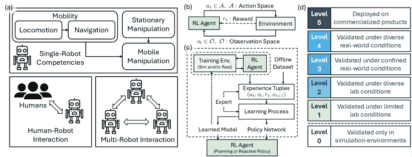
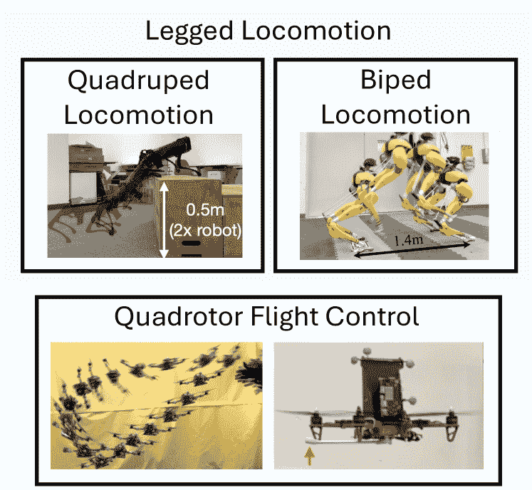
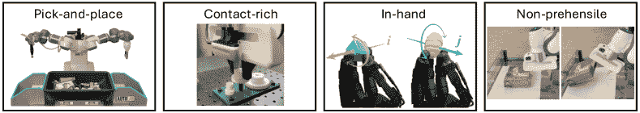
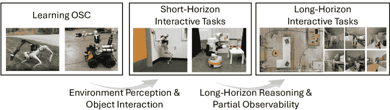
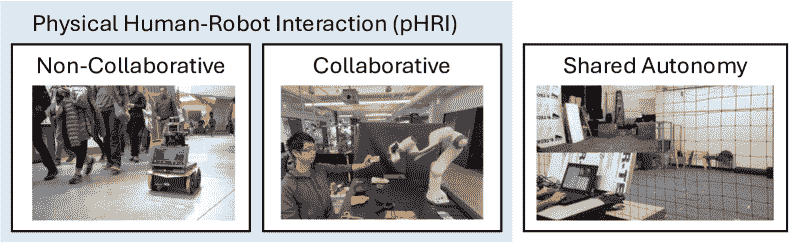
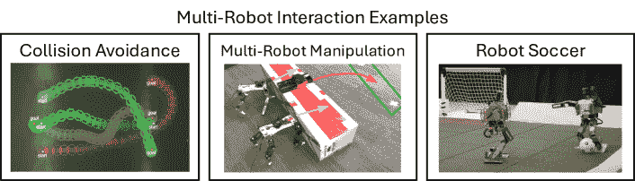

<!--yml

类别：未分类

日期：2024-09-06 19:30:50

-->

# [2408.03539] 深度强化学习在机器人中的应用：现实世界成功的调研

> 来源：[`ar5iv.labs.arxiv.org/html/2408.03539`](https://ar5iv.labs.arxiv.org/html/2408.03539)

\jvol

AA \jyearYYYY \UseRawInputEncoding

# 深度强化学习在机器人中的应用：

现实世界成功的调研

陈唐^(1,∗)    本·阿巴特马特奥^(1,∗)    贾亨·胡^(1,∗)    罗汉·昌德拉²    罗伯托·马丁-马丁¹    彼得·斯通^(1,3) ¹德克萨斯大学奥斯汀分校计算机科学系，美国德克萨斯州奥斯汀，邮政编码 78712；电子邮件：chen.tang@utexas.edu，abba@cs.utexas.edu，jiahengh@utexas.edu，robertomm@cs.utexas.edu，pstone@utexas.edu ²弗吉尼亚大学计算机科学系，美国弗吉尼亚州夏洛茨维尔，邮政编码 22904；电子邮件：rohanchandra@virginia.edu ³索尼 AI ^∗等贡献

###### 摘要

强化学习（RL），特别是与深度神经网络结合的深度强化学习（DRL），在广泛的应用领域中展现了巨大的潜力，表明其能够推动复杂机器人行为的发展。然而，机器人问题为 RL 的应用带来了根本性的困难，这些困难源于与物理世界交互的复杂性和成本。本文提供了关于 DRL 在机器人领域应用的现代调研，特别关注了通过 DRL 实现若干关键机器人能力所取得的现实世界成功。我们的分析旨在识别这些令人兴奋的成功背后的关键因素，揭示尚未深入探索的领域，并对 DRL 在机器人领域的现状进行总体描述。我们强调了未来工作的几个重要方向，特别是对稳定和样本高效的现实世界 RL 范式的需求，发现和整合各种能力以解决复杂的长时间跨度开放世界任务的整体方法，以及有原则的发展和评估程序。此调研旨在为 RL 从业者和机器人专家提供洞见，以利用 RL 的力量创造具备广泛能力的现实世界机器人系统。

###### doi：

10.1146/((please add article doi))

###### 关键词：

机器人技术，强化学习，深度学习，控制学习，现实世界应用^†^†期刊：Xxxx. Xxx. Xxx. Xxx.

## 1 引言

强化学习（RL）[1] 指的是一类决策问题，其中代理必须通过反复试错学习行为，以最大化其累积的*回报*，这由一个标量奖励函数编码，将代理的状态和动作映射到即时奖励。RL 算法，尤其是它们与深度神经网络的组合，即深度强化学习（DRL）[2]，已经展示出在解决复杂的决策问题方面具有显著的能力，即使在高维观测的情况下，如棋盘游戏[3]、电子游戏[4]、医疗保健[5]和推荐系统[6]领域。

这些成功突显了 DRL 在控制具有高维状态或观测空间和高度非线性动力学的机器人系统方面的潜力，以执行传统决策、规划和控制方法（例如经典控制、最优控制、基于采样的规划）无法有效处理的挑战性任务。然而，迄今为止，DRL 最显著的里程碑成就大多是在模拟或游戏环境中取得的，RL 代理可以从丰富的经验中学习。相比之下，机器人需要在*真实世界*中完成任务，这带来了额外的挑战。RL 代理直接在物理世界中进行反复试验收集样本通常是低效和/或不安全的，而且通常无法在模拟中创建复杂真实世界的精确副本。尽管存在这些挑战，最近的进展已使 DRL 成功解决了一些真实世界的机器人任务。例如，DRL 已经实现了冠军级的无人机竞速[7]和集成到生产级四足系统中的灵活四足动作控制（例如 ANYbotics¹¹1[`www.anybotics.com/news/superior-robot-mobility-where-ai-meets-the-real-world/`](https://www.anybotics.com/news/superior-robot-mobility-where-ai-meets-the-real-world/)）、Swiss-Mile²²2[`www.swiss-mile.com/`](https://www.swiss-mile.com/)和波士顿动力³³3[`bostondynamics.com/blog/starting-on-the-right-foot-with-reinforcement-learning/`](https://bostondynamics.com/blog/starting-on-the-right-foot-with-reinforcement-learning/)）。然而，*当前最先进的 DRL 解决方案在不同机器人应用领域的成熟度差异显著*。在某些领域，例如城市自主驾驶，基于 DRL 的解决方案仍然局限于模拟或严格限定的现场测试[8]。

本次调查旨在全面评估 DRL 在现实世界机器人应用中的当前进展，识别最令人兴奋的成功背后的关键因素以及在较不成熟领域中仍然存在的开放挑战。具体而言，我们评估 DRL 在各种问题领域的成熟度，并对跨领域的 DRL 文献进行对比，以确定广泛适用的技术、尚未充分探索的领域以及需要解决的共同开放挑战，以推动 DRL 在机器人中的应用。我们期望本次调查能为研究人员和从业者提供对 DRL 在机器人领域状态的深入了解，提供宝贵的见解以指导未来研究，并促进广泛可部署的 DRL 解决方案用于现实世界的机器人任务。

## 2 为什么还需要另一项关于机器人领域 RL 的调查？

尽管一些先前的文章已经调查了机器人领域的强化学习（RL），我们做出了三项贡献，提供了对文献的独特视角并填补了知识的空白。首先，我们关注于展示了至少*一定程度的现实世界成功*的工作，旨在评估现实世界机器人应用中的 DRL（深度强化学习）的现状和开放挑战。现有关于机器人领域 RL 的调查大多未明确讨论这一话题，例如，Dulac-Arnold 等人[9]讨论了与机器人无关的现实世界 RL 的一般挑战，而 Ibarz 等人[10]列出了基于他们自己研究的案例研究的现实世界机器人环境中的 DRL 开放挑战。相反，我们的讨论基于对 DRL 在机器人领域取得的现实世界成功的全面评估，我们的评价一个方面是现实世界部署的水平（参见第 3.4 节）。

其次，我们提出了一个*新颖的*和*全面的*分类法，该分类法从多个方面对 DRL 解决方案进行分类：机器人通过 DRL 学到的能力、问题的表述、解决方案的方法和现实世界成功的水平。之前的机器人领域 RL 和更广泛的机器人学习调查常常集中于特定任务[11, 12]或特定技术[13, 14]。相比之下，我们的分类法使我们能够调查在机器人应用领域中有效的 DRL 解决方案的完整景观，并单独审查每个应用领域的文献。在这一框架下，我们比较和对比了解决方案，识别*常见模式、广泛适用的方法、尚未充分探索的领域以及开放挑战*，以实现成功的机器人系统。

第三，尽管一些以往的调查分享了我们提供广泛领域分析的动机，但 DRL（深度强化学习）进展的快速和令人印象深刻的步伐已经创造了对该领域、新的成功和局限性的重新分析的需求。Kober 等人的开创性调查[15]是在深度学习时代之前撰写的，而 Sunderhauf 等人的一般性深度学习与机器人学调查[16]则是在 DRL 成果主要集中在模拟中的时候撰写的。我们通过关注 DRL，提供了一个更新的领域概述，DRL 是机器人学中最显著的现实世界成功的背后，特别关注过去五年发表的论文，在此期间大多数成功发生。

## 3 分类法

图 1：我们分类法的四个方面：（a）DRL 学习的机器人能力；（b）问题表述；（c）解决方案方法；（d）现实世界成功的水平。

本节介绍了我们提出的新型分类法，用于对 DRL 文献进行分类。由于我们调查的独特焦点是 DRL 在机器人学中取得的现实世界成功，这需要一种新的分类法来对文献进行分类和分析，这将使我们能够评估 DRL 解决方案在各种机器人应用中的成熟度，并从成功和失败中汲取宝贵经验。具体来说，我们应识别每篇论文中解决的具体机器人问题，了解它如何被抽象为一个 RL（强化学习）问题，并总结为解决问题应用的 DRL 技术。更重要的是，我们应评估这些 DRL 解决方案的成熟度，如实验所示。因此，我们介绍了一种跨越四个轴心的分类法：DRL 学习的机器人能力、问题表述、解决方案方法和现实世界成功的水平。

### 3.1 DRL 学习的机器人能力

我们的主要轴心关注每篇论文中研究的目标机器人任务。一个机器人任务，特别是在开放的现实世界场景中，可能需要多个能力。可以应用 DRL 来综合一个端到端系统以实现所有能力，或学习子模块以实现其中的一部分。由于我们关注的是 DRL，我们根据*通过 DRL 学习和实现的具体机器人能力*对论文进行分类。我们首先将能力分类为*单机器人*——机器人完成任务所需的能力——和*多智能体*——与共享工作空间的其他智能体互动并影响任务完成的能力。

当单个机器人在工作空间中完成任务时，它所需的任何能力可以被视为使其能够以特定方式*与物理世界互动和影响*，这些能力进一步分为移动能力——在环境中移动——和操作能力——在环境中移动或重新排列（例如，抓取、旋转）物体[17, 18, 19]。在机器人学文献中，移动能力通常分为两个问题：运动和导航[18, 20]。运动侧重于使各种形态的机器人（例如，四足动物、人形机器人、轮式机器人、无人机）能够穿越不同环境的运动技能，而导航侧重于制定策略，将机器人有效地引导到目的地而不发生碰撞。典型的导航策略生成*高层次*的运动指令，如质心（CoM）处的期望状态，同时假设有效的运动控制来执行这些指令[18]。一些研究共同解决运动和导航问题，这对导航策略受到机器人在环境中穿越能力影响很大的任务特别有用，因为这取决于机器人动力学和运动控制（例如，通过具有挑战性的地形[20]或比赛[21]）。我们将这些论文与其他导航论文一起回顾，因为它们的*最终目标*是导航。

在机器人学文献中，操作通常在桌面设置中研究，例如，机器人臂或手臂安装在带有固定传感器观察场景的静态基座上。一些实际任务进一步要求机器人在移动其基座的同时与环境互动（例如，家庭和仓库机器人），这就需要操作能力和移动能力的协同整合。我们在静态操作类别下回顾前者，在移动操作类别下回顾后者。

当任务完成受到工作空间中其他智能体的影响时，机器人需要进一步具备*与其他智能体互动的能力*，我们将其归类为*多智能体*能力。请注意，虽然机器人与其他人互动时，仍可能需要一些单机器人能力，例如人群导航或协作操控。在这一类别中，我们关注那些在智能体互动层面进行深度强化学习的论文，即在给定某些单机器人能力的情况下学习互动策略，或学习共同优化互动和单机器人能力的策略。我们进一步根据机器人与之互动的智能体类型将这些工作分为两个子类别：1）*人机互动*关注机器人与人类并肩作战的能力。由于人类的复杂行为和机器人在人体周围操作的严格安全要求，人机互动引入了额外的挑战。2）*多机器人互动*指的是机器人与一组机器人互动的能力。一类强化学习算法——多智能体强化学习（MARL）通常用于解决这个问题。在 MARL 中，每个机器人都是一个学习智能体，根据与环境和其他机器人互动的情况来演化其策略，这使学习机制变得复杂。根据机器人的目标是否一致，它们的互动可以是合作的、对抗的或一般和的。此外，实际场景通常需要在部分可观测性和有限通信带宽下进行去中心化决策。

### 3.2 问题表述

我们分类法的第二个轴心是强化学习（RL）问题的表述，它指定了针对目标机器人能力的最优控制策略。强化学习问题通常被建模为单智能体的部分可观测马尔可夫决策过程（POMDPs）和多智能体的去中心化 POMDPs（Dec-POMDP）。具体来说，我们根据问题表述的以下元素对论文进行分类：1）*动作空间*：动作是*低级别*（即关节或电机命令）、*中级别*（即任务空间命令），还是*高级别*（即时间扩展任务空间命令或子程序）；2）*观测空间*：观测是*高维*传感器输入（如图像和/或激光雷达扫描），还是估计的*低维*状态向量；3）*奖励函数*：奖励信号是*稀疏*的还是*密集*的。由于篇幅限制，我们在补充材料中提供了这些术语的详细定义。

### 3.3 解决方案方法

与上述内容紧密相关的另一个维度是用于解决 RL 问题的解决方案方法，包括 RL 算法和相关技术，这些技术使得目标机器人问题具有实用性。具体而言，我们从以下几个角度对解决方案方法进行分类：1）*仿真器使用*：是否及如何使用仿真器，分为*零样本*、*少样本仿真到现实转移*，或直接在现实世界中*无仿真器*地离线学习；2）*模型学习*：是否（部分）从机器人数据中学习过渡动态模型；3）*专家使用*：是否使用专家（例如，人类或 oracle 策略）数据来促进学习；4）*策略优化*：采用的策略优化算法，包括*规划*或*离线*、*离策略*或*在策略 RL*；5）*策略/模型表示*：用于表示策略或动态模型的神经网络架构类别，包括*MLP*、*CNN*、*RNN*和*Transformer*。有关术语定义的详细信息，请参阅补充材料。

### 3.4 现实世界成功等级

为评估 DRL 在现实世界机器人任务中的实用性，我们根据其 DRL 方法的成熟度对论文进行分类。通过比较不同机器人任务中 DRL 的效果，我们旨在识别研究原型与现实世界部署之间差距较大或较小的领域。这需要一个量化任务中现实世界成功的指标，据我们所知，在机器人领域的 DRL 文献中尚未尝试过。受到自动驾驶[22]和机器学习技术准备水平（TRL）[23]的启发，我们引入了*现实世界成功等级*的概念。我们根据提出的方法经过验证的场景将论文分类为六个等级：1）*等级 0*：仅在仿真中验证；2）*等级 1*：在有限的实验室条件下验证；3）*等级 2*：在多样的实验室条件下验证；4）*等级 3*：在受限的现实世界操作条件下验证；5）*等级 4*：在多样的、具有代表性的现实世界操作条件下验证；6）*等级 5*：在商业化产品上部署。我们认为等级 1-5 至少达到了某种程度的现实世界成功。我们唯一可以用来评估现实世界成功等级的信息是作者报告的实验。然而，许多论文仅描述了单一的现实世界试验。虽然我们努力提供准确的估计，但由于信息有限，这一评估可能具有主观性。此外，我们使用现实世界成功等级来量化针对目标问题的解决方案的成熟度，而不考虑其复杂性。

## 4 能力特定评审

本节提供了 DRL 文献的详细回顾，每个小节专注于特定的机器人能力。在每个小节中，我们进一步根据每种能力的特定子类别组织回顾。在讨论完论文后，我们通过总结学习该能力的趋势和开放挑战来结束每个小节。为了帮助理解，每个小节包括一个表格，以概述所回顾的论文。由于我们的主要目标是评估 DRL 解决方案的成熟度，我们在表格中注明了每篇论文在现实世界中取得的成功水平。有关论文的全面分类，请参见附录材料中的表格 1–6。

### 4.1 运动

运动研究旨在开发机器人在各种真实环境中移动的技能。在深度学习时代之前，一些开创性的工作已经探索了用于运动控制的强化学习（RL），并展示了有前景的硬件演示，例如，四足行走[24]和直升机控制[25, 26]。本小节将运动中的深度强化学习（DRL）解决方案与导航问题分开讨论，其中控制器遵循高级导航命令。由于运动主要涉及运动技能，因此问题的复杂性主要受系统动态的影响[27]。我们将本小节按此组织，并回顾三个代表性的运动问题：四足和双足运动，以及四旋翼飞行控制。有关所回顾论文的概述，请参见图 2。

#### 4.1.1 四足运动

四足机器人运动是深度强化学习（DRL）提供成熟现实世界解决方案的机器人领域之一。多家机器人公司，如 ANYbotics、Swiss-Mile 和 Boston Dynamics，报告称 DRL 被集成到它们的四足机器人控制中，用于工业检查、最后一公里配送和救援操作等应用。在文献中，DRL 方法首先在*盲四足行走*的场景下得到了验证，即仅依赖于平坦室内表面的自体感知传感器[28, 29]。这些策略通常在模拟环境中进行训练，并在现实世界中零-shot 部署。主要挑战在于四足机器人固有动力学的模拟与现实之间的差距。为了弥合这一现实差距，已经探索了几种策略：1) 从机器人数据中学习驱动器模型，无论是分析性的[28]还是基于神经网络的[29]，以提高模拟的逼真度；2) 随机化动力学参数[28, 29]，甚至进一步随机化形态[30]，以实现对未知四足机器人的泛化；3) 采用具有低级基于模型的控制器的层次结构，以处理动力学差异和外部干扰，同时促进高效学习。DRL 策略与基于模型的控制器之间的接口可以在各种层次上定义，如关节位置[31, 32, 33]、腿部姿势[28]、步态参数[34, 35]，或时间扩展的宏动作[36]。当机器人走出受控实验室环境时，它们会遇到更具挑战性的地形，如不连续、可变形或滑腻的表面。四种主要技术已经被用于应对这些额外的挑战。首先，地形和接触信息并不是直接可观察的。特权学习被常用作为一种解决方案[34, 33]，即先训练一个具有特权地形信息的策略，然后将其蒸馏成一个基于实际传感器输入的学生策略。或者，可以借助状态估计[37, 38]和非对称演员-评论员[39, 38]实现端到端训练。在这两种情况下，通常会设置一个扩展的观察历史作为输入。

其次，为了在实际环境中实现泛化，策略应在训练过程中暴露于多样的条件下。通常采用逐步增加任务难度的学习课程来促进训练[34, 33, 36, 38, 37]。先进的地形模型也可以提高在具有复杂接触动力学的地形上的表现，例如，可变形的表面[37]。

| 四足 | 28, 29, 30, 31, 32, 33, 34, 35, 36, 37, 38, 40, 41, 42, 43, 44, 45, 46, 47, 48, 49, 50, 51, 52, 53, 54 |
| --- | --- |
| 双足 | 27, 55, 56, 57, 58, 59, 60, 61, 62, 63 |
| 飞行 | 64, 65, 66, 67, 68 |

图 2：左侧：第 4.1 节中回顾的三种运动问题的概述，包括四足[49]和双足[63]运动，以及四旋翼飞行控制[64, 67]；右侧：第 4.1 节中回顾的运动论文。颜色图表表示现实世界成功的水平：*有限实验室*、*多样实验室*、*有限现实*和*多样现实*。

第三，外部感觉传感器对于穿越危险地形至关重要，因为它们使四足机器人能够适应地形而不必踩踏上去。例如，它们促进了更高效和更稳健的楼梯行走[35, 43]。外部观察通常以地形高度图[35, 36]、深度图像[44, 45] 和 RGB 图像[43]的形式存在。特权学习被广泛应用于从这些高维观察中促进策略学习[44, 35, 45]。为了减少传感器输入中的模拟与现实之间的差距，技术如注入模拟传感器噪声[35]、后处理深度图像[50]、从现实世界样本中学习视觉编码器[43]已被证明有效。此外，策略通过自监督学习[36, 35]、跨模态嵌入匹配[44, 43]或使用更高容量的模型，如变压器[69, 45]受益于改进的表示。

第四，跨越某些复杂地形需要比常规步态更高级的运动技能。例如，端到端 DRL 策略通常在接触区域稀疏的地形上表现不佳。Jenetlen 等人[46]表明，训练 RL 策略以跟踪轨迹优化提供的参考足点可以在稀疏地形上提供更准确、更稳健的脚步放置。跳跃进一步扩展了机器人跨越其身体长度的能力。例如，Yang 等人[47]训练了一个 DRL 策略，以生成具有模型基础跟踪控制器的轨迹，以处理复杂的跳跃动态。跌倒恢复是另一个关键技能，特别是在现实世界的 RL 中实现自动重置[48, 53]。一些工作已经训练了 DRL 策略用于跌倒恢复[29, 31, 48, 32, 41]。然而，跳跃和跌倒恢复迄今仅在平坦表面上得到验证。

为了有效地利用敏捷运动技能完成如跑酷这类复杂的下游任务[49, 50]，开发*多技能*策略是至关重要的。联合学习多个技能也已被证明对促进策略的稳健性有效[63]。一种方法是创建一组 RL 策略[51, 32, 50]，每个策略针对特定技能，然后训练一个高层策略以选择最佳技能[32]。另外，也可以通过 BC 从专门的技能策略中提炼出一个单一策略[50]。为了避免训练多个专门策略的繁琐过程，一些工作探索了直接构建统一策略。例如，MoB[52]将各种运动策略编码到一个以步态参数为条件的单一策略中。Cheng 等人[49]使用了包含路径点和速度跟踪项的统一奖励来学习多样化的跑酷技能。Fu 等人[42]表明，能量最小化有助于平滑的步态过渡。运动模仿奖励是另一种广泛使用的统一方法，用于学习自然且多样的运动技能[51, 40]。

关于 RL 算法的备注。我们在关于四足运动的综述中，最后对文献中使用的 RL 算法进行了备注。最成熟的 DRL 解决方案采用了零样本的仿真到现实转移方案，主要使用了策略优化的无模型 RL，例如 PPO [70]，因为它对超参数具有鲁棒性。Gangapurwala 等人[36]指出，当动作空间在时间上扩展或需要确定性控制动作时，策略优化 RL 可能不那么有利。同时，研究人员探讨了少样本适应和现实世界 RL，无论是无模型[48, 53]还是有模型[54]，以通过真实世界的试验更新策略，进一步将策略推广到新的情况而无需精确的仿真。然而，大多数相关工作仅在有限的实验室环境中得到验证。现实世界的精调[48]和从头学习[53]的最先进表现是通过使用离策略 RL 来学习行走和跌倒恢复。然而，相较于成熟的零样本解决方案，测试条件仍然有限。

#### 4.1.2 双足运动

与四足运动相比，关于双足运动的 DRL 文献较少，展示的现实世界能力也更为有限。我们将讨论限制在 3D 双足机器人上，这些机器人可以在所有空间维度中自由移动，不同于附着在支架上的 2D 双足机器人，这些机器人仅限于 2D 平面运动[71]，因为它们具有更大的实际应用价值。文献从在平坦室内表面行走[55, 57]开始，扩展到在各种室内[56, 58, 27]和室外地形[60, 62]上行走，以及在外力作用下[27, 58]。其他展示的技能包括楼梯行走[59]、跳跃[57]、跑步[57, 63]、跳跃[63]以及跨越障碍物和缝隙[61]。更先进的技能已由工业公司展示⁵⁵5 例如，Unitree ([`t.ly/s1FwW`](https://t.ly/s1FwW)) 和 Boston Dynamics ([`t.ly/NaSaO`](https://t.ly/NaSaO))，但没有公开的技术报告显示是否在其演示中使用了 RL。值得注意的是，其中一些工作将其运动策略应用于类人机器人[56, 60, 62]，而其他工作则应用于没有上半身的双足机器人[55, 58, 59, 27, 61, 63]。

双足行走的深度强化学习（DRL）技术在很大程度上与四足动物的技术重叠，但由于双足的复杂和欠驱动动态，表现出三种明显的趋势。首先，由于双足的不静态稳定动态，学习基本的站立和行走技能已经非常具有挑战性 [55]。因此，模型基础的方法经常用于促进强化学习，要么通过生成参考步态来指导强化学习 [55, 58, 63]，要么处理高层强化学习策略的低层控制 [60]。另外，Siekmann 等人 [57] 提供了一种基于周期组成的无参考周期奖励设计的端到端解决方案。第二，*记忆*在状态和动作中的作用尤为突出 [55]，尤其是长短期记忆的结合 [63]。因此，大多数工作在其策略架构中采用了序列模型 [63, 61, 55, 57, 59, 62]。第三，几乎所有这些策略都从仿真中零-shot 转移过来。一个例外是 GAT [56]，它收集了真实世界样本来迭代优化模拟器，使 NAO 能够在不平坦的地毯上行走。有限的真实世界学习示例可能是由于双足的有限恢复能力，这限制了它们在试验中的弹性，尤其是自我重置的能力。

#### 4.1.3 四旋翼飞行控制

无人机（UAV）的飞行控制，特别是四旋翼，是另一个深度强化学习（DRL）表现出色的问题。Hwangbo 等人[64] 开发了第一个成功在硬件上验证的 DRL 四旋翼控制策略，用于航点跟踪和从恶劣初始化中恢复。后续研究表明，精心设计的模拟动态、领域随机化[65]，以及精心设计的动作空间，特别是集体推力和机体速度[66]，可以促进策略的鲁棒性。Zhang 等人[67] 应用 RMA 训练了一个对未见扰动适应的鲁棒接近悬停位置控制器。Eschmann 等人[68] 引入了第一个离政策强化学习（RL）范式，用于四旋翼控制，能够在 18 秒内训练出可部署的控制策略以实现航点跟踪。总之，DRL 在悬停控制上比经典反馈控制器（例如 PID）表现出更好的鲁棒性[65, 67]。然而，与精心设计的基于优化的控制器相比，DRL 策略在航点跟踪上往往会有更大的跟踪误差[64, 66]。但 RL 相对于最优控制的根本优势在于它能够进行规划和控制的联合优化[21]，使其成为如赛车等敏捷导航的理想候选者（见第 4.2 节）。

#### 4.1.4 运动趋势和开放挑战

总结来说，DRL 在为具有挑战性的条件合成强健且自适应的行走控制器方面表现出了效果。用于四足、双足和飞行控制的 DRL 技术有很大重叠。例如，最初为四足行走提出的 RMA [33] 已被调整用于双足 [27] 和四旋翼飞行控制 [67]。然而，DRL 解决方案在不同领域的成熟度有所不同。四足机器人能够通过 DRL 跨越各种室内和室外地形，而 DRL 实现的现实世界双足行走技能则更为有限。对于四旋翼，绝大多数测试仍限于受控、无障碍的室内环境。硬件的可获取性是一个影响因素。低成本四足机器人的引入刺激了四足研究，并导致了开源和统一的软件包。相反，高成本的双足硬件限制了广泛的现实世界测试，尽管近期的人形硬件进展预计将推动双足研究。更重要的是，四足动力学本质上更稳定，而双足和四旋翼在控制错误下更容易发生灾难性故障，这对控制的鲁棒性和精度提出了更高的要求 [63]。在复杂障碍的户外场景中，高速四旋翼控制进一步要求策略确保*长视距*闭环轨迹的可行性 [72]。集成长视距规划和短视距控制的端到端 RL 显示出了作为解决方案的潜力 [7]。除了确保长视距可行性，将行走与下游任务（例如，动作操作）结合在一起是一种令人兴奋的方向，但如何发现下游任务所需的技能仍然是一个未解之谜。

{总结}

[关键要点]

+   •

    DRL 已经实现了成熟的四足行走控制；然而，DRL 基于其他行走问题的解决方案的成熟度较低。

+   •

    硬件的可获取性是一个重要的影响因素。低成本和标准硬件平台将促进 DRL 发展。

+   •

    某些行走问题本质上复杂的动力学对 DRL 行走控制器的可靠部署提出了根本性挑战。

+   •

    即使在成熟的四足行走领域，仍然存在一些未解的问题，例如 1）通过 RL 有效集成行走与下游任务，以及 2）实现高效且安全的现实世界学习。

### 4.2 导航

导航专注于移动性中的决策挑战：将一个代理运输到目标位置，同时避免碰撞，通常假设有效的运动能力。作为一种基本的移动能力，导航在机器人研究中有着悠久的历史 [18]。 “经典”导航方法采用映射、定位和规划模块来确定并执行到目标的路径。规划通常被分解为全局规划，生成粗略路径，和局部规划，跟踪全局计划并处理碰撞避免。在这一部分，我们通过具象化来划分导航工作：轮式、腿式和空中导航，并识别在每种环境中由强化学习（RL）实现的能力。社会导航，即机器人在有人存在的情况下进行导航，被推迟到第 4.5 节。多机器人导航类似地被推迟到第 4.6 节。

#### 4.2.1 轮式导航

尤其是轮式机器人导航在机器人领域有着悠久的历史 [18]。我们讨论了几种常见的轮式导航设置，包括几何导航、视觉导航和越野导航。

几何导航。早期尝试旨在验证强化学习（RL）解决通常通过模块化经典方法解决的导航问题的能力 [73]。这些 RL 策略直接将 2D 激光扫描映射到控制动作，与经典方法通过激光扫描构建明确地图不同。虽然显示出一定的前景，但它们通常没有与经典方法进行比较，或未能超越经典方法 [12]。一些最近的研究对这些基于 RL 的方法进行了基准测试，发现它们在具有密集障碍物和狭窄通道的挑战性问题中表现更优 [74]。而不是用 RL 策略替换整个导航堆栈，模块化方法用 RL 替换特定组件，如局部规划器 [75] 或探索算法 [76]，从而实现比经典基线更好的性能。然而，这些改进主要是在有限的实际环境中观察到的。大多数商业部署的系统仍主要采用经典堆栈，因为基于 RL 的方法缺乏安全性、可解释性和泛化能力 [12, 74]。

视觉导航。视觉导航指的是代理基于视觉观察导航到目标的问题。额外的输入和任务复杂性带来了挑战，但也使代理能够学习在类似环境中导航的通用策略（例如，家庭环境），其中视觉数据中会出现结构性模式。目标通常被指定为相对于代理的一个点（称为 pointgoal 导航）或特定物体的图像（objectgoal 或 imagegoal）。RL 也常被应用于视觉与语言导航问题[77]，尽管很少有工作展示了这些能力在真实机器人上的应用。许多工作[78, 79]直接将视觉观察映射到动作，而没有使用映射或规划模块。这些端到端方法在视觉现实模拟中的 pointgoal 任务上取得了接近完美的结果[80]。然而，训练这样的策略具有挑战性，因为需要场景理解、智能探索和情节记忆。它们在现实世界导航中的适用性仍不明确，因为它们大多在有限的真实或实验室环境中进行了验证。其他工作研究了模块化设计，例如，将 RL 用作全球探索策略，并结合显式映射和局部规划[81, 82]。这些方法在 pointgoal 和 imagegoal 任务上超越了经典和端到端学习基准。然而，这些模块化方法也存在一些挑战，例如动态障碍物，而端到端方法在这方面显示出了希望[83]。

尽管有大量关于视觉导航的 RL 工作，但大多数仍限于仿真。这些仿真器通常是基于真实世界的扫描数据构建的[77, 84]，但它们在真实世界中的转移性仍有争议。一些工作报告了由于视觉领域差异导致的较差转移[82]，而其他工作则通过参数调整[85]、动态抽象[86]或仅使用深度图像而非 RGB-D[83, 87]找到了成功的途径。

越野导航。越野导航由于不同地形的动态性和可通行性带来了额外的挑战。一些方法通过基于模型的强化学习（RL）来应对这些挑战，以学习事件或脱离的预测模型[88]，或者利用演示数据进行离线 RL[89]。在高速越野驾驶中，基于模型的 RL 也取得了成功[90]，最近，基于视觉的无模型 RL 也取得了一定进展[91]。

| 轮式 | 73, 74, 75, 76, 78, 81, 82, 85, 88, 89, 90, 91, 92, 93 |
| --- | --- |
| 四足 | 20, 83, 86, 87, 94, 95, 96, 97, 98, 99, 100 |
| 空中 | 7, 21, 101, 102, 103 |

图 3：左侧：第 4.2 节中回顾的三种导航问题的概述，包括轮式导航[74, 88, 92]，四足导航[97]，以及空中导航[21]; 右侧：第 4.2 节中回顾的导航论文。颜色图表示现实世界成功的等级：*有限实验室*，*多样实验室*，*有限现实*，和*多样现实*。

自动驾驶。自动驾驶将轮式导航扩展到在更复杂且安全性关键的环境中以更高速度操作的全尺寸乘用车。强化学习在自动驾驶领域取得了有限的现实成功[8]，仅在特定条件下有少数成功案例。Kendall 等人[92]通过学习在安全司机介入之前最大化进度来训练车道跟随策略。最近，Jang 等人[93]训练了一种巡航控制策略，其中策略命令被手动指定的阈值包裹以确保安全。他们将其策略部署到 100 辆车上，在实地测试中平滑交通流量。他们的工作建议了一种将强化学习嵌入自驾系统的实用方法，并展示了其在车队级别的潜在好处。

#### 4.2.2 四足导航

带腿导航与带轮导航面临许多相似的挑战，但也能够穿越更复杂的地形。研究表明，强健的视觉带腿导航策略可以通过低保真度的运动学模拟在室内[83, 86]和室外[86, 94]学习。因此，这些策略专注于运动学级别的控制，同时假设在部署过程中具有有效的低级别运动控制。Truong 等人[86]表明，与使用高保真度模拟学习端到端策略相比，这种方法能够加快模拟速度并提高策略的通用性。由于腿部运动学动态被抽象化，这些方法与带轮情况类似，主要挑战是视觉领域的差距。无监督表示学习[83]和预训练的视觉模型[94]被用于促进强健的视觉策略。对于户外场景，Truong 等人[87]将训练于成熟的室内模拟器的零-shot 转移策略应用于户外，使用目标向量归一化和相机俯仰随机化来弥合室内到户外的领域差距。Sorokin 等人[94]使用高保真度的自动驾驶模拟器，并从预训练的语义分割模型中提取视觉特征，以实现强健的模拟到现实的转移，用于人行道导航。

尽管抽象化低级运动具有优势，但它限制了系统充分利用高级运动控制器赋予的灵活运动技能。最近的研究探索了将运动与导航整合的 DRL 框架，实现了高速障碍物避让[100]和在具有挑战性的地形（如楼梯、间隙和箱子）上进行灵活导航[20, 96]以及通过受限的三维空间[98, 99]。特别是，Lee 等人[97]展示了在城市场景中使用轮腿机器人进行公里级导航，克服了具有挑战性的地形和动态障碍物。集成的策略网络可以是端到端的，接受目标坐标作为输入，并输出运动命令[20, 99]。He 等人[100]进一步引入了使用学习到的到达-避免值网络协调的恢复策略。或者，可以通过层次架构提高训练效率，其中高级策略控制预训练的低级运动策略[95, 96, 97, 98]。尽管将运动与导航整合具有潜力，但由于复杂的低级动态以及导航任务的长期性质和稀疏奖励，策略训练可能代价高昂且不稳定[20, 96]。经典的规划算法通常用于生成局部路径点，以减少导航范围，并合成可行路径以指导初始训练[97]。

#### 4.2.3 空中导航

与轮式和腿式机器人相比，如四旋翼飞行器等空中车辆更脆弱，需要更高的鲁棒性和安全性的导航策略。四旋翼飞行器的重量和功率限制也限制了先进传感器的使用。有几项工作探讨了使用低成本单目摄像头进行基于深度强化学习（DRL）的空中导航[101, 102]。Sadeghi 等人[101]利用视觉领域随机性来实现室内空中导航的零样本虚拟到真实转移。Kang 等人[102]展示了 1）仿真中的任务特定预训练对于学习可推广视觉表示以及 2）使用真实世界数据学习准确动力学的价值[79]。与四足动物的导航类似，DRL 已被用于开发敏捷空中导航的端到端导航和运动策略。Kaufmann 等人[7]在无人机比赛中实现了人类冠军级别的表现。他们成功的关键因素是增加了无人机感知和动力学的数据驱动残差模型的仿真。他们随后的研究[21]显示，RL 比基于模型的方法优势在于其直接优化长视程赛车任务目标的能力。然而，基于 DRL 的策略仍然不及人类飞行员稳健，限制了其操作条件。将演员-评论家的 RL 与微分 MPC 整合显示了提高稳健性的潜力[103]。

#### 4.2.4 导航的趋势与挑战

RL 已经显示出在导航系统的各个子模块，例如局部规划[75, 104]和全局探索[76, 81, 82]，以及构建端到端导航解决方案[74]方面的潜力。然而，导航的基于 RL 的解决方案缺乏传统系统的泛化性、可解释性和安全性保证，因此在现实世界中并没有得到广泛的部署[12, 74]。

在视觉导航中，无模型、端到端的策略在家庭等结构化室内环境中显示出很好的性能[105]，而模块化体系结构能提高性能而不损害保证和泛化[81, 82]。在学习模块和经典模块之间取得平衡仍然是一个悬而未决的挑战。混合方法可能是有前途的，例如，利用端到端方法学习的隐式地图样式表示[106]，或者使用可微分的场景表示[107]来实现具有算法结构的 RL。基于 RL 的视觉-语言导航在真实世界环境中相对较少被探索，但鉴于近期视觉-语言模型的进展，具有前景。

在腿部导航中，抽象低层次动态已被证明有助于导航的仿真到现实转移 [86]。对于敏捷的腿部和空中导航，其中低层次复杂性不可避免，联合学习导航和运动会产生有希望的结果 [100, 20, 96, 7]。然而，涉及运动会使长时间范围的导航策略训练复杂化，这需要未来的发展来稳定学习。

最后，学习导航（特别是碰撞避免）对于安全关键系统，如城市自动驾驶汽车和无人机，具有挑战性，因为在感知和控制方面需要严格的鲁棒性要求。因此，这些领域的现实世界成功较少。现实世界的数据可以帮助提高仿真准确性[7, 21, 103]，但对其性能建立保证仍然困难。

{总结}

[关键要点]

+   •

    虽然端到端的强化学习在仿真中的视觉导航表现出色，但大多数现实世界的成功应用都采用了模块化设计，并学习导航栈的各个组件。

+   •

    将强化学习（RL）融入这些模块化架构，例如用于局部规划或语义探索，是一个有前景的方向。

+   •

    最近的工作通过联合考虑导航和运动实现了敏捷的腿部和空中导航，但如何在低层控制环中稳定高效地学习长时间范围的导航仍然是一个开放挑战。

+   •

    像城市自动驾驶或户外无人机飞行这样的安全关键应用，由于对鲁棒性的更高要求以及 RL 算法在解释性和泛化性方面的不足，现实世界的成功案例很少。

### 4.3 操作

| 拾取与放置 | 抓取 | 108, 109, 110, 111, 112 |
| --- | --- | --- |
|  | 端到端拾取与放置 | 54, 113, 114, 115, 116, 117, 118, 119, 120, 121, 122, 123, 124, 125 |
| 高接触性 | 组装 | 126, 127, 128, 129, 130 |
|  | 铰接物体 | 122, 131, 132, 133 |
|  | 可变形物体 | 134, 135, 136, 137 |
| 手中 | — | 138, 139, 140, 141, 142 |
| 非抓握性 | — | 109, 118, 143, 144, 145 |

图 4：顶部：第 4.3 节回顾的四个操作问题的概述，包括拾取与放置[108]、接触丰富的操作[130]、手内操作[141]和非抓取操作[143]；底部：第 4.3 节回顾的操作论文。颜色图示显示了现实世界成功的水平：*有限的实验室*、*多样的实验室*、*有限的现实*和*多样的现实*。

操作指的是代理通过选择性接触来控制其环境[19]。为了在世界上执行有用的工作，机器人需要诸如拾取与放置、机械组装、手内操作、非抓取操作等操作能力。操作对分析方法和基于学习的方法都提出了几项挑战[11]，因为接触的力学复杂且难以建模，而开放世界的操作需要强大的泛化能力和快速的在线学习。强化学习（RL）适合这些挑战，但操作对 RL 提出了根本性的困难：大规模的观察和动作空间使得现实世界探索耗时且不安全；奖励函数设计需要领域知识；任务通常具有较长的时间跨度；即时环境重置在现实世界任务中通常不切实际。尽管面临这些挑战，深度强化学习（DRL）在操作方面最近取得了显著成功。

在本小节中，我们回顾了 DRL 支持的几种操作能力的进展，按照 Mason 的开创性综述[19]的提纲：拾取与放置、接触丰富的操作、手内操作和非抓取操作。有关本小节所回顾的论文概述，请参见图 4。注意，本小节侧重于静态操作器，而移动操作将推迟到第 4.4 节。

#### 4.3.1 拾取与放置

挑选和放置物体是操纵中长期以来的一个挑战，需要能够感知物体、抓取物体、确定合适的放置位置并生成无碰撞运动的能力。结构化的挑选和放置，其中环境被设计为降低复杂性，并且对象是预先知道的，在制造环境中被广泛应用和理解。在野外环境中重新排列任意物体的开放式、非结构化的挑选和放置仍然是一个挑战。近年来，更传统的机器人方法在工业应用中取得了成功，如实现目标的应用，采用机器学习来检测和抓取物体，但将控制交给分析方法[19].。虽然挑选和放置任务作为新的强化学习算法的常见测试平台[115, 116, 117, 118, 119, 54]，但端到端强化学习方法仍然缺乏在开放世界中泛化能力的能力来挑选和放置新颖物体。然而，模块化方法，如利用强化学习解决抓取问题，已实现了一些真实世界的成功。我们将回顾基于强化学习的解决方案的子问题的抓取问题，然后讨论端到端强化学习方法，不讨论通常不使用强化学习进行运动生成的讨论。

##### 4.3.1.1 抓取

抓取物体是进行抓取与放置以及其他下游任务（如手内操作和组装）的基本能力。一些深度强化学习（DRL）在操控领域的大规模成功最早体现在对未知几何形状和外观的物体进行抓取[108]。而分析方法通过分类法和数据库实现了对已知物体的抓取，这些研究则利用成千上万次的抓取尝试，通过交互学习抓取行为。许多研究将抓取视为一个赌博问题或分类问题，其中动作空间由离散的抓取候选项组成，抓取动作以开环方式执行[108, 109]。这些方法通常使用稀疏奖励来指示成功（当物体被提起时），并以自我监督的方式收集数据。类似的系统据报道已被集成到履行应用中⁶⁶6 请参见 Ambi Robotics 的示例 ([`t.ly/tSds_`](https://t.ly/tSds_)) 和 Covariant ([`t.ly/S5pnz`](https://t.ly/S5pnz))，适用于各种物体。闭环抓取——直接控制末端执行器姿态和/或手指以实现稳定的抓取——可以被公式化为一个序列决策问题，并通过强化学习解决。虽然已取得一些成功[110, 111, 112]，但由于学习基于视觉的闭环控制的额外复杂性，闭环抓取仍然具有挑战性，这些系统在现实世界中的成功程度尚未达到开环系统的水平。在闭环和开环抓取中，虽然一些研究仅收集真实世界的数据[109, 110, 112]，但常见的做法是使用模拟进行数据收集[108]或策略训练[111]，通常采用领域适应以确保模拟器与现实世界之间的视觉相似性。

##### 4.3.1.2 端到端的抓取与放置

在开放世界中学习通用的捡放任务对于端到端的强化学习仍然令人畏惧，因为对象和任务的种类繁多，以及当前算法的有限泛化能力。这种多样性也排除了在其他领域（如抓取和手内操控）中成功的常见模拟到现实的配方，在这些领域中，任务和对象可以在训练过程中列举出来。尽管如此，端到端的捡放任务仍然取得了一些重大突破：Levine 等人[113] 展示了深度视觉运动政策的潜力；Riedmiller 等人[119] 展示了在现实世界中通过层级政策进行的捡放操控；Lee 等人[116] 通过模拟到现实转移实现了多样物体的堆叠。通过原语[123] 扩展动作空间可以帮助缩短任务范围，是融入人类工程的自然方式。近期利用大规模视觉语言模型的工作在处理由自然语言指定的开放性多样物体和任务目标方面显示了前景[124]。随着新兴的大规模机器人数据集和基础模型的出现，强化学习解决这一长期挑战的潜力才刚刚显现。尽管在实际部署中尚未取得广泛成功，但许多重要的强化学习创新已经在捡放问题中得到展示，解决了诸如多任务学习[114、115、125]、样本效率[54]、奖励定义和计算[120、121]、环境重置[117]以及利用人类示范或离线数据[122、116、124]等挑战。

#### 4.3.2 接触丰富的操控

虽然捡放任务通常被认为是严格的运动学问题，但接触丰富的任务，如机械装配（例如，插入销钉）、与关节物体的互动（例如，开门）以及操控可变形物体，都需要考虑动力学，并放宽物体的刚体假设。我们讨论了几种接触丰富的任务，其中强化学习（RL）推动了技术的进步：装配、关节物体操控和可变形物体操控。

##### 4.3.2.1 装配

组装任务在制造中至关重要，自动化它们是机器人学中一个长期存在的挑战。现有的工业解决方案往往依赖于对环境和机器人动作的广泛工程设计，导致行为对小的扰动敏感且设计成本高昂。由于控制接触丰富的交互和对准确性与精度的严格要求，加上需要处理多样的物体部件，组装对强化学习（RL）来说具有挑战性。虽然 RL 在工业环境中尚未得到广泛应用，但近年来已观察到一些显著的成功。许多方法采用了从模拟到现实的转移来实现组装[130]，尽管一些方法直接在现实世界中训练策略[126, 127, 128, 129]，通常利用人类演示。Luo 等人[128]显著地与集成商提供的解决方案进行了比较，发现其基于 RL 的策略对扰动更具鲁棒性。许多组装方法采用了残差 RL[126]，其中在参考轨迹上学习残差策略。大多数工作假设对象在组装之前已被抓取。相比之下，Tang 等人[130]提出了一种完整组装流程的从模拟到现实的 RL 框架，包括物体检测、抓取和插入，通过利用接触模拟的最新进展和开发算法进展实现了多样化的组装任务。

##### 4.3.2.2 铰接对象

在受限操作任务（如打开抽屉）中观察到一些有限的成功。最常见的是，这些任务用于展示 RL 能力，而没有专门的努力实现实际部署[122, 131]。其他工作特别针对这一类技能[132, 133]，但成功有限。

##### 4.3.2.3 可变形对象

可变形对象，如布料，由于难以准确建模软材料，带来了额外的挑战。诸如布料折叠[134, 135, 136]和辅助穿衣[137]等任务因此在 RL 中得到了相当多的关注。这些工作通常采用从模拟到现实的转移[134, 136, 137]，并经常使用诸如取放[135]和抛掷[136]等原语来简化任务。

总的来说，开放世界中的接触丰富操作继承了无结构的取放任务的挑战（即对新对象和任务的泛化能力）以及控制接触丰富交互的额外挑战。尽管如此，已在接触丰富的任务中展示了一些成功，特别是在组装和可变形对象方面，这些任务是预定义的，对象是可枚举的，并且通常假设使用刚性抓取。

#### 4.3.3 手内操作

人类展示了许多手内操作行为，通过重新定位和调整物体以促进后续操作。近年来，深度强化学习（DRL）在这些能力的发展上取得了显著进展，使得代理能够学习这些复杂的手内操作行为，并具有令人印象深刻的泛化能力。若干研究专注于将单个物体重新定位到目标配置 [138, 139]，使用在仿真中训练的姿态估计模块。Nagabandi 等人 [140] 同样展示了使用基于模型的强化学习旋转保定球。尽管展示了令人印象深刻的灵活性，这些工作专注于操作已知物体（例如，给定的立方体）并使用低维观察。近期的方法利用视觉和触觉数据展示了绕任意轴旋转任意物体的能力 [141]，甚至在抗重力的情况下 [142]。这些方法采用了广泛的领域随机化，并通常在仿真训练中利用特权信息（例如，物体形状信息、动态属性）和密集奖励。一个开放的挑战是将这些手内操作技能与其他操作能力（例如，工具使用）整合，这需要将物体重新定向到适合下游任务的目标配置。

#### 4.3.4 非抓取操作

非抓取操作，即在不抓取物体的情况下移动物体，对于物体过大而无法抓取、抓取被遮挡或工具使用时至关重要。物体推动能力已通过强化学习（RL）得到长期验证 [118]，并与抓取行为进行了研究 [109, 143]。近期，通过强化学习策略的仿真到现实转移，已实现了多样物体的一般非抓取重新定位 [144, 145]。与手内操作类似，利用特权信息（即，物体几何信息）来学习并在提炼学生策略之前是一种常见的方法。需要进一步的工作来将这些技能与抓取和手内行为整合，并发展外部灵活性，其中环境用于促进操作。如何综合这些能力以实现通用的开放世界操作仍然是一个开放的问题。

#### 4.3.5 操作中的趋势和开放挑战

强化学习（RL）开始在各种操作问题中取得现实世界的成功。通常，RL 在任务空间更受限的领域中更为成功——抓取、手部操作和装配——而不是那些不受限的领域，例如端到端的捡放。这些更受限的任务允许事先奖励设计和零样本的模拟到现实转移，而开放世界的捡放和接触丰富的操作则需要对多样的物体和任务进行泛化。物理模拟的局限性也可能阻止接触丰富任务的模拟到现实的扩展。可微分模拟在这一挑战中显示出了潜力[146]。开放世界操作将需要若干进展，包括扩展模拟资产和任务的集合；少样本的模拟到现实[131]；多任务学习[114, 125]；在现实世界中自主学习[120, 117, 54]；从示例[120]或人类视频[121]中学习奖励函数；以及利用人类演示[127]、离线数据[122]和基础模型[124]。引入先验知识，如对称性[112]和几何[147]，在提高样本效率、泛化和安全性方面表现出良好前景。学习更复杂的行为，例如双手操作[148]或动态任务如乒乓球[149]，是未来工作中的另一个重要方向[11, 19]。

此外，动作空间通常由领域专家选择，以匹配每个具体问题。开环抓取倾向于采用运动生成的抽象来实现手指的伸展和闭合，而闭环抓取、装配和端到端的捡放方法通常控制末端执行器的笛卡尔姿态或速度。大多数手部操作方法在配置空间中控制手指，使末端执行器保持固定位置。为一个代理装备这些各种操作能力仍然是将有能力的操作器部署到现实世界中的一个重要挑战。此外，许多现实世界的成功展示是在短期任务上；进一步的工作是构建能够在更长时间内进行推理并将学习到的能力组合起来以解决长期任务的代理[11, 123, 132, 150, 151]。

{summary}

[关键要点]

+   •

    RL 在操作领域的解决方案通常不如运动学成熟，实际部署较少，但在具有代表性的现实世界条件下存在许多令人印象深刻的展示。

+   •

    任务可以事先枚举的操作子问题，例如抓取、手部操作、装配，允许零样本的模拟到现实转移，促进了许多现实世界的成功。

+   •

    集成操作子领域并与任务规划相连接，以建立一个普遍有效的操作器仍然是一个开放的挑战。

### 4.4 移动操作

移动操作器是结合了移动性和操作能力的机器人代理，解锁了家庭、医疗和物流领域的应用。移动操作（MoMa）问题呈现出独特的挑战，需要的不仅仅是简单的运动和操作的串联，包括需要控制和同步多个体部件（如头部、手臂和底座/腿部）所涉及的多个自由度、强烈的部分可观察性和具有自然长远视角的任务。DRL 已被应用于解决各种类型的 MoMa 任务，包括 1）学习精确的实时全身控制；2）在短视角互动任务中学习物体感知和互动；3）在长视角互动任务中的高层决策。在本节中，我们回顾了这些问题的相关工作，概述如图 5 所示。

#### 4.4.1 学习全身控制

移动操作器（WBC）中全身控制的共同目标是确定一个或多个动作的序列，以使身体的所有自由度达到所需的配置，并可能满足额外的约束条件。通常，所需的配置被指定为代理的一条或多条链接的期望位置或姿态，例如，末端执行器的期望姿态[152、153、154、155]。尽管在先进控制理论文献中存在基于模型的解析方法[156]，但在系统动态难以建模（如腿部与地面的接触、滑轮、未知操作器动态）或推理时间计算受限的情况下，深度强化学习（DRL）被探索作为一种强有力的替代方案——这种计算受限的情况在由于机器人具身的复杂性，MoMa 任务中很常见。例如，Wang 等人[152]和 Fu 等人[154]学习了全身策略，使得带轮移动操作器和带有手臂的四足机器人能够用其末端执行器到达 3D 空间中的点。Ma 等人[153]学习了一种对随机扭矩扰动具有鲁棒性的运动策略，并使用 MPC 规划器来控制手臂进行点到达。

通常，整个身体控制问题侧重于精确控制末端执行器，而不考虑代理的周围环境：策略将本体感觉作为观察，并尝试将其与期望配置的差异最小化。值得注意的是，最近的研究探讨了如何将低级整体身体控制技能集成到层次化强化学习架构中[157, 158, 159]，其中较高层次的感知周围环境，并以正确的期望姿态作为目标查询低级整体身体技能。这将深度强化学习在学习整体身体控制方面的成功扩展到了更复杂的交互式 MoMa 任务中。

#### 4.4.2 短期交互任务

短期交互任务通常专注于学习不需要记忆或规划能力的特定感官运动技能。许多研究探讨了将深度强化学习应用于这些短期任务，包括抓取[160, 161, 159]、踢球[162, 158]、无碰撞目标跟踪[163, 164, 165]、交互式导航[166]和开门[167, 168]。值得注意的是，Ji 等人[158]使用层次化强化学习学习足球踢球技能，其中高层策略生成由低层策略执行的期望末端执行器轨迹。Hu 等人[163]通过动作空间分解推导出低方差策略梯度更新，从而提高了训练效率。Cheng 等人[169]在模拟中学习了四足动物的运动和操控的独立技能，并使用行为树将不同技能链在一起。Ji 等人[162]在模拟中学习了整体身体运球策略，并通过在视觉输入和模拟参数中进行广泛的领域随机化，将其零样本转移到现实世界。Liu 等人[159]通过层次化强化学习和师生蒸馏学习了抓取策略，其中基于图像的学生策略从基于状态的教师策略中蒸馏出来。交互任务要求策略根据对周围环境的传感器观察做出决策。因此，策略通常需要接受高维观察，如相机或激光雷达读数（表 2）。同时，这些任务通常涉及难以建模的动态，如接触力或关节对象运动，使得无模型强化学习成为对经典方法和基于模型的强化学习的有吸引力的替代方案（表 4）。

#### 4.4.3 长期交互任务

为了使移动操控器在办公室[170]、家庭或厨房[171]等非结构化环境中正常工作，它需要处理具有长期视野和强部分可观测性的任务。然而，端到端的强化学习在长期视野任务上表现不佳，因为探索状态-动作空间以找到成功策略是困难的，需要大量样本进行训练。部分可观测性对于深度强化学习也是一个挑战，因为它需要复杂的网络架构来编码观察历史（例如，RNNs 或 LSTMs）或其他机制来汇总观察并建模环境（例如，映射或 3D 重建）。一种可能的解决办法是利用专家演示或模拟数据来启动学习过程。例如，Herzog 等人[170]利用模拟数据和脚本策略来加速在废物分类任务中的离线策略强化学习的训练过程。另一种有前途的方向是通过规划[171]或分层强化学习[157]将短期交互技能顺序链式连接。总体而言，使用深度强化学习解决长期交互任务是一个开放性挑战和未充分探索的领域，但解决此类任务对于创建真正强大的家庭和人类助理机器人是必要的。

| WBC | 152,153,154,155 |
| --- | --- |
| 短期视野 | 158,159,160,161,162,163,164,165,166,167,168,169 |
| 长期视野 | 157,170,171 |

图 5：顶部：概述了第 4.4 节中讨论的三个 MoMa 挑战，包括全身控制 [152, 154] (WBC) 以及短期 [161, 169] 和长期 [157, 171] 交互任务；底部：第 4.4 节中审查的 MoMa 论文。颜色图表示现实世界成功的级别：*有限实验室*、*多样实验室*、*有限现实* 和 *多样现实*。

#### 4.4.4 移动操控中的趋势和开放挑战

由于类人机器人和其他机器人形态的概括，以及在运动和静态操作方面的进展，针对 MoMa 的深度强化学习（DRL）正成为一个日益增长的研究领域。根据我们的分析，我们推测了一些趋势和未解问题。首先，与静态操作相比，MoMa 任务拥有显著更大的工作空间，这使得安全的现实世界探索变得具有挑战性。因此，现有的工作主要在安全性不成问题的仿真中进行训练（表 3）。在现实世界 RL 的少数情况中，强大的领域知识，例如运动先验[168, 160]和/或示范[168, 170]，被用来实现安全和高效的探索。此外，MoMa 的大工作空间要求更复杂的记忆和场景表示。对于导航效果良好的表示往往无法捕捉操作中的动态特征。尽管样本效率、记忆和安全现实世界 RL 的进展带来了新的机遇，但将它们扩展到 MoMa 固有的开放世界性和广阔工作空间仍然具有挑战性。

其次，与其他类型的机器人相比，移动操作机器人具有非常多样的形态，包括带有机械臂的轮式机器人[170, 163, 167, 164, 152, 160, 161, 171, 168]，带有机械臂的四足机器人[153, 154, 159, 157]，类人机器人[155]，甚至使用腿部进行运动和操作的四足机器人，即运动-操作机器人[158, 162, 169, 166]。每种形态都带来了独特的挑战和机遇。例如，轮式移动操作机器人更易于建模，通常在运动学上更稳定，仅有操作组件的学习，而腿式移动操作机器人能够穿越不平坦的地形，但即使在简单的导航阶段也更难控制。对于 MoMa，形态无关和形态特定的 RL 方法的新研究是必要的。

第三，由于形态的多样性，MoMa 文献中观察到非常多样化的动作空间选择（表格 1），包括直接关节控制 [163, 41, 167]，经典模型基的任务空间控制 [164, 161]，基于学习的低级控制器的任务空间控制 [169, 158, 157]，甚至是仅控制部分体现的分解动作 [153, 164]。选择合适的动作空间对性能至关重要，因为它影响时间抽象水平和机器人可控性。然而，目前没有原则性的方法来选择适合多样化 MoMa 任务的动作空间。{summary} [关键要点]

+   •

    DRL 在移动操作方面取得了初步成功，尤其是在短期任务上，特别是通过模拟训练。

+   •

    在 MoMa 中定义合适的动作空间对于 RL 至关重要，特别是考虑到现有 MoMa 系统的形态多样性。

+   •

    尽管取得了一些成功，但现有方法仍不足以应对多任务处理、表示长期记忆和在现实世界中进行安全探索，提供了未来改进的机会。

### 4.5 人机交互

在本小节中，我们回顾了将 DRL 应用于人机交互（HRI）的研究——即用于或与人类一起使用的机器人系统。尽管 HRI 任务可能有不同的目标并涉及具有不同形态的机器人，但人类的存在引入了共享的挑战，包括安全性、可解释性和人类建模，这些挑战使 HRI 与其他不涉及人类的机器人问题有所不同。请注意，本节专注于具有 HRI 能力的机器人系统（即在任务执行过程中与人类互动），而仅在训练过程中涉及人类的工作超出了本节的范围。HRI 任务可以大致分为三类：协作物理 HRI (pHRI)，其中机器人和人类在共享目标下进行物理协作；非协作 pHRI，其中机器人和人类共享同一物理空间但具有不同的目标；以及共享自主性，人类作为遥控操作员，机器人自主解释并执行遥控操作命令。在本节中，我们回顾了这三类工作的文献。图 6 总结了所回顾的论文。

#### 4.5.1 协作 pHRI

最直观的 HRI 类型出现在机器人和人类在实现共同目标时进行物理协作的情况下——这是服务机器人帮助人类进行家庭活动的共同主题。例如，Ghadirzadeh 等人 [172] 处理了集体包装任务，其中将递归 Q 学习与行为树相结合，以最小化人类工人的包装时间。Christen 等人 [173, 174] 关注从人类到机器人物体传递的过程，使用 RL 学习模拟的人类传递策略和机器人策略来抓取人类传递的物体。值得注意的是，现有的协作性 pHRI 工作有类似的程序：从预先收集的数据中学习人类模型，以在模拟中训练机器人策略。这种相似性可能是由于收集协作任务的在线交互的高成本，这些任务需要持续的人类关注和对机器人物理行为的反应。

#### 4.5.2 非协作性 pHRI

在非协作性 pHRI 任务中，机器人在人类的物理空间内操作，但目标不同。一个典型的例子是社交导航，在这种情况下，机器人在拥挤的环境中导航。Chen 等人 [175] 在模拟中训练了一个用于社交导航的机器人，通过手工设计的奖励来鼓励社会行为，并将策略零-shot 转移到现实世界的走廊中。Everett 等人 [176] 在此基础上进行了扩展，通过使用 LSTM 对价值网络建模，将人类运动历史纳入决策制定。Liang 等人 [177] 开发了一个高保真度的人体运动模拟器，以 lidar 扫描作为输入训练导航策略，并展示了可靠的仿真到现实转移能力。Hirose 等人 [178] 在现实世界中与人类一起学习导航策略。在离线预训练的 Q 函数基础上学习一个残差 Q 函数，以实时生成自适应行为。与协作任务不同，在非协作任务中，人类不会主动参与机器人的活动，这使得更容易硬编码人类行为 [175, 176, 177] 或在现实世界中进行训练 [178]，从而实现成功的现实世界应用。除了社交导航，Liu 等人 [179] 考虑了在避免与人类碰撞的情况下进行操作，其中进行动作空间转换以确保在 RL 中的安全探索。

| 协作性 pHRI | 173, 172, 174, 180 |
| --- | --- |
| 非协作性 pHRI | 175, 176, 177, 178, 179 |
| 共享自主性 | 181, 182, 183 |

图 6：顶部：概述了第 4.5 节中讨论的三种 HRI 任务类型，包括协作[173]和非协作[175] pHRI 任务，以及共享自主性[182]；底部：第 4.5 节中回顾的论文。色彩图示了现实世界成功的水平：*仅模拟*、*有限实验室*、*多样实验室*和*有限现实*。

#### 4.5.3 共享自主性

共享自主性是一种 HRI 范式，不涉及人类与机器人之间的物理接触。相反，机器人根据人类的指令，如键盘控制或语言命令，采取行动以完成任务。在这种设置下，RL 可以用来学习一个依赖于人类输入的策略，并生成优化一些外部任务奖励或约束的机器人动作，同时与用户指令对齐。例如，Reddy 等人[182]解决了四旋翼着陆任务，其中基于任务奖励学习了一个 Q 函数，机器人选择接近用户输入并高于预设任务值阈值的动作。Schaff 等人[183]将模拟四旋翼控制的共享自主性公式化为一个受限优化问题，其中学习到的残差 RL 策略最小化地改变了人类输入策略，同时满足一组任务不变约束。最近，NLP 的进展使得通过自然语言指令实现共享自主性的可能性变得更加广阔。例如，Nair 等人[181]使用基于模型的 RL 在一个预先收集的带有手工标注语言指令的数据集上学习了一个语言条件的策略，用于桌面操作。

#### 4.5.4 HRI 中的趋势与开放挑战

尽管家庭机器人应用中人机交互（HRI）的重要性不容忽视，但与其他机器人领域如移动和操作相比，强化学习（RL）在 HRI 中的成功案例较少。将 RL 应用于 HRI 问题的主要挑战是如何将人类或类人先验知识有效地融入训练过程中，这些先验知识通常是非马尔可夫的，理性有限，并且采集成本较高。现有的研究主要通过三种方式解决这一挑战。首先，一种直接的方法是与人类一起在真实环境中训练策略。然而，这种方法对算法的样本复杂度提出了显著挑战，因为采集真实环境中的交互数据成本高，特别是当人类积极参与时。因此，使用这种方法的研究要么专注于简单任务[180]，要么依赖于预训练以推导出良好的初始策略并减少样本复杂度[178]。其次，避免昂贵的真实世界学习的替代方案是学习一个合理的人类模型，以在训练过程中模拟人类。这种方法在那些人类行为较容易建模的领域尤其具有吸引力，如共享自主，其中可以通过模仿一组人类演员来学习人类策略[183, 182]。在那些人类行为较复杂的任务中，人类模型已经通过运动捕捉[172, 179]、众包[181]和 RL[173]等方式创建。第三，当人类行为简单时，人类模型可以通过领域知识直接硬编码[175, 176, 177]，并作为仿真的一部分或行为约束加以融入。虽然这种方法不具备扩展性，并且不适用于许多任务，但这些简化的人类模型可以作为预训练的有用来源，以提高真实世界学习的样本效率。

总的来说，有两个有前景的未来方向：首先，开发安全且样本高效的 RL 算法，以实现直接的真实世界 RL，可能通过利用已知的人类行为模型；其次，构建高保真度的人类行为仿真，以弥合模拟到真实的差距，实现零样本模拟到真实的迁移。这些方向的未来进展有望显著拓宽 RL 在 HRI 问题上的应用。

{总结}

[关键要点]

+   •

    与其他机器人领域相比，深度强化学习（DRL）在 HRI 中取得的成功有限，特别是在需要机器人与人类进行物理合作的任务中。

+   •

    将 RL 应用于 HRI 的关键挑战在于收集与人类的真实交互经验，这些经验原则上可以通过在真实世界中直接训练或通过建立高保真度的人类模型进行仿真来获得。

+   •

    现有的研究已经在简单任务中探索了这两种方法。然而，这些方法是否以及如何扩展到更复杂的任务仍然不清楚。

### 4.6 多机器人交互

多机器人交互通常作为一个 MARL 问题来解决，在最一般的情况下，这种问题使用带有不同奖励函数以及动作和观察空间的部分可观察随机游戏（POSG）来描述，尽管大多数合作性的实际问题将问题建模为去中心化 POMDPs。我们突出了三个实际领域，其中 DRL 已成功应用于学习多机器人交互：碰撞避免与导航、多智能体运动操控和机器人足球。

#### 4.6.1 多智能体碰撞避免

陈等人[184]和埃弗雷特等人[185]建模了一个 Dec-MDP，其中策略以所有机器人的位置、速度和半径组成的状态向量作为输入，以预测每个机器人的速度。该策略通过使用 ORCA[186]进行微调来预处理。奖励函数是稀疏的，由一个目标到达奖励和碰撞惩罚组成。这些研究成功开发了模拟中的碰撞避免策略，并展示了空中和地面机器人上的硬件结果。使用的多旋翼无人机利用机载传感器和控制器来执行策略建议的机动。配备了价格实惠的机载传感器（低于$1000$美元）的地面机器人能够在行人交通中导航，尽管感知不完美且行人行为多样化，但仍能有效避免碰撞。

| 多机器人碰撞避免 | 184, 185, 187, 188, 189 |
| --- | --- |
| 多机器人运动操控 | 190 |
| 机器人足球 | 191 |

图 7：上方：第 4.6 节中回顾的三种代表性的多机器人交互领域的概述，包括多机器人碰撞避免[187]、通过运动操控的多机器人操控[190]和机器人足球[191]；下方：第 4.6 节中回顾的多机器人交互论文。有关色彩图描述，请参见图 2 的说明。

其他研究[187, 188]也将问题建模为 Dec-MDP，目标是最小化时间到达目标。这些方法在多个方面与之前的方法不同。首先，策略以原始激光雷达扫描作为输入，而不是其他智能体的状态，因此不依赖于精确的感知和感测。其次，它们不使用 ORCA 来预处理或微调策略，而是采用课程学习和密集奖励函数来促进训练。第三，为了处理更复杂的多智能体场景，它利用混合控制器将学习到的策略与经典控制器互换，而不是通过常量线速度模型来限制其他机器人运动。

最后，Sartoretti 等人[189]使用 DRL 来防止智能体在多智能体路径规划问题中相互阻塞。当一个智能体达到其目标但阻碍了另一个智能体达到目标时，会施加“阻塞惩罚”。这种策略结合模仿学习和环境采样，加快了收敛速度。该算法在工厂车间模型中的一小队自主地面车辆上进行了测试。

#### 4.6.2 多智能体运动操控

我们强调了最近在通过运动进行的多智能体操控中的一项成果[190]。这涉及多个机器人使用运动来操控物体或与环境互动。Nachum 等人[190]专注于使多个四足机器人利用无模型强化学习执行复杂任务，如操控和协调。将强化学习应用于多足机器人协调或操控任务中的一个重大挑战是智能体之间或智能体与物体之间交互的复杂性，这通常需要大量的现实世界试错学习。为了解决这一问题，该研究采用了分层的 sim2real 方法，展示了零-shot sim-to-real 转移在物体避让和目标物体推动中的应用。此外，该研究展示了一个多智能体场景，其中两个四足机器人协调将一个重块移动到指定的位置和方向，展示了使用运动进行协调多智能体操控的潜力。

#### 4.6.3 机器人足球

RL 在 RoboCup 标准平台联赛中的真实物理足球机器人中也取得了成功。许多这些研究集中在为单个机器人训练策略，然后将其转移到多个机器人。有关这些研究的讨论，请参见第 4.1 节和第 4.4 节，重点讨论了机器人足球中的单机器人能力。最近的研究 [191] 进一步将 RL 应用于学习多种动态和复杂的运动技能，如走路、转弯、踢球和在 *1v1 机器人足球比赛* 中快速恢复。代理通过自我对抗学习适当应用技能，并展示了复杂的多代理能力，例如拦截对手。

#### 4.6.4 多机器人互动中的趋势和开放挑战

多代理系统中的一个重大挑战是随着代理数量的增加，系统的复杂性和可扩展性管理。这一挑战在通过运动和机器人足球进行的多代理操作中尤为明显，其中团队规模的增加会使互动的复杂性呈指数级上升。从受控的模拟环境到不可预测的现实世界条件的过渡仍然是一个艰巨的挑战。尽管在碰撞避免等领域显示了有希望的结果，但现实世界动态中的变异，如传感器不准确、意外障碍物和动态人机互动，通常会降低系统性能。接下来，虽然 RL 在自主学习复杂行为方面取得了令人印象深刻的成果，但将这些学习到的行为与经典控制方法结合起来正成为一个越来越受欢迎的研究领域。最后，多机器人系统在不同任务和环境条件下进行泛化的能力为研究提供了实质性的机会。

{summary}

[关键要点]

+   •

    目前基于 RL 的多机器人互动的最先进技术仅限于具有相同奖励函数、动作空间和观察空间的合作环境。

+   •

    在多机器人环境中，DRL 主要应用于地面机器人之间的碰撞避免（与通过运动和机器人足球的操作相比）。

+   •

    未来的关键研究领域包括处理 $(i)$ 代理之间的通信和网络， $(ii)$ 收敛性和稳定性， $(iii)$ 可扩展性， $(iv)$ 一般非合作环境， $(v)$ 不同的机器人形态和应用。

## 5 个总体趋势和开放挑战

我们通过总结当前在机器人技术中通过深度强化学习（DRL）实现的现实世界成功模式以及那些不太成功案例的特点来结束这项调查。总体而言，更成熟的解决方案（即 L3-4）通常遵循零样本的模拟到现实转移方案（表 3），该方案对于运动和导航特别有效。这些能力中涉及的动态，特别是陆地运动和导航，相对稳定且容易模拟。密集和有形奖励，简化了探索并提高了样本效率，也很有效（表 2），这导致了这些领域主要使用稳定且强大的无模型、在线算法（表 5）。模拟到现实方案在可以事先设计密集奖励函数的操作问题中取得了成功（例如，抓取、组装、手中操作、非抓取操作），但在多样性更高的任务中（例如，挑选和放置）效果较差。社区一直在努力探索不需要模拟（表 3）或奖励塑造（表 4）的替代解决方案，并采用具有更好样本效率的策略优化算法（表 5）。人类演示（表 4）在实现现实世界学习方面有效，特别是在那些展示起来并不过于复杂的操作任务中。对于那些准确模拟和现实世界执行都不可行的能力（例如，人机交互）或缺乏稳定、可扩展的强化学习算法的领域（例如，多机器人互动），成功的现实世界案例要稀少得多。在本节剩余部分，我们将确定若干具体的开放挑战，这些挑战为进一步扩展深度强化学习应用提供了机会，特别是对于那些当前不太成功的领域。

#### 提高强化学习算法的稳定性和样本效率。

尽管由于对超参数的鲁棒性，通常更倾向于使用在政策的 RL 方法，但收集大量的在政策数据可能会很困难，特别是在实际的 RL 环境中。即使在主要的零-shot 从模拟到现实设置中，在政策 RL 的样本效率对于诸如长时间跨度的移动操控 [170, 171] 和灵活的腿部导航 [20, 96] 这样的任务也是一个问题，因为长任务周期、大操作空间、稀疏奖励和复杂的接触动态阻碍了高效的探索和稳定的学习。样本效率在具有时间扩展的动作空间问题中也是一个关键问题 [32, 36]。因此，开发至少与在政策方法一样鲁棒但更具样本效率的 RL 算法的基本算法进展对于扩展 RL 在机器人中的应用至关重要。一个有吸引力的方向是利用离政策或离线样本来补充或替代在政策探索。然而，由于行为政策和学习政策之间的分布变化，离政策和离线 RL 通常稳定性较差。已经有一些有前途的工作致力于推导出可扩展且更稳定的离政策 [110] 和离线 RL 算法 [124]，用于操控和 MoMa [170]。通过在线更新进一步微调离线学习的策略可以以高效的方式提升性能 [48, 122]。然而，稳定的在线微调并非易事，特别是对于基于价值的 RL [192, 193]。结合无模型和有模型的方法是推导样本高效 RL 算法的另一个有前景的方向 [194]。最后，这些进展主要集中在单机器人问题上。多机器人问题则面临更大的挑战，因为多机器人交互的复杂性随着机器人数量的增加而呈指数级增长。MARL 的可扩展性和稳定性仍然是开放的问题，阻碍了 RL 在多机器人交互中的应用。

#### 实际世界学习。

在我们对机器人能力的强化学习（参见第四部分")的分析中，现实世界的学习常被提及为一个开放性挑战。现实世界中的学习过程对那些由于缺乏高保真模拟而使零-shot 模拟到现实转移程序不切实际的机器人问题至关重要，例如开放世界和接触丰富的操作、轻量级四旋翼导航以及物理人机交互。尽管已有一些进展，特别是在操作方面（见表 3")），成功的现实世界学习案例仍然比零-shot 模拟到现实转移要稀少得多，为未来的研究提供了激动人心的机会。现实世界强化学习需要解决两个主要问题。第一个问题是*如何安全地收集大量有用的经验？* 在存在类似人类[124]和脚本[170]的 oracle 策略的领域中，可以收集演示数据用于离线学习。然而，离线强化学习面临着分布转移等挑战，演示数据可能是次优的，并且对于人类专家而言，收集这些数据成本高昂。现实世界的回合需要自动重置[120, 117, 53]和安全探索机制[168]来最小化人类的努力并确保安全。这些机制在大多数问题领域中仍然缺失，并为未来的发展提供了机会，特别是在安全关键的应用[92, 102]。迄今为止，基于人类的学习（用于重置和安全）目前是唯一的替代方案[92]，使得自动化现实世界学习成为一种理想的未来能力。除了程序和算法改进外，安全的现实世界探索也可能通过硬件进步来促进，例如适应性更强且不易损坏的硬件以及确保安全的被动机制[195]。第二个问题是如何加速训练以减少经验需求？一个有前景的方向是探索可以用现实世界样本更新的模块以及如何更新。与其用无模型强化学习更新整个策略，一些解决方案探索了如何调整视觉编码器[43]或从现实世界样本中学习（残差）动态模型[7, 102, 56]。这些替代方法提高了效率；我们预测未来成功的现实世界训练程序将探索冻结-可训练模块的不同组合。

#### 长期视角下的机器人任务学习。

长期任务对强化学习（RL）算法提出了根本性的挑战，需要在较长时间段内进行有针对性的探索和时间信用分配。许多这样的现实世界任务需要整合多种能力。相比之下，我们审查的大多数 RL 成功案例都是在短期任务中，例如，控制四足机器人以特定速度行走或控制操纵器旋转手中的物体。解决长期任务的一个有前景的途径是学习技能并将其组合，从而实现组合泛化。这种方法在导航[96，97]、操控[11，115，132，150]和 MoMa[157，171]中取得了成功。未来工作的一个关键问题是：机器人应该学习哪些技能？虽然通过手动指定技能和奖励函数[32，50，96，123，150，114]取得了一些成功，这些方法严重依赖于领域知识。已经有一些努力探索了用于学习多技能运动策略的统一奖励设计[42，51，49]。将技能学习制定为目标条件[125]或无监督 RL[196，197]对更一般的问题具有前景。第二个关键问题是：这些技能应该如何组合以解决长期任务？已探索了各种设计，包括层次 RL[32，157]、端到端训练[123，49]和规划[132，150，171]。这个问题对于将各种能力整合到通用机器人中也至关重要；沿此方向的近期进展开辟了令人兴奋的可能性，包括轮足导航[97]和运动操控[51，158，162，169，166]。

#### 设计原则化方法用于 RL 系统。

对于每个机器人任务，RL 从业者必须在将定义其 RL 系统的众多选择中进行选择，包括问题的定义和解决方案空间（参见表 1–6）。许多这些选择是基于专家知识和启发式方法做出的，这些方法不一定是最优的，甚至可能会影响性能[198, 199]。未来，基于原则的方法用于 RL 系统设计，将减少对启发式方法和手动努力的依赖，对可扩展的开发和部署尤为重要，特别是对于开放世界任务。在这里，我们指出一些特别重要的例子。首先，许多现实世界的成功是通过密集且经过精心设计的奖励实现的，特别是在运动和导航方面（表 2）。正在努力探索针对特定能力[42, 51, 49]和更一般问题的原则性奖励设计，使用目标条件的[125]或无监督 RL[196, 197]。第二，使用了各种动作空间，特别是用于操作和 MoMa（表 1）。动作空间的选择影响 RL 策略的时间抽象级别和鲁棒性。一些研究尝试基准测试不同的动作空间[66, 86, 199]，但许多问题仍然缺乏这种原则性的研究和指导。另一个相关的设计选择是将 RL 与经典规划和控制模块的集成。不同级别的集成会导致 RL 策略的不同动作空间（即低级、中级和高级）。端到端与混合模块解决方案的有效性因问题而异[82, 86, 100, 21, 200]。没有一种方法是普遍优越的。还有许多其他维度需要这种原则性的调查，这对于推动 DRL 在现实世界中的成功至关重要，除了探索算法和应用的新前沿。

#### 现实世界成功的基准测试。

在本综述中，我们将论文分为六个层级以评估基于 DRL 的解决方案的成熟度。然而，精确确定这些层级可能具有挑战性，因为唯一的信息来源是作者报告的实验结果，但不同的测试条件和评估指标使得直接比较变得困难。这突显了*标准化评估协议和真实世界性能基准*的必要性。虽然广泛采用的低成本硬件，如四足机器人，能够提供标准化实验平台，但仅此并不足够。测试环境和任务还必须类似于现实世界条件，更重要的是，具有*可重复性*。已经建立了多个真实世界的基准，包括操作[201、202]和家庭服务机器人[203]的基准。然而，面对复杂的开放世界问题时，评估程序也必须进行扩展，以确保其现实性和信息性[204]。总的来说，开发可扩展的评估协议和基准仍然是许多问题中一个令人兴奋的开放研究方向。

#### 利用基础模型。

最后，最近在大规模机器人数据集[205、206]和机器人基础模型[207、208]的进展，展示了在实际世界中实现 RL 成功的令人兴奋的开放机会。基础模型在推理和决策任务中展示了令人印象深刻的跨领域泛化能力[209]，对解决上述 DRL 在机器人领域面临的一些挑战表现出了前景。例如，最近引入的 DrEureka[210]算法利用大型语言模型（LLMs）来自动化奖励设计和领域随机化配置，从而实现无需手动调节的模拟到现实转移。此外，LLMs 和视觉-语言模型（VLMs）为创建语言条件 RL 策略以应对新应用开辟了新的机会。我们建议读者查阅现有的综述文章，了解基础模型在一般领域所提供的机会[207、208]，但我们预期基础模型在现实世界机器人任务中的 RL 解决方案中的整合会增加。

## 6 结论

深度强化学习最近在许多机器人能力的发展中发挥了重要作用，取得了许多现实世界的成功。在此，我们对这些成功进行了回顾和分类，按照特定的机器人能力、问题表述和解决方法进行划分。我们在这些轴上的分析揭示了普遍趋势和未来工作的重要途径，包括算法和程序改进、现实世界学习的要素，以及综合讨论的所有能力的整体方法。利用强化学习的力量来生产有能力的现实世界机器人系统将需要解决基本挑战和创新应用；尽管如此，我们预计强化学习将继续在普遍智能机器人发展的过程中发挥核心作用。

## 致谢

我们感谢 Pieter Abbeel、Yuchen Cui、Shivin Dass、George Konidaris、Jan Peters、Eric Rosen、Koushil Sreenath、Eugene Vinitsky 和 Zhaoming Xie 对稿件的反馈。我们还感谢 Google DeepMind 允许使用他们在机器人足球领域的代表性图像。本工作的一部分在德克萨斯大学奥斯汀分校的人工智能实验室学习代理研究组（LARG）进行。LARG 研究部分得到了国家科学基金会（FAIN-2019844，NRT-2125858）、海军研究办公室（N00014-18-2243）、陆军研究办公室（E2061621）、博世、洛克希德·马丁和德克萨斯大学奥斯汀分校的 Good Systems 研究挑战的支持。文档中包含的观点和结论仅代表作者个人。Peter Stone 担任 Sony AI 的首席科学家，并为此工作获得经济补偿。此安排的条款已由德克萨斯大学奥斯汀分校根据其研究客观性政策进行审查和批准。

## 参考文献

+   [1] Sutton RS, Barto AG. 2018. 强化学习：导论。MIT 出版社，第 2 版。

+   [2] François-Lavet V, Henderson P, Islam R, Bellemare MG, Pineau J, 等. 2018. 深度强化学习导论。机器学习基础趋势 11(3-4):219–354

+   [3] Schrittwieser J, Antonoglou I, Hubert T, Simonyan K, Sifre L, 等. 2020. 通过规划与学习模型掌握 Atari、围棋、国际象棋和将棋。Nature 588(7839):604–609

+   [4] Wurman PR, Barrett S, Kawamoto K, MacGlashan J, Subramanian K, 等. 2022. 通过深度强化学习超越冠军级 Gran Turismo 驾驶员。Nature 602(7896):223–228

+   [5] Yu C, Liu J, Nemati S, Yin G. 2021. 医疗保健中的强化学习：综述。ACM 计算机调查 55(1):1–36

+   [6] Afsar MM, Crump T, Far B. 2022. 基于强化学习的推荐系统：综述。ACM 计算机调查 55(7):1–38

+   [7] Kaufmann E, Bauersfeld L, Loquercio A, Müller M, Koltun V, Scaramuzza D. 2023. 使用深度强化学习进行冠军级无人机竞速。Nature 620(7976):982–987

+   [8] Kiran BR, Sobh I, Talpaert V, Mannion P, Al Sallab AA 等。2021 年。深度强化学习在自主驾驶中的应用：综述。IEEE Trans. Intell. Transp. Syst. 23(6):4909–4926

+   [9] Dulac-Arnold G, Levine N, Mankowitz DJ, Li J, Paduraru C 等。2021 年。现实世界强化学习的挑战：定义、基准和分析。Mach. Learn. 110(9):2419––2468

+   [10] Ibarz J, Tan J, Finn C, Kalakrishnan M, Pastor P, Levine S。2021 年。如何使用深度强化学习训练你的机器人：我们学到的教训。Int. J. Robot. Res. 40(4-5):698–721

+   [11] Kroemer O, Niekum S, Konidaris G。2021 年。机器人操作学习综述：挑战、表示和算法。J. Mach. Learn. Res. 22(30):1–82

+   [12] Xiao X, Liu B, Warnell G, Stone P。2022 年。基于机器学习的移动机器人导航中的运动规划和控制：综述。Auton. Robots 46(5):569–597

+   [13] Deisenroth MP。2011 年。机器人策略搜索综述。Found. Trends Robot. 2(1-2):1–142

+   [14] Brunke L, Greeff M, Hall AW, Yuan Z, Zhou S 等。2022 年。机器人中的安全学习：从基于学习的控制到安全强化学习。Annu. Rev. Control Robot. Auton. Syst. 5(1):411–444_eprint: https://doi.org/10.1146/annurev-control-042920-020211

+   [15] Kober J, Bagnell JA, Peters J。2013 年。机器人中的强化学习：综述。Int. J. Robot. Res. 32(11):1238–1274

+   [16] Sünderhauf N, Brock O, Scheirer W, Hadsell R, Fox D 等。2018 年。深度学习在机器人领域的限制与潜力。Int. J. Robot. Res. 37(4-5):405–420

+   [17] Mason MT。2001 年。机器人操作学。MIT 出版社

+   [18] Siciliano B, Khatib O, Kröger T。2008 年。Springer 机器人手册，第 200 卷。Springer

+   [19] Mason MT。2018 年。迈向机器人操作。Annu. Rev. Control Robot. Auton. Syst. 1:1–28

+   [20] Rudin N, Hoeller D, Bjelonic M, Hutter M。2022 年。通过端到端学习运动和局部导航的高级技能。在 IEEE/RSJ 国际智能机器人系统会议，第 2497–2503 页。IEEE

+   [21] Song Y, Romero A, Müller M, Koltun V, Scaramuzza D。2023 年。在自主赛车中达到极限：最优控制与强化学习。Sci. Robot. 8(82):eadg1462

+   [22] On-Road Automated Driving (ORAD)委员会。2018 年。与道路车辆自动驾驶系统相关的术语分类和定义。技术报告，SAE International

+   [23] Lavin A, Gilligan-Lee CM, Visnjic A, Ganju S, Newman D 等。2022 年。机器学习系统的技术成熟度等级。Nat. Commun. 13(1):6039

+   [24] Kohl N, Stone P。2004 年。用于快速四足 locomotion 的策略梯度强化学习。在 IEEE 国际机器人与自动化会议，第 3 卷，第 2619–2624 页。IEEE

+   [25] Bagnell JA, Schneider JG。2001 年。使用强化学习策略搜索方法进行自主直升机控制。在 IEEE 国际机器人与自动化会议，第 2 卷，第 1615–1620 页。IEEE

+   [26] Abbeel P, Coates A, Quigley M, Ng A. 2006. 强化学习在特技直升机飞行中的应用。在神经信息处理系统会议上，第 19 卷

+   [27] Kumar A, Li Z, Zeng J, Pathak D, Sreenath K, Malik J. 2022. 适应双足机器人进行快速运动适应。在 IEEE/RSJ 国际智能机器人系统会议上，第 1161–1168 页。IEEE

+   [28] Tan J, Zhang T, Coumans E, Iscen A, Bai Y, et al. 2018. 从模拟到现实：为四足机器人学习灵活运动。在机器人科学与系统会议上。

+   [29] Hwangbo J, Lee J, Dosovitskiy A, Bellicoso D, Tsounis V, et al. 2019. 学习腿部机器人灵活和动态的运动技能。在科学机器人，4(26):eaau5872

+   [30] Feng G, Zhang H, Li Z, Peng XB, Basireddy B, et al. 2023. Genloco：四足机器人通用化运动控制器。在机器人学习会议上，第 1893–1903 页。PMLR

+   [31] Lee J, Hwangbo J, Hutter M. 2019. 使用深度强化学习的四足机器人鲁棒恢复控制器。arXiv 预印本 arXiv:1901.07517

+   [32] Yang C, Yuan K, Zhu Q, Yu W, Li Z. 2020. 自适应腿部运动的多专家学习。在科学机器人，5(49):eabb2174

+   [33] Kumar A, Fu Z, Pathak D, Malik J. 2021. RMA：适用于腿部机器人快速运动适应。在机器人科学与系统会议上。

+   [34] Lee J, Hwangbo J, Wellhausen L, Koltun V, Hutter M. 2020. 学习在具有挑战性的地形上的四足运动。在科学机器人，5(47):eabc5986

+   [35] Miki T, Lee J, Hwangbo J, Wellhausen L, Koltun V, Hutter M. 2022. 在野外学习四足机器人鲁棒的感知运动。在科学机器人，7(62):eabk2822

+   [36] Gangapurwala S, Geisert M, Orsolino R, Fallon M, Havoutis I. 2022. RLOC：使用强化学习和最优控制的地形感知腿部运动。在 IEEE 机器人学报，38(5):2908–2927

+   [37] Choi S, Ji G, Park J, Kim H, Mun J, et al. 2023. 在可变形地形上学习四足运动。在科学机器人，8(74):eade2256

+   [38] Nahrendra IMA, Yu B, Myung H. 2023. DreamWaQ：通过深度强化学习学习具有隐性地形想象的鲁棒四足运动。在 IEEE 国际机器人与自动化会议上，第 5078–5084 页。IEEE

+   [39] Pinto L, Andrychowicz M, Welinder P, Zaremba W, Abbeel P. 2018. 用于基于图像的机器人学习的非对称演员评论者。在机器人科学与系统会议上。

+   [40] Escontrela A, Peng XB, Yu W, Zhang T, Iscen A, et al. 2022. 对抗性运动先验成为复杂奖励函数的良好替代品。在 IEEE/RSJ 国际智能机器人系统会议上，第 25–32 页。IEEE

+   [41] Ma Y, Farshidian F, Hutter M. 2023. 为腿部移动操作手学习辅助手臂减轻跌倒损伤和恢复。在 IEEE 国际机器人与自动化会议上，第 12149–12155 页。IEEE

+   [42] Fu Z, Kumar A, Malik J, Pathak D. 2022. 最小化能量消耗导致四足机器人步态的出现。在机器人学习会议上，第 928–937 页。PMLR

+   [43] Loquercio A, Kumar A, Malik J. 2023. 使用跨模态监督学习视觉运动。在 IEEE 国际机器人与自动化会议上，第 7295–7302 页。IEEE

+   [44] Agarwal A, Kumar A, Malik J, Pathak D. 2023. 使用自我中心视觉在挑战性地形中进行腿部运动。发表于机器人学习会议，页码 403–415。PMLR

+   [45] Yang R, Yang G, Wang X. 2023. 用于视觉运动控制的神经体积记忆。发表于 IEEE/CVF 计算机视觉与模式识别会议，页码 1430–1440。PMLR

+   [46] Jenelten F, He J, Farshidian F, Hutter M. 2024. DTC：深度跟踪控制。科学机器人 9(86):eadh5401

+   [47] Yang Y, Shi G, Meng X, Yu W, Zhang T, 等. 2023a. CAJun：使用学习的中心控制器进行连续自适应跳跃。发表于机器人学习会议。PMLR

+   [48] Smith L, Kew JC, Peng XB, Ha S, Tan J, Levine S. 2022. 持续学习的腿部机器人：在现实世界中微调运动策略。发表于 IEEE 国际机器人与自动化会议，页码 1593–1599。IEEE

+   [49] Cheng X, Shi K, Agarwal A, Pathak D. 2024. 极限跑酷与腿部机器人。发表于 IEEE 国际机器人与自动化会议。IEEE

+   [50] Zhuang Z, Fu Z, Wang J, Atkeson CG, Schwertfeger S, 等. 2023. 机器人跑酷学习。发表于机器人学习会议。PMLR

+   [51] Vollenweider E, Bjelonic M, Klemm V, Rudin N, Lee J, Hutter M. 2023. 通过多重对抗运动先验在强化学习中掌握高级技能。发表于 IEEE 国际机器人与自动化会议，页码 5120–5126。IEEE

+   [52] Margolis GB, Agrawal P. 2023. 以这些方式行走：调整机器人控制以实现行为的泛化。发表于机器人学习会议，页码 22–31。PMLR

+   [53] Smith L, Kostrikov I, Levine S. 2023. 演示公园散步：用无模型强化学习在 20 分钟内学会行走。机器人科学与系统 2(3):4

+   [54] Wu P, Escontrela A, Hafner D, Abbeel P, Goldberg K. 2023. Daydreamer：用于物理机器人学习的世界模型。发表于机器人学习会议，页码 2226–2240。PMLR

+   [55] Siekmann J, Valluri S, Dao J, Bermillo L, Duan H, 等. 2020. 学习基于记忆的控制用于人类尺度的双足运动。发表于机器人科学与系统。

+   [56] Hanna JP, Desai S, Karnan H, Warnell G, Stone P. 2021. 基于真实场景的强化学习的 grounded action transformation。机器学习 110(9):2469–2499

+   [57] Siekmann J, Godse Y, Fern A, Hurst J. 2021a. 通过周期奖励组合进行所有常见双足行走模式的仿真到现实学习。发表于 IEEE 国际机器人与自动化会议，页码 7309–7315。IEEE

+   [58] Li Z, Cheng X, Peng XB, Abbeel P, Levine S, 等. 2021. 强化学习用于双足机器人稳健的参数化运动控制。发表于 IEEE 国际机器人与自动化会议，页码 2811–2817。IEEE

+   [59] Siekmann J, Green K, Warila J, Fern A, Hurst J. 2021b. 盲目双足楼梯攀爬通过仿真到现实的强化学习。发表于机器人科学与系统。

+   [60] Castillo GA, Weng B, Zhang W, Hereid A. 2022. 基于强化学习的级联运动策略设计，用于稳健的 3D 双足运动。IEEE Access 10:20135–20148

+   [61] Duan H, Pandit B, Gadde MS, van Marum BJ, Dao J, 等. 2024. 学习基于视觉的双足运动以应对挑战性地形。发表于 IEEE 国际机器人与自动化会议。

+   [62] Radosavovic I, Xiao T, Zhang B, Darrell T, Malik J, Sreenath K. 2024. 通过强化学习实现现实世界的人形运动。科学机器人，9(89):eadi9579

+   [63] Li Z, Peng XB, Abbeel P, Levine S, Berseth G, Sreenath K. 2024a. 用于多功能、动态和鲁棒双足运动控制的强化学习。arXiv 预印本 arXiv:2401.16889

+   [64] Hwangbo J, Sa I, Siegwart R, Hutter M. 2017. 使用强化学习控制四旋翼。IEEE 机器人与自动化快报，2(4):2096–2103

+   [65] Molchanov A, Chen T, Hönig W, Preiss JA, Ayanian N, Sukhatme GS. 2019. 从仿真到（多）现实：低级鲁棒控制策略的多四旋翼转移。发表于 IEEE/RSJ 国际智能机器人系统会议，页码 59–66。IEEE

+   [66] Kaufmann E, Bauersfeld L, Scaramuzza D. 2022. 学习控制策略的敏捷四旋翼飞行的基准比较。发表于国际机器人与自动化会议，页码 10504–10510。IEEE

+   [67] Zhang D, Loquercio A, Wu X, Kumar A, Malik J, Mueller MW. 2023. 学习单一的近悬停位置控制器以适应极其不同的四旋翼。发表于 IEEE 国际机器人与自动化会议，页码 1263–1269。IEEE

+   [68] Eschmann J, Albani D, Loianno G. 2024. 学习在几秒钟内飞行。IEEE 机器人与自动化快报，9(7):6336–6343

+   [69] Yang R, Zhang M, Hansen N, Xu H, Wang X. 2021. 使用跨模态变换器端到端学习视觉引导的四足运动。发表于国际学习表征会议

+   [70] Schulman J, Wolski F, Dhariwal P, Radford A, Klimov O. 2017. 近端策略优化算法。arXiv 预印本 arXiv:1707.06347

+   [71] Grizzle JW, Hurst J, Morris B, Park HW, Sreenath K. 2009. MABEL，一种新的机器人双足行走和跑步器。发表于美国控制会议，页码 2030–2036。IEEE

+   [72] Loquercio A, Kaufmann E, Ranftl R, Müller M, Koltun V, Scaramuzza D. 2021. 在野外学习高速飞行。科学机器人，6(59):eabg5810

+   [73] Tai L, Paolo G, Liu M. 2017. 虚拟到现实的深度强化学习：无地图导航的移动机器人连续控制。发表于 IEEE/RSJ 国际智能机器人系统会议，页码 31–36

+   [74] Xu Z, Liu B, Xiao X, Nair A, Stone P. 2023. 基准测试用于自主导航的强化学习技术。发表于 IEEE 国际机器人与自动化会议，页码 9224–9230

+   [75] Chiang HTL, Faust A, Fiser M, Francis A. 2019. 通过自动强化学习端到端学习导航行为。IEEE 机器人与自动化快报，4(2):2007–2014

+   [76] Stein GJ, Bradley C, Roy N. 2018. 针对结构化未知环境的高效导航的子目标学习。发表于机器人学习会议，页码 213–222。PMLR

+   [77] Anderson P, Wu Q, Teney D, Bruce J, Johnson M, 等. 2018. 视觉和语言导航：在真实环境中解释视觉基础的导航指令。发表于 IEEE 计算机视觉与模式识别会议，页码 3674–3683

+   [78] Zhu Y, Mottaghi R, Kolve E, Lim JJ, Gupta A, 等. 2017. 使用深度强化学习进行室内场景的目标驱动视觉导航。发表于 IEEE 国际机器人与自动化会议，页码 3357–3364

+   [79] Kahn G, Villaflor A, Ding B, Abbeel P, Levine S. 2018. 带有广义计算图的自监督深度强化学习用于机器人导航。在 IEEE 国际机器人与自动化会议上，第 5129–5136 页。IEEE

+   [80] Wijmans E, Kadian A, Morcos A, Lee S, Essa I, et al. 2020a. DD-PPO：从 25 亿帧中学习近乎完美的目标导航。ArXiv:1911.00357 [cs]

+   [81] Chaplot DS, Gandhi DP, Gupta A, Salakhutdinov RR. 2020. 使用目标导向的语义探索进行物体目标导航。先进神经信息处理系统 33:4247–4258

+   [82] Gervet T, Chintala S, Batra D, Malik J, Chaplot DS. 2023. 在现实世界中导航至目标物体。Sci. Robot. 8(79)

+   [83] Hoeller D, Wellhausen L, Farshidian F, Hutter M. 2021. 在拥挤和动态环境中学习状态表示和导航。IEEE 机器人与自动化通讯 6(3):5081–88

+   [84] Savva M, Kadian A, Maksymets O, Zhao Y, Wijmans E, et al. 2019. Habitat：一个用于具身人工智能研究的平台。在 IEEE/CVF 国际计算机视觉会议上，第 9339–9347 页

+   [85] Kadian A, Truong J, Gokaslan A, Clegg A, Wijmans E, et al. 2020. Sim2real 预测性：在模拟中评估是否能预测现实世界的表现？IEEE 机器人与自动化通讯 5(4):6670–6677

+   [86] Truong J, Rudolph M, Yokoyama NH, Chernova S, Batra D, Rai A. 2023. 重新思考 sim2real：较低保真度的模拟导致更高的 sim2real 迁移。在机器人学习会议上，第 859–870 页。PMLR

+   [87] Truong J, Zitkovich A, Chernova S, Batra D, Zhang T, et al. 2024. Indoorsim-to-outdoorreal：学习在没有户外经验的情况下进行户外导航。IEEE 机器人与自动化通讯

+   [88] Kahn G, Abbeel P, Levine S. 2021. BADGR：一个基于自主自我监督学习的导航系统。IEEE 机器人与自动化通讯 6(2):1312–1319

+   [89] Shah D, Bhorkar A, Leen H, Kostrikov I, Rhinehart N, Levine S. 2023. 用于视觉导航的离线强化学习。在机器人学习会议上，第 44–54 页。PMLR

+   [90] Williams G, Wagener N, Goldfain B, Drews P, Rehg JM, et al. 2017. 信息理论模型预测控制用于基于模型的强化学习。在 IEEE 国际机器人与自动化会议上，第 1714–1721 页

+   [91] Stachowicz K, Shah D, Bhorkar A, Kostrikov I, Levine S. 2023. FastRLAP：一个通过深度强化学习和自主练习学习高速驾驶的系统。在机器人学习会议上，第 3100–3111 页。PMLR

+   [92] Kendall A, Hawke J, Janz D, Mazur P, Reda D, et al. 2019. 一天内学习驾驶。在国际机器人与自动化会议上，第 8248–8254 页。IEEE

+   [93] Jang K, Lichtlé N, Vinitsky E, Shah A, Bunting M, et al. 2024. 基于强化学习的振荡减缓：将单智能体强化学习算法扩展到 100 辆 AV 高速公路现场操作测试。arXiv 预印本 arXiv:2402.17050

+   [94] Sorokin M, Tan J, Liu CK, Ha S. 2022. 学习在户外环境中导航人行道。IEEE 机器人与自动化通讯 7(2):3906–13

+   [95] Zhang C, Jin J, Frey J, Rudin N, Mattamala Aravena ME, 等. 2024. 弹性的腿式局部导航：学习以受损感知为终点的穿越。在 IEEE 国际机器人与自动化会议上。

+   [96] Hoeller D, Rudin N, Sako D, Hutter M. 2024. Anymal parkour：学习四足机器人的灵活导航。Sci. Robot. 9(88):eadi7566

+   [97] Lee J, Bjelonic M, Reske A, Wellhausen L, Miki T, Hutter M. 2024. 学习轮式-腿式机器人的稳健自主导航和运动。Sci. Robot. 9(89):eadi9641

+   [98] Miki T, Lee J, Wellhausen L, Hutter M. 2024. 学习在受限空间中使用 3D 表示步行。在国际机器人与自动化会议上。

+   [99] Xu Z, Raj AH, Xiao X, Stone P. 2024. 基于强化学习的受限 3D 空间下的灵巧腿式运动。在国际机器人与自动化会议上。

+   [100] He T, Zhang C, Xiao W, He G, Liu C, Shi G. 2024. 灵活但安全：学习无碰撞高速腿式运动。机器人：科学与系统。

+   [101] Sadeghi F, Levine S. 2017. Cad2rl：无实际图像的真实单图飞行。机器人：科学与系统。

+   [102] Kang K, Belkhale S, Kahn G, Abbeel P, Levine S. 2019. 通过模拟实现通用性：将模拟和真实数据整合到基于视觉的自主飞行的深度强化学习中。在国际机器人与自动化会议上，6008–6014 页。IEEE

+   [103] Romero A, Song Y, Scaramuzza D. 2024. 演员-评论模型预测控制。在国际机器人与自动化会议上。

+   [104] Xie L, Wang S, Markham A, Trigoni N. 2017. 通过深度强化学习实现基于单目视觉的避障。arXiv 预印本 arXiv:1706.09829

+   [105] Wijmans E, Kadian A, Morcos A, Lee S, Essa I, 等. 2020b. DD-PPO：通过 25 亿帧学习接近完美的点目标导航。在学习表示国际会议上。

+   [106] Wijmans E, Savva M, Essa I, Lee S, Morcos AS, Batra D. 2023. 盲目导航代理的记忆中地图的出现。在第 11 届国际学习表示会议上。

+   [107] Rosinol A, Leonard JJ, Carlone L. 2023. Nerf-slam: 使用神经辐射场进行实时稠密单目 SLAM。在 2023 年 IEEE/RSJ 国际智能机器人系统会议上，3437–3444 页

+   [108] Mahler J, Matl M, Satish V, Danielczuk M, DeRose B, 等. 2019. 学习双手机器人抓取策略。Sci. Robot. 4(26):eaau4984

+   [109] Zeng A, Song S, Welker S, Lee J, Rodriguez A, Funkhouser T. 2018. 通过自监督深度强化学习学习推动和抓取之间的协同作用。在 IEEE/RSJ 国际智能机器人系统会议上，4238–4245 页。IEEE

+   [110] Kalashnikov D, Irpan A, Pastor P, Ibarz J, Herzog A, 等. 2018. 视觉导向机器人操作的可扩展深度强化学习。在机器人学习会议上，651–73 页

+   [111] James S, Wohlhart P, Kalakrishnan M, Kalashnikov D, Irpan A, 等. 2019. 通过 sim-to-sim 实现 sim-to-real：通过随机到标准适应网络实现数据-高效机器人抓取。在 IEEE/CVF 计算机视觉与模式识别会议文集上，12627–12637 页

+   [112] Wang D, Jia M, Zhu X, Walters R, Platt R. 2023a. 使用等变模型进行机器人学习. 见于 Conf. on Robot Learn., 第 1345–1354 页\. PMLR

+   [113] Levine S, Finn C, Darrell T, Abbeel P. 2016. 深度视觉运动策略的端到端训练. J. Mach. Learn. Res. 17(1):1334–1373

+   [114] Kalashnikov D, Varley J, Chebotar Y, Swanson B, Jonschkowski R, 等. 2022. 扩展多任务机器人强化学习. 见于 Conf. Robot Learn., 第 557–575 页\. PMLR

+   [115] Chebotar Y, Hausman K, Lu Y, Xiao T, Kalashnikov D, 等. 2021. 可操作模型：机器人技能的无监督离线强化学习. 见于 Int. Conf. Mach. Learn., 第 1518–1528 页\. PMLR

+   [116] Lee AX, Devin CM, Zhou Y, Lampe T, Bousmalis K, 等. 2021. 超越捡取和放置：应对不同形状的机器人堆叠. 见于 Conf. on Robot Learn.

+   [117] Walke HR, Yang JH, Yu A, Kumar A, Orbik J, 等. 2023. 不要从头开始：利用先前数据来自动化机器人强化学习. 见于 Conf. Robot Learn., 第 1652–1662 页

+   [118] Ebert F, Finn C, Dasari S, Xie A, Lee A, Levine S. 2018. 视觉预见：基于模型的深度强化学习用于视觉基础的机器人控制. arXiv 预印本 arXiv:1812.00568

+   [119] Riedmiller M, Hafner R, Lampe T, Neunert M, Degrave J, 等. 2018. 通过玩耍学习从头解决稀疏奖励任务. 见于 Int. Conf. Mach. Learn., 第 4344–4353 页\. PMLR

+   [120] Zhu H, Yu J, Gupta A, Shah D, Hartikainen K, 等. 2020. 现实世界机器人强化学习的要素. 见于 Int. Conf. Learn. Represent.

+   [121] Ma YJ, Sodhani S, Jayaraman D, Bastani O, Kumar V, Zhang A. 2022a. VIP: 通过价值隐式预训练实现通用视觉奖励和表示. 见于 Int. Conf. Learn. Represent.

+   [122] Nair A, Gupta A, Dalal M, Levine S. 2020. Awac: 通过离线数据集加速在线强化学习. arXiv 预印本 arXiv:2006.09359

+   [123] Nasiriany S, Liu H, Zhu Y. 2022. 用行为原语增强强化学习以应对多样化的操作任务. 见于 Int. Conf. Robot. Autom., 第 7477–7484 页\. IEEE

+   [124] Chebotar Y, Vuong Q, Hausman K, Xia F, Lu Y, 等. 2023. Q-Transformer: 通过自回归 Q 函数实现可扩展的离线强化学习. 见于 Conf. on Robot Learn., 第 3909–3928 页\. PMLR

+   [125] Nair AV, Pong V, Dalal M, Bahl S, Lin S, Levine S. 2018. 具有想象目标的视觉强化学习. 见于 Adv. Neural Inf. Process. Syst., 卷 31

+   [126] Johannink T, Bahl S, Nair A, Luo J, Kumar A, 等. 2019. 用于机器人控制的残差强化学习. 见于 Int. Conf. Robot Autom., 第 6023–6029 页

+   [127] Vecerik M, Hester T, Scholz J, Wang F, Pietquin O, 等. 2017. 利用演示进行深度强化学习以解决稀疏奖励的机器人问题. arXiv 预印本 arXiv:1707.08817

+   [128] Luo J, Sushkov O, Pevceviciute R, Lian W, Su C, 等. 2021. 通过强化学习和演示进行工业组装的鲁棒多模态策略：大规模研究. 见于 Robot.: Sci. Syst.

+   [129] Zhao TZ, Luo J, Sushkov O, Pevceviciute R, Heess N, 等. 2022. 用于工业插入的离线元强化学习。见于 IEEE 国际机器人与自动化会议，pp. 6386–6393

+   [130] Tang B, Lin MA, Akinola I, Handa A, Sukhatme GS, 等. 2023. IndustReal：将丰富接触的装配任务从仿真转移到现实。见于机器人：科学与系统

+   [131] Chebotar Y, Handa A, Makoviychuk V, Macklin M, Issac J, 等. 2019. 关闭仿真到现实的回路：用现实世界经验调整仿真随机化。见于 IEEE 国际机器人与自动化会议，pp. 8973–8979。IEEE

+   [132] Abbatematteo B, Rosen E, Thompson S, Akbulut T, Rammohan S, Konidaris G. 2024. 可组合的交互原语：一个结构化策略类，用于高效学习持续接触操作技能。见于 IEEE 国际机器人与自动化会议。IEEE

+   [133] Wu R, Zhao Y, Mo K, Guo Z, Wang Y, 等. 2022. VAT-Mart：学习视觉动作轨迹提议以操控 3D 关节物体。见于学习表征国际会议

+   [134] Matas J, James S, Davison AJ. 2018. 用于可变形物体操控的仿真到现实强化学习。见于机器人学习会议，pp. 734–743

+   [135] Wu Y, Yan W, Kurutach T, Pinto L, Abbeel P. 2020. 学习在没有演示的情况下操作可变形物体。见于机器人：科学与系统

+   [136] Avigal Y, Berscheid L, Asfour T, Kröger T, Goldberg K. 2022. Speedfolding：学习高效的双手折叠服装。见于 IEEE/RSJ 国际智能机器人系统会议，pp. 1–8。IEEE

+   [137] Wang Y, Sun Z, Erickson Z, Held D. 2023b. 一种策略适用于所有服装：学习为具有多样姿势和服装的人穿衣。见于机器人：科学与系统

+   [138] Andrychowicz OM, Baker B, Chociej M, Jozefowicz R, McGrew B, 等. 2020. 学习灵巧的手内操作。国际机器人研究杂志 39(1):3–20

+   [139] Handa A, Allshire A, Makoviychuk V, Petrenko A, Singh R, 等. 2023. Dextreme：从仿真到现实的灵活手内操作转移。见于 IEEE 国际机器人与自动化会议，pp. 5977–5984

+   [140] Nagabandi A, Konolige K, Levine S, Kumar V. 2020. 深度动力学模型用于学习灵巧操作。见于机器人学习会议。

+   [141] Qi H, Yi B, Suresh S, Lambeta M, Ma Y, 等. 2023. 通用手内物体旋转结合视觉和触觉。见于机器人学习会议，pp. 2549–2564。PMLR

+   [142] Chen T, Tippur M, Wu S, Kumar V, Adelson E, Agrawal P. 2023. 视觉灵巧性：新颖和复杂物体形状的手内重新定位。科学机器人 8(84):eadc9244

+   [143] Zhou W, Held D. 2023. 学习用新兴的外在灵巧性抓取不可抓取的物体。见于机器人学习会议，pp. 150–160。PMLR

+   [144] Zhou W, Jiang B, Yang F, Paxton C, Held D. 2023. HACMan：学习用于 6D 非抓取操作的混合演员-评论者映射。见于机器人学习会议。PMLR

+   [145] Cho Y, Han J, Cho Y, Kim B. 2024. CORN：基于接触的对象表征用于一般未见物体的非抓取操作。见于学习表征国际会议

+   [146] Lv J, Feng Y, Zhang C, Zhao S, Shao L, Lu C. 2023. SAM-RL: 通过可微物理仿真与渲染进行感知感知模型基础的强化学习。机器人学：科学与系统

+   [147] Van Wyk K, Handa A, Makoviychuk V, Guo Y, Allshire A, Ratliff ND. 2024. 几何织物：一种安全的政策学习引导介质。arXiv 预印本 arXiv:2405.02250

+   [148] Chitnis R, Tulsiani S, Gupta S, Gupta A. 2020. 使用学习任务模型进行高效的双手操作。IEEE 国际机器人与自动化会议，pp. 1149–1155

+   [149] Büchler D, Guist S, Calandra R, Berenz V, Schölkopf B, Peters J. 2022. 从头开始使用肌肉机器人学习打乒乓球。IEEE 机器人学报 38(6):3850–3860

+   [150] Cheng S, Xu D. 2023. League: 长期操作的指导性技能学习与抽象。IEEE 机器人与自动化快报。

+   [151] Funk N, Chalvatzaki G, Belousov B, Peters J. 2022. 使用结构化表示和搜索进行机器人建筑施工的 Learn2assemble。机器人学习会议，pp. 1401–1411

+   [152] Wang C, Zhang Q, Tian Q, Li S, Wang X, et al. 2020. 通过深度强化学习学习移动操控。传感器 20(3):939

+   [153] Ma Y, Farshidian F, Miki T, Lee J, Hutter M. 2022b. 将基于学习的运动策略与基于模型的操作结合用于腿部移动操控。IEEE 机器人与自动化快报 7(2):2377–2384

+   [154] Fu Z, Cheng X, Pathak D. 2023. 深度全身控制：学习用于操控和运动的统一策略。机器人学习会议，pp. 138–149。PMLR

+   [155] Fu Z, Zhao Q, Wu Q, Wetzstein G, Finn C. 2024. Humanplus: 人形机器人模仿与影子学习。arXiv 预印本 arXiv:2406.10454

+   [156] Sentis L, Khatib O. 2006. 用于在人工环境中操作的类人机器人全身控制框架。IEEE 国际机器人与自动化会议，pp. 2641–2648。IEEE

+   [157] Yokoyama N, Clegg AW, Undersander E, Ha S, Batra D, Rai A. 2023. 机器人移动操控的自适应技能协调。IEEE 机器人与自动化快报

+   [158] Ji Y, Li Z, Sun Y, Peng XB, Levine S, et al. 2022. 使用四足机器人进行精确足球射门技能的分层强化学习。IEEE/RSJ 国际智能机器人系统会议，pp. 1479–1486。IEEE

+   [159] Liu M, Chen Z, Cheng X, Ji Y, Yang R, Wang X. 2024. 用于腿部运动操作的视觉全身控制。arXiv 预印本 arXiv:2403.16967

+   [160] Sun C, Orbik J, Devin CM, Yang BH, Gupta A, et al. 2022. 完全自主的现实世界强化学习及其在移动操控中的应用。机器人学习会议，pp. 308–319。PMLR

+   [161] Jauhri S, Peters J, Chalvatzaki G. 2022. 具有可达性行为先验的移动操控机器人学习。IEEE 机器人与自动化快报 7(3):8399–8406

+   [162] Ji Y, Margolis GB, Agrawal P. 2023. Dribblebot: 在野外的动态腿部操控。IEEE 国际机器人与自动化会议，pp. 5155–5162。IEEE

+   [163] 胡俊，斯通，马丁-马丁。2023。全身移动操控的因果策略梯度。机器人：科学与系统

+   [164] 霍内坎普，维尔舍霍尔德，瓦拉达。2023。N²M²：在未见和动态环境中学习任意移动操控动作。IEEE 机器人学报

+   [165] 乌帕尔，阿加瓦尔，熊辉，肖克，帕塔克。2024。SPIN：同时感知、交互与导航。IEEE/CVF 计算机视觉与模式识别会议论文集，pp. 18133–18142

+   [166] 库马尔，埃萨，哈施。2023。用于复杂互动行为的级联组成残差学习。IEEE 机器人与自动化快报 8(8):4601–4608

+   [167] 杨瑞，金瑜，凯姆巴维，王旭，埃赫萨尼。2023b。和谐移动操控。arXiv 预印本 arXiv:2312.06639

+   [168] 熊辉，门东卡，肖克，帕塔克。2024。开放世界中关节物体的自适应移动操控。arXiv 预印本 arXiv:2401.14403

+   [169] 程晓，库马尔，帕塔克。2023。作为操控器的腿：将四足灵活性推向超越运动的方向。IEEE 国际机器人与自动化会议

+   [170] 赫尔佐格，拉奥，豪斯曼，陆洋，沃尔哈特等。2023。大规模深度强化学习：用一队移动操控器对办公室建筑进行垃圾分类。机器人：科学与系统

+   [171] 吴博，马丁-马丁，费伊-费伊。2023。M-EMBER：通过因子化领域迁移解决长时间跨度的移动操控问题。IEEE 国际机器人与自动化会议

+   [172] 加迪尔扎德，陈鑫，尹伟，易志，比约克曼，克拉吉克。2020。以深度强化学习为基础的人机协作机器人。IEEE 机器人与自动化快报 6(2):566–571

+   [173] 克里斯滕，冯乐，杨伟，赵云伟，希利格斯，宋佳。2024。Synh2r：为学习人机交接合成手部-物体动作。国际机器人与自动化会议

+   [174] 克里斯滕，杨伟，佩雷斯-达尔皮诺，希利格斯，福克斯，赵云伟。2023。从点云中学习人机交接。IEEE/CVF 计算机视觉与模式识别会议论文集，pp. 9654–9664

+   [175] 陈永丰，埃弗雷特，刘明，霍普。2017a。基于深度强化学习的社会感知运动规划。IEEE/RSJ 智能机器人与系统国际会议论文集，pp. 1343–1350。IEEE

+   [176] 埃弗雷特，陈永丰，霍普。2021。在行人密集环境中的碰撞避免，使用深度强化学习。IEEE Access 9:10357–10377

+   [177] 梁杰，帕特尔，萨蒂亚穆尔提，马诺查。2021。Crowd-steer：在高度拥挤的场景中，通过高保真仿真训练实现实时平滑且无碰撞的机器人导航。国际人工智能联合会议论文集，pp. 4221–4228

+   [178] 广濑直，人 Shah，斯塔乔维奇，斯里达尔，莱文。2024。Selfi：通过强化学习实现社会导航的自主自我改进。arXiv 预印本 arXiv:2403.00991

+   [179] 刘鹏，张凯，塔特奥，乔赫里，胡哲等。2023。动态高维机器人任务的安全强化学习：导航、操控、交互。IEEE 国际机器人与自动化会议论文集，pp. 9449–9456。IEEE

+   [180] Dimeas F, Aspragathos N. 2015. 人机协作控制的可变顺应性控制的强化学习。在 IEEE/RSJ 国际智能机器人系统会议上，页码 1011–1016

+   [181] Nair S, Mitchell E, Chen K, Savarese S, Finn C, 等. 2022. 从离线数据和众包标注中学习语言条件的机器人行为。在机器人学习会议上，页码 1303–1315。PMLR

+   [182] Reddy S, Dragan AD, Levine S. 2018. 通过深度强化学习实现共享自主。在机器人科学与系统会议上

+   [183] Schaff C, Walter MR. 2020. 用于共享自主的残差策略学习。在机器人科学与系统会议上

+   [184] Chen YF, Liu M, Everett M, How JP. 2017b. 基于深度强化学习的去中心化非通信多智能体碰撞避免。在 IEEE 国际机器人与自动化会议上，页码 285–292。IEEE

+   [185] Everett M, Chen YF, How JP. 2018. 基于深度强化学习的动态决策代理的运动规划。在 IEEE/RSJ 国际智能机器人系统会议上，页码 3052–3059

+   [186] Van Den Berg J, Guy SJ, Lin M, Manocha D. 2011. 互惠 n 体碰撞避免。在国际机器人研究研讨会上，页码 3–19。Springer

+   [187] Fan T, Long P, Liu W, Pan J. 2020. 通过深度强化学习在复杂场景中进行的分布式多机器人碰撞避免。国际机器人研究期刊 39(7):856–892

+   [188] Han R, Chen S, Wang S, Zhang Z, Gao R, 等. 2022. 基于强化学习的分布式多机器人导航与相互速度障碍形状奖励。IEEE 机器人与自动化快报 7(3):5896–5903

+   [189] Sartoretti G, Kerr J, Shi Y, Wagner G, Kumar TS, 等. 2019. Primal: 通过强化和模仿多智能体学习的路径寻找。IEEE 机器人与自动化快报 4(3):2378–2385

+   [190] Nachum O, Ahn M, Ponte H, Gu S, Kumar V. 2020. 通过分层 sim2real 进行的多智能体操控。在机器人学习会议上，卷 100，页码 110–121。PMLR

+   [191] Haarnoja T, Moran B, Lever G, Huang SH, Tirumala D, 等. 2024. 通过深度强化学习为双足机器人学习灵活的足球技能。科学机器人 9(89):eadi8022

+   [192] Uchendu I, Xiao T, Lu Y, Zhu B, Yan M, 等. 2023. 跳跃启动强化学习。在机器学习国际会议上，页码 34556–34583。PMLR

+   [193] Li C, Tang C, Nishimura H, Mercat J, Tomizuka M, Zhan W. 2023. 残差 Q 学习: 无需价值的离线和在线策略定制。在神经信息处理系统进展会议上，卷 36，页码 61857–61869

+   [194] Hansen N, Su H, Wang X. 2023. TD-MPC2: 可扩展的、鲁棒的连续控制世界模型。在学习表示会议上

+   [195] Jeong GC, Bahety A, Pedraza G, Deshpande AD, Martín-Martín R. 2023. Bariflex: 一种具有多功能性和碰撞鲁棒性的机器人夹持器用于机器人学习。arXiv 预印本 arXiv:2312.05323

+   [196] Eysenbach B, Gupta A, Ibarz J, Levine S. 2019. 多样性就是你所需要的一切: 无需奖励函数的技能学习。在学习表示国际会议上

+   [197] Schwarke C, Klemm V, Van der Boon M, Bjelonic M, Hutter M. 2023. 基于好奇心的联合运动与操作任务学习。发表于机器人学习会议，第 229 卷，页码 2594–2610

+   [198] Xie Z, Da X, Van de Panne M, Babich B, Garg A. 2021. 动力学随机化再探：以四足运动为例。发表于 IEEE 国际机器人与自动化会议，页码 4955–4961

+   [199] Martín-Martín R, Lee MA, Gardner R, Savarese S, Bohg J, Garg A. 2019. 末端效应器空间中的变阻抗控制：用于接触丰富任务的强化学习行动空间。发表于 IEEE/RSJ 国际智能机器人系统会议，页码 1010–1017\. IEEE

+   [200] Xia F, Li C, Martín-Martín R, Litany O, Toshev A, Savarese S. 2021. ReLMoGen: 将运动生成集成到用于移动操作的强化学习中。发表于 IEEE 机器人与自动化会议，页码 4583–4590

+   [201] Luo J, Xu C, Liu F, Tan L, Lin Z, 等. 2024. Fmb: 一种通用机器人学习的功能性操作基准。国际机器人研究期刊

+   [202] Heo M, Lee Y, Lee D, Lim JJ. 2023. FurnitureBench: 可重复的实际世界复杂操作基准。发表于机器人科学与系统

+   [203] van der Zant T, Iocchi L. 2011. Robocup@ home: 机器人身体和智能的自适应基准测试。发表于国际社会机器人会议，页码 214–225\. Springer

+   [204] Li X, Hsu K, Gu J, Pertsch K, Mees O, 等. 2024b. 在模拟中评估实际世界机器人操作策略。arXiv 预印本 arXiv:2405.05941

+   [205] Padalkar A, Pooley A, Jain A, Bewley A, Herzog A, 等. 2023. Open x-embodiment: 机器人学习数据集和 rt-x 模型。arXiv 预印本 arXiv:2310.08864

+   [206] Khazatsky A, Pertsch K, Nair S, Balakrishna A, Dasari S, 等. 2024. Droid: 大规模野外机器人操作数据集。发表于机器人科学与系统

+   [207] Firoozi R, Tucker J, Tian S, Majumdar A, Sun J, 等. 2023. 机器人中的基础模型：应用、挑战与未来。arXiv 预印本 arXiv:2312.07843

+   [208] Hu Y, Xie Q, Jain V, Francis J, Patrikar J, 等. 2023. 通过基础模型实现通用机器人：调查与元分析。arXiv 预印本 arXiv:2312.08782

+   [209] Yang S, Nachum O, Du Y, Wei J, Abbeel P, Schuurmans D. 2023c. 用于决策的基础模型：问题、方法与机遇。arXiv 预印本 arXiv:2303.04129

+   [210] Ma YJ, Liang W, Wang HJ, Wang S, Zhu Y, 等. 2024. DrEureka: 语言模型引导的模拟到现实转移。发表于机器人科学与系统

## 附录 A 术语定义

如主要文章第三部分所述，我们根据由四个轴组成的分类法对文献进行了分类：通过深度强化学习学习的机器人能力、问题定义、解决方法和实际世界成功的程度。在本节中，我们对问题定义和解决方法轴上的元素进行了详细定义和讨论。

### A.1 问题定义

正如在第三部分中讨论的，我们根据问题公式化的以下要素对论文进行分类：1）*动作空间*：动作是*低级*（即关节或电机命令）、*中级*（即任务空间命令）还是*高级*（即时间扩展的任务空间命令或子例程）；2）*观察空间*：观察是*高维*传感器输入（例如图像和/或激光雷达扫描）还是估计的*低维*状态向量；3）*奖励函数*：奖励信号是*稀疏*还是*密集*。本小节提供了这些术语的详细定义和讨论。

#### A.1.1 动作空间

低级动作：我们将低级动作定义为那些直接在机器人的关节空间中操作的动作，例如控制机器人手臂中各个关节的扭矩或移动机器人中各个轮子的速度。低级动作空间需要的领域知识最少，允许策略对机器人的行为进行细粒度控制。然而，在低级动作空间中进行学习存在几个挑战：1）低级动作的探索困难，因为随机的关节动作通常会导致琐碎的行为；2）动作空间随着机器人自由度的增加而线性扩展，通常导致高维动作空间；3）关节通常以高频率控制，导致任务时间跨度延长和推理时间约束。

中级动作：中级动作控制机器人在其工作空间中的操作，例如调整机器人手臂末端执行器的姿态或控制移动机器人质心的速度。一旦策略生成了这些中级动作，它们通常会由外部控制器（如逆向运动学（IK）控制器）执行，以产生关节级扭矩。因此，在中级动作空间中操作需要领域知识来定义适当的操作空间，并有效设计和实现外部控制器。当选择得当时，中级动作空间在融入领域知识和保持各种任务的通用性之间取得了平衡。这种方法在许多机器人强化学习应用中很受欢迎，因为它利用了特定的专业知识，同时允许在不同的机器人功能之间灵活应用。

高级动作：高级动作通过时间扩展的“技能”控制机器人，可以实现某些短期行为，例如“抓取特定物体”或“移动到特定房间”。 设计良好的高级动作空间可以通过大幅缩短任务范围并确保机器人大多数时间执行与任务相关的动作，从而大大提高 RL 智能体的探索效率。然而，为高级动作空间设计合适的技能集是一个复杂的问题，通常需要将每个技能单独制定为一个 RL 问题。此外，这些技能可能不会总是能够在任务之间转移，从而对其可扩展性提出挑战。

#### A.1.2 观察空间

低维观察：机器人的观察表示为紧凑的低维向量，可以包括本体感受信息、物体位置和任务信息。

高维观察：机器人的观察包括用于外部感知信息的高维传感器数据，可以是激光雷达读数、相机图像和/或点云的形式。

#### A.1.3 奖励函数

稀疏奖励：稀疏奖励信号意味着智能体在（PO）MDP 中的大多数潜在转换中接收到微不足道的奖励信号，仅在稀疏情况下接收到非微不足道的奖励信号。为任务定义稀疏奖励的一种自然方式是对所有转移到成功终止状态的过渡给予+1，对所有转移到失败终止状态的过渡给予-1，对其他任何过渡给予 0。

稠密奖励：稠密奖励意味着奖励信号丰富，为智能体提供了丰富的反馈。在某些任务中，例如运动控制，奖励自然是稠密的（例如，机器人当前前进速度与指令速度之间的误差）。在其他任务奖励本质上稀疏的场景中，例如导航任务，通过将塑造组件添加到稀疏奖励中可以定义稠密奖励（例如，机器人与导航目标之间的距离）。这种经过塑造的稠密奖励常用于提高学习效率，尤其是对于长期任务。

### A.2 解决方案方法

如第三部分介绍，我们从以下几个方面对解决方案方法进行分类：1）*模拟器使用*：是否以及如何使用模拟器，分类为*零-shot*、*少-shot sim-to-real 转移*，或直接在离线或现实世界中*无模拟器*地学习；2）*模型学习*：是否（部分）过渡动态模型从机器人数据中学习；3）*专家使用*：是否使用专家（例如，人类或神谕策略）数据来促进学习；4）*策略优化*：采用的策略优化算法，包括*规划*或*离线*、*离策略*或*在线 RL*；5）*策略/模型表示*：用于表示策略或动态模型的神经网络架构类别，包括*MLP*、*CNN*、*RNN* 和 *Transformer*。本小节提供了这些术语的详细定义。

#### A.2.1 模拟器使用

零-shot sim2real：训练完全在模拟器中进行，经过训练的策略直接在现实世界中部署，而无需额外学习。

少-shot sim2real：机器人在模拟器中预训练，并在现实世界中经过有限的额外真实世界交互进行微调。

无模拟器：训练在现实世界中进行，没有使用模拟器。

#### A.2.2 模型学习

RL 算法可以大致分为两类：基于模型的 RL 和无模型 RL，这取决于它们是否学习动态模型。在无模型 RL 算法中，例如 PPO 和 SAC，机器人直接学习策略或价值函数，而不显式建模环境的动态。无模型 RL 通常更易于实现，并且在学习一个好的策略比学习一个好的模型更简单时，表现更优。相比之下，基于模型的 RL 算法，例如 TD-MPC 和 Dreamer，涉及机器人学习一个能够预测其行为后果的世界模型。这个世界模型可以用于基于模型的规划和控制，或用于为无模型 RL 代理生成经验，从而可能提高代理的样本效率。与学习完整的动态模型不同，一些方法学习一个残差或动态模型的部分（例如，执行器动态模型），以补充无模型 RL 的模拟，这些方法在我们的分类中也被标记为涉及模型学习。

#### A.2.3 专家使用

Tabula rasa RL 从随机初始化开始，完全通过试错法进行训练。然而，在机器人技术中，有时可以利用外部专家来加快学习过程。这些专家可能包括人类演示、轨迹规划器、神谕动作等。在本调查中，我们将所有利用外部专家（无论是离线还是在线）来促进学习的工作分类为“有专家”的工作，这使得这些工作相对于那些不假设访问专家的方法具有优势。

#### A.2.4 策略优化

规划: 机器人的政策通过在线解决一个最优控制问题来获得，使用的是学习到的世界模型。代表性算法包括 A* 和 MPPI（Model Predictive Path Integral）。

Offline: 机器人在学习过程中不与环境进行交互。相反，它直接从离线数据中学习一个政策，并可选地学习一个价值函数。代表性算法包括 CQL（Conservative Q-Learning）和 DT（Decision Transformer）。

On-policy: 机器人在学习过程中与环境进行交互，并仅通过当前政策收集的过渡来更新政策。代表性算法包括 PPO（Proximal Policy Optimization）和 TRPO（Trust Region Policy Optimization）。

Off-policy: 机器人在学习过程中与环境进行交互，并通过当前政策和其他/之前的政策收集的过渡来更新政策。代表性算法包括 SAC（Soft Actor-Critic）和 DQN（Deep Q-Network）。

#### A.2.5 政策/模型表示

仅 MLP: 多层感知机（MLP）模型接受 1D 向量输入，并仅由全连接层组成。它们广泛用于处理低维观察数据。

CNN: 卷积神经网络（CNNs）是一种专门的多层感知机（MLP），用于保留局部空间一致性，最初设计用于图像处理。后来的研究扩展了 CNNs 以处理如激光雷达读数和观测记忆等 1D 数据，以及点云等 3D 数据。

RNN: 循环神经网络（RNNs），包括 LSTM 和 GRU，是具有内部记忆的双向神经网络。它们适用于处理时间序列数据，例如随时间变化的轨迹。

Transformer: Transformers 接受一系列向量（令牌）作为输入，并使用多头自注意力机制生成输出。近年来，transformers 已被广泛用于处理时间序列数据、自然语言指令和视觉信息。它们在融合令牌化的多模态信息方面也显示出强大的能力。

## 附录 B 额外表格

本节包含了表格，这些表格展示了我们分类体系中所有四个轴的评审论文的完整分类。表格 1-2 基于每种机器人能力的问题表述对论文进行了分类，而表格 3-6 则基于每种机器人能力的解决方案方法对论文进行了分类。与主文中的表格一样，颜色图示表示了真实世界成功的水平：*仅仿真*、*有限实验室*、*多样实验室*、*有限真实* 和 *多样真实*。

在这些表格中，我们为出现在多个列中的论文添加了上标 ^∗，这意味着它们同时采用了两个不同的元素（例如，输出低级和中级动作的层次策略，包含 CNN 和 RNN 的策略网络）。

|  | 行为空间 |
| --- | --- |
| 应用 | 低级 | 中级 | 高级 |
| 运动 | 27, 28, 29, 30, 31^∗, 32^∗, 33, 36^∗, 37, 38, 40, 41, 42, 43, 44, 45, 46, 48, 49, 50, 51, 52, 53, 54, 55, 56, 57, 58, 59, 61, 62, 63, 64, 65, 68 | 31^∗, 32^∗, 34, 35, 47, 66, 67 | 36^∗, 60 |
| 导航 | 20, 90, 96^∗, 97^∗, 99, 100, | 7, 21, 73, 74, 75, 78, 83, 85, 88, 89, 91, 92, 93, 94, 95^∗, 98, 101, 102, 103 | 76, 81, 82, 86, 87, 95^∗, 96^∗, 97^∗ |
| 操作 | 113, 122, 127, 131, 138, 139, 140, 141, 142 | 54, 110, 111, 112, 114, 115, 116, 117, 118, 119, 120, 121, 124, 125, 126, 128, 129, 130, 132, 133, 134, 137, 143, 144, 145 | 108, 109, 123, 135, 136 |
| MoMa | 153, 154, 155, 163, 167, 169, 158, 162, 159, 166 | 152, 164, 160, 161, 171, 157, 170, 165 | 168 |
| 人机交互 (HRI) | 175, 176, 177, 178, 179, 180 | 173, 174, 181, 182, 183 | 172 |
| 多机器人互动 | 184, 185, 187, 188, 190, 191 | 189 |  |

表 1: 基于问题定义的文献分类

|  | 观察空间 | 奖励函数 |
| --- | --- | --- |
| 应用 | 高维 | 低维 | 稀疏 | 密集 |
| 运动方式 | 35, 36, 43, 44, 45, 49, 50, 54, 61 | 27, 28, 29, 30, 31, 32, 33, 34, 37, 38, 40, 41, 42, 46, 47, 48, 51, 52, 53, 55, 56, 57, 58, 59, 60, 62, 63, 64, 65, 66, 67, 68 | 56 | 27, 28, 29, 30, 31, 32, 33, 34, 35, 36, 37, 38, 40, 41, 42, 43, 44, 45, 46, 47, 48, 49, 50, 51, 52, 53, 54, 55, 57, 58, 59, 60, 61, 62, 63, 64, 65, 66, 67, 68 |
| 导航 | 73, 74, 75, 76, 78, 81, 82, 83, 85, 86, 87, 88, 89, 91, 92, 94, 95, 96, 97, 98, 99, 101, 102 | 7, 20, 21, 90, 93, 100, 103 | 78, 96^∗ | 7, 20, 21, 73, 74, 75, 76, 81, 82, 83, 85, 86, 87, 88, 89, 90, 91, 92, 93, 94, 95, 96^∗, 97, 98, 99, 100, 101, 102, 103 |
| Manipulation | 54、108、109、110、111、112、113、114、115、116、117、118、119、120、121、124、125、128、133、134、135、136、137、141、142、143、144、145 | 122、123、126、127、129、130、131、132、138、139、140 | 54、108、110、111、112、114、115、117、118、122、124、128、129、134 | 109、113、116、118、119、120、121、123、125、126、127、130、131、132、133、135、136、137、138、139、140 141、142、143 144、145 |
| MoMa | 163、167、164、160、168、165、159、171、157、170 | 153、154、152、155、169、158、162、161、166 | 168、171、170 | 153、154、152、155、163、167、169、158、162、164、160、161、165、159、166、157 |
| HRI | 173、174、177、178、181 | 172、175、176、179、180、182、183 | 172 | 173、174、175、176、177、178、179、180、181、182、183 |
| 多机器人互动 |  | 184, 185, 187, 188, 189, 190, 191 | 184, 185 | 187, 188, 189, 190, 191 |

表 2：基于问题描述的文献分类（续）

|  | 模拟器使用 |
| --- | --- |
| 应用 | Zero-shot Sim-to-Real | Few-shot Sim-to-Real | 无模拟器 |
| 运动 | 27, 28, 29, 30, 31, 32, 33, 34, 35, 36, 37, 38, 40, 41, 42, 44, 45, 46, 47, 49, 50, 51, 52, 55, 57, 58, 59, 60, 61, 62, 63, 64, 65, 66, 67, 68 | 43, 48, 56 | 53, 54 |
| 导航 | 20, 21, 73, 74, 75, 76, 78, 81, 82, 83, 85, 86, 87, 93, 94, 95, 96, 97, 98, 99, 100, 101, 103 | 7, 102 | 88, 90, 91, 92 |
| 操作 | 108, 111, 123, 130, 133, 134, 135, 137, 138, 139, 141, 142, 143, 144, 145 | 116, 131 | 54, 109, 110, 112, 113, 114, 115, 117, 118, 119, 120, 121, 122, 124, 125, 126, 127, 128, 129, 132, 136, 140 |
| MoMa | 153, 154, 152, 155, 163, 167, 169, 162, 164, 161, 165, 159, 166, 171, 157 | 158, 170 | 160, 168 |
| 人机互动（HRI） | 172, 173, 174, 175, 176, 177, 179 | 182 | 178, 181, 180 |
| 多机器人互动 | 184, 185, 187, 188, 189, 190, 191 |  |  |

表 3：基于解决方案方法的文献分类

|  | 模型学习 | 专家使用 |
| --- | --- | --- |
| 应用 | 有模型学习 | 无模型学习    | 无专家 | 有专家 |
| 运动学 | 29, 31, 34, 35, 36, 41, 51, 52, 54, 56 | 27, 28, 30, 32, 33, 37, 38, 40, 42, 43, 44, 45, 46, 47, 48, 49, 50, 53, 55, 57, 58, 59, 60, 61, 62, 63, 64, 65, 66, 67, 68 | 28, 29, 31, 32, 33, 34, 35, 37, 38, 41, 42, 43, 44, 45, 47, 49, 50, 52, 53, 54, 56, 57, 59, 60, 61, 62, 65, 66, 67, 68 | 27, 30, 36, 40, 46, 48, 51, 55, 58, 63, 64 |
| 导航 | 7、20、74*、88、90、95、96、97、98、102 | 21、73、74^* 75、76、78、81、82、83、85、86、87、89、91、92、93、94、99、100、101、103 | 7、20、21、73、74、75、78、81、82、83、85、86、87、88、93、94、95、96、98、99、100、101、102、103 | 76、89、90、91、92、97 |
| 操作 | 54、113、118、140 | 108、109、110、111、112、114、115、116、117、119、120、121、122、123、124、125、126、127、128、129、130、131、132、133、134、135、136、137、138、139、141、142、143、144、145 | 54、108、109、110、111、114、115、116、118、119、123、125、130、131、133、135、137、138、139、140、141、142、143、144、145 | 112、113、117、120、121、122、124、126、127、128、129、132、134、136 |
| MoMa |  | 153, 154, 152, 155, 163, 167, 169, 158, 162, 164, 160, 161, 168, 165, 159, 166, 171, 157, 170 | 153, 154, 152, 163, 167, 169, 158, 162, 164, 160, 161, 165, 159, 166, 171 | 155, 168, 157, 170 |
| 人机互动 (HRI) | 173, 174, 181 | 172, 175, 176, 177, 178, 179, 180, 182, 183 | 173, 174, 177, 179, 180, 182, 183 | 172, 175, 176, 178, 181 |
| 多机器人互动 |  | 184, 185, 187, 188, 189, 190, 191 | 187, 188, 190 | 184, 185, 189, 191 |

表 4：基于解决方案方法的文献分类（续）

|  | 策略优化 |
| --- | --- |
| 应用 | 规划 | 离线 | 脱离策略 | 在线策略 |
| 运动 |  |  | 32, 36^∗, 48, 53, 54, 68 | 27, 28, 29, 30, 31, 32, 33, 34, 35, 36^∗, 37, 38, 40, 41, 42, 43, 44, 45, 46, 47, 49, 50, 51, 52, 55, 56, 57, 58, 59, 60, 61, 62, 63, 64, 65, 66, 67 |
| 导航 | 74^∗, 76^∗, 88, 90, 102, 103^∗ | 76^∗, 89, 91^∗, | 73, 74^∗, 75, 78, 91^∗, 92, 94, 101 | 7, 20, 21, 81, 82, 83, 85, 86, 87, 93, 95, 96, 97, 98, 99, 100, 103^∗ |
| 操作 | 118, 140 | 108, 115, 121, 122, 124, 129 | 54, 109, 110, 111, 112, 114, 116, 117, 119, 120, 123, 125, 126, 127, 128, 132, 133, 134, 135, 136, 137, 143, 144 | 113, 130, 131, 138, 139, 141, 142, 145 |
| MoMa |  |  | 158^∗, 164, 160, 161, 171, 170 | 153, 154, 152, 155, 163, 167, 169, 158^∗, 162, 168, 165, 159, 166, 157 |
| HRI | 181 | 178^∗ | 172, 173, 174, 178^∗, 179, 180, 182 | 175, 176, 177, 183 |
| 多机器人互动 |  |  | 191 | 184, 185, 187, 188, 189, 190 |

表 5：基于解决方案方法的文献分类（续） 

|  | 策略/模型表示 |
| --- | --- |
| 应用 | 仅 MLP | CNN | RNN | Transformer |
| 运动 | 28、29、30、31、32、38、40、41、46、47、48、51、52、53、56、58、60、64、65、66、68 | 27、33、34、36、42、43、44^\*、45、49^\*、54^\*、63、67 | 35、37、44^\*、49、50、54^\*、55、57、59、61 | 62 |
| 导航 | 7、20、21、73、74^\*、75、76、90、93、99、100、103^\§ | 78、81、82、83^\*、85、86^\*、87^\*、89、91、92、94、96、97、98^\*、101、102^\* | 74^\*、83^\*、85、86^\*、87^\*、95、98^\*、102^\* | 74^\*、 |
| 操作 | 123、129、131、132、138、139、140、143 | 54^\*、108、109、110、111、112、113、114、115、117、118^\*、119、120、121、122、125、126、127、128、133、134、135、136、137、142、144 | 54^\*、118^\*、130 | 116、124、141、145 |
| MoMa | 153、154、152、155、169、158、162、161、166 | 163、167^\*、164、160、168、165^\*、159、171、157、170^\* | 167^\*、165^\*、170^\* |  |
| 人机交互 | 175, 179, 180, 182, 183 | 173, 174, 177, 178, 181^∗ | 172, 176 | 181^∗ |
| 多机器人交互 | 184, 187, 190, 191 |  | 185, 188, 189 |  |

表 6：基于解决方案方法的文献分类（续）
