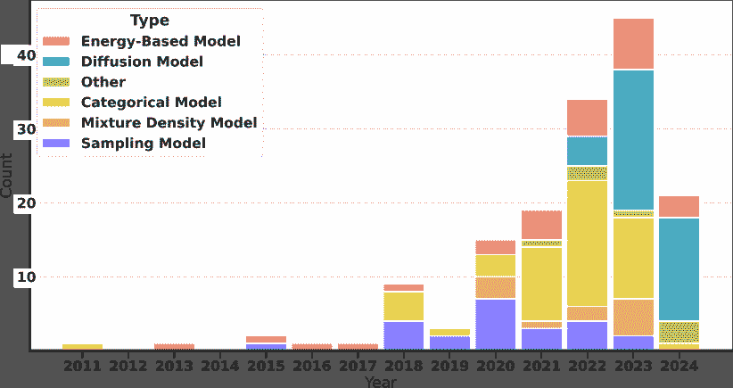
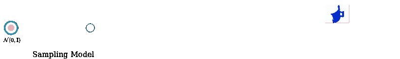
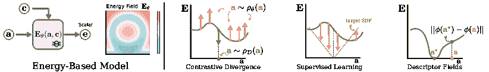
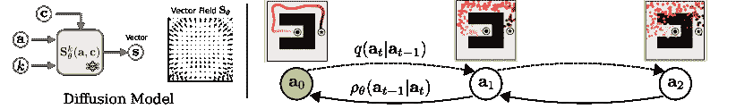
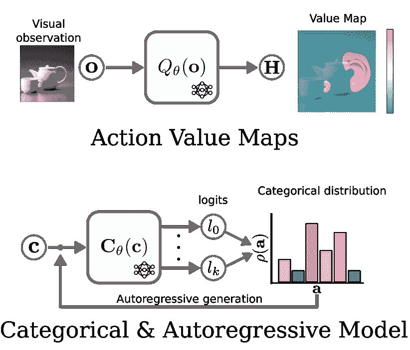
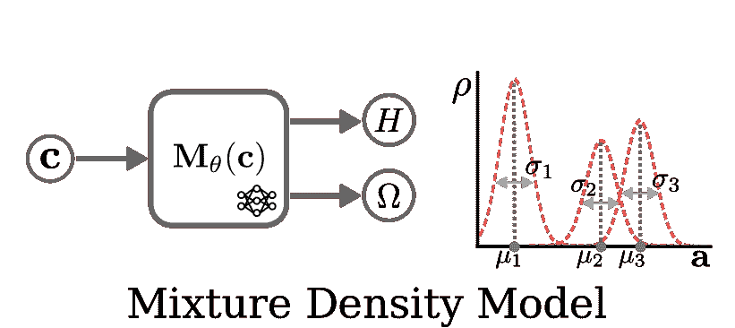
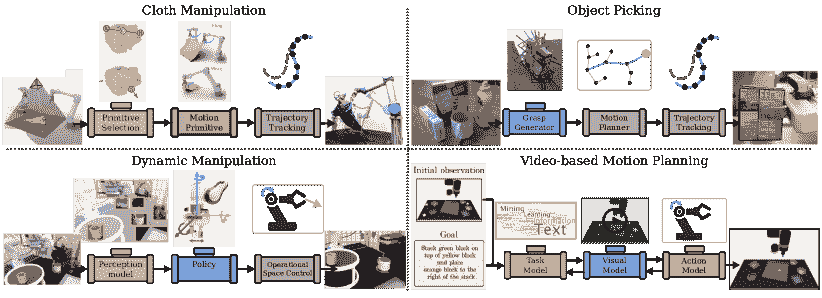
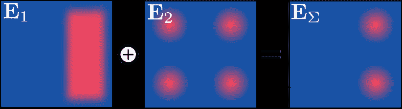
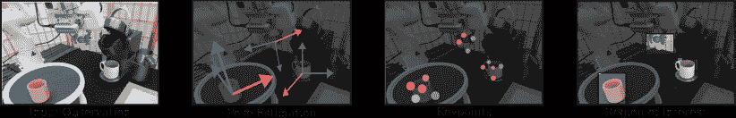
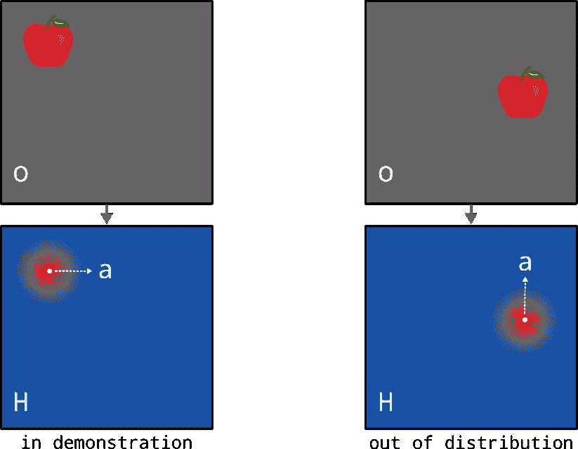

<!--yml

类别：未分类

日期：2024-09-06 19:30:46

-->

# [2408.04380] 机器人中的深度生成模型：关于多模态示范学习的调查

> 来源：[`ar5iv.labs.arxiv.org/html/2408.04380`](https://ar5iv.labs.arxiv.org/html/2408.04380)

# 机器人中的深度生成模型：

关于多模态示范学习的调查

Julen Urain¹, Ajay Mandlekar², Yilun Du³, Nur Muhammad Mahi Shafiullah⁴, Danfei Xu⁵², Katerina Fragkiadaki⁶, Georgia Chalvatzaki⁷, Jan Peters⁷¹⁸ ¹德国人工智能研究中心，²Nvidia，³麻省理工学院，⁴纽约大学，⁵乔治亚理工学院，⁶卡内基梅隆大学，⁷达姆施塔特工业大学，⁸Hessian.AI

###### 摘要

从示范中学习，即通过数据学习机器人行为模型的领域，随着深度生成模型的出现而日益受到关注。尽管这一问题已经被研究了多年，以模仿学习、行为克隆或逆向强化学习等名义存在，但传统方法依赖的模型无法很好地捕捉复杂的数据分布或在大量示范中表现不佳。近年来，机器人学习社区对使用深度生成模型来捕捉大数据集的复杂性表现出了越来越大的兴趣。在这项调查中，我们旨在提供对过去一年深度生成模型在机器人领域应用进展的统一和全面的回顾。我们介绍了社区探索的不同类型的模型，例如基于能量的模型、扩散模型、动作价值图或生成对抗网络。我们还展示了深度生成模型在不同应用中的使用情况，从抓取生成到轨迹生成或成本学习。生成模型的一个重要元素是超出分布的泛化能力。在我们的调查中，我们回顾了社区为提高学习模型的泛化能力所做出的不同决策。最后，我们突出了研究挑战，并提出了一些关于机器人深度生成模型学习的未来方向。

###### 索引词：

机器人技术，生成模型，决策制定，控制，模仿学习，行为克隆，从示范中学习^†^†publicationid: pubid:

## 引言

从演示中学习 (LfD) [1, 2]，也称为模仿学习 [3, 4]，是一个领域，旨在通过观察和模仿一组专家演示来学习期望的机器人行为。基于对场景和需要解决的任务的观察，模型（通常称为策略）被训练生成模拟专家演示中行为的动作。这些动作可能代表期望的末端执行器姿态 [5, 6]、机器人轨迹 [7, 8] 或期望的场景布置 [9, 10] 等。

从演示中学习 (LfD) 包括几种解决此问题的方法。行为克隆 (BC) 方法 [1] 通过基于观察的数据来拟合条件生成模型。尽管它在顺序决策问题中存在缺陷（例如，误差累积导致协变量偏移 [11]），但在实践中，它展示了一些最令人印象深刻的结果 [6, 12, 7, 13]，部分原因是其稳定和高效的训练算法。

另外，逆向强化学习 (IRL) [14, 15] 或诸如 [16, 17] 等变体将演示与环境中的试错结合起来（即 强化学习 (RL)），生成的策略比 行为克隆 (BC) 更加稳健，但受限于不够稳定的训练算法。与 行为克隆 (BC) 直接模仿演示中的动作不同，逆向强化学习 (IRL) 侧重于推断演示行为旨在优化的潜在奖励函数，并应用 强化学习 (RL) 推断策略。逆向强化学习 (IRL) 的一个关键优势是能够仅从观察中学习 [18, 19]，而无需明确的演示过程中所采取的动作的信息。

在 从演示中学习 (LfD) 中，演示的固有特性带来了重大挑战。通常，收集的数据是次优的、嘈杂的、基于高维观察，并且包含多种行为模式 [20, 21, 22]。这种多样性可以在多种抓取给定物体的方式、专家提供演示的偏好或专家之间的差异中观察到。这些数据的固有特性导致研究人员寻找能够正确捕捉其分布的模型。

传统上，在深度学习成为标准之前，LfD 方法通常使用 Gaussian Process (GP) [23, 24], Hidden Markov Model (HMM) [25, 26], 或 Gaussian Mixture Models (GMM) [27]来表示生成模型。然而，这些模型无法扩展到大数据集，并且无法在高维上下文中如图像中表示条件分布。基于神经网络的模型允许在高维变量如图像[28, 29]或文本[30, 31]中进行条件设置，但通常被训练为单模态模型。这些模型类型与收集到的演示的本质相悖。这些模型未能捕捉到数据的固有多样性和多个模式，使研究人员不得不限制在较小的[32]或高度策划的数据集上，以确保单模态性，从而简化建模过程。

深度生成模型 (DGM)在图像[33]和文本生成[34]中的近期成功展示了其捕捉高度多模态数据分布的能力。近年来，这些富有表现力的模型在机器人领域的模仿学习应用中引起了关注（见 Figure 1）。例如，扩散模型 (DM) [35, 33] 已有效地用于学习高维轨迹分布 [36, 7, 8]；基于语言和图像的策略使用 GPT 风格模型开发，表示动作空间中的分类分布 [37]；变分自编码器 (VAE) [38] 被应用于生成用于任意物体的 6 自由度抓取姿势 [5]。

本文呈现了机器人社区探索的各种方法的统一和全面的综述，这些方法通过演示学习 DGM 以捕捉数据的固有多模态性。虽然其中一些模型借鉴了机器学习的其他领域，例如 DM，但我们也强调了一些在机器人中表示动作分布特别有影响力的方法，如 Action Value Maps [39, 40, 41]。

该综述主要集中于考虑离线数据的方法，即不收集额外的在线或互动数据，和离线监督，即除了专家动作之外没有额外的监督。虽然从离线数据集中学习 DGM 已在从视觉到文本生成的各种领域广泛研究，但机器人中的固有挑战需要仔细的设计选择。为了激励机器人应用的具体设计选择，在第 I-A 节中，我们介绍了从机器人演示中学习策略的基本挑战。

图 1: 本综述每年的精选出版物。不同的颜色表示不同类型的 DGM。我们将 DGM 分为五类。

我们将综述分为六个部分（见 LABEL:fig:main）：

在第 II 节中，我们对问题进行了形式化，并提供了在整个综述中使用的术语表。

在第 III 节中，我们介绍了机器人中最常用的 DGM，展示了它们的固有特性，简要列出了应用这些方法到机器人中的各种工作，并介绍了每个模型的训练和采样算法。

在第 IV 节中，我们展示了深度生成模型应用的不同类型，突出模型生成的数据类型以及考虑的条件变量类型。

在第 V 节中，我们展示了一系列设计和算法上的归纳偏置，以提高从学习模型的数据分布之外的泛化能力。我们如何保证在给定的上下文观察中生成有用的动作，而这些观察未出现在演示中？我们提出的选项包括生成模型的模块化组合，从观察中提取信息特征，以及利用观察和动作之间的对称性。

最后，在第 VI 节中，我们强调了该领域当前的研究挑战，并提出了未来的研究方向。

### 从离线演示中学习的 I-A 挑战

从离线演示中学习机器人策略面临着几个挑战。尽管这些挑战中的许多（例如演示中的多种模式）与其他研究领域（如图像生成或文本生成）共享，但我们还需要考虑特定于机器人技术的挑战。以下是从离线数据中学习机器人策略的主要挑战。

演示多样性。主要挑战之一是演示本身的固有变异性[42]。不同的演示者可能具有不同的技能水平、偏好和完成同一任务的策略，导致数据集中封装了各种方法。单模态分布缺乏捕捉这些演示变异性的表达能力，导致表现不佳。DGM 是应对这一挑战的有前景的方法。这些模型能够捕捉复杂的多模态分布，从而学习表示演示中表现出的不同策略和行为。

异质的动作和状态空间。与计算机视觉不同，在计算机视觉中数据空间定义明确，在机器人技术中不存在单一的状态-动作空间。机器人动作可以包括从扭矩命令到期望目标位置或期望轨迹等各种形式。此外，机器人行为可以在机器人配置空间和任务空间中建模。这种变异性导致了异质的数据集和学习机器人策略的异质解决方案。

部分可观察的演示。当人类进行演示时，他的行为不仅仅基于可观察的元素；它们还受到演示者对任务的知识和观察历史影响的内部状态的驱动。此外，人类可以融入环境中的信息，这些信息可能不是机器人传感器容易获取或观察到的，例如人类视觉捕捉到的边缘细节，但机器人摄像头却遗漏了。这种不匹配通常导致演示仅部分代表任务的背景，从而导致机器人学习到的策略中的模糊性。部分可观察性的问题在文献中已经被广泛研究[43]。一种常见的实际方法是将观察历史编码为上下文，而不是单一观察，使模型能够提取内部状态，从而减少模糊性[44]。

时间依赖性和长期规划。机器人任务通常涉及顺序决策，其中行动在时间上是相互关联的。这种顺序特性可能导致累积错误，使机器人进入训练演示中未遇到的情况。这个问题已经通过几种方式得到解决。一些工作提出了学习短期技能，然后将其与高级规划器连接。另一些工作[36, 13]则提出学习生成行动轨迹的策略，而不是单步行动，从而减少顺序累积的错误。此外，其他选项包括在生成演示时注入噪声[45]或交互式地扩展数据集[11]。

训练目标和评估目标之间的不匹配。离线演示的学习通常被框定为密度估计问题。学习到的模型被训练以生成类似于训练数据集的样本。然而，学习到的模型被用于解决特定任务，其中需要最大化的指标是任务成功率。这种训练目标与评估目标之间的不匹配可能导致机器人在解决特定任务时表现不佳。解决此问题的一个可能方向是将行为克隆阶段与后续强化学习微调相结合[46]。

分布转移和泛化。从离线演示中学习的一个基本挑战是演示数据与实际应用中学习策略的分布转移。演示通常在受控环境或特定背景下收集，但机器人必须在演示未覆盖的潜在新情况中操作。这种不匹配可能导致泛化失败和性能下降。当学习策略应用于超出训练数据范围的情况时，需要采用能够从给定演示中推断并适应新环境的技术。我们将第 V 节专门探讨改进机器人应用中泛化的不同方法。

图 2：左侧：采样模型的视觉表示。给定一个潜在样本${\bm{z}}$，通常从正态分布中采样，采样模型通过学习到的解码器生成一个行动样本${\bm{a}}={\bm{D}}_{{\bm{\theta}}}({\bm{z}},{\bm{c}})$。右侧：采样模型的常见应用表示：作为采样分布[47]，作为行为先验[48]，以及作为生成模型[5]。

### I-B 相关调查

LfD 领域有着悠久的历史，已在多个调查中得到探讨。

在深度学习方法成为标准之前，几个调查[49, 50, 51, 52]探讨了模仿学习的基本问题。这些调查解答了诸如我们应如何获取数据？我们应学习什么模型？或者我们应如何学习策略？等问题。

更近期的工作[53, 3, 54]更新了对新技术状态的评审，其中深度学习模型开始被集成到广义的模仿学习问题中。特别是，[3]从信息论的角度呈现了模仿学习的算法视角，允许比较不同算法。

目前机器人学习社区的阶段，随着大规模机器人演示在模拟和现实世界中的日益普及，模仿基础方法的重要性日益增加，以及便宜的机器人硬件的日益可用，使得提供一个涵盖过去几年研究并专注于该领域当前面临的挑战（多模态性、泛化、异质数据集……）的调查变得及时。

最近，几个调查[55, 56]探讨了机器人学基础模型学习的问题，主要集中在将互联网规模的视觉和语言基础模型整合到机器人学问题中。尽管将视觉-语言基础模型应用于机器人学问题具有潜力，但我们的调查关注的是另一个问题。本调查的兴趣在于探索直接从具身机器人数据中学习策略的方法（部分原因是大型数据集的日益可用[22, 57]），而不是将视觉-语言模型适配到机器人学中。

## II 问题表述

BC 的主要目标是学习一个条件概率密度模型（生成模型）$\rho_{{\bm{\theta}}}({\bm{a}}|{\bm{c}})$，准确捕捉数据的潜在概率分布，记作$\rho_{\mathcal{{\mathcal{D}}}}({\bm{a}}|{\bm{c}})$，其中${\bm{a}}$是我们想要生成的数据变量，${\bm{c}}$是条件变量。核心思想是确保模型生成的样本${\bm{a}}\sim\rho_{{\bm{\theta}}}({\bm{a}}|{\bm{c}})$与真实数据样本${\bm{a}}\sim\rho_{\mathcal{{\mathcal{D}}}}({\bm{a}}|{\bm{c}})$不可区分。

在决策和控制的背景下，${\bm{a}}$ 代表动作，其范围包括末端执行器姿态 [58]、位移 [59]、轨迹 [36]、期望场景排列 [60] 以及机器人配置 [61]。条件变量 ${\bm{c}}:({\bm{o}},{\bm{g}})$ 通常在场景的观察 ${\bm{o}}$ 和目标定义 ${\bm{g}}$ 之间解耦。观察可以包括视觉数据 [62]、3D 空间数据 [63] 或机器人自感知，提供有关环境状态的信息。根据任务的不同，常常会提供最近 $t$ 次观察的历史，而不是单步观察。目标变量 ${\bm{g}}$ 定义了机器人应完成的期望行为或任务。这个目标可以通过多种方式指定，包括语言命令 [64]、期望目标状态 [65] 或目标图像 [66]；每种方式都为引导机器人行动以实现特定结果提供了不同的方法。

为了学习模型 $\rho_{{\bm{\theta}}}({\bm{a}}|{\bm{c}})$，我们假设真实的数据分布 $\rho_{\mathcal{{\mathcal{D}}}}({\bm{a}}|{\bm{c}})$ 是未知的，并且我们仅能访问从该分布中抽取的有限样本。这些样本形成了一个数据集 ${\mathcal{D}}:\{{\bm{a}}_{n},{\bm{c}}_{n}\}_{n=1}^{N}$，其中 $N$ 是样本数量。学习生成模型的任务因此被表述为一个优化问题，其目标是最小化学习到的分布 $\rho_{{\bm{\theta}}}({\bm{a}}|{\bm{c}})$ 和真实数据分布 $\rho_{{\mathcal{D}}}({\bm{a}}|{\bm{c}})$ 之间的差异

|  | $\displaystyle{\bm{\theta}}^{*}=\operatorname*{arg\,min}_{{\bm{\theta}}}{\mathbb{E}}_{{\bm{a}},{\bm{c}}\sim{\mathcal{D}}}\left[{\mathbb{D}}(\rho_{{\mathcal{D}}}({\bm{a}}&#124;{\bm{c}}),\rho_{{\bm{\theta}}}({\bm{a}}&#124;{\bm{c}}))\right],$ |  | (1) |
| --- | --- | --- | --- |

其中 ${\mathbb{D}}$ 是差异距离。尽管在 (1) 中有通用表示，但训练算法会根据所选模型 $\rho_{{\bm{\theta}}}({\bm{a}}|{\bm{c}})$（高斯，能量模型 (EBM) [67, 68]，DM [69, 33]) 进行调整。

## III 密度估计模型

本调查的核心思想是以统一的方式呈现在机器人领域中用于适当捕捉演示的多模态性的不同类型模型。因此，本调查不包括使用单模态模型表示策略的工作，而是关注那些能够从多模态分布中生成样本的模型。我们将这些模型分为五类：

采样模型。给定一个噪声样本，这些模型直接生成动作。它们通常具有非常快的推理时间。DGM 如 VAE、生成对抗网络 (GAN) 或 规范流 (NFlow) 都属于这一类别。

基于能量的模型。给定一个动作候选作为输入，EBM 返回一个标量值，表示该动作候选的能量。通常，从 EBM 采样需要 马尔可夫链蒙特卡洛 (MCMC) 策略。我们还将一些将能量定义为特征描述符之间距离的模型 [70] 视为 EBM。

扩散模型。DM 是一种生成模型，通过逆向逐步损坏过程来学习生成数据。这些类型的模型能够生成高质量的样本，因为它们采用了迭代去噪过程。

分类模型。给定一个上下文变量，分类模型将动作分布表示为 $k$ 个离散分布。我们将 GPT 风格的动作模型 [37] 和动作值映射 [62] 都归入这一类别。需要注意的是，尽管分类分布代表了这两种模型，动作值映射直接在视觉观察中对分类分布进行填补。相比之下，在 GPT 风格的模型中，观察和动作分布在不同的空间中表示。

混合密度模型。给定一个上下文变量，混合密度模型 (MDM) 返回表示动作分布的混合密度函数的参数。常见选择包括返回 GMM 的均值、标准差和权重的模型，或逻辑分布的混合模型。

所呈现的分类并不是严格或决定性的。例如，规范流 [71] 在生成过程中作为采样模型操作，但它也以类似于 EBM 的方式来计算样本的似然性。此外，我们将 GPT 风格的自回归模型 [37, 72] 和动作值映射 [73, 74] 都归入分类模型中。虽然这两种模型都通过分类分布来表达分布，但它们在概念上存在差异。

在以下部分中，我们将分五个不同的小节介绍每种模型类型、其固有属性以及它们应用的具体问题类型。

### III-A 采样模型

我们将采样模型称为允许显式生成样本的深度生成模型的集合。给定一个上下文变量${\bm{c}}\in\mathbb{R}^{c}$和一个潜在变量${\bm{z}}\in\mathbb{R}^{z}$，网络将潜在变量解码为样本${\bm{a}}={\bm{D}}_{{\bm{\theta}}}({\bm{z}},{\bm{c}})$。为了从我们的模型中生成一个动作样本${\bm{a}}\sim\rho_{{\bm{\theta}}}({\bm{a}}|{\bm{c}})$，我们首先从一个易于采样的分布中采样一个潜在变量${\bm{z}}\sim{\mathcal{N}}({\bm{0}},{\bm{I}})$（例如，正态分布），然后将其解码为一个动作${\bm{a}}={\bm{D}}_{{\bm{\theta}}}({\bm{z}},{\bm{c}})$（见图 2）。有几种生成模型属于这个类别：GAN [75]，VAE [38]，或者 NFlow [71]。

#### III-A1 主要应用

在机器人领域，这些类型的模型已经在多个上下文和应用中使用（见图 2）。

作为初始采样分布。由于其快速的采样时间，它们已被用作运动规划和优化问题的初始采样分布[47, 76, 77, 78, 79]。在[47]中，条件 VAE 被用于采样初始的无碰撞引导状态，适用于基于采样的运动规划问题[80, 81]。在[77]中，GAN 被用于生成长时间范围任务和运动规划问题的初始状态。GAN 的输出随后被优化以满足一组约束条件。

作为探索指导模型。在 RL 中，一个常见的问题是探索。由于状态-动作空间很大，决定哪些区域是有意义的进行探索通常是一个困难的问题。为了指导这种探索，已有几项工作[82, 48, 83, 84, 85]探讨了学习一个采样模型，该模型编码数据集中所有可能的行为。这个模型可以集成到 RL 问题中，通过在潜在空间中运行策略。由于模型将从数据集中生成解决方案，策略学习在潜在空间中搜索以最大化给定的奖励。

作为显式采样模型。最直接的应用是将模型用作生成模型。在这种情况下，采样模型被用于生成抓取姿态 [5、86]、逆运动学解 [61、65] 或直接在策略中采样动作 [87、88]。

#### III-A2 训练采样模型

GAN、VAE 和 NFlow 共享相同的采样过程。然而，每个模型使用不同的算法进行训练。接下来，我们简要介绍这三种模型的训练流程。

变分自编码器。VAE 模型由 [38] 提出，包含两个网络：编码器和解码器。给定一个动作 ${\bm{a}}$，编码器将其映射到潜在正态分布的参数 ${\bm{\mu}}_{z},{\bm{\sigma}}_{z}={\mathcal{E}}_{{\bm{\psi}}}({\bm{a}})$。给定潜在空间中的样本 ${\bm{z}}\sim{\mathcal{N}}({\bm{\mu}}_{z},{\bm{\sigma}}_{z}{\bm{I}})$，解码器将潜在变量映射到动作空间 $\hat{{\bm{a}}}={\bm{D}}_{{\bm{\theta}}}({\bm{z}},{\bm{c}})$，条件是上下文变量 ${\bm{c}}$。

训练损失由两部分组成：重建损失和 KL 散度。给定数据集 ${\mathcal{D}}:\{{\bm{a}}_{n},{\bm{c}}_{n}\}_{n=1}^{N}$，VAE 损失由下式给出

|  | $\displaystyle{\mathcal{L}}({\bm{\theta}},{\bm{\psi}})=$ | $\displaystyle{\mathbb{E}}_{{\bm{a}},{\bm{c}}\sim{\mathcal{D}}}[{\mathbb{D}}_{\text{KL}}(\rho({\bm{z}}&#124;{\bm{a}}),\rho({\bm{z}}))$ |  | (2) |
| --- | --- | --- | --- | --- |
|  |  | $\displaystyle+{\mathbb{E}}_{{\bm{z}}\sim\rho({\bm{z}}&#124;{\bm{a}})}[&#124;&#124;{\bm{D}}_{{\bm{\theta}}}({\bm{z}},{\bm{c}})-{\bm{a}}&#124;&#124;_{2}^{2}]]$ |  |

其中 $\rho({\bm{z}}|{\bm{a}})={\mathcal{N}}({\bm{z}}|{\mathcal{E}}({\bm{a}}))$ 是一个高斯，其参数是编码器的输出。$\rho({\bm{z}})={\mathcal{N}}({\bm{0}},{\bm{I}})$ 是一个围绕零的高斯。尽管 KL 散度项鼓励编码器生成接近 $\rho({\bm{z}})$ 的分布，但重建损失的目标是将潜在样本解码得尽可能类似于输入 ${\bm{a}}$。

生成对抗网络。与 VAE 不同，GAN [75] 建议使用一个鉴别器 $p=C_{{\bm{\psi}}}({\bm{a}},{\bm{c}})$ 代替编码器。给定模型生成的样本 ${\bm{a}}\sim\rho_{{\bm{\theta}}}({\bm{a}}|{\bm{c}})$，鉴别器被训练以区分我们模型生成的样本和来自数据集的样本，而生成器被训练使生成的样本尽可能类似于数据集。

给定数据集 ${\mathcal{D}}:\{{\bm{a}}_{n},{\bm{c}}_{n}\}_{n=1}^{N}$，GAN 的目标由二元交叉熵损失表示

|  | $\displaystyle{\mathcal{J}}({\bm{\theta}},{\bm{\psi}})=$ | $\displaystyle{\mathbb{E}}_{{\bm{a}},{\bm{c}}\sim{\mathcal{D}}}[\log C_{{\bm{\psi}}}({\bm{a}},{\bm{c}})+$ |  | (3) |
| --- | --- | --- | --- | --- |
|  |  | $\displaystyle{\mathbb{E}}_{{\bm{z}}\sim{\mathcal{N}}({\bm{0}},{\bm{I}})}\left[\log(1-C_{{\bm{\psi}}}({\bm{D}}_{{\bm{\theta}}}({\bm{z}},{\bm{c}})),{\bm{c}})\right]].$ |  |

然后，优化问题通过最小化-最大化问题来解决，我们的目标是最小化相对于 ${\bm{\psi}}$（判别器）的目标，并最大化相对于 ${\bm{\theta}}$（生成器）的目标。判别器旨在区分真实数据样本和生成器生成的虚假样本，而生成器则旨在生成与真实数据无异的样本。

正则化流。在 NFlow 中的生成器 ${\bm{D}}_{{\bm{\theta}}}$ 与 VAE 或 GAN 中的生成器不同。虽然在 GAN 或 VAE 中它由任意网络表示，但在 NFlow 中，我们需要一个可逆网络[71，89，90]作为生成器。

由于生成器 ${\bm{D}}_{{\bm{\theta}}}$ 是可逆的，NFlow 允许精确计算似然[71]。

|  | $\displaystyle\log\rho_{{\bm{\theta}}}({\bm{a}}&#124;{\bm{c}})=\log\rho_{z}\left({\bm{D}}_{{\bm{\theta}}}^{-1}({\bm{a}},{\bm{c}})\right)+\log&#124;\det{\bm{J}}_{{\bm{D}}_{{\bm{\theta}}}}({\bm{a}},{\bm{c}})&#124;,$ |  | (4) |
| --- | --- | --- | --- |

其中 $\rho_{z}={\mathcal{N}}({\bm{0}},{\bm{I}})$ 是潜在空间的正态分布，${\bm{J}}_{{\bm{D}}_{{\bm{\theta}}}}$ 是解码器的雅可比矩阵。

然后，给定一个数据集 ${\mathcal{D}}:\{{\bm{a}}_{n},{\bm{c}}_{n}\}_{n=1}^{N}$，NFlow 通过最小化负对数似然来训练。

|  | $\displaystyle{\mathcal{L}}({\bm{\theta}})$ | $\displaystyle=-{\mathbb{E}}_{{\bm{a}},{\bm{c}}\sim{\mathcal{D}}}\left[\log\rho_{{\bm{\theta}}}({\bm{a}}&#124;{\bm{c}})\right].$ |  | (5) |
| --- | --- | --- | --- | --- |

请注意，与 VAE 和 GAN 不同，NFlow 不需要训练额外的模型。此外，由于生成器是可逆的，我们可以计算模型中样本的似然，类似于 EBM。

### III-B 能量基础模型。

我们称 EBM 为一组深度生成模型，这些模型在给定一个动作 ${\bm{a}}$ 时输出一个标量值 ${\bm{e}}\in\mathbb{R}$，${\bm{e}}=E_{{\bm{\theta}}}({\bm{a}},{\bm{c}})$，其中 ${\bm{c}}$ 表示条件上下文变量（图 3）。在 EBM 中，概率密度模型 $\rho_{{\bm{\theta}}}({\bm{a}}|{\bm{c}})$ 由玻尔兹曼分布表示。

|  | $\displaystyle\rho_{{\bm{\theta}}}({\bm{a}}&#124;{\bm{c}})\propto\exp\left(-E_{{\bm{\theta}}}({\bm{a}},{\bm{c}})\right),$ |  | (6) |
| --- | --- | --- | --- |

其中 $E_{{\bm{\theta}}}({\bm{a}},{\bm{c}})$ 是分布的能量，即未标准化的对数似然。

图 3：左：一个 EBM 的可视化表示。以动作变量 ${\bm{a}}$ 作为输入，EBM 输出输入动作的未标准化对数概率 $e={\bm{E}}_{{\bm{\theta}}}({\bm{a}},{\bm{c}})$。右：训练或表示 EBM 的不同策略的可视化表示：对比散度[91]、监督学习[92]和神经描述场[70]。

从 EBM 中采样 ${\bm{a}}\sim\rho_{{\bm{\theta}}}({\bm{a}}|{\bm{c}})$ 由于模型的隐含性质而不直接。EBM 通过能量函数定义数据的概率分布，采样需要像 MCMC 这样的近似分布的方法。常见的采样算法是 Langevin Monte Carlo。给定从简单先验分布生成的初始样本 ${\bm{a}}_{0}\sim\rho_{0}({\bm{a}}_{0})$，样本通过迭代更新生成。

|  | $\displaystyle{\bm{a}}_{k+1}={\bm{a}}_{k}-\frac{\epsilon}{2}\nabla_{{\bm{a}}}E_{{\bm{\theta}}}({\bm{a}}_{k},{\bm{c}})+\sqrt{\epsilon}{\mathcal{N}}({\bm{0}},{\bm{I}}),$ |  | (7) |
| --- | --- | --- | --- |

其中 $\epsilon>0$ 是一个小常数。这个过程可能计算密集且比直接采样方法（如 VAE 或 GAN）更慢。作为替代方案，鉴于 EBM 的隐含性质，一些工作[93，94]通过解决优化问题来寻找最可能的样本。

|  | $\displaystyle{\bm{a}}^{*}=\arg\min_{{\bm{a}}}E_{{\bm{\theta}}}({\bm{a}},{\bm{c}}).$ |  | (8) |
| --- | --- | --- | --- |

由于其隐含性质，EBM 具有几个有趣的特性。如在[95，93，96]中探讨的，EBM 允许不同 EBM 的模块化组合。这种模块化方法允许单独的 EBM 被训练以表示数据的不同行为或方面，然后这些模型可以组合。结果是一个复合模型，其中变量 ${\bm{a}}$ 在所有组件模型下都有较高的概率，从而有效地整合了每个单独 EBM 所捕捉到的不同特征或模式。

另一个有趣的特性是能量映射[58, 96]。由于其隐式特性，EBM 允许在与训练空间不同的空间中生成样本。这在机器人技术中尤其有用。例如，EBM 在任务空间 ${\bm{E}}_{{\bm{\theta}}}({\bm{x}}|{\bm{c}})$ 上进行训练时，如果我们可以访问正向运动学映射 ${\bm{x}}=\phi_{\text{FK}}({\bm{q}})$，它可以有效地指导机器人关节配置 ${\bm{q}}$ 的选择。通过组合映射和能量 ${\bm{E}}_{{\bm{\theta}}}({\bm{q}}|{\bm{c}})={\bm{E}}_{{\bm{\theta}}}(\phi_{\text{FK}}({\bm{q}})|{\bm{c}})$，我们可以在配置空间中表示一个 EBM，将低能量设置为那些在任务空间中导致低能量的配置。

#### III-B1 主要应用

EBM 在机器人技术中的主要应用范围包括顺序决策问题的成本/奖励函数到直接生成模型。

作为成本/奖励函数。学习 EBM 以表示成本或奖励函数在逆最优控制 (IOC) [97, 98]或逆强化学习 (IRL) [14, 15]中已被广泛研究。一些训练算法，如对比散度 (CD) 损失，需要在训练过程中从学习到的 EBM 中生成样本。不同的 IRL 和 IOC 方法提出了不同的从学习到的 EBM 中采样的方法。[98] 提出了解决最大熵轨迹优化以生成样本，[99] 提出使用 Langevin 动力学生成样本，而[14, 15] 提出了从使用 RL 训练的策略中生成样本，前提是学习到的 EBM 是奖励函数。

作为生成模型。除了 IRL 和 IOC 方法，这些方法专注于顺序决策问题，还有一些工作探讨了直接生成动作的 EBM 学习。在[92]中，一个 EBM 被用来生成对任意对象的抓取姿势。与大多数 EBM 学习方法不同，该模型被学习以拟合 6 自由度签名距离场（SDF）。类似地，[100]生成末端执行器姿势。然而，他们的工作关注于超越抓取的更广泛任务，如打开抽屉或按按钮。在[94]中，一个 EBM 被训练作为视觉运动策略。作者声称，基于 EBM 的策略比确定性或高斯策略更好地捕捉数据中的不连续性。在[101]中，一个 EBM 被训练作为过渡动态模型。在[102]中，学习了一个用于状态估计的成本函数。学习到的 EBM 表示给定观察的状态的联合概率。

#### III-B2 训练基于能量的模型

训练 EBM 的最流行算法之一是 CD [103, 99]。该方法涉及负样本和从数据集中获得的正样本之间的对比游戏。

相较于 CD，在机器人学中，使用监督学习损失，如占据损失或 SDF 来训练模型已经变得非常流行。尽管这些方法并不常见，但鉴于它们在机器人学中的流行性，我们将其作为拟合 EBM 的额外方法进行介绍（见图 3）。

对比散度。学习密度模型的一种常见方法是最小化数据的负对数似然。然而，计算对数似然需要访问模型的归一化常数，这在 EBM 中是不可计算的。为了将负对数似然损失适应于 EBM，[103]通过样本近似计算。给定$\nabla_{{\bm{\theta}}}\log Z_{{\bm{\theta}}}=-{\mathbb{E}}_{{\bm{a}}\sim\rho_{{\bm{\theta}}}({\bm{a}})}\left[\nabla_{{\bm{\theta}}}E_{{\bm{\theta}}}({\bm{a}})\right]$，我们可以近似负对数似然的梯度。

|  | $\displaystyle\nabla_{{\bm{\theta}}}{\mathcal{L}}({\bm{\theta}})={\mathbb{E}}_{{\color[rgb]{0.5234375,0.6484375,0.06640625}{\bm{a}}}\sim{\mathcal{D}}}\left[\nabla_{{\bm{\theta}}}E_{{\bm{\theta}}}({\color[rgb]{0.5234375,0.6484375,0.06640625}{\bm{a}}})\right]-{\mathbb{E}}_{{\color[rgb]{0.94921875,0.55859375,0.171875}{\bm{a}}}\sim\rho_{{\bm{\theta}}}}\left[\nabla_{{\bm{\theta}}}E_{{\bm{\theta}}}({\color[rgb]{0.94921875,0.55859375,0.171875}{\bm{a}}})\right].$ |  | (9) |
| --- | --- | --- | --- |

在公式 9 中，数据集中的样本（正样本）的能量被压低，而数据集中未包含的其他样本的能量被压高。在每次迭代中，我们从当前的能量模型${\bm{a}}\sim\rho_{{\bm{\theta}}}({\bm{a}})$（负样本）中采样一组点以评估模型。然而，如果${\bm{a}}$的维度较大，可能难以正确采样${\bm{a}}\sim\rho_{{\bm{\theta}}}({\bm{a}})$。为了缓解这一困难，常用的技术包括使用能量函数的梯度[99]或最小化样本之间的 KL 散度[104]。

图 4：左：一个 DM 的视觉表示。给定一个动作${\bm{a}}$和一个标量$k$，用于说明扩散步骤，模型${\bm{s}}={\bm{S}}_{{\bm{\theta}}}({\bm{a}},{\bm{c}},k)$输出一个条件于${\bm{c}}$的向量${\bm{s}}$。输出的${\bm{s}}$与分布$\rho({\bm{a}}_{k})$的评分有关。右：去噪过程的可视化[36]。

监督学习。一些机器人学领域的研究[92, 105]探讨了训练 SDF、占用场或二分类器来表示标量场。虽然这些模型并未被明确训练为生成模型，但学习到的模型在结构上等价于 EBM。该模型将一个动作变量${\bm{a}}$作为输入，输出一个标量值${\bm{e}}$，该值提供关于样本质量的信息。训练完成后，该模型可以用来生成样本。例如，在[92]中，训练了一个 SDF 模型以生成 6 自由度抓取姿势，而在[105]中，训练了一个占用网络以生成抓取姿势。

神经描述符场。一组工作 [70, 106] 将 EBM 表示为在学习的潜在空间中到目标动作 ${\bm{a}}^{*}$ 的欧几里得距离 $E({\bm{a}}|{\bm{a}}^{*})=||{\bm{\phi}}_{{\bm{\theta}}}({\bm{a}}^{*})-{\bm{\phi}}_{{\bm{\theta}}}({\bm{a}})||$，其中 ${\bm{z}}={\bm{\phi}}_{{\bm{\theta}}}({\bm{a}})$ 将一个动作映射到一个维度为 $d$ 的潜在向量 ${\bm{z}}\in\mathbb{R}^{d}$。与直接学习 EBM 相对，这些方法提出了学习特征编码器 ${\bm{\phi}}_{{\bm{\theta}}}$，该编码器为给定的输入 ${\bm{a}}$ 计算潜在向量。在 [70, 106] 中，特征编码器通过重建对象的 SDF 进行训练。特征编码器以对象的点云 ${\bm{\phi}}_{{\bm{\theta}}}({\bm{a}},{\bm{c}})$ 为条件，其中 ${\bm{c}}$ 是点云。在 [107] 中，CLIP [108] 特征被用于学习特征编码器。

### III-C 扩散模型

DM [109, 33] 将数据生成过程框定为迭代去噪过程。给定先验采样分布 ${\bm{a}}_{N}\sim\rho({\bm{a}}_{N})$，通常为高斯分布，迭代去噪过程 $\rho_{{\bm{\theta}}}({\bm{a}}_{k-1}|{\bm{a}}_{k})$ 将噪声样本从先验分布移动到数据分布。

|  | $\displaystyle\rho({\bm{a}}_{0})=\int\rho({\bm{a}}_{N})\prod_{k=1}^{N}\rho_{{\bm{\theta}}}({\bm{a}}_{k-1}&#124;{\bm{a}}_{k}){\textrm{d}}{\bm{a}}_{1:N},$ |  | (10) |
| --- | --- | --- | --- |

其中 $\rho({\bm{a}}_{0})\equiv\rho_{{\mathcal{D}}}({\bm{a}}_{0})$ 等价于数据分布。去噪过程 $\rho_{{\bm{\theta}}}({\bm{a}}_{k-1}|{\bm{a}}_{k})$ 是一个前向扩散过程 $q({\bm{a}}_{k+1}|{\bm{a}}_{k})$ 的逆过程，该过程逐渐向数据集样本添加噪声。

在实践中，DM 与 EBM 密切相关，其中去噪预测估计能量函数的梯度场 [110, 111, 112]。输入一个动作 ${\bm{a}}$，输出一个向量 ${\bm{s}}$，${\bm{s}}={\bm{S}}_{{\bm{\theta}}}({\bm{a}},{\bm{c}},k)$，其中 ${\bm{c}}$ 表示上下文变量，$k$ 是一个标量值，指示扩散步骤的每一步都可以看作是使用 EBM 的朗之万动力学采样步骤。由于迭代采样过程，DM 的推理时间比其他 DGM 更慢。最近的研究，如一致性策略 [113]，探讨了如何加速 DM 采样。

DM 在过去一年中特别受欢迎，因为它具有若干重要的生成建模属性。DM 能够表示高维连续空间分布，并且具有稳定的训练流程。由于其与 EBM 的联系，DM 隐式地参数化了动作，从而允许扩散模型的组合。若干工作探索了 DM 的模块化组合与附加目标[36、58、114、115]或其他 DM[116、117]。尽管尚未应用于机器人领域，组合在图像生成中尤其受欢迎。分类器引导[118] 提出了将无条件 DM 的输出与分类器的梯度结合在生成过程中。无分类器引导[119]则提议将无条件 DM 与有条件 DM 结合。在[111、120]中，多个有条件 DM 被组合用于模块化生成。

#### III-C1 主要应用

由于其高表达性和灵活性，DM 已被广泛集成到许多机器人任务中。我们将应用分解为三个主要类别：直接学习机器人轨迹的论文、探讨 DM 的模块化和可组合性的论文，以及生成其他类型变量（超越轨迹）的论文。

轨迹生成。生成机器人轨迹是解决任何机器人任务的核心要素。传统上，这些轨迹生成器使用较简单的模型，如自回归生成轨迹的策略，或结构化模型，如任务和运动规划算法。然而，DM 的表达能力使机器人社区能够直接生成轨迹，而无需这些模型。在[36、114]中，去噪扩散概率模型（DDPM）被用于从演示中学习轨迹生成器。机器人轨迹的生成类似于递归视界控制循环[121]，这允许反应生成。在[8、7]中，轨迹 DM 在视觉输入条件下引入，而在[64、122]中，则在语言和视觉条件下引入。[115、123] 探索了 DM 在运动规划问题中的集成，包括无碰撞轨迹生成和导航任务。

超越轨迹的生成。除了轨迹，DM 还被用于生成各种类型的机器人任务数据。几项工作 [58, 10, 124] 探索了使用 DM 生成 SE(3) 姿态，无论是生成机器人抓取姿态 [58] 还是对象放置姿态 [10, 116] 用于抓取和放置任务。一些工作 [9, 125, 117] 使用 DM 生成场景安排。这些信息用于定义运动规划器的高级目标计划，以重新安排场景。一些工作 [126, 127, 128] 探索了学习视频 DM，用于对所需行为进行一般表示计划。然后，逆动力学模型在机器人中生成与视频行为匹配的动作。而 [129] 中，DM 被用于从图像中生成逼真的触觉图像；在 [130] 中生成了运动原语权重。

模块化组合。上述引用的几篇论文探讨了 DM 在各种形式下的模块化组合。在 [36, 114] 中，学习到的 DM 与奖励函数结合，以使生成过程朝向高奖励区域。在 [115] 中，一个轨迹 DM 与场景的 SDF 结合，以进行无碰撞轨迹生成。在 [58] 中，将生成抓取模型集成到运动规划问题中，以生成用于抓取和放置任务的轨迹。在 [117] 中，多个对象关系被组合生成具有局部模型的场景安排。在 [124] 中，放置生成模型与可行性评分结合，以适应可行的放置姿态。在 [116] 中，一组 DM 被时间上组合以解决长时间范围的规划任务。

#### III-C2 训练扩散模型

DM 的一个有趣特性是其稳定的训练过程。与用于训练 EBM 的 CD 不同，DM 是通过稳定的目标信号进行学习的，这导致了更强的鲁棒性，但仍然可以看作是隐式能量景观的一种参数化。下面我们描述了扩散模型的训练及其与 EBM 的联系。

为了训练扩散模型，我们在每个时间步 $k$ 学习建模逆过渡函数 $\rho_{{\bm{\theta}}}({\bm{a}}_{k-1}|{\bm{a}}_{k})$。这个过渡核由与采样过程对应的高斯分布参数化。

|  | ${\bm{a}}_{k-1}=B_{k}({\bm{a}}_{k}-C_{k}{\bm{S}}_{{\bm{\theta}}}({\bm{a}}_{k},k)+D_{k}\mathbf{\xi}),\quad\mathbf{\xi}\sim\mathcal{N}(\mathbf{0},\mathbf{I})$ |  | (11) |
| --- | --- | --- | --- |

其中$B_{k}$、$C_{k}$和$D_{k}$是扩散过程中固定（未学习的）常数。为了学习上述过渡分布，我们只需学习和建模得分函数${\bm{S}}_{{\bm{\theta}}}({\bm{a}},k)$。

得分函数${\bm{S}}_{{\bm{\theta}}}({\bm{a}}_{k},k)$对应于 EBM ${\bm{S}}_{{\bm{\theta}}}({\bm{a}},k)=\nabla_{{\bm{a}}}E_{\theta}({\bm{a}},k)$的梯度，其中 EBM 建模了噪声卷积动作分布$p_{k}({\bm{a}})\;\propto\;e^{-E_{\theta}({\bm{a}},k)}$，其中

|  | $p_{k}({\bm{a}})=\int_{{\bm{a}}^{*}}p({\bm{a}}^{*})\cdot\mathcal{N}({\bm{a}};\sqrt{1-\sigma_{k}^{2}}{\bm{a}}^{*},\sigma^{2}_{k}\mathbf{I}).$ |  | (12) |
| --- | --- | --- | --- |

我们可以通过直接训练${\bm{S}}_{{\bm{\theta}}}({\bm{a}},k)$来隐式地学习这个 EBM $E_{\theta}({\bm{a}},k)$，以通过去噪得分匹配来去噪动作[110]。

|  | $\mathcal{L}_{\text{MSE}}(\theta)=\&#124;{\bm{S}}_{{\bm{\theta}}}({\bm{a}}_{k}+\epsilon,k)-\epsilon\&#124;^{2},\quad\epsilon\sim\mathcal{N}(0,1).$ |  | (13) |
| --- | --- | --- | --- |

与训练 EBM 的方法相比，这个学习得分的目标更快且更稳定。

通过在扩散模型中学习这个得分函数${\bm{S}}_{{\bm{\theta}}}({\bm{a}}_{k},k)$及其对应的隐式景观$E_{\theta}({\bm{a}},k)$，扩散过程中的每个反向过渡核在方程 11 中对应于在噪声卷积 EBM $E_{\theta}({\bm{a}},k)$上进行 Langevin 采样，其中一个附加的收缩项$B_{k}$用于在不同的连续能量景观之间进行过渡。这种在扩散模型中的隐式采样视图使我们能够将多个扩散模型结合在一起[112]。

### III-D 分类模型

我们将分类模型称为一组生成模型，该模型在给定上下文变量${\bm{c}}$作为输入时，输出 K 个不同类别的概率，其中 K 是有限的。在实际应用中，网络通常输出 K 个 logits。给定 logits，Softmax 函数将 logits 转换为每个动作的概率值。

图 5：动作价值图和自回归模型的视觉表示。给定一个视觉观察${\bm{o}}$作为输入，动作价值图${\bm{H}}=Q_{{\bm{\theta}}}({\bm{o}})$输出一个观察形状概率图${\bm{H}}$，其中每个像素都是可能动作的投影。自回归模型输出 K。

在机器人技术中，分类模型主要用于表示策略。分类分布有两种主要的架构：动作价值图和自回归模型。

动作价值图

动作价值图是一组生成模型，给定一个视觉观察${\bm{o}}$作为输入，输出一个与输入形式相同的价值图${\bm{H}}$，${\bm{H}}=Q_{{\bm{\theta}}}({\bm{o}})，类似于注意力图。视觉观察${\bm{o}}$可以是图像[40, 131]、点云[63]或体素[132, 6]。生成的价值图${\bm{H}}$为视觉观察${\bm{o}}$中的每个独特位置或‘像素’分配一个概率值。

动作价值图背后的核心原理是将视觉输入中每个‘像素’位置解释为代表机器人可能执行的潜在动作。例如，考虑一个机器人抓取任务。在这种情况下，图像中的每个单独像素可以表示一个潜在的目标点，用于移动机器人手臂进行抓取。然后，分析得到的价值图作为涵盖所有潜在动作的分类分布。有趣的是，这种方法可以很容易地扩展到多个原语，其中每个像素代表每个原语的几何基础参数。例如，在[73]中生成了两个价值图，一个用于抓取原语，另一个用于推送原语。然后，选择的动作是所有可能像素中能量最高的那个。

一些研究[133, 6, 131]将动作价值图扩展到也依赖于语言指令，定义了学习到的策略$Q_{{\bm{\theta}}}({\bm{o}},{\bm{g}})$的目标${\bm{g}}$。

自回归模型

自回归模型是一组生成模型，通过迭代调用模型并以过去的数据为条件来生成长时间跨度的数据。例如，给定一个动作轨迹${\bm{\tau}}=({\bm{a}}_{0},{\bm{a}}_{1},\dots,{\bm{a}}_{T})，自回归模型表示轨迹的分布。

|  | $\displaystyle\rho({\bm{\tau}})=\rho({\bm{a}}_{0})\prod_{i=1}^{T}\rho({\bm{a}}_{i}\mid{\bm{a}}_{0:i-1}),$ |  | (14) |
| --- | --- | --- | --- |

作为对先前数据的条件化动作分布的乘积。为了生成一个轨迹，我们首先采样一个初始样本${\bm{a}}_{0}\sim\rho({\bm{a}}_{0})$，然后迭代地调用条件化于先前生成动作的生成模型。这种类型的模型在语言生成中尤其流行。像 BERT [34]或 GPT-3 [134]这样的模型基于 Transformer 模型[135]生成自回归长文本数据。一些图像生成中的生成模型也基于自回归生成模型，其中图像的像素是迭代生成的[136]。

在机器人领域，通常将自回归模型称为使用类似 GPT 结构生成机器人动作的策略[137、37、72、12、138、139、140]。这些模型中的一些将动作分布（即策略）表示为分类分布，并以自回归方式生成动作轨迹，类似于语言模型。然而，在某些情况下，动作分布由 DM 表示[141、142]，或通过调整分类分布的均值表示[59、143、144]。

#### III-D1 训练分类模型

为了将分类分布拟合到数据集中，有两个重要因素：找到正确的预测空间和正确的训练损失。

动作建模中的离散化。在动作建模中，机器人动作通常是连续的，而分类分布预测离散值的分布。因此，具有分类分布的模型需要将连续动作“离散化”成离散的“动作标记”。通常，这通过一个特定的分箱器将每个轴的值分成一定数量的箱子来完成，例如在[140、37、72]中。一些模型使用如 k-means 这样的非参数算法来离散化动作[59、143、145]。后来的一些模型[144]使用更先进的生成方法，如 VQ-VAE[146]，将动作离散化为离散的标记。

训练损失。相当多的情况下，分类模型通过交叉熵（CE）损失进行训练。给定一个数据集${\mathcal{D}}:({\bm{a}}_{i},{\bm{c}}_{i})_{i=0}^{N}$，CE 损失

|  | $\displaystyle{\mathcal{L}}({\bm{\theta}})=-{\mathbb{E}}_{j,{\bm{c}}}\left[\log{\bm{C}}_{{\bm{\theta}}}({\bm{c}})_{j}\right],$ |  | (15) |
| --- | --- | --- | --- |

表示为负对数似然，其中 $j$ 是数据集中与动作相关的类别。然而，考虑到不同类别之间的不平衡，一些近期模型[59、143、144]使用 Focal loss[147]。

|  | $\displaystyle{\mathcal{L}}({\bm{\theta}})=-{\mathbb{E}}_{j,{\bm{c}}}\left[(1-{\bm{C}}_{{\bm{\theta}}}({\bm{c}})_{j})^{\gamma}\log{\bm{C}}_{{\bm{\theta}}}({\bm{c}})_{j}\right],$ |  | (16) |
| --- | --- | --- | --- |

其中 $\gamma$ 是一个平衡超参数。Focal loss 对于离群点和类别不平衡的敏感性较低，这对离散化的动作数据集可能很重要。

关于动作值映射。在动作值映射的特定情况下，动作类别被投影到输入观察的像素空间。数据集中的动作 ${\bm{a}}_{j}$ 首先被投影到与视觉观察 ${\bm{o}}_{j}$ 形状相同的一个热编码像素图 $H_{j}$。热编码像素图 $H_{j}$ 会将与动作相关的像素设为一，其余像素设为零。然后，CE 损失表示为

|  | $\displaystyle{\mathcal{L}}({\bm{\theta}})=-{\mathbb{E}}_{h,{\bm{o}}\in{\mathcal{D}}}[\log Q_{{\bm{\theta}}}(h&#124;{\bm{o}})],$ |  | (17) |
| --- | --- | --- | --- |

其中 $h$ 表示像素图 $H$ 中的正像素。尽管只使用正样本，Softmax 仍将梯度传播到所有像素空间，将概率压低到任何不是正像素的像素上。

图 6: MDM 的视觉表示。给定输入上下文 ${\bm{c}}$，MDM $H,\Omega={\bm{M}}_{{\bm{\theta}}}({\bm{c}})$ 输出混合密度模型的参数，其中 $H:({\bm{\mu}}_{0},{\bm{\sigma}}_{0}\dots,{\bm{\mu}}_{N},{\bm{\sigma}}_{N})$ 为模型参数，$\Omega:(\omega_{0},\dots,\omega_{N})$ 为混合中每个模型的权重。

### III-E 混合密度模型

我们将 MDM [148, 149] 称为生成模型集合 $H,\Omega={\bm{M}}_{{\bm{\theta}}}({\bm{c}})$，该模型以上下文变量 ${\bm{c}}$ 为输入，输出混合密度函数的参数 $H:({\bm{\eta}}_{0},\dots,{\bm{\eta}}_{N})$ 和权重 $\omega:(\omega_{0},\dots,\omega_{N})$。

|  | $\displaystyle\rho_{{\bm{\theta}}}({\bm{a}}&#124;{\bm{c}})=\sum_{k=0}^{N}\omega_{k}\rho({\bm{a}};{\bm{\eta}}_{k}),$ |  | (18) |
| --- | --- | --- | --- |

其中每个向量 ${\bm{\eta}}_{k}$ 和标量值 $\omega_{k}>0$ 表示第 $k$ 个密度模型的参数和权重。在实践中，常用 GMM [66, 44, 150, 151, 152] 或逻辑模型的混合 [149, 84, 153] 来表示混合模型。然后，参数 ${\bm{\eta}}_{k}=({\bm{\mu}}_{k},{\bm{\sigma}}_{k})$ 通常表示均值 ${\bm{\mu}}_{k}$、标准差 ${\bm{\sigma}}_{k}$ 和 $\omega_{k}$，即每个模式在混合模型中的权重。

在机器人学文献中，常常将 MDM 与额外的生成模型结合。在 [84, 44, 153] 中，VAE 与 MDM 结合使用。给定一个表示高层次计划的潜在变量 ${\bm{z}}$，训练一个 VAE 解码器来生成动作空间分布的 MDM 参数。这与经典的 VAE 使用方法不同，后者的输出直接生成动作。

#### III-E1 主要应用

一些研究 [44, 150, 151, 153, 84] 提出了用 MDM 表示视觉-运动策略，通常将动作空间表示为末端执行器的位移。其中一些研究动机是使用混合密度模型而不是单峰模型来表示策略，以更好地捕捉演示中的固有多模态性。

#### III-E2 训练混合密度模型

给定数据集 ${\mathcal{D}}:({\bm{a}}_{i},{\bm{c}}_{i})_{i=0}^{N}$，MDM 通过最小化学习模型的负对数似然进行训练

|  | $\displaystyle{\mathcal{L}}({\bm{\theta}})=-{\mathbb{E}}_{{\bm{a}},{\bm{c}}\sim{\mathcal{D}}}\left[\log\rho_{{\bm{\theta}}}({\bm{a}} | {\bm{c}})\right]$ |  | (19) |
| --- | --- | --- | --- | --- |

使用 $\rho_{{\bm{\theta}}}({\bm{a}}|{\bm{c}})$（见 公式 18），它是以学习模型输出 $H,\Omega={\bm{M}}_{{\bm{\theta}}}({\bm{c}})$ 为参数的密度模型。

## IV 将生成模型集成到机器人技术中

图 7：将 DGM 应用于机器人任务的不同方法的视觉表示。彩色：学习的模型，灰色：预定义的模型。（a）布料操控。给定一组动作原语，动作值图选择原语及其参数 [41]。（b）物体抓取。一个 SE(3) 姿态生成模型生成一个目标姿态来抓取物体，运动规划器生成达到抓取的路径 [5]。（c）视觉-运动策略。给定图像作为输入，视觉-运动策略生成末端执行器的动作。然后，操作空间控制器将动作映射到配置空间 [150]。（d）视频规划。一个 LLM 生成文本中的计划。该文本生成子步骤的视频。然后，一个目标条件策略基于生成的图像生成机器人动作 [128]。

在本节中，我们探讨了将 DGM 集成到机器人技术中的不同设计策略。DGM 已在广泛的机器人任务中应用；例如，抓取和放置任务 [154, 92, 58]，布料操控 [155, 41]，场景重排 [60, 9]，食品准备 [7, 150, 13]。

在这广泛的任务中使用 DGM 的一个常见策略是将学习到的 DGM 集成到更大的框架中。学习到的模型通常与其他预定义或学习的组件，如感知模块、运动原语、任务和运动规划器或控制器，结合起来，形成利用学习和预定义组件优势的协同效应。DGM 负责处理那些难以用传统方法建模的问题组件，而预定义的元素处理那些易于定义的方面。这种组合通过利用 DGM 的预测能力和适应性，增强了系统解决复杂任务的能力。

由于任务的多样性以及 DGM 与其他组件结合的灵活性，DGM 在机器人问题中的集成方式也非常多样。我们在图 7 中展示了一些可能的组合。接下来，我们展示了机器人社区常用的一些策略，以将 DGM 集成到解决机器人任务中。我们根据 DGM 生成的元素对这些策略进行分类。

### IV-A 生成末端执行器目标姿态

末端执行器的 6D（位置和方向）姿态是使用 DGM 生成的最常见元素之一[5, 6, 100, 58, 154, 132, 131, 70, 10]。生成的姿态被用作场景中物体的目标抓取姿态[5, 154, 70, 58]，作为物体的目标放置姿态[10]，或作为策略的动作[6, 100, 131]。

何时使用。基于 SE(3)姿态的 DGM 在捕捉机器人任务中的关键目标位置方面尤其成功。例如，在取放任务中，SE(3)姿态模型将提供所需的抓取姿态和放置姿态。在抽屉开关任务中，SE(3)姿态可能会提供有关抓取抽屉把手的理想姿态以及如何移动以正确打开抽屉的信息。

如何使用。SE(3)姿态生成模型通常利用场景和姿态之间的对称性，从而在新场景中提高了泛化能力。更多细节可以在第 V 节中找到。DGM 输出在机器人应用中的集成取决于任务。

离线任务中，机器人行为在离线计算后以开环方式执行，通常会将 DGM 与运动规划模块结合。在[5, 154, 105, 156]中，生成的 SE(3)姿态被用作运动规划问题中的目标姿态。然后，基于采样的[81, 80]或基于优化的[157, 158]运动规划器被用来生成配置空间轨迹。在[58, 92]中，学习到的 DGM 被直接集成到运动规划问题中。由于学习模型是 EBM，因此模型被集成作为额外的成本函数，而不是采样姿态。

在线任务中，当生成模型用作策略时，所提议的解决方案取决于输出的范围。在[6, 100, 131, 159, 160]中，生成的 SE(3)姿态被用作运动规划问题中的目标姿态。由于要解决的问题是序列性的，因此系统在机器人达到前一个目标姿态时，顺序生成新的轨迹。一些最近的研究[161, 162]提议用基于生成的 SE(3)姿态的轨迹扩散模型来替代运动规划器。为了实现更高的控制频率，一些研究[163]提议使用操作空间控制器[164, 165]代替运动规划器，通常考虑较短的 SE(3)目标姿态。

### IV-B 轨迹

近年来，DGM 显示了生成高维数据的能力。这促使研究界学习生成完整轨迹的 DGM [36, 7, 115, 8, 13, 166, 123]，而不是单步动作。

何时使用。直接生成整个轨迹相较于生成单个目标姿态有几个优势。首先，轨迹生成允许生成复杂的动态动作（例如将番茄倒入比萨中[7]，插入电池[13]），与通常限制于到达任务的运动规划方法相比。其次，轨迹生成可能导致较小的协变量转移误差，相较于单步生成。因为我们生成轨迹，长时间任务的执行可能需要较少的顺序决策步骤，从而导致较小的累积误差[13]。

如何使用。轨迹 DGM 的最常见应用是集成到离线运动规划器[157, 167]中或作为递归范围控制器[168, 169, 170]使用。

在离线运动规划中，一些工作[36、115、123]将轨迹 DGM 与启发式成本或奖励函数结合。由于生成模型是 DM，采样过程以附加的奖励/成本函数为条件，以生成满足附加目标的轨迹，例如到达目标[36]或避免障碍物[115]。这种方法类似于分类器指导生成[118]，其中图像生成的扩散模型以附加的分类器为条件。其他工作通过顺序组合将多个轨迹 DGM 组合生成长时间范围的轨迹[116]。

在回顾性视野控制问题中，一个轨迹 DGM 会迭代生成适应场景变化的新轨迹。在[7]中，使用 DM 生成未来的动作轨迹。作者强调预测一系列动作的重要性，以克服由图像处理、策略推断和网络延迟可能造成的延迟间隙。与使用 DM 不同，[13]使用 VAE 生成动作轨迹。为了生成整个轨迹，他们采用自回归生成方法，其中每一步的动作在每一步生成。为了确保平滑的行为，作者建议使用生成动作的时间集成加权平均。

一旦计算出期望的轨迹，就会应用轨迹跟踪控制器将机器人沿着生成的路径移动。

### IV-C 生成末端执行器位移

策略学习中最常见的动作空间之一是末端执行器位移[44、153、37、150、141]。末端执行器位移指的是机器人末端执行器位置和方向的 6 自由度变化，这些变化与末端执行器的速度直接相关。

使用时机。位移 DGM 通常用作控制策略。生成变量的低维度允许与轨迹 DGM 相比的高频生成。这使得机器人能够快速适应环境变化，从而产生高度反应的策略。此外，结合手持摄像头，我们可以建立局部动作策略，提供高程度的泛化。例如，如果手持摄像头观察到一个苹果需要摘取，考虑到动作是相对于末端执行器生成的，只要末端执行器和苹果的相对位置保持不变，机器人就会使用相对信息并适应新情况。

如何使用。末端执行器位移 DGM 被集成到反馈控制器中。DGM 的输出可以集成到阻抗控制器中，以告知理想的运动方向。在视觉运动策略中，通常在机器人手腕相机框架中表示位移。给定作为观察的相机图像，这允许表示可能在本地从相机视图看起来相似的场景的局部策略[153]。与其根据最后一次观察来调整策略，一些工作[44, 59, 153]发现利用 LSTM 或 RNN 网络基于观察历史来调整模型是有用的。这允许策略编码可能无法从最后一次观察中提取的相关特征。不同的 DGM 已被应用于捕捉末端执行器位移，从 MDM [44, 150, 153]，分类分布[37, 72]，到 EBM [94] 和 DM [141]。

### IV-D 场景布置

一些工作建议生成理想的目标场景[60, 9, 124, 125, 10, 117, 96]。目标场景表示为不同对象的一组 SE(3) 姿势。

何时使用。场景布置 DGM 通常用于生成场景中一组对象的理想放置姿势。考虑到我们知道场景中的不同对象，一些工作考虑了根据文本命令生成这些对象的放置姿势，以通知理想的场景布置[60, 96, 125, 9, 124]。例如，给定文本命令“为晚餐摆放餐具”，场景布置 DGM 将生成餐盘、玻璃杯和餐具的放置姿势。

如何使用。场景安排模型通常与任务和运动规划器集成在机器人任务中。给定一组为场景中的物体生成的放置姿势，任务和运动规划器决定每个物体应放置的顺序以及机器人拾取和放置每个物体的运动。这种类型的模型假设可以访问某种形式的物体表示。在[96]中，从图像中提取了不同物体的边界框。在[125]中，使用了 Mask R-CNN 进行语义遮蔽[171]。在[9]中，场景中物体的点云被裁剪以表示不同的物体。一些工作探讨了组合多个场景安排模型以生成复杂的排列[96，117]。在[96]中，多个 EBM 被组合以实现不同的目标（例如，将水果放在圆圈中 EBM 和将水果放在盘子上 EBM）。在[117]中，场景中一组物体的排列被框定为一个约束满足问题。该工作组合了一组 DM 来表示物体之间的相对姿势。

## V 泛化到外部数据分布

生成建模中的泛化问题指的是模型在训练数据集之外生成高质量、有意义样本的能力。在机器人领域的特定情况下，给定一个在数据集${\mathcal{D}}:\{{\bm{a}}_{n},{\bm{c}}_{n}\}_{n=1}^{N}$上训练的生成模型$\rho_{{\bm{\theta}}}({\bm{a}}|{\bm{c}})$，目标是为数据集中未包含的上下文${\bm{c}}\notin{\mathcal{D}}$生成有用的动作${\bm{a}}$。

实现高泛化能力需要选择智能的架构设计，这些设计能够增强智能体的泛化能力。我们将这些策略分为三大类：

组合。与其学习一个整体的策略，几个研究人员探讨了学习可以后来组合以生成复杂行为的单独行为模块。这种组合可以是并行的（将行为组合在一起）和顺序的（用于生成长时间范围的任务）。简单模块的组合允许形成可以对演示中未见过的新任务进行泛化的复杂模型[172]。

从观察数据中选择特征。对于小型数据集，机器人可能会学习到观察与行动之间的虚假关联，这部分是由于观察数据（图像、触觉信号）的高维度。为了缓解这个问题，一些研究人员探讨了将观察数据减少到信息特征的问题，从而提高系统学习有意义关联的能力。

观察-动作对称性。在视觉运动策略中，视觉观察和动作通常表示在不同的空间中。由于这种不匹配，策略很难学习观察和动作之间的正确关系，导致在观察发生变化时泛化能力差。为减少这种不匹配，大量研究探索了在一个共同空间中表示视觉观察和动作的问题。在这种背景下，一些方法提出将动作映射到像素空间或在 3D 空间中表示视觉观察和动作。

接下来，我们详细阐述这三种方法，并展示它们在机器人问题中的实用性。

图 8：能量组合的视觉表示。由于 EBM 的隐式特性，模型的分布可以组合以满足多个目标。

图 9：鉴于视觉上下文的高维性，不同的研究探索了如何通过信息瓶颈从上下文中提取信息特征。在这些选项中，我们可以提取相关物体的姿态、提取相关关键点或提取图像中的兴趣区域。

### V-A 组合

许多机器人任务可以分解为更简单的子任务的组合。例如，考虑选择一个抓取姿态以拾取物体的问题。姿态的选择可以分解为满足多个更简单目标：满足机器人的关节限制、避免场景中的碰撞，以及在物体上构建几何一致的抓取姿态。虽然学习一个单一的 DGM 以考虑所有目标需要收集满足这些约束的一组演示，但我们可以通过直接组合捕捉每个简单目标的模型来以零样本方式解决这个任务。这种模块化方法允许我们学习一组简单的目标，这些目标可以在测试时组合以解决复杂的新任务 [172]。

正式地，给定一个生成模型 $\rho({\bm{a}}|{\bm{c}}_{1})$，它在目标 ${\bm{c}}_{1}$ 的条件下生成动作，以及另一个生成模型 $\rho({\bm{a}}|{\bm{c}}_{2})$，它在目标 ${\bm{c}}_{2}$ 的条件下生成动作，组合

|  | $\displaystyle\rho({\bm{a}} | {\bm{c}}_{1},{\bm{c}}_{2})\propto\rho({\bm{a}} | {\bm{c}}_{1})\rho({\bm{a}} | {\bm{c}}_{2}),$ |  | (20) |
| --- | --- | --- | --- | --- | --- | --- |

生成一个模型 $\rho({\bm{a}}|{\bm{c}}_{1},{\bm{c}}_{2})$，它将生成对目标 ${\bm{c}}_{1}$ 和 ${\bm{c}}_{2}$ 都可能的动作 [173]。或者，给定一个判别模型 $\rho({\bm{c}}_{2}|{\bm{a}})$，组合

|  | $\displaystyle\rho({\bm{a}} | {\bm{c}}_{1},{\bm{c}}_{2})\propto\rho({\bm{a}} | {\bm{c}}_{1})\rho({\bm{c}}_{2} | {\bm{a}}),$ |  | (21) |
| --- | --- | --- | --- | --- | --- | --- |

还允许我们通过贝叶斯规则构建生成模型 $\rho({\bm{a}}|{\bm{c}}_{1},{\bm{c}}_{2})$。因此，组合多个概率模型允许构建满足多个目标的样本。

在[154]中，两个模型被组合以生成既有效于抓取任何物体又不发生碰撞的抓取姿势。首先，一个基于 VAE 的抓取姿势生成模型[5]生成一组抓取候选姿势。然后，一个判别模型评估抓取候选姿势在场景中的碰撞情况。

由于其隐式特性，EBM 和 DM 已被广泛整合用于可组合采样。一个早期的例子是在 EBM 中，如[101]所示，如何将轨迹级 EBM 与奖励函数结合以实现基于模型的规划并生成高奖励轨迹。在[36]中，这种方法被应用于扩散模型，其中一个通用的轨迹级扩散模型与奖励函数相结合，以生成在演示中获得高奖励的样本。

一系列工作[58, 174, 115, 117, 175]以各种形式展示了如何将多个成本或约束函数组合以定义轨迹上的优化问题。例如，在[58]中，一个表示有效抓取姿势的 SE(3)中的扩散与避免碰撞、轨迹平滑或机器人关节限制成本结合，以生成无碰撞的取放轨迹。

可组合性还可以沿时间轴顺序应用，以生成解决长期任务的轨迹。在[116, 176, 126]中，扩散模型被顺序组合以解决长期操作任务。作者提出学习个体技能的扩散模型，然后通过链接技能并从联合分布中采样来生成轨迹。

可组合性也被探索以诱导对象类别的泛化[177]或传感器模态之间的泛化[178]。在[177]中，通过扩散模型生成解决给定任务的工具运动。该研究提出将工具分割为不同部分（手柄、主体、边缘）并组合为不同部分定义的扩散模型。这种解耦引导了对不同形状和大小的新物体的泛化。在[178]中，多个学习的模型被组合在一起，每个模型可能依赖于来自图像、触觉或点云的不同传感器模态。这种组合使策略能够学习传感器专用技能，并在之后进行组合。

最后，组合性可以应用于在不同来源的互联网知识上训练的基础模型 [128, 126]，以结合各模型之间的信息。在 [128] 中，一个捕捉高级信息的大型语言模型与一个捕捉低级信息的视频模型以及一个捕捉动作信息的自我中心动作模型相结合。通过将这三个模型组合在一起，模型可以以零样本的方式通过整合所有三个模型的知识来解决长期任务。这种组合在 [126] 中得到了扩展，其中通过视觉-语言模型和视频模型之间的规划来构建长期计划。

### V-B 从感知中提取信息特征

鉴于视觉观察中的信息量很大，为了正确解决机器人任务，我们可能需要应用某种形式的表示学习，以关注解决任务所需的有意义的特征。例如，由于训练数据有限，端到端的视觉运动策略可能会错误地将动作与任务无关的视觉因素关联起来，从而导致在新情况中泛化效果差 [150, 179]。相比之下，通过适当的表示学习方法，机器人可能会学习到有意义的特征，从而在演示之外进行泛化。

考虑一个基于语言条件的策略，该策略在包含特定文本命令的演示上进行训练，例如“打开抽屉”。至关重要的是，这些模型在没有直接训练的情况下，对语义上类似但在词汇上不同的命令（例如“拉出抽屉”）的泛化能力，代表了泛化的重要进展。另一个例子可能是在图像条件的策略中。给定一个学习到的模型，机器人应该能够将其行为泛化到干扰物可能出现或物体位于新位置的场景中。

这种泛化通过学习一个编码器 ${\bm{z}}={\mathcal{E}}({\bm{c}})$ 得以实现，该编码器能够生成捕捉解决机器人任务所需相关特征的潜在表示 ${\bm{z}}$。

与视觉上下文相关的一个常见方法是从图像中提取某种形式的以物体为中心的特征，通常与物体的位置相关。

传统的方法是预训练一个姿态估计模型，该模型将视觉输入转换为感兴趣物体的位置 ${\bm{p}}\in\mathbb{R}^{3}$ 和方向 $R\in SO(3)$ [180, 181, 182]。然而，如 [183] 所指出的那样，类别级别的姿态估计在大范围类别内形状变化下可能会模糊。例如，知道一个咖啡杯的姿态可能不足以成功地将其挂在架子上，因为不同的咖啡杯可能有不同的把手形状或把手位置。

另一种方法是从图像中提取一组关键点 [28, 183, 184, 185, 186, 187, 179]。例如，在[183]中，一个 3D 关键点检测网络将 RGB-D 图像转换为一组 3D 关键点 ${\bm{P}}=\{{\bm{p}}_{i}\}_{i=1}^{N}\in\mathbb{R}^{N\times 3}$，其中 $N$ 是关键点的数量。与仅提取姿势不同，几个关键点可以提供关于感兴趣物体形状的信息。

更通用的方法是通过边界框 [188, 189, 150]提取一组裁剪图像。给定一个 RGB 图像作为输入，编码器输出一组由边界框位置 ${\bm{p}}_{i}\in\mathbb{R}^{4}$（构造边界框的像素位置）表示的兴趣区域（RoI）以及由给定像素位置裁剪出的图像 ${\bm{I}}_{i}^{\text{crop}}$。虽然[188, 189]考虑了提取边界框的类别级训练，但在[150]中，使用了一般的预训练区域建议网络（RPN） [190]来提取裁剪图像。然后，经过变换的策略将注意力集中在任务相关的裁剪图像上。

获取裁剪图像的另一种方法是通过分割掩码 [191, 192, 193]。例如，在[191]中，**Slot Attention** [194]被应用于无监督地提取场景中物体的不同分割掩码。在[192]中，建议提供对重要物体的演示和标记，然后，一个交互式分割模型 [195]生成所需物体的分割掩码。

最近的研究方向探索了使用来自图像的语言条件语义特征 [107, 196, 133, 197]。给定语言命令，模型突出最符合语义的特征，使机器人的行为主要集中在这些特征上。这种语言与视觉输入之间的关系通常通过计算 CLIP 特征之间的余弦距离获得 [108]。这种方法对机器人技术尤其相关，因为它允许以高效的方式利用预训练的视觉语言模型。

在另一个方向上，一些研究探讨了如何将触觉信息整合到机器人操作中。一种常见的策略是从触觉[198, 199, 200, 201, 202, 203]中重建 3D 形状。在[198]中，基于视觉预测的 3D 形状，以体素网格表示，通过多次触摸对象进行更新。触觉信息与传感器的位置结合，转换为占用体素信息，从而将其固定在 3D 空间中。在[199]中，物体的形状被重建为神经 SDF，同时操控物体。由于物体的方向和姿势发生变化，该工作结合了姿势估计和形状重建目标。在[203]中，触觉信号被表示为 3D 点云。给定二进制传感器，作者将信号转换为 3D 点云，前提是传感器与物体接触。

### V-C 充分利用感知和动作之间的对称性

多机器人任务具有固有的对称性。例如，考虑一个俯视拾取问题。给定一个拾取苹果的期望抓取姿势示例；如果苹果移动了 10 厘米，则期望的抓取姿势也应移动 10 厘米。因此，建立利用这种对称性的策略将引入重要的泛化能力。

在共享空间中表示感知和动作在这一方向上取得了重要成果[204, 40]。由于动作和观察都表示在相同的空间中，生成模型利用空间结构并允许构建包含空间对称性的架构，如平移等变性[39, 62]。

一种常见的政策架构，用于将动作与感知结合，称为动作价值图[39, 41]或赋能图[40, 133]（见图 5）。考虑俯视拾取问题。给定一个苹果的视觉观察${\bm{o}}$，一个动作价值图$\rho({\bm{a}}|{\bm{o}})$将学习在苹果周围的像素上分配较高的概率（假设动作在像素空间中固定），而在其余空间上分配较低的概率。然后，在推断时，即使苹果被平移，动作分布也将相应地平移到苹果所在的区域。我们在图 10 中可视化。

图 10：动作值图通过将动作投影到像素空间来包含空间对称性。给定值图 ${\bm{H}}$ 是通过输入图像 ${\bm{o}}$ 中的局部特征计算的，像素的平移会导致值图的平移。图灵感来自 [62]。

这种模型类型在顶视操作任务上特别成功。Affordance Models 的首次应用之一是用于在 bin-picking 问题中生成抓取姿态[40]。给定一张图像作为输入，模型输出一个像素空间中的值图，表示通过吸力抓取物体的所有 2D 位置的质量。为了考虑平行夹具的方向，[40] 通过 16 个不同的角度旋转观察图像，并生成 16 个值图，每个旋转图像对应一个值图。每个旋转后的值图作为抓取的可能方向候选。[204] 则生成一个额外的值图，提供每个像素的最佳方向。在 [205, 62, 133] 中，Affordance models 扩展到拾取和放置问题。在 [205] 中，通过一个匹配模块来推断可能的拾取物体与可能的放置位置之间的对应关系，从而引入了拾取和放置动作之间的相关性。在 [62] 中，放置值图以选定的拾取像素的裁剪图像为条件。在 [133] 中，Transporter Networks [62] 扩展到考虑语言目标 ${\bm{g}}$，除了视觉观察 $Q_{{\bm{\theta}}}({\bm{o}},{\bm{g}})$。在 [206] 中，Transporter Networks 扩展为等变网络。这不仅导致平移等变，还导致旋转等变。

这种类型的模型在可变形物体 [207, 41, 208, 155] 上特别有用。在 [207] 中，可变形物体的重新排列问题被解决为一系列的拾取和放置动作。在他们的工作中，Transporter Networks 扩展到学习一个目标条件的拾取和放置策略。在 [41] 中，训练了一个双手机器人进行布料操作。Affordance Model 被训练以选择 Flinging 策略的参数。与 [40] 类似，图像被旋转以考虑不同的抓取方向。此外，图像还被缩放到不同的尺寸，以参数化在 Flinging 时两个操作器之间的距离。

除了 Pick and Place 或可变形物体操作，在[74]中，一个 Affordance 模型被训练用于投掷物体。Affordance 模型首先选择一个放置物体的位置，然后投掷速度模块为该像素分配一个理想的投掷速度。在[73]中，一个策略被学习用于整理桌面。给定两个原语（推和取），每个原语都训练一个 Affordance 模型，并在所有值映射中选择最可能的动作。最后，在[39]中，Affordance 模型被应用于一个移动导航任务，其中机器人需要操作一组物体。

地面感知和动作也被探索用于 6-DoF 操作。在[209, 6, 210]中，动作值图被扩展到体素网格空间。输入一个表示 3D 空间的体素，动作空间被定义为体素上的类别分布，其中每个体素表示一个目标 3D 位置，用于移动末端执行器。为了生成具有有意义语义信息的体素网格，[159]提议结合神经辐射场[211]和稳定扩散[212]来构建体素网格。基于体素的网络通常计算要求高。为了解决这个问题，RVT[131, 213]提出将问题投影到多个图像级别的动作值图上。给定多个视角，RVT 建议为每个视角生成一个动作值图，然后通过对所有视角进行优化来采样动作。同样，[214]也将 6-DoF 操作问题投影到图像动作值图中。在这种情况下，作者在多个视角之间解决优化问题，以选择提供最佳顶视图来解决任务的视角。

除了使用体素网格，一些研究探讨了使用点云表示，其中动作直接投影到点云本身[63, 215, 216, 217, 218, 219]。类似于基于图像的值映射，这些方法表示了点云中各点的类别分布，其中每个点是一个可能的动作，模型输出所有点的概率。在[100]中可以找到一个特例，其中给定点云作为观察，动作可以在 3D 空间中的任何点表示。

行动价值图的一个限制是它们无法扩展到如轨迹这样的大型行动空间。为了表示更高维度的行动空间，一些研究探索了在 DM 中整合观察-行动对称性。[220, 221]通过将行动候选投影到一组相机视图来计算去噪步骤。另一种方法是[161, 160]首先构建一个特征化的 3D 点云场景，然后通过计算观察和行动之间的相对距离直接在 3D 空间中去噪行动。

## VI 未来研究方向

尽管 LfD 在几个机器人任务中的应用已取得成功，但仍存在若干未解的研究挑战。我们认为有三个主要支柱将推动未来在 LfD 领域的研究：

+   •

    我们如何解决长期任务？

+   •

    我们如何获取大量数据来训练 DGM？我们又如何从中学习？

+   •

    我们如何确保策略能够泛化到新的目标和新场景？

接下来，我们将介绍一组未来研究方向，以应用 LfD 方法解决机器人任务。

长期任务的机器人策略。长期任务通常通过任务和运动规划算法来解决。这些方法通常针对特定应用进行设计，不能普遍适用于任何可能的任务。另一方面，基于学习的策略通常仅限于短期技能。能够解决任何类型的长期任务的学习策略仍是一个未解的研究问题。一个有前景的方向是将 LLM 用于高层任务规划与低层、短期机器人技能[128, 137]结合起来。然而，正确利用 LLM 的输出进行任务生成将需要将语言命令与机器人动作正确结合。

从视频演示中学习。远程操作数据是向机器人演示行为的最常见方法之一。然而，收集大量远程操作数据的成本很高。相反，互联网充满了人们执行各种任务的视频。这些视频是教机器人如何完成任务的重要数据来源。已探索了几种策略，包括从视频中提取信息特征[222, 223]，直接从视频中学习奖励[224, 225]，或学习视频生成模型[126, 127]。从视频中正确学习的不同挑战包括解决人类与机器人之间的体现不匹配、缺乏直接行动数据或训练与测试环境之间的不匹配。

从合成数据中学习。由于收集真实机器人数据的难度，物理模拟器成为生成大量数据的可能方法。在这个方向上，已经有若干工作[226, 227, 228, 229, 230]在模拟中建立了基准，并提供了合成数据生成的流程。然而，将在合成数据上训练的真实机器人策略投入实际使用需要妥善解决模拟到现实的差距。

从在线交互中学习。鉴于机器人可能遇到的场景的高变异性，从离线数据集中学习一个通用的单一策略用于所有可能的任务是不可行的。相反，一个重要的研究方向是通过允许机器人与将要部署的环境进行交互来训练新的任务策略[231]。这要求机器人探索不同的可能行为，以找到最适合部署任务的行为。然而，机器人探索和学习解决新任务的方式对高效学习新策略至关重要，是未来研究的重要方向。

泛化。即使模型在大量数据上进行训练，机器人仍可能遇到数据集中未出现的情况。因此，生成模型应该具备泛化能力，能够在未见过的情况中产生良好的动作。如第 V 节所示，适当选择归纳偏差可以促进泛化能力。尽管当前生成模型具有一些有趣的特性，但尚未展现出强大的泛化能力，进一步探索结构先验以实现泛化是未来工作的重要方向。此外，整合互联网知识可以作为提高泛化性能的额外来源。现有的基础模型捕捉了来自互联网的丰富信息，机器人策略可以利用这些信息来泛化到新设置。最后，从 3D 几何结构的角度来看，进一步帮助机器人策略在语义信息的基础上进行有效的搭建和聚合，从而实现更好的泛化。在这方面，3D 特征场[100, 107, 196]是表示语义信息和机器人动作在共同空间中的一种方向。

## 参考文献

+   [1] D. A. Pomerleau, “Alvinn: An autonomous land vehicle in a neural network,” *Advances in Neural Information Processing Systems*, 1988.

+   [2] S. Schaal, “Learning from demonstration,” in *Advances in Neural Information Processing Systems*, 1997.

+   [3] T. Osa, J. Pajarinen, G. Neumann, J. A. Bagnell, P. Abbeel, J. Peters *等*，“对模仿学习的算法视角，” *《机器人学基础与趋势®》*，第 7 卷，第 1-2 期，页码 1–179，2018 年。

+   [4] S. Schaal，“模仿学习是否是类人机器人之路，” *《认知科学趋势》*，1999 年。

+   [5] A. Mousavian, C. Eppner, 和 D. Fox，“6-dof graspnet：用于物体操作的变分抓取生成，” 见 *IEEE/CVF 国际计算机视觉会议论文集*，2019 年，页码 2901–2910。

+   [6] M. Shridhar, L. Manuelli, 和 D. Fox，“Perceiver-actor：一种用于机器人操作的多任务变换器，” 见 *机器人学习会议*，2023 年。

+   [7] C. Chi, S. Feng, Y. Du, Z. Xu, E. Cousineau, B. Burchfiel, 和 S. Song，“扩散策略：通过动作扩散的视觉运动策略学习，” *《机器人学：科学与系统会议（R:SS）》*，2023 年。

+   [8] M. Reuss, M. Li, X. Jia, 和 R. Lioutikov，“基于分数的扩散策略的目标条件模仿学习，” *arXiv 预印本 arXiv:2304.02532*，2023 年。

+   [9] W. Liu, T. Hermans, S. Chernova, 和 C. Paxton，“Structdiffusion：面向新颖物体的语义重排的对象中心扩散，” *《机器人学：科学与系统会议（R:SS）》*，2023 年。

+   [10] A. Simeonov, A. Goyal, L. Manuelli, Y.-C. Lin, A. Sarmiento, A. R. Garcia, P. Agrawal, 和 D. Fox，“货架、堆叠、悬挂：用于多模态重排的关系姿态扩散，” 见 *机器人学习会议*，2023 年。

+   [11] S. Ross, G. Gordon, 和 D. Bagnell，“将模仿学习和结构预测简化为无悔在线学习，” 见 *第十四届国际人工智能与统计会议论文集*。 JMLR 研讨会与会议论文集，2011 年，页码 627–635。

+   [12] D. Driess, F. Xia, M. S. Sajjadi, C. Lynch, A. Chowdhery, B. Ichter, A. Wahid, J. Tompson, Q. Vuong, T. Yu *等*，“Palm-e：一种具身的多模态语言模型，” *arXiv 预印本 arXiv:2303.03378*，2023 年。

+   [13] T. Z. Zhao, V. Kumar, S. Levine, 和 C. Finn，“使用低成本硬件学习细粒度双手操作，” *arXiv 预印本 arXiv:2304.13705*，2023 年。

+   [14] B. D. Ziebart, A. L. Maas, J. A. Bagnell, A. K. Dey *等*，“最大熵逆强化学习。” 见 *AAAI*，2008 年。

+   [15] J. Fu, K. Luo, 和 S. Levine，“通过对抗逆强化学习学习鲁棒奖励，” 见 *学习表征国际会议*，2018 年。

+   [16] J. Ho 和 S. Ermon，“生成对抗模仿学习，” 见 *神经信息处理系统进展*，2016 年。

+   [17] F. Torabi, G. Warnell, 和 P. Stone，“从观察中生成对抗模仿学习，” *arXiv 预印本 arXiv:1807.06158*，2018 年。

+   [18] P. Sermanet, C. Lynch, Y. Chebotar, J. Hsu, E. Jang, S. Schaal, S. Levine, 和 G. Brain，“时间对比网络：从视频中进行自监督学习，” 见 *2018 年 IEEE 国际机器人与自动化会议（ICRA）*。 IEEE，2018 年，页码 1134–1141。

+   [19] F. Torabi, G. Warnell, 和 P. Stone，“从观察中模仿学习的最新进展，” *arXiv 预印本 arXiv:1905.13566*，2019 年。

+   [20] A. Mandlekar, Y. Zhu, A. Garg, J. Booher, M. Spero, A. Tung, J. Gao, J. Emmons, A. Gupta, E. Orbay *等*，“Roboturk：通过模仿进行机器人技能学习的众包平台，” 见于 *机器人学习会议*。 PMLR，2018 年，第 879–893 页。

+   [21] A. Mandlekar, J. Booher, M. Spero, A. Tung, A. Gupta, Y. Zhu, A. Garg, S. Savarese, 和 L. Fei-Fei，“通过 Roboturk 将机器人监督扩展到数百小时：通过人类推理和灵巧的机器人操作数据集，” 见于 *2019 年 IEEE/RSJ 国际智能机器人与系统会议（IROS）*。 IEEE，2019 年，第 1048–1055 页。

+   [22] A. Padalkar, A. Pooley, A. Jain, A. Bewley, A. Herzog, A. Irpan, A. Khazatsky, A. Rai, A. Singh, A. Brohan *等*，“开放 x-embodiment：机器人学习数据集和 rt-x 模型，” *arXiv 预印本 arXiv:2310.08864*，2023 年。

+   [23] K. Grochow, S. L. Martin, A. Hertzmann, 和 Z. Popović，“基于风格的逆运动学，” 见于 *ACM SIGGRAPH 2004 论文集*，2004 年，第 522–531 页。

+   [24] A. P. Shon, K. Grochow, 和 R. P. Rao，“使用高斯过程从人类运动捕捉中进行机器人模仿，” 见于 *第五届 IEEE-RAS 国际类人机器人会议，2005 年*。 IEEE，2005 年，第 129–134 页。

+   [25] S. Tso 和 K. Liu，“用于智能提取机器人轨迹命令的隐马尔可夫模型，” 见于 *IEEE 国际工业技术会议（ICIT’96）*。 IEEE，1996 年，第 294–298 页。

+   [26] J. Yang, Y. Xu, 和 C. S. Chen，“通过隐马尔可夫模型学习人类动作，” *IEEE 系统、人类和控制论学报-A 部分：系统和人类*，第 27 卷，第 1 期，第 34–44 页，1997 年。

+   [27] S. Calinon, F. Guenter, 和 A. Billard，“在类人机器人中学习、表示和推广任务，” *IEEE 系统、人类和控制论学报，B 部分（控制论）*，第 37 卷，第 2 期，第 286–298 页，2007 年。

+   [28] S. Levine, C. Finn, T. Darrell, 和 P. Abbeel，“深度视觉运动策略的端到端训练，” *机器学习研究期刊*，第 17 卷，第 1 期，第 1334–1373 页，2016 年。

+   [29] S. James, M. Bloesch, 和 A. J. Davison，“面向少样本模仿学习的任务嵌入控制网络，” 见于 *机器人学习会议*。 PMLR，2018 年，第 783–795 页。

+   [30] C. Lynch 和 P. Sermanet，“在游戏中赋予语言意义，” *arXiv 预印本 arXiv:2005.07648*，第 3 卷，2020 年。

+   [31] E. Jang, A. Irpan, M. Khansari, D. Kappler, F. Ebert, C. Lynch, S. Levine, 和 C. Finn，“Bc-z：通过机器人模仿学习实现零-shot 任务泛化，” 见于 *机器人学习会议*。 PMLR，2022 年，第 991–1002 页。

+   [32] S. M. Khansari-Zadeh 和 A. Billard，“使用高斯混合模型学习稳定的非线性动态系统，” *IEEE 机器人学报*，第 27 卷，第 5 期，第 943–957 页，2011 年。

+   [33] J. Ho, A. Jain 和 P. Abbeel，“去噪扩散概率模型”，*神经信息处理系统进展*，2020 年。

+   [34] J. D. M.-W. C. Kenton 和 L. K. Toutanova，“Bert：深度双向变换器的预训练用于语言理解”，见 *NAACL-HLT 会议论文集*，2019 年。

+   [35] Y. Song, J. Sohl-Dickstein, D. P. Kingma, A. Kumar, S. Ermon 和 B. Poole，“通过随机微分方程的基于分数的生成建模”，*arXiv 预印本 arXiv:2011.13456*，2020 年。

+   [36] M. Janner, Y. Du, J. Tenenbaum 和 S. Levine，“通过扩散规划灵活的行为合成”，见 *国际机器学习会议*，2022 年。

+   [37] A. Brohan, N. Brown, J. Carbajal, Y. Chebotar, J. Dabis, C. Finn, K. Gopalakrishnan, K. Hausman, A. Herzog, J. Hsu *等*，“Rt-1：用于大规模现实世界控制的机器人变换器”，*arXiv 预印本 arXiv:2212.06817*，2022 年。

+   [38] D. P. Kingma 和 M. Welling，“自编码变分贝叶斯”，见 *学习表征会议，ICLR 2014*，Y. Bengio 和 Y. LeCun 主编，2014 年。

+   [39] J. Wu, X. Sun, A. Zeng, S. Song, J. Lee, S. Rusinkiewicz 和 T. Funkhouser，“用于移动操控的空间动作图”，见 *第 16 届机器人：科学与系统会议，RSS 2020*。MIT Press Journals，2020 年。

+   [40] A. Zeng, S. Song, K.-T. Yu, E. Donlon, F. R. Hogan, M. Bauza, D. Ma, O. Taylor, M. Liu, E. Romo *等*，“在混乱中通过多功能抓取和跨领域图像匹配的机器人取放新物体”，*国际机器人研究期刊*，2022 年。

+   [41] H. Ha 和 S. Song，“Flingbot：动态操控在布料展开中的非凡效果”，见 *机器人学习会议*。PMLR，2022 年，第 24–33 页。

+   [42] X. Jia, D. Blessing, X. Jiang, M. Reuss, A. Donat, R. Lioutikov 和 G. Neumann，“朝向多样行为：带有人类演示的模仿学习基准”，*国际学习表征会议（ICLR）*，2024 年。

+   [43] M. T. Spaan，“部分可观察的马尔可夫决策过程”，见 *强化学习：最前沿*。Springer，2012 年，第 387–414 页。

+   [44] A. Mandlekar, D. Xu, J. Wong, S. Nasiriany, C. Wang, R. Kulkarni, L. Fei-Fei, S. Savarese, Y. Zhu 和 R. Martín-Martín，“从离线人类演示中学习对于机器人操作的重要性”，见 *机器人学习会议*。PMLR，2022 年，第 1678–1690 页。

+   [45] M. Laskey, J. Lee, R. Fox, A. Dragan 和 K. Goldberg，“Dart：用于鲁棒模仿学习的噪声注入”，见 *机器人学习会议*。PMLR，2017 年，第 143–156 页。

+   [46] J. Kober, B. Mohler 和 J. Peters，“用于运动原语的模仿与强化学习与感知耦合”，见 *从运动学习到机器人互动学习*。Springer，2010 年，第 209–225 页。

+   [47] B. Ichter, J. Harrison, 和 M. Pavone, “学习机器人运动规划的采样分布，” 见于 *2018 IEEE 国际机器人与自动化会议 (ICRA)*。 IEEE, 2018, 页码 7087–7094。

+   [48] A. Singh, H. Liu, G. Zhou, A. Yu, N. Rhinehart, 和 S. Levine, “Parrot: 数据驱动的行为先验用于强化学习，” *学习表征国际会议*, 2021。

+   [49] A. Billard, S. Calinon, R. Dillmann, 和 S. Schaal, “综述: 基于示范的机器人编程，” Springrer, 技术报告, 2008。

+   [50] B. D. Argall, S. Chernova, M. Veloso, 和 B. Browning, “基于示范的机器人学习综述，” *机器人与自主系统*, 卷 57, 期 5, 页码 469–483, 2009。

+   [51] S. Chernova 和 A. L. Thomaz, *从人类教师学习的机器人*。 Morgan & Claypool Publishers, 2014。

+   [52] A. G. Billard, S. Calinon, 和 R. Dillmann, “向人类学习，” *Springer 机器人手册*, 页码 1995–2014, 2016。

+   [53] A. Hussein, M. M. Gaber, E. Elyan, 和 C. Jayne, “模仿学习: 学习方法综述，” *ACM 计算调查 (CSUR)*, 卷 50, 期 2, 页码 1–35, 2017。

+   [54] H. Ravichandar, A. S. Polydoros, S. Chernova, 和 A. Billard, “基于示范的机器人学习的最新进展，” *控制、机器人与自主系统年度回顾*, 卷 3, 页码 297–330, 2020。

+   [55] R. Firoozi, J. Tucker, S. Tian, A. Majumdar, J. Sun, W. Liu, Y. Zhu, S. Song, A. Kapoor, K. Hausman *等*, “机器人中的基础模型: 应用、挑战与未来，” *arXiv 预印本 arXiv:2312.07843*, 2023。

+   [56] Y. Hu, Q. Xie, V. Jain, J. Francis, J. Patrikar, N. Keetha, S. Kim, Y. Xie, T. Zhang, Z. Zhao *等*, “通过基础模型迈向通用机器人: 综述与元分析，” *arXiv 预印本 arXiv:2312.08782*, 2023。

+   [57] C. Eppner, A. Mousavian, 和 D. Fox, “Acronym: 基于仿真的大规模抓取数据集，” 见于 *2021 IEEE 国际机器人与自动化会议 (ICRA)*。 IEEE, 2021, 页码 6222–6227。

+   [58] J. Urain, N. Funk, G. Chalvatzaki, 和 J. Peters, “Se(3)-diffusionfields: 通过扩散学习关节抓取和运动优化的成本函数，” *IEEE 国际机器人与自动化会议 (ICRA)*, 2023。

+   [59] N. M. Shafiullah, Z. Cui, A. A. Altanzaya, 和 L. Pinto, “行为变换器: 一石二鸟地克隆 $k$ 模式，” *神经信息处理系统进展*, 卷 35, 页码 22 955–22 968, 2022。

+   [60] W. Liu, C. Paxton, T. Hermans, 和 D. Fox, “Structformer: 为语言指导的新颖物体的语义重排学习空间结构，” 见于 *2022 国际机器人与自动化会议 (ICRA)*。 IEEE, 2022, 页码 6322–6329。

+   [61] T. S. Lembono, E. Pignat, J. Jankowski, 和 S. Calinon, “生成对抗网络学习机器人配置的有效分布，用于逆向运动学和受限运动规划，” *CoRR, abs/2011.05717*, 2020。

+   [62] A. Zeng, P. Florence, J. Tompson, S. Welker, J. Chien, M. Attarian, T. Armstrong, I. Krasin, D. Duong, V. Sindhwani *等*，“运输网络：为机器人操作重新排列视觉世界，” 见于 *机器人学习会议*，2021 年。

+   [63] K. Mo, L. J. Guibas, M. Mukadam, A. Gupta, 和 S. Tulsiani, “Where2act: 从像素到动作的关节 3D 对象，” 见于 *IEEE/CVF 国际计算机视觉会议论文集*，2021 年，第 6813–6823 页。

+   [64] H. Ha, P. Florence, 和 S. Song, “扩展与提炼：语言指导的机器人技能获取，” 见于 *机器人学习会议*，2023 年。

+   [65] B. Ames, J. Morgan, 和 G. Konidaris, “Ikflow: 生成多样的逆运动学解，” *IEEE 机器人与自动化快报*，2022 年。

+   [66] A. Mandlekar, D. Xu, R. Martín-Martín, S. Savarese, 和 L. Fei-Fei, “从人类演示中学习在长时间任务中的泛化能力，” *arXiv 预印本 arXiv:2003.06085*，2020 年。

+   [67] Y. LeCun, S. Chopra, R. Hadsell, M. Ranzato, 和 F. Huang, “关于基于能量的学习的教程，” *预测结构化数据*，第 1 卷，第 0 期，2006 年。

+   [68] Y. Song 和 D. P. Kingma, “如何训练你的基于能量的模型，” *arXiv 预印本 arXiv:2101.03288*，2021 年。

+   [69] Y. Song 和 S. Ermon, “通过估计数据分布的梯度进行生成建模，” *神经信息处理系统进展*，2019 年。

+   [70] A. Simeonov, Y. Du, A. Tagliasacchi, J. B. Tenenbaum, A. Rodriguez, P. Agrawal, 和 V. Sitzmann, “神经描述符场：用于操作的 Se(3)-等变对象表示，” 见于 *国际机器人与自动化会议*。 IEEE，2022 年。

+   [71] D. Rezende 和 S. Mohamed, “利用归一化流的变分推断，” 见于 *国际机器学习会议*，2015 年。

+   [72] A. Brohan, N. Brown, J. Carbajal, Y. Chebotar, X. Chen, K. Choromanski, T. Ding, D. Driess, A. Dubey, C. Finn *等*，“Rt-2: 视觉-语言-行动模型将网络知识转移到机器人控制，” *arXiv 预印本 arXiv:2307.15818*，2023 年。

+   [73] A. Zeng, S. Song, S. Welker, J. Lee, A. Rodriguez, 和 T. Funkhouser, “通过自监督深度强化学习学习推挤与抓取之间的协同作用，” 见于 *2018 IEEE/RSJ International Conference on Intelligent Robots and Systems (IROS)*。 IEEE，2018 年，第 4238–4245 页。

+   [74] A. Zeng, S. Song, J. Lee, A. Rodriguez, 和 T. Funkhouser, “Tossingbot: 学习用残差物理学抛掷任意物体，” *IEEE 机器人学杂志*，第 36 卷，第 4 期，第 1307–1319 页，2020 年。

+   [75] I. Goodfellow, J. Pouget-Abadie, M. Mirza, B. Xu, D. Warde-Farley, S. Ozair, A. Courville, 和 Y. Bengio, “生成对抗网络，” 见于 *神经信息处理系统进展*，2014 年。

+   [76] M. Mohammadi, A. Al-Fuqaha, 和 J.-S. Oh, “使用生成对抗网络支持智能移动应用的路径规划，” 见于 *IEEE 国际物联网会议*，2018 年。

+   [77] J. Ortiz-Haro, J.-S. Ha, D. Driess, 和 M. Toussaint，“用于约束流形上采样的结构化深度生成模型”，发表于*机器人学习会议*，2022 年。

+   [78] T. Lai 和 F. Ramos，“Plannerflows：通过归一化流学习运动采样器”，发表于*IEEE/RSJ 国际智能机器人与系统会议 (IROS)*，2021 年。

+   [79] T. Lai, W. Zhi, T. Hermans, 和 F. Ramos，“并行化的流形采样基础运动规划”，发表于*机器人学习会议*，2022 年。

+   [80] S. LaValle，“快速探索随机树：一种新的路径规划工具”，*研究报告 9811*，1998 年。

+   [81] L. E. Kavraki, P. Svestka, J.-C. Latombe, 和 M. H. Overmars，“高维配置空间路径规划的概率道路图”，*IEEE 机器人与自动化学报*，第 12 卷，第 4 期，页码 566–580，1996 年。

+   [82] H. Van Hoof, N. Chen, M. Karl, P. van der Smagt, 和 J. Peters，“使用自编码器进行稳定的强化学习，以处理触觉和视觉数据”，发表于*2016 IEEE/RSJ 国际智能机器人与系统会议 (IROS)*。IEEE，2016 年，页码 3928–3934。

+   [83] K. Pertsch, Y. Lee, 和 J. Lim，“通过学习的技能先验加速强化学习”，发表于*机器人学习会议*，2021 年。

+   [84] C. Lynch, M. Khansari, T. Xiao, V. Kumar, J. Tompson, S. Levine, 和 P. Sermanet，“从游戏中学习潜在计划”，发表于*机器人学习会议*，2020 年。

+   [85] A. Mandlekar, F. Ramos, B. Boots, S. Savarese, L. Fei-Fei, A. Garg, 和 D. Fox，“Iris：在大规模下无交互的隐式强化学习，以便从离线机器人操作数据中学习控制”，发表于*2020 IEEE 国际机器人与自动化会议 (ICRA)*。IEEE，2020 年，页码 4414–4420。

+   [86] M. Yan, A. Li, M. Kalakrishnan, 和 P. Pastor，“学习基于视觉的机器人抓取的概率多模态演员模型”，发表于*2019 国际机器人与自动化会议 (ICRA)*。IEEE，2019 年，页码 4804–4810。

+   [87] J. Urain, M. Ginesi, D. Tateo, 和 J. Peters，“Imitationflows：通过归一化流学习深度稳定的随机动态系统”，发表于*IEEE/RSJ 国际智能机器人与系统会议*，2020 年。

+   [88] M. A. Rana, A. Li, D. Fox, B. Boots, F. Ramos, 和 N. Ratliff，“欧几里得化流：通过流形缩减学习稳定的动态系统”，发表于*动态与控制学习*。PMLR，2020 年，页码 630–639。

+   [89] G. Papamakarios, E. Nalisnick, D. J. Rezende, S. Mohamed, 和 B. Lakshminarayanan，“用于概率建模和推断的归一化流”，*arXiv 预印本 arXiv:1912.02762*，2019 年。

+   [90] R. T. Chen, Y. Rubanova, J. Bettencourt, 和 D. K. Duvenaud，“神经普通微分方程”，发表于*神经信息处理系统进展*，2018 年。

+   [91] C. Finn, X. Y. Tan, Y. Duan, T. Darrell, S. Levine, 和 P. Abbeel, “用于视觉运动学习的深度空间自编码器，” 收录于 *2016 IEEE 国际机器人与自动化会议（ICRA）*。IEEE，2016 年，第 512–519 页。

+   [92] T. Weng, D. Held, F. Meier, 和 M. Mukadam, “用于机器人操控的神经抓取距离场，” 收录于 *2023 IEEE 国际机器人与自动化会议（ICRA）*。IEEE，2023 年，第 1814–1821 页。

+   [93] J. Urain, A. Li, P. Liu, C. D’Eramo, 和 J. Peters, “可组合的能源政策用于反应式运动生成和强化学习，” *国际机器人研究期刊（IJRR）*，2023 年。

+   [94] P. Florence, C. Lynch, A. Zeng, O. A. Ramirez, A. Wahid, L. Downs, A. Wong, J. Lee, I. Mordatch, 和 J. Tompson, “隐式行为克隆，” 收录于 *机器人学习会议*，2022 年。

+   [95] Y. Du, S. Li, 和 I. Mordatch, “基于能量的模型的组合视觉生成与推理，” 收录于 *神经信息处理系统进展*，2020 年。

+   [96] N. Gkanatsios, A. Jain, Z. Xian, Y. Zhang, C. G. Atkeson, 和 K. Fragkiadaki, “基于能量的模型是组合场景重排的零样本规划者，” 收录于 *RSS 2023 任务与运动规划学习研讨会*，2023 年。

+   [97] M. Kalakrishnan, P. Pastor, L. Righetti, 和 S. Schaal, “用于操控的目标函数学习，” 收录于 *2013 IEEE 国际机器人与自动化会议*。IEEE，2013 年，第 1331–1336 页。

+   [98] C. Finn, S. Levine, 和 P. Abbeel, “引导成本学习：通过策略优化进行深度逆最优控制，” 收录于 *国际机器学习会议*，2016 年。

+   [99] Y. Du 和 I. Mordatch, “基于能量的模型的隐式生成与建模，” *神经信息处理系统进展*，2019 年。

+   [100] T. Gervet, Z. Xian, N. Gkanatsios, 和 K. Fragkiadaki, “Act3d: 用于机器人操控的无限分辨率动作检测变换器，” *arXiv 预印本 arXiv:2306.17817*，2023 年。

+   [101] Y. Du, T. Lin, 和 I. Mordatch, “基于模型的规划与基于能量的模型，” *CORL*，2019 年。

+   [102] P. Sodhi, E. Dexheimer, M. Mukadam, S. Anderson, 和 M. Kaess, “Leo: 在因子图优化中学习基于能量的模型，” 收录于 *机器人学习会议*。PMLR，2022 年，第 234–244 页。

+   [103] G. E. Hinton, “通过最小化对比散度训练专家产品，” *神经计算*，第 14 卷，第 8 期，第 1771–1800 页，2002 年。

+   [104] Y. Du, S. Li, J. Tenenbaum, 和 I. Mordatch, “改进的基于能量的模型对比散度训练，” *arXiv 预印本 arXiv:2012.01316*，2020 年。

+   [105] Z. Jiang, Y. Zhu, M. Svetlik, K. Fang, 和 Y. Zhu, “可用性与几何之间的协同：通过隐式表示进行 6 自由度抓取检测，” *机器人科学与系统会议（R:SS）*，2021 年。

+   [106] A. Simeonov, Y. Du, Y.-C. Lin, A. R. Garcia, L. P. Kaelbling, T. Lozano-Pérez, 和 P. Agrawal，“具有神经描述符场的 SE (3)-等变关系重新排列，”在 *机器人学习会议*。 PMLR，2023 年，第 835–846 页。

+   [107] N. M. M. Shafiullah, C. Paxton, L. Pinto, S. Chintala, 和 A. Szlam，“Clip-fields：用于机器人记忆的弱监督语义场，” *arXiv 预印本 arXiv:2210.05663*，2022 年。

+   [108] A. Radford, J. W. Kim, C. Hallacy, A. Ramesh, G. Goh, S. Agarwal, G. Sastry, A. Askell, P. Mishkin, J. Clark *等*，“从自然语言监督中学习可转移的视觉模型，”在 *国际机器学习会议*，2021 年。

+   [109] J. Sohl-Dickstein, E. Weiss, N. Maheswaranathan, 和 S. Ganguli，“利用非平衡热力学的深度无监督学习，”在 *国际机器学习会议*，2015 年。

+   [110] P. Vincent，“分数匹配与去噪自编码器之间的联系，” *神经计算*，第 23 卷，第 7 期，第 1661–1674 页，2011 年。

+   [111] N. Liu, S. Li, Y. Du, A. Torralba, 和 J. B. Tenenbaum，“使用可组合扩散模型的组合视觉生成，”在 *欧洲计算机视觉会议*。 Springer，2022 年，第 423–439 页。

+   [112] Y. Du, C. Durkan, R. Strudel, J. B. Tenenbaum, S. Dieleman, R. Fergus, J. Sohl-Dickstein, A. Doucet, 和 W. S. Grathwohl，“减少、重复使用、回收：基于能量的扩散模型和马尔科夫链蒙特卡罗的组合生成，”在 *国际机器学习会议*。 PMLR，2023 年，第 8489–8510 页。

+   [113] A. Prasad, K. Lin, J. Wu, L. Zhou, 和 J. Bohg，“一致性策略：通过一致性蒸馏加速视觉运动策略，” *arXiv 预印本 arXiv:2405.07503*，2024 年。

+   [114] A. Ajay, Y. Du, A. Gupta, J. B. Tenenbaum, T. S. Jaakkola, 和 P. Agrawal，“条件生成建模是否是决策制定所需的一切？”在 *国际学习表征会议*，2022 年。

+   [115] J. Carvalho, A. T. Le, M. Baierl, D. Koert, 和 J. Peters，“运动规划扩散：使用扩散模型的机器人运动学习与规划，” *arXiv 预印本 arXiv:2308.01557*，2023 年。

+   [116] U. Mishra, S. Xue, Y. Chen, 和 D. Xu，“生成技能链：使用扩散模型的长期技能规划，”在 *CoRL 2023 规划有效抽象学习（LEAP）工作坊*，2023 年。

+   [117] Z. Yang, J. Mao, Y. Du, J. Wu, J. B. Tenenbaum, T. Lozano-Pérez, 和 L. P. Kaelbling，“基于组合扩散的连续约束求解器，” *arXiv 预印本 arXiv:2309.00966*，2023 年。

+   [118] P. Dhariwal 和 A. Nichol，“扩散模型在图像合成上超越 GANs，” *神经信息处理系统进展*，第 34 卷，第 8780–8794 页，2021 年。

+   [119] J. Ho 和 T. Salimans，“无分类器的扩散指导，”在 *NeurIPS 2021 深度生成模型与下游应用工作坊*，2021 年。

+   [120] L. Huang, D. Chen, Y. Liu, Y. Shen, D. Zhao, 和 J. Zhou，“Composer：具有可组合条件的创意和可控图像合成”，*arXiv 预印本 arXiv:2302.09778*，2023 年。

+   [121] W. H. Kwon 和 S. H. Han，*递归视界控制：用于状态模型的模型预测控制*。Springer 科学与商业媒体，2005 年。

+   [122] M. Reuss 和 R. Lioutikov，“用于游戏学习的多模态扩散变换器”，在*第二届语言与机器人学习研讨会：语言作为基础*，2023 年。

+   [123] S. Huang, Z. Wang, P. Li, B. Jia, T. Liu, Y. Zhu, W. Liang, 和 S.-C. Zhu，“基于扩散的 3D 场景生成、优化与规划”，在*IEEE/CVF 计算机视觉与模式识别会议论文集*，2023 年，第 16,750–16,761 页。

+   [124] U. A. Mishra 和 Y. Chen，“Reorientdiff：基于扩散模型的物体操作再定向”，*arXiv 预印本 arXiv:2303.12700*，2023 年。

+   [125] I. Kapelyukh, V. Vosylius, 和 E. Johns，“Dall-e-bot：将网络规模扩散模型引入机器人技术”，*IEEE 机器人与自动化快报*，2023 年。

+   [126] Y. Du, M. Yang, P. Florence, F. Xia, A. Wahid, B. Ichter, P. Sermanet, T. Yu, P. Abbeel, J. B. Tenenbaum *等*，“视频语言规划”，*arXiv 预印本 arXiv:2310.10625*，2023 年。

+   [127] Y. Du, S. Yang, B. Dai, H. Dai, O. Nachum, J. B. Tenenbaum, D. Schuurmans, 和 P. Abbeel，“通过文本引导的视频生成学习通用策略”，在*第 37 届神经信息处理系统会议*，2023 年。

+   [128] A. Ajay, S. Han, Y. Du, S. Li, A. Gupta, T. Jaakkola, J. Tenenbaum, L. Kaelbling, A. Srivastava, 和 P. Agrawal，“用于分层规划的组合基础模型”，*arXiv 预印本 arXiv:2309.08587*，2023 年。

+   [129] C. Higuera, B. Boots, 和 M. Mukadam，“学习阅读盲文：利用扩散模型弥合触觉现实差距”，*arXiv 预印本 arXiv:2304.01182*，2023 年。

+   [130] P. M. Scheikl, N. Schreiber, C. Haas, N. Freymuth, G. Neumann, R. Lioutikov, 和 F. Mathis-Ullrich，“运动原型扩散：学习柔性物体的温和机器人操作”，*IEEE 机器人与自动化快报*，2024 年。

+   [131] A. Goyal, J. Xu, Y. Guo, V. Blukis, Y.-W. Chao, 和 D. Fox，“Rvt：用于 3D 物体操作的机器人视图变换器”，*arXiv 预印本 arXiv:2306.14896*，2023 年。

+   [132] M. Breyer, J. J. Chung, L. Ott, R. Siegwart, 和 J. Nieto，“体积抓取网络：在杂乱环境中的实时 6 自由度抓取检测”，*arXiv 预印本 arXiv:2101.01132*，2021 年。

+   [133] M. Shridhar, L. Manuelli, 和 D. Fox，“Cliport：机器人操作的‘是什么’与‘在哪里’路径”，在*机器人学习会议*，2022 年。

+   [134] T. Brown, B. Mann, N. Ryder, M. Subbiah, J. D. Kaplan, P. Dhariwal, A. Neelakantan, P. Shyam, G. Sastry, A. Askell *等*，“语言模型是少样本学习者”，*神经信息处理系统进展*，2020 年。

+   [135] A. Vaswani、N. Shazeer、N. Parmar、J. Uszkoreit、L. Jones、A. N. Gomez、Ł. Kaiser 和 I. Polosukhin，“注意力机制才是你需要的，” *神经信息处理系统进展*，2017 年。

+   [136] A. Van den Oord、N. Kalchbrenner、L. Espeholt、O. Vinyals、A. Graves *等*，“使用 pixelcnn 解码器的条件图像生成，” *神经信息处理系统进展*，第 29 卷，2016 年。

+   [137] M. Ahn、A. Brohan、N. Brown、Y. Chebotar、O. Cortes、B. David、C. Finn、C. Fu、K. Gopalakrishnan、K. Hausman *等*，“言行一致：将语言基础化为机器人功能，” *arXiv 预印本 arXiv:2204.01691*，2022 年。

+   [138] K.-H. Lee、O. Nachum、M. S. Yang、L. Lee、D. Freeman、S. Guadarrama、I. Fischer、W. Xu、E. Jang、H. Michalewski *等*，“多游戏决策变换器，” *神经信息处理系统进展*，第 35 卷，页码 27 921–27 936，2022 年。

+   [139] S. Reed、K. Zolna、E. Parisotto、S. G. Colmenarejo、A. Novikov、G. Barth-Maron、M. Gimenez、Y. Sulsky、J. Kay、J. T. Springenberg *等*，“一个通用智能体，” *arXiv 预印本 arXiv:2205.06175*，2022 年。

+   [140] M. Janner、Q. Li 和 S. Levine，“离线强化学习作为一个大的序列建模问题，” *神经信息处理系统进展*，第 34 卷，页码 1273–1286，2021 年。

+   [141] O. M. Team、D. Ghosh、H. Walke、K. Pertsch、K. Black、O. Mees、S. Dasari、J. Hejna、C. Xu、J. Luo *等*，“Octo：一个开源通用机器人策略，” 2023 年。

+   [142] X. Jia、Q. Wang、A. Donat、B. Xing、G. Li、H. Zhou、O. Celik、D. Blessing、R. Lioutikov 和 G. Neumann，“Mail：通过 mamba 改进模仿学习，” *arXiv 预印本 arXiv:2406.08234*，2024 年。

+   [143] Z. J. Cui、Y. Wang、N. M. M. Shafiullah 和 L. Pinto，“从游戏到策略：从未整理的机器人数据中生成条件行为，” *arXiv 预印本 arXiv:2210.10047*，2022 年。

+   [144] S. Lee、Y. Wang、H. Etukuru、H. J. Kim、N. M. M. Shafiullah 和 L. Pinto，“具有潜在动作的行为生成，” *arXiv 预印本 arXiv:2403.03181*，2024 年。

+   [145] R. Dadashi、L. Hussenot、D. Vincent、S. Girgin、A. Raichuk、M. Geist 和 O. Pietquin，“通过示范进行动作量化的连续控制，” *arXiv 预印本 arXiv:2110.10149*，2021 年。

+   [146] A. Van Den Oord、O. Vinyals *等*，“神经离散表示学习，” *神经信息处理系统进展*，第 30 卷，2017 年。

+   [147] T.-Y. Lin、P. Goyal、R. Girshick、K. He 和 P. Dollár，“用于密集物体检测的焦点损失，” *IEEE 国际计算机视觉会议论文集*，2017 年，页码 2980–2988。

+   [148] C. M. Bishop，“混合密度网络，” 1994 年。

+   [149] T. Salimans、A. Karpathy、X. Chen 和 D. P. Kingma，“Pixelcnn++：通过离散化的逻辑混合似然和其他修改改进 pixelcnn，” *arXiv 预印本 arXiv:1701.05517*，2017 年。

+   [150] Y. Zhu, A. Joshi, P. Stone, 和 Y. Zhu，“Viola: 基于视觉的操控的模仿学习与对象提议先验，” 在 *第六届机器人学习会议论文集*，系列：机器学习研究论文集，K. Liu, D. Kulic, 和 J. Ichnowski 编，卷 205。   PMLR，2023 年 12 月 14–18 日，第 1199–1210 页。 [在线]. 可用：[`proceedings.mlr.press/v205/zhu23a.html`](https://proceedings.mlr.press/v205/zhu23a.html)

+   [151] W. Wan, Y. Zhu, R. Shah, 和 Y. Zhu，“Lotus: 通过无监督技能发现实现机器人操控的持续模仿学习，” *arXiv 预印本 arXiv:2311.02058*，2023。

+   [152] C. Wang, L. Fan, J. Sun, R. Zhang, L. Fei-Fei, D. Xu, Y. Zhu, 和 A. Anandkumar，“Mimicplay: 通过观察人类游戏进行长期模仿学习，” *arXiv 预印本 arXiv:2302.12422*，2023。

+   [153] O. Mees, L. Hermann, 和 W. Burgard，“在非结构化数据上的语言条件机器人模仿学习中，什么是关键，” *IEEE 机器人与自动化信函*，第 7 卷，第 4 期，第 11 205–11 212 页，2022 年。

+   [154] A. Murali, A. Mousavian, C. Eppner, C. Paxton, 和 D. Fox，“在杂乱环境中针对目标驱动的对象操控进行 6 自由度抓取，” 在 *2020 IEEE 国际机器人与自动化会议（ICRA）*。   IEEE，2020 年，第 6232–6238 页。

+   [155] T. Weng, S. M. Bajracharya, Y. Wang, K. Agrawal, 和 D. Held，“Fabricflownet: 基于流的策略进行双手布料操控，” 在 *机器人学习会议*。   PMLR，2022 年，第 192–202 页。

+   [156] S. Jauhri, I. Lunawat, 和 G. Chalvatzaki，“通过神经表面渲染学习任何视角 6 自由度机器人抓取在杂乱场景中，” *arXiv 预印本 arXiv:2306.07392*，2023。

+   [157] N. Ratliff, M. Zucker, J. A. Bagnell, 和 S. Srinivasa，“Chomp: 用于高效运动规划的梯度优化技术，” 在 *2009 IEEE 国际机器人与自动化会议*。   IEEE，2009 年，第 489–494 页。

+   [158] M. Kalakrishnan, S. Chitta, E. Theodorou, P. Pastor, 和 S. Schaal，“Stomp: 用于运动规划的随机轨迹优化，” 在 *IEEE 国际机器人与自动化会议*。   IEEE，2011 年，第 4569–4574 页。

+   [159] Y. Ze, G. Yan, Y.-H. Wu, A. Macaluso, Y. Ge, J. Ye, N. Hansen, L. E. Li, 和 X. Wang，“Gnfactor: 具有可泛化神经特征场的多任务真实机器人学习，” 在 *机器人学习会议*。   PMLR，2023 年，第 284–301 页。

+   [160] T.-W. Ke, N. Gkanatsios, 和 K. Fragkiadaki，“3d diffuser actor: 通过 3d 场景表示进行策略扩散，” *arXiv 预印本 arXiv:2402.10885*，2024。

+   [161] Z. Xian, N. Gkanatsios, T. Gervet, T.-W. Ke, 和 K. Fragkiadaki，“Chaineddiffuser: 统一轨迹扩散和关键姿态预测用于机器人操控，” 在 *第七届年度机器人学习会议*，2023 年。

+   [162] X. Ma, S. Patidar, I. Haughton, 和 S. James，“层次扩散策略用于运动学感知的多任务机器人操控，” *arXiv 预印本 arXiv:2403.03890*，2024。

+   [163] J. Urain, D. Tateo, 和 J. Peters, “在李群上学习稳定的向量场，” 在 *《机器人与自动化信函（RA-L）》*，2022 年。

+   [164] J. Nakanishi, R. Cory, M. Mistry, J. Peters, 和 S. Schaal, “操作空间控制：理论与实证比较，” *《国际机器人研究杂志》*，第 27 卷，第 6 期，页码 737–757，2008 年。

+   [165] O. Khatib, “机器人操控器的运动与力控制统一方法：操作空间公式，” *《IEEE 机器人与自动化杂志》*，第 3 卷，第 1 期，页码 43–53，1987 年。

+   [166] C. Jiang, A. Cornman, C. Park, B. Sapp, Y. Zhou, D. Anguelov *等*，“Motiondiffuser：使用扩散的可控多智能体运动预测，” 在 *《IEEE/CVF 计算机视觉与模式识别会议论文集》*，2023 年，页码 9644–9653。

+   [167] M. Mukadam, X. Yan, 和 B. Boots, “高斯过程运动规划，” 在 *2016 年 IEEE 国际机器人与自动化会议（ICRA）*。 IEEE，2016 年，页码 9–15。

+   [168] D. Q. Mayne 和 H. Michalska, “非线性系统的回退控制，” 在 *第 27 届 IEEE 决策与控制会议论文集*。 IEEE，1988 年，页码 464–465。

+   [169] G. Williams, A. Aldrich, 和 E. A. Theodorou, “模型预测路径积分控制：从理论到并行计算，” *《引导、控制与动态杂志》*，第 40 卷，第 2 期，页码 344–357，2017 年。

+   [170] K. Chua, R. Calandra, R. McAllister, 和 S. Levine, “使用概率动力学模型在少数试验中进行深度强化学习，” *《神经信息处理系统进展》*，2018 年。

+   [171] K. He, G. Gkioxari, P. Dollár, 和 R. Girshick, “Mask r-cnn，” 在 *IEEE 国际计算机视觉会议论文集*，2017 年，页码 2961–2969。

+   [172] Y. Du 和 L. Kaelbling, “组合生成建模：一个模型并不全是你需要的，” *arXiv 预印本 arXiv:2402.01103*，2024 年。

+   [173] Y. Du, S. Li, 和 I. Mordatch, “基于能量模型的组合视觉生成，” *《神经信息处理系统进展》*，2020 年。

+   [174] K. Saha, V. Mandadi, J. Reddy, A. Srikanth, A. Agarwal, B. Sen, A. Singh, 和 M. Krishna, “Edmp：基于代价的扩散集成运动规划，” *arXiv 预印本 arXiv:2309.11414*，2023 年。

+   [175] Y. Luo, C. Sun, J. B. Tenenbaum, 和 Y. Du, “基于潜力的扩散运动规划，” *arXiv 预印本 arXiv:2407.06169*，2024 年。

+   [176] U. A. Mishra, Y. Chen, 和 D. Xu, “生成因子链：基于扩散的因子图协调操作，” 在 *ICRA 研讨会$\{$$\backslash$textemdash$\}$ 回到未来：机器人学习的概率性*，2024 年。

+   [177] W. Liu, J. Mao, J. Hsu, T. Hermans, A. Garg, 和 J. Wu, “可组合的部件基础操作，” 在 *第 7 届机器人学习年会*，2023 年。

+   [178] L. Wang, J. Zhao, Y. Du, E. H. Adelson, 和 R. Tedrake, “Poco：来自异质机器人学习的策略组合，” *arXiv 预印本 arXiv:2402.02511*，2024 年。

+   [179] C. Wang, R. Wang, A. Mandlekar, L. Fei-Fei, S. Savarese, 和 D. Xu, “通过手眼协调实现泛化：学习空间不变视觉运动控制的动作空间，” 发表在*2021 IEEE/RSJ 国际智能机器人与系统会议 (IROS)*。IEEE, 2021, 第 8913–8920 页。

+   [180] Y. Yoon, G. N. DeSouza, 和 A. C. Kak, “利用几何特征进行工业物体的实时跟踪与姿态估计，” 发表在*2003 IEEE 国际机器人与自动化会议 (cat. no. 03CH37422)*，第 3 卷。IEEE, 2003, 第 3473–3478 页。

+   [181] C. Sahin 和 T.-K. Kim, “深度图像中的分类级 6d 物体姿态恢复，” 发表在*欧洲计算机视觉会议 (ECCV) 研讨会*，2018 年，第 0–0 页。

+   [182] X. Deng, Y. Xiang, A. Mousavian, C. Eppner, T. Bretl, 和 D. Fox, “自监督 6d 物体姿态估计用于机器人操作，” 发表在*2020 IEEE 国际机器人与自动化会议 (ICRA)*。IEEE, 2020, 第 3665–3671 页。

+   [183] L. Manuelli, W. Gao, P. Florence, 和 R. Tedrake, “kpam: 分类级机器人操作的关键点适应性，” 发表在*国际机器人研究研讨会*。Springer, 2019, 第 132–157 页。

+   [184] L. Manuelli, Y. Li, P. Florence, 和 R. Tedrake, “关键点未来：基于模型的强化学习中的自监督对应，” *arXiv 预印本 arXiv:2009.05085*，2020 年。

+   [185] M. Sieb, Z. Xian, A. Huang, O. Kroemer, 和 K. Fragkiadaki, “图结构视觉模仿，” 发表在*机器人学习会议*。PMLR, 2020, 第 979–989 页。

+   [186] T. D. Kulkarni, A. Gupta, C. Ionescu, S. Borgeaud, M. Reynolds, A. Zisserman, 和 V. Mnih, “无监督物体关键点学习用于感知和控制，” *神经信息处理系统进展*，第 32 卷，2019 年。

+   [187] Z. Qin, K. Fang, Y. Zhu, L. Fei-Fei, 和 S. Savarese, “Keto: 学习用于工具操作的关键点表示，” 发表在*2020 IEEE 国际机器人与自动化会议 (ICRA)*。IEEE, 2020, 第 7278–7285 页。

+   [188] C. Devin, P. Abbeel, T. Darrell, 和 S. Levine, “用于可泛化机器人学习的深度物体中心表示，” 发表在*2018 IEEE 国际机器人与自动化会议 (ICRA)*。IEEE, 2018, 第 7111–7118 页。

+   [189] D. Wang, C. Devin, Q.-Z. Cai, F. Yu, 和 T. Darrell, “用于自动驾驶的深度物体中心策略，” 发表在*2019 国际机器人与自动化会议 (ICRA)*。IEEE, 2019, 第 8853–8859 页。

+   [190] S. Ren, K. He, R. Girshick, 和 J. Sun, “Faster R-CNN: 面向实时物体检测的区域建议网络，” *神经信息处理系统进展*，第 28 卷，2015 年。

+   [191] N. Heravi, A. Wahid, C. Lynch, P. Florence, T. Armstrong, J. Tompson, P. Sermanet, J. Bohg, 和 D. Dwibedi, “在多物体场景中使用物体感知表示进行视觉运动控制，” 发表在*2023 IEEE 国际机器人与自动化会议 (ICRA)*。IEEE, 2023, 第 9515–9522 页。

+   [192] Y. Zhu, Z. Jiang, P. Stone, 和 Y. Zhu，“通过以物体为中心的 3d 表示学习通用操控策略”，*arXiv 预印本 arXiv:2310.14386*，2023。

+   [193] Y. Wu, O. P. Jones, M. Engelcke, 和 I. Posner，“Apex：无监督的以物体为中心的场景分割与跟踪用于机器人操控”，见于 *2021 IEEE/RSJ 国际智能机器人与系统大会（IROS）*。 IEEE, 2021, 第 3375–3382 页。

+   [194] F. Locatello, D. Weissenborn, T. Unterthiner, A. Mahendran, G. Heigold, J. Uszkoreit, A. Dosovitskiy, 和 T. Kipf，“基于槽注意力的以物体为中心的学习”，*神经信息处理系统进展*，第 33 卷，第 11,525–11,538 页，2020。

+   [195] H. K. Cheng, Y.-W. Tai, 和 C.-K. Tang，“模块化交互视频对象分割：交互到掩膜、传播和差异感知融合”，见于 *IEEE/CVF 计算机视觉与模式识别会议论文集*，2021，第 5559–5568 页。

+   [196] W. Shen, G. Yang, A. Yu, J. Wong, L. P. Kaelbling, 和 P. Isola，“蒸馏特征场使得少量样本语言引导操控成为可能”，*arXiv 预印本 arXiv:2308.07931*，2023。

+   [197] C. Huang, O. Mees, A. Zeng, 和 W. Burgard，“用于机器人导航的视觉语言地图”，见于 *2023 IEEE 国际机器人与自动化大会（ICRA）*。 IEEE, 2023, 第 10,608–10,615 页。

+   [198] S. Wang, J. Wu, X. Sun, W. Yuan, W. T. Freeman, J. B. Tenenbaum, 和 E. H. Adelson，“从单眼视觉、触摸和形状先验中感知 3d 形状”，见于 *2018 IEEE/RSJ 国际智能机器人与系统大会（IROS）*。 IEEE, 2018, 第 1606–1613 页。

+   [199] S. Suresh, H. Qi, T. Wu, T. Fan, L. Pineda, M. Lambeta, J. Malik, M. Kalakrishnan, R. Calandra, M. Kaess *等*，“神经场与神经感受：用于手内操控的视触觉感知”，*arXiv 预印本 arXiv:2312.13469*，2023。

+   [200] E. Smith, R. Calandra, A. Romero, G. Gkioxari, D. Meger, J. Malik, 和 M. Drozdzal，“从视觉和触觉中重建 3d 形状”，*神经信息处理系统进展*，第 33 卷，第 14,193–14,206 页，2020。

+   [201] S. Suresh, Z. Si, J. G. Mangelson, W. Yuan, 和 M. Kaess，“Shapemap 3-d: 通过密集触摸和视觉实现高效形状映射”，见于 *2022 年国际机器人与自动化大会（ICRA）*。 IEEE, 2022, 第 7073–7080 页。

+   [202] Y. Chen, A. E. Tekden, M. P. Deisenroth, 和 Y. Bekiroglu，“基于滑动触摸的探索，用于用多指手建模未知物体形状”，见于 *2023 IEEE/RSJ 国际智能机器人与系统大会（IROS）*。 IEEE, 2023, 第 8943–8950 页。

+   [203] Y. Yuan, H. Che, Y. Qin, B. Huang, Z.-H. Yin, K.-W. Lee, Y. Wu, S.-C. Lim, 和 X. Wang，“机器人联觉：通过视触觉感知进行手内操控”，*arXiv 预印本 arXiv:2312.01853*，2023。

+   [204] D. Morrison, P. Corke, 和 J. Leitner，“闭环机器人抓取：一种实时生成的抓取合成方法”，*arXiv 预印本 arXiv:1804.05172*，2018。

+   [205] K. Zakka, A. Zeng, J. Lee, 和 S. Song，“Form2fit: 从拆解中学习通用的形状先验用于装配，”在 *2020 IEEE 国际机器人与自动化会议 (ICRA)* 上。IEEE，2020 年，第 9404–9410 页。

+   [206] H. Huang, D. Wang, R. Walters, 和 R. Platt，“对称传输网络，” *arXiv 预印本 arXiv:2202.09400*，2022 年。

+   [207] D. Seita, P. Florence, J. Tompson, E. Coumans, V. Sindhwani, K. Goldberg, 和 A. Zeng，“学习重新排列可变形电缆、织物和袋子，使用目标条件传输网络，”在 *2021 IEEE 国际机器人与自动化会议 (ICRA)* 上。IEEE，2021 年，第 4568–4575 页。

+   [208] Y. Avigal, L. Berscheid, T. Asfour, T. Kröger, 和 K. Goldberg，“Speedfolding: 学习高效的双手折叠衣物，”在 *2022 IEEE/RSJ 智能机器人与系统国际会议 (IROS)* 上。IEEE，2022 年，第 1–8 页。

+   [209] S. James, K. Wada, T. Laidlow, 和 A. J. Davison，“粗到细的 q-attention: 通过离散化进行视觉机器人操作的高效学习，”在 *IEEE/CVF 计算机视觉与模式识别会议论文集* 中，2022 年，第 13 739–13 748 页。

+   [210] M. Grotz, M. Shridhar, T. Asfour, 和 D. Fox，“Peract2: 一个用于双手操作任务的感知者-执行者框架，” *arXiv 预印本 arXiv:2407.00278*，2024 年。

+   [211] B. Mildenhall, P. P. Srinivasan, M. Tancik, J. T. Barron, R. Ramamoorthi, 和 R. Ng，“Nerf: 将场景表示为神经辐射场以进行视图合成，” *ACM 通讯*，第 65 卷，第 1 期，第 99–106 页，2021 年。

+   [212] R. Rombach, A. Blattmann, D. Lorenz, P. Esser, 和 B. Ommer，“利用潜在扩散模型进行高分辨率图像合成，”在 *IEEE/CVF 计算机视觉与模式识别会议论文集* 中，2022 年，第 10 684–10 695 页。

+   [213] A. Goyal, V. Blukis, J. Xu, Y. Guo, Y.-W. Chao, 和 D. Fox，“Rvt-2: 从少量演示中学习精确操作，” *arXiv 预印本 arXiv:2406.08545*，2024 年。

+   [214] Y.-C. Lin, P. Florence, A. Zeng, J. T. Barron, Y. Du, W.-C. Ma, A. Simeonov, A. R. Garcia, 和 P. Isola，“Mira: 机器人可操作性的心理意象，”在 *机器人学习会议* 上。PMLR，2023 年，第 1916–1927 页。

+   [215] R. Wu, Y. Zhao, K. Mo, Z. Guo, Y. Wang, T. Wu, Q. Fan, X. Chen, L. Guibas, 和 H. Dong，“Vat-mart: 学习操控 3D 关节物体的视觉动作轨迹建议，” *arXiv 预印本 arXiv:2106.14440*，2021 年。

+   [216] Y. Geng, B. An, H. Geng, Y. Chen, Y. Yang, 和 H. Dong，“Rlafford: 机器人操作的端到端可操作性学习，”在 *2023 IEEE 国际机器人与自动化会议 (ICRA)* 上。IEEE，2023 年，第 5880–5886 页。

+   [217] Y. Wang, R. Wu, K. Mo, J. Ke, Q. Fan, L. J. Guibas, 和 H. Dong，“Adaafford: 通过少量交互学习适应 3D 关节物体的操作能力，”在 *欧洲计算机视觉会议* 上。Springer，2022 年，第 90–107 页。

+   [218] Y. Zhao, R. Wu, Z. Chen, Y. Zhang, Q. Fan, K. Mo, 和 H. Dong, “Dualafford: 学习双夹持操作的协作视觉可用性，” 在 *第十一届国际学习表征会议*，2022 年。

+   [219] K. Mo, Y. Qin, F. Xiang, H. Su, 和 L. Guibas, “O2o-afford: 无需注释的大规模物体-物体可用性学习，” 在 *机器人学习会议*。PMLR，2022 年，页码 1666–1677。

+   [220] V. Vosylius, Y. Seo, J. Uruç, 和 S. James, “渲染与扩散：对齐图像和动作空间以进行基于扩散的行为克隆，” *arXiv 预印本 arXiv:2405.18196*，2024 年。

+   [221] M. Shridhar, Y. L. Lo, 和 S. James, “生成图像作为动作模型，” *arXiv 预印本 arXiv:2407.07875*，2024 年。

+   [222] X. B. Peng, E. Coumans, T. Zhang, T.-W. Lee, J. Tan, 和 S. Levine, “通过模仿动物学习灵活的机器人运动技能，” *arXiv 预印本 arXiv:2004.00784*，2020 年。

+   [223] C. Qian, J. Urain, K. Zakka, 和 J. Peters, “Pianomime: 从互联网演示中学习通用的灵活钢琴演奏者，” *arXiv 预印本 arXiv:2407.18178*，2024 年。

+   [224] L. Fan, G. Wang, Y. Jiang, A. Mandlekar, Y. Yang, H. Zhu, A. Tang, D.-A. Huang, Y. Zhu, 和 A. Anandkumar, “Minedojo: 构建具有互联网规模知识的开放式体现代理，” *神经信息处理系统进展*，第 35 卷，页码 18 343–18 362，2022 年。

+   [225] Y. J. Ma, S. Sodhani, D. Jayaraman, O. Bastani, V. Kumar, 和 A. Zhang, “Vip: 朝向通过价值隐含预训练的通用视觉奖励和表示，” *arXiv 预印本 arXiv:2210.00030*，2022 年。

+   [226] S. James, Z. Ma, D. R. Arrojo, 和 A. J. Davison, “Rlbench: 机器人学习基准与学习环境，” *IEEE 机器人与自动化通讯*，第 5 卷，第 2 期，页码 3019–3026，2020 年。

+   [227] B. Liu, Y. Zhu, C. Gao, Y. Feng, Q. Liu, Y. Zhu, 和 P. Stone, “Libero: 基于终身机器人的知识转移基准测试，” *神经信息处理系统进展*，第 36 卷，2024 年。

+   [228] J. Gu, F. Xiang, X. Li, Z. Ling, X. Liu, T. Mu, Y. Tang, S. Tao, X. Wei, Y. Yao *等*，“Maniskill2: 一种通用操作技能的统一基准，” *arXiv 预印本 arXiv:2302.04659*，2023 年。

+   [229] A. Mandlekar, S. Nasiriany, B. Wen, I. Akinola, Y. Narang, L. Fan, Y. Zhu, 和 D. Fox, “Mimicgen: 一种用于可扩展机器人学习的数据生成系统，基于人类演示，” *arXiv 预印本 arXiv:2310.17596*，2023 年。

+   [230] S. Nasiriany, A. Maddukuri, L. Zhang, A. Parikh, A. Lo, A. Joshi, A. Mandlekar, 和 Y. Zhu, “Robocasa: 大规模的日常任务模拟用于通用机器人，” *arXiv 预印本 arXiv:2406.02523*，2024 年。

+   [231] C. Celemin, R. Pérez-Dattari, E. Chisari, G. Franzese, L. de Souza Rosa, R. Prakash, Z. Ajanović, M. Ferraz, A. Valada, J. Kober *等*，“机器人中的互动模仿学习：综述，” *机器人学基础与趋势®*，第 10 卷，第 1-2 期，页码 1–197，2022 年。

## 词汇表

BC

行为克隆

CD

对比发散

CE

交叉熵

DDPM

去噪扩散概率模型

深度生成模型

深度生成模型

扩散模型

扩散模型

能量基模型

基于能量的模型

生成对抗网络

生成对抗网络

高斯混合模型

高斯混合模型

高斯过程

高斯过程

隐马尔可夫模型

隐马尔可夫模型

内部最优控制

逆最优控制

逆强化学习

逆强化学习

从示范中学习

从示范中学习

大型语言模型

大型语言模型

马尔可夫链蒙特卡洛

马尔可夫链蒙特卡洛

多维模型

混合密度模型

流量模型

归一化流

强化学习

强化学习

符号距离场

符号距离场

变分自编码器

变分自编码器
