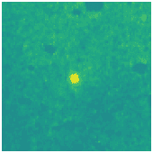
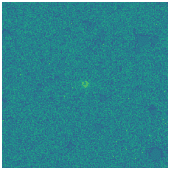
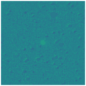
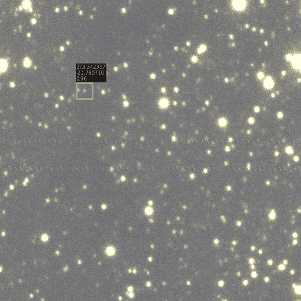

<!--yml

类别：未分类

日期：2024-09-06 19:30:43

-->

# [2408.09482] 首次发现并确认由 AI 和深度学习技术应用于 VPHAS+调查数据找到的 PN 候选体

> 来源：[`ar5iv.labs.arxiv.org/html/2408.09482`](https://ar5iv.labs.arxiv.org/html/2408.09482)

¹¹institutetext: 香港大学物理系，中国香港特别行政区 ²²institutetext: 香港大学空间研究实验室，中国香港，999077 ³³institutetext: 太原理工大学电子信息与光学工程学院，中国太原，030024 ⁴⁴institutetext: 彭城实验室，中国深圳，518066

# 首次发现并确认由 AI 和深度学习技术应用于 VPHAS+调查数据找到的 PN 候选体

李宇山 112233    昆廷·帕克 quentinp@hku.hk22    彭佳 3344（接收 -; 接受 -）

###### 摘要

背景。我们开发了基于深度学习（DL）和人工智能（AI）的工具，以搜索银河平面的现有窄带宽视场 H$\alpha$调查中隐藏在银河中心密集星场中的隐秘行星状星云（PNe）。这些天体是微弱的、低表面亮度的，通常是被分辨出的源，它们未被依赖光度数据的先前自动搜索所发现。这些源在如此拥挤的场中通过传统的视觉检查非常难以找到，许多都被遗漏了。我们成功采用了一种新颖的‘Swin-Transformer’ AI 算法，具体描述见前述的技术论文（论文 I）。

目标。这里，我们展示了对 31 个由算法从高分辨率 H$\alpha$调查 VPHAS+中找到的顶级 PN 候选体的首次光谱跟进运行的初步结果。该调查尚未经过广泛的手动系统搜索。

方法。我们在 2023 年 6 月使用南非天文台（SAAO）1.9 米望远镜上的 SpUpNIC 光谱仪观测了我们的候选行星状星云（PNe）。我们进行了标准的 IRAF 光谱减除，然后按照我们正常的 HASH PN 识别和分类程序进行操作。

结果。我们的减光谱确认这些候选体包括 22 个真实的、可能的和可能是 PNe 的（70.97%），3 个发射线星系，2 个发射线星，2 个晚型星污染物以及 2 个其他 H$\alpha$源，包括新识别的 SNR RCW 84 的脱离片段。我们展示了这些候选体的成像和光谱数据以及对其属性的初步分析。这些数据为评估和完善 AI 算法在宽视场 H$\alpha$调查中寻找 PNe 的行为提供了强有力的支持。

###### 关键词：

行星状星云：概况 – 方法：数据分析 – 技术：光谱学

## 1 引言

行星状星云（PN）是低质量到中等质量恒星晚期演化中的一个短暂但关键的阶段。它们的特性可以揭示在这一阶段发生的恒星核合成和质量损失过程的物理，例如 Iben（1995）、银河化学富集以及任何银河丰度梯度，参见 Maciel 等人（2003）；Henry 等人（2010）；Maciel 等人（2015）；Stanghellini & Haywood（2018）。作为最复杂和最美丽的天体物体类别之一，PN 是在渐近巨星分支（post-AGB）阶段之后，从其中心恒星（CSPN）喷射出的最终气体外壳。这些外壳被 CSPN 发出的高能辐射电离，因为它正在向白矮星（WD）演化。它们在宇宙学的短时间内经历剧烈演变，通常约为$\sim 21,000\pm 5,000$年（Jacob 等人，2013；Badenes 等人，2015），尽管在一个开放星团中发现的一个更古老的 PN 估计年龄约为$\sim 50,000$年（Fragkou 等人，2022）。这种短暂性使它们变得稀有。它们展示了多种特性，包括形态、大小、表面亮度分布、电离特性、元素丰度、密度和膨胀速率，这些特性与 CSPN 的质量、温度和属性有关。PN 可以很容易与其他天体混淆，如 H II 区、年轻恒星对象（YSOs）、超新星遗迹（SNRs）、狼-雷叶壳层、 nova 壳层、恒星喷射物和共生系统，如（Frew & Parker，2010）和（Parker，2022）所描述。这些不同类型星云之间的共同特性可能会导致使用自动软件寻找它们时的困难，这种软件通常在像恒星和星系这样更规则的目标上表现更好。过去 20 年里，随着银河平面深度宽视场 H$\alpha$调查的出现，例如南方的 SHS（Parker 等人，2005）和北方的 IPHAS（Drew 等人，2005），通过对比 H$\alpha$窄带图像与相应的红色宽带图像进行的视觉检查，显著贡献了约 50%的目前已知的$\sim 3800$个银河 PN（Parker 等人，2016）。这一成果主要来自于由第二作者主导的主要系列论文（Parker 等人，2006；Miszalski 等人，2008；Sabin 等人，2014）。

最近的高分辨率 H$\alpha$ 调查 VPHAS+（Drew 等人，2014）利用在智利的 VST 天文望远镜，对南半球银河面进行了调查，截至 2018 年 8 月已完成计划覆盖范围的 91.6%，覆盖面积约为 $\sim 2000$ 平方度。到目前为止，这些数据尚未被有效地人工扫描。在银河核区，调查将其标准的 $\pm 5$ 度银河纬度扩展到了 $\rm|b|=10^{\circ}$。该调查的角分辨率为 $\sim 0.21$ 角秒/像素，与自然视场的 0.5 角秒非常匹配。这项较高分辨率的南半球调查，包括丰富的银河核区域，为寻找隐藏在银河中心密集星场后的小型已解析行星状星云（PNe）提供了极好的机会。为了以更高效、客观和一致的方式利用这些数据，我们基于新颖的 Swin-Transformer 模型（Liu 等人，2021）构建了一种深度学习目标检测算法用于 PNe。有关详细信息，请参见 Sun 等人 (2024)。这种数据驱动的方法根据 PNe 的多样化特性进行了调整，并利用来自 IPHAS 的 1137 张独立图像及 HASH 数据库中的对应目录进行训练¹¹1HASH: 在线网址 http://www.hashpn.space。HASH 联合了所有已知银河系和大麦哲伦云 PNe 的多波长成像、光谱和其他数据。（Parker 等人，2016; Parker，2022），然后通过另外 454 张 PNe 图像进行了验证。验证结果显示成功检测了 97.8% 的已知 PNe。在检测到的目标中，96.5% 在 HASH 中是真实的，这显示了我们模型的良好表现。以往在 PNe 研究中的机器学习和深度学习工作，Faundez-Abans 等人 (1996) 使用层次聚类分析和监督人工神经网络（ANN）根据其化学成分（基于光谱）对 PNe 进行分类，而 Akras 等人 (2019) 使用决策树模型在红外光度数据中寻找紧凑型 PNe。最近，Awang Iskandar 等人 (2020) 应用多个深度神经网络（DNN）模型对几个红外和光学图像数据集进行分析，以区分 PNe 和所有类型的非 PNe，并成功地对其形态进行了分类。

本文的组织结构如下：光谱观测和数据处理过程在第二部分中描述，结果在第三部分中以几种类别展示，结论在第四部分中给出。

## 2 光谱观测与处理

PNe 的光谱在整个电磁波谱中有许多强烈且具有特征性的发射线，尽管大多数现有光谱都是光学光谱。我们对一组高质量、由 AI/ML 发现的 PNe 候选样本进行了光谱确认。我们的观测在 2023 年 6 月 13^(日)至 21^(日) 之间进行，使用的是 1.9 米 SAAO 望远镜上的 SpUpNIC 光谱仪（Crause 等，2016），运行编号为 #484\。我们使用了 grating gr7（每毫米 300 条刻线，4600 Å 的 blaze，5550 Å 的范围，2.72 Å/像素的色散），通常使用 17（$\sim$2 弧秒）的狭缝宽度。我们根据目标的亮度调整曝光时间，较亮且更紧凑的 PNe 通常设置为 300 秒，中等表面亮度的候选对象为 600 秒，较暗的目标为 900 秒，包括一些非常暗的目标重复了 900 秒。对于特定目标 YP0900-4457（见下文），我们观测了其紧凑和明显的星云喷流部分，曝光时间分别为 300 秒和 900 秒。

我们使用 IRAF V2.17 版本（2021）（Tody，1986，1993）进行了光谱数据处理。我们通过 zerocombine 任务创建了主偏置图像，然后使用 imsurfit 任务对其进行了平滑处理。对于天文馆和天空的平场，我们使用 flatcombine 任务创建了主平场图像。主天文馆平场图像使用 response 任务进行拟合，然后通过 ccdproc 任务生成新的天空平场，最后用 illum 任务从新的天空平场中去除残余斜率，并通过 imarith 任务创建了一个“完美的平场”，即将拟合的主天文馆平场图像与最终的新天空平场相乘。然后我们可以同时纠正偏置和平场，并使用 ccdproc 任务修整所有目标、ARC 和流量校准器光谱的光谱。

在这个数据减少过程中，我们将任何重复的观测数据通过`imcombine`任务合并，并通过`imedit`任务清理了宇宙射线事件（CRE）。然后，使用`apall`任务从二维光谱中提取目标和 ARC 的一维光谱，在识别了星云区域和天空区域（用于天空减法）后进行。波长校准使用`identify`、`reidentify`、`refspec`和`dispcor`任务完成，以确定从每个目标观测获得的 ARC 校准光谱中的色散解，并适当分配给目标光谱。最后，使用`standard`、`sensfunc`和`calibrate`任务对目标进行了通量校准，使用了在每个夜晚观测到的标准星 LTT4364 和 LTT9239。

表 1：观察到的 PN 候选者的名称、HASH ID、位置、PN 状态、角直径（以角秒为单位）及（如可能）PN 的形态（R-圆形，E-椭圆形，B-双极，I-不规则，S-类星体，A-不对称）以及任何相关的星云或喷流。

| 常见名称 | HASH | RA (J2000) | Dec (J2000) | l | b | 目标 | 直径 | ERBIAS |
| --- | --- | --- | --- | --- | --- | --- | --- | --- |
|  | ID | hh:mm:ss.s | $\pm$dd:mm:ss | 度 | 度 | 状态 | 角秒 | 形态 |
| --- | --- | --- | --- | --- | --- | --- | --- | --- |
| YP0821-4253 | 33724 | 08:21:56.5 | -42:53:05 | 260.28 | -3.41 | 真实的 PN | 7.0 | R |
| YP0821-4253b | 33798 | 08:22:06.0 | -42:53:30 | 260.30 | -3.39 | 真实的 PN | 226.9 | B |
| YP0827-3033 | 33725 | 08:27:57.4 | -30:33:06 | 250.88 | 4.68 | EM 星系 | 3.1 | S |
| YP0900-4457 | 33726 | 09:00:57.4 | -44:57:05 | 266.22 | 0.87 | EM 星 | 7.0 |  |
| YP0900-4457b | 33726 | 09:00:57.4 | -44:56:56 | 266.22 | 0.87 | 喷流 | 6.7 | I |
| YP1028-5714 | 33727 | 10:28:41.2 | -57:14:28 | 284.53 | 0.44 | 可能的 PN | 3.4 | R |
| YP1048-6127 | 33728 | 10:48:57.0 | -61:27:10 | 288.83 | -1.98 | 真实的 PN | 4.7 | I |
| YP1151-6247 | 33729 | 11:51:51.5 | -62:47:10 | 296.18 | -0.70 | EM 星系 | 6.3 | B |
| YP1209-6332 | 33730 | 12:09:16.4 | -63:32:03 | 298.25 | -1.05 | 可能的 PN | 2.4 | S |
| YP1214-6226 | 33731 | 12:14:34.6 | -62:26:07 | 298.68 | 0.13 | 可能的 PN | 2.9 | S |
| YP1317-6513 | 33732 | 13:17:52.3 | -65:13:27 | 305.70 | -2.49 | 真实的 PN | 8.5 | E |
| YP1327-6328 | 33733 | 13:27:40.1 | -63:28:05 | 306.96 | -0.88 | 真实的 PN | 9.2 | E |
| YP1429-6214 | 33734 | 14:29:34.2 | -62:14:01 | 314.09 | -1.51 | LT 星+真实 PN | 4.1 | B |
| YP1441-6239 | 33735 | 14:41:05.5 | -62:39:44 | 315.15 | -2.42 | 可能的 SNR | 5.6 | I |
| YP1502-6040 | 33736 | 15:02:47.1 | -60:40:47 | 318.34 | -1.80 | 真实的 PN | 3.0 | R |
| YP1612-5209 | 33737 | 16:12:36.0 | -52:09:20 | 331.10 | -0.64 | 真实的 PN | 9.2 | E |
| YP1647-4550 | 33738 | 16:47:05.9 | -45:50:28 | 339.56 | -0.40 | 星团中的雾霭 | 3.7 | I |
| YP1650-4328 | 33739 | 16:50:40.5 | -43:28:12 | 341.79 | 0.64 | 真实的 PN | 2.8 | S |
| YP1701-2519 | 33740 | 17:01:30.0 | -25:19:48 | 357.48 | 10.15 | EM 星系 | 3.4 | R |
| YP1705-2524 | 33741 | 17:05:11.0 | -25:24:40 | 357.91 | 9.43 | 矮星 | 8.4 |  |
| YP1716-2705 | 33742 | 17:16:42.2 | -27:05:19 | 358.05 | 6.35 | 可能的 PN | 2.5 | R |
| YP1731-3011 | 33743 | 17:31:17.8 | -30:11:36 | 357.27 | 1.96 | WD+真实的 PN | 2.6 | S |
| YP1731-3011b | 33743 | 17:31:17.8 | -30:11:36 | 357.27 | 1.96 | 喷流 & 泡沫 | 33.6 | B |
| YP1754-1815 | 33744 | 17:54:32.4 | -18:15:48 | 10.22 | 3.71 | 真实的 PN | 3.3 | R |
| YP1759-2036 | 33745 | 17:59:41.1 | -20:36:28 | 8.79 | 1.49 | 真实的 PN | 7.6 | E |
| YP1802-1440 | 33746 | 18:02:57.9 | -14:40:19 | 14.35 | 3.74 | 真实的 PN | 3.4 | R |
| YP1810-2450 | 33747 | 18:10:39.6 | -24:50:28 | 6.34 | -2.79 | 真实的 PN | 7.3 | A |
| YP1813-2146 | 33748 | 18:13:22.1 | -21:46:50 | 9.33 | -1.86 | EM 星 | 2.2 |  |
| YP1818-1211 | 33749 | 18:18:29.2 | -12:11:11 | 18.35 | 1.63 | 真实的 PN | 8.4 | B |
| YP1819-2405 | 33750 | 18:19:17.6 | -24:05:27 | 7.93 | -4.16 | 矮星 | 7.5 |  |
| YP1826-1029 | 33751 | 18:26:23.0 | -10:29:47 | 20.75 | 0.71 | 真实的 PN | 6.4 | I |
| YP1837-0354 | 33752 | 18:37:54.3 | -03:54:31 | 27.91 | 1.22 | 可能的 PN | 3.0 | R |
| YP1845-0511 | 33753 | 18:45:42.7 | -05:11:50 | 27.65 | -1.10 | 真实的 PN | 3.5 | R |
| YP1856-0424 | 33754 | 18:56:46.1 | -04:24:46 | 29.61 | -3.19 | 可能的 PN | 2.4 | R |

## 3 结果

我们通过全面评估关键特征来确定目标是否为 PN 或其他对象类型，遵循 Parker (2022) 中总结的原则 - 参见该论文的图 11 和第 12.2 节。这包括目标是否在窄带成像中作为发射对象出现（我们的 ML/AI 算法尽可能检测到未知的发射对象），目标是否符合典型 PN 形态分类。我们采用 HASH ERBIAS/sparm 形态分类方案（Parker 等人，2006）。我们还评估候选后续光谱中的星云发射线是否与典型 PN 类型和演化阶段的特征对齐。然而，某些星云的典型发射线比率仍可能被误认为是 PNe。有时可能需要考虑 H$\alpha$ 线的等效宽度来进行判断（Stasińska 等人，2022）。在后续小节中，我们将提供如何在特定情况下确定目标类型的示例。

总结来说，在我们能够观察到的 31 个优质 PNe 候选者中，我们通过光谱学确认了 16 个真实的、2 个可能的和 4 个可能存在的 PNe。我们进一步识别了 3 个发射线星系（这里它们的红移足够低，以至于[N II]和 H-alpha 线没有被从 VPHAS+ H$\alpha$窄带滤光器中移出）、2 个发射线恒星、2 个晚期类型的恒星、1 个可能的超新星残片和 1 个在星团中的已知发射斑点。显然，除了两个晚期类型的恒星外，所有其他对象都有真实的发射线。这些候选者的属性在表格 1 中总结，包括常见名称、RA（J2000）和 Dec（J2000）、银河坐标 l 和 b、对象状态、角直径（角秒）和形态（如适用）。请注意，候选者的直径是通过 VPHAS+ H$\alpha$图像上的 DS9 区域功能测量的，其尺度为 zscale。我们为每个类别提供了示例，并将所有图像和光谱包含在附录中。

### 3.1 真实的行星状况（PNe）

我们通过光谱学确认了 16 个候选者为真实的 PNe（占总样本的 51.61%）。真实的‘T’类分配遵循了标准 HASH 程序，如（Parker 等，2016; Parker，2022）中所述，基于对每个对象所有可用数据的整体评估。当然，这里的光谱确认至关重要，基于目标的发射线的性质。这包括红光中的 H$\alpha$、[N II]、[O III]、[S II]和[O I]的存在，以及蓝光中的 He II（如果存在，这强烈证明了 PNe 的性质）、[O III]和 H$\beta$，并且比率典型于 PNe。有关它们的 VPHAS+检测 PNG 图像（用红框标记）、SHS H$\alpha$-Rband 商标图像、VPHAS+ H$\alpha$-Rband 商标图像以及我们的确认 SAAO 光谱（标记了光谱线），请参见图 5。

大多数这些 PNe 要么是圆形的，要么是椭圆形的，尽管有些呈双极形，还有一些呈更不规则的形状。YP0821-4253（图 1 的前两行）是一个高度进化的双极星云的西北部，看起来是分裂的，我们对每个部分进行了进一步观察，并将在一篇单独的论文中展示。它是这项研究中发现的最大目标。YP1317-6513（图 1 的第三行），YP1612-5209 和 YP1759-2036 是具有强烈明确发射线的明亮目标。YP1429-6214（图 1 的第四行）是一个真正的双极 PN，就在一个前景星体后面。尽管不可避免地受到假定前景星体的晚型恒星连续谱的污染，但检测到了典型的 PN 发射线 H$\alpha$，[N II]和[O III]。YP1731-3011（图 1 的最后两行）在 VPHAS +检测图像中微弱，但在商数图像中显示出一个相关的西北喷流和一个可能的向南发射的气泡。它的二维光谱可以提取成一个中心白矮星成分，具有深而宽的氢吸收线和周围的真正的 PN 光谱。前者的 H$\alpha$线可能有一个 P Cygni 型的轮廓。

PNe 的其余部分很小且微弱，其中一部分接近人类视觉分辨率的极限。它们经常隐藏在密集的恒星场中，甚至有些被多个星体隐藏。这些星云的发现和确认展示了我们模型强大的检测和抗干扰能力，能够在这样的环境中找到真正的 PNe。

\begin{overpic}[width=173.44534pt]{fig/YP0821-4253_spec.png} \put(70.0,45.0){\small{YP0821-4253}} \put(70.0,38.0){\small{真实 PN}} \put(70.0,31.0){\small{大且碎片化}} \end{overpic}\begin{overpic}[width=173.44534pt]{fig/YP1317-6513_spec.png} \put(70.0,45.0){\small{YP1317-6513}} \put(70.0,38.0){\small{真实 PN}} \put(70.0,31.0){\small{明亮且分辨}} \end{overpic}\begin{overpic}[width=173.44534pt]{fig/YP1429-6214_spec.png} \put(70.0,45.0){\small{YP1429-6214}} \put(70.0,38.0){\small{真实 PN}} \put(70.0,31.0){\small{被一颗星星遮挡}} \put(8.0,18.0){\includegraphics[scale={0.12}]{fig/YP1429-6214a_spec.png}} \end{overpic}\begin{overpic}[width=173.44534pt]{fig/YP1731-3011a_spec.png} \put(70.0,45.0){\small{YP1731-3011}} \put(70.0,38.0){\small{白矮星}} \end{overpic}\begin{overpic}[width=173.44534pt]{fig/YP1731-3011b_spec.png} \put(70.0,45.0){\small{YP1731-3011}} \put(70.0,38.0){\small{真实 PN}} \put(70.0,31.0){\small{有喷流的弱 PN}} \end{overpic}

图 1：选择的真实行星状况目标示例：VPHAS+ 检测到的 PNG 图像，用红色框标记，SHS H$\alpha$-Rband 比例图像，VPHAS+ H$\alpha$-Rband 比例图像，SAAO 光谱及其标记的谱线。

\begin{overpic}[width=173.44534pt]{fig/YP1028-5714_spec.png} \put(70.0,45.0){\small{YP1028-5714}} \put(70.0,38.0){\small{可能 PNe}} \put(70.0,31.0){\small{靠近一颗明亮的星星}} \end{overpic}\begin{overpic}[width=173.44534pt]{fig/YP1151-6247_spec.png} \put(70.0,45.0){\small{YP1151-6247}} \put(70.0,38.0){\small{发射线星系}} \put(70.0,31.0){\small{带有两个斑点}} \end{overpic}\begin{overpic}[width=173.44534pt]{fig/YP0900-4457a_spec.png} \put(70.0,45.0){\small{YP0900-4457}} \put(70.0,38.0){\small{发射线星}} \put(70.0,31.0){\small{稀疏星场}} \end{overpic}\begin{overpic}[width=173.44534pt]{fig/YP0900-4457b_spec.png} \put(70.0,45.0){\small{YP0900-4457}} \put(70.0,38.0){\small{流出物}} \end{overpic}\begin{overpic}[width=173.44534pt]{fig/YP1441-6239_spec.png} \put(70.0,45.0){\small{YP1441-6239}} \put(70.0,38.0){\small{SNR 片段}} \end{overpic}

图 2：选定的可能及潜在 PNe、发射线星系及其他目标示例：由红框标记的 VPHAS+检测的 PNG 图像，SHS H$\alpha$-R 带比率图像，VPHAS+ H$\alpha$-R 带比率图像，带有标记光谱线的 SAAO 光谱。

### 3.2 可能及潜在 PNe

在此次光谱观测中，我们再次确认了 2 个可能的‘L’ PNe 和 4 个可能的‘P’ PNe，这些分类遵循我们的标准 HASH 原则。这个合并的 L、P PNe 样本占总数的 19.35%。这些 L 和 P PNe 分别在图 7 和图 7 中展示。这些 L 和 P 分类指的是展示一些标准 PNe 特征的天体，但也可能表现出其他特征或不确定性，从而引入一些怀疑。这些天体可能还具有一些罕见的发射线或线比，这些线比在 PNe 中不典型。有些天体过于微弱，无法获得足够信噪比的光谱以准确确定其性质，因此被归类为 L 或 P。

这些候选对象大多数位于密集的恒星区域内，并且呈现圆形或准恒星状。还有一个目标（YP1028-5714，见图 2）受到了极其明亮的恒星干扰。这些对象通常非常微弱，难以辨别。在复杂的恒星干扰环境中检测到它们展示了我们模型的强大性能。

### 3.3 其他类型的发射线源或类似物

尽管我们的 AI/ML 算法是基于已知 PN 的核心群体进行训练的，但它仍能识别所有类型的 H$\alpha$ 发射源，无论它们是 PN 还是紧凑的 HII 区域、Wolf-Rayet 外壳、超新星遗迹的脱离部分、斯特龙格区、发射线恒星，甚至是其 H$\alpha$ 线落在滤光片带宽内的低红移发射线星系。因此，我们可能需要通过后续的多波长图像检查和光谱观测进一步细化目标的精确分类。因此，我们的样本中还包括少量其他类型的天体。

#### 3.3.1 发射线星系

我们在这项工作中发现了 3 个窄线发射线星系（见图 9 和表 2），通过它们的光谱中展示的 $30-50$ Å 红移（在 PNe 中也通常见到）。其中一个源，YP0827-3033，Z=0.0062 非常紧凑，YP1151-6247（见图 2）Z=0.00414 显示为两个略微分开的椭圆发射斑点，最初被认为是双极 PN，但现在很可能是两个相互作用的星系。有趣的是，[N II]/H$\alpha$ 比率为 8.6。第三个例子是 YP1701-2519，一个小但清晰解析的发射区域，Z=0.0059。VPHAS+ 调查对发射线星系的敏感性取决于滤光片的带宽和发射线星系的红移。该滤光片的中心波长和 FWHM 分别为 6588Å 和 107Å（Drew 等人，2005）。

表 2：根据光谱测量的红移和估计的 3 个发射线星系的距离。此处假设的哈勃常数值为 70 (km/s)/Mpc。

| 通用名称 | 红移 Z | 距离 (Mpc) |
| --- | --- | --- |
| YP0827-3033 | 0.0062 | 26.57 |
| YP1151-6247 | 0.00414 | 17.74 |
| YP1701-2519 | 0.0059 | 25.29 |

### 3.4 发射线星和晚型星

作为我们样本验证策略的一部分，我们选择了一系列紧凑且明显未分辨的观测源，这些源在 H$\alpha$图像与宽带红色等效图像的强度差异明显。由于这种强度差异，这些源被怀疑是发射线星或晚型星污染物。这一选择是从 AI/ML 提供的 VPHAS+目标列表中盲目完成的，没有参考其他影像（可能指示了源类型）。对这些选定案例的光谱分析揭示了其中两个（占总数的 6.45%）确实是由强分子带主导的晚型星（见图 11）。如 Parker 等人所述（2006），这些分子带分布落在 H$\alpha$滤光片波段内，同时随着向红色移动，峰值强度增加。这被 H$\alpha$滤光片选择，而其在宽带红色滤光片中的影响被稀释。YP1705-2524（这些晚型星污染物之一）的显著图像形状略微拉长，这是由于附近存在另一颗相对较暗的星星。还发现了两颗发射线星（EM 星），它们也占总数的 6.45%（见图 9）。其中一颗 EM 星（YP0900-4457，图 2 中的第三和第四行）位于一个星稀疏的区域，表明其背后存在强吸收屏。光谱显示出多个非常强的发射线，并且有一个朝北的星云流出。还对这个流出的光谱进行了测量，其光谱与假定主星的光谱非常相似。然而，也有可能我们的光谱观测错过了流出物，而捕捉了星星的边缘，这需要进一步检查。发现的两个发射线星在红外中显示出 Ca II 三重线的发射。这些结果表明，这些显然的发射体的选择可能提供了一条丰富的微弱发射线星的研究途径 - 需要更多的例子来统计确定真实发射与晚型星的比例，在这里，它们名义上各占 50%。

### 3.5 其他

在这次光谱观测中，我们还识别了另外 2 个目标，占总数的 6.45%（见图 11）。

其中一个结果显示为著名超新星残骸 RCW 86（YP1441-6239，图 2 最后一行）的一个小的脱离片段。我们的 AI 网络检测到了多个类似目标，从我们的 PNe 搜索中排除它们需要更大规模的周围图像进行判断。

其他独立识别的观测目标结果显示为已知的 H$\alpha$发射物体，位于超级星团 Westerlund 1 中。它之前使用了 VPHAS+、HST 和 VLT 数据进行研究，见 Wright 等人（2014），并被识别为环绕红色超巨星的电离氢气云。

## 4 结论

我们展示了通过应用深度学习技术对高分辨率 VPHAS+调查数据进行的 PNe 候选体的首次发现和确认。我们已经证明了我们的技术能够独立并自动地在银河中心附近的密集星场中发现微弱、已解析的 PNe，这些目标通常超出了传统检测软件和视觉检查的范围。我们的自动化技术，在《论文 I》中描述的训练后，节省了对大规模成像调查数据集进行目检所需的大量人力。为了取得这些令人鼓舞的结果，我们开发了一种新颖的 Swin-Transformer 算法（见 Sun 等人（2024）），使用基于 HASH PNe 数据库（Parker 等人，2016）现有 PNe 库存的 IPHAS 训练样本。我们发现了超过 800 个高质量的候选体，并选择了其中 31 个进行 SAAO 的初步光谱观测。我们光谱学上确认了 22 个为真正的（T）、可能的（L）和潜在的（P）PNe，给出了 70.97%的正式确认水平。这些 PNe 大多数非常微弱且位于密集区域，有些直接被星体部分遮挡或在非常亮的附近星星的辉光/干扰下。我们还发现了一颗具有有趣 H$\alpha$喷流的 CSPN 白矮星。在剩下的 9 个源中，有 7 个是发射线源，包括 3 个发射线星系、2 个发射线星、一个超新星的组成部分和一个在星团中的发射斑点。只有 2/31 个对象为非发射体，被归类为具有明显红色分子带的晚型星。这给出了所有类型发射源检测的总体成功率为 29/31 或 93.5%。

未来，我们将继续在 VPHAS+ 领域的另一半工作，堆叠它们以观测更微弱的星云，并基于所有可用波段的融合改进搜索技术。同时，我们还计划制作一个像素级 H$\alpha$ 星云图，以便更全面地搜索微弱的行星状星云和其他类型的星云。

###### 致谢。

QAP 感谢香港研究资助局在资助编号 17326116 和 17300417 下提供的 GRF 研究支持。YL 感谢香港大学和 QAP 提供的 RMGS 资金资助的博士奖学金。该项工作还得到了中国国家自然科学基金 (NSFC) 的资助，资助编号为 12303105、12173027 和 12173062 以及民用航空航天技术研究项目 (D050105)。我们感谢中国载人航天工程的科研资助，编号为 CMS-CSST-2021-A01，以及平方公里阵列 (SKA) 项目的科研资助，编号为 2020SKA0110102。我们感谢 SAAO 提供的观测时间。

## 参考文献

+   Tody (1986) Tody, D. 1986, Proc. SPIE, 627, 733\. doi:10.1117/12.968154

+   Tody (1993) Tody, D. 1993, Astronomical Data Analysis Software and Systems II, 52, 173

+   Liu 等人 (2021) Liu, Z., Lin, Y., Cao, Y., 等人. 2021, arXiv:2103.14030\. doi:10.48550/arXiv.2103.14030

+   Drew 等人 (2005) Drew, J. E., Greimel, R., Irwin, M. J., 等人. 2005, MNRAS, 362, 753\. doi:10.1111/j.1365-2966.2005.09330.x

+   Parker 等人 (2005) Parker, Q. A., Phillipps, S., Pierce, M. J., 等人. 2005, MNRAS, 362, 689\. doi:10.1111/j.1365-2966.2005.09350.x

+   Parker 等人 (2006) Parker, Q. A., Acker, A., Frew, D. J., 等人. 2006, MNRAS, 373, 79\. doi:10.1111/j.1365-2966.2006.10950.x

+   Drew 等人 (2014) Drew, J. E., Gonzalez-Solares, E., Greimel, R., 等人. 2014, MNRAS, 440, 2036\. doi:10.1093/mnras/stu394

+   Frew & Parker (2010) Frew, D. J. & Parker, Q. A. 2010, PASA, 27, 129\. doi:10.1071/AS09040

+   Miszalski 等人 (2008) Miszalski, B., Parker, Q. A., Acker, A., 等人. 2008, MNRAS, 384, 525\. doi:10.1111/j.1365-2966.2007.12727.x

+   Henry 等人 (2010) Henry, R. B. C., Kwitter, K. B., Jaskot, A. E., 等人. 2010, ApJ, 724, 748\. doi:10.1088/0004-637X/724/1/748

+   Maciel 等人 (2003) Maciel, W. J., Costa, R. D. D., & Uchida, M. M. M. 2003, A&A, 397, 667\. doi:10.1051/0004-6361:20021530

+   Parker 等人 (2016) Parker, Q. A., Bojičić, I. S., & Frew, D. J. 2016, Journal of Physics Conference Series, 728, 032008\. doi:10.1088/1742-6596/728/3/032008

+   Iben (1995) Iben, I. 1995, Phys. Rep, 250, 2

+   Sabin 等人 (2014) Sabin, L., Parker, Q. A., Corradi, R. L. M., 等人. 2014, MNRAS, 443, 3388\. doi:10.1093/mnras/stu1404

+   Jacob 等人 (2013) Jacob, R., Schönberner, D., & Steffen, M. 2013, A&A, 558, A78\. doi:10.1051/0004-6361/201321532

+   Stanghellini & Haywood (2018) Stanghellini, L. & Haywood, M. 2018, ApJ, 862, 45\. doi:10.3847/1538-4357/aacaf8

+   Badenes 等人 (2015) Badenes, C., Maoz, D., & Ciardullo, R. 2015, ApJ, 804, L25\. doi:10.1088/2041-8205/804/1/L25

+   Parker (2022) Parker, Q. A. 2022, 《天文学与空间科学前沿》，9, 895287\. doi:10.3389/fspas.2022.895287

+   Akras 等 (2019) Akras, S., Guzman-Ramirez, L., & Gonçalves, D. R. 2019, 《月刊通知》，488, 3238\. doi:10.1093/mnras/stz1911

+   Wright 等 (2014) Wright, N. J., Wesson, R., Drew, J. E., 等. 2014, 《月刊通知》，437, L1\. doi:10.1093/mnrasl/slt127

+   Crause 等 (2016) Crause, L. A., Carter, D., Daniels, A., 等. 2016, 《SPIE 会议记录》，9908, 990827\. doi:10.1117/12.2230818

+   Awang Iskandar 等 (2020) Awang Iskandar, D. N. F., Zijlstra, A. A., McDonald, I., 等. 2020, 《银河系》，8, 88\. doi:10.3390/galaxies8040088

+   Fragkou 等 (2022) Fragkou, V., Parker, Q. A., Zijlstra, A. A., 等. 2022, 《天体物理学杂志》，935, L35\. doi:10.3847/2041-8213/ac88c1

+   Maciel 等 (2015) Maciel, W. J., Costa, R. D. D., & Cavichia, O. 2015, 《墨西哥天文学与天体物理学杂志》，51, 165\. doi:10.48550/arXiv.1505.07640

+   Faundez-Abans 等 (1996) Faundez-Abans, M., Ormeno, M. I., & de Oliveira-Abans, M. 1996, 《天文学与天体物理学附录》，116, 395

+   Sun 等 (2024) Sun, R., Li, Y., Parker, Q., 等. 2024, 《月刊通知》，528, 4733\. doi:10.1093/mnras/stad3954

+   Stasińska 等 (2022) Stasińska, G., Trevisan, M., & Vale Asari, N. 2022, 《天文学与空间科学前沿》，9, 913485\. doi:10.3389/fspas.2022.913485

\begin{overpic}[width=173.44534pt]{fig/YP0821-4253_spec.png} \put(70.0,45.0){\small{YP0821-4253}} \end{overpic}\begin{overpic}[width=173.44534pt]{fig/YP1048-6127_spec.png} \put(70.0,45.0){\small{YP1048-6127}} \end{overpic}\begin{overpic}[width=173.44534pt]{fig/YP1317-6513_spec.png} \put(70.0,45.0){\small{YP1317-6513}} \end{overpic}\begin{overpic}[width=173.44534pt]{fig/YP1327-6328_spec.png} \put(70.0,45.0){\small{YP1327-6328}} \end{overpic}\begin{overpic}[width=173.44534pt]{fig/YP1429-6214_spec.png} \put(70.0,45.0){\small{YP1429-6214}} \put(8.0,18.0){\includegraphics[scale={0.12}]{fig/YP1429-6214a_spec.png}} \end{overpic}

图 3：真实的行星状星云：VPHAS+ 检测的 PNG 图像用红色框标记，SHS H$\alpha$-Rband 比值图像，VPHAS+ H$\alpha$-Rband 比值图像，SAAO 光谱并标记了光谱线。

\begin{overpic}[width=173.44534pt]{fig/YP1502-6040_spec.png} \put(70.0,45.0){\small{YP1502-6040}} \end{overpic}\begin{overpic}[width=173.44534pt]{fig/YP1612-5209_spec.png} \put(70.0,45.0){\small{YP1612-5209}} \end{overpic}\begin{overpic}[width=173.44534pt]{fig/YP1650-4328_spec.png} \put(70.0,45.0){\small{YP1650-4328}} \end{overpic}\begin{overpic}[width=173.44534pt]{fig/YP1731-3011a_spec.png} \put(70.0,45.0){\small{YP1731-3011}} \put(70.0,40.0){\small{White Dwarf}} \end{overpic}\begin{overpic}[width=173.44534pt]{fig/YP1731-3011b_spec.png} \put(70.0,45.0){\small{YP1731-3011}} \put(70.0,40.0){\small{True PN}} \end{overpic}\begin{overpic}[width=173.44534pt]{fig/YP1754-1815_spec.png} \put(70.0,45.0){\small{YP1754-1815}} \end{overpic}

图 4：真实的行星状星云：VPHAS+ 检测的 PNG 图像用红色框标记，SHS H$\alpha$-Rband 比值图像，VPHAS+ H$\alpha$-Rband 比值图像，SAAO 光谱并标记了光谱线。

\begin{overpic}[width=173.44534pt]{fig/YP1759-2036_spec.png} \put(70.0,45.0){\small{YP1759-2036}} \end{overpic}\begin{overpic}[width=173.44534pt]{fig/YP1802-1440_spec.png} \put(70.0,45.0){\small{YP1802-1440}} \end{overpic}\begin{overpic}[width=173.44534pt]{fig/YP1810-2450_spec.png} \put(70.0,45.0){\small{YP1810-2450}} \end{overpic}\begin{overpic}[width=173.44534pt]{fig/YP1818-1211_spec.png} \put(70.0,45.0){\small{YP1818-1211}} \end{overpic}\begin{overpic}[width=173.44534pt]{fig/YP1826-1029_spec.png} \put(70.0,45.0){\small{YP1826-1029}} \end{overpic}\begin{overpic}[width=173.44534pt]{fig/YP1845-0511_spec.png} \put(70.0,45.0){\small{YP1845-0511}} \end{overpic}

图 5：真实的行星状星云（PNe）：VPHAS+ 检测的 PNG 图像，用红色框标注，SHS H$\alpha$-R 带商数图像（YP1759-2036 的 H$\alpha$ 图像），VPHAS+ H$\alpha$-R 带商数图像，带有光谱线标记的 SAAO 光谱。

\begin{overpic}[width=173.44534pt]{fig/YP1028-5714_spec.png} \put(70.0,45.0){\small{YP1028-5714}} \end{overpic}\begin{overpic}[width=173.44534pt]{fig/YP1837-0354_spec.png} \put(70.0,45.0){\small{YP1837-0354}} \end{overpic}

图 6：与图 5 相同，但为可能的行星状星云（PNe）。

\begin{overpic}[width=173.44534pt]{fig/YP1209-6332_spec.png} \put(70.0,45.0){\small{YP1209-6332}} \end{overpic}\begin{overpic}[width=173.44534pt]{fig/YP1214-6226_spec.png} \put(70.0,45.0){\small{YP1214-6226}} \end{overpic}\begin{overpic}[width=173.44534pt]{fig/YP1716-2705_spec.png} \put(70.0,45.0){\small{YP1716-2705}} \end{overpic}\begin{overpic}[width=173.44534pt]{fig/YP1856-0424_spec.png} \put(70.0,45.0){\small{YP1856-0424}} \end{overpic}

图 7：与图 5 相同，适用于可能的行星状星云。

\begin{overpic}[width=173.44534pt]{fig/YP0827-3033_spec.png} \put(70.0,45.0){\small{YP0827-3033}} \end{overpic}\begin{overpic}[width=173.44534pt]{fig/YP1151-6247_spec.png} \put(70.0,45.0){\small{YP1151-6247}} \end{overpic}\begin{overpic}[width=173.44534pt]{fig/YP1701-2519_spec.png} \put(70.0,45.0){\small{YP1701-2519}} \end{overpic}

图 8：与图 5 相同，适用于发射线星系。

\begin{overpic}[width=173.44534pt]{fig/YP0900-4457a_spec.png} \put(70.0,45.0){\small{YP0900-4457}} \put(70.0,40.0){\small{恒星}} \end{overpic}\begin{overpic}[width=173.44534pt]{fig/YP0900-4457b_spec.png} \put(70.0,45.0){\small{YP0900-4457}} \put(70.0,40.0){\small{流出}} \end{overpic}\begin{overpic}[width=173.44534pt]{fig/YP1813-2146_spec.png} \put(70.0,45.0){\small{YP1813-2146}} \end{overpic}

图 9：与图 5 相同，适用于发射线星。

\begin{overpic}[width=173.44534pt]{fig/YP1705-2524_spec.png} \put(70.0,45.0){\small{YP1705-2524}} \end{overpic}\begin{overpic}[width=173.44534pt]{fig/YP1819-2405_spec.png} \put(70.0,45.0){\small{YP1819-2405}} \end{overpic}

图 10：与图 5 相同，适用于晚型星。

\begin{overpic}[width=173.44534pt]{fig/YP1441-6239_spec.png} \put(70.0,45.0){\small{YP1441-6239}} \end{overpic}\begin{overpic}[width=173.44534pt]{fig/YP1647-4550_spec.png} \put(70.0,45.0){\small{YP1647-4550}} \end{overpic}

图 11：与图 5 相同，适用于可能的 SNR 残片和星团中的星云。
