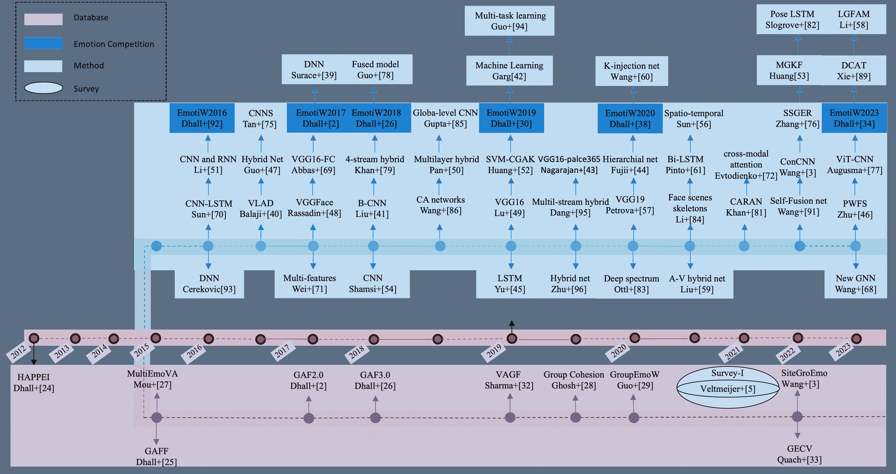
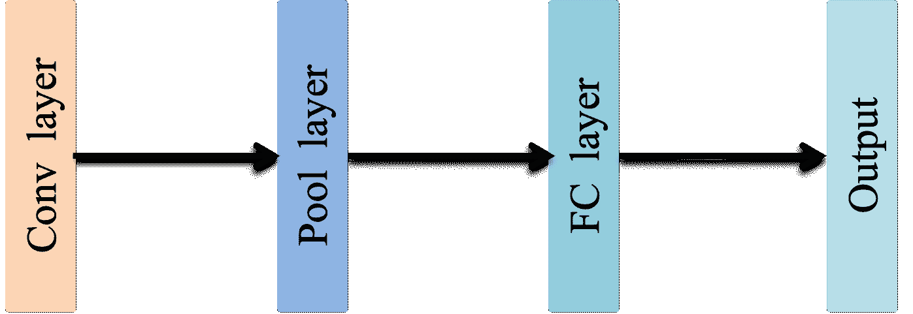
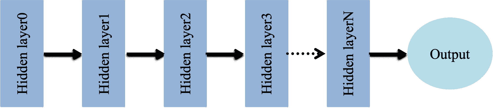
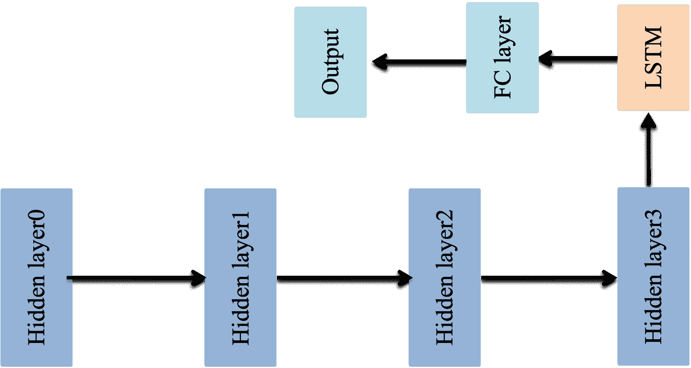
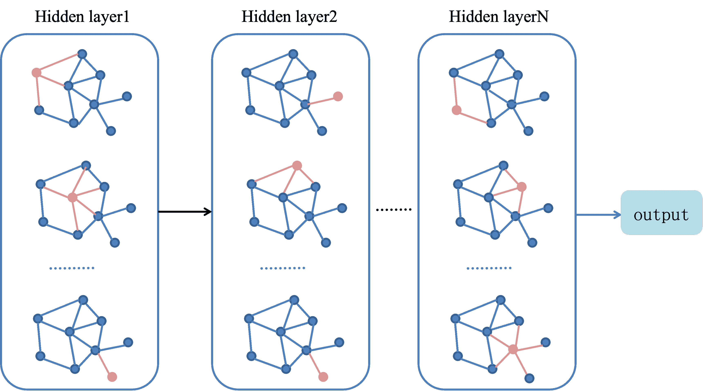

<!--yml

类别: 未分类

日期: 2024-09-06 19:30:28

-->

# [2408.15276] 深度学习在群体级情感识别中的调查

> 来源：[`ar5iv.labs.arxiv.org/html/2408.15276`](https://ar5iv.labs.arxiv.org/html/2408.15276)

# 深度学习在群体级情感识别中的调查

黄晓华，徐金科，郑文铭，毛奇荣，阿宾纳夫·达尔。黄晓华现任南京工业大学计算机工程学院教授，中国南京 210096；东南大学儿童发展与学习科学重点实验室（教育部），中国南京 210096；东南大学学习科学研究中心，中国。 (电子邮件: xiaohuahwang@gmail.com) 徐金科现任南京工业大学计算机工程学院教授，中国。 (电子邮件: y00450220246@njit.edu.cn) 郑文铭现任东南大学儿童发展与学习科学重点实验室（教育部），中国南京 210096，及东南大学生物科学与医学工程学院教授，中国江苏南京 210096。 (电子邮件: wenming_zheng@seu.edu.cn) 毛奇荣现任江苏大学计算机科学与通信工程学院教授，中国江苏镇江。 (电子邮件: mao_qr@ujs.edu.cn) 阿宾纳夫·达尔现任弗林德斯大学科学与工程学院教授，澳大利亚阿德莱德，及印度理工学院罗帕尔校区，印度旁遮普 140001。 (电子邮件: abhinav.dhall@flinders.edu.au)

###### 摘要

随着人工智能（AI）技术的进步，群体级情感识别（GER）已成为分析人类行为的重要领域。早期的 GER 方法主要依赖于手工特征。然而，随着深度学习（DL）技术的普及及其在各种任务中的显著成功，神经网络在 GER 中引起了越来越多的关注。与个体情感不同，群体情感表现出多样性和动态性。目前，已有几种 DL 方法被提出，以有效利用群体级图像中的丰富信息，并显著提升 GER 性能。在这项调查中，我们提供了对应用于 GER 的 DL 技术的全面回顾，提出了一种新的分类法，涵盖了基于 DL 的 GER 领域的所有方面。调查概述了数据集、深度 GER 流程以及过去十年最先进方法的性能比较。此外，还总结和讨论了每个方面的基本方法和先进发展。此外，我们还识别了突出的挑战，并建议了设计稳健的 GER 系统的潜在途径。据我们所知，这项调查代表了对深度 GER 方法的首次全面回顾，为未来的 GER 研究工作提供了关键参考。

###### 关键词：

群体级情感识别、深度学习、特征表示学习、注意力机制、融合方案。

## I 引言

情感对人类的感知、注意力、记忆和决策有深远的影响，直接影响到身心健康[1]。因此，对情感的理解和感知不仅增强了人际沟通，还隐含地有助于调节人类的身体健康。随着大数据技术的发展、应用场景的拓展和人工智能技术的进步，群体级情感识别（GER）已成为研究人员关注的重点[2, 3]。与通过面部表情、语音和姿势分析个人情感的个人级情感识别不同，GER 专注于识别一群人的集体情感。现有的 GER 技术整合了各种信息，包括面部表情、姿势、社交互动等，以预测群体的情感。以面部表情数据为例，GER 通常涉及三个关键步骤：首先，给定图像，从图像或视频中检测和提取面部和姿势等信息；其次，使用手工制作的描述符或神经网络提取面部特征和其他相关信息；最后，将这些特征作为序列数据输入到另一个模型，如递归神经网络，以对群体级情感进行分类。然而，GER 面临三个主要挑战。首先，GER 涉及的群体和背景可能表现出多样性和复杂性。其次，群体级情感的标注需要对主要群体表达的情感进行更细致的考虑，与个人级情感标注相比引入了额外的复杂性。最后，由于涉及多个个体和多样化的背景，识别过程变得比个人级情感识别更复杂。尽管面临这些挑战，GER 仍然是一个重要且艰巨的研究领域。它可用于分析一群人的情感变化，及时检测监控视频中的异常行为和潜在危险，或了解学生在协作学习中的学习状态[4]。

本文提供了关于 GER 的深度学习方法的全面调查。与现有的综述[5]不同，本文详细阐述了 GER 的方法，独特地聚焦于深度学习架构，提供了有关深度学习方法在 GER 中的现状和技术挑战的见解。开始时，我们从社会角度对群体和情感进行深入分析，为 GER 提供了简明的概念。随后，我们详细描述了目前可用于 GER 的基于图像和视频的群体级情感数据库。此外，我们探讨了最近开发的 GER 深度学习方法，并审视了其技术挑战。最后，我们讨论了 GER 的发展趋势，为未来的研究和应用提供有价值的见解和指导。

## II 群体级情感

情感在传统上被视为个体级现象，但在社会心理学领域，它们越来越受到关注，作为潜在的群体级现象[6]。Niedenthal 和 Brauer 提供了群体级情感的广泛定义，将其描述为个体代表他们认同的群体所体验的情感[7]。这一观点表明，群体级情感本质上比个体级情感更为复杂。我们将从社会学和心理学角度出发，阐明群体和情感的概念，然后提供对群体情感的准确定义。

群体层面的情感与个体层面的情感之间的根本差异源于群体与个体概念的不同。个体指的是一个单一的、独立的实体，而群体超越了单纯的聚合，构成了一个将个体融合成集体实体的社会现象。学术文献中提出了各种关于群体概念的观点和定义[8, 9, 10, 11]。Shaw 等人[8]定义群体为两个或更多个体进行相互互动和影响的集合，强调群体成员之间互动的重要性。Szilagi 和 Wallance[9]将群体描述为两个或更多个体互动并依赖于彼此以实现共同目标的集合。此外，Barron 等人[10]进一步阐述了这个定义，将群体概念化为通过某种纽带连接的个体，表现出不同程度的凝聚力。而 Dasgupta 等人[11]将群体描述为以某种方式紧密相互联系的人群。根据这些研究，群体由多个个体组成，这些个体在一定时间内有共同目标和直接或间接的互动。因此，只有当这些条件得到满足时，多个个体的组合才可以被视为一个群体。

许多学者在社会学和心理学领域探讨了情感的概念。Schachter 等人[12]提出情感包含生理激发状态和适应这一生理状态的认知状态。Kleinginna 等人[13]进行了全面的综述，将 92 种不同的情感定义从各种文献来源中进行分类。Ekman 在[14]中建议“情感源于人类在处理基本生活任务中的适应性价值”，这表明情感作为对社会活动中遇到的不同情况的适应性反应而产生。Averill 认为情感是高级认知中冲动动机的复杂体，涉及各种心理过程和生理反应[15]。Cabanac 定义情感为任何具有高强度和高愉悦内容的心理体验，强调情感与心理体验之间的关系[16]。Barrett 认为情感是大脑对外部和内部刺激的解读构建[17]。Scherer 视情感为一种生物心理现象，由特定神经系统和生理反应、认知评估及社会文化因素的互动产生[18]。因此，情感可以被理解为对环境刺激的生理和心理反应。

基于前述的组和情感的阐述，组级情感指的是在定义的时间段内，由多个互动个体引发的生理和心理反应。学者们在研究中提供了不同的组级情感定义。一开始，Hatfield 等人[19] 将组级情感描述为组成员通过情感传染和同理心互相影响的过程，最终实现情感的同步和一致。本质上，组级情感涉及个体之间情感的相互传递和影响，从而导致情感一致。此外，组情感被认为是通过社会互动和共享经历在社会群体成员之间传播和扩散的情感状态[20]。Barsäde 和 Gibson 强调社会科学领域的研究人员需要从“自上而下的方法”和“自下而上的方法”来研究组级情感[21]。“自上而下的方法”表明，组所表现出的情感在组层面上表现，并被个体成员感受到，而“自下而上的方法”则强调个体层面的组成员情感的独特组成效应。根据该框架[21]，Kelly 和 Barsäde 进一步提出，组级情感包括情感组成效应和情感背景[22]。本质上，组级情感源于组成员的个体层面情感因素与塑造组情感体验的组级因素的组合。此外，Barsäde 和 Gibson 进一步探讨了组级情感作为在组织成员之间传播和共享的情感状态[23]。

## III 组级情感数据集

社交媒体平台的兴起导致上传的照片和视频量激增，推动了大数据技术和情感计算领域，尤其是 GER 的进展。近年来，许多组级情感数据集被建立，吸引了情感计算和计算机视觉领域研究者的关注。然而，图像和视频的注释质量在决定 GER 模型的有效性方面起着关键作用。因此，本节旨在对现有的组级情感数据集进行详尽的审查，将其分为两种主要类型：基于图像的和基于视频的类型。

### III-A 基于图像的数据集

与个体级情感数据集相比，群体级情感数据集需要对一个群体进行注释。基于图像的数据集自 2013 年以来开始出现，其中包括 MultiEmoVA [24]、Happiness Image 数据库 (HAPPEI) [25]、Group-level Affect 数据库 (GAF) [2, 26, 27]、Group cohesion 数据集 [28]、GroupEmoW [29] 和 SiteGroEmo [3]。在这些数据库中，HAPPEI、GAF 和在 EmotiW 子挑战中使用的 Group cohesion 数据集，受到了计算机视觉和情感计算领域研究人员的广泛关注和采用。

Mou 等人 [24] 引入了一个多维群体情感图像数据集，即 MultiEmoVA。这个数据集主要通过搜集各种社交媒体平台上的现实照片来构建。最初收集了 400 张彩色图像，经过人工筛选去除情感表达模糊的图像后，剩下符合标准的图像有 250 张。此外，这些图像被分类为积极、中性和消极。此外，Mou 等人还在数据集中加入了唤醒水平的注释，为每个情感类别的强度提供了更明确的表示。

HAPPEI 数据库包含从社交媒体平台捕获的图像，并将群体级情感分为中性、小笑容、大笑容、微笑、大笑和兴奋，共计 2,638 张图像。相比之下，GAF 数据库在情感价值维度上划分为三个情感类别：积极、中性和消极。数据收集过程通过使用与各种场景（如婚礼、生日派对、体育赛事等）相关的关键词进行网络搜索，以获取描绘这些情境中的群体情感的图像。随后，这些图像由 2 到 3 名情感计算领域的专家进行注释。GAF 数据库经历了三次迭代，分别是 GAF [26]、GAF2.0 [2] 和 GAF3.0 [27]。初始版本 GAF 包含 504 张图像 [26]，规模相对较小，研究人员在评估深度 GER 模型性能时使用有限。然而，后续迭代的 GAF2.0 和 GAF3.0 数据量大幅增加，分别包含 6,467 张图像 [2] 和 17,172 张图像 [27]。

除了情感类别之外，群体的凝聚力作为情感状态、结构和成功的关键指标。Group Cohesion 数据库是通过添加凝聚力标签从 GAF3.0 派生而来的[28]。该数据库中的每张图片都由五位标注者标注了一个从 0 到 3 的凝聚力评分，其中 0 代表无凝聚力，3 代表强凝聚力。该数据库在 Emotiw2019 挑战中得到了应用[30]，其中 9,300 张图片用于训练，4,244 张图片用于验证，2,899 张图片用于测试。

除了上述数据库，Guo 等人[29]和 Wang 等人[3] 最近提出了另外两个数据库，即 GroupEmoW 和 SiteGroEmo。GroupEmoW 是在严格标准下创建的，要求每张图片包含 2 到 9 人参与特定活动，从而形成不同的群体。根据这一标准，他们从互联网收集了 15,894 张图片，创建了一个具有不同图像分辨率和自然环境的多样化数据集。随后，这些图片被分为正面、中性和负面。另一方面，SiteGroEmo 数据集通过捕捉全球旅游场景的图片而与现有数据库有所不同。该数据集不仅包含丰富的地理信息和场景变化，还随机捕捉到个人在特定时刻的面部和身体动作。数据集总共有 10,034 张图片，用于标注情感的价值，包括负面、中性和正面。

需要注意的是，前述的基于图像的数据集主要依赖互联网关键词搜索进行数据采集。虽然这种方法可能加快满意数据集的建立，但现有的数据集（除了 MultiEmoVA 数据库）仅使用了图像的情感价值层面标注，缺乏激发层面的标注以及如愤怒和惊讶等更具体的情感类别。这种局限性可能源于参与者在群体中表现出的多样化表情，使得用全面的情感分类系统对群体图像进行标注变得困难。此外，人工标注可能由于文化差异引入标签不一致的问题。此外，这些数据集中的许多图像可能存在质量问题，如光线不足、面部表情捕捉不完整或遮挡某些个体等。最后，由于这些图像是静态的，它们缺乏情感动态信息。在情感识别研究领域，学者们强调，面部表情的动态变化可以为人类和计算机辨别情感或情感过程提供关键线索[31]。因此，这些不可控的情况和缺乏动态信息可能对基于图像的情感识别准确性产生明显影响。

### III-B 基于视频的数据集

与基于图像的数据集相比，基于视频的数据集不仅捕捉了情感表达的时间动态，还提供了额外的上下文信息，从而有助于更全面、准确地描绘情感状态的变化。然而，由于数据采集和标注过程要求高，自 2019 年以来，只有两个基于视频的数据集新近出现：Sharma 等人介绍的 VGAF 数据集[32]和 Quach 等人提出的 GECV 数据集[33]。

VAGF 数据集包含来自 YouTube 平台的视频，每个视频中展示了不同数量的个体组成的各种规模的群体。该数据集被划分为训练集、验证集和测试集，分别包含 2,661、766 和 756 个样本。除了情感价值标注，数据集还包括群体中个体之间的凝聚度指标。该数据集还被用于 EmotiW2023[34]。相反，GECV 数据集包含在休闲和拥挤场景中拍摄的视频，总计 627 个视频。该数据集进一步细分为三个子集：GEVC-SingleImg、GEVC-GroupImg 和 GEVC-GroupVid。后两个子集旨在通过展示不同场景中的各种群体行为，更有效地捕捉群体情感。

虽然基于视频的数据库提供比基于图像的数据库更丰富的语义和上下文信息，有助于更具辨别性的注释标准，但它们来源于包含复杂场景的媒体平台，这些场景通常描绘了真实生活中的情境。然而，它们也存在一些限制，例如缺乏类似于多模态情感识别的生理信号，从而在数据收集上带来了挑战。

### III-C 数据集总结

现有群体情感数据集的具体比较见表 I。尽管所有数据集都从各种真实场景中收集了图像或视频，但与如 AffectNet [35] 这样的大型数据集相比，它们的样本量相对较小。这一数据量限制阻碍了群体级特征的稳健学习。最近，在微表情识别领域，整合各种微表情数据库的复合数据集变得流行[36]。这种方法证实了在特征各异的数据集上方法的泛化能力，缓解了数据稀缺的问题。这种策略有望通过增加数据量，特别是视频数据集的数量，提高 GER 方法的泛化能力。

最先进的方法，特别是在 EmotiW 挑战中展示的方法，主要通过基于图像的数据库进行评估。所有数据库采用将图像分类为三种情感强度级别的注释策略，因为某些细微的情感如恐惧和蔑视在数据收集上存在挑战，导致这些类别的样本有限，不足以进行稳健的学习。从表 I 可见，除 SiteGroEmo 外，每个数据库在每个类别中数据分布均衡。此外，在实际实验中，除了 HAPPEI 和 MultiEmoVA 数据库外，其他数据库遵循官方协议，其中训练、验证和测试集保持严格固定，不进行随机验证。这种严格的数据集划分可能不利于准确评估 GER 方法的性能。

表 I：群体级情感数据库。

| 数据集 | 类型 | 样本量 | 类别 | 任务 | 协议 |
| --- | --- | --- | --- | --- | --- |
| HAPPEI [26]* | 图像 | 2,638 | 神经（92）、小笑容（147）、大笑容（774）、小笑声（1256）、大笑声（331）、兴奋（38） | 回归 | 4 折交叉验证训练（1500），验证（1138），测试（496） |
| MultiEmoVA [24] | 图像 | 250 | 高正向（46）、中正向（64）、高负向（31）、中负向（27）、低负向（10）、中性（72） | 分类 | 5 折交叉验证 |
| GAF2.0 [2] | 图像 | 6,467 | pos (2,356), neu (2,092), neg (2,019) | 分类 | 训练集 (3,630), 验证集 (2,068), 测试集 (772) |
| GAF3.0 [27] | 图像 | 17,172 | pos (6,553), neu (5,364), neg (5,256) | 分类 | 训练集 (9,836), 验证集 (4,346), 测试集 (3,011) |
| Group Cohesion [30, 28, 37] | 图像 | 16,433 | [0, 3] | 回归 | 训练集 (9,300), 验证集 (4,244), 测试集 (2,899) |
| SiteGroEmo [3] | 图像 | 10,034 | pos (4,660), neu (4,355), neg (1,019) | 分类 | 训练集 (6,096), 验证集 (1,972), 测试集 (1,966) |
| GroupEmoW [29] | 图像 | 15,894 | pos (6,636), neu (4,947), neg (4,311) | 分类 | 训练集 (11,127), 验证集 (3,178), 测试集 (1,589) |
| GECV [33] | 视频 | 627 | pos (204), neu (221), neg (202) | 分类 | 训练集 (90%), 测试集 (10%) |
| VGAF [38] | 视频 | 4,183 | pos (1,104), neu (1,203), neg (1,120) | 分类 | 训练集 (2,661), 验证集 (766), 测试集 (756) |
| pos: 积极; neg: 消极; neu: 中性 |  |
| val: 验证集。 |  |
| *对于 HAPPEI 数据库，我们只提供每个类别的训练集和验证集的数据库容量。 |  |

## IV 输入方式

识别群体级情感面临重大挑战，因为群体动态、个体情感表达的多样性以及数据可用性的限制。虽然深度学习（DL）方法具有潜力，但其性能因所使用的不同模式而异。在本节中，我们将详细描述用于 GER 的静态图像或视频序列的各种信息提示，并概述它们各自的优势和局限性。

### IV-A 静态图像

由于在线面部图像的丰富资源，如 AffectNet 数据库 [35]，许多现有的面部情感识别（FER）研究都基于静态图像。利用 FER 在静态图像上展示的效率，许多研究者已将其工作扩展到群体情感识别（GER），融入了诸如面部、场景、姿势甚至物体等各种附加信息。卷积神经网络（CNNs），尤其是 VGG、ResNet 及其变体，通常被用来分析 GER 研究中的静态图像。

将提示聚合作为输入。鉴于组大小的灵活性，GER 面临的挑战是如何有效地聚合来自组内多个个体的特征，以推导出总体情感状态。现有的方法大致分为两类。第一类包括对所有个体的情感评分进行平均或加权求和[39, 40, 41, 42]，这些评分通常由如支持向量机（SVM）等分类器输出。例如，Rassadin 等[39]对检测到的面孔进行归一化，并将其输入到 VGGFace 和 ImageNet 中。他们构建了一个由四个随机森林分类器组成的集成模型，这些分类器是在 VGGFace、ImageNet 和地标特征输出的特征上训练的。最终，他们采用加权求和方法来融合随机森林分类器输出的评分。第二类方法采用一些机器学习算法，如词袋模型和聚类，将所有个体的特征聚合成一个单一的特征向量。例如，Balaji 等[43]利用 CNNs 提取面部信息。随后，应用了 Fisher 向量和 VLAD 编码技术来压缩图像中所有个体的特征，从而产生能够表示群体情感的自下而上的特征。这种方法有效地压缩了特征，减少了计算复杂性。

多模态作为输入。群体通常被视为“情感实体和多样化情感表现的丰富来源”。Barsäde 和 Gibson 早期的讨论[23]强调了 GER 研究人员采纳“自上而下的方法”和“自下而上的方法”的必要性。因此，GER 研究集中在整合自下而上和自上而下的组件上。通常，自下而上指的是个体情感，而自上而下则包括图像中的背景信息等上下文因素。认识到整合自下而上和自上而下组件的好处，若干研究[44, 43, 45, 46, 24, 47, 48, 49, 50]探讨了如何融合来自不同线索的特征，以分析群体级图像。例如，在 Garg 的工作[46]中，利用深度卷积神经网络来识别图像中的面部表情，同时使用贝叶斯网络利用场景描述符提取图像内容的视觉特征，从而推断图像的整体情感。除了这些模态外，身体信息[24, 51]和对象[49, 50]也被纳入了一些研究中。总之，GER 研究通常探讨从面部、姿态/骨架信息、对象和场景上下文中提取的一个或多个线索。线索的组合可以在缺少某一线索时提供成功识别群体级情感的优势。然而，即使使用多个线索，如何有效建立这些线索之间的连接以增强 GER 在现实场景中的鲁棒性仍然是一个关键问题。

### IV-B 动态图像序列

由于情感具有时间性，因此在工厂、公司和办公室等环境中的自动工具可以帮助识别干预措施，以维护健康的工作文化。面部表情作为动态线索，会随时间变化，揭示其有效信号。视频中捕捉的视觉信息在辨别其所描绘的情感中起着关键作用[52]。视频帧之间的时间变化提供了额外的信息，尽管编码这些变化会增加情感识别的复杂性。训练网络理解在各帧中展示的群体情感整体性面临挑战。在这一小节中，我们详细描述了各种动态输入。

将时间信息作为输入。时间信息将整个视频序列的动态封装成一个实例。使用 LSTM 等算法建模的时间信息已成功应用于 GER 中，以建模视频中的场景动态和外观[32]。类似地，主动图像通过估计和累积每个像素组件的变化，将视频序列的空间和时间信息封装成一个实例。Sun 等人[53] 利用时间段网络提取每个视频的 RGB 信息、光流帧和变形光流帧，并结合时间位移模块来建模动态场景信息。Quach 等人[33] 引入了一种称为非体积保持融合（NVPF）的融合机制，以更好地建模每帧中面部情感的空间关系，有效解决了由于面部分辨率不足或情感不可检测造成的情感模糊。

将帧聚合作为输入。在自然环境中收集的动态图像序列通常包含复杂的场景背景。Petrova 等人[54] 设计了一种基于 VGG-19 框架的方法来处理每一帧，捕捉全球情感，然后对所有帧进行评分平均和累积。Li 等人[55] 提出了利用多任务学习理论来聚合帧特征，而 Liu 等人[56] 则采用了包括最大值、最小值、平均值和标准差在内的四种聚合方法来整合组图像中的所有个体面部特征。

多模态作为输入。在分析群体情感时，音频特征与面部图像一样起着关键作用，因为仅仅依赖面部表情可能会导致对整体群体情感的估计不准确。音高、语速和时长等被发现与情感分析相关。在群体设置中，这些特征对于区分争论和讨论等情况至关重要，因为视觉模型可能会出现不足。为了增强基于视觉的模型，已经提出了视觉-音频融合模型[32, 56, 57, 58, 55]。例如，Wang 等[57]介绍了一种名为 K-injection 的视听网络，该网络采用了多头交叉注意机制来联合建模音频和视频数据，整合了先前的情感知识以提高模型的泛化能力。最近的研究表明，人类手势可以传达情感[59]。一些研究者将人类手势特征与场景和面部线索融合用于视频级别的 GER[53, 56]。例如，Sun 等[53]利用 CenterNet 进行人体检测和姿势估计，然后使用 ResNetSt 提取身体特征。对于预测，计算了每帧预测的平均概率，从而得出视频的类别预测。

### IV-C 讨论

这些方法面临的主要挑战在于建立模态之间的关系并有效融合它们。正如讨论的方法所示，GER 越来越强调挖掘视频中的动态信息。这一趋势预计将推动递归神经网络（RNN）及其衍生物在群体情感识别中的进一步发展。此外，这些研究已经超越了单模态信息，为研究提供了更好地理解和利用多模态信息的途径。这种更广泛的视角有望丰富对群体情感识别任务中多样化信息来源的理解和利用。

## V 深度网络用于 GER

自 20 世纪 40 年代人工神经元的出现以来，深度学习经历了广泛的探索和实施。从单层感知器到多层神经网络，卷积神经网络（CNN）、递归神经网络（RNN）、级联网络、图卷积网络（GCN）、注意机制等，深度学习见证了迅速的演变。至今，各种深度学习方法已经出现，用于识别群体的集体情感，利用面部表情、手势、社交互动等多种信息。图 1 展示了过去十年中采用深度学习方法进行 GER 的数据库、情感竞赛、方法和调查类别的学术文献。值得注意的是，出版趋势出现了明显增长，特别是由于 EmotiW 竞赛。在本节中，我们将从专用块、网络架构、融合阶段和方案以及损失函数的角度深入探讨这些方法。

图 1：深度学习技术论文和调查论文的概述，针对群体级情感识别。以彩色查看效果最佳。

### V-A 基础网络块

(a) CNN

(b) RNN

(c) 级联网络

(d) GCN

图 2：GER 的基础块：（1）卷积块；（b）递归神经网络（RNN）；（c）级联网络；（d）图卷积网络（GCN）。

在描述网络架构之前，图 2 首先介绍了在 GER 中广泛使用的基础网络块，包括 CNN、RNN 和 GCN。

CNN。由于传统机器学习在应对复杂环境方面的局限性，许多研究人员探索了更深入的研究方法。LeCun 等人[60]首次提出了基于反向传播算法的卷积神经网络模型。然而，由于当时的硬件限制，CNN 的研究进展相对缓慢。直到 2012 年，Krizhevsky 等人[61]在 ImageNet 大规模视觉识别挑战赛中提出了 AlexNet CNN 模型，这一模型在准确性上显著超越了传统机器学习方法，并推动了深度学习在计算机视觉领域的发展。从那时起，基于 CNN 的各种模型相继提出，如 VGGNet、GoogLeNet、ResNet、DenseNet 和 MobileNet。同时，CNN 模型在 GER 中也显示了其优越性。

RNN。在卷积神经网络（CNNs）中，每个输入和输出彼此独立，但这忽略了它们之间的关系。虽然 CNN 在处理图像数据集时能提取出很好的特征，但对于时间序列数据集，如语音、音频和视频，CNN 并不理想。Rumelhart 等人[62]提出了一种递归神经网络（RNN）的方法，通过反向传播算法进行学习和训练，并将其应用于处理时间序列数据。RNN 具有引入递归结构的特点，使网络能够记住和利用先前的信息，从而提取更好的时间序列特征。基于 RNN 的各种改进网络架构也得到了广泛应用，如简单递归神经网络（SRNN）、双向递归神经网络（BRNN）、长短期记忆网络（LSTM）和门控递归单元（GRU），这些方法在 RNN 的基础上取得了良好的效果。通常，RNN 总是与 CNN 结合，从而形成级联网络用于 GER，如图 2(c)所示。

GCN。图数据在现实世界中广泛存在，如社交网络、生物网络、推荐网络和化学分子。然而，以往基于 CNN 和 RNN 的深度学习模型主要处理向量和矩阵数据，忽略了图的拓扑结构和节点之间的关系，可能导致信息丢失和性能下降。为了解决这个问题，Scarselli 等[63] 首次提出了一种新的神经网络模型，即图神经网络模型，该模型扩展了现有的神经网络方法，以处理图域中的数据。最近的研究表明，图卷积网络（GCNs）在建模语义关系方面的有效性，使其在面部表情识别（FER）任务中具有重要价值[64]，如图 2(d) 所示。随着 GCN 在 FER 中的成功，[65] 引入了 GCN 用于 GER，旨在通过捕捉个体间的关系来提升性能。

### V-B 网络架构

FER 神经单元的效果取决于多个网络如何集成。GER 方法通常采用五种网络架构中的一种：单流、多流、级联、图卷积网络和注意力机制。在本节中，我们将深入探讨每种架构的具体细节。

#### V-B1 单流网络

典型的深度 GER 方法采用具有单独输入的单个 CNN。在单流 2D CNN 中，主要输入是面部图像，而单流 3D CNN 直接从视频序列中提取空间和时间特征。许多研究[66, 39, 40] 采用在大规模面部数据集上预训练的深度网络的迁移学习策略，以减轻过拟合问题。例如，Rassadin 等[39] 在检测到的面部上采用了预训练的 VGGFace 模型，然后通过加权求和使用随机森林分类器获得最终结果。类似地，Lu 等[40] 利用在 VGGFace 数据集上预训练的 VGG 模型提取面部特征用于 GER。

除了迁移学习方法外，几项工作还在单流浅层 CNN 上设计了级联网络[67, 68]或核方法[69]。Sun 等人[67]探索了各种手工特征（LBP）、AlexNet、Reduced AlexNet 和 ResNet，随后使用群体表达模型或 LSTM 进行群体级幸福强度估计。基于此，Wei 等人[68]利用预训练的 VGG-Face 数据集扩展了群体级强度估计。此外，GER 使用在 Imagenet 上预训练的 ResNet18、ResNet34、MobileNet、DenseNet、Resnet50、Inception、GoogleNet 和 VGG19 进行场景级信息的探索[54, 41]。结果表明，VGG 在 GER 中超越了其他架构，特别擅长区分数据中复杂的隐藏信息。

虽然上述工作基于图像输入的 2D CNN，但也有几项工作采用了 3D CNN 变体[58, 53, 53]或级联网络[70]，以直接从视频序列中提取空间和时间特征。引入了 Inflated ResNet-3D[58]、Temporal shift module (TSM)[53]和 Temporal Binding Network (TBN)[53]。此外，一种端到端的交叉注意力级联网络[70]结合了 ClipBERT[71]模块的思想与时间序列，以增强空间和时间维度的表示。

#### V-B2 多流网络

单流模型在群体级情感识别（GER）中代表了一种基本结构，仅从单一视角（如面部或场景）提取特征。然而，由于群体级图像包含多样而丰富的信息，单一视角可能无法提供足够的洞察。如我们在第 IV 节中讨论的，采用来自不同视角的多种输入可以有效探索空间和时间信息。因此，多流网络已被应用于 GER，通过多个输入提取特征。一般而言，多流网络可以分为两个输入的网络、多个输入的网络和手工特征。

带有两个输入的多流网络。根据[72]，面部在表达情感中起着关键作用。因此，在具有局部和全局输入的多流网络中，面部仍然是主要输入。几个研究将面部作为局部信息，场景作为全局信息进行整合。他们结合了用于面部的卷积神经网络和用于场景描述符的另一种神经网络以进行 GER[42, 44, 66, 73, 45]。这些研究的实验结果表明，基于面部的模型优于其他方法，而其他模态仍然对 GER 具有竞争力和实用性。此外，多流网络在 GER 中表现出了改进。此外，张等人[74]提出了一种基于对比学习的半监督组级情感识别（SSGER）框架，从标记和未标记的图像中学习高效特征，其中利用了面部图像和场景图像。除了视觉特征之外，音频特征也在动态 GER 中被考虑。Augusma 等人[75]提出了视频和音频的分支，并在模态之间进行交叉注意以进行 GER。在他们的工作中，视频分支基于经过微调的 ViT 架构，而音频分支则提取 Mel 频谱图，并通过 CNN 块输入到 transformer 编码器中。

多流网络具有两个以上的输入。如前一节所述，底层组件涉及个体情感，而顶层组件考虑上下文因素，例如图像的背景[23]。因此，为了增强组特征表示，一些研究[51、56、76、77、78、48、53、79、65]调查了多于一个顶层组件和底层组件的组合。郭等人[51]设计了一种混合网络，该网络结合了场景特征、骨架特征和局部面部特征与深度卷积神经网络。此外，他们[76]进一步使用了视觉注意机制来融合面部、场景、骨架和显著区域。与上述研究不同，藤井等人[78、48]提出了一种两阶段的 GER 架构。第一阶段基于面部表情进行二分类，以区分“积极”标签，包括与其他表情区分的面部表情。对于第二阶段，他们考虑利用对象级语义信息和场景背景进行第二次分类。最近，一些研究者[53、56]研究了动态 GER 的多流网络。孙等人[53]利用了时空特征和静态特征。多种时空模态的融合采用了 RGB、RGB 差异、光流、扭曲光流和音频，同时基于面部和身体图像设计了图像级 CNN。此外，融合音频流、面部情感流、环境对象统计流（EOS）和视频流的混合网络被设计用于 GER[56]，并配有时间转移模块和 SVM。

具有手工特征的多流网络。根据分析，群体级情感的面部表情或动作与面部纹理高度相关，而场景信息包含了更多的 GER 信息，手工特征在低级表示中也起着重要作用。多个研究[68、43]结合了面部级的深度特征和场景级的手工特征，以利用低级和高级信息来实现鲁棒的 GER。

#### V-B3 级联网络

对于 GER（群体情感识别），处理组级图像之间面孔数量的变化是一个重大挑战。如在第 IV-A 节中讨论的，当前的级联网络可以分为两种类型。第一类利用 CNN 的变体，如 ResNet、VGG，之后进行决策级别的评分融合。相反，第二类将各种 CNN 和 RNN 结合起来，以解决两个组级图像之间面孔数量的不一致。在这一节中，我们将深入讨论第二类[67、76、80、70、81]。

在 GER 中，一个关键问题是如何有效地建模面孔数量的变异性。LSTM 是一种主要的方法。Sun 等人[67]首次研究了 CNN 和 LSTM 的组合。他们探索了使用 AlexNet、Reduced AlexNet 和 ResNet 来提取组中的单独面孔。随后，使用加权 LSTM 根据面孔的大小和面孔之间的距离等因素给每个面部特征分配不同的权重。此外，在 GER 中将视觉注意机制纳入 LSTM[76、70]。在[70]中，使用包含 CNN 和 LSTM 的级联网络分别提取图像级别和音频级别的特征。然后引入了注意机制，以计算每个时间步的重要特征。此外，Li 等人[82]在面部级别采用了类似的架构用于 GER。然而，与[67]相比，骨架和场景特征在最后直接融合。此外，Slogrove 等人[80] 提出的级联网络中考虑了 OpenPose 工具包提取的骨架信息。在他们的方法中，所有单独关键点的坐标和置信度信息作为序列输入到 LSTM 中进行建模，从而实现组级情感分类。此外，在[81]中研究了语音信号对 GER 的影响。他们提出了一种将级联网络与多任务学习结合的方法，使用语音信号的深度谱特征。基于 CNN 和 RNN 的级联网络旨在提取具有辨别力的深度谱特征，而多任务学习则在模型训练过程中结合情感识别和说话人识别任务。

#### V-B4 基于 GCN 的网络

群体中的个体通常与他人表现出多样的社会关系。为了突出这一社会方面，几个研究 [29, 3] 利用图卷积网络（GCNs）来建模群体级图像中的视觉特征和社会背景。在这些方法中，个体的情感状态被视为节点特征，而个体之间的互动则表示为图边，从而形成图结构。Guo 等人 [29] 提出了一种基于四个线索的群体级情感识别方法，其中面孔、身体、物体和整个图像被转化为图结构。这个图表示基于这四个线索的群体内部关系，从而促进群体级情感识别。此外，Wang 等人 [3] 提出了一个上下文一致的跨图神经网络，以减轻多线索情感识别中由不同线索引起的情感偏差。

#### V-B5 基于注意力的网络

为了优先考虑在群体情感中发挥关键作用的重要人物或物体特征，五项研究引入了注意力机制。Gupta 等人 [83] 通过使用注意力机制集中在面部的相关局部信息上，从而检测局部面部情感，并通过 Softmax 函数生成概率注意力权重。然后，根据这些注意力权重计算面部特征的加权和，生成单一的面部特征向量表示。此外，Guo 等人 [76] 和 Khan 等人 [79] 也整合了注意力机制。他们引入了一种新颖的区域注意力网络（RAN），以检测和提取面部区域中的关键特征。区域注意力机制包括一个注意力生成器和一个注意力应用器，其中前者生成自适应区域注意力权重，以突出不同区域中的重要面部特征，而后者将这些生成的区域注意力权重应用于特征提取器的输出，以增强面部特征的区别性。此外，Wang 等人 [84] 提出了一个级联注意力网络，该网络利用图像中每张面孔的重要性生成基于所有面孔的全局表示，有效地关注最重要面孔的特征信息。

此外，基于 Transformer 的架构在自然语言处理[85]和计算机视觉[86]任务中得到了广泛应用。受到 Transformer 架构在各种任务中取得显著成功的启发，最近的两项研究[75, 87]探索了将 transformer 应用于 GER 任务。Augusma 等人[75]最初利用视觉 Transformer 机制和 BERT 框架分别从全局图像和语音中提取特征。他们采用了交叉注意力机制来学习这两种模式的权重，并随后进行了权重融合。此外，提出了一种双分支交叉补丁注意力 Transformer（DCAT），将心理学中的最重要人物（MIP）概念和全局图像结合起来。

总结来说，GER 网络架构可以大致分为单流、多个流、级联网络、基于 GNN 的网络和基于注意力的网络。单流网络作为基础模型，只考虑组级图像的单一视角。为了利用更多信息，多流网络从多个角度学习特征，以实现稳健的 GER。此外，由于组规模的波动，级联网络依次集成 RNN 和 LSTM 等各种模块，构建端到端的 GER 网络。GNN 有效地基于社会关系建模个体间的互动。相反，注意力机制受到心理学中最重要的人的概念启发，关注从所有个体中提取关键特征。未来，结合多流、级联和基于注意力的更有效模块可能进一步提升 GER 性能。

### V-C 融合阶段和方案

在 GER 中，融合阶段在整合来自多种线索的信息以提高情感识别准确性方面发挥着关键作用。它包含了各种将从不同模态（如面部表情、场景、骨架等）提取的特征进行组合的方法。一种常见的融合方法是评分级别的融合，如在[76, 49, 47]的研究中使用的方法。在这些方法中，来自单一模态的输出评分通过平均或均值投票等技术进行组合。

另外，像[78、48、33]等研究中使用的特征级融合，在将原始特征表示提取自每种模态后进行融合，然后再送入分类器。这种方法允许模型学习不同模态之间更复杂的关系，但可能计算开销较大。除了分数级和特征级融合外，基于核的[88、69]和基于损失函数的[50、74]融合是融合多模态的两种替代方法。例如，[74]在 Scene-Face 网络上提出了一个权重交叉熵损失函数，通过结合面部和场景信息。

### V-D 损失函数

不同于经典方法中，特征提取和分类是独立的，深度网络可以通过损失函数实现端到端的分类，通过在训练过程中惩罚预测标签与真实标签之间的偏差。大多数 GER 研究直接应用常用的 softmax 交叉熵损失[39]。Softmax 损失通常对正确分类已知类别有效。然而，在实际分类任务中，未知样本的分类也同样重要。因此，为了实现更好的泛化能力，进一步增强类别间差异和减少类别内变异至关重要，特别是在数据稀缺的情况下。对比损失[89]等度量学习技术已经被开发出来，以通过测量输入之间的相对距离来确保类别内紧凑性和类别间可分性。Wang 等人[90] 提出了基于对比学习的自注意网络。在这种方法中，不同的特征被嵌入到一个向量空间中，通过增强同一类别样本之间的相似性和减少不同类别样本之间的相似性来学习特征的相似性和差异。然后，进行自适应权重计算和加权平均融合，以自适应地融合不同级别的特征。尽管上述两种方法已取得了良好的性能，但它们仍然局限于静态图像。此外，度量学习损失通常需要有效的样本挖掘策略以获得鲁棒的识别性能。仅凭度量学习可能不足以为 GER 学习一个具有区分性的度量空间。为了解决这些挑战，Zhang 等人[74] 提出了一个基于对比学习的半监督组级情感识别框架，以从标记和未标记图像中学习有效特征。为了减轻伪标签的不确定性，他们引入了权重交叉熵损失（WCE-Loss），以抑制训练过程中伪标签不可靠样本的影响。

总结而言，尽管当前大多数 GER 方法采用标准的 softmax 交叉熵损失函数，但只有少数研究探索了对比学习损失等替代损失函数，或引入了新型损失函数，以提高类间分离度、类内紧凑度，并实现良好的平衡学习。展望未来，研究更有效的损失函数，以针对组级情感特征的判别表示，将作为 GER 未来研究的重要方向。

## VI 实验

### VI-A 性能指标

GER 的标准评估指标通常包括使用准确率进行组级情感识别，以及使用均方误差进行组幸福度估计。准确率评估正确预测相对于总评估样本数的比例，为模型在正确识别组级情感方面的整体性能提供衡量标准。相反，均方误差量化了预测值和真实幸福值之间的平均平方差异，提供了模型在估计组幸福水平方面的准确度衡量。

### VI-B 模型评估协议

交叉验证作为评估 GER 性能的广泛使用协议。这一协议涉及将数据集划分为训练集、验证集和测试集，确保对组情感数据集上的深度学习架构进行公平验证。GER 中的交叉验证包括固定分区验证和 K 折交叉验证。第一种交叉验证常作为 Emotion Recognition in the Wild Challenge (EmotiW) [27] 等竞赛中的官方评估方法。在这种方法中，训练集、验证集和测试集在整个比赛期间是预先确定并固定不变的，从而消除了随机化。参赛者在比赛开始时获得训练集和验证集以进行模型开发，而测试集则在稍后揭示，以进行最终性能评估和排名。另一方面，K 折交叉验证协议在 GER 研究中也很常见。该协议涉及将数据集随机划分为 $k$ 个相等大小的部分，每个部分依次作为测试集，而其余部分构成训练数据。该过程重复 $k$ 次，每个分区各作为一次测试集。在 GER 中，$k$ 的选择通常为 4 或 5，这可能显著影响评估时间，同时确保稳健的性能评估。

### VI-C 性能分析

表 II 报告了自 2016 年以来 EmotiW 中各种深度学习模型在 GER（群体级情感识别）中的表现。除了[54, 56]之外，这些比赛中提出的大多数方法旨在融合两个以上的线索，如面部、场景和骨架等。值得注意的是，像 VGG 这样的成熟神经网络架构已被广泛用于提取面部表情特征。此外，为了适应面部/物体数量的变化，RNN 的变体在许多算法中得到广泛应用。此外，自 2019 年以来，由于变压器架构的成功应用，注意力模块在 Emotion Recognition in the Wild 比赛中得到了广泛采用。关于性能指标，在 HAPPEI 数据集中，最低报告的 RMSE 为 0.822。在 GAF2.0 比赛中，最高报告的准确率为 80.9%，而在 GAF3.0 中为 68.08%。这表明 GAF3.0 引入了更具竞争力的样本，增加了挑战性。此外，源于 GAF3.0 的新赛道“群体凝聚力”被引入以评估群体凝聚力。尽管 EmotionW2016 和 EmotiW2019 之间团队表现有所提升，但整体性能仍有显著提升空间。自 2020 年以来，基于视频的数据集的使用变得越来越普遍，表明在算法开发中对时间信息的关注不断增加。此外，近年来，传统的特征提取技术逐渐被深度学习方法取代。

除了竞赛之外，许多研究人员还使用像 HAPPEI 和 GAF 这样的组级情感数据库来探索 GER。表格 III 和 IV 提供了过去十年中研究人员提出的方法或模型准确性的详细比较，排除了参与 EmotionW 竞赛的那些。值得注意的是，除了[91, 69, 88, 33]，所有方法都融合了两个以上的提示。在这些方法中，面部、姿态/骨架和对象被视为局部组件，而场景信息则作为全局信息。这种方法符合组情感理论中提到的自下而上的组件和自上而下的组件的概念。此外，由于在图像和面部识别任务中表现出色，VGG、Xception、ResNet 和 AlexNet 等广泛认可的网络模块在 GER 中得到了广泛应用。此外，各种网络的融合使得更好地利用它们之间的互补信息成为可能。常见的融合方案包括平均和特征拼接，这些方案为融合问题提供了直接的解决方案。然而，一些研究人员提出了新颖的方法来融合多模态特征。例如，Guo 等人[29]引入了图卷积网络，以促进不同模型提取的特征之间的信息交换。Zhu 等人[50]提出了一种不确定性感知学习方法，从面部、对象和场景模态中提取更稳健的表征以进行 GER。此外，与竞赛不同，最近提出的 GER 方法已在各种数据库上进行评估，如 GroupEmoW、GAF 和 GECV-GroupImg，以评估其泛化能力。随着 VGAF 和 GECV-GroupVid 等数据库的引入，研究人员已开始探索时空 GER。

一般来说，模态融合在所有数据集上都能产生令人期待的结果。不同的模态提供了多样的信息，从而更全面地探索有限的 GER 样本。由于组合的输入提供了稳健的 GER 解决方案，因此推荐使用多流网络来有效学习来自可用模态的表征。相比之下，由于信息有限和冗余，单模态方法表现较差。

从表格 III 和 IV 中可以看出，评分和特征的融合是一种在整合多模态时常见的方法。此外，使用损失函数进行多模态融合的趋势也在增长。像交叉注意力、GCN、ECL 和 NVPF 等融合方案在所有数据库中都展示了最先进的结果。这可能是由于 GER 样本和组大小有限带来的挑战，使得利用额外的数据源成为一个合理且有效的解决方案。

目前，基于 LSTM 的场景信息和对所有面部特征的平均处理在视频基础的 GER 研究中被广泛采用。这可能是因为灵活的组大小对视频基础的 GER 构成了主要挑战。最近，Quach 等人 [33] 提出了一个非体积保持融合（NVPF）机制，结合 LSTM 来建模多面部组之间的空间表示和多个视频帧之间的时间关系。然而，小样本 GE 数据集限制了对视频基础 GER 的组级特征建模。结合迁移学习和基于图的方法被预期将是未来 GER 研究的一个有前景的方向。

表 II：在 Emotion Recognition in the Wild（EmotiW）挑战中的组情感竞赛中，ACM 图书馆发布的显著深度学习技术的性能比较 [92, 2, 27, 30, 38, 34]。特定数据库的测试集最佳性能以粗体和红色标出。

| 数据集（年份） | 类别 | 参考文献 | 模态 | 网络架构 | 融合方案 | 融合阶段 | 预训练 | 原型 | 性能 |
| --- | --- | --- | --- | --- | --- | --- | --- | --- | --- |
| F | S | P | A | T |
| HAPPEI*（2016） | 6 | [42] | ✓ | ✓ |  |  |  | ResNet 用于 F CENTRIST+PCA 用于 S | LSTM | 特征 | FER2013 | 验证 | 0.494 |
| 测试 | 0.822 |
| [67] | ✓ |  |  |  |  | AlexNet | LSTM | 特征 | FER2013 | 验证 | 0.4942 |
| 测试 | 0.836 |
| [93] | ✓ | ✓ |  |  |  | ResNet+LSTM 用于 F CENTRIST/VGG 用于 S | 拼接 | 特征 | - | 验证 | 0.55 |
| 测试 | 0.865 |
| GAF2.0（2017） | 3 | [39] | ✓ | ✓ |  |  |  | VGG 用于 F ImageNet 用于 S | 软聚合 & 权重调整 | 评分 | VGG face ImageNet | 验证 | 75.39% |
| 测试 | 78.53% |
| [43] | ✓ | ✓ |  |  |  | HOG+FV 用于 S VGG+VLAD 用于 F | 连续 | 特征 | - | 验证 | 65% |
| 测试 | 75.10% |
| [44] | ✓ | ✓ |  |  |  | AlexNet 用于 F Context for S | 贝叶斯网络 | 评分 | - | 验证 | 67.75% |
| 测试 | 64.68% |
| [51] | ✓ | ✓ | ✓ |  |  | VGG 用于 F Inception&ResNet 用于 P Inception&VGG 用于 S | SVM | 评分 | FER2013 GENKI-4K | 验证 | 80.05% |
| 测试 | 80.61% |
| [66] | ✓ | ✓ |  |  |  | Xception 用于 F VGG 用于 S | 持续 | 特征 | FER2013 | 验证 | 72.38% |
| 测试 | 63.43% |
| [68] | ✓ | ✓ |  |  |  | VGG+DCNN 用于 F CENTRIST+VGG 用于 S | LSTM/SVM | 特征 | - | 验证 | - |
| 测试 | 79.78% |
| [73] | ✓ | ✓ |  |  |  | 4 层 CNN 用于 F ResNet 用于 S | 平均 | 得分 | FERPlus Places | 验证 | 83.7% |
|  |  | 测试 | 80.9% |
| GAF3.0 (2018) | 3 | [76] | ✓ | ✓ | ✓ |  |  | VGG 用于 F Inception/SE-ResNet 用于 S ResNet 用于 P | 权重平均 | 得分 | FER2013 GENKI-4K | 验证 | 78.98% |
| 测试 | 68.08% |
| [77] | ✓ | ✓ |  |  |  | ResNet 用于 F VGG 用于 S | 权重平均 | 得分 | FER2013 RAF-DB | 验证 | 78.39% |
| 测试 | 65.59% |
| [83] | ✓ | ✓ | ✓ |  |  | DenseNet 用于 S SphereFace 用于 F | 持续 | 特征 | ImageNet CASIA-Webface | 验证 | 80.98% |
| 测试 | 64.83% |
| [84] | ✓ | ✓ |  |  |  | CAN 用于 F，ResNet 用于 S，SE-net 用于 P | 平均 | 得分 | FERPlus | 验证 | 86.7% |
| 测试 | 67.48% |
| 组内一致性* (2019) | 4 | [94] | ✓ | ✓ | ✓ |  |  | CAN 用于 F SE-Net 用于 S/P | 平均 | 得分 | FERPlus ImageNet | 验证 | 0.5588 |
| 测试 | 0.4382 |
| [95] | ✓ | ✓ | ✓ |  |  | DensePose 用于 S ResNet/Inception/NasNet 用于 S ResNet 用于 F | 平均 | 得分 | VGG Face2 RAF-DB | 验证 | 0.517 |
| 测试 | 0.416 |
| [96] | ✓ | ✓ | ✓ |  |  | VGG+SVR 用于 F Efficient+SVR 用于 P Densenet+SVR 用于 S | 网格搜索 | 得分 | FER2013 Emotic | 验证 | 0.672 |
| 测试 | 0.444 |
| VGAF (2020) | 3 | [54] |  | ✓ |  |  |  | VGG+ML | - | - | ImageNet | 验证 | 57.18% |
| 测试 | 59.13% |
| [81] |  |  | ✓ |  |  | DeepSpectrum+AlexNet +VGG+DenseNet | 平均 | 得分 | - | 验证 | 58.09% |
| 测试 | 62.70% |
| [56] | ✓ | ✓ | ✓ | ✓ | ✓ | TSM 用于 T Dense 用于 F，OpenSmile 用于 A | 平均 | 得分 | FER2013 | 验证 | 74.28% |
| 测试 | 76.85% |
| [57] |  | ✓ |  | ✓ | ✓ | K-injection | 持续 | 特征 | - | 验证 | 66.19% |
| 测试 | 66.40% |
| [53] | ✓ | ✓ | ✓ |  | ✓ | TSM TBN | 权重和 | 得分 | ImageNet | 验证 | 71.93% |
| 测试 | 70.77% |
| VGAF (2023) | 3 | [55] | ✓ | ✓ |  | ✓ | ✓ | ResNet 用于 F，SeNet 用于 S Hubert large 用于 A | 持续 | 特征 | FER2013 ImageNet | 验证 | 68.41% |
| 测试 | 72% |
| [75] |  | ✓ |  | ✓ | ✓ | ViT-large 用于 V CNN+Transformer 用于 A | 平均 | 特征 | ImageNet | 验证 | 78.72% |
| 测试 | 75.13% |
| Prot.: 协议；Cate.: 类别。 |
| TSM: 时间位移模块；TBN: 时间绑定网络；CAN: 级联注意网络。 |
| F: 面部，S: 场景，P: 姿态/骨架，A: 音频，T: 时间。 |
| 连接：连接。 |
| * 对于 HAPPEI 和组内一致性，使用 RMSE 作为性能指标，而对于其他数据库，则使用准确率。 |

表 III：基于图像的组级情感数据库中显著深度学习技术的性能比较。

| 方法 | 数据库 | 模态 | 网络 | 融合方案 | 融合阶段 | Prot. | Cate. | 性能 |
| --- | --- | --- | --- | --- | --- | --- | --- | --- |
| F | S | P | O |
| [91] | GAF2.0 | ✓ |  |  |  | AlexNet | 热力图 | 特征 | 验证 | 3 | 55.23% |
| [45] | ✓ | ✓ |  |  | 面部的 Xception 场景的 VGG | 拼接 | 特征 | 验证 | 3 | 71.83% |
| [69] | ✓ |  |  |  | CNN，RVLBP | DMKL | 核 | 验证 | 3 | 79.49% |
| [49] | ✓ | ✓ |  |  | 场景的 MobileNet 面部的 LSTM | 平均 | 分数 | 1-fold | 3 | 78% |
| [47] | GAF3.0 | ✓ |  |  |  | 场景的 Inception/VGG 面部的 VGG | SVM | 分数 | 验证 | 3 | 70.1% |
| [82] | ✓ | ✓ | ✓ |  | 面部的 VGG+LSTM 骨架的 Dense 场景的注意力 | 拼接 | 特征 | 验证 | 3 | 62.90% |
| [88] | MultiEmoVA HAPPEI* GAF2.0 | ✓ |  |  |  | RVLBP，VGG | SVM-CGAK | 核 | 5-fold 4-fold 验证 | 5 6 3 | 54.40% 0.4920 72.17% |
| [48] | GAF2.0 GAF3.0 | ✓ | ✓ |  | ✓ | VGG，面部的注意力 VGG，对象的注意力 VGG，场景的 VGG | 分层的 | 特征 | 验证 | 3 | 80.41% 76.61% |
| [50] | MultiEmoVA GAF2.0 GAF3.0 | ✓ | ✓ |  | ✓ | 面部的 ResNet 对象的 VGG 场景的 VGG | UAL | 损失 | 5-fold 验证 验证 | 5 3 3 | 61.22% 79.19% 77.10% |
| [29] | GroupEmoW GAF2.0 SocEID | ✓ | ✓ | ✓ | ✓ | 面部的 VGG 骨架的 SE-ResNet 对象的 SENet 场景的 Inception | GNN | 分数 | 测试 验证 测试 | 3 3 8 | 89.14% 78.16% 91.61% |
| [79] | GAF2.0 GroupEmoW | ✓ | ✓ |  | ✓ | Resnet 适用于所有模态 注意力模块 | CARAN | 损失 | 验证 测试 | 3 | 67.61% 90.18% |
| [74] | GroupEmoW GAF2.0 GAF3.0 | ✓ | ✓ |  |  | 所有模态的 ResNet | FusionNet | 损失 | 测试 验证 验证 | 3 | 88.67% 78.51% 77.01% |
| [3] | GroupEmoW GAF2.0 GAF3.0 | ✓ | ✓ |  | ✓ | 面部的 ResNet+LSTM+GNN 对象的 SE-ResNet+GNN 场景的 SE-ResNet+GNN | ECL | 损失 | 测试 验证 验证 | 3 | 90.06% 79.45% 79.95% |
| [87] | GAF3.0 GroupEmoW | ✓ | ✓ |  |  | 多尺度 Transformer | DCAT | 特征 | 验证 测试 | 3 | 79.20% 90.47% |
| [33] | GECV-GroupImg GAF3.0 | ✓ |  |  |  | EmoNet | NVPF | 特征 | 验证 | 3 | 77.02% 76.12% |
| Prot.: 协议；Cate.: 类别。 |
| NVPF: 非体积保持融合；DMKL: 深度多核学习；GNN: 图神经网络。 |
| UAL: 不确定性感知学习；CARAN: 上下文感知区域注意力网络；Concat: 拼接。 |
| ECL: 情感上下文一致学习；DCAT: 双分支跨补丁注意力变换器。 |
| F: 面部，S: 场景，P: 姿势/骨架，O: 对象。 |
| * 对于 HAPPEI，使用 RMSE 作为性能指标，而对于其他数据库，使用准确率。 |

TABLE IV: 基于视频的群体级情感（VGAF）数据库中显著深度学习技术的性能比较，其中 F、S、P 和 A 分别表示面部、场景、姿势和音频模态。

| 方法 | 数据集 | 模态 | 网络 | 融合方案 | 融合阶段 | Prot. | Cate. | 准确率 |
| --- | --- | --- | --- | --- | --- | --- | --- | --- |
| F | S | P | A |
| Sharma+[32] | VGAF |  | ✓ |  | ✓ | LSTM 用于场景 OpenSMILE 用于音频 | 连接 | 特征 | val | 3 | 47.50% |
| Pinto+[58] |  | ✓ |  | ✓ | ResNet 用于场景 Bi-LSTM 用于音频 | SVM | 分数 | val | 3 | 65.74% |
| Evtodienko+[70] |  | ✓ |  | ✓ | Hubert+注意力用于音频 ResNet+注意力用于场景 | 连接 | 特征 | val | 3 | 60.37% |
| Quach+[33] | GECV -GroupVid | ✓ |  |  |  | EmoNet | TNVPF | 特征 | 测试 | 3 | 70.97% |
| Prot.: 协议; Cate.: 类别。 |
| TNVPF: 基于时间的非体积保持融合。 |
| 连接: 级联。 |
| F: 面部, S: 场景, P: 姿势/骨架, A: 音频。 |

## VII 挑战和未来方向

在不受限制的环境中，组级情感识别在计算机视觉领域中已经引起了显著关注，为社会公共安全和教育提供了重要意义。本文深入探讨了组动态和情感的复杂概念，以及组级情感识别的方法和相关数据集，旨在提供对 GER 当前现状和未来发展趋势的全面分析。这一努力为 GER 在社会心理学、人机交互和智能城市等领域的潜在应用奠定了坚实的理论基础。在这一部分中，我们从数据库层面、技术层面、多模态和评估指标这三个关键维度总结和讨论了 GER 的未来前景。

GER 面临三个主要技术挑战。首先，情感的准确辨别本质上是复杂的，且数据集注释中人为主观标记可能引入的偏差使情况更加复杂。其次，组内个体数量的波动和多样化的场景要求特征具有更强的泛化能力和鲁棒性。此外，不同提取的特征可能传达不一致的情感。最后，在多模态模型中，不同特征的交叉融合和实现端到端的特征学习构成了显著挑战。尽管这些障碍阻碍了 GER 的发展，但其潜在应用涵盖了广泛的领域。

### VII-A GER 数据库

虽然目前可用的群体情感数据库主要从网站和媒体平台收集图像和视频，但其样本量仍相对较小。另一方面，Smith 等人 [97] 强调了群体情感随时间变化的重要性，指出个人可能会根据他们的情感状态对外部群体成员做出不同的反应。Pantic 等人 [31] 发现动态视频提供了更多的区分信息来提取情感的时间变化。因此，收集更丰富、更现实的视频数据有望为群体互动和动态过程提供情境语义洞察，从而更细致地观察团队内部的情感动态。

目前，数据库的注释通常来自独立观察者对图像的评分，缺乏诸如自我报告测量等主观评估。这一限制可能导致从在线媒体平台获取此类测量数据时出现挑战。然而，缺乏主观评估可能会对群体级情感识别产生显著的性能影响。通过整合主观评估和其他辅助信息，计算机科学家可以设计先进的数据分析方法，弥合计算方法与社会科学研究之间的差距。此外，现有数据库主要依赖于多观察者交叉校准等方法来对图像或视频进行分类，这可能由于文化差异引入校准偏差，并忽视社会心理学家 [23] 提出的群体情感基本理论。因此，扩大基础情感类别的范围以涵盖更多的通用情感状态在情感计算中显得尤为重要。此外，参与社会心理学家进行数据收集和注释过程可以提供更合理和有价值的校准信息。

### VII-B GER 技术

从卷积神经网络（CNN）到递归神经网络（RNN）、结合 CNN 和 RNN 的混合网络，以及图卷积网络（GCN）的方法，已经在 GER 中展示了显著的成功。然而，有限样本量的挑战要求探索无监督和自监督学习技术。无监督学习技术如生成对抗网络[98]和生成 AI[99]可以从未标注的数据中学习有意义的表示，从而推动稳健的深度 GER 模型的开发。这些技术有助于从数据中提取丰富的特征，即使标记样本稀少。同样，自监督学习范式，如对比学习[100]，提供了一种从辅助任务中学习表示的方法，增强了 GER 模型在多样化群体背景下的泛化能力。

随着 GER 系统向实际部署迈进，对持续学习和适应能力的需求变得越来越关键。深度学习架构需要发展以适应群体组成、社会背景和环境条件的动态变化。增量学习策略、终身学习方法和适应性神经网络将在使模型能够根据输入数据流进行调整和优化其表示方面发挥关键作用。此外，缓解灾难性遗忘和领域适应的技术将对确保 GER 系统的长期稳定性和有效性至关重要。这些方法有助于模型保留之前学到的知识，同时适应新信息，从而提高其在实际场景中的稳健性。

通过采用无监督和自监督学习技术，以及持续学习和适应性方法，未来的深度学习系统将更好地捕捉不同情境和领域中群体情感的细微动态。这种整体方法有可能显著推动群体情感识别领域及其在各种领域中的应用。

### VII-C 多模态架构用于 GER

在群体情感识别（GER）的研究过程中，我们观察到了特征表示向更加丰富和多样化的持续演变。最初，研究重点主要集中在单一的面部特征上。然而，随着研究的深入，研究方向转向同时利用多个特征，包括面部特征、局部对象特征和场景特征。这种特征多样性的丰富在一定程度上提升了群体层面情感识别的准确性。此外，研究者们开始探索不同类型数据源的整合。例如，Sharma 等人的研究[32]、Wang 等人的研究[57]、Liu 等人的研究[101]以及 Pinto 等人的研究[58]已将视频帧特征和音频特征结合在一起，而 Liu 等人[56]和 Sun 等人[53]则结合了面部和音频特征。这些被称为多模态方法的方法，相较于单模态方法，具有抗干扰性强、高可解释性和广泛适用性等优点。

传统上，群体情感识别（GER）主要依赖于单一模态信息。然而，随着该领域的发展和数据集形式的多样化，研究者们越来越多地深入探讨多模态方法。这些方法利用包括图像、视频和声音在内的各种数据形式。在群体层面情感识别中采用多模态融合技术不仅有助于更全面地理解情感，而且提升了识别过程的准确性和鲁棒性。

然而，多模态融合在群体情感识别（GER）中的应用面临若干挑战。获取和注释群体层面情感识别的数据集，尤其是那些涵盖不同模态的数据集，可能非常困难。此外，不同模态间的特征提取和融合方法的差异带来了额外的复杂性，使得在不同模态之间协调特征变得具有挑战性。

总体而言，虽然多模态融合在群体情感识别（GER）中面临挑战，但其潜力和优势不可否认。随着技术进步和持续的研究努力，预计这些挑战将逐步得到解决，多模态方法将成为 GER 领域的主要研究方向。未来的研究可能会集中在有效整合来自不同模态的信息以及构建更大、更具多样性的数据集，以便在这一动态领域中呈现出挑战与机遇。

### VII-D GER 的评估指标

值得注意的是，尽管准确性是群体情感识别（GER）中的一个常见指标，但它可能会受到偏倚数据的影响。为解决这一问题，F1 分数提供了更全面的评估，它考虑了真正例（TP）、假正例（FP）和假负例（FN）。这一指标提供了对真正分类性能的平衡评估。

尽管数据可能没有表现出严重的不平衡，正如表 I 所示，但使用诸如未加权 F1 分数（UF1）和未加权平均召回率（UAR）等指标来评估方法性能可能更为合适。UF1，也称为宏平均 F1 分数，计算所有类别的平均 F1 分数，在多类别情境中对每个类别给予相等的权重。相反，UAR 计算每个类别的平均准确率，并按类别总数进行归一化。UAR 有助于减轻某些数据库中存在的类别不平衡所带来的偏差，例如 SiteGroEmo，并且通常被称为平衡准确率。

## 参考文献

+   [1] T. Brosch, K. Scherer, D. Grandjean 和 D. Sander，“情感对感知、注意、记忆和决策的影响，” *瑞士医学周刊*，第 143 卷，第 1920 期，第 w13 786–w13 786 页，2013。

+   [2] A. Dhall, R. Goecke, S. Ghosh, J. Joshi, J. Hoey 和 T. Gedeon，“从个体到群体级别的情感识别：Emotiw 5.0，”在*第 19 届 ACM 国际多模态互动会议论文集*，2017，第 524–528 页。

+   [3] Y. Wang, S. Zhou, Y. Liu, K. Wang, F. Fang 和 H. Qian，“Congnn: 用于群体情感识别的上下文一致跨图神经网络，” *信息科学*，第 610 卷，第 707–724 页，2022。

+   [4] M. Dindar, S. Järvelä, S. Ahola, X. Huang 和 G. Zhao，“通过情感模仿识别的领导者和跟随者：关于情感价值的面部表情识别研究，” *IEEE 情感计算汇刊*，第 13 卷，第 3 期，第 1390–1400 页，2020。

+   [5] E. A. Veltmeijer, C. Gerritsen 和 K. V. Hindriks，“群体自动情感识别：综述，” *IEEE 情感计算汇刊*，第 14 卷，第 1 期，第 89–107 页，2021。

+   [6] E. R. Smith 和 D. M. Mackie，“群体情感，”*当前心理学评论*，第 11 卷，第 15–19 页，2016。

+   [7] P. M. Niedenthal 和 M. Brauer，“人类情感的社会功能，” *心理学年鉴*，第 63 卷，第 259–285 页，2012。

+   [8] M. E. Shaw，“群体动态，” *心理学年鉴*，第 12 卷，第 1 期，第 129–156 页，1961。

+   [9] A. D. Szilagyi 和 M. J. Wallace，*组织行为与绩效*。JAI Press，1983。

+   [10] D. N. Barron, E. West 和 M. T. Hannan，“生长与衰亡：1914-1990 年纽约市信用合作社的增长与死亡，”*美国社会学杂志*，第 100 卷，第 2 期，第 381–421 页，1994。

+   [11] N. Dasgupta, M. R. Banaji 和 R. P. Abelson，“群体实体性与群体感知：物理特征与心理判断之间的关联。” *人格与社会心理学杂志*，第 77 卷，第 5 期，第 991 页，1999。

+   [12] S. Schachter 和 J. Singer，“情感状态的认知、社会和生理决定因素。” *心理学评论*，第 69 卷，第 5 期，第 379 页，1962。

+   [13] P. R. Kleinginna Jr 和 A. M. Kleinginna，“情感定义的分类列表，并对共识定义提出建议，” *动机与情感*，第 5 卷，第 4 期，第 345–379 页，1981 年。

+   [14] P. Ekman，“关于基本情感的论证，” *认知与情感*，第 6 卷，第 3-4 期，第 169–200 页，1992 年。

+   [15] J. R. Averill，“情感究竟是什么？” *认知与情感*，第 12 卷，第 6 期，第 849–855 页，1998 年。

+   [16] M. Cabanac，“什么是情感？” *行为过程*，第 60 卷，第 2 期，第 69–83 页，2002 年。

+   [17] L. F. Barrett，“情感是自然类别吗？” *心理科学视角*，第 1 卷，第 1 期，第 28–58 页，2006 年。

+   [18] B. W. Schuller, B. Vlasenko, F. Eyben, M. Wöllmer, A. Stuhlsatz, A. Wendemuth, 和 G. Rigoll，“跨语料库的声学情感识别：方差与策略，” *IEEE 情感计算汇刊*，第 1 卷，第 2 期，第 119–131 页，2010 年。

+   [19] E. Hatfield, J. T. Cacioppo, 和 R. L. Rapson，“情感传染，” *当前心理科学动态*，第 2 卷，第 3 期，第 96–100 页，1993 年。

+   [20] R. P. Bagozzi 和 U. M. Dholakia，“顾客参与小型品牌社区的前因和购买后果，” *国际市场研究期刊*，第 23 卷，第 1 期，第 45–61 页，2006 年。

+   [21] S. G. Barsade 和 D. E. Gibson，“群体情感：从上到下的视角。” *研究管理：群体与团队*，第 41 卷，第 81–102 页，1998 年。

+   [22] J. R. Kelly 和 S. G. Barsade，“小组和工作团队中的情绪和心情，” *组织行为与人类决策过程*，第 86 卷，第 1 期，第 99–130 页，2001 年。

+   [23] S. G. Barsade 和 D. E. Gibson，“为什么情感在组织中重要？” *管理学会观点*，第 21 卷，第 1 期，第 36–59 页，2007 年。

+   [24] W. Mou, O. Celiktutan, 和 H. Gunes，“静态图像中的群体级激发和情感识别：面孔、身体和背景，” 收录于 *2015 年第 11 届 IEEE 国际自动面部与手势识别会议（FG）*，第 5 卷。 IEEE，2015 年，第 1–6 页。

+   [25] A. Dhall, J. Joshi, I. Radwan, 和 R. Goecke，“在社会背景中寻找最快乐的时刻，” 收录于 *计算机视觉–ACCV 2012：第 11 届亚洲计算机视觉大会，韩国大田，2012 年 11 月 5-9 日，修订的精选论文，第 II 部分*。 Springer，2013 年，第 613–626 页。

+   [26] A. Dhall, J. Joshi, K. Sikka, R. Goecke, 和 N. Sebe，“更多就是更好：分析图像中群体的情感，” 收录于 *2015 年第 11 届 IEEE 国际自动面部与手势识别会议（FG）*，第 1 卷。 IEEE，2015 年，第 1–8 页。

+   [27] A. Dhall, A. Kaur, R. Goecke, 和 T. Gedeon，“Emotiw 2018：音视频、学生参与和群体级情感预测，” 收录于 *第 20 届 ACM 国际多模态互动会议论文集*，2018 年，第 653–656 页。

+   [28] S. Ghosh, A. Dhall, N. Sebe, 和 T. Gedeon，“预测图像中的群体凝聚力，” 收录于 *2019 年国际神经网络联合会议（IJCNN）*。 IEEE，2019 年，第 1–8 页。

+   [29] X. Guo, L. Polania, B. Zhu, C. Boncelet 和 K. Barner，“基于多种线索的图神经网络图像理解：群体情感识别和事件识别作为应用案例”，见 *IEEE/CVF 冬季计算机视觉应用会议论文集*，2020 年，pp. 2921–2930。

+   [30] A. Dhall，“Emotiw 2019：自动情感、参与度和凝聚力预测任务”，见 *2019 国际多模态交互会议*，2019 年，pp. 546–550。

+   [31] M. Pantic 和 I. Patras，“面部表情的动态：从面部侧影图像序列中识别面部动作及其时间段”，*IEEE 系统、人类和控制论学报，B 部分（控制论）*，第 36 卷，第 2 期，pp. 433–449，2006 年。

+   [32] G. Sharma, S. Ghosh 和 A. Dhall，“视频中群体级情感和凝聚力的自动预测”，见 *2019 年第 8 届情感计算与智能交互国际会议研讨会与演示（ACIIW）*，IEEE，2019 年，pp. 161–167。

+   [33] K. G. Quach, N. Le, C. N. Duong, I. Jalata, K. Roy 和 K. Luu，“基于非体积保持的融合方法进行人群视频的群体情感识别”，*模式识别*，第 128 卷，p. 108646，2022 年。

+   [34] A. Dhall, M. Singh, R. Goecke, T. Gedeon, D. Zeng, Y. Wang 和 K. Ikeda，“Emotiw 2023：野外情感识别挑战”，见 *第 25 届国际多模态交互会议论文集*，2023 年，pp. 746–749。

+   [35] A. Mollahosseini, B. Hasani 和 M. H. Mahoor，“Affectnet：一个用于面部表情、情感价值和唤醒计算的数据库”，*IEEE 情感计算学报*，第 10 卷，第 1 期，pp. 18–31，2017 年。

+   [36] J. See, M. H. Yap, J. Li, X. Hong 和 S.-J. Wang，“Megc 2019–第二届面部微表情大挑战”，见 *2019 年第 14 届 IEEE 国际自动面部与手势识别会议（FG 2019）*，IEEE，2019 年，pp. 1–5。

+   [37] S. Ghosh, A. Dhall, N. Sebe 和 T. Gedeon，“图像中群体凝聚力的自动预测”，*IEEE 情感计算学报*，第 13 卷，第 3 期，pp. 1677–1690，2020 年。

+   [38] A. Dhall, G. Sharma, R. Goecke 和 T. Gedeon，“Emotiw 2020：驾驶员注视、群体情感、学生参与度和生理信号挑战”，见 *2020 国际多模态交互会议论文集*，2020 年，pp. 784–789。

+   [39] A. Rassadin, A. Gruzdev 和 A. Savchenko，“基于面部识别的组级情感识别的迁移学习”，见 *第 19 届 ACM 国际多模态交互会议论文集*，2017 年，pp. 544–548。

+   [40] G. Lu 和 W. Zhang，“使用卷积神经网络对图像中一组人的幸福强度进行估计”，见 *2019 年第 3 届国际电子信息技术与计算机工程会议（EITCE）*，IEEE，2019 年，pp. 1707–1710。

+   [41] C. Pan, D. Yu, L. Sijiang, G. Zhen, 和 Y. Lei，“基于多层次混合网络的群体情感识别，”收录于*2018 年第 3 届 IEEE 国际图像、视觉与计算会议（ICIVC）*。 IEEE，2018 年，第 173–177 页。

+   [42] J. Li, S. Roy, J. Feng, 和 T. Sim，“通过多重回归预测幸福水平，”收录于*第 18 届 ACM 国际多模态互动会议论文集*，2016 年，第 487–493 页。

+   [43] B. Balaji 和 V. R. M. Oruganti，“用于群体级情感识别的多层次特征融合，”收录于*第 19 届 ACM 国际多模态互动会议论文集*，2017 年，第 583–586 页。

+   [44] L. Surace, M. Patacchiola, E. Battini Sönmez, W. Spataro, 和 A. Cangelosi，“使用深度神经网络和贝叶斯分类器在自然环境中进行情感识别，”收录于*第 19 届 ACM 国际多模态互动会议论文集*，2017 年，第 593–597 页。

+   [45] N. Liu, Y. Fang, 和 Y. Guo，“通过增强特征关联进行双模态群体情感识别，”收录于*多媒体信息处理进展–PCM 2018: 第 19 届环太平洋多媒体会议，合肥，中国，2018 年 9 月 21-22 日，会议录，第二部分 19*。 Springer，2018 年，第 24–34 页。

+   [46] S. Garg，“使用机器学习进行群体情感识别，”*arXiv 预印本 arXiv:1905.01118*，2019 年。

+   [47] B. Nagarajan 和 V. R. M. Oruganti，“在逆境面部检测中的群体情感识别，”收录于*2019 年第 14 届 IEEE 国际自动面部与姿态识别会议（FG 2019）*。 IEEE，2019 年，第 1–5 页。

+   [48] K. Fujii, D. Sugimura, 和 T. Hamamoto，“层次化群体级情感识别，”*IEEE 多媒体学报*，第 23 卷，第 3892–3906 页，2020 年。

+   [49] D. Yu, L. Xingyu, D. Shuzhan, 和 Y. Lei，“基于全局和局部特征的群体情感识别，”*IEEE Access*，第 7 卷，第 111 617–111 624 页，2019 年。

+   [50] Q. Zhu, Q. Mao, J. Zhang, X. Huang, 和 W. Zheng，“通过不确定性感知学习实现鲁棒的群体级情感识别，”*arXiv 预印本 arXiv:2310.04306*，2023 年。

+   [51] X. Guo, L. F. Polanía, 和 K. E. Barner，“使用深度模型进行图像场景、面部和骨架上的群体级情感识别，”收录于*第 19 届 ACM 国际多模态互动会议论文集*，2017 年，第 603–608 页。

+   [52] E. G. Krumhuber, L. I. Skora, H. C. Hill, 和 K. Lander，“面部运动在情感识别中的作用，”*自然评论心理学*，第 2 卷，第 5 期，第 283–296 页，2023 年。

+   [53] M. Sun, J. Li, H. Feng, W. Gou, H. Shen, J. Tang, Y. Yang, 和 J. Ye，“利用时空和静态特征进行多模态融合以实现群体情感识别，”收录于*2020 年国际多模态互动会议论文集*，2020 年，第 835–840 页。

+   [54] A. Petrova, D. Vaufreydaz, 和 P. Dessus，“使用单模态隐私安全非个体化方法进行群体级情感识别，”收录于*2020 年国际多模态互动会议论文集*，2020 年，第 813–820 页。

+   [55] S. Li, H. Lian, C. Lu, Y. Zhao, C. Tang, Y. Zong, 和 W. Zheng，“基于局部和全局特征聚合的多任务学习音视频群体情感识别”，收录于 *第 25 届国际多模态交互会议论文集*，2023 年，第 741–745 页。

+   [56] C. Liu, W. Jiang, M. Wang, 和 T. Tang，“基于混合网络的群体级音视频情感识别”，收录于 *2020 年国际多模态交互会议论文集*，2020 年，第 807–812 页。

+   [57] Y. Wang, J. Wu, P. Heracleous, S. Wada, R. Kimura, 和 S. Kurihara，“用于群体情感识别的隐式知识注入式交叉注意力视听模型”，收录于 *2020 年国际多模态交互会议论文集*，2020 年，第 827–834 页。

+   [58] J. R. Pinto, T. Gonçalves, C. Pinto, L. Sanhudo, J. Fonseca, F. Gonçalves, P. Carvalho, 和 J. S. Cardoso，“使用活动识别网络进行群体情感效价的视听分类”，收录于 *2020 IEEE 第 4 届图像处理、应用与系统国际会议（IPAS）*。IEEE，2020 年，第 114–119 页。

+   [59] F. Noroozi, C. A. Corneanu, D. Kamińska, T. Sapiński, S. Escalera, 和 G. Anbarjafari，“情感体态识别调查”，*IEEE 情感计算汇刊*，第 12 卷，第 2 期，第 505–523 页，2018 年。

+   [60] Y. LeCun, B. Boser, J. S. Denker, D. Henderson, R. E. Howard, W. Hubbard, 和 L. D. Jackel，“应用反向传播进行手写邮政编码识别”，*神经计算*，第 1 卷，第 4 期，第 541–551 页，1989 年。

+   [61] A. Krizhevsky, I. Sutskever, 和 G. E. Hinton，“使用深度卷积神经网络进行 Imagenet 分类”，收录于 *NeurIPS 会议论文集*，2012 年，第 1106–1114 页。

+   [62] D. E. Rumelhart, G. E. Hinton, 和 R. J. Williams，“通过反向传播错误学习表示”，*自然*，第 323 卷，第 6088 期，第 533–536 页，1986 年。

+   [63] F. Scarselli, M. Gori, A. C. Tsoi, M. Hagenbuchner, 和 G. Monfardini，“图神经网络模型”，*IEEE 神经网络汇刊*，第 20 卷，第 1 期，第 61–80 页，2008 年。

+   [64] Z. Liu, J. Dong, C. Zhang, L. Wang, 和 J. Dang，“用于面部动作单元检测的图卷积网络关系建模”，收录于 *国际多媒体建模会议论文集*，2020 年，第 489–501 页。

+   [65] X. Wang, D. Zhang, 和 D.-J. Lee，“通过一种新的图卷积网络架构实现群体情感识别的情感机制”，*IEEE 情感计算汇刊*，2023 年。

+   [66] A. Abbas 和 S. K. Chalup，“通过结合深度神经网络进行面部表情分类和场景上下文分析来识别野外的群体情感”，收录于 *第 19 届 ACM 国际多模态交互会议论文集*，2017 年，第 561–568 页。

+   [67] B. Sun, Q. Wei, L. Li, Q. Xu, J. He, 和 L. Yu，“用于动态情感和群体情感识别的 LSTM”，收录于 *第 18 届 ACM 国际多模态交互会议论文集*，2016 年，第 451–457 页。

+   [68] Q. Wei, Y. Zhao, Q. Xu, L. Li, J. He, L. Yu, 和 B. Sun，“一种新的深度学习框架用于群体情感识别，”在*第 19 届 ACM 国际多模态互动会议论文集*，2017 年，页码 587–592。

+   [69] X. Huang，“使用多图谱核融合的群体级人类情感识别，”在*INFORMS 国际服务科学会议*。Springer，2022 年，页码 127–140。

+   [70] L. Evtodienko，“使用跨模态注意的多模态端到端群体情感识别，”*arXiv 预印本 arXiv:2111.05890*，2021 年。

+   [71] J. Lei, L. Li, L. Zhou, Z. Gan, T. L. Berg, M. Bansal, 和 J. Liu，“少即是多：通过稀疏采样进行视频与语言学习的 Clipbert，”在*IEEE/CVF 计算机视觉与模式识别会议论文集*，2021 年，页码 7331–7341。

+   [72] D. Bombari, P. C. Schmid, M. Schmid Mast, S. Birri, F. W. Mast, 和 J. S. Lobmaier，“情感识别：特征信息与结构信息的作用，”*实验心理学季刊*，第 66 卷，第 12 期，页码 2426–2442，2013 年。

+   [73] L. Tan, K. Zhang, K. Wang, X. Zeng, X. Peng, 和 Y. Qiao，“使用个人面部情感 CNN 和基于全局图像的 CNN 进行群体情感识别，”在*第 19 届 ACM 国际多模态互动会议论文集*，2017 年，页码 549–552。

+   [74] J. Zhang, X. Wang, D. Zhang, 和 D.-J. Lee，“基于对比学习的半监督群体情感识别，”*电子学*，第 11 卷，第 23 期，页码 3990，2022 年。

+   [75] A. Augusma, D. Vaufreydaz, 和 F. Letué，“使用符合隐私要求的特征进行现实环境中的多模态群体情感识别，”在*第 25 届国际多模态互动会议论文集*，2023 年，页码 750–754。

+   [76] X. Guo, B. Zhu, L. F. Polanía, C. Boncelet, 和 K. E. Barner，“基于面部、场景、骨架和视觉注意的混合深度模型用于群体级情感识别，”在*第 20 届 ACM 国际多模态互动会议论文集*，2018 年，页码 635–639。

+   [77] A.-S. Khan, Z. Li, J. Cai, Z. Meng, J. O’Reilly, 和 Y. Tong，“基于四流混合网络的深度模型用于群体级情感识别。” 在*ICMI*，2018 年，页码 623–629。

+   [78] K. Fujii, D. Sugimura, 和 T. Hamamoto，“现实环境中分层的群体级情感识别，”在*2019 年第 14 届 IEEE 国际自动面部与手势识别会议（FG 2019）*。IEEE，2019 年，页码 1–5。

+   [79] A. S. Khan, Z. Li, J. Cai, 和 Y. Tong，“具有上下文感知融合的区域注意网络用于群体情感识别，”在*IEEE/CVF 计算机视觉应用冬季会议论文集*，2021 年，页码 1150–1159。

+   [80] K. Slogrove 和 D. van der Haar，“使用姿态估计和 LSTM 神经网络进行现实环境中的群体情感识别，”在*2022 年人工智能、大数据、计算和数据通信系统国际会议（icABCD）*。IEEE，2022 年，页码 1–6。

+   [81] S. Ottl, S. Amiriparian, M. Gerczuk, V. Karas 和 B. Schuller，“利用深度频谱特征进行群体级语音情感识别”，见 *2020 年国际多模态交互会议论文集*，2020 年，第 821–826 页。

+   [82] D. Li, R. Luo 和 S. Sun，“基于面部、场景、骨架特征的群体级情感识别”，见 *第十一届国际图形与图像处理会议（ICGIP 2019）*，第 11373 卷。 SPIE，2020 年，第 46–51 页。

+   [83] A. Gupta, D. Agrawal, H. Chauhan, J. Dolz 和 M. Pedersoli，“用于群体级情感识别的注意力模型”，见 *第 20 届 ACM 国际多模态交互会议论文集*，2018 年，第 611–615 页。

+   [84] K. Wang, X. Zeng, J. Yang, D. Meng, K. Zhang, X. Peng 和 Y. Qiao，“用于群体情感识别的级联注意力网络，结合面部、身体和图像线索”，见 *第 20 届 ACM 国际多模态交互会议论文集*，2018 年，第 640–645 页。

+   [85] A. Vaswani, N. Shazeer, N. Parmar, J. Uszkoreit, L. Jones, A. N. Gomez, Ł. Kaiser 和 I. Polosukhin，“注意力机制是你所需的一切”，*神经信息处理系统进展*，第 30 卷，2017 年。

+   [86] K. Han, Y. Wang, H. Chen, X. Chen, J. Guo, Z. Liu, Y. Tang, A. Xiao, C. Xu, Y. Xu *等*，“关于视觉变换器的调查”，*IEEE 模式分析与机器智能汇刊*，第 45 卷，第 1 期，第 87–110 页，2022 年。

+   [87] H. Xie, M.-X. Lee, T.-J. Chen, H.-J. Chen, H.-I. Liu, H.-H. Shuai 和 W.-H. Cheng，“用于群体情感识别的最重要人员引导的双分支交叉补丁注意力”，见 *IEEE/CVF 国际计算机视觉会议论文集*，2023 年，第 20 598–20 608 页。

+   [88] X. Huang, A. Dhall, R. Goecke, M. Pietikäinen 和 G. Zhao，“基于全局对齐核的方法分析群体级情感”，*IEEE 情感计算汇刊*，第 13 卷，第 2 期，第 713–728 页，2019 年。

+   [89] F. Wang 和 H. Liu，“理解对比损失的行为”，见 *IEEE/CVF 计算机视觉与模式识别会议论文集*，2021 年，第 2495–2504 页。

+   [90] X. Wang, D. Zhang, H.-Z. Tan 和 D.-J. Lee，“基于对比学习的自融合网络用于群体情感识别”，*IEEE 计算社会系统汇刊*，第 10 卷，第 2 期，第 458–469 页，2022 年。

+   [91] S. N. Shamsi, B. P. Singh 和 M. Wadhwa，“使用多模态分布进行群体情感预测”，见 *2018 年 IEEE 计算机视觉冬季应用研讨会（WACVW）*。 IEEE，2018 年，第 77–83 页。

+   [92] A. Dhall, R. Goecke, J. Joshi, J. Hoey 和 T. Gedeon，“Emotiw 2016：视频和群体级情感识别挑战”，见 *第 18 届 ACM 国际多模态交互会议论文集*，2016 年，第 427–432 页。

+   [93] A. Cerekovic，“对图像中群体幸福预测的深入探讨”，见 *第 18 届 ACM 国际多模态交互会议论文集*，2016 年，第 437–444 页。

+   [94] D. Guo，K. Wang，J. Yang，K. Zhang，X. Peng，和 Y. Qiao，“探索面部、身体和图像线索的正则化用于群体凝聚力预测”，发表于*2019 国际多模态交互会议*，2019 年，第 557–561 页。

+   [95] T. Xuan Dang，S.-H. Kim，H.-J. Yang，G.-S. Lee，和 T.-H. Vo，“使用多流混合网络的深度学习模型进行群体级凝聚力预测”，发表于*2019 国际多模态交互会议*，2019 年，第 572–576 页。

+   [96] B. Zhu，X. Guo，K. Barner，和 C. Boncelet，“基于多模态特征的自动群体凝聚力检测”，发表于*2019 国际多模态交互会议*，2019 年，第 577–581 页。

+   [97] E. R. Smith 和 D. M. Mackie，“基于群体的情感动态：来自群体情感理论的见解”，*情感评论*，第 7 卷，第 4 期，第 349–354 页，2015 年。

+   [98] Y. Xia，W. Zheng，Y. Wang，H. Yu，J. Dong，和 F.-Y. Wang，“用于面部表情合成的局部和全局感知生成对抗网络”，*IEEE 电路与系统视频技术汇刊*，第 32 卷，第 3 期，第 1443–1452 页，2021 年。

+   [99] S. Latif，A. Shahid，和 J. Qadir，“用于语音情感识别的生成性情感 AI：合成情感语音增强的案例”，*应用声学*，第 210 卷，第 109425 页，2023 年。

+   [100] D. Kim 和 B. C. Song，"情感感知的多视角对比学习用于面部情感识别"，发表于*欧洲计算机视觉会议*。  Springer，2022 年，第 178–195 页。

+   [101] J. Liu，S. Chen，L. Wang，Z. Liu，Y. Fu，L. Guo，和 J. Dang，“基于胶囊图卷积的表示融合的多模态情感识别”，发表于*ICASSP 2021-2021 IEEE 国际声学、语音与信号处理会议（ICASSP）*。  IEEE，2021 年，第 6339–6343 页。
