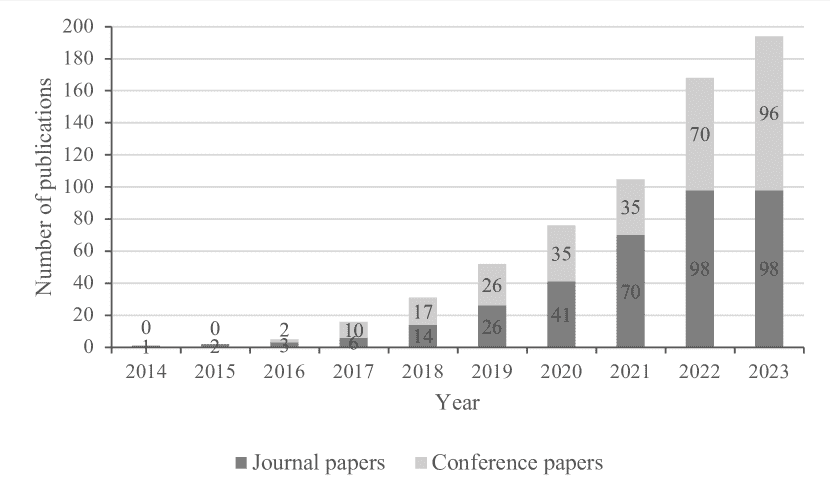

<!--yml

类别：未分类

日期：2024-09-06 19:30:21

-->

# [2408.16202] 短期电力负荷预测的深度学习方法：全面调查

> 来源：[`ar5iv.labs.arxiv.org/html/2408.16202`](https://ar5iv.labs.arxiv.org/html/2408.16202)

# 短期电力负荷预测的深度学习方法：全面调查

Qi Dong [0009-0008-1737-9324](https://orcid.org/0009-0008-1737-9324 "ORCID identifier") 3230006098@student.must.edu.mo 澳门科技大学计算机科学与工程学院澳门氹仔 999078，中国，Rubing Huang rbhuang@must.edu.mo [0000-0002-1769-6126](https://orcid.org/0000-0002-1769-6126 "ORCID identifier") 澳门科技大学计算机科学与工程学院澳门氹仔 999078，中国，Chenhui Cui 3230002105@student.must.edu.mo [0009-0004-8746-316X](https://orcid.org/0009-0004-8746-316X "ORCID identifier") 澳门科技大学计算机科学与工程学院澳门氹仔 999078，中国，Dave Towey dave.towey@nottingham.edu.cn [0000-0003-0877-4353](https://orcid.org/0000-0003-0877-4353 "ORCID identifier") 诺丁汉大学中国宁波分校计算机科学学院浙江宁波 315100，中国，Ling Zhou lzhou@must.edu.mo [0000-0002-8313-5749](https://orcid.org/0000-0002-8313-5749 "ORCID identifier") 澳门科技大学计算机科学与工程学院澳门氹仔 999078，中国，Jinyu Tian jytian@must.edu.mo [0000-0002-2449-5277](https://orcid.org/0000-0002-2449-5277 "ORCID identifier") 澳门科技大学计算机科学与工程学院澳门氹仔 999078，中国 和 Jianzhou Wang jzwang@must.edu.mo [0000-0001-9078-7617](https://orcid.org/0000-0001-9078-7617 "ORCID identifier") 澳门科技大学工程科学系澳门氹仔 999078，中国（2018 年；）

###### 摘要。

短期电力负荷预测（STELF）是指对电力系统在短期（接下来几个小时到几天）的即时需求进行预测。各种外部因素，如天气变化和新电力消费场景的出现，可能会影响电力需求，导致负荷数据波动并变得非线性，从而增加了 STELF 的复杂性和难度。在过去的十年里，深度学习已被应用于 STELF，以高精度建模和预测电力需求，并对 STELF 的发展做出了重要贡献。本文对过去十年基于深度学习的 STELF 进行了全面的调查。它考察了整个预测过程，包括数据预处理、特征提取、深度学习建模与优化以及结果评估。本文还指出了一些研究挑战和未来工作中需要进一步研究的潜在研究方向。

电力、负荷、深度学习、短期^†^†版权：acmcopyright^†^†期刊年份：2018^†^†doi：XXXXXXX.XXXXXXX^†^†期刊：JACM^†^†期刊卷号：37^†^†期刊期号：4^†^†文章：111^†^†出版月份：8^†^†ccs：计算方法 机器学习算法^†^†ccs：计算数学 概率与统计^†^†ccs：应用计算 预测

## 1\. 引言

电力负荷预测（ELF）旨在满足电力系统的日常运营、管理和规划需求。这可以为系统操作员和规划者提供重要的指导和参考点。由于缺乏大规模的储能技术，电力系统必须确保持续的电力供应以满足当前需求 (Pełka and Dudek, 2020)。这意味着 ELF 已成为电力系统规划、调度和运营管理中的一个重要组成部分。短期电力负荷预测（STELF）利用历史负荷数据预测未来负荷，预测周期从几小时到几天不等。STELF 是一个时间序列预测任务，主要用于智能电网的短期调度（包括设备维护、负荷分配以及单位的启停），以及确定电价 (Wu et al., 2021)。1984 年英国一家电力公司的数据表明，预测误差减少 1%每年可以节省 1000 万英镑 (Bunn and Farmer, 1985)。提高 STELF 的准确性可以改善规划和调度，并降低电力系统的运营成本 (Kouhi et al., 2014)。STELF 的实际影响引起了研究人员的日益关注。我们对过去十年文献的回顾强调，大多数负荷预测文章都集中在 STELF 上 (Ghofrani et al., 2015; Hu et al., 2017; Raza et al., 2017; Hoori et al., 2019; Choi et al., 2018; Guo et al., 2020)。

电力负荷受多种因素的影响，包括气候、天气、经济条件、季节性和电价。此外，智能电网技术的进步以及智能电表和其他传感器的广泛应用显著增加了电力负荷数据的复杂性和体量。这些数据表现出强烈的非线性、随机性、波动性和复杂性。这对 STELF 构成了挑战。一个准确、稳健且快速的 STELF 模型对于电力系统的可靠日常运行至关重要 (Wang et al., 2019c)，而高效预测模型的开发已成为重要的 STELF 研究目标 (Dou et al., 2018)。

ELF 自 1970 年以来就受到广泛研究，提出了各种各样的方法（Fahiman 等人，2019）。STELF 方法大致可分为三类：统计方法、机器学习方法和深度学习方法（Dudek，2016）。统计方法在处理线性关系时表现良好，但常常无法处理电力负荷数据中常见的非线性模式。机器学习方法，如支持向量机和决策树，通常在处理简单或适度复杂的数据模式时表现良好。深度学习方法可以通过其多层结构捕捉和建模复杂的非线性关系，对于预测电力负荷的动态变化尤为重要。总之，虽然传统的统计和机器学习方法各有其优势，但深度学习技术更适合于电力负荷数据的动态和非线性特征。

深度学习方法是近年来计算机科学和人工智能领域最具革命性的突破之一 (LeCun et al., 2015)。深度学习的概念建立在早期的人工神经网络（ANNs）研究基础上 (Hinton et al., 2006)，这些网络是一种浅层学习模型 (Schmidhuber, 2015)，包括输入层、隐藏层和输出层 (Almalaq and Edwards, 2017)。ANNs 曾被用于早期的 STELF 研究 (Hayati and Shirvany, 2007; Park et al., 1991)。深度神经网络（DNNs）是一种具有多个隐藏层的 ANN，也可用于 STELF (Hosein and Hosein, 2017; Lai et al., 2020; Alipour et al., 2020)。DNNs 中的多个隐藏层使其能够使用特征作为输入，代表不同层次的数据抽象。通过级联网络结构，DNN 中的每一层能够提取和识别数据的不同特征，形成从基本到高级特征的层次结构，从而显著增强模型的灵活性和处理复杂问题的能力。递归神经网络（RNNs） (Rumelhart et al., 1986) 是专门设计用来处理序列数据的 DNN，使其非常适合时间序列预测任务。尽管 RNNs 理论上适用于时间序列数据，但在实际应用中可能面临挑战，例如梯度消失或爆炸 (Tang et al., 2019b)。长短期记忆（LSTM） (Hochreiter and Schmidhuber, 1997) 和门控递归单元（GRUs） (Wang et al., 2021) 解决了梯度消失问题，使其在实际应用中更为有效。这些先进技术能够处理大规模、高维和非线性数据，为 STELF 提供了更准确和灵活的解决方案，使深度学习成为 STELF 的首选技术 (Ahajjam et al., 2022; Das et al., 2020; Li et al., 2023)。

之前的 STELF 综述从不同角度汇总和审视了研究成果，涵盖了各种模型，或者集中于预测过程的某些步骤 (Akhtar et al., 2023；Hou et al., 2022；Al Mamun et al., 2020)。例如，Akhtar et al. (Akhtar et al., 2023) 回顾了各种 STELF 模型（包括时间序列和回归模型），而不仅仅关注人工智能（AI）模型。尽管 Hou et al. (Hou et al., 2022) 回顾了基于 AI 模型的负荷预测，重点关注数据处理和预测模型。Al Mamun et al. (Al Mamun et al., 2020) 回顾了负荷预测，但只关注了基于机器学习算法的混合模型。迄今为止，还没有基于深度学习的 STELF 全面而详尽的综述，涵盖了整个预测过程。本文旨在填补这一文献空白。

本文探讨了深度学习在 STELF 中的应用，提供了对当前相关研究的全面回顾。通过对 2014 年至 2023 年的文献进行深入回顾，审视了整个 STELF 过程。论文由八个研究问题（RQs）指导，每个问题都涉及 STELF 过程的一个关键方面。本调查论文涉及以下关键点：(1) 文献搜索结果的总结和分析；(2) 电力负荷数据集的分类和描述；(3) STELF 数据预处理方法的介绍；(4) 特征提取的分析；(5) 基于深度学习的 STELF 模型的描述、分类和总结；(6) 优化过程的回顾；(7) 评价指标的总结；以及(8) 对 STELF 未来挑战和趋势的讨论。

本文的其余部分组织如下：第二部分介绍了 STELF 的正式描述和基本深度学习模型的一些背景信息。第三部分解释了本次综述的方法，包括与 STELF 相关的八个 RQ、文献检索方法以及检索的统计结果。第 4 至 11 节分别回答了第三部分的八个 RQ。最后，第十二部分总结了本文。

## 2\. 背景

在这一部分，我们介绍 STELF 的任务定义和基本的深度学习方法。主要目的是让读者快速熟悉 STELF，并对深度学习方法有初步了解。

### 2.1\. STELF 任务定义

STELF 旨在预测未来几小时到几天的电力负荷。模型的输入包括历史负荷数据和一些影响因素，任务是学习一组从输入到输出的映射函数。如果 $y_{t}$ 代表时间 $t$ 的负荷需求，STELF 的目标是预测接下来 $h$ 小时内的负荷需求，记作 $\hat{y}_{t+h}$。预测模型通常可以表示为：

| (1) |  | $\hat{y}_{t+h}=f(y_{t},y_{t-1},\ldots,y_{t-n+1},X_{t}),$ |  |
| --- | --- | --- | --- |

其中 $\hat{y}_{t+h}$ 是时间 $t+h$ 的预测负荷；$f$ 是预测模型（可以是统计模型、机器学习模型或深度学习模型）；$y_{t},y_{t-1},\ldots,y_{t-n+1}$ 是过去 $n$ 个时间段的历史负荷数据；$X_{t}$ 是时间 $t$ 的外部变量（如天气数据、日历信息等）。

### 2.2\. 基本深度学习模型

在这一部分，我们介绍传统的深度学习模型，并探讨它们的创新和变体。我们还提供了这些模型的基本定义和结构的介绍，为更详细地探讨深度学习方法在 STELF 中的应用奠定基础。

#### 2.2.1\. 深度神经网络 (DNNs)

深度神经网络（DNN）是一种复杂且高度非线性的表示学习方法，通常由一个输入层、多个隐藏层和一个输出层组成（Din 和 Marnerides，2017）。隐藏层中的每个神经元作为一个单元在多维数据空间中执行映射。通过这些神经元，网络从输入数据中提取复杂的抽象特征和模式。DNN 网络的宽度和深度都可以调整（Hossen 等，2017）。浅层神经网络只有一个隐藏层，仅提供神经元数量作为可调整的参数。DNN 的优势不仅在于其深层结构，还在于其非线性激活函数。非线性激活函数，如 ReLU、Sigmoid 或 Tanh，使网络能够捕捉输入数据中的非线性关系和复杂模式。考虑到 ELF 负载曲线的非线性特征（受到各种外部因素的影响），使用 DNN 作为预测模型是非常合理的（Hossen 等，2018）。

深度置信网络（DBN）是一种深度神经网络（DNN）的变体，它采用分层的无监督学习方法进行初始权重预训练（Hinton 等，2006）。这种逐层无监督训练过程确保每一层有效地捕捉前一层的特征，从而从训练集中提取出最基本的特征。通常，DBN 由多个堆叠的限制玻尔兹曼机（RBM）组成。RBM 是一种人工神经网络（ANN），由一个可见层和一个隐藏层组成，其中同一层的节点之间没有连接，但层间的节点是完全连接的（Hafeez 等，2020）。堆叠的 RBM 用于模型预训练和无监督学习，顶层则通过反向传播神经网络进行微调。从根本上讲，RBM 学习的是原始输入数据上的概率分布的特征表示，同时也提取特征信息（Kong 等，2019）。

#### 2.2.2\. 循环神经网络（RNNs）

RNN 特别适合处理序列数据，如时间序列数据 (Gürses-Tran et al., 2022)。RNN 的内部循环允许信息的持续传递，即使用先前的信息来影响当前的输出，这种能力也被称为记忆功能 (Kong et al., 2017)。然而，RNN 在处理长序列时常常会遇到梯度消失或爆炸的问题，这妨碍了它们学习长期依赖关系的能力 (Bashir et al., 2022)。LSTM 和 GRU 的设计旨在克服 RNN 在处理长序列时的梯度问题。它们使用不同的记忆机制来保留输入信息，保持较长时间 (Tayab et al., 2020; Li et al., 2022a)。面对 ELF 中不同的时间序列和循环模式，LSTM 和 GRU 可以利用历史信息进行负载预测，避免梯度相关的问题。

LSTM 是一种特殊类型的 RNN，能够学习长期依赖关系，专门设计用于解决梯度消失的问题。LSTM 的关键在于其内部结构，即记忆单元，包括四个主要组件：输入门、遗忘门、输出门和能够随着时间保持信息的单元状态 (Haque and Rahman, 2022)。

GRU 是基于 LSTM 的改进模型，但具有更简单的结构和更短的训练时间，这有助于更好地捕捉序列数据中的长期依赖关系。GRU 将 LSTM 的遗忘门和输入门集成到一个更新门中，结合了单元状态和隐藏状态。与 LSTM 相比，GRU 的参数更少，因为少了一个门控单元，这显著提高了计算效率。

LSTM 和 GRU 通过其门控机制改善了信息流控制。LSTM 提供了精确的控制机制，而 GRU 通过简化这些控制来提高计算效率。选择这两种模型之一通常取决于任务的具体要求、数据的性质和可用的计算资源。

#### 2.2.3\. 卷积神经网络 (CNNs)

近年来，CNN 已成为最受欢迎和广泛应用的深度学习模型之一（陆等，2019）。尽管最初设计用于处理图像数据，CNN 在处理时间序列数据方面也非常有效。对于这类数据，一维（1-D）卷积层可以通过滑动窗口机制捕捉局部模式和特征。此外，CNN 能够处理具有网格状拓扑的数据，使得序列数据能够转换为图结构数据进行处理。CNN 模型由四个主要部分组成（李等，2020a；金等，2019）：（i）卷积层（从输入数据中创建特征图）；（ii）池化层（减少卷积特征的维度）；（iii）展平层（将数据重新形成为列向量）；（iv）全连接层（将卷积和池化层提取的特征连接到其他层）。

## 3. 方法论

在本节中，我们介绍了指导我们研究的与 STELF 相关的八个研究问题（RQs）。本节还详细介绍了文献检索方法以及筛选搜索结果所使用的过滤方法。本文的研究方法受到先前工作的指导（黄等，21；张等，2021），代表了一种系统、全面和合理的方法。为了方便描述，除非特别说明，我们在本文中使用“STELF”来表示“基于深度学习的 STELF”。

### 3.1. 研究问题

本文提供了对深度学习在 STELF 应用中的全面回顾。它考察了整个 STELF 过程，围绕以下 RQs 结构化：

+   •

    RQ1: 文献检索结果的分布和分析是什么？

+   •

    RQ2: 电力负荷数据集有哪些？

+   •

    RQ3: 如何为 STELF 预处理数据集？

+   •

    RQ4: 特征提取方法有哪些？

+   •

    RQ5: 基于深度学习的 STELF 建模方法有哪些？

+   •

    RQ6: 如何优化训练过程？

+   •

    RQ7: STELF 研究结果如何评估？

+   •

    RQ8: STELF 面临的挑战及未来发展趋势是什么？

RQ1 探讨了过去十年中使用深度学习进行短期电力负荷预测的文献分布，并对这些数据进行了详细分析。RQ2 对电力负荷数据集进行了概述。RQ3 的答案包括数据预处理中的步骤和方法。RQ4 讨论了在预测过程中使用的深度学习特征提取技术。RQ5 的回答分类、描述并分析了深度学习模型在短期电力负荷预测中的现状。RQ6 探索了优化模型训练过程的方法。RQ7 的答案是对用于预测结果的评估方法的有组织总结。最后，RQ8 的答案列出了短期电力负荷预测的挑战和未来发展趋势。在接下来的部分，我们将详细回答每个 RQ，如图 1 所示。

图 1. 本调查论文的结构。

\说明

该图提供了调查结构的概述。

### 3.2\. 文献检索

本文采用的文献搜索方法遵循了 Huang 等人（Huang et al., 21）使用的方法，涉及以下主流数据库以确保数据收集的全面性：

+   •

    ACM Digital Library;

+   •

    Elsevier Science Direct;

+   •

    IEEE Xplore Digital Library;

+   •

    Springer Online Library;

+   •

    Wiley Online Library;

+   •

    MDPI。

搜索时间范围设定为 2014 年至 2023 年。使用特定关键词进行的初步尝试（Zhang et al., 2021）表明，ELF 标题的表现并不一致。例如，一些论文标题中并没有包含“electricity”或“power”这样的词汇，尽管其实际内容与 ELF 相关。此外，并非所有短期电力负荷预测论文的标题或关键词列表中都有“short-term”这一短语。此外，由于深度学习方法中使用的术语多样，包含这些术语的关键词搜索可能会遗漏相关论文。为了扩大范围，避免遗漏某一特定类别的出版物，“electricity”，“power”，“short-term”和“deep learning”没有被包括在关键词中。因此，最终用于搜索的关键词仅限于四个短语：“load forecasting”，“load forecast”，“load prediction”和“load predicting”。

### 3.3\. 文献选择与统计

根据搜索参数，从六个数据库中检索到共计 2,823 篇论文。这些论文进一步根据以下筛选标准进行过滤：

1.  (1)

    非英语书写。

1.  (2)

    不讨论 ELF。

1.  (3)

    未使用深度学习方法。

1.  (4)

    未聚焦于“短期”预测研究。

1.  (5)

    本文是一篇综述文章。

根据这些标准，从最初的 2823 篇中筛选出了 628 篇。此外，根据滚雪球方法（Huang 等，21），检查了这些论文的参考文献，得到了另外 22 篇论文。最终，共有 650 篇论文纳入了初步审查和统计分析中。这些检索和筛选的详细信息见表 1。

表 1. 文献检索和筛选结果

| 数字图书馆 | 检索结果中的研究数量 | 筛选后的研究数量 | 滚雪球法获得的研究数量 | 筛选和滚雪球法总计 |
| --- | --- | --- | --- | --- |
| ACM Digital Library | 80 | 14 | 0 | 14 |
| Elsevier Science Direct | 889 | 126 | 0 | 126 |
| IEEE Xplore Digital Library | 846 | 332 | 22 | 354 |
| Springer Online Library | 440 | 20 | 0 | 20 |
| Wiley Online Library | 112 | 25 | 0 | 25 |
| MDPI | 456 | 111 | 0 | 111 |
| 总计 | 2823 | 628 | 22 | 650 |

我们手动处理了 650 篇论文。这个过程包括最初对所有论文的检查，然后提取和记录关键信息（包括深度学习模型、数据集、数据预处理方法、预测区间、模型框图和评估指标）。最后，根据图 1 对内容进行了结构化。尽管统计和分析结果是基于所有 650 篇文献，但并不是所有 650 篇都在本文中被引用。相反，我们根据提取的信息选择性地引用了内容相似的论文。最终，本文对大约 200 篇文章进行了全面的回顾和引用。

## 4\. 对 RQ1 的回答：检索结果的分布和分析

本节提供了 RQ1 的答案。我们的方法涉及对出版年份趋势及其在各种文献来源中的分布进行分析，为理解该领域的发展和范围提供了框架。

### 4.1\. 发表趋势

我们收集了 650 篇论文的出版年份数据（见图 2(b) ‣ 图 2 ‣ 4.1\. 出版趋势 ‣ 4\. 对 RQ1 的回答：搜索结果的分布和分析 ‣ 基于深度学习的短期电力负荷预测：综合调查")），以展示 2014 年至 2023 年间 STELF 论文的趋势。图 2(a) ‣ 图 2 ‣ 4.1\. 出版趋势 ‣ 4\. 对 RQ1 的回答：搜索结果的分布和分析 ‣ 基于深度学习的短期电力负荷预测：综合调查") 显示了每年的出版数量，而图 2(b) ‣ 图 2 ‣ 4.1\. 出版趋势 ‣ 4\. 对 RQ1 的回答：搜索结果的分布和分析 ‣ 基于深度学习的短期电力负荷预测：综合调查") 显示了累计出版数量。

图 2(a) ‣ 图 2 ‣ 4.1\. 出版趋势 ‣ 4\. 对 RQ1 的回答：搜索结果的分布和分析 ‣ 基于深度学习的短期电力负荷预测：综合调查") 显示，在前三年（2014 至 2016 年）每年的出版数量少于 10 篇。自 2017 年起，出版数量迅速增长，到 2021 年每年超过 100 篇。此外，对出版累计数量的检查（图 2(b) ‣ 图 2 ‣ 4.1\. 出版趋势 ‣ 4\. 对 RQ1 的回答：搜索结果的分布和分析 ‣ 基于深度学习的短期电力负荷预测：综合调查")）揭示了 STELF 研究成果的指数增长。图 2(b) ‣ 图 2 ‣ 4.1\. 出版趋势 ‣ 4\. 对 RQ1 的回答：搜索结果的分布和分析 ‣ 基于深度学习的短期电力负荷预测：综合调查") 还显示了一个具有极高决定系数 ($R^{2}=0.9996$) 的线性函数。图 2(a) ‣ 图 2 ‣ 4.1\. 出版趋势 ‣ 4\. 对 RQ1 的回答：搜索结果的分布和分析 ‣ 基于深度学习的短期电力负荷预测：综合调查") 所示的趋势与近年来深度学习技术的快速发展直接相关，也突显了该领域研究的重要性。

(a) 每年的出版数量。

(b) 每年的累计出版数量。

图 2. STELF 论文在 2014 年 1 月 1 日至 2023 年 12 月 31 日间的出版情况。

\描述

此图描绘了出版年份的分布及多年来的累计分布情况。

### 4.2\. 出版场所的类型

论文来自多个期刊和会议，其比例和分布绘制在图 3(b) ‣ 图 3 ‣ 4.2\. 出版场所类型 ‣ 4\. RQ1 的答案：搜索结果的分布和分析 ‣ 基于深度学习的短期电力负荷预测：全面调查")中。图 3(a) ‣ 图 3 ‣ 4.2\. 出版场所类型 ‣ 4\. RQ1 的答案：搜索结果的分布和分析 ‣ 基于深度学习的短期电力负荷预测：全面调查")显示，期刊发表的数量（55%）超过了会议（45%）。图 3(b) ‣ 图 3 ‣ 4.2\. 出版场所类型 ‣ 4\. RQ1 的答案：搜索结果的分布和分析 ‣ 基于深度学习的短期电力负荷预测：全面调查")还显示，除 2017 年外，期刊发表数量始终超过会议发表数量。图 3(b) ‣ 图 3 ‣ 4.2\. 出版场所类型 ‣ 4\. RQ1 的答案：搜索结果的分布和分析 ‣ 基于深度学习的短期电力负荷预测：全面调查")还显示，无论是期刊还是会议，出版量都有增加的趋势。

(a) 期刊和会议的比例。

(b) 每年的场所分布。

图 3. 调查论文的场所分布。

\说明

该图提供了出版物分类和分布的描述。

## 5\. RQ2 的答案：电力负荷数据集

本节提供了 RQ2 的答案，讨论了数据集的分类，并检查了一些常见的公共数据集。在选择电力负荷数据集时，研究人员需要根据预测场景的具体要求选择合适的数据集类型，这可能包括住宅家庭、商业建筑、工业以及整个城市的系统级负荷。

电力负荷数据集在 STELF 中扮演着至关重要的角色。ELF 通常依赖历史数据来预测特定时期内的未来电力需求。随着深度学习方法的发展，这些模型需要大量的数据来进行训练，以获得准确的预测。电力负荷数据集提供了全面的历史电力使用信息，包括不同时间段的负荷变化、消费者使用模式以及季节和天气因素对电力需求的影响（Zhang et al., 2022c）。这些信息对深入理解和准确预测电力需求模式至关重要。

### 5.1\. 数据集的分类

电力负荷数据集可以根据其获取方式大致分为公共数据集和非公共数据集。公共数据集通常在线提供，通常由政府机构、电力市场运营商或研究机构提供（Giacomazzi 等，2023；Li 等，2020b；Xia 等，2023；Khan 等，2022；Atef 和 Eltawil，2020）。相比之下，非公共数据集由于保护竞争优势、确保国家安全、遵守法律法规或保护个人隐私等原因，通常无法获得。

### 5.2\. 常见公共数据集

对 650 篇论文的回顾显示了数据集的多样性。一些论文（例如（Deepanraj 等，2022；Sun 等，2018；Chen 等，2021））未提及数据集的名称或来源，而另一些论文（例如（Wang 等，2020a；Arastehfar 等，2022；Zhang 等，2023c））使用了多个数据集，导致统计汇编变得困难。表 2 列出了一些最常用的公共数据集，它们是：

+   •

    新英格兰独立系统运营商（ISO-NE）¹¹1[`www.iso-ne.com/`](https://www.iso-ne.com/)。: 该数据集包括了从 2003 年 3 月到 2014 年 12 月的每小时电负荷、温度、日类型和其他信息，覆盖了北美的新英格兰地区。

+   •

    澳大利亚能源市场运营商（AEMO）²²2[`www.aemo.com.au/energy-systems/electricity/national-electricity-market-nem/data-nem/aggregated-data`](https://www.aemo.com.au/energy-systems/electricity/national-electricity-market-nem/data-nem/aggregated-data)。: 该数据集包含了澳大利亚五个地区（南澳大利亚州、昆士兰州、新南威尔士州、西澳大利亚州和维多利亚州）的电力负荷 30 分钟时间序列数据。

+   •

    全球能源预测竞赛（GEFCom）³³3[`www.kaggle.com/c/global-energy-forecasting-competition-2012-load-forecasting/data`](https://www.kaggle.com/c/global-energy-forecasting-competition-2012-load-forecasting/data)。: 每场竞赛提供不同的数据集，这些数据集涵盖了各种地区和时期的历史数据以及相关影响因素。这些数据集的设计反映了能源市场和系统运行的实际情况。

+   •

    加州大学欧文分校（UCI）机器学习库（MLR）⁴⁴4[`archive.ics.uci.edu/ml/datasets`](https://archive.ics.uci.edu/ml/datasets)。: 该数据集是一个广泛使用的公共数据库，涵盖了从简单数据集到复杂的多变量时间序列数据集。家庭负荷数据的采样频率为一分钟。

+   •

    欧洲电力传输系统运营商网络 (ENTSO-E)⁵⁵5[`open-power-system-data.org/data-sources##1_European_load_data`](https://open-power-system-data.org/data-sources##1_European_load_data)。：该数据集来自一个覆盖 35 个欧洲国家的电力传输系统运营商组织。数据集包括来自欧洲各地的实际小时电力负荷时间序列。

+   •

    PJM 联网 (PJM)⁶⁶6[`www.kaggle.com/datasets/robikscube/hourly-energy-consumption`](https://www.kaggle.com/datasets/robikscube/hourly-energy-consumption)。：该数据集来自美国一个负责运营东部互联电网的区域传输组织。PJM 向美国 14 个地区输电，数据以每小时 MW 间隔记录。

+   •

    能源监管委员会 (CER)⁷⁷7[`www.cru.ie/`](https://www.cru.ie/)。：该数据集记录了爱尔兰住宅家庭和中小型企业的半小时负荷数据。

+   •

    2016 中国电气数学建模竞赛⁸⁸8[`github.com/huberyCC/Load-datasets`](https://github.com/huberyCC/Load-datasets)。：该数据集来源于中国电气工程数学建模竞赛，包括 2009 年至 2015 年的电力负荷数据和天气数据。

表中列出的所有数据集都至少使用过 10 次。特别是 ISO-NE 和 AEMO 的频繁使用，两者均超过 30 次，突显了它们在电力负荷预测研究中的重要作用以及这些数据集在该领域的高活跃度。这些数据集的采样频率从每分钟到每小时不等，展示了实时粒度的多样性，支持广泛的研究和实际应用。涵盖了许多重要的电力数据集，并分布在多个地区（包括北美、澳大利亚、欧洲和中国）。

大多数公共数据集可以通过 Kaggle、官方网站和专门的数据存储库等平台在线访问。这便利了全球研究人员的访问和使用。开放访问和更快的更新是电力数据集发展的两个主要趋势。

表 2. 常用电力数据集

| 数据集 | 使用频率 | 采样频率 |
| --- | --- | --- |
| 新英格兰独立系统运营商 (ISO-NE) | 47 | 1 小时 |
| 澳大利亚能源市场运营商 (AEMO) | 35 | 30 分钟 |
| 全球能源预测竞赛 (GEFCom) | 23 | 1 小时 |
| UCI 机器学习库 (UCI) | 23 | 1 分钟 |
| 欧洲电力传输系统运营商网络 (ENTSO-E) | 15 | 1 小时 |
| PJM 联网 (PJM) | 11 | 1 小时 |
| 能源监管委员会 (CER) | 10 | 30 分钟 |
| 2016 年中国电力数学建模竞赛 | 10 | 15 分钟 |

## 6\. 对 RQ3 的回答：STELF 数据集预处理

本节中，我们讨论 RQ3，介绍了主要的数据预处理方法（包括数据清洗、外部变量选择和数据重构）。

数据预处理是一个关键步骤，直接影响预测模型的准确性和可靠性。原始电力负荷数据常常包含噪声、异常和不一致的记录。数据中也经常存在缺失值。如果不加以处理，这些问题会显著扰乱模型的学习过程，导致不准确或无效的预测 (Meng et al., 2022)。数据预处理使用一系列方法（如填补缺失值、异常检测、修正和标准化）来提高数据质量 (Subbiah and Chinnappan, 2022)。数据还通常表现出强烈的时间特性和季节性变化。适当的预处理可以帮助模型捕捉这些复杂的模式，提高其对时间动态的理解和响应能力 (Lv et al., 2021)。本节探讨了各种数据预处理步骤和方法。应注意，已发表的论文通常只提到一个或几个数据预处理步骤，而非全部。例如，Dong et al. (Dong et al., 2021a) 仅讨论了数据标准化；Gao et al. (Gao et al., 2023a) 仅关注处理缺失数据；而 Huang et al. (Dogra et al., 2023) 介绍了数据标准化和数据重构。具体的预处理措施通常根据模型设计要求来应用。

### 6.1\. 数据清洗

数据清洗过程包括处理缺失值、异常值、错误记录、重复数据，并进行标准化。

可以使用各种数据插补技术来填补缺失数据的空白 (Rafati et al., 2020; Gan et al., 2017)。一些简单的方法包括使用前一个时间点的值或计算缺失值前后的数据平均值 (Li et al., 2019; Chen et al., 2023; Hua et al., 2023)。其他方法包括数据聚类 (Li et al., 2022b)，以及使用相邻日期相同时间的值 (Zhang et al., 2022a)。

异常值检测通常使用三西格玛方法 (Khan et al., 2022; Chandola et al., 2009)。Sharma et al. (Sharma and Jain, 2022) 也使用了四分位数范围，而秦 et al. (Qin et al., 2022) 使用了箱形图。通常，在遇到异常值、错误记录或重复数据时，主要的补救策略包括删除或替换（使用处理缺失值的既定方法）。

数据标准化涉及消除原始数据中的尺度差异，从而允许在相同尺度上进行比较和计算。使用原始数据进行分析可能会导致对具有较大数值范围的特征产生偏倚 (Tan et al., 2022)。数据标准化的两种方法是 Min-Max 缩放和 Z-Score 标准化 (Wang et al., 2023b; Huang et al., 2021)。

Min-Max 缩放将数据调整到指定的范围内，通常是 0 到 1 之间。Min-Max 缩放的公式为：

| (2) |  | $x_{\text{norm}}=\frac{x-\min(x)}{\max(x)-\min(x)},$ |  |
| --- | --- | --- | --- |

其中 $x$ 是原始数据值；$\min(x)$ 和 $\max(x)$ 分别是原始数据的最小值和最大值；$x_{\text{norm}}$ 是缩放后的数据。

Z-Score 标准化将数据的均值调整为 0，标准差调整为 1，使其适用于需要减少异常值和处理偏斜分布的数据。Z-Score 标准化的公式为：

| (3) |  | $z=\frac{(x-\mu)}{\sigma},$ |  |
| --- | --- | --- | --- |

其中 $x$ 是原始数据值；$\mu$ 是数据的均值；$\sigma$ 是标准差。

### 6.2\. 外部变量选择

STELF 的准确性不仅取决于电力系统内的操作条件，还需要仔细考虑一系列重要的外部变量 (Wang et al., 2023d)。完成数据清理后的下一步是识别对预测结果有显著影响的外部变量 (Cai et al., 2020)，例如气候条件的变异性、温度的周期性波动、假期状态以及工业活动的动态变化。适当考虑这些外部因素可以形成更全面的负荷预测模型。这通常涉及相关性分析和变量重要性评估。

表 3 列出了六种常用的外部变量选择方法，以及一些使用这些方法的论文。例如，Pearson 相关系数计算两个连续变量之间的 Pearson 相关性，值范围从 -1 到 1。通过确定相关系数的阈值，只有那些与目标变量的相关性超过此阈值的变量才被视为相关。

Zheng et al.（Zheng et al., 2018）使用了最小绝对收缩和选择算子（LASSO）方法进行变量选择。Subbiah et al.（Subbiah and Chinnappan, 2022）引入了稳健的 ReliefF 互信息递归特征消除混合特征选择（RMR-HFS），它使用了过滤器和包装器方法的组合进行变量选择。这些选择方法涵盖了从线性到非线性相关性，从时间序列分析到降维技术等广泛的数据分析需求。每种方法都有其独特的优势，有助于更好地理解和揭示数据中的相关性，从而构建更准确和高效的预测模型。

表 3. 外部变量选择的常见方法

| 选择方法 | 示例参考 |
| --- | --- |
| 皮尔逊相关系数 | (Wang et al., 2020a; Tang et al., 2019a; Shaqour et al., 2022; Bian et al., 2022a; Hossain and Mahmood, 2020; Dong et al., 2017; Xie et al., 2022) |
| Copula 函数理论 | (Wang et al., 2023d; He et al., 2017) |
| 最大信息系数 | (Tang et al., 2022; Xiang et al., 2023; Jiao et al., 2021; Lu et al., 2022; Huang et al., 2023) |
| 自相关函数 | (Li et al., 2021; Javed et al., 2022; Farid et al., 2023) |
| Spearman 等级相关分析 | (Hong and Chan, 2023; Liu et al., 2022c; Hu et al., 2022c; Zamee et al., 2021) |
| 主成分分析 | (Veeramsetty et al., 2022; Han et al., 2023) |

### 6.3\. 数据重建

数据重建在处理原始负荷数据的随机性、波动性、周期性和多样性（Kim et al., 2022）中发挥着关键作用，并已成为许多 STELF 研究的重点。通过深度探索历史负荷数据结合先进的分析方法（如分解和聚类技术），可以揭示数据中的关键重复模式和趋势。这些对于预测模型至关重要，因为它们帮助模型更好地理解和捕捉时间序列数据中的依赖关系。

多种常见方法用于数据重建。变分模态分解（VMD）技术将负荷数据分解为一系列内在模态函数（IMFs），然后用于训练数据重建（Ahajjam et al., 2022）。Zang et al.（Zang et al., 2021）也使用了 VMD 技术将负荷数据分解为不同频率的模态，并使用具有自注意力机制的 LSTM 进行预测。这种多频率分析方法允许对负荷数据中的复杂性进行更为细致的处理。同样，Mathew et al.（Mathew et al., 2021）使用了经验模态分解（EMD）将原始数据分解为一系列 IMFs，然后使用相同的模型训练每个模态。基于 EMD 的集成经验模态分解（EEMD）（Yue et al., 2022）和改进的完整集成经验模态分解与自适应噪声（ICEEMDAN）（Zhang et al., 2023f）也被用于数据重建。

高级聚类方法也被用于数据重建（Wu et al., 2022; Yang et al., 2019; Wang et al., 2020b）。Wu et al.（Wu et al., 2022）应用 K-shape 时间序列聚类将具有类似电力使用习惯和特征的用户分类为多种类型。Yang et al.（Yang et al., 2019）使用 K-means 聚类算法识别具有相似电力使用行为的客户群体。Wang et al.（Wang et al., 2020b）使用基于密度的空间聚类算法（DBSCAN）处理包含噪声的数据集。Chaturvedi et al.（Chaturvedi et al., 2015）使用小波变换技术将负荷数据分解为四个小波分量，然后对每个分量训练神经网络，实现了对不同频率特征的精确预测。

表 4 总结了一些常见的数据重建方法。无论是使用分解还是聚类技术，目标都是重建整体数据，以捕捉数据的分布特征和潜在模式。由于负荷数据的复杂性，采用分而治之的方法（即使用相同或不同的模型对每个部分进行训练）可以提高模型的效率和准确性。重建技术不仅为模型提供了坚实的数据基础，还直接影响模型的设计、算法选择和预测结果的精度。

表 4. 常见数据重建方法总结

| 重建方法 | 缩写 | 示例参考 | 描述 |
| --- | --- | --- | --- |
| 变分模式分解 | VMD | (Wu 等，2023b; Zang 等，2021; Zhuang 等，2022) | 基于变分原理的分解方法，通过优化问题解决内在模式函数。 |
| 经验模态分解 | EMD | (Fan 等，2020; Mounir 等，2023; Ran 等，2023) | 通过迭代过程提取内在模态函数的经验分解方法。 |
| 小波变换 | WT | (Chaturvedi 等，2015; Zhang 等，2022c) | 一种利用一组小波函数分析信号的方法，为信号提供关于时间（或空间）和频率的信息。 |
| 有噪声的基于密度的空间聚类 | DBSCAN | (Yang 等，2022; Wang 等，2020b; Kong 等，2017) | 一种基于密度的聚类算法，根据密度将点分类为簇成员、噪声或边界点。 |
| K-means 聚类算法 | K-means | (Hu 等，2022a; Yang 等，2019) | 一种根据数据点的相似性将数据集分成 K 个不同、不重叠的群组的聚类算法。 |
| K-shape 聚类算法 | K-shape | (Wu 等，2022; Fahiman 等，2017) | 一种用于时间序列数据的聚类算法，根据形状相似性将数据分成不同的组。 |
| 奇异谱分析 | SSA | (Niu 等，2016; Nie 等，2020) | 一种通过提取趋势、周期和噪声分量来分析时间序列的方法。 |

## 7\. RQ4 的回答：特征提取方法

本节提供了对 RQ4 的回答，探讨了深度学习如何有效地从数据中提取深层非线性特征，增强模型的预测能力。特征提取的目的是从原始负荷数据中挖掘复杂关系，帮助模型理解负载变化。在 STELF 中，特征提取是一个关键步骤，因为它直接影响预测模型的性能。

深度学习可以以无监督学习的方式提取特征，自动从数据中学习有用的特征表示（Wang 等人，2019b）。在人工神经网络的不同层次，可以学习不同抽象级别的特征，为模型提供丰富的信息。在 STELF 中，除了考虑时间序列本身的特征关系外，还必须考虑空间特征关系（Cheung 等人，2021），例如涉及区域或城市电力网的大规模 ELF 具有不同的空间关系。空间特征也对充分理解负荷变化模式和提高预测精度至关重要。

### 7.1\. 时间特征关系提取

由于电力负荷数据是时间序列数据，RNNs 可用于捕捉时间依赖关系。LSTMs 和 GRUs 常用于提取时间特征关系。Xu 等人（Xu et al., 2018）使用 LSTM 提取电力负荷的深层特征，并采用极限学习机（ELM）来建模浅层模式。Abdel 等人（Abdel-Basset et al., 2022）提出了 STLF-Net，使用 GRU 获得数据的长期时间表示。

基于多通道一维卷积神经网络（MCNN）（Dong et al., 2023）的特征提取模型的成功表明，卷积操作也可以用于提取时间序列数据中的特征关系。这允许通过一维卷积（Conv1D）操作直接捕捉序列数据中的特征间关系。尽管一维 CNNs（1-D CNNs）在功能上类似于 RNNs（如 LSTM 和 GRU），但它们也具有独特的网络结构设计，以适应时间序列数据的不同特征和要求。这些结构设计使 1-D CNNs 能够针对特定类型的序列数据进行优化，从而更好地提取有用的特征关系。Dai 等人（Dai et al., 2023）使用了带有 Conv1D 和池化层的 CNNs，其中 Conv1D 层从输入数据中提取关键特征，而池化层则减少了特征的维度和空间复杂性。

时间卷积网络（TCNs）是另一种为序列建模任务设计的人工神经网络，尤其适用于时间序列数据。由于 TCN 基于 CNN（Bai et al., 2018），它也被广泛用于提取特征向量和长期时间依赖关系（Bian et al., 2022a；Wang et al., 2020a；Zhang et al., 2023c）。Zhang 等人（Zhang et al., 2023c）提出了一种结合 TCN 和 LSTM 的混合网络架构，以解决模型复杂性问题。他们的模型利用了 TCN 捕捉时间序列中的感受野并有效建模时间依赖关系的能力，同时也结合了 LSTM 处理长期依赖问题的能力。

### 7.2\. 空间特征关系提取

空间特征关系的提取涉及构建邻接矩阵以表示电力网络中节点之间的连接。使用多维卷积来获得空间特征。Hua 等人（Hua et al., 2023）提出了一种结合 CNN 和 GRU 的预测模型，通过 CNN 提取空间特征，通过 GRU 提取时间特征。Wan 等人（Wan et al., 2023）使用 CNNs 从负荷数据中提取空间信息，然后将得到的特征输入到 RNN 中进行训练。

另一种方法涉及构建一个时空图模型，该模型可以同时捕捉电力负荷数据的空间和时间依赖性。Yu 等（Yu 和 Li，2021）将图结构数据输入到时空同步图卷积网络（STSGCN）模型中，通过从历史负荷数据中提取内在的时空特征来进行负荷预测。时空图模型通过结合多个节点的特征集来构建一个相似度加权的时空图（Huang 等，2023）。空间卷积层（SCL）提取图中每个节点的邻居节点的特征，从而增强了全域节点特征。

使用深度学习提取的特征不能直接应用于 STELF。需要一个监督学习回归过程来将这些非线性特征转换为预测结果。可以使用多种方法（如线性/非线性回归或神经网络）来执行这种映射（Wang 等，2019b）。

## 8\. 回答 RQ5：基于深度学习的 STELF 建模方法

本节回答了 RQ5，提供了对基于深度学习的预测模型文献的广泛回顾。从预测结果的角度来看，预测模型可以分为确定性模型或概率模型（Benidis 等，2022）。

### 8.1\. 确定性预测模型

在 STELF 中，确定性预测提供了精确的数值预测，提供了特定时间点或未来某一时期负荷水平的精准预测。这种预测类型侧重于提供具体值，而不是范围或分布。由于涉及广泛的文献和方法，我们从单一模型和混合模型的角度审视这种预测类型。

#### 8.1.1\. 单一模型

单一模型的主要优点是简单，易于理解和构建。深度学习算法利用深层网络，由一系列复杂的隐藏层组成（Eren 和 Küçükdemiral，2024）。早期 STELF 通过堆叠人工神经网络（ANNs）实现了预测结果（Singh 和 Dwivedi，2018；Din 和 Marnerides，2017）。Chen 等（Chen 等，2019）和 Hossen 等（Hossen 等，2017）探索了使用深度神经网络（DNNs）的 ELF。Chen 等提出了一种基于双端稀疏编码和深度神经网络融合的方法，而 Hossen 等则研究了单层与双层 DNN 架构的影响。与 DNN 结构类似的深度信念网络（DBN）结合了多个限制玻尔兹曼机（RBMs）用于 ELF，并采用逐层无监督学习方法来预训练初始权重（Dedinec 等，2016）。

DNNs 或 DBNs 通过堆叠多个层形成，通常缺乏记忆能力，这意味着它们在处理时间序列数据时可能无法有效使用以前的信息。RNNs 使用递归连接，使网络在处理序列数据时能够保留以前的信息，可能会根据序列中的早期元素调整输出。这使得 RNNs（包括 LSTM 和 GRU，如第二部分所介绍）在时间序列预测中非常受欢迎。LSTMs 和 GRUs 是先进的 RNNs，已被用于 STELF (Kong 等，2017; Morais 等，2023)。Zhu 等 (Zhu 等，2022) 提出了一个使用注意力机制的双重注意力编码解码器结构，使用 LSTM 作为非线性动态时间建模的特定编码器和解码器。这个注意力机制动态地关注输入序列不同部分的重要性，显著提高了与之结合使用的 RNNs 的性能。Aseeri 等 (Aseeri，2023) 还使用了 GRU 结构来关注关键变量，提高了性能，特别是对于较长的序列。

双向 RNN 是一种创新的 ANN 架构，它集成了两个递归层，每个层具有不同的角色。一个层捕捉序列的前向流动，而另一个层则关注后向流动。这种双向处理机制使得能够全面理解序列数据，同时从两个时间方向提取特征和信息（Mughees 等，2021）。这种双向结构，例如在 Bidirectional Long Short-Term Memory (BiLSTM) (Wang 等，2019c) 和 Bidirectional Gated Recurrent Unit (BiGRU) (Shaqour 等，2022) 中，具有强大的预测能力，并在 STELF 研究中广受欢迎。

将 CNN 作为独立的 STELF 模型使用时，涉及将时间序列数据直接视为一维图像或从多变量时间序列的序列值创建图像 (Sadaei et al., 2019)。CNN 中的卷积层用于提取局部特征；而池化层则减少时间序列数据的维度——这有助于提取更抽象的特征并降低计算复杂性 (Jalali et al., 2021)。最后，一个或多个全连接层用于生成输出序列。作为 CNN 的变体，TCNs 通过增加卷积核的间距来扩展感受野并捕捉长距离序列依赖性 (Bai et al., 2018)。TCNs 提取时间序列和非时间序列数据之间的复杂交互，从而产生精确的特征量 (Bian et al., 2022b)。Yin et al. (Yin and Xie, 2021) 使用 TCNs 从多个空间尺度样本中提取关键特征，产生初步预测结果。基于 CNN 的类似模型 WaveNet 是由 DeepMind 开发的生成模型，主要用于生成音频波形 (Van Den Oord et al., 2016)。WaveNet 也被用于 STELF (Voß et al., 2018; Lin et al., 2021)。

Transformer 模型由 Vaswani et al. (Vaswani et al., 2017) 于 2017 年提出，在各种自然语言处理任务中取得了巨大成功，并且也扩展到其他领域，如图像处理和时间序列预测。Transformer 强大的特征提取和序列建模能力也使其成为 STELF 的一个好选择 (Zhang et al., 2023b, 2022b; Nawar et al., 2023)。

基于 Transformer 的两个模型是 Informer 和 Temporal Fusion Transformer (TFT) (Gao et al., 2023b; Santos et al., 2023)。Informer 模型专注于最关键的时间步，使用概率稀疏方法，忽略不重要的信息。例如，Gao et al. (Gao et al., 2023b) 建立了一个基于 Informer 的混合 ELF 模型。Yu et al. (Yu et al., 2022) 提出了一个基于自注意力的 STELF 方法，考虑了需求侧管理，使用 informer 独立预测和重建分解的内在模态函数组件。TFT 模型则关注如何整合不同类型的时间序列数据以提高预测准确性。Giacomazzi et al. (Giacomazzi et al., 2023) 探讨了 TFT 在不同时间范围（如前一天和前一周）内进行每小时 STELF 的潜力。

#### 8.1.2\. 混合模型

在 STELF 中，混合深度学习模型正成为解决复杂预测问题的关键技术。混合模型集成了多种深度学习模型，其优势包括多样性和灵活性。通过相互补充优点，它们提高了预测的准确性和鲁棒性（Lin et al., 2022b）。混合模型主要采用两种组合策略：阶段性训练和联合训练。阶段性训练在每个阶段专注于特定的学习任务，而联合训练则同时训练混合模型的所有组件。

(1) 阶段性训练：阶段性训练策略通过将训练过程分解为一系列有序阶段来解决训练复杂模型的一些挑战。在每个阶段中，对模型的一部分进行独立训练和优化，以学习特定的模式。

将 CNN 与 RNN 结合的混合模型已成为广泛采用的解决方案，因为它表现出色（Feng et al., 2024; Shi et al., 2023; Yi et al., 2023; Sekhar and Dahiya, 2023; Aouad et al., 2022; Guo et al., 2021）。Zhang et al.（Zhang et al., 2023a）提出了一种基于 CNN 和 LSTM 的混合模型，利用 CNN 层从输入数据集中提取特征，使用 LSTM 模型进行序列预测，支持时间序列数据的多步预测。他们的方法利用了 CNN 高效提取局部特征的能力，将其输出特征向量作为 RNN 的输入，这使得 RNN 可以进一步捕捉时间序列中的动态变化和长期依赖性。Jin et al.（Jin et al., 2022）使用了一种基于参数迁移学习的 CNN-GRU 混合模型。通过将大数据集训练模型的参数转移到一个较小数据集训练的模型中，提升了模型的性能和预测准确性。在这里，迁移学习被用来解决训练数据不足的问题（Ozer et al., 2021）。

还有一些基于阶段性结构的新型混合模型。图神经网络（GNN）和 TCN 的组合将 GNN 提取的特征传递给 TCN 进行进一步训练（Lin et al., 2021）。LSTM 和 TFT 的组合使用 LSTM 作为编码器-解码器来预处理数据，然后将其作为训练数据输入 TFT（Santos et al., 2023）。Bu et al.（Bu et al., 2023）提出了一种更复杂的融合模型，将条件生成对抗网络（CGAN）与 CNN 结合。CGAN 利用 CNN 准确捕捉内部特征的能力生成逼真的假样本，同时半监督回归层优化判别器以增强样本真实性识别。

(2) 联合训练：联合训练将模型的各个组件整合到一个统一的训练框架中，实现每个组件的同步训练。数据重建技术可能会产生不同的模态，需要针对每个模态训练模型（Wang et al., 2023d; Zhang et al., 2023d; Luo et al., 2022）。这种方法利用了不同模态的特性，通过并行训练，提升了整体性能。

数据可以被划分为多个组件，使用不同的模型分别和同时在各自的数据上进行训练。He 等人（He et al., 2021）使用了单位曲线旋转解耦（PCRD）将负荷分解为三部分：旋转单元负荷曲线；零 AM 负荷；以及日均负荷。CNN 提取了旋转单元负荷曲线的形状特征，而 TCN 则同时提取了零 AM 负荷和日均负荷的时间特征。这种分而治之的机制生成了多个初步预测结果，最终需要通过加权平均、投票机制或注意力机制合成最终预测结果。Hua 等人（Hua et al., 2023）使用了注意力机制动态连接初步结果，其中 CNN 捕捉空间特征，GRU 捕捉时间特征。

与现有的 ELF 方法不同，Liu 等人（Liu et al., 2022b）将一个 3-D 卷积滤波器嵌入到 LSTM 单元中，从而捕捉通道内及跨空间邻域的平移不变局部模式。这种将一个深度学习模型嵌入到另一个模型中的策略，通过层次化模型集成，实现了数据特征的深层抽象和有效利用。Eskandari 等人（Eskandari et al., 2021）也使用了这一策略，结合了 GRU 和 LSTM 形成一个双向传播的神经网络。该网络利用 2-D CNN 提取的多维特征作为输入，并将这些特征提供给双向单元进行每小时 ELF。

### 8.2\. 概率预测模型

概率 ELF 利用负荷的不确定性和随机性来预测未来需求。与传统的确定性方法不同，概率模型提供了预测不确定性的量化表达，这对于电网规划和运行具有重要优势（Yang et al., 2018）。概率模型通过生成结果分布而非单一值来表达预测结果的不确定性（Jalali et al., 2022）。

对于概率性 ELF，主要有两种方法：参数化方法和非参数化方法（Hou et al., 2022）。参数化方法基于对负载数据分布的假设，通常假设数据遵循已知的概率分布（如正态分布或泊松分布）。由于使用的假设较少，非参数化方法具有更广泛的适用性（Van der Meer et al., 2018）。非参数化方法不要求数据遵循特定的分布形式，而是直接从实际数据出发，通过数据本身揭示概率分布特征（Huang et al., 2020）。据我们所知，深度学习在概率性 ELF 中的应用已从确定性点预测扩展到概率分布预测（Feng et al., 2019; Cheng et al., 2021; Chen et al., 2018）。这个过程需要生成点预测，然后使用非参数化技术（如分位回归、重采样、置信区间估计、梯度提升和核密度估计（Wang et al., 2019b））来构建概率性 ELF 模型。

Lin et al.（Lin et al., 2022a）引入了一种具有两阶段注意机制的 LSTM，用于概率性短期区域负载预测，在使用分位损失训练时提高了不确定性估计和准确性。深度学习与非参数化方法的结合是概率性 ELF 的创新解决方案。这利用了深度学习捕捉数据复杂性的能力并生成准确的点预测，同时通过非参数化技术实现概率分布预测。Wang et al.（Wang et al., 2019a）将传统的基于 LSTM 的点预测扩展到基于分位数的概率预测。Liu et al.（Liu et al., 2022a）将 GRU 深度特征提取能力与 CNN 的高效并行处理相结合，同时采用核密度估计来准确拟合概率密度。Zhang et al.（Zhang et al., 2023e）提出了分位回归卷积双向长短期记忆网络（QRCNNBiLSTM），将分位回归与特征提取和双向数据处理相结合。通过这种集成，QRCNNBiLSTM 可以对预测区间的上界和下界进行精确的联合预测。

深度学习与非参数化方法在概率性 ELF 中的结合可以更准确地捕捉负载变化的不确定性，为电力系统提供更全面和可靠的决策支持。

## 9. 回答 RQ6：优化训练过程

本节提供了对 RQ6 的回答，考察了优化深度学习训练过程的方法（Zhang et al., 2021）。

优化主要涉及两个方面：网络结构优化和误差优化。网络结构优化涉及模型的架构设计，包括调整层数、配置神经元和修改连接方式。这一切的目的是构建一个能够捕捉数据复杂特征的强健模型。误差优化涉及对预测误差的深入分析和微调，旨在最小化模型预测值与实际观察值之间的差异，从而提高准确性和可靠性。

### 9.1\. 网络结构优化

网络架构设计是一个非常重要的任务，需要仔细选择每层的神经元数量和网络中的隐藏层数量等（Jiang and Zheng, 2022）。这种选择不是一步完成的，而是需要根据问题的性质、数据的特征和模型的预期性能来确定。选择最佳网络结构和模型参数是一个复杂的过程，已经提出了多种试错方法和启发式优化算法（Wang et al., 2019b）。

作为一种基本的问题解决方法，试错方法通过持续尝试和调整逐步接近解决方案。这不仅限于简单的实验和调整，而是结合了启发式优化技术形成了高效且系统的优化策略。启发式算法从自然界和社会现象中的优化机制中获得灵感，包括粒子群优化（PSO）（Hong and Chan, 2023）、遗传算法（GAs）（Dong et al., 2021b）、鲸鱼优化算法（WOA）（Haiyan et al., 2020）、灰狼优化器（GWO）（Sekhar and Dahiya, 2023）和蚱蜢优化算法（GOA）（Hu et al., 2022b）。

基于贝叶斯优化的方法（Bayram et al., 2023; Xu et al., 2022）使用概率模型预测参数性能，引导搜索过程更加智能地选择下一组候选参数。这种方法特别适合高维参数空间，显著减少所需的评估次数。总之，更准确的优化算法可以帮助更有效地探索潜在的广泛参数空间，并识别出显著提升性能的参数组合。

### 9.2\. 误差优化

一旦损失函数被定义，需通过优化算法（如梯度下降及其变种（Adam、RMSprop 等）（吴等人，2023a；甘乔里等人，2023）（洪和范，2016））来计算损失函数梯度来更新网络权重。这些算法调整模型参数以逐渐减少损失函数值，提高模型的准确性。以下是一些常用的优化器列表：

+   •

    SGD （萨基布等人，2021）：这只使用一个样本来计算梯度并更新每次迭代中的参数。这可以实现快速更新，但由于只使用一个样本，可能导致高方差。

+   •

    RMSprop （朗格文等人，2023；亚兹吉等人，2022；何，2017）：这通过维护每个参数的平方梯度的衰减平均值来调整学习率，实现自适应学习率。这特别适用于处理不同参数的不同学习率，加速收敛，避免局部最小值或鞍点。

+   •

    AdaBelief （于等人，2022）：这采用了信念的概念，它取决于梯度的平方与其历史均值的比值。当这个比值大于 1 时，AdaBelief 更倾向于相信当前的梯度信息；否则，它更依赖于先前的信息。

+   •

    Adam （王等人，2023a；苏等人，2023；孙等人，2020）：这是一种自适应梯度下降方法，通过将第一和第二阶动差的指数加权平均组合来独立调整每个参数的学习率。这种方法实现了快速而稳健的优化过程。

## 10\. RQ7 的答案：预测结果的评估

本节提供了对 RQ7 的答案，探讨了评估预测结果准确性的方法。这不仅涉及验证模型输出的准确性（以确保预测结果接近实际负载值），而且涉及模型的可靠性和有效性。

对预测模型性能的全面评估需要一套评估指标。这些指标应能够从不同的角度量化预测误差的大小和分布。它们应使不同模型的预测性能能够在统一的标准下进行公平客观的比较。确定性负荷预测的评估指标包括：均方误差（MSE）；均方根误差（RMSE）；平均绝对误差（MAE）；平均绝对百分比误差（MAPE）；以及 $R^{2}$。类似地，概率负荷预测的评估指标包括：连续排名概率评分（CRPS）；预测区间覆盖概率（PICP）；以及针球损失（PL）。通常，多个评估指标会一起使用，以便进行多方面的评估。表 5 列出了某些常用评估指标的公式和描述。

表 5. 常见评估指标

评估指标 公式 描述 目的 MSE $\frac{1}{n}\sum_{i=1}^{n}(y_{i}-\hat{y}_{i})^{2}$ 衡量预测值与实际值之间的差异，关注大误差 确定性预测 RMSE $\sqrt{\frac{1}{n}\sum_{i=1}^{n}(y_{i}-\hat{y}_{i})^{2}}$ MSE 的平方根，保留其特性，同时与原始数据保持一致，使解释更容易 MAE $\frac{1}{n}\sum_{i=1}^{n}|y_{i}-\hat{y}_{i}|$ 衡量预测值与实际值之间的平均绝对差异，关注小误差 MAPE $\frac{1}{n}\sum_{i=1}^{n}\left|\frac{y_{i}-\hat{y}_{i}}{y_{i}}\right|\times 100\%$ 衡量相对于实际值的百分比误差，适用于比例数据 R² $1-\frac{\sum_{i=1}^{n}(y_{i}-\hat{y}_{i})^{2}}{\sum_{i=1}^{n}(y_{i}-\overline{y})^{2}}$ 评估模型的解释能力，值越接近 1 表示对数据的拟合越优 CRPS $\int_{-\infty}^{\infty}\left(F(x)-\mathbf{1}_{\{x\geq y\}}\right)^{2}dx$ 衡量概率预测分布与实际观测值之间的差异 概率预测 PICP $\frac{1}{N}\sum_{i=1}^{N}\mathbf{1}_{\{a_{i}\leq y_{i}\leq b_{i}\}}$ 评估预测区间包含实际观测值的频率 PL $\frac{1}{n}\sum_{i=1}^{n}\left(\tau(y_{i}-\hat{y}_{i})\mathbf{1}_{\{y_{i}\geq\hat{y}_{i}\}}+(1-\tau)(\hat{y}_{i}-y_{i})\mathbf{1}_{\{y_{i}<\hat{y}_{i}\}}\right)$ 评估分位数预测的有效性

最近，一些新颖且改进的评估指标也已被引入。例如，Faustine et al.（Faustine and Pereira, 2022）和 Ganjouri et al.（Ganjouri et al., 2023）使用了归一化均方根误差（NRMSE）作为评估指标；Wang et al.（Wang et al., 2023c）使用了平均区间评分（AIS）、覆盖概率（CP）和特异性概率（SP）来评估区间概率预测的性能；Zhang et al.（Zhang et al., 2023g）引入了覆盖率（CR）来评估模型的预测覆盖率（即模型生成的置信区间覆盖真实值的比例）和区间平均收敛度（IAC）来评估模型的收敛性。

## 11\. 回答 RQ8：STELF 的挑战与未来发展趋势

本节提供了 RQ8 的答案，审视了 STELF 中深度学习应用的挑战和潜在的未来机会。

### 11.1\. 挑战

尽管近年来在 STELF 中探索深度学习的应用已投入大量努力，但仍面临一些挑战。其中一些挑战包括：标准化数据集的需求；模型的泛化能力；概率负荷预测研究不足；深度学习结果的可解释性；以及实时预测能力。解决这些挑战对于深度学习在 STELF 领域的广泛应用至关重要。特别是：

+   •

    STELF 研究人员使用各种数据集，包括私人和公共数据。这可能会对模型性能的验证带来挑战。缺乏标准化的基准数据集使得性能比较复杂且困难。因此，开发一些广泛认可的标准化数据集对于推进 STELF 研究至关重要。

+   •

    尽管许多研究已针对 ELF 的共同目标进行了探讨，但它们通常关注不同的应用场景和负荷，例如建筑负荷（Chiu et al., 2023）、家庭负荷（Fekri et al., 2021）和城市级负荷（Yang et al., 2023）。这些场景的特异性可能导致模型对特定环境的过度优化，从而对模型的泛化能力提出挑战。因此，需要研究具有强泛化能力的模型，以适应不同的场景。

+   •

    尽管学术界对确定性 STELF 进行了广泛研究，但对概率负荷预测的研究仍然不足。与确定性预测相比，基于深度学习的概率 ELF 模型关注较少。因此，需要更多研究应用于概率预测模型，以增强其应对不确定性的能力。

+   •

    基于深度学习的预测模型的可解释性仍然是一个未解决的挑战。这些模型使用的复杂机制和决策路径通常不为人知，缺乏直观的透明度。这可能会影响模型在实际应用中的接受度和效果。因此，提高深度学习的可解释性对其广泛应用、长期运行和电力系统决策支持至关重要。

+   •

    对 STELF 的需求正在增加，尤其是实时能力。然而，大多数以往的研究基于离线学习模式，这依赖于大量历史数据进行训练，并且可能无法轻松地将最新数据纳入实时学习（Eren 和 Küçükdemiral，2024）。为应对这一挑战，在线学习机制将至关重要。

### 11.2\. 研究趋势

最近 STELF 的研究趋势包括朝着更好的集成、精确和智能发展。正在进行的工作旨在开发更复杂和增强的预测模型，以提高预测的准确性和可靠性。本节探讨了未来 STELF 研究方向，包括图像处理技术、大型语言模型（LLMs）和优化。

+   •

    随着电力网络的发展，动态图模型能够适应节点和边的变化，保持预测模型的灵活性。图技术可以整合多种数据源（如地理位置、历史负荷和天气条件）。我们的回顾发现，大多数 STELF 图技术使用卷积操作来提取时间或空间特征关系。然而，Liu 等人（Liu et al.，2022b）将数据转换为图像，并将部分未来值转化为空白区域。因此，估计未来值成为了类似于为图像缺失区域生成像素的问题。类似于图像修复技术，图像生成和分割技术尚未广泛应用于 STELF。尽管这些技术看似与 STELF 无关，但其核心思想和方法可以为 STELF 研究提供新的视角和可能性。通过将这些关键的图像处理概念和算法应用于 STELF，可以开创新的研究方向，并增强模型识别和预测复杂负荷模式的能力。

+   •

    最近，LLM 技术的快速发展促使其在时间序列预测任务中的应用探索，开辟了时间序列预测的新领域（Yu et al., 2023; Chang et al., 2023）。然而，LLM 在 STELF 中的应用尚未开发。然而，预计将 LLM 应用于 STELF 将成为一个重要的研究方向。这可能为我们提供应对预测模型不足的泛化能力的新方法，同时也开启了在 ELF 中实现零-shot 学习的可能性（Gruver et al., 2024）。这种模型不仅可能在不同的数据集上表现出更强的适应性和预测能力，还能对未见过的数据做出合理预测。

+   •

    优化是深度学习模型开发中的关键阶段，并在 STELF 中受到关注（Zhang et al., 2021）。未来的研究将继续探索更高效的优化算法，例如改进的 SSA（Neeraj et al., 2021）、Adam（Hong et al., 2022）以及其他针对特定问题的优化方法。网络架构优化正向更轻量化的网络发展，相关的误差优化过程变得更加精细（包括对损失函数的深入研究和定制）。模型压缩技术和加速算法将继续演进，使优化过程更加注重计算效率。

## 12\. 结论

本综述论文审查了过去十年深度学习在 STELF 中的应用进展。在这段时间里，深度学习在 STELF 中的应用逐渐受到欢迎，并将继续增长。我们采用了全面的综述研究方法来识别相关文献，确保研究发现的广度和深度。我们使用特定的关键词搜索了六个主要数据库，并进行了人工筛选，以确保数据的完整性。在文献综述过程中，我们根据设计的八个研究问题（RQs）具体提取并记录了每篇论文的关键信息。我们仔细整理了提取的信息，并制作了具体的图表，以帮助读者理解。

在本文中，我们分析和总结了搜索结果，并对出版趋势进行了详细分析。我们根据 STELF 的实际工作流程组织了论文结构（包括数据集介绍、数据预处理方法、特征提取方法、深度学习模型介绍、优化方法和评估指标），并对每个阶段进行了深入分析。每个预测步骤的内容按照特定方法进行分类，以确保以有组织的方式呈现。我们结合引用文献提供了常用技术的简明解释。这种结构化的呈现使内容清晰有逻辑，同时帮助研究人员快速了解该领域的研究趋势和核心问题。我们还总结了 STELF 领域的挑战和未来研究趋势。总体而言，这篇综述论文以其全面、系统的方法和指导，提供了重要的学术价值和实际意义。

## 参考文献

+   (1)

+   Abdel-Basset 等（2022）Mohamed Abdel-Basset、Hossam Hawash、Karam Sallam、Sameh S Askar 和 Mohamed Abouhawwash。2022 年。STLF-Net：一种用于住宅建筑短期负荷预测的双流深度网络。*沙特国王大学计算机与信息科学期刊* 34, 7 (2022), 4296–4311。

+   Ahajjam 等（2022）Mohamed Aymane Ahajjam、Daniel Bonilla Licea、Mounir Ghogho 和 Abdellatif Kobbane。2022 年。变分模式分解和深度学习在短期多视角住宅电负荷预测中的实验研究。*应用能源* 326 (2022), 119963。

+   Akhtar 等（2023）Saima Akhtar、Sulman Shahzad、Asad Zaheer、Hafiz Sami Ullah、Heybet Kilic、Radomir Gono、Michał Jasiński 和 Zbigniew Leonowicz。2023 年。短期负荷预测模型：挑战、进展与未来的道路。*能源* 16, 10 (2023), 4060。

+   Al Mamun 等（2020）Abdullah Al Mamun、Md Sohel、Naeem Mohammad、Md Samiul Haque Sunny、Debopriya Roy Dipta 和 Eklas Hossain。2020 年。使用单一和混合预测模型的负荷预测技术综述。*IEEE Access* 8 (2020), 134911–134939。

+   Alipour 等（2020）Mohammadali Alipour、Jamshid Aghaei、Mohammadali Norouzi、Taher Niknam、Sattar Hashemi 和 Matti Lehtonen。2020 年。基于深度神经网络和小波变换集成的新型电力负荷预测模型。*能源* 205 (2020), 118106。

+   Almalaq 和 Edwards（2017）Abdulaziz Almalaq 和 George Edwards。2017 年。应用于负荷预测的深度学习方法综述。载于*第 16 届 IEEE 国际机器学习与应用会议（ICMLA’17）论文集*。511–516。

+   Aouad et al. (2022) Mosbah Aouad, Hazem Hajj, Khaled Shaban, Rabih A Jabr, 和 Wassim El-Hajj. 2022. 一种带有注意力机制的 CNN-Sequence-to-Sequence 网络用于住宅短期负荷预测。*电力系统研究* 211 (2022), 108152。

+   Arastehfar et al. (2022) Sana Arastehfar, Mohammadjavad Matinkia, 和 Mohammad Reza Jabbarpour. 2022. 使用图卷积递归神经网络的短期住宅负荷预测。*人工智能工程应用* 116 (2022), 105358。

+   Aseeri (2023) Ahmad O Aseeri. 2023. 基于 RNN 的有效预测方法设计，以提高短期电力负荷预测：应用于大规模电网时间序列。*计算科学杂志* 68 (2023), 101984。

+   Atef and Eltawil (2020) Sara Atef 和 Amr B Eltawil. 2020. 评估堆叠的单向和双向长短期记忆网络在电力负荷预测中的应用。*电力系统研究* 187 (2020), 106489。

+   Bai et al. (2018) Shaojie Bai, J Zico Kolter, 和 Vladlen Koltun. 2018. 泛型卷积和递归网络在序列建模中的经验评估。*arXiv 预印本 arXiv:1803.01271* (2018)。

+   Bashir et al. (2022) Tasarruf Bashir, Chen Haoyong, Muhammad Faizan Tahir, 和 Zhu Liqiang. 2022. 使用混合 Prophet-LSTM 模型和 BPNN 优化的短期电力负荷预测。*能源报告* 8 (2022), 1678–1686。

+   Bayram et al. (2023) Firas Bayram, Phil Aupke, Bestoun S Ahmed, Andreas Kassler, Andreas Theocharis, 和 Jonas Forsman. 2023. DA-LSTM：一种动态漂移自适应学习框架，用于 LSTM 网络的区间负荷预测。*人工智能工程应用* 123 (2023), 106480。

+   Benidis et al. (2022) Konstantinos Benidis, Syama Sundar Rangapuram, Valentin Flunkert, Yuyang Wang, Danielle Maddix, Caner Turkmen, Jan Gasthaus, Michael Bohlke-Schneider, David Salinas, Lorenzo Stella, 等. 2022. 时间序列预测中的深度学习：教程和文献综述。*计算机调查* 55, 6 (2022), 1–36。

+   Bian et al. (2022a) Haihong Bian, Qian Wang, Guozheng Xu, 和 Xiu Zhao. 2022a. 考虑积温效应的混合深度学习模型负荷预测。*能源报告* 8 (2022), 205–215。

+   Bian et al. (2022b) Haihong Bian, Qian Wang, Guozheng Xu, 和 Xiu Zhao. 2022b. 基于积温效应和改进时间卷积网络的短期负荷预测研究。*能源报告* 8 (2022), 1482–1491。

+   Bu et al. (2023) Xiangya Bu, Qiuwei Wu, Bin Zhou, 和 Canbing Li. 2023. 使用 CGAN 结合 CNN 和半监督回归的混合短期负荷预测。*应用能源* 338 (2023), 120920。

+   Bunn and Farmer (1985) D Bunn 和 E Dillon Farmer. 1985. 电负荷预测的比较模型。 (1985)。

+   Cai 等人（2020）Qiuna Cai、Binjie Yan、Binghong Su、Sijie Liu、Mingxu Xiang、Yakun Wen、Yanyu Cheng 和 Nan Feng。2020。基于样本权重的深度神经网络短期负荷预测方法。*国际电能系统学报* 30，5（2020），e12340。

+   Chandola 等人（2009）Varun Chandola、Arindam Banerjee 和 Vipin Kumar。2009。异常检测：综述。*ACM 计算机调查（CSUR）* 41，3（2009），1–58。

+   Chang 等人（2023）Chang Ching、Wen-Chih Peng 和 Tien-Fu Chen。2023。Llm4ts：基于预训练 LLM 的时间序列预测的两阶段微调。*arXiv 预印本 arXiv:2308.08469*（2023）。

+   Chaturvedi 等人（2015）DK Chaturvedi、AP Sinha 和 OP Malik。2015。使用模糊逻辑和小波变换集成广义神经网络的短期负荷预测。*国际电力与能源系统期刊* 67（2015），230–237。

+   Chen 等人（2019）Haiwen Chen、Shouxiang Wang、Shaomin Wang 和 Ye Li。2019。基于双端稀疏编码和深度神经网络融合的日提前聚合负荷预测。*电力系统研究* 177（2019），105987。

+   Chen 等人（2023）Houhe Chen、Mingyang Zhu、Xiao Hu、Jiarui Wang、Yong Sun 和 Jinduo Yang。2023。基于 GCN-LSTM 的短期负荷预测研究，考虑多种影响因素。*能源报告* 9（2023），1022–1031。

+   Chen 等人（2018）Kunjin Chen、Kunlong Chen、Qin Wang、Ziyu He、Jun Hu 和 Jinliang He。2018。基于深度残差网络的短期负荷预测。*IEEE 智能电网学报* 10，4（2018），3943–3952。

+   Chen 等人（2021）Zexi Chen、Delong Zhang、Haoran Jiang、Longze Wang、Yongcong Chen、Yang Xiao、Jinxin Liu、Yan Zhang 和 Meicheng Li。2021。基于 LSTM 神经网络的负荷预测，适用于“以电代煤”负荷。*电气工程与技术期刊* 16，5（2021），2333–2342。

+   Cheng 等人（2021）Lilin Cheng、Haixiang Zang、Yan Xu、Zhinong Wei 和 Guoqiang Sun。2021。基于微气象数据和客户消费模式的概率住宅负荷预测。*IEEE 电力系统学报* 36，4（2021），3762–3775。

+   Cheung 等人（2021）Chung Ming Cheung、Sanmukh Kuppannagari、Rajgopal Kannan 和 Viktor K Prasanna。2021。利用 STGCN 在智能电网中进行空间信息分析以实现短期负荷预测。发表于*第 13 届国际当代计算会议（IC3’21）论文集*。159–167。

+   Chiu 等人（2023）Ming-Chuan Chiu、Hsin-Wei Hsu、Ke-Sin Chen 和 Chih-Yuan Wen。2023。基于 CNN-GRU 的混合概率模型用于从个人家庭到商业建筑的负荷预测。*能源报告* 9（2023），94–105。

+   Choi et al. (2018) Hyungeun Choi, Seunghyoung Ryu, 和 Hongseok Kim. 2018. 基于 ResNet 和 LSTM 的短期负荷预测。见于 *2018 IEEE 国际智能电网通信、控制与计算技术会议（SmartGridComm’18）论文集*，1–6。

+   Dai et al. (2023) Yeming Dai, Xinyu Yang, 和 Mingming Leng. 2023. 基于多种方法优化的 Seq2Seq 模型用于短期电力负荷预测。*应用软计算* 142 (2023)，110335。

+   Das et al. (2020) Anooshmita Das, Masab Khalid Annaqeeb, Elie Azar, Vojislav Novakovic, 和 Mikkel Baun Kjærgaard. 2020. 使用先进深度学习方法进行建筑物内以居住者为中心的多种电力负荷预测。*应用能源* 269 (2020)，115135。

+   Dedinec et al. (2016) Aleksandra Dedinec, Sonja Filiposka, Aleksandar Dedinec, 和 Ljupco Kocarev. 2016. 基于深度信念网络的电力负荷预测：对马其顿案例的分析。*能源* 115 (2016)，1688–1700。

+   Deepanraj et al. (2022) B Deepanraj, N Senthilkumar, T Jarin, Ali Etem Gurel, L Syam Sundar, 和 A Vivek Anand. 2022. 结合深度学习的智能野鹅算法用于微电网中的短期负荷预测，以实现可持续能源管理。*可持续计算：信息学与系统* 36 (2022)，100813。

+   Din 和 Marnerides (2017) Ghulam Mohi Ud Din 和 Angelos K Marnerides. 2017. 使用深度神经网络的短期电力负荷预测。见于 *2017 国际计算、网络与通信会议（ICNC’17）论文集*，594–598。

+   Dogra et al. (2023) Atharvan Dogra, Ashima Anand, 和 Jatin Bedi. 2023. 基于消费者画像的联邦学习方法用于能源负荷预测。*可持续城市与社会* 98 (2023)，104815。

+   Dong et al. (2023) Jizhe Dong, Long Luo, Yu Lu, 和 Qi Zhang. 2023. 考虑高层弹性负荷的并行短期电力负荷预测方法。*IEEE 仪器与测量学报* 72 (2023)，1–10。

+   Dong et al. (2017) Xishuang Dong, Lijun Qian, 和 Lei Huang. 2017. 智能电网中的短期负荷预测：一种结合 CNN 和 K-means 聚类的方法。见于 *2017 IEEE 国际大数据与智能计算会议（BigComp’17）论文集*，119–125。

+   Dong et al. (2021a) Yi Dong, Zhen Dong, Tianqiao Zhao, Zhongguo Li, 和 Zhengtao Ding. 2021a. 基于马尔可夫切换分布式深度信念网络的短期负荷预测。*国际电力与能源系统期刊* 130 (2021)，106942。

+   Dong et al. (2021b) Yunxuan Dong, Xuejiao Ma, 和 Tonglin Fu. 2021b. 电力负荷预测：一种基于 K 最近邻的深度学习方法。*应用软计算* 99 (2021)，106900。

+   Dou 等（2018）Yuchen Dou、Xinman Zhang、Zhihui Wu 和 Hang Zhang。2018 年。深度学习方法在特征企业短期负荷预测中的应用。在*2018 年人工智能与云计算会议（AICCC’18）*会议论文集中，35–40。

+   Dudek（2016）Grzegorz Dudek。2016 年。基于模式的短期负荷预测的神经网络：一项比较研究。*神经计算* 205 卷（2016 年），64–74。

+   Eren 和 Küçükdemiral（2024）Yavuz Eren 和 İbrahim Küçükdemiral。2024 年。关于短期负荷预测的深度学习方法的全面综述。*可再生和可持续能源评论* 189 卷（2024 年），114031。

+   Eskandari 等（2021）Hosein Eskandari、Maryam Imani 和 Mohsen Parsa Moghaddam。2021 年。基于卷积和递归神经网络的短期负荷预测模型。*电力系统研究* 195 卷（2021 年），107173。

+   Fahiman 等（2019）Fateme Fahiman、Sarah M Erfani 和 Christopher Leckie。2019 年。稳健且准确的短期负荷预测：一种面向集群的集成学习方法。在*2019 年国际神经网络联合会议（IJCNN’19）*会议论文集中，1–8。

+   Fahiman 等（2017）Fateme Fahiman、Sarah M Erfani、Sutharshan Rajasegarar、Marimuthu Palaniswami 和 Christopher Leckie。2017 年。基于深度学习和 K-shape 聚类的负荷预测改进。在*2017 年国际神经网络联合会议（IJCNN’17）*会议论文集中，4134–4141。

+   Fan 等（2020）Chaodong Fan、Changkun Ding、Jinhua Zheng、Leyi Xiao 和 Zhaoyang Ai。2020 年。基于经验模态分解的多目标深度信念网络用于短期电力负荷预测。*神经计算* 388 卷（2020 年），110–123。

+   Farid 等（2023）Karim S Farid、AA Ali、Sameh A Salem 和 Amr E Mohamed。2023 年。CONV1D-GRU：一种用于短期电负荷预测的混合模型。在*2023 年国际电信会议（ITC-Egypt’23）*会议论文集中，281–286。

+   Faustine 和 Pereira（2022）Anthony Faustine 和 Lucas Pereira。2022 年。FPSeq2Q：完全参数化的序列到分位回归，用于带有不确定性估计的净负荷预测。*IEEE 智能电网学报* 13 卷，第 3 期（2022 年），2440–2451。

+   Fekri 等（2021）Mohammad Navid Fekri、Harsh Patel、Katarina Grolinger 和 Vinay Sharma。2021 年。基于智能表数据的负荷预测深度学习：在线自适应递归神经网络。*应用能源* 282 卷（2021 年），116177。

+   Feng 等（2019）Cong Feng、Mucun Sun 和 Jie Zhang。2019 年。通过 Q-learning 动态模型选择进行强化的确定性和概率性负荷预测。*IEEE 智能电网学报* 11 卷，第 2 期（2019 年），1377–1386。

+   Feng 等（2024）Ding Feng、Dengao Li、Yu Zhou、Jumin Zhao 和 Kenan Zhang。2024 年。STGNet：一种用于短期住宅负荷预测的空间–时间门控融合网络。*能源科学与工程* 12 卷，第 3 期（2024 年），541–560。

+   Gan 等人 (2017) Dahua Gan、Yi Wang、Ning Zhang 和 Wenjun Zhu。2017。通过量化长短期记忆提升短期概率住宅负荷预测。*工程学报* 2017，14 (2017)，2622–2627。

+   Ganjouri 等人 (2023) Mahtab Ganjouri、Mazda Moattari、Ahmad Forouzantabar 和 Mohammad Azadi。2023。短期负荷预测的时空学习结构。*IET 发电、输电与配电* 17, 2 (2023)，427–437。

+   Gao 等人 (2023a) Jiaxin Gao、Yuntian Chen、Wenbo Hu 和 Dongxiao Zhang。2023a。通过整合 transformer 和领域知识的自适应深度学习负荷预测框架。*应用能源进展* 10 (2023)，100142。

+   Gao 等人 (2023b) Qiang Gao、Kaiyi Liu、Kaibin Wu、Menghan You 和 Hang Liu。2023b。基于 VMD-Informer-DMD 模型的典型建筑短期负荷预测。在 *IEEE 第二届工业电子学会年度在线会议 (ONCON’23)* 中。1–6。

+   Ghofrani 等人 (2015) Mahmoud Ghofrani、M Ghayekhloo、A Arabali 和 A Ghayekhloo。2015。带有新输入选择框架的混合短期负荷预测。*能源* 81 (2015)，777–786。

+   Giacomazzi 等人 (2023) Elena Giacomazzi、Felix Haag 和 Konstantin Hopf。2023。使用时间融合 transformer 进行短期电力负荷预测：电网层次结构和数据源的影响。在 *第十四届 ACM 国际未来能源系统会议 (e-Energy’23)* 中。353–360。

+   Gruver 等人 (2024) Nate Gruver、Marc Finzi、Shikai Qiu 和 Andrew G Wilson。2024。大型语言模型是零-shot 时间序列预测器。*神经信息处理系统进展* 36 (2024)。

+   Guo 等人 (2021) Xifeng Guo、Ye Gao、Yupeng Li、Di Zheng 和 Dan Shan。2021。基于长短期时间序列网络的短期家庭负荷预测。*能源报告* 7 (2021)，58–64。

+   Guo 等人 (2020) Xifeng Guo、Qiannan Zhao、Di Zheng、Yi Ning 和 Ye Gao。2020。考虑实时电价的多尺度 CNN-LSTM 混合神经网络短期负荷预测模型。*能源报告* 6 (2020)，1046–1053。

+   Gürses-Tran 等人 (2022) Gonca Gürses-Tran、Tobias Alexander Körner 和 Antonello Monti。2022。引入解释性用于短期负荷预测的序列到序列学习。*电力系统研究* 212 (2022)，108366。

+   Hafeez 等人 (2020) Ghulam Hafeez、Khurram Saleem Alimgeer 和 Imran Khan。2020。基于深度学习并通过启发式算法优化的电力负荷预测。*应用能源* 269 (2020)，114915。

+   Haiyan 等人 (2020) Wang Haiyan、Lv Xinhang 和 Luo Xiaonan。2020。基于改进的 WOA 优化 LSTM 的电网短期负荷预测。在 *第五届国际电力与可再生能源会议 (ICPRE’20)* 中。54–60。

+   Han 等 (2023) Shuwei Han, Huitong Ru, Guangling Wang, Xuezhi Fu, Guoxu Zhou 和 Chengqiao Yang. 2023. 基于滑动窗口的 PCA-CNN-LSTM 电力负荷预测研究。见 *第三届国际新能源与电力工程会议（ICNEPE’23）论文集*。466–471。

+   Haque 和 Rahman (2022) Ashraful Haque 和 Saifur Rahman. 2022. 通过启发式配置的正则化深度神经网络进行短期电负荷预测。*应用软计算* 122 (2022), 108877。

+   Hayati 和 Shirvany (2007) Mohsen Hayati 和 Yazdan Shirvany. 2007. 基于人工神经网络的伊拉姆地区短期负荷预测。*世界科学、工程与技术学报* 28 (2007), 280–284。

+   He 等 (2021) Shengtao He, Canbing Li, Xubin Liu, Xinyu Chen, Mohammad Shahidehpour, Tao Chen, Bin Zhou 和 Qiuwei Wu. 2021. 基于 CNN-TCN 的日负荷预测的每单位曲线旋转解耦方法。*IET 发电、输电与配电* 15, 19 (2021), 2773–2786。

+   He (2017) Wan He. 2017. 通过深度神经网络进行负荷预测。*计算机科学学报* 122 (2017), 308–314。

+   He 等 (2017) Yusen He, Jiahao Deng 和 Huajin Li. 2017. 使用深度信念网络和 copula 模型的短期电力负荷预测。见 *第九届国际智能人机系统与控制会议（IHMSC’17）论文集*。191–194。

+   Hinton 等 (2006) Geoffrey E Hinton, Simon Osindero 和 Yee-Whye Teh. 2006. 深度信念网络的快速学习算法。*神经计算* 18, 7 (2006), 1527–1554。

+   Hochreiter 和 Schmidhuber (1997) Sepp Hochreiter 和 Jürgen Schmidhuber. 1997. 长短期记忆。*神经计算* 9, 8 (1997), 1735–1780。

+   Hong 和 Fan (2016) Tao Hong 和 Shu Fan. 2016. 概率电负荷预测：教程综述。*国际预测学杂志* 32, 3 (2016), 914–938。

+   Hong 和 Chan (2023) Ying-Yi Hong 和 Yu-Hsuan Chan. 2023. 使用粒子群优化算法的卷积神经网络进行短期电负荷预测。*人工智能工程应用* 126 (2023), 106773。

+   Hong 等 (2022) Ying-Yi Hong, Yu-Hsuan Chan, Yung-Han Cheng, Yih-Der Lee, Jheng-Lun Jiang 和 Shen-Szu Wang. 2022. 使用基于遗传算法的混合卷积神经网络进行一周前的日峰值负荷预测。*IET 发电、输电与配电* 16, 12 (2022), 2416–2424。

+   Hoori 等 (2019) Ammar O Hoori, Ahmad Al Kazzaz, Rameez Khimani, Yuichi Motai 和 Alex J Aved. 2019. 使用多列深度神经网络的电负荷预测模型。*IEEE 工业电子学报* 67, 8 (2019), 6473–6482。

+   Hosein 和 Hosein (2017) Stefan Hosein 和 Patrick Hosein. 2017. 使用深度神经网络的负荷预测。见 *2017 IEEE 电力与能源学会创新智能电网技术会议（ISGT’17）论文集*。1–5。

+   Hossain 和 Mahmood（2020）**Mohammad Safayet Hossain** 和 **Hisham Mahmood**。2020 年。《使用 LSTM 神经网络的短期负荷预测》。见于 *2020 年伊利诺伊州 IEEE 电力与能源会议（PECI’20）*。1–6。

+   Hossen 等（2018）**Tareq Hossen**、**Arun Sukumaran Nair**、**Radhakrishnan Angamuthu Chinnathambi** 和 **Prakash Ranganathan**。2018 年。《使用深度神经网络（DNN）的住宅负荷预测》。见于 *2018 年北美电力研讨会（NAPS’18）*。1–5。

+   Hossen 等（2017）**Tareq Hossen**、**Siby Jose Plathottam**、**Radha Krishnan Angamuthu**、**Prakash Ranganathan** 和 **Hossein Salehfar**。2017 年。《使用深度神经网络（DNN）的短期负荷预测》。见于 *2017 年北美电力研讨会（NAPS’17）*。1–6。

+   Hou 等（2022）**Hui Hou**、**Chao Liu**、**Qing Wang**、**Xixiu Wu**、**Jinrui Tang**、**Ying Shi** 和 **Changjun Xie**。2022 年。《基于人工智能方法、模型和挑战的负荷预测综述》。*电力系统研究* 210 (2022)，108067。

+   Hu 等（2022b）**Haowen Hu**、**Xin Xia**、**Yuanlin Luo**、**Chu Zhang**、**Muhammad Shahzad Nazir** 和 **Tian Peng**。2022b 年。《基于改进的蚂蚱优化算法的 LSTM 进化深度学习框架的开发与应用用于短期负荷预测》。*建筑工程学报* 57 (2022)，104975。

+   Hu 等（2017）**Rui Hu**、**Shiping Wen**、**Zhigang Zeng** 和 **Tingwen Huang**。2017 年。《基于递减步长果蝇优化算法的广义回归神经网络短期电力负荷预测模型》。*神经计算* 221 (2017)，24–31。

+   Hu 等（2022c）**Weimin Hu**、**Chao Yan**、**Liping Fan**、**Jie Yu**、**Mei Yu**、**Sheng Hua** 和 **Chonghao Yue**。2022c 年。《基于 VMD-SSA-LSTM 的短期电力负荷预测》。见于 *2022 国际高性能大数据与智能系统会议（HDIS’22）*。287–293。

+   Hu 等（2022a）**Xin Hu**、**Keyi Li**、**Jingfu Li**、**Taotao Zhong**、**Weinong Wu**、**Xia Zhang** 和 **Wenjiang Feng**。2022a 年。《由数据挖掘基础的正交贪婪算法和长短期记忆网络组成的负荷预测模型》。*能源报告* 8 (2022)，235–242。

+   Hua 等（2023）**Heng Hua**、**Mingping Liu**、**Yuqin Li**、**Suhui Deng** 和 **Qingnian Wang**。2023 年。《基于并行 CNN 和改进 ResNet 的短期负荷预测集成框架》。*电力系统研究* 216 (2023)，109057。

+   Huang 等（2021）**Jiehui Huang**、**Zhiwang Zhou**、**Chunquan Li**、**Zhiyuan Liao** 和 **Peter X Liu**。2021 年。《基于分解的多时间维度长短期记忆模型用于短期电力负荷预测》。*IET 发电、传输与分配* 15, 24 (2021)，3459–3473。

+   Huang 等（2023）**Nantian Huang**、**Shengyuan Wang**、**Rijun Wang**、**Guowei Cai**、**Yang Liu** 和 **Qianbin Dai**。2023 年。《基于门控时空图神经网络的广域多变电站短期负荷预测》。*国际电力与能源系统期刊* 145 (2023)，108651。

+   Huang et al. (2020) Qian Huang, Jinghua Li, 和 Mengshu Zhu. 2020. 一种改进的卷积神经网络，通过负荷范围离散化进行概率负荷预测。*Energy* 203 (2020), 117902。

+   Huang et al. (21) Rubing Huang, Weifeng Sun, Yinyin Xu, Haibo Chen, Dave Towey, 和 Xin Xia. 21. 关于自适应随机测试的调查。*IEEE Transactions on Software Engineering* 47, 10 (21), 2052–2083。

+   Jalali et al. (2021) Seyed Mohammad Jafar Jalali, Sajad Ahmadian, Abbas Khosravi, Miadreza Shafie-khah, Saeid Nahavandi, 和 João PS Catalão. 2021. 一种基于进化的深度卷积神经网络模型用于智能负荷预测。*IEEE Transactions on Industrial Informatics* 17, 12 (2021), 8243–8253。

+   Jalali et al. (2022) Seyed Mohammad Jafar Jalali, Parul Arora, BK Panigrahi, Abbas Khosravi, Saeid Nahavandi, Gerardo J Osório, 和 João PS Catalão. 2022. 一种先进的深度神经进化模型用于概率负荷预测。*Electric Power Systems Research* 211 (2022), 108351。

+   Javed et al. (2022) Umar Javed, Khalid Ijaz, Muhammad Jawad, Ikramullah Khosa, Ejaz Ahmad Ansari, Khurram Shabih Zaidi, Muhammad Nadeem Rafiq, 和 Noman Shabbir. 2022. 一种基于短感受野的膨胀因果卷积网络，集成双向 LSTM 用于短期负荷预测。*Expert Systems with Applications* 205 (2022), 117689。

+   Jiang and Zheng (2022) He Jiang 和 Weihua Zheng. 2022. 使用正则化鲁棒长短期记忆网络进行概率短期负荷预测的深度学习。*Journal of Forecasting* 41, 6 (2022), 1201–1216。

+   Jiao et al. (2021) Runhai Jiao, Shuangkun Wang, Tianle Zhang, Hui Lu, Hui He, 和 Brij B Gupta. 2021. 使用深度学习方法的日负荷预测的自适应特征选择和构造。*IEEE Transactions on Network and Service Management* 18, 4 (2021), 4019–4029。

+   Jin et al. (2022) Yuwei Jin, Moses Amoasi Acquah, Mingyu Seo, 和 Sekyung Han. 2022. 利用迁移学习和区间估计调整的短期电负荷预测。*Energy and Buildings* 258 (2022), 111846。

+   Khan et al. (2022) Zulfiqar Ahmad Khan, Amin Ullah, Ijaz Ul Haq, Mohamed Hamdy, Gerardo Maria Mauro, Khan Muhammad, Mohammad Hijji, 和 Sung Wook Baik. 2022. 高效的短期电力负荷预测以实现有效的能源管理。*Sustainable Energy Technologies and Assessments* 53 (2022), 102337。

+   Kim et al. (2019) Junhong Kim, Jihoon Moon, Eenjun Hwang, 和 Pilsung Kang. 2019. 用于多重短期负荷预测的递归 inception 卷积神经网络。*Energy and buildings* 194 (2019), 328–341。

+   Kim et al. (2022) Nakyoung Kim, Hyunseo Park, Joohyung Lee, 和 Jun Kyun Choi. 2022. 利用多维特征提取的短期电负荷预测。*IEEE Transactions on Smart Grid* 13, 4 (2022), 2999–3013。

+   Kong et al. (2017) 孔伟聪、董赵洋、贾有伟、David J Hill、徐岩和张远。2017 年。基于 LSTM 递归神经网络的短期住宅负荷预测。*IEEE 智能电网学报* 10, 1 (2017), 841–851。

+   Kong et al. (2019) 孔祥宇、李闯、郑峰和王承山。2019 年。考虑需求侧管理的短期负荷预测改进深度信念网络。*IEEE 电力系统学报* 35, 2 (2019), 1531–1538。

+   Kouhi et al. (2014) Sajjad Kouhi、Farshid Keynia 和 Sajad Najafi Ravadanegh。2014 年。基于神经进化算法和混沌特征选择的新型短期负荷预测方法。*国际电力与能源系统期刊* 62 (2014), 862–867。

+   Lai et al. (2020) Lai Chun Sing、莫振尧、王婷、袁浩梁、Wing WY Ng 和 Loi Lei Lai。2020 年。基于深度神经网络和历史数据增强的负荷预测。*IET 发电、输电与配电* 14, 24 (2020), 5927–5934。

+   Langevin et al. (2023) Antoine Langevin、Mohamed Cheriet 和 Ghyslain Gagnon。2023 年。基于非侵入式负荷监测的短期家庭负荷预测的高效深度生成模型。*可持续能源、网络和电网* 34 (2023), 101006。

+   LeCun et al. (2015) Yann LeCun、Yoshua Bengio 和 Geoffrey Hinton。2015 年。深度学习。*自然* 521, 7553 (2015), 436–444。

+   Li et al. (2023) 李斌、莫雨露、高峰和白晓青。2023 年。基于不确定性估计和考虑气象因素的深度学习模型的短期概率负荷预测方法。*电力系统研究* 225 (2023), 109804。

+   Li et al. (2019) 陈力、陈振宇、刘金波、李大鹏、高兴宇、邓芳春、李立新和季晓辉。2019 年。基于 LSTM 和 XGBoost 组合模型的电力负荷预测。发表于*2019 年国际模式识别与人工智能大会（PRAI’19）*。46–51 页。

+   Li et al. (2022a) 李丹、孙光凡、苗书伟、顾英钟、张远航和何帅。2022a。基于改进的序列到序列 GRU 与自适应时间依赖的短期电负荷预测方法。*国际电力与能源系统期刊* 137 (2022), 107627。

+   Li et al. (2021) 李乐辰、Christoph J Meinrenken、Vijay Modi 和 Patricia J Culligan。2021 年。基于选定自回归特征的修改神经网络的短期公寓负荷预测。*应用能源* 287 (2021), 116509。

+   Li et al. (2020b) 李宁、王璐、李新全和朱青。2020b。用于短期负荷预测的有效深度学习神经网络模型。*并发计算：实践与经验* 32, 7 (2020), e5595。

+   Li et al. (2022b) 李晓乐、王意琴、马贵博、陈鑫、沈千翔和杨波。2022b。基于长短期记忆网络的电负荷预测，通过单纯形优化器在 COVID-19 期间。*能源报告* 8 (2022), 1–12。

+   Li 等人（2020a）Zhuoling Li、Yuanzheng Li、Yun Liu、Ping Wang、Renzhi Lu 和 Hoay Beng Gooi。2020a。基于深度学习的密集连接网络负荷预测。*IEEE 电力系统学报* 36 卷，4 期（2020），2829–2840。

+   Lin 等人（2022a）Jun Lin、Jin Ma、Jianguo Zhu 和 Yu Cui。2022a。基于 LSTM 网络的短期负荷预测，考虑注意力机制。*国际电力与能源系统杂志* 137（2022），107818。

+   Lin 等人（2021）Weixuan Lin、Di Wu 和 Benoit Boulet。2021 年。通过图神经网络进行时空住宅短期负荷预测。*IEEE 智能电网学报* 12 卷，6 期（2021），5373–5384。

+   Lin 等人（2022b）Xin Lin、Ramon Zamora、Craig A Baguley 和 Anurag K Srivastava。2022b。针对个别住宅客户的混合短期负荷预测方法。*IEEE 电力输送学报* 38 卷，1 期（2022），26–37。

+   Liu 等人（2022c）Jiefeng Liu、Zhenhao Zhang、Xianhao Fan、Yiyi Zhang、Jiaqi Wang、Ke Zhou、Shuo Liang、Xiaoyong Yu 和 Wei Zhang。2022c。在 COVID-19 中使用移动优化和多任务学习的电力系统负荷预测。*应用能源* 310（2022），118303。

+   Liu 等人（2022a）Ronghui Liu、Teng Chen、Gaiping Sun、SM Muyeen、Shunfu Lin 和 Yang Mi。2022a。基于特征集成人工智能方法的短期概率建筑负荷预测。*电力系统研究* 206（2022），107802。

+   Liu 等人（2022b）Yanzhu Liu、Shreya Dutta、Adams Wai Kin Kong 和 Chai Kiat Yeo。2022b。用于短期负荷预测的图像修复方法。*IEEE 电力系统学报* 38 卷，1 期（2022），177–187。

+   Lu 等人（2019）Jixiang Lu、Qipei Zhang、Zhihong Yang 和 Mengfu Tu。2019 年。基于卷积神经网络和长短期记忆的混合模型用于短期负荷预测。在*2019 IEEE 电力与能源学会年会（PESGM’19）*论文集。1–5。

+   Lu 等人（2022）Yuting Lu、Gaocai Wang 和 Shuqiang Huang。2022 年。基于 mixup 和迁移学习的短期负荷预测模型。*电力系统研究* 207（2022），107837。

+   Luo 等人（2022）Hua Luo、Haipeng Zhang 和 Jianzhou Wang。2022 年。基于竞争抑制选择策略和深度学习的集成电力负荷预测。*可持续能源技术与评估* 51（2022），101940。

+   Lv 等人（2021）Lingling Lv、Zongyu Wu、Jinhua Zhang、Lei Zhang、Zhiyuan Tan 和 Zhihong Tian。2021 年。基于 VMD 和 LSTM 的电网安全负荷预测混合模型。*IEEE 工业信息学学报* 18 卷，9 期（2021），6474–6482。

+   Mathew 等人（2021）Jimson Mathew、Ranjan Kumar Behera 等。2021 年。EMD-Att-LSTM：结合深度学习的数据驱动短期负荷预测策略。*现代电力系统与清洁能源杂志* 10 卷，5 期（2021），1229–1240。

+   Meng 等人（2022）Zhaorui Meng, Yanqi Xie, 和 Jinhua Sun. 2022. 基于 EMD 的神经注意力模型进行短期负荷预测。*电气工程* (2022), 1–10。

+   Morais 等人（2023）Lucas Barros Scianni Morais, Giancarlo Aquila, Victor Augusto Durães de Faria, Luana Medeiros Marangon Lima, José Wanderley Marangon Lima, 和 Anderson Rodrigo de Queiroz. 2023. 使用神经网络和全球气候模型进行短期负荷预测：应用于大规模电力系统。*应用能源* 348 (2023), 121439。

+   Mounir 等人（2023）Nada Mounir, Hamid Ouadi, 和 Ismael Jrhilifa. 2023. 使用 EMD-BI-LSTM 方法进行短期电力负荷预测，用于智能电网能源管理系统。*能源与建筑* 288 (2023), 113022。

+   Mughees 等人（2021）Neelam Mughees, Syed Ali Mohsin, Abdullah Mughees, 和 Anam Mughees. 2021. 基于深度序列到序列 Bi-LSTM 神经网络的次日峰值负荷预测。*专家系统应用* 175 (2021), 114844。

+   Nawar 等人（2023）Menna Nawar, Moustafa Shomer, Samy Faddel, 和 Huangjie Gong. 2023. 在建筑负荷预测中应用深度学习模型的迁移学习：有限数据的案例。在*2023 年 IEEE 东南会议论文集*中。532–538。

+   Neeraj 等人（2021）Neeraj Neeraj, Jimson Mathew, Mayank Agarwal, 和 Ranjan Kumar Behera. 2021. 基于长短期记忆-奇异谱分析的电力负荷预测模型。*电气工程* 103, 2 (2021), 1067–1082。

+   Nie 等人（2020）Ying Nie, Ping Jiang, 和 Haipeng Zhang. 2020. 基于组合预处理方法和先进优化算法的创新混合模型用于电力负荷预测。*应用软计算* 97 (2020), 106809。

+   Niu 等人（2016）Mingfei Niu, Shaolong Sun, Jing Wu, Lean Yu, 和 Jianzhou Wang. 2016. 使用奇异谱分析和通过混合智能算法优化的非线性多层感知机网络的创新集成模型用于短期负荷预测。*应用数学建模* 40, 5-6 (2016), 4079–4093。

+   Ozer 等人（2021）Ilyas Ozer, Serhat Berat Efe, 和 Harun Ozbay. 2021. 用于短期负荷预测的综合深度学习应用。*亚历山大工程学报* 60, 4 (2021), 3807–3818。

+   Park 等人（1991）Dong C Park, MA El-Sharkawi, RJ Marks, LE Atlas, 和 MJ Damborg. 1991. 使用人工神经网络进行电力负荷预测。*IEEE 电力系统学报* 6, 2 (1991), 442–449。

+   Pełka 和 Dudek（2020）Paweł Pełka 和 Grzegorz Dudek. 2020. 基于模式的长短期记忆模型用于中期电力负荷预测。在*2020 年国际联合神经网络大会（IJCNN’20）论文集*中。1–8。

+   Qin 等人（2022）Jiaqi Qin, Yi Zhang, Shixiong Fan, Xiaonan Hu, Yongqiang Huang, Zexin Lu, 和 Yan Liu. 2022. 基于注意力-LSTM 模型的多任务短期反应性和主动负荷预测方法。*国际电力与能源系统杂志* 135 (2022), 107517。

+   Rafati 等（2020）Amir Rafati, Mahmood Joorabian 和 Elaheh Mashhour. 2020. 一种基于创新特征的高效小时负荷预测方法。*能源* 201 (2020), 117511。

+   Ran 等（2023）Peng Ran, Kun Dong, Xu Liu 和 Jing Wang. 2023. 基于 CEEMDAN 和 Transformer 的短期负荷预测。*电力系统研究* 214 (2023), 108885。

+   Raza 等（2017）Muhammad Qamar Raza, Mithulananthan Nadarajah, Duong Quoc Hung 和 Zuhairi Baharudin. 2017. 一种智能混合短期负荷预测模型，用于智能电网。*可持续城市与社会* 31 (2017), 264–275。

+   Rumelhart 等（1986）David E Rumelhart, Geoffrey E Hinton 和 Ronald J Williams. 1986. 通过反向传播错误学习表示。*自然* 323, 6088 (1986), 533–536。

+   Sadaei 等（2019）Hossein Javedani Sadaei, Petrônio Cândido de Lima e Silva, Frederico Gadelha Guimaraes 和 Muhammad Hisyam Lee. 2019. 使用卷积神经网络和模糊时间序列的组合方法进行短期负荷预测。*能源* 175 (2019), 365–377。

+   Sakib 等（2021）Shadman Sakib, Khan Md Hasib, Ihtyaz Kader Tasawar, Abyaz Kader Tanzeem, Md Fahim Arefin, Saharul Islam 和 Mohammad Shafiul Alam. 2021. 一种数据驱动的基于混合优化的深度网络模型用于短期住宅负荷预测。在 *IEEE 第十二届年度信息技术、电子与移动通信会议（IEMCON’21）* 上. 0187–0193。

+   Santos 等（2023）Miguel López Santos, Saúl Díaz García, Xela García-Santiago, Ana Ogando-Martínez, Fernando Echevarría Camarero, Gonzalo Blázquez Gil 和 Pablo Carrasco Ortega. 2023. 深度学习和迁移学习技术应用于数据稀缺建筑的短期负荷预测。*能源与建筑* 292 (2023), 113164。

+   Schmidhuber（2015）Jürgen Schmidhuber. 2015. 神经网络中的深度学习：概述。*神经网络* 61 (2015), 85–117。

+   Sekhar 和 Dahiya（2023）Charan Sekhar 和 Ratna Dahiya. 2023. 基于混合深度学习方法的建筑电力需求短期负荷预测的鲁棒框架。*能源* 268 (2023), 126660。

+   Shaqour 等（2022）Ayas Shaqour, Tetsushi Ono, Aya Hagishima 和 Hooman Farzaneh. 2022. 电力需求聚合对基于深度学习的住宅建筑短期负荷预测性能的影响。*能源与人工智能* 8 (2022), 100141。

+   Sharma 和 Jain（2022）Abhishek Sharma 和 Sachin Kumar Jain. 2022. 一种用于前一天负荷预测的新型季节性分割方法。*能源* 257 (2022), 124752。

+   Shi 等（2023）Huifeng Shi, Kai Miao 和 Xiaochen Ren. 2023. 基于 CNN-BiLSTM 结合贝叶斯优化和注意力机制的短期负荷预测。*并发计算：实践与经验* 35, 17 (2023), e6676。

+   Singh 和 Dwivedi（2018）Priyanka Singh 和 Pragya Dwivedi。2018 年。将新进化方法与人工神经网络结合解决短期负荷预测问题。*应用能源* 217 (2018)，537–549。

+   Su 等（2023）Yongxin Su、Qiyao He、Jie Chen 和 Mao Tan。2023 年。考虑多源不确定性的多属性对抗学习的住宅负荷预测方法。*国际电力与能源系统杂志* 154 (2023)，109421。

+   Subbiah 和 Chinnappan（2022）Siva Sankari Subbiah 和 Jayakumar Chinnappan。2022 年。基于深度学习的短期负荷预测与混合特征选择。*电力系统研究* 210 (2022)，108065。

+   Sun 等（2020）Gaiping Sun、Chuanwen Jiang、Xu Wang 和 Xiu Yang。2020 年。基于数据挖掘特征选择和 LSTM-RNN 方法的短期建筑负荷预测。*IEEJ 电气与电子工程学报* 15, 7 (2020)，1002–1010。

+   Sun 等（2018）香港 Sun、Xin Pan 和 Changxin Meng。2018 年。基于电力负荷因子的深度集群神经网络的短期电力负荷预测算法。*无线个人通信* 102 (2018)，1073–1084。

+   Tan 等（2022）Mao Tan、Chenglin Hu、Jie Chen、Ling Wang 和 Zhengmao Li。2022 年。基于多任务学习和模态特征提取的多节点负荷预测。*工程应用人工智能* 112 (2022)，104856。

+   Tang 等（2019b）Lingling Tang、Yulin Yi 和 Yuexing Peng。2019b 年。基于 ARIMA 和 LSTM 的短期负荷预测集成深度学习模型。在 *2019 IEEE 智能电网通讯、控制与计算技术国际会议（SmartGridComm’19）* 会议论文集中，1–6。

+   Tang 等（2022）Xianlun Tang、Hongxu Chen、Wenhao Xiang、Jingming Yang 和 Mi Zou。2022 年。利用通道和时间注意力的时间卷积网络进行短期负荷预测。*电力系统研究* 205 (2022)，107761。

+   Tang 等（2019a）Xianlun Tang、Yuyan Dai、Ting Wang 和 Yingjie Chen。2019a 年。基于多层双向递归神经网络的短期电力负荷预测。*IET 发电、输电与配电* 13, 17 (2019)，3847–3854。

+   Tayab 等（2020）Usman Bashir Tayab、Ali Zia、Fuwen Yang、Junwei Lu 和 Muhammad Kashif。2020 年。基于混合 HHO-FNN 模型和最佳基站小波包变换的微电网能源管理系统短期负荷预测。*能源* 203 (2020)，117857。

+   Van Den Oord 等（2016）Aaron Van Den Oord、Sander Dieleman、Heiga Zen、Karen Simonyan、Oriol Vinyals、Alex Graves、Nal Kalchbrenner、Andrew Senior、Koray Kavukcuoglu 等。2016 年。Wavenet：用于原始音频的生成模型。*arXiv 预印本 arXiv:1609.03499* 12 (2016)。

+   Van der Meer et al. (2018) Dennis W Van der Meer, Joakim Widén, 和 Joakim Munkhammar. 2018. 光伏发电和电力消费的概率预测综述。*可再生能源与可持续能源评论* 81 (2018), 1484–1512。

+   Vaswani et al. (2017) Ashish Vaswani, Noam Shazeer, Niki Parmar, Jakob Uszkoreit, Llion Jones, Aidan N Gomez, Łukasz Kaiser, 和 Illia Polosukhin. 2017. 注意力即一切。*神经信息处理系统进展* 30 (2017)。

+   Veeramsetty et al. (2022) Venkataramana Veeramsetty, Dongari Rakesh Chandra, Francesco Grimaccia, 和 Marco Mussetta. 2022. 使用主成分分析和递归神经网络的短期电力负荷预测。*预测* 4, 1 (2022), 149–164。

+   Voß et al. (2018) Marcus Voß, Christian Bender-Saebelkampf, 和 Sahin Albayrak. 2018. 使用卷积神经网络的住宅短期负荷预测。在*2018 年 IEEE 国际通讯、控制与智能电网技术会议（SmartGridComm’18）*的会议记录中。1–6。

+   Wan et al. (2023) Anping Wan, Qing Chang, AL-Bukhaiti Khalil, 和 Jiabo He. 2023. 基于注意机制增强的 CNN-LSTM 的短期电力负荷预测。*能源* 282 (2023), 128274。

+   Wang et al. (2019b) Huaizhi Wang, Zhenxing Lei, Xian Zhang, Bin Zhou, 和 Jianchun Peng. 2019b. 深度学习在可再生能源预测中的综述。*能源转换与管理* 198 (2019), 111799。

+   Wang et al. (2023a) Jianguo Wang, Lincheng Han, Xiuyu Zhang, Yingzhou Wang, 和 Shude Zhang. 2023a. 基于变量 T 分布和双重注意机制的电负荷预测。*能源* 283 (2023), 128569。

+   Wang et al. (2023c) Jianzhou Wang, Kang Wang, Zhiwu Li, Haiyan Lu, 和 He Jiang. 2023c. 基于粗糙集、信息粒度和多目标优化的短期电力负荷预测系统。*应用软计算* 146 (2023), 110692。

+   Wang et al. (2020b) Lingxiao Wang, Shiwen Mao, Bogdan M Wilamowski, 和 RM Nelms. 2020b. 用于负荷预测的集成学习。*IEEE 绿色通信与网络交易* 4, 2 (2020), 616–628。

+   Wang et al. (2023d) Lingyun Wang, Xiang Zhou, Honglei Xu, Tian Tian, 和 Huamin Tong. 2023d. 基于多维气象信息时空融合和优化变分模式分解的短期电负荷预测模型。*IET 发电、传输与配电* 17, 20 (2023), 4647–4663。

+   Wang et al. (2021) Shouxiang Wang, Xinyu Deng, Haiwen Chen, Qingyuan Shi, 和 Di Xu. 2021. 基于设备特征分析和多任务学习的自下而上的短期住宅负荷预测方法。*电力系统研究* 196 (2021), 107233。

+   Wang 等（2019c）Shouxiang Wang, Xuan Wang, Shaomin Wang 和 Dan Wang. 2019c. 基于注意力机制和滚动更新的双向长短期记忆方法用于短期负荷预测。*国际电力与能源系统期刊* 109 (2019), 470–479。

+   Wang 等（2020a）Yuanyuan Wang, Jun Chen, Xiaoqiao Chen, Xiangjun Zeng, Yang Kong, Shanfeng Sun, Yongsheng Guo 和 Ying Liu. 2020a. 基于 TCN-LightGBM 的工业客户短期负荷预测。*IEEE 电力系统学报* 36, 3 (2020), 1984–1997。

+   Wang 等（2019a）Yi Wang, Dahua Gan, Mingyang Sun, Ning Zhang, Zongxiang Lu 和 Chongqing Kang. 2019a. 使用引导性 LSTM 的概率个体负荷预测。*应用能源* 235 (2019), 10–20。

+   Wang 等（2023b）Yufeng Wang, Lingxiao Rui, Jianhua Ma 等. 2023b. 基于多重相关-时间图神经网络的短期住宅负荷预测方案。*应用软计算* 146 (2023), 110629。

+   Wu 等（2023a）Han Wu, Yan Liang 和 Jiani Heng. 2023a. 受脉诊启发的多特征提取深度网络用于短期电力负荷预测。*应用能源* 339 (2023), 120995。

+   Wu 等（2023b）Kaitong Wu, Xiangang Peng, Zhiwen Chen, Haokun Su, Huan Quan 和 Hanyu Liu. 2023b. 一种结合 BiLSTM 和趋势特征提取的新型短期家庭负荷预测方法。*能源报告* 9 (2023), 1013–1022。

+   Wu 等（2021）Xuedong Wu, Yaonan Wang, Yingjie Bai, Zhiyu Zhu 和 Aiming Xia. 2021. 使用单一乘法神经模型、粒子群优化变体和非线性滤波器混合的在线短期负荷预测方法。*能源报告* 7 (2021), 683–692。

+   Wu 等（2022）Zeqing Wu, Yunfei Mu, Shuai Deng 和 Yang Li. 2022. 基于 K-Shape 时间序列聚类方法和图卷积网络的空间-时间短期负荷预测框架。*能源报告* 8 (2022), 8752–8766。

+   Xia 等（2023）Yurui Xia, Jianzhou Wang, Danxiang Wei 和 Ziyuan Zhang. 2023. 基于数据预处理和多目标优化器的电力负荷预测组合框架。*工程应用人工智能* 119 (2023), 105776。

+   Xiang 等（2023）Siyu Xiang, Cao Zhen, Jian Peng, Linghao Zhang 和 Zhengguo Pu. 2023. 基于深度学习的智能电网电力负荷预测。*计算机科学学报* 228 (2023), 762–773。

+   Xie 等（2022）Jiangjian Xie, Yujie Zhong, Tong Xiao, Zheng Wang, Junguo Zhang, Tuowai Wang 和 Björn W Schuller. 2022. 考虑空间-时间特征的建筑综合体短期负荷预测的多信息融合模型。*能源与建筑* 277 (2022), 112566。

+   Xu 等（2022）Lei Xu, Maomao Hu 和 Cheng Fan. 2022. 基于贝叶斯深度神经网络的建筑物电负荷概率预测。*建筑工程学报* 46 (2022), 103853。

+   Xu 等人（2018 年）Liwen Xu, Chengdong Li, Xiuying Xie 和 Guiqing Zhang。2018 年。基于长短期记忆网络的混合模型用于短期电力负荷预测。*信息* 9, 7（2018 年），165。

+   Yang 等人（2023 年）Bo Yang, Xiaohui Yuan 和 Fei Tang。2023 年。迭代记忆驱动负荷预测网络模型用于精度提升。*能源报告* 9（2023 年），388–395。

+   Yang 等人（2022 年）Wangwang Yang, Jing Shi, Shujian Li, Zhaofang Song, Zitong Zhang 和 Zexu Chen。2022 年。考虑多时间尺度电力消费行为的单户居民用户的综合深度学习负荷预测模型。*应用能源* 307（2022 年），118197。

+   Yang 等人（2019 年）Yandong Yang, Weijun Hong 和 Shufang Li。2019 年。基于深度集成学习的智能电网概率负荷预测。*能源* 189（2019 年），116324。

+   Yang 等人（2018 年）Yandong Yang, Shufang Li, Wenqi Li 和 Meijun Qu。2018 年。使用高斯过程分位回归的电力负荷概率密度预测。*应用能源* 213（2018 年），499–509。

+   Yazici 等人（2022 年）Ibrahim Yazici, Omer Faruk Beyca 和 Dursun Delen。2022 年。基于深度学习的短期电力负荷预测：一个实际案例应用。*人工智能工程应用* 109（2022 年），104645。

+   Yi 等人（2023 年）Shiyan Yi, Haichun Liu, Tao Chen, Jianwen Zhang 和 Yibo Fan。2023 年。基于自注意力机制的深度 LSTM-CNN 模型，具有输入数据降维用于短期负荷预测。*IET 发电、输电与配电* 17, 7（2023 年），1538–1552。

+   Yin 和 Xie（2021 年）Linfei Yin 和 Jiaxing Xie。2021 年。用于电力系统短期负荷预测的多时间-空间尺度时序卷积网络。*应用能源* 283（2021 年），116328。

+   Yu 等人（2022 年）Fan Yu, Lei Wang, Qiaoyong Jiang, Qunmin Yan 和 Shi Qiao。2022 年。基于自注意力的短期负荷预测，考虑需求侧管理。*能源* 15, 12（2022 年），4198。

+   Yu 和 Li（2021 年）Qun Yu 和 Zhiyi Li。2021 年。使用时空同步图卷积网络的主动配电网相关负荷预测。*IET 能源系统集成* 3, 3（2021 年），355–366。

+   Yu 等人（2023 年）Xinli Yu, Zheng Chen, Yuan Ling, Shujing Dong, Zongyi Liu 和 Yanbin Lu。2023 年。时间数据遇见 LLM——可解释的金融时间序列预测。*arXiv 预印本 arXiv:2306.11025*（2023 年）。

+   Yue 等人（2022 年）Weimin Yue, Qingrong Liu, Yingjun Ruan, Fanyue Qian 和 Hua Meng。2022 年。使用模式分解-重组技术的短期负荷预测方法。*可持续城市与社会* 85（2022 年），104034。

+   Zamee 等人（2021 年）Muhammad Ahsan Zamee, Dongjun Han 和 Dongjun Won。2021 年。基于多个相关性-多重共线性分析的适当时间延迟神经网络的在线小时预测。*IEEE 物联网期刊* 9, 14（2021 年），12041–12055。

+   Zang 等（2021）Haixiang Zang, Ruiqi Xu, Lilin Cheng, Tao Ding, Ling Liu, Zhinong Wei 和 Guoqiang Sun。2021。基于 LSTM 与自注意力机制结合池化的住宅负荷预测。*能源* 229（2021），120682。

+   Zhang 等（2023e）Dongxue Zhang, Shuai Wang, Yuqiu Liang 和 Zhiyuan Du。2023e。一种基于深度学习和改进优化器的新型组合模型用于概率负荷预测。*能源* 264（2023），126172。

+   Zhang 等（2022b）Guangqi Zhang, Chuyuan Wei, Changfeng Jing 和 Yanxue Wang。2022b。基于时间增强变换器的短期电负荷预测。*计算智能系统国际期刊* 15，1（2022），67:1–67:11。

+   Zhang 等（2022a）Han Zhang, Chen Peng, Jun Li, Yajie Niu 和 Longxiang Li。2022a。基于可解释的概率稀疏注意力机制的电力负荷预测。在*第三届国际人工智能、信息处理与云计算大会（AIIPCC’22）*论文集。1–7。

+   Zhang 等（2023d）Jinliang Zhang, Wang Siya, Tan Zhongfu 和 Sun Anli。2023d。用于短期电力负荷预测的改进混合模型。*能源* 268（2023），126561。

+   Zhang 等（2021）Liang Zhang, Jin Wen, Yanfei Li, Jianli Chen, Yunyang Ye, Yangyang Fu 和 William Livingood。2021。建筑负荷预测中机器学习的综述。*应用能源* 285（2021），116452。

+   Zhang 等（2023b）Qingyong Zhang, Jiahua Chen, Gang Xiao, Shangyang He 和 Kunxiang Deng。2023b。TransformGraph：一种新型短期电力净负荷预测模型。*能源报告* 9（2023），2705–2717。

+   Zhang 等（2022c）Ruixuan Zhang, Chuyan Zhang 和 Miao Yu。2022c。基于小波变换和 LSTM 的相似日短期负荷预测方法。*IEEJ 电气与电子工程学报* 17，4（2022），506–513。

+   Zhang 等（2023g）Ruixiang Zhang, Ziyu Zhu, Meng Yuan, Yihan Guo, Jie Song, Xuanxuan Shi, Yu Wang 和 Yaojie Sun。2023g。基于 SSA-LSTM 和负荷消费一致性分析的区域性住宅短期负荷区间预测。*能源* 16, 24（2023），8062。

+   Zhang 等（2023a）Shiyun Zhang, Runhuan Chen, Jiacheng Cao 和 Jian Tan。2023a。基于 CNN 和 LSTM 的短期和中期电力负荷预测多任务学习架构。*电力系统研究* 222（2023），109507。

+   Zhang 等（2023f）Tingze Zhang, Xinan Zhang, Tat Kei Chau, Yau Chow, Tyrone Fernando, Herbert Ho-Ching Iu 等。2023f。基于分解的高准确度峰值与谷值预测短期净负荷预测方法，用于光伏渗透率高的电力系统。*应用能源* 333（2023），120641。

+   Zhang 等（2023c）振豪张、杰峰刘、森深庞、铭晨石、辉黄吴、奕怡张和东东张。2023c。基于多任务时间卷积网络的通用短期负荷预测（COVID-19 期间）。*国际电力与能源系统杂志* 147（2023 年），108811。

+   Zheng 等（2018）贾向郑、邢颖陈、昆宇、雷甘、亦凡王和科王。2018 年。基于 GRU 神经网络的住宅社区短期电力负荷预测。发表于 *2018 国际电力系统技术大会（POWERCON’18）论文集*。4862–4868。

+   Zhu 等（2022）可东朱、亚平李、文博毛、丰李和嘉豪严。2022 年。通过基于双注意力的编码器-解码器增强的 LSTM 进行每日峰值负荷预测。*电力系统研究* 208（2022 年），107860。

+   Zhuang 等（2022）智远庄、西东郑、子兴陈和涛金。2022 年。基于 VMD-IWOA-LSTM 算法的可靠短期电力负荷预测方法。*IEEJ 电气与电子工程学报* 17, 8（2022 年），1121–1132。
