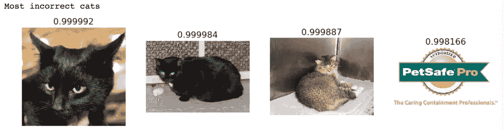

# 深度学习 2：第 1 部分第 1 课

> 原文：[`medium.com/@hiromi_suenaga/deep-learning-2-part-1-lesson-1-602f73869197`](https://medium.com/@hiromi_suenaga/deep-learning-2-part-1-lesson-1-602f73869197)
> 
> 译者：[飞龙](https://github.com/wizardforcel)
> 
> 协议：[CC BY-NC-SA 4.0](http://creativecommons.org/licenses/by-nc-sa/4.0/)

*我从* [*fast.ai 课程*](http://www.fast.ai/)* 中的个人笔记。随着我继续复习课程以“真正”理解它，这些笔记将继续更新和改进。非常感谢* [*Jeremy*](https://twitter.com/jeremyphoward) *和* [*Rachel*](https://twitter.com/math_rachel) *给了我这个学习的机会。*

# [第一课](http://forums.fast.ai/t/wiki-lesson-1/9398/1)

## 开始 [[0:00](https://youtu.be/IPBSB1HLNLo)]：

+   为了训练神经网络，您几乎肯定需要图形处理单元（GPU） —— 具体来说是 NVIDIA GPU，因为它是唯一支持 CUDA（几乎所有深度学习库和从业者使用的语言和框架）的 GPU。

+   有几种租用 GPU 的方法：Crestle [[04:06](https://youtu.be/IPBSB1HLNLo?t=4m6s)], Paperspace [[06:10](https://youtu.be/IPBSB1HLNLo?t=6m10s)]

## [Jupyter Notebook 和 猫狗分类简介](https://github.com/fastai/fastai/blob/master/courses/dl1/lesson1.ipynb) [[12:39](https://youtu.be/IPBSB1HLNLo?t=12m39s)]

+   您可以通过选择单元格并按`shift+enter`来运行单元格（您可以按住`shift`并多次按`enter`以继续向下移动单元格），或者您可以点击顶部的运行按钮。一个单元格可以包含代码、文本、图片、视频等。

+   Fast.ai 需要 Python 3

```py
%reload_ext autoreload
%autoreload 2
%matplotlib inline*
# This file contains all the main external libs we'll use
from fastai.imports import *
from fastai.transforms import *
from fastai.conv_learner import *
from fastai.model import *
from fastai.dataset import *
from fastai.sgdr import *
from fastai.plots import *
PATH = "data/dogscats/"
sz=224
```

**首先看图片 [**[**15:39**](https://youtu.be/IPBSB1HLNLo?t=15m40s)**]**

```py
!ls {PATH}
'''
models	sample	test1  tmp  train  valid
'''
```

+   `!` 告诉使用 bash（shell）而不是 python

+   如果您不熟悉训练集和验证集，请查看实用机器学习课程（或阅读[Rachel 的博客](http://www.fast.ai/2017/11/13/validation-sets/)）

```py
!ls {PATH}valid
'''
cats  dogs
'''
files = !ls {PATH}valid/cats | head
files
'''
['cat.10016.jpg',
 'cat.1001.jpg',
 'cat.10026.jpg',
 'cat.10048.jpg',
 'cat.10050.jpg',
 'cat.10064.jpg',
 'cat.10071.jpg',
 'cat.10091.jpg',
 'cat.10103.jpg',
 'cat.10104.jpg']
'''
```

+   这个文件夹结构是共享和提供图像分类数据集的最常见方法。每个文件夹告诉您标签（例如`dogs`或`cats`）。

```py
img = plt.imread(f{PATH}valid/cats/{files[0]}')
plt.imshow(img);
```


+   `f’{PATH}valid/cats/{files[0]}’` — 这是 Python 3.6\. 格式化字符串，是一种方便的格式化字符串的方法。

```py
img.shape
'''
(198, 179, 3)
'''
img[:4,:4]
'''
array([[[ 29,  20,  23],
        [ 31,  22,  25],
        [ 34,  25,  28],
        [ 37,  28,  31]],**[[ 60,  51,  54],
        [ 58,  49,  52],
        [ 56,  47,  50],
        [ 55,  46,  49]],**[[ 93,  84,  87],
        [ 89,  80,  83],
        [ 85,  76,  79],
        [ 81,  72,  75]],**[[104,  95,  98],
        [103,  94,  97],
        [102,  93,  96],
        [102,  93,  96]]], dtype=uint8)*
```

+   `img` 是一个三维数组（也称为秩为 3 的张量）。

+   这三个项目（例如`[29, 20, 23]`）代表介于 0 和 255 之间的红绿蓝像素值。

+   这个想法是拿这些数字并使用它们来预测这些数字是否代表一只猫还是一只狗，基于查看大量猫和狗的图片。

+   这个数据集来自[Kaggle 竞赛](https://www.kaggle.com/c/dogs-vs-cats)，当它发布时（2013 年），最先进的技术准确率为 80%。

**让我们训练一个模型 [**[**20:21**](https://youtu.be/IPBSB1HLNLo?t=20m21s)**]**

这是训练模型所需的三行代码：

```py
data = ImageClassifierData.from_paths(PATH, tfms=tfms_from_model(resnet34, sz))
learn = ConvLearner.pretrained(resnet34, data, precompute=True)
learn.fit(0.01, 3)
'''
[ 0\.       0.04955  0.02605  0.98975]                         
[ 1\.       0.03977  0.02916  0.99219]                         
[ 2\.       0.03372  0.02929  0.98975]
'''

```

+   这将进行 3 **轮**，这意味着它将三次查看整个图像集。

+   输出中的三个数字中的最后一个是验证集上的准确率。

+   前两个是训练集和验证集的损失函数值（在本例中是交叉熵损失）。

+   起始（例如`0.`、`1.`）是轮数。

+   我们在 17 秒内用 3 行代码实现了约 99% 的准确率（这在 2013 年将赢得 Kaggle 竞赛）！[[21:49](https://youtu.be/IPBSB1HLNLo?t=21m49s)]

+   很多人认为深度学习需要大量时间、资源和数据 —— 总的来说，这并不是真的！

## Fast.ai 库 [[22:24](https://youtu.be/IPBSB1HLNLo?t=22m24s)]

+   该库采用了他们能找到的所有最佳实践和方法 —— 每次有一篇看起来有趣的论文出来时，他们会测试它，如果它在各种数据集上表现良好并且他们能够找出如何调整它，那么它就会被实现在库中。

+   Fast.ai 为您整理了所有这些最佳实践并打包起来，大多数情况下，会自动找出最佳处理方式。

+   Fast.ai 建立在一个名为 PyTorch 的库之上，这是一个由 Facebook 编写的非常灵活的深度学习、机器学习和 GPU 计算库。

+   大多数人对 TensorFlow 比 PyTorch 更熟悉，但 Jeremy 现在认识的大多数顶尖研究人员已经转向 PyTorch。

+   Fast.ai 非常灵活，您可以根据需要使用所有这些精心策划的最佳实践。您可以轻松地在任何时候连接并编写自己的数据增强、损失函数、网络架构等，我们将在本课程中学习所有这些。

## 分析结果[[24:21](https://youtu.be/IPBSB1HLNLo?t=24m12s)]

这是验证数据集标签（将其视为正确答案）的样子：

```py
data.val_y
'''
array([0, 0, 0, ..., 1, 1, 1])
'''
```

这些 0 和 1 代表什么？

```py
data.classes
'''
['cats', 'dogs']
'''
```

+   `data`包含验证和训练数据

+   `learn`包含模型

让我们对验证集进行预测（预测以对数刻度表示）：

```py
log_preds = learn.predict()
log_preds.shape
'''
(2000, 2)
'''
log_preds[:10]
'''
array([[ -0.00002, -11.07446],
       [ -0.00138,  -6.58385],
       [ -0.00083,  -7.09025],
       [ -0.00029,  -8.13645],
       [ -0.00035,  -7.9663 ],
       [ -0.00029,  -8.15125],
       [ -0.00002, -10.82139],
       [ -0.00003, -10.33846],
       [ -0.00323,  -5.73731],
       [ -0.0001 ,  -9.21326]], dtype=float32)
'''
```

+   输出表示对猫的预测和对狗的预测

```py
preds = np.argmax(log_preds, axis=1)  # from log probabilities to 0 or 1
probs = np.exp(log_preds[:,1])        # pr(dog)
```

+   在 PyTorch 和 Fast.ai 中，大多数模型返回预测的对数而不是概率本身（我们将在课程中稍后学习原因）。现在，只需知道要获得概率，您必须执行`np.exp()`

    

+   确保您熟悉 numpy（`np`）

```py
# 1\. A few correct labels at random
plot_val_with_title(rand_by_correct(True), "Correctly classified")
```

+   图像上方的数字是狗的概率

```py
# 2\. A few incorrect labels at random
plot_val_with_title(rand_by_correct(False), "Incorrectly classified")
```


```py
plot_val_with_title(most_by_correct(0, True), "Most correct cats")
```


```py
plot_val_with_title(most_by_correct(1, True), "Most correct dogs")
```


更有趣的是，以下是模型认为肯定是狗的东西，但结果是猫，反之亦然：

```py
plot_val_with_title(most_by_correct(0, False), "Most incorrect cats")
```



```py
plot_val_with_title(most_by_correct(1, False), "Most incorrect dogs")
```


```py
most_uncertain = np.argsort(np.abs(probs -0.5))[:4]
plot_val_with_title(most_uncertain, "Most uncertain predictions")
```


+   为什么查看这些图像很重要？Jeremy 在构建模型后的第一件事是找到一种可视化其构建内容的方法。因为如果他想让模型更好，那么他需要利用做得好的事情并修复做得不好的事情。

+   在这种情况下，我们已经了解了数据集本身的一些信息，即这里有一些可能不应该存在的图像。但很明显，这个模型还有改进的空间（例如数据增强 - 我们将在以后学习）。

+   现在，您已经准备好构建自己的图像分类器（用于常规照片 - 也许不是 CT 扫描）！例如，[这里](https://towardsdatascience.com/fun-with-small-image-data-sets-8c83d95d0159)是一个学生的示例。

+   查看[此论坛帖子](http://forums.fast.ai/t/understanding-softmax-probabilities-output-on-a-multi-class-classification-problem/8194)以了解不同的可视化结果方式（例如，当存在超过 2 个类别时等）

## 自上而下 vs 自下而上[[30:52](https://youtu.be/IPBSB1HLNLo?t=30m52s)]

自下而上：学习您需要的每个构建块，最终将它们组合在一起

+   难以保持动力

+   难以了解“全局图景”

+   难以知道您实际需要哪些部分

fast.ai：让学生立即使用神经网络，尽快获得结果

+   逐渐剥开层，修改，查看内部

## 课程结构[[33:53](https://youtu.be/IPBSB1HLNLo?t=33m53s)]


1.  使用深度学习的图像分类器（代码行数最少）

1.  多标签分类和不同类型的图像（例如卫星图像）

1.  结构化数据（例如销售预测）- 结构化数据来自数据库或电子表格

1.  语言：NLP 分类器（例如电影评论分类）

1.  协同过滤（例如推荐引擎）

1.  生成语言模型：如何逐个字符从头开始编写您自己的尼采哲学

1.  回到计算机视觉 - 不仅识别猫照片，还要找到照片中的猫所在位置（热图），并学习如何从头开始编写我们自己的架构（ResNet）

## 图像分类器示例：

图像分类算法对许多事物非常有用。

+   例如，AlphaGo[[42:20](https://youtu.be/IPBSB1HLNLo?t=42m20s)]查看了成千上万个围棋棋盘，每个棋盘上都有一个标签，说明这个棋盘最终是赢家还是输家。因此，它学会了一种能够查看围棋棋盘并判断它是好还是坏的图像分类——这是打好围棋最重要的一步：知道哪一步走得更好。

+   另一个例子是一个早期的学生创建了[一个鼠标移动图像分类器](https://www.splunk.com/blog/2017/04/18/deep-learning-with-splunk-and-tensorflow-for-security-catching-the-fraudster-in-neural-networks-with-behavioral-biometrics.html)并检测到欺诈交易。

## 深度学习≠机器学习[[44:26](https://youtu.be/IPBSB1HLNLo?t=44m26s)]

+   深度学习是一种机器学习

+   机器学习是由 Arthur Samuel 发明的。在 50 年代末，他让 IBM 大型机比他更擅长下棋，发明了机器学习。他让大型机反复对弈，并找出导致胜利的种种因素，然后利用这些因素，以某种方式编写自己的程序。1962 年，Arthur Samuel 说，未来绝大多数计算机软件将使用这种机器学习方法编写，而不是手工编写。

+   C-Path（计算病理学家）[[45:42](https://youtu.be/IPBSB1HLNLo?t=45m42s)]是传统机器学习方法的一个例子。他拍摄了乳腺癌活检的病理学切片，咨询了许多病理学家关于与长期生存相关的模式或特征可能是什么。然后，他们编写了专家算法来计算这些特征，通过逻辑回归进行运算，并预测了生存率。它胜过了病理学家，但需要领域专家和计算机专家多年的工作才能构建。

## 更好的方法[[47:35](https://youtu.be/IPBSB1HLNLo?t=47m35s)]


+   具有这三个特性的算法类别是深度学习。

## 无限灵活的函数：神经网络[[48:43](https://youtu.be/IPBSB1HLNLo?t=48m43s)]


深度学习使用的基础函数称为神经网络：

+   现在你需要知道的是，它由许多简单的线性层和许多简单的非线性层组成。当你交错这些层时，你会得到一个称为通用逼近定理的东西。通用逼近定理所说的是，只要添加足够的参数，这种函数可以解决任何给定的问题，达到任意接近的精度。

## 全能参数拟合：梯度下降[[49:39](https://youtu.be/IPBSB1HLNLo?t=49m39s)]


## 快速且可扩展：GPU[[51:05](https://youtu.be/IPBSB1HLNLo?t=51m5s)]


上面显示的神经网络示例有一个隐藏层。我们在过去几年学到的一些东西是，这种神经网络如果不添加多个隐藏层，就不会快速或可扩展，因此被称为“深度”学习。

## 将所有内容放在一起[[53:40](https://youtu.be/IPBSB1HLNLo?t=53m40s)]


以下是一些例子：

+   [`research.googleblog.com/2015/11/computer-respond-to-this-email.html`](https://research.googleblog.com/2015/11/computer-respond-to-this-email.html)

+   [`deepmind.com/blog/deepmind-ai-reduces-google-data-centre-cooling-bill-40/`](https://deepmind.com/blog/deepmind-ai-reduces-google-data-centre-cooling-bill-40/)

+   [`www.skype.com/en/features/skype-translator/`](https://www.skype.com/en/features/skype-translator/)

+   [`arxiv.org/abs/1603.01768`](https://arxiv.org/abs/1603.01768)


## 诊断肺癌[[56:55](https://youtu.be/IPBSB1HLNLo?t=56m55s)]


其他当前应用：


# 卷积神经网络[[59:13](https://youtu.be/IPBSB1HLNLo?t=59m13s)]

## 线性层

[`setosa.io/ev/image-kernels/`](http://setosa.io/ev/image-kernels/)


## 非线性层[[01:02:12](https://youtu.be/IPBSB1HLNLo?t=1h2m12s)]

[神经网络和深度学习](http://neuralnetworksanddeeplearning.com/chap4.html?source=post_page-----602f73869197--------------------------------)

在这一章中，我给出了普适性定理的简单且大部分是可视化的解释。我们将一步一步地进行...

Sigmoid 和 ReLU


+   线性层和逐元素非线性函数的组合使我们能够创建任意复杂的形状 — 这是普适性定理的本质。

## 如何设置这些参数来解决问题[[01:04:25](https://youtu.be/IPBSB1HLNLo?t=1h4m25s)]

+   随机梯度下降 — 我们沿着山坡小步前进。步长被称为**学习率**


+   如果学习率太大，它会发散而不是收敛

+   如果学习率太小，将需要很长时间

## 可视化和理解卷积网络[[01:08:27](https://youtu.be/IPBSB1HLNLo?t=1h8m27s)]


我们从一些非常简单的东西开始，但如果我们将其用作足够大的规模，由于普适性定理和深度学习中多个隐藏层的使用，我们实际上获得了非常丰富的能力。这实际上是我们在训练狗和猫识别器时使用的方法。

## 狗 vs. 猫再访——选择学习率[[01:11:41](https://youtu.be/IPBSB1HLNLo?t=1h11m41s)]

```py
learn.fit(0.01, 3)
```

+   第一个数字`0.01`是学习率。

+   *学习率*决定了你想要多快或多慢地更新*权重*（或*参数*）。学习率是最难设置的参数之一，因为它会显著影响模型性能。

+   方法`learn.lr_find()`可以帮助你找到一个最佳的学习率。它使用了 2015 年的论文[Cyclical Learning Rates for Training Neural Networks](http://arxiv.org/abs/1506.01186)中开发的技术，我们简单地从一个非常小的值开始不断增加学习率，直到损失停止减少。我们可以绘制跨批次的学习率，看看这是什么样子。

```py
learn = ConvLearner.pretrained(arch, data, precompute=True)
learn.lr_find()
```

我们的`learn`对象包含一个包含我们学习率调度器的属性`sched`，并具有一些方便的绘图功能，包括这个：

```py
learn.sched.plot_lr()
```


+   Jeremy 目前正在尝试指数增加学习率与线性增加学习率。

我们可以看到损失与学习率的图表，以查看我们的损失何时停止减少：

```py
learn.sched.plot()
```


+   然后我们选择损失仍然明显改善的学习率 — 在这种情况下是`1e-2`（0.01）

## 选择迭代次数[[1:18:49](https://youtu.be/IPBSB1HLNLo?t=1h18m49s)]

```py

'''
[ 0\.       0.04955  0.02605  0.98975]                         
[ 1\.       0.03977  0.02916  0.99219]                         
[ 2\.       0.03372  0.02929  0.98975]
'''

```

+   你想要多少都可以，但如果运行时间太长，准确性可能会开始变差。这被称为“过拟合”，我们稍后会更多地了解它。

+   另一个考虑因素是你可用的时间。

## 技巧和窍门[[1:21:40](https://youtu.be/IPBSB1HLNLo?t=1h21m40s)]

**1.**`Tab` — 当你记不住函数名时，它会自动完成


**2.** `Shift + Tab` — 它会显示函数的参数


**3.** `Shift + Tab + Tab` — 它会显示文档（即 docstring）


**4.** `Shift + Tab + Tab + Tab` — 它会打开一个带有相同信息的单独窗口。


在单元格中键入`?`后跟一个函数名并运行它将与`shift + tab（3 次）`相同


**5.** 输入两个问号将显示源代码


**6\.** 在 Jupyter Notebook 中键入`H`将打开一个带有键盘快捷键的窗口。尝试每天学习 4 或 5 个快捷键


**7\.** 停止 Paperspace、Crestle、AWS — 否则你将被收费$$

**8\.** 请记住关于[论坛](http://forums.fast.ai/)和[`course.fast.ai/`](http://course.fast.ai/)（每节课）的最新信息。
