# 深度学习 2：第 1 部分第 3 课

> 原文：[`medium.com/@hiromi_suenaga/deep-learning-2-part-1-lesson-3-74b0ef79e56`](https://medium.com/@hiromi_suenaga/deep-learning-2-part-1-lesson-3-74b0ef79e56)
> 
> 译者：[飞龙](https://github.com/wizardforcel)
> 
> 协议：[CC BY-NC-SA 4.0](http://creativecommons.org/licenses/by-nc-sa/4.0/)

*来自* [*fast.ai 课程*](http://www.fast.ai/)*的个人笔记。随着我继续复习课程以“真正”理解它，这些笔记将继续更新和改进。非常感谢* [*Jeremy*](https://twitter.com/jeremyphoward) *和* [*Rachel*](https://twitter.com/math_rachel) *给了我这个学习机会。*

# [第 3 课](http://forums.fast.ai/t/wiki-lesson-3/9401/1)

## 学生们制作的有用材料：

+   [AWS 如何操作](https://github.com/reshamas/fastai_deeplearn_part1/blob/master/tools/aws_ami_gpu_setup.md)

+   [Tmux](https://github.com/reshamas/fastai_deeplearn_part1/blob/master/tools/tmux.md)

+   第 2 课总结

+   [学习率查找器](https://towardsdatascience.com/estimating-optimal-learning-rate-for-a-deep-neural-network-ce32f2556ce0)

+   [PyTorch](https://towardsdatascience.com/a-practitioners-guide-to-pytorch-1d0f6a238040)

+   [学习率与批量大小](https://miguel-data-sc.github.io/2017-11-05-first/)

+   错误表面的平滑区域与泛化

+   5 分钟内的卷积神经网络

+   [解码 ResNet 架构](http://teleported.in/posts/decoding-resnet-architecture/)

+   又一个 ResNet 教程

## 我们接下来要做什么：

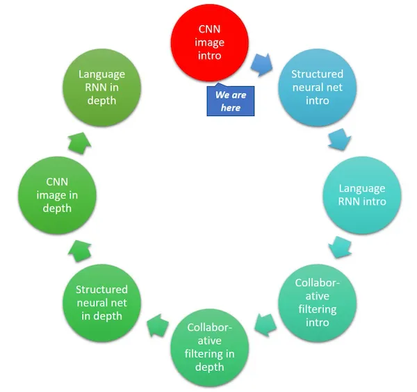


# 回顾[[08:24](https://youtu.be/9C06ZPF8Uuc?t=8m24s)]：

## Kaggle CLI：如何下载数据 1：

[Kaggle CLI](https://github.com/floydwch/kaggle-cli)是从 Kaggle 下载时使用的好工具。因为它是通过屏幕抓取从 Kaggle 网站下载数据，当网站更改时会中断。当发生这种情况时，运行`pip install kaggle-cli --upgrade`。

然后您可以运行：

```py
$ kg download -u <username> -p <password> -c <competition>
```

用您的凭据替换`<username>`，`<password>`，`<competition>`是 URL 中`/c/`后面的内容。例如，如果您想从`https://www.kaggle.com**/c/**dog-breed-identification`下载狗品种数据，命令将如下所示：

```py
$ kg download -u john.doe -p mypassword -c dog-breed-identification
```

确保您已经从计算机上点击了`下载`按钮并接受了规则：

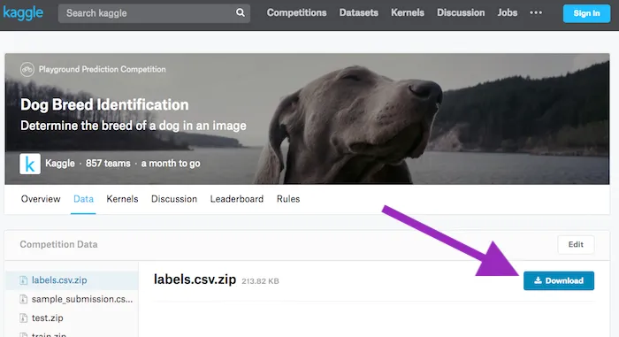


## CurWget（Chrome 扩展程序）：如何下载数据 2：


[](https://chrome.google.com/webstore/detail/curlwget/jmocjfidanebdlinpbcdkcmgdifblncg)

## 快速狗与猫[[13:39](https://youtu.be/9C06ZPF8Uuc?t=13m39s)]

```py
from fastai.conv_learner import * 
PATH = 'data/dogscats/'
sz=224; bs=64
```

通常笔记本假设您的数据在`data`文件夹中。但也许您想把它们放在其他地方。在这种情况下，您可以使用符号链接（简称 symlink）：

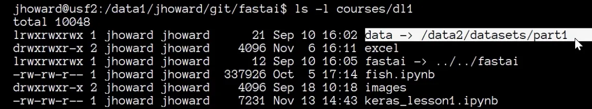


以下是一个端到端的过程，用于获得狗与猫的最新结果：

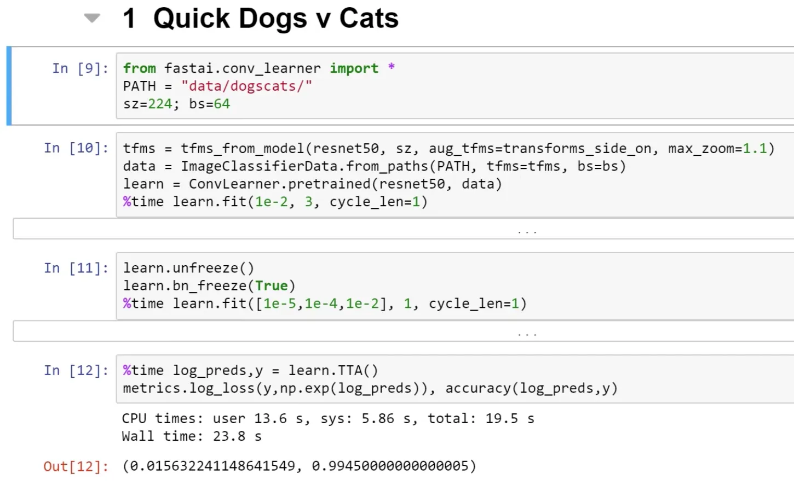


快速狗与猫

## 稍微进一步的分析：

```py
data = ImageClassifierData.from_paths(PATH, tfms= tfms, bs=bs, test_name='test')
```

+   `from_paths`：表示子文件夹名称是标签。如果您的`train`文件夹或`valid`文件夹有不同的名称，您可以发送`trn_name`和`val_name`参数。

+   `test_name`：如果您想提交到 Kaggle 竞赛，您需要填写测试集所在文件夹的名称。

```py
learn = ConvLearner.pretrained(resnet50, data)
```

+   请注意，我们没有设置`pre_compue=True`。这只是一个快捷方式，可以缓存一些中间步骤，这些步骤不必每次重新计算。如果您对此感到困惑，可以将其留空。

+   请记住，当`pre_compute=True`时，数据增强不起作用。

```py
learn.unfreeze() 
learn.bn_freeze(True) 
%time learn.fit([1e-5, 1e-4,1e-2], 1, cycle_len=1)
```

+   `bn_freeze`：如果您正在使用更大更深的模型，如 ResNet50 或 ResNext101（任何数字大于 34 的模型），在一个与 ImageNet 非常相似的数据集上（即侧面拍摄的标准物体的照片，其大小与 ImageNet 在 200-500 像素之间），您应该添加这一行。我们将在课程的后半部分学到更多，但这会导致批量归一化移动平均值不会被更新。

## [如何使用其他库 — Keras](https://github.com/fastai/fastai/blob/master/courses/dl1/keras_lesson1.ipynb) [[20:02](https://youtu.be/9C06ZPF8Uuc?t=20m2s)]

了解如何使用 Fast.ai 以外的库是很重要的。Keras 是一个很好的例子，因为就像 Fast.ai 建立在 PyTorch 之上一样，它也建立在各种库之上，如 TensorFlow、MXNet、CNTK 等。

如果您想运行[笔记本](https://github.com/fastai/fastai/blob/master/courses/dl1/keras_lesson1.ipynb)，运行`pip install tensorflow-gpu keras`

1.  **定义数据生成器**

```py
train_data_dir = f'{PATH}train' 
validation_data_dir = f'{PATH}valid'
train_datagen = ImageDataGenerator(
    rescale=1. / 255,
    shear_range=0.2, 
    zoom_range=0.2, 
    horizontal_flip=True
)
test_datagen = ImageDataGenerator(rescale=1. / 255)
train_generator = train_datagen.flow_from_directory(
    train_data_dir,
    target_size=(sz, sz),
    batch_size=batch_size, 
    class_mode='binary'
)
validation_generator = test_datagen.flow_from_directory(
    validation_data_dir,
    shuffle=False,
    target_size=(sz, sz),
    batch_size=batch_size, 
    class_mode='binary'
)
```

+   训练文件夹和验证文件夹的子文件夹与标签名称的想法是常见的，Keras 也这样做。

+   Keras 需要更多的代码和更多的参数来设置。

+   与创建单个数据对象不同，在 Keras 中，您定义`DataGenerator`并指定要进行的数据增强类型，还要指定要进行的规范化类型。换句话说，在 Fast.ai 中，我们可以说“ResNet50 需要什么，就请为我做”，但在 Keras 中，您需要知道期望的是什么。没有标准的增强集。

+   然后您必须创建一个验证数据生成器，您负责创建一个没有数据增强的生成器。您还必须告诉它不要对验证数据集进行洗牌，否则您无法跟踪您的表现如何。

**2\. 创建模型**

```py
base_model = ResNet50(weights='imagenet', include_top=False)
x = base_model.output
x = GlobalAveragePooling2D()(x)
x = Dense(1024, activation='relu')(x)
predictions = Dense(1, activation='sigmoid')(x)
```

+   Jeremy 在 Quick Dogs and Cats 中使用 ResNet50 的原因是因为 Keras 没有 ResNet34。我们想要进行苹果对苹果的比较。

+   您不能要求它构建适合特定数据集的模型，因此您必须手动完成。

+   首先创建一个基本模型，然后构建您想要添加到其顶部的层。

**3\. 冻结层并编译**

```py
model = Model(inputs=base_model.input, outputs=predictions)
for layer in base_model.layers: 
    layer.trainable = Falsemodel.compile(
        optimizer='rmsprop', 
        loss='binary_crossentropy', 
        metrics=['accuracy']
    )
```

+   通过循环层并手动调用`layer.trainable=False`来冻结它们

+   您需要编译一个模型

+   传递优化器、损失和指标的类型

**4\. 拟合**

```py
model.fit_generator(
    train_generator, 
    train_generator.n//batch_size,
    epochs=3, 
    workers=4, 
    validation_data=validation_generator,
    validation_steps=validation_generator.n // batch_size
)
```

+   Keras 希望知道每个 epoch 有多少批次。

+   `workers`：要使用的处理器数量

**5\. 微调：解冻一些层，编译，然后再次拟合**

```py
split_at = 140
for layer in model.layers[:split_at]: 
    layer.trainable = False
for layer in model.layers[split_at:]: 
    layer.trainable = True
model.compile(
    optimizer='rmsprop', 
    loss='binary_crossentropy',
    metrics=['accuracy']
)
%%time model.fit_generator(
    train_generator, 
    train_generator.n // batch_size, 
    epochs=1, 
    workers=3,
    validation_data=validation_generator,
    validation_steps=validation_generator.n // batch_size
)
```

**Pytorch** — 如果您想要部署到移动设备，PyTorch 仍处于早期阶段。

**Tensorflow** — 如果您想将在本课程中学到的内容转换为更多的 Keras 工作，但这需要更多的工作，很难获得相同水平的结果。也许将来会有 TensorFlow 兼容版本的 Fast.ai。我们将看到。

## 为 Kaggle 创建提交文件[[32:45](https://youtu.be/9C06ZPF8Uuc?t=32m45s)]

要创建提交文件，我们需要两个信息：

+   `data.classes`：包含所有不同的类

+   `data.test_ds.fnames`：测试文件名

```py
log_preds, y = learn.TTA(is_test=True)
probs = np.exp(log_preds)
```

始终使用`TTA`是一个好主意：

+   `is_test=True`：它将为您提供测试集的预测，而不是验证集

+   默认情况下，PyTorch 模型将返回预测的对数，因此您需要执行`np.exp(log_preds)`以获得概率。

```py
ds = pd.DataFrame(probs)
ds.columns = data.classes
```

+   创建 Pandas `DataFrame`

+   将列名设置为`data.classes`

```py
ds.insert(0, 'id', [o[5:-4] for o in data.test_ds.fnames])
```

+   在位置零插入一个名为`id`的新列。删除前 5 个和最后 4 个字母，因为我们只需要 ID（文件名看起来像`test/0042d6bf3e5f3700865886db32689436.jpg`）

```py
ds.head()
```

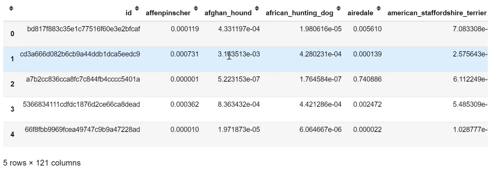


```py
SUBM = f'{PATH}sub/' 
os.makedirs(SUBM, exist_ok=True) 
ds.to_csv(f'{SUBM}subm.gz', compression='gzip', index=False)
```

+   现在您可以调用`ds.to_csv`创建一个 CSV 文件，`compression='gzip'`将在服务器上对其进行压缩。

```py
FileLink(f'{SUBM}subm.gz')
```

+   您可以使用 Kaggle CLI 直接从服务器提交，或者您可以使用`FileLink`，它将为您提供一个链接，从服务器下载文件到您的计算机。

## 单个预测[[39:32](https://youtu.be/9C06ZPF8Uuc?t=39m32s)]

如果我们想通过模型运行单个图像以获得预测，会怎样？

```py
fn = data.val_ds.fnames[0]; fn
'''
'train/001513dfcb2ffafc82cccf4d8bbaba97.jpg'
'''
Image.open(PATH + fn)
```


+   我们将从验证集中选择第一个文件。

这是获得预测的最简单方法：

```py
trn_tfms, val_tfms = tfms_from_model(arch, sz)
im = val_tfms(Image.open(PATH+fn))

preds = learn.predict_array(im[None])
np.argmax(preds)
```

+   图像必须被转换。`tfms_from_model`返回训练转换和验证转换。在这种情况下，我们将使用验证转换。

+   传递给模型或从模型返回的所有内容通常被假定为在一个小批次中。这里我们只有一张图片，但我们必须将其转换为一批包含一张图片的小批次。换句话说，我们需要创建一个张量，不仅是`[行，列，通道]`，而是`[图片数量，行，列，通道]`。

+   `im[None]`：Numpy 技巧，将额外的单位轴添加到开头。

## 理论：卷积神经网络背后实际发生了什么[[42:17](https://youtu.be/9C06ZPF8Uuc?t=42m17s)]

+   我们在第 1 课中看到了一点理论 — [`setosa.io/ev/image-kernels/`](http://setosa.io/ev/image-kernels/)

+   卷积是一种操作，其中我们有一个小矩阵（在深度学习中几乎总是 3x3），将该矩阵的每个元素与图像的 3x3 部分的每个元素相乘，然后将它们全部加在一起，以获得在一个点上的卷积结果。

**Otavio 的出色可视化（他创建了 Word Lens）：**

[`youtu.be/Oqm9vsf_hvU`](https://youtu.be/Oqm9vsf_hvU)

**Jeremy 的可视化：** [**电子表格**](https://github.com/fastai/fastai/blob/master/courses/dl1/excel/conv-example.xlsx) **[**[**49:51**](https://youtu.be/9C06ZPF8Uuc?t=49m51s)**]**

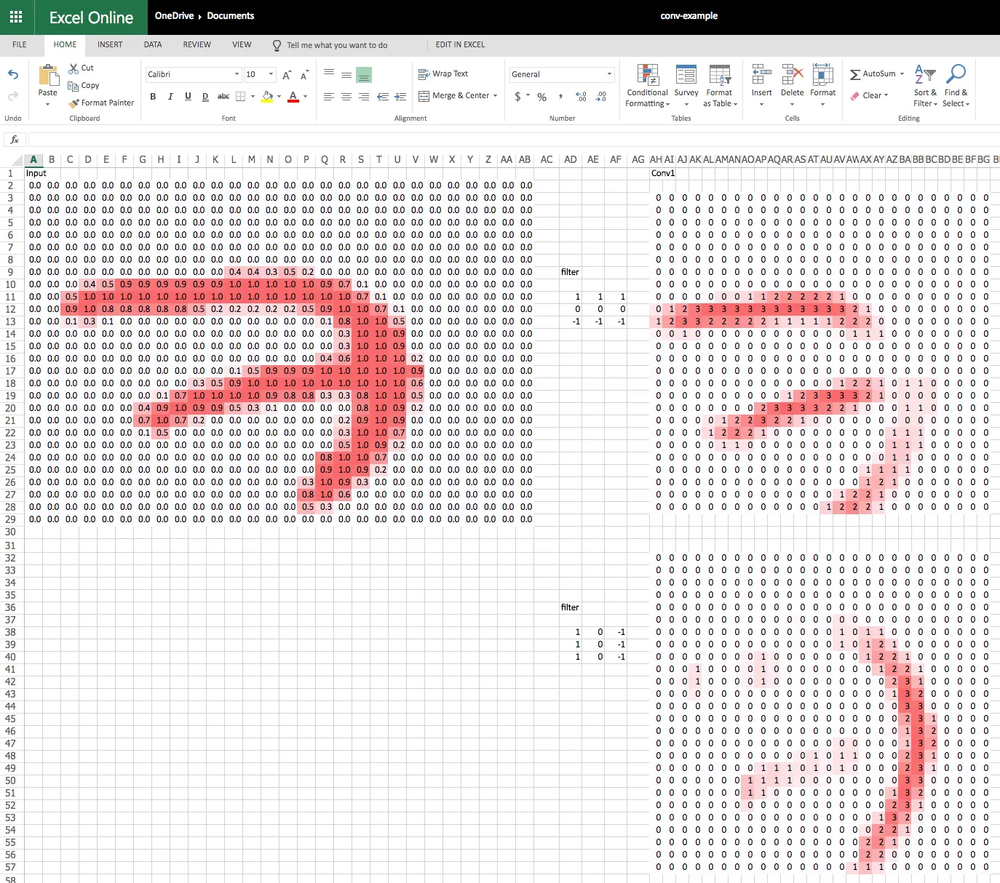

我使用[`office.live.com/start/Excel.aspx`](https://office.live.com/start/Excel.aspx?ui=en-US&rs=US)

+   这些数据来自 MNIST

+   **激活：** 通过对输入中的一些数字应用某种线性操作来计算的数字。

+   **修正线性单元（ReLU）**：丢弃负数 — 即 MAX(0, x)

+   **滤波器/卷积核：** 用于卷积的 3D 张量的 3x3 切片

+   **张量：** 多维数组或矩阵 隐藏层 既不是输入也不是输出的层

+   **最大池化：** (2,2)最大池化将在高度和宽度上减半 — 将其视为一个摘要

+   **全连接层：** 为每个激活赋予权重并计算总乘积。权重矩阵与整个输入一样大。

+   注意：在最大池化层之后可以做许多事情。其中之一是在整个大小上再做一次最大池化。在旧的架构或结构化数据中，我们会做全连接层。大量使用全连接层的架构容易过拟合且速度较慢。ResNet 和 ResNext 不使用非常大的全连接层。

**问题**：如果输入有 3 个通道会发生什么？[[1:05:30](https://youtu.be/9C06ZPF8Uuc?t=1h5m30s)] 它将看起来类似于具有 2 个通道的 Conv1 层 — 因此，滤波器每个滤波器有 2 个通道。预训练的 ImageNet 模型使用 3 个通道。当你的通道少于 3 个时，你可以使用一些技术，例如复制一个通道使其变为 3 个，或者如果你有 2 个通道，那么取平均值并将其视为第三个通道。如果你有 4 个通道，你可以向卷积核添加额外的级别，所有值都为零。

## 接下来会发生什么？[[1:08:47](https://youtu.be/9C06ZPF8Uuc?t=1h8m47s)]

我们已经走到了全连接层（它执行经典的矩阵乘积）。在 Excel 表中，有一个激活。如果我们想要查看输入是哪一个十位数，我们实际上想要计算 10 个数字。

让我们看一个例子，我们试图预测一张图片是猫、狗、飞机、鱼还是建筑物。我们的目标是：

1.  从全连接层获取输出（没有 ReLU，因此可能有负数）

1.  计算 5 个数字，每个数字都在 0 和 1 之间，它们加起来等于 1。

为此，我们需要一种不同类型的激活函数（应用于激活的函数）。

为什么我们需要非线性？如果堆叠多个线性层，它仍然只是一个线性层。通过添加非线性层，我们可以拟合任意复杂的形状。我们使用的非线性激活函数是 ReLU。

## Softmax [[01:14:08](https://youtu.be/9C06ZPF8Uuc?t=1h14m8s)]

Softmax 只会出现在最后一层。它输出介于 0 和 1 之间的数字，它们加起来为 1。理论上，这并不是绝对必要的 - 我们可以要求我们的神经网络学习一组核，这些核给出的概率尽可能接近我们想要的。一般来说，在深度学习中，如果你可以构建你的架构，使得所需的特征尽可能容易表达，你将得到更好的模型（学习更快，参数更少）。

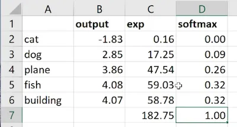


1.  通过`e^x`去除负数，因为我们不能有负概率。它也突出了值的差异（2.85：4.08 → 17.25：59.03）

所有你需要熟悉的数学来进行深度学习：

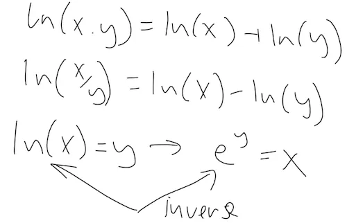


2. 然后我们将`exp`列（182.75）相加，然后将`e^x`除以总和。结果总是正的，因为我们将正数除以正数。每个数字将在 0 和 1 之间，总和为 1。

问题：如果我们想要将图片分类为猫和狗，我们应该使用什么样的激活函数？这正好是我们现在要做的事情。我们可能想这样做的一个原因是进行多标签分类。

# 星球竞赛[01:20:54]

[笔记本](https://github.com/fastai/fastai/blob/master/courses/dl1/lesson2-image_models.ipynb) / [Kaggle 页面](https://www.kaggle.com/c/planet-understanding-the-amazon-from-space)

> 我绝对建议你拟人化你的激活函数。它们有个性。[1:22:21]

Softmax 不喜欢预测多个事物。它想要选择一个事物。

Fast.ai 库会在有多个标签时自动切换到多标签模式。所以你不需要做任何事情。但是这是幕后发生的事情：

```py
from planet import f2

metrics=[f2]
f_model = resnet34label_csv = f'**{PATH}**train_v2.csv'
n = len(list(open(label_csv)))-1
val_idxs = get_cv_idxs(n)
def get_data(sz):
    tfms = tfms_from_model(
        f_model, sz,
        aug_tfms=transforms_top_down, 
        max_zoom=1.05
    ) 
    return ImageClassifierData.from_csv(
        PATH, 
        'train-jpg',
        label_csv, 
        tfms=tfms, 
        suffix='.jpg',
        val_idxs=val_idxs, 
        test_name='test-jpg'
    )
data = get_data(256)
```

+   使用 Keras 风格的方法无法进行多标签分类，其中子文件夹是标签的名称。所以我们使用`from_csv`

+   `transform_top_down`：它不仅仅是垂直翻转。对于一个正方形，有 8 种可能的对称性 - 它可以通过 0、90、180、270 度旋转，对于每一个，它可以被翻转（八面体群）。

```py
x,y = next(iter(data.val_dl))
```

+   我们已经看到了`data.val_ds`，`test_ds`，`train_ds`（`ds`：数据集），你可以通过`data.train_ds[0]`来获取单个图像，例如。

+   `dl`是一个数据加载器，它会给你一个小批量，特别是*转换后*的小批量。使用数据加载器，你不能要求一个特定的小批量；你只能得到`next`小批量。在 Python 中，它被称为“生成器”或“迭代器”。PyTorch 真正利用了现代 Python 方法。

> [如果你很了解 Python，PyTorch 会非常自然。如果你不太了解 Python，PyTorch 是学习 Python 的一个很好的理由。](https://youtu.be/9C06ZPF8Uuc?t=1h27m45s)

+   `x`：一批图像，`y`：一批标签。

如果你不确定一个函数需要什么参数，按下`shift+tab`。

```py
list(zip(data.classes, y[0]))

'''
[('agriculture', 1.0),
 ('artisinal_mine', 0.0),
 ('bare_ground', 0.0),
 ('blooming', 0.0),
 ('blow_down', 0.0),
 ('clear', 1.0),
 ('cloudy', 0.0),
 ('conventional_mine', 0.0),
 ('cultivation', 0.0),
 ('habitation', 0.0),
 ('haze', 0.0),
 ('partly_cloudy', 0.0),
 ('primary', 1.0),
 ('road', 0.0),
 ('selective_logging', 0.0),
 ('slash_burn', 1.0),
 ('water', 1.0)]
'''
```

在幕后，PyTorch 和 fast.ai 将我们的标签转换为独热编码标签。如果实际标签是狗，它看起来像：

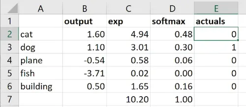


我们取`actuals`和`softmax`之间的差异，将它们相加以表示有多少错误（即损失函数）[1:31:02]。

独热编码对于存储来说非常低效，所以我们将存储一个索引值（单个整数）而不是目标值（`y`）的 0 和 1。如果您查看狗品种竞赛的`y`值，您实际上不会看到一个大的 1 和 0 的列表，而是会看到一个单个整数。在内部，PyTorch 将索引转换为独热编码向量（即使您永远不会看到它）。PyTorch 有不同的损失函数，适用于独热编码和其他不是独热编码的情况，但这些细节被 fast.ai 库隐藏，因此您不必担心。但要意识到的很酷的事情是，我们对单标签分类和多标签分类都做了完全相同的事情。

**问题**：改变 softmax 的对数基数有意义吗？[[01:32:55](https://youtu.be/9C06ZPF8Uuc?t=1h32m55s)] 不，改变基数只是一个线性缩放，神经网络可以轻松学习：

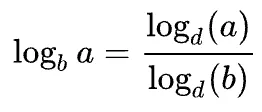


```py
plt.imshow(data.val_ds.denorm(to_np(x))[0]*1.4);
```

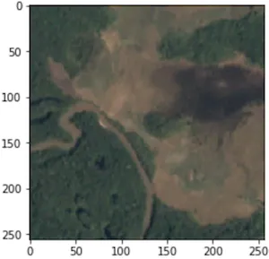


+   `*1.4`：图像被冲洗了，所以让它更明显（“稍微提亮”）。图像只是数字矩阵，所以我们可以做这样的事情。

+   尝试这样的图像是很好的，因为这些图像根本不像 ImageNet。你所做的绝大多数涉及卷积神经网络的事情实际上都不像 ImageNet（医学成像，分类不同种类的钢管，卫星图像等）

```py
sz=64
data = get_data(sz)
data = data.resize(int(sz*1.3), 'tmp')
```

+   我们不会在猫狗竞赛中使用`sz=64`，因为我们从预训练的 ImageNet 网络开始，它几乎完美。如果我们用 64x64 的图像重新训练整个集合，我们会破坏已经非常好的权重。请记住，大多数 ImageNet 模型是用 224x224 或 299x299 的图像训练的。

+   ImageNet 中没有像上面那样的图像。而且只有前几层对我们有用。所以从较小的图像开始在这种情况下效果很好。

```py
learn = ConvLearner.pretrained(f_model, data, metrics=metrics)
lrf=learn.lr_find() 
learn.sched.plot()
```

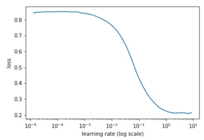


```py
lr = 0.2
learn.fit(lr, 3, cycle_len=1, cycle_mult=2)
'''
[ 0\.       0.14882  0.13552  0.87878]                        
[ 1\.       0.14237  0.13048  0.88251]                        
[ 2\.       0.13675  0.12779  0.88796]                        
[ 3\.       0.13528  0.12834  0.88419]                        
[ 4\.       0.13428  0.12581  0.88879]                        
[ 5\.       0.13237  0.12361  0.89141]                        
[ 6\.       0.13179  0.12472  0.8896 ]
'''
lrs = np.array(**[lr/9, lr/3, lr]**)learn.unfreeze()
learn.fit(lrs, 3, cycle_len=1, cycle_mult=2)
'''
[ 0\.       0.12534  0.10926  0.90892]                        
[ 1\.       0.12035  0.10086  0.91635]                        
[ 2\.       0.11001  0.09792  0.91894]                        
[ 3\.       0.1144   0.09972  0.91748]                        
[ 4\.       0.11055  0.09617  0.92016]                        
[ 5\.       0.10348  0.0935   0.92267]                        
[ 6\.       0.10502  0.09345  0.92281]
'''

```

+   `[lr/9, lr/3, lr]` — 这是因为这些图像不像 ImageNet 图像，而且较早的层可能与它们需要的不太接近。

```py
learn.sched.plot_loss()
```

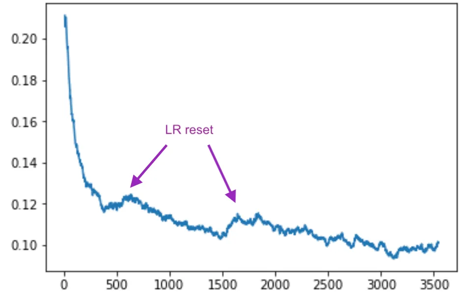


```py
sz = 128
learn.set_data(get_data(sz))
learn.freeze()
learn.fit(lr, 3, cycle_len=1, cycle_mult=2)
'''
[ 0\.       0.09729  0.09375  0.91885]                         
[ 1\.       0.10118  0.09243  0.92075]                         
[ 2\.       0.09805  0.09143  0.92235]                         
[ 3\.       0.09834  0.09134  0.92263]                         
[ 4\.       0.096    0.09046  0.9231 ]                         
[ 5\.       0.09584  0.09035  0.92403]                         
[ 6\.       0.09262  0.09059  0.92358]
'''
learn.unfreeze()
learn.fit(lrs, 3, cycle_len=1, cycle_mult=2)
learn.save(f'{sz}')
'''
[ 0\.       0.09623  0.08693  0.92696]                         
[ 1\.       0.09371  0.08621  0.92887]                         
[ 2\.       0.08919  0.08296  0.93113]                         
[ 3\.       0.09221  0.08579  0.92709]                         
[ 4\.       0.08994  0.08575  0.92862]                         
[ 5\.       0.08729  0.08248  0.93108]                         
[ 6\.       0.08218  0.08315  0.92971]
'''
sz = 256
learn.set_data(get_data(sz))
learn.freeze()
learn.fit(lr, 3, cycle_len=1, cycle_mult=2)
'''
[ 0\.       0.09161  0.08651  0.92712]                         
[ 1\.       0.08933  0.08665  0.92677]                         
[ 2\.       0.09125  0.08584  0.92719]                         
[ 3\.       0.08732  0.08532  0.92812]                         
[ 4\.       0.08736  0.08479  0.92854]                         
[ 5\.       0.08807  0.08471  0.92835]                         
[ 6\.       0.08942  0.08448  0.9289 ]
'''
learn.unfreeze()
learn.fit(lrs, 3, cycle_len=1, cycle_mult=2)
learn.save(f'{sz}')
'''
[ 0\.       0.08932  0.08218  0.9324 ]                         
[ 1\.       0.08654  0.08195  0.93313]                         
[ 2\.       0.08468  0.08024  0.93391]                         
[ 3\.       0.08596  0.08141  0.93287]                         
[ 4\.       0.08211  0.08152  0.93401]                         
[ 5\.       0.07971  0.08001  0.93377]                         
[ 6\.       0.07928  0.0792   0.93554]
'''
log_preds,y = learn.TTA()
preds = np.mean(np.exp(log_preds),0)
f2(preds,y)
'''
0.93626519738612801
'''
```

有几个人问了这个问题[[01:38:46](https://youtu.be/9C06ZPF8Uuc?t=1h38m46s)]：

```py
data = data.resize(int(sz*1.3), 'tmp')
```

当我们指定要应用的转换时，我们发送一个大小：

```py
tfms = tfms_from_model(
    f_model, sz,
    aug_tfms=transforms_top_down, 
    max_zoom=1.05
)
```

数据加载器的一项工作是按需调整图像的大小。这与`data.resize`无关。如果初始图像是 1000x1000，读取该 JPEG 并将其调整为 64x64 比训练卷积网络需要更多时间。`data.resize`告诉它我们不会使用大于`sz*1.3`的图像，因此请通过一次并创建新的这个大小的 JPEG。由于图像是矩形的，因此最小边为`sz*1.3`的新 JPEG（中心裁剪）。这将节省您大量时间。

```py
metrics=[f2]
```

我们在这个笔记本中使用[F-beta](http://scikit-learn.org/stable/modules/generated/sklearn.metrics.fbeta_score.html)而不是`accuacy`，这是一种权衡假阴性和假阳性的方法。我们使用它的原因是因为这个特定的 Kaggle 竞赛想要使用它。查看[planet.py](https://github.com/fastai/fastai/blob/master/courses/dl1/planet.py)看看如何创建自己的指标函数。这是最后打印出来的内容`[ 0\. 0.08932 0.08218 **0.9324** ]`

## 多标签分类的激活函数[[01:44:25](https://youtu.be/9C06ZPF8Uuc?t=1h44m25s)]

多标签分类的激活函数称为**sigmoid**。

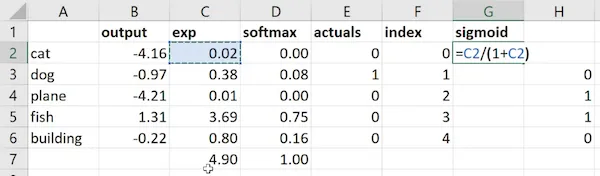


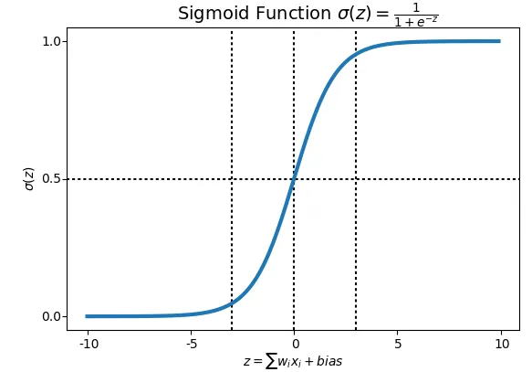


**问题**：为什么我们不从不同的学习率开始训练，而是只训练最后的层？[[01:50:30](https://youtu.be/9C06ZPF8Uuc?t=1h50m30s)]

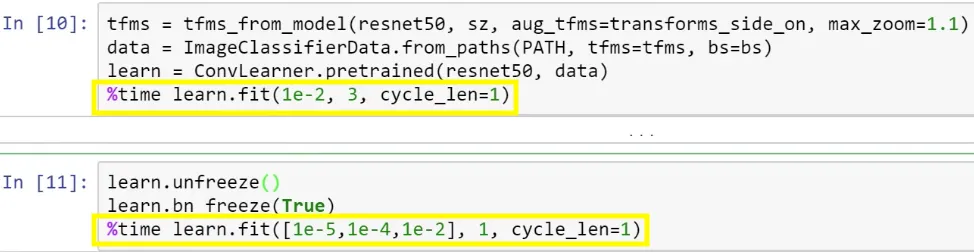


您可以跳过训练最后一层，直接进行不同的学习率，但您可能不想这样做。卷积层都包含预训练权重，因此它们不是随机的 — 对于接近 ImageNet 的东西，它们非常好；对于不接近 ImageNet 的东西，它们比没有好。然而，我们所有的全连接层都是完全随机的。因此，您始终希望通过先训练它们使全连接权重比随机更好一些。否则，如果直接解冻，那么您实际上将在后续层仍然是随机的情况下摆弄那些早期层的权重 — 这可能不是您想要的。

问题：当您使用不同的学习率时，这三个学习率是否均匀分布在各层之间？[[01:55:35](https://youtu.be/9C06ZPF8Uuc?t=1h55m35s)]我们将在课程后面更多地讨论这个问题，但是在 fast.ai 库中，有一个“层组”的概念。在像 ResNet50 这样的模型中，有数百个层，您可能不想编写数百个学习率，因此库为您决定如何分割它们，最后一个始终指的是我们随机初始化并添加的全连接层。

## 可视化层[[01:56:42](https://youtu.be/9C06ZPF8Uuc?t=1h56m42s)]

```py
learn.summary()
'''
[('Conv2d-1',
  OrderedDict([('input_shape', [-1, 3, 64, 64]),
               ('output_shape', [-1, 64, 32, 32]),
               ('trainable', False),
               ('nb_params', 9408)])),
 ('BatchNorm2d-2',
  OrderedDict([('input_shape', [-1, 64, 32, 32]),
               ('output_shape', [-1, 64, 32, 32]),
               ('trainable', False),
               ('nb_params', 128)])),
 ('ReLU-3',
  OrderedDict([('input_shape', [-1, 64, 32, 32]),
               ('output_shape', [-1, 64, 32, 32]),
               ('nb_params', 0)])),
 ('MaxPool2d-4',
  OrderedDict([('input_shape', [-1, 64, 32, 32]),
               ('output_shape', [-1, 64, 16, 16]),
               ('nb_params', 0)])),
 ('Conv2d-5',
  OrderedDict([('input_shape', [-1, 64, 16, 16]),
               ('output_shape', [-1, 64, 16, 16]),
               ('trainable', False),
               ('nb_params', 36864)]))
 ...
'''
```

+   `‘input_shape’, [-1, **3, 64, 64**]` — PyTorch 在图像尺寸之前列出通道。当按照这个顺序进行 GPU 计算时，一些计算会更快。这是通过转换步骤在幕后完成的。

+   `-1`：表示批量大小有多大。Keras 使用`None`。

+   `‘output_shape’, [-1, 64, 32, 32]` — 64 是卷积核的数量

**问题**：对于一个非常小的数据集，学习率查找器返回了奇怪的数字，绘图为空[[01:58:57](https://youtu.be/9C06ZPF8Uuc?t=1h58m57s)] — 学习率查找器将逐个小批量进行。如果您有一个微小的数据集，那么就没有足够的小批量。因此，诀窍是将批量大小设置得非常小，如 4 或 8。

# 结构化数据[[01:59:48](https://youtu.be/9C06ZPF8Uuc?t=1h59m48s)]

在机器学习中我们使用两种类型的数据集：

+   **非结构化** — 音频、图像、自然语言文本，其中对象内的所有内容都是同一种类型的东西 — 像素、波形振幅或单词。

+   **结构化** — 损益表，关于 Facebook 用户的信息，其中每列在结构上都非常不同。 “结构化”指的是列式数据，就像您在数据库或电子表格中找到的那样，不同的列代表不同类型的事物，每行代表一个观察。 

结构化数据在学术界经常被忽视，因为如果您有更好的物流模型，很难在高端会议论文中发表。但这是让世界运转的东西，让每个人都赚钱和提高效率。我们不会忽视它，因为我们正在进行实际的深度学习，Kaggle 也不会，因为人们在 Kaggle 上提供奖金来解决现实世界的问题：

+   [Corporación Favorita Grocery Sales Forecasting](https://www.kaggle.com/c/favorita-grocery-sales-forecasting) — 目前正在进行中

+   [Rossmann Store Sales](https://www.kaggle.com/c/rossmann-store-sales) — 几乎与上述相同，但是已经完成的比赛。

## Rossmann Store Sale [[02:02:42](https://youtu.be/9C06ZPF8Uuc?t=2h2m42s)]

[笔记本](https://github.com/fastai/fastai/blob/master/courses/dl1/lesson3-rossman.ipynb)

```py
from fastai.structured import *
from fastai.column_data import *
np.set_printoptions(threshold=50, edgeitems=20)

PATH='data/rossmann/'
```

+   `fastai.structured` — 不是特定于 PyTorch 的，也在机器学习课程中使用，使用随机森林而没有 PyTorch。它可以独立使用，而无需使用 Fast.ai 库的其他部分。

+   `fastai.column_data` — 允许我们使用列式结构化数据进行 Fast.ai 和 PyTorch 操作。

+   对于结构化数据，需要大量使用 **Pandas**。Pandas 是在 Python 中尝试复制 R 的数据框架（如果您对 Pandas 不熟悉，这里有一本好书 — [Python 数据分析，第二版](http://shop.oreilly.com/product/0636920050896.do)）

有很多数据预处理。这个笔记本包含了第三名获奖者的整个流程（[分类变量的实体嵌入](https://arxiv.org/abs/1604.06737)）。数据处理在本课程中没有涉及，但在一些机器学习课程中有详细介绍，因为特征工程非常重要。

## 查看 CSV 文件

```py
table_names = [
    'train', 'store', 
    'store_states', 
    'state_names', 
    'googletrend', 
    'weather', 'test'
]
tables = [
    pd.read_csv(f'{PATH}{fname}.csv', low_memory=False) 
    for fname in table_names
]
for t in tables: display(t.head())
```

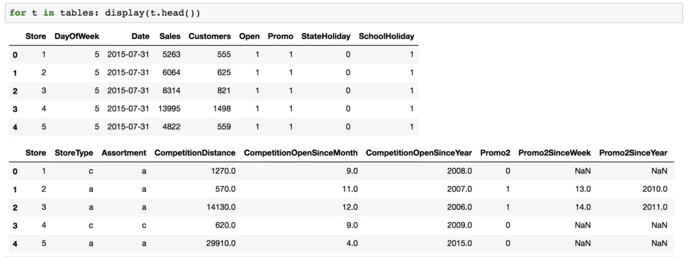


+   `StoreType` — 您经常会得到一些列包含“代码”的数据集。实际上，这个代码的含义并不重要。不要过多地了解它，先看看数据说了什么。

## 连接表

这是一个关系型数据集，您需要将许多表连接在一起 — 这在 Pandas 的 `merge` 中很容易实现：

```py
def join_df(left, right, left_on, right_on=None, suffix='_y'):
    if right_on is None: 
        right_on = left_on

    return left.merge(
        right, 
        how='left', 
        left_on=left_on,
        right_on=right_on, 
        suffixes=("", suffix)
    )
```

来自 Fast.ai 库：

```py
add_datepart(train, "Date", drop=False)
```

+   取一个日期并提取出一堆列，比如“星期几”，“季度开始”，“年份的月份”等等，并将它们全部添加到数据集中。

+   持续时间部分将计算诸如距下一个假期还有多长时间，距上一个假期已经过去多长时间等等。

```py
joined.to_feather(f'{PATH}joined')
```

+   `to_feather`：将 Pandas 的数据框保存为“feather”格式，该格式将数据框原封不动地转储到磁盘上。因此速度非常快。厄瓜多尔杂货店竞赛有 3.5 亿条记录，因此您会关心保存需要多长时间。

## 下周

+   将列分为两种类型：分类和连续。分类列将被表示为独热编码，而连续列将被直接输入到全连接层中。

+   分类：商店 #1 和商店 #2 之间没有数值关联。同样，星期几的星期一（第 0 天）和星期二（第 1 天）也没有数值关联。

+   连续：像到最近竞争对手的公里数这样的距离是我们以数字方式处理的一个数字。

+   `ColumnarModelData`
