# 深度学习 2：第 1 部分第 4 课

> 原文：[`medium.com/@hiromi_suenaga/deep-learning-2-part-1-lesson-4-2048a26d58aa`](https://medium.com/@hiromi_suenaga/deep-learning-2-part-1-lesson-4-2048a26d58aa)
> 
> 译者：[飞龙](https://github.com/wizardforcel)
> 
> 协议：[CC BY-NC-SA 4.0](http://creativecommons.org/licenses/by-nc-sa/4.0/)

> 来自 [*fast.ai 课程*](http://www.fast.ai/)的个人笔记。随着我继续复习课程以“真正”理解它，这些笔记将继续更新和改进。非常感谢 [*Jeremy*](https://twitter.com/jeremyphoward) 和[*Rachel*](https://twitter.com/math_rachel) 给了我这个学习的机会。

# [第 4 课](http://forums.fast.ai/t/wiki-lesson-4/9402/1)

学生的文章：

+   [改进我们使用学习率的方式](https://techburst.io/improving-the-way-we-work-with-learning-rate-5e99554f163b)

+   [循环学习率技术](http://teleported.in/posts/cyclic-learning-rate/)

+   探索带有重启的随机梯度下降（SGDR）

+   [使用不同学习率的迁移学习](https://towardsdatascience.com/transfer-learning-using-differential-learning-rates-638455797f00)

+   让计算机看得比人类更好

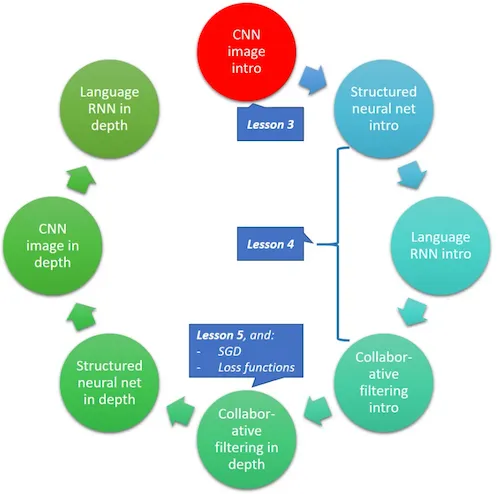


## Dropout [04:59]

```py
learn = ConvLearner.pretrained(arch, data, ps=0.5, precompute=True)
```

+   `precompute=True`：预先计算出最后一个卷积层的激活。请记住，激活是根据一些权重/参数计算出来的数字，这些权重/参数构成了卷积核/滤波器，并且它们被应用于前一层的激活或输入。

```py
learn 
'''
Sequential(
  (0): BatchNorm1d(1024, eps=1e-05, momentum=0.1, affine=True)
  (1): Dropout(p=0.5)
  (2): Linear(in_features=1024, out_features=512)
  (3): ReLU()
  (4): BatchNorm1d(512, eps=1e-05, momentum=0.1, affine=True)
  (5): Dropout(p=0.5)
  (6): Linear(in_features=512, out_features=120)
  (7): LogSoftmax()
)
'''
```

`learn` — 这将显示我们在末尾添加的层。这些是我们在`precompute=True`时训练的层

(0), (4): `BatchNorm`将在最后一课中讨论

(1), (5): `Dropout`

(2):`Linear`层简单地意味着矩阵相乘。这是一个具有 1024 行和 512 列的矩阵，因此它将接收 1024 个激活并输出 512 个激活。

(3):`ReLU` — 只是用零替换负数

(6): `Linear` — 第二个线性层，将前一个线性层的 512 个激活通过一个新的矩阵相乘 512 乘以 120，并输出 120 个激活

(7): `Softmax` — 返回总和为 1 的数字的激活函数，每个数字都在 0 到 1 之间：

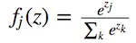


出于微小的数值精度原因，事实证明取 softmax 的对数比直接取 softmax 要好[[15:03](https://youtu.be/gbceqO8PpBg?t=15m3s)]。这就是为什么当我们从模型中获取预测时，我们必须执行`np.exp(log_preds)`。

## 什么是`Dropout`和什么是`p`？[[08:17](https://youtu.be/gbceqO8PpBg?t=8m17s)]

```py
Dropout(p=0.5)
```

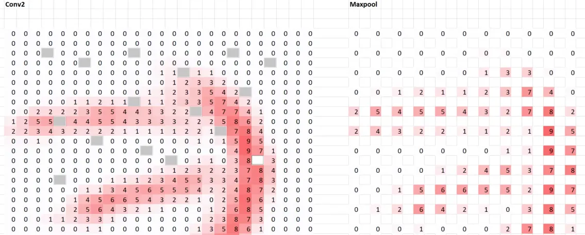


如果我们对`Conv2`层应用了`p=0.5`的 dropout，它看起来像上面那样。我们遍历，选择一个激活，并以 50%的概率删除它。因此，`p=0.5`是删除该单元的概率。输出实际上并没有太大变化，只是有点。

在一个层中随机丢弃一半的激活具有有趣的效果。需要注意的一点是，对于每个小批量，我们在该层中随机丢弃不同的一半激活。这迫使它不会过拟合。换句话说，当一个特定的激活被删除时，模型必须尝试找到一个表示，即使在每次随机丢弃一半激活时，它仍然有效。

这对于使现代深度学习工作并几乎解决泛化问题至关重要。Geoffrey Hinton 和他的同事们提出了这个想法，受到了大脑工作方式的启发。

+   `p=0.01`将丢弃 1%的激活。这几乎不会改变事情，也不会防止过拟合（不具有泛化性）。

+   `p=0.99`将丢弃 99%的激活。不会过拟合，对泛化很好，但会降低准确性。

+   默认情况下，第一层为`0.25`，第二层为`0.5`。如果发现过拟合，开始逐步增加-尝试将所有设置为`0.5`，仍然过拟合，尝试`0.7`等。如果欠拟合，可以尝试降低，但不太可能需要降低太多。

+   ResNet34 的参数较少，因此不会过度拟合，但对于更大的架构如 ResNet50，通常需要增加辍学率。

您是否想知道为什么验证损失在训练早期特别好？这是因为我们在对验证集进行推断（即进行预测）时关闭了辍学。我们希望使用我们能够使用的最佳模型。

问题：您是否需要做任何事情来适应丢弃激活的事实？我们不需要，但当您说`p=0.5`时，PyTorch 会执行两件事。它会丢弃一半的激活，并将所有已经存在的激活加倍，以使平均激活不变。

在 Fast.ai 中，您可以传递`ps`，这是所有添加层的`p`值。它不会改变预训练网络中的辍学，因为它应该已经使用了适当水平的辍学进行训练：

```py
learn = ConvLearner.pretrained(arch, data, ps=0.5, precompute=True)
```

您可以通过设置`ps=0.`来删除辍学，但即使经过几个时期，我们开始严重过拟合（训练损失≪验证损失）：

```py
[2\.      0.3521   0.55247  0.84189]
```

当`ps=0.`时，辍学层甚至不会添加到模型中：

```py
Sequential(
  (0): BatchNorm1d(4096, eps=1e-05, momentum=0.1, affine=True)
  (1): Linear(in_features=4096, out_features=512)
  (2): ReLU()
  (3): BatchNorm1d(512, eps=1e-05, momentum=0.1, affine=True)
  (4): Linear(in_features=512, out_features=120)
  (5): LogSoftmax()
)
```

您可能已经注意到，它已经添加了两个`Linear`层。我们不必这样做。您可以设置`xtra_fc`参数。注意：您至少需要一个，它接受卷积层的输出（在此示例中为 4096）并将其转换为类别数（120 种狗品种）：

```py
learn = ConvLearner.pretrained(
    arch, data, 
    ps=0., 
    precompute=True, 
    xtra_fc=[]
); learn 
'''
Sequential(
  (0): BatchNorm1d(1024, eps=1e-05, momentum=0.1, affine=True)
  (1): Linear(in_features=1024, out_features=120)
  (2): LogSoftmax()
)
'''
learn = ConvLearner.pretrained(
    arch, data, 
    ps=0., 
    precompute=True, 
    xtra_fc=[700, 300]
); learn
'''
Sequential(
  (0): BatchNorm1d(1024, eps=1e-05, momentum=0.1, affine=True)
  (1): Linear(in_features=1024, out_features=**700**)
  (2): ReLU()
  (3): BatchNorm1d(700, eps=1e-05, momentum=0.1, affine=True)
  (4): Linear(in_features=700, out_features=**300**)
  (5): ReLU()
  (6): BatchNorm1d(300, eps=1e-05, momentum=0.1, affine=True)
  (7): Linear(in_features=300, out_features=120)
  (8): LogSoftmax()
)
'''
```

问题：有没有一种特定的方法可以确定是否过拟合？是的，您可以看到训练损失远低于验证损失。您无法确定是否过度拟合。零过拟合通常不是最佳选择。您唯一要做的就是使验证损失降低，因此您需要尝试一些方法，看看什么可以使验证损失降低。随着时间的推移，您会对您的特定问题过度拟合的程度有所了解。

问题：为什么平均激活很重要？如果我们只删除了一半的激活，那么接下来以它们作为输入的激活也会减半，以及之后的所有激活。例如，如果这大于 0.6，则毛茸茸的耳朵是毛茸茸的，现在只有大于 0.3 才是毛茸茸的-这改变了含义。这里的目标是删除激活而不改变含义。

问题：我们可以通过层设置不同的辍学率吗？是的，这就是为什么称为`ps`：

```py
learn = ConvLearner.pretrained(
    arch, data, 
    ps=[0., 0.2],
    precompute=True, 
    xtra_fc=[512]
); learn
'''
Sequential(
  (0): BatchNorm1d(4096, eps=1e-05, momentum=0.1, affine=True)
  (1): Linear(in_features=4096, out_features=512)
  (2): ReLU()
  (3): BatchNorm1d(512, eps=1e-05, momentum=0.1, affine=True)
  (4): Dropout(p=0.2)
  (5): Linear(in_features=512, out_features=120)
  (6): LogSoftmax()
)
'''
```

+   目前还没有关于早期或后期层应该具有不同辍学率的经验法则。

+   如果有疑问，对每个全连接层使用相同的辍学率。

+   通常人们只在最后一个线性层上放置辍学。

问题：为什么监控损失而不是准确率？损失是我们可以看到验证集和训练集的唯一东西。正如我们后来了解的那样，损失是我们实际优化的东西，因此更容易监控和理解其含义。

问题：在添加辍学率后，我们需要调整学习率吗？似乎不会对学习率产生足够的影响以引起注意。理论上可能会，但不足以影响我们。

## 结构化和时间序列数据

[笔记本](https://github.com/fastai/fastai/blob/master/courses/dl1/lesson3-rossman.ipynb) / [Kaggle](https://www.kaggle.com/c/rossmann-store-sales)

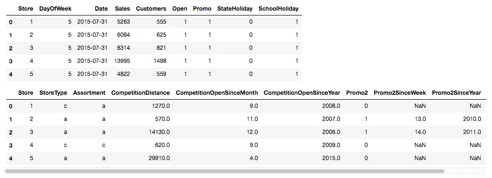


有两种类型的列：

+   分类——它有一定数量的“级别”，例如 StoreType、Assortment

+   连续型——它有一个数字，该数字的差异或比率具有某种含义，例如 CompetitionDistance

```py
cat_vars = ['Store', 'DayOfWeek', 'Year', 'Month', 'Day',
            'StateHoliday', 'CompetitionMonthsOpen', 'Promo2Weeks',
            'StoreType', 'Assortment', 'PromoInterval', 
            'CompetitionOpenSinceYear', 'Promo2SinceYear', 'State',
            'Week', 'Events', 'Promo_fw', 'Promo_bw', 
            'StateHoliday_fw', 'StateHoliday_bw', 
            'SchoolHoliday_fw', 'SchoolHoliday_bw']
contin_vars = ['CompetitionDistance', 'Max_TemperatureC', 
               'Mean_TemperatureC', 'Min_TemperatureC', 
               'Max_Humidity', 'Mean_Humidity', 'Min_Humidity', 
               'Max_Wind_SpeedKm_h', 'Mean_Wind_SpeedKm_h', 
               'CloudCover', 'trend', 'trend_DE', 
               'AfterStateHoliday', 'BeforeStateHoliday', 'Promo', 
               'SchoolHoliday']
n = len(joined); n
```

+   像`Year`，`Month`这样的数字，尽管我们可以将它们视为连续的，但我们不必这样做。如果我们决定将`Year`作为分类变量，我们告诉我们的神经网络，对于每个不同的`Year`“级别”（2000、2001、2002），你可以完全不同地对待它；而如果我们说它是连续的，它必须提出某种平滑函数来拟合它们。因此，通常实际上是连续的但没有许多不同级别的事物（例如`Year`，`DayOfWeek`），通常最好将它们视为分类变量。

+   选择分类变量还是连续变量是您要做的建模决策。总之，如果数据中是分类的，那么它必须是分类的。如果数据中是连续的，您可以选择在模型中将其视为连续或分类。

+   通常，浮点数很难转换为分类变量，因为有许多级别（我们称级别数为“**基数**”——例如，星期几变量的基数为 7）。

**问题**：您是否对连续变量进行*分箱*？Jeremy 不对变量进行分箱，但我们可以对最高温度等进行分组，例如 0-10，10-20，20-30，并将其视为分类变量。有趣的是，上周刚刚发表了一篇论文，其中一组研究人员发现有时分箱可能有所帮助。

**问题**：如果将年份用作类别，当模型遇到以前从未见过的年份时会发生什么？我们会解决这个问题，但简短的答案是它将被视为未知类别。Pandas 有一个特殊的未知类别，如果它看到以前未见过的类别，它将被视为未知。

```py
for v in cat_vars: 
    joined[v] = joined[v].astype('category').cat.as_ordered()
for v in contin_vars:
    joined[v] = joined[v].astype('float32')
dep = 'Sales'
joined = joined[cat_vars+contin_vars+[dep, 'Date']].copy()
```

+   循环遍历`cat_vars`并将适用的数据框列转换为分类列。

+   循环遍历`contin_vars`并将它们设置为`float32`（32 位浮点数），因为这是 PyTorch 所期望的。

## 从一个小样本开始

```py
idxs = get_cv_idxs(n, val_pct=150000/n) 
joined_samp = joined.iloc[idxs].set_index("Date") 
samp_size = len(joined_samp); samp_size
```

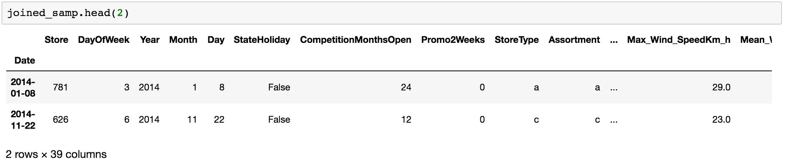


这是我们的数据样子。尽管我们将一些列设置为“category”（例如‘StoreType’，‘Year’），但 Pandas 在笔记本中仍然显示为字符串。

```py
df, y, nas, mapper = proc_df(joined_samp, 'Sales', do_scale=True)
yl = np.log(y)
```

`proc_df`（处理数据框）——Fast.ai 中的一个函数，执行以下几项操作：

1.  将因变量提取出来，放入一个单独的变量中，并从原始数据框中删除它。换句话说，`df`没有`Sales`列，而`y`只包含`Sales`列。

1.  `do_scale`：神经网络非常喜欢输入数据的均值大约为零，标准差大约为 1。因此，我们取出数据，减去均值，除以标准差以实现这一点。它返回一个特殊对象，用于跟踪用于归一化的均值和标准差，以便稍后对测试集执行相同操作（`mapper`）。

1.  它还处理缺失值——对于分类变量，它变为 ID：0，其他类别变为 1、2、3 等。对于连续变量，它用中位数替换缺失值，并创建一个新的布尔列，指示是否缺失。

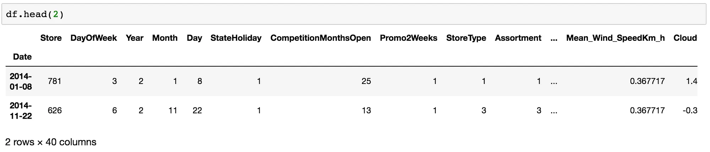


处理后，例如 2014 年变成 2，因为分类变量已被替换为从零开始的连续整数。原因是，我们稍后要将它们放入矩阵中，我们不希望矩阵在可以只有两行时却有 2014 行。

现在我们有一个不包含因变量且所有内容都是数字的数据框。这就是我们需要进行深度学习的地方。查看机器学习课程以获取更多详细信息。机器学习课程中涵盖的另一件事是验证集。在这种情况下，我们需要预测接下来两周的销售额，因此我们应该创建一个验证集，即我们训练集的最后两周：

```py
val_idx = np.flatnonzero((df.index<=datetime.datetime(2014,9,17)) &
              (df.index>=datetime.datetime(2014,8,1)))
```

+   [如何（以及为什么）创建一个好的验证集](http://www.fast.ai/2017/11/13/validation-sets/)

## 让我们直接进入深度学习行动[[39:48](https://youtu.be/gbceqO8PpBg?t=39m48s)]

对于任何 Kaggle 竞赛，重要的是您要对您的指标有一个很好的理解 - 您将如何被评判。在[这个比赛](https://www.kaggle.com/c/rossmann-store-sales#evaluation)中，我们将根据均方根百分比误差（RMSPE）进行评判。

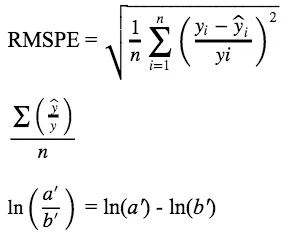


```py
def inv_y(a): 
    return np.exp(a)
def exp_rmspe(y_pred, targ):
    targ = inv_y(targ)
    pct_var = (targ - inv_y(y_pred))/targ
    return math.sqrt((pct_var**2).mean())
max_log_y = np.max(yl)
y_range = (0, max_log_y*1.2)
```

+   当您对数据取对数时，得到均方根误差将实际上得到均方根百分比误差。

```py
md = ColumnarModelData.from_data_frame(
    PATH, val_idx, df, 
    yl.astype(np.float32), 
    cat_flds=cat_vars, 
    bs=128, 
    test_df=df_test
)
```

+   像往常一样，我们将首先创建一个模型数据对象，其中包含验证集、训练集和可选的测试集。从中，我们将得到一个学习器，然后我们可以选择调用`lr_find`，然后调用`learn.fit`等等。

+   这里的区别是我们不是使用`ImageClassifierData.from_csv`或`.from_paths`，我们需要一种称为`ColumnarModelData`的不同类型的模型数据，并调用`from_data_frame`。 

+   `PATH`：指定存储模型文件等的位置

+   `val_idx`：我们要放入验证集的行的索引列表

+   `df`：包含自变量的数据框

+   `yl`：我们取`proc_df`返回的因变量`y`，并取其对数（即`np.log(y)`）

+   `cat_flds`：要作为分类变量处理的列。请记住，到这个时候，一切都是数字，所以除非我们指定，否则它会将它们全部视为连续的。

现在我们有一个标准模型数据对象，我们熟悉并包含`train_dl`，`val_dl`，`train_ds`，`val_ds`等。

```py
m = md.get_learner(
    emb_szs, 
    len(df.columns)-len(cat_vars),
    0.04, 1, 
    [1000,500], 
    [0.001,0.01], 
    y_range=y_range
)
```

+   在这里，我们要求它创建一个适合我们模型数据的学习器。

+   `0.04`：要使用多少 dropout

+   `[1000,500]`：每个层中要有多少激活

+   `[0.001,0.01]`：在后续层中要使用多少 dropout

## 关键新概念：嵌入[[45:39](https://youtu.be/gbceqO8PpBg?t=45m39s)]

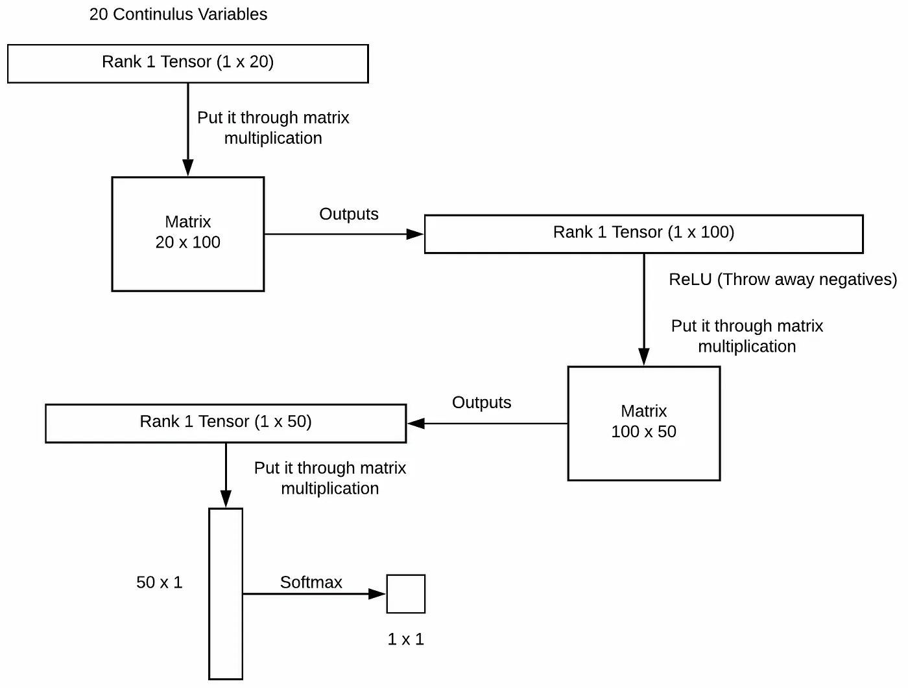


让我们暂时忘记分类变量：

请记住，您永远不要在最后一层中放置 ReLU，因为 softmax 需要负数来创建低概率。

## **全连接神经网络的简单视图[**[**49:13**](https://youtu.be/gbceqO8PpBg?t=49m13s)**]**：

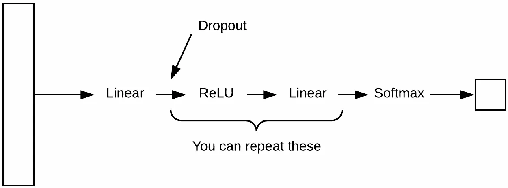


对于回归问题（而非分类），您甚至可以跳过 softmax 层。

## 分类变量[[50:49](https://youtu.be/gbceqO8PpBg?t=50m49s)]

我们创建一个新的矩阵，有 7 行，以及我们选择的列数（例如 4），并用浮点数填充它。要将“Sunday”添加到我们的连续变量的秩 1 张量中，我们查找这个矩阵，它将返回 4 个浮点数，我们将它们用作“Sunday”。

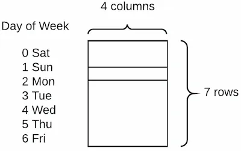


最初，这些数字是随机的。但是我们可以将它们通过神经网络，并以减少损失的方式更新它们。换句话说，这个矩阵只是我们神经网络中的另一组权重。这种类型的矩阵被称为“**嵌入矩阵**”。嵌入矩阵是一种我们从该类别的零到最大级别数之间开始的整数。我们索引到矩阵中找到特定行，并将其附加到所有连续变量，之后的一切就和以前一样（线性→ReLU→等等）。

**问题**：这四个数字代表什么？我们将在查看协同过滤时了解更多，但目前，它们只是我们正在学习的参数，最终给我们带来了良好的损失。我们将在后面发现，这些特定的参数通常是人类可解释的，而且相当有趣，但这是一个副作用。

**问题**：对于嵌入矩阵的维度有好的启发吗？我有！让我们看一看。

```py
cat_sz = [
    (c, len(joined_samp[c].cat.categories)+1) 
    for c in cat_vars
]
cat_sz
'''
[('Store', 1116),
 ('DayOfWeek', 8),
 ('Year', 4),
 ('Month', 13),
 ('Day', 32),
 ('StateHoliday', 3),
 ('CompetitionMonthsOpen', 26),
 ('Promo2Weeks', 27),
 ('StoreType', 5),
 ('Assortment', 4),
 ('PromoInterval', 4),
 ('CompetitionOpenSinceYear', 24),
 ('Promo2SinceYear', 9),
 ('State', 13),
 ('Week', 53),
 ('Events', 22),
 ('Promo_fw', 7),
 ('Promo_bw', 7),
 ('StateHoliday_fw', 4),
 ('StateHoliday_bw', 4),
 ('SchoolHoliday_fw', 9),
 ('SchoolHoliday_bw', 9)]
'''
```

+   这里是每个分类变量及其基数的列表。

+   即使原始数据中没有缺失值，你仍然应该留出一个未知值。

+   确定嵌入大小的经验法则是基数大小除以 2，但不超过 50。

```py
emb_szs = [(c, min(50, (c+1)//2)) for _,c in cat_sz]
emb_szs
'''
[(1116, 50),
 (8, 4),
 (4, 2),
 (13, 7),
 (32, 16),
 (3, 2),
 (26, 13),
 (27, 14),
 (5, 3),
 (4, 2),
 (4, 2),
 (24, 12),
 (9, 5),
 (13, 7),
 (53, 27),
 (22, 11),
 (7, 4),
 (7, 4),
 (4, 2),
 (4, 2),
 (9, 5),
 (9, 5)]
'''
```

然后将嵌入大小传递给学习器：

```py
m = md.get_learner(
    emb_szs, 
    len(df.columns)-len(cat_vars), 
    0.04, 1,
    [1000,500], 
    [0.001,0.01], 
    y_range=y_range
)
```

**问题**：除了随机初始化，是否有初始化嵌入矩阵的方法？我们可能会在课程后面谈论更多关于预训练的内容，但基本思想是，如果 Rossmann 的其他人已经训练了一个神经网络来预测奶酪销售，你可能会从他们的店铺嵌入矩阵开始，以预测酒类销售。例如，Pinterest 和 Instacart 就是这样做的。Instacart 使用这种技术来为他们的购物者规划路线，Pinterest 使用它来决定在网页上显示什么。他们有产品/店铺的嵌入矩阵在组织中共享，这样人们就不必训练新的了。

**问题**：使用嵌入矩阵相比独热编码有什么优势？对于上面的星期几示例，我们可以轻松地传递 7 个数字（例如，星期日为[0, 1, 0, 0, 0, 0, 0]）。那也是一组浮点数，完全可行——这通常是统计学中多年来使用分类变量的方式（称为“虚拟变量”）。问题是，星期日这个概念只能与一个单一的浮点数相关联。因此它具有这种线性行为——它说星期日更多或更少是一个单一的事物。通过嵌入，星期日是一个四维空间中的概念。我们通常发现的情况是，这些嵌入向量往往具有丰富的语义概念。例如，如果周末有不同的行为，你会发现周六和周日的某个特定数字更高。

> 通过使用高维向量而不仅仅是一个单一数字，深度学习网络有机会学习这些丰富的表示。

嵌入的概念被称为“分布式表示”——神经网络的最基本概念。这是神经网络中的一个概念，它具有一个高维表示，很难解释。这个向量中的数字甚至不必只有一个含义。如果这个数字低，那个数字高，它可能表示一件事，如果那个数字高，那个数字低，它可能表示另一件事，因为它经过了这个丰富的非线性函数。正是这种丰富的表示使得它能够学习这样有趣的关系。

**问题**：嵌入适用于某些类型的变量吗？[[01:02:45](https://youtu.be/gbceqO8PpBg?t=1h2m45s)] 嵌入适用于任何分类变量。唯一不能很好工作的是具有太高基数的变量。如果您有 60 万行数据，一个变量有 60 万个水平，那就不是一个有用的分类变量。但总的来说，在这个比赛中的第三名真的决定将所有不太高基数的变量都作为分类变量。一个很好的经验法则是，如果您可以将一个变量变成分类变量，最好这样做，因为这样它可以学习到丰富的分布式表示；否则，如果您将其保留为连续变量，它最多只能尝试找到一个适合它的单一函数形式。

## 幕后的矩阵代数[[01:04:47](https://youtu.be/gbceqO8PpBg?t=1h4m47s)]

通过索引查找嵌入与对一个独热编码向量和嵌入矩阵进行矩阵乘积是相同的。但这样做效率非常低，所以现代库将其实现为取一个整数并查找数组中的值。

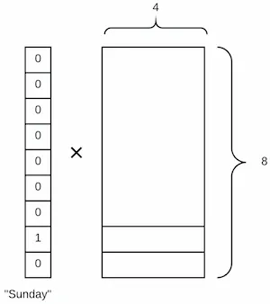


**问题**：您能谈谈如何将日期和时间作为分类变量以及这如何影响季节性吗？[[01:06:59](https://youtu.be/gbceqO8PpBg?t=1h6m59s)] 有一个 Fast.ai 函数叫做`add_datepart`，它接受一个数据框和一个列名。它可以选择从数据框中删除该列，并用许多列代替，表示有关该日期的所有有用信息，如星期几、月份、年份等（基本上是 Pandas 给我们的所有信息）。

```py
add_datepart(weather, "Date", drop=False)
add_datepart(googletrend, "Date", drop=False)
add_datepart(train, "Date", drop=False)
add_datepart(test, "Date", drop=False)
```

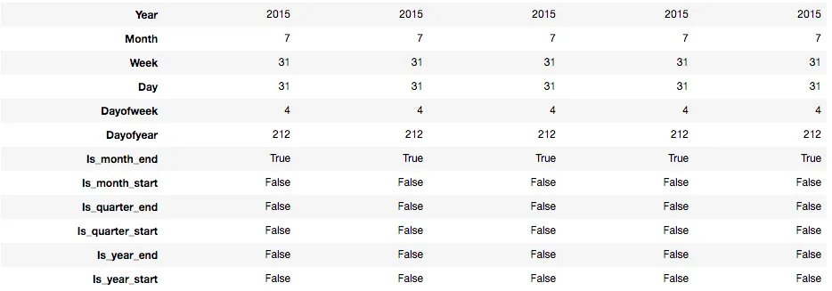


例如，现在星期几变成了一个八行四列的嵌入矩阵。从概念上讲，这使我们的模型能够创建一些有趣的时间序列模型。如果有一些东西有一个七天周期循环，星期一上升，星期三下降，但仅限于每天且仅在柏林，它完全可以做到 - 它拥有所有需要的信息。这是处理时间序列的一种奇妙方式。您只需要确保时间序列中的周期指示器存在为一列。如果没有一个名为星期几的列，神经网络学习进行模七和查找嵌入矩阵将非常困难。这并非不可能，但确实很难。如果您正在预测旧金山饮料的销售情况，您可能想要一个 AT&T 球场的球赛时间表，因为这将影响到 SoMa 地区喝啤酒的人数。因此，您需要确保基本指标或周期性存在于您的数据中，只要它们存在，神经网络就会学会使用它们。

## 学习者[[01:10:13](https://youtu.be/gbceqO8PpBg?t=1h10m13s)]

```py
m = md.get_learner(
    emb_szs, 
    len(df.columns)-len(cat_vars), 
    0.04, 1,
    [1000,500], 
    [0.001,0.01], 
    y_range=y_range
)
lr = 1e-3
```

+   `emb_szs`：嵌入大小

+   `len(df.columns)-len(cat_vars)`：数据框中连续变量的数量

+   `0.04`：嵌入矩阵有自己的丢失率，这是丢失率

+   `1`：我们想要创建多少输出（最后一个线性层的输出）

+   `[1000, 500]`：第一个线性层和第二个线性层中的激活数量

+   `[0.001, 0.01]`：第一个线性层和第二个线性层中的丢失率

+   `y_range`：现在我们不会担心这个

```py
m.fit(lr, 3, metrics=[exp_rmspe])
'''
A Jupyter Widget
[ 0\.       0.02479  0.02205* *0.19309**]                          
[ 1\.       0.02044  0.01751* *0.18301**]                          
[ 2\.       0.01598  0.01571* *0.17248**]*
```

+   `metrics`：这是一个自定义指标，指定在每个时期结束时调用的函数并打印结果

```py
m.fit(lr, 1, metrics=[exp_rmspe], cycle_len=1)
'''
[ 0\.       0.00676  0.01041  0.09711]* 
```

通过使用所有的训练数据，我们实现了大约 0.09711 的 RMSPE。公共排行榜和私人排行榜之间存在很大差异，但我们肯定处于比赛的前端。

因此，这是一种处理时间序列和结构化数据的技术。有趣的是，与使用这种技术的组相比（[分类变量的实体嵌入](https://arxiv.org/abs/1604.06737)），第二名的获胜者进行了更多的特征工程。这个比赛的获胜者实际上是物流销售预测方面的专家，因此他们有自己的代码来创建大量的特征。Pinterest 的人们为推荐构建了一个非常相似的模型，他们也说当他们从梯度提升机转向深度学习时，他们做了更少的特征工程，这是一个更简单的模型，需要更少的维护。因此，使用这种深度学习方法的一个重要好处是，您可以获得最先进的结果，但工作量要少得多。

**问题**：我们在这些中使用任何时间序列吗？间接地，是的。正如我们刚才看到的，我们的列中有一周的天数，一年的月份等，大多数被视为类别，因此我们正在构建一种分布式表示，例如一月，星期日等。我们没有使用任何经典的时间序列技术，我们所做的只是在神经网络中进行真正的全连接层。嵌入矩阵能够以比任何标准时间序列技术更丰富的方式处理一周中的周期性。

关于图像模型和这个模型之间的区别的问题：在调用`get_learner`的方式上有所不同。在图像处理中，我们只是做了`Learner.trained`并传递数据：

```py
learn = ConvLearner.pretrained(arch, data, ps=0., precompute=True)
```

对于这些类型的模型，实际上对于很多模型，我们构建的模型取决于数据。在这种情况下，我们需要知道我们有哪些嵌入矩阵。因此，在这种情况下，数据对象创建了学习者（与我们之前看到的相反）：

```py
m = md.get_learner(
    emb_szs, 
    len(df.columns)-len(cat_vars), 
    0.04, 1,
    [1000,500], 
    [0.001,0.01], 
    y_range=y_range
)
```

**步骤总结**（如果你想为自己的数据集使用这个）：

**步骤 1**。列出分类变量名称和连续变量名称，并将它们放入 Pandas 数据框中

**步骤 2**。创建一个列表，其中包含您想要在验证集中的行索引

**步骤 3**。调用这行代码：

```py
md = ColumnarModelData.from_data_frame(
    PATH, val_idx, df, 
    yl.astype(np.float32), 
    cat_flds=cat_vars, 
    bs=128, 
    test_df=df_test
)
```

**步骤 4**。创建一个您想要每个嵌入矩阵有多大的列表

**步骤 5**。调用`get_learner` — 您可以使用这些确切的参数开始：

```py
m = md.get_learner(
    emb_szs, 
    len(df.columns)-len(cat_vars), 
    0.04, 1,
    [1000,500], 
    [0.001,0.01], 
    y_range=y_range
)
```

**步骤 6**。调用`m.fit`

**问题**：如何为这种类型的数据使用数据增强，以及辍学是如何工作的？没有头绪。Jeremy 认为这必须是特定于领域的，但他从未见过任何论文或任何行业人士在结构化数据和深度学习中使用数据增强。他认为这是可以做到的，但还没有看到有人这样做。辍学所做的事情与以前完全相同。

**问题**：有什么缺点？几乎没有人在使用这个。为什么？基本上答案就像我们之前讨论的那样，几乎没有人在学术界从事这方面的工作，因为这不是人们发表论文的内容。因此，人们没有真正出色的例子可以参考，说“哦，这是一个很好的技术，让我们让我们的公司实施它”。但也许同样重要的是，直到现在有了这个 Fast.ai 库，没有任何方便的方法来做到这一点。如果你想要实现其中一个模型，你必须自己编写所有的自定义代码。有很多商业和科学机会可以利用这一点，并解决以前没有很好解决的问题。

# 自然语言处理

深度学习中最具潜力的领域是自然语言处理，它比计算机视觉落后了两三年。软件状态和一些概念的成熟程度远不及计算机视觉。在自然语言处理中，你会发现有一些特定的问题可以解决，它们有特定的名称。在自然语言处理中有一种特定的问题叫做“语言建模”，它有一个非常具体的定义——构建一个模型，在给定一个句子的几个单词后，你能否预测下一个单词是什么。

## 语言建模

[笔记本](https://github.com/fastai/fastai/blob/master/courses/dl1/lang_model-arxiv.ipynb)

这里我们有来自 arXiv（arXiv.org）的 18 个月的论文，这是一个例子：

```py
' '.join(md.trn_ds[0].text[:150])
'''
'<cat> csni <summ> the exploitation of mm - wave bands is one of the key - enabler for 5 g mobile \n radio networks . however , the introduction of mm - wave technologies in cellular \n networks is not straightforward due to harsh propagation conditions that limit \n the mm - wave access availability . mm - wave technologies require high - gain antenna \n systems to compensate for high path loss and limited power . as a consequence , \n directional transmissions must be used for cell discovery and synchronization \n processes : this can lead to a non - negligible access delay caused by the \n exploration of the cell area with multiple transmissions along different \n directions . \n    the integration of mm - wave technologies and conventional wireless access \n networks with the objective of speeding up the cell search process requires new \n'
'''
```

+   `<cat>` — 论文的类别。CSNI 是计算机科学和网络

+   `<summ>` — 论文的摘要

这是训练语言模型的输出看起来像什么。我们进行了一些简单的测试，输入一些初始文本，看模型认为接下来应该是什么：

```py
sample_model(m, "<CAT> csni <SUMM> algorithms that")
'''
...use the same network as a single node are not able to achieve the same performance as the traditional network - based routing algorithms . in this paper , we propose a novel routing scheme for routing protocols in wireless networks . the proposed scheme is based ...
'''
```

它通过阅读 arXiv 论文学到，写关于计算机网络的人会这样说话。记住，它最初完全不懂英语。它最初为英语中的每个单词都有一个随机的嵌入矩阵。通过阅读大量的 arXiv 论文，它学会了哪些单词跟随其他单词。

这里我们尝试指定一个类别为计算机视觉：

```py
sample_model(m, "<CAT> cscv <SUMM> algorithms that")
'''
...use the same data to perform image classification are increasingly being used to improve the performance of image classification algorithms . in this paper , we propose a novel method for image classification using a deep convolutional neural network ( cnn ) . the proposed method is ...
'''
```

它不仅学会了写英语，而且在你说完“卷积神经网络”之后，你应该使用括号来指定一个缩写“(CNN)”。

```py
sample_model(m,"<CAT> cscv <SUMM> algorithms. <TITLE> on ")
'''
...the performance of deep learning for image classification <eos>*sample_model(m,"<CAT> csni <SUMM> algorithms. <TITLE> on ")*...the performance of wireless networks <eos>*sample_model(m,"<CAT> cscv <SUMM> algorithms. <TITLE> towards ")*...a new approach to image classification <eos>*sample_model(m,"<CAT> csni <SUMM> algorithms. <TITLE> towards ")*...a new approach to the analysis of wireless networks <eos>
'''
```

语言模型可以非常深奥，因此我们将尝试构建它——不是因为我们真的在乎这个，而是因为我们试图创建一个用于执行其他任务的预训练模型。例如，给定一个 IMDB 电影评论，我们将确定它们是积极的还是消极的。这很像猫和狗——一个分类问题。因此，我们真的希望使用一个至少知道如何阅读英语的预训练网络。因此，我们将训练一个模型来预测句子的下一个单词（即语言模型），就像在计算机视觉中一样，在最后添加一些新层，并要求它预测某物是积极的还是消极的。

## IMDB

[笔记本](https://github.com/fastai/fastai/blob/master/courses/dl1/lesson4-imdb.ipynb)

我们要做的是训练一个语言模型，使其成为分类模型的预训练模型。换句话说，我们试图利用我们在计算机视觉中学到的微调技巧来创建强大的分类模型。

**问题**：为什么直接做你想做的事情不起作用？事实证明它并不起作用。有几个原因。首先，我们知道微调预训练网络非常强大。因此，如果我们可以让它先学习一些相关任务，然后我们可以利用所有这些信息来尝试帮助它完成第二个任务。另一个原因是 IMDB 电影评论长达数千字。因此，在阅读数千字后，不了解英语结构或单词或标点符号的情况下，你只会得到一个 1 或 0（积极或消极）。试图学习整个英语结构，然后从一个数字中了解它如何表达积极和消极情绪，这是期望太高了。

**问题**：这与 Karpathy 的 Char-RNN 相似吗？这与 Char-RNN 有些相似，它可以根据前几个字母预测下一个字母。语言模型通常在单词级别上工作（但不一定），我们将在本课程中专注于单词级别的建模。

**问题**：这些生成的单词/句子在多大程度上是实际复制了在训练集中找到的内容？单词肯定是之前见过的单词，因为它不是字符级别的，所以它只能给我们之前见过的单词。句子，有严格的方法来做，但最简单的方法是看上面的例子，你会对此有所了解。最重要的是，当我们训练语言模型时，我们将有一个验证集，以便我们尝试预测以前从未见过的东西的下一个单词。有一些技巧可以使用语言模型来生成文本，比如 beam search。

文本分类的用例：

+   对于对冲基金，识别过去导致市场大幅下跌的文章或 Twitter 中的内容。

+   识别客户服务查询，这些查询往往与下个月取消合同的人相关联

+   将文档组织成是否属于法律发现的一部分。

```py
from fastai.learner import *
import torchtext
from torchtext import vocab, data
from torchtext.datasets import language_modeling
from fastai.rnn_reg import *
from fastai.rnn_train import *
from fastai.nlp import *
from fastai.lm_rnn import *
import dill as pickle
```

+   `torchtext` — PyTorch 的 NLP 库

## 数据

IMDB 大型电影评论数据集

```py
PATH = 'data/aclImdb/'
TRN_PATH = 'train/all/'
VAL_PATH = 'test/all/'
TRN = f'{PATH}{TRN_PATH}'
VAL = f'{PATH}{VAL_PATH}'
%ls {PATH}
'''
imdbEr.txt  imdb.vocab  models/  README  test/  tmp/  train/
'''
```

在这种情况下，我们没有单独的测试和验证。就像在视觉中一样，训练目录中有一堆文件：

```py
trn_files = !ls {TRN}
trn_files[:10]

'''
['0_0.txt',
 '0_3.txt',
 '0_9.txt',
 '10000_0.txt',
 '10000_4.txt',
 '10000_8.txt',
 '1000_0.txt',
 '10001_0.txt',
 '10001_10.txt',
 '10001_4.txt']
'''
review = !cat {TRN}{trn_files[6]}
review[0]
'''
"I have to say when a name like Zombiegeddon and an atom bomb on the front cover I was expecting a flat out chop-socky fung-ku, but what I got instead was a comedy. So, it wasn't quite was I was expecting, but I really liked it anyway! The best scene ever was the main cop dude pulling those kids over and pulling a Bad Lieutenant on them!! I was laughing my ass off. I mean, the cops were just so bad! And when I say bad, I mean The Shield Vic Macky bad. But unlike that show I was laughing when they shot people and smoked dope.<br /><br />Felissa Rose...man, oh man. What can you say about that hottie. She was great and put those other actresses to shame. She should work more often!!!!! I also really liked the fight scene outside of the building. That was done really well. Lots of fighting and people getting their heads banged up. FUN! Last, but not least Joe Estevez and William Smith were great as the...well, I wasn't sure what they were, but they seemed to be having fun and throwing out lines. I mean, some of it didn't make sense with the rest of the flick, but who cares when you're laughing so hard! All in all the film wasn't the greatest thing since sliced bread, but I wasn't expecting that. It was a Troma flick so I figured it would totally suck. It's nice when something surprises you but not totally sucking.<br /><br />Rent it if you want to get stoned on a Friday night and laugh with your buddies. Don't rent it if you are an uptight weenie or want a zombie movie with lots of flesh eating.<br /><br />P.S. Uwe Boil was a nice touch."
'''
```

现在我们将检查数据集中有多少单词：

```py
!find {TRN} -name '*.txt' | xargs cat | wc -w
'''
17486581
'''
!find {VAL} -name '*.txt' | xargs cat | wc -w
'''
5686719
'''
```

在我们可以对文本进行任何操作之前，我们必须将其转换为标记列表。标记基本上就像一个单词。最终我们将把它们转换成一系列数字，但第一步是将其转换成一系列单词——这在 NLP 中称为“标记化”。一个好的标记器将很好地识别句子中的片段。每个分隔的标点符号将被分开，每个多部分单词的部分将被适当地分开。Spacy 做了很多 NLP 工作，Jeremy 知道它有最好的标记器。因此，Fast.ai 库被设计为与 Spacey 标记器以及 torchtext 一起很好地工作。

## 创建一个字段

字段是如何预处理一些文本的定义。

```py
TEXT = data.Field(lower=True, tokenize=spacy_tok)
```

+   `lower=True` — 将文本转换为小写

+   `tokenize=spacy_tok` — 使用`spacy_tok`进行标记化

现在我们创建通常的 Fast.ai 模型数据对象：

```py
bs=64; bptt=70
FILES = dict(train=TRN_PATH, validation=VAL_PATH, test=VAL_PATH)
md = LanguageModelData.from_text_files(
    PATH, TEXT, **FILES, bs=bs, 
    bptt=bptt, min_freq=10
)
```

+   `PATH`：通常是数据所在的位置，保存模型等

+   `TEXT`：torchtext 的 Field 定义

+   `**FILES`：我们拥有的所有文件的列表：训练、验证和测试（为了保持简单，我们没有单独的验证和测试集，所以两者都指向验证文件夹）

+   `bs`：批量大小

+   `bptt`：通过时间反向传播。这意味着我们一次将多长的句子放在 GPU 上

+   `min_freq=10`：一会儿，我们将用整数（每个单词的唯一索引）替换单词。如果有任何出现次数少于 10 次的单词，就称之为未知。

构建了我们的`ModelData`对象之后，它会自动填充`TEXT`对象的一个非常重要的属性：`TEXT.vocab`。这是一个*词汇表*，它存储了文本中看到的哪些唯一单词（或*标记*），以及每个单词将被映射到一个唯一的整数 ID。

```py
# 'itos': 'int-to-string' 
TEXT.vocab.itos[:12]
'''
['<unk>', '<pad>', 'the', ',', '.', 'and', 'a', 'of', 'to', 'is', 'it', 'in']
'''
# 'stoi': 'string to int'
TEXT.vocab.stoi['the']
'''
2
'''
```

`itos`按频率排序，除了前两个特殊的。使用`vocab`，torchtext 将为我们将单词转换为整数 ID：

```py
md.trn_ds[0].text[:12]
'''
['i',
 'have',
 'always',
 'loved',
 'this',
 'story',
 '-',
 'the',
 'hopeful',
 'theme',
 ',',
 'the']
'''
TEXT.numericalize([md.trn_ds[0].text[:12]])
'''
Variable containing:
   12
   35
  227
  480
   13
   76
   17
    2
 7319
  769
    3
    2
[torch.cuda.LongTensor of size 12x1 (GPU 0)]
'''
```

**问题**：通常会进行任何词干处理或词形还原吗？不是很常见。一般来说，我们只需要进行分词。为了尽可能通用，我们想知道接下来会发生什么，所以无论是将来时还是过去时，还是复数还是单数，我们并不真的知道哪些事情会有趣，哪些不会，所以似乎最好尽可能保持不变。

**问题**：处理自然语言时，上下文不重要吗？为什么我们要对单个词进行标记化和查看？[[01:46:38](https://youtu.be/gbceqO8PpBg?t=1h46m38s)] 不，我们不是在查看单个词 - 它们仍然是有序的。只是因为我们用数字 12 替换了 I，它们仍然是按照那个顺序的。处理自然语言的另一种方法叫做“词袋”，它们会丢弃顺序和上下文。在机器学习课程中，我们将学习如何使用词袋表示，但我认为它们已经不再有用或即将不再有用。我们开始学习如何正确使用深度学习来使用上下文。

## 批次大小和 BPTT [[01:47:40](https://youtu.be/gbceqO8PpBg?t=1h47m40s)]

在语言模型中发生的情况是，尽管我们有很多电影评论，它们都被连接在一起成为一个大文本块。因此，我们预测这个巨大的长文本中的下一个单词，其中包含所有 IMDB 电影评论的连接。

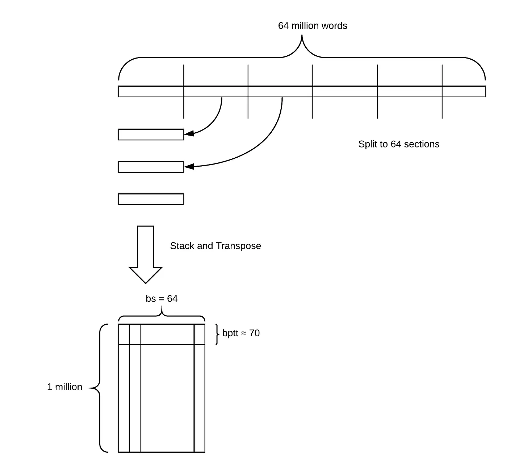


+   我们将连接的评论分成批次。在这种情况下，我们将其分成 64 个部分。

+   然后我们将每个部分移动到前一个部分的下方，并对其进行转置。

+   我们最终得到一个大小为 100 万乘以 64 的矩阵。

+   然后我们每次抓取一小块，这些块的长度**大致**等于 BPTT。在这里，我们抓取一个大约 70 个字符长的部分，这是我们放入 GPU（即批次）的第一件事。

```py
next(iter(md.trn_dl))
'''
(Variable containing:
     12    567      3  ...    2118      4   2399
     35      7     33  ...       6    148     55
    227    103    533  ...    4892     31     10
         ...            ⋱           ...         
     19   8879     33  ...      41     24    733
    552   8250     57  ...     219     57   1777
      5     19      2  ...    3099      8     48
 [torch.cuda.LongTensor of size 75x64 (GPU 0)], 
 Variable containing:
     35
      7
     33
      ⋮   
     22
   3885
  21587
 [torch.cuda.LongTensor of size 4800 (GPU 0)])
'''
```

+   我们通过将数据加载器包装在`iter`中，然后调用`next`来获取我们的第一个训练批次。

+   我们得到了一个 75 乘以 64 的张量（大约 70 行，但不完全）

+   Torchtext 做的一个巧妙的技巧是每次随机更改`bptt`数字，因此每个时期它都会获取略有不同的文本片段 - 类似于在计算机视觉中对图像进行洗牌。我们不能随机洗牌单词，因为它们需要按正确的顺序排列，所以我们随机移动它们的断点一点点。

+   目标值也是 75 乘以 64，但出于一些技术原因，它被展平为一个单一向量。

**问题**：为什么不按句子分割？[[01:53:40](https://youtu.be/gbceqO8PpBg?t=1h53m40s)] 不完全是。请记住，我们使用的是列。因此，我们的每一列长度约为 100 万，因此尽管这些列并不总是完全以句号结束，但它们非常长，我们不在乎。每列包含多个句子。

关于这个问题，Jeremy 发现了在这个语言模型矩阵中的内容有一段时间让人有点费解，所以如果需要一段时间并且需要问一千个问题，不要担心。

## 创建一个模型 [[01:55:46](https://youtu.be/gbceqO8PpBg?t=1h55m46s)]

现在我们有一个可以提供批次的模型数据对象，我们可以创建一个模型。首先，我们将创建一个嵌入矩阵。

这里是：#批次；词汇表中的唯一标记数；数据集的长度；单词数

```py
len(md.trn_dl), md.nt, len(md.trn_ds), len(md.trn_ds[0].text)
'''
(4602, 34945, 1, 20621966)
'''
```

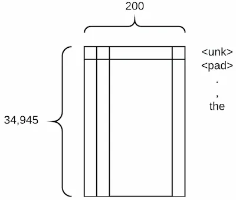


这是我们的嵌入矩阵的样子：

+   这是一个高基数分类变量，而且，这是唯一的变量 - 这在自然语言处理中很典型

+   嵌入大小为 200，比我们以前的嵌入向量要大得多。这并不奇怪，因为一个词比“星期天”的概念要复杂得多。**一般来说，一个词的嵌入大小会在 50 到 600 之间。**

```py
em_sz = 200  # size of each embedding vector
nh = 500     # number of hidden activations per layer
nl = 3       # number of layers
```

研究人员发现大量的*动量*（我们稍后会了解）与这些*循环神经网络*模型不太兼容，因此我们创建了一个*Adam*优化器的版本，其动量小于默认值`0.9`。每当你在做自然语言处理时，你应该包括这一行：

```py
opt_fn = partial(optim.Adam, betas=(0.7, 0.99))
```

Fast.ai 使用了由 Stephen Merity 开发的最先进的[AWD LSTM 语言模型](https://arxiv.org/abs/1708.02182)的变体。这个模型的一个关键特征是通过[Dropout](https://en.wikipedia.org/wiki/Convolutional_neural_network#Dropout)提供了出色的正则化。目前还没有简单的方法来找到下面的 dropout 参数的最佳值 - 您只需要进行实验...

然而，其他参数（`alpha`，`beta`和`clip`）通常不需要调整。

```py
learner = md.get_model(
    opt_fn, em_sz, nh, nl, 
    dropouti=0.05,
    dropout=0.05, 
    wdrop=0.1, 
    dropoute=0.02, 
    dropouth=0.05
)
learner.reg_fn = partial(seq2seq_reg, alpha=2, beta=1)
learner.clip=0.3
```

+   在最后一堂课中，我们将学习架构是什么以及所有这些 dropout 是什么。现在，只需知道它与通常情况下相同，如果您尝试构建一个 NLP 模型并且欠拟合，那么减少所有这些 dropout，如果过拟合，那么以大致这个比例增加所有这些 dropout。由于这是一篇最近的论文，所以没有太多的指导，但这些比例效果很好 - 这也是 Stephen 一直在使用的。

+   还有另一种我们可以避免过拟合的方法，我们将在最后一堂课上讨论。目前，`learner.reg_fn = partial(seq2seq_reg, alpha=2, beta=1)`可以可靠地工作，因此您所有的 NLP 模型可能都需要这一行。

+   `learner.clip=0.3`：当您查看梯度并将其乘以学习率以决定更新权重的量时，这将不允许它们超过 0.3。这是一个很酷的小技巧，可以防止我们迈出太大的一步。

+   细节现在并不太重要，所以您可以按原样使用它们。

**问题**：有一些词嵌入，如 Word2vec 或 GloVe。它们与这个有什么不同？为什么不最初使用它们来初始化权重？人们以前已经对这些嵌入矩阵进行了预训练，以执行各种其他任务。它们不被称为预训练模型；它们只是一个预训练的嵌入矩阵，您可以下载它们。我们完全可以下载它们。我发现以这种方式构建一个完整的预训练模型似乎并没有从使用预训练词向量中受益，而使用一个完整的预训练语言模型则产生了更大的差异。也许我们可以将两者结合起来使它们变得更好。

**问题**：模型的架构是什么？我们将在最后一课中学习有关模型架构的知识，但现在，它是使用一种称为 LSTM（长短期记忆）的递归神经网络。

## 拟合

```py
learner.fit(3e-3, 4, wds=1e-6, cycle_len=1, cycle_mult=2)
learner.save_encoder('adam1_enc')
learner.fit(
    3e-3, 4, 
    wds=1e-6, 
    cycle_len=10, 
    cycle_save_name='adam3_10'
)
learner.save_encoder('adam3_10_enc')
learner.fit(
    3e-3, 1, 
    wds=1e-6, 
    cycle_len=20, 
    cycle_save_name='adam3_20'
)
learner.load_cycle('adam3_20',0)
```

在情感分析部分，我们只需要语言模型的一半 - *编码器*，所以我们保存了那部分。

```py
learner.save_encoder('adam3_20_enc')
learner.load_encoder('adam3_20_enc')
```

语言建模的准确性通常使用指标*困惑度*来衡量，这只是我们使用的损失函数的`exp()`。

```py
math.exp(4.165)
'''
64.3926824434624
'''
pickle.dump(TEXT, open(f'{PATH}models/TEXT.pkl','wb'))
```

## 测试

我们可以稍微玩弄一下我们的语言模型，以确保它运行正常。首先，让我们创建一小段文本来“引导”一组预测。我们将使用我们的 torchtext 字段对其进行数值化，以便将其馈送给我们的语言模型。

```py
m=learner.model
ss=""". So, it wasn't quite was I was expecting, but I really liked it anyway! The best"""
s = [spacy_tok(ss)]
t=TEXT.numericalize(s)
' '.join(s[0])
'''
". So , it was n't quite was I was expecting , but I really liked it anyway ! The best"
'''
```

我们还没有添加使测试语言模型变得容易的方法，因此我们需要手动执行这些步骤。

```py
# Set batch size to 1
m[0].bs=1
# Turn off dropout
m.eval()
# Reset hidden state
m.reset()
# Get predictions from model
res,*_ = m(t)
# Put the batch size back to what it was
m[0].bs=bs
```

让我们看看在我们短文本之后的下一个单词的前 10 个预测是什么：

```py
nexts = torch.topk(res[-1], 10)[1]
[TEXT.vocab.itos[o] for o in to_np(nexts)]
'''
['film',
 'movie',
 'of',
 'thing',
 'part',
 '<unk>',
 'performance',
 'scene',
 ',',
 'actor']
'''
```

...让我们看看我们的模型是否可以自己生成更多文本！

```py
print(ss,"\n")
for i in range(50):
    n=res[-1].topk(2)[1]
    n = n[1] if n.data[0]==0 else n[0]
    print(TEXT.vocab.itos[n.data[0]], end=' ')
    res,*_ = m(n[0].unsqueeze(0))
print('...')
'''
. So, it wasn't quite was I was expecting, but I really liked it anyway! The best* *film ever ! <eos> i saw this movie at the toronto international film festival . i was very impressed . i was very impressed with the acting . i was very impressed with the acting . i was surprised to see that the actors were not in the movie . ...
'''
```

## 情感

所以我们之前已经预训练了一个语言模型，现在我们想要微调它以进行情感分类。

要使用预训练模型，我们将需要语言模型的保存的词汇表，因为我们需要确保相同的单词映射到相同的 ID。

```py
TEXT = pickle.load(open(f'{PATH}models/TEXT.pkl','rb'))
```

`sequential=False`告诉 torchtext 文本字段应该被标记化（在这种情况下，我们只想存储“正面”或“负面”单个标签）。

```py
IMDB_LABEL = data.Field(sequential=False)
```

这一次，我们需要将每个评论视为单独的而不是作为一个大段的文本，因为每个评论都有不同的情感附着。

`splits`是 torchtext 的一个方法，用于创建训练、测试和验证集。IMDB 数据集内置在 torchtext 中，因此我们可以利用它。查看`lang_model-arxiv.ipynb`，了解如何定义自己的 fastai/torchtext 数据集。

```py
splits = torchtext.datasets.IMDB.splits(TEXT, IMDB_LABEL, 'data/')
t = splits[0].examples[0]
t.label, ' '.join(t.text[:16])
'''
('pos', 'ashanti is a very 70s sort of film ( 1979 , to be precise ) .')
'''
```

fastai 可以直接从 torchtext 的`splits`创建一个`ModelData`对象。

```py
md2 = TextData.from_splits(PATH, splits, bs)
```

现在你可以继续调用`get_model`来获取我们的学习者。然后我们可以加载预训练的语言模型（`load_encoder`）。

```py
m3 = md2.get_model(
    opt_fn, 1500, bptt, 
    emb_sz=em_sz, 
    n_hid=nh, 
    n_layers=nl, 
    dropout=0.1, 
    dropouti=0.4,
    wdrop=0.5, 
    dropoute=0.05, 
    dropouth=0.3
)
m3.reg_fn = partial(seq2seq_reg, alpha=2, beta=1)
m3.load_encoder(f'adam3_20_enc')
```

因为我们正在微调一个预训练模型，我们将使用不同的学习率，并增加用于剪切的最大梯度，以使 SGDR 更好地工作。

```py
m3.clip=25.
lrs=np.array([1e-4,1e-3,1e-2])
m3.freeze_to(-1)
m3.fit(lrs/2, 1, metrics=[accuracy])
m3.unfreeze()
m3.fit(lrs, 1, metrics=[accuracy], cycle_len=1)
'''
[ 0\.       0.45074  0.28424  0.88458]
[ 0\.       0.29202  0.19023  0.92768]
'''
```

我们确保除了最后一层外，所有层都被冻结。然后我们进行一些训练，解冻它，再进行一些训练。好处是一旦你有了一个预训练的语言模型，它实际上训练速度非常快。

```py
m3.fit(
    lrs, 7, 
    metrics=[accuracy], 
    cycle_len=2, 
    cycle_save_name='imdb2'
)
'''
[ 0\.       0.29053  0.18292  0.93241]                        
[ 1\.       0.24058  0.18233  0.93313]                        
[ 2\.       0.24244  0.17261  0.93714]                        
[ 3\.       0.21166  0.17143  0.93866]                        
[ 4\.       0.2062   0.17143  0.94042]                        
[ 5\.       0.18951  0.16591  0.94083]                        
[ 6\.       0.20527  0.16631  0.9393 ]                        
[ 7\.       0.17372  0.16162  0.94159]                        
[ 8\.       0.17434  0.17213  0.94063]                        
[ 9\.       0.16285  0.16073  0.94311]                        
[ 10\.        0.16327   0.17851   0.93998]                    
[ 11\.        0.15795   0.16042   0.94267]                    
[ 12\.        0.1602    0.16015   0.94199]                    
[ 13\.        0.15503   0.1624    0.94171]
'''
m3.load_cycle('imdb2', 4)
accuracy(*m3.predict_with_targs())
'''
0.94310897435897434
'''
```

Bradbury 等人最近发表的一篇论文，[学习中的翻译：上下文化的词向量](https://einstein.ai/research/learned-in-translation-contextualized-word-vectors)，对解决 IMDB 情感分析问题的最新学术研究进行了方便的总结。许多最新的算法都是针对这个特定问题进行调整的。

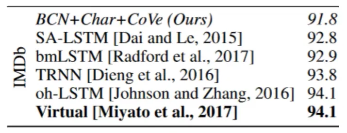

正如你所看到的，我们在情感分析方面取得了最新的技术成果，将错误率从 5.9%降低到 5.5%！你应该能够使用相同的基本步骤在其他 NLP 分类问题上获得同样世界级的结果。

有许多机会进一步改进这一点，尽管我们在本课程的第二部分之前不会能够做到这一点。

+   例如，我们可以开始训练查看许多医学期刊的语言模型，然后我们可以制作一个可下载的医学语言模型，然后任何人都可以用它来在医学文献的前列腺癌子集上进行微调。

+   我们还可以将其与预训练的词向量结合使用

+   我们本可以预先训练一个维基百科语料库语言模型，然后将其微调为一个 IMDB 语言模型，然后再将其微调为一个 IMDB 情感分析模型，我们会得到比这个更好的东西。

有一个名为 Sebastian Ruder 的非常出色的研究人员，他是唯一一个真正大量撰写关于 NLP 中预训练、微调和迁移学习的研究人员。Jeremy 问他为什么这种情况没有更多发生，他的观点是因为没有软件使其变得容易。希望 Fast.ai 会改变这一点。

## 协同过滤介绍 [[02:11:38](https://youtu.be/gbceqO8PpBg?t=2h11m38s)]

[笔记本](https://github.com/fastai/fastai/blob/master/courses/dl1/lesson5-movielens.ipynb)

数据可从[`files.grouplens.org/datasets/movielens/ml-latest-small.zip`](http://files.grouplens.org/datasets/movielens/ml-latest-small.zip)获取

```py
path='data/ml-latest-small/'
ratings = pd.read_csv(path+'ratings.csv')
ratings.head()
```

数据集看起来像这样：

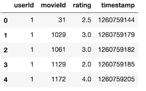


它包含用户的评分。我们的目标是对于我们以前没有见过的某个用户-电影组合，我们必须预测一个评分。

```py
movies = pd.read_csv(path+'movies.csv')
movies.head()
```

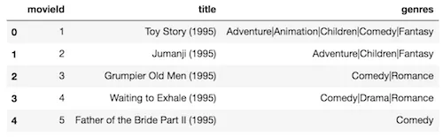


为了使其更有趣，我们还将实际下载一份电影列表，以便我们可以解释这些嵌入矩阵中实际包含的内容。

```py
g=ratings.groupby('userId')['rating'].count()
topUsers=g.sort_values(ascending=False)[:15]
g=ratings.groupby('movieId')['rating'].count()
topMovies=g.sort_values(ascending=False)[:15]
top_r = ratings.join(
    topUsers, 
    rsuffix='_r', 
    how='inner', 
    on='userId'
)
top_r = top_r.join(
    topMovies, 
    rsuffix='_r', 
    how='inner', 
    on='movieId'
)
pd.crosstab(
    top_r.userId, 
    top_r.movieId, 
    top_r.rating, 
    aggfunc=np.sum
)
```

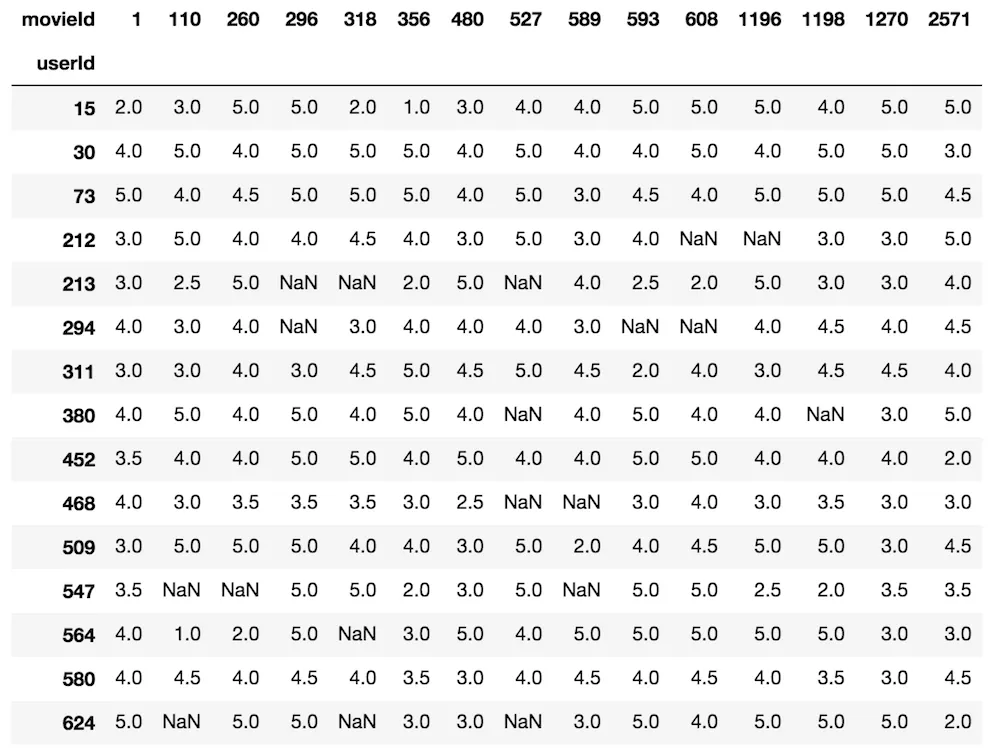


这就是我们正在创建的——用户和电影的这种交叉表。

随意提前查看，你会发现大部分步骤对你来说已经很熟悉了。
