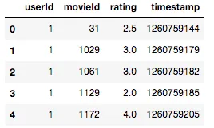
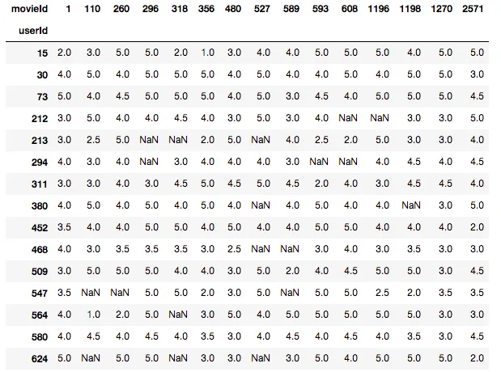
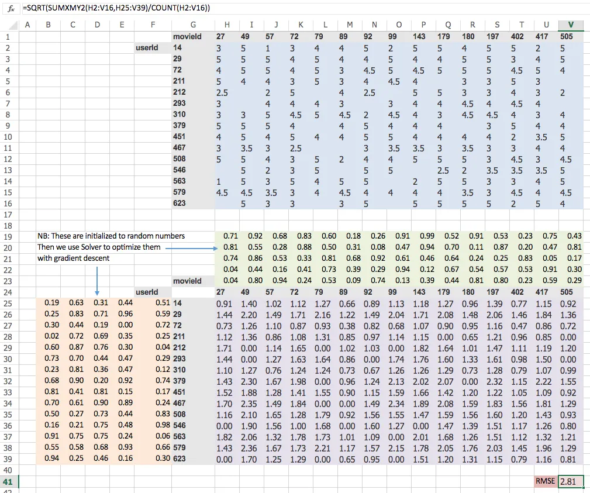
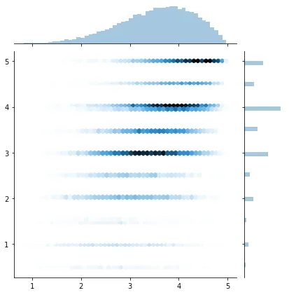
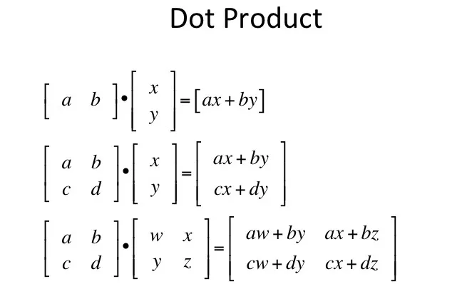
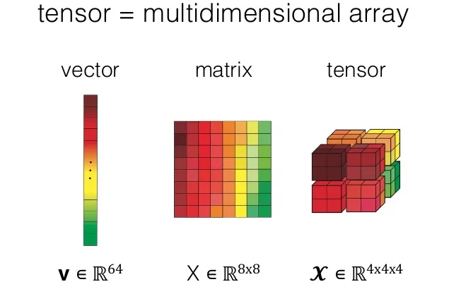
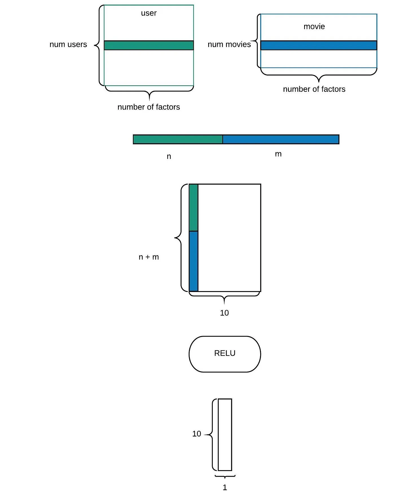
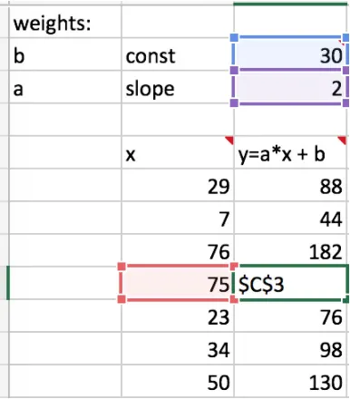
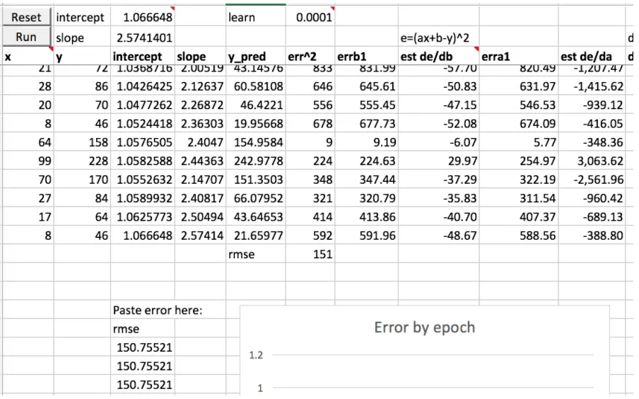
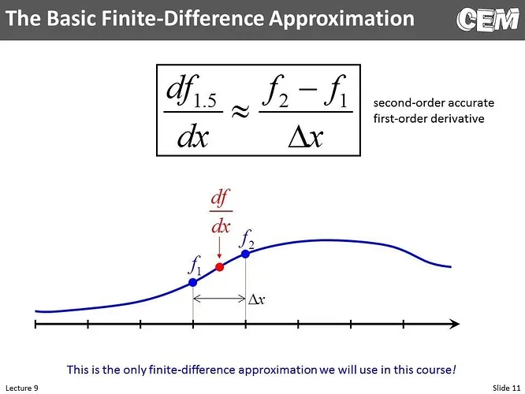

# 深度学习 2：第 1 部分第 5 课

> 原文：[`medium.com/@hiromi_suenaga/deep-learning-2-part-1-lesson-5-dd904506bee8`](https://medium.com/@hiromi_suenaga/deep-learning-2-part-1-lesson-5-dd904506bee8)
> 
> 译者：[飞龙](https://github.com/wizardforcel)
> 
> 协议：[CC BY-NC-SA 4.0](http://creativecommons.org/licenses/by-nc-sa/4.0/)

*来自* [*fast.ai 课程*](http://www.fast.ai/)* 的个人笔记。随着我继续复习课程以“真正”理解它，这些笔记将继续更新和改进。非常感谢* [*Jeremy*](https://twitter.com/jeremyphoward) *和* [*Rachel*](https://twitter.com/math_rachel) *给了我这个学习的机会。*

# [Lesson 5](http://forums.fast.ai/t/wiki-lesson-5/9403)

# I. 介绍

在结构化深度学习方面的出版物还不够，但在行业中肯定正在发生：

[结构化深度学习 by Kerem Turgutlu](https://towardsdatascience.com/structured-deep-learning-b8ca4138b848?source=post_page-----dd904506bee8--------------------------------)

您可以使用[这个工具](https://github.com/hardikvasa/google-images-download)从 Google 下载图片并解决自己的问题：

[小图像数据集的乐趣（第 2 部分）by Nikhil B](https://towardsdatascience.com/fun-with-small-image-data-sets-part-2-54d683ca8c96?source=post_page-----dd904506bee8--------------------------------)

关于如何训练神经网络的介绍（一篇很棒的技术文章）：

[我们如何‘训练’神经网络？ by Vitaly Bushaev](https://towardsdatascience.com/how-do-we-train-neural-networks-edd985562b73?source=post_page-----dd904506bee8--------------------------------)

学生们正在与 Jeremy 一起参加[Kaggle 幼苗分类竞赛](https://www.kaggle.com/c/plant-seedlings-classification/leaderboard)。

# II. 协同过滤 — 使用 MovieLens 数据集

讨论的笔记本可以在[这里（lesson5-movielens.ipynb）](https://github.com/fastai/fastai/blob/master/courses/dl1/lesson5-movielens.ipynb)找到。

让我们看看数据。我们将使用`userId`（分类）、`movieId`（分类）和`rating`（依赖）进行建模。

```py
ratings = pd.read_csv(path+'ratings.csv')
ratings.head()
```



## **为 Excel 创建子集**

我们创建了最受欢迎的电影和最痴迷于电影的用户的交叉表，我们将把它复制到 Excel 中进行可视化。

```py
g=ratings.groupby('userId')['rating'].count()
topUsers=g.sort_values(ascending=False)[:15]
g=ratings.groupby('movieId')['rating'].count()
topMovies=g.sort_values(ascending=False)[:15]
top_r = ratings.join(topUsers, rsuffix='_r', how='inner', on='userId')
top_r = top_r.join(topMovies, rsuffix='_r', how='inner', on='movieId')
pd.crosstab(top_r.userId, top_r.movieId, top_r.rating, aggfunc=np.sum)
```



[这](https://github.com/fastai/fastai/blob/master/courses/dl1/excel/collab_filter.xlsx)是包含上述信息的 Excel 文件。首先，我们将使用**矩阵分解**而不是构建神经网络。



+   蓝色单元格 — 实际评分

+   紫色单元格 — 我们的预测

+   红色单元格 — 我们的损失函数即均方根误差（RMSE）

+   绿色单元格 — 电影嵌入（随机初始化）

+   橙色单元格 — 用户嵌入（随机初始化）

每个预测是电影嵌入向量和用户嵌入向量的点积。在线性代数术语中，这相当于矩阵乘积，因为一个是行，一个是列。如果没有实际评分，我们将预测设为零（将其视为测试数据 — 而不是训练数据）。


然后我们使用梯度下降来最小化我们的损失。Microsoft Excel 中有一个“求解器”插件，可以通过更改选定的单元格来最小化一个变量（`GRG Nonlinear`是您要使用的方法）。

这可以称为“浅层学习”（与深度学习相对），因为没有非线性层或第二个线性层。那么我们刚刚直观地做了什么？每部电影的五个数字称为“嵌入”（潜在因素） - 第一个数字可能表示它有多少科幻和奇幻，第二个可能表示为电影使用了多少特效，第三个可能表示它有多少对话驱动，等等。同样，每个用户也有 5 个数字，例如，表示用户有多喜欢科幻奇幻、特效和对话驱动的电影。我们的预测是这些向量的叉积。由于我们没有每个用户对每部电影的评论，我们试图找出哪些电影与这部电影相似，以及其他用户如何评价这部电影（因此称为“协同”）。

对于新用户或新电影，我们该怎么办 - 我们需要重新训练模型吗？我们现在没有时间来讨论这个问题，但基本上您需要有一个新的用户模型或新的电影模型，最初会使用它，随着时间的推移，您将需要重新训练模型。

## **简单的 Python 版本[26:03]**

这应该现在看起来很熟悉。我们通过选择随机 ID 集创建一个验证集。`wd`是 L2 正则化的权重衰减，`n_factors`是我们想要的嵌入矩阵有多大。

```py
val_idxs = get_cv_idxs(len(ratings)) 
wd = 2e-4 
n_factors = 50
```

我们从 CSV 文件创建一个模型数据对象：

```py
cf = CollabFilterDataset.from_csv(path, 'ratings.csv', 'userId', 'movieId', 'rating')
```

然后我们得到一个适合模型数据的学习器，并拟合模型：

```py
learn = cf.get_learner(n_factors, val_idxs, 64, opt_fn=optim.Adam)
learn.fit(1e-2, 2, wds=wd, cycle_len=1, cycle_mult=2)
```


输出 MSE

由于输出是均方误差，您可以通过以下方式获得 RMSE：

```py
math.sqrt(0.765)
```

输出约为 0.88，优于 0.91 的基准。

您可以以通常的方式获得预测：

```py
preds = learn.predict()
```

您还可以使用 seaborn `sns`进行绘图（建立在 matplotlib 之上）：

```py
y = learn.data.val_y
sns.jointplot(preds, y, kind='hex', stat_func=None)
```



## **使用 Python 进行点积**





`T`是 Torch 中的张量

```py
a = T([[1., 2], [3, 4]])
b = T([[2., 2], [10, 10]])
```

当我们在 numpy 或 PyTorch 中的张量之间有数学运算符时，它将假定它们具有相同的维度进行逐元素操作。下面是如何计算两个向量的点积的方法（例如(1, 2)⋅(2, 2) = 6 - 矩阵 a 和 b 的第一行）：

```py
(a*b).sum(1)
'''
6
70
[torch.FloatTensor of size 2]
'''
```

## **构建我们的第一个自定义层（即 PyTorch 模块）[33:55]**

我们通过创建一个扩展`nn.Module`并覆盖`forward`函数的 Python 类来实现这一点。

```py
class DotProduct (nn.Module):
   def forward(self, u, m): 
        return (u*m).sum(1)
```

现在我们可以调用它并获得预期结果（请注意，我们不需要说`model.forward(a, b)`来调用`forward`函数 - 这是 PyTorch 的魔法。）[40:14]：

```py
model = DotProduct()
model(a,b)
'''
6
70
[torch.FloatTensor of size 2]
'''
```

## **构建更复杂的模块[41:31]**

这个实现对`DotProduct`类有两个添加：

+   两个`nn.Embedding`矩阵

+   在上面的嵌入矩阵中查找我们的用户和电影

用户 ID 可能不是连续的，这使得难以用作嵌入矩阵的索引。因此，我们将从零开始创建连续的索引，并用 Panda 的`apply`函数和匿名函数`lambda`替换`ratings.userId`列，并对`ratings.movieId`执行相同操作。

```py
u_uniq = ratings.userId.unique() 
user2idx = {o:i for i,o in enumerate(u_uniq)} 
ratings.userId = ratings.userId.apply(lambda x: user2idx[x]) 
m_uniq = ratings.movieId.unique() 
movie2idx = {o:i for i,o in enumerate(m_uniq)} 
ratings.movieId = ratings.movieId.apply(lambda x: movie2idx[x]) 
n_users=int(ratings.userId.nunique()) 
n_movies=int(ratings.movieId.nunique())
```

*提示：*`{o:i for i,o in enumerate(u_uniq)}`是一行方便的代码，可以保存在您的工具包中！

```py
class EmbeddingDot(nn.Module):
    def __init__(self, n_users, n_movies):
        super().__init__()
        self.u = nn.Embedding(n_users, n_factors)
        self.m = nn.Embedding(n_movies, n_factors)
        self.u.weight.data.uniform_(0,0.05)
        self.m.weight.data.uniform_(0,0.05)

    def forward(self, cats, conts):
        users,movies = cats[:,0],cats[:,1]
        u,m = self.u(users),self.m(movies)
        return (u*m).sum(1)
```

请注意，`__init__`是一个构造函数，现在需要它，因为我们的类需要跟踪“状态”（有多少电影，有多少用户，有多少因素等）。我们将权重初始化为 0 到 0.05 之间的随机数，您可以在这里找到有关权重初始化的标准算法“Kaiming Initialization”的更多信息（PyTorch 具有 He 初始化实用程序函数，但我们正在尝试从头开始做事）[46:58]。

`Embedding`不是张量，而是**变量**。变量执行与张量完全相同的操作，但它还执行自动微分。要从变量中提取张量，请调用`data`属性。所有张量函数都有一个带有下划线的变体（例如`uniform_`），将在原地执行操作。

```py
x = ratings.drop(['rating', 'timestamp'],axis=1)
y = ratings['rating'].astype(np.float32)
data = ColumnarModelData.from_data_frame(path, val_idxs, x, y, ['userId', 'movieId'], 64)
```

我们正在重用来自 Rossmann 笔记本的`ColumnarModelData`（来自 fast.ai 库），这就是为什么在`EmbeddingDot`类的`def forward(self, cats, conts)`函数中有分类和连续变量的原因[[50:20](https://youtu.be/J99NV9Cr75I?t=50m20s)]。由于在这种情况下我们没有连续变量，我们将忽略`conts`，并使用`cats`的第一列和第二列作为`users`和`movies`。请注意，它们是用户和电影的小批量。重要的是不要手动循环遍历小批量，因为这样不会获得 GPU 加速，而是一次处理整个小批量，就像您在上面`forward`函数的第 3 和第 4 行中看到的那样[[51:00](https://youtu.be/J99NV9Cr75I?t=51m)–52:05]。

```py
wd=1e-5
model = EmbeddingDot(n_users, n_movies).cuda()
opt = optim.SGD(model.parameters(), 1e-1, weight_decay=wd, momentum=0.9)
```

`optim`是 PyTorch 中提供优化器的东西。`model.parameters()`是从`nn.Modules`继承的一个函数，它给出所有需要更新/学习的权重。

```py
fit(model, data, 3, opt, F.mse_loss)
```

这个函数来自 fast.ai 库[[54:40](https://youtu.be/J99NV9Cr75I?t=54m40s)]，与我们一直在使用的`learner.fit()`相比，更接近常规的 PyTorch 方法。它不会为您提供“随机梯度下降重启”或“不同学习率”等功能。

## **让我们改进我们的模型**

**偏差** - 调整到普遍受欢迎的电影或普遍热情的用户。

```py
min_rating,max_rating = ratings.rating.min(),ratings.rating.max()
min_rating,max_rating
def get_emb(ni,nf):
    e = nn.Embedding(ni, nf)
    e.weight.data.uniform_(-0.01,0.01)
    return e
class EmbeddingDotBias(nn.Module):
    def __init__(self, n_users, n_movies):
        super().__init__()
        (self.u, self.m, self.ub, self.mb) = [
            get_emb(*o) 
            for o in [
                (n_users, n_factors), 
                (n_movies, n_factors), 
                (n_users,1), 
                (n_movies,1)
            ]
        ]

    def forward(self, cats, conts):
        users,movies = cats[:,0],cats[:,1]
        um = (self.u(users)* self.m(movies)).sum(1)
        res = um + self.ub(users).squeeze() + self.mb(movies).squeeze()
        res = F.sigmoid(res) * (max_rating-min_rating) + min_rating
        return res
```

`squeeze`是 PyTorch 版本的*广播*[[1:04:11](https://youtu.be/J99NV9Cr75I?t=1h4m11s)]，有关更多信息，请参阅机器学习课程或[numpy 文档](https://docs.scipy.org/doc/numpy-1.13.0/user/basics.broadcasting.html)。

我们可以压缩评分，使其在 1 和 5 之间吗？可以！通过将预测通过 sigmoid 函数，将得到 1 和 0 之间的数字。因此，在我们的情况下，我们可以将其乘以 4 并加 1 - 这将得到 1 和 5 之间的数字。


`F`是 PyTorch 功能（`torch.nn.functional`），包含所有张量的函数，并在大多数情况下导入为`F`。

```py
wd=2e-4
model = EmbeddingDotBias(cf.n_users, cf.n_items).cuda()
opt = optim.SGD(model.parameters(), 1e-1, weight_decay=wd, momentum=0.9)
fit(model, data, 3, opt, F.mse_loss)
'''
[ 0\.       0.85056  0.83742]                                     
[ 1\.       0.79628  0.81775]                                     
[ 2\.       0.8012   0.80994]
'''
```

让我们看看我们在**简单的 Python 版本**中使用的 fast.ai 代码[[1:13:44](https://youtu.be/J99NV9Cr75I?t=1h13m44s)]。在`column_data.py`文件中，`CollabFilterDataSet.get_leaner`调用`get_model`函数，该函数创建了`EmbeddingDotBias`类，与我们创建的内容相同。

## 神经网络版本[[1:17:21](https://youtu.be/J99NV9Cr75I?t=1h17m21s)]

我们回到 Excel 表格来理解直觉。请注意，我们创建了`user_idx`来查找嵌入，就像我们之前在 Python 代码中所做的那样。如果我们要对`user_idx`进行独热编码并将其乘以用户嵌入，我们将得到用户的适用行。如果只是矩阵乘法，为什么我们需要嵌入？这是为了计算性能优化的目的。


与计算用户嵌入向量和电影嵌入向量的点积以获得预测不同，我们将连接这两者并将其馈送到神经网络中。

```py
class EmbeddingNet(nn.Module):
    def __init__(self, n_users, n_movies, nh=10, p1=0.5, p2=0.5):
        super().__init__()
        (self.u, self.m) = [
            get_emb(*o) 
            for o in [
                (n_users, n_factors), 
                (n_movies, n_factors)
            ]
        ]
        self.lin1 = nn.Linear(n_factors*2, nh)
        self.lin2 = nn.Linear(nh, 1)
        self.drop1 = nn.Dropout(p1)
        self.drop2 = nn.Dropout(p2)

    def forward(self, cats, conts):
        users,movies = cats[:,0],cats[:,1]
        x = self.drop1(torch.cat([self.u(users),self.m(movies)], dim=1))
        x = self.drop2(F.relu(self.lin1(x)))
        return F.sigmoid(self.lin2(x)) * (max_rating-min_rating+1) + min_rating-0.5
```

注意到我们不再有偏差项，因为 PyTorch 中的`Linear`层已经内置了偏差。`nh`是线性层创建的激活数量（Jeremy 称之为“num hidden”）。



它只有一个隐藏层，所以可能不是“深度”，但这绝对是一个神经网络。

```py
wd=1e-5
model = EmbeddingNet(n_users, n_movies).cuda()
opt = optim.Adam(model.parameters(), 1e-3, weight_decay=wd)
fit(model, data, 3, opt, F.mse_loss)
'''
A Jupyter Widget
[ 0\.       0.88043  0.82363]                                    
[ 1\.       0.8941   0.81264]                                    
[ 2\.       0.86179  0.80706]
'''
```

请注意，损失函数也在`F`中（这里是均方损失）。

现在我们有了神经网络，我们可以尝试很多事情：

+   添加丢弃

+   为用户嵌入和电影嵌入使用不同的嵌入大小

+   不仅用户和电影嵌入，还可以附加电影类型嵌入和/或原始数据中的时间戳。

+   增加/减少隐藏层和激活数量

+   增加/减少正则化

## **训练循环中发生了什么？**[[1:33:21](https://youtu.be/J99NV9Cr75I?t=1h33m21s)]

目前，我们将权重的更新交给 PyTorch 的优化器。优化器做什么？`动量`是什么？

```py
opt = optim.SGD(model.parameters(), 1e-1, weight_decay=wd, momentum=0.9)
```

我们将在 Excel 表格中实现梯度下降（[graddesc.xlsm](https://github.com/fastai/fastai/blob/master/courses/dl1/excel/graddesc.xlsm)）- 从右到左查看工作表。首先我们创建一组随机的*x*和*y*，它们与*x*线性相关（例如*y*= *a*x* + *b*）。通过使用一组*x*和*y*，我们将尝试学习*a*和*b*。





要计算误差，我们首先需要一个预测，并计算差的平方：


为了减少误差，我们稍微增加/减少*a*和*b*，并找出什么会使误差减少。这被称为通过有限差分找到导数。



在高维空间中，有限差分变得复杂[[1:41:46](https://youtu.be/J99NV9Cr75I?t=1h41m46s)]，并且变得非常占用内存且需要很长时间。因此，我们希望找到一种更快地完成这项工作的方法。值得查阅雅可比和黑塞（深度学习书籍：[第 4.3.1 节第 84 页](http://www.deeplearningbook.org/contents/numerical.html)）。

## 链式规则和反向传播

更快的方法是通过分析进行[[1:45:27](https://youtu.be/J99NV9Cr75I?t=1h45m27s)]。为此，我们需要一个链式规则：


[链式规则概述](https://www.khanacademy.org/math/multivariable-calculus/multivariable-derivatives/differentiating-vector-valued-functions/a/multivariable-chain-rule-simple-version)

这是 Chris Olah 关于[反向传播作为链式规则](http://colah.github.io/posts/2015-08-Backprop/)的一篇很棒的文章。

现在我们用实际导数替换有限差分[WolframAlpha](https://www.wolframalpha.com/)给我们提供了（请注意，有限差分输出与实际导数非常接近，是计算自己的导数的快速检查的好方法）：


+   “在线”训练 - 小批量大小为 1

这就是你在 Excel 表格中使用 SGD 的方法。如果你将预测值更改为 CNN 电子表格的输出，我们可以使用 SGD 训练 CNN。

## 动量[[1:53:47](https://youtu.be/J99NV9Cr75I?t=1h53m47s)]

> 来吧，给个提示 - 那是一个好方向。请继续这样做，但更多。

通过这种方法，我们将使用当前小批量导数和上一个小批量之后我们采取的步骤（以及方向）之间的线性插值（单元格 K9）：


与随机符号（+/-）的*de*/*db*相比，具有动量的方向会保持相同的方向，直到某个点为止。这将减少训练所需的周期数。

## Adam[[1:59:04](https://youtu.be/J99NV9Cr75I?t=1h59m4s)]

Adam 速度更快，但问题在于最终预测不如使用动量的 SGD 那么好。似乎是由于 Adam 和权重衰减的结合使用。修复此问题的新版本称为**AdamW**。


+   `单元格 J8`：导数和上一个方向的线性插值（与动量中的相同）

+   `单元格 L8`：导数平方和上一步的导数平方的线性插值（`单元格 L7`）

+   这个想法被称为“指数加权移动平均”（换句话说，平均值随着先前值的乘法递减）

学习率比以前高得多，因为我们将其除以`L8`的平方根。

如果你看一下 fast.ai 库（model.py），你会注意到在`fit`函数中，它不仅计算平均损失，而且计算**损失的指数加权移动平均**。

```py
avg_loss = avg_loss * avg_mom + loss * (1-avg_mom)
```

另一个有用的概念是每当你看到`α(…) + (1-α)(…)`时，立即想到**线性插值**。

## **一些直觉**

+   我们计算了梯度平方的指数加权移动平均值，对其取平方根，并将学习率除以它。

+   梯度的平方始终为正。

+   当梯度变化很大时，梯度的平方会很大。

+   当梯度恒定时，梯度的平方会很小。

+   如果梯度变化很大，我们希望小心谨慎，并通过一个大数来除以学习率（减慢速度）

+   如果梯度变化不大，我们将通过一个小数来除以学习率，从而迈出更大的一步

+   **自适应学习率** ——跟踪梯度平方的平均值，并使用它来调整学习率。因此只有一个学习率，但如果梯度恒定，则每个参数在每个时期都会跳得更远；否则跳得更小。

+   有两种动量 —— 一个用于梯度，另一个用于梯度的平方（在 PyTorch 中，它被称为 beta，是两个数字的元组）

## AdamW[[2:11:18](https://youtu.be/J99NV9Cr75I?t=2h11m18s)]

当参数比数据点多得多时，正则化变得重要。我们之前见过 dropout，权重衰减是另一种正则化方法。权重衰减（L2 正则化）通过将平方权重（乘以权重衰减系数）添加到损失中来惩罚大权重。现在损失函数希望保持权重较小，因为增加权重会增加损失；因此只有在损失提高超过惩罚时才会这样做。

问题在于，由于我们将平方权重添加到损失函数中，这会影响 Adam 的梯度移动平均和梯度平方移动平均。这会导致在梯度变化很大时减少权重衰减的量，在变化很小时增加权重衰减的量。换句话说，“惩罚大权重，除非梯度变化很大”，这不是我们的初衷。AdamW 将权重衰减从损失函数中移除，并在更新权重时直接添加。
