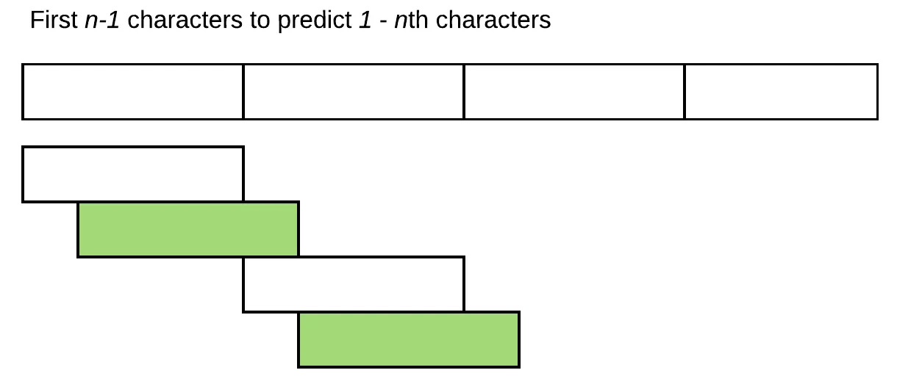
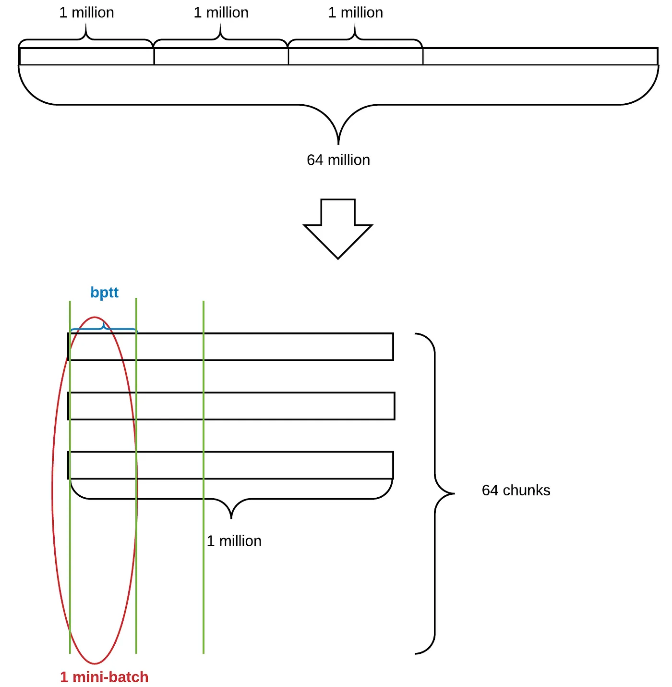
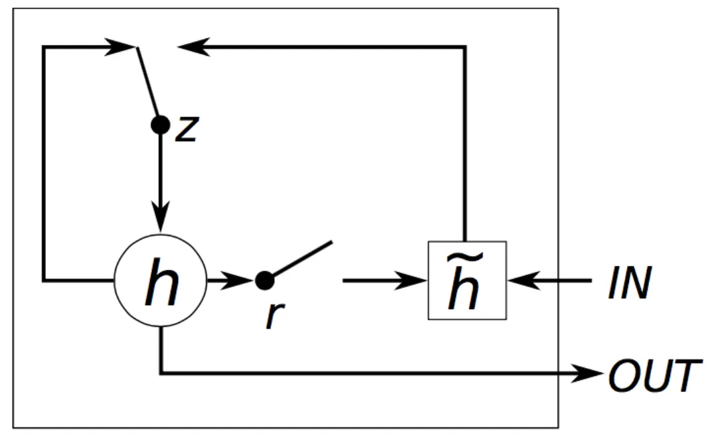
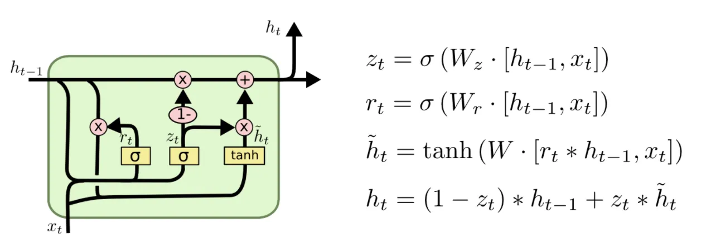
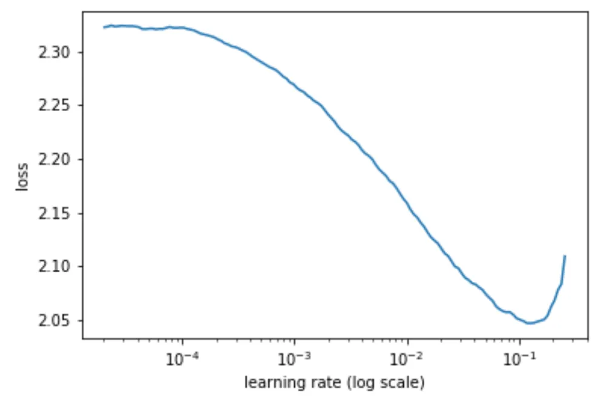
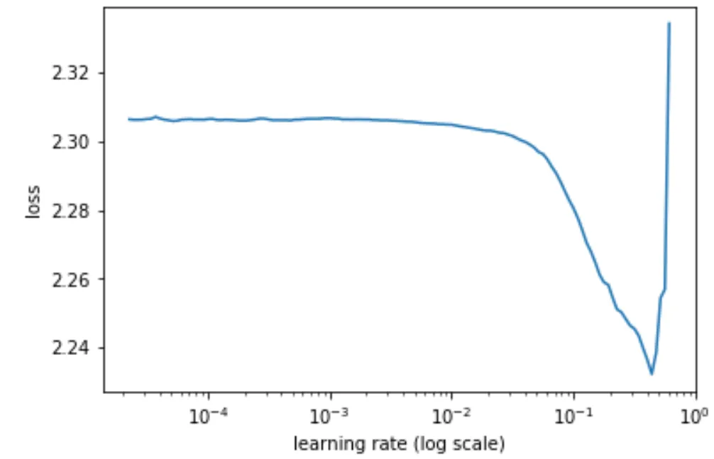
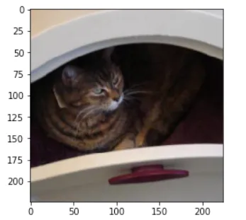

# 深度学习 2：第 1 部分第 7 课

> 原文：[`medium.com/@hiromi_suenaga/deep-learning-2-part-1-lesson-7-1b9503aff0c`](https://medium.com/@hiromi_suenaga/deep-learning-2-part-1-lesson-7-1b9503aff0c)
> 
> 译者：[飞龙](https://github.com/wizardforcel)
> 
> 协议：[CC BY-NC-SA 4.0](http://creativecommons.org/licenses/by-nc-sa/4.0/)

*我从* [*fast.ai 课程*](http://www.fast.ai/)* 中的个人笔记。随着我继续复习课程以“真正”理解它，这些笔记将继续更新和改进。非常感谢给我这个学习机会的* [*Jeremy*](https://twitter.com/jeremyphoward) *和* [*Rachel*](https://twitter.com/math_rachel)。

# [第 7 课](http://forums.fast.ai/t/wiki-lesson-7/9405)

第 1 部分的主题是：

+   使用深度学习进行分类和回归

+   识别和学习最佳和已建立的实践

+   重点是分类和回归，即预测“一件事”（例如一个数字，少量标签）

课程的第 2 部分：

+   重点是生成建模，这意味着预测“很多事情” — 例如，在神经翻译中创建句子，图像字幕或问题回答，同时创建图像，例如风格转移，超分辨率，分割等等。

+   不是那么多的最佳实践，而是从最近的可能尚未完全测试的论文中更多的推测。

## Char3Model 的回顾

提醒：RNN 在任何方面都不是不同或不寻常或神奇的 — 只是一个标准的全连接网络。


标准全连接网络

+   箭头代表一个或多个层操作 —— 一般来说是线性后跟一个非线性函数，本例中是矩阵乘法后跟 `relu` 或 `tanh`

+   相同颜色的箭头表示使用完全相同的权重矩阵。

+   与以前的一个细微差别是第二层和第三层有输入进来。我们尝试了两种方法 —— 将这些输入连接或添加到当前激活中。

```py
class Char3Model(nn.Module):
    def __init__(self, vocab_size, n_fac):
        super().__init__()
        self.e = nn.Embedding(vocab_size, n_fac)

        # The 'green arrow' from our diagram
        self.l_in = nn.Linear(n_fac, n_hidden)

        # The 'orange arrow' from our diagram
        self.l_hidden = nn.Linear(n_hidden, n_hidden)

        # The 'blue arrow' from our diagram
        self.l_out = nn.Linear(n_hidden, vocab_size)

    def forward(self, c1, c2, c3):
        in1 = F.relu(self.l_in(self.e(c1)))
        in2 = F.relu(self.l_in(self.e(c2)))
        in3 = F.relu(self.l_in(self.e(c3)))

        h = V(torch.zeros(in1.size()).cuda())
        h = F.tanh(self.l_hidden(h+in1))
        h = F.tanh(self.l_hidden(h+in2))
        h = F.tanh(self.l_hidden(h+in3))

        return F.log_softmax(self.l_out(h))
```

+   通过使用 `nn.Linear`，我们免费获得了权重矩阵和偏置向量。

+   为了解决第一个椭圆中没有橙色箭头的问题，我们发明了一个空矩阵

```py
class CharLoopModel(nn.Module):
    # This is an RNN!
    def __init__(self, vocab_size, n_fac):
        super().__init__()
        self.e = nn.Embedding(vocab_size, n_fac)
        self.l_in = nn.Linear(n_fac, n_hidden)
        self.l_hidden = nn.Linear(n_hidden, n_hidden)
        self.l_out = nn.Linear(n_hidden, vocab_size)

    def forward(self, *cs):
        bs = cs[0].size(0)
        h = V(torch.zeros(bs, n_hidden).cuda())
        for c in cs:
            inp = F.relu(self.l_in(self.e(c)))
            h = F.tanh(self.l_hidden(h+inp))

        return F.log_softmax(self.l_out(h), dim=-1)
```

+   几乎相同，除了 `for` 循环

```py
class CharRnn(nn.Module):
    def __init__(self, vocab_size, n_fac):
        super().__init__()
        self.e = nn.Embedding(vocab_size, n_fac)
        self.rnn = nn.RNN(n_fac, n_hidden)
        self.l_out = nn.Linear(n_hidden, vocab_size)

    def forward(self, *cs):
        bs = cs[0].size(0)
        h = V(torch.zeros(1, bs, n_hidden))
        inp = self.e(torch.stack(cs))
        outp,h = self.rnn(inp, h)

        return F.log_softmax(self.l_out(outp[-1]), dim=-1)
```

+   PyTorch 版本 — `nn.RNN` 将创建循环并跟踪 `h`。

    

+   我们使用白色部分来预测绿色字符 —— 这似乎是浪费的，因为下一部分与当前部分大部分重叠。

    

+   然后我们尝试在多输出模型中将其分割为不重叠的部分：

+   在这种方法中，我们在处理每个部分后丢弃了我们的 `h` 激活，并开始了一个新的激活。为了在下一部分中使用第一个字符来预测第二个字符，它除了默认激活外没有其他信息。让我们不要丢弃 `h`。

## 有状态的 RNN

```py
class CharSeqStatefulRnn(nn.Module):
    def __init__(self, vocab_size, n_fac, bs):
        self.vocab_size = vocab_size
        super().__init__()
        self.e = nn.Embedding(vocab_size, n_fac)
        self.rnn = nn.RNN(n_fac, n_hidden)
        self.l_out = nn.Linear(n_hidden, vocab_size)
        self.init_hidden(bs)

    def forward(self, cs):
        bs = cs[0].size(0)
        if self.h.size(1) != bs: self.init_hidden(bs)
        outp,h = self.rnn(self.e(cs), self.h)
        self.h = repackage_var(h)
        return F.log_softmax(self.l_out(outp), dim=-1).view(-1, self.vocab_size)

    def init_hidden(self, bs): 
        self.h = V(torch.zeros(1, bs, n_hidden))
```

+   构造函数中的一个额外行。`self.init_hidden(bs)` 将 `self.h` 设置为一堆零。

+   **问题 #1** — 如果我们简单地执行 `self.h = h`，并在一个包含一百万个字符的文档上进行训练，那么 RNN 的展开版本的大小将有一百万层（椭圆）。一百万层全连接网络将非常占用内存，因为为了进行链式规则，我们必须在每个批次中乘以一百万层，同时记住所有一百万个梯度。

+   为了避免这种情况，我们告诉它不时忘记它的历史。我们仍然可以记住状态（隐藏矩阵中的值）而不必记住如何到达那里的一切。

```py
def repackage_var(h):
    return (
        Variable(h.data) 
        if type(h) == Variable 
        else tuple(repackage_var(v) for v in h)
    )
```

+   从 `Variable` `h` 中取出张量（记住，张量本身没有任何历史概念），并从中创建一个新的 `Variable`。新变量具有相同的值，但没有操作历史，因此当它尝试反向传播时，它将在那里停止。

+   `forward`将处理 8 个字符，然后通过 8 个层进行反向传播，跟踪隐藏状态中的值，但会丢弃其操作历史。这被称为**时间反向传播（bptt）**。

+   换句话说，在`for`循环之后，只需丢弃操作历史并重新开始。因此，我们保留了我们的隐藏状态，但没有保留我们的隐藏状态历史。

+   不要通过太多层进行反向传播的另一个很好的理由是，如果您有任何梯度不稳定性（例如，梯度爆炸或梯度消失），您拥有的层数越多，网络训练就越困难（速度更慢，弹性更差）。

+   另一方面，更长的`bptt`意味着您能够明确捕获更长的记忆和更多状态。

+   **皱纹＃2**[16:00] - 如何创建小批量。我们不想一次处理一个部分，而是一次并行处理一堆。

+   当我们第一次开始研究 TorchText 时，我们谈到了它如何创建这些小批量。

+   Jeremy 说我们拿一整个由尼采的全部作品或所有 IMDB 评论连接在一起的长文档，将其分成 64 个相等大小的块（不是大小为 64 的块）。

    

+   对于一个长度为 6400 万字符的文档，每个“块”将是 100 万个字符。我们将它们堆叠在一起，现在按`bptt`拆分它们 - 1 个小批次由 64 个`bptt`矩阵组成。

+   第二块（第 100 万个字符）的第一个字符可能在一个句子的中间。但没关系，因为这只会在每一百万个字符中发生一次。

## 问题：这种数据集的数据增强？[20:34]

没有已知的好方法。最近有人通过进行数据增强赢得了一个 Kaggle 竞赛，随机插入不同行的部分 - 这样的方法可能在这里有用。但最近没有任何最先进的 NLP 论文在进行这种数据增强。

## 问题：我们如何选择 bptt 的大小？[21:36]

有几件事需要考虑：

+   第一点是小批量矩阵的大小为`bs`（块数）乘以`bptt`，因此您的 GPU RAM 必须能够容纳嵌入矩阵。因此，如果您遇到 CUDA 内存不足错误，您需要减少其中一个。

+   如果您的训练不稳定（例如，您的损失突然飙升到 NaN），那么您可以尝试减少您的`bptt`，因为您的层较少，梯度不会爆炸。

+   如果速度太慢[22:44]，尝试减少你的`bptt`，因为它会一次执行一个步骤。`for`循环不能并行化（对于当前版本）。最近有一种叫做 QRNN（准循环神经网络）的东西，它可以并行化，我们希望在第二部分中介绍。

+   所以选择满足所有这些条件的最高数字。

## 有状态的 RNN 和 TorchText[23:23]

在使用期望数据符合特定格式的现有 API 时，您可以将数据更改为符合该格式，也可以编写自己的数据集子类来处理您的数据已经存在的格式。两者都可以，但在这种情况下，我们将把我们的数据放在 TorchText 已经支持的格式中。Fast.ai 对 TorchText 的包装器已经有了一些东西，您可以在每个路径中有一个训练路径和验证路径，并且每个路径中有一个或多个文本文件，其中包含一堆文本，这些文本被连接在一起用于您的语言模型。

```py
from torchtext import vocab, data 
from fastai.nlp import * 
from fastai.lm_rnn import * 
PATH='data/nietzsche/' 
TRN_PATH = 'trn/' 
VAL_PATH = 'val/' 
TRN = f'{PATH}{TRN_PATH}' 
VAL = f'{PATH}{VAL_PATH}'
%ls {PATH}
'''
models/  nietzsche.txt  trn/  val/
'''
%ls {PATH}trn
'''
trn.txt
'''
```

+   复制了尼采文件，粘贴到训练和验证目录中。然后从训练集中删除最后 20%的行，并删除验证集中除最后 20%之外的所有内容[25:15]。

+   这样做的另一个好处是，似乎更现实地拥有一个验证集，它不是文本行的随机洗牌集，而是完全独立于语料库的一部分。

+   当您进行语言模型时，您实际上不需要单独的文件。您可以有多个文件，但它们最终会被连接在一起。

```py
TEXT = data.Field(lower=True, tokenize=list)
bs=64; bptt=8; n_fac=42; n_hidden=256

FILES = dict(train=TRN_PATH, validation=VAL_PATH, test=VAL_PATH)
md = LanguageModelData.from_text_files(PATH, TEXT, **FILES, bs=bs, bptt=bptt, min_freq=3)

len(md.trn_dl), md.nt, len(md.trn_ds), len(md.trn_ds[0].text)
'''
(963, 56, 1, 493747)
'''
```

+   在 TorchText 中，我们创建了一个叫做`Field`的东西，最初`Field`只是关于如何进行文本预处理的描述。

+   `lower` - 我们告诉它将文本转换为小写

+   `tokenize` - 上次，我们使用了一个在空格上分割的函数，给我们一个单词模型。这次，我们想要一个字符模型，所以使用`list`函数来对字符串进行标记化。记住，在 Python 中，`list('abc')`将返回`['a'，'b'，'c']`。

+   `bs`：批次大小，`bptt`：我们将其重命名为`cs`，`n_fac`：嵌入的大小，`n_hidden`：我们隐藏状态的大小

+   我们没有单独的测试集，所以我们将只使用验证集进行测试

+   TorchText 每次都会稍微随机化`bptt`的长度。它并不总是给我们确切的 8 个字符；有 5%的概率，它会将其减半并添加一个小的标准偏差，使其略大或略小于 8。我们不能对数据进行洗牌，因为它需要是连续的，所以这是引入一些随机性的一种方式。

+   问题：每个小批次的大小是否保持恒定？是的，我们需要用`h`权重矩阵进行矩阵乘法，因此小批次的大小必须保持恒定。但是序列长度可以改变，没有问题。

+   `len(md.trn_dl)`：数据加载器的长度（即有多少个小批次），`md.nt`：标记的数量（即词汇表中有多少个唯一的东西）

+   一旦运行`LanguageModelData.from_text_files`，`TEXT`将包含一个名为`vocab`的额外属性。`TEXT.vocab.itos`是词汇表中唯一项目的列表，`TEXT.vocab.stoi`是从每个项目到数字的反向映射。

```py
class CharSeqStatefulRnn(nn.Module):
    def __init__(self, vocab_size, n_fac, bs):
        self.vocab_size = vocab_size
        super().__init__()
        self.e = nn.Embedding(vocab_size, n_fac)
        self.rnn = nn.RNN(n_fac, n_hidden)
        self.l_out = nn.Linear(n_hidden, vocab_size)
        self.init_hidden(bs)

    def forward(self, cs):
        bs = cs[0].size(0)
        if self.h.size(1) != bs: 
            self.init_hidden(bs)
        outp,h = self.rnn(self.e(cs), self.h)
        self.h = repackage_var(h)
        return F.log_softmax(self.l_out(outp), dim=-1).view(-1, self.vocab_size)

    def init_hidden(self, bs): 
        self.h = V(torch.zeros(1, bs, n_hidden))
```

+   **问题 #3**：Jeremy 在说小批次大小保持恒定时对我们撒谎了。最后一个小批次很可能比其他小批次短，除非数据集恰好可以被`bptt`乘以`bs`整除。这就是为什么我们要检查`self.h`的第二维是否与输入的`bs`相同。如果不相同，将其设置回零，并使用输入的`bs`。这发生在周期结束和周期开始时（将其设置回完整的批次大小）。

+   **问题 #4**：最后一个问题是关于 PyTorch 的一个小问题，也许有人可以友好地尝试通过 PR 来修复它。损失函数不喜欢接收一个三维张量（即三维数组）。它们不应该不喜欢接收一个三维张量（按序列长度、批次大小和结果计算损失 - 因此您可以为两个初始轴的每个计算损失）。对于二维或四维张量可以工作，但对于三维张量不行。

+   `.view`将三维张量重塑为二维的`-1`（必要时尽可能大）乘以`vocab_size`。TorchText 自动将**目标**展平，因此我们不需要为实际值这样做（当我们在第 4 课看到一个小批次时，我们注意到它被展平了。Jeremy 说我们以后会了解原因，现在就是时候了）。

+   PyTorch（截至 0.3 版），`log_softmax`要求我们指定我们要对 softmax 进行的轴（即我们要将其求和为 1 的轴）。在这种情况下，我们希望在最后一个轴`dim = -1`上进行。

```py
m = CharSeqStatefulRnn(md.nt, n_fac, 512).cuda() 
opt = optim.Adam(m.parameters(), 1e-3)
fit(m, md, 4, opt, F.nll_loss)
```

## 让我们通过拆解 RNN 来获得更多见解

我们移除了`nn.RNN`的使用，并用`nn.RNNCell`替换。PyTorch 源代码如下。您应该能够阅读和理解（注意：它们不会连接输入和隐藏状态，而是将它们相加 - 这是我们的第一种方法）：

```py
def RNNCell(input, hidden, w_ih, w_hh, b_ih, b_hh):
    return F.tanh(F.linear(input, w_ih, b_ih) + F.linear(hidden, w_hh, b_hh))
```

关于`tanh`的问题[[44:06](https://youtu.be/H3g26EVADgY?t=44m6s)]：正如我们上周所看到的，`tanh`强制值在-1 和 1 之间。由于我们一遍又一遍地乘以这个权重矩阵，我们担心`relu`（因为它是无界的）可能会有更多的梯度爆炸问题。话虽如此，您可以指定`RNNCell`使用不同的`nonlineality`，其默认值为`tanh`，并要求其使用`relu`。

```py
class CharSeqStatefulRnn2(nn.Module):
    def __init__(self, vocab_size, n_fac, bs):
        super().__init__()
        self.vocab_size = vocab_size
        self.e = nn.Embedding(vocab_size, n_fac)
        self.rnn = nn.RNNCell(n_fac, n_hidden)
        self.l_out = nn.Linear(n_hidden, vocab_size)
        self.init_hidden(bs)

    def forward(self, cs):
        bs = cs[0].size(0)
        if self.h.size(1) != bs: 
            self.init_hidden(bs)
        outp = []
        o = self.h
        for c in cs: 
            o = self.rnn(self.e(c), o)
            outp.append(o)
        outp = self.l_out(torch.stack(outp))
        self.h = repackage_var(o)
        return F.log_softmax(outp, dim=-1).view(-1, self.vocab_size)

    def init_hidden(self, bs): 
        self.h = V(torch.zeros(1, bs, n_hidden))
```

+   `for`循环回来并将线性函数的结果附加到列表中 - 最终将它们堆叠在一起。

+   实际上，fast.ai 库确实正是为了使用 PyTorch 不支持的正则化方法而这样做的。

## 门控循环单元（GRU）[[46:44](https://youtu.be/H3g26EVADgY?t=46m44s)]

在实践中，没有人真正使用`RNNCell`，因为即使使用`tanh`，梯度爆炸仍然是一个问题，我们需要使用较低的学习率和较小的`bptt`来训练它们。因此，我们所做的是用类似`GRUCell`替换`RNNCell`。



[`www.wildml.com/2015/10/recurrent-neural-network-tutorial-part-4-implementing-a-grulstm-rnn-with-python-and-theano/`](http://www.wildml.com/2015/10/recurrent-neural-network-tutorial-part-4-implementing-a-grulstm-rnn-with-python-and-theano/)

+   通常，输入会乘以一个权重矩阵以创建新的激活`h`，并立即添加到现有的激活中。这里不是这样发生的。

+   输入进入`h˜`，它不仅仅被添加到先前的激活中，而是先前的激活被`r`（重置门）乘以，`r`的值为 0 或 1。

+   `r`的计算如下 - 一些权重矩阵的矩阵乘法和我们先前隐藏状态和新输入的连接。换句话说，这是一个小型的单隐藏层神经网络。它也通过 sigmoid 函数传递。这个小型神经网络学会了确定要记住隐藏状态的多少（也许在看到句号字符时全部忘记 - 新句子的开始）。

+   `z`门（更新门）确定要使用`h˜`（隐藏状态的新输入版本）的程度，以及要保持隐藏状态与之前相同的程度。




[`colah.github.io/posts/2015-08-Understanding-LSTMs/`](http://colah.github.io/posts/2015-08-Understanding-LSTMs/)

+   线性插值

```py
def GRUCell(input, hidden, w_ih, w_hh, b_ih, b_hh):
    gi = F.linear(input, w_ih, b_ih)
    gh = F.linear(hidden, w_hh, b_hh)
    i_r, i_i, i_n = gi.chunk(3, 1)
    h_r, h_i, h_n = gh.chunk(3, 1)

    resetgate = F.sigmoid(i_r + h_r)
    inputgate = F.sigmoid(i_i + h_i)
    newgate = F.tanh(i_n + resetgate * h_n)
    return newgate + inputgate * (hidden - newgate)
```

上面是`GRUCell`代码的样子，我们利用这个新模型如下：

```py
class CharSeqStatefulGRU(nn.Module):
    def __init__(self, vocab_size, n_fac, bs):
        super().__init__()
        self.vocab_size = vocab_size
        self.e = nn.Embedding(vocab_size, n_fac)
        self.rnn = nn.GRU(n_fac, n_hidden)
        self.l_out = nn.Linear(n_hidden, vocab_size)
        self.init_hidden(bs)

    def forward(self, cs):
        bs = cs[0].size(0)
        if self.h.size(1) != bs: 
            self.init_hidden(bs)
        outp,h = self.rnn(self.e(cs), self.h)
        self.h = repackage_var(h)
        return F.log_softmax(self.l_out(outp), dim=-1).view(-1, self.vocab_size)

    def init_hidden(self, bs): 
        self.h = V(torch.zeros(1, bs, n_hidden))
```

结果，我们可以将损失降低到 1.36（`RNNCell`为 1.54）。在实践中，GRU 和 LSTM 是人们使用的。

## 将所有内容放在一起：长短期记忆[[54:09](https://youtu.be/H3g26EVADgY?t=54m9s)]

LSTM 中还有一个称为“单元状态”的状态（不仅仅是隐藏状态），因此如果使用 LSTM，必须在`init_hidden`中返回一个矩阵元组（与隐藏状态完全相同的大小）：

```py
from fastai import sgdr

n_hidden=512
class CharSeqStatefulLSTM(nn.Module):
    def __init__(self, vocab_size, n_fac, bs, nl):
        super().__init__()
        self.vocab_size,self.nl = vocab_size,nl
        self.e = nn.Embedding(vocab_size, n_fac)
        self.rnn = nn.LSTM(n_fac, n_hidden, nl, dropout=0.5)
        self.l_out = nn.Linear(n_hidden, vocab_size)
        self.init_hidden(bs)

    def forward(self, cs):
        bs = cs[0].size(0)
        if self.h[0].size(1) != bs: 
            self.init_hidden(bs)
        outp,h = self.rnn(self.e(cs), self.h)
        self.h = repackage_var(h)
        return F.log_softmax(self.l_out(outp), dim=-1).view(-1, self.vocab_size)

    def init_hidden(self, bs):
        self.h = (V(torch.zeros(self.nl, bs, n_hidden)),
                  V(torch.zeros(self.nl, bs, n_hidden)))
```

代码与 GRU 相同。添加的一件事是`dropout`，它在每个时间步之后进行 dropout 并将隐藏层加倍 - 希望它能够学到更多并且在这样做时更具弹性。

## 回调（特别是 SGDR）没有 Learner 类[[55:23](https://youtu.be/H3g26EVADgY?t=55m23s)]

```py
m = CharSeqStatefulLSTM(md.nt, n_fac, 512, 2).cuda()
lo = LayerOptimizer(optim.Adam, m, 1e-2, 1e-5)
```

+   创建标准的 PyTorch 模型后，我们通常会做类似`opt = optim.Adam(m.parameters(), 1e-3)`的事情。相反，我们将使用 fast.ai 的`LayerOptimizer`，它接受一个优化器`optim.Adam`，我们的模型`m`，学习率`1e-2`，以及可选的权重衰减`1e-5`。

+   `LayerOptimizer`存在的一个关键原因是进行差分学习率和差分权重衰减。我们需要使用它的原因是 fast.ai 内部的所有机制都假定您有其中之一。如果要在不使用 Learner 类的代码中使用回调或 SGDR，您需要使用这个。

+   `lo.opt`返回优化器。

```py
on_end = lambda sched, cycle: 
save_model(m, f'{PATH}models/cyc_{cycle}')
cb = [CosAnneal(lo, len(md.trn_dl), cycle_mult=2, on_cycle_end=on_end)]
fit(m, md, 2**4-1, lo.opt, F.nll_loss, callbacks=cb)
```

+   当我们调用`fit`时，现在可以传递`LayerOptimizer`和`callbacks`。

+   在这里，我们使用余弦退火回调 —— 需要一个`LayerOptimizer`对象。它通过更改`lo`对象内的学习率来进行余弦退火。

+   概念：创建一个余弦退火回调，它将更新层优化器`lo`中的学习率。一个周期的长度等于`len(md.trn_dl)` —— 一个周期中有多少个小批次就是数据加载器的长度。由于它正在进行余弦退火，它需要知道多久重置一次。您可以以通常的方式传递`cycle_mult`。我们甚至可以自动保存我们的模型，就像我们在`Learner.fit`中使用`cycle_save_name`一样。

+   我们可以在训练、周期或批处理的开始时进行回调，也可以在训练、周期或批处理的结束时进行回调。

+   它已用于`CosAnneal`（SGDR），和解耦权重衰减（AdamW），随时间变化的损失图等。

## 测试[[59:55](https://youtu.be/H3g26EVADgY?t=59m55s)]

```py
def get_next(inp):
    idxs = TEXT.numericalize(inp)
    p = m(VV(idxs.transpose(0,1)))
    r = torch.multinomial(p[-1].exp(), 1)
    return TEXT.vocab.itos[to_np(r)[0]]
def get_next_n(inp, n):
    res = inp
    for i in range(n):
        c = get_next(inp)
        res += c
        inp = inp[1:]+c
    return resprint(get_next_n('for thos', 400))
'''
for those the skemps), or imaginates, though they deceives. it should so each ourselvess and new present, step absolutely for the science." the contradity and measuring,  the whole!* *293\. perhaps, that every life a values of blood of intercourse when it senses there is unscrupulus, his very rights, and still impulse, love? just after that thereby how made with the way anything, and set for harmless philos
'''
```

+   在第 6 课中，当我们测试`CharRnn`模型时，我们注意到它一遍又一遍地重复。在这个新版本中使用的`torch.multinomial`处理了这个问题。`p[-1]`用于获取最终输出（三角形），`exp`用于将对数概率转换为概率。然后我们使用`torch.multinomial`函数，根据给定的概率给出一个样本。如果概率是[0, 1, 0, 0]，并要求它给我们一个样本，它将始终返回第二个项目。如果是[0.5, 0, 0.5]，它将 50%的时间给出第一个项目，50%的时间给出第二个项目（[多项分布的评论](http://onlinestatbook.com/2/probability/multinomial.html)）

+   要尝试训练基于字符的语言模型，可以尝试在不同损失水平上运行`get_next_n`，以了解其外观。上面的示例是 1.25，但在 1.3 时，它看起来像一团垃圾。

+   当您在玩弄 NLP 时，特别是像这样的生成模型，并且结果还可以但不是很好时，请不要灰心，因为这意味着您实际上非常非常接近成功！

# [返回计算机视觉：CIFAR 10](https://github.com/fastai/fastai/blob/master/courses/dl1/lesson7-cifar10.ipynb) [[1:01:58](https://youtu.be/H3g26EVADgY?t=1h1m58s)]

CIFAR 10 是学术界中一个古老而著名的数据集 —— 在 ImageNet 之前，有 CIFAR 10。它在图像数量和大小方面都很小，这使得它既有趣又具有挑战性。您可能会处理成千上万张图像，而不是一百五十万张图像。此外，我们正在研究的许多内容，比如在医学成像中，我们正在查看一个肺结节的特定区域，您可能最多查看 32x32 像素。

它也运行得很快，因此最好测试一下您的算法。正如 Ali Rahini 在 NIPS 2017 中提到的，Jeremy 担心许多人在深度学习中没有进行精心调整和深思熟虑的实验，而是他们投入大量的 GPU 和 TPU 或大量的数据，然后认为一天就够了。在像 CIFAR 10 这样的数据集上测试您的算法的许多版本是很重要的，而不是像 ImageNet 那样需要几周的时间。尽管人们倾向于抱怨 MNIST，但它也适用于研究和实验。

CIFAR 10 数据以图像格式可在[此处](http://pjreddie.com/media/files/cifar.tgz)获取

```py
from fastai.conv_learner import *
PATH = "data/cifar10/"
os.makedirs(PATH,exist_ok=True)
classes = ('plane', 'car', 'bird', 'cat', 'deer', 'dog', 'frog', 'horse', 'ship', 'truck')
stats = (np.array([ 0.4914 ,  0.48216,  0.44653]), np.array([ 0.24703,  0.24349,  0.26159]))
def get_data(sz,bs):
     tfms = tfms_from_stats(stats, sz, aug_tfms=[RandomFlipXY()], pad=sz//8)
     return ImageClassifierData.from_paths(PATH, val_name='test', tfms=tfms, bs=bs)
bs=256
```

+   `classes` — 图像标签

+   `stats` — 当我们使用预训练模型时，可以调用`tfms_from_model`，它会创建必要的转换，将我们的数据集转换为基于原始模型中每个通道的均值和标准差的归一化数据集。由于我们正在从头开始训练模型，因此需要告诉它我们数据的均值和标准差以进行归一化。确保您可以计算每个通道的均值和标准差。

+   `tfms` — 对于 CIFAR 10 数据增强，人们通常会进行水平翻转和在边缘周围添加黑色填充，并在填充图像内随机选择 32x32 区域。

```py
data = get_data(32,bs)

lr=1e-2
```

来自我们的学生 Kerem Turgutlu 的[这个笔记本](https://github.com/KeremTurgutlu/deeplearning/blob/master/Exploring%20Optimizers.ipynb)：

```py
class SimpleNet(nn.Module):
    def __init__(self, layers):
        super().__init__()
        self.layers = nn.ModuleList([
            nn.Linear(layers[i], layers[i + 1]) 
            for i in range(len(layers) - 1)
        ])

    def forward(self, x):
        x = x.view(x.size(0), -1)
        for l in self.layers:
            l_x = l(x)
            x = F.relu(l_x)
        return F.log_softmax(l_x, dim=-1)
```

+   `nn.ModuleList` - 每当您在 PyTorch 中创建一组层时，您必须将其包装在 `ModuleList` 中以将这些注册为属性。

```py
learn = ConvLearner.from_model_data(SimpleNet([32*32*3, 40,10]), data)
```

+   现在我们提高一个 API 级别 - 而不是调用 `fit` 函数，我们从一个自定义模型创建一个 `learn` 对象。`ConfLearner.from_model_data` 接受标准的 PyTorch 模型和模型数据对象。

```py
learn, [o.numel() for o in learn.model.parameters()]
'''
(SimpleNet(
   (layers): ModuleList(
     (0): Linear(in_features=3072, out_features=40)
     (1): Linear(in_features=40, out_features=10)
   )
 ), [122880, 40, 400, 10])
 '''
 learn.summary()
 '''
 OrderedDict([('Linear-1',
              OrderedDict([('input_shape', [-1, 3072]),
                           ('output_shape', [-1, 40]),
                           ('trainable', True),
                           ('nb_params', 122920)])),
             ('Linear-2',
              OrderedDict([('input_shape', [-1, 40]),
                           ('output_shape', [-1, 10]),
                           ('trainable', True),
                           ('nb_params', 410)]))])
'''
learn.lr_find()
learn.sched.plot()
```



```py
%time learn.fit(lr, 2)
'''
A Jupyter Widget
[ 0\.       1.7658   1.64148  0.42129]                       
[ 1\.       1.68074  1.57897  0.44131]                       

CPU times: user 1min 11s, sys: 32.3 s, total: 1min 44s
Wall time: 55.1 s
'''
%time learn.fit(lr, 2, cycle_len=1)
'''
A Jupyter Widget
[ 0\.       1.60857  1.51711  0.46631]                       
[ 1\.       1.59361  1.50341  0.46924]                       

CPU times: user 1min 12s, sys: 31.8 s, total: 1min 44s
Wall time: 55.3 s
'''
```

通过一个具有 122,880 个参数的简单单隐藏层模型，我们实现了 46.9%的准确率。让我们改进这一点，并逐渐构建一个基本的 ResNet 架构。

## CNN [[01:12:30](https://youtu.be/H3g26EVADgY?t=1h12m30s)]

+   让我们用一个卷积模型替换一个全连接模型。全连接层只是做一个点积。这就是为什么权重矩阵很大（3072 个输入 * 40 = 122880）。我们没有有效地使用参数，因为输入中的每个像素都有不同的权重。我们想要做的是一组具有特定模式的 3x3 像素（即卷积）。

+   我们将使用一个 3x3 核的滤波器。当有多个滤波器时，输出将具有额外的维度。

```py
class ConvNet(nn.Module):
    def __init__(self, layers, c):
        super().__init__()
        self.layers = nn.ModuleList([
            nn.Conv2d(layers[i], layers[i + 1], kernel_size=3, stride=2)
            for i in range(len(layers) - 1)
        ])
        self.pool = nn.AdaptiveMaxPool2d(1)
        self.out = nn.Linear(layers[-1], c)

    def forward(self, x):
        for l in self.layers: x = F.relu(l(x))
        x = self.pool(x)
        x = x.view(x.size(0), -1)
        return F.log_softmax(self.out(x), dim=-1)
```

+   用 `nn.Conv2d` 替换 `nn.Linear`

+   前两个参数与 `nn.Linear` 完全相同 - 输入特征的数量和输出特征的数量

+   `kernel_size=3`，滤波器的大小

+   `stride=2` 将使用每隔一个 3x3 区域，这将使每个维度的输出分辨率减半（即具有与 2x2 最大池化相同的效果）

```py
learn = ConvLearner.from_model_data(ConvNet([3, 20, 40, 80], 10), data)
learn.summary()
'''
OrderedDict([('Conv2d-1',
              OrderedDict([('input_shape', [-1, 3, 32, 32]),
                           ('output_shape', [-1, 20, 15, 15]),
                           ('trainable', True),
                           ('nb_params', 560)])),
             ('Conv2d-2',
              OrderedDict([('input_shape', [-1, 20, 15, 15]),
                           ('output_shape', [-1, 40, 7, 7]),
                           ('trainable', True),
                           ('nb_params', 7240)])),
             ('Conv2d-3',
              OrderedDict([('input_shape', [-1, 40, 7, 7]),
                           ('output_shape', [-1, 80, 3, 3]),
                           ('trainable', True),
                           ('nb_params', 28880)])),
             ('AdaptiveMaxPool2d-4',
              OrderedDict([('input_shape', [-1, 80, 3, 3]),
                           ('output_shape', [-1, 80, 1, 1]),
                           ('nb_params', 0)])),
             ('Linear-5',
              OrderedDict([('input_shape', [-1, 80]),
                           ('output_shape', [-1, 10]),
                           ('trainable', True),
                           ('nb_params', 810)]))])
'''
```

+   `ConvNet([3, 20, 40, 80], 10)` - 从 3 个 RGB 通道开始，20、40、80 个特征，然后预测 10 个类别。

+   `AdaptiveMaxPool2d` - 这是一个线性层后面的内容，通过这种方式，你可以从 3x3 降到 10 个类别中的一个预测，并且现在已经成为最先进算法的标准。在最后一层，我们进行一种特殊类型的最大池化，您需要指定输出激活分辨率，而不是要池化的区域有多大。换句话说，在这里我们进行 3x3 最大池化，相当于 1x1 的*自适应*最大池化。

+   `x = x.view(x.size(0), -1)` - `x` 的形状是特征的数量乘以 1 乘以 1，因此它将删除最后两层。

+   这个模型被称为“完全卷积网络” - 每一层都是卷积的，除了最后一层。

```py
learn.lr_find(end_lr=100)
learn.sched.plot()
```



+   `lr_find` 尝试的默认最终学习率是 10。如果在那一点上损失仍在变好，您可以通过指定 `end_lr` 来覆盖。

```py
%time learn.fit(1e-1, 2)
'''
A Jupyter Widget

[ 0\.       1.72594  1.63399  0.41338]                       
[ 1\.       1.51599  1.49687  0.45723]                       

CPU times: user 1min 14s, sys: 32.3 s, total: 1min 46s
Wall time: 56.5 s
'''
%time learn.fit(1e-1, 4, cycle_len=1)
'''
A Jupyter Widget
[ 0\.       1.36734  1.28901  0.53418]                       
[ 1\.       1.28854  1.21991  0.56143]                       
[ 2\.       1.22854  1.15514  0.58398]                       
[ 3\.       1.17904  1.12523  0.59922]                       

CPU times: user 2min 21s, sys: 1min 3s, total: 3min 24s
Wall time: 1min 46s
'''
```

+   准确率在 60%左右稳定下来。考虑到它使用约 30,000 个参数（与 122k 参数的 47%相比）

+   每个时期的时间大约相同，因为它们的架构都很简单，大部分时间都花在内存传输上。

## 重构 [[01:21:57](https://youtu.be/H3g26EVADgY?t=1h21m57s)]

通过创建 `ConvLayer`（我们的第一个自定义层）简化 `forward` 函数。在 PyTorch 中，层定义和神经网络定义是相同的。每当您有一个层时，您可以将其用作神经网络，当您有一个神经网络时，您可以将其用作层。

```py
class ConvLayer(nn.Module):
    def __init__(self, ni, nf):
        super().__init__()
        self.conv = nn.Conv2d(ni, nf, kernel_size=3, stride=2, padding=1)

    def forward(self, x): 
        return F.relu(self.conv(x))
```

+   `padding=1` - 当进行卷积时，图像的每一侧都会缩小 1 个像素。因此，它不是从 32x32 到 16x16，而实际上是 15x15。`padding` 将添加一个边框，以便我们可以保留边缘像素信息。对于大图像来说，这不是一个大问题，但当缩小到 4x4 时，您真的不想丢弃整个部分。

```py
class ConvNet2(nn.Module):
    def __init__(self, layers, c):
        super().__init__()
        self.layers = nn.ModuleList([
            ConvLayer(layers[i], layers[i + 1])
            for i in range(len(layers) - 1)
        ])
        self.out = nn.Linear(layers[-1], c)

    def forward(self, x):
        for l in self.layers: x = l(x)
        x = F.adaptive_max_pool2d(x, 1)
        x = x.view(x.size(0), -1)
        return F.log_softmax(self.out(x), dim=-1)
```

+   与上一个模型的另一个不同之处是 `nn.AdaptiveMaxPool2d` 没有任何状态（即没有权重）。因此，我们可以将其作为一个函数 `F.adaptive_max_pool2d` 调用。

## BatchNorm [[1:25:10](https://youtu.be/H3g26EVADgY?t=1h25m10s)]

+   最后一个模型，当我们尝试添加更多层时，我们遇到了训练困难。我们遇到训练困难的原因是，如果使用更大的学习率，它会变成 NaN，如果使用更小的学习率，它将花费很长时间，无法正确探索 - 因此它不具有弹性。

+   为了使其具有弹性，我们将使用一种称为批量归一化的东西。 BatchNorm 大约两年前出现，自那时以来，它已经发生了很大变化，因为它突然使训练更深的网络变得非常容易。

+   我们可以简单地使用`nn.BatchNorm`，但为了了解它，我们将从头开始编写。

+   平均来看，权重矩阵不太可能导致激活不断变小或不断变大。保持它们在合理的范围内很重要。因此，我们从零均值标准差为 1 开始通过对输入进行归一化。我们真正想要做的是对所有层进行这样的操作，而不仅仅是对输入。

```py
class BnLayer(nn.Module):
    def __init__(self, ni, nf, stride=2, kernel_size=3):
        super().__init__()
        self.conv = nn.Conv2d(
            ni, nf, 
            kernel_size=kernel_size, 
            stride=stride, 
            bias=False, 
            padding=1
        )
        self.a = nn.Parameter(torch.zeros(nf,1,1))
        self.m = nn.Parameter(torch.ones(nf,1,1))

    def forward(self, x):
        x = F.relu(self.conv(x))
        x_chan = x.transpose(0,1).contiguous().view(x.size(1), -1)
        if self.training:
           self.means = x_chan.mean(1)[:,None,None]
           self.stds  = x_chan.std (1)[:,None,None]
        return (x-self.means) / self.stds *self.m + self.a
```

+   计算每个通道或每个滤波器的均值和每个通道或每个滤波器的标准差。然后减去均值并除以标准差。

+   我们不再需要归一化我们的输入，因为它是按通道归一化的，或者对于后续层，它是按滤波器归一化的。

+   事实证明这还不够，因为 SGD 是固执的。如果 SGD 决定要使矩阵整体变大/变小，那么做`(x=self.means) / self.stds`是不够的，因为 SGD 会撤消它，并尝试在下一个小批次中再次执行。因此，我们将添加两个参数：`a` - 加法器（初始值为零）和`m` - 乘法器（初始值为 1）用于每个通道。

+   `Parameter`告诉 PyTorch 可以将这些作为权重进行学习。

+   为什么这样做？如果要扩展该层，它不必扩展矩阵中的每个值。如果要将其全部上移或下移一点，它不必移动整个权重矩阵，它们只需移动这三个数字`self.m`。直觉：我们正在对数据进行归一化，然后我们说您可以使用远少于实际需要的参数来移动和缩放它，而不是移动和缩放整套卷积滤波器。在实践中，它允许我们增加学习速率，增加训练的弹性，并且允许我们添加更多层并仍然有效地进行训练。

+   批量归一化的另一件事是正则化，换句话说，您通常可以减少或删除辍学或权重衰减。原因是每个小批次将具有不同的均值和不同的标准差与上一个小批次不同。因此它们不断变化，以微妙的方式改变滤波器的含义，起到噪声（即正则化）的作用。

+   在真实版本中，它不使用这个批次的均值和标准差，而是采用指数加权移动平均标准差和均值。

+   `**if** self.training` - 这很重要，因为当您通过验证集时，您不希望更改模型的含义。有一些类型的层实际上对网络的模式敏感，无论它是处于训练模式还是评估/测试模式。当我们为 MovieLens 实现迷你网络时，存在一个错误，即在验证期间应用了辍学 - 这已经得到修复。在 PyTorch 中，有两种这样的层：辍学和批量归一化。`nn.Dropout`已经进行了检查。

+   在 fast.ai 中的关键区别是，这些均值和标准差在训练模式下会得到更新，而在其他库中，只要您说“我在训练”，无论该层是否可训练，这些均值和标准差就会立即得到更新。对于预训练网络来说，这是一个糟糕的主意。如果您有一个针对批量归一化中这些均值和标准差的特定值进行预训练的网络，如果更改它们，就会改变这些预训练层的含义。在 fast.ai 中，默认情况下，如果您的层被冻结，它将不会触及这些均值和标准差。一旦您解冻它，它将开始更新它们，除非您设置`learn.bn_freeze=True`。实际上，这在处理与预训练模型非常相似的数据时似乎经常效果更好。

+   您应该在哪里放置批量归一化层？我们稍后会详细讨论，但现在，在`relu`之后

## 消融研究

这是一个尝试打开和关闭模型不同部分以查看哪些部分产生哪些影响的过程，原始批量归一化论文中没有进行任何有效的消融。因此，缺失的一点是刚刚提出的这个问题——批量归一化放在哪里。这个疏忽导致了很多问题，因为原始论文实际上没有将其放在最佳位置。自那时以来，其他人已经弄清楚了这一点，当 Jeremy 向人们展示代码时，实际上放在更好位置的人们会说他的批量归一化放错了位置。

+   尽量在每一层上都使用批量归一化。

+   不要停止对数据进行归一化，这样使用您的数据的人就会知道您是如何对数据进行归一化的。其他库可能无法正确处理预训练模型的批量归一化，因此当人们开始重新训练时可能会出现问题。

```py
class ConvBnNet(nn.Module):
    def __init__(self, layers, c):
        super().__init__()
        self.conv1 = nn.Conv2d(3, 10, kernel_size=5, stride=1, padding=2)
        self.layers = nn.ModuleList([
            BnLayer(layers[i], layers[i + 1])
            for i in range(len(layers) - 1)
        ])
        self.out = nn.Linear(layers[-1], c)

    def forward(self, x):
        x = self.conv1(x)
        for l in self.layers: x = l(x)
        x = F.adaptive_max_pool2d(x, 1)
        x = x.view(x.size(0), -1)
        return F.log_softmax(self.out(x), dim=-1)
```

+   代码的其余部分类似——使用`BnLayer`而不是`ConvLayer`

+   在开始时添加了一个单个卷积层，试图接近现代方法。它具有更大的内核大小和步幅为 1。基本思想是我们希望第一层具有更丰富的输入。它使用 5x5 区域进行卷积，这使它可以尝试在该 5x5 区域中找到更有趣更丰富的特征，然后输出更大的输出（在这种情况下，是 10x5x5 个滤波器）。通常是 5x5 或 7x7，甚至是 11x11 卷积，输出相当多的滤波器（例如 32 个滤波器）。

+   由于`padding = kernel_size — 1 / 2`和`stride=1`，输入大小与输出大小相同——只是有更多的滤波器。

+   这是尝试创建更丰富的起点的好方法。

## 深度批量归一化

让我们增加模型的深度。我们不能只添加更多的步幅为 2 的层，因为每次都会将图像的大小减半。相反，在每个步幅为 2 的层之后，我们插入一个步幅为 1 的层。

```py
class ConvBnNet2(nn.Module):
    def __init__(self, layers, c):
        super().__init__()
        self.conv1 = nn.Conv2d(3, 10, kernel_size=5, stride=1, padding=2)
        self.layers = nn.ModuleList([
            BnLayer(layers[i], layers[i+1])
            for i in range(len(layers) - 1)
        ])
        self.layers2 = nn.ModuleList([
            BnLayer(layers[i+1], layers[i + 1], 1)
            for i in range(len(layers) - 1)
        ])
        self.out = nn.Linear(layers[-1], c)

    def forward(self, x):
        x = self.conv1(x)
        for l,l2 in zip(self.layers, self.layers2):
            x = l(x)
            x = l2(x)
        x = F.adaptive_max_pool2d(x, 1)
        x = x.view(x.size(0), -1)
        return F.log_softmax(self.out(x), dim=-1)

learn = ConvLearner.from_model_data((ConvBnNet2([10, 20, 40, 80, 160], 10), data)
%time learn.fit(1e-2, 2)

'''
A Jupyter Widget
[ 0\.       1.53499  1.43782  0.47588]                       
[ 1\.       1.28867  1.22616  0.55537]                       

CPU times: user 1min 22s, sys: 34.5 s, total: 1min 56s
Wall time: 58.2 s
'''
%time learn.fit(1e-2, 2, cycle_len=1)
'''
A Jupyter Widget
[ 0\.       1.10933  1.06439  0.61582]                       
[ 1\.       1.04663  0.98608  0.64609]                       

CPU times: user 1min 21s, sys: 32.9 s, total: 1min 54s
Wall time: 57.6 s
'''
```

准确率与之前相同。现在深度为 12 层，即使对于批量归一化来说也太深了。可以训练 12 层深的卷积网络，但开始变得困难。而且似乎并没有太多帮助。

## ResNet

```py
class ResnetLayer(BnLayer):
    def forward(self, x): 
        return x + super().forward(x)
class Resnet(nn.Module):
    def __init__(self, layers, c):
        super().__init__()
        self.conv1 = nn.Conv2d(3, 10, kernel_size=5, stride=1, padding=2)
        self.layers = nn.ModuleList([
            BnLayer(layers[i], layers[i+1])
            for i in range(len(layers) - 1)
        ])
        self.layers2 = nn.ModuleList([
            ResnetLayer(layers[i+1], layers[i + 1], 1)
            for i in range(len(layers) - 1)
        ])
        self.layers3 = nn.ModuleList([
            ResnetLayer(layers[i+1], layers[i + 1], 1)
            for i in range(len(layers) - 1)
        ])
        self.out = nn.Linear(layers[-1], c)

    def forward(self, x):
        x = self.conv1(x)
        for l,l2,l3 in zip(self.layers, self.layers2, self.layers3):
            x = l3(l2(l(x)))
        x = F.adaptive_max_pool2d(x, 1)
        x = x.view(x.size(0), -1)
        return F.log_softmax(self.out(x), dim=-1)
```

+   `ResnetLayer`继承自`BnLayer`并覆盖`forward`。

+   然后添加一堆层，使其深度增加 3 倍，仍然可以很好地训练，只是因为`x + super().forward(x)`。

```py
learn = ConvLearner.from_model_data(Resnet([10, 20, 40, 80, 160], 10), data)wd=1e-5%time learn.fit(1e-2, 2, wds=wd)
'''
A Jupyter Widget
[ 0\.       1.58191  1.40258  0.49131]                       
[ 1\.       1.33134  1.21739  0.55625]                       

CPU times: user 1min 27s, sys: 34.3 s, total: 2min 1s
Wall time: 1min 3s
'''
%time learn.fit(1e-2, 3, cycle_len=1, cycle_mult=2, wds=wd)
'''
A Jupyter Widget
[ 0\.       1.11534  1.05117  0.62549]                       
[ 1\.       1.06272  0.97874  0.65185]                       
[ 2\.       0.92913  0.90472  0.68154]                        
[ 3\.       0.97932  0.94404  0.67227]                        
[ 4\.       0.88057  0.84372  0.70654]                        
[ 5\.       0.77817  0.77815  0.73018]                        
[ 6\.       0.73235  0.76302  0.73633]                        

CPU times: user 5min 2s, sys: 1min 59s, total: 7min 1s
Wall time: 3min 39s
'''
%time learn.fit(1e-2, 8, cycle_len=4, wds=wd)
'''
A Jupyter Widget
[ 0\.       0.8307   0.83635  0.7126 ]                        
[ 1\.       0.74295  0.73682  0.74189]                        
[ 2\.       0.66492  0.69554  0.75996]                        
[ 3\.       0.62392  0.67166  0.7625 ]                        
[ 4\.       0.73479  0.80425  0.72861]                        
[ 5\.       0.65423  0.68876  0.76318]                        
[ 6\.       0.58608  0.64105  0.77783]                        
[ 7\.       0.55738  0.62641  0.78721]                        
[ 8\.       0.66163  0.74154  0.7501 ]                        
[ 9\.       0.59444  0.64253  0.78106]                        
[ 10\.        0.53      0.61772   0.79385]                    
[ 11\.        0.49747   0.65968   0.77832]                    
[ 12\.        0.59463   0.67915   0.77422]                    
[ 13\.        0.55023   0.65815   0.78106]                    
[ 14\.        0.48959   0.59035   0.80273]                    
[ 15\.        0.4459    0.61823   0.79336]                    
[ 16\.        0.55848   0.64115   0.78018]                    
[ 17\.        0.50268   0.61795   0.79541]                    
[ 18\.        0.45084   0.57577   0.80654]                    
[ 19\.        0.40726   0.5708    0.80947]                    
[ 20\.        0.51177   0.66771   0.78232]                    
[ 21\.        0.46516   0.6116    0.79932]                    
[ 22\.        0.40966   0.56865   0.81172]                    
[ 23\.        0.3852    0.58161   0.80967]                    
[ 24\.        0.48268   0.59944   0.79551]                    
[ 25\.        0.43282   0.56429   0.81182]                    
[ 26\.        0.37634   0.54724   0.81797]                    
[ 27\.        0.34953   0.54169   0.82129]                    
[ 28\.        0.46053   0.58128   0.80342]                    
[ 29\.        0.4041    0.55185   0.82295]                    
[ 30\.        0.3599    0.53953   0.82861]                    
[ 31\.        0.32937   0.55605   0.82227]                    

CPU times: user 22min 52s, sys: 8min 58s, total: 31min 51s
Wall time: 16min 38s
'''
```

ResNet 块

`return x + super().forward(x)`

*y = x + f(x)*

其中*x*是来自上一层的预测，*y*是来自当前层的预测。重新排列公式，我们得到：公式重新排列

*f(x) = y − x*

差异*y − x*是**残差**。残差是迄今为止我们计算的错误。这意味着尝试找到一组卷积权重，试图填补我们偏离的量。换句话说，我们有一个输入，我们有一个函数试图预测错误（即我们偏离的量）。然后我们将输入的错误预测量相加，然后再添加另一个错误预测量，然后重复这个过程，逐层放大到正确答案。这基于一种称为**boosting**的理论。

+   完整的 ResNet 在将其添加回原始输入之前进行了两次卷积（我们这里只做了一次）。

+   在每个块`x = l3(l2(l(x)))`中，其中一层不是`ResnetLayer`而是一个带有`stride=2`的标准卷积——这被称为“瓶颈层”。ResNet 不是卷积层，而是我们将在第 2 部分中介绍的不同形式的瓶颈块。


## ResNet 2 [[01:59:33](https://youtu.be/H3g26EVADgY?t=1h59m33s)]

在这里，我们增加了特征的大小并添加了 dropout。

```py
class Resnet2(nn.Module):
    def __init__(self, layers, c, p=0.5):
        super().__init__()
        self.conv1 = BnLayer(3, 16, stride=1, kernel_size=7)
        self.layers = nn.ModuleList([
            BnLayer(layers[i], layers[i+1])
            for i in range(len(layers) - 1)
        ])
        self.layers2 = nn.ModuleList([
            ResnetLayer(layers[i+1], layers[i + 1], 1)
            for i in range(len(layers) - 1)
        ])
        self.layers3 = nn.ModuleList([
            ResnetLayer(layers[i+1], layers[i + 1], 1)
            for i in range(len(layers) - 1)
        ])
        self.out = nn.Linear(layers[-1], c)
        self.drop = nn.Dropout(p)

    def forward(self, x):
        x = self.conv1(x)
        for l,l2,l3 in zip(self.layers, self.layers2, self.layers3):
            x = l3(l2(l(x)))
        x = F.adaptive_max_pool2d(x, 1)
        x = x.view(x.size(0), -1)
        x = self.drop(x)
        return F.log_softmax(self.out(x), dim=-1)
        
learn = ConvLearner.from_model_data(Resnet2([**16, 32, 64, 128, 256**], 10, 0.2), data)
wd=1e-6
%time learn.fit(1e-2, 2, wds=wd)
%time learn.fit(1e-2, 3, cycle_len=1, cycle_mult=2, wds=wd)
%time learn.fit(1e-2, 8, cycle_len=4, wds=wd)
log_preds,y = learn.TTA()
preds = np.mean(np.exp(log_preds),0)
metrics.log_loss(y,preds), accuracy(preds,y)
'''
(0.44507397166057938, 0.84909999999999997)
'''
```

85%是 2012 年或 2013 年 CIFAR 10 的最新技术。如今，它已经达到了 97%，因此还有改进的空间，但所有都基于这些技术：

+   更好的数据增强方法

+   更好的正则化方法

+   对 ResNet 进行一些调整

问题[[02:01:07](https://youtu.be/H3g26EVADgY?t=2h1m7s)]:我们可以将“训练残差”方法应用于非图像问题吗？是的！但是它已经被其他地方忽略了。在 NLP 中，“transformer 架构”最近出现，并被证明是翻译的最新技术，并且其中有一个简单的 ResNet 结构。这种一般方法称为“跳过连接”（即跳过一层的想法），在计算机视觉中经常出现，但似乎没有其他人多使用，尽管它与计算机视觉无关。好机会！

# [狗与猫](https://github.com/fastai/fastai/blob/master/courses/dl1/lesson7-CAM.ipynb) [[02:02:03](https://youtu.be/H3g26EVADgY?t=2h2m3s)]

回到狗和猫。我们将创建 resnet34（如果您对尾随数字的含义感兴趣，请参阅[这里](https://github.com/pytorch/vision/blob/master/torchvision/models/resnet.py)——只是不同的参数）。

```py
PATH = "data/dogscats/"
sz = 224
arch = resnet34  # <-- Name of the function 
bs = 64
m = arch(pretrained=True) # Get a model w/ pre-trained weight loaded
m
'''
ResNet(
  (conv1): Conv2d (3, 64, kernel_size=(7, 7), stride=(2, 2), padding=(3, 3), bias=False)
  (bn1): BatchNorm2d(64, eps=1e-05, momentum=0.1, affine=True)
  (relu): ReLU(inplace)
  (maxpool): MaxPool2d(kernel_size=(3, 3), stride=(2, 2), padding=(1, 1), dilation=(1, 1))
  (**layer1**): Sequential(
    (0): BasicBlock(
      (conv1): Conv2d (64, 64, kernel_size=(3, 3), stride=(1, 1), padding=(1, 1), bias=False)
      (bn1): BatchNorm2d(64, eps=1e-05, momentum=0.1, affine=True)
      (relu): ReLU(inplace)
      (conv2): Conv2d (64, 64, kernel_size=(3, 3), stride=(1, 1), padding=(1, 1), bias=False)
      (bn2): BatchNorm2d(64, eps=1e-05, momentum=0.1, affine=True)
    )
    (1): BasicBlock(
      (conv1): Conv2d (64, 64, kernel_size=(3, 3), stride=(1, 1), padding=(1, 1), bias=False)
      (bn1): BatchNorm2d(64, eps=1e-05, momentum=0.1, affine=True)
      (relu): ReLU(inplace)
      (conv2): Conv2d (64, 64, kernel_size=(3, 3), stride=(1, 1), padding=(1, 1), bias=False)
      (bn2): BatchNorm2d(64, eps=1e-05, momentum=0.1, affine=True)
    )
    (2): BasicBlock(
      (conv1): Conv2d (64, 64, kernel_size=(3, 3), stride=(1, 1), padding=(1, 1), bias=False)
      (bn1): BatchNorm2d(64, eps=1e-05, momentum=0.1, affine=True)
      (relu): ReLU(inplace)
      (conv2): Conv2d (64, 64, kernel_size=(3, 3), stride=(1, 1), padding=(1, 1), bias=False)
      (bn2): BatchNorm2d(64, eps=1e-05, momentum=0.1, affine=True)
    )
  )
  (layer2): Sequential(
    (0): BasicBlock(
      (conv1): Conv2d (64, 128, kernel_size=(3, 3), stride=(2, 2), padding=(1, 1), bias=False)
      (bn1): BatchNorm2d(128, eps=1e-05, momentum=0.1, affine=True)
      (relu): ReLU(inplace)
      (conv2): Conv2d (128, 128, kernel_size=(3, 3), stride=(1, 1), padding=(1, 1), bias=False)
      (bn2): BatchNorm2d(128, eps=1e-05, momentum=0.1, affine=True)
      (downsample): Sequential(
        (0): Conv2d (64, 128, kernel_size=(1, 1), stride=(2, 2), bias=False)
        (1): BatchNorm2d(128, eps=1e-05, momentum=0.1, affine=True)
      )
    )
    (1): BasicBlock(
      (conv1): Conv2d (128, 128, kernel_size=(3, 3), stride=(1, 1), padding=(1, 1), bias=False)
      (bn1): BatchNorm2d(128, eps=1e-05, momentum=0.1, affine=True)
      (relu): ReLU(inplace)
      (conv2): Conv2d (128, 128, kernel_size=(3, 3), stride=(1, 1), padding=(1, 1), bias=False)
      (bn2): BatchNorm2d(128, eps=1e-05, momentum=0.1, affine=True)
    )
    (2): BasicBlock(
      (conv1): Conv2d (128, 128, kernel_size=(3, 3), stride=(1, 1), padding=(1, 1), bias=False)
      (bn1): BatchNorm2d(128, eps=1e-05, momentum=0.1, affine=True)
      (relu): ReLU(inplace)
      (conv2): Conv2d (128, 128, kernel_size=(3, 3), stride=(1, 1), padding=(1, 1), bias=False)
      (bn2): BatchNorm2d(128, eps=1e-05, momentum=0.1, affine=True)
    )
    (3): BasicBlock(
      (conv1): Conv2d (128, 128, kernel_size=(3, 3), stride=(1, 1), padding=(1, 1), bias=False)
      (bn1): BatchNorm2d(128, eps=1e-05, momentum=0.1, affine=True)
      (relu): ReLU(inplace)
      (conv2): Conv2d (128, 128, kernel_size=(3, 3), stride=(1, 1), padding=(1, 1), bias=False)
      (bn2): BatchNorm2d(128, eps=1e-05, momentum=0.1, affine=True)
    )
  )
  ...
  (avgpool): AvgPool2d(kernel_size=7, stride=7, padding=0, ceil_mode=False, count_include_pad=True)
  (fc): Linear(in_features=512, out_features=1000)
)
'''
```

我们的 ResNet 模型具有 Relu → BatchNorm。TorchVision 使用 BatchNorm → Relu。有三个不同版本的 ResNet 在流传，最好的是 PreAct ([`arxiv.org/pdf/1603.05027.pdf`](https://arxiv.org/pdf/1603.05027.pdf))。

+   目前，最后一层有数千个特征，因为 ImageNet 有 1000 个特征，所以我们需要摆脱它。

+   当您使用 fast.ai 的`ConvLearner`时，它会为您删除最后两层。fast.ai 用自适应平均池化和自适应最大池化替换`AvgPool2d`，并将两者连接在一起。

+   对于这个练习，我们将做一个简单版本。

```py
m = nn.Sequential(*children(m)[:-2], 
    nn.Conv2d(512, 2, 3, padding=1), 
    nn.AdaptiveAvgPool2d(1), 
    Flatten(), 
    nn.LogSoftmax()
)
```

+   删除最后两层

+   添加一个只有 2 个输出的卷积。

+   进行平均池化然后进行 softmax

+   最后没有线性层。这是产生两个数字的不同方式——这使我们能够进行 CAM！

```py
tfms = tfms_from_model(arch, sz, aug_tfms=transforms_side_on, max_zoom=1.1)
data = ImageClassifierData.from_paths(PATH, tfms=tfms, bs=bs)
learn = ConvLearner.from_model_data(m, data)
learn.freeze_to(-4)
learn.fit(0.01, 1)
learn.fit(0.01, 1, cycle_len=1)
```

+   `ConvLearner.from_model`是我们之前学到的——允许我们使用自定义模型创建 Learner 对象。

+   然后冻结除了我们刚刚添加的层之外的所有层。

## 类激活图（CAM）[[02:08:55](https://youtu.be/H3g26EVADgY?t=2h8m55s)]

我们选择一个特定的图像，并使用一种称为 CAM 的技术，询问模型哪些部分的图像被证明是重要的。




它是如何做到的？让我们逆向工作。它是通过生成这个矩阵来做到的：


大数字对应于猫。那么这个矩阵是什么？这个矩阵简单地等于特征矩阵`feat`乘以`py`向量的值：

```py
f2=np.dot(np.rollaxis(feat,0,3), py)
f2-=f2.min()
f2/=f2.max()
f2
```

`py` 向量是预测，表示“我对这是一只猫有 100%的信心”。`feat` 是最终卷积层（我们添加的`Conv2d`层）输出的值（2×7×7）。如果我们将`feat`乘以`py`，我们会得到所有第一个通道的值，而第二个通道的值为零。因此，它将返回与猫对应的部分的最后一个卷积层的值。换句话说，如果我们将`feat`乘以`[0, 1]`，它将与狗对应。

```py
sf = SaveFeatures(m[-4])
py = m(Variable(x.cuda()))
sf.remove()

py = np.exp(to_np(py)[0]); py
'''
array([ 1.,  0.], dtype=float32)
'''
feat = np.maximum(0, sf.features[0])
feat.shape
```

换句话说，在模型中，卷积层之后唯一发生的事情是平均池化层。平均池化层将 7×7 的网格平均化，计算出每个部分有多少“像猫”。然后，我们将“猫样”矩阵调整大小为与原始猫图像相同的大小，并叠加在顶部，然后你就得到了热图。

您可以在家中使用这种技术的方法是：

1.  当您有一幅大图像时，您可以在一个快速小的卷积网络上计算这个矩阵。

1.  放大具有最高值的区域

1.  仅在该部分重新运行

由于时间不够，我们很快跳过了这部分，但我们将在第 2 部分中学习更多关于这种方法的内容。

“Hook”是让我们要求模型返回矩阵的机制。`register_forward_hook`要求 PyTorch 每次计算一个层时运行给定的函数 - 类似于每次计算一个层时发生的回调。在以下情况下，它保存了我们感兴趣的特定层的值：

```py
class SaveFeatures():
    features=None
    def __init__(self, m): 
        self.hook = m.register_forward_hook(self.hook_fn)
    def hook_fn(self, module, input, output): 
        self.features = to_np(output)
    def remove(self): 
        self.hook.remove()
```

## Jeremy 的问题[[02:14:27](https://youtu.be/H3g26EVADgY?t=2h14m27s)]：“您对深度学习的探索”和“如何跟上从业者的重要研究”

“如果您打算参加第 2 部分，您应该掌握我们在第 1 部分学到的所有技术”。以下是您可以做的一些事情：

1.  至少观看每个视频 3 次。

1.  确保您可以重新创建笔记本而无需观看视频 - 可能使用不同的数据集来使其更有趣。

1.  密切关注论坛上的最新论文和最新进展。

1.  坚持不懈，继续努力！
