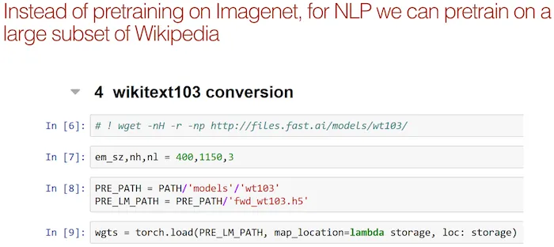
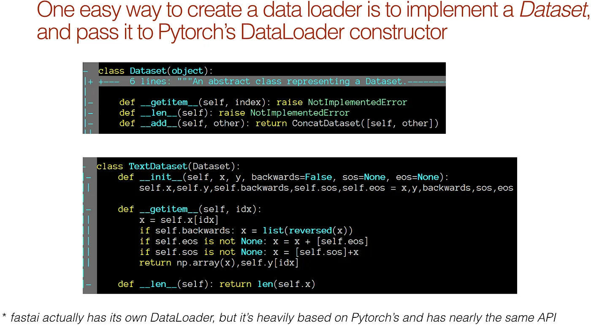

# 深度学习 2：第 2 部分第 10 课

> 原文：[`medium.com/@hiromi_suenaga/deep-learning-2-part-2-lesson-10-422d87c3340c`](https://medium.com/@hiromi_suenaga/deep-learning-2-part-2-lesson-10-422d87c3340c)
> 
> 译者：[飞龙](https://github.com/wizardforcel)
> 
> 协议：[CC BY-NC-SA 4.0](http://creativecommons.org/licenses/by-nc-sa/4.0/)

> 来自 [*fast.ai 课程*](http://www.fast.ai/)的个人笔记。随着我继续复习课程以“真正”理解它，这些笔记将继续更新和改进。非常感谢 [*Jeremy*](https://twitter.com/jeremyphoward) 和[*Rachel*](https://twitter.com/math_rachel) 给了我这个学习的机会。

## [视频](https://youtu.be/h5Tz7gZT9Fo) / [论坛](http://forums.fast.ai/t/part-2-lesson-10-wiki/14364/1)


## 上周回顾[[0:16](https://youtu.be/h5Tz7gZT9FoY?t=16s)]

+   许多学生在上周的内容上遇到了困难，所以如果你觉得困难，没关系。Jeremy 之所以提前放上这些内容，是为了让我们有东西可以思考、考虑，并逐渐努力，所以到第 14 课时，你将有第二次机会。

+   要理解这些部分，您需要了解卷积层输出的形状、感受野和损失函数——这些都是您在深度学习研究中需要理解的东西。

+   一个关键的事情是，我们从简单的开始——一个单一对象分类器，一个没有分类器的单一对象边界框，然后是一个单一对象分类器和边界框。我们转向多个对象的部分实际上几乎与此相同，只是我们首先必须解决匹配问题。我们最终创建了比我们需要的地面真实边界框更多的激活，因此我们将每个地面真实对象与这些激活的子集进行匹配。一旦我们做到了这一点，我们对每个匹配对执行的损失函数几乎与这个损失函数相同（即单一对象分类器和边界框的损失函数）。

+   如果您感到困惑，请回到第 8 课，并确保您理解数据集、数据加载器，尤其是损失函数。

+   因此，一旦我们有了可以预测一个对象的类别和边界框的东西，我们通过创建更多的激活来转向多个对象[[2:40](https://youtu.be/h5Tz7gZT9Fo?t=2m40s)]。然后我们必须处理匹配问题，处理完匹配问题后，我们将每个锚框稍微移动一下，围绕一下，使其尽量与特定的地面真实对象对齐。

+   我们讨论了如何利用网络的卷积特性，尝试使激活具有类似于我们正在预测的地面真实对象的感受野。Chloe 提供了以下出色的图片，逐行讨论了 SSD_MultiHead.forward 的功能：


由[Chloe Sultan](http://forums.fast.ai/u/chloews)提供

Chloe 在这里所做的是特别关注每个路径中张量的维度，逐渐使用步幅 2 的卷积进行下采样，确保她理解为什么会出现这些网格大小，然后理解输出是如何从中产生的。


+   这就是你必须记住这个`pbd.set_trace()`的地方。我在课前刚进入`SSD_MultiHead.forward`，输入了`pdb.set_trace()`，然后运行了一个批次。然后我可以打印出所有这些的大小。我们会犯错误，这就是为什么我们有调试器并知道如何检查事物并逐步进行小的操作的原因。

+   我们接着讨论了增加每个卷积网格单元的锚框数量*k*[[5:49](https://youtu.be/h5Tz7gZT9Fo?t=5m49s)]，我们可以通过不同的缩放比例、长宽比来实现，这给我们带来了大量的激活，从而预测边界框。

+   然后我们使用非极大值抑制将数量减少到一个较小的值。

+   非极大值抑制有点糟糕、丑陋、完全启发式，我们甚至没有讨论代码，因为它看起来很丑陋。最近有人提出了一篇论文，试图使用端到端的卷积网络来替换 NMS 部分（[`arxiv.org/abs/1705.02950`](https://arxiv.org/abs/1705.02950)）。

    

+   不够多的人在阅读论文！我们现在在课堂上所做的是实现论文，论文是真正的真相。我认为你从与人们交谈中知道，很多人不阅读论文的原因是因为很多人认为他们没有能力阅读论文。他们认为他们不是那种阅读论文的人，但你是。你在这里。我们上周开始看一篇论文，我们读到了用英语写的文字，我们大部分都理解了。如果你仔细看上面的图片，你会意识到`SSD_MultiHead.forward`并不是在做同样的事情。你可能会想知道这样是否更好。我的答案可能是。因为 SSD_MultiHead.forward 是我尝试的第一件事，只是为了让一些东西出现。在这个和 YOLO3 论文之间，可能有更好的方法。

+   特别要注意的一点是，他们使用了更小的 k，但他们有更多的网格集合 1x1、3x3、5x5、10x10、19x19、38x38——每类 8732 个。比我们拥有的要多得多，所以这将是一个有趣的实验。

+   我注意到的另一件事是，我们有 4x4、2x2、1x1，这意味着有很多重叠——每组都适合其他组。在这种情况下，你有 1、3、5，你没有那种重叠。所以这可能会使学习变得更容易。有很多有趣的东西可以玩。

    

+   我最推荐的可能是将代码和方程式放在一起。你可能是数学人或者代码人。将它们并排放置，你将学到一些另一方面的知识。

+   学习数学很难，因为符号可能看起来很难查找，但有一些好的资源，比如[wikipedia](https://en.wikipedia.org/wiki/List_of_mathematical_symbols)。

+   另一件你应该尝试做的事情是重新创建你在论文中看到的东西。这里是来自焦点损失论文的最重要的图 1。

    

    

+   我上周发现了我的代码中一个小错误——我展平卷积激活的方式与我在损失函数中使用它们的方式不一致，修复这个问题使它变得更好了。

    

通常，当我们降采样时，我们会增加滤波器的数量，或者深度。当我们从 7x7 采样到 4x4 等时，为什么要将数量从 512 减少到 256 呢？为什么不在 SSD 头部减少维度？（与性能相关？）我们有许多输出路径，我们希望每个输出路径都是相同的，所以我们不希望每个输出路径具有不同数量的滤波器，这也是论文中所做的，所以我试图与之匹配。拥有这 256 个——这是一个不同的概念，因为我们不仅利用了最后一层，还利用了之前的层。如果我们使它们更一致，生活会更容易。

# 自然语言处理

## 我们的目标是：

我们在每节课中都看到了这个想法，即采用预训练模型，去掉一些顶部的东西，用新的东西替换它，并让它做一些类似的事情。我们深入研究了这一点，`ConvLearner.pretrained`有一种标准的方法，可以在顶部添加一些东西，做一些特定的事情（即分类）。然后我们发现实际上我们可以在末尾添加任何我们喜欢的 PyTorch 模块，并使用`custom_head`让它做任何我们喜欢的事情，所以突然间你会发现我们可以做一些非常有趣的事情。

事实上，杨露说“如果我们做一个不同类型的自定义头部会怎样？”不同的自定义头部是让我们拍摄原始图片，旋转它们，然后将我们的因变量设为该旋转的相反方向，看看它是否能学会将其旋转回来。事实上，我认为现在 Google 相册有这个选项，它会自动为您旋转照片。但酷的是，正如他在这里展示的，你可以通过完全按照我们之前的课程来构建这个网络。但是你的自定义头部会输出一个单一数字，即旋转的角度，你的数据集有一个因变量，即旋转的角度。


[`forums.fast.ai/t/fun-with-lesson8-rotation-adjustment-things-you-can-do-without-annotated-dataset/14261/1`](http://forums.fast.ai/t/fun-with-lesson8-rotation-adjustment-things-you-can-do-without-annotated-dataset/14261/1)

所以你突然意识到，有了这个骨干加自定义头部的想法，你几乎可以做任何你想做的事情 [[16:30](https://youtu.be/h5Tz7gZT9Fo?t=16m30s)]。

+   今天，我们将探讨相同的想法，并看看它如何应用于自然语言处理。

+   在下一课中，我们将进一步探讨，如果自然语言处理和计算机视觉让你可以做相同的基本想法，我们如何将两者结合起来。我们将学习一个模型，实际上可以从图像中学习找到单词结构，从单词结构中找到图像，或从图像中找到图像。如果你想进一步做像从图像到句子（即图像字幕）或从句子到图像这样的事情，那将是基础。

+   从那里开始，我们必须更深入地思考计算机视觉，看看我们可以用这个预训练网络加自定义头部的想法做些什么其他事情。因此，我们将研究各种图像增强技术，如增加低分辨率照片的分辨率以猜测缺失的部分，或在照片上添加艺术滤镜，或将马的照片变成斑马的照片等等。

+   最后，这将使我们回到边界框。为了达到这个目标，我们首先要学习分割，这不仅仅是找出边界框在哪里，还要找出图像中每个像素所属的部分 - 所以这个像素是人的一部分，这个像素是汽车的一部分。然后我们将使用这个想法，特别是一个叫做 UNet 的想法，事实证明 UNet 的这个想法，我们可以应用到边界框上 - 这被称为特征金字塔。我们将使用这个方法来获得边界框的非常好的结果。这就是我们从这里开始的路径。这一切都将相互建立，但会带领我们进入许多不同的领域。

## torchtext 转 fastai.text [[18:56](https://youtu.be/h5Tz7gZT9Fo?t=18m56s)]：


对于自然语言处理，我们过去依赖于一个叫做 torchtext 的库，但尽管它很好用，我后来发现它的限制太令人困扰，无法继续使用。正如你们很多人在论坛上抱怨的那样，它非常慢，部分原因是它不进行并行处理，部分原因是它不记得你上次做了什么，而是从头开始重新做。然后很难做一些相当简单的事情，比如很多人试图参加 Kaggle 上的有毒评论竞赛，这是一个多标签问题，试图用 torchtext 做到这一点，我最终搞定了，但花了我大约一周的时间，这有点荒谬。为了解决所有这些问题，我们创建了一个名为 fastai.text 的新库。Fastai.text 是 torchtext 和 fastai.nlp 的组合的替代品。所以不要再使用 fastai.nlp 了 - 那已经过时了。它更慢，更令人困惑，各方面都不如意，但有很多重叠。故意地，很多类和函数的名称都是相同的，但这是非 torchtext 版本。

## IMDb [[20:32](https://youtu.be/h5Tz7gZT9Fo?t=20m32s)]

[笔记本](https://github.com/fastai/fastai/blob/master/courses/dl2/imdb.ipynb)

我们将再次使用 IMDb。对于那些忘记了的人，请返回查看 lesson 4。这是一个电影评论数据集，我们用它来找出我们是否会喜欢“Zombiegeddon”，我们认为可能是我喜欢的类型。

```py
from fastai.text import *
import html
```

> 我们需要从这个网站下载 IMDB 大型电影评论：[`ai.stanford.edu/~amaas/data/sentiment/`](http://ai.stanford.edu/~amaas/data/sentiment/) 直接链接：[链接](http://ai.stanford.edu/~amaas/data/sentiment/aclImdb_v1.tar.gz)

```py
BOS = 'xbos'  *# beginning-of-sentence tag*
FLD = 'xfld'  *# data field tag*PATH=Path('data/aclImdb/')
```

## 标准化格式[[21:27](https://youtu.be/h5Tz7gZT9Fo?t=21m27s)]

NLP 的基本路径是我们必须将句子转换为数字，有几种方法可以实现这一点。目前，有点故意地，fastai.text 并没有提供太多的辅助函数。它真的更多地设计为让你以一种相当灵活的方式处理事情。

```py
CLAS_PATH=Path('data/imdb_clas/')
CLAS_PATH.mkdir(exist_ok=True)
LM_PATH=Path('data/imdb_lm/')
LM_PATH.mkdir(exist_ok=True)
```

正如你在这里看到的[[21:59](https://youtu.be/h5Tz7gZT9Fo?t=21m59s)]，我写了一个名为 get_texts 的东西，它遍历了`CLASSES`中的每一个东西。IMDb 中有三个类别：负面、正面，然后还有另一个文件夹“unsupervised”，其中包含他们尚未标记的样本，所以我们暂时将其称为一个类别。所以我们只是遍历每一个类别，然后找到该文件夹中的每个文件，打开它，读取它，并将其放入数组的末尾。正如你所看到的，使用 pathlib，很容易获取并导入东西，然后标签就是到目前为止的任何类别。我们将为训练集和测试集都这样做。

```py
CLASSES = ['neg', 'pos', 'unsup']
def get_texts(path):
    texts,labels = [],[]
    for idx,label in enumerate(CLASSES):
        for fname in (path/label).glob('*.*'):
            texts.append(fname.open('r').read())
            labels.append(idx)
    return np.array(texts),np.array(labels)
trn_texts,trn_labels = get_texts(PATH/'train')
val_texts,val_labels = get_texts(PATH/'test')
len(trn_texts),len(val_texts)
'''
(75000, 25000)
'''
```

训练集中有 75,000 个样本，测试集中有 25,000 个样本。训练集中的 50,000 个样本是无监督的，当我们进行分类时，实际上我们将无法使用它们。Jeremy 发现这比 torch.text 方法更容易，后者需要很多层和包装器，因为最终，读取文本文件并不那么困难。

```py
col_names = ['labels','text']
```

一个总是好的想法是随机排序[[23:19](https://youtu.be/h5Tz7gZT9Fo?t=23m19s)]。特别是当你有多个需要以相同方式排序的东西时，了解这个简单的随机排序技巧是很有用的。在这种情况下，你有标签和`texts`。np.random.permutation，如果你给它一个整数，它会给你一个从 0 到该数字之间的随机列表，但不包括该数字，顺序是随机的。

```py
np.random.seed(42)
trn_idx = np.random.permutation(len(trn_texts))
val_idx = np.random.permutation(len(val_texts))
```

你可以将其作为索引器传递，以便得到一个按照那种随机顺序排序的列表。所以在这种情况下，它将以相同的随机方式对`trn_texts`和`trn_labels`进行排序。这是一个有用的小技巧。

```py
trn_texts = trn_texts[trn_idx]
val_texts = val_texts[val_idx]
trn_labels = trn_labels[trn_idx]
val_labels = val_labels[val_idx]
```

现在我们有了排序好的文本和标签，我们可以从中创建一个数据框[[24:07](https://youtu.be/h5Tz7gZT9Fo?t=24m7s)]。我们为什么要这样做呢？原因是因为在文本分类数据集中，开始出现了一种有点标准的方法，即将训练集作为一个 CSV 文件，其中标签在前，NLP 文档的文本在后。所以它基本上看起来像这样：


```py
df_trn = pd.DataFrame({
    'text':trn_texts, 
    'labels':trn_labels
}, columns=col_names)
df_val = pd.DataFrame({
    'text':val_texts, 
    'labels':val_labels
}, columns=col_names)
df_trn[df_trn['labels']!=2].to_csv(
    CLAS_PATH/'train.csv',
    header=False, 
    index=False
)
df_val.to_csv(
    CLAS_PATH/'test.csv', 
    header=False, 
    index=False
)
(CLAS_PATH/'classes.txt').open('w') \
    .writelines(f'**{o}\n**' for o in CLASSES)
(CLAS_PATH/'classes.txt').open().readlines()
'''
['neg\n', 'pos\n', 'unsup\n']
'''
```

所以你有你的标签和文本，然后有一个名为 classes.txt 的文件，其中只列出了类别。我说“有点标准”，因为在最近的一篇学术论文中，Yann LeCun 和一组研究人员查看了相当多的数据集，并且他们对所有数据集都使用了这种格式。所以这就是我最近一篇论文开始使用的格式。你会发现，如果你将你的数据放入这种格式的笔记本中，整个笔记本每次都会运行[[25:17](https://youtu.be/h5Tz7gZT9Fo?t=25m17s)]。所以，与其有一千种不同的格式，我只是说让我们选择一个标准格式，你的工作就是将你的数据放入那个格式，即 CSV 文件。CSV 文件默认没有标题。

你会注意到在开始时，我们有两条不同的路径[[25:51](https://youtu.be/h5Tz7gZT9Fo?t=25m51s)]。一条是分类路径，另一条是语言模型路径。在自然语言处理中，你会一直看到 LM。LM 代表语言模型。分类路径将包含我们将用来创建情感分析模型的信息。语言模型路径将包含我们需要创建语言模型的信息。所以它们有一点不同。一个不同之处是，在分类路径中创建 train.csv 时，我们会删除所有标签为 2 的内容，因为标签为 2 是“无监督”的，我们不能使用它。


```py
trn_texts,val_texts = sklearn.model_selection.train_test_split(
    np.concatenate([trn_texts,val_texts]), 
    test_size=0.1
)
len(trn_texts), len(val_texts)
'''
(90000, 10000)
'''
```

第二个不同之处是标签[[26:51](https://youtu.be/h5Tz7gZT9Fo?t=26m51s)]。对于分类路径，标签是实际标签，但对于语言模型，没有标签，所以我们只使用一堆零，这样做会更容易一些，因为我们可以使用一致的数据框/CSV 格式。

现在语言模型，我们可以创建自己的验证集，所以你可能已经遇到了 `sklearn.model_selection.train_test_split`，这是一个非常简单的函数，根据你指定的比例随机将数据集分割成训练集和验证集。在这种情况下，我们将我们的分类训练和验证合并在一起，按 10%进行分割，现在我们有 90,000 个训练数据，10,000 个验证数据用于我们的语言模型。这样就为我们的语言模型和分类器以标准格式获取了数据。

```py
df_trn = pd.DataFrame({
    'text':trn_texts, 
    'labels': [0]*len(trn_texts)
}, columns=col_names)
df_val = pd.DataFrame({
    'text':val_texts, 
    'labels': [0]*len(val_texts)
}, columns=col_names)
df_trn.to_csv(LM_PATH/'train.csv', header=False, index=False)
df_val.to_csv(LM_PATH/'test.csv', header=False, index=False)
```

## 语言模型标记[[28:03](https://youtu.be/h5Tz7gZT9Fo?t=28m3s)]

接下来我们需要做的是标记化。标记化意味着在这个阶段，对于一个文档（比如一部电影评论），我们有一个很长的字符串，我们想将其转换为一个标记列表，类似于一个单词列表但不完全相同。例如，`don’t`我们希望它变成`do`和`n’t`，我们可能希望句号成为一个标记，等等。标记化是我们交给一个名为 spaCy 的绝妙库的事情 — 部分原因是因为它是由澳大利亚人编写的，部分原因是因为它擅长它所做的事情。我们在 spaCy 之上加了一些东西，但绝大部分工作都是由 spaCy 完成的。

```py
chunksize=24000
```

在将其传递给 spaCy 之前，Jeremy 编写了这个简单的`fixup`函数，每次他查看不同的数据集（在构建过程中大约有十几个），每个数据集都有不同的奇怪之处需要替换。所以这是他迄今为止想出的所有内容，希望这也能帮助到你。所有实体都是 html 未转义的，还有更多我们替换的内容。看看在你输入的文本上运行这个函数的结果，并确保里面没有更多奇怪的标记。

```py
re1 = re.compile(r'  +')
def fixup(x):
   x = x.replace('#39;', "'").replace('amp;', '&')
        .replace('#146;', "'").replace('nbsp;', ' ')
        .replace('#36;', '$').replace('**\\**n', "**\n**")
        .replace('quot;', "'").replace('<br />', "**\n**")
        .replace('**\\**"', '"').replace('<unk>','u_n')
        .replace(' @.@ ','.').replace(' @-@ ','-')
        .replace('**\\**', ' **\\** ')
    return re1.sub(' ', html.unescape(x))
def get_texts(df, n_lbls=1):
    labels = df.iloc[:,range(n_lbls)].values.astype(np.int64)
    texts = f'**\n{BOS}** **{FLD}** 1 ' + df[n_lbls].astype(str)
    for i in range(n_lbls+1, len(df.columns)): 
        texts += f' **{FLD}** {i-n_lbls} ' + df[i].astype(str)
    texts = texts.apply(fixup).values.astype(str) 
    tok = Tokenizer().proc_all_mp(partition_by_cores(texts))
    return tok, list(labels)
```

`get_all`函数调用`get_texts`，而`get_texts`将做一些事情[[29:40](https://youtu.be/h5Tz7gZT9Fo?t=29m40s)]。其中之一是应用我们刚提到的`fixup`。

```py
def get_all(df, n_lbls):
    tok, labels = [], []
    for i, r in enumerate(df):
        print(i)
        tok_, labels_ = get_texts(r, n_lbls)
        tok += tok_;
        labels += labels_
    return tok, labels
```

让我们仔细看一下，因为有一些有趣的事情要指出。我们将使用 pandas 打开我们的 train.csv 文件，但是我们传入了一个你可能以前没有见过的额外参数，叫做`chunksize`。当涉及存储和使用文本数据时，Python 和 pandas 都可能非常低效。所以你会发现，在 NLP 领域很少有人在处理大型语料库。Jeremy 认为部分原因是传统工具使得这一过程非常困难——你总是会耗尽内存。所以他今天向我们展示的这个过程，他已经成功地在超过十亿字的语料库上使用了这段代码。其中一个简单的技巧就是 pandas 中的`chunksize`。这意味着 pandas 不会返回一个数据框，而是返回一个我们可以迭代遍历数据框块的迭代器。这就是为什么我们不说`tok_trn = get_text(df_trn)`，而是调用`get_all`，它会遍历数据框，但实际上它正在遍历数据框的块，因此每个块基本上是代表数据子集的数据框。

**问题**：当我处理 NLP 数据时，很多时候我会遇到包含外文文本/字符的数据。是更好地丢弃它们还是保留它们？不，绝对要保留它们。整个过程都是 unicode 的，我实际上已经在中文文本上使用过这个过程。这个过程设计用于几乎任何东西。一般来说，大多数情况下，删除任何东西都不是一个好主意。老式的 NLP 方法倾向于执行所有这些词形还原和所有这些规范化步骤来摆脱东西，将所有东西转换为小写等等。但这是在丢弃你事先不知道是否有用的信息，所以不要丢弃信息。

因此，我们遍历每个块，每个块都是一个数据框，然后我们调用`get_texts`。`get_texts`将获取标签并将它们转换为整数，并且它将获取文本。有几点需要指出：

+   在包含文本之前，我们有一个“流的开始”（`BOS`）标记，我们在开始时定义了。这些特定的字母字符串并没有什么特别之处——它们只是我发现在正常文本中很少出现的。因此，每个文本都将以`‘xbos’`开头——为什么呢？因为对于你的模型来说，知道何时开始一个新文本通常是有用的。例如，如果是一个语言模型，我们将把所有文本连接在一起。因此，让它知道所有这些文章何时结束以及新文章何时开始是非常有帮助的，这样我可能应该忘记它们的一些上下文了。

+   Ditto 经常出现的情况是文本有多个字段，比如标题和摘要，然后是主要文档。因此，同样地，我们在 CSV 中可以有多个字段。这个过程设计得非常灵活。在每个字段的开始，我们放置一个特殊的“字段开始于此”标记，后面跟着这个字段开始的编号，对于我们有多少个字段就有多少个。然后我们对其应用`fixup`。

+   然后最重要的是[[33:54](https://youtu.be/h5Tz7gZT9Fo?t=33m54s)], 我们对其进行标记化 - 通过进行“process all multiprocessing” (`proc_all_mp`) 进行标记化。标记化往往会很慢，但现在我们的机器都有多个核心，AWS 上一些更好的机器可以有几十个核心。spaCy 不太适合多处理，但 Jeremy 最终找到了让它工作的方法。好消息是现在所有这些都包含在这一个函数中。所以你只需要传递给该函数一个要标记化的事物列表，该列表的每个部分将在不同的核心上进行标记化。还有一个名为`partition_by_cores`的函数，它接受一个列表并将其拆分为子列表。子列表的数量就是您计算机上的核心数量。在 Jeremy 的机器上，没有多处理，这需要大约一个半小时，而使用多处理，大约需要 2 分钟。所以这是一个非常方便的东西。随时查看并利用它来处理您自己的东西。记住，我们的笔记本电脑中都有多个核心，而且很少有 Python 中的东西能够利用它，除非您稍微努力使其工作。

```py
df_trn = pd.read_csv(
    LM_PATH/'train.csv', 
    header=None, 
    chunksize=chunksize
)
df_val = pd.read_csv(
    LM_PATH/'test.csv', 
    header=None, 
    chunksize=chunksize
)
tok_trn, trn_labels = get_all(df_trn, 1)
tok_val, val_labels = get_all(df_val, 1)
'''
0
1
2
3
0
'''
(LM_PATH/'tmp').mkdir(exist_ok=True)
```

这是最终结果[[35:42](https://youtu.be/h5Tz7gZT9Fo?t=35m42s)]。流的开始标记（`xbos`），第 1 个字段的开始标记（`xfld 1`），以及标记化的文本。您会看到标点现在是一个单独的标记。

`**t_up**`: `t_up mgm` - MGM 最初是大写的。但有趣的是，通常人们要么全部小写，要么保持大小写不变。现在如果保持大小写不变，那么“SCREW YOU”和“screw you”是两组完全不同的标记，必须从头开始学习。或者如果全部小写，那么根本没有区别。那么如何解决这个问题，以便既获得“我现在在大声喊叫”的语义影响，又不必学习大声喊叫版本与正常版本。所以想法是想出一个唯一的标记，表示下一个事物全是大写。然后我们将其小写，所以现在以前大写的部分被小写，然后我们可以学习全部大写的语义含义。

`**tk_rep**`: 同样，如果您连续有 29 个`!`，我们不会为 29 个感叹号学习一个单独的标记 - 而是为“下一个事物重复很多次”放入一个特殊的标记，然后放入数字 29 和一个感叹号（即`tk_rep 29 !`）。所以有一些类似的技巧。如果您对 NLP 感兴趣，请查看 Jeremy 添加的这些小技巧的标记器代码，因为其中一些很有趣。

```py
' '.join(tok_trn[0])
```


用这种方式做事情的好处是我们现在可以只需`np.save`一下，稍后再加载回来[[37:44](https://youtu.be/h5Tz7gZT9Fo?t=37m44s)]。我们不必像我们通常需要在 torchtext 或许多其他库中那样每次都重新计算所有这些东西。现在我们已经将其标记化，下一步需要做的是将其转换为数字，我们称之为数字化。我们数字化的方式非常简单。

+   我们制作一个按某种顺序出现的所有单词的列表

+   然后我们用该列表中的索引替换每个单词。

+   所有标记的列表，我们称之为词汇表。

```py
np.save(LM_PATH/'tmp'/'tok_trn.npy', tok_trn)
np.save(LM_PATH/'tmp'/'tok_val.npy', tok_val)
tok_trn = np.load(LM_PATH/'tmp'/'tok_trn.npy')
tok_val = np.load(LM_PATH/'tmp'/'tok_val.npy')
```

这里是一些词汇的例子。Python 中的 Counter 类对此非常有用。它基本上为我们提供了一个独特项目和它们的计数的列表。这里是词汇中最常见的 25 个东西。一般来说，我们不希望在我们的词汇表中有每个独特的标记。如果它不至少出现两次，那可能只是一个拼写错误或者一个我们无法学到任何东西的词，如果它不经常出现的话。此外，在这一部分我们将要学习的东西一旦词汇量超过 60,000 就会变得有些笨重。如果时间允许，我们可能会看一下 Jeremy 最近在处理更大词汇量方面所做的一些工作，否则这可能会在未来的课程中出现。但实际上，对于分类来说，超过 60,000 个词并没有什么帮助。

```py
freq = Counter(p for o in tok_trn for p in o)
freq.most_common(25)
'''
[('the', 1207984),
 ('.', 991762),
 (',', 985975),
 ('and', 587317),
 ('a', 583569),
 ('of', 524362),
 ('to', 484813),
 ('is', 393574),
 ('it', 341627),
 ('in', 337461),
 ('i', 308563),
 ('this', 270705),
 ('that', 261447),
 ('"', 236753),
 ("'s", 221112),
 ('-', 188249),
 ('was', 180235),
 ('\n\n', 178679),
 ('as', 165610),
 ('with', 159164),
 ('for', 158981),
 ('movie', 157676),
 ('but', 150203),
 ('film', 144108),
 ('you', 124114)]
'''
```

所以我们将把我们的词汇表限制在 60,000 个词，至少出现两次的东西。这里有一个简单的方法。使用`.most_common`，传入最大词汇大小。这将按频率排序，如果出现的频率低于最小频率，则根本不要理会。这给我们了`itos` - 这是 torchtext 使用的相同名称，意思是整数到字符串。这只是词汇表中独特标记的列表。我们将插入两个额外的标记 - 一个未知的词汇项（`_unk_`）和一个填充的词汇项（`_pad_`）。

```py
max_vocab = 60000
min_freq = 2
itos = [o for o,c in freq.most_common(max_vocab) if c>min_freq]
itos.insert(0, '_pad_')
itos.insert(0, '_unk_')
```

然后我们可以创建一个字典，它是相反的（从字符串到整数）。这不会覆盖所有内容，因为我们故意将它截断到 60,000 个词。如果我们遇到字典中没有的东西，我们希望用零替换它，表示未知，所以我们可以使用带有 lambda 函数的 defaultdict，它总是返回零。

```py
stoi = collections.defaultdict(
    lambda:0, 
    {v:k for k,v in enumerate(itos)}
)
len(itos)
'''
60002
'''
```

现在我们定义了我们的`stoi`字典，我们可以为每个句子的每个单词调用它。

```py
trn_lm = np.array([[stoi[o] for o in p] for p in tok_trn])
val_lm = np.array([[stoi[o] for o in p] for p in tok_val])
```

这是我们的数字化版本：


当然，好处是我们也可以保存这一步。每次我们到达另一个步骤时，我们都可以保存它。与您用于图像的文件相比，这些文件并不是很大。文本通常很小。

非常重要的是也保存那个词汇表（`itos`）。数字列表没有意义，除非你知道每个数字指的是什么，这就是`itos`告诉你的。

```py
np.save(LM_PATH/'tmp'/'trn_ids.npy', trn_lm)
np.save(LM_PATH/'tmp'/'val_ids.npy', val_lm)
pickle.dump(itos, open(LM_PATH/'tmp'/'itos.pkl', 'wb'))
```

所以你保存这三样东西，以后你可以重新加载它们。

```py
trn_lm = np.load(LM_PATH/'tmp'/'trn_ids.npy')
val_lm = np.load(LM_PATH/'tmp'/'val_ids.npy')
itos = pickle.load(open(LM_PATH/'tmp'/'itos.pkl', 'rb'))
```

现在我们的词汇量是 60,002，我们的训练语言模型中有 90,000 个文档。

```py
vs=len(itos)
vs,len(trn_lm)
'''
(60002, 90000)
'''
```

这就是你要做的预处理。如果我们想的话，我们可以将更多的内容包装在实用函数中，但这一切都非常简单明了，一旦你将数据集转换为 CSV 格式，这段代码就可以适用于任何数据集。

## 预训练



这是一种新的见解，实际上并不新，我们想要预先训练一些东西。我们从第 4 课中知道，如果我们通过首先创建一个语言模型，然后将其微调为分类器来预训练我们的分类器，那是有帮助的。实际上，这给我们带来了一个新的最先进的结果 - 我们得到了最好的 IMDb 分类器结果，这个结果比之前发布的要好得多。然而，我们还没有走得那么远，因为 IMDb 电影评论与任何其他英文文档并没有太大不同；与随机字符串或甚至中文文档相比，它们之间的差异并不大。所以就像 ImageNet 让我们能够训练识别看起来像图片的东西的模型一样，我们可以将其用于与 ImageNet 无关的东西，比如卫星图像。为什么我们不训练一个擅长英语的语言模型，然后微调它以擅长电影评论呢。

这个基本的想法让 Jeremy 尝试在维基百科上构建一个语言模型。Stephen Merity 已经处理了维基百科，找到了几乎大部分内容的子集，但是丢弃了一些无关紧要的小文章，只留下了较大的文章。他称之为 wikitext103。Jeremy 拿到了 wikitext103 并在上面训练了一个语言模型。他使用了与他即将向你展示的训练 IMDb 语言模型完全相同的方法，但是他训练了一个 wikitext103 语言模型。他保存了这个模型，并且让任何想要使用它的人都可以在这个 URL 上找到。现在的想法是让我们训练一个 IMDb 语言模型，它以这些权重为起点。希望对你们来说，这是一个非常明显、非常不具争议的想法，因为这基本上是我们迄今为止在几乎每一堂课上所做的。但是当 Jeremy 去年六月或七月首次向 NLP 社区的人们提到这一点时，他们对此毫无兴趣，并被告知这是愚蠢的。因为 Jeremy 很固执，他忽略了他们，尽管他们对 NLP 了解更多，但还是尝试了。让我们看看发生了什么。

## wikitext103 转换 [[46:11](https://youtu.be/h5Tz7gZT9Fo?t=46m11s)]

这是我们如何做的。获取 wikitext 模型。如果你使用`wget -r`，它将递归地抓取整个目录，其中有一些东西。

```py
# ! wget -nH -r -np -P {PATH} http://files.fast.ai/models/wt103/
```

我们需要确保我们的语言模型具有与 Jeremy 的 wikitext 相同的嵌入大小、隐藏数量和层数，否则你无法加载这些权重。

```py
em_sz,nh,nl = 400,1150,3
```

这是我们的预训练路径和我们的预训练语言模型路径。

```py
PRE_PATH = PATH/'models'/'wt103'
PRE_LM_PATH = PRE_PATH/'fwd_wt103.h5'
```

让我们继续从前向 wikitext103 模型中`torch.load`这些权重。我们通常不使用 torch.load，但这是 PyTorch 抓取文件的方式。它基本上给你一个包含层名称和这些权重的张量/数组的字典。

现在的问题是，wikitext 语言模型是建立在一个特定词汇表上的，这个词汇表与我们的不同。我们的#40 不同于 wikitext103 模型的#40。所以我们需要将一个映射到另一个。这非常简单，因为幸运的是 Jeremy 保存了 wikitext 词汇表的`itos`。

```py
wgts = torch.load(
    PRE_LM_PATH, 
    map_location=lambda storage, loc: storage
)
enc_wgts = to_np(wgts['0.encoder.weight'])
row_m = enc_wgts.mean(0)
```

这是 wikitext103 模型中每个单词的列表，我们可以使用相同的`defaultdict`技巧来反向映射。我们将使用-1 来表示它不在 wikitext 词典中。

```py
itos2 = pickle.load((PRE_PATH/'itos_wt103.pkl').open('rb'))
stoi2 = collections.defaultdict(
    lambda:-1, 
    {v:k for k,v in enumerate(itos2)}
)
```

现在我们可以说我们的新权重集只是一个由词汇大小乘以嵌入大小（即我们将创建一个嵌入矩阵）的一大堆零。然后我们遍历我们 IMDb 词汇表中的每一个单词。我们将在 wikitext103 词汇表的`stoi2`（字符串到整数）中查找它，并查看它是否是一个单词。如果那是一个单词，那么我们就不会得到`-1`。所以`r`将大于或等于零，那么在这种情况下，我们将把嵌入矩阵的那一行设置为存储在名为`‘0.encoder.weight’`的元素内的权重。你可以查看这个字典`wgts`，很明显每个名称对应什么。它看起来非常类似于你在设置模块时给它的名称，所以这里是编码器权重。

如果我们找不到它 [[49:02](https://youtu.be/h5Tz7gZT9Fo?t=49m2s)], 我们将使用行均值——换句话说，这是 wikitext103 中所有嵌入权重的平均值。因此，我们将得到一个嵌入矩阵，其中包含我们的 IMDb 词汇表和 wikitext103 词汇表中的每个单词；我们将使用 wikitext103 嵌入矩阵权重；对于其他任何单词，我们将只使用 wikitext103 嵌入矩阵中的平均权重。

```py
new_w = np.zeros((vs, em_sz), dtype=np.float32)
for i,w in enumerate(itos):
    r = stoi2[w]
    new_w[i] = enc_wgts[r] if r >= 0 else row_m
```

然后我们将用`new_w`替换编码器权重，变成一个张量[[49:35](https://youtu.be/h5Tz7gZT9Fo?t=49m35s)]。我们没有谈论过权重绑定，但基本上解码器（将最终预测转换回单词的部分）使用完全相同的权重，所以我们也将它放在那里。然后有一个关于我们如何进行嵌入丢弃的奇怪事情，最终导致它们有一个完全独立的副本，原因并不重要。所以我们把权重放回它们需要去的地方。所以现在这是一组 torch 状态，我们可以加载进去。

```py
wgts['0.encoder.weight'] = T(new_w)
wgts['0.encoder_with_dropout.embed.weight'] = T(np.copy(new_w))
wgts['1.decoder.weight'] = T(np.copy(new_w))
```

## 语言模型[[50:18](https://youtu.be/h5Tz7gZT9Fo?t=50m18s)]

让我们创建我们的语言模型。我们将使用的基本方法是将所有文档连接在一起，形成一个长度为 24,998,320 的单词标记列表。这将是我们作为训练集传入的内容。所以对于语言模型：

+   我们将所有文档连接在一起。

+   我们将不断尝试预测这些单词之后的下一个单词。

+   我们将设置一系列的丢弃。

+   一旦我们有了一个模型数据对象，我们就可以从中获取模型，这样就会给我们一个学习者。

+   然后像往常一样，我们可以调用`learner.fit`。我们在最后一层上进行一个周期，只是为了确认一下。它的设置是最后一层是嵌入单词，因为显然这是最可能出错的地方，因为很多这些嵌入权重甚至在词汇表中都不存在。所以我们将训练一个周期，只是针对嵌入权重。

+   然后我们将开始对完整模型进行几个周期的训练。看起来怎么样？在第 4 课中，我们在 14 个周期后的损失为 4.23。在这种情况下，我们在 1 个周期后的损失为 4.12。因此，通过在 wikitext103 上进行预训练，我们在 1 个周期后的损失比其他情况下语言模型的最佳损失更好。

**问题**：wikitext103 模型是什么？它再次是 AWD LSTM 吗[[52:41](https://youtu.be/h5Tz7gZT9Fo?t=52m41s)]？是的，我们即将深入研究。我训练它的方式实际上与您在上面看到的代码行完全相同，但没有在 wikitext103 上进行预训练。

## 关于 fastai 文档项目的简要讨论[[53:07](https://youtu.be/h5Tz7gZT9Fo?t=53m7s)]


fastai 文档项目的目标是创建让读者说“哇，这是我读过的最棒的文档”并且我们有一些关于如何做到这一点的具体想法。这是一种自上而下、深思熟虑、充分利用媒体的方法，交互式实验代码优先，我们都很熟悉。如果您有兴趣参与，您可以在[docs 目录](https://github.com/fastai/fastai/tree/master/docs)中看到基本方法。在那里，除其他内容外，还有[transforms-tmpl.adoc](https://raw.githubusercontent.com/fastai/fastai/master/docs/transforms-tmpl.adoc)。`adoc`是[AsciiDoc](http://asciidoc.org/)。AsciiDoc 类似于 markdown，但它更像是 markdown 需要成为创建实际书籍的工具。许多实际的书籍都是用 AsciiDoc 编写的，它和 markdown 一样易于使用，但你可以用它做更多很酷的事情。[这里](https://raw.githubusercontent.com/fastai/fastai/master/docs/transforms.adoc)是更标准的 AsciiDoc 示例。您可以做一些像插入目录(`:toc:`)这样的事情。`::`表示在这里放一个定义列表。`+`表示这是前一个列表项的延续。所以有许多非常方便的功能，它就像是增强版的 markdown。因此，这个 asciidoc 会创建这个 HTML，没有添加自定义 CSS 或其他内容：

我们刚刚开始这个项目 4 个小时。所以你有一个带有超链接到特定部分的目录。我们有交叉引用，我们可以点击跳转到交叉引用。每种方法都附带其详细信息等等。为了使事情更加简单，他们创建了一个专门的模板用于参数、交叉引用、方法等。这个想法是，它几乎会像一本书一样。将会有表格、图片、视频片段和整个超链接。

你可能会想到文档字符串怎么办。但实际上，如果你查看 Python 标准库并查看`re.compile()`的文档字符串，例如，它只有一行。几乎每个 Python 的文档字符串都是一行。然后 Python 确实这样做——他们有一个包含文档的网站，上面写着“这就是正则表达式是什么，这就是你需要知道的关于它们的东西，如果你想要快速执行它们，你需要编译，这里有一些关于编译的信息”等等。这些信息不在文档字符串中，这也是我们将要做的——我们的文档字符串将是一行，除非有时候你需要两行。欢迎每个人帮助贡献文档。

这与 word2vec 有什么比较？这实际上是一个很好的事情，你可以在这一周花时间思考。我现在会给你总结，但这是一个非常重要的概念区别。主要的概念区别是“word2vec 是什么？”Word2vec 是一个单一的嵌入矩阵——每个单词都有一个向量，就是这样。换句话说，它是一个来自预训练模型的单一层——具体来说，该层是输入层。而且具体来说，那个预训练模型是一个线性模型，它是在一个叫做共现矩阵的东西上进行预训练的。所以我们没有特别的理由相信这个模型已经学到了关于英语语言的很多东西，或者它有任何特殊的能力，因为它只是一个单一的线性层，就是这样。那么这个 wikitext103 模型呢？它是一个语言模型，有一个 400 维的嵌入矩阵，3 个隐藏层，每层有 1,150 个激活，还有正则化和所有那些与输入输出矩阵相关的东西——基本上是一个最先进的 AWD LSTM。一个单一线性模型的单一层与一个三层循环神经网络之间的区别是什么？一切！它们具有非常不同的能力水平。所以当你尝试使用一个预训练语言模型与 word2vec 层时，你会发现在绝大多数任务中得到非常不同的结果。

如果 numpy 数组不适合内存怎么办？是否可以直接从大型 CSV 文件中编写 PyTorch 数据加载器？几乎肯定不会出现这种情况，所以我不会花时间在这上面。这些东西很小——它们只是整数。想想你需要多少整数才会耗尽内存？那是不会发生的。它们不必适合 GPU 内存，只需适合你的内存。我实际上做过另一个维基百科模型，我称之为 giga wiki，它包含了整个维基百科，甚至那个也很容易适合内存。我之所以不使用它，是因为事实证明它与 wikitext103 相比并没有真正帮助太多。我建立了一个比我在学术文献中找到的任何其他人都要大的模型，并且它适合单台机器的内存。

**问题**：对于嵌入权重进行平均化的背后思想是什么[[1:01:24](https://youtu.be/h5Tz7gZT9Fo?t=1h1m24s)]？它们必须被设置为某个值。这些是之前没有出现过的单词，所以另一个选择是我们可以将它们设置为零。但这似乎是一个非常极端的做法。零是一个非常极端的数字。为什么要设置为零？我们可以将它设置为一些随机数，但如果是这样，那么这些随机数的均值和标准差是多少？它们应该是均匀的吗？如果我们只是平均化其他嵌入，那么我们就得到了一个合理缩放的东西。只是澄清一下，这就是我们如何初始化在训练语料库中没有出现过的单词。

## 回到语言模型[[1:02:20](https://youtu.be/h5Tz7gZT9Fo?t=1h2m20s)]

这是我们之前见过的大量内容，但有些地方有所改变。实际上，与第 1 部分相比，这部分要容易得多，但我想深入一点了解语言模型加载器。

```py
wd=1e-7
bptt=70
bs=52
opt_fn = partial(optim.Adam, betas=(0.8, 0.99))
t = len(np.concatenate(trn_lm))
t, t//64
'''
(24998320, 390598)
'''
```

这是`LanguageModelLoader`，我真的希望到现在为止，你已经学会了在你的编辑器或 IDE 中如何跳转到符号[[1:02:37](https://youtu.be/h5Tz7gZT9Fo?t=1h2m37s)]。我不希望你为了找出`LanguageModelLoader`的源代码而感到困扰。如果你的编辑器没有做到这一点，就不要再使用那个编辑器了。有很多好用的免费编辑器可以轻松实现这一点。

这就是`LanguageModelLoader`的源代码，有趣的是它并没有做任何特别复杂的事情。它并没有从任何地方派生。能够作为数据加载器的关键是它可以被迭代。


这是 fastai.model 中的`fit`函数[[1:03:41](https://youtu.be/h5Tz7gZT9Fo?t=1h3m41s)]。这是最终所有东西都会经过的地方，它会遍历每个时代，从数据加载器创建一个迭代器，然后通过一个 for 循环进行遍历。所以任何你可以通过 for 循环遍历的东西都可以作为数据加载器。具体来说，它需要返回独立和依赖变量的元组，用于小批量。


所以任何具有`__iter__`方法的东西都可以作为迭代器[[1:04:09](https://youtu.be/h5Tz7gZT9Fo?t=1h4m9s)]。`yield`是一个很棒的 Python 关键字，如果你还不了解的话，你可能应该学习一下。它基本上会输出一个东西，然后等待你请求另一个东西——通常在一个 for 循环中。在这种情况下，我们通过传入数字`nums`来初始化语言模型，这是我们所有文档连接在一起的数字化长列表。我们首先要做的是“批量化”它。这是上次很多人感到困惑的地方。如果我们的批量大小是 64，我们的列表中有 2500 万个数字。我们不是创建长度为 64 的项目——我们总共创建了 64 个项目。因此，每个项目的大小是`t`除以 64，即 390k。这就是我们在这里做的事情：

`data = data.view(self.bs, -1).t().contiguous()`

我们对它进行重塑，使得这个轴的长度为 64，`-1`表示其他所有内容（390k blob），然后我们对它进行转置。这意味着我们现在有 64 列，390k 行。然后每次迭代时，我们抓取一批序列长度为`bptt`（通过时间反向传播）大约等于 70 的数据。我们只抓取那么多行。所以从第`i`行到第`i+70`行，我们尝试预测下一个。请记住，我们试图预测我们当前位置的下一个位置。

所以我们有 64 列，每列是我们 2500 万个标记的 1/64，数以百万计的长，我们每次只抓取 70 个[[1:06:29](https://youtu.be/h5Tz7gZT9Fo?t=1h6m29s)]。所以每次我们抓取每列时，它都会与前一列连接起来。这就是为什么我们会得到这种一致性。这个语言模型是有状态的，这一点非常重要。

语言模型中的几乎所有很酷的东西都是从 Stephen Merity 的 AWD-LSTM 中偷来的[[1:06:59](https://youtu.be/h5Tz7gZT9Fo?t=1h6m59s)]，包括这里的这个小技巧：


如果我们每次都拿 70 个，然后回去做一个新的时代，我们每次都会拿到完全相同的批次 — 没有随机性。通常，我们每次做一个时代或每次拿一些数据时，我们都会随机洗牌我们的数据。但是对于语言模型来说，我们不能这样做，因为这个集合必须与之前的集合连接起来，因为它试图学习句子。如果你突然跳到别的地方，那作为一个句子就没有意义了。所以 Stephen 的想法是说“好吧，既然我们不能洗牌顺序，那么我们就随机改变序列长度”。基本上，95%的时间，我们会使用`bptt`（即 70），但 5%的时间，我们会使用一半。然后他说“你知道吗，我甚至不会把那作为序列长度，我会创建一个平均值为那个的正态分布随机数，标准差为 5，然后我会把那作为序列长度。” 所以序列长度大约是 70，这意味着每次我们经过时，我们得到的批次会稍微不同。所以我们有了那一点额外的随机性。Jeremy 问 Stephen Merity 他是从哪里得到这个想法的，他是自己想出来的吗？他说“我想我是自己想出来的，但似乎这么明显，以至于我觉得我可能没有想到” — 这对于 Jeremy 在深度学习中想出一个想法来说是真的。每次 Jeremy 想出一个想法时，它总是看起来如此明显，以至于你会假设别人已经想到了。但 Jeremy 认为 Stephen 是自己想出来的。

`LanguageModelLoader` 是一个很好的东西，如果你想用数据加载器做一些不太常见的事情的话，可以看一下[[1:08:55](https://youtu.be/h5Tz7gZT9Fo?t=1h8m55s)]。这是一个简单的角色模型，你可以用它来从头开始创建一个数据加载器 — 一个可以输出数据批次的东西。

我们的语言模型加载器接收了所有文档连接在一起以及批次大小和 bptt[[1:09:14](https://youtu.be/h5Tz7gZT9Fo?t=1h9m14s)]。

```py
trn_dl = LanguageModelLoader(np.concatenate(trn_lm), bs, bptt)
val_dl = LanguageModelLoader(np.concatenate(val_lm), bs, bptt)
md = LanguageModelData(
    PATH, 1, vs, 
    trn_dl, val_dl, 
    bs=bs, 
    bptt=bptt
)
```

一般来说，我们想要创建一个学习器，通常我们这样做是通过获取一个模型数据对象并调用某种方法，这个方法有各种各样的名字，但通常我们称这个方法为`get_model`。这个想法是模型数据对象有足够的信息来知道给你什么样的模型。所以我们必须创建那个模型数据对象，这意味着我们需要一个非常容易做的 LanguageModelData 类[[1:09:51](https://youtu.be/h5Tz7gZT9Fo?t=1h9m51s)]。

这里有所有的部分。我们将创建一个自定义的学习器，一个自定义的模型数据类，和一个自定义的模型类。所以一个模型数据类，同样它不继承任何东西，所以你真的可以看到几乎没有什么要做的。你需要告诉它最重要的是你的训练集是什么（给它一个数据加载器），你的验证集是什么（给它一个数据加载器），还可以选择地，给它一个测试集（数据加载器），再加上其他需要知道的任何东西。它可能需要知道 bptt，它需要知道标记的数量（即词汇表大小），它需要知道填充索引是什么。这样它就可以保存临时文件和模型，模型数据一直需要知道路径。所以我们只是获取所有这些东西然后把它们倒出来。就是这样。这就是整个初始化器。那里根本没有逻辑。


然后所有的工作都发生在`get_model`内部。get_model 调用我们稍后将看到的东西，它只是获取一个普通的 PyTorch nn.Module 架构，并将其放在 GPU 上。注意：在 PyTorch 中，我们会说`.cuda()`，在 fastai 中最好说`to_gpu()`，原因是如果你没有 GPU，它会留在 CPU 上。它还提供了一个全局变量，你可以设置选择是否将其放在 GPU 上，所以这是一个更好的方法。我们将模型包装在`LanguageModel`中，而`LanguageModel`是`BasicModel`的子类，除了定义层组之外几乎什么都不做。记住当我们进行区分性学习率时，不同的层有不同的学习率或者我们冻结不同的数量时，我们不会为每一层提供不同的学习率，因为可能有一千层。我们为每个层组提供不同的学习率。所以当你创建一个自定义模型时，你只需要覆盖这一点，它返回所有层组的列表。在这种情况下，最后一个层组包含模型的最后部分和一个 dropout 位。其余部分（`*`这里表示拆分）所以这将是每个 RNN 层一个层。这就是全部。

最后将其转换为一个 learner。所以一个 learner，你只需传入模型，它就会变成一个 learner。在这种情况下，我们已经重写了 learner，唯一做的事情就是说我希望默认的损失函数是交叉熵。这整套自定义模型、自定义模型数据、自定义 learner 都适合在一个屏幕上。它们基本上看起来都是这样。

这段代码库中有趣的部分是`get_language_model`。因为这给了我们我们的 AWD LSTM。实际上它包含了一个重要的想法。一个大而极其简单的想法，其他人都认为这是非常明显的，Jeremy 与 NLP 社区中的每个人都认为这是疯狂的。也就是说，每个模型都可以被看作是一个骨干加一个头部，如果你预训练骨干并添加一个随机头部，你可以进行微调，这是一个好主意。


这两段代码，字面上紧挨在一起，这就是`fastai.lm_rnn`中的全部内容。

`get_language_model`：创建一个 RNN 编码器，然后创建一个顺序模型，将其放在顶部 - 一个线性解码器。

`get_rnn_classifier`：创建一个 RNN 编码器，然后创建一个顺序模型，将其放在顶部 - 一个池化线性分类器。

我们马上会看到这些差异是什么，但你已经得到了基本的想法。它们基本上在做同样的事情。它们有这个头部，然后在顶部添加一个简单的线性层。

问题：之前有一个问题，关于这是否适用于其他语言。是的，这整个过程适用于任何语言。你需要重新训练语言模型以适应那种语言的语料库吗？绝对需要！所以 wikitext103 预训练语言模型了解英语。你可以将其用作法语或德语模型的预训练起点，重新训练嵌入层可能会有所帮助。对于中文，可能效果不太好。但是鉴于语言模型可以从任何未标记的文档中训练，你永远不必这样做。因为世界上几乎每种语言都有大量文档 - 你可以获取报纸、网页、议会记录等。只要你有几千份展示该语言正常使用的文档，你就可以创建一个语言模型。我们的一位学生尝试了这种方法来处理泰语，他说他建立的第一个模型轻松击败了以前最先进的泰语分类器。对于那些国际同学，这是一个简单的方法，让你能够撰写一篇论文，要么创建你所在语言的第一个分类器，要么击败其他人的分类器。然后你可以告诉他们，你已经学习深度学习六个月了，惹恼你所在国家的所有学者。

这是我们的 RNN 编码器。它是一个标准的 nn.Module。看起来似乎有更多的东西在里面，但实际上我们只是创建一个嵌入层，为每个被要求的层创建一个 LSTM，就是这样。它里面的其他所有东西都是 dropout。基本上，AWS LSTM 论文中所有有趣的东西（几乎都是）都是你可以放置 dropout 的地方。然后前向传播基本上是相同的。调用嵌入层，添加一些 dropout，通过每一层，调用那个 RNN 层，将其附加到我们的输出列表中，添加 dropout，就这样。所以这很简单。


你应该阅读的论文是 AWD LSTM 论文，标题是[Regularizing and Optimizing LSTM Language Models](https://arxiv.org/abs/1708.02182)。它写得很好，非常易懂，并且完全在 fastai 中实现 - 所以你可以看到那篇论文的所有代码。实际上，很多代码都是在得到 Stephen 的许可后无耻地剽窃自他优秀的 GitHub 仓库 AWD LSTM。

这篇论文提到了其他论文。比如为什么编码器权重和解码器权重是相同的。这是因为有一种叫做“绑定权重”的东西。在`get_language_model`中，有一个叫做`tie_weights`的东西，默认为 true。如果为 true，那么我们实际上使用相同的权重矩阵用于编码器和解码器。它们指向同一块内存。为什么会这样？结果是什么？这是 Stephen 的论文中的一个引用，也是一篇写得很好的论文，你可以查阅并了解权重绑定。


我们基本上有一个标准的 RNN。唯一不标准的地方是它有更多类型的 dropout。在 RNN 的顶部顺序模型中，我们放置一个线性解码器，这实际上是代码屏幕的一半。它有一个单一的线性层，我们将权重初始化为某个范围，添加一些 dropout，就这样。所以它是一个带有 dropout 的线性层。


所以语言模型是：

+   RNN → 一个带有 dropout 的线性层

## 选择 dropout

你选择的 dropout 很重要。通过大量实验，Jeremy 发现了一些对语言模型非常有效的 dropout。但如果你的语言模型数据较少，你需要更多的 dropout。如果你有更多的数据，你可以从更少的 dropout 中受益。你不想过度正则化。Jeremy 的观点是，这些比例已经相当不错，所以只需调整这个数字（下面的`0.7`），我们只需将其乘以某个值。如果你过拟合，那么你需要增加这个数字，如果你欠拟合，你需要减少这个数字。因为除此之外，这些比例似乎相当不错。

```py
drops = np.array([0.25, 0.1, 0.2, 0.02, 0.15]) * 0.7
learner= md.get_model(
    opt_fn, em_sz, nh, nl, 
    dropouti=drops[0], 
    dropout=drops[1], 
    wdrop=drops[2],
    dropoute=drops[3], 
    dropouth=drops[4]
)
learner.metrics = [accuracy]
learner.freeze_to(-1)
```

## 测量准确性

有一个看似不起眼但实际上非常有争议的重要观点是，当我们看语言模型时，我们应该衡量准确性。通常对于语言模型，我们看的是一个损失值，即交叉熵损失，但具体来说，我们几乎总是取 e 的幂次方，NLP 社区称之为“困惑度”。所以困惑度就是`e^(交叉熵)`。基于交叉熵损失进行比较存在很多问题。不确定现在是否有时间详细讨论，但基本问题就像我们学到的关于焦点损失的那个东西。交叉熵损失 - 如果你是对的，它希望你非常确信自己是对的。因此，它会严厉惩罚那些不说“我非常确定这是错误”的模型，而实际上是错误的。而准确性完全不关心你有多自信 - 它关心的是你是否正确。这在现实生活中更常见。准确性是我们猜测下一个词正确的频率，这是一个更稳定的数字来跟踪。这是 Jeremy 做的一个简单小事。

```py
learner.model.load_state_dict(wgts)
lr=1e-3
lrs = lrlearner.fit(lrs/2, 1, wds=wd, use_clr=(32,2), cycle_len=1)
'''
epoch      trn_loss   val_loss   accuracy                     
    0      4.398856   4.175343   0.28551
[4.175343, 0.2855095456305303]
'''
learner.save('lm_last_ft')
learner.load('lm_last_ft')
learner.unfreeze()
learner.lr_find(start_lr=lrs/10, end_lr=lrs*10, linear=True)
learner.sched.plot()
```

我们训练一段时间，将交叉熵损失降至 3.9，相当于约 49.40 的困惑度（`e³.9`）。要让你了解语言模型的情况，如果你看一下大约 18 个月前的学术论文，你会看到他们谈论的最先进的困惑度超过一百。我们理解语言的能力以及衡量语言模型准确性或困惑度的速度并不是理解语言的一个可怕的代理。如果我能猜到你接下来要说什么，我需要很好地理解语言以及你可能会谈论的事情。困惑度数字已经下降了很多，这是令人惊讶的，而且它还会下降很多。在过去的 12-18 个月里，NLP 真的感觉像是 2011-2012 年的计算机视觉。我们开始理解迁移学习和微调，基本模型变得更好了很多。你对 NLP 能做什么和不能做什么的想法正在迅速过时。当然，NLP 仍然有很多不擅长的地方。就像在 2012 年，计算机视觉有很多不擅长的地方一样。但它的变化速度非常快，现在是非常好的时机，要么变得非常擅长 NLP，要么基于 NLP 创办初创公司，因为两年前计算机绝对擅长的一堆事情，现在还不如人类，而明年，它们将比人类好得多。

```py
learner.fit(lrs, 1, wds=wd, use_clr=(20,10), cycle_len=15)
'''
epoch      trn_loss   val_loss   accuracy                     
    0      4.332359   4.120674   0.289563  
    1      4.247177   4.067932   0.294281                     
    2      4.175848   4.027153   0.298062                     
    3      4.140306   4.001291   0.300798                     
    4      4.112395   3.98392    0.302663                     
    5      4.078948   3.971053   0.304059                     
    6      4.06956    3.958152   0.305356                     
    7      4.025542   3.951509   0.306309                     
    8      4.019778   3.94065    0.30756                      
    9      4.027846   3.931385   0.308232                     
    10     3.98106    3.928427   0.309011                     
    11     3.97106    3.920667   0.30989                      
    12     3.941096   3.917029   0.310515                     
    13     3.924818   3.91302    0.311015                     
    14     3.923296   3.908476   0.311586
[3.9084756, 0.3115861900150776]
'''
```

**问题**：您一周内阅读论文与编码的比例是多少？天哪，你觉得呢，Rachel？你看到我。我的意思是，更多的是编码，对吧？“编码要多得多。我觉得每周也会有很大的变化”（Rachel）。有了那些边界框的东西，有很多论文，但没有明确的指引，所以我甚至不知道该先读哪一篇，然后我读了引用，但一个也不懂。所以有几周时间只是读论文，然后才知道从哪里开始编码。不过这种情况很少见。每次我开始读一篇论文，我总是确信自己不够聪明，无法理解，无论是哪篇论文。但最终我总能理解。但我尽量花尽可能多的时间编码。

几乎总是在我读完一篇论文后，即使我读完了说这是我要解决的问题的部分，我会停下来，尝试实现我认为可能解决这个问题的东西。然后我会回去读论文，读一点关于如何解决这些问题的部分，然后我会说“哦，这是个好主意”，然后尝试实现这些。这就是为什么例如，我实际上没有实现 SSD。我的自定义头部与他们的头部不同。因为我大致了解了它，然后尝试尽力创建一些东西，然后回到论文中看原因。所以当我看到焦点损失论文时，Rachel 会告诉你，我因为为什么找不到小物体而把自己逼疯了？为什么总是预测背景？我读了焦点损失论文，然后我说“原来如此！”当你深刻理解他们试图解决的问题时，情况会好得多。我发现绝大多数时间，当我读到解决问题的部分时，我会说“是的，但是我想出的这三个想法他们没有尝试。”然后你突然意识到你有了新的想法。否则，如果你只是机械地实现论文，你往往不会有关于更好方法的这些见解。

**问题**：您的辍学率在培训过程中是否保持不变，或者您是否相应地调整它和权重？变化的辍学率真的很有趣，最近有一些论文建议逐渐改变辍学率。逐渐减小或逐渐增加它可能是个好主意，我不确定哪个更好。也许我们中的某个人可以在这一周尝试找到它。我还没有看到它被广泛使用。我在最近写的论文中尝试了一点，取得了一些好结果。我想我是逐渐减小它的，但我记不清了。

**问题**：我是否正确地认为这个语言模型是建立在词嵌入上的？尝试使用短语或句子嵌入是否有价值？我问这个问题是因为我前几天从谷歌那里看到了通用句子编码器。这比那个好多了。这不仅仅是一个句子的嵌入，这是一个完整的模型。嵌入的定义就像一个固定的东西。一个句子或短语嵌入总是创建一个模型。我们有一个试图理解语言的模型。这不仅仅是一个短语或句子——最终是一个文档，而且我们不仅仅是通过整个过程训练嵌入。多年来，这一直是自然语言处理的一个巨大问题，就是他们对嵌入的依赖。即使是最近最令人兴奋的来自 AI2（艾伦人工智能研究所）的论文，他们发现在许多模型中取得了更好的结果，但再次，这是一个嵌入。他们采用了一个固定的模型，并创建了一组固定的数字，然后将其输入到模型中。但是在计算机视觉中，多年来我们已经知道，拥有固定的特征集的方法，称为计算机视觉中的超列，人们在 3 或 4 年前就停止使用了，因为对整个模型进行微调效果更好。对于那些在自然语言处理方面花费了很多时间而在计算机视觉方面花费不多时间的人，你们将不得不开始重新学习。关于这个想法，你们被告知的所有关于这些叫做嵌入的东西以及你提前学习它们然后应用这些固定的东西，无论是单词级别还是短语级别或其他级别的所有东西——不要这样做。你实际上想要创建一个预训练模型并对其进行端到端的微调，然后你会看到一些具体的结果。

**问题**：对于使用准确度而不是困惑度作为模型的度量标准，我们是否可以将其纳入损失函数而不仅仅将其用作度量标准？不，无论是计算机视觉还是自然语言处理或其他任何领域，你都不想这样做。这太颠簸了。所以交叉熵作为损失函数是可以的。我并不是说取代，我是同时使用。我认为查看准确度和查看交叉熵是好的。但对于你的损失函数，你需要一些平滑的东西。准确度效果不是很好。

```py
learner.save('lm1')
learner.save_encoder('lm1_enc')
```

## `save_encoder`

你会看到有两个不同版本的`save`。`save`像往常一样保存整个模型。`save_encoder`只保存那一部分。


换句话说，在顺序模型中，它只保存`rnn_enc`而不保存`LinearDecoder(n_tok, emb_sz, dropout, tie_encoder=enc)`（这实际上是将其转换为语言模型的部分）。在分类器中，我们不关心那部分，我们只关心`rnn_end`。这就是为什么我们在这里保存两个不同的模型。

```py
learner.sched.plot_loss()
```


## 分类器标记

现在让我们创建分类器。我们将快速浏览一下，因为它是相同的。但当你在这一周回顾代码时，确信它是相同的。

```py
df_trn = pd.read_csv(
    CLAS_PATH/'train.csv', 
    header=None, 
    chunksize=chunksize
)
df_val = pd.read_csv(
    CLAS_PATH/'test.csv', 
    header=None, 
    chunksize=chunksize)
tok_trn, trn_labels = get_all(df_trn, 1)
tok_val, val_labels = get_all(df_val, 1)
'''
0
1
0
1
'''
(CLAS_PATH/'tmp').mkdir(exist_ok=True)
np.save(CLAS_PATH/'tmp'/'tok_trn.npy', tok_trn)
np.save(CLAS_PATH/'tmp'/'tok_val.npy', tok_val)
np.save(CLAS_PATH/'tmp'/'trn_labels.npy', trn_labels)
np.save(CLAS_PATH/'tmp'/'val_labels.npy', val_labels)
tok_trn = np.load(CLAS_PATH/'tmp'/'tok_trn.npy')
tok_val = np.load(CLAS_PATH/'tmp'/'tok_val.npy')
```

我们不创建一个新的`itos`词汇表，显然我们想要使用语言模型中已有的相同词汇表，因为我们即将重新加载相同的编码器。

```py
itos = pickle.load((LM_PATH/'tmp'/'itos.pkl').open('rb'))
stoi = collections.defaultdict(
    lambda:0, 
    {v:k for k,v in enumerate(itos)}
)
len(itos)
'''
60002
'''
trn_clas = np.array([[stoi[o] for o in p] for p in tok_trn])
val_clas = np.array([[stoi[o] for o in p] for p in tok_val])
np.save(CLAS_PATH/'tmp'/'trn_ids.npy', trn_clas)
np.save(CLAS_PATH/'tmp'/'val_ids.npy', val_clas)
```

## 分类器

```py
trn_clas = np.load(CLAS_PATH/'tmp'/'trn_ids.npy')
val_clas = np.load(CLAS_PATH/'tmp'/'val_ids.npy')
trn_labels = np.squeeze(np.load(CLAS_PATH/'tmp'/'trn_labels.npy'))
val_labels = np.squeeze(np.load(CLAS_PATH/'tmp'/'val_labels.npy'))
```

模型超参数的构建是相同的。我们可以更改丢失率。选择一个尽可能大的批量大小，以防内存不足。

```py
bptt,em_sz,nh,nl = 70,400,1150,3
vs = len(itos)
opt_fn = partial(optim.Adam, betas=(0.8, 0.99))
bs = 48
min_lbl = trn_labels.min()
trn_labels -= min_lbl
val_labels -= min_lbl
c=int(trn_labels.max())+1
```

## TextDataset

这一部分很有趣。这里有一些有趣的东西。

```py
trn_ds = TextDataset(trn_clas, trn_labels)
val_ds = TextDataset(val_clas, val_labels)
```

这里的基本思想是，对于分类器，我们确实希望查看一个文档。这个文档是积极的还是消极的？所以我们确实希望打乱文档。但是这些文档的长度不同，所以如果我们把它们全部放入一个批次中（这是 fastai 为您做的一个方便的事情）- 您可以将不同长度的东西放入一个批次中，它会自动填充它们，所以您不必担心这个问题。但是如果它们的长度差异很大，那么您将浪费大量的计算时间。如果有一件事是 2000 个字长，而其他所有东西都是 50 个字长，那意味着您最终会得到一个 2000 宽的张量。这相当恼人。所以詹姆斯·布拉德伯里是斯蒂芬·梅里蒂的同事之一，也是提出 torchtext 的人，他提出了一个聪明的想法，即“让我们按长度对数据集进行排序”。因此，使得列表中的前几个东西总体上比最后的东西短，但也有一点随机性。

这是 Jeremy 如何实现的。我们需要的第一件事是一个数据集。因此，我们有一个传递文档及其标签的数据集。这里有一个继承自 Dataset 的 TextDataSet，下面还显示了 PyTorch 中的 Dataset：



实际上，Dataset 什么也不做。它说如果您没有`__getitem__`，您将会收到一个错误。对于`__len__`也是如此。因此，这是一个抽象类。对于 TextDataset，我们将传入我们的 x 和 y，`__getitem__`将获取 x 和 y，并将它们返回-这不能更简单。可选地，1.他们可以颠倒它，2.在末尾添加一个流的结束，3.在开头添加一个流的开始。但我们没有做这些事情，所以我们实际上所做的就是将 x 和 y 放在一起，`__getitem__`将它们作为元组返回。长度是 x 的长度。这就是 Dataset 的全部内容-一个具有长度的东西，您可以对其进行索引。

## 将其转换为 DataLoader

```py
trn_samp = SortishSampler(
    trn_clas, 
    key=lambda x: len(trn_clas[x]), 
    bs=bs//2
)
val_samp = SortSampler(val_clas, key=lambda x: len(val_clas[x]))
trn_dl = DataLoader(
    trn_ds, bs//2, 
    transpose=True, 
    num_workers=1,
    pad_idx=1, 
    sampler=trn_samp
)
val_dl = DataLoader(
    val_ds, bs, 
    transpose=True, 
    num_workers=1, 
    pad_idx=1, 
    sampler=val_samp
)
md = ModelData(PATH, trn_dl, val_dl)
```

要将其转换为 DataLoader，您只需将数据集传递给 DataLoader 构造函数，现在它将每次给您一个批次。通常您可以说 shuffle 等于 true 或 shuffle 等于 false，它会决定是否为您随机化。但在这种情况下，我们实际上将传递一个 sampler 参数，sampler 是一个我们将定义的类，告诉数据加载器如何进行洗牌。

+   对于验证集，我们将定义一个实际上只是排序的东西。它只是确定性地对其进行排序，以便所有最短的文档将在开头，所有最长的文档将在末尾，这将最小化填充的数量。

+   对于训练采样器，我们将创建一个称为 sort-ish 采样器的东西，它也进行排序（ish！）


PyTorch 的一个伟大之处在于，他们为数据加载器提出了一个 API 的想法，我们可以通过其中的新类来使其以不同的方式运行。SortSampler 是一个具有数据源长度的长度和一个迭代器的东西，迭代器只是一个按长度排序的数据源的迭代器（作为 key 传入）。对于 SortishSampler，它基本上做了同样的事情，稍微有些随机性。这只是 PyTorch 中 Jeremy 发现的另一个美丽设计。他可以采用詹姆斯·布拉德伯里的想法，他围绕这个想法写了一整套新的类，并且可以在 PyTorch 内部使用内置的钩子。您会注意到数据加载器实际上不是 PyTorch 的数据加载器-它实际上是 fastai 的数据加载器。但它基本上几乎完全抄袭了 PyTorch，但在某些方面进行了定制，以使其更快，主要是使用多线程而不是多处理。

**问题**：预训练的 LSTM 深度和`bptt`需要与我们正在训练的新模型匹配吗[[1:39:00](https://youtu.be/h5Tz7gZT9Fo?t=1h39m)]？不，`bptt`根本不需要匹配。这就像我们一次看多少东西。这与架构无关。

现在我们可以调用我们之前看到的`get_rnn_classifier`函数[[1:39:16](https://youtu.be/h5Tz7gZT9Fo?t=1h39m16s)]。它将创建几乎完全相同的编码器，我们将传入与之前相同的架构细节。但这次，我们添加的头部有一些额外的功能。其中一个是你可以添加多个隐藏层。在`layers=[em_sz*3, 50, c]`中：

+   `em_sz * 3`：这是我头部（即分类器部分）的输入。

+   `50`：这是第一层的输出

+   `c`：这是第二层的输出

你可以添加任意数量的层。所以你基本上可以在最后创建一个小型多层神经网络分类器。同样，对于`drops=[dps[4], 0.1]`，这些是在每个层之后要进行的丢弃。

```py
# part 1
dps = np.array([0.4, 0.5, 0.05, 0.3, 0.1])
dps = np.array([0.4,0.5,0.05,0.3,0.4])*0.5
m = get_rnn_classifer(
    bptt, 20*70, c, vs, 
    emb_sz=em_sz, 
    n_hid=nh, 
    n_layers=nl, 
    pad_token=1,
    layers=[em_sz*3, 50, c], 
    drops=[dps[4], 0.1],
    dropouti=dps[0], 
    wdrop=dps[1],        
    dropoute=dps[2], 
    dropouth=dps[3]
)
opt_fn = partial(optim.Adam, betas=(0.7, 0.99))
```

我们将像以前一样使用 RNN_Learner。

```py
learn = RNN_Learner(md, TextModel(to_gpu(m)), opt_fn=opt_fn)
learn.reg_fn = partial(seq2seq_reg, alpha=2, beta=1)
learn.clip=25.
learn.metrics = [accuracy]
```

我们将为不同层使用判别学习率[[1:40:20](https://youtu.be/h5Tz7gZT9Fo?t=1h40m20s)]。

```py
lr=3e-3
lrm = 2.6
lrs = np.array([lr/(lrm**4), lr/(lrm**3), lr/(lrm**2), lr/lrm, lr])
lrs=np.array([1e-4,1e-4,1e-4,1e-3,1e-2])
```

你可以尝试使用权重衰减或不使用。Jeremy 已经在尝试一些东西。

```py
wd = 1e-7
wd = 0
learn.load_encoder('lm2_enc')
```

我们开始只训练最后一层，得到 92.9%的准确率：

```py
learn.freeze_to(-1)
learn.lr_find(lrs/1000)
learn.sched.plot()
learn.fit(lrs, 1, wds=wd, cycle_len=1, use_clr=(8,3))
'''
epoch      trn_loss   val_loss   accuracy                      
    0      0.365457   0.185553   0.928719
[0.18555279, 0.9287188090884525]
'''
learn.save('clas_0')
learn.load('clas_0')
```

然后我们再解冻一层，得到 93.3%的准确率：

```py
learn.freeze_to(-2)
learn.fit(lrs, 1, wds=wd, cycle_len=1, use_clr=(8,3))
'''
epoch      trn_loss   val_loss   accuracy                      
    0      0.340473   0.17319    0.933125
[0.17319041, 0.9331253991245995]
'''
learn.save('clas_1')
learn.load('clas_1')
learn.unfreeze()
learn.fit(lrs, 1, wds=wd, cycle_len=14, use_clr=(32,10))
'''
epoch      trn_loss   val_loss   accuracy                      
    0      0.337347   0.186812   0.930782  
    1      0.284065   0.318038   0.932062                      
    2      0.246721   0.156018   0.941747                      
    3      0.252745   0.157223   0.944106                      
    4      0.24023    0.159444   0.945393                      
    5      0.210046   0.202856   0.942858                      
    6      0.212139   0.149009   0.943746                      
    7      0.21163    0.186739   0.946553                      
    8      0.186233   0.1508     0.945218                      
    9      0.176225   0.150472   0.947985                      
    10     0.198024   0.146215   0.948345                      
    11     0.20324    0.189206   0.948145                      
    12     0.165159   0.151402   0.947745                      
    13     0.165997   0.146615   0.947905
[0.14661488, 0.9479046703071374]
'''
learn.sched.plot_loss()
learn.save('clas_2')
```

然后我们微调整个模型[[1:40:47](https://youtu.be/h5Tz7gZT9Fo?t=1h40m47s)]。这是在我们的论文出现之前使用预训练模型的主要尝试：

[在翻译中学到：上下文化的词向量](https://arxiv.org/abs/1708.00107)

他们所做的是他们使用了一个预训练的翻译模型，但他们没有微调整个模型。他们只是取出了翻译模型的激活，当他们尝试 IMDb 时，他们得到了 91.8% —— 而我们只是微调了一个层就轻松超过了这个结果。他们不是最先进的，最先进的是 94.1%，而我们在微调整个模型 3 个 epochs 后达到了 94.8%，这显然是一个巨大的差异，因为从错误率来看，这已经从 5.9%下降到了 4.6%。一个简单的小技巧是回到这个笔记本的开头，颠倒所有文档的顺序，然后重新运行整个过程。当你到达`fwd_wt_103`这部分时，用`bwd`替换`fwd`，即将 forward 替换为 backward。这是一个向后的英语语言模型，学习如何向后阅读英语。因此，如果你重新做这整个过程，将所有文档倒置，并将其更改为向后，你现在有了第二个分类器，根据反向文档的情感将事物分类为正面或负面。然后，你可以取这两个预测的平均值，基本上你就有了一个双向模型（你分别训练了每个部分），这将使你达到 95.4%的准确率。所以我们基本上将它从 5.9%降低到了 4.6%。这种最先进技术的 20%变化几乎是闻所未闻的。这种情况并不经常发生。所以你可以看到使用迁移学习的这个想法，它是非常强大的，每个新领域都认为自己的领域太特殊，无法做到。所以这对我们所有人来说都是一个巨大的机会。

## 文本分类的通用语言模型微调[[1:44:02](https://youtu.be/h5Tz7gZT9Fo?t=1h44m2s)]


所以我们把这个变成了一篇论文，当我说“我们”时，是和这个家伙 Sebastian Ruder 一起做的。现在你可能记得他的名字，因为在第 5 课时，我告诉过你我实际上和 Sebastian 分享了第 4 课，因为我认为他是一个很棒的研究者，我认为他可能会喜欢。我根本不认识他。令我惊讶的是，他实际上看了这个视频。他看了整个视频并说：

Sebastian：“这实际上相当棒！我们应该把这变成一篇论文。”

Jeremy：“我不写论文。我不关心论文，对论文不感兴趣——那听起来真的很无聊”

Sebastian：“好的，我替你写论文。”

Jeremy：“你现在真的不能写关于这个的论文，因为你必须做研究来将其与其他事物进行比较（称为消融研究），看看哪部分实际起作用。这里没有严谨性，我只是把我脑子里想到的一切都放进去，然后把它们全部放在一起，结果竟然奏效了”

Sebastian：“好的，如果我写所有的论文并做所有你的消融研究，那我们可以写论文吗？”

Jeremy：“嗯，这就像一个我还没有记录的整个库，我现在还不会记录，你也不知道它是如何工作的”

Sebastian：“好的，如果我写了论文，做了消融研究，从头开始弄清楚代码的工作原理而不打扰你，那我们可以写论文吗？”

Jeremy：“嗯……是的，如果你做了所有这些事情，那我们可以写论文。好吧！”

然后两天后，他回来说“好的，我已经起草了论文。” 所以，我分享这个故事是想说，如果你是爱尔兰的某个学生，想做好工作，不要让任何人阻止你。我至少没有鼓励他。但最后，他说“我想做这项工作，我认为会很好，我会弄清楚的”，他写了一篇很棒的论文。他做了消融研究，弄清楚了 fastai 的工作原理，现在我们计划一起写另一篇论文。你必须小心，因为有时我会收到陌生人的消息，说“我有很多好主意，我们可以喝咖啡吗？”——“我不想……我随时可以在办公室喝咖啡，谢谢”。但是，说“嘿，我采纳了你的想法，写了一篇论文，做了一堆实验，弄清楚了你的代码如何工作，并为其添加了文档——我们应该提交到会议上吗？”就很不一样了。你明白我的意思吗？没有什么能阻止你做出惊人的工作，如果你做出了有助于他人的惊人工作，比如这种情况，我很高兴我们有了一篇论文。我并不特别关心论文，但我认为这些想法现在有了这样严谨的研究很酷。

## 让我展示一下他做了什么。

他拿走了我所有的代码，所以我已经做了所有的 fastai.text，正如你所看到的，它让我们能够处理大型语料库。Sebastian 读书很多，他说“这里有一篇 Yann LeCun 和一些人刚刚发表的论文，他们尝试了很多分类数据集，所以我打算在所有这些数据集上运行你的代码。” 所以这些数据集是：


其中一些文档有成千上万的文件，比我尝试的要大得多——但我认为它应该可以工作。

在我们进行下去的过程中，他有一些好主意，所以你应该确保阅读这篇论文。他说“嗯，你在课程中称之为差异学习率的东西，差异有点意思。也许我们应该重新命名它”，所以我们重新命名了。现在它被称为区分性学习率。所以我们在第一部分学到的这个想法，即对不同层使用不同的学习率，经过一些文献研究，似乎以前没有做过，所以现在正式成为一个事情——区分性学习率。这是我们在第一课中学到的东西，但现在它有了一个带有希腊字母和一切的方程式：


当你看到一个带有希腊字母的方程式时，并不一定意味着它比我们在第一课中做的任何事情更复杂，因为这个并不复杂。

再次，像逐层解冻一样的想法，似乎以前从未做过，所以现在是一个事情，它有一个非常聪明的名字“逐步解冻”。


## 倾斜三角形学习率

然后，如约，我们将看一下倾斜三角形学习率。这实际上不是我的想法。Leslie Smith，你们现在都知道的我最喜欢的研究人员之一，前段时间给我发了封邮件说：“我对循环学习率已经厌倦了。我不再这样做了。我现在做一个稍微不同的版本，其中有一个快速上升的周期，然后慢慢下降。我经常发现这样效果更好。”我试着回顾我所有的旧数据集，对所有数据集都效果更好——我尝试过的每一个。这就是学习率的样子。你可以通过在`fit`中添加`use_clr=`来在 fastai 中使用它。第一个数字是最高学习率和最低学习率之间的比率，因此初始学习率是峰值的 1/32。第二个数字是第一个峰值和最后一个峰值之间的比率。基本思想是，如果你正在进行一个长度为 10 的周期，你希望第一个时期是上升的部分，其他 9 个时期是下降的部分，那么你会使用 10。我发现这样效果非常好，这也是 Leslie 的建议，大约两天前，他写了这篇令人惊叹的论文：[神经网络超参数的纪律方法](https://arxiv.org/abs/1803.09820)。在这篇论文中，他描述了与此略有不同的内容，但基本思想相同。这是一篇必读的论文。它包含了 fastai 经常深入讨论的各种想法，其他人都没有谈论过。不幸的是，Leslie 在真正有时间编辑它之前不得不离开度假，所以阅读起来有点慢，但不要让这阻止你。它很棒。


右边的方程是我和 Sebastian 的论文中的。Sebastian 问：“Jeremy，你能把你写的代码背后的数学方程发给我吗？”我说：“不行，我只是写了代码。我无法把它转化为数学”，所以他为此找到了数学解。

## 连接池[1:51:36]

所以你可能已经注意到，我们分类器的第一层等于嵌入大小的 3 倍。为什么是 3 倍？因为，再次强调，这似乎是以前没有人做过的事情，所以一个新的想法“连接池”。我们对激活序列进行平均池化，对激活序列进行最大池化，以及最终的一组激活，并将它们全部连接在一起。这是我们在第一部分讨论过的内容，但在文献中似乎没有出现过，所以现在称为“连接池”，现在有一个方程，但这就是全部的实现。所以你可以阅读这篇论文，看看 fastai 代码如何实现每个部分。


## BPT3C[1:52:46]

一个有趣的地方是`RNN_Encoder`和 MultiBatchRNN 编码器之间的区别。那里有什么不同？关键区别在于，语言模型的普通 RNN 编码器，我们可以一次只做一个`bptt`块。但是对于分类器，我们需要处理整个文档。在我们决定它是积极的还是消极的之前，我们需要处理整个电影评论。整个电影评论可能很容易就有 2000 个字，而且我无法将 2000 个字的梯度适应我的 GPU 内存中的每一个权重。那我们该怎么办？所以这个想法非常简单，就是我一次处理整个序列长度的一个`bptt`批次。然后我调用`super().forward`（换句话说，`RNN_Encoder`）来获取它的输出，然后我有这个最大序列长度参数，它说“好的，只要你不超过那个序列长度，就开始将其附加到我的输出列表中。”换句话说，它发送回这个池的东西只有我们要求它保留的那么多激活。这样，你可以弄清楚你的特定 GPU 可以处理多少`max_seq`。所以它仍然使用整个文档，但是假设`max_seq`是 1000 个字，你最长的文档长度是 2000 个字。它仍然会通过 RNN 为这前 1000 个字创建状态，但实际上不会存储前 1000 个字的激活以进行反向传播。它只会保留最后 1000 个字。这意味着它无法将损失反向传播到在前 1000 个字中创建的任何状态，基本上那已经消失了。所以这是一个非常简单的代码片段，老实说，当我写它时，我没有花太多时间考虑，因为它似乎显而易见这是唯一可能起作用的方式。但是再次，这似乎是一个新事物，所以我们现在有了文本分类的时间反向传播。你可以看到这篇论文中有很多小片段。


## 结果

结果是什么？在我们尝试的每个数据集上，我们得到的结果都比以往任何一篇学术论文在文本分类方面都要好。各种不同类型。老实说，IMDb 是我花时间尝试优化模型的唯一一个，所以大多数情况下，我们只是用第一个出来的结果。所以如果我们真的花时间在上面，我认为结果会更好。这些比较的对象大多数在每个表格上都不同，因为它们是整体上定制的算法。所以这就是说一个简单的微调算法可以击败这些真正定制的算法。


## 消融研究

这是 Sebastian 做的消融研究。我非常希望如果要发表一篇论文，我们必须说明它为什么有效。所以 Sebastian 去尝试移除我提到的所有不同贡献。如果我们不使用逐渐冻结会怎样？如果我们不使用区分性学习率会怎样？如果我们使用余弦退火而不是区分性学习率会怎样？如果我们不使用维基百科进行任何预训练会怎样？如果我们不进行任何微调会怎样？对我来说真正有趣的是，如果我们只使用一百个训练样本（与 200、500 等相比），在 IMDb 上的验证错误率是多少。你可以看到，非常有趣的是，这种方法的完整版本在只有一百个训练样本时几乎与完整的 20000 个训练样本一样准确。而如果你从一百开始训练，几乎是随机的。这是我预料到的。我告诉 Sebastian 我真的认为这在没有太多数据时最有益。这就是 fastai 最感兴趣的地方——小数据范围，小计算范围等等。所以他进行了这些研究来检查。


# 运行消融研究的技巧

## 技巧＃1：VNC

第一个技巧是我知道你们都会觉得非常方便的。我知道当你在 Jupyter 笔记本中运行某些东西时，当你失去互联网连接的时间足够长，它会认为你已经离开，然后你的会话消失了，你必须从头开始。那么你该怎么办？有一个非常简单而酷炫的东西叫做 VNC，你可以在您的 AWS 实例或 PaperSpace 上安装它，或者其他地方：

+   X Windows（`xorg`）

+   轻量级窗口管理器（`lxde-core`）

+   VNC 服务器（`tightvncserver`）

+   Firefox（`firefox`）

+   终端（`lxterminal`）

+   一些字体（`xfonts-100dpi`）

将这些行添加到您的`./vnc/xstartup`配置文件的末尾，然后运行这个命令（`tightvncserver :13 -geometry 1200x900`）：


现在正在运行一个服务器，您可以在您的计算机上运行 TightVNC Viewer 或任何 VNC 查看器，然后将其指向您的服务器。但具体来说，您要做的是使用 SSH 端口转发将：5913 转发到 localhost：5913：

然后连接到本地主机的端口 5013。它会将其发送到服务器上的端口 5913，这是 VNC 端口（因为你说了`:13`），它会显示一个 X Windows 桌面。然后你可以点击 Linux 的开始按钮，点击 Firefox，现在你有了 Firefox。你在 Firefox 中看到这里写着 localhost，因为这个 Firefox 是在我的 AWS 服务器上运行的。所以你现在运行 Firefox，启动你的东西，然后关闭你的 VNC 查看器，记住 Firefox 显示在这个虚拟 VNC 显示上，而不是在一个真实的显示器上，所以稍后那天，你再次登录 VNC 查看器，它会再次弹出。所以这就像一个持久的桌面，而且速度惊人快。它运行得非常好。有很多不同的 VNC 服务器和客户端，但这个对我来说效果很好。

## 技巧＃2：Google Fire[[2:01:27](https://youtu.be/h5Tz7gZT9Fo?t=2h1m27s)]


技巧＃2 是创建 Python 脚本，这就是我们最终做的事情。所以我最终为 Sebastian 创建了一个小 Python 脚本，告诉他这是你需要做的基本步骤，现在你需要为其他所有事情创建不同的版本。我建议他尝试使用一个叫做 Google Fire 的东西。Google Fire 的作用是，你创建一个带有大量参数的函数，这些都是 Sebastian 想要尝试的不同事情 - 不同的 dropout 数量，不同的学习率，我是否使用预训练，我是否使用 CLR，我是否使用区分性学习率等等。所以你创建一个函数，然后添加一些内容说：

```py
if __name__ == '__main__': 
    fire.Fire(train_clas)
```

你什么都不做 - 你不必添加任何元数据，任何文档字符串，什么都不用添加，然后你调用那个脚本，你现在自动拥有了一个命令行界面。这是在终端中运行许多不同变体的超级简单方法。如果你想要做很多变体，这种方法比使用笔记本更容易，因为你可以编写一个 bash 脚本来尝试所有这些变体并将它们全部输出。

## 技巧＃3：IMDb 脚本[[2:02:47](https://youtu.be/h5Tz7gZT9Fo?t=2h2m47s)]

你会在`courses/dl2`中找到一个名为`imdb_scripts`的文件夹，里面有 Sebastian 和我使用的所有脚本。因为我们需要对每个数据集进行标记化和数值化，然后为每个数据集训练一个语言模型和一个分类器。我们必须以各种不同的方式做所有这些事情来进行比较，所以我们为所有这些事情都准备了脚本。你可以查看并看到我们使用的所有脚本。


## 技巧＃4：pip install -e[[2:03:32](https://youtu.be/h5Tz7gZT9Fo?t=2h3m32s)]

当你在做很多脚本时，你会在各个地方得到不同的代码。最终，你可能会感到沮丧，不想一遍又一遍地创建 fastai 库的符号链接。但你可能也不想 pip 安装它，因为那个版本往往有点旧，我们进展如此之快，你想使用 Git 中的当前版本。如果你从 fastai 仓库基础目录运行 `pip install -e .`，它会做一些相当巧妙的事情，基本上是在 site-packages 目录内创建一个到 fastai 库的符号链接（即你本地克隆的 Git 仓库）。你的 site-packages 目录是你的主 Python 库。所以如果你这样做，你就可以从任何地方访问 fastai，但每次你执行 `git pull` 时，你都会得到最新版本。这样做的一个缺点是它会安装 pip 中的任何更新版本的包，这可能会让 Conda 有点困惑，所以另一个选择是只需将 fastai 库符号链接到你的 site-packages 库。这同样有效。你可以从任何地方使用 fastai，当你想要在系统的不同目录中运行使用 fastai 的脚本时，这是非常方便的。


## 技巧 #5: SentencePiece

如果你愿意，这是你可以尝试的东西。你不必进行标记化。你可以标记化所谓的子词单元，而不是标记化单词。例如，“unsupervised”可以被标记化为“un”和“supervised”。“Tokenizer”可以被标记化为[“token”, “izer”]。然后你可以做同样的事情。使用子词单元的语言模型，使用子词单元的分类器等。这样做效果如何？我开始尝试并且没有花太多时间，我得到的分类结果几乎和使用单词级标记化一样好 —— 不完全一样，但几乎一样好。我怀疑通过更仔细的思考和尝试，也许我可以得到同样好甚至更好的结果。但即使我不能，如果你创建一个子词单元维基文本模型，然后 IMDb 语言模型，然后分类器正向和反向，然后将其与正向和反向的单词级模型合并，你应该能够超越我们。所以这是一个你可能能够超越我们最先进结果的方法。


Sebastian 告诉我这个特定项目 —— 谷歌有一个名为 sentence peace 的项目，实际上使用神经网络来找出单词的最佳拆分方式，因此你最终会得到一个子词单元的词汇表。在我的尝试中，我发现创建大约 30,000 个子词单元的词汇表似乎是最佳的。如果你感兴趣，这是你可以尝试的东西。安装起来有点麻烦 —— 它是 C++，没有创建错误消息，但它会工作。有一个 Python 库可以用于此。如果有人尝试这个，我很乐意帮助他们让它工作。对于子词和单词级别分类的集成，几乎没有什么实验，我认为这应该是最佳的方法。

祝你有一个美好的一周！
